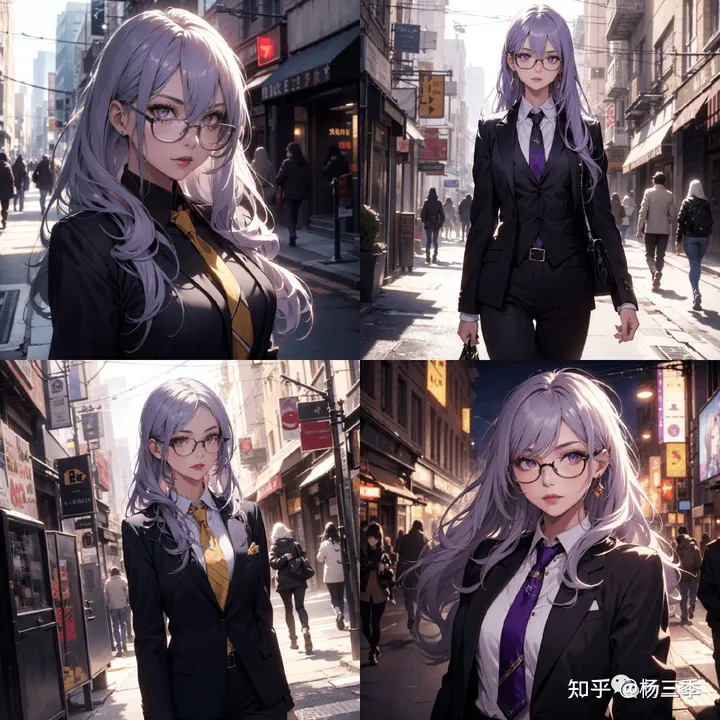
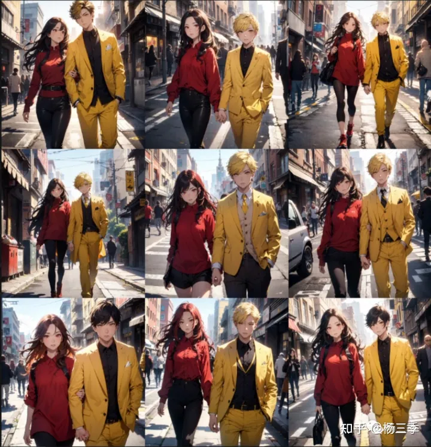

# Stable Diffusion 提示词高阶用法（一）

原文引用：[AI绘画：Stable Diffusion 提示词高阶用法（一） - 知乎 (zhihu.com)](https://zhuanlan.zhihu.com/p/645769166)

> 随着AI技术的日新月异，AI绘画对各个行业的冲击和影响也越来越大。很多人都对如何进行高效的AI绘画并不很了解。作者将通过一个系列对AI绘画「Stable diffusion WebUI 」进行全面分享，希望可以帮助你更高效的进行AI绘画的创作

使用过AI绘画工具的小伙伴都应该知道，想要让AI根据你的要求完成一份靠谱的创作有两大核心要点：「提示词」和「模型」。今天作者将对「提示词」进行全面详细的介绍，作者将基于漫画的创作场景，分享一些**鲜为人知**又**非常实用**的提示词技巧。

## 提示词的基础概念

> 提示词：通过自然语言描述画面的内容，指导AI绘画模型完成符合需求的图片创作。

提示词分为正面提示词（Prompts）和反面提示词（Negative Prompts）。正面提示词代表你希望画面中出现的内容，反面提示词代表你不希望画面中出现的内容。 提示词的识别格式是英文书写，并不支持非英文的内容。提示词可以支持的最小单位是单词。作者想生成一个穿着黄色衬衣的女孩。那么正向提示词为：

```text
1girl, yellow shirt,
```

在书写提示词时，建议通过词组进行组装，而非主从式的语句。通俗的讲：AI模型是通过多个标签矩阵进行绘画创作的。所以主从式的语句段落在AI绘画时得到的结果往往比词组的效果差很多。

## **提示词的基础格式**

网络上很多教程中都提到了书写一个提示词，可以从角色形象，场景特点，画面视角，画风质量进行描述。而以上四类每一类又可以分为若干子类。但你是不是按照这样要求的书写提示词后，进行AI绘画后发现结果不是图崩了就是画的东西跟你写的几乎不是一个东西呢？这可能是以下几个核心点你可能还没有掌握。

1. 提示词权重。
2. 提示词的高级书写技巧。
3. stable diffusion 对提示词的潜规则。
4. 参数的定义和模型的应用。

## **提示词的高级技巧**

接下来作者将通过一个实际案例来介绍一下如何清晰又高效的书写提示词。为了保障案例的准确性，作者将使用同一大模型，同一参数进行介绍（可能导致部分图的细节可能出现崩图的现象）

```text
场景案例：林雨萌下班后走在街边。
```

因为模型是无法识别“林雨萌”是什么，所以作者对林雨萌进行了角色定义。

画面描述：

- 中文：一个女孩，银色长发，紫色眼瞳，眼镜，口红，黄色职业装，纤细的身材, 走路，街道背景，看着屏幕
- 英文：1girl, silver long hair, purple eyes, glasses, lipstick, yellow business_suit, slim body, walking, street_background, looking at viewer,

作者使用的质量描述词：(masterpiece:1. 4, best quality), unity 8k wallpaper, ultra detailed, beautiful and aesthetic, perfect lighting, detailed background, realistic, solo, perfect detailed face, detailed eyes, highly detailed,

最终得到的正面提示词：

> 1girl, silver long hair, purple eyes, glasses, lipstick, yellow business_suit, slim body, walking, street_background, looking at viewer,(masterpiece:1. 4, best quality), unity 8k wallpaper, ultra detailed, beautiful and aesthetic, perfect lighting, detailed background, realistic, solo, perfect detailed face, detailed eyes, highly detailed,

得到的画面：



**可以发现：**

1. 模型在颜色识别中出现了问题，发色被污染为紫色，衣服的颜色没有识别出来。
2. 图1 和 图4 并没有提现出女孩在走路的状态。

### **提示词权重**

针对这样的情况，市面上通用的解决方案是“提示词权重”。

> 提示词权的作用：增加某个词组的在模型识别时的重要程度。

常用的提示词权重书写格式有两大类：“加括号”和“数值控制”。

比如：(silver long hair), 代表 银色长发的权重为1.1 ，再加一层则是1.1的二次方，即：1.21倍。或者使用(silver long hair:1.1), 也是等同的权重。

现在作者对第一次生成使用的提示词进行一些优化。

正面提示词：

> 1girl, (silver long hair), purple eyes, glasses, lipstick, (yellow business_suit:1.4), slim body, (walking), street_background, looking at viewer, (masterpiece:1. 4, best quality), unity 8k wallpaper, ultra detailed, beautiful and aesthetic, perfect lighting, detailed background, realistic, solo, perfect detailed face, detailed eyes, highly detailed,

得到的画面：


可以发现：

1. 图1和图4衣服的颜色已经识别出来了，但头发的颜色依旧被紫色所污染。
2. 图3和图4依旧没有显示出“走”这个动作。

这是为什么呢？因为作者的提示词中：1girl, (silver long hair), purple eyes, glasses, lipstick, (yellow business_suit:1.4), 对于模型来说是一个个独立的标签，相互的关联性全部依赖于模型自身的理解（模型在推算相互的关联是什么）。我们在写提示词时需要通过一些手段让模型更好的理解词与词之间的关联性，才能生成出自己满意的图片。

### **注释用法**

此时作者将介绍一种少有人使用的提示词书写格式；“注释”用法。

> 注释写法：主体\(注释1,注释2\)

基于注释的方式，作者将提示词再一次优化：

- 角色描述：1girl\( (silver long hair), purple eyes, glasses, lipstick, (yellow business_suit:1.4)\),
- 中文含义：一个女孩，这个女孩是银色长发，紫色眼瞳，眼镜，苗条，黄色的职业装。

正面提示词：

> 1girl\((silver long hair),purple eyes, glasses, lipstick, (yellow business_suit:1.4)\), slim body, (walking:1.2), street_background, looking at viewer, full body shot,(masterpiece:1. 4, best quality), unity 8k wallpaper, ultra detailed, beautiful and aesthetic, perfect lighting, detailed background, realistic, solo, perfect detailed face, detailed eyes, highly detailed,

得到的画面：


可以发现：

1. 全部图片的衣服都是黄色为主题，发色的污染程度也得到了大幅度的改善。
2. 全部的图片都已走路为主。

### **LoRA 模型应用**

那现在有没有更进一步的优化的空间呢？在保证当前的稳定下，在提升整体画质呢？此时的你可能想到了在提示词中添加LoRA模型的方式，来提高画面质感。让我们来试试看。为了方便演示，此处我选择了一个灵活度较低的LoRA模型进行演示。

正面提示词：

> 1girl\((silver long hair), lavender eyes, glasses, lipstick, (yellow business_suit:1.4)\), slim body, (walking:1.2), street_background, looking at viewer,(full body shot),(masterpiece:1. 4, best quality), unity 8k wallpaper, ultra detailed, beautiful and aesthetic, perfect lighting, detailed background, realistic, solo, perfect detailed face, detailed eyes, highly detailed, <lora:焰灵姬:0.8>

得到的画面：


可以发现：

1. 整体效果还不错，人物脸型更加细致。
2. 图1 完全没有识别到提示词内容，仅展现了LoRA模型的形象；
3. 图4出现了发色不匹配。

这是为什么呢？这是因为作者使用的LoRA模型的发布者提供参考图中就带有帽子，这里可以理解为这个LoRA模型在使用时如不进行对帽子的特别处理，那就会有一定概率出现帽子。原因可能是训练这个LoRA模型，对帽子的标签处理不够细致。

解决的办法主要有三种：

- 继续降低LoRA模型的权重；
- 在使用LoRA模型时，指定仅调用脸部区域；
- 更换为embeddings模型。

### **LoRA 模型指定适用区域**

这里作者通过控制LoRA Block Weight的应用层级结构的预设，进行LoRA模型指定区域的控制。作者使用的“FACE”标签是通过SDWebUI的插件做了单独的配置。所以可以指定LoRA模型的适用区域。由于逻辑及使用的复杂性，本篇将不过多讲述，后续将单独开篇进行介绍。

正面提示词：

> 1girl\((silver long hair), lavender eyes, glasses, lipstick, (yellow business_suit:1.4)\), slim body, (walking:1.2), street_background, looking at viewer,(full body shot),(masterpiece:1. 4, best quality), unity 8k wallpaper, ultra detailed, beautiful and aesthetic, perfect lighting, detailed background, realistic, solo, perfect detailed face, detailed eyes, highly detailed, <lora:焰灵姬:0.8:FACE>

得到的画面：


可以发现：

1. 整体效果还不错，人物脸型依旧保持使用的焰灵姬的角色形象，且整体画风并未受到LoRA模型的污染。


### **Embeddings 模型应用**

Embeddings模型（文本嵌入模型），一提到Embeddings模型，很多人第一反应是Easynegatvie模型，也就是负面控制模型。其实负面控制仅是Embeddings模型的一种应用方向。而Embeddings模型本身是一个基于特定描述的词组合集。由于Eembeddings模型的特点，基于特定角色的使用效果比LoRA模型的效果对于全局影响要低。所以作者在对多人角色特定时也会时常使用Embeddings模型。

正面提示词：

> (1girl,silver long hair, lavender eyes, yellow glasses),(yellow business_suit:1.4), lipstick, slim body,(walking:1.2),dynamic pose, dynamic angle, street_background, looking at viewer,full body shot,(masterpiece:1. 4, best quality), unity 8k wallpaper, ultra detailed, beautiful and aesthetic, perfect lighting,detailed background, realistic, solo, perfect detailed face, highly detailed, NAMI(0.8),

得到画面：


可以发现：整体画风与使用LoRA模型相比与大模型更加贴近。但衣服颜色以及内搭依旧收到了小模型的影响。这是什么原因呢？根据作者搜索到的资料以及反复测试后发现，这是因为使用小模型时，小模型的固定描述与提示词中的角色描述发生了污染导致的。此时作者给出的解决方案就是手动分组（BREAK）用法。

### **阻断用法**

在Stable Diffusion的提示词输入中，大家都会看见右上角的0/75的字数统计。这是什么意思呢？

> 此处的75代表：Stable Diffusion会将提示词按每75token（token 通俗理解就是输入的字符个数，1个字母/1个符号/1个空格都代表 1个 token）强制分为1组，同一组内，元素的位置和顺序不会影响权重差异，但会影响最终效果。

在这样的情况下，我们在描述一个场景时，可能会超过75token的限制，从而导致同一组提示词被系统强制切分为两组词，因此画面生成达不到预期效果。

此时我们可以使用“阻断（BREAK）”来执行手动分组的操作，让每一组都可以描述完成的一个画面特征，BREAK的好处是可以将两组不同的画面元素的上下文关联切断，从而保证两组元素不会相互污染。**请注意：**在一段描述词中 BREAK 的使用尽量不超过3个，过多的分组会使模型学习时出现混乱，得到自己想要的结果。

正面提示词：

> (1girl, silver long hair, lavender eyes, yellow glasses),(yellow business_suit:1.4), lipstick, slim body,(walking:1.2),dynamic pose, dynamic angle, street_background, looking at viewer, full body shot,
> BREAK
> (masterpiece:1. 4, best quality), unity 8k wallpaper, ultra detailed, beautiful and aesthetic, perfect lighting, detailed background, realistic, solo, perfect detailed face, highly detailed, NAMI(0.8),

得到画面：


可以发现：现在的画面稳定性相对较高，对人物的刻画也非常精致。

# Stable Diffusion｜提示词高阶用法（二）双人同图

> 你「Stable diffusion WebUI 」进行AI绘画时，是不是发现SD对多人画面的识别总是天马行空，没有按照你的提示词进行绘图？今天作者将分享如何通过提示词提高多人图的抽卡率。让SD绘制多人画面不再靠抽卡。

在上一篇中，作者已经介绍了在Stable-diffusion中，不使用任何插件或模型，仅通过提示词（Prompt）的某些高阶写法进行单角色的画面控制技巧。在本次分享中，作者将承接上一篇的内容，介绍通过提示词的高阶用法、以及通过“区域提示词（Regional Prompter）”的使用达到双人图或者某些特定场景的SD绘制图片的**90%出图率**的方式。


## 仅用提示词 - 绘制多人图

与上一篇分享一样，作者依旧将通过一个案例进行双人图撰写的说明，在这个案例中，作者将使用统一的SD参数配置，随机数种子，模型选择以及硬件环境，仅改变“提示词”的部分。

```text
场景案例：张晓晓和王宇下班后走在街上。
```

因为模型是无法识别“张晓晓”和“王宇”是什么，所以作者对“林雨萌”“王宇”进行了角色定义。

- 张晓晓：女孩，红色眼镜，棕色长发，口红，红色衬衣，
- 王宇：男孩，黄色眼睛，黄色短发，黄色职业装，单手插兜，
- 场景：街边，看着镜头，

得到的画面描述：

> 1girl, long brown hair, lipstick, red eyes, red shirt, lipstick,1boy, short yellow hair, yellow eyes, yellow suit, hands in pocket,street_background, looking at viewer,

作者的画质描述词：

> dynamic pose, dynamic angle,(masterpiece:1. 4, best quality), unity 8k wallpaper, ultra detailed, beautiful and aesthetic, perfect lighting,detailed background, realistic,

先看看常规组合是一个什么效果（作者的批次数设为9，即一键生成9张图）。正面提示词：

> 1girl, brown long hair, lipstick, red eyes, red shirt, lipstick,1boy, yellow short hair, yellow eyes, yellow suit, hands in pocket, street_background,looking at viewer, dynamic pose, dynamic angle,(masterpiece:1. 4, best quality), unity 8k wallpaper, ultra detailed, beautiful and aesthetic, perfect lighting,detailed background, realistic,

得到的画面：


可以发现：

- 9张图中，没有1张是双人图，都是单人图。这是为什么呢？

因为提示词中，并没有对画面的人数进行要求，模型在读取这段提示词中，无法判断出这个画面中需要的是1个人，还是2个人。基于这个原因。

**请记住：**在生成多角色图片时，切记要设置“**角色数量**”。如：

> 2个女孩：2girls
> 一对男女：2people\(1girl and 1boy\),
> 一只狗和一个女孩：2characters\(1girl and 1dog\),

**注：**角色设置中的“注释”用法介绍请看：[提示词高阶用法：注释](https://zhuanlan.zhihu.com/p/645769166)

作者增加了一个提示词“角色人数”后，正面提示词：

> 2people\(1girl and 1boy\), 1girl, brown long hair, lipstick, red eyes, red shirt, lipstick,1boy, yellow short hair, yellow eyes, yellow suit, hands in pocket, street_background, looking at viewer, dynamic pose, dynamic angle,(masterpiece:1. 4, best quality), unity 8k wallpaper, ultra detailed, beautiful and aesthetic, perfect lighting, detailed background, realistic,

得到的画面：


可以发现：

- 9张图中，只有2张图出现了双人。抽卡概率不到20%。
- 出现的2张双人图，仅保证了性别是男和女，其他的特征描述都相互污染了。

SD给出这样的结果，原因是虽然提示词中写明了“2个人”，但是并未分别对两个人物进行各自特定的描述（虽然提示词中我们通过先后顺序区分了女孩和男孩的描述，但SD不是这样理解的）。这里作者使用在第一篇内容中的介绍的"**提示词加权**"和"**and**"格式再对提示词进行一次优化后。

正面提示词：

> 2people, (1girl and brown long hair and red eyes and lipstick and red shirt), slim body,(1boy and yellow short hair and yellow eyes and hands in pocket and yellow business_suit),street_background, looking at viewer, dynamic pose, dynamic angle,(masterpiece:1.4, best quality), unity 8k wallpaper, ultra detailed, beautiful and aesthetic, perfect lighting, detailed background, realistic,

得到的画面：


可以发现：

- 9张图中，已经有6张图出现了双人。抽卡概率接近60%
- 出现的6张图，仅保证了男和女，其他的特征描述依旧是相互污染了。

如果单用提示词，不用其他任何辅助手段，目前作者在大量实践后，60%~65%的概率是可以得到多人图，但如果对颜色、动作、服饰、背景道具等特征有指定要求时，抽卡率会大幅度降低。那怎么办呢？

这里作者推荐使用区域提示词（Regional Prompter）的方式来进一步提高抽卡概率。

市面上也有其他解决方案，比如最为大家熟悉的“ControlNet+Openpose”的方式，以及“Multidiffusion”，“ Latent Couple”等插件方式。“ControlNet+Openpose”方式虽然学习成本低，但使用成本较高，需要一些参考图。后两种虽然使用成本不高，但学习成本高，上手难。

而今天作者介绍的区域提示词的方式，学习成本低，且使用成本也不高。

## 区域提示词 - 绘制多人图

先让我们看一下上述提示词在使用区域提示词（Regional Prompter）的方式后的生成效果和抽卡概率。


可以发现：

- 连续生成的9张图中，全部出现了双人。双人图抽卡概率100%
- 每张图都保证左右的男女位置恒定，且对服装款式，发型等明显特征都被固定了。
- 图1和图6完全按照提示词要求进行图片生成。

使用区域提示词（Regional Prompter）来进行SD的AI绘画是不是很nice？下面作者将介绍这个插件的使用方式和如何利用这个插件进行上述案例的提示词书写。

### **1.安装方式**


Regional Prompter 插件的下载地址：

[hako-mikan/sd-webui-regional-prompter: set prompt to divided region (github.com)](https://github.com/hako-mikan/sd-webui-regional-prompter)

你可以将这个插件下载后，放在Stable-Diffusion-WebUI的本地存储的插件文件夹中。重启SDWebUI后，就可以在插件模块中看到这个插件了。

### **2.参数简介**


在文生图页面的插件区域中，首先单击打开“Regional Prompter”这个插件。我们可以看到上图这样的一个参数配置模块。作者将简单介绍一下这里的参数作用。

**生成模式：**Generation modeAttention 模式 和 Latent 是两种不同的生成模式，作者并不是深度学习的从业者，对底层原理并不是很了解。就不在这班门弄斧了。作者只能通过实践总结一下这两个模式的区别。

- Attention 模式：生成的图像画面具有更好的一致性，生成的速度也更快。耗时大概是Latent 模式的三分之一。
- Latent 模式：生成的图像画面，分区更为明显。如果你想在分区使用LoRA时，建议选择这个模式。如果你想生成一些具有冲击感的画面时，Latent更加合适。

**区域提示词：**Region Prompt，各个区域对应子提示词。

**公共提示词：**Common Prompt，各个区域中重复的提示词，即代表公共提示词。公共提示词常用于描述画质画风。

**基础提示词：**Base Prompt，基础提示词是根据基础比率，插入到各个区域提示词中。基础提示词常用于描述背景和场景。使用基础提示词需要用到基础比率（base Ratio）。基础比率默认是 0.2，代表生成的图像将包含 20%*BASE PROMPT + 80%*REGION PROMPT。基础比率可以指定每个区域的基础提示词的权重。

**分割模式：**Divide mode，分割方式分为“水平分割（horizontal）”和“垂直分割（Vertical）”；分割维度分为“一维分割”和“二维分割”。分割方法是通过分割比率（Divide Ratio）进行的。

比如你在分割比率中输入1,1,1，图像将被分为三个相等的区域（33,3%, 33,3%, 33,3%）；如果输入3,1,1，图像将被分为60%、20%和20%。为了获得最大的精度，你可以输入与高度/宽度（分别为垂直/水平模式）相对应的像素值。

如果你要启用二维分割，你可以使用;分隔符来自动激活 2D 区域模式。例如：

> 你选中水平分割（horizontal）；并在分割比率（Divide Ratio）输入：**1**,1,1,1**;2**,1,2

代表：

> 你将画面分为两行，两行的高度比为“1:2”；
> 第一行分为三列，三列的宽度比为“1:1:1”；
> 第二行分为两列，两列的宽度比为“1:2”。

本篇因为不使用蒙版模式和提示词模式，因此将不会进一步介绍。有兴趣的朋友，可以留言给作者，看情况是否要单独开一篇分享一些使用技巧和经验。

### **3.操作方法**


- **第一步：**启动“Regional Prompter”插件服务。即勾选“Active”；
- **第二步：**选择生成模式，因为作者要生成的图片的背景是需要有连贯性的，所以在“Generation mode”选择“Attention”；
- **第三步：**选择使用公共提示词，勾选“Use common prompt”，其他不用勾选；
- **第四步：**因为作者的双人场景是左右布局的，所以在split mode 选中“Horizontal”；
- **第五步：**基于作者的意愿将画布分为左右两个等宽的区域，将“Divide Ratio”设为“1,1”，
- **第六步：**点击“visualize and make template” ，如上图所示，生成一个水平分成两个相等区域的画布。并标记子区域的编号。

可以看到画布被分为蓝红两个区域，红色区域标记为0，蓝色区域标记为1，并且在左侧的模板展示区域（template）中显示：“ADDCOMM”和“ADDCOL”。那提示词应该怎么写呢？书写格式：

> 公共提示词部分，ADDCOMM
> 蓝色区域提示词部分，ADDCOL
> 红色区域提示词部分，

基于上文的案例，作者在正面提示词中输入下面的内容：

> 2people\(1boy and 1girl\),walking,(street_background:1.3),(looking at viewer), dynamic pose, dynamic angle,(masterpiece:1.4, best quality), unity 8k wallpaper, ultra detailed, beautiful and aesthetic, perfect lighting,detailed background, realistic,
> BREAK
> 1girl, red long hair and red eyes and (red shirt:1.3),
> BREAK
> 1boy, yellow short hair and yellow eyes and (yellow suit:1.3) and hands in pocket,

得到画面：



可以看到区域提示词的强大之处了吧。

在作者又给男女角色添加了对应LoRA模型后，最终得到了下面这样的效果。


区域提示词不光在双人场景图中效果显著，在某些特定需求的绘图场景中，依然非常靠谱，比如以下2张图都是使用区域提示词生成的。

**御龙少年：**Attention 模式&垂直分割


**机甲少女：**Latent 模式&水平分割


**少女与狗：**Attention 模式&水平分割


# Stable Diffusion｜提示词高阶用法（三）角色指定

> 你「Stable diffusion WebUI 」进行AI绘画时，是不是发现人物角色的形象很难控制？即使你输入了“1girl”或“1boy”后，生成的内容依旧与你输入的提示词不同。今天作者将分享如何通过提示词稳定人物角色形象。让通过SDWebUI批量生图时，不再因此而烦恼。

在上一篇中，作者已经介绍了在Stable-diffusion中，不使用任何插件或模型，仅通过提示词（Prompt）的某些高阶写法进行单角色的画面控制技巧。而在本次分享中，作者将基于上一篇的内容，介绍一下如何通过提示词对人物角色进行控制，让你在进行故事性的图文创作时，对故事角色进行更好的控制。

## 人物年龄控制


在Stable Diffusion 中，大家对于人物年龄控制的常用方式是输入以下内容：

```text
女孩：1girl，
男孩：1boy，
婴儿：1baby，
成熟男性：1mature male，
成熟女性：1mature female
```

但在一些特殊场景中，以上的方式就很难生出你想要的人物年龄。这时候应该怎么办呢？作者将通过“注释”的方式介绍一下如何固定角色年龄（“注释”用法介绍请看：[提示词高阶用法：注释](https://zhuanlan.zhihu.com/p/645769166)）

### 青少年角色

作者首选通过设置角色年龄来进行区分：


```text
1个10岁的女孩：1girl\(10year old\),
```


```text
1个10岁的男孩：1boy\(10year old\),
```

在固定使用男孩或女孩后，不停的更换其年龄值，可以发现：

- 女孩：脸部特点在低于10岁或超过30岁时，并不会随着年龄的改变有明显变化；
- 男孩：脸部特点在低于10岁以及30~60时，并不会随着年龄的改变有明显变化；

因此女孩（1girl）& 男孩（1boy），适合用于青少年（18~35岁）的角色定位。

### 儿童角色

那如何进行3岁左右的幼童或者十二三岁的小孩子的描述呢？这里就要参考英文中对不同年龄段的人群的单词定义：

> **toddler**：蹒跚学步的孩子，一般指1-3岁。
> **teenager：**青少年对应13-19（即thirteen - nineteen），简称为teens。


可以发现：

- 在使用toddler 和 teenager 后，分别得出了很形象的幼童和少年的人物形象；
- 在作者实验中发现，如果为添加年龄的描述和性别的描述，得出的画面会存在一定随机性；

因此最终作者得到的关于幼童和少年的提示词：

```text
幼女：1toddler\(1girl, 1year old\)
幼童：1toddler\(1boy, 1year old\)
少女：1teenager\(1girl, 13year old\)
少年：1teenager\(1boy, 13year old\)
```

### 中老年角色

现在我们看看关于中年和老年，我们应该如何定义。


对于中年人，这里作者使用了成年男性（mature male）和成年女性（mature female）来进行测试。

从上图可以看出：

- 40~60岁这个区间中，“mature male & mature female”表现远优于“boy & girl”；
- 在大于60岁后，“mature male”表现依旧很好，而“mature female”的表现就相差甚远；

因此对应老年人，作者使用了“elderly”这个词进行测试：


最终作者得到的关于中年和老年的提示词：

```text
中年男性：1mature male\(40year old\)
中年女性：1mature female\(40year old\)
老爷爷：1elderly\(female, 80year old\)
老奶奶：1elderly\(male, 80year old\)
```

## 人物身材控制


关于身材控制，作者通过实践，总结了以上三种最常见的身材类型：

```text
标准/纤细：slim body,
中年女性：muscular,
老爷爷：fat body, stomach,
```

## 人物肤色控制


关于肤色控制，作者通过实践，总结了以上四种最常见的身材类型：

```text
苍白肤色：pale skin,
白嫩肤色：white skin,
古铜肤色：tan skin,
南非肤色：black skin,
```

## 人物头发控制

### 发色


人物发色这个部分，网络中已经有很多Up的分享中都提到了，这里作者基于二次元的人物场景再分享一些更详细的发色选择。

**白色系**


**棕色系**


**黄色系**


**橙色系**


**粉红系**


**紫色系**


**蓝色系**


**绿色系**


### 发型

发色的分享暂时就到这里。再来说说发型，作者一共实践并整理了38种发型。本文将简单介绍几款常用发型。

**女士发型**


### 男士发型


常用的发型就介绍到这里，其他的发型可以在作者的“提示词生成器”中查看。

## 服装

关于头发的分享暂时就到这里。再来说说服装，作者一共实践并整理了115种服装。本文将简单介绍几款常用服装。


其他的服装类提示词，你可以在作者开发的提示词生成器中查看。


关于人物描述的分享就简单分享到这里，人物描述中，还有表情、动作姿态、五官等细分描述词。关于这几类描述词，如果仅用单一词组，在 Stable-Diffusion中的识别并不是很友好，所以作者将另起一篇进行介绍，如何通过某些特定的单词组合进行特定场景的描述。

# Stable Diffusion｜提示词高阶用法（四）LoRA指定区域

> 你可能在使用LoRA模型时，总会因为LoRA的特定风格，影响到画面原本的人物形象，导致你可能需要不停的找新的LoRA模型去实验。作者本篇将会从“LoRA模型的分层控制”来介绍，如何在使用特定的LoRA模型，也可以不影响到画面原本的人物形象。如同下图这样的案例。


“LoRA分层控制”的教程，网络上已经有各路大佬总结过一些自己的分享了，不过在作者一一细品后，感觉都非常的学术派。在本篇作者就不再继续介绍学术理论了。感兴趣的朋友可以自行在B站或GitHub上查看相关的技术分享。

[hako-mikan/sd-webui-lora-block-weight (github.com)](https://github.com/hako-mikan/sd-webui-lora-block-weight)

作者本次分享将继续承接之前的AI漫画业务场景，介绍如何通过**“LoRA分层控制”**来进行角色形象风格的设定。

在介绍实操经验前，作者先简单介绍一下“如何使用LoRA模型的分层控制。”

众所周知，LoRA模型的标准使用格式为：

```text
<lora:LoRA模型的名称:LoRA权重值>
```

而LoRA模型的分层控制，则是在LoRA权重值后，增加“:”，并添加的LoRA模型的17个分层的对应权重值代码。

```text
<lora:LoRA模型的名称:LoRA权重值:分层权重值代码>
```


如下表所示，LoRA的17个分层中，第一层是BASE层，也可以成为是开关层。代表这如果BASE层为0时，后面16层不管如何设置，LoRA的分层控制都无法使用。网上有一些大佬，强烈建议将开关层必须写为1（额...），这个作者持保留意见。

作者在多种LoRA模型的多轮实践后，推荐在二次元的AI绘画中，BASE层设为0.6，较为稳妥。如果这个值小于0.6，那么LoRA模型的特征将被淡化接近为无，如果大于0.6，比如为1时，LoRA模型的其他并不是你想要的特征将被放大。

如下图所示，作者在使用时，将17层权重值代码分为两部分：**分层权重值（BASE层） + 分层代码（2~17层）**


## LoRA模型的应用场景

在二次元漫画的AI绘画场景中，LoRA模型主要用于让我们轻松画出特定的角色形象、场景穿搭、色彩画风。

那么我们将一个人物LORA的特征分下类 (人物LORA为例，容易理解）

**角色容貌**：主要为人物的脸型、五官等，有时候还伴有特定的表情和发型发饰。

**角色服饰**：主要为特定的服饰，比如机甲衣、汉服等；

**画面风格**：常见的画风多为仙侠风，国风，midjourney风格等；

## LoRA ｜ 角色容貌

```text
分层权重值（BASE层）：0.6
分层代码（2~17层）：0,0,0,0,0,0,0,1,1,1,0,0,0,0,0,0
```

案例：

作者想生成的场景：一个穿着职业装的长发女孩下班后，走着街道。

画面描述：

- 中文：一个女孩，银色长发，紫色眼瞳，眼镜，口红，黄色职业装，纤细的身材, 走路，街道背景，看着屏幕
- 英文：1girl, silver long hair, purple eyes, glasses, lipstick, yellow business_suit, slim body, walking, street_background, looking at viewer,

```text
(1girl, silver long hair, purple eyes, glasses),(yellow business_suit:1.4), lipstick, slim body, dynamic pose, dynamic angle,(street_background:1.3), (looking at viewer),
BREAK
(masterpiece:1.4, best quality), unity 8k wallpaper, ultra detailed, beautiful and aesthetic, perfect lighting, detailed background, realistic, solo, perfect detailed face, detailed eyes, highly detailed,  
<lora:害羞脸:0.8:0.6,0,0,0,0,0,0,0,1,1,1,0,0,0,0,0,0>
```


可以发现：

- 不使用LoRA的分层控制（不指定调用区域）时，LoRA模型影响了原本画面的结构（人物的姿态、发色、服装颜色等）；
- 使用LoRA的分层控制（指定调用脸部区域）后，LoRA模型仅影响了原本画面人物的脸部区域；
- 在使用LoRA的分层控制后，并将BASE层数值从 0.6 调整至 1.0 后，LoRA模型除影响了原本画面人物的脸部区域外，还影响了姿态、发色。

因此，作者建议BASE层数值的默认值设为 0.6 ，因为不同的LoRA模型的训练的拟合程度不同，所以作者建议你使用时，也不能一味照搬，还是要基于实际结果调整。

------

## LoRA ｜ 角色服饰

```text
分层权重值（BASE层）：0.6
分层代码（2~17层）：1,1,1,1,0,0.2,0,0.8,1,1,0.2,0,0,0,0,0
```

案例：

沿用上面的案例，作者希望女孩的服装不要太正式，时尚一点。因此此次加入了一个服装LoRA。

LoRA模型的地址：

[www.tusi.art](https://www.tusi.art/models/605263116525128948)

```text
(1girl, silver long hair, purple eyes, glasses),(yellow business_suit:1.4), lipstick, slim body, dynamic pose, dynamic angle,(street_background:1.3), (looking at viewer),
BREAK
(masterpiece:1.4, best quality), unity 8k wallpaper, ultra detailed, beautiful and aesthetic, perfect lighting, detailed background, realistic, solo, perfect detailed face, detailed eyes, highly detailed,  
<lora:肚兜_shidudou:0.8:0.6,1,1,1,1,0,0.2,0,0.8,1,1,0.2,0,0,0,0,0>  
```


可以发现：

- 不使用LoRA的分层控制（不指定调用区域）时，LoRA模型由于其训练特征，几乎影响了原本画面中的角色的全部特征（人物的姿态、发色、服装颜色等）；
- 使用LoRA的分层控制（指定调用服装区域）后，LoRA模型除影响了原本画面人物的服装的内搭区域，其他部分影响很小；
- 在使用LoRA的分层控制后，并将BASE层数值从 0.6 调整至 1.0 后，LoRA模型除影响了原本画面人物的服装的内搭区域，对服装款式影响较大；

## LoRA ｜ 画面风格

```text
分层权重值（BASE层）：0.6
分层代码（2~17层）：0,0,0,0.1,0.2,0,0,0,0,0.1,1,1,1,1,1,1 
```

案例：

沿用上面的案例，作者希望整个画面有一种春天的温暖感。因此此次加入了一个风格LoRA。

LoRA模型的地址：

[www.tusi.art](https://www.tusi.art/models/610809727502360072)

```text
(1girl, silver long hair, purple eyes, glasses),(yellow business_suit:1.4), lipstick, slim body, dynamic pose, dynamic angle,(street_background:1.3), (looking at viewer),
BREAK
(masterpiece:1.4, best quality), unity 8k wallpaper, ultra detailed, beautiful and aesthetic, perfect lighting, detailed background, realistic, solo, perfect detailed face, detailed eyes, highly detailed,  
 <lora:繁荣景象:0.8:0.6,0,0,0,0.1,0.2,0,0,0,0,0.1,1,1,1,1,1,1>
```


可以发现：

- 不使用LoRA的分层控制（不指定调用区域）时，LoRA模型由于其训练特征，几乎影响了原本画面中的角色的全部特征（人物的姿态、发色、服装颜色等）；
- 使用LoRA的分层控制（指定调用上色层级）后，LoRA模型除对原本画面整体画风进行影响外，其他部分影响很小；

本期就介绍这三种较为通用的LoRA模型分层控制的案例，在作者的调研中，LoRA分层还可以指定特定姿态动作的调用，也可以反向调用，比如LoRA模型仅影响除头部以外的区域。但由于这几类分层代码的适用性不如以上三种的适用性高，因此作者就不在此次展开介绍了。有兴趣的朋友可以留言交流，也可以关注我的公众号 

[@杨三季](https://www.zhihu.com/people/b8267114c130320233044f2d6683bc2f)

 留言与我交流。


## 下期介绍

对于LoRA模型分层控制的实操就先介绍到这，下一篇将会介绍如何通过 Stable Diffusion 提示词生成特定的情绪表情以及画面视角的实操技巧。

