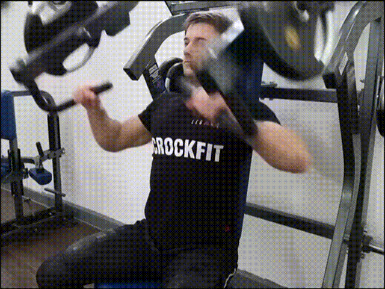
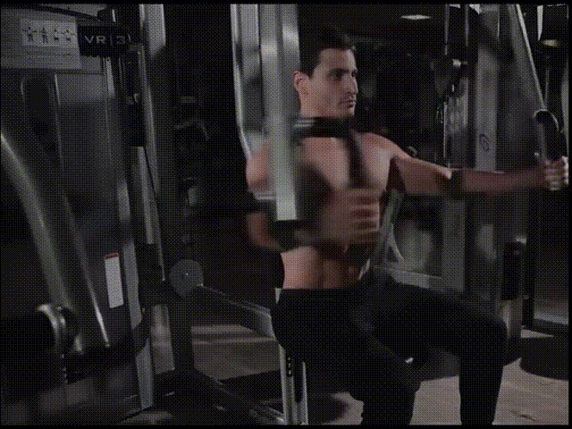
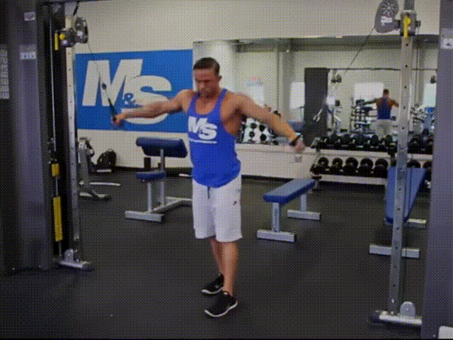
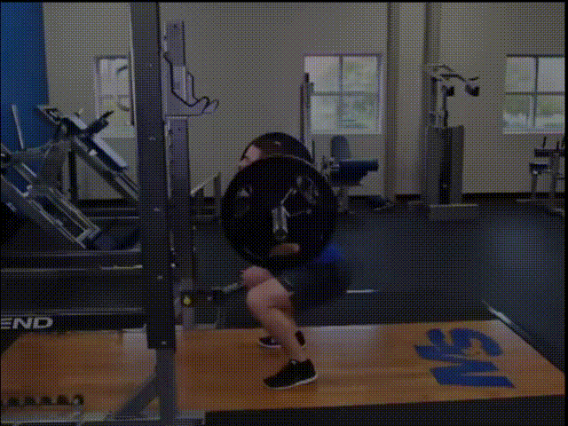
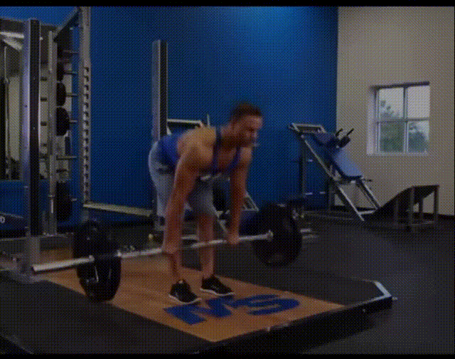
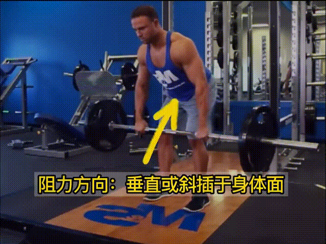
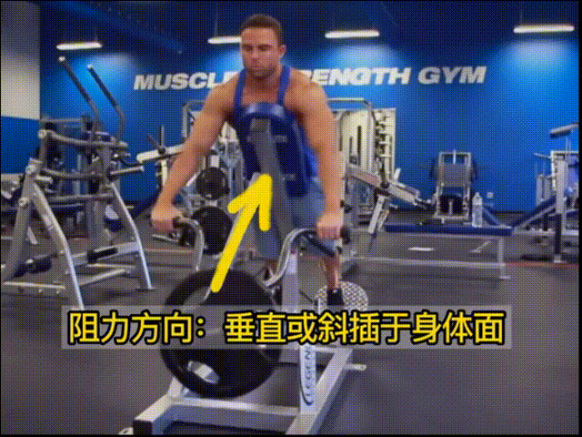
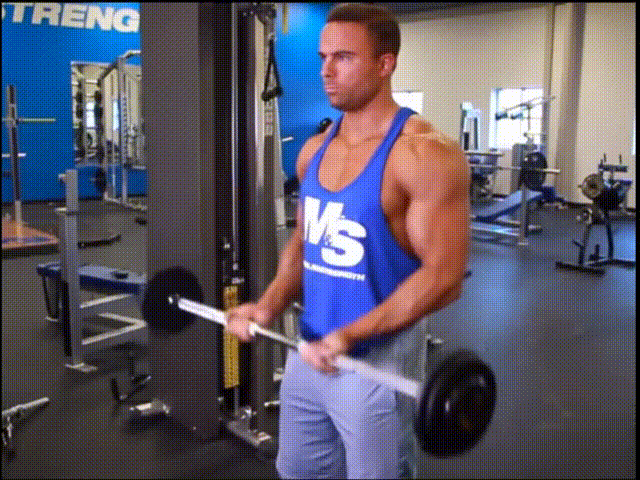
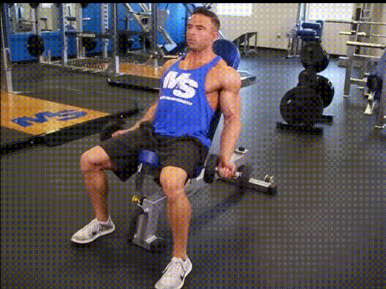

https://www.bilibili.com/video/BV19L4y1w7zN/?spm_id_from=333.337.search-card.all.click&vd_source=1b732552b2e7da5edcc8398add8181dd

# 动作模式

## 胸

| 胸   | 动作                                                    |
| ---- | ------------------------------------------------------- |
| 推胸 | 杠铃卧推 哑铃卧推 双杠臂屈伸 俯卧撑 史密斯卧推 器械推胸 |
| 夹胸 | 蝴蝶机夹胸 龙门架夹胸                                   |

**推胸VS夹胸**
	推胸压迫和刺激能力更强
	推胸是复合动作可以发挥肌肉协同
	三分化组数有限基本不能让给夹胸
	夹胸可做两三组作为胸部热身的一部分

### 杠铃卧推

### 器械推胸

### 双杠臂推胸

### 蝴蝶机夹胸

### 龙门架夹胸

## 腿

| 腿   | 动作                                     |
| ---- | ---------------------------------------- |
| 前侧 | 杠铃深蹲 器械腿屈伸 哈克机 倒蹬机 箭步蹲 |
| 后侧 | 直腿硬拉 器械腿弯举 哈克机 倒蹬机 箭步蹲 |

### 杠铃深蹲

### 直腿硬拉

## 肩前束

| 肩前束 | 动作                                            |
| ------ | ----------------------------------------------- |
| 推举   | 哑铃推举 杠铃推举器械推举 史密斯推举            |
| 前平举 | 哑铃前平举 杠铃前平举杠 铃片前平举 龙门架前平举 |

## 肩中束

| 肩中束 | 动作                                            |
| ------ | ----------------------------------------------- |
| 推举   | 哑铃推举 杠铃推举 器械推举 史密斯推举           |
| 提拉   | 杠铃提拉 龙门架提拉                             |
| 侧平举 | 哑铃侧平举 短杠铃侧平举 器械侧平举 龙门架侧平举 |

## 肩后束

| 肩后束 | 动作                                                     |
| ------ | -------------------------------------------------------- |
| 飞鸟   | 哑铃俯身飞鸟 龙门架站姿飞鸟蝴蝶机反向飞鸟 龙门架俯身飞鸟 |
| 划船   | 高位宽距划船                                             |
| 面拉   | 龙门架绳索面拉                                           |

## 背

| 背   | 动作                                                      |
| ---- | --------------------------------------------------------- |
| 下拉 | 引体向上 高位下拉 器械下拉 龙门架下拉                     |
| 划船 | 杠铃划船 哑铃划船 器械划船 T杆划船 坐姿钢线划船 T麒麟抱拉 |

### 高位下拉

### 引体向上

### 杠铃划船

### 器械划船

## 手

| 手     | 动作                                                         |
| ------ | ------------------------------------------------------------ |
| 弯举   | 杠铃弯举 哑铃弯举 集中弯举 牧师椅弯举 器械弯举 龙门架弯举    |
| 臂屈伸 | 窄距卧推 双杠臂屈伸 杠铃臂屈伸 龙门架过顶臂屈伸 哑铃颈后臂屈伸 龙门架直杆下压 |

### 站姿杠铃弯举

### 坐姿哑铃弯举

### 双杠臂屈伸

### 龙门架直杆下压

### 哑铃颈后臂屈伸

# 四分化训练计划

Day1
背：两个下拉 + 一个划船		4 * 8 
	高位下拉 器械划船 半程硬拉

肩后束：								4 * 8 
	蝴蝶机反向飞鸟  哑铃俯身飞鸟
