# 16  Computer Animation  电脑动画

Animation is derived from the Latin anima and means the act, process, or result of imparting life, interest, spirit, motion, or activity. Motion is a defining property of life and much of the true art of animation is about how to tell a story, show emotion, or even express subtle details of human character through motion. A computer is a secondary tool for achieving these goals—it is a tool which a skillful animator can use to help get the result he wants faster and without concentrating on technicalities in which he is not interested. Animation without computers, which is now often called “traditional” animation, has a long and rich history of its own which is continuously being written by hundreds of people still active in this art. As in any established field, some time-tested rules have been crystallized which give general high-level guidance to how certain things should be done and what should be avoided. These principles of traditional animation apply equally to computer animation, and we will discuss some of them in this chapter. 
动画源自拉丁语anima，意为赋予生命、兴趣、精神、运动或活动的行为、过程或结果。 运动是生命的一个决定性属性，动画的大部分真正艺术是关于如何通过运动讲述故事、表达情感，甚至表达人类性格的微妙细节。 计算机是实现这些目标的辅助工具——熟练的动画师可以使用它来帮助更快地获得他想要的结果，而无需专注于他不感兴趣的技术细节。 没有计算机的动画现在通常被称为“传统”动画，它有自己悠久而丰富的历史，数百名仍然活跃在这一艺术领域的人不断地创作它。 与任何已建立的领域一样，一些经过时间考验的规则已经具体化，这些规则为应该如何做某些事情以及应该避免什么事情提供了一般性的高级指导。 传统动画的这些原则同样适用于计算机动画，我们将在本章中讨论其中的一些原则。

The computer, however, is more than just a tool. In addition to making the animator’s main task less tedious, computers also add some truly unique abilities that were simply not available or were extremely difficult to obtain before. Modern modeling tools allow the relatively easy creation of detailed three-dimensional models, rendering algorithms can produce an impressive range of appearances, from fully photorealistic to highly stylized, powerful numerical simulation algorithms can help to produce desired physics-based motion for particularly hard to animate objects, and motion capture systems give the ability to record and use real-life motion. These developments led to an exploding use of computer animation techniques in motion pictures and commercials, automotive design and architecture, medicine and scientific research, among many other areas. Completely new domains and applications have also appeared including fully computer-animated feature films, virtual/augmented reality systems, and, of course, computer games. 
然而，计算机不仅仅是一个工具。 除了使动画师的主要任务变得不那么乏味之外，计算机还添加了一些真正独特的能力，这些能力以前根本不可用或极难获得。 现代建模工具可以相对轻松地创建详细的三维模型，渲染算法可以产生令人印象深刻的外观范围，从完全真实的到高度风格化的，强大的数值模拟算法可以帮助产生所需的基于物理的运动，特别是难以制作动画的运动 对象和动作捕捉系统提供了记录和使用现实生活中的动作的能力。 这些发展导致计算机动画技术在电影和广告、汽车设计和建筑、医学和科学研究以及许多其他领域中得到爆炸性的应用。 全新的领域和应用也出现了，包括完全计算机动画的故事片、虚拟/增强现实系统，当然还有计算机游戏。

Other chapters of this book cover many of the developments mentioned above (for example, geometric modeling and rendering) more directly. Here, we will provide an overview only of techniques and algorithms directly used to create and manipulate motion. In particular, we will loosely distinguish and briefly describe four main computer animation approaches:
本书的其他章节更直接地涵盖了上面提到的许多发展（例如，几何建模和渲染）。 在这里，我们将仅概述直接用于创建和操纵运动的技术和算法。 特别是，我们将松散地区分并简要描述四种主要的计算机动画方法：

- **Keyframing** gives the most direct control to the animator who provides necessary data at some moments in time and the computer fills in the rest. 
  **关键帧**为动画师提供了最直接的控制，动画师在某些时刻提供必要的数据，然后由计算机填充其余部分。
- **Procedural** animation involves specially designed, often empirical, mathematical functions and procedures whose output resembles some particular motion. 
  **程序**动画涉及专门设计的、通常是经验性的数学函数和程序，其输出类似于某些特定的运动。
- **Physics-based** techniques solve differential equation of motion. 
  **基于物理的**技术求解运动微分方程。
- **Motion capture** uses special equipment or techniques to record real-world motion and then transfers this motion into that of computer models.
  **动作捕捉**使用特殊设备或技术来记录现实世界的运动，然后将该运动转换为计算机模型的运动。

We do not touch upon the artistic side of the field at all here. In general, we cannot possibly do more here than just scratch the surface of the fascinating subject of creating motion with a computer. We hope that readers truly interested in the subject will continue their journey well beyond the material of this chapter.
我们在这里根本不涉及该领域的艺术方面。 总的来说，我们在这里只能做一些简单的事情，即用计算机创造运动这一令人着迷的主题。 我们希望真正对该主题感兴趣的读者能够在本章内容之外继续他们的旅程。

## 16.1 Principles of Animation 动画原理

In his seminal 1987 SIGGRAPH paper (Lasseter, 1987), John Lasseter brought key principles developed as early as the 1930’s by traditional animators of Walt Disney studios to the attention of the then-fledgling computer animation community. Twelve principles were mentioned: squash and stretch, timing, anticipation, follow through and overlapping action, slow-in and slow-out, staging, arcs, secondary action, straight-ahead and pose-to-pose action, exaggeration, solid drawing skill, and appeal. Almost two decades later, these time-tested rules, which can make a difference between a natural and entertaining animation and a mechanistic-looking and boring one, are as important as ever. For computer animation, in addition, it is very important to balance control and flexibility given to the animator with the full advantage of the computer’s abilities. Although these principles are widely known, many factors affect how much attention is being paid to these rules in practice. While a character animator working on a feature film might spend many hours trying to follow some of these suggestions (for example, tweaking his timing to be just right), many game designers tend to believe that their time is better spent elsewhere. 
约翰·拉塞特 (John Lasseter) 在 1987 年发表的开创性 SIGGRAPH 论文（Lasseter，1987）中，将华特迪士尼工作室的传统动画师早在 1930 年代就制定的关键原则引起了当时刚刚起步的计算机动画界的注意。 提到了十二个原则：挤压和伸展、时机、预期、跟随和重叠动作、慢进和慢出、分段、弧线、辅助动作、直行和姿势动作、夸张、扎实的绘画技巧 ，并上诉。 近二十年后，这些经过时间考验的规则一如既往地重要，它们可以区分自然且有趣的动画和看起来机械而无聊的动画。 此外，对于计算机动画来说，充分利用计算机的能力来平衡赋予动画师的控制力和灵活性非常重要。 尽管这些原则广为人知，但许多因素影响着实践中对这些规则的关注程度。 虽然制作故事片的角色动画师可能会花费大量时间尝试遵循其中一些建议（例如，将时间调整到恰到好处），但许多游戏设计师倾向于认为他们的时间最好花在其他地方。

### 16.1.1 Timing 计时

Timing, or the speed of action, is at the heart of any animation. How fast things happen affects the meaning of action, emotional state, and even perceived weight of objects involved. Depending on its speed, the same action, a turn of a character’s head from left to right, can mean anything from a reaction to being hit by a heavy object to slowly seeking a book on a bookshelf or stretching a neck muscle. It is very important to set timing appropriate for the specific action at hand. Action should occupy enough time to be noticed while avoiding too slow and potentially boring motions. For computer animation projects involving recorded sound, the sound provides a natural timing anchor to be followed. In fact, in most productions, the actor’s voice is recorded first and the complete animation is then synchronized to this recording. Since large and heavy objects tend to move slower than small and light ones (with less acceleration, to be more precise), timing can be used to provide significant information about the weight of an object. 
时间或动作速度是任何动画的核心。 事情发生的速度会影响行动的意义、情绪状态，甚至所感知到的物体的重量。 根据其速度，相同的动作（角色从左向右转动头部）可能意味着任何事情，从被重物击中的反应到慢慢地在书架上寻找一本书或伸展颈部肌肉。 为当前的具体行动设置适当的时间非常重要。 动作应该占据足够的时间来引起注意，同时避免太慢和可能无聊的动作。 对于涉及录制声音的计算机动画项目，声音提供了要遵循的自然定时锚点。 事实上，在大多数制作中，首先录制演员的声音，然后将完整的动画同步到该录音。 由于大而重的物体往往比小而轻的物体移动得慢（更精确地说，加速度较小），因此可以使用计时来提供有关物体重量的重要信息。

### 16.1.2 Action Layout 动作布局

At any moment during an animation, it should be clear to the viewer what idea (action, mood, expression) is being presented. Good staging, or high-level planning of the action, should lead a viewer’s eye to where the important action is currently concentrated, effectively telling him “look at this, and now, look at this” without using any words. Some familiarity with human perception can help us with this difficult task. Since human visual systems react mostly to relative changes rather than absolute values of stimuli, a sudden motion in a still environment or lack of motion in some part of a busy scene naturally draws attention. The same action presented so that the silhouette of the object is changing can often be much more noticeable compared with a frontal arrangement (see Figure 16.1 (bottom left)). 
在动画制作过程中的任何时刻，观看者都应该清楚所呈现的想法（动作、情绪、表情）。 好的舞台表演，或者对动作的高层次规划，应该引导观众的注意力集中在重要动作当前集中的地方，有效地告诉他“看这个，现在，看这个”，而无需使用任何语言。 对人类感知的一些熟悉可以帮助我们完成这项艰巨的任务。 由于人类视觉系统主要对相对变化而不是刺激的绝对值做出反应，因此静止环境中的突然运动或繁忙场景中某些部分缺乏运动自然会引起注意。 与正面排列相比，相同的动作使物体轮廓发生变化通常会更加明显（见图 16.1（左下））。

Figure 16.1. Action layout. Left: Staging action properly is crucial for bringing attention to currently important motion. The act of raising a hand would be prominent on the top but harder to notice on the bottom. A change in nose length, on the contrary, might be completely invisible in the first case. Note that this might be intentionally hidden, for example, to be suddenly revealed later. Neither arrangement is particularly good if both motions should be attended to. Middle: The amount of anticipation can tell much about the following action. The action which is about to follow (throwing a ball) is very short, but it is clear what is about to happen. The more wound up the character is, the faster the following action is perceived to be. Right: The follow-through phase is especially important for secondary appendages (hair) whose motion follows the leading part (head). The motion of the head is very simple, but leads to nontrivial follow-through behavior of the hair itself. It is impossible to create a natural animation without a follow-through phase and overlapping action in this case. Figure courtesy Peter Shirley and Christina Villarruel.
图 16.1。 动作布局。 左：正确地安排行动对于引起人们对当前重要行动的关注至关重要。 举手的动作在顶部会很明显，但在底部很难注意到。 相反，在第一种情况下，鼻子长度的变化可能是完全看不见的。 请注意，这可能是故意隐藏的，例如稍后突然透露。 如果两项动议都应得到关注，那么这两种安排都不是特别好。 中：预期的程度可以很大程度上说明接下来的行动。 接下来的动作（扔球）很短，但很清楚将要发生什么。 角色越紧张，接下来的动作就越快。 右：跟随阶段对于次要附属物（头发）尤其重要，因为次要附属物（头发）的运动跟随主导部分（头部)。 头部的运动非常简单，但会导致头发本身的不平凡的跟随行为。 在这种情况下，如果没有后续阶段和重叠动作，就不可能创建自然的动画。 图片由 Peter Shirley 和 Christina Villarruel 提供。

On a slightly lower level, each action can be split into three parts: anticipation (preparation for the action), the action itself, and follow-through (termination of the action). In many cases, the action itself is the shortest part and, in some sense, the least interesting. For example, kicking a football might involve extensive preparation on the part of the kicker and long “visual tracking” of the departing ball with ample opportunities to show the stress of the moment, emotional state of the kicker, and even the reaction to the expected result of the action. The action itself (motion of the leg to kick the ball) is rather plain and takes just a fraction of a second in this case. 
在稍低的层面上，每个动作可以分为三个部分：预期（动作的准备）、动作本身和后续（动作的终止）。 在许多情况下，动作本身是最短的部分，从某种意义上说，也是最无趣的。 例如，踢足球可能需要踢球者进行大量准备，并对离去的球进行长时间的“视觉跟踪”，有足够的机会显示踢球者当时的压力、情绪状态，甚至对预期的反应 行动的结果。 动作本身（腿踢球的动作）相当简单，在这种情况下只需要几分之一秒。

The goal of anticipation is to prepare the viewer for what is about to happen. This becomes especially important if the action itself is very fast, greatly important, or extremely difficult. Creating a more extensive anticipation for such actions serves to underscore these properties and, in case of fast events, makes sure the action will not be missed (see Figure 16.1 (bottom center)). In real life, the main action often causes one or more other overlapping actions. Different appendages or loose parts of the object typically drag behind the main leading section and keep moving for a while in the follow-through part of the main action as shown in Figure 16.1 (bottom right). 
预期的目的是让观众为即将发生的事情做好准备。 如果动作本身非常快、非常重要或极其困难，这一点就变得尤为重要。 为此类操作创建更广泛的预期可以强调这些属性，并且在快速事件的情况下，确保不会错过操作（参见图 16.1（底部中心））。 在现实生活中，主要动作常常会导致一个或多个其他重叠动作。 物体的不同附属物或松散部分通常会拖到主要引导部分后面，并在主要动作的后续部分中保持移动一段时间，如图 16.1（右下）所示。

Moreover, the next action often starts before the previous one is completely over. A player might start running while he is still tracking the ball he just kicked. Ignoring such natural flow is generally perceived as if there are pauses between actions and can result in robot-like mechanical motion. While overlapping is necessary to keep the motion natural, secondary action is often added by the animator to make motion more interesting and achieve realistic complexity of the animation. It is important not to allow secondary action to dominate the main action.
而且，下一个动作往往在前一个动作完全结束之前就开始了。 球员可能会在追踪刚刚踢出的球时开始奔跑。 忽略这种自然流动通常会被认为好像动作之间存在暂停，并可能导致类似机器人的机械运动。 虽然重叠对于保持运动自然是必要的，但动画师通常会添加辅助动作，以使运动更有趣并实现动画的真实复杂性。 重要的是不要让次要行动主导主要行动。

### 16.1.3 Animation Techniques 动画技术

Several specific techniques can be used to make motion look more natural. The most important one is probably squash and stretch which suggests to change the shape of a moving object in a particular way as it moves. One would generally stretch an object in the direction of motion and squash it when a force is applied to it, as demonstrated in Figure 16.2 for a classic animation of a bouncing ball. It is important to preserve the total volume as this happens to avoid the illusion of growing or shrinking of the object. The greater the speed of motion (or the force), the more stretching (or squashing) is applied. Such deformations are used for several reasons. For very fast motion, an object can move between two16.1.3 Animation Techniques Several specific techniques can be used to make motion look more natural. The most important one is probably squash and stretch which suggests to change the shape of a moving object in a particular way as it moves. One would generally stretch an object in the direction of motion and squash it when a force is applied to it, as demonstrated in Figure 16.2 for a classic animation of a bouncing ball. It is important to preserve the total volume as this happens to avoid the illusion of growing or shrinking of the object. The greater the speed of motion (or the force), the more stretching (or squashing) is applied. Such deformations are used for several reasons. For very fast motion, an object can move between two sequential frames so quickly that there is no overlap between the object at the time of the current frame and at the time of the previous frame which can lead to strobing (a variant of aliasing). Having the object elongated in the direction of motion can ensure better overlap and helps the eye to fight this unpleasant effect. Stretching/squashing can also be used to show flexibility of the object with more deformation applied for more pliable materials. If the object is intended to appear as rigid, its shape is purposefully left the same when it moves. 
可以使用多种特定技术使运动看起来更自然。 最重要的可能是挤压和拉伸，这意味着在移动物体移动时以特定方式改变其形状。 人们通常会沿运动方向拉伸物体，并在对其施加力时挤压它，如图 16.2 中弹跳球的经典动画所示。 保留总体积很重要，因为这可以避免物体变大或缩小的错觉。 运动速度（或力）越大，施加的拉伸（或挤压）就越大。 使用这种变形有几个原因。 对于非常快的运动，一个对象可以在两个之间移动16.1.3 动画技术 可以使用几种特定的技术使运动看起来更自然。 最重要的可能是挤压和拉伸，这意味着在移动物体移动时以特定方式改变其形状。 人们通常会沿运动方向拉伸物体，并在对其施加力时挤压它，如图 16.2 中弹跳球的经典动画所示。 保留总体积很重要，因为这可以避免物体变大或缩小的错觉。 运动速度（或力）越大，施加的拉伸（或挤压）就越大。 使用这种变形有几个原因。 对于非常快的运动，对象可以在两个连续帧之间移动得如此之快，以至于当前帧的时间和前一帧的时间之间没有重叠，这可能导致选通（锯齿的一种变体）。 让物体在运动方向上拉长可以确保更好的重叠，并帮助眼睛对抗这种不愉快的效果。 拉伸/挤压也可用于显示对象的灵活性，对更柔韧的材料应用更多变形。 如果物体想要看起来是刚性的，那么当它移动时，它的形状会故意保持不变。

Figure 16.2. Classic example of applying the squash and stretch principle. Note that the volume of the bouncing ball should remain roughly the same throughout the animation.
图 16.2。 应用挤压和拉伸原理的经典示例。 请注意，弹跳球的体积在整个动画中应保持大致相同。

Natural motion rarely happens along straight lines, so this should generally be avoided in animation and arcs should be used instead. Similarly, no real-world motion can instantly change its speed—this would require an infinite amount of force to be applied to an object. It is desirable to avoid such situations in animation as well. In particular, the motion should start and end gradually (slow in and out). While hand-drawn animation is sometimes done via straight-ahead action with an animator starting at the first frame and drawing one frame after another in sequence until the end, pose-to-pose action, also known as keyframing, is much more suitable for computer animation. In this technique, animation is carefully planned through a series of relatively sparsely spaced key frames with the rest of the animation (in-between frames) filled in only after the keys are set (Figure 16.3). This allows more precise timing and allows the computer to take over the most tedious part of the process—the creation of the in-between frames— using algorithms presented in the next section.
自然运动很少沿着直线发生，因此在动画中通常应避免这种情况，而应使用弧线。 同样，现实世界中的任何运动都不能立即改变其速度——这需要对物体施加无限大的力。 在动画中也希望避免这种情况。 特别是，运动应该逐渐开始和结束（慢进和慢出）。 虽然手绘动画有时是通过直接动作完成的，动画师从第一帧开始，依次绘制一帧又一帧直到最后，但姿势到姿势动作（也称为关键帧）更适合 电脑动画。 在这种技术中，动画是通过一系列相对稀疏的关键帧精心规划的，只有在设置关键帧后才填充动画的其余部分（中间帧）（图 16.3）。 这允许更精确的计时，并允许计算机使用下一节中介绍的算法接管该过程中最繁琐的部分 - 创建中间帧。

Figure 16.3. Keyframing (top) encourages detailed action planning while straight-ahead action (bottom) leads to a more spontaneous result.
图 16.3。 关键帧（上）鼓励详细的行动计划，而直接行动（下)则产生更自发的结果。

Almost any of the techniques outlined above can be used with some reasonable amount of exaggeration to achieve greater artistic effect or underscore some specific property of an action or a character. The ultimate goal is to achieve something the audience will want to see, something which is appealing. Extreme complexity or too much symmetry in a character or action tends to be less appealing. To create good results, a traditional animator needs solid drawing skills. Analogously, a computer animator should certainly understand computer graphics and have a solid knowledge of the tools he uses.
几乎上述任何技术都可以通过一定程度的夸张来使用，以实现更大的艺术效果或强调动作或角色的某些特定属性。 最终目标是实现观众想要看到的、有吸引力的东西。 角色或动作过于复杂或过于对称往往会不太有吸引力。 为了创造出好的效果，传统动画师需要扎实的绘画功底。 类似地，计算机动画师当然应该了解计算机图形学并对他使用的工具有扎实的了解。

### 16.1.4 Animator Control vs. Automatic Methods 动画器控制与自动方法

In traditional animation, the animator has complete control over all aspects of the production process and nothing prevents the final product to be as it was planned in every detail. The price paid for this flexibility is that every frame is created by hand, leading to an extremely time- and labor-consuming enterprise. In computer animation, there is a clear tradeoff between, on the one hand, giving an animator more direct control over the result, but asking him to contribute more work and, on the other hand, relying on more automatic techniques which might require setting just a few input parameters but offer little or no control over some of the properties of the result. A good algorithm should provide sufficient flexibility while asking an animator only the information which is intuitive, easy to provide, and which he himself feels is necessary for achieving the desired effect. While perfect compliance with this requirement is unlikely in practice since it would probably take something close to a mind-reading machine, we do encourage the reader to evaluate any computer-animation technique from the point of view of providing such balance. 
在传统动画中，动画师可以完全控制制作过程的各个方面，没有什么可以阻止最终产品的每一个细节都符合计划。 这种灵活性所付出的代价是每个框架都是手工创建的，导致企业极其耗时和劳力。 在计算机动画中，存在明显的权衡，一方面，给予动画师对结果更直接的控制，但要求他贡献更多的工作，另一方面，依赖更自动化的技术，这可能需要设置 一些输入参数，但对结果的某些属性提供很少或没有控制。 一个好的算法应该提供足够的灵活性，同时只向动画师询问直观、易于提供的信息，并且他自己认为这些信息对于实现所需的效果是必要的。 虽然在实践中完全符合这一要求不太可能，因为它可能需要类似于读心机的东西，但我们确实鼓励读者从提供这种平衡的角度评估任何计算机动画技术。

## 16.2 Keyframing 关键帧

The term keyframing can be misleading when applied to 3D computer animation since no actual completed frames (i.e., images) are typically involved. At any given moment, a 3D scene being animated is specified by a set of numbers: the positions of centers of all objects, their RGB colors, the amount of scaling applied to each object in each axis, modeling transformations between different parts of a complex object, camera position and orientation, light sources intensity, etc. To animate a scene, some subset of these values have to change with time. One can, of course, directly set these values at every frame, but this will not be particularly efficient. Short of that, some number of important moments in time (key frames $t_k$) can be chosen along the timeline of animation for each of the parameters and values of this parameter (key values $f_k$) are set only for these selected frames. We will call a combination $(t_k, f_k)$ of key frame and key value simply a key. Key frames do not have to be the same for different parameters, but it is often logical to set keys at least for some of them simultaneously. For example, key frames chosen for x-, y- and z-coordinates of a specific object might be set at exactly the same frames forming a single position vector key $(t_k, \bold{p}_k)$. These key frames, however, might be completely different from those chosen for the object’s orientation or color. The closer key frames are to each other, the more control the animator has over the result; however the cost of doing more work of setting the keys has to be assessed. It is, therefore, typical to have large spacing between keys in parts of the animation which are relatively simple, concentrating them in intervals where complex action occurs, as shown in Figure 16.4. 
当应用于 3D 计算机动画时，关键帧一词可能会产生误导，因为通常不涉及实际完成的帧（即图像）。 在任何给定时刻，动画的 3D 场景都由一组数字指定：所有对象的中心位置、它们的 RGB 颜色、应用于每个轴中每个对象的缩放量、复杂对象不同部分之间的建模变换 对象、摄像机位置和方向、光源强度等。要为场景制作动画，这些值的某些子集必须随时间变化。 当然，我们可以直接在每一帧设置这些值，但这不会特别有效。 除此之外，可以沿着动画时间轴为每个参数选择一些重要的时刻（关键帧 $t_k$），并且仅为这些选定的帧设置此参数的值（关键值 $f_k$） 。 我们将关键帧和关键值的组合 $(t_k, f_k)$ 简称为关键。 对于不同的参数，关键帧不必相同，但至少同时为其中一些参数设置关键帧通常是合乎逻辑的。 例如，为特定对象的 x、y 和 z 坐标选择的关键帧可能设置在形成单个位置矢量关键 $(t_k, \bold{p}_k)$ 的完全相同的帧处。 然而，这些关键帧可能与为对象的方向或颜色选择的关键帧完全不同。 关键帧彼此越接近，动画师对结果的控制力就越大； 然而，必须评估进行更多设置密钥工作的成本。 因此，在动画中相对简单的部分中，键之间的间距通常较大，将它们集中在发生复杂动作的间隔中，如图 16.4 所示。

Figure 16.4. Different patterns of setting keys (black circles above) can be used simultaneously for the same scene. It is assumed that there are more frames before, as well as after, this portion. 
图 16.4。 同一场景可以同时使用不同模式的设置键（上图黑圈)。 假设该部分之前和之后有更多帧。

Once the animator sets the key $(t_k, f_k)$, the system has to compute values of f for all other frames. Although we are ultimately interested only in a discrete set of values, it is convenient to treat this as a classical interpolation problem which fits a continuous animation curve f(t) through a provided set of data points (Figure 16.5). Extensive discussion of curve-fitting algorithms can be found in Chapter 15, and we will not repeat it here. Since the animator initially provides only the keys and not the derivative (tangent), methods which compute all necessary information directly from keys are preferable for animation. The speed of parameter change along the curve is given by the derivative of the curve with respect to time $df/dt$. Therefore, to avoid sudden jumps in velocity, $C^1$ continuity is typically necessary. A higher degree of continuity is typically not required from animation curves, since the second derivative, which corresponds to acceleration or applied force, can experience very sudden changes in real-world situations (ball hitting a solid wall), and higher derivatives do not directly correspond to any parameters of physical motion. These consideration make Catmull-Rom splines one of the best choices for initial animation curve creation. 
一旦动画师设置了关键 $(t_k, f_k)$，系统就必须计算所有其他帧的 f 值。 尽管我们最终只对一组离散值感兴趣，但将其视为经典插值问题很方便，该问题通过提供的一组数据点拟合连续动画曲线 f(t)（图 16.5）。 关于曲线拟合算法的广泛讨论可以在第15章中找到，我们在这里不再重复。 由于动画师最初只提供关键帧而不提供导数（正切），因此直接从关键帧计算所有必要信息的方法对于动画来说是更可取的。 参数沿曲线变化的速度由曲线相对于时间 $df/dt$ 的导数给出。 因此，为了避免速度突然跳跃，$C^1$ 连续性通常是必要的。 动画曲线通常不需要更高程度的连续性，因为二阶导数（对应于加速度或施加的力）可能会在现实世界的情况下经历非常突然的变化（球撞到实心墙），而更高阶的导数并不直接 对应于物理运动的任何参数。 这些考虑因素使 Catmull-Rom 样条线成为初始动画曲线创建的最佳选择之一。

Figure 16.5. A continuous curve $f(t)$ is fit through the keys provided by the animator even though only values at frame positions are of interest. The derivative of this function gives the speed of parameter change and is at first determined automatically by the fitting procedure.
图 16.5。 连续曲线 $f(t)$ 通过动画师提供的关键点进行拟合，即使仅帧位置处的值感兴趣。 该函数的导数给出了参数变化的速度，并且首先由拟合程序自动确定。

Most animation systems give the animator the ability to perform interactive fine editing of this initial curve, including inserting more keys, adjusting existing keys, or modifying automatically computed tangents. Another useful technique which can help to tweak the shape of the curve is called TCB control (TCB stands for tension, continuity, and bias). The idea is to introduce three new parameters which can be used to modify the shape of the curve near a key through coordinated adjustment of incoming and outgoing tangents at this point. For keys uniformly spaced in time with distance $Δt$ between them, the standard Catmull-Rom expression for incoming $T_i^{in}$ and outgoing $T_i^{out}$ tangents at an internal key $(t_k, f_k)$ can be rewritten as
大多数动画系统使动画师能够对此初始曲线执行交互式精细编辑，包括插入更多关键点、调整现有关键点或修改自动计算的切线。 另一种有助于调整曲线形状的有用技术称为 TCB 控制（TCB 代表张力、连续性和偏差）。 这个想法是引入三个新参数，这些参数可用于通过协调调整此时的传入和传出切线来修改关键点附近的曲线形状。 对于在时间上均匀间隔且距离 $Δt$ 的键，传入 $T_i^{in}$ 和传出 $T_i^{out}$ 的标准 Catmull-Rom 表达式在内部键 $(t_k, f_k)$ 处切线 可以重写为
$T_k^{in} = T_k^{out} = \frac{1}{2Δt}(f_{k+1}-f_k)+\frac{1}{2Δt}(f_k-f_{k-1}) \\$

Modified tangents of a TCB spline are
TCB 样条的修正切线为
$T^{in}_k = \frac{(1-t)(1-c)(1+b)}{2Δt}(f_{k+1}-f_k)+\frac{(1-t)(1+c)(1-b)}{2Δt}(f_k-f_{k-1})\\$

$T^{out}_k = \frac{(1-t)(1+c)(1+b)}{2Δt}(f_{k+1}-f_k)+ \frac{(1-t)(1-c)(1-b)}{2Δt}(f_k-f_{k-1})\\$

The tension parameter t controls the sharpness of the curve near the key by scaling both incoming and outgoing tangents. Larger tangents (lower tension) lead to a flatter curve shape near the key. Bias b allows the animator to selectively increase the weight of a key’s neighbors locally pulling the curve closer to a straight line connecting the key with its left (b near 1, “overshooting” the action) or right (b near −1, “undershooting” the action) neighbors. A nonzero value of continuity c makes incoming and outgoing tangents different allowing the animator to create kinks in the curve at the key value. Practically useful values of TCB parameters are typically confined to the interval [−1; 1] with defaults $t = c = b = 0$ corresponding to the original Catmull-Rom spline. Examples of possible curve shape adjustments are shown in Figure 16.6.
张力参数 t 通过缩放传入和传出切线来控制关键帧附近曲线的锐度。 较大的切线（较低的张力）会导致键附近的曲线形状更平坦。 偏差 b 允许动画师有选择地增加某个关键点的邻居的权重，局部拉动曲线更接近连接关键点与其左侧（b 接近 1，“超出”动作）或右侧（b 接近 -1，“低于目标”）的直线 ”的行动）邻居。 连续性 c 的非零值使传入和传出切线不同，从而允许动画师在关键值处的曲线中创建扭结。 TCB 参数的实际有用值通常限制在区间 [−1; 1] 默认值 $t = c = b = 0$ 对应于原始 Catmull-Rom 样条线。 可能的曲线形状调整示例如图 16.6 所示。

Figure 16.6. Editing the default interpolating spline (middle column) using TCB controls. Note that all keys remain at the same positions. 
图 16.6。 使用 TCB 控件编辑默认插值样条线（中间列)。 请注意，所有键均保持在相同位置。

### 16.2.1 Motion Controls  运动控制

So far, we have described how to control the shape of the animation curve through key positioning and fine tweaking of tangent values at the keys. This, however, is generally not sufficient when one would like to have control both over where the object is moving, i.e., its path, and how fast it moves along this path. Given a set of positions in space as keys, automatic curve-fitting techniques can fit a curve through them, but resulting motion is only constrained by forcing the object to arrive at a specified key position pk at the corresponding key frame tk, and nothing is directly said about the speed of motion between the keys. This can create problems. For example, if an object moves along the x-axis with velocity 11 meters per second for 1 second and then with 1 meter per second for 9 seconds, it will arrive at position $x = 20$ after 10 seconds thus satisfying animator’s keys (0,0) and (10, 20). It is rather unlikely that this jerky motion was actually desired, and uniform motion with speed 2 meters/second is probably closer to what the animator wanted when setting these keys. Although typically not displaying such extreme behavior, polynomial curves resulting from standard fitting procedures do exhibit nonuniform speed of motion between keys as demonstrated in Figure 16.7. While this can be tolerable (within limits) for some parameters for which the human visual system is not very good at determining nonuniformities in the rate of change (such as color or even rate of rotation), we have to do better for position $\bold{p}$ of the object where velocity directly corresponds to everyday experience.
到目前为止，我们已经描述了如何通过关键点定位和关键点切线值的微调来控制动画曲线的形状。 然而，当人们想要控制物体移动的位置（即其路径）以及物体沿该路径移动的速度时，这通常是不够的。 给定空间中的一组位置作为关键点，自动曲线拟合技术可以通过它们拟合一条曲线，但最终的运动仅通过强制对象到达相应关键帧 tk 处的指定关键位置 pk 来约束，并且什么也没有 直接说一下按键之间的运动速度。 这可能会产生问题。 例如，如果一个对象沿 x 轴以每秒 11 米的速度移动 1 秒，然后以每秒 1 米的速度移动 9 秒，则它将在 10 秒后到达位置 $x = 20$，从而满足动画师的关键点（ 0,0) 和 (10, 20)。 这种急促的运动不太可能是真正想要的，速度为 2 米/秒的匀速运动可能更接近动画师在设置这些关键点时想要的效果。 尽管通常不会表现出这种极端行为，但标准拟合程序产生的多项式曲线确实表现出按键之间运动速度的不均匀，如图 16.7 所示。 虽然对于人类视觉系统不太擅长确定变化率（例如颜色甚至旋转率）的不均匀性的某些参数来说，这可以容忍（在限制范围内），但我们必须对位置 $\ 做得更好 对象的粗体{p}$，其中速度直接对应于日常经验。

Figure 16.7. All three motions are along the same 2D path and satisfy the set of keys at the tips of the black triangles. The tips of the white triangles show object position at $Δt = 1$ intervals. Uniform speed of motion between the keys (top) might be closer to what the animator wanted, but automatic fitting procedures could result in either of the other two motions.
图 16.7。 所有三个运动都沿着相同的 2D 路径，并满足黑色三角形尖端的关键点集。 白色三角形的尖端以 $Δt = 1$ 间隔显示对象位置。 键之间的均匀运动速度（顶部)可能更接近动画师想要的效果，但自动拟合过程可能会导致其他两个运动中的任何一个。

We will first distinguish curve parameterization used during the fitting procedure from that used for animation. When a curve is fit through position keys, we will write the result as a function $\bold{p}(u)$ of some parameter $u$. This will describe the geometry of the curve in space. The arc length s is the physical length of  the curve. A natural way for the animator to control the motion along the now-existing curve is to specify an extra function $s(t)$ which corresponds to how far along the curve the object should be at any given time. To get an actual position in space, we need one more auxiliary function $u(s)$ which computes a parameter value $u$ for given arc length $s$. The complete process of computing an object position for a given time $t$ is then given by composing these functions (see Figure 16.8):
我们首先将拟合过程中使用的曲线参数化与动画中使用的曲线参数化区分开来。 当通过位置键拟合曲线时，我们将把结果写为某个参数 $u$ 的函数 $\bold{p}(u)$。 这将描述空间曲线的几何形状。 弧长s是曲线的物理长度。 动画师控制沿现有曲线运动的自然方法是指定一个额外函数 $s(t)$，该函数对应于对象在任何给定时间沿曲线应移动的距离。 为了获得空间中的实际位置，我们还需要一个辅助函数 $u(s)$，它计算给定弧长 $s$ 的参数值 $u$。 然后，通过组合这些函数给出计算给定时间 $t$ 内物体位置的完整过程（见图 16.8）：
$\bold{p}(t) = \bold{p}(u(s(t)))$
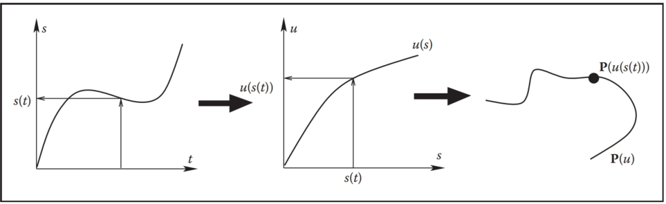
Figure 16.8. To get position in space at a given time t, one first utilizes user-specified motion control to obtain the distance along the curve s(t) and then computes the corresponding curve parameter value $u(s(t))$. Previously fitted curve $\bold{P}(u)$ can now be used to find the position $\bold{P}(u(s(t)))$.
图 16.8。 为了获得给定时间 t 的空间位置，首先利用用户指定的运动控制来获取沿曲线 s(t) 的距离，然后计算相应的曲线参数值 $u(s(t))$。 之前拟合的曲线 $\bold{P}(u)$ 现在可用于查找位置 $\bold{P}(u(s(t)))$。

Several standard functions can be used as the distance-time function s(t). One of the simplest is the linear function corresponding to constant velocity: $s(t) = vt$ with v = const. Another common example is the motion with constant acceleration a (and initial speed v0) which is described by the parabolic $s(t) = v_0t + at^2/2$. Since velocity is changing gradually here, this function can help to model desirable ease-in and ease-out behavior. More generally, the slope of $s(t)$ gives the velocity of motion with negative slope corresponding to the motion backwards along the curve. To achieve most flexibility, the ability to interactively edit s(t) is typically provided to the animator by the animation system. The distance-time function is not the only way to control motion. In some cases it might be more convenient for the user to specify a velocity-time function v(t) or even an acceleration-time function a(t). Since these are correspondingly first and second derivatives of s(t), to use these type of controls, the system first recovers the distance-time function by integrating the user input (twice in the case of a(t)).
可以使用几个标准函数作为距离-时间函数s(t)。 最简单的函数之一是对应于恒定速度的线性函数：$s(t) = vt$，其中 v = const。 另一个常见的例子是恒定加速度 a（和初始速度 v0）的运动，由抛物线 $s(t) = v_0t + at^2/2$ 描述。 由于速度在这里逐渐变化，因此该函数可以帮助模拟所需的缓入和缓出行为。 更一般地，$s(t)$ 的斜率给出了具有负斜率的运动速度，对应于沿着曲线向后的运动。 为了实现最大的灵活性，动画系统通常向动画师提供交互式编辑 s(t) 的能力。 距离-时间函数并不是控制运动的唯一方法。 在某些情况下，用户指定速度时间函数 v(t) 甚至加速时间函数 a(t) 可能更方便。 由于它们相应地是 s(t) 的一阶和二阶导数，为了使用这些类型的控制，系统首先通过对用户输入进行积分（在 a(t) 的情况下两次）来恢复距离-时间函数。

The relationship between the curve parameter u and arc length s is established automatically by the system. In practice, the system first determines arc length dependance on parameter u (i.e., the inverse function s(u)). Using this function, for any given S it is possible to solve the equation s(u) − S = 0 with unknown u obtaining u(S). For most curves, the function s(u) cannot be expressed in closed analytic form and numerical integration is necessary (see Chapter 14). Standard numerical root-finding procedures (such as the Newton-Raphson method, for example) can then be directly used to solve the equation $s(u) − S = 0$ for u.
曲线参数u与弧长s之间的关系由系统自动建立。 实际上，系统首先确定与参数 u（即反函数 s(u)）相关的弧长。 使用此函数，对于任何给定的 S，可以求解方程 s(u) − S = 0，其中 u 未知，从而获得 u(S)。 对于大多数曲线，函数 s(u) 不能用封闭解析形式表示，需要进行数值积分（参见第 14 章）。 然后可以直接使用标准数值求根程序（例如 Newton-Raphson 方法）来求解 u 的方程 $s(u) − S = 0$。

An alternative technique is to approximate the curve itself as a set of linear segments between points $\bold{p}_i$ computed at some set of sufficiently densely spaced parameter values $u_i$. One then creates a table of approximate arc lengths
另一种技术是将曲线本身近似为点 $\bold{p}_i$ 之间的一组线性段，这些线性段是在一组足够密集的参数值 $u_i$ 上计算的。 然后创建一个近似弧长表
$s(u_i) ≈ \sum^i_{j=1}\|\bold{p}_j - \bold{p}_{j-1}\| = s(u_{i-1}) + \|\bold{p}_i - \bold{p}_{i-1}\|  \\$

Since s(u) is a non-decreasing function of u, one can then find the interval containing the value S by simple searching through the table (see Figure 16.9). Linear interpolation of the interval’s u end values is then performed to finally find u(S). If greater precision is necessary, a few steps of the Newton-Raphson algorithm with this value as the starting point can be applied.
由于 s(u) 是 u 的非减函数，因此可以通过简单地搜索表格来找到包含值 S 的区间（见图 16.9）。 然后对区间的 u 最终值进行线性插值，最终找到 u(S)。 如果需要更高的精度，可以应用以该值作为起点的牛顿-拉夫森算法的几个步骤。
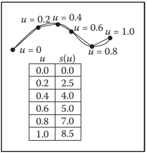
Figure 16.9. To create a tabular version of s(u), the curve can be approximated by a number of line segments connecting points on the curve positioned at equal parameter increments. The table is searched to find the u-interval for a given S. For the curve above, for example, the value of u corresponding to the position of $S = 6.5$ lies between $u = 0.6$ and $u = 0.8$.
图 16.9。 要创建 s(u) 的表格版本，可以通过连接曲线上以相等参数增量定位的点的许多线段来近似曲线。 搜索该表以找到给定 S 的 u 区间。例如，对于上面的曲线，$S = 6.5$ 位置对应的 u 值位于 $u = 0.6$ 和 $u = 0.8$ 之间 。

### 16.2.2 Interpolating Rotation  插值旋转

The techniques presented above can be used to interpolate the keys set for most of the parameters describing the scene. Three-dimensional rotation is one important motion for which more specialized interpolation methods and representations are common. The reason for this is that applying standard techniques to 3D rotations often leads to serious practical problems. Rotation (a change in orientation of an object) is the only motion other than translation which leaves the shape of the object intact. It therefore plays a special role in animating rigid objects. 
上述技术可用于对描述场景的大多数参数的关键帧进行插值。 三维旋转是一种重要的运动，更专业的插值方法和表示很常见。 其原因是，将标准技术应用于 3D 旋转通常会导致严重的实际问题。 旋转（物体方向的改变）是除平移之外唯一能保持物体形状完好无损的运动。 因此，它在刚性对象动画方面发挥着特殊作用。

There are several ways to specify the orientation of an object. First, transformation matrices as described in Chapter 6 can be used. Unfortunately, naive (element-by-element)interpolation of rotation matrices does not produce a correct result. For example, the matrix “halfway” between 2D clock- and counterclockwise 90 degree rotation is the null matrix:
有多种方法可以指定对象的方向。 首先，可以使用第 6 章中描述的变换矩阵。 不幸的是，旋转矩阵的简单（逐个元素）插值不会产生正确的结果。 例如，二维顺时针和逆时针 90 度旋转之间的矩阵“中间”是零矩阵：
$$
\frac{1}{2}\begin{bmatrix}
0 & 1\\
-1 & 0
\end{bmatrix}
+\frac{1}{2}\begin{bmatrix}
0 & -1\\
1 & 0
\end{bmatrix}
= \begin{bmatrix}
0 & 0\\
0 & 0
\end{bmatrix}
$$
The correct result is, of course, the unit matrix corresponding to no rotation. Second, one can specify arbitrary orientation as a sequence of exactly three rotations around coordinate axes chosen in some specific order. These axes can be fixed in space (fixed-angle representation) or embedded into the object therefore changing after each rotation (Euler-angle representation as shown in Figure 16.10). These three angles of rotation can be animated directly through standard keyframing, but a subtle problem known as gimbal lock arises. Gimbal lock occurs if during rotation one of the three rotation axes is by accident aligned with another, thereby reducing by one the number of available degrees of freedom as shown in Figure 16.11 for a physical device. This effect is more common than one might think—a single 90 degree turn to the right (or left) can potentially put an object into a gimbal lock. Finally, any orientation can be specified by choosing an appropriate axis in space and angle of rotation around this axis. While animating in this representation is relatively straightforward, combining two rotations, i.e., finding the axis and angle corresponding to a sequence of two rotations both represented by axis and angle, is nontrivial. A special mathematical apparatus, quaternions has been developed to make this representation suitable both for combining several rotations into a single one and for animation. 
正确的结果当然是没有旋转对应的单位矩阵。 其次，可以将任意方向指定为围绕以某种特定顺序选择的坐标轴的恰好三个旋转的序列。 这些轴可以固定在空间中（固定角度表示）或嵌入到对象中，因此每次旋转后都会发生变化（欧拉角度表示，如图 16.10 所示）。 这三个旋转角度可以直接通过标准关键帧进行动画处理，但会出现一个称为万向节锁定的微妙问题。 如果在旋转过程中三个旋转轴之一意外地与另一个旋转轴对齐，则会发生万向节锁定，从而使可用自由度的数量减少一个，如图 16.11 所示的物理设备。 这种效应比人们想象的更常见——向右（或向左）旋转 90 度就可能使物体陷入万向节锁定状态。 最后，可以通过选择适当的空间轴和绕该轴的旋转角度来指定任何方向。 虽然在此表示中设置动画相对简单，但组合两个旋转（即找到与均由轴和角度表示的两个旋转序列相对应的轴和角度）却很重要。 四元数是一种特殊的数学工具，它的开发使得这种表示既适用于将多个旋转组合成一个旋转，也适用于动画。

Figure 16.10. Three Euler angles can be used to specify arbitrary object orientation through a sequence of three rotations around coordinate axes embedded into the object (axis Y always points to the tip of the cone). Note that each rotation is given in a new coordinate system. Fixed angle representation is very similar, but the coordinate axes it uses are fixed in space and do not rotate with the object.
图 16.10。 三个欧拉角可用于通过围绕嵌入到对象中的坐标轴（Y 轴始终指向圆锥体尖端)的一系列三个旋转来指定任意对象方向。 请注意，每次旋转都是在新的坐标系中给出的。 固定角度表示法非常相似，但它使用的坐标轴在空间中是固定的，不随对象旋转。

Figure 16.11. In this example, gimbal lock occurs when a 90 degree turn around axis Z is made. Both X and Y rotations are now performed around the same axis leading to the loss of one degree of freedom.
图 16.11。 在此示例中，当绕 Z 轴旋转 90 度时，会发生万向节锁定。 X 和 Y 旋转现在均绕同一轴执行，导致失去一个自由度。

Given a 3D vector $\bold{v} = (x, y, z)$ and a scalar s, a quaternion q is formed by combining the two into a four-component object: $q = [s x y z] = [s; \bold{v}]$. Several new operations are then defined for quaternions. Quaternion addition simply sums scalar and vector parts separately:
给定一个 3D 向量 $\bold{v} = (x, y, z)$ 和一个标量 s，通过将两者组合成一个四分量对象来形成四元数 q： $q = [s x y z] = [s; \bold{v}]$。 然后为四元数定义了几个新的运算。 四元数加法简单地分别对标量和向量部分求和：
$q_1+q_2 ≡  [s_1 + s_2; \bold{v}_1 + \bold{v}_2  ]$

Multiplication by a scalar a gives a new quaternion
乘以标量 a 得到一个新的四元数 
$aq ≡ [as; a\bold{v}].  $

More complex quaternion multiplication is defined as
更复杂的四元数乘法定义为
$q_1 · q_2 ≡ [s_1s_2 - \bold{v}_1\bold{v}_2; s_1\bold{v}_2 + s_2\bold{v}_1 + \bold{v}_1 × \bold{v}_2],  $

where × denotes a vector cross product. It is easy to see that, similar to matrices, quaternion multiplication is associative, but not commutative. We will be interested mostly in normalized quaternions—those for which the quaternion norm $|q| = \sqrt{s^2 + \bold{v}^2}$ is equal to one. One final definition we need is that of an inverse quaternion:
其中 × 表示向量叉积。 很容易看出，与矩阵类似，四元数乘法是结合律，但不是交换律。 我们主要对归一化四元数感兴趣——四元数范数 $|q| 的四元数 = \sqrt{s^2 + \bold{v}^2}$ 等于 1。 我们需要的最后一个定义是逆四元数的定义：
$q^{-1} = (1/|q|)[s; -\bold{v}].  $

To represent a rotation by angle $φ$ around an axis passing through the origin whose direction is given by the normalized vector $\bold{n}$, a normalized quaternion
表示围绕穿过原点的轴旋转 $φ$ 角度，其方向由归一化向量 $\bold{n}$（归一化四元数）给出
$q = [cos(φ/2); sin(φ/2)\bold{n}]  $

is formed. To rotate point $\bold{p}$, one turns it into the quaternion $q_p = [0; \bold{p}]$ and  computes the quaternion product
形成了。 要旋转点 $\bold{p}$，请将其转换为四元数 $q_p = [0; \bold{p}]$ 并计算四元数乘积
$q_p' = q · qp · q^{-1}  $

which is guaranteed to have a zero scalar part and the rotated point as its vector part. Composite rotation is given simply by the product of quaternions representing each of the separate rotation steps. To animate with quaternions, one can treat them as points in a four-dimensional space and set keys directly in this space. To keep quaternions normalized, one should, strictly speaking, restrict interpolation procedures to a unit sphere (a 3D object) in this 4D space. However, a spherical version of even linear interpolation (often called slerp) already results in rather unpleasant math. Simple 4D linear interpolation followed by projection onto the unit sphere shown in Figure 16.12 is much simpler and often sufficient in practice. Smoother results can be obtained via repeated application of a linear interpolation procedure using the de Casteljau algorithm.
保证标量部分为零，旋转点作为其矢量部分。 复合旋转简单地由代表每个单独旋转步骤的四元数的乘积给出。 要使用四元数制作动画，可以将它们视为四维空间中的点并直接在该空间中设置关键点。 为了保持四元数标准化，严格来说，应该将插值过程限制到这个 4D 空间中的单位球体（3D 对象）。 然而，即使是线性插值（通常称为 slerp）的球形版本也已经产生了相当令人不快的数学结果。 简单的 4D 线性插值然后投影到图 16.12 所示的单位球体上要简单得多，并且在实践中通常就足够了。 使用 de Casteljau 算法重复应用线性插值过程可以获得更平滑的结果。
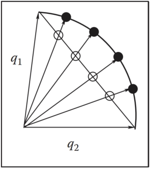
Figure 16.12. Interpolating quaternions should be done on the surface of a 3D unit sphere embedded in 4D space. However, much simpler interpolation along a 4D straight line (open circles) followed by reprojection of the results onto the sphere (black circles) is often sufficient.
图 16.12。 四元数插值应在嵌入 4D 空间的 3D 单位球体的表面上完成。 然而，沿着 4D 直线（空心圆圈）进行更简单的插值，然后将结果重新投影到球体（黑色圆圈)上通常就足够了。

## 16.3 Deformations 变形

Although techniques for object deformation might be more properly treated as modeling tools, they are traditionally discussed together with animation methods. Probably the simplest example of an operation which changes object shape is a nonuniform scaling. More generally, some function can be applied to local coordinates of all points specifying the object (i.e., vertices of a triangular mesh or control polygon of a spline surface), repositioning these points and creating a new shape: $\bold{p}' = f(\bold{p}, γ)$ where $γ$ is a vector of parameters used by the deformation function. Choosing different $f$ (and combining them by applying one after another) can help to create very interesting deformations. Examples of useful simple functions include bend, twist, and taper which are shown in Figure 16.13. Animating shape change is very easy in this case by keyframing the parameters of the deformation function. Disadvantages of this technique include difficulty of choosing the mathematical function for some nonstandard deformations and the fact that the resulting deformation is global in the sense that the complete object, and not just some part of it, is reshaped.
尽管对象变形技术可能更适合视为建模工具，但它们传统上与动画方法一起讨论。 改变对象形状的操作的最简单示例可能是非均匀缩放。 更一般地，某些函数可以应用于指定对象的所有点的局部坐标（即，三角形网格的顶点或样条曲面的控制多边形），重新定位这些点并创建新形状：$\bold{p}' = f(\bold{p}, γ)$ 其中 $γ$ 是变形函数使用的参数向量。 选择不同的 $f$（并通过依次应用将它们组合起来）可以帮助创建非常有趣的变形。 有用的简单函数的示例包括弯曲、扭曲和锥度，如图 16.13 所示。 在这种情况下，通过对变形函数的参数设置关键帧，可以非常轻松地对形状变化进行动画处理。 该技术的缺点包括难以为某些非标准变形选择数学函数，以及所产生的变形是全局的，即整个对象（而不仅仅是其某些部分）被重塑。
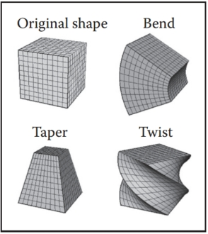
Figure 16.13. Popular examples of global deformations. Bending and twist angles, as well as the degree of taper, can all be animated to achieve dynamic shape change.
图 16.13。 全局变形的流行例子。 弯曲和扭转角度以及锥度都可以进行动画处理，以实现动态形状变化。

To deform an object locally while providing more direct control over the result, one can choose a single vertex, move it to a new location and adjust vertices within some neighborhood to follow the seed vertex. The area affected by the deformation and the specific amount of displacement in different parts of the object are controlled by an attenuation function which decreases with distance (typically computed over the object’s surface) to the seed vertex. Seed vertex motion can be keyframed to produce animated shape change. 
要使对象局部变形，同时提供对结果的更直接控制，可以选择单个顶点，将其移动到新位置并调整某个邻域内的顶点以遵循种子顶点。 受变形影响的区域以及对象不同部分的具体位移量由衰减函数控制，该函数随着到种子顶点的距离（通常在对象表面上计算）而减小。 可以对种子顶点运动设置关键帧以产生动画形状变化。

A more general deformation technique is called free-form deformation (FFD) (Sederberg & Parry, 1986). A local (in most cases rectilinear) coordinate grid is first established to encapsulate the part of the object to be deformed, and coordinates $(s, t, u)$ of all relevant points are computed with respect to this grid. The user then freely reshapes the grid of lattice points $\bold{P}_{ijk}$ into a new distorted lattice $\bold{P}'_{ijk}$ (Figure 16.14). The object is reconstructed using coordinates computed in the original undistorted grid in the trivariate analog of Bezier interpolants (see Chapter 15) with distorted lattice points $\bold{P}'_{ijk}$ serving as control points in this expression:
更通用的变形技术称为自由变形（FFD）（Sederberg & Parry，1986）。 首先建立一个局部（大多数情况下是直线）坐标网格来封装要变形的对象部分，并相对于该网格计算所有相关点的坐标$(s, t, u)$。 然后，用户可以自由地将晶格点网格$\bold{P}_{ijk}$重塑为新的扭曲晶格$\bold{P}'_{ijk}$（图16.14）。 使用贝塞尔插值的三变量模拟中原始未扭曲网格中计算的坐标（参见第 15 章）来重建对象，其中扭曲晶格点 $\bold{P}'_{ijk}$ 作为此表达式中的控制点：
$P(s, u, t) =  \sum^L_{i=0}\begin{pmatrix}i \\L\end{pmatrix}(1-s)^{L-i}s^i\sum^M_{j=0}\begin{pmatrix}j \\M\end{pmatrix}(1-t)^{M-j}t^j\sum^N_{k=0}\begin{pmatrix}k \\N\end{pmatrix}(1-u)^{N-k}u^k\bold{P}'_{ijk}$

where L, M, N are maximum indices of lattice points in each dimension. In effect, the lattice serves as a low-resolution version of the object for the purpose of deformation, allowing for a smooth shape change of an arbitrarily complex object through a relatively small number of intuitive adjustments. FFD lattices can themselves be treated as regular objects by the system and can be transformed, animated, and even further deformed if necessary, leading to corresponding changes in the object to which the lattice is attached. For example, moving a deformation tool consisting of the original lattice and distorted lattice representing a bulge across an object results in a bulge moving across the object.
其中L、M、N是每个维度中格点的最大索引。 实际上，晶格充当了用于变形目的的对象的低分辨率版本，允许通过相对少量的直观调整来平滑地改变任意复杂的对象的形状。 FFD 晶格本身可以被系统视为常规对象，并且可以进行变换、动画，甚至在必要时进一步变形，从而导致晶格所附着的对象发生相应的变化。 例如，移动由原始晶格和代表凸起的变形晶格组成的变形工具穿过对象会导致凸起移动穿过对象。
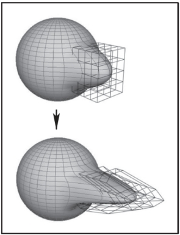
Figure 16.14. Adjusting the FFD lattice results in the deformation of the object. 
图 16.14。 调整FFD晶格会导致物体变形。

## 16.4 Character Animation 角色动画

Animation of articulated figures is most often performed through a combination of keyframing and specialized deformation techniques. The character model intended for animation typically consists of at least two main layers as shown in Figure 16.15. The motion of a highly detailed surface representing the outer shell or skin of the character is what the viewer will eventually see in the final product. The skeleton underneath it is a hierarchical structure (a tree) of joints which provides a kinematic model of the figure and is used exclusively for animation. In some cases, additional intermediate layer(s) roughly corresponding to muscles are inserted between the skeleton and the skin.
铰接人物的动画通常是通过关键帧和专门的变形技术的组合来执行的。 用于动画的角色模型通常由至少两个主要层组成，如图 16.15 所示。 代表角色外壳或皮肤的高度详细的表面的运动是观众最终在最终产品中看到的。 它下面的骨架是一个关节的层次结构（树），它提供了图形的运动学模型，并且专门用于动画。 在一些情况下，在骨骼和皮肤之间插入大致对应于肌肉的附加中间层。

Figure 16.15. (Left) A hierarchy of joints, a skeleton, serves as a kinematic abstraction of the character; (middle) repositioning the skeleton deforms a separate skin object attached to it; (right) a tree data structure is used to represent the skeleton. For compactness, the internal structure of several nodes is hidden (they are identical to a corresponding sibling).
图 16.15。 （左）关节层次结构（骨骼）充当角色的运动学抽象； （中）重新定位骨架会使附着在其上的单独蒙皮对象变形； （右）使用树数据结构来表示骨架。 为了紧凑性，隐藏了多个节点的内部结构（它们与相应的兄弟节点相同)。

Each of the skeleton’s joints acts as a parent for the hierarchy below it. The root represents the whole character and is positioned directly in the world coordinate system. If a local transformation matrix which relates a joint to its parent in the hierarchy is available, one can obtain a transformation which relates local space of any joint to the world system (i.e., the system of the root) by simply concatenating transformations along the path from the root to the joint. To evaluate the whole skeleton (i.e., find position and orientation of all joints), a depth-first traversal of the complete tree of joints is performed. A transformation stack is a natural data structure to help with this task. While traversing down the tree, the current composite matrix is pushed on the stack and a new one is created by multiplying the current matrix with the one stored at the joint. When backtracking to the parent, this extra transformation should be undone before another branch is visited; this is easily done by simply popping the stack. Although this general and simple technique for evaluating hierarchies is used throughout computer graphics, in animation (and robotics) it is given a special name—forward kinematics (FK). While general representations for all transformations can be used, it is common to use specialized sets of parameters, such as link lengths or joint angles, to specify skeletons. To animate with forward kinematics, rotational parameters of all joints are manipulated directly. The technique also allows the animator to change the distance between joints (link lengths), but one should be aware that this corresponds to limb stretching and can often look rather unnatural. 
骨骼的每个关节都充当其下方层次结构的父级。 根代表整个角色并直接位于世界坐标系中。 如果将关节与其层次结构中的父级相关联的局部变换矩阵可用，则可以通过简单地沿路径串联变换来获得将任何关节的局部空间与世界系统（即根系统）相关联的变换 从根部到关节。 为了评估整个骨架（即找到所有关节的位置和方向），需要对完整的关节树进行深度优先遍历。 转换堆栈是帮助完成此任务的自然数据结构。 向下遍历树时，当前复合矩阵被压入堆栈，并通过将当前矩阵与存储在节点处的矩阵相乘来创建一个新矩阵。 当回溯到父分支时，应该在访问另一个分支之前撤消这个额外的转换； 只需弹出堆栈即可轻松完成此操作。 尽管这种用于评估层次结构的通用而简单的技术在整个计算机图形学中都有使用，但在动画（和机器人学）中，它被赋予了一个特殊的名称——正向运动学（FK）。 虽然可以使用所有变换的通用表示，但通常使用专门的参数集（例如链接长度或关节角度）来指定骨架。 为了使用正向运动学制作动画，可以直接操纵所有关节的旋转参数。 该技术还允许动画师改变关节之间的距离（链接长度），但人们应该意识到这对应于肢体拉伸，并且通常看起来相当不自然。

Forward kinematics requires the user to set parameters for all joints involved in the motion (Figure 16.16 (top)). Most of these joints, however, belong to in ternal nodes of the hierarchy, and their motion is typically not something the animator wants to worry about. In most situations, the animator just wants them to move naturally “on their own,” and one is much more interested in specifying the behavior of the endpoint of a joint chain, which typically corresponds to something performing a specific action, such as an ankle or a tip of a finger. The animator would rather have parameters of all internal joints be determined from the motion of the end effector automatically by the system. Inverse kinematics (IK) allows us to do just that (see Figure 16.16 (bottom)). 
正向运动学要求用户为运动中涉及的所有关节设置参数（图 16.16（顶部））。 然而，大多数这些关节属于层次结构的内部节点，并且它们的运动通常不是动画师想要担心的事情。 在大多数情况下，动画师只是希望它们“自行”自然移动，而人们更感兴趣的是指定关节链端点的行为，这通常对应于执行特定动作的物体，例如脚踝 或指尖。 动画师宁愿让系统根据末端执行器的运动自动确定所有内部关节的参数。 逆运动学 (IK) 使我们能够做到这一点（见图 16.16（底部））。
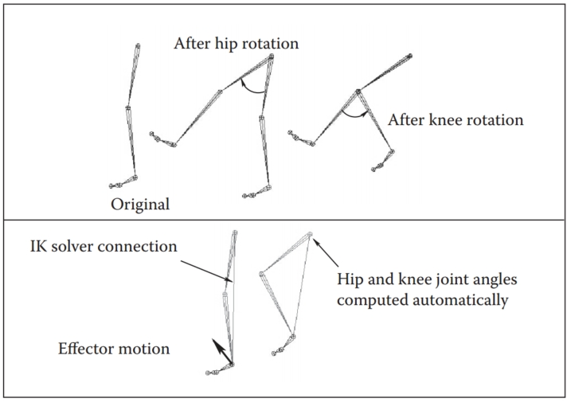
Figure 16.16. Forward kinematics (top) requires the animator to put all joints into correct position. In inverse kinematic (bottom), parameters of some internal joints are computed based on desired end effector motion.
图 16.16。 正向运动学（上）要求动画师将所有关节置于正确的位置。 在逆运动学（底部)中，一些内部关节的参数是根据所需的末端执行器运动来计算的。

Let x be the position of the end effector and α be the vector of parameters needed to specify all internal joints along the chain from the root to the final joint. Sometimes the orientation of the final joint is also directly set by the animator, in which case we assume that the corresponding variables are included in the vector $\bold{x}$. For simplicity, however, we will write all specific expressions for the vector:
令 x 为末端执行器的位置，α 为指定沿链从根到最终关节的所有内部关节所需的参数向量。 有时最终关节的方向也由动画师直接设置，在这种情况下我们假设相应的变量包含在向量$\bold{x}$中。 然而，为了简单起见，我们将为向量编写所有特定表达式：
$\bold{x} = (x_1, x_2, x_3)^T$

Since each of the variables in x is a function of α, it can be written as a vector equation $\bold{x} = \bold{F}(α)$. If we change the internal joint parameters by a small amount $δα$, a resulting change $δx$ in the position of the end effector can be approximately written as
由于 x 中的每个变量都是 α 的函数，因此可以将其写为向量方程 $\bold{x} = \bold{F}(α)$。 如果我们将内部关节参数改变少量 $δα$，则末端执行器位置的变化 $δx$ 可以近似写为
$$
δ\bold{x} = \frac{∂\bold{F}}{∂α} δα \ \ \ \ \ (16.1)
$$
where $\frac{∂\bold{F}}{∂α}$ is the matrix of partial derivatives called the Jacobian:
其中 $\frac{∂\bold{F}}{∂α}$ 是称为雅可比行列式的偏导数矩阵：
$$
\frac{∂\bold{F}}{∂α} = \begin{bmatrix}
\frac{∂f_1}{∂α_1} & \frac{∂f_1}{∂α_2} & ... & \frac{∂f_1}{∂α_n} \\
\frac{∂f_2}{∂α_1} & \frac{∂f_2}{∂α_2} & ... & \frac{∂f_2}{∂α_n} \\
\frac{∂f_3}{∂α_1} & \frac{∂f_3}{∂α_2} & ... & \frac{∂f_3}{∂α_n}
\end{bmatrix}
$$
At each moment in time, we know the desired position of the end effector (set by the animator) and, of course, the effector’s current position. Subtracting the two, we will get the desired adjustment $δ\bold{x}$. Elements of the Jacobian matrix are related to changes in a coordinate of the end effector when a particular internal parameter is changed while others remain fixed (see Figure 16.17). These elements can be computed for any given skeleton configuration using geometric relationships. The only remaining unknowns in the system of equations (16.1) are the changes in internal parameters $α$. Once we solve for them, we update $α = α+δα$ which gives all the necessary information for the FK procedure to reposition the skeleton. 
在每个时刻，我们都知道末端执行器的所需位置（由动画师设置），当然还有执行器的当前位置。 将两者相减，我们将得到所需的调整$δ\bold{x}$。 当特定内部参数发生变化而其他参数保持固定时，雅可比矩阵的元素与末端执行器坐标的变化相关（见图 16.17）。 可以使用几何关系针对任何给定的骨架配置计算这些元素。 方程组 (16.1) 中唯一剩下的未知数是内部参数 $α$ 的变化。 一旦我们解决了它们，我们就会更新 $α = α+δα$，它为 FK 过程重新定位骨架提供了所有必要的信息。
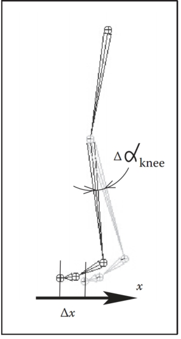
Figure 16.17. Partial derivative $∂x/∂α_{knee}$ is given by the limit of $Δx/Δα_{knee}$. Effector displacement is computed while all joints, except the knee, are kept fixed.
图 16.17。 偏导数 $∂x/∂α_{knee}$ 由 $Δx/Δα_{knee}$ 的极限给出。 在计算效应器位移时，除膝关节外的所有关节均保持固定。

Unfortunately, the system (16.1) cannot usually be solved analytically and, moreover, it is in most cases underconstrained, i.e., the number of unknown internal joint parameters $α$ exceeds the number of variables in vector $\bold{x}$. This means that different motions of the skeleton can result in the same motion of the end effector. Some examples are shown on Figure 16.18. Many ways of obtaining specific solution for such systems are available, including those taking into account natural constraints needed for some real-life joints (bending a knee only in one direction, for example). One should also remember that the computed Jacobian matrix is valid only for one specific configuration, and it has to be updated as the skeleton moves. The complete IK framework is presented in Figure 16.19. Of course, the root joint for IK does not have to be the root of the whole hierarchy, and multiple IK solvers can be applied to independent parts of the skeleton. For example, one can use separate solvers for right and left feet and yet another one to help animate grasping with the right hand, each with its own root.
不幸的是，系统（16.1）通常无法解析求解，而且在大多数情况下都受到约束，即未知内部关节参数 $α$ 的数量超过向量 $\bold{x}$ 中变量的数量。 这意味着骨架的不同运动可以导致末端执行器的相同运动。 图 16.18 显示了一些示例。 获得此类系统的特定解决方案的方法有很多，包括考虑一些现实生活中关节所需的自然约束的方法（例如，仅向一个方向弯曲膝盖）。 人们还应该记住，计算出的雅可比矩阵仅对一种特定配置有效，并且必须随着骨架的移动而更新。 完整的 IK 框架如图 16.19 所示。 当然，IK 的根关节不必是整个层次结构的根，多个 IK 解算器可以应用于骨架的独立部分。 例如，可以对右脚和左脚使用单独的解算器，然后使用另一个解算器来帮助制作右手抓握的动画，每个解算器都有自己的根。
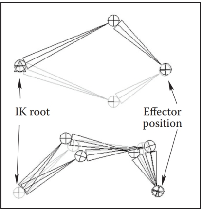
Figure 16.18. Multiple configurations of internal joints can result in the same effector position. (Top) disjoint “flipped” solutions; (bottom) a continuum of solutions.
图 16.18。 内部关节的多种配置可以导致相同的效应器位置。 （上）不相交的“翻转”解决方案； （底部)连续的解决方案。

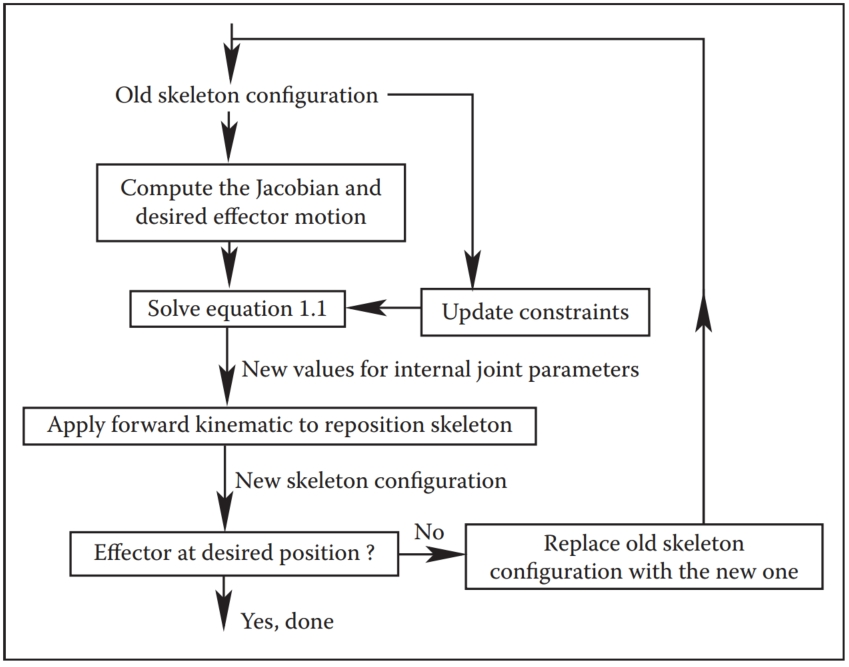
Figure 16.19. A diagram of the inverse kinematic algorithm. 
图 16.19。 逆运动学算法图。

A combination of FK and IK approaches is typically used to animate the skeleton. Many common motions (walking or running cycles, grasping, reaching, etc.) exhibit well-known patterns of mutual joint motion making it possible to quickly create naturally looking motion or even use a library of such “clips.” The animator then adjusts this generic result according to the physical parameters of the character and also to give it more individuality. 
FK 和 IK 方法的组合通常用于为骨架设置动画。 许多常见的动作（步行或跑步循环、抓握、伸手等）都表现出众所周知的相互关节运动模式，从而可以快速创建看起来自然的动作，甚至可以使用此类“剪辑”库。 然后动画师根据角色的物理参数调整这个通用结果，并赋予它更多的个性。

When a skeleton changes its position, it acts as a special type of deformer applied to the skin of the character. The motion is transferred to this surface by assigning each skin vertex one (rigid skinning) or more (smooth skinning) joints as drivers (see Figure 16.20). In the first case, a skin vertex is simply frozen into the local space of the corresponding joint, which can be the one nearest in space or one chosen directly by the user. The vertex then repeats whatever motion this joint experiences, and its position in world coordinates is determined by standard FK procedure. Although it is simple, rigid skinning makes it difficult to obtain sufficiently smooth skin deformation in areas near the joints or also for more subtle effects resembling breathing or muscle action. Additional specialized deformers called flexors can be used for this purpose. In smooth skinning, several joints can influence a skin vertex according to some weight assigned by the animator, providing more detailed control over the results. Displacement vectors, $\bold{d}_i$, suggested by different joints affecting a given skin vertex (each again computed with standard FK) are averaged according to their weights $w_i$ to compute the final displacement of the vertex $\bold{d} = \sum w_i\bold{d}_i$. Normalized weights ($\sum w_i = 1$) are the most common but not fundamentally necessary. Setting smooth skinning weights to achieve the desired effect is not easy and requires significant skill from the animator.
当骨架改变其位置时，它充当应用于角色皮肤的特殊类型的变形器。 通过将每个蒙皮顶点分配一个（刚性蒙皮）或多个（平滑蒙皮）关节作为驱动器，将运动传递到该表面（参见图 16.20）。 在第一种情况下，皮肤顶点只是被冻结到相应关节的局部空间中，该关节可以是空间中最近的关节，也可以是用户直接选择的关节。 然后，顶点会重复该关节经历的任何运动，并且其在世界坐标中的位置由标准 FK 程序确定。 虽然它很简单，但刚性蒙皮使得很难在关节附近的区域获得足够平滑的皮肤变形，或者也难以获得类似于呼吸或肌肉动作的更微妙的效果。 称为屈肌的附加专用变形器可用于此目的。 在平滑蒙皮中，多个关节可以根据动画师分配的一些权重影响蒙皮顶点，从而对结果提供更详细的控制。 由影响给定皮肤顶点的不同关节建议的位移向量 $\bold{d}_i$ （每个关节再次使用标准 FK 计算）根据其权重 $w_i$ 进行平均，以计算顶点的最终位移 $\bold{ d} = \sum w_i\bold{d}_i$。 归一化权重 ($\sum w_i = 1$) 是最常见的，但不是根本必要的。 设置平滑蒙皮权重以达到所需的效果并不容易，并且需要动画师的高超技巧。
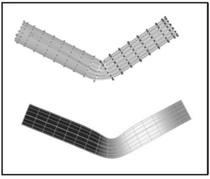
Figure 16.20. Top: Rigid skinning assigns skin vertices to a specific joint. Those belonging to the elbow joint are shown in black; Bottom: Soft skinning can blend the influence of several joints. Weights for the elbow joint are shown (lighter = greater weight). Note smoother skin deformation of the inner part of the skin near the joint.
图 16.20。 顶部：刚性蒙皮将蒙皮顶点分配给特定关节。 属于肘关节的以黑色显示； 底部：软蒙皮可以混合多个关节的影响。 显示了肘关节的重量（更轻=更大的重量)。 注意关节附近皮肤内部的平滑皮肤变形。

### 16.4.1 Facial Animation 面部动画

Skeletons are well suited for creating most motions of a character’s body, but they are not very convenient for realistic facial animation. The reason is that the skin of a human face is moved by muscles directly attached to it, contrary to other parts of the body where the primary objective of the muscles is to move the bones of the skeleton and any skin deformation is a secondary outcome. The result of this facial anatomical arrangement is a very rich set of dynamic facial expressions humans use as one of the main instruments of communication. We are all very well trained to recognize such facial variations and can easily notice any unnatural appearance. This not only puts special demands on the animator but also requires a high-resolution geometric model of the face and, if photorealism is desired, accurate skin reflection properties and textures. 
骨骼非常适合创建角色身体的大多数动作，但对于逼真的面部动画来说不太方便。 原因是，人脸的皮肤是由直接附着在其上的肌肉移动的，这与身体的其他部位相反，在身体的其他部位，肌肉的主要目标是移动骨骼，任何皮肤变形都是次要结果。 这种面部解剖结构的结果是形成了一组非常丰富的动态面部表情，人类将其用作主要的交流工具之一。 我们都受过良好的训练来识别这种面部变化，并且可以很容易地注意到任何不自然的外观。 这不仅对动画师提出了特殊要求，而且还需要高分辨率的面部几何模型，如果需要真实感，还需要精确的皮肤反射特性和纹理。

While it is possible to set key poses of the face vertex-by-vertex and interpolate between them or directly simulate the behavior of the underlying muscle structure using physics-based techniques (see Section 16.5), more specialized high-level approaches also exist. The static shape of a specific face can be characterized by a relatively small set of so-called conformational parameters (overall scale, distance from the eye to the forehead, length of the nose, width of the jaws, etc.) which are used to morph a generic face model into one with individual features. An additional set of expressive parameters can be used to describe the dynamic shape of the face for animation. Examples include rigid rotation of the head, how wide the eyes are open, movement of some feature point from its static position, etc. These are chosen so that most of the interesting expressions can be obtained through some combination of parameter adjustments, therefore, allowing a face to be animated via standard keyframing. To achieve a higher level of control, one can use expressive parameters to create a set of expressions corresponding to common emotions (neutral, sadness, happiness, anger, surprise, etc.) and then blend these key poses to obtain a “slightly sad” or “angrily surprised” face. Similar techniques can be used to perform lip-synch animation, but key poses in this case correspond to different phonemes. Instead of using a sequence of static expressions to describe a dynamic one, the Facial Action Coding System (FACS) (Eckman & Friesen, 1978) decomposes dynamic facial expressions directly into a sum of elementary motions called action units (AUs). The set of AUs is based on extensive psychological research and includes such movements as raising the inner brow, wrinkling the nose, stretching lips, etc. Combining AUs can be used to synthesize a necessary expression. 
虽然可以逐个顶点设置面部的关键姿势并在它们之间进行插值，或者使用基于物理的技术直接模拟底层肌肉结构的行为（参见第 16.5 节），但也存在更专业的高级方法。 特定脸部的静态形状可以通过一组相对较小的所谓构象参数（整体尺度、眼睛到前额的距离、鼻子长度、下巴宽度等）来表征，这些参数用于 将通用面部模型转变为具有个人特征的模型。 可以使用一组附加的表达参数来描述动画中面部的动态形状。 示例包括头部的刚性旋转、眼睛张开的程度、某些特征点从其静态位置的移动等。选择这些是为了通过参数调整的某些组合可以获得大多数有趣的表情，因此，允许 通过标准关键帧进行动画处理的脸部。 为了达到更高的控制水平，可以利用表情参数创建一组对应常见情绪（中性、悲伤、快乐、愤怒、惊讶等）的表情，然后将这些关键姿势混合起来，得到一个“微悲伤”的表情。 或“愤怒惊讶”的脸。 类似的技术可用于执行口型同步动画，但这种情况下的关键姿势对应于不同的音素。 面部动作编码系统 (FACS)（Eckman & Friesen，1978）不是使用一系列静态表情来描述动态表情，而是将动态面部表情直接分解为称为动作单元 (AU) 的基本动作总和。 该组AU基于广泛的心理学研究，包括内抬眉毛、皱鼻子、伸展嘴唇等动作。组合AU可用于合成必要的表情。

### 16.4.2 Motion Capture 动作捕捉

Even with the help of the techniques described above, creating realistic-looking character animation from scratch remains a daunting task. It is therefore only natural that much attention is directed toward techniques which record an actor’s motion in the real world and then apply it to computer-generated characters. Two main classes of such motion capture (MC) techniques exist: electromagnetic and optical. 
即使借助上述技术，从头开始创建逼真的角色动画仍然是一项艰巨的任务。 因此，自然而然地，很多注意力都集中在记录演员在现实世界中的动作，然后将其应用于计算机生成的角色的技术上。 此类动作捕捉 (MC) 技术主要有两类：电磁技术和光学技术。

In electromagnetic motion capture, an electromagnetic sensor directly measures its position (and possibly orientation) in 3D, often providing the captured results in real time. Disadvantages of this technique include significant equipment cost, possible interference from nearby metal objects, and noticeable size of sensors and batteries which can be an obstacle in performing high-amplitude motions. In optical MC, small colored markers are used instead of active sensors making it a much less intrusive procedure. Figure 16.21 shows the operation of such a system. In the most basic arrangement, the motion is recorded by two calibrated video cameras, and simple triangulation is used to extract the marker’s 3D position. More advanced computer vision algorithms used for accurate tracking of multiple markers from video are computationally expensive, so, in most cases, such processing is done offline. Optical tracking is generally less robust than electromagnetic. Occlusion of a given marker in some frames, possible misidentification of markers, and noise in images are just a few of the common problem which have to be addressed. Introducing more cameras observing the motion from different directions improves both accuracy and robustness, but this approach is more expensive and it takes longer to process such data. Optical MC becomes more attractive as available computational power increases and better computer vision algorithms are developed. Because of low impact nature of markers, optical methods are suitable for delicate facial motion capture and can also be used with objects other than humans—for example, animals or even tree branches in the wind. 
在电磁运动捕捉中，电磁传感器直接测量 3D 位置（以及可能的方向），通常实时提供捕捉的结果。 该技术的缺点包括设备成本高昂、可能受到附近金属物体的干扰以及传感器和电池的尺寸过大，这可能会成为执行高振幅运动的障碍。 在光学 MC 中，使用小型彩色标记代替有源传感器，使其成为一个侵入性较小的过程。 图 16.21 显示了这样一个系统的操作。 在最基本的布置中，运动由两个校准摄像机记录，并使用简单的三角测量来提取标记的 3D 位置。 用于准确跟踪视频中的多个标记的更先进的计算机视觉算法的计算成本很高，因此在大多数情况下，此类处理是离线完成的。 光学跟踪通常不如电磁跟踪稳健。 某些帧中给定标记的遮挡、标记可能的误识别以及图像中的噪声只是必须解决的一些常见问题。 引入更多摄像头从不同方向观察运动可以提高准确性和鲁棒性，但这种方法成本更高，并且处理此类数据需要更长的时间。 随着可用计算能力的增加和更好的计算机视觉算法的开发，光学MC变得更具吸引力。 由于标记的影响力较小，光学方法适用于精细的面部动作捕捉，也可用于人类以外的物体，例如动物甚至风中的树枝。

Figure 16.21. Optical motion capture: markers attached to a performer’s body allow skeletal motion to be extracted. Image courtesy of Motion Analysis Corp.
图 16.21。 光学动作捕捉：附着在表演者身体上的标记可以提取骨骼运动。 图片由 Motion Analysis Corp. 提供

With several sensors or markers attached to a performer’s body, a set of time-dependant 3D positions of some collection of points can be recorded. These tracking locations are commonly chosen near joints, but, of course, they still lie on skin surface and not at points where actual bones meet. Therefore, some additional care and a bit of extra processing is necessary to convert recorded positions into those of the physical skeleton joints. For example, putting two markers on opposite sides of the elbow or ankle allows the system to obtain better joint position by averaging locations of the two markers. Without such extra care, very noticeable artifacts can appear due to offset joint positions as well as inherent noise and insufficient measurement accuracy. Because of physical inaccuracy during motion, for example, character limbs can lose contact with objects they are supposed to touch during walking or grasping, problems like foot-sliding (skating) of the skeleton can occur. Most of these problems can be corrected by using inverse kinematics techniques which can explicitly force the required behavior of the limb’s end. 
通过将多个传感器或标记附着在表演者的身体上，可以记录一些点集合的一组与时间相关的 3D 位置。 这些跟踪位置通常选择在关节附近，但当然，它们仍然位于皮肤表面，而不是实际骨骼相交的点。 因此，需要一些额外的注意和一些额外的处理来将记录的位置转换为物理骨骼关节的位置。 例如，将两个标记放在肘部或脚踝的相对侧，允许系统通过平均两个标记的位置来获得更好的关节位置。 如果不加倍小心，由于关节位置偏移以及固有噪声和测量精度不足，可能会出现非常明显的伪影。 例如，由于运动过程中的物理不准确，角色的四肢在行走或抓握时可能会失去与它们应该接触的物体的接触，因此可能会出现骨骼脚滑动（滑冰）等问题。 大多数这些问题可以通过使用逆运动学技术来纠正，该技术可以明确地强制肢体末端所需的行为。

Recovered joint positions can now be directly applied to the skeleton of a computer-generated character. This procedure assumes that the physical dimensions of the character are identical to those of the performer. Retargeting recorded motion to a different character and, more generally, editing MC data, requires significant care to satisfy necessary constraints (such as maintaining feet on the ground or not allowing an elbow to bend backwards) and preserve an overall natural appearance of the modified motion. Generally, the greater the desired change from the original, the less likely it will be possible to maintain the quality of the result. An interesting approach to the problem is to record a large collection of motions and stitch together short clips from this library to obtain desired movement. Although this topic is currently a very active research area, limited ability to adjust the recorded motion to the animator’s needs remains one of the main disadvantages of motion capture technique.
恢复的关节位置现在可以直接应用于计算机生成的角色的骨架。 此过程假设角色的物理尺寸与表演者的物理尺寸相同。 将记录的动作重新定位到不同的角色，更一般地说，编辑 MC 数据，需要非常小心地满足必要的约束（例如将脚保持在地面上或不允许肘部向后弯曲）并保留修改后的动作的整体自然外观 。 一般来说，与原始内容相比所需的变化越大，维持结果质量的可能性就越小。 解决该问题的一个有趣方法是记录大量运动并将该库中的短剪辑拼接在一起以获得所需的运动。 尽管该主题目前是一个非常活跃的研究领域，但根据动画师的需求调整记录的动作的能力有限仍然是动作捕捉技术的主要缺点之一。

## 16.5 Physics-Based Animation 基于物理的动画

The world around us is governed by physical laws, many of which can be formalized as sets of partial or, in some simpler cases, ordinary differential equations. One of the original applications of computers was (and remains) solving such equations. It is therefore only natural to attempt to use numerical techniques developed over the several past decades to obtain realistic motion for computer animation. 
我们周围的世界受物理定律支配，其中许多物理定律可以形式化为偏微分方程组，或者在某些更简单的情况下，可以形式化为常微分方程组。 计算机最初的应用之一是（并且仍然是）求解此类方程。 因此，尝试使用过去几十年发展起来的数值技术来获得计算机动画的真实运动是很自然的。

Because of its relative complexity and significant cost, physics-based animation is most commonly used in situations when other techniques are either unavailable or do not produce sufficiently realistic results. Prime examples include animation of fluids (which includes many gaseous phase phenomena described by the same equations—smoke, clouds, fire, etc.), cloth simulation (an exam ple is shown in Figure 16.22), rigid body motion, and accurate deformation of elastic objects. Governing equations and details of commonly used numerical approaches are different in each of these cases, but many fundamental ideas and difficulties remain applicable across applications. Many methods for numerically solving ODEs and PDEs exist, but discussing them in details is far beyond the scope of this book. To give the reader a flavor of physics-based techniques and some of the issues involved, we will briefly mention here only the finite difference approach—one of the conceptually simplest and most popular families of algorithms which has been applied to most, if not all, differential equations encountered in animation. 
由于其相对复杂性和巨大的成本，基于物理的动画最常用于其他技术不可用或不能产生足够逼真的结果的情况。 主要的例子包括流体动画（其中包括由相同方程描述的许多气相现象——烟、云、火等）、布料模拟（示例如图 16.22 所示）、刚体运动以及物体的精确变形。 弹性物体。 在每种情况下，常用数值方法的控制方程和细节都不同，但许多基本思想和困难仍然适用于各种应用。 存在许多数值求解 ODE 和 PDE 的方法，但详细讨论它们远远超出了本书的范围。 为了让读者了解基于物理的技术和所涉及的一些问题，我们在这里将仅简要提及有限差分方法 - 概念上最简单和最流行的算法系列之一，已应用于大多数（如果不是全部） ，动画中遇到的微分方程。
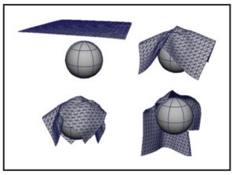
Figure 16.22. Realistic cloth simulation is often performed with physics-based methods. In this example, forces are due to collisions and gravity.
图 16.22。 真实的布料模拟通常使用基于物理的方法进行。 在此示例中，力是由碰撞和重力产生的。

The key idea of this approach is to replace a differential equation with its discrete analog—a difference equation. To do this, the continuous domain of interest is represented by a finite set of points at which the solution will be computed. In the simplest case, these are defined on a uniform rectangular grid as shown in Figure 16.23. Every derivative present in the original ODE or PDE is then replaced by its approximation through function values at grid points. One way of doing this is to subtract the function value at a given point from the function value for its neighboring point on the grid:
这种方法的关键思想是用离散方程（差分方程）代替微分方程。 为此，感兴趣的连续域由一组有限的点表示，在这些点上计算解。 在最简单的情况下，它们被定义在统一的矩形网格上，如图 16.23 所示。 然后，原始 ODE 或 PDE 中存在的每个导数都通过网格点处的函数值替换为其近似值。 一种方法是从网格上相邻点的函数值中减去给定点的函数值：
$\frac{df(t)}{dt} ≈ \frac{Δf}{Δt} = \frac{f(t + Δt) - f(t)}{Δt}$
or
$\frac{∂f(x, t)}{∂x}≈\frac{Δf}{Δx} = \frac{f(x + Δx, t) - f(x, t)}{Δx} \ \ \ \  \ \ \ (16.2)$

Figure 16.23. Two possible difference schemes for an equation involving derivatives $∂f/∂x$ and $∂f/∂t$. (Left) An explicit scheme expresses unknown values (open circles) only through known values at the current (orange circles) and possibly past (blue circles) time; (Right) Implicit schemes mix known and unknown values in a single equation making it necessary to solve all such equations as a system. For both schemes, information about values on the right boundary is needed to close the process.
图 16.23。 涉及导数 $∂f/∂x$ 和 $∂f/∂t$ 的方程的两种可能的差分格式。 （左）显式方案仅通过当前（橙色圆圈）和可能过去（蓝色圆圈）时间的已知值来表达未知值（空心圆圈）； （右)隐式方案将已知值和未知值混合在一个方程中，因此有必要将所有此类方程作为一个系统来求解。 对于这两种方案，需要有关右边界上的值的信息来关闭该过程。

These expressions are, of course, not the only way. One can, for example, use $f(t − Δt)$ instead of f(t) above and divide by $2Δt$ . For an equation containing a time derivative, it is now possible to propagate values of an unknown function forward in time in a sequence of Δt-size steps by solving the system of difference equations (one at each spatial location) for unknown $f(t + Δt)$. Some initial conditions, i.e., values of the unknown function at $t = 0$, are necessary to start the process. Other information, such as values on the boundary of the domain, might also be required depending on the specific problem. 
当然，这些表达并不是唯一的方法。例如，可以使用$f(t - Δt)$代替上面的f(t)并除以$2Δt$。对于包含时间导数的方程，现在可以通过求解未知$f(t + Δt)$的差分方程系统(每个空间位置一个)，以Δt-size步骤的序列在时间上向前传播未知函数的值。一些初始条件，即未知函数在t = 0处的值，是启动该过程所必需的。根据具体问题，可能还需要其他信息，例如域边界上的值。

The computation of $f(t+Δt)$ can be done easily for so-called explicit schemes when all other values present are taken at the current time and the only unknown in the corresponding difference equation $f(t + Δt)$ is expressed through these known values. Implicit schemes mix values at current and future times and might use, for example,
当所有其他存在值均取当前时间且相应差分方程 $f(t + Δt)$ 中唯一的未知数为时，对于所谓的显式方案，$f(t+Δt)$ 的计算可以轻松完成 通过这些已知值来表达。 隐式方案混合当前和未来的值，并可能使用，例如，
$\frac{f(x + Δx, t + Δt) - f(x, t + Δt)}{Δx} \\$

as an approximation of $\frac{∂f}{∂x}$. In this case one has to solve a system of algebraic equations at each step. 
作为 $\frac{∂f}{∂x}$ 的近似值。 在这种情况下，每一步都必须求解代数方程组。

The choice of difference scheme can dramatically affect all aspects of the algorithm. The most obvious among them is accuracy. In the limit $Δt → 0$ or $Δx → 0$, expressions of the type in Equation (16.2) are exact, but for finite step size some schemes allow better approximation of the derivative than others. Stability of a difference scheme is related to how fast numerical errors, which are always present in practice, can grow with time. For stable schemes this growth is bounded, while for unstable ones it is exponential and can quickly overwhelm the solution one seeks (see Figure 16.24). It is important to realize that while some inaccuracy in the solution is tolerable (and, in fact, accuracy demanded in physics and engineering is rarely needed for animation), an unstable result is completely meaningless, and one should avoid using unstable schemes. Generally, explicit schemes are either unstable or can become unstable at larger step sizes while implicit ones are unconditionally stable. Implicit schemes allows greater step size (and, therefore, fewer steps) which is why they are popular despite the need to solve a system of algebraic equations at each step. Explicit schemes are attractive because of their simplicity if their stability conditions can be satisfied. Developing a good difference scheme and corresponding algorithm for a specific problem is not easy, and for most standard situations it is well advised to use an existing method. Ample literature discussing details of these techniques is available. 
差分方案的选择可以极大地影响算法的各个方面。 其中最明显的是准确性。 在极限 $Δt → 0$ 或 $Δx → 0$ 下，方程 (16.2) 中类型的表达式是精确的，但对于有限步长，某些方案比其他方案允许更好地逼近导数。 差分格式的稳定性与实际中始终存在的数值误差随时间增长的速度有关。 对于稳定的方案，这种增长是有界的，而对于不稳定的方案，它是指数级的，并且很快就会压倒人们所寻求的解决方案（见图 16.24）。 重要的是要认识到，虽然解决方案中的一些不准确性是可以容忍的（事实上，动画很少需要物理和工程中要求的准确性），但不稳定的结果是完全没有意义的，应该避免使用不稳定的方案。 一般来说，显式方案要么不稳定，要么在较大步长下变得不稳定，而隐式方案则无条件稳定。 隐式方案允许更大的步长（因此步数更少），这就是为什么它们很受欢迎，尽管每一步都需要求解代数方程组。 如果能够满足稳定性条件，显式方案由于其简单性而具有吸引力。 针对特定问题开发良好的差分方案和相应的算法并不容易，对于大多数标准情况，建议使用现有方法。 有大量讨论这些技术细节的文献。
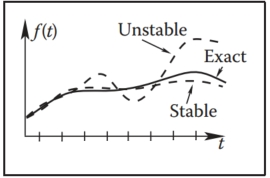
Figure 16.24. An unstable solution might follow the exact one initially, but can deviate arbitrarily far from it with time. Accuracy of a stable solution might still be insufficient for a specific application.
图 16.24。 不稳定的解决方案一开始可能遵循精确的解决方案，但随着时间的推移可能会偏离它任意远的距离。 对于特定应用来说，稳定解决方案的准确性可能仍然不够。

One should remember that, in many cases, just computing all necessary terms in the equation is a difficult and time-consuming task on its own. In rigid body or cloth simulation, for example, most of the forces acting on the system are due to collisions among objects. At each step during animation, one therefore has to solve a purely geometric, but very nontrivial, problem of collision detection. In such conditions, schemes which require fewer evaluations of such forces might provide significant computational savings. 
人们应该记住，在许多情况下，仅仅计算方程中的所有必要项本身就是一项困难且耗时的任务。 例如，在刚体或布料模拟中，作用在系统上的大部分力都是由于物体之间的碰撞而产生的。 因此，在动画过程中的每一步，都必须解决一个纯几何但非常重要的碰撞检测问题。 在这种情况下，需要对此类力进行较少评估的方案可能会节省大量计算量。

Although the result of solving appropriate time-dependant equations gives very realistic motion, this approach has its limitations. First of all, it is very hard to control the result of physics-based animation. Fundamental mathematical properties of these equations state that once the initial conditions are set, the solution is uniquely defined. This does not leave much room for animator input and, if the result is not satisfactory for some reason, one has only a few options. They are mostly limited to adjusting initial condition used, changing physical properties of the system, or even modifying the equations themselves by introducing artificial terms intended to “drive” the solution in the direction the animator wants. Making such changes requires significant skill as well as understanding of the underlying physics and, ideally, numerical methods. Without this knowledge, the realism provided by physics-based animation can be destroyed or severe numerical problems might appear. 
尽管求解适当的瞬态方程的结果给出了非常真实的运动，但这种方法有其局限性。 首先，基于物理的动画的结果很难控制。 这些方程的基本数学属性表明，一旦设置了初始条件，解就被唯一定义。 这并没有给动画师留下太多的输入空间，如果由于某种原因结果不令人满意，人们就只有几个选择。 它们大多仅限于调整所使用的初始条件，改变系统的物理属性，甚至通过引入旨在“驱动”解决方案朝动画师想要的方向“驱动”的人工术语来修改方程本身。 做出这样的改变需要大量的技能以及对基础物理的理解，最好是对数值方法的理解。 如果没有这些知识，基于物理的动画所提供的真实感可能会被破坏，或者可能会出现严重的数值问题。

## 16.6 Procedural Techniques 程序技术

Imagine that one could write (and implement on a computer) a mathematical function which outputs precisely the desired motion given some animator guidance. Physics-based techniques outlined above can be treated as a special case of such an approach when the “function” involved is the procedure to solve a particular differential equation and “guidance” is the set of initial and boundary conditions, extra equation terms, etc.
想象一下，人们可以编写（并在计算机上实现）一个数学函数，该函数在动画师的指导下精确输出所需的运动。 当涉及的“函数”是求解特定微分方程的过程，而“指导”是初始条件和边界条件、额外方程项等的集合时，上述基于物理的技术可以被视为这种方法的特例。

However, if we are only concerned with the final result, we do not have to follow a physics-based approach. For example, a simple constant amplitude wave on the surface of a lake can be directly created by applying the function $f(\bold{x}, t) = A cos(ωt − \bold{kx} + φ)$ with constant frequency $ω$, wave vector $\bold{k}$ and phase $φ$ to get displacement at the 2D point $\bold{x}$ at time $t$. A collection of such waves with random phases and appropriately chosen amplitudes, frequencies, and wave vectors can result in a very realistic animation of the surface of water without explicitly solving any fluid dynamics equations. It turns out that other rather simple mathematical functions can also create very interesting patterns or objects. Several such functions, most based on lattice noises, have been described in Section 11.5. Adding time dependance to these functions allows us to animate certain complex phenomena much easier and cheaper than with physics-based techniques while maintaining very high visual quality of the results. If $noise(\bold{x})$ is the underlying pattern-generating function, one can create a time-dependant variant of it by moving the argument position through the lattice. The simplest case is motion with constant speed: $timenoise(\bold{x}, t) = noise(\bold{x} + \bold{v}t)$, but more complex motion through the lattice is, of course, also possible and, in fact, more common. One such path, a spiral, is shown in Figure 16.25. Another approach is to animate parameters used to generate the noise function. This is especially appropriate if the appearance changes significantly with time—a cloud becoming more turbulent, for example. In this way one can animate the dynamic process of formation of clouds using the function which generates static ones.
但是，如果我们只关心最终结果，则不必遵循基于物理的方法。 例如，可以通过应用函数 $f(\bold{x}, t) = A cos(ωt − \bold{kx} + φ)$ 以及常数来直接创建湖面上的简单等幅波 频率 $ω$、波矢 $\bold{k}$ 和相位 $φ$ 以获得 2D 点 $\bold{x}$ 在时间 $t$ 处的位移。 具有随机相位和适当选择的振幅、频率和波矢量的此类波的集合可以产生非常逼真的水面动画，而无需明确求解任何流体动力学方程。 事实证明，其他相当简单的数学函数也可以创建非常有趣的图案或物体。 几个这样的函数，大多数基于晶格噪声，已在第 11.5 节中描述。 与基于物理的技术相比，向这些函数添加时间依赖性使我们能够更轻松、更便宜地制作某些复杂现象的动画，同时保持结果的非常高的视觉质量。 如果 $noise(\bold{x})$ 是底层模式生成函数，则可以通过在晶格中移动参数位置来创建它的时间相关变体。 最简单的情况是匀速运动：$timenoise(\bold{x}, t) = Noise(\bold{x} + \bold{v}t)$，但是通过晶格的更复杂的运动当然是， 也是可能的，而且事实上更常见。 图 16.25 显示了这样一种路径，即螺旋路径。 另一种方法是对用于生成噪声函数的参数进行动画处理。 如果外观随时间发生显着变化（例如，云变得更加混乱），这尤其合适。 通过这种方式，人们可以使用生成静态云的函数来动画化云形成的动态过程。
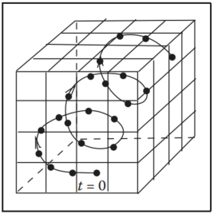
Figure 16.25. A path through the cube defining procedural noise is traversed to animate the resulting pattern.
图 16.25。 穿过定义程序噪声的立方体的路径来动画生成的图案。

For some procedural techniques, time dependance is a more integral component. The simplest cellular automata operate on a 2D rectangular grid where a binary value is stored at each location (cell). To create a time varying pattern, some user-provided rules for modifying these values are repeatedly applied. Rules typically involve some set of conditions on the current value and that of the cell’s neighbors. For example, the rules of the popular 2D Game of Life cellular automaton invented in 1970 by British mathematician John Conway are the following: 
对于某些程序技术来说，时间依赖性是一个更不可或缺的组成部分。 最简单的元胞自动机在二维矩形网格上运行，其中每个位置（单元）都存储一个二进制值。 为了创建随时间变化的模式，需要重复应用一些用户提供的用于修改这些值的规则。 规则通常涉及当前值和单元格邻居的某些条件集。 例如，英国数学家约翰·康威于 1970 年发明的流行的 2D 生命游戏元胞自动机的规则如下：

1. A dead cell (i.e., binary value at a given location is 0) with exactly three live neighbors becomes a live cell (i.e., its value set to 1). 
   恰好有三个活邻居的死细胞（即给定位置的二进制值为 0）成为活细胞（即其值设置为 1）。
2. A live cell with two or three live neighbors stays alive. 
   一个活细胞如果有两个或三个活邻居，那么它就会保持存活状态。
3. In all other cases, a cell dies or remains dead. 
   在所有其他情况下，细胞死亡或保持死亡状态。

Once the rules are applied to all grid locations, a new pattern is created and a new evolution cycle can be started. Three sample snapshots of the live cell distribution at different times are shown in Figure 16.26. More sophisticated automata simultaneously operate on several 3D grids of possibly floating point values and can be used for modeling dynamics of clouds and other gaseous phenomena or biological systems for which this apparatus was originally invented (note the terminology). Surprising pattern complexity can arise from just a few well-chosen rules, but how to write such rules to create the desired behavior is often not obvious. This is a common problem with procedural techniques: there is only limited, if any, guidance on how to create new procedures or even adjust parameters of existing ones. Therefore, a lot of tweaking and learning by trial-and-error (“by experience”) is usually needed to unlock the full potential of procedural methods. 
一旦规则应用于所有网格位置，就会创建新的模式并开始新的演化周期。 图 16.26 显示了不同时间活细胞分布的三个样本快照。 更复杂的自动机同时在多个可能浮点值的 3D 网格上运行，可用于对云和其他气体现象或生物系统的动力学建模，该设备最初是为这些系统发明的（注意术语）。 只需几个精心选择的规则就可以产生令人惊讶的模式复杂性，但如何编写这些规则来创建所需的行为通常并不明显。 这是程序技术的一个常见问题：关于如何创建新程序甚至调整现有程序的参数的指导（如果有的话）也是有限的。 因此，通常需要通过反复试验（“通过经验”）进行大量调整和学习，以释放程序方法的全部潜力。

Figure 16.26. Several (non-consecutive) stages in the evolution of a Game of Life automaton. Live cells are shown in black. Stable objects, oscillators, traveling patterns, and many other interesting constructions can result from the application of very simple rules. Figure created using a program by Alan Hensel.
图 16.26。 生命游戏自动机演化的几个（非连续)阶段。 活细胞显示为黑色。 稳定的物体、振荡器、移动模式和许多其他有趣的结构都可以通过应用非常简单的规则来产生。 使用 Alan Hensel 的程序创建的图形。

Another interesting approach which was also originally developed to describe biological objects is the technique called L-systems (after the name of their original inventor, Astrid Lindenmayer). This approach is based on grammars or sets of recursive rules for rewriting strings of symbols. There are two types of symbols: terminal symbols stand for elements of something we want to represent with a grammar. Depending on their meaning, grammars can describe structure of trees and bushes, buildings and whole cities, or programming and natural languages. In animation, L-systems are most popular for representing plants and corresponding terminals are instructions to the geometric modeling system: put a leaf (or a branch) at a current position—we will use the symbol @ and just draw a circle, move current position forward by some number of units (symbol f), turn current direction 60 degrees around world Z-axis (symbol +), pop (symbol [) or push (symbol ]) current position/orientation, etc. Auxiliary nonterminal symbols (denoted by capital letters) have only semantic rather than any direct meaning. They are intended to be eventually rewritten through terminals. We start from the special nonterminal start symbol S and keep applying grammar rules to the current string in parallel, i.e., replace all nonterminals currently present to get the new string, until we end up with a string containing only terminals and no more substitution is therefore possible. This string of modeling instructions is then used to output the actual geometry. For example, a set of rules (productions)
另一种有趣的方法最初也是为了描述生物对象而开发的，它是称为 L 系统的技术（以其原始发明者 Astrid Lindenmayer 的名字命名）。 这种方法基于用于重写符号字符串的语法或递归规则集。 有两种类型的符号：终结符号代表我们想要用语法表示的事物的元素。 根据其含义，语法可以描述树木和灌木、建筑物和整个城市的结构，或者编程和自然语言。 在动画中，L系统最流行用于表示植物，相应的终端是对几何建模系统的指令：将一片叶子（或树枝）放在当前位置 - 我们将使用符号@并只画一个圆，移动当前位置 向前移动一些单位（符号 f），将当前方向绕世界 Z 轴旋转 60 度（符号 +），弹出（符号 [）或推送（符号 ]）当前位置/方向等。辅助非终结符号（表示为 由大写字母组成）仅具有语义而不具有任何直接含义。 它们最终将通过终端重写。 我们从特殊的非终结符开始符号 S 开始，并继续并行地将语法规则应用于当前字符串，即替换当前存在的所有非终结符以获得新字符串，直到我们最终得到一个仅包含终结符的字符串，因此不再需要替换 可能的。 然后使用这串建模指令来输出实际的几何形状。 例如，一组规则（产生式）
$$
S → A \\
A → [+B]fA \\
A → B \\
B → fB \\
B → f@ \\
$$
might result in the following sequence of rewriting steps demonstrated in Figure 16.27: 
可能会导致如图 16.27 所示的以下重写步骤序列：
$$
S \mapsto A \mapsto [+B]fA \mapsto [+fB]f[+B]fA \mapsto \\
[+ff@]f[+fB]fB \mapsto [+ff@]f[+ff@]ff@ . 
$$
As shown above, there are typically many different productions for the same nonterminal allowing the generation of many different objects with the same grammar. The choice of which rule to apply can depend on which symbols are located next to the one being replaced (context-sensitivity) or can be performed at random with some assigned probability for each rule (stochastic L-systems). More complex rules can model interaction with the environment, such as pruning to a particular shape, and parameters can be associated with symbols to control geometric commands issued. 
如上所示，相同的非终结符通常有许多不同的产生式，从而允许使用相同的语法生成许多不同的对象。 应用哪个规则的选择可以取决于哪些符号位于被替换的符号旁边（上下文敏感），或者可以以每个规则的某个指定概率随机执行（随机 L 系统）。 更复杂的规则可以对与环境的交互进行建模，例如修剪为特定形状，并且参数可以与符号关联以控制发出的几何命令。

L-systems already capture plant topology changes with time: each intermediate string obtained in the rewriting process can be interpreted as a “younger” version of the plant (see Figure 16.27). For more significant changes, different productions can be in effect at different times allowing the structure of the plant to change significantly as it grows. A young tree, for example, produces a lot of new branches, while an older one branches only moderately. 
L-系统已经捕获了工厂拓扑随时间的变化：重写过程中获得的每个中间字符串都可以解释为工厂的“年轻”版本（见图 16.27）。 对于更显着的变化，不同的生产可以在不同的时间生效，从而使植物的结构随着其生长而发生显着的变化。 例如，一棵年轻的树会产生大量新枝，而老树则只能产生适度的枝条。

Figure 16.27. Consecutive derivation steps using a simple L-system. Capital letters denote nonterminals and illustrate positions at which corresponding nonterminal will be expanded. They are not part of the actual output.
图 16.27。 使用简单的 L 系统的连续推导步骤。 大写字母表示非终结符，并说明相应非终结符将被扩展的位置。 它们不是实际输出的一部分。

Very realistic plant models have been created with L-systems. However, as with most procedural techniques, one needs some experience to meaningfully apply existing L-systems, and writing new grammars to capture some desired effect is certainly not easy. 
使用 L 系统创建了非常逼真的植物模型。 然而，与大多数程序技术一样，需要一些经验才能有意义地应用现有的 L 系统，并且编写新语法来捕获某些所需的效果当然并不容易。

## 16.7 Groups of Objects 对象组

To animate multiple objects one can, of course, simply apply standard techniques described in the chapter so far to each of them. This works reasonably well for a moderate number of independent objects whose desired motion is known in advance. However, in many cases, some kind of coordinated action in a dynamic environment is necessary. If only a few objects are involved, the animator can use an artificial intelligence (AI)-based system to automatically determine immediate tasks for each object based on some high-level goal, plan necessary motion, and execute the plan. Many modern games use such autonomous objects to create smart monsters or player’s collaborators. 
当然，要为多个对象设置动画，只需将本章到目前为止描述的标准技术应用于每个对象即可。 对于预先知道所需运动的中等数量的独立物体来说，这种方法相当有效。 然而，在许多情况下，动态环境中某种协调行动是必要的。 如果只涉及几个对象，动画师可以使用基于人工智能 (AI) 的系统，根据一些高级目标自动确定每个对象的即时任务，规划必要的动作并执行计划。 许多现代游戏都使用这种自主对象来创建智能怪物或玩家的合作者。

Interestingly, as the number of objects in a group grows from just a few to several dozens, hundreds, and thousands, individual members of a group must have only very limited “intelligence” in order for the group as a whole to exhibit what looks like coordinated goal-driven motion. It turns out that this flocking is emergent behavior which can arise as a result of limited interaction of group members with just a few of their closest neighbors (Reynolds, 1987). Flocking should be familiar to anyone who has observed the fascinatingly synchronized motion of a flock of birds or a school of fish. The technique can also be used to control groups of animals moving over terrain or even a human crowd. 
有趣的是，当一个群体中的物体数量从几个增长到几十个、几百个、几千个时，群体中的个体成员必须只有非常有限的“智力”才能使整个群体表现出看起来像的样子。 协调目标驱动的运动。 事实证明，这种聚集是一种突发行为，可能是由于群体成员与他们最近的几个邻居的有限互动而产生的（Reynolds，1987）。 任何观察过鸟群或鱼群令人着迷的同步运动的人都应该熟悉集群现象。 该技术还可用于控制在地形上移动的动物群甚至人群。

At any given moment, the motion of a member of a group, often called boid when applied to flocks, is the result of balancing several often contradictory tendencies, each of which suggests its own velocity vector (see Figure 16.28). First, there are external physical forces $F$ acting on the boid, such as gravity or wind. New velocity due to those forces can be computed directly through Newton’s law as
在任何给定时刻，群体成员的运动（应用于群体时通常称为 boid）是平衡几个通常相互矛盾的趋势的结果，每个趋势都有自己的速度矢量（见图 16.28）。 首先，有外部物理力$F$作用在物体上，例如重力或风。 这些力产生的新速度可以直接通过牛顿定律计算：
$v^{physics}_{new} = \bold{v}_{old} + \bold{F}Δt/m.    $

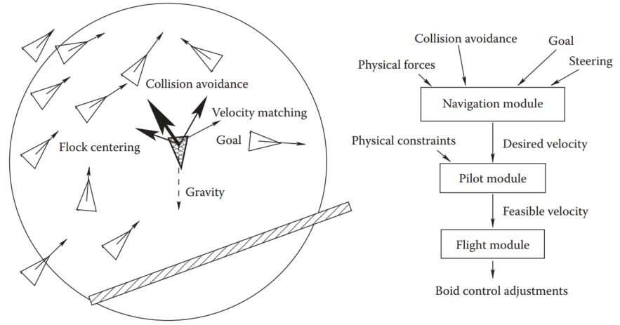
Figure 16.28. (Left) Individual flock member (boid) can experience several urges of different importance (shown by line thickness) which have to be negotiated into a single velocity vector. A boid is aware of only its limited neighborhood (circle). (Right) Boid control is commonly implemented as three separate modules.
图 16.28。 （左）单个群体成员（boid）可能会经历几种不同重要性的冲动（由线条粗细显示），这些冲动必须协商成单个速度矢量。 群体只知道其有限的邻域（圆圈）。 （右)Boid 控制通常作为三个独立的模块来实现。

Second, a boid should react to global environment and to the behavior of other group members. Collision avoidance is one of the main results of such interaction. It is crucial for flocking that each group member has only limited field of view, and therefore is aware only of things happening within some neighborhood of its current position. To avoid objects in the environment, the simplest, if imperfect, strategy is to set up a limited extent repulsive force field around each such object. This will create a second desired velocity vector $\bold{v}^{col\_avoid}_{new}$, also given by Newton’s law. Interaction with other group members can be modeled by simultaneously applying different steering behaviors resulting in several additional desired velocity vectors $\bold{v}^{steer}_{new}$. Moving away from neighbors to avoid crowding, steering toward flock mates to ensure flock cohesion, and adjusting a boid’s speed to align with average heading of neighbors are most common. Finally, some additional desired velocity vectors $\bold{v}^{goal}_{new}$ are usually applied to achieve needed global goals. These can be vectors along some path in space, following some specific designated leader of the flock, or simply representing migratory urge of a flock member. 
其次，群体应对全球环境和其他群体成员的行为做出反应。 避免碰撞是这种交互的主要结果之一。 对于群体聚集来说至关重要的是，每个群体成员的视野都有限，因此只能意识到其当前位置的某个邻域内发生的事情。 为了避开环境中的物体，最简单（如果不完美）的策略是在每个此类物体周围建立有限范围的排斥力场。 这将创建第二个所需的速度矢量 $\bold{v}^{col\_avoid}_{new}$，也由牛顿定律给出。 与其他组成员的交互可以通过同时应用不同的转向行为来建模，从而产生几个额外的所需速度向量 $\bold{v}^{steer}_{new}$。 远离邻居以避免拥挤，转向群体伙伴以确保群体凝聚力，以及调整群体的速度以与邻居的平均航向保持一致是最常见的。 最后，通常应用一些额外的所需速度向量 $\bold{v}^{goal}_{new}$ 来实现所需的全局目标。 这些可以是沿着空间中某些路径的向量，跟随某个特定的指定的羊群领导者，或者简单地代表羊群成员的迁徙冲动。

Once all $\bold{v}_{new}$ are determined, the final desired vector is negotiated based on priorities among them. Collision avoidance and velocity matching typically have higher priority. Instead of simple averaging of desired velocity vectors which can lead to cancellation of urges and unnatural “moving nowhere” behavior, an acceleration allocation strategy is used. Some fixed total amount of acceleration is made available for a boid and fractions of it are being given to each urge in order of priority. If the total available acceleration runs out, some lower priority urges will have less effect on the motion or be completely ignored. The hope is that once the currently most important task (collision avoidance in most situations) is accomplished, other tasks can be taken care of in near future. It is also important to respect some physical limitations of real objects, for example, clamping too high accelerations or speeds to some realistic values. Depending on the internal complexity of the flock member, the final stage of animation might be to turn the negotiated velocity vector into a specific set of parameters (bird’s wing positions, orientation of plane model in space, leg skeleton bone configuration) used to control a boid’s motion. A diagram of a system implementing flocking is shown on Figure 16.28 (right). 
一旦确定了所有$\bold{v}_{new}$，就根据它们之间的优先级协商最终的期望向量。 避免碰撞和速度匹配通常具有更高的优先级。 使用加速度分配策略，而不是对期望速度向量进行简单平均，这可能导致取消冲动和不自然的“无处可去”行为。 为主体提供了一些固定的总加速度，并将其中的一小部分按优先级顺序分配给每个冲动。 如果总可用加速度耗尽，一些较低优先级的冲动对运动的影响较小或完全被忽略。 希望一旦当前最重要的任务（大多数情况下避免碰撞）完成，其他任务就可以在不久的将来得到处理。 尊重真实物体的一些物理限制也很重要，例如，将过高的加速度或速度限制在某些实际值。 根据鸟群成员的内部复杂性，动画的最后阶段可能是将协商的速度矢量转换为一组特定的参数（鸟的翅膀位置、平面模型在空间中的方向、腿部骨骼的骨骼配置），用于控制 博德的动作。 图 16.28（右）显示了实现集群的系统图。

A much simpler, but still very useful, version of group control is implemented by particle systems (Reeves, 1983). The number of particles in a system is typically much larger than number of boids in a flock and can be in the tens or hundreds of thousands, or even more. Moreover, the exact number of particles can fluctuate during animation with new particles being born and some of the old ones destroyed at each step. Particles are typically completely independent from each other, ignoring one’s neighbors and interacting with the environment only by experiencing external forces and collisions with objects, not through collision avoidance as was the case for flocks. At each step during animation, the system first creates new particles with some initial parameters, terminates old ones, and then computes necessary forces and updates velocities and positions of the remaining particles according to Newton’s law. 
一个更简单但仍然非常有用的组控制版本是由粒子系统实现的（Reeves，1983）。 系统中的粒子数量通常远大于群体中的粒子数量，并且可以是数万或数十万，甚至更多。 此外，粒子的确切数量在动画过程中可能会发生波动，每一步都会产生新粒子，并销毁一些旧粒子。 粒子通常彼此完全独立，忽略邻近的粒子，仅通过经历外力和与物体的碰撞来与环境相互作用，而不是像群体那样通过避免碰撞。 在动画过程中的每个步骤中，系统首先创建具有一些初始参数的新粒子，终止旧粒子，然后计算必要的力并根据牛顿定律更新剩余粒子的速度和位置。
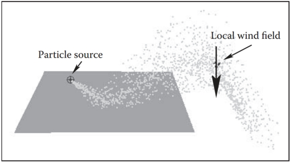
Figure 16.29. After being emitted by a directional source, particles collide with an object and then are blown down by a local wind field once they clear the obstacle. 
图 16.29。 粒子由定向源发射后，与物体碰撞，一旦越过障碍物，就会被局部风场吹落。

All parameters of a particle system (number of particles, particle life span, initial velocity, and location of a particle, etc.) are usually under the direct control of the animator. Prime applications of particle systems include modeling fireworks, explosions, spraying liquids, smoke and fire, or other fuzzy objects and phenomena with no sharp boundaries. To achieve a realistic appearance, it is important to introduce some randomness to all parameters, for example, having a random number of particles born (and destroyed) at each step with their velocities generated according to some distribution. In addition to setting appropriate initial parameters, controlling the motion of a particle system is commonly done by creating a specific force pattern in space—blowing a particle in a new direction once it reaches some specific location or adding a center of attraction, for example. One should remember that with all their advantages, simplicity of implementation and ease of control being the prime ones, particle systems typically do not provide the level of realism characteristic of true physics-based simulation of the same phenomena.
粒子系统的所有参数（粒子数量、粒子寿命、初始速度和粒子位置等）通常都在动画师的直接控制下。 粒子系统的主要应用包括对烟花、爆炸、喷射液体、烟雾和火焰或其他没有明确边界的模糊物体和现象进行建模。 为了实现逼真的外观，重要的是向所有参数引入一些随机性，例如，在每一步产生（和破坏）随机数量的粒子，并根据某种分布生成它们的速度。 除了设置适当的初始参数之外，控制粒子系统的运动通常是通过在空间中创建特定的力模式来完成的，例如，一旦粒子到达某个特定位置，就将其吹向新的方向或添加吸引力中心。 人们应该记住，尽管粒子系统具有所有优点，但实现简单和易于控制是主要优点，但它们通常无法提供对相同现象进行真正基于物理的模拟的真实感特征。

## Notes 注释

In this chapter we have concentrated on techniques used in 3D animation. There also exist a rich set of algorithms to help with 2D animation production and post-processing of images created by computer graphics rendering systems. These include techniques for cleaning up scanned-in artist drawings, feature extraction, automatic 2D in-betweening, colorization, image warping, enhancement and compositing, and many others. 
在本章中，我们集中讨论 3D 动画中使用的技术。 还有一组丰富的算法可以帮助进行 2D 动画制作以及对计算机图形渲染系统创建的图像进行后处理。 其中包括清理扫描输入的艺术家绘图、特征提取、自动 2D 中间处理、着色、图像扭曲、增强和合成等技术。

One of the most significant developments in the area of computer animation has been the increasing power and availability of sophisticated animation systems. While different in their specific set of features, internal structure, details of user interface, and price, most such systems include extensive support not only for animation, but also for modeling and rendering, turning them into complete production platforms. It is also common to use these systems to create still images. For example, many images for figures in this section were produced using Maya software generously donated by Alias. 
计算机动画领域最重要的发展之一是复杂动画系统的功能和可用性不断增强。 虽然其特定功能集、内部结构、用户界面细节和价格有所不同，但大多数此类系统不仅包括对动画的广泛支持，而且还包括对建模和渲染的广泛支持，将它们转变为完整的制作平台。 使用这些系统创建静态图像也很常见。 例如，本节中的许多人物图像都是使用 Alias 慷慨捐赠的 Maya 软件制作的。

Large-scale animation production is an extremely complex process which typically involves a combined effort by dozens of people with different backgrounds spread across many departments or even companies. To better coordinate this activity, a certain production pipeline is established which starts with a story and character sketches, proceeds to record necessary sound, build models, and rig characters for animation. Once actual animation commences, it is common to go back and revise the original designs, models, and rigs to fix any discovered motion and appearance problems. Setting up lighting and material properties is then necessary, after which it is possible to start rendering. In most sufficiently complex projects, extensive postprocessing and compositing stages bring together images from different sources and finalize the product. 
大型动画制作是一个极其复杂的过程，通常需要分布在多个部门甚至公司的数十名不同背景的人员共同努力。 为了更好地协调这项活动，建立了一定的制作流程，从故事和角色草图开始，然后录制必要的声音、构建模型和为动画装配角色。 一旦实际的动画开始，通常会返回并修改原始设计、模型和装备，以修复任何发现的运动和外观问题。 然后需要设置照明和材质属性，然后才能开始渲染。 在大多数足够复杂的项目中，大量的后处理和合成阶段将不同来源的图像汇集在一起并最终确定产品。

We conclude this chapter by reminding the reader that in the field of computer animation, any technical sophistication is secondary to a good story, expressive characters, and other artistic factors, most of which are hard or simply impossible to quantify. It is safe to say that Snow White and her seven dwarfs will always share the screen with green ogres and donkeys, and most of the audience will be much more interested in the characters and the story rather than in which, if any, computers (and in what exact way) helped to create them.
在本章结束时，我们提醒读者，在计算机动画领域，任何技术的复杂性都是次要的，而不是一个好的故事、富有表现力的角色和其他艺术因素，其中大多数很难或根本不可能量化。 可以肯定地说，白雪公主和她的七个小矮人将始终与绿色食人魔和驴子共享屏幕，大多数观众将对角色和故事更感兴趣，而不是对计算机（如果有的话）感兴趣。 以什么确切的方式）帮助创造了它们。