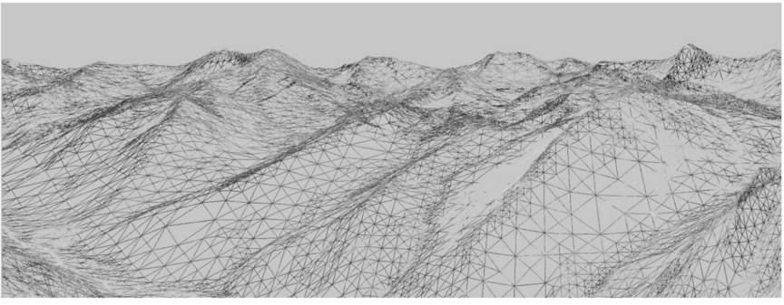
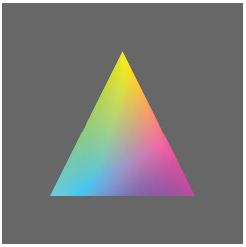
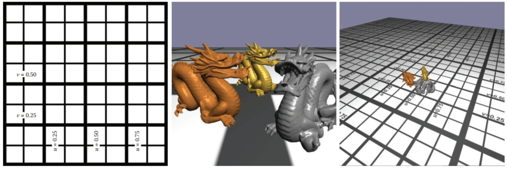
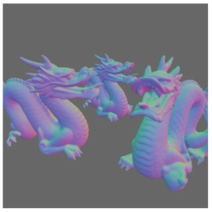
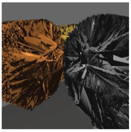

# 17  Using Graphics Hardware  使用图形硬件

## 17.1 Hardware Overview   硬件概述

Throughout most of this book, the focus is on the fundamentals that underly computer graphics rather than on any specifics relating to the APIs or hardware on which the algorithms may be implemented. This chapter takes a slightly different route and blends the details of using graphics hardware with some of the practical issues associated with programming that hardware. The chapter is designed to be an introductory guide to graphics hardware and could be used as the basis for a set of weekly labs that investigate graphics hardware. 
在本书的大部分内容中，重点是计算机图形学的基础知识，而不是与可实现算法的 API 或硬件相关的任何细节。 本章采取了略有不同的路线，并将使用图形硬件的细节与与该硬件编程相关的一些实际问题结合起来。 本章旨在作为图形硬件的介绍性指南，并且可以用作研究图形硬件的每周实验的基础。

## 17.2 What Is Graphics Hardware 什么是图形硬件

Graphics hardware describes the hardware components necessary to quickly render 3D objects as pixels on your computer’s screen using specialized rasterization-based (and in some cases, ray-tracer–based) hardware architectures. The use of the term graphics hardware is meant to elicit a sense of the physical components necessary for performing a range of graphics computations. In other words, the hardware is the set of chipsets, transistors, buses, processors, and computing cores found on current video cards. As you will learn in this chapter, and eventually experience yourself, current graphics hardware is very good at processing descriptions of 3D objects and transforming those representations into the colored pixels that fill your monitor.
图形硬件描述了使用专门的基于光栅化（在某些情况下基于光线追踪器）的硬件架构将 3D 对象快速渲染为计算机屏幕上的像素所需的硬件组件。 使用术语图形硬件是为了引出对执行一系列图形计算所需的物理组件的了解。 换句话说，硬件是当前显卡上的芯片组、晶体管、总线、处理器和计算核心的集合。 正如您将在本章中了解到并最终亲自体验到的那样，当前的图形硬件非常擅长处理 3D 对象的描述并将这些表示转换为填充显示器的彩色像素。

Graphics hardware has certainly changed very rapidly over the last decade. Newer graphics hardware provides more parallel processing capabilities, as well as better support for specialized rendering. One explanation for the fast pace is the video game industry and its economic momentum. Essentially what this means is that each new graphics card provides better performance and processing capabilities. As a result, video games appear more visually realistic. The processors on graphics hardware, often called GPUs, or Graphics Processing Units, are highly parallel and afford thousands of concurrent threads of execution. The hardware is designed for throughput which allows larger numbers of pixels and vertices to be processed in shorter amounts of time. All of this parallelism is good for graphics algorithms, but other work has benefited from the parallel hardware. In addition to video games, GPUs are used to accelerate physics computations, develop real-time ray tracing codes, solve Navier-Stokes related equations for fluid flow simulations, and develop faster codes for understanding the climate (Purcell, Buck, Mark, & Hanrahan, 2002; S. G. Parker et al., 2010; Harris, 2004). Several APIs and SDKs have been developed that afford more direct general purpose computation, such as OpenCL and NVIDIA’s CUDA. Hardware accelerated ray tracing APIs also exist to accelerate ray-object intersection (S. G. Parker et al., 2010). Similarly, the standard APIs that are used to program the graphics components of video games, such as OpenGL and DirectX, also allow mechanisms to leverage the graphics hardware’s parallel capabilities. Many of these APIs change as new hardware is developed to support more sophisticated computations.
在过去的十年里，图形硬件确实发生了非常迅速的变化。 更新的图形硬件提供了更多的并行处理能力，以及对专业渲染的更好支持。 快速发展的一种解释是视频游戏行业及其经济动力。 从本质上讲，这意味着每个新显卡都提供更好的性能和处理能力。 因此，视频游戏在视觉上显得更加真实。 图形硬件上的处理器（通常称为 GPU 或图形处理单元）是高度并行的，可提供数千个并发执行线程。 硬件专为吞吐量而设计，允许在更短的时间内处理大量像素和顶点。 所有这些并行性都有利于图形算法，但其他工作也受益于并行硬件。 除了视频游戏之外，GPU 还用于加速物理计算、开发实时光线追踪代码、求解流体流动模拟的纳维-斯托克斯相关方程，以及开发更快的代码来了解气候（Purcell、Buck、Mark 和 Hanrahan） ，2002 年；S.G. Parker 等人，2010 年；哈里斯，2004 年）。 一些 API 和 SDK 已经开发出来，可以提供更直接的通用计算，例如 OpenCL 和 NVIDIA 的 CUDA。 还存在硬件加速光线追踪 API 来加速光线与对象的相交（S. G. Parker 等人，2010）。 同样，用于对视频游戏的图形组件进行编程的标准 API（例如 OpenGL 和 DirectX）也允许利用图形硬件的并行功能的机制。 随着新硬件的开发以支持更复杂的计算，其中许多 API 都会发生变化。

> Real-Time Graphics: By real-time graphics, we generally mean that the graphics-related computations are being carried out fast enough that the results can be viewed immediately. Being able to conduct operations at 60Hz or higher is considered real time. Once the time to refresh the display (frame rate) drops below 15Hz, the speed is considered more interactive than it is real-time, but this distinction is not critical. Because the computations need to be fast, the equations used to render the graphics are often approximations to what could be done if more time were available.
> 实时图形：所谓实时图形，通常是指与图形相关的计算执行得足够快，可以立即查看结果。 能够以 60Hz 或更高频率进行操作被认为是实时的。 一旦刷新显示的时间（帧速率）降至 15Hz 以下，则该速度被认为更具交互性，而不是实时速度，但这种区别并不重要。 由于计算需要快速，因此用于渲染图形的方程通常是在有更多时间可用的情况下可以完成的近似值。

Graphics hardware is programmable. As a developer, you have control over much of the computations associated with processing geometry, vertices, and the fragments that eventually become pixels. Recent hardware changes as well as ongoing updates to the APIs, such as OpenGL or DirectX, support a completely programmable pipeline. These changes afford developers creative license to exploit the computation available on GPUs. Prior to this, fixed-function rasterization pipelines forced the computation to a specific style of vertex transformations, lighting, and fragment processing. The fixed functionality of the pipeline ensured that basic coloring, lighting, and texturing could occur very quickly. Whether it is a programmable interface, or fixed-function computation, the basic computations of the rasterization pipeline are similar, and follow the illustration in Figure 17.1. In the rasterization pipeline, vertices are transformed from local space to global space, and eventually into screen coordinates, after being transformed by the viewing and projection transformation matrices. The set of screen coordinates associated with a geometry’s vertices are rasterized into fragments. The final stages of the pipeline process the fragments into pixels and can apply per-fragment texture lookups, lighting, and any necessary blending. In general, the pipeline lends itself to parallel execution and the GPU cores can be used to process both vertices and fragments concurrently. Additional details about the rasterization pipeline can be found in Chapter 8.
图形硬件是可编程的。 作为开发人员，您可以控制与处理几何图形、顶点以及最终变成像素的片段相关的大部分计算。 最近的硬件变化以及 API（例如 OpenGL 或 DirectX）的持续更新支持完全可编程的管道。 这些变化为开发人员提供了利用 GPU 上可用计算的创造性许可。 在此之前，固定功能光栅化管道迫使计算采用特定类型的顶点变换、光照和片段处理。 管道的固定功能确保了基本的着色、照明和纹理可以非常快速地发生。 无论是可编程接口，还是固定功能计算，光栅化流水线的基本计算都是类似的，如图17.1所示。 在光栅化管道中，顶点在经过观察和投影变换矩阵变换后，从局部空间变换到全局空间，并最终变换到屏幕坐标。 与几何体顶点关联的屏幕坐标集被光栅化为片段。 管道的最后阶段将片段处理为像素，并可以应用每个片段的纹理查找、照明和任何必要的混合。 一般来说，管道适合并行执行，GPU 核心可用于同时处理顶点和片段。 有关光栅化管道的更多详细信息，请参阅第 8 章。

> Fragment: Fragment is a term that describes the information associated with a pixel prior to being processed in the final stages of the graphics pipeline. This definition includes much of the data that might be used to calculate the color of the pixel, such as the pixel’s scene depth, texture coordinates, or stencil information.
> 片段：片段是一个术语，描述在图形管道的最后阶段进行处理之前与像素相关的信息。 此定义包括许多可用于计算像素颜色的数据，例如像素的场景深度、纹理坐标或模板信息。


Figure 17.1. The basic graphics hardware pipeline consists of stages that transform 3D data into 2D screen objects ready for rasterizing and coloring by the pixel processing stages. 
图 17.1。 基本图形硬件管道由多个阶段组成，这些阶段将 3D 数据转换为 2D 屏幕对象，准备好由像素处理阶段进行光栅化和着色。

## 17.3 Heterogeneous Multiprocessing 异构多重处理

When using graphics hardware, it is convenient to distinguish between the CPU and the GPU as separate computational entities. In this context, the term host is used to refer to the CPU including the threads and memory available to it. The  term device is used to refer to the GPU, or the graphics processing units, and the threads and memory associated with it. This makes some sense because most graphics hardware is comprised of external hardware that is connected to the machine via the PCI bus. The hardware may also be soldered to the machine as a separate chipset. In this sense, the graphics hardware represents a specialized co-processor since both the CPU (and its cores) can be programmed, as can the GPU and its cores. All programs that utilize graphics hardware must first establish a mapping between the CPU and the GPU memory. This is a rather low-level detail that is necessary so that the graphics hardware driver residing within the operating system can interface between the hardware and the operating system and windowing system software. Recall that because the host (CPU) and the device (GPU) are separate, data must be communicated between the two systems. More formally, this mapping between the operating system, the hardware driver, the hardware, and the windowing system is known as the graphics context. The context is usually established through API calls to the windowing system. Details about establishing a context is outside the scope of this chapter, but many windowing system development libraries have ways to query the graphics hardware for various capabilities and establish the graphics context based on those requirements. Because setting up the context is windowing system dependent, it also means that such code is not likely to be cross-platform code. However, in practice, or at least when starting out, it is very unlikely that such low-level context setup code will be required since many higher level APIs exist to help people develop portable interactive applications. 
使用图形硬件时，可以方便地将 CPU 和 GPU 区分为单独的计算实体。 在这种情况下，术语主机用于指代 CPU，包括可用的线程和内存。 术语“设备”用于指代 GPU 或图形处理单元以及与其关联的线程和内存。 这是有道理的，因为大多数图形硬件都是由通过 PCI 总线连接到机器的外部硬件组成的。 硬件也可以作为单独的芯片组焊接到机器上。 从这个意义上说，图形硬件代表了一个专门的协处理器，因为 CPU（及其核心）都可以编程，GPU 及其核心也可以编程。 所有使用图形硬件的程序都必须首先在CPU和GPU内存之间建立映射。 这是一个相当低级的细节，它是必要的，以便驻留在操作系统内的图形硬件驱动程序可以在硬件与操作系统和窗口系统软件之间进行接口。 回想一下，由于主机（CPU）和设备（GPU）是分开的，因此数据必须在两个系统之间进行通信。 更正式地说，操作系统、硬件驱动程序、硬件和窗口系统之间的映射称为图形上下文。 上下文通常是通过对窗口系统的 API 调用来建立的。 有关建立上下文的详细信息超出了本章的范围，但许多窗口系统开发库都有方法查询图形硬件的各种功能，并根据这些要求建立图形上下文。 由于设置上下文依赖于窗口系统，因此这也意味着此类代码不太可能是跨平台代码。 然而，在实践中，或者至少在开始时，不太可能需要这种低级上下文设置代码，因为存在许多更高级别的 API 来帮助人们开发便携式交互式应用程序。

> Host: In a graphics hardware program, the host refers to the CPU components of the application.
> 主机：在图形硬件程序中，主机指的是应用程序的CPU组件。
>
> Device: The GPU side of the graphics application, including the data and computation that are stored and executed on the GPU.
> 设备：图形应用程序的GPU端，包括在GPU上存储和执行的数据和计算。

Many of the frameworks for developing interactive applications support querying input devices such as the keyboard or mouse. Some frameworks provide access to the network, audio system, and other higher level system resources. In this regard, many of these APIs are the preferred way to develop graphics, and even game applications. 
许多用于开发交互式应用程序的框架都支持查询输入设备，例如键盘或鼠标。 一些框架提供对网络、音频系统和其他更高级别系统资源的访问。 在这方面，许多 API 是开发图形甚至游戏应用程序的首选方式。

Cross-platform hardware acceleration is often achieved with the OpenGL API. OpenGL is an open industry standard graphics API that supports hardware acceleration on many types of graphics hardware. OpenGL represents one of the most common APIs for programming graphics hardware along with APIs such as DirectX. While OpenGL is available on many operating systems and hardware architectures, DirectX is specific to Microsoft-based systems. For the purposes of this chapter, hardware programming concepts and examples will be presented with OpenGL.
跨平台硬件加速通常通过 OpenGL API 来实现。 OpenGL 是一种开放式行业标准图形 API，支持多种图形硬件上的硬件加速。 OpenGL 与 DirectX 等 API 一样，是图形硬件编程最常见的 API 之一。 虽然 OpenGL 可在许多操作系统和硬件架构上使用，但 DirectX 特定于基于 Microsoft 的系统。 为了本章的目的，将使用 OpenGL 来介绍硬件编程概念和示例。

### 17.3.1 Programming with OpenGL  使用 OpenGL 编程

When you program with the OpenGL API, you are writing code for at least two processors: the CPU(s) and the GPU(s). OpenGL is implemented in a C-style API and all functions are prefixed with “gl” to indicate their inclusion with OpenGL. OpenGL function calls change the state of the graphics hardware and can be used to declare and define geometry, load vertex and fragment shaders, and determine how computation will occur as data passes through the hardware. 
当您使用 OpenGL API 进行编程时，您正在为至少两个处理器编写代码：CPU 和 GPU。 OpenGL 以 C 风格的 API 实现，所有函数都以“gl”为前缀，以表明它们包含在 OpenGL 中。 OpenGL 函数调用会更改图形硬件的状态，可用于声明和定义几何图形、加载顶点和片段着色器，以及确定数据通过硬件时如何进行计算。

The variant of OpenGL that this chapter presents is the OpenGL 3.3 Core Profile version. While not the most recent version of OpenGL, the 3.3 version of OpenGL is in line with the future direction of OpenGL programming. These versions are focused on improving efficiency while also fully placing the programming of the pipeline within the hands of the developer. Many of the function calls present in earlier versions of OpenGL are not present in these newer APIs. For instance, immediate mode rendering is deprecated. Immediate mode rendering was used to send data from the CPU memory to the graphics card memory as needed each frame and was often very inefficient, especially for larger models and complex scenes. The current API focuses on storing data on the graphics card before it is needed and instancing it at render time. As another example, OpenGL’s matrix stacks have been deprecated as well, leaving the developer to use third-party matrix libraries (such as GLM) or their own classes to create the necessary matrices for viewing, projection, and transformation, as presented in Chapter 7. As a result, OpenGL’s shader language (GLSL) has taken on larger roles as well, performing the necessary matrix transformations along with lighting and shading within the shaders. Because the fixed-function pipeline which performed per-vertex transformation and lighting is no longer present, programmers must develop all shaders themselves. The shading examples presented in this chapter will utilize the GLSL 3.3 Core Profile version shader specification. Future readers of this chapter will want to explore the current OpenGL and OpenGL Shading Language specifications for additional details on what these APIs and languages can support.
本章介绍的 OpenGL 变体是 OpenGL 3.3 Core Profile 版本。 虽然不是最新版本的 OpenGL，但 OpenGL 3.3 版本符合 OpenGL 编程的未来方向。 这些版本专注于提高效率，同时将管道的编程完全交给开发人员。 早期版本的 OpenGL 中存在的许多函数调用在这些较新的 API 中并不存在。 例如，立即模式渲染已被弃用。 立即模式渲染用于根据需要每帧将数据从 CPU 内存发送到显卡内存，效率通常非常低，特别是对于较大的模型和复杂的场景。 当前的 API 侧重于在需要数据之前将数据存储在显卡上，并在渲染时实例化它。 另一个例子，OpenGL 的矩阵堆栈也已被弃用，开发人员只能使用第三方矩阵库（例如 GLM）或他们自己的类来创建查看、投影和转换所需的矩阵，如第 7 章中所述 因此，OpenGL 的着色器语言 (GLSL) 也发挥了更大的作用，在着色器内执行必要的矩阵转换以及照明和着色。 由于执行逐顶点变换和光照的固定功能管道不再存在，因此程序员必须自己开发所有着色器。 本章中介绍的着色示例将利用 GLSL 3.3 Core Profile 版本着色器规范。 本章的未来读者将希望探索当前的 OpenGL 和 OpenGL 着色语言规范，以获取有关这些 API 和语言可以支持的更多详细信息。

## 17.4 Graphics Hardware Programming: Buffers, State, and Shaders 图形硬件编程：缓冲区、状态和着色器

Three concepts will help to understand contemporary graphics hardware programming. The first is the notion of a data buffer, which is quite simply, a linear allocation of memory on the device that can store various data on which the GPUs will operate. The second is the idea that the graphics card maintains a computational state that determines how computations associated with scene data and shaders will occur on the graphics hardware. Moreover, state can be communicated from the host to the device and even within the device between shaders. Shaders represent the mechanism by which computation occurs on the GPU related to per-vertex or per-fragment processing. This chapter will focus on vertex and fragment shaders, but specialized geometry and compute shaders also exist in the current versions of OpenGL. Shaders play a very important role in how modern graphics hardware functions. 
三个概念将有助于理解当代图形硬件编程。 第一个是数据缓冲区的概念，它非常简单，是设备上内存的线性分配，可以存储 GPU 将操作的各种数据。 第二个想法是，显卡维护一种计算状态，该状态确定与场景数据和着色器相关的计算如何在图形硬件上发生。 此外，状态可以从主机传送到设备，甚至可以在设备内部的着色器之间传送。 着色器代表在 GPU 上进行与每顶点或每片段处理相关的计算的机制。 本章将重点介绍顶点和片段着色器，但当前版本的 OpenGL 中也存在专门的几何和计算着色器。 着色器在现代图形硬件的功能中发挥着非常重要的作用。

### 17.4.1 Buffers  缓冲区

Buffers are the primary structure to store data on graphics hardware. They represent the graphics hardware’s internal memory associated with everything from geometry, textures, and image plane data. With regard to the rasterization pipeline described in Chapter 8, the computations associated with hardware-accelerated rasterization read and write the various buffers on the GPU. From a programming standpoint, an application must initialize the buffers on the GPU that are needed for the application. This amounts to a host to device copy operation. At the end of various stages of execution, device to host copies can be performed as well to pull data from the GPU to the CPU memory. Additionally, mechanisms do exist in OpenGL’s API that allow device memory to be mapped into host memory so that an application program can write directly to the buffers on the graphics card. 
缓冲区是图形硬件上存储数据的主要结构。 它们代表与几何、纹理和图像平面数据等所有内容相关的图形硬件的内部存储器。 关于第 8 章中描述的光栅化管道，与硬件加速光栅化相关的计算读取和写入 GPU 上的各种缓冲区。 从编程的角度来看，应用程序必须初始化 GPU 上应用程序所需的缓冲区。 这相当于主机到设备的复制操作。 在各个执行阶段结束时，还可以执行设备到主机的复制，以将数据从 GPU 提取到 CPU 内存。 此外，OpenGL 的 API 中确实存在允许将设备内存映射到主机内存的机制，以便应用程序可以直接写入显卡上的缓冲区。

### 17.4.2 Display Buffer 显示缓冲区

In the graphics pipeline, the final set of pixel colors can be linked to the display, or they may be written to disk as a PNG image. The data associated with these pixels is generally a 2D array of color values. The data is inherently 2D, but it is efficiently represented on the GPU as a 1D linear array of memory. This array implements the display buffer, which eventually gets mapped to the window. Rendering images involves communicating the changes to the display buffer on the graphics hardware through the graphics API. At the end of the rasterization pipeline, the fragment processing and blending stages write data to the output display buffer memory. Meanwhile, the windowing system reads the contents of the display buffer to produce the raster images on the monitor’s window. 
在图形管道中，最终的像素颜色集可以链接到显示器，也可以作为 PNG 图像写入磁盘。 与这些像素相关的数据通常是颜色值的二维数组。 数据本质上是 2D 的，但它在 GPU 上有效地表示为 1D 线性内存阵列。 该数组实现了显示缓冲区，最终映射到窗口。 渲染图像涉及通过图形 API 将更改传达到图形硬件上的显示缓冲区。 在光栅化管道的末尾，片段处理和混合阶段将数据写入输出显示缓冲存储器。 同时，窗口系统读取显示缓冲区的内容，以在监视器窗口上生成光栅图像。

### 17.4.3 Cycle of Refresh  刷新周期

Most applications prefer a double-buffered display state. What this means is that there are two buffers associated with a graphics window: the front buffer and the back buffer. The purpose of the double-buffered system is that the application can communicate changes to the back buffer (and thus, write changes to that buffer) while the front-buffer memory is used to drive the pixel colors on the window. 
大多数应用程序更喜欢双缓冲显示状态。 这意味着有两个缓冲区与图形窗口关联：前缓冲区和后缓冲区。 双缓冲系统的目的是应用程序可以将更改传达到后台缓冲区（从而将更改写入该缓冲区），同时前端缓冲区内存用于驱动窗口上的像素颜色。

At the end of the rendering loop, the buffers are swapped through a pointer exchange. The front-buffer pointer points to the back buffer and the back-buffer pointer is then assigned to the previous front buffer. In this way, the windowing system will refresh the content of the window with the most up-to-date buffer. If the buffer pointer swap is synchronized with the windowing system’s refresh of the entire display, the rendering will appear seamless. Otherwise, users may observe a tearing of the geometry on the actual display as changes to the scene’s geometry and fragments are processed (and thus written to the display buffer) faster than the screen is refreshed.
在渲染循环结束时，通过指针交换来交换缓冲区。 前缓冲区指针指向后缓冲区，然后将后缓冲区指针分配给前一个前缓冲区。 这样，窗口系统就会用最新的缓冲区刷新窗口的内容。 如果缓冲区指针交换与窗口系统对整个显示的刷新同步，则渲染将显得无缝。 否则，用户可能会在实际显示器上观察到几何图形的撕裂，因为场景几何图形和片段的更改处理（并因此写入显示缓冲区）的速度比刷新屏幕的速度更快。

When the display is considered a memory buffer, one of the simplest operations on the display is essentially a memory setting (or copying) operation that zeros-out, or clears the memory to a default state. For a graphics program, this likely means clearing the background of the window to a specific color. To clear the background color (to black) in an OpenGL application, the following code can be used:
当显示器被视为内存缓冲区时，显示器上最简单的操作之一本质上是内存设置（或复制）操作，该操作将内存清零或清除为默认状态。 对于图形程序，这可能意味着将窗口背景清除为特定颜色。 要在 OpenGL 应用程序中清除背景颜色（变为黑色），可以使用以下代码：

```glsl
glClearColor( 0.0f, 0.0f, 0.0f, 1.0f );
glClear( GL_COLOR_BUFFER_BIT );
```

The first three arguments for the glClearColor function represent the red, green, and blue color components, specified within the range [0, 1]. The fourth argument represents opacity, or alpha value, ranging from 0.0 being completely transparent to 1.0 being completely opaque. The alpha value is used to determine transparency through various fragment blending operations in the final stages of the pipeline. 
glClearColor 函数的前三个参数表示红色、绿色和蓝色分量，在 [0, 1] 范围内指定。 第四个参数表示不透明度或 alpha 值，范围从 0.0（完全透明）到 1.0（完全不透明）。 alpha 值用于通过管道最后阶段的各种片段混合操作来确定透明度。

This operation only clears the color buffer. In addition to the color buffer, specified by GL_COLOR_BUFFER_BIT, being cleared to black in this case, graphics hardware also uses a depth buffer to represent the distance that fragments are relative to the camera (you may recall the discussion of the z-buffer algorithm in Chapter 8). Clearing the depth buffer is necessary to ensure operation of the z-buffer algorithm and allow correct hidden surface removal to occur. Clearing the depth buffer can be achieved by or’ing two bit field values together, as follows:
此操作仅清除颜色缓冲区。 除了由 GL_COLOR_BUFFER_BIT 指定的颜色缓冲区（在这种情况下被清除为黑色）之外，图形硬件还使用深度缓冲区来表示片段相对于相机的距离（您可能还记得在 第 8 章）。 清除深度缓冲区对于确保 z 缓冲区算法的运行并允许正确删除隐藏表面是必要的。 清除深度缓冲区可以通过将两个位字段值进行“或”运算来实现，如下所示：

```glsl
glClear(GL_COLOR_BUFFER_BIT | GL_DEPTH_BUFFER_BIT);
```

Within a basic interactive graphics application, this step of clearing is normally the first operation performed before any geometry or fragments are processed. 
在基本的交互式图形应用程序中，此清除步骤通常是处理任何几何图形或片段之前执行的第一个操作。

## 17.5 State Machine  状态机

By illustrating the buffer-clearing operation for the display’s color and depth buffers, the idea of graphics hardware state is also introduced. The glClearColor function sets the default color values that are written to all the pixels within the color buffer when glClear is called. The clear call initializes the color component of the display buffer and can also reset the values of the depth buffer. If the clear color does not change within an application, the clear color need only be set once, and often this is done in the initialization of an OpenGL program. Each time that glClear is called it uses the previously set state of the clear color.
通过说明显示器颜色和深度缓冲区的缓冲区清除操作，还介绍了图形硬件状态的概念。 glClearColor 函数设置在调用 glClear 时写入颜色缓冲区内所有像素的默认颜色值。 清除调用会初始化显示缓冲区的颜色分量，还可以重置深度缓冲区的值。 如果透明颜色在应用程序内不改变，则仅需要设置一次透明颜色，并且通常这在OpenGL程序的初始化中完成。 每次调用 glClear 时，它都会使用先前设置的透明颜色状态。

Note also that the z-buffer algorithm state can be enabled and disabled as needed. The z-buffer algorithm is also known in OpenGL as the depth test. By enabling it, a fragment’s depth value will be compared to the depth value currently stored in the depth buffer prior to writing any fragment colors to the color buffer. Sometimes, the depth test is not necessary and could potentially slow down an application. Disabling the depth test will prevent the z-buffer computation and change the behavior of the executable. Enabling the z-buffer test with OpenGL is done as follows:
另请注意，可以根据需要启用和禁用 z 缓冲区算法状态。 z 缓冲区算法在 OpenGL 中也称为深度测试。 通过启用它，在将任何片段颜色写入颜色缓冲区之前，片段的深度值将与当前存储在深度缓冲区中的深度值进行比较。 有时，深度测试是不必要的，并且可能会减慢应用程序的速度。 禁用深度测试将阻止 z 缓冲区计算并更改可执行文件的行为。 使用 OpenGL 启用 z 缓冲区测试的方法如下：

```glsl
glEnable(GL_DEPTH_TEST);
glDepthFunc(GL_LESS);
```

The glEnable call turns on the depth test while the glDepthFunc call sets the mechanism for how the depth comparison is performed. In this case, the depth function is set to its default value of GL LESS to show that other state variables exist and can be modified. The converse of the glEnable calls are glDisable calls. 
glEnable 调用打开深度测试，而 glDepthFunc 调用设置如何执行深度比较的机制。 在这种情况下，深度函数设置为其默认值 GL LESS，以表明其他状态变量存在并且可以修改。 glEnable 调用的逆过程是 glDisable 调用。

The idea of state in OpenGL mimics the use of static variables in object-oriented classes. As needed, programmers enable, disable, and/or set the state of OpenGL variables that reside on the graphics card. These state then affect any succeeding computations on the hardware. In general, efficient OpenGL programs attempt to minimize state changes, enabling states that are needed, while disabling states that are not required for rendering. 
OpenGL 中的状态概念模仿了面向对象类中静态变量的使用。 根据需要，程序员启用、禁用和/或设置驻留在图形卡上的 OpenGL 变量的状态。 这些状态随后会影响硬件上的任何后续计算。 一般来说，高效的 OpenGL 程序会尝试最小化状态更改，启用所需的状态，同时禁用渲染不需要的状态。

## 17.6 Basic OpenGL Application Layout 基本 OpenGL 应用程序布局

A simple and basic OpenGL application has, at its heart, a display loop that is called either as fast as possible, or at a rate that coincides with the refresh rate of the monitor or display device. The example loop below uses the GLFW library, which supports OpenGL coding across multiple platforms.
一个简单且基本的 OpenGL 应用程序的核心是一个显示循环，该循环要么尽可能快地调用，要么以与监视器或显示设备的刷新率一致的速率调用。 下面的示例循环使用 GLFW 库，该库支持跨多个平台的 OpenGL 编码。

```glsl
while (!glfwWindowShouldClose(window)) {
{
    // OpenGL code is called here,
    // each time this loop is executed.
    glClear(GL_COLOR_BUFFER_BIT | GL_DEPTH_BUFFER_BIT);
    // Swap front and back buffers
    glfwSwapBuffers(window);
    // Poll for events
    glfwPollEvents();
    if (glfwGetKey( window, GLFW_KEY_ESCAPE ) == GLFW_PRESS)
		glfwSetWindowShouldClose(window, 1);
}
```

The glEnable call turns on the depth test while the glDepthFunc call sets the mechanism for how the depth comparison is performed. In this case, the depth function is set to its default value of GL LESS to show that other state variables exist and can be modified. The converse of the glEnable calls are glDisable calls. The idea of state in OpenGL mimics the use of static variables in objectoriented classes. As needed, programmers enable, disable, and/or set the state of OpenGL variables that reside on the graphics card. These state then affect any succeeding computations on the hardware. In general, efficient OpenGL programs attempt to minimize state changes, enabling states that are needed, while disabling states that are not required for rendering. 17.6 Basic OpenGL Application Layout A simple and basic OpenGL application has, at its heart, a display loop that is called either as fast as possible, or at a rate that coincides with the refresh rate of the monitor or display device. The example loop below uses the GLFW library, which supports OpenGL coding across multiple platforms.The loop is tightly constrained to operate only while the window is open. This example loop resets the color buffer values and also resets the z-buffer depth values in the graphics hardware memory based on previously set (or default) values. Input devices, such as keyboards, mouse, network, or some other interaction mechanism are processed at the end of the loop to change the state of data structures associated with the program. The call to glfwSwapBuffers synchronizes the graphics context with the display refresh, performing the pointer swap between the front and back buffers so that the updated graphics state is displayed on the user’s screen. The call to swap the buffers occurs after all graphics calls have been issued. 
glEnable 调用打开深度测试，而 glDepthFunc 调用设置如何执行深度比较的机制。 在这种情况下，深度函数设置为其默认值 GL LESS，以表明其他状态变量存在并且可以修改。 glEnable 调用的逆过程是 glDisable 调用。 OpenGL 中的状态概念模仿了面向对象类中静态变量的使用。 根据需要，程序员启用、禁用和/或设置驻留在图形卡上的 OpenGL 变量的状态。 这些状态随后会影响硬件上的任何后续计算。 一般来说，高效的 OpenGL 程序会尝试最小化状态更改，启用所需的状态，同时禁用渲染不需要的状态。 17.6 基本 OpenGL 应用程序布局 一个简单且基本的 OpenGL 应用程序的核心是一个显示循环，该循环要么尽可能快地调用，要么以与监视器或显示设备的刷新率一致的速率调用。 下面的示例循环使用 GLFW 库，该库支持跨多个平台的 OpenGL 编码。该循环严格限制为仅在窗口打开时运行。 此示例循环重置颜色缓冲区值，并根据先前设置（或默认）值重置图形硬件内存中的 z 缓冲区深度值。 输入设备（例如键盘、鼠标、网络或某些其他交互机制）在循环结束时进行处理，以更改与程序关联的数据结构的状态。 对 glfwSwapBuffers 的调用将图形上下文与显示刷新同步，在前后缓冲区之间执行指针交换，以便更新的图形状态显示在用户的屏幕上。 交换缓冲区的调用在所有图形调用发出后发生。

While conceptually separate, the depth and color buffers are often collectively called the framebuffer. By clearing the contents of the framebuffer, the application can proceed with additional OpenGL calls to push geometry and fragments through the graphics pipeline. The framebuffer is directly related to the size of the window that has been opened to contain the graphics context. The window, or viewport, dimensions are needed by OpenGL to construct the $M_{vp}$ matrix (from Chapter 7) within the hardware. This is accomplished through the following code, demonstrated again with the GLFW toolkit, which provides functions for querying the requested window (or framebuffer) dimensions:
虽然在概念上是分开的，但深度缓冲区和颜色缓冲区通常统称为帧缓冲区。 通过清除帧缓冲区的内容，应用程序可以继续执行其他 OpenGL 调用，以通过图形管道推送几何图形和片段。 帧缓冲区与已打开以包含图形上下文的窗口的大小直接相关。 OpenGL 需要窗口或视口尺寸来在硬件内构造 $M_{vp}$ 矩阵（来自第 7 章）。 这是通过以下代码完成的，再次使用 GLFW 工具包进行演示，该工具包提供了用于查询请求的窗口（或帧缓冲区）尺寸的函数：

```glsl
int nx, ny;
glfwGetFramebufferSize(window, &nx, &ny);
glViewport(0, 0, nx, ny);
```

In this example, glViewport sets the OpenGL state for the window dimension using nx and ny for the width and height of the window and the viewport being specified to start at the origin. 
在此示例中，glViewport 使用 nx 和 ny 作为窗口的宽度和高度以及指定从原点开始的视口来设置窗口尺寸的 OpenGL 状态。

Technically, OpenGL writes to the framebuffer memory as a result of operations that rasterize geometry, and process fragments. These writes happen before the pixels are displayed on the user’s monitor. 
从技术上讲，OpenGL 会通过光栅化几何和处理片段的操作来写入帧缓冲区内存。 这些写入发生在像素显示在用户显示器上之前。

## 17.7 Geometry  几何

Similar to the idea of a display buffer, geometry is also specified using arrays to store vertex data and other vertex attributes, such as vertex colors, normals, or texture coordinates needed for shading. The concept of buffers will be used to allocate storage on the graphics hardware, transferring data from the host to the device.
与显示缓冲区的想法类似，几何体也使用数组来指定，以存储顶点数据和其他顶点属性，例如着色所需的顶点颜色、法线或纹理坐标。 缓冲区的概念将用于在图形硬件上分配存储，将数据从主机传输到设备。

### 17.7.1 Describing Geometry for the Hardware 描述硬件的几何形状

One of the challenges with graphics hardware programming is the management of the 3D data and its transfer to and from the memory of the graphics hardware.  Most graphics hardware work with specific sets of geometric primitives. The different primitive types leverage primitive complexity for processing speed on the graphics hardware. Simpler primitives can sometimes be processed very fast. The caveat is that the primitive types need to be general purpose so as to model a wide range of geometry from very simple to very complex. On typical graphics hardware, the primitive types are limited to one or more of the following:
图形硬件编程的挑战之一是 3D 数据的管理及其与图形硬件内存之间的传输。 大多数图形硬件都使用特定的几何基元集。 不同的基元类型利用基元复杂性来提高图形硬件上的处理速度。 有时可以非常快地处理更简单的基元。 需要注意的是，原始类型必须是通用的，以便对从非常简单到非常复杂的各种几何形状进行建模。 在典型的图形硬件上，基元类型仅限于以下一种或多种：

> **Primitives**: The three primitives (points, lines, triangles, and quads) are really the only primitives available! Even when creating spline-based surfaces, such as NURBS, the surfaces are tessellated into triangle primitives by the graphics hardware.
> **图元**：三个图元（点、线、三角形和四边形）实际上是唯一可用的图元！ 即使在创建基于样条曲线的曲面（例如 NURBS）时，图形硬件也会将曲面细分为三角形图元。
>
> **Point Rendering**: Point and line primitives may initially appear to be limited in use, but researchers have used points to render very complex geometry (Rusinkiewicz & Levoy, 2000; Dachsbacher, Vogelgsang, & Stamminger, 2003).
> **点渲染**：点和线基元最初似乎在使用中受到限制，但研究人员已经使用点来渲染非常复杂的几何图形（Rusinkiewicz & Levoy，2000；Dachsbacher、Vogelgsang 和 Stamminger，2003）。

- points—single vertices used to represent points or particle systems;
  点——用于表示点或粒子系统的单个顶点；
- lines—pairs of vertices used to represent lines, silhouettes, or edge-highlighting; 
  线——用于表示线、轮廓或边缘突出显示的顶点对；
- triangles—triangles, triangle strips, indexed triangles, indexed triangle strips, quadrilaterals, or triangle meshes approximating geometric surfaces. 
  三角形——三角形、三角形带、索引三角形、索引三角形带、四边形或近似几何表面的三角形网格。

These three primitive types form the basic building blocks for most geometry that can be defined. An example of a triangle mesh rendered with OpenGL is shown in Figure 17.2.
这三种基本类型构成了大多数可定义几何图形的基本构建块。 使用 OpenGL 渲染的三角形网格的示例如图 17.2 所示。

Figure 17.2. How your geometry is organized will affect the performance of your application. This wireframe depiction of the Little Cottonwood Canyon terrain dataset shows tens of thousands of triangles organized as a triangle mesh running at real-time rates. The image is rendered using the VTerrain Project terrain system courtesy of Ben Discoe.
图 17.2。 几何图形的组织方式将影响应用程序的性能。 小三叶杨峡谷地形数据集的线框描述显示了数以万计的三角形，这些三角形组织为以实时速率运行的三角形网格。 该图像是使用 Ben Discoe 提供的 VTerrain Project 地形系统渲染的。

## 17.8 A First Look at Shaders  初看着色器

Modern versions of OpenGL require that shaders be used to process vertices and fragments. As such, no primitives can be rendered without at least one vertex shader to process the incoming primitive vertices and another shader to process the rasterized fragments. Advanced shader types exist within OpenGL and the OpenGL Shading Language: geometry shaders and compute shaders. Geometry shaders are designed to process primitives, potentially creating additional primitives, and can support geometric instancing operations. Compute shaders are designed for performing general computation on the GPU, and can be linked into the set of shaders necessary for a specific application. For more information on geometry and compute shaders, the reader is referred the OpenGL specification documents and other resources. 
现代版本的 OpenGL 要求使用着色器来处理顶点和片段。 因此，如果没有至少一个顶点着色器来处理传入的图元顶点和另一着色器来处理光栅化片段，则无法渲染图元。 OpenGL 和 OpenGL 着色语言中存在高级着色器类型：几何着色器和计算着色器。 几何着色器设计用于处理图元，可能创建额外的图元，并且可以支持几何实例化操作。 计算着色器设计用于在 GPU 上执行一般计算，并且可以链接到特定应用程序所需的着色器集。 有关几何和计算着色器的更多信息，读者可以参考 OpenGL 规范文档和其他资源。

### 17.8.1 Vertex Shader Example  顶点着色器示例

Vertex shaders provide control over how vertices are transformed and often help prepare data for use in fragment shaders. In addition to standard transformations and potential per-vertex lighting operations, vertex shaders could be used to perform general computation on the GPU. For instance, if the vertices represent particles and the particle motion can be (simply) modeled within the vertex shader computations, the CPU can mostly be removed from performing those computations. The ability to perform computations on the vertices already stored in the graphics hardware memory is a potential performance gain. While this approach is useful in some situations, advanced general computation may be more appropriately coded with compute shaders. 
顶点着色器提供对顶点变换方式的控制，并且通常有助于准备在片段着色器中使用的数据。 除了标准转换和潜在的每顶点光照操作之外，顶点着色器还可用于在 GPU 上执行一般计算。 例如，如果顶点代表粒子，并且可以在顶点着色器计算中（简单地）对粒子运动进行建模，则 CPU 基本上可以免于执行这些计算。 对已存储在图形硬件内存中的顶点执行计算的能力是潜在的性能增益。 虽然这种方法在某些情况下很有用，但高级通用计算可能更适合使用计算着色器进行编码。

In Chapter 7, the viewport matrix $M_{vp}$ was introduced. It transforms the canonical view volume coordinates to screen coordinates. Within the canonical view volume, coordinates exist in the range of [−1, 1]. Anything outside of this range is clipped. If we make an initial assumption that the geometry exists within this range and the z-value is ignored, we can create a very simple vertex shader. This vertex shader passes the vertex positions through to the rasterization stage, where the final viewport transformation will occur. Note that because of this simplification, there are no projection, viewing, or model transforms that will be applied to the incoming vertices. This is initially cumbersome for creating anything except very simple scenes, but will help introduce the concepts of shaders and allow you to render an initial triangle to the screen. The passthrough vertex shader follows:
第7章介绍了视口矩阵$M_{vp}$。 它将规范视图体积坐标转换为屏幕坐标。 在规范视图体积内，坐标存在于[−1, 1]范围内。 任何超出此范围的内容都会被剪掉。 如果我们初步假设几何体存在于该范围内并且忽略 z 值，则我们可以创建一个非常简单的顶点着色器。 该顶点着色器将顶点位置传递到光栅化阶段，最终的视口转换将在该阶段发生。 请注意，由于这种简化，不会对传入顶点应用投影、查看或模型变换。 除了非常简单的场景之外，这对于创建任何东西来说最初都很麻烦，但将有助于介绍着色器的概念并允许您在屏幕上渲染初始三角形。 直通顶点着色器如下：

```glsl
#version 330 core
layout(location=0) in vec3 in_Position;
void main(void)
{
	gl_Position = vec4(in_Position, 1.0);
}
```

This vertex shader does only one thing. It passes the incoming vertex position out as the gl Position that OpenGL uses to rasterize fragments. Note that gl Position is a built-in, reserved variable that signifies one of the key outputs required from a vertex shader. Also note the version string in the first line. In this case, the string instructs the GLSL compiler that version 3.3 of the GLSL Core profile is to be used to compile the shading language. 
这个顶点着色器只做一件事。 它将传入的顶点位置作为 OpenGL 用于光栅化片段的 gl 位置传递出去。 请注意，gl Position 是一个内置的保留变量，表示顶点着色器所需的关键输出之一。 另请注意第一行中的版本字符串。 在本例中，该字符串指示 GLSL 编译器使用 3.3 版 GLSL Core 配置文件来编译着色语言。

Vertex and fragment shaders are SIMD operations that respectively operate on all the vertices or fragments being processed in the pipeline. Additional data can be communicated from the host to the shaders executing on the device by using input, output, or uniform variables. Data that is passed into a shader is prefixed with the keyword in. The location of that data as it relates to specific vertex attributes or fragment output indices is also specified directly in the shader. Thus,
顶点和片段着色器是 SIMD 操作，分别对管道中正在处理的所有顶点或片段进行操作。 通过使用输入、输出或统一变量，可以将附加数据从主机传送到在设备上执行的着色器。 传递到着色器的数据以关键字 in 为前缀。与特定顶点属性或片段输出索引相关的数据的位置也直接在着色器中指定。 因此，

```glsl
layout(location=0) in vec3 in_Position;
```

specifies that in Position is an input variable that is of type vec3. The source of that data is the attribute index 0 that is associated with the geometry. The name of this variable is determined by the programmer, and the link between the incoming geometry and the shader occurs while setting up the vertex data on the device. The GLSL contains a nice variety of types useful to graphics programs, including vec2, vec3, vec4, mat2, mat3, and mat4 to name a few. Standard types such as int or float also exist. In shader programming, vectors, such as vec4 hold 4-components corresponding to the x, y, z, and w components of a homogeneous coordinate, or the r, g, b, and a components of a RGBA tuple. The labels for the types can be interchanged as needed (and even repeated) in what is called swizzling (e.g., in Position.zyxa). Moreover, the component-wise labels are overloaded and can be used appropriately to provide context. 
指定 Position 是 vec3 类型的输入变量。 该数据的来源是与几何关联的属性索引 0。 该变量的名称由程序员确定，传入几何体和着色器之间的链接在设备上设置顶点数据时发生。 GLSL 包含多种对图形程序有用的类型，包括 vec2、vec3、vec4、mat2、mat3 和 mat4 等。 也存在标准类型，例如 int 或 float。 在着色器编程中，向量（例如 vec4）保存 4 个分量，对应于齐次坐标的 x、y、z 和 w 分量，或 RGBA 元组的 r、g、b 和 a 分量。 类型的标签可以根据需要在所谓的 swizzling 中互换（甚至重复）（例如，在 Position.zyxa 中）。 此外，组件级标签超载，可以适当地使用来提供上下文。

All shaders must have a main function that performs the primary computation across all inputs. In this example, the main function simply copies the input vertex position (in Position), which is of type vec3 into the built-in vertex shader output variable, which is of type vec4. Note that many of the built-in types have constructors that are useful for conversions such as the one presented here to convert the incoming vertex position’s vec3 type into gl Position’s vec4 type. Homogeneous coordinates are used with OpenGL, so 1.0 is specified as the fourth coordinate to indicate that the vector is a position.
所有着色器都必须有一个主函数，用于对所有输入执行主要计算。 在此示例中，主函数只是将 vec3 类型的输入顶点位置（在 Position 中）复制到 vec4 类型的内置顶点着色器输出变量中。 请注意，许多内置类型都具有可用于转换的构造函数，例如此处提供的构造函数，用于将传入顶点位置的 vec3 类型转换为 gl Position 的 vec4 类型。 OpenGL 使用齐次坐标，因此将 1.0 指定为第四个坐标以指示该向量是一个位置。

### 17.8.2 Fragment Shader Example  片段着色器示例

If the simplest vertex shader simply passes clip coordinates through, the simplest fragment shader sets the color of the fragment to a constant value.  
如果最简单的顶点着色器只是传递剪辑坐标，那么最简单的片段着色器将片段的颜色设置为常量值。

```glsl
#version 330 core
layout(location=0) out vec4 out_FragmentColor;
void main(void)
{
	out_FragmentColor = vec4(0.49, 0.87, 0.59, 1.0);
}
```

In this example, all fragments will be set to a light shade of green. One key difference is the use of the out keyword. In general, the keywords in and out in shader programs indicate the flow of data into, and out of, shaders. While the vertex shader received incoming vertices and output them to a built-in variable, the fragment shader declares its outgoing value which is written out to the color buffer:
在此示例中，所有片段都将设置为浅绿色阴影。 一个关键的区别是 out 关键字的使用。 一般来说，着色器程序中的关键字 in 和 out 表示数据流入和流出着色器的流程。 当顶点着色器接收传入顶点并将它们输出到内置变量时，片段着色器声明其输出值，该值被写出到颜色缓冲区：

```glsl
layout(location=0) out vec4 out_FragmentColor;
```

The output variable out FragmentColor is again user defined. The location of the output is color buffer index 0. Fragment shaders can output to multiple buffers, but this is an advanced topic left to the reader that will be needed if OpenGL’s framebuffer objects are investigated. The use of the layout and location keywords makes an explicit connection between the application’s geometric data in the vertex shader and the output color buffers in the fragment shader. 
输出变量 FragmentColor 再次由用户定义。 输出的位置是颜色缓冲区索引 0。片段着色器可以输出到多个缓冲区，但这是一个留给读者的高级主题，如果研究 OpenGL 的帧缓冲区对象，则将需要该主题。 使用布局和位置关键字在顶点着色器中应用程序的几何数据与片段着色器中的输出颜色缓冲区之间建立了显式连接。

### 17.8.3 Loading, Compiling, and Using Shaders  加载、编译和使用着色器

Shader programs are transferred onto the graphics hardware in the form of character strings. They must then be compiled and linked. Furthermore, shaders are coupled together into shader programs so that vertex and fragment processing occur in a consistent manner. A developer can activate a shader that has been successfully compiled and linked into a shader program as needed, while also deactivating shaders when not required. While the detailed process of creating, loading, compiling, and linking shader programs is not provided in this chapter, the following OpenGL functions will be helpful in creating shaders: 
着色器程序以字符串的形式传输到图形硬件上。 然后必须对它们进行编译和链接。 此外，着色器被耦合到着色器程序中，以便顶点和片段处理以一致的方式进行。 开发人员可以根据需要激活已成功编译并链接到着色器程序中的着色器，同时也可以在不需要时停用着色器。 虽然本章没有提供创建、加载、编译和链接着色器程序的详细过程，但以下 OpenGL 函数将有助于创建着色器：

- glCreateShader creates a handle to a shader on the hardware. 
  glCreateShader 在硬件上创建着色器的句柄。
- glShaderSourceloads the character strings into the graphics hardware memory. 
  glShaderSource 将字符串加载到图形硬件内存中。
- glCompileShader performs the actual compilation of the shader within the hardware. 
  glCompileShader 在硬件内执行着色器的实际编译。

The functions above need to be called for each shader. So, for the simple passthrough shaders, each of those functions would be called for both the vertex shader code and the fragment shader code provided. At the end of the compilation phase, compilation status and any errors can be queried using additional OpenGL commands. 
每个着色器都需要调用上述函数。 因此，对于简单的直通着色器，将为所提供的顶点着色器代码和片段着色器代码调用每个函数。 在编译阶段结束时，可以使用其他 OpenGL 命令查询编译状态和任何错误。

After both shader codes are loaded and compiled, they can be linked into a shader program. The shader program is what is used to affect rendering of geometry. 
加载并编译两个着色器代码后，可以将它们链接到着色器程序中。 着色器程序用于影响几何体的渲染。

- glCreateProgram creates a program object that will contain the previously compiled shaders. 
  glCreateProgram 创建一个程序对象，其中将包含先前编译的着色器。
- glAttachShader attaches a shader to the shader program object. In the simple example, this function will be called for both the compiled vertex shader and the compiled fragment shader objects. 
  glAttachShader 将着色器附加到着色器程序对象。 在简单的示例中，将为编译的顶点着色器和编译的片段着色器对象调用此函数。
- glLinkProgram links the shaders internally after all shaders have been attached to the program object. 
  glLinkProgram 在所有着色器附加到程序对象后在内部链接着色器。
- glUseProgram binds the shader program for use on the graphics hardware. As shaders are needed, the program handles are bound using this function. When no shaders are needed, they can be unbound by using the shader program handle 0 as an argument to this function.
  glUseProgram 绑定着色器程序以在图形硬件上使用。 由于需要着色器，因此使用此函数绑定程序句柄。 当不需要着色器时，可以通过使用着色器程序句柄 0 作为此函数的参数来取消绑定它们。

## 17.9 Vertex Buffer Objects 顶点缓冲区对象

Vertices are stored on the graphics hardware using buffers, known as vertex buffer objects. In addition to vertices, any additional vertex attributes, such as colors, normal vectors, or texture coordinates, will also be specified using vertex buffer objects.
顶点使用缓冲区（称为顶点缓冲区对象）存储在图形硬件上。 除了顶点之外，任何其他顶点属性（例如颜色、法向量或纹理坐标）也将使用顶点缓冲区对象来指定。

First, let’s focus on specifying the geometric primitive themselves. This starts by allocating the vertices associated with the primitive within the host memory of the application. The most general way to do this is to define an array on the host to contain the vertices needed for the primitive. For instance, a single triangle, fully contained within the canonical volume, could be defined statically on the host as follows:
首先，让我们重点关注指定几何图元本身。 首先在应用程序的主机内存中分配与图元关联的顶点。 最通用的方法是在主机上定义一个数组来包含图元所需的顶点。 例如，完全包含在规范体积内的单个三角形可以在主机上静态定义，如下所示：

```glsl
GLfloat vertices[] = {-0.5f, -0.5f, 0.0f, 0.5f, -0.5f, 0.0f, 0.0f, 0.5f, 0.0f};
```

If the simple passthrough shaders are used for this triangle, then all vertices will be rendered. Although the triangle is placed on the z = 0 plane, the z coordinates for this example do not really matter since they are essentially dropped in the final transformation into screen coordinates. Another thing to note is the use of the type GLfloat in these examples. Just as the GLSL language has specialized types, OpenGL has related type which generally can intermix well with the standard types (like float). For preciseness, the OpenGL types will be used when necessary. 
如果对这个三角形使用简单的直通着色器，则将渲染所有顶点。 尽管三角形放置在 z = 0 平面上，但此示例中的 z 坐标并不重要，因为它们在最终转换为屏幕坐标时实质上已被丢弃。 另一件需要注意的事情是这些示例中使用了 GLfloat 类型。 正如 GLSL 语言有专门的类型一样，OpenGL 也有相关的类型，通常可以与标准类型（如浮点数）很好地混合。 为了精确起见，必要时将使用 OpenGL 类型。

> OpenGL Coordinate System: The coordinate system used by OpenGL is identical to that presented in this book. It is a right-handed coordinate system with +x to the right, +y up, and +z away from the screen (or window). Thus, –z points into the monitor.
> OpenGL 坐标系：OpenGL 使用的坐标系与本书中介绍的坐标系相同。 它是一个右手坐标系，+x 向右，+y 向上，+z 远离屏幕（或窗口）。 因此，-z 指向监视器。

Before the vertices can be processed, a vertex buffer is first created on the device to store the vertices. The vertices on the host are then transferred to the device. After this, the vertex buffer can be referenced as needed to draw the array of vertices stored in the buffer. Moreover, after the initial transfer of vertex data, no additional copying of data across the host to device bus need occur, especially if the geometry remains static across rendering loop updates. Any host memory can also be deleted if it was dynamically allocated. 
在处理顶点之前，首先在设备上创建顶点缓冲区来存储顶点。 然后主机上的顶点被传输到设备上。 此后，可以根据需要引用顶点缓冲区来绘制缓冲区中存储的顶点数组。 此外，在初始传输顶点数据之后，不需要从主机到设备总线进行额外的数据复制，特别是如果几何图形在渲染循环更新期间保持静态。 如果是动态分配的任何主机内存也可以被删除。

Vertex buffer objects, often called VBOs, represent the primary mechanism with modern OpenGL to store vertex and vertex attributes in the graphics memory. For efficiency purposes, the initial setup of a VBO and the transfer of vertex-related data mostly happens prior to entering the display loop. As an example, to create a VBO for this triangle, the following code could be used:
顶点缓冲区对象（通常称为 VBO）代表现代 OpenGL 在图形内存中存储顶点和顶点属性的主要机制。 出于效率目的，VBO 的初始设置和顶点相关数据的传输大多发生在进入显示循环之前。 例如，要为该三角形创建 VBO，可以使用以下代码：

```glsl
GLuint triangleVBO[1];
glGenBuffers(1, triangleVBO);
glBindBuffer(GL_ARRAY_BUFFER, triangleVBO[0]);
glBufferData(GL_ARRAY_BUFFER, 9 * sizeof(GLfloat), vertices, GL_STATIC_DRAW);
glBindBuffer(GL_ARRAY_BUFFER, 0);
```

Three OpenGL calls are required to create and allocate the vertex buffer object. The first, glGenBuffers creates a handle that can be used to refer to the VBO once it is stored on the device. Multiple handles to VBOs (stored in arrays) can be created in a single glGenBuffers call, as illustrated but not utilized here. Note that when a buffer object is generated, the actual allocation of space on the device is not yet performed. 
创建和分配顶点缓冲区对象需要三个 OpenGL 调用。 第一个，glGenBuffers 创建一个句柄，一旦 VBO 存储在设备上，就可以使用该句柄来引用它。 可以在单个 glGenBuffers 调用中创建 VBO 的多个句柄（存储在数组中），如图所示，但此处未使用。 请注意，当生成缓冲区对象时，设备上的实际空间分配尚未执行。

With OpenGL, objects, such as vertex buffer objects, are primary targets for computation and processing. Objects must be bound to a known OpenGL state when used and unbound when not in use. Examples of OpenGL’s use of objects include the vertex buffer objects, framebuffer objects, texture objects, and shader programs, to name a few. In the current example, the GL ARRAY BUFFER state of OpenGL is bound to the triangle VBO handle that was generated previously. This essentially makes the triangle VBO the active vertex buffer object. Any operations that affect vertex buffers that follow the glBindBuffer(GL ARRAY BUFFER, triangleVBO[0]) command will use the triangle data in the VBO either by reading the data or writing to it. 
对于 OpenGL，对象（例如顶点缓冲区对象）是计算和处理的主要目标。 对象在使用时必须绑定到已知的 OpenGL 状态，在不使用时必须解除绑定。 OpenGL 使用对象的示例包括顶点缓冲区对象、帧缓冲区对象、纹理对象和着色器程序等。 在当前示例中，OpenGL的GL ARRAY BUFFER状态绑定到之前生成的三角形VBO句柄。 这实质上使三角形 VBO 成为活动顶点缓冲区对象。 任何影响 glBindBuffer(GL ARRAY BUFFER,triangleVBO[0]) 命令之后的顶点缓冲区的操作都将通过读取数据或写入数据来使用 VBO 中的三角形数据。

Vertex data is copied from the host (the vertices array) to the device (currently bound GL ARRAY BUFFER) using the
使用以下命令将顶点数据从主机（顶点数组）复制到设备（当前绑定的 GL ARRAY BUFFER）

```glsl
glBufferData(GL_ARRAY_BUFFER, 9 * sizeof(GLfloat), vertices, GL_STATIC_DRAW);
```

call. The arguments represent the type of target, the size in bytes of the buffer to be copied, the pointer to the host buffer, and an enumerated type that indicates how the buffer will be used. In the current example, the target is GL_ARRAY_BUFFER, the size of the data is 9∗ sizeof(GLfloat), and the last argument is GL STATIC DRAW indicating to OpenGL that the vertices will not change over the course of the rendering. Finally, when the VBO no longer needs to be an active target for reading or writing, it is unbound with the glBindBuffer(GL_ARRAY_BUFFER, 0) call. In general, binding any of OpenGL’s objects or buffers to handle 0, unbinds, or disables that buffer from affecting subsequent functionality. 17.10 Vertex Array Objects While vertex buffer objects are the storage containers for vertices (and vertex attributes), vertex array objects represent OpenGL’s mechanism to bundle vertex buffers together into a consistent vertex state that can be communicated and linked with shaders in the graphics hardware. Recall that the fixed function pipeline of the past no longer exists and therefore, per-vertex state, such as normals or even vertex colors, must be stored in hardware buffers and then referenced in shaders, using input variables (e.g., in). As with vertex buffer objects, vertex array objects, or VAOs, must be created and allocated with any necessary state being set while the vertex array object is bound. For instance, the following code shows how to create a VAO to contain the triangle VBO previously defined:
调用。 参数表示目标的类型、要复制的缓冲区的大小（以字节为单位）、指向主机缓冲区的指针以及指示如何使用缓冲区的枚举类型。 在当前示例中，目标是 GL_ARRAY_BUFFER，数据大小是 9* sizeof(GLfloat)，最后一个参数是 GL STATIC DRAW，向 OpenGL 指示顶点在渲染过程中不会改变。 最后，当 VBO 不再需要成为读取或写入的活动目标时，它会通过 glBindBuffer(GL_ARRAY_BUFFER, 0) 调用解除绑定。 一般来说，将任何 OpenGL 对象或缓冲区绑定到句柄 0、解除绑定或禁用该缓冲区影响后续功能。 17.10 顶点数组对象 虽然顶点缓冲区对象是顶点（和顶点属性）的存储容器，但顶点数组对象代表 OpenGL 将顶点缓冲区捆绑在一起形成一致的顶点状态的机制，该状态可以与图形硬件中的着色器进行通信和链接。 回想一下，过去的固定功能管道不再存在，因此，每个顶点状态（例如法线甚至顶点颜色）必须存储在硬件缓冲区中，然后使用输入变量（例如 in）在着色器中引用。 与顶点缓冲区对象一样，顶点数组对象或 VAO 必须在绑定顶点数组对象时创建和分配，并设置任何必要的状态。 例如，以下代码显示如何创建一个 VAO 来包含先前定义的三角形 VBO：

```glsl
GLuint VAO;
glGenVertexArrays(1, &VAO);
glBindVertexArray(VAO);
glEnableVertexAttribArray(0);
glBindBuffer(GL_ARRAY_BUFFER, triangleVBO[0]);
glVertexAttribPointer(0, 3, GL_FLOAT, GL_FALSE, 3 * sizeof(GLfloat), 0);
glBindVertexArray(0);
```

When defining a vertex array object, specific vertex buffer objects can be bound to specific vertex attributes (or inputs) in shader code. Recall the use of
定义顶点数组对象时，可以将特定顶点缓冲区对象绑定到着色器代码中的特定顶点属性（或输入）。 回想一下使用

```glsl
layout(location=0) in vec3 in_Position 
```

in the passthrough vertex shader. This syntax indicate that the shader variable will receive its data from attribute index 0 in the bound vertex array object. In host code, the mapping is created using the 
在直通顶点着色器中。 此语法指示着色器变量将从绑定顶点数组对象中的属性索引 0 接收其数据。 在主机代码中，映射是使用以下命令创建的

```glsl
glEnableVertexAttribArray(0); 
glBindBuffer(GL_ARRAY_BUFFER, triangleVBO[0]); 
glVertexAttribPointer(0, 3, GL_FLOAT, GL_FALSE, 3 * sizeof(GLfloat), 0); 
```

calls. The first call enables the vertex attribute index (in this case, 0). The next two calls connect the previously defined vertex buffer object that holds the vertices to the vertex attribute itself. Because glVertexAttribPointer utilizes the currently bound VBO, it is important that the glBindBuffer is issued before assigning the vertex attribute pointer. These function calls create a mapping that binds the vertices in our vertex buffer to the in Position variable within the vertex shader. The glVertexAttribPointer calls seems complicated but it basically sets attribute index 0 to hold three components (e.g., x, y, z) of GLfloats (the 2nd and 3rd arguments) that are not normalized (the fourth argument). The fifth argument instructs OpenGL that three float values separate the starts of each vertex set. In other words, the vertices are tightly packed in the memory, one after the other. The final argument is a pointer to the data, but because a vertex buffer has been bound prior to this call, the data will be associated with the vertex buffer. 
调用。 第一个调用启用顶点属性索引（在本例中为 0）。 接下来的两个调用将先前定义的保存顶点的顶点缓冲区对象连接到顶点属性本身。 由于 glVertexAttribPointer 使用当前绑定的 VBO，因此在分配顶点属性指针之前发出 glBindBuffer 非常重要。 这些函数调用创建一个映射，将顶点缓冲区中的顶点绑定到顶点着色器中的 in Position 变量。 glVertexAttribPointer 调用看起来很复杂，但它基本上设置属性索引 0 来保存未标准化（第四个参数）的 GLfloats（第二个和第三个参数）的三个组件（例如，x、y、z）。 第五个参数指示 OpenGL 用三个浮点值分隔每个顶点集的起点。 换句话说，顶点一个接一个地紧密地排列在内存中。 最后一个参数是指向数据的指针，但由于在此调用之前已绑定顶点缓冲区，因此数据将与顶点缓冲区关联。

The previous steps that initialize and construct the vertex array object, the vertex buffer objects, and the shaders should all be executed prior to entering the display loop. All memory from the vertex buffer will have been transferred to the GPU and the vertex array objects will make the connection between the data and shader input variable indexes. In the display loop, the following calls will trigger the processing of the vertex array object: 
前面初始化和构造顶点数组对象、顶点缓冲区对象和着色器的步骤都应该在进入显示循环之前执行。 顶点缓冲区中的所有内存都将被传输到 GPU，并且顶点数组对象将在数据和着色器输入变量索引之间建立连接。 在显示循环中，以下调用将触发顶点数组对象的处理：

```glsl
glBindVertexArray(VAO); 
glDrawArrays(GL_TRIANGLES, 0, 3); 
glBindVertexArray(0);
```

Note again, that a bind call makes the vertex array object active. The call to glDrawArrays initiates the pipeline for this geometry, describing that the geometry should be interpreted as a series of triangle primitives starting at offset 0 and only rendering three of the indices. In this example, there are only three elements in the array and the primitive is a triangle, so a single triangle will be rendered. Figure 17.3. The canonical triangle rendered using the simple vertex and fragment shaders. 
再次注意，绑定调用会使顶点数组对象处于活动状态。 对 glDrawArrays 的调用启动了该几何图形的管道，描述了该几何图形应被解释为一系列从偏移量 0 开始并且仅渲染三个索引的三角形图元。 在此示例中，数组中只有三个元素，并且基元是三角形，因此将渲染单个三角形。 图 17.3。 使用简单的顶点和片段着色器渲染的规范三角形。

Combining all of these steps, the assembled code for the triangle would resemble the following, assuming that shader and vertex data loading are contained in external functions:
结合所有这些步骤，三角形的汇编代码将类似于以下内容，假设着色器和顶点数据加载包含在外部函数中：

```glsl
// Set the viewport once
int nx, ny;
glfwGetFramebufferSize(window, &nx, &ny);
glViewport(0, 0, nx, ny);
// Set clear color state
glClearColor( 0.0f, 0.0f, 0.0f, 1.0f );
// Create the Shader programs, VBO, and VAO
GLuint shaderID = loadPassthroughShader();
GLuint VAO = loadVertexData();
while (!glfwWindowShouldClose(window)) {
{
    glClear(GL_COLOR_BUFFER_BIT | GL_DEPTH_BUFFER_BIT);
    glUseProgram( shaderID );
    glBindVertexArray(VAO);
    glDrawArrays(GL_TRIANGLES, 0, 3);
    glBindVertexArray(0);
    glUseProgram( 0 );
    // Swap front and back buffers
    glfwSwapBuffers(window);
    // Poll for events
    glfwPollEvents();
    if (glfwGetKey( window, GLFW_KEY_ESCAPE ) == GLFW_PRESS)
    glfwSetWindowShouldClose(window, 1);
}
```

Figure 17.3 shows the result of using the shaders and vertex state to render the canonical view volume triangle. 
图 17.3 显示了使用着色器和顶点状态渲染规范视图体积三角形的结果。

Figure 17.3. The canonical triangle rendered using the simple vertex and fragment shaders.
图 17.3。 使用简单的顶点和片段着色器渲染的规范三角形。

## 17.11 Transformation Matrices 变换矩阵

Current versions of OpenGL have removed the matrix stacks that were once used to reference the projection and modelview matrices from the hardware. Because these matrix stacks no longer exist, the programmer must write matrix code that can be transferred to vertex shaders where the transformations will occur. That initially may seem challenging. However, several libraries and toolkits have been developed to assist with cross-platform development of OpenGL code. One of these libraries, GLM, or OpenGL Mathematics, has been developed to track the OpenGL and GLSL specifications closely so that interoperation between GLM and the hardware will work seamlessly. 
当前版本的 OpenGL 已经删除了曾经用于从硬件引用投影和模型视图矩阵的矩阵堆栈。 由于这些矩阵堆栈不再存在，因此程序员必须编写可以传输到将发生转换的顶点着色器的矩阵代码。 乍一看这似乎具有挑战性。 然而，已经开发了一些库和工具包来协助 OpenGL 代码的跨平台开发。 这些库之一，GLM（或 OpenGL Mathematics），是为了密切跟踪 OpenGL 和 GLSL 规范而开发的，以便 GLM 和硬件之间的互操作能够无缝工作

### 17.11.1 GLM

GLM provides several basic math types useful to computer graphics. For our purposes, we will focus on just a few types and a handful of functions that make use of matrix transforms within the shaders easy. A few types that will be used include the following: 
GLM 提供了几种对计算机图形学有用的基本数学类型。 出于我们的目的，我们将只关注几种类型和一些函数，它们可以轻松地在着色器中使用矩阵变换。 将使用的一些类型包括：

- glm::vec3—a compact array of 3 floats that can be accessed using the same component-wise access found in the shaders; 
  glm::vec3 - 3 个浮点数的紧凑数组，可以使用着色器中相同的组件方式访问进行访问；
- glm::vec4—a compact array of 4 floats that can be accessed using the same component-wise access found in the shaders; 
  glm::vec4——4个浮点数的紧凑数组，可以使用着色器中相同的组件方式访问来访问；
- glm::mat4—a 4 × 4 matrix storage represented as 16 floats. The matrix is stored in column-major format. 
  glm::mat4——表示为 16 个浮点数的 4 × 4 矩阵存储。 矩阵以列优先格式存储。

Similarly, GLM provides functions for creating the projection matrices, $\bold{M}_orth$ and $\bold{M}_p$, as well as functions for generating the view matrix, $\bold{M}_{cam}$: 
类似地，GLM 提供了用于创建投影矩阵 $\bold{M}_orth$ 和 $\bold{M}_p$ 的函数，以及用于生成视图矩阵 $\bold{M}_{cam}$ 的函数 :

- glm::ortho creates a 4 × 4 orthographic projection matrix. 
  glm::ortho 创建 4 × 4 正交投影矩阵。
- glm::perspective creates the 4 × 4 perspective matrix. 
  glm::perspective 创建 4 × 4 透视矩阵。
- glm::lookAt creates the 4 × 4 homogeneous transform that translates and orients the camera.
  glm::lookAt 创建 4 × 4 齐次变换来平移和定向相机。

### 17.11.2 Using an Orthographic Projection 使用正交投影

A simple extension to the previous example would be to place the triangle vertices into a more flexible coordinate system and render the scene using an orthographic projection. The vertices in the previous example could become:
对上一个示例的简单扩展是将三角形顶点放入更灵活的坐标系中，并使用正交投影渲染场景。 上一个示例中的顶点可能会变为： 

```glsl
GLfloat vertices[] = {-3.0f, -3.0f, 0.0f, 3.0f, -3.0f, 0.0f, 0.0f, 3.0f, 0.0f}; 
```

Using GLM, an orthographic projection can be created easily on the host. For instance, 
使用 GLM，可以在主机上轻松创建正交投影。 例如，

```glsl
glm::mat4 projMatrix = glm::ortho(-5.0f, 5.0f, -5.0, 5.0, -10.0f, 10.0f); 
```

The projection matrix can then be applied to each vertex transforming it into clip coordinates. The vertex shader will be modified to perform this operation:
然后可以将投影矩阵应用于每个顶点，将其转换为剪辑坐标。 将修改顶点着色器来执行此操作：
$\bold{v}_{canon} = \bold{M}_{orth}\bold{v}. $

This computation will occur in a modified vertex shader that uses uniform variables to communicate data from the host to the device. Uniform variables represent static data that is invariant across the execution of a shader program. The data is the same for all elements and remains static. However, uniform variables can be modified by an application between executions of a shader. This is the primary mechanism that data within the host application can communicate changes to shader computations. Uniform data often represent the graphics state associated with an application. For instance, the projection, view, or model matrices can be set and accessed through uniform variables. 
此计算将在修改后的顶点着色器中进行，该顶点着色器使用统一变量将数据从主机传送到设备。 统一变量表示在着色器程序执行过程中不变的静态数据。 所有元素的数据都相同并且保持静态。 然而，应用程序可以在着色器的执行之间修改统一变量。 这是主机应用程序中的数据可以将更改传达给着色器计算的主要机制。 统一数据通常表示与应用程序相关的图形状态。 例如，可以通过统一变量设置和访问投影、视图或模型矩阵。

Information about light sources within a scene may also be obtained through uniform variables. Modifying the vertex shader requires adding a uniform variable to hold the projection matrix. We can use GLSL’s mat4 type to store this data. The projection matrix can then be used naturally to transform the incoming vertices into the canonical coordinate system:
有关场景内光源的信息也可以通过统一变量获得。 修改顶点着色器需要添加一个uniform变量来保存投影矩阵。 我们可以使用 GLSL 的 mat4 类型来存储这些数据。 然后可以自然地使用投影矩阵将传入的顶点转换为规范坐标系：

```glsl
#version 330 core
layout(location=0) in vec3 in_Position;
uniform mat4 projMatrix;
void main(void)
{
	gl_Position = projMatrix * vec4(in_Position, 1.0);
}  
```

The application code need only transfer the uniform variable from the host memory (a GLM mat4) into the device’s shader program (a GLSL mat4). This is easy enough, but requires that the host side of the application acquire a handle to the uniform variable after the shader program has been linked. For instance, to obtain a handle to the projMatrix variable, the following call would be issued once, after shader program linking is complete: 
应用程序代码只需将统一变量从主机内存（GLM mat4）传输到设备的着色器程序（GLSL mat4）中。 这很容易，但要求应用程序的主机端在链接着色器程序后获取统一变量的句柄。 例如，要获取 projMatrix 变量的句柄，在着色器程序链接完成后将发出以下调用一次：

```glsl
GLint pMatID = glGetUniformLocation(shaderProgram, "projMatrix"); 
```

The first argument is the shader program object handle and the second argument is the character string of the variable name in the shader. The id can then be used with a variety of OpenGL glUniform function call to transfer the memory on the host into the device. However, shader programs must first be bound prior to setting the value related to a uniform variable. Also, because GLM is used to store the projection matrix on the host, a GLM helper function will be used to obtain a pointer to the underlying matrix, and allow the copy to proceed. 
第一个参数是着色器程序对象句柄，第二个参数是着色器中变量名称的字符串。 然后可以将该 id 与各种 OpenGL glUniform 函数调用一起使用，将主机上的内存传输到设备中。 但是，在设置与统一变量相关的值之前，必须首先绑定着色器程序。 此外，由于 GLM 用于在主机上存储投影矩阵，因此将使用 GLM 辅助函数来获取指向底层矩阵的指针，并允许继续进行复制。

```glsl
glUseProgram(shaderID); 
glUniformMatrix4fv(pMatID, 1, GL_FALSE, glm::value_ptr(projMatrix)); 
glBindVertexArray(VAO); 
glDrawArrays(GL_TRIANGLES, 0, 3); 
glBindVertexArray(0); 
glUseProgram(0); 
```

Notice the form that glUniform takes. The function name ends with characters that help define how it is used. In this case, a single 4 × 4 matrix of floats is being tranferred into the uniform variable. The v indicates that an array contains the data, rather than passing by value. The third argument lets OpenGL know whether the matrix should be transposed (a potentially handy feature), and the last argument is a pointer to the memory where the matrix resides. 
注意 glUniform 采用的形式。 函数名称以有助于定义其使用方式的字符结尾。 在本例中，单个 4 × 4 浮点数矩阵被转换为统一变量。 v 表示数组包含数据，而不是按值传递。 第三个参数让 OpenGL 知道矩阵是否应该转置（一个可能方便的功能），最后一个参数是指向矩阵所在内存的指针。

By this section of the chapter, you should have a sense for the role that shaders and vertex data play in rendering objects with OpenGL. Shaders, in particular, form a very important role in modern OpenGL. The remaining sections will further explore the role of shaders in rendering scenes, attempting to build upon the role that shaders play in other rendering styles presented in this book. 
通过本章的这一部分，您应该了解着色器和顶点数据在使用 OpenGL 渲染对象中所扮演的角色。 尤其是着色器，在现代 OpenGL 中发挥着非常重要的作用。 其余部分将进一步探讨着色器在渲染场景中的作用，尝试以着色器在本书中介绍的其他渲染风格中所扮演的角色为基础。

## 17.12 Shading with Per-Vertex Attributes 使用每顶点属性进行着色

The previous examples specified a single triangle with no additional data. Vertex attributes, such as normal vectors, texture coordinates, or even colors, can be interleaved with the vertex data in a vertex buffer. The memory layout is straightforward. Below, the color of each vertex is set after each vertex in the array. Three components are used to represent the red, green, and blue channels. Allocating the vertex buffer is identical with the exception being that the size of the array is now 18 GLfloats instead of 9. 
前面的示例指定了一个没有附加数据的三角形。 顶点属性（例如法线向量、纹理坐标甚至颜色）可以与顶点缓冲区中的顶点数据交织。 内存布局很简单。 下面，每个顶点的颜色设置在数组中每个顶点之后。 使用三个分量来表示红色、绿色和蓝色通道。 分配顶点缓冲区是相同的，但数组的大小现在是 18 个 GLfloats 而不是 9。

```glsl
GLfloat vertexData[] = {0.0f, 3.0f, 0.0f, 1.0f, 1.0f, 0.0f, -3.0f, -3.0f, 0.0f, 0.0f, 1.0f, 1.0f, 3.0f, -3.0f, 0.0f, 1.0f, 0.0f, 1.0f}; 
```

The vertex array object specification is different. Because the color data is interleaved between vertices, the vertex attribute pointers must stride across the data appropriately. The second vertex attribute index must also be enabled. Building off the previous examples, we construct the new VAO as follows: 
顶点数组对象规范不同。 由于颜色数据在顶点之间交错，因此顶点属性指针必须适当地跨过数据。 还必须启用第二个顶点属性索引。 基于前面的示例，我们构建新的 VAO 如下：

```glsl
glBindBuffer(GL_ARRAY_BUFFER, m_triangleVBO[0]); 
glEnableVertexAttribArray(0); 
glVertexAttribPointer(0, 3, GL_FLOAT, GL_FALSE, 6 * sizeof(GLfloat), 0); glEnableVertexAttribArray(1); 
glVertexAttribPointer(1, 3, GL_FLOAT, GL_FALSE, 6 * sizeof(GLfloat), (const GLvoid *)12); 
```

A single VBO is used and bound prior to setting the attributes since both vertex and color data are contained within the VBO. The first vertex attribute is enabled at index 0, which will represent the vertices in the shader. Note that the stride (the 5th argument) is different as the vertices are separated by six floats (e.g., the x, y, z of the vertex followed by the r, g, b of the color). The second vertex attribute index is enabled and will represent the vertex color attributes in the shader at location 1. It has the same stride, but the last argument now represents the pointer offset for the start of the first color value. While 12 is used in the above example, this is identical to stating 3 * sizeof(GLfloat). In other words, we need to jump across the three floats representing the vertex x, y, z values to locate the first color attribute in the array. 
在设置属性之前使用并绑定单个 VBO，因为顶点和颜色数据都包含在 VBO 中。 第一个顶点属性在索引 0 处启用，它将表示着色器中的顶点。 请注意，步幅（第 5 个参数）是不同的，因为顶点被六个浮点数分隔开（例如，顶点的 x、y、z 后跟颜色的 r、g、b）。 第二个顶点属性索引已启用，并将表示着色器中位置 1 处的顶点颜色属性。它具有相同的步幅，但最后一个参数现在表示第一个颜色值开始处的指针偏移量。 虽然上面的示例中使用了 12，但这与声明 3 * sizeof(GLfloat) 相同。 换句话说，我们需要跳过代表顶点 x、y、z 值的三个浮点数来定位数组中的第一个颜色属性。

The shaders for this example are only slightly modified. The primary differences in the vertex shader (shown below) are (1) the second attribute, color, is at location 1 and (2) vColor is an output variable that is set in the main body of the vertex shader.
此示例的着色器仅略有修改。 顶点着色器（如下所示）的主要区别是 (1) 第二个属性颜色位于位置 1 处，以及 (2) vColor 是在顶点着色器主体中设置的输出变量。

```glsl
#version 330 core
layout(location=0) in vec3 in_Position;
layout(location=1) in vec3 in_Color; 
out vec3 vColor;
uniform mat4 projMatrix;
void main(void)
{
	vColor = in_Color;
	gl_Position = projMatrix * vec4(in_Position, 1.0);
}  
```

Recall that the keywords in and out refer to the flow of data between shaders. Data that flows out of the vertex shader becomes input data in the connected fragment shader, provided that the variable names match up. Moreover, out variables that are passed to fragment shaders are interpolated across the fragments using barycentric interpolation. Some modification of the interpolation can be achieved with additional keywords, but this detail will be left to the reader. In this example, three vertices are specified, each with a specific color value. Within the fragment shader, the colors will be interpolated across the face of the triangle. 
回想一下，关键字 in 和 out 指的是着色器之间的数据流。 如果变量名称匹配，流出顶点着色器的数据将成为连接的片段着色器中的输入数据。 此外，传递给片段着色器的输出变量使用重心插值在片段之间进行插值。 可以使用附加关键字来实现对插值的一些修改，但这个细节将留给读者。 在此示例中，指定了三个顶点，每个顶点都有一个特定的颜色值。 在片段着色器中，颜色将在三角形的面上进行插值。

The fragment shader changes are simple. The vColor variable that was set and passed out of the vertex shader now becomes an in variable. As fragments are processed, the vColor vec3 will contain the correctly interpolated values based on the location of the fragment within the triangle.
片段着色器的更改很简单。 从顶点着色器设置并传递出的 vColor 变量现在成为 in 变量。 处理片段时，vColor vec3 将包含基于片段在三角形内的位置的正确插值。

```glsl
#version 330 core
layout(location=0) out vec4 fragmentColor;
in vec3 vColor;
void main(void)
{
	fragmentColor = vec4(vColor, 1.0);
}  
```

The image that results from running this shader with the triangle data is shown in Figure 17.4. 
使用三角形数据运行该着色器所产生的图像如图 17.4 所示。

Figure 17.4. Setting the colors of each vertex in the vertex shader and passing the data to the fragment shader results in barycentric interpolation of the colors.  
图 17.4。 在顶点着色器中设置每个顶点的颜色并将数据传递到片段着色器会导致颜色的重心插值。

### 17.12.1 Structs of Vertex Data  顶点数据的结构

The previous example illustrates the interleaving of data in an array. Vertex buffers can be used in a variety of ways, including separate vertex buffers for different model attributes. Interleaving data has advantages as the attributes associated with a vertex are near the vertex in memory and can likely take advantage of memory locality when operating in the shaders. While the use of these interleaved arrays is straightforward, it can become cumbersome to manage large models in this way, especially as data structures are used for building robust (and sustainable) software infrastructure for graphics (see Chapter 12). It is rather simple to store vertex data as vectors of structs that contain the vertex and any related attributes. When done this way, the structure need only be mapped into the vertex buffer. For instance, the following structure contains the vertex position and vertex color, using GLM’s vec3 type:
前面的示例说明了数组中数据的交错。 顶点缓冲区可以以多种方式使用，包括针对不同模型属性的单独顶点缓冲区。 交错数据具有优势，因为与顶点关联的属性靠近内存中的顶点，并且在着色器中操作时可以利用内存局部性。 虽然这些交错数组的使用很简单，但以这种方式管理大型模型可能会变得很麻烦，特别是当数据结构用于构建强大（且可持续）的图形软件基础设施时（请参阅第 12 章）。 将顶点数据存储为包含顶点和任何相关属性的结构向量非常简单。 当这样做时，结构只需要映射到顶点缓冲区中。 例如，以下结构包含顶点位置和顶点颜色，使用 GLM 的 vec3 类型：

```glsl
struct vertexData
{
	glm::vec3 pos;
	glm::vec3 color;
};
std::vector< vertexData > modelData;  
```

The STL vector will hold all vertices related to all the triangles in the model. We will continue to use the same layout for triangles as in previous examples, which is a basic triangle strip. Every three vertices represents a triangle in the list. There are other data organizations that can be used with OpenGL, and Chapter 12 presents other options for organizing data more efficiently. 
STL 向量将保存与模型中所有三角形相关的所有顶点。 我们将继续使用与前面示例中相同的三角形布局，这是一个基本的三角形带。 每三个顶点代表列表中的一个三角形。 还有其他可以与 OpenGL 一起使用的数据组织，第 12 章介绍了更有效地组织数据的其他选项。

Once the data is loaded into the vector, the same calls used before load the data into the vertex buffer object:
将数据加载到向量中后，将在将数据加载到顶点缓冲区对象之前使用相同的调用：

```glsl
int numBytes = modelData.size() * sizeof(vertexData);  
glBufferData(GL_ARRAY_BUFFER, numBytes, modelData.data(), GL_STATIC_DRAW);
glBindBuffer(GL_ARRAY_BUFFER, 0);
```

STL vectors store data contiguously. The vertexData struct used above is represented by a flat memory layout (it does not contain pointers to other data elements) and is contiguous. However, the STL vector is an abstraction and the pointer that references the underlying memory must be queried using the data() member. That pointer is provided to the call to glBufferData. Attribute assignment in the vertex array object is identical as the locality of the vertex attributes remains the same.
STL 向量连续存储数据。 上面使用的 vertexData 结构由平面内存布局表示（它不包含指向其他数据元素的指针）并且是连续的。 然而，STL向量是一个抽象，引用底层内存的指针必须使用data()成员来查询。 该指针被提供给对 glBufferData 的调用。 顶点数组对象中的属性分配是相同的，因为顶点属性的局部性保持不变。

## 17.13 Shading in the Fragment Processor  片段处理器中的着色

The graphics pipeline chapter (Chapter 8) and the surface shading chapter (Chapter 10) do a nice job of describing and illustrating the effects of per-vertex and per-fragment shading as they relate to rasterization and shading in general. With modern graphics hardware, applying shading algorithms in the fragment processor produces better visual results and more accurately approximates lighting. Shading that is computed on a per-vertex basis is often subject to visual artifacts related to the underlying geometry tessellation. In particular, per-vertex based shading often fails to approximate the appropriate intensities across the face of the triangle since the lighting is only being calculated at each vertex. For example, when the distance to the light source is small, as compared with the size of the face being shaded, the illumination on the face will be incorrect. Figure 17.5 illustrates this situation. The center of the triangle will not be illuminated brightly, despite being very close to the light source, since the lighting on the vertices, which are far from the light source, are used to interpolate the shading across the face. Of course, increasing the tessellation of the geometry can improve the visuals. However, this solution is of limited use in real-time graphics as the added geometry required for more accurate illumination can result in slower rendering. 
图形管道章节（第 8 章）和表面着色章节（第 10 章）很好地描述和说明了逐顶点和逐片段着色的效果，因为它们通常与光栅化和着色有关。 借助现代图形硬件，在片段处理器中应用着色算法可以产生更好的视觉效果并更准确地近似照明。 基于每个顶点计算的着色通常会受到与底层几何镶嵌相关的视觉伪影的影响。 特别是，基于每个顶点的着色通常无法近似三角形面上的适当强度，因为仅在每个顶点计算照明。 例如，当与光源的距离较小时，与被遮挡的脸部的大小相比，脸部的照明将不正确。 图 17.5 说明了这种情况。 尽管三角形的中心非常靠近光源，但它不会被明亮地照亮，因为远离光源的顶点上的照明用于插入整个面上的阴影。 当然，增加几何形状的镶嵌可以改善视觉效果。 然而，该解决方案在实时图形中的用途有限，因为更准确的照明所需的添加几何体可能会导致渲染速度变慢。

Figure 17.5. The distance to the light source is small relative to the size of the triangle.
图 17.5。 相对于三角形的大小，到光源的距离很小。

Fragment shaders operate on the fragments that emerge from rasterization after vertices have been transformed and clipped. Generally speaking, fragment shaders must output a value that is written to a framebuffer. Often times, this is the color of the pixel. If the depth test is enabled, the fragment’s depth value will be used to control whether the color and its depth are written to the framebuffer memory. The data that fragment shaders use for computation comes from various sources: 
片段着色器对顶点变换和裁剪后光栅化产生的片段进行操作。 一般来说，片段着色器必须输出写入帧缓冲区的值。 很多时候，这就是像素的颜色。 如果启用深度测试，则片段的深度值将用于控制是否将颜色及其深度写入帧缓冲区内存。 片段着色器用于计算的数据来自各种来源：

- Built-in OpenGL variables. These variables are provided by the system. Examples of fragment shader variables include gl_FragCoord or gl FrontFacing. These variables can change based on revisions to OpenGL and GLSL, so it is advised that you check the specification for the version of OpenGL and GLSL that you are targeting. 
  内置 OpenGL 变量。 这些变量是由系统提供的。 片段着色器变量的示例包括 gl_FragCoord 或 gl FrontFacing。 这些变量可能会根据 OpenGL 和 GLSL 的修订而变化，因此建议您检查目标 OpenGL 和 GLSL 版本的规范。
- Uniform variables. Uniform variables are transferred from the host to the device and can change as needed based on user input or changing simulation state in the application. These variables are declared and defined by the programmer for use within both vertex and fragment shaders. The projection matrix in the previous vertex shader examples was communicated to the shader via a uniform variable. If needed, the same uniform variable names can be used within both vertex and fragment shaders. 
  统一变量。 统一变量从主机传输到设备，并且可以根据用户输入或应用程序中更改的模拟状态根据需要进行更改。 这些变量由程序员声明和定义，以便在顶点着色器和片段着色器中使用。 前面的顶点着色器示例中的投影矩阵通过统一变量传递给着色器。 如果需要，可以在顶点着色器和片段着色器中使用相同的统一变量名称。
- Input variables. Input variables are specified in the fragment shader with the prefixed keyword in. Recall that data can flow into and out of shaders. Vertex shaders can output data to the next shader stage using the out keyword (e.g., out vec3 vColor, in a previous example). The outputs are linked to inputs when the next stage uses an in keyword followed by the same type and name qualifiers (e.g., in vec3 vColor in the previous example’s corresponding fragment shader). 
  输入变量。 输入变量在片段着色器中使用前缀关键字 in 指定。回想一下，数据可以流入和流出着色器。 顶点着色器可以使用 out 关键字（例如，前面示例中的 out vec3 vColor）将数据输出到下一个着色器阶段。 当下一阶段使用 in 关键字后跟相同的类型和名称限定符时，输出将链接到输入（例如，在上一个示例的相应片段着色器中的 vec3 vColor 中）。

Any data that is passed to a fragment shader through the in-out linking mechanism will vary on a per-fragment basis using barycentric interpolation. The interpolation is computed outside of the shader by the graphics hardware. Within this infrastructure, fragment shaders can be used to perform per-fragment shading algorithms that evaluate specific equations across the face of the triangle. Vertex shaders provide support computations, transforming vertices and staging intermediate per-vertex values that will be interpolated for the fragment code. 
通过输入输出链接机制传递到片段着色器的任何数据都将使用重心插值根据每个片段而变化。 插值是由图形硬件在着色器外部计算的。 在此基础设施中，片段着色器可用于执行每个片段着色算法，该算法评估三角形面上的特定方程。 顶点着色器提供支持计算、转换顶点和暂存将为片段代码插值的中间每个顶点值。

The following shader program code implements per-fragment, Blinn-Phong shading. It brings together much of what has been presented in this chapter thus far and binds it to the shader descriptions from Chapter 4. An interleaved vertex buffer is used to contain the vertex position and normal vectors. These values manifest in the vertex shader as vertex array attributes for index 0 and index 1. The shading computations that occur in the fragment shader code are performed in camera coordinates (sometimes referred to as eye-space). 
以下着色器程序代码实现了逐片段 Blinn-Phong 着色。 它汇集了本章迄今为止介绍的大部分内容，并将其与第 4 章中的着色器描述绑定在一起。交错的顶点缓冲区用于包含顶点位置和法线向量。 这些值在顶点着色器中表现为索引 0 和索引 1 的顶点数组属性。片段着色器代码中发生的着色计算在相机坐标（有时称为眼睛空间）中执行。

### 17.13.1 Blinn-Phong Shader Program: Vertex Shader  Blinn-Phong 着色器程序：顶点着色器

The vertex shader stage of our program is used to transform the incoming vertices using the $\bold{M}_{model}$ and $\bold{M}_{cam}$ matrices into camera coordinates. It also uses the normal matrix, $(\bold{M}^{-1})^T$ , to appropriately transform the incoming normal vector attribute. The vertex shader outputs three variables to the fragment stage: 
我们程序的顶点着色器阶段用于使用 $\bold{M}_{model}$ 和 $\bold{M}_{cam}$ 矩阵将传入的顶点转换为相机坐标。 它还使用法线矩阵 $(\bold{M}^{-1})^T$ 来适当地转换传入的法线向量属性。 顶点着色器向片段阶段输出三个变量：

- normal. The vertex’s normal vector as transformed into the camera coordinate system. 
  普通的。 顶点的法线向量转换到相机坐标系中。
- h. The half-vector needed for Blinn-Phong shading. 
  H。 Blinn-Phong 着色所需的半向量。
- l. The light direction transformed into the camera coordinate system. 
  l. 光线方向转换到相机坐标系中。

Each of these variables will then be available for fragment computation, after applying barycentric interpolation across the three vertices in the triangle. 
在对三角形的三个顶点应用重心插值后，每个变量都可用于片段计算。

A single point light is used with this shader program. The light position and intensity is communicated to both the vertex and fragment shaders using a uniform variable. The light data is declared using GLSL’s struct qualifer, which allows variables to be grouped together in meaningful ways. Although not presented here, GLSL supports arrays and for-loop control structures, so additional lights could easily be added to this example. 
该着色器程序使用单点光源。 使用统一变量将灯光位置和强度传递给顶点着色器和片段着色器。 光数据是使用 GLSL 的结构限定符声明的，它允许变量以有意义的方式分组在一起。 尽管此处未介绍，但 GLSL 支持数组和 for 循环控制结构，因此可以轻松地将其他灯光添加到此示例中。

All matrices are also provided to the vertex shader using uniform variables. For now, we will imagine that the model (or local transform) matrix will be set to the indentity matrix. In the following section, more detail will be provided to expand on how the model matrix can be specified on the host using GLM.
所有矩阵也使用统一变量提供给顶点着色器。 现在，我们假设模型（或局部变换）矩阵将设置为恒等矩阵。 在下一节中，将提供更多详细信息来扩展如何使用 GLM 在主机上指定模型矩阵。

```glsl
#version 330 core
//
// Blinn-Phong Vertex Shader
//
layout(location=0) in vec3 in_Position;
layout(location=1) in vec3 in_Normal;
out vec4 normal;
out vec3 half;
out vec3 lightdir;
struct LightData {
	vec3 position;
	vec3 intensity;
};
uniform LightData light;
uniform mat4 projMatrix;
uniform mat4 viewMatrix;
uniform mat4 modelMatrix;
uniform mat4 normalMatrix;  
void main(void)
{
	// Calculate lighting in eye space: transform the local
	// position to world and then camera coordinates.
	vec4 pos = viewMatrix * modelMatrix * vec4(in_Position, 1.0);
	vec4 lightPos = viewMatrix * vec4(light.position, 1.0);
	normal = normalMatrix * vec4(in_Normal, 0.0);
	vec3 v = normalize( -pos.xyz );
	lightdir = normalize( lightPos.xyz - pos.xyz );
	half = normalize( v + lightdir );
	gl_Position = projMatrix * pos;
}
```

The vertex shader’s main function first transforms the position and light position into camera coordinates using vec4 types to correspond with the 4 × 4 matrices of GLSL’s mat4. We then transform the normal vector and store it in the out vec4 normal variable. The view (or eye) vector and light direction vector are then calculated, which leads to the computation of the half vector needed for Blinn-Phong shading. The final computation completes the calculation of
顶点着色器的主函数首先使用vec4类型将位置和光照位置转换为相机坐标，以对应GLSL的mat4的4×4矩阵。 然后我们变换法线向量并将其存储在 out vec4 法线变量中。 然后计算视图（或眼睛）矢量和光方向矢量，从而计算 Blinn-Phong 着色所需的半矢量。 最终计算完成计算
$\bold{v}_{canon} = \bold{M}_{proj}\bold{M}_{cam}\bold{M}_{model}\bold{v}  $

by applying the projection matrix. It then sets the canonical coordinates of the vertex to the built-in GLSL vertex shader output variable gl_Position. After this, the vertex is in clip-coordinates and is ready for rasterization. 
通过应用投影矩阵。 然后，它将顶点的规范坐标设置为内置 GLSL 顶点着色器输出变量 gl_Position。 此后，顶点处于剪辑坐标中并准备好进行光栅化。

### 17.13.2 Blinn-Phong Shader Program: Fragment Shader Blinn-Phong 着色器程序：片段着色器

The fragment shader computes the Blinn-Phong shading model. It receives barycentric interpolated values for the vertex normal, half vector, and light direction. Note that these variables are specified using the in keyword as they come in from the vertex processing stage. The light data is also shared with the fragment shader using the same uniform specification that was used in the vertex shader. The matrices are not required so no uniform matrix variables are declared. The material properties for the geometric model are communicated through uniform variables to specify $k_a$, $k_d$, $k_s$, $I_a$, and $p$. Together, the data allow the fragment shader to compute Equation 4.3:
片段着色器计算 Blinn-Phong 着色模型。 它接收顶点法线、半矢量和光线方向的重心插值。 请注意，这些变量是使用 in 关键字指定的，因为它们来自顶点处理阶段。 光照数据还使用与顶点着色器中使用的相同的统一规范与片段着色器共享。 矩阵不是必需的，因此没有声明统一的矩阵变量。 几何模型的材料属性通过统一变量来指定 $k_a$、$k_d$、$k_s$、$I_a$ 和 $p$。 这些数据共同允许片段着色器计算公式 4.3：
$L = k_a I_a + k_d Imax(0, \bold{n} · \bold{l}) + k_s Imax(0, \bold{n} · \bold{h})^p  $
at each fragment. 
在每个片段。

```glsl
#version 330 core
//
// Blinn-Phong Fragment Shader
//
in vec4 normal;
in vec3 half;
in vec3 lightdir;
layout(location=0) out vec4 fragmentColor;
struct LightData {
	vec3 position;
	vec3 intensity;
};
uniform LightData light;
uniform vec3 Ia;
uniform vec3 ka, kd, ks;
uniform float phongExp;
void main(void)
{
    vec3 n = normalize(normal.xyz);
    vec3 h = normalize(half);
    vec3 l = normalize(lightdir);
    vec3 intensity = ka * Ia
        + kd * light.intensity * max( 0.0, dot(n, l) )
        + ks * light.intensity
        * pow( max( 0.0, dot(n, h) ), phongExp );
    fragmentColor = vec4( intensity, 1.0 );
}  
```

The fragment shader writes the computed intensity to the fragment color output buffer. Figure 17.6 illustrates several examples that show the effect of perfragment shading across varying degrees of tessellation on a geometric model. This fragment shader introduces the use of structures for holding uniform variables. It should be noted that they are user-defined structures, and in this example, the LightData type holds only the light position and its intensity. In host code, the uniform variables in structures are referenced using the fully qualified variable name when requesting the handle to the uniform variable, as in: 
片段着色器将计算出的强度写入片段颜色输出缓冲区。 图 17.6 说明了几个示例，显示了几何模型上不同程度的细分程度的片段着色效果。 该片段着色器引入了使用结构来保存统一变量。 应该注意的是，它们是用户定义的结构，在本例中，LightData 类型仅保存灯光位置及其强度。 在主机代码中，当请求统一变量的句柄时，使用完全限定的变量名称来引用结构中的统一变量，如下所示：

```glsl
lightPosID = shader.createUniform( "light.position" ); 
lightIntensityID = shader.createUniform( "light.intensity" );
```


Figure 17.6. Per-fragment shading applied across increasing tessellation of a subdivision sphere. The specular highlight is apparent with lower tessellations. 
图 17.6。 每片段着色应用于细分球体的不断增加的镶嵌。 较低的镶嵌图案的镜面高光很明显。

### 17.13.3 A Normal Shader  普通着色器

Once you have a working shader program, such as the Blinn-Phong one presented here, it is easy to expand your ideas and develop new shaders. It may also be helpful to develop a set of very specific shaders for debugging. One such shader is the normal shader program. Normal shading is often helpful to understand whether the incoming geometry is organized correctly or whether the computations are correct. In this example, the vertex shader remains the same. Only the fragment shader changes:
一旦您有了一个可用的着色器程序（例如此处介绍的 Blinn-Phong 程序），就可以轻松扩展您的想法并开发新的着色器。 开发一组非常具体的着色器以进行调试也可能会有所帮助。 普通着色器程序就是这样的着色器之一。 正常着色通常有助于了解传入的几何体是否组织正确或计算是否正确。 在此示例中，顶点着色器保持不变。 仅片段着色器发生变化：

```glsl
#version 330 core
in vec4 normal;
layout(location=0) out vec4 fragmentColor;
void main(void)
{
	// Notice the use of swizzling here to access
	// only the xyz values to convert the normal vec4
	// into a vec3 type!
	vec3 intensity = normalize(normal.xyz) * 0.5 + 0.5;
	fragmentColor = vec4( intensity, 1.0 );
}  
```

Whichever shaders you start building, be sure to comment them! The GLSL specification allows comments to be included in shader code, so leave yourself some details that can guide you later.
无论您开始构建哪个着色器，请务必对它们进行评论！ GLSL 规范允许在着色器代码中包含注释，因此请为自己留下一些可以在以后指导您的详细信息。

## 17.14 Meshes and Instancing  网格和实例化

Once basic shaders are working, it’s interesting to start creating more complex scenes. Some 3D model files are simple to load and others require more effort. One simple 3D object file representation is the OBJ format. OBJ is a widely used format and several codes are available to load these types of files. The array of structs mechanism presented earlier works well for containing the OBJ data on the host. It can then easily be transferred into a VBO and vertex array objects. 
一旦基本着色器开始工作，开始创建更复杂的场景就会很有趣。 有些 3D 模型文件加载起来很简单，而另一些则需要更多的努力。 一种简单的 3D 对象文件表示形式是 OBJ 格式。 OBJ 是一种广泛使用的格式，有多种代码可用于加载这些类型的文件。 前面介绍的结构数组机制非常适合包含主机上的 OBJ 数据。 然后可以轻松地将其转换为 VBO 和顶点数组对象。

Many 3D models are defined in their own local coordinate systems and need various transformations to align them with the OpenGL coordinate system. For instance, when the Stanford Dragon’s OBJ file is loaded into the OpenGL coordinate system, it appears lying on its side at the origin. Using GLM, we can create the model transformations to place objects within our scenes. For the dragon model, this means rotating −90 degrees about $\stackrel{\rightarrow}{X}$ , and then translating up in $\stackrel{\rightarrow}{Y}$ . The effective model transform becomes
许多 3D 模型都是在自己的局部坐标系中定义的，需要进行各种变换才能将其与 OpenGL 坐标系对齐。 例如，当斯坦福龙的 OBJ 文件加载到 OpenGL 坐标系中时，它看起来位于原点一侧。 使用 GLM，我们可以创建模型转换以将对象放置在场景中。 对于龙模型，这意味着围绕 $\stackrel{\rightarrow}{X}$ 旋转 −90 度，然后在 $\stackrel{\rightarrow}{Y}$ 中向上平移。 有效的模型变换为
$\bold{M}_{model} = \bold{M}_{translate} \bold{M}_{rotX},  $
and the dragon is presented upright and above the ground plane, as shown in Figure 17.7. To do this we utilize several functions from GLM for generating local model transforms: 
龙是直立的，位于地平面之上，如图17.7所示。 为此，我们利用 GLM 中的多个函数来生成局部模型变换：

- **glm::translate** creates a translation matrix. 
  **glm::translate** 创建翻译矩阵。
- **glm::rotate** creates a rotation matrix, specified in either degrees or radians about a specific axis. 
  **glm::rotate** 创建一个旋转矩阵，以围绕特定轴的度数或弧度指定。
- **glm::scale** creates a scale matrix.
  **glm::scale** 创建一个比例矩阵。


Figure 17.7. Images are described from left to right. The default local orientation of the dragon, lying on its side. After a –90 degree rotation about $\stackrel{\rightarrow}{X}$  , the dragon is upright but still centered about the origin. Finally, after applying a translation of 1.0 in $\stackrel{\rightarrow}{Y}$ , the dragon is ready for instancing.
图 17.7。 图像是从左到右描述的。 龙的默认局部方向，侧卧。 绕 $\stackrel{\rightarrow}{X}$ 旋转 –90 度后，龙是直立的，但仍以原点为中心。 最后，在 $\stackrel{\rightarrow}{Y}$ 中应用 1.0 的翻译后，龙就准备好实例化了。

We can apply these functions to create the model transforms and pass the model matrix to the shader using uniform variables. The Blinn-Phong vertex shader contains instructions that apply the local transform to the incoming vertex. The following code shows how the dragon model is rendered:
我们可以应用这些函数来创建模型变换，并使用统一变量将模型矩阵传递给着色器。 Blinn-Phong 顶点着色器包含将局部变换应用于传入顶点的指令。 以下代码展示了龙模型的渲染方式：

```glsl
glUseProgram( BlinnPhongShaderID );
// Describe the Local Transform Matrix
glm::mat4 modelMatrix = glm::mat4(1.0); // Identity Matrix
modelMatrix = glm::translate(modelMatrix, glm::vec3(0.0f, 1.0f, 0.0f));
float rot = (-90.0f / 180.0f) * M_PI;
modelMatrix = glm::rotate(modelMatrix, rot, glm::vec3(1, 0, 0));
// Set the Normal Matrix
glm::mat4 normalMatrix = glm::transpose( glm::inverse( viewMatrix * modelMatrix ) );
// Pass the matrices to the GPU memory
glUniformMatrix4fv(nMatID, 1, GL_FALSE, glm::value_ptr(normalMatrix));
glUniformMatrix4fv(pMatID, 1, GL_FALSE, glm::value_ptr(projMatrix));
glUniformMatrix4fv(vMatID, 1, GL_FALSE, glm::value_ptr(viewMatrix←));
glUniformMatrix4fv(mMatID, 1, GL_FALSE, glm::value_ptr(modelMatrix));
// Set material for this object
glm::vec3 kd( 0.2, 0.2, 1.0 );
glm::vec3 ka = kd * 0.15f;
glm::vec3 ks( 1.0, 1.0, 1.0 );
float phongExp = 32.0;
glUniform3fv(kaID, 1, glm::value_ptr(ka));
glUniform3fv(kdID, 1, glm::value_ptr(kd));
glUniform3fv(ksID, 1, glm::value_ptr(ks));
glUniform1f(phongExpID, phongExp);
// Process the object and note that modelData.size() holds
// the number of vertices, not the number of triangles!
glBindVertexArray(VAO);
glDrawArrays(GL_TRIANGLES, 0, modelData.size());
glBindVertexArray(0);
glUseProgram( 0 );  
```

### 17.14.1 Instancing Models  实例化模型

Instancing with OpenGL is implemented differently than instancing with the ray tracer. With the ray tracer, rays are inversely transformed into the local space of the object using the model transform matrix. With OpenGL, instancing is performed by loading a single copy of the object as a vertex array object (with associated vertex buffer objects), and then reusing the geometry as needed. Like the ray tracer, only a single object is loaded into memory, but many may be rendered.
使用 OpenGL 实例化的实现方式与使用光线追踪器实例化的方式不同。 使用光线追踪器，使用模型变换矩阵将光线逆变换到对象的局部空间。 对于 OpenGL，实例化是通过将对象的单个副本加载为顶点数组对象（带有关联的顶点缓冲区对象）来执行的，然后根据需要重用几何体。 与光线追踪器一样，只有一个对象被加载到内存中，但可以渲染许多对象。

Modern OpenGL nicely supports this style of instancing because vertex shaders can (and must) compute the necessary transformations to transform vertices into clip coordinates. By writing generalized shaders that embed these transformations, such as presented with the Blinn-Phong vertex shader, models can be rerendered with the same underlying local geometry. Different material types and transforms can be queried from higher-level class structures to populate the uniform variables passed from host to device each frame. Animations and interactive control are also easily created as the model transforms can change over time across the the display loop iteration. Figures 17.8 and 17.9 use the memory footprint of one dragon, yet render three different dragon models to the screen.
现代 OpenGL 很好地支持这种实例化风格，因为顶点着色器可以（并且必须）计算必要的转换以将顶点转换为剪辑坐标。 通过编写嵌入这些变换的通用着色器（例如 Blinn-Phong 顶点着色器），可以使用相同的底层局部几何体重新渲染模型。 可以从更高级别的类结构查询不同的材质类型和变换，以填充每帧从主机传递到设备的统一变量。 由于模型变换可以在显示循环迭代中随时间变化，因此也可以轻松创建动画和交互式控制。 图 17.8 和 17.9 使用一条龙的内存占用，但在屏幕上渲染了三种不同的龙模型。

Figure 17.8. The results of running the Blinn-Phong shader program on the three dragons using uniform variables to specify material properties and transformations.
图 17.8。 使用统一变量指定材质属性和变换对三条龙运行 Blinn-Phong 着色器程序的结果。

Figure 17.9. Setting the uniform variable $k_s = (0, 0, 0)$ in the Blinn-Phong shader program produces Lambertian shading.
图 17.9。 在 Blinn-Phong 着色器程序中设置统一变量 $k_s = (0, 0, 0)$ 会产生朗伯着色。

## 17.15 Texture Objects 纹理对象

Textures are an effective means to manipulate visual effects with OpenGL shaders. They are used extensively with many hardware-based graphics algorithms and OpenGL supports them natively with Texture objects. Like the previous OpenGL concepts, texture objects must be allocated and initialized by copying data on the host to the GPU memory and setting OpenGL state. Texture coordinates are often integrated into the vertex buffer objects and passed as vertex attributes to shader programs. Fragment shaders typically perform the texture lookup function using interpolated texture coordinate passed from the vertex shaders. 
纹理是使用 OpenGL 着色器操纵视觉效果的有效方法。 它们广泛用于许多基于硬件的图形算法，并且 OpenGL 通过纹理对象原生支持它们。 与之前的 OpenGL 概念一样，必须通过将主机上的数据复制到 GPU 内存并设置 OpenGL 状态来分配和初始化纹理对象。 纹理坐标通常集成到顶点缓冲区对象中，并作为顶点属性传递给着色器程序。 片段着色器通常使用从顶点着色器传递的插值纹理坐标来执行纹理查找功能。

Textures are rather simple to add to your code if you already have working shader and vertex array objects. The standard OpenGL techniques for creating objects on the hardware are used with textures. However, the source of the texture data must first be determined. Data can either be loaded from a file (e.g., PNG, JPG, EXR, or HDR image file formats) or generated procedurally on the host (and even on the GPU). After the data is loaded into host memory, the data is copied to GPU memory, and optionally, OpenGL state associated with textures can be set. OpenGL texture data is loaded as a linear buffer of memory containing the data used for textures. Texture lookups on the hardware can be 1D, 2D, or 3D queries. Regardless of the texture dimension query, the data is loaded onto the memory in the same way, using linearly allocated memory on the host. In the following example, the process of loading data from an image file (or generating it procedurally) is left to the reader, but variable names are provided that match what might be present if an image is loaded (e.g., imgData, imgWidth, imgHeight).
如果您已经有可用的着色器和顶点数组对象，则将纹理添加到代码中相当简单。 用于在硬件上创建对象的标准 OpenGL 技术与纹理一起使用。 然而，必须首先确定纹理数据的来源。 数据可以从文件（例如 PNG、JPG、EXR 或 HDR 图像文件格式）加载，也可以在主机（甚至 GPU）上按程序生成。 将数据加载到主机内存后，将数据复制到 GPU 内存，并且可以选择设置与纹理关联的 OpenGL 状态。 OpenGL 纹理数据作为内存的线性缓冲区加载，其中包含用于纹理的数据。 硬件上的纹理查找可以是 1D、2D 或 3D 查询。 无论纹理维度查询如何，数据都会以相同的方式加载到内存中，即使用主机上线性分配的内存。 在以下示例中，从图像文件加载数据（或按程序生成数据）的过程留给读者，但提供了与加载图像时可能出现的内容相匹配的变量名称（例如，imgData、imgWidth、imgHeight） ）。

```glsl
float *imgData = new float[ imgHeight * imgWidth * 3 ];
...
GLuint texID;
glGenTextures(1, &texID);
glBindTexture(GL_TEXTURE_2D, texID);
glTexParameteri(GL_TEXTURE_2D, GL_TEXTURE_WRAP_S, GL_CLAMP);
glTexParameteri(GL_TEXTURE_2D, GL_TEXTURE_WRAP_T, GL_CLAMP);
glTexParameteri(GL_TEXTURE_2D, GL_TEXTURE_MAG_FILTER, GL_LINEAR);
glTexParameteri(GL_TEXTURE_2D, GL_TEXTURE_MIN_FILTER, GL_LINEAR);
glTexImage2D(GL_TEXTURE_2D, 0, GL_RGB, imgWidth, imgHeight, 0,
GL_RGB, GL_FLOAT, imgData);
glBindTexture(GL_TEXTURE_2D, 0);
delete [] imgData;
```

The example presented here highlights how to set up and use basic 2D OpenGL textures with shader programs. The process for creating OpenGL objects should be familiar by now. A handle (or ID) must be generated on the device to refer to the texture object (e.g., in this case, texID). The id is then bound to allow any subsequent texture state operations to affect the state of the texture. A fairly extensive set of OpenGL texture state and parameters exist that affect texture coordinate interpretation and texture lookup filtering. Various texture targets exist with graphics hardware. In this case, the texture target is specified as GL TEXTURE 2D and will appear as the first argument in the texture-related functions. For OpenGL this particular texture target implies that texture coordinates will be specified in a device normalized manner (i.e., in the range of [0, 1]). Moreover, texture data must be allocated so that the width and height dimensions are powers of two (e.g., 512 × 512, 1024 × 512, etc.). Texture parameters are set for the currently bound texture by calling glTexParameter. This signature for this function takes on a variety of forms depending on the types of data being set. In this case, texture coordinates will be clamped by the hardware to the explicit range [0, 1]. The minifying and magnifying filters of OpenGL texture objects are set to use linear filtering (rather than nearest neighbor - GL NEAREST) automatically when performing texture lookups. Chapter 11 provides substantial details on texturing, including details about the filtering that can occur with texture lookups. Graphics hardware can perform many of these operations automatically by setting the associated texture state. 
此处提供的示例重点介绍了如何通过着色器程序设置和使用基本 2D OpenGL 纹理。 创建 OpenGL 对象的过程现在应该很熟悉了。 必须在设备上生成一个句柄（或 ID）来引用纹理对象（例如，在本例中为 texID）。 然后绑定 id 以允许任何后续纹理状态操作影响纹理的状态。 存在一组相当广泛的 OpenGL 纹理状态和参数，它们会影响纹理坐标解释和纹理查找过滤。 图形硬件存在各种纹理目标。 在这种情况下，纹理目标被指定为 GL TEXTURE 2D，并将作为纹理相关函数中的第一个参数出现。 对于 OpenGL，这个特定的纹理目标意味着纹理坐标将以设备标准化方式指定（即在 [0, 1] 范围内）。 此外，必须分配纹理数据，使得宽度和高度尺寸为2的幂（例如，512×512、1024×512等）。 通过调用 glTexParameter 为当前绑定的纹理设置纹理参数。 该函数的签名根据所设置的数据类型而采用多种形式。 在这种情况下，纹理坐标将被硬件限制在显式范围 [0, 1] 内。 OpenGL 纹理对象的缩小和放大过滤器设置为在执行纹理查找时自动使用线性过滤（而不是最近邻 - GL NEAREST）。 第 11 章提供了有关纹理的大量详细信息，包括有关纹理查找时可能发生的过滤的详细信息。 图形硬件可以通过设置关联的纹理状态来自动执行许多这样的操作。

Finally, the call to glTexImage2D performs the host to device copy for the texture. There are several arguments to this function, but the overall operation is to allocate space on the graphics card (e.g., imageWidth X imgHeight) of three floats (7th and 8th arguments: GL RGB and GL FLOAT) and copy the linear texture data to the hardware (e.g., imgData pointer). The remaining arguments deal with setting the mipmap level of detail (2nd argument), specifying the internal format (e.g., 3rd argument’s GL RGB) and whether the texture has a border or not (6th argument). When learning OpenGL textures it is safe to keep these as the defaults listed here. However, the reader is advised to learn more about mipmaps and the potential internal formats of textures as more advanced graphics processing is required. 
最后，对 glTexImage2D 的调用执行纹理的主机到设备复制。 该函数有多个参数，但总体操作是在显卡上分配三个浮点数（第7个和第8个参数：GL RGB和GL FLOAT）的空间（例如，imageWidth X imgHeight），并将线性纹理数据复制到 硬件（例如，imgData 指针）。 其余参数处理设置 mipmap 细节级别（第二个参数）、指定内部格式（例如，第三个参数的 GL RGB）以及纹理是否有边框（第六个参数）。 学习 OpenGL 纹理时，将这些纹理保留为此处列出的默认值是安全的。 然而，建议读者更多地了解 mipmap 和纹理的潜在内部格式，因为需要更高级的图形处理。

Texture object allocation and initialization happens with the code above. Additional modifications must be made to vertex buffers and vertex array objects to link in the correct texture coordinates with the geometric description. Following the previous examples, the storage for texture coordinates is a straightforward modification to the vertex data structure:
纹理对象分配和初始化通过上面的代码进行。 必须对顶点缓冲区和顶点数组对象进行其他修改，以将正确的纹理坐标与几何描述链接起来。 按照前面的示例，纹理坐标的存储是对顶点数据结构的直接修改：

```glsl
struct vertexData
{
	glm::vec3 pos;
	glm::vec3 normal;
	glm::vec2 texCoord;
};  
```

As a result, the vertex buffer object will increase in size and the interleaving of texture coordinates will require a change to the stride in the vertex attribute specification for the vertex array objects. Figure 17.10 illustrates the basic interleaving of data within the vertex buffer.
因此，顶点缓冲区对象的大小将增加，并且纹理坐标的交错将需要更改顶点数组对象的顶点属性规范中的步幅。 图 17.10 说明了顶点缓冲区内数据的基本交错。

Figure 17.10. Data layout after adding the texture coordinate to the vertex buffer. Each block represents a GLfloat, which is 4 bytes. The position is encoded as a white block, the normals as purple, and the texture coordinates as orange.
图 17.10。 将纹理坐标添加到顶点缓冲区后的数据布局。 每个块代表一个GLfloat，即4个字节。 位置被编码为白色块，法线被编码为紫色，纹理坐标被编码为橙色。

```glsl
glBindBuffer(GL_ARRAY_BUFFER, m_triangleVBO[0]);
glEnableVertexAttribArray(0);
glVertexAttribPointer(0, 3, GL_FLOAT, GL_FALSE, 8 * sizeof(GLfloat), 0);
glEnableVertexAttribArray(1);
glVertexAttribPointer(1, 3, GL_FLOAT, GL_FALSE, 8 * sizeof(GLfloat), (const GLvoid *)12);
glEnableVertexAttribArray(2);
glVertexAttribPointer(2, 2, GL_FLOAT, GL_FALSE, 8 * sizeof(GLfloat), (const GLvoid *)24);
glBindVertexArray(0);  
```

With the code snippet above, the texture coordinates are placed at vertex attribute location 2. Note the change in size of the texture coordinate’s size (e.g., 2nd argument of glVertexAttribPointer is 2 for texture coordinates to coincide with the vec2 type in the structure). At this point, all initialization will have been completed for the texture object. 
在上面的代码片段中，纹理坐标放置在顶点属性位置 2 处。请注意纹理坐标大小的变化（例如，glVertexAttribPointer 的第二个参数是 2，以便纹理坐标与结构中的 vec2 类型一致）。 至此，纹理对象的所有初始化就已经完成。

The texture object must be enabled (or bound) prior to rendering the vertex array object with your shaders. In general, graphics hardware allows the use of multiple texture objects when executing a shader program. In this way, shader programs can apply sophisticated texturing and visual effects. Thus, to bind a texture for use with a shader, it must be associated to one of potentially many texture units. Texture units represent the mechanism by which shaders can use multiple textures. In the sample below, only one texture is used so texture unit 0 will be made active and bound to our texture. 
在使用着色器渲染顶点数组对象之前，必须启用（或绑定）纹理对象。 一般来说，图形硬件允许在执行着色器程序时使用多个纹理对象。 通过这种方式，着色器程序可以应用复杂的纹理和视觉效果。 因此，要绑定纹理以与着色器一起使用，它必须与潜在的许多纹理单元之一相关联。 纹理单元表示着色器可以使用多个纹理的机制。 在下面的示例中，仅使用了一个纹理，因此纹理单元 0 将被激活并绑定到我们的纹理。

The function that activates a texture unit is glActiveTexture. Its only argument is the texture unit to make active. It is set to GL TEXTURE0 below, but it could be GL TEXTURE1 or GL TEXTURE2, for instance, if multiple textures were needed in the shader. Once a texture unit is made active, a texture object can be bound to it using the glBindTexture call.
激活纹理单元的函数是glActiveTexture。 它唯一的参数是要激活的纹理单元。 下面将其设置为 GL TEXTURE0，但例如，如果着色器中需要多个纹理，则它可以是 GL TEXTURE1 或 GL TEXTURE2。 一旦纹理单元被激活，就可以使用 glBindTexture 调用将纹理对象绑定到它。

```glsl
glUseProgram(shaderID);
glActiveTexture(GL_TEXTURE0);
glBindTexture(GL_TEXTURE_2D, texID);
glUniform1i(texUnitID, 0);
glBindVertexArray(VAO);
glDrawArrays(GL_TRIANGLES, 0, 3);
glBindVertexArray(0);
glBindTexture(GL_TEXTURE_2D, 0);
glUseProgram(0);  
```

Most of the code above should be logical extensions to what you’ve developed thus far. Note the call to glUniform prior to rendering the vertex array object. In modern graphics hardware programming, shaders perform the work of texture lookups and blending, and therefore, must have data about which texture units hold the textures used in the shader. The active texture units are supplied to shaders using uniform variables. In this case, 0 is set to indicate that the texture lookups will come from texture unit 0. This will be expanded upon in the following section.
上面的大部分代码应该是您迄今为止开发的代码的逻辑扩展。 请注意在渲染顶点数组对象之前对 glUniform 的调用。 在现代图形硬件编程中，着色器执行纹理查找和混合的工作，因此必须具有有关哪些纹理单元保存着色器中使用的纹理的数据。 使用统一变量将活动纹理单元提供给着色器。 在本例中，设置 0 表示纹理查找将来自纹理单元 0。这将在下一节中进行扩展。

### 17.15.1 Texture Lookup in Shaders  着色器中的纹理查找

Shader programs perform the lookup and any blending that may be required. The bulk of that computation typically goes into the fragment shader, but the vertex shader often stages the fragment computation by passing the texture coordinate out to the fragment shader. In this way, the texture coordinates will be interpolated and afford per-fragment lookup of texture data. 
着色器程序执行查找和可能需要的任何混合。 该计算的大部分通常进入片段着色器，但顶点着色器通常通过将纹理坐标传递给片段着色器来分阶段进行片段计算。 通过这种方式，纹理坐标将被插值并提供纹理数据的每个片段查找。

Simple changes are required to use texture data in shader programs. Using the Blinn-Phong vertex shader provided previously, only three changes are needed: 
在着色器程序中使用纹理数据需要进行简单的更改。 使用之前提供的Blinn-Phong顶点着色器，只需要进行三处更改：

1. The texture coordinates are a per-vertex attribute stored within the vertex array object. They are associated with vertex attribute index 2 (or location 2). 
   纹理坐标是存储在顶点数组对象中的每顶点属性。 它们与顶点属性索引 2（或位置 2）相关联。

   ```glsl
   layout(location=2) in vec2 in_TexCoord; 
   ```

2. The fragment shader will perform the texture lookup and will need an interpolated texture coordinate. This variable will be added as an output variable that gets passed to the fragment shader. 
   片段着色器将执行纹理查找，并且需要插值纹理坐标。 该变量将作为输出变量添加到片段着色器。

   ```glsl
   out vec2 tCoord; 
   ```

3. Copy the the incoming vertex attribute to the output variable in the main function. 
   将传入的顶点属性复制到主函数中的输出变量中。

   ```glsl
   // Pass the texture coordinate to the fragment shader 
   tCoord = in_TexCoord; 
   ```

The fragment shader also requires simple changes. First, the incoming interpolated texture coordinates passed from the vertex shader must be declared. Also recall that a uniform variable should store the texture unit to which the texture is bound. This must be communicated to the shader as a sampler type. Samplers are a shading language type that allows the lookup of data from a single texture object. In this example, only one sampler is required, but in shaders in which multiple texture lookups are used, multiple sampler variables will be used. There are also multiple sampler types depending upon the type of texture object. In the example presented here, a GL TEXTURE 2D type was used to create the texture state. The associated sampler within the fragment shader is of type sampler2D. The following two variable declarations must be added to the fragment shader: 
片段着色器也需要简单的更改。 首先，必须声明从顶点着色器传递的传入插值纹理坐标。 另请记住，统一变量应存储纹理所绑定到的纹理单元。 这必须作为采样器类型传递给着色器。 采样器是一种着色语言类型，允许从单个纹理对象查找数据。 在此示例中，仅需要一个采样器，但在使用多个纹理查找的着色器中，将使用多个采样器变量。 根据纹理对象的类型，还有多种采样器类型。 在此提供的示例中，使用 GL TEXTURE 2D 类型来创建纹理状态。 片段着色器中关联的采样器的类型为sampler2D。 必须将以下两个变量声明添加到片段着色器中：

```glsl
in vec2 tCoord; 
uniform sampler2D textureUnit;
```

The final modification goes into the main function of the fragment shader code. The texture is sampled using the GLSL texture lookup function and (in this case), replaces the diffuse coefficient of the geometry. The first argument to texture takes the sampler type which holds the texture unit to which the texture is bound. The second argument is the texture coordinate. The function returns a vec4 type. In the code snippet below, no alpha values are utilized in the final computation so the resulting texture lookup value is component-wise selected to only the RGB components. The diffuse coefficient from the texture lookup is set to a vec3 type that is used in the illumination equation.
最后的修改进入片段着色器代码的主函数。 使用 GLSL 纹理查找函数对纹理进行采样，并（在本例中）替换几何体的漫反射系数。 纹理的第一个参数采用采样器类型，该类型保存纹理所绑定到的纹理单元。 第二个参数是纹理坐标。 该函数返回 vec4 类型。 在下面的代码片段中，最终计算中没有使用 alpha 值，因此生成的纹理查找值仅按组件选择 RGB 组件。 纹理查找中的漫反射系数设置为照明方程中使用的 vec3 类型。

```glsl
vec3 kdTexel = texture(textureUnit, tCoord).rgb;
vec3 intensity = ka * Ia + kdTexel * light.intensity
	* max( 0.0, dot(n, l) ) + ks * light.intensity
	* pow( max( 0.0, dot(n, h) ), phongExp );  
```

Figure 17.11 illustrates the results of using these shader modifications. The right-most image in the figure extends the example code by enabling texture tiling with the OpenGL state. Note that these changes are only done in host code and the shaders do not change. To enable this tiling, which allows for texture coordinates outside of the device normalized ranges, the texture parameters for GL TEXTURE WRAP S and GL TEXTURE WRAP T are changed from GL CLAMP to GL REPEAT. Additionally, the host code that sets the texture coordinates now ranges from [0, 5]. 
图 17.11 说明了使用这些着色器修改的结果。 图中最右边的图像通过启用 OpenGL 状态的纹理平铺来扩展示例代码。 请注意，这些更改仅在主机代码中完成，着色器不会更改。 为了启用此平铺（允许纹理坐标超出设备标准化范围），GL TEXTURE WRAP S 和 GL TEXTURE WRAP T 的纹理参数从 GL CLAMP 更改为 GL REPEAT。 此外，设置纹理坐标的主机代码现在的范围是 [0, 5]。

Figure 17.11. The left-most image shows the texture, a 1024 × 1024 pixel image. The middle image shows the scene with the texture applied using texture coordinates in the range of [0, 1] so that only one image is tiled onto the ground plane. The right-most image modifies the texture parameters so that GL REPEAT is used for GL TEXTURE WRAP S and GL TEXTURE WRAP T and the texture coordinate range from [0, 5]. The result is a tiled texture repeat five times in both texture dimensions.
图 17.11。 最左边的图像显示纹理，这是一张 1024 × 1024 像素的图像。 中间的图像显示了使用 [0, 1] 范围内的纹理坐标应用纹理的场景，以便只有一张图像平铺到地平面上。 最右边的图像修改纹理参数，以便 GL REPEAT 用于 GL TEXTURE WRAP S 和 GL TEXTURE WRAP T 以及纹理坐标范围从 [0, 5]。 结果是平铺纹理在两个纹理维度上重复五次。

As a side note, another texture target that may be useful for various applications is the GL TEXTURE RECTANGLE. Texture rectangle are unique texture objects that are not constrained with the power-of-two width and height image requirements and use non-normalized texture coordinates. Furthermore, they do not allow repeated tiling. If texture rectangles are used, shaders must reference them using the special sampler type: sampler2DRect. 
顺便说一句，另一个可能对各种应用有用的纹理目标是 GL 纹理矩形。 纹理矩形是独特的纹理对象，不受二次方宽度和高度图像要求的约束，并使用非标准化纹理坐标。 此外，它们不允许重复平铺。 如果使用纹理矩形，着色器必须使用特殊的采样器类型来引用它们：sampler2DRect。

## 17.16 Object-Oriented Design for Graphics Hardware Programming 图形硬件编程的面向对象设计

As your familiarity with OpenGL increases, it becomes wise to encapsulate most of what is described in this chapter into class structures that can contain the model specific data and afford rendering of a variety of objects within the scene. For instance, in Figure 17.12, a single sphere is instanced six times to create the three ellipsoids and three spheres. Each model uses the same underlying geometry yet has different material properties and model transforms. If you’ve followed through the book and implemented the ray tracer, as detailed in Chapter 4, then it is likely that your implementation is based on a solid object-oriented design. That design can be leveraged to make developing a graphics hardware program with OpenGL easier. A typical ray tracer software architecture will include several classes that map directly into graphics hardware as well as software rasterization applications. The abstract base classes in the ray tracer that represent surfaces, materials, lights, shaders, and cameras can be adapted to initialize the graphics hardware state, update that state, and if necessary render the class data to the framebuffer. The interfaces to these virtual functions will likely need to be adapted to your specific implementation, but a first pass that extends the surface class design might resemble the following: 
随着您对 OpenGL 的熟悉程度的增加，将本章中描述的大部分内容封装到类结构中就变得明智了，这些结构可以包含模型特定的数据并提供场景中各种对象的渲染。 例如，在图 17.12 中，单个球体被实例化六次以创建三个椭球体和三个球体。 每个模型都使用相同的基础几何体，但具有不同的材料属性和模型变换。 如果您已经阅读了本书并实现了光线追踪器（如第 4 章中详细介绍的那样），那么您的实现很可能基于可靠的面向对象设计。 利用该设计可以更轻松地使用 OpenGL 开发图形硬件程序。 典型的光线追踪器软件架构将包括几个直接映射到图形硬件以及软件光栅化应用程序的类。 光线追踪器中表示表面、材质、灯光、着色器和相机的抽象基类可用于初始化图形硬件状态、更新该状态，并在必要时将类数据渲染到帧缓冲区。 这些虚拟函数的接口可能需要适应您的特定实现，但扩展表面类设计的第一遍可能类似于以下内容：

```glsl
class surface
virtual bool initializeOpenGL( )
virtual bool renderOpenGL( glm::mat4& Mp, glm::mat4& Mcam) 
```


Figure 17.12. On the left, a single tessellated sphere is instanced six times using different model transforms to create this scene using the per-fragment shader program. The image on the right is rendered using a basic Whitted ray tracer. Notice the effect that shadows have on the perception of the scene. Per-fragment shading allows the specular highlight to be similar in both rendering styles.
图 17.12。 在左侧，使用不同的模型变换将单个细分球体实例化六次，以使用每片段着色器程序创建此场景。 右侧图像是使用基本 Whitted 光线追踪器渲染的。 注意阴影对场景感知的影响。 每片段着色允许镜面高光在两种渲染风格中相似。

Passing the projection and view matrices to the render functions affords an indirection for how these matrices are managed. These matrices would come from the camera classes which may be manipulated by interpreting keyboard, mouse, or joystick input. The initialization functions (at least for the surface derivatives) would contain the vertex buffer object and vertex array object allocation and initialization code. Aside from initiating the draw arrays for any vertex array objects, the render function would also need to activate shader programs and pass in the necessary matrices into the shaders, as illustrated previously in the dragon model example. As you work to integrate the image-order and object-order (hardware and software) algorithms into the same underlying data framework, a few software design challenges will pop up, mostly related to data access and organization. However, this is a highly useful exercise to become adept at software engineering for graphics programming and eventually gain solid experience hybridizing your rendering algorithms. 
将投影和视图矩阵传递给渲染函数可以间接了解如何管理这些矩阵。 这些矩阵来自相机类，可以通过解释键盘、鼠标或操纵杆输入来操作它们。 初始化函数（至少对于表面导数）将包含顶点缓冲区对象和顶点数组对象分配和初始化代码。 除了启动任何顶点数组对象的绘制数组之外，渲染函数还需要激活着色器程序并将必要的矩阵传递到着色器中，如前面的龙模型示例中所示。 当您致力于将图像顺序和对象顺序（硬件和软件）算法集成到同一底层数据框架中时，将会出现一些软件设计挑战，主要与数据访问和组织有关。 然而，这是一个非常有用的练习，可以熟练掌握图形编程的软件工程，并最终获得混合渲染算法的扎实经验。

## 17.17 Continued Learning  继续学习

This chapter was designed to provide an introductory glimpse into graphics hardware programming, influenced by the OpenGL API. There are many directions that your continued learning could go. Many topics, such as framebuffer objects, render to texture, environment mapping, geometry shaders, compute shaders, and advanced illumination shaders were not covered. These areas represent the next stages in learning about graphics hardware, but even within the areas covered, there are many directions that one could go to develop stronger graphics hardware understanding. Graphics hardware programming will continue to evolve and change. Interested readers should expect these changes and look to the specification documents for OpenGL and the OpenGL Shading Language for many more details about what OpenGL is capable of doing and how the hardware relates to those computations.
本章旨在介绍受 OpenGL API 影响的图形硬件编程。 您继续学习的方向有很多。 许多主题（例如帧缓冲区对象、渲染到纹理、环境映射、几何着色器、计算着色器和高级照明着色器）均未涵盖。 这些领域代表了学习图形硬件的下一阶段，但即使在所涵盖的领域内，人们也可以通过许多方向来加深对图形硬件的理解。 图形硬件编程将继续发展和变化。 感兴趣的读者应该期待这些变化，并查看 OpenGL 和 OpenGL 着色语言的规范文档，以获取有关 OpenGL 功能以及硬件如何与这些计算相关的更多详细信息。

## Frequently Asked Questions 经常问的问题

### How do I debug shader programs?  如何调试着色器程序？

On most platforms, debugging both vertex shaders and fragment shaders is not simple. However, more and more support is available through various drivers, operating system extensions, and IDEs to provide pertinent information to the developer. It still can be challenging, so use the shaders to visually debug your code. If nothing comes up on the screen, try rendering the normal vectors, the half vector, or anything that give you a sense for where the error might be (or not be). Figure 17.13 illustrates a normal shader in operation. If images do appear on your window, make sure they are what you expect (refer to Figure 17.14)!
在大多数平台上，调试顶点着色器和片段着色器并不简单。 然而，越来越多的支持可以通过各种驱动程序、操作系统扩展和 IDE 来为开发人员提供相关信息。 它仍然具有挑战性，因此请使用着色器以可视方式调试您的代码。 如果屏幕上没有显示任何内容，请尝试渲染法线向量、半向量或任何可以让您了解错误可能出现（或不出现）的位置的内容。 图 17.13 展示了正常运行的着色器。 如果图像确实出现在您的窗口中，请确保它们符合您的预期（请参阅图 17.14）！

Figure 17.13. Applying the normal shader to a complex model for debugging purposes.
图 17.13。 将普通着色器应用于复杂模型以进行调试。

Figure 17.14. Visual debugging is important! Can you figure out what is wrong from the image or where to start debugging? When the incorrect stride is applied to the vertex array object, rendering goes awry.
图 17.14。 可视化调试很重要！ 您能从图像中找出问题所在或从哪里开始调试吗？ 当错误的步幅应用于顶点数组对象时，渲染就会出错。

## Notes  注释

There are many good resources available to learn more about the technical details involved with programming graphics hardware. A good starting point might be the OpenGL and GLSL specification documents. They are available for free online at the opengl.org website. These documents will provide complete details for all the different and emerging versions of OpenGL.
有许多很好的资源可用于了解有关图形硬件编程所涉及的技术细节的更多信息。 OpenGL 和 GLSL 规范文档可能是一个很好的起点。 它们可以在 opengl.org 网站上免费在线获取。 这些文档将为所有不同的和新兴的 OpenGL 版本提供完整的详细信息。

## Exercises 练习

The sections of this chapter are roughly organized to step students through the process of creating a modern OpenGL application. Some extra effort will be required to understand the details relating to setting up windows and OpenGL contexts. However, it should be possible to following the sections for a set of weekly one hour labs: 
本章的各个部分大致是为了引导学生完成创建现代 OpenGL 应用程序的过程。 需要付出一些额外的努力来理解与设置窗口和 OpenGL 上下文相关的细节。 但是，应该可以按照以下部分进行一组每周一小时的实验：

1. Lab 1: Basic code setup for OpenGL applications. This includes installing the necessary drivers and related software such as GLM and GLFW. Students can then write code to open a window and clear the color buffers.
   实验 1：OpenGL 应用程序的基本代码设置。 这包括安装必要的驱动程序和相关软件，例如 GLM 和 GLFW。 然后，学生可以编写代码来打开窗口并清除颜色缓冲区。
2. Lab 2: Creating a shader. Since a rudimentary shader is necessary to visualize the output in modern OpenGL, starting with efforts to create a very basic shader will go a long way. In this lab, or labs, students could build (or use provided) classes to load, compile, and link shaders into shader programs.
   实验 2：创建着色器。 由于在现代 OpenGL 中可视化输出需要一个基本的着色器，因此从创建一个非常基本的着色器开始将大有帮助。 在这个或多个实验室中，学生可以构建（或使用提供的）类来加载、编译着色器并将其链接到着色器程序中。
3. Lab 3: Create a clip coordinate triangle and shade. Using the shader classes from the previous lab, students will add the passthrough shader and create simple geometry to render.
   实验 3：创建剪辑坐标三角形和阴影。 使用上一个实验中的着色器类，学生将添加直通着色器并创建简单的几何体进行渲染。
4. Lab 4: Introduce GLM. Start using GLM to generate projection matrices and viewing matrices for viewing more generalized, yet simple, scenes. 
   实验 4：介绍 GLM。 开始使用 GLM 生成投影矩阵和查看矩阵，以查看更通用但简单的场景。
5. Lab 5: Use GLM for local transformations. Students can expand their working shader program to use local transforms, perhaps applying animations based on changing transforms. 
   实验 5：使用 GLM 进行局部转换。 学生可以扩展他们的工作着色器程序以使用局部变换，也许可以根据变化的变换应用动画。
6. Lab 6: Shader development. Develop the Lambertian or Blinn-Phong shaders. 
   实验室 6：着色器开发。 开发 Lambertian 或 Blinn-Phong 着色器。
7. Lab 7: Work with materials. Students can explore additional material properties and rendering styles with different shader programs. 
   实验室 7：使用材料。 学生可以使用不同的着色器程序探索其他材质属性和渲染样式。
8. Lab 8: Load 3D models. Using code to load OBJ files, students can further explore the capabilities of their graphics hardware including the limits of hardware processing for real-time applications. 
   实验 8：加载 3D 模型。 使用代码加载 OBJ 文件，学生可以进一步探索其图形硬件的功能，包括实时应用程序的硬件处理限制。
9. Lab 9: Textures. Using PNG (or other formats), students can load images onto the hardware and practice a variety of texture-mapping strategies. 
   实验 9：纹理。 使用 PNG（或其他格式），学生可以将图像加载到硬件上并练习各种纹理映射策略。
10. Lab 10: Integration with rendering code. If scene files are used to describe scenes for the ray tracer (or rasterizer), students’ OpenGL code can be integrated into a complete rendering framework using common structures and classes to build a complete system. 
    实验 10：与渲染代码集成。 如果场景文件用于描述光线追踪器（或光栅器）的场景，则学生的 OpenGL 代码可以使用通用结构和类集成到完整的渲染框架中，以构建完整的系统。

This list is only a guide. In labs for my computer graphics course, students are provided material to get them started on the week’s idea. After they get the basic idea working, the lab is completed once they add their spin or a creative exploration of the idea to their code. As students get familiar with graphics hardware programming, they can explore additional areas of interest, such as textures, render to texture, or more advanced shaders and graphics algorithms.
此列表仅供参考。 在我的计算机图形学课程的实验室中，为学生提供了材料来帮助他们开始本周的想法。 在他们获得基本想法后，一旦他们将自己的想法或对该想法的创造性探索添加到代码中，实验室就完成了。 随着学生熟悉图形硬件编程，他们可以探索其他感兴趣的领域，例如纹理、渲染到纹理或更高级的着色器和图形算法。