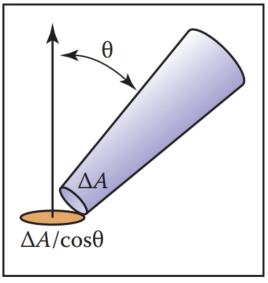
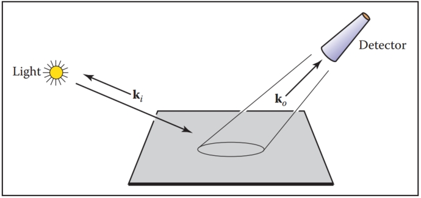
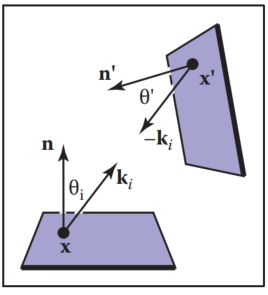
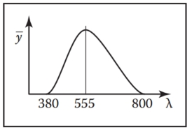

# 18  Light  光

In this chapter, we discuss the practical issues of measuring light, usually called radiometry. The terms that arise in radiometry may at first seem strange and have terminology and notation that may be hard to keep straight. However, because radiometry is so fundamental to computer graphics, it is worth studying radiometry until it sinks in. This chapter also covers photometry, which takes radiometric quantities and scales them to estimate how much “useful” light is present. For example, a green light may seem twice as bright as a blue light of the same power because the eye is more sensitive to green light. Photometry attempts to quantify such distinctions. 
在本章中，我们讨论测量光的实际问题，通常称为辐射测量。 辐射测量中出现的术语乍一看可能很奇怪，并且术语和符号可能很难理解。 然而，由于辐射测量对于计算机图形学来说是如此基础，因此值得研究辐射测量直到它被理解。本章还介绍了光度测量，它采用辐射测量量并对其进行缩放以估计存在多少“有用”光。 例如，绿光看起来可能是相同功率的蓝光的两倍，因为眼睛对绿光更敏感。 光度测定试图量化这种区别。

## 18.1 Radiometry  辐射测量

Although we can define radiometric units in many systems, we use SI (International System of Units) units. Familiar SI units include the metric units of meter (m) and gram (g). Light is fundamentally a propagating form of energy, so it is useful to define the SI unit of energy, which is the joule (J). 
尽管我们可以在许多系统中定义辐射单位，但我们使用 SI（国际单位制）单位。 熟悉的 SI 单位包括公制单位米 (m) 和克 (g)。 光从根本上来说是一种能量的传播形式，因此定义能量的 SI 单位（焦耳 (J)）非常有用。

### 18.1.1 Photons  光子

To aid our intuition, we will describe radiometry in terms of collections of large numbers of photons, and this section establishes what is meant by a photon in this context. For the purposes of this chapter, a photon is a quantum of light that has a position, direction of propagation, and a wavelength $λ$. Somewhat strangely, the SI unit used for wavelength is nanometer (nm). This is mainly for historical reasons, and $1 nm = 10^{−9} m$. Another unit, the angstrom, is sometimes used, and one nanometer is ten angstroms. A photon also has a speed c that depends only on the refractive index n of the medium through which it propagates. Sometimes the frequency $f = c/λ$ is also used for light. This is convenient because unlike λ and c, f does not change when the photon refracts into a medium with a new refractive index. Another invariant measure is the amount of energy q carried by a photon, which is given by the following relationship:
为了帮助我们的直觉，我们将用大量光子的集合来描述辐射测量，本节将确定光子在这种情况下的含义。 就本章而言，光子是具有位置、传播方向和波长 $λ$ 的光量子。 有点奇怪的是，用于波长的 SI 单位是纳米 (nm)。 这主要是历史原因，$1 nm = 10^{−9} m$。 有时使用另一个单位埃，一纳米等于十埃。 光子的速度 c 只取决于光子传播介质的折射率 n。 有时，频率 $f = c/λ$ 也用于光。 这很方便，因为与 λ 和 c 不同，当光子折射到具有新折射率的介质中时，f 不会改变。 另一个不变的度量是光子携带的能量 q，其由以下关系给出：
$$
q=hf=\frac{hc}{λ} \ \ \ \ (18.1)
$$
where $h = 6.63 × 10^{−34}$ J s is Plank’s Constant. Although these quantities can be measured in any unit system, we will use SI units whenever possible. 
其中 $h = 6.63 × 10^{−34}$ J s 是普朗克常数。 尽管这些量可以用任何单位制来测量，但我们将尽可能使用 SI 单位。

### 18.1.2 Spectral Energy  光谱能量

If we have a large collection of photons, their total energy Q can be computed by summing the energy qi of each photon. A reasonable question to ask is “How is the energy distributed across wavelengths?” An easy way to answer this is to partition the photons into bins, essentially histogramming them. We then have an energy associated with an interval. For example, we can count all the energy between λ = 500 nm and λ = 600 nm and have it turn out to be 10.2 J, and this might be denoted q[500, 600] = 10.2. If we divided the wavelength interval into two 50 nm intervals, we might find that q[500, 550] = 5.2 and q[550, 600] = 5.0. This tells us there was a little more energy in the short wavelength half of the interval [500, 600]. If we divide into 25 nm bins, we might find q[500, 525] = 2.5, and so on. The nice thing about the system is that it is straightforward. The bad thing about it is that the choice of the interval size determines the number. 
如果我们有大量光子，它们的总能量 Q 可以通过对每个光子的能量 qi 求和来计算。 一个合理的问题是“能量如何在波长上分布？” 回答这个问题的一个简单方法是将光子划分到箱中，本质上是对它们进行直方图绘制。 然后我们就有了与间隔相关的能量。 例如，我们可以计算 λ = 500 nm 和 λ = 600 nm 之间的所有能量，结果为 10.2 J，这可以表示为 q[500, 600] = 10.2。 如果我们将波长间隔分成两个 50 nm 的间隔，我们可能会发现 q[500, 550] = 5.2 和 q[550, 600] = 5.0。 这告诉我们在间隔 [500, 600] 的短波长一半中有更多的能量。 如果我们划分为 25 nm 的 bin，我们可能会发现 q[500, 525] = 2.5，依此类推。 该系统的优点在于它很简单。 其不好之处在于间隔大小的选择决定了数量。

A more commonly used system is to divide the energy by the size of the interval. So instead of q[500, 600] = 10.2 we would have
更常用的系统是将能量除以间隔的大小。 因此，我们将不用 q[500, 600] = 10.2
$Q_λ[500, 600] = \frac{10.2}{100} = 0.12 J(nm)^{-1} $

This approach is nice, because the size of the interval has much less impact on the overall size of the numbers. An immediate idea would be to drive the interval size Δλ to zero. This could be awkward, because for a sufficiently small Δλ, $Q_λ$ will either be zero or huge depending on whether there is a single photon or no photon in the interval. There are two schools of thought to solve that dilemma. The first is to assume that Δλ is small, but not so small that the quantum nature of light comes into play. The second is to assume that the light is a continuum rather than individual photons, so a true derivative $dQ/dλ$ is appropriate. Both ways of thinking about it are appropriate and lead to the same computational machinery. In practice, it seems that most people who measure light prefer small, but finite, intervals, because that is what they can measure in the lab. Most people who do theory or computation prefer infinitesimal intervals, because that makes the machinery of calculus available. 
这种方法很好，因为间隔的大小对数字整体大小的影响要小得多。 一个直接的想法是将间隔大小 Δλ 驱动至零。 这可能会很尴尬，因为对于足够小的 Δλ，$Q_λ$ 将为零或很大，具体取决于间隔中是否有单个光子或没有光子。 有两种思想流派可以解决这个困境。 首先是假设 Δλ 很小，但不会小到光的量子性质发挥作用。 第二个是假设光是连续谱而不是单个光子，因此真正的导数 $dQ/dλ$ 是合适的。 两种思考方式都是合适的，并且会产生相同的计算机制。 在实践中，大多数测量光的人似乎更喜欢小但有限的间隔，因为这是他们可以在实验室中测量的。 大多数从事理论或计算的人更喜欢无穷小的区间，因为这使得微积分的机制变得可用。

The quantity $Q_λ$ is called spectral energy, and it is an intensive quantity as opposed to an extensive quantity such as energy, length, or mass. Intensive quantities can be thought of as density functions that tell the density of an extensive quantity at an infinitesimal point. For example, the energy Q at a specific wavelength is probably zero, but the spectral energy (energy density) $Q_λ$ is a meaningful quantity. A probably more familiar example is that the population of a country may be 25 million, but the population at a point in that country is meaningless. However, the population density measured in people per square meter is meaningful, provided it is measured over large enough areas. Much like with photons, population density works best if we pretend that we can view population as a continuum where population density never becomes granular even when the area is small. 
量 $Q_λ$ 称为谱能量，它是一个强度量，而不是能量、长度或质量等广延量。 密集量可以被认为是密度函数，它告诉无限小点处的广延量的密度。 例如，特定波长处的能量 Q 可能为零，但光谱能量（能量密度）$Q_λ$ 是一个有意义的量。 一个可能更熟悉的例子是，一个国家的人口可能有2500万，但那个国家某一点的人口是没有意义的。 然而，只要在足够大的区域内进行测量，以每平方米的人数来衡量的人口密度是有意义的。 就像光子一样，如果我们假设我们可以将人口视为一个连续体，即使面积很小，人口密度也永远不会变得颗粒状，那么人口密度效果最好。

We will follow the convention of graphics where spectral energy is almost always used, and energy is rarely used. This results in a proliferation of λ subscripts if “proper” notation is used. Instead, we will drop the subscript and use Q to denote spectral energy. This can result in some confusion when people outside of graphics read graphics papers, so be aware of this standards issue. Your intuition about spectral energy might be aided by imagining a measurement device with a sensor that measures light energy Δq. If you place a colored filter in front of the sensor that allows only light in the interval $[λ − Δλ/2, λ + Δλ/2]$, then the spectral energy at λ is $Q = Δq/Δλ$. 
我们将遵循图形惯例，其中几乎总是使用光谱能量，而很少使用能量。 如果使用“正确”的符号，这会导致 λ 下标的激增。 相反，我们将去掉下标并使用 Q 来表示光谱能量。 当图形之外的人阅读图形纸时，这可能会导致一些混乱，因此请注意这个标准问题。 想象一个带有测量光能 Δq 的传感器的测量设备可能会有助于您对光谱能量的直觉。 如果您在传感器前面放置一个彩色滤光片，仅允许 $[λ − Δλ/2, λ + Δλ/2]$ 区间内的光进入，则 λ 处的光谱能量为 $Q = Δq/Δλ$。

### 18.1.3 Power  电源

It is useful to estimate a rate of energy production for light sources. This rate is called power, and it is measured in watts, W , which is another name for joules per second. This is easiest to understand in a steady state, but because power is an intensive quantity (a density over time), it is well defined even when energy production is varying over time. The units of power may be more familiar, e.g., a 100-watt light bulb. Such bulbs draw approximately 100 J of energy each second. The power of the light produced will actually be less than 100 W because of heat loss, etc., but we can still use this example to help understand more about photons. For example, we can get a feel for how many photons are produced in a second by a 100 W light. Suppose the average photon produced has the energy of a λ = 500 nm photon. The frequency of such a photon is
估计光源的能量产生率很有用。 该速率称为功率，以瓦特 (W) 为单位进行测量，W 是每秒焦耳的另一个名称。 这在稳定状态下最容易理解，但由于功率是一个密集量（随时间变化的密度），因此即使能源产量随时间变化，它也能得到很好的定义。 功率单位可能更为熟悉，例如 100 瓦灯泡。 这种灯泡每秒消耗大约 100 J 的能量。 由于热损失等原因，产生的光的功率实际上会低于 100W，但我们仍然可以使用这个例子来帮助更多地了解光子。 例如，我们可以了解 100 W 的光在一秒钟内产生了多少个光子。 假设产生的平均光子的能量为 λ = 500 nm 光子。 这种光子的频率是
$$
f = \frac{c}{λ} = \frac{3 × 10^8 ms^{−1}}{500 × 10^{−9} m} = 6 × 10^{14} s^{−1}
$$
The energy of that photon is $hf ≈ 4 × 10^{−19} J$. That means a staggering $10^{20}$ photons are produced each second, even if the bulb is not very efficient. This explains why simulating a camera with a fast shutter speed and directly simulated photons is an inefficient choice for producing images. 
该光子的能量为 $hf ≈ 4 × 10^{−19} J$。 这意味着即使灯泡的效率不是很高，每秒也会产生惊人的 $10^{20}$ 光子。 这解释了为什么模拟具有快速快门速度和直接模拟光子的相机对于生成图像来说是低效的选择。

As with energy, we are really interested in spectral power measured in $W(nm)^{−1}$. Again, although the formal standard symbol for spectral power is $Φ_λ$, we will use $Φ$ with no subscript for convenience and consistency with most of the graphics literature. One thing to note is that the spectral power for a light source is usually a smaller number than the power. For example, if a light emits a power of 100 W evenly distributed over wavelengths 400 nm to 800 nm, then the spectral power will be $100 W/400 nm = 0.25 W(nm)^{−1}$. This is something to keep in mind if you set the spectral power of light sources by hand for debugging purposes. 
与能量一样，我们真正感兴趣的是以 $W(nm)^{−1}$ 为单位测量的光谱功率。 同样，虽然光谱功率的正式标准符号是 $Φ_λ$，但为了方便和与大多数图形文献保持一致，我们将使用不带下标的 $Φ$。 需要注意的一件事是，光源的光谱功率通常比功率更小。 例如，如果光发出 100 W 的功率，均匀分布在 400 nm 至 800 nm 的波长上，则光谱功率将为 $100 W/400 nm = 0.25 W(nm)^{−1}$。 如果您出于调试目的手动设置光源的光谱功率，则需要记住这一点。

The measurement device for spectral energy in the last section could be modified by taking a reading with a shutter that is open for a time interval Δt centered at time t. The spectral power would then be $Φ = Δq/(ΔtΔλ)$.
最后一节中的光谱能量测量装置可以通过使用以时间 t 为中心打开时间间隔 Δt 的快门读取读数来修改。 光谱功率将为 $Φ = Δq/(ΔtΔλ)$。

### 18.1.4 Irradiance 辐照度

The quantity irradiance arises naturally if you ask the question “How much light hits this point?” Of course the answer is “none,” and again we must use a density function. If the point is on a surface, it is natural to use area to define our density function. We modify the device from the last section to have a finite $ΔA$ area sensor that is smaller than the light field being measured. The spectral irradiance H is just the power per unit area $ΔΦ/ΔA$. Fully expanded this is
如果你问“有多少光照射到这一点？”这个问题，数量辐照度自然会出现。 当然，答案是“无”，我们必须再次使用密度函数。 如果该点位于曲面上，则很自然地使用面积来定义我们的密度函数。 我们修改了上一节的设备，使其具有比被测量的光场更小的有限 $ΔA$ 面积传感器。 光谱辐照度H就是单位面积的功率$ΔΦ/ΔA$。 完全展开后是这样的
$$
H = \frac{Δq}{ΔA ΔtΔλ} \ \ \ \ (18.2)
$$
Thus, the full units of irradiance are $Jm^{−2}s^{−1}(nm)^{−1}$. Note that the SI units for radiance include inverse-meter-squared for area and inverse-nanometer for wavelength. This seeming inconsistency (using both nanometer and meter) arises because of the natural units for area and visible light wavelengths.
因此，辐照度的完整单位为 $Jm^{−2}s^{−1}(nm)^{−1}$。 请注意，辐射亮度的 SI 单位包括面积的倒数米平方和波长的倒数纳米。 这种看似不一致（同时使用纳米和米）的原因是面积和可见光波长的自然单位。

When the light is leaving a surface, e.g., when it is reflected, the same quantity as irradiance is called radiant exitance, E. It is useful to have different words for incident and exitant light, because the same point has potentially different irradiance and radiant exitance.
当光离开表面时，例如，当它被反射时，与辐照度相同的量称为辐射出射度 E。对入射光和出射光使用不同的词很有用，因为同一点可能具有不同的辐照度和辐射度。 退出。

### 18.1.5 Radiance 光辉

Although irradiance tells us how much light is arriving at a point, it tells us little about the direction that light comes from. To measure something analogous to what we see with our eyes, we need to be able to associate “how much light” with a specific direction. We can imagine a simple device to measure such a quantity (Figure 18.1). We use a small irradiance meter and add a conical “baffler” which limits light hitting the counter to a range of angles with solid angle $Δσ$. The response of the detector is as follows:
尽管辐照度告诉我们有多少光到达某个点，但它却无法告诉我们光来自的方向。 为了测量类似于我们用眼睛看到的东西，我们需要能够将“多少光”与特定方向联系起来。 我们可以想象一个简单的设备来测量这样的量（图 18.1）。 我们使用小型辐照度计并添加锥形“挡板”，将照射到柜台的光线限制在立体角 $Δσ$ 的角度范围内。 检测器的响应如下：

Figure 18.1. By adding a blinder that shows only a small solid angle Δσ to the irradiance detector, we measure radiance.
图 18.1。 通过向辐照度检测器添加仅显示小立体角 Δσ 的遮光罩，我们可以测量辐射率。

$response = \frac{ΔH}{Δσ} = \frac{Δq}{ΔA Δσ Δt Δλ} \\$

This is the spectral radiance of light traveling in space. Again, we will drop the “spectral” in our discussion and assume that it is implicit. 
这是在太空中传播的光的光谱辐射亮度。 再次，我们将在讨论中放弃“光谱”并假设它是隐含的。

Radiance is what we are usually computing in graphics programs. A wonderful property of radiance is that it does not vary along a line in space. To see why this is true, examine the two radiance detectors both looking at a surface as shown in Figure 18.2. Assume the lines the detectors are looking along are close enough together that the surface is emitting/reflecting light “the same” in both of the areas being measured. Because the area of the surface being sampled is proportional to squared distance, and because the light reaching the detector is inversely proportional to squared distance, the two detectors should have the same reading. 
辐射度是我们通常在图形程序中计算的。 辐射度的一个奇妙特性是它不会沿空间线变化。 要了解为什么会出现这种情况，请检查两个均观察表面的辐射探测器，如图 18.2 所示。 假设探测器所观察的线足够近，以至于表面在两个被测量的区域中发射/反射的光“相同”。 因为被采样表面的面积与距离的平方成正比，并且因为到达检测器的光与距离的平方成反比，所以两个检测器应该具有相同的读数。

Figure 18.2. The signal a radiance detector receives does not depend on the distance to the surface being measured. This figure assumes the detectors are pointing at areas on the surface that are emitting light in the same way.
图 18.2。 辐射检测器接收的信号并不取决于到被测量表面的距离。 该图假设探测器指向表面上以相同方式发光的区域。

It is useful to measure the radiance hitting a surface. We can think of placing the cone baffler from the radiance detector at a point on the surface and measuring the irradiance H on the surface originating from directions within the cone (Figure 18.3). Note that the surface “detector” is not aligned with the cone. For this reason we need to add a cosine correction term to our definition of radiance:
测量照射到表面的辐射率很有用。 我们可以考虑将辐射检测器的锥体挡板放置在表面上的一点，并测量表面上源自锥体内方向的辐照度 H（图 18.3）。 请注意，表面“探测器”未与锥体对齐。 因此，我们需要在辐射率的定义中添加一个余弦校正项：

Figure 18.3. The irradiance at the surface as masked by the cone is smaller than that measured at the detector by a cosine factor.
图 18.3。 锥体遮蔽的表面处的辐照度比探测器处测量的辐照度小一个余弦因子。
$$
response = \frac{ΔH}{Δσ cos θ} = \frac{Δq}{ΔA cos θ Δσ Δt Δλ}
$$
As with irradiance and radiant exitance, it is useful to distinguish between radiance incident at a point on a surface and exitant from that point. Terms for these concepts sometimes used in the graphics literature are surface radiance $L_s$ for the radiance of (leaving) a surface, and field radiance $L_f$ for the radiance incident at a surface. Both require the cosine term, because they both correspond to the configuration in Figure 18.3:
与辐照度和辐射出射度一样，区分表面上某一点的入射辐射度和从该点出射的辐射度非常有用。 有时在图形文献中使用的这些概念的术语是表面辐射率 $L_s$（离开）表面的辐射率，场辐射率 $L_f$ 表示入射到表面的辐射率。 两者都需要余弦项，因为它们都对应于图 18.3 中的配置：
$$
L_s = \frac{ΔE}{Δσ cos θ} \\
L_f = \frac{ΔH}{Δσ cos θ}
$$

#### Radiance and Other Radiometric Quantities  辐射亮度和其他辐射量

If we have a surface whose field radiance is $L_f$ , then we can derive all of the other radiometric quantities from it. This is one reason radiance is considered the “fundamental” radiometric quantity. For example, the irradiance can be expressed as
如果我们有一个场辐射率为 $L_f$ 的表面，那么我们可以从中导出所有其他辐射量。 这是辐射率被认为是“基本”辐射量的原因之一。 例如，辐照度可以表示为
$$
H = \int_{all\ \bold{k}} L_f(\bold{k})\cos θ dσ
$$
This formula has several notational conventions that are common in graphics that make such formulae opaque to readers not familiar with them (Figure 18.4). First, $\bold{k}$ is an incident direction and can be thought of as a unit vector, a direction, or a (θ, φ) pair in spherical coordinates with respect to the surface normal. The direction has a differential solid angle dσ associated with it. The field radiance is potentially different for every direction, so we write it as a function $L(\bold{k})$.
该公式具有图形中常见的几种符号约定，这使得这些公式对于不熟悉它们的读者来说不透明（图18.4）。 首先， $\bold{k}$ 是入射方向，可以被认为是相对于表面法线的球坐标中的单位向量、方向或 (θ, φ) 对。 该方向有一个与之相关的微分立体角 dσ。 每个方向的场辐射率可能不同，因此我们将其写为函数 $L(\bold{k})$。

Figure 18.4. The direction $\bold{k}$ has a differential solid angle dσ associated with it.
图 18.4。 方向 $\bold{k}$ 有一个与之相关的微分立体角 dσ。

As an example, we can compute the irradiance H at a surface that has constant field radiance $L_f$ in all directions. To integrate, we use a classic spherical coordinate system and recall that the differential solid angle is
例如，我们可以计算在所有方向上具有恒定场辐射 $L_f$ 的表面的辐照度 H。 为了积分，我们使用经典的球坐标系并回想一下微分立体角是
$dσ ≡ sin θ dθ dφ,  $
so the irradiance is 
所以辐照度是
$H = \int^{2\pi}_{φ=0}\int^{\frac{\pi}{2}}_{θ=0}L_f cos θ sin θ dθ dφ =  πLf .   \\$

This relation shows us our first occurrence of a potentially surprising constant π. These factors of π occur frequently in radiometry and are an artifact of how we chose to measure solid angles, i.e., the area of a unit sphere is a multiple of π rather than a multiple of one. 
这种关系向我们展示了一个可能令人惊讶的常数 π 的首次出现。 这些 π 因子在辐射测量中经常出现，并且是我们选择测量立体角的方式的产物，即单位球体的面积是 π 的倍数而不是 1 的倍数。

Similarly, we can find the power hitting a surface by integrating the irradiance across the surface area:
类似地，我们可以通过积分整个表面区域的辐照度来找到击中表面的功率：
$Φ =  \int_{all\ \bold{x}}H(x)dA$

where x is a point on the surface, and dA is the differential area associated with that point. Note that we don’t have special terms or symbols for incoming versus outgoing power. That distinction does not seem to come up enough to have encouraged the distinction. 
其中 x 是表面上的点，dA 是与该点相关的微分面积。 请注意，我们没有针对输入功率和输出功率的特殊术语或符号。 这种区别似乎还不足以鼓励这种区别。

### 18.1.6 BRDF 双向逆向分布函数

Because we are interested in surface appearance, we would like to characterize how a surface reflects light. At an intuitive level, for any incident light coming from direction $\bold{k}_i$, there is some fraction scattered in a small solid angle near the outgoing direction $\bold{k}_o$. There are many ways we could formalize such a concept, and not surprisingly, the standard way to do so is inspired by building a simple measurement device. Such a device is shown in Figure 18.5, where a small light source is positioned in direction $\bold{k}_i$ as seen from a point on a surface, and a detector is placed in direction ko. For every directional pair $(\bold{k}_i, \bold{k}_o)$, we take a reading with the detector. 
因为我们对表面外观感兴趣，所以我们想表征表面如何反射光。 在直观层面上，对于来自 $\bold{k}_i$ 方向的任何入射光，在出射方向 $\bold{k}_o$ 附近的小立体角中会有一些散射。 我们可以通过多种方法来形式化这样的概念，毫不奇怪，这样做的标准方法是受到构建一个简单的测量设备的启发。 这样的设备如图 18.5 所示，其中一个小光源位于从表面上的点看去的方向 $\bold{k}_i$ 上，探测器放置在方向 ko 上。 对于每个方向对 $(\bold{k}_i, \bold{k}_o)$，我们用探测器读取读数。

Figure 18.5. A simple measurement device for directional reflectance. The positions of light and detector are moved to each possible pair of directions. Note that both $\bold{k}_i$ and $\bold{k}_o$ point away from the surface to allow reciprocity.
图 18.5。 一种简单的定向反射率测量装置。 光和检测器的位置移动到每对可能的方向。 请注意，$\bold{k}_i$ 和 $\bold{k}_o$ 都指向远离表面的方向，以实现互易。

Now we just have to decide how to measure the strength of the light source and make our reflection function independent of this strength. For example, if we replaced the light with a brighter light, we would not want to think of the surface as reflecting light differently. We could place a radiance meter at the point being illuminated to measure the light. However, for this to get an accurate reading that would not depend on the Δσ of the detector, we would need the light to subtend a solid angle bigger than Δσ. Unfortunately, the measurement taken by our roving radiance detector in direction $\bold{k}_o$ will also count light that comes from points outside the new detector’s cone. So this does not seem like a practical solution. 
现在我们只需要决定如何测量光源的强度并使我们的反射函数独立于该强度。 例如，如果我们用更亮的光替换光，我们就不会希望表面以不同的方式反射光。 我们可以在被照射的点放置一个辐射计来测量光。 然而，为了获得不依赖于探测器 Δσ 的准确读数，我们需要光线对向大于 Δσ 的立体角。 不幸的是，我们的流动辐射探测器在 $\bold{k}_o$ 方向上进行的测量也会计算来自新探测器锥体之外的点的光。 所以这似乎不是一个实际的解决方案。

Alternatively, we can place an irradiance meter at the point on the surface being measured. This will take a reading that does not depend strongly on subtleties of the light source geometry. This suggests characterizing reflectance as a ratio:
或者，我们可以将辐照度计放置在被测量表面的点处。 这将需要一个不太依赖于光源几何形状的微妙之处的读数。 这表明将反射率表征为一个比率：
$ρ =  \frac{L_s}{H} \\$

where this fraction ρ will vary with incident and exitant directions $\bold{k}_i$ and $\bold{k}_o$, H is the irradiance for light position $\bold{k}_i$, and $L_s$ is the surface radiance measured in direction $\bold{k}_o$. If we take such a measurement for all direction pairs, we end up with a 4D function $ρ(\bold{k}_i, \bold{k}_o)$. This function is called the bidirectional reflectance distribution function (BRDF). The BRDF is all we need to know to characterize the directional properties of how a surface reflects light.
其中该分数 ρ 将随入射和出射方向 $\bold{k}_i$ 和 $\bold{k}_o$ 变化，H 是光位置 $\bold{k}_i$ 的辐照度，$L_s$ 是 在 $\bold{k}_o$ 方向测量的表面辐射率。 如果我们对所有方向对进行这样的测量，我们最终会得到一个 4D 函数 $ρ(\bold{k}_i, \bold{k}_o)$。 该函数称为双向反射分布函数（BRDF）。 我们只需要知道 BRDF 即可描述表面反射光的方向特性。

#### Directional Hemispherical Reflectance 定向半球反射率

Given a BRDF, it is straightforward to ask, “What fraction of incident light is reflected?” However, the answer is not so easy; the fraction reflected depends on the directional distribution of incoming light. For this reason, we typically only set a fraction reflected for a fixed incident direction $\bold{k}_i$. This fraction is called the directional hemispherical reflectance. This fraction, $R(\bold{k}_i)$ is defined by
给定 BRDF，很容易问“入射光的哪一部分被反射？” 然而，答案并不那么容易； 反射的部分取决于入射光的方向分布。 因此，我们通常只设置固定入射方向 $\bold{k}_i$ 反射的分数。 该分数称为定向半球反射率。 该分数 $R(\bold{k}_i)$ 定义为
$R(\bold{k}_i) = \frac{power\ in\ all\ outgoing\ directions\ \bold{k}_o }{power\ in\ a\ beam\ from\ direction\ \bold{k}_i   } \\$

Note that this quantity is between zero and one for reasons of energy conservation. If we allow the incident power $Φ_i$ to hit on a small area ΔA, then the irradiance is $Φ_i/ΔA$. Also, the ratio of the incoming power is just the ratio of the radiant exitance to irradiance:
请注意，出于能量守恒的原因，该数量介于 0 和 1 之间。 如果我们让入射功率 $Φ_i$ 照射到一个小区域 ΔA，则辐照度为 $Φ_i/ΔA$。 此外，输入功率的比率就是辐射出射度与辐照度的比率：
$R(\bold{k}_i) =  \frac{E}{H} \\$

The radiance in a particular direction resulting from this power is by the definition of BRDF: 
由该功率产生的特定方向的辐射度由 BRDF 定义：
$L(\bold{k}_o) = Hρ(\bold{k}_i, \bold{k}_o) = \frac{Φ_i}{ΔA } \\$

And from the definition of radiance, we also have 
根据辐射度的定义，我们也有
$L(\bold{k}_o) = \frac{ΔE}{Δσ_o cos θ_o  } \\$

where E is the radiant exitance of the small patch in direction $\bold{k}_o$. Using these two definitions for radiance we get
其中 E 是小斑块在 $\bold{k}_o$ 方向上的辐射出射度。 使用这两个辐射度定义，我们得到
$H_ρ(\bold{k}_i, \bold{k}_o) = \frac{ΔE}{Δσ_o cos θ_o  }\\$

Rearranging terms, we get 
重新排列术语，我们得到
$\frac{ΔE}{H} = ρ(\bold{k}_i, \bold{k}_o)Δσ_o cos θ_o.  \\$

This is just the small contribution to E/H that is reflected near the particular $\bold{k}_o$. To find the total $R(\bold{k}_i)$, we sum over all outgoing $\bold{k}_o$. In integral form this is
这只是反映在特定 $\bold{k}_o$ 附近对 E/H 的微小贡献。 为了找到总 $R(\bold{k}_i)$，我们对所有传出的 $\bold{k}_o$ 求和。 积分形式是
$R(\bold{k}_i) = \int_{all\ \bold{k}_o}ρ(\bold{k}_i, \bold{k}_o)\cosθ_o dσ_o.  $

#### Ideal Diffuse BRDF 理想的漫反射 BRDF

An idealized diffuse surface is called Lambertian. Such surfaces are impossible in nature for thermodynamic reasons, but mathematically they do conserve energy. The Lambertian BRDF has ρ equal to a constant for all angles. This means the surface will have the same radiance for all viewing angles, and this radiance will be proportional to the irradiance. 
理想化的漫反射表面称为朗伯表面。 由于热力学原因，这样的表面在自然界中是不可能的，但从数学上讲，它们确实节省了能量。 朗伯 BRDF 的 ρ 对于所有角度都等于常数。 这意味着表面对于所有视角都将具有相同的辐射亮度，并且该辐射亮度将与辐照度成正比。

If we compute $R(\bold{k}_i)$ for a a Lambertian surface with $ρ = C$ we get
如果我们计算朗伯曲面的 $R(\bold{k}_i)$ 且 $ρ = C$ 我们得到
$R(\bold{k}_i) = \int_{all\ \bold{k}_o}C\cosθ_o dσ_o = \int^{2\pi}_{φ_o=0}  \int^{\pi/2}_{θ_o=0}C \cos θ_o \sin θ_o dθ_o dφ_o = \pi C \\$

Thus, for a perfectly reflecting Lambertian surface (R = 1), we have $ρ = 1/π$, and for a Lambertian surface where $R(\bold{k}_i) = r$, we have
因此，对于完美反射的朗伯表面 (R = 1)，我们有 $ρ = 1/π$，对于 $R(\bold{k}_i) = r$ 的朗伯表面，我们有
$ρ(\bold{k}_i, \bold{k}_o) = \frac{r}{\pi} \\$
This is another example where the use of a steradian for the solid angle determines the normalizing constant and thus introduces factors of π.
这是另一个例子，其中使用立体角的球面度来确定归一化常数，从而引入 π 因子。

## 18.2 Transport Equation 传输方程

With the definition of BRDF, we can describe the radiance of a surface in terms of the incoming radiance from all different directions. Because in computer graphics we can use idealized mathematics that might be impractical to instantiate in the lab, we can also write the BRDF in terms of radiance only. If we take a small part of the light with solid angle $Δσ_i$ with radiance $L_i$ and “measure” the reflected radiance in direction $\bold{k}_o$ due to this small piece of the light, we can compute a BRDF (Figure 18.6). The irradiance due to the small piece of light is $H = L_i \cos θ_iΔσ_i$. Thus the BRDF is
根据 BRDF 的定义，我们可以用来自所有不同方向的入射辐射率来描述表面的辐射率。 因为在计算机图形学中，我们可以使用在实验室中实例化可能不切实际的理想化数学，所以我们也可以仅根据辐射度来编写 BRDF。 如果我们取一小部分具有立体角$Δσ_i$、辐射度为$L_i$的光，并“测量”由于这小块光而在$\bold{k}_o$方向上反射的辐射度，我们可以计算出 BRDF（图 18.6）。 小片光的辐照度为 $H = L_i \cos θ_iΔσ_i$。 因此 BRDF 是
$ρ =  \frac{L_o}{L_i \cos θ_iΔσ_i } \\$

Figure 18.6. The geometry for the transport equation in its directional form. 
图 18.6。 方向形式的输运方程的几何形状。

This form can be useful in some situations. Rearranging terms, we can write down the part of the radiance that is due to light coming from direction $\bold{k}_i$: 
这种形式在某些情况下很有用。 重新排列术语，我们可以写下由于来自 $\bold{k}_i$ 方向的光而产生的辐射部分：
$ΔL_o = ρ(\bold{k}_i, \bold{k}_o)L_i \cos θ_iΔσ_i.  $

If there is light coming from many directions $L_i(\bold{k}_i)$, we can sum all of them. In integral form, with notation for surface and field radiance, this is 
如果有来自多个方向的光$L_i(\bold{k}_i)$，我们可以将它们全部相加。 以积分形式，用表面和场辐射率的符号表示，这是
$L_s(\bold{k}_o) = \int_{all\ \bold{k}_i} ρ(\bold{k}_i, \bold{k}_o)L_f(\bold{k}_i) \cos θ_idσ_i.   $

This is often called the rendering equation in computer graphics (Immel, Cohen, & Greenberg, 1986). 
这通常称为计算机图形学中的渲染方程（Immel、Cohen 和 Greenberg，1986）。

Sometimes it is useful to write the transport equation in terms of surface radiances only (Kajiya, 1986). Note, that in a closed environment, the field radiance $L_f(\bold{k}_i)$ comes from some surface with surface radiance $L_s(−\bold{k}_i) = L_f(\bold{k}_i)$ (Figure 18.7). The solid angle subtended by the point $\bold{x}'$ in the figure is given by
 有时仅根据表面辐射率来编写输运方程是有用的（Kajiya，1986）。 请注意，在封闭环境中，场辐射率 $L_f(\bold{k}_i)$ 来自表面辐射率 $L_s(−\bold{k}_i) = L_f(\bold{k}_i) 的某个表面 $（图 18.7）。 图中点 $\bold{x}'$ 所对的立体角由下式给出
$Δσ_i =  \frac{ΔA' \cos θ'}{\|\bold{x}-  \bold{x}'\|^2} \\$

Figure 18.7. The light coming into one point comes from another point.
图 18.7。 进入一点的光来自另一点。

where $ΔA'$ the the area we associate with $x'$. Substituting for $Δσ_i$ in terms of $ΔA'$ suggests the following transport equation:
其中 $ΔA'$ 是我们与 $x'$ 关联的区域。 用 $ΔA'$ 代替 $Δσ_i$ 得出以下传输方程：
$L_s(\bold{x}, \bold{k}_o) = \int_{all\ x'\ visible\ to\ \bold{x}}\frac{ρ(\bold{k}_i, \bold{k}_o)L_s(\bold{x'}, \bold{x}- \bold{x}')\cos θ_i \cos θ'}{\|\bold{x} - \bold{x}'\|^2} dA'\\$

Note that we are using a non-normalized vector $\bold{x} − \bold{x}'$ to indicate the direction from $\bold{x}'$ to $\bold{x}$. Also note that we are writing $L_s$ as a function of position and direction. 
请注意，我们使用非归一化向量 $\bold{x} − \bold{x}'$ 来指示从 $\bold{x}'$ 到 $\bold{x}$ 的方向。 另请注意，我们将 $L_s$ 写为位置和方向的函数。

The only problem with this new transport equation is that the domain of integration is awkward. If we introduce a visibility function, we can trade off complexity in the domain with complexity in the integrand:
这个新的传输方程的唯一问题是积分域很尴尬。 如果我们引入可见性函数，我们可以权衡域的复杂性和被积函数的复杂性：
$L_s(x, \bold{k}_o) = \int_{all\ \bold{x}'} \frac{ρ(\bold{k}_i, \bold{k}_o)L_s(\bold{x'}, \bold{x}- \bold{x}')v(\bold{x}, \bold{x}')\cos θ_i \cos θ'}{\|\bold{x} - \bold{x}'\|^2} dA' \\ $

where
其中
$$
v(\bold{x}, \bold{x}') = \begin{cases}
1\ \ \ \ \  if\ \bold{x}\ and\ \bold{x}’\ are\ mutually\ visible, \\
0\ \ \ \ \ otherwise
\end{cases}
$$

## 18.3 Photometry 光度测定

For every spectral radiometric quantity there is a related photometric quantity that measures how much of that quantity is “useful” to a human observer. Given a spectral radiometric quantity $f_r(λ)$, the related photometric quantity $f_p$ is
对于每个光谱辐射量，都有一个相关的光度量，用于测量该量中有多少对人类观察者“有用”。 给定光谱辐射量 $f_r(λ)$，相关光度量 $f_p$ 为
$f_p = 683 \frac{lm}{W} \int^{800nm}_{λ  =380 nm  }\overline{y}(λ)f_r(λ) dλ   \\$

where $\overline{y}$ is the luminous efficiency function of the human visual system. This function is zero outside the limits of integration above, so the limits could be 0 and $∞$ and $f_p$ would not change. The luminous efficiency function will be discussed in more detail in Chapter 19, but we discuss its general properties here. The leading constant is to make the definition consistent with historical absolute photometric quantities.
其中$\overline{y}$是人类视觉系统的发光效率函数。 在上述积分限制之外，该函数为零，因此限制可以为 0，并且 $∞$ 和 $f_p$ 不会改变。 发光效率函数将在第 19 章中更详细地讨论，但我们在这里讨论它的一般属性。 主要常数是使定义与历史绝对光度量一致。

The luminous efficiency function is not equally sensitive to all wavelengths (Figure 18.8). For wavelengths below 380 nm (the ultraviolet range), the light is not visible to humans and thus has a $\overline{y}$ value of zero. From 380 nm it gradually increases until λ = 555 nm where it peaks. This is a pure green light. Then, it gradually decreases until it reaches the boundary of the infrared region at 800 nm.
发光效率函数对所有波长的敏感度不同（图 18.8）。 对于低于 380 nm（紫外线范围）的波长，人类看不到光，因此 $\overline{y}$ 值为零。 从 380 nm 开始，它逐渐增加，直到 λ = 555 nm，达到峰值。 这是纯粹的绿光。 然后逐渐减小，直至到达800 nm 处的红外区域边界。

Figure 18.8. The luminous efficiency function versus wavelength (nm).
图 18.8。 发光效率与波长（nm)的函数。

The photometric quantity that is most commonly used in graphics is luminance, the photometric analog of radiance:
图形中最常用的光度量是亮度，即辐射亮度的光度模拟：
$$
Y = 683\frac{lm}{W}\int^{800nm}_{λ =380 nm}\overline{y}(λ)L(λ) dλ.
$$
The symbol Y for luminance comes from colorimetry. Most other fields use the symbol L; we will not follow that convention because it is too confusing to use L for both luminance and spectral radiance. Luminance gives one a general idea of how “bright” something is independent of the adaptation of the viewer. Note that the black paper under noonday sun is subjectively darker than the lower luminance white paper under moonlight; reading too much into luminance is dangerous, but it is a very useful quantity for getting a quantitative feel for relative perceivable light output. The unit lm stands for lumens. Note that most light bulbs are rated in terms of the power they consume in watts, and the useful light they produce in lumens. More efficient bulbs produce more of their light where $\overline{y}$ is large and thus produce more lumens per watt. A “perfect” light would convert all power into 555 nm light and would produce 683 lumens per watt. The units of luminance are thus $(lm/W)(W/(m^2sr)) = lm/(m^2sr)$. The quantity one lumen per steradian is defined to be one candela (cd), so luminance is usually described in units $cd/m^2$.
亮度符号 Y 来自比色学。 大多数其他字段使用符号 L； 我们不会遵循该约定，因为使用 L 表示亮度和光谱辐射率太混乱了。 亮度可以让人们大致了解某物的“明亮”程度，与观看者的适应无关。 请注意，正午阳光下的黑纸主观上比月光下亮度较低的白纸更暗； 过多地解读亮度是危险的，但对于获得相对可感知光输出的定量感觉来说，它是一个非常有用的量。 单位 lm 代表流明。 请注意，大多数灯泡的额定值是根据它们消耗的功率（以瓦为单位）和它们产生的有用光（以流明为单位）来衡量的。 更高效的灯泡在 $\overline{y}$ 较大的情况下产生更多的光，从而每瓦产生更多的流明。 “完美”的光会将所有能量转换为 555 nm 光，每瓦产生 683 流明。 因此，亮度单位为 $(lm/W)(W/(m^2sr)) = lm/(m^2sr)$。 每球面度一流明的数量定义为一坎德拉 (cd)，因此亮度通常以单位 $cd/m^2$ 来描述。

## Frequently Asked Questions 经常问的问题

### What is “intensity”?什么是“强度”？

The term intensity is used in a variety of contexts and its use varies with both era and discipline. In practice, it is no longer meaningful as a specific radiometric quantity, but it is useful for intuitive discussion. Most papers that use it do so in place of radiance.
“强度”一词在多种情况下都有使用，其用法随时代和学科的不同而变化。 在实践中，它作为特定的辐射量不再有意义，但对于直观讨论很有用。 大多数使用它的纸张都用它来代替辐射度。

### What is “radiosity”?  什么是“光能传递”？

The term radiosity is used in place of radiant exitance in some fields. It is also sometimes used to describe world-space light transport algorithms. 
在某些领域中，术语“光能传递”用于代替辐射出射度。 它有时也用于描述世界空间光传输算法。

## Notes  注释

A common radiometric quantity not described in this chapter is radiant intensity (I), which is the spectral power per steradian emitted from an infinitesimal point source. It should usually be avoided in graphics programs because point sources cause implementation problems. A more rigorous treatment of radiometry can be found in Analytic Methods for Simulated Light Transport (Arvo, 1995). The radiometric and photometric terms in this chapter are from the Illumination Engineering Society’s standard that is increasingly used by all fields of science and engineering (American National Standard Institute, 1986). A broader discussion of radiometric and appearance standards can be found in Principles of Digital Image Synthesis (Glassner, 1995). 
本章未描述的常见辐射量是辐射强度 (I)，它是从无穷小点源发射的每球面度的光谱功率。 在图形程序中通常应该避免它，因为点源会导致实现问题。 更严格的辐射测量处理可以在模拟光传输分析方法（Arvo，1995）中找到。 本章中的辐射和光度术语来自照明工程学会的标准，该标准越来越多地被科学和工程的所有领域使用（美国国家标准协会，1986）。 关于辐射测量和外观标准的更广泛讨论可以在《数字图像合成原理》（Glassner，1995）中找到。

## Exercises 练习

1. For a diffuse surface with outgoing radiance L, what is the radiant exitance? 
   对于出射辐射率为 L 的漫射表面，辐射出射率是多少？
2. What is the total power exiting a diffuse surface with an area of $4 m^2$ and a radiance of L? 
   面积为 $4 m^2$、辐射率为 L 的漫射表面的总功率是多少？
3. If a fluorescent light and an incandescent light both consume 20 watts of power, why is the fluorescent light usually preferred?
   如果荧光灯和白炽灯的功耗均为 20 瓦，为什么通常首选荧光灯？