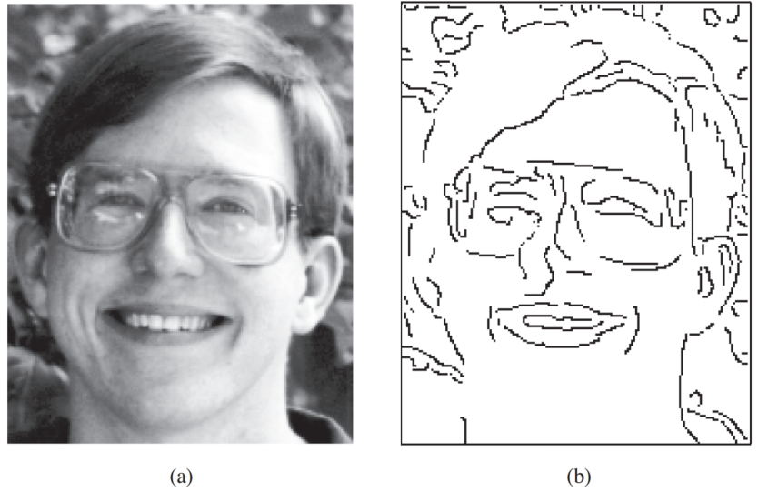
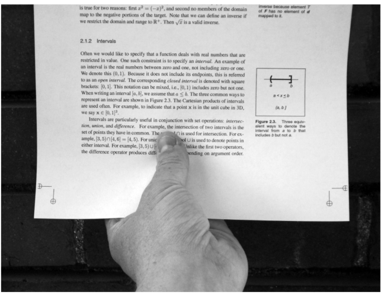
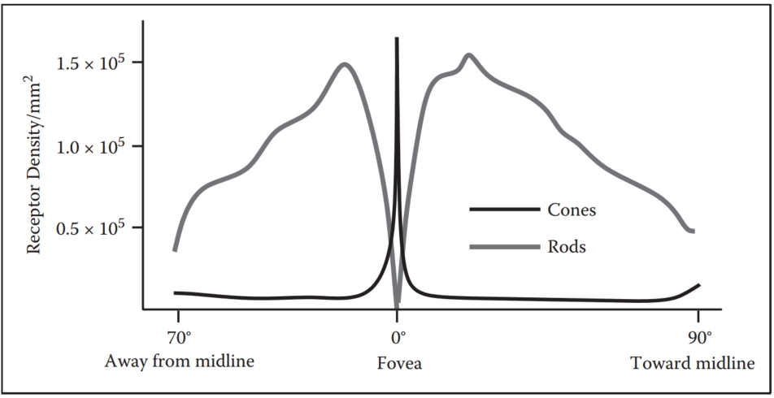
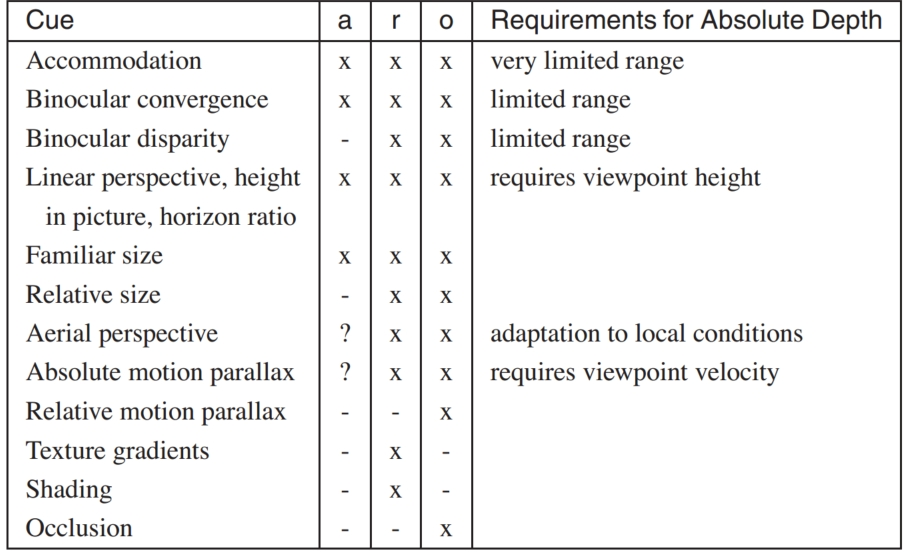
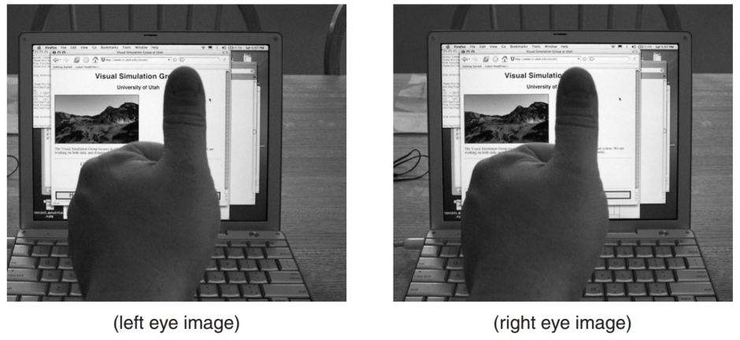
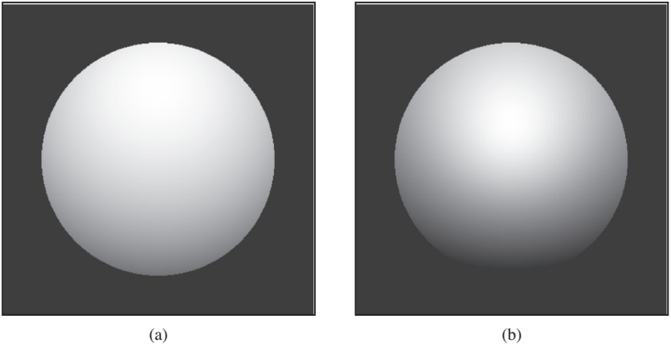
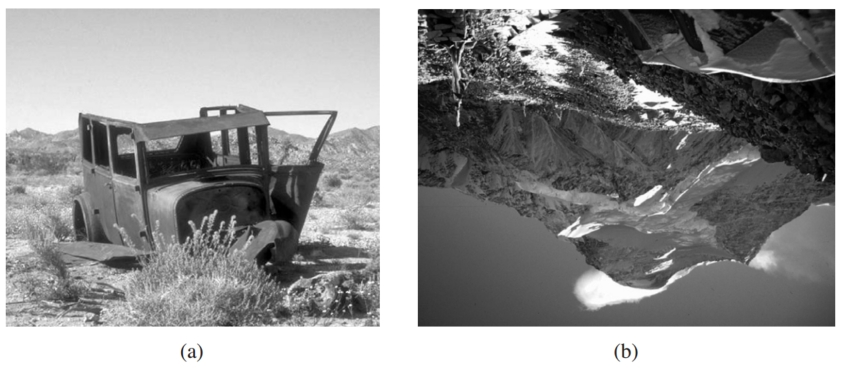
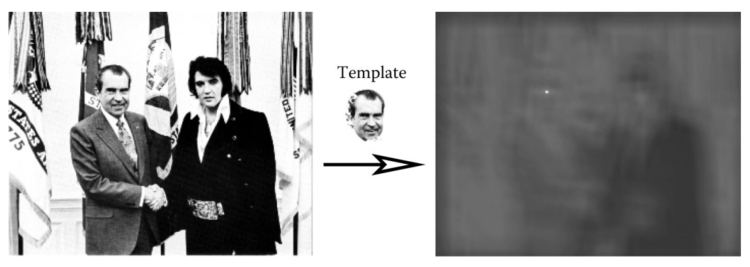
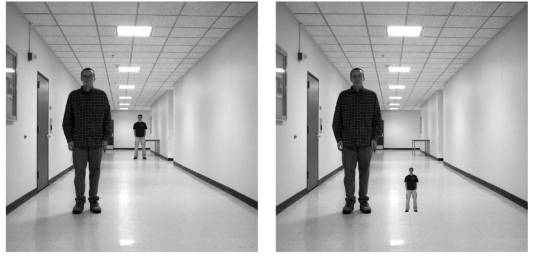

# 20  Visual Perception  视觉感知

The ultimate purpose of computer graphics is to produce images for viewing by people. Thus, the success of a computer graphics system depends on how well it conveys relevant information to a human observer. The intrinsic complexity of the physical world and the limitations of display devices make it impossible to present a viewer with the identical patterns of light that would occur when looking at a natural environment. When the goal of a computer graphics system is physical realism, the best we can hope for is that the system be perceptually effective: displayed images should “look” as intended. For applications such as technical illustration, it is often desirable to visually highlight relevant information and perceptual effectiveness becomes an explicit requirement. 
计算机图形学的最终目的是产生供人们观看的图像。 因此，计算机图形系统的成功取决于它向人类观察者传达相关信息的程度。 物理世界的内在复杂性和显示设备的局限性使得不可能向观看者呈现与观看自然环境时相同的光图案。 当计算机图形系统的目标是物理真实感时，我们所能期望的最好结果就是系统在感知上有效：显示的图像应该“看起来”符合预期。 对于技术插图等应用，通常需要在视觉上突出显示相关信息，并且感知有效性成为明确的要求。

Artists and illustrators have developed empirically a broad range of tools and techniques for effectively conveying visual information. One approach to improving the perceptual effectiveness of computer graphics is to utilize these methods in our automated systems. A second approach builds directly on knowledge of the human vision system by using perceptual effectiveness as an optimization criterion in the design of computer graphics systems. These two approaches are not completely distinct. Indeed, one of the first systematic examinations of visual perception is found in the notebooks of Leonardo da Vinci. 
艺术家和插画家凭经验开发了一系列广泛的工具和技术来有效地传达视觉信息。 提高计算机图形感知有效性的一种方法是在我们的自动化系统中利用这些方法。 第二种方法直接建立在人类视觉系统的知识之上，使用感知有效性作为计算机图形系统设计中的优化标准。 这两种方法并不完全不同。 事实上，对视觉感知的最早的系统检查之一是在列奥纳多·达·芬奇的笔记本中发现的。

The remainder of this chapter provides a partial overview of what is known about visual perception in people. The emphasis is on aspects of human vision that are most relevant to computer graphics. The human visual system is extremely complex in both its operation and its architecture. A chapter such as this can at best provide a summary of key points, and it is important to avoid over generalizing from what is presented here. More in-depth treatments of visual perception can be found in Wandell (1995) and Palmer (1999); Gregory (1997) and Yantis (2000) provide additional useful information. A good computer vision reference such as Forsyth and Ponce (2002) is also helpful. It is important to note that despite over 150 years of intensive research, our knowledge of many aspects of vision is still very limited and imperfect. 
本章的其余部分部分概述了人们对视觉感知的了解。 重点是与计算机图形学最相关的人类视觉方面。 人类视觉系统的操作和架构都极其复杂。 像这样的一章最多只能提供要点的总结，重要的是要避免对此处介绍的内容进行过度概括。 Wandell (1995) 和 Palmer (1999) 对视觉感知进行了更深入的处理； Gregory (1997) 和 Yantis (2000) 提供了更多有用的信息。 Forsyth 和 Ponce (2002) 等优秀的计算机视觉参考文献也很有帮助。 值得注意的是，尽管经过 150 多年的深入研究，我们对视觉许多方面的了解仍然非常有限和不完善。

## 20.1 Vision Science 视觉科学

Vision is generally agreed to be the most powerful of the senses in humans. Vision produces more useful information about the world than does hearing,  touch, smell, or taste. This is a direct consequence of the physics of light (Figure 20.1). Illumination is pervasive, especially during the day but also at night due to moonlight, starlight, and artificial sources. Surfaces reflect a substantial portion of incident illumination and do so in ways that are idiosyncratic to particular materials and that are dependent on the shape of the surface. The fact that light (mostly) travels in straight lines through the air allows vision to acquire information from distant locations. 
人们普遍认为视觉是人类最强大的感官。 视觉比听觉、触觉、嗅觉或味觉产生更多关于世界的有用信息。 这是光物理学的直接结果（图 20.1）。 照明无处不在，尤其是在白天，但在夜间，由于月光、星光和人造光源的影响，照明也很普遍。 表面反射大部分入射照明，其反射方式对于特定材料而言是特殊的，并且取决于表面的形状。 光（大部分）在空气中沿直线传播的事实使视觉能够从远处获取信息。

> Light:  
>
> - travels far
> - travels fast
> - travels in straight lines
> - interacts with stuff
> - bounces off things
> - is produced in nature
> - has lots of energy
>
> 			—Steven Shafer
>
> Figure 20.1. The nature of light makes vision a powerful sense.  
>
> 光： 
>
> - 旅行很远 
>
> - 行驶速度快 
>
> - 直线行驶 
>
> - 与事物互动 
>
> - 从物体上反弹 
>
> - 自然产生 
>
> - 能量充沛 >
>
>   	史蒂文·谢弗 
>
>  图 20.1。 光的本质使视觉成为一种强大的感觉。

The study of vision has a long and rich history. Much of what we know about the eye traces back to the work of philosophers and physicists in the 1600s. Starting in the mid-1800s, there was an explosion of work by perceptual psychologists exploring the phenomenology of vision and proposing models of how vision might work. The mid-1900s saw the start of modern neuroscience, which investigates both the fine-scale workings of individual neurons and the large-scale architectural organization of the brain and nervous system. A substantial portion of neuroscience research has focused on vision. More recently, computer science has contributed to the understanding of visual perception by providing tools for precisely describing hypothesized models of visual computations and by allowing empirical examination of computer vision programs. The term vision science was coined to refer to the multidisciplinary study of visual perception involving perceptual psychology, neuroscience, and computational analysis. 
视觉研究有着悠久而丰富的历史。 我们对眼睛的了解大部分可以追溯到 1600 年代哲学家和物理学家的工作。 从 1800 年代中期开始，感知心理学家的工作激增，探索视觉现象学并提出视觉工作原理的模型。 1900 年代中期见证了现代神经科学的兴起，它研究单个神经元的精细运作以及大脑和神经系统的大规模结构组织。 神经科学研究的很大一部分集中在视觉上。 最近，计算机科学通过提供精确描述视觉计算假设模型的工具以及允许对计算机视觉程序进行实证检验，为对视觉感知的理解做出了贡献。 视觉科学一词是指视觉感知的多学科研究，涉及感知心理学、神经科学和计算分析。

Vision science views the purpose of vision as producing information about objects, locations, and events in the world from imaged patterns of light reaching the viewer. Psychologists use the term distal stimulus to refer to the physical world under observation and proximal stimulus to refer to the retinal image.(In computer vision, the term scene is often used to refer to the external world, while the term image is used to refer to the projection of the scene onto a sensing plane.  ) Using this terminology, the function of vision is to generate a description of aspects of the distal stimulus given the proximal stimulus. Visual perception is said to be veridical when the description that is produced accurately reflects the real world. In practice, it makes little sense to think of these descriptions of objects, locations, and events in isolation. Rather, vision is better understood in the context of the motor and cognitive functions that it serves. 
视觉科学将视觉的目的视为通过到达观察者的光的成像模式产生有关世界上的物体、位置和事件的信息。 心理学家使用术语“远端刺激”来指代观察到的物理世界，用“近端刺激”来指代视网膜图像。（在计算机视觉中，术语“场景”通常用来指代外部世界，而术语“图像”则用来指代） 场景到传感平面的投影。）使用这个术语，视觉的功能是在给定近端刺激的情况下生成远端刺激各方面的描述。 当产生的描述准确地反映现实世界时，视觉感知被认为是真实的。 实际上，孤立地考虑这些对物体、位置和事件的描述是没有意义的。 相反，在其所服务的运动和认知功能的背景下，可以更好地理解视觉。

## 20.2 Visual Sensitivity  视觉灵敏度

Vision systems create descriptions of the visual environment based on properties of the incident illumination. As a result, it is important to understand what properties of incident illumination the human vision system can actually detect. One critical observation about the human vision system is that it is primarily sensitive to patterns of light rather than being sensitive to the absolute magnitude of light energy. The eye does not operate as a photometer. Instead, it detects spatial, temporal, and spectral patterns in the light imaged on the retina and information about these patterns of light form the basis for all of visual perception. 
视觉系统根据入射照明的属性创建视觉环境的描述。 因此，了解人类视觉系统实际上可以检测到的入射照明的哪些特性非常重要。 关于人类视觉系统的一项重要观察是，它主要对光的模式敏感，而不是对光能的绝对大小敏感。 眼睛并不充当光度计。 相反，它检测视网膜上成像的光的空间、时间和光谱模式，有关这些光模式的信息构成了所有视觉感知的基础。

There is a clear ecological utility to the vision system’s sensitivity to variations in illumination over space and time. Being able to accurately sense changes in the environment is crucial to our survival.(It is sometime said that the primary goals of vision are to support eating, avoiding being eaten, reproduction, and avoidance of catastrophe while moving. Thinking about vision as a goal-directed activity is often useful, but needs to be done so at a more detailed level.) A system which measures changes in light energy rather than the magnitude of the energy itself also makes engineering sense, since it makes it easier to detect patterns of light over large ranges in light intensity. It is a good thing for computer graphics that vision operates in this manner. Display devices are physically limited in their ability to project light with the power and dynamic range typical of natural scenes. Graphical displays would not be effective if they needed to produce the identical patterns of light as the corresponding physical world. Fortunately, all that is required is that displays be able to produce similar patterns of spatial and temporal change to the real world. 
视觉系统对照明随空间和时间变化的敏感性具有明显的生态效用。 能够准确地感知环境的变化对于我们的生存至关重要。（有时有人说，视觉的主要目标是支持进食、避免被吃掉、繁殖以及避免移动时的灾难。将视觉视为目标 -定向活动通常很有用，但需要在更详细的水平上进行。）测量光能变化而不是能量本身大小的系统也具有工程意义，因为它可以更容易地检测光能的模式 光强度范围大的光。 视觉以这种方式运作对于计算机图形学来说是一件好事。 显示设备在以自然场景典型的功率和动态范围投射光的能力方面受到物理限制。 如果图形显示器需要产生与相应的物理世界相同的光图案，那么它们就不会有效。 幸运的是，所需要的只是显示器能够产生与现实世界类似的空间和时间变化模式。

### 20.2.1 Brightness and Contrast  亮度和对比度

In bright light, the human visual system is capable of distinguishing gratings consisting of high-contrast parallel light and dark bars as fine as 50–60 cycles/degree. (In this case, a “cycle” consists of an adjacent pair of light and dark bars.) For comparison, the best currently available LCD computer monitor, at a normal viewing distance, can display patterns as fine as about 20 cycles/degree. The minimum contrast difference at an edge detectable by the human visual system in bright light is about 1% of the average luminance across the edge. In most 8-bit displays, differences of a single gray level are often noticeable over at least a portion of the range of intensities due to the nature of the mapping from gray levels to actual display luminance. 
在明亮的光线下，人类视觉系统能够区分由高对比度平行光和暗条组成的光栅，精度可达 50-60 周期/度。 （在这种情况下，一个“周期”由一对相邻的亮条和暗条组成。）作为比较，目前最好的 LCD 计算机显示器在正常观看距离下可以显示精细到约 20 周期/度的图案。 在强光下，人类视觉系统可检测到的边缘处的最小对比度差异约为边缘平均亮度的 1%。 在大多数 8 位显示器中，由于从灰度级到实际显示亮度的映射性质，单个灰度级的差异通常在强度范围的至少一部分上是明显的。

Characterizing the ability of the visual system to detect fine scale patterns (visual acuity) and to detect changes in brightness is considerably more complicated than for cameras and similar image acquisition devices. As shown in Figure 20.2, there is an interaction between contrast and acuity in human vision. In the figure, the scale of the pattern decreases from left to right while the contrast increases from top to bottom. If you view the figure at a normal viewing distance, it will be clear that the lowest contrast at which a pattern is visible is a function of the spatial frequency of the pattern. 
表征视觉系统检测精细尺度图案（视敏度）和检测亮度变化的能力比相机和类似的图像采集设备要复杂得多。 如图 20.2 所示，人类视觉的对比度和敏锐度之间存在相互作用。 在图中，图案的比例从左到右减小，而对比度从上到下增加。 如果您在正常观看距离处查看该图，就会清楚地看到图案可见的最低对比度是图案空间频率的函数。

Figure 20.2. The contrast between stripes increases in a constant manner from top to bottom, yet the threshold of visibility varies with frequency.
图 20.2。 条纹之间的对比度从上到下以恒定的方式增加，但可见度阈值随频率而变化。

There is a linear relationship between the intensity of light L reaching the eye from a particular surface point in the world, the intensity of light I illuminating that surface point, and the reflectivity R of the surface at the point being observed:
从世界上特定表面点到达眼睛的光强度 L、照亮该表面点的光强度 I 以及被观察点处的表面反射率 R 之间存在线性关系：
$$
L = αI · R, \ \ \ \ (20.1)
$$
where α is dependent on the relationship between the surface geometry, the pattern of incident illumination, and the viewing direction. While the eye is only able to directly measure L, human vision is much better at estimating R than L. To see this, view Figure 20.3 in bright direct light. Use your hand to shadow one of the patterns, leaving the other directly illuminated. While the light reflected off of the two patterns will be significantly different, the apparent brightness of the two center squares will seem nearly the same. The term lightness is often used to describe the apparent brightness of a surface, as distinct from its actual luminance. In many situations, lightness is invariant to large changes in illumination, a phenomenon referred to as lightness constancy. 
其中 α 取决于表面几何形状、入射照明模式和观察方向之间的关系。 虽然眼睛只能直接测量 L，但人类视觉对 R 的估计比对 L 的估计要好得多。要看到这一点，请在明亮的直射光下查看图 20.3。 用手遮住其中一个图案的阴影，使另一个图案直接被照亮。 虽然两个图案反射的光明显不同，但两个中心方块的表观亮度看起来几乎相同。 术语“亮度”通常用于描述表面的表观亮度，与其实际亮度不同。 在许多情况下，亮度对于光照的大幅变化是不变的，这种现象称为亮度恒定性。

Figure 20.3. Lightness constancy. Cast a shadow over one of the patterns with your hand and notice that the apparent brightness of the two center squares remains nearly the same. 
图 20.3。 亮度恒定。 用手在其中一个图案上投射阴影，您会发现两个中心方块的表观亮度几乎保持不变。

The mechanisms by which the human visual system achieves lightness constancy are not well understood. As shown in Figure 20.2, the vision system is relatively insensitive to slowly varying patterns of light, which may serve to discount the effects of slowly varying illumination. Apparent brightness is affected by the brightness of surrounding regions (Figure 20.4). This can aid lightness constancy when regions are illuminated dissimilarly. While this simultaneous contrast effect is often described as a modification of the perceived lightness of one region based on contrasting brightness in the surrounding region, it is actually much more complicated than that (Figures 20.5 and 20.6). For more on lightness perception, see (Gilchrist et al., 1999) and (Adelson, 1999).
人类视觉系统实现亮度恒定的机制尚不清楚。 如图 20.2 所示，视觉系统对缓慢变化的光模式相对不敏感，这可能有助于减弱缓慢变化的照明的影响。 表观亮度受周围区域亮度的影响（图20.4）。 当区域照明不同时，这可以帮助亮度恒定。 虽然这种同时对比效果通常被描述为根据周围区域的对比亮度对一个区域的感知亮度进行修改，但实际上比这复杂得多（图 20.5 和 20.6）。 有关亮度感知的更多信息，请参阅（Gilchrist et al., 1999）和（Adelson, 1999）。

Figure 20.4. (a) Simultaneous contrast: the apparent brightness of the center bar is affected by the brightness of the surrounding area; (b) The same bar without a variable surround. 
图 20.4。 (a) 同时对比度：中心条的表观亮度受到周围区域亮度的影响； (b) 没有可变环绕声的同一个小节。

Figure 20.5. The Munker-White illusion shows the complexity of simultaneous contrast. In Figure 20.4, the central region looked lighter when the surrounding area was darker. In (a), the gray strips on the left look lighter than the gray strips on the right, even though they are nearly surrounded by regions of white; (b) shows the gray strips without the black lines.
图 20.5。 芒克-怀特错觉显示了同时对比的复杂性。 在图 20.4 中，当周围区域较暗时，中心区域看起来较亮。 在（a）中，左侧的灰色条带看起来比右侧的灰色条带更亮，尽管它们几乎被白色区域包围； (b) 显示没有黑线的灰色条带。

Figure 20.6. The perception of lightness is affected by the perception of 3D structure. The two surfaces marked (a) have the same brightness, as do the two surfaces marked (b) (after Adelson (1999)).
图 20.6。 亮度感知受到 3D 结构感知的影响。 标记为 (a) 的两个表面具有相同的亮度，标记为 (b) 的两个表面也具有相同的亮度（根据 Adelson (1999))。

While the visual system largely ignores slowly varying intensity patterns, it is extremely sensitive to edges consisting of lines of discontinuity in brightness. Edges in imaged light intensity often correspond to surface boundaries or other important features in the environment (Figure 20.7). The vision system can also detect localized differences in motion, stereo disparity, texture, and several other image properties. The vision system has very little ability, however, to detect spatial discontinuities in color when not accompanied by differences in one of these other properties. 
虽然视觉系统在很大程度上忽略了缓慢变化的强度模式，但它对由亮度不连续线组成的边缘极其敏感。 成像光强度的边缘通常对应于环境中的表面边界或其他重要特征（图 20.7）。 视觉系统还可以检测运动、立体视差、纹理和其他一些图像属性的局部差异。 然而，当不伴随这些其他属性之一的差异时，视觉系统几乎没有能力检测颜色的空间不连续性。

Figure 20.7. (a) Original gray scale image, (b) image edges, which are lines of high spatial variability in some direction. 
图 20.7。 (a) 原始灰度图像，(b) 图像边缘，它们是在某个方向上具有高空间变异性的线。

Perception of edges seems to interact with perception of form. While edges give the visual system the information it needs to recognize shapes, slowly varying brightness can appear as a sharp edge if the resulting edge creates a more complete form (Figure 20.8). Figure 20.9 shows a subjective contour, an extreme form of this effect in which a closed contour is seen even though no such contour exists in the actual image. Finally, the vision system’s sensitivity to edges also appears to be part of the mechanism involved in lightness perception. Note that the region enclosed by the subjective contour in Figure 20.9 appears a bit brighter than the surrounding area of the page. Figure 20.10 shows a different interaction between edges and lightness. In this case, a particular brightness profile at the edge has a dramatic effect on the apparent brightness of the surfaces to either side of the edge.
对边缘的感知似乎与对形式的感知相互作用。 虽然边缘为视觉系统提供了识别形状所需的信息，但如果生成的边缘创建了更完整的形状，则缓慢变化的亮度可能会显示为锐利边缘（图 20.8）。 图 20.9 显示了主观轮廓，这是这种效果的一种极端形式，其中可以看到闭合轮廓，即使实际图像中不存在这样的轮廓。 最后，视觉系统对边缘的敏感性似乎也是亮度感知机制的一部分。 请注意，图 20.9 中主观轮廓包围的区域看起来比页面周围区域更亮。 图 20.10 显示了边缘和亮度之间不同的相互作用。 在这种情况下，边缘处的特定亮度分布对边缘两侧表面的表观亮度具有显着影响。

Figure 20.8. The visual system sometimes sees “edges” even when there are no sharp discontinuities in brightness, as is the case at the right side of the central pattern in this image. 
图 20.8。 即使亮度没有明显的不连续性，视觉系统有时也会看到“边缘”，就像该图像中中心图案右侧的情况一样。

Figure 20.9. Sometimes, the visual system will “see” subjective contours without any associated change in brightness. 
图 20.9。 有时，视觉系统会“看到”主观轮廓，而没有任何相关的亮度变化。

Figure 20.10. Perceived lightness depends more on local contrast at edges than on brightness across surfaces. Try covering the vertical edge in the middle of the figure with a pencil. This figure is an instance of the Craik-O’Brien-Cornsweet illusion.
图 20.10。 感知的亮度更多地取决于边缘的局部对比度，而不是表面的亮度。 尝试用铅笔覆盖图形中间的垂直边缘。 这个数字是克雷克-奥布莱恩-玉米甜错觉的一个例子。

As indicated above, people can detect differences in the brightness between two adjacent regions if the difference is at least 1% of the average brightness. This is an example of Weber’s law, which states that there is a constant ratio between the just noticeable differences (jnd) in a stimulus and the magnitude of the stimulus:
如上所述，如果两个相邻区域之间的亮度差异至少为平均亮度的 1%，人们就可以检测到该差异。 这是韦伯定律的一个例子，该定律指出刺激中的可察觉差异 (jnd) 与刺激的强度之间存在恒定比率：
$$
\frac{ΔI}{I} = k_1 \ \ \ \ \ (20.2)
$$
where I is the magnitude of the stimulus, ΔI is the magnitude of the just noticeable difference, and k1 is a constant particular to the stimulus. Weber’s law was postulated in 1846 and still remains a useful characterization of many perceptual effects. Fechner’s law, proposed in 1860, generalized Weber’s law in a way that allowed for the description of the strength of any sensory experience, not just jnd’s:
其中 I 是刺激的大小，ΔI 是可察觉差异的大小，k1 是特定于刺激的常数。 韦伯定律于 1846 年提出，至今仍然是许多感知效果的有用表征。 费希纳定律于 1860 年提出，概括了韦伯定律，允许描述任何感官体验的强度，而不仅仅是 jnd 的强度：
$$
S = k_2 log(I),\ \ \ \ \   (20.3)
$$
where S is the perceptual strength of the sensory experience, I is the physical magnitude of the corresponding stimulus, and $k_2$ is a scaling constant specific to the stimulus. Current practice is to model the association between perceived and actual strength of a stimulus using a power function (Stevens’s law):
其中 S 是感官体验的感知强度，I 是相应刺激的物理强度，$k_2$ 是特定于刺激的缩放常数。 目前的做法是使用幂函数（史蒂文斯定律）对刺激的感知强度和实际强度之间的关联进行建模：
$$
S = k_3I^b, \ \ \ \ \ \  (20.4)
$$
where S and I are as before, k3 is another scaling constant, and b is an exponent specific to the stimulus. For a large number of perceptual quantities involving vision, b < 1. The CIE L∗a∗b∗ color space, described elsewhere, uses a modified Stevens’s law representation to characterize perceptual differences between brightness values. Note that in the first two characterizations of the perceptual strength of a stimulus and in Stevens’s Law when b < 1, changes in the stimulus when it has a small average magnitude create larger perceptual effects than do the same physical change in the stimulus when it has a larger magnitude.
其中 S 和 I 与之前一样，k3 是另一个缩放常数，b 是特定于刺激的指数。 对于涉及视觉的大量感知量，b < 1。其他地方描述的 CIE L*a*b* 颜色空间使用修改后的史蒂文斯定律表示来表征亮度值之间的感知差异。 请注意，在刺激感知强度的前两个特征中以及在 b < 1 时的史蒂文斯定律中，当刺激的平均幅度较小时，刺激的变化会比刺激的平均幅度较小时产生的相同物理变化产生更大的感知效果。 更大的幅度。

The “laws” described above are not physical constraints on how perception operates. Rather, they are generalizations about how the perceptual system responds to particular physical stimuli. In the field of perceptual psychology, the quantitative study of the relationships between physical stimuli and their perceptual effects is called psychophysics. While psychophysical laws are empirically derived observations rather than mechanistic accounts, the fact that so many perceptual effects are well modeled by simple power functions is striking and may provide insights into the mechanisms involved. 
上述“法则”并不是对感知运作方式的物理限制。 相反，它们是关于感知系统如何响应特定物理刺激的概括。 在知觉心理学领域，对物理刺激与其知觉效果之间关系的定量研究称为心理物理学。 虽然心理物理学定律是根据经验得出的观察结果，而不是机械解释，但如此多的感知效应可以通过简单的幂函数很好地建模，这一事实是惊人的，并且可以提供对所涉及机制的见解。

### 20.2.2 Color  颜色

In 1666, Isaac Newton used prisms to show that apparently white sunlight could be decomposed into a spectrum of colors and that these colors could be recombined to produce light that appeared white. We now know that light energy is made up of a collection of photons, each with a particular wavelength. The spectral distribution of light is a measure of the average energy of the light at each wavelength. For natural illumination, the spectral distribution of light reflected off of surfaces varies significantly depending on the surface material. Characterizations of this spectral distribution can therefore provide visual information for the nature of surfaces in the environment. 
1666 年，艾萨克·牛顿使用棱镜证明，白色的阳光可以分解成一系列颜色，并且这些颜色可以重新组合以产生白色的光。 我们现在知道光能是由光子的集合组成的，每个光子都有特定的波长。 光的光谱分布是每个波长的光的平均能量的量度。 对于自然照明，从表面反射的光的光谱分布根据表面材料的不同而显着变化。 因此，这种光谱分布的特征可以提供环境中表面性质的视觉信息。

Most people have a pervasive sense of color when they view the world. Color perception depends on the frequency distribution of light, with the visible spectrum for humans ranging from a wavelength of about 370 nm to a wavelength of about 730 nm (see Figure 20.11). The manner in which the visual systems derives a sense of color from this spectral distribution was first systematically examined in 1801 and remained extremely controversial for 150 years. The problem is that the visual system responds to patterns of spectral distribution very differently than patterns of luminance distribution.
大多数人在观察世界时都有一种普遍的色彩感。 颜色感知取决于光的频率分布，人类的可见光谱范围从波长约 370 nm 到波长约 730 nm（见图 20.11）。 视觉系统从这种光谱分布中获得颜色感的方式于 1801 年首次被系统地研究，并且在 150 年来一直备受争议。 问题在于视觉系统对光谱分布模式的响应与亮度分布模式的响应非常不同。

Figure 20.11. The visible spectrum. Wavelengths are in nanometers. 
图 20.11。 可见光谱。 波长以纳米为单位。

> “The history of the investigation of colour vision is remarkable for its acrimony.” —Richard Gregory (1997)
> “色觉研究的历史因其尖酸刻薄而引人注目。” ——理查德·格雷戈里 (1997)

Even accounting for phenomena such as lightness constancy, distinctly different spatial distributions almost always look distinctly different. More importantly given that the purpose of the visual system is to produce descriptions of the distal stimulus given the proximal stimulus, perceived patterns of lightness correspond at least approximately to patterns of brightness over surfaces in the environment.The same is not true of color perception. Many quite different spectral distributions of light can produce a sense of any specific color. Correspondingly, the sense that a surface is a specific color provides little direct information about the spectral distribution of light coming from the surface. For example, a spectral distribution consisting of a combination of light at wavelengths of 700 nm and 540 nm, with appropriately chosen relative strengths, will look indistinguishable from light at the single wavelength of 580 nm. (Perceptually indistinguishable colors with different spectral compositions are referred to as metamers.) If we see the color “yellow,” we have no way of knowing if it was generated by one or the other of these distributions or an infinite family of other spectral distributions. For this reason, in the context of vision the term color refers to a purely perceptual quality, not a physical property. 
即使考虑到亮度恒定性等现象，明显不同的空间分布几乎总是看起来明显不同。 更重要的是，考虑到视觉系统的目的是在给定近端刺激的情况下产生对远端刺激的描述，所感知的亮度模式至少大致对应于环境中表面上的亮度模式。对于颜色感知来说，情况并非如此。 许多完全不同的光谱分布的光可以产生任何特定颜色的感觉。 相应地，表面具有特定颜色的感觉几乎不能提供有关来自该表面的光的光谱分布的直接信息。 例如，由 700 nm 和 540 nm 波长的光组合组成的光谱分布（具有适当选择的相对强度）看起来与 580 nm 单一波长的光没有区别。 （具有不同光谱成分的感知上无法区分的颜色被称为同色异谱。）如果我们看到颜色“黄色”，我们无法知道它是由这些分布中的一个或另一个生成的，还是由无限系列的其他光谱分布生成的 。 因此，在视觉背景下，术语“颜色”指的是纯粹的感知质量，而不是物理属性。

There are two classes of photoreceptors in the human retina. Cones are involved in color perception, while rods are sensitive to light energy across the visible range and do not provide information about color. There are three types of cones, each with a different spectral sensitivity (Figure 20.12). S-cones respond to short wavelengths in the blue range of the visible spectrum. M-cones respond to wavelengths in the middle (greenish) region of the visible spectrum. L-cones respond to somewhat longer wavelengths covering the green and red portions of the visible spectrum. 
人类视网膜中有两类感光器。 视锥细胞参与颜色感知，而视杆细胞对可见光范围内的光能敏感，并且不提供有关颜色的信息。 视锥细胞分为三种类型，每种类型都有不同的光谱灵敏度（图 20.12）。 S 锥体对可见光谱蓝色范围内的短波长有反应。 M 锥体对可见光谱中间（绿色）区域的波长做出响应。 L 锥体对覆盖可见光谱的绿色和红色部分的较长波长做出响应。

Figure 20.12. Spectral sensitivity of the short, medium, and long cones in the human retina. 
图 20.12。 人类视网膜中短、中、长视锥细胞的光谱敏感性。

While it is common to describe the three types of cones as red, green, and blue, this is neither correct terminology nor does it accurately reflect the cone sensitivities shown in Figure 20.12. The L-cones and M-cones are broadly tuned, meaning that they respond to a wide range of frequencies. There is also substantial overlap between the sensitivity curves of the three cone types. Taken together, these two properties mean that it is not possible to reconstruct an approximation to the original spectral distribution given the responses of the three cone types. This is in contrast to spatial sampling in the retina (and in digital cameras), where the receptors are narrowly tuned in their spatial sensitivity in order to be able to detect fine detail in local contrast. 
虽然通常将三种类型的视锥细胞描述为红色、绿色和蓝色，但这既不是正确的术语，也不能准确反映图 20.12 中所示的视锥细胞灵敏度。 L 锥体和 M 锥体经过广泛调谐，这意味着它们可以响应较宽的频率范围。 三种锥体类型的灵敏度曲线之间也存在大量重叠。 总而言之，这两个属性意味着在给定三种锥体类型的响应的情况下不可能重建原始光谱分布的近似值。 这与视网膜（和数码相机）中的空间采样形成鲜明对比，在视网膜（和数码相机）中，受体的空间灵敏度被微调，以便能够检测局部对比度的精细细节。

The fact that there are are only three types of color sensitive photoreceptors in the human retina greatly simplifies the task of displaying colors on computer monitors and in other graphical displays. Computer monitors display colors as a weighted combination of three fixed-color distributions. Most often, the three colors are a distinct red, a distinct green, and a distinct blue. As a result, in computer graphics, color is often represented by a red-green-blue (RGB) triple, representing the intensities of red, green, and blue primaries needed to display a particular color. Three basis colors are sufficient to display most perceptible colors, since appropriately weighted combinations of three appropriately chosen colors can produce metamers for these perceptible colors. 
人类视网膜中只有三种类型的颜色敏感感光器这一事实大大简化了在计算机显示器和其他图形显示器上显示颜色的任务。 计算机显示器将颜色显示为三种固定颜色分布的加权组合。 最常见的是，这三种颜色是独特的红色、独特的绿色和独特的蓝色。 因此，在计算机图形学中，颜色通常由红-绿-蓝 (RGB) 三元组表示，表示显示特定颜色所需的红、绿、蓝三原色的强度。 三种基色足以显示最可感知的颜色，因为三种适当选择的颜色的适当加权组合可以产生这些可感知颜色的同色异谱。

There are at least two significant problems with the RGB color representation. The first is that different monitors have different spectral distributions for their red, green, and blue primaries. As a result, perceptually correct color rendition involves remapping RGB values for each monitor. This is, of course, only possible if the original RGB values satisfy some well-defined standard, which is often not the case. (See Chapter 19 for more information on this issue.) The second problem is that RGB values do not define a particular color in a way that corresponds to subjective perception. When we see the color “yellow,” we do not have the sense that it is made up of equal parts of red and green light. Rather, it looks like a single color, with additional properties involving brightness and the “amount” of color. Representing color as the output of the S-cones, M-cones, and L-cones is no help either, since we have no more phenomenological sense of color as characterized by these properties than we do as characterized by RGB display properties. 
RGB 颜色表示至少存在两个重大问题。 首先，不同的显示器的红、绿、蓝原色具有不同的光谱分布。 因此，感知上正确的色彩再现需要重新映射每个显示器的 RGB 值。 当然，这只有在原始 RGB 值满足某些明确定义的标准时才有可能，但情况通常并非如此。 （有关此问题的更多信息，请参阅第 19 章。）第二个问题是 RGB 值并不以与主观感知相对应的方式定义特定颜色。 当我们看到“黄色”颜色时，我们并没有感觉到它是由等量的红光和绿光组成的。 相反，它看起来像单一颜色，具有涉及亮度和颜色“数量”的附加属性。 将颜色表示为 S 锥体、M 锥体和 L 锥体的输出也没有帮助，因为我们对这些属性所表征的颜色的现象学意义并不比 RGB 显示属性所表征的颜色更多。

There are two different approaches to characterizing color in a way that more closely reflects human perception. The various CIE color spaces aim to to be “perceptually uniform” so that the magnitude of the difference in the represented values of two colors is proportional to the perceived difference in color (Wyszecki & Stiles, 2000). This turns out to be a difficult goal to accomplish, and there have been several modifications to the CIE model over the years. Furthermore, while one of the dimensions of the CIE color spaces corresponds to perceived brightness, the other two dimensions that specify chromaticity have no intuitive meaning. 
有两种不同的方法可以更接近地反映人类感知的方式来表征颜色。 各种 CIE 色彩空间的目标是“感知统一”，以便两种颜色表示值的差异大小与感知的颜色差异成正比（Wyszecki & Stiles，2000）。 事实证明这是一个很难实现的目标，多年来 CIE 模型进行了多次修改。 此外，虽然 CIE 色彩空间的一个维度对应于感知亮度，但指定色度的其他两个维度没有直观意义。

The second approach to characterizing color in a more natural manner starts with the observation that there are three distinct and independent properties that dominate the subjective sense of color. Lightness, the apparent brightness of a surface, has already been discussed. Saturation refers to the purity or vividness of a color. Colors can range from totally unsaturated gray to partially saturated pastels to fully saturated “pure” colors. The third property, hue, corresponds most closely to the informal sense of the word “color” and is characterized in a manner similar to colors in the visible spectrum, ranging from dark violet to dark red. Figure 20.13 shows a plot of the hue-saturation-lightness (HSV) color space. Since the relationship between brightness and lightness is both complex and not well understood, HSV color spaces almost always use brightness instead of attempting to estimate lightness. Unlike wavelengths in the spectrum, however, hue is usually represented in a manner that reflects the fact that the extremes of the visible spectrum are actually similar in appearance (Figure 20.14). Simple transformations exist between RGB and HSV representations of a particular color value. As a result, while the HSV color space is motivated by perceptual considerations, it contains no more information than does an RGB representation.
以更自然的方式表征颜色的第二种方法始于观察到主导颜色的主观感觉的三个不同且独立的属性。 亮度，即表面的表观亮度，已经讨论过。 饱和度是指颜色的纯度或鲜艳度。 颜色范围可以从完全不饱和的灰色到部分饱和的粉彩再到完全饱和的“纯”色。 第三个属性，色调，最接近于“颜色”一词的非正式含义，其特征类似于可见光谱中的颜色，范围从深紫色到深红色。 图 20.13 显示了色调-饱和度-亮度 (HSV) 颜色空间的图。 由于亮度和亮度之间的关系既复杂又不易理解，所以 HSV 颜色空间几乎总是使用亮度而不是尝试估计亮度。 然而，与光谱中的波长不同，色调通常以反映可见光谱的极端外观实际上相似这一事实的方式表示（图 20.14）。 特定颜色值的 RGB 和 HSV 表示之间存在简单的转换。 因此，虽然 HSV 颜色空间是出于感知考虑，但它包含的信息并不比 RGB 表示更多。

Figure 20.13. HSV color space. Hue varies around the circle, saturation varies with radius, and value varies with height. 
图 20.13。 HSV 颜色空间。 色调围绕圆变化，饱和度随半径变化，值随高度变化。

Figure 20.14. Which color is closer to red: green or violet? 
图 20.14。 哪种颜色更接近红色：绿色还是紫色？

The hue-saturation-lightness approach to describing color is based on the spectral distribution at a single point and so only approximates the perceptual response to spectral distributions of light distributed over space. Color perception is subject to similar constancy and simultaneous contrast effects as is lightness/brightness, neither of which are captured in the RGB representation and as a result are not captured in the HSV representation. For an example of color constancy, look at a piece of white paper indoors under incandescent light and outdoors under direct sunlight. The paper will look “white” in both cases, even though incandescent light has a distinctly yellow hue and so the light reflected off of the paper will also have a yellow hue, while sunlight has a much more uniform color spectrum. 
描述颜色的色调-饱和度-亮度方法基于单个点的光谱分布，因此仅近似对空间分布的光的光谱分布的感知响应。 颜色感知与亮度/亮度一样受到类似的恒定性和同时对比度影响，这两者都没有在 RGB 表示中捕获，因此也没有在 HSV 表示中捕获。 举一个颜色恒常性的例子，在室内白炽灯下和室外阳光直射下观察一张白纸。 在这两种情况下，纸张看起来都是“白色”，尽管白炽光具有明显的黄色色调，因此从纸张反射的光也将具有黄色色调，而阳光具有更均匀的色谱。

Another aspect of color perception not captured by either the CIE color spaces or HSV encoding is the fact that we see a small number of distinct colors when looking at a continuous spectrum of visible light (Figure 20.11) or in a naturally occurring rainbow. For most people, the visible spectrum appears to be divided into four to six distinct colors: red, yellow, green, and blue, plus perhaps light blue and purple. Considering non-spectral colors as well, there are only 11 basic color terms commonly used in English: red, green, blue, yellow, black, white, gray, orange, purple, brown, and pink. The partitioning of the intrinsically continuous space of spectral distributions into a relatively small set of perceptual categories associated with well-defined linguistic terms seems to be a basic property of perception, not just a cultural artifact (Berlin & Kay, 1969). The exact nature of the process, however, is not well understood. 
CIE 色彩空间或 HSV 编码未捕获的色彩感知的另一个方面是，当我们观察连续的可见光光谱（图 20.11）或自然出现的彩虹时，我们会看到少量不同的颜色。 对于大多数人来说，可见光谱似乎分为四到六种不同的颜色：红色、黄色、绿色和蓝色，也许还有浅蓝色和紫色。 考虑到非光谱颜色，英语中常用的基本颜色术语只有 11 种：红、绿、蓝、黄、黑、白、灰、橙、紫、棕、粉红。 将本质上连续的光谱分布空间划分为一组相对较小的与明确定义的语言术语相关的感知类别似乎是感知的基本属性，而不仅仅是一种文化制品（Berlin＆Kay，1969）。 然而，该过程的确切性质尚不清楚。

### 20.2.3 Dynamic Range 动态范围

Natural illumination varies in intensity over 6 orders of magnitude (Figure 20.15). The human vision system is able to operate over this full range of brightness levels. However, at any one point in time, the visual system is only able to detect variations in light intensity over a much smaller range. As the average brightness to which the visual system is exposed changes over time, the range of discriminable brightnesses changes in a corresponding manner. This effect is most obvious if we move rapidly from a brightly lit outdoor area to a very dark room. At first, we are able to see little. After a while, however, details in the room start to become apparent. The dark adaptation that occurs involves a number of physiological changes in the eye. It takes several minutes for significant dark adaptation to occur and 40 minutes or so for complete dark adaptation. If we then move back into the bright light, not only is vision difficult but it can actually be painful. Light adaptation is required before it is again possible to see clearly. Light adaptation occurs much more quickly than dark adaptation, typically requiring less than a minute. 
自然照明的强度变化超过 6 个数量级（图 20.15）。 人类视觉系统能够在整个亮度级别范围内运行。 然而，在任何一个时间点，视觉系统只能检测到小范围内的光强度变化。 当视觉系统暴露的平均亮度随时间变化时，可辨别的亮度范围也以相应的方式变化。 如果我们快速从明亮的室外区域移动到非常黑暗的房间，这种效果最为明显。 起初，我们能看到的东西很少。 然而，过了一会儿，房间里的细节开始变得明显。 发生的暗适应涉及眼睛的许多生理变化。 显着的暗适应需要几分钟的时间，完全暗适应需要 40 分钟左右的时间。 如果我们回到明亮的光线下，不仅视力会变得困难，而且实际上会很痛苦。 在再次看得清楚之前需要适应光。 光适应比暗适应发生得快得多，通常需要不到一分钟。

Figure 20.15. Approximate luminance level of a white surface under different types of illumination in candelas per meter squared $(cd/m^2)$. (Wandell, 1995).
图 20.15。 不同照明类型下白色表面的近似亮度水平，以坎德拉每平方米 $(cd/m^2)$ 为单位。 （万德尔，1995)。

The two classes of photoreceptors in the human retina are sensitive to different ranges of brightness. The cones provide visual information over most of what we consider normal lighting conditions, ranging from bright sunlight to dim indoor lighting. The rods are only effective at very low light levels. Photopic vision involves bright light in which only the cones are effective. Scotopic vision involves dark light in which only the rods are effective. There is a range of intensities within which both cones and rods are sensitive to changes in light, which is referred to as mesopic conditions (see Chapter 21).
人类视网膜中的两类感光器对不同范围的亮度敏感。 视锥细胞提供了我们认为的大多数正常照明条件下的视觉信息，从明亮的阳光到昏暗的室内照明。 这些棒仅在非常低的光照水平下有效。 明视觉涉及明亮的光线，其中只有视锥细胞有效。 暗视觉涉及暗光，其中只有视杆细胞有效。 在一定的强度范围内，视锥细胞和视杆细胞都对光的变化敏感，这被称为中间视觉条件（见第 21 章）。

### 20.2.4 Field-of-View and Acuity  视野和敏锐度

Each eye in the human visual system has a field-of-view of approximately 160◦ horizontal by 135◦ vertical. With binocular viewing, there is only partial overlap between the fields-of-view of the two eyes. This results in a wider overall field-ofview (approximately 200◦ horizontal by 135◦ vertical), with the region of overlap being approximately 120◦ horizontal by 135◦ vertical. 
人类视觉系统中的每只眼睛的视野约为水平 160° x 垂直 135°。 在双眼观看时，两只眼睛的视野之间仅存在部分重叠。 这会产生更宽的整体视场（大约水平 200°，垂直 135°），重叠区域大约水平 120°，垂直 135°。

With normal or corrected-to-normal vision, we usually have the subjective experience of being able to see relatively fine detail wherever we look. This is an illusion, however. Only a small portion of the visual field of each eye is actually sensitive to fine detail. To see this, hold a piece of paper covered with normal-sized text at arm’s length, as shown in Figure 20.16. Cover one eye with the hand not holding the paper. While staring at your thumb and not moving your eye, note that the text immediately above your thumb is readable while the text to either side is not. High acuity vision is limited to a visual angle slightly larger than your thumb held at arm’s length. We do not normally notice this because the eyes usually move frequently, allowing different regions of the visual field to be viewed at high resolution. The visual system then integrates this information over time to produce the subjective experience of the whole visual field being seen at high resolution. 
在正常或矫正至正常视力的情况下，我们通常有这样的主观体验：无论我们看什么，都能看到相对精细的细节。 然而，这是一种幻觉。 每只眼睛的视野中只有一小部分实际上对细节敏感。 要看到这一点，请将一张覆盖有正常大小文本的纸放在一臂远的地方，如图 20.16 所示。 用不拿纸的手遮住一只眼睛。 当盯着拇指而不移动眼睛时，请注意，拇指正上方的文本是可读的，而两侧的文本则不可读。 高敏锐度视力仅限于比您在手臂长度处握住的拇指稍大的视角。 我们通常不会注意到这一点，因为眼睛通常会频繁移动，从而可以以高分辨率查看视野的不同区域。 然后，视觉系统会随着时间的推移整合这些信息，以产生以高分辨率看到的整个视野的主观体验。

Figure 20.16. If you hold a page of text at arm’s length and stare at your thumb, only the text near your thumb will be readable. Photo by Peter Shirley. 
图 20.16。 如果您将一页文本放在一臂之外并盯着拇指，则只有拇指附近的文本才能阅读。 彼得·雪莉拍摄。

There is not enough bandwidth in the human visual cortex to process the information that would result if there was a dense sampling of image intensity over the whole of the retina. The combination of variable density photoreceptor packing in the retina and a mechanism for rapid eye movements to point at areas of interest provides a way to simultaneously optimize acuity and field-of-view. Other animals have evolved different ways of balancing acuity and field-of-view that are not dependent on rapid eye movements. Some have only high acuity vision, but limited to a narrow field-of-view. Others have wide field-of-view vision, but limited ability to see detail. 
人类视觉皮层没有足够的带宽来处理整个视网膜上图像强度的密集采样所产生的信息。 视网膜中的可变密度感光器堆积与快速眼球运动以指向感兴趣区域的机制相结合，提供了一种同时优化敏锐度和视野的方法。 其他动物已经进化出了不同的平衡敏锐度和视野的方法，这些方法不依赖于快速的眼球运动。 有些人只有很高的视力，但视野有限。 其他人的视野很宽，但看到细节的能力有限。 

The eye motions which focus areas of interest in the environment on the fovea are called saccades. Saccades occur very quickly. The time from a triggering stimulus to the completion of the eye movement is 150–200 ms. Most of this time is spent in the vision system planning the saccade. The actual motion takes 20 ms or so on average. The eyes are moving very quickly during a saccade, with the maximum rotational velocity often exceeding 500◦/second. Between saccades, the eyes point toward an area of interest (fixate), taking 300 ms or so to acquire fine detail visual information. The mechanism by which multiple fixations are integrated to form an overall subjective sense of fine detail over a wide field of view is not well understood. 
将环境中感兴趣的区域聚焦在中央凹上的眼球运动称为眼跳。 眼跳发生得非常快。 从触发刺激到眼球运动完成的时间为150-200毫秒。 大部分时间都花在视觉系统规划眼跳上。 实际运动平均需要 20 毫秒左右。 扫视时眼睛的移动速度非常快，最大旋转速度通常超过 500°/秒。 在扫视之间，眼睛指向感兴趣的区域（注视），大约需要 300 毫秒才能获取精细的视觉信息。 整合多个注视点以在宽阔的视野中形成精细细节的整体主观感觉的机制尚不清楚。

Figure 20.17 shows the variable packing density of cones and rods in the human retina. The cones, which are responsible for vision under normal lighting, are packed most closely at the fovea of the retina (Figure 20.17). When the eye is fixated at a particular point in the environment, the image of that point falls on the fovea. The higher packing density of cones at the fovea results in a higher sampling frequency of the imaged light (see Chapter 9) and hence greater detail in the sampled pattern. Foveal vision encompasses about 1.7◦, which is the same visual angle as the width of your thumb held at arm’s length. 
图 20.17 显示了人类视网膜中视锥细胞和视杆细胞的可变堆积密度。 负责正常照明下视觉的视锥细胞在视网膜中央凹处最密集（图 20.17）。 当眼睛注视环境中的特定点时，该点的图像落在中央凹上。 中央凹处视锥细胞的堆积密度越高，成像光的采样频率就越高（参见第 9 章），因此采样图案的细节也更加丰富。 中央凹视力大约为 1.7°，与保持一臂长度的拇指宽度相同的视角。

Figure 20.17. Density of rods and cone in the human retina (after Osterberg (1935)).  
图 20.17。 人类视网膜中视杆细胞和视锥细胞的密度（根据奥斯特伯格（Osterberg，1935）)。

While a version of Figure 20.17 appears in most introductory texts on human visual perception, it provides only a partial explanation for the neurophysiological limitations on visual acuity. The output of individual rods and cones is pooled in various ways by neural interconnects in the eye, before the information is shipped along the optic nerve to the visual cortex.(All of the cells in the optic nerve and almost all cells in the visual cortex have an associated retinal receptive field. Patterns of light hitting the retina outside of a cell’s receptive field have no effect on the firing rate of that cell.) This pooling filters the signal provided by the pattern of incident illumination in ways that have important impacts on the patterns of light that are detectable. In particular, the farther away from the fovea, the larger the area over which brightness is averaged. As a consequence, spatial acuity drops sharply away from the fovea. Most figures showing rod and cone packing density indicate the location of the retinal blind spot, where the nerve bundle carrying optical information from the eye to the brain passes through the retina, and there is no sensitivity to light. By and large, the only practical impact of the blind spot on real-world perception is its use as an illusion in introductory perception texts, since normal eye movements otherwise compensate for the temporary loss of information. 
虽然图 20.17 的一个版本出现在大多数关于人类视觉感知的介绍性文本中，但它仅对视敏度的神经生理学限制提供了部分解释。 在信息沿着视神经运送到视觉皮层之前，各个视杆细胞和视锥细胞的输出通过眼睛中的神经互连以各种方式汇集。（视神经中的所有细胞和视觉皮层中的几乎所有细胞 具有相关的视网膜感受野。在细胞感受野之外照射到视网膜的光模式对该细胞的发射率没有影响。）这种池化过滤了入射照明模式提供的信号，这对 可检测到的光模式。 特别是，距离中央凹越远，亮度平均的区域就越大。 结果，远离中央凹的空间敏锐度急剧下降。 大多数显示视杆细胞和视锥细胞堆积密度的图都表明了视网膜盲点的位置，从眼睛到大脑携带光学信息的神经束穿过视网膜，并且对光不敏感。 总的来说，盲点对现实世界感知的唯一实际影响是它在介绍性感知文本中用作幻觉，因为正常的眼球运动可以补偿信息的暂时丢失。

As shown in Figure 20.17, the packing density of rods drops to zero at the center of the fovea. Away from the fovea, the rod density first increases and then decreases. One result of this is that there is no foveal vision when illumination is very low. The lack of rods in the fovea can be demonstrated by observing a night sky on a moonless night, well away from any city lights. Some stars will be so dim that they will be visible if you look at a point in the sky slightly to the side of the star, but they will disappear if you look directly at them. This occurs because when you look directly at these features, the image of the features falls only on the cones in the retina, which are not sufficiently light sensitive to detect the feature. Looking slightly to the side causes the image to fall on the more light-sensitive cones. Scotopic vision is also limited in acuity, in part because of the lower density of rods over much of the retina and in part because greater pooling of signals from the rods occurs in the retina in order to increase the light sensitivity of the visual information passed back to the brain. 
如图 20.17 所示，视杆的堆积密度在中央凹中心降至零。 远离中央凹，杆密度先增加然后减少。 其结果之一是，当光照度很低时，没有中央凹视力。 中央凹中缺乏视杆细胞可以通过观察无月之夜、远离城市灯光的夜空来证明。 有些星星非常暗淡，如果你看天空中稍微靠近星星一侧的一点，它们就会可见，但如果你直视它们，它们就会消失。 发生这种情况的原因是，当您直接观看这些特征时，这些特征的图像仅落在视网膜中的视锥细胞上，而这些视锥细胞对光的敏感度不足以检测到该特征。 稍微向侧面看会导致图像落在对光更敏感的锥体上。 暗视觉的敏锐度也受到限制，部分原因是视网膜大部分区域的视杆细胞密度较低，部分原因是视网膜中出现了更多来自视杆细胞的信号汇集，以增加传回的视觉信息的光敏感性 到大脑。 

### 20.2.5 Motion  运动

When reading about visual perception and looking at static figures on a printed page, it is easy to forget that motion is pervasive in our visual experience. The patterns of light that fall on the retina are constantly changing due to eye and body motion and the movement of objects in the world. This section covers our ability to detect visual motion. Section 20.3.4 describes how visual motion can be used to determine geometric information about the environment. Section 20.4.3 deals with the use of motion to guide our movement through the environment. 
当阅读有关视觉感知的内容并查看印刷页面上的静态图形时，很容易忘记运动在我们的视觉体验中无处不在。 由于眼睛和身体的运动以及世界上物体的运动，落在视网膜上的光的图案不断变化。 本节介绍我们检测视觉运动的能力。 第 20.3.4 节描述了如何使用视觉运动来确定有关环境的几何信息。 第 20.4.3 节涉及使用运动来引导我们在环境中移动。

The detectability of motion in a particular pattern of light falling on the retina is a complex function of speed, direction, pattern size, and contrast. The issue is further complicated because simultaneous contrast effects occur for motion perception in a manner similar to that observed in brightness perception. In the extreme case of a single small pattern moving against a contrasting, homogenous background, perceivable motion requires a rate of motion corresponding to 0.2◦–0.3◦/second of visual angle. Motion of the same pattern moving against a textured pattern is detectable at about a tenth this speed. 
落在视网膜上的特定光图案中运动的可检测性是速度、方向、图案大小和对比度的复杂函数。 这个问题更加复杂，因为运动感知中同时发生的对比效应与亮度感知中观察到的方式类似。 在单个小图案在对比均匀的背景下移动的极端情况下，可感知的运动需要对应于 0.2°–0.3°/秒视角的运动速率。 相对于纹理图案移动的相同图案的运动可以以该速度的十分之一左右的速度被检测到。

With this sensitivity to retinal motion, combined with the frequency and velocity of saccadic eye movements, it is surprising that the world usually appears stable and stationary when we view it. The vision system accomplishes this in three ways. Contrast sensitivity is reduced during saccades, reducing the visual effects generated by these rapid changes in eye position. Between saccades, a variety of sophisticated and complex mechanisms adjust eye position to compensate for head and body motion and the motion of objects of interest in the world. Finally, the visual system exploits information about the position of the eyes to assemble a mosaic of small patches of high-resolution imagery from multiple fixations into a single, stable whole. 
由于对视网膜运动的敏感性，再加上眼球扫视运动的频率和速度，令人惊讶的是，当我们观看世界时，世界通常看起来是稳定和静止的。 视觉系统通过三种方式实现这一点。 扫视期间对比敏感度会降低，从而减少眼睛位置快速变化产生的视觉效果。 在眼跳之间，各种复杂的机制会调整眼睛位置，以补偿头部和身体运动以及世界上感兴趣的物体的运动。 最后，视觉系统利用有关眼睛位置的信息，将来自多个注视点的高分辨率图像小块的马赛克组装成一个稳定的整体。

The motion of straight lines and edges is ambiguous if no endpoints or corners are visible, a phenomenon referred to as the aperture problem (Figure 20.18). The aperture problem arises because the component of motion parallel to the line or edge does not produce any visual changes. The geometry of the real world is sufficiently complex that this rarely causes difficulties in practice, except for intentional illusions such as barber poles. The simplified geometry and texturing found in some computer graphics renderings, however, has the potential to introduce inaccuracies in perceived motion.
如果没有可见的端点或角，直线和边缘的运动是不明确的，这种现象称为孔径问题（图 20.18）。 出现孔径问题是因为平行于线或边缘的运动分量不会产生任何视觉变化。 现实世界的几何结构非常复杂，因此在实践中很少会造成困难，除了理发杆之类的故意幻想之外。 然而，一些计算机图形渲染中发现的简化几何形状和纹理有可能导致感知运动的不准确性。

Figure 20.18. The aperture problem: (a) If a straight line or edge moves in such a way that its endpoints are hidden, the visual information is not sufficient to determine the actual motion of the line. (b) 2D motion of a line is unambiguous if there are any corners or other distinctive markings on the line.
图 20.18。 孔径问题：（a）如果直线或边缘以其端点被隐藏的方式移动，则视觉信息不足以确定线的实际运动。 (b) 如果线上有任何角点或其他显着标记，则线的 2D 运动是明确的。

Real-time computer graphics, film, and video would not be possible without an important perceptual phenomena: discontinuous motion, in which a series of static images are visible for discrete intervals in time and then move by discrete intervals in space, can be nearly indistinguishable from continuous motion. The effect is called apparent motion to highlight that the appearance of continuous motion is an illusion. 
如果没有一个重要的感知现象，实时计算机图形、电影和视频就不可能实现：不连续运动，即一系列静态图像在时间上的离散间隔内可见，然后在空间上的离散间隔内移动，几乎无法区分 来自连续运动。 这种效果称为视运动，以强调连续运动的外观是一种幻觉。

Figure 20.19 illustrates the difference between continuous motion, which is typical of the real world, and apparent motion, which is generated by almost all dynamic image display devices. The motion plotted in Figure 20.19 (b) consists of an average motion comparable to that shown in Figure 20.19 (a), modulated by a high space-time frequency that accounts for the alternation between a stationary pattern and one that moves discontinuously to a new location. Apparent perception of continuous motion occurs because the visual system is insensitive to the high-frequency component of the motion. 
图 20.19 说明了连续运动（现实世界中的典型现象）与表观运动（几乎所有动态图像显示设备都会产生）之间的差异。 图 20.19 (b) 中绘制的运动由与图 20.19 (a) 中所示的运动相当的平均运动组成，由高时空频率调制，该频率解释了静止模式和不连续移动到新模式之间的交替。 地点。 由于视觉系统对运动的高频成分不敏感，因此会出现对连续运动的明显感知。

Figure 20.19. (a) Continuous motion. (b) Discontinuous motion with the same average velocity. Under some circumstances, the perception of these two motion patterns may be similar. 
图 20.19。 (a) 连续运动。 (b) 具有相同平均速度的不连续运动。 在某些情况下，这两种运动模式的感知可能相似。

A compelling sense of apparent motion occurs when the rate at which individual images appear is above about 10 Hz, as long as the positional changes between successive images is not too great. This rate is not fast enough, however, to produce a satisfying sense of continuous motion for most image display devices. Almost all such devices introduce brightness variation as one image is switched to the next. In well-lit conditions, the human visual system is sensitive to this varying brightness for rates of variations up to about 80 Hz. In lower light, detectability is present up to about 40 Hz. When the rate of alternating brightness is sufficiently high, flicker fusion occurs and the variation is no longer visible.
当单个图像出现的速率高于约 10 Hz 时，只要连续图像之间的位置变化不太大，就会出现令人信服的明显运动感。 然而，这个速率还不够快，无法为大多数图像显示设备产生令人满意的连续运动感。 几乎所有此类设备在一幅图像切换到下一幅图像时都会引入亮度变化。 在光线充足的条件下，人类视觉系统对这种变化的亮度非常敏感，其变化率高达约 80 Hz。 在较低的光线下，可检测性高达约 40 Hz。 当交替亮度的速率足够高时，就会发生闪烁融合并且变化不再可见。

To produce a compelling sense of visual motion, an image display must therefore satisfy two separate constraints: 
因此，为了产生引人注目的视觉运动感，图像显示必须满足两个单独的约束：

- images must be updated at a rate ≥ 10 Hz; 
  图像必须以≥10 Hz的速率更新；
- any flicker introduced in the process of updating images must occur at a rate ≥ 60–80 Hz. 
  更新图像过程中引入的任何闪烁必须以 ≥ 60–80 Hz 的速率发生。

One solution is to require that the image update rate be greater than or equal to 60–80 Hz. In many situations, however, this is simply not possible. For computer graphics displays, the frame computation time is often substantially greater than 12–15 msec. Transmission bandwidth and limitations of older monitor technologies limit normal broadcast television to 25–30 images per second. (Some HDTV formats operate at 60 images/sec.) Movies update images at 24 frames/second due to exposure time requirements and the mechanical difficulties of physically moving film any faster than that. 
一种解决方案是要求图像更新率大于或等于60-80 Hz。 然而，在许多情况下，这是不可能的。 对于计算机图形显示，帧计算时间通常远大于 12-15 毫秒。 传输带宽和旧显示器技术的限制将普通广播电视限制为每秒 25-30 个图像。 （某些 HDTV 格式的运行速度为 60 个图像/秒。）由于曝光时间要求以及物理移动胶片的机械困难，电影以 24 帧/秒的速度更新图像。

Different display technologies solve this problem in different ways. Computer displays refresh the displayed image at ∼70–80 Hz, regardless of how often the contents of the image change. The term frame rate is ambiguous for such displays, since two values are required to characterize this display: refresh rate, which indicates the rate at which the image is redisplayed and frame update rate, which indicates the rate at which new images are generated for display. Standard nonHDTV broadcast television uses a refresh rate of 60 Hz (NTSC, used in North America and some other locations) or 50 Hz (PAL, used in most of the rest of the world). The frame update rate is half the refresh rate. Instead of displaying each new image twice, the display is interlaced by dividing alternating horizontal image lines into even and odd fields and alternating the display of these even and odd fields. Flicker is avoided in movies by using a mechanical shutter to blink each frame of the film three times before moving to the next frame, producing a refresh rate of 72 Hz while maintaining the frame update rate of 24 Hz. 
不同的显示技术以不同的方式解决这个问题。 计算机显示器以 ∼70–80 Hz 的频率刷新显示的图像，无论图像内容更改的频率如何。 对于此类显示器，术语“帧速率”是不明确的，因为需要两个值来表征该显示器：刷新率，表示重新显示图像的速率；帧更新率，表示生成新图像以供显示的速率 。 标准非 HDTV 广播电视使用 60 Hz（NTSC，用于北美和其他一些地区）或 50 Hz（PAL，用于世界其他大部分地区）的刷新率。 帧更新速率是刷新速率的一半。 不是将每个新图像显示两次，而是通过将交替的水平图像行划分为偶数场和奇数场并交替显示这些偶数场和奇数场来进行隔行扫描。 通过使用机械快门在移至下一帧之前使胶片的每一帧闪烁 3 次，从而产生 72 Hz 的刷新率，同时保持 24 Hz 的帧更新率，可以避免电影中的闪烁。

The use of apparent motion to simulate continuous motion occasionally produces undesirable artifacts. Best known of these is the wagon wheel illusion in which the spokes of a rotating wheel appear to revolve in the opposite direction from what would be expected given the translational motion of the wheel. The wagon wheel illusion is an example of temporal aliasing. Spokes, or other spatially periodic patterns on a rotating disk, produce a temporally periodic signal for viewing locations that are fixed with respect to the center of the wheel or disk. Fixed frame update rates have the effect of sampling this temporally periodic signal in time. If the temporal frequency of the sampled pattern is too high, undersampling results in an aliased, lower temporal frequency appearing when the image is displayed. Under some circumstances, this distortion of temporal frequency causes a spatial distortion in which the wheel appears to move backwards. Wagon wheel illusions are more likely to occur with movies than with video, since the temporal sampling rate is lower. 
使用视运动来模拟连续运动有时会产生不良的伪影。 其中最著名的是马车车轮错觉，其中旋转车轮的辐条似乎以与车轮平移运动预期相反的方向旋转。 马车车轮错觉是时间混叠的一个例子。 轮辐或旋转盘上的其他空间周期性图案产生时间周期性信号，用于观察相对于轮或盘中心固定的位置。 固定帧更新速率具有及时采样该时间周期信号的效果。 如果采样模式的时间频率太高，则欠采样会导致显示图像时出现混叠、较低的时间频率。 在某些情况下，这种时间频率的失真会导致空间失真，其中轮子看起来向后移动。 与视频相比，电影中更容易出现车轮错觉，因为时间采样率较低。

Problems can also occur when apparent motion imagery is converted from one medium to another. This is of particular concern when 24 Hz movies are transferred to video. Not only does a non-interlaced format need to be translated to an interlaced format, but there is no straightforward way to move from 24 frames per second to 50 or 60 fields per second. Some high-end display devices have the ability to partially compensate for the artifacts introduced when film is converted to video. 
当明显的运动图像从一种介质转换为另一种介质时，也会出现问题。 当 24 Hz 电影转换为视频时，这一点尤其值得关注。 非隔行扫描格式不仅需要转换为隔行扫描格式，而且没有直接的方法可以从每秒 24 帧转换为每秒 50 或 60 场。 一些高端显示设备能够部分补偿电影转换为视频时引入的伪像。

## 20.3 Spatial Vision 空间视觉

One of the critical operations performed by the visual system is the estimation of geometric properties of the visible environment, since these are central to determining information about objects, locations, and events. Vision has sometimes been described as inverse optics, to emphasize that one function of the visual system is to invert the image formation process in order to determine the geometry, materials, and lighting in the world that produced a particular pattern on light on the retina. The central problem for a vision system is that properties of the visible environment are confounded in the patterns of light imaged on the retina. Brightness is a function of both illumination and reflectance, and can depend on environmental properties across large regions of space due to the complexities of light transport. Image locations of a projected environmental location at best can be used to constrain the position of that location to a half-line. As a consequence, it is rarely possible to uniquely determine the nature of the world that produced a particular imaged pattern of light. 
视觉系统执行的关键操作之一是估计可见环境的几何特性，因为这些对于确定有关对象、位置和事件的信息至关重要。 视觉有时被描述为逆光学，强调视觉系统的一项功能是反转图像形成过程，以确定世界中的几何形状、材料和照明，从而在视网膜上产生特定的光图案。 视觉系统的核心问题是可见环境的特性与视网膜上成像的光模式相混淆。 亮度是照明和反射率的函数，并且由于光传输的复杂性，亮度可能取决于大空间区域的环境特性。 投影环境位置的图像位置最多可用于将该位置的位置限制为半线。 因此，几乎不可能唯一地确定产生特定光成像图案的世界的本质。

Determining surface layout—the location and orientation of visible surfaces in the environment—is thought to be a key step in human vision. Most discussions of how the vision system extracts information about surface layout from the patterns of light it receives divide the problem into a set of visual cues, with each cue describing a particular visual pattern which can be used to infer properties of surface layout along with the needed rules of inference. Since surface layout can rarely be determined accurately and unambiguously from vision alone, the process of inferring surface layout usually requires additional, nonvisual information. This can come from other senses or assumptions about what is likely to occur in the real world. 
确定表面布局（环境中可见表面的位置和方向）被认为是人类视觉的关键步骤。 大多数关于视觉系统如何从其接收到的光模式中提取有关表面布局信息的讨论都将问题划分为一组视觉线索，每个线索描述一个特定的视觉模式，该视觉模式可用于推断表面布局的属性以及 需要的推理规则。 由于仅通过视觉很难准确且明确地确定表面布局，因此推断表面布局的过程通常需要额外的非视觉信息。 这可以来自对现实世界中可能发生的事情的其他感觉或假设。

Visual cues are typically categorized into four categories. Ocularmotor cues involve information about the position and focus of the eyes. Disparity cues involve information extracted from viewing the same surface point with two eyes, beyond that available just from the positioning of the eyes. Motion cues provide information about the world that arises from either the movement of the observer or the movement of objects. Pictorial cues result from the process of projecting 3D surface shapes onto a 2D pattern of light that falls on the retina. This section deals with the visual cues relevant to the extraction of geometric information about individual points on surfaces. More general extraction of location and shape information is covered in Section 20.4. 
视觉线索通常分为四类。 眼动线索涉及有关眼睛位置和焦点的信息。 视差线索涉及从用两只眼睛观看同一表面点提取的信息，超出了仅从眼睛的位置获得的信息。 运动线索提供有关观察者的运动或物体的运动所产生的世界信息。 图像线索是将 3D 表面形状投影到落在视网膜上的 2D 光图案上的过程产生的。 本节讨论与提取表面上各个点的几何信息相关的视觉提示。 第 20.4 节介绍了更一般的位置和形状信息提取。

### 20.3.1 Frames of Reference and Measurement Scales 参考系和测量尺度

Descriptions of the location and orientation of points on a visible surface must be done within the context of a particular frame of references that specifies the origin, orientation, and scaling of the coordinate system used in representing the geometric information. The human vision system uses multiple frames of reference, partially because of the different sorts of information available from different visual cues and partly because of the different purposes to which the information is put (Klatzky, 1998). Egocentric representations are defined with respect to the viewer’s body. They can be subdivided into coordinate systems fixed to the eyes, head, or body. Allocentric representations, also called exocentric representations, are defined with respect to something external to the viewer. Allocentric frames of reference can be local to some configuration of objects in the environment or can be globally defined in terms of distinctive locations, gravity, or geographic properties.
对可见表面上点的位置和方向的描述必须在特定参考系的上下文中完成，该参考系指定用于表示几何信息的坐标系的原点、方向和缩放。 人类视觉系统使用多个参考系，部分是因为不同的视觉线索可提供不同种类的信息，部分是因为信息的用途不同（Klatzky，1998）。 以自我为中心的表现是根据观看者的身体来定义的。 它们可以细分为固定在眼睛、头部或身体上的坐标系。 异中心表示，也称为外中心表示，是相对于观察者外部的事物来定义的。 非中心参考系可以是环境中物体的某些配置的本地参考系，也可以根据独特的位置、重力或地理特性进行全局定义。

The distance from the viewer to a particular visible location in the environment, expressed in an egocentric representation, is often referred to as depth in the perception literature. Surface orientation can be represented in either egocentric or allocentric coordinates. In egocentric representations of orientation, the term slant is used to refer to the angle between the line of sight to the point and the surface normal at the point, while the term tilt refers to the orientation of the projection of the surface normal onto a plane perpendicular to the line of sight. 
从观看者到环境中特定可见位置的距离，以自我中心的表示形式表达，在感知文献中通常被称为深度。 表面方向可以用自中心坐标或异中心坐标表示。 在方向的自我中心表示中，术语“倾斜”用于指代该点的视线与该点处的表面法线之间的角度，而术语“倾斜”指的是表面法线在平面上的投影的方向 垂直于视线。

Distance and orientation can be expressed in a variety of measurement scales. Absolute descriptions are specified using a standard that is not part of the sensed information itself. These can be culturally defined standards (e.g., meters), or standards relative to the viewer’s body (e.g., eye height, the width of one’s shoulders). Relative descriptions relate one perceived geometric property to another (e.g., point a is twice as far away as point b). Ordinal descriptions are a special case of relative measure in which the sign, but not the magnitude, of the relation is all that is represented. Table 20.1 provides a list of the most commonly considered visual cues, along with a characterization of the sorts of information they can potentially provide.
距离和方向可以用多种测量尺度来表示。 绝对描述是使用不属于感测信息本身的标准来指定的。 这些可以是文化上定义的标准（例如米），也可以是相对于观看者身体的标准（例如眼睛高度、肩宽）。 相对描述将一种感知的几何属性与另一种几何属性相关联（例如，a 点的距离是 b 点的两倍）。 序数描述是相对测量的一种特殊情况，其中只表示关系的符号，而不是大小。 表 20.1 提供了最常考虑的视觉提示的列表，以及它们可能提供的信息类型的特征。

Table 20.1. Common visual cues for absolute (a), relative (r), and ordinal (o) depth.
表 20.1。 绝对 (a)、相对 (r) 和序数 (o) 深度的常见视觉提示。

### 20.3.2 Ocularmotor Cues 动眼线索

Ocularmotor information about depth results directly from the muscular control of the eyes. There are two distinct types of ocularmotor information. Accommodation is the process by which the eye optically focuses at a particular distance. Convergence (often referred to as vergence) is the process by which the two eyes are pointed toward the same point in three-dimensional space. Both accommodation and convergence have the potential to provide absolute information about depth. 
有关深度的眼动信息直接来自眼睛的肌肉控制。 眼动信息有两种不同类型。 调节是眼睛光学聚焦在特定距离的过程。 会聚（通常称为聚散）是两眼指向三维空间中同一点的过程。 调节和收敛都有可能提供有关深度的绝对信息。

Physiologically, focusing in the human eye is accomplished by distorting the shape of the lens at the front of the eye. The vision system can infer depth from the amount of this distortion. Accommodation is a relatively weak cue to distance and is ineffective beyond about 2 m. Most people have increasing difficulty in focusing over a range of distances as they get beyond about 45 years old. For them, accommodation becomes even less effective. 
从生理学上来说，人眼的聚焦是通过扭曲眼睛前部晶状体的形状来实现的。 视觉系统可以根据这种扭曲的程度来推断深度。 调节对距离的影响相对较弱，超过 2 m 左右就无效。 大多数人在 45 岁左右之后，在一定距离内聚焦就会变得越来越困难。 对他们来说，住宿变得更加无效。

Those not familiar with the specifics of visual perception sometimes confuse depth estimation from accommodation with depth information arising out of the blur associated with limited depth-of-field in the eye. The accommodation depth cue provides information about the distance to that portion of the visual field that it is in focus. It does not depend on the degree to which other portions of the visual field are out of focus, other than that blur is used by the visual system to adjust focus. Depth-of-field does seem to provide a degree of ordinal depth information (Figure 20.20), though this effect has received only limited investigation. 
那些不熟悉视觉感知细节的人有时会将调节的深度估计与因眼睛有限景深相关的模糊而产生的深度信息混淆。 调节深度提示提供有关到焦点所在视野部分的距离的信息。 它不取决于视野其他部分失焦的程度，除了视觉系统使用模糊来调整焦点之外。 景深似乎确实提供了一定程度的顺序深度信息（图 20.20），尽管这种效应仅得到了有限的研究。

Figure 20.20. Does the central square appear in front of the pattern of circles or is it seen as appearing through a square hole in the pattern of circles? The only difference in the two images is the sharpness of the edge between the line and circle patterns (Marshall, Burbeck, Arely, Rolland, and Martin (1999), used by permission).
图 20.20。 中心正方形是出现在圆形图案的前面还是看起来是通过圆形图案中的方孔出现的？ 两个图像中唯一的区别是线条和圆形图案之间的边缘清晰度（Marshall、Bulbeck、Arely、Rolland 和 Martin (1999)，经许可使用)。

If two eyes fixate on the same point in space, trigonometry can be used to determine the distance from the viewer to the viewed location (Figure 20.21). For the simplest case, in which the point of interest is directly in front of the viewer,
如果两只眼睛注视空间中的同一点，则可以使用三角学来确定从观看者到观看位置的距离（图 20.21）。 对于最简单的情况，其中兴趣点位于观看者的正前方，
$$
z = \frac{ipd/2}{\tan θ } \ \ \  \ (20.5)
$$

Figure 20.21. The vergence of the two eyes provides information about the distance to the point on which the eyes are fixated. 
图 20.21。 两只眼睛的聚散度提供了有关眼睛注视点的距离的信息。

where z is the distance to a point in the world, ipd is the interpupillary distance indicating the distance between the eyes, and θ is the vergence angle indicating the orientation of the eyes relative to straight ahead. For small θ, which is the case for the geometric configuration of human eyes, tan θ ≈ θ when θ is expressed in radians. Thus, differences in vergence angle specify differences in depth by the following relationship:
其中 z 是到世界上一点的距离，ipd 是表示眼睛之间距离的瞳距，θ 是表示眼睛相对于直线前方的方向的聚散角。 对于较小的 θ，即人眼的几何结构的情况，当 θ 以弧度表示时，tan θ ≈ θ。 因此，聚散角的差异通过以下关系指定深度的差异：
$$
Δθ ≈ \frac{ipd}{2} \cdot \frac{1}{Δz}  \ \ \ \ \ \ \ (20.6)
$$
As $θ → 0$ in uniform steps, Δz gets increasingly larger. This means that stereo vision is less sensitive to changes in depth as the overall depth increases. Convergence in fact only provides information on absolute depth for distances out to a few meters. Beyond that, changes in distance produce changes in vergence angle that are too small to be useful. 
随着 $θ → 0$ 以统一的步长，Δz 变得越来越大。 这意味着随着整体深度的增加，立体视觉对深度的变化不太敏感。 事实上，收敛仅提供几米距离的绝对深度信息。 除此之外，距离的变化会产生聚散角的变化，但变化太小而无用。

There is an interaction between accommodation and convergence in the human visual system: accommodation is used to help determine the appropriate vergence angle, while vergence angle is used to help set the focus distance. Normally, this helps the visual system when there is uncertainty is setting either accommodation or vergence. However, stereographic computer displays break the relationship between focus and convergence that occurs in the real world, leading to a number of perceptual difficulties (Wann, Rushton, & Mon-Williams, 1995). 
人类视觉系统中的调节和会聚之间存在相互作用：调节用于帮助确定合适的聚散角，而聚散角用于帮助设置焦距。 通常，当设置调节或聚散度存在不确定性时，这有助于视觉系统。 然而，立体计算机显示器打破了现实世界中焦点和会聚之间的关系，导致了许多感知困难（Wann、Rushton 和 Mon-Williams，1995）。

### 20.3.3 Binocular Disparity  双眼视差

The vergence angle of the eyes, when fixated on a common point in space, is only one of the ways that the visual system is able to determine depth from binocular stereo. A second mechanism involves a comparison of the retinal images in the two eyes and does not require information about where the eyes are pointed. A simple example demonstrates the effect. Hold your arm straight out in front of you, with your thumb pointed up. Stare at your thumb and then close one eye. Now, simultaneously open the closed eye and close the open eye. Your thumb will appear to be more or less stationary, while the more distant surfaces seen behind your thumb will appear to move from side to side (Figure 20.22). The change in retinal position of points in the scene between the left and right eyes is called disparity. 
当注视空间中的共同点时，眼睛的聚散角只是视觉系统能够确定双眼立体深度的方式之一。 第二种机制涉及比较两只眼睛的视网膜图像，并且不需要有关眼睛所指向的位置的信息。 一个简单的例子演示了效果。 将手臂伸直在身前，拇指朝上。 盯着你的拇指，然后闭上一只眼睛。 现在，同时打开闭着的眼睛和闭上睁着的眼睛。 您的拇指看起来或多或少是静止的，而在您的拇指后面看到的更远的表面似乎会从一侧移动到另一侧（图20.22）。 左眼和右眼之间场景中点的视网膜位置的变化称为视差。

Figure 20.22. Binocular disparity. The view from the left and right eyes shows an offset for surface points at depths different from the point of fixation. Images courtesy Peter Shirley. 
图 20.22。 双眼视差。 左眼和右眼的视图显示与注视点不同深度的表面点的偏移。 图片由彼得·雪莉提供。

The binocular disparity cue requires that the vision system be able to match the image of points in the world in one eye with the imaged locations of those points in the other eye, a process referred to as the correspondence problem. This is a relatively complicated process and is only partially understood. Once correspondences have been established, the relative positions on which particular points in the world project onto the left and right retinas indicate whether the points are closer than or farther away than the point of fixation. Crossed disparity occurs when the corresponding points are displaced outward relative to the fovea and indicates that the surface point is closer than the point of fixation. Uncrossed disparity occurs when the corresponding points are displaced inward relative to the fovea and indicates that the surface point is farther away than the point of fixation (Figure 20.23).(Technically, crossed and uncrossed disparities indicate that the surface point generating the disparity is closer to or farther away from the horopter. The horopter is not a fixed distance away from the eyes but rather it is a curved surface passing through the point of fixation.) Binocular disparity is a relative depth cue, but it can provide information about absolute depth when scaled by convergence. Equation (20.5) applies to binocular disparity as well as binocular convergence. As with convergence, the sensitivity of binocular disparity to changes in depth decreases with depth. 
双眼视差提示要求视觉系统能够将一只眼睛中的世界点的图像与另一只眼睛中这些点的成像位置进行匹配，这个过程称为对应问题。 这是一个相对复杂的过程，人们只是部分了解。 一旦建立了对应关系，世界上的特定点投射到左右视网膜上的相对位置就表明这些点是比注视点更近还是更远。 当对应点相对于中央凹向外移位时，就会出现交叉视差，这表明表面点比注视点更近。 当对应点相对于中央凹向内移动时，就会出现非交叉视差，这表明表面点比注视点更远（图20.23）。（从技术上讲，交叉和非交叉视差表明产生视差的表面点更近 双眼视差是一个相对深度线索，但它可以提供有关绝对深度的信息 当通过收敛进行缩放时。 方程（20.5）适用于双眼视差以及双眼会聚。 与会聚一样，双眼视差对深度变化的敏感性随着深度的增加而降低。

Figure 20.23. Near the line of sight, surface points nearer than the fixation point produce disparities in the opposite direction from those associated with surface points more distant than the fixation point.
图 20.23。 在视线附近，比注视点更近的表面点产生与比注视点更远的表面点相关的视差，方向相反。 

### 20.3.4 Motion Cues  动作提示

Relative motion between the eyes and visible surfaces will produce changes in the image of those surfaces on the retina. Three-dimensional relative motion between the eye and a surface point produces two-dimensional motion of the projection of the surface point on the retina. This retinal motion is given the name optic flow. Optic flow serves as the basis for several types of depth cues. In addition, optic flow can be used to determine information about how a person is moving in the world and whether or not a collision is imminent (Section 20.4.3). 
眼睛和可见表面之间的相对运动将导致这些表面在视网膜上的图像发生变化。 眼睛和表面点之间的三维相对运动产生表面点在视网膜上的投影的二维运动。 这种视网膜运动被称为光流。 光流是多种深度线索的基础。 此外，光流还可用于确定有关人在世界中如何移动以及是否即将发生碰撞的信息（第 20.4.3 节）。

If a person moves to the side while continuing to fixate on some surface point, then optic flow provides information about depth similar to stereo disparity. This is referred to as motion parallax. For other surface points that project to retinal locations near the fixation point, zero optic flow indicates a depth equivalent to the fixation point; flow in the opposite direction to head translation indicates nearer points, equivalent to crossed disparity; and flow in the same direction as head translation indicates farther points, equivalent to uncrossed disparity (Figure 20.24). Motion parallax is a powerful cue to relative depth. In principle, motion parallax can provide absolute depth information if the visual system has access to information about the velocity of head motion. In practice, motion parallax appears at best to be a weak cue for absolute depth. 
如果一个人向一侧移动，同时继续注视某个表面点，则光流提供类似于立体视差的深度信息。 这称为运动视差。 对于投影到注视点附近视网膜位置的其他表面点，零光流表示与注视点等效的深度； 与头部平移方向相反的流表示较近的点，相当于交叉视差； 与头部平移方向相同的流表示更远的点，相当于未交叉的视差（图20.24）。 运动视差是相对深度的有力提示。 原则上，如果视觉系统能够获取有关头部运动速度的信息，则运动视差可以提供绝对深度信息。 在实践中，运动视差充其量只是绝对深度的微弱提示。

Figure 20.24. (a) Motion parallax generated by sideways movement to the right while looking at an extended ground plane. (b) The same motion, with eye tracking of the fixation point. 
图 20.24。 (a) 在观察延伸的地平面时向右横向移动产生的运动视差。 (b) 相同的运动，眼球追踪注视点。

In addition to egocentric depth information due to motion parallax, visual motion can also provide information about the three-dimensional shape of objects moving relative to the viewer. In the perception literature, this is known as the kinetic depth effect. In computer vision, it is referred to as structure-from-motion. The kinetic depth effect presumes that one component of object motion is rotation in depth, meaning that there is a component of rotation around an axis perpendicular to the line of sight.
除了由于运动视差而产生的以自我为中心的深度信息之外，视觉运动还可以提供有关相对于观看者移动的物体的三维形状的信息。 在感知文献中，这被称为动态深度效应。 在计算机视觉中，它被称为运动结构。 动力学深度效应假设物体运动的一个分量是深度旋转，这意味着存在围绕垂直于视线的轴的旋转分量。

Optic flow can also provide information about the shape and location of surface boundaries, as shown in Figure 20.25. Spatial discontinuities in optic flow almost always either correspond to depth discontinuities or result from independently moving objects. Simple comparisons of the magnitude of optic flow are insufficient to determine the sign of depth changes, except in the special case of a viewer moving through an otherwise static world. Even when independently moving objects are present, however, the sign of the change in depth across surface boundaries can often be determined by other means. Motion often changes the portion of the more distant surface visible at surface boundaries. The appearance (accretion) or disappearance (deletion) of surface texture occurs because the nearer, occluding surface progressively uncovers or covers portions of the more distant, occluded surface. Comparisons of the motion of surface texture to either side of a boundary can also be used to infer ordinal depth, even in the absence of accretion or deletion of the texture. Discontinuities in optic flow and accretion/deletion of surface texture are referred to as dynamic occlusion cues and are another powerful source of visual information about the spatial structure of the environment.
光流还可以提供有关表面边界的形状和位置的信息，如图 20.25 所示。 光流中的空间不连续性几乎总是对应于深度不连续性或由独立移动的物体引起。 光流大小的简单比较不足以确定深度变化的符号，除非观察者在静态世界中移动的特殊情况。 然而，即使存在独立移动的物体，跨越表面边界的深度变化的符号通常也可以通过其他方式确定。 运动通常会改变表面边界处可见的较远表面的部分。 表面纹理的出现（增加）或消失（删除）是因为较近的遮挡表面逐渐露出或覆盖较远的遮挡表面的部分。 即使没有纹理的增加或删除，也可以使用边界任一侧的表面纹理运动的比较来推断顺序深度。 光流的不连续性和表面纹理的增加/删除被称为动态遮挡线索，是有关环境空间结构的视觉信息的另一个强大来源。

Figure 20.25. Discontinuities in optic flow signal surface boundaries. In many cases, the sign of the depth change (i.e., the ordinal depth) can be determined.
图 20.25。 光流信号表面边界的不连续性。 在许多情况下，可以确定深度变化的符号（即序数深度)。

The speed that a viewer is traveling relative to points in the world cannot be determined from visual motion alone (see Section 20.4.3). Despite this limitation, it is possible to use visual information to determine the time it will take to reach a visible point in the world, even when speed cannot be determined. When velocity is constant, time-to-contact (often referred to as time-to-collision) is given by the retinal size of an entity toward which the observer is moving, divided by the rate at which that image size is increasing.(The terms time-to-collision and time-to-contact are misleading, since contact will only occur if the viewer’s trajectory actually passes through or near the entity under view.  ) In the biological vision literature, this is often called the τ function (Lee & Reddish, 1981). If distance information to the structure in the world on which the time-to-collision estimate is based is available, then this can be used to determine speed.
观看者相对于世界上各点的行进速度不能仅通过视觉运动来确定（参见第 20.4.3 节）。 尽管存在这种限制，即使无法确定速度，也可以使用视觉信息来确定到达世界上可见点所需的时间。 当速度恒定时，接触时间（通常称为碰撞时间）由观察者移动的实体的视网膜尺寸除以图像尺寸增加的速率得出。（ 术语“碰撞时间”和“接触时间”具有误导性，因为只有当观察者的轨迹实际穿过或接近所观察的实体时才会发生接触。）在生物视觉文献中，这通常称为 τ 函数（ 李和雷迪什，1981）。 如果碰撞时间估计所基于的世界结构的距离信息可用，则可以使用它来确定速度。

### 20.3.5 Pictorial Cues  图形提示

An image can contain much information about the spatial structure of the world from which it arose, even in the absence of binocular stereo or motion. As evidence for this, note that the world still appears three-dimensional even if we close one eye, hold our head stationary, and nothing moves in the environment. (As discussed in Section 20.5, the situation is more complicated in the case of photographs and other displayed images.) There are three classes of such pictorial depth cues. The best known of these involve linear perspective. There are also a number of occlusion cues that provide information about ordinal depth even in the absence of perspective. Finally, illumination cues involving shading, shadows and interreflections, and aerial perspective also provide visual information about spatial layout. 
即使没有双眼立体或运动，图像也可以包含有关其产生的世界的空间结构的大量信息。 作为这一点的证据，请注意，即使我们闭上一只眼睛，保持头部静止，并且环境中没有任何物体移动，世界仍然显示为三维的。 （如第 20.5 节中所讨论的，在照片和其他显示图像的情况下，情况更为复杂。）此类图片深度线索分为三类。 其中最著名的是线性透视。 即使在没有透视的情况下，还有许多遮挡线索可以提供有关顺序深度的信息。 最后，涉及阴影、阴影和相互反射的照明线索以及空中透视也提供了有关空间布局的视觉信息。

The term linear perspective is often used to refer to properties of images involving object size in the image scaled by distance, the convergence of parallel lines, the ground plane extending to a visible horizon, and the relationship between the distance to objects on the ground plane and the image location of those objects relative to the horizon (Figure 20.26). More formally, linear perspective cues are those visual cues which exploit the fact that under perspective projection, the image location onto which points in the world are projected is scaled by $\frac{1}{z}$, where z is the distance from the point of projection to the point in the environment. Direct consequences of this relationship are that points that are farther away are projected to points closer to the center of the image (convergence of parallel lines) and that the spacing between the image of points in the world decreases for more distant world points (object size in the image is scaled by distance).(The actual mathematics for analyzing the specifics of biological vision are different, since eyes are not well approximated by the planar projection formulation used in computer graphics and most other imaging applications.) The fact that the image of an infinite flat surface in the world ends at a finite horizon is explained by examining the perspective projection equation as $z → ∞$. 
术语“线性透视”通常用于指图像的属性，涉及图像中按距离缩放的对象大小、平行线的收敛、延伸到可见地平线的地平面以及到地平面上的对象的距离之间的关系 以及这些物体相对于地平线的图像位置（图 20.26）。 更正式地说，线性透视线索是利用以下事实的视觉线索：在透视投影下，世界上的点投影到的图像位置按 $\frac{1}{z}$ 缩放，其中 z 是 到环境中点的投影点。 这种关系的直接后果是，距离较远的点会投影到更靠近图像中心的点（平行线的收敛），并且对于更远的世界点，世界中点的图像之间的间距会减小（对象大小） 图像中的内容按距离缩放）。（分析生物视觉细节的实际数学是不同的，因为计算机图形学和大多数其他成像应用中使用的平面投影公式不能很好地近似眼睛。）事实上，图像 世界上无限平坦表面在有限地平线结束的情况可以通过检查透视投影方程 $z → ∞$ 来解释。

Figure 20.26. The classical linear perspective effects include object size scaled by distance, the convergence of parallel lines, the ground plane extending to a visible horizon, and position on the ground plane relative to the horizon. Image courtesy Sam Pullara.
图 20.26。 经典的线性透视效果包括按距离缩放的对象大小、平行线的收敛、延伸到可见地平线的地平面以及地平面上相对于地平线的位置。 图片由萨姆·普拉拉提供。

With the exception of size-related effects described in Section 20.4.2, most pictorial depth cues involving linear perspective depend on objects of interest being in contact with a ground plane. In effect, these cues estimate not the distance to the objects but, instead, the distance to the contact point on the ground plane. Assuming observer and object are both on top of a horizontal ground plane, then locations on the ground plane lower in the view will be close. Figure 20.27 illustrates this effect quantitatively. For a viewpoint h above the ground and an angle of declination θ between the horizon and a point of interest on the ground, the point in question is a distance d = h cot θ from the point at which the observer is standing. The angle of declination provides relative depth information for arbitrary fixed viewpoints and can provide absolute depth when scaling by eye height (h) is possible. 
除了第 20.4.2 节中描述的与尺寸相关的效果之外，大多数涉及线性透视的图像深度线索取决于与地平面接触的感兴趣对象。 实际上，这些提示不是估计到物体的距离，而是估计到地平面上接触点的距离。 假设观察者和物体都位于水平地平面的顶部，则视图中较低的地平面上的位置将很接近。 图 20.27 定量地说明了这种效应。 对于地面上方的视点 h 以及地平线与地面兴趣点之间的偏角 θ，所讨论的点是距观察者站立点的距离 d = h cot θ。 偏角提供任意固定视点的相对深度信息，并且当可以按眼高 (h) 缩放时可以提供绝对深度。

Figure 20.27. Absolute distance to locations on the ground plane can be determined based on declination angle from the horizon and eye height. 
图 20.27。 到地平面上的位置的绝对距离可以根据地平线的偏角和眼高来确定。

While the human visual system almost certainly makes use of angle of declination as a depth cue, the exact mechanisms used to acquire the needed information are not clear. The angle θ could be obtained relative to either gravity or the visible horizon. There is some evidence that both are used in human vision. Eye height h could be based on posture, visually determined by looking at the ground at one’s feet, or learned by experience and presumed to be constant. While a number of researchers have investigated this issue, if and how these values are determined is not yet known with certainty.
虽然人类视觉系统几乎肯定会利用偏角作为深度提示，但用于获取所需信息的确切机制尚不清楚。 角度 θ 可以相对于重力或可见地平线获得。 有一些证据表明两者都用于人类视觉。 眼高h可以基于姿势，通过观察脚下的地面来视觉确定，或者通过经验获知并假定是恒定的。 尽管许多研究人员已经研究了这个问题，但这些值是否以及如何确定尚不清楚。

Shadows provide a variety of types of information about three-dimensional spatial layout. Attached shadows indicate that an object is in contact with another surface, often consisting of the ground plane. Detached shadows indicate that an object is close to some surface, but not in contact with that surface. Shadows can serve as an indirect depth cue by causing an object to appear at the depth of the location of the shadow on the ground plane (Yonas, Goldsmith, & Hallstrom, 1978). When utilizing this cue, the visual system seems to make the assumption that light is coming from directly above (Figure 20.28). 
阴影提供了有关三维空间布局的各种类型的信息。 附加阴影表示物体与另一个表面（通常由地平面组成）接触。 分离的阴影表示物体靠近某个表面，但不与该表面接触。 阴影可以通过使对象出现在地平面上阴影位置的深度处来充当间接深度提示（Yonas、Goldsmith 和 Hallstrom，1978）。 当利用这个提示时，视觉系统似乎会假设光线来自正上方（图 20.28）。

Figure 20.28. Shadows can indirectly function as a depth cue by associating the depth of an object with a location on the ground plane (after Kersten, Mamassian, and Knill (1997)). 
图 20.28。 通过将对象的深度与地平面上的位置相关联，阴影可以间接充当深度提示（遵循 Kersten、Mamassian 和 Knill (1997))。

Vision provides information about surface orientation as well as distance. It is convenient to represent visually determined surface orientation in terms of tilt, defined as the orientation in the image of the projection of the surface normal, and slant, defined as the angle between the surface normal and the line of sight.
视觉提供有关表面方向和距离的信息。 用倾斜（定义为表面法线投影图像中的方向）和倾斜（定义为表面法线与视线之间的角度）来表示视觉确定的表面方向很方便。

A visible surface horizon can be used to find the orientation of an (effectively infinite) surface relative to the viewer. Determining tilt is straightforward, since the tilt of the surface is the orientation of the visible horizon. Slant can be recovered as well, since the lines of sight from the eye point to the horizon define a plane parallel to the surface. In many situations, either the surface horizon is not visible or the surface is small enough that its far edge does not correspond to an actual horizon. In such cases, visible texture can still be used to estimate orientation. 
可见表面地平线可用于查找（实际上是无限的）表面相对于观察者的方向。 确定倾斜度很简单，因为表面的倾斜度就是可见地平线的方向。 倾斜也可以恢复，因为从眼睛点到地平线的视线定义了一个与表面平行的平面。 在许多情况下，要么表面地平线不可见，要么表面足够小以至于其远边与实际地平线不对应。 在这种情况下，可见纹理仍然可以用于估计方向。

In the context of perception, the term texture refers to visual patterns consisting of sub-patterns replicated over a surface. The sub-patterns and their distribution can be fixed and regular, as for a checkerboard, or consistent in a more statistical sense, as in the view of a grassy field.(In computer graphics, the term texture has a different meaning, referring to any image that is applied to a surface as part of the rendering process.  ) When a textured surface is viewed from an oblique angle, the projected view of the texture is distorted relative to the actual markings on the surface. Two quite distinct types of distortions occur (Knill, 1998), both affected by the amount of slant. The position and size of texture elements are subject to the linear perspective effects described above. This produces a texture gradient (Gibson, 1950) due to both element size and spacing decreasing with distance (Figure 20.29(a)). Both the image of individual texture elements and the distribution of elements are foreshortened under oblique viewing (Figure 20.29(b)). This produces a compression in the direction of tilt. For example, an obliquely viewed circle appears as an ellipse, with the ratio of the minor to major axes equal to the cosine of the slant. Note that foreshortening itself is not a result of linear perspective, though in practice both linear perspective and foreshortening provide information about slant.(A third form of visual distortion occurs when surfaces with distinct 3D surface relief are viewed obliquely (Leung & Malik, 1997), as shown in Figure 20.29(c). Nothing is currently known about if or how this effect might be used by the human vision system to determine slant.)
在感知的背景下，术语“纹理”是指由在表面上复制的子图案组成的视觉图案。 子图案及其分布可以是固定且规则的，如棋盘，或者在更统计意义上是一致的，如草地视图。（在计算机图形学中，术语“纹理”有不同的含义，指的是 作为渲染过程的一部分应用于表面的任何图像。）当从倾斜角度查看纹理表面时，纹理的投影视图相对于表面上的实际标记会发生扭曲。 出现两种截然不同类型的扭曲（Knill，1998），两者都受到倾斜量的影响。 纹理元素的位置和大小受上述线性透视效果的影响。 由于元素大小和间距随着距离而减小，这会产生纹理梯度（Gibson，1950）（图 20.29（a））。 在倾斜观察下，各个纹理元素的图像和元素的分布都会被缩短（图20.29（b））。 这会产生倾斜方向的压缩。 例如，倾斜观察的圆显示为椭圆形，短轴与长轴之比等于倾斜的余弦。 请注意，透视本身并不是线性透视的结果，尽管在实践中线性透视和透视都提供了有关倾斜的信息。（当倾斜地查看具有明显 3D 表面浮雕的表面时，会出现第三种形式的视觉扭曲（Leung & Malik，1997） ，如图 20.29(c) 所示。目前尚不知道人类视觉系统是否或如何使用这种效应来确定倾斜。）

Figure 20.29. Texture cues for slant. (a) Near surface exhibiting compression and texture gradient; (b) distant surface exhibiting only compression; (c) variability in appearance of near surface with regular geometric variability.
图 20.29。 倾斜的纹理提示。 (a) 近表面表现出压缩和纹理梯度； (b) 远处表面仅表现出压缩； (c) 近地表外观的变化具有规则的几何变化。

For texture gradients to serve as a cue to surface slant, the average size and spacing of texture elements must be constant over the textured surface. If spatial variability in size and spacing in the image is not due in its entirely to the projection process, then attempts to invert the effects of projection will produce incorrect inferences about surface orientation. Likewise, the foreshortening cue fails if the shape of texture elements is not isotropic, since then asymmetric texture element image shapes would occur in situations not associated with oblique viewing. These are examples of the assumptions often required in order for spatial visual cues to be effective. Such assumptions are reasonable to the degree that they reflect commonly occurring properties of the world. 
为了使纹理渐变充当表面倾斜的提示，纹理元素的平均大小和间距在纹理表面上必须保持不变。 如果图像中大小和间距的空间变化不完全是由于投影过程造成的，那么尝试反转投影的效果将产生关于表面方向的错误推断。 同样，如果纹理元素的形状不是各向同性，则透视提示会失败，因为在与倾斜观看不相关的情况下会出现不对称的纹理元素图像形状。 这些是为了使空间视觉线索有效而经常需要的假设的例子。 这些假设在一定程度上是合理的，因为它们反映了世界普遍存在的特性。

Shading also provides information about surface shape (Figure 20.30). The brightness of viewed points on a surface depends on the surface reflectance and the orientation of the surface with respect to directional light sources and the observation point. When the relative position of an object, viewing direction, and illumination direction remain fixed, changes in brightness over a constant reflectance surface are indications of changes in the orientation of the surface of the object. Shape-from-shading is the process of recovering surface shape from these variations in observed brightness. It is almost never possible to recover the actual orientation of surfaces from shading alone, though shading can often be combined with other cues to provide an effective indication of surface shape. For surfaces with fine-scale geometric variability, shading can provide a compelling three-dimensional appearance, even for an image rendered on a two-dimensional surface (Figure 20.31). 
阴影还提供有关表面形状的信息（图 20.30）。 表面上观察点的亮度取决于表面反射率以及表面相对于定向光源和观察点的方向。 当物体的相对位置、观察方向和照明方向保持固定时，恒定反射率表面上的亮度变化表明物体表面方向的变化。 阴影形状是从观察到的亮度变化中恢复表面形状的过程。 尽管阴影通常可以与其他线索结合起来以提供表面形状的有效指示，但几乎永远不可能仅从阴影中恢复表面的实际方向。 对于具有精细几何变化的表面，着色可以提供引人注目的三维外观，即使对于在二维表面上渲染的图像也是如此（图20.31）。

Figure 20.30. Shape-from-shading. The images in (a) and (b) appear to have different 3D shapes because of differences in the rate of change of brightness over their surfaces. 
图 20.30。 阴影形状。 (a) 和 (b) 中的图像似乎具有不同的 3D 形状，因为它们表面的亮度变化率不同。

Figure 20.31. Shading can generate a strong perception of three-dimensional shape. In this figure, the effect is stronger if you view the image from several meters away using one eye. It becomes yet stronger if you place a piece of cardboard in front of the figure with a hole cut out slightly smaller than the picture (see Section 20.5). Image courtesy Albert Yonas.
图 20.31。 阴影可以产生强烈的三维形状感知。 在此图中，如果用一只眼睛从几米外观看图像，效果会更强。 如果你在人物前面放一块纸板，并剪出一个比图片稍小的孔，它就会变得更坚固（见第 20.5 节)。 图片由阿尔伯特·约纳斯提供。

There are a number of pictorial cues that yield ordinal information about depth, without directly indicating actual distance. In line drawings, different types of junctions provide constraints on the 3D geometry that could have generated the drawing (Figure 20.32). Many of these effects occur in more natural images as well. Most perceptually effective of the junction cues are T-junctions, which are strong indicators that the surface opposite the stem of the T is occluding at least one more distant surface. T-junctions often generate a sense of amodal completion, in which one surface is seen to continue behind a nearer, occluding surface (Figure 20.33). 
有许多图形提示可以产生有关深度的顺序信息，但不直接指示实际距离。 在线图中，不同类型的连接点对可能生成绘图的 3D 几何形状提供了约束（图 20.32）。 其中许多效果也出现在更自然的图像中。 在感知上最有效的连接线索是 T 形连接，它是与 T 形茎相对的表面遮挡至少一个更远的表面的有力指标。 T 形连接通常会产生一种非模态完成感，其中一个表面被视为继续位于较近的遮挡表面后面（图 20.33）。

Figure 20.32. (a) Junctions provide information about occlusion and the convexity or concavity of corners. (b) Common junction types for planar surface objects. 
图 20.32。 (a) 连接点提供有关遮挡以及角点凸度或凹度的信息。 (b) 平面物体的常见连接类型。

Figure 20.33. T-junctions cause the left disk to appear to be continuing behind the rectangle, while the right disk appears in front of the rectangle, which is seen to continue behind the disk. 
图 20.33。 T 形连接导致左侧圆盘看起来在矩形后面继续，而右侧圆盘出现在矩形前面，看起来矩形在圆盘后面继续。

Atmospheric effects cause visual changes that can provide information about depth, particularly outdoors over long distances. Leonardo da Vinci was the first to describe aerial perspective (also called atmospheric perspective), in which scattering reduces the contrast of distant portions of the scene and causes them to appear more bluish than if they were nearer (da Vinci, 1970) (see Figure 20.34). Aerial perspective is predominately a relative depth cue, though there is some speculation that it may affect perception of absolute distance as well. While many people believe that more distant objects look blurrier due to atmospheric effects, atmospheric scattering actually causes little blur.
大气影响会导致视觉变化，从而提供有关深度的信息，尤其是在长距离的户外。 列奥纳多·达·芬奇 (Leonardo da Vinci) 是第一个描述空中透视（也称为大气透视）的人，其中散射降低了场景中远处部分的对比度，并使它们看起来比近处更偏蓝（da Vinci，1970）（见图 20.34）。 空中视角主要是相对深度提示，尽管有人猜测它也可能影响对绝对距离的感知。 虽然许多人认为，由于大气影响，越远的物体看起来越模糊，但大气散射实际上几乎不会造成模糊。

Figure 20.34. Aerial perspective, in which atmospheric effects reduce contrast and shift colors toward blue, provides a depth cue over long distances.
图 20.34。 在空中透视中，大气效应会降低对比度并将颜色转向蓝色，从而提供长距离的深度提示。

## 20.4 Objects, Locations, and Events  对象、位置和事件

While there is fairly wide agreement among current vision scientists that the purpose of vision is to extract information about objects, locations, and events, there is little consensus on the key features of what information is extracted, how it is extracted, or how the information is used to perform tasks. Significant controversies exist about the nature of object recognition and the potential interactions between object recognition and other aspects of perception. Most of what we know about location involves low-level spatial vision, not issues associated with spatial relationships between complex objects or the visual processes required to navigate in complex environments. We know a fair amount about how people perceive their speed and heading as they move through the world, but have only a limited understanding of actual event perception. Visual attention involves aspects of the perception of objects, locations, and events. While there is much data about the phenomenology of visual attention for relatively simple and well-controlled stimuli, we know much less about how visual attention serves high-level perceptual goals.
虽然当前的视觉科学家们普遍认为视觉的目的是提取有关物体、位置和事件的信息，但对于提取什么信息、如何提取信息或如何提取信息的关键特征却鲜有共识。 用于执行任务。 关于物体识别的本质以及物体识别与感知的其他方面之间的潜在相互作用存在重大争议。 我们对位置的了解大多涉及低级空间视觉，而不是与复杂对象之间的空间关系或在复杂环境中导航所需的视觉过程相关的问题。 我们对人们在世界中移动时如何感知自己的速度和航向有相当多的了解，但对实际事件感知的了解却很有限。 视觉注意力涉及对物体、位置和事件的感知的各个方面。 虽然有很多关于相对简单和控制良好的刺激的视觉注意现象学的数据，但我们对视觉注意如何服务于高层次的感知目标知之甚少。

### 20.4.1 Object Recognition  物体识别

Object recognition involves segregating an image into constituent parts corresponding to distinct physical entities and determining the identity of those entities. Figure 20.35 illustrates a few of the complexities associated with this process. We have little difficulty recognizing that the image on the left is some sort of vehicle, even though we have never before seen this particular view of a vehicle nor do most of us typically associate vehicles with this context. The image on the right is less easily recognizable until the page is turned upside down, indicating an orientational preference in human object recognition.
对象识别涉及将图像分成与不同物理实体相对应的组成部分并确定这些实体的身份。 图 20.35 说明了与此过程相关的一些复杂性。 我们很容易就能认出左边的图像是某种车辆，尽管我们以前从未见过这种特定的车辆视图，而且我们大多数人通常也不会将车辆与这种背景联系起来。 右侧的图像不太容易识别，直到将页面翻转过来，这表明人体对象识别中的方向偏好。

Figure 20.35. The complexities of object recognition. (a) We recognize a vehicle-like object even though we have likely never seen this particular view of a vehicle before. (b) The image is hard to recognize based on a quick view. It becomes much easier to recognize if the book is turned upside down.
图 20.35。 物体识别的复杂性。 (a) 我们认出了类似车辆的物体，尽管我们以前可能从未见过车辆的这种特殊视图。 (b) 快速浏览时很难识别图像。 如果将书翻过来，就更容易识别。

Object recognition is thought to involve two, fairly distinct steps. The first step organizes the visual field into groupings likely to correspond to objects and surfaces. These grouping processes are very powerful (see Figure 20.36), though there is little or no conscious awareness of the low-level image features that generate the grouping effect.(The most common form of visual camouflage involves adding visual textures that fool the perceptual grouping processes so that the view of the world cannot be organized in a way that separates out the object being camouflaged.) Grouping is based on the complex interaction of proximity, similarities in the brightness, color, shape, and orientation of primitive structures in the image, common motion, and a variety of more complex relationships.
物体识别被认为涉及两个相当不同的步骤。 第一步将视野组织成可能对应于物体和表面的分组。 这些分组过程非常强大（见图 20.36），尽管人们很少或根本没有意识到产生分组效果的低级图像特征。（视觉伪装的最常见形式包括添加视觉纹理来欺骗感知分组） 过程使得世界观无法以分离出被伪装的对象的方式组织。）分组基于图像中原始结构的亮度、颜色、形状和方向的邻近性、相似性以及相似性的复杂相互作用 、常见运动以及各种更复杂的关系。

Figure 20.36. Images are perceptually organized into groupings based on a complex set of similarity and organizational criteria. (a) Similarity in brightness results in four horizontal groupings. (b) Proximity resulting in three vertical groupings.
图 20.36。 根据一组复杂的相似性和组织标准，图像在感知上被组织成组。 (a) 亮度的相似性导致四个水平分组。 (b) 邻近导致三个垂直分组。

The second step in object recognition is to interpret groupings as identified objects. A computational analysis suggests that there are a number of distinctly different ways in which an object can be identified. The perceptual data is unclear as to which of these are actually used in human vision. Object recognition requires that the vision system have available to it descriptions of each class of object sufficient to discriminate each class from all others. Theories of object recognition differ in the nature of the information describing each class and the mechanisms used to match these descriptions to actual views of the world.
对象识别的第二步是将分组解释为已识别的对象。 计算分析表明，可以通过多种截然不同的方式来识别物体。 感知数据尚不清楚其中哪些实际上用于人类视觉。 物体识别要求视觉系统能够对每一类物体进行足够的描述，以将每一类物体与所有其他物体区分开来。 对象识别理论的不同之处在于描述每个类别的信息的性质以及用于将这些描述与世界的实际视图相匹配的机制。

Three general types of descriptions are possible. Templates represent object classes in terms of prototypical views of objects in each class. Figure 20.37 shows a simple example. Structural descriptions represent object classes in terms of distinctive features of each class likely to be easily detected in views of the object, along with information about the geometric relationships between the features. Structural descriptions can either be represented in 2D or 3D. For 2D models of objects types, there must be a separate description for each distinctly different potential view of the object. For 3D models, two distinct forms of matching strategies are possible. In one, the three-dimensional structure of the viewed object is determined prior to classification using whatever spatial cues are available, and then this 3D description of the view is matched to 3D prototypes of known objects. The other possibility is that some mechanism allows the determination of the orientation of the yet-to-be identified object under view. This orientation information is used to rotate and project potential 3D descriptions in a way that allows a 2D matching of the description and the viewed object. Finally, the last option for describing the properties of object classes involves invariant features which describe classes of objects in terms of more generic geometric properties, particularly those that are likely be be insensitive to different views of the object. 
三种一般类型的描述是可能的。 模板根据每个类中对象的原型视图来表示对象类。 图 20.37 显示了一个简单的示例。 结构描述根据每个类别的独特特征来表示对象类别，这些特征很容易在对象的视图中检测到，以及有关特征之间的几何关系的信息。 结构描述可以用 2D 或 3D 表示。 对于对象类型的 2D 模型，必须对对象的每个明显不同的潜在视图进行单独的描述。 对于 3D 模型，可能有两种不同形式的匹配策略。 其中之一是，在使用任何可用的空间线索进行分类之前，确定所观察对象的三维结构，然后将视图的 3D 描述与已知对象的 3D 原型进行匹配。 另一种可能性是某种机制允许确定所观察的尚未识别的物体的方向。 该方向信息用于旋转和投影潜在的 3D 描述，从而允许描述与所查看的对象进行 2D 匹配。 最后，用于描述对象类属性的最后一个选项涉及不变特征，这些特征根据更通用的几何属性来描述对象的类别，特别是那些可能对对象的不同视图不敏感的属性。

Figure 20.37. Template matching. The bright spot in the right image indicates the best match location to the template in the left image. Image courtesy National Archives and Records Administration. 
图 20.37。 模板匹配。 右图像中的亮点表示与左图像中的模板的最佳匹配位置。 图片由国家档案和记录管理局提供。

### 20.4.2 Size and Distance  大小和距离

In the absence of more definitive information about depth, objects which project onto a larger area of the retina are seen as closer compared with objects which project to a smaller retinal area, an effect called relative size. A more powerful cue involves familiar size, which can provide information for absolute distance to recognizable objects of known size. The strength of familiar size as a depth cue can be seen in illusions such as Figure 20.38, in which it is put in conflict with ground-plane, perspective-based depth cues. Familiar size is one part of the size-distance relationship, relating the physical size of an object, the optical size of the same object projected onto the retina, and the distance of the object from the eye (Figure 20.39).
在缺乏关于深度的更明确的信息的情况下，与投射到较小视网膜区域的物体相比，投射到视网膜较大区域的物体看起来更近，这种效应称为相对尺寸。 更强大的提示涉及熟悉的尺寸，它可以提供与已知尺寸的可识别物体的绝对距离信息。 熟悉的尺寸作为深度线索的强度可以在图 20.38 等幻觉中看到，其中它与地平面、基于透视的深度线索发生冲突。 熟悉尺寸是尺寸-距离关系的一部分，它与物体的物理尺寸、同一物体投射到视网膜上的光学尺寸以及物体距眼睛的距离有关（图20.39）。

Figure 20.38. Left: perspective and familiar size cues are consistent. Right: perspective and familiar size cues are inconsistent. Images courtesy Peter Shirley, Scott Kuhl, and J. Dylan Lacewell. 
图 20.38。 左：透视和熟悉的尺寸线索是一致的。 右图：视角和熟悉的尺寸线索不一致。 图片由 Peter Shirley、Scott Kuhl 和 J. Dylan Lacewell 提供。

Figure 20.39. The size-distance relationship allows the distance to objects of known size to be determined based on the visual angle subtended by the object. Likewise, the size of an object at a know distance can be determined based on the visual angle subtended by the object.
图 20.39。 尺寸-距离关系允许根据物体所对的视角来确定到已知尺寸的物体的距离。 同样，已知距离处的物体的尺寸可以基于该物体所对的视角来确定。

When objects are sitting on top of a flat-ground plane, additional sources for depth information become available, particularly when the horizon is either visible or can be derived from other perspective information. The angle of declination to the contact point on the ground is a relative depth cue and provides absolute egocentric distance when scaled by eye height, as previously shown in Figure 20.27. The horizon ratio, in which the total visible height of an object is compared with the visible extent of that portion of the object appearing below the horizon, can be used to determine the actual size of objects, even when the distance to the objects is not known (Figure 20.40). Underlying the horizon ratio is the fact that for a flat-ground plane, the line of sight to the horizon intersects objects at a position that is exactly an eye height above the ground.
当物体位于平坦的地面上时，可以使用其他深度信息源，特别是当地平线可见或可以从其他透视信息导出时。 与地面接触点的偏角是一个相对深度提示，并在按眼睛高度缩放时提供绝对的自我中心距离，如图 20.27 所示。 地平线比率，即物体的总可见高度与地平线以下物体部分的可见范围进行比较，可用于确定物体的实际大小，即使到物体的距离不存在。 已知（图20.40）。 水平比背后的事实是，对于平坦的地面，地平线的视线与物体相交的位置正好是距地面一个眼睛的高度。

Figure 20.40. (a) The horizon ratio can be used to determine depth by comparing the visible portion of an object below the horizon to the total vertical visible extent of the object. (b) A real-world example.
图 20.40。 (a) 水平比可用于通过将地平线以下物体的可见部分与物体的总垂直可见范围进行比较来确定深度。 (b) 一个现实世界的例子。

The human visual system is sufficiently able to determine the absolute size of most viewed objects; our perception of size is dominated by the the actual physical size, and we have almost no conscious awareness of the corresponding retinal size of objects. This is similar to lightness constancy, discussed earlier, in that our perception is dominated by inferred properties of the world, not the low level features actually sensed by photoreceptors in the retina. Gregory (1997) describes a simple example of size constancy. Hold your two hands out in front of you, one at arm’s length and the other at half that distance away from you (Figure 20.41(a)). Your two hands will look almost the same size, even though the retinal sizes differ by a factor of two. The effect is much less strong if the nearer hand partially occludes the more distant hand, particularly if you close one eye (Figure 20.41(b)). The visual system also exhibits shape constancy, where the perception of geometric structure is close to actual object geometry than might be expected given the distortions of the retinal image due to perspective (Figure 20.42).
人类视觉系统足以确定大多数观看物体的绝对大小； 我们对尺寸的感知受实际物理尺寸的支配，我们几乎没有意识地意识到物体相应的视网膜尺寸。 这类似于前面讨论的亮度恒定性，因为我们的感知是由世界的推断属性主导的，而不是视网膜中的光感受器实际感知到的低级特征。 Gregory (1997) 描述了一个大小恒定性的简单例子。 将两只手伸出在您面前，一只手与您保持一臂的距离，另一只手与您距离的一半（图20.41（a））。 尽管视网膜尺寸相差两倍，但您的两只手看起来几乎相同大小。 如果较近的手部分遮挡较远的手，特别是当您闭上一只眼睛时，效果会弱得多（图 20.41(b)）。 视觉系统还表现出形状恒常性，其中几何结构的感知接近实际物体的几何形状，而不是考虑到由于透视导致的视网膜图像扭曲（图20.42）。

Figure 20.41. (a) Size constancy makes hands positioned at different distances from the eye appear to be nearly the same size for real-world viewing, even though the retinal sizes are quite different. (b) The effect is less strong when one hand is partially occluded by the other, particularly when one eye is closed. Images courtesy Peter Shirley and Pat Moulis.
图 20.41。 (a) 尺寸恒定性使得位于距眼睛不同距离的手在现实世界观看时看起来几乎相同尺寸，即使视网膜尺寸差异很大。 (b) 当一只手被另一只手部分遮挡时，特别是当一只手闭上时，效果不太强。 图片由 Peter Shirley 和 Pat Moulis 提供。

Figure 20.42. Shape constancy—the table looks rectangular even though its shape in the image is an irregular four-sided polygon.
图 20.42。 形状恒常性——桌子看起来是矩形，尽管它在图像中的形状是不规则的四边形。

### 20.4.3 Events  事件

Most aspects of event perception are beyond the scope of this chapter, since they involve complex nonvisual cognitive processes. Three types of event perception are primarily visual, however, and are also of clear relevance to computer graphics. Vision is capable of providing information about how a person is moving in the world, the existence of independently moving objects in the world, and the potential for collisions either due to observer motion or due to objects moving toward the observer. 
事件感知的大多数方面都超出了本章的范围，因为它们涉及复杂的非视觉认知过程。 然而，三种类型的事件感知主要是视觉的，并且也与计算机图形学有明显的相关性。 视觉能够提供有关人如何在世界中移动、世界中是否存在独立移动物体以及由于观察者运动或由于物体向观察者移动而发生碰撞的可能性的信息。

Vision can be used to determine rotation and the direction of translation relative to the environment. The simplest case involves movement toward a flat surface oriented perpendicularly to the line of sight. Presuming that there is sufficient surface texture to enable the recovery of optic flow, the flow field will form a symmetric pattern as shown in Figure 20.43(a). The location in the field of view of the focus of expansion of the flow field will have an associated line of sight corresponding to the direction of translation. While optic flow can be used to visually determine the direction of motion, it does not contain enough information to determine speed. To see this, consider the situation in which the world is made twice as large and the viewer moves twice as fast. The decrease in the magnitude of flow values due to the doubling of distances is exactly compensated for by the increase in the magnitude of flow values due to the doubling of velocity, resulting in an identical flow field.
视觉可用于确定相对于环境的旋转和平移方向。 最简单的情况涉及朝向垂直于视线的平坦表面的移动。 假设有足够的表面纹理来恢复光流，流场将形成如图 20.43(a) 所示的对称图案。 流场扩展焦点在视场中的位置将具有对应于平移方向的关联视线。 虽然光流可用于直观地确定运动方向，但它不包含足够的信息来确定速度。 要了解这一点，请考虑以下情况：世界变大一倍，观看者移动速度变快一倍。 由于距离加倍而导致的流量值大小的减小恰好被由于速度加倍而导致的流量值大小的增加所补偿，从而产生相同的流场。

Figure 20.43. (a) Movement toward a flat, textured surface produces an expanding flow field, with the focus of expansion indicating the line of sight corresponding to the direction of motion. (b) The flow field resulting from rotation around the vertical axis while viewing a flat surface oriented perpendicularly to the line of sight. (c) The flow field resulting from translation parallel to a flat, textured surface.
图 20.43。 (a) 向平坦、有纹理的表面移动会产生扩大的流场，其中扩大的焦点指示与运动方向相对应的视线。 (b) 在观察垂直于视线的平坦表面时绕垂直轴旋转产生的流场。 (c) 平行于平坦、有纹理的表面平移而产生的流场。

Figure 20.43(b) shows the optic flow field resulting from the viewer (or more accurately, the viewer’s eyes) rotating around the vertical axis. Unlike the situation with respect to translational motion, optic flow provides sufficient information to determine both the axis of rotation and the (angular) speed of rotation. The practical problem in exploiting this is that the flow resulting from pure rotational motion around an axis perpendicular to the line of sight is quite similar to the flow resulting from pure translation in the direction that is perpendicular to both the line of sight and this rotational axis, making it difficult to visually discriminate between the two very different types of motion (Figure 20.43(c)). Figure 20.44 shows the optical flow patterns generated by movement through a more realistic environment.
图 20.43(b) 显示了观察者（或更准确地说，观察者的眼睛）绕垂直轴旋转产生的光流场。 与平移运动的情况不同，光流提供了足够的信息来确定旋转轴和旋转（角）速度。 利用这一点的实际问题是，由绕垂直于视线的轴的纯旋转运动产生的流动与由沿垂直于视线和该旋转轴的方向的纯平移产生的流动非常相似 ，使得很难在视觉上区分两种截然不同的运动类型（图 20.43(c)）。 图 20.44 显示了在更真实的环境中移动时生成的光流模式。

Figure 20.44. The optic flow generated by moving through an otherwise static environment provides information about both the motion relative to the environment and the distances to points in the environment. In this case, the direction of view is depressed from the horizon, but as indicated by the focus of expansion, the motion is parallel to the ground plane.
图 20.44。 通过在静态环境中移动而生成的光流提供有关相对于环境的运动以及到环境中的点的距离的信息。 在这种情况下，视线方向从地平线向下凹陷，但如扩展焦点所示，运动平行于地平面。

If a viewer is completely stationary, visual detection of moving objects is easy, since such objects will be associated with the only nonzero optic flow in the field of view. The situation is considerably more complicated when the observer is moving, since the visual field will be dominated by nonzero flow, most or all of which is due to relative motion between the observer and the static environment (Thompson & Pong, 1990). In such cases, the visual system must be sensitive to patterns in the optic flow field that are inconsistent with flow fields associated with observer movement relative to a static environment (Figure 20.45).
如果观察者完全静止，则移动物体的视觉检测很容易，因为此类物体将与视场中唯一的非零光流相关联。 当观察者移动时，情况要复杂得多，因为视野将由非零流主导，其中大部分或全部是由于观察者和静态环境之间的相对运动造成的（Thompson & Pong，1990）。 在这种情况下，视觉系统必须对光流场中的模式敏感，这些模式与观察者相对于静态环境的运动相关的流场不一致（图20.45）。

Figure 20.45. Visual detection of moving objects from a moving observation point requires recognizing patterns in the optic flow that cannot be associated with motion through a static environment.
图 20.45。 从移动观察点视觉检测移动物体需要识别光流中的模式，这些模式无法与静态环境中的运动相关联。

Section 20.3.4 described how vision can be used to determine time to contact with a point in the environment even when the speed of motion is not known. Assuming a viewer moving with a straight, constant-speed trajectory and no independently moving objects in the world, contact will be made with whatever surface is in the direction of the line of sight corresponding to the focus of expansion at a time indicated by the τ relationship. An independently moving object complicates the matter of determining if a collision will in fact occur. Sailors use a method for detecting potential collisions that may also be employed in the human visual system: for non-accelerating straight-line motion, collisions will occur with objects that are visually expanding but otherwise remain visually stationary in the egocentric frame of reference. 
第 20.3.4 节描述了如何使用视觉来确定与环境中某个点接触的时间，即使运动速度未知。 假设观察者以匀速直线轨迹移动，并且世界上没有独立移动的物体，则在 τ 指示的时间，将与对应于扩展焦点的视线方向上的任何表面进行接触 关系。 独立移动的物体使确定是否确实发生碰撞的问题变得复杂。 水手们使用一种检测潜在碰撞的方法，这种方法也可以在人类视觉系统中使用：对于非加速直线运动，会与视觉上正在扩展但在自我中心参考系中保持视觉静止的物体发生碰撞。

One form of more complex event perception merits discussion here, since it is so important in interactive computer graphics. People are particularly sensitive to motion corresponding to human movement. Locomotion can be recognized when the only features visible are lights on the walker’s joints (Johansson, 1973). Such moving light displays are often even sufficient to recognize properties such as the sex of the walker and the weight of the load that the walker may be carrying. In computer graphics renderings, viewers will notice even small inaccuracies in animated characters, particularly if they are intended to mimic human motion.
更复杂的事件感知的一种形式值得在这里讨论，因为它在交互式计算机图形学中非常重要。 人们对与人体运动相对应的运动特别敏感。 当唯一可见的特征是步行者关节上的灯光时，就可以识别运动（Johansson，1973）。 这种移动光显示器通常甚至足以识别诸如步行者的性别和步行者可能携带的负载的重量之类的属性。 在计算机图形渲染中，观看者会注意到动画角色中哪怕是很小的误差，特别是当它们旨在模仿人类运动时。

The term visual attention covers a range of phenomenon from where we point our eyes to cognitive effects involving what we notice in a complex scene and how we interpret what we notice (Pashler, 1998). Figure 20.46 provides an example of how attentional processes affect vision, even for very simple images. In the left two panels, the one pattern differing in shape or color from the rest immediately “pops out” and is easily noticed. In the panel on the right, the one pattern differing in both shape and color is harder to find. The reason for this is that the visual system can do a parallel search for items distinguished by individual properties, but requires more cognitive, sequential search when looking for items that are indicated by the simultaneous presence of two distinguishing features. Graphically based human-computer interfaces should be (but often are not!) designed with an understanding of how to take advantage of visual attention processes in people so as to communicate important information quickly and effectively.
视觉注意力一词涵盖了一系列现象，从我们将眼睛指向认知效果，涉及我们在复杂场景中注意到的内容以及我们如何解释我们注意到的内容（Pashler，1998）。 图 20.46 提供了注意力过程如何影响视觉的示例，即使对于非常简单的图像也是如此。 在左侧的两个面板中，形状或颜色与其他图案不同的一个图案立即“弹出”并且很容易被注意到。 在右侧的面板中，形状和颜色都不同的一种图案更难找到。 其原因是视觉系统可以对由各个属性区分的项目进行并行搜索，但在寻找由同时存在的两个区别特征指示的项目时需要更多的认知、顺序搜索。 基于图形的人机界面的设计应该（但通常不是！）了解如何利用人们的视觉注意力过程，以便快速有效地传达重要信息。

Figure 20.46. In (a) and (b), visual attention is quickly drawn to the item of different shape or color. In (c), sequential search appears to be necessary in order to find the one item that differs in both shape and color.
图 20.46。 在（a）和（b）中，视觉注意力很快被吸引到不同形状或颜色的项目上。 在（c)中，为了找到形状和颜色都不同的一项，顺序搜索似乎是必要的。

## 20.5 Picture Perception 图片感知

So far, this chapter has dealt with the visual perception that occurs when the world is directly imaged by the human eye. When we view the results of computer graphics, of course, we are looking at rendered images and not the real world. This has important perceptual implications. In principle, it should be possible to generate computer graphics that appear indistinguishable from the real world, at least for monocular viewing without either object or observer motion. Imagine looking out at the world through a glass window. Now, consider coloring each point on the window to exactly match the color of the world originally seen at that point.(This idea was first described by the painter Leon Battista Alberti in 1435 and is now known as Alberti’s Window. It is closely related to the camera obscura.  ) The light reaching the eye is unchanged by this operation, meaning that perception should be the same whether the painted glass is viewed or the real world is viewed through the window. The goal of computer graphics can be thought of as producing the colored window without actually having the equivalent real-world view available. 
到目前为止，本章讨论了人眼直接成像世界时发生的视觉感知。 当然，当我们查看计算机图形结果时，我们看到的是渲染图像，而不是现实世界。 这具有重要的感知意义。 原则上，应该可以生成与现实世界无法区分的计算机图形，至少对于没有物体或观察者运动的单眼观察来说是这样。 想象一下透过玻璃窗看外面的世界。 现在，考虑为窗户上的每个点着色，使其与该点最初看到的世界的颜色完全匹配。（这个想法最早由画家 Leon Battista Alberti 在 1435 年描述，现在被称为阿尔贝蒂窗。它与 ）通过此操作，到达眼睛的光线不会发生变化，这意味着无论是观看彩绘玻璃还是透过窗户观看现实世界，感知都应该是相同的。 计算机图形学的目标可以被认为是在没有实际可用的等效真实世界视图的情况下生成彩色窗口。

The problem for computer graphics and other visual arts is that we can’t in practice match a view of the real world by coloring a flat surface. The brightness and dynamic range of light in the real world is impossible to re-create using any current display technology. Resolution of rendered images is also often less that the finest detail perceivable by human vision. Lightness and color constancy are much less apparent in pictures than in the real world, likely because the visual system attempts to compensate for variability in the brightness and color of the illumination based on the ambient illumination in the viewing environment, rather than the illumination associated with the rendered image. This is why the realistic appearance of color in photographs depends on film color balanced for the nature of the light source present when the photograph was taken and why realistic color in video requires a white-balancing step. While much is known about how limitations in resolution, brightness, and dynamic range affect the detectability of simple patterns, almost nothing is known about how these display properties affect spatial vision or object identification. 
计算机图形学和其他视觉艺术的问题在于，我们实际上无法通过为平面着色来匹配现实世界的视图。 使用任何当前的显示技术都不可能重新创建现实世界中的光的亮度和动态范围。 渲染图像的分辨率通常也低于人类视觉可感知的最精细细节。 图片中的亮度和颜色恒定性比现实世界中的亮度和颜色恒常性要差得多，这可能是因为视觉系统试图根据观看环境中的环境照明（而不是与环境相关的照明）来补偿照明的亮度和颜色的变化。 渲染的图像。 这就是为什么照片中的真实色彩取决于拍摄照片时光源性质的胶片色彩平衡，以及为什么视频中的真实色彩需要白平衡步骤。 虽然人们对分辨率、亮度和动态范围的限制如何影响简单图案的可检测性了解很多，但对这些显示特性如何影响空间视觉或物体识别几乎一无所知。 

We have a better understanding of other aspects of this problem, which psychologists refer to as the perception of pictorial space (S. Rogers, 1995). One difference between viewing images and viewing the real world is that accommodation, binocular stereo, motion parallax, and perhaps other depth cues may indicate that the surface under view is much different from the distances in the world that it is intended to represent. The depths that are seen in such a situation tend to be somewhere between the depths indicated by the pictorial cues in the image and the distance to the image itself. When looking at a photograph or computer display, this often results in a sense of scale smaller than intended. On the other hand, seeing a movie in a big-screen theater produces a more compelling sense of spaciousness than does seeing the same movie on television, even if the distance to the TV is such that the visual angles are the same, since the movie screen is farther away. 
我们对这个问题的其他方面有了更好的理解，心理学家将其称为图像空间的感知（S. Rogers，1995）。 观看图像和观看现实世界之间的一个区别是，调节、双眼立体、运动视差以及可能的其他深度线索可能表明所看到的表面与其想要表示的世界中的距离有很大不同。 在这种情况下看到的深度往往介于图像中的图形提示所指示的深度和到图像本身的距离之间。 当观看照片或计算机显示器时，这通常会导致尺寸感小于预期。 另一方面，在大屏幕影院观看电影比在电视上观看同一部电影会产生更引人注目的宽敞感，即使与电视的距离相同，视角相同，因为电影 屏幕距离较远。

Computer graphics rendered using perspective projection has a viewpoint, specified as a position and direction in model space, and a view frustum, which specifies the horizontal and vertical field of view and several other aspects of the viewing transform. If the rendered image is not viewed from the correct location, the visual angles to the borders of the image will not match the frustum used in creating the image. All visual angles within the image will be distorted as well, causing a distortion in all of the pictorial depth and orientation cues based on linear perspective. This effect occurs frequently in practice, when a viewer is positioned either too close or too far away from a photograph or display surface. If the viewer is too close, the perspective cues for depth will be compressed, and the cues for surface slant will indicate that the surface is closer to perpendicular to the line of sight than is actually the case. The situation is reversed if the viewer is too far from the photograph or screen. The situation is even more complicated if the line of sight does not go through the center of the viewing area, as is commonly the case in a wide variety of viewing situations. 
使用透视投影渲染的计算机图形具有视点（指定为模型空间中的位置和方向）和视锥体（指定水平和垂直视野以及视图变换的其他几个方面）。 如果未从正确的位置查看渲染的图像，则图像边界的视角将与创建图像时使用的平截头体不匹配。 图像内的所有视角也会扭曲，导致基于线性透视的所有图像深度和方向线索扭曲。 当观看者距离照片或显示表面太近或太远时，这种效应在实践中经常发生。 如果观察者太近，深度的透视提示将被压缩，并且表面倾斜的提示将表明表面比实际情况更接近垂直于视线。 如果观看者距离照片或屏幕太远，情况就会相反。 如果视线没有穿过观看区域的中心，情况会更加复杂，这在各种观看情况下都是常见的情况。

The human visual system is able to partially compensate for perspective distortions arising from viewing an image at the wrong location, which is why we are able to sit in different seats at a movie theater and experience a similar sense of the depicted space. When controlling viewing position is particularly important, viewing tubes can be used. These are appropriately sized tubes, mounted in a fixed position relative to the display, and through which the viewer sees the display. The viewing tube constrains the observation point to the (hopefully) correct position. Viewing tubes are also quite effective at reducing the conflict in depth information between the pictorial cues in the image and the actual display surface. They eliminate both stereo and motion parallax, which, if present, would correspond to the display surface, not the rendered view. If they are small enough in diameter, they also reduce other cues to the location of the display surface by hiding the picture frame or edge of the display device. Exotic visually immersive display devices such as head-mounted displays (HMDs) go further in attempting to hide visual cues to the position of the display surface while adding binocular stereo and motion parallax consistent with the geometry of the world being rendered.
人类视觉系统能够部分补偿因在错误位置观看图像而产生的透视扭曲，这就是为什么我们能够坐在电影院的不同座位上并体验到所描绘空间的相似感觉。 当控制观察位置特别重要时，可以使用观察管。 这些是适当尺寸的管，安装在相对于显示器的固定位置，并且观看者通过它们看到显示器。 观察管将观察点限制在（希望）正确的位置。 观察管在减少图像中的图形线索与实际显示表面之间的深度信息冲突方面也非常有效。 它们消除了立体视差和运动视差，如果存在的话，它们将对应于显示表面，而不是渲染的视图。 如果它们的直径足够小，它们还可以通过隐藏显示设备的相框或边缘来减少对显示表面位置的其他提示。 头戴式显示器 (HMD) 等奇异的视觉沉浸式显示设备进一步尝试隐藏显示表面位置的视觉线索，同时添加与所渲染世界的几何形状一致的双眼立体和运动视差。