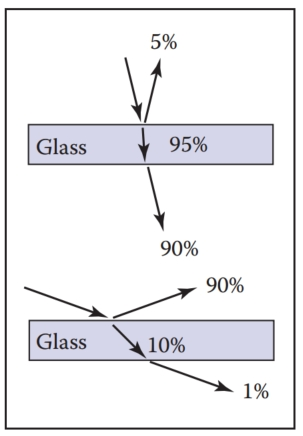
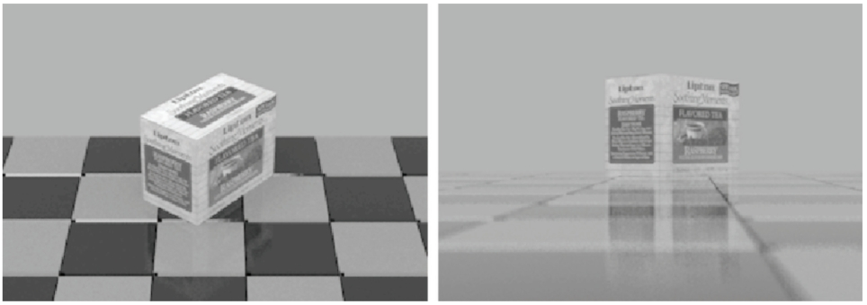
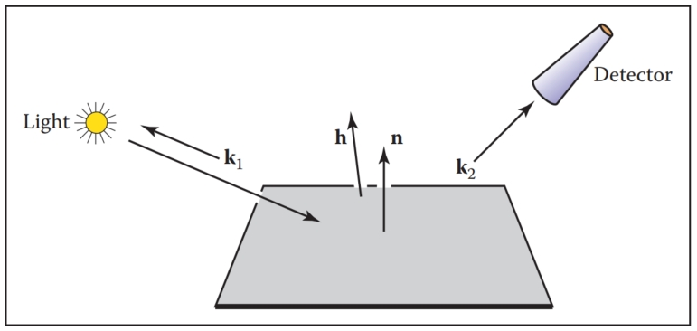

# 24  Reflection Models  反射模型

As we discussed in Chapter 18, the reflective properties of a surface can be summarized using the BRDF (Nicodemus, Richmond, Hsia, Ginsberg, & Limperis, 1977; Cook & Torrance, 1982). In this chapter, we discuss some of the most visually important aspects of material properties and a few fairly simple models that are useful in capturing these properties. There are many BRDF models in use in graphics, and the models presented here are meant to give just an idea of nondiffuse BRDFs. 
正如我们在第 18 章中讨论的，表面的反射特性可以使用 BRDF 进行总结（Nicodemus、Richmond、Hsia、Ginsberg 和 Limperis，1977；Cook 和 Torrance，1982）。 在本章中，我们讨论材料属性的一些在视觉上最重要的方面以及一些可用于捕获这些属性的相当简单的模型。 图形中使用了许多 BRDF 模型，这里介绍的模型只是为了提供非扩散 BRDF 的概念。

## 24.1 Real-World Materials  现实世界的材料

Many real materials have a visible structure at normal viewing distances. For example, most carpets have easily visible pile that contributes to appearance. For our purposes, such structure is not part of the material property but is, instead, part of the geometric model. Structure whose details are invisible at normal viewing distances, but which do determine macroscopic material appearance, are part of the material property. For example, the fibers in paper have a complex appearance under magnification, but they are blurred together into an homogeneous appearance when viewed at arm’s length. This distinction between microstructure that is folded into BRDF is somewhat arbitrary and depends on what one defines as “normal” viewing distance and visual acuity, but the distinction has proven quite useful in practice. In this section, we define some categories of materials. Later in the chapter, we present reflection models that target each type of material. In the notes at the end of the chapter, some models that account for more exotic materials are also discussed. 
许多真实材料在正常观看距离下具有可见的结构。 例如，大多数地毯都具有明显的绒毛，有助于美观。 就我们的目的而言，这种结构不是材料属性的一部分，而是几何模型的一部分。 其细节在正常观看距离下不可见，但确实决定宏观材料外观的结构是材料属性的一部分。 例如，纸张中的纤维在放大后具有复杂的外观，但当在一定距离处观察时，它们会模糊在一起形成均匀的外观。 折叠到 BRDF 中的微观结构之间的这种区别有些武断，取决于人们对“正常”观看距离和视敏度的定义，但这种区别在实践中已被证明非常有用。 在本节中，我们定义了一些材料类别。 在本章后面，我们将介绍针对每种类型材质的反射模型。 在本章末尾的注释中，还讨论了一些考虑更奇特材料的模型。

### 24.1.1 Smooth Dielectrics and Metals  光滑电介质和金属

Dielectrics are clear materials that refract light; their basic properties were summarized in Chapter 4. Metals reflect and refract light much like dielectrics, but they absorb light very, very quickly. Thus, only very thin metal sheets are transparent at all, e.g., the thin gold plating on some glass objects. For a smooth material, there are only two important properties: 
电介质是折射光的透明材料； 第 4 章总结了它们的基本特性。金属像电介质一样反射和折射光，但它们吸收光的速度非常非常快。 因此，只有非常薄的金属片是透明的，例如某些玻璃物体上的薄金镀层。 对于光滑材料来说，只有两个重要的特性：

1. How much light is reflected at each incident angle and wavelength. 
   每个入射角和波长反射多少光。
2. What fraction of light is absorbed as it travels through the material for a given distance and wavelength.
   当光在给定的距离和波长下穿过材料时，有多少部分的光被吸收。

The amount of light transmitted is whatever is not reflected (a result of energy conservation). For a metal, in practice, we can assume all the light is immediately absorbed. For a dielectric, the fraction is determined by the constant used in Beer’s Law as discussed in Chapter 13.
传输的光量是没有反射的光量（能量守恒的结果）。 对于金属，实际上，我们可以假设所有的光都会立即被吸收。 对于电介质，分数由比尔定律中使用的常数决定，如第 13 章所述。 

The amount of light reflected is determined by the Fresnel equations as discussed in Chapter 4. These equations are straightforward, but cumbersome. The main effect of the Fresnel equations is to increase the reflectance as the incident angle increases, particularly near grazing angles. This effect works for transmitted light as well. These ideas are shown diagrammatically in Figure 24.1. Note that the light is repeatedly reflected and refracted as shown in Figure 24.2. Usually only one or two of the reflected images is easily visible. 
反射的光量由第 4 章中讨论的菲涅尔方程确定。这些方程很简单，但很麻烦。 菲涅耳方程的主要作用是随着入射角的增加（特别是在掠射角附近）增加反射率。 这种效果也适用于透射光。 这些想法如图 24.1 所示。 请注意，光会反复反射和折射，如图 24.2 所示。 通常只有一两个反射图像是容易看到的。

Figure 24.1. The amount of light reflected and transmitted by glass varies with the angle.
图 24.1。 玻璃反射和透射的光量随角度的不同而变化。

Figure 24.2. Light is repeatedly reflected and refracted by glass, with the fractions of energy shown.
图 24.2。 光被玻璃反复反射和折射，并显示出能量的分数。

### 24.1.2 Rough Surfaces  粗糙表面

If a metal or dielectric is roughened to a small degree, but not so small that diffraction occurs, then we can think of it as a surface with microfacets (Cook & Torrance, 1982). Such surfaces behave specularly at a closer distance, but viewed at a further distance seem to spread the light out in a distribution. For a metal, an example of this rough surface might be brushed steel, or the “cloudy” side of most aluminum foil. 
如果金属或电介质被粗糙化到很小的程度，但又没有小到发生衍射，那么我们可以将其视为具有微面的表面（Cook & Torrance，1982）。 这种表面在较近的距离处表现出镜面反射，但在较远的距离处观察似乎将光以一定的分布形式散开。 对于金属，这种粗糙表面的一个例子可能是拉丝钢，或大多数铝箔的“浑浊”面。

For dielectrics, such as a sheet of glass, scratches or other irregular surface features make the glass blur the reflected and transmitted images that we can normally see clearly. If the surface is heavily scratched, we call it translucent rather than transparent. This is a somewhat arbitrary distinction, but it is usually clear whether we would consider a glass translucent or transparent.
对于电介质，例如玻璃片，划痕或其他不规则的表面特征会使玻璃模糊我们通常可以清楚看到的反射和透射图像。 如果表面被严重划伤，我们称其为半透明而不是透明。 这是一个有点武断的区别，但通常很清楚我们是否会认为玻璃是半透明的或透明的。

### 24.1.3 Diffuse Materials 漫反射材质

A material is diffuse if it is matte, i.e., not shiny. Many surfaces we see are diffuse, such as most stones, paper, and unfinished wood. To a first approximation, diffuse surfaces can be approximated with a Lambertian (constant) BRDF. Real diffuse materials usually become somewhat specular for grazing angles. This is a subtle effect, but can be important for realism. 
如果材料是无光泽的，即没有光泽，则该材料是漫反射的。 我们看到的许多表面都是漫反射的，例如大多数石头、纸张和未完成的木材。 对于第一个近似，漫反射表面可以用朗伯（常数）BRDF 来近似。 真实的漫反射材质通常会因掠射角而变得有些镜面反射。 这是一种微妙的效果，但对于现实主义来说可能很重要。

### 24.1.4 Translucent Materials 半透明材质

Many thin objects, such as leaves and paper, both transmit and reflect light diffusely. For all practical purposes no clear image is transmitted by these objects. These surfaces can add a hue shift to the transmitted light. For example, red paper is red because it filters out non-red light for light that penetrates a short distance into the paper, and then scatters back out. The paper also transmits light with a red hue because the same mechanisms apply, but the transmitted light makes it all the way through the paper. One implication of this property is that the transmitted coefficient should be the same in both directions.
许多薄的物体，例如树叶和纸张，都会漫射和反射光。 出于所有实际目的，这些物体无法传输清晰的图像。 这些表面可以为透射光添加色调偏移。 例如，红纸之所以是红色，是因为它过滤掉了穿透纸一小段距离然后散射出去的非红光。 纸张还可以传输红色调的光，因为应用了相同的机制，但传输的光使其一直穿过纸张。 这一属性的含义之一是传输系数在两个方向上应该相同。

### 24.1.5 Layered Materials  分层材料

Many surfaces are composed of “layers” or are dielectrics with embedded particles that give the surface a diffuse property (Phong, 1975). The surface of such materials reflects specularly as shown in Figure 24.3, and thus obeys the Fresnel equations. The light that is transmitted is either absorbed or scattered back up to the dielectric surface where it may or may not be transmitted. That light that is transmitted, scattered, and then retransmitted in the opposite direction forms a diffuse “reflection” component.
许多表面由“层”组成，或者是带有嵌入颗粒的电介质，赋予表面漫射特性（Phong，1975）。 此类材料的表面发生镜面反射，如图 24.3 所示，因此遵循菲涅尔方程。 传输的光要么被吸收，要么被散射回电介质表面，在那里它可能会或可能不会被传输。 透射、散射、然后沿相反方向重新透射的光形成漫反射“反射”分量。

Figure 24.3. Light hitting a layered surface can be reflected specularly, or it can be transmitted and then scatter diffusely off the substrate.
图 24.3。 照射到分层表面的光可以镜面反射，也可以透射，然后从基材上漫反射。

Note that the diffuse component also is attenuated with the degree of the angle, because the Fresnel equations cause reflection back into the surface as the angle increases as shown in Figure 24.4. Thus, instead of a constant diffuse BRDF, one that vanishes near the grazing angle is more appropriate.
请注意，漫反射分量也会随着角度的大小而衰减，因为随着角度的增加，菲涅尔方程会导致反射回表面，如图 24.4 所示。 因此，与恒定的漫反射 BRDF 不同，在掠射角附近消失的 BRDF 更合适。

Figure 24.4. The light scattered by the substrate is less and less likely to make it out of the surface as the angle relative to the surface normal increases.
图 24.4。 随着相对于表面法线的角度增大，被基底散射的光越来越不可能从表面中出来。

## 24.2 Implementing Reflection Models  实现反射模型

A BRDF model, as described in Section 18.1.6, will produce a rendering which is more physically based than the rendering we get from point light sources and Phong-like models. Unfortunately, real BRDFs are typically quite complicated and cannot be deduced from first principles. Instead, they must either be measured and directly approximated from raw data, or they must be crudely approximated in an empirical fashion. The latter empirical strategy is what is usually done, and the development of such approximate models is still an area of research. This section discusses several desirable properties of such empirical models. 
BRDF 模型，如第 18.1.6 节中所述，将产生比我们从点光源和类似 Phong 模型获得的渲染更基于物理的渲染。 不幸的是，真正的 BRDF 通常相当复杂，无法从第一原理中推导出来。 相反，它们必须要么被测量并直接根据原始数据进行近似，要么必须以经验方式粗略地近似。 后一种经验策略是通常所做的，并且这种近似模型的开发仍然是一个研究领域。 本节讨论此类经验模型的几个理想属性。

First, physical constraints imply two properties of a BRDF model. The first constraint is energy conservation:
首先，物理约束意味着 BRDF 模型的两个属性。 第一个约束是能量守恒：
$$
for\ all\ \bold{k}_i, R(\bold{k}_i) = \int _{all\ \bold{k}_o} ρ(\bold{k}_i, \bold{k}_o) \cos θ_o dσ_o ≤ 1.
$$
If you send a beam of light at a surface from any direction $\bold{k}_i$, then the total amount of light reflected over all directions will be at most the incident amount. The second physical property we expect all BRDFs to have is reciprocity:
如果从任意方向 $\bold{k}_i$ 向表面发射光束，则所有方向反射的光总量最多为入射光量。 我们期望所有 BRDF 都具有的第二个物理属性是互易性：
$$
for\ all\ \bold{k}_i, \bold{k}_o, ρ(\bold{k}_i, \bold{k}_o) = ρ(\bold{k}_o, \bold{k}_i).
$$
Second, we want a clear separation between diffuse and specular components. The reason for this is that, although there is a mathematically clean delta function formulation for ideal specular components, delta functions must be implemented as special cases in practice. Such special cases are only practical if the BRDF model clearly indicates what is specular and what is diffuse.
其次，我们希望漫反射和镜面反射分量之间有明确的分离。 其原因是，虽然理想镜面反射分量有一个数学上清晰的 delta 函数公式，但在实践中必须将 delta 函数作为特殊情况来实现。 只有当 BRDF 模型清楚地表明什么是镜面反射、什么是漫反射时，这种特殊情况才实用。

Third, we would like intuitive parameters. For example, one reason the Phong model has enjoyed such longevity is that its diffuse constant and exponent are both clearly related to the intuitive properties of the surface, namely surface color and highlight size.
第三，我们想要直观的参数。 例如，Phong 模型如此长寿的原因之一是它的漫反射常数和指数都与表面的直观属性（即表面颜色和高光大小）明显相关。

Finally, we would like the BRDF function to be amenable to Monte Carlo sampling. Recall from Chapter 14 that an integral can be sampled by N random points $x_i ∼ p$ where p is defined with the same measure as the integral:
最后，我们希望 BRDF 函数能够进行蒙特卡洛采样。 回想一下第 14 章，积分可以通过 N 个随机点 $x_i ∼ p$ 进行采样，其中 p 的定义与积分的度量相同：
$$
\int f(x)dμ ≈ \frac{1}{N} \sum^N_{j=1}\frac{f(x_j)}{p(x_j)}
$$
Recall from Section 18.2 that the surface radiance in direction $\bold{k}_o$ is given by a transport equation: 
回想一下 18.2 节，$\bold{k}_o$ 方向上的表面辐射率由传输方程给出：
$$
L_s(\bold{k}_o) = \int _{all\ \bold{k}_i} ρ(\bold{k}_i, \bold{k}_o)L_f(\bold{k}_i) cos θ_idσ_i.
$$
If we sample directions with pdf p(ki) as discussed in Chapter 23, then we can approximate the surface radiance with samples: 
如果我们使用第 23 章中讨论的 pdf p(ki) 对方向进行采样，那么我们可以使用样本来近似表面辐射率：
$$
L_s(\bold{k}_o) ≈ \frac{1}{N}\sum^{N}_{j=1}\frac{ρ(\bold{k}_j, \bold{k}_o)L_f(\bold{k}_j) \cos θ_j}
{p(\bold{k}_j)} 
$$
This approximation will converge for any $p$ that is nonzero where the integrand is nonzero. However, it will only converge well if the integrand is not very large relative to $p$. Ideally, $p(\bold{k})$ should be approximately shaped like the integrand $ρ(\bold{k}_j, \bold{k}_o)L_f(\bold{k}_j) \cos θ_j$. In practice, $L_f$ is complicated, and the best we can accomplish is to have $p(\bold{k})$ shaped somewhat like $ρ(\bold{k}, \bold{k}_o)L_f(\bold{k}) \cos θ$. 
对于任何非零且被积函数非零的 $p$，该近似将收敛。 然而，只有当被积函数相对于 $p$ 不是很大时，它才会很好地收敛。 理想情况下，$p(\bold{k})$ 的形状应近似于被积函数 $ρ(\bold{k}_j, \bold{k}_o)L_f(\bold{k}_j) \cos θ_j$。 实际上，$L_f$ 很复杂，我们能做到的最好的结果就是让 $p(\bold{k})$ 的形状有点像 $ρ(\bold{k}, \bold{k}_o)L_f(\bold{k}) \cos θ$。

For example, if the BRDF is Lambertian, then it is constant and the “ideal” $p(\bold{k})$ is proportional to $\cos θ$. Because the integral of p must be one, we can deduce the leading constant:
例如，如果 BRDF 是朗伯分布，那么它是常数，并且“理想”$p(\bold{k})$ 与 $\cos θ$ 成正比。 因为 p 的积分必须为 1，所以我们可以推导出前导常数：
$$
\int_{all\ \bold{k} \ with\ θ < π/2}C\cosθdσ = 1
$$
This implies that $C = 1/π$, so we have
这意味着 $C = 1/π$，所以我们有
$$
p(\bold{k}) = \frac{1}{π}\cos θ
$$
An acceptably efficient implementation will result as long as p doesn’t get too small when the integrand is nonzero. Thus, the constant pdf will also suffice:
只要当被积函数非零时 p 不变得太小，就会产生可接受的高效实现。 因此，常数 pdf 也足够了：
$$
p(\bold{k}) = \frac{1}{2\pi}
$$
This emphasizes that many pdfs may be acceptable for a given BRDF model. 
这强调了对于给定的 BRDF 模型，许多 pdf 可能是可接受的。

## 24.3 Specular Reflection Models 镜面反射模型

For a metal, we typically specify the reflectance at normal incidence $R_0(λ)$. The reflectance should vary according to the Fresnel equations, and a good approximation is given by (Schlick, 1994a)
对于金属，我们通常指定法向入射时的反射率 $R_0(λ)$。 反射率应根据菲涅耳方程而变化，并且给出了一个很好的近似值（Schlick，1994a）
$$
R(θ, λ) = R_0(λ) + (1 − R_0(λ)) (1 − \cos θ)^5
$$
This approximation allows us to just set the normal reflectance of the metal either from data or by eye.
这种近似使我们能够根据数据或肉眼设置金属的法向反射率。

For a dielectric, the same formula works for reflectance. However, we can set $R_0(λ)$ in terms of the refractive index $n(λ)$:
对于电介质，相同的公式适用于反射率。 然而，我们可以根据折射率 $n(λ)$ 来设置 $R_0(λ)$：
$$
R_0(λ) = (\frac{n(λ)-1}{n(λ)+1})^2
$$
Typically, n does not vary with wavelength, but for applications where dispersion is important, n can vary. The refractive indices that are often useful include water $(n = 1.33)$, glass ($n = 1.4$ to $n = 1.7$), and diamond ($n = 2.4$).
通常，n 不随波长变化，但对于色散很重要的应用，n 可以变化。 通常有用的折射率包括水 $(n = 1.33)$、玻璃（$n = 1.4$ 至 $n = 1.7$）和钻石（$n = 2.4$）。

## 24.4 Smooth-Layered Model  平滑分层模型

Reflection in matte/specular materials, such as plastics or polished woods, is governed by Fresnel equations at the surface and by scattering within the subsurface. An example of this reflection can be seen in the tiles in the renderings in Figure 24.5. Note that the blurring in the specular reflection is mostly vertical due to the compression of apparent bump spacing in the view direction. This effect causes the vertically streaked reflections seen on lakes on windy days; it can either be modeled using explicit microgeometry and a simple smooth-surface reflection model or by a more general model that accounts for this asymmetry.
哑光/镜面材料（例如塑料或抛光木材）中的反射由表面的菲涅尔方程和次表面内的散射控制。 这种反射的一个例子可以在图 24.5 中的渲染图块中看到。 请注意，由于视图方向上明显的凹凸间距被压缩，镜面反射中的模糊大部分是垂直的。 这种效应会导致大风天湖面上出现垂直条纹反射。 它可以使用显式微观几何和简单的光滑表面反射模型进行建模，也可以通过解释这种不对称性的更通用的模型进行建模。

We could use the traditional Lambertian-specular model for the tiles, which linearly mixes specular and Lambertian terms. In standard radiometric terms, this can be expressed as
我们可以对图块使用传统的朗伯镜面模型，该模型线性混合镜面反射项和朗伯镜面项。 在标准辐射测量术语中，这可以表示为
$$
ρ(θ, φ, θ', φ'λ) = \frac{Rd(λ)}{π} + R_sρ_s(θ, φ, θ', φ'),
$$
where $R_d(λ)$ is the hemispherical reflectance of the matte term, $R_s$ is the specular reflectance, and $ρ_s$ is the normalized specular BRDF (a weighted Dirac delta function on the sphere). This equation is a simplified version of the BRDF where Rs is independent of wavelength. The independence of wavelength causes a highlight that is the color of the luminaire, so a polished rather than a metal appearance will be achieved. Ward (G. J. Ward, 1992) suggests to set $R_d(λ) + R_s ≤ 1$ in order to conserve energy. However, such models with constant $R_s$ fail to show the increase in specularity for steep viewing angles. This is the key point: in the real world the relative proportions of matte and specular appearance change with the viewing angle.
其中 $R_d(λ)$ 是遮罩项的半球反射率，$R_s$ 是镜面反射率，$ρ_s$ 是归一化镜面 BRDF（球体上的加权狄拉克 δ 函数）。 该方程是 BRDF 的简化版本，其中 Rs 与波长无关。 波长的独立性导致灯具的颜色成为亮点，因此将实现抛光而不是金属的外观。 Ward (G. J. Ward, 1992) 建议设置 $R_d(λ) + R_s ≤ 1$ 以节省能量。 然而，此类具有恒定 $R_s$ 的模型无法显示陡峭视角下镜面反射率的增加。 这是关键点：在现实世界中，哑光和镜面外观的相对比例随着视角的变化而变化。

One way to simulate the change in the matte appearance is to explicitly dampen $R_d(λ)$ as $R_s$ increases (Shirley, 1991):
模拟哑光外观变化的一种方法是随着 $R_s$ 的增加显式抑制 $R_d(λ)$ (Shirley, 1991)：
$$
ρ(θ, φ, θ', φ', λ) = R_f(θ)ρ_s(θ, φ, θ', φ') + \frac{R_d(λ)(1 − R_f(θ))}{π}
$$
where $R_f(θ)$ is the Fresnel reflectance for a polish-air interface. The problem with this equation is that it is not reciprocal, as can been seen by exchanging $θ$ and $θ'$; this changes the value of the matte damping factor because of the multiplication by $(1 − R_f(θ))$. The specular term, a scaled Dirac delta function, is reciprocal, but this does not make up for the non-reciprocity of the matte term. Although this BRDF works well, its lack of reciprocity can cause some rendering methods to have ill-defined solutions.
其中 $R_f(θ)$ 是抛光空气界面的菲涅耳反射率。 这个方程的问题是它不是倒数的，通过交换 $θ$ 和 $θ'$ 可以看出； 由于乘以 $(1 − R_f(θ))$，这会改变遮罩阻尼因子的值。 镜面项（缩放后的狄拉克 δ 函数）是互易的，但这并不能弥补遮罩项的非互易性。 尽管这种 BRDF 效果很好，但它缺乏互惠性可能会导致某些渲染方法出现不明确的解决方案。

We now present a model that produces the matte/specular tradeoff while remaining reciprocal and energy conserving. Because the key feature of the new model is that it couples the matte and specular scaling coefficients, it is called a coupled model (Shirley, Smits, Hu, & Lafortune, 1997).
我们现在提出一个模型，可以在保持倒数和节能的同时产生哑光/镜面权衡。 由于新模型的关键特征是它耦合了遮罩和镜面缩放系数，因此称为耦合模型（Shirley、Smits、Hu 和 Lafortune，1997）。

Surfaces which have a glossy appearance are often a clear dielectric, such as polyurethane or oil, with some subsurface structure. The specular (mirrorlike) component of the reflection is caused by the smooth dielectric surface and is independent of the structure below this surface. The magnitude of this specular term is governed by the Fresnel equations.
具有光泽外观的表面通常是透明电介质，例如聚氨酯或油，具有一些地下结构。 反射的镜面（镜面）分量是由光滑的介电表面引起的，并且与该表面下方的结构无关。 该镜面反射项的大小由菲涅耳方程控制。

The light that is not reflected specularly at the surface is transmitted through the surface. There, either it is absorbed by the subsurface, or it is reflected from a pigment or a subsurface and transmitted back through the surface of the polish. This transmitted light forms the matte component of reflection. Since the matte component can only consist of the light that is transmitted, it will naturally decrease in total magnitude for increasing angle.
不在表面镜面反射的光会透过该表面。 在那里，它要么被次表面吸收，要么从颜料或次表面反射并通过抛光剂的表面传输回来。 这种透射光形成反射的无光泽成分。 由于无光泽成分只能由透射的光组成，因此随着角度的增加，它的总强度自然会减小。

To avoid choosing between physically plausible models and models with good qualitative behavior over a range of incident angles, note that the Fresnel equations that account for the specular term, $R_f(θ)$, are derived directly from the physics of the dielectric-air interface. Therefore, the problem must lie in the matte term. We could use a full-blown simulation of subsurface scattering as implemented, but this technique is both costly and requires detailed knowledge of subsurface structure, which is usually neither known nor easily measurable. Instead, we can modify the matte term to be a simple approximation that captures the important qualitative angular behavior shown in Figure 24.4. 
为了避免在物理上合理的模型和在一系列入射角上具有良好定性行为的模型之间进行选择，请注意，考虑镜面反射项的菲涅尔方程 $R_f(θ)$ 直接从介电空气的物理学中得出 界面。 因此，问题一定出在matte项上。 我们可以使用对次表面散射进行全面的模拟来实现，但这种技术不仅成本高昂，而且需要对次表面结构的详细了解，而这些知识通常既不为人所知，也不容易测量。 相反，我们可以将遮罩项修改为简单的近似值，以捕获图 24.4 中所示的重要定性角度行为。

Let us assume that the matte term is not Lambertian, but instead is some other function that depends only on $θ, θ'$ and $λ: ρ_m(θ, θ', λ)$. We discard behavior that depends on $φ$ or $φ'$ in the interest of simplicity. We try to keep the formulas reasonably simple because the physics of the matte term is complicated and sometimes requires unknown parameters. We expect the matte term to be close to constant, and roughly rotationally symmetric (He et al., 1992). 
让我们假设遮罩项不是朗伯函数，而是仅依赖于 $θ、θ'$ 和 $λ 的其他函数：ρ_m(θ, θ', λ)$。 为了简单起见，我们放弃依赖于 $φ$ 或 $φ'$ 的行为。 我们尝试使公式保持相当简单，因为遮罩项的物理原理很复杂，有时需要未知的参数。 我们期望遮罩项接近常数，并且大致旋转对称（He et al., 1992）。

An obvious candidate for the matte component $ρm(θ, θ', λ)$ that will be reciprocal is the separable form $kR_m(λ)f(θ)f(θ')$ for some constant k and matte reflectance parameter $R_m(λ)$. We could merge $k$ and $R_m(λ)$ into a single term, but we choose to keep them separated because this makes it more intuitive to set $R_m(λ)$—which must be between 0 and 1 for all wavelengths. Separable BRDFs have been shown to have several computational advantages, thus we use the separable model:
对于某个常数 k 和遮罩反射参数 $，遮罩分量 $ρm(θ, θ', λ)$ 的一个明显候选者是可分离形式 $kR_m(λ)f(θ)f(θ')$，该形式将是倒数 R_m(λ)$。 我们可以将 $k$ 和 $R_m(λ)$ 合并为一个项，但我们选择将它们分开，因为这样可以更直观地设置 $R_m(λ)$ — 对于所有波长，它必须介于 0 和 1 之间 。 可分离 BRDF 已被证明具有多种计算优势，因此我们使用可分离模型：
$$
ρ(θ, φ, θ', φ', λ) = R_f(θ)ρ_s(θ, φ, θ', φ') + kR_m(λ)f(θ)f(θ').
$$
We know that the matte component can only contain energy not reflected in the surface (specular) component. This means that for $R_m(λ) = 1$, the incident and reflected energy are the same, which suggests the following constraint on the BRDF for each incident θ and λ:
我们知道，哑光分量只能包含表面（镜面）分量中未反射的能量。 这意味着对于 $R_m(λ) = 1$，入射能量和反射能量相同，这表明对于每个入射 θ 和 λ 的 BRDF 有以下约束：
$$
R_f(θ) + 2πkf(θ) \int^{\frac{\pi}{2}}_0  f(θ')\cos θ' \sin θ'dθ' = 1. \ \ \ \ (24.1)
$$
We can see that $f(θ)$ must be proportional to $(1 − R_f(θ))$. If we assume that matte components that absorb some energy have the same directional pattern as this ideal, we get a BRDF of the form
我们可以看到 $f(θ)$ 必须与 $(1 − R_f(θ))$ 成正比。 如果我们假设吸收一些能量的哑光组件具有与理想方向相同的方向模式，我们会得到以下形式的 BRDF
$$
ρ(θ, φ, θ', φ', λ) = R_f(θ)ρ_s(θ, φ, θ', φ') + kR_m(λ)[1 − R_f(θ)][1 − R_f(θ')].
$$
We could now insert the full form of the Fresnel equations to get $R_f(θ)$, and then use energy conservation to solve for constraints on k. Instead, we will use the approximation discussed in Section 24.1.1 We find that
我们现在可以插入菲涅耳方程的完整形式来得到 $R_f(θ)$，然后使用能量守恒来求解 k 的约束。 相反，我们将使用第 24.1.1 节中讨论的近似值我们发现
$$
f(θ) ∝ (1 − (1 − cos θ)^5).
$$
Applying Equation (24.1) yields
应用方程（24.1）得出
$$
k = \frac{21}{20π(1 − R_0)} \ \  \ \ (24.2)
$$
The full coupled BRDF is then
那么全耦合的 BRDF 就是
$$
ρ(θ, φ, θ', φ', λ) = \\
[R_0 + (1 − \cos θ)^5(1 − R_0)] ρ_s(θ, φ, θ', φ') + \\
kR_m(λ) [1 − (1 − \cos θ)^5] [1 − (1 − cos θ')^5] . (24.3)
$$
The results of running the coupled model is shown in Figure 24.5. Note that for the high viewpoint, the specular reflection is almost invisible, but it is clearly visible in the low-angle photograph image, where the matte behavior is less obvious.
耦合模型的运行结果如图 24.5 所示。 请注意，对于高视角，镜面反射几乎不可见，但在低角度照片图像中清晰可见，其中遮罩行为不太明显。

For reasonable values of refractive indices, $R_0$ is limited to approximately the range 0.03 to 0.06 (the value R0 = 0.05 was used for Figure 24.5). The value of Rs in a traditional Phong model is harder to choose, because it typically must be tuned for viewpoint in static images and tuned for a particular camera sequence for animations. Thus, the coupled model is easier to use in a “hands-off” mode. 
对于合理的折射率值，$R_0$ 限制在大约 0.03 到 0.06 的范围内（图 24.5 使用的值 R0 = 0.05）。 传统 Phong 模型中的 Rs 值更难选择，因为它通常必须针对静态图像中的视点进行调整，并针对动画的特定摄像机序列进行调整。 因此，耦合模型在“不干涉”模式下更容易使用。

Figure 24.5. Renderings of polished tiles using coupled model. These images were produced using a Monte Carlo path tracer. The sampling distribution for the diffuse term is $\cos θ/π$. 
图 24.5。 使用耦合模型的抛光砖效果图。 这些图像是使用蒙特卡罗路径追踪器生成的。 扩散项的采样分布为 $\cos θ/π$。

## 24.5 Rough-Layered Model  粗糙分层模型

The previous model is fine if the surface is smooth. However, if the surface is not ideal, some spread is needed in the specular component. An extension of the coupled model to this case is presented here (Ashikhmin & Shirley, 2000). At a given point on a surface, the BRDF is a function of two directions, one in the direction toward the light and one in the direction toward the viewer. We would like to have a BRDF model that works for “common” surfaces, such as metal and plastic, and has the following characteristics: 
如果表面光滑的话，以前的模型就可以了。 然而，如果表面不理想，则镜面反射分量需要一些扩散。 这里介绍了耦合模型对这种情况的扩展（Ashikhmin & Shirley，2000）。 在表面上的给定点，BRDF 是两个方向的函数，一个方向朝向光，另一个方向朝向观察者。 我们希望有一个适用于“常见”表面（例如金属和塑料）的 BRDF 模型，并具有以下特征：

1. Plausible. As defined by Lewis (R. R. Lewis, 1994), this refers to the BRDF obeying energy conservation and reciprocity. 
   合理。 按照 Lewis 的定义（R. R. Lewis, 1994），这是指 BRDF 遵循能量守恒和互易性。
2. Anisotropy. The material should model simple anisotropy, such as seen on brushed metals. 
   各向异性。 该材料应模拟简单的各向异性，例如拉丝金属上的各向异性。
3. Intuitive parameters. For material, such as plastics, there should be parameters $R_d$ for the substrate and $R_s$ for the normal specular reflectance as well as two roughness parameters $n_u$ and $n_v$. 
   直观的参数。 对于塑料等材料，应该有用于基材的参数 $R_d$ 和用于正常镜面反射率的参数 $R_s$，以及两个粗糙度参数 $n_u$ 和 $n_v$。
4. Fresnel behavior. Specularity should increase as the incident angle decreases. 
   菲涅尔行为。 镜面反射度应随着入射角的减小而增加。
5. Non-Lambertian diffuse term. The material should allow for a diffuse term, but the component should be non-Lambertian to assure energy conservation in the presence of Fresnel behavior. 
   非朗伯漫反射项。 该材料应允许漫射项，但该组件应为非朗伯函数，以确保在存在菲涅尔行为的情况下能量守恒。
6. Monte Carlo friendliness. There should be some reasonable probability density function that allows straightforward Monte Carlo sample generation for the BRDF.
   蒙特卡洛的友善。 应该有一些合理的概率密度函数，允许直接为 BRDF 生成蒙特卡罗样本。

A BRDF with these properties is a Fresnel-weighted, Phong-style cosine lobe model that is anisotropic. 
具有这些属性的 BRDF 是菲涅尔加权、Phong 型各向异性余弦波瓣模型。

We again decompose the BRDF into a specular component and a diffuse component (Figure 24.6). Accordingly, we write our BRDF as the classical sum of two parts:
我们再次将 BRDF 分解为镜面反射分量和漫反射分量（图 24.6）。 因此，我们将 BRDF 写为两部分的经典和：
$$
ρ(k_1, k_2) = ρ_s(k_1, k_2) + ρ_d(k_1, k_2), \ \ \ \ \ (24.4)
$$
where the first term accounts for the specular reflection (this will be presented in the next section). While it is possible to use the Lambertian BRDF for the diffuse term $ρ_d(\bold{k}_1, \bold{k}_2)$ in our model, we will discuss a better solution in Section 24.5.2 and how to implement the model in Section 24.5.3. Readers who just want to implement the model should skip to that section.
其中第一项说明镜面反射（这将在下一节中介绍）。 虽然可以在我们的模型中对漫反射项 $ρ_d(\bold{k}_1, \bold{k}_2)$ 使用朗伯 BRDF，但我们将在第 24.5.2 节中讨论更好的解决方案以及如何实现 第 24.5.3 节中的模型。 只想实现该模型的读者应该跳到该部分。

Figure 24.6. Geometry of reflection. Note that $\bold{k}_1$, $\bold{k}_2$, and $\bold{h}$ share a plane, which usually does not include $\bold{n}$. 
图 24.6。 反射几何。 请注意，$\bold{k}_1$、$\bold{k}_2$ 和 $\bold{h}$ 共享一个平面，该平面通常不包括 $\bold{n}$。

### 24.5.1 Anisotropic Specular BRDF  各向异性镜面 BRDF

To model the specular behavior, we use a Phong-style specular lobe but make this lobe anisotropic and incorporate Fresnel behavior while attempting to preserve the simplicity of the initial mode. This BRDF is
为了模拟镜面反射行为，我们使用 Phong 型镜面反射波瓣，但使该波瓣各向异性并结合菲涅耳行为，同时尝试保持初始模式的简单性。 这个 BRDF 是
$$
ρ(\bold{k}_1, \bold{k}_2) = \frac{\sqrt{(n_u + 1)(n_v + 1)}}{8\pi}
\frac{(\bold{n} · \bold{h})^{n_u \cos^2 φ+n_v \sin^2 φ}}{(\bold{h} · \bold{k}_i)max(\cos θ_i, \cos θ_o))}
F(\bold{k}_i \cdot \bold{h}) \ \ \ \ \ (24.5)
$$
Again we use Schlick’s approximation to the Fresnel equation: 
我们再次使用 Schlick 近似菲涅尔方程：
$$
F (\bold{k}_i · \bold{h}) = R_s + (1 − R_s)(1 − (\bold{k}_i · \bold{h}))^5,\ \ \ \ \ \ (24.6)
$$
where $R_s$ is the material’s reflectance for the normal incidence. Because $\bold{k}_i · \bold{h} = \bold{k}_o · \bold{h}$, this form is reciprocal. We have an empirical model whose terms are  chosen to enforce energy conservation and reciprocity. A full rationalization for the terms is given in the paper by Ashikhmin, listed in the chapter notes.
其中 $R_s$ 是材料的法向入射反射率。 因为 $\bold{k}_i · \bold{h} = \bold{k}_o · \bold{h}$，这种形式是倒数的。 我们有一个经验模型，其项的选择是为了加强能量守恒和互惠。 Ashikhmin 的论文给出了这些术语的完整合理化，并在章节注释中列出。

The specular BRDF of Equation (24.5) is useful for representing metallic surfaces where the diffuse component of reflection is very small. Figure 24.7 shows a set of metal spheres on a texture-mapped Lambertian plane. As the values of parameters nu and nv change, the appearance of the spheres shift from rough metal to almost perfect mirror, and from highly anisotropic to the more familiar Phong-like behavior.
方程 (24.5) 的镜面 BRDF 对于表示漫反射分量非常小的金属表面非常有用。 图 24.7 显示了纹理映射朗伯平面上的一组金属球体。 随着参数 nu 和 nv 的值发生变化，球体的外观从粗糙的金属转变为几乎完美的镜面，并从高度各向异性转变为更熟悉的 Phong 状行为。

Figure 24.7. Metallic spheres for exponents 10, 100, 1000, and 10,000 increasing both left to right and top to bottom.
图 24.7。 指数 10、100、1000 和 10,000 的金属球从左到右、从上到下递增。 

### 24.5.2 Diffuse Term for the Anisotropic Phong Model 各向异性 Phong 模型的漫反射项

It is possible to use a Lambertian BRDF together with the anisotropic specular term; this is done for most models, but it does not necessarily conserve energy. A better approach is a simple angle-dependent form of the diffuse component which accounts for the fact that the amount of energy available for diffuse scattering varies due to the dependence of the specular teqrm’s total reflectance on the incident angle. In particular, diffuse color of a surface disappears near the grazing angle, because the total specular reflectance is close to one. This well-known effect cannot be reproduced with a Lambertian diffuse term and is therefore missed by most reflection models.
可以将朗伯 BRDF 与各向异性镜面反射项一起使用； 大多数型号都会这样做，但不一定能节省能源。 更好的方法是漫反射分量的简单的角度相关形式，它解释了可用于漫散射的能量由于镜面 teqrm 的总反射率对入射角的依赖性而变化的事实。 特别是，表面的漫反射颜色在掠射角附近消失，因为总镜面反射率接近于 1。 这种众所周知的效应无法用朗伯漫反射项重现，因此大多数反射模型都忽略了这一效应。

show Following a similar approach to the coupled model, we can find a form of the diffuse term that is compatible with the anisotropic Phong lobe:
按照耦合模型的类似方法，我们可以找到与各向异性 Phong 波瓣兼容的漫反射项的形式：
$$
ρ_d(k_1, k_2) = \frac{28R_d}{23π}(1 − R_s)(1 − (1 − \frac{\cosθ_i}{2})^5)(1 − (1 − \frac{\cosθ_o}{2})^5) \ \  \ \ (24.7)
$$
Here $R_d$ is the diffuse reflectance for normal incidence, and $R_s$ is the Phong lobe coefficient. An example using this model is shown in Figure 24.8. 
这里$R_d$是法向入射的漫反射率，$R_s$是Phong瓣系数。 图 24.8 显示了使用该模型的示例。

Figure 24.8. Three views for $n_u = n_v = 400$ and a diffuse substrate. Note the change in intensity of the specular reflection. 
图 24.8。 $n_u = n_v = 400$ 和漫射基板的三个视图。 注意镜面反射强度的变化。

### 24.5.3 Implementing the Model 实施模型

Recall that the BRDF is a combination of diffuse and specular components: 
回想一下，BRDF 是漫反射和镜面反射分量的组合：
$$
ρ(\bold{k}_1, \bold{k}_2) = ρ_s(\bold{k}_1, \bold{k}_2) + ρ_d(\bold{k}_1, \bold{k}_2).\ \ \ \ \ \  (24.8)
$$
The diffuse component is given in Equation (24.7); the specular component is given in Equation (24.5). It is not necessary to call trigonometric functions to compute the exponent, so the specular BRDF can be written: 
漫反射分量由公式 (24.7) 给出； 镜面反射分量由公式 (24.5) 给出。 不需要调用三角函数来计算指数，因此镜面 BRDF 可以写成：
$$
ρ(\bold{k}_1, \bold{k}_2) = \frac{\sqrt{(n_u + 1)(n_v + 1)}}{8\pi}(\bold{n} · \bold{h})
^{\frac{(n_u(\bold{h}·\bold{u})^2+n_v(\bold{h}·\bold{v})^2)/(1−(\bold{h}\bold{n})^2)}{(\bold{h}·\bold{k}_i)max(\cos θ_i,\cos θ_o)}} F (\bold{k}_i · \bold{h}) \ \ \ \ (24.9)
$$
In a Monte Carlo setting, we are interested in the following problem: given $\bold{k}_1$, generate samples of $\bold{k}_2$ with a distribution whose shape is similar to the cosineweighted BRDF. Note that greatly undersampling a large value of the integrand is a serious error, while greatly oversampling a small value is acceptable in practice. The reader can verify that the densities suggested below have this property.
在蒙特卡罗设置中，我们对以下问题感兴趣：给定 $\bold{k}_1$，生成 $\bold{k}_2$ 的样本，其分布形状类似于余弦加权 BRDF。 请注意，对被积函数的大值进行大幅欠采样是一个严重的错误，而对小值进行大幅过采样在实践中是可以接受的。 读者可以验证下面建议的密度是否具有此属性。

A suitable way to construct a pdf for sampling is to consider the distribution of half vectors that would give rise to our BRDF. Such a function is
构建 pdf 进行采样的合适方法是考虑产生 BRDF 的半向量的分布。 这样的函数是
$$
p_h(\bold{h}) = \frac{\sqrt{(n_u + 1)(n_v + 1)}}{2π} (\bold{nh})^{n_u \cos^2 φ + n_v \sin^2 φ} \ \ \ \ \ (24.10)
$$
where the constants are chosen to ensure it is a valid pdf.
其中选择常量以确保它是有效的 pdf。

We can just use the probability density function $p_h(\bold{h})$ of Equation (24.10) to generate a random $\bold{h}$. However, to evaluate the rendering equation, we need both a reflected vector $\bold{k}_o$ and a probability density function $p(\bold{k}_o)$. It is important to note that if you generate $\bold{h}$ according to $p_h(\bold{h})$ and then transform to the resulting $\bold{k}_o$:
我们可以使用方程（24.10）的概率密度函数$p_h(\bold{h})$来生成随机$\bold{h}$。 然而，为了评估渲染方程，我们需要反射向量 $\bold{k}_o$ 和概率密度函数 $p(\bold{k}_o)$。 需要注意的是，如果根据$p_h(\bold{h})$生成$\bold{h}$，然后转换为得到的$\bold{k}_o$：
$$
\bold{k}_o = −\bold{k}_i + 2(\bold{k}_i · \bold{h})\bold{h},\ \ \ \ \  (24.11)
$$
the density of the resulting $\bold{k}_o$ is not $p_h(\bold{k}_o)$. This is because of the difference in measures in $\bold{h}$ and $\bold{k}_o$. So the actual density $p(\bold{k}_o)$ is
所得$\bold{k}_o$ 的密度不是$p_h(\bold{k}_o)$。 这是因为 $\bold{h}$ 和 $\bold{k}_o$ 的度量不同。 所以实际密度 $p(\bold{k}_o)$ 是
$$
p(\bold{k}_o) = \frac{p_h(\bold{h})}{4(\bold{k}_i\bold{h})} \ \ \ \ \ (24.12)
$$
Note that in an implementation where the BRDF is known to be this model, the estimate of the rendering equation is quite simple as many terms cancel out. 
请注意，在已知 BRDF 就是该模型的实现中，渲染方程的估计非常简单，因为许多项被抵消。 

It is possible to generate an $\bold{h}$ vector whose corresponding vector $\bold{k}_o$ will point inside the surface, i.e., $\cos θ_o < 0$. The weight of such a sample should be set to zero. This situation corresponds to the specular lobe going below the horizon and is the main source of energy loss in the model. Clearly, this problem becomes progressively less severe as $n_u, n_v$ become larger. 
可以生成一个 $\bold{h}$ 向量，其对应向量 $\bold{k}_o$ 将指向曲面内部，即 $\cos θ_o < 0$。 此类样本的重量应设置为零。 这种情况对应于低于地平线的镜面波瓣，是模型中能量损失的主要来源。 显然，随着 $n_u, n_v$ 变大，这个问题逐渐变得不那么严重。

The only thing left now is to describe how to generate $\bold{h}$ vectors with the pdf of Equation (24.10). We will start by generating $\bold{h}$ with its spherical angles in the range $(θ, φ) ∈ [0, \frac{π}{2} ] × [0, \frac{π}{2} ]$. Note that this is only the first quadrant of the hemisphere. Given two random numbers $(ξ_1, ξ_2)$ uniformly distributed in [0, 1], we can choose
现在剩下的唯一事情就是描述如何用方程（24.10）的pdf生成$\bold{h}$向量。 我们首先生成 $\bold{h}$，其球面角在 $(θ, φ) ∈ [0, \frac{π}{2} ] × [0, \frac{π}{2} ]$ 范围内。 请注意，这只是半球的第一象限。 给定两个均匀分布在 [0, 1] 中的随机数 $(ξ_1, ξ_2)$，我们可以选择
$$
φ = \arctan(\sqrt{\frac{n_u + 1}{n_v + 1}} \tan(\frac{πξ_1}{2}) ) , (24.13)
$$
and then use this value of $φ$ to obtain $θ$ according to
然后使用$φ$的值根据以下公式获得$θ$
$$
\cos θ = (1 − ξ_2)^{1/(n_u \cos^2 φ+n_v \sin^2 φ+1)}. (24.14)
$$
To sample the entire hemisphere, we use the standard manipulation where $ξ_1$ is mapped to one of four possible functions depending on whether it is in $[0, 0.25)$, $[0.25, 0.5)$, $[0.5, 0.75)$, or $[0.75, 1.0).$ For example, for $ξ_1 ∈ [0.25, 0.5),$ find $φ(1 − 4(0.5 − ξ_1))$ via Equation (24.13), and then “flip” it about the $φ = π/2$ axis. This ensures full coverage and stratification. 
为了对整个半球进行采样，我们使用标准操作，其中 $ xi_1 $ 映射到四个可能的函数之一，具体取决于它是否在 $[0, 0.25)$、$[0.25, 0.5)$、$[0.5, 0.75 )$, 或 $[0.75, 1.0).$ 例如，对于 $xi_1 ∈ [0.25, 0.5),$ 通过方程 (24.13) 求出 $φ(1 − 4(0.5 − ξ_1))$，然后“翻转” ” 它围绕 $φ = π/2$ 轴。 这确保了完全覆盖和分层。

For the diffuse term, use a simpler approach and generate samples according to a cosine distribution. This is sufficiently close to the complete diffuse BRDF to substantially reduce variance of the Monte Carlo estimation.
对于扩散项，使用更简单的方法并根据余弦分布生成样本。 这与完整的漫反射 BRDF 足够接近，可以显着减少蒙特卡罗估计的方差。

## Frequently Asked Questions 经常问的问题

### My images look too smooth, even with a complex BRDF. What am I doing wrong? 即使使用复杂的 BRDF，我的图像看起来也太平滑了。 我究竟做错了什么？

BRDFs only capture subpixel detail that is too small to be resolved by the eye. Most real surfaces also have some small variations, such as the wrinkles in skin, that can be seen. If you want true realism, some sort of texture or displacement map is needed. 
BRDF 仅捕获太小而无法被眼睛分辨的子像素细节。 大多数真实的表面也有一些小的变化，例如可以看到的皮肤皱纹。 如果您想要真正的真实感，则需要某种纹理或置换贴图。

### How do I integrate the BRDF with texture mapping? 如何将 BRDF 与纹理映射集成？

Texture mapping can be used to control any parameter on a surface. So any kinds of colors or control parameters used by a BRDF should be programmable. 
纹理映射可用于控制表面上的任何参数。 因此 BRDF 使用的任何类型的颜色或控制参数都应该是可编程的。

### I have very pretty code except for my material class. What am I doing wrong?  除了我的材料类之外，我有非常漂亮的代码。 我究竟做错了什么？

You are probably doing nothing wrong. Material classes tend to be the ugly thing in everybody’s programs. If you find a nice way to deal with it, please let me know! My own code uses a shader architecture (Hanrahan & Lawson, 1990) which makes the material include much of the rendering algorithm. 
你可能没有做错什么。 材料类往往是每个人的程序中最丑陋的事情。 如果您找到好的处理方法，请告诉我！ 我自己的代码使用着色器架构（Hanrahan & Lawson，1990），这使得材质包含大部分渲染算法。

## Notes 注释

There are many BRDF models described in the literature, and only a few of them have been described here. Others include (Cook & Torrance, 1982; Heet al., 1992; G. J. Ward, 1992; Oren & Nayar, 1994; Schlick, 1994a; Lafortune, Foo, Torrance, & Greenberg, 1997; Stam, 1999; Ashikhmin, Premoze, & ˇ Shirley, 2000; Ershov, Kolchin, & Myszkowski, 2001; Matusik, Pfister, Brand, & McMillan, 2003; Lawrence, Rusinkiewicz, & Ramamoorthi, 2004; Stark, Arvo, & Smits, 2005). The desired characteristics of BRDF models is discussed in Making Shaders More Physically Plausible (R. R. Lewis, 1994).
文献中描述了很多 BRDF 模型，这里只描述了其中的一小部分。 其他包括（Cook & Torrance，1982；Heet al.，1992；G. J. Ward，1992；Oren & Nayar，1994；Schlick，1994a；Lafortune、Foo、Torrance 和 Greenberg，1997；Stam，1999；Ashikhmin、Premoze 和 ˇ Shirley，2000；Ershov、Kolchin 和 Myszkowski，2001；Matusik、Pfister、Brand 和 McMillan，2003；Lawrence、Rusinkiewicz 和 Ramamoorthi，2004；Stark、Arvo 和 Smits，2005）。 《Making Shaders More Physically Plausible》（R. R. Lewis，1994 年）中讨论了 BRDF 模型所需的特性。

## Exercises  练习

1. Suppose that instead of the Lambertian BRDF we used a BRDF of the form $C cos^a θ_i$. What must $C$ be to conserve energy? 
   假设我们使用 $C cos^a θ_i$ 形式的 BRDF 代替朗伯 BRDF。 为了节约能源，$C$ 必须是多少？
1. The BRDF in Exercise 1 is not reciprocal. Can you modify it to be reciprocal? 
   练习 1 中的 BRDF 不是互易的。 你能修改成互惠的吗？
1. Something like a highway sign is a retroreflector. This means that the BRDF is large when $\bold{k}_i$ and $\bold{k}_o$ are near each other. Make a model inspired by the Phong model that captures retroreflection behavior while being reciprocal and conserving energy.
   像高速公路标志这样的东西就是后向反射器。 这意味着当 $\bold{k}_i$ 和 $\bold{k}_o$ 彼此靠近时，BRDF 很大。 受 Phong 模型启发，制作一个模型，捕捉回射行为，同时实现互惠和节能。