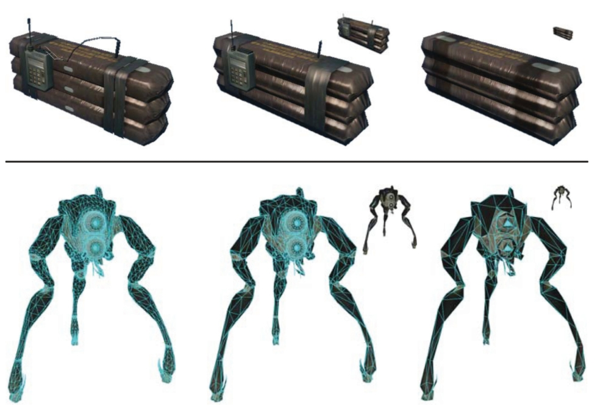
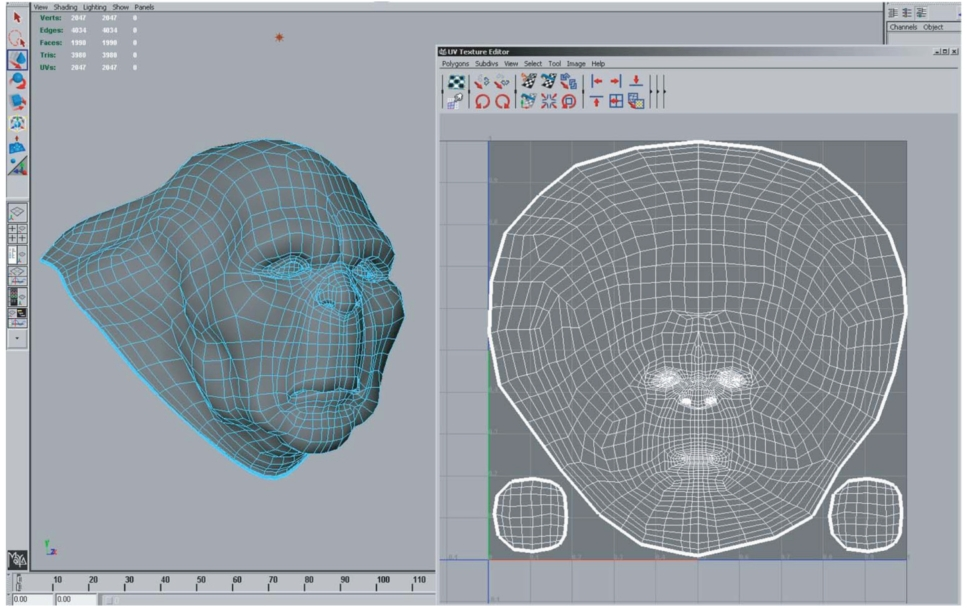
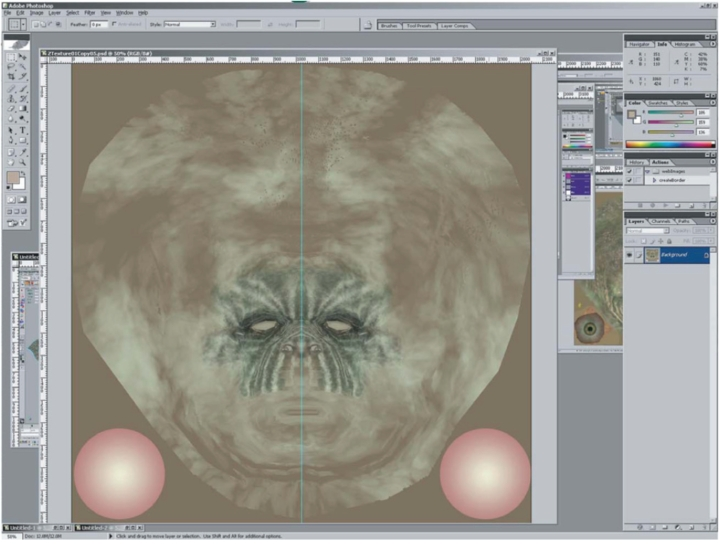
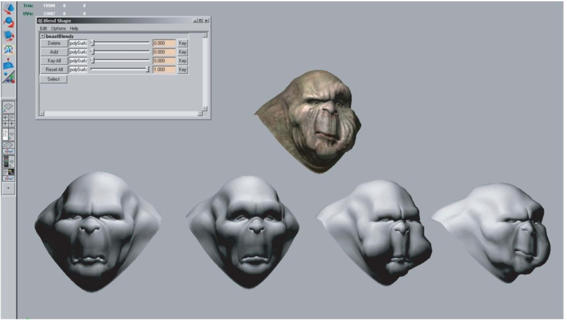

# 25  Computer Graphics in Games  游戏中的计算机图形学

Of all the applications of computer graphics, computer and video games attract perhaps the most attention. The graphics methods selected for a given game have a profound effect, not only on the game engine code, but also on the art asset creation, and even sometimes on the gameplay, or core game mechanics.
在计算机图形学的所有应用中，计算机和视频游戏也许最受关注。 为给定游戏选择的图形方法不仅对游戏引擎代码有深远的影响，而且对艺术资产创建，有时甚至对游戏玩法或核心游戏机制也有深远的影响。

Although game graphics rely on the material in all of the preceding chapters, two chapters are particularly germane. Games need to make highly efficient use of graphics hardware, so an understanding of the material in Chapter 17 is important.
尽管游戏图形依赖于前面所有章节中的材料，但有两章特别密切。 游戏需要高效地利用图形硬件，因此理解第 17 章中的材料非常重要。

In this chapter, I will detail the specific considerations that apply to graphics in game development, from the platforms on which games run to the game production process.
在本章中，我将详细介绍游戏开发中图形应用的具体注意事项，从游戏运行的平台到游戏制作过程。

## 25.1 Platforms 平台

Here, I use the term platform to refer to a specific combination of hardware, operating system, and API (application programming interface) for which a game is designed. Games run on a large variety of platforms, ranging from virtual machines used for browser-based games to dedicated game consoles using specialized hardware and APIs.
在这里，我使用术语“平台”来指代游戏设计所针对的硬件、操作系统和 API（应用程序编程接口）的特定组合。 游戏在多种平台上运行，从用于基于浏览器的游戏的虚拟机到使用专用硬件和 API 的专用游戏控制台。

In the past, it was common for games to be designed for a single platform. The increasing cost of game development has made this rare; multiplatform game development is now the norm. The incremental increase in development cost to support multiple platforms is more than repaid by a potential doubling or tripling of the customer base.
过去，为单一平台设计游戏很常见。 游戏开发成本的不断增加使得这种情况变得罕见。 多平台游戏开发现已成为常态。 支持多个平台的开发成本的增量增长远远超出了客户群潜在的两倍或三倍的回报。

Some platforms are quite loosely defined. For example, when developing a game for the Windows PC platform, the developer must account for a very large variety of possible hardware configurations. Games are even expected to run (and run well) on PC configurations that did not exist when the game was developed! This is only possible due to the abstractions afforded by the APIs defining the Windows platform.
有些平台的定义相当松散。 例如，在为 Windows PC 平台开发游戏时，开发人员必须考虑多种可能的硬件配置。 游戏甚至有望在游戏开发时不存在的 PC 配置上运行（并且运行良好）！ 这只能归功于定义 Windows 平台的 API 提供的抽象。

One way in which developers account for wide variance in graphics performance is by scaling—adjusting graphics quality in response to system capabilities. This can ensure reasonable performance on low-end systems, while still achieving competitive visuals on high-performance systems. This adjustment is sometimes done automatically by profiling the system performance, but more often this control is left in the hands of the user, who can best judge his personal preferences for quality versus speed. Display resolution is easiest to adjust, followed by antialiasing quality. It is also fairly common to offer several quality levels for visual effects such as shadows and motion blur, including the option of turning the effect off entirely.
开发人员解决图形性能巨大差异的一种方法是根据系统功能进行缩放，调整图形质量。 这可以确保低端系统上的合理性能，同时仍然在高性能系统上实现有竞争力的视觉效果。 这种调整有时是通过分析系统性能自动完成的，但更常见的是，这种控制权留给用户，用户可以最好地判断他对质量与速度的个人偏好。 显示分辨率最容易调整，其次是抗锯齿质量。 为视觉效果（例如阴影和运动模糊）提供多个质量级别也相当常见，包括完全关闭效果的选项。

Differences in graphics performance can be so large that some machines may not run the game at a playable frame rate, even with the lowest quality settings; for this reason PC game developers publish minimum and recommended machine specifications for each game.
图形性能的差异可能如此之大，以至于某些机器可能无法以可玩的帧速率运行游戏，即使使用最低的质量设置也是如此； 因此，PC 游戏开发商会发布每个游戏的最低和推荐机器规格。

As platforms, game consoles are strictly defined. When developing a game for, e.g., Nintendo’s Wii console, the developer knows exactly what hardware the game will run on. If the platform’s hardware implementation is changed (often done to reduce manufacturing costs), the console manufacturer must ensure that the new implementation behaves exactly like the previous one, including timing and performance. This is not to say that the console developer’s task is easy; console APIs tend to be much less abstract and closer to the underlying hardware. This gives console development its own set of difficulties. In some sense, multiplatform development (which commonly includes at least two different console platforms and often Windows as well) is the hardest of all, since the multiplatform game developer has neither the assurance of a fixed platform or the convenience of a single high-level API.
作为平台，游戏机是有严格定义的。 当为任天堂的 Wii 控制台等开发游戏时，开发人员确切地知道游戏将在什么硬件上运行。 如果平台的硬件实现发生变化（通常是为了降低制造成本），控制台制造商必须确保新实现的行为与前一个实现完全相同，包括时序和性能。 这并不是说控制台开发人员的任务很容易；而是说控制台开发人员的任务很简单。 控制台 API 往往不那么抽象，更接近底层硬件。 这给控制台开发带来了一系列困难。 从某种意义上说，多平台开发（通常包括至少两个不同的控制台平台，通常还包括 Windows）是最难的，因为多平台游戏开发人员既没有固定平台的保证，也没有单一高级平台的便利性。 API。

Browser-based virtual machines such as Adobe Flash are an interesting class of game platforms. Although such virtual machines run on a wide class of hardware from personal computers to mobile phones, the high degree of abstraction provided by the virtual machine results in a stable and unified development platform. The relative ease of development for these platforms and the huge pool of potential customers makes them increasingly attractive to game developers. However, these platforms are defined by the lowest common denominator of the supported hardware, and virtual machines have lower performance than native code on any given platform. For these reasons, such platforms are best suited to games with modest graphics requirements.
基于浏览器的虚拟机（例如 Adobe Flash）是一类有趣的游戏平台。 尽管此类虚拟机运行在从个人计算机到移动电话的各种硬件上，但虚拟机提供的高度抽象性导致了稳定且统一的开发平台。 这些平台的开发相对容易，并且拥有庞大的潜在客户，这使得它们对游戏开发商越来越有吸引力。 然而，这些平台是由支持的硬件的最低公分母定义的，并且虚拟机的性能低于任何给定平台上的本机代码。 由于这些原因，此类平台最适合图形要求适中的游戏。

Platforms can also be characterized by their openness to development, which is a business or legal distinction rather than a technical one. For example, Windows is open in the sense that development tools are widely available, and there are no gatekeepers controlling access to the marketplace of Windows games. Apple’s iPhone is a somewhat more restricted platform in that all applications need to pass a certification process and certain classes of applications are banned outright. Consoles are the most restrictive game platforms, where access to the development tools is tightly controlled. This is opening up somewhat with the introduction of online console game marketplaces, which tend to be more open. A particularly interesting example is Microsoft’s Xbox LIVE Community Games service, where the development tools are freely available and the “gatekeeping” is performed primarily by peer review. Games distributed through this service must use a virtual machine platform provided by Microsoft for security reasons. 
平台的特点还在于其对开发的开放性，这是一种商业或法律上的区别，而不是技术上的区别。 例如，Windows 是开放的，因为开发工具可以广泛使用，并且没有看门人控制对 Windows 游戏市场的访问。 Apple 的 iPhone 是一个受到更多限制的平台，因为所有应用程序都需要通过认证流程，并且某些类别的应用程序被彻底禁止。 控制台是限制最严格的游戏平台，对开发工具的访问受到严格控制。 随着在线游戏机游戏市场的引入，这种情况在某种程度上开放了，而在线游戏市场往往更加开放。 一个特别有趣的例子是微软的 Xbox LIVE 社区游戏服务，其中的开发工具是免费提供的，并且“把关”主要由同行评审来执行。 出于安全原因，通过此服务分发的游戏必须使用 Microsoft 提供的虚拟机平台。

The game platform determines many elements of the game experience. For example, PC gamers use keyboard and mouse, while console gamers use specialized game controllers. Many console games support multiple players on the same console, either sharing a screen or providing a window for each player. Due to the difficulty of sharing keyboard and mouse, this type of play is not found on PC. A handheld game system will have a different control scheme than a touch-screen phone, etc.
游戏平台决定了游戏体验的很多要素。 例如，PC 游戏玩家使用键盘和鼠标，而控制台游戏玩家则使用专门的游戏控制器。 许多主机游戏支持同一主机上的多个玩家，共享屏幕或为每个玩家提供一个窗口。 由于共享键盘和鼠标的困难，这种玩法在PC上是找不到的。 手持游戏系统将具有与触摸屏手机等不同的控制方案。

Although game platforms vary widely, some common trends can be discerned. Most platforms have multiple processing cores, divided between general-purpose (CPU) and graphics-specific (GPU). Performance gains over time are due mostly to increases in core count; gains in individual core performance are modest. As GPU cores grow in generality, the lines between GPU and CPU cores are increasingly blurred. Storage capacity tends to increase at a slower rate than processing power, and communication bandwidth (between cores as well as between each core and storage) grows at a slower pace still.
尽管游戏平台差异很大，但可以看出一些共同趋势。 大多数平台都有多个处理核心，分为通用 (CPU) 和图形专用 (GPU)。 随着时间的推移，性能的提升主要是由于核心数量的增加； 个人核心表现的提升是有限的。 随着 GPU 核心的普遍化，GPU 和 CPU 核心之间的界限变得越来越模糊。 存储容量的增长速度往往慢于处理能力的增长速度，并且通信带宽（核心之间以及每个核心与存储之间）的增长速度仍然较慢。

## 25.2 Limited Resources  有限资源

One of the primary challenges of game graphics is the need to manage multiple pools of limited resources. Each platform imposes its own constraints on hardware resources such as processing time, storage, and memory bandwidth. At a higher level, development resources also need to be managed; there is a fixed-size team of programmers, artists, and game designers with limited time to complete the game, hopefully without working too much overtime! This needs to be taken into account when deciding which graphics techniques to adopt. 
游戏图形的主要挑战之一是需要管理多个有限资源池。 每个平台对硬件资源（例如处理时间、存储和内存带宽）都有自己的限制。 在更高的层面上，开发资源也需要管理； 有一个由程序员、美术师和游戏设计师组成的固定规模团队，他们在有限的时间内完成游戏，希望不会加班太多！ 在决定采用哪种图形技术时需要考虑到这一点。

### 25.2.1 Processing Time  处理时间

Early game developers only had to worry about budgeting a single processor. Current game platforms contain multiple CPU and GPU cores. These processors need to be carefully synchronized to avoid deadlocks or excessive stalls.
早期的游戏开发人员只需担心单个处理器的预算。 当前的游戏平台包含多个CPU和GPU核心。 这些处理器需要仔细同步以避免死锁或过度停顿。

Since the time consumed by a single rendering command is highly variable, graphics processors are decoupled from the rest of the system via a command buffer. This buffer acts as a queue; commands are deposited on one end and the GPU reads rendering commands from the other. Increasing the size of this buffer decreases the chances of GPU starvation. It is fairly common for games to buffer an entire frame’s worth of rendering commands before sending them to the GPU; this guarantees that GPU starvation does not occur. However, this approach requires reserving enough storage space for two full frame’s worth of commands (the GPU works on one, while the CPU deposits commands in the other). It also increases the latency between the user’s input and the display, which can be problematic for fast-paced games.
由于单个渲染命令所消耗的时间变化很大，因此图形处理器通过命令缓冲区与系统的其余部分解耦。 该缓冲区充当队列； 命令存放在一端，GPU 从另一端读取渲染命令。 增加该缓冲区的大小可以降低 GPU 资源匮乏的可能性。 对于游戏来说，在将整个帧的渲染命令发送到 GPU 之前对其进行缓冲是相当常见的； 这保证了不会发生 GPU 饥饿的情况。 然而，这种方法需要为两个全帧的命令保留足够的存储空间（GPU 在一个上工作，而 CPU 在另一个上存储命令）。 它还增加了用户输入和显示之间的延迟，这对于快节奏的游戏来说可能会出现问题。

Processing budgets are determined by the frame rate, which is the frequency at which the frame buffer is refreshed with new renderings of the scene. On fixed platforms (such as consoles), the frame rate experienced by the user is essentially the same one seen by the game developer, so fairly strict frame–rate limits can be imposed. Most games target a frame rate of 30 frames per second (fps); in games where response latency is especially important, the target is often 60 fps. On highly variable platforms (such as PCs), the frame-rate budgets are (by necessity) defined more loosely. 
处理预算由帧速率决定，帧速率是用新的场景渲染刷新帧缓冲区的频率。 在固定平台（例如游戏机）上，用户体验到的帧速率本质上与游戏开发者看到的帧速率相同，因此可以施加相当严格的帧速率限制。 大多数游戏的帧速率目标为每秒 30 帧 (fps)； 在响应延迟特别重要的游戏中，目标通常是 60 fps。 在高度可变的平台（例如 PC）上，帧速率预算（必然）定义得更宽松。

The required frame rate gives the graphics programmer a fixed budget per frame to work with. In the case of a 30 fps target, the CPU cores have 33 milliseconds to gather inputs, process the game logic, perform any physical simulations, traverse the scene description, and send the rendering commands to the graphics hardware. In parallel, other tasks such as audio and network processing must be handled, with their own required response times. While this is happening, the GPU is typically executing the graphics commands submitted during the previous frame. 
所需的帧速率为图形程序员提供了每帧的固定预算。 在 30 fps 目标的情况下，CPU 内核有 33 毫秒的时间来收集输入、处理游戏逻辑、执行任何物理模拟、遍历场景描述以及将渲染命令发送到图形硬件。 与此同时，还必须处理其他任务，例如音频和网络处理，并具有各自所需的响应时间。 发生这种情况时，GPU 通常会执行前一帧期间提交的图形命令。

In most cases, CPU cores are a homogeneous resource; all cores are the same, and any of them are equally well suited to a given workload (there are some exceptions, such as the Cell processor used in Sony’s PLAYSTATION 3 console). 
大多数情况下，CPU 核心是同质资源； 所有内核都是相同的，并且它们中的任何一个都同样适合给定的工作负载（有一些例外，例如索尼 PLAYSTATION 3 控制台中使用的 Cell 处理器）。

In contrast, GPUs contain a heterogeneous mix of resources, each specialized to a certain set of tasks. Some of these resources consist of fixed-function hardware (for triangle rasterization, alpha blending, and texture sampling), and some are programmable cores. On older GPUs, programmable cores were further differentiated into vertex and pixel processing cores; newer GPU designs have unified shader cores which can execute any of the programmable shader types. 
相比之下，GPU 包含异构资源组合，每个资源专门用于一组特定的任务。 其中一些资源由固定功能硬件（用于三角形光栅化、Alpha 混合和纹理采样）组成，还有一些是可编程内核。 在较旧的 GPU 上，可编程核心进一步分为顶点处理核心和像素处理核心； 较新的 GPU 设计具有统一的着色器核心，可以执行任何可编程着色器类型。

Such heterogeneous resources are budgeted separately. Typically, at any point, only one resource type will be the bottleneck, and the others will have excess capacity. On the one hand, this is good, since this capacity can be leveraged to improve visual quality without decreasing performance. On the other hand, it makes it harder to improve performance, since decreasing usage of any of the non-bottleneck resources will have no effect. Even decreasing usage of the bottleneck resource may only improve performance slightly, depending on the degree of utilization of the “next bottleneck.” 
这些异构资源是单独预算的。 通常，在任何时候，只有一种资源类型会成为瓶颈，其他资源类型将出现产能过剩。 一方面，这很好，因为可以利用这种能力来提高视觉质量而不降低性能。 另一方面，它使提高性能变得更加困难，因为减少任何非瓶颈资源的使用都不会产生任何效果。 即使减少瓶颈资源的使用也只能略微提高性能，具体取决于“下一个瓶颈”的利用程度。

### 25.2.2 Storage  存储

Game platforms, like any modern computing system, possess multi-stage storage hierarchies, with smaller, faster memory types at the top and larger, slower storage at the bottom. This arrangement is borne of engineering necessity, although it does complicate life for the developer. Most platforms include optical disc storage, which is extremely slow and is used mostly for delivery. On platforms such as Windows, a lengthy installation process is performed once to move all data from the optical disc onto the hard drive, which is significantly faster. The optical disc is never used again (except as an anti-piracy measure). On console platforms, this is less common, although it does sometimes happen when a hard drive is guaranteed to be present, as on Sony’s PLAYSTATION 3 console. More often, the hard drive (if present) is only used as a cache for the optical disc. 
游戏平台与任何现代计算系统一样，拥有多级存储层次结构，较小、较快的内存类型位于顶部，较大、较慢的存储类型位于底部。 这种安排是出于工程需要，尽管它确实使开发人员的生活变得复杂。 大多数平台都包含光盘存储，速度极慢，主要用于交付。 在Windows等平台上，只需执行一次漫长的安装过程即可将所有数据从光盘移动到硬盘上，速度明显更快。 该光盘不会再被使用（除非作为反盗版措施）。 在游戏机平台上，这种情况不太常见，尽管在保证有硬盘驱动器的情况下有时会发生这种情况，例如在索尼的 PLAYSTATION 3 游戏机上。 更常见的是，硬盘驱动器（如果有）仅用作光盘的缓存。

The next step up the memory hierarchy is RAM, which on many platforms is divided into general system RAM and VRAM (video RAM) which benefits from a high-speed interface to the graphics hardware. A game level may be too large to fit in RAM, in which case the game developer needs to manage moving the data in and out of RAM as needed. On platforms such as Windows, virtual memory is often used for this. On console platforms, custom data streaming and caching systems are typically employed. 
内存层次结构的下一步是 RAM，在许多平台上，RAM 分为通用系统 RAM 和 VRAM（视频 RAM），VRAM 受益于与图形硬件的高速接口。 游戏关卡可能太大而无法装入 RAM，在这种情况下，游戏开发人员需要根据需要管理将数据移入和移出 RAM。 在 Windows 等平台上，通常使用虚拟内存来实现此目的。 在控制台平台上，通常采用自定义数据流和缓存系统。

Finally, both the CPU and GPU boast various kinds of on-chip memory and caches. These are extremely small and fast and are usually managed by the graphics API. 
最后，CPU 和 GPU 都拥有各种片上内存和缓存。 它们非常小且速度快，通常由图形 API 管理。

Graphics resources take up a lot of memory, so they are a primary focus of storage budgets in game development. Textures are usually the greatest memory consumers, followed by geometry (vertex data), and finally other types of graphics data such as animations. Not all memory can be used for graphics—audio also takes up a fair bit, and game logic may use sizeable data structures. As in the case of processing time, budgeting tends to be somewhat looser on Windows, where the exact amount of memory present on the user’s system is unknown and virtual memory covers a multitude of sins. In contrast, memory budgeting on console platforms is quite strict—often the lead programmer keeps track of memory on a spreadsheet and a programmer requiring more memory for their system needs to beg, borrow, or steal it from someone else. 
图形资源占用大量内存，因此它们是游戏开发中存储预算的主要关注点。 纹理通常是最大的内存消耗者，其次是几何图形（顶点数据），最后是其他类型的图形数据（例如动画）。 并非所有内存都可以用于图形——音频也占用相当一部分，并且游戏逻辑可能使用相当大的数据结构。 与处理时间的情况一样，Windows 上的预算往往比较宽松，用户系统上存在的确切内存量是未知的，而虚拟内存涵盖了许多问题。 相比之下，控制台平台上的内存预算相当严格——通常首席程序员会在电子表格上跟踪内存，而需要更多内存的程序员需要向其他人乞讨、借用或窃取内存。

The various levels of the memory hierarchy differ not only in size, but also in access speed. This has two separate dimensions: latency and bandwidth. 
存储器层次结构的各个级别不仅在大小上不同，而且在访问速度上也不同。 这有两个独立的维度：延迟和带宽。

Latency is the time that elapses between a storage access request and its final fulfillment. This varies from a few clock cycles (for on-chip cache) to millions of clock cycles (for data residing on optical disc). Latency is usually an issue for read access (although write latency can also be an issue if the result needs to be read back from memory soon after). In some cases, the read request is blocking, which means that the processor core that submitted the read can do nothing else until the request is fulfilled. In other cases, the read is non-blocking; the processing core can submit the read request, do other types of processing, and then use the results of the read after it has arrived. Texture accesses by the GPU are an example of non-blocking reads; an important aspect of GPU design is to find ways to “hide” texture read latency by performing unrelated computations while the texture read is being fulfilled. 
延迟是指存储访问请求与其最终完成之间所经历的时间。 这从几个时钟周期（对于片上高速缓存）到数百万个时钟周期（对于驻留在光盘上的数据）不等。 延迟通常是读取访问的一个问题（尽管如果需要很快从内存中读回结果，则写入延迟也可能是一个问题）。 在某些情况下，读取请求是阻塞的，这意味着提交读取的处理器核心在请求得到满足之前不能执行任何其他操作。 其他情况下，读取是非阻塞的； 处理核心可以提交读取请求，进行其他类型的处理，然后在读取结果到达后使用它。 GPU 的纹理访问是非阻塞读取的一个示例； GPU 设计的一个重要方面是找到通过在纹理读取完成时执行不相关的计算来“隐藏”纹理读取延迟的方法。

For this latency hiding to work, there must be a sufficient amount of computation relative to texture accesses. This is an important consideration for the shader writer; the optimal mix of computation vs. texture access keeps changing (in favor of more computation) as memory fails to keep up with increases in processing power. 
为了使这种延迟隐藏发挥作用，必须有足够的与纹理访问相关的计算量。 对于着色器编写者来说，这是一个重要的考虑因素； 由于内存无法跟上处理能力的增长，计算与纹理访问的最佳组合不断变化（有利于更多计算）。

Bandwidth refers to the maximum rate of transfer to and from storage. It is typically measured in gigabytes per second.
带宽是指进出存储的最大传输速率。 它通常以每秒千兆字节为单位进行测量。

### 25.2.3 Development Resources  开发资源

Besides hardware resources, such as processing power and storage space, the game graphics programmer also has to contend with a different kind of limited resource—the time of his teammates! When selecting graphics techniques, the engineering resources needed to implement each technique must be taken into account, as well as any tools necessary to compute the input data (in many cases, tools can take significantly more time than implementing the technique itself). Perhaps most importantly, the impact on artist productivity must be taken into account. Most graphics techniques use assets created by game artists, who comprise by far the largest part of most modern game teams. The graphics programmer must foster the artist’s productivity and creativity, which will ultimately determine the visual quality of the game.
除了处理能力和存储空间等硬件资源之外，游戏图形程序员还必须应对另一种有限资源——队友的时间！ 选择图形技术时，必须考虑实现每种技术所需的工程资源，以及计算输入数据所需的任何工具（在许多情况下，工具可能比实现技术本身花费更多的时间）。 也许最重要的是，必须考虑对艺术家生产力的影响。 大多数图形技术都使用游戏艺术家创建的资源，而游戏艺术家是迄今为止大多数现代游戏团队的最大组成部分。 图形程序员必须培养美术师的生产力和创造力，这将最终决定游戏的视觉质量。

## 25.3 Optimization Techniques  优化技术

Making wise use of these limited resources is the primary challenge of the game graphics programmer. To this end, various optimization techniques are commonly employed. 
明智地利用这些有限的资源是游戏图形程序员面临的主要挑战。 为此，通常采用各种优化技术。

In many games, pixel shader processing is a primary bottleneck. Most GPUs contain hierarchical depth-culling hardware which can avoid executing pixel shaders on occluded surfaces. To make good use of this hardware, opaque objects can be rendered back-to-front. Alternatively, optimal depth-culling usage can be achieved by performing a depth prepass, i.e., rendering all the opaque objects into the depth buffer (without any color output or pixel shaders) before rendering the scene normally. This does incur some overhead (due to the need to render every object twice), but in many cases the performance gain is worth it. 
在许多游戏中，像素着色器处理是主要瓶颈。 大多数 GPU 包含分层深度剔除硬件，可以避免在遮挡表面上执行像素着色器。 为了充分利用该硬件，可以从后到前渲染不透明对象。 或者，可以通过执行深度预通道来实现最佳深度剔除使用，即在正常渲染场景之前将所有不透明对象渲染到深度缓冲区中（没有任何颜色输出或像素着色器）。 这确实会产生一些开销（由于需要渲染每个对象两次），但在许多情况下，性能提升是值得的。

The fastest way to render an object is to not render it at all; thus any method of discerning early on that an object is occluded can be useful. This saves not only pixel processing but also vertex processing and even CPU time that would be spent submitting the object to the graphics API. View frustum culling (see Section 8.4.1) is universally employed, but in many games it is not sufficient. High-level occlusion culling algorithms are often used, utilizing data structures such as PVS (potentially visible sets) or BSP (binary spatial partitioning) trees to quickly narrow down the pool of potentially visible objects. 
渲染对象的最快方法是根本不渲染它； 因此，任何早期辨别物体被遮挡的方法都是有用的。 这不仅节省了像素处理，还节省了顶点处理，甚至节省了将对象提交给图形 API 所花费的 CPU 时间。 视锥体剔除（参见第 8.4.1 节）被普遍采用，但在许多游戏中这还不够。 通常使用高级遮挡剔除算法，利用 PVS（潜在可见集）或 BSP（二元空间分区）树等数据结构来快速缩小潜在可见对象池的范围。

Even if an object is visible, it may be at such a distance that most of its detail can be removed without apparent effect. LOD (level-of-detail) algorithms render different representations of an object based on distance (or other factors, such as screen coverage or importance). This can save significant processing, vertex processing in particular. Examples can be seen in Figure 25.1. 
即使一个物体是可见的，它也可能处于这样一个距离，以至于可以删除它的大部分细节而不会产生明显的效果。 LOD（细节层次）算法根据距离（或其他因素，例如屏幕覆盖范围或重要性）渲染对象的不同表示。 这可以节省大量处理，特别是顶点处理。 示例见图25.1。

Figure 25.1. Two examples of game objects at a varying level of detail. The small inset images show the relative sizes at which the simplified models might be used. Upper row of images courtesy Crytek; lower row courtesy Valve Corp.
图 25.1。 不同细节级别的游戏对象的两个示例。 小插图显示了可以使用简化模型的相对尺寸。 上排图像由 Crytek 提供； 下排由 Valve Corp. 提供 

In many cases, processing can be performed before the game even starts. The results of such preprocessing can be stored and used each frame, thus speeding up the game. This is most commonly employed for lighting, where global illumination algorithms are utilized to compute lighting throughout the scene and store it in lightmaps and other data structures for later use. 
在许多情况下，处理甚至可以在游戏开始之前执行。 这种预处理的结果可以在每一帧中存储和使用，从而加快游戏速度。 这最常用于照明，其中全局照明算法用于计算整个场景的照明并将其存储在光照贴图和其他数据结构中以供以后使用。

## 25.4 Game Types  游戏类型

Since game requirements vary widely, the selection of graphics techniques is driven by the exact type of game being developed. 
由于游戏要求差异很大，因此图形技术的选择取决于正在开发的游戏的确切类型。

The allocation of processing time depends strongly on the frame rate. Currently, most console games tend to target 30 frames per second, since this enables much higher graphics quality. However, certain game types with fast gameplay require very low latency, and such games typically render at 60 frames per second. This includes music games such as Guitar Hero and first-person shooters such as Call of Duty. 
处理时间的分配很大程度上取决于帧速率。 目前，大多数主机游戏都倾向于以每秒 30 帧为目标，因为这可以实现更高的图形质量。 然而，某些具有快速游戏玩法的游戏类型需要非常低的延迟，并且此类游戏通常以每秒 60 帧的速度渲染。 其中包括《吉他英雄》等音乐游戏和《使命召唤》等第一人称射击游戏。

The frame rate determines the available time to render the scene. The composition of the scene itself also varies widely from game to game. Most games have a division between background geometry (scenery, mostly static) and foreground geometry (characters and dynamic objects). These are handled differently by the rendering engine. For example, background geometry will often have lightmaps containing precomputed lighting, which is not feasible for foreground objects. Precomputed lighting is typically applied to foreground objects via some type of volumetric representation which can take account of the changing position of each object over time. 
帧速率决定渲染场景的可用时间。 场景本身的构成也因游戏而异。 大多数游戏都有背景几何体（风景，大部分是静态的）和前景几何体（人物和动态物体）之间的划分。 渲染引擎对这些进行不同的处理。 例如，背景几何体通常具有包含预先计算的光照的光照贴图，这对于前景对象是不可行的。 预先计算的照明通常通过某种类型的体积表示应用于前景对象，该体积表示可以考虑每个对象随时间变化的位置。

Some games have relatively enclosed environments, where the camera remains largely in place. The purest examples are fighting games such as the Street Fighter series, but this is also true to some extent for games such as Devil May Cry and God of War. These games have cameras that are not under direct player control, and the game play tends to move from one enclosed environment to another, spending a significant amount of playing time in each. This allows the game developer to lavish large amounts of resources (processing, storage, and artist time) on each room or enclosed environment, resulting in very high levels of graphics fidelity. 
有些游戏有相对封闭的环境，镜头大部分保持在原位。 最纯粹的例子就是《街头霸王》系列等格斗游戏，但《鬼泣》《战神》等游戏在某种程度上也是如此。 这些游戏的摄像机不受玩家直接控制，并且游戏玩法往往从一个封闭环境转移到另一个封闭环境，在每个封闭环境中花费大量的游戏时间。 这使得游戏开发人员可以在每个房间或封闭环境中投入大量资源（处理、存储和美术时间），从而获得非常高水平的图形保真度。

Other games have extremely large worlds, where the player can move about freely. This is most true for “sandbox games” such as the Grand Theft Auto series and online role-playing games such as World of Warcraft. Such games pose great challenges to the graphics developer, since resource allocation is very difficult when during each frame the player can see a large extent of the world. Further complicating things, the player can freely go to some formerly distant part of the world and observe it from up close. Such games typically have changing time of day, which makes precomputation of lighting difficult at best, if not impossible. 
其他游戏有非常大的世界，玩家可以在其中自由移动。 对于《侠盗猎车手》系列等“沙盒游戏”和《魔兽世界》等在线角色扮演游戏来说尤其如此。 此类游戏给图形开发人员带来了巨大的挑战，因为当玩家在每一帧中都可以看到很大范围的世界时，资源分配非常困难。 更复杂的是，玩家可以自由地前往世界上一些以前遥远的地方并近距离观察它。 此类游戏通常会在一天中的时间发生变化，这使得预先计算光照即使不是不可能，也是很困难。

Most games, such as first-person shooters, are somewhere between the two extremes. The player can see a fair amount of scenery each frame, but movement through the game world is somewhat constrained. Many games also have a fixed time of day for each game level, for ease of lighting precomputation. 
大多数游戏，例如第一人称射击游戏，都介于两个极端之间。 玩家每帧都可以看到相当多的风景，但在游戏世界中的移动受到一定限制。 许多游戏还为每个游戏关卡设定了一天中的固定时间，以便于光照预计算。

The number of foreground objects rendered also varies widely between game types. Real-time strategy games such as the Command and Conquer series often have many dozens, if not hundreds, of units visible on screen. Other types of games have more limited quantities of visible characters, with fighting games at the opposite extreme, where only two characters are visible, each rendered with extremely high detail. A distinction must be drawn between the number of characters visible at any time (which affects budgeting of processing time) and the number of unique characters which can potentially be visible at short notice (which affects storage budgets). 
渲染的前景对象的数量在游戏类型之间也有很大差异。 《命令与征服》系列等实时策略游戏通常在屏幕上显示数十个（甚至数百个）单位。 其他类型的游戏的可见角色数量更加有限，而格斗游戏则处于相反的极端，只有两个角色可见，每个角色都以极高的细节渲染。 必须区分随时可见的字符数（这会影响处理时间的预算）和可能在短时间内可见的唯一字符数（这会影响存储预算）。

The type or genre of game also determines audience expectations of the graphics. For example, first-person shooters have historically had very high levels of graphics fidelity, and this expectation drives the graphics design when developing new games in that genre; see Figure 25.2. On the other hand, puzzle games have typically had relatively simplistic graphics, so most game developers will not invest large amounts of programming or art resources into developing photorealistic graphics for such games. 
游戏的类型或流派也决定了观众对图形的期望。 例如，第一人称射击游戏历来具有非常高水平的图形保真度，这种期望在开发该类型的新游戏时推动了图形设计； 参见图 25.2。 另一方面，益智游戏通常具有相对简单的图形，因此大多数游戏开发商不会投入大量的编程或艺术资源来为此类游戏开发逼真的图形。

Figure 25.2. Crysis exemplifies the realistic and detailed graphics expected of first-person shooters. Image courtesy Crytek. 
图 25.2。 《孤岛危机》体现了第一人称射击游戏所期望的逼真和详细的图形。 图片由 Crytek 提供。

Although most games aim for a photorealistic look, a few do attempt more stylized rendering. One interesting example of this is Okami, which can be seen in Figure 25.3. 
尽管大多数游戏的目标都是逼真的外观，但也有一些游戏尝试了更风格化的渲染。 一个有趣的例子是 Okami，如图 25.3 所示。

Figure 25.3. An example of highly stylized, non-photorealistic rendering from the game Okami. Image courtesy Capcom Entertainment, Inc. 
图 25.3。 来自游戏《Okami》的高度风格化、非真实感渲染的示例。 图片由卡普空娱乐公司提供

The management of development resources also differs by game type. Most games have a closed development cycle of one to two years, which ends after the game ships. Recently it has become common to have downloadable content (DLC), which can be purchased after the game ships, so some development resources need to be reserved for that. Persistent-world online games have a never-ending development process where new content is continually being generated, at least as long as the game is economically viable (which may be a period of decades).
开发资源的管理也因游戏类型而异。 大多数游戏都有一到两年的封闭开发周期，在游戏发行后结束。 最近，可下载内容（DLC）已变得很常见，可以在游戏发布后购买，因此需要为此预留一些开发资源。 持久世界的在线游戏有一个永无止境的开发过程，新内容不断产生，至少只要游戏在经济上可行（可能需要几十年）。

The creative exploitation of the specific requirements and restrictions of a particular game is the hallmark of a skilled game graphics programmer. A good example is the game LittleBigPlanet, which has a “two-and-a-half-dimensional” game world comprising a small number of two-dimensional layers, as well as a noninteractive background. The graphics quality of this game is excellent, driven by the use of unusual rendering techniques specialized to this type of environment; see Figure 25.4.
创造性地利用特定游戏的特定要求和限制是熟练游戏图形程序员的标志。 一个很好的例子是游戏《LittleBigPlanet》，它有一个由少量二维层组成的“二维半”游戏世界，以及一个非交互式背景。 该游戏的图形质量非常出色，这是由于使用了专门针对此类环境的不寻常渲染技术； 参见图 25.4。

Figure 25.4. The LittleBigPlanet developers took care to choose techniques that fit the game’s constraints, combining them in unusual ways to achieve stunning results. LittleBigPlanet © 2007 Sony Computer Entertainment Europe. Developed by Media Molecule. LittleBigPlanet is a trademark of Sony Computer Entertainment Europe.
图 25.4。 LittleBigPlanet 开发人员精心选择了适合游戏限制的技术，并以不寻常的方式将它们组合起来，以实现令人惊叹的结果。 LittleBigPlanet © 2007 索尼计算机娱乐欧洲公司。 由 Media Molecul 开发。 LittleBigPlanet 是索尼计算机娱乐欧洲公司的商标。

## 25.5 The Game Production Process  游戏制作流程

The game production process starts with the basic game design or concept. In some cases (such as sequels), the basic gameplay and visual design is clear, and only incremental changes are made. In the case of a new game type, extensive prototyping is needed to determine gameplay and design. Most cases sit somewhere in the middle, where there are some new gameplay elements and the visual design is somewhat open. After this step there may be a greenlight stage where some early demo or concept is shown to the game publisher to get approval (and funding!) for the game. 
游戏制作过程从基本的游戏设计或概念开始。 在某些情况下（例如续集），基本的游戏玩法和视觉设计是明确的，只进行增量更改。 对于新的游戏类型，需要进行广泛的原型设计来确定游戏玩法和设计。 大多数情况都处于中间位置，那里有一些新的游戏元素，视觉设计也有些开放。 在此步骤之后，可能会出现一个绿灯阶段，向游戏发行商展示一些早期演示或概念，以获得游戏的批准（和资金！）。

The next step is typically pre-production. While other teams are working on finishing up the last game, a small core team works on making any needed changes to the game engine and production tool chain, as well as working out the rough details of any new gameplay elements. This core team is working under a strict deadline. After the existing game ships and the rest of the team comes back from a well-deserved vacation, the entire tool chain and engine must be ready for them. If the core team misses this deadline, several dozen developers may be left idle—an extremely expensive proposition! 
下一步通常是预生产。 当其他团队致力于完成最后一款游戏时，一个小型核心团队致力于对游戏引擎和制作工具链进行任何必要的更改，并制定任何新游戏元素的粗略细节。 这个核心团队正在严格的期限内工作。 在现有游戏发布并且团队其他成员结束应得的假期后，整个工具链和引擎必须为他们做好准备。 如果核心团队错过了这个最后期限，数十名开发人员可能会闲置——这是一个极其昂贵的提议！

Full production is the next step, with the entire team creating art assets, designing levels, tweaking gameplay, and implementing further changes to the game engine. In a perfect world, everything done during this process would be used in the final game, but in reality there is an iterative nature to game development which will result in some work being thrown out and redone. The goal is to minimize this with careful planning and prototyping.
下一步是全面制作，整个团队将创建艺术资产、设计关卡、调整游戏玩法并对游戏引擎进行进一步的更改。 在完美的世界中，在此过程中完成的所有内容都将在最终游戏中使用，但实际上游戏开发具有迭代性质，这将导致一些工作被丢弃并重做。 我们的目标是通过仔细的规划和原型设计来最大限度地减少这种情况。

When the game is functionally complete, the final stage begins. The term alpha release usually refers to the version which marks the start of extensive internal testing, beta release to the one which marks the start of extensive external testing, and gold release to the final release submitted to the console manufacturer, but different companies have slightly varying definitions of these terms. In any case, testing, or quality assurance (QA) is an important part of this phase, and it involves testers at the game development studio, at the publisher, at the console manufacturer, and possibly external QA contractors as well. These various rounds of testing result in bug reports which are submitted back to the game developers and worked on until the next release.
当游戏功能完成时，最后阶段开始。 alpha 版本通常指标志着广泛内部测试开始的版本，beta 版本指标志着广泛外部测试开始的版本，gold 版本指提交给游戏机制造商的最终版本，但不同的公司略有不同 这些术语的不同定义。 无论如何，测试或质量保证 (QA) 是此阶段的重要组成部分，它涉及游戏开发工作室、发行商、游戏机制造商的测试人员，还可能涉及外部 QA 承包商。 这些多轮测试会产生错误报告，这些报告会提交给游戏开发人员并一直持续到下一个版本。 

After the game ships, most of the developers go on vacation for a while, but a small team may have to stay to work on patches or downloadable content. In the meantime, a small core team has been working on pre-production for the next game.
游戏发布后，大多数开发人员都会休假一段时间，但一小部分团队可能必须留下来处理补丁或可下载内容。 与此同时，一个小型核心团队一直在为下一款游戏进行前期制作。

Art asset creation is an aspect of game production that is particularly relevant to graphics development, so I will go into it in some detail.
艺术资产创建是游戏制作的一个方面，与图形开发特别相关，因此我将详细介绍它。

### 25.5.1 Asset Creation  资产创建

While the exact process of art asset creation varies from game to game, the outline I give here is fairly representative. In the past, a single artist would create an entire asset from start to finish, but this process is now much more specialized, involving people with different skill sets working on each asset at various times. Some of these stages have clear dependencies (for example, a character cannot be animated until it is rigged and cannot be rigged before it is modeled). Most game developers have well-defined approval processes, where the art director or a lead artist signs off on each stage before the asset is sent on to the next. Ideally an asset proceeds through each stage exactly once, but in practice changes may be made that require resubmission. 
虽然艺术资产创建的具体过程因游戏而异，但我在这里给出的概述相当具有代表性。 过去，单个艺术家可以从头到尾创建整个资产，但现在这个过程更加专业化，涉及具有不同技能的人员在不同时间处理每个资产。 其中一些阶段具有明确的依赖性（例如，角色在装配之前无法进行动画处理，并且在建模之前也无法进行装配）。 大多数游戏开发商都有明确的审批流程，艺术总监或首席美术师在每个阶段都会签字，然后资产才会被发送到下一个阶段。 理想情况下，资产在每个阶段只进行一次，但实际上可能会发生需要重新提交的更改。

### Initial Modeling  初始建模

Typically the art asset creation process starts by modeling the object geometry. This step is performed in a general-purpose modeling package such as Maya, MAX or Softimage. The modeled geometry will be passed directly to the game engine, so it is important to minimize vertex count while preserving good silhouettes. Character meshes must also be constructed so as to be amenable to animation.
通常，艺术资产创建过程从对对象几何进行建模开始。 此步骤在通用建模包（例如 Maya、MAX 或 Softimage）中执行。 建模的几何体将直接传递到游戏引擎，因此在保留良好轮廓的同时最大限度地减少顶点数非常重要。 还必须构建角色网格以适应动画。

In this stage, a two-dimensional surface parameterization for textures is usually created. It is important that this parameterization be highly continuous, since discontinuities require vertex duplication and may cause filtering artifacts. An example of a mesh with its associated texture parameterization is shown in Figure 25.5.
在此阶段，通常会创建纹理的二维表面参数化。 重要的是，这种参数化必须高度连续，因为不连续性需要顶点复制，并且可能会导致过滤伪影。 图 25.5 显示了网格及其相关纹理参数化的示例。

Figure 25.5. A mesh being modeled in Maya, with associated texture parameterization. Image courtesy Keith Bruns. 
图 25.5。 在 Maya 中建模的网格，具有相关的纹理参数化。 图片由基思·布伦斯提供。

#### Texturing  纹理

In the past, texturing was a straightforward process of painting a color texture, typically in Photoshop. Now, specialized detail modeling packages such as ZBrush or Mudbox are commonly used to sculpt fine surface detail. Figures 25.6 and 25.7 show an example of this process.
过去，纹理化是绘制颜色纹理的简单过程，通常在 Photoshop 中进行。 现在，专业的细节建模包（例如 ZBrush 或 Mudbox）通常用于雕刻精细的表面细节。 图 25.6 和 25.7 显示了该过程的示例。

Figure 25.6. The mesh from Figure 25.5 has been brought into ZBrush for detail modeling. Image courtesy Keith Bruns. 
图 25.6。 图 25.5 中的网格已被引入 ZBrush 中进行细节建模。 图片由基思·布伦斯提供。

Figure 25.7. The mesh from Figure 25.6, with fine detail added to it in ZBrush. Image courtesy Keith Bruns. 
图 25.7。 图 25.6 中的网格，在 ZBrush 中添加了精细的细节。 图片由基思·布伦斯提供。

If this additional detail were to be represented with actual geometry, millions of triangles would be needed. Instead, the detail is commonly “baked” into a normal map which is applied onto the original, coarse mesh, as shown in Figures 25.8 and 25.9. 
如果要使用实际几何体来表示此附加细节，则将需要数百万个三角形。 相反，细节通常被“烘焙”到法线贴图中，然后应用到原始的粗网格上，如图 25.8 和 25.9 所示。

Figure 25.8. A visualization (in ZBrush) of the mesh from Figure 25.6, rendered with a normal map derived from the detailed mesh in Figure 25.7. The bottom of the figure shows the interface for ZBrush’s “Zmapper” tool, which was used to derive the normal map. Image courtesy Keith Bruns.
图 25.8。 图 25.6 中网格的可视化（在 ZBrush 中)，使用源自图 25.7 中详细网格的法线贴图进行渲染。 图的底部显示了ZBrush的“Zmapper”工具的界面，该工具用于导出法线贴图。 图片由基思·布伦斯提供。

Figure 25.9. The normal map used in Figure 25.8. In this image, the red, green, and blue channels of the texture contain the X, Y, and Z coordinates of the surface normals. Image courtesy Keith Bruns. 
图 25.9。 图 25.8 中使用的法线贴图。 在此图像中，纹理的红色、绿色和蓝色通道包含表面法线的 X、Y 和 Z 坐标。 图片由基思·布伦斯提供。

Besides normal maps, multiple textures containing surface properties such as diffuse color, specular color, and smoothness (specular power) are also created. These are either painted directly on the surface in the detail modeling application, or in a two-dimensional application such as Photoshop. All of these texture maps use the surface parameterization defined in the initial modeling phase. When the texture is painted in a two-dimensional painting application, the artist must frequently switch between the painting application and some other application which can show a three-dimensional rendering of the object with the texture applied. This iterative process is illustrated in Figures 25.10, 25.11, 25.12, and 25.13.
除了法线贴图之外，还创建包含漫反射颜色、镜面反射颜色和平滑度（镜面反射强度）等表面属性的多个纹理。 它们可以在细节建模应用程序中直接绘制在表面上，也可以在 Photoshop 等二维应用程序中绘制。 所有这些纹理贴图都使用初始建模阶段定义的表面参数化。 当在二维绘画应用程序中绘制纹理时，艺术家必须频繁地在绘画应用程序和可以显示应用了纹理的对象的三维渲染的一些其他应用程序之间切换。 这个迭代过程如图 25.10、25.11、25.12 和 25.13 所示。

Figure 25.10. An early version of a diffuse color texture for the mesh from Figure 25.8, shown in Photoshop. Image courtesy Keith Bruns. 
图 25.10。 图 25.8 中网格的漫反射颜色纹理的早期版本，在 Photoshop 中显示。 图片由基思·布伦斯提供。

Figure 25.11. A rendering (in ZBrush) of the mesh with normal map and early diffuse color texture (from Figure 25.10) applied. Image courtesy Keith Bruns. 
图 25.11。 应用了法线贴图和早期漫反射颜色纹理（来自图 25.10）的网格渲染（在 ZBrush 中)。 图片由基思·布伦斯提供。

Figure 25.12. Final version of the color texture from Figure 25.10. Image courtesy Keith Bruns. 
图 25.12。 图 25.10 中颜色纹理的最终版本。 图片由基思·布伦斯提供。

Figure 25.13. Rendering of the mesh with normal map and final color texture (from Figure 25.12) applied. Image courtesy Keith Bruns. 
图 25.13。 应用法线贴图和最终颜色纹理（来自图 25.12)渲染网格。 图片由基思·布伦斯提供。

#### Shading  阴影

Shaders are typically applied in the same application used for initial modeling. In this process, a shader (from the set of shaders defined for that game) is applied to the mesh. The various textures resulting from the detail modeling stage are applied as inputs to this shader, using the surface parameterization defined during initial modeling. Various other shader inputs are set via visual experimentation (“tweaking”); see Figure 25.14. 
着色器通常应用在用于初始建模的同一应用程序中。 在此过程中，着色器（来自为该游戏定义的着色器集）将应用于网格。 使用初始建模期间定义的表面参数化，将细节建模阶段产生的各种纹理用作该着色器的输入。 各种其他着色器输入是通过视觉实验（“调整”）设置的； 参见图 25.14。

Figure 25.14. Shader configuration in Maya. The interface on the right is used to select the shader, assign textures to shader inputs, and set the values of non-texture shader inputs (such as the “Specular Color” and “Specular Power” sliders). The rendering on the left is updated dynamically while these properties are modified, enabling immediate visual feedback. Image courtesy Keith Bruns.
图 25.14。 Maya 中的着色器配置。 右侧界面用于选择着色器、将纹理分配给着色器输入以及设置非纹理着色器输入的值（例如“镜面颜色”和“镜面强度”滑块)。 修改这些属性时，左侧的渲染会动态更新，从而实现即时视觉反馈。 图片由基思·布伦斯提供。

#### Lighting 灯光

In the case of background scenery, lighting artists will typically start their work after modeling, texturing, and shading have been completed. Light sources are placed and their effect computed in a preprocessing step. The results of this process are stored in lightmaps for later use by the rendering engine. 
就背景风景而言，灯光艺术家通常会在建模、纹理和着色完成后开始工作。 在预处理步骤中放置光源并计算其效果。 此过程的结果存储在光照贴图中，供渲染引擎稍后使用。

#### Animation 动画片

Character meshes undergo several additional steps related to animation. The primary method used to animate game characters is skinning. This requires a rig, consisting of a hierarchy of transform nodes that is attached to the character, a process known as rigging. The area of effect of each transform node is painted onto a subset of mesh vertices. Finally, animators create animations that move, rotate, and scale these transform nodes, “dragging” the mesh behind them. 
角色网格经历了几个与动画相关的附加步骤。 用于制作游戏角色动画的主要方法是蒙皮。 这需要一个装备，由附加到角色的变换节点层次结构组成，这个过程称为装备。 每个变换节点的效果区域被绘制到网格顶点的子集上。 最后，动画师创建移动、旋转和缩放这些变换节点的动画，“拖动”它们后面的网格。

A typical game character will have many dozens of animations, corresponding to different modes of motion (walking, running, turning) as well as different actions such as attacks. In the case of a main character, the number of animations can be in the hundreds. Transitions between different animations also need to be defined. 
一个典型的游戏角色会有几十种动画，对应于不同的运动模式（行走、奔跑、转身）以及攻击等不同的动作。 对于主角来说，动画的数量可以达到数百个。 还需要定义不同动画之间的过渡。

For facial animation, another technique, called morph targets is sometimes employed. In this technique, the mesh vertices are directly manipulated to deform the mesh. Different copies of the deformed mesh are stored (e.g., for different facial expressions) and combined by the game engine at runtime. The creation of morph targets is shown in Figure 25.15.
对于面部动画，有时会采用另一种技术，称为变形目标。 在该技术中，直接操纵网格顶点以使网格变形。 变形网格的不同副本被存储（例如，针对不同的面部表情）并由游戏引擎在运行时组合。 变形目标的创建如图 25.15 所示。

Figure 25.15. Morph target interface in Maya. The bottom row shows four different morph targets, and the model at the top shows the effects of combining several morph targets together. The interface at the upper left is used to control the degree to which each morph target is applied. Image courtesy Keith Bruns.
图 25.15。 Maya 中的变形目标界面。 底行显示了四个不同的变形目标，顶部的模型显示了将多个变形目标组合在一起的效果。 左上角的界面用于控制每个变形目标应用的程度。 图片由基思·布伦斯提供。

## Notes  注释

There is a huge amount of information on real-time rendering and game programming available, both in books and online. Here are some resources I can recommend from personal familiarity.
书籍和在线都有大量关于实时渲染和游戏编程的信息。 以下是我可以根据个人熟悉程度推荐的一些资源。

Game Developer Magazine is a good source of information on game development, as are slides from the talks given at the annual Game Developers Conference (GDC) and Microsoft’s Gamefest conference. The GPU Gems and ShaderX book series also contain good information—all of the former and the first two of the latter are also available online. 
《游戏开发者杂志》是有关游戏开发的良好信息来源，年度游戏开发者大会 (GDC) 和 Microsoft Gamefest 会议上的演讲幻灯片也是如此。 GPU Gems 和 ShaderX 书籍系列也包含很好的信息——前者的所有内容和后者的前两本也可以在线获取。

Eric Lengyel’s Mathematics for 3D Game Programming & Computer Graphics, now in its second edition, is a good reference for the various types of math used in graphics and games. A specific area of game programming that is closely related to graphics is collision detection, for which Christer Ericson’s Real-Time Collision Detection is the definitive resource. 
Eric Lengyel 的《3D 游戏编程和计算机图形数学》现已推出第二版，对于图形和游戏中使用的各种类型的数学来说，这是一本很好的参考书。 与图形密切相关的游戏编程的一个特定领域是碰撞检测，Christer Ericson 的实时碰撞检测是该领域的权威资源。

Since its first edition in 1999, Eric Haines and Tomas Akenine-M¨ oller’s RealTime Rendering has endeavored to cover this fast-growing field in a thorough manner. As a longtime fan of this book, I was glad to have the opportunity to be a coauthor on the third edition, which came out in mid-2008. 
自 1999 年第一版以来，Eric Haines 和 Tomas Akenine-Měller 的《实时渲染》一直致力于全面涵盖这一快速发展的领域。 作为这本书的长期粉丝，我很高兴有机会成为 2008 年中期出版的第三版的合著者。

Reading is not enough—make sure you play a variety of games regularly to get a good idea of the requirements of various game types, as well as the current state of the art. 
仅仅阅读是不够的，请确保您经常玩各种游戏，以充分了解各种游戏类型的要求以及当前的技术水平。

## Exercises 练习 

1. Examine the visuals of two dissimilar games. What differences can you deduce in the graphics requirements of these two games? Analyze the effect on rendering time, storage budgets, etc.
   检查两个不同游戏的视觉效果。 您可以推断出这两款游戏的图形要求有何差异？ 分析对渲染时间、存储预算等的影响。