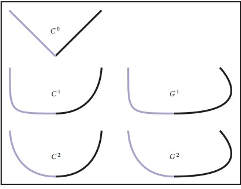

# 15 Curves

## 15.1 Curves 

Intuitively, think of a curve as something you can draw with a pen. The curve is the set of points that the pen traces over an interval of time. While we usually think of a pen writing on paper (e.g., a curve that is in a 2D space), the pen could move in 3D to generate a space curve, or you could imagine the pen moving in some other kind of space.

Mathematically, definitions of curve can be seen in at least two ways: 

1. the continuous image of some interval in an n-dimensional space; 
2. a continuous map from a one-dimensional space to an n-dimensional space. 

Both of these definitions start with the idea of an interval range (the time over which the pen traces the curve). However, there is a significant difference: in the first definition, the curve is the set of points the pen traces (the image), while in the second definition, the curve is the mapping between time and that set of points. For this chapter, we use the first definition. 

A curve is an infinitely large set of points. The points in a curve have the property that any point has two neighbors, except for a small number of points that have one neighbor (these are the endpoints). Some curves have no endpoints, either because they are infinite (like a line) or they are closed (loop around and connect to themselves).

Because the “pen” of the curve is thin (infinitesimally), it is difficult to create filled regions. While space-filling curves are possible (by having them fold over themselves infinitely many times), we do not consider such mathematical oddities here. Generally, we think of curves as the outlines of things, not the “insides.” 

The problem that we need to address is how to specify a curve—to give a name or representation to a curve so that we can represent it on a computer. For some curves, the problem of naming them is easy since they have known shapes: line segments, circles, elliptical arcs, etc. A general curve that does not have a “named” shape is sometimes called a free-form curve. Because a free-form curve can take on just about any shape, they are much harder to specify. 

There are three main ways to specify curves mathematically: 

1. **Implicit** curve representations define the set of points on a curve by giving a procedure that can test to see if a point in on the curve. Usually, an implicit curve representation is defined by an implicit function of the form
   $f(x, y)=0,$
   so that the curve is the set of points for which this equation is true. Note that the implicit function *f* is a scalar function (it returns a single real number).
2. **Parametric** curve representations provide a mapping from a free parameter to the set of points on the curve. That is, this free parameter provides an index to the points on the curve. The parametric form of a curve is a function that assigns positions to values of the free parameter. Intuitively, if you think of a curve as something you can draw with a pen on a piece of paper, the free parameter is time, ranging over the interval from the time that we began drawing the curve to the time that we finish. The parametric function of this curve tells us where the pen is at any instant in time:
   $(x, y) = \bold{f}(t) $
   Note that the parametric function is a vector-valued function. This example is a 2D curve, so the output of the function is a 2-vector; in 3D it would be a 3-vector.
3. **Generative or procedural** curve representations provide procedures that can generate the points on the curve that do not fall into the first two categories. Examples of generative curve descriptions include subdivision schemes and fractals.

Remember that a curve is a set of points. These representations give us ways to specify those sets. Any curve has many possible representations. For this reason, mathematicians typically are careful to distinguish between a curve and its representations. In computer graphics we are often sloppy, since we usually only refer to the representation, not the actual curve itself. So when someone says “an implicit curve,” they are either referring to the curve that is represented by some implicit function or to the implicit function that is one of the representations of some curve. Such distinctions are not usually important, unless we need to consider different representations of the same curve. We will consider different curve representations in this chapter, so we will be more careful. When we use a term like “polynomial curve,” we will mean the curve that can be represented by the polynomial.

By the definition given at the beginning of the chapter, for something to be a curve it must have a parametric representation. However, many curves have other representations. For example, a circle in 2D with its center at the origin and radius equal to 1 can be written in implicit form as
$f(x, y) = x^2 + y^2 - 1 = 0, $

or in parametric form as 
$(x, y) = \bold{f}(t) = (\cos t, \sin t), t ∈ [0, 2π). $

The parametric form need not be the most convenient representation for a given curve. In fact, it is possible to have curves with simple implicit or generative representations for which it is difficult to find a parametric representation. 

Different representations of curves have advantages and disadvantages. For example, parametric curves are much easier to draw, because we can sample the free parameter. Generally, parametric forms are the most commonly used in computer graphics since they are easier to work with. Our focus will be on parametric representations of curves. 

### 15.1.1 Parameterizations and Reparameterizations 

A parametric curve refers to the curve that is given by a specific parametric function over some particular interval. To be more precise, a parametric curve has a given function that is a mapping from an interval of the parameters. It is often convenient to have the parameter run over the unit interval from 0 to 1. When the free parameter varies over the unit interval, we often denote the parameter as u. 

If we view the parametric curve to be a line drawn with a pen, we can consider u = 0 as the time when the pen is first set down on the paper and the unit of time to be the amount of time it takes to draw the curve (u = 1 is the end of the curve).The curve can be specified by a function that maps time (in these unit coordinates) to positions. Basically, the specification of the curve is a function that can answer the question, “Where is the pen at time $u$?” 

If we are given a function $\bold{f}(t)$ that specifies a curve over interval $[a, b]$, we can easily define a new function $\bold{f}_2(u)$ that specifies the same curve over the unit interval. We can first define
$g(u) = a + (b - a)u, $
and then
$\bold{f}_2(u) = \bold{f}(g(u)). $
The two functions, $\bold{f}$ and $\bold{f}_2$ both represent the same curve; however, they provide different parameterizations of the curve. The process of creating a new parameterization for an existing curve is called reparameterization, and the mapping from old parameters to the new ones (g, in this example) is called the reparameterization function.

If we have defined a curve by some parameterization, infinitely many others exist (because we can always reparameterize). Being able to have multiple parameterizations of a curve is useful, because it allows us to create parameterizations that are convenient. However, it can also be problematic, because it makes it difficult to compare two functions to see if they represent the same curve. 

The essence of this problem is more general: the existence of the free parameter (or the element of time) adds an invisible, potentially unknown element to our representation of the curves. When we look at the curve after it is drawn, we don’t necessarily know the timing. The pen might have moved at a constant speed over the entire time interval, or it might have started slowly and sped up. For example, while u = 0.5 is halfway through the parameter space, it may not be halfway along the curve if the motion of the pen starts slowly and speeds up at the end. Consider the following representations of a very simple curve:
$$
(x, y) = \bold{f}(u) = (u, u), \\
(x, y) = \bold{f}(u) = (u^2, u^2), \\
(x, y) = \bold{f}(u) = (u^5, u^5).
$$
All three functions represent the same curve on the unit interval; however when $u$ is not 0 or 1, f(u) refers to a different point depending on the representation of the curve. 

If we are given a parameterization of a curve, we can use it directly as our specification of the curve, or we can develop a more convenient parameterization. Usually, the natural parameterization is created in a way that is convenient (or natural) for specifying the curve, so we don’t have to know about how the speed changes along the curve. 

If we know that the pen moves at a constant velocity, then the values of the free parameters have more meaning. Halfway through parameter space is halfway along the curve. Rather than measuring time, the parameter can be thought to measure length along the curve. Such parameterizations are called arc-length parameterizations because they define curves by functions that map from the distance along the curve (known as the arc length) to positions. We often use the variable s to denote an arc-length parameter. 

Technically, a parameterization is an arc-length parameterization if the magnitude of its tangent (that is, the derivative of the parameterization with respect to the parameter) has constant magnitude. Expressed as an equation,
$|\frac{d\bold{f}(s)}{ds}|^2 = c$

Computing the length along a curve can be tricky. In general, it is defined by the integral of the magnitude of the derivative (intuitively, the magnitude of the derivative is the velocity of the pen as it moves along the curve). So, given a value for the parameter v, you can compute s (the arc-length distance along the curve from the point $\bold{f}(0)$ to the point $\bold{f}(v)$) as
$$
s = \int^v_0|\frac{d\bold{f}(s)}{ds}|^2  dt\ \ \ \ \ (15.1)
$$
where $\bold{f}(t)$ is a function that defines the curve with a natural parameterization. Using the arc-length parameterization requires being able to solve Equation (15.1) for $t$, given $s$. For many of the kinds of curves we examine, it cannot be done in a closed-form (simple) manner and must be done numerically. 

Generally, we use the variable $u$ to denote free parameters that range over the unit interval, s to denote arc-length free parameters, and t to represent parameters that aren’t one of the other two.

### 15.1.2 Piecewise Parametric Representations 

For some curves, defining a parametric function that represents their shape is easy. For example, lines, circles, and ellipses all have simple functions that define the points they contain in terms of a parameter. For many curves, finding a function that specifies their shape can be hard. The main strategy that we use to create complex curves is divide-and-conquer: we break the curve into a number of simpler smaller pieces, each of which has a simple description.

For example, consider the curves in Figure 15.1. The first two curves are easily specified in terms of two pieces. In the case of the curve in Figure 15.1(b), we need two different kinds of pieces: a line segment and a circle. 

Figure 15.1. (a) A curve that can be easily represented as two lines; (b) a curve that can be easily represented as a line and a circular arc; (c) a curve approximating curve (b) with five line segments. 

To create a parametric representation of a compound curve (like the curve in Figure 15.1(b)), we need to have our parametric function switch between the functions that represent the pieces. If we define our parametric functions over the range 0 ≤ u ≤ 1, then the curve in Figures 15.1(a) or (b) might be defined as
$$
\bold{f}(u) = \begin{cases}
\bold{f}_1(2u)  \ \ \ \ \ \ \ \ \ \ \ if\ u ≤ 0.5, \\
\bold{f}_2(2u-1)\ \ \ \ if\ u> 0.5
\end{cases}
$$
where $\bold{f}_1$ is a parameterization of the first piece, $\bold{f}_2$ is a parameterization of the second piece, and both of these functions are defined over the unit interval. 

We need to be careful in defining the functions $\bold{f}_1$ and $\bold{f}_2$ to make sure that the pieces of the curve fit together. If $\bold{f}_1(1) ≠ \bold{f}_2(0)$, then our curve pieces will not connect and will not form a single continuous curve. 

To represent the curve in Figure 15.1(b), we needed to use two different types of pieces: a line segment and a circular arc. For simplicity’s sake, we may prefer to use a single type of piece. If we try to represent the curve in Figure 15.1(b) with only one type of piece (line segments), we cannot exactly re-create the curve (unless we use an infinite number of pieces). While the new curve made of line segments (as in Figure 15.1(c)) may not be exactly the same shape as in Figure 15.1(b), it might be close enough for our use. In such a case, we might prefer the simplicity of using the simpler line segment pieces to having a curve that more accurately represents the shape. 

Also, notice that as we use an increasing number of pieces, we can get a better approximation. In the limit (using an infinite number of pieces), we can exactly represent the original shape.

One advantage to using a piecewise representation is that it allows us to make a tradeoff between 

1. how well our represented curve approximates the real shape we are trying to represent; 

2. how complicated the pieces that we use are; 
3. how many pieces we use. 

So, if we are trying to represent a complicated shape, we might decide that a crude approximation is acceptable and use a small number of simple pieces. To improve the approximation, we can choose between using more pieces and using more complicated pieces. 

In computer graphics practice, we tend to prefer using relatively simple curve pieces (either line segments, arcs, or polynomial segments). 

### 15.1.3 Splines 

Before computers, when draftsmen wanted to draw a smooth curve, one tool they employed was a stiff piece of metal that they would bend into the desired shape for tracing. Because the metal would bend, not fold, it would have a smooth shape. The stiffness meant that the metal would bend as little as possible to make the desired shape. This stiff piece of metal was called a spline. 

Mathematicians found that they could represent the curves created by a draftman’s spline with piecewise polynomial functions. Initially, they used the term spline to mean a smooth, piecewise polynomial function. More recently, the term spline has been used to describe any piecewise polynomial function. We prefer this latter definition. 

For us, a spline is a piecewise polynomial function. Such functions are very useful for representing curves.

## 15.2 Curve Properties 

To describe a curve, we need to give some facts about its properties. For “named” curves, the properties are usually specific according to the type of curve. For example, to describe a circle, we might provide its radius and the position of its center. For an ellipse, we might also provide the orientation of its major axis and the ratio of the lengths of the axes. For free-form curves however, we need to have a more general set of properties to describe individual curves.

Some properties of curves are attributed to only a single location on the curve, while other properties require knowledge of the whole curve. For an intuition of the difference, imagine that the curve is a train track. If you are standing on the track on a foggy day, you can tell that the track is straight or curved and whether or not you are at an endpoint. These are local properties. You cannot tell whether or not the track is a closed curve, or crosses itself, or how long it is. We call this type of property, a global property. 

The study of local properties of geometric objects (curves and surfaces) is known as differential geometry. Technically, to be a differential property, there are some mathematical restrictions about the properties (roughly speaking, in the train-track analogy, you would not be able to have a GPS or a compass). Rather than worry about this distinction, we will use the term local property rather than differential property. 

Local properties are important tools for describing curves because they do not require knowledge about the whole curve. Local properties include 

- continuity, 
- position at a specific place on the curve, 
- direction at a specific place on the curve, 
- curvature (and other derivatives). 

Often, we want to specify that a curve includes a particular point. A curve is said to interpolate a point if that point is part of the curve. A function f interpolates a value v if there is some value of the parameter u for which $f(t) = v$. We call the place of interpolation, that is the value of t, the site.

### 15.2.1 Continuity 

It will be very important to understand the local properties of a curve where two parametric pieces come together. If a curve is defined using an equation like Equation (15.2), then we need to be careful about how the pieces are defined. If $\bold{f}_1(1) ≠ \bold{f}_2(0)$, then the curve will be “broken”—we would not be able to draw the curve in a continuous stroke of a pen. We call the condition that the curve pieces fit together continuity conditions because if they hold, the curve can be drawn as a continuous piece. Because our definition of ”curve” at the beginning of the chapter requires a curve to be continuous, technically a ”broken curve” is not a curve.

In addition to the positions, we can also check that the derivatives of the pieces match correctly. If $\bold{f}'_1(1) ≠ \bold{f}'_2(0)$, then the combined curve will have an abrupt change in its first derivative at the switching point; the first derivative will not be continuous. In general, we say that a curve is $C^n$ continuous if all of its derivatives up to n match across pieces. We denote the position itself as the zeroth derivative, so that the $C^0$ continuity condition means that the positions of the curve are continuous, and $C^1$ continuity means that positions and first derivatives are continuous. The definition of curve requires the curve to be $C^0$. 

An illustration of some continuity conditions is shown in Figure 15.2. A discontinuity in the first derivative (the curve is $C^0$ but not $C^1$) is usually noticeable because it displays a sharp corner. A discontinuity in the second derivative is sometimes visually noticeable. Discontinuities in higher derivatives might matter, depending on the application. For example, if the curve represents a motion, an abrupt change in the second derivative is noticeable, so third derivative continuity is often useful. If the curve is going to have a fluid flowing over it (for example, if it is the shape for an airplane wing or boat hull), a discontinuity in the fourth or fifth derivative might cause turbulence. 

Figure 15.2. An illustration of various types of continuity between two curve segments. 

The type of continuity we have just introduced ($C^n$) is commonly referred to as parametric continuity as it depends on the parameterization of the two curve pieces. If the “speed” of each piece is different, then they will not be continuous. For cases where we care about the shape of the curve, and not its parameterization, we define geometric continuity that requires that the derivatives of the curve pieces match when the curves are parameterized equivalently (for example, using an arc-length parameterization). Intuitively, this means that the corresponding derivatives must have the same direction, even if they have different magnitudes.

So, if the $C^1$ continuity condition is 
$\bold{f}'_1(1) = \bold{f}'_2(0), $
the $G^1$ continuity condition would be 
$\bold{f}’_1(1) = k\bold{f}'_2(0), $
for some value of scalar $k$. Generally, geometric continuity is less restrictive than parametric continuity. A $C^n$ curve is also $G^n$ except when the parametric derivatives vanish.

## 15.3 Polynomial Pieces 

The most widely used representations of curves in computer graphics is done by piecing together basic elements that are defined by polynomials and called polynomial pieces. For example, a line element is given by a linear polynomial. In Section 15.3.1, we give a formal definition and explain how to put pieces of polynomial together.

### 15.3.1 Polynomial Notation

Polynomials are functions of the form 