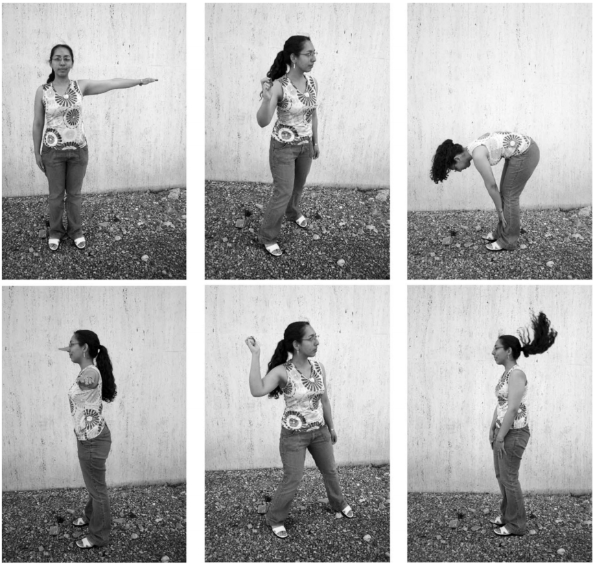
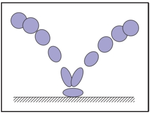

# 16  Computer Animation  

Animation is derived from the Latin anima and means the act, process, or result of imparting life, interest, spirit, motion, or activity. Motion is a defining property of life and much of the true art of animation is about how to tell a story, show emotion, or even express subtle details of human character through motion. A computer is a secondary tool for achieving these goals—it is a tool which a skillful animator can use to help get the result he wants faster and without concentrating on technicalities in which he is not interested. Animation without computers, which is now often called “traditional” animation, has a long and rich history of its own which is continuously being written by hundreds of people still active in this art. As in any established field, some time-tested rules have been crystallized which give general high-level guidance to how certain things should be done and what should be avoided. These principles of traditional animation apply equally to computer animation, and we will discuss some of them in this chapter. 

The computer, however, is more than just a tool. In addition to making the animator’s main task less tedious, computers also add some truly unique abilities that were simply not available or were extremely difficult to obtain before. Modern modeling tools allow the relatively easy creation of detailed three-dimensional models, rendering algorithms can produce an impressive range of appearances, from fully photorealistic to highly stylized, powerful numerical simulation algorithms can help to produce desired physics-based motion for particularly hard to animate objects, and motion capture systems give the ability to record and use real-life motion. These developments led to an exploding use of computer animation techniques in motion pictures and commercials, automotive design and architecture, medicine and scientific research, among many other areas. Completely new domains and applications have also appeared including fully computer-animated feature films, virtual/augmented reality systems, and, of course, computer games. 

Other chapters of this book cover many of the developments mentioned above (for example, geometric modeling and rendering) more directly. Here, we will provide an overview only of techniques and algorithms directly used to create and manipulate motion. In particular, we will loosely distinguish and briefly describe four main computer animation approaches:

- **Keyframing** gives the most direct control to the animator who provides necessary data at some moments in time and the computer fills in the rest. 
- **Procedural** animation involves specially designed, often empirical, mathematical functions and procedures whose output resembles some particular motion. 
- **Physics-based** techniques solve differential equation of motion. 
- **Motion capture** uses special equipment or techniques to record real-world motion and then transfers this motion into that of computer models.

We do not touch upon the artistic side of the field at all here. In general, we cannot possibly do more here than just scratch the surface of the fascinating subject of creating motion with a computer. We hope that readers truly interested in the subject will continue their journey well beyond the material of this chapter.

## 16.1 Principles of Animation  

In his seminal 1987 SIGGRAPH paper (Lasseter, 1987), John Lasseter brought key principles developed as early as the 1930’s by traditional animators of Walt Disney studios to the attention of the then-fledgling computer animation community. Twelve principles were mentioned: squash and stretch, timing, anticipation, follow through and overlapping action, slow-in and slow-out, staging, arcs, secondary action, straight-ahead and pose-to-pose action, exaggeration, solid drawing skill, and appeal. Almost two decades later, these time-tested rules, which can make a difference between a natural and entertaining animation and a mechanistic-looking and boring one, are as important as ever. For computer animation, in addition, it is very important to balance control and flexibility given to the animator with the full advantage of the computer’s abilities. Although these principles are widely known, many factors affect how much attention is being paid to these rules in practice. While a character animator working on a feature film might spend many hours trying to follow some of these suggestions (for example, tweaking his timing to be just right), many game designers tend to believe that their time is better spent elsewhere. 

### 16.1.1 Timing 

Timing, or the speed of action, is at the heart of any animation. How fast things happen affects the meaning of action, emotional state, and even perceived weight of objects involved. Depending on its speed, the same action, a turn of a character’s head from left to right, can mean anything from a reaction to being hit by a heavy object to slowly seeking a book on a bookshelf or stretching a neck muscle. It is very important to set timing appropriate for the specific action at hand. Action should occupy enough time to be noticed while avoiding too slow and potentially boring motions. For computer animation projects involving recorded sound, the sound provides a natural timing anchor to be followed. In fact, in most productions, the actor’s voice is recorded first and the complete animation is then synchronized to this recording. Since large and heavy objects tend to move slower than small and light ones (with less acceleration, to be more precise), timing can be used to provide significant information about the weight of an object. 

### 16.1.2 Action Layout 

At any moment during an animation, it should be clear to the viewer what idea (action, mood, expression) is being presented. Good staging, or high-level planning of the action, should lead a viewer’s eye to where the important action is currently concentrated, effectively telling him “look at this, and now, look at this” without using any words. Some familiarity with human perception can help us with this difficult task. Since human visual systems react mostly to relative changes rather than absolute values of stimuli, a sudden motion in a still environment or lack of motion in some part of a busy scene naturally draws attention. The same action presented so that the silhouette of the object is changing can often be much more noticeable compared with a frontal arrangement (see Figure 16.1 (bottom left)). 

Figure 16.1. Action layout. Left: Staging action properly is crucial for bringing attention to currently important motion. The act of raising a hand would be prominent on the top but harder to notice on the bottom. A change in nose length, on the contrary, might be completely invisible in the first case. Note that this might be intentionally hidden, for example, to be suddenly revealed later. Neither arrangement is particularly good if both motions should be attended to. Middle: The amount of anticipation can tell much about the following action. The action which is about to follow (throwing a ball) is very short, but it is clear what is about to happen. The more wound up the character is, the faster the following action is perceived to be. Right: The follow-through phase is especially important for secondary appendages (hair) whose motion follows the leading part (head). The motion of the head is very simple, but leads to nontrivial follow-through behavior of the hair itself. It is impossible to create a natural animation without a follow-through phase and overlapping action in this case. Figure courtesy Peter Shirley and Christina Villarruel.

On a slightly lower level, each action can be split into three parts: anticipation (preparation for the action), the action itself, and follow-through (termination of the action). In many cases, the action itself is the shortest part and, in some sense, the least interesting. For example, kicking a football might involve extensive preparation on the part of the kicker and long “visual tracking” of the departing ball with ample opportunities to show the stress of the moment, emotional state of the kicker, and even the reaction to the expected result of the action. The action itself (motion of the leg to kick the ball) is rather plain and takes just a fraction of a second in this case. 

The goal of anticipation is to prepare the viewer for what is about to happen. This becomes especially important if the action itself is very fast, greatly important, or extremely difficult. Creating a more extensive anticipation for such actions serves to underscore these properties and, in case of fast events, makes sure the action will not be missed (see Figure 16.1 (bottom center)). In real life, the main action often causes one or more other overlapping actions. Different appendages or loose parts of the object typically drag behind the main leading section and keep moving for a while in the follow-through part of the main action as shown in Figure 16.1 (bottom right). 

Moreover, the next action often starts before the previous one is completely over. A player might start running while he is still tracking the ball he just kicked. Ignoring such natural flow is generally perceived as if there are pauses between actions and can result in robot-like mechanical motion. While overlapping is necessary to keep the motion natural, secondary action is often added by the animator to make motion more interesting and achieve realistic complexity of the animation. It is important not to allow secondary action to dominate the main action.

### 16.1.3 Animation Techniques 

Several specific techniques can be used to make motion look more natural. The most important one is probably squash and stretch which suggests to change the shape of a moving object in a particular way as it moves. One would generally stretch an object in the direction of motion and squash it when a force is applied to it, as demonstrated in Figure 16.2 for a classic animation of a bouncing ball. It is important to preserve the total volume as this happens to avoid the illusion of growing or shrinking of the object. The greater the speed of motion (or the force), the more stretching (or squashing) is applied. Such deformations are used for several reasons. For very fast motion, an object can move between two16.1.3 Animation Techniques Several specific techniques can be used to make motion look more natural. The most important one is probably squash and stretch which suggests to change the shape of a moving object in a particular way as it moves. One would generally stretch an object in the direction of motion and squash it when a force is applied to it, as demonstrated in Figure 16.2 for a classic animation of a bouncing ball. It is important to preserve the total volume as this happens to avoid the illusion of growing or shrinking of the object. The greater the speed of motion (or the force), the more stretching (or squashing) is applied. Such deformations are used for several reasons. For very fast motion, an object can move between two sequential frames so quickly that there is no overlap between the object at the time of the current frame and at the time of the previous frame which can lead to strobing (a variant of aliasing). Having the object elongated in the direction of motion can ensure better overlap and helps the eye to fight this unpleasant effect. Stretching/squashing can also be used to show flexibility of the object with more deformation applied for more pliable materials. If the object is intended to appear as rigid, its shape is purposefully left the same when it moves. 

Figure 16.2. Classic example of applying the squash and stretch principle. Note that the volume of the bouncing ball should remain roughly the same throughout the animation.

Natural motion rarely happens along straight lines, so this should generally be avoided in animation and arcs should be used instead. Similarly, no real-world motion can instantly change its speed—this would require an infinite amount of force to be applied to an object. It is desirable to avoid such situations in animation as well. In particular, the motion should start and end gradually (slow in and out). While hand-drawn animation is sometimes done via straight-ahead action with an animator starting at the first frame and drawing one frame after another in sequence until the end, pose-to-pose action, also known as keyframing, is much more suitable for computer animation. In this technique, animation is carefully planned through a series of relatively sparsely spaced key frames with the rest of the animation (in-between frames) filled in only after the keys are set (Figure 16.3). This allows more precise timing and allows the computer to take over the most tedious part of the process—the creation of the in-between frames— using algorithms presented in the next section.

Figure 16.3. Keyframing (top) encourages detailed action planning while straight-ahead action (bottom) leads to a more spontaneous result.

Almost any of the techniques outlined above can be used with some reasonable amount of exaggeration to achieve greater artistic effect or underscore some specific property of an action or a character. The ultimate goal is to achieve something the audience will want to see, something which is appealing. Extreme complexity or too much symmetry in a character or action tends to be less appealing. To create good results, a traditional animator needs solid drawing skills. Analogously, a computer animator should certainly understand computer graphics and have a solid knowledge of the tools he uses.

### 16.1.4 Animator Control vs. Automatic Methods 

In traditional animation, the animator has complete control over all aspects of the production process and nothing prevents the final product to be as it was planned in every detail. The price paid for this flexibility is that every frame is created by hand, leading to an extremely time- and labor-consuming enterprise. In computer animation, there is a clear tradeoff between, on the one hand, giving an animator more direct control over the result, but asking him to contribute more work and, on the other hand, relying on more automatic techniques which might require setting just a few input parameters but offer little or no control over some of the properties of the result. A good algorithm should provide sufficient flexibility while asking an animator only the information which is intuitive, easy to provide, and which he himself feels is necessary for achieving the desired effect. While perfect compliance with this requirement is unlikely in practice since it would probably take something close to a mind-reading machine, we do encourage the reader to evaluate any computer-animation technique from the point of view of providing such balance. 

## 16.2 Keyframing

The term keyframing can be misleading when applied to 3D computer animation since no actual completed frames (i.e., images) are typically involved. At any 
