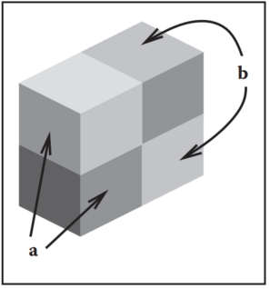

# 20  Visual Perception  

The ultimate purpose of computer graphics is to produce images for viewing by people. Thus, the success of a computer graphics system depends on how well it conveys relevant information to a human observer. The intrinsic complexity of the physical world and the limitations of display devices make it impossible to present a viewer with the identical patterns of light that would occur when looking at a natural environment. When the goal of a computer graphics system is physical realism, the best we can hope for is that the system be perceptually effective: displayed images should “look” as intended. For applications such as technical illustration, it is often desirable to visually highlight relevant information and perceptual effectiveness becomes an explicit requirement. 

Artists and illustrators have developed empirically a broad range of tools and techniques for effectively conveying visual information. One approach to improving the perceptual effectiveness of computer graphics is to utilize these methods in our automated systems. A second approach builds directly on knowledge of the human vision system by using perceptual effectiveness as an optimization criterion in the design of computer graphics systems. These two approaches are not completely distinct. Indeed, one of the first systematic examinations of visual perception is found in the notebooks of Leonardo da Vinci. 

The remainder of this chapter provides a partial overview of what is known about visual perception in people. The emphasis is on aspects of human vision that are most relevant to computer graphics. The human visual system is extremely complex in both its operation and its architecture. A chapter such as this can at best provide a summary of key points, and it is important to avoid over generalizing from what is presented here. More in-depth treatments of visual perception can be found in Wandell (1995) and Palmer (1999); Gregory (1997) and Yantis (2000) provide additional useful information. A good computer vision reference such as Forsyth and Ponce (2002) is also helpful. It is important to note that despite over 150 years of intensive research, our knowledge of many aspects of vision is still very limited and imperfect. 

## 20.1 Vision Science 

Vision is generally agreed to be the most powerful of the senses in humans. Vision produces more useful information about the world than does hearing,  touch, smell, or taste. This is a direct consequence of the physics of light (Figure 20.1). Illumination is pervasive, especially during the day but also at night due to moonlight, starlight, and artificial sources. Surfaces reflect a substantial portion of incident illumination and do so in ways that are idiosyncratic to particular materials and that are dependent on the shape of the surface. The fact that light (mostly) travels in straight lines through the air allows vision to acquire information from distant locations. 

> Light:  
>
> - travels far
> - travels fast
> - travels in straight lines
> - interacts with stuff
> - bounces off things
> - is produced in nature
> - has lots of energy
>
> ​			—Steven Shafer
>
> Figure 20.1. The nature of light makes vision a powerful sense.  

The study of vision has a long and rich history. Much of what we know about the eye traces back to the work of philosophers and physicists in the 1600s. Starting in the mid-1800s, there was an explosion of work by perceptual psychologists exploring the phenomenology of vision and proposing models of how vision might work. The mid-1900s saw the start of modern neuroscience, which investigates both the fine-scale workings of individual neurons and the large-scale architectural organization of the brain and nervous system. A substantial portion of neuroscience research has focused on vision. More recently, computer science has contributed to the understanding of visual perception by providing tools for precisely describing hypothesized models of visual computations and by allowing empirical examination of computer vision programs. The term vision science was coined to refer to the multidisciplinary study of visual perception involving perceptual psychology, neuroscience, and computational analysis. 

Vision science views the purpose of vision as producing information about objects, locations, and events in the world from imaged patterns of light reaching the viewer. Psychologists use the term distal stimulus to refer to the physical world under observation and proximal stimulus to refer to the retinal image.(In computer vision, the term scene is often used to refer to the external world, while the term image is used to refer to the projection of the scene onto a sensing plane.  ) Using this terminology, the function of vision is to generate a description of aspects of the distal stimulus given the proximal stimulus. Visual perception is said to be veridical when the description that is produced accurately reflects the real world. In practice, it makes little sense to think of these descriptions of objects, locations, and events in isolation. Rather, vision is better understood in the context of the motor and cognitive functions that it serves. 

## 20.2 Visual Sensitivity 

Vision systems create descriptions of the visual environment based on properties of the incident illumination. As a result, it is important to understand what properties of incident illumination the human vision system can actually detect. One critical observation about the human vision system is that it is primarily sensitive to patterns of light rather than being sensitive to the absolute magnitude of light energy. The eye does not operate as a photometer. Instead, it detects spatial, temporal, and spectral patterns in the light imaged on the retina and information about these patterns of light form the basis for all of visual perception. 

There is a clear ecological utility to the vision system’s sensitivity to variations in illumination over space and time. Being able to accurately sense changes in the environment is crucial to our survival.(It is sometime said that the primary goals of vision are to support eating, avoiding being eaten, reproduction, and avoidance of catastrophe while moving. Thinking about vision as a goal-directed activity is often useful, but needs to be done so at a more detailed level.) A system which measures changes in light energy rather than the magnitude of the energy itself also makes engineering sense, since it makes it easier to detect patterns of light over large ranges in light intensity. It is a good thing for computer graphics that vision operates in this manner. Display devices are physically limited in their ability to project light with the power and dynamic range typical of natural scenes. Graphical displays would not be effective if they needed to produce the identical patterns of light as the corresponding physical world. Fortunately, all that is required is that displays be able to produce similar patterns of spatial and temporal change to the real world. 

### 20.2.1 Brightness and Contrast 

In bright light, the human visual system is capable of distinguishing gratings consisting of high-contrast parallel light and dark bars as fine as 50–60 cycles/degree. (In this case, a “cycle” consists of an adjacent pair of light and dark bars.) For comparison, the best currently available LCD computer monitor, at a normal viewing distance, can display patterns as fine as about 20 cycles/degree. The minimum contrast difference at an edge detectable by the human visual system in bright light is about 1% of the average luminance across the edge. In most 8-bit displays, differences of a single gray level are often noticeable over at least a portion of the range of intensities due to the nature of the mapping from gray levels to actual display luminance. 

Characterizing the ability of the visual system to detect fine scale patterns (visual acuity) and to detect changes in brightness is considerably more complicated than for cameras and similar image acquisition devices. As shown in Figure 20.2, there is an interaction between contrast and acuity in human vision. In the figure, the scale of the pattern decreases from left to right while the contrast increases from top to bottom. If you view the figure at a normal viewing distance, it will be clear that the lowest contrast at which a pattern is visible is a function of the spatial frequency of the pattern. 

Figure 20.2. The contrast between stripes increases in a constant manner from top to bottom, yet the threshold of visibility varies with frequency.

There is a linear relationship between the intensity of light L reaching the eye from a particular surface point in the world, the intensity of light I illuminating that surface point, and the reflectivity R of the surface at the point being observed:
$$
L = αI · R, \ \ \ \ (20.1)
$$
where α is dependent on the relationship between the surface geometry, the pattern of incident illumination, and the viewing direction. While the eye is only able to directly measure L, human vision is much better at estimating R than L. To see this, view Figure 20.3 in bright direct light. Use your hand to shadow one of the patterns, leaving the other directly illuminated. While the light reflected off of the two patterns will be significantly different, the apparent brightness of the two center squares will seem nearly the same. The term lightness is often used to describe the apparent brightness of a surface, as distinct from its actual luminance. In many situations, lightness is invariant to large changes in illumination, a phenomenon referred to as lightness constancy. 

Figure 20.3. Lightness constancy. Cast a shadow over one of the patterns with your hand and notice that the apparent brightness of the two center squares remains nearly the same.  

The mechanisms by which the human visual system achieves lightness constancy are not well understood. As shown in Figure 20.2, the vision system is relatively insensitive to slowly varying patterns of light, which may serve to discount the effects of slowly varying illumination. Apparent brightness is affected by the brightness of surrounding regions (Figure 20.4). This can aid lightness constancy when regions are illuminated dissimilarly. While this simultaneous contrast effect is often described as a modification of the perceived lightness of one region based on contrasting brightness in the surrounding region, it is actually much more complicated than that (Figures 20.5 and 20.6). For more on lightness perception, see (Gilchrist et al., 1999) and (Adelson, 1999).

Figure 20.4. (a) Simultaneous contrast: the apparent brightness of the center bar is affected by the brightness of the surrounding area; (b) The same bar without a variable surround. 

Figure 20.5. The Munker-White illusion shows the complexity of simultaneous contrast. In Figure 20.4, the central region looked lighter when the surrounding area was darker. In (a), the gray strips on the left look lighter than the gray strips on the right, even though they are nearly surrounded by regions of white; (b) shows the gray strips without the black lines.

Figure 20.6. The perception of lightness is affected by the perception of 3D structure. The two surfaces marked (a) have the same brightness, as do the two surfaces marked (b) (after Adelson (1999)).

While the visual system largely ignores slowly varying intensity patterns, it is extremely sensitive to edges consisting of lines of discontinuity in brightness. Edges in imaged light intensity often correspond to surface boundaries or other important features in the environment (Figure 20.7). The vision system can also detect localized differences in motion, stereo disparity, texture, and several other image properties. The vision system has very little ability, however, to detect spatial discontinuities in color when not accompanied by differences in one of these other properties. 

Figure 20.7. (a) Original gray scale image, (b) image edges, which are lines of high spatial variability in some direction.  

Perception of edges seems to interact with perception of form. While edges give the visual system the information it needs to recognize shapes, slowly varying brightness can appear as a sharp edge if the resulting edge creates a more complete form (Figure 20.8). Figure 20.9 shows a subjective contour, an extreme form of this effect in which a closed contour is seen even though no such contour exists in the actual image. Finally, the vision system’s sensitivity to edges also appears to be part of the mechanism involved in lightness perception. Note that the region enclosed by the subjective contour in Figure 20.9 appears a bit brighter than the surrounding area of the page. Figure 20.10 shows a different interaction between edges and lightness. In this case, a particular brightness profile at the edge has a dramatic effect on the apparent brightness of the surfaces to either side of the edge.

Figure 20.8. The visual system sometimes sees “edges” even when there are no sharp discontinuities in brightness, as is the case at the right side of the central pattern in this image. 

Figure 20.9. Sometimes, the visual system will “see” subjective contours without any associated change in brightness. 

Figure 20.10. Perceived lightness depends more on local contrast at edges than on brightness across surfaces. Try covering the vertical edge in the middle of the figure with a pencil. This figure is an instance of the Craik-O’Brien-Cornsweet illusion.

As indicated above, people can detect differences in the brightness between two adjacent regions if the difference is at least 1% of the average brightness. This is an example of Weber’s law, which states that there is a constant ratio between the just noticeable differences (jnd) in a stimulus and the magnitude of the stimulus:
$$
\frac{ΔI}{I} = k_1 \ \ \ \ \ (20.2)
$$
where I is the magnitude of the stimulus, ΔI is the magnitude of the just noticeable difference, and k1 is a constant particular to the stimulus. Weber’s law was postulated in 1846 and still remains a useful characterization of many perceptual effects. Fechner’s law, proposed in 1860, generalized Weber’s law in a way that allowed for the description of the strength of any sensory experience, not just jnd’s:
$$
S = k_2 log(I),\ \ \ \ \   (20.3)
$$
where S is the perceptual strength of the sensory experience, I is the physical magnitude of the corresponding stimulus, and $k_2$ is a scaling constant specific to the stimulus. Current practice is to model the association between perceived and actual strength of a stimulus using a power function (Stevens’s law):
$$
S = k_3I^b, \ \ \ \ \ \  (20.4)
$$
where S and I are as before, k3 is another scaling constant, and b is an exponent specific to the stimulus. For a large number of perceptual quantities involving vision, b < 1. The CIE L∗a∗b∗ color space, described elsewhere, uses a modified Stevens’s law representation to characterize perceptual differences between brightness values. Note that in the first two characterizations of the perceptual strength of a stimulus and in Stevens’s Law when b < 1, changes in the stimulus when it has a small average magnitude create larger perceptual effects than do the same physical change in the stimulus when it has a larger magnitude.

The “laws” described above are not physical constraints on how perception operates. Rather, they are generalizations about how the perceptual system responds to particular physical stimuli. In the field of perceptual psychology, the quantitative study of the relationships between physical stimuli and their perceptual effects is called psychophysics. While psychophysical laws are empirically derived observations rather than mechanistic accounts, the fact that so many perceptual effects are well modeled by simple power functions is striking and may provide insights into the mechanisms involved. 

### 20.2.2 Color 

In 1666, Isaac Newton used prisms to show that apparently white sunlight could be decomposed into a spectrum of colors and that these colors could be recombined to produce light that appeared white. We now know that light energy is made up of a collection of photons, each with a particular wavelength. The spectral distribution of light is a measure of the average energy of the light at each wavelength. For natural illumination, the spectral distribution of light reflected off of surfaces varies significantly depending on the surface material. Characterizations of this spectral distribution can therefore provide visual information for the nature of surfaces in the environment. 

Most people have a pervasive sense of color when they view the world. Color perception depends on the frequency distribution of light, with the visible spectrum for humans ranging from a wavelength of about 370 nm to a wavelength of about 730 nm (see Figure 20.11). The manner in which the visual systems derives a sense of color from this spectral distribution was first systematically examined in 1801 and remained extremely controversial for 150 years. The problem is that the visual system responds to patterns of spectral distribution very differently than patterns of luminance distribution.

Figure 20.11. The visible spectrum. Wavelengths are in nanometers.  

> “The history of the investigation of colour vision is remarkable for its acrimony.” —Richard Gregory (1997)

Even accounting for phenomena such as lightness constancy, distinctly different spatial distributions almost always look distinctly different. More importantly given that the purpose of the visual system is to produce descriptions of the distal stimulus given the proximal stimulus, perceived patterns of lightness correspond at least approximately to patterns of brightness over surfaces in the environment.The same is not true of color perception. Many quite different spectral distributions of light can produce a sense of any specific color. Correspondingly, the sense that a surface is a specific color provides little direct information about the spectral distribution of light coming from the surface. For example, a spectral distribution consisting of a combination of light at wavelengths of 700 nm and 540 nm, with appropriately chosen relative strengths, will look indistinguishable from light at the single wavelength of 580 nm. (Perceptually indistinguishable colors with different spectral compositions are referred to as metamers.) If we see the color “yellow,” we have no way of knowing if it was generated by one or the other of these distributions or an infinite family of other spectral distributions. For this reason, in the context of vision the term color refers to a purely perceptual quality, not a physical property. 

There are two classes of photoreceptors in the human retina. Cones are involved in color perception, while rods are sensitive to light energy across the visible range and do not provide information about color. There are three types of cones, each with a different spectral sensitivity (Figure 20.12). S-cones respond to short wavelengths in the blue range of the visible spectrum. M-cones respond to wavelengths in the middle (greenish) region of the visible spectrum. L-cones respond to somewhat longer wavelengths covering the green and red portions of the visible spectrum. 

Figure 20.12. Spectral sensitivity of the short, medium, and long cones in the human retina.  

While it is common to describe the three types of cones as red, green, and blue, this is neither correct terminology nor does it accurately reflect the cone sensitivities shown in Figure 20.12. The L-cones and M-cones are broadly tuned, meaning that they respond to a wide range of frequencies. There is also substantial overlap between the sensitivity curves of the three cone types. Taken together, these two properties mean that it is not possible to reconstruct an approximation to the original spectral distribution given the responses of the three cone types. This is in contrast to spatial sampling in the retina (and in digital cameras), where the receptors are narrowly tuned in their spatial sensitivity in order to be able to detect fine detail in local contrast. 

The fact that there are are only three types of color sensitive photoreceptors in the human retina greatly simplifies the task of displaying colors on computer monitors and in other graphical displays. Computer monitors display colors as a weighted combination of three fixed-color distributions. Most often, the three colors are a distinct red, a distinct green, and a distinct blue. As a result, in computer graphics, color is often represented by a red-green-blue (RGB) triple, representing the intensities of red, green, and blue primaries needed to display a particular color. Three basis colors are sufficient to display most perceptible colors, since appropriately weighted combinations of three appropriately chosen colors can produce metamers for these perceptible colors. 

There are at least two significant problems with the RGB color representation. The first is that different monitors have different spectral distributions for their red, green, and blue primaries. As a result, perceptually correct color rendition involves remapping RGB values for each monitor. This is, of course, only possible if the original RGB values satisfy some well-defined standard, which is often not the case. (See Chapter 19 for more information on this issue.) The second problem is that RGB values do not define a particular color in a way that corresponds to subjective perception. When we see the color “yellow,” we do not have the sense that it is made up of equal parts of red and green light. Rather, it looks like a single color, with additional properties involving brightness and the “amount” of color. Representing color as the output of the S-cones, M-cones, and L-cones is no help either, since we have no more phenomenological sense of color as characterized by these properties than we do as characterized by RGB display properties. 

There are two different approaches to characterizing color in a way that more closely reflects human perception. The various CIE color spaces aim to to be “perceptually uniform” so that the magnitude of the difference in the represented values of two colors is proportional to the perceived difference in color (Wyszecki & Stiles, 2000). This turns out to be a difficult goal to accomplish, and there have been several modifications to the CIE model over the years. Furthermore, while one of the dimensions of the CIE color spaces corresponds to perceived brightness, the other two dimensions that specify chromaticity have no intuitive meaning. 

The second approach to characterizing color in a more natural manner starts with the observation that there are three distinct and independent properties that dominate the subjective sense of color. Lightness, the apparent brightness of a surface, has already been discussed. Saturation refers to the purity or vividness of a color. Colors can range from totally unsaturated gray to partially saturated pastels to fully saturated “pure” colors. The third property, hue, corresponds most closely to the informal sense of the word “color” and is characterized in a manner similar to colors in the visible spectrum, ranging from dark violet to dark red. Figure 20.13 shows a plot of the hue-saturation-lightness (HSV) color space. Since the relationship between brightness and lightness is both complex and not well understood, HSV color spaces almost always use brightness instead of attempting to estimate lightness. Unlike wavelengths in the spectrum, however, hue is usually represented in a manner that reflects the fact that the extremes of the visible spectrum are actually similar in appearance (Figure 20.14). Simple transformations exist between RGB and HSV representations of a particular color value. As a result, while the HSV color space is motivated by perceptual considerations, it contains no more information than does an RGB representation.

Figure 20.13. HSV color space. Hue varies around the circle, saturation varies with radius, and value varies with height. 

Figure 20.14. Which color is closer to red: green or violet?  

The hue-saturation-lightness approach to describing color is based on the spectral distribution at a single point and so only approximates the perceptual response to spectral distributions of light distributed over space. Color perception is subject to similar constancy and simultaneous contrast effects as is lightness/brightness, neither of which are captured in the RGB representation and as a result are not captured in the HSV representation. For an example of color constancy, look at a piece of white paper indoors under incandescent light and outdoors under direct sunlight. The paper will look “white” in both cases, even though incandescent light has a distinctly yellow hue and so the light reflected off of the paper will also have a yellow hue, while sunlight has a much more uniform color spectrum. 

Another aspect of color perception not captured by either the CIE color spaces or HSV encoding is the fact that we see a small number of distinct colors when looking at a continuous spectrum of visible light (Figure 20.11) or in a naturally occurring rainbow. For most people, the visible spectrum appears to be divided into four to six distinct colors: red, yellow, green, and blue, plus perhaps light blue and purple. Considering non-spectral colors as well, there are only 11 basic color terms commonly used in English: red, green, blue, yellow, black, white, gray, orange, purple, brown, and pink. The partitioning of the intrinsically continuous space of spectral distributions into a relatively small set of perceptual categories associated with well-defined linguistic terms seems to be a basic property of perception, not just a cultural artifact (Berlin & Kay, 1969). The exact nature of the process, however, is not well understood. 

### 20.2.3 Dynamic Range 

Natural illumination varies in intensity over 6 orders of magnitude (Figure 20.15). The human vision system is able to operate over this full range of brightness levels. However, at any one point in time, the visual system is only able to detect variations in light intensity over a much smaller range. As the average brightness to which the visual system is exposed changes over time, the range of discriminable brightnesses changes in a corresponding manner. This effect is most obvious if we move rapidly from a brightly lit outdoor area to a very dark room. At first, we are able to see little. After a while, however, details in the room start to become apparent. The dark adaptation that occurs involves a number of physiological changes in the eye. It takes several minutes for significant dark adaptation to occur and 40 minutes or so for complete dark adaptation. If we then move back into the bright light, not only is vision difficult but it can actually be painful. Light adaptation is required before it is again possible to see clearly. Light adaptation occurs much more quickly than dark adaptation, typically requiring less than a minute. 

Figure 20.15. Approximate luminance level of a white surface under different types of illumination in candelas per meter squared $(cd/m^2)$. (Wandell, 1995).

The two classes of photoreceptors in the human retina are sensitive to different ranges of brightness. The cones provide visual information over most of what we consider normal lighting conditions, ranging from bright sunlight to dim indoor lighting. The rods are only effective at very low light levels. Photopic vision involves bright light in which only the cones are effective. Scotopic vision involves dark light in which only the rods are effective. There is a range of intensities within which both cones and rods are sensitive to changes in light, which is referred to as mesopic conditions (see Chapter 21).

### 20.2.4 Field-of-View and Acuity 

Each eye in the human visual system has a field-of-view of approximately 160◦ horizontal by 135◦ vertical. With binocular viewing, there is only partial overlap between the fields-of-view of the two eyes. This results in a wider overall field-ofview (approximately 200◦ horizontal by 135◦ vertical), with the region of overlap being approximately 120◦ horizontal by 135◦ vertical. 

With normal or corrected-to-normal vision, we usually have the subjective experience of being able to see relatively fine detail wherever we look. This is an illusion, however. Only a small portion of the visual field of each eye is actually sensitive to fine detail. To see this, hold a piece of paper covered with normal-sized text at arm’s length, as shown in Figure 20.16. Cover one eye with the hand not holding the paper. While staring at your thumb and not moving your eye, note that the text immediately above your thumb is readable while the text to either side is not. High acuity vision is limited to a visual angle slightly larger than your thumb held at arm’s length. We do not normally notice this because the eyes usually move frequently, allowing different regions of the visual field to be viewed at high resolution. The visual system then integrates this information over time to produce the subjective experience of the whole visual field being seen at high resolution. 

Figure 20.16. If you hold a page of text at arm’s length and stare at your thumb, only the text near your thumb will be readable. Photo by Peter Shirley.  

There is not enough bandwidth in the human visual cortex to process the information that would result if there was a dense sampling of image intensity over the whole of the retina. The combination of variable density photoreceptor packing in the retina and a mechanism for rapid eye movements to point at areas of interest provides a way to simultaneously optimize acuity and field-of-view. Other animals have evolved different ways of balancing acuity and field-of-view that are not dependent on rapid eye movements. Some have only high acuity vision, but limited to a narrow field-of-view. Others have wide field-of-view vision, but limited ability to see detail. 

The eye motions which focus areas of interest in the environment on the fovea are called saccades. Saccades occur very quickly. The time from a triggering stimulus to the completion of the eye movement is 150–200 ms. Most of this time is spent in the vision system planning the saccade. The actual motion takes 20 ms or so on average. The eyes are moving very quickly during a saccade, with the maximum rotational velocity often exceeding 500◦/second. Between saccades, the eyes point toward an area of interest (fixate), taking 300 ms or so to acquire fine detail visual information. The mechanism by which multiple fixations are integrated to form an overall subjective sense of fine detail over a wide field of view is not well understood. 

Figure 20.17 shows the variable packing density of cones and rods in the human retina. The cones, which are responsible for vision under normal lighting, are packed most closely at the fovea of the retina (Figure 20.17). When the eye is fixated at a particular point in the environment, the image of that point falls on the fovea. The higher packing density of cones at the fovea results in a higher sampling frequency of the imaged light (see Chapter 9) and hence greater detail in the sampled pattern. Foveal vision encompasses about 1.7◦, which is the same visual angle as the width of your thumb held at arm’s length. 

Figure 20.17. Density of rods and cone in the human retina (after Osterberg (1935)).  

While a version of Figure 20.17 appears in most introductory texts on human visual perception, it provides only a partial explanation for the neurophysiological limitations on visual acuity. The output of individual rods and cones is pooled in various ways by neural interconnects in the eye, before the information is shipped along the optic nerve to the visual cortex.(All of the cells in the optic nerve and almost all cells in the visual cortex have an associated retinal receptive field. Patterns of light hitting the retina outside of a cell’s receptive field have no effect on the firing rate of that cell.) This pooling filters the signal provided by the pattern of incident illumination in ways that have important impacts on the patterns of light that are detectable. In particular, the farther away from the fovea, the larger the area over which brightness is averaged. As a consequence, spatial acuity drops sharply away from the fovea. Most figures showing rod and cone packing density indicate the location of the retinal blind spot, where the nerve bundle carrying optical information from the eye to the brain passes through the retina, and there is no sensitivity to light. By and large, the only practical impact of the blind spot on real-world perception is its use as an illusion in introductory perception texts, since normal eye movements otherwise compensate for the temporary loss of information. 

As shown in Figure 20.17, the packing density of rods drops to zero at the center of the fovea. Away from the fovea, the rod density first increases and then decreases. One result of this is that there is no foveal vision when illumination is very low. The lack of rods in the fovea can be demonstrated by observing a night sky on a moonless night, well away from any city lights. Some stars will be so dim that they will be visible if you look at a point in the sky slightly to the side of the star, but they will disappear if you look directly at them. This occurs because when you look directly at these features, the image of the features falls only on the cones in the retina, which are not sufficiently light sensitive to detect the feature. Looking slightly to the side causes the image to fall on the more light-sensitive cones. Scotopic vision is also limited in acuity, in part because of the lower density of rods over much of the retina and in part because greater pooling of signals from the rods occurs in the retina in order to increase the light sensitivity of the visual information passed back to the brain. 

### 20.2.5 Motion 

When reading about visual perception and looking at static figures on a printed page, it is easy to forget that motion is pervasive in our visual experience. The patterns of light that fall on the retina are constantly changing due to eye and body motion and the movement of objects in the world. This section covers our ability to detect visual motion. Section 20.3.4 describes how visual motion can be used to determine geometric information about the environment. Section 20.4.3 deals with the use of motion to guide our movement through the environment. 

The detectability of motion in a particular pattern of light falling on the retina is a complex function of speed, direction, pattern size, and contrast. The issue is further complicated because simultaneous contrast effects occur for motion perception in a manner similar to that observed in brightness perception. In the extreme case of a single small pattern moving against a contrasting, homogenous background, perceivable motion requires a rate of motion corresponding to 0.2◦–0.3◦/second of visual angle. Motion of the same pattern moving against a textured pattern is detectable at about a tenth this speed. 

With this sensitivity to retinal motion, combined with the frequency and velocity of saccadic eye movements, it is surprising that the world usually appears stable and stationary when we view it. The vision system accomplishes this in three ways. Contrast sensitivity is reduced during saccades, reducing the visual effects generated by these rapid changes in eye position. Between saccades, a variety of sophisticated and complex mechanisms adjust eye position to compensate for head and body motion and the motion of objects of interest in the world. Finally, the visual system exploits information about the position of the eyes to assemble a mosaic of small patches of high-resolution imagery from multiple fixations into a single, stable whole. 

The motion of straight lines and edges is ambiguous if no endpoints or corners are visible, a phenomenon referred to as the aperture problem (Figure 20.18). The aperture problem arises because the component of motion parallel to the line or edge does not produce any visual changes. The geometry of the real world is sufficiently complex that this rarely causes difficulties in practice, except for intentional illusions such as barber poles. The simplified geometry and texturing found in some computer graphics renderings, however, has the potential to introduce inaccuracies in perceived motion.

Figure 20.18. The aperture problem: (a) If a straight line or edge moves in such a way that its endpoints are hidden, the visual information is not sufficient to determine the actual motion of the line. (b) 2D motion of a line is unambiguous if there are any corners or other distinctive markings on the line.

Real-time computer graphics, film, and video would not be possible without an important perceptual phenomena: discontinuous motion, in which a series of static images are visible for discrete intervals in time and then move by discrete intervals in space, can be nearly indistinguishable from continuous motion. The effect is called apparent motion to highlight that the appearance of continuous motion is an illusion. 

Figure 20.19 illustrates the difference between continuous motion, which is typical of the real world, and apparent motion, which is generated by almost all dynamic image display devices. The motion plotted in Figure 20.19 (b) consists of an average motion comparable to that shown in Figure 20.19 (a), modulated by a high space-time frequency that accounts for the alternation between a stationary pattern and one that moves discontinuously to a new location. Apparent perception of continuous motion occurs because the visual system is insensitive to the high-frequency component of the motion. 

Figure 20.19. (a) Continuous motion. (b) Discontinuous motion with the same average velocity. Under some circumstances, the perception of these two motion patterns may be similar.  

A compelling sense of apparent motion occurs when the rate at which individual images appear is above about 10 Hz, as long as the positional changes between successive images is not too great. This rate is not fast enough, however, to produce a satisfying sense of continuous motion for most image display devices. Almost all such devices introduce brightness variation as one image is switched to the next. In well-lit conditions, the human visual system is sensitive to this varying brightness for rates of variations up to about 80 Hz. In lower light, detectability is present up to about 40 Hz. When the rate of alternating brightness is sufficiently high, flicker fusion occurs and the variation is no longer visible.

To produce a compelling sense of visual motion, an image display must therefore satisfy two separate constraints: 

- images must be updated at a rate ≥ 10 Hz; 
- any flicker introduced in the process of updating images must occur at a rate ≥ 60–80 Hz. 

One solution is to require that the image update rate be greater than or equal to 60–80 Hz. In many situations, however, this is simply not possible. For computer graphics displays, the frame computation time is often substantially greater than 12–15 msec. Transmission bandwidth and limitations of older monitor technologies limit normal broadcast television to 25–30 images per second. (Some HDTV formats operate at 60 images/sec.) Movies update images at 24 frames/second due to exposure time requirements and the mechanical difficulties of physically moving film any faster than that. 

Different display technologies solve this problem in different ways. Computer displays refresh the displayed image at ∼70–80 Hz, regardless of how often the contents of the image change. The term frame rate is ambiguous for such displays, since two values are required to characterize this display: refresh rate, which indicates the rate at which the image is redisplayed and frame update rate, which indicates the rate at which new images are generated for display. Standard nonHDTV broadcast television uses a refresh rate of 60 Hz (NTSC, used in North America and some other locations) or 50 Hz (PAL, used in most of the rest of the world). The frame update rate is half the refresh rate. Instead of displaying each new image twice, the display is interlaced by dividing alternating horizontal image lines into even and odd fields and alternating the display of these even and odd fields. Flicker is avoided in movies by using a mechanical shutter to blink each frame of the film three times before moving to the next frame, producing a refresh rate of 72 Hz while maintaining the frame update rate of 24 Hz. 

The use of apparent motion to simulate continuous motion occasionally produces undesirable artifacts. Best known of these is the wagon wheel illusion in which the spokes of a rotating wheel appear to revolve in the opposite direction from what would be expected given the translational motion of the wheel. The wagon wheel illusion is an example of temporal aliasing. Spokes, or other spatially periodic patterns on a rotating disk, produce a temporally periodic signal for viewing locations that are fixed with respect to the center of the wheel or disk. Fixed frame update rates have the effect of sampling this temporally periodic signal in time. If the temporal frequency of the sampled pattern is too high, undersampling results in an aliased, lower temporal frequency appearing when the image is displayed. Under some circumstances, this distortion of temporal frequency causes a spatial distortion in which the wheel appears to move backwards. Wagon wheel illusions are more likely to occur with movies than with video, since the temporal sampling rate is lower. 

Problems can also occur when apparent motion imagery is converted from one medium to another. This is of particular concern when 24 Hz movies are transferred to video. Not only does a non-interlaced format need to be translated to an interlaced format, but there is no straightforward way to move from 24 frames per second to 50 or 60 fields per second. Some high-end display devices have the ability to partially compensate for the artifacts introduced when film is converted to video. 

## 20.3 Spatial Vision 

One of the critical operations performed by the visual system is the estimation of geometric properties of the visible environment, since these are central to determining information about objects, locations, and events. Vision has sometimes been described as inverse optics, to emphasize that one function of the visual system is to invert the image formation process in order to determine the geometry, materials, and lighting in the world that produced a particular pattern on light on the retina. The central problem for a vision system is that properties of the visible environment are confounded in the patterns of light imaged on the retina. Brightness is a function of both illumination and reflectance, and can depend on environmental properties across large regions of space due to the complexities of light transport. Image locations of a projected environmental location at best can be used to constrain the position of that location to a half-line. As a consequence, it is rarely possible to uniquely determine the nature of the world that produced a particular imaged pattern of light. 

Determining surface layout—the location and orientation of visible surfaces in the environment—is thought to be a key step in human vision. Most discussions of how the vision system extracts information about surface layout from the patterns of light it receives divide the problem into a set of visual cues, with each cue describing a particular visual pattern which can be used to infer properties of surface layout along with the needed rules of inference. Since surface layout can rarely be determined accurately and unambiguously from vision alone, the process of inferring surface layout usually requires additional, nonvisual information. This can come from other senses or assumptions about what is likely to occur in the real world. 

Visual cues are typically categorized into four categories. Ocularmotor cues involve information about the position and focus of the eyes. Disparity cues involve information extracted from viewing the same surface point with two eyes, beyond that available just from the positioning of the eyes. Motion cues provide information about the world that arises from either the movement of the observer or the movement of objects. Pictorial cues result from the process of projecting 3D surface shapes onto a 2D pattern of light that falls on the retina. This section deals with the visual cues relevant to the extraction of geometric information about individual points on surfaces. More general extraction of location and shape information is covered in Section 20.4. 

### 20.3.1 Frames of Reference and Measurement Scales 

Descriptions of the location and orientation of points on a visible surface must be done within the context of a particular frame of references that specifies the origin, orientation, and scaling of the coordinate system used in representing the geometric information. The human vision system uses multiple frames of reference, partially because of the different sorts of information available from different visual cues and partly because of the different purposes to which the information is put (Klatzky, 1998). Egocentric representations are defined with respect to the viewer’s body. They can be subdivided into coordinate systems fixed to the eyes, head, or body. Allocentric representations, also called exocentric representations, are defined with respect to something external to the viewer. Allocentric frames of reference can be local to some configuration of objects in the environment or can be globally defined in terms of distinctive locations, gravity, or geographic properties.

The distance from the viewer to a particular visible location in the environment, expressed in an egocentric representation, is often referred to as depth in the perception literature. Surface orientation can be represented in either egocentric or allocentric coordinates. In egocentric representations of orientation, the term slant is used to refer to the angle between the line of sight to the point and the surface normal at the point, while the term tilt refers to the orientation of the projection of the surface normal onto a plane perpendicular to the line of sight. 

Distance and orientation can be expressed in a variety of measurement scales. Absolute descriptions are specified using a standard that is not part of the sensed information itself. These can be culturally defined standards (e.g., meters), or standards relative to the viewer’s body (e.g., eye height, the width of one’s shoulders). Relative descriptions relate one perceived geometric property to another (e.g., point a is twice as far away as point b). Ordinal descriptions are a special case of relative measure in which the sign, but not the magnitude, of the relation is all that is represented. Table 20.1 provides a list of the most commonly considered visual cues, along with a characterization of the sorts of information they can potentially provide.

Table 20.1. Common visual cues for absolute (a), relative (r), and ordinal (o) depth.  

### 20.3.2 Ocularmotor Cues

Ocularmotor information about depth results directly from the muscular control of the eyes. There are two distinct types of ocularmotor information. Accommodation is the process by which the eye optically focuses at a particular distance. Convergence (often referred to as vergence) is the process by which the two eyes are pointed toward the same point in three-dimensional space. Both accommodation and convergence have the potential to provide absolute information about depth. 

Physiologically, focusing in the human eye is accomplished by distorting the shape of the lens at the front of the eye. The vision system can infer depth from the amount of this distortion. Accommodation is a relatively weak cue to distance and is ineffective beyond about 2 m. Most people have increasing difficulty in focusing over a range of distances as they get beyond about 45 years old. For them, accommodation becomes even less effective. 

Those not familiar with the specifics of visual perception sometimes confuse depth estimation from accommodation with depth information arising out of the blur associated with limited depth-of-field in the eye. The accommodation depth cue provides information about the distance to that portion of the visual field that it is in focus. It does not depend on the degree to which other portions of the visual field are out of focus, other than that blur is used by the visual system to adjust focus. Depth-of-field does seem to provide a degree of ordinal depth information (Figure 20.20), though this effect has received only limited investigation. 

Figure 20.20. Does the central square appear in front of the pattern of circles or is it seen as appearing through a square hole in the pattern of circles? The only difference in the two images is the sharpness of the edge between the line and circle patterns (Marshall, Burbeck, Arely, Rolland, and Martin (1999), used by permission).

If two eyes fixate on the same point in space, trigonometry can be used to determine the distance from the viewer to the viewed location (Figure 20.21). For the simplest case, in which the point of interest is directly in front of the viewer,
$$
z = \frac{ipd/2}{\tan θ } \ \ \  \ (20.5)
$$

Figure 20.21. The vergence of the two eyes provides information about the distance to the point on which the eyes are fixated.  

where z is the distance to a point in the world, ipd is the interpupillary distance indicating the distance between the eyes, and θ is the vergence angle indicating the orientation of the eyes relative to straight ahead. For small θ, which is the case for the geometric configuration of human eyes, tan θ ≈ θ when θ is expressed in radians. Thus, differences in vergence angle specify differences in depth by the following relationship:
$$
Δθ ≈ \frac{ipd}{2} \cdot \frac{1}{Δz}  \ \ \ \ \ \ \ (20.6)
$$
As $θ → 0$ in uniform steps, Δz gets increasingly larger. This means that stereo vision is less sensitive to changes in depth as the overall depth increases. Convergence in fact only provides information on absolute depth for distances out to a few meters. Beyond that, changes in distance produce changes in vergence angle that are too small to be useful. 

There is an interaction between accommodation and convergence in the human visual system: accommodation is used to help determine the appropriate vergence angle, while vergence angle is used to help set the focus distance. Normally, this helps the visual system when there is uncertainty is setting either accommodation or vergence. However, stereographic computer displays break the relationship between focus and convergence that occurs in the real world, leading to a number of perceptual difficulties (Wann, Rushton, & Mon-Williams, 1995). 

### 20.3.3 Binocular Disparity 

The vergence angle of the eyes, when fixated on a common point in space, is only one of the ways that the visual system is able to determine depth from binocular stereo. A second mechanism involves a comparison of the retinal images in the two eyes and does not require information about where the eyes are pointed. A simple example demonstrates the effect. Hold your arm straight out in front of you, with your thumb pointed up. Stare at your thumb and then close one eye. Now, simultaneously open the closed eye and close the open eye. Your thumb will appear to be more or less stationary, while the more distant surfaces seen behind your thumb will appear to move from side to side (Figure 20.22). The change in retinal position of points in the scene between the left and right eyes is called disparity. 

Figure 20.22. Binocular disparity. The view from the left and right eyes shows an offset for surface points at depths different from the point of fixation. Images courtesy Peter Shirley.  

The binocular disparity cue requires that the vision system be able to match the image of points in the world in one eye with the imaged locations of those points in the other eye, a process referred to as the correspondence problem. This is a relatively complicated process and is only partially understood. Once correspondences have been established, the relative positions on which particular points in the world project onto the left and right retinas indicate whether the points are closer than or farther away than the point of fixation. Crossed disparity occurs when the corresponding points are displaced outward relative to the fovea and indicates that the surface point is closer than the point of fixation. Uncrossed disparity occurs when the corresponding points are displaced inward relative to the fovea and indicates that the surface point is farther away than the point of fixation (Figure 20.23).(Technically, crossed and uncrossed disparities indicate that the surface point generating the disparity is closer to or farther away from the horopter. The horopter is not a fixed distance away from the eyes but rather it is a curved surface passing through the point of fixation.) Binocular disparity is a relative depth cue, but it can provide information about absolute depth when scaled by convergence. Equation (20.5) applies to binocular disparity as well as binocular convergence. As with convergence, the sensitivity of binocular disparity to changes in depth decreases with depth. 

Figure 20.23. Near the line of sight, surface points nearer than the fixation point produce disparities in the opposite direction from those associated with surface points more distant than the fixation point.

### 20.3.4 Motion Cues 

Relative motion between the eyes and visible surfaces will produce changes in the image of those surfaces on the retina. Three-dimensional relative motion between the eye and a surface point produces two-dimensional motion of the projection of the surface point on the retina. This retinal motion is given the name optic flow. Optic flow serves as the basis for several types of depth cues. In addition, optic flow can be used to determine information about how a person is moving in the world and whether or not a collision is imminent (Section 20.4.3). 

If a person moves to the side while continuing to fixate on some surface point, then optic flow provides information about depth similar to stereo disparity. This is referred to as motion parallax. For other surface points that project to retinal locations near the fixation point, zero optic flow indicates a depth equivalent to the fixation point; flow in the opposite direction to head translation indicates nearer points, equivalent to crossed disparity; and flow in the same direction as head translation indicates farther points, equivalent to uncrossed disparity (Figure 20.24). Motion parallax is a powerful cue to relative depth. In principle, motion parallax can provide absolute depth information if the visual system has access to information about the velocity of head motion. In practice, motion parallax appears at best to be a weak cue for absolute depth. 

Figure 20.24. (a) Motion parallax generated by sideways movement to the right while looking at an extended ground plane. (b) The same motion, with eye tracking of the fixation point.  

In addition to egocentric depth information due to motion parallax, visual motion can also provide information about the three-dimensional shape of objects moving relative to the viewer. In the perception literature, this is known as the kinetic depth effect. In computer vision, it is referred to as structure-from-motion. The kinetic depth effect presumes that one component of object motion is rotation in depth, meaning that there is a component of rotation around an axis perpendicular to the line of sight.

Optic flow can also provide information about the shape and location of surface boundaries, as shown in Figure 20.25. Spatial discontinuities in optic flow almost always either correspond to depth discontinuities or result from independently moving objects. Simple comparisons of the magnitude of optic flow are insufficient to determine the sign of depth changes, except in the special case of a viewer moving through an otherwise static world. Even when independently moving objects are present, however, the sign of the change in depth across surface boundaries can often be determined by other means. Motion often changes the portion of the more distant surface visible at surface boundaries. The appearance (accretion) or disappearance (deletion) of surface texture occurs because the nearer, occluding surface progressively uncovers or covers portions of the more distant, occluded surface. Comparisons of the motion of surface texture to either side of a boundary can also be used to infer ordinal depth, even in the absence of accretion or deletion of the texture. Discontinuities in optic flow and accretion/deletion of surface texture are referred to as dynamic occlusion cues and are another powerful source of visual information about the spatial structure of the environment. 

Figure 20.25. Discontinuities in optic flow signal surface boundaries. In many cases, the sign of the depth change (i.e., the ordinal depth) can be determined.

The speed that a viewer is traveling relative to points in the world cannot be determined from visual motion alone (see Section 20.4.3). Despite this limitation, it is possible to use visual information to determine the time it will take to reach a visible point in the world, even when speed cannot be determined. When velocity is constant, time-to-contact (often referred to as time-to-collision) is given by the retinal size of an entity toward which the observer is moving, divided by the rate at which that image size is increasing.(The terms time-to-collision and time-to-contact are misleading, since contact will only occur if the viewer’s trajectory actually passes through or near the entity under view.  ) In the biological vision literature, this is often called the τ function (Lee & Reddish, 1981). If distance information to the structure in the world on which the time-to-collision estimate is based is available, then this can be used to determine speed.

### 20.3.5 Pictorial Cues 

An image can contain much information about the spatial structure of the world from which it arose, even in the absence of binocular stereo or motion. As evidence for this, note that the world still appears three-dimensional even if we close one eye, hold our head stationary, and nothing moves in the environment. (As discussed in Section 20.5, the situation is more complicated in the case of photographs and other displayed images.) There are three classes of such pictorial depth cues. The best known of these involve linear perspective. There are also a number of occlusion cues that provide information about ordinal depth even in the absence of perspective. Finally, illumination cues involving shading, shadows and interreflections, and aerial perspective also provide visual information about spatial layout. 

The term linear perspective is often used to refer to properties of images involving object size in the image scaled by distance, the convergence of parallel lines, the ground plane extending to a visible horizon, and the relationship between the distance to objects on the ground plane and the image location of those objects relative to the horizon (Figure 20.26). More formally, linear perspective cues are those visual cues which exploit the fact that under perspective projection, the image location onto which points in the world are projected is scaled by $\frac{1}{z}$, where z is the distance from the point of projection to the point in the environment. Direct consequences of this relationship are that points that are farther away are projected to points closer to the center of the image (convergence of parallel lines) and that the spacing between the image of points in the world decreases for more distant world points (object size in the image is scaled by distance).(The actual mathematics for analyzing the specifics of biological vision are different, since eyes are not well approximated by the planar projection formulation used in computer graphics and most other imaging applications.) The fact that the image of an infinite flat surface in the world ends at a finite horizon is explained by examining the perspective projection equation as $z → ∞$. 

Figure 20.26. The classical linear perspective effects include object size scaled by distance, the convergence of parallel lines, the ground plane extending to a visible horizon, and position on the ground plane relative to the horizon. Image courtesy Sam Pullara.

With the exception of size-related effects described in Section 20.4.2, most pictorial depth cues involving linear perspective depend on objects of interest being in contact with a ground plane. In effect, these cues estimate not the distance to the objects but, instead, the distance to the contact point on the ground plane. Assuming observer and object are both on top of a horizontal ground plane, then locations on the ground plane lower in the view will be close. Figure 20.27 illustrates this effect quantitatively. For a viewpoint h above the ground and an angle of declination θ between the horizon and a point of interest on the ground, the point in question is a distance d = h cot θ from the point at which the observer is standing. The angle of declination provides relative depth information for arbitrary fixed viewpoints and can provide absolute depth when scaling by eye height (h) is possible. 

Figure 20.27. Absolute distance to locations on the ground plane can be determined based on declination angle from the horizon and eye height.  

While the human visual system almost certainly makes use of angle of declination as a depth cue, the exact mechanisms used to acquire the needed information are not clear. The angle θ could be obtained relative to either gravity or the visible horizon. There is some evidence that both are used in human vision. Eye height h could be based on posture, visually determined by looking at the ground at one’s feet, or learned by experience and presumed to be constant. While a number of researchers have investigated this issue, if and how these values are determined is not yet known with certainty. 

Shadows provide a variety of types of information about three-dimensional spatial layout. Attached shadows indicate that an object is in contact with another surface, often consisting of the ground plane. Detached shadows indicate that an object is close to some surface, but not in contact with that surface. Shadows can serve as an indirect depth cue by causing an object to appear at the depth of the location of the shadow on the ground plane (Yonas, Goldsmith, & Hallstrom, 1978). When utilizing this cue, the visual system seems to make the assumption that light is coming from directly above (Figure 20.28). 

Figure 20.28. Shadows can indirectly function as a depth cue by associating the depth of an object with a location on the ground plane (after Kersten, Mamassian, and Knill (1997)).  

Vision provides information about surface orientation as well as distance. It is convenient to represent visually determined surface orientation in terms of tilt, defined as the orientation in the image of the projection of the surface normal, and slant, defined as the angle between the surface normal and the line of sight.

A visible surface horizon can be used to find the orientation of an (effectively infinite) surface relative to the viewer. Determining tilt is straightforward, since the tilt of the surface is the orientation of the visible horizon. Slant can be recovered as well, since the lines of sight from the eye point to the horizon define a plane parallel to the surface. In many situations, either the surface horizon is not visible or the surface is small enough that its far edge does not correspond to an actual horizon. In such cases, visible texture can still be used to estimate orientation. 

In the context of perception, the term texture refers to visual patterns consisting of sub-patterns replicated over a surface. The sub-patterns and their distribution can be fixed and regular, as for a checkerboard, or consistent in a more statistical sense, as in the view of a grassy field.(In computer graphics, the term texture has a different meaning, referring to any image that is applied to a surface as part of the rendering process.  ) When a textured surface is viewed from an oblique angle, the projected view of the texture is distorted relative to the actual markings on the surface. Two quite distinct types of distortions occur (Knill, 1998), both affected by the amount of slant. The position and size of texture elements are subject to the linear perspective effects described above. This produces a texture gradient (Gibson, 1950) due to both element size and spacing decreasing with distance (Figure 20.29(a)). Both the image of individual texture elements and the distribution of elements are foreshortened under oblique viewing (Figure 20.29(b)). This produces a compression in the direction of tilt. For example, an obliquely viewed circle appears as an ellipse, with the ratio of the minor to major axes equal to the cosine of the slant. Note that foreshortening itself is not a result of linear perspective, though in practice both linear perspective and foreshortening provide information about slant.(A third form of visual distortion occurs when surfaces with distinct 3D surface relief are viewed obliquely (Leung & Malik, 1997), as shown in Figure 20.29(c). Nothing is currently known about if or how this effect might be used by the human vision system to determine slant.)

Figure 20.29. Texture cues for slant. (a) Near surface exhibiting compression and texture gradient; (b) distant surface exhibiting only compression; (c) variability in appearance of near surface with regular geometric variability.

For texture gradients to serve as a cue to surface slant, the average size and spacing of texture elements must be constant over the textured surface. If spatial variability in size and spacing in the image is not due in its entirely to the projection process, then attempts to invert the effects of projection will produce incorrect inferences about surface orientation. Likewise, the foreshortening cue fails if the shape of texture elements is not isotropic, since then asymmetric texture element image shapes would occur in situations not associated with oblique viewing. These are examples of the assumptions often required in order for spatial visual cues to be effective. Such assumptions are reasonable to the degree that they reflect commonly occurring properties of the world. 

Shading also provides information about surface shape (Figure 20.30). The brightness of viewed points on a surface depends on the surface reflectance and the orientation of the surface with respect to directional light sources and the observation point. When the relative position of an object, viewing direction, and illumination direction remain fixed, changes in brightness over a constant reflectance surface are indications of changes in the orientation of the surface of the object. Shape-from-shading is the process of recovering surface shape from these variations in observed brightness. It is almost never possible to recover the actual orientation of surfaces from shading alone, though shading can often be combined with other cues to provide an effective indication of surface shape. For surfaces with fine-scale geometric variability, shading can provide a compelling three-dimensional appearance, even for an image rendered on a two-dimensional surface (Figure 20.31). 

Figure 20.30. Shape-from-shading. The images in (a) and (b) appear to have different 3D shapes because of differences in the rate of change of brightness over their surfaces. 

Figure 20.31. Shading can generate a strong perception of three-dimensional shape. In this figure, the effect is stronger if you view the image from several meters away using one eye. It becomes yet stronger if you place a piece of cardboard in front of the figure with a hole cut out slightly smaller than the picture (see Section 20.5). Image courtesy Albert Yonas.

There are a number of pictorial cues that yield ordinal information about depth, without directly indicating actual distance. In line drawings, different types of junctions provide constraints on the 3D geometry that could have generated the drawing (Figure 20.32). Many of these effects occur in more natural images as well. Most perceptually effective of the junction cues are T-junctions, which are strong indicators that the surface opposite the stem of the T is occluding at least one more distant surface. T-junctions often generate a sense of amodal completion, in which one surface is seen to continue behind a nearer, occluding surface (Figure 20.33). 

Figure 20.32. (a) Junctions provide information about occlusion and the convexity or concavity of corners. (b) Common junction types for planar surface objects. 

Figure 20.33. T-junctions cause the left disk to appear to be continuing behind the rectangle, while the right disk appears in front of the rectangle, which is seen to continue behind the disk.  

Atmospheric effects cause visual changes that can provide information about depth, particularly outdoors over long distances. Leonardo da Vinci was the first to describe aerial perspective (also called atmospheric perspective), in which scattering reduces the contrast of distant portions of the scene and causes them to appear more bluish than if they were nearer (da Vinci, 1970) (see Figure 20.34). Aerial perspective is predominately a relative depth cue, though there is some speculation that it may affect perception of absolute distance as well. While many people believe that more distant objects look blurrier due to atmospheric effects, atmospheric scattering actually causes little blur.

Figure 20.34. Aerial perspective, in which atmospheric effects reduce contrast and shift colors toward blue, provides a depth cue over long distances.  

## 20.4 Objects, Locations, and Events 

While there is fairly wide agreement among current vision scientists that the purpose of vision is to extract information about objects, locations, and events, there is little consensus on the key features of what information is extracted, how it is extracted, or how the information is used to perform tasks. Significant controversies exist about the nature of object recognition and the potential interactions between object recognition and other aspects of perception. Most of what we know about location involves low-level spatial vision, not issues associated with spatial relationships between complex objects or the visual processes required to navigate in complex environments. We know a fair amount about how people perceive their speed and heading as they move through the world, but have only a limited understanding of actual event perception. Visual attention involves aspects of the perception of objects, locations, and events. While there is much data about the phenomenology of visual attention for relatively simple and well-controlled stimuli, we know much less about how visual attention serves high-level perceptual goals. 

### 20.4.1 Object Recognition 

Object recognition involves segregating an image into constituent parts corresponding to distinct physical entities and determining the identity of those entities. Figure 20.35 illustrates a few of the complexities associated with this process. We have little difficulty recognizing that the image on the left is some sort of vehicle, even though we have never before seen this particular view of a vehicle nor do most of us typically associate vehicles with this context. The image on the right is less easily recognizable until the page is turned upside down, indicating an orientational preference in human object recognition. 

Figure 20.35. The complexities of object recognition. (a) We recognize a vehicle-like object even though we have likely never seen this particular view of a vehicle before. (b) The image is hard to recognize based on a quick view. It becomes much easier to recognize if the book is turned upside down.

Object recognition is thought to involve two, fairly distinct steps. The first step organizes the visual field into groupings likely to correspond to objects and surfaces. These grouping processes are very powerful (see Figure 20.36), though there is little or no conscious awareness of the low-level image features that generate the grouping effect.(The most common form of visual camouflage involves adding visual textures that fool the perceptual grouping processes so that the view of the world cannot be organized in a way that separates out the object being camouflaged.) Grouping is based on the complex interaction of proximity, similarities in the brightness, color, shape, and orientation of primitive structures in the image, common motion, and a variety of more complex relationships. 

Figure 20.36. Images are perceptually organized into groupings based on a complex set of similarity and organizational criteria. (a) Similarity in brightness results in four horizontal groupings. (b) Proximity resulting in three vertical groupings.

The second step in object recognition is to interpret groupings as identified objects. A computational analysis suggests that there are a number of distinctly different ways in which an object can be identified. The perceptual data is unclear as to which of these are actually used in human vision. Object recognition requires that the vision system have available to it descriptions of each class of object sufficient to discriminate each class from all others. Theories of object recognition differ in the nature of the information describing each class and the mechanisms used to match these descriptions to actual views of the world. 

Three general types of descriptions are possible. Templates represent object classes in terms of prototypical views of objects in each class. Figure 20.37 shows a simple example. Structural descriptions represent object classes in terms of distinctive features of each class likely to be easily detected in views of the object, along with information about the geometric relationships between the features. Structural descriptions can either be represented in 2D or 3D. For 2D models of objects types, there must be a separate description for each distinctly different potential view of the object. For 3D models, two distinct forms of matching strategies are possible. In one, the three-dimensional structure of the viewed object is determined prior to classification using whatever spatial cues are available, and then this 3D description of the view is matched to 3D prototypes of known objects. The other possibility is that some mechanism allows the determination of the orientation of the yet-to-be identified object under view. This orientation information is used to rotate and project potential 3D descriptions in a way that allows a 2D matching of the description and the viewed object. Finally, the last option for describing the properties of object classes involves invariant features which describe classes of objects in terms of more generic geometric properties, particularly those that are likely be be insensitive to different views of the object. 

Figure 20.37. Template matching. The bright spot in the right image indicates the best match location to the template in the left image. Image courtesy National Archives and Records Administration.  

### 20.4.2 Size and Distance 

In the absence of more definitive information about depth, objects which project onto a larger area of the retina are seen as closer compared with objects which project to a smaller retinal area, an effect called relative size. A more powerful cue involves familiar size, which can provide information for absolute distance to recognizable objects of known size. The strength of familiar size as a depth cue can be seen in illusions such as Figure 20.38, in which it is put in conflict with ground-plane, perspective-based depth cues. Familiar size is one part of the size-distance relationship, relating the physical size of an object, the optical size of the same object projected onto the retina, and the distance of the object from the eye (Figure 20.39). 

Figure 20.38. Left: perspective and familiar size cues are consistent. Right: perspective and familiar size cues are inconsistent. Images courtesy Peter Shirley, Scott Kuhl, and J. Dylan Lacewell. 

Figure 20.39. The size-distance relationship allows the distance to objects of known size to be determined based on the visual angle subtended by the object. Likewise, the size of an object at a know distance can be determined based on the visual angle subtended by the object.

When objects are sitting on top of a flat-ground plane, additional sources for depth information become available, particularly when the horizon is either visible or can be derived from other perspective information. The angle of declination to the contact point on the ground is a relative depth cue and provides absolute egocentric distance when scaled by eye height, as previously shown in Figure 20.27. The horizon ratio, in which the total visible height of an object is compared with the visible extent of that portion of the object appearing below the horizon, can be used to determine the actual size of objects, even when the distance to the objects is not known (Figure 20.40). Underlying the horizon ratio is the fact that for a flat-ground plane, the line of sight to the horizon intersects objects at a position that is exactly an eye height above the ground. 

Figure 20.40. (a) The horizon ratio can be used to determine depth by comparing the visible portion of an object below the horizon to the total vertical visible extent of the object. (b) A real-world example.

The human visual system is sufficiently able to determine the absolute size of most viewed objects; our perception of size is dominated by the the actual physical size, and we have almost no conscious awareness of the corresponding retinal size of objects. This is similar to lightness constancy, discussed earlier, in that our perception is dominated by inferred properties of the world, not the low level features actually sensed by photoreceptors in the retina. Gregory (1997) describes a simple example of size constancy. Hold your two hands out in front of you, one at arm’s length and the other at half that distance away from you (Figure 20.41(a)). Your two hands will look almost the same size, even though the retinal sizes differ by a factor of two. The effect is much less strong if the nearer hand partially occludes the more distant hand, particularly if you close one eye (Figure 20.41(b)). The visual system also exhibits shape constancy, where the perception of geometric structure is close to actual object geometry than might be expected given the distortions of the retinal image due to perspective (Figure 20.42).

Figure 20.41. (a) Size constancy makes hands positioned at different distances from the eye appear to be nearly the same size for real-world viewing, even though the retinal sizes are quite different. (b) The effect is less strong when one hand is partially occluded by the other, particularly when one eye is closed. Images courtesy Peter Shirley and Pat Moulis.

Figure 20.42. Shape constancy—the table looks rectangular even though its shape in the image is an irregular four-sided polygon.

### 20.4.3 Events 

Most aspects of event perception are beyond the scope of this chapter, since they involve complex nonvisual cognitive processes. Three types of event perception are primarily visual, however, and are also of clear relevance to computer graphics. Vision is capable of providing information about how a person is moving in the world, the existence of independently moving objects in the world, and the potential for collisions either due to observer motion or due to objects moving toward the observer. 

Vision can be used to determine rotation and the direction of translation relative to the environment. The simplest case involves movement toward a flat surface oriented perpendicularly to the line of sight. Presuming that there is sufficient surface texture to enable the recovery of optic flow, the flow field will form a symmetric pattern as shown in Figure 20.43(a). The location in the field of view of the focus of expansion of the flow field will have an associated line of sight corresponding to the direction of translation. While optic flow can be used to visually determine the direction of motion, it does not contain enough information to determine speed. To see this, consider the situation in which the world is made twice as large and the viewer moves twice as fast. The decrease in the magnitude of flow values due to the doubling of distances is exactly compensated for by the increase in the magnitude of flow values due to the doubling of velocity, resulting in an identical flow field. 

Figure 20.43. (a) Movement toward a flat, textured surface produces an expanding flow field, with the focus of expansion indicating the line of sight corresponding to the direction of motion. (b) The flow field resulting from rotation around the vertical axis while viewing a flat surface oriented perpendicularly to the line of sight. (c) The flow field resulting from translation parallel to a flat, textured surface.

Figure 20.43(b) shows the optic flow field resulting from the viewer (or more accurately, the viewer’s eyes) rotating around the vertical axis. Unlike the situation with respect to translational motion, optic flow provides sufficient information to determine both the axis of rotation and the (angular) speed of rotation. The practical problem in exploiting this is that the flow resulting from pure rotational motion around an axis perpendicular to the line of sight is quite similar to the flow resulting from pure translation in the direction that is perpendicular to both the line of sight and this rotational axis, making it difficult to visually discriminate between the two very different types of motion (Figure 20.43(c)). Figure 20.44 shows the optical flow patterns generated by movement through a more realistic environment. 

Figure 20.44. The optic flow generated by moving through an otherwise static environment provides information about both the motion relative to the environment and the distances to points in the environment. In this case, the direction of view is depressed from the horizon, but as indicated by the focus of expansion, the motion is parallel to the ground plane.

If a viewer is completely stationary, visual detection of moving objects is easy, since such objects will be associated with the only nonzero optic flow in the field of view. The situation is considerably more complicated when the observer is moving, since the visual field will be dominated by nonzero flow, most or all of which is due to relative motion between the observer and the static environment (Thompson & Pong, 1990). In such cases, the visual system must be sensitive to patterns in the optic flow field that are inconsistent with flow fields associated with observer movement relative to a static environment (Figure 20.45). 

Figure 20.45. Visual detection of moving objects from a moving observation point requires recognizing patterns in the optic flow that cannot be associated with motion through a static environment.

Section 20.3.4 described how vision can be used to determine time to contact with a point in the environment even when the speed of motion is not known. Assuming a viewer moving with a straight, constant-speed trajectory and no independently moving objects in the world, contact will be made with whatever surface is in the direction of the line of sight corresponding to the focus of expansion at a time indicated by the τ relationship. An independently moving object complicates the matter of determining if a collision will in fact occur. Sailors use a method for detecting potential collisions that may also be employed in the human visual system: for non-accelerating straight-line motion, collisions will occur with objects that are visually expanding but otherwise remain visually stationary in the egocentric frame of reference. 

One form of more complex event perception merits discussion here, since it is so important in interactive computer graphics. People are particularly sensitive to motion corresponding to human movement. Locomotion can be recognized when the only features visible are lights on the walker’s joints (Johansson, 1973). Such moving light displays are often even sufficient to recognize properties such as the sex of the walker and the weight of the load that the walker may be carrying. In computer graphics renderings, viewers will notice even small inaccuracies in animated characters, particularly if they are intended to mimic human motion. 

The term visual attention covers a range of phenomenon from where we point our eyes to cognitive effects involving what we notice in a complex scene and how we interpret what we notice (Pashler, 1998). Figure 20.46 provides an example of how attentional processes affect vision, even for very simple images. In the left two panels, the one pattern differing in shape or color from the rest immediately “pops out” and is easily noticed. In the panel on the right, the one pattern differing in both shape and color is harder to find. The reason for this is that the visual system can do a parallel search for items distinguished by individual properties, but requires more cognitive, sequential search when looking for items that are indicated by the simultaneous presence of two distinguishing features. Graphically based human-computer interfaces should be (but often are not!) designed with an understanding of how to take advantage of visual attention processes in people so as to communicate important information quickly and effectively. 

Figure 20.46. In (a) and (b), visual attention is quickly drawn to the item of different shape or color. In (c), sequential search appears to be necessary in order to find the one item that differs in both shape and color.

## 20.5 Picture Perception

So far, this chapter has dealt with the visual perception that occurs when the world is directly imaged by the human eye. When we view the results of computer graphics, of course, we are looking at rendered images and not the real world. This has important perceptual implications. In principle, it should be possible to generate computer graphics that appear indistinguishable from the real world, at least for monocular viewing without either object or observer motion. Imagine looking out at the world through a glass window. Now, consider coloring each point on the window to exactly match the color of the world originally seen at that point.(This idea was first described by the painter Leon Battista Alberti in 1435 and is now known as Alberti’s Window. It is closely related to the camera obscura.  ) The light reaching the eye is unchanged by this operation, meaning that perception should be the same whether the painted glass is viewed or the real world is viewed through the window. The goal of computer graphics can be thought of as producing the colored window without actually having the equivalent real-world view available. 

The problem for computer graphics and other visual arts is that we can’t in practice match a view of the real world by coloring a flat surface. The brightness and dynamic range of light in the real world is impossible to re-create using any current display technology. Resolution of rendered images is also often less that the finest detail perceivable by human vision. Lightness and color constancy are much less apparent in pictures than in the real world, likely because the visual system attempts to compensate for variability in the brightness and color of the illumination based on the ambient illumination in the viewing environment, rather than the illumination associated with the rendered image. This is why the realistic appearance of color in photographs depends on film color balanced for the nature of the light source present when the photograph was taken and why realistic color in video requires a white-balancing step. While much is known about how limitations in resolution, brightness, and dynamic range affect the detectability of simple patterns, almost nothing is known about how these display properties affect spatial vision or object identification. 

We have a better understanding of other aspects of this problem, which psychologists refer to as the perception of pictorial space (S. Rogers, 1995). One difference between viewing images and viewing the real world is that accommodation, binocular stereo, motion parallax, and perhaps other depth cues may indicate that the surface under view is much different from the distances in the world that it is intended to represent. The depths that are seen in such a situation tend to be somewhere between the depths indicated by the pictorial cues in the image and the distance to the image itself. When looking at a photograph or computer display, this often results in a sense of scale smaller than intended. On the other hand, seeing a movie in a big-screen theater produces a more compelling sense of spaciousness than does seeing the same movie on television, even if the distance to the TV is such that the visual angles are the same, since the movie screen is farther away. 

Computer graphics rendered using perspective projection has a viewpoint, specified as a position and direction in model space, and a view frustum, which specifies the horizontal and vertical field of view and several other aspects of the viewing transform. If the rendered image is not viewed from the correct location, the visual angles to the borders of the image will not match the frustum used in creating the image. All visual angles within the image will be distorted as well, causing a distortion in all of the pictorial depth and orientation cues based on linear perspective. This effect occurs frequently in practice, when a viewer is positioned either too close or too far away from a photograph or display surface. If the viewer is too close, the perspective cues for depth will be compressed, and the cues for surface slant will indicate that the surface is closer to perpendicular to the line of sight than is actually the case. The situation is reversed if the viewer is too far from the photograph or screen. The situation is even more complicated if the line of sight does not go through the center of the viewing area, as is commonly the case in a wide variety of viewing situations. 

The human visual system is able to partially compensate for perspective distortions arising from viewing an image at the wrong location, which is why we are able to sit in different seats at a movie theater and experience a similar sense of the depicted space. When controlling viewing position is particularly important, viewing tubes can be used. These are appropriately sized tubes, mounted in a fixed position relative to the display, and through which the viewer sees the display. The viewing tube constrains the observation point to the (hopefully) correct position. Viewing tubes are also quite effective at reducing the conflict in depth information between the pictorial cues in the image and the actual display surface. They eliminate both stereo and motion parallax, which, if present, would correspond to the display surface, not the rendered view. If they are small enough in diameter, they also reduce other cues to the location of the display surface by hiding the picture frame or edge of the display device. Exotic visually immersive display devices such as head-mounted displays (HMDs) go further in attempting to hide visual cues to the position of the display surface while adding binocular stereo and motion parallax consistent with the geometry of the world being rendered.
