# 20  Visual Perception  视觉感知


The ultimate purpose of computer graphics is to produce images for viewing by people. Thus, the success of a computer graphics system depends on how well it conveys relevant information to a human observer. The intrinsic complexity of the physical world and the limitations of display devices make it impossible to present a viewer with the identical patterns of light that would occur when looking at a natural environment. When the goal of a computer graphics system is physical realism, the best we can hope for is that the system be perceptually effective: displayed images should “look” as intended. For applications such as technical illustration, it is often desirable to visually highlight relevant information and perceptual effectiveness becomes an explicit requirement. 
计算机图形学的最终目的是产生供人们观看的图像。 因此，计算机图形系统的成功取决于它向人类观察者传达相关信息的程度。 物理世界的内在复杂性和显示设备的局限性使得不可能向观看者呈现与观看自然环境时相同的光图案。 当计算机图形系统的目标是物理真实感时，我们所能期望的最好结果就是系统在感知上有效：显示的图像应该“看起来”符合预期。 对于技术插图等应用，通常需要在视觉上突出显示相关信息，并且感知有效性成为明确的要求。

Artists and illustrators have developed empirically a broad range of tools and techniques for effectively conveying visual information. One approach to improving the perceptual effectiveness of computer graphics is to utilize these methods in our automated systems. A second approach builds directly on knowledge of the human vision system by using perceptual effectiveness as an optimization criterion in the design of computer graphics systems. These two approaches are not completely distinct. Indeed, one of the first systematic examinations of visual perception is found in the notebooks of Leonardo da Vinci. 
艺术家和插画家凭经验开发了一系列广泛的工具和技术来有效地传达视觉信息。 提高计算机图形感知有效性的一种方法是在我们的自动化系统中利用这些方法。 第二种方法直接建立在人类视觉系统的知识之上，使用感知有效性作为计算机图形系统设计中的优化标准。 这两种方法并不完全不同。 事实上，对视觉感知的最早的系统检查之一是在列奥纳多·达·芬奇的笔记本中发现的。

The remainder of this chapter provides a partial overview of what is known about visual perception in people. The emphasis is on aspects of human vision that are most relevant to computer graphics. The human visual system is extremely complex in both its operation and its architecture. A chapter such as this can at best provide a summary of key points, and it is important to avoid over generalizing from what is presented here. More in-depth treatments of visual perception can be found in Wandell (1995) and Palmer (1999); Gregory (1997) and Yantis (2000) provide additional useful information. A good computer vision reference such as Forsyth and Ponce (2002) is also helpful. It is important to note that despite over 150 years of intensive research, our knowledge of many aspects of vision is still very limited and imperfect. 
本章的其余部分部分概述了人们对视觉感知的了解。 重点是与计算机图形学最相关的人类视觉方面。 人类视觉系统的操作和架构都极其复杂。 像这样的一章最多只能提供要点的总结，重要的是要避免对此处介绍的内容进行过度概括。 Wandell (1995) 和 Palmer (1999) 对视觉感知进行了更深入的处理； Gregory (1997) 和 Yantis (2000) 提供了更多有用的信息。 Forsyth 和 Ponce (2002) 等优秀的计算机视觉参考文献也很有帮助。 值得注意的是，尽管经过 150 多年的深入研究，我们对视觉许多方面的了解仍然非常有限和不完善。

## 20.1 Vision Science 视觉科学

Vision is generally agreed to be the most powerful of the senses in humans. Vision produces more useful information about the world than does hearing,  touch, smell, or taste. This is a direct consequence of the physics of light (Figure 20.1). Illumination is pervasive, especially during the day but also at night due to moonlight, starlight, and artificial sources. Surfaces reflect a substantial portion of incident illumination and do so in ways that are idiosyncratic to particular materials and that are dependent on the shape of the surface. The fact that light (mostly) travels in straight lines through the air allows vision to acquire information from distant locations. 
人们普遍认为视觉是人类最强大的感官。 视觉比听觉、触觉、嗅觉或味觉产生更多关于世界的有用信息。 这是光物理学的直接结果（图 20.1）。 照明无处不在，尤其是在白天，但在夜间，由于月光、星光和人造光源的影响，照明也很普遍。 表面反射大部分入射照明，其反射方式对于特定材料而言是特殊的，并且取决于表面的形状。 光（大部分）在空气中沿直线传播的事实使视觉能够从远处获取信息。

> Light:  
>
> - travels far
> - travels fast
> - travels in straight lines
> - interacts with stuff
> - bounces off things
> - is produced in nature
> - has lots of energy
>
> ​			—Steven Shafer
>
> Figure 20.1. The nature of light makes vision a powerful sense.  
>
> 光： 
>
> - 旅行很远 
>
> - 行驶速度快 
>
> - 直线行驶 
>
> - 与事物互动 
>
> - 从物体上反弹 
>
> - 自然产生 
>
> - 能量充沛 >
>
>   ​	史蒂文·谢弗 
>
>  图 20.1。 光的本质使视觉成为一种强大的感觉。

The study of vision has a long and rich history. Much of what we know about the eye traces back to the work of philosophers and physicists in the 1600s. Starting in the mid-1800s, there was an explosion of work by perceptual psychologists exploring the phenomenology of vision and proposing models of how vision might work. The mid-1900s saw the start of modern neuroscience, which investigates both the fine-scale workings of individual neurons and the large-scale architectural organization of the brain and nervous system. A substantial portion of neuroscience research has focused on vision. More recently, computer science has contributed to the understanding of visual perception by providing tools for precisely describing hypothesized models of visual computations and by allowing empirical examination of computer vision programs. The term vision science was coined to refer to the multidisciplinary study of visual perception involving perceptual psychology, neuroscience, and computational analysis. 
视觉研究有着悠久而丰富的历史。 我们对眼睛的了解大部分可以追溯到 1600 年代哲学家和物理学家的工作。 从 1800 年代中期开始，感知心理学家的工作激增，探索视觉现象学并提出视觉工作原理的模型。 1900 年代中期见证了现代神经科学的兴起，它研究单个神经元的精细运作以及大脑和神经系统的大规模结构组织。 神经科学研究的很大一部分集中在视觉上。 最近，计算机科学通过提供精确描述视觉计算假设模型的工具以及允许对计算机视觉程序进行实证检验，为对视觉感知的理解做出了贡献。 视觉科学一词是指视觉感知的多学科研究，涉及感知心理学、神经科学和计算分析。

Vision science views the purpose of vision as producing information about objects, locations, and events in the world from imaged patterns of light reaching the viewer. Psychologists use the term distal stimulus to refer to the physical world under observation and proximal stimulus to refer to the retinal image.(In computer vision, the term scene is often used to refer to the external world, while the term image is used to refer to the projection of the scene onto a sensing plane.  ) Using this terminology, the function of vision is to generate a description of aspects of the distal stimulus given the proximal stimulus. Visual perception is said to be veridical when the description that is produced accurately reflects the real world. In practice, it makes little sense to think of these descriptions of objects, locations, and events in isolation. Rather, vision is better understood in the context of the motor and cognitive functions that it serves. 
视觉科学将视觉的目的视为通过到达观察者的光的成像模式产生有关世界上的物体、位置和事件的信息。 心理学家使用术语“远端刺激”来指代观察到的物理世界，用“近端刺激”来指代视网膜图像。（在计算机视觉中，术语“场景”通常用来指代外部世界，而术语“图像”则用来指代） 场景到传感平面的投影。）使用这个术语，视觉的功能是在给定近端刺激的情况下生成远端刺激各方面的描述。 当产生的描述准确地反映现实世界时，视觉感知被认为是真实的。 实际上，孤立地考虑这些对物体、位置和事件的描述是没有意义的。 相反，在其所服务的运动和认知功能的背景下，可以更好地理解视觉。

## 20.2 Visual Sensitivity  视觉灵敏度

Vision systems create descriptions of the visual environment based on properties of the incident illumination. As a result, it is important to understand what properties of incident illumination the human vision system can actually detect. One critical observation about the human vision system is that it is primarily sensitive to patterns of light rather than being sensitive to the absolute magnitude of light energy. The eye does not operate as a photometer. Instead, it detects spatial, temporal, and spectral patterns in the light imaged on the retina and information about these patterns of light form the basis for all of visual perception. 
视觉系统根据入射照明的属性创建视觉环境的描述。 因此，了解人类视觉系统实际上可以检测到的入射照明的哪些特性非常重要。 关于人类视觉系统的一项重要观察是，它主要对光的模式敏感，而不是对光能的绝对大小敏感。 眼睛并不充当光度计。 相反，它检测视网膜上成像的光的空间、时间和光谱模式，有关这些光模式的信息构成了所有视觉感知的基础。

There is a clear ecological utility to the vision system’s sensitivity to variations in illumination over space and time. Being able to accurately sense changes in the environment is crucial to our survival.(It is sometime said that the primary goals of vision are to support eating, avoiding being eaten, reproduction, and avoidance of catastrophe while moving. Thinking about vision as a goal-directed activity is often useful, but needs to be done so at a more detailed level.) A system which measures changes in light energy rather than the magnitude of the energy itself also makes engineering sense, since it makes it easier to detect patterns of light over large ranges in light intensity. It is a good thing for computer graphics that vision operates in this manner. Display devices are physically limited in their ability to project light with the power and dynamic range typical of natural scenes. Graphical displays would not be effective if they needed to produce the identical patterns of light as the corresponding physical world. Fortunately, all that is required is that displays be able to produce similar patterns of spatial and temporal change to the real world. 
视觉系统对照明随空间和时间变化的敏感性具有明显的生态效用。 能够准确地感知环境的变化对于我们的生存至关重要。（有时有人说，视觉的主要目标是支持进食、避免被吃掉、繁殖以及避免移动时的灾难。将视觉视为目标 -定向活动通常很有用，但需要在更详细的水平上进行。）测量光能变化而不是能量本身大小的系统也具有工程意义，因为它可以更容易地检测光能的模式 光强度范围大的光。 视觉以这种方式运作对于计算机图形学来说是一件好事。 显示设备在以自然场景典型的功率和动态范围投射光的能力方面受到物理限制。 如果图形显示器需要产生与相应的物理世界相同的光图案，那么它们就不会有效。 幸运的是，所需要的只是显示器能够产生与现实世界类似的空间和时间变化模式。

### 20.2.1 Brightness and Contrast  亮度和对比度

In bright light, the human visual system is capable of distinguishing gratings consisting of high-contrast parallel light and dark bars as fine as 50–60 cycles/degree. (In this case, a “cycle” consists of an adjacent pair of light and dark bars.) For comparison, the best currently available LCD computer monitor, at a normal viewing distance, can display patterns as fine as about 20 cycles/degree. The minimum contrast difference at an edge detectable by the human visual system in bright light is about 1% of the average luminance across the edge. In most 8-bit displays, differences of a single gray level are often noticeable over at least a portion of the range of intensities due to the nature of the mapping from gray levels to actual display luminance. 
在明亮的光线下，人类视觉系统能够区分由高对比度平行光和暗条组成的光栅，精度可达 50-60 周期/度。 （在这种情况下，一个“周期”由一对相邻的亮条和暗条组成。）作为比较，目前最好的 LCD 计算机显示器在正常观看距离下可以显示精细到约 20 周期/度的图案。 在强光下，人类视觉系统可检测到的边缘处的最小对比度差异约为边缘平均亮度的 1%。 在大多数 8 位显示器中，由于从灰度级到实际显示亮度的映射性质，单个灰度级的差异通常在强度范围的至少一部分上是明显的。

Characterizing the ability of the visual system to detect fine scale patterns (visual acuity) and to detect changes in brightness is considerably more complicated than for cameras and similar image acquisition devices. As shown in Figure 20.2, there is an interaction between contrast and acuity in human vision. In the figure, the scale of the pattern decreases from left to right while the contrast increases from top to bottom. If you view the figure at a normal viewing distance, it will be clear that the lowest contrast at which a pattern is visible is a function of the spatial frequency of the pattern. 
表征视觉系统检测精细尺度图案（视敏度）和检测亮度变化的能力比相机和类似的图像采集设备要复杂得多。 如图 20.2 所示，人类视觉的对比度和敏锐度之间存在相互作用。 在图中，图案的比例从左到右减小，而对比度从上到下增加。 如果您在正常观看距离处查看该图，就会清楚地看到图案可见的最低对比度是图案空间频率的函数。

Figure 20.2. The contrast between stripes increases in a constant manner from top to bottom, yet the threshold of visibility varies with frequency.
图 20.2。 条纹之间的对比度从上到下以恒定的方式增加，但可见度阈值随频率而变化。

There is a linear relationship between the intensity of light L reaching the eye from a particular surface point in the world, the intensity of light I illuminating that surface point, and the reflectivity R of the surface at the point being observed:
从世界上特定表面点到达眼睛的光强度 L、照亮该表面点的光强度 I 以及被观察点处的表面反射率 R 之间存在线性关系：
$$
L = αI · R, \ \ \ \ (20.1)
$$
where α is dependent on the relationship between the surface geometry, the pattern of incident illumination, and the viewing direction. While the eye is only able to directly measure L, human vision is much better at estimating R than L. To see this, view Figure 20.3 in bright direct light. Use your hand to shadow one of the patterns, leaving the other directly illuminated. While the light reflected off of the two patterns will be significantly different, the apparent brightness of the two center squares will seem nearly the same. The term lightness is often used to describe the apparent brightness of a surface, as distinct from its actual luminance. In many situations, lightness is invariant to large changes in illumination, a phenomenon referred to as lightness constancy. 
其中 α 取决于表面几何形状、入射照明模式和观察方向之间的关系。 虽然眼睛只能直接测量 L，但人类视觉对 R 的估计比对 L 的估计要好得多。要看到这一点，请在明亮的直射光下查看图 20.3。 用手遮住其中一个图案的阴影，使另一个图案直接被照亮。 虽然两个图案反射的光明显不同，但两个中心方块的表观亮度看起来几乎相同。 术语“亮度”通常用于描述表面的表观亮度，与其实际亮度不同。 在许多情况下，亮度对于光照的大幅变化是不变的，这种现象称为亮度恒定性。

Figure 20.3. Lightness constancy. Cast a shadow over one of the patterns with your hand and notice that the apparent brightness of the two center squares remains nearly the same. 
图 20.3。 亮度恒定。 用手在其中一个图案上投射阴影，您会发现两个中心方块的表观亮度几乎保持不变。

The mechanisms by which the human visual system achieves lightness constancy are not well understood. As shown in Figure 20.2, the vision system is relatively insensitive to slowly varying patterns of light, which may serve to discount the effects of slowly varying illumination. Apparent brightness is affected by the brightness of surrounding regions (Figure 20.4). This can aid lightness constancy when regions are illuminated dissimilarly. While this simultaneous contrast effect is often described as a modification of the perceived lightness of one region based on contrasting brightness in the surrounding region, it is actually much more complicated than that (Figures 20.5 and 20.6). For more on lightness perception, see (Gilchrist et al., 1999) and (Adelson, 1999).
人类视觉系统实现亮度恒定的机制尚不清楚。 如图 20.2 所示，视觉系统对缓慢变化的光模式相对不敏感，这可能有助于减弱缓慢变化的照明的影响。 表观亮度受周围区域亮度的影响（图20.4）。 当区域照明不同时，这可以帮助亮度恒定。 虽然这种同时对比效果通常被描述为根据周围区域的对比亮度对一个区域的感知亮度进行修改，但实际上比这复杂得多（图 20.5 和 20.6）。 有关亮度感知的更多信息，请参阅（Gilchrist et al., 1999）和（Adelson, 1999）。

Figure 20.4. (a) Simultaneous contrast: the apparent brightness of the center bar is affected by the brightness of the surrounding area; (b) The same bar without a variable surround. 
图 20.4。 (a) 同时对比度：中心条的表观亮度受到周围区域亮度的影响； (b) 没有可变环绕声的同一个小节。

Figure 20.5. The Munker-White illusion shows the complexity of simultaneous contrast. In Figure 20.4, the central region looked lighter when the surrounding area was darker. In (a), the gray strips on the left look lighter than the gray strips on the right, even though they are nearly surrounded by regions of white; (b) shows the gray strips without the black lines.
图 20.5。 芒克-怀特错觉显示了同时对比的复杂性。 在图 20.4 中，当周围区域较暗时，中心区域看起来较亮。 在（a）中，左侧的灰色条带看起来比右侧的灰色条带更亮，尽管它们几乎被白色区域包围； (b) 显示没有黑线的灰色条带。

Figure 20.6. The perception of lightness is affected by the perception of 3D structure. The two surfaces marked (a) have the same brightness, as do the two surfaces marked (b) (after Adelson (1999)).
图 20.6。 亮度感知受到 3D 结构感知的影响。 标记为 (a) 的两个表面具有相同的亮度，标记为 (b) 的两个表面也具有相同的亮度（根据 Adelson (1999))。

While the visual system largely ignores slowly varying intensity patterns, it is extremely sensitive to edges consisting of lines of discontinuity in brightness. Edges in imaged light intensity often correspond to surface boundaries or other important features in the environment (Figure 20.7). The vision system can also detect localized differences in motion, stereo disparity, texture, and several other image properties. The vision system has very little ability, however, to detect spatial discontinuities in color when not accompanied by differences in one of these other properties. 
虽然视觉系统在很大程度上忽略了缓慢变化的强度模式，但它对由亮度不连续线组成的边缘极其敏感。 成像光强度的边缘通常对应于环境中的表面边界或其他重要特征（图 20.7）。 视觉系统还可以检测运动、立体视差、纹理和其他一些图像属性的局部差异。 然而，当不伴随这些其他属性之一的差异时，视觉系统几乎没有能力检测颜色的空间不连续性。

Figure 20.7. (a) Original gray scale image, (b) image edges, which are lines of high spatial variability in some direction. 
图 20.7。 (a) 原始灰度图像，(b) 图像边缘，它们是在某个方向上具有高空间变异性的线。

Perception of edges seems to interact with perception of form. While edges give the visual system the information it needs to recognize shapes, slowly varying brightness can appear as a sharp edge if the resulting edge creates a more complete form (Figure 20.8). Figure 20.9 shows a subjective contour, an extreme form of this effect in which a closed contour is seen even though no such contour exists in the actual image. Finally, the vision system’s sensitivity to edges also appears to be part of the mechanism involved in lightness perception. Note that the region enclosed by the subjective contour in Figure 20.9 appears a bit brighter than the surrounding area of the page. Figure 20.10 shows a different interaction between edges and lightness. In this case, a particular brightness profile at the edge has a dramatic effect on the apparent brightness of the surfaces to either side of the edge.
对边缘的感知似乎与对形式的感知相互作用。 虽然边缘为视觉系统提供了识别形状所需的信息，但如果生成的边缘创建了更完整的形状，则缓慢变化的亮度可能会显示为锐利边缘（图 20.8）。 图 20.9 显示了主观轮廓，这是这种效果的一种极端形式，其中可以看到闭合轮廓，即使实际图像中不存在这样的轮廓。 最后，视觉系统对边缘的敏感性似乎也是亮度感知机制的一部分。 请注意，图 20.9 中主观轮廓包围的区域看起来比页面周围区域更亮。 图 20.10 显示了边缘和亮度之间不同的相互作用。 在这种情况下，边缘处的特定亮度分布对边缘两侧表面的表观亮度具有显着影响。

Figure 20.8. The visual system sometimes sees “edges” even when there are no sharp discontinuities in brightness, as is the case at the right side of the central pattern in this image. 
图 20.8。 即使亮度没有明显的不连续性，视觉系统有时也会看到“边缘”，就像该图像中中心图案右侧的情况一样。

Figure 20.9. Sometimes, the visual system will “see” subjective contours without any associated change in brightness. 
图 20.9。 有时，视觉系统会“看到”主观轮廓，而没有任何相关的亮度变化。

Figure 20.10. Perceived lightness depends more on local contrast at edges than on brightness across surfaces. Try covering the vertical edge in the middle of the figure with a pencil. This figure is an instance of the Craik-O’Brien-Cornsweet illusion.
图 20.10。 感知的亮度更多地取决于边缘的局部对比度，而不是表面的亮度。 尝试用铅笔覆盖图形中间的垂直边缘。 这个数字是克雷克-奥布莱恩-玉米甜错觉的一个例子。

As indicated above, people can detect differences in the brightness between two adjacent regions if the difference is at least 1% of the average brightness. This is an example of Weber’s law, which states that there is a constant ratio between the just noticeable differences (jnd) in a stimulus and the magnitude of the stimulus:
如上所述，如果两个相邻区域之间的亮度差异至少为平均亮度的 1%，人们就可以检测到该差异。 这是韦伯定律的一个例子，该定律指出刺激中的可察觉差异 (jnd) 与刺激的强度之间存在恒定比率：
$$
\frac{ΔI}{I} = k_1 \ \ \ \ \ (20.2)
$$
where I is the magnitude of the stimulus, ΔI is the magnitude of the just noticeable difference, and k1 is a constant particular to the stimulus. Weber’s law was postulated in 1846 and still remains a useful characterization of many perceptual effects. Fechner’s law, proposed in 1860, generalized Weber’s law in a way that allowed for the description of the strength of any sensory experience, not just jnd’s:
其中 I 是刺激的大小，ΔI 是可察觉差异的大小，k1 是特定于刺激的常数。 韦伯定律于 1846 年提出，至今仍然是许多感知效果的有用表征。 费希纳定律于 1860 年提出，概括了韦伯定律，允许描述任何感官体验的强度，而不仅仅是 jnd 的强度：
$$
S = k_2 log(I),\ \ \ \ \   (20.3)
$$
where S is the perceptual strength of the sensory experience, I is the physical magnitude of the corresponding stimulus, and $k_2$ is a scaling constant specific to the stimulus. Current practice is to model the association between perceived and actual strength of a stimulus using a power function (Stevens’s law):
其中 S 是感官体验的感知强度，I 是相应刺激的物理强度，$k_2$ 是特定于刺激的缩放常数。 目前的做法是使用幂函数（史蒂文斯定律）对刺激的感知强度和实际强度之间的关联进行建模：
$$
S = k_3I^b, \ \ \ \ \ \  (20.4)
$$
where S and I are as before, k3 is another scaling constant, and b is an exponent specific to the stimulus. For a large number of perceptual quantities involving vision, b < 1. The CIE L∗a∗b∗ color space, described elsewhere, uses a modified Stevens’s law representation to characterize perceptual differences between brightness values. Note that in the first two characterizations of the perceptual strength of a stimulus and in Stevens’s Law when b < 1, changes in the stimulus when it has a small average magnitude create larger perceptual effects than do the same physical change in the stimulus when it has a larger magnitude.
其中 S 和 I 与之前一样，k3 是另一个缩放常数，b 是特定于刺激的指数。 对于涉及视觉的大量感知量，b < 1。其他地方描述的 CIE L*a*b* 颜色空间使用修改后的史蒂文斯定律表示来表征亮度值之间的感知差异。 请注意，在刺激感知强度的前两个特征中以及在 b < 1 时的史蒂文斯定律中，当刺激的平均幅度较小时，刺激的变化会比刺激的平均幅度较小时产生的相同物理变化产生更大的感知效果。 更大的幅度。

The “laws” described above are not physical constraints on how perception operates. Rather, they are generalizations about how the perceptual system responds to particular physical stimuli. In the field of perceptual psychology, the quantitative study of the relationships between physical stimuli and their perceptual effects is called psychophysics. While psychophysical laws are empirically derived observations rather than mechanistic accounts, the fact that so many perceptual effects are well modeled by simple power functions is striking and may provide insights into the mechanisms involved. 
上述“法则”并不是对感知运作方式的物理限制。 相反，它们是关于感知系统如何响应特定物理刺激的概括。 在知觉心理学领域，对物理刺激与其知觉效果之间关系的定量研究称为心理物理学。 虽然心理物理学定律是根据经验得出的观察结果，而不是机械解释，但如此多的感知效应可以通过简单的幂函数很好地建模，这一事实是惊人的，并且可以提供对所涉及机制的见解。

### 20.2.2 Color  颜色

In 1666, Isaac Newton used prisms to show that apparently white sunlight could be decomposed into a spectrum of colors and that these colors could be recombined to produce light that appeared white. We now know that light energy is made up of a collection of photons, each with a particular wavelength. The spectral distribution of light is a measure of the average energy of the light at each wavelength. For natural illumination, the spectral distribution of light reflected off of surfaces varies significantly depending on the surface material. Characterizations of this spectral distribution can therefore provide visual information for the nature of surfaces in the environment. 
1666 年，艾萨克·牛顿使用棱镜证明，白色的阳光可以分解成一系列颜色，并且这些颜色可以重新组合以产生白色的光。 我们现在知道光能是由光子的集合组成的，每个光子都有特定的波长。 光的光谱分布是每个波长的光的平均能量的量度。 对于自然照明，从表面反射的光的光谱分布根据表面材料的不同而显着变化。 因此，这种光谱分布的特征可以提供环境中表面性质的视觉信息。

Most people have a pervasive sense of color when they view the world. Color perception depends on the frequency distribution of light, with the visible spectrum for humans ranging from a wavelength of about 370 nm to a wavelength of about 730 nm (see Figure 20.11). The manner in which the visual systems derives a sense of color from this spectral distribution was first systematically examined in 1801 and remained extremely controversial for 150 years. The problem is that the visual system responds to patterns of spectral distribution very differently than patterns of luminance distribution.
大多数人在观察世界时都有一种普遍的色彩感。 颜色感知取决于光的频率分布，人类的可见光谱范围从波长约 370 nm 到波长约 730 nm（见图 20.11）。 视觉系统从这种光谱分布中获得颜色感的方式于 1801 年首次被系统地研究，并且在 150 年来一直备受争议。 问题在于视觉系统对光谱分布模式的响应与亮度分布模式的响应非常不同。

Figure 20.11. The visible spectrum. Wavelengths are in nanometers. 
图 20.11。 可见光谱。 波长以纳米为单位。

> “The history of the investigation of colour vision is remarkable for its acrimony.” —Richard Gregory (1997)
> “色觉研究的历史因其尖酸刻薄而引人注目。” ——理查德·格雷戈里 (1997)

Even accounting for phenomena such as lightness constancy, distinctly different spatial distributions almost always look distinctly different. More importantly given that the purpose of the visual system is to produce descriptions of the distal stimulus given the proximal stimulus, perceived patterns of lightness correspond at least approximately to patterns of brightness over surfaces in the environment.The same is not true of color perception. Many quite different spectral distributions of light can produce a sense of any specific color. Correspondingly, the sense that a surface is a specific color provides little direct information about the spectral distribution of light coming from the surface. For example, a spectral distribution consisting of a combination of light at wavelengths of 700 nm and 540 nm, with appropriately chosen relative strengths, will look indistinguishable from light at the single wavelength of 580 nm. (Perceptually indistinguishable colors with different spectral compositions are referred to as metamers.) If we see the color “yellow,” we have no way of knowing if it was generated by one or the other of these distributions or an infinite family of other spectral distributions. For this reason, in the context of vision the term color refers to a purely perceptual quality, not a physical property. 
即使考虑到亮度恒定性等现象，明显不同的空间分布几乎总是看起来明显不同。 更重要的是，考虑到视觉系统的目的是在给定近端刺激的情况下产生对远端刺激的描述，所感知的亮度模式至少大致对应于环境中表面上的亮度模式。对于颜色感知来说，情况并非如此。 许多完全不同的光谱分布的光可以产生任何特定颜色的感觉。 相应地，表面具有特定颜色的感觉几乎不能提供有关来自该表面的光的光谱分布的直接信息。 例如，由 700 nm 和 540 nm 波长的光组合组成的光谱分布（具有适当选择的相对强度）看起来与 580 nm 单一波长的光没有区别。 （具有不同光谱成分的感知上无法区分的颜色被称为同色异谱。）如果我们看到颜色“黄色”，我们无法知道它是由这些分布中的一个或另一个生成的，还是由无限系列的其他光谱分布生成的 。 因此，在视觉背景下，术语“颜色”指的是纯粹的感知质量，而不是物理属性。

There are two classes of photoreceptors in the human retina. Cones are involved in color perception, while rods are sensitive to light energy across the visible range and do not provide information about color. There are three types of cones, each with a different spectral sensitivity (Figure 20.12). S-cones respond to short wavelengths in the blue range of the visible spectrum. M-cones respond to wavelengths in the middle (greenish) region of the visible spectrum. L-cones respond to somewhat longer wavelengths covering the green and red portions of the visible spectrum. 
人类视网膜中有两类感光器。 视锥细胞参与颜色感知，而视杆细胞对可见光范围内的光能敏感，并且不提供有关颜色的信息。 视锥细胞分为三种类型，每种类型都有不同的光谱灵敏度（图 20.12）。 S 锥体对可见光谱蓝色范围内的短波长有反应。 M 锥体对可见光谱中间（绿色）区域的波长做出响应。 L 锥体对覆盖可见光谱的绿色和红色部分的较长波长做出响应。

Figure 20.12. Spectral sensitivity of the short, medium, and long cones in the human retina. 
图 20.12。 人类视网膜中短、中、长视锥细胞的光谱敏感性。

While it is common to describe the three types of cones as red, green, and blue, this is neither correct terminology nor does it accurately reflect the cone sensitivities shown in Figure 20.12. The L-cones and M-cones are broadly tuned, meaning that they respond to a wide range of frequencies. There is also substantial overlap between the sensitivity curves of the three cone types. Taken together, these two properties mean that it is not possible to reconstruct an approximation to the original spectral distribution given the responses of the three cone types. This is in contrast to spatial sampling in the retina (and in digital cameras), where the receptors are narrowly tuned in their spatial sensitivity in order to be able to detect fine detail in local contrast. 
虽然通常将三种类型的视锥细胞描述为红色、绿色和蓝色，但这既不是正确的术语，也不能准确反映图 20.12 中所示的视锥细胞灵敏度。 L 锥体和 M 锥体经过广泛调谐，这意味着它们可以响应较宽的频率范围。 三种锥体类型的灵敏度曲线之间也存在大量重叠。 总而言之，这两个属性意味着在给定三种锥体类型的响应的情况下不可能重建原始光谱分布的近似值。 这与视网膜（和数码相机）中的空间采样形成鲜明对比，在视网膜（和数码相机）中，受体的空间灵敏度被微调，以便能够检测局部对比度的精细细节。

The fact that there are are only three types of color sensitive photoreceptors in the human retina greatly simplifies the task of displaying colors on computer monitors and in other graphical displays. Computer monitors display colors as a weighted combination of three fixed-color distributions. Most often, the three colors are a distinct red, a distinct green, and a distinct blue. As a result, in computer graphics, color is often represented by a red-green-blue (RGB) triple, representing the intensities of red, green, and blue primaries needed to display a particular color. Three basis colors are sufficient to display most perceptible colors, since appropriately weighted combinations of three appropriately chosen colors can produce metamers for these perceptible colors. 
人类视网膜中只有三种类型的颜色敏感感光器这一事实大大简化了在计算机显示器和其他图形显示器上显示颜色的任务。 计算机显示器将颜色显示为三种固定颜色分布的加权组合。 最常见的是，这三种颜色是独特的红色、独特的绿色和独特的蓝色。 因此，在计算机图形学中，颜色通常由红-绿-蓝 (RGB) 三元组表示，表示显示特定颜色所需的红、绿、蓝三原色的强度。 三种基色足以显示最可感知的颜色，因为三种适当选择的颜色的适当加权组合可以产生这些可感知颜色的同色异谱。

There are at least two significant problems with the RGB color representation. The first is that different monitors have different spectral distributions for their red, green, and blue primaries. As a result, perceptually correct color rendition involves remapping RGB values for each monitor. This is, of course, only possible if the original RGB values satisfy some well-defined standard, which is often not the case. (See Chapter 19 for more information on this issue.) The second problem is that RGB values do not define a particular color in a way that corresponds to subjective perception. When we see the color “yellow,” we do not have the sense that it is made up of equal parts of red and green light. Rather, it looks like a single color, with additional properties involving brightness and the “amount” of color. Representing color as the output of the S-cones, M-cones, and L-cones is no help either, since we have no more phenomenological sense of color as characterized by these properties than we do as characterized by RGB display properties. 
RGB 颜色表示至少存在两个重大问题。 首先，不同的显示器的红、绿、蓝原色具有不同的光谱分布。 因此，感知上正确的色彩再现需要重新映射每个显示器的 RGB 值。 当然，这只有在原始 RGB 值满足某些明确定义的标准时才有可能，但情况通常并非如此。 （有关此问题的更多信息，请参阅第 19 章。）第二个问题是 RGB 值并不以与主观感知相对应的方式定义特定颜色。 当我们看到“黄色”颜色时，我们并没有感觉到它是由等量的红光和绿光组成的。 相反，它看起来像单一颜色，具有涉及亮度和颜色“数量”的附加属性。 将颜色表示为 S 锥体、M 锥体和 L 锥体的输出也没有帮助，因为我们对这些属性所表征的颜色的现象学意义并不比 RGB 显示属性所表征的颜色更多。

There are two different approaches to characterizing color in a way that more closely reflects human perception. The various CIE color spaces aim to to be “perceptually uniform” so that the magnitude of the difference in the represented values of two colors is proportional to the perceived difference in color (Wyszecki & Stiles, 2000). This turns out to be a difficult goal to accomplish, and there have been several modifications to the CIE model over the years. Furthermore, while one of the dimensions of the CIE color spaces corresponds to perceived brightness, the other two dimensions that specify chromaticity have no intuitive meaning. 
有两种不同的方法可以更接近地反映人类感知的方式来表征颜色。 各种 CIE 色彩空间的目标是“感知统一”，以便两种颜色表示值的差异大小与感知的颜色差异成正比（Wyszecki & Stiles，2000）。 事实证明这是一个很难实现的目标，多年来 CIE 模型进行了多次修改。 此外，虽然 CIE 色彩空间的一个维度对应于感知亮度，但指定色度的其他两个维度没有直观意义。

The second approach to characterizing color in a more natural manner starts with the observation that there are three distinct and independent properties that dominate the subjective sense of color. Lightness, the apparent brightness of a surface, has already been discussed. Saturation refers to the purity or vividness of a color. Colors can range from totally unsaturated gray to partially saturated pastels to fully saturated “pure” colors. The third property, hue, corresponds most closely to the informal sense of the word “color” and is characterized in a manner similar to colors in the visible spectrum, ranging from dark violet to dark red. Figure 20.13 shows a plot of the hue-saturation-lightness (HSV) color space. Since the relationship between brightness and lightness is both complex and not well understood, HSV color spaces almost always use brightness instead of attempting to estimate lightness. Unlike wavelengths in the spectrum, however, hue is usually represented in a manner that reflects the fact that the extremes of the visible spectrum are actually similar in appearance (Figure 20.14). Simple transformations exist between RGB and HSV representations of a particular color value. As a result, while the HSV color space is motivated by perceptual considerations, it contains no more information than does an RGB representation.
以更自然的方式表征颜色的第二种方法始于观察到主导颜色的主观感觉的三个不同且独立的属性。 亮度，即表面的表观亮度，已经讨论过。 饱和度是指颜色的纯度或鲜艳度。 颜色范围可以从完全不饱和的灰色到部分饱和的粉彩再到完全饱和的“纯”色。 第三个属性，色调，最接近于“颜色”一词的非正式含义，其特征类似于可见光谱中的颜色，范围从深紫色到深红色。 图 20.13 显示了色调-饱和度-亮度 (HSV) 颜色空间的图。 由于亮度和亮度之间的关系既复杂又不易理解，所以 HSV 颜色空间几乎总是使用亮度而不是尝试估计亮度。 然而，与光谱中的波长不同，色调通常以反映可见光谱的极端外观实际上相似这一事实的方式表示（图 20.14）。 特定颜色值的 RGB 和 HSV 表示之间存在简单的转换。 因此，虽然 HSV 颜色空间是出于感知考虑，但它包含的信息并不比 RGB 表示更多。

Figure 20.13. HSV color space. Hue varies around the circle, saturation varies with radius, and value varies with height. 
图 20.13。 HSV 颜色空间。 色调围绕圆变化，饱和度随半径变化，值随高度变化。

Figure 20.14. Which color is closer to red: green or violet? 
图 20.14。 哪种颜色更接近红色：绿色还是紫色？

The hue-saturation-lightness approach to describing color is based on the spectral distribution at a single point and so only approximates the perceptual response to spectral distributions of light distributed over space. Color perception is subject to similar constancy and simultaneous contrast effects as is lightness/brightness, neither of which are captured in the RGB representation and as a result are not captured in the HSV representation. For an example of color constancy, look at a piece of white paper indoors under incandescent light and outdoors under direct sunlight. The paper will look “white” in both cases, even though incandescent light has a distinctly yellow hue and so the light reflected off of the paper will also have a yellow hue, while sunlight has a much more uniform color spectrum. 
描述颜色的色调-饱和度-亮度方法基于单个点的光谱分布，因此仅近似对空间分布的光的光谱分布的感知响应。 颜色感知与亮度/亮度一样受到类似的恒定性和同时对比度影响，这两者都没有在 RGB 表示中捕获，因此也没有在 HSV 表示中捕获。 举一个颜色恒常性的例子，在室内白炽灯下和室外阳光直射下观察一张白纸。 在这两种情况下，纸张看起来都是“白色”，尽管白炽光具有明显的黄色色调，因此从纸张反射的光也将具有黄色色调，而阳光具有更均匀的色谱。

Another aspect of color perception not captured by either the CIE color spaces or HSV encoding is the fact that we see a small number of distinct colors when looking at a continuous spectrum of visible light (Figure 20.11) or in a naturally occurring rainbow. For most people, the visible spectrum appears to be divided into four to six distinct colors: red, yellow, green, and blue, plus perhaps light blue and purple. Considering non-spectral colors as well, there are only 11 basic color terms commonly used in English: red, green, blue, yellow, black, white, gray, orange, purple, brown, and pink. The partitioning of the intrinsically continuous space of spectral distributions into a relatively small set of perceptual categories associated with well-defined linguistic terms seems to be a basic property of perception, not just a cultural artifact (Berlin & Kay, 1969). The exact nature of the process, however, is not well understood. 
CIE 色彩空间或 HSV 编码未捕获的色彩感知的另一个方面是，当我们观察连续的可见光光谱（图 20.11）或自然出现的彩虹时，我们会看到少量不同的颜色。 对于大多数人来说，可见光谱似乎分为四到六种不同的颜色：红色、黄色、绿色和蓝色，也许还有浅蓝色和紫色。 考虑到非光谱颜色，英语中常用的基本颜色术语只有 11 种：红、绿、蓝、黄、黑、白、灰、橙、紫、棕、粉红。 将本质上连续的光谱分布空间划分为一组相对较小的与明确定义的语言术语相关的感知类别似乎是感知的基本属性，而不仅仅是一种文化制品（Berlin＆Kay，1969）。 然而，该过程的确切性质尚不清楚。

### 20.2.3 Dynamic Range 动态范围

Natural illumination varies in intensity over 6 orders of magnitude (Figure 20.15). The human vision system is able to operate over this full range of brightness levels. However, at any one point in time, the visual system is only able to detect variations in light intensity over a much smaller range. As the average brightness to which the visual system is exposed changes over time, the range of discriminable brightnesses changes in a corresponding manner. This effect is most obvious if we move rapidly from a brightly lit outdoor area to a very dark room. At first, we are able to see little. After a while, however, details in the room start to become apparent. The dark adaptation that occurs involves a number of physiological changes in the eye. It takes several minutes for significant dark adaptation to occur and 40 minutes or so for complete dark adaptation. If we then move back into the bright light, not only is vision difficult but it can actually be painful. Light adaptation is required before it is again possible to see clearly. Light adaptation occurs much more quickly than dark adaptation, typically requiring less than a minute. 
自然照明的强度变化超过 6 个数量级（图 20.15）。 人类视觉系统能够在整个亮度级别范围内运行。 然而，在任何一个时间点，视觉系统只能检测到小范围内的光强度变化。 当视觉系统暴露的平均亮度随时间变化时，可辨别的亮度范围也以相应的方式变化。 如果我们快速从明亮的室外区域移动到非常黑暗的房间，这种效果最为明显。 起初，我们能看到的东西很少。 然而，过了一会儿，房间里的细节开始变得明显。 发生的暗适应涉及眼睛的许多生理变化。 显着的暗适应需要几分钟的时间，完全暗适应需要 40 分钟左右的时间。 如果我们回到明亮的光线下，不仅视力会变得困难，而且实际上会很痛苦。 在再次看得清楚之前需要适应光。 光适应比暗适应发生得快得多，通常需要不到一分钟。

Figure 20.15. Approximate luminance level of a white surface under different types of illumination in candelas per meter squared $(cd/m^2)$. (Wandell, 1995).
图 20.15。 不同照明类型下白色表面的近似亮度水平，以坎德拉每平方米 $(cd/m^2)$ 为单位。 （万德尔，1995)。

The two classes of photoreceptors in the human retina are sensitive to different ranges of brightness. The cones provide visual information over most of what we consider normal lighting conditions, ranging from bright sunlight to dim indoor lighting. The rods are only effective at very low light levels. Photopic vision involves bright light in which only the cones are effective. Scotopic vision involves dark light in which only the rods are effective. There is a range of intensities within which both cones and rods are sensitive to changes in light, which is referred to as mesopic conditions (see Chapter 21).
人类视网膜中的两类感光器对不同范围的亮度敏感。 视锥细胞提供了我们认为的大多数正常照明条件下的视觉信息，从明亮的阳光到昏暗的室内照明。 这些棒仅在非常低的光照水平下有效。 明视觉涉及明亮的光线，其中只有视锥细胞有效。 暗视觉涉及暗光，其中只有视杆细胞有效。 在一定的强度范围内，视锥细胞和视杆细胞都对光的变化敏感，这被称为中间视觉条件（见第 21 章）。

### 20.2.4 Field-of-View and Acuity  视野和敏锐度

Each eye in the human visual system has a field-of-view of approximately 160◦ horizontal by 135◦ vertical. With binocular viewing, there is only partial overlap between the fields-of-view of the two eyes. This results in a wider overall field-ofview (approximately 200◦ horizontal by 135◦ vertical), with the region of overlap being approximately 120◦ horizontal by 135◦ vertical. 
人类视觉系统中的每只眼睛的视野约为水平 160° x 垂直 135°。 在双眼观看时，两只眼睛的视野之间仅存在部分重叠。 这会产生更宽的整体视场（大约水平 200°，垂直 135°），重叠区域大约水平 120°，垂直 135°。

With normal or corrected-to-normal vision, we usually have the subjective experience of being able to see relatively fine detail wherever we look. This is an illusion, however. Only a small portion of the visual field of each eye is actually sensitive to fine detail. To see this, hold a piece of paper covered with normal-sized text at arm’s length, as shown in Figure 20.16. Cover one eye with the hand not holding the paper. While staring at your thumb and not moving your eye, note that the text immediately above your thumb is readable while the text to either side is not. High acuity vision is limited to a visual angle slightly larger than your thumb held at arm’s length. We do not normally notice this because the eyes usually move frequently, allowing different regions of the visual field to be viewed at high resolution. The visual system then integrates this information over time to produce the subjective experience of the whole visual field being seen at high resolution. 
在正常或矫正至正常视力的情况下，我们通常有这样的主观体验：无论我们看什么，都能看到相对精细的细节。 然而，这是一种幻觉。 每只眼睛的视野中只有一小部分实际上对细节敏感。 要看到这一点，请将一张覆盖有正常大小文本的纸放在一臂远的地方，如图 20.16 所示。 用不拿纸的手遮住一只眼睛。 当盯着拇指而不移动眼睛时，请注意，拇指正上方的文本是可读的，而两侧的文本则不可读。 高敏锐度视力仅限于比您在手臂长度处握住的拇指稍大的视角。 我们通常不会注意到这一点，因为眼睛通常会频繁移动，从而可以以高分辨率查看视野的不同区域。 然后，视觉系统会随着时间的推移整合这些信息，以产生以高分辨率看到的整个视野的主观体验。

Figure 20.16. If you hold a page of text at arm’s length and stare at your thumb, only the text near your thumb will be readable. Photo by Peter Shirley. 
图 20.16。 如果您将一页文本放在一臂之外并盯着拇指，则只有拇指附近的文本才能阅读。 彼得·雪莉拍摄。

There is not enough bandwidth in the human visual cortex to process the information that would result if there was a dense sampling of image intensity over the whole of the retina. The combination of variable density photoreceptor packing in the retina and a mechanism for rapid eye movements to point at areas of interest provides a way to simultaneously optimize acuity and field-of-view. Other animals have evolved different ways of balancing acuity and field-of-view that are not dependent on rapid eye movements. Some have only high acuity vision, but limited to a narrow field-of-view. Others have wide field-of-view vision, but limited ability to see detail. 
人类视觉皮层没有足够的带宽来处理整个视网膜上图像强度的密集采样所产生的信息。 视网膜中的可变密度感光器堆积与快速眼球运动以指向感兴趣区域的机制相结合，提供了一种同时优化敏锐度和视野的方法。 其他动物已经进化出了不同的平衡敏锐度和视野的方法，这些方法不依赖于快速的眼球运动。 有些人只有很高的视力，但视野有限。 其他人的视野很宽，但看到细节的能力有限。 

The eye motions which focus areas of interest in the environment on the fovea are called saccades. Saccades occur very quickly. The time from a triggering stimulus to the completion of the eye movement is 150–200 ms. Most of this time is spent in the vision system planning the saccade. The actual motion takes 20 ms or so on average. The eyes are moving very quickly during a saccade, with the maximum rotational velocity often exceeding 500◦/second. Between saccades, the eyes point toward an area of interest (fixate), taking 300 ms or so to acquire fine detail visual information. The mechanism by which multiple fixations are integrated to form an overall subjective sense of fine detail over a wide field of view is not well understood. 
将环境中感兴趣的区域聚焦在中央凹上的眼球运动称为眼跳。 眼跳发生得非常快。 从触发刺激到眼球运动完成的时间为150-200毫秒。 大部分时间都花在视觉系统规划眼跳上。 实际运动平均需要 20 毫秒左右。 扫视时眼睛的移动速度非常快，最大旋转速度通常超过 500°/秒。 在扫视之间，眼睛指向感兴趣的区域（注视），大约需要 300 毫秒才能获取精细的视觉信息。 整合多个注视点以在宽阔的视野中形成精细细节的整体主观感觉的机制尚不清楚。

Figure 20.17 shows the variable packing density of cones and rods in the human retina. The cones, which are responsible for vision under normal lighting, are packed most closely at the fovea of the retina (Figure 20.17). When the eye is fixated at a particular point in the environment, the image of that point falls on the fovea. The higher packing density of cones at the fovea results in a higher sampling frequency of the imaged light (see Chapter 9) and hence greater detail in the sampled pattern. Foveal vision encompasses about 1.7◦, which is the same visual angle as the width of your thumb held at arm’s length. 
图 20.17 显示了人类视网膜中视锥细胞和视杆细胞的可变堆积密度。 负责正常照明下视觉的视锥细胞在视网膜中央凹处最密集（图 20.17）。 当眼睛注视环境中的特定点时，该点的图像落在中央凹上。 中央凹处视锥细胞的堆积密度越高，成像光的采样频率就越高（参见第 9 章），因此采样图案的细节也更加丰富。 中央凹视力大约为 1.7°，与保持一臂长度的拇指宽度相同的视角。

Figure 20.17. Density of rods and cone in the human retina (after Osterberg (1935)).  
图 20.17。 人类视网膜中视杆细胞和视锥细胞的密度（根据奥斯特伯格（Osterberg，1935）)。

While a version of Figure 20.17 appears in most introductory texts on human visual perception, it provides only a partial explanation for the neurophysiological limitations on visual acuity. The output of individual rods and cones is pooled in various ways by neural interconnects in the eye, before the information is shipped along the optic nerve to the visual cortex.(All of the cells in the optic nerve and almost all cells in the visual cortex have an associated retinal receptive field. Patterns of light hitting the retina outside of a cell’s receptive field have no effect on the firing rate of that cell.) This pooling filters the signal provided by the pattern of incident illumination in ways that have important impacts on the patterns of light that are detectable. In particular, the farther away from the fovea, the larger the area over which brightness is averaged. As a consequence, spatial acuity drops sharply away from the fovea. Most figures showing rod and cone packing density indicate the location of the retinal blind spot, where the nerve bundle carrying optical information from the eye to the brain passes through the retina, and there is no sensitivity to light. By and large, the only practical impact of the blind spot on real-world perception is its use as an illusion in introductory perception texts, since normal eye movements otherwise compensate for the temporary loss of information. 
虽然图 20.17 的一个版本出现在大多数关于人类视觉感知的介绍性文本中，但它仅对视敏度的神经生理学限制提供了部分解释。 在信息沿着视神经运送到视觉皮层之前，各个视杆细胞和视锥细胞的输出通过眼睛中的神经互连以各种方式汇集。（视神经中的所有细胞和视觉皮层中的几乎所有细胞 具有相关的视网膜感受野。在细胞感受野之外照射到视网膜的光模式对该细胞的发射率没有影响。）这种池化过滤了入射照明模式提供的信号，这对 可检测到的光模式。 特别是，距离中央凹越远，亮度平均的区域就越大。 结果，远离中央凹的空间敏锐度急剧下降。 大多数显示视杆细胞和视锥细胞堆积密度的图都表明了视网膜盲点的位置，从眼睛到大脑携带光学信息的神经束穿过视网膜，并且对光不敏感。 总的来说，盲点对现实世界感知的唯一实际影响是它在介绍性感知文本中用作幻觉，因为正常的眼球运动可以补偿信息的暂时丢失。

As shown in Figure 20.17, the packing density of rods drops to zero at the center of the fovea. Away from the fovea, the rod density first increases and then decreases. One result of this is that there is no foveal vision when illumination is very low. The lack of rods in the fovea can be demonstrated by observing a night sky on a moonless night, well away from any city lights. Some stars will be so dim that they will be visible if you look at a point in the sky slightly to the side of the star, but they will disappear if you look directly at them. This occurs because when you look directly at these features, the image of the features falls only on the cones in the retina, which are not sufficiently light sensitive to detect the feature. Looking slightly to the side causes the image to fall on the more light-sensitive cones. Scotopic vision is also limited in acuity, in part because of the lower density of rods over much of the retina and in part because greater pooling of signals from the rods occurs in the retina in order to increase the light sensitivity of the visual information passed back to the brain. 
如图 20.17 所示，视杆的堆积密度在中央凹中心降至零。 远离中央凹，杆密度先增加然后减少。 其结果之一是，当光照度很低时，没有中央凹视力。 中央凹中缺乏视杆细胞可以通过观察无月之夜、远离城市灯光的夜空来证明。 有些星星非常暗淡，如果你看天空中稍微靠近星星一侧的一点，它们就会可见，但如果你直视它们，它们就会消失。 发生这种情况的原因是，当您直接观看这些特征时，这些特征的图像仅落在视网膜中的视锥细胞上，而这些视锥细胞对光的敏感度不足以检测到该特征。 稍微向侧面看会导致图像落在对光更敏感的锥体上。 暗视觉的敏锐度也受到限制，部分原因是视网膜大部分区域的视杆细胞密度较低，部分原因是视网膜中出现了更多来自视杆细胞的信号汇集，以增加传回的视觉信息的光敏感性 到大脑。 

### 20.2.5 Motion  运动

When reading about visual perception and looking at static figures on a printed page, it is easy to forget that motion is pervasive in our visual experience. The patterns of light that fall on the retina are constantly changing due to eye and body motion and the movement of objects in the world. This section covers our ability to detect visual motion. Section 20.3.4 describes how visual motion can be used to determine geometric information about the environment. Section 20.4.3 deals with the use of motion to guide our movement through the environment. 
当阅读有关视觉感知的内容并查看印刷页面上的静态图形时，很容易忘记运动在我们的视觉体验中无处不在。 由于眼睛和身体的运动以及世界上物体的运动，落在视网膜上的光的图案不断变化。 本节介绍我们检测视觉运动的能力。 第 20.3.4 节描述了如何使用视觉运动来确定有关环境的几何信息。 第 20.4.3 节涉及使用运动来引导我们在环境中移动。

The detectability of motion in a particular pattern of light falling on the retina is a complex function of speed, direction, pattern size, and contrast. The issue is further complicated because simultaneous contrast effects occur for motion perception in a manner similar to that observed in brightness perception. In the extreme case of a single small pattern moving against a contrasting, homogenous background, perceivable motion requires a rate of motion corresponding to 0.2◦–0.3◦/second of visual angle. Motion of the same pattern moving against a textured pattern is detectable at about a tenth this speed. 
落在视网膜上的特定光图案中运动的可检测性是速度、方向、图案大小和对比度的复杂函数。 这个问题更加复杂，因为运动感知中同时发生的对比效应与亮度感知中观察到的方式类似。 在单个小图案在对比均匀的背景下移动的极端情况下，可感知的运动需要对应于 0.2°–0.3°/秒视角的运动速率。 相对于纹理图案移动的相同图案的运动可以以该速度的十分之一左右的速度被检测到。

With this sensitivity to retinal motion, combined with the frequency and velocity of saccadic eye movements, it is surprising that the world usually appears stable and stationary when we view it. The vision system accomplishes this in three ways. Contrast sensitivity is reduced during saccades, reducing the visual effects generated by these rapid changes in eye position. Between saccades, a variety of sophisticated and complex mechanisms adjust eye position to compensate for head and body motion and the motion of objects of interest in the world. Finally, the visual system exploits information about the position of the eyes to assemble a mosaic of small patches of high-resolution imagery from multiple fixations into a single, stable whole. 
由于对视网膜运动的敏感性，再加上眼球扫视运动的频率和速度，令人惊讶的是，当我们观看世界时，世界通常看起来是稳定和静止的。 视觉系统通过三种方式实现这一点。 扫视期间对比敏感度会降低，从而减少眼睛位置快速变化产生的视觉效果。 在眼跳之间，各种复杂的机制会调整眼睛位置，以补偿头部和身体运动以及世界上感兴趣的物体的运动。 最后，视觉系统利用有关眼睛位置的信息，将来自多个注视点的高分辨率图像小块的马赛克组装成一个稳定的整体。

The motion of straight lines and edges is ambiguous if no endpoints or corners are visible, a phenomenon referred to as the aperture problem (Figure 20.18). The aperture problem arises because the component of motion parallel to the line or edge does not produce any visual changes. The geometry of the real world is sufficiently complex that this rarely causes difficulties in practice, except for intentional illusions such as barber poles. The simplified geometry and texturing found in some computer graphics renderings, however, has the potential to introduce inaccuracies in perceived motion.
如果没有可见的端点或角，直线和边缘的运动是不明确的，这种现象称为孔径问题（图 20.18）。 出现孔径问题是因为平行于线或边缘的运动分量不会产生任何视觉变化。 现实世界的几何结构非常复杂，因此在实践中很少会造成困难，除了理发杆之类的故意幻想之外。 然而，一些计算机图形渲染中发现的简化几何形状和纹理有可能导致感知运动的不准确性。

Figure 20.18. The aperture problem: (a) If a straight line or edge moves in such a way that its endpoints are hidden, the visual information is not sufficient to determine the actual motion of the line. (b) 2D motion of a line is unambiguous if there are any corners or other distinctive markings on the line.
图 20.18。 孔径问题：（a）如果直线或边缘以其端点被隐藏的方式移动，则视觉信息不足以确定线的实际运动。 (b) 如果线上有任何角点或其他显着标记，则线的 2D 运动是明确的。

Real-time computer graphics, film, and video would not be possible without an important perceptual phenomena: discontinuous motion, in which a series of static images are visible for discrete intervals in time and then move by discrete intervals in space, can be nearly indistinguishable from continuous motion. The effect is called apparent motion to highlight that the appearance of continuous motion is an illusion. 
如果没有一个重要的感知现象，实时计算机图形、电影和视频就不可能实现：不连续运动，即一系列静态图像在时间上的离散间隔内可见，然后在空间上的离散间隔内移动，几乎无法区分 来自连续运动。 这种效果称为视运动，以强调连续运动的外观是一种幻觉。

Figure 20.19 illustrates the difference between continuous motion, which is typical of the real world, and apparent motion, which is generated by almost all dynamic image display devices. The motion plotted in Figure 20.19 (b) consists of an average motion comparable to that shown in Figure 20.19 (a), modulated by a high space-time frequency that accounts for the alternation between a stationary pattern and one that moves discontinuously to a new location. Apparent perception of continuous motion occurs because the visual system is insensitive to the high-frequency component of the motion. 
图 20.19 说明了连续运动（现实世界中的典型现象）与表观运动（几乎所有动态图像显示设备都会产生）之间的差异。 图 20.19 (b) 中绘制的运动由与图 20.19 (a) 中所示的运动相当的平均运动组成，由高时空频率调制，该频率解释了静止模式和不连续移动到新模式之间的交替。 地点。 由于视觉系统对运动的高频成分不敏感，因此会出现对连续运动的明显感知。

Figure 20.19. (a) Continuous motion. (b) Discontinuous motion with the same average velocity. Under some circumstances, the perception of these two motion patterns may be similar. 
图 20.19。 (a) 连续运动。 (b) 具有相同平均速度的不连续运动。 在某些情况下，这两种运动模式的感知可能相似。

A compelling sense of apparent motion occurs when the rate at which individual images appear is above about 10 Hz, as long as the positional changes between successive images is not too great. This rate is not fast enough, however, to produce a satisfying sense of continuous motion for most image display devices. Almost all such devices introduce brightness variation as one image is switched to the next. In well-lit conditions, the human visual system is sensitive to this varying brightness for rates of variations up to about 80 Hz. In lower light, detectability is present up to about 40 Hz. When the rate of alternating brightness is sufficiently high, flicker fusion occurs and the variation is no longer visible.
当单个图像出现的速率高于约 10 Hz 时，只要连续图像之间的位置变化不太大，就会出现令人信服的明显运动感。 然而，这个速率还不够快，无法为大多数图像显示设备产生令人满意的连续运动感。 几乎所有此类设备在一幅图像切换到下一幅图像时都会引入亮度变化。 在光线充足的条件下，人类视觉系统对这种变化的亮度非常敏感，其变化率高达约 80 Hz。 在较低的光线下，可检测性高达约 40 Hz。 当交替亮度的速率足够高时，就会发生闪烁融合并且变化不再可见。

To produce a compelling sense of visual motion, an image display must therefore satisfy two separate constraints: 
因此，为了产生引人注目的视觉运动感，图像显示必须满足两个单独的约束：

- images must be updated at a rate ≥ 10 Hz; 
  图像必须以≥10 Hz的速率更新；
- any flicker introduced in the process of updating images must occur at a rate ≥ 60–80 Hz. 
  更新图像过程中引入的任何闪烁必须以 ≥ 60–80 Hz 的速率发生。

One solution is to require that the image update rate be greater than or equal to 60–80 Hz. In many situations, however, this is simply not possible. For computer graphics displays, the frame computation time is often substantially greater than 12–15 msec. Transmission bandwidth and limitations of older monitor technologies limit normal broadcast television to 25–30 images per second. (Some HDTV formats operate at 60 images/sec.) Movies update images at 24 frames/second due to exposure time requirements and the mechanical difficulties of physically moving film any faster than that. 
一种解决方案是要求图像更新率大于或等于60-80 Hz。 然而，在许多情况下，这是不可能的。 对于计算机图形显示，帧计算时间通常远大于 12-15 毫秒。 传输带宽和旧显示器技术的限制将普通广播电视限制为每秒 25-30 个图像。 （某些 HDTV 格式的运行速度为 60 个图像/秒。）由于曝光时间要求以及物理移动胶片的机械困难，电影以 24 帧/秒的速度更新图像。

Different display technologies solve this problem in different ways. Computer displays refresh the displayed image at ∼70–80 Hz, regardless of how often the contents of the image change. The term frame rate is ambiguous for such displays, since two values are required to characterize this display: refresh rate, which indicates the rate at which the image is redisplayed and frame update rate, which indicates the rate at which new images are generated for display. Standard nonHDTV broadcast television uses a refresh rate of 60 Hz (NTSC, used in North America and some other locations) or 50 Hz (PAL, used in most of the rest of the world). The frame update rate is half the refresh rate. Instead of displaying each new image twice, the display is interlaced by dividing alternating horizontal image lines into even and odd fields and alternating the display of these even and odd fields. Flicker is avoided in movies by using a mechanical shutter to blink each frame of the film three times before moving to the next frame, producing a refresh rate of 72 Hz while maintaining the frame update rate of 24 Hz. 
不同的显示技术以不同的方式解决这个问题。 计算机显示器以 ∼70–80 Hz 的频率刷新显示的图像，无论图像内容更改的频率如何。 对于此类显示器，术语“帧速率”是不明确的，因为需要两个值来表征该显示器：刷新率，表示重新显示图像的速率；帧更新率，表示生成新图像以供显示的速率 。 标准非 HDTV 广播电视使用 60 Hz（NTSC，用于北美和其他一些地区）或 50 Hz（PAL，用于世界其他大部分地区）的刷新率。 帧更新速率是刷新速率的一半。 不是将每个新图像显示两次，而是通过将交替的水平图像行划分为偶数场和奇数场并交替显示这些偶数场和奇数场来进行隔行扫描。 通过使用机械快门在移至下一帧之前使胶片的每一帧闪烁 3 次，从而产生 72 Hz 的刷新率，同时保持 24 Hz 的帧更新率，可以避免电影中的闪烁。

The use of apparent motion to simulate continuous motion occasionally produces undesirable artifacts. Best known of these is the wagon wheel illusion in which the spokes of a rotating wheel appear to revolve in the opposite direction from what would be expected given the translational motion of the wheel. The wagon wheel illusion is an example of temporal aliasing. Spokes, or other spatially periodic patterns on a rotating disk, produce a temporally periodic signal for viewing locations that are fixed with respect to the center of the wheel or disk. Fixed frame update rates have the effect of sampling this temporally periodic signal in time. If the temporal frequency of the sampled pattern is too high, undersampling results in an aliased, lower temporal frequency appearing when the image is displayed. Under some circumstances, this distortion of temporal frequency causes a spatial distortion in which the wheel appears to move backwards. Wagon wheel illusions are more likely to occur with movies than with video, since the temporal sampling rate is lower. 
使用视运动来模拟连续运动有时会产生不良的伪影。 其中最著名的是马车车轮错觉，其中旋转车轮的辐条似乎以与车轮平移运动预期相反的方向旋转。 马车车轮错觉是时间混叠的一个例子。 轮辐或旋转盘上的其他空间周期性图案产生时间周期性信号，用于观察相对于轮或盘中心固定的位置。 固定帧更新速率具有及时采样该时间周期信号的效果。 如果采样模式的时间频率太高，则欠采样会导致显示图像时出现混叠、较低的时间频率。 在某些情况下，这种时间频率的失真会导致空间失真，其中轮子看起来向后移动。 与视频相比，电影中更容易出现车轮错觉，因为时间采样率较低。

Problems can also occur when apparent motion imagery is converted from one medium to another. This is of particular concern when 24 Hz movies are transferred to video. Not only does a non-interlaced format need to be translated to an interlaced format, but there is no straightforward way to move from 24 frames per second to 50 or 60 fields per second. Some high-end display devices have the ability to partially compensate for the artifacts introduced when film is converted to video. 
当明显的运动图像从一种介质转换为另一种介质时，也会出现问题。 当 24 Hz 电影转换为视频时，这一点尤其值得关注。 非隔行扫描格式不仅需要转换为隔行扫描格式，而且没有直接的方法可以从每秒 24 帧转换为每秒 50 或 60 场。 一些高端显示设备能够部分补偿电影转换为视频时引入的伪像。

## 20.3 Spatial Vision 空间视觉

One of the critical operations performed by the visual system is the estimation of geometric properties of the visible environment, since these are central to determining information about objects, locations, and events. Vision has sometimes been described as inverse optics, to emphasize that one function of the visual system is to invert the image formation process in order to determine the geometry, materials, and lighting in the world that produced a particular pattern on light on the retina. The central problem for a vision system is that properties of the visible environment are confounded in the patterns of light imaged on the retina. Brightness is a function of both illumination and reflectance, and can depend on environmental properties across large regions of space due to the complexities of light transport. Image locations of a projected environmental location at best can be used to constrain the position of that location to a half-line. As a consequence, it is rarely possible to uniquely determine the nature of the world that produced a particular imaged pattern of light. 
视觉系统执行的关键操作之一是估计可见环境的几何特性，因为这些对于确定有关对象、位置和事件的信息至关重要。 视觉有时被描述为逆光学，强调视觉系统的一项功能是反转图像形成过程，以确定世界中的几何形状、材料和照明，从而在视网膜上产生特定的光图案。 视觉系统的核心问题是可见环境的特性与视网膜上成像的光模式相混淆。 亮度是照明和反射率的函数，并且由于光传输的复杂性，亮度可能取决于大空间区域的环境特性。 投影环境位置的图像位置最多可用于将该位置的位置限制为半线。 因此，几乎不可能唯一地确定产生特定光成像图案的世界的本质。

Determining surface layout—the location and orientation of visible surfaces in the environment—is thought to be a key step in human vision. Most discussions of how the vision system extracts information about surface layout from the patterns of light it receives divide the problem into a set of visual cues, with each cue describing a particular visual pattern which can be used to infer properties of surface layout along with the needed rules of inference. Since surface layout can rarely be determined accurately and unambiguously from vision alone, the process of inferring surface layout usually requires additional, nonvisual information. This can come from other senses or assumptions about what is likely to occur in the real world. 
确定表面布局（环境中可见表面的位置和方向）被认为是人类视觉的关键步骤。 大多数关于视觉系统如何从其接收到的光模式中提取有关表面布局信息的讨论都将问题划分为一组视觉线索，每个线索描述一个特定的视觉模式，该视觉模式可用于推断表面布局的属性以及 需要的推理规则。 由于仅通过视觉很难准确且明确地确定表面布局，因此推断表面布局的过程通常需要额外的非视觉信息。 这可以来自对现实世界中可能发生的事情的其他感觉或假设。

Visual cues are typically categorized into four categories. Ocularmotor cues involve information about the position and focus of the eyes. Disparity cues involve information extracted from viewing the same surface point with two eyes, beyond that available just from the positioning of the eyes. Motion cues provide information about the world that arises from either the movement of the observer or the movement of objects. Pictorial cues result from the process of projecting 3D surface shapes onto a 2D pattern of light that falls on the retina. This section deals with the visual cues relevant to the extraction of geometric information about individual points on surfaces. More general extraction of location and shape information is covered in Section 20.4. 
视觉线索通常分为四类。 眼动线索涉及有关眼睛位置和焦点的信息。 视差线索涉及从用两只眼睛观看同一表面点提取的信息，超出了仅从眼睛的位置获得的信息。 运动线索提供有关观察者的运动或物体的运动所产生的世界信息。 图像线索是将 3D 表面形状投影到落在视网膜上的 2D 光图案上的过程产生的。 本节讨论与提取表面上各个点的几何信息相关的视觉提示。 第 20.4 节介绍了更一般的位置和形状信息提取。

### 20.3.1 Frames of Reference and Measurement Scales 参考系和测量尺度

Descriptions of the location and orientation of points on a visible surface must be done within the context of a particular frame of references that specifies the origin, orientation, and scaling of the coordinate system used in representing the geometric information. The human vision system uses multiple frames of reference, partially because of the different sorts of information available from different visual cues and partly because of the different purposes to which the information is put (Klatzky, 1998). Egocentric representations are defined with respect to the viewer’s body. They can be subdivided into coordinate systems fixed to the eyes, head, or body. Allocentric representations, also called exocentric representations, are defined with respect to something external to the viewer. Allocentric frames of reference can be local to some configuration of objects in the environment or can be globally defined in terms of distinctive locations, gravity, or geographic properties.
对可见表面上点的位置和方向的描述必须在特定参考系的上下文中完成，该参考系指定用于表示几何信息的坐标系的原点、方向和缩放。 人类视觉系统使用多个参考系，部分是因为不同的视觉线索可提供不同种类的信息，部分是因为信息的用途不同（Klatzky，1998）。 以自我为中心的表现是根据观看者的身体来定义的。 它们可以细分为固定在眼睛、头部或身体上的坐标系。 异中心表示，也称为外中心表示，是相对于观察者外部的事物来定义的。 非中心参考系可以是环境中物体的某些配置的本地参考系，也可以根据独特的位置、重力或地理特性进行全局定义。

The distance from the viewer to a particular visible location in the environment, expressed in an egocentric representation, is often referred to as depth in the perception literature. Surface orientation can be represented in either egocentric or allocentric coordinates. In egocentric representations of orientation, the term slant is used to refer to the angle between the line of sight to the point and the surface normal at the point, while the term tilt refers to the orientation of the projection of the surface normal onto a plane perpendicular to the line of sight. 
从观看者到环境中特定可见位置的距离，以自我中心的表示形式表达，在感知文献中通常被称为深度。 表面方向可以用自中心坐标或异中心坐标表示。 在方向的自我中心表示中，术语“倾斜”用于指代该点的视线与该点处的表面法线之间的角度，而术语“倾斜”指的是表面法线在平面上的投影的方向 垂直于视线。

Distance and orientation can be expressed in a variety of measurement scales. Absolute descriptions are specified using a standard that is not part of the sensed information itself. These can be culturally defined standards (e.g., meters), or standards relative to the viewer’s body (e.g., eye height, the width of one’s shoulders). Relative descriptions relate one perceived geometric property to another (e.g., point a is twice as far away as point b). Ordinal descriptions are a special case of relative measure in which the sign, but not the magnitude, of the relation is all that is represented. Table 20.1 provides a list of the most commonly considered visual cues, along with a characterization of the sorts of information they can potentially provide.
距离和方向可以用多种测量尺度来表示。 绝对描述是使用不属于感测信息本身的标准来指定的。 这些可以是文化上定义的标准（例如米），也可以是相对于观看者身体的标准（例如眼睛高度、肩宽）。 相对描述将一种感知的几何属性与另一种几何属性相关联（例如，a 点的距离是 b 点的两倍）。 序数描述是相对测量的一种特殊情况，其中只表示关系的符号，而不是大小。 表 20.1 提供了最常考虑的视觉提示的列表，以及它们可能提供的信息类型的特征。

Table 20.1. Common visual cues for absolute (a), relative (r), and ordinal (o) depth.
表 20.1。 绝对 (a)、相对 (r) 和序数 (o) 深度的常见视觉提示。

### 20.3.2 Ocularmotor Cues 动眼线索

Ocularmotor information about depth results directly from the muscular control of the eyes. There are two distinct types of ocularmotor information. Accommodation is the process by which the eye optically focuses at a particular distance. Convergence (often referred to as vergence) is the process by which the two eyes are pointed toward the same point in three-dimensional space. Both accommodation and convergence have the potential to provide absolute information about depth. 
有关深度的眼动信息直接来自眼睛的肌肉控制。 眼动信息有两种不同类型。 调节是眼睛光学聚焦在特定距离的过程。 会聚（通常称为聚散）是两眼指向三维空间中同一点的过程。 调节和收敛都有可能提供有关深度的绝对信息。

Physiologically, focusing in the human eye is accomplished by distorting the shape of the lens at the front of the eye. The vision system can infer depth from the amount of this distortion. Accommodation is a relatively weak cue to distance and is ineffective beyond about 2 m. Most people have increasing difficulty in focusing over a range of distances as they get beyond about 45 years old. For them, accommodation becomes even less effective. 
从生理学上来说，人眼的聚焦是通过扭曲眼睛前部晶状体的形状来实现的。 视觉系统可以根据这种扭曲的程度来推断深度。 调节对距离的影响相对较弱，超过 2 m 左右就无效。 大多数人在 45 岁左右之后，在一定距离内聚焦就会变得越来越困难。 对他们来说，住宿变得更加无效。

Those not familiar with the specifics of visual perception sometimes confuse depth estimation from accommodation with depth information arising out of the blur associated with limited depth-of-field in the eye. The accommodation depth cue provides information about the distance to that portion of the visual field that it is in focus. It does not depend on the degree to which other portions of the visual field are out of focus, other than that blur is used by the visual system to adjust focus. Depth-of-field does seem to provide a degree of ordinal depth information (Figure 20.20), though this effect has received only limited investigation. 
那些不熟悉视觉感知细节的人有时会将调节的深度估计与因眼睛有限景深相关的模糊而产生的深度信息混淆。 调节深度提示提供有关到焦点所在视野部分的距离的信息。 它不取决于视野其他部分失焦的程度，除了视觉系统使用模糊来调整焦点之外。 景深似乎确实提供了一定程度的顺序深度信息（图 20.20），尽管这种效应仅得到了有限的研究。

Figure 20.20. Does the central square appear in front of the pattern of circles or is it seen as appearing through a square hole in the pattern of circles? The only difference in the two images is the sharpness of the edge between the line and circle patterns (Marshall, Burbeck, Arely, Rolland, and Martin (1999), used by permission).
图 20.20。 中心正方形是出现在圆形图案的前面还是看起来是通过圆形图案中的方孔出现的？ 两个图像中唯一的区别是线条和圆形图案之间的边缘清晰度（Marshall、Bulbeck、Arely、Rolland 和 Martin (1999)，经许可使用)。

If two eyes fixate on the same point in space, trigonometry can be used to determine the distance from the viewer to the viewed location (Figure 20.21). For the simplest case, in which the point of interest is directly in front of the viewer,
如果两只眼睛注视空间中的同一点，则可以使用三角学来确定从观看者到观看位置的距离（图 20.21）。 对于最简单的情况，其中兴趣点位于观看者的正前方，
$$
z = \frac{ipd/2}{\tan θ } \ \ \  \ (20.5)
$$

Figure 20.21. The vergence of the two eyes provides information about the distance to the point on which the eyes are fixated. 
图 20.21。 两只眼睛的聚散度提供了有关眼睛注视点的距离的信息。

where z is the distance to a point in the world, ipd is the interpupillary distance indicating the distance between the eyes, and θ is the vergence angle indicating the orientation of the eyes relative to straight ahead. For small θ, which is the case for the geometric configuration of human eyes, tan θ ≈ θ when θ is expressed in radians. Thus, differences in vergence angle specify differences in depth by the following relationship:
其中 z 是到世界上一点的距离，ipd 是表示眼睛之间距离的瞳距，θ 是表示眼睛相对于直线前方的方向的聚散角。 对于较小的 θ，即人眼的几何结构的情况，当 θ 以弧度表示时，tan θ ≈ θ。 因此，聚散角的差异通过以下关系指定深度的差异：
$$
Δθ ≈ \frac{ipd}{2} \cdot \frac{1}{Δz}  \ \ \ \ \ \ \ (20.6)
$$
As $θ → 0$ in uniform steps, Δz gets increasingly larger. This means that stereo vision is less sensitive to changes in depth as the overall depth increases. Convergence in fact only provides information on absolute depth for distances out to a few meters. Beyond that, changes in distance produce changes in vergence angle that are too small to be useful. 
随着 $θ → 0$ 以统一的步长，Δz 变得越来越大。 这意味着随着整体深度的增加，立体视觉对深度的变化不太敏感。 事实上，收敛仅提供几米距离的绝对深度信息。 除此之外，距离的变化会产生聚散角的变化，但变化太小而无用。

There is an interaction between accommodation and convergence in the human visual system: accommodation is used to help determine the appropriate vergence angle, while vergence angle is used to help set the focus distance. Normally, this helps the visual system when there is uncertainty is setting either accommodation or vergence. However, stereographic computer displays break the relationship between focus and convergence that occurs in the real world, leading to a number of perceptual difficulties (Wann, Rushton, & Mon-Williams, 1995). 
人类视觉系统中的调节和会聚之间存在相互作用：调节用于帮助确定合适的聚散角，而聚散角用于帮助设置焦距。 通常，当设置调节或聚散度存在不确定性时，这有助于视觉系统。 然而，立体计算机显示器打破了现实世界中焦点和会聚之间的关系，导致了许多感知困难（Wann、Rushton 和 Mon-Williams，1995）。

### 20.3.3 Binocular Disparity  双眼视差

The vergence angle of the eyes, when fixated on a common point in space, is only one of the ways that the visual system is able to determine depth from binocular stereo. A second mechanism involves a comparison of the retinal images in the two eyes and does not require information about where the eyes are pointed. A simple example demonstrates the effect. Hold your arm straight out in front of you, with your thumb pointed up. Stare at your thumb and then close one eye. Now, simultaneously open the closed eye and close the open eye. Your thumb will appear to be more or less stationary, while the more distant surfaces seen behind your thumb will appear to move from side to side (Figure 20.22). The change in retinal position of points in the scene between the left and right eyes is called disparity. 
当注视空间中的共同点时，眼睛的聚散角只是视觉系统能够确定双眼立体深度的方式之一。 第二种机制涉及比较两只眼睛的视网膜图像，并且不需要有关眼睛所指向的位置的信息。 一个简单的例子演示了效果。 将手臂伸直在身前，拇指朝上。 盯着你的拇指，然后闭上一只眼睛。 现在，同时打开闭着的眼睛和闭上睁着的眼睛。 您的拇指看起来或多或少是静止的，而在您的拇指后面看到的更远的表面似乎会从一侧移动到另一侧（图20.22）。 左眼和右眼之间场景中点的视网膜位置的变化称为视差。

Figure 20.22. Binocular disparity. The view from the left and right eyes shows an offset for surface points at depths different from the point of fixation. Images courtesy Peter Shirley. 
图 20.22。 双眼视差。 左眼和右眼的视图显示与注视点不同深度的表面点的偏移。 图片由彼得·雪莉提供。

The binocular disparity cue requires that the vision system be able to match the image of points in the world in one eye with the imaged locations of those points in the other eye, a process referred to as the correspondence problem. This is a relatively complicated process and is only partially understood. Once correspondences have been established, the relative positions on which particular points in the world project onto the left and right retinas indicate whether the points are closer than or farther away than the point of fixation. Crossed disparity occurs when the corresponding points are displaced outward relative to the fovea and indicates that the surface point is closer than the point of fixation. Uncrossed disparity occurs when the corresponding points are displaced inward relative to the fovea and indicates that the surface point is farther away than the point of fixation (Figure 20.23).(Technically, crossed and uncrossed disparities indicate that the surface point generating the disparity is closer to or farther away from the horopter. The horopter is not a fixed distance away from the eyes but rather it is a curved surface passing through the point of fixation.) Binocular disparity is a relative depth cue, but it can provide information about absolute depth when scaled by convergence. Equation (20.5) applies to binocular disparity as well as binocular convergence. As with convergence, the sensitivity of binocular disparity to changes in depth decreases with depth. 
双眼视差提示要求视觉系统能够将一只眼睛中的世界点的图像与另一只眼睛中这些点的成像位置进行匹配，这个过程称为对应问题。 这是一个相对复杂的过程，人们只是部分了解。 一旦建立了对应关系，世界上的特定点投射到左右视网膜上的相对位置就表明这些点是比注视点更近还是更远。 当对应点相对于中央凹向外移位时，就会出现交叉视差，这表明表面点比注视点更近。 当对应点相对于中央凹向内移动时，就会出现非交叉视差，这表明表面点比注视点更远（图20.23）。（从技术上讲，交叉和非交叉视差表明产生视差的表面点更近 双眼视差是一个相对深度线索，但它可以提供有关绝对深度的信息 当通过收敛进行缩放时。 方程（20.5）适用于双眼视差以及双眼会聚。 与会聚一样，双眼视差对深度变化的敏感性随着深度的增加而降低。

Figure 20.23. Near the line of sight, surface points nearer than the fixation point produce disparities in the opposite direction from those associated with surface points more distant than the fixation point.
图 20.23。 在视线附近，比注视点更近的表面点产生与比注视点更远的表面点相关的视差，方向相反。 

### 20.3.4 Motion Cues  动作提示

Relative motion between the eyes and visible surfaces will produce changes in the image of those surfaces on the retina. Three-dimensional relative motion between the eye and a surface point produces two-dimensional motion of the projection of the surface point on the retina. This retinal motion is given the name optic flow. Optic flow serves as the basis for several types of depth cues. In addition, optic flow can be used to determine information about how a person is moving in the world and whether or not a collision is imminent (Section 20.4.3). 
眼睛和可见表面之间的相对运动将导致这些表面在视网膜上的图像发生变化。 眼睛和表面点之间的三维相对运动产生表面点在视网膜上的投影的二维运动。 这种视网膜运动被称为光流。 光流是多种深度线索的基础。 此外，光流还可用于确定有关人在世界中如何移动以及是否即将发生碰撞的信息（第 20.4.3 节）。

If a person moves to the side while continuing to fixate on some surface point, then optic flow provides information about depth similar to stereo disparity. This is referred to as motion parallax. For other surface points that project to retinal locations near the fixation point, zero optic flow indicates a depth equivalent to the fixation point; flow in the opposite direction to head translation indicates nearer points, equivalent to crossed disparity; and flow in the same direction as head translation indicates farther points, equivalent to uncrossed disparity (Figure 20.24). Motion parallax is a powerful cue to relative depth. In principle, motion parallax can provide absolute depth information if the visual system has access to information about the velocity of head motion. In practice, motion parallax appears at best to be a weak cue for absolute depth. 
如果一个人向一侧移动，同时继续注视某个表面点，则光流提供类似于立体视差的深度信息。 这称为运动视差。 对于投影到注视点附近视网膜位置的其他表面点，零光流表示与注视点等效的深度； 与头部平移方向相反的流表示较近的点，相当于交叉视差； 与头部平移方向相同的流表示更远的点，相当于未交叉的视差（图20.24）。 运动视差是相对深度的有力提示。 原则上，如果视觉系统能够获取有关头部运动速度的信息，则运动视差可以提供绝对深度信息。 在实践中，运动视差充其量只是绝对深度的微弱提示。

Figure 20.24. (a) Motion parallax generated by sideways movement to the right while looking at an extended ground plane. (b) The same motion, with eye tracking of the fixation point. 
图 20.24。 (a) 在观察延伸的地平面时向右横向移动产生的运动视差。 (b) 相同的运动，眼球追踪注视点。

In addition to egocentric depth information due to motion parallax, visual motion can also provide information about the three-dimensional shape of objects moving relative to the viewer. In the perception literature, this is known as the kinetic depth effect. In computer vision, it is referred to as structure-from-motion. The kinetic depth effect presumes that one component of object motion is rotation in depth, meaning that there is a component of rotation around an axis perpendicular to the line of sight.
除了由于运动视差而产生的以自我为中心的深度信息之外，视觉运动还可以提供有关相对于观看者移动的物体的三维形状的信息。 在感知文献中，这被称为动态深度效应。 在计算机视觉中，它被称为运动结构。 动力学深度效应假设物体运动的一个分量是深度旋转，这意味着存在围绕垂直于视线的轴的旋转分量。

Optic flow can also provide information about the shape and location of surface boundaries, as shown in Figure 20.25. Spatial discontinuities in optic flow almost always either correspond to depth discontinuities or result from independently moving objects. Simple comparisons of the magnitude of optic flow are insufficient to determine the sign of depth changes, except in the special case of a viewer moving through an otherwise static world. Even when independently moving objects are present, however, the sign of the change in depth across surface boundaries can often be determined by other means. Motion often changes the portion of the more distant surface visible at surface boundaries. The appearance (accretion) or disappearance (deletion) of surface texture occurs because the nearer, occluding surface progressively uncovers or covers portions of the more distant, occluded surface. Comparisons of the motion of surface texture to either side of a boundary can also be used to infer ordinal depth, even in the absence of accretion or deletion of the texture. Discontinuities in optic flow and accretion/deletion of surface texture are referred to as dynamic occlusion cues and are another powerful source of visual information about the spatial structure of the environment.
光流还可以提供有关表面边界的形状和位置的信息，如图 20.25 所示。 光流中的空间不连续性几乎总是对应于深度不连续性或由独立移动的物体引起。 光流大小的简单比较不足以确定深度变化的符号，除非观察者在静态世界中移动的特殊情况。 然而，即使存在独立移动的物体，跨越表面边界的深度变化的符号通常也可以通过其他方式确定。 运动通常会改变表面边界处可见的较远表面的部分。 表面纹理的出现（增加）或消失（删除）是因为较近的遮挡表面逐渐露出或覆盖较远的遮挡表面的部分。 即使没有纹理的增加或删除，也可以使用边界任一侧的表面纹理运动的比较来推断顺序深度。 光流的不连续性和表面纹理的增加/删除被称为动态遮挡线索，是有关环境空间结构的视觉信息的另一个强大来源。

Figure 20.25. Discontinuities in optic flow signal surface boundaries. In many cases, the sign of the depth change (i.e., the ordinal depth) can be determined.
图 20.25。 光流信号表面边界的不连续性。 在许多情况下，可以确定深度变化的符号（即序数深度)。

The speed that a viewer is traveling relative to points in the world cannot be determined from visual motion alone (see Section 20.4.3). Despite this limitation, it is possible to use visual information to determine the time it will take to reach a visible point in the world, even when speed cannot be determined. When velocity is constant, time-to-contact (often referred to as time-to-collision) is given by the retinal size of an entity toward which the observer is moving, divided by the rate at which that image size is increasing.(The terms time-to-collision and time-to-contact are misleading, since contact will only occur if the viewer’s trajectory actually passes through or near the entity under view.  ) In the biological vision literature, this is often called the τ function (Lee & Reddish, 1981). If distance information to the structure in the world on which the time-to-collision estimate is based is available, then this can be used to determine speed.
观看者相对于世界上各点的行进速度不能仅通过视觉运动来确定（参见第 20.4.3 节）。 尽管存在这种限制，即使无法确定速度，也可以使用视觉信息来确定到达世界上可见点所需的时间。 当速度恒定时，接触时间（通常称为碰撞时间）由观察者移动的实体的视网膜尺寸除以图像尺寸增加的速率得出。（ 术语“碰撞时间”和“接触时间”具有误导性，因为只有当观察者的轨迹实际穿过或接近所观察的实体时才会发生接触。）在生物视觉文献中，这通常称为 τ 函数（ 李和雷迪什，1981）。 如果碰撞时间估计所基于的世界结构的距离信息可用，则可以使用它来确定速度。

### 20.3.5 Pictorial Cues  图形提示

An image can contain much information about the spatial structure of the world from which it arose, even in the absence of binocular stereo or motion. As evidence for this, note that the world still appears three-dimensional even if we close one eye, hold our head stationary, and nothing moves in the environment. (As discussed in Section 20.5, the situation is more complicated in the case of photographs and other displayed images.) There are three classes of such pictorial depth cues. The best known of these involve linear perspective. There are also a number of occlusion cues that provide information about ordinal depth even in the absence of perspective. Finally, illumination cues involving shading, shadows and interreflections, and aerial perspective also provide visual information about spatial layout. 
即使没有双眼立体或运动，图像也可以包含有关其产生的世界的空间结构的大量信息。 作为这一点的证据，请注意，即使我们闭上一只眼睛，保持头部静止，并且环境中没有任何物体移动，世界仍然显示为三维的。 （如第 20.5 节中所讨论的，在照片和其他显示图像的情况下，情况更为复杂。）此类图片深度线索分为三类。 其中最著名的是线性透视。 即使在没有透视的情况下，还有许多遮挡线索可以提供有关顺序深度的信息。 最后，涉及阴影、阴影和相互反射的照明线索以及空中透视也提供了有关空间布局的视觉信息。

The term linear perspective is often used to refer to properties of images involving object size in the image scaled by distance, the convergence of parallel lines, the ground plane extending to a visible horizon, and the relationship between the distance to objects on the ground plane and the image location of those objects relative to the horizon (Figure 20.26). More formally, linear perspective cues are those visual cues which exploit the fact that under perspective projection, the image location onto which points in the world are projected is scaled by $\frac{1}{z}$, where z is the distance from the point of projection to the point in the environment. Direct consequences of this relationship are that points that are farther away are projected to points closer to the center of the image (convergence of parallel lines) and that the spacing between the image of points in the world decreases for more distant world points (object size in the image is scaled by distance).(The actual mathematics for analyzing the specifics of biological vision are different, since eyes are not well approximated by the planar projection formulation used in computer graphics and most other imaging applications.) The fact that the image of an infinite flat surface in the world ends at a finite horizon is explained by examining the perspective projection equation as $z → ∞$. 
术语“线性透视”通常用于指图像的属性，涉及图像中按距离缩放的对象大小、平行线的收敛、延伸到可见地平线的地平面以及到地平面上的对象的距离之间的关系 以及这些物体相对于地平线的图像位置（图 20.26）。 更正式地说，线性透视线索是利用以下事实的视觉线索：在透视投影下，世界上的点投影到的图像位置按 $\frac{1}{z}$ 缩放，其中 z 是 到环境中点的投影点。 这种关系的直接后果是，距离较远的点会投影到更靠近图像中心的点（平行线的收敛），并且对于更远的世界点，世界中点的图像之间的间距会减小（对象大小） 图像中的内容按距离缩放）。（分析生物视觉细节的实际数学是不同的，因为计算机图形学和大多数其他成像应用中使用的平面投影公式不能很好地近似眼睛。）事实上，图像 世界上无限平坦表面在有限地平线结束的情况可以通过检查透视投影方程 $z → ∞$ 来解释。

Figure 20.26. The classical linear perspective effects include object size scaled by distance, the convergence of parallel lines, the ground plane extending to a visible horizon, and position on the ground plane relative to the horizon. Image courtesy Sam Pullara.
图 20.26。 经典的线性透视效果包括按距离缩放的对象大小、平行线的收敛、延伸到可见地平线的地平面以及地平面上相对于地平线的位置。 图片由萨姆·普拉拉提供。

With the exception of size-related effects described in Section 20.4.2, most pictorial depth cues involving linear perspective depend on objects of interest being in contact with a ground plane. In effect, these cues estimate not the distance to the objects but, instead, the distance to the contact point on the ground plane. Assuming observer and object are both on top of a horizontal ground plane, then locations on the ground plane lower in the view will be close. Figure 20.27 illustrates this effect quantitatively. For a viewpoint h above the ground and an angle of declination θ between the horizon and a point of interest on the ground, the point in question is a distance d = h cot θ from the point at which the observer is standing. The angle of declination provides relative depth information for arbitrary fixed viewpoints and can provide absolute depth when scaling by eye height (h) is possible. 
除了第 20.4.2 节中描述的与尺寸相关的效果之外，大多数涉及线性透视的图像深度线索取决于与地平面接触的感兴趣对象。 实际上，这些提示不是估计到物体的距离，而是估计到地平面上接触点的距离。 假设观察者和物体都位于水平地平面的顶部，则视图中较低的地平面上的位置将很接近。 图 20.27 定量地说明了这种效应。 对于地面上方的视点 h 以及地平线与地面兴趣点之间的偏角 θ，所讨论的点是距观察者站立点的距离 d = h cot θ。 偏角提供任意固定视点的相对深度信息，并且当可以按眼高 (h) 缩放时可以提供绝对深度。

Figure 20.27. Absolute distance to locations on the ground plane can be determined based on declination angle from the horizon and eye height. 
图 20.27。 到地平面上的位置的绝对距离可以根据地平线的偏角和眼高来确定。

While the human visual system almost certainly makes use of angle of declination as a depth cue, the exact mechanisms used to acquire the needed information are not clear. The angle θ could be obtained relative to either gravity or the visible horizon. There is some evidence that both are used in human vision. Eye height h could be based on posture, visually determined by looking at the ground at one’s feet, or learned by experience and presumed to be constant. While a number of researchers have investigated this issue, if and how these values are determined is not yet known with certainty.
虽然人类视觉系统几乎肯定会利用偏角作为深度提示，但用于获取所需信息的确切机制尚不清楚。 角度 θ 可以相对于重力或可见地平线获得。 有一些证据表明两者都用于人类视觉。 眼高h可以基于姿势，通过观察脚下的地面来视觉确定，或者通过经验获知并假定是恒定的。 尽管许多研究人员已经研究了这个问题，但这些值是否以及如何确定尚不清楚。

Shadows provide a variety of types of information about three-dimensional spatial layout. Attached shadows indicate that an object is in contact with another surface, often consisting of the ground plane. Detached shadows indicate that an object is close to some surface, but not in contact with that surface. Shadows can serve as an indirect depth cue by causing an object to appear at the depth of the location of the shadow on the ground plane (Yonas, Goldsmith, & Hallstrom, 1978). When utilizing this cue, the visual system seems to make the assumption that light is coming from directly above (Figure 20.28). 
阴影提供了有关三维空间布局的各种类型的信息。 附加阴影表示物体与另一个表面（通常由地平面组成）接触。 分离的阴影表示物体靠近某个表面，但不与该表面接触。 阴影可以通过使对象出现在地平面上阴影位置的深度处来充当间接深度提示（Yonas、Goldsmith 和 Hallstrom，1978）。 当利用这个提示时，视觉系统似乎会假设光线来自正上方（图 20.28）。

Figure 20.28. Shadows can indirectly function as a depth cue by associating the depth of an object with a location on the ground plane (after Kersten, Mamassian, and Knill (1997)). 
图 20.28。 通过将对象的深度与地平面上的位置相关联，阴影可以间接充当深度提示（遵循 Kersten、Mamassian 和 Knill (1997))。

Vision provides information about surface orientation as well as distance. It is convenient to represent visually determined surface orientation in terms of tilt, defined as the orientation in the image of the projection of the surface normal, and slant, defined as the angle between the surface normal and the line of sight.
视觉提供有关表面方向和距离的信息。 用倾斜（定义为表面法线投影图像中的方向）和倾斜（定义为表面法线与视线之间的角度）来表示视觉确定的表面方向很方便。

A visible surface horizon can be used to find the orientation of an (effectively infinite) surface relative to the viewer. Determining tilt is straightforward, since the tilt of the surface is the orientation of the visible horizon. Slant can be recovered as well, since the lines of sight from the eye point to the horizon define a plane parallel to the surface. In many situations, either the surface horizon is not visible or the surface is small enough that its far edge does not correspond to an actual horizon. In such cases, visible texture can still be used to estimate orientation. 
可见表面地平线可用于查找（实际上是无限的）表面相对于观察者的方向。 确定倾斜度很简单，因为表面的倾斜度就是可见地平线的方向。 倾斜也可以恢复，因为从眼睛点到地平线的视线定义了一个与表面平行的平面。 在许多情况下，要么表面地平线不可见，要么表面足够小以至于其远边与实际地平线不对应。 在这种情况下，可见纹理仍然可以用于估计方向。

In the context of perception, the term texture refers to visual patterns consisting of sub-patterns replicated over a surface. The sub-patterns and their distribution can be fixed and regular, as for a checkerboard, or consistent in a more statistical sense, as in the view of a grassy field.(In computer graphics, the term texture has a different meaning, referring to any image that is applied to a surface as part of the rendering process.  ) When a textured surface is viewed from an oblique angle, the projected view of the texture is distorted relative to the actual markings on the surface. Two quite distinct types of distortions occur (Knill, 1998), both affected by the amount of slant. The position and size of texture elements are subject to the linear perspective effects described above. This produces a texture gradient (Gibson, 1950) due to both element size and spacing decreasing with distance (Figure 20.29(a)). Both the image of individual texture elements and the distribution of elements are foreshortened under oblique viewing (Figure 20.29(b)). This produces a compression in the direction of tilt. For example, an obliquely viewed circle appears as an ellipse, with the ratio of the minor to major axes equal to the cosine of the slant. Note that foreshortening itself is not a result of linear perspective, though in practice both linear perspective and foreshortening provide information about slant.(A third form of visual distortion occurs when surfaces with distinct 3D surface relief are viewed obliquely (Leung & Malik, 1997), as shown in Figure 20.29(c). Nothing is currently known about if or how this effect might be used by the human vision system to determine slant.)
在感知的背景下，术语“纹理”是指由在表面上复制的子图案组成的视觉图案。 子图案及其分布可以是固定且规则的，如棋盘，或者在更统计意义上是一致的，如草地视图。（在计算机图形学中，术语“纹理”有不同的含义，指的是 作为渲染过程的一部分应用于表面的任何图像。）当从倾斜角度查看纹理表面时，纹理的投影视图相对于表面上的实际标记会发生扭曲。 出现两种截然不同类型的扭曲（Knill，1998），两者都受到倾斜量的影响。 纹理元素的位置和大小受上述线性透视效果的影响。 由于元素大小和间距随着距离而减小，这会产生纹理梯度（Gibson，1950）（图 20.29（a））。 在倾斜观察下，各个纹理元素的图像和元素的分布都会被缩短（图20.29（b））。 这会产生倾斜方向的压缩。 例如，倾斜观察的圆显示为椭圆形，短轴与长轴之比等于倾斜的余弦。 请注意，透视本身并不是线性透视的结果，尽管在实践中线性透视和透视都提供了有关倾斜的信息。（当倾斜地查看具有明显 3D 表面浮雕的表面时，会出现第三种形式的视觉扭曲（Leung & Malik，1997） ，如图 20.29(c) 所示。目前尚不知道人类视觉系统是否或如何使用这种效应来确定倾斜。）

Figure 20.29. Texture cues for slant. (a) Near surface exhibiting compression and texture gradient; (b) distant surface exhibiting only compression; (c) variability in appearance of near surface with regular geometric variability.
图 20.29。 倾斜的纹理提示。 (a) 近表面表现出压缩和纹理梯度； (b) 远处表面仅表现出压缩； (c) 近地表外观的变化具有规则的几何变化。

For texture gradients to serve as a cue to surface slant, the average size and spacing of texture elements must be constant over the textured surface. If spatial variability in size and spacing in the image is not due in its entirely to the projection process, then attempts to invert the effects of projection will produce incorrect inferences about surface orientation. Likewise, the foreshortening cue fails if the shape of texture elements is not isotropic, since then asymmetric texture element image shapes would occur in situations not associated with oblique viewing. These are examples of the assumptions often required in order for spatial visual cues to be effective. Such assumptions are reasonable to the degree that they reflect commonly occurring properties of the world. 
为了使纹理渐变充当表面倾斜的提示，纹理元素的平均大小和间距在纹理表面上必须保持不变。 如果图像中大小和间距的空间变化不完全是由于投影过程造成的，那么尝试反转投影的效果将产生关于表面方向的错误推断。 同样，如果纹理元素的形状不是各向同性，则透视提示会失败，因为在与倾斜观看不相关的情况下会出现不对称的纹理元素图像形状。 这些是为了使空间视觉线索有效而经常需要的假设的例子。 这些假设在一定程度上是合理的，因为它们反映了世界普遍存在的特性。

Shading also provides information about surface shape (Figure 20.30). The brightness of viewed points on a surface depends on the surface reflectance and the orientation of the surface with respect to directional light sources and the observation point. When the relative position of an object, viewing direction, and illumination direction remain fixed, changes in brightness over a constant reflectance surface are indications of changes in the orientation of the surface of the object. Shape-from-shading is the process of recovering surface shape from these variations in observed brightness. It is almost never possible to recover the actual orientation of surfaces from shading alone, though shading can often be combined with other cues to provide an effective indication of surface shape. For surfaces with fine-scale geometric variability, shading can provide a compelling three-dimensional appearance, even for an image rendered on a two-dimensional surface (Figure 20.31). 
阴影还提供有关表面形状的信息（图 20.30）。 表面上观察点的亮度取决于表面反射率以及表面相对于定向光源和观察点的方向。 当物体的相对位置、观察方向和照明方向保持固定时，恒定反射率表面上的亮度变化表明物体表面方向的变化。 阴影形状是从观察到的亮度变化中恢复表面形状的过程。 尽管阴影通常可以与其他线索结合起来以提供表面形状的有效指示，但几乎永远不可能仅从阴影中恢复表面的实际方向。 对于具有精细几何变化的表面，着色可以提供引人注目的三维外观，即使对于在二维表面上渲染的图像也是如此（图20.31）。

Figure 20.30. Shape-from-shading. The images in (a) and (b) appear to have different 3D shapes because of differences in the rate of change of brightness over their surfaces. 
图 20.30。 阴影形状。 (a) 和 (b) 中的图像似乎具有不同的 3D 形状，因为它们表面的亮度变化率不同。

Figure 20.31. Shading can generate a strong perception of three-dimensional shape. In this figure, the effect is stronger if you view the image from several meters away using one eye. It becomes yet stronger if you place a piece of cardboard in front of the figure with a hole cut out slightly smaller than the picture (see Section 20.5). Image courtesy Albert Yonas.
图 20.31。 阴影可以产生强烈的三维形状感知。 在此图中，如果用一只眼睛从几米外观看图像，效果会更强。 如果你在人物前面放一块纸板，并剪出一个比图片稍小的孔，它就会变得更坚固（见第 20.5 节)。 图片由阿尔伯特·约纳斯提供。

There are a number of pictorial cues that yield ordinal information about depth, without directly indicating actual distance. In line drawings, different types of junctions provide constraints on the 3D geometry that could have generated the drawing (Figure 20.32). Many of these effects occur in more natural images as well. Most perceptually effective of the junction cues are T-junctions, which are strong indicators that the surface opposite the stem of the T is occluding at least one more distant surface. T-junctions often generate a sense of amodal completion, in which one surface is seen to continue behind a nearer, occluding surface (Figure 20.33). 
有许多图形提示可以产生有关深度的顺序信息，但不直接指示实际距离。 在线图中，不同类型的连接点对可能生成绘图的 3D 几何形状提供了约束（图 20.32）。 其中许多效果也出现在更自然的图像中。 在感知上最有效的连接线索是 T 形连接，它是与 T 形茎相对的表面遮挡至少一个更远的表面的有力指标。 T 形连接通常会产生一种非模态完成感，其中一个表面被视为继续位于较近的遮挡表面后面（图 20.33）。

Figure 20.32. (a) Junctions provide information about occlusion and the convexity or concavity of corners. (b) Common junction types for planar surface objects. 
图 20.32。 (a) 连接点提供有关遮挡以及角点凸度或凹度的信息。 (b) 平面物体的常见连接类型。


Figure 20.33. T-junctions cause the left disk to appear to be continuing behind the rectangle, while the right disk appears in front of the rectangle, which is seen to continue behind the disk. 
图 20.33。 T 形连接导致左侧圆盘看起来在矩形后面继续，而右侧圆盘出现在矩形前面，看起来矩形在圆盘后面继续。

Atmospheric effects cause visual changes that can provide information about depth, particularly outdoors over long distances. Leonardo da Vinci was the first to describe aerial perspective (also called atmospheric perspective), in which scattering reduces the contrast of distant portions of the scene and causes them to appear more bluish than if they were nearer (da Vinci, 1970) (see Figure 20.34). Aerial perspective is predominately a relative depth cue, though there is some speculation that it may affect perception of absolute distance as well. While many people believe that more distant objects look blurrier due to atmospheric effects, atmospheric scattering actually causes little blur.
大气影响会导致视觉变化，从而提供有关深度的信息，尤其是在长距离的户外。 列奥纳多·达·芬奇 (Leonardo da Vinci) 是第一个描述空中透视（也称为大气透视）的人，其中散射降低了场景中远处部分的对比度，并使它们看起来比近处更偏蓝（da Vinci，1970）（见图 20.34）。 空中视角主要是相对深度提示，尽管有人猜测它也可能影响对绝对距离的感知。 虽然许多人认为，由于大气影响，越远的物体看起来越模糊，但大气散射实际上几乎不会造成模糊。

Figure 20.34. Aerial perspective, in which atmospheric effects reduce contrast and shift colors toward blue, provides a depth cue over long distances.
图 20.34。 在空中透视中，大气效应会降低对比度并将颜色转向蓝色，从而提供长距离的深度提示。

## 20.4 Objects, Locations, and Events  对象、位置和事件

While there is fairly wide agreement among current vision scientists that the purpose of vision is to extract information about objects, locations, and events, there is little consensus on the key features of what information is extracted, how it is extracted, or how the information is used to perform tasks. Significant controversies exist about the nature of object recognition and the potential interactions between object recognition and other aspects of perception. Most of what we know about location involves low-level spatial vision, not issues associated with spatial relationships between complex objects or the visual processes required to navigate in complex environments. We know a fair amount about how people perceive their speed and heading as they move through the world, but have only a limited understanding of actual event perception. Visual attention involves aspects of the perception of objects, locations, and events. While there is much data about the phenomenology of visual attention for relatively simple and well-controlled stimuli, we know much less about how visual attention serves high-level perceptual goals.
虽然当前的视觉科学家们普遍认为视觉的目的是提取有关物体、位置和事件的信息，但对于提取什么信息、如何提取信息或如何提取信息的关键特征却鲜有共识。 用于执行任务。 关于物体识别的本质以及物体识别与感知的其他方面之间的潜在相互作用存在重大争议。 我们对位置的了解大多涉及低级空间视觉，而不是与复杂对象之间的空间关系或在复杂环境中导航所需的视觉过程相关的问题。 我们对人们在世界中移动时如何感知自己的速度和航向有相当多的了解，但对实际事件感知的了解却很有限。 视觉注意力涉及对物体、位置和事件的感知的各个方面。 虽然有很多关于相对简单和控制良好的刺激的视觉注意现象学的数据，但我们对视觉注意如何服务于高层次的感知目标知之甚少。

### 20.4.1 Object Recognition  物体识别

Object recognition involves segregating an image into constituent parts corresponding to distinct physical entities and determining the identity of those entities. Figure 20.35 illustrates a few of the complexities associated with this process. We have little difficulty recognizing that the image on the left is some sort of vehicle, even though we have never before seen this particular view of a vehicle nor do most of us typically associate vehicles with this context. The image on the right is less easily recognizable until the page is turned upside down, indicating an orientational preference in human object recognition.
对象识别涉及将图像分成与不同物理实体相对应的组成部分并确定这些实体的身份。 图 20.35 说明了与此过程相关的一些复杂性。 我们很容易就能认出左边的图像是某种车辆，尽管我们以前从未见过这种特定的车辆视图，而且我们大多数人通常也不会将车辆与这种背景联系起来。 右侧的图像不太容易识别，直到将页面翻转过来，这表明人体对象识别中的方向偏好。

Figure 20.35. The complexities of object recognition. (a) We recognize a vehicle-like object even though we have likely never seen this particular view of a vehicle before. (b) The image is hard to recognize based on a quick view. It becomes much easier to recognize if the book is turned upside down.
图 20.35。 物体识别的复杂性。 (a) 我们认出了类似车辆的物体，尽管我们以前可能从未见过车辆的这种特殊视图。 (b) 快速浏览时很难识别图像。 如果将书翻过来，就更容易识别。

Object recognition is thought to involve two, fairly distinct steps. The first step organizes the visual field into groupings likely to correspond to objects and surfaces. These grouping processes are very powerful (see Figure 20.36), though there is little or no conscious awareness of the low-level image features that generate the grouping effect.(The most common form of visual camouflage involves adding visual textures that fool the perceptual grouping processes so that the view of the world cannot be organized in a way that separates out the object being camouflaged.) Grouping is based on the complex interaction of proximity, similarities in the brightness, color, shape, and orientation of primitive structures in the image, common motion, and a variety of more complex relationships.
物体识别被认为涉及两个相当不同的步骤。 第一步将视野组织成可能对应于物体和表面的分组。 这些分组过程非常强大（见图 20.36），尽管人们很少或根本没有意识到产生分组效果的低级图像特征。（视觉伪装的最常见形式包括添加视觉纹理来欺骗感知分组） 过程使得世界观无法以分离出被伪装的对象的方式组织。）分组基于图像中原始结构的亮度、颜色、形状和方向的邻近性、相似性以及相似性的复杂相互作用 、常见运动以及各种更复杂的关系。

Figure 20.36. Images are perceptually organized into groupings based on a complex set of similarity and organizational criteria. (a) Similarity in brightness results in four horizontal groupings. (b) Proximity resulting in three vertical groupings.
图 20.36。 根据一组复杂的相似性和组织标准，图像在感知上被组织成组。 (a) 亮度的相似性导致四个水平分组。 (b) 邻近导致三个垂直分组。

The second step in object recognition is to interpret groupings as identified objects. A computational analysis suggests that there are a number of distinctly different ways in which an object can be identified. The perceptual data is unclear as to which of these are actually used in human vision. Object recognition requires that the vision system have available to it descriptions of each class of object sufficient to discriminate each class from all others. Theories of object recognition differ in the nature of the information describing each class and the mechanisms used to match these descriptions to actual views of the world.
对象识别的第二步是将分组解释为已识别的对象。 计算分析表明，可以通过多种截然不同的方式来识别物体。 感知数据尚不清楚其中哪些实际上用于人类视觉。 物体识别要求视觉系统能够对每一类物体进行足够的描述，以将每一类物体与所有其他物体区分开来。 对象识别理论的不同之处在于描述每个类别的信息的性质以及用于将这些描述与世界的实际视图相匹配的机制。

Three general types of descriptions are possible. Templates represent object classes in terms of prototypical views of objects in each class. Figure 20.37 shows a simple example. Structural descriptions represent object classes in terms of distinctive features of each class likely to be easily detected in views of the object, along with information about the geometric relationships between the features. Structural descriptions can either be represented in 2D or 3D. For 2D models of objects types, there must be a separate description for each distinctly different potential view of the object. For 3D models, two distinct forms of matching strategies are possible. In one, the three-dimensional structure of the viewed object is determined prior to classification using whatever spatial cues are available, and then this 3D description of the view is matched to 3D prototypes of known objects. The other possibility is that some mechanism allows the determination of the orientation of the yet-to-be identified object under view. This orientation information is used to rotate and project potential 3D descriptions in a way that allows a 2D matching of the description and the viewed object. Finally, the last option for describing the properties of object classes involves invariant features which describe classes of objects in terms of more generic geometric properties, particularly those that are likely be be insensitive to different views of the object. 
三种一般类型的描述是可能的。 模板根据每个类中对象的原型视图来表示对象类。 图 20.37 显示了一个简单的示例。 结构描述根据每个类别的独特特征来表示对象类别，这些特征很容易在对象的视图中检测到，以及有关特征之间的几何关系的信息。 结构描述可以用 2D 或 3D 表示。 对于对象类型的 2D 模型，必须对对象的每个明显不同的潜在视图进行单独的描述。 对于 3D 模型，可能有两种不同形式的匹配策略。 其中之一是，在使用任何可用的空间线索进行分类之前，确定所观察对象的三维结构，然后将视图的 3D 描述与已知对象的 3D 原型进行匹配。 另一种可能性是某种机制允许确定所观察的尚未识别的物体的方向。 该方向信息用于旋转和投影潜在的 3D 描述，从而允许描述与所查看的对象进行 2D 匹配。 最后，用于描述对象类属性的最后一个选项涉及不变特征，这些特征根据更通用的几何属性来描述对象的类别，特别是那些可能对对象的不同视图不敏感的属性。

Figure 20.37. Template matching. The bright spot in the right image indicates the best match location to the template in the left image. Image courtesy National Archives and Records Administration. 
图 20.37。 模板匹配。 右图像中的亮点表示与左图像中的模板的最佳匹配位置。 图片由国家档案和记录管理局提供。

### 20.4.2 Size and Distance  大小和距离

In the absence of more definitive information about depth, objects which project onto a larger area of the retina are seen as closer compared with objects which project to a smaller retinal area, an effect called relative size. A more powerful cue involves familiar size, which can provide information for absolute distance to recognizable objects of known size. The strength of familiar size as a depth cue can be seen in illusions such as Figure 20.38, in which it is put in conflict with ground-plane, perspective-based depth cues. Familiar size is one part of the size-distance relationship, relating the physical size of an object, the optical size of the same object projected onto the retina, and the distance of the object from the eye (Figure 20.39).
在缺乏关于深度的更明确的信息的情况下，与投射到较小视网膜区域的物体相比，投射到视网膜较大区域的物体看起来更近，这种效应称为相对尺寸。 更强大的提示涉及熟悉的尺寸，它可以提供与已知尺寸的可识别物体的绝对距离信息。 熟悉的尺寸作为深度线索的强度可以在图 20.38 等幻觉中看到，其中它与地平面、基于透视的深度线索发生冲突。 熟悉尺寸是尺寸-距离关系的一部分，它与物体的物理尺寸、同一物体投射到视网膜上的光学尺寸以及物体距眼睛的距离有关（图20.39）。

Figure 20.38. Left: perspective and familiar size cues are consistent. Right: perspective and familiar size cues are inconsistent. Images courtesy Peter Shirley, Scott Kuhl, and J. Dylan Lacewell. 
图 20.38。 左：透视和熟悉的尺寸线索是一致的。 右图：视角和熟悉的尺寸线索不一致。 图片由 Peter Shirley、Scott Kuhl 和 J. Dylan Lacewell 提供。

Figure 20.39. The size-distance relationship allows the distance to objects of known size to be determined based on the visual angle subtended by the object. Likewise, the size of an object at a know distance can be determined based on the visual angle subtended by the object.
图 20.39。 尺寸-距离关系允许根据物体所对的视角来确定到已知尺寸的物体的距离。 同样，已知距离处的物体的尺寸可以基于该物体所对的视角来确定。

When objects are sitting on top of a flat-ground plane, additional sources for depth information become available, particularly when the horizon is either visible or can be derived from other perspective information. The angle of declination to the contact point on the ground is a relative depth cue and provides absolute egocentric distance when scaled by eye height, as previously shown in Figure 20.27. The horizon ratio, in which the total visible height of an object is compared with the visible extent of that portion of the object appearing below the horizon, can be used to determine the actual size of objects, even when the distance to the objects is not known (Figure 20.40). Underlying the horizon ratio is the fact that for a flat-ground plane, the line of sight to the horizon intersects objects at a position that is exactly an eye height above the ground.
当物体位于平坦的地面上时，可以使用其他深度信息源，特别是当地平线可见或可以从其他透视信息导出时。 与地面接触点的偏角是一个相对深度提示，并在按眼睛高度缩放时提供绝对的自我中心距离，如图 20.27 所示。 地平线比率，即物体的总可见高度与地平线以下物体部分的可见范围进行比较，可用于确定物体的实际大小，即使到物体的距离不存在。 已知（图20.40）。 水平比背后的事实是，对于平坦的地面，地平线的视线与物体相交的位置正好是距地面一个眼睛的高度。

Figure 20.40. (a) The horizon ratio can be used to determine depth by comparing the visible portion of an object below the horizon to the total vertical visible extent of the object. (b) A real-world example.
图 20.40。 (a) 水平比可用于通过将地平线以下物体的可见部分与物体的总垂直可见范围进行比较来确定深度。 (b) 一个现实世界的例子。

The human visual system is sufficiently able to determine the absolute size of most viewed objects; our perception of size is dominated by the the actual physical size, and we have almost no conscious awareness of the corresponding retinal size of objects. This is similar to lightness constancy, discussed earlier, in that our perception is dominated by inferred properties of the world, not the low level features actually sensed by photoreceptors in the retina. Gregory (1997) describes a simple example of size constancy. Hold your two hands out in front of you, one at arm’s length and the other at half that distance away from you (Figure 20.41(a)). Your two hands will look almost the same size, even though the retinal sizes differ by a factor of two. The effect is much less strong if the nearer hand partially occludes the more distant hand, particularly if you close one eye (Figure 20.41(b)). The visual system also exhibits shape constancy, where the perception of geometric structure is close to actual object geometry than might be expected given the distortions of the retinal image due to perspective (Figure 20.42).
人类视觉系统足以确定大多数观看物体的绝对大小； 我们对尺寸的感知受实际物理尺寸的支配，我们几乎没有意识地意识到物体相应的视网膜尺寸。 这类似于前面讨论的亮度恒定性，因为我们的感知是由世界的推断属性主导的，而不是视网膜中的光感受器实际感知到的低级特征。 Gregory (1997) 描述了一个大小恒定性的简单例子。 将两只手伸出在您面前，一只手与您保持一臂的距离，另一只手与您距离的一半（图20.41（a））。 尽管视网膜尺寸相差两倍，但您的两只手看起来几乎相同大小。 如果较近的手部分遮挡较远的手，特别是当您闭上一只眼睛时，效果会弱得多（图 20.41(b)）。 视觉系统还表现出形状恒常性，其中几何结构的感知接近实际物体的几何形状，而不是考虑到由于透视导致的视网膜图像扭曲（图20.42）。

Figure 20.41. (a) Size constancy makes hands positioned at different distances from the eye appear to be nearly the same size for real-world viewing, even though the retinal sizes are quite different. (b) The effect is less strong when one hand is partially occluded by the other, particularly when one eye is closed. Images courtesy Peter Shirley and Pat Moulis.
图 20.41。 (a) 尺寸恒定性使得位于距眼睛不同距离的手在现实世界观看时看起来几乎相同尺寸，即使视网膜尺寸差异很大。 (b) 当一只手被另一只手部分遮挡时，特别是当一只手闭上时，效果不太强。 图片由 Peter Shirley 和 Pat Moulis 提供。

Figure 20.42. Shape constancy—the table looks rectangular even though its shape in the image is an irregular four-sided polygon.
图 20.42。 形状恒常性——桌子看起来是矩形，尽管它在图像中的形状是不规则的四边形。

### 20.4.3 Events  事件

Most aspects of event perception are beyond the scope of this chapter, since they involve complex nonvisual cognitive processes. Three types of event perception are primarily visual, however, and are also of clear relevance to computer graphics. Vision is capable of providing information about how a person is moving in the world, the existence of independently moving objects in the world, and the potential for collisions either due to observer motion or due to objects moving toward the observer. 
事件感知的大多数方面都超出了本章的范围，因为它们涉及复杂的非视觉认知过程。 然而，三种类型的事件感知主要是视觉的，并且也与计算机图形学有明显的相关性。 视觉能够提供有关人如何在世界中移动、世界中是否存在独立移动物体以及由于观察者运动或由于物体向观察者移动而发生碰撞的可能性的信息。

Vision can be used to determine rotation and the direction of translation relative to the environment. The simplest case involves movement toward a flat surface oriented perpendicularly to the line of sight. Presuming that there is sufficient surface texture to enable the recovery of optic flow, the flow field will form a symmetric pattern as shown in Figure 20.43(a). The location in the field of view of the focus of expansion of the flow field will have an associated line of sight corresponding to the direction of translation. While optic flow can be used to visually determine the direction of motion, it does not contain enough information to determine speed. To see this, consider the situation in which the world is made twice as large and the viewer moves twice as fast. The decrease in the magnitude of flow values due to the doubling of distances is exactly compensated for by the increase in the magnitude of flow values due to the doubling of velocity, resulting in an identical flow field.
视觉可用于确定相对于环境的旋转和平移方向。 最简单的情况涉及朝向垂直于视线的平坦表面的移动。 假设有足够的表面纹理来恢复光流，流场将形成如图 20.43(a) 所示的对称图案。 流场扩展焦点在视场中的位置将具有对应于平移方向的关联视线。 虽然光流可用于直观地确定运动方向，但它不包含足够的信息来确定速度。 要了解这一点，请考虑以下情况：世界变大一倍，观看者移动速度变快一倍。 由于距离加倍而导致的流量值大小的减小恰好被由于速度加倍而导致的流量值大小的增加所补偿，从而产生相同的流场。

Figure 20.43. (a) Movement toward a flat, textured surface produces an expanding flow field, with the focus of expansion indicating the line of sight corresponding to the direction of motion. (b) The flow field resulting from rotation around the vertical axis while viewing a flat surface oriented perpendicularly to the line of sight. (c) The flow field resulting from translation parallel to a flat, textured surface.
图 20.43。 (a) 向平坦、有纹理的表面移动会产生扩大的流场，其中扩大的焦点指示与运动方向相对应的视线。 (b) 在观察垂直于视线的平坦表面时绕垂直轴旋转产生的流场。 (c) 平行于平坦、有纹理的表面平移而产生的流场。

Figure 20.43(b) shows the optic flow field resulting from the viewer (or more accurately, the viewer’s eyes) rotating around the vertical axis. Unlike the situation with respect to translational motion, optic flow provides sufficient information to determine both the axis of rotation and the (angular) speed of rotation. The practical problem in exploiting this is that the flow resulting from pure rotational motion around an axis perpendicular to the line of sight is quite similar to the flow resulting from pure translation in the direction that is perpendicular to both the line of sight and this rotational axis, making it difficult to visually discriminate between the two very different types of motion (Figure 20.43(c)). Figure 20.44 shows the optical flow patterns generated by movement through a more realistic environment.
图 20.43(b) 显示了观察者（或更准确地说，观察者的眼睛）绕垂直轴旋转产生的光流场。 与平移运动的情况不同，光流提供了足够的信息来确定旋转轴和旋转（角）速度。 利用这一点的实际问题是，由绕垂直于视线的轴的纯旋转运动产生的流动与由沿垂直于视线和该旋转轴的方向的纯平移产生的流动非常相似 ，使得很难在视觉上区分两种截然不同的运动类型（图 20.43(c)）。 图 20.44 显示了在更真实的环境中移动时生成的光流模式。

Figure 20.44. The optic flow generated by moving through an otherwise static environment provides information about both the motion relative to the environment and the distances to points in the environment. In this case, the direction of view is depressed from the horizon, but as indicated by the focus of expansion, the motion is parallel to the ground plane.
图 20.44。 通过在静态环境中移动而生成的光流提供有关相对于环境的运动以及到环境中的点的距离的信息。 在这种情况下，视线方向从地平线向下凹陷，但如扩展焦点所示，运动平行于地平面。

If a viewer is completely stationary, visual detection of moving objects is easy, since such objects will be associated with the only nonzero optic flow in the field of view. The situation is considerably more complicated when the observer is moving, since the visual field will be dominated by nonzero flow, most or all of which is due to relative motion between the observer and the static environment (Thompson & Pong, 1990). In such cases, the visual system must be sensitive to patterns in the optic flow field that are inconsistent with flow fields associated with observer movement relative to a static environment (Figure 20.45).
如果观察者完全静止，则移动物体的视觉检测很容易，因为此类物体将与视场中唯一的非零光流相关联。 当观察者移动时，情况要复杂得多，因为视野将由非零流主导，其中大部分或全部是由于观察者和静态环境之间的相对运动造成的（Thompson & Pong，1990）。 在这种情况下，视觉系统必须对光流场中的模式敏感，这些模式与观察者相对于静态环境的运动相关的流场不一致（图20.45）。

Figure 20.45. Visual detection of moving objects from a moving observation point requires recognizing patterns in the optic flow that cannot be associated with motion through a static environment.
图 20.45。 从移动观察点视觉检测移动物体需要识别光流中的模式，这些模式无法与静态环境中的运动相关联。

Section 20.3.4 described how vision can be used to determine time to contact with a point in the environment even when the speed of motion is not known. Assuming a viewer moving with a straight, constant-speed trajectory and no independently moving objects in the world, contact will be made with whatever surface is in the direction of the line of sight corresponding to the focus of expansion at a time indicated by the τ relationship. An independently moving object complicates the matter of determining if a collision will in fact occur. Sailors use a method for detecting potential collisions that may also be employed in the human visual system: for non-accelerating straight-line motion, collisions will occur with objects that are visually expanding but otherwise remain visually stationary in the egocentric frame of reference. 
第 20.3.4 节描述了如何使用视觉来确定与环境中某个点接触的时间，即使运动速度未知。 假设观察者以匀速直线轨迹移动，并且世界上没有独立移动的物体，则在 τ 指示的时间，将与对应于扩展焦点的视线方向上的任何表面进行接触 关系。 独立移动的物体使确定是否确实发生碰撞的问题变得复杂。 水手们使用一种检测潜在碰撞的方法，这种方法也可以在人类视觉系统中使用：对于非加速直线运动，会与视觉上正在扩展但在自我中心参考系中保持视觉静止的物体发生碰撞。

One form of more complex event perception merits discussion here, since it is so important in interactive computer graphics. People are particularly sensitive to motion corresponding to human movement. Locomotion can be recognized when the only features visible are lights on the walker’s joints (Johansson, 1973). Such moving light displays are often even sufficient to recognize properties such as the sex of the walker and the weight of the load that the walker may be carrying. In computer graphics renderings, viewers will notice even small inaccuracies in animated characters, particularly if they are intended to mimic human motion.
更复杂的事件感知的一种形式值得在这里讨论，因为它在交互式计算机图形学中非常重要。 人们对与人体运动相对应的运动特别敏感。 当唯一可见的特征是步行者关节上的灯光时，就可以识别运动（Johansson，1973）。 这种移动光显示器通常甚至足以识别诸如步行者的性别和步行者可能携带的负载的重量之类的属性。 在计算机图形渲染中，观看者会注意到动画角色中哪怕是很小的误差，特别是当它们旨在模仿人类运动时。

The term visual attention covers a range of phenomenon from where we point our eyes to cognitive effects involving what we notice in a complex scene and how we interpret what we notice (Pashler, 1998). Figure 20.46 provides an example of how attentional processes affect vision, even for very simple images. In the left two panels, the one pattern differing in shape or color from the rest immediately “pops out” and is easily noticed. In the panel on the right, the one pattern differing in both shape and color is harder to find. The reason for this is that the visual system can do a parallel search for items distinguished by individual properties, but requires more cognitive, sequential search when looking for items that are indicated by the simultaneous presence of two distinguishing features. Graphically based human-computer interfaces should be (but often are not!) designed with an understanding of how to take advantage of visual attention processes in people so as to communicate important information quickly and effectively.
视觉注意力一词涵盖了一系列现象，从我们将眼睛指向认知效果，涉及我们在复杂场景中注意到的内容以及我们如何解释我们注意到的内容（Pashler，1998）。 图 20.46 提供了注意力过程如何影响视觉的示例，即使对于非常简单的图像也是如此。 在左侧的两个面板中，形状或颜色与其他图案不同的一个图案立即“弹出”并且很容易被注意到。 在右侧的面板中，形状和颜色都不同的一种图案更难找到。 其原因是视觉系统可以对由各个属性区分的项目进行并行搜索，但在寻找由同时存在的两个区别特征指示的项目时需要更多的认知、顺序搜索。 基于图形的人机界面的设计应该（但通常不是！）了解如何利用人们的视觉注意力过程，以便快速有效地传达重要信息。

Figure 20.46. In (a) and (b), visual attention is quickly drawn to the item of different shape or color. In (c), sequential search appears to be necessary in order to find the one item that differs in both shape and color.
图 20.46。 在（a）和（b）中，视觉注意力很快被吸引到不同形状或颜色的项目上。 在（c)中，为了找到形状和颜色都不同的一项，顺序搜索似乎是必要的。

## 20.5 Picture Perception 图片感知

So far, this chapter has dealt with the visual perception that occurs when the world is directly imaged by the human eye. When we view the results of computer graphics, of course, we are looking at rendered images and not the real world. This has important perceptual implications. In principle, it should be possible to generate computer graphics that appear indistinguishable from the real world, at least for monocular viewing without either object or observer motion. Imagine looking out at the world through a glass window. Now, consider coloring each point on the window to exactly match the color of the world originally seen at that point.(This idea was first described by the painter Leon Battista Alberti in 1435 and is now known as Alberti’s Window. It is closely related to the camera obscura.  ) The light reaching the eye is unchanged by this operation, meaning that perception should be the same whether the painted glass is viewed or the real world is viewed through the window. The goal of computer graphics can be thought of as producing the colored window without actually having the equivalent real-world view available. 
到目前为止，本章讨论了人眼直接成像世界时发生的视觉感知。 当然，当我们查看计算机图形结果时，我们看到的是渲染图像，而不是现实世界。 这具有重要的感知意义。 原则上，应该可以生成与现实世界无法区分的计算机图形，至少对于没有物体或观察者运动的单眼观察来说是这样。 想象一下透过玻璃窗看外面的世界。 现在，考虑为窗户上的每个点着色，使其与该点最初看到的世界的颜色完全匹配。（这个想法最早由画家 Leon Battista Alberti 在 1435 年描述，现在被称为阿尔贝蒂窗。它与 ）通过此操作，到达眼睛的光线不会发生变化，这意味着无论是观看彩绘玻璃还是透过窗户观看现实世界，感知都应该是相同的。 计算机图形学的目标可以被认为是在没有实际可用的等效真实世界视图的情况下生成彩色窗口。

The problem for computer graphics and other visual arts is that we can’t in practice match a view of the real world by coloring a flat surface. The brightness and dynamic range of light in the real world is impossible to re-create using any current display technology. Resolution of rendered images is also often less that the finest detail perceivable by human vision. Lightness and color constancy are much less apparent in pictures than in the real world, likely because the visual system attempts to compensate for variability in the brightness and color of the illumination based on the ambient illumination in the viewing environment, rather than the illumination associated with the rendered image. This is why the realistic appearance of color in photographs depends on film color balanced for the nature of the light source present when the photograph was taken and why realistic color in video requires a white-balancing step. While much is known about how limitations in resolution, brightness, and dynamic range affect the detectability of simple patterns, almost nothing is known about how these display properties affect spatial vision or object identification. 
计算机图形学和其他视觉艺术的问题在于，我们实际上无法通过为平面着色来匹配现实世界的视图。 使用任何当前的显示技术都不可能重新创建现实世界中的光的亮度和动态范围。 渲染图像的分辨率通常也低于人类视觉可感知的最精细细节。 图片中的亮度和颜色恒定性比现实世界中的亮度和颜色恒常性要差得多，这可能是因为视觉系统试图根据观看环境中的环境照明（而不是与环境相关的照明）来补偿照明的亮度和颜色的变化。 渲染的图像。 这就是为什么照片中的真实色彩取决于拍摄照片时光源性质的胶片色彩平衡，以及为什么视频中的真实色彩需要白平衡步骤。 虽然人们对分辨率、亮度和动态范围的限制如何影响简单图案的可检测性了解很多，但对这些显示特性如何影响空间视觉或物体识别几乎一无所知。 

We have a better understanding of other aspects of this problem, which psychologists refer to as the perception of pictorial space (S. Rogers, 1995). One difference between viewing images and viewing the real world is that accommodation, binocular stereo, motion parallax, and perhaps other depth cues may indicate that the surface under view is much different from the distances in the world that it is intended to represent. The depths that are seen in such a situation tend to be somewhere between the depths indicated by the pictorial cues in the image and the distance to the image itself. When looking at a photograph or computer display, this often results in a sense of scale smaller than intended. On the other hand, seeing a movie in a big-screen theater produces a more compelling sense of spaciousness than does seeing the same movie on television, even if the distance to the TV is such that the visual angles are the same, since the movie screen is farther away. 
我们对这个问题的其他方面有了更好的理解，心理学家将其称为图像空间的感知（S. Rogers，1995）。 观看图像和观看现实世界之间的一个区别是，调节、双眼立体、运动视差以及可能的其他深度线索可能表明所看到的表面与其想要表示的世界中的距离有很大不同。 在这种情况下看到的深度往往介于图像中的图形提示所指示的深度和到图像本身的距离之间。 当观看照片或计算机显示器时，这通常会导致尺寸感小于预期。 另一方面，在大屏幕影院观看电影比在电视上观看同一部电影会产生更引人注目的宽敞感，即使与电视的距离相同，视角相同，因为电影 屏幕距离较远。

Computer graphics rendered using perspective projection has a viewpoint, specified as a position and direction in model space, and a view frustum, which specifies the horizontal and vertical field of view and several other aspects of the viewing transform. If the rendered image is not viewed from the correct location, the visual angles to the borders of the image will not match the frustum used in creating the image. All visual angles within the image will be distorted as well, causing a distortion in all of the pictorial depth and orientation cues based on linear perspective. This effect occurs frequently in practice, when a viewer is positioned either too close or too far away from a photograph or display surface. If the viewer is too close, the perspective cues for depth will be compressed, and the cues for surface slant will indicate that the surface is closer to perpendicular to the line of sight than is actually the case. The situation is reversed if the viewer is too far from the photograph or screen. The situation is even more complicated if the line of sight does not go through the center of the viewing area, as is commonly the case in a wide variety of viewing situations. 
使用透视投影渲染的计算机图形具有视点（指定为模型空间中的位置和方向）和视锥体（指定水平和垂直视野以及视图变换的其他几个方面）。 如果未从正确的位置查看渲染的图像，则图像边界的视角将与创建图像时使用的平截头体不匹配。 图像内的所有视角也会扭曲，导致基于线性透视的所有图像深度和方向线索扭曲。 当观看者距离照片或显示表面太近或太远时，这种效应在实践中经常发生。 如果观察者太近，深度的透视提示将被压缩，并且表面倾斜的提示将表明表面比实际情况更接近垂直于视线。 如果观看者距离照片或屏幕太远，情况就会相反。 如果视线没有穿过观看区域的中心，情况会更加复杂，这在各种观看情况下都是常见的情况。

The human visual system is able to partially compensate for perspective distortions arising from viewing an image at the wrong location, which is why we are able to sit in different seats at a movie theater and experience a similar sense of the depicted space. When controlling viewing position is particularly important, viewing tubes can be used. These are appropriately sized tubes, mounted in a fixed position relative to the display, and through which the viewer sees the display. The viewing tube constrains the observation point to the (hopefully) correct position. Viewing tubes are also quite effective at reducing the conflict in depth information between the pictorial cues in the image and the actual display surface. They eliminate both stereo and motion parallax, which, if present, would correspond to the display surface, not the rendered view. If they are small enough in diameter, they also reduce other cues to the location of the display surface by hiding the picture frame or edge of the display device. Exotic visually immersive display devices such as head-mounted displays (HMDs) go further in attempting to hide visual cues to the position of the display surface while adding binocular stereo and motion parallax consistent with the geometry of the world being rendered.
人类视觉系统能够部分补偿因在错误位置观看图像而产生的透视扭曲，这就是为什么我们能够坐在电影院的不同座位上并体验到所描绘空间的相似感觉。 当控制观察位置特别重要时，可以使用观察管。 这些是适当尺寸的管，安装在相对于显示器的固定位置，并且观看者通过它们看到显示器。 观察管将观察点限制在（希望）正确的位置。 观察管在减少图像中的图形线索与实际显示表面之间的深度信息冲突方面也非常有效。 它们消除了立体视差和运动视差，如果存在的话，它们将对应于显示表面，而不是渲染的视图。 如果它们的直径足够小，它们还可以通过隐藏显示设备的相框或边缘来减少对显示表面位置的其他提示。 头戴式显示器 (HMD) 等奇异的视觉沉浸式显示设备进一步尝试隐藏显示表面位置的视觉线索，同时添加与所渲染世界的几何形状一致的双眼立体和运动视差。

# 21  Tone Reproduction   音调再现

As discussed in Chapter 20, the human visual system adapts to a wide range of viewing conditions. Under normal viewing, we may discern a range of around 4 to 5 log units of illumination, i.e., the ratio between brightest and darkest areas where we can see detail may be as large as 100,000 : 1. Through adaptation processes, we may adapt to an even larger range of illumination. We call images that are matched to the capabilities of the human visual system high dynamic range. 
正如第 20 章所讨论的，人类视觉系统适应各种观看条件。 在正常观看下，我们可以辨别大约 4 到 5 个对数单位的照度范围，即我们可以看到细节的最亮和最暗区域之间的比率可能高达 100,000 : 1。通过适应过程，我们可以适应 更大的照明范围。 我们将与人类视觉系统能力相匹配的图像称为高动态范围。

Visual simulations routinely produce images with a high dynamic range (Ward Larson & Shakespeare, 1998). Recent developments in image-capturing techniques allow multiple exposures to be aligned and recombined into a single high dynamic range image (Debevec & Malik, 1997). Multiple exposure techniques are also available for video. In addition, we expect future hardware to be able to photograph or film high dynamic range scenes directly. In general, we may think of each pixel as a triplet of three floating point numbers. 
视觉模拟通常会产生高动态范围的图像（Ward Larson & Shakespeare，1998）。 图像捕捉技术的最新发展允许将多次曝光对齐并重新组合成单个高动态范围图像（Debevec＆Malik，1997）。 多重曝光技术也可用于视频。 此外，我们期望未来的硬件能够直接拍摄或拍摄高动态范围场景。 一般来说，我们可以将每个像素视为三个浮点数的三元组。

As it is becoming easier to create high dynamic range imagery, the need to display such data is rapidly increasing. Unfortunately, most current display devices, monitors and printers, are only capable of displaying around 2 log units of dynamic range. We consider such devices to be of low dynamic range. Most images in existence today are represented with a byte-per-pixel-per-color channel, which is matched to current display devices, rather than to the scenes they represent. 
随着创建高动态范围图像变得越来越容易，显示此类数据的需求正在迅速增加。 不幸的是，大多数当前的显示设备、监视器和打印机只能显示大约 2 个对数单位的动态范围。 我们认为此类设备的动态范围较低。 当今存在的大多数图像都是用每像素每颜色字节的通道表示的，该通道与当前的显示设备匹配，而不是与它们所表示的场景匹配。

Typically, low dynamic range images are not able to represent scenes without loss of information. A common example is an indoor room with an outdoor area visible through the window. Humans are easily able to see details of both the indoor part and the outside part. A conventional photograph typically does not capture this full range of information—the photographer has to choose whether the indoor or the outdoor part of the scene is properly exposed (see Figure 21.1). These decisions may be avoided by using high dynamic range imaging and preparing these images for display using techniques described in this chapter (see Figure 21.2).
通常，低动态范围图像无法在不丢失信息的情况下表示场景。 一个常见的例子是室内房间，通过窗户可以看到室外区域。 人类可以轻松地看到室内部分和室外部分的细节。 传统的照片通常无法捕获全部信息——摄影师必须选择场景的室内或室外部分是否正确曝光（见图 21.1）。 通过使用高动态范围成像并使用本章描述的技术准备这些图像以供显示，可以避免这些决定（参见图 21.2）。

Figure 21.1. With conventional photography, some parts of the scene may be under- or overexposed. To visualize the snooker table, the view through the window is burned out in the left image. On the other hand, the snooker table will be too dark if the outdoor part of this scene is properly exposed. Compare with Figure 21.2, which shows a high dynamic range image prepared for display using a tone reproduction algorithm.
图 21.1。 使用传统摄影时，场景的某些部分可能曝光不足或过度。 为了可视化斯诺克台球桌，透过窗户看到的景色在左图中被烧掉了。 另一方面，如果该场景的室外部分曝光得当，斯诺克台球桌就会太暗。 与图 21.2 相比，图 21.2 显示了使用色调再现算法准备显示的高动态范围图像。

Figure 21.2. A high dynamic range image tonemapped for display using a recent tone reproduction operator (Reinhard & Devlin, 2005). In this image, both the indoor part and the view through the window are properly exposed.
图 21.2。 使用最新的色调再现算子进行显示色调映射的高动态范围图像（Reinhard & Devlin，2005)。 在这张图片中，室内部分和透过窗户看到的景色都得到了适当的曝光。

There are two strategies available to display high dynamic range images. First, we may develop display devices which can directly accommodate a high dynamic range (Seetzen, Whitehead, & Ward, 2003; Seetzen et al., 2004). Second, we may prepare high dynamic range images for display on low dynamic range display devices (Upstill, 1985). This is currently the more common approach and the topic of this chapter. Although we foresee that high dynamic range display devices will become widely used in the (near) future, the need to compress the dynamic range of an image may diminish, but will not disappear. In particular, printed media such as this book are, by their very nature, low dynamic range. 
有两种策略可用于显示高动态范围图像。 首先，我们可以开发可以直接适应高动态范围的显示设备（Seetzen、Whitehead 和 Ward，2003；Seetzen 等人，2004）。 其次，我们可以准备高动态范围图像以在低动态范围显示设备上显示（Upstill，1985）。 这是目前比较常见的做法，也是本章的主题。 尽管我们预见高动态范围显示设备将在（不久的）将来广泛使用，但压缩图像动态范围的需求可能会减少，但不会消失。 特别是，像本书这样的印刷媒体本质上是低动态范围的。

Compressing the range of values of an image for the purpose of display on a low dynamic range display device is called tonemapping or tone reproduction. A simple compression function would be to normalize an image (see Figure 21.3 (left)). This constitutes a linear scaling which tends to be sufficient only if the dynamic range of the image is only marginally higher than the dynamic range of the display device. For images with a higher dynamic range, small intensity differences will be quantized to the same display value such that visible details are lost. In Figure 21.3 (middle) all pixel values larger than a user-specified maximum are set to this maximum (i.e., they are clamped). This makes the normalization less dependent on noisy outliers, but here we lose information in the bright areas of the image. For comparison, Figure 21.3 (right) is a tonemapped version showing detail in both the dark and the bright regions. 
为了在低动态范围显示设备上显示而压缩图像的值范围称为色调映射或色调再现。 一个简单的压缩函数是标准化图像（见图 21.3（左））。 这构成了线性缩放，仅当图像的动态范围仅略微高于显示设备的动态范围时，线性缩放才趋于足够。 对于具有较高动态范围的图像，小的强度差异将被量化为相同的显示值，从而导致可见细节丢失。 在图 21.3（中）中，所有大于用户指定最大值的像素值都设置为该最大值（即，它们被钳位）。 这使得归一化更少依赖于噪声异常值，但在这里我们丢失了图像明亮区域的信息。 为了进行比较，图 21.3（右）是一个色调映射版本，显示了黑暗和明亮区域的细节。

Figure 21.3. Linear scaling of high dynamic range images to fit a given display device may cause significant detail to be lost (left and middle). The left image is linearly scaled. In the middle image high values are clamped. For comparison, the right image is tonemapped, allowing details in both bright and dark regions to be visible.
图 21.3。 对高动态范围图像进行线性缩放以适应给定的显示设备可能会导致大量细节丢失（左图和中图)。 左图是线性缩放的。 在中间图像中，高值被限制。 为了进行比较，右侧图像经过色调映射，使得明亮和黑暗区域的细节都可见。

In general, linear scaling will not be appropriate for tone reproduction. The key issue in tone reproduction is then to compress an image while at the same time preserving one or more attributes of the image. Different tone reproduction algorithms focus on different attributes such as contrast, visible detail, brightness, or appearance.
一般来说，线性缩放不适合色调再现。 色调再现的关键问题是压缩图像，同时保留图像的一个或多个属性。 不同的色调再现算法侧重于不同的属性，例如对比度、可见细节、亮度或外观。

Ideally, displaying a tonemapped image on a low dynamic range display device would create the same visual response in the observer as the original scene. Given the limitations of display devices, this will not be achievable, although we could aim for approximating this goal as closely as possible.
理想情况下，在低动态范围显示设备上显示色调映射图像将在观察者中产生与原始场景相同的视觉响应。 考虑到显示设备的限制，这是不可能实现的，尽管我们可以尽可能接近这个目标。

As an example, we created the high dynamic range image shown in Figure 21.4. This image was then tonemapped and displayed on a display device. The display device itself was then placed in the scene such that it displays its own background (Figure 21.5). In the ideal case, the display should appear transparent. Dependent on the quality of the tone reproduction operator, as well as the nature of the scene being depicted, this goal may be more or less achievable.
作为示例，我们创建了如图 21.4 所示的高动态范围图像。 然后对该图像进行色调映射并显示在显示设备上。 然后将显示设备本身放置在场景中，使其显示自己的背景（图 21.5）。 在理想情况下，显示屏应呈现透明。 根据色调再现操作员的质量以及所描绘的场景的性质，这个目标或多或少可以实现。

Figure 21.4. Image used for demonstrating the goal of tone reproduction in Figure 21.5.
图 21.4。 图 21.5 中用于演示色调再现目标的图像。

Figure 21.5. After tonemapping the image in Figure 21.4 and displaying it on a monitor, the monitor is placed in the scene approximately at the location where the image was taken. Dependent on the quality of the tone reproduction operator, the result should appear as if the monitor is transparent.
图 21.5。 在对图 21.4 中的图像进行色调映射并将其显示在监视器上之后，将监视器放置在场景中大约拍摄图像的位置处。 根据色调再现操作器的质量，结果应该看起来就像监视器是透明的一样。

## 21.1 Classification 分类

Although it would be possible to classify tone reproduction operators by which attribute they aim to preserve, or for which task they were developed, we classify algorithms according to their general technique. This will enable us to show the differences and similarities between a significant number of different operators, and so, hopefully, contribute to the meaningful selection of specific operators for given tone reproduction tasks. 
尽管可以根据音调再现操作符旨在保留的属性或它们开发的任务来对它们进行分类，但我们根据其通用技术对算法进行分类。 这将使我们能够展示大量不同操作符之间的差异和相似之处，因此，希望有助于为给定的音调再现任务有意义地选择特定操作符。

The main classification scheme we follow hinges upon the realization that tone reproduction operators are based on insights gained from various disciplines. In particular, several operators are based on knowledge of human visual perception. 
我们遵循的主要分类方案取决于音调再现操作符基于从不同学科获得的见解的认识。 特别是，一些运算符是基于人类视觉感知的知识。

The human visual system detects light using photoreceptors located in the retina. Light is converted to an electrical signal which is partially processed in the retina and then transmitted to the brain. Except for the first few layers of cells in the retina, the signal derived from detected light is transmitted using impulse trains. The information-carrying quantity is the frequency with which these electrical pulses occur. 
人类视觉系统使用位于视网膜的感光器来检测光。 光被转换为电信号，该信号在视网膜中进行部分处理，然后传输到大脑。 除了视网膜中的前几层细胞外，检测到的光产生的信号通过脉冲序列传输。 信息承载量是这些电脉冲发生的频率。

The range of light that the human visual system can detect is much larger than the range of frequencies employed by the human brain to transmit information. Thus, the human visual system effortlessly solves the tone reproduction problem—a large range of luminances is transformed into a small range of frequencies of impulse trains. Emulating relevant aspects of the human visual system is therefore a worthwhile approach to tone reproduction; this approach is explained in more detail in Section 21.7.
人类视觉系统可以检测到的光范围远大于人脑传输信息所采用的频率范围。 因此，人类视觉系统毫不费力地解决了色调再现问题——大范围的亮度被转换成小范围的脉冲序列频率。 因此，模拟人类视觉系统的相关方面是一种有价值的色调再现方法； 第 21.7 节更详细地解释了这种方法。

A second class of operators is grounded in physics. Light interacts with surfaces and volumes before being absorbed by the photoreceptors. In computer graphics, light interaction is generally modeled by the rendering equation. For purely diffuse surfaces, this equation may be simplified to the product between light incident upon a surface (illuminance), and this surface’s ability to reflect light (reflectance) (Oppenheim, Schafer, & Stockham, 1968). 
第二类运算符以物理学为基础。 光在被感光器吸收之前与表面和体积相互作用。 在计算机图形学中，光交互通常通过渲染方程来建模。 对于纯漫射表面，该方程可以简化为入射到表面的光（照度）与该表面反射光的能力（反射率）之间的乘积（Oppenheim、Schafer 和 Stockham，1968）。

Since reflectance is a passive property of surfaces, for diffuse surfaces it is, by definition, low dynamic range—typically between 0.005 and 1 (Stockham, 1972). The reflectance of a surface cannot be larger than 1, since then it would reflect more light than was incident upon the surface. Illuminance, on the other hand, can produce arbitrarily large values and is limited only by the intensity and proximity of the light sources. 
由于反射率是表面的被动属性，因此对于漫反射表面来说，根据定义，它的动态范围较低，通常在 0.005 到 1 之间（Stockham，1972）。 表面的反射率不能大于 1，因为这样它会反射比入射到表面上的光更多的光。 另一方面，照度可以产生任意大的值，并且仅受光源的强度和接近度的限制。

The dynamic range of an image is thus predominantly governed by the illuminance component. In the face of diffuse scenes, a viable approach to tone reproduction may therefore be to separate reflectance from illuminance, compress the illuminance component, and then recombine the image. 
因此，图像的动态范围主要由照度分量决定。 因此，面对漫射场景，一种可行的色调再现方法可能是将反射率与照度分开，压缩照度分量，然后重新组合图像。

However, the assumption that all surfaces in a scene are diffuse is generally incorrect. Many high dynamic range images depict highlights and/or directly visible light sources (Figure 21.3). The luminance reflected by a specular surface may be almost as high as the light source it reflects. Various tone reproduction operators currently used split the image into a high dynamic range base layer and a low dynamic range detail layer. These layers would represent illuminance and reflectance if the depicted scene were entirely diffuse. For scenes containing directly visible light sources or specular highlights, separation into base and detail layers still allows the design of effective tone reproduction operators, although no direct meaning can be attached to the separate layers. Such operators are discussed in Section 21.5. 
然而，场景中所有表面都是漫反射的假设通常是不正确的。 许多高动态范围图像描绘了高光和/或直接可见的光源（图 21.3）。 镜面反射的亮度可能几乎与它反射的光源一样高。 目前使用的各种色调再现算子将图像分为高动态范围基础层和低动态范围细节层。 如果所描绘的场景完全漫射，这些层将代表照度和反射率。 对于包含直接可见光源或镜面高光的场景，分离为基础层和细节层仍然允许设计有效的色调再现操作符，尽管不能将直接含义附加到单独的层上。 此类运算符将在第 21.5 节中讨论。

## 21.2 Dynamic Range 动态范围

Conventional images are stored with one byte per pixel for each of the red, green and blue components. The dynamic range afforded by such an encoding depends on the ratio between smallest and largest representable value, as well as the step size between successive values. Thus, for low dynamic range images, there are only 256 different values per color channel. 
传统图像的红色、绿色和蓝色分量中的每一个都以每个像素一个字节的方式存储。 这种编码提供的动态范围取决于最小和最大可表示值之间的比率，以及连续值之间的步长。 因此，对于低动态范围图像，每个颜色通道只有 256 个不同的值。

Figure 21.6. Dynamic range of 2.65 $log_2$ units.
图 21.6。 动态范围为 2.65 $log_2$ 单位。

High dynamic range images encode a significantly larger set of possible values; the maximum representable value may be much larger and the step size between successive values may be much smaller. The file size of high dynamic range images is therefore generally larger as well, although at least one standard (the OpenEXR high dynamic range file format (Kainz, Bogart, & Hess, 2003)) includes a very capable compression scheme. 
高动态范围图像编码了一组明显更大的可能值； 最大可表示值可能大得多，并且连续值之间的步长可能小得多。 因此，高动态范围图像的文件大小通常也较大，尽管至少有一个标准（OpenEXR 高动态范围文件格式（Kainz、Bogart 和 Hess，2003））包含功能非常强大的压缩方案。

Figure 21.7. Dynamic range of 3.96 $log_2$ units. 
图 21.7。 动态范围为 3.96 $log_2$ 单位。

A different approach to limit file sizes is to apply a tone reproduction operator to the high dynamic data. The result may then be encoded in JPEG format. In addition, the input image may be divided pixel-wise by the tonemapped image. The result of this division can then be subsampled and stored as a small amount of data in the header of the same JPEG image (G. Ward & Simmons, 2004). The file size of such sub-band encoded images is of the same order as conventional JPEG encoded images. Display programs can display the JPEG image directly or may reconstruct the high dynamic range image by multiplying the tonemapped image with the data stored in the header. 
限制文件大小的另一种方法是将色调再现运算符应用于高动态数据。 然后可以将结果编码为 JPEG 格式。 另外，输入图像可以按像素方式除以色调映射图像。 然后，可以对除法的结果进行二次采样，并将其作为少量数据存储在同一 JPEG 图像的标头中（G. Ward & Simmons，2004）。 这种子带编码图像的文件大小与传统的JPEG编码图像具有相同的量级。 显示程序可以直接显示 JPEG 图像，也可以通过将色调映射图像与标头中存储的数据相乘来重建高动态范围图像。

Figure 21.8. Dynamic range of 4.22 $log_2$ units. 
图 21.8。 动态范围为 4.22 $log_2$ 单位。

In general, the combination of smallest step size and ratio of the smallest and largest representable values determines the dynamic range that an image encoding scheme affords. For computer-generated imagery, an image is typically stored as a triplet of floating point values before it is written to file or displayed on screen, although more efficient encoding schemes are possible (Reinhard, Ward, Debevec, & Pattanaik, 2005). Since most display devices are still fitted with eightbit D/A converters, we may think of tone reproduction as the mapping of floating point numbers to bytes such that the result is displayable on a low dynamic range display device. 
一般来说，最小步长以及最小和最大可表示值的比率的组合决定了图像编码方案提供的动态范围。 对于计算机生成的图像，图像通常在写入文件或在屏幕上显示之前存储为浮点值的三元组，尽管可以使用更有效的编码方案（Reinhard、Ward、Debevec 和 Pattanaik，2005）。 由于大多数显示设备仍然配备有八位 D/A 转换器，因此我们可以将色调再现视为浮点数到字节的映射，以便结果可以在低动态范围显示设备上显示。

Figure 21.9. Dynamic range of 5.01 $log_2$ units. 
图 21.9。 动态范围为 5.01 $log_2$ 单位。

The dynamic range of individual images is generally smaller, and is determined by the smallest and largest luminances found in the scene. A simplistic approach to measure the dynamic range of an image may therefore compute the ratio between the largest and smallest pixel value of an image. Sensitivity to outliers may be reduced by ignoring a small percentage of the darkest and brightest pixels. 
单个图像的动态范围通常较小，并且由场景中发现的最小和最大亮度决定。 因此，测量图像动态范围的简单方法可以计算图像的最大和最小像素值之间的比率。 通过忽略一小部分最暗和最亮的像素，可以降低对异常值的敏感度。

Figure 21.10. Dynamic range of 6.56 $log_2$ units. 
图 21.10。 动态范围为 6.56 $log_2$ 单位。

Alternatively, the same ratio may be expressed as a difference in the logarithmic domain. This measure is less sensitive to outliers. The images shown in the margin on this page are examples of images with different dynamic ranges. Note that the night scene in this case does not have a smaller dynamic range than the day scene. While all the values in the night scene are smaller, the ratio between largest and smallest values is not. 
或者，相同的比率可以表示为对数域中的差。 该指标对异常值不太敏感。 本页页边空白处显示的图像是具有不同动态范围的图像示例。 请注意，这种情况下的夜景的动态范围并不比白天场景小。 虽然夜景中的所有值都较小，但最大值与最小值之间的比率却并非如此。

However, the recording device or rendering algorithm may introduce noise which will lower the useful dynamic range. Thus, a measurement of the dynamic range of an image should factor in noise. A better measure of dynamic range would therefore be a signal-to-noise ratio, expressed in decibels, as used in signal processing.
然而，记录设备或渲染算法可能会引入噪声，从而降低有用的动态范围。 因此，图像动态范围的测量应该考虑噪声。 因此，动态范围的更好衡量标准是信号处理中使用的以分贝表示的信噪比。

## 21.3 Color 颜色

Tone reproduction operators normally compress luminance values, rather than work directly on the red, green, and blue components of a color image. After these luminance values have been compressed into display values $L_d(x, y)$, a color image may be reconstructed by keeping the ratios between color channels the same as they were before compression (using s = 1) (Schlick, 1994b):
色调再现算子通常会压缩亮度值，而不是直接作用于彩色图像的红色、绿色和蓝色分量。 将这些亮度值压缩为显示值 $L_d(x, y)$ 后，可以通过保持颜色通道之间的比率与压缩前相同（使用 s = 1）来重建彩色图像（Schlick，1994b）：
$$
I_{r, d}(x, y) = (\frac{I_r(x, y)}{L_v(x, y)})^sL_d(x, y), \\
I_{g, d}(x, y) = (\frac{I_g(x, y)}{L_v(x, y)})^sL_d(x, y), \\
I_{b, d}(x, y) = (\frac{I_b(x, y)}{L_v(x, y)})^sL_d(x, y), \\
$$
The results frequently appear over-saturated, because human color perception is nonlinear with respect to overall luminance level. This means that if we view an image of a bright outdoor scene on a monitor in a dim environment, our eyes are adapted to the dim environment rather than the outdoor lighting. By keeping color ratios constant, we do not take this effect into account. 
结果经常显得过饱和，因为人类的色彩感知相对于整体亮度水平是非线性的。 这意味着，如果我们在昏暗的环境中在显示器上观看明亮的户外场景的图像，我们的眼睛会适应昏暗的环境，而不是户外照明。 通过保持颜色比率恒定，我们不考虑这种影响。

Alternatively, the saturation constant s may be chosen smaller than one. Such per-channel gamma correction may desaturate the results to an appropriate level, as shown in Figure 21.11 (Fattal, Lischinski, & Werman, 2002). A more comprehensive solution is to incorporate ideas from the field of color appearance modeling into tone reproduction operators (Pattanaik, Ferwerda, Fairchild, & Greenberg, 1998; Fairchild & Johnson, 2004; Reinhard & Devlin, 2005).
或者，饱和常数s可以选择为小于1。 这种每通道伽马校正可能会将结果去饱和至适当的水平，如图 21.11 所示（Fattal、Lischinski 和 Werman，2002）。 更全面的解决方案是将色彩外观建模领域的想法融入色调再现算子中（Pattanaik、Ferwerda、Fairchild 和 Greenberg，1998；Fairchild 和 Johnson，2004；Reinhard 和 Devlin，2005）。

Figure 21.11. Per-channel gamma correction may desaturate the image. The left image was desaturated with a value of s = 0.5. The right image was not desaturated (s = 1). 
图 21.11。 每通道伽玛校正可能会使图像去饱和。 左图的饱和度为 s = 0.5。 右侧图像未去饱和 (s = 1)。 

Finally, if an example image with a representative color scheme is already available, this color scheme may be applied to a new image. Such a mapping of colors between images may be used for subtle color correction, such as saturation adjustment or for more creative color mappings. The mapping proceeds by converting both source and target images to a decorrelated color space. In such a color space, the pixel values in each color channel may be treated independently without introducing too many artifacts (Reinhard, Ashikhmin, Gooch, & Shirley, 2001). 
最后，如果具有代表性配色方案的示例图像已经可用，则可以将该配色方案应用于新图像。 图像之间的这种颜色映射可用于细微的颜色校正，例如饱和度调整或用于更具创意的颜色映射。 通过将源图像和目标图像转换为去相关的色彩空间来进行映射。 在这样的颜色空间中，可以独立处理每个颜色通道中的像素值，而不会引入太多伪影（Reinhard、Ashikhmin、Gooch 和 Shirley，2001）。

Mapping colors from one image to another in a decorrelated color space is then straightforward: compute the mean and standard deviation of all pixels in the source and target images for the three color channels separately. Then, shift and scale the target image so that in each color channel the mean and standard deviation of the target image is the same as the source image. The resulting image is then obtained by converting from the decorrelated color space to RGB and clamping negative pixels to zero. The dynamic range of the image may have changed as a result of applying this algorithm. It is therefore recommended to apply this algorithm on high dynamic range images and apply a conventional tone reproduction algorithm afterward. A suitable decorrelated color space is the opponent space from Section 19.2.4. 
在去相关的颜色空间中将颜色从一幅图像映射到另一幅图像非常简单：分别计算三个颜色通道的源图像和目标图像中所有像素的平均值和标准差。 然后，移动和缩放目标图像，以便在每个颜色通道中目标图像的均值和标准差与源图像相同。 然后通过从解相关的颜色空间转换为 RGB 并将负像素钳位为零来获得结果图像。 由于应用此算法，图像的动态范围可能会发生变化。 因此，建议在高动态范围图像上应用该算法，然后应用传统的色调再现算法。 合适的去相关色彩空间是第 19.2.4 节中的对手空间。

The result of applying such a color transform to the image in Figure 21.12 is shown in Figure 21.13.
将这种颜色变换应用于图 21.12 中的图像的结果如图 21.13 所示。

Figure 21.12. Image used for demonstrating the color transfer technique. Results are shown in Figures 21.13 and 21.31.
图 21.12。 用于演示颜色转移技术的图像。 结果如图 21.13 和 21.31 所示。

Figure 21.13. The image on the left is used to adjust the colors of the image shown in Figure 21.12. The result is shown on the right. 
图 21.13。 左边的图像用于调整图21.12所示图像的颜色。 结果如右图所示。

## 21.4 Image Formation 图像形成

For now, we assume that an image is formed as the result of light being diffusely reflected off of surfaces. Later in this chapter, we relax this constraint to scenes directly depicting light sources and highlights. The luminance $L_v$ of each pixel is then approximated by the following product:
现在，我们假设图像是由于光从表面漫反射而形成的。 在本章后面，我们将放宽对直接描绘光源和高光的场景的限制。 然后，每个像素的亮度 $L_v$ 通过以下乘积进行近似：
$L_v(x, y) = r(x, y)E_v(x, y).$

Here, r denotes the reflectance of a surface, and $E_v$ denotes the illuminance. The subscript v indicates that we are using photometrically weighted quantities. Alternatively, we may write this expression in the logarithmic domain (Oppenheim et al., 1968):
这里，r表示表面的反射率，$E_v$表示照度。 下标 v 表示我们正在使用光度加权量。 或者，我们可以在对数域中写出这个表达式（Oppenheim et al., 1968）：
$$
D(x, y) = log(L_v(x, y)) \\
= log(r(x, y) E_v(x, y)) \\
= log(r(x, y)) + log(E_v(x, y)).
$$
Photographic transparencies record images by varying the density of the material. In traditional photography, this variation has a logarithmic relation with luminance. Thus, in analogy with common practice in photography, we will use the term density representation (D) for log luminance. When represented in the log domain, reflectance and illuminance become additive. This facilitates separation of these two components, despite the fact that isolating either reflectance or illuminance is an under-constrained problem. In practice, separation is possible only to a certain degree and depends on the composition of the image. Nonetheless, tone reproduction could be based on disentangling these two components of image formation, as shown in the following two sections. 
照相透明胶片通过改变材料的密度来记录图像。 在传统摄影中，这种变化与亮度呈对数关系。 因此，与摄影中的常见做法类似，我们将使用术语密度表示 (D) 来表示对数亮度。 当在对数域中表示时，反射率和照度会相加。 尽管隔离反射率或照度是一个欠约束的问题，但这还是有利于这两个组件的分离。 实际上，分离只能在一定程度上进行，并且取决于图像的组成。 尽管如此，色调再现可以基于解开图像形成的这两个组成部分，如以下两节所示。

## 21.5 Frequency-Based Operators 基于频率的运算符

For typical diffuse scenes, the reflectance component tends to exhibit high spatial frequencies due to textured surfaces as well as the presence of surface edges. On the other hand, illuminance tends to be a slowly varying function over space. 
对于典型的漫反射场景，由于纹理表面以及表面边缘的存在，反射分量往往表现出高空间频率。 另一方面，照度往往是随空间缓慢变化的函数。

Since reflectance is low dynamic range and illuminance is high dynamic range, we may try to separate the two components. The frequency-dependence of both reflectance and illuminance provides a solution. We may, for instance, compute the Fourier transform of an image and attenuate only the low frequencies. This compresses the illuminance component while leaving the reflectance component largely unaffected—the very first digital tone reproduction operator known to us takes this approach (Oppenheim et al., 1968). 
由于反射率是低动态范围，而照度是高动态范围，我们可以尝试将这两个分量分开。 反射率和照度的频率依赖性提供了一个解决方案。 例如，我们可以计算图像的傅立叶变换并仅衰减低频。 这压缩了照度分量，同时使反射率分量基本上不受影响——我们所知的第一个数字色调再现算子就采用了这种方法（Oppenheim et al., 1968）。

More recently, other operators have also followed this line of reasoning. In particular, bilateral and trilateral filters were used to separate an image into base and detail layers (Durand & Dorsey, 2002; Choudhury & Tumblin, 2003). Both filters are edge-preserving smoothing operators which may be used in a variety of different ways. Applying an edge-preserving smoothing operator to a density image results in a blurred image in which sharp edges remain present (Figure 21.14 (left)). We may view such an image as a base layer. If we then pixel-wise divide the high dynamic range image by the base layer, we obtain a detail layer which contains all the high-frequency detail (Figure 21.14 (right)). 
最近，其他运营商也遵循了这一思路。 特别是，双边和三边过滤器用于将图像分离为基础层和细节层（Durand & Dorsey，2002；Choudhury & Tumblin，2003）。 两个滤波器都是边缘保留平滑算子，可以以多种不同的方式使用。 将边缘保留平滑算子应用于密度图像会产生模糊图像，其中仍存在锐利边缘（图 21.14（左））。 我们可以将这样的图像视为基础层。 如果我们将高动态范围图像按像素除以基础层，我们将获得包含所有高频细节的细节层（图 21.14（右））。

Figure 21.14. Bilateral filtering removes small details but preserves sharp gradients (left). The associated detail layer is shown on the right. 
图 21.14。 双边过滤消除了小细节，但保留了锐利的梯度（左)。 关联的细节层显示在右侧。

For diffuse scenes, base and detail layers are similar to representations of illuminance and reflectance. For images depicting highlights and light sources, this parallel does not hold. However, separation of an image into base and detail layers is possible regardless of the image’s content. By compressing the base layer before recombining into a compressed density image, a low dynamic range density image may be created (Figure 21.15). After exponentiation, a displayable image is obtained. 
对于漫反射场景，基础层和细节层类似于照度和反射率的表示。 对于描绘高光和光源的图像，这种相似之处并不成立。 然而，无论图像的内容如何，都可以将图像分为基础层和细节层。 通过在重新组合成压缩密度图像之前压缩基础层，可以创建低动态范围密度图像（图 21.15）。 求幂后，得到可显示的图像。

Figure 21.15. An image tonemapped using bilateral filtering. The base and detail layers shown in Figure 21.14 are recombined after compressing the base layer.
图 21.15。 使用双边滤波进行色调映射的图像。 压缩基础层后，基础层和细节层重新组合，如图 21.14 所示。

Edge-preserving smoothing operators may also be used to compute a local adaptation level for each pixel, which may be used in a spatially varying or local tone reproduction operator. We describe this use of bilateral and trilateral filters in Section 21.7.
边缘保留平滑算子还可以用于计算每个像素的局部适应水平，其可以在空间变化或局部色调再现算子中使用。 我们在第 21.7 节中描述了双边和三边过滤器的使用。

## 21.6 Gradient-Domain Operators  梯度域运算符

The arguments made for the frequency-based operators in the preceding section also hold for the gradient field. Assuming that no light sources are directly visible, the reflectance component will be a constant function with sharp spikes in the gradient field. Similarly, the illuminance component will cause small gradients everywhere.
上一节中针对基于频率的算子所做的论证也适用于梯度场。 假设没有直接可见的光源，则反射率分量将是梯度场中具有尖锐尖峰的常数函数。 同样，照度分量会在各处造成小梯度。

Humans are generally able to separate illuminance from reflectance in typical scenes. The perception of surface reflectance after discounting the illuminant is called lightness. To assess the lightness of an image depicting only diffuse surfaces, B. K. P. Horn was the first to separate reflectance and illuminance using a gradient field (Horn, 1974). He used simple thresholding to remove all small gradients and then integrated the image, which involves solving a Poisson equation using the Full Multigrid Method (Press, Teukolsky, Vetterling, & Flannery, 1992). 
在典型场景中，人类通常能够区分照度和反射率。 扣除光源后的表面反射率感知称为亮度。 为了评估仅描绘漫射表面的图像的亮度，B.K.P.Horn 是第一个使用梯度场分离反射率和照度的人（Horn，1974）。 他使用简单的阈值处理来删除所有小梯度，然后对图像进行积分，其中涉及使用完全多重网格方法求解泊松方程（Press、Teukolsky、Vetterling 和 Flannery，1992）。

The result is similar to an edge-preserving smoothing filter. This is according to expectation since Oppenheim’s frequency-based operator works under the same assumptions of scene reflectivity and image formation. In particular, Horn’s work was directly aimed at “mini-worlds of Mondrians,” which are simplified versions of diffuse scenes which resemble the abstract paintings by the famous Dutch painter Piet Mondrian. 
结果类似于边缘保留平滑滤波器。 这是符合预期的，因为奥本海姆基于频率的算子在场景反射率和图像形成的相同假设下工作。 特别是，霍恩的作品直接针对“蒙德里安的迷你世界”，这是漫射场景的简化版本，类似于荷兰著名画家皮特·蒙德里安的抽象画。

Horn’s work cannot be employed directly as a tone reproduction operator, since most high dynamic range images depict light sources. However, a relatively small variation will turn this work into a suitable tone reproduction operator. If light sources or specular surfaces are depicted in the image, then large gradients will be associated with the edges of light sources and highlights. These cause the image to have a high dynamic range. An example is shown in Figure 21.16, where the highlights on the snooker balls cause sharp gradients.
霍恩的工作不能直接用作色调再现算子，因为大多数高动态范围图像都描绘光源。 然而，相对较小的变化将使这项工作变成一个合适的音调再现操作器。 如果图像中描绘了光源或镜面，则光源和高光的边缘将出现大梯度。 这些使得图像具有高动态范围。 图 21.16 中显示了一个示例，其中斯诺克球上的高光导致了尖锐的渐变。

Figure 21.16. The image on the left (tonemapped using gradient-domain compression) shows a scene with highlights. These highlights show up as large gradients on the right, where the magnitude of the gradients is mapped to a grayscale (black is a gradient of 0, white is the maximum gradient in the image).
图 21.16。 左侧的图像（使用梯度域压缩进行色调映射）显示了带有高光的场景。 这些高光在右侧显示为大梯度，其中梯度的大小映射到灰度（黑色是梯度 0，白色是图像中的最大梯度)。

We could therefore compress a high dynamic range image by attenuating large gradients, rather than thresholding the gradient field. This approach was taken by Fattal et al. who showed that high dynamic range imagery may be successfully compressed by integrating a compressed gradient field (Figure 21.17) (Fattal et al., 2002). Fattal’s gradient-domain compression is not limited to diffuse scenes.
因此，我们可以通过衰减大梯度来压缩高动态范围图像，而不是对梯度场进行阈值化。 Fattal 等人采用了这种方法。 他表明，通过集成压缩梯度场可以成功压缩高动态范围图像（图 21.17）（Fattal 等，2002）。 Fattal 的梯度域压缩不仅限于漫反射场景。

Figure 21.17. An image tonemapped using gradient-domain compression. 
图 21.17。 使用梯度域压缩进行色调映射的图像。

## 21.7 Spatial Operators 空间运算符

In the following sections, we discuss tone reproduction operators which apply compression directly on pixels without transformation to other domains. Often global and local operators are distinguished. Tone reproduction operators in the former class change each pixel’s luminance values according to a compressive function which is the same for each pixel. The term global stems from the fact that many such functions need to be anchored to some values determined by analyzing the full image. In practice, most operators use the geometric average $\overline{L}_v$ to steer the compression:
在以下部分中，我们讨论直接对像素应用压缩而不转换到其他域的色调再现算子。 全球运营商和本地运营商通常是有区别的。 前一类中的色调再现算子根据每个像素相同的压缩函数来改变每个像素的亮度值。 术语“全局”源于这样一个事实：许多此类函数需要锚定到通过分析完整图像确定的某些值。 在实践中，大多数运算符使用几何平均值 $\overline{L}_v$ 来控制压缩：
$$
\overline{L}_v = exp(\frac{1}{N}\sum_{x,y}\log{(δ + L_v(x, y)} \ \ \ \ \ \ (21.1)
$$
In Equation (21.1), a small constant δ is introduced to prevent the average to become zero in the presence of black pixels. The geometric average is normally mapped to a predefined display value. The effect of mapping the geometric average to different display values is shown in Figure 21.18. Alternatively, sometimes the minimum or maximum image luminance is used. The main challenge faced in the design of a global operator lies in the choice of the compressive function. 
在方程（21.1）中，引入了一个小的常数δ，以防止在存在黑色像素的情况下平均值变为零。 几何平均值通常映射到预定义的显示值。 将几何平均值映射到不同显示值的效果如图21.18所示。 或者，有时使用最小或最大图像亮度。 全局算子设计面临的主要挑战在于压缩函数的选择。

Figure 21.18. Spatial tonemapping operator applied after mapping the geometric average to different display values (left: 0.12, right: 0.38). 
图 21.18。 将几何平均值映射到不同的显示值后应用空间色调映射运算符（左：0.12，右：0.38)。

On the other hand, local operators compress each pixel according to a specific compression function which is modulated by information derived from a selection of neighboring pixels, rather than the full image. The rationale is that a bright pixel in a bright neighborhood may be perceived differently than a bright pixel in a dim neighborhood. Design challenges in the development of a local operator involves choosing the compressive function, the size of the local neighborhood for each pixel, and the manner in which local pixel values are used. In general, local operators achieve better compression than global operators (Figure 21.19), albeit at a higher computational cost. 
另一方面，局部算子根据特定的压缩函数来压缩每个像素，该压缩函数是通过从相邻像素的选择而不是整个图像中导出的信息来调制的。 其基本原理是，明亮邻域中的亮像素可能与暗邻域中的亮像素被感知不同。 开发局部算子的设计挑战包括选择压缩函数、每个像素的局部邻域的大小以及局部像素值的使用方式。 一般来说，局部运算符比全局运算符实现更好的压缩（图 21.19），尽管计算成本更高。

Figure 21.19. A global tone reproduction operator (left) and a local tone reproduction operator (right) (Reinhard, Stark, Shirley, & Ferwerda, 2002) of each image. The local operator shows more detail; for example, the metal badge on the right shows better contrast and the highlights are crisper.
图 21.19。 每个图像的全局色调再现算子（左）和局部色调再现算子（右）（Reinhard、Stark、Shirley 和 Ferwerda，2002)。 当地运营商显示更多细节； 例如，右侧的金属徽章显示出更好的对比度，并且高光更清晰。

Both global and local operators are often inspired by the human visual system. Most operators employ one of two distinct compressive functions, which is orthogonal to the distinction between local and global operators. Display values $L_d(x, y)$ are most commonly derived from image luminances $L_v(x, y)$ by the following two functional forms:
全球和本地运营商都经常受到人类视觉系统的启发。 大多数运算符采用两种不同的压缩函数之一，这与局部运算符和全局运算符之间的区别正交。 显示值 $L_d(x, y)$ 通常通过以下两种函数形式从图像亮度 $L_v(x, y)$ 导出：
$$
L_d(x, y) = \frac{L_v(x, y)}{f(x, y)} \ \ \ \ (21.2) \\
L_d(x, y) = \frac{L_v(x, y)}{L_v(x, y) + f^n(x, y)} \ \ \ \ \ \ (21.3)
$$
In these equations, f(x, y) may either be a constant or a function which varies per pixel. In the former case, we have a global operator, whereas a spatially varying function f(x, y) results in a local operator. The exponent n is usually a constant which is fixed for a particular operator.
在这些方程中，f(x, y) 可以是常数，也可以是每个像素变化的函数。 在前一种情况下，我们有一个全局算子，而空间变化的函数 f(x, y) 则产生一个局部算子。 指数 n 通常是针对特定运算符固定的常数。

Equation (21.2) divides each pixel’s luminance by a value derived from either the full image or a local neighborhood. Equation (21.3) has an S-shaped curve on a log-linear plot and is called a sigmoid for that reason. This functional form fits data obtained from measuring the electrical response of photoreceptors to flashes of light in various species. In the following sections, we discuss both functional forms.
方程（21.2）将每个像素的亮度除以从完整图像或局部邻域导出的值。 方程（21.3）在对数线性图上有一条 S 形曲线，因此被称为 S 型曲线。 这种功能形式适合通过测量不同物种的光感受器对闪光的电响应获得的数据。 在以下部分中，我们将讨论这两种函数形式。

## 21.8 Division 除法

Each pixel may be divided by a constant to bring the high dynamic range image within a displayable range. Such a division essentially constitutes linear scaling, as shown in Figure 21.3. While Figure 21.3 shows ad-hoc linear scaling, this approach may be refined by employing psychophysical data to derive the scaling constant $f(x, y) = k$ in Equation (21.2) (G. J. Ward, 1994; Ferwerda, Pattanaik, Shirley, & Greenberg, 1996).
每个像素可以除以常数以使高动态范围图像处于可显示范围内。 这样的划分本质上构成了线性缩放，如图21.3所示。 虽然图 21.3 显示了临时线性标度，但可以通过使用心理物理学数据推导方程 (21.2) 中的标度常数 $f(x, y) = k$ 来完善此方法（G. J. Ward，1994；Ferwerda、Pattanaik、Shirley） ，＆格林伯格，1996）。

Alternatively, several approaches exist that compute a spatially varying divisor. In each of these cases, $f(x, y)$ is a blurred version of the image, i.e., $f(x, y) = L^{blur}_v (x, y)$. The blur is achieved by convolving the image with a Gaussian filter (Chiu et al., 1993; Rahman, Jobson, & Woodell, 1996). In addition, the computation of $f(x, y)$ by blurring the image may be combined with a shift in white point for the purpose of color appearance modeling (Fairchild & Johnson, 2002; G. M. Johnson & Fairchild, 2003; Fairchild & Johnson, 2004). 
或者，存在多种计算空间变化除数的方法。 在每种情况下，$f(x, y)$ 都是图像的模糊版本，即 $f(x, y) = L^{blur}_v (x, y)$。 模糊是通过将图像与高斯滤波器进行卷积来实现的（Chiu 等人，1993 年；Rahman、Jobson 和 Woodell，1996 年）。 此外，通过模糊图像计算 $f(x, y)$ 可以与白点偏移相结合，以实现色彩外观建模（Fairchild & Johnson, 2002；G. M. Johnson & Fairchild, 2003；Fairchild & Johnson） 约翰逊，2004）。

The size and the weight of the Gaussian filter has a profound impact on the resulting displayable image. The Gaussian filter has the effect of selecting a weighted local average. Tone reproduction is then a matter of dividing each pixel by its associated weighted local average. If the size of the filter kernel is chosen too small, then haloing artifacts will occur (Figure 21.20 (left)). Haloing is a common problem with local operators and is particularly evident when tone mapping relies on division.
高斯滤波器的尺寸和重量对最终的可显示图像具有深远的影响。 高斯滤波器具有选择加权局部平均值的作用。 色调再现就是将每个像素除以其相关的加权局部平均值。 如果滤波器内核的大小选择得太小，则会出现光晕伪影（图 21.20（左））。 光晕是本地运营商的常见问题，当色调映射依赖于划分时尤其明显。

Figure 21.20. Images tonemapped by dividing by Gaussian-blurred versions. The size of the filter kernel is 64 pixels for the left image and 512 pixels for the right image. For division-based algorithms, halo artifacts are minimized by choosing large filter kernels.
图 21.20。 通过除以高斯模糊版本进行色调映射的图像。 左图像的滤波器内核的大小为 64 像素，右图像的滤波器内核的大小为 512 像素。 对于基于除法的算法，通过选择大的滤波器内核可以最小化光晕伪影。

In general, haloing artifacts may be minimized in this approach by making the filter kernel large (Figure 21.20 (right)). Reasonable results may be obtained by choosing a filter size of at least one quarter of the image. Sometimes even larger filter kernels are desirable to minimize artifacts. Note, that in the limit, the filter size becomes as large as the image itself. In that case, the local operator becomes global, and the extra compression normally afforded by a local approach is lost. 
一般来说，通过增大滤波器内核，可以在此方法中最大程度地减少光晕伪影（图 21.20（右））。 通过选择至少图像四分之一的滤波器尺寸可以获得合理的结果。 有时甚至需要更大的滤波器内核来最小化伪影。 请注意，在极限情况下，滤波器尺寸会变得与图像本身一样大。 在这种情况下，本地运营商将成为全球运营商，并且通常由本地方法提供的额外压缩会丢失。

The functional form whereby each pixel is divided by a Gaussian-blurred pixel at the same spatial position thus requires an undesirable tradeoff between amount of compression and severity of artifacts. 
因此，每个像素除以相同空间位置处的高斯模糊像素的函数形式需要在压缩量和伪影严重性之间进行不期望的权衡。

## 21.9 Sigmoids  S 型函数

Equation (21.3) follows a different functional form from simple division, and, therefore, affords a different tradeoff between amount of compression, presence of artifacts, and speed of computation. 
方程（21.3）遵循与简单除法不同的函数形式，因此在压缩量、伪像的存在和计算速度之间提供了不同的权衡。

Sigmoids have several desirable properties. For very small luminance values, the mapping is approximately linear, so that contrast is preserved in dark areas of the image. The function has an asymptote at one, which means that the output mapping is always bounded between 0 and 1. 
Sigmoid 有几个理想的特性。 对于非常小的亮度值，映射近似线性，以便在图像的暗区域保留对比度。 该函数的渐近线为 1，这意味着输出映射始终限制在 0 和 1 之间。

In Equation (21.3), the function $f(x, y)$ may be computed as a global constant or as a spatially varying function. Following common practice in electrophysiology, we call $f(x, y)$ the semi-saturation constant. Its value determines which values in the input image are optimally visible after tonemapping. In particular, if we assume that the exponent n equals 1, then luminance values equal to the semi-saturation constant will be mapped to 0.5. The effect of choosing different semi-saturation constants is shown in Figure 21.21.
在方程（21.3）中，函数 $f(x, y)$ 可以计算为全局常数或空间变化函数。 按照电生理学的常见做法，我们将 $f(x, y)$ 称为半饱和常数。 它的值决定了输入图像中的哪些值在色调映射后最佳可见。 特别是，如果我们假设指数 n 等于 1，则等于半饱和常数的亮度值将映射为 0.5。 选择不同半饱和常数的效果如图21.21所示。

Figure 21.21. The choice of semi-saturation constant determines how input values are mapped to display values. 
图 21.21。 半饱和常数的选择决定了输入值如何映射到显示值。

The function $f(x, y)$ may be computed in several different ways (Reinhard et al., 2005). In its simplest form, f(x, y) is set to $\overline{L}_v/k$, so that the geometric average is mapped to user parameter k (Figure 21.22) (Reinhard et al., 2002). In this case, a good initial value for k is 0.18, although for particularly bright or dark scenes this value may be raised or lowered. Its value may be estimated from the image itself (Reinhard, 2003). The exponent $n$ in Equation (21.3) may be set to 1.
函数 $f(x, y)$ 可以用几种不同的方式计算（Reinhard et al., 2005）。 最简单的形式是，f(x, y) 设置为 $\overline{L}_v/k$，以便将几何平均值映射到用户参数 k（图 21.22）（Reinhard et al., 2002）。 在这种情况下，k 的良好初始值为 0.18，尽管对于特别明亮或黑暗的场景，该值可能会升高或降低。 它的价值可以根据图像本身来估计（Reinhard，2003）。 等式(21.3)中的指数$n$可以设置为1。 

Figure 21.22. A linearly scaled image (left) and an image tonemapped using sigmoidal compression(right). 
图 21.22。 线性缩放的图像（左）和使用 S 形压缩进行色调映射的图像（右)。

In this approach, the semi-saturation constant is a function of the geometric average, and the operator is therefore global. A variation of this global operator computes the semi-saturation constant by linearly interpolating between the geometric average and each pixel’s luminance:
在这种方法中，半饱和常数是几何平均值的函数，因此算子是全局的。 该全局运算符的变体通过在几何平均值和每个像素的亮度之间进行线性插值来计算半饱和常数：
$f(x, y) = a L_v(x, y) + (1 - a) \overline{L}_v.  $

The interpolation is governed by user parameter a which has the effect of varying the amount of contrast in the displayable image (Figure 21.23) (Reinhard & Devlin, 2005). More contrast means less visible detail in the light and dark areas and vice versa. This interpolation may be viewed as a halfway house between a fully global and a fully local operator by interpolating between the two extremes without resorting to expensive blurring operations. 
插值由用户参数 a 控制，该参数具有改变可显示图像中的对比度量的效果（图 21.23）（Reinhard & Devlin，2005）。 对比度越高意味着亮区和暗区的可见细节越少，反之亦然。 通过在两个极端之间进行插值而不诉诸昂贵的模糊操作，这种插值可以被视为完全全局和完全局部操作之间的折衷方案。

Figure 21.23. Linear interpolation varies contrast in the tonemapped image. The parameter a is set to 0.0 in the left image, and to 1.0 in the right image. 
图 21.23。 线性插值会改变色调映射图像中的对比度。 左图中参数 a 设置为 0.0，右图中参数 a 设置为 1.0。

Although operators typically compress luminance values, this particular operator may be extended to include a simple form of chromatic adaptation. It thus presents an opportunity to adjust the level of saturation normally associated with tonemapping, as discussed at the beginning of this chapter.
尽管算子通常压缩亮度值，但是可以扩展该特定算子以包括简单形式的色彩适应。 因此，它提供了一个调整通常与色调映射相关的饱和度水平的机会，如本章开头所讨论的。

Rather than compress the luminance channel only, sigmoidal compression is applied to each of the three color channels:
sigmoidal 压缩应用于三个颜色通道中的每一个，而不是仅压缩亮度通道：
$$
I_{r,d}(x, y) = \frac{I_r(x, y)}{I_r(x, y) + f^n(x, y)} \\
I_{g,d}(x, y) = \frac{I_g(x, y)}{I_g(x, y) + f^n(x, y)} \\
I_{b,d}(x, y) = \frac{I_b(x, y)}{I_b(x, y) + f^n(x, y)} \\
$$
The computation of $f(x, y)$ is also modified to bilinearly interpolate between the geometric average luminance and pixel luminance and between each independent color channel and the pixel’s luminance value. We therefore compute the geometric average luminance value $\overline{L}_v$, as well as the geometric average of the red, green, and blue channels ($\overline{I}_r$, $\overline{I}_g$, and $\overline{I}_b$). From these values, we compute $f(x, y)$ for each pixel and for each color channel independently. We show the equation for the red channel $(f_r(x, y))$: 
$f(x, y)$ 的计算也被修改为在几何平均亮度和像素亮度之间以及每个独立颜色通道和像素亮度值之间进行双线性插值。 因此，我们计算几何平均亮度值$\overline{L}_v$，以及红色、绿色和蓝色通道的几何平均值（$\overline{I}_r$，$\overline{I}_g$ 和 $\overline{I}_b$)。 根据这些值，我们独立计算每个像素和每个颜色通道的 $f(x, y)$。 我们展示红色通道 $(f_r(x, y))$ 的方程：
$$
G_r(x, y) = c I_r(x, y) + (1 − c) L_v(x, y), \\
\overline{G}_r(x, y) = c \overline{I}_r + (1 − c)\overline{L}_v, \\
f_r(x, y) = aG_r(x, y) + (1 − a) \overline{G}_r(x, y).
$$
The interpolation parameter a steers the amount of contrast as before, and the new interpolation parameter c allows a simple form of color correction (Figure 21.24).
插值参数 a 与以前一样控制对比度量，新的插值参数 c 允许进行简单形式的颜色校正（图 21.24）。

Figure 21.24. Linear interpolation for color correction. The parameter c is set to 0.0 in the left image, and to 1.0 in the right image.
图 21.24。 用于色彩校正的线性插值。 左图中参数 c 设置为 0.0，右图中参数 c 设置为 1.0。

So far we have not discussed the value of the exponent n in Equation (21.3). Studies in electrophysiology report values between $n = 0.2$ and $n = 0.9$ (Hood, Finkelstein, & Buckingham, 1979). While the exponent may be user-specified, for a wide variety of images we may estimate a reasonable value from the geometric average luminance $\overline{L}_v$ and the minimum and maximum luminance in the image ($L_{min}$ and $L_{max}$) with the following empirical equation:
到目前为止，我们还没有讨论等式（21.3）中指数n的值。 电生理学研究报告的值介于 $n = 0.2$ 和 $n = 0.9$ 之间（Hood、Finkelstein 和 Buckingham，1979）。 虽然指数可能是用户指定的，但对于各种图像，我们可以根据几何平均亮度 $\overline{L}_v$ 以及图像中的最小和最大亮度 ($L_{min}$ 和 $L_{max}$) 具有以下经验方程：
$$
n = 0.3 + 0.7(\frac{L_{max} - \overline{L}_v}{L_{max} - L_{min}}) ^{1.4}
$$
The several variants of sigmoidal compression shown so far are all global in nature. This has the advantage that they are fast to compute, and they are very suitable for medium to high dynamic range images. For very high dynamic range images, it may be necessary to resort to a local operator, since this may give some extra compression. A straightforward method to extend sigmoidal compression replaces the global semi-saturation constant by a spatially varying function, which may be computed in several different ways. 
到目前为止显示的 S 形压缩的几种变体本质上都是全局的。 这样做的优点是计算速度快，并且非常适合中高动态范围图像。 对于非常高动态范围的图像，可能需要求助于本地操作员，因为这可能会产生一些额外的压缩。 扩展 S 形压缩的一种直接方法是用空间变化函数代替全局半饱和常数，该函数可以通过多种不同的方式计算。

In other words, the function $f(x, y)$ is so far assumed to be constant, but may also be computed as a spatially localized average. Perhaps the simplest way to accomplish this is to once more use a Gaussian-blurred image. Each pixel in a blurred image represents a locally averaged value which may be viewed as a suitable choice for the semi-saturation constant.(Although $f(x, y)$ is now no longer a constant, we continue to refer to it as the semi-saturation constant.  ) 
换句话说，函数 $f(x, y)$ 到目前为止被假设为常数，但也可以计算为空间局部平均值。 也许实现这一点的最简单方法是再次使用高斯模糊图像。 模糊图像中的每个像素代表一个局部平均值，可以将其视为半饱和常数的合适选择。（尽管 $f(x, y)$ 现在不再是常数，但我们继续将其称为 半饱和常数。）

As with division-based operators discussed in the previous section, we have to consider haloing artifacts. However, when an image is divided by a Gaussianblurred version of itself, the size of the Gaussian filter kernel needs to be large in order to minimize halos. If sigmoids are used with a spatially variant semisaturation constant, the Gaussian filter kernel needs to be made small in order to minimize artifacts. This is a significant improvement, since small amounts of Gaussian blur may be efficiently computed directly in the spatial domain. In other words, there is no need to resort to expensive Fourier transforms. In practice, filter kernels of only a few pixels width are sufficient to suppress significant artifacts while at the same time producing more local contrast in the tonemapped images. 
与上一节中讨论的基于除法的运算符一样，我们必须考虑光晕伪影。 然而，当图像除以自身的高斯模糊版本时，高斯滤波器内核的大小需要很大，以便最大限度地减少光晕。 如果 sigmoid 与空间变化的半饱和常数一起使用，则需要使高斯滤波器内核变小，以便最大限度地减少伪影。 这是一个显着的改进，因为可以在空间域中直接有效地计算少量的高斯模糊。 换句话说，无需诉诸昂贵的傅立叶变换。 实际上，只有几个像素宽度的滤波器内核足以抑制明显的伪影，同时在色调映射图像中产生更多的局部对比度。

One potential issue with Gaussian blur is that the filter blurs across sharp contrast edges in the same way that it blurs small details. In practice, if there is a large contrast gradient in the neighborhood of the pixel under consideration, this causes the Gaussian-blurred pixel to be significantly different from the pixel itself. This is the direct cause for halos. By using a very large filter kernel in a division-based approach, such large contrasts are averaged out. 
高斯模糊的一个潜在问题是，滤镜会模糊鲜明对比的边缘，就像模糊小细节一样。 实际上，如果所考虑的像素的邻域中存在较大的对比度梯度，这会导致高斯模糊像素与像素本身显着不同。 这就是光晕产生的直接原因。 通过在基于除法的方法中使用非常大的滤波器内核，可以平均掉如此大的对比度。

In sigmoidal compression schemes, a small Gaussian filter minimizes the chances of overlapping with a sharp contrast gradient. In that case, halos still occur, but their size is such that they usually go unnoticed and instead are perceived as enhancing contrast. 
在 S 型压缩方案中，小型高斯滤波器可最大限度地减少与锐对比梯度重叠的机会。 在这种情况下，光晕仍然会出现，但其大小通常不会被注意到，而是被认为增强了对比度。

Another way to blur an image, while minimizing the negative effects of nearby large contrast steps, is to avoid blurring over such edges. A simple, but computationally expensive way, is to compute a stack of Gaussian-blurred images with different kernel sizes. For each pixel, we may choose the largest Gaussian that does not overlap with a significant gradient. 
另一种模糊图像的方法是避免这些边缘模糊，同时最大限度地减少附近大对比度步骤的负面影响。 一种简单但计算成本昂贵的方法是计算一堆具有不同内核大小的高斯模糊图像。 对于每个像素，我们可以选择不与显着梯度重叠的最大高斯。

In a relatively uniform neighborhood, the value of a Gaussian-blurred pixel should be the same regardless of the filter kernel size. Thus, the difference between a pixel filtered with two different Gaussians should be approximately zero. This difference will only change significantly if the wider filter kernel overlaps with a neighborhood containing a sharp contrast step, whereas the smaller filter kernel does not. 
在相对均匀的邻域中，无论滤波器内核大小如何，高斯模糊像素的值都应该相同。 因此，用两个不同高斯函数过滤的像素之间的差异应该大约为零。 仅当较宽的滤波器内核与包含鲜明对比步骤的邻域重叠时，这种差异才会显着变化，而较小的滤波器内核则不会。

It is possible, therefore, to find the largest neighborhood around a pixel that does not contain sharp edges by examining differences of Gaussians at different kernel sizes. For the image shown in Figure 21.25, the scale selected for each pixel is shown in Figure 21.26 (left). Such a scale selection mechanism is employed by the photographic tone reproduction operator (Reinhard et al., 2002) as well as in Ashikhmin’s operator (Ashikhmin, 2002). 
因此，通过检查不同内核大小的高斯分布的差异，可以找到不包含锐边的像素周围的最大邻域。 对于图 21.25 所示的图像，为每个像素选择的比例如图 21.26（左）所示。 照相色调再现算子（Reinhard et al., 2002）以及 Ashikhmin 算子（Ashikhmin, 2002）都采用了这种比例选择机制。

Figure 21.25. Example image used to demonstrate the scale selection mechanism shown in Figure 21.26.
图 21.25。 用于演示比例选择机制的示例图像如图 21.26 所示。

Figure 21.26. Scale selection mechanism: the left image shows the scale selected for each pixel of the image shown in Figure 21.25; the darker the pixel, the smaller the scale. A total of eight different scales were used to compute this image. The right image shows the local average computed for each pixel on the basis of the neighborhood selection mechanism.
图 21.26。 尺度选择机制：左图显示了为图21.25所示图像的每个像素选择的尺度； 像素越暗，比例越小。 总共使用八种不同的比例来计算该图像。 右图显示了基于邻域选择机制为每个像素计算的局部平均值。

Once the appropriate neighborhood for each pixel is known, the Gaussianblurred average $L_{blur}$ for this neighborhood (shown on the right of Figure 21.26) may be used to steer the semi-saturation constant, such as for instance employed by the photographic tone reproduction operator:
一旦知道每个像素的适当邻域，该邻域的高斯模糊平均值 $L_{blur}$（如图 21.26 右侧所示）可用于控制半饱和常数，例如摄影所采用的半饱和常数。 音调再现运算符：
$$
L_d = \frac{L_w}{1 + L_{blur}}
$$
An alternative, and arguably better, approach is to employ edge-preserving smoothing operators, which are designed specifically for removing small details while keeping sharp contrasts in tact. Several such filters, such as the bilateral filter (Figure 21.27), trilateral filter, Susan filter, the LCIS algorithm and the mean shift algorithm are suitable, although some of them are expensive to compute (Durand & Dorsey, 2002; Choudhury & Tumblin, 2003; Pattanaik & Yee, 2002; Tumblin & Turk, 1999; Comaniciu & Meer, 2002).
另一种可以说是更好的方法是采用边缘保留平滑算子，该算子是专门为去除小细节而设计的，同时保持鲜明的对比。 一些这样的滤波器，例如双边滤波器（图 21.27）、三边滤波器、Susan 滤波器、LCIS 算法和均值平移算法都是合适的，尽管其中一些滤波器的计算成本很高（Durand & Dorsey，2002；Choudhury & Tumblin， 2003 年；Pattanaik 和 Yee，2002 年；Tumblin 和 Turk，1999 年；Comaniciu 和 Meer，2002 年）。

Figure 21.27. Sigmoidal compression (left) and sigmoidal compression using bilateral filtering to compute the semi-saturation constant (right). Note the improved contrast in the sky in the right image. 
图 21.27。 S 形压缩（左）和使用双边滤波计算半饱和常数的 S 形压缩（右)。 请注意右图中天空对比度的改善。

## 21.10 Other Approaches 其他方法

Although the previous sections together discuss most tone reproduction operators to date, there are one or two operators that do not directly fit into the above categories. The simplest of these are variations of logarithmic compression, and the other is a histogram-based approach. 
尽管前面的部分一起讨论了迄今为止大多数色调再现操作符，但仍有一两个操作符不直接属于上述类别。 其中最简单的是对数压缩的变体，另一种是基于直方图的方法。

Dynamic range reduction may be accomplished by taking the logarithm, provided that this number is greater than 1. Any positive number may then be nonlinearly scaled between 0 and 1 using the following equation:
动态范围减小可以通过取对数来实现，前提是该数字大于 1。然后可以使用以下等式在 0 和 1 之间非线性缩放任何正数：
$$
L_d(x, y) = \frac{\log_b(1 + L_v(x, y))}{\log_b(1 + L_{max}) }
$$
While the base b of the logarithm above is not specified, any choice of base will do. This freedom to choose the base of the logarithm may be used to vary the base with input luminance, and thus achieve an operator that is better matched to the image being compressed (Drago, Myszkowski, Annen, & Chiba, 2003). This method uses Perlin and Hoffert’s bias function which takes user parameter p (Perlin & Hoffert, 1989):
虽然上面对数的底 b 没有指定，但可以选择任何底数。 这种选择对数底数的自由可用于改变输入亮度的底数，从而实现与压缩图像更好匹配的算子（Drago、Myszkowski、Annen 和 Chiba，2003）。 该方法使用 Perlin 和 Hoffert 的偏差函数，该函数采用用户参数 p (Perlin & Hoffert, 1989)：
$$
bias_p(x) = x^{\log_{10}(p)/ log_{10}(1/2)}.
$$
Making the base b dependent on luminance and smoothly interpolating bases between 2 and 10, the logarithmic mapping above may be refined:
使基数 b 依赖于亮度并在 2 和 10 之间平滑地插值基数，可以细化上面的对数映射：
$$
L_d(x, y) = \frac{\log_{10}(1+L_v(x,y))}{\log_{10}(1+L_{max})} 
\cdot \frac{1}{\log_{10}(2 + 8((\frac{L_v(x,y)}{L_{max}})^{\log_{10}(p)/\log_{10}(1/2)}))} \\
$$
For user parameter p, an initial value of around 0.85 tends to yield plausible results (Figure 21.28 (right)). 
对于用户参数 p，初始值约为 0.85 往往会产生合理的结果（图 21.28（右））。

Figure 21.28. Logarithmic compression using base 10 logarithms (left) and logarithmic compression with varying base (right). 
图 21.28。 使用以 10 为底的对数的对数压缩（左）和不同底数的对数压缩（右)。

Alternatively, tone reproduction may be based on histogram equalization. Traditional histogram equalization aims to give each luminance value equal probability of occurrence in the output image. Greg Ward refines this method in a manner that preserves contrast (Ward Larson, Rushmeier, & Piatko, 1997). 
或者，音调再现可以基于直方图均衡。 传统的直方图均衡旨在使输出图像中每个亮度值出现的概率相等。 Greg Ward 以保留对比度的方式改进了该方法（Ward Larson、Rushmeier 和 Piatko，1997）。

First, a histogram is computed from the luminances in the high dynamic range image. From this histogram, a cumulative histogram is computed such that each bin contains the number of pixels that have a luminance value less than or equal to the luminance value that the bin represents. The cumulative histogram is a monotonically increasing function. Plotting the values in each bin against the luminance values represented by each bin therefore yields a function which may be viewed as a luminance mapping function. Scaling this function, such that the vertical axis spans the range of the display device, yields a tone reproduction operator. This technique is called histogram equalization. 
首先，根据高动态范围图像中的亮度计算直方图。 根据该直方图，计算累积直方图，使得每个区间包含亮度值小于或等于该区间表示的亮度值的像素的数量。 累积直方图是单调递增函数。 因此，将每个仓中的值相对于每个仓所表示的亮度值进行绘制，产生可以被视为亮度映射函数的函数。 缩放该函数，使得垂直轴跨越显示设备的范围，产生色调再现算子。 这种技术称为直方图均衡。

Ward further refined this method by ensuring that the gradient of this function never exceeds 1. This means, that if the difference between neighboring values in the cumulative histogram is too large, this difference is clamped to 1. This avoids the problem that small changes in luminance in the input may yield large differences in the output image. In other words, by limiting the gradient of the cumulative histogram to 1, contrast is never exaggerated. The resulting algorithm is called histogram adjustment (see Figure 21.29).
Ward 进一步完善了该方法，确保该函数的梯度永远不会超过 1。这意味着，如果累积直方图中相邻值之间的差异太大，则该差异将被限制为 1。这避免了 输入的亮度可能会在输出图像中产生很大的差异。 换句话说，通过将累积直方图的梯度限制为 1，对比度永远不会被夸大。 由此产生的算法称为直方图调整（见图 21.29）。

Figure 21.29. A linearly scaled image (left) and a histogram adjusted image (right). Image created with the kind permission of the Albin Polasek museum, Winter Park, Florida. 
图 21.29。 线性缩放图像（左）和直方图调整图像（右)。 图片经佛罗里达州温特帕克阿尔宾·波拉塞克博物馆许可制作。

## 21.11 Night Tonemapping  夜间色调映射

The tone reproduction operators discussed so far nearly all assume that the image represents a scene under photopic viewing conditions, i.e., as seen at normal light levels. For scotopic scenes, i.e., very dark scenes, the human visual system exhibits distinctly different behavior. In particular, perceived contrast is lower, visual acuity (i.e., the smallest detail that we can distinguish) is lower, and everything has a slightly blue appearance. 
到目前为止讨论的色调再现算子几乎都假设图像代表明视觉条件下的场景，即在正常光照水平下看到的场景。 对于暗场景，即非常暗的场景，人类视觉系统表现出明显不同的行为。 特别是，感知对比度较低，视觉敏锐度（即我们可以区分的最小细节）较低，并且所有东西都具有略带蓝色的外观。

To allow such images to be viewed correctly on monitors placed in photopic lighting conditions, we may preprocess the image such that it appears as if we were adapted to a very dark viewing environment. Such preprocessing frequently takes the form of a reduction in brightness and contrast, desaturation of the image, blue shift, and a reduction in visual acuity (Thompson, Shirley, & Ferwerda, 2002). 
为了使此类图像能够在明视照明条件下的监视器上正确观看，我们可以对图像进行预处理，使其看起来好像我们适应了非常黑暗的观看环境。 这种预处理通常采取降低亮度和对比度、图像去饱和、蓝移和降低视敏度的形式（Thompson、Shirley 和 Ferwerda，2002）。

A typical approach starts by converting the image from RGB to XYZ. Then, scotopic luminance V may be computed for each pixel:
典型的方法首先将图像从 RGB 转换为 XYZ。 然后，可以计算每个像素的暗视亮度 V：
$$
V = Y [1.33 (1 + \frac{Y+Z}{X}) - 1.68]
$$
This single channel image may then be scaled and multiplied by an empirically chosen bluish gray. An example is shown in Figure 21.30. If some pixels are in the photopic range, then the night image may be created by linearly blending the bluish-gray image with the input image. The fraction to use for each pixel depends on V . 
然后可以对该单通道图像进行缩放并乘以凭经验选择的蓝灰色。 图 21.30 显示了一个示例。 如果某些像素在明视范围内，则可以通过将蓝灰色图像与输入图像线性混合来创建夜间图像。 每个像素使用的分数取决于 V 。

Figure 21.30. Simulated night scene using the image shown in Figure 21.12. 
图 21.30。 使用图21.12所示图像模拟夜景。

Loss of visual acuity may be modeled by low-pass filtering the night image, although this would give an incorrect sense of blurriness. A better approach is to apply a bilateral filter to retain sharp edges while blurring smaller details (Tomasi & Manduchi, 1998). 
视力损失可以通过对夜间图像进行低通滤波来建模，尽管这会给出不正确的模糊感。 更好的方法是应用双边滤波器来保留锐利边缘，同时模糊较小的细节（Tomasi & Manduchi，1998）。

Finally, the color transfer technique outlined in Section 21.3 may also be used to transform a day-lit image into a night scene. The effectiveness of this approach depends on the availability of a suitable night image from which to transfer colors. As an example, the image in Figure 21.12 is transformed into a night image in Figure 21.31.
最后，第 21.3 节中概述的颜色传输技术也可用于将白天图像转换为夜间场景。 这种方法的有效性取决于是否有合适的夜间图像来传输颜色。 例如，图 21.12 中的图像转换为图 21.31 中的夜间图像。

Figure 21.31. The image on the left is used to transform the image of Figure 21.12 into a night scene, shown here on the right. 
图 21.31。 左侧的图像用于将图 21.12 的图像转换为夜景，如右侧所示。

## 21.12 Discussion  讨论

Since global illumination algorithms naturally produce high dynamic range images, direct display of the resulting images is not possible. Rather than resort to linear scaling or clamping, a tone reproduction operator should be used. Any tone reproduction operator is better than using no tone reproduction. Dependent on the requirements of the application, one of several operators may be suitable. 
由于全局照明算法自然会产生高动态范围图像，因此无法直接显示所得图像。 应使用音调再现运算符，而不是诉诸线性缩放或钳位。 任何音调再现操作符都比不使用音调再现要好。 根据应用程序的要求，几个运算符之一可能是合适的。

For instance, real-time rendering applications should probably resort to a simple sigmoidal compression, since these are fast enough to also run in real time. In addition, their visual quality is often good enough. The histogram adjustment technique (Ward Larson et al., 1997) may also be fast enough for real-time operation. 
例如，实时渲染应用程序可能应该采用简单的 sigmoidal 压缩，因为它们足够快，可以实时运行。 此外，它们的视觉质量通常也足够好。 直方图调整技术（Ward Larson 等人，1997）对于实时操作来说也可能足够快。

For scenes containing a very high dynamic range, better compression may be achieved with a local operator. However, the computational cost is frequently substantially higher, leaving these operators suitable only for noninteractive applications. Among the fastest of the local operators is the bilateral filter due to the optimizations afforded by this technique (Durand & Dorsey, 2002). 
对于包含非常高动态范围的场景，可以使用本地算子实现更好的压缩。 然而，计算成本通常要高得多，使得这些运算符仅适用于非交互式应用程序。 双边滤波器是最快的本地运算符之一，因为该技术提供了优化（Durand & Dorsey，2002）。

This filter is interesting as a tone reproduction operator by itself, or it may be used to compute a local adaptation level for use in a sigmoidal compression function. In either case, the filter respects sharp contrast changes and smoothes over smaller contrasts. This is an important feature that helps minimize halo artifacts, which are a common problem with local operators. 
该滤波器本身作为音调再现算子很有趣，或者它可用于计算在 S 形压缩函数中使用的局部自适应级别。 在任何一种情况下，滤镜都会考虑急剧的对比度变化并平滑较小的对比度。 这是一项重要功能，有助于最大限度地减少光晕伪影，而光晕伪影是本地操作员的常见问题。

An alternative approach to minimize halo artifacts is the scale selection mechanism used in the photographic tone reproduction operator (Reinhard et al., 2002), although this technique is slower to compute. 
最小化光晕伪影的另一种方法是摄影色调再现算子中使用的比例选择机制（Reinhard 等人，2002），尽管这种技术计算速度较慢。

In summary, while a large number of tone reproduction operators is currently available, only a small number of fundamentally different approaches exist. Fourier-domain and gradient-domain operators are both rooted in knowledge of image formation. Spatial-domain operators are either spatially variant (local) or global in nature. These operators are usually based on insights gained from studying the human visual system (and the visual system of many other species).
总之，虽然目前有大量的音调再现算子可用，但仅存在少量根本不同的方法。 傅立叶域和梯度域算子都植根于图像形成的知识。 空间域算子本质上要么是空间变异的（局部的），要么是全局的。 这些运算符通常基于通过研究人类视觉系统（以及许多其他物种的视觉系统）获得的见解。

# 22  Implicit Modeling 隐式建模

Implicit modeling (also known as implicit surfaces) in computer graphics covers many different methods for defining models. These include skeletal implicit modeling, offset surfaces, level sets, variational surfaces, and algebraic surfaces. In this chapter, we briefly touch on these methods and describe how to build skeletal implicit models in more detail. Curves can be defined by implicit equations of the form
计算机图形学中的隐式建模（也称为隐式曲面）涵盖了许多不同的模型定义方法。 其中包括骨架隐式建模、偏移曲面、水平集、变分曲面和代数曲面。 在本章中，我们将简要介绍这些方法，并更详细地描述如何构建骨架隐式模型。 曲线可以通过以下形式的隐式方程定义
$f(x, y) = 0.  $

If we consider a closed curve, such as a circle, with radius r, then the implicit equation can be written as
如果我们考虑一条闭合曲线，例如半径为 r 的圆，则隐式方程可以写为
$$
f(x, y) = x^2 + y^2 − r^2 = 0. \ \ \ \ (22.1)
$$
The value of f(x, y) can be positive (outside the circle), negative (inside the circle), or zero for points precisely on the circle. The equivalent in three dimensions is a closed surface around a set of points that occupy a given volume or region of space. The volume forms a scalar field, i.e., we can compute a value for every point and as can be seen for the circle, the negative values are bounded by the implicit curve or surface. The surface can be visualized as a contour in the field, connecting points with a particular value such as zero (see Equation (22.1)). To compute such a surface implies searching through space to find the points that satisfy the implicit equation; this method is unlikely to lead to an efficient algorithm for circle drawing (and even less likely in three dimensions). This was perhaps the reason that algorithmic methods for modeling with parametric curves and surfaces were investigated before implicit methods; however, there are some good reasons to develop algorithms to visualize implicit surfaces. In this chapter we explore the implications of deriving the data from a modeling process rather than from a scanner. 
对于精确位于圆上的点，f(x, y) 的值可以是正值（圆外）、负值（圆内）或零。 三维中的等价物是围绕占据给定体积或空间区域的一组点的闭合表面。 体积形成一个标量场，即我们可以计算每个点的值，并且如圆所示，负值受到隐式曲线或曲面的限制。 表面可以可视化为场中的轮廓，连接具有特定值（例如零）的点（参见方程（22.1））。 计算这样的表面意味着搜索空间以找到满足隐式方程的点； 这种方法不太可能产生有效的圆形绘制算法（在三维空间中更不可能）。 这也许是在隐式方法之前研究参数曲线和曲面建模的算法方法的原因； 然而，开发可视化隐式曲面的算法有一些充分的理由。 在本章中，我们探讨从建模过程而不是从扫描仪获取数据的含义。

Despite the computational overhead of finding the implicit surface, designing with implicit modeling techniques offers some advantages over other modeling methods. Many geometric operations are simplified using implicit methods including: 
尽管查找隐式曲面的计算开销很大，但使用隐式建模技术进行设计比其他建模方法具有一些优势。 使用隐式方法可以简化许多几何运算，包括：

- the definition of blends; 
  混合物的定义；
- the standard set operations (union, intersection, difference, etc.) of constructive solid geometry (CSG); 
  构造立体几何（CSG）的标准集合运算（并、交、差等）；
- functional composition with other implicit functions (e.g., R-functions, Barthe blends, Ricci blends, and warping); 
  与其他隐式函数的函数组合（例如，R 函数、Barthe 混合、Ricci 混合和扭曲）；
- inside/outside tests, (e.g., for collision detection). 
  内部/外部测试（例如，碰撞检测）。

Visualizing the surfaces can be done either by direct ray tracing using an algorithm as described in (Kalra & Barr, 1989; Mitchell, 1990; Hart & Baker, 1996; deGroot & Wyvill, 2005) or by first converting to polygons (Wyvill, McPheeters, & Wyvill, 1986).
可视化表面可以通过使用算法（Kalra & Barr, 1989; Mitchell, 1990; Hart & Baker, 1996; deGroot & Wyvill, 2005）中描述的直接光线追踪来完成，也可以通过首先转换为多边形（Wyvill, McPheeters）来完成 ，＆威维尔，1986）。

One of the first methods was proposed by Ricci as far back as 1973 (Ricci, 1973), who also introduced CSG in the same paper. Jim Blinn’s algorithm for finding contours in electron density fields, known as Blobby molecules (J. Blinn, 1982), Nishimura’s Metaballs (Nishimura et al., 1985) and Wyvills’ Soft Objects (Wyvill et al., 1986) were all early examples of implicit modeling methods. Jim Blinn’s Blobby Man (see Figure 22.1) was the first rendering of a nonalgebraic implicit model. 
第一个方法是 Ricci 早在 1973 年就提出的（Ricci，1973），他还在同一篇论文中介绍了 CSG。 Jim Blinn 在电子密度场中寻找轮廓的算法，称为 Blobby 分子（J. Blinn，1982）、Nishimura 的 Metaballs（Nishimura 等人，1985）和 Wyvill 的 Soft Objects（Wyvill 等人，1986）都是早期的例子 隐式建模方法。 Jim Blinn 的 Blobby Man（见图 22.1）是第一个非代数隐式模型的渲染。
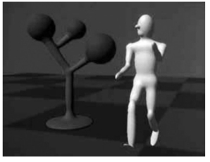
Figure 22.1. Blinn’s Blobby Man 1980. Image courtesy Jim Blinn.
图 22.1。 Blinn 的 Blobby Man 1980。图片由 Jim Blinn 提供。

## 22.1 Implicit Functions, Skeletal Primitives, and Summation Blending 隐式函数、骨架基元和求和混合

In the context of modeling an implicit function is defined as a function f applied to a point $p ∈ \mathbb{E}^3$ yielding a scalar $value ∈ \R$. 
在建模的上下文中，隐函数被定义为应用于点 $p ∈ \mathbb{E}^3$ 的函数 f，产生标量 $value ∈ \R$。

The implicit function $f_i(x, y, z)$ may be split into a distance function $d_i(x, y, z)$ and a fall-off filter function(These functions have been given many names by researchers in the past, e.g., filter, potential, radial-basis, kernel, but we use fall-off filter as a simple term to describe their appearance.  ) $g_i(r)$, where r stands for the distance from the skeleton and the subscript refers to the ith skeletal element.
隐式函数 $f_i(x, y, z)$ 可以分为距离函数 $d_i(x, y, z)$ 和衰减滤波器函数（过去研究人员给这些函数起了很多名字） ，例如滤波器、势能、径向基、内核，但我们使用衰减滤波器作为简单术语来描述它们的外观。）$g_i(r)$，其中r代表距骨架的距离，下标指 到第 i 个骨架元素。

We will use the following notation:
我们将使用以下符号：
$$
f_i(x, y, z) = g_i ◦ d_i(x, y, z)\ \ \ \ \  \ (22.2)
$$
A simple example is a point primitive, and we take the analogy of a star radiating heat into space. The field value (temperature in this example) may be measured at any point $p$ and can be found by taking the distance from $p$ to the center of the star and supplying the value to a fall-off filter function similar to one of those given in Figure 22.2. In these sample functions, the field is given a value of 1 at the center of the star; the value falls off with distance. The surface of a model may be derived from the implicit function $f(x, y, z)$ as the points of space whose values are equal to some desired iso-value (iso); in the star example, a spherical shell for values of iso $∈ (0, 1)$. 
一个简单的例子是点基元，我们将其类比为一颗向太空辐射热量的恒星。 场值（本例中的温度）可以在任意点 $p$ 处测量，并且可以通过获取从 $p$ 到恒星中心的距离并将该值提供给类似于一个的衰减滤波器函数来找到 图 22.2 中给出的那些。 在这些示例函数中，恒星中心的场值为 1； 该值随着距离的增加而下降。 模型的表面可以从隐式函数 $f(x, y, z)$ 导出，作为其值等于某个所需 iso 值 (iso) 的空间点； 在星形示例中，值为 iso $ε (0, 1)$ 的球壳。

Figure 22.2. Fall-off filter functions $(0 ≤ r ≤ 1)$. (a) Blinn’s Gaussian or “Blobby” function; (b) Nishimura’s “Metaball” function; (c) Wyvill et al.’s “soft objects” function; (d) the Wyvill function.
图 22.2。 衰减滤波器函数$(0 ≤ r ≤ 1)$。 (a) Blinn 高斯函数或“Blobby”函数； (b) 西村的“元球”功能； (c) Wyvill 等人的“软物体”功能； (d) 威维尔函数。

In general, filter functions ($g_i$) are chosen so that the field values are maximized on the skeleton and fall off to zero at some chosen distance from the skeleton. In the simple case where the resulting surfaces are blended together,
the global field $f(x, y, z)$ of an object, the implicit function, may be defined as
一般来说，选择过滤函数 ($g_i$) 以便场值在骨架上最大化，并在距骨架的某个选定距离处降至零。 在将所得表面混合在一起的简单情况下， 对象的全局字段 $f(x, y, z)$（隐式函数）可以定义为
$$
f(x, y, z) = \sum^{i=n}_{i=1}f_i(x, y, z) \ \  \ \ \ \ \ (22.3)
$$
where n skeletal elements contribute to the resulting field value. An example is shown in Figure 22.3 in which the field at any point $(x, y, z)$ is calculated as in Equation (22.3). 
其中 n 个骨架元素对结果字段值有贡献。 图 22.3 中显示了一个示例，其中任意点 $(x, y, z)$ 处的场的计算方式如公式 (22.3) 所示。

Figure 22.3. Each column shows two point primitives approaching each other. From left to right: the fall-off filter functions used are Blobby, Metaball, soft objects, and Wyvill. Image courtesy Erwin DeGroot.
图 22.3。 每列显示两个相互接近的点基元。 从左到右：使用的衰减过滤器函数是 Blobby、Metaball、软对象和 Wyvill。 图片由埃尔文·德格鲁特提供。

In this case, two point primitives are placed in close proximity. As the two points are brought together, the surfaces bulge and then blend together. The term filter function is used because the function causes the primitives to be blurred together somewhat akin to a filter function for images. The summation blend is the most compact and efficient blending operation that can be applied to implicit surfaces (see Equation (22.3)). 
在这种情况下，两个基元被放置得非常接近。 当两点靠在一起时，表面会凸出，然后融合在一起。 使用术语“过滤函数”是因为该函数会导致图元模糊在一起，有点类似于图像的过滤函数。 求和混合是可应用于隐式曲面的最紧凑、最高效的混合操作（参见方程（22.3））。

One advantage of using filter functions with finite support is that primitives that are far from p will have zero contribution and thus need not be considered (Wyvill et al., 1986).
使用具有有限支持的滤波器函数的优点之一是远离 p 的基元的贡献为零，因此不需要考虑（Wyvill 等人，1986）。

### 22.1.1 $C^1$ Continuity and the Gradient  $C^1$ 连续性和梯度

The most basic form of continuity is $C^0$ continuity, which ensures that there are no “jumps” in a function. Higher-order continuity is defined in terms of derivatives of functions (see Chapter 15). 
最基本的连续性形式是 $C^0$ 连续性，它确保函数中没有“跳跃”。 高阶连续性是根据函数的导数定义的（参见第 15 章）。

In the case of a 3D scalar field f, the first derivative is a vector function known as the gradient, written $∇f$ and defined as
在 3D 标量场 f 的情况下，一阶导数是称为梯度的向量函数，写为 $∇f$ 并定义为
$$
∇f(p) = \{\frac{∂f(\bold{p})}{∂x}, \frac{∂f(\bold{p})}{∂y}, \frac{∂f(\bold{p})}{∂z}\}
$$
If $∇f$ is defined at all points, and the three one-dimensional partial derivatives are each $C^0$, then $f$ is $C^1$. Informally, $C^1$ surface continuity means that the surface normal varies smoothly over the surface. The surface normal is the unit vector perpendicular to the surface. If no unique surface normal can be defined on the edge of a cube, for example, then the surface is not $C^1$. For points on an implicit surface, the surface normal can be computed by normalizing the gradient vector $∇f$. In the example of the circle, points inside have a negative value and those on the outside have a positive one. For many types of implicit surfaces, the sense of inside and outside is inverted, and since the normal vector must always point outward, it can be opposite to the gradient direction.
如果$∇f$在所有点上都有定义，并且三个一维偏导数均为$C^0$，则$f$为$C^1$。 通俗地说，$C^1$ 表面连续性意味着表面法线在表面上平滑变化。 表面法线是垂直于表面的单位向量。 例如，如果无法在立方体的边缘上定义唯一的表面法线，则该表面不是 $C^1$。 对于隐式曲面上的点，可以通过归一化梯度向量 $∇f$ 来计算曲面法线。 在圆的示例中，内部的点具有负值，外部的点具有正值。 对于许多类型的隐式曲面，内部和外部的含义是相反的，并且由于法向量必须始终指向外部，因此它可以与梯度方向相反。

Skeletal implicit primitives are created by applying a fall-off filter function to an unsigned distance field as in Equation (22.2). Although the distance field is never $C^1$ at the skeleton, these discontinuities can be removed by using a suitable fall-off function (Akleman & Chen, 1999). If an operator, $g$, combines implicit functions, $f_1$ and $f_2$, where all points are $C^1$, then $g(f_1, f_2)$ is not necessarily $C^1$. For example, it is possible to make a sharp CSG junction using the min and max operators. The combination is not $C^1$ continuous because the min and max operators don’t have that property (see Section 22.5). 
骨架隐式基元是通过将衰减滤波器函数应用于无符号距离场来创建的，如方程（22.2）所示。 尽管骨架上的距离场永远不是 $C^1$，但可以通过使用合适的衰减函数来消除这些不连续性（Akleman & Chen，1999）。 如果运算符 $g$ 组合隐式函数 $f_1$ 和 $f_2$，其中所有点都是 $C^1$，则 $g(f_1, f_2)$ 不一定是 $C^1$。 例如，可以使用最小和最大运算符来创建尖锐的 CSG 连接。 该组合不是 $C^1$ 连续的，因为 min 和 max 运算符没有该属性（参见第 22.5 节）。

The analysis of operators is complicated by the fact that it is sometimes desirable to create a $C^1$ discontinuity. This case occurs whenever a crease in the surface is desired. For example, a cube is not $C^1$ because tangent discontinuities occur at each edge. To create creases using $C^1$ primitives, the operator must introduce $C^1$ discontinuities, and hence cannot be $C^1$ itself.
由于有时需要创建 $C^1$ 不连续性，因此运算符的分析变得复杂。 每当需要在表面上出现折痕时就会出现这种情况。 例如，立方体不是 $C^1$，因为每条边都会出现切线不连续性。 要使用 $C^1$ 基元创建折痕，操作符必须引入 $C^1$ 不连续性，因此不能是 $C^1$ 本身。

### 22.1.2 Distance Fields, R-Functions, and F-Reps  距离场、R 函数和 F 重复

The distance field is defined with respect to some geometric object T:
距离场是相对于某个几何对象 T 定义的：
$\bold{F}(T, \bold{p}) = min_{\bold{q}∈T}|\bold{q} - \bold{p}|  $

Visually, $\bold{F}(T, \bold{p})$ is the shortest distance from $\bold{p}$ to T. Hence, when $\bold{p}$ lies on T,  $\bold{F}(T, \bold{p}) = 0$ and the surface created by the implicit function is the object T. Outside of T, a nonzero distance is returned. The function T can be any geometric entity embedded in 3D—a point, curve, surface, or solid. Procedural modeling with distance fields started with Ricci (Ricci, 1973); R-functions (Rvachev, 1963) were first applied to shape modeling more than 20 years later (see (Shapiro, 1994) and (A. Pasko, Adzhiev, Sourin, & Savchenko, 1995)).
从视觉上看，$\bold{F}(T, \bold{p})$ 是从 $\bold{p}$ 到 T 的最短距离。因此，当 $\bold{p}$ 位于 T 上时，$\bold {F}(T, \bold{p}) = 0$，隐式函数创建的表面是对象 T。在 T 之外，返回非零距离。 函数 T 可以是嵌入 3D 中的任何几何实体——点、曲线、曲面或实体。 距离场的程序建模始于 Ricci（Ricci，1973）； 20 多年后，R 函数（Rvachev，1963）首次应用于形状建模（参见（Shapiro，1994）和（A. Pasko，Adzhiev，Sourin 和 Savchenko，1995））。

An R-function or Rvachev function is a function whose sign can change if and only if the sign of one of its arguments changes; that is, its sign is determined solely by its arguments. R-functions provide a robust theoretical framework for boolean composition of real functions, permitting the construction of Cn CSG operators (Shapiro, 1988). These CSG operators can be used to create blending operators simply by adding a fixed offset to the result (A. Pasko et al., 1995). Although these blending functions are no longer technically R-functions, they have most of the desirable properties and can be mixed freely with R-functions to create complex hierarchical models (Shapiro, 1988). These R-function-based blending and CSG operators are referred to as R-operators (see Section 22.4). The Hyperfun system (Adzhiev et al., 1999) is based on F-reps (function representation), another name for an implicit surface. The system uses a procedural C-like language to describe many types of implicit surfaces. 
R 函数或 Rvachev 函数是一种函数，当且仅当其参数之一的符号发生变化时，其符号才会发生变化； 也就是说，它的符号仅由它的参数决定。 R 函数为实函数的布尔组合提供了强大的理论框架，允许构造 Cn CSG 算子（Shapiro，1988）。 这些 CSG 运算符可用于创建混合运算符，只需向结果添加固定偏移量即可（A. Pasko 等人，1995）。 尽管这些混合函数在技术上不再是 R 函数，但它们具有大多数所需的属性，并且可以与 R 函数自由混合以创建复杂的分层模型（Shapiro，1988）。 这些基于 R 函数的混合和 CSG 算子被称为 R 算子（参见第 22.4 节）。 Hyperfun 系统（Adzhiev 等人，1999）基于 F-reps（函数表示），即隐式曲面的另一个名称。 该系统使用类似 C 的过程语言来描述多种类型的隐式表面。

### 22.1.3 Level Sets  关卡集

It is useful to represent an implicit field discretely via a regular grid (Barthe, Mora, Dodgson, & Sabin, 2002) or an adaptive grid (Frisken, Perry, Rockwood, & Jones, 2000). This is exactly what the polygonization algorithm does in the case of level sets; moreover, the grid can be used for various other purposes besides building polygons. Discrete representations of f are commonly obtained by sampling a continuous function at regular intervals. For example, the sampled function may be defined by other volume model representations (V. V. Savchenko, Pasko, Sourin, & Kunii, 1998). The data may also be a physical object sampled using three-dimensional imaging techniques. Discrete volume data has most often been used in conjunction with the level sets method (Osher & Sethian, 1988), which defines a means for dynamically modifying the data structure using curvaturedependent speed functions. Interactive modeling environments based on level sets have been defined (Museth, Breen, Whitaker, & Barr, 2002), although level sets are only one method employing a discrete representation of the implicit field. Methods for interactively defining discrete representations using standard implicit surfaces techniques have also been explored (Baerentzen & Christensen, 2002). 
通过规则网格（Barthe、Mora、Dodgson 和 Sabin，2002）或自适应网格（Frisken、Perry、Rockwood 和 Jones，2000）离散地表示隐式场非常有用。 这正是多边形算法在水平集情况下所做的事情； 此外，除了构建多边形之外，网格还可以用于各种其他目的。 f 的离散表示通常通过定期采样连续函数来获得。 例如，采样函数可以由其他体积模型表示来定义（V.V.Savchenko、Pasko、Sourin 和 Kunii，1998）。 数据还可以是使用三维成像技术采样的物理对象。 离散体数据最常与水平集方法结合使用（Osher & Sethian，1988），该方法定义了一种使用曲率相关速度函数动态修改数据结构的方法。 基于水平集的交互式建模环境已经被定义（Museth、Breen、Whitaker 和 Barr，2002），尽管水平集只是采用隐式场的离散表示的一种方法。 还探索了使用标准隐式曲面技术交互式定义离散表示的方法（Baerentzen & Christensen，2002）。

A key advantage to employing a discrete data structure is its ability to act as a unifying approach for all of the various volume models defined by potential fields (discrete or not) (V. V. Savchenko et al., 1998). The conversion of any continuous function to a discrete representation introduces the problem of how to reconstruct a continuous function, needed for the combined purposes of additional modeling operations and visualization of the resulting potential field. A well-known solution to this problem is to apply a filter g using the convolution operator (see Chapter 9). The choice of a filter is guided by the desired properties of the reconstruction, and many filters have been explored (Marschner & Lobb, 1994). The salient point is that there is typically a tradeoff between the efficiency of the chosen filter and the smoothness of the resulting reconstruction; see also Section 22.9.
采用离散数据结构的一个关键优势是它能够作为由势场（离散或非离散）定义的所有各种体积模型的统一方法（V. V. Savchenko 等人，1998）。 将任何连续函数转换为离散表示会引入如何重建连续函数的问题，这是附加建模操作和所得势场可视化的综合目的所需要的。 这个问题的一个众所周知的解决方案是使用卷积算子应用过滤器 g（参见第 9 章）。 滤波器的选择以重建所需的属性为指导，并且已经探索了许多滤波器（Marschner & Lobb，1994）。 突出的一点是，所选滤波器的效率和所得重建的平滑度之间通常需要权衡； 另见第 22.9 节。

To be interactive, a discrete system must restrict the size of the grid relative to the available computing power. This, in turn, limits the ability of the modeler to include high-frequency details. Additionally, the smoothing triquadratic filter makes it impossible to include sharp edges, should they be desired. A partial solution to this problem is the use of adaptive grids, although with any discrete representation there will be limitations. A discrete grid is used in (Schmidt, Wyvill, & Galin, 2005) to act as a cache representing a BlobTree node. The grid in this work is used for fast prototyping and uses trilinear interpolation for position and the slower, more accurate triquadratic interpolation to calculate gradient values, because the eye is more discerning in observing gradient errors than position errors.
为了实现交互，离散系统必须限制网格相对于可用计算能力的大小。 这反过来又限制了建模者包含高频细节的能力。 此外，平滑三二次滤波器使得不可能包含尖锐的边缘（如果需要的话）。 该问题的部分解决方案是使用自适应网格，尽管任何离散表示都会存在限制。 (Schmidt, Wyvill, & Galin, 2005) 使用离散网格作为表示 BlobTree 节点的缓存。 这项工作中的网格用于快速原型设计，并使用三线性插值来计算位置，并使用更慢、更准确的三二次插值来计算梯度值，因为眼睛在观察梯度误差时比观察位置误差更容易辨别。

### 22.1.4 Variational Implicit Surfaces  变分隐式曲面

It is often required to convert sampled data to an implicit representation. Variational implicit surfaces interpolate or approximate a set of points using a weighted sum of globally supported basis functions (V. Savchenko, Pasko, Okunev, & Kunii, 1995; Turk & O’Brien, 1999; Carr et al., 2001; Turk & O’Brien, 2002). These radially symmetric basis functions are applied at each sample point. The continuity of such a surface depends on the choice of basis function. The $C^2$ thin-plate spline is most commonly used (Turk & O’Brien, 2002; Carr et al., 2001). Like Blinn’s exponential function (see Figure 22.2), this function is unbounded as is the resulting variational implicit surface. 
通常需要将采样数据转换为隐式表示。 变分隐式曲面使用全局支持的基函数的加权和来插值或近似一组点（V. Savchenko、Pasko、Okunev 和 Kunii，1995；Turk 和 O'Brien，1999；Carr 等人，2001；Turk 和 奥布莱恩，2002）。 这些径向对称基函数应用于每个采样点。 这种表面的连续性取决于基函数的选择。 $C^2$ 薄板样条是最常用的（Turk & O’Brien, 2002；Carr et al., 2001）。 与 Blinn 指数函数一样（参见图 22.2），该函数是无界的，所得到的变分隐式曲面也是无界的。

If the field is is globally $C^2$, creases cannot be defined;(Except see Section 15.2.) however, anisotropic basis functions can be used to produce fields which change more rapidly and may appear to have creases (Dinh, Slabaugh, & Turk, 2001). At the appropriate scale, the surface is still smooth. The smooth field implies that self-intersections do not occur, and hence volumes are always well-defined. The thin-plate spline guarantees that global curvature is minimized (Duchon, 1977). Variational interpolation has many properties which are desirable for 3D modeling; however, controlling the resulting surfaces can be difficult. 
如果该场全局为 $C^2$，则无法定义折痕；（参见第 15.2 节除外。）但是，各向异性基函数可用于产生变化更快并且可能看起来有折痕的场（Dinh、Slabaugh、 ＆土耳其人，2001）。 在适当的比例下，表面仍然是光滑的。 平滑场意味着不会发生自相交，因此体积总是明确定义的。 薄板样条保证全局曲率最小化（Duchon，1977）。 变分插值具有许多 3D 建模所需的属性； 然而，控制最终的表面可能很困难。

Variational implicit surfaces can also be based on compactly supported radial basis functions (CS-RBFs) to reduce the computational cost of variational interpolation techniques (Morse, Yoo, Rheingans, Chen, & Subramanian, 2001). Each CS-RBF only influences a local region, so computing $f(\bold{p})$ requires only evaluation of basis functions within some small neighborhood of $\bold{p}$. As with the globally supported counterpart, the resulting field is $C^k$, creases are not supported, and self-intersections cannot occur.(Note, $k > 0$ depending on the RBF (see Section 15.2).) The local support of each basis function results in a bounded global field. This also guarantees that additional iso-contours will be present, as noted by various researchers (Ohtake, Belyaev, & Pasko, 2003; Reuter, 2003). 
变分隐式曲面还可以基于紧凑支持的径向基函数 (CS-RBF)，以减少变分插值技术的计算成本（Morse、Yoo、Rheingans、Chen 和 Subramanian，2001）。 每个CS-RBF仅影响局部区域，因此计算$f(\bold{p})$只需要评估$\bold{p}$的一些小邻域内的基函数。 与全局支持的对应字段一样，结果字段为 $C^k$，不支持折痕，并且不会发生自相交。（注意，$k > 0$ 取决于 RBF（参见第 15.2 节）。） 每个基函数的支持都会产生一个有界的全局场。 正如多位研究人员指出的那样，这也保证了会出现额外的等值线（Ohtake、Belyaev 和 Pasko，2003 年；Reuter，2003 年）。

### 22.1.5 Convolution Surfaces  卷积曲面

Convolution surfaces, introduced by Bloomenthal and Shoemake (Bloomenthal & Shoemake, 1991) are produced by convolving a geometric skeleton $S$ with a kernel function $h$. Hence, the value at any position in space is defined by an integral over the skeleton:
卷积曲面由 Bloomenthal 和 Shoemake 提出（Bloomenthal & Shoemake，1991），是通过将几何骨架 $S$ 与核函数 $h$ 进行卷积来生成的。 因此，空间中任意位置的值由骨架上的积分定义：
$f(\bold{p}) = \int_S g(\bold{r})h(\bold{p}-\bold{r})d\bold{r} \\$

Any finitely supported function can be used as h; see (Sherstyuk, 1999) for a detailed analysis of different kernels.
任何有限支持函数都可以用作h； 有关不同内核的详细分析，请参阅（Sherstyuk，1999）。

Like skeletal primitives, convolution surfaces have bounded fields. Blinn’s “Blobby molecules” is the simplest form of a convolution surface (J. Blinn, 1982); in this case, the skeleton consists of points only. This idea was extended by Bloomenthal to include line, arc, triangle, and polygon skeletons (Bloomenthal & Shoemake, 1991). These represent 1D and 2D primitives; 3D primitives were later described by Bloomenthal (Bloomenthal, 1995).
与骨架基元一样，卷积表面也具有有界域。 Blinn 的“Blobby 分子”是卷积表面的最简单形式（J. Blinn，1982）； 在这种情况下，骨架仅由点组成。 Bloomenthal 将这一想法扩展为包括直线、弧线、三角形和多边形骨架（Bloomenthal & Shoemake，1991）。 它们代表 1D 和 2D 图元； 3D 图元后来由 Bloomenthal 描述（Bloomenthal，1995）。

Combination of convolution surfaces is defined by composition of the underlying geometric skeletons and has the advantage of eliminating the bulges that tend to occur when composing multiple skeletal primitives with additive blending. The surface resulting from convolution of the combined skeleton does not have bulges, as in Figure 22.4, and the field is continuous even if the combined skeleton is nonconvex. Convolution surfaces are offset a fixed distance from convex portions of a skeleton, but produce a fillet along concave portions of a skeleton.
卷积表面的组合是通过底层几何骨架的组合来定义的，并且具有消除在通过加法混合组合多个骨架基元时容易出现的凸起的优点。 组合骨架卷积产生的表面没有凸起，如图 22.4 所示，即使组合骨架是非凸的，场也是连续的。 卷积曲面从骨架的凸部偏移固定距离，但沿骨架的凹部生成圆角。

Figure 22.4. Two blended cylinders. Left: summation blend; right: convolution surface with barely discernible bulge (Bloomenthal, 1997). Image courtesy Erwin DeGroot.
图 22.4。 两个混合气缸。 左：求和混合； 右：带有几乎无法辨别的凸起的卷积表面（Bloomenthal，1997)。 图片由埃尔文·德格鲁特提供。

An example of skeletal elements convolved to build a complex model is shown in Figure 22.5. The hand model contains fourteen primitives.
图 22.5 显示了通过卷积构建复杂模型的骨架元素示例。 手部模型包含十四个基元。
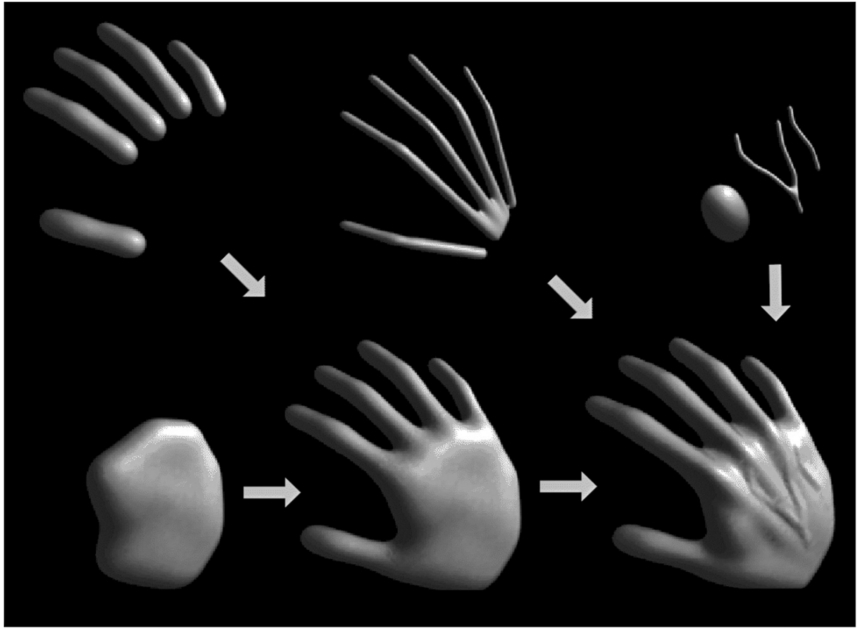
Figure 22.5. Skeletal elements convolved to build a hand model. Image courtesy Jules Bloomenthal. 
图 22.5。 骨骼元素进行卷积以构建手部模型。 图片由朱尔斯·布卢门撒尔提供。

### 22.1.6 Defining Skeletal Primitives  定义骨架基元

As we will see in the following sections rendering the implicit models requires finding the field value and gradient for a large number of points. We need the distance to supply to Equation (22.2) and the gradient is useful for root finding as well as lighting calculations. Supplying the distance to the fall-off filter functions of Figure 22.2 is a matter of calculating the nearest distance to the skeletal primitive, simple for point primitives but a little trickier for more complex geometrical shapes. A line segment primitive (AB) can be defined as a cylinder around a line with hemispherical end caps (see Figure 22.6). Point P0 lies on the surface where $f(P_0) = iso$ and $f(P_1) = 0$ since it lies outside of the influence of the line primitive. The distance from some $P_i$ to the line is found by simply projecting onto the line $AB$ and calculating the perpendicular distance, e.g., $|CP_0|$; this can be found from AC, since A, $P_0$, and B, are all known:
正如我们将在以下部分中看到的，渲染隐式模型需要找到大量点的字段值和梯度。 我们需要为方程（22.2）提供距离，并且梯度对于求根和照明计算很有用。 向图 22.2 的衰减滤波器函数提供距离就是计算到骨架基元的最近距离，对于点基元来说很简单，但对于更复杂的几何形状来说有点棘手。 线段基元 (AB) 可以定义为带有半球形端盖的线周围的圆柱体（见图 22.6）。 点 P0 位于 $f(P_0) = iso$ 且 $f(P_1) = 0$ 的曲面上，因为它位于线基元的影响之外。 通过简单地投影到线 $AB$ 上并计算垂直距离即可找到从某个 $P_i$ 到线的距离，例如 $|CP_0|$； 这可以从 AC 中找到，因为 A、$P_0$ 和 B 都是已知的：
$$
\stackrel{\rightarrow}{AC} = \stackrel{\rightarrow}{AB}\frac{\stackrel{\rightarrow}{AP_0} \cdot \stackrel{\rightarrow}{AB}} {\|AB\|^2}
$$
In Figure 22.6, the field value of $P_2 > 0$, since $P_2$ is in the hemispherical endcap, which can be checked separately. Variations of this idea can define primitives with endcaps of different radii producing interesting cone shapes. An example is shown in Figure 22.7.
图22.6中$P_2的字段值> 0$，因为$P_2$在半球端盖内，可以单独检查。 这个想法的变体可以定义具有不同半径端盖的基元，产生有趣的圆锥形状。 图 22.7 显示了一个示例。
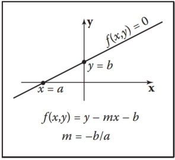
Figure 22.6. Line primitive ab and example points $p_0$, $p_1$, $p_2$ showing distance calculation.
图 22.6。 线基元 ab 和示例点 $p_0$、$p_1$、$p_2$ 显示距离计算。

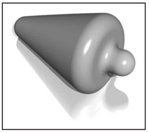
Figure 22.7. Cylinder primitive blended with a sphere. Image courtesy Erwin DeGroot.
图 22.7。 与球体混合的圆柱体基元。 图片由埃尔文·德格鲁特提供。

A great variety of geometrical skeletons have been described, and, in principle, it is simply a matter of defining the distance to the skeleton from some point $\bold{p}$ and also the gradient at $\bold{p}$. For example, an offset surface of a triangle can be defined from the vertices of the triangle and a radius $r$. A simple way to implement this is to use line segment primitives to describe bounding cylinders connecting the vertices (radius $r$). The distance from a point $\bold{q}$ within the triangle that does not fall within the bounding fields of one of the line segment primitives is returned as the perpendicular distance to the plane of the triangle. Other examples include an implicit disk, defined by a circle and a thickness parameter, a torus also defined by a circle and the radius of the cross section (or inner and outer circle radii), a circular cone from a disk and a height, a cube with rounded corners, etc. (see Figure 22.8).
已经描述了各种各样的几何骨架，原则上，只需定义从某个点 $\bold{p}$ 到骨架的距离以及 $\bold{p}$ 处的梯度即可。 例如，可以根据三角形的顶点和半径 $r$ 来定义三角形的偏移表面。 实现此目的的一个简单方法是使用线段基元来描述连接顶点的边界圆柱体（半径 $r$）。 距三角形内未落在线段基元之一的边界场内的点 $\bold{q}$ 的距离将作为到三角形平面的垂直距离返回。 其他示例包括由圆和厚度参数定义的隐式圆盘、也由圆和横截面半径（或内圆和外圆半径）定义的圆环、由圆盘和高度定义的圆锥体、 圆角立方体等（见图22.8）。

Figure 22.8. Implicit models from various skeletal primitives. Image courtesy Erwin DeGroot.
图 22.8。 来自各种骨骼基元的隐式模型。 图片由埃尔文·德格鲁特提供。

## 22.2 Rendering 渲染

Modeling methods, such as parametric surfaces, lend themselves to visualization, since it is easy to iterate over points on the surface that can be found directly from the defining equations; for example $(x, y) = (cos θ, sin θ), θ ∈ [0, 2π)$ produces  a circle. 
建模方法（例如参数化曲面）有助于可视化，因为很容易迭代曲面上的点，这些点可以直接从定义方程中找到； 例如 $(x, y) = (cos θ, sin θ), θ ∈ [0, 2π)$ 生成一个圆。

There are two techniques that are commonly used to render implicit surfaces: ray tracing and surface tiling. In practice, a designer wants to visualize an implicit surface model quickly, sacrificing quality for speed for interaction purposes. Prototyping algorithms have been concerned with producing a polygon mesh that can be rendered in real time on modern workstations. Finding the polygonal mesh which best approximates the desired surface is referred to as polygonization or surface tiling. For animation or for a final visualization, where quality is preferred over speed, ray tracing implicit surfaces directly without first polygonising produces excellent results. 
有两种常用于渲染隐式表面的技术：光线追踪和表面平铺。 在实践中，设计人员希望快速可视化隐式表面模型，为了交互目的而牺牲质量以换取速度。 原型算法一直致力于生成可以在现代工作站上实时渲染的多边形网格。 找到最接近所需表面的多边形网格称为多边形化或表面平铺。 对于动画或最终可视化，质量优先于速度，直接光线追踪隐式曲面无需先进行多边形化即可产生出色的结果。

As previously mentioned, finding an implicit surface requires searching through space to find the points that satisfy, $f(\bold{p}) = 0$. There are two main approaches to executing such a search: space partitioning—partitioning space into manageable units such as cubes, and non-space partitioning, e.g., marching triangles (Hartmann, 1998; Akkouche & Galin, 2001) and the shrinkwrap algorithm (van Overveld & Wyvill, 2004).
如前所述，找到隐式曲面需要搜索空间来找到满足 $f(\bold{p}) = 0$ 的点。 执行这种搜索有两种主要方法：空间划分——将空间划分为可管理的单元，例如立方体，以及非空间划分，例如行进三角形（Hartmann，1998；Akkouche & Galin，2001）和收缩包裹算法（van Overveld 和 Wyvill，2004）。

In this chapter, we describe the original space partitioning algorithm and leave it to the reader to explore the more advanced methods. This algorithm together with postprocessing for mesh refinement (see Chapter 12) and caching provide a method for interactive viewing of implicit models on modern workstations.
在本章中，我们描述了原始的空间划分算法，并留给读者探索更高级的方法。 该算法与网格细化的后处理（参见第 12 章）和缓存一起提供了一种在现代工作站上交互式查看隐式模型的方法。

Figure 22.9. A ray-traced dinosaur model showing the underlying skeletal primitives. Image courtesy Erwin DeGroot.
图 22.9。 光线追踪恐龙模型显示了底层的骨骼基元。 图片由埃尔文·德格鲁特提供。

## 22.3 Space Partitioning  空间划分

### 22.3.1 Exhaustive Search  穷举搜索

The basic cubic space partitioning algorithm for tiling implicit surfaces was first published in (Wyvill et al., 1986) and a similar algorithm oriented toward volume visualization, called marching cubes in (Lorensen & Cline, 1987). Since then there have been many refinements and extensions.
用于平铺隐式曲面的基本立方空间划分算法首次发布于（Wyvill 等人，1986），并且面向体积可视化的类似算法称为行进立方体（Lorensen & Cline，1987）。 从那时起，出现了许多改进和扩展。

A first approach to finding the implicit surface might be to subdivide space uniformly into a regular lattice of cubic cells and calculate a value for every vertex. Each cell is replaced with a set of polygons that best approximates the part of the surface contained within that cell. The problem with this method is that many of the cells will be completely outside or completely inside the volume; thus, many cells that contain no part of the surface are processed. For large grids of data this can be very time consuming and memory intensive. 
找到隐式表面的第一种方法可能是将空间均匀地细分为立方单元的规则晶格，并计算每个顶点的值。 每个单元都被替换为最接近该单元内包含的表面部分的一组多边形。 这种方法的问题在于，许多单元将完全位于体积之外或完全位于体积之内。 因此，许多不包含表面部分的细胞被处理。 对于大型数据网格，这可能非常耗时且占用大量内存。

To avoid storing the whole grid, a hash table is used to store only the cubes that contain a piece of the surface, based on the data structures used in (Wyvill et al., 1986). Working software was published in Graphics Gems IV (Bloomenthal, 1990). The algorithm is based on numerical continuation; it starts with a seed cube that intersects part of the surface and builds neighboring cubes as necessary to follow the surface. 
为了避免存储整个网格，根据（Wyvill 等人，1986）中使用的数据结构，使用哈希表仅存储包含一块表面的立方体。 工作软件发表在 Graphics Gems IV (Bloomenthal, 1990) 中。 该算法基于数值延拓； 它从与部分表面相交的种子立方体开始，并根据需要构建相邻的立方体以跟随表面。

The algorithm has two parts. In the first part, cubic cells are found that contain the surface and in the second part, each cube is replaced by triangles. The first part of the algorithm is driven by a queue of cubes, each of which contains part of the surface; the second part of the algorithm is table-driven. 
该算法有两个部分。 在第一部分中，发现包含表面的立方体单元，在第二部分中，每个立方体都被三角形替换。 该算法的第一部分由立方体队列驱动，每个立方体都包含部分表面； 该算法的第二部分是表驱动的。

### 22.3.2 Algorithm Description  算法说明 

A fast overview of the algorithm is as follows: 
该算法的快速概述如下：

- divide space into cubic voxels; 
  将空间划分为立方体素；
- search for surface, starting from a skeletal element; 
  从骨架元素开始搜索表面；
- add voxel to queue, mark it visited; 
  将体素添加到队列中，将其标记为已访问；
- search neighbors; 
  搜索邻居；
- when done, replace voxel with polygons. 
  完成后，用多边形替换体素。

First, space is subdivided into a cubic lattice, and the next task is to find a seed cube containing part of the surface. A cube vertex $v_i$ inside the surface will have a field value $v_i >= iso$ and a vertex outside the surface will have a field value $v_i < iso$; thus, an edge with one of each type of vertex will intersect the surface. We call this an intersecting edge. The field value at the nearest cube vertex to the first primitive can be evaluated by summing the contributions of the primitives as per Equation (22.3), although other operators can also be used as will be seen later. We will assume that $f(v_0) > iso$, which indicates that $v_0$ lies within the solid. The value of iso is chosen by the user; an example is iso = 0.5 when using the soft fall-off function, which has some symmetry properties that lead to nice blending (see Figure 22.3). The vertices along one axis are evaluated in turn until a value $v_i < iso$ is found. The cube containing the intersecting edge is the seed cube. 

The neighbors of the seed cube are examined, and those that contain at least one intersecting edge are added to the queue ready for processing. To process a cube, we examine each face. If any of the bounding edges have oppositely signed vertices, the surface will pass through that face and the face neighbor must be processed. When this process has been completed for all the faces, the second phase of the algorithm is applied to the cube. If the surface is closed, eventually a cube will be revisited and no more unmarked neighbors found, and the search algorithm will terminate. Processing a cube involves marking it as processed and processing its unmarked neighbors. Those that contain intersecting edges are processed until the entire surface has been covered (see Figure 22.10). 

Figure 22.10. A section through the cubic lattice. The + sign indicates a vertex inside the surface ($f (v_i ≥ iso$) and - is outside $f (v_i < iso)$.

Each cube is indexed by an identifying vertex which we define to be the lowerleft far corner (i.e., the vertex with the lowest (x, y, z)-coordinate values (see Figure 22.11)). For each vertex that is inside the surface, the corresponding bit will be set to form the address in an 8-bit table (see Figure 22.11 and Section 22.3.3). 

Figure 22.11. Vertex numbering.  

The identifying vertex is addressed by integers i, j, k, computed from the (x, y, z)-coordinate location of the cube such that $x = side ∗ i$, etc., where side is the size of the cube. The identifying vertex of each cube may appear in as many as eight other cubes, and it would be inefficient to store these vertices more than once. Thus, the vertices are stored uniquely in a chained hash table. Since most of the space does not contain any part of the surface, only those cubes that are visited will be stored. The implicit function value is found for each vertex as it is stored in the hash table.

Nothing is known about the topology of the surface so a search must be started from every primitive to avoid any disconnected parts of the surface being missed. A scalar can be used to scale the influence of a primitive. If the scalar can be less than zero, then it is possible to search along an axis without finding an intersecting edge. In this case, a more sophisticated search must be done to find a seed cube (Galin & Akkouche, 1999).

#### Data Structures

The hash table entry holds five values:

- the i, j, k lattice indices of the identifying vertex (see Figure 22.11);  
- f, the implicit function value of the identifying vertex; 
- Boolean to indicate whether this cube has been visited. 

The hash function computes an address in the hash table by selecting a few bits out of each of $i, j, k$ and combining them arithmetically. For example, the five least significant bits produces a 15-bit address for a table, which must have a length of $2^{15}$. Such a hash function can be neatly implemented in the C-preprocessor as follows: 

```c++
#define NBITS 5
#define BMASK 037
#define HASH(a,b,c) (((a&BMASK)<<NBITS|b&BMASK)
					<<NBITS|c&BMASK)
#define HSIZE 1<<NBITS*3
```

The queue (FIFO list) is used as temporary storage to identify the neighbors for processing. The algorithm begins with a seed cube that is marked as visited and placed on the queue. The first cube on the queue is dequeued and all its unvisited neighbors are added to the queue. Each cube is processed and passed to the second phase of the algorithm if it contains part of the surface. The queue is then processed until empty. 

### 22.3.3 Polygonization Algorithm 

The second phase of the algorithm treats each cube independently. The cell is replaced by a set of triangles that best matches the shape of the part of the surface that passes through the cell. The algorithm must decide how to polygonize the cell given the implicit function values at each vertex. These values will be positive or negative (i.e., less than or greater than the iso-value), giving 256 combinations of positive or negative vertices for the eight vertices of the cube. A table of 256 entries provides the right vertices to use in each triangle (Figure 22.12). For example, entry 4(00000100) points to a second table that records the vertices that bound the intersecting edges. In this example, vertex number 2 is inside the surface ($f(V 2) >= iso$) and, therefore, we wish to draw a triangle that connects the points on the surface that intersecgt with edges bounded by $(V 2, V 0)$, $(V 2, V 3)$, and $(V 2, V 6)$ as shown in Figure 22.13. 

Figure 22.12. Table 2 contains the edges intersected by the surface. Table 1 points to the appropriate entry in Table 2. 


Figure 22.13. Finding the intersection of the surface with a cube edge.

#### Finding Cube-Surface Intersections 

Figure 22.13 shows a cube where vertex $V_2$ is inside the surface and all other vertices are outside. Intersections with the surface occur on three edges as shown. The surface intersects edge $V_2 − V_6$ at the point A. The fastest, but inaccurate, way to calculate A is to use linear interpolation:
$$
\frac{f(A) − f(V_2)}{f(V_6) − f(V_2)} = \frac{|A − V_2|}{side}
$$
If the cube side is 1 and the iso-value sought for f(A) is 0.5, then
$$
A = V_3 + \frac{0.5 - f(V_2)}{f(V_6) - f(V_2)}
$$
This works well for a static image, but in animation error differences between frames will be very noticeable. A root-finding method such as regula falsi should be employed. This becomes more computationally costly as the gradient is needed to evaluate the point of intersection. The gradient is also needed at surface points for rendering. For many types of primitives it is simpler to find a numerical approximation using sample points around p, as in
$$
∇f(\bold{p}) = (
	\frac{f(\bold{p} + Δx) - f(\bold{p})}{Δx}, 
	\frac{f(\bold{p} + Δy) - f(\bold{p})}{Δy}, 
	\frac{f(\bold{p} + Δz) - f(\bold{p})}{Δz}
)
$$
A reasonable value for Δ has been found empirically to be 0.01 ∗ side where side is the length of a cube edge. 

For manufacturing a mesh, as opposed to a set of independent triangles, a second hash table can maintain a list of all the intersecting edges. Since each cube edge is shared by up to four neighbors, the edge hash table prevents repetition of the surface-cube edge intersection calculation. The hash address can be derived from the same hash function as for vertices (applied to the edge endpoints).

### 22.3.4 Sampling Problems 

Ambiguities occur when opposite corners of a face (or the cube) have the same sign and the other pair of vertices on the face have the opposite sign (see Figure 22.14). A sample taken in the center of the face will give a clue as to whether the cube represents the meeting of two surfaces or a saddle. It should be made clear that a spatial grid stores a sample of the implicit function at every vertex. If the function happens to vary considerably within a cell, the polygonal representation will not show such variations (see Figure 22.15). The surface cannot be resolved by sampling alone unless something is known about the curvature of the surface. A good discussion of this topic appears in (Kalra & Barr, 1989).
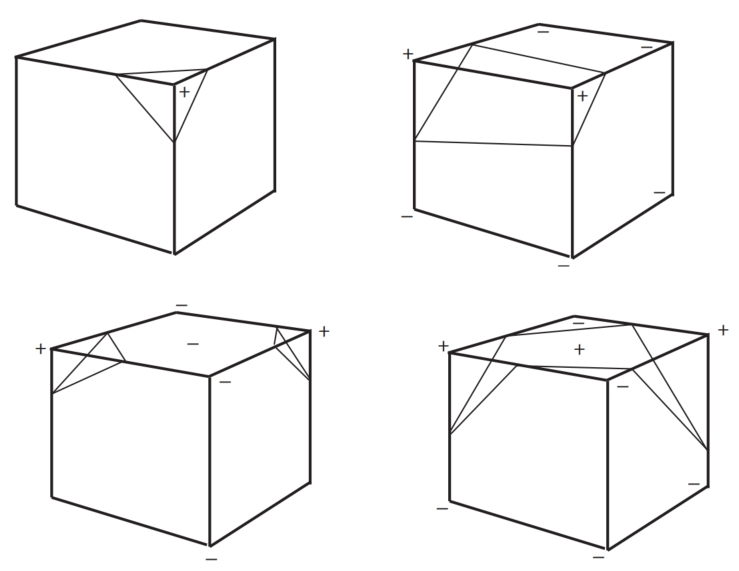
Figure 22.14. Examples of vertices inside (+) and outside (-) the surface. Note the extra sample gives a clue to avoid ambiguous cases.  

22.3.4 Sampling Problems Ambiguities occur when opposite corners of a face (or the cube) have the same sign and the other pair of vertices on the face have the opposite sign (see Figure 22.14). A sample taken in the center of the face will give a clue as to whether the cube represents the meeting of two surfaces or a saddle. It should be made clear that a spatial grid stores a sample of the implicit function at every vertex. If the function happens to vary considerably within a cell, the polygonal representation will not show such variations (see Figure 22.15). The surface cannot be resolved by sampling alone unless something is known about the curvature of the surface. A good discussion of this topic appears in (Kalra & Barr, 1989).This ambiguity problem (not the undersampling problem) is avoided by subdividing the cubic cell into tetrahedra. The tetrahedra can then be polygonized unambiguously. Since there are four vertices in each tetrahedron, a table of 16 entries will provide the correct triangle information. The disadvantage is that approximately twice the number of polygons will be generated. 

Figure 22.15. Cube too large to capture small variation in implicit function.  

#### Subdividing a Cube 

Without requiring additional cell vertices, a cube may be decomposed into five or six tetrahedra as shown in Figure 22.16. These decompositions introduce diagonals on the cube faces, and to maintain a consistent diagonal direction between neighbors, the six decomposition is preferable. The introduction of diagonal edges produces a higher-resolution surface than replacing each cube directly with triangles. The decomposition into tetrahedra and the replacement of the tetrahedra with triangles are fast, table-driven algorithms, which produce topologically consistent meshes. 
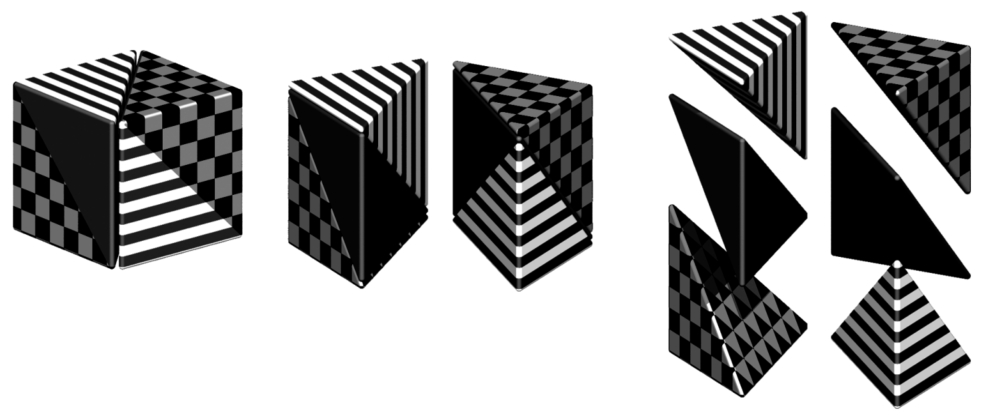
Figure 22.16. Decomposing a cube into six tetrahedra. Image courtesy Erwin DeGroot.  

### 22.3.5 Cell Polygonization

Two obvious problems emerge from the use of uniform space subdivision. The size of triangles output by this algorithm do not adapt to the curvature of the surface and a further sample is required to solve the ambiguities, in which cubic cells are replaced by polygons. A space subdivision algorithm based on an octree was developed by Bloomenthal (Bloomenthal, 1988), which does adapt to the curvature of the surface. Cells are subdivided into eight octants and cracks are avoided by using a restricted octree scheme, i.e., neighboring cells cannot differ by more than one level of subdivision. This indeed reduces the number of polygons generated, but full advantage of large cells can only be taken if the flat regions of the surface happen to fall entirely within the appropriate octants. The algorithm proves in practice to be considerably slower than the uniform voxel algorithm and is more complicated to implement. 

## 22.4 More on Blending 

Section 22.1 showed that blending can be made to occur when field values are summed. Ricci, in his landmark paper (Ricci, 1973), describes super-elliptic blending. Given two functions $F_A$ and $F_B$, previously we simply found the implicit value as $F_{total} = F_A + F_B$. We can denote this more general blending operator as $A \diamond B$. The Ricci blend is defined as:
$$
f_{A \diamond B} = (f_{A}^n + f_B^n)^{\frac{1}{n}} \ \ \ \ \ (22.4)
$$
It is interesting to point out the following properties:  
$$
\lim_{n\rightarrow +∞}(f _A^n + f_B^n)^{\frac{1}{n}} = \max(f_A, f_B) \\
\lim_{n\rightarrow -∞}(f _A^n + f_B^n)^{\frac{1}{n}} = \min(f_A, f_B)
$$
Moreover, this generalized blending is associative, i.e., $f_{(A\diamond B)\diamond C} = f_{A\diamond(B\diamond C)}$. The standard blending operator + proves to be a special case of the super-elliptic blend with $n = 1$. When n varies from 1 to infinity, it creates a set of blends interpolating between blending $A + B$ and union $A ∪ B$ (see Figure 22.17). Figure 22.27 shows the nodes to be binary or unary; in fact the binary nodes can easily be extended using the above formulation to n-ary nodes.

Figure 22.17. By varying n, the Ricci blend may be made to change smoothly from blend to union. Image courtesy Erwin DeGroot.

The power of Ricci’s operators is that they are closed under the operations on the space of all possible implicit volumes, meaning that an application of an operator simply produces another scalar field defining another implicit volume. This new field can be composed with other fields, again using Ricci’s operators. Equation (22.4) will always produce the exact union of two implicit volumes, regardless of how complex they are. Compared with the difficulties involved in applying boolean CSG operations to B-rep surfaces, solid modeling with implicit volumes is incredibly simple. 

Following Pasko’s functional representation (A. Pasko et al., 1995), another generalized blending function may be defined:
$$
f_{A\diamond B} = (f_A + f_B + α\sqrt{f_A^2 + f_B^2})(f_A^2 + f_B^2)^{\frac{2}{n}}
$$
When $α ∈ [−1, 1]$ varies from −1 to 1, it creates a set of blends interpolating the union and the intersection operators. However, this operator is no longer associative which is incompatible with the definition of n-ary operators.

## 22.5 Constructive Solid Geometry 

Implicit models are frequently termed implicit surfaces; however, they are inherently volume models and useful for solid modeling operations. Ricci introduced a constructive geometry for defining complex shapes from operations such as union, intersection, difference, and blend upon primitives (Ricci, 1973). The surface was considered as the boundary between the half spaces $f(\bold{p}) < 1$, defining the inside, and $f(\bold{p}) > 1$ defining the outside. This initial approach to solid modeling evolved into constructive solid geometry or CSG (Ricci, 1973; Requicha, 1980). CSG is typically evaluated bottom-up according to a binary tree, with low-degree polynomial primitives as the leaf nodes and internal nodes representing Boolean set operations. These methods are readily adapted for use in implicit modeling, and in the case of skeletal implicit surfaces, the Boolean set operations union $∪_{max}$, intersection $∩_{min}$ and difference $\setminus_{minmax}$ are defined as follows (Wyvill, Galin, & Guy, 1999):
$$
∪_{max} f = \max^{k-1}_{i=0}(f_i) \\
∩_{min} f = \min^{k-1}_{i=0}(f_i)\\
\setminus_{minmax} f = \min(f_0, 2 * iso - \max^{k-1}_{j=1}(f_j)) \\
(22.5)
$$
The Ricci operators are illustrated in Figure 22.18 for point primitives A and B. For union (bottom left) the field at all points inside the union will be the greater of $f_A()$ and $f_B()$. For intersection (center), points in the region marked as $P_1$ will have value min $(f_A(P_1), f_B(P_1))$ = 0, since the contribution of B will be zero outside of its range of influence. Similarly, for the region marked as $P_2$, (influence of A is zero, i.e., the minimum) leaving only the intersection region with positive values. Difference works similarly using the iso-value in the three marked regions ($P_i$) as follows:
$$
f(P_0) = \min (f_B(P_0), 2 ∗ iso − f_A(P_0)) \\
 = \min([iso, 1], [2 ∗ iso − 1, iso]) \\
= [2 ∗ iso − 1, iso] < iso \\ \\

f(P_1) = \min (f_B(P_1), 2 ∗ iso − f_A(P_1)) \\
= \min([0, iso], [2 ∗ iso − 1, iso]) < iso \\ \\

f(P_2) = \min (f_B(P_2), 2 ∗ iso − f_A(P_2)) \\
= \min([iso, 1], [iso, 2 ∗ iso]) >= iso
$$
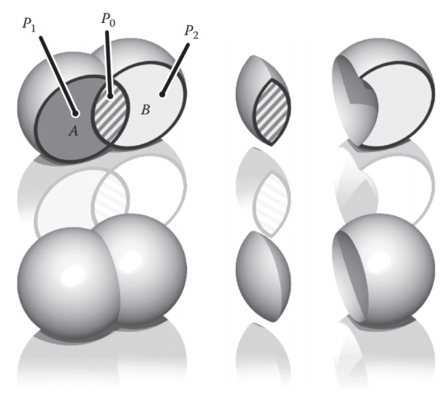
Figure 22.18. Ricci operators for CSG. Image courtesy Erwin DeGroot.  

CSG operators create creases, i.e., $C^1$ discontinuities. For example, the min() operator (Equation (22.5)) creates $C^1$ discontinuities at all points where $f_1(\bold{p}) = f_2(\bold{p})$. When applied to two spheres, the discontinuities produced by this union operator result in a crease on the surface, as shown in Figure 22.18, which is the desired result. Discontinuities unfortunately extend into the field outside of the surface, which is not visible in this image. If a blend is then applied to the result of the union, the $C^1$-discontinuous plane in the field produces a shading discontinuity (Figure 22.19).

Figure 22.19. Two point primitives on the left are connected by the Ricci union. A third primitive is blended to the result, creating an unwanted crease in the field. Image courtesy Erwin DeGroot.

The problem can be avoided to an extent (G. Pasko, Pasko, Ikeda, & Kunii, 2002), and CSG operators have been developed that are $C^1$ at all points except those where $f_1(\bold{p}) = f_2(\bold{p}) = iso$ (Barthe, Dodgson, Sabin, Wyvill, & Gaildrat, 2003).

## 22.6 Warping 

The ability to distort the shape of a surface by warping the space in its neighborhood is a useful modeling tool. A warp is a continuous function $w(x, y, z)$ that maps $\R^3$ onto $\R^3$. Sederberg provides a good analogy for warping when describing free form deformations (Sederberg & Parry, 1986). He suggests that the warped space can be likened to a clear, flexible, plastic parallelepiped in which the objects to be warped are embedded. A warped element may be defined by simply applying some warp function $w(\bold{p})$ to the implicit equation:
$$
f_i(x, y, z) = g_i ◦ d_i ◦ w_i(x, y, z). \ \ \ \ \ \ \ (22.6)
$$
A warped element may be fully characterized by the distance to its skeleton $d_i(x, y, z),$ its fall-off filter function $g_i(r)$, and eventually its warp function $w_i(x, y, z)$. To render or perform operations on an implicit surface, the implicit value of many points $f(P )$ must be found. First, $P$ is transformed by the warp function to some new point $Q$, and $f(Q)$ is returned in place of $f(P)$. In Figure 22.20, instead of returning the implicit value of some point $f(Q)$, the value for $f(P )$ is returned. In this case, the iso-value is returned and the implicit surface (curve in 2D) passes through $Q$ instead of $P$ . Thus, the circle is warped into an ellipse. 
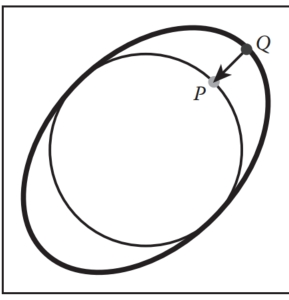
Figure 22.20. Point Q returns the field value for point P.  

Barr introduced the notion of global and local deformations using the operations of twist, taper, and bend applied to parametric surfaces (Barr, 1984). The deformations can be nested to produce models such as the one shown in Figure 22.27. Conceptually, these are easy to apply to an implicit surface, as indicated in Equation (22.6). 

Note that the normal cannot be calculated in a similar manner to warping a point. This problem is similar to the problem outlined in Section 13.2 on instancing. In this case, the normal can most easily be approximated using Equation (22.3.3) although the use of the Jacobian, as suggested in (Barr, 1984), yields precise results. The Barr warps are described in the following sections.

### 22.6.1 Twist

In this example, the twist is around the z-axis by $θ$ (see Figure 22.21) for three blended implicit cylinders with a twist warp applied to them.

Figure 22.21. Three blended implicit cylinders twisted together. Image courtesy Erwin DeGroot.

The twist around z is expressed as 
$$
w(x, y, z) = \begin{Bmatrix}
x ∗ cos(θ(z)) − y ∗ sin(θ(z)) \\
x ∗ sin(θ(z)) + y ∗ cos(θ(z)) \\
z \\\end{Bmatrix}
$$

### 22.6.2 Taper 

Taper is applied along one major axis. A linear taper has proved to be the most useful although quadratic and cubic tapers are easily implemented. For example, a linear taper along the y-axis involves changing both x- and z-coordinates. (See Figure 22.22.) A linear scale is applied to y between $y_{max}$ and $y_{min}$:
$$
s(y) = \frac{y_{max} − y}{y_{max} − y_{min}} \\
w(x, y, z) = \begin{Bmatrix}
s(y)x \\
y \\
s(y)z
\end{Bmatrix}
$$

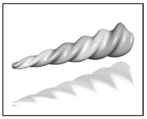
Figure 22.22. Three blended implicit cylinders, twisted then tapered. Image courtesy Erwin DeGroot.  

### 22.6.3 Bend 

Bend is also applied along one major axis. (See Figure 22.23.) For the bend example below, the bending rate is k measured in radians per unit length, the axis of the bend is $(x_0, 1/k)$, and the angle θ is defined as $(x − x_0) ∗ k$. The bend around z is
$$
w(x, y, z) = \begin{Bmatrix} 
− sin(θ) ∗ (y − 1/k) + x_0 \\
cos(θ) ∗ (y − 1/k) + 1/k \\
z
\end{Bmatrix}
$$


Figure 22.23. Three blended implicit cylinders, twisted together, tapered and bent. Image courtesy Erwin DeGroot.

## 22.7 Precise Contact Modeling 

Precise contact modeling (PCM) is a method of deforming implicit surface primitives in contact situations while maintaining a precise contact surface with $C^1$ continuity (Gascuel, 1993). PCM is important in that it is a simple and automatic way of showing how a model can react to its environment. This cannot be so easily done with non-implicit methods (see Figure 22.24). 

Figure 22.24. Sea anemone deforms to implicit rock. Image courtesy Mai Nur and X. Liang.

PCM is implemented by the inclusion of a deforming function s(p) that modifies the field value returned for each point. For each pair of objects, collision is first detected using a bounding-box test. Once it is established that a collision is likely, PCM is applied. A local, geometric deformation term $s_i$ is computed and added to the implicit function $f_i$. The volume of the colliding objects is divided into an interpenetration region and a deformation region. The result of applying $s_i$ is that the interpenetration region is compressed so that contact is maintained without interpenetration occurring (see Figure 22.25). The effect of $s_i$ is attenuated to zero within the propagation region so that the volume outside of the two regions is not deformed. 
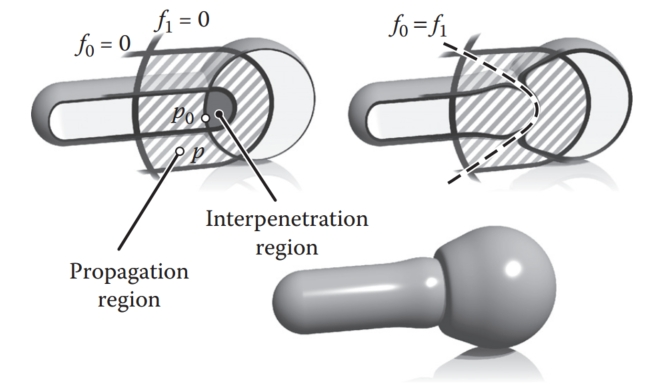
Figure 22.25. A 2D slice through objects in collision showing the various regions and PCM deformation. Image courtesy Erwin DeGroot.  

Given two skeletal elements generating fields $f_1(p)$ and $f_2(p)$, the surface around each one is calculated as
$$
f_1(p) + s_1(p) = 0, \\
f_2(p) + s_2(p) = 0.
$$
We need to generate a surface common to both elements (dotted line in Figure 22.25), i.e., where they share a solution in the interpenetration region for some p in that region:
$$
s_1(p) − f_1(p) = iso, \\
s_2(p) − f_2(p) = iso. \\
(22.7)
$$
Intuitively, the deeper within object 1 that object 2 penetrates, the higher the implicit value of object 1 and thus the more that object 2 will be compressed. 

The function, $s_i$ is defined to produce a smooth junction at the boundary of the interpenetration region, in other words where $s_i = 0$ but its derivative is greater than zero. From here to the boundary of the propagation region, $s_i$ is used to attenuate the propagation to zero. The nearest point on the interpenetration region boundary $p_0$ is found by following the gradient. 

Within the propagation region $s_i(p) = h_i(r)$, where $p = (x, y, z)$ is the point whose implicit value is being calculated and $r = \|p−p_0\|$ (see Figure 22.26). The value of $r_i$, set by the user, defines the size of the propagation region; no deformation occurs beyond this region. To control how much the objects inflate in the propagation region, the user provides a value for the parameter $α$. The maximum value of $h_i$ is $M_i$. The current minimum of $s_i$ is negative in the interpenetration region and is given as $s_{imin}$, where $Mi = −α_is_{i min}$. Thus an object will be compressed in the interpenetration region and will inflate in the propagation region. The equation for hi is formed in two parts by two cubic polynomials that are designed to join at $r = r_i/2$, where the slope is zero:
$$
c = \frac{4(w_ik − 4M_i)}{w^3_i} \\
d = \frac{4(3M_i − w_ik)}{w^2_i} \\
h_i(r) = cr^3 + dr^2 + kr\ \ \ \  \ if\ r ∈ [0, w_i/2], \\
h_i(r) = \frac{4M_i}{w^3_i}(r − w_i)^2(4r − w_i)^3\ if\ r ∈ [w_i/2, w_i]
$$
It is desirable that we have $C^1$-continuity as we move from the interpenetration to the propagation region. Thus, $h'_i(0) = k$ in Figure 22.26, is the directional derivative of $s_i$ at the junction (marked as $p_0$ in Figure 22.25). As indicated in Equation (22.7), $s_i = −f_i$ in the interpenetration region, thus:
$k = \|(f_i, p_0)\|  $

PCM is only an approximation to a properly deformed surface, but it is an attractive algorithm due to its simplicity. 

Figure 22.26. The function, $h_i(r)$ is the value of the deformation function $w_i$ in the propagation region.  

## 22.8 The BlobTree 

The BlobTree is a method that employs a tree structure that extended the CSG tree to include various blending operations using skeletal primitives (Wyvill et al., 1999). A system with similar capabilities, the Hyperfun project, used a specialized language to describe F-rep objects (Adzhiev et al., 1999). 

In the BlobTree system, models are defined by expressions that combine implicit primitives and the operators ∪ (union), ∩ (intersection), − (difference), + (blend), $ \diamond$ (super-elliptic blend), and w (warp). The BlobTree is not only the data structure built from these expressions but also a way of visualizing the structure of the models. The operators listed above are binary with the exception of warp, which is a unary operator. In general it is more efficient to use n-ary rather than binary operators. The BlobTree incorporates affine transformations as nodes so that it is also a scene graph and primitives (e.g., skeletons) form the leaf nodes.

### 22.8.1 Traversing the BlobTree 

An example of a BlobTree including the Barr warps and CSG operations is shown in Figure 22.27. Other nodes can include 2D texturing (Schmidt, Grimm, & Wyvill, 2006), precise contact modeling, as well as animation and other attributes. The traversal of the BlobTree is in essence very simple. All that is required to render the object either by polygonizing or ray tracing is to find the implicit value of any point (and the corresponding gradient). This can be done by traversing the tree. Polygonization and ray-tracing algorithms need to evaluate the implicit field function at a large number of points in space. The function f(N , M) returns the field value for the node N at the point M, which depends on the type of the node. The values L and R indicate that the left or right branch of the tree is explored. The algorithm below is written (for simplicity) as if the tree were binary: 
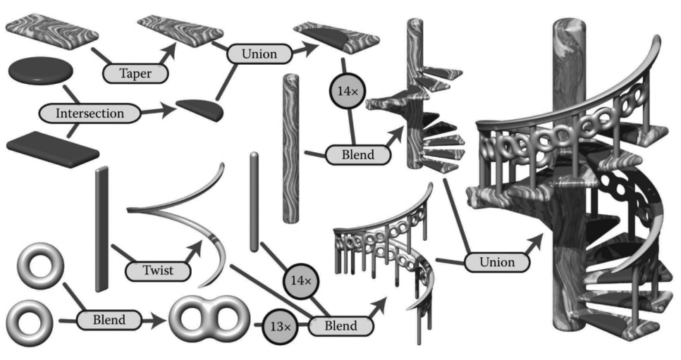
Figure 22.27. BlobTree. The spiral staircase is built from a central textured cylinder to which the stairs and the railing are blended. The railing is comprised of a series of cylinders blended with two circle (torus) primitives, blended together and further blended with a vertical cylinder. The BlobTree is also a scene graph and instancing nodes repeat the various parts transformed by the appropriate matrices. Each stair is made from a tapered polygon primitive (that becomes an offset surface); intersection and union nodes combine the inflated disk with the stair.

​	function f(N , M) :

- primitive: f(M); 
- warp: f(L(N ), w(M)); 
- blend: f(L(N ), M) + f(R(N ), M)); 
- union: max(f(L(N ), M), f(R(N ), M));
- intersection: min(f(L(N ), M), f(R(N ), M)); 
- difference: min(f(L(N ), M), −f(R(N ), M)). 

A complex BlobTree model showing many of the features that have been integrated is shown in Figure 22.28. 

Figure 22.28. “Spiral Stairs.” A complex BlobTree implicit model created in Erwin DeGroot’s BlobTree.net system.

## 22.9 Interactive Implicit Modeling Systems 

Early sketch-based modeling systems, such as Teddy (Igarashi, Matsuoka, & Tanaka, 1999), used a few drawn strokes from the user to infer a polygonal model in 3-space. With better hardware and improved algorithms, sketch-based implicit modeling systems are now possible. Shapeshop uses implicit sweep surfaces to manufacture 3D strokes from 2D user strokes and also preserves the hierarchy of the BlobTree unlike the early systems that produced homogeneous meshes (Schmidt, Wyvill, Sousa, & Jorge, 2005). This enables a user to produce complex models of arbitrary topology from a few simple strokes. The margin figures show a closed drawn stroke (Figure 22.29) inflated into a an implicit sweep and a second sweep (Figure 22.30) that has a smaller sweep object subtracted using CSG.
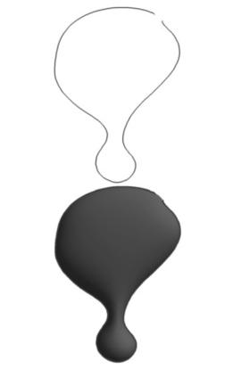
Figure 22.29. Outlines are inflated. Image courtesy Erwin DeGroot.

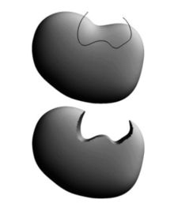
Figure 22.30. BlobTree operations can be applied, e.g., CSG difference. Image courtesy Erwin DeGroot.

One of the improvements that made this possible is a caching system that uses a fixed 3D grid of implicit values at each node of the BlobTree representing the values found by traversing the tree below the node (Schmidt, Wyvill, & Galin, 2005). If the value of some point p is required at node N, a value may be returned without traversing the tree below N, provided that part of the tree is unaltered. Instead, an interpolation scheme (see Chapter 9) is used to find a value for p. This scheme speeds up traversal for complex BlobTrees and is one factor in enabling a system to run at interactive rates.

The next generation of implicit modeling systems will exploit hardware and software advances to be able to handle more and more complex hierarchical models interactively. A more complex Shapeshop example is shown in Figure 22.31.

Figure 22.31. “The Next Step.” A complex BlobTree implicit model created interactively in Ryan Schmidt’s Shapeshop by artist Corien Clapwijk (Andusan).  

## Exercises

1. In an implicit surface modeling system the fall-off filter function is defined as
   $$
   f(r) = \begin{cases}
   0,  \ \ \ \ \ \ \ \ \ \ \ \ \ \ \ \ r > R, \\
   1 - r/R, \ \ \ \ otherwise
   \end{cases}
   $$
   where R is a constant. A point primitive placed at (−1, 0) and another at (1, 0) are rendered to show the f = 0.5 iso-surface. The value R, the distance where the potential due to the point falls to zero in both cases, is 1.5.
   Calculate the potential at the point (0, 0) and at +0.5 intervals until the point (2.5, 0). Sketch the 0.5 contour and the contour at which the field falls to zero. 

2. Why are the ambiguous cases in the polygonization algorithm considered to be a sampling problem? 
3. Calculate the error involved in using linear interpolation to estimate the intersection of an implicit surface and a cubic voxel.
4. Design an implicit primitive function using the skeleton of your choice. The function must take as input a point and return an implicit value and also the gradient at that point.

# 23  Global Illumination  

Many surfaces in the real world receive most or all of their incident light from other reflective surfaces. This is often called indirect lighting or mutual illumination. For example, the ceilings of most rooms receive little or no illumination directly from luminaires (light-emitting objects). The direct and indirect components of illumination are shown in Figure 23.1. 

Figure 23.1. In the left and middle images, the indirect and direct lighting, respectively, are separated out. On the right, the sum of both components is shown. Global illumination algorithms account for both the direct and the indirect lighting.

Although accounting for the interreflection of light between surfaces is straightforward, it is potentially costly because all surfaces may reflect any given surface, resulting in as many as $O(N^2)$ interactions for N surfaces. Because the entire global database of objects may illuminate any given object, accounting for indirect illumination is often called the global illumination problem. 

There is a rich and complex literature on solving the global illumination problem (e.g., Appel, 1968; Goral, Torrance, Greenberg, & Battaile, 1984; Cook et al., 1984; Immel et al., 1986; Kajiya, 1986; Malley, 1988). In this chapter, we discuss two algorithms as examples: particle tracing and path tracing. The first is useful for walkthrough applications such as maze games, and as a component of batch rendering. The second is useful for realistic batch rendering. Then we discuss separating out “direct” lighting where light takes exactly once bounce between luminaire and camera.

## 23.1 Particle Tracing for Lambertian Scenes 

Recall the transport equation from Section 18.2:
$$
L_s(\bold{k}_o) = \int_{ all\ \bold{k}_i} ρ(\bold{k}_i, \bold{k}_o)L_f(\bold{k}_i) cos θ_idσ_i.
$$
The geometry for this equation is shown in Figure 23.2. When the illuminated point is Lambertian, this equation reduces to:  
$$
Ls = \frac{R}{π}\int_{all\ \bold{k}_i} L_f(\bold{k}_i) cos θ_idσ_i,
$$

Figure 23.2. The geometry for the transport equation in its directional form.  

where R is the diffuse reflectance. One way to approximate the solution to this equation is to use finite element methods. First, we break the scene into N surfaces each with unknown surface radiance $L_i$, reflectance $R_i$, and emitted radiance $E_i$. This results in the set of N simultaneous linear equations
$$
L_i = E_i + \frac{R_i}{π} \sum^N_{j=1}k_{ij}L_j,
$$
where $k_{ij}$ is a constant related to the original integral representation. We then solve this set of linear equations, and we can render N constant-colored polygons. This finite element approach is often called radiosity.

An alternative method to radiosity is to use a statistical simulation approach by randomly following light “particles” from the luminaire through the environment. This is a type of particle tracing. There are many algorithms that use some form of particle tracing; we will discuss a form of particle tracing that deposits light in the textures on triangles. First, we review some basic radiometric relations. The radiance L of a Lambertian surface with area A is directly proportional to the incident power per unit area:
$$
L = \frac{Φ}{πA}, \ \ \ \ \ (23.1)
$$
where $Φ$ is the outgoing power from the surface. Note that in this discussion, all radiometric quantities are either spectral or RGB, depending on the implementation. If the surface has emitted power $Φ_e$, incident power $Φ_i$, and reflectance $R$, then this equation becomes
$$
L = \frac{Φ_e + RΦ_i}{πA} 
$$
If we are given a model with $Φ_e$ and R specified for each triangle, we can proceed luminaire by luminaire, firing power in the form of particles from each luminaire. We associate a texture map with each triangle to store accumulated radiance, with all texels initialized to
$$
L = \frac{Φ_e}{πA} .
$$
If a given triangle has area A and $n_t$ texels, and it is hit by a particle carrying power φ, then the radiance of that texel is incremented by 
$$
ΔL = \frac{n_tφ}{πA}
$$
Once a particle hits a surface, we increment the radiance of the texel it hits, probabilistically decide whether to reflect the particle, and if we reflect it we choose a direction and adjust its power. 

Note that we want the particle to terminate at some point. For each surface we can assign a reflection probability p to each surface interaction. A natural choice would be to let p = R as it is with light in nature. The particle would then scatter around the environment, not losing or gaining any energy until it is absorbed. This approach works well when the particles carry a single wavelength (Walter, Hubbard, Shirley, & Greenberg, 1997). However, when a spectrum or RGB triple is carried by the ray as is often implemented (Jensen, 2001), there is no single R and some compromise for the value of p should be chosen. The power $φ'$ for reflected particles should be adjusted to account for the possible extinction of the particles:
$$
φ' = \frac{Rφ}{p}
$$
Note that p can be set to any positive constant less than one, and that this constant can be different for each interaction. When $p > R$ for a given wavelength, the particle will gain power at that wavelength, and when $p < R$ it will lose power at that wavelength. The case where it gains power will not interfere with convergence because the particle will stop scattering and be terminated at some point as long as $p < 1$. For the remainder of this discussion we set $p = 0.5$. The path of a single particle in such a system is shown in Figure 23.3. 

Figure 23.3. The path of a particle that survives with probability 0.5 and is absorbed at the last intersection. The RGB power is shown for each path segment.  

A key part to this algorithm is that we scatter the light with an appropriate distribution for Lambertian surfaces. As discussed in Section 14.4.1, we can find a vector with a cosine (Lambertian) distribution by transforming two canonical random numbers $(ξ_1, ξ_2)$ as follows:
$$
\bold{a} = (cos (2πξ_1)\sqrt{ξ_2},\ sin (2πξ_1)\sqrt{ξ_2}, \sqrt{1 − ξ_2}) . \ \ \ \ \ (23.2)
$$
Note that this assumes the normal vector is parallel to the z-axis. For a triangle, we must establish an orthonormal basis with w parallel to the normal vector. We can accomplish this as follows:
$$
\bold{w} = \frac{\bold{n}}{\|\bold{n}\|} , \\
\bold{u} = \frac{\bold{p}_1 - \bold{p}_0}{\|\bold{p}_1 - \bold{p}_0\|} \\

\bold{v} = \bold{w} × \bold{u} ,
$$
where $\bold{p}_i$ are the vertices of the triangle. Then, by definition, our vector in the appropriate coordinates is  
$$
\bold{a} = \cos (2πξ_1)\sqrt{ξ_2}\bold{u} + \sin (2πξ_1)\sqrt{ξ_2}\bold{v} + \sqrt{1 − ξ_2}\bold{w}. \ \ \ \ \ (23.3)
$$
In pseudocode our algorithm for $p = 0.5$ and one luminaire is:  

> for (Each of n particles) do
> 	RGB $phi = Φ/n$
> 	compute uniform random point $\bold{a}$ on luminaire
> 	compute random direction $\bold{b}$ with cosine density
> 	done = false
> 	while not done do
> 		if (ray $\bold{a} + t\bold{b}$ hits at some point $\bold{c}$ ) then
> 			add $n_tRφ/(πA)$ to appropriate texel
> 			if ($ξ_1 > 0.5$) then
> 				φ = 2Rφ
> 				$\bold{a} = \bold{c}$
> 				$\bold{b}$ = random direction with cosine density
> 		else
> 			done = true  

Here $ξ_i$ are canonical random numbers. Once this code has run, the texture maps store the radiance of each triangle and can be rendered directly for any viewpoint with no additional computation. 

## 23.2 Path Tracing 

While particle tracing is well suited to precomputation of the radiances of diffuse scenes, it is problematic for creating images of scenes with general BRDFs or scenes that contain many objects. The most straightforward way to create images of such scenes is to use path tracing (Kajiya, 1986). This is a probabilistic method that sends rays from the eye and traces them back to the light. Often path tracing is used only to compute the indirect lighting. Here we will present it in a way that captures all lighting, which can be inefficient. This is sometimes called brute force path tracing. In Section 23.3, more efficient techniques for direct lighting can be added. 

In path tracing, we start with the full transport equation:
$$
L_s(\bold{k}_o) = L_e(\bold{k}_o) + \int_{all\ \bold{k}_i} ρ(\bold{k}_i, \bold{k}_o)L_f(\bold{k}_i) \cosθ_idσ_i.
$$
We use Monte Carlo integration to approximate the solution to this equation for each viewing ray. Recall from Section 14.3, that we can use random samples to approximate an integral:
$$
\int_{x∈S}g(x)dμ ≈ \frac{1}{N}\sum^{N}_{i=1}\frac{g(x_i)}{p(x_i)},
$$
where the $x_i$ are random points with probability density function $p$. If we apply this directly to the transport equation with N = 1 we get
$$
L_s(\bold{k}_o) ≈ L_e(\bold{k}_o) + \frac{ρ(\bold{k}_i, \bold{k}_o)L_f(\bold{k}_i) \cos θ_idσ_i}{ p(\bold{k}_i)}
$$
So, if we have a way to select random directions $\bold{k}_i$ with a known density $p$, we can get an estimate. The catch is that $L_f(\bold{k}_i)$ is itself an unknown. Fortunately, we can apply recursion and use a statistical estimate for $L_f(\bold{k}_i)$ by sending a ray in that direction to find the surface seen in that direction. We end when we hit a luminaire and $L_e$ is nonzero (Figure 23.4). This method assumes lights have zero reflectance, or we would continue to recurse. 

Figure 23.4. In path tracing, a ray is followed through a pixel from the eye and scattered through the scene until it hits a luminaire.  

In the case of a Lambertian BRDF ($ρ = R/π$), we can use a cosine density function:
$$
p(\bold{k}_i) = \frac{cos θ_i}{π}.
$$
A direction with this density can be chosen according to Equation (23.3). This allows some cancellation of cosine terms in our estimate:
$$
L_s(\bold{k}_o) ≈ L_e(\bold{k}_o) + RL_f(\bold{k}_i).
$$
In pseudocode, such a path tracer for Lambertian surfaces would operate just like the ray tracers described in Chapter 4, but the raycolor function would be modified:

> RGB raycolor(ray $\bold{a} + t\bold{b}$, int depth)
> if (ray hits at some point $\bold{c}$ ) then
> 	RGB $c = L_e(-\bold{b})$
> 	if (depth < maxdepth) then
> 		compute random direction $\bold{d}$
> 		return $c + R$ raycolor($\bold{c} + s\bold{d}, depth+1$)
> else
> 	return background color  

This will result in a very noisy image unless either large luminaires or very large numbers of samples are used. Note the color of the luminaires must be well above one (sometimes thousands or tens of thousands) to make the surfaces have final colors near one, because only those rays that hit a luminaire by chance will make a contribution, and most rays will contribute only a color near zero. To generate the random direction d, we use the same technique as we do in particle tracing (see Equation (23.2)). 

In the general case, we might want to use spectral colors or use a more general BRDF. In practice, we should have the material class contain member functions to compute a random direction as well as compute the p associated with that direction. This way materials can be added transparently to an implementation. 

## 23.3 Accurate Direct Lighting 

This section presents a more physically based method of direct lighting than Chapter 10. These methods will be useful in making global illumination algorithms more efficient. The key idea is to send shadow rays to the luminaires as described in Chapter 4, but to do so with careful bookkeeping based on the transport equation from the previous chapter. The global illumination algorithms can be adjusted to make sure they compute the direct component exactly once. For example, in particle tracing, particles coming directly from the luminaire would not be logged, so the particles would only encode indirect lighting. This makes nice looking shadows much more efficiently than computing direct lighting in the context of global illumination. 

### 23.3.1 Mathematical Framework 

To calculate the direct light from one luminaire (light emitting object) onto a nonemitting surface, we solve a form of the transport equation from Section 18.2:
$$
L_s(\bold{x}, \bold{k}_o) = \int_{all\ \bold{x}'} \frac{ρ(\bold{k}_i, \bold{k}_o)L_e(\bold{x}', -\bold{k}_i)v(\bold{x}, \bold{x}')\cos θ_i \cos θ'}{\|\bold{x} - \bold{x}\|^2} dA' \ \ \ \  \ \ \ \ (23.4)
$$
Recall that $L_e$ is the emitted radiance of the source, v is a visibility function that is equal to 1 if $\bold{x}$ “sees” $\bold{x}'$ and zero otherwise, and the other variables are as illustrated in Figure 23.5. 

Figure 23.5. The direct lighting terms for Equation (23.4).

If we are to sample Equation (23.4) using Monte Carlo integration, we need to pick a random point $\bold{x}'$ on the surface of the luminaire with density function p (so $\bold{x}' \sim p$). Just plugging into Equation (14.5) with one sample yields
$$
L_s(\bold{x}, \bold{k}_o) ≈ \frac{ρ(\bold{k}_i, \bold{k}_o)L_e(\bold{x}', −\bold{k}_i)v(\bold{x}, \bold{x}') \cos θ_i \cos θ'}{p(\bold{x}')\|\bold{x} − \bold{x}'\|^2} \ \ \ \ \ \ (23.5)
$$


If we pick a uniform random point on the luminaire, then $p = 1/A$, where A is the area of the luminaire. This gives  
$$
L_s(\bold{x}, \bold{k}_o) ≈ \frac{ρ(\bold{k}_i, \bold{k}_o)L_e(\bold{x}', −\bold{k}_i)v(\bold{x}, \bold{x}') \cos θ_i \cos θ'}{\|\bold{x} − \bold{x}'\|^2} \ \ \ \ \ \ (23.6)
$$
We can use Equation (23.6) to sample planar (e.g., rectangular) luminaires in a straightforward fashion. We simply pick a random point on each luminaire. 

The code for one luminaire is:

> color directLight$(\bold{x}, \bold{k}_o, \bold{n})$
> pick random point $\bold{x}'$ with normal vector $\bold{n}'$ on light
> $\bold{d} = \bold{x}' - \bold{x}$
> $\bold{k}_i = \bold{d}/\|d\|$
> if (ray $\bold{x} + t\bold{d}$ has no hits for $t < 1 - \epsilon$) then
> 	return $ρ(\bold{k}_i, \bold{k}_o)L_e(\bold{x}', -\bold{k}_i)(\bold{n} · \bold{d})(-\bold{n}' · \bold{xd})/\|d\|^4$
> else
> 	return 0  

The above code needs some extra tests such as clamping the cosines to zero if they are negative. Note that the term $\|\bold{d}\|^4$ comes from the distance squared term and the two cosines, e.g., $\bold{n} · \bold{d} = \|\bold{d}\| \cos θ$ because $\bold{d}$ is not necessarily a unit vector. 

Several examples of soft shadows are shown in Figure 23.6. 

Figure 23.6. Various soft shadows on a backlit sphere with a square and an area light source. Top: 1 sample. Bottom: 100 samples. Note that the shape of the light source is less important than its size in determining shadow appearance.

### 23.3.2 Sampling a Spherical Luminaire 

Though a sphere with center c and radius R can be sampled using Equation (23.6), this sampling will yield a very noisy image because many samples will be on the back of the sphere, and the $\cos θ'$ term varies so much. Instead, we can use a more complex $p(\bold{x}')$ to reduce noise. 

The first nonuniform density we might try is $p(\bold{x}') ∝ cos θ'$. This turns out to be just as complicated as sampling with $p(\bold{x}') ∝ \cos θ'/\|\bold{x}' − \bold{x}\|^2$, so we instead discuss that here. We observe that sampling on the luminaire this way is the same as using a constant density function $q(\bold{k}_i) =$ const defined in the space of directions subtended by the luminaire as seen from x. We now use a coordinate system defined with x at the origin, and a right-handed orthonormal basis with $\bold{w} = (\bold{c} − \bold{x})/\|\bold{c} − \bold{x}\|$, and $\bold{v} = (\bold{w} × \bold{n})/\|(\bold{w} × \bold{n})\| $(see Figure 23.7). We also define $(α, φ)$ to be the azimuthal and polar angles with respect to the $uvw$ coordinate system. 

Figure 23.7. Geometry for direct lighting at point $\bold{x}$ from a spherical luminaire.  

The maximum α that includes the spherical luminaire is given by
$$
α_{max} = \arcsin(\frac{R}{\|\bold{x} - \bold{c}\|}) = \arccos\sqrt{1- (\frac{R}{\|\bold{x} - \bold{c}\|})^2}
$$
Thus, a uniform density (with respect to solid angle) within the cone of directions subtended by the sphere is just the reciprocal of the solid angle $2π(1 − \cos α_{max})$ subtended by the sphere:
$$
q(\bold{k}_i) = \frac{1}{2\pi(1-\sqrt{1 - (\frac{R}{\|\bold{x} - \bold{c}\|})^2})}
$$
And we get  
$$
\begin{bmatrix}
\cos α \\
φ
\end{bmatrix} = \begin{bmatrix}
1 - ξ_1 + ξ_1\sqrt{1-(\frac{R}{\|\bold{x} - \bold{c}\|})^2} \\
2\pi ξ_2
\end{bmatrix}
$$
This gives us the direction $\bold{k}_i$. To find the actual point, we need to find the first point on the sphere in that direction. The ray in that direction is just $(\bold{x} + t\bold{k}_i)$,  where $\bold{k}_i$ is given by  
$$
\bold{k}_i = \begin{bmatrix}
u_x & v_x & w_x \\
u_y & v_y & w_y \\
u_z & v_z & w_z \\
\end{bmatrix}
\begin{bmatrix}
\cosφ \sinα \\
\sinφ \sinα \\
\cosα
\end{bmatrix}
$$
We must also calculate $p(\bold{x}')$, the probability density function with respect to the area measure (recall that the density function $q$ is defined in solid angle space). Since we know that $q$ is a valid probability density function using the $ω$ measure, and we know that $dΩ = dA(\bold{x}') \cos θ'/\|\bold{x}' − \bold{x}\|^2$, we can relate any probability density function $q(\bold{k}_i)$ with its associated probability density function $p(\bold{x}')$:
$$
q(\bold{k}_i) = \frac{p(\bold{x}')\cosθ'}{\|\bold{x}' - \bold{x}\|^2} \ \ \ \ \ (23.7)
$$
So we can solve for $p(\bold{x}')$:  
$$
p(\bold{x}') = \frac{\cos θ'}{2\pi\|\bold{x}' - \bold{x}\|^2(1-\sqrt{1-(\frac{R}{\|\bold{x} - \bold{c}\|})^2})}
$$
A good debugging case for this is shown in Figure 23.8. 

Figure 23.8. A sphere with $L_e = 1$ touching a sphere of reflectance 1. Where the two spheres touch, the reflective sphere should have $L(\bold{x}') = 1$ . Left: 1 sample. Middle: 100 samples. Right: 100 samples, close-up.

### 23.3.3 Nondiffuse Luminaries 

There is no reason the luminance of the luminaire cannot vary with both direction and position. For example, it can vary with position if the luminaire is a television. It can vary with direction for car headlights and other directional sources. Little in our analysis need change from the previous sections, except that $L_e(x')$ must change to $L_e(\bold{x}', −\bold{k}_i)$. The simplest way to vary the intensity with direction is to use a Phong-like pattern with respect to the normal vector $\bold{n}'$. To avoid using an exponent in the term for the total light output, we can use the form
$$
L_e(\bold{x}', −\bold{k}_i) = \frac{(n + 1)E(\bold{x}')}{2π} \cos^{(n−1)}θ',
$$
where $E(\bold{x}')$ is the radiant exitance (power per unit area) at point $\bold{x}'$, and n is the Phong exponent. You get a diffuse light for n = 1. If the light is nonuniform across its area, e.g., as a television set is, then E will not be a constant.

## Frequently Asked Questions 

### My pixel values are no longer in some sensible zero-to-one range. What should I display? 

You should use one of the tone reproduction techniques described in Chapter 21. 

### What global illumination techniques are used in practice? 

For batch rendering of complex scenes, path tracing with one level of reflection is often used. Path tracing is often augmented with a particle tracing preprocess as described in Jensen’s book in the chapter notes. For walkthrough games, some form of world-space preprocess is often used, such as the particle tracing described in this chapter. For scenes with very complicated specular transport, an elegant but involved method, Metropolis Light Transport (Veach & Guibas, 1997) may be the best choice.  

### How does the ambient component relate to global illumination? 

For diffuse scenes, the radiance of a surface is proportional to the product of the irradiance at the surface and the reflectance of the surface. The ambient component is just an approximation to the irradiance scaled by the inverse of π. So although it is a crude approximation, there can be some methodology to guessing it (M. F. Cohen, Chen, Wallace, & Greenberg, 1988), and it is probably more accurate than doing nothing, i.e., using zero for the ambient term. Because the indirect irradiance can vary widely within a scene, using a different constant for each surface can be used for better results rather than using a global ambient term. 

### Why do most algorithms compute direct lighting using traditional ray tracing? 

Although global illumination algorithms automatically compute direct lighting, and it is, in fact, slightly more complicated to make them compute only indirect lighting, it is usually faster to compute direct lighting separately. There are three reasons for this. First, indirect lighting tends to be smooth compared to direct lighting (see Figure 23.1) so coarser representations can be used, e.g., lowresolution texture maps for particle tracing. The second reason is that light sources tend to be small, and it is rare to hit them by chance in a “from the eye” method such as path tracing, while direct shadow rays are efficient. The third reason is that direct lighting allows stratified sampling, so it converges rapidly compared to unstratified sampling. The issue of stratification is the reason that shadow rays are used in Metropolis Light Transport despite the stability of its default technique for dealing with direct lighting as just one type of path to handle. 

### How artificial is it to assume ideal diffuse and specular behavior? 

For environments that have only matte and mirrored surfaces, the Lambertian/ specular assumption works well. A comparison between a rendering using that assumption and a photograph is shown in Figure 23.9. 

Figure 23.9. A comparison between a rendering and a photo. Image courtesy Sumant Pattanaik and the Cornell Program of Computer Graphics.  

### How many shadow rays are needed per pixel? 

Typically between 16 and 400. Using narrow penumbra, a large ambient term (or a large indirect component), and a masking texture (Ferwerda, Shirley, Pattanaik, & Greenberg, 1997) can reduce the number needed. 

### How do I sample something like a filament with a metal reflector where much of the light is reflected from the filament? 

Typically, the whole light is replaced by a simple source that approximates its aggregate behavior. For viewing rays, the complicated source is used. So a car headlight would look complex to the viewer, but the lighting code might see simple disk-shaped lights. 

### Isn’t something like the sky a luminaire? 

Yes, and you can treat it as one. However, such large light sources may not be helped by direct lighting; the brute-force techniques are likely to work better. 

## Notes 

Global illumination has its roots in the fields of heat transfer and illumination engineering as documented in Radiosity: A Programmer’s Perspective (Ashdown, 1994). Other good books related to global illumination include Radiosity and Global Illumination (M. F. Cohen & Wallace, 1993), Radiosity and Realistic Image Synthesis (Sillion & Puech, 1994), Principles of Digital Image Synthesis (Glassner, 1995), Realistic Image Synthesis Using Photon Mapping (Jensen, 2001), Advanced Global Illumination (Dutr´ e, Bala, & Bekaert, 2002), and Physically Based Rendering (Pharr & Humphreys, 2004). The probabilistic methods discussed in this chapter are from Monte Carlo Techniques for Direct Lighting Calculations (Shirley, Wang, & Zimmerman, 1996).

## Exercises 

1. For a closed environment, where every surface is a diffuse reflector and emittor with reflectance R and emitted radiance E, what is the total radiance at each point? Hint: for $R = 0.5$ and $E = 0.25$ the answer is 0.5. This is an excellent debugging case. 
1. Using the definitions from Chapter 18, verify Equation (23.1). 
1. If we want to render a typically sized room with textures at centimetersquare resolution, approximately how many particles should we send to get an average of about 1000 hits per texel? 
1. Develop a method to take random samples with uniform density from a disk. 
1. Develop a method to take random samples with uniform density from a triangle. 
1. Develop a method to take uniform random samples on a “sky dome” (the inside of a hemisphere).

# 24  Reflection Models  

As we discussed in Chapter 18, the reflective properties of a surface can be summarized using the BRDF (Nicodemus, Richmond, Hsia, Ginsberg, & Limperis, 1977; Cook & Torrance, 1982). In this chapter, we discuss some of the most visually important aspects of material properties and a few fairly simple models that are useful in capturing these properties. There are many BRDF models in use in graphics, and the models presented here are meant to give just an idea of nondiffuse BRDFs. 

## 24.1 Real-World Materials 

Many real materials have a visible structure at normal viewing distances. For example, most carpets have easily visible pile that contributes to appearance. For our purposes, such structure is not part of the material property but is, instead, part of the geometric model. Structure whose details are invisible at normal viewing distances, but which do determine macroscopic material appearance, are part of the material property. For example, the fibers in paper have a complex appearance under magnification, but they are blurred together into an homogeneous appearance when viewed at arm’s length. This distinction between microstructure that is folded into BRDF is somewhat arbitrary and depends on what one defines as “normal” viewing distance and visual acuity, but the distinction has proven quite useful in practice. In this section, we define some categories of materials. Later in the chapter, we present reflection models that target each type of material. In the notes at the end of the chapter, some models that account for more exotic materials are also discussed. 

### 24.1.1 Smooth Dielectrics and Metals 

Dielectrics are clear materials that refract light; their basic properties were summarized in Chapter 4. Metals reflect and refract light much like dielectrics, but they absorb light very, very quickly. Thus, only very thin metal sheets are transparent at all, e.g., the thin gold plating on some glass objects. For a smooth material, there are only two important properties: 

1. How much light is reflected at each incident angle and wavelength. 
2. What fraction of light is absorbed as it travels through the material for a given distance and wavelength.

The amount of light transmitted is whatever is not reflected (a result of energy conservation). For a metal, in practice, we can assume all the light is immediately absorbed. For a dielectric, the fraction is determined by the constant used in Beer’s Law as discussed in Chapter 13.

The amount of light reflected is determined by the Fresnel equations as discussed in Chapter 4. These equations are straightforward, but cumbersome. The main effect of the Fresnel equations is to increase the reflectance as the incident angle increases, particularly near grazing angles. This effect works for transmitted light as well. These ideas are shown diagrammatically in Figure 24.1. Note that the light is repeatedly reflected and refracted as shown in Figure 24.2. Usually only one or two of the reflected images is easily visible. 

Figure 24.1. The amount of light reflected and transmitted by glass varies with the angle.

Figure 24.2. Light is repeatedly reflected and refracted by glass, with the fractions of energy shown.

### 24.1.2 Rough Surfaces 

If a metal or dielectric is roughened to a small degree, but not so small that diffraction occurs, then we can think of it as a surface with microfacets (Cook & Torrance, 1982). Such surfaces behave specularly at a closer distance, but viewed at a further distance seem to spread the light out in a distribution. For a metal, an example of this rough surface might be brushed steel, or the “cloudy” side of most aluminum foil. 

For dielectrics, such as a sheet of glass, scratches or other irregular surface features make the glass blur the reflected and transmitted images that we can normally see clearly. If the surface is heavily scratched, we call it translucent rather than transparent. This is a somewhat arbitrary distinction, but it is usually clear whether we would consider a glass translucent or transparent.

### 24.1.3 Diffuse Materials 

A material is diffuse if it is matte, i.e., not shiny. Many surfaces we see are diffuse, such as most stones, paper, and unfinished wood. To a first approximation, diffuse surfaces can be approximated with a Lambertian (constant) BRDF. Real diffuse materials usually become somewhat specular for grazing angles. This is a subtle effect, but can be important for realism. 

### 24.1.4 Translucent Materials 

Many thin objects, such as leaves and paper, both transmit and reflect light diffusely. For all practical purposes no clear image is transmitted by these objects. These surfaces can add a hue shift to the transmitted light. For example, red paper is red because it filters out non-red light for light that penetrates a short distance into the paper, and then scatters back out. The paper also transmits light with a red hue because the same mechanisms apply, but the transmitted light makes it all the way through the paper. One implication of this property is that the transmitted coefficient should be the same in both directions.

### 24.1.5 Layered Materials  

Many surfaces are composed of “layers” or are dielectrics with embedded particles that give the surface a diffuse property (Phong, 1975). The surface of such materials reflects specularly as shown in Figure 24.3, and thus obeys the Fresnel equations. The light that is transmitted is either absorbed or scattered back up to the dielectric surface where it may or may not be transmitted. That light that is transmitted, scattered, and then retransmitted in the opposite direction forms a diffuse “reflection” component.

Figure 24.3. Light hitting a layered surface can be reflected specularly, or it can be transmitted and then scatter diffusely off the substrate.

Note that the diffuse component also is attenuated with the degree of the angle, because the Fresnel equations cause reflection back into the surface as the angle increases as shown in Figure 24.4. Thus, instead of a constant diffuse BRDF, one that vanishes near the grazing angle is more appropriate.

Figure 24.4. The light scattered by the substrate is less and less likely to make it out of the surface as the angle relative to the surface normal increases.

## 24.2 Implementing Reflection Models 

A BRDF model, as described in Section 18.1.6, will produce a rendering which is more physically based than the rendering we get from point light sources and Phong-like models. Unfortunately, real BRDFs are typically quite complicated and cannot be deduced from first principles. Instead, they must either be measured and directly approximated from raw data, or they must be crudely approximated in an empirical fashion. The latter empirical strategy is what is usually done, and the development of such approximate models is still an area of research. This section discusses several desirable properties of such empirical models. 

First, physical constraints imply two properties of a BRDF model. The first constraint is energy conservation:
$$
for\ all\ \bold{k}_i, R(\bold{k}_i) = \int _{all\ \bold{k}_o} ρ(\bold{k}_i, \bold{k}_o) \cos θ_o dσ_o ≤ 1.
$$
If you send a beam of light at a surface from any direction $\bold{k}_i$, then the total amount of light reflected over all directions will be at most the incident amount. The second physical property we expect all BRDFs to have is reciprocity:
$$
for\ all\ \bold{k}_i, \bold{k}_o, ρ(\bold{k}_i, \bold{k}_o) = ρ(\bold{k}_o, \bold{k}_i).
$$
Second, we want a clear separation between diffuse and specular components. The reason for this is that, although there is a mathematically clean delta function formulation for ideal specular components, delta functions must be implemented as special cases in practice. Such special cases are only practical if the BRDF model clearly indicates what is specular and what is diffuse. 

Third, we would like intuitive parameters. For example, one reason the Phong model has enjoyed such longevity is that its diffuse constant and exponent are both clearly related to the intuitive properties of the surface, namely surface color and highlight size. 

Finally, we would like the BRDF function to be amenable to Monte Carlo sampling. Recall from Chapter 14 that an integral can be sampled by N random points $x_i ∼ p$ where p is defined with the same measure as the integral:
$$
\int f(x)dμ ≈ \frac{1}{N} \sum^N_{j=1}\frac{f(x_j)}{p(x_j)}
$$
Recall from Section 18.2 that the surface radiance in direction $\bold{k}_o$ is given by a transport equation:  
$$
L_s(\bold{k}_o) = \int _{all\ \bold{k}_i} ρ(\bold{k}_i, \bold{k}_o)L_f(\bold{k}_i) cos θ_idσ_i.
$$
If we sample directions with pdf p(ki) as discussed in Chapter 23, then we can approximate the surface radiance with samples:  
$$
L_s(\bold{k}_o) ≈ \frac{1}{N}\sum^{N}_{j=1}\frac{ρ(\bold{k}_j, \bold{k}_o)L_f(\bold{k}_j) \cos θ_j}
{p(\bold{k}_j)} 
$$
This approximation will converge for any $p$ that is nonzero where the integrand is nonzero. However, it will only converge well if the integrand is not very large relative to $p$. Ideally, $p(\bold{k})$ should be approximately shaped like the integrand $ρ(\bold{k}_j, \bold{k}_o)L_f(\bold{k}_j) \cos θ_j$. In practice, $L_f$ is complicated, and the best we can accomplish is to have $p(\bold{k})$ shaped somewhat like $ρ(\bold{k}, \bold{k}_o)L_f(\bold{k}) \cos θ$. 

For example, if the BRDF is Lambertian, then it is constant and the “ideal” $p(\bold{k})$ is proportional to $\cos θ$. Because the integral of p must be one, we can deduce the leading constant:
$$
\int_{all\ \bold{k} \ with\ θ < π/2}C\cosθdσ = 1
$$
This implies that $C = 1/π$, so we have
$$
p(\bold{k}) = \frac{1}{π}\cos θ
$$
An acceptably efficient implementation will result as long as p doesn’t get too small when the integrand is nonzero. Thus, the constant pdf will also suffice:
$$
p(\bold{k}) = \frac{1}{2\pi}
$$
This emphasizes that many pdfs may be acceptable for a given BRDF model. 

## 24.3 Specular Reflection Models 

For a metal, we typically specify the reflectance at normal incidence $R_0(λ)$. The reflectance should vary according to the Fresnel equations, and a good approximation is given by (Schlick, 1994a)
$$
R(θ, λ) = R_0(λ) + (1 − R_0(λ)) (1 − \cos θ)^5
$$
This approximation allows us to just set the normal reflectance of the metal either from data or by eye. 

For a dielectric, the same formula works for reflectance. However, we can set $R_0(λ)$ in terms of the refractive index $n(λ)$:
$$
R_0(λ) = (\frac{n(λ)-1}{n(λ)+1})^2
$$
Typically, n does not vary with wavelength, but for applications where dispersion is important, n can vary. The refractive indices that are often useful include water $(n = 1.33)$, glass ($n = 1.4$ to $n = 1.7$), and diamond ($n = 2.4$).

## 24.4 Smooth-Layered Model 

Reflection in matte/specular materials, such as plastics or polished woods, is governed by Fresnel equations at the surface and by scattering within the subsurface. An example of this reflection can be seen in the tiles in the renderings in Figure 24.5. Note that the blurring in the specular reflection is mostly vertical due to the compression of apparent bump spacing in the view direction. This effect causes the vertically streaked reflections seen on lakes on windy days; it can either be modeled using explicit microgeometry and a simple smooth-surface reflection model or by a more general model that accounts for this asymmetry. 

We could use the traditional Lambertian-specular model for the tiles, which linearly mixes specular and Lambertian terms. In standard radiometric terms, this can be expressed as
$$
ρ(θ, φ, θ', φ'λ) = \frac{Rd(λ)}{π} + R_sρ_s(θ, φ, θ', φ'),
$$
where $R_d(λ)$ is the hemispherical reflectance of the matte term, $R_s$ is the specular reflectance, and $ρ_s$ is the normalized specular BRDF (a weighted Dirac delta function on the sphere). This equation is a simplified version of the BRDF where Rs is independent of wavelength. The independence of wavelength causes a highlight that is the color of the luminaire, so a polished rather than a metal appearance will be achieved. Ward (G. J. Ward, 1992) suggests to set $R_d(λ) + R_s ≤ 1$ in order to conserve energy. However, such models with constant $R_s$ fail to show the increase in specularity for steep viewing angles. This is the key point: in the real world the relative proportions of matte and specular appearance change with the viewing angle.

One way to simulate the change in the matte appearance is to explicitly dampen $R_d(λ)$ as $R_s$ increases (Shirley, 1991):
$$
ρ(θ, φ, θ', φ', λ) = R_f(θ)ρ_s(θ, φ, θ', φ') + \frac{R_d(λ)(1 − R_f(θ))}{π}
$$
where $R_f(θ)$ is the Fresnel reflectance for a polish-air interface. The problem with this equation is that it is not reciprocal, as can been seen by exchanging $θ$ and $θ'$; this changes the value of the matte damping factor because of the multiplication by $(1 − R_f(θ))$. The specular term, a scaled Dirac delta function, is reciprocal, but this does not make up for the non-reciprocity of the matte term. Although this BRDF works well, its lack of reciprocity can cause some rendering methods to have ill-defined solutions. 

We now present a model that produces the matte/specular tradeoff while remaining reciprocal and energy conserving. Because the key feature of the new model is that it couples the matte and specular scaling coefficients, it is called a coupled model (Shirley, Smits, Hu, & Lafortune, 1997). 

Surfaces which have a glossy appearance are often a clear dielectric, such as polyurethane or oil, with some subsurface structure. The specular (mirrorlike) component of the reflection is caused by the smooth dielectric surface and is independent of the structure below this surface. The magnitude of this specular term is governed by the Fresnel equations. 

The light that is not reflected specularly at the surface is transmitted through the surface. There, either it is absorbed by the subsurface, or it is reflected from a pigment or a subsurface and transmitted back through the surface of the polish. This transmitted light forms the matte component of reflection. Since the matte component can only consist of the light that is transmitted, it will naturally decrease in total magnitude for increasing angle. 

To avoid choosing between physically plausible models and models with good qualitative behavior over a range of incident angles, note that the Fresnel equations that account for the specular term, $R_f(θ)$, are derived directly from the physics of the dielectric-air interface. Therefore, the problem must lie in the matte term. We could use a full-blown simulation of subsurface scattering as implemented, but this technique is both costly and requires detailed knowledge of subsurface structure, which is usually neither known nor easily measurable. Instead, we can modify the matte term to be a simple approximation that captures the important qualitative angular behavior shown in Figure 24.4. 

Let us assume that the matte term is not Lambertian, but instead is some other function that depends only on $θ, θ'$ and $λ: ρ_m(θ, θ', λ)$. We discard behavior that depends on $φ$ or $φ'$ in the interest of simplicity. We try to keep the formulas reasonably simple because the physics of the matte term is complicated and sometimes requires unknown parameters. We expect the matte term to be close to constant, and roughly rotationally symmetric (He et al., 1992). 

An obvious candidate for the matte component $ρm(θ, θ', λ)$ that will be reciprocal is the separable form $kR_m(λ)f(θ)f(θ')$ for some constant k and matte reflectance parameter $R_m(λ)$. We could merge $k$ and $R_m(λ)$ into a single term, but we choose to keep them separated because this makes it more intuitive to set $R_m(λ)$—which must be between 0 and 1 for all wavelengths. Separable BRDFs have been shown to have several computational advantages, thus we use the separable model:
$$
ρ(θ, φ, θ', φ', λ) = R_f(θ)ρ_s(θ, φ, θ', φ') + kR_m(λ)f(θ)f(θ').
$$
We know that the matte component can only contain energy not reflected in the surface (specular) component. This means that for $R_m(λ) = 1$, the incident and reflected energy are the same, which suggests the following constraint on the BRDF for each incident θ and λ:
$$
R_f(θ) + 2πkf(θ) \int^{\frac{\pi}{2}}_0  f(θ')\cos θ' \sin θ'dθ' = 1. \ \ \ \ (24.1)
$$
We can see that $f(θ)$ must be proportional to $(1 − R_f(θ))$. If we assume that matte components that absorb some energy have the same directional pattern as this ideal, we get a BRDF of the form
$$
ρ(θ, φ, θ', φ', λ) = R_f(θ)ρ_s(θ, φ, θ', φ') + kR_m(λ)[1 − R_f(θ)][1 − R_f(θ')].
$$
We could now insert the full form of the Fresnel equations to get $R_f(θ)$, and then use energy conservation to solve for constraints on k. Instead, we will use the approximation discussed in Section 24.1.1 We find that
$$
f(θ) ∝ (1 − (1 − cos θ)^5).
$$
Applying Equation (24.1) yields 
$$
k = \frac{21}{20π(1 − R_0)} \ \  \ \ (24.2)
$$
The full coupled BRDF is then
$$
ρ(θ, φ, θ', φ', λ) = \\
[R_0 + (1 − \cos θ)^5(1 − R_0)] ρ_s(θ, φ, θ', φ') + \\
kR_m(λ) [1 − (1 − \cos θ)^5] [1 − (1 − cos θ')^5] . (24.3)
$$
The results of running the coupled model is shown in Figure 24.5. Note that for the high viewpoint, the specular reflection is almost invisible, but it is clearly visible in the low-angle photograph image, where the matte behavior is less obvious. 

For reasonable values of refractive indices, $R_0$ is limited to approximately the range 0.03 to 0.06 (the value R0 = 0.05 was used for Figure 24.5). The value of Rs in a traditional Phong model is harder to choose, because it typically must be tuned for viewpoint in static images and tuned for a particular camera sequence for animations. Thus, the coupled model is easier to use in a “hands-off” mode. 

Figure 24.5. Renderings of polished tiles using coupled model. These images were produced using a Monte Carlo path tracer. The sampling distribution for the diffuse term is $\cos θ/π$.  

## 24.5 Rough-Layered Model 

The previous model is fine if the surface is smooth. However, if the surface is not ideal, some spread is needed in the specular component. An extension of the coupled model to this case is presented here (Ashikhmin & Shirley, 2000). At a given point on a surface, the BRDF is a function of two directions, one in the direction toward the light and one in the direction toward the viewer. We would like to have a BRDF model that works for “common” surfaces, such as metal and plastic, and has the following characteristics: 

1. Plausible. As defined by Lewis (R. R. Lewis, 1994), this refers to the BRDF obeying energy conservation and reciprocity. 
2. Anisotropy. The material should model simple anisotropy, such as seen on brushed metals. 
3. Intuitive parameters. For material, such as plastics, there should be parameters $R_d$ for the substrate and $R_s$ for the normal specular reflectance as well as two roughness parameters $n_u$ and $n_v$. 
4. Fresnel behavior. Specularity should increase as the incident angle decreases. 
5. Non-Lambertian diffuse term. The material should allow for a diffuse term, but the component should be non-Lambertian to assure energy conservation in the presence of Fresnel behavior. 
6. Monte Carlo friendliness. There should be some reasonable probability density function that allows straightforward Monte Carlo sample generation for the BRDF.

A BRDF with these properties is a Fresnel-weighted, Phong-style cosine lobe model that is anisotropic. 

We again decompose the BRDF into a specular component and a diffuse component (Figure 24.6). Accordingly, we write our BRDF as the classical sum of two parts:
$$
ρ(k_1, k_2) = ρ_s(k_1, k_2) + ρ_d(k_1, k_2), \ \ \ \ \ (24.4)
$$
where the first term accounts for the specular reflection (this will be presented in the next section). While it is possible to use the Lambertian BRDF for the diffuse term $ρ_d(\bold{k}_1, \bold{k}_2)$ in our model, we will discuss a better solution in Section 24.5.2 and how to implement the model in Section 24.5.3. Readers who just want to implement the model should skip to that section. 

Figure 24.6. Geometry of reflection. Note that $\bold{k}_1$, $\bold{k}_2$, and $\bold{h}$ share a plane, which usually does not include $\bold{n}$.  

### 24.5.1 Anisotropic Specular BRDF 

To model the specular behavior, we use a Phong-style specular lobe but make this lobe anisotropic and incorporate Fresnel behavior while attempting to preserve the simplicity of the initial mode. This BRDF is
$$
ρ(\bold{k}_1, \bold{k}_2) = \frac{\sqrt{(n_u + 1)(n_v + 1)}}{8\pi}
\frac{(\bold{n} · \bold{h})^{n_u \cos^2 φ+n_v \sin^2 φ}}{(\bold{h} · \bold{k}_i)max(\cos θ_i, \cos θ_o))}
F(\bold{k}_i \cdot \bold{h}) \ \ \ \ \ (24.5)
$$
Again we use Schlick’s approximation to the Fresnel equation:  
$$
F (\bold{k}_i · \bold{h}) = R_s + (1 − R_s)(1 − (\bold{k}_i · \bold{h}))^5,\ \ \ \ \ \ (24.6)
$$
where $R_s$ is the material’s reflectance for the normal incidence. Because $\bold{k}_i · \bold{h} = \bold{k}_o · \bold{h}$, this form is reciprocal. We have an empirical model whose terms are  chosen to enforce energy conservation and reciprocity. A full rationalization for the terms is given in the paper by Ashikhmin, listed in the chapter notes. 

The specular BRDF of Equation (24.5) is useful for representing metallic surfaces where the diffuse component of reflection is very small. Figure 24.7 shows a set of metal spheres on a texture-mapped Lambertian plane. As the values of parameters nu and nv change, the appearance of the spheres shift from rough metal to almost perfect mirror, and from highly anisotropic to the more familiar Phong-like behavior. 

Figure 24.7. Metallic spheres for exponents 10, 100, 1000, and 10,000 increasing both left to right and top to bottom.  

### 24.5.2 Diffuse Term for the Anisotropic Phong Model

It is possible to use a Lambertian BRDF together with the anisotropic specular term; this is done for most models, but it does not necessarily conserve energy. A better approach is a simple angle-dependent form of the diffuse component which accounts for the fact that the amount of energy available for diffuse scattering varies due to the dependence of the specular teqrm’s total reflectance on the incident angle. In particular, diffuse color of a surface disappears near the grazing angle, because the total specular reflectance is close to one. This well-known effect cannot be reproduced with a Lambertian diffuse term and is therefore missed by most reflection models. 

show Following a similar approach to the coupled model, we can find a form of the diffuse term that is compatible with the anisotropic Phong lobe:
$$
ρ_d(k_1, k_2) = \frac{28R_d}{23π}(1 − R_s)(1 − (1 − \frac{\cosθ_i}{2})^5)(1 − (1 − \frac{\cosθ_o}{2})^5) \ \  \ \ (24.7)
$$
Here $R_d$ is the diffuse reflectance for normal incidence, and $R_s$ is the Phong lobe coefficient. An example using this model is shown in Figure 24.8. 

Figure 24.8. Three views for $n_u = n_v = 400$ and a diffuse substrate. Note the change in intensity of the specular reflection.  

### 24.5.3 Implementing the Model

Recall that the BRDF is a combination of diffuse and specular components:  
$$
ρ(\bold{k}_1, \bold{k}_2) = ρ_s(\bold{k}_1, \bold{k}_2) + ρ_d(\bold{k}_1, \bold{k}_2).\ \ \ \ \ \  (24.8)
$$
The diffuse component is given in Equation (24.7); the specular component is given in Equation (24.5). It is not necessary to call trigonometric functions to compute the exponent, so the specular BRDF can be written:  
$$
ρ(\bold{k}_1, \bold{k}_2) = \frac{\sqrt{(n_u + 1)(n_v + 1)}}{8\pi}(\bold{n} · \bold{h})
^{\frac{(n_u(\bold{h}·\bold{u})^2+n_v(\bold{h}·\bold{v})^2)/(1−(\bold{h}\bold{n})^2)}{(\bold{h}·\bold{k}_i)max(\cos θ_i,\cos θ_o)}} F (\bold{k}_i · \bold{h}) \ \ \ \ (24.9)
$$
In a Monte Carlo setting, we are interested in the following problem: given $\bold{k}_1$, generate samples of $\bold{k}_2$ with a distribution whose shape is similar to the cosineweighted BRDF. Note that greatly undersampling a large value of the integrand is a serious error, while greatly oversampling a small value is acceptable in practice. The reader can verify that the densities suggested below have this property. 

A suitable way to construct a pdf for sampling is to consider the distribution of half vectors that would give rise to our BRDF. Such a function is
$$
p_h(\bold{h}) = \frac{\sqrt{(n_u + 1)(n_v + 1)}}{2π} (\bold{nh})^{n_u \cos^2 φ + n_v \sin^2 φ} \ \ \ \ \ (24.10)
$$
where the constants are chosen to ensure it is a valid pdf. 

We can just use the probability density function $p_h(\bold{h})$ of Equation (24.10) to generate a random $\bold{h}$. However, to evaluate the rendering equation, we need both a reflected vector $\bold{k}_o$ and a probability density function $p(\bold{k}_o)$. It is important to note that if you generate $\bold{h}$ according to $p_h(\bold{h})$ and then transform to the resulting $\bold{k}_o$:
$$
\bold{k}_o = −\bold{k}_i + 2(\bold{k}_i · \bold{h})\bold{h},\ \ \ \ \  (24.11)
$$
the density of the resulting $\bold{k}_o$ is not $p_h(\bold{k}_o)$. This is because of the difference in measures in $\bold{h}$ and $\bold{k}_o$. So the actual density $p(\bold{k}_o)$ is  
$$
p(\bold{k}_o) = \frac{p_h(\bold{h})}{4(\bold{k}_i\bold{h})} \ \ \ \ \ (24.12)
$$
Note that in an implementation where the BRDF is known to be this model, the estimate of the rendering equation is quite simple as many terms cancel out. 

It is possible to generate an $\bold{h}$ vector whose corresponding vector $\bold{k}_o$ will point inside the surface, i.e., $\cos θ_o < 0$. The weight of such a sample should be set to zero. This situation corresponds to the specular lobe going below the horizon and is the main source of energy loss in the model. Clearly, this problem becomes progressively less severe as $n_u, n_v$ become larger. 

The only thing left now is to describe how to generate $\bold{h}$ vectors with the pdf of Equation (24.10). We will start by generating $\bold{h}$ with its spherical angles in the range $(θ, φ) ∈ [0, \frac{π}{2} ] × [0, \frac{π}{2} ]$. Note that this is only the first quadrant of the hemisphere. Given two random numbers $(ξ_1, ξ_2)$ uniformly distributed in [0, 1], we can choose
$$
φ = \arctan(\sqrt{\frac{n_u + 1}{n_v + 1}} \tan(\frac{πξ_1}{2}) ) , (24.13)
$$
and then use this value of $φ$ to obtain $θ$ according to
$$
\cos θ = (1 − ξ_2)^{1/(n_u \cos^2 φ+n_v \sin^2 φ+1)}. (24.14)
$$
To sample the entire hemisphere, we use the standard manipulation where $ξ_1$ is mapped to one of four possible functions depending on whether it is in $[0, 0.25)$, $[0.25, 0.5)$, $[0.5, 0.75)$, or $[0.75, 1.0).$ For example, for $ξ_1 ∈ [0.25, 0.5),$ find $φ(1 − 4(0.5 − ξ_1))$ via Equation (24.13), and then “flip” it about the $φ = π/2$ axis. This ensures full coverage and stratification. 

For the diffuse term, use a simpler approach and generate samples according to a cosine distribution. This is sufficiently close to the complete diffuse BRDF to substantially reduce variance of the Monte Carlo estimation. 

## Frequently Asked Questions

### My images look too smooth, even with a complex BRDF. What am I doing wrong? 

BRDFs only capture subpixel detail that is too small to be resolved by the eye. Most real surfaces also have some small variations, such as the wrinkles in skin, that can be seen. If you want true realism, some sort of texture or displacement map is needed. 

### How do I integrate the BRDF with texture mapping?

Texture mapping can be used to control any parameter on a surface. So any kinds of colors or control parameters used by a BRDF should be programmable. 

### I have very pretty code except for my material class. What am I doing wrong? 

You are probably doing nothing wrong. Material classes tend to be the ugly thing in everybody’s programs. If you find a nice way to deal with it, please let me know! My own code uses a shader architecture (Hanrahan & Lawson, 1990) which makes the material include much of the rendering algorithm. 

## Notes 

There are many BRDF models described in the literature, and only a few of them have been described here. Others include (Cook & Torrance, 1982; Heet al., 1992; G. J. Ward, 1992; Oren & Nayar, 1994; Schlick, 1994a; Lafortune, Foo, Torrance, & Greenberg, 1997; Stam, 1999; Ashikhmin, Premoze, & ˇ Shirley, 2000; Ershov, Kolchin, & Myszkowski, 2001; Matusik, Pfister, Brand, & McMillan, 2003; Lawrence, Rusinkiewicz, & Ramamoorthi, 2004; Stark, Arvo, & Smits, 2005). The desired characteristics of BRDF models is discussed in Making Shaders More Physically Plausible (R. R. Lewis, 1994).

## Exercises 

1. Suppose that instead of the Lambertian BRDF we used a BRDF of the form $C cos^a θ_i$. What must $C$ be to conserve energy? 
1. The BRDF in Exercise 1 is not reciprocal. Can you modify it to be reciprocal? 
1. Something like a highway sign is a retroreflector. This means that the BRDF is large when $\bold{k}_i$ and $\bold{k}_o$ are near each other. Make a model inspired by the Phong model that captures retroreflection behavior while being reciprocal and conserving energy.

# 25  Computer Graphics in Games  

Of all the applications of computer graphics, computer and video games attract perhaps the most attention. The graphics methods selected for a given game have a profound effect, not only on the game engine code, but also on the art asset creation, and even sometimes on the gameplay, or core game mechanics. 

Although game graphics rely on the material in all of the preceding chapters, two chapters are particularly germane. Games need to make highly efficient use of graphics hardware, so an understanding of the material in Chapter 17 is important. 

In this chapter, I will detail the specific considerations that apply to graphics in game development, from the platforms on which games run to the game production process. 

## 25.1 Platforms 

Here, I use the term platform to refer to a specific combination of hardware, operating system, and API (application programming interface) for which a game is designed. Games run on a large variety of platforms, ranging from virtual machines used for browser-based games to dedicated game consoles using specialized hardware and APIs.

In the past, it was common for games to be designed for a single platform. The increasing cost of game development has made this rare; multiplatform game development is now the norm. The incremental increase in development cost to support multiple platforms is more than repaid by a potential doubling or tripling of the customer base. 

Some platforms are quite loosely defined. For example, when developing a game for the Windows PC platform, the developer must account for a very large variety of possible hardware configurations. Games are even expected to run (and run well) on PC configurations that did not exist when the game was developed! This is only possible due to the abstractions afforded by the APIs defining the Windows platform. 

One way in which developers account for wide variance in graphics performance is by scaling—adjusting graphics quality in response to system capabilities. This can ensure reasonable performance on low-end systems, while still achieving competitive visuals on high-performance systems. This adjustment is sometimes done automatically by profiling the system performance, but more often this control is left in the hands of the user, who can best judge his personal preferences for quality versus speed. Display resolution is easiest to adjust, followed by antialiasing quality. It is also fairly common to offer several quality levels for visual effects such as shadows and motion blur, including the option of turning the effect off entirely. 

Differences in graphics performance can be so large that some machines may not run the game at a playable frame rate, even with the lowest quality settings; for this reason PC game developers publish minimum and recommended machine specifications for each game. 

As platforms, game consoles are strictly defined. When developing a game for, e.g., Nintendo’s Wii console, the developer knows exactly what hardware the game will run on. If the platform’s hardware implementation is changed (often done to reduce manufacturing costs), the console manufacturer must ensure that the new implementation behaves exactly like the previous one, including timing and performance. This is not to say that the console developer’s task is easy; console APIs tend to be much less abstract and closer to the underlying hardware. This gives console development its own set of difficulties. In some sense, multiplatform development (which commonly includes at least two different console platforms and often Windows as well) is the hardest of all, since the multiplatform game developer has neither the assurance of a fixed platform or the convenience of a single high-level API. 

Browser-based virtual machines such as Adobe Flash are an interesting class of game platforms. Although such virtual machines run on a wide class of hardware from personal computers to mobile phones, the high degree of abstraction provided by the virtual machine results in a stable and unified development platform. The relative ease of development for these platforms and the huge pool of potential customers makes them increasingly attractive to game developers. However, these platforms are defined by the lowest common denominator of the supported hardware, and virtual machines have lower performance than native code on any given platform. For these reasons, such platforms are best suited to games with modest graphics requirements. 

Platforms can also be characterized by their openness to development, which is a business or legal distinction rather than a technical one. For example, Windows is open in the sense that development tools are widely available, and there are no gatekeepers controlling access to the marketplace of Windows games. Apple’s iPhone is a somewhat more restricted platform in that all applications need to pass a certification process and certain classes of applications are banned outright. Consoles are the most restrictive game platforms, where access to the development tools is tightly controlled. This is opening up somewhat with the introduction of online console game marketplaces, which tend to be more open. A particularly interesting example is Microsoft’s Xbox LIVE Community Games service, where the development tools are freely available and the “gatekeeping” is performed primarily by peer review. Games distributed through this service must use a virtual machine platform provided by Microsoft for security reasons. 

The game platform determines many elements of the game experience. For example, PC gamers use keyboard and mouse, while console gamers use specialized game controllers. Many console games support multiple players on the same console, either sharing a screen or providing a window for each player. Due to the difficulty of sharing keyboard and mouse, this type of play is not found on PC. A handheld game system will have a different control scheme than a touch-screen phone, etc. 

Although game platforms vary widely, some common trends can be discerned. Most platforms have multiple processing cores, divided between general-purpose (CPU) and graphics-specific (GPU). Performance gains over time are due mostly to increases in core count; gains in individual core performance are modest. As GPU cores grow in generality, the lines between GPU and CPU cores are increasingly blurred. Storage capacity tends to increase at a slower rate than processing power, and communication bandwidth (between cores as well as between each core and storage) grows at a slower pace still.

## 25.2 Limited Resources 

One of the primary challenges of game graphics is the need to manage multiple pools of limited resources. Each platform imposes its own constraints on hardware resources such as processing time, storage, and memory bandwidth. At a higher level, development resources also need to be managed; there is a fixed-size team of programmers, artists, and game designers with limited time to complete the game, hopefully without working too much overtime! This needs to be taken into account when deciding which graphics techniques to adopt. 

### 25.2.1 Processing Time 

Early game developers only had to worry about budgeting a single processor. Current game platforms contain multiple CPU and GPU cores. These processors need to be carefully synchronized to avoid deadlocks or excessive stalls. 

Since the time consumed by a single rendering command is highly variable, graphics processors are decoupled from the rest of the system via a command buffer. This buffer acts as a queue; commands are deposited on one end and the GPU reads rendering commands from the other. Increasing the size of this buffer decreases the chances of GPU starvation. It is fairly common for games to buffer an entire frame’s worth of rendering commands before sending them to the GPU; this guarantees that GPU starvation does not occur. However, this approach requires reserving enough storage space for two full frame’s worth of commands (the GPU works on one, while the CPU deposits commands in the other). It also increases the latency between the user’s input and the display, which can be problematic for fast-paced games. 

Processing budgets are determined by the frame rate, which is the frequency at which the frame buffer is refreshed with new renderings of the scene. On fixed platforms (such as consoles), the frame rate experienced by the user is essentially the same one seen by the game developer, so fairly strict frame–rate limits can be imposed. Most games target a frame rate of 30 frames per second (fps); in games where response latency is especially important, the target is often 60 fps. On highly variable platforms (such as PCs), the frame-rate budgets are (by necessity) defined more loosely. 

The required frame rate gives the graphics programmer a fixed budget per frame to work with. In the case of a 30 fps target, the CPU cores have 33 milliseconds to gather inputs, process the game logic, perform any physical simulations, traverse the scene description, and send the rendering commands to the graphics hardware. In parallel, other tasks such as audio and network processing must be handled, with their own required response times. While this is happening, the GPU is typically executing the graphics commands submitted during the previous frame. 

In most cases, CPU cores are a homogeneous resource; all cores are the same, and any of them are equally well suited to a given workload (there are some exceptions, such as the Cell processor used in Sony’s PLAYSTATION 3 console). 

In contrast, GPUs contain a heterogeneous mix of resources, each specialized to a certain set of tasks. Some of these resources consist of fixed-function hardware (for triangle rasterization, alpha blending, and texture sampling), and some are programmable cores. On older GPUs, programmable cores were further differentiated into vertex and pixel processing cores; newer GPU designs have unified shader cores which can execute any of the programmable shader types. 

Such heterogeneous resources are budgeted separately. Typically, at any point, only one resource type will be the bottleneck, and the others will have excess capacity. On the one hand, this is good, since this capacity can be leveraged to improve visual quality without decreasing performance. On the other hand, it makes it harder to improve performance, since decreasing usage of any of the non-bottleneck resources will have no effect. Even decreasing usage of the bottleneck resource may only improve performance slightly, depending on the degree of utilization of the “next bottleneck.” 

### 25.2.2 Storage 

Game platforms, like any modern computing system, possess multi-stage storage hierarchies, with smaller, faster memory types at the top and larger, slower storage at the bottom. This arrangement is borne of engineering necessity, although it does complicate life for the developer. Most platforms include optical disc storage, which is extremely slow and is used mostly for delivery. On platforms such as Windows, a lengthy installation process is performed once to move all data from the optical disc onto the hard drive, which is significantly faster. The optical disc is never used again (except as an anti-piracy measure). On console platforms, this is less common, although it does sometimes happen when a hard drive is guaranteed to be present, as on Sony’s PLAYSTATION 3 console. More often, the hard drive (if present) is only used as a cache for the optical disc. 

The next step up the memory hierarchy is RAM, which on many platforms is divided into general system RAM and VRAM (video RAM) which benefits from a high-speed interface to the graphics hardware. A game level may be too large to fit in RAM, in which case the game developer needs to manage moving the data in and out of RAM as needed. On platforms such as Windows, virtual memory is often used for this. On console platforms, custom data streaming and caching systems are typically employed. 

Finally, both the CPU and GPU boast various kinds of on-chip memory and caches. These are extremely small and fast and are usually managed by the graphics API. 

Graphics resources take up a lot of memory, so they are a primary focus of storage budgets in game development. Textures are usually the greatest memory consumers, followed by geometry (vertex data), and finally other types of graphics data such as animations. Not all memory can be used for graphics—audio also takes up a fair bit, and game logic may use sizeable data structures. As in the case of processing time, budgeting tends to be somewhat looser on Windows, where the exact amount of memory present on the user’s system is unknown and virtual memory covers a multitude of sins. In contrast, memory budgeting on console platforms is quite strict—often the lead programmer keeps track of memory on a spreadsheet and a programmer requiring more memory for their system needs to beg, borrow, or steal it from someone else. 

The various levels of the memory hierarchy differ not only in size, but also in access speed. This has two separate dimensions: latency and bandwidth. 

Latency is the time that elapses between a storage access request and its final fulfillment. This varies from a few clock cycles (for on-chip cache) to millions of clock cycles (for data residing on optical disc). Latency is usually an issue for read access (although write latency can also be an issue if the result needs to be read back from memory soon after). In some cases, the read request is blocking, which means that the processor core that submitted the read can do nothing else until the request is fulfilled. In other cases, the read is non-blocking; the processing core can submit the read request, do other types of processing, and then use the results of the read after it has arrived. Texture accesses by the GPU are an example of non-blocking reads; an important aspect of GPU design is to find ways to “hide” texture read latency by performing unrelated computations while the texture read is being fulfilled. 

For this latency hiding to work, there must be a sufficient amount of computation relative to texture accesses. This is an important consideration for the shader writer; the optimal mix of computation vs. texture access keeps changing (in favor of more computation) as memory fails to keep up with increases in processing power. 

Bandwidth refers to the maximum rate of transfer to and from storage. It is typically measured in gigabytes per second.

### 25.2.3 Development Resources 

Besides hardware resources, such as processing power and storage space, the game graphics programmer also has to contend with a different kind of limited resource—the time of his teammates! When selecting graphics techniques, the engineering resources needed to implement each technique must be taken into account, as well as any tools necessary to compute the input data (in many cases, tools can take significantly more time than implementing the technique itself). Perhaps most importantly, the impact on artist productivity must be taken into account. Most graphics techniques use assets created by game artists, who comprise by far the largest part of most modern game teams. The graphics programmer must foster the artist’s productivity and creativity, which will ultimately determine the visual quality of the game. 

## 25.3 Optimization Techniques 

Making wise use of these limited resources is the primary challenge of the game graphics programmer. To this end, various optimization techniques are commonly employed. 

In many games, pixel shader processing is a primary bottleneck. Most GPUs contain hierarchical depth-culling hardware which can avoid executing pixel shaders on occluded surfaces. To make good use of this hardware, opaque objects can be rendered back-to-front. Alternatively, optimal depth-culling usage can be achieved by performing a depth prepass, i.e., rendering all the opaque objects into the depth buffer (without any color output or pixel shaders) before rendering the scene normally. This does incur some overhead (due to the need to render every object twice), but in many cases the performance gain is worth it. 

The fastest way to render an object is to not render it at all; thus any method of discerning early on that an object is occluded can be useful. This saves not only pixel processing but also vertex processing and even CPU time that would be spent submitting the object to the graphics API. View frustum culling (see Section 8.4.1) is universally employed, but in many games it is not sufficient. High-level occlusion culling algorithms are often used, utilizing data structures such as PVS (potentially visible sets) or BSP (binary spatial partitioning) trees to quickly narrow down the pool of potentially visible objects. 

Even if an object is visible, it may be at such a distance that most of its detail can be removed without apparent effect. LOD (level-of-detail) algorithms render different representations of an object based on distance (or other factors, such as screen coverage or importance). This can save significant processing, vertex processing in particular. Examples can be seen in Figure 25.1. 

Figure 25.1. Two examples of game objects at a varying level of detail. The small inset images show the relative sizes at which the simplified models might be used. Upper row of images courtesy Crytek; lower row courtesy Valve Corp.

In many cases, processing can be performed before the game even starts. The results of such preprocessing can be stored and used each frame, thus speeding up the game. This is most commonly employed for lighting, where global illumination algorithms are utilized to compute lighting throughout the scene and store it in lightmaps and other data structures for later use. 

## 25.4 Game Types 

Since game requirements vary widely, the selection of graphics techniques is driven by the exact type of game being developed. 

The allocation of processing time depends strongly on the frame rate. Currently, most console games tend to target 30 frames per second, since this enables much higher graphics quality. However, certain game types with fast gameplay require very low latency, and such games typically render at 60 frames per second. This includes music games such as Guitar Hero and first-person shooters such as Call of Duty. 

The frame rate determines the available time to render the scene. The composition of the scene itself also varies widely from game to game. Most games have a division between background geometry (scenery, mostly static) and foreground geometry (characters and dynamic objects). These are handled differently by the rendering engine. For example, background geometry will often have lightmaps containing precomputed lighting, which is not feasible for foreground objects. Precomputed lighting is typically applied to foreground objects via some type of volumetric representation which can take account of the changing position of each object over time. 

Some games have relatively enclosed environments, where the camera remains largely in place. The purest examples are fighting games such as the Street Fighter series, but this is also true to some extent for games such as Devil May Cry and God of War. These games have cameras that are not under direct player control, and the game play tends to move from one enclosed environment to another, spending a significant amount of playing time in each. This allows the game developer to lavish large amounts of resources (processing, storage, and artist time) on each room or enclosed environment, resulting in very high levels of graphics fidelity. 

Other games have extremely large worlds, where the player can move about freely. This is most true for “sandbox games” such as the Grand Theft Auto series and online role-playing games such as World of Warcraft. Such games pose great challenges to the graphics developer, since resource allocation is very difficult when during each frame the player can see a large extent of the world. Further complicating things, the player can freely go to some formerly distant part of the world and observe it from up close. Such games typically have changing time of day, which makes precomputation of lighting difficult at best, if not impossible. 

Most games, such as first-person shooters, are somewhere between the two extremes. The player can see a fair amount of scenery each frame, but movement through the game world is somewhat constrained. Many games also have a fixed time of day for each game level, for ease of lighting precomputation. 

The number of foreground objects rendered also varies widely between game types. Real-time strategy games such as the Command and Conquer series often have many dozens, if not hundreds, of units visible on screen. Other types of games have more limited quantities of visible characters, with fighting games at the opposite extreme, where only two characters are visible, each rendered with extremely high detail. A distinction must be drawn between the number of characters visible at any time (which affects budgeting of processing time) and the number of unique characters which can potentially be visible at short notice (which affects storage budgets). 

The type or genre of game also determines audience expectations of the graphics. For example, first-person shooters have historically had very high levels of graphics fidelity, and this expectation drives the graphics design when developing new games in that genre; see Figure 25.2. On the other hand, puzzle games have typically had relatively simplistic graphics, so most game developers will not invest large amounts of programming or art resources into developing photorealistic graphics for such games. 

Figure 25.2. Crysis exemplifies the realistic and detailed graphics expected of first-person shooters. Image courtesy Crytek.  

Although most games aim for a photorealistic look, a few do attempt more stylized rendering. One interesting example of this is Okami, which can be seen in Figure 25.3. 

Figure 25.3. An example of highly stylized, non-photorealistic rendering from the game Okami. Image courtesy Capcom Entertainment, Inc.  

The management of development resources also differs by game type. Most games have a closed development cycle of one to two years, which ends after the game ships. Recently it has become common to have downloadable content (DLC), which can be purchased after the game ships, so some development resources need to be reserved for that. Persistent-world online games have a never-ending development process where new content is continually being generated, at least as long as the game is economically viable (which may be a period of decades).

The creative exploitation of the specific requirements and restrictions of a particular game is the hallmark of a skilled game graphics programmer. A good example is the game LittleBigPlanet, which has a “two-and-a-half-dimensional” game world comprising a small number of two-dimensional layers, as well as a noninteractive background. The graphics quality of this game is excellent, driven by the use of unusual rendering techniques specialized to this type of environment; see Figure 25.4. 

Figure 25.4. The LittleBigPlanet developers took care to choose techniques that fit the game’s constraints, combining them in unusual ways to achieve stunning results. LittleBigPlanet © 2007 Sony Computer Entertainment Europe. Developed by Media Molecule. LittleBigPlanet is a trademark of Sony Computer Entertainment Europe.

## 25.5 The Game Production Process 

The game production process starts with the basic game design or concept. In some cases (such as sequels), the basic gameplay and visual design is clear, and only incremental changes are made. In the case of a new game type, extensive prototyping is needed to determine gameplay and design. Most cases sit somewhere in the middle, where there are some new gameplay elements and the visual design is somewhat open. After this step there may be a greenlight stage where some early demo or concept is shown to the game publisher to get approval (and funding!) for the game. 

The next step is typically pre-production. While other teams are working on finishing up the last game, a small core team works on making any needed changes to the game engine and production tool chain, as well as working out the rough details of any new gameplay elements. This core team is working under a strict deadline. After the existing game ships and the rest of the team comes back from a well-deserved vacation, the entire tool chain and engine must be ready for them. If the core team misses this deadline, several dozen developers may be left idle—an extremely expensive proposition! 

Full production is the next step, with the entire team creating art assets, designing levels, tweaking gameplay, and implementing further changes to the game engine. In a perfect world, everything done during this process would be used in the final game, but in reality there is an iterative nature to game development which will result in some work being thrown out and redone. The goal is to minimize this with careful planning and prototyping. 

When the game is functionally complete, the final stage begins. The term alpha release usually refers to the version which marks the start of extensive internal testing, beta release to the one which marks the start of extensive external testing, and gold release to the final release submitted to the console manufacturer, but different companies have slightly varying definitions of these terms. In any case, testing, or quality assurance (QA) is an important part of this phase, and it involves testers at the game development studio, at the publisher, at the console manufacturer, and possibly external QA contractors as well. These various rounds of testing result in bug reports which are submitted back to the game developers and worked on until the next release. 

After the game ships, most of the developers go on vacation for a while, but a small team may have to stay to work on patches or downloadable content. In the meantime, a small core team has been working on pre-production for the next game. 

Art asset creation is an aspect of game production that is particularly relevant to graphics development, so I will go into it in some detail. 

### 25.5.1 Asset Creation 

While the exact process of art asset creation varies from game to game, the outline I give here is fairly representative. In the past, a single artist would create an entire asset from start to finish, but this process is now much more specialized, involving people with different skill sets working on each asset at various times. Some of these stages have clear dependencies (for example, a character cannot be animated until it is rigged and cannot be rigged before it is modeled). Most game developers have well-defined approval processes, where the art director or a lead artist signs off on each stage before the asset is sent on to the next. Ideally an asset proceeds through each stage exactly once, but in practice changes may be made that require resubmission. 

### Initial Modeling 

Typically the art asset creation process starts by modeling the object geometry. This step is performed in a general-purpose modeling package such as Maya, MAX or Softimage. The modeled geometry will be passed directly to the game engine, so it is important to minimize vertex count while preserving good silhouettes. Character meshes must also be constructed so as to be amenable to animation. 

In this stage, a two-dimensional surface parameterization for textures is usually created. It is important that this parameterization be highly continuous, since discontinuities require vertex duplication and may cause filtering artifacts. An example of a mesh with its associated texture parameterization is shown in Figure 25.5.

Figure 25.5. A mesh being modeled in Maya, with associated texture parameterization. Image courtesy Keith Bruns.  

#### Texturing 

In the past, texturing was a straightforward process of painting a color texture, typically in Photoshop. Now, specialized detail modeling packages such as ZBrush or Mudbox are commonly used to sculpt fine surface detail. Figures 25.6 and 25.7 show an example of this process. 

Figure 25.6. The mesh from Figure 25.5 has been brought into ZBrush for detail modeling. Image courtesy Keith Bruns. 


Figure 25.7. The mesh from Figure 25.6, with fine detail added to it in ZBrush. Image courtesy Keith Bruns.  

If this additional detail were to be represented with actual geometry, millions of triangles would be needed. Instead, the detail is commonly “baked” into a normal map which is applied onto the original, coarse mesh, as shown in Figures 25.8 and 25.9. 

Figure 25.8. A visualization (in ZBrush) of the mesh from Figure 25.6, rendered with a normal map derived from the detailed mesh in Figure 25.7. The bottom of the figure shows the interface for ZBrush’s “Zmapper” tool, which was used to derive the normal map. Image courtesy Keith Bruns.


Figure 25.9. The normal map used in Figure 25.8. In this image, the red, green, and blue channels of the texture contain the X, Y, and Z coordinates of the surface normals. Image courtesy Keith Bruns.  

Besides normal maps, multiple textures containing surface properties such as diffuse color, specular color, and smoothness (specular power) are also created. These are either painted directly on the surface in the detail modeling application, or in a two-dimensional application such as Photoshop. All of these texture maps use the surface parameterization defined in the initial modeling phase. When the texture is painted in a two-dimensional painting application, the artist must frequently switch between the painting application and some other application which can show a three-dimensional rendering of the object with the texture applied. This iterative process is illustrated in Figures 25.10, 25.11, 25.12, and 25.13.

Figure 25.10. An early version of a diffuse color texture for the mesh from Figure 25.8, shown in Photoshop. Image courtesy Keith Bruns.  


Figure 25.11. A rendering (in ZBrush) of the mesh with normal map and early diffuse color texture (from Figure 25.10) applied. Image courtesy Keith Bruns.  


Figure 25.12. Final version of the color texture from Figure 25.10. Image courtesy Keith Bruns.  


Figure 25.13. Rendering of the mesh with normal map and final color texture (from Figure 25.12) applied. Image courtesy Keith Bruns.  

#### Shading 

Shaders are typically applied in the same application used for initial modeling. In this process, a shader (from the set of shaders defined for that game) is applied to the mesh. The various textures resulting from the detail modeling stage are applied as inputs to this shader, using the surface parameterization defined during initial modeling. Various other shader inputs are set via visual experimentation (“tweaking”); see Figure 25.14. 

Figure 25.14. Shader configuration in Maya. The interface on the right is used to select the shader, assign textures to shader inputs, and set the values of non-texture shader inputs (such as the “Specular Color” and “Specular Power” sliders). The rendering on the left is updated dynamically while these properties are modified, enabling immediate visual feedback. Image courtesy Keith Bruns.

#### Lighting 

In the case of background scenery, lighting artists will typically start their work after modeling, texturing, and shading have been completed. Light sources are placed and their effect computed in a preprocessing step. The results of this process are stored in lightmaps for later use by the rendering engine. 

#### Animation 

Character meshes undergo several additional steps related to animation. The primary method used to animate game characters is skinning. This requires a rig, consisting of a hierarchy of transform nodes that is attached to the character, a process known as rigging. The area of effect of each transform node is painted onto a subset of mesh vertices. Finally, animators create animations that move, rotate, and scale these transform nodes, “dragging” the mesh behind them. 

A typical game character will have many dozens of animations, corresponding to different modes of motion (walking, running, turning) as well as different actions such as attacks. In the case of a main character, the number of animations can be in the hundreds. Transitions between different animations also need to be defined. 

For facial animation, another technique, called morph targets is sometimes employed. In this technique, the mesh vertices are directly manipulated to deform the mesh. Different copies of the deformed mesh are stored (e.g., for different facial expressions) and combined by the game engine at runtime. The creation of morph targets is shown in Figure 25.15. 

Figure 25.15. Morph target interface in Maya. The bottom row shows four different morph targets, and the model at the top shows the effects of combining several morph targets together. The interface at the upper left is used to control the degree to which each morph target is applied. Image courtesy Keith Bruns.

## Notes 

There is a huge amount of information on real-time rendering and game programming available, both in books and online. Here are some resources I can recommend from personal familiarity.

Game Developer Magazine is a good source of information on game development, as are slides from the talks given at the annual Game Developers Conference (GDC) and Microsoft’s Gamefest conference. The GPU Gems and ShaderX book series also contain good information—all of the former and the first two of the latter are also available online. 

Eric Lengyel’s Mathematics for 3D Game Programming & Computer Graphics, now in its second edition, is a good reference for the various types of math used in graphics and games. A specific area of game programming that is closely related to graphics is collision detection, for which Christer Ericson’s Real-Time Collision Detection is the definitive resource. 

Since its first edition in 1999, Eric Haines and Tomas Akenine-M¨ oller’s RealTime Rendering has endeavored to cover this fast-growing field in a thorough manner. As a longtime fan of this book, I was glad to have the opportunity to be a coauthor on the third edition, which came out in mid-2008. 

Reading is not enough—make sure you play a variety of games regularly to get a good idea of the requirements of various game types, as well as the current state of the art. 

## Exercises 

1. Examine the visuals of two dissimilar games. What differences can you deduce in the graphics requirements of these two games? Analyze the effect on rendering time, storage budgets, etc.

# 26  Visualization  

A major application area of computer graphics is visualization, where computergenerated images are used to help people understand both spatial and nonspatial data. Visualization is used when the goal is to augment human capabilities in situations where the problem is not sufficiently well defined for a computer to handle algorithmically. If a totally automatic solution can completely replace human judgment, then visualization is not typically required. Visualization can be used to generate new hypotheses when exploring a completely unfamiliar dataset, to confirm existing hypotheses in a partially understood dataset, or to present information about a known dataset to another audience. 

Visualization allows people to offload cognition to the perceptual system, using carefully designed images as a form of external memory. The human visual system is a very high-bandwidth channel to the brain, with a significant amount of processing occurring in parallel and at the pre-conscious level. We can thus use external images as a substitute for keeping track of things inside our own heads. For an example, let us consider the task of understanding the relationships between a subset of the topics in the splendid book Godel, Escher, Bach: The ¨ Eternal Golden Braid (Hofstadter, 1979); see Figure 26.1. 

Figure 26.1. Keeping track of relationships between topics is difficult using a text list.  

When we see the dataset as a text list, at the low level we must read words and compare them to memories of previously read words. It is hard to keep track of just these dozen topics using cognition and memory alone, let alone the hundreds of topics in the full book. The higher-level problem of identifying neighborhoods, for instance finding all the topics two hops away from the target topic Paradoxes, is very difficult.

Figure 26.2 shows an external visual representation of the same dataset as a node-link graph, where each topic is a node and the linkage between two topics is shown directly with a line. Following the lines by moving our eyes around the image is a fast low-level operation with minimal cognitive load, so higherlevel neighborhood finding becomes possible. The placement of the nodes and the routing of the links between them was created automatically by the dot graph drawing program (Gansner, Koutsofois, North, & Vo, 1993). 

Figure 26.2. Substituting perception for cognition and memory allows us to understand relationships between book topics quickly.  

We call the mapping of dataset attributes to a visual representation a visual encoding. One of the central problems in visualization is choosing appropriate encodings from the enormous space of possible visual representations, taking into account the characteristics of the human perceptual system, the dataset in question, and the task at hand.

## 26.1 Background 

### 26.1.1 History 

People have a long history of conveying meaning through static images, dating back to the oldest known cave paintings from over thirty thousand years ago. We continue to visually communicate today in ways ranging from rough sketches on the back of a napkin to the slick graphic design of advertisements. For thousands of years, cartographers have studied the problem of making maps that represent some aspect of the world around us. The first visual representations of abstract, nonspatial datasets were created in the 18th century by William Playfair (Friendly, 2008). 

Although we have had the power to create moving images for over one hundred and fifty years, creating dynamic images interactively is a more recent development only made possible by the widespread availability of fast computer graphics hardware and algorithms in the past few decades. Static visualizations of tiny datasets can be created by hand, but computer graphics enables interactive visualization of large datasets. 

### 26.1.2 Resource Limitations 

When designing a visualization system, we must consider three different kinds of limitations: computational capacity, human perceptual and cognitive capacity, and display capacity. 

As with any application of computer graphics, computer time and memory are limited resources and we often have hard constraints. If the visualization system needs to deliver interactive response, then it must use algorithms that can run in a fraction of a second rather than minutes or hours. 

On the human side, memory and attention must be considered as finite resources. Human memory is notoriously limited, both for long-term recall and for shorter-term working memory. Later in this chapter, we discuss some of the power and limitations of the low-level visual attention mechanisms that carry out massively parallel processing of the visual field. We store surprisingly little information internally in visual working memory, leaving us vulnerable to change blindness, the phenomenon where even very large changes are not noticed if we are attending to something else in our view (Simons, 2000). Moreover, vigilance is also a highly limited resource; our ability to perform visual search tasks degrades quickly, with far worse results after several hours than in the first few minutes (Ware, 2000).

Display capacity is a third kind of limitation to consider. Visualization designers often “run out of pixels,” where the resolution of the screen is not large enough to show all desired information simultaneously. The information density of a particular frame is a measure of the amount of information encoded versus the amount of unused space. There is a tradeoff between the benefits of showing as much as possible at once, to minimize the need for navigation and exploration, and the costs of showing too much at once, where the user is overwhelmed by visual clutter. 

## 26.2 Data Types 

Many aspects of a visualization design are driven by the type of the data that we need to look at. For example, is it a table of numbers, or a set of relations between items, or inherently spatial data such as a location on the Earth’s surface or a collection of documents? 

We start by considering a table of data. We call the rows items of data and the columns are dimensions, also known as attributes. For example, the rows might represent people, and the columns might be names, age, height, shirt size, and favorite fruit. 

We distinguish between three types of dimensions: quantitative, ordered, and categorical. Quantitative data, such as age or height, is numerical and we can do arithmetic on it. For example, the quantity of 68 inches minus 42 inches is 26 inches. With ordered data, such as shirt size, we cannot do full-fledged arithmetic, but there is a well-defined ordering. For example, large minus medium is not a meaningful concept, but we know that medium falls between small and large. Categorical data, such as favorite fruit or names, does not have an implicit ordering. We can only distinguish whether two things are the same (apples) or different (apples vs. bananas). 

Relational data, or graphs, are another data type where nodes are connected by links. One specific kind of graph is a tree, which is typically used for hierarchical data. Both nodes and edges can have associated attributes. The word graph is unfortunately overloaded in visualization. The node-link graphs we discuss here, following the terminology of graph drawing and graph theory, could also be called networks. In the field of statistical graphics, graph is often used for chart, as in the line charts for time-series data shown in Figure 26.10. 

Figure 26.10. Top: A 3D representation of this time series dataset introduces the problems of occlusion and perspective distortion. Bottom: The linked 2D views of derived aggregate curves and the calendar allow direct comparison and show more fine-grained patterns. Image courtesy Jarke van Wijk (van Wijk & van Selow, 1999), © 1999 IEEE.

Some data is inherently spatial, such as geographic location or a field of measurements at positions in three-dimensional space as in the MRI or CT scans used by doctors to see the internal structure of a person’s body. The information associated with each point in space may be an unordered set of scalar quantities, or indexed vectors, or tensors. In contrast, nonspatial data can be visually encoded using spatial position, but that encoding is chosen by the designer rather than given implicitly in the semantics of the dataset itself. This choice is one of the most central and difficult problems of visualization design. 

### 26.2.1 Dimension and Item Count 

The number of data dimensions that need to be visually encoded is one of the most fundamental aspects of the visualization design problem. Techniques that work for a low-dimensional dataset with a few columns will often fail for very high-dimensional datasets with dozens or hundreds of columns. A data dimension may have hierarchical structure, for example with a time series dataset where there are interesting patterns at multiple temporal scales. 

The number of data items is also important: a visualization that performs well for a few hundred items often does not scale to millions of items. In some cases the difficulty is purely algorithmic, where a computation would take too long; in others it is an even deeper perceptual problem that even an instantaneous algorithm could not solve, where visual clutter makes the representation unusable by a person. The range of possible values within a dimension may also be relevant. 

### 26.2.2 Data Transformation and Derived Dimensions 

Data is often transformed from one type to another as part of a visualization pipeline for solving the domain problem. For example, an original data dimension might be made up of quantitative data: floating point numbers that represent temperature. For some tasks, like finding anomalies in local weather patterns, the raw data might be used directly. For another task, like deciding whether water is an appropriate temperature for a shower, the data might be transformed into an ordered dimension: hot, warm, or cold. In this transformation, most of the detail is aggregated away. In a third example, when making toast, an even more lossy transformation into a categorical dimension might suffice: burned or not burned. 

The principle of transforming data into derived dimensions, rather than simply visually encoding the data in its original form, is a powerful idea. In Figure 26.10, the original data was an ordered collection of time-series curves. The transformation was to cluster the data, reducing the amount of information to visually encode to a few highly meaningful curves.

## 26.3 Human-Centered Design Process 

The visualization design process can be split into a cascading set of layers, as shown in Figure 26.3. These layers all depend on each other; the output of the level above is input into the level below. 

Figure 26.3. Four nested layers of validation for visualization.  

### 26.3.1 Task Characterization 

A given dataset has many possible visual encodings. Choosing which visual encoding to use can be guided by the specific needs of some intended user. Different questions, or tasks, require very different visual encodings. For example, consider the domain of software engineering. The task of understanding the coverage of a test suite is well supported by the Tarantula interface shown in Figure 26.11. However, the task of understanding the modular decomposition of the software while refactoring the code might be better served by showing its hierarchical structure more directly as a node-link graph. 

Figure 26.11. Tarantula shows an overview of source code using one-pixel lines color coded by execution status of a software test suite. Image courtesy John Stasko (Jones, Harrold, & Stasko, 2002).  

Understanding the requirements of some target audience is a tricky problem. In a human-centered design approach, the visualization designer works with a group of target users over time (C. Lewis & Rieman, 1993). In most cases, users know they need to somehow view their data but cannot directly articulate their needs as clear-cut tasks in terms of operations on data types. The iterative design process includes gathering information from the target users about their problems through interviews and observation of them at work, creating prototypes, and observing how users interact with those prototypes to see how well the proposed solution actually works. The software engineering methodology of requirements analysis can also be useful (Kovitz, 1999). 

### 26.3.2 Abstraction 

After the specific domain problem has been identified in the first layer, the next layer requires abstracting it into a more generic representation as operations on the data types discussed in the previous section. Problems from very different domains can map to the same visualization abstraction. These generic operations include sorting, filtering, characterizing trends and distributions, finding anomalies and outliers, and finding correlation (Amar, Eagan, & Stasko, 2005). They also include operations that are specific to a particular data type, for example following a path for relational data in the form of graphs or trees. 

This abstraction step often involves data transformations from the original raw data into derived dimensions. These derived dimensions are often of a different type than the original data: a graph may be converted into a tree, tabular data may be converted into a graph by using a threshold to decide whether a link should exist based on the field values, and so on. 

### 26.3.3 Technique and Algorithm Design 

Once an abstraction has been chosen, the next layer is to design appropriate visual encoding and interaction techniques. Section 26.4 covers the principles of visual encoding, and we discuss interaction principles in Sections 26.5. We present techniques that take these principles into account in Sections 26.6 and 26.7. 

A detailed discussion of visualization algorithms is unfortunately beyond the scope of this chapter. 

### 26.3.4 Validation 

Each of the four layers has different validation requirements. 

The first layer is designed to determine whether the problem is correctly characterized: is there really a target audience performing particular tasks that would benefit from the proposed tool? An immediate way to test assumptions and conjectures is to observe or interview members of the target audience, to ensure that the visualization designer fully understands their tasks. A measurement that cannot be done until a tool has been built and deployed is to monitor its adoption rate within that community, although of course many other factors in addition to utility affect adoption. 

The next layer is used to determine whether the abstraction from the domain problem into operations on specific data types actually solves the desired problem. After a prototype or finished tool has been deployed, a field study can be carried out to observe whether and how it is used by its intended audience. Also, images produced by the system can be analyzed both qualitatively and quantitatively. 

The purpose of the third layer is to verify that the visual encoding and interaction techniques chosen by the designer effectively communicate the chosen abstraction to the users. An immediate test is to justify that individual design choices do not violate known perceptual and cognitive principles. Such a justification is necessary but not sufficient, since visualization design involves many tradeoffs between interacting choices. After a system is built, it can be tested through formal laboratory studies where many people are asked to do assigned tasks so that measurements of the time required for them to complete the tasks and their error rates can be statistically analyzed. 

A fourth layer is employed to verify that the algorithm designed to carry out the encoding and interaction choices is faster or takes less memory than previous algorithms. An immediate test is to analyze the computational complexity of the proposed algorithm. After implementation, the actual time performance and memory usage of the system can be directly measured. 

## 26.4 Visual Encoding Principles 

We can describe visual encodings as graphical elements, called marks, that convey information through visual channels. A zero-dimensional mark is a point, a one-dimensional mark is a line, a two-dimensional mark is an area, and a three-dimensional mark is a volume. Many visual channels can encode information, including spatial position, color, size, shape, orientation, and direction of motion. Multiple visual channels can be used to simultaneously encode different data dimensions; for example, Figure 26.4 shows the use of horizontal and vertical spatial position, color, and size to display four data dimensions. More than one channel can be used to redundantly code the same dimension, for a design that displays less information but shows it more clearly. 

Figure 26.4. The four visual channels of horizontal and vertical spatial position, color, and size are used to encode information in this scatterplot chart Image courtesy George Robertson (Robertson, Fernandez, Fisher, Lee, & Stasko, 2008), © IEEE 2008.

### 26.4.1 Visual Channel Characteristics 

Important characteristics of visual channels are distinguishability, separability, and popout. 

Channels are not all equally distinguishable. Many psychophysical experiments have been carried out to measure the ability of people to make precise distinctions about information encoded by the different visual channels. Our abilities depend on whether the data type is quantitative, ordered, or categorical. Figure 26.5 shows the rankings of visual channels for the three data types. Figure 26.6 shows some of the default mappings for visual channels in the Tableau/Polaris system, which take into account the data type.

Figure 26.5. Our ability to perceive information encoded by a visual channel depends on the type of data used, from most accurate at the top to least at the bottom. Redrawn and adapted from (Mackinlay, 1986).


Figure 26.6. The Tableau/Polaris system default mappings for four visual channels according to data type. Image courtesy Chris Stolte (Stolte, Tang, & Hanrahan, 2008), © 2008 IEEE.  

Spatial position is the most accurate visual channel for all three types of data, and it dominates our perception of a visual encoding. Thus, the two most important data dimensions are often mapped to horizontal and vertical spatial positions. 

However, the other channels differ strongly between types. The channels of length and angle are highly discriminable for quantitative data but poor for ordered and categorical, while in contrast hue is very accurate for categorical data but mediocre for quantitative data. 

We must always consider whether there is a good match between the dynamic range necessary to show the data dimension and the dynamic range available in the channel. For example, encoding with line width uses a one-dimensional mark and the size channel. There are a limited number of width steps that we can reliably use to visually encode information: a minimum thinness of one pixel is enforced by the screen resolution (ignoring antialiasing to simplify this discussion), and there is a maximum thickness beyond which the object will be perceived as a polygon rather than a line. Line width can work very well to show three or four different values in a data dimension, but it would be a poor choice for dozens or hundreds of values.

Some visual channels are integral, fused together at a pre-conscious level, so they are not good choices for visually encoding different data dimensions. Others are separable, without interactions between them during visual processing, and are safe to use for encoding multiple dimensions. Figure 26.7 shows two channel pairs. Color and position are highly separable. We can see that horizontal size and vertical size are not so easy to separate, because our visual system automatically integrates these together into a unified perception of area. Size interacts with many channels: as the size of an object grows smaller, it becomes more difficult to distinguish its shape or color.

Figure 26.7. Color and location are separable channels well suited to encode different data dimensions, but the horizontal size and and vertical size channels are automatically fused into an integrated perception of area. Redrawn after (Ware, 2000).

We can selectively attend to a channel so that items of a particular type “pop out” visually, as discussed in Section 20.4.3. An example of visual popout is when we immediately spot the red item amidst a sea of blue ones, or distinguish the circle from the squares. Visual popout is powerful and scalable because it occurs in parallel, without the need for conscious processing of the items one by one. Many visual channels have this popout property, including not only the list above but also curvature, flicker, stereoscopic depth, and even the direction of lighting. However, in general we can only take advantage of popout for one channel at a time. For example, a white circle does not pop out from a group of circles and squares that can be white or black, as shown in Figure 20.46. When we need to search across more than one channel simultaneously, the length of time it takes to find the target object depends linearly on the number of objects in the scene. 

### 26.4.2 Color 

Color can be a very powerful channel, but many people do not understand its properties and use it improperly. As discussed in Section 20.2.2, we can consider color in terms of three separate visual channels: hue, saturation, and lightness. Region size strongly affects our ability to sense color. Color in small regions is relatively difficult to perceive, and designers should use bright, highly saturated colors to ensure that the color coding is distinguishable. The inverse situation is true when colored regions are large, as in backgrounds, where low saturation pastel colors should be used to avoid blinding the viewer. 

Hue is a very strong cue for encoding categorical data. However, the available dynamic range is very limited. People can reliably distinguish only around a dozen hues when the colored regions are small and scattered around the display. A good guideline for color coding is to keep the number of categories less than eight, keeping in mind that the background and the neutral object color also count in the total. 

For ordered data, lightness and saturation are effective because they have an implicit perceptual ordering. People can reliably order by lightness, always placing gray in between black and white. With saturation, people reliably place the less saturated pink between fully saturated red and zero-saturation white. However, hue is not as as good a channel for ordered data because it does not have an implicit perceptual ordering. When asked to create an ordering of red, blue, green, and yellow, people do not all give the same answer. People can and do learn conventions, such as green-yellow-red for traffic lights, or the order of colors in the rainbow, but these constructions are at a higher level than pure perception. Ordered data is typically shown with a discrete set of color values.

Quantitative data is shown with a colormap, a range of color values that can be continuous or discrete. A very unfortunate default in many software packages is the rainbow colormap, as shown in Figure 26.8. The standard rainbow scale suffers from three problems. First, hue is used to indicate order. A better choice would be to use lightness because it has an implicit perceptual ordering. Even more importantly, the human eye responds most strongly to luminance. Second, the scale is not perceptually linear: equal steps in the continuous range are not perceived as equal steps by our eyes. Figure 26.8 shows an example, where the rainbow colormap obfuscates the data. While the range from −2000 to −1000 has three distinct colors (cyan, green, and yellow), a range of the same size from −1000 to 0 simply looks yellow throughout. The graphs on the right show that the perceived value is strongly tied to the luminance, which is not even monotonically increasing in this scale. 

Figure 26.8. The standard rainbow colormap has two defects: it uses hue to denote ordering, and it is not perceptually isolinear. Image courtesy Bernice Rogowitz.  

In contrast, Figure 26.9 shows the same data with a more appropriate colormap, where the lightness increases monotonically. Hue is used to create a semantically meaningful categorization: the viewer can discuss structure in the dataset, such as the dark blue sea, the cyan continental shelf, the green lowlands, and the white mountains. 

Figure 26.9. The structure of the same dataset is far more clear with a colormap where monotonically increasing lightness is used to show ordering and hue is used instead for segmenting into categorical regions. Image courtesy Bernice Rogowitz.

In both the discrete and continuous cases, colormaps should take into account whether the data is sequential or diverging. The ColorBrewer application (www.colorbrewer.org) is an excellent resource for colormap construction (Brewer, 1999). 

Another important issue when encoding with color is that a significant fraction of the population, roughly 10% of men, is red-green color deficient. If a coding using red and green is chosen because of conventions in the target domain, redundantly coding lightness or saturation in addition to hue is wise. Tools such as the website http://www.vischeck.com should be used to check whether a color scheme is distinguishable to people with color deficient vision. 

26.4.3 2D vs. 3D Spatial Layouts 

The question of whether to use two or three channels for spatial position has been extensively studied. When computer-based visualization began in the late 1980s, and interactive 3D graphics was a new capability, there was a lot of enthusiasm for 3D representations. As the field matured, researchers began to understand the costs of 3D approaches when used for abstract datasets (Ware, 2001). 

Occlusion, where some parts of the dataset are hidden behind others, is a major problem with 3D. Although hidden surface removal algorithms such as zbuffers and BSP trees allow fast computation of a correct 2D image, people must still synthesize many of these images into an internal mental map. When people look at realistic scenes made from familiar objects, usually they can quickly understand what they see. However, when they see an unfamiliar dataset, where a chosen visual encoding maps abstract dimensions into spatial positions, understanding the details of its 3D structure can be challenging even when they can use interactive navigation controls to change their 3D viewpoint. The reason is once again the limited capacity of human working memory (Plumlee & Ware, 2006).

Another problem with 3D is perspective distortion. Although real-world objects do indeed appear smaller when they are further from our eyes, foreshortening makes direct comparison of object heights difficult (Tory, Kirkpatrick, Atkins, & M¨ oller, 2006). Once again, although we can often judge the heights of familiar objects in the real world based on past experience, we cannot necessarily do so with completely abstract data that has a visual encoding where the height conveys meaning. For example, it is more difficult to judge bar heights in a 3D bar chart than in multiple horizontally aligned 2D bar charts. 

Another problem with unconstrained 3D representations is that text at arbitrary orientations in 3D space is far more difficult to read than text aligned in the 2D image plane (Grossman, Wigdor, & Balakrishnan, 2007). 

Figure 26.10 illustrates how carefully chosen 2D views of an abstract dataset can avoid the problems with occlusion and perspective distortion inherent in 3D views. The top view shows a 3D representation created directly from the original time-series data, where each cross-section is a 2D time-series curve showing power consumption for one day, with one curve for each day of the year along the extruded third axis. Although this representation is straightforward to create, we can only see large-scale patterns such as the higher consumption during working hours and the seasonal variation between winter and summer. To create the 2D linked views at the bottom, the curves were hierarchically clustered, and only aggregate curves representing the top clusters are drawn superimposed in the same 2D frame. Direct comparison between the curve heights at all times of the day is easy because there is no perspective distortion or occlusion. The same color coding is used in the calendar view, which is very effective for understanding temporal patterns. 

In contrast, if a dataset consists of inherently 3D spatial data, such as showing fluid flow over an airplane wing or a medical imaging dataset from an MRI scan, then the costs of a 3D view are outweighed by its benefits in helping the user construct a useful mental model of the dataset structure. 

### 26.4.4 Text Labels 

Text in the form of labels and legends is a very important factor in creating visualizations that are useful rather than simply pretty. Axes and tick marks should be labeled. Legends should indicate the meaning of colors, whether used as discrete patches or in continuous color ramps. Individual items in a dataset typically have meaningful text labels associated with them. In many cases showing all labels at all times would result in too much visual clutter, so labels can be shown for a subset of the items using label positioning algorithms that show labels at a desired density while avoiding overlap (Luboschik, Schumann, & Cords, 2008). A straightforward way to choose the best label to represent a group of items is to use a greedy algorithm based on some measure of label importance, but synthesizing a new label based on the characteristics of the group remains a difficult problem. A more interaction-centric approach is to only show labels for individual items based on an interactive indication from the user. 

## 26.5 Interaction Principles 

Several principles of interaction are important when designing a visualization. Low-latency visual feedback allows users to explore more fluidly, for example by showing more detail when the cursor simply hovers over an object rather than requiring the user to explicitly click. Selecting items is a fundamental operation when interacting with large datasets, as is visually indicating the selected set with highlighting. Color coding is a common form of highlighting, but other channels can also be used. 

Many forms of interaction can be considered in terms of what aspect of the display they change. Navigation can be considered a change of viewport. Sorting is a change to the spatial ordering; that is, changing how data is mapped to the spatial position visual channel. The entire visual encoding can also be changed. 

### 26.5.1 Overview First, Zoom and Filter, Details on Demand 

The influential mantra “Overview first, zoom and filter, details on demand” (Shneiderman, 1996) elucidates the role of interaction and navigation in visualization design. Overviews help the user notice regions where further investigation might be productive, whether through spatial navigation or through filtering. As we discuss below, details can be presented in many ways: with popups from clicking or cursor hovering, in a separate window, and by changing the layout on the fly to make room to show additional information. 

### 26.5.2 Interactivity Costs 

Interactivity has both power and cost. The benefit of interaction is that people can explore a larger information space than can be understood in a single static image. However, a cost to interaction is that it requires human time and attention. If the user must exhaustively check every possibility, use of the visualization system may degenerate into human-powered search. Automatically detecting features of interest to explicitly bring to the user’s attention via the visual encoding is a useful goal for the visualization designer. However, if the task at hand could be completely solved by automatic means, there would be no need for a visualization in the first place. Thus, there is always a tradeoff between finding automatable aspects and relying on the human in the loop to detect patterns. 

### 26.5.3 Animation 

Animation shows change using time. We distinguish animation, where successive frames can only be played, paused, or stopped, from true interactive control. There is considerable evidence that animated transitions can be more effective than jump cuts, by helping people track changes in object positions or camera viewpoints (Heer & Robertson, 2007). Although animation can be very effective for narrative and storytelling, it is often used ineffectively in a visualization context (Tversky, Morrison, & Betrancourt, 2002). It might seem obvious to show data that changes over time by using animation, a visual modality that changes over time. However, people have difficulty in making specific comparisons between individual frames that are not contiguous when they see an animation consisting of many frames. The very limited capacity of human visual memory means that we are much worse at comparing memories of things that we have seen in the past than at comparing things that are in our current field of view. For tasks requiring comparison between up to several dozen frames, side-by-side comparison is often more effective than animation. Moreover, if the number of objects that change between frames is large, people will have a hard time tracking everything that occurs (Robertson et al., 2008). Narrative animations are carefully designed to avoid having too many actions occurring simultaneously, whereas a dataset being visualized has no such constraint. For the special case of just two frames with a limited amount of change, the very simple animation of flipping back and forth between the two can be a useful way to identify the differences between them. 

## 26.6 Composite and Adjacent Views 

A very fundamental visual encoding choice is whether to have a single composite view showing everything in the same frame or window, or to have multiple views adjacent to each other.

### 26.6.1 Single Drawing 

When there are only one or two data dimensions to encode, then horizontal and vertical spatial position are the obvious visual channel to use, because we perceive them most accurately and position has the strongest influence on our internal mental model of the dataset. The traditional statistical graphics displays of line charts, bar charts, and scatterplots all use spatial ordering of marks to encode information. These displays can be augmented with additional visual channels, such as color and size and shape, as in the scatterplot shown in Figure 26.4. 

The simplest possible mark is a single pixel. In pixel-oriented displays, the goal is to provide an overview of as many items as possible. These approaches use the spatial position and color channels at a high information density, but preclude the use of the size and shape channels. Figure 26.11 shows the Tarantula software visualization tool (Jones et al., 2002), where most of the screen is devoted to an overview of source code using one-pixel high lines (Eick, Steffen, & Sumner, 1992). The color and brightness of each line shows whether it passed, failed, or had mixed results when executing a suite of test cases.

### 26.6.2 Superimposing and Layering 

Multiple items can be superimposed in the same frame when their spatial position is compatible. Several lines can be shown in the same line chart, and many dots in the same scatterplot, when the axes are shared across all items. One benefit of a single shared view is that comparing the position of different items is very easy. If the number of items in the dataset is limited, then a single view will often suffice. Visual layering can extend the usefulness of a single view when there are enough items that visual clutter becomes a concern. Figure 26.12 shows how a redundant combination of the size, saturation, and brightness channels serves to distinguish a foreground layer from a background layer when the user moves the cursor over a block of words. 

Figure 26.12. Visual layering with size, saturation, and brightness in the Constellation system (Munzner, 2000).  

### 26.6.3 Glyphs 

We have been discussing the idea of visual encoding using simple marks, where a single mark can only have one value for each visual channel used. With more complex marks, which we will call glyphs, there is internal structure where subregions have different visual channel encodings.

Designing appropriate glyphs has the same challenges as designing visual encodings. Figure 26.13 shows a variety of glyphs, including the notorious faces originally proposed by Chernoff. The danger of using faces to show abstract data dimensions is that our perceptual and emotional response to different facial features is highly nonlinear in a way that is not fully understood, but the variability is greater than between the visual channels that we have discussed so far. We are probably far more attuned to features that indicate emotional state, such as eyebrow orientation, than other features, such as nose size or face shape. 

Figure 26.13. Complex marks, which we call glyphs, have subsections that visually encode different data dimensions. Image courtesy Matt Ward (M. O. Ward, 2002).  

Complex glyphs require significant display area for each glyph, as shown in Figure 26.14 where miniature bar charts show the value of four different dimensions at many points along a spiral path. Simpler glyphs can be used to create a global visual texture, the glyph size is so small that individual values cannot be read out without zooming, but region boundaries can be discerned from the overview level. Figure 26.15 shows an example using stick figures of the kind in the upper right in Figure 26.13. Glyphs may be placed at regular intervals, or in data-driven spatial positions using an original or derived data dimension. 

Figure 26.14. Complex glyphs require significant display area so that the encoded information can be read. Image courtesy Matt Ward, created with the SpiralGlyphics software (M. O. Ward, 2002).  


Figure 26.15. A dense array of simple glyphs. Image courtesy Georges Grinstein (S. Smith, Grinstein, & Bergeron, 1991), © 1991 IEEE.  

### 26.6.4 Multiple Views 

We now turn from approaches with only a single frame to those which use multiple views that are linked together. The most common form of linkage is linked highlighting, where items selected in one view are highlighted in all others. In linked navigation, movement in one view triggers movement in the others. 

There are many kinds of multiple-view approaches. In what is usually called simply the multiple-view approach, the same data is shown in several views, each of which has a different visual encoding that shows certain aspects of the dataset most clearly. The power of linked highlighting across multiple visual encodings is that items that fall in a contiguous region in one view are often distributed very differently in the other views. In the small-multiples approach, each view has the same visual encoding for different datasets, usually with shared axes between frames so that comparison of spatial position between them is meaningful. Sideby-side comparison with small multiples is an alternative to the visual clutter of superimposing all the data in the same view, and to the human memory limitations of remembering previously seen frames in an animation that changes over time. 

The overview-and-detail approach is to have the same data and the same visual encoding in two views, where the only difference between them is the level of zooming. In most cases, the overview uses much less display space than the detail view. The combination of overview and detail views is common outside of visualization in many tools ranging from mapping software to photo editing. With a detail-on-demand approach, another view shows more information about some selected item, either as a popup window near the cursor or in a permanent window in another part of the display. 

Determining the most appropriate spatial position of the views themselves with respect to each other can be as significant a problem as determining the spatial position of marks within a single view. In some systems, the location of the views is arbitrary and left up to the window system or the user. Aligning the views allows precise comparison between them, either vertically, horizontally, or with an array for both directions. Just as items can be sorted within a view, views can be sorted within a display, typically with respect to a derived variable measuring some aspect of the entire view as opposed to an individual item within it. 

Figure 26.16 shows a visualization of census data that uses many views. In addition to geographic information, the demographic information for each county includes population, density, gender, median age, percent change since 1990, and proportions of major ethnic groups. The visual encodings used include geographic, scatterplot, parallel coordinate, tabular, and matrix views. The same color encoding is used across all the views, with a legend in the bottom middle. The scatterplot matrix shows linked highlighting across all views, where the blue items are close together in some views and scattered in others. The map in the upper-left corner is an overview for the large detail map in the center. The tabular views allow direct sorting by and selection within a dimension of interest.

Figure 26.16. The Improvise toolkit was used to create this multiple-view visualization. Image courtesy Chris Weaver.  

## 26.7 Data Reduction 

The visual encoding techniques that we have discussed so far show all of the items in a dataset. However, many datasets are so large that showing everything simultaneously would result in so much visual clutter that the visual representation would be difficult or impossible for a viewer to understand. The main strategies to reduce the amount of data shown are overviews and aggregation, filtering and navigation, the focus+context techniques, and dimensionality reduction. 

### 26.7.1 Overviews and Aggregation 

With tiny datasets, a visual encoding can easily show all data dimensions for all items. For datasets of medium size, an overview that shows information about all items can be constructed by showing less detail for each item. Many datasets have internal or derivable structure at multiple scales. In these cases, a multiscale visual representation can provide many levels of overview, rather than just a single level. Overviews are typically used as a starting point to give users clues about where to drill down to inspect in more detail. 

For larger datasets, creating an overview requires some kind of visual summarization. One approach to data reduction is to use an aggregate representation where a single visual mark in the overview explicitly represents many items. 

The challenge of aggregation is to avoid eliminating the interesting signals in the dataset in the process of summarization. In the cartographic literature, the problem of creating maps at different scales while retaining the important distinguishing characteristics has been extensively studied under the name of cartographic generalization (Slocum, McMaster, Kessler, & Howard, 2008). 

### 26.7.2 Filtering and Navigation 

Another approach to data reduction is to filter the data, showing only a subset of the items. Filtering is often carried out by directly selecting ranges of interest in one or more of the data dimensions. 

Navigation is a specific kind of filtering based on spatial position, where changing the viewpoint changes the visible set of items. Both geometric and nongeometric zooming are used in visualization. With geometric zooming, the camera position in 2D or 3D space can be changed with standard computer graphics controls. In a realistic scene, items should be drawn at a size that depends on their distance from the camera, and only their apparent size changes based on that distance. However, in a visual encoding of an abstract space, nongeometric zooming can be useful. In semantic zooming, the visual appearance of an object changes dramatically based on the number of pixels available to draw it. For instance, an abstract visual representation of a text file could change from a tiny color-coded box with no label to a medium-sized box containing only the filename as a text label to a large rectangle containing a multi-line summary of the file contents. In realistic scenes, objects that are sufficiently far away from the camera are not visible in the images, for example, after they subtend less than one pixel of screen area. With guaranteed visibility, one of the original or derived data dimensions is used as a measure of importance, and objects of sufficient importance must have some kind of representation visible in the image plane at all times. 

### 26.7.3 Focus+Context 

Focus+context techniques are another approach to data reduction. A subset of the dataset items are interactively chosen by the user to be the focus and are drawn in detail. The visual encoding also includes information about some or all of the rest of the dataset shown for context, integrated into the same view that shows the focus items. Many of these techniques use carefully chosen distortion to combine magnified focus regions and minified context regions into a unified view. 

One common interaction metaphor is a moveable fisheye lens. Hyperbolic geometry provides an elegant mathematical framework for a single radial lens that affects all objects in the view. Another interaction metaphor is to use multiple lenses of different shapes and magnification levels that affect only local regions. Stretch and squish navigation uses the interaction metaphor of a rubber sheet where stretching one region squishes the rest, as shown in Figure 26.17. The borders of the sheet stay fixed so that all items are within the viewport, although many items may be compressed to subpixel size. The fisheye metaphor is not limited to a geometric lens used after spatial layout; it can be used directly on structured data, such as a hierarchical document where some sections are collapsed while others are left expanded. 

Figure 26.17. The TreeJuxtaposer system features stretch and squish navigation and guaranteed visibility of regions marked with colors (Munzner, Guimbreti` ere, Tasiran, Zhang, & Zhou, 2003).  

These distortion-based approaches are another example of nonliteral navigation in the same spirit as nongeometric zooming. When navigating within a large and unfamiliar dataset with realistic camera motion, users can become disoriented at high zoom levels when they can see only a small local region. These approaches are designed to provide more contextual information than a single undistorted view, in hopes that people can stay oriented if landmarks remain recognizeable. However, these kinds of distortion can still be confusing or difficult to follow for users. The costs and benefits of distortion, as opposed to multiple views or a single realistic view, are not yet fully understood. Standard 3D perspective is a particularly familiar kind of distortion and was explicitly used as a form of focus+context in early visualization work. However, as the costs of 3D spatial layout discussed in Section 26.4 became more understood, this approach became less popular. 

Other approaches to providing context around focus items do not require distortion. For instance, the SpaceTree system shown in Figure 26.18 elides most nodes in the tree, showing the path between the interactively chosen focus node and the root of the tree for context.

Figure 26.18. The SpaceTree system shows the path between the root and the interactively chosen focus node to provide context (Grosjean, Plaisant, & Bederson, 2002).  

### 26.7.4 Dimensionality Reduction 

The data reduction approaches covered so far reduce the number of items to draw. When there are many data dimensions, dimensionality reduction can also be effective. 

With slicing, a single value is chosen from the dimension to eliminate, and only the items matching that value for the dimension are extracted to include in the lower-dimensional slice. Slicing is particularly useful with 3D spatial data, for example when inspecting slices through a CT scan of a human head at different heights along the skull. Slicing can be used to eliminate multiple dimensions at once. 

With projection, no information about the eliminated dimensions is retained; the values for those dimensions are simply dropped, and all items are still shown. A familiar form of projection is the standard graphics perspective transformation which projects from 3D to 2D, losing information about depth along the way. In mathematical visualization, the structure of higher-dimensional geometric objects can be shown by projecting from 4D to 3D before the standard projection to the image plane and using color to encode information from the projected-away dimension. This technique is sometimes called dimensional filtering when it is used for nonspatial data. 

In some datasets, there may be interesting hidden structure in a much lowerdimensional space than the number of original data dimensions. For instance, sometimes directly measuring the independent variables of interest is difficult or impossible, but a large set of dependent or indirect variables is available. The goal is to find a small set of dimensions that faithfully represent most of the structure or variance in the dataset. These dimensions may be the original ones, or synthesized new ones that are linear or nonlinear combinations of the originals. Principal component analysis is a fast, widely used linear method. Many nonlinear approaches have been proposed, including multidimensional scaling (MDS). These methods are usually used to determine whether there are large-scale clusters in the dataset; the fine-grained structure in the lower-dimensional plots is usually not reliable because information is lost in the reduction. Figure 26.19 shows document collection in a single scatterplot. When the true dimensionality of the dataset is far higher than two, a matrix of scatterplots showing pairs of synthetic dimensions may be necessary. 

Figure 26.19. Dimensionality reduction with the Glimmer multidimensional scaling approach shows clusters in a document dataset (Ingram, Munzner, & Olano, 2009), © 2009 IEEE.  

## 26.8 Examples 

We conclude this chapter with several examples of visualizing specific types of data using the techniques discussed above. 

### 26.8.1 Tables 

Tabular data is extremely common, as all spreadsheet users know. The goal in visualization is to encode this information through easily perceivable visual channels rather than forcing people to read through it as numbers and text. Figure 26.20 shows the Table Lens, a focus+context approach where quantitative values are encoded as the length of one-pixel high lines in the context regions, and shown as numbers in the focus regions. Each dimension of the dataset is shown as a column, and the rows of items can be resorted according to the values in that column with a single click in its header. 

Figure 26.20. The Table Lens provides focus+context interaction with tabular data, immediately reorderable by the values in each dimension column. Image courtesy Stuart Card (Rao & Card, 1994), © 1994 ACM, Inc. Included here by permission.  

The traditional Cartesian approach of a scatterplot, where items are plotted as dots with respect to perpendicular axes, is only usable for two and three dimensions of data. Many tables contain far more than three dimensions of data, and the number of additional dimensions that can be encoded using other visual channels is limited. Parallel coordinates are an approach for visualizing more dimensions at once using spatial position, where the axes are parallel rather than perpendicular and an n-dimensional item is shown as a polyline that crosses each of the n axes once (Inselberg & Dimsdale, 1990; Wegman, 1990). Figure 26.21 shows an eight-dimensional dataset of 230,000 items at multiple levels of detail (Fua, Ward, & Rundensteiner, 1999), from a high-level view at the top to finer detail at the bottom. With hierarchical parallel coordinates, the items are clustered and an entire cluster of items is represented by a band of varying width and opacity, where the mean is in the middle and width at each axis depends on the values of the items in the cluster in that dimension. The coloring of each band is based on the proximity between clusters according to a similarity metric.

Figure 26.21. Hierarchical parallel coordinates show high-dimensional data at multiple levels of detail. Image courtesy Matt Ward (Fua et al., 1999), © 1999 IEEE.  

### 26.8.2 Graphs 

The field of graph drawing is concerned with finding a spatial position for the nodes in a graph in 2D or 3D space and routing the edges between these nodes (Di Battista, Eades, Tamassia, & Tollis, 1999). In many cases the edge-routing problem is simplified by using only straight edges, or by only allowing rightangle bends for the class of orthogonal layouts, but some approaches handle true curves. If the graph has directed edges, a layered approach can be used to show hierarchical structure through the horizontal or vertical spatial ordering of nodes, as shown in Figure 26.2.

A suite of aesthetic criteria operationalize human judgments about readable graphs as metrics that can be computed on a proposed layout (Ware, Purchase, Colpys, & McGill, 2002). Figure 26.22 shows some examples. Some metrics should be minimized, such as the number of edge crossings, the total area of the layout, and the number of right-angle bends or curves. Others should be maximized, such as the angular resolution or symmetry. The problem is difficult because most of these criteria are individually NP-hard, and moreover they are mutually incompatible (Brandenburg, 1988). 

Figure 26.22. Graph layout aesthetic criteria. Top: Edge crossings should be minimized. Middle: Angular resolution should be maximized. Bottom: Symmetry is maximized on the left, whereas crossings are minimized on the right, showing the conflict between the individually NPhard criteria.

Many approaches to node-link graph drawing use force-directed placement, motivated by the intuitive physical metaphor of spring forces at the edges drawing together repelling particles at the nodes. Although naive approaches have high time complexity and are prone to being caught in local minima, much work has gone into developing more sophisticated algorithms such as GEM (Frick, Ludwig, & Mehldau, 1994) or IPSep-CoLa (Dwyer, Koren, & Marriott, 2006). Figure 26.23 shows an interactive system using the r-PolyLog energy model, where a focus+context view of the clustered graph is created with both geometric and semantic fisheye (van Ham & van Wijk, 2004). 

Figure 26.23. Force-directed placement showing a clustered graph with both geometric and semantic fisheye. Image courtesy Jarke van Wijk (van Ham & van Wijk, 2004), © 2004 IEEE.  

Graphs can also be visually encoded by showing the adjacency matrix, where all vertices are placed along each axis and the cell between two vertices is colored if there is an edge between them. The MatrixExplorer system uses linked multiple views to help social science researchers visually analyze social networks with both matrix and node-link representations (Henry & Fekete, 2006). Figure 26.24 shows the different visual patterns created by the same graph structure in these two views: A represents an actor connecting several communities; B is a community; and C is a clique, or a complete sub-graph. Matrix views do not suffer from cluttered edge crossings, but many tasks including path following are more difficult with this approach. 

Figure 26.24. Graphs can be shown with either matrix or node-link views. Image courtesy JeanDaniel Fekete (Henry & Fekete, 2006), © 2006 IEEE.  

### 26.8.3 Trees 

Trees are a special case of graphs so common that a great deal of visualization research has been devoted to them. A straightforward algorithm to lay out trees in the two-dimensional plane works well for small trees (Reingold & Tilford, 1981), while a more complex but scalable approach runs in linear time (Buchheim, Junger, & Leipert, 2002). Figures 26.17 and 26.18 also show trees with different approaches to spatial layout, but all four of these methods visually encode the relationship between parent and child nodes by drawing a link connecting them.

Treemaps use containment rather than connection to show the hierarchical relationship between parent and child nodes in a tree (B. Johnson & Shneiderman, 1991). That is, treemaps show child nodes nested within the outlines of the parent node. Figure 26.25 shows a hierarchical filesystem of nearly one million files, where file size is encoded by rectangle size and file type is encoded by color (Fekete & Plaisant, 2002). The size of nodes at the leaves of the tree can encode an additional data dimension, but the size of nodes in the interior does not show the value of that dimension; it is dictated by the cumulative size of their descendants. Although tasks such as understanding the topological structure of the tree or tracing paths through it are more difficult with treemaps than with nodelink approaches, tasks that involve understanding an attribute tied to leaf nodes are well supported. Treemaps are space-filling representations that are usually more compact than node-link approaches.

Figure 26.25. Treemap showing a filesystem of nearly one million files. Image courtesy JeanDaniel Fekete (Fekete & Plaisant, 2002), © 2002 IEEE.  

### 26.8.4 Geographic 

Many kinds of analysis such as epidemiology require understanding both geographic and nonspatial data. Figure 26.26 shows a tool for the visual analysis of a cancer demographics dataset that combines many of the ideas described in this chapter (MacEachren, Dai, Hardisty, Guo, & Lengerich, 2003). The top matrix of linked views features small multiples of three types of visual encodings: geographic maps showing Appalachian counties at the lower left, histograms across the diagonal of the matrix, and scatterplots on the upper right. The bottom 2 × 2 matrix, linking scatterplots with maps, includes the color legend for both. The discrete bivariate sequential colormap has lightness increasing sequentially for each of two complementary hues and is effective for color-deficient people.

Figure 26.26. Two matrices of linked small multiples showing cancer demographic data (MacEachren et al., 2003), © 2003 IEEE.

### 26.8.5 Spatial Fields 

Most nongeographic spatial data is modeled as a field, where there are one or more values associated with each point in 2D or 3D space. Scalar fields, for example CT or MRI medical imaging scans, are usually visualized by finding isosurfaces or using direct volume rendering. Vector fields, for example, flows in water or air, are often visualized using arrows, streamlines (McLouglin, Laramee, Peikert, Post, & Chen, 2009), and line integral convolution (LIC) (Laramee et al., 2004). Tensor fields, such as those describing the anisotropic diffusion of molecules through the human brain, are particularly challenging to display (Kindlmann, Weinstein, & Hart, 2000). 

## Frequently Asked Questions 

### What conferences and journals are good places to look for further information about visualization? 

The IEEE VisWeek conference comprises three subconferences: InfoVis (Information Visualization), Vis (Visualization), and VAST (Visual Analytics Science and Technology). There is also a European EuroVis conference and an Asian PacificVis venue. Relevant journals include IEEE TVCG (Transactions on Visualization and Computer Graphics) and Palgrave Information Visualization.

### What software and toolkits are available for visualization? 

The most popular toolkit for spatial data is vtk, a C/C++ codebase available at www.vtk.org. For abstract data, the Java-based prefuse (http://www .prefuse.org) and Processing (processing.org) toolkits are becoming widely used. The ManyEyes site from IBM Research (www.many-eyes.com) allows people to upload their own data, create interactive visualizations in a variety of formats, and carry on conversations about visual data analysis.

# References  

Adelson, E. H. (1999). Lightness Perception and Lightness Illusions. In M. S. Gazzaniga (Ed.), The New Cognitive Neurosciences (Second ed., pp. 339–351). Cambridge, MA: MIT Press. 

Adzhiev, V., Cartwright, R., Fausett, E., Ossipov, A., Pasko, A., & Savchenko, V. (1999, Sep). Hyperfun Project: A Framework for Collaborative Multidimensional F-rep Modeling. In Implicit Surfaces ’99 (pp. 59–69). Aire-laville, Switzerland: Eurographics Association.

Akenine-M¨ oller, T., Haines, E., & Hoffman, N. (2008). Real-Time Rendering (Third ed.). Wellesley, MA: A K Peters. Akkouche, S., & Galin, E. (2001). Adaptive Implicit Surface Polygonization Using Marching Triangles. Computer Graphics Forum, 20(2), 67–80. 

Akleman, E., & Chen, J. (1999). Generalized Distance Functions. In Proceedings of the International Conference on Shape Modeling and Applications (pp. 72–79). Washington, DC: IEEE Computer Society Press. 

Amanatides, J., & Woo, A. (1987). A Fast Voxel Traversal Algorithm for Ray Tracing. In Proceedings of Eurographics (pp. 1–10). Amsterdam: Elsevier Science Publishers. 

Amar, R., Eagan, J., & Stasko, J. (2005). Low-Level Components of Analytic Activity in Information Visualization. In Proc. IEEE Symposium on Information Visualization (InfoVis) (pp. 111–117). Washington, DC: IEEE Computer Society Press. 

American National Standard Institute. (1986). Nomenclature and Definitions for Illumination Engineering. ANSI Report (New York). (ANSI/IES RP-16- 1986) 

Angel, E. (2002). Interactive Computer Graphics: A Top-Down Approach with OpenGL (Third ed.). Reading, MA: Addison-Wesley. 

Appel, A. (1968). Some Techniques for Shading Machine Renderings of Solids. In Proceedings of the AFIPS Spring Joint Computing Conference (Vol. 32, pp. 37–45). AFIPS. 

Arvo, J. (1995). Analytic Methods for Simulated Light Transport (Unpublished doctoral dissertation). 

Ashdown, I. (1994). Radiosity: A Programmer’s Perspective. New York: John Wiley & Sons. 

Ashikhmin, M. (2002). A Tone Mapping Algorithm for High Contrast Images. In EGRW ’02: Proceedings of the 13th Eurographics Workshop on Rendering (pp. 145–155). Aire-la-Ville, Switzerland: Eurographics Association.

Ashikhmin, M., Premoze, S., & Shirley, P. (2000). A Microfacet-Based BRDF ˇGenerator. In Proceedings of SIGGRAPH (pp. 65–74). Reading, MA:Addison-Wesley Longman.

Ashikhmin, M., & Shirley, P. (2000). An Anisotropic Phong BRDF Model. journal of graphics tools, 5(2), 25–32.

Baerentzen, J., & Christensen, N. (2002, May). Volume Sculpting Using the Level-Set Method. In SMI ’02: Proceedings of Shape Modeling International 2002 (SMI ’02) (pp. 175–182). Washington, DC: IEEE Computer Society Press.

Barr, A. H. (1984). Global and Local Deformations of Solid Primitives. Proc. SIGGRAPH ’84 Computer Graphics, 18(3), 21–30.

Bartels, R. H., Beatty, J. C., & Barsky, B. A. (1987). An Introduction to Splines for Use in Computer Graphics and Geometric Modeling. San Francisco, CA: Morgan Kaufmann.

Barthe, L., Dodgson, N. A., Sabin, M. A., Wyvill, B., & Gaildrat, V. (2003). Twodimensional Potential Fields for Advanced Implicit Modeling Operators. Computer Graphics Forum, 22(1), 23–33.

Barthe, L., Mora, B., Dodgson, N. A., & Sabin, M. A. (2002). Interactive ImplicitModelling based on C1 Reconstruction of Regular Grids. International Journal of Shape Modeling, 8(2), 99–117.

Baumgart, B. (1974, October). Geometric Modeling for Computer Vision (Tech. Rep. No. AIM-249). Palo Alto, CA: Stanford University AI Laboratory.

Beck, K., & Andres, C. (2004). Extreme Programming Explained: Embrace Change (Second ed.). Reading, MA: Addison-Wesley.

Berlin, B., & Kay, P. (1969). Basic Color Terms: Their Universality and Evolution. Berkeley, CA: University of California Press.

Berns, R. S. (2000). Billmeyer and Saltzman’s Principles of Color Technology (3rd ed.). New York: John Wiley and Sons.

Blinn, J. (1982). A Generalization of Algebraic Surface Drawing. ACM Transactions on Graphics, 1(3), 235–258.

Blinn, J. (1996). Jim Blinn’s Corner. San Francisco, CA: Morgan Kaufmann.

Blinn, J. F. (1976). Texture and Reflection in Computer Generated Images. Communications of the ACM, 19(10), 542–547.

Bloomenthal, J. (1988). Polygonization of Implicit Surfaces. Computer Aided Geometric Design, 4(5), 341–355.

Bloomenthal, J. (1990). Calculation of Reference Frames Along a Space Curve. In A. Glassner (Ed.), Graphics Gems (pp. 567–571). Boston: Academic Press.

Bloomenthal, J. (1995). Skeletal Design of Natural Forms (Unpublished doctoral dissertation). University of Calgary, Canada.

Bloomenthal, J. (1997). Bulge Elimination in Convolution Surfaces. Computer Graphics Forum, 16(1), 31–41.
