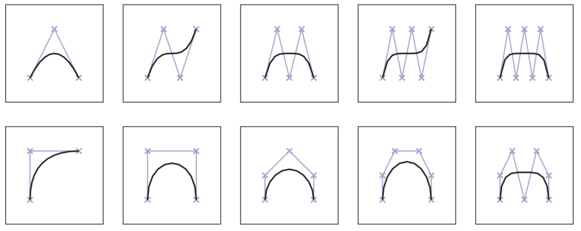
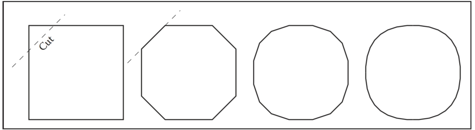
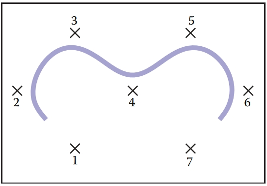
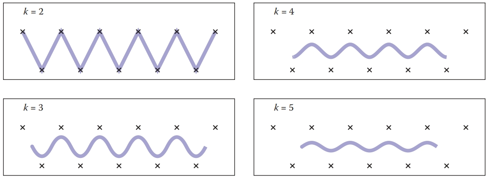

# 15 Curves

## 15.1 Curves 

Intuitively, think of a curve as something you can draw with a pen. The curve is the set of points that the pen traces over an interval of time. While we usually think of a pen writing on paper (e.g., a curve that is in a 2D space), the pen could move in 3D to generate a space curve, or you could imagine the pen moving in some other kind of space.

Mathematically, definitions of curve can be seen in at least two ways: 

1. the continuous image of some interval in an n-dimensional space; 
2. a continuous map from a one-dimensional space to an n-dimensional space. 

Both of these definitions start with the idea of an interval range (the time over which the pen traces the curve). However, there is a significant difference: in the first definition, the curve is the set of points the pen traces (the image), while in the second definition, the curve is the mapping between time and that set of points. For this chapter, we use the first definition. 

A curve is an infinitely large set of points. The points in a curve have the property that any point has two neighbors, except for a small number of points that have one neighbor (these are the endpoints). Some curves have no endpoints, either because they are infinite (like a line) or they are closed (loop around and connect to themselves).

Because the “pen” of the curve is thin (infinitesimally), it is difficult to create filled regions. While space-filling curves are possible (by having them fold over themselves infinitely many times), we do not consider such mathematical oddities here. Generally, we think of curves as the outlines of things, not the “insides.” 

The problem that we need to address is how to specify a curve—to give a name or representation to a curve so that we can represent it on a computer. For some curves, the problem of naming them is easy since they have known shapes: line segments, circles, elliptical arcs, etc. A general curve that does not have a “named” shape is sometimes called a free-form curve. Because a free-form curve can take on just about any shape, they are much harder to specify. 

There are three main ways to specify curves mathematically: 

1. **Implicit** curve representations define the set of points on a curve by giving a procedure that can test to see if a point in on the curve. Usually, an implicit curve representation is defined by an implicit function of the form
   $f(x, y)=0,$
   so that the curve is the set of points for which this equation is true. Note that the implicit function *f* is a scalar function (it returns a single real number).
2. **Parametric** curve representations provide a mapping from a free parameter to the set of points on the curve. That is, this free parameter provides an index to the points on the curve. The parametric form of a curve is a function that assigns positions to values of the free parameter. Intuitively, if you think of a curve as something you can draw with a pen on a piece of paper, the free parameter is time, ranging over the interval from the time that we began drawing the curve to the time that we finish. The parametric function of this curve tells us where the pen is at any instant in time:
   $(x, y) = \bold{f}(t) $
   Note that the parametric function is a vector-valued function. This example is a 2D curve, so the output of the function is a 2-vector; in 3D it would be a 3-vector.
3. **Generative or procedural** curve representations provide procedures that can generate the points on the curve that do not fall into the first two categories. Examples of generative curve descriptions include subdivision schemes and fractals.

Remember that a curve is a set of points. These representations give us ways to specify those sets. Any curve has many possible representations. For this reason, mathematicians typically are careful to distinguish between a curve and its representations. In computer graphics we are often sloppy, since we usually only refer to the representation, not the actual curve itself. So when someone says “an implicit curve,” they are either referring to the curve that is represented by some implicit function or to the implicit function that is one of the representations of some curve. Such distinctions are not usually important, unless we need to consider different representations of the same curve. We will consider different curve representations in this chapter, so we will be more careful. When we use a term like “polynomial curve,” we will mean the curve that can be represented by the polynomial.

By the definition given at the beginning of the chapter, for something to be a curve it must have a parametric representation. However, many curves have other representations. For example, a circle in 2D with its center at the origin and radius equal to 1 can be written in implicit form as
$f(x, y) = x^2 + y^2 - 1 = 0, $

or in parametric form as 
$(x, y) = \bold{f}(t) = (\cos t, \sin t), t ∈ [0, 2π). $

The parametric form need not be the most convenient representation for a given curve. In fact, it is possible to have curves with simple implicit or generative representations for which it is difficult to find a parametric representation. 

Different representations of curves have advantages and disadvantages. For example, parametric curves are much easier to draw, because we can sample the free parameter. Generally, parametric forms are the most commonly used in computer graphics since they are easier to work with. Our focus will be on parametric representations of curves. 

### 15.1.1 Parameterizations and Reparameterizations 

A parametric curve refers to the curve that is given by a specific parametric function over some particular interval. To be more precise, a parametric curve has a given function that is a mapping from an interval of the parameters. It is often convenient to have the parameter run over the unit interval from 0 to 1. When the free parameter varies over the unit interval, we often denote the parameter as u. 

If we view the parametric curve to be a line drawn with a pen, we can consider u = 0 as the time when the pen is first set down on the paper and the unit of time to be the amount of time it takes to draw the curve (u = 1 is the end of the curve).The curve can be specified by a function that maps time (in these unit coordinates) to positions. Basically, the specification of the curve is a function that can answer the question, “Where is the pen at time $u$?” 

If we are given a function $\bold{f}(t)$ that specifies a curve over interval $[a, b]$, we can easily define a new function $\bold{f}_2(u)$ that specifies the same curve over the unit interval. We can first define
$g(u) = a + (b - a)u, $
and then
$\bold{f}_2(u) = \bold{f}(g(u)). $
The two functions, $\bold{f}$ and $\bold{f}_2$ both represent the same curve; however, they provide different parameterizations of the curve. The process of creating a new parameterization for an existing curve is called reparameterization, and the mapping from old parameters to the new ones (g, in this example) is called the reparameterization function.

If we have defined a curve by some parameterization, infinitely many others exist (because we can always reparameterize). Being able to have multiple parameterizations of a curve is useful, because it allows us to create parameterizations that are convenient. However, it can also be problematic, because it makes it difficult to compare two functions to see if they represent the same curve. 

The essence of this problem is more general: the existence of the free parameter (or the element of time) adds an invisible, potentially unknown element to our representation of the curves. When we look at the curve after it is drawn, we don’t necessarily know the timing. The pen might have moved at a constant speed over the entire time interval, or it might have started slowly and sped up. For example, while u = 0.5 is halfway through the parameter space, it may not be halfway along the curve if the motion of the pen starts slowly and speeds up at the end. Consider the following representations of a very simple curve:
$$
(x, y) = \bold{f}(u) = (u, u), \\
(x, y) = \bold{f}(u) = (u^2, u^2), \\
(x, y) = \bold{f}(u) = (u^5, u^5).
$$
All three functions represent the same curve on the unit interval; however when $u$ is not 0 or 1, f(u) refers to a different point depending on the representation of the curve. 

If we are given a parameterization of a curve, we can use it directly as our specification of the curve, or we can develop a more convenient parameterization. Usually, the natural parameterization is created in a way that is convenient (or natural) for specifying the curve, so we don’t have to know about how the speed changes along the curve. 

If we know that the pen moves at a constant velocity, then the values of the free parameters have more meaning. Halfway through parameter space is halfway along the curve. Rather than measuring time, the parameter can be thought to measure length along the curve. Such parameterizations are called arc-length parameterizations because they define curves by functions that map from the distance along the curve (known as the arc length) to positions. We often use the variable s to denote an arc-length parameter. 

Technically, a parameterization is an arc-length parameterization if the magnitude of its tangent (that is, the derivative of the parameterization with respect to the parameter) has constant magnitude. Expressed as an equation,
$|\frac{d\bold{f}(s)}{ds}|^2 = c$

Computing the length along a curve can be tricky. In general, it is defined by the integral of the magnitude of the derivative (intuitively, the magnitude of the derivative is the velocity of the pen as it moves along the curve). So, given a value for the parameter v, you can compute s (the arc-length distance along the curve from the point $\bold{f}(0)$ to the point $\bold{f}(v)$) as
$$
s = \int^v_0|\frac{d\bold{f}(s)}{ds}|^2  dt\ \ \ \ \ (15.1)
$$
where $\bold{f}(t)$ is a function that defines the curve with a natural parameterization. Using the arc-length parameterization requires being able to solve Equation (15.1) for $t$, given $s$. For many of the kinds of curves we examine, it cannot be done in a closed-form (simple) manner and must be done numerically. 

Generally, we use the variable $u$ to denote free parameters that range over the unit interval, s to denote arc-length free parameters, and t to represent parameters that aren’t one of the other two.

### 15.1.2 Piecewise Parametric Representations 

For some curves, defining a parametric function that represents their shape is easy. For example, lines, circles, and ellipses all have simple functions that define the points they contain in terms of a parameter. For many curves, finding a function that specifies their shape can be hard. The main strategy that we use to create complex curves is divide-and-conquer: we break the curve into a number of simpler smaller pieces, each of which has a simple description.

For example, consider the curves in Figure 15.1. The first two curves are easily specified in terms of two pieces. In the case of the curve in Figure 15.1(b), we need two different kinds of pieces: a line segment and a circle. 

Figure 15.1. (a) A curve that can be easily represented as two lines; (b) a curve that can be easily represented as a line and a circular arc; (c) a curve approximating curve (b) with five line segments. 

To create a parametric representation of a compound curve (like the curve in Figure 15.1(b)), we need to have our parametric function switch between the functions that represent the pieces. If we define our parametric functions over the range 0 ≤ u ≤ 1, then the curve in Figures 15.1(a) or (b) might be defined as
$$
\bold{f}(u) = \begin{cases}
\bold{f}_1(2u)  \ \ \ \ \ \ \ \ \ \ \ if\ u ≤ 0.5, \\
\bold{f}_2(2u-1)\ \ \ \ if\ u> 0.5
\end{cases}
$$
where $\bold{f}_1$ is a parameterization of the first piece, $\bold{f}_2$ is a parameterization of the second piece, and both of these functions are defined over the unit interval. 

We need to be careful in defining the functions $\bold{f}_1$ and $\bold{f}_2$ to make sure that the pieces of the curve fit together. If $\bold{f}_1(1) ≠ \bold{f}_2(0)$, then our curve pieces will not connect and will not form a single continuous curve. 

To represent the curve in Figure 15.1(b), we needed to use two different types of pieces: a line segment and a circular arc. For simplicity’s sake, we may prefer to use a single type of piece. If we try to represent the curve in Figure 15.1(b) with only one type of piece (line segments), we cannot exactly re-create the curve (unless we use an infinite number of pieces). While the new curve made of line segments (as in Figure 15.1(c)) may not be exactly the same shape as in Figure 15.1(b), it might be close enough for our use. In such a case, we might prefer the simplicity of using the simpler line segment pieces to having a curve that more accurately represents the shape. 

Also, notice that as we use an increasing number of pieces, we can get a better approximation. In the limit (using an infinite number of pieces), we can exactly represent the original shape.

One advantage to using a piecewise representation is that it allows us to make a tradeoff between 

1. how well our represented curve approximates the real shape we are trying to represent; 

2. how complicated the pieces that we use are; 
3. how many pieces we use. 

So, if we are trying to represent a complicated shape, we might decide that a crude approximation is acceptable and use a small number of simple pieces. To improve the approximation, we can choose between using more pieces and using more complicated pieces. 

In computer graphics practice, we tend to prefer using relatively simple curve pieces (either line segments, arcs, or polynomial segments). 

### 15.1.3 Splines 

Before computers, when draftsmen wanted to draw a smooth curve, one tool they employed was a stiff piece of metal that they would bend into the desired shape for tracing. Because the metal would bend, not fold, it would have a smooth shape. The stiffness meant that the metal would bend as little as possible to make the desired shape. This stiff piece of metal was called a spline. 

Mathematicians found that they could represent the curves created by a draftman’s spline with piecewise polynomial functions. Initially, they used the term spline to mean a smooth, piecewise polynomial function. More recently, the term spline has been used to describe any piecewise polynomial function. We prefer this latter definition. 

For us, a spline is a piecewise polynomial function. Such functions are very useful for representing curves.

## 15.2 Curve Properties 

To describe a curve, we need to give some facts about its properties. For “named” curves, the properties are usually specific according to the type of curve. For example, to describe a circle, we might provide its radius and the position of its center. For an ellipse, we might also provide the orientation of its major axis and the ratio of the lengths of the axes. For free-form curves however, we need to have a more general set of properties to describe individual curves.

Some properties of curves are attributed to only a single location on the curve, while other properties require knowledge of the whole curve. For an intuition of the difference, imagine that the curve is a train track. If you are standing on the track on a foggy day, you can tell that the track is straight or curved and whether or not you are at an endpoint. These are local properties. You cannot tell whether or not the track is a closed curve, or crosses itself, or how long it is. We call this type of property, a global property. 

The study of local properties of geometric objects (curves and surfaces) is known as differential geometry. Technically, to be a differential property, there are some mathematical restrictions about the properties (roughly speaking, in the train-track analogy, you would not be able to have a GPS or a compass). Rather than worry about this distinction, we will use the term local property rather than differential property. 

Local properties are important tools for describing curves because they do not require knowledge about the whole curve. Local properties include 

- continuity, 
- position at a specific place on the curve, 
- direction at a specific place on the curve, 
- curvature (and other derivatives). 

Often, we want to specify that a curve includes a particular point. A curve is said to interpolate a point if that point is part of the curve. A function f interpolates a value v if there is some value of the parameter u for which $f(t) = v$. We call the place of interpolation, that is the value of t, the site.

### 15.2.1 Continuity 

It will be very important to understand the local properties of a curve where two parametric pieces come together. If a curve is defined using an equation like Equation (15.2), then we need to be careful about how the pieces are defined. If $\bold{f}_1(1) ≠ \bold{f}_2(0)$, then the curve will be “broken”—we would not be able to draw the curve in a continuous stroke of a pen. We call the condition that the curve pieces fit together continuity conditions because if they hold, the curve can be drawn as a continuous piece. Because our definition of ”curve” at the beginning of the chapter requires a curve to be continuous, technically a ”broken curve” is not a curve.

In addition to the positions, we can also check that the derivatives of the pieces match correctly. If $\bold{f}'_1(1) ≠ \bold{f}'_2(0)$, then the combined curve will have an abrupt change in its first derivative at the switching point; the first derivative will not be continuous. In general, we say that a curve is $C^n$ continuous if all of its derivatives up to n match across pieces. We denote the position itself as the zeroth derivative, so that the $C^0$ continuity condition means that the positions of the curve are continuous, and $C^1$ continuity means that positions and first derivatives are continuous. The definition of curve requires the curve to be $C^0$. 

An illustration of some continuity conditions is shown in Figure 15.2. A discontinuity in the first derivative (the curve is $C^0$ but not $C^1$) is usually noticeable because it displays a sharp corner. A discontinuity in the second derivative is sometimes visually noticeable. Discontinuities in higher derivatives might matter, depending on the application. For example, if the curve represents a motion, an abrupt change in the second derivative is noticeable, so third derivative continuity is often useful. If the curve is going to have a fluid flowing over it (for example, if it is the shape for an airplane wing or boat hull), a discontinuity in the fourth or fifth derivative might cause turbulence. 

Figure 15.2. An illustration of various types of continuity between two curve segments. 

The type of continuity we have just introduced ($C^n$) is commonly referred to as parametric continuity as it depends on the parameterization of the two curve pieces. If the “speed” of each piece is different, then they will not be continuous. For cases where we care about the shape of the curve, and not its parameterization, we define geometric continuity that requires that the derivatives of the curve pieces match when the curves are parameterized equivalently (for example, using an arc-length parameterization). Intuitively, this means that the corresponding derivatives must have the same direction, even if they have different magnitudes.

So, if the $C^1$ continuity condition is 
$\bold{f}'_1(1) = \bold{f}'_2(0), $
the $G^1$ continuity condition would be 
$\bold{f}’_1(1) = k\bold{f}'_2(0), $
for some value of scalar $k$. Generally, geometric continuity is less restrictive than parametric continuity. A $C^n$ curve is also $G^n$ except when the parametric derivatives vanish.

## 15.3 Polynomial Pieces 

The most widely used representations of curves in computer graphics is done by piecing together basic elements that are defined by polynomials and called polynomial pieces. For example, a line element is given by a linear polynomial. In Section 15.3.1, we give a formal definition and explain how to put pieces of polynomial together.

### 15.3.1 Polynomial Notation

Polynomials are functions of the form 
$$
f(t) = a_0 + a_1t + a_2t^2 + . . . + a_nt^n.\ \ \ \  (15.3)
$$
The $a_i$ are called the coefficients, and $n$ is called the degree of the polynomial if $a_n ≠ 0$. We also write Equation (15.3) in the form  
$$
\bold{f}(t) = \sum^n_{i=0}\bold{a}_it^i. \ \ \ \ (15.4)
$$
We call this the canonical form of the polynomial.

We can generalize the canonical form to  
$$
\bold{f}(t) = \sum^n_{i = 0}\bold{c}_ib_i(t) \ \ \ \ \ \ (15.5)
$$
where $b_i(t)$ is a polynomial. We can choose these polynomials in a convenient form for different applications, and we call them basis functions or blending functions (see Section 15.3.5). In Equation (15.4), the $t^i$ are the $b_i(t)$ of Equation (15.5). If the set of basis functions is chosen correctly, any polynomial of degree $n + 1$ can be represented by an appropriate choice of $\bold{c}$.

The canonical form does not always have convenient coefficients. For practical purposes, throughout this chapter, we will find sets of basis functions such that the coefficients are convenient ways to control the curves represented by the polynomial functions. 

To specify a curve embedded in two dimensions, one can either specify two polynomials in t: one for how x varies with t and one for how y varies with t; or specify a single polynomial where each of the ai is a 2D point. An analogous situation exists for any curve in an n-dimensional space.

### 15.3.2 A Line Segment 

To introduce the concepts of piecewise polynomial curve representations, we will discuss line segments. In practice, line segments are so simple that the mathematical derivations will seem excessive. However, by understanding this simple case, things will be easier when we move on to more complicated polynomials. 

Consider a line segment that connects point $\bold{p}_0$ to $\bold{p}_1$. We could write the parametric function over the unit domain for this line segment as
$$
\bold{f}(u) = (1 − u)\bold{p}_0 + u\bold{p}_1.\ \ \ \ \ (15.6)
$$
By writing this in vector form, we have hidden the dimensionality of the points and the fact that we are dealing with each dimension separately. For example, were we working in 2D, we could have created separate equations:
$$
f_x(u) = (1 − u)x_0 + ux_1, \\
f_y(u) = (1 − u)y_0 + uy_1.
$$
The line that we specify is determined by the two endpoints, but from now on we will stick to vector notation since it is cleaner. We will call the vector of control parameters, $\bold{p}$, the control points, and each element of $\bold{p}$, a control point. 

While describing a line segment by the positions of its endpoints is obvious and usually convenient, there are other ways to describe a line segment. For example,

1. the position of the center of the line segment, the orientation, and the length;
2. the position of one endpoint and the position of the second point relative to the first;
3. the position of the middle of the line segment and one endpoint.  

It is obvious that given one kind of a description of a line segment, we can switch to another one. 

A different way to describe a line segment is using the canonical form of the polynomial (as discussed in Section 15.3.1),
$$
\bold{f}(u) = \bold{a}_0 + u\bold{a}_1. (15.7)
$$
Any line segment can be represented either by specifying $\bold{a}_0$ and $\bold{a}_1$ or the endpoints ($\bold{p}_0$ and $\bold{p}_1$). It is usually more convenient to specify the endpoints, because we can compute the other parameters from the endpoints. 

To write the canonical form as a vector expression, we define a vector u that is a vector of the powers of $u$:
$\bold{u} = [1\ u\ u^2\ u^3\ ...\ u^n],$
so that Equation (15.4) can be written as
$$
\bold{f}(u) = \bold{u} · \bold{a}.\ \ \ \ \ \  (15.8)
$$
This vector notation will make transforming between different forms of the curve easier. 

Equation (15.8) describes a curve segment by the set of polynomial coefficients for the simple form of the polynomial. We call such a representation the canonical form. We will denote the parameters of the canonical form by $\bold{a}$. 

While it is mathematically simple, the canonical form is not always the most convenient way to specify curves. For example, we might prefer to specify a line segment by the positions of its endpoints. If we want to define $\bold{p}_0$ to be the beginning of the segment (where the segment is when $u = 0$) and $\bold{p}_1$ to be the end of the line segment (where the line segment is at $u = 1$), we can write
$$
\bold{p}_0 = \bold{f}(0) = [1\ 0] · [\bold{a}_0\ \bold{a}_1], \\
\bold{p}_1 = \bold{f}(1) = [1\ 1] · [\bold{a}_0\ \bold{a}_1], \\
(15.9)
$$
We can solve these equations for $\bold{a}_0$ and $\bold{a}_1$: 
$$
\bold{a}_0 = \bold{p}_0, \\
\bold{a}_1 = \bold{p}_1 − \bold{p}_0.
$$

#### Matrix Form for Polynomials

While this first example was easy enough to solve, for more complicated examples it will be easier to write Equation (15.9) in the form
$$
\begin{bmatrix}
\bold{p}_0 \\
\bold{p}_1
\end{bmatrix} = \begin{bmatrix}
1 & 0 \\
1 & 1
\end{bmatrix} 
\begin{bmatrix}
\bold{a}_0 \\
\bold{a}_1
\end{bmatrix}
$$
Alternatively, we can write 
$$
\bold{p} = \bold{C}\bold{a},\ \ \  (15.10)
$$

where we call $\bold{C}$, the constraint matrix(We assume the form of a vector (row or column) is obvious from the context, and we will skip all of the transpose symbols for vectors. ). If having vectors of points bothers you, you can consider each dimension independently (so that $\bold{p}$ is $[x_0\ x_1]$ or $[y_0\ y_1]$ and a is handled correspondingly). 

We can solve Equation (15.10) for a by finding the inverse of $\bold{C}$. This inverse matrix which we will denote by $\bold{B}$ is called the basis matrix. The basis matrix is very handy since it tells us how to convert between the convenient parameters $\bold{p}$ and the canonical form $\bold{a}$, and, therefore, gives us an easy way to evaluate the curve
$\bold{f}(u) = \bold{u} \bold{B} \bold{p}. $

We can find a basis matrix for whatever form of the curve that we want, providing that there are no nonlinearities in the definition of the parameters. Examples of nonlinearly defined parameters include the length and angle of the line segment. 

Now, suppose we want to parameterize the line segment so that $\bold{p}_0$ is the halfway point $(u = 0.5)$, and $\bold{p}_1$ is the ending point $(u = 1)$. To derive the basis matrix for this parameterization, we set
$$
\bold{p}_0 = \bold{f}(0.5) = 1 \bold{a}_0 + 0.5 \bold{a}_1, \\
\bold{p}_1 = \bold{f}(1) = 1 \bold{a}_0 + 1 \bold{a}_1.
$$
So 
$$
\bold{C} = \begin{bmatrix}
1 & 5 \\
1 & 1
\end{bmatrix}
$$
and therefore
$$
\bold{B} = \bold{C}^{-1} = \begin{bmatrix}
2 & -1 \\
-2 & 2
\end{bmatrix}
$$

### 15.3.3 Beyond Line Segments 

Line segments are so simple that finding a basis matrix is trivial. However, it was good practice for curves of higher degree. First, let’s consider quadratics (curves of degree two). The advantage of the canonical form (Equation (15.4)) is that it works for these more complicated curves, just by letting n be a larger number.

A quadratic (a degree-two polynomial) has three coefficients, $\bold{a}_0$, $\bold{a}_1$, and $\bold{a}_2$. These coefficients are not convenient for describing the shape of the curve. However, we can use the same basis matrix method to devise more convenient parameters. If we know the value of $u$, Equation (15.4) becomes a linear equation in the parameters, and the linear algebra from the last section still works. 

Suppose that we wanted to describe our curves by the position of the beginning $(u = 0)$, middle(Notice that this is the middle of the parameter space, which might not be the middle of the curve itself. ) $(u = 0.5)$, and end $(u = 1)$. Entering the appropriate values into Equation (15.4):
$$
\bold{p}0 = \bold{f}(0) = \bold{a}_0 + 0^1 \bold{a}_1 + 0^2 \bold{a}_2, \\
p1 = f(0.5) = \bold{a}_0 + 0.5^1 \bold{a}_1 + 0.5^2 \bold{a}_2, \\
p2 = f(1) = \bold{a}_0 + 1^1 \bold{a}_1 + 1^2 \bold{a}_2.
$$
So the constraint matrix is 
$$
\bold{C} = \begin{bmatrix}
1 & 0 & 0 \\
1 & 0.5 & 0.25 \\
1 & 1 & 1
\end{bmatrix}
$$
and the basis matrix is 
$$
\bold{B} = \bold{C}^{-1} = \begin{bmatrix}
1 & 0 & 0 \\
-3 & 4 & -1 \\
2 & -4 & 2
\end{bmatrix}
$$
There is an additional type of constraint (or parameter) that is sometimes convenient to specify: the derivative of the curve (with respect to its free parameter) at a particular value. Intuitively, the derivatives tell us how the curve is changing, so that the first derivative tells us what direction the curve is going, the second derivative tells us how quickly the curve is changing direction, etc. We will see examples of why it is useful to specify derivatives later. 

For the quadratic
$\bold{f}(u) = \bold{a}_0 + \bold{a}_1u + \bold{a}_2u^2, $

the derivatives are simple: 
$\bold{f}'(u) = \frac{d\bold{f}}{du} = \bold{a}_1 + 2\bold{a}_2u, $

and
$$
\bold{f}''(u) = \frac{d^2\bold{f}}{du^2}= \frac{d\bold{f}'}{du} = 2\bold{a}_2 \\
\bold{f}'(u) = \sum^n_{i = 1} iu^{i - 1} \bold{a}_i \\
\bold{f}''(u) = \sum^n_{i = 2}i(i-1)u^{i-2}\bold{a}_i
$$
For example, consider a case where we want to specify a quadratic curve segment by the position, first, and second derivative at its middle $(u = 0.5)$. 
$$
\bold{p}_0 = \bold{f}(0.5) = \bold{a}_0+ 0.5^1 \bold{a}_1+ 0.5^2 \bold{a}_2, \\
\bold{p}_1 = \bold{f}'(0.5) = \bold{a}_1+ 2 0.5 \bold{a}_2, \\
\bold{p}_2 = \bold{f}''(0.5) = 2 \bold{a}_2.
$$
The constraint matrix is 
$$
\bold{C} = \begin{bmatrix}
1 & 0.5 & 0.25 \\
0 & 1 & 1 \\
0 & 0 & 2 
\end{bmatrix}
$$
and the basis matrix is
$$
\bold{B} = \bold{C}^{-1} = \begin{bmatrix}
1 & -0.5 & 0.125 \\
0 & 1 & -0.5 \\
0 & 0 & 0.5
\end{bmatrix}
$$

### 15.3.4 Basis Matrices for Cubics 

Cubic polynomials are popular in graphics (See Section 15.5). The derivations for the various forms of cubics are just like the derivations we’ve seen already in this section. We will work through one more example for practice. 

A very useful form of a cubic polynomial is the Hermite form, where we specify the position and first derivative at the beginning and end, that is,
$$
\bold{p}_0 = \bold{f}(0) = \bold{a}_0 + 0^1 \bold{a}_1 + 0^2 \bold{a}_2+ 0^3 \bold{a}_3, \\
\bold{p}_1 = \bold{f}'(0) = \bold{a}_1 +2\ 0^1 \bold{a}_2+ 3\ 0^2 \bold{a}_3, \\
\bold{p}_2 = \bold{f}(1) = \bold{a}_0 + 1^1 \bold{a}_1 + 1^2 \bold{a}_2+ 1^3 \bold{a}_3, \\
\bold{p}_3 = \bold{f}'(1) = \bold{a}_1 +2\ 1^1 \bold{a}_2+ 3\ 1^2 \bold{a}_3. \\
$$
Thus, the constraint matrix is 
$$
\bold{C} = \begin{bmatrix}
1 & 0 & 0 & 0 \\
0 & 1 & 0 & 0 \\
1 & 1 & 1 & 1 \\
0 & 1 & 2 & 3
\end{bmatrix}
$$
and the basis matrix is 
$$
\bold{B} = \bold{C}^{-1} = \begin{bmatrix}
1 & 0 & 0 & 0 \\
0 & 1 & 0 & 0 \\
-3 & -2 & 3 & -1 \\
2 & 1 & -2 & 1
\end{bmatrix}
$$
We will discuss Hermite cubic splines in Section 15.5.2. 

### 15.3.5 Blending Functions

If we know the basis matrix, $\bold{B}$, we can multiply it by the parameter vector, $\bold{u}$, to get a vector of functions 
$\bold{b}(u) = \bold{u} \bold{B}. $

Notice that we denote this vector by $\bold{b}(u)$ to emphasize the fact that its value depends on the free parameter u. We call the elements of $\bold{b}(u)$ the blending functions, because they specify how to blend the values of the control point vector together:
$$
\bold{f}(u) = \sum^n_{i=0}\bold{b}_i(u)\bold{p}_i \ \ \ \ \ (15.11)
$$
It is important to note that for a chosen value of $u$, Equation (15.11) is a linear equation specifying a linear blend (or weighted average) of the control points. This is true no matter what degree polynomials are “hidden” inside of the $\bold{b}_i$ functions. 

Blending functions provide a nice abstraction for describing curves. Any type of curve can be represented as a linear combination of its control points, where those weights are computed as some arbitrary functions of the free parameter.

### 15.3.6 Interpolating Polynomials 

In general, a polynomial of degree n can interpolate a set of $n + 1$ values. If we are given a vector $\bold{p} = (p_0, . . . , p_n)$ of points to interpolate and a vector $\bold{t} = (t_0, . . . , t_n)$ of increasing parameter values, $t_i ≠ t_j$, we can use the methods described in the previous sections to determine an $n + 1 × n + 1$ basis matrix that gives us a function $f(t)$ such that $f(t_i) = p_i$. For any given vector $\bold{t}$, we need to set up and solve an $n = 1 × n + 1$ linear system. This provides us with a set of $n + 1$ basis functions that perform interpolation:
$$
\bold{f}(t) = \sum^n_{i = 0}\bold{p}_ib_i(t)
$$
These interpolating basis functions can be derived in other ways. One particularly elegant way to define them is the Lagrange form: 
$$
b_i = \prod^n_{j=0,j≠i}\frac{x-t_j}{t_i-t_j} \ \ \ \ \ (15.12)
$$
There are more computationally efficient ways to express the interpolating basis functions than the Lagrange form (see De Boor (1978) for details). 

Interpolating polynomials provide a mechanism for defining curves that interpolate a set of points. Figure 15.3 shows some examples. While it is possible to create a single polynomial to interpolate any number of points, we rarely use high-order polynomials to represent curves in computer graphics. Instead, interpolating splines (piecewise polynomial functions) are preferred. Some reasons for this are considered in Section 15.5.3.

Figure 15.3. Interpolating polynomials through multiple points. Notice the extra wiggles and over-shooting between points. In (c), when the sixth point is added, it completely changes the shape of the curve due to the non-local nature of interpolating polynomials.

## 15.4 Putting Pieces Together 

Now that we’ve seen how to make individual pieces of polynomial curves, we can consider how to put these pieces together. 

### 15.4.1 Knots 

The basic idea of a piecewise parametric function is that each piece is only used over some parameter range. For example, if we want to define a function that has two piecewise linear segments that connect three points (as shown in Figure 15.4(a)), we might define
$$
\bold{f}(u) = \begin{cases}
\bold{f}_1(2u) \ \ \ \ \ \ \ \ \ \ if\ 0 ≤ u < \frac{1}{2} \\
\bold{f}_2(2u - 1) \ \ \ if\ \frac{1}{2} ≤ u < 1 \\
\end{cases} \\
(15.13)
$$
where $\bold{f}_1$ and $\bold{f}_2$ are functions for each of the two line segments. Notice that we have rescaled the parameter for each of the pieces to facilitate writing their equations as
$\bold{f}_1(u) = (1 - u)\bold{p}_1 + u\bold{p}_2.  $

Figure 15.4. (a) Two line segments connect three points; (b) the blending functions for each of the points are graphed at right.  

For each polynomial in our piecewise function, there is a site (or parameter value) where it starts and ends. Sites where a piece function begins or ends are called knots. For the example in Equation (15.13), the values of the knots are 0, 0.5, and 1. 

We may also write piecewise polynomial functions as the sum of basis functions, each scaled by a coefficient. For example, we can rewrite the two line segments of Equation (15.13) as
$$
\bold{f}(u) = \bold{p}_1b_1(u) + \bold{p}_2b_2(u) + \bold{p}_3b_3(u),\ \ \ \  (15.14)
$$
where the function $b_1(u)$ is defined as 
$$
b_1(u) = \begin{cases}
1 - 2u \ \ \ \ \ if\ 0 ≤  u < \frac{1}{2} \\
0 \  \ \ \ \ \ \  \ \  \ \  \ \ \ otherwise
\end{cases}
$$
and $b_2$ and $b_3$ are defined similarly. These functions are plotted in Figure 15.4(b).  

The knots of a polynomial function are the combination of the knots of all of the pieces that are used to create it. The knot vector is a vector that stores all of the knot values in ascending order. 

Notice that in this section we have used two different mechanisms for combining polynomial pieces: using independent polynomial pieces for different ranges of the parameter and blending together piecewise polynomial functions.

### 15.4.2 Using Independent Pieces 

In Section 15.3, we defined pieces of polynomials over the unit parameter range. If we want to assemble these pieces, we need to convert from the parameter of the overall function to the value of the parameter for the piece. The simplest way to do this is to define the overall curve over the parameter range [0, n] where n is the number of segments. Depending on the value of the parameter, we can shift it to the required range. 

### 15.4.3 Putting Segments Together 

If we want to make a single curve from two line segments, we need to make sure that the end of the first line segment is at the same location as the beginning of the next. There are three ways to connect the two segments (in order of simplicity): 

1. Represent the line segment as its two endpoints, and then use the same point for both. We call this a shared-point scheme. 
2. Copy the value of the end of the first segment to the beginning of the second segment every time that the parameters of the first segment change. We call this a dependency scheme. 
3. Write an explicit equation for the connection, and enforce it through numerical methods as the other parameters are changed. 

While the simpler schemes are preferable since they require less work, they also place more restrictions on the way the line segments are parameterized. For example, if we want to use the center of the line segment as a parameter (so that the user can specify it directly), we will use the beginning of each line segment and the center of the line segment as their parameters. This will force us to use the dependency scheme. 

Notice that if we use a shared-point or dependency scheme, the total number of control points is less than n ∗ m, where n is the number of segments and m is the number of control points for each segment; many of the control points of the independent pieces will be computed as functions of other pieces. Notice that if we use either the shared-point scheme for lines (each segment uses its two endpoints as parameters and shares interior points with its neighbors), or if we use the dependency scheme (such as the example one with the first endpoint and midpoint), we end up with n + 1 controls for an n-segment curve. 

Dependency schemes have a more serious problem. A change in one place in the curve can propagate through the entire curve. This is called a lack of locality. Locality means that if you move a point on a curve it will only affect a local region. The local region might be big, but it will be finite. If a curve’s controls do not have locality, changing a control point may affect points infinitely far away. 

To see locality, and the lack thereof, in action, consider two chains of line segments, as shown in Figure 15.5. One chain has its pieces parameterized by their endpoints and uses point-sharing to maintain continuity. The other has its pieces parameterized by an endpoint and midpoint and uses dependency propagation to keep the segments together. The two segment chains can represent the same curves: they are both a set of n connected line segments. However, because of locality issues, the endpoint-shared form is likely to be more convenient for the user. Consider changing the position of the first control point in each chain. For the endpoint-shared version, only the first segment will change, while all of the segments will be affected in the midpoint version, as in Figure 15.5. In fact, for any point moved in the endpoint-shared version, at most two line segments will change. In the midpoint version, all segments after the control point that is moved will change, even if the chain is infinitely long. 

Figure 15.5. A chain of line segments with local control and one with non-local control.  

In this example, the dependency propagation scheme was the one that did not have local control. This is not always true. There are direct sharing schemes that are not local and propagation schemes that are local. 

We emphasize that locality is a convenience of control issue. While it is inconvenient to have the entire curve change every time, the same changes can be made to the curve. It simply requires moving several points in unison. 

## 15.5 Cubics 

In graphics, when we represent curves using piecewise polynomials, we usually use either line segments or cubic polynomials for the pieces. There are a number of reasons why cubics are popular in computer graphics: 

- Piecewise cubic polynomials allow for $C^2$ continuity, which is generally sufficient for most visual tasks. The $C^1$ smoothness that quadratics offer is often insufficient. The greater smoothness offered by higher-order polynomials is rarely important. 
- Cubic curves provide the minimum-curvature interpolants to a set of points. That is, if you have a set of n + 3 points and define the “smoothest” curve that passes through them (that is the curve that has the minimum curvature over its length), this curve can be represented as a piecewise cubic with n segments.
- Cubic polynomials have a nice symmetry where position and derivative can be specified at the beginning and end. 
- Cubic polynomials have a nice tradeoff between the numerical issues in computation and the smoothness. 

Notice that we do not have to use cubics; they just tend to be a good tradeoff between the amount of smoothness and complexity. Different applications may have different tradeoffs. We focus on cubics since they are the most commonly used. 

The canonical form of a cubic polynomial is
$\bold{f}(u) = \bold{a}_0 + \bold{a}_1 u + \bold{a}_2 u^2 + \bold{a}_3 u^3.  $

As we discussed in Section 15.3, these canonical form coefficients are not a convenient way to describe a cubic segment. 

We seek forms of cubic polynomials for which the coefficients are a convenient way to control the resulting curve represented by the cubic. One of the main conveniences will be to provide ways to ensure the connectedness of the pieces and the continuity between the segments. 

Each cubic polynomial piece requires four coefficients or control points. That means for a piecewise polynomial with n pieces, we may require up to 4n control points if no sharing between segments is done or dependencies used. More often, some part of each segment is either shared or depends on an adjacent segment, so the total number of control points is much lower. Also, note that a control point might be a position or a derivative of the curve. 

Unfortunately, there is no single “best” representation for a piecewise cubic. It is not possible to have a piecewise polynomial curve representation that has all of the following desirable properties: 

1. each piece of the curve is a cubic; 
2. the curve interpolates the control points; 
3. the curve has local control; 
4. the curve has $C^2$ continuity. 

We can have any three of these properties, but not all four; there are representations that have any combination of three. In this book, we will discuss cubic B-splines that do not interpolate their control points (but have local control and are $C^2$); Cardinal splines and Catmull-Rom splines that interpolate their control points and offer local control, but are not $C^2$; and natural cubics that interpolate and are $C^2$, but do not have local control. 

The continuity properties of cubics refer to the continuity between the segments (at the knot points). The cubic pieces themselves have infinite continuity in their derivatives (the way we have been talking about continuity so far). Note that if you have a lot of control points (or knots), the curve can be wiggly, which might not seem “smooth.” 

### 15.5.1 Natural Cubics 

With a piecewise cubic curve, it is possible to create a $C^2$ curve. To do this, we need to specify the position and first and second derivative at the beginning of each segment (so that we can make sure that it is the same as at the end of the previous segment). Notice that each curve segment receives three out of its four parameters from the previous curve in the chain. These $C^2$ continuous chains of cubics are sometimes referred to as natural cubic splines. 

For one segment of the natural cubic, we need to parameterize the cubic by the positions of its endpoints and the first and second derivative at the beginning point. The control points are therefore
$$
\bold{p}_0 = \bold{f}(0) = \bold{a}_0 + 0^1\bold{a}_1 + 0^2 \bold{a}_2 + 0^3 \bold{a}_3, \\
\bold{p}_1 = \bold{f}'(0) = 1^1\bold{a}_1 +2\ 0^1 \bold{a}_2 +3\ 0^2 \bold{a}_3, \\
\bold{p}_2 = \bold{f}''(0) = 2\ 1^1\bold{a}_2 +6\ 0^1 \bold{a}_3, \\
\bold{p}_3 = \bold{f}(1) = \bold{a}_0 + 1^1 \bold{a}_1 + 1^2 \bold{a}_2 + 1^3 \bold{a}_3.
$$
Therefore, the constraint matrix is 
$$
\bold{C} = \begin{bmatrix}
1 & 0 & 0 & 0 \\
0 & 1 & 0 & 0 \\
0 & 0 & 2 & 0 \\
1 & 1 & 1 & 1
\end{bmatrix}
$$
and the basis matrix is  
$$
\bold{B} = \bold{C}^{-1} = \begin{bmatrix}
1 & 0 & 0 & 0 \\
0 & 1 & 0 & 0 \\
0 & 0 & .5 & 0 \\
−1 & −1 & −.5 & 1
\end{bmatrix}
$$
Given a set of n control points, a natural cubic spline has n−1 cubic segments. The first segment uses the control points to define its beginning position, ending position, and first and second derivative at the beginning. A dependency scheme copies the position, and first and second derivative of the end of the first segment for use in the second segment. 

A disadvantage of natural cubic splines is that they are not local. Any change in any segment may require the entire curve to change (at least the part after the change was made). To make matters worse, natural cubic splines tend to be ill-conditioned: a small change at the beginning of the curve can lead to large changes later. Another issue is that we only have control over the derivatives of the curve at its beginning. Segments after the beginning of the curve determine their derivatives from their beginning point. 

### 15.5.2 Hermite Cubics 

Hermite cubic polynomials were introduced in Section 15.3.4. A segment of a cubic Hermite spline allows the positions and first derivatives of both of its endpoints to be specified. A chain of segments can be linked into a $C^1$ spline by using the same values for the position and derivative of the end of one segment and for the beginning of the next. 

Given a set of n control points, where every other control point is a derivative value, a cubic Hermite spline contains $(n−2)/2$ cubic segments. The spline interpolates the points, as shown in Figure 15.6, but can guarantee only $C^1$ continuity. 

Figure 15.6. A Hermite cubic spline made up of three segments.  

Hermite cubics are convenient because they provide local control over the shape, and provide $C^1$ continuity. However, since the user must specify both positions and derivatives, a special interface for the derivatives must be provided. One possibility is to provide the user with points that represent where the derivative vectors would end if they were “placed” at the position point. 

### 15.5.3 Cardinal Cubics 

A cardinal cubic spline is a type of $C^1$ interpolating spline made up of cubic polynomial segments. Given a set of n control points, a cardinal cubic spline uses n − 2 cubic polynomial segments to interpolate all of its points except for the first and last. 

Cardinal splines have a parameter called tension that controls how “tight” the curve is between the points it interpolates. The tension is a number in the range [0, 1) that controls how the curve bends toward the next control point. For the important special case of t = 0, the splines are called Catmull-Rom splines.

Each segment of the cardinal spline uses four control points. For segment i, the points used are $i, i + 1, i + 2,$ and $i + 3$ as the segments share three points with their neighbors. Each segment begins at its second control point and ends at its third control point. The derivative at the beginning of the curve is determined by the vector between the first and third control points, while the derivative at the end of the curve is given by the vector between the second and fourth points, as shown in Figure 15.7.

Figure 15.7. A segment of a cardinal cubic spline interpolates its second and third control points ($\bold{p}_2$ and $\bold{p}_3$), and uses its other points to determine the derivatives at the beginning and end.

The tension parameter adjusts how much the derivatives are scaled. Specifically, the derivatives are scaled by (1 − t)/2. The constraints on the cubic are therefore
$$
\bold{f}(0) = \bold{p}_2, \\
\bold{f}(1) = \bold{p}_3, \\
\bold{f}'(0) = \frac{1}{2}(1 − t)(\bold{p}_3 − \bold{p}_1), \\
\bold{f}'(1) = \frac{1}{2}(1 − t)(\bold{p}_4 − \bold{p}_2).
$$
Solving these equations for the control points (defining $s = (1 - t)/2$) gives  
$$
\bold{p}_0 = \bold{f}(1) − \frac{2}{1-t}\bold{f}'(0) = \bold{a}_0 +(1 − \frac{1}{s} ) \bold{a}_1 + \bold{a}_2 + \bold{a}_3, \\
\bold{p}_1 = \bold{f}(0) = \bold{a}_0, \\
\bold{p}_2 = \bold{f}(1) = \bold{a}_0 + \bold{a}_1 + \bold{a}_2 + \bold{a}_3, \\
\bold{p}_3 = \bold{f}(0) + \frac{1}{s}\bold{f}'(1) = \bold{a}_0 + \frac{1}{s}\bold{a}_1 + 2\frac{1}{s}\bold{a}_2 + 3\frac{1}{s}\bold{a}_3.
$$
This yields the cardinal matrix 
$$
\bold{B} = \bold{C}^{-1} = \begin{bmatrix}
0 & 1 & 0 & 0 \\
−s & 0 & s & 0 \\
2s & s − 3 & 3 − 2s & −s \\
−s & 2 − s & s − 2 & s
\end{bmatrix}
$$
Since the third point of segment i is the second point of segment $i+1$, adjacent segments of the cardinal spline connect. Similarly, the same points are used to specify the first derivative of each segment, providing $C^1$ continuity. 

Cardinal splines are useful, because they provide an easy way to interpolate a set of points with $C^1$ continuity and local control. They are only $C^1$, so they sometimes get “kinks” in them. The tension parameter gives some control over what happens between the interpolated points, as shown in Figure 15.8, where a set of cardinal splines through a set of points is shown. The curves use the same control points, but they use different values for the tension parameters. Note that the first and last control points are not interpolated. 

Figure 15.8. Cardinal splines through seven control points with varying values of tension parameter t.  

Given a set of n points to interpolate, you might wonder why we might prefer to use a cardinal cubic spline (that is a set of n − 2 cubic pieces) rather than a single, order n polynomial as described in Section 15.3.6. Some of the disadvantages of the interpolating polynomial are:

- The interpolating polynomial tends to overshoot the points, as seen in Figure 15.9. This overshooting gets worse as the number of points grows larger. The cardinal splines tend to be well behaved in between the points. 
  
  Figure 15.9. Splines interpolating nine control points (marked with small crosses). The thick orange line shows an interpolating polynomial. The thin line shows a Catmull-Rom spline. The latter is made of seven cubic segments, which are each shown in alternating blue tones.
- Control of the interpolating polynomial is not local. Changing a point at the beginning of the spline affects the entire spline. Cardinal splines are local: any place on the spline is affected by its four neighboring points at most. 
- Evaluation of the interpolating polynomial is not local. Evaluating a point on the polynomial requires access to all of its points. Evaluating a point on the piecewise cubic requires a fixed small number of computations, no matter how large the total number of points is.

There are a variety of other numerical and technical issues in using interpolating splines as the number of points grows larger. See De Boor (2001) for more information. 

A cardinal spline has the disadvantage that it does not interpolate the first or last point, which can be easily fixed by adding an extra point at either end of the sequence. The cardinal spline also is not as continuous—providing only C1 continuity at the knots.

## 15.6 Approximating Curves 

It might seem like the easiest way to control a curve is to specify a set of points for it to interpolate. In practice, however, interpolation schemes often have undesirable properties because they have less continuity and offer no control of what happens between the points. Curve schemes that only approximate the points are often preferred. With an approximating scheme, the control points influence the shape of the curve, but do not specify it exactly. Although we give up the ability to directly specify points for the curve to pass through, we gain better behavior of the curve and local control. Should we need to interpolate a set of points, the positions of the control points can be computed such that the curve passes through these interpolation points. 

The two most important types of approximating curves in computer graphics are B´ ezier curves and B-spline curves. 

### 15.6.1 Bezier Curves

Bezier curves are one of the most common representations for free-form curves in computer graphics. The curves are named for Pierre Bezier, one of the people who was instrumental in their development. Bezier curves have an interesting history where they were concurrently developed by several independent groups.

 A Bezier curve is a polynomial curve that approximates its control points. The curves can be a polynomial of any degree. A curve of degree d is controlled by d + 1 control points. The curve interpolates its first and last control points, and the shape is directly influenced by the other points. 

Often, complex shapes are made by connecting a number of Bezier curves of low degree, and in computer graphics, cubic (d = 3) Bezier curves are commonly used for this purpose. Many popular illustration programs, such as Adobe Illustrator, and font representation schemes, such as that used in Postscript, use cubic Bezier curves. Bezier curves are extremely popular in computer graphics because they are easy to control, have a number of useful properties, and there are very efficient algorithms for working with them.

 Bezier curves are constructed such that:

-  The curve interpolates the first and last control points, with u = 0 and 1, respectively. 
- The first derivative of the curve at its beginning (end) is determined by the vector between the first and second (next to last and last) control points. The derivatives are given by the vectors between these points scaled by the degree of the curve. 
- Higher derivatives at the beginning (end) of the curve depend on the points at the beginning (end) of the curve. The $n^{th}$ derivative depends on the first (last) n + 1 points. 

For example, consider the Bezier curve of degree 3 (cubic) as in Figure 15.10. The curve has four $(d + 1)$ control points. It begins at the first control point ($\bold{p}_0$) and ends at the last ($\bold{p}_1$). The first derivative at the beginning is proportional to the vector between the first and second control points ($\bold{p}_1 − \bold{p}_0$). Specifically, $\bold{f}'(0) = 3(\bold{p}_1 − \bold{p}_0)$. Similarly, the first derivative at the end of the curve is given by $\bold{f}'(1) = 3(\bold{p}_3 − \bold{p}_2)$. The second derivative at the beginning of the curve can be determined from control points $\bold{p}_0$, $\bold{p}_1$ and $\bold{p}_2$. 

Figure 15.10. A cubic Bezier curve is controlled by four points. It interpolates the first and last, and the beginning and final derivatives are three times the vectors between the first two (or last two) points.

Using the facts about Bezier cubics in the preceding paragraph, we can use the methods of Section 15.5 to create a parametric function for them. The definitions of the beginning and end interpolation and derivatives give 
$$
\bold{p}_0 = \bold{f}(0) = \bold{a}_30^3 + \bold{a}_20^2 + \bold{a}_10 + \bold{a}_0, \\
\bold{p}_3 = \bold{f}(1) = \bold{a}_31^3 + \bold{a}_21^2 + \bold{a}_1^1 + \bold{a}_0, \\
3(\bold{p}_1 − \bold{p}_0) = \bold{f}'(0) = 3\bold{a}_30^2 + 2\bold{a}_20 + \bold{a}_1, \\
3(\bold{p}_3 − \bold{p}_2) = \bold{f}'(1) = 3\bold{a}_31^2 + 2\bold{a}_21 + \bold{a}_1.
$$
This can be solved for the basis matrix  
$$
\bold{B} = \bold{C}^{-1} = \begin{bmatrix}
1 & 0 & 0 & 0 \\
−3 & 3 & 0 & 0 \\
3 & −6 & 3 & 0 \\
−1 & 3 & −3 & 1
\end{bmatrix}
$$
and then written as
$\bold{f}(u) = (1 -3u+3u^2 - u^3)\bold{p}_0 +(3u -6u^2 +3u^3)\bold{p}_1 +(3u^2 -3u^3)\bold{p}_2 +(u^3)\bold{p}_3,  $

or
$\bold{f}(u) = \sum^d_{i = 0}b_{i,3}\bold{p}_i \\$

where the $b_{i,3}$ are the Bezier blending functions of degree 3:  
$$
b_{0,3} = (1 − u)^3, \\
b_{1,3} = 3u(1 − u)^2, \\
b_{2,3} = 3u^2(1 − u), \\
b_{3,3} = u^3.
$$
Fortunately, the blending functions for Bezier curves have a special form that works for all degrees. These functions are known as the Bernstein basis polynomials and have the general form
$b_{k,n}(u) = C(n, k) u^k (1 - u)^{(n-k)},  $

where n is the order of the Bezier curve, and k is the blending function number between 0 and n (inclusive). $C(n, k)$ are the binomial coefficients: 
$C(n, k) = \frac{n!}{k!(n-k)!}\\$

Given the positions of the control points $\bold{p}_k$, the function to evaluate the Bezier curve of order n (with n + 1 control points) is 
$\bold{p}(u) = \sum^n_{k = 0}p_kC(n, k)u^k(1-u)^{n-k} \\$

Some Bezier segments are shown in Figure 15.11. 

Figure 15.11. Various Bezier segments of degree 2–6. The control points are shown with crosses, and the control polygons (line segments connecting the control points) are also shown.  

Bezier segments have several useful properties: 

- The curve is bounded by the convex hull of the control points. 
- Any line intersects the curve no more times than it intersects the set of line segments connecting the control points. This is called the variation diminishing property. This property is illustrated in Figure 15.12. 
  
  Figure 15.12. The variation diminishing property of Bezier curves means that the curve does not cross a line more than its control polygon does. Therefore, if the control polygon has no “wiggles,” the curve will not have them either. B-splines (Section 15.6.2) also have this property.
- The curves are symmetric: reversing the order of the control points yields the same curve, with a reversed parameterization. 
- The curves are affine invariant. This means that translating, scaling, rotating, or skewing the control points is the same as performing those operations on the curve itself. 
- There are good simple algorithms for evaluating and subdividing Bezier curves into pieces that are themselves Bezier curves. Because subdivision can be done effectively using the algorithm described later, a divide and conquer approach can be used to create effective algorithms for important tasks such as rendering Bezier curves, approximating them with line segments, and determining the intersection between two curves.

When Bezier segments are connected together to make a spline, connectivity between the segments is created by sharing the endpoints. However, continuity of the derivatives must be created by positioning the other control points. This provides the user of a Bezier spline with control over the smoothness. For $G^1$ continuity, the second-to-last point of the first curve and the second point of the second curve must be collinear with the equated endpoints. For $C^1$ continuity, the distances between the points must be equal as well. This is illustrated in Figure 15.13. Higher degrees of continuity can be created by properly positioning more points.

Figure 15.13. Two Bezier segments connect to form a $C^1$ spline, because the vector between the last two points of the first segment is equal to the vector between the first two points of the second segment.

#### Geometric Intuition for Bezier Curves 

Bezier curves can be derived from geometric principles, as well as from the algebraic methods described above. We outline the geometric principles because they provides intuition on how Bezier curves work. 

Imagine that we have a set of control points from which we want to create a smooth curve. Simply connecting the points with lines (to form the control polygon) will lead to something that is non-smooth. It will have sharp corners. We could imagine “smoothing” this polygon by cutting off the sharp corners, yielding a new polygon that is smoother, but still not “smooth” in the mathematical sense (since the curve is still a polygon, and therefore only $C^1$). We can repeat this process, each time yielding a smoother polygon, as shown in Figure 15.14. In the limit, that is if we repeated the process infinitely many times, we would obtain a $C^1$ smooth curve.

Figure 15.14. Subdivision procedure for quadratic Beziers. Each line segment is divided in half and these midpoints are connected (blue points and lines). The interior control point is moved to the midpoint of the new line segment (orange point).  

What we have done with corner cutting is defining a subdivision scheme. That is, we have defined curves by a process for breaking a simpler curve into smaller pieces (e.g., subdividing it). The resulting curve is the limit curve that is achieved by applying the process infinitely many times. If the subdivision scheme is defined correctly, the result will be a smooth curve, and it will have a parametric form. 

Let us consider applying corner cutting to a single corner. Given three points $(\bold{p}_0, \bold{p}_1, \bold{p}_2)$, we repeatedly “cut off the corners” as shown in Figure 15.15. At each step, we divide each line segment in half, connect the midpoints, and then move the corner point to the midpoint of the new line segment. Note that in this process, new points are introduced, moved once, and then remain in this position for any remaining iterations. The endpoints never move. 

Figure 15.15. By repeatedly cutting the corners off a polygon, we approach a smooth curve.  

If we compute the “new” position for $\bold{p}_2$ as the midpoint of the midpoints, we get the expression
$\bold{p}'_2 = \frac{1}{2}(\frac{1}{2}\bold{p}_0 + \frac{1}{2}\bold{p}_1) + \frac{1}{2}(\frac{1}{2}\bold{p}_1 + \frac{1}{2}\bold{p}_2) \\$

The construction actually works for other proportions of distance along each segment. If we let u be the distance between the beginning and the end of each segment where we place the middle point, we can rewrite this expression as
$\bold{p}(u) = (1 - u)((1 - u)\bold{p}_0 + u\bold{p}_1) + u((1 - u)\bold{p}_1 + u\bold{p}_2).  $

Regrouping terms gives the quadratic Bezier function: 
$\bold{B}_2(u) = (1 - u)^2\bold{p}_0 + 2u(1 - u)\bold{p}_1 + u^2\bold{p}_2.  $

#### The de Casteljau Algorithm 

One nice feature of Bezier curves is that there is a very simple and general method for computing and subdividing them. The method, called the de Casteljau algorithm, uses a sequence of linear interpolations to compute the positions along the Bezier curve of arbitrary order. It is the generalization of the subdivision scheme described in the previous section. 

The de Casteljau algorithm begins by connecting every adjacent set of points with lines, and finding the point on these lines that is the u interpolation, giving a set of n−1 points. These points are then connected with straight lines, those lines are interpolated (again by u), giving a set of n− 2 points. This process is repeated until there is one point. An illustration of this process is shown in Figure 15.16. 

Figure 15.16. An illustration of the de Casteljau algorithm for a cubic Bezier. The left-hand image shows the construction for u = 0.5. The right-hand image shows the construction for 0.25, 0.5, and 0.75.

The process of computing a point on a Bezier segment also provides a method for dividing the segment at the point. The intermediate points computed during the de Casteljau algorithm form the new control points of the new, smaller segments, as shown in Figure 15.17. 

Figure 15.17. The de Casteljau algorithm is used to subdivide a cubic Bezier segment. The initial points (black diamonds A, B, C, and D) are linearly interpolated to yield blue circles (AB, BC, CD), which are linearly interpolated to yield orange circles (AC, BD), which are linearly interpolated to give the point on the cubic AD. This process also has subdivided the Bezier segment with control points A,B,C,D into two Bezier segments with control points A, AB, AC, AD and AD, BD, CD, D.

The existence of a good algorithm for dividing Bezier curves makes divideand-conquer algorithms possible. For example, when drawing a Bezier curve segment, it is easy to check if the curve is close to being a straight line because it is bounded by its convex hull. If the control points of the curve are all close to being colinear, the curve can be drawn as a straight line. Otherwise, the curve can be divided into smaller pieces, and the process can be repeated. Similar algorithms can be used for determining the intersection between two curves. Because of the existence of such algorithms, other curve representations are often converted to Bezier form for processing.

### 15.6.2 B-Splines

B-splines provide a method for approximating a set of $n$ points with a curve made up of polynomials of degree d that gives $C^{(d−1)}$ continuity. Unlike the Bezier splines of the previous section, B-splines allow curves to be generated for any desired degree of continuity (almost up to the number of points). Because of this, B-splines are a preferred way to specify very smooth curves (high degrees of continuity) in computer graphics. If we want a $C^2$ or higher curve through an arbitrary number of points, B-splines are probably the right method.

We can represent a curve using a linear combination of B-spline basis functions. Since these basis functions are themselves splines, we call them basis splines or B-splines for short. Each B-spline or basis function is made up of a set of $d + 1$ polynomials each of degree $d$. The methods of B-splines provide general procedures for defining these functions. 

The term B-spline specifically refers to one of the basis functions, not the function created by the linear combination of a set of B-splines. However, there is inconsistency in how the term is used in computer graphics. Commonly, a “Bspline curve” is used to mean a curve represented by the linear combination of B-splines. 

The idea of representing a polynomial as the linear combination of other polynomials has been discussed in Section 15.3.1 and 15.3.5. Representing a spline as a linear combination of other splines was shown in Section 15.4.1. In fact, the example given is a simple case of a B-spline. 

The general notation for representing a function as a linear combination of other functions is
$$
\bold{f}(t) = \sum^n_{i = 1}\bold{p}_ib_i(t) \ \  \ \ (15.15)
$$
where the $\bold{p}_i$ are the coefficients and the $b_i$ are the basis functions. If the coefficients are points (e.g., 2 or 3 vectors), we refer to them as control points. The key to making such a method work is to define the bi appropriately. B-splines provide a very general way to do this.

A set of B-splines can be defined for a number of coefficients n and a parameter value $k$(The B-spline parameter is actually the order of the polynomials used in the B-splines. While this terminology is not uniform in the literature, the use of the B-spline parameter $k$ as a value one greater than the polynomial degree is widely used, although some texts (see the chapter notes) write all of the equations in terms of polynomial degree.). The value of $k$ is one more than the degree of the polynomials used to make the B-splines $(k = d + 1.) $

B-splines are important because they provide a very general method for creating functions (that will be useful for representing curves) that have a number of useful properties. A curve with $n$ points made with B-splines with parameter value $k$: 

- is $C^{(k−2)}$ continuous; 
- is made of polynomials of degree $k − 1$; 
- has local control—any site on the curve only depends on $k$ of the control points; 
- is bounded by the convex hull of the points; 
- exhibits the variation diminishing property illustrated in Figure 15.12. 

A curve created using B-splines does not necessarily interpolate its control points. 

We will introduce B-splines by first looking at a specific, simple case to introduce the concepts. We will then generalize the methods and show why they are interesting. Because the method for computing B-splines is very general, we delay introducing it until we have shown what these generalizations are.

#### Uniform Linear B-Splines

Consider a set of basis functions of the following form:  
$$
b_{i, 2}(t) = \begin{cases}
t − i\ \ \ \ \ \ \ \ \ \ \ \ \ \ \  if\ i ≤ t < i + 1, \\
2 − t + i\ \ \ \ \ \ \ \  if\ i + 1 ≤ t ≤ i + 2, \\
0 \ \ \ \ \ \ \ \ \ \ \ \ \ \ \ \ \ \ \ \ \ otherwise
\end{cases} \ \ \ \ \ \  \ (15.16)
$$
Each of these functions looks like a little triangular “hat” between $i$ and $i+2$ with its peak at $i + 1$. Each is a piecewise polynomial, with knots at $i$, $i + 1$, and $i + 2$. Two of them are graphed in Figure 15.18. 

Figure 15.18. B-splines with $d = 1$ or $k = 2$.  

Each of these functions $b_{i,2}$ is a first-degree (linear) B-spline. Because we will consider B-splines of other parameter values later, we denote these with the 2 in the subscript.

Notice that we have chosen to put the lower edge of the B-spline (its first knot) at $i$. Therefore, the first knot of the first B-spline $(i = 1)$ is at 1. Iteration over the B-splines or elements of the coefficient vector is from 1 to n (see Equation 15.15). When B-splines are implemented, as well as in many other discussions of them, they often are numbered from 0 to $n − 1$. 

We can create a function from a set of n control points using Equation 15.15, with these functions used for the $b_i$ to create an “overall function” that was influenced by the coefficients. If we were to use these $(k = 2)$ B-splines to define the overall function, we would define a piecewise polynomial function that linearly interpolates the coefficients $\bold{p}_i$ between $t = k$ and $t = n + 1$. Note that while $(k = 2)$ B-splines interpolate all of their coefficients, B-splines of higher degree do this under some specific conditions that we will discuss in Section 15.6.3. 

Some properties of B-splines can be seen in this simple case. We will write these in the general form using $k$, the parameter, and $n$ for the number of coefficients or control points:

- Each B-spline has k + 1 knots. 
- Each B-spline is zero before its first knot and after its last knot. 
- The overall spline has local control because each coefficient is only multiplied by one B-spline, and this B-spline is nonzero only between k + 1 knots. 
- The overall spline has $n + k$ knots. 
- Each B-spline is $C^{(k−2)}$ continuous, therefore the overall spline is $C^{(k−2)}$ continuous. 
- The set of B-splines sums to 1 for all parameter values between knots $k$ and $n+1$. This range is where there are $k$ B-splines that are nonzero. Summing to 1 is important because it means that the B-splines are shift invariant: translating the control points will translate the entire curve.
- Between each of its knots, the B-spline is a single polynomial of degree $d = k − 1$. Therefore, the overall curve (that sums these together) can also be expressed as a single, degree d polynomial between any adjacent knots.

In this example, we have chosen the knots to be uniformly spaced. We will consider B-splines with nonuniform spacing later. When the knot spacing is uniform, each of the B-splines is identical except for being shifted. B-splines with uniform knot spacing are sometimes called uniform B-splines or periodic B-splines. 

#### Uniform Quadratic B-Splines

The properties of B-splines listed in the previous section were intentionally written for arbitrary n and k. A general procedure for constructing the B-splines will be provided later, but first, lets consider another specific case with k = 3. 

The B-spline $b_{2,3}$ is shown in Figure 15.19. It is made of quadratic pieces (degree 2), and has three of them. It is $C^1$ continuous and is nonzero only within the four knots that it spans. Notice that a quadratic B-spline is made of three pieces, one between knot 1 and 2, one between knot 2 and 3, and one between knot 3 and 4. In Section 15.6.3 we will see a general procedure for building these functions. For now, we simply examine these functions:
$$
b_{i,3}(t) = \begin{cases}
\frac{1}{2}u^2 \ \ \ \ \  \ \ \ \ \ \ \ \ \ \ \ \ \ \ \ \ \ if\ i ≤ t < i + 1\ \ \ \ \ \ \ \ \ \ \ u = t − i, \\
-u^2 + u + \frac{1}{2}\ \ \ \ \ \ \ if\ i + 1 ≤ t < i + 2\ \ \ \  u = t − (i + 1), \\
\frac{1}{2}(1-u)^2\ \ \ \ \ \ \ \ \ \ \ \ if\ i + 2 ≤ t < i + 3\ \  \ \   u = t − (i + 2), \\
0\ \ \ \ \ \ \ \ \ \ \ \ \ \ \ \ \ \ \ \ \ \ \ \ \ \ \  otherwise.
\end{cases} \ \ \ \ \ \ (15.17) 
$$
In order to make the expressions simpler, we wrote the function for each part as if it applied over the range 0 to 1. 

Figure 15.19. The B-spline $b_{2,3}$ with uniform knot spacing.  

If we evaluate the overall function made from summing together the B-splines, at any time only $k$ (3 in this case) of them are nonzero. One of them will be in the first part of Equation 15.17, one will be in the second part, and one will be in the third part. Therefore, we can think of any piece of the overall function as being made up of a degree $d = k - 1$ polynomial that depends on $k$ coefficients. For the $k = 3$ case, we can write 
$\bold{f}(u) = \frac{1}{2}(1-u)^2\bold{p}_i + (-u^2 + u +\frac{1}{2})\bold{p}_{i+1}+\frac{1}{2}u^2\bold{p}_{i+2}\\$

where $u = t−i$. This defines the piece of the overall function when $i ≤ t < i+1$. 

If we have a set of $n$ points, we can use the B-splines to create a curve. If we have seven points, we will need a set of seven B-splines. A set of seven B-splines for $k = 3$ is shown in Figure 15.20. Notice that there are $n + k$ (10) knots, that the sum of the B-splines is 1 over the range $k$ to $n + 1$ (knots 3 through 8). A curve specified using these B-splines and a set of points is shown in Figure 15.21.

Figure 15.20. The set of seven B-splines with $k = 3$ and uniform knot spacing [1, 2, 3, 4, 5, 6, 7, 8, 10].  

Figure 15.21. Curve made from seven quadratic $(k=3)$ B-splines, using seven control points.  

#### Uniform Cubic B-Splines 

Because cubic polynomials are so popular in computer graphics, the special case of B-splines with $k = 4$ is sufficiently important that we consider it before discussing the general case. A B-spline of third degree is defined by four cubic polynomial pieces. The general process by which these pieces are determined is described later, but the result is 
$$
b_{i,4}(t) = \begin{cases}
\frac{1}{6}u^3 \ \ \ \ \ \ \ \ \ \ \ \ \ \ \ \ \ \ \ \ \ \ \ \ \ \ \ \ \ \ \ \ \ \ \ \ \ \ \ \ \ \ if\ i ≤ t < i + 1\ \ \ \ \ \ \ \ \  u = t − i, \\
\frac{1}{6}(−3u^3 + 3u^2 + 3u + 1)\ \ \ \ \ \ \ if\ i + 1 ≤ t < i + 2\ \  u = t − (i + 1), \\
\frac{1}{6}(3u^3 − 6u^2 + 4)\ \ \ \ \ \ \ \ \ \ \ \ \ \ \ \ \ \ \ if\ i + 2 ≤ t < i + 3\ \   u = t − (i + 2), \\
\frac{1}{6}(−u^3 + 3u^2 − 3u + 1)\ \ \ \ \ \ \ \ \ if\ i + 3 ≤ t < i + 4\ \   u = t − (i + 3), \\
0\ \ \ \ \ \ \ \ \ \ \ \ \ \ \ \ \ \ \ \ \ \ \ \ \ \ \ \ \ \ \ \ \ \ \ \ \ \ \ \ \ \ \ \ \ \ \  otherwise
\end{cases} \ \ \ \ \ \ \ (15.18)
$$
This degree 3 B-spline is graphed for $i = 1$ in Figure 15.22. 

Figure 15.22. The cubic $(k = 4)$ B-spline with uniform knots.  

We can write the function for the overall curve between knots $i + 3$ and $i + 4$ as a function of the parameter $u$ between 0 and 1 and the four control points that influence it:
$\bold{f}(u) = \frac{1}{6}(-u^3 + 3u^2 - 3u + 1)\bold{p}_i + \frac{1}{6}(3u^3 - 6u^2 + 4)\bold{p}_{i+1} + \frac{1}{6} (-3u^3 + 3u^2 + 3u + 1)\bold{p}_{i+2} + \frac{1}{6}u^3\bold{p}_{i+3}  \\$

This can be rewritten using the matrix notation of the previous sections, giving a basis matrix for cubic B-splines of 
$$
\bold{M}_b = \frac{1}{6}\begin{bmatrix}
−1 & 3 & −3 & 1 \\
3 & −6 & 3 & 0 \\
−3 & 0 & 3 & 0 \\
1 & 4 & 1 & 0
\end{bmatrix}
$$
Unlike the matrices that were derived from constraints in Section 15.5, this matrix is created from the polynomials that are determined by the general B-spline procedure defined in the next section.

### 15.6.3 Nonuniform B-Splines 

One nice feature of B-splines is that they can be defined for any $k > 1$. So if we need a smoother curve, we can simply increase the value of $k$. This is illustrated in Figure 15.23. 

Figure 15.23. B-spline curves using the same uniform set of knots and the same control points, for various values of $k$. Note that as $k$ increases, the valid parameter range for the curve shrinks.

So far, we have said that B-splines generalize to any $k > 1$ and any $n ≥ d$. There is one last generalization to introduce before we show how to actually compute these B-splines. B-splines are defined for any non-decreasing knot vector. 

For a given n and k, the set of B-splines (and the function created by their linear combination) has $n + k$ knots. We can write the value of these knots as a vector, that we will denote as $t$. For the uniform B-splines, the knot vector is $[1, 2, 3, . . . , n + k]$. However, B-splines can be generated for any knot vector of length $n + k$, providing the values are non-decreasing (e.g., $t_{i+1} ≥ t_i$). 

There are two main reasons why nonuniform knot spacing is useful: it gives us control over what parameter range of the overall function each coefficient affects, and it allows us to repeat knots (e.g., create knots with no spacing in between) in order to create functions with different properties around these points. The latter will be considered later in this section. 

The ability to specify knot values for B-splines is similar to being able to specify the interpolation sites for interpolating spline curves. It allows us to associate curve features with parameter values. By specifying a nonuniform knot vector, we specify what parameter range each coefficient of a B-spline curve affects. Remember that B-spline $i$ is nonzero only between knot $i$ and knot $i + k$. Therefore, the coefficient associated with it only affects the curve between these parameter values. 

One place where control over knot values is particularly useful is in inserting or deleting knots near the beginning of a sequence. To illustrate this, consider a curve defined using linear B-splines $(k = 2)$ as discussed in Section 15.6.2. For $n = 4$, the uniform knot vector is $[1, 2, 3, 4, 5, 6]$. This curve is controlled by a set of four points and spans the parameter range $t = 2$ to $t = 5$. The “end” of the curve $(t = 5)$ interpolates the last control point. If we insert a new point in the middle of the point set, we would need a longer knot vector. The locality properties of the B-splines prevent this insertion from affecting the values of the curve at the ends. The longer curve would still interpolate its last control point at its end. However, if we chose to keep the uniform knot spacing, the new knot vector would be $[1, 2, 3, 4, 5, 6, 7]$. The end of the curve would be at $t = 6$, and the parameter value at which the last control point is interpolated will be a different parameter value than before the insertion. With nonuniform knot spacing, we can use the knot vector $[1, 2, 3, 3.5, 4, 5, 6]$ so that the ends of the curve are unaffected by the change. The abilities to have nonuniform knot spacing makes the locality property of B-splines an algebraic property, as well as a geometric one. 

We now introduce the general method for defining B-splines. Given values for the number of coefficients $n$, the B-spline parameter $k$, and the knot vector $\bold{t}$ (which has length $n + k$), the following recursive equations define the B-splines:
$$
b_{i,1,\bold{t}}(t) = \begin{cases}
1 \ \ \ \ \ \ if\ \bold{t}_i ≤ t < \bold{t}_{i+1}, \\
0 \ \ \ \ \ \ otherwise.		\\
\end{cases}\ \ \ \ \ (15.19) \\
b_{i,k,\bold{t}}(t) = \frac{t-\bold{t}_i}{\bold{t}_{i+k-1}- \bold{t}_i}b_{i,k-1}(t) + \frac{\bold{t}_{i+k} - t}{\bold{t}_{i+k}-\bold{t}_{i+1}}b_{i+1,k-1}(t)\ \ \ \ \ \ \ \ (15.20)
$$
This equation is know as the Cox–de Boor recurrence. It may be used to compute specific values for specific B-splines. However, it is more often applied algebraically to derive equations such as Equation 15.17 or 15.18.

As an example, consider how we would have derived Equation 15.17. Using a uniform knot vector $[1, 2, 3, . . .]$, $t_i = i$, and the value $k = 3$ in Equation 15.20 yields
$$
b_{i,3}(t) = \frac{t-i}{(i+2)-i}b_{i,2} + \frac{(i+3) - t}{}
$$
