[TOC]

------


# Preface 前言

This edition of Fundamentals of Computer Graphics includes substantial rewrites of the chapters on textures and graphics hardware, as well as many corrections throughout. The figures are now in color throughout the book.
本版的《计算机图形学基础》一书对纹理和图形硬件的章节进行了大量重写，并进行了许多修正。本书中的所有图形都是彩色的。

The organization of the book remains substantially similar to the third edition. In our thinking, Chapters 2 through 8 constitute the “core core,” taking the straight and narrow path through what is absolutely required for understanding how images get onto the screen using the complementary approaches of ray tracing and rasterization. Ray tracing is covered first, since it is the simplest way to generate images of 3D scenes, followed by the mathematical machinery required for the graphics pipeline, then the pipeline itself. After that, the “outer core” covers other topics that would commonly be included in an introductory class, such as sampling theory, texture mapping, spatial data structures, and splines. Starting with Chapter 15 is a number of contributed chapters, authored by contributors we have chosen both for their expertise and for their clear way of expressing ideas.
本书的组织结构与第三版基本相似。在我们的思考中，第2章到第8章构成了“核心中的核心”，通过光线跟踪和光栅化的互补方法，沿着直线和狭窄的道路，了解将图像放到屏幕上所需的绝对要求。由于光线跟踪是生成3D场景图像的最简单方法，因此首先介绍光线跟踪，然后介绍图形管道所需的数学机制，然后介绍管道本身。之后，“核心之外”涵盖了其他通常包括在入门课程中的主题，例如采样理论、纹理映射、空间数据结构和样条。从第15章开始，是一些贡献章节，由我们选择的专业人士和表达思想清晰的贡献者编写。

As we have revised this book over the years, we have endeavored to retain the informal, intuitive style of presentation that characterizes the earlier editions, while at the same time improving consistency, precision, and completeness. We hope the reader will find the result is an appealing platform for a variety of courses in computer graphics.  
多年来，我们在修订本书时，一直努力保留早期版本所具有的非正式、直观的演示风格，同时提高了一致性、精度和完整性。我们希望读者能发现，这个结果是一个吸引人的平台，适用于各种计算机图形学课程。

## About the Cover 封面

The cover image is from Tiger in the Water by J. W. Baker (brushed and airbrushed acrylic on canvas, 16” by 20”, www.jwbart.com).
封面图片来自J.W.贝克（J. W. Baker）的《水中老虎》（Tiger in the Water）（16英寸×20英寸，刷涂和喷涂丙烯酸画布，www.jwbart.com）。

The subject of a tiger is a reference to a wonderful talk given by Alain Fournier(1943–2000) at a workshop at Cornell University in 1998. His talk was an evocative verbal description of the movements of a tiger. He summarized his point:
老虎的主题是对Alain Fournier（1943-2000）在1998年康奈尔大学的研讨会上发表的精彩演讲的参考。他的演讲是对老虎运动的生动口头描述。他总结了他的观点：

Even though modelling and rendering in computer graphics have been improved tremendously in the past 35 years, we are still not at the point where we can model automatically a tiger swimming in the river in all its glorious details. By automatically I mean in a way that does not need careful manual tweaking by an artist/expert. The bad news is that we have still a long way to go. The good news is that we have still a long way to go.
尽管在过去的35年中，计算机图形学中的建模和渲染得到了极大的改进，但我们仍然没有达到自动建模老虎在河中游泳的所有辉煌细节的地步。自动化是指以不需要艺术家/专家进行仔细手动调整的方式。坏消息是我们还有很长的路要走。好消息是我们还有很长的路要走。

## Online Resources 在线资源

The website for this book is http://www.cs.cornell.edu/∼srm/fcg4/. We will continue to maintain a list of errata and links to courses that use the book, as well as teaching materials that match the book’s style. Most of the figures in this book are in Adobe Illustrator format, and we would be happy to convert specific figures into portable formats on request. Please feel free to contact us at shirley@cs.utah.edu or srm@cs.cornell.edu.  
本书的网站是 http://www.cs.cornell.edu/∼srm/fcg4/。我们将继续维护勘误表和使用本书的课程链接，以及与本书风格相匹配的教学材料。本书中的大多数图形都是Adobe Illustrator格式的，如果需要，我们可以将特定图形转换为便携式格式。如有任何问题，请随时通过shirley@cs.utah.edu或srm@cs.cornell.edu与我们联系。

## Acknowledgments 鸣谢

The following people have provided helpful information, comments, or feedback about the various editions of this book: Ahmet Oguz Aky¨ ˘ uz, Josh Andersen, Zeferino Andrade, Kavita Bala, Adam Berger, Adeel Bhutta, Solomon Boulos, Stephen Chenney, Michael Coblenz, Greg Coombe, Frederic Cremer, Brian Curtin, Dave Edwards, Jonathon Evans, Karen Feinauer, Amy Gooch, Eungyoung Han, Chuck Hansen, Andy Hanson, Razen Al Harbi, Dave Hart, John Hart, John “Spike” Hughes, Helen Hu, Vicki Interrante, Wenzel Jakob, Doug James, Henrik Wann Jensen, Shi Jin, Mark Johnson, Ray Jones, Revant Kapoor, Kristin Kerr, Erum Arif Khan, Mark Kilgard, Dylan Lacewell, Mathias Lang, Philippe Laval, Marc Levoy, Howard Lo, Joann Luu, Ron Metoyer, Keith Morley, Eric Mortensen, Koji Nakamaru, Micah Neilson, Blake Nelson, Michael Nikelsky, James O’Brien, Steve Parker, Sumanta Pattanaik, Matt Pharr, Peter Poulos, Shaun Ramsey, Rich Riesenfeld, Nate Robins, Nan Schaller, Chris Schryvers, Tom Sederberg, Richard Sharp, Sarah Shirley, Peter-Pike Sloan, Hannah Story, Tony Tahbaz, Jan-Phillip Tiesel, Bruce Walter, Alex Williams, Amy Williams, Chris Wyman, and Kate Zebrose. 
以下人员为本书的各个版本提供了有用的信息、评论或反馈：Ahmet Oguz Aky¨ ˘ uz、Josh Andersen、Zeferino Andrade、Kavita Bala、Adam Berger、Adeel Bhutta、Solomon Boulos、Stephen Chenney、Michael Coblenz、Greg Coombe、Frederic Cremer、Brian Curtin、Dave Edwards、Jonathon Evans、Karen Feinauer、Amy Gooch、Eungyoung Han、Chuck Hansen、Andy Hanson、Razen Al Harbi、Dave Hart、John Hart、John “Spike” Hughes、Helen Hu、Vicki Interrante、Wenzel Jakob、Doug James、Henrik Wann Jensen、Shi Jin、Mark Johnson、Ray Jones、Revant Kapoor、Kristin Kerr、Erum Arif Khan、Mark Kilgard、Dylan Lacewell、Mathias Lang、Philippe Laval、Marc Levoy、Howard Lo、Joann Luu、Ron Metoyer、Keith Morley、Eric Mortensen、Koji Nakamaru、Micah Neilson、Blake Nelson、Michael Nikelsky、James O’Brien、Steve Parker、Sumanta Pattanaik、Matt Pharr、Peter Poulos、Shaun Ramsey、Rich Riesenfeld、Nate Robins、Nan Schaller、Chris Schryvers、Tom Sederberg、Richard Sharp、Sarah Shirley、Peter-Pike Sloan、Hannah Story、Tony Tahbaz、Jan-Phillip Tiesel、Bruce Walter、Alex Williams、Amy Williams、Chris Wyman和Kate Zebrose。

Ching-Kuang Shene and David Solomon allowed us to borrow their examples. Henrik Wann Jensen, Eric Levin, Matt Pharr, and Jason Waltman generously provided images. Brandon Mansfield helped improve the discussion of hierarchical bounding volumes for ray tracing. Philip Greenspun (philip.greenspun.com)  kindly allowed us to use his photographs. John “Spike” Hughes helped improve the discussion of sampling theory. Wenzel Jakob’s Mitsuba renderer was invaluable in creating many figures. We are extremely thankful to J. W. Baker for helping create the cover Pete envisioned. In addition to being a talented artist, he was a great pleasure to work with personally. 
Ching-Kuang Shene和David Solomon允许我们借用他们的例子。Henrik Wann Jensen、Eric Levin、Matt Pharr和Jason Waltman慷慨地提供了图像。Brandon Mansfield帮助改进了光线跟踪中分层边界体的讨论。Philip Greenspun（philip.greenspun.com）慷慨地允许我们使用他的照片。John “Spike” Hughes帮助改进了采样理论的讨论。Wenzel Jakob的Mitsuba渲染器在创建许多图形中非常有价值。我们非常感谢J.W.贝克（J. W. Baker）帮助创作Pete设想的封面。除了是一位才华横溢的艺术家外，他还是一位非常愉快的合作伙伴。

Many works that were helpful in preparing this book are cited in the chapter notes. However, a few key texts that influenced the content and presentation deserve special recognition here. These include the two classic computer graphics texts from which we both learned the basics: Computer Graphics: Principles & Practice (Foley, Van Dam, Feiner, & Hughes, 1990) and Computer Graphics (Hearn & Baker, 1986). Other texts include both of Alan Watt’s influential books (Watt, 1993, 1991), Hill’s Computer Graphics Using OpenGL (Francis S. Hill, 2000), Angel’s Interactive Computer Graphics: A Top-Down Approach Using OpenGL (Angel, 2002), Hugues Hoppe’s University of Washington dissertation (Hoppe, 1994), and Rogers’ two excellent graphics texts (D. F. Rogers, 1985, 1989). 
本书的章节注释中引用了许多有用的作品。然而，一些影响内容和呈现方式的关键文本值得特别认可。这些包括我们两人学习基础的两本经典计算机图形学教材：《计算机图形学原理与实践》（Foley、Van Dam、Feiner和Hughes，1990）和《计算机图形学》（Hearn和Baker，1986）。其他文本包括Alan Watt的两本有影响力的书（Watt，1993年，1991年），Hill的《使用OpenGL的计算机图形学》（Francis S. Hill，2000年），Angel的《交互式计算机图形学：使用OpenGL的自上而下方法》（Angel，2002年），Hugues Hoppe的华盛顿大学论文（Hoppe，1994年）以及Rogers的两本优秀的图形学教材（D. F. Rogers，1985年，1989年）。

We would like to especially thank Alice and Klaus Peters for encouraging Pete to write the first edition of this book and for their great skill in bringing a book to fruition. Their patience with the authors and their dedication to making their books the best they can be has been instrumental in making this book what it is. This book certainly would not exist without their extraordinary efforts.
我们要特别感谢Alice和Klaus Peters，他们鼓励Pete写第一版本书，并以其出色的技能将书籍付诸实践。他们对作者的耐心和对使他们的书籍尽善尽美的奉献精神对于使本书成为现在这个样子起到了关键作用。如果没有他们的非凡努力，这本书肯定不会存在。


# 1 Introduction 引言

The term computer graphics describes any use of computers to create and manipulate images. This book introduces the algorithmic and mathematical tools that can be used to create all kinds of images—realistic visual effects, informative technical illustrations, or beautiful computer animations. Graphics can be two- or three-dimensional; images can be completely synthetic or can be produced by manipulating photographs. This book is about the fundamental algorithms and mathematics, especially those used to produce synthetic images of three-dimensional objects and scenes.
计算机图形学一词描述了计算机用于创建和操作图像的任何用途。本书介绍了可用于创建各种图像（逼真的视觉效果、信息丰富的技术插图或美丽的计算机动画）的算法和数学工具。图形可以是二维或三维的；图像可以是完全合成的，也可以是通过操作照片生成的。本书介绍了基本算法和数学，特别是用于生成三维物体和场景的合成图像的算法和数学。

Actually doing computer graphics inevitably requires knowing about specific hardware, file formats, and usually a graphics API(API: application program interface.) (see Section 1.3) or two. Computer graphics is a rapidly evolving field, so the specifics of that knowledge are a moving target. Therefore, in this book we do our best to avoid depending on any specific hardware or API. Readers are encouraged to supplement the text with relevant documentation for their software and hardware environment. Fortunately, the culture of computer graphics has enough standard terminology and concepts that the discussion in this book should map nicely to most environments.
实际进行计算机图形学不可避免地需要了解特定的硬件、文件格式以及通常是一个或两个图形API（参见第1.3节）。计算机图形学是一个快速发展的领域，因此这些知识的具体内容是一个不断变化的目标。因此，在本书中，我们尽力避免依赖于任何特定的硬件或API。鼓励读者使用与其软件和硬件环境相关的文档来补充本文。幸运的是，计算机图形学的文化具有足够的标准术语和概念，使得本书中的讨论应该能够很好地映射到大多数环境中。

This chapter defines some basic terminology and provides some historical background, as well as information sources related to computer graphics.
本章定义了一些基本术语，并提供了一些历史背景以及与计算机图形学相关的信息来源。

## 1.1 Graphics Areas 图形学领域

Imposing categories on any field is dangerous, but most graphics practitioners would agree on the following major areas of computer graphics:
对任何领域进行分类都是危险的，但大多数图形学从业者都会同意计算机图形学的以下主要领域：

- **Modeling** deals with the mathematical specification of shape and appearance properties in a way that can be stored on the computer. For example a coffee mug might be described as a set of ordered 3D points along with some interpolation rule to connect the points and a reflection model that describes how light interacts with the mug.
  **建模**处理以数学方式规定形状和外观属性，以便可以存储在计算机上。例如，咖啡杯可以描述为一组有序的3D点，以及一些插值规则来连接这些点和描述光如何与杯子交互的反射模型。
- **Rendering** is a term inherited from art and deals with the creation of shaded images from 3D computer models.
  **渲染**是从艺术中继承的术语，用于从3D计算机模型创建阴影图像。
- **Animation** is a technique to create an illusion of motion through sequences of images. Animation uses modeling and rendering but adds the key issue of movement over time, which is not usually dealt with in basic modeling and rendering.
  **动画**是一种通过图像序列创建运动幻觉的技术。动画使用建模和渲染，但增加了关键的随时间移动问题，这通常不在基本建模和渲染中处理。

There are many other areas that involve computer graphics, and whether they are core graphics areas is a matter of opinion. These will all be at least touched on in the text. Such related areas include the following:
计算机图形学涉及许多其他领域，它们是否是核心图形学领域是一个有争议的问题。这些领域都至少会在本文中提到。这些相关领域包括：

- **User interaction** deals with the interface between input devices such as mice and tablets, the application, feedback to the user in imagery, and other sensory feedback. Historically, this area is associated with graphics largely because graphics researchers had some of the earliest access to the input/out-put devices that are now ubiquitous.
  **用户交互**处理输入设备（如鼠标和平板电脑）、应用程序、反馈给用户的图像以及其他感官反馈之间的接口。从历史上看，这个领域与图形学有很大的关联，因为图形学研究人员最早可以使用现在无处不在的输入/输出设备。
- **Virtual reality** attempts to immerse the user into a 3D virtual world. This typically requires at least stereo graphics and response to head motion. For true virtual reality, sound and force feedback should be provided as well. Because this area requires advanced 3D graphics and advanced display technology, it is often closely associated with graphics.
  **虚拟现实**试图将用户沉浸在3D虚拟世界中。这通常需要至少立体声图形和对头部运动的响应。对于真正的虚拟现实，还应该提供声音和力反馈。因为这个领域需要先进的3D图形和先进的显示技术，所以它经常与图形学密切相关。
- **Visualization** attempts to give users insight into complex information via visual display. Often there are graphic issues to be addressed in a visualization problem.
  **可视化**试图通过视觉显示向用户提供复杂信息的洞察力。通常在可视化问题中需要解决图形问题。
- **Image processing** deals with the manipulation of 2D images and is used in both the fields of graphics and vision.
  **图像处理**处理2D图像的操作，用于图形学和视觉领域。
- **3D scanning** uses range-finding technology to create measured 3D models. Such models are useful for creating rich visual imagery, and the processing of such models often requires graphics algorithms.
  **3D扫描**使用测距技术创建测量的3D模型。这样的模型对于创建丰富的视觉图像非常有用，处理这样的模型通常需要图形算法。
- **Computational photography** is the use of computer graphics, computer vision, and image processing methods to enable new ways of photographically capturing objects, scenes, and environments.
  **计算摄影**是使用计算机图形学、计算机视觉和图像处理方法，以实现以新的方式摄影捕捉对象、场景和环境。


## 1.2 Major Applications 主要应用

Almost any endeavor can make some use of computer graphics, but the major consumers of computer graphics technology include the following industries:
几乎任何事业都可以利用计算机图形学，但计算机图形学技术的主要消费者包括以下行业：

- **Video games** increasingly use sophisticated 3D models and rendering algorithms.
  **视频游戏**越来越多地使用复杂的3D模型和渲染算法。
- **Cartoons** are often rendered directly from 3D models. Many traditional2D cartoons use backgrounds rendered from 3D models, which allow a continuously moving viewpoint without huge amounts of artist time.
  **卡通**通常直接从3D模型渲染。许多传统的2D卡通使用从3D模型渲染的背景，这允许连续移动视点而不需要大量的艺术家时间。
- **Visual effects** use almost all types of computer graphics technology. Almost every modern film uses digital compositing to superimpose backgrounds with separately filmed foregrounds. Many films also use 3D modeling and animation to create synthetic environments, objects, and even characters that most viewers will never suspect are not real.
  **视觉效果**使用几乎所有类型的计算机图形学技术。几乎每一部现代电影都使用数字合成将背景与单独拍摄的前景叠加在一起。许多电影还使用3D建模和动画来创建合成环境、物体，甚至是大多数观众永远不会怀疑的角色。
- **Animated films** use many of the same techniques that are used for visual effects, but without necessarily aiming for images that look real.
  **动画电影**使用许多与视觉效果相同的技术，但不一定旨在制作看起来真实的图像。
- **CAD/CAM** stands for computer-aided design and computer-aided manufacturing. These fields use computer technology to design parts and products on the computer and then, using these virtual designs, to guide the manufacturing process. For example, many mechanical parts are designed in a 3D computer modeling package and then automatically produced on a computer-controlled milling device.
  **CAD/CAM**是计算机辅助设计和计算机辅助制造的缩写。这些领域使用计算机技术在计算机上设计零件和产品，然后使用这些虚拟设计来指导制造过程。例如，许多机械零件是在3D计算机建模软件中设计的，然后在计算机控制的铣床上自动生产。
- **Simulation** can be thought of as accurate video gaming. For example, a flight simulator uses sophisticated 3D graphics to simulate the experience of flying an airplane. Such simulations can be extremely useful for initial training in safety-critical domains such as driving, and for scenario training for experienced users such as specific fire-fighting situations that are too costly or dangerous to create physically.
  **模拟**可以被认为是准确的视频游戏。例如，飞行模拟器使用复杂的3D图形来模拟飞行飞机的体验。这样的模拟对于安全关键领域（如驾驶）的初步培训以及对于经验丰富的用户（如特定的消防情况）的情景培训非常有用，这些情况在物理上过于昂贵或危险。
- **Medical imaging** creates meaningful images of scanned patient data. For example, a computed tomography (CT) dataset is composed of a large 3D rectangular array of density values. Computer graphics is used to create shaded images that help doctors extract the most salient information from such data.
  **医学成像**创建有意义的扫描患者数据的图像。例如，计算机断层扫描（CT）数据集由大量的3D矩形密度值数组组成。计算机图形学用于创建阴影图像，以帮助医生从这些数据中提取最重要的信息。
- **Information visualization** creates images of data that do not necessarily have a “natural’ visual depiction. For example, the temporal trend of the price of ten different stocks does not have an obvious visual depiction, but clever graphing techniques can help humans see the patterns in such data.
  **信息可视化**创建数据的图像，这些数据不一定具有“自然”的视觉描述。例如，十种不同股票价格的时间趋势没有明显的视觉描述，但巧妙的绘图技术可以帮助人们看到这些数据中的模式。

## 1.3 Graphics APIs 图形API

A key part of using graphics libraries is dealing with a graphics API. An application program interface (API) is a standard collection of functions to perform a set of related operations, and a graphics API is a set of functions that perform basic operations such as drawing images and 3D surfaces into windows on the screen. 
使用图形库的关键部分是处理图形API。应用程序编程接口（API）是一组标准函数，用于执行一组相关操作，图形API是一组函数，用于在屏幕上的窗口中绘制图像和3D表面等基本操作。

Every graphics program needs to be able to use two related APIs: a graphics API for visual output and a user-interface API to get input from the user. There are currently two dominant paradigms for graphics and user-interface APIs. The first is the integrated approach, exemplified by Java, where the graphics and user interface toolkits are integrated and portable packages that are fully standardized and supported as part of the language. The second is represented by Direct3Dand OpenGL, where the drawing commands are part of a software library tied toa language such as C++, and the user-interface software is an independent entity that might vary from system to system. In this latter approach, it is problematic to write portable code, although for simple programs it may be possible to use a portable library layer to encapsulate the system specific user-interface code. 
每个图形程序都需要能够使用两个相关的API：用于视觉输出的图形API和用于从用户获取输入的用户界面API。目前有两种主要的图形和用户界面API范例。第一种是集成方法，例如Java，其中图形和用户界面工具包是集成和可移植的包，完全标准化并作为语言的一部分得到支持。第二种是由Direct3D和OpenGL代表的方法，其中绘图命令是与诸如C++之类的语言绑定的软件库的一部分，用户界面软件是一个独立的实体，可能因系统而异。在后一种方法中，编写可移植代码存在问题，尽管对于简单的程序，可能可以使用可移植库层来封装特定于系统的用户界面代码。

Whatever your choice of API, the basic graphics calls will be largely the same, and the concepts of this book will apply.
无论您选择哪种API，基本的图形调用将基本相同，并且本书的概念将适用。

## 1.4 Graphics Pipeline 图形管道

Every desktop computer today has a powerful 3D graphics pipeline. This is a special software/hardware subsystem that efficiently draws 3D primitives in perspective. Usually these systems are optimized for processing 3D triangles with shared vertices. The basic operations in the pipeline map the 3D vertex locations to 2D screen positions and shade the triangles so that they both look realistic and appear in proper back-to-front order.
今天的每台台式计算机都有一个强大的3D图形管道。这是一个特殊的软件/硬件子系统，可以有效地以透视方式绘制3D基元。通常，这些系统被优化为处理具有共享顶点的3D三角形。管道中的基本操作将3D顶点位置映射到2D屏幕位置，并对三角形进行着色，使其既看起来逼真又按正确的前后顺序出现。

Although drawing the triangles in valid back-to-front order was once the most important research issue in computer graphics, it is now almost always solved using the z-buffer, which uses a special memory buffer to solve the problem in a brute-force manner.
虽然以有效的前后顺序绘制三角形曾经是计算机图形学中最重要的研究问题，但现在几乎总是使用z缓冲区来解决这个问题，z缓冲区使用特殊的内存缓冲区以蛮力方式解决问题。

It turns out that the geometric manipulation used in the graphics pipeline can be accomplished almost entirely in a 4D coordinate space composed of three traditional geometric coordinates and a fourth homogeneous coordinate that helps with perspective viewing. These 4D coordinates are manipulated using 4 x 4matrices and 4-vectors. The graphics pipeline, therefore, contains much machinery for efficiently processing and composing such matrices and vectors. This4D coordinate system is one of the most subtle and beautiful constructs used in computer science, and it is certainly the biggest intellectual hurdle to jump when learning computer graphics. A big chunk of the first part of every graphics book deals with these coordinates.
事实证明，图形管道中使用的几何操作几乎可以完全在由三个传统几何坐标和第四个用于透视视图的齐次坐标组成的4D坐标空间中完成。这些4D坐标使用4 x 4矩阵和4向量进行操作。因此，图形管道包含了大量的机制，用于高效地处理和组合这些矩阵和向量。这个4D坐标系统是计算机科学中使用的最微妙和最美丽的构造之一，也是学习计算机图形学时最大的知识难点。每本图形书的第一部分都涉及这些坐标。

The speed at which images can be generated depends strongly on the number of triangles being drawn. Because interactivity is more important in many applications than visual quality, it is worthwhile to minimize the number of triangles used to represent a model. In addition, if the model is viewed in the distance, fewer triangles are needed than when the model is viewed from a closer distance. This suggests that it is useful to represent a model with a varying level of detail(LOD).
图形生成速度取决于绘制的三角形数量。因为在许多应用程序中，交互性比视觉质量更重要，所以值得将用于表示模型的三角形数量最小化。此外，如果从远处查看模型，则需要的三角形数量比从较近距离查看模型时少。这表明，使用不同的细节级别（LOD）表示模型是有用的。

## 1.5 Numerical Issues 数值问题

Many graphics programs are really just 3D numerical codes. Numerical issues are often crucial in such programs. In the "old days", it was very difficult to handle such issues in a robust and portable manner because machines had different internal representations for numbers, and even worse, handled exceptions in different and incompatible ways. Fortunately, almost all modern computers conform to the IEEE floating-point standard (IEEE Standards Association, 1985). This al-lows the programmer to make many convenient assumptions about how certain numeric conditions will be handled.
许多图形程序实际上只是3D数值代码。在这些程序中，数值问题通常至关重要。在过去，由于计算机具有不同的数字内部表示方式，而且更糟糕的是，处理异常的方式也不同且不兼容，因此很难以强大和可移植的方式处理这些问题。幸运的是，几乎所有现代计算机都符合IEEE浮点标准（IEEE Standards Association，1985年）。这使得程序员可以对某些数字条件的处理方式做出许多方便的假设。

Although IEEE floating-point has many features that are valuable when coding numeric algorithms, there are only a few that are crucial to know for most situations encountered in graphics. First, and most important, is to understand that there are three "special" values for real numbers in IEEE floating-point:
虽然IEEE浮点具有许多编写数字算法时有价值的功能，但在图形学中遇到的大多数情况下，只有少数功能是至关重要的。首先，也是最重要的是要了解IEEE浮点中有三个实数的"特殊"值：

1. Infinity ($\infty$). This is a valid number that is larger than all other valid numbers.
   无穷大($\infty$)。这是一个大于所有其他有效数字的有效数字
2. Minus infinity ($-\infty$). This is a valid number that is smaller than all other valid numbers.
   负无穷大($-\infty$)。这是一个小于所有其他有效数字的有效数字。
3. Not a number (NaN). This is an invalid number that arises from an operation with undefined consequences, such as zero divided by zero.
   非数字(NaN)。这是一个无效数字，由于具有未定义后果的操作（例如零除以零）而产生。

The designers of IEEE floating-point made some decisions that are extremely convenient for programmers. Many of these relate to the three special values above in handling exceptions such as division by zero. In these cases an exception is logged, but in many cases the programmer can ignore that. Specifically, for any positive real number a, the following rules involving division by infinite values hold:
IEEE浮点数的设计者们做出了一些对程序员非常方便的决策。其中许多与处理诸如除以零等异常情况时上述三个特殊值有关。在这些情况下，会记录异常，但在许多情况下，程序员可以忽略它。具体而言，对于任何正实数a，涉及除以无穷大值的规则如下：
$$
+a / (+\infin) = +0 \\
-a / (+\infin) = -0 \\
+a / (-\infin) = -0 \\
-a / (-\infin) = +0 \\
$$

> IEEE floating-point has two representations for zero, one that is treated as positive and one that is treated as negative. The distinction between –0 and +0 only occasionally matters, but it is worth keeping in mind for those occasions when it does.  
> IEEE浮点数有两种表示0的方式，一种是正的，一种是负的。-0和+0之间的区别只是偶尔重要，但在这种情况下值得记住。

Other operations involving infinite values behave the way one would expect. Again for positive a, the behavior is as follows:
“涉及无穷大值的其他操作”表现出人们所期望的行为。同样，对于正实数a，其行为如下：
$$
\infin + \infin = + \infin \\
\infin - \infin = NaN \\
\infin \cross \infin = \infin \\ 
\infin / \infin = NaN \\
\infin / a = \infin \\
\infin / 0 = \infin \\
0 / 0 = NaN \\
$$
The rules in a Boolean expression involving infinite values are as expected:
包含无限值的布尔表达式中的规则如预期的那样:

1. All finite valid numbers are less than $+\infin$.
   所有有限有效数都小于$+\infin$。
2. All finite valid numbers are greater than $-\infin$.
   所有有限有效数字都大于$-\infin$。
3. $-\infin$ is less than $+\infin$.
   $-\infin$小于$+\infin$。

The rules involving expressions that have NaN values are simple:
包含NaN值的表达式的规则很简单:

1. Any arithmetic expression that includes NaN results in NaN
   任何包含NaN的算术表达式的结果都是NaN
2. Any Boolean expression involving NaN is false.
   任何涉及NaN的布尔表达式都为假

Perhaps the most useful aspect of IEEE floating-point is how divide-by-zero is handled; for any positive real number a, the following rules involving division by zero values hold:
也许IEEE浮点最有用的方面是如何处理除零；对于任意正实数a，除0的规则如下:
$$
+a / +0 = +\infin \\
-a / +0 = -\infin \\
$$

> Some care must be taken if negative zero (-0) might arise.
> 如果可能出现负零(-0)，必须小心。

There are many numeric computations that become much simpler if the programmer takes advantage of the IEEE rules. For example, consider the expression:
如果程序员利用IEEE规则，许多数值计算将变得简单得多。例如，考虑这个表达式:
$$
a = \frac{1}{\frac{1}{b} + \frac{1}{c}}
$$
Such expressions arise with resistors and lenses. If divide-by-zero resulted in a program crash (as was true in many systems before IEEE floating-point), then two if statements would be required to check for small or zero values of b or c. Instead, with IEEE floating-point, if b or c is zero, we will get a zero value for a as desired. Another common technique to avoid special checks is to take advantage of the Boolean properties of NaN. Consider the following code segment:
这样的表达式出现在电阻器和透镜中。如果除以零导致程序崩溃（在IEEE浮点数之前的许多系统中是真实的），那么需要两个if语句来检查b或c的小值或零值。相反，使用IEEE浮点数，如果b或c为零，则我们将获得所需的零值a。另一种避免特殊检查的常见技术是利用NaN的布尔属性。请考虑以下代码段：

```lua
a = f(x)
if (a > 0) then
	do_something
```

Here, the function f may return “ugly" values such as $\infin$ or NaN, but the if condition is still well-defined: it is false for a = NaN or a = $-\infin$ and true for a = $+\infin$. With care in deciding which values are returned, often the if can make the right choice, with no special checks needed. This makes programs smaller, more robust. and more efficient.
这里，函数f可能会返回“丑陋”的值，例如$\infin$或NaN，但if条件仍然是明确定义的：当a = NaN或a = $-\infin$时，它为false，当a = $+\infin$时，它为true。通过仔细决定返回哪些值，if通常可以做出正确的选择，而无需进行特殊检查。这使得程序更小、更健壮、更高效。

## 1.6 Efficiency 效率

There are no magic rules for making code more efficient. Efficiency is achieved through careful tradeoffs, and these tradeoffs are different for different architectures. However, for the foreseeable future, a good heuristic is that programmers should pay more attention to memory access patterns than to operation counts. This is the opposite of the best heuristic of two decades ago. This switch has occurred because the speed of memory has not kept pace with the speed of processors. Since that trend continues, the importance of limited and coherent memory access for optimization should only increase. 
没有什么神奇的规则可以使代码更加高效。通过仔细的权衡，可以实现效率，而这些权衡对于不同的架构是不同的。然而，可预见的未来，一个好的启发式是程序员应该更加关注内存访问模式而不是操作计数。这与二十年前的最佳启发式相反。这种转变是因为内存的速度没有跟上处理器的速度而发生的。由于这种趋势的持续，**有限和连贯的内存访问对于优化的重要性只会增加**。

A reasonable approach to making code fast is to proceed in the following order, taking only those steps which are needed:
使代码快速的一个合理方法是按照以下顺序进行，只采取必要的步骤：

1. Write the code in the most straightforward way possible. Compute inter-mediate results as needed on the fly rather than storing them. 
   尽可能以最直接的方式编写代码。根据需要动态地计算中间结果，而不是存储它们。
2. Compile in optimized mode.
   以优化模式编译。
3. Use whatever profiling tools exist to find critical bottlenecks
   使用现有的任何分析工具来发现关键瓶颈
4. Examine data structures to look for ways to improve locality. If possible.
   检查数据结构以寻找改进局部性的方法。如果可能的话，使数据单元大小与目标体系结构上的缓存/页面大小匹配。
5. If profiling reveals bottlenecks in numeric computations, examine the as sembly code generated by the compiler for missed efficiencies. Rewrite source code to solve any problems you find.
   如果分析揭示了数值计算中的瓶颈，请检查编译器生成的汇编代码，以查找遗漏的效率。重写源代码以解决您发现的任何问题。

The most important of these steps is the first one. Most “optimizations’ make the code harder to read without speeding things up. In addition, time spent upfront optimizing code is usually better spent correcting bugs or adding features. Also, beware of suggestions from old texts; some classic tricks such as using integers instead of reals may no longer yield speed because modern CPUs can usually perform floating-point operations just as fast as they perform integer operations. In all situations, profiling is needed to be sure of the merit of any optimization fora specific machine and compiler.
这些步骤中最重要的是第一步。大多数“优化”使代码难以阅读，但却没有加快速度。此外，花在优化代码上的时间通常最好花在纠正错误或添加功能上。此外，要小心旧文本中的建议;一些经典的技巧，比如使用整数代替实数，可能不再提高速度，因为现代CPU执行浮点运算的速度通常和执行整数运算一样快。在所有情况下，都需要进行分析，以确保针对特定机器和编译器的任何优化的优点。

## 1.7 Designing and Coding Graphics Programs 设计和编码图形程序

Certain common strategies are often useful in graphics programming. In this section we provide some advice that you may find helpful as you implement the methods you learn about in this book.
某些常见的策略在图形编程中通常很有用。在本节中，我们提供了一些建议，在您实现本书中学习的方法时可能会对您有所帮助。

### 1.7.1 Class Design 类设计

A key part of any graphics program is to have good classes or routines for geometric entities such as vectors and matrices, as well as graphics entities such as RGB colors and images. These routines should be made as clean and efficient as possible. A universal design question is whether locations and displacements should be separate classes because they have different operations, e.g. , a location multiplied by one-half makes no geometric sense while one-half of a displacement does (Goldman, 1985: DeRose, 1989). There is little agreement on this question， which can spur hours of heated debate among graphics practitioners, but for the sake of example let's assume we will not make the distinction.
任何图形程序的关键部分是拥有良好的类或例程，用于几何实体（如向量和矩阵）以及图形实体（如RGB颜色和图像）。这些例程应尽可能地简洁和高效。一个通用的设计问题是位置和位移是否应该是单独的类，因为它们具有不同的操作，例如，将位置乘以一半没有几何意义，而将位移的一半则有（Goldman, 1985: DeRose, 1989）。对于这个问题，人们的意见不一，这可能会引发图形从业者数小时的激烈辩论，但为了举例，我们假设我们不会做出区分。

> I believe strongly in the KISS(“keep it simple, stupid’) principle, and in that light the argument fortwo classes is not compelling enough to justify the added complexity. -PS
> 我强烈相信KISS（“保持简单，愚蠢”）原则，在这种情况下，两个类的论点不足以证明增加的复杂性是合理的。-PS 

> I like keeping points and vectors separate because it makes code more readable and can let the compiler catch some bugs.-S.M
> 我喜欢将点和向量分开，因为这可以使代码更易读，并且可以让编译器捕捉一些错误。-S.M

This implies that some basic classes to be written include:
这意味着需要编写的一些基本类包括:

- **vector2.** A 2D vector class that stores an x- and y-component. It should store these components in a length-2 array so that an indexing operator can be well supported. You should also include operations for vector addition, vector subtraction, dot product, cross product, scalar multiplication, and scalar division.
  **vector2.** 一个2D向量类，存储x和y分量。它应该将这些分量存储在长度为2的数组中，以便支持索引运算符。您还应该包括向量加法、向量减法、点积、叉积、标量乘法和标量除法的操作。
- **vector3.** A 3D vector class analogous to vector2.
  **vector3.** 与vector2类似的3D向量类。
- **hvector.** A homogeneous vector with four components (see Chapter 7).
  **hvector.** 具有四个分量的齐次向量（请参见第7章）。
- **rgb.** An RGB color that stores three components. You should also include operations for RGB addition, RGB subtraction, RGB multiplication, scalar multiplication,and scalar division.
  **rgb.** 存储三个分量的RGB颜色。您还应该包括RGB加法、RGB减法、RGB乘法、标量乘法和标量除法的操作。
- **transform.** A 4 x 4 matrix for transformations. You should include a matrix multiply and member functions to apply to locations, directions, and surface normal vectors. As shown in Chapter 6, these are all different.
  **transform.** 用于变换的4 x 4矩阵。您应该包括矩阵乘法和成员函数，以应用于位置、方向和表面法向量。如第6章所示，这些都是不同的。
- **image.** A 2D array of RGB pixels with an output operation.
  **image.** 具有输出操作的RGB像素的2D数组。

In addition, you might or might not want to add classes for intervals, orthonormal bases, and coordinate frames.
此外，您可能或可能不想添加间隔、正交基和坐标框的类。

> You might also consider a special class for unit-length  vectors, although I have found them more pain than they are worth.-PS.
> 您可能还需要考虑为单位长度向量设计一个特殊的类，尽管我发现它们比它们的价值更痛苦。-PS。


### 1.7.2 Float vs. Double

Modern architecture suggests that keeping memory use down and maintaining coherent memory access are the keys to efficiency. This suggests using single-precision data. However, avoiding numerical problems suggests using double precision arithmetic. The tradeoffs depend on the program, but it is nice to have a default in your class definitions.
现代架构建议将内存使用量降至最低并保持连贯的内存访问是提高效率的关键。这表明应使用单精度数据。然而，避免数值问题则建议使用双精度算术。权衡取决于程序，但在类定义中设置默认值是很好的选择。

> I suggest using doubles for geometric computation and floats for color computation. For data that occupies a lot of memory, such as triangle meshes,I suggest storing float data, but con-verting to double when data is accessed through member functions.-PS.
> 我建议在几何计算中使用双精度，而在颜色计算中使用单精度。对于占用大量内存的数据，例如三角形网格，我建议存储单精度数据，但在通过成员函数访问数据时将其转换为双精度。-PS。

> I advocate doing all computations with floats until you find evidence that double precision is needed in a particular part of the code.-S.M.
> 我主张使用单精度浮点数进行所有计算，直到在代码的特定部分发现需要双精度精度的证据。-S.M。

### 1.7.3 Debugging Graphics Programs 调试图形程序

If you ask around, you may find that as programmers become more experienced,they use traditional debuggers less and less. One reason for this is that using such debuggers is more awkward for complex programs than for simple programs. Another reason is that the most difficult errors are conceptual ones where the wrong thing is being implemented, and it is easy to waste large amounts of time stepping through variable values without detecting such cases. We have found several debugging strategies to be particularly useful in graphics.
如果你询问一下，你会发现随着程序员经验的增长，他们使用传统的调试器的次数越来越少。其中一个原因是，对于复杂的程序而言，使用这样的调试器比简单的程序更加棘手。另一个原因是，最困难的错误是概念性的错误，即正在实现错误的事情，而且很容易浪费大量时间在变量值上，而没有检测到这些情况。我们发现在图形中有几种调试策略特别有用。

**The Scientific Method 科学方法**
In graphics programs there is an alternative to traditional debugging that is often very useful. The downside to it is that it is very similar to what computer programmers are taught not to do early in their careers, so you may feel “naughty”if you do it: we create an image and observe what is wrong with it. Then, we develop a hypothesis about what is causing the problem and test it. For example,in a ray-tracing program we might have many somewhat random looking dark pixels. This is the classic “shadow acne” problem that most people run into when they write a ray tracer. Traditional debugging is not helpful here; instead, we must realize that the shadow rays are hitting the surface being shaded. We might notice that the color of the dark spots is the ambient color, so the direct lighting is what is missing. Direct lighting can be turned off in shadow, so you might hypothesize that these points are incorrectly being tagged as in shadow when they are not. To test this hypothesis, we could turn off the shadowing check and recompile. This would indicate that these are false shadow tests, and we could continue our detective work. The key reason that this method can sometimes be good practice is that we never had to spot a false value or really determine our conceptual error. Instead, we just narrowed in on our conceptual error experimentally. Typically only a few trials are needed to track things down, and this type of debugging is enjoyable.
在图形程序中，有一种传统调试的替代方法，通常非常有用。它的缺点是它与计算机程序员在职业生涯早期所学的内容非常相似，因此您可能会感到“naughty”（不安分）：我们创建一个图像并观察其中的问题。然后，我们提出一个关于问题原因的假设并进行测试。例如，在光线追踪程序中，我们可能会有许多看起来有些随机的黑色像素。这是大多数人编写光线追踪器时遇到的经典“阴影痤疮”问题。传统的调试在这里没有帮助；相反，我们必须意识到阴影光线正在击中被遮蔽的表面。我们可能会注意到暗斑点的颜色是环境颜色，因此缺少直接照明。直接照明可以在阴影中关闭，因此您可能会假设这些点被错误地标记为在阴影中，而实际上并不是。为了测试这个假设，我们可以关闭阴影检查并重新编译。这将表明这些是虚假的阴影测试，我们可以继续进行侦探工作。这种方法有时可以成为良好的实践的关键原因是我们从未发现过虚假值或真正确定我们的概念错误。相反，我们只是通过实验缩小了我们的概念错误。通常只需要几次尝试就可以追踪事物，这种调试方式是令人愉快的。

**Images as Coded Debugging Output 图像作为编码调试输出**
In many cases, the easiest channel by which to get debugging information out of a graphics program is the output image itself. If you want to know the value of some variable for part of a computation that runs for every pixel, you can just modify your program temporarily to copy that value directly to the output image and skip the rest of the calculations that would normally be done. For instance, if you suspect a problem with surface normals is causing a problem with shading, you can copy the normal vectors directly to the image (x goes to red, y goes to green,z goes to blue), resulting in a color-coded illustration of the vectors actually being used in your computation. Or, if you suspect a particular value is sometimes out of its valid range, make your program write bright red pixels where that happens. Other common tricks include drawing the back sides of surfaces with an obvious color (when they are not supposed to be visible), coloring the image by the ID numbers of the objects, or coloring pixels by the amount of work they took to compute.
在许多情况下，从图形程序中获取调试信息的最简单渠道是输出图像本身。如果您想要了解某个变量的值，以便对每个像素运行的计算的一部分，您可以暂时修改程序，将该值直接复制到输出图像中，并跳过通常要执行的其余计算。例如，如果您怀疑表面法线存在问题导致着色出现问题，您可以直接将法线向量复制到图像中（x 轴变为红色，y 轴变为绿色，z 轴变为蓝色），从而得到一个彩色编码的向量实际上在您的计算中使用。或者，如果您怀疑某个值有时超出其有效范围，请让您的程序在发生这种情况时写入明亮的红色像素。其他常见的技巧包括用明显的颜色绘制表面的背面（当它们不应该可见时），通过对象的 ID 号对图像进行着色，或者通过像素的计算工作量对像素进行着色。

**Using a Debugger 使用调试器**
There are still cases, particularly when the scientific method seems to have led to a contradiction, when there's no substitute for observing exactly what is going on. The trouble is that graphics programs often involve many, many executions of the same code (once per pixel, for instance, or once per triangle), making it completely impractical to step through in the debugger from the start. And the most difficult bugs usually only occur for complicated inputs.
仍然有一些情况，特别是当科学方法似乎导致矛盾时，没有替代方法来准确观察正在发生的事情。问题在于，图形程序通常涉及许多相同代码的执行（例如，每个像素一次，或每个三角形一次），因此从开始就在调试器中逐步执行是完全不切实际的。而且，最困难的错误通常只会发生在复杂的输入中。

A useful approach is to “set a trap’ for the bug. First, make sure your program is deterministic--run it in a single thread and make sure that all random numbers are computed from fixed seeds. Then, find out which pixel or triangle is exhibiting the bug and add a statement before the code you suspect is incorrect that will be executed only for the suspect case. For instance, if you find that pixel (126, 247)exhibits the bug, then add:
一种有用的方法是为错误“设置陷阱”。首先，确保您的程序是确定性的——在单个线程中运行它，并确保所有随机数都是从固定种子计算的。然后，找出哪个像素或三角形出现了错误，并在您怀疑不正确的代码之前添加一个语句，该语句仅在怀疑的情况下执行。例如，如果您发现像素（126，247）出现了错误，则添加：

```lua
if x = 126 and y = 247 then
	print "blarg!"
```

> A special debugging mode that uses fixed random-number seeds is useful.
> 使用固定随机数种子的特殊调试模式是有用的。

If you set a breakpoint on the print statement, you can drop into the debugger just before the pixel you're interested in is computed. Some debuggers have a “conditional breakpoint feature that can achieve the same thing without modifying the code.
如果在print语句上设置了一个断点，可以在计算感兴趣的像素之前进入调试器。一些调试器具有“条件断点”特性，可以在不修改代码的情况下实现相同的功能。

In the cases where the program crashes, a traditional debugger is useful for pinpointing the site of the crash. You should then start backtracking in the pro-gram, using asserts and recompiles, to find where the program went wrong. These asserts should be left in the program for potential future bugs you will add. This again means the traditional step-through process is avoided, because that would not be adding the valuable asserts to your program.
在程序崩溃的情况下，传统的调试器对于精确定位崩溃的位置很有用。然后，您应该开始在程序中回溯，使用断言和重新编译，以找到程序出错的地方。这些断言应该留在程序中，以备将来可能添加的错误使用。这再次意味着避免了传统的分步执行过程，因为这不会将有价值的断言添加到程序中。

**Data Visualization for Debugging 数据可视化调试**
Often it is hard to understand what your program is doing, because it computes a lot of intermediate results before it finally goes wrong. The situation is similar to a scientific experiment that measures a lot of data, and one solution is the same: make good plots and illustrations for yourself to understand what the data means. For instance, in a ray tracer you might write code to visualize ray trees so you can see what paths contributed to a pixel, or in an image resampling routine you might make plots that show all the points where samples are being taken from the input. Time spent writing code to visualize your program's internal state is also repaid in a better understanding of its behavior when it comes time to optimize it.
通常很难理解程序在做什么，因为它在最终出错之前计算了很多中间结果。这种情况类似于测量大量数据的科学实验，解决方案是相同的:为自己制作好的图表和插图，以了解数据的含义。例如，在光线追踪器中，你可能会编写代码来可视化光线树，这样你就可以看到什么路径促成了一个像素，或者在图像重采样例程中，你可能会制作图表来显示从输入中获取样本的所有点。为了可视化程序的内部状态而编写代码所花费的时间也会在优化程序时更好地理解它的行为。

> I like to format debugging print statements so that the output happens to be a Mat-lab or Gnuplot script that makes a helpful plot.-S.M.
> 我喜欢将调试打印语句格式化，以便输出成Matlab或Gnuplot脚本，从而生成有用的图表。-S.M.

**Notes 注**
The discussion of software engineering is influenced by the Effective C++ series (Meyers, 1995, 1997), the Extreme Programming movement (Beck & Andres, 2004), and The Practice of Programming (Kernighan & Pike, 1999). The discussion of experimental debugging is based on discussions with Steve Parker. There are a number of annual conferences related to computer graphics, including ACM SIGGRAPH and SIGGRAPH Asia, Graphics Interface, the Game Developers Conference (GDC), Eurographics, Pacific Graphics, High Performance Graphics, the Eurographics Symposium on Rendering, and IEEE VisWeek. These can be readily found by web searches on their names.
软件工程的讨论受到了Effective C++系列（Meyers，1995, 1997），极限编程运动（Beck＆Andres，2004）和编程实践（Kernighan＆Pike，1999）的影响。实验调试的讨论基于与Steve Parker的讨论。有许多与计算机图形相关的年度会议，包括ACM SIGGRAPH和SIGGRAPH Asia，Graphics Interface，游戏开发者大会（GDC），Eurographics，Pacific Graphics，High Performance Graphics，Eurographics渲染研讨会和IEEE VisWeek。这些会议可以通过网络搜索它们的名称轻松找到。


# 2 Miscellaneous Math 各种各样的数学

Much of graphics is just translating math directly into code. The cleaner the math,the cleaner the resulting code; so much of this book concentrates on using just theright math for the job. This chapter reviews various tools from high school andcollege mathematics and is designed to be used more as a reference than as a tu-torial. It may appear to be a hodge-podge of topics and indeed it is; each topicis chosen because it is a bit unusual in “standard’ math curricula, because it isof central importance in graphics, or because it is not typically treated from a ge-ometric standpoint. In addition to establishing a review of the notation used inthe book, the chapter also emphasizes a few points that are sometimes skippedin the standard undergraduate curricula, such as barycentric coordinates on tri-angles. This chapter is not intended to be a rigorous treatment of the material;instead intuition and geometric interpretation are emphasized. A discussion oflinear algebra is deferred until Chapter 5 just before transformation matrices arediscussed. Readers are encouraged to skim this chapter to familiarize themselveswith the topics covered and to refer back to it as needed. The exercises at the endof the chapter may be useful in determining which topics need a refresher.
图形学中的很多内容只是将数学直接转换为代码。 数学越干净，生成的代码就越干净；因此，本书的很多内容都集中在使用正确的数学来完成工作。 本章回顾了高中和大学数学中的各种工具，并旨在作为参考而非教程使用。 它可能看起来像一堆杂乱无章的主题，而事实上确实如此；每个主题都是因为它在“标准”数学课程中有些不寻常，因为它在图形学中具有核心重要性，或者因为它通常不从几何角度处理。 除了建立本书中使用的符号的审查外，本章还强调了一些标准本科课程中有时会跳过的要点，例如三角形的重心坐标。 本章不旨在对材料进行严格的处理；相反，强调直觉和几何解释。 线性代数的讨论推迟到第5章之前，就在讨论变换矩阵之前。 鼓励读者浏览本章以熟悉所涵盖的主题，并根据需要参考它。 章末的练习可能有助于确定哪些主题需要复习。

## 2.1 Sets and Mappings 集合和映射

Mappings, also called functions, are basic to mathematics and programming. Likea function in a program, a mapping in math takes an argument of one type and maps it to (returns) an object of a particular type. In a program we say “type; inmath we would identify the set. When we have an object that is a member of aset, we use the $\in$ symbol. For example, $a \in \bold{S} $,
映射，也称为函数，是数学和编程的基础。就像程序中的函数一样，数学中的映射接受一个类型的参数并将其映射到（返回）特定类型的对象。在程序中，我们说“类型”；在数学中，我们会确定集合。当我们有一个属于集合的对象时，我们使用 $\in$ 符号。例如，$a \in \bold{S} $。

can be read "a is a member of set $\bold{S}$." Given any two sets **A** and **B**, we can createa third set by taking the Cartesian product of the two sets, denoted $\bold{A} \cross \bold{B}$. This set $\bold{A} \cross \bold{B}$ is composed of all possible ordered pairs (a, b) where $a \in \bold{A} $ and $b \in \bold{B} $. As a shorthand, we use the notation $\bold{A}^2$to denote $\bold{A} \cross \bold{A} $. We can extendthe Cartesian product to create a set of all possible ordered triples from three sets and so on for arbitrarily long ordered tuples from arbitrarily many sets.
可以读作“a是集合$\bold{S}$的成员”。给定任意两个集合**A**和**B**，我们可以通过取这两个集合的笛卡尔积来创建第三个集合，表示为$\bold{A} \cross \bold{B}$。这个集合$\bold{A} \cross \bold{B}$由所有可能的有序对(A, B)组成，其中$ a \in \bold{A} $和$ b \in \bold{B}$。作为速记，我们使用符号$\bold{A}^2$来表示$\bold{A} \cross \bold{A} $。我们可以将笛卡尔积扩展到从三个集合中创建所有可能的有序三元组，以及从任意多个集合中创建任意长的有序元组。

Common sets of interest include
常见的感兴趣的集合包括：

- $\R$ — the real numbers;
- $\R^+$ — the nonnegative real numbers (includes zero)
- $\R^2$ — the ordered pairs in the real 2D plane;
- $\R^n$ — the points in n-dimensional Cartesian space;
- $\Z$ —  the integers;
- $S^2$ — the set of 3D points (points in $\R^3$ ) on the unit sphere.
- $\R$ — 实数;
- $\R$ — 非负实数(包括零)
- $\R^2$ — 实二维平面上的有序对;
- $\R^n$  — n维笛卡尔空间中的点;
- $\Z$  — 整数;
- $S^2$ — 单位球面上的3D点($\R^3$中的点)的集合。

Note that although $S^2$ is composed of points embedded in three-dimensional space, they are on a surface that can be parameterized with two variables, so it can be thought of as a 2D set. Notation for mappings uses the arrow and a colon,for example:
请注意，虽然$S^2$是由嵌入在三维空间中的点组成的，但它们位于一个可以用两个变量参数化的表面上，因此它可以被认为是一个二维集合。映射的表示法使用箭头和冒号，例如:
$f:\R \mapsto \Z$

which you can read as “There is a function called f that takes a real number as input and maps it to an integer. Here, the set that comes before the arrow is called the domain of the function, and the set on the right-hand side is called the target. Computer programmers might be more comfortable with the following equivalent language: “There is a function called f which has one real argument and returns an integer. In other words, the set notation above is equivalent to the common programming notation:
你可以这样读：“有一个名为f的函数，它以实数作为输入并将其映射到整数。” 这里，箭头前面的集合称为函数的定义域，右侧的集合称为目标。计算机程序员可能更喜欢以下等效语言：“有一个名为f的函数，它有一个实数参数并返回一个整数。“ 换句话说，上面的集合符号等价于常见的编程符号：
$integer\ f(real) \leftarrow equivalent \rightarrow f:\R \mapsto \Z.$

So the colon-arrow notation can be thought of as a programming syntax. It’s that simple.
所以冒号箭头符号可以被看作是一种编程语法。就是这么简单。

The point f(a) is called the image of a, and the image of a set A (a subset of the domain) is the subset of the target that contains the images of all points in A. The image of the whole domain is called the range of the function. 
点f(a)称为a的像，集合A（定义域的子集）的像是包含A中所有点的像的目标的子集。整个定义域的像称为函数的值域。

### 2.1.1 Inverse Mappings 逆映射

If we have a function $f:\bold{A} \mapsto \bold{B}$, there may exist an inverse function $f^{-1}:\bold{B} \mapsto \bold{A}$, which is defined by the rule $f^{-1}(b) = a$ where $b = f(a)$. This definition only works if every $b \in \bold{B}$ is an image of some point under $f$ (that is, the range equals the target) and if there is only one such point (that is, there is only one $a$ for which $f(a) = b$). Such mappings or functions are called bijections. A bijection maps every $a \in A$ to a unique $b \in \bold{B}$, and for every $b \in \bold{B}$, there is exactly one $a \in \bold{A}$ such that $f(a) = b$ (Figure 2.1). A bijection between a group of riders and horses indicates that everybody rides a single horse, and every horse is ridden. The two functions would be rider(horse) and horse(rider). These are inverse functions of each other. Functions that are not bijections have no inverse (Figure 2.2).
如果我们有一个函数$f:\bold{A} \mapsto \bold{B}$，则可能存在一个逆函数 $f^{-1}:\bold{B} \mapsto \bold{A}$，其由规则$f^{-1}(b) = a$定义，其中$b = f(a)$。此定义仅在每个$b \in \bold{B}$都是$f$下某个点的图像（即，范围等于目标）且只有一个这样的点（即，只有一个$a$满足$f(a) = b$）时才有效。这样的映射或函数称为双射。双射将每个$a \in A$映射到唯一的$b \in \bold{B}$，并且对于每个$b \in \bold{B}$，都有一个$a \in \bold{A}$满足$f(a) = b$（图2.1）。骑手和马之间的双射表明每个人都骑一匹马，每匹马都被骑。两个函数将是$rider(horse)$和$horse(rider)$。它们是彼此的逆函数。不是双射的函数没有逆（图2.2）。


Figure 2.1. A bijection $f$ and the inverse function $f^{-1}$. Note that $f^{–1}$ is also a bijection. 
图2.1. 一个双射$f$和反函数$f^{-1}$。注意$f^{-1}$也是一个双射。

Figure 2.2.The function $g$ does not have an inverse be-cause two elements of $\bold{d}$ map to the same element of $\bold{E}$. The function h has no inverse be-cause element $T$ of $\bold{F}$ has no element of $\bold{d}$ mapped to it.
图2.2. 函数$g$没有逆，因为$\bold{d}$的两个元素映射到$\bold{E}$的同一个元素。函数h没有逆，因为$\bold{F}$的$T$没有$\bold{d}$的元素映射到它。

An example of a bijection is $f : \R \mapsto \R$, with $f(x) = x^3$. The inverse function is $f^{-1}(x) = \sqrt[3]{x}$. This example shows that the standard notation can be somewhat awkward because $x$ is used as a dummy variable in both $f$ and $f^{-1}$. It is sometimes more intuitive to use different dummy variables, with $y = f(x)$ and $x = f^{-1}(y)$. This yields the more intuitive $y = x^3$ and $x = \sqrt[3]{y}$. An example of a function that does not have an inverse is $sqr : \R \mapsto \R$, where $sqr(x) = x^2$. This is true for two reasons: first $x^2 = (-x)^2$, and second no members of the domain map to the negative portions of the target. Note that we can define an inverse if we restrict the domain and range to $\R ^+$. Then  $\sqrt{x}$ is a valid inverse.
双射的一个例子是$f: \R \mapsto \R$，其中$f(x) = x^3$。逆函数是$f^{-1}(x) = \sqrt[3]{x}$。这个例子表明，标准表示法可能有些笨拙，因为$x$在$f$和$f^{-1}$中都被用作哑变量。有时使用不同的虚拟变量更直观，例如$y = f(x)$和$x = f^{-1}(y)$。这产生了更直观的$y = x^3$和$x = \sqrt[3]{y}$。一个没有逆函数的例子是$sqr: \R \mapsto \R$，其中$sqr(x) = x^2$。这有两个原因:首先$x^2 = (-x)^2$，其次，没有域的成员映射到目标的负部分。注意，如果我们将定义域和值域限制为$\R ^+$，我们可以定义逆。那么$\sqrt{x}$是一个有效的逆。

### 2.1.2 Intervals 区间

Often we would like to specify that a function deals with real numbers that are restricted in value. One such constraint is to specify an interval. An example of an interval is the real numbers between zero and one, not including zero or one We denote this $(0, 1)$. Because it does not include its endpoints, this is referred to as an open interval. The corresponding closed interval, which does contain its endpoints,is denoted with square brackets: $[0, 1]$ . This notation can be mixed, i.e. $[0, 1)$ includes zero but not one. When writing an interval $[a, b]$, we assume that $a \le b$. The three common ways to represent an interval are shown in Figure 2.3.The Cartesian products of intervals are often used. For example, to indicate that a point x is in the unit cube in 3D, we say $x \in [0, 1]^3$.
通常，我们希望指定函数处理受限制的实数。其中一种约束是指定区间。区间的一个例子是介于零和一之间的实数，不包括零或一，我们用$(0, 1)$表示。因为它不包括其端点，所以称为开区间。相应的闭区间，它包含其端点，用方括号表示：$[0, 1]$ 。这个符号可以混合使用，即$[0, 1)$包括零但不包括一。在写区间$[a, b]$时，我们假设$a \le b$。表示区间的三种常见方法如图2.3所示。区间的笛卡尔积经常被使用。例如，要表示点x在三维单位立方体中，我们说$x \in [0, 1]^3$。

Figure 2.3. Three equivalent ways to denote the interval from a to b that includes b but not a.
图2.3. 表示包括b但不包括a的区间a到b的三种等效方法。

Intervals are particularly useful in conjunction with set operations: intersection, union, and difference. For example, the intersection of two intervals is the set of points they have in common. The symbol $\cap$ is used for intersection. For ex-ample, $[3, 5) \cap [4, 6] = [4, 5)$. For unions, the symbol $\cup$ is used to denote points in either interval. For example, $[3, 5) \cup [4, 6] = [3, 6]$. Unlike the first two operators, the difference operator produces different results depending on argument order. The minus sign is used for the difference operator, which returns the points in the left interval that are not also in the right. For example, $[3, 5) - [4, 6] = [3, 4)$ and $[4, 6] - [3, 5) = [5, 6]$. These operations are particularly easy to visualize using interval diagrams (Figure 2.4).
区间在与集合操作(交集、并并和差)结合时特别有用。例如，两个区间的交集是它们共有的点的集合。符号$\cap$表示交集。例如:$[3, 5) \cap [4, 6] = [4, 5)$。对于联合，符号$\cup$用于表示任一区间中的点。例如:$[3, 5) \cup [4, 6] = [3, 6]$。与前两个操作符不同，差操作符根据参数顺序产生不同的结果。负号用于差分运算符，它返回左边区间中不在右边区间中的点。例如:$[3, 5) - [4, 6] = [3, 4)$、$[4, 6] - [3, 5) = [5, 6]$。使用间隔图(图2.4)，这些操作特别容易可视化。

Figure 2.4. Interval operations on [3,5) and [4,6].
图2.4 在[3,5)和[4,6]上的区间运算。

### 2.1.3 Logarithms 对数

Although not as prevalent today as they were before calculators, logarithms are often useful in problems where equations with exponential terms arise. By definition, every logarithm has $a\ base\ a$. The "log base a" of $x$ is written $\log_a{x}$ and is defined as "the exponent to which a must be raised to get $x$," i.e.,
虽然在计算器出现之前，对数已经不那么普遍了，但在出现指数项方程的问题中，对数还是很有用的。根据定义，每个对数都是"以a为底"。x的“以a为底的对数”写为$\log_a{x}$，并定义为“a的几次方等于x”，即
$y = \log_ax \Leftrightarrow a^y = x$

Note that the logarithm base a and the function that raises a to a power are inverses of each other. This basic definition has several consequences:
注意，以a为底数的对数函数和将a提高到幂的函数是彼此的反函数。这个基本定义有几个后果：
$$
a^{\log_ax} = x \\
\log_a(a^x) = x \\
\log_a(xy) = \log_ax + \log_ay \\
\log_a(x/y) = \log_ax - \log_ay \\
\log_ax = \log_ab\log_bx
$$
When we apply calculus to logarithms, the special number $e = 2.718...$ often turns up. The logarithm with base e is called the natural logarithm. We adopt the common shorthand ln to denote it:
当我们把微积分应用于对数时，经常会出现一个特殊的数字$e = 2.718...$。以e为底的对数称为自然对数。我们采用常见的简写ln来表示它:
$\ln x \equiv \log_ex$

Note that the “$\equiv$” symbol can be read “is equivalent by definition." Like $\pi$, the special number e arises in a remarkable number of contexts. Many fields use a particular base in addition to e for manipulations and omit the base in their notation, i.e., $\log x$. For example, astronomers often use base 10 and theoretical computer scientists often use base 2. Because computer graphics borrows technology from many fields we will avoid this shorthand.
请注意，“$\equiv$”符号可以读作“根据定义是等效的”。像$\pi$一样，特殊数字e在很多情况下都会出现。许多字段使用除e之外的特定基数进行操作，并且在其符号中省略了基数，例如$\log x$。例如，天文学家通常使用10为基数，理论计算机科学家通常使用2为基数。由于计算机图形学借鉴了许多领域的技术，我们将避免这种简写。

The derivatives of logarithms and exponents illuminate why the natural logarithm is “natural’.
对数和指数的导数说明了为什么自然对数是“自然的”。
$$
\frac{d}{dx}\log_ax = \frac{1}{x\ln a} \\
\frac{d}{dx}a^x = a^x\ln a
$$
The constant multipliers above are unity only for $a \equiv e$
上述常数乘数仅在$a \equiv e$时为1。

## 2.2 Solving Quadratic Equations

A quadratic equation has the form
二次方程有这样的形式
$Ax^2 + Bx + C = 0$,
where a is a real unknown, and $A$, $B$, and $C$ are known constants. If you think of a 2D $xy$ plot with $y = Ax^2 + Bx + C$, the solution is just whatever $x$ values are “zero crossings" in $y$. Because $y = Ax^2 + Bx + C$ is a parabola, there will be zero, one, or two real solutions depending on whether the parabola misses, grazes, or hits the x-axis (Figure 2.5).
其中，$a$是一个实数未知数，$A$、$B$和$C$是已知常数。如果你想象一个二维$xy$图，其中$y = Ax^2 + Bx + C$，那么解就是$y$中的“零点”$x$值。因为$y = Ax^2 + Bx + C$是一个抛物线，所以根据抛物线是否与$x$轴相交，会有零个、一个或两个实数解（图2.5）。

Figure 2.5. The geometric interpretation of the roots of a quadratic equation is the intersection points of a parabola with the x-axis
图2.5 二次方程的根的几何解释是抛物线与x轴的交点

To solve the quadratic equation analytically, we first divide by $A$:
为了解析解二次方程，我们首先除以$A$:
$x^2 + \frac{B}{A}x + \frac{C}{A} = 0$

Then we “complete the square“ to group terms:
然后我们“完成平方”来分组项:
$\left(x + \frac{B}{2A} \right)^2 - \frac{B^2}{4A^2} + \frac{C}{A} = 0 \\$

Moving the constant portion to the right-hand side and taking the square root gives
把常数部分移到右边开方得到
$x + \frac{B}{2A} = \pm \sqrt{\frac{B^2}{4A^2} - \frac{C}{A}} \\$

Subtracting $B/(2A)$ from both sides and grouping terms with the denominator $2A$ gives the familiar form:
将$B/(2A)$从两边减去并将分母为$2A$的项分组，得到熟悉的形式：

$x = \frac{-B \pm \sqrt{B^2 - 4AC}}{2A}  \ \ \ (2.1) \\ $

> A robust implementation will use the equivalent expression $2C/(-B \mp \sqrt{B^2 - 4AC})$ to compute one of the roots, depending on the sign of $B$(Exercise 7).
> 一种强健的实现将使用等效表达式$2C/(-B \mp \sqrt{B^2 - 4AC})$来计算其中一个根，具体取决于B的符号（练习7）。

Here the "$\pm$" symbol means there are two solutions, one with a plus sign and one with a minus sign. Thus $3\pm1$ equals “two or four.” Note that the term that determines the number of real solutions is
这里的"$\pm$"符号表示有两个解，一个带正号，一个带负号。因此，$3\pm1$ 等于“二或四”。请注意，决定实数解数量的术语是
$D \equiv B^2 -4AC$

which is called the discriminant of the quadratic equation. If $D > 0$, there are two real solutions (also called roots). If $D = 0$, there is one real solution (a “double" root). If $D < 0$, there are no real solutions.
这被称为二次方程的判别式。如果$D > 0$，则有两个实数解（也称为根）。如果$D = 0$，则有一个实数解（“双重”根）。如果$D < 0$，则没有实数解。

For example, the roots of $2.2 + 6x + 4 = 0$ are $x = -1$ and $x = -2$, and the equation $x^2+x+1$ has no real solutions. The discriminants of these equations are $D = 4$ and $D = -3$, respectively, so we expect the number of solutions given. In programs, it is usually a good idea to evaluate $D$ first and return “no roots" without taking the square root if $D$ is negative.
例如，$2.2 + 6x + 4 = 0$的根为$x = -1$和$x = -2$，而方程$x^2+x+1$ 没有实数解。这些方程的判别式分别为$D = 4$和$D = -3$，因此我们期望给出解的数量。在程序中，通常最好先计算$D$，如果$D$为负，则返回“无解”而不进行平方根运算。

## 2.3 Trigonometry 三角函数

In graphics we use basic trigonometry in many contexts. Usually, it is nothing too fancy, and it often helps to remember the basic definitions.
在图形学中，我们在很多情况下使用基本的三角函数。通常，它不会太花哨，而且它通常有助于记住基本定义。

### 2.3.1 Angles 角度

Although we take angles somewhat for granted, we should return to their definition so we can extend the idea of the angle onto the sphere. An angle is formed between two half-lines (infinite rays stemming from an origin) or directions, and some convention must be used to decide between the two possibilities for the angle created between them as shown in Figure 2.6. An angle is defined by the length of the arc segment it cuts out on the unit circle. A common convention is that the smaller arc length is used, and the sign of the angle is determined by the order in which the two half-lines are specified. Using that convention, all angles are in the range $[-\pi, \pi]$.
虽然我们有点理所当然地考虑角度，但我们应该回到它们的定义，以便我们可以将角度的概念扩展到球体上。 角度是由两个半线（源自原点的无限射线）或方向之间形成的，必须使用某种约定来决定它们之间创建的角度的两种可能性，如图2.6所示。 角度由它在单位圆上切出的弧段长度定义。 通常的约定是使用较小的弧长，并通过指定两个半线的顺序来确定角度的符号。 使用该约定，所有角度都在$[-\pi, \pi]$范围内。

Figure 2.6 Two half-lines cut the unit circle into two arcs. The length of either arc is a valid angle “between” the two half-lines. Either we can use the convention that the smaller length is the angle, or that the two half-lines are specified in a certain order and the arc that determines angle $\varphi$ is the one swept out counterclockwise from the first to the second half-line. 
图2.6中，两个半线将单位圆分为两个弧。任何一个弧的长度都是两个半线之间的有效角度。我们可以使用较小的长度作为角度的度量，或者按照某种顺序指定两个半线，并且从第一个半线逆时针扫过的弧确定角度$\varphi$

Each of these angles is the length of the arc of the unit circle that is “cut” by the two directions. Because the perimeter of the unit circle is $2\pi$, the two possible angles sum to $2\pi$. The unit of these arc lengths is radians. Another common unit is degrees, where the perimeter of the circle is 360 degrees. Thus, an angle that is $\pi$ radians is 180 degrees, usually denoted 180◦. The conversion between degrees and radians is  
每个角度都是由两个方向“切割”的单位圆的弧的长度。由于单位圆的周长为$2\pi$，因此两个可能的角度之和为$2\pi$。这些弧长的单位是弧度。另一个常见的单位是度，其中圆的周长为360度。因此，一个$\pi$弧度的角度是180度，通常表示为180◦。度和弧度之间的转换公式为
$$
degrees = \frac{180}{\pi} radians; \\
radians = \frac{\pi}{180} degrees.\\
$$

### 2.3.2 Trigonometric Functions 三角函数

Given a right triangle with sides of length a, o, and h, where h is the length of the longest side (which is always opposite the right angle), or hypotenuse, an important relation is described by the Pythagorean theorem:
给定一个边长为a、o和h的直角三角形，其中h是最长的边(总是直角的对边)或斜边的长度，毕达哥拉斯定理描述了一个重要的关系:
$a^2 + o^2 = h^2$

You can see that this is true from Figure 2.7, where the big square has area $(a+o)^2$, the four triangles have the combined area $2ao$, and the center square has area $h^2$.
从图2.7中可以看出，大正方形的面积为$(a+o)^2$，四个三角形的总面积为$2ao$，中心正方形的面积为$h^2$。
Figure 2.7.A geometric demonstration of the Pythagorean theorem.
图2.7 毕达哥拉斯定理的几何证明。

Because the triangles and inner square subdivide the larger square evenly, we have $2ao + h^2 = (a + o)^2$, which is easily manipulated to the form above.
因为三角形和内正方形平均地细分了较大的正方形，我们得到$2ao + h^2 = (a + o)^2$，这很容易被处理成上面的形式。

We define sine and cosine of $\varphi$, as well as the other ratio-based trigonometric expressions:
我们定义$\varphi$的正弦和余弦，以及其他基于比率的三角表达式:
$$
\sin{\varphi}  ≡ o/h; \\
\csc{\varphi} ≡ h/o; \\
\cos{\varphi} ≡ a/h; \\
\sec{\varphi} ≡ h/a; \\
\tan{\varphi} ≡ o/a; \\
\cot{\varphi} ≡ a/o \\
$$
These definitions allow us to set up polar coordinates, where a point is coded as a distance from the origin and a signed angle relative to the positive x-axis(Figure 2.8). Note the convention that angles are in the range $\varphi \in (-\pi, \pi] $, and that the positive angles are counterclockwise from the positive x-axis. This convention that counterclockwise maps to positive numbers is arbitrary, but it is used in many contexts in graphics so it is worth committing to memory.
这些定义允许我们建立极坐标系，其中一个点被编码为相对于正x轴的距离和带符号的角度（图2.8）。请注意，角度在$\varphi \in (-\pi, \pi] $范围内，并且正角度是从正x轴逆时针旋转的。这种逆时针映射到正数的约定是任意的，但在许多图形上下文中使用，因此值得记忆。

Figure 2.8. Polar coordinates for the point $(x_a, y_a) = (1, \sqrt{3})$ is $(r_a, \varphi_a) = (2, \pi/3)$.
图2.8.  点$(x_a, y_a) = (1, \sqrt{3})$ 的极坐标为$(r_a, \varphi_a) = (2, \pi/3)$。

Trigonometric functions are periodic and can take any angle as an argument. For example, $\sin(A) = \sin(A + 2)$. This means the functions are not invertible when considered with the domain $\R$. This problem is avoided by restricting the range of standard inverse functions, and this is done in a standard way in almost all modern math libraries (e.g., (Plauger, 1991)). The domains and ranges are:
三角函数是周期性的，可以将任何角度作为参数。例如，$\sin(A) = \sin(A + 2)$。这意味着在定义域$\R$上，这些函数不可逆。这个问题可以通过限制标准反函数的范围来避免，这在几乎所有现代数学库中都是以标准方式完成的（例如，（Plauger，1991））。定义域和值域如下：
$$
\asin: [-1, 1] \mapsto [-\pi/2, \pi/2] \\
\acos: [-1, 1] \mapsto [0, \pi] \\
\atan: \R \mapsto [-\pi/2, \pi/2] \\
\atan2: \R^2 \mapsto [-\pi, \pi] \\
$$
The last function, $atan2(s, c)$ is often very useful. It takes an $s$ value proportional to $\sin A$ and a $c$ value that scales $\cos A$ by the same factor and returns $A$. The factor is assumed to be positive. One way to think of this is that it returns the angle of a 2D Cartesian point $(s, c)$ in polar coordinates (Figure 2.9).
最后一个函数$atan2(s, c)$通常非常有用。它接受与$\sin A$成比例的$s$值和将$\cos A$按相同因子缩放的$c$值，并返回$A$。假定该因子为正。一种思考方式是，它返回二维笛卡尔坐标系中点$(s, c)$的极坐标角度（图2.9）。

Figure 2.9. The function $\atan2(s,c)$ returns the angle $A$ and is often very useful in graphics  
图2.9 函数$\atan2(s,c)$返回角度$A$，在图形中通常非常有用

### 2.3.3 Useful Identities 有用的公式

This section lists without derivation a variety of useful trigonometric identities.
本节不加推导地列出了各种有用的三角恒等式。
$$
Shifting\ identities:正负号转换 \\
\sin(−A) = − \sin A \\
\cos(−A) = \cos A	\\
\tan(−A) = − \tan A	\\
\sin(\pi/2 − A) = \cos A	\\
\cos(\pi/2 − A) = \sin A	\\
\tan(\pi/2 − A) = \cot A	\\
$$

$$
Pythagorean\ identities: \\
\sin^2 A + \cos^2 A = 1 \\
\sec^2 A − \tan^2 A = 1 \\
\csc^2 A − \cot^2 A = 1 \\
$$

$$
Addition\ and\ subtraction\ identities: \\
\sin(A + B) = \sin A \cos B + \sin B \cos A \\
\sin(A − B) = \sin A \cos B − \sin B \cos A \\
\sin(2A) = 2\sin A \cos A \\
\cos(A + B) = \cos A \cos B − \sin A \sin B \\
\cos(A − B) = \cos A \cos B + \sin A \sin B \\
\cos(2A) = \cos^2 A − \sin^2 A \\
\tan(A + B) = \frac{\tan A + \tan B}{1 − \tan A \tan B} \\
\tan(A − B) = \frac{\tan A − \tan B}{1 + \tan A \tan B} \\
\tan(2A) = \frac{2 tan A}{ 1 − tan^2A} \\
$$

$$
Half-angle\ identities: \\
\sin^2(A/2) = (1 − \cos A)/2 \\
\cos^2(A/2) = (1 + \cos A)/2 \\
$$

$$
Product\ identities: \\
\sin A \sin B = −(\cos(A + B) − \cos(A − B))/2 \\
\sin A \cos B = (\sin(A + B) + \sin(A − B))/2 \\
\cos A \cos B = (\cos(A + B) + \cos(A − B))/2 \\
$$

The following identities are for arbitrary triangles with side lengths $a$, $b$, and $c$,each with an angle opposite it given by $A$, $B$, $C$, respectively (Figure 2.10):
下列恒等式适用于边长为$a$， $b$和$c$的任意三角形，每个三角形的对角分别为$a$， $b$， $c$(图2.10):
Figure 2.10. Geometry for triangle laws 
图2.10 三角形定律的几何
$$
\frac{\sin A}{a} = \frac{\sin B}{b} = \frac{\sin C}{c} \ \ (Law\ of\ sines) \\
c^2 = a^2 + b^2 - 2ab\cos C \ \ \ (Law\ of\ cosines) \\
\frac{a + b}{a - b} = \frac{\tan{(\frac{A+B}{2})}}{\tan{(\frac{A-B}{2})}} \ \ \ (Law\ of\ tangents)
$$
The area of a triangle can also be computed in terms of these side lengths:  
三角形的面积也可以用这些边长来计算:
$triangle\ area = \frac{1}{4}\sqrt{ (a + b + c)(-a + b + c)(a - b + c)(a + b - c)} \\  $


## 2.4 Vectors 向量

A vector describes a length and a direction. It can be usefully represented by an arrow. Two vectors are equal if they have the same length and direction even if we think of them as being located in different places (Figure 2.11). As much as possible, you should think of a vector as an arrow and not as coordinates or numbers. At some point we will have to represent vectors as numbers in our programs, but even in code they should be manipulated as objects and only the low-level vector operations should know about their numeric representation (DeRose, 1989). Vectors will be represented as bold characters, e.g., $\bold{a}$. A vector's length is denoted $\|\bold{a}\|$ . A unit vector is any vector whose length is one. The zero vector is the vector of zero length. The direction of the zero vector is undefined.
矢量表示长度和方向。它可以用箭头来表示。如果两个向量的长度和方向相同，即使我们认为它们位于不同的地方，它们也是相等的(图2.11)。尽可能地，你应该把矢量想象成一个箭头，而不是坐标或数字。在某些情况下，我们必须在程序中将向量表示为数字，但即使在代码中，它们也应该作为对象进行操作，并且只有低级向量操作才应该知道它们的数字表示(DeRose, 1989)。向量将被表示为粗体字符，例如，$\bold{a}$。向量的长度表示为$\|\bold{a}\|$。单位向量是任何长度为1的向量。零向量是长度为0的向量。零向量的方向没有定义。
Figure 2.11. These two vectors are the same because they have the same length and direction.
图2.11 这两个向量是相同的因为它们有相同的长度和方向

Vectors can be used to represent many different things. For example, they can be used to store an offset, also called a displacement. If we know “the treasure is buried two paces east and three paces north of the secret meeting place, then we know the offset, but we don't know where to start. Vectors can also be used to store a location, another word for position or point. Locations can be represented as a displacement from another location, Usually there is some understood origin location from which all other locations are stored as offsets. Note that locations are not vectors. As we shall discuss, you can add two vectors. However, it usually does not make sense to add two locations unless it is an intermediate operation when computing weighted averages of a location (Goldman, 1985). Adding two offsets does make sense, so that is one reason why offsets are vectors. But this emphasizes that a location is not an offset; it is an offset from a specific origin location. The offset by itself is not the location.
向量可以用来表示许多不同的东西。例如，它们可用于存储偏移量，也称为位移。如果我们知道“宝藏埋在秘密聚会地点向东两步，向北三步的地方”，那么我们就知道了偏移，但我们不知道从哪里开始。向量也可以用来存储位置，也就是位置或点。位置可以表示为从另一个位置的位移，通常有一个可理解的原点位置，所有其他位置都以偏移量的形式存储。注意，位置不是向量。正如我们将要讨论的，你可以将两个向量相加。然而，除非在计算一个位置的加权平均值时是一个中间操作，否则通常没有意义添加两个位置(Goldman, 1985)。添加两个偏移量是有意义的，这就是为什么偏移量是向量的原因之一。但这强调了位置不是偏移量;它是特定原点位置的偏移量。偏移量本身不是位置。

### 2.4.1 Vector Operations 向量操作

Vectors have most of the usual arithmetic operations that we associate with real numbers. Two vectors are equal if and only if they have the same length and direction. Two vectors are added according to the parallelogram rule. This rule states that the sum of two vectors is found by placing the tail of either vector against the head of the other (Figure 2.12). The sum vector is the vector that “completes the triangle" started by the two vectors. The parallelogram is formed by taking the sum in either order. This emphasizes that vector addition is commutative:
向量具有与实数相关的大多数常用算术运算。两个向量相等当且仅当它们有相同的长度和方向。根据平行四边形规则将两个向量相加。这条规则指出，两个向量的和是通过将任意一个向量的尾部与另一个向量的头部相抵得到的(图2.12)。和向量是由这两个向量开始的“完成三角形”的向量。平行四边形由任意顺序的和构成。这强调了向量加法是可交换的:
$\bold{a} + \bold{b} = \bold{b} + \bold{a} $

Figure 2.12. Two vectors are added by arranging them head to tail. This can be done in either order 
图2.12 两个向量通过首尾相连的方式相加。这可以按两种顺序进行

Note that the parallelogram rule just formalizes our intuition about displacements. Think of walking along one vector, tail to head, and then walking along the other.  The net displacement is just the parallelogram diagonal. You can also create a unary minus for a vector: $-\bold{a}$ (Figure 2.13) is a vector with the same length as  $\bold{a}$ but opposite direction. This allows us to also define subtraction:
注意平行四边形法则只是形式化了我们对位移的直觉。想象一下沿着一个矢量，从头到尾走，然后沿着另一个矢量走。净位移就是平行四边形的对角线。您还可以为矢量创建一元减号:$-\bold{a}$(图2.13)是一个与$\bold{a}$长度相同但方向相反的矢量。这也允许我们定义减法:
$\bold{b} - \bold{a} \equiv -\bold{a} + \bold{b}$

Figure 2.13. The vector $-\bold{a}$ has the same length but opposite direction of the vector $\bold{a}$ 
图2.13 向量$-\bold{a}$与向量$\bold{a}$的长度相同，但方向相反

You can visualize vector subtraction with a parallelogram (Figure 2.14). We can write 
你可以用一个平行四边形来可视化向量减法(图2.14)。我们可以写
$\bold{a} + (\bold{b} - \bold{a}) = \bold{b}$

Figure 2.14. Vector subtraction is just vector addition with a reversal of the second argument 
图2.14 向量减法就是向量加法加上第二个参数的反转

Vectors can also be multiplied. In fact, there are several kinds of products involving vectors. First, we can scale the vector by multiplying it by a real number k. This just multiplies the vector's length without changing its direction. For example, $3.5\bold{a}$ is a vector in the same direction as a but it is 3.5 times as long as a. We discuss two products involving two vectors, the dot product and the cross product, later in this section, and a product involving three vectors, the determinant, in Chapter 5.
向量也可以相乘。事实上，有几种与向量相关的乘积。首先，我们可以把向量乘以一个实数k，这只是乘以向量的长度，而不改变它的方向。例如，$3.5\bold{a}$是与$\bold{a}$方向相同的向量，但它是$\bold{a}$的3.5倍长。我们将在本节后面讨论涉及两个向量的两个乘积，即点积和叉积，以及涉及三个向量的一个乘积，即行列式，在第5章。

### 2.4.2 Cartesian Coordinates of a Vector 向量的笛卡尔坐标

A 2D vector can be written as a combination of any two nonzero vectors which are not parallel. This property of the two vectors is called linear independence. Two linearly independent vectors form a 2D basis, and the vectors are thus referred toas basis vectors. For example, a vector $\bold{c}$ may be expressed as a combination of two basis vectors $\bold{a}$ and $\bold{b}$ (Figure 2.15):
二维向量可以写成任意两个不平行的非零向量的组合。这两个向量的性质叫做线性无关。两个线性无关的向量构成一个二维基，因此这两个向量被称为基向量。例如，向量$\bold{c}$ 可以表示为两个基向量$\bold{a}$和$\bold{b}$的组合(图2.15):
$\bold{c} = a_c\bold{a} + b_c\bold{b} \ \ \ \ \ \ (2.3)$.

Figure 2.15. Any 2D vector $\bold{c}$ is a weighted sum of any two nonparallel 2D vectors $\bold{a}$ and $\bold{b}$.
图2.15 任意二维向量$\bold{c}$是任意两个非平行二维向量$\bold{a}$和$\bold{b}$的加权和。

Note that the weights $a_c$ and $b_c$ are unique. Bases are especially useful if the two vectors are orthogonal, i.e., they are at right angles to each other. It is even more useful if they are also unit vectors in which case they are orthonormal. If we assume two such “special" vectors $\bold{x}$ and $\bold{y}$ are known to us, then we can use them to represent all other vectors in a Cartesian coordinate system, where each vector is represented as two real numbers. For example, a vector $\bold{a}$ might be represented as
注意，权重$a_c$和$b_c$是唯一的。如果两个向量是正交的，即它们彼此成直角，基就特别有用。如果它们也是单位向量的话就更有用了在这种情况下它们是标准正交的。如果我们假设两个这样的“特殊向量”$\bold{x}$和$\bold{y}$是已知的，那么我们可以用它们来表示笛卡尔坐标系中的所有其他向量，其中每个向量都用两个实数表示。例如，向量$\bold{a}$可以表示为
$\bold{a} = x_a\bold{x} + y_a\bold{y}$,

where $x_a$ and $y_a$ are the real Cartesian coordinates of the 2D vector a (Figure 2.16). Note that this is not really any different conceptually from Equation (2.3), where the basis vectors were not orthonormal. But there are several advantages to a Cartesian coordinate system. For instance, by the Pythagorean theorem, the length of $\bold{a}$ is
其中，$x_a$和$y_a$为二维向量a的实笛卡尔坐标(图2.16)。请注意，这在概念上与公式(2.3)没有任何不同，其中基向量不是标准正交的。但是笛卡尔坐标系有几个优点。例如，根据勾股定理，$\bold{a}$的长度为
$\|\bold{a}\| = \sqrt{x_a^2 + y_a^2}$

Figure 2.16. A 2D Cartesian basis for vectors.
图2.16 向量的二维笛卡尔基

It is also simple to compute dot products, cross products, and coordinates of vectors in Cartesian systems, as we'll see in the following sections.
在笛卡尔坐标系中计算点积、叉积和向量坐标也很简单，我们将在接下来的章节中看到。

By convention we write the coordinates of a either as an ordered pair $(x_a, y_a)$or a column matrix:
按照惯例，我们将a的坐标写成有序对$(x_a, y_a)$或列矩阵:
$\bold{a} = \begin{bmatrix} x_a \\ y_a \end{bmatrix}$

The form we use will depend on typographic convenience. We will also occasionally write the vector as a row matrix, which we will indicate as $\bold{a}^T$.
我们使用的形式将取决于排版的便利性。我们偶尔也会将向量写成行矩阵，我们将其表示为$\bold{a}^T$。
$\bold{a}^T = \begin{bmatrix} x_a & y_a \end{bmatrix}$

We can also represent 3D, 4D, etc., vectors in Cartesian coordinates. For the 3D case, we use a basis vector z that is orthogonal to both x and y.
我们也可以用笛卡尔坐标表示3D, 4D等向量。对于三维情况，我们使用一个基向量z，它与x和y都正交。


### 2.4.3 Dot Product 点积

The simplest way to multiply two vectors is the dot product. The dot product of $\bold{a}$ and $\bold{b}$ is denoted $\bold{a} \cdot \bold{b}$ and is often called the scalar product because it returns a scalar. The dot product returns a value related to its arguments' lengths and the angle $\varphi$ between them (Figure 2.17):
两个向量相乘最简单的方法是点积。$\bold{a}$和$\bold{b}$的点积表示为$\bold{a} \cdot \bold{b}$，通常称为标量积，因为它返回一个标量。点积返回的值与参数的长度和它们之间的夹角$\varphi$有关(图2.17):
$\bold{a} \cdot \bold{b} = \|\bold{a}\| \|\bold{b}\|\cos\varphi$          (2.4)

Figure 2.17. The dot product is related to length and angle and is one of the most important formulas in graphics.
图2.17 点积与长度和角度有关，是图形学中最重要的公式之一

The most common use of the dot product in graphics programs is to compute the cosine of the angle between two vectors.
点积在图形程序中最常用的用法是计算两个向量夹角的余弦值。

The dot product can also be used to find the projection of one vector onto another. This is the length $\bold{a} \rightarrow \bold{b}$ of a vector $\bold{a}$ that is projected at right angles onto a vector $\bold{b}$ (Figure 2.18):
点积也可以用来求一个向量在另一个向量上的投影。这是向量$\bold{a}$以直角投影到向量$\bold{b}$上的长度$\bold{a} \rightarrow \bold{b}$(图2.18):
$\bold{a} \rightarrow \bold{b} 
	= \|\bold{a}\| \cos\varphi 
	= \frac{\bold{a} \cdot \bold{b}} {\|\bold{b}\|}\\ 
$ （2.5）

Figure 2.18.The projection of $\bold{a}$ onto $\bold{b}$ is a length found by Equation (2.5).
图2.18 $\bold{a}$到$\bold{b}$的投影是由式(2.5)找到的长度

The dot product obeys the familiar associative and distributive properties we have in real arithmetic:
点积符合我们在实算术中熟悉的结合律和分配律:  (2.6)
$$
\bold{a} \cdot \bold{b} = \bold{b} \cdot \bold{a} \\
\bold{a} \cdot (\bold{b} + \bold{c}) = \bold{a} \cdot \bold{b} + \bold{a} \cdot \bold{c}\\
(k\bold{a}) \cdot \bold{b} = \bold{a} \cdot (k\bold{b}) = k\bold{a}\cdot \bold{b}
$$
If 2D vectors $\bold{a}$ and $\bold{b}$ are expressed in Cartesian coordinates, we can take advantage of $\bold{x} \cdot \bold{x} = \bold{y} \cdot \bold{y} = 1$ and $\bold{x} \cdot \bold{y} = 0$ to derive that their dot product is
如果二维向量$\bold{a}$和$\bold{b}$用笛卡尔坐标表示，我们可以利用$\bold{x} \cdot \bold{x} = \bold{y} \cdot \bold{y} = 1$和$\bold{x} \cdot \bold{y} = 0$推导出它们的点积为
$$
\bold{a} \cdot \bold{b} = (x_a\bold{x} + y_a\bold{y}) \cdot (x_b\bold{x} + y_b\bold{y})\\
= x_ax_b(\bold{x} \cdot \bold{x}) + x_ay_b(\bold{x}\cdot\bold{y}) + x_by_a(\bold{y}\cdot\bold{x}) + y_ay_b(\bold{y} \cdot \bold{y}) \\ 
 = x_ax_b + y_ay_b
$$
Similarly in 3D we can find
在3D中我们也可以发现
$\bold{a} \cdot \bold{b} = x_ax_b +y_ay_b + z_az_b$

### 2.4.4 Cross Product 叉乘

The cross product $\bold{a} \cross \bold{b}$ is usually used only for three-dimensional vectors; generalized cross products are discussed in references given in the chapter notes. The cross product returns a 3D vector that is perpendicular to the two arguments of the cross product. The length of the resulting vector is related to $\sin\varphi$:
叉乘$\bold{a} \cross \bold{b}$通常只用于三维向量；在本章附注的参考文献中讨论了广义叉积。叉乘返回一个垂直于叉乘的两个参数的三维向量。结果向量的长度与$\sin\varphi$有关:
$\|\bold{a} \cross \bold{b}\| = \|\bold{a}\|\|\bold{b}\|\sin\varphi$

The magnitude $\|\bold{a} \cross \bold{b}\|$ is equal to the area of the parallelogram formed by vectors $\bold{a}$ and $\bold{b}$. In addition, $\bold{a} \cross \bold{b}$ is perpendicular to both $\bold{a}$ and $\bold{b}$ (Figure 2.19). Note that there are only two possible directions for such a vector. By definition, the vectors in the direction of the x-, y- and z-axes are given by
$\|\bold{a} \cross \bold{b}\|$ 的大小 等于由向量 $\bold{a}$ 和 $\bold{b}$ 形成的平行四边形的面积。 此外，$\bold{a} \cross \bold{b}$ 垂直于$\bold{a}$ 和$\bold{b}$（图2.19）。 请注意，这样的向量只有两个可能的方向。 根据定义，x、y 和 z 轴方向上的向量由下式给出
$$
\bold{x} = (1, 0, 0) \\
\bold{y} = (0, 1, 0) \\
\bold{z} = (0, 0, 1) \\
$$

Figure 2.19.The cross product $\bold{a} \cross \bold{b}$ is a 3D vector perpendicular to both 3D vectors $\bold{a}$ and $\bold{b}$, and its length is equal to the area of the parallelogram shown.
图2.19 叉积是一个$\bold{a} \cross \bold{b}$垂直于3D向量$\bold{a}$和$\bold{b}$的三维向量，它的长度等于所示平行四边形的面积

and we set as a convention that $\|\bold{x} \cross \bold{y}\|$must be in the plus or minus z direction. The choice is somewhat arbitrary, but it is standard to assume that
我们设定$\|\bold{x} \cross \bold{y}\|$必须在正负z方向上。这个选择有些武断，但这是标准的假设
$\bold{z} = \bold{x} \cross \bold{y}$

All possible permutations of the three Cartesian unit vectors are
三个笛卡尔单位向量的所有可能的排列是
$$
\bold{x} × \bold{y} = +\bold{z} \\
\bold{y} × \bold{z} = -\bold{z} \\
\bold{y} × \bold{z} = +\bold{x} \\
\bold{z} × \bold{y} = -\bold{x} \\
\bold{z} × \bold{x} = +\bold{y} \\
\bold{x} × \bold{z} = -\bold{y} \\
$$
Because of the $\sin\varphi$ property, we also know that a vector cross itself is the zero-vector, so $\bold{x} \cross \bold{x} = \bold{0}$ and so on. Note that the cross product is not commutative, i.e., $\bold{x} \cross \bold{y} \ne \bold{y} \cross \bold{x}$. The careful observer will note that the above discussion does not allow us to draw an unambiguous picture of how the Cartesian axes relate. More specifically, if we put $\bold{x}$ and $\bold{y}$ on a sidewalk, with $\bold{x}$ pointing east and $\bold{y}$ pointing north, then does $\bold{z}$ point up to the sky or into the ground? The usual convention is to have $\bold{z}$ point to the sky. This is known as a right-handed coordinate system. This name comes from the memory scheme of “grabbing” $\bold{x}$ with your right palm and fingers and rotating it toward $\bold{y}$. The vector $\bold{z}$ should align with your thumb. This is illustrated in Figure 2.20.
由于$\sin\varphi$的性质，我们也知道一个向量与自身相交是零向量，所以$\bold{x} \cross \bold{x} = \bold{0}$等等。注意叉乘是不可交换的，也就是$\bold{x} \cross \bold{y} \ne \bold{y} \cross \bold{x}$。细心的观察者会注意到，上面的讨论并不能让我们明确地描绘出笛卡尔轴之间的关系。更具体地说，如果我们把$\bold{x}$和$\bold{y}$放在水平面上，$\bold{x}$指向东，$\bold{y}$指向北，那么$\bold{z}$是指向天空还是指向地面?通常的惯例是$\bold{z}$指向天空。这被称为右手坐标系。这个名字来自于用右手手掌和手指“抓住”$\bold{x}$，并将其旋转到$\bold{y}$的记忆方案。向量$\bold{z}$应该与你的拇指对齐。如图2.20所示。

Figure 2.20. The “right-hand rule" for cross products. Imagine placing the base your right palm where $\bold{a}$ and $\bold{b}$ join at their tails, and pushing the arrow of $\bold{a}$ toward $\bold{b}$. Your extended right thumb should point toward $\bold{a} \cross \bold{b}$.
图2.20 叉乘的右手定则。想象一下，把你的右手掌底部放在$\bold{a}$和$\bold{b}$尾部连接的地方，然后把$\bold{a}$的箭头推向$\bold{b}$。你伸出的右手拇指应该指向。$\bold{a} \cross \bold{b}$

The cross product has the nice property that
外积有一个很好的性质
$\bold{a} \cross (\bold{b} + \bold{c}) = \bold{a} \cross \bold{b} + \bold{a} \cross \bold{c}$
$\bold{a} \cross (k\bold{b}) = k(\bold{a} \cross \bold{b})$

However,a consequence of the right-hand rule is
然而，右手法则的一个结论是
$\bold{a} \cross \bold{b} = -(\bold{b} \cross \bold{a})$

In Cartesian coordinates, we can use an explicit expansion to compute the cross product:
在笛卡尔坐标系中，我们可以使用显式展开来计算叉乘: (2.7)
$$
\bold{a} \cross \bold{b} 
= 	(x_a\bold{x} + y_a\bold{y} +z_a\bold{z}) 
	\cross 
	(x_b\bold{x} + y_b\bold{y} +z_b\bold{z}) \\
=	x_ax_b\bold{x} \cross \bold{x} + x_ay_b\bold{x} \cross \bold{y}  + x_az_b\bold{x} \cross \bold{z} \\
	 + y_ax_b\bold{y} \cross \bold{x} + y_ay_b\bold{y} \cross \bold{y}  + y_az_b\bold{y} \cross \bold{z} \\
	 + z_ax_b\bold{z} \cross \bold{x} + z_ay_b\bold{z} \cross \bold{y}  + z_az_b\bold{z} \cross \bold{z} \\
= 	(y_az_b - z_ay_b)\bold{x} + (z_ax_b - x_az_b)\bold{y} + (x_ay_b - y_ax_b)\bold{z}
$$
So, in coordinate form,
在坐标形式中，(2.8)
$$
\bold{a} \cross \bold{b} = (y_az_b - z_ay_b,\ z_ax_b - x_az_b,\ x_ay_b - y_ax_b)
$$

### 2.4.5 Orthonormal Bases and Coordinate Frames 标准正交基和坐标框架

Managing coordinate systems is one of the core tasks of almost any graphics program; the key to this is managing orthonormal bases. Any set of two 2D vectors $\bold{u}$ and $\bold{v}$ form an orthonormal basis provided that they are orthogonal (at right angles) and are each of unit length. Thus,
管理坐标系统是几乎所有图形程序的核心任务之一；关键是处理标准正交基。任意两个二维向量$\bold{u}$和$\bold{v}$组成一个正交基，只要它们正交(成直角)且各为单位长度。因此,
$\|\bold{u}\| = \|\bold{v}\| = 1$
$\bold{u} \cdot \bold{v} = 0$

In 3D, three vectors $\bold{u}$, $\bold{v}$, and $\bold{w}$ form an orthonormal basis if 
在三维空间中，三个向量$\bold{u}$， $\bold{v}$和$\bold{w}$构成一个标准正交基if
$\|\bold{u}\| = \|\bold{v}\| = \|\bold{w}\| = 1$
$\bold{u} \cdot \bold{v} = \bold{v} \cdot \bold{w} = \bold{w} \cdot \bold{u} = 0$

This orthonormal basis is right-handed provided 
这个标准正交基是右手性的
$\bold{w} = \bold{u} \cdot \bold{v}$

and otherwise it is left-handed.
否则它就是左手的。

Note that the Cartesian canonical orthonormal basis is just one of infinitely many possible orthonormal bases. What makes it special is that it and its implicit origin location are used for low-level representation within a program. Thus,the vectors $\bold{x}$, $\bold{y}$, and $\bold{z}$ are never explicitly stored and neither is the canonical origin location $\bold{o}$. The global model is typically stored in this canonical coordinate system, and it is thus often called the global coordinate system. However, if we want to use another coordinate system with origin $\bold{p}$ and orthonormal basis vectors $\bold{u}$, $\bold{v}$, and $\bold{w}$, then we do store those vectors explicitly. Such a system is called a frame of reference or coordinate frame. For example, in a flight simulator, we might want to maintain a coordinate system with the origin at the nose of the plane, and the orthonormal basis aligned with the airplane. Simultaneously, we would have the master canonical coordinate system (Figure 2.21). The coordinate system associated with a particular object, such as the plane, is usually called a local coordinate system.
注意笛卡尔标准正交基只是无限多可能的标准正交基之一。它的特殊之处在于它和它的隐式原始位置用于程序中的低级表示。因此，向量$\bold{x}$、$\bold{y}$和$\bold{z}$永远不会被显式存储，规范的起始位置$\bold{o}$也不会被显式存储。全局模型通常存储在这个规范坐标系中，因此它通常被称为全局坐标系。然而，如果我们想使用另一个坐标系，它的原点$\bold{p}$和标准正交基向量$\bold{u}$， $\bold{v}$和$\bold{w}$，那么我们需要显式地存储这些向量。这样的系统称为参照系或座标系。例如，在飞行模拟器中，我们可能希望维护一个原点位于飞机机头的坐标系，并且标准正交基与飞机对齐。同时，我们将拥有主规范坐标系(图2.21)。与特定物体(如平面)相关联的坐标系通常称为局部坐标系。
Figure 2.21. There is always a master or canonical” coordinate system with origin $\bold{o}$ and orthonormal basis $\bold{x}$, $\bold{y}$, and $\bold{z}$. This coordinate system is usually defined to be aligned to the global model and is thus often called the “global" or “world" coordinate system, This origin and basis vectors are never stored explicitly. All other vectors and locations are stored with coordinates that relate them to the global frame. The coordinate system associated with the plane are explicitly stored in terms of global coordinates.
图2.21 总有一个主或规范的“坐标系”，其原点$\bold{o}$和标准正交基$\bold{x}$、$\bold{y}$和$\bold{z}$。这个坐标系通常被定义为与全局模型对齐，因此通常被称为“全局”或“世界”坐标系。这个原点和基向量从未被显式存储。所有其他向量和位置都存储在与全局框架相关的坐标中。与平面相关的坐标系统以全局坐标的形式显式存储。

At a low level, the local frame is stored in canonical coordinates. For example, if $\bold{u}$ has coordinates $(x_u, y_u, z_u)$,
在较低的层次上，局部帧以规范坐标存储。例如，如果$\bold{u}$具有坐标$(x_u, y_u, z_u)$，

A location implicitly includes an offset from the canonical origin:
一个位置隐式地包含了标准原点的偏移量:
$\bold{p} = \bold{o} + x_p\bold{x} + y_p\bold{y} + z_p\bold{z} $

where$(x_p, y_p, z_p)$ are the coordinates of $\bold{p}$.
其中$(x_p, y_p, z_p)$为$\bold{p}$的坐标。

Note that if we store a vector a with respect to the $\bold{u}-\bold{v}-\bold{w}$ frame, we store a triple $(u_a, v_a, w_a)$ which we can interpret geometrically as
注意，如果我们存储一个向量a相对于$\bold{u}-\bold{v}-\bold{w}$框架，我们存储的是一个三元组$(u_a, v_a, w_a)$，我们可以将其几何解释为
$\bold{a} = u_a\bold{u} + v_a\bold{v} + w_a\bold{w}$

To get the canonical coordinates of a vector $\bold{a}$ stored in the $\bold{u}-\bold{v}-\bold{w}$ coordinate system, simply recall that $\bold{u}$, $\bold{v}$, and $\bold{w}$ are themselves stored in terms of Cartesian coordinates, so the expression $u_a\bold{u} + v_a\bold{v} + w_a\bold{w}$ is already in Cartesian coordinates if evaluated explicitly. To get the $\bold{u}-\bold{v}-\bold{w}$ coordinates of a vector $\bold{b}$ stored in the canonical coordinate system, we can use dot products:
为了得到存储在$\bold{u}-\bold{v}-\bold{w}$坐标系中的向量$\bold{a}$的规范坐标，只需回忆一下$\bold{u}$、$\bold{v}$和$\bold{w}$本身都是用笛卡尔坐标存储的，因此表达式$u_a\bold{u} + v_a\bold{v} + w_a\bold{w}$如果显式求值，就已经是笛卡尔坐标了。为了得到存储在规范坐标系中的向量$\bold{u}-\bold{v}-\bold{w}$的坐标，我们可以使用点积:
$$
u_b = \bold{u} \cdot \bold{b} \\
v_b = \bold{v} \cdot \bold{b} \\
w_b = \bold{w} \cdot \bold{b} \\
$$
This works because we know that for some $u_b$, $v_b$, and $w_b$
这是可行的，因为我们知道对于一些$u_b$， $v_b$和$w_b$
$u_b\bold{u} + v_b\bold{v} + w_b\bold{w} = \bold{b}$

and the dot product isolates the $u_b$ coordinate: 
并且点积隔离了$u_b$坐标:
$\bold{u} \cdot \bold{b} = u_b(\bold{u} \cdot \bold{u}) + v_b(\bold{u} \cdot \bold{v}) + w_b(\bold{u} \cdot \bold{w}) = u_b$

This works because $\bold{u}$, $\bold{v}$, and $\bold{w}$ are orthonormal.
这是因为$\bold{u}$、$\bold{v}$和$\bold{w}$是标准正交的。

Using matrices to manage changes of coordinate systems is discussed in Sections 6.2.1 and 6.5.
使用矩阵来管理坐标系统的变化将在6.2.1节和6.5节中讨论。

### 2.4.6 Constructing a Basis from a Single Vector 从单个向量构造基

Often we need an orthonormal basis that is aligned with a given vector. That is, given a vector $\bold{a}$, we want an orthonormal $\bold{u}$, $\bold{v}$, and $\bold{w}$ such that $\bold{w}$ points in the same direction as $\bold{a}$ (Hughes & Moller, 1999), but we don't particularly care what $\bold{u}$ and $\bold{v}$ are. One vector isn't enough to uniquely determine the answer; we just need a robust procedure that will find any one of the possible bases.
通常我们需要与给定向量对齐的标准正交基。 也就是说，给定一个向量 $\bold{a}$，我们需要一个正交的 $\bold{u}$、$\bold{v}$ 和 $\bold{w}$ 使得 $\bold{w}$ 指向同一方向为 $\bold{a}$ (Hughes & Moller, 1999)，但我们并不特别关心 $\bold{u}$ 和 $\bold{v}$ 是什么。 一个向量不足以唯一地确定答案； 我们只需要一个强大的过程来找到任何一个可能的基。

This can be done using cross products as follows. First make $\bold{w}$ a unit vector in the direction of $\bold{a}$:
这可以使用如下的叉积来实现。首先使$\bold{w}$为$\bold{a}$方向的单位向量:
$\bold{w} = \frac{\bold{a}}{\|\bold{a}\|} \\$

> This same procedure can,of course, be used to con-struct the three vectors in any order; just pay attention to the order of the cross products to ensure the basis is right-handed.
> 当然，同样的过程也可以用来以任意顺序构造这三个向量;只要注意外积的顺序以确保基是右手性的。

Then choose any vector $\bold{t}$ not collinear with $\bold{w}$, and use the cross product to build a unit vector $\bold{u}$ perpendicular to $\bold{w}$:
然后选择任意不与$\bold{w}$共线的向量$\bold{t}$，用叉乘建立一个垂直于$\bold{w}$的单位向量$\bold{u}$:
$\bold{u} = \frac{\bold{t} \cross \bold{w}}{\|\bold{t} \cross \bold{w}\|}\\$

If $\bold{t}$ is collinear with $\bold{w}$ the denominator will vanish, and if they are nearly collinear the results will have low precision. A simple procedure to find a vector sufficiently different from $\bold{w}$ is to start with $\bold{t}$ equal to $\bold{w}$ and change the smallest magnitude component of $\bold{t}$ to 1. For example, if $\bold{w} = (1/\sqrt{2}, -1/ \sqrt{2}, 0)$ then $\bold{t} = (1/\sqrt{2}, -1/ \sqrt{2}, 1)$. Once $\bold{w}$ and $\bold{u}$ are in hand, completing the basis is simple:
如果 $\bold{t}$ 与 $\bold{w}$ 共线，则分母将消失，如果它们几乎共线，则结果的精度将很低。 找到一个与 $\bold{w}$ 足够不同的向量的简单过程是，从 $\bold{t}$ 等于 $\bold{w}$ 开始，并将 $\bold{t}$ 的最小幅度分量更改为 1。 例如，如果 $\bold{w} = (1/\sqrt{2}, -1/ \sqrt{2}, 0)$，则 $\bold{t} = (1/\sqrt{2}, -1/ \sqrt{2}, 1)$。 一旦 $\bold{w}$ 和 $\bold{u}$ 准备就绪，完成基础就很简单了：
$\bold{v} = \bold{w} \cross \bold{u}$

An example of a situation where this construction is used is surface shading, where a basis aligned to the surface normal is needed but the rotation around the normal is often unimportant.
使用这种构造的一个例子是表面着色，其中需要一个与表面法线对齐的基，但围绕法线的旋转通常不重要。

### 2.4.7 Constructing a Basis from Two Vectors 从两个向量构造基

The procedure in the previous section can also be used in situations where the rotation of the basis around the given vector is important. A common example is building a basis for a camera: it's important to have one vector aligned in the direction the camera is looking, but the orientation of the camera around that vector is not arbitrary, and it needs to be specified somehow. Once the orientation is pinned down, the basis is completely determined. 
上一节中的过程也可用于基础围绕给定向量的旋转很重要的情况。 一个常见的例子是为相机构建基础：将一个向量与相机观察的方向对齐很重要，但相机围绕该向量的方向不是任意的，需要以某种方式指定。 一旦确定了方向，基座标就完全确定了。

A common way to fully specify a frame is by providing two vectors $\bold{a}$ (which specifies $\bold{w}$) and $\bold{b}$ (which specifies $\bold{v}$). If the two vectors are known to be perpendicular it is a simple matter to construct the third vector by $\bold{u} = \bold{b} \cross \bold{a}$.
完全指定框架的常见方法是提供两个向量 $\bold{a}$ （指定 $\bold{w}$）和 $\bold{b}$ （指定 $\bold{v}$） 。 如果已知两个向量是垂直的，那么通过 $\bold{u} = \bold{b} \cross \bold{a}$ 构造第三个向量就很简单了。

> $\bold{u} = \bold{a} \cross \bold{b}$ also produces an orthonormal basis, but it is left-handed.
> $\bold{u} = \bold{a} \cross \bold{b}$也产生一个标准正交基，但它是左手基。

To be sure that the resulting basis really is orthonormal, even if the input vectors weren't quite, a procedure much like the single-vector procedure is advisable:
为了确保结果基确实是标准正交的，即使输入向量不是完全正交的，建议使用类似于单向量过程的过程:
$$
\bold{w} = \frac{\bold{a}}{\|\bold{a}\|} \\
\bold{u} = \frac{\bold{b} \cross \bold{w}}{\|\bold{b} \cross \bold{w} \|} \\ 
\bold{v} = \bold{w} \cross \bold{u}
$$
In fact, this procedure works just fine when $\bold{a}$ and $\bold{b}$ are not perpendicular. In this case, $\bold{w}$ will be constructed exactly in the direction of $\bold{a}$, and $\bold{v}$ is chosen to be the closest vector to $\bold{b}$ among all vectors perpendicular to $\bold{w}$. 
事实上，当$\bold{a}$和$\bold{b}$不垂直时，这个过程工作得很好。在这种情况下，$\bold{w}$将完全按照$\bold{a}$的方向构造，并且$\bold{v}$被选为垂直于$\bold{w}$的所有向量中最接近$\bold{b}$的向量。

This procedure won't work if $\bold{a}$ and $\bold{b}$ are collinear. In this case $\bold{b}$ is of no help in choosing which of the directions perpendicular to $\bold{a}$ we should use: it is perpendicular to all of them.
如果$\bold{a}$和$\bold{b}$共线，此过程将不起作用。在这种情况下，$\bold{b}$对于选择我们应该使用哪个垂直于$\bold{a}$的方向没有帮助:它垂直于所有方向。

In the example of specifying camera positions (Section 4.3), we want to construct a frame that has $\bold{w}$ parallel to the direction the camera is looking, and $\bold{v}$ should point out the top of the camera. To orient the camera upright, we build the basis around the view direction, using the straight-up direction as the reference vector to establish the camera's orientation around the view direction. Setting $\bold{v}$ as close as possible to straight up exactly matches the intuitive notion of “holding the camera straight.”
在指定摄像机位置的例子中(第4.3节)，我们想要构造一个帧，其中$\bold{w}$平行于摄像机所看的方向，$\bold{v}$应该指向摄像机的顶部。为了使摄像机垂直定向，我们围绕视角方向建立基，以垂直方向作为参考向量，围绕视角方向建立摄像机的方向。将$\bold{v}$设置为尽可能接近垂直，正好符合“保持相机垂直”的直观概念。

> If you want me to set $\bold{w}$ and $\bold{v}$ to two nonperpendicular directions, something has to give-with this scheme I'll set everything the way you want, except I'll make the smallest change to $\bold{v}$ so that it is in fact perpendicular to $\bold{w}$.
> 如果你想让我把$\bold{w}$和$\bold{v}$设置为两个不垂直的方向，就必须做出一些让步——在这个方案中，我将按照你想要的方式设置所有内容，除了我将对$\bold{v}$做最小的改变，使它实际上垂直于$\bold{w}$。
>
> What will go wrong with the computation if $\bold{a}$ and $\bold{b}$ are parallel?
> 如果$\bold{a}$和$\bold{b}$是平行的，计算会出现什么问题?

### 2.4.8 Squaring Up a Basis 建立基坐标

Occasionally you may find problems caused in your computations by a basis that is supposed to be orthonormal but where error has crept in-due to rounding error in computation, or to the basis having been stored in a file with low precision, for instance.
有时，您可能会发现计算中出现的问题是由本应正交的基导致的，但由于计算中的舍入误差，或者基被存储在低精度文件中，错误已经悄然出现。

The procedure of the previous section can be used; simply constructing the basis anew using the existing $\bold{w}$ and $\bold{v}$ vectors will produce a new basis that is orthonormal and is close to the old one.
可以使用上一节的过程； 只需使用现有的 $\bold{w}$ 和 $\bold{v}$ 向量重新构建基础，就会产生一个正交且接近旧基础的新基础。

This approach is good for many applications, but it is not the best available. It does produce accurately orthogonal vectors, and for nearly orthogonal starting bases the result will not stray far from the starting point. However, it is asymmetric: it “favors” $\bold{w}$ over $\bold{v}$ and $\bold{v}$ over $\bold{u}$ (whose starting value is thrown away).It chooses a basis close to the starting basis but has no guarantee of choosing the closest orthonormal basis. When this is not good enough, the SVD (Section 5.4.1)can be used to compute an orthonormal basis that is guaranteed to be closest to the original basis.
这种方法适用于许多应用程序，但并不是最好的方法。 它确实产生准确的正交向量，并且对于几乎正交的起始基，结果不会偏离起始点太远。 然而，它是不对称的：它“青睐”$\bold{w}$ 而不是 $\bold{v}$，并且“青睐”$\bold{v}$ 而不是 $\bold{u}$（其起始值被丢弃）。 它选择接近起始基础的基础，但不能保证选择最接近的正交基础。 当这还不够好时，SVD（第 5.4.1 节）可用于计算保证最接近原始基的正交基。

## 2.5 Curves and Surfaces 曲线和曲面

The geometry of curves, and especially surfaces, plays a central role in graphics. and here we review the basics of curves and surfaces in 2D and 3D space.
曲线的几何，尤其是曲面，在图形学中起着核心作用。在这里，我们回顾曲线和曲面在二维和三维空间的基础知识。

### 2.5.1 2D Implicit Curves 二维隐式曲线

Intuitively, a curve is a set of points that can be drawn on a piece of paper without lifting the pen. A common way to describe a curve is using an implicit equation. An implicit equation in two dimensions has the form
直观地说，曲线是一组点，不用动笔就可以在纸上画出来。描述曲线的一种常用方法是使用隐式方程。一个二维隐式方程有这样的形式
$f(x,y) = 0$.

The function $f(x,y)$ returns a real value. Points $(x,y)$ where this value is zero are on the curve, and points where the value is nonzero are not on the curve. For example, let's say that $f(x, y)$ is
函数 $f(x,y)$ 返回一个实值。 该值为零的点 $(x,y)$ 位于曲线上，该值非零的点不在曲线上。 例如，假设 $f(x, y)$ 是
$f(x,y)=(x -x_c)^2 + (y - y_c)^2 -r^2$

where $(x_c, y_c)$ is a 2D point and $r$ is a nonzero real number. If we take $f(x, y) = 0$, the points where this equality holds are on the circle with center $(x_c, y_c)$ and radius $r$. The reason that this is called an “implicit” equation is that the points $(x,y)$ on the curve cannot be immediately calculated from the equation and instead must be determined by solving the equation. Thus, the points on the curve are not generated by the equation explicitly, but they are buried somewhere implicitly in the equation.
其中 $(x_c, y_c)$ 是 2D 点，$r$ 是非零实数。 如果我们取 $f(x, y) = 0$，则该等式成立的点位于以 $(x_c, y_c)$ 为圆心、以 $r$ 为半径的圆上。 之所以将其称为“隐式”方程，是因为曲线上的点 $(x,y)$ 无法立即从方程中计算出来，而必须通过求解方程来确定。 因此，曲线上的点不是由方程显式生成的，而是隐式地隐藏在方程中的某个位置。

It is interesting to note that $f$ does have values for all $(x, y)$. We can think of $f$ as a terrain, with sea level at $f = 0$ (Figure 2.22). The shore is the implicit curve. The value of $f$ is the altitude. Another thing to note is that the curve partitions space into regions where $f > 0$, $f < 0$, and $f = 0$. So you evaluate $f$ to decide whether a point is “inside" a curve. Note that $f(x,y) = c$ is a curve for any constant $c$, and $c = 0$ is just used as a convention. For example, if $f(x, y) = x^2 +y^2 - 1$, varying $c$ just gives a variety of circles centered at the origin (Figure 2.23)
有趣的是，$f$ 确实具有所有 $(x, y)$ 的值。 我们可以将 $f$ 视为一个地形，海平面为 $f = 0$（图 2.22）。 海岸是隐式曲线。 $f$ 的值是海拔高度。 另一件需要注意的事情是，曲线将空间划分为 $f > 0$、$f < 0$ 和 $f = 0$ 的区域。 因此，您可以评估 $f$ 来确定某个点是否在曲线“内部”。请注意，$f(x,y) = c$ 是任何常数 $c$ 的曲线，而 $c = 0$ 仅用作 例如，如果 $f(x, y) = x^2 +y^2 - 1$，则改变 $c$ 只会给出以原点为中心的各种圆（图 2.23）

Figure 2.22. An implicit function $f(x,y) = 0$ can be thought of as a height field where $f$ is the height (top). A path where the height is zero is the implicit curve (bottom).
图 2.22。 隐式函数 $f(x,y) = 0$ 可以被视为高度字段，其中 $f$ 是高度（顶部）。 高度为零的路径是隐式曲线（底部）。


Figure 2.23. An implicit function $f(x,y) = 0$ can be thought of as a height field where $f$ is the height (top). A path where the height is zero is the implicit curve (bottom)
图 2.23。 隐式函数 $f(x,y) = 0$ 可以被视为高度字段，其中 $f$ 是高度（顶部）。 高度为零的路径是隐式曲线（下)

We can compress our notation using vectors. If we have $\bold{c} = (x_c, y_c)$ and $\bold{p} = (x, y)$, then our circle with center c and radius r is defined by those position vectors that satisfy
我们可以使用向量来压缩我们的符号。 如果我们有 $\bold{c} = (x_c, y_c)$ 和 $\bold{p} = (x, y)$，那么以 c 为中心、以 r 为半径的圆由满足以下条件的位置向量定义：
$(\bold{p} - \bold{c} )\cdot (\bold{p} - \bold{c}) -r^2 = 0$

This equation, if expanded algebraically, will yield Equation (2.9), but it is easier to see that this is an equation for a circle by “reading” the equation geometrically. It reads, “points $\bold{p}$ on the circle have the following property: the vector from $\bold{c}$ to $\bold{p}$ when dotted with itself has value $r^2$." Because a vector dotted with itself is just its own length squared, we could also read the equation as, “points $\bold{p}$ on the circle have the following property: the vector from $\bold{c}$ to $\bold{p}$ has squared length $r^2$."
这个方程如果用代数展开，将得到方程（2.9），但通过几何“解读”方程，更容易看出这是一个圆方程。 它写道：“圆上的点 $\bold{p}$ 具有以下属性：从 $\bold{c}$ 到 $\bold{p}$ 的向量在点上自身时具有值 $r^2$。 因为用自身点缀的向量只是其自身长度的平方，所以我们也可以将方程读作“圆上的点 $\bold{p}$ 具有以下属性：从 $\bold{c}$ 到 $\bold{c}$ 的向量 $\bold{p}$ 的长度为 $r^2$ 的平方。”

Even better, is to observe that the squared length is just the squared distance from $\bold{c}$ to $\bold{p}$, which suggests the equivalent form
更好的是，观察到平方长度只是从 $\bold{c}$ 到 $\bold{p}$ 的平方距离，这表明了等效形式
$\|\bold{p} - \bold{c}\|^2 - r^2 = 0$

and, of course, this suggests
当然，这表明
$\|\bold{p} - \bold{c}\| - r = 0$

The above could be read “the points $\bold{p}$ on the circle are those a distance $r$ from the center point $\bold{c}$,which is as good a definition of circle as any. This illustrates that the vector form of an equation often suggests more geometry and intuition than the equivalent full-blown Cartesian form with $x$ and $y$. For this reason, itis usually advisable to use vector forms when possible. In addition, you can support a vector class in your code; the code is cleaner when vector forms are used. The vector-oriented equations are also less error prone in implementation: once you implement and debug vector types in your code, the cut-and-paste errors involving $x$, $y$, and $z$ will go away. It takes a little while to get used to vectors in these equations, but once you get the hang of it, the payoff is large.
上面的内容可以理解为“圆上的点 $\bold{p}$ 是距中心点 $\bold{c}$ 距离 $r$ 的点，这是圆的一个很好的定义。 这说明方程的矢量形式通常比带有 $x$ 和 $y$ 的等效完整笛卡尔形式暗示更多的几何形状和直觉。 因此，通常建议尽可能使用载体形式。 此外，您可以在代码中支持向量类； 使用向量形式时代码更清晰。 面向向量的方程在实现中也不易出错：一旦在代码中实现和调试向量类型，涉及 $x$、$y$ 和 $z$ 的剪切和粘贴错误就会消失。 需要一些时间来适应这些方程中的向量，但一旦掌握了它的窍门，回报是巨大的。

### 2.5.2 The 2D Gradient 2D 渐变

If we think of the function $f(x, y)$ as a height field with $height = f(x,y)$, the gradient vector points in the direction of maximum upslope, i.e., straight uphill. The gradient vector $\nabla f(x, y)$ is given by 
如果我们将函数 $f(x, y)$ 视为一个高度场，其中 $height = f(x,y)$，则梯度向量指向最大上坡方向，即笔直上坡。 梯度向量 $\nabla f(x, y)$ 由下式给出
$\nabla f(x, y) = \left(\frac{\partial f}{\partial x}, \frac{\partial f}{\partial y}\right) \\$ 

The gradient vector evaluated at a point on the implicit curve $f(x,y) = 0$ is perpendicular to the tangent vector of the curve at that point. This perpendicular vector is usually called the normal vector to the curve. In addition, since the gradient points uphill, it indicates the direction of the $f(x, y) > 0$ region.
在隐式曲线 $f(x,y) = 0$ 上的一点处计算的梯度向量垂直于该点处曲线的切向量。 该垂直矢量通常称为曲线的法向矢量。 另外，由于梯度指向上坡，因此它指示$f(x,y) > 0$区域的方向。

In the context of height fields, the geometric meaning of partial derivatives and gradients is more visible than usual. Suppose that near the point $(a, b)$, $f(x, y)$ is a plane (Figure 2.24). There is a specific uphill and downhill direction. At right angles to this direction s a direction that is level with respect to the plane. Any intersection between the plane and the $f(x,y) = 0$ plane will be in the direction that is level. Thus the uphill/downhill directions will be perpendicular to the line of intersection $f(x, y) = 0$. To see why the partial derivative has something to do with this, we need to visualize its geometric meaning. Recall that the conventional derivative of a 1D function $y = g(x)$ is
在高度场的背景下，偏导数和梯度的几何意义比平常更明显。 假设在点$(a,b)$附近，$f(x,y)$是一个平面（图2.24）。 有特定的上坡和下坡方向。 与该方向成直角的是相对于平面水平的方向。 该平面与 $f(x,y) = 0$ 平面之间的任何交点都将沿水平方向。 因此，上坡/下坡方向将垂直于交线 $f(x, y) = 0$。 为了明白为什么偏导数与此有关，我们需要形象化它的几何意义。 回想一下，一维函数 $y = g(x)$ 的常规导数是

Figure 2.24. A surface $height = f(x, y)$ is locally planar near $(x,y) = (a,b)$. The gradient is a projection of the up-hill direction onto the $height = 0$ plane.
图 2.24.  表面 $height = f(x, y)$ 在 $(x,y) = (a,b)$ 附近局部为平面。 梯度是上山方向在 $height = 0$ 平面上的投影。
$$
\frac{dy}{dx} = \lim\limits_{\Delta x\to 0}\frac{\Delta y}{\Delta x} = 
\lim\limits_{\Delta x\to 0}\frac{g(x + \Delta x) - g(x)}{\Delta x} \ \ \ \ (2.10)
$$
This measures the slope of the tangent line to $g$ (Figure 2.25)
这测量了 $g$ 切线的斜率（图 2.25）

Figure 2.25. The derivative of a 1D function measures the slope of the line tangent to the curve.
图 2.25  一维函数的导数测量与曲线相切的直线的斜率

The partial derivative is a generalization of the 1D derivative. For a 2D function $f(x,y)$, we can't take the same limit for $x$ as in Equation (2.10), because $f$ can change in many ways for a given change in $x$. However, if we hold $y$ constant, we can define an analog of the derivative, called the partial derivative(Figure 2.26):
偏导数是一维导数的推广。 对于 2D 函数 $f(x,y)$，我们不能对 $x$ 采取与等式 (2.10) 中相同的限制，因为对于 $x$ 的给定变化，$f$ 可以以多种方式变化。 然而，如果我们保持 $y$ 不变，我们可以定义导数的模拟，称为偏导数（图 2.26）：
$\frac{\Delta f}{\Delta x} = 
\lim\limits_{\Delta x\to 0}\frac{f(x + \Delta x, y) - f(x, y)}{\Delta x} \\$

Figure 2.26.The partial derivative of a function $f$ with respect to $x$ must hold $y$ constant to have a unique value, as shown by the dark point. The hollow points show other values of $f$ that do not hold $y$ constant.
图 2.26. 函数 $f$ 对 $x$ 的偏导数必须保持 $y$ 恒定才能具有唯一值，如黑点所示。 空心点显示不保持 $y$ 恒定的 $f$ 的其他值

Why is it that the partial derivatives with respect to $x$ and $y$ are the components of the gradient vector? Again, there is more obvious insight in the geometry than in the algebra. In Figure 2.27, we see the vector $\bold{a}$ travels along a path where $\bold{f}$ does not change. Note that this is again at a small enough scale that the surface height $(x,y) = f(x, y)$ can be considered locally planar. From the figure, we see that the vector $\bold{a} = (\Delta x, \Delta y)$.
为什么$x$和$y$的偏导数是梯度向量的分量？ 同样，几何中的洞察力比代数中的洞察力更明显。 在图 2.27 中，我们看到向量 $\bold{a}$ 沿着 $\bold{f}$ 不变的路径行进。 请注意，这也是在足够小的尺度上，表面高度 $(x,y) = f(x, y)$ 可以被视为局部平面。 从图中我们看到向量$\bold{a} = (\Delta x, \Delta y)$。

Figure 2.27.The vector $\bold{a}$ points in a direction where $f$ has no change and is thus perpendicular to the gradient vector $\nabla f$.
图 2.27.向量 $\bold{a}$ 指向 $f$ 没有变化的方向，因此垂直于梯度向量 $\nabla f$。


Because the uphill direction is perpendicular to $\bold{a}$, we know the dot product is equal to zero:
因为上坡方向垂直于$\bold{a}$，所以我们知道点积等于0：
$(\nabla f) · \bold{a} ≡ (x_∇, y_∇) \cdot (x_a, y_a) = x_∇Δx + y_∇Δy = 0.  \ \ \ \  \ \ (2.11)$

We also know that the change in $f$ in the direction $(x_a, y_a)$ equals zero: 
我们还知道 $f$ 在 $(x_a, y_a)$ 方向上的变化为零：
$Δf = \frac{∂f}{∂x}Δx + \frac{∂f}{∂y} Δy ≡ \frac{∂f}{∂x}x_a + \frac{∂f}{∂y}y_a = 0   \\$

Given any vectors $(x, y)$ and $(x', y')$ that are perpendicular, we know that the angle between them is 90 degrees, and thus their dot product equals zero (recall that the dot product is proportional to the cosine of the angle between the two vectors). Thus, we have $xx' + yy' = 0$. Given $(x, y)$, it is easy to construct valid vectors whose dot product with $(x, y)$ equals zero, the two most obvious being $(y, -x)$ and $(-y, x)$; you can verify that these vectors give the desired zero dot product with $(x, y)$. A generalization of this observation is that $(x, y)$ is perpendicular to $k(y, -x)$ where $k$ is any nonzero constant. This implies that
给定任何垂直的向量 $(x, y)$ 和 $(x', y')$，我们知道它们之间的角度为 90 度，因此它们的点积为零（回想一下，点积与 为两个向量之间角度的余弦）。 因此，我们有 $xx' + yy' = 0$。 给定 $(x, y)$，很容易构造有效向量，其与 $(x, y)$ 的点积等于 0，最明显的两个是 $(y, -x)$ 和 $(-y, x) )$; 您可以验证这些向量是否与 $(x, y)$ 提供了所需的零点积。 这一观察的概括是 $(x, y)$ 垂直于 $k(y, -x)$，其中 $k$ 是任何非零常数。 这意味着
$$
(x_a, y_a) = k\left(\frac{∂f}{∂y}, −\frac{∂f}{∂x} \right)  \ \ \ \ (2.12)
$$
Combining Equations (2.11) and (2.12) gives
结合方程（2.11）和（2.12）得出
$(x_∇, y_∇) = k'\left(\frac{∂f}{∂x} ,\frac{∂f}{∂y} \right)\\ $

where $k'$ is any nonzero constant. By definition,“uphill" implies a positive change in $f$, so we would like $k' > 0$, and $k' = 1$ is a perfectly good convention.
其中 $k'$ 是任何非零常数。 根据定义，“上坡”意味着 $f$ 发生积极变化，因此我们希望 $k' > 0$，而 $k' = 1$ 是一个非常好的约定。

As an example of the gradient, consider the implicit circle $x^2 + y^2 - 1 = 0$ with gradient vector $(2x,2y)$, indicating that the outside of the circle is the positive region for the function $f(x,y) = x^2 + y^2 - 1$. Note that the length of the gradient vector can be different depending on the multiplier in the implicit equation. For example, the unit circle can be described by $Ax^2 + Ay^2 - A = 0$ for any nonzero $A$. The gradient for this curve is $(2Ax, 2Ay)$. This will be normal (perpendicular) to the circle, but will have a length determined by $A$. For $A > 0$, the normal will point outward from the circle, and for $A < 0$, it will point inward. This switch from outward to inward is as it should be, since the positive region switches inside the circle. In terms of the height-field view, $h = Ax^2 + Ay^2 - A$, and the circle is at zero altitude. For $A > 0$, the circle encloses a depression, and for $A < 0$, the circle encloses a bump. As $A$ becomes more negative, the bump increases in height, but the $h = 0$ circle doesn't change. The direction of maximum uphill doesn't change, but the slope increases. The length of the gradient reflects this change in degree of the slope. So intuitively, you can think of the gradient's direction as pointing uphill and its magnitude as measuring how uphill the slope is.
作为梯度的示例，考虑带有梯度向量 $(2x,2y)$ 的隐式圆 $x^2 + y^2 - 1 = 0$，表示圆的外部是函数 $f  (x,y) = x^2 + y^2 - 1$的正区域。 请注意，梯度向量的长度可能会有所不同，具体取决于隐式方程中的乘数。 例如，对于任何非零 $A$，单位圆可以通过 $Ax^2 + Ay^2 - A = 0$ 来描述。 该曲线的梯度为 $(2Ax, 2Ay)$。 这将垂直于圆，但其长度由 $A$ 确定。 对于 $A > 0$，法线将从圆指向外，而对于 $A < 0$，法线将指向圆内。 这种从外向内的切换是理所应当的，因为正区域在圆内切换。 就高度场视图而言，$h = Ax^2 + Ay^2 - A$，圆的高度为零。 对于 $A > 0$，圆圈包围凹陷，对于 $A < 0$，圆圈包围凸起。 随着 $A$ 变得更负，凹凸的高度会增加，但 $h = 0$ 圆圈不会改变。 最大上坡方向不变，但坡度增加。 坡度的长度反映了坡度的变化。 直观上，您可以将梯度的方向视为指向上坡，将其大小视为测量坡度的坡度。

#### Implicit 2D Lines 隐式二维直线

The familiar “slope-intercept” form of the line is
熟悉的直线“斜截距”形式是
$$
y = mx + b \ \ \ \ (2.13)
$$
This can be converted easily to implicit form (Figure 2.28):
这可以很容易地转换为隐式形式（图 2.28）：
$$
y - mx - b = 0 \ \ \ \ \ (2.14)
$$

Figure 2.28.A 2D line can be described by the equation $y - mx - b = 0$.
图 2.28.  二维线可以用方程 $y - mx - b = 0$ 来描述。

Here $m$ is the “slope" (ratio of rise to run) and $b$ is the $y$ value where the line crosses the y-axis, usually called the y-intercept. The line also partitions the 2D plane, but here “inside" and “outside" might be more intuitively called “over“ and ”under.“
这里 $m$ 是“斜率”（上升与运行的比率），$b$ 是直线与 y 轴相交处的 $y$ 值，通常称为 y 截距。该直线还划分了 2D 平面， 但这里的“内部”和“外部”可能更直观地称为“上方”和“下方”。

Because we can multiply an implicit equation by any constant without changing the points where it is zero, $kf(x,y) = 0$ is the same curve for any nonzero $k$. This allows several implicit forms for the same line, for example,
因为我们可以将隐式方程乘以任何常数而不改变它为零的点，所以对于任何非零 $k$，$kf(x,y) = 0$ 是相同的曲线。 这允许同一行有多种隐式形式，例如，
$2y - 2mx - 2b = 0$

One reason the slope-intercept form is sometimes awkward is that it can't represent some lines such as $x = 0$ because $m$ would have to be infinite. For this reason, a more general form is often useful:
斜率截距形式有时很尴尬的原因之一是它无法表示某些线，例如 $x = 0$，因为 $m$ 必须是无限的。 因此，更通用的形式通常很有用：
$$
Ax + By + C = 0 \ \ \ \ \ (2.15)
$$
for real numbers $A$, $B$, $C$
对于实数$A$, $B$, $C$

Suppose we know two points on the line, $(x_0, y_0)$ and $(x_1, y_1)$. What $A$, $B$ and $C$ describe the line through these two points? Because these points lie on the line, they must both satisfy Equation (2.15):
假设我们知道直线上的两个点，$(x_0, y_0)$ 和 $(x_1, y_1)$。 $A$、$B$ 和 $C$ 描述了穿过这两个点的线？ 因为这些点位于直线上，所以它们必须都满足方程（2.15）：
$Ax_0 + By_0 + C = 0 \\
Ax_1 + By_1 + C = 0$

Unfortunately we have two equations and three unknowns: $A$, $B$, and $C$. This problem arises because of the arbitrary multiplier we can have with an implicit equation. We could set $C = 1$ for convenience:
不幸的是，我们有两个方程和三个未知数：$A$、$B$ 和 $C$。 这个问题的出现是因为我们可以用隐式方程得到任意乘数。 为了方便起见，我们可以设置 $C = 1$：
$Ax + By + 1 = 0$

but we have a similar problem to the infinite slope case in slope-intercept form: lines through the origin would need to have $A(0) + B(0) + 1 = 0$, which is a contradiction. For example, the equation for a 45-degree line through the origin can be written $x - y = 0$, or equally well $y - x = 0$, or even $17y - 17x = 0$, but it cannot be written in the form $Ax + By + 1 = 0$.
但是我们有一个与斜截形式的无限斜率情况类似的问题：通过原点的线需要有 $A(0) + B(0) + 1 = 0$，这是一个矛盾。 例如，通过原点的 45 度线的方程可以写为 $x - y = 0$，或者同样可以写为 $y - x = 0$，甚至 $17y - 17x = 0$，但不能写为 写成 $Ax + By + 1 = 0$ 的形式。

Whenever we have such pesky algebraic problems, we try to solve the problems using geometric intuition as a guide. One tool we have, as discussed in Section 2.5.2, is the gradient. For the line $Ax + By + C = 0$, the gradient vector is $(A, B)$. This vector is perpendicular to the line (Figure 2.29), and points to the side of the line where $Ax + By + C$ is positive. Given two points on the line $(x_0, y_0)$ and $(x_1, y_1)$, we know that the vector between them points in the same direction as the line. This vector is just $(x_1 - x_0, y_1 - y_0)$, and because it is parallel to the line, it must also be perpendicular to the gradient vector $(A, B)$. Recall that there are an infinite number of $(A, B, C)$ that describe the line because of the arbitrary scaling property of implicits. We want any one of the valid $(A, B, C)$.
每当我们遇到此类烦人的代数问题时，我们都会尝试使用几何直觉作为指导来解决问题。 正如第 2.5.2 节中所讨论的，我们拥有的一种工具是梯度。 对于线 $Ax + By + C = 0$，梯度向量为 $(A, B)$。 该向量垂直于直线（图 2.29），并指向 $Ax + By + C$ 为正的直线一侧。 给定直线 $(x_0, y_0)$ 和 $(x_1, y_1)$ 上的两个点，我们知道它们之间的向量与直线指向相同的方向。 这个向量就是$(x_1 - x_0, y_1 - y_0)$，并且因为它平行于直线，所以它也必须垂直于梯度向量$(A, B)$。 回想一下，由于隐式的任意缩放属性，有无数个 $(A, B, C)$ 来描述这条线。 我们想要有效的 $(A, B, C)$ 中的任何一个。

Figure 2.29.The gradient vector $(A, B)$ is perpendicular to the implicit line $Ax + By + C = 0$.
图 2.29. 梯度向量 $(A, B)$ 垂直于隐式直线 $Ax + By + C = 0$。

We can start with any $(A, B)$ perpendicular to $(x_1 - x_0, y_1 - y_0)$. Such a vector is just $(A, B) = (y_0 - y_1, x_1 - x_0)$ by the same reasoning as in Section 2.5.2. This means that the equation of the line through $(x_0, y_0)$ and $(x_1, y_1)$ is
我们可以从任何垂直于 $(x_1 - x_0, y_1 - y_0)$ 的 $(A, B)$ 开始。 这样的向量就是 $(A, B) = (y_0 - y_1, x_1 - x_0)$，其推理与第 2.5.2 节中相同。 这意味着通过 $(x_0, y_0)$ 和 $(x_1, y_1)$ 的直线方程为
$$
(y_0 - y_1)x + (x_1 - x_0) + C = 0 \ \ \ \ \ (2.16)
$$
Now we just need to find $C$. Because $(x_0, y_0)$ and $(x_1, y_1)$ are on the line, they must satisfy Equation (2.16). We can plug either value in and solve for $C$. Doing this for $(x_0, y_0)$ yields $C = x_0y_1 - x_1y_0$, and thus the full equation for the line is
现在我们只需要找到$C$。 由于 $(x_0, y_0)$ 和 $(x_1, y_1)$ 在线，因此它们必须满足方程（2.16）。 我们可以代入任一值并求解 $C$。 对 $(x_0, y_0)$ 执行此操作会产生 $C = x_0y_1 - x_1y_0$，因此该线的完整方程为
$$
(y_0 - y_1)x + (x_1 - x_0)y + x_0y_1 - x_1y_0 = 0 \ \ \ \ \ (2.17)
$$
Again, this is one of infinitely many valid implicit equations for the line through two points, but this form has no division operation and thus no numerically de-generate cases for points with finite Cartesian coordinates. A nice thing about Equation (2.17) is that we can always convert to the slope-intercept form (when it exists) by moving the non-$y$ terms to the right-hand side of the equation and dividing by the multiplier of the $y$ term:
同样，这是通过两点的直线的无限多个有效隐式方程之一，但这种形式没有除法运算，因此对于具有有限笛卡尔坐标的点不存在数值退化情况。 方程 (2.17) 的一个好处是，我们始终可以通过将非 $y$ 项移动到方程的右侧并除以 $y$ 术语：
$$
y = \frac{y_1 - y_0}{x_1 - x_0}x + \frac{x_1y_0 - x_0y_1}{x_1 - x_0}
$$
An interesting property of the implicit line equation is that it can be used to find the signed distance from a point to the line. The value of $Ax + By + C$ is proportional to the distance from the line (Figure 2.30). As shown in Figure 2.31.the distance from a point to the line is the length of the vector $k( A, B)$, which is
隐式直线方程的一个有趣的特性是它可以用来求从点到直线的有符号距离。 $Ax + By + C$ 的值与距直线的距离成正比（图 2.30）。 如图2.31所示，点到直线的距离就是向量$k(A,B)$的长度，即
$$
distance = k\sqrt{A^2 + B^2} \ \ \ \ \ \ (2.18)
$$

Figure 2.30.The value of the implicit function $f(x,y) =Ax + By + C$ is a constant times the signed distance from $Ax + By + C= 0$
图 2.30.  隐式函数 $f(x,y) =Ax + By + C$ 的值是常数乘以距 $Ax + By + C= 0$ 的有符号距离


Figure 2.31.The vector $k(A,B)$ connects a point $(x,y)$ on the line closest toa point not on the line. The distance is proportional to $k$.
图 2.31.向量 $k(A,B)$ 连接线上最接近非线上点的点 $(x,y)$。 距离与$k$成正比

For the point $(x,y) + k(A, B)$, the value of $f(x, y) = Ax + By + C$ is
对于点 $(x,y) + k(A, B)$，$f(x, y) = Ax + By + C$ 的值为
$$
f(x + kA, y + kB)= Ax + kA^2 + By + kB^2 + C = k(A^2 + B^2) \ \ \ \ (2.19)
$$
The simplification in that equation is a result of the fact that we know $(x, y)$ is on the line, so $Ax + By + C = 0$. From Equations (2.18) and (2.19), we can see that the signed distance from line $Ax + By + C = 0$ to a point $(a, b)$ is
该方程的简化是因为我们知道 $(x, y)$ 在线，因此 $Ax + By + C = 0$。 从方程（2.18）和（2.19）中我们可以看出，从线 $Ax + By + C = 0$ 到点 $(a, b)$ 的符号距离为
$distance = \frac{f(a,b)}{\sqrt{A^2 + B^2}}\\$

Here “signed distance" means that its magnitude (absolute value) is the geometric distance, but on one side of the line, distances are positive and on the other they are negative. You can choose between the equally valid representations $f(x,y) = 0$ and $-f(x,y) = 0$ if your problem has some reason to prefer a particular side being positive. Note that if $(A, B)$ is a unit vector, then $f(a,b)$ is the signed distance. We can multiply Equation (2.17) by a constant that ensures that $(A, B)$ is a unit vector:
这里的“有符号距离”意味着它的大小（绝对值）是几何距离，但在线的一侧，距离为正，另一侧为负。您可以在同等有效的表示形式 $f(x, y) = 0$ 和 $-f(x,y) = 0$ 如果您的问题有某种原因希望特定的一侧为正。请注意，如果 $(A, B)$ 是单位向量，则 $f( a,b)$ 是有符号距离。我们可以将方程 (2.17) 乘以一个常数，以确保 $(A, B)$ 是单位向量：
$$
f(x, y) = \frac{y_0 - y_1}{\sqrt{(x_1 - x_0)^2 + (y_0 - y_1)^2}}x \\
+ 
\frac{x_1- x_0}{\sqrt{(x_1 - x_0)^2 + (y_0 -y_1)^2}}y \\
+ \frac{x_0y_1 - x_1y_0}{\sqrt{(x_1 - x_0)^2 + (y_0 - y_1)^2}} = 0 \\
(2.20)
$$
Note that evaluating $f(x, y)$ in Equation (2.20) directly gives the signed distance, but it does require a square root to set up the equation. Implicit lines will turnout to be very useful for triangle rasterization (Section 8.1.2). Other forms for 2Dlines are discussed in Chapter 14.
请注意，在方程 (2.20) 中计算 $f(x, y)$ 直接给出有符号距离，但它确实需要平方根来建立方程。 隐式线对于三角形光栅化非常有用（第 8.1.2 节）。 二维线的其他形式将在第 14 章中讨论。

#### Implicit Quadric Curves 隐式二次曲线

In the previous section we saw that a linear function $f(x, y)$ gives rise to an implicit line $f(x,y) = 0$. If f is instead a quadratic function of $x$ and $y$, with the general form
在上一节中，我们看到线性函数 $f(x, y)$ 产生隐式直线 $f(x,y) = 0$。 如果 f 是 $x$ 和 $y$ 的二次函数，具有一般形式
$Ax^2 + Bxy + Cy^2 + Dx + Ey + F = 0$

the resulting implicit curve is called a quadric. Two-dimensional quadric curves include ellipses and hyperbolas, as well as the special cases of parabolas, circles, and lines.
由此产生的隐式曲线称为二次曲线。 二维二次曲线包括椭圆和双曲线，以及抛物线、圆和直线的特殊情况。

Examples of quadric curves include the circle with center $(x_c, y_c)$ and radius $r$,
二次曲线的示例包括以 $(x_c, y_c)$ 为圆心、以 $r$ 为半径的圆，
$(x - x_c)^2 + (y - y_c)^2 - r^2 = 0,$

and axis-aligned ellipses of the form
和轴对齐的椭圆形

$\frac{(x - x_c)^2}{a^2} + \frac{(y - y_c)^2}{b^2} - 1 = 0\\$

where $(x_c, y_c)$ is the center of the ellipse, and $a$ and $b$ are the minor and major semi-axes(Figure 2.32)
其中$(x_c, y_c)$是椭圆的中心，$a$和$b$是短半轴和长半轴（图2.32）

Figure 2.32.The ellipse with center $(x_c, y_c)$ and semiaxes of length $a$ and $b$.
图 2.32. 中心为 $(x_c, y_c)$ 且半轴长度为 $a$ 和 $b$ 的椭圆。

> Try setting $a = b = r$ in the ellipse equation and compare to the circle equation.
> 尝试在椭圆方程中设置 $a = b = r$ 并与圆方程进行比较。

### 2.5.3 3D Implicit Surfaces

Just as implicit equations can be used to define curves in 2D, they can be used to define surfaces in 3D. As in 2D, implicit equations implicitly define a set of points that are on the surface:
正如隐式方程可用于定义 2D 曲线一样，它们也可用于定义 3D 曲面。 与 2D 中一样，隐式方程隐式定义表面上的一组点：
$f(x, y, z) = 0$

Any point $(x, y, z)$ that is on the surface results in zero when given as an argument to $f$. Any point not on the surface results in some number other than zero. You can check whether a point is on the surface by evaluating $f$, or you can check which side of the surface the point lies on by looking at the sign of $f$, but you cannot always explicitly construct points on the surface. Using vector notation,we will write such functions of $\bold{p} = (x,y,z)$ as
当作为 $f$ 的参数给出时，表面上的任何点 $(x, y, z)$ 都会导致零。 不在表面上的任何点都会产生非零的数字。 您可以通过评估 $f$ 来检查点是否在曲面上，也可以通过查看 $f$ 的符号来检查点位于曲面的哪一侧，但您不能总是在曲面上显式构造点。 使用向量表示法，我们将 $\bold{p} = (x,y,z)$ 的函数写为
$f(\bold{p}) = 0$

### 2.5.4 Surface Normal to an Implicit Surface

A surface normal (which is needed for lighting computations, among other things)is a vector perpendicular to the surface. Each point on the surface may have a different normal vector. In the same way that the gradient provides a normal to an implicit curve in 2D, the surface normal at a point $\bold{p}$ on an implicit surface is given by the gradient of the implicit function
表面法线（除其他外，照明计算所需）是垂直于表面的向量。 表面上的每个点可能具有不同的法向量。 与梯度提供 2D 隐式曲线法线的方式相同，隐式曲面上点 $\bold{p}$ 处的曲面法线由隐式函数的梯度给出
$\bold{n} = \nabla f(\bold{p}) = \left(\frac{\partial f(\bold{p})}{\partial x }, \frac{\partial f(\bold{p})}{\partial y }, \frac{\partial f(\bold{p})}{\partial z }\right)\\$

The reasoning is the same as for the 2D case: the gradient points in the direction of fastest increase in $f$, which is perpendicular to all directions tangent to the surface, in which $f$ remains constant. The gradient vector points toward the side of the surface where $f(\bold{p}) > 0$, which we may think of as “into" the surface or “out from” the surface in a given context. If the particular form of $f$ creates inward-facing gradients, and outward-facing gradients are desired, the surface $-f(\bold{p}) = 0$ is the same as surface $f(\bold{p}) = 0$ but has directionally reversed gradients, i.e., $-\nabla f(p) =  \nabla (-f(p))$.
推理与 2D 情况相同：梯度点位于 $f$ 增加最快的方向，该方向垂直于与表面相切的所有方向，其中 $f$ 保持恒定。 梯度向量指向 $f(\bold{p}) > 0$ 的表面一侧，我们可以将其视为在给定上下文中“进入”表面或“离开”表面。 $f$ 的形式创建向内的渐变，并且需要向外的渐变，表面 $-f(\bold{p}) = 0$ 与表面 $f(\bold{p}) = 0 相同 $ 但具有方向相反的梯度，即 $-\nabla f(p) = \nabla (-f(p))$。

### 2.5.5 Implicit Planes 隐式平面

As an example, consider the infinite plane through point $\bold{a}$ with surface normal $\bold{n}$. The implicit equation to describe this plane is given by
例如，考虑通过点 $\bold{a}$ 且表面法线 $\bold{n}$ 的无限平面。 描述该平面的隐式方程由下式给出
$$
(\bold{p} - \bold{a})\cdot \bold{n} = 0 \ \ \ \ \ (2.21) 
$$
Note that $\bold{a}$ and $\bold{n}$ are known quantities. The point $\bold{p}$ is any unknown point that satisfies the equation. In geometric terms this equation says “the vector from $\bold{a}$ to $\bold{p}$ is perpendicular to the plane normal.” If $\bold{p}$ were not in the plane, then $(\bold{p} - \bold{a})$ would not make a right angle with $\bold{n}$ (Figure 2.33).
请注意，$\bold{a}$ 和$\bold{n}$ 是已知量。 点 $\bold{p}$ 是满足方程的任意未知点。 用几何术语来说，这个方程表示“从 $\bold{a}$ 到 $\bold{p}$ 的向量垂直于平面法线。” 如果 $\bold{p}$ 不在平面内，则 $(\bold{p} - \bold{a})$ 不会与 $\bold{n}$ 形成直角（图 2.33）。

Figure 2.33. Any of the points $\bold{p}$ shown are in the plane with normal vector $\bold{n}$ that includes point $\bold{a}$ if Equation (2.2) is satisfied.
图 2.33 如果满足方程 (2.2)，则显示的任何点 $\bold{p}$ 都位于包含点 $\bold{a}$ 的法线向量 $\bold{n}$ 的平面中。

Sometimes we want the implicit equation for a plane through points $\bold{a}$, $\bold{b}$, and $\bold{c}$. The normal to this plane can be found by taking the cross product of any two vectors in the plane. One such cross product is
有时我们需要通过点 $\bold{a}$、$\bold{b}$ 和 $\bold{c}$ 的平面的隐式方程。 通过取平面中任意两个向量的叉积可以找到该平面的法线。 一种这样的叉积是
$\bold{n} = (\bold{b} - \bold{a})\cross (\bold{c} - \bold{a}).$

This allows us to write the implicit plane equation:
这允许我们写出隐式平面方程：
$$
(\bold{p} - \bold{a}) \cdot ((\bold{b} - \bold{a}) \cross (\bold{c} - \bold{a})) = 0 \ \ \  \ \ (2.22)
$$
A geometric way to read this equation is that the volume of the parallelepiped defined by $\bold{p} - \bold{a}$, $\bold{b} - \bold{a}$, and $\bold{c} - \bold{a}$ is zero, i.e., they are coplanar. This can only be true if $\bold{p}$ is in the same plane as $\bold{a}$, $\bold{b}$, and $\bold{c}$. The full-blown Cartesian representation for this is given by the determinant (this is discussed in more detail in Section 5.3):
阅读该方程的几何方法是，平行六面体的体积由 $\bold{p} - \bold{a}$、$\bold{b} - \bold{a}$ 和 $\bold{c 定义 } - \bold{a}$ 为零，即它们共面。 仅当 $\bold{p}$ 与 $\bold{a}$、$\bold{b}$ 和 $\bold{c}$ 在同一平面时，这才成立。 完整的笛卡尔表示由行列式给出（这将在第 5.3 节中更详细地讨论）：
$$
\begin{vmatrix}
	x - x_a & y - y_a & z - z_a \\
	x_b - x_a & y_b - y_a & z_b - z_a \\
	x_c - x_a & y_c - y_a & z_c - z_a \\
\end{vmatrix} = 0  \ \ \ \ \ \ \ (2.23)
$$
The determinant can be expanded (see Section 5.3 for the mechanics of expanding determinants) to the bloated form with many terms.
行列式可以扩展到（有关扩展行列式的机制，请参阅第 5.3 节）到具有许多项的膨胀形式。

Equations (2.22) and (2.23) are equivalent, and comparing them is instructive. Equation (2.22) is easy to interpret geometrically and will yield efficient code. In addition, it is relatively easy to avoid a typographic error that compiles into incorrect code if it takes advantage of debugged cross and dot product code. Equation (2.23) is also easy to interpret geometrically and will be efficient pro-vided an efficient 3 x 3 determinant function is implemented. It is also easy to implement without a typo if a function $determinant(\bold{a}, \bold{b}, \bold{c})$ is available. It will be especially easy for others to read your code if you rename the determinant function volume. So both Equations (2.22) and (2.23) map well into code. The full expansion of either equation into $x-$, $y-$, and $z-$components is likely to generate typos. Such typos are likely to compile and, thus, to be especially pesky. This is an excellent example of clean math generating clean code and bloated math generating bloated code.
方程（2.22）和（2.23）是等价的，比较它们是有启发性的。 方程（2.22）很容易从几何角度解释，并且会产生高效的代码。 此外，如果利用调试后的叉乘和点乘代码，则相对容易避免编译成不正确代码的印刷错误。 方程 (2.23) 也很容易从几何角度解释，并且只要实现高效的 3 x 3 行列式函数，它就会很有效。 如果函数 $determinant(\bold{a}, \bold{b}, \bold{c})$ 可用，则也很容易实现而不会出现拼写错误。 如果您重命名行列式函数体积，其他人将特别容易阅读您的代码。 因此方程（2.22）和（2.23）都可以很好地映射到代码中。 将任一方程完全展开为 $x-$、$y-$ 和 $z-$ 分量都可能会产生拼写错误。 此类拼写错误很可能会被编译，因此特别令人讨厌。 这是一个很好的例子，干净的数学生成干净的代码，臃肿的数学生成臃肿的代码。

#### 3D Quadric Surfaces 3D 二次曲面

Just as quadratic polynomials in two variables define quadric curves in 2D, quadratic polynomials in $x$, $y$, and $z$ define quadric surfaces in 3D. For instance, a sphere can be written as
正如两个变量中的二次多项式定义 2D 中的二次曲线一样，$x$、$y$ 和 $z$ 中的二次多项式定义 3D 中的二次曲面。 例如，球体可以写为
$f(\bold{p}) = (\bold{p} - \bold{c})^2 - r^2 = 0$

and an axis-aligned ellipsoid may be written as
轴对齐的椭球体可以写为
$f(\bold{p}) = \frac{(x - x_c)^2}{a^2} + \frac{(y - y_c)^2}{b^2} + \frac{(z - z_c)^2}{c^2} - 1 = 0\\$

#### 3D Curves from Implicit Surfaces 隐式曲面的 3D 曲线

One might hope that an implicit 3D curve could be created with the form $f(\bold{p}) = 0$. However, all such curves are just degenerate surfaces and are rarely useful in practice. A 3D curve can be constructed from the intersection of two simultaneous implicit equations:
人们可能希望可以使用 $f(\bold{p}) = 0$ 的形式创建一条隐式 3D 曲线。 然而，所有这些曲线都只是简并曲面，在实践中很少有用。 3D 曲线可以通过两个联立隐式方程的交集构建：
$f(\bold{p}) = 0\\
g(\bold{p}) = 0$

For example, a 3D line can be formed from the intersection of two implicit planes. Typically, it is more convenient to use parametric curves instead; they are dis-cussed in the following sections.
例如，3D 线可以由两个隐式平面的交集形成。 通常，使用参数曲线更方便； 以下各节将讨论它们。

### 2.5.6 2D Parametric Curves 2D 参数曲线

A parametric curve is controlled by a single parameter that can be considered a sort of index that moves continuously along the curve. Such curves have the form
参数曲线由单个参数控制，该参数可以被视为一种沿着曲线连续移动的索引。 这样的曲线具有以下形式
$\begin{bmatrix}x \\ y \end{bmatrix} = \begin{bmatrix}g(t) \\ h(t) \end{bmatrix}$

Here $(x, y)$ is a point on the curve, and t is the parameter that influences the curve. For a given $t$, there will be some point determined by the functions $g$ and $h$. For continuous $g$ and $h$, a small change in $t$ will yield a small change in $x$ and $y$. Thus, as $t$ continuously changes, points are swept out in a continuous curve. This is a nice feature because we can use the parameter $t$ to explicitly construct points on the curve. Often we can write a parametric curve in vector form,
这里$(x,y)$是曲线上的点，t是影响曲线的参数。 对于给定的$t$，存在由函数$g$和$h$确定的某个点。 对于连续的 $g$ 和 $h$，$t$ 的微小变化将导致 $x$ 和 $y$ 的微小变化。 因此，随着 $t$ 不断变化，点会以连续曲线的形式被扫出。 这是一个很好的功能，因为我们可以使用参数 $t$ 显式地构造曲线上的点。 通常我们可以写出矢量形式的参数曲线，
$\bold{p} = f(t)$

where $f$ is a vector-valued function. $f :\R \mapsto \R^2$ .Such vector functions can generate very clean code, so they should be used when possible.
其中 $f$ 是向量值函数。 $f :\R \mapsto \R^2$ 。此类向量函数可以生成非常干净的代码，因此应尽可能使用它们。

We can think of the curve with a position as a function of time. The curve can go anywhere and could loop and cross itself. We can also think of the curve as having a velocity at any point. For example, the point $\bold{p}(t)$ is traveling slowly near $t = -2$ and quickly between $t = 2$ and $t = 3$. This type of “moving point“ vocabulary is often used when discussing parametric curves even when the curve is not describing a moving point.
我们可以将位置视为时间的函数的曲线。 曲线可以去任何地方，并且可以循环和交叉。 我们还可以认为曲线在任意点都有速度。 例如，点 $\bold{p}(t)$ 在 $t = -2$ 附近缓慢移动，并在 $t = 2$ 和 $t = 3$ 之间快速移动。 在讨论参数曲线时，即使曲线没有描述移动点，也经常使用这种类型的“移动点”词汇。

#### 2D Parametric Lines 2D 参数线

A parametric line in 2D that passes through points $\bold{p}_0 = (x_0, y_0)$ and $\bold{p}_1 =(x_1, y_1)$ can be written as
穿过点 $\bold{p}_0 = (x_0, y_0)$ 和 $\bold{p}_1 =(x_1, y_1)$ 的二维参数线可以写为
$\begin{bmatrix}x \\y \\\end{bmatrix} = \begin{bmatrix}x_0 + t(x_1 - x_0) \\y_0 + t(y_1 - y_0) \\\end{bmatrix}$

Because the formulas for $x$ and $y$ have such similar structure, we can use the vector form for $\bold{p} = (x, y)$ (Figure 2.34): 
由于 $x$ 和 $y$ 的公式具有相似的结构，因此我们可以使用向量形式 $\bold{p} = (x, y)$（图 2.34）：
$\bold{p}(t) = \bold{p}_0 + t(\bold{p}_1 - \bold{p}_0)$

Figure 2.34. A 2D para-metric line through $\bold{p}_0$ and $\bold{p}_1$. The line segment defined by $t \in [0,1]$ is shown in bold.
图 2.34 通过 $\bold{p}_0$ 和 $\bold{p}_1$ 的 2D 参数线。 $t \in [0,1]$ 定义的线段以粗体显示。

You can read this in geometric form as: “start at point $\bold{p}_0$ and go some distance toward $\bold{p}_1$ determined by the parameter $t$." A nice feature of this form is that $\bold{p}(0) = \bold{p}_0$ and $\bold{p}(1) = \bold{p}_1$. Since the point changes linearly with $t$, the value oft between $\bold{p}_0$ and $\bold{p}_1$; measures the fractional distance between the points. Points with $t < 0$ are to the “far" side of $\bold{p}_0$, and points with $t > 1$ are to the “far" side of $\bold{p}_1$.
您可以将其以几何形式解读为：“从点 $\bold{p}_0$ 开始，向由参数 $t$ 确定的 $\bold{p}_1$ 走一段距离。”这种形式的一个很好的功能是 $\bold{p}(0) = \bold{p}_0$ 和 $\bold{p}(1) = \bold{p}_1$. 由于该点随 $t$ 线性变化，因此 t 的值 $\bold{p}_0$ 和 $\bold{p}_1$ 之间；测量点之间的分数距离。$t < 0$ 的点位于 $\bold{p}_0$ 的“远”侧 ，$t > 1$ 的点位于 $\bold{p}_1$ 的“远”侧。

Parametric lines can also be described as just a point $\bold{o}$ and a vector $\bold{d}$:
参数线也可以被描述为一个点 $\bold{o}$ 和一个向量 $\bold{d}$：
$\bold{p}(t) = \bold{o} + t(\bold{d})$

When the vector $\bold{d}$ has unit length, the line is arc-length parameterized. This means $t$ is an exact measure of distance along the line. Any parametric curve can be arc-length parameterized, which is obviously a very convenient form, but no tall can be converted analytically.
当向量 $\bold{d}$ 具有单位长度时，该线是弧长参数化的。 这意味着 $t$ 是沿线距离的精确测量。 任何参数曲线都可以进行弧长参数化，这显然是一种非常方便的形式，但没有高的可以解析转换。

#### 2D Parametric Circles 2D 参数圆

A circle with center $(x_c, y_c)$ and radius $r$ has a parametric form:
以 $(x_c, y_c)$ 为圆心、以 $r$ 为半径的圆具有参数形式：
$\begin{bmatrix}x \\y \\\end{bmatrix} = \begin{bmatrix}x_c + r\cos \varphi \\ y_c + r\sin \varphi\\\end{bmatrix}$

To ensure that there is a unique parameter $\varphi$ for every point on the curve, we can restrict its domain: $\varphi \in [0, 2\pi)$ or  $\varphi \in (-\pi, \pi]$ or any other half-open interval of length $2\pi$.
为了确保曲线上的每个点都有唯一的参数 $\varphi$，我们可以限制其域： $\varphi \in [0, 2\pi)$ 或 $\varphi \in (-\pi, \ pi]$ 或任何其他长度为 $2\pi$ 的半开区间。

An axis-aligned ellipse can be constructed by scaling the $x$ and $y$ parametric equations separately:
轴对齐的椭圆可以通过分别缩放 $x$ 和 $y$ 参数方程来构造：
$\begin{bmatrix}x \\y \\\end{bmatrix} = \begin{bmatrix}x_c + a\cos \varphi \\ y_c + b\sin \varphi\\\end{bmatrix}$

### 2.5.7 3D Parametric Curves 3D 参数曲线

A 3D parametric curve operates much like a 2D parametric curve:
3D 参数曲线的运行方式与 2D 参数曲线非常相似：
$x = f(t) \\
y = g(t) \\
z = h(t) \\$

For example, a spiral around the z-axis is written as:
例如，绕 z 轴的螺旋线可写为：
$ x = \cos t \\
y = \sin t \\
z =  t \\$

As with 2D curves, the functions $f$, $g$, and $h$ are defined on a domain $D \subset \R$ if we want to control where the curve starts and ends. In vector form we can write
与 2D 曲线一样，如果我们想要控制曲线的起点和终点，则函数 $f$、$g$ 和 $h$ 是在域 $D \subset \R$ 上定义的。 我们可以用向量形式写出
$\begin{bmatrix}x \\y\\z\\\end{bmatrix} = \bold{p}(t)$

In this chapter we only discuss 3D parametric lines in detail. General 3D parametric curves are discussed more extensively in Chapter 15.
在本章中，我们仅详细讨论 3D 参数线。 第 15 章更广泛地讨论了一般 3D 参数曲线。

> The parametric curve is the range of $\bold{p}: \R \rightarrow \R^3$
> 参数曲线的范围是$\bold{p}：\R \rightarrow \R^3$

#### 3D Parametric Lines 3D 参数线 

A 3D parametric line can be written as a straightforward extension of the 2D parametric line,e.g.,
3D 参数线可以写为 2D 参数线的直接延伸，例如，
$x = 2+7t,\\
y = 1 + 2t\\
z = 3 - 5t.$

This is cumbersome and does not translate well to code variables, so we will write it in vector form:
这很麻烦，并且不能很好地转换为代码变量，因此我们将其写为向量形式：
$\bold{p} = \bold{o} + t\bold{d}$

where, for this example, $\bold{o}$ and $\bold{d}$ are given by
其中，对于本例，$\bold{o}$ 和 $\bold{d}$ 由下式给出
$\bold{o} = (2, 1, 3) \\
\bold{d} = (7, 2, -5)$

Note that this is very similar to the 2D case. The way to visualize this is to imagine that the line passes through $\bold{o}$ and is parallel to $\bold{d}$. Given any value of $t$, you get some point $\bold{p}(t)$ on the line. For example, at $t = 2$, $p(t) = (2, 1, 3) +2(7, 2, -5) = (16, 5, -7)$. This general concept is the same as for two dimensions(Figure 2.30).
请注意，这与 2D 情况非常相似。 形象化的方法是想象这条线穿过 $\bold{o}$ 并与 $\bold{d}$ 平行。 给定 $t$ 的任何值，您都会得到线上的某个点 $\bold{p}(t)$ 。 例如，当 $t = 2$ 时，$p(t) = (2, 1, 3) +2(7, 2, -5) = (16, 5, -7)$。 这个一般概念与二维相同（图 2.30）。

As in 2D, a line segment can be described by a 3D parametric line and an interval $t \in [t_a, t_b]$. The line segment between two points $\bold{a}$ and $\bold{b}$ is given by $\bold{p}(t) = \bold{a} + t(\bold{b} - \bold{a})$ with $t \in [0, 1]$. Here $\bold{p}(0) = \bold{a}$, $\bold{p}(1) = \bold{b}$, and $\bold{p}(0.5) = (\bold{a} + \bold{b})/2$, the midpoint between $\bold{a}$ and $\bold{b}$.
与 2D 中一样，线段可以通过 3D 参数线和区间 $t \in [t_a, t_b]$ 来描述。 两点 $\bold{a}$ 和 $\bold{b}$ 之间的线段由下式给出： $\bold{p}(t) = \bold{a} + t(\bold{b} - \bold {a})$ 与 $t \in [0, 1]$。 这里$\bold{p}(0) = \bold{a}$，$\bold{p}(1) = \bold{b}$，$\bold{p}(0.5) = (\bold{ a} + \bold{b})/2$，$\bold{a}$ 和 $\bold{b}$ 之间的中点。

A ray, or half-line, is a 3D parametric line with a half-open interval, usually $[0, \infty)$. From now on we will refer to all lines, line segments, and rays as “rays.” This is sloppy, but corresponds to common usage and makes the discussion simpler.
射线或半线是具有半开区间的 3D 参数线，通常为 $[0, \infty)$。 从现在开始，我们将所有直线、线段和射线称为“射线”。 这很草率，但符合常见用法并使讨论更简单。

### 2.5.8 3D Parametric Surfaces 3D 参数化曲面 

The parametric approach can be used to define surfaces in 3D space in much the same way we define curves, except that there are two parameters to address the two-dimensional area of the surface. These surfaces have the form
参数化方法可用于定义 3D 空间中的曲面，其方式与定义曲线的方式大致相同，只是有两个参数来处理曲面的二维区域。 这些表面具有以下形式
$x = f(u, v) \\
y = g(u, v) \\
z = h(u, v)$

or, in vector form,
或者，以向量形式，
$\begin{bmatrix}x \\y \\z \\\end{bmatrix} = \bold{p}(u, v)$

> The parametric surface isthe range of the function $\bold{p}: \R^2 \rightarrow \R^3$
> 参数曲面是函数$\bold{p}的范围：\R^2\rightarrow\R^3$

**Example**. For example, a point on the surface of the Earth can be described by the two parameters longitude and latitude. If we define the origin to be at the center of the Earth, and let r be the radius of the Earth, then a spherical coordinate system centered at the origin (Figure 2.35), lets us derive the parametric equations
**例子**。 例如，地球表面的一个点可以用经度和纬度两个参数来描述。 如果我们将原点定义为地球中心，并令 r 为地球半径，则在以原点为中心的球坐标系（图 2.35）中，我们可以推导出参数方程
$$
x = r \cos\varphi \sin \theta \\
y = r \sin\varphi \sin \theta  \ \ \ \ \ (2.24)\\
z = r \cos \theta \\
$$

Figure 2.35. The geometry for spherical coordinates.
图 2.35 球坐标的几何

> Pretend for the sake of argument that the Earth is exactly spherical.
> 为了论证的目的，假装地球是正球形的。

> The θ and φ here may or may not seem reversed depending on your background; the use of these symbols varies across disciplines. In this book we will always assume the meaning of θ and φ used in Equation (2.24) and depicted in Figure 2.35  
> 这里的 θ 和 φ 可能看起来颠倒，也可能不颠倒，具体取决于您的背景； 这些符号的使用因学科而异。 在本书中，我们将始终假设方程 (2.24) 中使用的 θ 和 φ 的含义，如图 2.35 所示

Ideally, we'd like to write this in vector form, but it isn't feasible for this particular parametric form.
理想情况下，我们希望以向量形式编写它，但对于这种特定的参数形式来说这是不可行的。

We would also like to be able to find the $(\theta, \varphi)$ for a given $(x, y, z)$. If we assume that $\varphi \in (-\pi, \pi])$,  this is easy to do using the $atan2$ function from Equation 2.2):
我们还希望能够找到给定 $(x, y, z)$ 的 $(\theta, \varphi)$。 如果我们假设 $\varphi \in (-\pi, \pi])$，则可以使用公式 2.2 中的 $atan2$ 函数轻松实现：
$$
θ = acos(z/\sqrt{x^2 + y^2 + z^2}),  \\
φ = atan2(y, x). \ \ \  \ \ \ \ (2.25)
$$
With implicit surfaces, the derivative of the function $f$ gave us the surface normal. With parametric surfaces, the derivatives of $\bold{p}$ also give information about the surface geometry.
对于隐式曲面，函数 $f$ 的导数为我们提供了曲面法线。 对于参数化曲面，$\bold{p}$ 的导数还提供有关曲面几何形状的信息。

Consider the function $\bold{q}(t) = \bold{p}(t, v_0)$. This function defines a parametric curve obtained by varying $u$ while holding $v$ fixed at the value $v_0$. This curve, called an isoparametric curve (or sometimes “isoparm” for short) lies in the sur-face. The derivative of $\bold{q}$ gives a vector tangent to the curve, and since the curve lies in the surface the vector $\bold{q}'$ also lies in the surface. Since it was obtained by varying one argument of $\bold{p}$, the vector $\bold{q}'$ is the partial derivative of $\bold{p}$ with respect to $u$, which we'll denote $\bold{p}_u$. A similar argument shows that the partial derivative $\bold{p}_v$ gives the tangent to the isoparametric curves for constant $u$, which is a second tangent vector to the surface.
考虑函数 $\bold{q}(t) = \bold{p}(t, v_0)$。 该函数定义了一条参数曲线，该曲线通过改变 $u$ 同时将 $v$ 固定在值 $v_0$ 来获得。 这条曲线称为等参曲线（有时简称为“等参曲线”），位于表面。 $\bold{q}$ 的导数给出与曲线相切的向量，并且由于曲线位于曲面中，因此向量 $\bold{q}'$ 也位于曲面中。 由于它是通过改变 $\bold{p}$ 的一个参数获得的，因此向量 $\bold{q}'$ 是 $\bold{p}$ 相对于 $u$ 的偏导数，我们将其 表示$\bold{p}_u$。 类似的论点表明，偏导数 $\bold{p}_v$ 给出了常数 $u$ 的等参曲线的切线，它是曲面的第二个切向量。

The derivative of $\bold{p}$, then, gives two tangent vectors at any point on the sur-face. The normal to the surface may be found by taking the cross product of these vectors: since both are tangent to the surface, their cross product, which is perpendicular to both tangents, is normal to the surface. The right-hand rule for cross products provides a way to decide which side is the front, or outside, of the surface; we will use the convention that the vector
然后，$\bold{p}$ 的导数给出了表面上任意点的两个切向量。 可以通过取这些向量的叉积来找到表面的法线：由于两者都与表面相切，因此垂直于两条切线的它们的叉积垂直于表面。 叉积的右手定则提供了一种方法来确定哪一侧是曲面的正面或外侧； 我们将使用向量的约定
$\bold{n} = \bold{p}_u \cross \bold{p}_v$

points toward the outside of the surface.
指向表面的外侧。

### 2.5.9 Summary of Curves and Surfaces 曲线和曲面总结

Implicit curves in 2D or surfaces in 3D are defined by scalar-valued functions of two or three variables, $f : \R^2 \rightarrow \R$ or $f : \R^3 \rightarrow \R$, and the surface consists of all points where the function is zero:
2D 中的隐式曲线或 3D 中的曲面由两个或三个变量的标量值函数 $f : \R^2 \rightarrow \R$ 或 $f : \R^3 \rightarrow \R$ 和曲面定义 由函数为零的所有点组成：
$S = \{\bold{p} | f(\bold{p}) = 0\}$

Parametric curves in 2D or 3D are defined by vector-valued functions of one variable, $\bold{p} : D  \subset \R \rightarrow \R^2$ or $\bold{p} : D \subset \R \rightarrow \R^3$, and the curve is swept out as $t$ varies over all of $D$:
2D 或 3D 参数曲线由一个变量的向量值函数定义， $\bold{p} : D \subset \R \rightarrow \R^2$ 或 $\bold{p} : D \subset \R \rightarrow \R ^3$，并且随着 $t$ 在所有 $D$ 上变化，曲线被扫除：
$S = \{\bold{p}(t)| t\in D\}.$

Parametric surfaces in 3D are defined by vector-valued functions of two variables, $\bold{p} : D \subset \R^2 \rightarrow \R^3$, and the surface consists of the images of all points $(u, v)$ in the domain:
3D 中的参数化曲面由两个变量的向量值函数 $\bold{p} : D \subset \R^2 \rightarrow \R^3$ 定义，并且该曲面由所有点 $(u , v)$ 在域中：
$S = \{\bold{p}(t)| (u,v) \in D\}.$

For implicit curves and surfaces, the normal vector is given by the derivative of $f$ (the gradient), and the tangent vector (for a curve) or vectors (for a surface) can be derived from the normal by constructing a basis.
对于隐式曲线和曲面，法线向量由$f$（梯度）的导数给出，并且可以通过构造基从法线导出切向量（对于曲线）或向量（对于曲面）  

For parametric curves and surfaces, the derivative of $\bold{p}$ gives the tangent vector(for a curve) or vectors (for a surface), and the normal vector can be derived from the tangents by constructing a basis.
对于参数曲线和曲面，$\bold{p}$ 的导数给出切向量（对于曲线）或向量（对于曲面），并且可以通过构造基从切线导出法向量。

## 2.6 Linear Interpolation 线性插值

Perhaps the most common mathematical operation in graphics is linear interpolation. We have already seen an example of linear interpolation of position to form line segments in 2D and 3D, where two points $\bold{a}$ and $\bold{b}$ are associated with a parameter $t$ to form the line $\bold{p} = (1 - t)\bold{a} + t\bold{b}$. This is interpolation because $\bold{p}$ goes through $\bold{a}$ and $\bold{b}$ exactly at $t = 0$ and $t = 1$. It is linear interpolation because the weighting terms $t$ and $1 - t$ are linear polynomials of $t$.
也许图形中最常见的数学运算是线性插值。 我们已经看到了在 2D 和 3D 中通过位置线性插值形成线段的示例，其中两个点 $\bold{a}$ 和 $\bold{b}$ 与参数 $t$ 关联以形成线 $\bold{p} = (1 - t)\bold{a} + t\bold{b}$。 这是插值，因为 $\bold{p}$ 恰好在 $t = 0$ 和 $t = 1$ 处经过 $\bold{a}$ 和 $\bold{b}$。 它是线性插值，因为加权项 $t$ 和 $1 - t$ 是 $t$ 的线性多项式。

Another common linear interpolation is among a set of positions on the x-axis: $x_0, x_1, ..., x_n$, and for each $x_i$ we have an associated height, $y_i$. We want to create a continuous function $y = f(x)$ that interpolates these positions, so that $f$ goes through every data point, i.e., $f(x_i) = y_i$. For linear interpolation, the points$(x_i, y_i)$ are connected by straight line segments. It is natural to use parametric line equations for these segments. The parameter $t$ is just the fractional distance between $x_i$ and $x_{i+1}$:
另一种常见的线性插值是在 x 轴上的一组位置之间进行：$x_0、x_1、...、x_n$，对于每个 $x_i$，我们都有一个关联的高度 $y_i$。 我们想要创建一个连续函数 $y = f(x)$ 来插值这些位置，以便 $f$ 遍历每个数据点，即 $f(x_i) = y_i$。 对于线性插值，点$(x_i, y_i)$ 通过直线段连接。 对这些段使用参数线方程是很自然的。 参数 $t$ 只是 $x_i$ 和 $x_{i+1}$ 之间的小数距离：
$$
f(x) = y_i + \frac{x - x_i}{x_{i+1} - x_i}(y_{i + 1} - y_i) \ \ \ \ \ \ (2.26)
$$
Because the weighting functions are linear polynomials of $x$, this is linear interpolation.
因为加权函数是 $x$ 的线性多项式，所以这是线性插值。

The two examples above have the common form of linear interpolation. We create a variable $t$ that varies from 0 to 1 as we move from data item $A$ to data item $B$. Intermediate values are just the function $(1 - t)A + tB$. Notice that Equation (2.26) has this form with
上面的两个例子具有线性插值的常见形式。 我们创建一个变量 $t$，当我们从数据项 $A$ 移动到数据项 $B$ 时，该变量从 0 变化到 1。 中间值就是函数 $(1 - t)A + tB$。 请注意，方程 (2.26) 具有以下形式：
$t = \frac{x - x_i}{x_{x + i} - x_i} \\$


## 2.7 Triangles 三角形

Triangles in both 2D and 3D are the fundamental modeling primitive in many graphics programs. Often information such as color is tagged onto triangle vertices, and this information is interpolated across the triangle. The coordinate system that makes such interpolation straightforward is called barycentric coordinates; we will develop these from scratch. We will also discuss 2D triangles, which must be understood before we can draw their pictures on 2D screens.
2D 和 3D 三角形是许多图形程序中的基本建模基元。 通常，诸如颜色之类的信息被标记到三角形顶点上，并且该信息在三角形上进行插值。 使这种插值变得简单的坐标系称为重心坐标； 我们将从头开始开发这些。 我们还将讨论 2D 三角形，在我们可以在 2D 屏幕上绘制它们的图片之前必须先了解这些三角形。

### 2.7.1 2D Triangles 2D 三角形

If we have a 2D triangle defined by 2D points $\bold{a}$, $\bold{b}$. and $\bold{c}$. we can first find its area:
如果我们有一个由 2D 点 $\bold{a}$、$\bold{b}$ 定义的 2D 三角形。 和$\bold{c}$。 我们首先可以求出它的面积：
$$
area = \frac{1}{2}
\begin{vmatrix}x_b - x_a & x_c - x_a \\ y_b - y_a& y_c - y_a\\\end{vmatrix}
 = \frac{1}{2}(x_ay_b + x_by_c + x_cy_a - x_ay_c - x_by_a - x_cy_b) \ \ \ (2.27)
$$
The derivation of this formula can be found in Section 5.3. This area will have a positive sign if the points $\bold{a}$, $\bold{b}$, and $\bold{c}$ are in counterclockwise order and a negative sign,otherwise.
这个公式的推导可以在5.3节中找到。 如果点 $\bold{a}$、$\bold{b}$ 和 $\bold{c}$ 按逆时针顺序，则该区域的符号为正，否则符号为负。

Often in graphics, we wish to assign a property, such as color, at each triangle vertex and smoothly interpolate the value of that property across the triangle. There are a variety of ways to do this, but the simplest is to use barycentric coordinates. One way to think of barycentric coordinates is as a nonorthogonal coordinate system as was discussed briefly in Section 2.4.2. Such a coordinate system is shown in Figure 2.36, where the coordinate origin is a and the vectors from $\bold{a}$, $\bold{b}$, and $\bold{c}$ are the basis vectors. With that origin and those basis vectors, any point $\bold{p}$ can be written as
通常在图形中，我们希望在每个三角形顶点分配一个属性，例如颜色，并在整个三角形上平滑地插入该属性的值。 有多种方法可以做到这一点，但最简单的是使用重心坐标。 考虑重心坐标的一种方法是将其视为非正交坐标系，如第 2.4.2 节中简要讨论的那样。 这样的坐标系如图2.36所示，其中坐标原点为a，来自$\bold{a}$、$\bold{b}$和$\bold{c}$的向量是基向量。 有了原点和基向量，任何点 $\bold{p}$ 都可以写成
$$
\bold{p} = \bold{a} + β(\bold{b} − \bold{a}) + γ(\bold{c} − \bold{a})\ \ \ \ \ (2.28)
$$


Figure 2.36.  A 2D triangle with vertices $\bold{a}$, $\bold{b}$, $\bold{c}$  can be used to set up a nonorthogonal coordinate system with origin $\bold{a}$ and basis vectors $(\bold{b} – \bold{a})$ and $(\bold{c} – \bold{a})$. A point is then represented by an ordered pair $(β, γ)$. For example, the point $\bold{p} = (2.0, 0.5)$, i.e., $\bold{p} = \bold{a} + 2.0 (\bold{b} – \bold{a}) + 0.5(\bold{c} – \bold{a})$. 
图 2.36  具有顶点 $\bold{a}$、$\bold{b}$、$\bold{c}$ 的二维三角形可用于建立具有原点 $\bold{a}$ 和基向量的非正交坐标系 $(\bold{b} – \bold{a})$ 和 $(\bold{c} – \bold{a})$。 然后，一个点由有序对 $(β, γ)$ 表示。 例如，点 $\bold{p} = (2.0, 0.5)$，即 $\bold{p} = \bold{a} + 2.0 (\bold{b} – \bold{a}) + 0.5 (\bold{c} – \bold{a})$。

Note that we can reorder the terms in Equation (2.28) to get 
请注意，我们可以对方程（2.28）中的项进行重新排序，得到
$\bold{p} = (1 - β - γ)\bold{a} + β\bold{b} + γ\bold{c}  $

Often people define a new variable α to improve the symmetry of the equations:  
人们常常定义一个新变量 α 来提高方程的对称性：
$α ≡ 1 - β - γ  $

which yields the equation
得出方程
$$
\bold{p}(α, β, γ) = α\bold{a} + β\bold{b} + γ\bold{c} \ \ \  \ \ (2.29)
$$
with the constraint that
的约束条件是
$$
α + β + γ = 1 \ \ \ \ (2.30)
$$
Barycentric coordinates seem like an abstract and unintuitive construct at first, but they turn out to be powerful and convenient. You may find it useful to think of how street addresses would work in a city where there are two sets of parallel streets, but where those sets are not at right angles. The natural system would essentially be barycentric coordinates, and you would quickly get used to them. Barycentric coordinates are defined for all points on the plane. A particularly nice feature of barycentric coordinates is that a point $\bold{p}$ is inside the triangle formed by $\bold{a}$, $\bold{b}$, and $\bold{c}$ if and only if 
重心坐标乍一看似乎是一个抽象且不直观的结构，但事实证明它们非常强大且方便。 您可能会发现，考虑在有两组平行街道但这些街道不成直角的城市中街道地址如何工作很有用。 自然系统本质上是重心坐标，您很快就会习惯它们。 为平面上的所有点定义重心坐标。 重心坐标的一个特别好的特征是，点 $\bold{p}$ 位于由 $\bold{a}$、$\bold{b}$ 和 $\bold{c}$ 形成的三角形内部，如果并且 除非
$0 < α < 1, \\
0 < β < 1,\\
0 < γ < 1  $

If one of the coordinates is zero and the other two are between zero and one, then you are on an edge. If two of the coordinates are zero, then the other is one, and you are at a vertex. Another nice property of barycentric coordinates is that Equation (2.29) in effect mixes the coordinates of the three vertices in a smooth way. The same mixing coefficients $(α, β, γ)$ can be used to mix other properties, such as color, as we will see in the next chapter.
如果其中一个坐标为零，而另外两个坐标介于 0 和 1 之间，那么您就处于边缘。 如果其中两个坐标为零，则另一个坐标为 1，此时您位于顶点。 重心坐标的另一个很好的特性是方程（2.29）实际上以平滑的方式混合了三个顶点的坐标。 相同的混合系数 $(α, β, γ)$ 可用于混合其他属性，例如颜色，我们将在下一章中看到。

Given a point p, how do we compute its barycentric coordinates? One way is to write Equation (2.28) as a linear system with unknowns $β$ and $γ$, solve, and set $α = 1 - β - γ$. That linear system is 
给定一个点 p，我们如何计算它的重心坐标？ 一种方法是将方程 (2.28) 写为具有未知数 $β$ 和 $γ$ 的线性系统，求解并设置 $α = 1 - β - γ$。 该线性系统是
$$
\begin{bmatrix}x_b - x_a & x_c - x_a \\y_b - y_a & y_c - y_a \\\end{bmatrix} \begin{bmatrix}\beta \\ \gamma \end{bmatrix}
= \begin{bmatrix}x_p - x_a \\ y_p - y_a \end{bmatrix} \ \ \ \ \ (2.31)
$$
Although it is straightforward to solve Equation (2.31) algebraically, it is often fruitful to compute a direct geometric solution.
虽然用代数方法求解方程（2.31）很简单，但计算直接的几何解通常是富有成效的。

One geometric property of barycentric coordinates is that they are the signed scaled distance from the lines through the triangle sides, as is shown for $\beta$ in Figure 2.37. Recall from Section 2.5.2 that evaluating the equation $f(x, y)$ for the line $f(x,y) = 0$ returns the scaled signed distance from $(x,y)$ to the line. Also recall that if $f(x,y) = 0$ is the equation for a particular line, so is $kf(x, y) = 0$ for any nonzero $k$. Changing $k$ scales the distance and controls which side of the line has positive signed distance, and which negative. We would like to choose $k$ such that, for example, $kf(x,y) = \beta$. Since $k$ is only one unknown, we can force this with one constraint, namely that at point $\bold{b}$ we know $\beta = 1$. So if the line $f_{ac}(x, y) = 0$ goes through both $\bold{a}$ and $\bold{c}$, then we can compute $\beta$ for a point $(x, y)$ as follows:
重心坐标的一个几何属性是它们是从穿过三角形边的线到带符号的缩放距离，如图 2.37 中的 $\beta$ 所示。 回想一下第 2.5.2 节，对线 $f(x,y) = 0$ 计算方程 $f(x, y)$ 会返回从 $(x,y)$ 到线的缩放符号距离。 另请记住，如果 $f(x,y) = 0$ 是特定直线的方程，那么对于任何非零 $k$，$kf(x, y) = 0$ 也是如此。 更改 $k$ 会缩放距离并控制线的哪一侧具有正符号距离，哪一侧具有负符号距离。 我们希望选择 $k$，例如 $kf(x,y) = \beta$。 由于 $k$ 只是一个未知数，我们可以用一个约束来强制这一点，即在点 $\bold{b}$ 处我们知道 $\beta = 1$。 因此，如果线 $f_{ac}(x, y) = 0$ 同时经过 $\bold{a}$ 和 $\bold{c}$，那么我们可以计算点 $(x , y)$ 如下：
$$
\beta = \frac{f_{ac}(x, y)}{f_{ac}(x_b, y_b)} \ \ \ \ \ (2.32) \\
$$

Figure 2.37. The barycentric coordinate $β$ is the signed scaled distance from the line through $\bold{a}$ and $\bold{c}$  
图 2.37  重心坐标 $β$ 是距通过 $\bold{a}$ 和 $\bold{c}$ 的线的带符号缩放距离

and we can compute $γ$ and $α$ in a similar fashion. For efficiency, it is usually wise to compute only two of the barycentric coordinates directly and to compute the third using Equation (2.30).
我们可以用类似的方式计算 $γ$ 和 $α$。 为了提高效率，通常明智的做法是直接计算两个重心坐标，并使用方程（2.30）计算第三个。

To find this “ideal” form for the line through $\bold{p}_0$ and $\bold{p}_1$, we can first use the technique of Section 2.5.2 to find some valid implicit lines through the vertices. Equation (2.17) gives us  
为了找到通过 $\bold{p}_0$ 和 $\bold{p}_1$ 的直线的“理想”形式，我们可以首先使用 2.5.2 节的技术来找到一些通过顶点的有效隐式直线。 方程（2.17）给出了我们
$f_{ab}(x, y) ≡ (y_a - y_b)x + (x_b - x_a)y + x_ay_b - x_by_a = 0  $

Note that $f_{ab}(x_c, y_c)$ probably does not equal one, so it is probably not the ideal form we seek. By dividing through by $f_{ab}(x_c, y_c)$ we get
请注意，$f_{ab}(x_c, y_c)$ 可能不等于 1，因此它可能不是我们寻求的理想形式。 除以 $f_{ab}(x_c, y_c)$ 我们得到
$γ =  \frac{(y_a - y_b)x + (x_b - x_a)y + x_ay_b - x_by_a  }{(y_a - y_b)x_c + (x_b - x_a)y_c + x_ay_b - x_by_a  }\\$

The presence of the division might worry us because it introduces the possibility of divide-by-zero, but this cannot occur for triangles with areas that are not near zero. There are analogous formulas for $α$ and $β$, but typically only one is needed:  
除法的存在可能会让我们担心，因为它引入了被零除的可能性，但对于面积不接近零的三角形来说，这种情况不会发生。 $α$ 和 $β$ 有类似的公式，但通常只需要一个：
$β =  \frac{(y_a - y_c)x + (x_c - x_a)y + x_ay_c - x_cy_a  }{(y_a - y_c)x_b + (x_c - x_a)y_b + x_ay_c - x_cy_a  } \\
α = 1 - β - γ  $

Another way to compute barycentric coordinates is to compute the areas $A_a$, $A_b$, and $A_c$, of subtriangles as shown in Figure 2.38. Barycentric coordinates obey  the rule 
计算重心坐标的另一种方法是计算子三角形的面积 $A_b$、$A_b$ 和 $Ac$，如图 2.38 所示。 重心坐标遵守规则
$$
α = A_a/A, \\
β = A_b/A, \\
γ = A_c/A, \ \ \ \ (2.33)
$$

Figure 2.38. The barycentric coordinates are proportional to the areas of the three subtriangles shown 
图 2.38  重心坐标与所示的三个子三角形的面积成正比

where $A$ is the area of the triangle. Note that $A = A_a + A_b + A_c$, so it can be computed with two additions rather than a full area formula. This rule still holds for points outside the triangle if the areas are allowed to be signed. The reason for this is shown in Figure 2.39. Note that these are signed areas and will be computed correctly as long as the same signed area computation is used for both $A$ and the subtriangles $A_a, A_b, $ and $ A_c$.  
其中 $A$ 是三角形的面积。 请注意，$A = A_a + A_b + A_c$，因此可以通过两次加法而不是完整的面积公式来计算。 如果允许对三角形外的区域进行签名，则该规则仍然适用于三角形之外的点。 其原因如图 2.39 所示。 请注意，这些是有符号面积，只要对 $A$ 和子三角形 $A_a、A_b $和$ A_c$ 使用相同的有符号面积计算，就可以正确计算。

Figure 2.39. The area of the two triangles shown is base times height and are thus the same, as is any triangle with a vertex on the $β = 0.5$ line. The height and thus the area is proportional to $β$ 
图 2.39  显示的两个三角形的面积是底乘以高度，因此是相同的，就像任何顶点位于 $β = 0.5$ 线上的三角形一样。 高度和面积与 $β$ 成正比


### 2.7.2 3D Triangles 3D 三角形

One wonderful thing about barycentric coordinates is that they extend almost transparently to 3D. If we assume the points $\bold{a}$, $\bold{b}$, and $\bold{c}$ are 3D, then we can still use the representation 
重心坐标的一大优点是它们几乎透明地延伸到 3D。 如果我们假设点 $\bold{a}$、$\bold{b}$ 和 $\bold{c}$ 是 3D，那么我们仍然可以使用表示
$\bold{p} = (1 - β - γ)\bold{a} + β\bold{b} + γ\bold{c}$

Now, as we vary $β$ and $γ$, we sweep out a plane. 
现在，当我们改变 $β$ 和 $γ$ 时，我们扫出了一个平面。

The normal vector to a triangle can be found by taking the cross product of any two vectors in the plane of the triangle (Figure 2.40). It is easiest to use two of the three edges as these vectors, for example, 
三角形的法向量可以通过三角形平面中任意两个向量的叉积来找到（图 2.40）。 最简单的是使用三个边中的两个作为这些向量，例如，

Figure 2.40. The normal vector of the triangle is perpendicular to all vectors in the plane of the triangle, and thus perpendicular to the edges of the triangle  
图 2.40 三角形的法向量垂直于三角形平面内的所有向量，因此也垂直于三角形的边
$$
\bold{n} = (\bold{b} − \bold{a}) \cross (\bold{c} − \bold{a}). \ \ \ (2.34)
$$
Note that this normal vector is not necessarily of unit length, and it obeys the right-hand rule of cross products. 
请注意，该法向量不一定是单位长度，并且它遵循叉积的右手定则。

The area of the triangle can be found by taking the length of the cross product:  
三角形的面积可以通过叉积的长度求得：
$$
area = \frac{1}{2}\| (\bold{b} − \bold{a}) × (\bold{c} − \bold{a}) \| \ \ \ \ (2.35)
$$
Note that this is not a signed area, so it cannot be used directly to evaluate barycentric coordinates.  However, we can observe that a triangle with a “clockwise” vertex order will have a normal vector that points in the opposite direction to the normal of a triangle in the same plane with a “counterclockwise” vertex order. Recall that 
请注意，这不是带符号的区域，因此不能直接使用它来评估重心坐标。 然而，我们可以观察到，具有“顺时针”顶点顺序的三角形的法线向量将指向与同一平面中具有“逆时针”顶点顺序的三角形法线相反的方向。 回想起那个
$\bold{a} \cdot \bold{b} = \|a\| \|b\| \cos φ  $

where $φ$ is the angle between the vectors. If $\bold{a}$ and $\bold{b}$ are parallel, then $\cos φ = ±1$, and this gives a test of whether the vectors point in the same or opposite directions. This, along with Equations (2.33), (2.34), and (2.35), suggest the formulas
其中 $φ$ 是向量之间的角度。 如果 $\bold{a}$ 和 $\bold{b}$ 平行，则 $\cos φ = ±1$，这可以测试向量是否指向相同或相反的方向。 这与方程 (2.33)、(2.34) 和 (2.35) 一起得出以下公式
$α =  \frac{\bold{n} · \bold{n}_a  }{\|\bold{n}\|^2} \\
β =  \frac{\bold{n} · \bold{n}_b  }{\|\bold{n}\|^2} \\
γ =  \frac{\bold{n} · \bold{n}_c  }{\|\bold{n}\|^2}$

where $\bold{n}$ is Equation (2.34) evaluated with vertices $\bold{a}$, $\bold{b}$, and $\bold{c}$; $\bold{n}_a$ is Equation (2.34) evaluated with vertices $\bold{b}$, $\bold{c}$, and $\bold{p}$, and so on, i.e.,  
其中 $\bold{n}$ 是用顶点 $\bold{a}$、$\bold{b}$ 和 $\bold{c}$ 计算的方程 (2.34)； $\bold{n}_a$ 是用顶点 $\bold{b}$、$\bold{c}$ 和 $\bold{p}$ 计算的方程 (2.34)，依此类推，即
$$
\bold{n}_a = (\bold{c} − \bold{b}) × (\bold{p} − \bold{b}) \\
\bold{n}_b = (\bold{a} − \bold{c}) × (\bold{p} − \bold{c}) \\
\bold{n}_c = (\bold{b} − \bold{a}) × (\bold{p} − \bold{a}) \\
(2.36)
$$

## Frequently Asked Questions 经常问的问题

### Why isn’t there vector division? 为什么没有向量除法？

It turns out that there is no “nice” analogy of division for vectors. However, it is possible to motivate the quaternions by examining this question in detail (see Hoffmann’s book referenced in the chapter notes).  事实证明，向量的除法没有“好的”类比。 然而，通过详细研究这个问题是可以激发四元数的（参见章节注释中引用的霍夫曼的书）。

### Is there something as clean as barycentric coordinates for polygons with more than three sides?  对于具有三个以上边的多边形，是否有像重心坐标一样清晰的东西？

Unfortunately there is not. Even convex quadrilaterals are much more complicated. This is one reason triangles are such a common geometric primitive in graphics.  
不幸的是没有。 即使凸四边形也要复杂得多。 这就是三角形在图形中如此常见的几何基元的原因之一。

### Is there an implicit form for 3D lines? 3D 线是否有隐式形式？

No. However, the intersection of two 3D planes defines a 3D line, so a 3D line can be described by two simultaneous implicit 3D equations  
不会。但是，两个 3D 平面的交集定义了一条 3D 线，因此 3D 线可以通过两个联立隐式 3D 方程来描述

## Notes 注释

The history of vector analysis is particularly interesting. It was largely invented by Grassman in the mid-1800s but was ignored and reinvented later (Crowe.1994). Grassman now has a following in the graphics field of researchers who are developing Geometric Algebra based on some of his ideas (Doran & Lasenby.2003). Readers interested in why the particular scalar and vector products are in some sense the right ones, and why we do not have a commonly used vector division, will find enlightenment in the concise About Vectors (Hoffmann, 1975)Another important geometric tool is the quaternion invented by Hamilton in the mid-1800s. Quaternions are useful in many situations, but especially where orientations are concerned (Hanson.2005)
矢量分析的历史特别有趣。 它主要是由 Grassman 在 1800 年代中期发明的，但后来被忽视并被重新发明（Crowe.1994）。 Grassman 现在在图形领域拥有一批研究人员，他们正在根据他的一些想法开发几何代数（Doran & Lasenby.2003）。 对为什么特定的标量和向量积在某种意义上是正确的，以及为什么我们没有常用的向量除法感兴趣的读者会在简明的关于向量（Hoffmann，1975）中找到启发。另一个重要的几何工具是四元数 由汉密尔顿于 1800 年代中期发明。 四元数在许多情况下都很有用，特别是在涉及方向时 (Hanson.2005)

## Exercises 练习

1. The cardinality of a set is the number of elements it contains. Under IEEE floating point representation (Section 1.5), what is the cardinality of the floats?  
   集合的基数是它包含的元素的数量。 在 IEEE 浮点表示（第 1.5 节）下，浮点数的基数是多少？
2. Is it possible to implement a function that maps 32-bit integers to 64-bit integers that has a well-defined inverse? Do all functions from 32-bit integers to 64-bit integers have well-defined inverses?  
   是否可以实现一个将 32 位整数映射到具有明确定义的逆的 64 位整数的函数？ 从 32 位整数到 64 位整数的所有函数都具有明确定义的逆函数吗？
3. Specify the unit cube (x-, y-, and z-coordinates all between 0 and 1 inclusive) in terms of the Cartesian product of three intervals.  
   根据三个区间的笛卡尔积指定单位立方体（x、y 和 z 坐标均在 0 和 1 之间（包括 0 和 1））。
4. If you have access to the natural log function $\ln(x)$, specify how you could use it to implement a $\log(b, x)$ function where $b$ is the base of the log. What should the function do for negative $b$ values? Assume an IEEE floating point implementation.  
   如果您有权使用自然对数函数 $\ln(x)$，请指定如何使用它来实现 $\log(b, x)$ 函数，其中 $b$ 是对数的基数。 对于负 $b$ 值，函数应该做什么？ 假设采用 IEEE 浮点实现。
5. Solve the quadratic equation $2x^2 + 6x + 4 = 0$.  
   求解二次方程 $2x^2 + 6x + 4 = 0$。
6. Implement a function that takes in coefficients $A$, $B$, and $C$ for the quadratic equation $Ax^2 + Bx + C = 0$ and computes the two solutions. Have the function return the number of valid (not NaN) solutions and fill in the return arguments so the smaller of the two solutions is first.
   实现一个函数，该函数接受二次方程 $Ax^2 + Bx + C = 0$ 的系数 $A$、$B$ 和 $C$ 并计算两个解。 让函数返回有效（非 NaN）解决方案的数量并填写返回参数，以便两个解决方案中较小的一个位于第一个。
7. Show that the two forms of the quadratic formula on page 17 are equivalent (assuming exact arithmetic) and explain how to choose one for each root in order to avoid subtracting nearly equal floating point numbers, which leads to loss of precision
   证明第 17 页的二次公式的两种形式是等价的（假设精确算术），并解释如何为每个根选择一个形式，以避免减去几乎相等的浮点数，从而导致精度损失
8. Show by counterexample that it is not always true that for 3D vectors $\bold{a}$, $\bold{b}$, and $\bold{c}$, $\bold{a} × (\bold{b} × \bold{c}) = (\bold{a} × \bold{b}) × \bold{c}$
   通过反例证明，对于 3D 向量 $\bold{a}$、$\bold{b}$ 和 $\bold{c}$，$\bold{a} × (\bold {b} × \bold{c}) = (\bold{a} × \bold{b}) × \bold{c}$
9. Given the nonparallel 3D vectors $\bold{a}$ and $\bold{b}$, compute a right-handed orthonormal basis such that $\bold{u}$ is parallel to $\bold{a}$ and $\bold{v}$ is in the the plane defined by $\bold{a}$ and $\bold{b}$.
   给定非平行 3D 向量 $\bold{a}$ 和 $\bold{b}$，计算右手正交基，使得 $\bold{u}$ 与 $\bold{a}$ 平行，并且 $\bold{v}$ 位于由 $\bold{a}$ 和 $\bold{b}$ 定义的平面内。
10. What is the gradient of $f(x, y, z) = x^2 + y - 3z^3$?
    $f(x, y, z) = x^2 + y - 3z^3$ 的梯度是多少？
11. What is a parametric form for the axis-aligned 2D ellipse?
    轴对齐的二维椭圆的参数形式是什么？
12. What is the implicit equation of the plane through 3D points $(1, 0, 0)$,$(0, 1, 0)$, and $(0, 0, 1)$? What is the parametric equation? What is the normal vector to this plane?
    通过 3D 点 $(1, 0, 0)$、$(0, 1, 0)$ 和 $(0, 0, 1)$ 的平面隐式方程是什么？ 参数方程是什么？ 该平面的法向量是多少？
13. Given four 2D points $\bold{a}_0$, $\bold{a}_1$, $\bold{b}_0$, and $\bold{b}_1$, design a robust procedure to determine whether the line segments $\bold{a}_0\bold{a}1$ and $\bold{b}_0\bold{b}1$ intersect.
    给定四个 2D 点 $\bold{a}_0$、$\bold{a}_1$、$\bold{b}_0$ 和 $\bold{b}_1$，设计一个稳健的过程来确定是否 线段 $\bold{a}_0\bold{a}1$ 和 $\bold{b}_0\bold{b}1$ 相交。
14. Design a robust procedure to compute the barycentric coordinates of a 2D point with respect to three 2D non-collinear points. 
    设计一个稳健的程序来计算 2D 点相对于三个 2D 非共线点的重心坐标。


# 3 Raster Images 光栅图像

Most computer graphics images are presented to the user on some kind of raster display. Raster displays show images as rectangular arrays of pixels. A common example is a flat-panel computer display or television, which has a rectangular array of small light-emitting pixels that can individually be set to different colors to create any desired image. Different colors are achieved by mixing varying intensities of red, green, and blue light. Most printers, such as laser printers and ink-jet printers, are also raster devices. They are based on scanning: there is no physical grid of pixels, but the image is laid down sequentially by depositing ink at selected points on a grid.
大多数计算机图形图像都在某种光栅显示器上呈现给用户。 光栅显示器将图像显示为矩形像素阵列。 一个常见的例子是平板计算机显示器或电视，它具有小型发光像素的矩形阵列，可以单独将其设置为不同的颜色以创建任何所需的图像。 通过混合不同强度的红、绿、蓝光获得不同的颜色。 大多数打印机，例如激光打印机和喷墨打印机，也是光栅设备。 它们基于扫描：没有物理像素网格，但通过在网格上的选定点沉积墨水来顺序绘制图像。

> Pixel is short for “picture element.”  
> 像素是“图像元素”的缩写。

Rasters are also prevalent in input devices for images. A digital camera contains an image sensor comprising a grid of light-sensitive pixels, each of which records the color and intensity of light falling on it. A desktop scanner contains a linear array of pixels that is swept across the page being scanned, making many measurements per second to produce a grid of pixels.  
光栅在图像输入设备中也很普遍。 数码相机包含一个由光敏像素网格组成的图像传感器，每个像素记录落在其上的光线的颜色和强度。 桌面扫描仪包含线性像素阵列，该像素阵列扫过正在扫描的页面，每秒进行多次测量以产生像素网格。

> Color in printers is more complicated, involving mixtures of at least four pigments. 
> 打印机中的颜色更为复杂，涉及至少四种颜料的混合物。 

Because rasters are so prevalent in devices, raster images are the most common way to store and process images. A raster image is simply a 2D array that stores the pixel value for each pixel--usually a color stored as three numbers, for red, green, and blue. A raster image stored in memory can be displayed by using each pixel in the stored image to control the color of one pixel of the display.
由于光栅在设备中非常普遍，因此光栅图像是存储和处理图像的最常见方式。 光栅图像只是一个二维数组，它存储每个像素的像素值——通常是存储为三个数字的颜色，即红色、绿色和蓝色。 可以通过使用存储图像中的每个像素来控制显示器的一个像素的颜色来显示存储在存储器中的光栅图像。

> Or, maybe it’s because raster images are so convenient that raster devices are prevalent.  
> 或者，也许是因为光栅图像非常方便，所以光栅设备很流行。

But we don’t always want to display an image this way. We might want to change the size or orientation of the image, correct the colors, or even show the image pasted on a moving three-dimensional surface. Even in televisions, the display rarely has the same number of pixels as the image being displayed. Considerations like these break the direct link between image pixels and display pixels. It's best to think of a raster image as a device-independent description of the image to be displayed, and the display device as a way of approximating that ideal image.
但我们并不总是希望以这种方式显示图像。 我们可能想要更改图像的大小或方向、校正颜色，甚至显示粘贴在移动的三维表面上的图像。 即使在电视中，显示器也很少具有与所显示图像相同数量的像素。 诸如此类的考虑打破了图像像素和显示像素之间的直接联系。 最好将光栅图像视为要显示的图像的独立于设备的描述，并将显示设备视为近似理想图像的一种方式。

There are other ways of describing images besides using arrays of pixels. A vector image is described by storing descriptions of shapes-areas of color bounded by lines or curves-with no reference to any particular pixel grid. In essence this amounts to storing the instructions for displaying the image rather than the pixels needed to display it. The main advantage of vector images is that they are resolution independent and can be displayed well on very high resolution devices. The corresponding disadvantage is that they must be rasterized before they can be displayed. Vector images are often used for text, diagrams, mechanical drawings, and other applications where crispness and precision are important and photographic images and complex shading aren't needed.
除了使用像素数组之外，还有其他描述图像的方法。 矢量图像是通过存储形状的描述（由直线或曲线界定的颜色区域）来描述的，而不参考任何特定的像素网格。 本质上，这相当于存储显示图像的指令，而不是存储显示图像所需的像素。 矢量图像的主要优点是它们与分辨率无关，并且可以在非常高分辨率的设备上很好地显示。 相应的缺点是它们必须经过光栅化才能显示。 矢量图像通常用于文本、图表、机械制图和其他需要清晰和精确且不需要摄影图像和复杂阴影的应用。

In this chapter, we discuss the basics of raster images and displays, paying particular attention to the nonlinearities of standard displays. The details of how pixel values relate to light intensities are important to have in mind when we discuss computing images in later chapters.
在本章中，我们讨论光栅图像和显示的基础知识，特别关注标准显示的非线性。 当我们在后面的章节中讨论计算图像时，必须牢记像素值与光强度之间的关系的详细信息。

> Or: you have to know what those numbers in your image actually mean.
> 或者：您必须知道图像中的这些数字的实际含义。

## 3.1 Raster Devices  光栅设备

Before discussing raster images in the abstract, it is instructive to look at the basic operation of some specific devices that use these images. A few familiar raster devices can be categorized into a simple hierarchy: 
在摘要讨论栅格图像之前，要查看使用这些图像的某些特定设备的基本操作是有帮助的。 一些熟悉的栅格设备可以分为一个简单的层次结构：

- Output
  输出
  - Display
    展示
    - Transmissive: liquid crystal display (LCD)
      传播：液晶显示（LCD）
    - Emissive: light-emitting diode (LED) display
      发射：发光二极管（LED）显示
  - Hardcopy
    硬拷贝
    - Binary: ink-jet printer
      二进制：喷墨打印机
    - Continuous tone: dye sublimation printer
      连续音：染料升华打印机
- Input
  输入
  - 2D array sensor: digital camera
    2D阵列传感器：数码相机
  - 1D array sensor: flatbed scanner 
    1D阵列传感器：平板扫描仪

### 3.1.1 Displays 显示

Current displays,including televisions and digital cinematic projectors as well as displays and projectors for computers, are nearly universally based on fixed arrays of pixels. They can be separated into emissive displays, which use pixels that directly emit controllable amounts of light, and transmissive displays, in which the pixels themselves don't emit light but instead vary the amount of light that they allow to pass through them. Transmissive displays require a light source to illuminate them: in a direct-viewed display this is a backlight behind the array; in a projector it is a lamp that emits light that is projected onto the screen after passing through the array. An emissive display is its own light source.
当前的显示器，包括电视和数字电影投影仪以及计算机的显示器和投影仪，几乎是基于固定的像素阵列的。 它们可以分为发射的显示器，它们使用直接发出可控制量的光线和透射显示器的像素，其中像素本身不会发光，而是改变了它们允许通过它们的光量。 透射显示需要一个光源来照亮它们：在直接查看的显示器中，这是阵列背后的背光； 在投影仪中，这是一盏灯，它在通过阵列后发出的光线会发出的光。 发射显示是其自己的光源。

Light-emitting diode (LED) displays are an example of the emissive type. Each pixel is composed of one or more LEDs, which are semiconductor devices(based on inorganic or organic semiconductors) that emit light with intensity de-pending on the electrical current passing through them (see Figure 3.1).
发光二极管（LED）显示是发射类型的示例。 每个像素由一个或多个LED组成，这些LED是半导体设备（基于无机或有机半导体），它们在通过它们的电流上发出强度的光线发光（见图3.1）。

Figure 3.1. The operation of a light-emitting diode(LED) display.
图3.1  发光二极管（LED)显示的操作

The pixels in a color display are divided into three independently controlled subpixels-one red,one green, and one blue-each with its own LED made using different materials so that they emit light of different colors (Figure 3.2). When the display is viewed from a distance, the eye can't separate the individual subpixels, and the perceived color is a mixture of red, green, and blue.
颜色显示器中的像素分为三个独立控制的子像素 - 一个红色，一个绿色和一个蓝色的蓝色，其LED使用不同的材料制成，因此它们会发出不同的颜色（图3.2）。 当从远处查看显示器时，眼睛无法将单个子像素分开，并且感知到的颜色是红色，绿色和蓝色的混合物。

Figure 3.2. The red, green, and blue subpixels within a pixel of a flat-panel display
图3.2  平板显示器的像素中的红色，绿色和蓝色子像素

Liquid crystal displays (LCDs) are an example of the transmissive type. A liquid crystal is a material whose molecular structure enables it to rotate the polarization of light that passes through it, and the degree of rotation can be adjusted by an applied voltage. An LCD pixel (Figure 3.3) has a layer of polarizing film behind it, so that it is illuminated by polarized light--let's assume it is polarized horizontally.
液晶显示（LCD）是传播类型的一个例子。 液晶是一种材料，其分子结构使其能够旋转通过它的光的极化，并且旋转程度可以通过施加的电压调节。 LCD像素（图3.3）在其后面有一层偏振膜，因此它被极化光照亮 -  LET假设它是水平偏振的。


Figure 3.3. One pixel of an LCD display in the off state (bottom), in which the front polarizer blocks all the light that passes the back polarizer, and the on state (top), in which the liquid crystal cell rotates the polarization of the light so that it can pass through the front polarizer. Figure courtesy Erik Reinhard (Reinhard, Khan, Aky¨ uz, & Johnson, 2008).  
图3.3。 一个LCD显示在OFF状态（底部）的像素的像素，前偏振器会阻止所有通过后偏振器的光，以及在状态（顶部），其中液晶细胞旋转光线的偏振 它可以通过前偏振器。 人物埃里克·莱因哈德（Erik Reinhard）（Reinhard，Khan，Aky'uz和Johnson，2008年）

A second layer of polarizing film in front of the pixel is oriented to transmit only vertically polarized light. If the applied voltage is set so that the liquid crystal layer in between does not change the polarization, all light is blocked and the pixel is in the “off” (minimum intensity) state. If the voltage is set so that the liquid crystal rotates the polarization by 90 degrees, then all the light that entered through the back of the pixel will escape through the front, and the pixel is fully “on-it has its maximum intensity. Intermediate voltages will partly rotate the polarization so that the front polarizer partly blocks the light, resulting in intensities between the minimum and maximum (Figure 3.4). Like color LED displays, color LCDs have red, green, and blue subpixels within each pixel, which are three independent pixels with red, green, and blue color filters over them.
在像素前面的第二层偏振膜定向仅传输垂直极化的光。 如果设置了施加的电压，以使之间的液晶层不会改变极化，则所有光被阻塞，并且像素在“ OFF”（最小强度）状态中。 如果设置了电压，以使液晶旋转极化90度，则通过像素背面输入的所有光将通过前部逸出，并且Pixel完全“ On-On-in-IT具有最大强度”。 中间电压将部分旋转偏振，以使前偏振器部分阻断光，从而导致最小值和最大值之间的强度（图3.4）。 像颜色LED显示器一样，颜色LCD在每个像素内都具有红色，绿色和蓝色子像素，它们是三个独立的像素，上面有红色，绿色和蓝色的过滤器。

Figure 3.4.The operation of a liquid crystal display (LCD)
图3.4.液晶显示器(LCD)的操作

Any type of display with a fixed pixel grid, including these and other technologies, has a fundamentally fixed resolution determined by the size of the grid. For displays and images, resolution simply means the dimensions of the pixel grid: if a desktop monitor has a resolution of 1920  1200 pixels, this means that it has 2,304,000 pixels arranged in 1920 columns and 1200 rows.
具有固定像素网格的任何类型的显示器，包括这些技术和其他技术，都具有基本固定的分辨率，该分辨率由网格的大小确定。 对于显示和图像，分辨率仅表示像素网格的尺寸：如果桌面显示器的分辨率为1920 1200像素，这意味着它在1920列和1200行中具有2,304,000像素。

> The resolution of a display is sometimes called its “native resolution” since most displays can handle images of other resolutions, via built-in conversion.  
> 显示屏的分辨率有时称为其“本地分辨率”，因为大多数显示器都可以通过内置转换来处理其他分辨率的图像。

An image of a different resolution, to fill the screen, must be converted into a 1920 x 1200 image using the methods of Chapter 9.
要填充屏幕的不同分辨率的图像必须使用第9章的方法将其转换为1920 x 1200图像。

### 3.1.2 Hardcopy Devices 硬拷贝设备

The process of recording images permanently on paper has very different constraints from showing images transiently on a display. In printing, pigments are distributed on paper or another medium so that when light reflects from the paper it forms the desired image. Printers are raster devices like displays, but many printers can only print binary images-pigment is either deposited or not at each grid position, with no intermediate amounts possible.
在纸上永久录制图像的过程与在显示屏上的瞬时显示图像的约束非常不同。 在印刷中，颜料分布在纸张或其他介质上，因此当光从纸张反射时，它会形成所需的图像。 打印机是像显示器这样的栅格设备，但是许多打印机只能打印二进制图像色调，要么在每个网格位置放置，要么不存放，而无需中间量。

An ink-jet printer (Figure 3.5) is an example of a device that forms a raster image by scanning. An ink-jet print head contains liquid ink carrying pigment, which can be sprayed in very small drops under electronic control. The head moves across the paper, and drops are emitted as it passes grid positions that should receive ink; no ink is emitted in areas intended to remain blank. After each sweep the paper is advanced slightly, and then the next row of the grid is laid down. Color prints are made by using several print heads, each spraying ink with a different pigment, so that each grid position can receive any combination of different colored drops. Because all drops are the same, an ink-jet printer prints binary images: at each grid point there is a drop or no drop; there are no intermediate shades.
喷墨打印机（图3.5）是通过扫描形成光栅图像的设备的一个示例。 喷墨打印头包含液态墨水含有颜料，可以在电子控制下用很小的滴剂喷涂。 头部在纸上移动，并在通过网格位置接收墨水时发出滴头； 旨在保持空白的区域没有发出墨水。 每次扫描后，纸略微提取，然后将下一行放置。 彩色印刷是通过使用几个印刷头制成的，每个印刷头都用不同的颜料喷涂墨水，以便每个网格位置可以接收不同彩色滴剂的任何组合。 由于所有滴剂都是相同的，所以墨水打印机都会打印二进制图像：在每个网格点上都有一个滴剂或没有滴； 没有中间阴影。

Figure 3.5.The operation of an ink-jet printer.
图3.5.墨水打印机的操作。

> There are also continuous ink-jet printers that print in a continuous helical path on paper wrapped around a spinning drum, rather than moving the head back and forth 
> 还有连续的喷墨打印机，它们在包裹在旋转鼓周围的纸上连续的螺旋路径上打印，而不是来回移动头部

An ink-jet printer has no physical array of pixels; the resolution is determined by how small the drops can be made and how far the paper is advanced after each sweep. Many ink-jet printers have multiple nozzles in the print head, enabling several sweeps to be made in one pass, but it is the paper advance, not the nozzle spacing, that ultimately determines the spacing of the rows.
喷墨打印机没有像素的物理数组。 该分辨率取决于每次扫描后可以将滴剂小的小滴以及纸张进去的距离确定。 许多墨水打印机在打印头上有多个喷嘴，可以在一次通行证中进行几次扫描，但这是纸张的前进，而不是喷嘴间距，最终决定了行的间距。

The thermal dye transfer process is an example of a continuous tone printing process, meaning that varying amounts of dye can be deposited at each pixel——it is not all-or-nothing like an ink-jet printer (Figure 3.6). A donor ribbon containing colored dye is pressed between the paper, or dye receiver, and a print head containing a linear array of heating elements, one for each column of pixels in the image. As the paper and ribbon move past the head, the heating elements switch on and off to heat the ribbon in areas where dye is desired, causing the dye to diffuse from the ribbon to the paper. This process is repeated for each of several dye colors. Since higher temperatures cause more dye to be transferred, the amount of each dye deposited at each grid position can be controlled, allowing a continuous range of colors to be produced. The number of heating elements in the print head establishes a fixed resolution in the direction across the page, but the resolution along the page is determined by the rate of heating and cooling compared to the speed of the paper.
热染料转移过程是连续音调打印过程的一个示例，这意味着可以在每个像素上沉积不同量的染料 - 它并不像墨水喷射打印机那样全或整个（图3.6）。 将含有彩色染料的供体色带压在纸之间，或染料接收器之间，以及一个包含线性加热元件的打印头，图像中的每一列像素一列。 随着纸张和色带移动到头部，加热元件打开和关闭以在需要染料的区域加热色带，从而导致染料从色带扩散到纸。 为几种染料颜色中的每一种都重复此过程。 由于较高的温度会导致更大的染料转移，因此可以控制每个网格位置沉积的每个染料的量，从而产生连续的颜色范围。 打印头中的加热元素数量在整个页面上的方向上建立了固定的分辨率，但是沿页面的分辨率与纸张速度相比取决于加热和冷却速率。

Figure 3.6.The operation of a thermal dye transfer printer.
图3.6. 热染料转移打印机的操作

Unlike displays, the resolution of printers is described in terms of the pixel density instead of the total count of pixels. So a thermal dye transfer printer that has elements spaced 300 per inch across its print head has a resolution of 300 pixels per inch (ppi) across the page. If the resolution along the page is chosen to be the same, we can simply say the printer's resolution is 300 ppi. An ink-jet printer that places dots on a grid with 1200 grid points per inch is described as having a resolution of 1200 dots per inch (dpi). Because the ink-jet printer is a binary device, it requires a much finer grid for at least two reasons. Because edges are abrupt black/white boundaries, very high resolution is required to avoid stair-stepping, or aliasing, from appearing (see Section 8.3). When continuous-tone images are printed,the high resolution is required to simulate intermediate colors by printing varying-density dot patterns called halftones.
与显示不同，打印机的分辨率是用像素密度而不是像素的总数来描述的。 因此，在整个页面上，其打印头的元素每英寸的分辨率为300像素（PPI）。 如果选择页面的分辨率是相同的，我们可以简单地说打印机的分辨率为300 ppi。 将点放在每英寸1200个网格上的点上，将点放在每英寸的分辨率为1200点（DPI）上。 由于喷墨打印机是二进制设备，因此至少有两个原因需要更细网格。 由于边缘是突然的黑色/白色边界，因此需要非常高的分辨率来避免出现楼梯式或混叠（请参见第8.3节）。 当打印连续色调图像时，需要高分辨率来模拟中间颜色，通过打印称为半径的变化密度点图案。

> The term “dpi” is all too often used to mean “pixels per inch,” but dpi should be used in reference to binary devices and ppi in reference to continuous-tone devices 
> “ DPI”一词通常用来表示“每英寸像素”，但是DPI应参考二进制设备和PPI，参考连续音调设备

### 3.1.3 Input Devices 输入设备

Raster images have to come from somewhere, and any image that wasn't computed by some algorithm has to have been measured by some raster input device, most often a camera or scanner. Even in rendering images of 3D scenes, photographs are used constantly as texture maps (see Chapter 11). A raster input device has to make a light measurement for each pixel, and (like output devices)they are usually based on arrays of sensors.
栅格图像必须来自某个地方，并且某些算法未计算的任何图像都必须由某些栅格输入设备（通常是相机或扫描仪）测量。 即使在渲染3D场景的图像中，照片也会不断用作纹理图（请参阅第11章）。 栅格输入设备必须对每个像素进行轻度测量，并且（就像输出设备一样）它们通常基于传感器阵列。

A digital camera is an example of a 2D array input device. The image sensor in a camera is a semiconductor device with a grid of light-sensitive pixels. Two common types of arrays are known as CCDs (charge-coupled devices) and CMOS (complimentary metal-oxide-semiconductor) image sensors. The camera's lens projects an image of the scene to be photographed onto the sensor, and then each pixel measures the light energy falling on it, ultimately resulting in a number that goes into the output image (Figure 3.7). In much the same way as color displays use red, green, and blue subpixels, most color cameras work by using a color-filter array or mosaic to allow each pixel to see only red, green, or blue light, leaving the image processing software to fill in the missing values in a process known as demosaicking (Figure 3.8).
数码相机是2D阵列输入设备的示例。 相机中的图像传感器是具有光敏像素网格的半导体设备。 两种常见类型的阵列称为CCD（电荷耦合设备）和CMOS（免费金属 - 氧化物 - 氧化型）图像传感器。 相机的镜头投射了要在传感器上拍摄的场景的图像，然后每个像素都测量了落在其上的光能，最终导致了输出图像中的数字（图3.7）。 与颜色显示的方式几乎相同，使用红色，绿色和蓝色子像素，大多数颜色相机通过使用颜色滤波器阵列或马赛克来工作，以允许每个像素仅看到红色，绿色或蓝光，从而留下图像处理软件 在演示的过程中填充缺失值（图3.8）。

Figure 3.7. The operation of a digital camera.
图3.7 数码相机的操作。

Figure 3.8. Most color digital cameras use a color-filter array similar to the Bayer mosaic shown here. Each pixel measures either red, green, or blue light.  
图3.8  大多数彩色数码相机都使用类似于此处显示的拜耳马赛克的颜色过滤器阵列。 每个像素测量红色，绿色或蓝光。

Other cameras use three separate arrays, or three separate layers in the array, to measure independent red, green, and blue values at each pixel, producing a usable color image without further processing. The resolution of a camera is determined by the fixed number of pixels in the array and is usually quoted using the total count of pixels: a camera with an array of 3000 columns and 2000 rows produces an image of resolution 3000 x 2000, which has 6 million pixels, and is called a 6 megapixel (MP) camera. It's important to remember that a mosaic sensor does not measure a complete color image, so a camera that measures the same number of pixels but with independent red, green, and blue measurements records more information about the image than one with a mosaic sensor.
其他摄像机使用数组中的三个单独的阵列或三个单独的层来测量每个像素的独立红色，绿色和蓝色值，从而产生一个可用的颜色图像而无需进一步处理。 相机的分辨率由数组中的固定像素数确定，通常使用像素的总数：一个3000列和2000行的摄像机产生分辨率3000 x 2000的图像，该图像具有6个，该图像具有6个。 百万像素，被称为6百万像素（MP）相机。 重要的是要记住，马赛克传感器不能测量完整的颜色图像，因此，可以测量相同数量的像素但具有独立的红色，绿色和蓝色测量值的相机记录了有关图像的信息，而不是带有镶嵌传感器的信息。

> People who are selling cameras use “mega” to mean $10^6$, not $2^{20}$ as with megabytes 
> 出售相机的人使用“ Mega”的意思是$ 10^6 $，而不是$ 2^{20} $，就像Megabytes一样

A flatbed scanner also measures red, green, and blue values for each of a grid of pixels, but like a thermal dye transfer printer it uses a 1D array that sweeps across the page being scanned, making many measurements per second. There solution across the page is fixed by the size of the array, and the resolution along the page is determined by the frequency of measurements compared to the speed at which the scan head moves. A color scanner has a $3 \cross n_x$ array, where $n_x$ is the number of pixels across the page, with the three rows covered by red, green, and blue filters. With an appropriate delay between the times at which the three colors are measured, this allows three independent color measurements at each grid point. As with continuous-tone printers, the resolution of scanners is reported in pixels per inch (ppi).
平板扫描仪还测量了每个像素网格的红色，绿色和蓝色值，但是就像热染料传输打印机一样，它使用的是1D阵列，该阵列在扫描的页面上扫过整个页面，每秒进行了许多测量。 整个页面上的解决方案是由数组的大小固定的，并且沿页面的分辨率与扫描头移动的速度相比，由测量频率确定。 颜色扫描仪具有$ 3 \cross n_x $阵列，其中$ n_x $是整个页面上的像素的数量，其中三行被红色，绿色和蓝色过滤器覆盖。 在测量三种颜色的时间之间有适当的延迟，这允许在每个网格点进行三个独立的颜色测量。 与连续的色调打印机一样，扫描仪的分辨率以每英寸像素（PPI）为单位。

> The resolution of a scanner is sometimes called its “optical resolution” since most scanners can produce images of other resolutions, via built-in conversion
> 扫描仪的分辨率有时被称为“光学分辨率”，因为大多数扫描仪都可以通过内置转换产生其他分辨率的图像

With this concrete information about where our images come from and where they will go, we'll now discuss images more abstractly, in the way we'll use them in graphics algorithms.
借助有关图像来自何处以及它们将去向的具体信息，我们现在将更加抽象地讨论图像，就像我们在图形算法中使用它们一样。

Figure 3.9. The operation of a flatbed scanner.  
图3.9  平板扫描仪的操作

## 3.2 Images, Pixels, and Geometry 图像，像素和几何形状

We know that a raster image is a big array of pixels, each of which stores information about the color of the image at its grid point. We've seen what various output devices do with images we send to them and how input devices derive them from images formed by light in the physical world. But for computations in the computer, we need a convenient abstraction that is independent of the specifics of any device, that we can use to reason about how to produce or interpret the values stored in images.
我们知道，栅格图像是很大的像素，每个像素都在其网格点存储有关图像颜色的信息。 我们已经看到了各种输出设备对发送给它们的图像以及输入设备如何从物理世界中的光形成的图像中得出的方式。 但是，对于计算机中的计算，我们需要一个方便的抽象，该抽象与任何设备的细节无关，我们可以用来推理如何生成或解释图像中存储的值。

When we measure or reproduce images, they take the form of two-dimensional distributions of light energy: the light emitted from the monitor as a function of position on the face of the display; the light falling on a camera's image sensor as a function of position across the sensor's plane; the reflectance, or fraction of light reflected (as opposed to absorbed) as a function of position on a piece of pa-per. So in the physical world, images are functions defined over two-dimensional areas-almost always rectangles. So we can abstract an image as a function
当我们测量或重现图像时，它们采用光能的二维分布的形式：从监视器发出的光作为显示面上的位置的函数； 光线落在相机的图像传感器上是传感器平面上位置的函数； 反射的反射率或部分反射（而不是吸收）是一块pa-per上的位置的函数。 因此，在物理世界中，图像是在二维区域上定义的函数 - 几乎总是矩形。 因此我们可以将图像作为函数抽象
$I(x, y): R\rightarrow V$

> “A pixel is not a little square!”  — Alvy Ray Smith (A. R. Smith, 1995)
> “像素不是一个小正方形！”  -  Alvy Ray Smith（A. R. Smith，1995）

where $R \subset \R^2$ is a rectangular area and V is the set of possible pixel values. The  simplest case is an idealized grayscale image where each point in the rectangle has just a brightness (no color), and we can say $V = \R^+$ (the nonnegative reals). An idealized color image, with red, green, and blue values at each pixel, has $V = (\R^+)^3$. We’ll discuss other possibilities for $V$ in the next section.
其中$ R \subset \R^2 $是矩形区域，$V$是可能的像素值。 最简单的情况是理想化的灰度图像，其中矩形中的每个点都具有亮度（无颜色），我们可以说$ V = \R^+$（非负元素）。 理想化的颜色图像，每个像素处有红色，绿色和蓝色值，具有$ V =(\R^+)^3 $。 我们将在下一节中讨论$ V $的其他可能性。

> Are there any raster devices that are not rectangular?
> 有没有矩形的栅格设备？

How does a raster image relate to this abstract notion of a continuous image? Looking to the concrete examples, a pixel from a camera or scanner is a measurement of the average color of the image over some small area around the pixel. A display pixel, with its red, green, and blue subpixels, is designed so that the average color of the image over the face of the pixel is controlled by the corresponding pixel value in the raster image. In both cases, the pixel value is a local average of the color of the image, and it is called a point sample of the image. In other words, when we find the value x in a pixel, it means “the value of the image in the vicinity of this grid point is x.” The idea of images as sampled representations of functions is explored further in Chapter 9.  
栅格图像与连续图像的这个抽象概念有何关系？ 展望混凝土示例，来自相机或扫描仪的像素是对像素周围某些小区域上图像的平均颜色的测量。 设计像素的显示像素，其红色，绿色和蓝色子像素的设计，以使像素上图像的平均颜色由光栅图像中的相应像素值控制。 在这两种情况下，像素值都是图像颜色的局部平均值，它称为图像的点样本。 换句话说，当我们在像素中找到值x时，它的意思是“该网格点附近图像的值为x”。 在第9章中，进一步探讨了图像作为函数的采样表示的想法。

A mundane but important question is where the pixels are located in 2D space. This is only a matter of convention, but establishing a consistent convention is important! In this book, a raster image is indexed by the pair $(i, j)$ indicating the column $(i)$ and row $(j)$ of the pixel, counting from the bottom left. If an image has $n_x$ columns and $n_y$ rows of pixels, the bottom-left pixel is $(0, 0)$ and the top-right is pixel $(n_x - 1, n_y - 1)$. We need 2D real screen coordinates to specify pixel positions. We will place the pixels’ sample points at integer coordinates, as shown by the 4 x 3 screen in Figure 3.10.
一个平凡但重要的问题是像素在二维空间中的位置。这只是一个惯例的问题，但是建立一个一致的惯例是很重要的!在本书中，栅格图像由一对$(i, j)$索引，表示像素的列$(i)$和行$(j)$，从左下角开始计数。如果图像有$n_x$列和$n_y$行像素，则左下像素为$(0,0)$，右上像素为$(n_x - 1, n_y - 1)$。我们需要2D真实屏幕坐标来指定像素位置。我们将像素的采样点放置在整数坐标上，如图3.10中的4 x 3屏幕所示。

Figure 3.10. Coordinates of a four pixel × three pixel screen. Note that in some APIs the y-axis will point downward.  
图3.10 4像素× 3像素屏幕的坐标。请注意，在某些api中，y轴将向下指向

> In some APIs, and many file formats, the rows of an image are organized top-to-bottom, so that (0, 0) is at the top left. This is for historical reasons: the rows in analog television transmission started from the top.
> 在某些API和许多文件格式中，图像的行是从上到下组织的，因此（0，0）位于左上方。 这是出于历史原因：模拟电视传输中的行从顶部开始。

> Some systems shift the coordinates by half a pixel to place the sample points halfway between the integers but place the edges of the image at integers.
> 有些系统将坐标移动半个像素，将样本点置于整数的中间，但将图像的边缘置于整数上。

The rectangular domain of the image has width $n_x$ and height $n_y$ and is centered on this grid, meaning that it extends half a pixel beyond the last sample point on each side. So the rectangular domain of a $n_x \cross n_y$ image is
图像的矩形域具有宽度$ n_x $和高度$ n_y $，并以此网格为中心，这意味着它将一半像素延伸到每一侧的最后一个样品点之外。 因此，$ n_x \cross n_y $图像是
$R = [-0.5, n_x - 0.5] \cross [-0.5, n_y - 0.5]$

Again, these coordinates are simply conventions, but they will be important to remember later when implementing cameras and viewing transformations.
同样，这些坐标只是简单的约定，但稍后在实现摄像机和查看转换时记住它们将非常重要。

### 3.2.1 Pixel Values 像素值

So far we have described the values of pixels in terms of real numbers, representing intensity (possibly separately for red, green, and blue) at a point in the image. This suggests that images should be arrays of floating-point numbers, with either one (for grayscale, or black and white, images) or three (for RGB color images) 32-bit floating point numbers stored per pixel. This format is sometimes used, when its precision and range of values are needed, but images have a lot of pixels and memory and bandwidth for storing and transmitting images are invariably scarce. Just one ten-megapixel photograph would consume about 115 MB of RAM in this format.
到目前为止，我们已经描述了图像点的强度（可能是红色，绿色和蓝色）的强度（可能分别为红色，绿色和蓝色）。 这表明图像应该是浮点数的阵列，其中一个（用于灰度或黑白，图像）或三个（对于RGB颜色图像）32位浮点数存储的每个像素的32位浮点数。 有时会使用这种格式，当需要其精度和值范围，但是图像具有大量的像素，内存和带宽以存储和传输图像的情况总是稀缺的。 只有一张十百万像素的照片将以这种格式消耗约115 MB的RAM。

> Why 115 MB and not 120 MB?  
> 为什么115 MB而不是120 MB？

Less range is required for images that are meant to be displayed directly. While the range of possible light intensities is unbounded in principle, any given device has a decidedly finite maximum intensity, so in many contexts it is perfectly sufficient for pixels to have a bounded range, usually taken to be [0, 1] for simplicity. For instance, the possible values in an 8-bit image are 0, 1/255, 2/255, . . . , 254/255, 1. Images stored with floating-point numbers, allowing a wide range of values, are often called high dynamic range (HDR) images to distinguish them from fixed-range, or low dynamic range (LDR) images that are stored with integers. See Chapter 21 for an in-depth discussion of techniques and applications for high dynamic range images.
对于要直接显示的图像所需的范围更少。 虽然原则上可能没有可能的光强度范围，但任何给定的设备都具有绝对有限的最大强度，因此在许多情况下，像素完全足以具有界限范围，通常认为[0，1]为了简单性。 例如，8位图像中的可能值为 0, 1/255, 2/255, . . . , 254/255, 1。用浮点数存储的图像，允许广泛的值，通常称为高动态范围（HDR）图像，以区分它们与固定范围或低动态范围（LDR）图像 与整数一起存储。 有关高动态范围图像的技术和应用的深入讨论，请参见第21章。

> The denominator of 255, rather than 256, is awkward, but being able to represent 0 and 1 exactly is important.  
> 255的分母，而不是256，这很尴尬，但是能够确切地表示0和1很重要。

Here are some pixel formats with typical applications:
以下是一些具有典型应用的像素格式：

- 1-bit grayscale—text and other images where intermediate grays are not desired (high resolution required);
  1位灰度 - 不需要中间灰色的文本和其他图像（需要高分辨率）；
- 8-bit RGB fixed-range color (24 bits total per pixel)—web and email applications, consumer photographs;
  8位RGB固定范围颜色（每个像素总计24位） -  Web和电子邮件应用程序，消费者照片；
- 8- or 10-bit fixed-range RGB (24–30 bits/pixel)—digital interfaces to computer displays;
  8-或10位固定范围RGB（24–30位/像素） - 计算机显示的数字接口；
- 12- to 14-bit fixed-range RGB (36–42 bits/pixel)—raw camera images for professional photography;
  12至14位固定范围RGB（36-42位/像素） - 专业摄影的RAW相机图像；
- 16-bit fixed-range RGB (48 bits/pixel)—professional photography and printing; intermediate format for image processing of fixed-range images;
  16位固定范围RGB（48位/像素） - 专业摄影和印刷； 用于固定范围图像的图像处理的中间格式；
- 16-bit fixed-range grayscale (16 bits/pixel)—radiology and medical imaging;
  16位固定范围灰度（16位/像素） - 放射学和医学成像；
- 16-bit “half-precision” floating-point RGB—HDR images; intermediate format for real-time rendering;
  16位“半精确”浮点RGB  -  HDR图像； 实时渲染的中间格式；
- 32-bit floating-point RGB—general-purpose intermediate format for software rendering and processing of HDR images.
  32位浮点RGB  - 用于HDR图像的软件渲染和处理的一般用途中间格式。

Reducing the number of bits used to store each pixel leads to two distinctive types of artifacts, or artificially introduced flaws, in images. First, encoding images with fixed-range values produces clipping when pixels that would otherwise be brighter than the maximum value are set, or clipped, to the maximum representable value. For instance, a photograph of a sunny scene may include reflections that are much brighter than white surfaces; these will be clipped (even if they were measured by the camera) when the image is converted to a fixed range to be displayed. Second, encoding images with limited precision leads to quantization artifacts, or banding, when the need to round pixel values to the nearest representable value introduces visible jumps in intensity or color. Banding can be particularly insidious in animation and video, where the bands may not be objectionable in still images, but become very visible when they move back and forth.
减少用于存储每个像素的位数的数量，导致图像中两种独特类型的人工制品或人为地引入缺陷。 首先，用固定范围值编码图像会产生剪辑，而当像素更明亮的像素将最大值设置或剪裁到最大代表值时。 例如，阳光明媚的场景的照片可能包括反射比白色表面更明亮。 当图像转换为要显示的固定范围时，这些将被剪辑（即使它们是由相机测量的）。 其次，当需要将像素值圆形到最近的代表值时，编码有限的精度编码图像会导致量化伪像或频段，这引入了强度或颜色的可见跳跃。 乐队在动画和视频中可能尤其阴险，在动画和视频中，乐队在静止图像中可能并不令人反感，但是当他们来回移动时变得非常明显。

### 3.2.2 Monitor Intensities and Gamma 监视强度和伽玛

All modern monitors take digital input for the “value” of a pixel and convert this to an intensity level. Real monitors have some nonzero intensity when they are off because the screen reflects some light. For our purposes we can consider this “black” and the monitor fully on as “white.” We assume a numeric description of pixel color that ranges from zero to one. Black is zero, white is one, and a gray halfway between black and white is 0.5. Note that here “halfway” refers to the physical amount of light coming from the pixel, rather than the appearance. The human perception of intensity is nonlinear and will not be part of the present discussion; see Chapter 20 for more.
所有现代监视器都以像素的“价值”为数字输入，并将其转换为强度水平。 真正的监视器在关闭时具有某些非零强度，因为屏幕会反射一些光。 出于我们的目的，我们可以将这种“黑色”和监视器完全视为“白色”。 我们假设对像素颜色的数字描述范围从零到一个。 黑色为零，白色是一个，黑白之间的灰色中间为0.5。 请注意，这里的“中途”是指来自像素的物理量，而不是外观。 人类对强度的看法是非线性的，不会成为当前讨论的一部分； 有关更多信息，请参见第20章。

There are two key issues that must be understood to produce correct images on monitors. The first is that monitors are nonlinear with respect to input. For example, if you give a monitor 0, 0.5, and 1.0 as inputs for three pixels, the intensities displayed might be 0, 0.25, and 1.0 (off, one-quarter fully on, and fully on). As an approximate characterization of this nonlinearity, monitors are commonly characterized by a $γ$ (“gamma”) value. This value is the degree of freedom in the formula
必须理解两个关键问题，以便在监视器上产生正确的图像。 首先是监视器相对于输入是非线性的。 例如，如果将监视器0、0.5和1.0作为三个像素的输入，则显示的强度可能是0、0.25和1.0（off，打开四分之一，完全打开）。 作为这种非线性的近似表征，监视器通常以$γ$（“伽马”）值为特征。 这个价值是公式的自由程度
$$
displayed\ intensity = (maximum\ intensity)a^γ, \ \ \ \ (3.1)
$$
where $a$ is the input pixel value between zero and one. For example, if a monitor has a gamma of 2.0, and we input a value of $a = 0.5$, the displayed intensity will be one fourth the maximum possible intensity because $0.5^2 = 0.25$. Note that $a = 0$ maps to zero intensity and $a = 1$ maps to the maximum intensity regardless of the value of $γ$. Describing a display’s nonlinearity using $γ$ is only an approximation; we do not need a great deal of accuracy in estimating the $γ$ of  a device. A nice visual way to gauge the nonlinearity is to find what value of $a$ gives an intensity halfway between black and white. This a will be
其中$a$为0到1之间的输入像素值。例如，如果显示器的gamma值为2.0，我们输入值$a = 0.5$，则显示的强度将是最大可能强度的四分之一，因为$0.5^2 = 0.25$。注意，$a = 0$映射到零强度，而$a = 1$映射到最大强度，而与$γ$的值无关。使用$γ$描述显示器的非线性只是一个近似值;在估计一个装置的γ值时，我们不需要很高的精度。衡量非线性的一种很好的视觉方法是找出$ A $的值在黑色和白色之间给出的强度。这个a等于
$0.5 = a^γ  $

If we can find that $a$, we can deduce $γ$ by taking logarithms on both sides:  
如果我们能找到$a$，我们可以通过对两边取对数来推导$γ$:
$γ = \frac{\ln 0.5}{\ln a}\\$

We can find this a by a standard technique where we display a checkerboard pattern of black and white pixels next to a square of gray pixels with input a (Figure 3.11), then ask the user to adjust a (with a slider, for instance) until the two sides match in average brightness. When you look at this image from a distance (or without glasses if you are nearsighted), the two sides of the image will look about the same when a is producing an intensity halfway between black and white. This is because the blurred checkerboard is mixing even numbers of white and black pixels so the overall effect is a uniform color halfway between white and black.  
我们可以通过一种标准技术来找到这个a，我们在输入a的情况下显示一个黑白像素的棋盘图案，旁边是一个灰色像素的正方形(图3.11)，然后要求用户调整a(例如使用滑块)，直到两边的平均亮度匹配。当你从远处看这幅图像时(如果你是近视眼，可以不戴眼镜)，当a产生的亮度介于黑白之间时，图像的两边看起来是一样的。这是因为模糊的棋盘混合了偶数的白色和黑色像素，所以整体效果是一种均匀的白色和黑色之间的颜色。我们可以通过一种标准技术来找到这个a，我们在输入a的情况下显示一个黑白像素的棋盘图案，旁边是一个灰色像素的正方形(图3.11)，然后要求用户调整a(例如使用滑块)，直到两边的平均亮度匹配。当你从远处看这幅图像时(如果你是近视眼，可以不戴眼镜)，当a产生的亮度介于黑白之间时，图像的两边看起来是一样的。这是因为模糊的棋盘混合了偶数的白色和黑色像素，所以整体效果是一种均匀的白色和黑色之间的颜色。

Figure 3.11. Alternating black and white pixels viewed from a distance are halfway between black and white. The gamma of a monitor can be inferred by finding a gray value that appears to have the same intensity as the black and white pattern.
图3.11  从远处查看的黑白像素交替在黑色和白色之间的一半。 可以通过找到似乎具有与黑白模式相同强度的灰色值来推断监视器的伽玛。

Once we know $γ$, we can gamma correct our input so that a value of $a = 0.5$ is displayed with intensity halfway between black and white. This is done with the transformation
一旦我们知道了$γ$，我们就可以对输入进行gamma校正，使值$a = 0.5$的显示强度介于黑色和白色之间。这是通过变换完成的
$a' = a^{\frac{1}{γ}}$

When this formula is plugged into Equation (3.1) we get
将此公式代入式(3.1)，得到
$displayed\ intensity = (a')^γ = (a^\frac{1}{γ})^γ (maximum\ intensity) = a(maximum\ intensity)   $

> For monitors with analog interfaces, which have difficulty changing intensity rapidly along the horizontal direction, horizontal black and white stripes work better than a checkerboard.  
> 对于具有模拟界面的监视器，难以沿水平方向迅速改变强度，水平黑色和白色条纹比棋盘板更好。

Another important characteristic of real displays is that they take quantized input values. So while we can manipulate intensities in the floating point range $[0, 1]$, the detailed input to a monitor is a fixed-size integer. The most common range for this integer is $0–255$ which can be held in 8 bits of storage. This means that the possible values for a are not any number in $[0, 1]$ but instead
真实显示器的另一个重要特征是它们采用量化的输入值。因此，虽然我们可以在浮点范围内操作强度$[0,1]$，但监视器的详细输入是一个固定大小的整数。这个整数最常见的范围是$ 0-255 $，它可以保存在8位的存储器中。这意味着a的可能值不是$[0,1]$中的任何数字，而是
$possible\ values\ for\ a = \{ \frac{0}{255}, \frac{1}{255}, \frac{2}{255}, \cdots , \frac{254}{255}, \frac{255}{255}\} $

This means the possible displayed intensity values are approximately 
这意味着可能显示的强度值近似
$\{ M(\frac{0}{255})^γ, M(\frac{1}{255})^γ, M(\frac{2}{255})^γ, \cdots, M(\frac{254}{255})^γ, M(\frac{255}{255})^γ \}\\$

where $M$ is the maximum intensity. In applications where the exact intensities need to be controlled, we would have to actually measure the 256 possible intensities, and these intensities might be different at different points on the screen, especially for CRTs. They might also vary with viewing angle. Fortunately, few applications require such accurate calibration.
其中$M$为最大强度。在需要精确控制强度的应用中，我们必须实际测量256种可能的强度，这些强度在屏幕上的不同点可能是不同的，特别是对于CRTs。它们也可能随着视角的不同而变化。幸运的是，很少有应用需要如此精确的校准。

## 3.3 RGB Color RGB颜色

Most computer graphics images are defined in terms of red-green-blue (RGB) color. RGB color is a simple space that allows straightforward conversion to the controls for most computer screens. In this section, RGB color is discussed from a user’s perspective, and operational facility is the goal. A more thorough discussion of color is given in Chapter 19, but the mechanics of RGB color space will allow us to write most graphics programs. The basic idea of RGB color space is that the color is displayed by mixing three primary lights: one red, one green, and one blue. The lights mix in an additive manner.  
大多数计算机图形图像是根据红绿色蓝色（RGB）颜色定义的。 RGB颜色是一个简单的空间，可以直接转换到大多数计算机屏幕的控件。 在本节中，从用户的角度讨论了RGB颜色，而操作设施是目标。 第19章对颜色进行了更全面的讨论，但是RGB色彩空间的机制将使我们能够编写大多数图形程序。 RGB颜色空间的基本思想是，通过混合三个主灯来显示颜色：一个红色，一个绿色和一个蓝色。 灯以添加的方式混合。

> In grade school you probably learned that the primaries are red, yellow, and blue, and that, e.g., yellow + blue = green. This is subtractive color mixing, which is fundamentally different from the more familiar additive mixing that happens in displays.  
> 在小学里，你可能学过原色是红、黄、蓝，例如，黄+蓝=绿。这是减色混合，它与显示器中更熟悉的加色混合有着根本的不同。

In RGB additive color mixing we have (Figure 3.12)  
在RGB加色混合中，我们有(图3.12)


Figure 3.12. The additive mixing rules for colors red/green/blue  
图3.12 红色/绿色/蓝色的添加混合规则

red + green = yellow,
green + blue = cyan,
blue + red = magenta,
red + green + blue = white.  
红+绿=黄;
绿色+蓝色=青色;
蓝色+红色=品红，
红+绿+蓝=白。

The color “cyan” is a blue-green, and the color “magenta” is a purple.
“青色”是一种蓝绿色，“品红”是一种紫色。

If we are allowed to dim the primary lights from fully off (indicated by pixel value 0) to fully on (indicated by 1), we can create all the colors that can be displayed on an RGB monitor. The red, green, and blue pixel values create a three-dimensional RGB color cube that has a red, a green, and a blue axis. Allowable coordinates for the axes range from zero to one. The color cube is shown graphically in Figure 3.13.  
如果允许我们从完全关闭（由像素值0指示）的主灯光调暗到完全打开（由1表示），则可以创建可以在RGB显示器上显示的所有颜色。 红色，绿色和蓝色像素值创建了一个三维RGB颜色立方体，具有红色，绿色和蓝色轴。 轴的允许坐标范围从零到一个。 颜色立方图在图3.13中以图形方式显示。

Figure 3.13. The RGB color cube in 3D and its faces unfolded. Any RGB color is a point in the cube.  
图3.13  RGB颜色立方体为3D，其脸部展开。 任何RGB颜色都是立方体中的一个点。

The colors at the corners of the cube are
立方体角的颜色是
$black = (0, 0, 0), \\
red = (1, 0, 0), \\
green = (0, 1, 0),\\
blue = (0, 0, 1), \\
yellow = (1, 1, 0), \\
magenta = (1, 0, 1),  \\
cyan = (0, 1, 1), \\
white = (1, 1, 1).  \\
$

Actual RGB levels are often given in quantized form, just like the grayscales discussed in Section 3.2.2. Each component is specified with an integer. The most common size for these integers is one byte each, so each of the three RGB components is an integer between 0 and 255. The three integers together take up three bytes, which is 24 bits. Thus a system that has “24-bit color” has 256 possible levels for each of the three primary colors. Issues of gamma correction discussed in Section 3.2.2 also apply to each RGB component separately.  
实际的RGB级别通常以量化形式给出，就像第3.2.2节中讨论的灰度一样。 每个组件都用整数指定。 这些整数最常见的大小是每个字节，因此三个RGB组件中的每个组件都是0到255之间的整数。三个整数一起占用三个字节，即24位。 因此，具有“ 24位颜色”的系统对于三种原色中的每一个都有256个可能的水平。 第3.2.2节中讨论的伽马校正问题也分别适用于每个RGB组件。

## 3.4 Alpha Compositing Alpha合成

Often we would like to only partially overwrite the contents of a pixel. A common example of this occurs in compositing, where we have a background and want to insert a foreground image over it. For opaque pixels in the foreground, we just replace the background pixel. For entirely transparent foreground pixels, we do not change the background pixel. For partially transparent pixels, some care must be taken. Partially transparent pixels can occur when the foreground object has partially transparent regions, such as glass. But, the most frequent case where foreground and background must be blended is when the foreground object only partly covers the pixel, either at the edge of the foreground object, or when there are sub-pixel holes such as between the leaves of a distant tree.  
通常，我们只想部分覆盖像素的内容。 一个常见的例子发生在合成中，我们有背景，并希望在其上插入前景图像。 对于前景中的不透明像素，我们只需更换背景像素即可。 对于完全透明的前景像素，我们不会更改背景像素。 对于部分透明的像素，必须小心。 当前景对象具有部分透明区域（例如玻璃）时，可能会发生部分透明的像素。 但是，必须混合前景和背景的最常见情况是，当前景对象仅部分覆盖像素，即在前景对象的边缘，或者当有子像素孔（例如远处树的叶子之间） 。

The most important piece of information needed to blend a foreground object over a background object is the pixel coverage, which tells the fraction of the pixel covered by the foreground layer. We can call this fraction $α$. If we want  to composite a foreground color $\bold{c}_f$ over background color $\bold{c}_b$, and the fraction of the pixel covered by the foreground is α, then we can use the formula
将前景对象与背景对象混合所需的最重要的信息是像素覆盖率，它告诉我们前景层覆盖的像素的比例。我们称这个分数为α。如果我们想要合成前景色$\bold{c}_f$和背景色$\bold{c}_b$，并且前景覆盖的像素的分数是α，那么我们可以使用公式
$$
\bold{c} = α\bold{c}_f + (1 - α)\bold{c}_b.   \ \ \  \ (3.2)
$$
For an opaque foreground layer, the interpretation is that the foreground object covers area $α$ within the pixel’s rectangle and the background object covers the remaining area, which is $(1 - α)$. For a transparent layer (think of an image  painted on glass or on tracing paper, using translucent paint), the interpretation is that the foreground layer blocks the fraction $(1 - α)$ of the light coming through from the background and contributes a fraction $α$ of its own color to replace what was removed. An example of using Equation (3.2) is shown in Figure 3.14.  
对于不透明的前景层，解释是前景对象覆盖像素矩形内的区域$α$，背景对象覆盖剩余区域$(1 - α)$。对于透明层(想象一幅画在玻璃或描图纸上的图像，使用半透明的颜料)，解释是前景层阻挡了来自背景的部分$(1 - α)$，并贡献了自己颜色的部分$α$来取代被移除的部分。使用公式(3.2)的示例如图3.14所示。

Figure 3.14. An example of compositing using Equation (3.2). The foreground image is in effect cropped by the $α$ channel before being put on top of the background image. The resulting composite is shown on the bottom. 
图3.14  使用等式(3.2)合成的示例。 前景图像实际上是由$α$通道裁剪到背景图像之上之前裁剪的。所得的复合材料显示在底部。

> Since the weights of the foreground and background layers add up to 1, the color won’t change if the foreground and background layers have the same color.  
> 由于前景和背景层的权重相加为1，如果前景和背景层具有相同的颜色，则颜色不会改变。

The $α$ values for all the pixels in an image might be stored in a separate grayscale image, which is then known as an alpha mask or transparency mask. Or the information can be stored as a fourth channel in an RGB image, in which case it is called the alpha channel, and the image can be called an RGBA image. With 8-bit images, each pixel then takes up 32 bits, which is a conveniently sized chunk in many computer architectures.
图像中所有像素的$α$值可能存储在单独的灰度图像中，然后称为alpha蒙版或透明蒙版。或者信息可以存储为RGB图像中的第四个通道，在这种情况下，它被称为alpha通道，而图像可以称为RGBA图像。对于8位的图像，每个像素占用32位，这在许多计算机体系结构中是一个方便的大小块。

Although Equation (3.2) is what is usually used, there are a variety of situations where $α$ is used differently (Porter & Duff, 1984).  
虽然公式(3.2)是通常使用的，但在各种情况下，$α$的使用方式不同(Porter & Duff, 1984)。

### 3.4.1 Image Storage 图像存储

Most RGB image formats use eight bits for each of the red, green, and blue channels. This results in approximately three megabytes of raw information for a single million-pixel image. To reduce the storage requirement, most image formats allow for some kind of compression. At a high level, such compression is either lossless or lossy. No information is discarded in lossless compression, while some information is lost unrecoverably in a lossy system. Popular image storage formats include:  
大多数RGB图像格式使用八个位为红色，绿色和蓝色通道使用。 这将为一个百万像素图像提供大约三个兆字节的原始信息。 为了减少存储要求，大多数图像格式都允许某种压缩。 在高水平上，这种压缩要么是无损或有损的。 没有任何信息在无损压缩中被丢弃，而在有损系统中，某些信息却无法丢失。 流行的图像存储格式包括：

- **jpeg.** This lossy format compresses image blocks based on thresholds in the human visual system. This format works well for natural images.
  **jpeg.**这种有损格式根据人类视觉系统中的阈值压缩图像块。 这种格式适用于自然图像。
- **tiff**. This format is most commonly used to hold binary images or losslessly compressed 8- or 16-bit RGB although many other options exist.
  这种格式最常用于容纳二进制图像或无损压缩的8或16位RGB，尽管存在许多其他选项。
- **ppm**. This very simple lossless, uncompressed format is most often used for 8-bit RGB images although many options exist.
  这种非常简单的无损，未压缩格式最常用于8位RGB图像，尽管存在许多选项。
- **png**. This is a set of lossless formats with a good set of open source management tools. 
  这是一套具有大量开源管理工具的无损格式。

Because of compression and variants, writing input/output routines for images can be involved. Fortunately one can usually rely on library routines to read and write standard file formats. For quick-and-dirty applications, where simplicity is valued above efficiency, a simple choice is to use raw ppm files, which can often be written simply by dumping the array that stores the image in memory to a file, prepending the appropriate header. 
由于压缩和变体，可以涉及图像的输入/输出例程。 幸运的是，通常可以依靠库例程来读取和编写标准文件格式。 对于快速和划线的应用程序，在效率高于效率之上的简单性的情况下，一个简单的选择是使用原始的PPM文件，通常可以通过将将图像存储在存储器中的数组中简单地写入文件，并准备适当的标头。

## Frequently Asked Questions

### Why don’t they just make monitors linear and avoid all this gamma business?

Ideally the 256 possible intensities of a monitor should look evenly spaced as opposed to being linearly spaced in energy. Because human perception of intensity is itself nonlinear, a gamma between 1.5 and 3 (depending on viewing conditions) will make the intensities approximately uniform in a subjective sense. In this way, gamma is a feature. Otherwise the manufacturers would make the monitors linear.  

## Exercise 练习

Simulate an image acquired from the Bayer mosaic by taking a natural image (preferably a scanned photo rather than a digital photo where the Bayer mosaic may already have been applied) and creating a grayscale image composed of interleaved red/green/blue channels. This simulates the raw output of a digital camera. Now create a true RGB image from that output and compare with the original. 
通过拍摄自然图像（最好是扫描的照片，而不是已经应用了拜耳马赛克的数字照片），并创建一个由交织的红色/绿色/蓝色通道组成的灰度图像。 这模拟了数码相机的原始输出。 现在，从该输出创建一个真正的RGB图像，并与原件进行比较。

# 4 Ray Tracing  射线跟踪

One of the basic tasks of computer graphics is rendering three-dimensional objects: taking a scene, or model, composed of many geometric objects arranged in 3D space and producing a 2D image that shows the objects as viewed from a particular viewpoint. It is the same operation that has been done for centuries by architects and engineers creating drawings to communicate their designs to others.  
计算机图形学的基本任务之一是渲染三维对象：采用一个场景或模型，由在3D空间中排列的许多几何对象组成，并产生一个2D图像，该对象从特定的角度显示为视图所示的对象。 这是建筑师和工程师创建图纸以将其设计传达给他人的几个世纪相同的操作。

Fundamentally, rendering is a process that takes as its input a set of objects and produces as its output an array of pixels. One way or another, rendering involves  considering how each object contributes to each pixel; it can be organized in two general ways. In object-order rendering, each object is considered in turn, and for each object all the pixels that it influences are found and updated. In image-order rendering, each pixel is considered in turn, and for each pixel all the objects that influence it are found and the pixel value is computed. You can think of the difference in terms of the nesting of loops: in image-order rendering the “for each pixel” loop is on the outside, whereas in object-order rendering the “for each object” loop is on the outside. 
从根本上讲，渲染是一个将其输入一组对象的过程，并作为其输出作为一个像素数组。 一种或另一种方式，渲染涉及考虑每个对象如何对每个像素贡献； 它可以通过两种一般的方式组织。 在对象订单渲染中，依次考虑每个对象，对于每个对象，都发现并更新了其影响的所有像素。 在图像订单渲染中，依次考虑每个像素，对于每个像素，所有影响它的对象都被发现并计算出像素值。 您可以想到循环嵌套的差异：在图像顺序中，呈现“每个像素”循环在外部，而在对象顺序中，呈现“每个对象”循环在外部。

> If the output is a vector image rather than a raster image, rendering doesn’t have to involve pixels, but we’ll assume raster images in this book. 
> 如果输出是矢量图像而不是光栅图像，则渲染不必涉及像素，但我们将在本书中假设光栅图像。

Image-order and object-order rendering approaches can compute exactly the same images, but they lend themselves to computing different kinds of effects and have quite different performance characteristics. We’ll explore the comparative strengths of the approaches in Chapter 8 after we have discussed them both, but, broadly speaking, image-order rendering is simpler to get working and more flexible in the effects that can be produced, and usually (though not always) takes much more execution time to produce a comparable image. 
图像顺序和对象订购渲染方法可以计算完全相同的图像，但它们可以计算不同种类的效果并具有完全不同的性能特征。 我们将在讨论两者之间的第8章中探讨方法的比较优势，但是从广义上讲，图像订单渲染更为简单，可以在可以产生的效果上更加灵活，通常不是（尽管不是） 总是）需要更多的执行时间来产生可比的图像。

> In a ray tracer, it is easy to compute accurate shadows and reflections, which are awkward in the object-order framework. 
> 在射线示踪剂中，很容易计算准确的阴影和反射，这在对象订购框架中很尴尬。

Ray tracing is an image-order algorithm for making renderings of 3D scenes, and we’ll consider it first because it’s possible to get a ray tracer working without developing any of the mathematical machinery that’s used for object-order rendering.  
光线追踪是一种用于渲染 3D 场景的图像顺序算法，我们将首先考虑它，因为无需开发任何用于对象顺序渲染的数学机制即可让光线追踪器工作。

## 4.1 The Basic Ray-Tracing Algorithm 基本光线追踪算法

A ray tracer works by computing one pixel at a time, and for each pixel the basic task is to find the object that is seen at that pixel’s position in the image. Each pixel “looks” in a different direction, and any object that is seen by a pixel must intersect the viewing ray, a line that emanates from the viewpoint in the direction that pixel is looking. The particular object we want is the one that intersects the viewing ray nearest the camera, since it blocks the view of any other objects behind it. Once that object is found, a shading computation uses the intersection point, surface normal, and other information (depending on the desired type of rendering) to determine the color of the pixel. This is shown in Figure 4.1, where the ray intersects two triangles, but only the first triangle hit, $T_2$, is shaded. A basic ray tracer therefore has three parts: 
光线追踪器的工作原理是一次计算一个像素，对于每个像素，基本任务是找到在图像中该像素位置看到的物体。 每个像素“看”的方向不同，并且像素所看到的任何对象都必须与视线相交，视线是从视点沿像素所看的方向发出的线。 我们想要的特定对象是与最接近相机的视线相交的对象，因为它阻挡了其后面的任何其他对象的视图。 一旦找到该对象，着色计算就会使用交点、表面法线和其他信息（取决于所需的渲染类型）来确定像素的颜色。 如图 4.1 所示，其中光线与两个三角形相交，但只有第一个三角形 $T_2$ 被着色。 因此，基本的光线追踪器由三个部分组成：

Figure 4.1. The ray is “traced” into the scene and the first object hit is the one seen through the pixel. In this case, the triangle $T_2$ is returned.  
图 4.1  光线被“追踪”到场景中，第一个击中的物体是通过像素看到的物体。 在本例中，返回三角形 $T_2$。

A basic ray tracer therefore has three parts: ·
因此，基本的光线追踪器由三个部分组成：

1. ray generation, which computes the origin and direction of each pixel’s viewing ray based on the camera geometry;
   光线生成，根据相机几何图形计算每个像素观看光线的原点和方向;
2. ray intersection, which finds the closest object intersecting the viewing ray;
   光线相交，寻找与观察光线相交的最近的物体;
3. shading, which computes the pixel color based on the results of ray intersection.  
   着色，基于光线相交的结果计算像素颜色。

The structure of the basic ray tracing program is:  
基本光线追踪程序的结构是:

```lua
for each pixel do
	compute viewing ray
	find first object hit by ray and its surface normal n
	set pixel color to value computed from hit point, light, and n
对于每个像素
    计算观察射线
    求第一个被射线击中的物体及其表面法向n
    将像素颜色设置为根据命中点、光线和n计算的值
```

This chapter covers basic methods for ray generation, ray intersection, and shading, that are sufficient for implementing a simple demonstration ray tracer. For a really useful system, more efficient ray intersection techniques from Chapter 12 need to be added, and the real potential of a ray tracer will be seen with the more advanced shading methods from Chapter 10 and the additional rendering techniques from Chapter 13. 
这一章涵盖了光线生成、光线交叉和阴影的基本方法，这足以实现一个简单的演示光线追踪器。对于一个真正有用的系统，需要在第12章中添加更有效的光线交叉技术，而光线追踪器的真正潜力将在第10章中更高级的阴影方法和第13章中额外的渲染技术中看到。

 

## 4.2 Perspective 看法

The problem of representing a 3D object or scene with a 2D drawing or painting was studied by artists hundreds of years before computers. Photographs also represent 3D scenes with 2D images. While there are many unconventional ways to make images, from cubist painting to fisheye lenses (Figure 4.2) to peripheral cameras, the standard approach for both art and photography, as well as computer graphics, is linear perspective, in which 3D objects are projected onto an image plane in such a way that straight lines in the scene become straight lines in the image. 
在计算机出现之前数百年，艺术家们就已经研究了用 2D 绘图或绘画来表示 3D 对象或场景的问题。 照片还用 2D 图像表示 3D 场景。 虽然有许多非常规的图像制作方法，从立体派绘画到鱼眼镜头（图 4.2）再到外围相机，但艺术和摄影以及计算机图形学的标准方法是线性透视，其中 3D 对象被投影到 图像平面，使场景中的直线变成图像中的直线。

Figure 4.2. An image taken with a fisheye lens is not a linear perspective image. Photo courtesy Philip Greenspun. 
图4.2 用鱼眼镜头拍摄的图像不是线性透视图像。图片由Philip Greenspun提供。

The simplest type of projection is parallel projection, in which 3D points are mapped to 2D by moving them along a projection direction until they hit the image plane (Figures 4.3–4.4). The view that is produced is determined by the choice of projection direction and image plane. If the image plane is perpendicular  to the view direction, the projection is called orthographic; otherwise it is called oblique.  
最简单的投影类型是平行投影，其中 3D 点通过沿投影方向移动直至到达图像平面来映射到 2D（图 4.3-4.4）。 所产生的视图由投影方向和图像平面的选择决定。 如果像平面垂直于视线方向，则该投影称为正交投影； 否则称为斜的。

Figure 4.3. When projection lines are parallel and perpendicular to the image plane, the resulting views are called orthographic. 
图 4.3  当投影线平行和垂直于图像平面时，所得视图称为正交视图。

Figure 4.4. A parallel projection that has the image plane at an angle to the projection direction is called oblique (right). In perspective projection, the projection lines all pass through the viewpoint, rather than being parallel (left). The illustrated perspective view is non-oblique because a projection line drawn through the center of the image would be perpendicular to the image plane.
图 4.4  像平面与投影方向成一定角度的平行投影称为斜投影（右投影）。 在透视投影中，投影线全部穿过视点，而不是平行（左）。 所示透视图是非倾斜的，因为穿过图像中心绘制的投影线将垂直于图像平面。

Parallel projections are often used for mechanical and architectural drawings because they keep parallel lines parallel and they preserve the size and shape of planar objects that are parallel to the image plane. 
平行投影通常用于机械和建筑绘图，因为它们使平行线保持平行，并保持与图像平面平行的平面物体的大小和形状。

> Some books reserve “orthographic” for projection directions that are parallel to the coordinate axes. 
> 有些书保留“正射影”的投影方向平行于坐标轴。 

The advantages of parallel projection are also its limitations. In our everyday experience (and even more so in photographs) objects look smaller as they get farther away, and as a result parallel lines receding into the distance do not appear parallel. This is because eyes and cameras don’t collect light from a single viewing direction; they collect light that passes through a particular viewpoint. As has been recognized by artists since the Renaissance, we can produce natural-looking views using perspective projection: we simply project along lines that pass through a single point, the viewpoint, rather than along parallel lines (Figure 4.4). In this way, objects farther from the viewpoint naturally become smaller when they are projected. A perspective view is determined by the choice of viewpoint (rather than projection direction) and image plane. As with parallel views, there are oblique and non-oblique perspective views; the distinction is made based on the projection direction at the center of the image.
平行投影的优点也是它的局限性。 在我们的日常经验中（在照片中更是如此），物体随着距离越来越远而看起来越来越小，因此，后退到远处的平行线看起来并不平行。 这是因为眼睛和相机不会收集来自单一观察方向的光线；而是收集光线。 它们收集通过特定视点的光线。 正如文艺复兴以来的艺术家所认识到的那样，我们可以使用透视投影产生自然的视图：我们只需沿着穿过单个点（即视点）的线进行投影，而不是沿着平行线进行投影（图 4.4）。 这样，距离视点较远的物体在投影时自然会变小。 透视图是由视点（而不是投影方向）和图像平面的选择决定的。 与平行视图一样，也有倾斜透视图和非倾斜透视图； 区分是根据图像中心的投影方向进行的。

You may have learned about the artistic conventions of three-point perspective, a system for manually constructing perspective views (Figure 4.5). A surprising fact about perspective is that all the rules of perspective drawing will be followed automatically if we follow the simple mathematical rule underlying perspective: objects are projected directly toward the eye, and they are drawn where they meet a view plane in front of the eye.
您可能已经了解了三点透视的艺术惯例，这是一种手动构建透视图的系统（图 4.5）。 关于透视的一个令人惊讶的事实是，如果我们遵循透视背后的简单数学规则，则将自动遵循透视绘制的所有规则：对象直接投影到眼睛，并在与眼睛前面的视图平面相交的位置绘制它们 。

Figure 4.5. In three-point perspective, an artist picks “vanishing points” where parallel lines meet. Parallel horizontal lines will meet at a point on the horizon. Every set of parallel lines has its own vanishing points. These rules are followed automatically if we implement perspective based on the correct geometric principles. 
图4.5 在三点透视法中，艺术家选择平行线相交的“消失点”。平行的水平线会在地平线上的一点相交。每一组平行线都有自己的消失点。如果我们基于正确的几何原理实现透视图，就会自动遵循这些规则。

## 4.3 Computing Viewing Rays  计算观察光线

From the previous section, the basic tools of ray generation are the viewpoint (or view direction, for parallel views) and the image plane. There are many ways to work out the details of camera geometry; in this section we explain one based on orthonormal bases that supports normal and oblique parallel and orthographic views. 
从上一节可知，光线生成的基本工具是视点（或视图方向，对于平行视图）和图像平面。 有很多方法可以计算出相机几何的细节； 在本节中，我们将解释一种基于正交基的方法，该基支持法线视图、倾斜平行视图和正交视图。

In order to generate rays, we first need a mathematical representation for a ray. A ray is really just an origin point and a propagation direction; a 3D parametric line is ideal for this. As discussed in Section 2.5.7, the 3D parametric line from the eye e to a point s on the image plane (Figure 4.6) is given by 
为了生成射线，我们首先需要射线的数学表示。 射线实际上只是一个原点和一个传播方向； 3D 参数线非常适合此目的。 如第 2.5.7 节所述，从眼睛 e 到图像平面上的点 s（图 4.6）的 3D 参数线由下式给出
$\bold{p}(t) = \bold{e} + t(s - \bold{e})  $

Figure 4.6. The ray from the eye to a point on the image plane. 
图 4.6 从眼睛到图像平面上的一点的光线

This should be interpreted as, “we advance from e along the vector $(\bold{s} - \bold{e})$ a fractional distance $t$ to find the point $\bold{p}$.” So given $t$, we can determine a point $\bold{p}$. The point $\bold{e}$ is the ray’s origin, and $\bold{s} - \bold{e}$ is the ray’s direction. 
这应该被解释为，“我们从 e 沿着向量 $(\bold{s} - \bold{e})$ 前进一小部分距离 t 来找到点 $\bold{p}$。” 因此给定$t$，我们可以确定一个点$\bold{p}$。 点 $\bold{e}$ 是射线的原点，$\bold{s} - \bold{e}$ 是射线的方向。

Note that $\bold{p}(0) = \bold{e}$, and $\bold{p}(1) = \bold{s}$, and more generally, if $0 < t_1 < t_2$, then $\bold{p}(t_1)$ is closer to the eye than $\bold{p}(t_2)$. Also, if $t < 0$, then $\bold{p}(t)$ is “behind” the eye. These facts will be useful when we search for the closest object hit by the ray that is not behind the eye. 
请注意 $\bold{p}(0) = \bold{e}$ 和 $\bold{p}(1) = \bold{s}$，更一般地说，如果 $0 < t_1 < t_2$，则 $\bold{p}(t_1)$ 比 $\bold{p}(t_2)$ 更接近眼睛。 另外，如果 $t < 0$，则 $\bold{p}(t)$ 位于眼睛“后面”。 当我们搜索光线击中的、不在眼睛后面的最近物体时，这些事实将很有用。

> Caution: we are overloading the variable $t$, which is the ray parameter and also the v-coordinate of the top edge of the image. 
> 注意：我们正在重载变量 $t$，它是光线参数，也是图像上边缘的 v 坐标。

To compute a viewing ray, we need to know $\bold{e}$ (which is given) and $\bold{s}$. Finding $\bold{s}$ may seem difficult, but it is actually straightforward if we look at the problem in the right coordinate system. 
为了计算视线，我们需要知道 $\bold{e}$ （已给出）和 $\bold{s}$。 找到$\bold{s}$可能看起来很困难，但如果我们在正确的坐标系中看问题，实际上很简单。

All of our ray-generation methods start from an orthonormal coordinate frame known as the camera frame, which we’ll denote by $\bold{e}$, for the eye point, or viewpoint, and $\bold{u}$, $\bold{v}$, and $\bold{w}$ for the three basis vectors, organized with $\bold{u}$ pointing rightward (from the camera’s view), $\bold{v}$ pointing upward, and $\bold{w}$ pointing backward, so that {$\bold{u}$, $\bold{v}$, $\bold{w}$} forms a right-handed coordinate system. The most common way  to construct the camera frame is from the viewpoint, which becomes $\bold{e}$, the view  direction, which is $-\bold{w}$, and the up vector, which is used to construct a basis that has $\bold{v}$ and $\bold{w}$ in the plane defined by the view direction and the up direction, using  the process for constructing an orthonormal basis from two vectors described in Section 2.4.7. 
我们所有的光线生成方法都从称为相机坐标系的正交坐标系开始，我们用 $\bold{e}$ 表示眼点或视点，用 $\bold{u}$ 表示， $\bold{v}$ 和 $\bold{w}$ 表示三个基向量，组织为 $\bold{u}$ 指向右侧（从相机的角度），$\bold{v}$ 指向上方， $\bold{w}$ 向后指向，使得 {$\bold{u}$、$\bold{v}$、$\bold{w}$} 构成右手坐标系。 构造相机框架最常见的方法是从视点开始，它变成 $\bold{e}$，视图方向，它是 $-\bold{w}$，以及向上向量，它用于构造一个 在由视图方向和向上方向定义的平面中具有 $\bold{v}$ 和 $\bold{w}$ 的基，使用第 2.4.7 节中描述的从两个向量构造正交基的过程。

Figure 4.7. The sample points on the screen are mapped to a similar array on the 3D window. A viewing ray is sent to each of these locations.  
图 4.7  屏幕上的采样点被映射到 3D 窗口上的类似阵列。 观察光线被发送到这些位置中的每一个。


Figure 4.8. The vectors of the camera frame, together with the view direction and up direction. The $\bold{w}$ vector is opposite the view direction, and the $\bold{v}$ vector is coplanar with $\bold{w}$ and the up vector. 
图 4.8  相机框架的向量，以及视图方向和向上方向。 $\bold{w}$ 向量与视图方向相反，$\bold{v}$ 向量与 $\bold{w}$ 和向上向量共面。

> Since $\bold{v}$ and $\bold{w}$ have to be perpendicular, the up vector and $\bold{v}$ are not generally the same. But setting the up vector to point straight upward in the scene will orient the camera in the way we would think of as “upright.”  
> 由于 $\bold{v}$ 和 $\bold{w}$ 必须垂直，因此向上向量和 $\bold{v}$ 通常不相同。 但是，将向上向量设置为在场景中笔直向上，将使相机以我们认为的“直立”方式定向。

### 4.3.1 Orthographic Views 正交视图

For an orthographic view, all the rays will have the direction $-\bold{w}$. Even though a parallel view doesn’t have a viewpoint per se, we can still use the origin of the  camera frame to define the plane where the rays start, so that it’s possible for objects to be behind the camera.  
对于正交视图，所有光线的方向都是 $-\bold{w}$。 即使平行视图本身没有视点，我们仍然可以使用相机框架的原点来定义光线开始的平面，这样物体就有可能位于相机后面。

The viewing rays should start on the plane defined by the point $\bold{e}$ and the vectors $\bold{u}$ and $\bold{v}$; the only remaining information required is where on the plane the image is supposed to be. We’ll define the image dimensions with four numbers, for the four sides of the image: $l$ and $r$ are the positions of the left and right edges of the image, as measured from $\bold{e}$ along the $\bold{u}$ direction; and $b$ and $t$ are the positions of the bottom and top edges of the image, as measured from $\bold{e}$ along the $\bold{v}$ direction. Usually $l < 0 < r$ and $b < 0 < t$. (See Figure 4.9.)  
视线应从点 $\bold{e}$ 和向量 $\bold{u}$ 和 $\bold{v}$ 定义的平面开始； 唯一需要的剩余信息是图像在平面上的位置。 我们将用四个数字定义图像的四个边的图像尺寸：$l$ 和 $r$ 是图像左边缘和右边缘的位置，从 $\bold{e}$ 沿 $\bold{u}$ 方向； $b$ 和 $t$ 是图像底部和顶部边缘的位置，从 $\bold{e}$ 沿 $\bold{v}$ 方向测量。 通常 $l < 0 < r$ 且 $b < 0 < t$。 （见图 4.9。）

Figure 4.9. Ray generation using the camera frame. Left: In an orthographic view, the rays start at the pixels’ locations on the image plane, and all share the same direction, which is equal to the view direction. Right: In a perspective view, the rays start at the viewpoint, and each ray’s direction is defined by the line through the viewpoint, $\bold{e}$, and the pixel’s location on the image plane.  
图 4.9  使用相机框架生成光线。 左：在正交视图中，光线从图像平面上的像素位置开始，并且全部共享相同的方向，该方向等于视图方向。 右：在透视图中，光线从视点开始，每条光线的方向由通过视点的线 $\bold{e}$ 和图像平面上的像素位置定义。

> It might seem logical that orthographic viewing rays should start from infinitely far away, but then it would not be possible to make orthographic views of an object inside a room, for instance  
> 正交观察光线应该从无限远的地方开始，这似乎是合乎逻辑的，但是，例如，就不可能对房间内的物体进行正交视图

> Many systems assume that $l = – r$ and $b = – t$ so that a width and a height suffice.
> 许多系统假设 $l = – r$ 和 $b = – t$ 这样宽度和高度就足够了

In Section 3.2 we discussed pixel coordinates in an image. To fit an image with $n_x × n_y$ pixels into a rectangle of size $(r - l) \cross (t - b)$, the pixels are spaced a distance $(r - l)/n_x$ apart horizontally and $(t - b)/n_y$ apart vertically, with a half-pixel space around the edge to center the pixel grid within the image rectangle. This means that the pixel at position $(i, j)$ in the raster image has the position
在 3.2 节中，我们讨论了图像中的像素坐标。 要将具有 $n_x × n_y$ 像素的图像放入大小为 $(r - l) \cross (t - b)$ 的矩形中，像素的水平间隔距离为 $(r - l)/n_x$，并且 $ (t - b)/n_y$ 垂直分开，边缘周围有半像素空间，使像素网格在图像矩形内居中。 这意味着光栅图像中位置 $(i, j)$ 处的像素的位置为
$$
u = l + (r − l)(i + 0.5)/n_x, \\
v = b + (t − b)(j + 0.5)/n_y, \\
(4.1)
$$
where $(u, v)$ are the coordinates of the pixel’s position on the image plane, measured with respect to the origin $\bold{e}$ and the basis $\{\bold{u}, \bold{v}\}$. 
其中 $(u, v)$ 是像素在图像平面上的位置坐标，相对于原点 $\bold{e}$ 和基准  进行$\{\bold{u}, \bold{v}\}$测量。

In an orthographic view, we can simply use the pixel’s image-plane position as the ray’s starting point, and we already know the ray’s direction is the view direction. The procedure for generating orthographic viewing rays is then: 
在正交视图中，我们可以简单地使用像素的图像平面位置作为射线的起点，并且我们已经知道射线的方向就是视图方向。 生成正交观察光线的过程是：

$compute\ u\ and\ v\ using\ (4.1) \\
ray.direction ← -\bold{w} \\
ray.origin ← \bold{e} + u\bold{u} + v\bold{v} \\ $

> With $l$ and $r$ both specified, there is redundancy: moving the viewpoint a bit to the right and correspondingly decreasing $l$ and $r$ will not change the view (and similarly on the $\bold{v}$-axis) 
> 如果同时指定了$l$和$r$，就存在冗余:将视点向右移动一点并相应减少$l$和$r$不会改变视图(在$\bold{v}$-轴上也是如此)

It’s very simple to make an oblique parallel view: just allow the image plane normal w to be specified separately from the view direction $\bold{d}$. The procedure is then exactly the same, but with $\bold{d}$ substituted for $-\bold{w}$. Of course $\bold{w}$ is still used to construct $\bold{u}$ and $\bold{v}$.  
制作倾斜平行视图非常简单：只需将图像平面法线 w 与视图方向 $\bold{d}$ 分开指定即可。 过程完全相同，但用 $\bold{d}$ 替换 $-\bold{w}$。 当然$\bold{w}$仍然用来构造$\bold{u}$和$\bold{v}$。

### 4.3.2 Perspective Views

For a perspective view, all the rays have the same origin, at the viewpoint; it is the directions that are different for each pixel. The image plane is no longer positioned at $\bold{e}$, but rather some distance $d$ in front of $\bold{e}$; this distance is the image plane distance, often loosely called the focal length, because choosing $d$ plays the same role as choosing focal length in a real camera. The direction of each ray is defined by the viewpoint and the position of the pixel on the image plane. This situation is illustrated in Figure 4.9, and the resulting procedure is similar to the  orthographic one:
对于透视图，所有光线在视点处具有相同的原点； 这是每个像素的不同方向。 图像平面不再位于$\bold{e}$处，而是位于$\bold{e}$前面一段距离$d$处； 这个距离是像平面距离，通常被宽松地称为焦距，因为选择 $d$ 与在真实相机中选择焦距起着相同的作用。 每条光线的方向由视点和图像平面上像素的位置定义。 这种情况如图 4.9 所示，生成的过程与拼字法类似：
$compute\ u\ and\ v\ using\ (4.1) \\
ray.direction ← -d \bold{w} + u \bold{u} + v \bold{v} \\
ray.origin ← \bold{e}$

As with parallel projection, oblique perspective views can be achieved by specifying the image plane normal separately from the projection direction, then replacing $-d\bold{w}$ with $d\bold{d}$ in the expression for the ray direction. 
与平行投影一样，可以通过指定与投影方向分开的图像平面法线，然后将光线方向表达式中的 $-d\bold{w}$ 替换为 $d\bold{d}$ 来获得倾斜透视图 。

## 4.4 Ray-Object Intersection 射线-物体相交

Once we’ve generated a ray $\bold{e}+ t\bold{d}$, we next need to find the first intersection with any object where $t > 0$. In practice, it turns out to be useful to solve a slightly more general problem: find the first intersection between the ray and a surface that occurs at a $t$ in the interval $[t_0, t_1]$. The basic ray intersection is the case where $t_0 = 0$ and $t_1 = +∞$. We solve this problem for both spheres and triangles. In the next section, multiple objects are discussed.  
一旦我们生成了一条射线 $\bold{e}+ t\bold{d}$，接下来我们需要找到与 $t > 0$ 的任何对象的第一个交点。 在实践中，事实证明，它对于解决一个稍微更普遍的问题很有用：找到光线和表面之间的第一个交点，该交点出现在区间 $[t_0, t_1]$ 中的 $t$ 处。 基本射线相交是 $t_0 = 0$ 且 $t_1 = +∞$ 的情况。 我们针对球体和三角形解决了这个问题。 在下一节中，将讨论多个对象。

### 4.4.1 Ray-Sphere Intersection   射线-球体相交

Given a ray $\bold{p}(t) = \bold{e} + t\bold{d}$ and an implicit surface $f(\bold{p}) = 0$ (see Section 2.5.3), we’d like to know where they intersect. Intersection points occur when points on the ray satisfy the implicit equation, so the values of $t$ we seek are those that solve the equation
给定一条射线 $\bold{p}(t) = \bold{e} + t\bold{d}$ 和一个隐式曲面 $f(\bold{p}) = 0$ （参见第 2.5.3 节）， 我们想知道它们相交的地方。 当射线上的点满足隐式方程时，就会出现交点，因此我们寻求的 $t$ 值就是解方程的值
$f(\bold{p}(t)) = 0\ or\ f(\bold{e} + t\bold{d}) = 0  $

A sphere with center $\bold{c} = (x_c, y_c, z_c)$ and radius R can be represented by the implicit equation
中心为 $\bold{c} = (x_c, y_c, z_c)$ 且半径为 R 的球体可以用隐式方程表示
$(x - x_c)^2 + (y - y_c)^2 + (z - z_c)^2 - R^2 = 0.  $

We can write this same equation in vector form:  
我们可以将同样的方程写成向量形式：
$(\bold{p} - \bold{c}) · (\bold{p} - \bold{c}) - R^2 = 0.  $

Any point $\bold{p}$ that satisfies this equation is on the sphere. If we plug points on the ray $\bold{p}(t) = \bold{e} + t\bold{d}$ into this equation, we get an equation in terms of t that is satisfied by the values of $t$ that yield points on the sphere:
满足该方程的任何点 $\bold{p}$ 都在球体上。 如果我们将射线 $\bold{p}(t) = \bold{e} + t\bold{d}$ 上的点代入这个方程，我们就得到一个以 t 表示的方程，它满足$t$的值在球体上产生点：
$(\bold{e} + t\bold{d}- \bold{c}) · (\bold{e} + t\bold{d} - \bold{c}) - R^2 = 0.  $

Rearranging terms yields
重新排列
$(\bold{d} · \bold{d})t^2 + 2\bold{d} · (\bold{e} - \bold{c})t + (\bold{e} - \bold{c}) · (\bold{e} - \bold{c}) - R^2 = 0.  $

Here, everything is known except the parameter $t$, so this is a classic quadratic equation in $t$, meaning it has the form
这里，除了参数$t$，其他都是已知的，所以这是$t$的经典二次方程，也就是说它有这样的形式
$At^2 + Bt + C = 0  $

The solution to this equation is discussed in Section 2.2. The term under the square root sign in the quadratic solution, $B^2 - 4AC$, is called the discriminant and tells us how many real solutions there are. If the discriminant is negative, its square root is imaginary and the line and sphere do not intersect. If the discriminant is positive, there are two solutions: one solution where the ray enters the sphere and one where it leaves. If the discriminant is zero, the ray grazes the sphere, touching it at exactly one point. Plugging in the actual terms for the sphere and canceling a factor of two, we get 
该方程的解在 2.2 节中讨论。 二次解中平方根符号下的项 $B^2 - 4AC$ 称为判别式，它告诉我们有多少个实数解。 如果判别式为负，则其平方根为虚数，并且直线和球面不相交。 如果判别式为正，则有两种解决方案：一种是光线进入球体的解决方案，另一种是光线离开球体的解决方案。 如果判别式为零，则光线擦过球体，恰好接触到一个点。 代入球体的实际项并取消两倍，我们得到
$t = \frac{-\bold{d} · (\bold{e} - \bold{c}) ±  \sqrt{(\bold{d} · (\bold{e} - \bold{c}))^2 - (\bold{d} · \bold{d}) ((\bold{e} - \bold{c}) · (\bold{e} - \bold{c}) - R^2)  }}{(\bold{d} · \bold{d})}\\$

In an actual implementation, you should first check the value of the discriminant before computing other terms. If the sphere is used only as a bounding object for more complex objects, then we need only determine whether we hit it; checking the discriminant suffices. 
在实际实现中，您应该在计算其他项之前首先检查判别式的值。 如果球体仅用作更复杂物体的边界物体，那么我们只需要确定是否击中它即可； 检查判别式就足够了。

As discussed in Section 2.5.4, the normal vector at point $\bold{p}$ is given by the gradient $\bold{n} = 2(\bold{p} - \bold{c})$. The unit normal is $(\bold{p} - \bold{c})/R$. 
正如第 2.5.4 节中所讨论的，点 $\bold{p}$ 处的法向量由梯度 $\bold{n} = 2(\bold{p} - \bold{c})$ 给出。 单位法线为$(\bold{p} - \bold{c})/R$。

### 4.4.2 Ray-Triangle Intersection 射线-三角形相交

There are many algorithms for computing ray-triangle intersections. We will present the form that uses barycentric coordinates for the parametric plane containing the triangle, because it requires no long-term storage other than the vertices of the triangle (Snyder & Barr, 1987).  
有许多计算射线与三角形相交的算法。 我们将提出使用重心坐标作为包含三角形的参数平面的形式，因为它除了三角形的顶点之外不需要长期存储（Snyder & Barr，1987）。

To intersect a ray with a parametric surface, we set up a system of equations where the Cartesian coordinates all match: 
为了使射线与参数曲面相交，我们建立了一个方程组，其中笛卡尔坐标都是匹配的:
$$
\begin{rcases}
x_e + tx_d = f(u, v) \\
y_e + ty_d = g(u, v) \\
z_e + tz_d = h(u, v)
\end{rcases}
or, \bold{e} + t\bold{d} = \bold{f}(u, v).
$$
Here, we have three equations and three unknowns ($t$, $u$, and $v$), so we can solve numerically for the unknowns. If we are lucky, we can solve for them analytically.
在这里，我们有三个方程和三个未知数（$t$、$u$ 和 $v$），因此我们可以对未知数进行数值求解。 如果幸运的话，我们可以通过分析来解决它们。

In the case where the parametric surface is a parametric plane, the parametric equation can be written in vector form as discussed in Section 2.7.2. If the vertices of the triangle are $\bold{a}$, $\bold{b}$, and $\bold{c}$, then the intersection will occur when
在参数曲面是参数平面的情况下，参数方程可以写成矢量形式，如第 2.7.2 节所述。 如果三角形的顶点是 $\bold{a}$、$\bold{b}$ 和 $\bold{c}$，则交集将发生在
$$
\bold{e} + t\bold{d} = \bold{a} + β(\bold{b} − \bold{a}) + γ(\bold{c} − \bold{a}), (4.2)
$$
for some $t$, $β$, and $γ$. The intersection $\bold{p}$ will be at $\bold{e} + t\bold{d}$ as shown in Figure 4.10. Again, from Section 2.7.2, we know the intersection is inside the triangle if and only if $β > 0$, $γ > 0$, and $β + γ < 1$. Otherwise, the ray has hit the plane outside the triangle, so it misses the triangle. If there are no solutions, either the triangle is degenerate or the ray is parallel to the plane containing the triangle. 
对于一些 $t$、$β$ 和 $γ$。 交集 $\bold{p}$ 将位于 $\bold{e} + t\bold{d}$，如图 4.10 所示。 同样，根据第 2.7.2 节，我们知道当且仅当 $β > 0$、$γ > 0$ 且 $β + γ < 1$ 时，交点位于三角形内部。 否则，光线击中了三角形外部的平面，因此它错过了三角形。 如果没有解，则三角形是退化的，或者射线平行于包含三角形的平面。

Figure 4.10. The ray hits the plane containing the triangle at point $\bold{p}$
图4.10 射线在点$\bold{p}$处击中包含三角形的平面

To solve for $t$, $β$, and $γ$ in Equation (4.2), we expand it from its vector form into the three equations for the three coordinates: 
为了求解方程 (4.2) 中的 $t$、$β$ 和 $γ$，我们将其从向量形式展开为三个坐标的三个方程：
$x_e + tx_d = x_a + β(x_b - x_a) + γ(x_c - x_a), \\
y_e + ty_d = y_a + β(y_b - y_a) + γ(y_c - y_a), \\
z_e + tz_d = z_a + β(z_b - z_a) + γ(z_c - z_a).  $

This can be rewritten as a standard linear system:  
这可以重写为一个标准的线性系统:
$$
\begin{bmatrix}
x_a − x_b & x_a − x_c & x_d \\
y_a − y_b & y_a − y_c & y_d \\
z_a − z_b & z_a − z_c & z_d
\end{bmatrix}
\begin{bmatrix}
β \\
γ \\
t
\end{bmatrix}
 = \begin{bmatrix}
x_a − x_e \\
y_a − y_e \\
z_a − z_e
\end{bmatrix}
$$
The fastest classic method to solve this 3 × 3 linear system is Cramer’s rule. This gives us the solutions  
解决这个 3 × 3 线性系统最快的经典方法是 Cramer 法则。 这给了我们解决方案
$$
β = \frac{\begin{vmatrix}
x_a − x_e & x_a − x_c & x_d \\
y_a − y_e & y_a − y_c & y_d \\
z_a − z_e & z_a − z_c & z_d
\end{vmatrix}} {|\bold{A}|} \\

γ = \frac{\begin{vmatrix}
x_a − x_b & x_a − x_e & x_d \\
y_a − y_b & y_a − y_e & y_d \\
z_a − z_b & z_a − z_e & z_d
\end{vmatrix}} {|\bold{A}|} \\

t = \frac{\begin{vmatrix}
x_a − x_b & x_a − x_c & x_a − x_e \\
y_a − y_b & y_a − y_c & y_a − y_e \\ 
z_a − z_b & z_a − z_c & z_a − z_e
\end{vmatrix}} {|\bold{A}|} \\
$$
where the matrix $\bold{A}$ is
其中矩阵 $\bold{A}$ 是
$$
\bold{A} = \begin{bmatrix}
x_a - x_b & x_a - x_c & x_d \\
y_a - y_b & y_a - y_c & y_d \\
z_a - z_b & z_a - z_c & z_d
\end{bmatrix}
$$
and $|\bold{A}|$ denotes the determinant of $\bold{A}$. The 3×3 determinants have common sub-terms that can be exploited. Looking at the linear systems with dummy variables 
$|\bold{A}|$ 表示 $\bold{A}$ 的行列式。 3×3 行列式有可以利用的共同子项。 查看具有虚拟变量的线性系统
$$
\begin{bmatrix}
a & d & g \\
b & e & h \\
c & f & i
\end{bmatrix}
\begin{bmatrix}
β \\
γ \\
t
\end{bmatrix}
= \begin{bmatrix}
j \\
k \\
l
\end{bmatrix}
$$
Cramer’s rule gives us 
克莱默法则给了我们
$$
β = \frac{j(ei − hf) + k(gf − di) + l(dh − eg)}{M} \\
γ = \frac{i(ak − jb) + h(jc − al) + g(bl − kc)}{M} \\
β = \frac{f(ak − jb) + e(jc − al) + d(bl − kc)}{M} \\ 
\\
M = a(ei − hf) + b(gf − di) + c(dh − eg)
$$
We can reduce the number of operations by reusing numbers such as “ei-minus-hf.”
我们可以通过重复使用“ei-minus-hf”等数字来减少运算次数。

The algorithm for the ray-triangle intersection for which we need the linear solution can have some conditions for early termination. Thus, the function should look something like:  
我们需要线性解的射线与三角形相交的算法可以有一些提前终止的条件。 因此，该函数应该类似于：

```python
boolean raytri (ray r, vector3 a, vector3 b, vector3 c, interval [t0, t1])
    compute t
    if (t < t0) or (t > t1) then
    	return false
    
    compute γ
    if (γ < 0) or (γ > 1) then
    	return false
    
    compute β
    if (β < 0) or (β > 1 − γ) then
    	return false
    
    return true
```

### 4.4.3 Ray-Polygon Intersection 射线与多边形相交

Given a planar polygon with m vertices $\bold{p}_1$ through $\bold{p}_m$ and surface normal $\bold{n}$, we first compute the intersection points between the ray $\bold{e} + t\bold{d}$ and the plane containing the polygon with implicit equation
给定一个具有 m 个顶点 $\bold{p}_1$ 到 $\bold{p}_m$ 和表面法线 $\bold{n}$ 的平面多边形，我们首先计算光线 $\bold{e}  + t\bold{d}$ 之间的交点和包含具有隐式方程的多边形的平面
$(\bold{p} - \bold{p}_1) · \bold{n} = 0.  $

We do this by setting $\bold{p} = \bold{e} + t\bold{d}$ and solving for $t$ to get
我们通过设置 $\bold{p} = \bold{e} + t\bold{d}$ 并求解 $t$ 得到
$t = \frac{(\bold{p}_1 - \bold{e}) · \bold{n}  } {\bold{d} · \bold{n}  } \\$

This allows us to compute $\bold{p}$. If $\bold{p}$ is inside the polygon, then the ray hits it; otherwise, it does not.
这使我们能够计算$\bold{p}$。 如果 $\bold{p}$ 在多边形内部，则光线击中它； 否则，它不会。

We can answer the question of whether $\bold{p}$ is inside the polygon by projecting the point and polygon vertices to the $xy$ plane and answering it there. The easiest way to do this is to send any 2D ray out from $\bold{p}$ and to count the number of intersections between that ray and the boundary of the polygon (Sutherland, Sproull, & Schumacker, 1974; Glassner, 1989). If the number of intersections is odd, then the point is inside the polygon; otherwise it is not. This is true because a ray that goes in must go out, thus creating a pair of intersections. Only a ray that starts inside will not create such a pair. To make computation simple, the 2D ray may as well propagate along the x-axis:  
我们可以通过将点和多边形顶点投影到 $xy$ 平面并在那里回答来回答 $\bold{p}$ 是否在多边形内部的问题。 最简单的方法是从 $\bold{p}$ 发出任何 2D 射线，并计算该射线与多边形边界之间的交点数量 (Sutherland, Sproull, & Schumacker, 1974; Glassner, 1989 ）。 如果交点的数量是奇数，则该点在多边形内部； 否则就不是。 这是正确的，因为进入的光线必须出去，从而创建一对交叉点。 只有从内部开始的射线不会创建这样的射线对。 为了使计算简单，2D 射线也可以沿 x 轴传播：
$$
\begin{bmatrix}
x \\
y
\end{bmatrix}
 = \begin{bmatrix}
x_p \\
y_p
\end{bmatrix}
+ s\begin{bmatrix}
1 \\
0
\end{bmatrix}
$$
It is straightforward to compute the intersection of that ray with the edges such as $(x_1, y_1, x_2, y_2)$ for $s ∈ (0, ∞)$. 
计算该射线与边的交集很简单，例如 $(x_1, y_1, x_2, y_2)$ 对于 $s ∈ (0, ∞)$。

A problem arises, however, for polygons whose projection into the $xy$ plane is a line. To get around this, we can choose among the $xy$, $yz$, or $zx$ planes for whichever is best. If we implement our points to allow an indexing operation, e.g., $\bold{p}(0) = x_p$ then this can be accomplished as follows:  
然而，对于在 $xy$ 平面上的投影是一条线的多边形，就会出现问题。 为了解决这个问题，我们可以在 $xy$、$yz$ 或 $zx$ 平面中选择最好的一个。 如果我们实现我们的点以允许索引操作，例如 $\bold{p}(0) = x_p$ 则可以按如下方式完成：

```python
if (abs(zn) > abs(xn)) and (abs(zn) > abs(yn)) then
	index0 = 0
	index1 = 1
else if (abs(yn) > abs (xn)) then
	index0 = 0
	index1 = 2
else
	index0 = 1
	index1 = 2
```

Now, all computations can use $\bold{p}$(index0) rather than $x_p$, and so on. 
现在，所有的计算都可以使用$\bold{p}$(index0)而不是$x_p$，以此类推。

Another approach to polygons, one that is often used in practice, is to replace them by several triangles.
另一种在实践中经常使用的多边形方法是将它们替换为多个三角形。

### 4.4.4 Intersecting a Group of Objects 一组对象相交

Of course, most interesting scenes consist of more than one object, and when we intersect a ray with the scene we must find only the closest intersection to the camera along the ray. A simple way to implement this is to think of a group of objects as itself being another type of object. To intersect a ray with a group, you simply intersect the ray with the objects in the group and return the intersection with the smallest $t$ value. The following code tests for hits in the interval $t ∈ [t_0, t_1]$:  
当然，最有趣的场景由多个对象组成，当我们将一条光线与场景相交时，我们必须只找到沿光线与相机最近的交点。 实现这一点的一个简单方法是将一组对象本身视为另一种类型的对象。 要将射线与组相交，只需将射线与组中的对象相交并返回具有最小 $t$ 值的交集。 以下代码测试区间 $t ∈ [t_0, t_1]$ 中的命中：

```python
hit = false
for each object o in the group do
	if (o is hit at ray parameter t and t ∈ [t0, t1]) then
		hit = true
		hitobject = o
		t1 = t
return hit
```


Figure 4.11. A simple scene rendered with only ray generation and surface intersection, but no shading; each pixel is just set to a fixed color depending on which object it hit. 
图 4.11  一个简单的场景，仅使用光线生成和表面相交进行渲染，但没有着色； 每个像素只是根据它击中的对象设置为固定颜色。

## 4.5 Shading  着色

Once the visible surface for a pixel is known, the pixel value is computed by evaluating a shading model. How this is done depends entirely on the application—methods range from very simple heuristics to elaborate numerical computations. In this chapter we describe the two most basic shading models; more advanced models are discussed in Chapter 10.
一旦知道像素的可见表面，就可以通过评估着色模型来计算像素值。 如何做到这一点完全取决于应用程序，方法范围从非常简单的启发式到复杂的数值计算。 在本章中，我们描述了两种最基本的着色模型； 第 10 章讨论了更高级的模型。

Most shading models, one way or another, are designed to capture the process of light reflection, whereby surfaces are illuminated by light sources and reflect part of the light to the camera. Simple shading models are defined in terms of illumination from a point light source. The important variables in light reflection are the light direction $\bold{l}$, which is a unit vector pointing toward the light source; the view direction $\bold{v}$, which is a unit vector pointing toward the eye or camera; the surface normal $\bold{n}$, which is a unit vector perpendicular to the surface at the point where reflection is taking place; and the characteristics of the surface—color, shininess, or other properties depending on the particular model. 
大多数着色模型都以某种方式设计为捕捉光反射的过程，即表面被光源照亮并将部分光反射到相机。 简单的着色模型是根据点光源的照明来定义的。 光反射中重要的变量是光方向$\bold{l}$，它是指向光源的单位向量； 视图方向$\bold{v}$，它是指向眼睛或相机的单位向量； 表面法线$\bold{n}$，它是发生反射的点处垂直于表面的单位向量； 以及表面特征——颜色、光泽度或其他属性，具体取决于特定模型。

### 4.5.1 Lambertian Shading 朗伯着色

The simplest shading model is based on an observation made by Lambert in the 18th century: the amount of energy from a light source that falls on an area of surface depends on the angle of the surface to the light. A surface facing directly toward the light receives maximum illumination; a surface tangent to the light direction (or facing away from the light) receives no illumination; and in between the illumination is proportional to the cosine of the angle $θ$ between the surface normal and the light source (Figure 4.12). This leads to the Lambertian shading model: 
最简单的着色模型基于 Lambert 在 18 世纪的观察：光源落在表面区域上的能量取决于表面与光线的角度。 直接面向光的表面接收最大照度； 与光方向相切（或背向光）的表面不受照明； 其间的照明度与表面法线和光源之间的角度 $θ$ 的余弦成正比（图 4.12）。 这导致了朗伯着色模型：
$L = k_d I max(0, \bold{n} · \bold{l})  $

where $L$ is the pixel color; $k_d$ is the diffuse coefficient, or the surface color; and $I$ is the intensity of the light source. Because $\bold{n}$ and $\bold{l}$ are unit vectors, we can  use $\bold{n} · \bold{l}$ as a convenient shorthand (both on paper and in code) for $\cos θ$. This equation (as with the other shading equations in this section) applies separately to the three color channels, so the red component of the pixel value is the product of the red diffuse component, the red light source intensity, and the dot product; the same holds for green and blue.  
其中$L$为像素颜色;$k_d$为漫射系数，即表面颜色;$I$为光源的强度。因为$\bold{n}$和$\bold{l}$是单位向量，我们可以使用$\bold{n}·\bold{l}$作为$\cos θ$的方便速记(无论是在纸上还是在代码中)。该方程(与本节中的其他阴影方程一样)分别适用于三个颜色通道，因此像素值的红色分量是红色漫射分量、红色光源强度和点积的乘积;绿色和蓝色也是如此。

Figure 4.12. Geometry for Lambertian shading.
图 4.12  朗伯着色的几何形状。

> Illumination from real point sources falls off as distance squared, but that is often more trouble than it’s worth in a simple renderer.  
> 来自真实点光源的照明随着距离的平方而下降，但在简单的渲染器中，这通常比它的价值更麻烦。

The vector $\bold{l}$ is computed by subtracting the intersection point of the ray and surface from the light source position. Don’t forget that $\bold{v}$, $\bold{l}$, and $\bold{n}$ all must be unit vectors; failing to normalize these vectors is a very common error in shading computations.  
向量$\bold{l}$是通过从光源位置减去光线和表面的交点来计算的。 不要忘记 $\bold{v}$、$\bold{l}$ 和 $\bold{n}$ 都必须是单位向量； 未能对这些向量进行归一化是着色计算中非常常见的错误。

> When in doubt, make light sources neutral in color, with equal red, green, and blue intensities.  
> 如有疑问，请使光源颜色为中性，具有相同的红色、绿色和蓝色强度。

### 4.5.2 Blinn-Phong Shading Blinn-Phong 着色

Lambertian shading is view independent: the color of a surface does not depend on the direction from which you look. Many real surfaces show some degree of shininess, producing highlights, or specular reflections, that appear to move around as the viewpoint changes. Lambertian shading doesn’t produce any highlights and leads to a very matte, chalky appearance, and many shading models add a specular component to Lambertian shading; the Lambertian part is then the diffuse component.  
朗伯着色与视图无关：表面的颜色不取决于您观察的方向。 许多真实的表面显示出一定程度的光泽，产生高光或镜面反射，随着视点的变化而看起来会移动。 朗伯着色不会产生任何高光，并会导致非常哑光、白垩色的外观，并且许多着色模型向朗伯着色添加镜面反射组件； 那么朗伯部分就是漫反射分量。

A very simple and widely used model for specular highlights was proposed by Phong (Phong, 1975) and later updated by Blinn (J. F. Blinn, 1976) to the form most commonly used today. The idea is to produce reflection that is at its brightest when $\bold{v}$ and $\bold{l}$ are symmetrically positioned across the surface normal, which is when mirror reflection would occur; the reflection then decreases smoothly as the vectors move away from a mirror configuration. 
Phong (Phong, 1975)提出了一个非常简单和广泛使用的镜面高光模型，后来由Blinn (J. F. Blinn, 1976)更新为今天最常用的形式。这个想法是产生最亮的反射，当$\bold{v}$和$\bold{l}$对称地放置在表面法线上，这是镜子反射发生的时候；然后，随着矢量远离镜像配置，反射平滑地减小。


Figure 4.13. A simple scene rendered with diffuse shading from a single light source.  
图4.13 一个简单的场景渲染漫射阴影从一个单一的光源。


Figure 4.14. A simple scene rendered with diffuse shading and shadows (Section 4.7) from three light sources. 
图4.14 一个简单的场景渲染漫射阴影和阴影(第4.7节)从三个光源。


Figure 4.15. A simple scene rendered with diffuse shading (blue sphere), Blinn-Phong shading (green sphere), and shadows from three light sources.  
图4.15 一个简单的场景渲染漫射阴影(蓝色球)，Blinn-Phong阴影(绿色球)，并从三个光源的阴影。

We can tell how close we are to a mirror configuration by comparing the half vector $\bold{h}$ (the bisector of the angle between $\bold{v}$ and $\bold{l}$) to the surface normal (Figure 4.16). If the half vector is near the surface normal, the specular component  should be bright; if it is far away it should be dim. This result is achieved by computing the dot product between $\bold{h}$ and $\bold{n}$ (remember they are unit vectors, so  $\bold{n} · \bold{h}$ reaches its maximum of 1 when the vectors are equal), then taking the result to a power $p > 1$ to make it decrease faster. The power, or Phong exponent, controls the apparent shininess of the surface. The half vector itself is easy to compute: since $\bold{v}$ and $\bold{l}$ are the same length, their sum is a vector that bisects the angle between them, which only needs to be normalized to produce $\bold{h}$. 
我们可以通过比较半向量 $\bold{h}$ （$\bold{v}$ 和 $\bold{l}$ 之间的角度平分线）与表面法线来判断我们与镜像配置的接近程度 （图 4.16）。 如果半向量接近表面法线，则镜面反射分量应该是明亮的； 如果距离较远，则应该是昏暗的。 这个结果是通过计算 $\bold{h}$ 和 $\bold{n}$ 之间的点积来实现的（记住它们是单位向量，因此 $\bold{n} · \bold{h}$ 达到其最大值 1（当向量相等时），然后对结果进行 $p > 1$ 次方，使其减少得更快。 功率或 Phong 指数控制表面的表观光泽度。 半向量本身很容易计算：由于 $\bold{v}$ 和 $\bold{l}$ 长度相同，因此它们的和是平分它们之间角度的向量，只需对其进行归一化即可产生 $\bold{h}$。

Figure 4.16. Geometry for Blinn-Phong shading. 
图 4.16  Blinn-Phong 着色的几何形状。

Putting this all together, the Blinn-Phong shading model is as follows: 
将所有这些放在一起，Blinn-Phong 着色模型如下：
$$
\bold{h} = \frac{\bold{v} + \bold{l}}{\|\bold{v} + \bold{l}\|} \\
L = k_d I max(0, \bold{n} · \bold{l}) + k_s I max(0, \bold{n} · \bold{h})^p
$$
where $k_s$ is the specular coefficient, or the specular color, of the surface. 
其中 $k_s$ 是表面的镜面反射系数或镜面反射颜色。

> Typical values of p:
> 10—“eggshell”;
> 100—mildly shiny;
> 1000—really glossy;
> 10,000—nearly mirror-like.  
> p 的典型值： 10——“蛋壳”； 100——轻微光泽； 1000——非常有光泽； 10,000——几乎像镜子一样。

> When in doubt, make the specular color gray, with equal red, green, and blue values.  
> 如有疑问，请将镜面反射颜色设置为灰色，并具有相同的红色、绿色和蓝色值。

### 4.5.3 Ambient Shading 环境着色

Surfaces that receive no illumination at all will be rendered as completely black, which is often not desirable. A crude but useful heuristic to avoid black shadows  is to add a constant component to the shading model, one whose contribution to the pixel color depends only on the object hit, with no dependence on the surface geometry at all. This is known as ambient shading—it is as if surfaces were illuminated by “ambient” light that comes equally from everywhere. For  convenience in tuning the parameters, ambient shading is usually expressed as the product of a surface color with an ambient light color, so that ambient shading can be tuned for surfaces individually or for all surfaces together. Together with the rest of the Blinn-Phong model, ambient shading completes the full version of a simple and useful shading model:
完全没有受到照明的表面将被渲染为全黑，这通常是不可取的。 避免黑色着色的一种粗略但有用的启发式方法是向着色模型添加一个常量组件，该组件对像素颜色的贡献仅取决于物体击中，而完全不依赖于表面几何形状。 这被称为环境着色——就好像表面被来自各处的“环境”光照亮一样。 为了方便调整参数，环境明暗通常表示为表面颜色与环境光颜色的乘积，以便可以针对单独的表面或针对所有表面一起调整环境明暗。 与 Blinn-Phong 模型的其余部分一起，环境着色完成了简单且有用的着色模型的完整版本：
$$
L = k_aI_a + k_d I max(0, \bold{n} · \bold{l}) + k_s I max(0, \bold{n} · \bold{h})^n, (4.3)
$$
where $k_a$ is the surface’s ambient coefficient, or “ambient color,” and $I_a$ is the  ambient light intensity.
其中 $k_a$ 是表面的环境系数或“环境颜色”，$I_a$ 是环境光强度。

> In the real world, surfaces that are not illuminated by light sources are illuminated by indirect reflections from other surfaces.  
> 在现实世界中，未被光源照亮的表面会被其他表面的间接反射照亮。

> When in doubt set the ambient color to be the same as the diffuse color.  
> 如果有疑问，请将环境颜色设置为与漫反射颜色相同。

### 4.5.4 Multiple Point Lights  

A very useful property of light is superposition—the effect caused by more than one light source is simply the sum of the effects of the light sources individually. For this reason, our simple shading model can easily be extended to handle $N$ light sources:  
$$
L = k_a I_a + \sum^N_{i = 1}[k_d I_i max(0, \bold{n} · \bold{l}_i) + k_s I_i max(0, \bold{n} · \bold{h}_i)^p] \ \ \  \ \ (4.4)
$$
where $I_i$, $l_i$, and $h_i$ are the intensity, direction, and half vector of the $i^{th}$ light source.  
其中$I_i$、$l_i$和$h_i$是$i^{th}$光源的强度、方向和半矢量。


## 4.6 A Ray-Tracing Program 光线追踪程序

We now know how to generate a viewing ray for a given pixel, how to find the closest intersection with an object, and how to shade the resulting intersection. These are all the parts required for a program that produces shaded images with hidden surfaces removed.  
我们现在知道如何为给定像素生成视线，如何找到与对象最近的交点，以及如何对所得交点进行着色。 这些是生成删除了隐藏表面的着色图像的程序所需的所有部分。

```lua
for each pixel do
	compute viewing ray
	if (ray hits an object with t ∈ [0, ∞)) then
		Compute n
		Evaluate shading model and set pixel to that color
	else
		set pixel color to background color
```

Here the statement “if ray hits an object . . . ” can be implemented using the algorithm of Section 4.4.4.
这里的陈述“如果光线击中一个物体 . . . ”可以使用4.4.4节的算法来实现。

In an actual implementation, the surface intersection routine needs to somehow return either a reference to the object that is hit, or at least its normal vector and shading-relevant material properties. This is often done by passing a record/structure with such information. In an object-oriented implementation, it is a good idea to have a class called something like surface with derived classes triangle, sphere, group, etc. Anything that a ray can intersect would be under that class. The ray-tracing program would then have one reference to a “surface” for the whole model, and new types of objects and efficiency structures can be added transparently.
在实际实现中，表面相交例程需要以某种方式返回对被击中的对象的引用，或者至少返回其法线向量和与着色相关的材质属性。 这通常是通过传递包含此类信息的记录/结构来完成的。 在面向对象的实现中，最好有一个名为 Surface 的类，其派生类为三角形、球体、组等。任何光线可以相交的东西都将位于该类下。 然后，光线追踪程序将对整个模型的“表面”进行一次引用，并且可以透明地添加新类型的对象和效率结构。

### 4.6.1 Object-Oriented Design for a Ray-Tracing Program 光线追踪程序的面向对象设计

As mentioned earlier, the key class hierarchy in a ray tracer are the geometric objects that make up the model. These should be subclasses of some geometric object class, and they should support a hit function (Kirk & Arvo, 1988). To avoid confusion from use of the word “object,” surface is the class name often used. With such a class, you can create a ray tracer that has a general interface that assumes little about modeling primitives and debug it using only spheres. An important point is that anything that can be “hit” by a ray should be part of this class hierarchy, e.g., even a collection of surfaces should be considered a subclass of the surface class. This includes efficiency structures, such as bounding volume hierarchies; they can be hit by a ray, so they are in the class. 
如前所述，光线追踪器中的关键类层次结构是构成模型的几何对象。 这些应该是某些几何对象类的子类，并且它们应该支持命中函数（Kirk & Arvo，1988）。 为了避免使用“对象”一词造成混淆，表面是经常使用的类名称。 使用这样的类，您可以创建一个具有通用接口的光线追踪器，该接口对建模基元几乎不做任何假设，并且仅使用球体对其进行调试。 重要的一点是，任何可以被光线“击中”的东西都应该是这个类层次结构的一部分，例如，即使是表面的集合也应该被视为表面类的子类。 这包括效率结构，例如包围体层次结构； 他们可以被射线击中，所以他们在班级里。

For example, the “abstract” or “base” class would specify the hit function as well as a bounding box function that will prove useful later: 
例如，“抽象”或“基”类将指定命中函数以及稍后将证明有用的边界框函数：

```python
class surface
	virtual bool hit(ray e + td, real t0, real t1, hit-record rec)
	virtual box bounding-box()
```

Here $(t_0, t_1)$ is the interval on the ray where hits will be returned, and rec is are cord that is passed by reference; it contains data such as the t at the intersection when hit returns true. The type box is a 3D “bounding box,” that is two points that define an axis-aligned box that encloses the surface. For example, for a sphere,t he function would be implemented by  
这里$(t_0, t_1)$是射线上将返回命中的间隔，而rec是通过引用传递的绳索； 它包含诸如当 hit 返回 true 时交点处的 t 之类的数据。 类型框是一个 3D“边界框”，即定义包围曲面的轴对齐框的两个点。 例如，对于一个球体，该函数将通过以下方式实现

```python
box sphere::bounding-box()
	vector3 min = center − vector3(radius,radius,radius)
	vector3 max = center + vector3(radius,radius,radius)
	return box(min, max)
```

Another class that is useful is material. This allows you to abstract the material behavior and later add materials transparently. A simple way to link objects and materials is to add a pointer to a material in the surface class, although more programmable behavior might be desirable. A big question is what to do with textures; are they part of the material class or do they live outside of the material class? This will be discussed more in Chapter 11.
另一个有用的类别是材料。 这使您可以抽象材质行为，然后透明地添加材质。 链接对象和材质的一种简单方法是在表面类中添加指向材质的指针，尽管可能需要更多的可编程行为。 一个大问题是如何处理纹理； 他们是物质阶层的一部分还是生活在物质阶层之外？ 这将在第 11 章中详细讨论。

## 4.7 Shadows 阴影

Once you have a basic ray tracing program, shadows can be added very easily. Recall from Section 4.5 that light comes from some direction $\bold{l}$. If we imagine ourselves at a point $\bold{p}$ on a surface being shaded, the point is in shadow if we “look” in direction $\bold{l}$ and see an object. If there are no objects, then the light is not blocked.  
一旦有了基本的光线追踪程序，就可以非常轻松地添加阴影。 回想一下 4.5 节，光来自某个方向 $\bold{l}$。 如果我们想象自己位于被阴影表面上的一个点 $\bold{p}$ 处，那么如果我们向 $\bold{l}$ 方向“看”并看到一个物体，则该点处于阴影中。 如果没有物体，那么光线就不会被阻挡。

This is shown in Figure 4.17, where the ray $\bold{p} + t\bold{l}$ does not hit any objects and is thus not in shadow. The point $\bold{q}$ is in shadow because the ray $\bold{q} + t\bold{l}$ does hit an object. The vector $\bold{l}$ is the same for both points because the light is “far” away. This assumption will later be relaxed. The rays that determine in or out of shadow are called shadow rays to distinguish them from viewing rays.  
如图 4.17 所示，其中光线 $\bold{p} + t\bold{l}$ 没有击中任何物体，因此不在阴影中。 点 $\bold{q}$ 位于阴影中，因为光线 $\bold{q} + t\bold{l}$ 确实击中了物体。 两个点的向量 $\bold{l}$ 是相同的，因为光距离“很远”。 这个假设稍后会被放宽。 确定阴影内或阴影外的光线称为阴影光线，以区别于观察光线。

Figure 4.17. The point $\bold{p}$ is not in shadow, while the point $\bold{q}$  is in shadow.  
图 4.17  点 $\bold{p}$ 不在阴影中，而点 $\bold{q}$ 在阴影中

To get the algorithm for shading, we add an if statement to determine whether the point is in shadow. In a naive implementation, the shadow ray will check for $t ∈ [0, ∞)$, but because of numerical imprecision, this can result in an intersection with the surface on which $\bold{p}$ lies. Instead, the usual adjustment to avoid that problem is to test for $t ∈ [\epsilon, ∞)$ where $\epsilon$ is some small positive constant (Figure 4.18).  
为了获得阴影算法，我们添加一个 if 语句来确定该点是否处于阴影中。 在简单的实现中，阴影光线将检查 $t ∈ [0, ∞)$，但由于数值不精确，这可能会导致与 $\bold{p}$ 所在的表面相交。 相反，避免该问题的通常调整是测试 $t ∈ [\epsilon, ∞)$，其中 $\epsilon$ 是一些小的正常数（图 4.18）。

Figure 4.18. By testing in the interval starting at $\epsilon$, we avoid numerical imprecision causing the ray to hit the surface $\bold{p}$ is on. 
图 4.18  通过在从 $\epsilon$ 开始的间隔中进行测试，我们可以避免数值不精确导致光线撞击 $\bold{p}$ 所在的表面

If we implement shadow rays for Phong lighting with Equation 4.3 then we have the following:  
如果我们使用公式 4.3 实现 Phong 照明的阴影光线，则我们有以下结果：


Note that the ambient color is added whether $\bold{p}$ is in shadow or not. If there are multiple light sources, we can send a shadow ray before evaluating the shading model for each light. The code above assumes that $\bold{d}$ and $\bold{l}$ are not necessarily unit vectors. This is crucial for $\bold{d}$, in particular, if we wish to cleanly add instancing later (see Section 13.2).
请注意，无论 $\bold{p}$ 是否处于阴影中，都会添加环境颜色。 如果有多个光源，我们可以在评估每个光源的着色模型之前发送阴影光线。 上面的代码假设 $\bold{d}$ 和 $\bold{l}$ 不一定是单位向量。 这对于 $\bold{d}$ 至关重要，特别是如果我们希望稍后干净地添加实例（参见第 13.2 节）。

## 4.8 Ideal Specular Reflection 理想的镜面反射

It is straightforward to add ideal specular reflection, or mirror reflection, to a raytracing program. The key observation is shown in Figure 4.19 where a viewer looking from direction $\bold{e}$ sees what is in direction $\bold{r}$ as seen from the surface. The vector $\bold{r}$ is found using a variant of the Phong lighting reflection Equation (10.6). There are sign changes because the vector $\bold{d}$ points toward the surface in this case, so,  
将理想的镜面反射或镜面反射添加到光线跟踪程序中非常简单。 关键观察结果如图 4.19 所示，其中从 $\bold{e}$ 方向观看的观看者看到的是从表面看到的 $\bold{r}$ 方向的内容。 向量 $\bold{r}$ 是使用 Phong 光照反射方程 (10.6) 的变体找到的。 符号发生变化，因为在这种情况下向量 $\bold{d}$ 指向表面，因此，
$$
\bold{r} = \bold{d} − 2(\bold{d} · \bold{n})\bold{n}. \ \ \ \ (4.5)
$$

Figure 4.19. When looking into a perfect mirror, the viewer looking in direction $\bold{d}$ will see whatever the viewer “below” the surface would see in direction $\bold{r}$. 
图 4.19  当观察完美的镜子时，朝 $\bold{d}$ 方向看的观看者将看到表面“下方”的观看者在 $\bold{r}$ 方向上看到的任何内容。

In the real world, some energy is lost when the light reflects from the surface, and this loss can be different for different colors. For example, gold reflects yellow more efficiently than blue, so it shifts the colors of the objects it reflects. This can be implemented by adding a recursive call in raycolor: 
在现实世界中，当光从表面反射时，会损失一些能量，并且对于不同的颜色，这种损失可能不同。 例如，金色比蓝色更有效地反射黄色，因此它会改变所反射物体的颜色。 这可以通过在raycolor中添加递归调用来实现：
$color\ c = c + k_m raycolor(\bold{p} + s\bold{r}, \epsilon, ∞)  $

where $k_m$ (for “mirror reflection”) is the specular RGB color. We need to make sure we test for $s ∈ [	\epsilon, ∞)$ for the same reason as we did with shadow rays; we don’t want the reflection ray to hit the object that generates it. 
其中 $k_m$（“镜面反射”）是镜面 RGB 颜色。 我们需要确保测试 $s ∈ [ \epsilon, ∞)$ 的原因与我们测试阴影光线的原因相同； 我们不希望反射光线击中产生它的物体。

The problem with the recursive call above is that it may never terminate. For example, if a ray starts inside a room, it will bounce forever. This can be fixed by adding a maximum recursion depth. The code will be more efficient if a reflection ray is generated only if $k_m$ is not zero (black). 
上面的递归调用的问题是它可能永远不会终止。 例如，如果光线从房间内开始，它将永远反弹。 这可以通过添加最大递归深度来解决。 如果仅当 $k_m$ 不为零（黑色）时才生成反射光线，则代码将会更有效。

Figure 4.20. A simple scene rendered with diffuse and Blinn-Phong shading, shadows from three light sources, and specular reflection from the floor.
图 4.20  使用漫反射和 Blinn-Phong 着色、来自三个光源的阴影以及来自地板的镜面反射渲染的简单场景。

## 4.9 Historical Notes 历史笔记

Ray tracing was developed early in the history of computer graphics (Appel, \1968) but was not used much until sufficient compute power was available (Kay & Greenberg, 1979; Whitted, 1980).
光线追踪是在计算机图形学历史的早期开发的（Appel，\1968），但直到有足够的计算能力才得到广泛使用（Kay & Greenberg，1979；Whitted，1980）。

Ray tracing has a lower asymptotic time complexity than basic object-order rendering (Snyder & Barr, 1987; Muuss, 1995; S. Parker et al., 1999; Wald, Slusallek, Benthin, & Wagner, 2001). Although it was traditionally thought of  as an offline method, real-time ray tracing implementations are becoming more and more common.
光线追踪的渐近时间复杂度低于基本的对象顺序渲染（Snyder & Barr，1987；Muuss，1995；S. Parker 等，1999；Wald、Slusallek、Benthin 和 Wagner，2001）。 尽管传统上它被认为是一种离线方法，但实时光线追踪实现正变得越来越普遍。

## Frequently Asked Questions  经常问的问题

### Why is there no perspective matrix in ray tracing? 为什么光线追踪中没有透视矩阵？

The perspective matrix in a z-buffer exists so that we can turn the perspective projection into a parallel projection. This is not needed in ray tracing, because it is easy to do the perspective projection implicitly by fanning the rays out from the eye.
z 缓冲区中存在透视矩阵，以便我们可以将透视投影转换为平行投影。 这在光线追踪中是不需要的，因为通过将光线从眼睛扇形散开来隐式地进行透视投影很容易。

### Can ray tracing be made interactive? 光线追踪可以交互吗？

For sufficiently small models and images, any modern PC is sufficiently powerful for ray tracing to be interactive. In practice, multiple CPUs with a shared frame buffer are required for a full-screen implementation. Computer power is increasing much faster than screen resolution, and it is just a matter of time before conventional PCs can ray trace complex scenes at screen resolution.
对于足够小的模型和图像，任何现代 PC 都足够强大，可以进行交互式光线追踪。 实际上，全屏实现需要多个具有共享帧缓冲区的 CPU。 计算机能力的增长速度远远快于屏幕分辨率的增长速度，传统 PC 以屏幕分辨率对复杂场景进行光线追踪只是时间问题。

### Is ray tracing useful in a hardware graphics program? 光线追踪在硬件图形程序中有用吗？

Ray tracing is frequently used for picking. When the user clicks the mouse on a pixel in a 3D graphics program, the program needs to determine which object is visible within that pixel. Ray tracing is an ideal way to determine that. 
光线追踪经常用于拾取。 当用户在 3D 图形程序中的像素上单击鼠标时，程序需要确定该像素内哪个对象是可见的。 光线追踪是确定这一点的理想方法。

## Exercises

1. What are the ray parameters of the intersection points between ray $(1, 1, 1)+ t(-1, -1, -1)$ and the sphere centered at the origin with radius 1? Note: this is a good debugging case. 
   射线 $(1, 1, 1)+ t(-1, -1, -1)$ 与以原点为中心、半径为 1 的球体之间的交点的射线参数是多少？ 注意：这是一个很好的调试案例。
2. What are the barycentric coordinates and ray parameter where the ray $(1, 1, 1) + t(-1, -1, -1)$ hits the triangle with vertices $(1, 0, 0)$, $(0, 1, 0)$, and $(0, 0, 1)$? Note: this is a good debugging case. 
   当射线$(1,1,1)+ t(-1， -1， -1)$碰到顶点$(1,0,0)$，$(0,1,0)$和$(0,0,1)$的三角形时，质心坐标和射线参数是什么?注意:这是一个很好的调试案例。
3. Do a back of the envelope computation of the approximate time complexity of ray tracing on “nice” (non-adversarial) models. Split your analysis into the cases of preprocessing and computing the image, so that you can predict the behavior of ray tracing multiple frames for a static model. 
   对“好的”（非对抗性）模型上的光线追踪的近似时间复杂度进行回溯计算。 将您的分析分为预处理和计算图像的情况，以便您可以预测静态模型的光线追踪多帧的行为。


# 5 Linear Algebra 线性代数

Perhaps the most universal tools of graphics programs are the matrices that change or transform points and vectors. In the next chapter, we will see how a vector can be represented as a matrix with a single column, and how the vector can be represented in a different basis via multiplication with a square matrix. We will also describe how we can use such multiplications to accomplish changes in the vector such as scaling, rotation, and translation. In this  chapter, we review basic linear algebra from a geometric perspective, focusing on intuition and algorithms that work well in the two- and three-dimensional case. This chapter can be skipped by readers comfortable with linear algebra. However, there may be some enlightening tidbits even for such readers, such as the development of determinants and the discussion of singular and eigenvalue decomposition. 
也许图形程序最通用的工具是改变或变换点和向量的矩阵。 在下一章中，我们将看到如何将向量表示为具有单列的矩阵，以及如何通过与方阵相乘来将向量表示为不同的基。 我们还将描述如何使用此类乘法来完成向量的变化，例如缩放、旋转和平移。 在本章中，我们从几何角度回顾基本线性代数，重点关注在二维和三维情况下运行良好的直觉和算法。 熟悉线性代数的读者可以跳过本章。 然而，即使对于这样的读者来说，也可能有一些启发性的花絮，例如行列式的发展以及奇异值和特征值分解的讨论。

## 5.1 Determinants 行列式

We usually think of determinants as arising in the solution of linear equations. However, for our purposes, we will think of determinants as another way to multiply vectors. For 2D vectors $\bold{a}$ and $\bold{b}$, the determinant $|\bold{a}\bold{b}|$ is the area of the  parallelogram formed by $\bold{a}$ and $\bold{b}$ (Figure 5.1). This is a signed area, and the sign is positive if $\bold{a}$ and $\bold{b}$ are right-handed and negative if they are left-handed. This means $|\bold{a}\bold{b}|$ = -$|\bold{b}\bold{a}|$. In 2D we can interpret “right-handed” as meaning we rotate the first vector counterclockwise to close the smallest angle to the second vector. In 3D, the determinant must be taken with three vectors at a time. For  three 3D vectors, $\bold{a}$, $\bold{b}$, and $\bold{c}$, the determinant $|\bold{a}\bold{b}\bold{c}|$ is the signed volume of the parallelepiped (3D parallelogram; a sheared 3D box) formed by the three vectors (Figure 5.2). To compute a 2D determinant, we first need to establish a few of its properties. We note that scaling one side of a parallelogram scales its area by the same fraction (Figure 5.3): 
我们通常认为行列式是在线性方程的解中产生的。 然而，出于我们的目的，我们将把行列式视为向量相乘的另一种方式。 对于二维向量 $\bold{a}$ 和 $\bold{b}$，行列式 $|\bold{a}\bold{b}|$ 是由 $\bold{a}$ 形成的平行四边形的面积 和$\bold{b}$（图5.1）。 这是一个有符号区域，如果 $\bold{a}$ 和 $\bold{b}$ 是右撇子，则符号为正；如果它们是左撇子，则符号为负。 这意味着 $|\bold{a}\bold{b}|$ = -$|\bold{b}\bold{a}|$。 在二维中，我们可以将“右手”解释为逆时针旋转第一个向量以接近第二个向量的最小角度。 在 3D 中，行列式必须同时采用三个向量。 对于三个 3D 向量 $\bold{a}$、$\bold{b}$ 和 $\bold{c}$，行列式 $|\bold{a}\bold{b}\bold{c}| $ 是由三个向量形成的平行六面体（3D 平行四边形；剪切的 3D 盒子）的带符号体积（图 5.2）。 为了计算二维行列式，我们首先需要建立它的一些属性。 我们注意到，缩放平行四边形的一侧会以其相同的分数缩放其面积（图 5.3）：
$|(k\bold{a})\bold{b}| = |\bold{a}(k\bold{b})| = k|\bold{a}\bold{b}|  $


Figure 5.1. The signed area of the parallelogram is $|\bold{a}\bold{b}|$, and in this case the area is positive.  
图 5.1 平行四边形的有符号面积为 $|\bold{a}\bold{b}|$，在这种情况下面积为正。


Figure 5.2. The signed volume of the parallelepiped shown is denoted by the determinant $|\bold{a}\bold{b}\bold{c}|$, and in this case the volume is positive because the vectors form a righthanded basis. 
图 5.2  所示平行六面体的带符号体积由行列式 $|\bold{a}\bold{b}\bold{c}|$ 表示，在这种情况下，体积为正，因为向量形成右手基。


Figure 5.3. Scaling a parallelogram along one direction changes the area in the same proportion. 
图 5.3 沿一个方向缩放平行四边形会以相同的比例更改面积。

Also, we note that “shearing” a parallelogram does not change its area (Figure 5.4): 
另外，我们注意到“剪切”平行四边形并不会改变其面积（图 5.4）：
$|(\bold{a} + k\bold{b})\bold{b}| = |\bold{a}(\bold{b} + k\bold{a})| = |\bold{a}\bold{b}|.  $

Figure 5.4. Shearing a parallelogram does not change its area. These four parallelograms have the same length base and thus the same area. 
图 5.4  剪切平行四边形不会改变其面积。 这四个平行四边形具有相同的底边长度，因此面积也相同。

Finally, we see that the determinant has the following property:  
最后，我们看到行列式具有以下性质：
$$
|\bold{a}(\bold{b} + \bold{c})| = |\bold{a}\bold{b}| + |\bold{a}\bold{c}|, \ \ \ \ \ (5.1)
$$
because as shown in Figure 5.5 we can “slide” the edge between the two parallelograms over to form a single parallelogram without changing the area of either of the two original parallelograms. 
因为如图 5.5 所示，我们可以“滑动”两个平行四边形之间的边以形成单个平行四边形，而无需更改两个原始平行四边形中任何一个的面积。

Figure 5.5. The geometry behind Equation 5.1. Both of the parallelograms on the left can be sheared to cover the single parallelogram on the right. 
图 5.5  方程 5.1 背后的几何结构。 左侧的两个平行四边形都可以被剪切以覆盖右侧的单个平行四边形。

Now let’s assume a Cartesian representation for $\bold{a}$ and $\bold{b}$: 
现在让我们假设 $\bold{a}$ 和 $\bold{b}$ 的笛卡尔表示：
$$
|\bold{a}\bold{b}| = |(x_a\bold{x} + y_a\bold{y})(x_b\bold{x} + y_b\bold{y})| \\
= x_ax_b|\bold{x}\bold{x}| + x_ay_b|\bold{x}\bold{y}| + y_ax_b|\bold{y}\bold{x}| + y_ay_b|\bold{y}\bold{y}| \\
= x_ax_b(0) + x_ay_b(+1) + y_ax_b(−1) + y_ay_b(0) \\
= x_ay_b − y_ax_b.
$$
This simplification uses the fact that $|\bold{v}\bold{v}| = 0$ for any vector $\bold{v}$, because the parallelograms would all be collinear with $\bold{v}$ and thus without area.  
这种简化利用了以下事实： $|\bold{v}\bold{v}| = 0$ 对于任何向量 $\bold{v}$，因为平行四边形都与 $\bold{v}$ 共线，因此没有面积。

In three dimensions, the determinant of three 3D vectors $\bold{a}$, $\bold{b}$, and $\bold{c}$ is denoted $|\bold{a}\bold{b}\bold{c}|$. With Cartesian representations for the vectors, there are analogous rules for parallelepipeds as there are for parallelograms, and we can do an analogous expansion as we did for 2D: 
在三维空间中，三个 3D 向量 $\bold{a}$、$\bold{b}$ 和 $\bold{c}$ 的行列式表示为 $|\bold{a}\bold{b}\bold {c}|$。 对于向量的笛卡尔表示，平行六面体有与平行四边形类似的规则，并且我们可以像对 2D 所做的那样进行类似的展开：
$|\bold{a}\bold{b}\bold{c}| = |(x_a\bold{x} + y_a\bold{y} + z_a\bold{z})(x_b\bold{x} + y_b\bold{y} + z_b\bold{z})(x_c\bold{x} + y_c\bold{y} + z_c\bold{z})| \\
= x_ay_bz_c - x_az_by_c - y_ax_bz_c + y_az_bx_c + z_ax_by_c - z_ay_bx_c.  $

As you can see, the computation of determinants in this fashion gets uglier as the dimension increases. We will discuss less error-prone ways to compute determinants in Section 5.3.  
正如您所看到的，随着维度的增加，以这种方式计算行列式会变得更加难看。 我们将在 5.3 节中讨论计算行列式的不易出错的方法。

**Example**. Determinants arise naturally when computing the expression for one vector as a linear combination of two others—for example, if we wish to express a vector $\bold{c}$ as a combination of vectors $\bold{a}$ and $\bold{b}$:
**例子**。 当计算一个向量作为两个其他向量的线性组合的表达式时，行列式自然出现，例如，如果我们希望将向量$\bold{c}$表示为向量$\bold{a}$和$\bold{b}$的组合:
$\bold{c} = a_c\bold{a} + b_c\bold{b}.  $

We can see from Figure 5.6 that 
从图5.6我们可以看出
$|(b_c\bold{b})\bold{a}| = |\bold{c}\bold{a}|  $

Figure 5.6. On the left, the vector c can be represented using two basis vectors as $a_c\bold{a} + b_c\bold{b}$. On the right, we see that the parallelogram formed by $\bold{a}$ and $\bold{c}$ is a sheared version of the parallelogram formed by $b_c\bold{b}$ and $\bold{a}$. 
图5.6 在左边，向量c可以用两个基向量表示为$a_c\bold{a} + b_c\bold{b}$。在右边，我们看到由$\bold{a}$和$\bold{c}$组成的平行四边形是由$b_c\bold{b}$和$\bold{a}$组成的平行四边形的剪切版本。

because these parallelograms are just sheared versions of each other. Solving for $b_c$ yields 
因为这些平行四边形只是彼此的剪切版本。 求解 $b_c$ 的结果
$b_c =  \frac{\bold{c}\bold{a}}{\bold{b}\bold{a}} \\$ 

An analogous argument yields 
类似的论证产生
$a_c =  \frac{\bold{b}\bold{c}}{\bold{b}\bold{a}} \\$

This is the two-dimensional version of Cramer’s rule which we will revisit in Section 5.3.2. 
这是克莱默规则的二维版本，我们将在第 5.3.2 节中重新讨论。

## 5.2 Matrices 矩阵

A matrix is an array of numeric elements that follow certain arithmetic rules. An example of a matrix with two rows and three columns is
矩阵是遵循一定算术规则的数字元素数组。 两行三列矩阵的示例是
$$
\begin{bmatrix}
	1.7 & -1.2 & 4.2 \\
	3.0 & 4.5 & -7.2
\end{bmatrix}
$$
Matrices are frequently used in computer graphics for a variety of purposes including representation of spatial transforms. For our discussion, we assume the elements of a matrix are all real numbers. This chapter describes both the mechanics of matrix arithmetic and the determinant of “square” matrices, i.e., matrices with the same number of rows as columns.
矩阵在计算机图形学中经常用于多种目的，包括空间变换的表示。 在我们的讨论中，我们假设矩阵的元素都是实数。 本章描述矩阵算术的原理和“方”矩阵（即行数与列数相同的矩阵）的行列式。

### 5.2.1 Matrix Arithmetic 矩阵算术

A matrix times a constant results in a matrix where each element has been multiplied by that constant, e.g., 
矩阵乘以常数会得到一个矩阵，其中每个元素都乘以该常数，例如，
$$
2\begin{bmatrix}
	1 & -4 \\
	3 & 2
\end{bmatrix}
= \begin{bmatrix}
	2 & -8 \\
	6 & 4
\end{bmatrix}
$$
Matrices also add element by element, e.g., 
矩阵也一个元素一个元素地相加，例如:
$$
\begin{bmatrix}
	1 & -4 \\
	3 & 2
\end{bmatrix}
+ \begin{bmatrix}
	2 & 2 \\
	2 & 2
\end{bmatrix}
= \begin{bmatrix}
	3 & -2 \\
	5 & 4
\end{bmatrix}
$$
For matrix multiplication, we “multiply” rows of the first matrix with columns of the second matrix:  
对于矩阵乘法，我们将第一个矩阵的行与第二个矩阵的列“相乘”：
$$
\begin{bmatrix}
	a_{11} & \cdots & a_{1m} \\
	\vdots & & \vdots \\
	a_{i1} & \cdots & a_{im} \\
	\vdots & & \vdots \\
	a_{r1} & \cdots & a_{rm}
\end{bmatrix}
\begin{bmatrix}
b_{11} & \cdots & b_{1j} & \cdots & b_{1c} \\
\vdots & & \vdots & & \vdots \\
b_{m1} & \cdots & b_{mj} & \cdots & b_{mc}
\end{bmatrix} = 
\begin{bmatrix}
p_{11} & \cdots & p_{1j} & \cdots & p_{1c} \\
\vdots & & \vdots & & \vdots \\
p_{i1} & \cdots & p_{ij} & \cdots & p_{ic} \\
\vdots & & \vdots & & \vdots \\
p_{r1} & \cdots & p_{rj} & \cdots & p_{rc}
\end{bmatrix}
$$


So the element $p_{ij}$ of the resulting product is 
所以结果乘积的元素$p_{ij}$是
$$
p_{ij} = a_{i1}b_{1j} + a_{i2}b_{2j} +\ ···\ + a_{im}b_{mj}. \ \ \ \ (5.2)
$$
Taking a product of two matrices is only possible if the number of columns of the left matrix is the same as the number of rows of the right matrix. For example, 
仅当左矩阵的列数与右矩阵的行数相同时，才可能对两个矩阵进行乘积。 例如，
$$
\begin{bmatrix}
0 & 1 \\ 
2 & 3 \\
4 & 5 \\
\end{bmatrix}
\begin{bmatrix}
6 & 7 & 8 & 9 \\
0 & 1 & 2 & 3
\end{bmatrix}
 = \begin{bmatrix}
0 & 1 & 2 & 3 \\
12 & 17 & 22 & 27 \\
24 & 33 & 42 & 51 \\
\end{bmatrix}
$$
Matrix multiplication is not commutative in most instances:  
在大多数情况下，矩阵乘法是不可交换的:
$$
\bold{A}\bold{B} \ne \bold{B}\bold{A}. \ \ \ \ (5.3)
$$
Also, if $\bold{A}\bold{B}$ = $\bold{A}\bold{C}$, it does not necessarily follow that $\bold{B} = \bold{C}$. Fortunately, matrix multiplication is associative and distributive:
同样，如果$\bold{A}\bold{B}$ = $\bold{A}\bold{C}$，并不一定推导出$\bold{B} = \bold{C}$。幸运的是，矩阵乘法是结合式和分配式的:
$$
(\bold{A}\bold{B})\bold{C} = \bold{A}(\bold{B}\bold{C}), \\
\bold{A}(\bold{B} + \bold{C}) = \bold{A}\bold{B} + \bold{A}\bold{C}, \\
(\bold{A} + \bold{B})\bold{C} = \bold{A}\bold{C} + \bold{B}\bold{C}.
$$

### 5.2.2 Operations on Matrices 矩阵的运算

We would like a matrix analog of the inverse of a real number. We know the inverse of a real number $x$ is $1/x$ and that the product of $x$ and its inverse is 1. We need a matrix $\bold{I}$ that we can think of as a “matrix one.” This exists only for square matrices and is known as the identity matrix; it consists of ones down the diagonal and zeroes elsewhere. For example, the four by four identity matrix is
我们想要一个实数倒数的矩阵模拟。 我们知道实数 $x$ 的倒数是 $1/x$，并且 $x$ 与其倒数的乘积是 1。我们需要一个矩阵 $\bold{I}$，我们可以将其视为“矩阵一”。 这只存在于方阵中，称为单位矩阵； 它由对角线下方的 1 和其他地方的 0 组成。 例如，四乘四单位矩阵是
$$
\bold{I} = \begin{bmatrix}
1 & 0 & 0 & 0 \\
0 & 1 & 0 & 0 \\
0 & 0 & 1 & 0 \\
0 & 0 & 0 & 1 \\
\end{bmatrix}
$$
The inverse matrix $\bold{A}^{-1}$ of a matrix $\bold{A}$ is the matrix that ensures $\bold{A}\bold{A}^{-1} = \bold{I}$. For example,  
矩阵$\bold{A}$的逆矩阵$\bold{A}^{-1}$是保证$\bold{A}\bold{A}^{-1} = \bold{I}$的矩阵。例如,
$$
\begin{bmatrix}
1 & 2\\
3 & 4
\end{bmatrix}^{-1}
 = \begin{bmatrix}
-2.0 & 1.0\\
1.5 & -0.5
\end{bmatrix}
\ because \ 
\begin{bmatrix}
1 & 2\\
3 & 4
\end{bmatrix}
\begin{bmatrix}
-2.0 & 1.0\\
1.5 & -0.5
\end{bmatrix}
 = \begin{bmatrix}
1 & 0\\
0 & 1
\end{bmatrix}
$$
Note that the inverse of $\bold{A}^{-1}$ is $\bold{A}$. So $\bold{A}\bold{A}^{-1} = \bold{A}^{-1}\bold{A} = \bold{I}$. The inverse of a product of two matrices is the product of the inverses, but with the order reversed: 
请注意，$\bold{A}^{-1}$ 的逆是 $\bold{A}$。 所以$\bold{A}\bold{A}^{-1} = \bold{A}^{-1}\bold{A} = \bold{I}$。 两个矩阵乘积的逆是逆矩阵的乘积，但顺序相反：
$$
(\bold{A}\bold{B})^{−1} = \bold{B}^{−1}\bold{A}^{−1}. \ \ \  \ (5.4)
$$
We will return to the question of computing inverses later in the chapter. 
我们将在本章后面回到计算逆的问题。

The transpose $\bold{A}^T$ of a matrix $\bold{A}$ has the same numbers but the rows are switched with the columns. If we label the entries of $\bold{A}^T$ as $a'_{ij}$ then
矩阵$\bold{A}$的转置$\bold{A}^T$具有相同的数字，但行与列交换了。如果我们将$\bold{A}^T$的项标记为$ A '_{ij}$，则
$a_{ij} = a'_{ji}  $

For example, 
例如,
$$
\begin{bmatrix}
1 & 2 \\
3 & 4 \\
5 & 6
\end{bmatrix} ^ T
= \begin{bmatrix}
1 & 3 & 5 \\
2 & 4 & 6
\end{bmatrix}
$$
The transpose of a product of two matrices obeys a rule similar to Equation (5.4):
两个矩阵乘积的转置遵循类似式(5.4)的规则:
$(\bold{A}\bold{B})^T = \bold{B}^T\bold{A}^T.  $

The determinant of a square matrix is simply the determinant of the columns of the matrix, considered as a set of vectors. The determinant has several nice relationships to the matrix operations just discussed, which we list here for reference: 
一个方阵的行列式是简单的矩阵列的行列式，被认为是一组向量。行列式与刚才讨论的矩阵运算有几个很好的关系，我们在这里列出以供参考:
$$
|\bold{A}\bold{B}| = |\bold{A}| |\bold{B}| , \ \ \ \ \ \ (5.5) \\
|\bold{A}^{-1}| = \frac{1}{|\bold{A}|}, \ \ \ \ \ \ (5.6) \\
|\bold{A}^T| = |\bold{A}|. \ \ \ \ \ (5.7)
$$

### 5.2.3 Vector Operations in Matrix Form  矩阵形式的向量运算

In graphics, we use a square matrix to transform a vector represented as a matrix. For example, if you have a 2D vector $\bold{a} = (x_a, y_a)$ and want to rotate it by 90 degrees about the origin to form vector $\bold{a}' = (-y_a, x_a)$, you can use a product of a 2 × 2 matrix and a 2 × 1 matrix, called a column vector. The operation in matrix form is 
在图形学中，我们使用方阵来变换表示为矩阵的向量。 例如，如果您有一个 2D 向量 $\bold{a} = (x_a, y_a)$ 并且想要将其绕原点旋转 90 度以形成向量 $\bold{a}' = (-y_a, x_a) $，可以使用2×2矩阵和2×1矩阵的乘积，称为列向量。 矩阵形式的运算为
$$
\begin{bmatrix}
0 & -1 \\
1 & 0
\end{bmatrix}
\begin{bmatrix}
x_a \\
y_a
\end{bmatrix}
= \begin{bmatrix}
-y_a \\
x_a
\end{bmatrix}
$$
We can get the same result by using the transpose of this matrix and multiplying on the left (“premultiplying”) with a row vector:
通过使用该矩阵的转置并在左侧乘以行向量（“预乘”），我们可以获得相同的结果：
$$
\begin{bmatrix}
x_a & y_a
\end{bmatrix}
\begin{bmatrix}
0 & 1 \\
-1 & 0 
\end{bmatrix}
= \begin{bmatrix}
-y_a & x_a
\end{bmatrix}
$$
These days, postmultiplication using column vectors is fairly standard, but in many older books and systems you will run across row vectors and premultiplication. The only difference is that the transform matrix must be replaced with its transpose. 
如今，使用列向量的后乘法是相当标准的，但在许多较旧的书籍和系统中，您将运行行向量和预乘法。 唯一的区别是变换矩阵必须替换为其转置矩阵。

We also can use matrix formalism to encode operations on just vectors. If we consider the result of the dot product as a 1 × 1 matrix, it can be written
我们还可以使用矩阵形式来编码向量上的运算。 如果我们将点积的结果视为 1 × 1 矩阵，则可以写成
$\bold{a} · \bold{b} = \bold{a}^T\bold{b}  $

For example, if we take two 3D vectors we get  
例如，如果我们采用两个 3D 向量，我们会得到
$$
\begin{bmatrix}
x_a & y_a & z_a
\end{bmatrix}
\begin{bmatrix}
x_b \\
y_b \\
z_b
\end{bmatrix}
 = \begin{bmatrix}
x_ax_b + y_ay_b + z_az_b
\end{bmatrix}
$$
A related vector product is the outer product between two vectors, which can be expressed as a matrix multiplication with a column vector on the left and a row vector on the right: $\bold{a}\bold{b}^T$. The result is a matrix consisting of products of all pairs of an entry of a with an entry of $\bold{b}$. For 3D vectors, we have
相关向量积是两个向量之间的外积，可以表示为左侧为列向量、右侧为行向量的矩阵乘法：$\bold{a}\bold{b}^T$。 结果是一个由 a 条目与 $\bold{b}$ 条目的所有对的乘积组成的矩阵。 对于 3D 向量，我们有
$$
\begin{bmatrix}
x_a \\
y_a \\
z_a
\end{bmatrix}
\begin{bmatrix}
x_b & y_b & z_b
\end{bmatrix}
 = \begin{bmatrix}
x_ax_b & x_ay_b & x_az_b \\
y_ax_b & y_ay_b & y_az_b \\
z_ax_b & z_ay_b & z_az_b \\
\end{bmatrix}
$$
It is often useful to think of matrix multiplication in terms of vector operations. To illustrate using the three-dimensional case, we can think of a 3 × 3 matrix as a collection of three 3D vectors in two ways: either it is made up of three column vectors side-by-side, or it is made up of three row vectors stacked up. For instance, the result of a matrix-vector multiplication $y = \bold{A}x$ can be interpreted as a vector whose entries are the dot products of $x$ with the rows of $\bold{A}$. Naming these row vectors $\bold{r}_i$, we have 
从向量运算的角度考虑矩阵乘法通常很有用。 为了说明使用三维情况，我们可以将 3 × 3 矩阵视为三个 3D 向量的集合，有两种方式：要么由三个并排的列向量组成，要么由 三个行向量堆叠起来。 例如，矩阵向量乘法 $y = \bold{A}x$ 的结果可以解释为一个向量，其条目是 $x$ 与 $\bold{A}$ 行的点积。 将这些行向量命名为$\bold{r}_i$，我们有
$$
\\\begin{bmatrix}
| \\
\bold{y}\\
|\\
\end{bmatrix}
= \begin{bmatrix}
— & \bold{r_1} & — \\
— & \bold{r_2} & — \\
— & \bold{r_3} & — \\
\end{bmatrix}
\begin{bmatrix}
| \\
\bold{x} \\
|
\end{bmatrix} \\ \\
y_i = \bold{r}_i · \bold{x}.
$$
Alternatively, we can think of the same product as a sum of the three columns $\bold{c}_i$ of $\bold{A}$, weighted by the entries of $\bold{x}$:  
或者，我们可以将相同的乘积视为 $\bold{A}$ 的三列 $\bold{c}_i$ 的总和，并由 $\bold{x}$ 的条目加权：
$$
\\\begin{bmatrix}
| \\
\bold{y}\\
|\\
\end{bmatrix}
= \begin{bmatrix}
| & | & | \\
\bold{c_1} & \bold{c_2} & \bold{c_3} \\
| & | & | \\
\end{bmatrix}
\begin{bmatrix}
x_1 \\
x_2 \\
x_3
\end{bmatrix} \\ \\
\bold{y} = x_1\bold{c}_1 + x_2\bold{c}_2 + x_3\bold{c}_3.
$$
Using the same ideas, one can understand a matrix-matrix product $\bold{A}\bold{B}$ as an array containing the pairwise dot products of all rows of $\bold{A}$ with all columns of $\bold{B}$ (cf. (5.2)); as a collection of products of the matrix $\bold{A}$ with all the column vectors of $\bold{B}$, arranged left to right; as a collection of products of all the row vectors of $\bold{A}$ with the matrix $\bold{B}$, stacked top to bottom; or as the sum of the pairwise outer products of all columns of $\bold{A}$ with all rows of $\bold{B}$. (See Exercise 8.)  
使用同样的思想，可以将矩阵-矩阵乘积$\bold{A}\bold{B}$理解为包含$\bold{A}$的所有行与$\bold{B}$的所有列的成对点积的数组(参见(5.2));作为矩阵$\bold{A}$与$\bold{B}$的所有列向量的乘积的集合，从左到右排列;作为$\bold{A}$的所有行向量与矩阵$\bold{B}$乘积的集合，从上到下堆叠;或者作为$\bold{A}$的所有列与$\bold{B}$的所有行对外积的和。(见练习8)

These interpretations of matrix multiplication can often lead to valuable geometric interpretations of operations that may otherwise seem very abstract. 
对矩阵乘法的这些解释通常会导致对运算的有价值的几何解释，否则这些解释可能看起来非常抽象。

### 5.2.4 Special Types of Matrices 特殊类型的矩阵

The identity matrix is an example of a diagonal matrix, where all nonzero elements occur along the diagonal. The diagonal consists of those elements whose column index equals the row index counting from the upper left. 
单位矩阵是对角矩阵的一个例子，其中所有的非零元素都出现在对角线上。对角线由那些列索引等于从左上角开始计数的行索引的元素组成。

The identity matrix also has the property that it is the same as its transpose. Such matrices are called symmetric.
单位矩阵还具有与其转置相同的性质。 这样的矩阵称为对称矩阵。

The identity matrix is also an orthogonal matrix, because each of its columns considered as a vector has length 1 and the columns are orthogonal to one another. The same is true of the rows (see Exercise 2). The determinant of any orthogonal matrix is either $+1$ or $−1$.
单位矩阵也是一个正交矩阵，因为它的每一列都被视为向量，长度为 1，并且各列彼此正交。 行也是如此（参见练习 2）。 任何正交矩阵的行列式要么是$+1$，要么是$−1$。

> The idea of an orthogonal matrix corresponds to the idea of an orthonormal basis, not just a set of orthogonal vectors—an unfortunate glitch in terminology.  
> 正交矩阵的概念对应于标准正交基的概念，而不仅仅是一组正交向量——这是术语中的一个不幸的小故障。

A very useful property of orthogonal matrices is that they are nearly their own inverses. Multiplying an orthogonal matrix by its transpose results in the identity,  
正交矩阵的一个非常有用的性质是它们几乎是自己的逆矩阵。正交矩阵乘以它的转置得到单位矩阵，
$\bold{R}^T\bold{R} = I = \bold{R}\bold{R}^T\ for\ orthogonal\ \bold{R} $

This is easy to see because the entries of $\bold{R}^T\bold{R}$ are dot products between the columns of $\bold{R}$. Off-diagonal entries are dot products between orthogonal vectors, and the diagonal entries are dot products of the (unit-length) columns with themselves. 
这很容易看出，因为$\bold{R}^T\bold{R}$的项是$\bold{R}$列之间的点积。非对角线项是正交向量之间的点积，对角线项是(单位长度)列与自身的点积。

**Example**. The matrix 
$$
\begin{bmatrix}
8 & 0 & 0 \\
0 & 2 & 0 \\
0 & 0 & 9
\end{bmatrix}
$$
is diagonal, and therefore symmetric, but not orthogonal (the columns are orthogonal but they are not unit length). 
矩阵是对角线的，因此是对称的，但不是正交的(列是正交的，但它们不是单位长度)。

The matrix  
$$
\begin{bmatrix}
1 & 1 & 2 \\
1 & 9 & 7 \\
2 & 7 & 1
\end{bmatrix}
$$
is symmetric, but not diagonal or orthogonal.  
矩阵是对称的，但不是对角的或正交的。

The matrix  
$$
\begin{bmatrix}
0 & 1 & 0 \\
0 & 0 & 1 \\
1 & 0 & 0
\end{bmatrix}
$$
is orthogonal, but neither diagonal nor symmetric.  
这个矩阵是正交的，但既不是对角的，也不是对称的。

## 5.3 Computing with Matrices and Determinants 计算与矩阵和行列式

Recall from Section 5.1 that the determinant takes n n-dimensional vectors and combines them to get a signed n-dimensional volume of the n-dimensional parallelepiped defined by the vectors. For example, the determinant in 2D is the area of the parallelogram formed by the vectors. We can use matrices to handle the mechanics of computing determinants.
回想一下第5.1节，行列式取n个n维向量并将它们组合以得到由这些向量定义的n维平行六面体的带符号n维体积。例如，二维中的行列式是由向量构成的平行四边形的面积。我们可以用矩阵来处理计算行列式的机制。

If we have 2D vectors $\bold{r}$ and $\bold{s}$, we denote the determinant $|\bold{r}\bold{s}|$; this value is the signed area of the parallelogram formed by the vectors. Suppose we have two 2D vectors with Cartesian coordinates $(a, b)$ and $(A, B)$ (Figure 5.7). The determinant can be written in terms of column vectors or as a shorthand:  
$$
\begin{vmatrix}
	\begin{bmatrix}
	a \\
	b
	\end{bmatrix} 
	& \begin{bmatrix}
	A \\
	B
	\end{bmatrix} 
\end{vmatrix} = 
\begin{vmatrix}
a & A \\
b & B
\end{vmatrix}
= aB - Ab
\ \ \ \ \ \ (5.8)
$$

Figure 5.7. The 2D determinant in Equation 5.8 is the area of the parallelogram formed by the 2D vectors. 
图 5.7  方程 5.8 中的 2D 行列式是 2D 矢量形成的平行四边形的面积。 

Note that the determinant of a matrix is the same as the determinant of its transpose: 
请注意，矩阵的行列式与其转置的行列式相同：
$$
\begin{vmatrix}
a & A \\
b & B
\end{vmatrix}
 = \begin{vmatrix}
a & b \\
A & B
\end{vmatrix} = aB - Ab.
$$
This means that for any parallelogram in 2D there is a “sibling” parallelogram that has the same area but a different shape (Figure 5.8). For example, the parallelogram defined by vectors (3, 1) and (2, 4) has area 10, as does the parallelogram defined by vectors (3, 2) and (1, 4). 
这意味着对于任何二维平行四边形，都存在一个具有相同面积但形状不同的“兄弟”平行四边形（图 5.8）。 例如，由向量 (3, 1) 和 (2, 4) 定义的平行四边形的面积为 10，由向量 (3, 2) 和 (1, 4) 定义的平行四边形的面积也是如此。


Figure 5.8. The sibling parallelogram has the same area as the parallelogram in Figure 5.7. 
图 5.8  同级平行四边形与图 5.7 中的平行四边形具有相同的面积。

**Example**. The geometric meaning of the 3D determinant is helpful in seeing why certain formulas make sense. For example, the equation of the plane through the points $(x_i, y_i, z_i)$ for $i = 0, 1, 2$ is 
**例子**。 3D 行列式的几何意义有助于理解为什么某些公式有意义。 例如，对于 $i = 0, 1, 2$，通过点 $(x_i, y_i, z_i)$ 的平面方程为
$$
\begin{vmatrix}
x − x_0 & x − x_1 & x − x_2 \\
y − y_0 & y − y_1 & y − y_2 \\
z − z_0 & z − z_1 & z − z_2
\end{vmatrix} = 0 
$$
Each column is a vector from point $(x_i, y_i, z_i)$ to point $(x, y, z)$. The volume of the parallelepiped with those vectors as sides is zero only if $(x, y, z)$ is coplanar with the three other points. Almost all equations involving determinants have similarly simple underlying geometry. 
每一列是一个从点$(x_i, y_i, z_i)$到点$(x, y, z)$的向量。只有当$(x, y, z)$与其他三个点共面时，以这些向量为边的平行六面体的体积才为零。几乎所有涉及行列式的方程都有类似的简单基础几何。

As we saw earlier, we can compute determinants by a brute force expansion where most terms are zero, and there is a great deal of bookkeeping on plus and minus signs. The standard way to manage the algebra of computing determinants is to use a form of Laplace’s expansion. The key part of computing the determinant this way is to find cofactors of various matrix elements. Each element of a square matrix has a cofactor which is the determinant of a matrix with one fewer row and column possibly multiplied by minus one. The smaller matrix is obtained by eliminating the row and column that the element in question is in. For example, for a 10 ×10 matrix, the cofactor of $a_{82}$ is the determinant of the 9 × 9 matrix with the 8th row and 2nd column eliminated. The sign of a cofactor is positive if the sum of the row and column indices is even and negative otherwise. This can be remembered by a checkerboard pattern:
正如我们前面看到的，我们可以通过蛮力展开来计算行列式，其中大多数项为零，并且有大量的正负号记录。处理计算行列式的代数的标准方法是使用拉普拉斯展开的一种形式。这种方法计算行列式的关键是求出各种矩阵元素的余因式。一个方阵的每个元素都有一个协因式它是一个矩阵的行列式它的行和列都少一个可能乘以- 1。较小的矩阵是通过消除所讨论的元素所在的行和列来获得的。例如，对于一个10 ×10矩阵，$a_{82}$的协因式是去掉第8行和第2列的9 × 9矩阵的行列式。如果行和列指标的和为偶数，则协因式的符号为正，否则为负。这可以通过棋盘模式来记住:
$$
\begin{bmatrix}
+ & − & + & − & \cdots \\
− & + & − & + &  \cdots \\
+ & − & + & − &  \cdots \\
− & + & − & + &  \cdots \\
\vdots & \vdots & \vdots & \vdots & \ddots
\end{bmatrix}
$$
So, for a 4 × 4 matrix, 
对于一个4 × 4矩阵，
$$
\bold{A} = \begin{bmatrix}
a_{11} & a_{12} & a_{13} & a_{14} \\
a_{21} & a_{22} & a_{23} & a_{24} \\
a_{31} & a_{32} & a_{33} & a_{34} \\
a_{41} & a_{42} & a_{43} & a_{44} \\
\end{bmatrix}
$$
The cofactors of the first row are 
第一行的辅因子是
$$
a^c_{11} = \begin{vmatrix}
a_{22} & a_{23} & a_{24} \\
a_{32} & a_{33} & a_{34} \\
a_{42} & a_{43} & a_{44} \\
\end{vmatrix} \ \ \ \

a^c_{12} = \begin{vmatrix}
a_{21} & a_{23} & a_{24} \\
a_{31} & a_{33} & a_{34} \\
a_{41} & a_{43} & a_{44} \\
\end{vmatrix} \\

a^c_{13} = \begin{vmatrix}
a_{21} & a_{22} & a_{24} \\
a_{31} & a_{32} & a_{34} \\
a_{41} & a_{42} & a_{44} \\
\end{vmatrix} \ \ \ \
a^c_{14} = \begin{vmatrix}
a_{21} & a_{22} & a_{23} \\
a_{31} & a_{32} & a_{33} \\
a_{41} & a_{42} & a_{43} \\
\end{vmatrix}
$$
The determinant of a matrix is found by taking the sum of products of the elements of any row or column with their cofactors. For example, the determinant of the 4 × 4 matrix above taken about its second column is  
矩阵的行列式是通过取任意行或列的元素与其余因式的乘积的和得到的。例如，上面的4 × 4矩阵的第二列的行列式是
$|\bold{A}| = a_{12}a^c_{12} + a_{22}a^c_{22} + a_{32}a^c_{32} + a_{42}a^c_{42}.  $

We could do a similar expansion about any row or column and they would all yield the same result. Note the recursive nature of this expansion. 
我们可以对任意行或列做类似的展开它们都会得到相同的结果。注意这个展开的递归性质。

**Example**. A concrete example for the determinant of a particular 3 × 3 matrix by expanding the cofactors of the first row is 
**例子**。 通过扩展第一行的余因子来确定特定 3 × 3 矩阵的行列式的具体示例是
$$
\\\begin{vmatrix}
0 & 1 & 2 \\
3 & 4 & 5 \\
6 & 7 & 8
\end{vmatrix}
 = 0 \begin{vmatrix}
 4 & 5 \\
 7 & 8
\end{vmatrix}
 - 1 \begin{vmatrix}
3 & 5 \\
6 & 8
\end{vmatrix}
+ 2\begin{vmatrix}
3 & 4 \\
6 & 7 
\end{vmatrix} \\
= 0(32 − 35) − 1(24 − 30) + 2(21 − 24) = 0
$$
We can deduce that the volume of the parallelepiped formed by the vectors defined by the columns (or rows since the determinant of the transpose is the same) is zero. This is equivalent to saying that the columns (or rows) are not linearly independent. Note that the sum of the first and third rows is twice the second row, which implies linear dependence.
我们可以推断，由列（或行，因为转置的行列式相同）定义的向量形成的平行六面体的体积为零。 这相当于说列（或行）不是线性独立的。 请注意，第一行和第三行的总和是第二行的两倍，这意味着线性相关。

### 5.3.1 Computing Inverses 计算逆

Determinants give us a tool to compute the inverse of a matrix. It is a very inefficient method for large matrices, but often in graphics our matrices are small. A key to developing this method is that the determinant of a matrix with two identical rows is zero. This should be clear because the volume of the n-dimensional parallelepiped is zero if two of its sides are the same. Suppose we have a 4 × 4 $\bold{A}$ and we wish to find its inverse $\bold{A}^{-1}$. The inverse is  
行列式为我们提供了计算矩阵逆的工具。 对于大型矩阵来说，这是一种非常低效的方法，但在图形中，我们的矩阵通常很小。 开发这种方法的关键是具有两个相同行的矩阵的行列式为零。 这应该很清楚，因为如果 n 维平行六面体的两条边相同，则其体积为零。 假设我们有一个 4 × 4 $\bold{A}$ 并且我们希望找到它的逆 $\bold{A}^{-1}$。 其倒数是
$$
\bold{A}^{-1} = \frac{1}{|\bold{A}|} = \begin{vmatrix}
a^c_{11} & a^c_{21} & a^c_{31} & a^c_{41} \\
a^c_{12} & a^c_{22} & a^c_{32} & a^c_{42} \\
a^c_{13} & a^c_{23} & a^c_{33} & a^c_{43} \\
a^c_{14} & a^c_{24} & a^c_{34} & a^c_{44} \\
\end{vmatrix}
$$
Note that this is just the transpose of the matrix where elements of $\bold{A}$ are replaced by their respective cofactors multiplied by the leading constant (1 or -1). This matrix is called the adjoint of $\bold{A}$. The adjoint is the transpose of the cofactor matrix of $\bold{A}$. We can see why this is an inverse. Look at the product $\bold{A}\bold{A}^{-1}$ which we expect to be the identity. If we multiply the first row of A by the first column of the adjoint matrix we need to get $|\bold{A}|$ (remember the leading constant above divides by $|\bold{A}|$: 
请注意，这只是矩阵的转置，其中 $\bold{A}$ 的元素被替换为它们各自的辅因子乘以前导常数（1 或 -1）。 该矩阵称为 $\bold{A}$ 的伴随矩阵。 伴随矩阵是 $\bold{A}$ 的辅因子矩阵的转置。 我们可以明白为什么这是一个逆矩阵。 看看产品 $\bold{A}\bold{A}^{-1}$ 我们期望它是恒等式。 如果我们将 A 的第一行乘以伴随矩阵的第一列，我们需要得到 $|\bold{A}|$ （记住上面的前导常数除以 $|\bold{A}|$：
$$
\begin{bmatrix}
a_{11} & a_{12} & a_{13} & a_{14} \\
\cdot & \cdot & \cdot & \cdot \\
\cdot & \cdot & \cdot & \cdot \\
\cdot & \cdot & \cdot & \cdot \\
\end{bmatrix}
\begin{bmatrix}
a^c_{11} & \cdot & \cdot & \cdot \\
a^c_{12} & \cdot & \cdot & \cdot \\
a^c_{13} & \cdot & \cdot & \cdot \\
a^c_{14} & \cdot & \cdot & \cdot 
\end{bmatrix}
= \begin{bmatrix}
|\bold{A}| & \cdot & \cdot & \cdot \\
\cdot  & \cdot & \cdot & \cdot \\
\cdot  & \cdot & \cdot & \cdot \\
\cdot  & \cdot & \cdot & \cdot \\
\end{bmatrix}
$$
This is true because the elements in the first row of $\bold{A}$ are multiplied exactly by their cofactors in the first column of the adjoint matrix which is exactly the determinant. The other values along the diagonal of the resulting matrix are $|\bold{A}|$ for analogous reasons. The zeros follow a similar logic: 
这是正确的，因为 $\bold{A}$ 第一行中的元素恰好乘以伴随矩阵第一列中的辅因子，而伴随矩阵第一列正是行列式。 出于类似的原因，结果矩阵对角线上的其他值是 $|\bold{A}|$ 。 零遵循类似的逻辑：
$$
\begin{bmatrix}
\cdot & \cdot & \cdot & \cdot \\
a_{21} & a_{22} & a_{23} & a_{24} \\
\cdot & \cdot & \cdot & \cdot \\
\cdot & \cdot & \cdot & \cdot \\
\end{bmatrix}
\begin{bmatrix}
a^c_{11} & \cdot & \cdot & \cdot \\
a^c_{12} & \cdot & \cdot & \cdot \\
a^c_{13} & \cdot & \cdot & \cdot \\
a^c_{14} & \cdot & \cdot & \cdot 
\end{bmatrix}
 = \begin{bmatrix}
\cdot & \cdot & \cdot & \cdot \\
0  & \cdot & \cdot & \cdot \\
\cdot  & \cdot & \cdot & \cdot \\
\cdot  & \cdot & \cdot & \cdot \\
\end{bmatrix}
$$
Note that this product is a determinant of some matrix:  
请注意，该乘积是某个矩阵的行列式：
$a_{21}a^c_{11} + a_{22}a^c_{12} + a_{23}a^c_{13} + a_{24}a^c_{14}.  $

The matrix in fact is 
矩阵实际上是
$$
\begin{bmatrix}
a_{21} & a_{22} & a_{23} & a_{24} \\
a_{21} & a_{22} & a_{23} & a_{24} \\
a_{31} & a_{32} & a_{33} & a_{34} \\
a_{41} & a_{42} & a_{43} & a_{44} \\
\end{bmatrix}
$$
Because the first two rows are identical, the matrix is singular, and thus, its determinant is zero. 
由于前两行相同，因此该矩阵是奇异的，因此其行列式为零。

The argument above does not apply just to four by four matrices; using that size just simplifies typography. For any matrix, the inverse is the adjoint matrix divided by the determinant of the matrix being inverted. The adjoint is the transpose of the cofactor matrix, which is just the matrix whose elements have been replaced by their cofactors. 
上述论点不仅仅适用于四乘四矩阵； 使用这个尺寸只会简化排版。 对于任何矩阵，逆矩阵是伴随矩阵除以被求逆矩阵的行列式。 伴随矩阵是辅因子矩阵的转置，即元素被辅因子替换的矩阵。

**Example**. The inverse of one particular three by three matrix whose determinant is 6 is  
**例子**  行列式为 6 的一个特定三乘三矩阵的逆矩阵为
$$
\begin{bmatrix}
1 & 1 & 2 \\
1 & 3 & 4 \\
0 & 2 & 5
\end{bmatrix}
 = \frac{1}{6}
 \begin{bmatrix}
 	\begin{vmatrix}
 		3 & 4 \\
 		2 & 5 \\
 	\end{vmatrix} & 
 	-\begin{vmatrix}
 		1 & 2 \\
 		2 & 5 \\
 	\end{vmatrix} & 
 	\begin{vmatrix}
 		1 & 1 \\
 		3 & 4 \\
 	\end{vmatrix} \\
 	
 	-\begin{vmatrix}
 		1 & 4 \\
 		0 & 5 \\
 	\end{vmatrix} & 
 	\begin{vmatrix}
 		1 & 2 \\
 		0 & 5 \\
 	\end{vmatrix} & 
 	-\begin{vmatrix}
 		1 & 2 \\
 		1 & 4 \\
 	\end{vmatrix} \\
 	
 	\begin{vmatrix}
 		1 & 3 \\
 		0 & 2 \\
 	\end{vmatrix} & 
 	-\begin{vmatrix}
 		1 & 1 \\
 		0 & 2 \\
 	\end{vmatrix} & 
 	\begin{vmatrix}
 		1 & 1 \\
 		1 & 3 \\
 	\end{vmatrix} \\
 	
 \end{bmatrix}
= \frac{1}{6}\begin{bmatrix}
	7 & −1 & −2 \\
	−5 & 5 & −2 \\
	2 & −2 & 2 \\
\end{bmatrix}
$$
You can check this yourself by multiplying the matrices and making sure you get the identity.  
您可以通过将矩阵相乘并确保获得恒等式来自行检查。

### 5.3.2 Linear Systems

We often encounter linear systems in graphics with “$n$ equations and $n$ unknowns,” usually for $n = 2$ or $n = 3$. For example, 
$$
3x + 7y + 2z = 4, \\
2x − 4y − 3z = −1, \\
5x + 2y + z = 1
$$
Here $x$, $y$, and $z$ are the “unknowns” for which we wish to solve. We can write this in matrix form:
这里 $x$、$y$ 和 $z$ 是我们希望求解的“未知数”。 我们可以将其写成矩阵形式：
$$
\begin{bmatrix}
3 & 7 & 2 \\
2 & −4 & −3 \\
5 & 2 & 1
\end{bmatrix}
\begin{bmatrix}
x \\
y \\
z
\end{bmatrix}
= \begin{bmatrix}
4 \\
-1 \\
1
\end{bmatrix}
$$
A common shorthand for such systems is $\bold{A}x = \bold{b}$ where it is assumed that $\bold{A}$ is a square matrix with known constants, $x$ is an unknown column vector (with elements $x$, $y$, and $z$ in our example), and $\bold{b}$ is a column matrix of known constants.
此类系统的常见简写是 $\bold{A}x = \bold{b}$，其中假设 $\bold{A}$ 是具有已知常数的方阵，$x$ 是未知的列向量（ 在我们的示例中，元素为 $x$、$y$ 和 $z$），而 $\bold{b}$ 是已知常量的列矩阵。

There are many ways to solve such systems, and the appropriate method depends on the properties and dimensions of the matrix $\bold{A}$. Because in graphics we so frequently work with systems of size $n ≤ 4$, we’ll discuss here a method appropriate for these systems, known as Cramer’s rule, which we saw earlier, from a 2D geometric viewpoint, in the example on page 90. Here, we show this algebraically. The solution to the above equation is  
解决此类系统的方法有很多种，适当的方法取决于矩阵 $\bold{A}$ 的属性和维数。因为在图形中我们经常使用大小为 $n ≤ 4$ 的系统，所以我们将在这里讨论一种适用于 这些系统被称为克莱默法则，我们之前在第 90 页的示例中从 2D 几何角度看到过该法则。在这里，我们用代数方式展示了这一点。 上式的解为
$$
x = \frac{
\begin{vmatrix}
4 & 7 & 2 \\
−1 & −4 & −3 \\
1 & 2 & 1
\end{vmatrix}
}{
\begin{vmatrix}
3 & 7 & 2 \\
2 & −4 & −3 \\
5 & 2 & 1
\end{vmatrix}
} \ \ \  \

y = \frac{
\begin{vmatrix}
3 & 4 & 2 \\
2 & −1 & −3 \\
5 & 1 & 1
\end{vmatrix}
}{
\begin{vmatrix}
3 & 7 & 2 \\
2 & −4 & −3 \\
5 & 2 & 1
\end{vmatrix}
}  \ \ \  \

z = \frac{
\begin{vmatrix}
3 & 7 & 4 \\
2 & −4 & −1 \\
5 & 2 & 1
\end{vmatrix}
}{
\begin{vmatrix}
3 & 7 & 2 \\
2 & −4 & −3 \\
5 & 2 & 1
\end{vmatrix}
} \\
$$
The rule here is to take a ratio of determinants, where the denominator is $|\bold{A}|$ and the numerator is the determinant of a matrix created by replacing a column of $\bold{A}$ with the column vector b. The column replaced corresponds to the position of the unknown in vector $x$. For example, $y$ is the second unknown and the second column is replaced. Note that if $|\bold{A}| = 0$, the division is undefined and there is no solution. This is just another version of the rule that if $\bold{A}$ is singular (zero determinant) then there is no unique solution to the equations.  
这里的规则是取行列式的比率，其中分母是 $|\bold{A}|$ ，分子是将 $\bold{A}$ 的列替换为列向量而创建的矩阵的行列式 b. 被替换的列对应于向量 $x$ 中未知数的位置。 例如，$y$ 是第二个未知数，第二列被替换。 请注意，如果 $|\bold{A}| = 0$，除法未定义，无解。 这只是该规则的另一个版本：如果 $\bold{A}$ 是奇异的（行列式为零），则方程没有唯一解。

## 5.4 Eigenvalues and Matrix Diagonalization  特征值与矩阵对角化

Square matrices have eigenvalues and eigenvectors associated with them. The eigenvectors are those nonzero vectors whose directions do not change when multiplied by the matrix. For example, suppose for a matrix $\bold{A}$ and vector $\bold{a}$, we have 
方阵具有与其相关的特征值和特征向量。 特征向量是那些与矩阵相乘时方向不改变的非零向量。 例如，假设对于矩阵 $\bold{A}$ 和向量 $\bold{a}$，我们有
$$
\bold{A}\bold{a} = λ\bold{a}. (5.9)
$$
This means we have stretched or compressed $\bold{a}$, but its direction has not changed. The scale factor $λ$ is called the eigenvalue associated with eigenvector $\bold{a}$. Knowing  the eigenvalues and eigenvectors of matrices is helpful in a variety of practical applications. We will describe them to gain insight into geometric transformation matrices and as a step toward singular values and vectors described in the next section.
这意味着我们拉伸或压缩了$\bold{a}$，但它的方向没有改变。 比例因子 $λ$ 称为与特征向量 $\bold{a}$ 相关的特征值。 了解矩阵的特征值和特征向量对于各种实际应用都有帮助。 我们将描述它们以深入了解几何变换矩阵，并作为迈向下一节中描述的奇异值和向量的一步。

If we assume a matrix has at least one eigenvector, then we can do a standard manipulation to find it. First, we write both sides as the product of a square matrix with the vector $\bold{a}$:
如果我们假设一个矩阵至少有一个特征向量，那么我们可以进行标准操作来找到它。 首先，我们将两边写成方阵与向量 $\bold{a}$ 的乘积：
$$
\bold{A}\bold{a} = λ\bold{I}\bold{a}, (5.10)
$$
where $\bold{I}$ is an identity matrix. This can be rewritten
其中$\bold{I}$为单位矩阵。这个可以重写
$$
\bold{A}\bold{a} − λ\bold{I}\bold{a} = 0. (5.11)
$$
Because matrix multiplication is distributive, we can group the matrices:
因为矩阵乘法是分配式的，我们可以把矩阵分组:
$$
(\bold{A} − λ\bold{I})\bold{a} = 0. (5.12)
$$
This equation can only be true if the matrix $(\bold{A} - λ\bold{I})$ is singular, and thus its determinant is zero. The elements in this matrix are the numbers in $\bold{A}$ except along the diagonal. For example, for a 2 × 2 matrix the eigenvalues obey  
仅当矩阵 $(\bold{A} - λ\bold{I})$ 为奇异矩阵且行列式为零时，该方程才成立。 该矩阵中的元素是 $\bold{A}$ 中除对角线以外的数字。 例如，对于 2 × 2 矩阵，特征值服从
$$
\begin{vmatrix}
a_{11} − λ & a_{12} \\
a_{21} & a_{22} − λ
\end{vmatrix} = 
λ^2 − (a_{11} + a_{22})λ + (a_{11}a_{22} − a_{12}a_{21}) = 0. \ \ \ (5.13)
$$
Because this is a quadratic equation, we know there are exactly two solutions for $λ$. These solutions may or may not be unique or real. A similar manipulation for an n × n matrix will yield an nth-degree polynomial in λ. Because it is not possible, in general, to find exact explicit solutions of polynomial equations of degree greater than four, we can only compute eigenvalues of matrices 4 × 4 or smaller by analytic methods. For larger matrices, numerical methods are the only option. 
因为这是一个二次方程，所以我们知道 $λ$ 恰好有两个解。 这些解决方案可能是也可能不是唯一或真实的。 对 n × n 矩阵进行类似的操作将产生 λ 的 n 次多项式。 由于一般不可能找到大于四次的多项式方程的精确显式解，因此我们只能通过解析方法计算 4 × 4 或更小的矩阵的特征值。 对于较大的矩阵，数值方法是唯一的选择。

An important special case where eigenvalues and eigenvectors are particularly simple is symmetric matrices (where $\bold{A} = \bold{A}^T$). The eigenvalues of real symmetric matrices are always real numbers, and if they are also distinct, their eigenvectors are mutually orthogonal. Such matrices can be put into diagonal form: 
特征值和特征向量特别简单的一个重要特殊情况是对称矩阵（其中 $\bold{A} = \bold{A}^T$）。 实对称矩阵的特征值始终是实数，如果它们也是不同的，则它们的特征向量相互正交。 这样的矩阵可以写成对角形式：
$$
\bold{A} = \bold{Q}\bold{D}\bold{Q}^T, (5.14)
$$
where $\bold{Q}$ is an orthogonal matrix and $\bold{D}$ is a diagonal matrix. The columns of $\bold{Q}$  are the eigenvectors of $\bold{A}$ and the diagonal elements of $\bold{D}$ are the eigenvalues of $\bold{A}$. Putting $\bold{A}$ in this form is also called the eigenvalue decomposition, because it decomposes $\bold{A}$ into a product of simpler matrices that reveal its eigenvectors and eigenvalues. 
其中 $\bold{Q}$ 是正交矩阵，$\bold{D}$ 是对角矩阵。 $\bold{Q}$ 的列是 $\bold{A}$ 的特征向量，$\bold{D}$ 的对角线元素是 $\bold{A}$ 的特征值。 以这种形式放置 $\bold{A}$ 也称为特征值分解，因为它将 $\bold{A}$ 分解为更简单的矩阵的乘积，从而揭示其特征向量和特征值。

> Recall that an orthogonal matrix has orthonormal rows and orthonormal columns.  
> 回想一下，一个正交矩阵有标准正交行和标准正交列。

**Example**. Given the matrix 
**例子**  给定矩阵
$$
\bold{A} = \begin{bmatrix}
2 & 1 \\
1 & 1
\end{bmatrix}
$$
the eigenvalues of $\bold{A}$ are the solutions to
$\bold{A}$ 的特征值是
$λ^2 - 3λ + 1 = 0  $

We approximate the exact values for compactness of notation: 
我们近似表示法紧凑性的精确值：
$λ =  \frac{3 ± \sqrt{5}}{2} ≈  \begin{bmatrix} 
2.618 \\
0.382
\end{bmatrix}$

Now we can find the associated eigenvector. The first is the nontrivial (not $x = y = 0$) solution to the homogeneous equation, 
现在我们可以找到相关的特征向量。 第一个是齐次方程的非平凡解（不是 $x = y = 0$），
$$
\begin{bmatrix}
2 - 2.618 & 1 \\
1 & 1 - 2.618
\end{bmatrix}
\begin{bmatrix}
x \\
y
\end{bmatrix}
 = \begin{bmatrix}
0 \\
0
\end{bmatrix}
$$
This is approximately $(x, y) = (0.8507, 0.5257)$. Note that there are infinitely many solutions parallel to that 2D vector, and we just picked the one of unit length. Similarly the eigenvector associated with $λ_2$ is $(x, y) = (-0.5257, 0.8507)$. This means the diagonal form of $\bold{A}$ is (within some precision due to our numeric approximation): 
这大约为 $(x, y) = (0.8507, 0.5257)$。 请注意，与该二维向量平行的解有无限多个，我们只选择单位长度的解。 类似地，与 $λ_2$ 相关的特征向量为 $(x, y) = (-0.5257, 0.8507)$。 这意味着 $\bold{A}$ 的对角形式是（由于我们的数值近似，在一定精度内）：
$$
\begin{bmatrix}
2 & 1\\
1 & 1
\end{bmatrix}
= \begin{bmatrix}
0.8507 & -0.5257 \\
0.5257 & 0.8507
\end{bmatrix}
\begin{bmatrix}
2.618 & 0 \\
0 & 0.382
\end{bmatrix}
\begin{bmatrix}
0.8507 & 0.5257 \\
-0.5257 & 0.8507
\end{bmatrix}
$$
We will revisit the geometry of this matrix as a transform in the next chapter.  
我们将在下一章中重新讨论这个矩阵的几何变换。

### 5.4.1 Singular Value Decomposition 奇异值分解

We saw in the last section that any symmetric matrix can be diagonalized, or decomposed into a convenient product of orthogonal and diagonal matrices. However, most matrices we encounter in graphics are not symmetric, and the eigenvalue decomposition for nonsymmetric matrices is not nearly so convenient or illuminating, and in general involves complex-valued eigenvalues and eigenvectors even for real-valued inputs. 
我们在上一节中看到，任何对称矩阵都可以对角化，或者分解为正交矩阵和对角矩阵的便捷乘积。 然而，我们在图形中遇到的大多数矩阵都不是对称的，并且非对称矩阵的特征值分解并不是那么方便或具有启发性，并且通常涉及复值特征值和特征向量，即使对于实值输入也是如此。

There is another generalization of the symmetric eigenvalue decomposition to nonsymmetric (and even non-square) matrices; it is the singular value decomposition (SVD). The main difference between the eigenvalue decomposition of a symmetric matrix and the SVD of a nonsymmetric matrix is that the orthogonal matrices on the left and right sides are not required to be the same in the SVD: 
对称特征值分解还有另一种推广到非对称（甚至非方）矩阵的方法； 这就是奇异值分解（SVD）。 对称矩阵的特征值分解与非对称矩阵的 SVD 的主要区别在于 SVD 中不要求左右两侧的正交矩阵相同：

> We would recommend learning in this order: symmetric eigenvalues/vectors, singular values/vectors, and then nonsymmetric eigenvalues, which are much trickier. 
> 我们建议按以下顺序学习：对称特征值/向量、奇异值/向量，然后是非对称特征值，这要棘手得多。

$\bold{A} = \bold{U}\bold{S}\bold{V}^T.  $

Here $\bold{U}$ and $\bold{V}$ are two, potentially different, orthogonal matrices, whose columns are known as the left and right singular vectors of $\bold{A}$, and S is a diagonal matrix whose entries are known as the singular values of $\bold{A}$. When $\bold{A}$ is symmetric and has all nonnegative eigenvalues, the SVD and the eigenvalue decomposition are the same.
这里 $\bold{U}$ 和 $\bold{V}$ 是两个可能不同的正交矩阵，其列称为 $\bold{A}$ 的左右奇异向量，S 是对角线 矩阵，其条目被称为 $\bold{A}$ 的奇异值。 当 $\bold{A}$ 是对称的并且具有所有非负特征值时，SVD 和特征值分解是相同的。

There is another relationship between singular values and eigenvalues that can be used to compute the SVD (though this is not the way an industrial-strength SVD implementation works). First we define $\bold{M} = \bold{A}\bold{A}^T$. We assume that we can perform a SVD on $\bold{M}$:
奇异值和特征值之间还有另一种关系，可用于计算 SVD（尽管这不是工业级 SVD 实现的工作方式）。 首先我们定义$\bold{M} = \bold{A}\bold{A}^T$。 我们假设我们可以对 $\bold{M}$ 执行 SVD：

$\bold{M} = \bold{A}\bold{A}^T = (\bold{U}\bold{S}\bold{V}^T)(\bold{U}\bold{S}\bold{V}^T)^T = \bold{U}\bold{S}(\bold{V}^T\bold{V})\bold{S}\bold{U}^T = \bold{U}\bold{S}^2\bold{U}^T$

The substitution is based on the fact that $(\bold{B}\bold{C})^T = \bold{C}^T\bold{B}^T$, that the transpose of an orthogonal matrix is its inverse, and the transpose of a diagonal matrix is the matrix itself. The beauty of this new form is that $\bold{M}$ is symmetric and $\bold{U}\bold{S}^2\bold{U}^T$ is its eigenvalue decomposition, where $\bold{S}^2$ contains the (all nonnegative) eigenvalues. Thus, we find that the singular values of a matrix are the square roots of the eigenvalues of the product of the matrix with its transpose, and the left singular vectors are the eigenvectors of that product. A similar argument allows $\bold{V}$, the matrix of right singular vectors, to be computed from $\bold{A}^T\bold{A}$. 
替换基于 $(\bold{B}\bold{C})^T = \bold{C}^T\bold{B}^T$ 的事实，即正交矩阵的转置是其逆矩阵 ，对角矩阵的转置就是矩阵本身。 这种新形式的美妙之处在于 $\bold{M}$ 是对称的，而 $\bold{U}\bold{S}^2\bold{U}^T$ 是其特征值分解，其中 $\bold{S }^2$ 包含（所有非负）特征值。 因此，我们发现矩阵的奇异值是矩阵与其转置乘积的特征值的平方根，而左奇异向量是该乘积的特征向量。 类似的论点允许从 $\bold{A}^T\bold{A}$ 计算右奇异向量矩阵 $\bold{V}$。

**Example**. We now make this concrete with an example: 
**例子** 现在我们用一个例子来具体说明这一点：
$$
\bold{A} = \begin{bmatrix}
1 & 1 \\
0 & 1
\end{bmatrix} \ \ \ \ 
\bold{M} = \bold{A}\bold{A}^T = \begin{bmatrix}
2 & 1 \\
1 & 1
\end{bmatrix}
$$
We saw the eigenvalue decomposition for this matrix in the previous section. We observe immediately  
我们在上一节中看到了该矩阵的特征值分解。 我们立即观察
$$
\begin{bmatrix}
1 & 1 \\
0 & 1
\end{bmatrix} = \begin{bmatrix}
0.8507 & -0.5257 \\
0.5257 & 0.8507
\end{bmatrix}\begin{bmatrix}
\sqrt{2.618} & 0 \\
0 & \sqrt{0.382}
\end{bmatrix}\bold{V}^T
$$
We can solve for $\bold{V}$ algebraically: 
我们可以用代数方法求解 $\bold{V}$：
$\bold{V} = (\bold{S}^{-1}\bold{U}^T\bold{A})^T.  $

The inverse of $\bold{S}$ is a diagonal matrix with the reciprocals of the diagonal elements of $\bold{S}$. This yields
$\bold{S}$ 的逆矩阵是一个对角矩阵，其对角元素为 $\bold{S}$ 的倒数。 这产生
$$
\begin{bmatrix}
1 & 1 \\
0 & 1
\end{bmatrix}
 = \bold{U}\begin{bmatrix}
 σ_1 & 0 \\
 0 & σ_2
 \end{bmatrix}\bold{V}^T
 = \begin{bmatrix}
 0.8507 & -0.5257 \\
 0.5257 & 0.8507
 \end{bmatrix}
 \begin{bmatrix}
 1.618 & 0 \\
 0 & 0.618
 \end{bmatrix}
 \begin{bmatrix}
 0.5257 & 0.8507 \\
 -0.8507 & 0.5257
 \end{bmatrix}
$$
This form used the standard symbol σi for the $ith$ singular value. Again, for a symmetric matrix, the eigenvalues and the singular values are the same ($σ_i = λ_i$). We will examine the geometry of SVD further in Section 6.1.6.
这种形式使用标准符号 σi 来表示 $ith$ 奇异值。 同样，对于对称矩阵，特征值和奇异值是相同的 ($σ_i = λ_i$)。 我们将在 6.1.6 节中进一步研究 SVD 的几何结构。

## Frequently Asked Questions 经常问的问题

### Why is matrix multiplication defined the way it is rather than just element by element? 为什么矩阵乘法是这样定义的，而不是逐个元素地定义？

Element by element multiplication is a perfectly good way to define matrix multiplication, and indeed it has nice properties. However, in practice it is not very useful. Ultimately, most matrices are used to transform column vectors, e.g., in 3D you might have  逐个元素乘法是定义矩阵乘法的完美方法，而且它确实具有很好的属性。 然而，在实践中它并不是很有用。 最终，大多数矩阵用于变换列向量，例如，在 3D 中，您可能有
$\bold{b} = \bold{M}\bold{a}$

where $\bold{a}$ and $\bold{b}$ are vectors and $\bold{M}$ is a 3×3 matrix. To allow geometric operations such as rotation, combinations of all three elements of $\bold{a}$ must go into each element of $\bold{b}$. That requires us to either go row-by-row or column-by-column through $\bold{M}$. That choice is made based on composition of matrices having the desired property,  
其中 $\bold{a}$ 和 $\bold{b}$ 是向量，$\bold{M}$ 是 3×3 矩阵。 为了允许旋转等几何操作，$\bold{a}$ 的所有三个元素的组合必须放入 $\bold{b}$ 的每个元素中。 这需要我们逐行或逐列地遍历$\bold{M}$。 该选择是根据具有所需属性的矩阵的组成做出的，
$\bold{M}_2(\bold{M}_1\bold{a}) = (\bold{M}_2\bold{M}_1)\bold{a}  $

which allows us to use one composite matrix $\bold{C} = \bold{M}_2\bold{M}_1$ to transform our vector. This is valuable when many vectors will be transformed by the same composite matrix. So, in summary, the somewhat weird rule for matrix multiplication is engineered to have these desired properties.  
这允许我们使用一个复合矩阵 $\bold{C} = \bold{M}_2\bold{M}_1$ 来转换我们的向量。 当许多向量将由同一复合矩阵变换时，这很有价值。 因此，总而言之，矩阵乘法有点奇怪的规则被设计为具有这些所需的属性。

### Sometimes I hear that eigenvalues and singular values are the same thing and sometimes that one is the square of the other. Which is right?  有时我听说特征值和奇异值是同一回事，有时一个是另一个的平方。 哪个是对的？

If a real matrix $\bold{A}$ is symmetric, and its eigenvalues are nonnegative, then its eigenvalues and singular values are the same. If $\bold{A}$ is not symmetric, the matrix $\bold{M} = \bold{A}\bold{A}^T$ is symmetric and has nonnegative real eignenvalues. The singular values of $\bold{A}$ and $\bold{A}^T$ are the same and are the square roots of the singular/eigenvalues of $\bold{M}$. Thus, when the square root statement is made, it is because two different matrices (with a very particular relationship) are being talked about: $\bold{M} = \bold{A}\bold{A}^T$. 
如果实数矩阵 $\bold{A}$ 是对称的，并且其特征值非负，则其特征值和奇异值相同。 如果 $\bold{A}$ 不对称，则矩阵 $\bold{M} = \bold{A}\bold{A}^T$ 是对称的并且具有非负实特征值。 $\bold{A}$ 和 $\bold{A}^T$ 的奇异值相同，并且是 $\bold{M}$ 的奇异值/特征值的平方根。 因此，当进行平方根陈述时，这是因为正在讨论两个不同的矩阵（具有非常特殊的关系）：$\bold{M} = \bold{A}\bold{A}^T$。

## Notes 注释

The discussion of determinants as volumes is based on A Vector Space Approach to Geometry (Hausner, 1998). Hausner has an excellent discussion of vector analysis and the fundamentals of geometry as well. The geometric derivation of Cramer’s rule in 2D is taken from Practical Linear Algebra: A Geometry Toolbox (Farin & Hansford, 2004). That book also has geometric interpretations of other linear algebra operations such as Gaussian elimination. The discussion of eigenvalues and singular values is based primarily on Linear Algebra and Its Applications (Strang, 1988). The example of SVD of the shear matrix is based on a discussion in Computer Graphics and Geometric Modeling (Salomon, 1999).  
将行列式作为体积的讨论基于向量空间几何方法（Hausner，1998）。 豪斯纳对矢量分析和几何基础进行了精彩的讨论。 二维克莱默法则的几何推导取自《实用线性代数：几何工具箱》（Farin & Hansford，2004）。 该书还对其他线性代数运算（例如高斯消去法）进行了几何解释。 对特征值和奇异值的讨论主要基于线性代数及其应用（Strang，1988）。 剪切矩阵的 SVD 示例基于计算机图形学和几何建模（Salomon，1999）中的讨论。

## Exercises  练习

1.  Write an implicit equation for the 2D line through points $(x_0, y_0)$ and $(x_1, y_1)$ using a 2D determinant.
    使用 2D 行列式为通过点 $(x_0, y_0)$ 和 $(x_1, y_1)$ 的 2D 直线编写隐式方程。
2.  Show that if the columns of a matrix are orthonormal, then so are the rows.
    证明如果矩阵的列是正交的，那么行也是正交的。
3.  Prove the properties of matrix determinants stated in Equations (5.5)–(5.7).
    证明方程(5.5)-(5.7)中所述矩阵行列式的性质。
4.  Show that the eigenvalues of a diagonal matrix are its diagonal elements.
    证明对角矩阵的特征值是其对角元素。
5.  Show that for a square matrix $\bold{A}$, $\bold{A}\bold{A}^T$ is a symmetric matrix.
    证明对于方阵 $\bold{A}$，$\bold{A}\bold{A}^T$ 是对称矩阵。
6.  Show that for three 3D vectors $\bold{a}$, $\bold{b}$, $\bold{c}$, the following identity holds: $|\bold{abc}| = (\bold{a} × \bold{b}) · \bold{c}$.
    证明对于三个 3D 向量 $\bold{a}$、$\bold{b}$、$\bold{c}$，以下恒等式成立：$|\bold{abc}| = (\bold{a} × \bold{b}) · \bold{c}$。
7.  Explain why the volume of the tetrahedron with side vectors $\bold{a}$, $\bold{b}$, $\bold{c}$ (see Figure 5.2) is given by $|\bold{abc}|/6$.
    解释为什么边向量为$\bold{a}$， $\bold{b}$， $\bold{c}$的四面体的体积(见图5.2)由$|\bold{abc}|/6$给出。
8.  Demonstrate the four interpretations of matrix-matrix multiplication by taking the following matrix-matrix multiplication code, rearranging the nested loops, and interpreting the resulting code in terms of matrix and vector operations.  
    通过使用下面的矩阵-矩阵乘法代码，重新排列嵌套循环，并根据矩阵和向量操作解释结果代码，演示矩阵-矩阵乘法的四种解释。

```js
function mat-mult(in a[m][p], in b[p][n], out c[m][n]) {
	// the array c is initialized to zero
	for i = 1 to m
		for j = 1 to n
			for k = 1 to p
				c[i][j] += a[i][k] * b[k][j]
}
```

9. Prove that if $\bold{A}$, $\bold{Q}$, and $\bold{D}$ satisfy Equation (5.14), $\bold{v}$ is the $ith$ row of $\bold{Q}$, and $λ$is the $ith$ entry on the diagonal of $\bold{D}$, then $\bold{v}$ is an eigenvector of $\bold{A}$ with eigenvalue $λ$.
   证明如果$\bold{A}$、$\bold{Q}$和$\bold{D}$满足方程(5.14)，则$\bold{v}$是$\bold的第$ith$行 {Q}$，$λ$是$\bold{D}$对角线上的$ith$条目，则$\bold{v}$是$\bold{A}$的特征向量，特征值为$λ $。

10. Prove that if $\bold{A}$, $\bold{Q}$, and $\bold{D}$ satisfy Equation (5.14), the eigenvalues of $\bold{A}$ are all distinct, and $\bold{v}$ is an eigenvector of $\bold{A}$ with eigenvalue $λ$, then for some $i$, $\bold{v}$ is the $ith$ row of $\bold{Q}$ and $λ$ is the $ith$ entry on the diagonal of $\bold{D}$.
    证明如果$\bold{A}$、$\bold{Q}$和$\bold{D}$满足方程(5.14)，则$\bold{A}$的特征值都不同，且$\ bold{v}$ 是 $\bold{A}$ 的特征向量，特征值为 $λ$，那么对于某些 $i$，$\bold{v}$ 是 $\bold{Q}$ 的第 $ith$ 行 $λ$ 是 $\bold{D}$ 对角线上的第 $ith$ 条目。

11. Given the $(x, y)$ coordinates of the three vertices of a 2D triangle, explain why the area is given by
    给定 2D 三角形三个顶点的 $(x, y)$ 坐标，解释为什么面积由下式给出
    $$
    \frac{1}{2}\begin{bmatrix}
    x_0 & x_1 & x_2 \\
    y_0 & y_1 & y_2 \\
    1 & 1 & 1
    \end{bmatrix}
    $$

# 6  Transformation Matrices 变换矩阵

The machinery of linear algebra can be used to express many of the operations required to arrange objects in a 3D scene, view them with cameras, and get them onto the screen. Geometric transformations like rotation, translation, scaling, and projection can be accomplished with matrix multiplication, and the transformation matrices used to do this are the subject of this chapter.
线性代数机制可用于表达在 3D 场景中排列对象、使用相机查看它们并将它们显示到屏幕上所需的许多操作。 旋转、平移、缩放和投影等几何变换可以通过矩阵乘法来完成，用于执行此操作的变换矩阵是本章的主题。

We will show how a set of points transforms if the points are represented as offset vectors from the origin, and we will use the clock shown in Figure 6.1 as an example of a point set. So think of the clock as a bunch of points that are the ends of vectors whose tails are at the origin. We also discuss how these transforms operate differently on locations (points), displacement vectors, and surface normal vectors.  
我们将展示如果将点表示为距原点的偏移向量，则一组点将如何变换，并且我们将使用图 6.1 中所示的时钟作为点集的示例。 因此，可以将时钟视为一堆点，这些点是尾部位于原点的向量的末端。 我们还讨论了这些变换如何对位置（点）、位移向量和表面法线向量进行不同的操作。我们将展示如果将点表示为距原点的偏移向量，则一组点将如何变换，并且我们将使用图 6.1 中所示的时钟作为点集的示例。 因此，可以将时钟视为一堆点，这些点是尾部位于原点的向量的末端。 我们还讨论了这些变换如何对位置（点）、位移向量和表面法线向量进行不同的操作。

## 6.1 2D Linear Transformations 二维线性变换

We can use a 2 × 2 matrix to change, or transform, a 2D vector: 
我们可以使用 2 × 2 矩阵来更改或变换 2D 向量：
$$
\begin{bmatrix}
a_{11} & a_{12} \\
a_{21} & aa_{22} \\
\end{bmatrix}
\begin{bmatrix}
x \\
y
\end{bmatrix}
 = \begin{bmatrix}
 a_{11}x + a_{12}y \\
 a_{21}x + a_{22}y
 \end{bmatrix}
$$
This kind of operation, which takes in a 2-vector and produces another 2-vector by a simple matrix multiplication, is a linear transformation. 
这种采用一个 2 向量并通过简单的矩阵乘法产生另一个 2 向量的运算是线性变换。

By this simple formula we can achieve a variety of useful transformations, depending on what we put in the entries of the matrix, as will be discussed in the following sections. For our purposes, consider moving along the x-axis a horizontal move and along the y-axis, a vertical move.
通过这个简单的公式，我们可以实现各种有用的变换，具体取决于我们在矩阵条目中放入的内容，这将在以下各节中讨论。 出于我们的目的，考虑沿 x 轴移动为水平移动，沿 y 轴移动为垂直移动。

### 6.1.1 Scaling 缩放

The most basic transform is a scale along the coordinate axes. This transform can change length and possibly direction: 
最基本的变换是沿坐标轴的缩放。 这种变换可以改变长度和可能的方向：
$$
scale(s_x, s_y) = \begin{bmatrix}
s_x & 0 \\
0 & s_y
\end{bmatrix}
$$
Note what this matrix does to a vector with Cartesian components $(x, y)$: 
请注意该矩阵对具有笛卡尔分量 $(x, y)$ 的向量的作用：
$$
\begin{bmatrix}
s_x & 0 \\
0 & s_y
\end{bmatrix}
\begin{bmatrix}
x \\
y
\end{bmatrix}
= \begin{bmatrix}
s_xx \\
s_yy
\end{bmatrix}
$$
So, just by looking at the matrix of an axis-aligned scale, we can read off the two scale factors. 
因此，只需查看轴对齐比例的矩阵，我们就可以读出两个比例因子。

Example. The matrix that shrinks x and y uniformly by a factor of two is (Figure 6.1) 
例子  将 x 和 y 均匀缩小两倍的矩阵为（图 6.1）
$$
scale(0.5, 0.5) = \begin{bmatrix}
0.5 & 0 \\
0 & 0.5
\end{bmatrix}
$$

Figure 6.1. Scaling uniformly by half for each axis: The axis-aligned scale matrix has the proportion of change in each of the diagonal elements and zeroes in the off-diagonal elements. 
图 6.1 每个轴统一缩放一半：轴对齐的缩放矩阵具有每个对角线元素的变化比例以及非对角线元素的零。

A matrix which halves in the horizontal and increases by three-halves in the vertical is (see Figure 6.2) 
水平方向减半、垂直方向增加三半的矩阵是（见图 6.2）
$$
scale(0.5, 1.5) = \begin{bmatrix}
0.5 & 0 \\
0 & 1.5
\end{bmatrix}
$$

Figure 6.2. Scaling nonuniformly in x and y: The scaling matrix is diagonal with non-equal elements. Note that the square outline of the clock becomes a rectangle and the circular face becomes an ellipse. 
图 6.2 x 和 y 上的非均匀缩放：缩放矩阵是具有不相等元素的对角矩阵。 请注意，时钟的方形轮廓变成了矩形，圆形面变成了椭圆形。

### 6.1.2 Shearing 剪切

A shear is something that pushes things sideways, producing something like a deck of cards across which you push your hand; the bottom card stays put and cards move more the closer they are to the top of the deck. The horizontal and vertical shear matrices are 
剪刀是将物体向侧面推的东西，产生类似于一副纸牌的东西，你可以用手推过它； 底部的牌保持原状，并且离牌堆顶部越近的牌移动得越多。 水平和垂直剪切矩阵是
$$
shear-x(s) = \begin{bmatrix}
1 & s \\
0 & 1
\end{bmatrix} \ \ \ \
shear-y(s) = \begin{bmatrix}
1 & 0 \\
s & 1
\end{bmatrix}
$$
Example. The transform that shears horizontally so that vertical lines become $45◦$ lines leaning toward the right is (see Figure 6.3) 
例子。 水平剪切使垂直线变成向右倾斜的 $45°$ 线的变换是（见图 6.3）
$$
shear-x(1) = \begin{bmatrix}
1 & 1 \\
0 & 1
\end{bmatrix}
$$

Figure 6.3. An x-shear matrix moves points to the right in proportion to their y-coordinate. Now the square outline of the clock becomes a parallelogram and, as with scaling, the circular face of the clock becomes an ellipse. 
图 6.3  x 剪切矩阵将点按与其 y 坐标成比例向右移动。 现在，时钟的方形轮廓变成了平行四边形，并且与缩放一样，时钟的圆形面变成了椭圆形。

An analogous transform vertically is (see Figure 6.4) 
类似的垂直变换是（见图 6.4）

$$
shear-y(1) = \begin{bmatrix}
1 & 0 \\
1 & 1
\end{bmatrix}
$$
In both cases, the square outline of the sheared clock becomes a parallelogram,  and the circular face of the sheared clock becomes an ellipse. 
在这两种情况下，剪切时钟的方形轮廓变成平行四边形，剪切时钟的圆形面变成椭圆形。

> In fact, the image of a circle under any matrix transformation is an ellipse. 
> 事实上，圆在任何矩阵变换下的图像都是椭圆。

Another way to think of a shear is in terms of rotation of only the vertical (or horizontal) axis. The shear transform that takes a vertical axis and tilts it clockwise by an angle $φ$ is 
考虑剪切的另一种方式是仅垂直（或水平）轴的旋转。 采用垂直轴并将其顺时针倾斜角度 $φ$ 的剪切变换为
$$
\begin{bmatrix}
1 & \tanφ \\
0 & 1 
\end{bmatrix}
$$
Similarly, the shear matrix which rotates the horizontal axis counterclockwise by angle $φ$ is
类似地，水平轴逆时针旋转角度$φ$的剪切矩阵为
$$
\begin{bmatrix}
1 & 0\\
\tanφ & 1
\end{bmatrix}
$$

### 6.1.3 Rotation 旋转

Suppose we want to rotate a vector $\bold{a}$ by an angle $φ$ counterclockwise to get vector $\bold{b}$ (Figure 6.5). If a makes an angle $α$ with the x-axis, and its length is $r = \sqrt{x^2_a + y^2_a}$, then we know that
假设我们想将向量 $\bold{a}$ 逆时针旋转角度 $φ$ 得到向量 $\bold{b}$ （图 6.5）。 如果 a 与 x 轴形成角度 $α$，且其长度为 $r = \sqrt{x^2_a + y^2_a}$，那么我们知道
$$
x_a = r \cos α, \\
y_a = r \sin α
$$

Figure 6.5. The geometry for Equation (6.1).  
图 6.5  方程（6.1）的几何形状。

Because $\bold{b}$ is a rotation of $\bold{a}$, it also has length $r$. Because it is rotated an angle $φ$ from $\bold{a}$, $\bold{b}$ makes an angle $(α + φ)$ with the x-axis. Using the trigonometric addition identities (Section 2.3.3):
因为 $\bold{b}$ 是 $\bold{a}$ 的旋转，所以它也有长度 $r$。 因为它从 $\bold{a}$ 旋转了角度 $φ$，所以 $\bold{b}$ 与 x 轴形成角度 $(α + φ)$。 使用三角加法恒等式（第 2.3.3 节）：
$$
x_b = r \cos(α + φ) = r \cos α \cos φ − r \sin α \sin φ, \\
y_b = r \sin(α + φ) = r \sin α \cos φ + r \cos α \sin φ. \\
(6.1)
$$
Substituting $x_a = r \cos α$ and $y_a = r \sin α$ gives
代入 $x_a = r \cos α$ 和 $y_a = r \sin α$ 给出
$$
x_b = x_a \cos φ − y_a \sin φ, \\
y_b = y_a \cos φ + x_a \sin φ.
$$
In matrix form, the transformation that takes $\bold{a}$ to $\bold{b}$ is then
以矩阵形式，$\bold{a}$ 到 $\bold{b}$ 的变换为
$$
rotate(φ) = \begin{bmatrix}
\cos φ & -\sin φ \\
\sin φ & \cos φ
\end{bmatrix}
$$
Example. A matrix that rotates vectors by $π/4$ radians (45 degrees) is (see Figure 6.6) 
例子.  将向量旋转 $π/4$ 弧度（45 度）的矩阵为（见图 6.6）
$$
\begin{bmatrix}
\cos \frac{\pi}{4} & -\sin \frac{\pi}{4} \\
\sin \frac{\pi}{4} & \cos \frac{\pi}{4}
\end{bmatrix}
= \begin{bmatrix}
0.707 & -0.707 \\
0.707 & 0.707
\end{bmatrix}
$$

Figure 6.6. A rotation by $45◦$. Note that the rotation is counterclockwise and that $cos(45◦) = sin(45◦) ≈ .707$. 
图 6.6. 旋转$45°$。 请注意，旋转是逆时针的，并且 $cos(45°) = sin(45°) ≈ .707$。

A matrix that rotates by $π/6$ radians (30 degrees) in the clockwise direction is a rotation by $-π/6$ radians in our framework (see Figure 6.7): 
在我们的框架中，顺时针方向旋转 $π/6$ 弧度（30 度）的矩阵是旋转 $-π/6$ 弧度（见图 6.7）：
$$
\begin{bmatrix}
\cos \frac{-\pi}{6} & -\sin \frac{-\pi}{6} \\
\sin \frac{-\pi}{6} & \cos \frac{-\pi}{6}
\end{bmatrix}
= \begin{bmatrix}
0.866 & 0.5 \\
-0.5 & 0.866
\end{bmatrix}
$$

Figure 6.7. A rotation by –30 degrees. Note that the rotation is clockwise and that $cos(–30◦) ≈ .866$ and $sin(–30◦) = –.5$. 
图 6.7.  旋转 –30 度。 请注意，旋转为顺时针方向，并且 $cos(–30°) ≈ .866$ 且 $sin(–30°) = –.5$。

Because the norm of each row of a rotation matrix is one $(sin^2 φ+cos^2 φ = 1)$, and the rows are orthogonal $(cos φ(- sin φ) + sin φ cos φ = 0)$, we see that rotation matrices are orthogonal matrices (Section 5.2.4). By looking at the matrix we can read off two pairs of orthonormal vectors: the two columns, which are the vectors to which the transformation sends the canonical basis vectors $(1, 0)$ and $(0, 1)$; and the rows, which are the vectors that the transformations sends to the canonical basis vectors. 
因为旋转矩阵每行的范数为 1 $(sin^2 φ+cos^2 φ = 1)$，并且各行是正交的 $(cos φ(- sin φ) + sin φ cos φ = 0) $，我们看到旋转矩阵是正交矩阵（第 5.2.4 节）。 通过查看矩阵，我们可以读出两对正交向量：两列，它们是变换将规范基向量 $(1, 0)$ 和 $(0, 1)$ 发送到的向量； 和行，它们是变换发送到规范基向量的向量。

> Said briefly, $\bold{R}\bold{e}_i = \bold{u}_i$ and $\bold{R}\bold{v}_i = \bold{u}i$, for a rotation with columns $\bold{u}_i$ and rows $\bold{v}_i$. 
> 简单地说，$\bold{R}\bold{e}_i = \bold{u}_i$ 和 $\bold{R}\bold{v}_i = \bold{u}i$，用于列旋转 $\bold{u}_i$ 和行 $\bold{v}_i$。

### 6.1.4 Reflection 反射

We can reflect a vector across either of the coordinate axes by using a scale with one negative scale factor (see Figures 6.8 and 6.9): 
我们可以通过使用具有一个负比例因子的比例来反映跨任一坐标轴的矢量（见图 6.8 和 6.9）：
$$
reflect-y = \begin{bmatrix}
-1 & 0 \\
0 & 1
\end{bmatrix} \ \ \ \ \ \ 
reflect-x = \begin{bmatrix}
1 & 0 \\
0 & -1
\end{bmatrix}
$$

Figure 6.8. A reflection about the y-axis is achieved by multiplying all x-coordinates by $–1$.  
图 6.8 通过将所有 x 坐标乘以 $–1$ 来实现关于 y 轴的反射。


Figure 6.9. A reflection about the x-axis is achieved by multiplying all y-coordinates by $–1$.
图 6.9 关于 x 轴的反射是通过将所有 y 坐标乘以 $–1$ 来实现的。

While one might expect that the matrix with $-1$ in both elements of the diagonal is also a reflection, in fact it is just a rotation by $π$ radians. 
虽然人们可能认为对角线两个元素中都有 $-1$ 的矩阵也是一种反射，但实际上它只是旋转 $π$ 弧度。

> This rotation can also be called a “reflection through the origin.” 
> 这种旋转也可以称为“通过原点的反射”。

### 6.1.5 Composition and Decomposition of Transformations 变换的组合和分解

It is common for graphics programs to apply more than one transformation to an object. For example, we might want to first apply a scale $\bold{S}$, and then a rotation $\bold{R}$. This would be done in two steps on a 2D vector $\bold{v}_1$: 
图形程序对一个对象应用多个变换是很常见的。 例如，我们可能想首先应用缩放 $\bold{S}$，然后应用旋转 $\bold{R}$。 这可以在 2D 矢量 $\bold{v}_1$ 上分两步完成：
$first,\bold{v}_2 = \bold{S}\bold{v}_1, then,\bold{v}_3 = \bold{R}\bold{v}2.  $

Another way to write this is
另一种写法是
$\bold{v}_3 = \bold{R}(\bold{S}\bold{v}_1)   $

Because matrix multiplication is associative, we can also write
因为矩阵乘法是结合律，所以我们也可以写成
$\bold{v}_3 = (\bold{R}\bold{S})\bold{v}_1 $

In other words, we can represent the effects of transforming a vector by two matrices in sequence using a single matrix of the same size, which we can compute by multiplying the two matrices: $\bold{M} = \bold{R}\bold{S}$ (Figure 6.10).
换句话说，我们可以使用相同大小的单个矩阵来表示按顺序将向量变换为两个矩阵的效果，我们可以通过将两个矩阵相乘来计算： $\bold{M} = \bold{R}\bold{S}$（图6.10）。

Figure 6.10. Applying the two transform matrices in sequence is the same as applying the product of those matrices once. This is a key concept that underlies most graphics hardware and software.  
图 6.10  按顺序应用两个变换矩阵与应用一次这些矩阵的乘积相同。 这是大多数图形硬件和软件的关键概念。

It is very important to remember that these transforms are applied from the right side first. So the matrix $\bold{M} = \bold{R}\bold{S}$ first applies $\bold{S}$ and then $\bold{R}$. 
请记住，这些变换首先从右侧应用，这一点非常重要。 因此矩阵 $\bold{M} = \bold{R}\bold{S}$ 首先应用 $\bold{S}$，然后应用 $\bold{R}$。

Example. Suppose we want to scale by one-half in the vertical direction and then rotate by $π/4$ radians (45 degrees). The resulting matrix is
例子. 假设我们要在垂直方向缩放二分之一，然后旋转 $π/4$ 弧度（45 度）。 得到的矩阵是
$$
\begin{bmatrix}
0.707 & -0.707 \\
0.707 & 0.707
\end{bmatrix}
\begin{bmatrix}
1 & 0 \\
0 & 0.5
\end{bmatrix}
= \begin{bmatrix}
0.707 & -0.353 \\
0.707 & 0.353
\end{bmatrix}
$$
It is important to always remember that matrix multiplication is not commutative. So the order of transforms does matter. In this example, rotating first, and then scaling, results in a different matrix (see Figure 6.11): 
重要的是要始终记住矩阵乘法是不可交换的。 所以转换的顺序很重要。 在此示例中，先旋转，然后缩放，会产生不同的矩阵（参见图 6.11）：
$$
\begin{bmatrix}
1 & 0 \\
0 & 0.5
\end{bmatrix}
\begin{bmatrix}
0.707 & -0.707 \\
0.707 & 0.707
\end{bmatrix}
= \begin{bmatrix}
0.707 & -0.707 \\
0.353 & 0.353
\end{bmatrix}
$$


Figure 6.11. The order in which two transforms are applied is usually important. In this example, we do a scale by one-half in y and then rotate by $45◦$. Reversing the order in which these two transforms are applied yields a different result. 
图 6.11  应用两个变换的顺序通常很重要。 在此示例中，我们将 y 缩放二分之一，然后旋转 $45°$。 颠倒这两个变换的应用顺序会产生不同的结果。

Example. Using the scale matrices we have presented, nonuniform scaling can only be done along the coordinate axes. If we wanted to stretch our clock by 50% along one of its diagonals, so that 8:00 through 1:00 move to the northwest and 2:00 through 7:00 move to the southeast, we can use rotation matrices in
combination with an axis-aligned scaling matrix to get the result we want. The idea is to use a rotation to align the scaling axis with a coordinate axis, then scale along that axis, then rotate back. In our example, the scaling axis is the “backslash” diagonal of the square, and we can make it parallel to the x-axis with  a rotation by $+45◦$. Putting these operations together, the full transformation is
例子。 使用我们提出的尺度矩阵，非均匀缩放只能沿着坐标轴完成。 如果我们想沿着其中一条对角线拉伸时钟 50%，以便 8:00 到 1:00 向西北方向移动，2:00 到 7:00 向东南方向移动，我们可以使用旋转矩阵
与轴对齐缩放矩阵组合以获得我们想要的结果。 这个想法是使用旋转将缩放轴与坐标轴对齐，然后沿该轴缩放，然后向后旋转。 在我们的示例中，缩放轴是正方形的“反斜杠”对角线，我们可以使其与 x 轴平行，旋转 $+45°$。 将这些操作放在一起，完整的转换是
$rotate(-45◦) scale(1.5, 1) rotate(45◦)  $

> Remember to read the transformations from right to left. 
> 请记住从右到左阅读转换。

In mathematical notation, this can be written $\bold{R}\bold{S}\bold{R}^T$. The result of multiplying the three matrices together is
用数学符号来说，这可以写成RSRT。 三个矩阵相乘的结果是
$$
\begin{bmatrix}
1.25 & -0.25 \\
-0.25 & 1.25
\end{bmatrix}
$$

> It is no coincidence that this matrix is symmetric— try applying the transpose-of-product rule to the for mula $\bold{R}\bold{S}\bold{R}^T$.
> 该矩阵是对称的并非巧合 - 尝试将乘积转置规则应用于公式 $\bold{R}\bold{S}\bold{R}^T$。

Building up a transformation from rotation and scaling transformations actually works for any linear transformation, and this fact leads to a powerful way of thinking about these transformations, as explored in the next section.
从旋转和缩放变换构建变换实际上适用于任何线性变换，这一事实导致了一种思考这些变换的强大方法，如下一节所述。

### 6.1.6 Decomposition of Transformations  变换的分解

Sometimes it’s necessary to “undo” a composition of transformations, taking a transformation apart into simpler pieces. For instance, it’s often useful to present a transformation to the user for manipulation in terms of separate rotations and scale factors, but a transformation might be represented internally simply as a  matrix, with the rotations and scales already mixed together. This kind of manipulation can be achieved if the matrix can be computationally disassembled into the desired pieces, the pieces adjusted, and the matrix reassembled by multiplying the pieces together again.
有时有必要“撤消”变换的组合，将变换分解成更简单的部分。 例如，向用户呈现一个变换以便根据单独的旋转和缩放因子进行操作通常很有用，但变换可能在内部简单地表示为矩阵，其中旋转和缩放已经混合在一起。 如果可以通过计算将矩阵分解为所需的部分，调整这些部分，然后通过将这些部分再次相乘来重新组合矩阵，则可以实现这种操作。

It turns out that this decomposition, or factorization, is possible, regardless of the entries in the matrix—and this fact provides a fruitful way of thinking about transformations and what they do to geometry that is transformed by them.
事实证明，无论矩阵中的条目如何，这种分解或因式分解都是可能的，这一事实提供了一种富有成效的方式来思考变换以及它们对变换后的几何图形的作用。

#### Symmetric Eigenvalue Decomposition 对称特征值分解

Let’s start with symmetric matrices. Recall from Section 5.4 that a symmetric matrix can always be taken apart using the eigenvalue decomposition into a product of the form 
让我们从对称矩阵开始。 回想一下 5.4 节，对称矩阵总是可以使用特征值分解分解为以下形式的乘积
$\bold{A} = \bold{R}\bold{S}\bold{R}^T  $

where $\bold{R}$ is an orthogonal matrix and $\bold{S}$ is a diagonal matrix; we will call the columns of $\bold{R}$ (the eigenvectors) by the names $\bold{v}_1$ and $\bold{v}_2$, and we’ll call the diagonal entries of $\bold{S}$ (the eigenvalues) by the names $λ_1$ and $λ_2$. 
其中$\bold{R}$是正交矩阵，$\bold{S}$是对角矩阵； 我们将通过名称 $\bold{v}_1$ 和 $\bold{v}_2$ 来调用 $\bold{R}$ 的列（特征向量），我们将 $\bold{S}$ （特征值）的对角线条目命名为 $λ_1$ 和 $λ_2$。

In geometric terms we can now recognize $\bold{R}$ as a rotation and $\bold{S}$ as a scale, sot his is just a multi-step geometric transformation (Figure 6.13): 
用几何术语来说，我们现在可以将 $\bold{R}$ 识别为旋转，将 $\bold{S}$ 识别为缩放，因此他只是一个多步几何变换（图 6.13）：

1. Rotate $\bold{v}_1$ and $\bold{v}_2$ to the x- and y-axes (the transform by $R^T$).
   将 $\bold{v}_1$ 和 $\bold{v}_2$ 旋转到 x 轴和 y 轴（通过 $R^T$ 进行变换）。
2. Scale in $x$ and $y$ by $(λ1, λ2)$ (the transform by $\bold{S}$).
   按 $(λ1, λ2)$ 缩放 $x$ 和 $y$（通过 $\bold{S}$ 进行变换）。
3. Rotate the x- and y-axes back to $\bold{v}_1$ and $\bold{v}2$ (the transform by $\bold{R}$). 
   将 x 轴和 y 轴旋转回 $\bold{v}_1$ 和 $\bold{v}2$（通过 $\bold{R}$ 进行变换）。

> If you like to count dimensions: a symmetric 2 × 2 matrix has 3 degrees of freedom, and the eigenvalue decomposition rewrites them as a rotation angle and two scale factors. 
> 如果你喜欢计算维度：对称的 2 × 2 矩阵有 3 个自由度，特征值分解将它们重写为旋转角度和两个比例因子。


Figure 6.13. What happens when the unit circle is transformed by an arbitrary symmetric matrix $\bold{A}$, also known as a non–axis-aligned, nonuniform scale. The two perpendicular vectors $\bold{v}_1$ and $\bold{v}_2$, which are the eigenvectors of $\bold{A}$, remain fixed in direction but get scaled. In terms of elementary transformations, this can be seen as first rotating the eigenvectors to the canonical basis, doing an axis-aligned scale, and then rotating the canonical basis back to the eigenvectors. 
图 6.13。 当单位圆被任意对称矩阵 $\bold{A}$（也称为非轴对齐、非均匀尺度）变换时会发生什么。 两个垂直向量 $\bold{v}_1$ 和 $\bold{v}_2$ 是 $\bold{A}$ 的特征向量，其方向保持固定，但会进行缩放。 就初等变换而言，这可以看作是首先将特征向量旋转到规范基，进行轴对齐缩放，然后将规范基旋转回特征向量。

Looking at the effect of these three transforms together, we can see that they have the effect of a nonuniform scale along a pair of axes. As with an axis-aligned scale, the axes are perpendicular, but they aren’t the coordinate axes; instead they  are the eigenvectors of $\bold{A}$. This tells us something about what it means to be a symmetric matrix: symmetric matrices are just scaling operations—albeit potentially nonuniform and non–axis-aligned ones. 
一起查看这三个变换的效果，我们可以看到它们具有沿一对轴的非均匀缩放效果。 与轴对齐比例一样，轴是垂直的，但它们不是坐标轴； 相反，它们是 $\bold{A}$ 的特征向量。 这告诉我们对称矩阵的含义：对称矩阵只是缩放操作——尽管可能是不均匀和非轴对齐的。

Example. Recall the example from Section 5.4: 
例子。 回想一下 5.4 节中的例子：
$$
\ \begin{bmatrix}
2 & 1 \\
1 & 1
\end{bmatrix}
= \bold{R}\begin{bmatrix}
λ_1 & 0 \\
0 & λ_2
\end{bmatrix}\bold{R}^T
= \begin{bmatrix}
0.8507 & -0.5257 \\
0.5257 & 0.8507
\end{bmatrix}
\begin{bmatrix}
2.618 & 0 \\
0 & 0.382
\end{bmatrix}
\begin{bmatrix}
0.8507 & 0.5257 \\
-0.5257 & 0.8507
\end{bmatrix} \\
= rotate (31.7◦) scale (2.618, 0.382) rotate (−31.7◦).
$$
The matrix above, then, according to its eigenvalue decomposition, scales in a direction $31.7◦$ counterclockwise from three o’clock (the x-axis). This is a touch before 2 p.m. on the clockface as is confirmed by Figure 6.14. 
然后，根据其特征值分解，上面的矩阵从三点钟（x 轴）开始沿逆时针方向 $31.7°$ 缩放。 这是下午 2 点之前的触摸。 如图 6.14 所示。

Figure 6.14. A symmetric matrix is always a scale along some axis. In this case it is along the $φ = 31.7◦$ direction which means the real eigenvector for this matrix is in that direction.  
图 6.14  对称矩阵始终是沿某个轴的尺度。 在这种情况下，它沿着 $φ = 31.7°$ 方向，这意味着该矩阵的真实特征向量在该方向上。

We can also reverse the diagonalization process; to scale by $(λ_1, λ_2)$ with the first scaling direction an angle $φ$ clockwise from the x-axis, we have
我们还可以反转对角化过程； 要按 $(λ_1, λ_2)$ 缩放，并且第一个缩放方向与 x 轴顺时针旋转 $φ$ 角度，我们有
$$
\ \begin{bmatrix}
\cos φ & \sin φ \\
-\sin φ & \cos φ 
\end{bmatrix}
\begin{bmatrix}
λ_1 & 0 \\
0 & λ_2
\end{bmatrix}
\begin{bmatrix}
\cos φ & -\sin φ \\
\sin φ & \cos φ 
\end{bmatrix} = \\
\begin{bmatrix}
λ_1\cos^2 φ + λ_2\sin^2φ & (λ_2 - λ_1)\cos φ\sin φ\\
(λ_2 - λ_1)\cos φ\sin φ & λ_2 \cos^2 φ + λ_1 \sin^2 φ\\ 
\end{bmatrix}
$$
We should take heart that this is a symmetric matrix as we know must be true since we constructed it from a symmetric eigenvalue decomposition. 
我们应该放心，这是一个对称矩阵，因为我们知道它一定是真的，因为我们是通过对称特征值分解构造它的。

#### Singular Value Decomposition 奇异值分解

A very similar kind of decomposition can be done with nonsymmetric matrices as well: it’s the Singular Value Decomposition (SVD), also discussed in Section 5.4.1. The difference is that the matrices on either side of the diagonal matrix are no longer the same: 
非对称矩阵也可以进行一种非常相似的分解：它是奇异值分解（SVD），也在第 5.4.1 节中讨论。 不同之处在于对角矩阵两侧的矩阵不再相同：
$\bold{A} = \bold{U}\bold{S}\bold{V}^T  $

The two orthogonal matrices that replace the single rotation $\bold{R}$ are called $\bold{U}$ and $\bold{V}$, and their columns are called $\bold{u}_i$ (the left singular vectors) and $\bold{v}_i$ (the right singular vectors), respectively. In this context, the diagonal entries of $\bold{S}$ are called singular values rather than eigenvalues. The geometric interpretation is very similar to that of the symmetric eigenvalue decomposition (Figure 6.15): 
代替单个旋转$\bold{R}$的两个正交矩阵称为$\bold{U}$和$\bold{V}$，它们的列称为$\bold{u}_i$（左边 分别是奇异向量）和 $\bold{v}_i$ （右奇异向量）。 在这种情况下，$\bold{S}$ 的对角线条目称为奇异值而不是特征值。 几何解释与对称特征值分解非常相似（图 6.15）：

1. Rotate $\bold{v}_1$ and $\bold{v}_2$ to the x- and y-axes (the transform by $\bold{V}^T$).
   将 $\bold{v}_1$ 和 $\bold{v}_2$ 旋转到 x 轴和 y 轴（通过 $\bold{V}^T$ 进行变换）。
2. Scale in $x$ and $y$ by $(σ_1, σ_2)$ (the transform by $\bold{S}$).
   按 $(σ_1, σ_2)$ 缩放 $x$ 和 $y$（通过 $\bold{S}$ 进行变换）。
3. Rotate the x- and y-axes to $\bold{u}_1$ and $\bold{u}_2$ (the transform by $\bold{U}$). 
   将 x 轴和 y 轴旋转到 $\bold{u}_1$ 和 $\bold{u}_2$（通过 $\bold{U}$ 进行变换）。

> For dimension counters: a general 2 × 2 matrix has 4 degrees of freedom, and the SVD rewrites them as two rotation angles and two scale factors. One more bit is needed to keep track of reflections, but that doesn’t add a dimension. 
> 对于维度计数器：一般的 2 × 2 矩阵有 4 个自由度，SVD 将它们重写为两个旋转角度和两个比例因子。 还需要一位来跟踪反射，但这并不会增加维度。


Figure 6.15. What happens when the unit circle is transformed by an arbitrary matrix $\bold{A}$. The two perpendicular vectors $\bold{v}_1$ and $\bold{v}_2$, which are the right singular vectors of $\bold{A}$, get scaled and changed in direction to match the left singular vectors, $\bold{u}_1$ and $\bold{u}_2$. In terms of elementary transformations, this can be seen as first rotating the right singular vectors to the canonical basis, doing an axis-aligned scale, and then rotating the canonical basis to the left singular vectors. 
图 6.15  当单位圆被任意矩阵 $\bold{A}$ 变换时会发生什么。 两个垂直向量 $\bold{v}_1$ 和 $\bold{v}_2$ 是 $\bold{A}$ 的右奇异向量，它们被缩放并改变方向以匹配左奇异向量， $\bold{u}_1$ 和 $\bold{u}_2$。 就初等变换而言，这可以看作是首先将右奇异向量旋转到规范基，进行轴对齐缩放，然后将规范基旋转到左奇异向量。

The principal difference is between a single rotation and two different orthogonal matrices. This difference causes another, less important, difference. Because the SVD has different singular vectors on the two sides, there is no need for negative singular values: we can always flip the sign of a singular value, reverse the direction of one of the associated singular vectors, and end up with the same transformation again. For this reason, the SVD always produces a diagonal matrix with all positive entries, but the matrices $\bold{U}$ and $\bold{V}$ are not guaranteed to be rotations—they could include reflection as well. In geometric applications like graphics this is an inconvenience, but a minor one: it is easy to differentiate rotations from reflections by checking the determinant, which is +1 for rotations and −1 for reflections, and if rotations are desired, one of the singular values can be negated, resulting in a rotation–scale–rotation sequence where the reflection is rolled in with the scale, rather than with one of the rotations.
主要区别在于单个旋转和两个不同的正交矩阵之间。 这种差异导致了另一个不太重要的差异。 由于 SVD 两侧具有不同的奇异向量，因此不需要负奇异值：我们始终可以翻转奇异值的符号，反转相关奇异向量之一的方向，并最终得到相同的变换 再次。 因此，SVD 总是生成一个所有正项的对角矩阵，但矩阵 $\bold{U}$ 和 $\bold{V}$ 不保证是旋转，它们也可能包含反射。 在图形等几何应用中，这是一个不便，但只是一个小问题：通过检查行列式很容易区分旋转和反射，行列式对于旋转为+1，对于反射为-1，如果需要旋转，则奇异值之一 值可以取反，从而产生旋转-缩放-旋转序列，其中反射随缩放滚动，而不是随旋转之一滚动。

Example. The example used in Section 5.4.1 is in fact a shear matrix (Figure 6.12): 
例子。 5.4.1 节中使用的示例实际上是一个剪切矩阵（图 6.12）：
$$
\ \begin{bmatrix}
1 & 1 \
0 & 1
\end{bmatrix} = \bold{R}_2 \begin{bmatrix}
σ_1 & 0 \\
0 & σ_2
\end{bmatrix} \bold{R}_1 \\
= \begin{bmatrix}
0.8507 & -0.5257 \\
0.5257 & 0.8507
\end{bmatrix}
\begin{bmatrix}
1.618 & 0 \\
0 & 0.618
\end{bmatrix}
\begin{bmatrix}
0.5257 & 0.8507 \\
-0.8507 & 0.5257
\end{bmatrix} \\
= rotate (31.7◦) scale (1.618, 0.618) rotate (−58.3◦).
$$

Figure 6.12. Singular Value Decomposition (SVD) for a shear matrix. Any 2D matrix can be decomposed into a product of rotation, scale, rotation. Note that the circular face of the clock must become an ellipse because it is just a rotated and scaled circle. 
图 6.12。 剪切矩阵的奇异值分解 (SVD)。 任何二维矩阵都可以分解为旋转、缩放、旋转的乘积。 请注意，时钟的圆形面必须变成椭圆形，因为它只是一个旋转和缩放的圆。

An immediate consequence of the existence of SVD is that all the 2D transformation matrices we have seen can be made from rotation matrices and scale matrices. Shear matrices are a convenience, but they are not required for expressing transformations. 
SVD 存在的直接后果是我们所看到的所有 2D 变换矩阵都可以由旋转矩阵和缩放矩阵组成。 剪切矩阵很方便，但它们不是表达变换所必需的。

In summary, every matrix can be decomposed via SVD into a rotation times a scale times another rotation. Only symmetric matrices can be decomposed via eigenvalue diagonalization into a rotation times a scale times the inverse-rotation, and such matrices are a simple scale in an arbitrary direction. The SVD of a symmetric matrix will yield the same triple product as eigenvalue decomposition via a slightly more complex algebraic manipulation. 
总之，每个矩阵都可以通过 SVD 分解为一个旋转乘以一个尺度乘以另一个旋转。 只有对称矩阵可以通过特征值对角化分解为旋转乘以尺度乘以逆旋转，并且这样的矩阵是任意方向上的简单尺度。 对称矩阵的 SVD 将通过稍微复杂的代数运算产生与特征值分解相同的三重积。

#### Paeth Decomposition of Rotations 旋转的 Paeth 分解

Another decomposition uses shears to represent nonzero rotations (Paeth, 1990). The following identity allows this: 
另一种分解使用剪切来表示非零旋转（Paeth，1990）。 以下身份允许这样做：
$$
\begin{bmatrix}
\cos φ & -\sin φ \\
\sin φ & \cos φ
\end{bmatrix}
 = \begin{bmatrix}
 1 & \frac{\cosφ - 1}{\sin φ} \\
 0 & 1
 \end{bmatrix}
 \begin{bmatrix}
 1 & 0 \\
 \sin φ & 1
 \end{bmatrix}
 \begin{bmatrix}
 1 & \frac{\cosφ - 1}{\sin φ} \\
 0 & 1
 \end{bmatrix}
$$
For example, a rotation by $π/4$ (45 degrees) is (see Figure 6.16) 
例如，旋转 $π/4$（45 度）为（见图 6.16）
$$
rotate(\frac{π}{4}) = \begin{bmatrix}
1 & 1 - \sqrt{2} \\
0 & 1
\end{bmatrix}
\begin{bmatrix}
1 & 0\\
\frac{\sqrt{2}}{2} & 1
\end{bmatrix}
\begin{bmatrix}
1 & 1- \sqrt{2} \\
0 & 1
\end{bmatrix} \ \ \ \ \ (6.2)
$$

Figure 6.16. Any 2D rotation can be accomplished by three shears in sequence. In this case a rotation by 45◦ is decomposed as shown in Equation 6.2. 
图 6.16。 任何二维旋转都可以通过依次进行三个剪切来完成。 在这种情况下，45° 的旋转被分解，如公式 6.2 所示。

This particular transform is useful for raster rotation because shearing is a very efficient raster operation for images; it introduces some jagginess, but will  leave no holes. The key observation is that if we take a raster position $(i, j)$ and apply a horizontal shear to it, we get 
这种特殊的变换对于光栅旋转很有用，因为剪切对于图像来说是一种非常有效的光栅操作； 它会引入一些锯齿，但不会留下任何洞。 关键的观察是，如果我们采用栅格位置 $(i, j)$ 并对它应用水平剪切，我们会得到
$$
\begin{bmatrix}
1 & s \\
0 & 1 
\end{bmatrix}
\begin{bmatrix}
i \\
j
\end{bmatrix}
= \begin{bmatrix}
i + sj \\
j
\end{bmatrix}
$$
If we round $sj$ to the nearest integer, this amounts to taking each row in the image and moving it sideways by some amount—a different amount for each row. Because it is the same displacement within a row, this allows us to rotate with no gaps in the resulting image. A similar action works for a vertical shear. Thus, we can implement a simple raster rotation easily.
如果我们将 $sj$ 舍入到最接近的整数，这相当于获取图像中的每一行并将其横向移动一定的量（每行移动不同的量）。 因为一行内的位移相同，所以我们可以在生成的图像中无间隙地旋转。 类似的动作也适用于垂直剪切。 这样，我们就可以轻松实现简单的光栅旋转。

## 6.2 3D Linear Transformations  3D 线性变换

The linear 3D transforms are an extension of the 2D transforms. For example, a scale along Cartesian axes is 
线性 3D 变换是 2D 变换的扩展。 例如，沿笛卡尔轴的比例是
$$
scale(s_x, s_y, s_z) = \begin{bmatrix}
s_x & 0 & 0 \\
0 & s_y & 0 \\
0 & 0 & s_z
\end{bmatrix} \ \ \ \ (6.3)
$$
Rotation is considerably more complicated in 3D than in 2D, because there are more possible axes of rotation. However, if we simply want to rotate about the z-axis, which will only change x- and y-coordinates, we can use the 2D rotation matrix with no operation on $z$:
3D 中的旋转比 2D 中的旋转要复杂得多，因为有更多可能的旋转轴。 然而，如果我们只是想绕 z 轴旋转，这只会改变 x 和 y 坐标，我们可以使用 2D 旋转矩阵，而不对 $z$ 进行任何操作：
$$
rotate-z(φ) = \begin{bmatrix}
\cos φ & − \sin φ & 0 \\
\sin φ & \cos φ & 0 \\
0 & 0 & 1
\end{bmatrix}
$$
Similarly we can construct matrices to rotate about the x-axis and the y-axis: 
类似地，我们可以构造绕 x 轴和 y 轴旋转的矩阵：
$$
rotate-x(φ) = \begin{bmatrix}
1 & 0 & 0 \\
0 & \cos φ & − \sin φ \\
0 & \sin φ & \cos φ
\end{bmatrix} \\
rotate-y(φ) =\begin{bmatrix}
\cos φ & 0 & \sin φ \\
0 & 1 & 0 \\
− \sin φ & 0 & \cos φ
\end{bmatrix}
$$

> To understand why the minus sign is in the lower left for the y-axis rotation, think of the three axes in a circular sequence: y after x; z after y; x after z.  
> 要理解为什么负号位于 y 轴旋转的左下角，请考虑按循环顺序排列的三个轴：y 在 x 之后； z 在 y 之后； z 之后的 x。

We will discuss rotations about arbitrary axes in the next section.
我们将在下一节中讨论绕任意轴的旋转。

As in two dimensions, we can shear along a particular axis, for example, 
在二维中，我们可以沿着特定的轴剪切，例如，
$$
shear-x(d_y, d_z) = \begin{bmatrix}
1 & d_y & d_z \\
0 & 1 & 0 \\
0 & 0 & 1
\end{bmatrix}
$$
As with 2D transforms, any 3D transformation matrix can be decomposed using SVD into a rotation, scale, and another rotation. Any symmetric 3D matrix has an eigenvalue decomposition into rotation, scale, and inverse-rotation. Finally, a 3D rotation can be decomposed into a product of 3D shear matrices. 
与 2D 变换一样，任何 3D 变换矩阵都可以使用 SVD 分解为旋转、缩放和另一个旋转。 任何对称 3D 矩阵都可以将特征值分解为旋转、缩放和逆旋转。 最后，3D 旋转可以分解为 3D 剪切矩阵的乘积。

### 6.2.1 Arbitrary 3D Rotations 任意 3D 旋转

As in 2D, 3D rotations are orthogonal matrices. Geometrically, this means that the three rows of the matrix are the Cartesian coordinates of three mutually orthogonal unit vectors as discussed in Section 2.4.5. The columns are three, potentially different, mutually orthogonal unit vectors. There are an infinite number of such rotation matrices. Let’s write down such a matrix: 
与 2D 中一样，3D 旋转也是正交矩阵。 从几何角度来说，这意味着矩阵的三行是三个相互正交的单位向量的笛卡尔坐标，如第 2.4.5 节中所述。 这些列是三个可能不同的、相互正交的单位向量。 这样的旋转矩阵有无数个。 我们写下这样一个矩阵：
$$
\bold{R}_{uvw} = \begin{bmatrix}
x_u & y_u & z_u \\
x_v & y_v & z_v \\
x_w & y_w & z_w \\
\end{bmatrix}
$$
Here, $u = x_u\bold{x} + y_u\bold{y} + z_u\bold{z}$ and so on for $\bold{v}$ and $\bold{w}$. Since the three vectors are orthonormal we know that
这里，$u = x_u\bold{x} + y_u\bold{y} + z_u\bold{z}$ 对于 $\bold{v}$ 和 $\bold{w}$ 依此类推。 由于这三个向量是正交的，我们知道
$$
\bold{u} · \bold{u} = \bold{v} · \bold{v} = \bold{w} · \bold{w} = 1, \\
\bold{u} · \bold{v} = \bold{v} · \bold{w} = \bold{w} · \bold{u} = 0.
$$
We can infer some of the behavior of the rotation matrix by applying it to the vectors $\bold{u}$, $\bold{v}$ and $\bold{w}$. For example, 
我们可以通过将旋转矩阵应用于向量 $\bold{u}$、$\bold{v}$ 和 $\bold{w}$ 来推断旋转矩阵的一些行为。 例如，
$$
\bold{R}_{uvw}\bold{u} = \begin{bmatrix}
x_u & y_u & z_u \\
x_v & y_v & z_v \\
x_w & y_w & z_w \\
\end{bmatrix}
\begin{bmatrix}
x_u \\ 
y_u \\
z_u
\end{bmatrix}
 = \begin{bmatrix}
x_ux_u + y_uy_u + z_uz_u \\ 
x_vx_v + y_vy_v + z_vz_v \\ 
x_wx_w + y_wy_w + z_wz_w
\end{bmatrix}
$$
Note that those three rows of $\bold{R}_{uvw}\bold{u}$ are all dot products: 
请注意，这三行 $\bold{R}_{uvw}\bold{u}$ 都是点积：
$$
\bold{R}_{uvw}\bold{u} = \begin{bmatrix}
\bold{u} \cdot \bold{u} \\
\bold{v} \cdot \bold{u} \\
\bold{w} \cdot \bold{u} \\
\end{bmatrix}
= \begin{bmatrix}
1 \\
0 \\
0
\end{bmatrix}
= \bold{x}
$$
Similarly, $\bold{R}_{uvw}\bold{v} = \bold{y}$, and $\bold{R}_{uvw}\bold{w} = \bold{z}$. So $\bold{R}_{uvw}$ takes the basis $\bold{u}\bold{v}\bold{w}$ to the corresponding Cartesian axes via rotation.
类似地，$\bold{R}_{uvw}\bold{v} = \bold{y}$，$\bold{R}_{uvw}\bold{w} = \bold{z}$。 所以 $\bold{R}_{uvw}$ 通过旋转将基 $\bold{u}\bold{v}\bold{w}$ 带到相应的笛卡尔轴上。

If $\bold{R}_{uvw}$ is a rotation matrix with orthonormal rows, then $R^T_{uvw}$ is also a rotation matrix with orthonormal columns, and in fact is the inverse of $\bold{R}_{uvw}$ (the inverse of an orthogonal matrix is always its transpose). An important point is that for transformation matrices, the algebraic inverse is also the geometric inverse. So if $\bold{R}_{uvw}$ takes $\bold{u}$ to $\bold{x}$, then $\bold{R}^T_{uvw}$ takes $\bold{x}$ to $\bold{u}$. The same should be true of $\bold{v}$ and $\bold{y}$ as we can confirm: 
如果 $\bold{R}_{uvw}$ 是一个具有正交行的旋转矩阵，则 $R^T_{uvw}$也是一个具有正交列的旋转矩阵，并且实际上是 $\bold{R}_{uvw}$的逆（正交矩阵的逆始终是其转置）。一个重要的观点是，对于变换矩阵，代数逆矩阵也是几何逆矩阵。因此，如果 $\bold{R}_{uvw}$将 $\bold{u}$ 映射到 $\bold{x}$，则 $\bold{R}^T_{uvw}$将 $\bold{x}$ 映射到$\bold{u}$。我们可以确认，对于 $\bold{v}$ 和 $\bold{y}$，情况也应该是如此：
$$
\bold{R}^T_{uvw}\bold{y} = \begin{bmatrix}
x_u & x_v & x_w \\
y_u & y_v & y_w \\
z_u & z_v & z_w
\end{bmatrix}
\begin{bmatrix}
0 \\
1 \\
0
\end{bmatrix}
= \begin{bmatrix}
x_v \\
y_v \\
z_v
\end{bmatrix}
= \bold{v}
$$
So we can always create rotation matrices from orthonormal bases.
所以我们总是可以从正交基创建旋转矩阵。

If we wish to rotate about an arbitrary vector $\bold{a}$, we can form an orthonormal basis with $\bold{w} = \bold{a}$, rotate that basis to the canonical basis $\bold{xyz}$, rotate about the z-axis, and then rotate the canonical basis back to the $\bold{uvw}$ basis. In matrix form, to rotate about the w-axis by an angle $φ$:
如果我们希望围绕任意向量 $\bold{a}$ 旋转，我们可以用 $\bold{w} = \bold{a}$ 形成一个正交基，将该基旋转到规范基 $\bold{xyz }$，绕 z 轴旋转，然后将规范基旋转回 $\bold{uvw}$ 基。 以矩阵形式，绕 w 轴旋转角度 $φ$：
$$
\begin{bmatrix}
x_u & x_v & x_w \\
y_u & y_v & y_w \\
z_u & z_v & z_w
\end{bmatrix}
\begin{bmatrix}
\cos φ & − \sin φ & 0 \\
\sin φ & \cos φ & 0 \\
0 & 0 & 1
\end{bmatrix}
\begin{bmatrix}
x_u & x_u & x_u \\
y_v & y_v & y_v \\
z_w & z_w & z_w
\end{bmatrix}
$$
Here we have w a unit vector in the direction of a (i.e., a divided by its own length). But what are $\bold{u}$ and $\bold{v}$? A method to find reasonable $\bold{u}$ and $\bold{v}$ is given in Section 2.4.6. 
这里我们有一个 a 方向的单位向量 w（即 a 除以它自己的长度）。 但是 $\bold{u}$ 和 $\bold{v}$ 是什么？ 第 2.4.6 节给出了找到合理的 $\bold{u}$ 和 $\bold{v}$ 的方法。

If we have a rotation matrix and we wish to have the rotation in axis-angle form, we can compute the one real eigenvalue (which will be $λ = 1$), and the corresponding eigenvector is the axis of rotation. This is the one axis that is not changed by the rotation. 
如果我们有一个旋转矩阵，并且希望以轴角形式进行旋转，我们可以计算一个实数特征值（$λ = 1$），相应的特征向量就是旋转轴。 这是不因旋转而改变的一根轴。

See Chapter 16 for a comparison of the few most-used ways to represent rotations, besides rotation matrices.
请参阅第 16 章，了解除旋转矩阵之外的几种最常用的表示旋转的方法的比较。

#### 6.2.2 Transforming Normal Vectors 变换法线向量

While most 3D vectors we use represent positions (offset vectors from the origin) or directions, such as where light comes from, some vectors represent surface normals. Surface normal vectors are perpendicular to the tangent plane of a surface. These normals do not transform the way we would like when the underlying surface is transformed. For example, if the points of a surface are transformed by a matrix $\bold{M}$, a vector $\bold{t}$ that is tangent to the surface and is multiplied by $\bold{M}$ will be tangent to the transformed surface. However, a surface normal vector $\bold{v}$ that is transformed by $\bold{M}$ may not be normal to the transformed surface (Figure 6.17). 
虽然我们使用的大多数 3D 矢量表示位置（距原点的偏移矢量）或方向，例如光线的来源，但某些矢量表示表面法线。 表面法向量垂直于表面的切平面。 当底层表面变换时，这些法线不会按照我们想要的方式变换。 例如，如果曲面上的点通过矩阵 $\bold{M}$ 进行变换，则与曲面相切并乘以 $\bold{M}$ 的向量 $\bold{t}$ 将与变换后的曲面相切。 然而，由 $\bold{M}$ 变换的表面法线向量 $\bold{v}$ 可能不垂直于变换后的表面（图 6.17）。


Figure 6.17. When a normal vector is transformed using the same matrix that transforms the points on an object, the resulting vector may not be perpendicular to the surface as is shown here for the sheared rectangle. The tangent vector, however, does transform to a vector tangent to the transformed surface.  
图 6.17。 当使用与变换对象上的点相同的矩阵来变换法线向量时，所得向量可能不垂直于表面，如此处针对剪切矩形所示。 然而，切向量确实变换为与变换后的表面相切的向量。

We can derive a transform matrix $\bold{N}$ which does take $\bold{n}$ to a vector perpendicular to the transformed surface. One way to attack this issue is to note that a surface normal vector and a tangent vector are perpendicular, so their dot product is zero, which is expressed in matrix form as
我们可以导出一个变换矩阵 $\bold{N}$ ，它将 $\bold{n}$ 转换为垂直于变换表面的向量。 解决这个问题的一种方法是注意表面法向量和切向量是垂直的，因此它们的点积为零，以矩阵形式表示为
$$
\bold{n}^T\bold{t} = \bold{0}. (6.4)
$$
If we denote the desired transformed vectors as $\bold{t}_M = \bold{M}\bold{t}$ and $\bold{n}_N = \bold{N}\bold{n}$, our goal is to find $\bold{N}$ such that $\bold{n}^T_N\bold{t}_M = \bold{0}$. We can find N by some algebraic tricks. First, we can sneak an identity matrix into the dot product, and then take advantage of $\bold{M}^{-1}\bold{M} = \bold{I}$:
如果我们将所需的变换向量表示为 $\bold{t}_M = \bold{M}\bold{t}$ 和 $\bold{n}_N = \bold{N}\bold{n}$，我们的目标 就是找到 $\bold{N}$ 使得 $\bold{n}^T_N\bold{t}_M = \bold{0}$。 我们可以通过一些代数技巧找到 N。 首先，我们可以将单位矩阵潜入点积中，然后利用 $\bold{M}^{-1}\bold{M} = \bold{I}$：
$\bold{n}^T\bold{t} = \bold{n}^T\bold{I}\bold{t} = \bold{n}^T\bold{M}^{-1}\bold{M}\bold{t} = \bold{0}.  $

Although the manipulations above don’t obviously get us anywhere, note that we can add parentheses that make the above expression more obviously a dot product:  
尽管上面的操作显然没有给我们带来任何帮助，但请注意，我们可以添加括号，使上面的表达式更明显地成为一个点积：
$(\bold{n}^T\bold{M}^{-1})(\bold{M}\bold{t}) = (\bold{n}^T\bold{M}^{-1}) \bold{t}_M = 0.  $

This means that the row vector that is perpendicular to $\bold{t}_M$ is the left part of the expression above. This expression holds for any of the tangent vectors in the tangent plane. Since there is only one direction in 3D (and its opposite) that is perpendicular to all such tangent vectors, we know that the left part of the expression above must be the row vector expression for $\bold{n}_N$, i.e., it is $\bold{n}^T_N$, so this allows us to infer $\bold{N}$:
这意味着垂直于 $\bold{t}_M$ 的行向量是上面表达式的左侧部分。 该表达式适用于切平面中的任何切向量。 由于 3D 中只有一个方向（及其相反方向）垂直于所有此类切向量，因此我们知道上面表达式的左侧部分必定是 $\bold{n}_N$ 的行向量表达式，即 它是 $\bold{n}^T_N$，因此我们可以推断 $\bold{N}$：
$\bold{n}^T_N = \bold{n}^T\bold{M}^{-1},  $

so we can take the transpose of that to get
所以我们可以将其转置得到
$$
\bold{n}_N = (\bold{n}^T\bold{M}^{−1})^T = (\bold{M}^{−1})^T\bold{n}. (6.5)
$$
Therefore, we can see that the matrix which correctly transforms normal vectors so they remain normal is $\bold{N} = (\bold{M}^{-1})^T$, i.e., the transpose of the inverse matrix. Since this matrix may change the length of $\bold{n}$, we can multiply it by an arbitrary scalar and it will still produce $\bold{n}_N$ with the right direction. Recall from Section 5.3 that the inverse of a matrix is the transpose of the cofactor matrix divided by the determinant. Because we don’t care about the length of a normal vector, we can skip the division and find that for a 3 × 3 matrix, 
因此，我们可以看到，正确变换法向量使其保持法向量的矩阵是 $\bold{N} = (\bold{M}^{-1})^T$，即逆矩阵的转置。 由于该矩阵可能会改变 $\bold{n}$ 的长度，因此我们可以将其乘以任意标量，它仍然会产生方向正确的 $\bold{n}_N$ 。 回想一下 5.3 节，矩阵的逆矩阵是辅因子矩阵除以行列式的转置。 因为我们不关心法向量的长度，所以我们可以跳过除法并发现对于 3 × 3 矩阵，
$$
\bold{N} = \begin{bmatrix}
m^c_{11} & m^c_{12} & m^c_{13} \\ 
m^c_{21} & m^c_{22} & m^c_{23} \\ 
m^c_{31} & m^c_{32} & m^c_{33} \\ 
\end{bmatrix}
$$
This assumes the element of $\bold{M}$ in row $i$ and column $j$ is $m_{ij}$. So the full expression for $\bold{N}$ is
假设行$i$和列$j$中$\bold{M}$的元素是$m_{ij}$。 所以 $\bold{N}$ 的完整表达式是
$$
\bold{N} = \begin{bmatrix}
m_{22}m_{33} - m_{23}m_{32} & m_{23}m_{31} - m_{21}m_{33} & m_{21}m_{32} - m_{22}m_{31} \\
m_{13}m_{32} - m_{12}m_{33} & m_{11}m_{33} - m_{13}m_{31} & m_{12}m_{31} - m_{11}m_{32} \\
m_{12}m_{23} - m_{13}m_{22} & m_{13}m_{21} - m_{11}m_{23} & m_{11}m_{22} - m_{12}m_{21} \\
\end{bmatrix}
$$

## 6.3 Translation and Affine Transformations 平移和仿射变换

We have been looking at methods to change vectors using a matrix $\bold{M}$. In two dimensions, these transforms have the form,
我们一直在研究使用矩阵 $\bold{M}$ 改变向量的方法。 在二维中，这些变换具有以下形式：
$x' = m_{11}x + m_{12}y, \\
y' = m_{21}x + m_{22}y.  $

We cannot use such transforms to move objects, only to scale and rotate them. In particular, the origin $(0, 0)$ always remains fixed under a linear transformation. To move, or translate, an object by shifting all its points the same amount, we need a transform of the form, 
我们不能使用此类变换来移动对象，只能缩放和旋转它们。 特别是，原点 $(0, 0)$ 在线性变换下始终保持固定。 要通过将所有点移动相同的量来移动或平移对象，我们需要形式的变换，
$x' = x + x_t, \\
y' = y + y_t.  $

There is just no way to do that by multiplying $(x, y)$ by a 2 × 2 matrix. One possibility for adding translation to our system of linear transformations is to simply associate a separate translation vector with each transformation matrix, letting the matrix take care of scaling and rotation and the vector take care of translation. This is perfectly feasible, but the bookkeeping is awkward and the rule for composing two transformations is not as simple and clean as with linear transformations.
没有办法通过将 $(x, y)$ 乘以 2 × 2 矩阵来做到这一点。 将平移添加到线性变换系统的一种可能性是简单地将单独的平移向量与每个变换矩阵相关联，让矩阵负责缩放和旋转，而向量负责平移。 这是完全可行的，但是簿记很尴尬，并且组合两个变换的规则不像线性变换那么简单和干净。

Instead, we can use a clever trick to get a single matrix multiplication to do both operations together. The idea is simple: represent the point $(x, y)$ by a 3D vector $\begin{bmatrix}x & y & 1\end{bmatrix}^T$, and use 3 × 3 matrices of the form
相反，我们可以使用一个巧妙的技巧来获得单个矩阵乘法来同时执行这两个操作。 想法很简单：用 3D 向量 $\begin{bmatrix}x & y & 1\end{bmatrix}^T$ 表示点 $(x, y)$，并使用以下形式的 3 × 3 矩阵
$$
\begin{bmatrix}
m_{11} & m_{12} & x_t \\
m_{21} & m_{22} & y_t \\
0 & 0 & 1
\end{bmatrix}
$$
The fixed third row serves to copy the 1 into the transformed vector, so that all vectors have a 1 in the last place, and the first two rows compute $x'$ and $y'$ as linear combinations of $x$, $y$, and $1$:  
固定的第三行用于将1复制到转换后的向量中，这样所有向量的最后一个位置都有一个1，前两行计算$x'$和$y'$作为$x$， $y$和$1$的线性组合:
$$
\begin{bmatrix}
x' \\
y' \\
1
\end{bmatrix}
= \begin{bmatrix}
m_{11} & m_{12} & x_t \\
m_{21} & m_{22} & y_t \\
0 & 0 & 1
\end{bmatrix}
\begin{bmatrix}
x \\ 
y \\
1
\end{bmatrix}
= \begin{bmatrix}
m_{11}x + m_{12}y + x_t \\
m_{21}x + m_{22}y + y_t \\
1
\end{bmatrix}
$$
The single matrix implements a linear transformation followed by a translation! This kind of transformation is called an affine transformation, and this way of implementing affine transformations by adding an extra dimension is called homogeneous coordinates (Roberts, 1965; Riesenfeld, 1981; Penna & Patterson, 1986). Homogeneous coordinates not only clean up the code for transformations,  but this scheme also makes it obvious how to compose two affine transformations: simply multiply the matrices.
单个矩阵实现了一个线性变换，然后是一个平移!这种变换被称为仿射变换，这种通过增加一个额外维度来实现仿射变换的方式被称为齐次坐标(Roberts, 1965; Riesenfeld, 1981;Penna & Patterson, 1986)。齐次坐标不仅清理了转换的代码，而且该方案还使如何组合两个仿射转换变得很明显:只需将矩阵相乘。

A problem with this new formalism arises when we need to transform vectors that are not supposed to be positions—they represent directions, or offsets between positions. Vectors that represent directions or offsets should not change when we translate an object. Fortunately, we can arrange for this by setting the third coordinate to zero:
当我们需要变换不应该是位置的向量时，这种新形式主义就会出现问题——它们代表方向或位置之间的偏移。 当我们平移对象时，表示方向或偏移的向量不应改变。 幸运的是，我们可以通过将第三个坐标设置为零来做到这一点：
$$
\begin{bmatrix}
1 & 0 & x_t \\
0 & 1 & y_t \\
0 & 0 & 1
\end{bmatrix}
\begin{bmatrix}
x \\
y \\
0
\end{bmatrix}
= \begin{bmatrix}
x \\
y \\
0
\end{bmatrix}
$$
If there is a scaling/rotation transformation in the upper-left 2 × 2 entries of the matrix, it will apply to the vector, but the translation still multiplies with the zero and is ignored. Furthermore, the zero is copied into the transformed vector, so direction vectors remain direction vectors after they are transformed. 
如果矩阵左上角的 2 × 2 条目中有缩放/旋转变换，它将应用于向量，但平移仍然与零相乘并被忽略。 此外，零被复制到变换后的向量中，因此方向向量在变换后仍然是方向向量。

This is exactly the behavior we want for vectors, so they fit smoothly into the system: the extra (third) coordinate will be either 1 or 0 depending on whether we are encoding a position or a direction. We actually do need to store the homogeneous coordinate so we can distinguish between locations and other vectors. For example, 
这正是我们想要的向量行为，因此它们可以顺利地融入系统：额外的（第三个）坐标将为 1 或 0，具体取决于我们编码的是位置还是方向。 实际上，我们确实需要存储齐次坐标，以便我们可以区分位置和其他向量。 例如，
$$
\begin{bmatrix}
3 \\
2 \\
1
\end{bmatrix}\ is\ a\ location\ and\ 
\begin{bmatrix}
3 \\
2 \\
0
\end{bmatrix}\ is\ a\ displacement\ or\ direction.
$$

> This gives an explanation for the name “homogeneous:” translation, rotation, and scaling of positions and directions all fit into a single system. 
> 这给出了“同质”名称的解释：位置和方向的平移、旋转和缩放都适合单个系统。

Later, when we do perspective viewing, we will see that it is useful to allow the homogeneous coordinate to take on values other than one or zero. 
稍后，当我们进行透视观察时，我们会发现允许齐次坐标取除 1 或 0 以外的值是很有用的。

Homogeneous coordinates are used nearly universally to represent transformations in graphics systems. In particular, homogeneous coordinates underlie the  design and operation of renderers implemented in graphics hardware. We will see in Chapter 7 that homogeneous coordinates also make it easy to draw scenes in perspective, another reason for their popularity. 
齐次坐标几乎普遍用于表示图形系统中的变换。 特别是，齐次坐标是图形硬件中实现的渲染器的设计和操作的基础。 我们将在第 7 章中看到，齐次坐标还使以透视方式绘制场景变得容易，这是它们受欢迎的另一个原因。

> Homogeneous coordinates are also ubiquitous in computer vision. 
> 齐次坐标在计算机视觉中也很普遍。

Homogeneous coordinates can be considered just a clever way to handle the bookkeeping for translation, but there is also a different, geometric interpretation. The key observation is that when we do a 3D shear based on the z-coordinate we get this transform:
齐次坐标可以被认为是处理平移簿记的一种巧妙方法，但也有一种不同的几何解释。 关键的观察结果是，当我们基于 z 坐标进行 3D 剪切时，我们得到以下变换：
$$
\begin{bmatrix}
1 & 0 & x_t \\
0 & 1 & y_t \\
0 & 0 & 1
\end{bmatrix}
\begin{bmatrix}
x \\
y \\
z
\end{bmatrix}
= \begin{bmatrix}
x + x_tz \\
y + y_tz \\
z
\end{bmatrix}
$$
Note that this almost has the form we want in $x$ and $y$ for a 2D translation, but has a $z$ hanging around that doesn’t have a meaning in 2D. Now comes the key  decision: we will add a coordinate $z = 1$ to all 2D locations. This gives us
请注意，这几乎具有我们想要的 2D 转换的 $x$ 和 $y$ 形式，但有一个 $z$ 悬挂在 2D 中没有意义。 现在是关键决定：我们将向所有 2D 位置添加坐标 $z = 1$。 这给了我们
$$
\begin{bmatrix}
1 & 0 & x_t \\
0 & 1 & y_t \\
0 & 0 & 1
\end{bmatrix}
\begin{bmatrix}
x \\
y \\
1
\end{bmatrix}
= \begin{bmatrix}
x + x_tz \\
y + y_tz \\
1
\end{bmatrix}
$$
By associating a ($z = 1$)-coordinate with all 2D points, we now can encode translations into matrix form. For example, to first translate in 2D by $(x_t, y_t)$ and then rotate by angle $φ$ we would use the matrix
通过将 ($z = 1$) 坐标与所有 2D 点相关联，我们现在可以将翻译编码为矩阵形式。 例如，要首先在 2D 中平移 $(x_t, y_t)$，然后旋转角度 $φ$，我们将使用矩阵
$$
\bold{M} = \begin{bmatrix}
\cosφ & -\sinφ & 0 \\
\sinφ & \cosφ & 0 \\
0 & 0 & 1
\end{bmatrix}
\begin{bmatrix}
1 & 0 & x_t \\
0 & 1 & y_t \\
0 & 0 & 1
\end{bmatrix}
$$
Note that the 2D rotation matrix is now 3 × 3 with zeros in the “translation slots.” With this type of formalism, which uses shears along $z = 1$ to encode translations, we can represent any number of 2D shears, 2D rotations, and 2D translations as one composite 3D matrix. The bottom row of that matrix will always be $(0, 0, 1)$, so we don’t really have to store it. We just need to remember it is there when we multiply two matrices together. 
请注意，2D 旋转矩阵现在为 3 × 3，“平移槽”中为零。 通过这种形式，使用沿 $z = 1$ 的剪切来编码平移，我们可以将任意数量的 2D 剪切、2D 旋转和 2D 平移表示为一个复合 3D 矩阵。 该矩阵的底行始终是 $(0, 0, 1)$，因此我们实际上不必存储它。 我们只需要记住当我们将两个矩阵相乘时它就在那里。

In 3D, the same technique works: we can add a fourth coordinate, a homogeneous coordinate, and then we have translations:
在 3D 中，同样的技术也有效：我们可以添加第四个坐标，即齐次坐标，然后我们就可以进行平移：
$$
\begin{bmatrix}
1 & 0 & 0 & x_t \\
0 & 1 & 0 & y_t \\
0 & 0 & 1 & z_t \\
0 & 0 & 0 & 1
\end{bmatrix}
\begin{bmatrix}
x \\
y \\
z \\
1
\end{bmatrix}
= \begin{bmatrix}
x + x_t \\
y + y_t \\
z + z_t \\
1
\end{bmatrix}
$$
Again, for a direction vector, the fourth coordinate is zero and the vector is thus unaffected by translations. 
同样，对于方向矢量，第四个坐标为零，因此矢量不受平移的影响。

**Example (Windowing transformations)**. Often in graphics we need to create a transform matrix that takes points in the rectangle $[x_l, x_h] × [y_l, y_h]$ to the rectangle $[x'_l, x'_h] × [y'_l, y'_h ]$. This can be accomplished with a single scale and translate in sequence. However, it is more intuitive to create the transform from a sequence of three operations (Figure 6.18): 
**示例（窗口转换）**。 通常在图形中我们需要创建一个变换矩阵，将矩形 $[x_l, x_h] × [y_l, y_h]$ 中的点转换为矩形 $[x'_l, x'_h] × [y'_l, y' _h]$。 这可以通过单个比例并按顺序翻译来完成。 然而，通过三个操作序列创建变换更为直观（图 6.18）：

1. Move the point $(x_l, y_l)$ to the origin.
   将点$(x_l, y_l)$移动到原点。
2. Scale the rectangle to be the same size as the target rectangle.
   将矩形缩放至与目标矩形相同的大小。
3. Move the origin to point $(x'_l, y'_l)$. 
   将原点移动到点$(x'_l, y'_l)$。


Figure 6.18. To take one rectangle (window) to the other, we first shift the lower-left corner to the origin, then scale it to the new size, and then move the origin to the lower-left corner of the target rectangle.  
图 6.18. 要将一个矩形（窗口）转移到另一个矩形（窗口），我们首先将左下角移动到原点，然后将其缩放到新大小，然后将原点移动到目标矩形的左下角。

Remembering that the right-hand matrix is applied first, we can write
请记住首先应用右侧矩阵，我们可以写
$$
window = translate (x'_l, y'_l)\ scale(\frac{x'_h -x'_l}{x_h-x_l}, \frac{y'_h - y'_l}{y_h - y_l}) \ translate (−x_l, −y_l) \\
= \begin{bmatrix}
1 & 0 & x'_l \\
0 & 1 & y'_l \\
0 & 0 & 1
\end{bmatrix}
\begin{bmatrix}
\frac{x'_h - x'_l}{x_h - x_l} & 0 & 0 \\
0 & \frac{y'_h - y'_l}{y_h - y_l} & 0 \\
0 & 0 & 1 \\
\end{bmatrix}
\begin{bmatrix}
1 & 0 & -x_l \\
0 & 1 & -y_l \\
0 & 0 & 1
\end{bmatrix} \\
=\begin{bmatrix}
\frac{x'_h - x'_l}{x_h - x_l} & 0 & \frac{x'_lx_h - x'_hx_l}{x_h-x_l} \\
0 & \frac{y'_h - y'_l}{y_h - y_l} & \frac{y'_ly_h - y'_hy_l}{y_h-y_l} \\
0 & 0 & 1 \\
\end{bmatrix} \ \ \ \ \  \ (6.6)
$$
It is perhaps not surprising to some readers that the resulting matrix has the form it does, but the constructive process with the three matrices leaves no doubt as to the correctness of the result.
对于某些读者来说，得到的矩阵具有它所具有的形式也许并不奇怪，但是三个矩阵的构造过程使结果的正确性毫无疑问。

An exactly analogous construction can be used to define a 3D windowing transformation, which maps the box $[x_l, x_h] × [y_l, y_h] × [z_l, z_h]$ to the box
完全类似的构造可用于定义 3D 窗口变换，它将框 $[x_l, x_h] × [y_l, y_h] × [z_l, z_h]$ 映射到框
$$
[x'_l, x'_h] × [y'_l, y'_h] × [z'_l, z'_h]:\\
\begin{bmatrix}
\frac{x'_h - x'_l}{x_h - x_l} & 0 & 0 & \frac{x'_lx_h - x'_hx_l}{x_h - x_l} \\
0 & \frac{y'_h - y'_l}{y_h - y_l} & 0 & \frac{y'_ly_h - y'_hy_l}{y_h - y_l} \\
0 & 0 & \frac{z'_h - z'_l}{z_h - z_l} & \frac{z'_lz_h - z'_hz_l}{z_h - z_l} \\
0 & 0 & 0 & 1
\end{bmatrix} \ \ \ \ (6.7)
$$
It is interesting to note that if we multiply an arbitrary matrix composed of scales, shears, and rotations with a simple translation (translation comes second), we get
有趣的是，如果我们将由尺度、剪切和旋转组成的任意矩阵与简单的平移（平移排在第二位）相乘，我们得到
$$
\begin{bmatrix}
1 & 0 & 0 & x_t \\
0 & 1 & 0 & y_t \\
0 & 0 & 1 & z_t \\
0 & 0 & 0 & 1
\end{bmatrix}
\begin{bmatrix}
a_{11} & a_{12} & a_{13} & 0 \\
a_{21} & a_{22} & a_{23} & 0 \\
a_{31} & a_{32} & a_{33} & 0 \\
0 & 0 & 0 & 1 \\
\end{bmatrix}
= \begin{bmatrix}
a_{11} & a_{12} & a_{13} & x_t \\
a_{21} & a_{22} & a_{23} & y_t \\
a_{31} & a_{32} & a_{33} & z_t \\
0 & 0 & 0 & 1
\end{bmatrix}
$$
Thus, we can look at any matrix and think of it as a scaling/rotation part and a translation part because the components are nicely separated from each other. 
因此，我们可以查看任何矩阵并将其视为缩放/旋转部分和平移部分，因为这些组件彼此很好地分离。

An important class of transforms are rigid-body transforms. These are composed only of translations and rotations, so they have no stretching or shrinking of the objects. Such transforms will have a pure rotation for the $a_{ij}$ above. 
一类重要的变换是刚体变换。 这些仅由平移和旋转组成，因此它们没有对象的拉伸或收缩。 这样的变换将对上面的 $a_{ij}$ 进行纯旋转。

## 6.4 Inverses of Transformation Matrices 变换矩阵的逆

While we can always invert a matrix algebraically, we can use geometry if we know what the transform does. For example, the inverse of scale$(s_x, s_y, s_z)$ is scale $(1/s_x, 1/s_y, 1/s_z)$. The inverse of a rotation is the same rotation with the opposite sign on the angle. The inverse of a translation is a translation in the opposite direction. If we have a series of matrices $\bold{M} = \bold{M}_1\bold{M}_2 · · · \bold{M}_n$ then $\bold{M}^{-1} = \bold{M}^{-1}_n ··· \bold{M}^{-1}_2\bold{M}_1^{-1}$. 
虽然我们总是可以代数地求矩阵的逆，但是如果我们知道变换的作用，我们也可以使用几何方法。例如，缩放$(s_x, s_y, s_z)$的逆是缩放$(1/s_x, 1/s_y, 1/s_z)$。旋转的逆是角度相反的相同旋转。平移的逆是相反方向的平移。如果我们有一系列矩阵$\bold{M} = \bold{M}_1\bold{M}_2 · · · \bold{M}_n$，那么$\bold{M}^{-1} = \bold{M}^{-1}_n ··· \bold{M}^{-1}_2\bold{M}_1^{-1}$。

Also, certain types of transformation matrices are easy to invert. We’ve already mentioned scales, which are diagonal matrices; the second important example is rotations, which are orthogonal matrices. Recall (Section 5.2.4) that the inverse of an orthogonal matrix is its transpose. This makes it easy to invert rotations and rigid body transformations (see Exercise 6). Also, it’s useful to know that a matrix with [0 0 0 1] in the bottom row has an inverse that also has [0 0 0 1] in the bottom row (see Exercise 7).
而且，某些类型的变换矩阵很容易求逆。我们已经提到过尺度，它是对角矩阵;第二个重要的例子是旋转，它是正交矩阵。回想一下(第5.2.4节)，正交矩阵的逆是它的转置。这使得旋转反转和刚体转换变得很容易(参见练习6)。此外，知道底部一行有[0 0 0 1]的矩阵的逆矩阵在底部一行也有[0 0 0 1]是有用的(参见练习7)。

Interestingly, we can use SVD to invert a matrix as well. Since we know that any matrix can be decomposed into a rotation times a scale times a rotation,  inversion is straightforward. For example, in 3D we have
有趣的是，我们也可以使用 SVD 来反转矩阵。 由于我们知道任何矩阵都可以分解为旋转乘以尺度乘以旋转，因此求逆很简单。 例如，在 3D 中我们有
$\bold{M} = \bold{R}_1scale(σ1, σ2, σ3)\bold{R}_2, $

and from the rules above it follows easily that
从上面的规则很容易得出
$\bold{M}^{-1} = \bold{R}^T_2\ scale(1/σ_1, 1/σ_2, 1/σ_3)\bold{R}^T_1 .  $

## 6.5 Coordinate Transformations  坐标变换

All of the previous discussion has been in terms of using transformation matrices to move points around. We can also think of them as simply changing the coordinate system in which the point is represented. For example, in Figure 6.19, we see two ways to visualize a movement. In different contexts, either interpretation may be more suitable. 
前面的所有讨论都是关于使用变换矩阵来移动点。 我们也可以将它们视为简单地更改表示点的坐标系。 例如，在图 6.19 中，我们看到两种可视化运动的方法。 在不同的背景下，任何一种解释都可能更合适。

Figure 6.19. The point (2,1) has a transform “translate by (-1,0)” applied to it. On the top right is our mental image if we view this transformation as a physical movement, and on the bottom right is our mental image if we view it as a change of coordinates (a movement of the origin in this case). The artificial boundary is just an artifice, and the relative position of the axes and the point are the same in either case. 
图6.19 点(2,1)有一个变换“translate by(-1,0)”应用于它。右上方是我们的心理图像，如果我们把这个变换看作是一个物理运动，右下方是我们的心理图像，如果我们把它看作是坐标的变化(在这种情况下是原点的运动)。人工边界只是一种技巧，在任何一种情况下，轴和点的相对位置都是相同的。

For example, a driving game may have a model of a city and a model of a car. If the player is presented with a view out the windshield, objects inside the car are always drawn in the same place on the screen, while the streets and buildings appear to move backward as the player drives. On each frame, we apply a transformation to these objects that moves them farther back than on the previous frame. One way to think of this operation is simply that it moves the buildings backward; another way to think of it is that the buildings are staying put but the coordinate system in which we want to draw them—which is attached to the car—is moving. In the second interpretation, the transformation is changing the coordinates of the city geometry, expressing them as coordinates in the car’s coordinate system. Both ways will lead to exactly the same matrix that is applied to the geometry outside the car.
例如，驾驶游戏可能有城市模型和汽车模型。 如果玩家看到挡风玻璃外的景色，车内的物体总是被绘制在屏幕上的同一位置，而街道和建筑物似乎随着玩家驾驶而向后移动。 在每一帧上，我们对这些对象应用变换，使它们比前一帧向后移动得更远。 思考这一操作的一种方式是简单地将建筑物向后移动。 另一种思考方式是，建筑物保持不动，但我们想要绘制它们的坐标系（连接到汽车上）正在移动。 在第二种解释中，变换是改变城市几何的坐标，将它们表示为汽车坐标系中的坐标。 两种方法都会产生应用于汽车外部几何形状的完全相同的矩阵。

If the game also supports an overhead view to show where the car is in the city, the buildings and streets need to be drawn in fixed positions while the car needs to move from frame to frame. The same two interpretations apply: we can think of the changing transformation as moving the car from its canonical position to its current location in the world; or we can think of the transformation as simply changing the coordinates of the car’s geometry, which is originally expressed in terms of a coordinate system attached to the car, to express them instead in a coordinate system fixed relative to the city. The change-of-coordinates interpretation makes it clear that the matrices used in these two modes (city-to-car coordinate change vs. car-to-city coordinate change) are inverses of one another. 
如果游戏还支持俯视图来显示汽车在城市中的位置，则需要将建筑物和街道绘制在固定位置，而汽车需要在帧之间移动。 同样的两种解释也适用：我们可以将变化的转变视为将汽车从其规范位置移动到其在世界中的当前位置； 或者我们可以将转换视为简单地更改汽车几何形状的坐标，该坐标最初是用附加在汽车上的坐标系来表示的，以相对于城市固定的坐标系来表示它们。 坐标变化的解释清楚地表明，这两种模式（城市到汽车坐标变化与汽车到城市坐标变化）中使用的矩阵是彼此相反的。

The idea of changing coordinate systems is much like the idea of type conversions in programming. Before we can add a floating-point number to an integer, we need to convert the integer to floating point or the floating-point number to an integer, depending on our needs, so that the types match. And before we can draw the city and the car together, we need to convert the city to car coordinates or the car to city coordinates, depending on our needs, so that the coordinates match. 
改变坐标系的想法很像编程中类型转换的想法。 在将浮点数与整数相加之前，我们需要根据需要将整数转换为浮点数或将浮点数转换为整数，以便类型匹配。 在我们将城市和汽车绘制在一起之前，我们需要根据我们的需要将城市转换为汽车坐标或将汽车转换为城市坐标，以便坐标匹配。

When managing multiple coordinate systems, it’s easy to get confused and wind up with objects in the wrong coordinates, causing them to show up in unexpected places. But with systematic thinking about transformations between coordinate systems, you can reliably get the transformations right.
管理多个坐标系时，很容易感到困惑并最终导致对象出现在错误的坐标中，导致它们出现在意想不到的位置。 但是，通过系统地思考坐标系之间的转换，您可以可靠地获得正确的转换。

Geometrically, a coordinate system, or coordinate frame, consists of an origin and a basis—a set of three vectors. Orthonormal bases are so convenient that we’ll normally assume frames are orthonormal unless otherwise specified. In a frame with origin p and basis ${\bold{u}, \bold{v}, \bold{w}}$, the coordinates $(u, v, w)$ describe the point
从几何角度来看，坐标系或坐标系由原点和基（一组三个向量）组成。 正交基非常方便，除非另有说明，否则我们通常会假设框架是正交的。 在原点为 p 且基础为 ${\bold{u}, \bold{v}, \bold{w}}$ 的框架中，坐标 $(u, v, w)$ 描述该点
$\bold{p} + u\bold{u} + v\bold{v} + w\bold{w}.  $

> In 2D, of course, there are two basis vectors. 
> 当然，在二维中，有两个基向量。

When we store these vectors in the computer, they need to be represented in terms of some coordinate system. To get things started, we have to designate some canonical coordinate system, often called “global” or “world” coordinates, which is used to describe all other systems. In the city example, we might adopt the street grid and use the convention that the x-axis points along Main Street, the y-axis points up, and the z-axis points along Central Avenue. Then when we write the origin and basis of the car frame in terms of these coordinates it is clear what we mean. 
当我们将这些向量存储在计算机中时，它们需要用某种坐标系来表示。 首先，我们必须指定一些规范坐标系，通常称为“全局”或“世界”坐标，用于描述所有其他系统。 在城市示例中，我们可能采用街道网格并使用 x 轴指向主街、y 轴指向上方、z 轴指向中央大道的约定。 然后，当我们用这些坐标写出车架的原点和基础时，我们的意思就很清楚了。

> In 2D, right-handed means $y$ is counterclockwise from $x$. 
> 在 2D 中，右手意味着 $y$ 从 $x$ 逆时针旋转。

In 2D our convention is is to use the point $\bold{o}$ for the origin, and $\bold{x}$ and $\bold{y}$ for the right-handed orthonormal basis vectors $\bold{x}$ and $\bold{y}$ (Figure 6.20). 
在二维中，我们的约定是使用点 $\bold{o}$ 作为原点，使用 $\bold{x}$ 和 $\bold{y}$ 作为右手正交基向量 $\bold{x }$ 和 $\bold{y}$（图 6.20）。

Figure 6.20. The point $\bold{p}$ can be represented in terms of either coordinate system.
图 6.20. 点 $\bold{p}$ 可以用任一坐标系表示。

Another coordinate system might have an origin $\bold{e}$ and right-handed orthonormal basis vectors $\bold{u}$ and $\bold{v}$. Note that typically the canonical data $\bold{o}$, $\bold{x}$, and $\bold{y}$ are never stored explicitly. They are the frame-of-reference for all other coordinate systems. In that coordinate system, we often write down the location of $\bold{p}$ as an ordered pair, which is shorthand for a full vector expression: 
另一个坐标系可能有一个原点$\bold{e}$和右手正交基向量$\bold{u}$和$\bold{v}$。请注意，通常规范化数据$\bold{o}$、$\bold{x}$和$\bold{y}$不会被显式存储。它们是所有其他坐标系的参照系。在这个坐标系中，我们通常把$\bold{p}$的位置写成一个有序对，这是一个完整向量表达式的简写:
$\bold{p} = (x_p, y_p) ≡ \bold{o} + x_p\bold{x} + y_p\bold{y}.  $

For example, in Figure 6.20, $(x_p, y_p) = (2.5, 0.9)$. Note that the pair $(x_p, y_p)$ implicitly assumes the origin $\bold{o}$. Similarly, we can express $\bold{p}$ in terms of another equation:
例如，在图 6.20 中，$(x_p, y_p) = (2.5, 0.9)$。 请注意，$(x_p, y_p)$ 对隐式假定原点 $\bold{o}$。 类似地，我们可以用另一个方程来表达$\bold{p}$：
$\bold{p} = (u_p, v_p) ≡ \bold{e} + u_p\bold{u} + v_p\bold{v}.  $

In Figure 6.20, this has $(u_p, v_p) = (0.5, -0.7)$. Again, the origin $\bold{e}$ is left as an implicit part of the coordinate system associated with $\bold{u}$ and $\bold{v}$.
在图 6.20 中，$(u_p, v_p) = (0.5, -0.7)$。 同样，原点 $\bold{e}$ 被保留为与 $\bold{u}$ 和 $\bold{v}$ 关联的坐标系的隐式部分。

We can express this same relationship using matrix machinery, like this: 
我们可以使用矩阵机制来表达相同的关系，如下所示：
$$
\begin{bmatrix}
x_p \\
y_p \\
1
\end{bmatrix}
= \begin{bmatrix}
1 & 0 & x_e \\
0 & 1 & y_e \\
0 & 0 & 1
\end{bmatrix}
\begin{bmatrix}
x_u & x_v & 0 \\
y_u & y_v & 0 \\
0 & 0 & 1
\end{bmatrix}
\begin{bmatrix}
u_p \\
v_p \\
1
\end{bmatrix}
= \begin{bmatrix}
x_u & x_v & x_e \\
y_u & y_v & y_e \\
0 & 0 & 1
\end{bmatrix}
\begin{bmatrix}
u_p \\
v_p \\
1
\end{bmatrix}
$$
Note that this assumes we have the point $\bold{e}$ and vectors $\bold{u}$ and $\bold{v}$ stored in canonical coordinates; the (x, y)-coordinate system is the first among equals. In terms of the basic types of transformations we’ve discussed in this chapter, this is a rotation (involving $\bold{u}$ and $\bold{v}$) followed by a translation (involving $\bold{e}$). Looking at the matrix for the rotation and translation together, you can see it’s very easy to write down: we just put $\bold{u}$, $\bold{v}$, and $\bold{e}$ into the columns of a matrix, with the usual [0 0 1] in the third row. To make this even clearer we can write the matrix like this:
请注意，这假设我们有点 $\bold{e}$ 和向量 $\bold{u}$ 和 $\bold{v}$ 存储在规范坐标中； (x, y) 坐标系是第一个相等的坐标系。 就我们在本章中讨论的基本变换类型而言，这是一个旋转（涉及 $\bold{u}$ 和 $\bold{v}$），然后是平移（涉及 $\bold{e} $）。 把旋转和平移矩阵放在一起看，你会发现它很容易写下来：我们只需将 $\bold{u}$、$\bold{v}$ 和 $\bold{e}$ 放入 矩阵的列，通常的 [0 0 1] 位于第三行。 为了让这一点更清楚，我们可以这样写矩阵：

> The name “frame-to-canonical” is based on thinking about changing the coordinates of a vector from one system to another. Thinking in terms of moving vectors around, the frame-to-canonical matrix maps the canonical frame to the $(u,v)$ frame. 
> “框架到规范”这个名称是基于将向量的坐标从一个系统更改为另一个系统的想法。 从移动向量的角度考虑，帧到规范矩阵将规范框架映射到 $(u,v)$ 框架。

$$
\bold{p}_{xy} = \begin{bmatrix}
\bold{u} & \bold{v} & \bold{e} \\
0 & 0 & 1
\end{bmatrix}\bold{p}_{uv}
$$

We call this matrix the frame-to-canonical matrix for the $(u, v)$ frame. It takes points expressed in the $(u, v)$ frame and converts them to the same points expressed in the canonical frame. 
我们将此矩阵称为 $(u, v)$ 帧的帧到规范矩阵。 它采用 $(u, v)$ 框架中表示的点，并将它们转换为规范框架中表示的相同点。

To go in the other direction we have
朝另一个方向走，我们有
$$
\begin{bmatrix}
u_p \\
v_p \\
1
\end{bmatrix}
= \begin{bmatrix}
x_u & y_u & 0 \\
x_v & y_v & 0 \\
0 & 0 & 1
\end{bmatrix}
\begin{bmatrix}
1 & 0 & -x_e \\
0 & 1 & -y_e \\
0 & 0 & 1
\end{bmatrix}
\begin{bmatrix}
x_p \\
y_p \\
1
\end{bmatrix}
$$
This is a translation followed by a rotation; they are the inverses of the rotation and translation we used to build the frame-to-canonical matrix, and when multiplied together they produce the inverse of the frame-to-canonical matrix, which is (not surprisingly) called the canonical-to-frame matrix:
这是先平移后旋转； 它们是我们用来构建框架到规范矩阵的旋转和平移的逆矩阵，当它们相乘时，它们会产生框架到规范矩阵的逆矩阵，这（毫不奇怪）被称为规范到 - 帧矩阵：
$$
\bold{p}_{uv} = \begin{bmatrix}
\bold{u} & \bold{v} & \bold{e} \\
0 & 0 & 1
\end{bmatrix}^{-1}
\bold{p}_{xy}
$$
The canonical-to-frame matrix takes points expressed in the canonical frame and converts them to the same points expressed in the $(u,v)$ frame. We have written this matrix as the inverse of the frame-to-canonical matrix because it can’t immediately be written down using the canonical coordinates of $\bold{e}$, $\bold{u}$, and $\bold{v}$. But remember that all coordinate systems are equivalent; it’s only our convention of storing vectors in terms of x- and y-coordinates that creates this seeming asymmetry. The canonical-to-frame matrix can be expressed simply in terms of the $(u, v)$ coordinates of $\bold{o}$, $\bold{x}$, and $\bold{y}$:
规范到坐标系矩阵取在规范坐标系中表示的点，并将它们转换为在$(u,v)$坐标系中表示的相同点。我们把这个矩阵写成坐标系到正则矩阵的逆矩阵因为它不能马上用正则坐标$\bold{e}$， $\bold{u}$和$\bold{v}$来表示。但是记住所有的坐标系都是等价的;只是我们用x坐标和y坐标来存储向量的习惯造成了这种不对称。正则到坐标系矩阵可以简单地表示为$\bold{o}$、$\bold{x}$和$\bold{y}$的$(u, v)$坐标:
$$
\bold{p}_{uv} = \begin{bmatrix}
\bold{x}_{uv} & \bold{y}_{uv} & \bold{o}_{uv} \\
0 & 0 & 1
\end{bmatrix}^{-1}
\bold{p}_{xy}
$$
All these ideas work strictly analogously in 3D, where we have
所有这些想法在3D中都是类似的
$$
\ \begin{bmatrix}
x_p \\
y_p \\
z_p \\
1
\end{bmatrix}
= \begin{bmatrix}
1 & 0 & 0 & x_e \\
0 & 1 & 0 & y_e \\
0 & 0 & 1 & z_e \\
0 & 0 & 0 & 1
\end{bmatrix}
\begin{bmatrix}
x_u & x_v & x_w & 0 \\
y_u & y_v & y_w & 0 \\ 
z_u & z_v & z_w & 0 \\
0 & 0 & 0 & 1
\end{bmatrix}
\begin{bmatrix}
u_p \\
v_p \\
w_p \\
1
\end{bmatrix} \\

\bold{p}_{xyz} = \begin{bmatrix}
\bold{u} & \bold{v} & \bold{w} & \bold{e}\\
0 & 0 & 0 & 1
\end{bmatrix}\bold{p}_{uvw} \ \ \ \ \ (6.8)\\\\

\begin{bmatrix}
u_p \\
v_p \\
w_p \\
1
\end{bmatrix}
= \begin{bmatrix}
x_u & x_v & x_w & 0 \\
y_u & y_v & y_w & 0 \\ 
z_u & z_v & z_w & 0 \\
0 & 0 & 0 & 1
\end{bmatrix}
\begin{bmatrix}
1 & 0 & 0 & -x_e \\
0 & 1 & 0 & -y_e \\
0 & 0 & 1 & -z_e \\
0 & 0 & 0 & 1
\end{bmatrix}\begin{bmatrix}
x_p \\
y_p \\
z_p \\
1
\end{bmatrix} \\
\bold{p}_{uvw} = \begin{bmatrix}
\bold{u} & \bold{v} & \bold{w} & \bold{e}\\
0 & 0 & 0 & 1
\end{bmatrix}^{-1}\bold{p}_{xyz} \ \ \ \ \ (6.9)\\
$$

## Frequently Asked Questions 经常问的问题

### Can’t I just hardcode transforms rather than use the matrix formalisms? 我不能只硬编码变换而不使用矩阵形式吗？

Yes, but in practice it is harder to derive, harder to debug, and not any more efficient. Also, all current graphics APIs use this matrix formalism so it must be understood even to use graphics libraries.
是的，但在实践中，它更难推导，更难调试，而且效率也没有提高。 此外，当前所有图形 API 都使用这种矩阵形式，因此即使要使用图形库也必须理解它。

### The bottom row of the matrix is always (0,0,0,1). Do I have to store it?矩阵的底行始终为 (0,0,0,1)。 我必须储存它吗？

You do not have to store it unless you include perspective transforms (Chapter 7).  
除非包含透视变换（第 7 章），否则不必存储它。

## Notes

The derivation of the transformation properties of normals is based on Properties of Surface Normal Transformations (Turkowski, 1990). In many treatments through the mid-1990s, vectors were represented as row vectors and premultiplied, e.g., $\bold{b} = \bold{a}\bold{M}$. In our notation this would be $\bold{b}^T = \bold{a}^T\bold{M}^T$. If you want to find a rotation matrix $\bold{R}$ that takes one vector $\bold{a}$ to a vector $\bold{b}$ of the same length: $\bold{b} = \bold{R}\bold{a}$ you could use two rotations constructed from orthonormal bases. A more efficient method is given in Efficiently Building a Matrix to Rotate One Vector to Another (Akenine-M¨oller, Haines, & Hoffman, 2008).  
法线变换属性的推导基于表面法线变换的属性（Turkowski，1990）。 在 20 世纪 90 年代中期的许多处理中，向量被表示为行向量并进行预乘，例如 $\bold{b} = \bold{a}\bold{M}$。 在我们的符号中，这将是 $\bold{b}^T = \bold{a}^T\bold{M}^T$。 如果你想找到一个旋转矩阵 $\bold{R}$，它将一个向量 $\bold{a}$ 转换为相同长度的向量 $\bold{b}$： $\bold{b} = \bold {R}\bold{a}$ 您可以使用从正交基构造的两个旋转。 Efficiently Building a Matrix to Rotate One Vector to Another (Akenine-Möller, Haines, & Hoffman, 2008) 中给出了一种更有效的方法。

## Exercises

1. Write down the 4 × 4 3D matrix to move by $(x_m, y_m, z_m)$.
   写下要移动 $(x_m, y_m, z_m)$ 的 4 × 4 3D 矩阵。

2. Write down the 4 × 4 3D matrix to rotate by an angle $θ$ about the y-axis.
   写下 4 × 4 3D 矩阵，使其绕 y 轴旋转角度 $θ$。

3. Write down the 4 × 4 3D matrix to scale an object by $50%$ in all directions.
   写下 4 × 4 3D 矩阵，将对象在所有方向上缩放 $50%$。

4. Write the 2D rotation matrix that rotates by 90 degrees clockwise.
   写出顺时针旋转90度的2D旋转矩阵。

5. Write the matrix from Exercise 4 as a product of three shear matrices.
   将练习 4 中的矩阵写为三个剪切矩阵的乘积。

6. Find the inverse of the rigid body transformation: 
   求刚体变换的逆：
   $$
   \begin{bmatrix}
   \bold{R} & \bold{t} \\
   0\ 0\ 0 & 1  
   \end{bmatrix}
   $$
   where $\bold{R}$ is a 3 × 3 rotation matrix and $\bold{t}$ is a 3-vector. 
   其中 $\bold{R}$ 是 3 × 3 旋转矩阵，$\bold{t}$ 是 3 向量。

7. Show that the inverse of the matrix for an affine transformation (one that has all zeros in the bottom row except for a one in the lower right entry) also has the same form.
   证明仿射变换的矩阵的逆矩阵（除了右下方条目中的 1 之外，底行中全为 0）也具有相同的形式。

8. Describe in words what this 2D transform matrix does:
   用文字描述这个二维变换矩阵的作用：
   $$
   \begin{bmatrix}
   0 & −1 & 1 \\
   1 & 0 & 1 \\
   0 & 0 & 1
   \end{bmatrix}
   $$

9. Write down the 3×3 matrix that rotates a 2D point by angle $θ$ about a point $\bold{p} = (x_p, y_p)$.
   写下 3×3 矩阵，该矩阵将 2D 点绕点 $\bold{p} = (x_p, y_p)$ 旋转角度 $θ$。

10. Write down the 4 × 4 rotation matrix that takes the orthonormal 3D vectors $\bold{u} = (x_u, y_u, z_u)$, $\bold{v} = (x_v, y_v, z_v)$, and $\bold{w} = (x_w, y_w, z_w)$, to orthonormal 3D vectors $\bold{a} = (x_a, y_a, z_a)$, $\bold{b} = (x_b, y_b, z_b)$, and $\bold{c} = (x_c, y_c, z_c)$, So $M\bold{u} = \bold{a}$, $M\bold{v} = \bold{b}$, and $M\bold{w} = \bold{c}$. 
    写下一个4×4的旋转矩阵，它将正交的3D向量 $\bold{u} = (x_u, y_u, z_u)$, $\bold{v} = (x_v, y_v, z_v)$,和 $\bold{w} = (x_w, y_w, z_w)$, 转换为正交的3D向量$\bold{a} = (x_a, y_a, z_a)$, $\bold{b} = (x_b, y_b, z_b)$,  和$\bold{c} = (x_c, y_c, z_c)$。所以有  $M\bold{u} = \bold{a}$, $M\bold{v} = \bold{b}$ 和 $M\bold{w} = \bold{c}$。

11. What is the inverse matrix for the answer to the previous problem?
    上一个问题的答案的逆矩阵是什么？


# 7  Viewing 视图

In the previous chapter, we saw how to use matrix transformations as a tool for arranging geometric objects in 2D or 3D space. A second important use of geometric transformations is in moving objects between their 3D locations and their positions in a 2D view of the 3D world. This 3D to 2D mapping is called a viewing transformation, and it plays an important role in object-order rendering, in which we need to rapidly find the image-space location of each object in the scene. 
在上一章中，我们了解了如何使用矩阵变换作为在 2D 或 3D 空间中排列几何对象的工具。 几何变换的第二个重要用途是在 3D 位置和 3D 世界的 2D 视图中的位置之间移动对象。 这种 3D 到 2D 的映射称为视图变换，它在对象顺序渲染中发挥着重要作用，其中我们需要快速找到场景中每个对象的图像空间位置。

When we studied ray tracing in Chapter 4, we covered the different types of perspective and orthographic views and how to generate viewing rays according to any given view. This chapter is about the inverse of that process. Here we explain how to use matrix transformations to express any parallel or perspective view. The transformations in this chapter project 3D points in the scene (world space) to 2D points in the image (image space), and they will project any point on a given pixel’s viewing ray back to that pixel’s position in image space. 
当我们在第 4 章中学习光线追踪时，我们介绍了不同类型的透视和正交视图以及如何根据任何给定视图生成观察光线。 本章讨论的是该过程的逆过程。 在这里，我们解释如何使用矩阵变换来表达任何平行视图或透视图。 本章中的变换将场景（世界空间）中的 3D 点投影到图像（图像空间）中的 2D 点，并且它们会将给定像素的视线上的任何点投影回该像素在图像空间中的位置。

If you have not looked at it recently, it is advisable to review the discussion of perspective and ray generation in Chapter 4 before reading this chapter. 
如果你最近没有看过它，建议在阅读本章之前回顾一下第 4 章中关于透视和光线生成的讨论。

By itself, the ability to project points from the world to the image is only good for producing wireframe renderings—renderings in which only the edges of objects are drawn, and closer surfaces do not occlude more distant surfaces (Figure 7.1). Just as a ray tracer needs to find the closest surface intersection along each viewing ray, an object-order renderer displaying solid-looking objects has to work out which of the (possibly many) surfaces drawn at any given point on the screen is closest and display only that one. In this chapter, we assume we are drawing a model consisting only of 3D line segments that are specified by the $(x, y, z)$ coordinates of their two endpoints. Later chapters will discuss the machinery needed to produce renderings of solid surfaces. 
就其本身而言，将点从世界投影到图像的能力仅适用于生成线框渲染，即仅绘制对象边缘的渲染，并且较近的表面不会遮挡较远的表面（图 7.1）。 正如光线追踪器需要沿着每条观察光线找到最近的表面交点一样，显示实体外观对象的对象顺序渲染器也必须计算出在屏幕上的任何给定点绘制的哪个（可能是多个）表面最接近，并且 只显示那个。 在本章中，我们假设我们正在绘制一个仅由 3D 线段组成的模型，这些线段由其两个端点的 $(x, y, z)$ 坐标指定。 后面的章节将讨论生成实体表面渲染所需的机械。

Figure 7.1. Left: wireframe cube in orthographic projection. Middle: wireframe cube in perspective projection. Right: perspective projection with hidden lines removed. 
图 7.1.  左：正交投影中的线框立方体。 中：透视投影中的线框立方体。 右：删除隐藏线的透视投影。


## 7.1 Viewing Transformations 视图变换

The viewing transformation has the job of mapping 3D locations, represented as $(x, y, z)$ coordinates in the canonical coordinate system, to coordinates in the image, expressed in units of pixels. It is a complicated beast that depends on  many different things, including the camera position and orientation, the type of projection, the field of view, and the resolution of the image. As with all complicated transformations it is best approached by breaking it up into a product of several simpler transformations. Most graphics systems do this by using a sequence of three transformations: 
视图变换的任务是将 3D 位置（在规范坐标系中表示为 $(x, y, z)$ 坐标）映射到图像中的坐标（以像素为单位表示）。 它是一个复杂的野兽，取决于许多不同的因素，包括相机的位置和方向、投影类型、视野和图像的分辨率。 与所有复杂的转换一样，最好的方法是将其分解为几个更简单的转换的产物。 大多数图形系统通过使用三个转换序列来实现此目的：

> Some APIs use “viewing transformation” for just the piece of our viewing transformation that we call the camera transformation. 
> 一些 API 将“视图变换”仅用于我们称为相机变换的视图变换部分。

- A camera transformation or eye transformation, which is a rigid body transformation that places the camera at the origin in a convenient orientation. It depends only on the position and orientation, or pose, of the camera.
  相机变换或眼睛变换，这是一种刚体变换，它将相机以方便的方向放置在原点。 它仅取决于相机的位置和方向或姿势。
- A projection transformation, which projects points from camera space so that all visible points fall in the range -1 to 1 in x and y. It depends only on the type of projection desired.
  投影变换，从相机空间投影点，以便所有可见点都落在 x 和 y 的 -1 到 1 范围内。 这仅取决于所需的投影类型。
- A viewport transformation or windowing transformation, which maps this unit image rectangle to the desired rectangle in pixel coordinates. It depends only on the size and position of the output image. 
  视口变换或窗口变换，将单位图像矩形映射到像素坐标中所需的矩形。 它仅取决于输出图像的大小和位置。

To make it easy to describe the stages of the process (Figure 7.2), we give names to the coordinate systems that are the inputs and output of these transformations.  The camera transformation converts points in canonical coordinates (or world space) to camera coordinates or places them in camera space. The projection transformation moves points from camera space to the canonical view volume.  Finally, the viewport transformation maps the canonical view volume to screen space. 
为了便于描述该过程的各个阶段（图 7.2），我们为作为这些变换的输入和输出的坐标系命名。 相机变换将规范坐标（或世界空间）中的点转换为相机坐标或将它们放置在相机空间中。 投影变换将点从相机空间移动到规范视图体积。 最后，视口变换将规范视图体积映射到屏幕空间。


Figure 7.2. The sequence of spaces and transformations that gets objects from their original coordinates into screen space. 
图 7.2. 将对象从原始坐标转换到屏幕空间的空间和变换序列。

> Other names: camera space is also “eye space” and the camera transformation is sometimes the “viewing transformation;” the canonical view volume is also “clip space” or “normalized device coordinates;” screen space is also “pixel coordinates.” 
> 其他名称：相机空间也是“眼睛空间”，相机变换有时是“观看变换”； 规范视图体积也是“剪辑空间”或“标准化设备坐标”； 屏幕空间也是“像素坐标”。

Each of these transformations is individually quite simple. We’ll discuss them in detail for the orthographic case beginning with the viewport transformation, then cover the changes required to support perspective projection.
这些转换中的每一个都非常简单。 我们将从视口转换开始详细讨论正交案例，然后介绍支持透视投影所需的更改。

### 7.1.1 The Viewport Transformation 视口变换

We begin with a problem whose solution will be reused for any viewing condition. We assume that the geometry we want to view is in the canonical view volume,  and we wish to view it with an orthographic camera looking in the $-z$ direction. The canonical view volume is the cube containing all 3D points whose Cartesian coordinates are between $-1$ and $+1$—that is, $(x, y, z) ∈ [-1, 1]^3$ (Figure 7.3) We project $x = -1$ to the left side of the screen, $x = +1$ to the right side of the screen, $y = -1$ to the bottom of the screen, and $y = +1$ to the top of the screen. 
我们从一个问题开始，其解决方案将在任何观看条件下重复使用。 我们假设我们想要查看的几何图形位于规范视图体积中，并且我们希望使用正交相机在 $-z$ 方向上查看它。 规范视图体积是包含笛卡尔坐标在 $-1$ 和 $+1$ 之间的所有 3D 点的立方体，即 $(x, y, z) ∈ [-1, 1]^3$（图 7.3 ）我们将 $x = -1$ 投影到屏幕左侧，$x = +1$ 投影到屏幕右侧，$y = -1$ 投影到屏幕底部，$y = +1 $ 到屏幕顶部。

Figure 7.3. The canonical view volume is a cube with side of length two centered at the origin. 
图 7.3. 规范视图体积是一个边长为 2、以原点为中心的立方体。

> The word “canonical” crops up again—it means something arbitrarily chosen for convenience. For instance, the unit circle could be called the “canonical circle.”
> “规范”这个词再次出现——它的意思是为了方便而任意选择的东西。 例如，单位圆可以称为“规范圆”。

Recall the conventionsfor pixel coordinates from Chapter 3: each pixel “owns” a unit square centered at integer coordinates; the image boundaries have a half-unit overshoot from the pixel centers; and the smallest pixel center coordinates are $(0, 0)$. If we are drawing into an image (or window on the screen) that has $n_x$ by $n_y$ pixels, we need to map the square $[−1, 1]^2$ to the rectangle $[−0.5, n_x − 0.5] × [−0.5, n_y − 0.5]$.
回想一下第 3 章中像素坐标的约定：每个像素“拥有”一个以整数坐标为中心的单位正方形； 图像边界与像素中心有半个单位的超调； 最小像素中心坐标为$(0, 0)$。 如果我们要绘制具有 $n_x$ x $n_y$ 像素的图像（或屏幕上的窗口），我们需要将正方形 $[−1, 1]^2$ 映射到矩形 $[−0.5, n_x − 0.5] × [−0.5, n_y − 0.5]$。

> Mapping a square to a potentially non-square rectangle is not a problem; x and y just end up with different scale factors going from canonical to pixel coordinates.
> 将正方形映射到潜在的非正方形矩形不是问题； x 和 y 最终会得到从规范坐标到像素坐标的不同比例因子。

For now, we will assume that all line segments to be drawn are completely inside the canonical view volume. Later we will relax that assumption when we discuss clipping.
现在，我们假设所有要绘制的线段都完全位于规范视图体积内。 稍后，当我们讨论裁剪时，我们将放宽这一假设。

Since the viewport transformation maps one axis-aligned rectangle to another, it is a case of the windowing transform given by Equation (6.6):
由于视口变换将一个轴对齐的矩形映射到另一个轴对齐的矩形，因此它是等式（6.6）给出的窗口变换的一种情况：
$$
\begin{bmatrix}
x_{screen} \\
y_{screen} \\
1
\end{bmatrix} 
= \begin{bmatrix}
\frac{n_x}{2} & 0 & \frac{n_x - 1}{2} \\
0 & \frac{n_y}{2} & \frac{n_y - 1}{2} \\
0 & 0 & 1
\end{bmatrix}
\begin{bmatrix}
x_{canonical} \\
y_{canonical} \\
1
\end{bmatrix} \ \ \ \ \ (7.1)
$$
Note that this matrix ignores the z-coordinate of the points in the canonical view volume, because a point’s distance along the projection direction doesn’t affect where that point projects in the image. But before we officially call this the viewport matrix, we add a row and column to carry along the z-coordinate without changing it. We don’t need it in this chapter, but eventually we will need the z values because they can be used to make closer surfaces hide more distant surfaces (see Section 8.2.3).
请注意，该矩阵忽略了规范视图体积中点的 z 坐标，因为点沿投影方向的距离不会影响该点在图像中的投影位置。 但在我们正式将其称为视口矩阵之前，我们添加一行和一列来携带 z 坐标而不更改它。 在本章中我们不需要它，但最终我们将需要 z 值，因为它们可以用来使更近的曲面隐藏更远的曲面（参见第 8.2.3 节）。
$$
M_{vp} = \begin{bmatrix}
\frac{n_x}{2} & 0 & 0 & \frac{n_x - 1}{2} \\
0 & \frac{n_y}{2} & 0 & \frac{n_y - 1}{2} \\
0 & 0 & 1 & 0 \\
0 & 0 & 0 & 1
\end{bmatrix} \ \ \ \ \ \ (7.2)
$$

### 7.1.2 The Orthographic Projection Transformation正交投影变换

Of course, we usually want to render geometry in some region of space other than the canonical view volume. Our first step in generalizing the view will keep the view direction and orientation fixed looking along -z with +y up, but will allow arbitrary rectangles to be viewed. Rather than replacing the viewport matrix, we’ll augment it by multiplying it with another matrix on the right. 
当然，我们通常希望在规范视图体积之外的某些空间区域中渲染几何图形。 我们概括视图的第一步将保持视图方向和方向固定，沿着 -z 和 +y 向上看，但允许查看任意矩形。 我们不是替换视口矩阵，而是通过将其与右侧的另一个矩阵相乘来增强它。

Under these constraints, the view volume is an axis-aligned box, and we’ll name the coordinates of its sides so that the view volume is $[l, r] × [b, t] × [f, n]$ shown in Figure 7.4. We call this box the orthographic view volume and refer to the bounding planes as follows:
在这些约束下，视图体积是一个轴对齐的盒子，我们将命名其边的坐标，以便视图体积为 $[l, r] × [b, t] × [f, n]$ 所示 如图 7.4 所示。 我们将此框称为正交视图体积，并按如下方式引用边界平面： 

Figure 7.4. The orthographic view volume.
图 7.4. 正交视图体积。
$$
x = l ≡ left\ plane, \\
x = r ≡ right\ plane, \\
y = b ≡ bottom\ plane, \\
y = t ≡ top\ plane, \\
z = n ≡ near\ plane, \\
z = f ≡ far\ plane. \\
$$
That vocabulary assumes a viewer who is looking along the minus z-axis with  his head pointing in the y-direction(Most programmers find it intuitive to have the x-axis pointing right and the y-axis pointing up. In
a right-handed coordinate system, this implies that we are looking in the -z direction. Some systems use a left-handed coordinate system for viewing so that the gaze direction is along +z. Which is best is a matter of taste, and this text assumes a right-handed coordinate system. A reference that argues for the left-handed system instead is given in the notes at the end of the chapter.  ). This implies that $n > f$, which may be unintuitive, but if you assume the entire orthographic view volume has negative $z$ values then the $z = n$ “near” plane is closer to the viewer if and only if $n > f$; here $f$ is a smaller number than $n$, i.e., a negative number of larger absolute value than $n$. 
该词汇假设观看者沿着负 z 轴观看，头指向 y 方向（大多数程序员认为 x 轴指向右侧，y 轴指向上方是直观的。右手坐标系，这意味着我们正在朝 -z 方向看。 一些系统使用左手坐标系进行观察，以便注视方向沿着+z。 哪个最好取决于个人喜好，本文假设使用右手坐标系。 本章末尾的注释中给出了支持左手系统的参考文献。 ）。 这意味着 $n > f$，这可能不直观，但如果假设整个正交视图体积具有负 $z$ 值，则 $z = n$ “近”平面更接近观察者当且仅当 $ n > f$; 这里$f$是比$n$小的数，即绝对值比$n$大的负数。

This concept is shown in Figure 7.5. The transform from orthographic view volume to the canonical view volume is another windowing transform, so we can simply substitute the bounds of the orthographic and canonical view volumes into Equation (6.7) to obtain the matrix for this transformation:
这个概念如图 7.5 所示。 从正交视图体积到规范视图体积的变换是另一种加窗变换，因此我们可以简单地将正交视图体积和规范视图体积的边界代入方程（6.7）以获得该变换的矩阵：
$$
\bold{M}_{orth} = \begin{bmatrix}
\frac{2}{r - l} & 0 & 0 & -\frac{r + l}{r - l} \\
0 & \frac{2}{t - b} & 0 & -\frac{t+b}{t-b} \\
0 & 0 & \frac{2}{n-f} & -\frac{n+f}{n-f} \\
0 & 0 & 0 & 1
\end{bmatrix} \ \ \ \ (7.3)
$$

> This matrix is very close to the one used traditionally in OpenGL, except that $n$, $f$, and $z_{canonical}$ all have the opposite sign.
> 该矩阵与 OpenGL 中传统使用的矩阵非常接近，只是 $n$、$f$ 和 $z_{canonical}$ 都具有相反的符号。


Figure 7.5. The orthographic view volume is along the negative z-axis, so $f$ is a more negative number than $n$, thus $n > f$. 
图 7.5. 正交视图体积沿着负 z 轴，因此 $f$ 是比 $n$ 更负的数，因此 $n > f$。

To draw 3D line segments in the orthographic view volume, we project them into screen x- and y-coordinates and ignore z-coordinates. We do this by combining Equations (7.2) and (7.3). Note that in a program we multiply the matrices together to form one matrix and then manipulate points as follows:
为了在正交视图体积中绘制 3D 线段，我们将它们投影到屏幕 x 和 y 坐标并忽略 z 坐标。 我们通过结合方程（7.2）和（7.3）来做到这一点。 请注意，在程序中，我们将矩阵相乘以形成一个矩阵，然后按如下方式操作点：
$$
\begin{bmatrix}
x_{pixel} \\
y_{pixel} \\
z_{canonical} \\
1
\end{bmatrix}
=(\bold{M}_{vp}\bold{M}_{orth})\begin{bmatrix}
x \\
y \\
z \\
1
\end{bmatrix}
$$
The z-coordinate will now be in [-1, 1]. We don’t take advantage of this now, but it will be useful when we examine z-buffer algorithms. 
z 坐标现在位于 [-1, 1] 中。 我们现在不利用这一点，但当我们检查 z 缓冲区算法时它会很有用。

The code to draw many 3D lines with endpoints $\bold{a}_i$ and $\bold{b}_i$ thus becomes both simple and efficient: 
因此，绘制许多带有端点 $\bold{a}_i$ 和 $\bold{b}_i$ 的 3D 线的代码变得既简单又高效：


> This is a first example of how matrix transformation machinery makes graphics programs clean and efficient.
> 这是矩阵变换机制如何使图形程序变得干净和高效的第一个例子。

### 7.1.3 The Camera Transformation  相机转换

We’d like to be able to change the viewpoint in 3D and look in any direction. There are a multitude of conventions for specifying viewer position and orientation. We will use the following one (see Figure 7.6):
我们希望能够改变 3D 视角并朝任意方向观看。 有多种用于指定观看者位置和方向的约定。 我们将使用以下一个（见图 7.6）：

Figure 7.6. The user specifies viewing as an eye position $\bold{e}$, a gaze direction $\bold{g}$, and an up vector $\bold{t}$. We construct a right-handed basis with $\bold{w}$ pointing opposite to the gaze and $\bold{v}$ being in the same plane as $\bold{g}$ and $\bold{t}$.
图 7.6. 用户将观看指定为眼睛位置 $\bold{e}$、注视方向 $\bold{g}$ 和向上向量 $\bold{t}$。 我们构造一个右手基础，其中 $\bold{w}$ 指向凝视方向，并且 $\bold{v}$ 与 $\bold{g}$ 和 $\bold{t}$ 在同一平面上。

- the eye position $\bold{e}$,
  眼睛位置$\bold{e}$,
- the gaze direction $\bold{g}$,
  凝视方向$\bold{g}$,
- the view-up vector $\bold{t}$. 
  视图向上向量$\bold{t}$。

The eye position is a location that the eye “sees from.” If you think of graphics as a photographic process, it is the center of the lens. The gaze direction is any vector in the direction that the viewer is looking. The view-up vector is any vector in the plane that both bisects the viewer’s head into right and left halves and points “to the sky” for a person standing on the ground. These vectors provide us with enough information to set up a coordinate system with origin $\bold{e}$ and a $\bold{uvw}$ basis, using the construction of Section 2.4.7:
眼睛位置是眼睛“观看”的位置。 如果您将图形视为摄影过程，那么它就是镜头的中心。 注视方向是观察者注视方向上的任意向量。 视图向上向量是平面中的任何向量，它将观看者的头部平分为左右两半，并且对于站在地面上的人来说指向“天空”。 这些向量为我们提供了足够的信息来建立一个以原点 $\bold{e}$ 和 $\bold{uvw}$ 为基础的坐标系，使用第 2.4.7 节的构造：
$$
\bold{w} = -\frac{\bold{g}}{\|\bold{g}\|}, \\
\bold{u} = \frac{\bold{t}\cross \bold{w}}{\|\bold{t}\cross \bold{w}\|} \\
\bold{v} = \bold{w} \cross \bold{u}
$$
Our job would be done if all points we wished to transform were stored in coordinates with origin $\bold{e}$ and basis vectors $\bold{u}$, $\bold{v}$, and $\bold{w}$. But as shown in Figure 7.7, the coordinates of the model are stored in terms of the canonical (or world) origin o and the x-, y-, and z-axes. To use the machinery we have already developed, we just need to convert the coordinates of the line segment endpoints we wish to draw from xyz-coordinates into uvw-coordinates. This kind of transformation was discussed in Section 6.5, and the matrix that enacts this transformation is the canonical-to-basis matrix of the camera’s coordinate frame:
如果我们希望变换的所有点都存储在具有原点 $\bold{e}$ 和基向量 $\bold{u}$、$\bold{v}$ 和 $\bold{w}$ 的坐标中，我们的工作就完成了。 但如图 7.7 所示，模型的坐标是根据规范（或世界）原点 o 以及 x、y 和 z 轴存储的。 要使用我们已经开发的机制，我们只需要将要绘制的线段端点的坐标从 xyz 坐标转换为 uvw 坐标。 这种变换在 6.5 节中讨论过，执行这种变换的矩阵是相机坐标系的规范基矩阵：
$$
\bold{M}_{cam} = \begin{bmatrix}
\bold{u} & \bold{v} & \bold{w} & \bold{e} \\
0 & 0 & 0 & 1
\end{bmatrix}^{-1}
= \begin{bmatrix}
x_u & y_u & z_u & 0 \\
x_v & y_v & z_v & 0 \\
x_w & y_w & z_w & 0 \\
0 & 0 & 0 & 1
\end{bmatrix}
\begin{bmatrix}
1 & 0 & 0 & −x_e \\
0 & 1 & 0 & −y_e \\
0 & 0 & 1 & −z_e \\
0 & 0 & 0 & 1
\end{bmatrix} \ \ \ \ \ (7.4)
$$

Figure 7.7. For arbitrary viewing, we need to change the points to be stored in the “appropriate” coordinate system. In this case it has origin e and offset coordinates in terms of $\bold{u}\bold{v}\bold{w}$.
图 7.7. 为了任意查看，我们需要更改要存储在“适当”坐标系中的点。 在这种情况下，它具有原点 e 和以 $\bold{u}\bold{v}\bold{w}$ 表示的偏移坐标。

Alternatively, we can think of this same transformation as first moving $\bold{e}$ to the origin, then aligning $\bold{u}$, $\bold{v}$, $\bold{w}$ to $\bold{x}$, $\bold{y}$, $\bold{z}$.
或者，我们可以将相同的转换视为首先将 $\bold{e}$ 移动到原点，然后将 $\bold{u}$、$\bold{v}$、$\bold{w}$ 与 $  \bold{x}$、$\bold{y}$、$\bold{z}$对齐。

To make our previously z-axis-only viewing algorithm work for cameras with any location and orientation, we just need to add this camera transformation to  the product of the viewport and projection transformations, so that it converts the incoming points from world to camera coordinates before they are projected:
为1了使我们之前的仅 z 轴查看算法适用于任何位置和方向的相机，我们只需将此相机变换添加到视口和投影变换的乘积中，以便它将输入点从世界坐标转换为相机坐标 在预测之前：


Again, almost no code is needed once the matrix infrastructure is in place. 
同样，一旦矩阵基础设施就位，几乎不需要任何代码。

## 7.2 Projective Transformations 投影变换

We have left perspective for last because it takes a little bit of cleverness to make it fit into the system of vectors and matrix transformations that has served us so well up to now. To see what we need to do, let’s look at what the perspective projection transformation needs to do with points in camera space. Recall that the  viewpoint is positioned at the origin and the camera is looking along the z-axis.
我们把透视图留到最后，因为它需要一点点聪明才智才能使其适应迄今为止为我们提供良好服务的向量和矩阵变换系统。 为了了解我们需要做什么，让我们看看透视投影变换需要对相机空间中的点做什么。 回想一下，视点位于原点，相机沿着 z 轴观察。

> For the moment we will ignore the sign of z to keep the equations simpler, but it will return on page 150. 
> 目前我们将忽略 z 的符号以使方程更简单，但它将在第 150 页返回。

The key property of perspective is that the size of an object on the screen is proportional to $1/z$ for an eye at the origin looking up the negative z-axis. This can be expressed more precisely in an equation for the geometry in Figure 7.8: 
透视的关键属性是，对于在原点处向上看负 z 轴的眼睛，屏幕上对象的大小与 $1/z$ 成正比。 这可以用图 7.8 中的几何方程更精确地表达：
$$
y_s = \frac{d}{z}y,\ \ \ \ (7.5)
$$

Figure 7.8. The geometry for Equation (7.5). The viewer’s eye is at $\bold{e}$ and the gaze direction is $\bold{g}$ (the minus z-axis). The view plane is a distance $d$ from the eye. A point is projected toward $\bold{e}$ and where it intersects the view plane is where it is drawn. 
图 7.8. 方程（7.5）的几何形状。 观看者的眼睛位于$\bold{e}$，注视方向为$\bold{g}$（负z轴）。 视平面距眼睛的距离为$d$。 一个点向 $\bold{e}$ 投影，它与视图平面相交的地方就是它被绘制的地方。

where $y$ is the distance of the point along the $y$-axis, and $y_s$ is where the point should be drawn on the screen. 
其中 $y$ 是点沿 $y$ 轴的距离，$y_s$ 是应在屏幕上绘制点的位置。

We would really like to use the matrix machinery we developed for orthographic projection to draw perspective images; we could then just multiply another matrix into our composite matrix and use the algorithm we already have. However, this type of transformation, in which one of the coordinates of the input vector appears in the denominator, can’t be achieved using affine transformations. 
我们真的很想使用我们为正交投影开发的矩阵机制来绘制透视图像； 然后我们可以将另一个矩阵乘以我们的复合矩阵并使用我们已有的算法。 然而，这种类型的变换（其中输入向量的坐标之一出现在分母中）无法使用仿射变换来实现。

We can allow for division with a simple generalization of the mechanism of homogeneous coordinates that we have been using for affine transformations. We have agreed to represent the point $(x, y, z)$ using the homogeneous vector $[x\ y\ z\ 1]^T$; the extra coordinate, $w$, is always equal to 1, and this is ensured by always using $[0\ 0\ 0\ 1]^T$ as the fourth row of an affine transformation matrix. 
我们可以通过对我们一直用于仿射变换的齐次坐标机制的简单概括来允许除法。 我们同意使用齐次向量 $[x\ y\ z\ 1]^T$ 来表示点 $(x, y, z)$； 额外的坐标 $w$ 始终等于 1，这是通过始终使用 $[0\ 0\ 0\ 1]^T$ 作为仿射变换矩阵的第四行来确保的。

Rather than just thinking of the 1 as an extra piece bolted on to coerce matrix multiplication to implement translation, we now define it to be the denominator of the $x-$, $y-$, and $z-$coordinates: the homogeneous vector $[x\ y\ z\ w]^T$ represents the point $(x/w, y/w, z/w)$. This makes no difference when $w = 1$, but it allows a broader range of transformations to be implemented if we allow any values in the bottom row of a transformation matrix, causing $w$ to take on values other than 1. 
我们现在将其定义为 $x-$、$y-$ 和 $z-$ 坐标的分母，而不是仅仅将 1 视为附加在强制矩阵乘法上以实现平移的额外部分：齐次 向量$[x\ y\ z\ w]^T$表示点$(x/w, y/w, z/w)$。 当 $w = 1$ 时，这没有什么区别，但如果我们允许变换矩阵底行中的任何值，导致 $w$ 取 1 以外的值，则可以实现更广泛的变换。

Concretely, linear transformations allow us to compute expressions like
具体来说，线性变换允许我们计算如下表达式
$x' = ax + by + cz  $

and affine transformations extend this to
仿射变换将其扩展到
$x' = ax + by + cz + d  $

Treating $w$ as the denominator further expands the possibilities, allowing us to compute functions like
将 $w$ 视为分母进一步扩展了可能性，使我们能够计算如下函数
$x' = \frac{ax + by + cz + d  }{ex + fy + gz + h  } \\$ 

this could be called a “linear rational function” of x, y, and z. But there is an extra constraint—the denominators are the same for all coordinates of the transformed point: 
这可以称为 x、y 和 z 的“线性有理函数”。 但有一个额外的约束 - 变换点的所有坐标的分母都相同：
$$
x' = \frac{a_1x + b_1y + c_1z + d_1}{ex + fy + gz + h} \\
y' = \frac{a_2x + b_2y + c_2z + d_2}{ex + fy + gz + h} \\
z' = \frac{a_3x + b_3y + c_3z + d_3}{ex + fy + gz + h} \\
$$
Expressed as a matrix transformation, 
表示为矩阵变换，
$$
\ \begin{bmatrix}
\tilde{x} \\
\tilde{y} \\
\tilde{z} \\
\tilde{w}
\end{bmatrix} = 
\begin{bmatrix}
a_1 & b_1 & c_1 & d_1 \\
a_2 & b_2 & c_2 & d_2 \\
a_3 & b_3 & c_3 & d_3 \\
e & f & g & h
\end{bmatrix}
\begin{bmatrix}
x \\
y\\
z \\
1
\end{bmatrix} \\
(x', y', z') = (\tilde{x}/\tilde{w}, \tilde{y}/ \tilde{w}, \tilde{z}/ \tilde{w})
$$
A transformation like this is known as a projective transformation or a homography. 
像这样的变换称为投影变换或单应性。

Example. The matrix
例子。 矩阵
$$
\bold{M} = \begin{bmatrix}
 2 & 0 & -1 \\
 0 & 3 & 0  \\
 0 & \frac{2}{3} & \frac{1}{3}
\end{bmatrix}
$$
represents a 2D projective transformation that transforms the unit square $([0, 1] × [0, 1])$ to the quadrilateral shown in Figure 7.9. 
表示一个 2D 投影变换，将单位正方形 $([0, 1] × [0, 1])$ 变换为图 7.9 所示的四边形。


Figure 7.9. A projective transformation maps a square to a quadrilateral, preserving straight lines but not parallel lines. 
图 7.9. 射影变换将正方形映射为四边形，保留直线但不保留平行线。

For instance, the lower-right corner of the square at (1, 0) is represented by the homogeneous vector $[1\ 0\ 1]^T$ and transforms as follows: 
例如，(1, 0) 处的正方形右下角由齐次向量 $[1\ 0\ 1]^T$ 表示，并变换如下：
$$
\begin{bmatrix}
2 & 0 & -1 \\
0 & 3 & 0 \\
0 & \frac{2}{3} & \frac{1}{3}
\end{bmatrix}
\begin{bmatrix}
1 \\
0 \\
1
\end{bmatrix}
= \begin{bmatrix}
1 \\
0 \\
\frac{1}{3}
\end{bmatrix}
$$
which represents the point $(1/ \frac{1}{3}, 0/\frac{1}{3})$, or $(3, 0)$. Note that if we use the matrix
表示点 $(1/ \frac{1}{3}, 0/\frac{1}{3})$ 或 $(3, 0)$。 请注意，如果我们使用矩阵
$$
3\bold{M} = \begin{bmatrix}
6 & 0 & -3 \\
0 & 9 & 0 \\
0 & 2 & 1
\end{bmatrix}
$$
instead, the result is $[3\ 0\ 1]^T$, which also represents $(3, 0)$. In fact, any scalar multiple $c\bold{M}$ is equivalent: the numerator and denominator are both scaled by $c$, which does not change the result. 
相反，结果是 $[3\ 0\ 1]^T$，它也代表 $(3, 0)$。 事实上，任何标量倍数 $c\bold{M}$ 都是等价的：分子和分母都按 $c$ 缩放，这不会改变结果。

There is a more elegant way of expressing the same idea, which avoids treating the w-coordinate specially. In this view a 3D projective transformation is simply a 4D linear transformation, with the extra stipulation that all scalar multiples of a vector refer to the same point: 
有一种更优雅的方式来表达相同的想法，从而避免特殊处理 w 坐标。 在此视图中，3D 投影变换只是 4D 线性变换，额外规定向量的所有标量倍数都指向同一点：
$\bold{x} ∼ α\bold{x}\ for\ all\ α\ ≠\ 0.  $

The symbol ∼ is read as “is equivalent to” and means that the two homogeneous vectors both describe the same point in space. 
符号 ∼ 被理解为“等于”，意味着两个齐次向量都描述空间中的同一点。

**Example.** In 1D homogeneous coordinates, in which we use 2-vectors to represent points on the real line, we could represent the point (1.5) using the homogeneous vector $[1.5\ 1]^T$, or any other point on the line $x = 1.5h$ in homogeneous space. (See Figure 7.10.)
**示例。** 在一维齐次坐标中，我们使用 2 向量来表示实线上的点，我们可以使用齐次向量 $[1.5\ 1]^T$ 或任意向量来表示点 (1.5) 齐次空间中直线 $x = 1.5h$ 上的其他点。 （见图 7.10。）

Figure 7.10. The point $x = 1.5$ is represented by any point on the line $x = 1.5h$, such as points at the hollow circles. However, before we interpret $x$ as a conventional Cartesian coordinate, we first divide by $h$ to get $(x, h) = (1.5,1)$ as shown by the black point. 
图 7.10. 点 $x = 1.5$ 由直线 $x = 1.5h$ 上的任意点表示，例如空心圆处的点。 然而，在我们将 $x$ 解释为传统的笛卡尔坐标之前，我们首先除以 $h$ 得到 $(x, h) = (1.5,1)$，如黑点所示。

In 2D homogeneous coordinates, in which we use 3-vectors to represent points in the plane, we could represent the point $(-1, -0.5)$ using the homogeneous vector $[-2;\ -1;\ 2]^T$, or any other point on the line $\bold{x} = α[-1\ -0.5\ 1]^T$. Any homogeneous vector on the line can be mapped to the line’s intersection with the plane $w = 1$ to obtain its Cartesian coordinates. (See Figure 7.11.)
在二维齐次坐标中，我们使用3向量来表示平面上的点，我们可以用齐次向量$[-2;\ -1;\ 2]^T$来表示点$(-1，-0.5)$，或者直线上的任何其他点$\bold{x} = α[-1\ -0.5\ 1]^T$。直线上的任何齐次向量都可以映射到直线与平面$w = 1$的交点，从而得到直线的笛卡尔坐标。(见图7.11)

Figure 7.11. A point in homogeneous coordinates is equivalent to any other point on the line through it and the origin, and normalizing the point amounts to intersecting this line with the plane $w = 1$. 
图7.11. 齐次坐标中的一个点等价于直线上通过它和原点的任何其他点，将该点归一化等于将这条直线与平面$w = 1$相交。

It’s fine to transform homogeneous vectors as many times as needed, without worrying about the value of the w-coordinate—in fact, it is fine if the wcoordinate is zero at some intermediate phase. It is only when we want the ordinary Cartesian coordinates of a point that we need to normalize to an equivalent point that has $w = 1$, which amounts to dividing all the coordinates by $w$. Once we’ve done this we are allowed to read off the (x, y, z)-coordinates from the first three components of the homogeneous vector.
可以根据需要多次变换齐次向量，而不必担心 w 坐标的值 - 事实上，如果 w 坐标在某个中间阶段为零也很好。 只有当我们想要一个点的普通笛卡尔坐标时，我们才需要将其归一化为 $w = 1$ 的等效点，这相当于将所有坐标除以 $w$。 完成此操作后，我们就可以从齐次向量的前三个分量中读取 (x, y, z) 坐标。

## 7.3 Perspective Projection 透视投影

The mechanism of projective transformations makes it simple to implement the division by z required to implement perspective. In the 2D example shown in Figure 7.8, we can implement the perspective projection with a matrix transformation as follows: 
投影转换的机制使得实现透视所需的除以z的方法变得简单。在图7.8所示的2D示例中，我们可以通过如下的矩阵变换来实现透视投影:
$$
\begin{bmatrix}
y_s \\
1
\end{bmatrix}
∼ \begin{bmatrix}
d & 0 & 0 \\
0 & 1 & 0
\end{bmatrix}
\begin{bmatrix}
y \\
z \\
1
\end{bmatrix}
$$
This transforms the 2D homogeneous vector $[y;\ z;\ 1]^T$ to the 1D homogeneous vector $[dy\ z]^T$, which represents the 1D point $(dy/z)$ (because it is equivalent to the 1D homogeneous vector $[dy/z 1]^T$. This matches Equation (7.5). 
这将二维齐次向量$[y;\ z;\ 1]^T$变换为一维齐次向量$[dy\ z]^T$，它表示一维点$(dy/z)$(因为它等价于一维齐次向量$[dy/z]^T$)。这符合式(7.5)。

For the “official” perspective projection matrix in 3D, we’ll adopt our usual convention of a camera at the origin facing in the $-z$ direction, so the distance of the point $(x, y, z)$ is $-z$. As with orthographic projection, we also adopt the notion of near and far planes that limit the range of distances to be seen. In this context, we will use the near plane as the projection plane, so the image plane distance is $-n$.
对于3D中的“官方”透视投影矩阵，我们将采用通常的惯例，即在原点处面向$-z$方向设置摄像机，因此点$(x, y, z)$的距离为$-z$。与正射影一样，我们也采用了远近平面的概念，这限制了可以看到的距离范围。在这种情况下，我们将使用近平面作为投影平面，因此成像平面距离为$-n$。

> Remember, n < 0. 
> 请记住，n < 0。

The desired mapping is then $y_s = (n/z)y$, and similarly for $x$. This transformation can be implemented by the perspective matrix:
所需的映射是$y_s = (n/z)y$，对于$x$也是如此。这个变换可以通过透视矩阵来实现:
$$
\bold{P} = \begin{bmatrix}
n & 0 & 0 & 0 \\
0 & n & 0 & 0 \\
0 & 0 & n + f & -fn \\
0 & 0 & 1 & 0
\end{bmatrix}
$$
The first, second, and fourth rows simply implement the perspective equation. The third row, as in the orthographic and viewport matrices, is designed to bring the z-coordinate “along for the ride” so that we can use it later for hidden surface removal. In the perspective projection, though, the addition of a non-constant denominator prevents us from actually preserving the value of z—it’s actually impossible to keep $z$ from changing while getting $x$ and $y$ to do what we need them to do. Instead we’ve opted to keep $z$ unchanged for points on the near or far planes. 
第一行、第二行和第四行简单地实现了透视图方程。第三行，就像在正射影和视口矩阵中一样，旨在将z坐标“随驾而行”，以便我们可以稍后使用它来删除隐藏表面。然而，在透视投影中，非常数分母的加入阻止了我们实际保留z的值——实际上不可能在保持z不变的同时让x和y做我们需要它们做的事情。相反，我们选择保持近平面或远平面上的点$z$不变。

> More on this later. 
> 稍后会详细介绍。

There are many matrices that could function as perspective matrices, and all of them nonlinearly distort the z-coordinate. This specific matrix has the nice properties shown in Figures 7.12 and 7.13; it leaves points on the $(z = n)$-plane entirely alone, and it leaves points on the $(z = f)$-plane while “squishing” them in $x$ and $y$ by the appropriate amount. The effect of the matrix on a point $(x, y, z)$ is
有许多矩阵可以作为透视矩阵，它们都非线性地扭曲了z坐标。这个特定的矩阵具有如图7.12和7.13所示的良好性质;它将点完全单独留在$(z = n)$-平面上，并将点留在$(z = f)$-平面上，同时将它们适当地“压扁”到$x$和$y$中。矩阵对点$(x, y, z)$的影响是
$$
\bold{P}\begin{bmatrix}
x \\ y \\ z \\1
\end{bmatrix}
= \begin{bmatrix} nx \\ ny \\ (n + f)z -fn \\ z  \end{bmatrix}
∼ \begin{bmatrix} \frac{nx}{z} \\ \frac{ny}{z} \\ n + f- \frac{fn}{z} \\ 1 \end{bmatrix}
$$

Figure 7.12. The perspective projection leaves points on the $z = n$ plane unchanged and maps the large $z = f$ rectangle at the back of the perspective volume to the small $z = f$ rectangle at the back of the orthographic volume. 
图7.12. 透视投影使$z = n$平面上的点保持不变，并将透视体后面的大$z = f$矩形映射到正射影体后面的小$z = f$矩形。


Figure 7.13. The perspective projection maps any line through the origin/eye to a line parallel to the z-axis and without moving the point on the line at $z = n$.
图 7.13. 透视投影将通过原点/眼睛的任何线映射到与 z 轴平行的线，并且不移动线上 $z = n$ 处的点。

As you can see, x and y are scaled and, more importantly, divided by $z$. Because both n and z (inside the view volume) are negative, there are no “flips” in $x$ and $y$. Although it is not obvious (see the exercise at the end of the chapter), the transform also preserves the relative order of $z$ values between $z = n$ and $z = f$, allowing us to do depth ordering after this matrix is applied. This will be important later when we do hidden surface elimination.
正如你所看到的，x和y被缩放了，更重要的是，被除以z。因为n和z(在视图体积内)都是负的，所以$x$和$y$中没有“翻转”。虽然这并不明显(参见本章末尾的练习)，但变换也保留了$z$值在$z = n$和$z = f$之间的相对顺序，允许我们在应用该矩阵后进行深度排序。这在后面进行隐藏面消去时非常重要。

Sometimes we will want to take the inverse of $\bold{P}$, for example, to bring a screen coordinate plus z back to the original space, as we might want to do for picking. The inverse is
有时我们想取$\bold{P}$的逆，例如，将屏幕坐标+ z带回到原始空间，就像我们在选择时可能想做的那样。逆函数是
$$
\bold{P}^{-1} = \begin{bmatrix}
\frac{1}{n} & 0 & 0 & 0 \\
0 & \frac{1}{n} & 0 & 0 \\
0 & 0 & 0 & 1 \\
0 & 0 & -\frac{1}{fn} & \frac{n+f}{fn}
\end{bmatrix}
$$
Since multiplying a homogeneous vector by a scalar does not change its meaning, the same is true of matrices that operate on homogeneous vectors. So we can write the inverse matrix in a prettier form by multiplying through by $nf$:
由于一个齐次向量乘以一个标量不会改变它的意义，所以对于作用于齐次向量的矩阵也是如此。我们可以把逆矩阵写成更漂亮的形式通过乘以$nf$
$$
\bold{P}^{-1} = \begin{bmatrix}
f & 0 & 0 & 0 \\
0 & f & 0 & 0 \\
0 & 0 & 0 & fn \\
0 & 0 & -1 & n + f
\end{bmatrix}
$$
This matrix is not literally the inverse of the matrix $\bold{P}$, but the transformation it describes is the inverse of the transformation described by $\bold{P}$. 
这个矩阵并不是字面上的矩阵 $\bold{P}$ 的逆矩阵，但它描述的变换是 $\bold{P}$ 描述的变换的逆矩阵。

Taken in the context of the orthographic projection matrix $\bold{M}_{orth}$ in Equation (7.3), the perspective matrix simply maps the perspective view volume (which is shaped like a slice, or frustum, of a pyramid) to the orthographic view volume (which is an axis-aligned box). The beauty of the perspective matrix is that once we apply it, we can use an orthographic transform to get to the canonical view volume. Thus, all of the orthographic machinery applies, and all that we have added is one matrix and the division by w. It is also heartening that we are not “wasting” the bottom row of our four by four matrices!
在式(7.3)中的正交投影矩阵$\bold{M}_{north}$的上下文中，透视矩阵简单地将透视视图体(其形状类似于金字塔的切片或截锥体)映射到正交视图体(它是一个与轴对齐的盒子)。透视矩阵的美妙之处在于，一旦我们应用了它，我们就可以使用正交变换来获得规范视图体积。因此，所有的正字法机制都适用，我们所添加的只是一个矩阵和除以w。同样令人鼓舞的是，我们没有“浪费”我们的4 × 4矩阵的底部行!

Concatenating $\bold{P}$ with $\bold{M}_{orth}$ results in the perspective projection matrix, 
将$\bold{P}$与$\bold{M}_{north}$连接得到透视投影矩阵，
$\bold{M}_{per} = \bold{M}_{orth}\bold{P}$

One issue, however, is: How are $l,r,b,t$ determined for perspective? They identify the “window” through which we look. Since the perspective matrix does not change the values of $x$ and $y$ on the $(z = n)$-plane, we can specify $(l, r, b, t)$ on that plane.
然而，有一个问题是:$ 1,r,b,t$是如何决定透视图的?它们确定了我们观看的“窗口”。由于透视矩阵不会改变$(z = n)$-平面上的$x$和$y$的值，因此我们可以在该平面上指定$(l, r, b, t)$。

To integrate the perspective matrix into our orthographic infrastructure, we simply replace $\bold{M}_{orth}$ with $\bold{M}_{per}$, which inserts the perspective matrix $\bold{P}$ after the camera matrix $\bold{M}_{cam}$ has been applied but before the orthographic projection. So the full set of matrices for perspective viewing is
要将透视矩阵集成到我们的正交基础结构中，我们只需将 $\bold{M}_{orth}$ 替换为 $\bold{M}_{per}$，这会在后面插入透视矩阵 $\bold{P}$ 相机矩阵 $\bold{M}_{cam}$ 已应用，但在正交投影之前。 所以透视观察的全套矩阵是
$\bold{M} = \bold{M}_{vp}\bold{M}_{orth}\bold{P}\bold{M}_{cam}.  $

The resulting algorithm is: 
得到的算法是：

> compute $\bold{M}_{vp}$
> compute $\bold{M}_{per}$
> compute $\bold{M}_{cam}$
> $\bold{M} = \bold{M}_{vp}\bold{M}_{per}\bold{M}_{cam}$
> for each line segment $(\bold{a}_i, \bold{b}_i)$ do
> 	p = $\bold{M}\bold{a}_i$
> 	q = $\bold{M}\bold{b}_i$
> 	drawline$(x_p/w_p, y_p/w_p, x_q/w_q, y_q/w_q)$

Note that the only change other than the additional matrix is the divide by the homogeneous coordinate $w$.
注意，除了额外的矩阵之外，唯一的变化是除以齐次坐标w。

Multiplied out, the matrix $\bold{M}_{per}$ looks like this: 
乘出来，矩阵$\bold{M}_{per}$看起来像这样: 
$$
\bold{M}_{per} = \begin{bmatrix}
\frac{2n}{r - l} & 0 & \frac{l + r}{l - r} & 0 \\
0 & \frac{2n}{t - b} & \frac{b + t}{b - t} & 0 \\
0 & 0 & \frac{f + n}{n - f} & \frac{2fn}{f - n} \\
0 & 0 & 1 & 0 \\
\end{bmatrix}
$$
This or similar matrices often appear in documentation, and they are less mysterious when one realizes that they are usually the product of a few simple matrices.
这个或类似的矩阵经常出现在文档中，当人们意识到它们通常是几个简单矩阵的乘积时，它们就不那么神秘了。

Example. Many APIs such as OpenGL (Shreiner, Neider, Woo, & Davis, 2004) use the same canonical view volume as presented here. They also usually have the user specify the absolute values of $n$ and $f$. The projection matrix for OpenGL is
例子。 许多 API，例如 OpenGL（Shreiner、Neider、Woo 和 Davis，2004）使用与此处介绍的相同的规范视图体积。 他们通常还让用户指定 $n$ 和 $f$ 的绝对值。 OpenGL 的投影矩阵为 
$$
\bold{M}_{OpenGL} = \begin{bmatrix}
\frac{2|n|}{r - l} & 0 & \frac{r + l}{r - l} & 0 \\
0 & \frac{2|n|}{t - b} & \frac{t + b}{t - b} & 0 \\
0 & 0 & \frac{|n| + |f|}{|n| - |f|} & \frac{2|f||n|}{|n| - |f|} \\
0 & 0 & -1 & 0 \\
\end{bmatrix}
$$
Other APIs send n and f to 0 and 1, respectively. Blinn (J. Blinn, 1996) recommends making the canonical view volume $[0, 1]^3$ for efficiency. All such decisions will change the the projection matrix slightly. 
其他API分别将n和f发送到0和1。Blinn (J. Blinn, 1996)建议为提高效率而创建规范视图卷$[0,1]^3$。所有这些决定都会稍微改变投影矩阵。

## 7.4 Some Properties of the Perspective Transform 透视变换的一些属性

An important property of the perspective transform is that it takes lines to lines and planes to planes. In addition, it takes line segments in the view volume to line segments in the canonical volume. To see this, consider the line segment 
透视变换的一个重要性质是它将线转换为线，将平面转换为平面。此外，它将视图卷中的线段转换为规范卷中的线段。为了理解这一点，考虑一下线段
$\bold{q} + t(\bold{Q} - \bold{q})$

When transformed by a 4 ×4 matrix $\bold{M}$, it is a point with possibly varying homogeneous coordinate: 
当用4 ×4矩阵$\bold{M}$变换时，它是一个可能具有变化齐次坐标的点: 
$\bold{M}{q} + t(\bold{M}\bold{Q} - \bold{M}\bold{q}) ≡ \bold{r} + t(\bold{R} - \bold{r}).  $

The homogenized 3D line segment is 
均质化 3D 线段为
$$
\frac{\bold{r} + t(\bold{R} − \bold{r})}{w_r + t(w_R − w_r)} \ \ \ \ (7.6)
$$
If Equation (7.6) can be rewritten in a form 
若式(7.6)可以改写为
$$
\frac{\bold{r}}{w_r} + f(t)(\frac{\bold{R}}{w_R} - \frac{\bold{r}}{w_r}) \ \ \ \ \ (7.7)
$$
then all the homogenized points lie on a 3D line. Brute force manipulation of Equation (7.6) yields such a form with
那么所有均匀化的点都在一条三维直线上。蛮力操作公式(7.6)产生这样的形式
$$
f(t) = \frac{w_Rt}{w_r + t(w_R − w_r)} \ \ \ \ \ (7.8)
$$
It also turns out that the line segments do map to line segments preserving the ordering of the points (Exercise 8), i.e., they do not get reordered or “torn.”
结果还表明，线段确实映射到保持点的顺序的线段(练习8)，也就是说，它们不会被重新排序或“撕裂”。

A byproduct of the transform taking line segments to line segments is that it takes the edges and vertices of a triangle to the edges and vertices of another triangle. Thus, it takes triangles to triangles and planes to planes. 
将线段转换为线段的一个副产品是，它将一个三角形的边和顶点转换为另一个三角形的边和顶点。因此，它将三角形转换为三角形，将平面转换为平面。 

## 7.5 Field-of-View 视场

While we can specify any window using the (l, r, b, t) and n values, sometimes we would like to have a simpler system where we look through the center of the window. This implies the constraint that
虽然我们可以使用(l, r, b, t)和n值指定任何窗口，但有时我们希望有一个更简单的系统，通过窗口的中心查看。这意味着约束条件
$l = -r \\
b = -t$

If we also add the constraint that the pixels are square, i.e., there is no distortion of shape in the image, then the ratio of $r$ to $t$ must be the same as the ratio of the number of horizontal pixels to the number of vertical pixels: 
如果我们还加上像素是正方形的约束，即图像中没有形状畸变，那么$r$与$t$的比值必须等于水平像素与垂直像素的比值:
$\frac{n_x}{n_y} = \frac{r}{t} \\ $

Once $n_x$ and $n_y$ are specified, this leaves only one degree of freedom. That is often set using the field-of-view shown as $θ$ in Figure 7.14. This is sometimes called the vertical field-of-view to distinguish it from the angle between left and right sides or from the angle between diagonal corners. From the figure we can see that
一旦指定了$n_x$和$n_y$，就只剩下一个自由度了。这通常使用图7.14中显示的视场$θ$来设置。这有时被称为垂直视场，以区别于左右两边的角度或对角角之间的角度。从图中我们可以看到
$\tan \frac{θ}{2} = \frac{t}{|n|}\\ $

If $n$ and $θ$ are specified, then we can derive $t$ and use code for the more general viewing system. In some systems, the value of $n$ is hard-coded to some reasonable value, and thus we have one fewer degree of freedom. 
如果指定了$n$和$θ$，那么我们可以导出$t$，并使用代码用于更一般的查看系统。在某些系统中，$n$的值被硬编码为某个合理的值，这样我们就少了一个自由度。

## Frequently Asked Questions 常见问题

### Is orthographic projection ever useful in practice? 正射影在实践中有用吗?

It is useful in applications where relative length judgments are important. It can also yield simplifications where perspective would be too expensive as occurs in some medical visualization applications.
它在相对长度判断很重要的应用程序中很有用。在某些医学可视化应用程序中，透视图的使用成本太高，而这种方法也可以简化透视图。

### The tessellated spheres I draw in perspective look like ovals. Is this a bug? 我在透视图中画的镶嵌球体看起来像椭圆形。这是臭虫吗?

No. It is correct behavior. If you place your eye in the same relative position to the screen as the virtual viewer has with respect to the viewport, then these ovals will look like circles because they themselves are viewed at an angle. 
不。这是正确的行为。如果你把你的眼睛放在与屏幕相同的相对位置上，就像虚拟观看者相对于视口的位置一样，那么这些椭圆看起来就像圆圈，因为它们本身是在一个角度上被观看的。

### Does the perspective matrix take negative z values to positive z values with a reversed ordering? Doesn’t that cause trouble? 透视矩阵是否以相反的顺序将负 z 值变为正 z 值？ 这不会带来麻烦吗？

Yes. The equation for transformed z is 
是的。 z 变换后的方程为
$z' = n + f - \frac{fn}{z} \\ $

So $z = +\epsilon$ is transformed to $z' = -∞$ and $z = -\epsilon$ is transformed to $z = ∞$. So any line segments that span $z = 0$ will be “torn” although all points will be projected to an appropriate screen location. This tearing is not relevant when all objects are contained in the viewing volume. This is usually assured by clipping to the view volume. However, clipping itself is made more complicated by the tearing phenomenon as is discussed in Chapter 8.
因此 $z = +\epsilon$ 转换为 $z' = -∞$ 并且 $z = -\epsilon$ 转换为 $z = ∞$。 因此，尽管所有点都将投影到适当的屏幕位置，但跨越 $z = 0$ 的任何线段都将被“撕裂”。 当所有对象都包含在观看体积中时，这种撕裂是不相关的。 这通常通过剪切到视图体积来保证。 然而，如第 8 章中讨论的那样，撕裂现象使剪切本身变得更加复杂。

### The perspective matrix changes the value of the homogeneous coordinate. Doesn’t that make the move and scale transformations no longer work properly? 透视矩阵改变齐次坐标的值。 这难道不会导致移动和规模转换不再正常进行吗？

Applying a translation to a homogeneous point we have 
将平移应用到齐次点我们有
$$
\begin{bmatrix}
1 & 0 & 0 & t_x \\
0 & 1 & 0 & t_y \\
0 & 0 & 1 & t_z \\
0 & 0 & 0 & 1
\end{bmatrix}
\begin{bmatrix}
hx \\ hy \\ hz \\ h
\end{bmatrix}
= \begin{bmatrix}
hx + ht_x \\ hy + ht_y \\ hz + ht_z \\ h
\end{bmatrix} \rightarrow{homogenize} 
\begin{bmatrix}
x + t_x \\
y + t_y \\
Z + t_z \\
1
\end{bmatrix}
$$
Similar effects are true for other transforms (see Exercise 5). 
其他变换也有类似的效果（参见练习 5）。

## Notes 注释

Most of the discussion of viewing matrices is based on information in Real-Time Rendering (Akenine-M¨ oller et al., 2008), the OpenGL Programming Guide (Shreiner et al., 2004), Computer Graphics (Hearn & Baker, 1986), and 3D Game Engine Design (Eberly, 2000).
大多数关于查看矩阵的讨论都是基于实时渲染（Akenine-Měller 等人，2008 年）、OpenGL 编程指南（Shreiner 等人，2004 年）、计算机图形学（Hearn & Baker，1986 年）中的信息 ）和 3D 游戏引擎设计（Eberly，2000）。

## Exercises

1.  Construct the viewport matrix required for a system in which pixel coordinates count down from the top of the image, rather than up from the bottom.
   构建系统所需的视口矩阵，其中像素坐标从图像顶部向下计数，而不是从底部向上计数。
2. Multiply the viewport and orthographic projection matrices, and show that the result can also be obtained by a single application of Equation (6.7). 
   将视口矩阵和正交投影矩阵相乘，并表明结果也可以通过单独应用方程（6.7）来获得。
3. Derive the third row of Equation (7.3) from the constraint that z is preserved for points on the near and far planes.
   从近平面和远平面上的点保留 z 的约束导出方程（7.3）的第三行。
4. Show algebraically that the perspective matrix preserves order of z values within the view volume.
    用代数方式表明透视矩阵保留视图体积内 z 值的顺序。
5. For a 4×4 matrix whose top three rows are arbitrary and whose bottom row is $(0, 0, 0, 1)$, show that the points $(x, y, z, 1)$ and $(hx, hy, hz, h)$ transform to the same point after homogenization.
    对于一个 4×4 矩阵，其前三行是任意的，其底行是 $(0, 0, 0, 1)$，证明点 $(x, y, z, 1)$ 和 $(hx , hy, hz, h)$均质化后变换到同一点。
6. Verify that the form of $\bold{M}^{−1}_p$ given in the text is correct.
   验证文中给出的$\bold{M}^{−1}_p$的形式是否正确。
7. Verify that the full perspective to canonical matrix $\bold{M}_{projection}$ takes $(r, t, n)$ to $(1, 1, 1)$.
    验证规范矩阵 $\bold{M}_{projection}$ 的完整视角是否从 $(r, t, n)$ 变为 $(1, 1, 1)$。
8. Write down a perspective matrix for $n = 1$, $f = 2$.
   写出 $n = 1$、$f = 2$ 的透视矩阵。
9. For the point $\bold{p} = (x, y, z, 1)$, what are the homogenized and unhomogenized results for that point transformed by the perspective matrix in Exercise 6?
   对于点 $\bold{p} = (x, y, z, 1)$，练习 6 中透视矩阵变换该点的均质化和非均质化结果是多少？
10. For the eye position $\bold{e} = (0, 1, 0)$, a gaze vector $\bold{g} = (0, −1, 0)$, and a viewup vector $\bold{t} = (1, 1, 0)$, what is the resulting orthonormal $\bold{uvw}$ basis used for coordinate rotations?
    对于眼睛位置 $\bold{e} = (0, 1, 0)$，注视向量 $\bold{g} = (0, −1, 0)$ 和视图向量 $\bold{ t} = (1, 1, 0)$，用于坐标旋转的正交 $\bold{uvw}$ 基础是什么？
11. Show, that for a perspective transform, line segments that start in the view volume do map to line segments in the canonical volume after homogenization. Further, show that the relative ordering of points on the two segments is the same. Hint: Show that the f(t) in Equation (7.8) has the properties
    $f(0) = 0, f(1) = 1$, the derivative of f is positive for all $t ∈ [0, 1]$​, and the homogeneous coordinate does not change sign.
    表明，对于透视变换，在视图体积中开始的线段在均质化后确实映射到规范体积中的线段。 进一步证明两条线段上点的相对顺序是相同的。 提示：证明方程（7.8）中的 f(t) 具有以下性质
         $f(0) = 0, f(1) = 1$，f的导数对于所有$t ∈ [0, 1]$均为正，且齐次坐标不改变符号。


# 8  The Graphics Pipeline  图形管道

The previous several chapters have established the mathematical scaffolding we need to look at the second major approach to rendering: drawing objects one by one onto the screen, or object-order rendering. Unlike in ray tracing, where we consider each pixel in turn and find the objects that influence its color, we’ll now instead consider each geometric object in turn and find the pixels that it could have an effect on. The process of finding all the pixels in an image that are occupied by  a geometric primitive is called rasterization, so object-order rendering can also  be called rendering by rasterization. The sequence of operations that is required,  starting with objects and ending by updating pixels in the image, is known as the graphics pipeline.
前面几章已经建立了我们需要查看第二种主要渲染方法的数学支架：将对象一个接一个地绘制到屏幕上，或对象顺序渲染。 与光线追踪中我们依次考虑每个像素并找到影响其颜色的对象不同，我们现在将依次考虑每个几何对象并找到它可能产生影响的像素。 找到图像中某个几何图元所占据的所有像素的过程称为光栅化，因此对象顺序渲染也可以称为光栅化渲染。 所需的操作序列（从对象开始到更新图像中的像素结束）称为图形管道。

> Any graphics system has one or more types of “primitive object” that it can handle directly, and more complex objects are converted into these “primitives.” Triangles are the most often used primitive.
> 任何图形系统都有一种或多种可以直接处理的“原始对象”，更复杂的对象被转换为这些“原始对象”。 三角形是最常用的图元。

> Rasterization-based systems are also called scanline renderers. 
> 基于光栅化的系统也称为扫描线渲染器。

Object-order rendering has enjoyed great success because of its efficiency. For large scenes, management of data access patterns is crucial to performance, and making a single pass over the scene visiting each bit of geometry once has significant advantages over repeatedly searching the scene to retrieve the objects required to shade each pixel.
对象顺序渲染因其效率而获得了巨大的成功。 对于大型场景，数据访问模式的管理对于性能至关重要，与重复搜索场景以检索对每个像素进行着色所需的对象相比，对场景进行单次访问访问几何图形的每一位具有显着的优势。

The title of this chapter suggests that there is only one way to do objectorder rendering. Of course this isn’t true—two quite different examples of graphics pipelines with very different goals are the hardware pipelines used to support interactive rendering via APIs like OpenGL and Direct3D and the software pipelines used in film production, supporting APIs like RenderMan. Hardware pipelines must run fast enough to react in real time for games, visualizations, and user interfaces. Production pipelines must render the highest quality animation and visual effects possible and scale to enormous scenes, but may take much  more time to do so. Despite the different design decisions resulting from these divergent goals, a remarkable amount is shared among most, if not all, pipelines, and this chapter attempts to focus on these common fundamentals, erring on the side of following the hardware pipelines more closely.
本章的标题表明只有一种方法可以进行对象顺序渲染。 当然，这不是真的——两个截然不同的图形管道示例，目标截然不同，一个是用于通过 OpenGL 和 Direct3D 等 API 支持交互式渲染的硬件管道，另一个是电影制作中使用的支持 RenderMan 等 API 的软件管道。 硬件管道必须运行得足够快，才能对游戏、可视化和用户界面做出实时反应。 制作流程必须尽可能渲染最高质量的动画和视觉效果，并扩展到巨大的场景，但可能需要更多时间才能完成。 尽管这些不同的目标导致了不同的设计决策，但大多数（如果不是全部）管道之间共享了大量的数据，本章试图重点关注这些共同的基础知识，而不是更紧密地遵循硬件管道。

The work that needs to be done in object-order rendering can be organized into the task of rasterization itself, the operations that are done to geometry before rasterization, and the operations that are done to pixels after rasterization. The most common geometric operation is applying matrix transformations, as discussed in the previous two chapters, to map the points that define the geometry from object space to screen space, so that the input to the rasterizer is expressed in pixel coordinates, or screen space. The most common pixelwise operation is hidden surface removal which arranges for surfaces closer to the viewer to appear in front of surfaces farther from the viewer. Many other operations also can be included at each stage, thereby achieving a wide range of different rendering effects using the same general process.
对象顺序渲染中需要完成的工作可以组织为光栅化本身的任务、光栅化之前对几何图形执行的操作以及光栅化之后对像素执行的操作。 最常见的几何操作是应用矩阵变换，如前两章所述，将定义几何的点从对象空间映射到屏幕空间，以便光栅化器的输入以像素坐标或屏幕空间表示。 最常见的像素级操作是隐藏表面去除，它将靠近观察者的表面安排在距观察者较远的表面前面。 每个阶段还可以包括许多其他操作，从而使用相同的通用过程实现各种不同的渲染效果。

For the purposes of this chapter, we’ll discuss the graphics pipeline in terms of four stages (Figure 8.1). Geometric objects are fed into the pipeline from an interactive application or from a scene description file, and they are always described by sets of vertices. The vertices are operated on in the vertex-processing stage, then the primitives using those vertices are sent to the rasterization stage. The rasterizer breaks each primitive into a number of fragments, one for each pixel covered by the primitive. The fragments are processed in the fragment processing stage, and then the various fragments corresponding to each pixel are combined in the fragment blending stage.
为了本章的目的，我们将分四个阶段讨论图形管道（图 8.1）。 几何对象从交互式应用程序或场景描述文件输入到管道中，并且它们始终由顶点集描述。 顶点在顶点处理阶段进行操作，然后使用这些顶点的图元被发送到光栅化阶段。 光栅化器将每个基元分解为多个片段，一个片段对应于基元覆盖的每个像素。 在片段处理阶段对片段进行处理，然后在片段混合阶段将每个像素对应的各个片段进行组合。


Figure 8.1. The stages of a graphics pipeline.
图 8.1. 图形管道的阶段。

We’ll begin by discussing rasterization, then illustrate the purpose of the geometric and pixel-wise stages by a series of examples.
我们将从讨论光栅化开始，然后通过一系列示例说明几何和像素级阶段的目的。

## 8.1 Rasterization 光栅化

Rasterization is the central operation in object-order graphics, and the rasterizer is central to any graphics pipeline. For each primitive that comes in, the rasterizer has two jobs: it enumerates the pixels that are covered by the primitive and it interpolates values, called attributes, across the primitive—the purpose for these attributes will be clear with later examples. The output of the rasterizer is a set of fragments, one for each pixel covered by the primitive. Each fragment “lives” at a particular pixel and carries its own set of attribute values. 
光栅化是对象顺序图形中的核心操作，光栅化器是任何图形管道的核心。 对于每个进来的基元，光栅化器有两个工作：它枚举基元覆盖的像素，并在基元上插入值（称为属性） - 这些属性的用途将在后面的示例中清楚地显示出来。 光栅化器的输出是一组片段，每个片段对应图元覆盖的每个像素。 每个片段“存在”于特定的像素处并携带其自己的一组属性值。

In this chapter, we will present rasterization with a view toward using it to render three-dimensional scenes. The same rasterization methods are used to draw  lines and shapes in 2D as well—although it is becoming more and more common to use the 3D graphics system “under the covers” to do all 2D drawing.
在本章中，我们将介绍光栅化，以期使用它来渲染三维场景。 相同的光栅化方法也用于在 2D 中绘制线条和形状 - 尽管“在幕后”使用 3D 图形系统来完成所有 2D 绘图变得越来越普遍。

### 8.1.1 Line Drawing 画线

Most graphics packages contain a line drawing command that takes two endpoints in screen coodinates (see Figure 3.10) and draws a line between them. For example, the call for endpoints (1,1) and (3,2) would turn on pixels (1,1) and (3,2) and fill in one pixel between them. For general screen coordinate endpoints $(x_0, y_0)$ and $(x_1, y_1)$, the routine should draw some “reasonable” set of pixels that approximates a line between them. Drawing such lines is based on line equations, and we have two types of equations to choose from: implicit and parametric. This section describes the approach using implicit lines.
大多数图形包都包含一个线条绘制命令，该命令获取屏幕坐标中的两个端点（参见图 3.10）并在它们之间绘制一条线。 例如，对端点 (1,1) 和 (3,2) 的调用将打开像素 (1,1) 和 (3,2)，并在它们之间填充一个像素。 对于一般屏幕坐标端点 $(x_0, y_0)$ 和 $(x_1, y_1)$，例程应该绘制一些“合理”的像素集，近似它们之间的一条线。 绘制这样的线是基于线方程，我们有两种类型的方程可供选择：隐式方程和参数方程。 本节介绍使用隐式线的方法。  

> Even though we often use integer-valued endpoints for examples, it’s important to properly support arbitrary endpoints.
> 尽管我们经常使用整数值端点作为示例，但正确支持任意端点也很重要。

#### Line Drawing Using Implicit Line Equations 使用隐式直线方程绘制线条

The most common way to draw lines using implicit equations is the midpoint algorithm (Pitteway (1967); van Aken and Novak (1985)). The midpoint algorithm ends up drawing the same lines as the Bresenham algorithm (Bresenham, 1965) but it is somewhat more straightforward.
使用隐式方程绘制直线的最常见方法是中点算法（Pitteway (1967)；van Aken 和 Novak (1985)）。 中点算法最终绘制与 Bresenham 算法相同的线（Bresenham，1965），但它更简单一些。

The first thing to do is find the implicit equation for the line as discussed in Section 2.5.2:
首先要做的是找到直线的隐式方程，如第 2.5.2 节中所述：
$$
f(x, y) ≡ (y_0 − y_1)x + (x_1 − x_0)y + x_0y_1 − x_1y_0 = 0. (8.1)
$$
We assume that $x_0 ≤ x_1$. If that is not true, we swap the points so that it is true. The slope m of the line is given by
我们假设 $x_0 ≤ x_1$。 如果这不是真的，我们交换点以使其为真。 直线的斜率 m 由下式给出
$m = \frac{y_1 - y_0}{x_1 - x_0}\\$

The following discussion assumes $m ∈ (0, 1]$. Analogous discussions can be derived for $m ∈ (-∞, -1]$, $m ∈ (-1, 0]$, and $m ∈ (1, ∞)$. The four cases cover all possibilities. 
以下讨论假设 $m ∈ (0, 1]$。类似的讨论可以推导出 $m ∈ (-∞, -1]$、$m ∈ (-1, 0]$ 和 $m ∈ (1, ∞)$.这四种情况涵盖了所有的可能性。

For the case m ∈ (0, 1], there is more “run” than “rise,” i.e., the line is moving faster in x than in y. If we have an API where the y-axis points downward, we might have a concern about whether this makes the process harder, but, in fact, we can ignore that detail. We can ignore the geometric notions of “up” and “down,” because the algebra is exactly the same for the two cases. Cautious readers can confirm that the resulting algorithm works for the y-axis downward case. The key assumption of the midpoint algorithm is that we draw the thinnest line possible  that has no gaps. A diagonal connection between two pixels is not considered a gap.
对于 m ∈ (0, 1] 的情况，“运行”多于“上升”，即，线在 x 方向上移动比在 y 方向上移动得更快。如果我们有一个 y 轴指向下方的 API，我们可能会 担心这是否会使过程变得更加困难，但事实上，我们可以忽略这个细节。我们可以忽略“向上”和“向下”的几何概念，因为这两种情况的代数完全相同。 读者可以确认所得算法适用于 y 轴向下的情况。中点算法的关键假设是我们绘制尽可能没有间隙的最细线。两个像素之间的对角线连接不被视为间隙。

As the line progresses from the left endpoint to the right, there are only two possibilities: draw a pixel at the same height as the pixel drawn to its left, or draw a pixel one higher. There will always be exactly one pixel in each column of pixels between the endpoints. Zero would imply a gap, and two would be too thick a line. There may be two pixels in the same row for the case we are considering; the line is more horizontal than vertical so sometimes it will go right, and sometimes up. This concept is shown in Figure 8.2, where three “reasonable” lines are shown, each advancing more in the horizontal direction than in the vertical direction.
当线从左端点向右延伸时，只有两种可能性：在与左侧绘制的像素相同的高度上绘制一个像素，或者在更高的高度绘制一个像素。 端点之间的每一列像素中始终只有一个像素。 零意味着有一个间隙，而两个则意味着线条太粗。 对于我们正在考虑的情况，同一行中可能有两个像素； 该线的水平方向多于垂直方向，因此有时会向右移动，有时会向上移动。 这个概念如图 8.2 所示，其中显示了 3 条“合理”线，每条线在水平方向上比在垂直方向上前进得更多。

Figure 8.2. Three “reasonable” lines that go seven pixels horizontally and three pixels vertically. 
图 8.2. 三个“合理”的线，水平方向有七个像素，垂直方向有三个像素。

The midpoint algorithm for $m ∈ (0, 1]$ first establishes the leftmost pixel and the column number (x-value) of the rightmost pixel and then loops horizontally establishing the row (y-value) of each pixel. The basic form of the algorithm is:
$m ∈ (0, 1]$ 的中点算法首先建立最左边的像素和最右边像素的列号（x 值），然后水平循环建立每个像素的行（y 值）。基本形式 算法的内容是：

> $y = y_0$
> for $x = x_0$ to $x_1$ do
> 	draw(x, y)
> 	if (some condition) then
> 		y = y + 1  

Note that x and y are integers. In words this says, “keep drawing pixels from left to right and sometimes move upward in the y-direction while doing so.” The key is to establish efficient ways to make the decision in the if statement.
请注意，x 和 y 是整数。 换句话说，“不断从左向右绘制像素，有时在 y 方向上向上移动”。 关键是建立有效的方法来在 if 语句中做出决定。

An effective way to make the choice is to look at the midpoint of the line between the two potential pixel centers. More specifically, the pixel just drawn is pixel (x, y) whose center in real screen coordinates is at (x, y). The candidate pixels to be drawn to the right are pixels (x + 1, y) and (x + 1, y + 1). The midpoint between the centers of the two candidate pixels is (x + 1, y + 0.5). If the line passes below this midpoint we draw the bottom pixel, and otherwise we draw the top pixel (Figure 8.3).  
做出选择的有效方法是查看两个潜在像素中心之间的线的中点。 更具体地说，刚刚绘制的像素是实际屏幕坐标中的中心位于（x，y）的像素（x，y）。 向右绘制的候选像素是像素(x+1，y)和(x+1，y+1)。 两个候选像素中心之间的中点是(x + 1, y + 0.5)。 如果该线穿过该中点下方，我们将绘制底部像素，否则我们将绘制顶部像素（图 8.3）。

Figure 8.3. Top: the line goes above the midpoint so the top pixel is drawn. Bottom: the line goes below the midpoint so the bottom pixel is drawn. 
图 8.3. 顶部：线位于中点上方，因此绘制顶部像素。 底部：线位于中点下方，因此绘制底部像素。 

To decide whether the line passes above or below $(x+1, y +0.5)$, we evaluate $f(x, y + 0.5)$ in Equation (8.1). Recall from Section 2.5.1 that $f(x, y) = 0$ for points $(x, y)$ on the line, $f(x, y) > 0$ for points on one side of the line, and $f(x, y) < 0$ for points on the other side of the line. Because $-f(x, y) = 0$ and $f(x, y) = 0$ are both perfectly good equations for the line, it is not immediately clear whether $f(x, y)$ being positive indicates that $(x, y)$ is above the line, or whether it is below. However, we can figure it out; the key term in Equation (8.1) is the $y$ term $(x_1 - x_0)y$. Note that $(x_1 - x_0)$ is definitely positive because $x_1 > x_0$. This means that as $y$ increases, the term $(x_1-x_0)y$ gets larger (i.e., more positive or less negative). Thus, the case $f(x, +∞)$ is definitely positive, and definitely above the line, implying points above the line are all positive. Another way to look at it is that the $y$ component of the gradient vector is positive. So above the line, where $y$ can increase arbitrarily, $f(x, y)$ must be positive. Thism eans we can make our code more specific by filling in the if statement:
为了确定直线是否高于或低于 $(x+1, y +0.5)$，我们评估方程 (8.1) 中的 $f(x, y + 0.5)$。 回想一下第 2.5.1 节，对于直线上的点 $(x, y)$，$f(x, y) = 0$，对于直线一侧的点，$f(x, y) > 0$，并且 $f(x, y) < 0$ 对于线另一侧的点。 由于 $-f(x, y) = 0$ 和 $f(x, y) = 0$ 都是该直线的完美方程，因此尚不清楚 $f(x, y)$ 为正是否表明 $(x, y)$ 在线上方，或者在线下方。 然而，我们可以弄清楚； 方程 (8.1) 中的关键项是 $y$ 项 $(x_1 - x_0)y$。 请注意，$(x_1 - x_0)$ 肯定是正数，因为 $x_1 > x_0$。 这意味着随着 $y$ 的增加，$(x_1-x_0)y$ 项变得更大（即，更多的正值或更少的负值）。 因此，$f(x, +∞)$ 的情况肯定是正的，并且肯定在线上方，这意味着线上方的点都是正的。 另一种看待它的方式是梯度向量的 $y$ 分量为正。 因此，在线上方，$y$ 可以任意增加，$f(x, y)$ 必须为正数。 这意味着我们可以通过填写 if 语句来使我们的代码更加具体：

> if $f(x + 1, y + 0.5) < 0$ then
> 	$y = y + 1$

The above code will work nicely for lines of the appropriate slope (i.e., between zero and one). The reader can work out the other three cases which differ only in small details. 
上面的代码对于具有适当斜率（即介于 0 和 1 之间）的线可以很好地工作。 读者可以找出其他三种仅在小细节上有所不同的情况。

If greater efficiency is desired, using an incremental method can help. An incremental method tries to make a loop more efficient by reusing computation from the previous step. In the midpoint algorithm as presented, the main computation is the evaluation of $f(x + 1, y + 0.5)$. Note that inside the loop, after the first iteration, either we already evaluated $f(x - 1, y + 0.5)$ or $f(x - 1, y - 0.5)$ (Figure 8.4). Note also this relationship:
如果需要更高的效率，使用增量方法会有所帮助。 增量方法尝试通过重用上一步的计算来提高循环效率。 在所提出的中点算法中，主要计算是$f(x + 1, y + 0.5)$的评估。 请注意，在循环内部，第一次迭代之后，我们要么已经计算了 $f(x - 1, y + 0.5)$ 或 $f(x - 1, y - 0.5)$（图 8.4）。 还要注意这种关系：
$f(x + 1, y) = f(x, y) + (y_0 - y_1)\\
f(x + 1, y + 1) = f(x, y) + (y_0 - y_1) + (x_1 - x_0).  $


Figure 8.4. When using the decision point shown between the two orange pixels, we just drew the blue pixel, so we evaluated f at one of the two left points shown. 
图 8.4. 当使用两个橙色像素之间显示的决策点时，我们只绘制了蓝色像素，因此我们在显示的两个左侧点之一评估 f。

This allows us to write an incremental version of the code: 
这允许我们编写代码的增量版本：

> $y = y_0$
> $d = f(x_0 + 1, y_0 + 0.5)$
> for $x = x_0$ to $x_1$ do
> 	draw(x, y)
> 	if d < 0 then
> 		y = y + 1
> 		$d = d + (x_1 - x_0) + (y_0 - y_1)$
> 	else
> 		$d = d + (y_0 - y_1)$

This code should run faster since it has little extra setup cost compared to the non-incremental version (that is not always true for incremental algorithms), but it may accumulate more numeric error because the evaluation of $f(x, y + 0.5)$ may be composed of many adds for long lines. However, given that lines are rarely longer than a few thousand pixels, such an error is unlikely to be critical. Slightly longer setup cost, but faster loop execution, can be achieved by storing $(x_1 - x_0) + (y_0 - y_1)$ and $(y_0 - y_1)$ as variables. We might hope a good compiler would do that for us, but if the code is critical, it would be wise to examine the results of compilation to make sure.
该代码应该运行得更快，因为与非增量版本相比，它几乎没有额外的设置成本（增量算法并不总是如此），但它可能会积累更多的数字错误，因为 $f(x, y + 0.5)$的评估可能由许多添加组成，以表示长行。 然而，考虑到线条很少超过几千像素，这样的错误不太可能是严重的。 通过将 $(x_1 - x_0) + (y_0 - y_1)$ 和 $(y_0 - y_1)$ 存储为变量，可以实现稍长的设置成本，但更快的循环执行。 我们可能希望一个好的编译器能为我们做到这一点，但如果代码很关键，那么明智的做法是检查编译结果以确保这一点。

### 8.1.2 Triangle Rasterization 三角形光栅化

We often want to draw a 2D triangle with 2D points $\bold{p}_0 = (x_0, y_0)$, $\bold{p}_1 = (x_1, y_1)$, and $\bold{p}_2 = (x_2, y_2)$ in screen coordinates. This is similar to the line drawing problem, but it has some of its own subtleties. As with line drawing, we may wish to interpolate color or other properties from values at the vertices. This is straightforward if we have the barycentric coordinates (Section 2.7). For example, if the vertices have colors $\bold{c}_0$, $\bold{c}_1$, and $\bold{c}_2$, the color at a point in the triangle with barycentric coordinates $(α, β, γ)$ is
我们经常想画一个2D三角形，在屏幕坐标中有两个点$\bold{p}_0 = (x_0, y_0)$， $\bold{p}_1 = (x_1, y_1)$和$\bold{p}_2 = (x_2, y_2)$。这类似于线条绘制问题，但它有一些自己的微妙之处。与线条绘制一样，我们可能希望从顶点处的值插入颜色或其他属性。如果我们有以质量为中心的坐标(第2.7节)，这是很简单的。例如，如果顶点的颜色为$\bold{c}_0$， $\bold{c}_1$和$\bold{c}_2$，则三角形中具有质心坐标$(α， β， γ)$的点的颜色为
$\bold{c} = α\bold{c}_0 + β\bold{c}_1 + γ\bold{c}_2  $

This type of interpolation of color is known in graphics as Gouraud interpolation after its inventor (Gouraud, 1971). 
这种类型的颜色插值在图形学中被称为 Gouraud 插值，以其发明者命名（Gouraud，1971）。

Another subtlety of rasterizing triangles is that we are usually rasterizing triangles that share vertices and edges. This means we would like to rasterize adjacent triangles so there are no holes. We could do this by using the midpoint algorithm to draw the outline of each triangle and then fill in the interior pixels. This would mean adjacent triangles both draw the same pixels along each edge. If the adjacent triangles have different colors, the image will depend on the order in which the two triangles are drawn. The most common way to rasterize triangles that avoids the order problem and eliminates holes is to use the convention that pixels are drawn if and only if their centers are inside the triangle, i.e., the barycentric coordinates of the pixel center are all in the interval (0, 1). This raises the issue of what to do if the center is exactly on the edge of the triangle. There are several ways to handle this as will be discussed later in this section. The key observation is that barycentric coordinates allow us to decide whether to draw a pixel and what color that pixel should be if we are interpolating colors from the vertices. So our problem of rasterizing the triangle boils down to efficiently finding the barycentric coordinates of pixel centers (Pineda, 1988). The brute-force rasterization algorithm is:
栅格化三角形的另一个微妙之处是我们通常栅格化共享顶点和边的三角形。 这意味着我们想要栅格化相邻的三角形，这样就不会有洞。 我们可以通过使用中点算法绘制每个三角形的轮廓，然后填充内部像素来做到这一点。 这意味着相邻的三角形都沿着每条边绘制相同的像素。 如果相邻三角形具有不同的颜色，则图像将取决于两个三角形的绘制顺序。 栅格化三角形以避免顺序问题并消除空洞的最常见方法是使用以下约定：当且仅当像素中心位于三角形内部时，即像素中心的重心坐标都在区间 ( 0, 1)。 这就提出了一个问题：如果中心恰好位于三角形的边缘上该怎么办。 有多种方法可以处理此问题，本节稍后将对此进行讨论。 关键的观察是，重心坐标允许我们决定是否绘制像素，以及如果我们从顶点插值颜色，该像素应该是什么颜色。 因此，我们对三角形进行光栅化的问题归结为有效地找到像素中心的重心坐标（Pineda，1988）。 暴力光栅化算法是：

> for all x do
> 	for all y do
> 		compute $(α, β, γ)$ for $(x, y)$
> 		if $(α ∈ [0, 1] and β ∈ [0, 1] and γ ∈ [0, 1])$ then
> 			$\bold{c} = α\bold{c}_0 + β\bold{c}_1 + γ\bold{c}_2$
> 			drawpixel (x, y) with color $\bold{c}$

The rest of the algorithm limits the outer loops to a smaller set of candidate pixels and makes the barycentric computation efficient.
该算法的其余部分将外部循环限制为较小的候选像素集，并使重心计算变得高效。

We can add a simple efficiency by finding the bounding rectangle of the three vertices and only looping over this rectangle for candidate pixels to draw. We can compute barycentric coordinates using Equation (2.32). This yields the algorithm:
我们可以通过找到三个顶点的边界矩形并仅循环该矩形来绘制候选像素来增加简单的效率。 我们可以使用方程（2.32）计算重心坐标。 这产生了算法：

> $x_{min}$ = floor($x_i$)
> $x_{max}$ = ceiling($x_i$)
> $y_{min}$ = floor($y_i$)
> $y_{max}$ = ceiling($y_i$)
> for $y = y_{min}$ to $y_{max}$ do
> 	for $x = x_{min}$ to $x_{max}$ do
> 		$α = f_{12}(x, y)/f_{12}(x_0, y_0)$
> 		$β = f_{20}(x, y)/f_{20}(x_1, y_1)$
> 		$γ = f_{01}(x, y)/f_{01}(x_2, y_2)$
> 		if ($α > 0$ and $β > 0$ and $γ > 0$) then
> 			$\bold{c} = α\bold{c}_0 + β\bold{c}_1 + γ\bold{c}_2$
> 			drawpixel (x, y) with color $\bold{c}$

Here $f_{ij}$ is the line given by Equation (8.1) with the appropriate vertices:
这里$f_{ij}$是由式(8.1)给出的具有相应顶点的直线:
$$
f_{01}(x, y) = (y_0 − y_1)x + (x_1 − x_0)y + x_0y_1 − x_1y_0, \\
f_{12}(x, y) = (y_1 − y_2)x + (x_2 − x_1)y + x_1y_2 − x_2y_1, \\
f_{20}(x, y) = (y_2 − y_0)x + (x_0 − x_2)y + x_2y_0 − x_0y_2.
$$
Note that we have exchanged the test $α ∈ (0, 1)$ with $α > 0$ etc., because if all of $α, β, γ$ are positive, then we know they are all less than one because $α + β + γ = 1$. We could also compute only two of the three barycentric variables and get the third from that relation, but it is not clear that this saves computation once the algorithm is made incremental, which is possible as in the line drawing algorithms; each of the computations of $α$, $β$, and $γ$ does an evaluation of the form $f(x, y) = Ax + By + C$. In the inner loop, only $x$ changes, and it changes by one. Note that $f(x + 1, y) = f(x, y) + A$. This is the basis of the incremental algorithm. In the outer loop, the evaluation changes for $f(x, y)$ to $f(x, y + 1)$, so a similar efficiency can be achieved. Because $α$, $β$, and $γ$ change by constant increments in the loop, so does the color $\bold{c}$. So this can be made incremental as well. For example, the red value for pixel $(x + 1, y)$ differs from the red value for pixel $(x, y)$ by a constant amount that can be precomputed. An example of a triangle with color interpolation is shown in Figure 8.5.
请注意，我们已经将测试 $α ∈ (0, 1)$ 与 $α > 0$ 等交换，因为如果所有 $α, β, γ$ 都是正数，那么我们知道它们都小于 1，因为 $ α + β + γ = 1$。 我们也可以只计算三个重心变量中的两个，并从该关系中得到第三个，但尚不清楚一旦算法增量，这是否可以节省计算量，这在画线算法中是可能的； $α$、$β$ 和 $γ$ 的每个计算都会进行 $f(x, y) = Ax + By + C$ 形式的评估。 在内层循环中，只有$x$改变，并且改变了1。 请注意 $f(x + 1, y) = f(x, y) + A$。 这是增量算法的基础。 在外循环中，$f(x, y)$ 的评估更改为$f(x, y + 1)$，因此可以实现类似的效率。 由于 $α$、$β$ 和 $γ$ 在循环中按恒定增量变化，因此颜色 $\bold{c}$ 也会变化。 所以这也可以是增量的。 例如，像素 $(x + 1, y)$ 的红色值与像素 $(x, y)$ 的红色值相差可预先计算的恒定量。 图 8.5 显示了带有颜色插值的三角形示例。

Figure 8.5. A colored triangle with barycentric interpolation. Note that the changes in color components are linear in each row and column as well as along each edge. In fact it is constant along every line, such as the diagonals, as well. 
图 8.5. 具有重心插值的彩色三角形。 请注意，颜色分量的变化在每行和每列以及沿每条边缘都是线性的。 事实上，它沿着每条线（例如对角线)都是恒定的。

#### Dealing with Pixels on Triangle Edges 处理三角形边缘上的像素

We have still not discussed what to do for pixels whose centers are exactly on the edge of a triangle. If a pixel is exactly on the edge of a triangle, then it is also on the edge of the adjacent triangle if there is one. There is no obvious way to award the pixel to one triangle or the other. The worst decision would be to not draw the pixel because a hole would result between the two triangles. Better, but still not good, would be to have both triangles draw the pixel. If the triangles are transparent, this will result in a double-coloring. We would really like to award the pixel to exactly one of the triangles, and we would like this process to be simple; which triangle is chosen does not matter as long as the choice is well defined.
我们还没有讨论如何处理中心正好位于三角形边缘的像素。 如果一个像素正好位于三角形的边缘上，那么它也位于相邻三角形的边缘上（如果有的话）。 没有明显的方法将像素分配给一个三角形或另一个三角形。 最糟糕的决定是不绘制像素，因为两个三角形之间会产生一个洞。 更好但仍然不好的是让两个三角形都绘制像素。 如果三角形是透明的，这将导致双色。 我们真的很想将像素奖励给其中一个三角形，并且我们希望这个过程很简单； 只要选择明确，选择哪个三角形并不重要。

One approach is to note that any off-screen point is definitely on exactly one side of the shared edge and that is the edge we will draw. For two non-overlapping triangles, the vertices not on the edge are on opposite sides of the edge from each other. Exactly one of these vertices will be on the same side of the edge as the off-screen point (Figure 8.6). This is the basis of the test. The test if numbers $p$ and $q$ have the same sign can be implemented as the test $pq > 0$, which is very efficient in most environments.
一种方法是注意任何屏幕外点绝对位于共享边缘的一侧，这就是我们将绘制的边缘。 对于两个不重叠的三角形，不在边上的顶点位于边的相对两侧。 这些顶点中的一个恰好与屏幕外点位于边缘的同一侧（图 8.6）。 这是测试的基础。 数字 $p$ 和 $q$ 是否具有相同符号的测试可以实现为测试 $pq > 0$，这在大多数环境中非常有效。

Figure 8.6. The off-screen point will be on one side of the triangle edge or the other. Exactly one of the non-shared vertices $\bold{a}$ and $\bold{b}$ will be on the same side. 
图 8.6. 屏幕外点将位于三角形边缘的一侧或另一侧。 非共享顶点 $\bold{a}$ 和 $\bold{b}$ 中的一个恰好位于同一侧。

Note that the test is not perfect because the line through the edge may also go through the off-screen point, but we have at least greatly reduced the number of problematic cases. Which off-screen point is used is arbitrary, and $(x, y) = (−1, −1)$ is as good a choice as any. We will need to add a check for the case of a point exactly on an edge. We would like this check not to be reached for common cases, which are the completely inside or outside tests. This suggests:
请注意，测试并不完美，因为穿过边缘的线也可能穿过屏幕外的点，但我们至少大大减少了有问题的情况。 使用哪个屏幕外点是任意的，$(x, y) = (−1, −1)$ 是一个不错的选择。 我们需要添加一个检查，检查点是否恰好位于边缘上。 我们希望在常见情况下不要进行此检查，这些情况是完全内部或外部测试。 这表明：

> $x_{min} = floor(x_i)$
> $x_{max} = ceiling(x_i)$
> $y_{min} = floor(y_i) $
> $y_{max} = ceiling(y_i)$
> $f_α = f_{12}(x_0, y_0)$
> $f_β = f_{20}(x_1, y_1)$
> $f_γ = f_{01}(x_2, y_2)$
> for $y = y_{min}$ to $y_{max}$ do
> 	for $x = x_{min}$ to $x_{max}$ do
> 		$α = f_{12}(x, y)/f_α$
> 		$β = f_{20}(x, y)/f_β$
> 		$γ = f_{01}(x, y)/f_γ$
> 		if ($α ≥ 0$ and $β ≥ 0$ and $γ ≥ 0$) then
> 			if ($α > 0$ or $f_αf_{12}(-1, -1) > 0)$ and
> 				($β > 0$ or $f_βf_{20}(-1, -1) > 0$) and
> 				($γ > 0$ or $f_γf_{01}(-1, -1) > 0$) then
> 				$\bold{c} = α\bold{c}_0 + β\bold{c}_1 + γ\bold{c}_2$
> 				drawpixel $(x, y)$ with color $\bold{c}$  

We might expect that the above code would work to eliminate holes and doubledraws only if we use exactly the same line equation for both triangles. In fact, the line equation is the same only if the two shared vertices have the same order in the draw call for each triangle. Otherwise the equation might flip in sign. This could be a problem depending on whether the compiler changes the order of operations. So if a robust implementation is needed, the details of the compiler and arithmetic unit may need to be examined. The first four lines in the pseudocode above must be coded carefully to handle cases where the edge exactly hits the pixel center. 
我们可能期望，只有当我们对两个三角形使用完全相同的直线方程时，上述代码才能消除孔和双重绘制。 事实上，仅当两个共享顶点在每个三角形的绘制调用中具有相同的顺序时，线方程才是相同的。 否则方程的符号可能会翻转。 这可能会成为一个问题，具体取决于编译器是否更改操作顺序。 因此，如果需要健壮的实现，则可能需要检查编译器和算术单元的细节。 上面伪代码中的前四行必须仔细编码，以处理边缘恰好击中像素中心的情况。

In addition to being amenable to an incremental implementation, there are several potential early exit points. For example, if $α$ is negative, there is no need to compute $β$ or $γ$. While this may well result in a speed improvement, profiling is always a good idea; the extra branches could reduce pipelining or concurrency and might slow down the code. So as always, test any attractive-looking optimizations if the code is a critical section. 
除了适合增量实施之外，还有几个潜在的早期退出点。 例如，如果$α$为负，则无需计算$β$或$γ$。 虽然这很可能会提高速度，但分析始终是一个好主意。 额外的分支可能会减少管道或并发性，并可能减慢代码速度。 因此，与往常一样，如果代码是关键部分，请测试任何看起来有吸引力的优化。

Another detail of the above code is that the divisions could be divisions by zero for degenerate triangles, i.e., if $f_γ = 0$. Either the floating point error conditions should be accounted for properly, or another test will be needed.
上述代码的另一个细节是，对于简并三角形，除法可以被零除，即，如果 $f_γ = 0$。 要么应正确考虑浮点错误条件，要么需要进行另一次测试。

### 8.1.3 Clipping 剪辑

Simply transforming primitives into screen space and rasterizing them does not quite work by itself. This is because primitives that are outside the view volume— particularly, primitives that are behind the eye—can end up being rasterized, leading to incorrect results. For instance, consider the triangle shown in Figure 8.7.
简单地将图元转换为屏幕空间并对它们进行光栅化本身并不能完全起作用。 这是因为视图体积之外的图元（特别是眼睛后面的图元）最终可能会被光栅化，从而导致不正确的结果。 例如，考虑图 8.7 中所示的三角形。

Figure 8.7. The depth $z$ is transformed to the depth $z'$ by the perspective transform. Note that when $z$ moves from positive to negative, $z'$ switches from negative to positive. Thus vertices behind the eye are moved in front of the eye beyond $z' = n + f$. This will lead to wrong results, which is why the triangle is first clipped to ensure all vertices are in front of the eye.
图 8.7. 深度$z$通过透视变换变换为深度$z'$。 请注意，当 $z$ 从正值变为负值时，$z'$ 从负值变为正值。 因此，眼睛后面的顶点会移动到眼睛前面，超出 $z' = n + f$。 这将导致错误的结果，这就是为什么首先对三角形进行裁剪以确保所有顶点都在眼睛前面的原因。

Two vertices are in the view volume, but the third is behind the eye. The projection transformation maps this vertex to a nonsensical location behind the far plane, and if this is allowed to happen the triangle will be rasterized incorrectly. For this reason, rasterization has to be preceded by a clipping operation that removes parts of primitives that could extend behind the eye.
两个顶点在视图体中，但第三个在眼睛后面。投影变换将这个顶点映射到远平面后面的一个无意义的位置，如果允许这种情况发生，三角形将被错误地栅格化。由于这个原因，光栅化之前必须进行裁剪操作，该操作删除可能延伸到眼睛后面的原语部分。

Clipping is a common operation in graphics, needed whenever one geometric entity “cuts” another. For example, if you clip a triangle against the plane x = 0, the plane cuts the triangle into two parts if the signs of the x-coordinates of the vertices are not all the same. In most applications of clipping, the portion of the triangle on the “wrong” side of the plane is discarded. This operation for a single plane is shown in Figure 8.8.
剪切是图形中的一种常见操作，每当一个几何实体“剪切”另一个几何实体时就需要剪切。 例如，如果您相对于平面 x = 0 裁剪三角形，并且顶点的 x 坐标的符号不相同，则平面会将三角形切割成两部分。 在大多数裁剪应用中，平面“错误”一侧的三角形部分会被丢弃。 单平面的操作如图 8.8 所示。


Figure 8.8. A polygon is clipped against a clipping plane. The portion “inside” the plane is retained.
图 8.8. 多边形相对于剪裁平面进行剪裁。 保留平面“内部”的部分。

In clipping to prepare for rasterization, the “wrong” side is the side outside the view volume. It is always safe to clip away all geometry outside the view volume—that is, clipping against all six faces of the volume—but many systems manage to get away with only clipping against the near plane. 
在为光栅化做准备的剪裁中，“错误”的一侧是视图体积之外的一侧。 剪掉视图体积之外的所有几何体始终是安全的，即剪裁体积的所有六个面，但许多系统设法仅剪裁近平面。

This section discusses the basic implementation of a clipping module. Those interested in implementing an industrial-speed clipper should see the book by Blinn mentioned in the notes at the end of this chapter. 
本节讨论裁剪模块的基本实现。 那些对实现工业速度剪裁机感兴趣的人应该看看本章末尾的注释中提到的 Blinn 的书。

The two most common approaches for implementing clipping are
实现裁剪的两种最常见的方法是

1. in world coordinates using the six planes that bound the truncated viewing pyramid, 
   在世界坐标中，使用限制截断观察金字塔的六个平面，
2. in the 4D transformed space before the homogeneous divide.
   在齐次划分之前的4D变换空间中。

Either possibility can be effectively implemented (J. Blinn, 1996) using the following approach for each triangle:
对于每个三角形，使用以下方法都可以有效地实现任何一种可能性（J. Blinn，1996）：

> for each of six planes do
> 	if (triangle entirely outside of plane) then
> 		break (triangle is not visible)
> 	else if triangle spans plane then
> 		clip triangle
> 		if (quadrilateral is left) then
> 			break into two triangles

### 8.1.4 Clipping Before the Transform (Option 1)  变换前裁剪（选项 1）

Option 1 has a straightforward implementation. The only question is, “What are the six plane equations?” Because these equations are the same for all triangles rendered in the single image, we do not need to compute them very efficiently. For this reason, we can just invert the transform shown in Figure 5.11 and apply it to the eight vertices of the transformed view volume:
选项 1 的实现很简单。 唯一的问题是，“六个平面方程是什么？” 因为这些方程对于单个图像中渲染的所有三角形都是相同的，所以我们不需要非常有效地计算它们。 因此，我们可以反转图 5.11 所示的变换并将其应用到变换后的视图体积的八个顶点：
$$
(x, y, z) =(l, b, n) \\
(r, b, n) \\
(l, t, n) \\
(r, t, n) \\
(l, b, f) \\
(r, b, f) \\
(l, t, f) \\
(r, t, f).
$$
The plane equations can be inferred from here. Alternatively, we can use vector geometry to get the planes directly from the viewing parameters.
平面方程可以从这里推断出来。或者，我们可以使用矢量几何直接从查看参数中获取平面。

### 8.1.5 Clipping in Homogeneous Coordinates (Option 2) 在齐次坐标中裁剪（选项 2）

Surprisingly, the option usually implemented is that of clipping in homogeneous coordinates before the divide. Here the view volume is 4D, and it is bounded by 3D volumes (hyperplanes). These are
令人惊讶的是，通常实现的选项是在划分之前在齐次坐标中进行裁剪。 这里的视图体积是 4D 的，并且它受到 3D 体积（超平面）的限制。 这些都是
$$
−x + lw = 0, \\
x − rw = 0, \\
−y + bw = 0, \\
y − tw = 0, \\
−z + nw = 0, \\
z − fw = 0.
$$
These planes are quite simple, so the efficiency is better than for Option 1. They still can be improved by transforming the view volume $[l, r] × [b, t] × [f, n]$ to $[0, 1]^3$. It turns out that the clipping of the triangles is not much more complicated than in 3D.
这些平面非常简单，所以效率比选项1要好。它们仍然可以通过将视图体积$[1,r] × [b, t] × [f, n]$转换为$[0,1]^3$来改进。事实证明，三角形的裁剪并不比在3D中复杂多少。

### 8.1.6 Clipping against a Plane 对平面进行裁剪

No matter which option we choose, we must clip against a plane. Recall from Section 2.5.5 that the implicit equation for a plane through point $\bold{q}$ with normal $\bold{n}$ is
无论我们选择哪一个选项，我们都必须夹在一个平面上。回想2.5.5节，通过点$\bold{q}$的平面与法线$\bold{n}$的隐式方程为
$f(\bold{p}) = \bold{n} · (\bold{p} - \bold{q}) = 0.  $

This is often written
经常这样写
$f(\bold{p}) = \bold{n} · \bold{p} + D = 0. (8.2)  $

Interestingly, this equation not only describes a 3D plane, but it also describes a line in 2D and the volume analog of a plane in 4D. All of these entities are usually called planes in their appropriate dimension.
有趣的是，这个方程不仅描述了 3D 平面，还描述了 2D 中的直线和 4D 中平面的体积模拟。 所有这些实体通常在其适当的尺寸下被称为平面。

If we have a line segment between points $\bold{a}$ and $\bold{b}$, we can “clip” it against a plane using the techniques for cutting the edges of 3D triangles in BSP tree programs described in Section 12.4.3. Here, the points a and b are tested to determine whether they are on opposite sides of the plane $f(\bold{p}) = 0$ by checking whether $f(\bold{a})$ and $f(\bold{b})$ have different signs. Typically $f(\bold{p}) < 0$ is defined to be “inside” the plane, and $f(\bold{p}) > 0$ is “outside” the plane. If the plane does split the line, then we can solve for the intersection point by substituting the equation for the parametric line,
如果我们在点 $\bold{a}$ 和 $\bold{b}$ 之间有一条线段，我们可以使用第 2 节中描述的 BSP 树程序中切割 3D 三角形边缘的技术将其“剪辑”到平面上 12.4.3。 这里，通过检查 $f(\bold{a})$ 和 $f(\ 粗体{b})$有不同的符号。 通常，$f(\bold{p}) < 0$ 被定义为平面“内部”，$f(\bold{p}) > 0$ 被定义为平面“外部”。 如果平面确实分割了线，那么我们可以通过将方程代入参数线来求解交点，
$\bold{p} = \bold{a} + t(\bold{b} - \bold{a}),  $

into the $f(\bold{p}) = 0$ plane of Equation (8.2). This yields
进入方程（8.2）的 $f(\bold{p}) = 0$ 平面。 这产生
$\bold{n} · (\bold{a} + t(\bold{b} - \bold{a})) + D = 0.  $

Solving for t gives
求解t得到
$$
t = \frac{\bold{n}· \bold{a} + D }{\bold{n}· (\bold{a} − \bold{b})}
$$
We can then find the intersection point and “shorten” the line.
然后我们可以找到交点并“缩短”这条线。

To clip a triangle, we again can follow Section 12.4.3 to produce one or two triangles. 
要裁剪一个三角形，我们同样可以按照第12.4.3节来生成一个或两个三角形。

## 8.2 Operations Before and After Rasterization 光栅化前后的操作

Before a primitive can be rasterized, the vertices that define it must be in screen coordinates, and the colors or other attributes that are supposed to be interpolated across the primitive must be known. Preparing this data is the job of the vertex-processing stage of the pipeline. In this stage, incoming vertices are transformed by the modeling, viewing, and projection transformations, mapping them from their original coordinates into screen space (where, recall, position is measured in terms of pixels). At the same time, other information, such as colors, surface normals, or texture coordinates, is transformed as needed; we’ll discuss these additional attributes in the examples below. 
在对图元进行光栅化之前，定义它的顶点必须位于屏幕坐标中，并且必须知道应该在图元上插值的颜色或其他属性。 准备这些数据是管道的顶点处理阶段的工作。 在此阶段，传入的顶点通过建模、查看和投影变换进行变换，将它们从原始坐标映射到屏幕空间（其中，位置以像素为单位进行测量）。 同时，其他信息，例如颜色、表面法线或纹理坐标，也会根据需要进行转换； 我们将在下面的示例中讨论这些附加属性。

After rasterization, further processing is done to compute a color and depth for each fragment. This processing can be as simple as just passing through an interpolated color and using the depth computed by the rasterizer; or it can involve complex shading operations. Finally, the blending phase combines the fragments generated by the (possibly several) primitives that overlapped each pixel to compute the final color. The most common blending approach is to choose the color of the fragment with the smallest depth (closest to the eye). 
光栅化后，进行进一步处理以计算每个片段的颜色和深度。 这种处理可以非常简单，只需通过插值颜色并使用光栅化器计算的深度即可； 或者它可能涉及复杂的着色操作。 最后，混合阶段组合由重叠每个像素的（可能是多个）图元生成的片段来计算最终颜色。 最常见的混合方法是选择深度最小（最接近眼睛）的片段的颜色。

The purposes of the different stages are best illustrated by examples.
不同阶段的目的可以通过示例得到最好的说明。

### 8.2.1 Simple 2D Drawing 简单的 2D 绘图

The simplest possible pipeline does nothing in the vertex or fragment stages, and in the blending stage the color of each fragment simply overwrites the value of the previous one. The application supplies primitives directly in pixel coordinates, and the rasterizer does all the work. This basic arrangement is the essence of many simple, older APIs for drawing user interfaces, plots, graphs, and other 2D content. Solid color shapes can be drawn by specifying the same color for all vertices of each primitive, and our model pipeline also supports smoothly varying color using interpolation. 
最简单的管道在顶点或片段阶段不执行任何操作，并且在混合阶段，每个片段的颜色只是覆盖前一个片段的值。 应用程序直接以像素坐标提供图元，光栅化器完成所有工作。 这种基本安排是许多简单、较旧的 API 的本质，用于绘制用户界面、绘图、图表和其他 2D 内容。 可以通过为每个图元的所有顶点指定相同的颜色来绘制纯色形状，并且我们的模型管道还支持使用插值平滑地改变颜色。

### 8.2.2 A Minimal 3D Pipeline

To draw objects in 3D, the only change needed to the 2D drawing pipeline is a single matrix transformation: the vertex-processing stage multiplies the incoming vertex positions by the product of the modeling, camera, projection, and viewport matrices, resulting in screen-space triangles that are then drawn in the same way as if they’d been specified directly in 2D. 
要以 3D 方式绘制对象，2D 绘图管道所需的唯一更改是单个矩阵转换：顶点处理阶段将传入的顶点位置乘以建模、相机、投影和视口矩阵的乘积，从而得到屏幕矩阵 然后以与直接在 2D 中指定的方式相同的方式绘制空间三角形。

One problem with the minimal 3D pipeline is that in order to get occlusion relationships correct—to get nearer objects in front of farther away objects— primitives must be drawn in back-to-front order. This is known as the painter’s algorithm for hidden surface removal, by analogy to painting the background of a painting first, then painting the foreground over it. The painter’s algorithm is a perfectly valid way to remove hidden surfaces, but it has several drawbacks. It cannot handle triangles that intersect one another, because there is no correct order in which to draw them. Similarly, several triangles, even if they don’t intersect, can still be arranged in an occlusion cycle, as shown in Figure 8.9, another case in which the back-to-front order does not exist. And most importantly, sorting the primitives by depth is slow, especially for large scenes, and disturbs the efficient flow of data that makes object-order rendering so fast. Figure 8.10 shows the result of this process when the objects are not sorted by depth.
最小3D管道的一个问题是，为了获得正确的遮挡关系——使较近的物体在较远的物体前面——原语必须按前后顺序绘制。这被称为去除隐藏表面的画家算法，类似于先绘制一幅画的背景，然后在其上绘制前景。画家的算法是去除隐藏表面的一种非常有效的方法，但它有几个缺点。它不能处理彼此相交的三角形，因为没有正确的顺序来绘制它们。同样，即使几个三角形不相交，也可以排列成一个遮挡循环，如图8.9所示，这是另一种不存在前后顺序的情况。最重要的是，按深度排序原语很慢，特别是对于大型场景，并且会干扰有效的数据流，从而使对象顺序渲染如此快速。图8.10显示了对象不按深度排序时的处理结果。


Figure 8.9. Two occlusion cycles, which cannot be drawn in back-to-front order. 
图 8.9. 两个遮挡循环，不能按从后到前的顺序绘制。

 
Figure 8.10. The result of drawing two spheres of identical size using the minimal pipeline. The sphere that appears smaller is farther away but is drawn last, so it incorrectly overwrites the nearer one.
图 8.10. 使用最小管道绘制两个相同尺寸的球体的结果。 看起来较小的球体距离较远，但最后绘制，因此它错误地覆盖了较近的球体。

### 8.2.3 Using a z-Buffer for Hidden Surfaces对隐藏表面使用 z 缓冲区

In practice, the painter’s algorithm is rarely used; instead a simple and effective hidden surface removal algorithm known as the z-buffer algorithm is used. The method is very simple: at each pixel we keep track of the distance to the closest surface that has been drawn so far, and we throw away fragments that are farther away than that distance. The closest distance is stored by allocating an extra value for each pixel, in addition to the red, green, and blue color values, which is known as the depth, or z-value. The depth buffer, or z-buffer, is the name for the grid of depth values.
在实际应用中，画家算法很少被使用； 相反，使用一种简单有效的隐藏表面去除算法，称为 z 缓冲区算法。 该方法非常简单：在每个像素处，我们跟踪迄今为止绘制的最近表面的距离，并丢弃比该距离更远的片段。 除了红色、绿色和蓝色值之外，还通过为每个像素分配一个额外值（称为深度或 z 值）来存储最近距离。 深度缓冲区或 z 缓冲区是深度值网格的名称。

The z-buffer algorithm is implemented in the fragment blending phase, by comparing the depth of each fragment with the current value stored in the z-buffer. If the fragment’s depth is closer, both its color and its depth value overwrite the values currently in the color and depth buffers. If the fragment’s depth is farther away, it is discarded. To ensure that the first fragment will pass the depth test, the z buffer is initialized to the maximum depth (the depth of the far plane). Irrespective of the order in which surfaces are drawn, the same fragment will win the depth test, and the image will be the same.
z 缓冲区算法是在片段混合阶段实现的，通过将每个片段的深度与 z 缓冲区中存储的当前值进行比较。 如果片段的深度更接近，则其颜色和深度值都会覆盖颜色和深度缓冲区中当前的值。 如果片段的深度较远，则将其丢弃。 为了确保第一个片段能够通过深度测试，z 缓冲区被初始化为最大深度（远平面的深度）。 无论表面绘制的顺序如何，相同的片段将赢得深度测试，并且图像将是相同的。

> Of course there can be ties in the depth test, in which case the order may well matter.
> 当然，深度测试中可能存在平局，在这种情况下，顺序可能很重要。

The z-buffer algorithm requires each fragment to carry a depth. This is done simply by interpolating the z-coordinate as a vertex attribute, in the same way that color or other attributes are interpolated. 
z-buffer算法要求每个片段携带一个深度。 只需将 z 坐标插值作为顶点属性即可完成此操作，与插值颜色或其他属性的方式相同。

The z-buffer is such a simple and practical way to deal with hidden surfaces in object-order rendering that it is by far the dominant approach. It is much simpler than geometric methods that cut surfaces into pieces that can be sorted by depth, because it avoids solving any problems that don’t need to be solved. The depth order only needs to be determined at the locations of the pixels, and that is all that the z-buffer does. It is universally supported by hardware graphics pipelines and is also the most commonly used method for software pipelines. Figure 8.11 shows an example result.
z 缓冲区是一种处理对象顺序渲染中隐藏表面的简单而实用的方法，因此它是迄今为止占主导地位的方法。 它比将曲面切割成可以按深度排序的块的几何方法要简单得多，因为它避免了解决任何不需要解决的问题。 只需要在像素位置确定深度顺序，这就是 z 缓冲区所做的全部工作。 它得到硬件图形管线的普遍支持，也是软件管线最常用的方法。 图 8.11 显示了示例结果。

Figure 8.11. The result of drawing the same two spheres using the z-buffer.
图 8.11.  使用 z 缓冲区绘制相同的两个球体的结果。

#### Precision Issues 精度问题

In practice, the z-values stored in the buffer are nonnegative integers. This is preferable to true floats because the fast memory needed for the z-buffer is somewhat expensive and is worth keeping to a minimum. 
实际上，存储在缓冲区中的 z 值是非负整数。 这比真正的浮点数更可取，因为 z 缓冲区所需的快速内存有点昂贵，并且值得保持在最低限度。

The use of integers can cause some precision problems. If we use an integer range having $B$ values ${0, 1, . . . , B - 1}$, we can map 0 to the near clipping plane $z = n$ and $B -1$ to the far clipping plane $z = f$. Note, that for this discussion, we assume $z$, $n$, and $f$ are positive. This will result in the same results as the negative case, but the details of the argument are easier to follow. We send each z-value to  a “bucket” with depth $Δz = (f - n)/B$. We would not use the integer z-buffer if memory were not a premium, so it is useful to make $B$ as small as possible.  
使用整数可能会导致一些精度问题。 如果我们使用具有 $B$ 值 ${0, 1, . . ., B - 1}$，我们可以将 0 映射到近裁剪平面 $z = n$，将 $B -1$ 映射到远裁剪平面 $z = f$。 请注意，对于本次讨论，我们假设 $z$、$n$ 和 $f$ 为正。 这将产生与反面情况相同的结果，但论证的细节更容易理解。 我们将每个 z 值发送到深度 $Δz = (f - n)/B$ 的“桶”。 如果内存不是溢价，我们不会使用整数 z 缓冲区，因此使 $B$ 尽可能小是有用的。

If we allocate b bits to store the z-value, then $B = 2^b$. We need enough bits to make sure any triangle in front of another triangle will have its depth mapped to distinct depth bins. 
如果我们分配 b 位来存储 z 值，则 $B = 2^b$。 我们需要足够的位来确保另一个三角形前面的任何三角形都将其深度映射到不同的深度箱。

For example, if you are rendering a scene where triangles have a separation of at least one meter, then $Δz < 1$ should yield images without artifacts. There are two ways to make $Δz$ smaller: move $n$ and $f$ closer together or increase $b$. If $b$ is fixed, as it may be in APIs or on particular hardware platforms, adjusting $n$ and $f$ is the only option. 
例如，如果您渲染的场景中三角形间隔至少一米，则 $Δz < 1$ 应生成没有伪影的图像。 有两种方法可以使 $Δz$ 变小：将 $n$ 和 $f$ 移近或增加 $b$。 如果 $b$ 是固定的，因为它可能在 API 或特定硬件平台上，则调整 $n$ 和 $f$ 是唯一的选择。

The precision of z-buffers must be handled with great care when perspective images are created. The value $Δz$ above is used after the perspective divide. Recall from Section 7.3 that the result of the perspective divide is
创建透视图像时必须非常小心地处理 z 缓冲区的精度。 上面的值 $Δz$ 在透视除法之后使用。 回想一下 7.3 节，透视除法的结果是
$z = n + f - \frac{fn}{z_w}\\$

The actual bin depth is related to $z_w$, the world depth, rather than $z$, the post-perspective divide depth. We can approximate the bin size by differentiating both sides:
实际的 bin 深度与 $z_w$（世界深度）相关，而不是与 $z$（后透视划分深度）相关。 我们可以通过区分两侧来估算 bin 大小：
$Δz ≈  \frac{fnΔz_w}{z^2_w}\\$

Bin sizes vary in depth. The bin size in world space is
垃圾箱的大小因深度而异。 世界空间中的 bin 大小为
$Δzw ≈  \frac{z_w^2 Δz}{fn}\\$

Note that the quantity $Δz$ is as previously discussed. The biggest bin will be for $z' = f$, where
注意，数量$Δz$与前面讨论的一样。最大的箱子将是$z' = f$，其中
$Δz^{max}_w ≈ \frac{fΔz}{n} $

Note that choosing $n = 0$, a natural choice if we don’t want to lose objects right in front of the eye, will result in an infinitely large bin—a very bad condition. To make $Δz_{max}^w$ as small as possible, we want to minimize $f$ and maximize $n$. Thus, it is always important to choose $n$ and $f$ carefully.
请注意，选择$n = 0$，如果我们不想失去眼前的物体，这是一个自然的选择，将导致一个无限大的箱子，这是一个非常糟糕的情况。为了使$Δz_{max}^w$尽可能小，我们希望最小化$f$和最大化$n$。因此，仔细选择$n$和$f$总是很重要的。

Figure 8.12. A z-buffer rasterizing two triangles in each of two possible orders. The first triangle is fully rasterized. The second triangle has every pixel computed, but for three of the pixels the depth-contest is lost, and those pixels are not drawn. The final image is the same regardless.
图 8.12。 z 缓冲区以两种可能的顺序光栅化两个三角形。 第一个三角形已完全光栅化。 第二个三角形计算了每个像素，但对于其中三个像素，深度竞争丢失，并且不绘制这些像素。 无论如何，最终图像都是相同的。

### 8.2.4 Per-vertex Shading 每顶点着色

So far the application sending triangles into the pipeline is responsible for setting the color; the rasterizer just interpolates the colors and they are written directly into the output image. For some applications this is sufficient, but in many cases we want 3D objects to be drawn with shading, using the same illumination equations that we used for image-order rendering in Chapter 4. Recall that these equations require a light direction, an eye direction, and a surface normal to compute the color of a surface.
到目前为止，将三角形发送到管道的应用程序负责设置颜色； 光栅化器只是插入颜色并将它们直接写入输出图像中。 对于某些应用程序来说，这已经足够了，但在许多情况下，我们希望使用与第 4 章中用于图像顺序渲染的照明方程相同的照明方程，使用着色来绘制 3D 对象。回想一下，这些方程需要光线方向、眼睛方向 ，以及用于计算表面颜色的表面法线。

One way to handle shading computations is to perform them in the vertex stage. The application provides normal vectors at the vertices, and the positions and colors of the lights are provided separately (they don’t vary across the surface, so they don’t need to be specified for each vertex). For each vertex, the direction to the viewer and the direction to each light are computed based on the positions of the camera, the lights, and the vertex. The desired shading equation is evaluated to compute a color, which is then passed to the rasterizer as the vertex color. Per-vertex shading is sometimes called Gouraud shading.
处理着色计算的一种方法是在顶点阶段执行它们。 该应用程序在顶点处提供法线向量，并且单独提供灯光的位置和颜色（它们在整个表面上不会变化，因此不需要为每个顶点指定它们）。 对于每个顶点，根据相机、灯光和顶点的位置计算到观察者的方向和到每个灯光的方向。 评估所需的着色方程以计算颜色，然后将其作为顶点颜色传递到光栅器。 每顶点着色有时称为 Gouraud 着色。

One decision to be made is the coordinate system in which shading computations are done. World space or eye space are good choices. It is important to choose a coordinate system that is orthonormal when viewed in world space, because shading equations depend on angles between vectors, which are not preserved by operations like nonuniform scale that are often used in the modeling transformation, or perspective projection, often used in the projection to the canonical view volume. Shading in eye space has the advantage that we don’t need to keep track of the camera position, because the camera is always at the origin in eye space, in perspective projection, or the view direction is always +z in orthographic projection.
需要做出的一项决定是进行着色计算的坐标系。 世界空间或眼睛空间是不错的选择。 选择在世界空间中查看时正交的坐标系非常重要，因为着色方程取决于向量之间的角度，而这些角度不能通过建模变换中经常使用的非均匀缩放或经常使用的透视投影等操作来保留。 在到规范视图体积的投影中。 眼睛空间中的阴影的优点是我们不需要跟踪相机位置，因为在透视投影中相机始终位于眼睛空间的原点，或者在正交投影中视图方向始终为 +z。

Per-vertex shading has the disadvantage that it cannot produce any details in the shading that are smaller than the primitives used to draw the surface, because it only computes shading once for each vertex and never in between vertices. For instance, in a room with a floor that is drawn using two large triangles and illuminated by a light source in the middle of the room, shading will be evaluated only at the corners of the room, and the interpolated value will likely be much too dark in the center. Also, curved surfaces that are shaded with specular highlights must be drawn using primitives small enough that the highlights can be resolved.
每顶点着色的缺点是它无法在着色中产生任何小于用于绘制表面的图元的细节，因为它只为每个顶点计算一次着色，而从不在顶点之间计算着色。 例如，在一个使用两个大三角形绘制地板并由房间中间的光源照明的房间中，将仅在房间的角落评估阴影，并且插值可能会太大 中心黑暗。 此外，必须使用足够小的图元来绘制用镜面高光着色的曲面，以便可以解析高光。

Figure 8.13 shows our two spheres drawn with per-vertex shading.
图 8.13 显示了我们用逐顶点着色绘制的两个球体。


Figure 8.13. Two spheres drawn using per-vertex (Gouraud) shading. Because the triangles are large, interpolation artifacts are visible.
图8.13. 使用逐顶点(Gouraud)着色绘制的两个球体。因为三角形很大，所以可以看到插值伪影。

### 8.2.5 Per-fragment Shading  每片段着色

To avoid the interpolation artifacts associated with per-vertex shading, we can avoid interpolating colors by performing the shading computations after the interpolation, in the fragment stage. In per-fragment shading, the same shading equations are evaluated, but they are evaluated for each fragment using interpolated vectors, rather than for each vertex using the vectors from the application. 
为了避免与每顶点着色相关的插值伪像，我们可以通过在片段阶段插值后执行着色计算来避免插值颜色。 在逐片段着色中，计算相同的着色方程，但使用插值向量对每个片段进行计算，而不是使用应用程序中的向量对每个顶点进行计算。

> Per-fragment shading is sometimes called Phong shading, which is confusing because the same name is attached to the Phong illumination model.
> 每片段着色有时称为 Phong 着色，这很容易混淆，因为 Phong 照明模型也有相同的名称。

In per-fragment shading, the geometric information needed for shading is passed through the rasterizer as attributes, so the vertex stage must coordinate with the fragment stage to prepare the data appropriately. One approach is to interpolate the eye-space surface normal and the eye-space vertex position, which then can be used just as they would in per-vertex shading. 
在逐片段着色中，着色所需的几何信息作为属性通过光栅化器传递，因此顶点阶段必须与片段阶段协调以适当地准备数据。 一种方法是对眼睛空间表面法线和眼睛空间顶点位置进行插值，然后可以像在逐顶点着色中一样使用它们。

Figure 8.14 shows our two spheres drawn with per-fragment shading.
图 8.14 显示了我们用每个片段着色绘制的两个球体。


Figure 8.14. Two spheres drawn using per-fragment shading. Because the triangles are large, interpolation artifacts are visible.
图8.14. 使用每个片段着色绘制的两个球体。因为三角形很大，所以可以看到插值伪影。

### 8.2.6 Texture Mapping  纹理映射

Textures (discussed in Chapter 11) are images that are used to add extra detail to the shading of surfaces that would otherwise look too homogeneous and artificial. The idea is simple: each time shading is computed, we read one of the values used in the shading computation—the diffuse color, for instance—from a texture instead of using the attribute values that are attached to the geometry being rendered. This operation is known as a texture lookup: the shading code specifies a texture coordinate, a point in the domain of the texture, and the texture-mapping system finds the value at that point in the texture image and returns it. The texture value is then used in the shading computation.
纹理（第 11 章中讨论）是用于为表面阴影添加额外细节的图像，否则这些图像看起来过于均匀和人造。 这个想法很简单：每次计算着色时，我们都会从纹理中读取着色计算中使用的值之一（例如漫反射颜色），而不是使用附加到正在渲染的几何体的属性值。 此操作称为纹理查找：着色代码指定纹理坐标、纹理域中的点，纹理映射系统查找纹理图像中该点的值并将其返回。 然后将纹理值用于着色计算。

The most common way to define texture coordinates is simply to make the texture coordinate another vertex attribute. Each primitive then knows where it lives in the texture.
定义纹理坐标最常见的方法就是将纹理坐标作为另一个顶点属性。 然后，每个基元都知道它位于纹理中的位置。

### 8.2.7 Shading Frequency 着色频率

The decision about where to place shading computations depends on how fast the color changes—the scale of the details being computed. Shading with large-scale features, such as diffuse shading on curved surfaces, can be evaluated fairly infrequently and then interpolated: it can be computed with a low shading frequency. Shading that produces small-scale features, such as sharp highlights or detailed textures, needs to be evaluated at a high shading frequency. For details that need to look sharp and crisp in the image, the shading frequency needs to be at least one shading sample per pixel. 
关于在何处进行着色计算的决定取决于颜色变化的速度 - 正在计算的细节的规模。 具有大规模特征的着色（例如曲面上的漫反射着色）可以相当不频繁地进行评估，然后进行插值：可以使用低着色频率进行计算。 产生小尺度特征（例如锐利高光或详细纹理）的着色需要以高着色频率进行评估。 对于需要在图像中看起来清晰锐利的细节，着色频率需要至少为每个像素一个着色样本。

So large-scale effects can safely be computed in the vertex stage, even when the vertices defining the primitives are many pixels apart. Effects that require a high shading frequency can also be computed at the vertex stage, as long as the vertices are close together in the image; alternatively, they can be computed at the fragment stage when primitives are larger than a pixel. 
因此，即使定义图元的顶点相距许多像素，也可以在顶点阶段安全地计算大规模效果。 需要高着色频率的效果也可以在顶点阶段计算，只要图像中的顶点靠近即可； 或者，当基元大于像素时，可以在片段阶段计算它们。

For example, a hardware pipeline as used in a computer game, generally using primitives that cover several pixels to ensure high efficiency, normally does most shading computations per fragment. On the other hand, the PhotoRealistic RenderMan system does all shading computations per vertex, after first subdividing, or dicing, all surfaces into small quadrilaterals called micropolygons that are about the size of pixels. Since the primitives are small, per-vertex shading in this system achieves a high shading frequency that is suitable for detailed shading.
例如，计算机游戏中使用的硬件管道通常使用覆盖多个像素的图元来确保高效率，通常对每个片段进行大部分着色计算。 另一方面，PhotoRealistic RenderMan 系统在首先将所有表面细分或切割成大约像素大小的称为微多边形的小四边形之后，对每个顶点进行所有着色计算。 由于图元很小，因此该系统中的逐顶点着色实现了适合详细着色的高着色频率。

## 8.3 Simple Antialiasing  简单的抗锯齿

Just as with ray tracing, rasterization will produce jagged lines and triangle edgesif we make an all-or-nothing determination of whether each pixel is inside theprimitive or not. In fact, the set of fragments generated by the simple trianglerasterization algorithms described in this chapter, sometimes called standard oraliased rasterization, is exactly the same as the set of pixels that would be mappedto that triangle by a ray tracer that sends one ray through the center of each pixel.Also as in ray tracing, the solution is to allow pixels to be partly covered by aprimitive (Crow, 1978). In practice, this form of blurring helps visual quality,especially in animations. This is shown as the top line of Figure 8.15.
就像光线追踪一样，如果我们对每个像素是否位于基元内部进行全有或全无的确定，则光栅化将产生锯齿状线条和三角形边缘。 事实上，本章中描述的简单三角形光栅化算法（有时称为标准口腔锯齿光栅化）生成的一组片段与通过中心发送一条光线的光线追踪器映射到该三角形的像素组完全相同。 与光线追踪一样，解决方案是允许像素部分被基元覆盖（Crow，1978）。 在实践中，这种形式的模糊有助于提高视觉质量，尤其是在动画中。 这如图 8.15 的顶行所示。

Figure 8.15. An antialiased and a jaggy line viewed at close range so individual pixels are visible. 
图 8.15. 在近距离观察时会出现抗锯齿和锯齿线，因此各个像素都可见。

There are a number of different approaches to antialiasing in rasterizationapplications. Just as with a ray tracer, we can produce an antialiased image bysetting each pixel value to the average color of the image over the square areabelonging to the pixel, an approach known as box filtering. This means we have to think of all drawable entities as having well-defined areas. For example, the linein Figure 8.15 can be thought of as approximating a one-pixel-wide rectangle.
光栅化应用程序中有多种不同的抗锯齿方法。 就像光线追踪器一样，我们可以通过将每个像素值设置为属于该像素的方形区域上图像的平均颜色来生成抗锯齿图像，这种方法称为盒过滤。 这意味着我们必须将所有可绘制实体视为具有明确定义的区域。 例如，图 8.15 中的线条可以被认为近似于一个像素宽的矩形。

> There are better filters thanthe box, but a box filter willsuffice for all but the mostdemanding applications.
> 有比箱式过滤器更好的过滤器，但箱式过滤器足以满足除最苛刻应用之外的所有应用。

The easiest way to implement box-filter antialiasing is by supersampling: create images at very high resolutions and then downsample. For example, if ourgoal is a 256 × 256 pixel image of a line with width 1.2 pixels, we could rasterizea rectangle version of the line with width 4.8 pixels on a 1024 × 1024 screen,and then average 4 × 4 groups of pixels to get the colors for each of the 256 ×256 pixels in the “shrunken” image. This is an approximation of the actual boxfiltered image, but works well when objects are not extremely small relative to thedistance between pixels.
实现盒式滤波器抗锯齿的最简单方法是超级采样：以非常高的分辨率创建图像，然后进行下采样。 例如，如果我们的目标是宽度为 1.2 像素的线条的 256 × 256 像素图像，我们可以在 1024 × 1024 屏幕上光栅化宽度为 4.8 像素的线条的矩形版本，然后平均 4 × 4 组像素以获得 “缩小”图像中每个 256 × 256 像素的颜色。 这是实际盒式过滤图像的近似值，但当对象相对于像素之间的距离不是极小时，效果很好。

Supersampling is quite expensive, however. Because the very sharp edgesthat cause aliasing are normally caused by the edges of primitives, rather thansudden variations in shading within a primitive, a widely used optimization isto sample visibility at a higher rate than shading. If information about coverageand depth is stored for several points within each pixel, very good antialiasingcan be achieved even if only one color is computed. In systems like RenderManthat use per-vertex shading, this is achieved by rasterizing at high resolution: it isinexpensive to do so because shading is simply interpolated to produce colors forthe many fragments, or visibility samples. In systems with per-fragment shading,such as hardware pipelines, multisample antialiasing is achieved by storing foreach fragment a single color plus a coverage mask and a set of depth values.
然而，超级采样非常昂贵。 由于导致锯齿的非常尖锐的边缘通常是由基元的边缘引起的，而不是由基元内着色的突然变化引起的，因此广泛使用的优化是以比着色更高的速率对可见性进行采样。 如果为每个像素内的多个点存储有关覆盖范围和深度的信息，即使只计算一种颜色，也可以实现非常好的抗锯齿效果。 在像 RenderMan 这样使用逐顶点着色的系统中，这是通过以高分辨率进行光栅化来实现的：这样做的成本并不高，因为着色只需插值即可为许多片段或可见性样本生成颜色。 在具有逐片段着色的系统中，例如硬件管道，多重采样抗锯齿是通过为每个片段存储单一颜色加上覆盖遮罩和一组深度值来实现的。

## 8.4 Culling Primitives for Efficiency  剔除基元以提高效率

The strength of object-order rendering, that it requires a single pass over all thegeometry in the scene, is also a weakness for complex scenes. For instance, in amodel of an entire city, only a few buildings are likely to be visible at any giventime. A correct image can be obtained by drawing all the primitives in the scene,but a great deal of effort will be wasted processing geometry that is behind thevisible buildings, or behind the viewer, and therefore doesn’t contribute to thefinal image.
对象顺序渲染的优点是它需要一次遍历场景中的所有几何图形，这也是复杂场景的弱点。 例如，在整个城市的模型中，在任何给定时间可能只有少数建筑物可见。 通过绘制场景中的所有图元可以获得正确的图像，但是大量的精力将浪费在处理可见建筑物后面或观看者后面的几何体上，因此对最终图像没有贡献。

Identifying and throwing away invisible geometry to save the time that wouldbe spent processing it is known as culling. Three commonly implemented cullingstrategies (often used in tandem) are
识别并丢弃不可见的几何体以节省处理它所花费的时间称为剔除。 三种常用的剔除策略（通常串联使用）是

- view volume culling—the removal of geometry that is outside the viewvolume;
  视图体积剔除——移除视体积之外的几何体；
- occlusion culling—the removal of geometry that may be within the viewvolume but is obscured, or occluded, by other geometry closer to thecamera;
  遮挡剔除——移除可能位于视体积内但被更靠近相机的其他几何体遮挡或遮挡的几何体；
- backface culling—the removal of primitives facing away from the camera.
  背面剔除——去除远离相机的图元。

We will briefly discuss view volume culling and backface culling, but cullingin high performance systems is a complex topic; see (Akenine-M¨ oller et al., 2008)for a complete discussion and for information about occlusion culling.
我们将简要讨论视图体积剔除和背面剔除，但高性能系统中的剔除是一个复杂的话题； 有关遮挡剔除的完整讨论和信息，请参阅（Akenine-Měller 等人，2008）。

### 8.4.1 View Volume Culling 视图卷剔除

When an entire primitive lies outside the view volume, it can be culled, since itwill produce no fragments when rasterized. If we can cull many primitives with aquick test, we may be able to speed up drawing significantly. On the other hand,testing primitives individually to decide exactly which ones need to be drawn maycost more than just letting the rasterizer eliminate them.
当整个图元位于视图体积之外时，它可以被剔除，因为它在光栅化时不会产生片段。 如果我们可以通过快速测试剔除许多图元，我们也许能够显着加快绘制速度。 另一方面，单独测试图元以准确决定需要绘制哪些图元可能比仅仅让光栅化器消除它们花费更多。

View volume culling, also known as view frustum culling, is especially helpful when many triangles are grouped into an object with an associated boundingvolume. If the bounding volume lies outside the view volume, then so do all thetriangles that make up the object. For example, if we have 1000 triangles boundedby a single sphere with center $\bold{c}$ and radius $r$, we can check whether the spherelies outside the clipping plane,
当许多三角形被分组为具有关联边界体积的对象时，视图体积剔除（也称为视图视锥体剔除）特别有用。 如果边界体积位于视图体积之外，则构成该对象的所有三角形也是如此。 例如，如果我们有 1000 个由中心 $\bold{c}$ 和半径 $r$ 的单个球体包围的三角形，我们可以检查球体是否位于剪切平面之外，
$(\bold{p} - \bold{a}) · \bold{n} = 0,  $

where $\bold{a}$ is a point on the plane, and $\bold{p}$ is a variable. This is equivalent to checkingwhether the signed distance from the center of the sphere $\bold{c}$ to the plane is greaterthan $+r$. This amounts to the check that
其中$\bold{a}$是平面上的点，$\bold{p}$是变量。 这相当于检查球心 $\bold{c}$ 到平面的有符号距离是否大于 $+r$。 这相当于支票
$\frac{(\bold{c} - \bold{a}) \cdot \bold{n}}{|\|n\|} > r \\$

Note that the sphere may overlap the plane even in a case where all the trianglesdo lie outside the plane. Thus, this is a conservative test. How conservative thetest is depends on how well the sphere bounds the object.
请注意，即使所有三角形都位于平面之外，球体也可能与平面重叠。 因此，这是一个保守的测试。 测试的保守程度取决于球体对物体的限制程度。

The same idea can be applied hierarchically if the scene is organized in oneof the spatial data structures described in Chapter 12.
如果场景以第 12 章中描述的空间数据结构之一进行组织，则可以分层应用相同的想法。

### 8.4.2 Backface Culling 背面剔除

When polygonal models are closed, i.e., they bound a closed space with no holes,then they are often assumed to have outward facing normal vectors as discussedin Chapter 10. For such models, the polygons that face away from the eye arecertain to be overdrawn by polygons that face the eye. Thus, those polygons canbe culled before the pipeline even starts. The test for this condition is the sameone used for silhouette drawing given in Section 10.3.1.
当多边形模型是封闭的时，即它们限定了一个没有孔的封闭空间，那么它们通常被假设为具有朝外的法向量，如第 10 章所述。对于此类模型，背离眼睛的多边形肯定会被透支 面向眼睛的多边形。 因此，可以在管道启动之前剔除这些多边形。 此条件的测试与第 10.3.1 节中给出的轮廓绘制所用的测试相同。

## Frequently Asked Questions 经常问的问题

### I’ve often seen clipping discussed at length, and it is a much more involved process than that described in this chapter. What is going on here? 我经常看到对裁剪进行详细讨论，这是一个比本章中描述的过程复杂得多的过程。 这里发生了什么？

The clipping described in this chapter works, but lacks optimizations that anindustrial-strength clipper would have. These optimizations are discussed in detail in Blinn’s definitive work listed in the chapter notes.
本章中描述的剪裁可以工作，但缺乏工业级剪裁器所具有的优化。 这些优化在章节注释中列出的 Blinn 权威著作中进行了详细讨论。

### How are polygons that are not triangles rasterized? 非三角形的多边形是如何光栅化的？

These can either be done directly scan-line by scan-line, or they can be brokendown into triangles. The latter appears to be the more popular technique.
这些可以直接逐行扫描完成，也可以分解为三角形。 后者似乎是更流行的技术。

### Is it always better to antialias? 抗锯齿总是更好吗？

No. Some images look crisper without antialiasing. Many programs use unantialiased “screen fonts” because they are easier to read. 
不会。有些图像在没有抗锯齿的情况下看起来更清晰。 许多程序使用未抗锯齿的“屏幕字体”，因为它们更易于阅读。

### The documentation for my API talks about “scene graphs” and “matrixstacks.” Are these part of the graphics pipeline?我的 API 文档讨论了“场景图”和“矩阵堆栈”。 这些是图形管道的一部分吗？

The graphics pipeline is certainly designed with these in mind, and whether wedefine them as part of the pipeline is a matter of taste. This book delays theirdiscussion until Chapter 12.
图形管道在设计时肯定考虑到了这些，我们是否将它们定义为管道的一部分是一个品味问题。 本书将他们的讨论推迟到第 12 章。

### Is a uniform distance z-buffer better than the standard one that includesperspective matrix nonlinearities?均匀距离 z 缓冲区是否比包含透视矩阵非线性的标准缓冲区更好？

It depends. One “feature” of the nonlinearities is that the z-buffer has more resolution near the eye and less in the distance. If a level-of-detail system is used,then geometry in the distance is coarser and the “unfairness” of the z-buffer canbe a good thing.
这取决于。 非线性的一个“特征”是 z 缓冲区在眼睛附近的分辨率较高，而在远处的分辨率较低。 如果使用细节层次系统，那么远处的几何图形会更粗糙，并且 z 缓冲区的“不公平”可能是一件好事。

### Is a software z-buffer ever useful?软件 z 缓冲区有用吗？

Yes. Most of the movies that use 3D computer graphics have used a variant of thesoftware z-buffer developed by Pixar (Cook, Carpenter, & Catmull, 1987).
是的。 大多数使用 3D 计算机图形的电影都使用了 Pixar 开发的软件 z 缓冲区的变体（Cook、Carpenter 和 Catmull，1987）。

## Notes 注释

A wonderful book about designing a graphics pipeline is Jim Blinn’s Corner:A Trip Down the Graphics Pipeline (J. Blinn, 1996). Many nice details of thepipeline and culling are in 3D Game Engine Design (Eberly, 2000) and Real-TimeRendering (Akenine-M¨ oller et al., 2008).
Jim Blinn 的《Corner:A Trip Down the Graphics Pipeline》（J. Blinn，1996 年）是一本关于设计图形管道的精彩书籍。 3D 游戏引擎设计（Eberly，2000）和实时渲染（Akenine-Měller 等人，2008）中有许多关于管道和剔除的精彩细节。

## Exercises 练习

1. Suppose that in the perspective transform we have $n = 1$ and $f = 2$. Underwhat circumstances will we have a “reversal” where a vertex before andafter the perspective transform flips from in front of to behind the eye orvice versa?
   假设在透视变换中我们有 $n = 1$ 和 $f = 2$。 在什么情况下我们会出现“反转”，即透视变换前后的顶点从眼睛前面翻转到眼睛后面，反之亦然？
2. Is there any reason not to clip in $x$ and $y$ after the perspective divide (seeFigure 11.2, stage 3)?
   在透视分割之后，是否有任何理由不剪辑 $x$ 和 $y$（参见图 11.2，阶段 3）？
3. Derive the incremental form of the midpoint line-drawing algorithm withcolors at endpoints for $0 < m ≤ 1$.
   推导出端点颜色为 $0 < m ≤ 1$ 的中点画线算法的增量形式。
4. Modify the triangle-drawing algorithm so that it will draw exactly one pixelfor points on a triangle edge which goes through $(x, y) = (-1, -1)$.
   修改三角形绘制算法，使其为经过 $(x, y) = (-1, -1)$ 的三角形边缘上的点精确绘制一个像素。
5. Suppose you are designing an integer z-buffer for flight simulation whereall of the objects are at least one meter thick, are never closer to the viewerthan 4 meters, and may be as far away as 100 km. How many bits areneeded in the z-buffer to ensure there are no visibility errors? Suppose thatvisibility errors only matter near the viewer, i.e., for distances less than 100meters. How many bits are needed in that case?
   假设您正在设计一个用于飞行模拟的整数 z 缓冲区，其中所有对象的厚度至少为 1 米，距离观察者的距离绝不会超过 4 米，并且可能远至 100 公里。 z 缓冲区中需要多少位才能确保不存在可见性错误？ 假设可见度误差仅在观察者附近（即距离小于 100 米）产生影响。 在这种情况下需要多少位？


# 9 Signal Processing 信号处理

In graphics, we often deal with functions of a continuous variable: an image is the first example you have seen, but you will encounter many more as you continue your exploration of graphics. By their nature, continuous functions can’t be directly represented in a computer; we have to somehow represent them using a finite number of bits. One of the most useful approaches to representing continuous functions is to use samples of the function: just store the values of the function at many different points and reconstruct the values in between when and if they are needed. 
在图形中，我们经常处理连续变量的函数：图像是您看到的第一个示例，但是当您继续探索图形时，您会遇到更多示例。 就其本质而言，连续函数不能直接在计算机中表示； 我们必须以某种方式使用有限数量的位来表示它们。 表示连续函数的最有用的方法之一是使用函数的样本：只需将函数的值存储在许多不同的点，并在需要时和需要时重建值。

You are by now familiar with the idea of representing an image using a two-dimensional grid of pixels—so you have already seen a sampled representation! Think of an image captured by a digital camera: the actual image of the scene that was formed by the camera’s lens is a continuous function of the position on the image plane, and the camera converted that function into a two-dimensional grid of samples. Mathematically, the camera converted a function of type $\R^2 → \bold{C}$ (where $\bold{C}$ is the set of colors) to a two-dimensional array of color samples, or a function of type $\Z^2 → \bold{C}$. 
您现在已经熟悉了使用二维像素网格表示图像的想法，因此您已经看到了采样表示！ 想象一下数码相机捕获的图像：由相机镜头形成的场景的实际图像是图像平面上位置的连续函数，并且相机将该函数转换为样本的二维网格。 从数学上讲，相机将 $\R^2 → \bold{C}$ 类型的函数（其中 $\bold{C}$ 是颜色集）转换为二维颜色样本数组，或者函数 输入 $\Z^2 → \bold{C}$。

Another example of a sampled representation is a 2D digitizing tablet, such as the screen of a tablet computer or a separate pen tablet used by an artist. In this case, the original function is the motion of the stylus, which is a time-varying 2D position, or a function of type $\R → \R^2$. The digitizer measures the position of the stylus at many points in time, resulting in a sequence of 2D coordinates, or a function of type $\Z → \R^2$. A motion capture system does exactly the same thing for a special marker attached to an actor’s body: it takes the 3D position of the marker over time ($\R → \R^3$) and makes it into a series of instantaneous position measurements ($\Z → \R^3$). 
采样表示的另一个示例是 2D 数字化平板电脑，例如平板电脑的屏幕或艺术家使用的单独的手写板。 在这种情况下，原始函数是触笔的运动，即随时间变化的 2D 位置，或者 $\R → \R^2$ 类型的函数。 数字化仪在多个时间点测量触笔的位置，从而产生一系列 2D 坐标，或 $\Z → \R^2$ 类型的函数。 动作捕捉系统对于附着在演员身体上的特殊标记执行完全相同的操作：它随着时间的推移获取标记的 3D 位置 ($\R → \R^3$) 并将其转换为一系列瞬时位置测量值 ($\Z → \R^3$)。

Going up in dimension, a medical CT scanner, used to non-invasively examine the interior of a person’s body, measures density as a function of position inside the body. The output of the scanner is a 3D grid of density values: it converts the density of the body $(\R^3 → \R)$ to a 3D array of real numbers $(\Z^3 → \R)$. 
在维度上，医用 CT 扫描仪用于非侵入性检查人体内部，测量密度作为体内位置的函数。 扫描仪的输出是密度值的 3D 网格：它将身体的密度 $(\R^3 → \R)$ 转换为实数 $(\Z^3 → \R)$ 的 3D 数组。

These examples seem different, but in fact they can all be handled using exactly the same mathematics. In all cases a function is being sampled at the points of a lattice in one or more dimensions, and in all cases we need to be able to reconstruct that original continuous function from the array of samples. 
这些例子看起来不同，但实际上它们都可以使用完全相同的数学来处理。 在所有情况下，函数都会在一维或多维的点阵点处进行采样，并且在所有情况下，我们都需要能够从样本数组中重建原始连续函数。

From the example of a 2D image, it may seem that the pixels are enough, and we never need to think about continuous functions again once the camera has discretized the image. But what if we want to make the image larger or smaller on the screen, particularly by non-integer scale factors? It turns out that the simplest algorithms to do this perform badly, introducing obvious visual artifacts known as aliasing. Explaining why aliasing happens and understanding how to prevent it require the mathematics of sampling theory. The resulting algorithms are rather simple, but the reasoning behind them, and the details of making them perform well, can be subtle. 
从2D图像的例子来看，似乎像素已经足够了，一旦相机将图像离散化，我们就不再需要考虑连续函数了。 但是，如果我们想要在屏幕上放大或缩小图像，特别是通过非整数比例因子，该怎么办？ 事实证明，最简单的算法执行此操作的效果很差，引入了明显的视觉伪像，称为混叠。 解释混叠发生的原因以及了解如何防止混叠需要采样理论的数学知识。 由此产生的算法相当简单，但其背后的推理以及使它们表现良好的细节可能很微妙。

Representing continuous functions in a computer is, of course, not unique to graphics; nor is the idea of sampling and reconstruction. Sampled representations are used in applications from digital audio to computational physics, and graphics is just one (and by no means the first) user of the related algorithms and mathematics. The fundamental facts about how to do sampling and reconstruction have been known in the field of communications since the 1920s and were stated in exactly the form we use them by the 1940s (Shannon & Weaver, 1964). 
当然，在计算机中表示连续函数并不是图形所独有的。 采样和重建的想法也不是。 采样表示用于从数字音频到计算物理的应用中，而图形只是相关算法和数学的一个（并且绝不是第一个）用户。 自 20 年代以来，有关如何进行采样和重建的基本事实在通信领域已为人所知，并且在 1940 年代以我们使用的形式准确地表述了（Shannon & Weaver，1964）。

This chapter starts by summarizing sampling and reconstruction using the concrete one-dimensional example of digital audio. Then, we go on to present the basic mathematics and algorithms that underlie sampling and reconstruction in one and two dimensions. Finally, we go into the details of the frequency-domain viewpoint, which provides many insights into the behavior of these algorithms.
本章首先使用数字音频的具体一维示例总结采样和重建。 然后，我们继续介绍一维和二维采样和重建的基础数学和算法。 最后，我们详细介绍频域观点，它为这些算法的行为提供了许多见解。

## 9.1 Digital Audio: Sampling in 1D 数字音频：一维采样

Although sampled representations had already been in use for years in telecommunications, the introduction of the compact disc in 1982, following the increased use of digital recording for audio in the previous decade, was the first highly visible consumer application of sampling. 
尽管采样表示法已在电信领域使用多年，但随着过去十年音频数字录音的使用不断增加，1982 年推出的光盘成为第一个高度可见的采样消费者应用。

In audio recording, a microphone converts sound, which exists as pressure waves in the air, into a time-varying voltage that amounts to a measurement of the changing air pressure at the point where the microphone is located. This electrical signal needs to be stored somehow so that it may be played back at a later time and sent to a loudspeaker that converts the voltage back into pressure waves by moving a diaphragm in synchronization with the voltage. 
在音频录制中，麦克风将空气中以压力波形式存在的声音转换为随时间变化的电压，该电压相当于麦克风所在位置变化的气压的测量值。 该电信号需要以某种方式存储，以便稍后回放并发送到扬声器，扬声器通过与电压同步移动隔膜将电压转换回压力波。

The digital approach to recording the audio signal (Figure 9.1) uses sampling: an analog-to-digital converter (A/D converter, or ADC) measures the voltage many thousand times per second, generating a stream of integers that can easily be stored on any number of media, say a disk on a computer in the recording studio, or transmitted to another location, say the memory in a portable audio player. At playback time, the data is read out at the appropriate rate and sent to a digital-to-analog converter (D/A converter, or DAC). The DAC produces a voltage according to the numbers it receives, and, provided we take enough samples to fairly represent the variation in voltage, the resulting electrical signal is, for all practical purposes, identical to the input. 
记录音频信号的数字方法（图 9.1）使用采样：模数转换器（A/D 转换器或 ADC）每秒测量电压数千次，生成易于存储的整数流 在任意数量的媒体上，例如录音室计算机上的磁盘，或传输到另一个位置，例如便携式音频播放器中的内存。 在播放时，数据以适当的速率读出并发送到数模转换器（D/A 转换器或 DAC）。 DAC 根据其接收到的数字产生电压，并且，如果我们采取足够的样本来公平地表示电压的变化，则出于所有实际目的，所得电信号与输入相同。

Figure 9.1. Sampling and reconstruction in digital audio.  
图 9.1. 数字音频中的采样和重建。

It turns out that the number of samples per second required to end up with a good reproduction depends on how high-pitched the sounds are that we are trying to record. A sample rate that works fine for reproducing a string bass or a kick drum produces bizarre-sounding results if we try to record a piccolo or a cymbal; but those sounds are reproduced just fine with a higher sample rate. To avoid these undersampling artifacts the digital audio recorder filters the input to the ADC to remove high frequencies that can cause problems. 
事实证明，最终获得良好再现效果所需的每秒样本数取决于我们尝试录制的声音的高音调。 如果我们尝试录制短笛或铙钹，那么适合再现低音提琴或底鼓的采样率会产生听起来很奇怪的结果； 但这些声音可以通过更高的采样率很好地再现。 为了避免这些欠采样伪影，数字录音机会对 ADC 的输入进行过滤，以消除可能导致问题的高频。

Another kind of problem arises on the output side. The DAC produces a voltage that changes whenever a new sample comes in, but stays constant until the next sample, producing a stair-step shaped graph. These stair-steps act like noise, adding a high-frequency, signal-dependent buzzing sound. To remove this reconstruction artifact, the digital audio player filters the output from the DAC to smooth out the waveform.
另一种问题出现在输出侧。 DAC 产生的电压在新样本进入时会发生变化，但在下一个样本到来之前保持恒定，从而产生阶梯形图形。 这些楼梯就像噪音一样，增加了高频、与信号相关的嗡嗡声。 为了消除这种重建伪影，数字音频播放器会对 DAC 的输出进行过滤以平滑波形。

### 9.1.1 Sampling Artifacts and Aliasing 采样伪像和混叠

The digital audio recording chain can serve as a concrete model for the sampling and reconstruction processes that happen in graphics. The same kind of undersampling and reconstruction artifacts also happen with images or other sampled signals in graphics, and the solution is the same: filtering before sampling and filtering again during reconstruction. 
数字音频记录链可以作为图形中发生的采样和重建过程的具体模型。 同样的欠采样和重建伪影也会发生在图像或图形中的其他采样信号上，解决方案是相同的：在采样之前进行滤波，并在重建期间再次进行滤波。

A concrete example of the kind of artifacts that can arise from too-low sample frequencies is shown in Figure 9.2. Here we are sampling a simple sine wave using two different sample frequencies: 10.8 samples per cycle on the top and 1.2 samples per cycle on the bottom. The higher rate produces a set of samples that obviously capture the signal well, but the samples resulting from the lower sample rate are indistinguishable from samples of a low-frequency sine wave—in fact, faced with this set of samples the low-frequency sinusoid seems the more likely interpretation.
图 9.2 显示了因采样频率过低而产生的伪像的具体示例。 在这里，我们使用两种不同的采样频率对简单的正弦波进行采样：顶部每个周期 10.8 个样本，底部每个周期 1.2 个样本。 较高的速率产生的一组样本显然可以很好地捕获信号，但较低采样率产生的样本与低频正弦波的样本无法区分 - 事实上，面对这组样本，低频正弦波 似乎更有可能的解释。

Figure 9.2. A sine wave (blue curve) sampled at two different rates. Top: at a high sample rate, the resulting samples (black dots) represent the signal well. Bottom: a lower sample rate produces an ambiguous result: the samples are exactly the same as would result from sampling a wave of much lower frequency (dashed curve).
图 9.2. 以两种不同速率采样的正弦波（蓝色曲线）。 上图：在高采样率下，生成的样本（黑点）很好地代表了信号。 底部：较低的采样率会产生不明确的结果：样本与对频率低得多的波进行采样所得到的结果完全相同（虚线）。

Once the sampling has been done, it is impossible to know which of the two signals—the fast or the slow sine wave—was the original, and therefore there is no single method that can properly reconstruct the signal in both cases. Because the high-frequency signal is “pretending to be” a low-frequency signal, this phenomenon is known as aliasing.
一旦完成采样，就不可能知道两个信号（快正弦波或慢速正弦波）中哪一个是原始信号，因此没有一种方法可以在这两种情况下正确重建信号。 由于高频信号“假装”为低频信号，因此这种现象称为混叠。

Aliasing shows up whenever flaws in sampling and reconstruction lead to artifacts at surprising frequencies. In audio, aliasing takes the form of odd-sounding extra tones—a bell ringing at 10KHz, after being sampled at 8KHz, turns into a 6KHz tone. In images, aliasing often takes the form of moire patterns ´ that result from the interaction of the sample grid with regular features in an image, for instance the window blinds in Figure 9.34.
每当采样和重建中的缺陷导致令人惊讶的频率的伪影时，就会出现混叠。 在音频中，混叠表现为听起来很奇怪的额外音调——以 10KHz 响起的铃声，在以 8KHz 采样后变成 6KHz 音调。 在图像中，混叠通常采用莫尔图案的形式，这是由样本网格与图像中的常规特征相互作用产生的，例如图 9.34 中的百叶窗。

Another example of aliasing in a synthetic image is the familiar stair-stepping on straight lines that are rendered with only black and white pixels (Figure 9.34). This is an example of small-scale features (the sharp edges of the lines) creating artifacts at a different scale (for shallow-slope lines the stair steps are very long). 
合成图像中锯齿的另一个例子是常见的仅用黑白像素渲染的直线上的阶梯（图 9.34）。 这是小尺度特征（线条的尖锐边缘）在不同尺度上创建伪影的示例（对于浅坡度线条，楼梯台阶非常长）。

The basic issues of sampling and reconstruction can be understood simply based on features being too small or too large, but some more quantitative questions are harder to answer: 
采样和重建的基本问题可以简单地根据特征太小或太大来理解，但一些更定量的问题很难回答：

- What sample rate is high enough to ensure good results? 
  什么样的采样率足够高才能确保良好的结果？
- What kinds of filters are appropriate for sampling and reconstruction? 
  什么样的滤波器适合采样和重建？
- What degree of smoothing is required to avoid aliasing?
  需要什么程度的平滑才能避免混叠？

Solid answers to these questions will have to wait until we have developed the theory fully in Section 9.5
这些问题的可靠答案必须等到我们在第 9.5 节中充分发展理论之后

## 9.2 Convolution 卷积

Before we discuss algorithms for sampling and reconstruction, we’ll first examine the mathematical concept on which they are based—convolution. Convolution is a simple mathematical concept that underlies the algorithms that are used for sampling, filtering, and reconstruction. It also is the basis of how we will analyze these algorithms later in the chapter.
在讨论采样和重建算法之前，我们将首先研究它们所基于的数学概念——卷积。 卷积是一个简单的数学概念，是用于采样、滤波和重建的算法的基础。 这也是我们在本章后面分析这些算法的基础。

Convolution is an operation on functions: it takes two functions and combines them to produce a new function. In this book, the convolution operator is denoted by a star: the result of applying convolution to the functions $f$ and $g$ is $f *g$. We say that $f$ is convolved with $g$, and $f*g$ is the convolution of $f$ and $g$. 
卷积是函数的运算：它采用两个函数并将它们组合起来产生一个新函数。 在本书中，卷积算子用星号表示：将卷积应用于函数$f$和$g$的结果是$f *g$。 我们说$f$与$g$进行卷积，$f*g$是$f$和$g$的卷积。

Convolution can be applied either to continuous functions (functions $f(x)$ that are defined for any real argument $x$) or to discrete sequences (functions $a[i]$ that are defined only for integer arguments $i$). It can also be applied to functions defined on one-dimensional, two-dimensional, or higher-dimensional domains (that is, functions of one, two, or more arguments). We will start with the discrete, one-dimensional case first, then continue to continuous functions and two- and three-dimensional functions.
卷积可以应用于连续函数（为任何实数参数 $x$ 定义的函数 $f(x)$）或离散序列（仅为整数参数 $i$ 定义的函数 $a[i]$） 。 它还可以应用于在一维、二维或更高维域上定义的函数（即一个、两个或多个参数的函数）。 我们将首先从离散的一维情况开始，然后继续讨论连续函数以及二维和三维函数。

For convenience in the definitions, we generally assume that the functions’ domains go on forever, though of course in practice they will have to stop somewhere, and we have to handle the endpoints in a special way.
为了定义方便，我们通常假设函数的域永远持续下去，尽管在实践中它们当然必须在某个地方停止，并且我们必须以特殊的方式处理端点。

### 9.2.1 Moving Averages 移动平均线

To get a basic picture of convolution, consider the example of smoothing a 1D function using a moving average (Figure 9.3). To get a smoothed value at any point, we compute the average of the function over a range extending a distance r in each direction. The distance r, called the radius of the smoothing operation, is a parameter that controls how much smoothing happens.
要了解卷积的基本情况，请考虑使用移动平均值平滑一维函数的示例（图 9.3）。 为了获得任意点的平滑值，我们计算函数在每个方向延伸距离 r 的范围内的平均值。 距离 r，称为平滑操作的半径，是控制平滑程度的参数。

Figure 9.3. Smoothing using a moving average. 
图 9.3. 使用移动平均线进行平滑。

We can state this idea mathematically for discrete or continuous functions. If we’re smoothing a continuous function $g(x)$, averaging means integrating $g$ over an interval and then dividing by the length of the interval:
我们可以用数学方法对离散或连续函数表达这个想法。 如果我们要平滑连续函数 $g(x)$，平均意味着在一个区间内对 $g$ 进行积分，然后除以区间的长度：
$$
h(x) = \frac{1}{2r}\int^{x+r}_{x-r}g(t)dt
$$
On the other hand, if we’re smoothing a discrete function $a[i]$, averaging means summing a for a range of indices and dividing by the number of values: 
另一方面，如果我们要平滑离散函数 $a[i]$，平均意味着对一系列索引求和 a，然后除以值的数量：
$$
c[i] = \frac{1}{2r + 1}\sum^{i+r}_{j=i-r}a[j] \ \ \ \ (9.1)
$$
In each case, the normalization constant is chosen so that if we smooth a constant function the result will be the same function. 
在每种情况下，都会选择归一化常数，以便如果我们平滑常数函数，结果将是相同的函数。

This idea of a moving average is the essence of convolution; the only difference is that in convolution the moving average is a weighted average.
移动平均的思想是卷积的本质； 唯一的区别是，在卷积中，移动平均值是加权平均值。

### 9.2.2 Discrete Convolution 离散卷积

We will start with the most concrete case of convolution: convolving a discrete sequence $a[i]$ with another discrete sequence $b[i]$. The result is a discrete sequence $(a*b)[i]$. The process is just like smoothing a with a moving average, but this time instead of equally weighting all samples within a distance $r$, we use a second sequence $b$ to give a weight to each sample (Figure 9.4). The value $b[i − j]$ gives the weight for the sample at position $j$, which is at a distance $i − j$ from the index i where we are evaluating the convolution. Here is the definition of $(a*b)$, expressed as a formula:
我们将从最具体的卷积案例开始：将离散序列 $a[i]$ 与另一个离散序列 $b[i]$ 进行卷积。 结果是离散序列$(a*b)[i]$。 这个过程就像用移动平均值平滑 a 一样，但这次我们不是对距离 $r$ 内的所有样本进行平均加权，而是使用第二个序列 $b$ 为每个样本赋予权重（图 9.4）。 值 $b[i − j]$ 给出位置 $j$ 处样本的权重，该位置距我们评估卷积的索引 i 的距离为 $i − j$。 这是 $(a*b)$ 的定义，用公式表示：
$$
(a * b)[i] = \sum_ja[j]b[i − j]. \ \ \ \ \ \ (9.2)
$$
By omitting bounds on $j$, we indicate that this sum runs over all integers (that is, from $−∞$ to $+∞$). Figure 9.4 illustrates how one output sample is computed, using the example of $b = \frac{1}{16}[. . . , 0, 1, 4, 6, 4, 1, 0, . . .]$—that is, $b[0] = \frac{6}{16}$ , $a[±1] = \frac{4}{16}$, etc.
通过省略$j$的界限，我们表示这个求和是对所有整数进行的（也就是说，从$−∞$到$+∞$）。图9.4说明了如何计算一个输出样本，使用的例子是$b = \frac{1}{16}[. . . , 0, 1, 4, 6, 4, 1, 0, . . .]$——也就是说，$b[0] = \frac{6}{16}$ , $a[±1] = \frac{4}{16}$，等等。

In graphics, one of the two functions will usually have finite support (as does the example in Figure 9.4), which means that it is nonzero only over a finite interval of argument values. If we assume that b has finite support, there is some radius r such that $b[k] = 0$ whenever $|k| > r$. In that case, we can write the sum above as 
在图形中，两个函数之一通常具有有限支持（如图 9.4 中的示例所示），这意味着它仅在参数值的有限区间内才非零。 如果我们假设 b 具有有限支持，则存在某个半径 r，使得每当 $|k| 时 $b[k] = 0$ > r$。 在这种情况下，我们可以将上面的总和写为
$(a*b)[i] = \sum^{i+r}_{j=i-r}a[j]b[i-j] \\$

Figure 9.4. Computing one value in the discrete convolution of a sequence a with $a$ filter $b$ that has support five samples wide. Each sample in $a*b$ is an average of nearby samples in $a$, weighted by the values of $b$.
图 9.4. 使用支持五个样本宽的 $a$ 过滤器 $b$ 计算序列 a 的离散卷积中的一个值。 $a*b$ 中的每个样本都是 $a$ 中附近样本的平均值，并按 $b$ 的值加权。

and we can express the definition in code as
我们可以把这个定义用代码表示为

> function convolve(sequence a, filter b, int i)
> 	$s = 0$
> 	$r = b.radius$
> 	for $j = i - r$ to $i + r$ do
> 		$s = s + a[j]b[i - j]$
> 	return s  

#### Convolution Filters 卷积滤波器

Convolution is important because we can use it to perform filtering. Looking back at our first example of filtering, the moving average, we can now reinterpret that smoothing operation as convolution with a particular sequence. When we compute an average over some limited range of indices, that is the same as weighting the points in the range all identically and weighting the rest of the points with zeros. This kind of filter, which has a constant value over the interval where it is nonzero, is known as a box filter (because it looks like a rectangle if you draw its graph—see Figure 9.5). For a box filter of radius r the weight is $1/(2r + 1)$: 
卷积很重要，因为我们可以用它来进行过滤。回顾我们滤波的第一个例子，即移动平均线，我们现在可以将平滑操作重新解释为与特定序列的卷积。当我们在一些有限的指标范围内计算平均值时，这就等同于对范围内的点进行相同的加权，并对其余的点进行零加权。这种过滤器在非零区间内具有恒定值，称为框式过滤器(因为如果您绘制它的图形，它看起来像一个矩形，请参见图9.5)。对于半径为r的框过滤器，其权重为$1/(2r + 1)$:

Figure 9.5. A discrete box filter. 
图9.5. 离散盒滤波器。
$$
b[k] = \begin{cases}
\frac{1}{2r+1} \ \ \ \ \ (-r ≤ k ≤ r)\\
0 \ \ \ \ otherwise
\end{cases}
$$
If you substitute this filter into Equation (9.2), you will find that it reduces to the moving average in Equation (9.1). 
如果将此滤波器代入方程（9.2），您会发现它简化为方程（9.1）中的移动平均值。

As in this example, convolution filters are usually designed so that they sum to 1. That way, they don’t affect the overall level of the signal.
如本例所示，卷积滤波器通常设计为总和为 1。这样，它们就不会影响信号的整体电平。

Example (Convolution of a box and a step). For a simple example of filtering, let the signal be the step function 
示例（框和步骤的卷积）。 对于一个简单的滤波示例，令信号为阶跃函数 
$$
a_{i} = \begin{cases}
1 \ \ \ i ≥ 0 \\
1 \ \ \ i < 0
\end{cases}
$$
and the filter be the five-point box filter centered at zero, 
滤波器是以零为中心的五点箱式滤波器，
$$
b[k] = \frac{1}{5}
\begin{cases}
1 \ \ \ \ -2 ≤ k ≤ 2 \\
0 \ \ \ \ \ \ otherwise
\end{cases}
$$
What is the result of convolving $a$ and $b$? At a particular index $i$, as shown in Figure 9.6, the result is the average of the step function over the range from $i − 2$ to $i + 2$. If $i < −2$, we are averaging all zeros and the result is zero. If $i ≥ 2$, we are averaging all ones and the result is one. In between there are $i + 3$ ones, resulting in the value $\frac{i+3}{5}$ . The output is a linear ramp that goes from 0 to 1 over five samples: $\frac{1}{5}[. . . , 0, 0, 1, 2, 3, 4, 5, 5, . . .]$.
$a$ 和 $b$ 卷积的结果是什么？ 在特定索引 $i$ 处，如图 9.6 所示，结果是从 $i − 2$ 到 $i + 2$ 范围内阶跃函数的平均值。 如果 $i < −2$，我们对所有零进行平均，结果为零。 如果 $i ≥ 2$，我们对所有 1 进行平均，结果为 1。 中间有 $i + 3$ 个，结果为 $\frac{i+3}{5}$ 值。 输出是一个线性斜坡，在五个样本中从 0 到 1：$\frac{1}{5}[. . . , 0, 0, 1, 2, 3, 4, 5, 5, . . .]$.

Figure 9.6. Discrete convolution of a box function with a step function. 
图 9.6. 盒函数与阶跃函数的离散卷积。

#### Properties of Convolution 卷积的性质

The way we’ve written it so far, convolution seems like an asymmetric operation: $a$ is the sequence we’re smoothing, and $b$ provides the weights. But one of the nice properties of convolution is that it actually doesn’t make any difference which is which: the filter and the signal are interchangeable. To see this, just rethink the sum in Equation (9.2) with the indices counting from the origin of the filter $b$, rather than from the origin of $a$. That is, we replace $j$ with $i - k$. The result of this change of variable is 
到目前为止我们编写的方式，卷积似乎是一种不对称操作：$a$ 是我们正在平滑的序列，$b$ 提供权重。 但卷积的一个很好的特性是，它实际上没有任何区别：滤波器和信号是可以互换的。 要看到这一点，只需重新考虑等式 (9.2) 中的总和，其中索引从过滤器 $b$ 的原点计数，而不是从 $a$ 的原点计数。 也就是说，我们将 $j$ 替换为 $i - k$。 变量变化的结果是
$$
(a*b)[i] = \sum_ka[i − k]b[i − (i − k)] = \sum_kb[k]a[i − k]
$$
This is exactly the same as Equation (9.2) but with $a$ acting as the filter and $b$ acting as the signal. So for any sequences $a$ and $b$, $(a*b) = (b*a)$, and we say that convolution is a commutative operation.（You may have noticed that one of the functions in the convolution sum seems to be flipped over— that is, $b[k]$ gives the weight for the sample $k$ units earlier in the sequence, while $b[−k]$ gives the weight for the sample $k$ units later in the sequence. The reason for this has to do with ensuring associativity; see Exercise 4. Most of the filters we use are symmetric, so you hardly ever need to worry about this.）
这与方程 (9.2) 完全相同，但 $a$ 充当滤波器，$b$ 充当信号。 所以对于任意序列$a$和$b$，$(a*b) = (b*a)$，我们说卷积是一种交换运算。（你可能已经注意到，卷积和中的函数之一 似乎被翻转了——也就是说，$b[k]$ 给出了序列中较早的样本 $k$ 单位的权重，而 $b[−k]$ 给出了序列中较晚的样本 $k$ 单位的权重 序列。 这样做的原因与确保关联性有关。 请参见练习 4。我们使用的大多数滤波器都是对称的，因此您几乎不需要担心这一点。）

More generally, convolution is a “multiplication-like” operation. Like multiplication or addition of numbers or functions, neither the order of the arguments nor the placement of parentheses affects the result. Also, convolution relates to addition in the same way that multiplication does. To be precise, convolution is commutative and associative, and it is distributive over addition.
更一般地说，卷积是一种“类似乘法”的运算。 与数字或函数的乘法或加法一样，参数的顺序和括号的位置都不影响结果。 此外，卷积与加法的关系与乘法的关系相同。 准确地说，卷积是可交换的和结合的，并且对加法是分配的。
$$
commutative: (a * b)[i] = (b * a)[i] \\
associative: (a * (b * c))[i] = ((a * b) * c)[i] \\
distributive: (a * (b + c))[i] = (a * b + a * c)[i]
$$
These properties are very natural if we think of convolution as being like multiplication, and they are very handy to know about because they can help us save work by simplifying convolutions before we actually compute them. For instance, suppose we want to take a sequence a and convolve it with three filters, $b_1$, $b_2$, and $b_3$—that is, we want $((a*b_1)*b_2)*b_3$. If the sequence is long and the filters are short (that is, they have small radii), it is much faster to first convolve the three filters together (computing $b_1*b_2*b_3$) and finally to convolve the result with the signal, computing $a*(b_1*b_2*b_3)$, which we know from associativity gives the same result.
如果我们将卷积视为乘法，那么这些属性是非常自然的，并且它们非常容易了解，因为它们可以帮助我们在实际计算卷积之前通过简化卷积来节省工作量。 例如，假设我们想要获取一个序列 a 并将其与三个过滤器 $b_1$、$b_2$ 和 $b_3$ 进行卷积，也就是说，我们需要 $((a*b_1)*b_2)*b_3$。 如果序列很长并且滤波器很短（即它们的半径很小），那么首先将三个滤波器卷积在一起（计算 $b_1*b_2*b_3$），最后将结果与信号进行卷积要快得多 ，计算 $a*(b_1*b_2*b_3)$，我们从结合性知道它会给出相同的结果。

A very simple filter serves as an identity for discrete convolution: it is the discrete filter of radius zero, or the sequence $d[i] = . . . , 0, 0, 1, 0, 0, . . .$ (Figure 9.7). If we convolve d with a signal a, there will be only one nonzero term in the sum:
一个非常简单的滤波器作为离散卷积的恒等式:它是半径为零的离散滤波器，或者序列($d[i] = . . . , 0, 0, 1, 0, 0, . . .$图9.7)。如果我们将d与信号a进行卷积，那么和中只有一个非零项:

Figure 9.7. The discrete identity filter. 
图9.7. 离散身份过滤器。
$$
(a*d)[i] =\sum^{j=i}_{j=i}a[j]d[i − j] = a[i]
$$
So clearly, convolving a with d just gives back a again. The sequence d is known as the discrete impluse. It is occasionally useful in expressing a filter: for instance, the process of smoothing a signal a with a filter b and then subtracting that from the original could be expressed as a single convolution with the filter $d − b$:
很明显，将 a 与 d 进行卷积只会再次返回 a。 序列 d 称为离散脉冲。 它有时在表达滤波器时很有用：例如，用滤波器 b 平滑信号 a，然后从原始信号中减去该信号的过程可以表示为与滤波器 $d − b$ 的单个卷积：
$c = a - a*b = a*d - a*b = a*(d - b).  $

### 9.2.3 Convolution as a Sum of Shifted Filters 卷积作为移位滤波器的总和

There is a second, entirely equivalent, way of interpreting Equation (9.2). Looking at the samples of $a*b$ one at a time leads to the weighted-average interpretation that we have already seen. But if we omit the $[i]$, we can instead think of the sum as adding together entire sequences. One piece of notation is required to make this work: if $b$ is a sequence, then the same sequence shifted to the right by j places is called $b_{→j}$ (Figure 9.8):
还有第二种完全等价的解释方程（9.2）的方法。 一次查看 $a*b$ 的样本会得出我们已经看到的加权平均解释。 但如果我们省略 $[i]$，我们可以将总和视为将整个序列加在一起。 需要一种符号来完成这项工作：如果 $b$ 是一个序列，那么向右移动 j 个位置的同一序列称为 $b_{→j}$ （图 9.8）：
$b_{→j}[i] = b[i - j].  $


Figure 9.8. Shifting a sequence b to get $b_{→j}$.
图 9.8. 移动序列 b 得到 $b_{→j}$。

Then, we can write Equation (9.2) as a statement about the whole sequence $(a*b)$ rather than element-by-element: 
然后，我们可以将方程（9.2）写为关于整个序列 $(a*b)$ 的陈述，而不是逐个元素：
$(a*b) = \sum_ja[j]b_{→j}.  $

Looking at it this way, the convolution is a sum of shifted copies of $b$, weighted by the entries of $a$ (Figure 9.9). Because of commutativity, we can pick either $a$ or $b$ as the filter; if we choose $b$, then we are adding up one copy of the filter for every sample in the input.
从这个角度来看，卷积是 $b$ 的移位副本的总和，并由 $a$ 的条目加权（图 9.9）。 由于交换律，我们可以选择 $a$ 或 $b$ 作为过滤器； 如果我们选择 $b$，那么我们将为输入中的每个样本添加一份过滤器副本。

Figure 9.9. Discrete convolution as a sum of shifted copies of the filter. 
图 9.9. 离散卷积作为滤波器的移位副本的总和。

### 9.2.4 Convolution with Continuous Functions 与连续函数的卷积

While it is true that discrete sequences are what we actually work with in a computer program, these sampled sequences are supposed to represent continuous functions, and often we need to reason mathematically about the continuous functions in order to figure out what to do. For this reason, it is useful to define convolution between continuous functions and also between continuous and discrete functions.
虽然离散序列确实是我们在计算机程序中实际使用的，但这些采样序列应该表示连续函数，并且通常我们需要对连续函数进行数学推理，以便弄清楚要做什么。 因此，定义连续函数之间以及连续函数和离散函数之间的卷积很有用。 

The convolution of two continuous functions is the obvious generalization of Equation (9.2), with an integral replacing the sum:
两个连续函数的卷积是方程（9.2）的明显推广，用积分代替和：
$$
(f*g)(x) = 	\int^{+∞}_{-∞}f(t)g(x − t) dt. \ \ \ \ \ \ \ \  (9.3)
$$
One way of interpreting this definition is that the convolution of $f$ and $g$, evaluated at the argument $x$, is the area under the curve of the product of the two functions  after we shift $g$ so that $g(0)$ lines up with $f(t)$. Just like in the discrete case, the convolution is a moving average, with the filter providing the weights for the average (see Figure 9.10).
解释此定义的一种方法是，$f$ 和 $g$ 的卷积（在参数 $x$ 处求值）是我们移动 $g$ 后两个函数的乘积曲线下的面积，使得 $g (0)$ 与 $f(t)$ 对齐。 就像离散情况一样，卷积是移动平均值，滤波器提供平均值的权重（见图 9.10）。

Figure 9.10. Continuous convolution. 
图 9.10. 连续卷积。

Like discrete convolution, convolution of continuous functions is commutative and associative, and it is distributive over addition. Also as with the discrete case, the continuous convolution can be seen as a sum of copies of the filter rather than the computation of weighted averages. Except, in this case, there are infinitely many copies of the filter $g$:
与离散卷积一样，连续函数的卷积是可交换的和结合的，并且对加法是分配的。 与离散情况一样，连续卷积可以看作是滤波器副本的总和，而不是加权平均值的计算。 除了在这种情况下，过滤器 $g$ 有无限多个副本：
$(f*g) =  \int^{+∞}_{-∞}f(t)g_{→t}dt.  $

Example (Convolution of two box functions). Let $f$ be a box function:
示例（两个框函数的卷积）。 令 $f$ 为盒函数：
$$
f(x) = \begin{cases}
1 \ \ \ \ \ -\frac{1}{2} ≤ x < \frac{1}{2} \\
0 \ \ \ \ \ otherwise
\end{cases}
$$
Then what is $f*f$ ? The definition (Equation 9.3) gives
那么 $f*f$ 是什么？ 定义（公式 9.3）给出
$(f*f)(x) =  \int^{∞}_{-∞}f(t)f(x - t) dt.  $

Figure 9.11 shows the two cases of this integral. The two boxes might have zero overlap, which happens when $x ≤ −1$ or $x ≥ 1$; in this case the result is zero. When $−1 < x < 1$, the overlap depends on the separation between the two boxes, which is $|x|$; the result is $1 − |x|$. So
图 9.11 显示了该积分的两种情况。 当 $x ≤ −1$ 或 $x ≥ 1$ 时，两个框可能有零重叠； 在这种情况下，结果为零。 当$−1 < x < 1$时，重叠取决于两个盒子之间的间隔，即$|x|$； 结果是 $1 − |x|$。 所以

Figure 9.11. Convolving two boxes yields a tent function. 
图 9.11.  对两个盒子进行卷积会产生一个帐篷函数
$$
(f*f)(x) = \begin{cases}
1 - |x| \ \ \ \ \ -1 < x < 1 \\
0 \ \ \ \ \ \ otherwise
\end{cases}
$$
This function, known as the tent function, is another common filter (see Section 9.3.1).
该函数称为帐篷函数，是另一个常见的过滤器（参见第 9.3.1 节）。

#### The Dirac Delta Function 狄拉克 Delta 函数

In discrete convolution, we saw that the discrete impulse $d$ acted as an identity: $d*a = a$. In the continuous case, there is also an identity function, called the Dirac impulse or Dirac delta function, denoted $δ(x)$.
在离散卷积中，我们看到离散脉冲 $d$ 充当恒等式：$d*a = a$。 在连续情况下，还有一个恒等函数，称为狄拉克脉冲或狄拉克δ函数，表示为$δ(x)$。

Intuitively, the delta function is a very narrow, very tall spike that has infinitesimal width but still has area equal to 1 (Figure 9.12). The key defining property of  the delta function is that multiplying it by a function selects out the value exactly at zero: 
直观上，Delta 函数是一个非常窄、非常高的尖峰，其宽度无穷小，但面积仍等于 1（图 9.12）。 Delta 函数的关键定义属性是，将其乘以一个函数会选择恰好为零的值：
$$
\int^∞_{-∞}δ(x)f(x)dx = f(0).
$$

Figure 9.12. The Dirac delta function $δ(x)$. 
图 9.12. 狄拉克δ函数$δ(x)$。

The delta function does not have a well-defined value at $0$ (you can think of its value loosely as $+∞$), but it does have the value $δ(x) = 0$ for all $x ≠ 0$. 
Delta 函数在 $0$ 处没有明确定义的值（您可以将其值宽松地视为 $+∞$），但对于所有 $x ≠ 0$，它的值确实为 $δ(x) = 0$ 。

From this property of selecting out single values, it follows that the delta function is the identity for continuous convolution (Figure 9.13), because convolving $δ$ with any function $f$ yields
从选择单个值的这个性质可以看出，delta 函数是连续卷积的恒等式（图 9.13），因为将 $δ$ 与任何函数 $f$ 进行卷积会产生
$(δ*f)(x) = \int^{∞}_{-∞}δ(t)f(x - t)dt = f(x).  $

Figure 9.13. Convolving a function with $δ(x)$ returns a copy of the same function.
图 9.13. 将函数与 $δ(x)$ 进行卷积会返回同一函数的副本。

So $δ*f = f$ (and because of commutativity $f*δ = f$ also). 
所以$δ*f = f$（并且由于交换律$f*δ = f$）。

### 9.2.5 Discrete-Continuous Convolution 离散连续卷积

There are two ways to connect the discrete and continuous worlds. One is sampling: we convert a continuous function into a discrete one by writing down the function’s value at all integer arguments and forgetting about the rest. Given a continuous function f(x), we can sample it to convert to a discrete sequence $a[i]$:
有两种方法可以连接离散世界和连续世界。 一种是采样：我们通过记下函数在所有整数参数处的值并忘记其余部分，将连续函数转换为离散函数。 给定一个连续函数 f(x)，我们可以对其进行采样以转换为离散序列 $a[i]$：
$a[i] = f(i).  $

Going the other way, from a discrete function, or sequence, to a continuous function, is called reconstruction. This is accomplished using yet another form of convolution, the discrete-continuous form. In this case, we are filtering a discrete sequence $a[i]$ with a continuous filter $f(x)$:
相反，从离散函数或序列到连续函数，称为重构。 这是通过使用另一种形式的卷积（离散连续形式）来完成的。 在本例中，我们使用连续过滤器 $f(x)$ 过滤离散序列 $a[i]$：
$(a*f)(x) = \sum_ia[i]f(x - i).  $

The value of the reconstructed function $a*f$ at $x$ is a weighted sum of the samples $a[i]$ for values of $i$ near $x$ (Figure 9.14). The weights come from the filter $f$, which is evaluated at a set of points spaced one unit apart. For example, if $x = 5.3$ and $f$ has radius 2, f is evaluated at 1.3, 0.3, -0.7, and -1.7. Note that for discrete-continuous convolution we generally write the sequence first and the filter second, so that the sum is over integers.
$x$ 处的重构函数 $a*f$ 的值是 $x$ 附近 $i$ 值的样本 $a[i]$ 的加权和（图 9.14）。 权重来自过滤器 $f$，它在一组间隔一个单位的点上进行评估。 例如，如果 $x = 5.3$ 并且 $f$ 的半径为 2，则 f 的计算值为 1.3、0.3、-0.7 和 -1.7。 请注意，对于离散连续卷积，我们通常先写序列，然后写滤波器，以便总和超过整数。


Figure 9.14. Discrete-continuous convolution. 
图9.14. 离散连续卷积。

As with discrete convolution, we can put bounds on the sum if we know the filter’s radius, $r$, eliminating all points where the difference between $x$ and $i$ is at least $r$:
与离散卷积一样，如果我们知道滤波器的半径 $r$，我们可以对总和设置界限，从而消除 $x$ 和 $i$ 之间的差异至少为 $r$ 的所有点：
$$
(a*f)(x) = \sum^{\lfloor x + r \rfloor}_{i=\lceil x - r \rceil} a[i]f(x − i).
$$
Note, that if a point falls exactly at distance $r$ from $x$ (i.e., if $x − r$ turns out to be an integer), it will be left out of the sum. This is in contrast to the discrete case, where we included the point at $i − r$.
请注意，如果一个点恰好落在距 $x$ 的距离 $r$ 处（即，如果 $x − r$ 结果是一个整数），则它将被排除在总和之外。 这与离散情况相反，在离散情况下，我们将点包含在 $i − r$ 处。

Expressed in code, this is:
用代码来表达就是：

> function reconstruct(sequence a, filter f, real x)
> 	$s = 0$
> 	$r = f.radius$
> 	for $i = \lceil x - r\rceil$ to $\lfloor x + r\rfloor$ do
> 		$s = s + a[i]f(x - i)$
> 	return s  

As with the other forms of convolution, discrete-continuous convolution may be seen as summing shifted copies of the filter (Figure 9.15): 
与其他形式的卷积一样，离散连续卷积可以被视为对滤波器的移位副本求和（图 9.15）：

Figure 9.15. Reconstruction (discrete-continuous convolution) as a sum of shifted copies of the filter.  
图 9.15. 重建（离散连续卷积）作为滤波器的移位副本的总和。
$$
(a*f) = \sum_i a[i]f_{→i}.
$$
Discrete-continuous convolution is closely related to splines. For uniform splines (a uniform B-spline, for instance), the parameterized curve for the spline is exactly the convolution of the spline’s basis function with the control point sequence (see Section 15.6.2).
离散连续卷积与样条密切相关。 对于均匀样条（例如均匀 B 样条），样条的参数化曲线正是样条的基函数与控制点序列的卷积（参见第 15.6.2 节）。

### 9.2.6 Convolution in More Than One Dimension 多维卷积

So far, everything we have said about sampling and reconstruction has been one-dimensional: there has been a single variable x or a single sequence index i. Many of the important applications of sampling and reconstruction in graphics, though, are applied to two-dimensional functions—in particular, to 2D images. Fortunately, the generalization of sampling algorithms and theory from 1D to 2D, 3D, and beyond is conceptually very simple.
到目前为止，我们所说的有关采样和重建的所有内容都是一维的：存在单个变量 x 或单个序列索引 i。 然而，图形中采样和重建的许多重要应用都应用于二维函数，特别是二维图像。 幸运的是，从 1D 到 2D、3D 等的采样算法和理论的推广在概念上非常简单。

Beginning with the definition of discrete convolution, we can generalize it to two dimensions by making the sum into a double sum:
从离散卷积的定义开始，我们可以通过将和变成双和来将其推广到二维：
$(a*b)[i, j] = \sum_{i'}\sum_{j'}a[i', j']b[i - i', j - j'].   \\$

If $b$ is a finitely supported filter of radius r (that is, it has $(2r + 1)^2$ values), then we can write this sum with bounds (Figure 9.16): 
如果 $b$ 是半径为 r 的有限支持滤波器（即，它具有 $(2r + 1)^2$ 值），那么我们可以将这个总和写为有界（图 9.16）：
$(a*b)[i, j] = \sum^{i+r}_{i'=i-r}\sum^{j+r}_{j'=j-r}a[i', j']b[i - i', j - j']   \\ $

Figure 9.16. The weights for the nine input samples that contribute to the discrete convolution at point $(i, j)$ with a filter $b$ of radius 1. 
图 9.16. 九个输入样本的权重，有助于在点 $(i, j)$ 处使用半径为 1 的滤波器 $b$ 进行离散卷积。

and express it in code:
并用代码表达：

> function convolve2d(sequence2d a, filter2d b, int i, int j)
> 	$s = 0$
> 	$r = b.radius$
> 	for $i' = i − r$ to $i + r$ do
> 		for $j' = j − r$ to $j + r$ do
> 			$s = s + a[i'][j']b[i − i'][j − j']$
> 	return s

This definition can be interpreted in the same way as in the 1D case: each output sample is a weighted average of an area in the input, using the 2D filter as a “mask” to determine the weight of each sample in the average. 
这个定义可以用与 1D 情况相同的方式解释：每个输出样本是输入中某个区域的加权平均值，使用 2D 滤波器作为“掩模”来确定平均值中每个样本的权重。

Continuing the generalization, we can write continuous-continuous (Figure 9.17) and discrete-continuous (Figure 9.18) convolutions in 2D as well:
继续泛化，我们也可以在 2D 中编写连续-连续（图 9.17）和离散-连续（图 9.18）卷积：

Figure 9.17. The weight for an infinitesimal area in the input signal resulting from continuous convolution at $(x, y)$.
图 9.17. 输入信号中无穷小区域的权重，由 $(x, y)$ 处的连续卷积产生。


Figure 9.18. The weights for the 16 input samples that contribute to the discrete-continuous convolution at point $(x, y)$ for a reconstruction filter of radius 2. 
图 9.18. 16 个输入样本的权重，有助于半径为 2 的重建滤波器在点 $(x, y)$ 处的离散连续卷积。
$$
(f*g)(x, y) =\int\int f(x', y')g(x − x', y − y') dx' dy'; \\
(a*f)(x, y) = \sum_i\sum_j a[i, j]f(x − i, y − j). 
$$
In each case, the result at a particular point is a weighted average of the input near that point. For the continuous-continuous case, it is a weighted integral over a region centered at that point, and in the discrete-continuous case it is a weighted average of all the samples that fall near the point.
在每种情况下，特定点的结果是该点附近输入的加权平均值。对于连续连续的情况，它是在该点为中心的区域上的加权积分，而在离散连续的情况下，它是落在该点附近的所有样本的加权平均值。

Once we have gone from 1D to 2D, it should be fairly clear how to generalize further to 3D or even to higher dimensions.
一旦我们从 1D 过渡到 2D，如何进一步推广到 3D 甚至更高的维度就应该相当清楚了。

### 9.3 Convolution Filters 卷积滤波器

Now that we have the machinery of convolution, let’s examine some of the particular filters commonly used in graphics. 
现在我们已经掌握了卷积机制，让我们研究一下图形中常用的一些特定过滤器。

Each of the following filters has a natural radius, which is the default size to be used for sampling or reconstruction when samples are spaced one unit apart. In this section filters are defined at this natural size: for instance, the box filter has a natural radius of $\frac{1}{2}$, and the cubic filters have a natural radius of 2. We also arrange for each filter to integrate to $1: \int^{∞}_{x=0}f(x)dx = 1$, as required for sampling and reconstruction without changing a signal’s average value.
以下每个滤波器都有一个自然半径，这是当样本间隔一个单位时用于采样或重建的默认大小。 在本节中，过滤器定义为自然尺寸：例如，盒式过滤器的自然半径为 $\frac{1}{2}$，立方过滤器的自然半径为 2。我们还为每个过滤器进行了安排 积分到 $1：\int^{∞}_{x=0}f(x)dx = 1$，根据采样和重建的要求，而不改变信号的平均值。

As we will see in Section 9.4.3, some applications require filters of different sizes, which can be obtained by scaling the basic filter. For a filter $f(x)$, we can define a version of scale $s$:
正如我们将在第 9.4.3 节中看到的，某些应用程序需要不同大小的滤波器，这可以通过缩放基本滤波器来获得。 对于过滤器 $f(x)$，我们可以定义尺度 $s$ 的一个版本：
$f_s{x} = \frac{f(x/s)}{s}\\$

The filter is stretched horizontally by a factor of $s$, and then squashed vertically by a factor $\frac{1}{s}$ so that its area is unchanged. A filter that has a natural radius of $r$ and is used at scale s has a radius of support $sr$ (see Figure 9.20 below). 
过滤器在水平方向被拉伸$s$，然后在垂直方向被挤压$\frac{1}{s}$，这样它的面积是不变的。一个具有自然半径$r$并在尺度s上使用的滤波器具有支持半径$sr$(见下面的图9.20)。


Figure 9.20. The tent filter and two scaled versions. 
图 9.20。 帐篷过滤器和两个缩放版本。

### 9.3.1 A Gallery of Convolution Filters  卷积滤波器图库

#### The Box Filter 箱式过滤器

The box filter (Figure 9.19) is a piecewise constant function whose integral is equal to one. As a discrete filter, it can be written as 
箱式滤波器（图 9.19）是一个分段常数函数，其积分等于 1。 作为离散滤波器，它可以写为
$$
a_{box,r}[i] = \begin{cases}
1/(2r + 1) \ \ \  \ \ \ \ |i| ≤ r, \\
0 \ \ \ \ \ \ \ \ otherwise
\end{cases}
$$

Figure 9.19. The discrete and continuous box filters.
图 9.19. 离散和连续箱式过滤器。

Note that for symmetry we include both endpoints.
请注意，为了对称，我们包括两个端点。

As a continuous filter, we write
作为连续过滤器，我们写
$$
f_{box, r}(x) = \begin{cases}
1/(2r) \ \ \ \ \ -r ≤ x < r \\
0 \ \ \ \ \ \ \ otherwise
\end{cases}
$$
In this case, we exclude one endpoint, which makes the box of radius 0.5 usable as a reconstruction filter. It is because the box filter is discontinuous that these boundary cases are important, and so for this particular filter we need to pay attention to them. We write just fbox for the natural radius of $r = \frac{1}{2}$.
在这种情况下，我们排除一个端点，这使得半径为 0.5 的盒子可用作重建滤波器。 正是因为盒式滤波器是不连续的，所以这些边界情况很重要，因此对于这个特定的滤波器我们需要注意它们。 我们只用 fbox 来表示 $r = \frac{1}{2}$ 的自然半径。

#### The Tent Filter 帐篷过滤器

The tent, or linear filter (Figure 9.20), is a continuous, piecewise linear function:
帐篷或线性滤波器（图 9.20）是一个连续的分段线性函数：

Figure 9.20. The tent filter and two scaled versions.
图 9.20。 帐篷过滤器和两个缩放版本。
$$
f_{tent}(x) = \begin{cases}
1 - |x| \ \ \ \ |x| < 1 \\
0 \ \ \ \ \ \ \ otherwise
\end{cases}
$$
Its natural radius is 1. For filters, such as this one, that are at least $C^0$ (that is, there are no sudden jumps in the value, as there are with the box), we no longer need to separate the definitions of the discrete and continuous filters: the discrete filter is just the continuous filter sampled at the integers.
它的自然半径是 1。对于像这个这样的至少为 $C^0$ 的过滤器（也就是说，值不会像盒子那样突然跳跃），我们不再需要分离 离散滤波器和连续滤波器的定义：离散滤波器只是以整数采样的连续滤波器。

#### The Gaussian Filter 高斯滤波器 

The Gaussian function (Figure 9.21), also known as the normal distribution, is an important filter theoretically and practically. We’ll see more of its special properties as the chapter goes on:
高斯函数（图 9.21），也称为正态分布，是理论上和实践中重要的滤波器。 随着本章的继续，我们将看到更多它的特殊属性：
$$
f_g,σ(x) = \frac{1}{σ\sqrt{2π}}e^{-x^2/2σ^2}
$$

Figure 9.21. The Gaussian filter.
图 9.21。 高斯滤波器。

The parameter σ is called the standard deviation. The Gaussian makes a good sampling filter because it is very smooth; we’ll make this statement more precise later in the chapter.
参数 σ 称为标准差。 高斯滤波器是一个很好的采样滤波器，因为它非常平滑； 我们将在本章后面使这一说法更加精确。

The Gaussian filter does not have any particular natural radius; it is a useful sampling filter for a range of σ. The Gaussian also does not have a finite radius of support, although because of the exponential decay, its values rapidly become small enough to ignore. When necessary, then, we can trim the tails from the function by setting it to zero outside some radius r, resulting in a trimmed Gaussian. This means that the filter’s width and natural radius can vary depending on the application, and a trimmed Gaussian scaled by s is the same as an unscaled trimmed Gaussian with standard deviation sσ and radius sr. The best way to handle this in practice is to let σ and r be set as properties of the filter, fixed when the filter is specified, and then scale the filter just like any other when it is applied.
高斯滤波器没有任何特定的自然半径； 它对于 σ 范围来说是一个有用的采样过滤器。 高斯也没有有限的支持半径，尽管由于指数衰减，它的值很快变得小到可以忽略。 必要时，我们可以通过将函数在半径 r 之外设置为零来修剪函数的尾部，从而得到修剪后的高斯分布。 这意味着滤波器的宽度和自然半径可以根据应用而变化，并且按 s 缩放的修剪高斯与标准偏差 sσ 和半径 sr 的未缩放修剪高斯相同。 在实践中处理这个问题的最佳方法是让 σ 和 r 设置为过滤器的属性，在指定过滤器时固定，然后在应用时像任何其他过滤器一样缩放过滤器。

> Good starting points are σ = 1 and r = 3. 
> 好的起点是 σ = 1 和 r = 3。

#### The B-Spline Cubic Filter B 样条三次过滤器

Many filters are defined as piecewise polynomials, and cubic filters with four pieces (natural radius of 2) are often used as reconstruction filters. One such filter  is known as the B-spline filter (Figure 9.22) because of its origins as a blending function for spline curves (see Chapter 15):
许多滤波器被定义为分段多项式，并且四部分三次滤波器（自然半径为2）通常用作重建滤波器。 其中一种滤波器被称为 B 样条滤波器（图 9.22），因为它起源于样条曲线的混合函数（参见第 15 章）：

Figure 9.22. The B-spline filter.
图 9.22。 B 样条滤波器。
$$
f_B(x) = \frac{1}{6} \begin{cases}
-3(1 − |x|)^3 + 3(1 − |x|)^2 + 3(1 − |x|) + 1 \ \ \ \ \ -1 ≤ x ≤ 1 \\
(2 - |x|)^3 \ \ \ \ \ \ \ 1 ≤ |x| ≤ 2 \\
0 \ \ \ \ \ \ \ \ \ otherwise
\end{cases}
$$
Among piecewise cubics, the B-spline is special because it has continuous first and second derivatives—that is, it is $C^2$. A more concise way of defining this filter is $fB = f_{box} * f_{box} * f_{box} * f_{box}$; proving that the longer form above is equivalent is a nice exercise in convolution (see Exercise 3).
在分段三次中，B 样条比较特殊，因为它具有连续的一阶导数和二阶导数，即 $C^2$。 定义此过滤器的更简洁方法是 $fB = f_{box} * f_{box} * f_{box} * f_{box}$; 证明上面的较长形式是等效的是一个很好的卷积练习（参见练习 3）。

#### The Catmull-Rom Cubic Filter Catmull-Rom 立方滤波器

Another piecewise cubic filter named for a spline, the Catmull-Rom filter (Figure 9.23), has the value zero at $x = −2, −1, 1,$ and $2$, which means it will interpolate the samples when used as a reconstruction filter (Section 9.3.2):
另一个以样条命名的分段三次滤波器 Catmull-Rom 滤波器（图 9.23）在 $x = −2, −1, 1,$ 和 $2$ 处的值为零，这意味着当用作 重建滤波器（第 9.3.2 节）：
$$
f_C(x) = \frac{1}{2} \begin{cases}
-3(1 − |x|)^3 + 4(1 − |x|)^2 + (1 − |x|) \ \ \ \ \ \ -1 ≤ x ≤ 1 \\
(2 − |x|)^3 − (2 − |x|)^2 \ \ \ \ \ \ \ \ \ 1 ≤ |x| ≤ 2 \\ 
0 \ \ \ \ \ \ \ \ \ otherwise.
\end{cases}
$$

Figure 9.23. The CatmullRom filter. 
图 9.23。 CatmullRom 过滤器。

#### The Mitchell-Netravali Cubic Filter Mitchell-Netravali 立方滤波器

For the all-important application of resampling images, Mitchell and Netravali (Mitchell & Netravali, 1988) made a study of cubic filters and recommended one partway between the previous two filters as the best all-around choice (Figure 9.24). It is simply a weighted combination of the previous two filters:
对于图像重采样这一至关重要的应用，Mitchell 和 Netravali（Mitchell & Netravali，1988）对三次滤波器进行了研究，并推荐前两个滤波器之间的一个作为最佳全面选择（图 9.24）。 它只是前两个过滤器的加权组合：
$$
f_M(x) = \frac{1}{3}f_B(x) + \frac{2}{3}f_C(x) \\
= \frac{1}{18}\begin{cases}
−21(1 − |x|)^3 + 27(1 − |x|)^2 + 9(1 − |x|) + 1 \ \ \ \ \ \ -1 ≤ x ≤ 1 \\
7(2 − |x|)^3 − 6(2 − |x|)^2 \ \ \ \ \ \ \ \ \ 1 ≤ |x| ≤ 2 \\
0 \ \  \ \ \ \ \ \ otherwise
\end{cases}
$$

Figure 9.24. The MitchellNetravali filter. 
图 9.24。 MitchellNetravali 过滤器。

### 9.3.2 Properties of Filters 过滤器的属性

Filters have some traditional terminology that goes with them, which we use to describe the filters and compare them to one another.
过滤器有一些与之相关的传统术语，我们用它们来描述过滤器并将它们相互比较。

The impulse response of a filter is just another name for the function: it is the response of the filter to a signal that just contains an impluse (and recall that convolving with an impulse just gives back the filter).
滤波器的脉冲响应只是该函数的另一个名称：它是滤波器对仅包含脉冲的信号的响应（回想一下，与脉冲进行卷积只会返回滤波器）。

A continuous filter is interpolating if, when it is used to reconstruct a continuous function from a discrete sequence, the resulting function takes on exactly the values of the samples at the sample points— that is, it “connects the dots” rather than producing a function that only goes near the dots. Interpolating filters are exactly those filters f for which $f(0) = 1$ and $f(i) = 0$ for all nonzero integers i (Figure 9.25).
如果当连续滤波器用于从离散序列重建连续函数时，所得到的函数精确地采用样本点处的样本值，则连续滤波器正在插值 - 也就是说，它“连接点”而不是产生一个 只接近点的函数。 插值滤波器正是那些滤波器 f，对于所有非零整数 i，$f(0) = 1$ 且 $f(i) = 0$（图 9.25）。

Figure 9.25. An interpolating filter reconstructs the sample points exactly because it has the value zero at all nonzero integer offsets from the center.
图 9.25。 插值滤波器精确地重建样本点，因为它在距中心的所有非零整数偏移处具有零值。

A filter that takes on negative values has ringing or overshoot: it will produce extra oscillations in the value around sharp changes in the value of the function being filtered.
具有负值的滤波器会产生振铃或过冲：它会在被滤波函数值急剧变化时产生额外的振荡。

For instance, the Catmull-Rom filter has negative lobes on either side, and if you filter a step function with it, it will exaggerate the step a bit, resulting in function values that undershoot 0 and overshoot 1 (Figure 9.26).
例如，Catmull-Rom 滤波器的两侧都有负瓣，如果用它过滤阶跃函数，它会稍微夸大阶跃，导致函数值低于 0 且高于 1（图 9.26）。

Figure 9.26. A filter with negative lobes will always produce some overshoot when filtering or reconstructing a sharp discontinuity.
图 9.26。 当过滤或重建尖锐的不连续性时，具有负瓣的滤波器总是会产生一些过冲。

A continuous filter is ripple free if, when used as a reconstruction filter, it will reconstruct a constant sequence as a constant function (Figure 9.27). This is equivalent to the requirement that the filter sum to one on any integer-spaced grid:
如果连续滤波器用作重构滤波器时，它将重构常数序列作为常数函数，则它是无纹波的（图 9.27）。 这相当于要求滤波器在任何整数间隔网格上总和为 1：
$\sum_if(x + i) = 1\ \ \ for\ all\ x \\$


Figure 9.27. The tent filter of radius 1 is a ripple-free reconstruction filter; the Gaussian filter with standard deviation 1/2 is not.
图 9.27。 半径为1的帐篷滤波器是无波纹重构滤波器； 标准差为 1/2 的高斯滤波器则不然。

All the filters in Section 9.3.1 are ripple free at their natural radii, except the Gaussian, but none of them are necessarily ripple free when they are used at a noninteger scale. If it is necessary to eliminate ripple in discrete-continuous convolution, it is easy to do so: divide each computed sample by the sum of the weights used to compute it:
除高斯滤波器外，第 9.3.1 节中的所有滤波器在其自然半径上都是无波纹的，但当它们用于非整数尺度时，它们都不一定是无波纹的。 如果需要消除离散连续卷积中的纹波，很容易做到：将每个计算样本除以用于计算它的权重总和：
$$
\overline{(a * f)}(x) = \frac{\sum_ia[i]f(x-i)}{\sum_ia[i]} \ \ \ \ (9.4)
$$
This expression can still be interpreted as convolution between a and a filter $\overline{f}$ (see Exercise 6). 
这个表达式仍然可以解释为 a 和过滤器 $\overline{f}$ 之间的卷积（参见练习 6）。

A continuous filter has a degree of continuity, which is the highest-order derivative that is defined everywhere. A filter, like the box filter, that has sudden jumps in its value is not continuous at all. A filter that is continuous but has sharp corners (discontinuities in the first derivative), such as the tent filter, has order of continuity zero, and we say it is $C^0$. A filter that has a continuous derivative (no sharp corners), such as the piecewise cubic filters in the previous section, is $C^1$; if its second derivative is also continuous, as is true of the B-spline filter, it is $C^2$. The order of continuity of a filter is particularly important for a reconstruction filter because the reconstructed function inherits the continuity of the filter.
连续滤波器具有一定程度的连续性，这是到处都定义的最高阶导数。 过滤器（如箱式过滤器）的值突然跳跃，根本不是连续的。 连续但具有尖角（一阶导数不连续）的滤波器（例如帐篷滤波器）的连续阶数为零，我们称其为 $C^0$。 具有连续导数（无尖角）的滤波器，例如上一节中的分段三次滤波器，为 $C^1$； 如果它的二阶导数也是连续的，就像 B 样条滤波器一样，则它是 $C^2$。 滤波器的连续性阶对于重构滤波器来说特别重要，因为重构函数继承了滤波器的连续性。

#### Separable Filters 可分离过滤器

So far we have only discussed filters for 1D convolution, but for images and other multidimensional signals we need filters too. In general, any 2D function could be a 2D filter, and occasionally it is useful to define them this way. But, in most cases, we can build suitable 2D (or higher-dimensional) filters from the 1D filters we have already seen.
到目前为止，我们只讨论了一维卷积的滤波器，但对于图像和其他多维信号，我们也需要滤波器。 一般来说，任何 2D 函数都可以是 2D 滤波器，有时以这种方式定义它们很有用。 但是，在大多数情况下，我们可以从已经见过的 1D 滤波器构建合适的 2D（或更高维）滤波器。

The most useful way of doing this is by using a separable filter. The value of a separable filter $f_2(x, y)$ at a particular $x$ and $y$ is simply the product of $f_1$ (the 1D filter) evaluated at $x$ and at $y$:
最有用的方法是使用可分离的过滤器。 可分离滤波器 $f_2(x, y)$ 在特定 $x$ 和 $y$ 处的值只是在 $x$ 和 $y$ 处计算的 $f_1$（一维滤波器）的乘积：
$f_2(x, y) = f_1(x)f_1(y)  $

Similarly, for discrete filters, 
类似地，对于离散滤波器，
$b_2[i, j] = b_1[i]b_1[j].  $

Any horizontal or vertical slice through $f_2$ is a scaled copy of $f_1$. The integral of $f_2$ is the square of the integral of $f_1$, so in particular if $f_1$ is normalized, then so is $f_2$.
通过 $f_2$ 的任何水平或垂直切片都是 $f_1$ 的缩放副本。 $f_2$ 的积分是 $f_1$ 积分的平方，因此特别是如果 $f_1$ 被标准化，那么 $f_2$ 也被标准化。

**Example (The separable tent filter)**. If we choose the tent function for $f_1$, the resulting piecewise bilinear function (Figure 9.28) is
**示例（可分离的帐篷过滤器）**。 如果我们为$ f_1 $选择帐篷函数，则得到的分段双线性函数（图 9.28）为
$$
f_{2,tent}(x,y) = \begin{cases}
(1 - |x|)(1 - |y|) \ \ \ \ \ |x| < 1\ and\ |y| < 1 \\
0 \ \ \ \ \ \ \ \ \ otherwise
\end{cases}
$$


Figure 9.28. The separable 2D tent filter.
图 9.28。 可分离的 2D 帐篷过滤器。

The profiles along the coordinate axes are tent functions, but the profiles along the diagonals are quadratics (for instance, along the line $x = y$ in the positive quadrant, we see the quadratic function $(1 − x)^2$).
沿坐标轴的轮廓是帐篷函数，但沿对角线的轮廓是二次函数（例如，沿正象限中的 $x = y$ 线，我们看到二次函数 $(1 − x)^2$） 。

**Example (The 2D Gaussian filter)**. If we choose the Gaussian function for f1, the resulting 2D function (Figure 9.29) is 
**示例（2D 高斯滤波器）**。 如果我们为 f1 选择高斯函数，则得到的 2D 函数（图 9.29）为
$f_{2,g}(x,y) = \frac{1}{2\pi}(e^{-x^2/2}e^{-y^2/2}) \\ 
 = \frac{1}{2\pi}(e^{-(x^2+y^2)/2})\\
 = \frac{1}{2\pi}e^{-r^2/2}$


Figure 9.29. The 2D Gaussian filter, which is both separable and radially symmetric.
图 9.29。 二维高斯滤波器，既可分离又径向对称。

Notice that this is (up to a scale factor) the same function we would get if we revolved the 1D Gaussian around the origin to produce a circularly symmetric function. The property of being both circularly symmetric and separable at the same time is unique to the Gaussian function. The profiles along the coordinate axes are Gaussians, but so are the profiles along any direction at any offset from the center.
请注意，如果我们围绕原点旋转一维高斯函数以产生圆对称函数，则这（在比例因子范围内）与我们得到的函数相同。 同时具有圆对称性和可分离性的性质是高斯函数所独有的。 沿坐标轴的轮廓是高斯分布，但沿距中心任意偏移的任意方向的轮廓也是高斯分布。

The key advantage of separable filters over other 2D filters has to do with efficiency in implementation. Let’s substitute the definition of $a_2$ into the definition of discrete convolution:
与其他 2D 滤波器相比，可分离滤波器的主要优势在于实现效率。 我们将$a_2$的定义代入离散卷积的定义：
$(a*b_2)[i, j] = \sum_{i'}\sum_{j'}a[i', j']b_1[i - i']b_1[j - j']    \\$

Note that $b_1[i - i']$ does not depend on $j'$ and can be factored out of the inner sum:
请注意，$b_1[i - i']$ 不依赖于 $j'$，并且可以从内部总和中分解出来：
$= \sum_{i'}b_1[i - i']\sum_{j'}a[i',j']b_1[j-j'] \\ $

Let’s abbreviate the inner sum as $S[i']$: 
让我们将内部总和缩写为 $S[i']$：
$$
S[i'] = \sum_{j'}a[i', j']b_1[j-j'] \\
(a*b_2)[i,j] = \sum_{i'}b_1[i - i']S[i']  \ \ \  \ \ \ (9.5)
$$
With the equation in this form, we can first compute and store $S[i']$ for each value of $i'$, and then compute the outer sum using these stored values. At first glance this does not seem remarkable, since we still had to do work proportional to $(2r + 1)^2$ to compute all the inner sums. However, it’s quite different if we want to compute the value at many points $[i, j]$.
通过这种形式的方程，我们可以首先计算并存储 $i'$ 的每个值的 $S[i']$，然后使用这些存储的值计算外部总和。 乍一看，这似乎并不引人注目，因为我们仍然必须做与 $(2r + 1)^2$ 成比例的工作来计算所有内部总和。 然而，如果我们想要计算多个点 $[i, j]$ 的值，那就完全不同了。

Suppose we need to compute $a*b_2$ at $[2, 2]$ and $[3, 2]$, and $b_1$ has a radius of 2. Examining Equation 9.5, we can see that we will need $S[0], . . . , S[4]$ to compute the result at $[2, 2]$, and we will need $S[1], . . . , S[5]$ to compute the result at $[3, 2]$. So, in the separable formulation, we can just compute all six values of $S$ and share $S[1], . . . , S[4]$ (Figure 9.30).
假设我们需要计算 $[2, 2]$ 和 $[3, 2]$ 处的 $a*b_2$，并且 $b_1$ 的半径为 2。检查公式 9.5，我们可以看到我们需要 $S [0]，..., S[4]$ 来计算 $[2, 2]$ 处的结果，我们将需要 $S[1], ..., S[5]$ 计算 $[3, 2]$ 处的结果。 因此，在可分离公式中，我们可以计算 $S$ 的所有六个值并共享 $S[1], ...，S[4]$（图 9.30）。

Figure 9.30. Computing two output points using separate 2D arrays of 25 samples (above) vs. filtering once along the columns, then using separate 1D arrays of five samples (below).
图 9.30。 使用包含 25 个样本的单独 2D 数组（上图）计算两个输出点，而不是沿列过滤一次，然后使用包含 5 个样本的单独 1D 数组（下图)。

This savings has great significance for large filters. Filtering an image with a filter of radius r in the general case requires computation of $(2r + 1)^2$ products per pixel, while filtering the image with a separable filter of the same size requires $2(2r + 1)$ products (at the expense of some intermediate storage). This change in asymptotic complexity from $O(r^2)$ to $O(r)$ enables the use of much larger filters.
这种节省对于大型过滤器具有重要意义。 一般情况下，使用半径为 r 的滤波器过滤图像需要计算每个像素 $(2r + 1)^2$ 个乘积，而使用相同大小的可分离滤波器过滤图像需要 $2(2r + 1)$ 个乘积 （以一些中间存储为代价）。 渐近复杂度从 $O(r^2)$ 到 $O(r)$ 的这种变化使得可以使用更大的滤波器。

The algorithm is:
算法是：

> function filterImage(image I, filter b)
> 	$r = b.radius$
> 	$n_x = I.width$
> 	$n_y = I.height$
> 	allocate storage array $S[0 . . . n_x − 1]$
> 	allocate image $I_{out}[r . . . n_x − r − 1, r . . . n_y − r − 1]$
> 	initialize $S$ and $I_{out}$ to all zero
> 	for $j = r$ to $n_y − r − 1$ do
> 		for $i' = 0$ to $n_x − 1$ do
> 			$S[i'] = 0$
> 			for $j' = j − r$ to $j + r$ do
> 				$S[i'] = S[i'] + I[i', j']b[j − j']$
> 		for $i = r$ to $n_x − r − 1$ do
> 			for $i' = i − r$ to $i + r$ do
> 				$I_{out}[i, j] = I_{out}[i, j] + S[i']b[i − i']$
> 	return $I_{out}$

For simplicity, this function avoids all questions of boundaries by trimming $r$ pixels off all four sides of the output image. In practice there are various ways to handle the boundaries; see Section 9.4.3.
为简单起见，此函数通过修剪输出图像所有四个边的 $r$ 像素来避免所有边界问题。 在实践中，有多种方法可以处理边界； 参见第 9.4.3 节。

## 9.4 Signal Processing for Images 图像信号处理

We have discussed sampling, filtering, and reconstruction in the abstract so far, using mostly 1D signals for examples. But as we observed at the beginning of the chapter, the most important and most common application of signal processing in graphics is for sampled images. Let us look carefully at how all this applies to images.
到目前为止，我们已经抽象地讨论了采样、滤波和重构，主要使用一维信号作为示例。 但正如我们在本章开头所观察到的，信号处理在图形中最重要和最常见的应用是采样图像。 让我们仔细看看这一切如何应用于图像。

### 9.4.1 Image Filtering Using Discrete Filters 使用离散滤波器进行图像滤波

Perhaps the simplest application of convolution is processing images using discrete convolution. Some of the most widely used features of image manipulation programs are simple convolution filters. Blurring of images can be achieved by convolving with many common lowpass filters, ranging from the box to the Gaussian (Figure 9.31). A Gaussian filter creates a very smooth-looking blur and is commonly used for this purpose. 
也许卷积最简单的应用是使用离散卷积处理图像。 图像处理程序最广泛使用的一些功能是简单的卷积滤波器。 图像模糊可以通过与许多常见的低通滤波器（从盒子到高斯）进行卷积来实现（图 9.31）。 高斯滤镜可创建看起来非常平滑的模糊效果，通常用于此目的。 

Figure 9.31. Blurring an image by convolution with each of three different filters. 
图9.31。通过与三种不同的滤镜中的每一种进行卷积来模糊图像。

The opposite of blurring is sharpening, and one way to do this is by using the “unsharp mask” procedure: subtract a fraction α of a blurred image from the original. With a rescaling to avoid changing the overall brightness, we have
模糊的反面是锐化，实现此目的的一种方法是使用“unsharp mask”过程：从原始图像中减去模糊图像的一小部分 α。 通过重新缩放以避免改变整体亮度，我们有
$$
I_{sharp} = (1 + α)I − α(I * f_{g,σ}) \\
= I * ((1 + α)d − αf_{g,σ}) \\
= I * f_{sharp}(σ, α),
$$
where $f_{g,σ}$ is the Gaussian filter of width $σ$. Using the discrete impluse d and the distributive property of convolution, we were able to write this whole process as a single filter that depends on both the width of the blur and the degree of sharpening (Figure 9.32).
其中 $f_{g,σ}$ 是宽度 $σ$ 的高斯滤波器。 使用离散脉冲 d 和卷积的分布特性，我们能够将整个过程编写为单个滤波器，该滤波器取决于模糊的宽度和锐化的程度（图 9.32）。

Figure 9.32. Sharpening an image using a convolution filter. 
图 9.32。 使用卷积滤波器锐化图像。

Another example of combining two discrete filters is a drop shadow. It’s common to take a blurred, shifted copy of an object’s outline to create a soft drop shadow (Figure 9.33). We can express the shifting operation as convolution with an off-center impulse:
组合两个离散滤镜的另一个示例是阴影。 通常采用对象轮廓的模糊、移位副本来创建柔和的阴影（图 9.33）。 我们可以将移位操作表示为带有偏心脉冲的卷积：

Figure 9.33. A soft drop shadow. 
图9.33。柔和的投影。
$$
d_{m,n}(i, j) = \begin{cases}
1 \ \ \ \ \ \ i = m\ and\ j = n \\
0 \ \ \ \ \ \ otherwise.
\end{cases}
$$
Shifting, then blurring, is achieved by convolving with both filters:
通过与两个滤波器进行卷积来实现移动，然后模糊：
$$
I_{shadow} = (I * d_{m,n}) * f_{g,σ} \\
= I * (d_{m,n} * f_{g,σ}) \\
= I * f_{shadow}(m, n, σ) 
$$
Here we have used associativity to group the two operations into a single filter with three parameters. 
这里我们使用结合律将这两个操作组合到一个带有三个参数的过滤器中。

### 9.4.2 Antialiasing in Image Sampling 图像采样中的抗锯齿

In image synthesis, we often have the task of producing a sampled representation of an image for which we have a continuous mathematical formula (or at least a procedure we can use to compute the color at any point, not just at integer pixel positions). Ray tracing is a common example; more about ray tracing and the specific methods for antialiasing is in Chapter 4. In the language of signal processing, we have a continuous 2D signal (the image) that we need to sample on a regular 2D lattice. If we go ahead and sample the image without any special measures, the result will exhibit various aliasing artifacts (Figure 9.34). At sharp edges in the image, we see stair-step artifacts known as “jaggies.” In areas where there are repeating patterns, we see wide bands known as moire patterns .
在图像合成中，我们经常需要生成图像的采样表示，对于该图像，我们有一个连续的数学公式（或者至少是一个可以用来计算任意点的颜色的过程，而不仅仅是整数像素位置的颜色）。 光线追踪是一个常见的例子； 有关光线追踪和抗锯齿具体方法的更多信息请参见第 4 章。用信号处理的语言来说，我们有一个连续的 2D 信号（图像），需要在规则的 2D 晶格上进行采样。 如果我们在不采取任何特殊措施的情况下对图像进行采样，结果将出现各种混叠伪像（图 9.34）。 在图像的锐利边缘，我们看到称为“锯齿”的阶梯伪影。 在有重复图案的区域，我们会看到称为莫尔图案的宽带。

Figure 9.34. Two artifacts of aliasing in images: moir patterns in periodic textures (left), and “jaggies” on straight lines (right). 
图 9.34。 图像中的两种锯齿现象：周期性纹理中的莫尔图案（左）和直线上的“锯齿”（右)。

The problem here is that the image contains too many small-scale features; we need to smooth it out by filtering it before sampling. Looking back at the definition of continuous convolution in Equation (9.3), we need to average the image over an area around the pixel location, rather than just taking the value at a single point. The specific methods for doing this are discussed in Chapter 4. A simple filter like a box will improve the appearance of sharp edges, but it still produces some moir´ e patterns (Figure 9.35). The Gaussian filter, which is very smooth, is much more effective against the moir´ e patterns, at the expense of overall somewhat more blurring. These two examples illustrate the tradeoff between sharpness and aliasing that is fundamental to choosing antialiasing filters.
这里的问题是图像包含太多小尺度特征； 我们需要在采样之前通过过滤来平滑它。 回顾方程（9.3）中连续卷积的定义，我们需要在像素位置周围的区域上对图像进行平均，而不是仅仅取单个点的值。 具体方法将在第 4 章中讨论。像盒子这样的简单过滤器将改善锐利边缘的外观，但它仍然会产生一些莫尔图案（图 9.35）。 高斯滤镜非常平滑，对莫尔图案的抑制效果要好得多，但总体上会更加模糊。 这两个例子说明了清晰度和混叠之间的权衡，这是选择抗混叠滤波器的基础。

Figure 9.35. A comparison of three different sampling filters being used to antialias a difficult test image that contains circles that are spaced closer and closer as they get larger. 
图 9.35。 比较三种不同的采样滤波器，用于对困难的测试图像进行抗锯齿处理，其中包含的圆圈随着它们变大而间隔越来越近。

### 9.4.3 Reconstruction and Resampling 重建和重采样

One of the most common image operations where careful filtering is crucial is resampling—changing the sample rate, or changing the image size.
最常见的图像操作之一是重新采样，其中仔细的过滤至关重要，即更改采样率或更改图像大小。

Suppose we have taken an image with a digital camera that is 3000 by 2000 pixels in size, and we want to display it on a monitor that has only 1280 by 1024 pixels. In order to make it fit, while maintaining the 3:2 aspect ratio, we need to resample it to 1278 by 852 pixels. How should we go about this?
假设我们用数码相机拍摄了一张尺寸为 3000 x 2000 像素的图像，并且希望将其显示在只有 1280 x 1024 像素的显示器上。 为了使其适合，同时保持 3:2 的宽高比，我们需要将其重新采样为 1278 x 852 像素。 我们应该怎样做呢？

One way to approach this problem is to think of the process as dropping pixels: the size ratio is between 2 and 3, so we’ll have to drop out one or two pixels between pixels that we keep. It’s possible to shrink an image in this way, but the quality of the result is low—the images in Figure 9.34 were made using pixel dropping. Pixel dropping is very fast, however, and it is a reasonable choice to make a preview of the resized image during an interactive manipulation.
解决这个问题的一种方法是将该过程视为丢弃像素：尺寸比在 2 到 3 之间，因此我们必须在保留的像素之间丢弃一两个像素。 可以通过这种方式缩小图像，但结果的质量较低——图 9.34 中的图像是使用像素丢弃技术制作的。 然而，像素下降非常快，在交互式操作期间预览调整大小的图像是一个合理的选择。

The way to think about resizing images is as a resampling operation: we want a set of samples of the image on a particular grid that is defined by the new image dimensions, and we get them by sampling a continuous function that is reconstructed from the input samples (Figure 9.36). Looking at it this way, it’s just a sequence of standard image processing operations: first we reconstruct a continuous function from the input samples, and then we sample that function just as we would sample any other continuous image. To avoid aliasing artifacts, appropriate filters need to be used at each stage.
调整图像大小的方式被视为重采样操作：我们希望在由新图像尺寸定义的特定网格上获得一组图像样本，并通过对从输入重建的连续函数进行采样来获取它们 样本（图 9.36）。 从这个角度来看，它只是一系列标准图像处理操作：首先，我们从输入样本中重建一个连续函数，然后我们对该函数进行采样，就像对任何其他连续图像进行采样一样。 为了避免混叠伪影，需要在每个阶段使用适当的滤波器。

Figure 9.36. Resampling an image consists of two logical steps that are combined into a single operation in code. First, we use a reconstruction filter to define a smooth, continuous function from the input samples. Then, we sample that function on a new grid to get the output samples.
图 9.36。 图像重采样由两个逻辑步骤组成，这两个步骤组合成代码中的单个操作。 首先，我们使用重建滤波器根据输入样本定义平滑、连续的函数。 然后，我们在新网格上对该函数进行采样以获得输出样本。

A small example is shown in Figure 9.37: if the original image is 12 × 9 pixels and the new one is 8 × 6 pixels, there are 2/3 as many output pixels as input pixels in each dimension, so their spacing across the image is 3/2 the spacing of the original samples.
图 9.37 显示了一个小例子：如果原始图像是 12 × 9 像素，新图像是 8 × 6 像素，则每个维度上的输出像素数量是输入像素数量的 2/3，因此它们在图像上的间距 是原始样本间距的 3/2。

Figure 9.37. The sample locations for the input and output grids in resampling a 12 by 9 image to make an 8 by 6 one.
图 9.37。 对 12 x 9 图像重新采样以生成 8 x 6 图像时输入和输出网格的样本位置。

In order to come up with a value for each of the output samples, we need to somehow compute values for the image in between the samples. The pixeldropping algorithm gives us one way to do this: just take the value of the closest sample in the input image and make that the output value. This is exactly equivalent to reconstructing the image with a 1-pixel-wide (radius one-half) box filter and then point sampling.
为了得出每个输出样本的值，我们需要以某种方式计算样本之间图像的值。 像素丢弃算法为我们提供了一种方法：只需获取输入图像中最接近样本的值并将其作为输出值。 这完全相当于用 1 像素宽（半径二分之一）的盒式滤波器重建图像，然后进行点采样。

Of course, if the main reason for choosing pixel dropping or other very simple filtering is performance, one would never implement that method as a special case of the general reconstruction-and-resampling procedure. In fact, because of the discontinuities, it’s difficult to make box filters work in a general framework. But, for high-quality resampling, the reconstruction/sampling framework provides valuable flexibility.
当然，如果选择像素丢弃或其他非常简单的过滤的主要原因是性能，则永远不会将该方法作为一般重建和重采样过程的特殊情况来实现。 事实上，由于不连续性，很难使盒式滤波器在通用框架中工作。 但是，对于高质量重采样，重建/采样框架提供了宝贵的灵活性。

To work out the algorithmic details, it’s simplest to drop down to 1D and discuss resampling a sequence. The simplest way to write an implementation is in terms of the reconstruct function we defined in Section 9.2.5.
要弄清楚算法细节，最简单的方法是下降到一维并讨论对序列进行重采样。 编写实现的最简单方法是使用我们在第 9.2.5 节中定义的重建函数。

> function resample(sequence a, float $x_0$, float $Δx$, int $n$, filter $f$)
> 	create sequence $b$ of length $n$
> 	for $i = 0$ to $n - 1$ do
> 		$b[i]$ = reconstruct$(a, f, x_0 + iΔx)$
> 	return $b$

The parameter $x_0$ gives the position of the first sample of the new sequence in terms of the samples of the old sequence. That is, if the first output sample falls midway between samples 3 and 4 in the input sequence, $x_0$ is 3.5.
参数 $x_0$ 给出了新序列的第一个样本相对于旧序列的样本的位置。 也就是说，如果第一个输出样本位于输入序列中样本 3 和 4 之间，则 $x_0$ 为 3.5。

This procedure reconstructs a continuous image by convolving the input sequence with a continuous filter and then point samples it. That’s not to say that these two operations happen sequentially—the continuous function exists only in principle and its values are computed only at the sample points. But mathematically, this function computes a set of point samples of the function $a*f$.
该过程通过将输入序列与连续滤波器进行卷积来重建连续图像，然后对其进行点采样。 这并不是说这两个操作是顺序发生的——连续函数仅在原则上存在，并且其值仅在样本点处计算。 但从数学上讲，该函数计算函数 $a*f$ 的一组点样本。

This point sampling seems wrong, though, because we just finished saying that a signal should be sampled with an appropriate smoothing filter to avoid aliasing. We should be convolving the reconstructed function with a sampling filter $g$ and point sampling $g*(f*a)$. But since this is the same as $(g*f)*a$, we can roll the sampling filter together with the reconstruction filter; one convolution operation is all we need (Figure 9.38). This combined reconstruction and sampling filter is known as a resampling filter.
不过，这种点采样似乎是错误的，因为我们刚刚说过应该使用适当的平滑滤波器对信号进行采样以避免混叠。 我们应该将重构函数与采样滤波器 $g$ 和点采样 $g*(f*a)$ 进行卷积。 但由于这与 $(g*f)*a$ 相同，因此我们可以将采样滤波器与重建滤波器一起滚动； 我们只需要一次卷积运算（图 9.38）。 这种组合的重建和采样滤波器称为重采样滤波器。

Figure 9.38. Resampling involves filtering for reconstruction and for sampling. Since two convolution filters applied in sequence can be replaced with a single filter, we only need one resampling filter, which serves the roles of reconstruction and sampling.
图 9.38。 重采样涉及重构和采样的过滤。 由于顺序应用的两个卷积滤波器可以用单个滤波器代替，因此我们只需要一个重采样滤波器，它起到重建和采样的作用。

When resampling images, we usually specify a source rectangle in the units of the old image that specifies the part we want to keep in the new image. For example, using the pixel sample positioning convention from Chapter 3, the rectangle we’d use to resample the entire image is $(−0.5, n^{old}_{x} − 0.5) × (−0.5, n^{old}_y − 0.5)$. Given a source rectangle $(x_l, x_h) × (y_l, y_h)$, the sample spacing for the new image is $Δx = (x_h − x_l)/n^{new}_x$ in $x$ and $Δy = (y_h − y_l)/n^{new}_y$ in $y$. The lower-left sample is positioned at $(x_l + Δx/2, y_l + Δy/2)$.
当我们重新采样图像时，我们通常会在旧图像的单位中指定一个源矩形，该矩形指定了我们希望在新图像中保留的部分。例如，使用第3章中的像素采样定位约定，我们用来重新采样整个图像的矩形是 $(−0.5, n^{old}_{x} − 0.5) × (−0.5, n^{old}_y − 0.5)$。给定源矩形 $(x_l, x_h) × (y_l, y_h)$，新图像的样本间距是 $Δx = (x_h − x_l)/n^{new}_x$ 在 $x$ 方向和 $Δy = (y_h − y_l)/n^{new}_y$ 在 $y$ 方向。左下角的样本位于 $(x_l + Δx/2, y_l + Δy/2)$ 的位置。

Modifying the 1D pseudocode to use this convention, and expanding the call to the reconstruct function into the double loop that is implied, we arrive at:
修改一维伪代码以使用此约定，并将对重建函数的调用扩展为隐含的双循环，我们得到：

> function resample(sequence $a$, float $x_l$, float $x_h$, int $n$, filter $f$)
> 	create sequence $b$ of length $n$
> 	$r = f.radius$
> 	$x_0 = x_l + Δx/2$
> 	for $i = 0$ to $n - 1$ do
> 		$s = 0$
> 		$x = x_0 + iΔx$
> 		for $j = \lceil x - r\rceil$ to $\lfloor x + r\rfloor$ do
> 			$s = s + a[j]f(x - j)$
> 		$b[i] = s$
> 	return $b$

This routine contains all the basics of resampling an image. One last issue that remains to be addressed is what to do at the edges of the image, where the simple version here will access beyond the bounds of the input sequence. There are several things we might do:
该例程包含图像重采样的所有基础知识。 仍有待解决的最后一个问题是在图像边缘做什么，这里的简单版本将超出输入序列的边界。 我们可以做几件事：

- Just stop the loop at the ends of the sequence. This is equivalent to padding the image with zeros on all sides.
  只需在序列末尾停止循环即可。 这相当于用零填充图像的所有边。
- Clip all array accesses to the end of the sequence—that is, return a[0] when we would want to access $a[−1]$. This is equivalent to padding the edges of the image by extending the last row or column.
  将所有数组访问剪辑到序列的末尾，也就是说，当我们想要访问 $a[−1]$ 时，返回 a[0]。 这相当于通过延伸最后一行或最后一列来填充图像的边缘。
- Modify the filter as we approach the edge so that it does not extend beyond the bounds of the sequence.
  当我们接近边缘时修改过滤器，使其不会超出序列的边界。

The first option leads to dim edges when we resample the whole image, which is not really satisfactory. The second option is easy to implement; the third is probably the best performing. The simplest way to modify the filter near the edge of the image is to renormalize it: divide the filter by the sum of the part of the filter that falls within the image. This way, the filter always adds up to 1 over the actual image samples, so it preserves image intensity. For performance, it is desirable to handle the band of pixels within a filter radius of the edge (which require this renormalization) separately from the center (which contains many more pixels and does not require renormalization).
当我们对整个图像重新采样时，第一个选项会导致边缘变暗，这并不令人满意。 第二种方案很容易实现； 第三个可能是表现最好的。 修改图像边缘附近的滤波器的最简单方法是将其重新归一化：将滤波器除以落在图像内的滤波器部分的总和。 这样，滤波器在实际图像样本上的总和总是为 1，因此它保留了图像强度。 为了提高性能，需要将边缘滤波器半径内的像素带（需要重新归一化）与中心（包含更多像素并且不需要重新归一化）分开处理。

The choice of filter for resampling is important. There are two separate issues: the shape of the filter and the size (radius). Because the filter serves both as a reconstruction filter and a sampling filter, the requirements of both roles affect the choice of filter. For reconstruction, we would like a filter smooth enough to avoid aliasing artifacts when we enlarge the image, and the filter should be ripplefree. For sampling, the filter should be large enough to avoid undersampling and smooth enough to avoid moir´ e artifacts. Figure 9.39 illustrates these two different needs.
用于重采样的滤波器的选择很重要。 有两个独立的问题：过滤器的形状和尺寸（半径）。 由于滤波器既充当重建滤波器又充当采样滤波器，因此这两种角色的要求都会影响滤波器的选择。 对于重建，我们希望滤波器足够平滑，以避免放大图像时出现混叠伪影，并且滤波器应该没有波纹。 对于采样，滤波器应该足够大以避免采样不足，并且足够平滑以避免莫尔伪影。 图 9.39 说明了这两种不同的需求。

Figure 9.39. The effects of using different sizes of a filter for upsampling (enlarging) or downsampling (reducing) an image.
图 9.39。 使用不同尺寸的滤波器对图像进行上采样（放大）或下采样（缩小)的效果。

Generally, we will choose one filter shape and scale it according to the relative resolutions of the input and output. The lower of the two resolutions determines the size of the filter: when the output is more coarsely sampled than the input (downsampling, or shrinking the image), the smoothing required for proper sampling is greater than the smoothing required for reconstruction, so we size the filter according to the output sample spacing (radius 3 in Figure 9.39). On the other hand, when the output is more finely sampled (upsampling, or enlarging the image) then the smoothing required for reconstruction dominates (the reconstructed function is already smooth enough to sample at a higher rate than it started), so the size of the filter is determined by the input sample spacing (radius 1 in Figure 9.39).
通常，我们会选择一种滤波器形状并根据输入和输出的相对分辨率对其进行缩放。 两个分辨率中较低的一个决定了滤波器的大小：当输出的采样比输入更粗略时（下采样或缩小图像），正确采样所需的平滑大于重建所需的平滑，因此我们调整大小 根据输出样本间距（图 9.39 中的半径 3）过滤器。 另一方面，当对输出进行更精细的采样（上采样或放大图像）时，重建所需的平滑占主导地位（重建函数已经足够平滑，可以以比开始时更高的速率进行采样），因此 滤波器由输入样本间距（图 9.39 中的半径 1）决定。

Choosing the filter itself is a tradeoff between speed and quality. Common choices are the box filter (when speed is paramount), the tent filter (moderate quality), or a piecewise cubic (excellent quality). In the piecewise cubic case, the degree of smoothing can be adjusted by interpolating between fB and fC; the Mitchell-Netravali filter is a good choice. 
选择过滤器本身就是速度和质量之间的权衡。 常见的选择是盒式过滤器（当速度至关重要时）、帐篷过滤器（中等质量）或分段立方过滤器（卓越质量）。 在分段三次的情况下，可以通过在fB和fC之间插值来调整平滑程度； Mitchell-Netravali 滤波器是一个不错的选择。

Just as with image filtering, separable filters can provide a significant speedup. The basic idea is to resample all the rows first, producing an image with changed width but not height, then to resample the columns of that image to produce the final result (Figure 9.40). Modifying the pseudocode given earlier so that it takes advantage of this optimization is reasonably straightforward.
正如图像过滤一样，可分离的过滤器可以提供显着的加速。 基本思想是首先对所有行重新采样，生成宽度改变但高度不变的图像，然后对该图像的列重新采样以产生最终结果（图 9.40）。 修改前面给出的伪代码以利用这种优化是相当简单的。

Figure 9.40. Resampling an image using a separable approach. 
图 9.40。 使用可分离方法对图像进行重新采样。

## 9.5 Sampling Theory 抽样理论

If you are only interested in implementation, you can stop reading here; the algorithms and recommendations in the previous sections will let you implement programs that perform sampling and reconstruction and achieve excellent results. However, there is a deeper mathematical theory of sampling with a history reaching back to the first uses of sampled representations in telecommunications. Sampling theory answers many questions that are difficult to answer with reasoning based strictly on scale arguments.
如果你只对实现感兴趣，你可以停止阅读这里； 前面几节中的算法和建议将让您实现执行采样和重建的程序并获得出色的结果。 然而，还有更深入的采样数学理论，其历史可以追溯到电信中采样表示的首次使用。 抽样理论回答了许多严格基于尺度论证的推理难以回答的问题。

But most important, sampling theory gives valuable insight into the workings of sampling and reconstruction. It gives the student who learns it an extra set of intellectual tools for reasoning about how to achieve the best results with the most efficient code.
但最重要的是，采样理论为采样和重建的工作原理提供了宝贵的见解。 它为学习它的学生提供了一套额外的智力工具，用于推理如何使用最有效的代码实现最佳结果。

### 9.5.1 The Fourier Transform 傅里叶变换

The Fourier transform, along with convolution, is the main mathematical concept that underlies sampling theory. You can read about the Fourier transform in many math books on analysis, as well as in books on signal processing.
傅立叶变换与卷积一起是构成采样理论的主要数学概念。 您可以在许多有关分析的数学书籍以及有关信号处理的书籍中阅读有关傅立叶变换的内容。

The basic idea behind the Fourier transform is to express any function by adding together sine waves (sinusoids) of all frequencies. By using the appropriate weights for the different frequencies, we can arrange for the sinusoids to add up to any (reasonable) function we want.
傅立叶变换背后的基本思想是通过将所有频率的正弦波（正弦波）相加来表达任何函数。 通过对不同频率使用适当的权重，我们可以安排正弦曲线相加得到我们想要的任何（合理的）函数。

As an example, the square wave in Figure 9.41 can be expressed by a sequence of sine waves:
例如，图 9.41 中的方波可以用正弦波序列表示：
$\sum^∞_{n=1,3,5,...}\frac{4}{\pi n}\sin2\pi nx\\$


Figure 9.41. Approximating a square wave with finite sums of sines.
图 9.41。 用有限正弦和近似方波。

This Fourier series starts with a sine wave ($\sin 2πx$) that has frequency 1.0—same as the square wave—and the remaining terms add smaller and smaller corrections to reduce the ripples and, in the limit, reproduce the square wave exactly. Note that all the terms in the sum have frequencies that are integer multiples of the frequency of the square wave. This is because other frequencies would produce results that don’t have the same period as the square wave.
该傅立叶级数以频率为 1.0 的正弦波 ($\sin 2πx$) 开始（与方波相同），其余项添加越来越小的修正以减少纹波，并在极限情况下精确再现方波 。 请注意，总和中的所有项的频率都是方波频率的整数倍。 这是因为其他频率会产生与方波周期不同的结果。

A surprising fact is that a signal does not have to be periodic in order to be expressed as a sum of sinusoids in this way: a non-periodic signal just requires more sinusoids. Rather than summing over a discrete sequence of sinusoids, we will instead integrate over a continuous family of sinusoids. For instance, a box function can be written as the integral of a family of cosine waves:
一个令人惊讶的事实是，信号不一定必须是周期性的才能以这种方式表示为正弦波之和：非周期性信号只需要更多的正弦波。 我们不会对离散的正弦曲线序列进行求和，而是对连续的正弦曲线族进行积分。 例如，盒函数可以写成余弦波族的积分： 
$$
\int^∞_{−∞}\frac{\sin\pi u}{\pi u}\cos2\pi ux du \ \ \ \ \ (9.6)
$$
This integral in Equation (9.6) is adding up infinitely many cosines, weighting the cosine of frequency $u$ by the weight $(\sin πu)/πu$. The result, as we include higher and higher frequencies, converges to the box function (see Figure 9.42). When a function $f$ is expressed in this way, this weight, which is a function of the frequency $u$, is called the Fourier transform of $f$, denoted $\hat{f}$. The function $\hat{f}$tells us how to build $f$ by integrating over a family of sinusoids:
方程（9.6）中的积分将无穷多个余弦相加，用权重 $(\sin πu)/πu$ 对频率 $u$ 的余弦进行加权。 当我们包含越来越高的频率时，结果会收敛到框函数（见图 9.42）。 当函数$f$以这种方式表达时，这个权重是频率$u$的函数，称为$f$的傅立叶变换，记为$\hat{f}$。 函数 $\hat{f}$ 告诉我们如何通过对一系列正弦曲线进行积分来构建 $f$：
$$
f(x) = \int^∞_{-∞}\hat{f}(u)e^{2\pi iux}du \ \ \ \ \ (9.7)
$$

Figure 9.42. Approximating a box function with integrals of cosines up to each of four cutoff frequencies.
图 9.42。 使用最多四个截止频率中的每一个的余弦积分来近似箱函数。

Equation (9.7) is known as the inverse Fourier transform (IFT) because it starts with the Fourier transform of f and ends up with $f$.(Note that the term “Fourier transform” is used both for the function $\hat{f}$ and for the operation that computes $\hat{f}$ from $f$. Unfortunately, this rather ambiguous usage is standard.  )
方程 (9.7) 被称为逆傅里叶变换 (IFT)，因为它以 f 的傅里叶变换开始，以 $f$ 结束。（请注意，术语“傅里叶变换”同时用于函数 $\hat{ f}$ 以及从 $f$ 计算 $\hat{f}$ 的操作。不幸的是，这种相当模糊的用法是标准的。）

Note that in Equation (9.7) the complex exponential $e^{2πiux}$ has been substituted for the cosine in the previous equation. Also, $\hat{f}$ is a complex-valued function. The machinery of complex numbers is required to allow the phase, as well as the frequency, of the sinusoids to be controlled; this is necessary to represent any functions that are not symmetric across zero. The magnitude of $\hat{f}$ is known as the Fourier spectrum, and, for our purposes, this is sufficient—we won’t need to worry about phase or use any complex numbers directly.
请注意，在方程 (9.7) 中，复指数 $e^{2πiux}$ 已替换为前面方程中的余弦。 此外，$\hat{f}$ 是一个复值函数。 需要复数机制来控制正弦波的相位和频率； 这对于表示任何不对称于零的函数是必要的。 $\hat{f}$ 的幅度被称为傅里叶谱，对于我们的目的来说，这已经足够了——我们不需要担心相位或直接使用任何复数。

It turns out that computing $\hat{f}$ from $f$ looks very much like computing $f$ from $\hat{f}$: 
事实证明，从 $f$ 计算 $\hat{f}$ 看起来非常像从 $\hat{f}$ 计算 $f$： 
$$
\hat{f}u = \int^∞_{-∞}f(x)e^{2πiux}dx \ \ \ \ \ (9.8)
$$
Equation (9.8) is known as the (forward) Fourier transform (FT). The sign in the exponential is the only difference between the forward and inverse Fourier transforms, and it is really just a technical detail. For our purposes, we can think of the FT and IFT as the same operation.
方程（9.8）被称为（前）傅立叶变换（FT）。 指数中的符号是正向和逆傅里叶变换之间的唯一区别，这实际上只是一个技术细节。 出于我们的目的，我们可以将 FT 和 IFT 视为相同的操作。

Sometimes the $f–\hat{f}$ notation is inconvenient, and then we will denote the Fourier transform of $f$ by $F{f}$ and the inverse Fourier transform of $\hat{f}$by $F^{−1}\{\hat{f}\}$. 
有时$f–\hat{f}$表示法不方便，这时我们将$f$的傅立叶变换表示为$F{f}$，将$\hat{f}$的逆傅立叶变换表示为$F ^{−1}\{\hat{f}\}$。

A function and its Fourier transform are related in many useful ways. A few facts (most of them easy to verify) that we will use later in the chapter are:
函数及其傅里叶变换在许多有用的方面相关。 我们将在本章后面使用的一些事实（其中大多数很容易验证）是：

- A function and its Fourier transform have the same squared integral:
  函数及其傅里叶变换具有相同的平方积分： 
  $\int (f(x))^2dx = \int(\hat{f}(u))^2du$

  The physical interpretation is that the two have the same energy (Figure 9.43).
  物理解释是两者具有相同的能量（图9.43）。
  
  Figure 9.43. The Fourier transform preserves the squared integral of the signal.
  图 9.43。 傅里叶变换保留了信号的平方积分。
  In particular, scaling a function up by a also scales its Fourier transform by $a$. That is, $F{af} = aF{f}$.
  特别是，将函数放大 a 也会将其傅立叶变换放大 $a$。 即 $F{af} = aF{f}$。

- Stretching a function along the x-axis squashes its Fourier transform along the u-axis by the same factor (Figure 9.44):
  沿 x 轴拉伸函数会沿 u 轴将其傅立叶变换压缩相同的因子（图 9.44）：

  
  Figure 9.44. Scaling a signal along the x-axis in the space domain causes an inverse scale along the u-axis in the frequency domain.
  图 9.44。 在空间域中沿 x 轴缩放信号会导致在频域中沿 u 轴缩放信号。
  $F\{f(x/b)\} = b\hat{f}(bx)  $
  (The renormalization by b is needed to keep the energy the same.) 
  （需要通过 b 进行重整化以保持能量相同。）
  This means that if we are interested in a family of functions of different width and height (say all box functions centered at zero), then we only need to know the Fourier transform of one canonical function (say the box function with width and height equal to one), and we can easily know the Fourier transforms of all the scaled and dilated versions of that function. For example, we can instantly generalize Equation (9.6) to give the Fourier transform of a box of width $b$ and height $a$:
  这意味着，如果我们对一系列不同宽度和高度的函数感兴趣（假设所有框函数都以零为中心），那么我们只需要知道一个规范函数的傅立叶变换（假设宽度和高度相等的框函数） 到一），我们可以很容易地知道该函数的所有缩放和扩张版本的傅里叶变换。 例如，我们可以立即推广方程（9.6)来给出宽度为 $b$ 和高度为 $a$ 的盒子的傅里叶变换：
  $ab\frac{\sin\pi bu}{\pi bu} \\$

- The average value of f is equal to $\hat{f}(0)$. This makes sense since $\hat{f}(0)$ is supposed to be the zero-frequency component of the signal (the DC component if we are thinking of an electrical voltage).
  f 的平均值等于 $\hat{f}(0)$。 这是有道理的，因为 $\hat{f}(0)$ 应该是信号的零频率分量（如果我们考虑的是电压，则为直流分量）。

- If $f$ is real (which it always is for us), $\hat{f}$ is an even function—that is, $\hat{f}(u) = \hat{f}(−u)$. Likewise, if f is an even function then $\hat{f}$ will be real (this is not usually the case in our domain, but remember that we really are only going to care about the magnitude of $\hat{f}$).
  如果 $f$ 是实数（对我们来说始终如此），则 $\hat{f}$ 是偶函数，即 $\hat{f}(u) = \hat{f}(−u) $。 同样，如果 f 是偶函数，那么 $\hat{f}$ 将是实数（在我们的域中通常不是这种情况，但请记住，我们实际上只关心 $\hat{f} 的大小 $）。

### 9.5.2 Convolution and the Fourier Transform 卷积和傅立叶变换

One final property of the Fourier transform that deserves special mention is its relationship to convolution (Figure 9.45). Briefly,
傅立叶变换值得特别提及的最后一个属性是它与卷积的关系（图 9.45）。 简要地，
$F\{f*g\} = \hat{f}\hat{g}$

Figure 9.45. A commutative diagram to show visually the relationship between convolution and multiplication. If we multiply $f$ and g in space, then transform to frequency, we end up in the same place as if we transformed $f$ and $g$ to frequency and then convolved them. Likewise, if we convolve $f$ and $g$ in space and then transform into frequency, we end up in the same place as if we transformed $f$ and $g$ to frequency, then multiplied them.
图 9.45。 交换图直观地展示了卷积和乘法之间的关系。 如果我们在空间中将 $f$ 和 g 相乘，然后转换为频率，我们最终会得到相同的结果，就像我们将 $f$ 和 $g$ 转换为频率然后对它们进行卷积一样。 同样，如果我们在空间中对 $f$ 和 $g$ 进行卷积，然后转换为频率，我们最终会得到相同的位置，就像我们将 $f$ 和 $g$ 转换为频率，然后将它们相乘一样。

The Fourier transform of the convolution of two functions is the product of the Fourier transforms. Following the by now familiar symmetry, 
两个函数卷积的傅里叶变换是傅里叶变换的乘积。 遵循现在熟悉的对称性，
$\hat{f}*\hat{g}=F\{fg\}$

The convolution of two Fourier transforms is the Fourier transform of the product of the two functions. These facts are fairly straightforward to derive from the definitions.
两个傅里叶变换的卷积是两个函数乘积的傅里叶变换。 这些事实很容易从定义中推导出来。

This relationship is the main reason Fourier transforms are useful in studying the effects of sampling and reconstruction. We’ve seen how sampling, filtering, and reconstruction can be seen in terms of convolution; now the Fourier transform gives us a new domain—the frequency domain—in which these operations are simply products.
这种关系是傅立叶变换可用于研究采样和重建效果的主要原因。 我们已经了解了如何用卷积来看待采样、滤波和重构； 现在，傅里叶变换为我们提供了一个新的域——频域——其中这些运算只是乘积。

### 9.5.3 A Gallery of Fourier Transforms 傅里叶变换画廊

Now that we have some facts about Fourier transforms, let’s look at some examples of individual functions. In particular, we’ll look at some filters from Section 9.3.1, which are shown with their Fourier transforms in Figure 9.46. We have already seen the box function:
现在我们已经了解了有关傅里叶变换的一些事实，让我们看一下各个函数的一些示例。 特别是，我们将查看第 9.3.1 节中的一些滤波器，它们及其傅里叶变换如图 9.46 所示。 我们已经看到了 box 函数：
$F\{f_{box}\} = \frac{\sinπu}{πu}
= sinc\ πu.  $

Figure 9.46. The Fourier transforms of the box, tent, B-spline, and Gaussian filters.
图 9.46。 盒子滤波器、帐篷滤波器、B 样条滤波器和高斯滤波器的傅立叶变换。

The function $sin x/x$ is important enough to have its own name, $sinc\ x$.(You may notice that $\sin πu/πu$ is undefined for $u = 0$. It is, however, continuous across zero,a nd we take it as understood that we use the limiting value of this ratio, 1, at $u = 0$.  )
函数 $sin x/x$ 非常重要，有自己的名称 $sinc\ x$。（您可能会注意到，$\sin πu/πu$ 对于 $u = 0$ 是未定义的。然而，它是连续的 跨越零，并且我们认为我们使用该比率的极限值 1，在 $u = 0$ 处。）

The tent function is the convolution of the box with itself, so its Fourier transform is just the square of the Fourier transform of the box function:
帐篷函数是盒子与自身的卷积，因此它的傅里叶变换只是盒子函数傅里叶变换的平方：
$F\{f_{tent}\} = \frac{\sin^2 πu}{π^2u^2} = sinc^2πu. \\$

We can continue this process to get the Fourier transform of the B-spline filter (see Exercise 3):
我们可以继续这个过程来获得 B 样条滤波器的傅立叶变换（参见练习 3）：
$F\{f_B\} = \frac{\sin^4 πu}{π^4u^4} = sinc^4πu \\ $

The Gaussian has a particularly nice Fourier transform:
高斯有一个特别好的傅立叶变换：
$F\{f_G\} = e^{-(2πu)^2/2}  $

It is another Gaussian! The Gaussian with standard deviation 1.0 becomes a Gaussian with standard deviation 1/2π.
这是另一个高斯分布！ 标准差为 1.0 的高斯函数变为标准差为 1/2π 的高斯函数。

### 9.5.4 Dirac Impulses in Sampling Theory 抽样理论中的狄拉克脉冲

The reason impulses are useful in sampling theory is that we can use them to talk about samples in the context of continuous functions and Fourier transforms. We represent a sample, which has a position and a value, by an impulse translated to that position and scaled by that value. A sample at position a with value b is represented by $bδ(x − a)$. This way we can express the operation of sampling the function $f(x)$ at a as multiplying $f$ by $δ(x − a)$. The result is $f(a)δ(x − a)$.
脉冲在采样理论中有用的原因是我们可以使用它们来讨论连续函数和傅里叶变换背景下的样本。 我们通过转换到该位置并按该值缩放的脉冲来表示具有位置和值的样本。 位置 a 且值为 b 的样本由 $bδ(x − a)$ 表示。 这样我们就可以将在 a 处对函数 $f(x)$ 进行采样的操作表示为 $f$ 乘以 $δ(x − a)$。 结果是 $f(a)δ(x − a)$。

Sampling a function at a series of equally spaced points is therefore expressed as multiplying the function by the sum of a series of equally spaced impulses, called an impulse train (Figure 9.47). An impulse train with period T, meaning that the impulses are spaced a distance T apart is
因此，在一系列等距点处对函数进行采样表示为将该函数乘以一系列等距脉冲的总和，称为脉冲串（图 9.47）。 周期为 T 的脉冲串，意味着脉冲之间的距离为 T
$s_T(x) = \sum^{∞}_{i= -∞}δ(x - Ti)  $

Figure 9.47. Impulse trains. The Fourier transform of an impulse train is another impulse train. Changing the period of the impulse train in space causes an inverse change in the period in frequency.
图 9.47。 脉冲列车。 脉冲串的傅里叶变换是另一种脉冲串。 改变空间脉冲序列的周期会导致频率周期的反向变化。

The Fourier transform of $s_1$ is the same as $s_1$: a sequence of impulses at all integer frequencies. You can see why this should be true by thinking about what happens when we multiply the impulse train by a sinusoid and integrate. We wind up adding up the values of the sinusoid at all the integers. This sum will exactly cancel to zero for non-integer frequencies, and it will diverge to $+∞$ for integer frequencies.
$s_1$ 的傅立叶变换与 $s_1$ 相同：所有整数频率的脉冲序列。 通过思考当我们将脉冲串乘以正弦曲线并积分时会发生什么，您可以明白为什么这是正确的。 我们最终将所有整数处的正弦曲线值相加。 对于非整数频率，这个总和将精确地抵消为零，对于整数频率，它将发散到 $+∞$。

Because of the dilation property of the Fourier transform, we can guess that the Fourier transform of an impulse train with period T (which is like a dilation of $s_1$) is an impulse train with period $1/T$ . Making the sampling finer in the space domain makes the impulses farther apart in the frequency domain.
由于傅里叶变换的膨胀特性，我们可以猜测周期为 T 的脉冲序列（类似于 $s_1$ 的膨胀）的傅里叶变换是周期为 $1/T$ 的脉冲序列。 在空间域中进行更精细的采样会使脉冲在频域中相距更远。 

### 9.5.5 Sampling and Aliasing 采样和混叠

Now that we have built the mathematical machinery, we need to understand the sampling and reconstruction process from the viewpoint of the frequency domain. The key advantage of introducing Fourier transforms is that it makes the effects of convolution filtering on the signal much clearer, and it provides more precise explanations of why we need to filter when sampling and reconstructing.
现在我们已经构建了数学机制，我们需要从频域的角度来理解采样和重构过程。 引入傅里叶变换的主要优点是它使卷积滤波对信号的影响更加清晰，并且更精确地解释了为什么我们在采样和重构时需要滤波。

We start the process with the original, continuous signal. In general its Fourier transform could include components at any frequency, although for most kinds of signals (especially images), we expect the content to decrease as the frequency gets higher. Images also tend to have a large component at zero frequency— remember that the zero-frequency, or DC, component is the integral of the whole image, and since images are all positive values this tends to be a large number.
我们从原始的连续信号开始该过程。 一般来说，它的傅里叶变换可以包括任何频率的分量，尽管对于大多数类型的信号（尤其是图像），我们预计随着频率的升高，内容会减少。 图像在零频率处也往往有一个很大的分量 - 请记住，零频率或 DC 分量是整个图像的积分，并且由于图像都是正值，因此这往往是一个很大的数字。

Let’s see what happens to the Fourier transform if we sample and reconstruct without doing any special filtering (Figure 9.48). When we sample the signal, we model the operation as multiplication with an impulse train; the sampled signal is $fs_T$ . Because of the multiplication-convolution property, the FT of the sampled signal is $\hat{f}* \hat{s_T} = \hat{f} * s_{1/T} $. 
让我们看看如果我们在不进行任何特殊滤波的情况下进行采样和重建，傅里叶变换会发生什么（图 9.48）。 当我们对信号进行采样时，我们将运算建模为与脉冲序列相乘； 采样信号是 $fs_T$ 。 由于乘法卷积特性，采样信号的 FT 为 $\hat{f}* \hat{s_T} = \hat{f} * s_{1/T} $。

Figure 9.48. Sampling and reconstruction with no filtering. Sampling produces alias spectra that overlap and mix with the base spectrum. Reconstruction with a box filter collects even more information from the alias spectra. The result is a signal that has serious aliasing artifacts.
图 9.48。 无过滤的采样和重建。 采样产生与基础光谱重叠并混合的混叠光谱。 使用盒式滤波器进行重建可以从别名光谱中收集更多信息。 结果是信号具有严重的混叠伪影。

Recall that $δ$ is the identity for convolution. This means that
回想一下，$δ$ 是卷积的恒等式。 这意味着
$(\hat{f}*s_{1/T})(u) = \sum^∞_{i=-∞}\hat{f}(u - i/T);  $

that is, convolving with the impulse train makes a whole series of equally spaced copies of the spectrum of f. A good intuitive interpretation of this seemingly odd result is that all those copies just express the fact (as we saw back in Section 9.1.1) that frequencies that differ by an integer multiple of the sampling frequency are indistinguishable once we have sampled—they will produce exactly the same set of samples. The original spectrum is called the base spectrum and the copies are known as alias spectra.
也就是说，与脉冲序列卷积生成 f 频谱的一系列等距副本。 对这个看似奇怪的结果的一个很好的直观解释是，所有这些副本都只是表达了这样一个事实（正如我们在第 9.1.1 节中看到的那样）：一旦我们采样，相差采样频率整数倍的频率就无法区分——它们将 产生完全相同的一组样本。 原始光谱称为基础光谱，副本称为别名光谱。

The trouble begins if these copies of the signal’s spectrum overlap, which will happen if the signal contains any significant content beyond half the sample frequency. When this happens, the spectra add, and the information about different frequencies is irreversibly mixed up. This is the first place aliasing can occur, and if it happens here, it’s due to undersampling—using too low a sample frequency for the signal.
如果信号频谱的这些副本重叠，那么麻烦就开始了，如果信号包含超过采样频率一半的任何重要内容，就会发生这种情况。 当这种情况发生时，频谱会相加，不同频率的信息就会不可逆地混合在一起。 这是第一个可能发生混叠的地方，如果在这里发生混叠，那是由于采样不足——对信号使用了太低的采样频率。 

Suppose we reconstruct the signal using the nearest-neighbor technique. This is equivalent to convolving with a box of width 1. (The discrete-continuous convolution used to do this is the same as a continuous convolution with the series of impulses that represent the samples.) The convolution-multiplication property means that the spectrum of the reconstructed signal will be the product of the spectrum of the sampled signal and the spectrum of the box. The resulting reconstructed Fourier transform contains the base spectrum (though somewhat attenuated at higher frequencies), plus attenuated copies of all the alias spectra. Because the box has a fairly broad Fourier transform, these attenuated bits of alias spectra are significant, and they are the second form of aliasing, due to an inadequate reconstruction filter. These alias components manifest themselves in the image as the pattern of squares that is characteristic of nearest-neighbor reconstruction.
假设我们使用最近邻技术重建信号。 这相当于与宽度为 1 的框进行卷积。（用于执行此操作的离散连续卷积与与代表样本的一系列脉冲进行连续卷积相同。）卷积乘法属性意味着 重建的信号将是采样信号的频谱和盒子的频谱的乘积。 由此产生的重建傅里叶变换包含基础频谱（尽管在较高频率下有所衰减），以及所有混叠频谱的衰减副本。 由于该盒子具有相当宽的傅里叶变换，因此混叠频谱的这些衰减位非常重要，并且由于重建滤波器不充分，它们是混叠的第二种形式。 这些混叠分量在图像中表现为正方形图案，这是最近邻重建的特征。

#### Preventing Aliasing in Sampling 防止采样中的混叠

To do high quality sampling and reconstruction, we have seen that we need to choose sampling and reconstruction filters appropriately. From the standpoint of the frequency domain, the purpose of lowpass filtering when sampling is to limit the frequency range of the signal so that the alias spectra do not overlap the base spectrum. Figure 9.49 shows the effect of sample rate on the Fourier transform of the sampled signal. Higher sample rates move the alias spectra farther apart, and eventually whatever overlap is left does not matter.
为了进行高质量的采样和重建，我们已经看到我们需要适当地选择采样和重建滤波器。 从频域的角度来看，采样时低通滤波的目的是限制信号的频率范围，使混叠频谱不与基础频谱重叠。 图 9.49 显示了采样率对采样信号傅里叶变换的影响。 较高的采样率会使混叠频谱相距更远，最终留下的任何重叠都无关紧要。

Figure 9.49. The effect of sample rate on the frequency spectrum of the sampled signal. Higher sample rates push the copies of the spectrum apart, reducing problems caused by overlap.
图 9.49。 采样率对采样信号频谱的影响。 更高的采样率将频谱的副本分开，减少了重叠引起的问题。

The key criterion is that the width of the spectrum must be less than the distance between the copies—that is, the highest frequency present in the signal must be less than half the sample frequency. This is known as the Nyquist criterion, and the highest allowable frequency is known as the Nyquist frequency or Nyquist limit. The Nyquist-Shannon sampling theorem states that a signal whose frequencies do not exceed the Nyquist limit (or, said another way, a signal that is bandlimited to the Nyquist frequency) can, in principle, be reconstructed exactly from samples.
关键标准是频谱的宽度必须小于副本之间的距离，也就是说，信号中存在的最高频率必须小于采样频率的一半。 这称为奈奎斯特准则，最高允许频率称为奈奎斯特频率或奈奎斯特极限。 奈奎斯特-香农采样定理指出，原则上，频率不超过奈奎斯特极限的信号（或者换句话说，带宽限制为奈奎斯特频率的信号）可以从样本中精确重建。

With a high enough sample rate for a particular signal, we don’t need to use a sampling filter. But if we are stuck with a signal that contains a wide range of frequencies (such as an image with sharp edges in it), we must use a sampling filter to bandlimit the signal before we can sample it. Figure 9.50 shows the effects of three lowpass (smoothing) filters in the frequency domain, and Figure 9.51 shows the effect of using these same filters when sampling. Even if the spectra overlap without filtering, convolving the signal with a lowpass filter can narrow the spectrum enough to eliminate overlap and produce a well-sampled representation of the filtered signal. Of course, we have lost the high frequencies, but that’s better than having them get scrambled with the signal and turn into artifacts.
如果特定信号的采样率足够高，我们就不需要使用采样滤波器。 但是，如果我们遇到包含各种频率的信号（例如具有锐利边缘的图像），则必须使用采样滤波器对信号进行带宽限制，然后才能对其进行采样。 图 9.50 显示了频域中三个低通（平滑）滤波器的效果，图 9.51 显示了采样时使用这些相同滤波器的效果。 即使频谱在没有滤波的情况下重叠，用低通滤波器对信号进行卷积也可以使频谱变窄，足以消除重叠并产生滤波后信号的良好采样表示。 当然，我们失去了高频，但这比让它们与信号混杂并变成伪影要好。

Figure 9.50. Applying lowpass (smoothing) filters narrows the frequency spectrum of a signal.
图 9.50。 应用低通（平滑)滤波器可以缩小信号的频谱。


Figure 9.51. How the lowpass filters from Figure 9.50 prevent aliasing during sampling. Lowpass filtering narrows the spectrum so that the copies overlap less, and the high frequencies from the alias spectra interfere less with the base spectrum.
图 9.51。 图 9.50 中的低通滤波器如何防止采样期间出现混叠。 低通滤波使频谱变窄，从而使副本重叠更少，并且混叠频谱中的高频对基本频谱的干扰更少。

#### Preventing Aliasing in Reconstruction 防止重建中出现锯齿

From the frequency domain perspective, the job of a reconstruction filter is to remove the alias spectra while preserving the base spectrum. In Figure 9.48, we can see that the crudest reconstruction filter, the box, does attenuate the alias spectra. Most important, it completely blocks the DC spike for all the alias spectra. This is a characteristic of all reasonable reconstruction filters: they have zeroes in frequency space at all multiples of the sample frequency. This turns out to be equivalent to the ripple-free property in the space domain.
从频域的角度来看，重建滤波器的作用是去除混叠频谱，同时保留基础频谱。 在图 9.48 中，我们可以看到最原始的重建滤波器（盒子）确实衰减了混叠频谱。 最重要的是，它完全阻挡了所有混叠频谱的直流尖峰。 这是所有合理的重构滤波器的一个特征：它们在频率空间中在采样频率的所有倍数处都有零点。 事实证明，这相当于空间域中的无波纹特性。

So a good reconstruction filter needs to be a good lowpass filter, with the added requirement of completely blocking all multiples of the sample frequency. The purpose of using a reconstruction filter different from the box filter is to more completely eliminate the alias spectra, reducing the leakage of high-frequency artifacts into the reconstructed signal, while disturbing the base spectrum as little as possible. Figure 9.52 illustrates the effects of different filters when used during reconstruction. As we have seen, the box filter is quite “leaky” and results in plenty of artifacts even if the sample rate is high enough. The tent filter, resulting in linear interpolation, attenuates high frequencies more, resulting in milder artifacts, and the B-spline filter is very smooth, controlling the alias spectra very effectively. It also smooths the base spectrum some—this is the tradeoff between smoothing and aliasing that we saw earlier.
因此，一个好的重构滤波器必须是一个好的低通滤波器，并且还需要完全阻止采样频率的所有倍数。 使用与盒式滤波器不同的重建滤波器的目的是更完全地消除混叠频谱，减少高频伪影泄漏到重建信号中，同时尽可能少地干扰基础频谱。 图 9.52 说明了在重建过程中使用不同滤波器的效果。 正如我们所看到的，盒式滤波器非常“泄漏”，即使采样率足够高，也会产生大量伪影。 帐篷滤波器产生线性插值，更多地衰减高频，从而产生更温和的伪影，而 B 样条滤波器非常平滑，可以非常有效地控制混叠频谱。 它还对基础频谱进行了一些平滑——这是我们之前看到的平滑和混叠之间的权衡。

Figure 9.52. The effects of different reconstruction filters in the frequency domain. A good  reconstruction filter attenuates the alias spectra effectively while preserving the base spectrum.
图 9.52。 频域中不同重构滤波器的效果。 良好的重建滤波器可以有效地衰减混叠频谱，同时保留基础频谱。

#### Preventing Aliasing in Resampling 防止重采样中的混叠

When the operations of reconstruction and sampling are combined in resampling, the same principles apply, but with one filter doing the work of both reconstruction and sampling. Figure 9.53 illustrates how a resampling filter must remove the alias spectra and leave the spectrum narrow enough to be sampled at the new sample rate.
当在重采样中组合重建和采样操作时，适用相同的原理，但由一个滤波器同时完成重建和采样工作。 图 9.53 说明了重采样滤波器如何必须去除混叠频谱并使频谱足够窄以便以新的采样率进行采样。

Figure 9.53. Resampling viewed in the frequency domain. The resampling filter both reconstructs the signal (removes the alias spectra) and bandlimits it (reduces its width) for sampling at the new rate.
图 9.53。 在频域中查看重采样。 重采样滤波器既重建信号（去除混叠频谱），又对其进行频带限制（减小其宽度)，以便以新的速率进行采样。

### 9.5.6 Ideal Filters vs. Useful Filters 理想过滤器与有用过滤器

Following the frequency domain analysis to its logical conclusion, a filter that is exactly a box in the frequency domain is ideal for both sampling and reconstruction. Such a filter would prevent aliasing at both stages without diminishing the frequencies below the Nyquist frequency at all.
根据频域分析得出的逻辑结论，频域中恰好是一个盒子的滤波器对于采样和重建都是理想的。 这样的滤波器可以防止两个阶段的混叠，而根本不会减少奈奎斯特频率以下的频率。

Recall that the inverse and forward Fourier transforms are essentially identical, so the spatial domain filter that has a box as its Fourier transform is the function $\sin πx/πx = sinc πx$.
回想一下，逆傅立叶变换和正向傅立叶变换本质上是相同的，因此以框作为傅立叶变换的空间域滤波器是函数 $\sin πx/πx = sinc πx$。

However, the sinc filter is not generally used in practice, either for sampling or for reconstruction, because it is impractical and because, even though it is optimal according to the frequency domain criteria, it doesn’t produce the best results for many applications.
然而，sinc 滤波器在实践中通常不用于采样或重建，因为它不切实际，而且即使根据频域标准它是最佳的，它也不会为许多应用产生最佳结果。

For sampling, the infinite extent of the sinc filter, and its relatively slow rate of decrease with distance from the center, is a liability. Also, for some kinds of sampling, the negative lobes are problematic. A Gaussian filter makes an excellent sampling filter even for difficult cases where high-frequency patterns must be removed from the input signal, because its Fourier transform falls off exponentially, with no bumps that tend to let aliases leak through. For less difficult cases, a tent filter generally suffices.
对于采样来说，sinc 滤波器的无限范围及其随着距中心距离的减小而相对缓慢的速率是一个缺点。 此外，对于某些类型的采样，负瓣是有问题的。 即使对于必须从输入信号中去除高频模式的困难情况，高斯滤波器也是一个出色的采样滤波器，因为它的傅里叶变换呈指数下降，并且没有容易让混叠泄漏的凹凸。 对于不太困难的情况，帐篷过滤器通常就足够了。

For reconstruction, the size of the sinc function again creates problems, but even more importantly, the many ripples create “ringing” artifacts in reconstructed signals.
对于重建来说，sinc 函数的大小再次产生了问题，但更重要的是，许多纹波会在重建信号中产生“振铃”伪影。

## Exercises 练习

1. Show that discrete convolution is commutative and associative. Do the same for continuous convolution. 
   证明离散卷积是可交换的和结合的。 对连续卷积做同样的事情。
2. Discrete-continuous convolution can’t be commutative, because its arguments have two different types. Show that it is associative, though.
   离散连续卷积不能交换，因为它的参数有两种不同的类型。 不过，请证明它是关联的。
3. Prove that the B-spline is the convolution of four box functions.
   证明B样条是四个框函数的卷积。
4. Show that the “flipped” definition of convolution is necessary by trying to show that convolution is commutative and associative using this (incorrect) definition (see the footnote on page 192):
   通过尝试使用这个（不正确的）定义来证明卷积是可交换的和结合的，证明卷积的“翻转”定义是必要的（参见第 192 页的脚注）：
   $(a*b)[i] = \sum_ja[j]b[i + j]  \\$
5. Prove that $F\{f*g\} = \hat{f}\hat{g}$  and $\hat{f}*\hat{g} = F\{fg\}$. 
   证明 $F\{f*g\} = \hat{f}\hat{g}$ 且 $\hat{f}*\hat{g} = F\{fg\}$。
6. Equation 9.4 can be interpreted as the convolution of a with a filter $\overline{f}$. Write a mathematical expression for the “de-rippled” filter $\overline{f}$. Plot the filter that results from de-rippling the box, tent, and B-spline filters scaled to $s = 1.25$.
   方程 9.4 可以解释为 a 与滤波器 $\overline{f}$ 的卷积。 为“去波纹”滤波器 $\overline{f}$ 编写一个数学表达式。 绘制通过对盒子、帐篷和 B 样条滤波器去波纹而得到的滤波器，并缩放至 $s = 1.25$。


# 10  Surface Shading 表面着色

To make objects appear to have more volume, it can help to use shading, i.e., the surface is “painted” with light. This chapter presents the most common heuristic shading methods. The first two, diffuse and Phong shading, were developed in the 1970s and are available in most graphics libraries. The last, artistic shading, uses artistic conventions to assign color to objects. This creates images reminiscent of technical drawings, which is desirable in many applications. 
为了使物体看起来有更大的体积，可以使用阴影，即用光“绘制”表面。 本章介绍最常见的启发式着色方法。 前两种，漫反射和 Phong 着色，是在 20 世纪 70 年代开发的，并且在大多数图形库中都可用。 最后一种是艺术着色，使用艺术惯例为对象分配颜色。 这创建的图像让人想起技术图纸，这在许多应用中都是理想的。

## 10.1 Diffuse Shading 漫反射着色

Many objects in the world have a surface appearance loosely described as “matte,” indicating that the object is not at all shiny. Examples include paper, unfinished wood, and dry, unpolished stones. To a large degree, such objects do not have a color change with a change in viewpoint. For example, if you stare at a particular point on a piece of paper and move while keeping your gaze fixed on that point, the color at that point will stay relatively constant. Such matte objects can be considered as behaving as Lambertian objects. This section discusses how to implement the shading of such objects. A key point is that all formulas in this chapter should be evaluated in world coordinates and not in the warped coordinates after the perspective transform is applied. Otherwise, the angles between normals are changed and the shading will be inaccurate.
世界上许多物体的表面外观被粗略地描述为“无光泽”，表明该物体根本没有光泽。 例如纸张、未加工的木材以及干燥、未抛光的石头。 在很大程度上，此类物体的颜色不会随着视点的变化而变化。 例如，如果您盯着一张纸上的特定点，并在目光固定在该点上的同时移动，则该点的颜色将保持相对恒定。 此类无光泽对象可以被视为具有朗伯对象的行为。 本节讨论如何实现此类对象的着色。 关键点是本章中的所有公式都应在世界坐标中计算，而不是在应用透视变换后在扭曲坐标中计算。 否则，法线之间的角度会发生变化，并且着色将不准确。

### 10.1.1 Lambertian Shading Model  朗伯着色模型

A Lambertian object obeys Lambert’s cosine law, which states that the color c of a surface is proportional to the cosine of the angle between the surface normal and the direction to the light source (Gouraud, 1971):
朗伯物体遵循朗伯余弦定律，该定律规定表面的颜色 c 与表面法线和光源方向之间的角度的余弦成正比（Gouraud，1971）：
$c ∝ \cos θ  $
or in vector form,
或以向量形式，
$c ∝ \bold{n} · \bold{l},  $
where $\bold{n}$ and $\bold{l}$ are shown in Figure 10.1. Thus, the color on the surface will vary according to the cosine of the angle between the surface normal and the light direction. Note that the vector $\bold{l}$ is typically assumed not to depend on the location of the object. That assumption is equivalent to assuming the light is “distant” relative to object size. Such a “distant” light is often called a directional light, because its position is specified only by a direction.
其中 $\bold{n}$ 和 $\bold{l}$ 如图 10.1 所示。 因此，表面上的颜色将根据表面法线与光线方向之间的角度的余弦而变化。 请注意，通常假设向量 $\bold{l}$ 不依赖于对象的位置。 该假设相当于假设光相对于物体大小是“远”的。 这种“远”光通常称为定向光，因为它的位置仅由方向指定。

Figure 10.1. The geometry for Lambert’s law. Both $\bold{n}$ and $\bold{l}$ are unit vectors.
图 10.1。 兰伯特定律的几何形状。 $\bold{n}$ 和 $\bold{l}$ 都是单位向量。

A surface can be made lighter or darker by changing the intensity of the light source or the reflectance of the surface. The diffuse reflectance $c_r$ is the fraction of light reflected by the surface. This fraction will be different for different color components. For example, a surface is red if it reflects a higher fraction of red incident light than blue incident light. If we assume surface color is proportional to the light reflected from a surface, then the diffuse reflectance $c_r$—an RGB color—must also be included:
通过改变光源的强度或表面的反射率可以使表面变亮或变暗。 漫反射率 $c_r$ 是表面反射的光的比例。 对于不同的颜色分量，该分数会有所不同。 例如，如果表面反射的红色入射光比例高于蓝色入射光，则该表面为红色。 如果我们假设表面颜色与表面反射的光成正比，则还必须包括漫反射率 $c_r$（RGB 颜色）：
$$
c ∝ c_r\bold{n} · \bold{l}. \ \ \ \ \ \ (10.1)
$$
The right-hand side of Equation (10.1) is an RGB color with all RGB components in the range [0, 1]. We would like to add the effects of light intensity while keeping the RGB components in the range [0, 1]. This suggests adding an RGB intensity term $c_l$ which itself has components in the range [0, 1]:
等式（10.1）的右侧是 RGB 颜色，所有 RGB 分量都在 [0, 1] 范围内。 我们希望添加光强度的影响，同时将 RGB 分量保持在 [0, 1] 范围内。 这建议添加一个 RGB 强度项 $c_l$，它本身具有 [0, 1] 范围内的分量：
$$
c = c_rc_l\bold{n} · \bold{l}. (10.2)
$$
This is a very convenient form, but it can produce RGB components for $c$ that are outside the range $[0, 1]$, because the dot product can be negative. The dot product is negative when the surface is pointing away from the light as shown in Figure 10.2. 
这是一种非常方便的形式，但它可以为 $c$ 生成超出范围 $[0, 1]$ 的 RGB 分量，因为点积可能为负。 当表面背向光源时，点积为负，如图 10.2 所示。

Figure 10.2. When a surface points away from the light, it should receive no light. This case can be verified by checking whether the dot product of $\bold{l}$ and $\bold{n}$ is negative.
图 10.2。 当表面远离光线时，它不应接收到光线。 这种情况可以通过检查 $\bold{l}$ 和 $\bold{n}$ 的点积是否为负来验证。

The “max” function can be added to Equation (10.2) to test for that case:
可以将“max”函数添加到方程（10.2）中来测试这种情况：
$$
c = c_rc_lmax(0, \bold{n} · \bold{l}). \ \ \ \ \ \  (10.3)
$$
Another way to deal with the “negative” light is to use an absolute value:
处理“负”光的另一种方法是使用绝对值：
$$
c = c_rc_l|\bold{n} · \bold{l}|.\ \ \ \ \  (10.4)
$$
While Equation (10.4) may seem physically implausible, it actually corresponds to Equation (10.3) with two lights in opposite directions. For this reason it is often called two-sided lighting (Figure 10.3).
虽然方程（10.4）在物理上看起来不可信，但它实际上对应于方程（10.3），其中两个光方向相反。 因此，它通常被称为两侧照明（图 10.3）。

Figure 10.3. Using Equation (10.4), the two-sided lighting formula, is equivalent to assuming two opposing light sources of the same color.
图 10.3。 使用方程（10.4)，即两侧照明公式，相当于假设两个相对的相同颜色的光源。

### 10.1.2 Ambient Shading 环境阴影

One problem with the diffuse shading of Equation (10.3) is that any point whose normal faces away from the light will be black. In real life, light is reflected all over, and some light is incident from every direction. In addition, there is often skylight giving “ambient” lighting. One way to handle this is to use several light sources. A common trick is to always put a dim source at the eye so that all visible points will receive some light. Another way is to use two-sided lighting as described by Equation (10.4). A more common approach is to add an ambient term (Gouraud, 1971). This is just a constant color term added to Equation (10.3):
方程 (10.3) 的漫反射着色的一个问题是法线背离光线的任何点都将是黑色的。 在现实生活中，光会到处反射，有些光会从各个方向入射。 此外，通常还有天窗提供“环境”照明。 解决这个问题的一种方法是使用多个光源。 一个常见的技巧是始终将昏暗的光源放在眼睛上，以便所有可见点都会接收到一些光线。 另一种方法是使用两侧照明，如公式 (10.4) 所示。 更常见的方法是添加环境术语（Gouraud，1971）。 这只是添加到方程 (10.3) 中的常数颜色项：
$c = c_r (c_a + c_lmax (0, \bold{n} · \bold{l})) .  $

Intuitively, you can think of the ambient color $c_a$ as the average color of all surfaces in the scene. If you want to ensure that the computed RGB color stays in the range $[0, 1]^3$, then $c_a + c_l ≤ (1, 1, 1)$. Otherwise your code should “clamp” RGB values above one to have the value one.
直观上，您可以将环境颜色 $c_a$ 视为场景中所有表面的平均颜色。 如果要确保计算出的 RGB 颜色保持在 $[0, 1]^3$ 范围内，则 $c_a + c_l ≤ (1, 1, 1)$。 否则，您的代码应将 RGB 值“限制”在 1 以上，以使其值为 1。

### 10.1.3 Vertex-Based Diffuse Shading 基于顶点的漫反射着色

If we apply Equation (10.1) to an object made up of triangles, it will typically have a faceted appearance. Often, the triangles are an approximation to a smooth surface. To avoid the faceted appearance, we can place surface normal vectors at the vertices of the triangles (Phong, 1975), and apply Equation (10.3) at each of the vertices using the normal vectors at the vertices (see Figure 10.4). This will give a color at each triangle vertex, and this color can be interpolated using the barycentric interpolation described in Section 8.1.2. 
如果我们将方程（10.1）应用于由三角形组成的对象，它通常会具有多面外观。 通常，三角形是光滑表面的近似值。 为了避免多面外观，我们可以将表面法线向量放置在三角形的顶点处（Phong，1975），并使用顶点处的法线向量在每个顶点应用方程（10.3）（见图10.4）。 这将在每个三角形顶点给出颜色，并且可以使用第 8.1.2 节中描述的重心插值来插值该颜色。

Figure 10.4. A circle (left) is approximated by an octagon (right). Vertex normals record the surface normal of the original curve. 
图 10.4。 圆形（左）近似为八边形（右)。 顶点法线记录原始曲线的表面法线。

One problem with shading at triangle vertices is that we need to get the normals from somewhere. Many models will come with normals supplied. If you tessellate your own smooth model, you can create normals when you create the triangles. If you are presented with a polygonal model that does not have normals at vertices and you want to shade it smoothly, you can compute normals by a variety of heuristic methods. The simplest is to just average the normals of the triangles that share each vertex and use this average normal at the vertex. This average normal will not automatically be of unit length, so you should convert it to a unit vector before using it for shading.
三角形顶点着色的一个问题是我们需要从某处获取法线。 许多型号都会提供法线。 如果您对自己的平滑模型进行细分，则可以在创建三角形时创建法线。 如果您看到的多边形模型在顶点处没有法线，并且您希望对其进行平滑着色，则可以通过各种启发式方法计算法线。 最简单的方法是对共享每个顶点的三角形的法线进行平均，并在顶点处使用该平均法线。 该平均法线不会自动具有单位长度，因此您应该在将其用于着色之前将其转换为单位向量。

## 10.2 Phong Shading Phong 阴影

Some surfaces are essentially like matte surfaces, but they have highlights. Examples of such surfaces include polished tile floors, gloss paint, and whiteboards. Highlights move across a surface as the viewpoint moves. This means that we must add a unit vector e toward the eye into our equations. If you look carefully at highlights, you will see that they are really reflections of the light; sometimes these reflections are blurred. The color of these highlights is the color of the light—the surface color seems to have little effect. This is because the reflection occurs at the object’s surface, and the light that penetrates the surface and picks up the object’s color is scattered diffusely.
有些表面本质上类似于无光泽表面，但它们具有高光。 此类表面的示例包括抛光瓷砖地板、光泽涂料和白板。 随着视点的移动，高光也会在表面上移动。 这意味着我们必须在方程中添加一个朝向眼睛的单位向量 e。 如果你仔细观察高光，你会发现它们实际上是光的反射； 有时这些反射是模糊的。 这些高光的颜色就是光的颜色——表面颜色似乎影响不大。 这是因为反射发生在物体表面，穿透表面并拾取物体颜色的光被漫散射。

### 10.2.1 Phong Lighting Model  Phong 光照模型

We want to add a fuzzy “spot” the same color as the light source in the right place. The center of the dot should be drawn where the direction $\bold{e}$ to the eye “lines” up with the natural direction of reflection $\bold{r}$ as shown in Figure 10.5. Here “lines up” is mathematically equivalent to “where $σ$ is zero.” We would like to have the highlight have some nonzero area, so that the eye sees some highlight wherever $σ$ is small. 
我们想在正确的位置添加一个与光源颜色相同的模糊“点”。 点的中心应该绘制在眼睛的方向 $\bold{e}$ 与反射的自然方向 $\bold{r}$ 对齐的位置，如图 10.5 所示。 这里的“排队”在数学上相当于“$σ$ 为零”。 我们希望高光具有一些非零区域，以便眼睛在 $σ$ 较小的地方看到一些高光。

Figure 10.5. The geometry for the Phong illumination model. The eye should see a highlight if σ is small.
图 10.5。 Phong 照明模型的几何形状。 如果 σ 很小，眼睛应该看到亮点。

Given $\bold{r}$, we’d like a heuristic function that is bright when $\bold{e} = \bold{r}$ and falls off gradually when $\bold{e}$ moves away from $\bold{r}$. An obvious candidate is the cosine of the angle between them:
给定 $\bold{r}$，我们想要一个启发式函数，当 $\bold{e} = \bold{r}$ 时明亮，而当 $\bold{e}$ 远离 $\ 粗体{r}$。 一个明显的候选者是它们之间角度的余弦：
$c = c_l(\bold{e} · \bold{r}).  $

There are two problems with using this equation. The first is that the dot product can be negative. This can be solved computationally with an “if” statement that sets the color to zero when the dot product is negative. The more serious problem is that the highlight produced by this equation is much wider than that seen in real life. The maximum is in the right place and it is the right color, but it is just too big. We can narrow it without reducing its maximum color by raising to a power:
使用这个方程有两个问题。 首先是点积可能为负。 这可以通过“if”语句通过计算来解决，当点积为负时，该语句将颜色设置为零。 更严重的问题是，这个方程产生的亮点比现实生活中看到的要宽得多。 最大值位于正确的位置，颜色也正确，但它太大了。 我们可以通过求幂来缩小它而不减少其最大颜色：
$$
c = c_lmax(0, \bold{e} · \bold{r})^p. \ \ \ \  \ \  \ (10.5)
$$
Here p is called the Phong exponent; it is a positive real number (Phong, 1975). The effect that changing the Phong exponent has on the highlight can be seen in Figure 10.6. 
这里 p 称为 Phong 指数； 它是一个正实数（Phong，1975）。 改变 Phong 指数对高光的影响如图 10.6 所示。

Figure 10.6. The effect of the Phong exponent on highlight characteristics. This uses Equation (10.5) for the highlight. There is also a diffuse component, giving the objects a shiny but nonmetallic appearance. Image courtesy Nate Robins.
图 10.6。 Phong 指数对高光特征的影响。 这使用方程（10.5)来突出显示。 还有一个漫反射组件，使物体具有闪亮但非金属的外观。 图片由内特·罗宾斯提供。

To implement Equation (10.5), we first need to compute the unit vector r. Given unit vectors l and n, r is the vector l reflected about n. Figure 10.7 shows that this vector can be computed as 
为了实现方程（10.5），我们首先需要计算单位向量r。 给定单位向量 l 和 n，r 是关于 n 反射的向量 l。 图 10.7 显示该向量可以计算为

Figure 10.7. The geometry for calculating the vector $\bold{r}$. 
图 10.7。 用于计算向量 $\bold{r}$ 的几何图形。
$$
\bold{r} = −\bold{l} + 2(\bold{l} · \bold{n})\bold{n},\ \ \ \ \ \ \ \ (10.6)
$$
where the dot product is used to compute $\cos θ$. 
其中点积用于计算 $\cos θ$。

An alternative heuristic model based on Equation (10.5) eliminates the need to check for negative values of the number used as a base for exponentiation (Warn, 1983). Instead of $\bold{r}$, we compute $\bold{h}$, the unit vector halfway between $\bold{l}$ and $\bold{e}$ (Figure 10.8):
基于方程（10.5）的替代启发式模型无需检查用作求幂基数的数字是否为负值（Warn，1983）。 我们计算 $\bold{h}$，而不是 $\bold{r}$，它是 $\bold{l}$ 和 $\bold{e}$ 之间的单位向量（图 10.8）：
$\bold{h} = \frac{\bold{e} + \bold{l}}{\| \bold{e} + \bold{l} \|} \\$


Figure 10.8. The unit vector $\bold{h}$ is halfway between $\bold{l}$ and $\bold{e}$.
图 10.8。 单位向量 $\bold{h}$ 位于 $\bold{l}$ 和 $\bold{e}$ 之间。

The highlight occurs when $\bold{h}$ is near $\bold{n}$, i.e., when $\cos ω = \bold{h} · \bold{n}$ is near 1. This suggests the rule:
当 $\bold{h}$ 接近 $\bold{n}$ 时，即当 $\cos ω = \bold{h} · \bold{n}$ 接近 1 时，突出显示。这表明了以下规则： 
$$
c = c_l(\bold{h} · \bold{n})^p. (10.7)
$$
The exponent $p$ here will have analogous control behavior to the exponent in Equation (10.5), but the angle between $\bold{h}$ and $\bold{n}$ is half the size of the angle between $\bold{e}$ and $\bold{r}$, so the details will be slightly different. The advantage of using the cosine between $\bold{n}$ and $\bold{h}$ is that it is always positive for eye and light above the plane. The disadvantage is that a square root and divide is needed to compute $\bold{h}$.
这里的指数$p$将具有与式(10.5)中的指数类似的控制行为，但是$\bold{h}$和$\bold{n}$之间的角度是$\bold{e}$和$\bold{r}$之间角度的一半，因此细节将略有不同。使用$\bold{n}$和$\bold{h}$之间的余弦值的优点是，它对于平面上方的眼睛和光线总是正的。缺点是需要平方根和除法来计算$\bold{h}$。

In practice, we want most materials to have a diffuse appearance in addition to a highlight. We can combine Equations (10.3) and (10.7) to get
在实践中，我们希望大多数材质除了高光之外还具有漫反射外观。 我们可以结合方程（10.3）和（10.7）得到
$$
c = c_r (c_a + c_lmax (0, \bold{n} · \bold{l})) + c_l(\bold{h} · \bold{n})^p. \ \ \ \ \ \ (10.8)
$$
If we want to allow the user to dim the highlight, we can add a control term $c_p$: 
如果我们想允许用户调暗突出显示，我们可以添加一个控制项$c_p$：
$$
c = c_r (c_a + c_lmax (0, \bold{n} · \bold{l})) + c_lc_p(\bold{h} · \bold{n})^p. (10.9)
$$
The term $c_p$ is a RGB color, which allows us to change highlight colors. This is useful for metals where $c_p = c_r$, because highlights on metal take on a metallic color. In addition, it is often useful to make $c_p$ a neutral value less than one, so that colors stay below one. For example, setting $c_p = 1 − M$ where $M$ is the maximum component of $c_r$ will keep colors below one for one light source and no ambient term. 
术语 $c_p$ 是 RGB 颜色，它允许我们更改突出显示颜色。 这对于 $c_p = c_r$ 的金属很有用，因为金属上的高光呈现金属颜色。 此外，将 $c_p$ 设置为小于 1 的中性值通常很有用，这样颜色就会保持在 1 以下。 例如，设置 $c_p = 1 − M$（其中 $M$ 是 $c_r$ 的最大分量）将使一个光源的颜色保持在 1 以下，并且没有环境项。

### 10.2.2 Surface Normal Vector Interpolation 表面法向量插值

Smooth surfaces with highlights tend to change color quickly compared to Lambertian surfaces with the same geometry. Thus, shading at the normal vectors can generate disturbing artifacts.
与具有相同几何形状的朗伯表面相比，具有高光的光滑表面往往会快速改变颜色。 因此，法向量处的阴影可能会产生令人不安的伪影。

These problems can be reduced by interpolating the normal vectors across the polygon and then applying Phong shading at each pixel. This allows you to get good images without making the size of the triangles extremely small. Recall from Chapter 3, that when rasterizing a triangle, we compute barycentric coordinates $(α, β, γ)$ to interpolate the vertex colors $c_0, c_1, c_2$:
通过在多边形上插入法向量，然后在每个像素上应用 Phong 着色，可以减少这些问题。 这样您就可以获得良好的图像，而无需使三角形的尺寸变得非常小。 回想一下第 3 章，当光栅化三角形时，我们计算重心坐标 $(α, β, γ)$ 来插值顶点颜色 $c_0, c_1, c_2$：
$$
c = αc_0 + βc_1 + γc_2. (10.10)
$$
We can use the same equation to interpolate surface normals $n_0$, $n_1$, and $n_2$:
我们可以使用相同的方程来插值表面法线 $n_0$、$n_1$ 和 $n_2$：
$$
\bold{n} = α\bold{n}_0 + β\bold{n}_1 + γ\bold{n}_2. (10.11)
$$
And Equation (10.9) can then be evaluated for the $\bold{n}$ computed at each pixel. Note that the $\bold{n}$ resulting from Equation (10.11) is usually not a unit normal. Better visual results will be achieved if it is converted to a unit vector before it is used in shading computations. This type of normal interpolation is often called Phong normal interpolation (Phong, 1975).
然后可以针对每个像素处计算的 $\bold{n}$ 评估方程（10.9）。 请注意，由方程 (10.11) 得出的 $\bold{n}$ 通常不是单位法线。 如果在用于着色计算之前将其转换为单位向量，将获得更好的视觉效果。 这种类型的法线插值通常称为 Phong 法线插值（Phong，1975）。

## 10.3 Artistic Shading  艺术着色

The Lambertian and Phong shading methods are based on heuristics designed to imitate the appearance of objects in the real world. Artistic shading is designed to mimic drawings made by human artists (Yessios, 1979; Dooley & Cohen, 1990; Saito & Takahashi, 1990; L. Williams, 1991). Such shading seems to have advantages in many applications. For example, auto manufacturers hire artists to draw diagrams for car owners’ manuals. This is more expensive than using much more “realistic” photographs, so there is probably some intrinsic advantage to the techniques of artists when certain types of communication are needed. In this section, we show how to make subtly shaded line drawings reminiscent of human-drawn images. Creating such images is often called non-photorealistic rendering, but we will avoid that term because many non-photorealistic techniques are used for efficiency that are not related to any artistic practice.
Lambertian 和 Phong 着色方法基于启发式算法，旨在模仿现实世界中对象的外观。 艺术着色旨在模仿人类艺术家的绘画（Yessios，1979；Dooley & Cohen，1990；Saito & Takahashi，1990；L. Williams，1991）。 这种阴影似乎在许多应用中都有优势。 例如，汽车制造商聘请艺术家为车主手册绘制图表。 这比使用更“现实”的照片更昂贵，因此当需要某些类型的交流时，艺术家的技术可能有一些内在的优势。 在本节中，我们将展示如何制作微妙的阴影线条图，让人想起人类绘制的图像。 创建此类图像通常称为非真实感渲染，但我们将避免使用该术语，因为许多非真实感技术用于提高与任何艺术实践无关的效率。

### 10.3.1 Line Drawing 画线

The most obvious thing we see in human drawings that we don’t see in real life is silhouettes. When we have a set of triangles with shared edges, we should draw an edge as a silhouette when one of the two triangles sharing an edge faces toward the viewer, and the other triangle faces away from the viewer. This condition can be tested for two normals $\bold{n}_0$ and $\bold{n}_1$ by
我们在人类绘画中看到但在现实生活中看不到的最明显的东西是剪影。 当我们有一组具有共享边的三角形时，当共享边的两个三角形中的一个面向观察者，而另一个三角形背向观察者时，我们应该绘制一条边作为轮廓。 可以通过以下方式对两个法线 $\bold{n}_0$ 和 $\bold{n}1$ 测试此条件
$draw\ silhouette\ if (\bold{e} · \bold{n}_0)(\bold{e} · \bold{n}_1) ≤ 0.  $

Here $\bold{e}$ is a vector from the edge to the eye. This can be any point on the edge or either of the triangles. Alternatively, if $f_i(\bold{p}) = 0$ are the implicit plane equations for the two triangles, the test can be written
这里$\bold{e}$是从边缘到眼睛的向量。 这可以是边缘或任一三角形上的任何点。 或者，如果 $f_i(\bold{p}) = 0$ 是两个三角形的隐式平面方程，则可以编写测试
$draw\ silhouette\ if\ f_0(\bold{e})f_1(\bold{e}) ≤ 0.  $

We would also like to draw visible edges of a polygonal model. To do this, we can use either of the hidden surface methods of Chapter 12 for drawing in the background color and then draw the outlines of each triangle in black. This, in fact, will also capture the silhouettes. Unfortunately, if the polygons represent a smooth surface, we really don’t want to draw most of those edges. However, we might want to draw all creases where there really is a corner in the geometry. We can test for creases by using a heuristic threshold:
我们还想绘制多边形模型的可见边缘。 为此，我们可以使用第 12 章中的任何一种隐藏表面方法来绘制背景色，然后用黑色绘制每个三角形的轮廓。 事实上，这也将捕捉剪影。 不幸的是，如果多边形代表光滑的表面，我们真的不想绘制大部分边缘。 然而，我们可能想要在几何体中确实有角的地方绘制所有折痕。 我们可以使用启发式阈值来测试折痕：
$draw\ crease\ if\ (n_0 · n_1) ≤ threshold.  $

This combined with the silhouette test will give nice-looking line drawings. 
与轮廓测试相结合将得到漂亮的线条图。

### 10.3.2 Cool-to-Warm Shading 冷色到暖色着色

When artists shade line drawings, they often use low intensity shading to give some impression of curve to the surface and to give colors to objects (Gooch, Gooch, Shirley, & Cohen, 1998). Surfaces facing in one direction are shaded with a cool color, such as a blue, and surfaces facing in the opposite direction are shaded with a warm color, such as orange. Typically these colors are not very saturated and are also not dark. That way, black silhouettes show up nicely. Overall this gives a cartoon-like effect. This can be achieved by setting up a direction to a “warm” light l and using the cosine to modulate color, where the warmth constant $k_w$ is defined on $[0, 1]$:
当艺术家对线条图进行着色时，他们经常使用低强度着色来给表面带来一些曲线印象，并为物体赋予颜色（Gooch、Gooch、Shirley 和 Cohen，1998）。 面向一个方向的表面用冷色（例如蓝色）着色，面向相反方向的表面用暖色（例如橙色）着色。 通常这些颜色不是很饱和，也不是很暗。 这样，黑色轮廓就会很好地显现出来。 总体而言，这给出了类似卡通的效果。 这可以通过设置“暖”光 l 的方向并使用余弦来调制颜色来实现，其中暖度常数 $k_w$ 在 $[0, 1]$ 上定义：
$k_w = \frac{1 + \bold{n} \cdot \bold{l}}{2} \\$

The color $c$ is then just a linear blend of the cool color $c_c$ and the warm color $c_w$: 
那么颜色 $c$ 只是冷色 $c_c$ 和暖色 $c_w$ 的线性混合：
$c = k_wc_w + (1 - k_w)c_c.  $

There are many possible $c_w$ and $c_b$ that will produce reasonable looking results. A good starting place for a guess is
有许多可能的 $c_w$ 和 $c_b$ 会产生合理的结果。 猜测的一个很好的起点是
$$
c_c = (0.4, 0.4, 0.7), \\
c_c = (0.8, 0.6, 0.6).
$$
Figure 10.9 shows a comparison between traditional Phong lighting and this type of artistic shading.
图 10.9 显示了传统 Phong 照明与此类艺术着色之间的比较。

Figure 10.9. Left: a Phong-illuminated image. Middle: cool-to-warm shading is not useful without silhouettes. Right: cool-to-warm shading plus silhouettes. Image courtesy Amy Gooch. 
图 10.9。 左：Phong 照明图像。 中：如果没有轮廓，从冷到暖的阴影是没有用的。 右：从冷色到暖色的阴影加上轮廓。 图片由艾米·古奇提供。

## Frequently Asked Questions 经常问的问题

### All of the shading in this chapter seems like enormous hacks. Is that true? 本章中的所有阴影看起来都是巨大的黑客攻击。 真的吗？

Yes. However, they are carefully designed hacks that have proven useful in practice. In the long run, we will probably have better-motivated algorithms that include physics, psychology, and tone-mapping. However, the improvements in image quality will probably be incremental. 
是的。 然而，它们是精心设计的技巧，在实践中证明是有用的。 从长远来看，我们可能会拥有更积极的算法，包括物理学、心理学和色调映射。 然而，图像质量的改进可能是渐进的。

### I hate calling pow(). Is there a way to avoid it when doing Phong lighting? 我讨厌调用 pow()。 在进行 Phong 照明时有没有办法避免这种情况？

A simple way is to only have exponents that are themselves a power of two, i.e., 2, 4, 8, 16, . . . . In practice, this is not a problematic restriction for most applications. A look-up table is also possible, but will often not give a large speed-up.
一种简单的方法是只使用本身是 2 的幂的指数，即 2, 4, 8, 16, . . . .。 实际上，对于大多数应用程序来说这并不是一个有问题的限制。 查找表也是可能的，但通常不会提供很大的加速。

## Exercises 练习

1. The moon is poorly approximated by diffuse or Phong shading. What observations tell you that this is true? 
   漫反射或 Phong 阴影对月亮的近似效果很差。 什么观察告诉你这是真的？
2. Velvet is poorly approximated by diffuse or Phong shading. What observations tell you that this is true?
   漫反射或 Phong 阴影对天鹅绒的近似效果很差。 什么观察告诉你这是真的？
3. Why do most highlights on plastic objects look white, while those on gold metal look gold?
   为什么塑料物体上的大多数高光看起来是白色的，而金色金属上的高光看起来是金色的？


# 11  Texture Mapping  纹理映射

When trying to replicate the look of the real world, one quickly realizes that hardly any surfaces are featureless. Wood grows with grain; skin grows with wrinkles; cloth shows its woven structure; paint shows the marks of the brush or roller that laid it down. Even smooth plastic is made with bumps molded into it, and smooth metal shows the marks of the machining process that made it. Materials that were once featureless quickly become covered with marks, dents, stains, scratches, fingerprints, and dirt. 
当试图复制现实世界的外观时，人们很快就会意识到几乎没有任何表面是毫无特色的。 木随谷而生； 皮肤长出皱纹； 布料显示其编织结构； 油漆显示了放置它的刷子或滚筒的痕迹。 即使是光滑的塑料也是由模制而成的凸块制成的，而光滑的金属则显示出其加工过程的痕迹。 曾经毫无特色的材料很快就会布满痕迹、凹痕、污渍、划痕、指纹和污垢。

In computer graphics we lump all these phenomena under the heading of “spatially varying surface properties”—attributes of surfaces that vary from place to place but don’t really change the shape of the surface in a meaningful way. To allow for these effects, all kinds of modeling and rendering systems provide some means for texture mapping: using an image, called a texture map, texture image, or just a texture, to store the details that you want to go on a surface, then mathematically “mapping” the image onto the surface.
在计算机图形学中，我们将所有这些现象归结为“空间变化的表面属性”——表面的属性因地点而异，但并没有真正以有意义的方式改变表面的形状。 为了实现这些效果，各种建模和渲染系统都提供了一些纹理映射方法：使用图像（称为纹理贴图、纹理图像或只是纹理）来存储要在表面上显示的细节， 然后以数学方式将图像“映射”到表面上。

> This is mapping in the sense of Section 2.1. 
> 这是第 2.1 节意义上的映射。

As it turns out, once the mechanism to map images onto surfaces exists, there are many less obvious ways it can be used that go beyond the basic purpose of introducing surface detail. Textures can be used to make shadows and reflections, to provide illumination, even to define surface shape. In sophisticated interactive programs, textures are used to store all kinds of data that doesn’t even have anything to do with pictures! 
事实证明，一旦将图像映射到表面的机制存在，就有许多不那么明显的方法可以使用它，超出了引入表面细节的基本目的。 纹理可用于制作阴影和反射、提供照明，甚至定义表面形状。 在复杂的交互程序中，纹理被用来存储各种甚至与图片无关的数据！

This chapter discusses the use of texture for representing surface detail, shadows, and reflections. While the basic ideas are simple, several practical problems complicate the use of textures. First of all, textures easily become distorted, and designing the functions that map textures onto surfaces is challenging. Also, texture mapping is a resampling process, just like rescaling an image, and as we saw in Chapter 9, resampling can very easily introduce aliasing artifacts. The use of texture mapping and animation together readily produces truly dramatic aliasing, and much of the complexity of texture mapping systems is created by the antialiasing measures that are used to tame these artifacts.
本章讨论使用纹理来表示表面细节、阴影和反射。 虽然基本思想很简单，但一些实际问题使纹理的使用变得复杂。 首先，纹理很容易扭曲，并且设计将纹理映射到表面的函数具有挑战性。 此外，纹理映射是一个重采样过程，就像重新缩放图像一样，正如我们在第 9 章中看到的，重采样很容易引入锯齿伪影。 纹理映射和动画一起使用很容易产生真正引人注目的锯齿，并且纹理映射系统的大部分复杂性是由用于抑制这些伪像的抗锯齿措施造成的。

## 11.1 Looking Up Texture Values 查找纹理值

To start off, let’s consider a simple application of texture mapping. We have a scene with a wood floor, and we would like the diffuse color of the floor to be controlled by an image showing floorboards with wood grain. Regardless of whether we are using ray tracing or rasterization, the shading code that computes the color for a ray-surface intersection point or for a fragment generated by the rasterizer needs to know the color of the texture at the shading point, in order to use it as the diffuse color in the Lambertian shading model from Chapter 10. 
首先，让我们考虑纹理映射的简单应用。 我们有一个带有木地板的场景，我们希望通过显示木纹地板的图像来控制地板的漫反射颜色。 无论我们使用光线追踪还是光栅化，计算光线表面交点或光栅化器生成的片段颜色的着色代码都需要知道着色点处纹理的颜色，以便使用 它是第 10 章朗伯着色模型中的漫反射颜色。

To get this color, the shader performs a texture lookup: it figures out the location, in the coordinate system of the texture image, that corresponds to the shading point, and it reads out the color at that point in the image, resulting in the texture sample. That color is then used in shading, and since the texture lookup happens at a different place in the texture for every pixel that sees the floor, a pattern of different colors shows up in the image. The code might look like this:
为了获得这种颜色，着色器执行纹理查找：它在纹理图像的坐标系中找出与着色点相对应的位置，并读出图像中该点的颜色，从而得到 纹理样本。 然后将该颜色用于着色，并且由于对于看到地板的每个像素，纹理查找发生在纹理中的不同位置，因此图像中会显示不同颜色的图案。 代码可能如下所示：

> Color texture_lookup(Texture t, float u, float v) {
> 	int i = round(u * t.width() - 0.5)
> 	int j = round(v * t.height() - 0.5)
> 	return t.get_pixel(i,j)
> }
> Color shade_surface_point(Surface s, Point p, Texture t) {
> 	Vector normal = s.get_normal(p)
> 	(u,v) = s.get_texcoord(p)
> 	Color diffuse_color = texture_lookup(u,v)
> 	// compute shading using diffuse_color and normal
> 	// return shading result
> }  

In this code, the shader asks the surface where to look in the texture, and somehow every surface that we want to shade using a texture needs to be able to answer this query. This brings us to the first key ingredient of texture mapping: we need a function that maps from the surface to the texture that we can easily compute for every pixel. This is the texture coordinate function (Figure 11.1) and we say that it assigns texture coordinates to every point on the surface. Mathematically it is a mapping from the surface $S$ to the domain of the texture, $T$ :
在此代码中，着色器询问表面在纹理中的何处查看，并且不知何故，我们想要使用纹理着色的每个表面都需要能够回答此查询。 这给我们带来了纹理映射的第一个关键要素：我们需要一个从表面映射到纹理的函数，我们可以轻松计算每个像素。 这就是纹理坐标函数（图 11.1），我们说它为表面上的每个点分配纹理坐标。 从数学上讲，它是从表面 $S$ 到纹理域 $T$ 的映射：

Figure 11.1. Just like the viewing projection π maps every point on an object’s surface, S, to a point in the image, the texture coordinate function φ maps every point on the object’s surface to a point in the texture map, T . Appropriately defining this function φ is fundamental to all applications of texture mapping.
图 11.1。 就像观察投影 π 将对象表面 S 上的每个点映射到图像中的点一样，纹理坐标函数 φ 将对象表面上的每个点映射到纹理映射中的点 T 。 正确定义该函数 φ 是纹理映射所有应用的基础。
$φ : S → T : (x, y, z) \mapsto (u, v).  $

The set $T$ , often called “texture space,” is usually just a rectangle that contains the image; it is common to use the unit square $(u, v) ∈ [0, 1]^2$ (in this book we’ll use the names $u$ and $v$ for the two texture coordinates). In many ways it’s similar to the viewing projection discussed in Chapter 7, called $π$ in this chapter, which maps points on surfaces in the scene to points in the image; both are 3D-to-2D mappings, and both are needed for rendering—one to know where to get the texture value from, and one to know where to put the shading result in the image. But there are some important differences, too: $π$ is almost always a perspective or orthographic projection, whereas $φ$ can take on many forms; and there is only one viewing projection for an image, whereas each object in the scene is likely to have a completely separate texture coordinate function.
集合 $T$ 通常称为“纹理空间”，通常只是一个包含图像的矩形； 通常使用单位正方形 $(u, v) ∈ [0, 1]^2$（在本书中，我们将使用名称 $u$ 和 $v$ 来表示两个纹理坐标）。 在很多方面，它类似于第 7 章中讨论的观看投影，在本章中称为 $π$，它将场景中表面上的点映射到图像中的点； 两者都是 3D 到 2D 映射，并且渲染都需要两者 — 一个用于了解从何处获取纹理值，另一个用于了解将着色结果放在图像中的何处。 但也有一些重要的区别：$π$ 几乎总是透视或正交投影，而 $φ$ 可以采取多种形式； 并且一幅图像只有一个观看投影，而场景中的每个对象很可能具有完全独立的纹理坐标函数。

It may seem surprising that $φ$ is a mapping from the surface to the texture, when our goal is to put the texture onto the surface, but this is the function we need.
当我们的目标是将纹理放到表面上时，$φ$ 是从表面到纹理的映射，这似乎令人惊讶，但这正是我们需要的函数。

For the case of the wood floor, if the floor happens to be at constant z and aligned to the x and y axes, we could just use the mapping
对于木地板的情况，如果地板恰好处于常数 z 并与 x 和 y 轴对齐，我们可以使用映射
$u = ax; v = by,  $
for some suitably chosen scale factors a and b, to assign texture coordinates $(s, t)$ to the point $(x, y, z)_{floor}$, and then use the value of the texture pixel, or texel, closest to $(u, v)$ as the texture value at $(x, y)$. In this way we rendered the image in Figure 11.2.
对于一些适当选择的比例因子 a 和 b，将纹理坐标 $(s, t)$ 分配给点 $(x, y, z)_{floor}$，然后使用纹理像素或纹素的值 ，最接近 $(u, v)$ 作为 $(x, y)$ 处的纹理值。 这样我们就渲染出了图11.2的图像。

Figure 11.2. A wood floor, textured using a texture coordinate function that simply uses the x and y coordinates of points directly.
图 11.2。 木地板，使用纹理坐标函数进行纹理化，该函数直接使用点的 x 和 y 坐标。

> So . . . the first thing you have to learn is how to think backwards?
> 所以. . . 你首先要学会的是如何逆向思维？

This is pretty limiting, though: what if the room is modeled at an angle to the x and y axes, or what if we want the wood texture on the curved back of a chair? We will need some better way to compute texture coordinates for points on the surface.
不过，这是相当有限的：如果房间的模型与 x 轴和 y 轴成一定角度，或者如果我们想要在椅子的弯曲靠背上使用木质纹理，该怎么办？ 我们需要一些更好的方法来计算表面上点的纹理坐标。

Another problem that arises from the simplest form of texture mapping is illustrated dramatically by rendering at a high contrast texture from a very grazing angle into a low-resolution image. Figure 11.3 shows a larger plane textured using the same approach but with a high contrast grid pattern and a view toward the horizon. You can see it contains aliasing artifacts (stairsteps in the foreground, wavy and glittery patterns in the distance) similar to the ones that arise in image resampling (Chapter 9) when appropriate filters are not used. Although it takes an extreme case to make these artifacts so obvious in a tiny still image printed in a book, in animations these patterns move around and are very distracting even when they are much more subtle.
最简单形式的纹理映射所产生的另一个问题可以通过从非常掠射角度以高对比度纹理渲染到低分辨率图像来戏剧性地说明。 图 11.3 显示了使用相同方法纹理化的较大平面，但具有高对比度网格图案和地平线视图。 您可以看到它包含混叠伪影（前景中的楼梯，远处的波浪形和闪光图案），类似于未使用适当的滤波器时在图像重采样（第 9 章）中出现的伪影。 虽然需要极端的情况才能使这些伪像在书中印刷的微小静态图像中如此明显，但在动画中，这些图案会四处移动，即使它们更加微妙，也会非常分散注意力。

Figure 11.3. A large horizontal plane, textured in the same way as in Figure 11.2 and displaying severe aliasing artifacts.
图 11.3。 一个大的水平面，其纹理方式与图 11.2 中相同，并显示严重的锯齿伪影。

We have now seen the two primary issues in basic texture mapping:
我们现在已经看到了基本纹理映射中的两个主要问题：

- defining texture coordinate functions, and
  定义纹理坐标函数，以及
- looking up texture values without introducing too much aliasing.
  查找纹理值而不引入太多锯齿。

These two concerns are fundamental to all kinds of applications of texture mapping and are discussed in Sections 11.2 and 11.3. Once you understand them and some of the solutions to them, then you understand texture mapping. The rest is just how to apply the basic texturing machinery for a variety of different purposes, which is discussed in Section 11.4.
这两个问题对于纹理映射的各种应用都是基础，并在 11.2 和 11.3 节中讨论。 一旦您了解了它们以及它们的一些解决方案，您就了解了纹理映射。 剩下的就是如何将基本纹理机制应用于各种不同的目的，这将在 11.4 节中讨论。

## 11.2 Texture Coordinate Functions 纹理坐标函数

Designing the texture coordinate function $φ$ well is a key requirement for getting good results with texture mapping. You can think of this as deciding how you are going to deform a flat, rectangular image so that it conforms to the 3D surface you want to draw. Or alternatively, you are taking the surface and gently flattening it, without letting it wrinkle, tear, or fold, so that it lies flat on the image. Sometimes this is easy: maybe the 3D surface is already a flat rectangle! In other cases it’s very tricky: the 3D shape might be very complicated, like the surface of a character’s body.
设计好纹理坐标函数$φ$是纹理映射获得良好效果的关键要求。 您可以将其视为决定如何使平面矩形图像变形，使其符合您想要绘制的 3D 表面。 或者，您可以将表面轻轻压平，不要让它起皱、撕裂或折叠，使其平放在图像上。 有时这很简单：也许 3D 表面已经是一个平坦的矩形了！ 在其他情况下，这非常棘手：3D 形状可能非常复杂，例如角色身体的表面。

The problem of defining texture coordinate functions is not new to computer graphics. Exactly the same problem is faced by cartographers when designing maps that cover large areas of the Earth’s surface: the mapping from the curved globe to the flat map inevitably causes distortion of areas, angles, and/or distances that can easily make maps very misleading. Many map projections have been proposed over the centuries, all balancing the same competing concerns—of minimizing various kinds of distortion while covering a large area in one contiguous piece—that are faced in texture mapping.
定义纹理坐标函数的问题对于计算机图形学来说并不新鲜。 制图师在设计覆盖地球表面大面积的地图时面临着完全相同的问题：从弯曲的地球到平面地图的映射不可避免地会导致面积、角度和/或距离的扭曲，这很容易使地图具有很大的误导性。 几个世纪以来，人们提出了许多地图投影，它们都平衡了纹理映射中面临的相同的相互竞争的问题——在覆盖一个连续部分的大区域的同时最大限度地减少各种失真。

In some applications (as we’ll see later in this chapter) there’s a clear reason to use a particular map. But in most cases, designing the texture coordinate map is a delicate task of balancing competing concerns, which skilled modelers put considerable effort into.
在某些应用程序中（正如我们将在本章后面看到的），使用特定地图有明确的理由。 但在大多数情况下，设计纹理坐标图是一项平衡相互竞争的问题的微妙任务，熟练的建模者为此付出了相当大的努力。

You can define $φ$ in just about any way you can dream up. But there are several competing goals to consider:
您几乎可以用任何您能想到的方式来定义$φ$。 但有几个相互竞争的目标需要考虑：

> “UV mapping” or “surface parameterization” are other names you may encounter for the texture coordinate function.
> “UV 映射”或“表面参数化”是您可能遇到的纹理坐标函数的其他名称。

- **Bijectivity**. In most cases you’d like φ to be bijective (see Section 2.1.1), so that each point on the surface maps to a different point in texture space. If several points map to the same texture space point, the value at one point in the texture will affect several points on the surface. In cases where you want a texture to repeat over a surface (think of wallpaper or carpet with their repeating patterns), it makes sense to deliberately introduce a many-to-one mapping from surface points to texture points, but you don’t want this to happen by accident. 
  **双射性**。 在大多数情况下，您希望 φ 是双射的（参见第 2.1.1 节），以便表面上的每个点映射到纹理空间中的不同点。 如果多个点映射到同一纹理空间点，则纹理中某一点的值将影响表面上的多个点。 如果您希望纹理在表面上重复（想想具有重复图案的壁纸或地毯），则有意引入从表面点到纹理点的多对一映射是有意义的，但您不希望 这是偶然发生的。
- **Size distortion**. The scale of the texture should be approximately constant across the surface. That is, close-together points anywhere on the surface that are about the same distance apart should map to points about the same distance apart in the texture. In terms of the function φ, the magnitude of the derivatives of φ should not vary too much. 
  **尺寸扭曲**。 纹理的比例在整个表面上应该大致恒定。 也就是说，表面上任何位置相距大约相同距离的靠近点应该映射到纹理中相距大约相同距离的点。 就函数 φ 而言，φ 的导数的大小不应变化太大。
- **Shape distortion**. The texture should not be very distorted. That is, a small circle drawn on the surface should map to a reasonably circular shape in texture space, rather than an extremely squashed or elongated shape. In terms of φ, the derivative of φ should not be too different in different directions.
  **形状扭曲**。 纹理不应该非常扭曲。 也就是说，在表面上绘制的小圆圈应该映射到纹理空间中合理的圆形形状，而不是极度挤压或拉长的形状。 就φ而言，不同方向上的导数不应该相差太大。 
- **Continuity**. There should not be too many seams: neighboring points on the surface should map to neighboring points in the texture. That is, φ should be continuous, or have as few discontinuities as possible. In most cases, some discontinuities are inevitable, and we’d like to put them in inconspicuous locations.
  **连续性**。 不应有太多接缝：表面上的相邻点应映射到纹理中的相邻点。 也就是说， φ 应该是连续的，或者具有尽可能少的不连续性。 在大多数情况下，一些不连续性是不可避免的，我们希望将它们放在不显眼的位置。

Surfaces that are defined by parametric equations (Section 2.5.8) come with a built-in choice for the texture coordinate function: simply invert the function that defines the surface, and use the two parameters of the surface as texture coordinates. These texture coordinates may or may not have desirable properties, depending on the surface, but they do provide a mapping. 
由参数方程（第 2.5.8 节）定义的表面带有纹理坐标函数的内置选择：只需反转定义表面的函数，并使用表面的两个参数作为纹理坐标。 这些纹理坐标可能具有也可能不具有所需的属性，具体取决于表面，但它们确实提供了映射。

But for surfaces that are defined implicitly, or are just defined by a triangle mesh, we need some other way to define the texture coordinates, without relying on an existing parameterization. Broadly speaking, the two ways to define texture coordinates are to compute them geometrically, from the spatial coordinates of the surface point, or, for mesh surfaces, to store values of the texture coordinates at vertices and interpolate them across the surface. Let’s look at these options one at a time.
但对于隐式定义的表面或仅由三角形网格定义的表面，我们需要其他方法来定义纹理坐标，而不依赖于现有的参数化。 一般来说，定义纹理坐标的两种方法是从表面点的空间坐标进行几何计算，或者对于网格表面，存储顶点处的纹理坐标值并将它们插值到整个表面。 让我们一次看一下这些选项。

### 11.2.1 Geometrically Determined Coordinates 几何确定的坐标

Geometrically determined texture coordinates are used for simple shapes or special situations, as a quick solution, or as a starting point for designing a hand-tweaked texture coordinate map. 
几何确定的纹理坐标用于简单的形状或特殊情况，作为快速解决方案，或作为设计手动调整纹理坐标图的起点。

We will illustrate the various texture coordinate functions by mapping the test image in Figure 11.4 onto the surface. The numbers in the image let you read the approximate (u, v) coordinates out of the rendered image, and the grid lets you see how distorted the mapping is.
我们将通过将图 11.4 中的测试图像映射到表面来说明各种纹理坐标函数。 图像中的数字可让您从渲染图像中读取近似 (u, v) 坐标，而网格可让您了解映射的扭曲程度。

Figure 11.4. Test image. 
图 11.4。 测试图像。

#### Planar Projection 平面投影

Probably the simplest mapping from 3D to 2D is a parallel projection—the same mapping as used for orthographic viewing (Figure 11.5). The machinery we developed already for viewing (Section 7.1) can be re-used directly for defining texture coordinates: just as orthographic viewing boils down to multiplying by a matrix and discarding the z component, generating texture coordinates by planar projection can be done with a simple matrix multiply:
从 3D 到 2D 的最简单映射可能是平行投影 - 与用于正交视图的映射相同（图 11.5）。 我们已经开发的用于查看的机制（第 7.1 节）可以直接重新用于定义纹理坐标：正如正交查看归结为乘以矩阵并丢弃 z 分量一样，通过平面投影生成纹理坐标可以使用 简单矩阵乘法：
$$
φ(x, y, z) = (u, v) where \begin{bmatrix}
u \\ v\\ *\\ 1
\end{bmatrix} = M_t\begin{bmatrix}
x\\ y\\ z\\ 1
\end{bmatrix}
$$

Figure 11.5. Planar projection makes a useful parameterization for objects or parts of objects that are nearly flat to start with, if the projection direction is chosen roughly along the overall normal.
图 11.5。 如果大致沿整体法线选择投影方向，则平面投影对于一开始就接近平坦的对象或对象部分可以进行有用的参数化。

where the texturing matrix $M_t$ represents an affine transformation, and the asterisk indicates that we don’t care what ends up in the third coordinate. 
其中纹理矩阵 $M_t$ 表示仿射变换，星号表示我们不关心第三个坐标的结果。

This works quite well for surfaces that are mostly flat, without too much variation in surface normal, and a good projection direction can be found by taking the average normal. For any kind of closed shape, though, a planar projection will not be injective: points on the front and back will map to the same point in texture space (Figure 11.6).
这对于大部分平坦的表面非常有效，表面法线没有太大变化，并且可以通过取平均法线找到良好的投影方向。 然而，对于任何类型的闭合形状，平面投影都不会是单射的：正面和背面的点将映射到纹理空间中的同一点（图 11.6）。

Figure 11.6. Using planar projection on a closed object will always result in a noninjective, one-to-many mapping, and extreme distortion near points where the projection direction is tangent to the surface.
图 11.6。 在闭合对象上使用平面投影总是会导致非内射、一对多映射，以及投影方向与表面相切的点附近的极端扭曲。

By simply substituting perspective projection for orthographic, we get projective texture coordinates (Figure 11.7): 
通过简单地用透视投影代替正交投影，我们得到投影纹理坐标（图 11.7）：

Figure 11.7. A projective texture transformation uses a viewing-like transformation that projects toward a point.
图 11.7。 投影纹理变换使用类似观看的变换来投影到一个点。
$$
φ(x, y, z) = (\tilde{u}/w, \tilde{v}/w)\ where\ \begin{bmatrix}
\tilde{u} \\ \tilde{v} \\ * \\ w  
\end{bmatrix} =
P_t
\begin{bmatrix}
x \\ y \\ z \\ 1
\end{bmatrix}
$$
Now the 4×4 matrix Pt represents a projective (not necessarily affine) transformation—that is, the last row may not be [0, 0, 0, 1]. 
现在 4×4 矩阵 Pt 表示射影（不一定是仿射）变换，即最后一行可能不是 [0, 0, 0, 1]。

Projective texture coordinates are important in the technique of shadow mapping, discussed in Section 11.4.4. 
投影纹理坐标在阴影贴图技术中很重要，这将在 11.4.4 节中讨论。

#### Spherical Coordinates 球坐标

For spheres, the latitude/longitude parameterization is familiar and widely used. It has a lot of distortion near the poles, which can lead to difficulties, but it does cover the whole sphere with discontinuities only along one line of latitude. 
对于球体，纬度/经度参数化是熟悉且广泛使用的。 它在两极附近有很多扭曲，这可能会导致困难，但它确实覆盖了整个球体，仅沿着一条纬线存在不连续性。

Surfaces that are roughly spherical in shape can be parameterized using a texture coordinate function that maps a point on the surface to a point on a sphere using radial projection: take a line from the center of the sphere through the point on the surface, and find the intersection with the sphere. The spherical coordinates of this intersection point are the texture coordinates of the point you started with on the surface. 
形状大致为球形的表面可以使用纹理坐标函数进行参数化，该函数使用径向投影将表面上的点映射到球体上的点：从球体中心穿过表面上的点取一条线，然后找到 与球体的交点。 该交点的球面坐标是您在曲面上开始的点的纹理坐标。

Another way to say this is that you express the surface point in spherical coordinates $(ρ, θ, φ)$ and then discard the ρ coordinate and map $θ$ and $φ$ each to the range $[0, 1]$. The formula depends on the spherical coordinates convention; using the convention of Section 2.5.8,
另一种说法是，用球面坐标 $(ρ, θ, φ)$ 表示表面点，然后丢弃 ρ 坐标并将 $θ$ 和 $φ$ 分别映射到范围 $[0, 1]$ 。 该公式取决于球坐标约定； 使用第 2.5.8 节的约定，
$φ(x, y, z) = ([π + \atan2(y, x)]/2π, [π - acos(z/\|x\|)]/π) .  $

> This and other texture coordinate functions in this chapter for objects that are in the box $[−1, 1]^3$ and centered at the origin.
> 本章中的此纹理坐标函数和其他纹理坐标函数适用于框 $[−1, 1]^3$ 中且以原点为中心的对象。

A spherical coordinates map will be bijective everywhere except at the poles if the whole surface is visible from the center point. It inherits the same distortion near the poles as the latitude-longitude map on the sphere. Figure 11.8 shows an object for which spherical coordinates provide a suitable texture coordinate function.
如果整个表面从中心点可见，则球面坐标图在除极点之外的任何地方都是双射的。 它在两极附近继承了与球体上的经纬度地图相同的变形。 图 11.8 显示了一个对象，球坐标为其提供了合适的纹理坐标函数。

Figure 11.8. For this vaguely sphere-like object, projecting each point onto a sphere centered at the center of the object provides an injective mapping, which here is used to place the same map texture as was used for the globe images. Note that areas become magnified (surface points are crowded together in texture space) where the surface is far from the center, and areas shrink where the surface is closer to the center.
图 11.8。 对于这个模糊的球形对象，将每个点投影到以对象中心为中心的球体上提供了单射映射，此处用于放置与地球图像所使用的相同的地图纹理。 请注意，当表面远离中心时，区域会被放大（表面点在纹理空间中拥挤在一起)，而当表面靠近中心时，区域会缩小。

#### Cylindrical Coordinates 圆柱坐标

For objects that are more columnar than spherical, projection outward from an axis onto a cylinder may work better than projection from a point onto a sphere (Figure 11.9). Analogously to spherical projection, this amounts to converting to cylindrical coordinates and discarding the radius:
对于柱状而非球状的物体，从轴向外投影到圆柱体可能比从点到球体的投影效果更好（图 11.9）。 与球面投影类似，这相当于转换为柱坐标并丢弃半径：
$φ(x, y, z) = ( \frac{1}{2π} [π + \atan2(y, x)]/2π, \frac{1}{2}[1 + z]) .  \\$


Figure 11.9. A far-from-spherical vase for which spherical projection produces a lot of distortion (left) and cylindrical projection produces a very good result on the outer surface.
图 11.9。 一个远非球形的花瓶，其球形投影会产生大量变形（左)，而圆柱形投影会在外表面产生非常好的效果。

#### Cubemaps 立方体贴图

Using spherical coordinates to parameterize a spherical or sphere-like shape leads to high distortion of shape and area near the poles, which often leads to visible artifacts that reveal that there are two special points where something is going wrong with the texture. A popular alternative is much more uniform at the cost of having more discontinuities. The idea is to project onto a cube, rather than a sphere, and then use six separate square textures for the six faces of the cube. The collection of six square textures is called a cubemap. This introduces discontinuities along all the cube edges, but it keeps distortion of shape and area low. 
使用球坐标来参数化球形或类球体形状会导致极点附近的形状和区域高度变形，这通常会导致可见的伪影，表明纹理有两个特殊点出现问题。 一种流行的替代方案是更加统一，但代价是有更多的不连续性。 这个想法是投影到立方体而不是球体上，然后对立方体的六个面使用六个单独的方形纹理。 六个正方形纹理的集合称为立方体贴图。 这会沿所有立方体边缘引入不连续性，但可以保持较低的形状和面积扭曲。

Computing cubemap texture coordinates is also cheaper than for spherical coordinates, because projecting onto a plane just requires a division—essentially the same as perspective projection for viewing. For instance, for a point that projects onto the +z face of the cube:
计算立方体贴图纹理坐标也比球面坐标便宜，因为投影到平面上只需要除法，与用于查看的透视投影本质上相同。 例如，对于投影到立方体 +z 面上的点：
$(x, y, z) \mapsto (\frac{x}{z} , \frac{y}{z}) .  \\$

A confusing aspect of cubemaps is establishing the convention for how the $u$ and $v$ directions are defined on the six faces. Any convention is fine, but the convention chosen affects the contents of textures, so standardization is important. Because cubemaps are very often used for textures that are viewed from the inside of the cube (see environment mapping in Section 11.4.5), the usual conventions have the $u$ and $v$ axes oriented so that $u$ is clockwise from $v$ as viewed from inside. The convention used by OpenGL is
立方体贴图的一个令人困惑的方面是建立如何在六个面上定义 $u$ 和 $v$ 方向的约定。 任何约定都可以，但是选择的约定会影响纹理的内容，因此标准化很重要。 由于立方体贴图经常用于从立方体内部查看的纹理（请参阅第 11.4.5 节中的环境映射），因此通常的约定将 $u$ 和 $v$ 轴定向，以便 $u$ 从 从内部看$v$。 OpenGL 使用的约定是
$$
φ_{−x}(x, y, z) = \frac{1}{2}[1 + (+z, −y) / |x|] , \\
φ_{+x}(x, y, z) = \frac{1}{2}[1 + (−z, −y) / |x|] , \\
φ_{−y}(x, y, z) = \frac{1}{2}[1 + (+x, −z) / |y|] , \\
φ_{+y}(x, y, z) = \frac{1}{2}[1 + (+x, +z) / |y|] , \\ 
φ_{−z}(x, y, z) = \frac{1}{2}[1 + (−x, −y) / |z|] , \\
φ_{+z}(x, y, z) = \frac{1}{2}[1 + (+x, −y) / |z|] .
$$
The subscripts indicate which face of the cube each projection corresponds to. For example, $φ_{−x}$ is used for points that project to the face of the cube at $x = +1$. You can tell which face a point projects to by looking at the coordinate with the largest absolute value: for example, if $|x| > |y|$ and $|x| > |z|$, the point projects to the $+x$ or $−x$ face, depending on the sign of $x$. 
下标表示每个投影对应于立方体的哪个面。 例如，$φ_{−x}$ 用于投影到立方体表面 $x = +1$ 处的点。 您可以通过查看绝对值最大的坐标来判断点投影到哪个面：例如，如果 $|x| > |y|$ 和 $|x| > |z|$，点投影到 $+x$ 或 $−x$ 面上，具体取决于 $x$ 的符号。

A texture to be used with a cube map has six square pieces. (See Figure 11.10.) Often they are packed together in a single image for storage, arranged as if the cube was unwrapped.
与立方体贴图一起使用的纹理有六个正方形块。 （见图 11.10。）它们通常被打包在一个图像中进行存储，排列得就像立方体被展开一样。

Figure 11.10. A surface being projected into a cubemap. Points on the surface project outward from the center, each mapping to a point on one of the six faces.
图 11.10。 被投影到立方体贴图的表面。 曲面上的点从中心向外投影，每个点映射到六个面之一上的一个点。

### 11.2.2 Interpolated Texture Coordinates 插值纹理坐标

For more fine-grained control over the texture coordinate function on a triangle mesh surface, you can explicitly store the texture coordinates at each vertex,  and interpolate them across the triangles using barycentric interpolation (Section 8.1.2). It works in exactly the same way as any other smoothly varying quantities you might define over a mesh: colors, normals, even the 3D position itself.
为了对三角形网格表面上的纹理坐标函数进行更细粒度的控制，您可以显式存储每个顶点的纹理坐标，并使用重心插值在三角形上对它们进行插值（第 8.1.2 节）。 它的工作方式与您在网格上定义的任何其他平滑变化的量完全相同：颜色、法线，甚至 3D 位置本身。

> The idea of interpolated texture coordinates is very simple—but it can be a bit confusing at first.
> 插值纹理坐标的想法非常简单，但一开始可能会有点令人困惑。

Let’s look at an example with a single triangle. Figure 11.11 shows a triangle texture mapped with part of the by now familiar test pattern. By looking at the pattern that appears on the rendered triangle, you can deduce that the texture coordinates of the three vertices are $(0.2, 0.2)$, $(0.8, 0.2)$, and $(0.2, 0.8)$, because those are the points in the texture that appear at the three corners of the triangle. Just as with the geometrically determined mappings in the previous section, we control where the texture goes on the surface by giving the mapping from the surface to the texture domain, in this case by specifying where each vertex should go in texture space. Once you position the vertices, linear (barycentric) interpolation across triangles takes care of the rest.
让我们看一个只有一个三角形的例子。 图 11.11 显示了与现在熟悉的测试图案的一部分映射的三角形纹理。 通过查看渲染三角形上出现的图案，您可以推断出三个顶点的纹理坐标为 $(0.2, 0.2)$、$(0.8, 0.2)$ 和 $(0.2, 0.8)$，因为 这些是纹理中出现在三角形三个角处的点。 正如上一节中几何确定的映射一样，我们通过给出从表面到纹理域的映射来控制纹理在表面上的位置，在本例中是通过指定每个顶点在纹理空间中的位置。 一旦定位了顶点，三角形之间的线性（重心）插值就会处理其余的事情。

Figure 11.11. A single triangle using linearly interpolated texture coordinates. Left: the triangle drawn in texture space; right: the triangle rendered in a 3D scene. 
图 11.11。 使用线性插值纹理坐标的单个三角形。 左：在纹理空间中绘制的三角形； 右：3D 场景中渲染的三角形。

In Figure 11.12 we show a common way to visualize texture coordinates on a whole mesh: simply draw triangles in texture space with the vertices positioned at  their texture coordinates. This visualization shows you what parts of the texture are being used by which triangles, and it is a handy tool for evaluating texture coordinates and for debugging all sorts of texture-mapping code.
在图 11.12 中，我们展示了一种在整个网格上可视化纹理坐标的常用方法：简单地在纹理空间中绘制三角形，其顶点位于其纹理坐标处。 此可视化显示了哪些三角形正在使用纹理的哪些部分，并且它是用于评估纹理坐标和调试各种纹理映射代码的便捷工具。


Figure 11.12. An icosahedron with its triangles laid out in texture space to provide zero distortion but with many seams. 
图 11.12。 一个二十面体，其三角形布置在纹理空间中，以提供零失真，但有许多接缝。

The quality of a texture coordinate mapping that is defined by vertex texture coordinates depends on what coordinates are assigned to the vertices—that is, how the mesh is laid out in texture space. No matter what coordinates are assigned, as long as the triangles in the mesh share vertices (Section 12.1), the texture coordinate mapping is always continuous, because neighboring triangles will agree on the texture coordinate at points on their shared edge. But the other desirable qualities described above are not so automatic. Injectivity means the triangles don’t overlap in texture space—if they do, it means there’s some point in the texture that will show up at more than one place on the surface. 
由顶点纹理坐标定义的纹理坐标映射的质量取决于分配给顶点的坐标，即网格在纹理空间中的布局方式。 无论分配什么坐标，只要网格中的三角形共享顶点（第 12.1 节），纹理坐标映射始终是连续的，因为相邻三角形将在其共享边缘上的点处同意纹理坐标。 但上述其他理想的品质并不是那么自然而然的。 注入性意味着三角形在纹理空间中不会重叠，如果重叠，则意味着纹理中的某个点将出现在表面上的多个位置。

Size distortion is low when the areas of triangles in texture space are in proportion to their areas in 3D. For instance, if a character’s face is mapped with a continuous texture coordinate function, one often ends up with the nose squeezed into a relatively small area in texture space, as shown in Figure 11.13. Although triangles on the nose are smaller than on the cheek, the ratio of sizes is more extreme in texture space. The result is that the texture is enlarged on the nose, because a small area of texture has to cover a large area of surface. Similarly, comparing the forehead to the temple, the triangles are similar in size in 3D, but the triangles around the temple are larger in texture space, causing the texture to appear smaller there.
当纹理空间中的三角形面积与其在 3D 中的面积成比例时，尺寸失真较低。 例如，如果使用连续纹理坐标函数映射角色的脸部，则通常会导致鼻子被挤压到纹理空间中相对较小的区域，如图 11.13 所示。 尽管鼻子上的三角形比脸颊上的小，但尺寸比例在纹理空间中更为极端。 结果是鼻子上的纹理被放大，因为小面积的纹理必须覆盖大面积的表面。 同样，将前额与太阳穴进行比较，三角形在 3D 中大小相似，但太阳穴周围的三角形在纹理空间中更大，导致那里的纹理显得更小。

Figure 11.13. A face model, with texture coordinates assigned so as to achieve reasonably low shape distortion, but still showing moderate area distortion.
图 11.13。 面部模型，分配了纹理坐标，以实现相当低的形状失真，但仍然显示出中等的区域失真。

Similarly, shape distortion is low when the shapes of triangles are similar in 3D and in texture space. The face example has fairly low shape distortion, but, for example, the sphere in Figure 11.17 has very large shape distortion near the poles.
类似地，当三角形的形状在 3D 和纹理空间中相似时，形状失真较低。 面部示例具有相当低的形状畸变，但是，例如图 11.17 中的球体在两极附近具有非常大的形状畸变。

### 11.2.3 Tiling, Wrapping Modes, and Texture Transformations 平铺、环绕模式和纹理转换

It’s often useful to allow texture coordinates to go outside the bounds of the texture image. Sometimes this is a detail: rounding error in a texture coordinate calculation might cause a vertex that lands exactly on the texture boundary to be slightly outside, and the texture mapping machinery should not fail in that case. But it can also be a modeling tool. 
允许纹理坐标超出纹理图像的范围通常很有用。 有时这是一个细节：纹理坐标计算中的舍入误差可能会导致恰好落在纹理边界上的顶点稍微位于外部，并且在这种情况下纹理映射机制不应失败。 但它也可以是一个建模工具。

If a texture is only supposed to cover part of the surface, but texture coordinates are already set up to map the whole surface to the unit square, one option is to prepare a texture image that is mostly blank with the content in a small area. But that might require a very high resolution texture image to get enough detail in the relevant area. Another alternative is to scale up all the texture coordinates so that they cover a larger range—$[−4.5, 5.5] × [−4.5, 5.5]$ for instance, to position the unit square at one-tenth size in the center of the surface. 
如果纹理仅覆盖表面的一部分，但纹理坐标已设置为将整个表面映射到单位正方形，则一种选择是准备一个大部分为空白且内容位于小区域的纹理图像。 但这可能需要非常高分辨率的纹理图像才能在相关区域获得足够的细节。 另一种选择是放大所有纹理坐标，以便它们覆盖更大的范围 - 例如 $[−4.5, 5.5] × [−4.5, 5.5]$，将单位正方形放置在十分之一大小的中心 表面。

For a case like this, texture lookups outside the unit-square area that’s covered by the texture image should return a constant background color. One way to do this is to set a background color to be returned by texture lookups outside the unit square. If the texture image already has a constant background color (for instance, a logo on a white background), another way to extend this background automatically over the plane is to arrange for lookups outside the unit square to return the color of the texture image at the closest point on the edge, achieved by clamping the u and v coordinates to the range from the first pixel to the last pixel in the image. 
对于这样的情况，纹理图像覆盖的单位正方形区域之外的纹理查找应返回恒定的背景颜色。 实现此目的的一种方法是设置由单位方块外部的纹理查找返回的背景颜色。 如果纹理图像已经具有恒定的背景颜色（例如，白色背景上的徽标），则在平面上自动扩展此背景的另一种方法是安排单位正方形之外的查找，以返回纹理图像的颜色 边缘上的最近点，通过将 u 和 v 坐标限制在图像中从第一个像素到最后一个像素的范围来实现。

Sometimes we want a repeating pattern, such as a checkerboard, a tile floor, or a brick wall. If the pattern repeats on a rectangular grid, it would be wasteful to create an image with many copies of the same data. Instead we can handle texture lookups outside the texture image using wraparound indexing—when the lookup point exits the right edge of the texture image, it wraps around to the left edge. This is handled very simply using the integer remainder operation on the pixel coordinates.
有时我们想要重复的图案，例如棋盘、瓷砖地板或砖墙。 如果图案在矩形网格上重复，则创建具有相同数据的许多副本的图像将是浪费的。 相反，我们可以使用环绕索引来处理纹理图像外部的纹理查找 - 当查找点退出纹理图像的右边缘时，它会环绕到左边缘。 使用像素坐标上的整数余数运算可以非常简单地处理此问题。

> Color texture_lookup_wrap(Texture t, float u, float v) {
> 	int i = round(u * t.width() - 0.5)
> 	int j = round(v * t.height() - 0.5)
> 	return t.get_pixel(i % t.width(), j % t.height())
> }
> Color texture_lookup_wrap(Texture t, float u, float v) {
> 	int i = round(u * t.width() - 0.5)
> 	int j = round(v * t.height() - 0.5)
> 	return t.get_pixel(max(0, min(i, t.width()-1)),
> 					(max(0, min(j, t.height()-1))))
> }

The choice between these two ways of handling out-of-bounds lookups is specified by selecting a wrapping mode from a list that includes tiling, clamping, and often combinations or variants of the two. With wrapping modes, we can freely think of a texture as a function that returns a color for any point in the infinite 2D plane (Figure 11.14). When we specify a texture using an image, these modes describe how the finite image data is supposed to be used to define this function. In Section 11.5, we’ll see that procedural textures can naturally extend across an infinite plane, since they are not limited by finite image data. Since both are logically infinite in extent, the two types of textures are interchangeable. 
这两种处理越界查找的方法之间的选择是通过从列表中选择环绕模式来指定的，该列表包括平铺、夹紧以及通常两者的组合或变体。 通过环绕模式，我们可以自由地将纹理视为一个为无限 2D 平面中的任何点返回颜色的函数（图 11.14）。 当我们使用图像指定纹理时，这些模式描述了如何使用有限图像数据来定义该函数。 在第 11.5 节中，我们将看到程序纹理可以自然地延伸到无限平面，因为它们不受有限图像数据的限制。 由于两者在逻辑上都是无限的，因此两种类型的纹理是可以互换的。

Figure 11.14. A wood floor texture tiled over texture space by wrapping texel coordinates. 
图 11.14。 通过包裹纹理像素坐标在纹理空间上平铺的木地板纹理。

When adjusting the scale and placement of textures, it’s convenient to avoid actually changing the functions that generate texture coordinates, or the texture coordinate values stored at vertices of meshes, by instead applying a matrix transformation to the texture coordinates before using them to sample the texture: 
调整纹理的比例和位置时，可以方便地避免实际更改生成纹理坐标的函数或存储在网格顶点的纹理坐标值，而是在使用纹理坐标对纹理进行采样之前对纹理坐标应用矩阵变换 :
$φ(\bold{x}) = \bold{M}_T φ_{model}(\bold{x}),  $

where $φ_{model}$ is the texture coordinate function provided with the model, and $\bold{M}_T$ is a 3 by 3 matrix representing an affine or projective transformation of the 2D texture coordinates using homogeneous coordinates. Such a transformation, sometimes limited just to scaling and/or translation, is supported by most renderers that use texture mapping.
其中 $φ_{model}$ 是模型提供的纹理坐标函数，$\bold{M}_T$ 是一个 3 x 3 矩阵，表示使用齐次坐标对 2D 纹理坐标进行仿射或投影变换。 大多数使用纹理映射的渲染器都支持这种变换，有时仅限于缩放和/或平移。

### 11.2.4 Perspective Correct Interpolation 透视正确插值

There are some subtleties in achieving correct-looking perspective by interpolating texture coordinates across triangles, but we can address this at the rasterization stage. The reason things are not straightforward is that just interpolating texture coordinates in screen space results in incorrect images, as shown for the grid texture in Figure 11.15. Because things in perspective get smaller as the distance to the viewer increases, the lines that are evenly spaced in 3D should compress in 2D image space. More careful interpolation of texture coordinates is needed to accomplish this.
通过在三角形之间插值纹理坐标来实现正确的透视有一些微妙之处，但我们可以在光栅化阶段解决这个问题。 事情并不简单的原因是，仅在屏幕空间中插值纹理坐标会导致不正确的图像，如图 11.15 中的网格纹理所示。 由于随着与观察者距离的增加，透视中的物体会变得更小，因此 3D 中均匀分布的线条在 2D 图像空间中应该会被压缩。 需要更仔细地插值纹理坐标才能实现此目的。

Figure 11.15. Left: correct perspective. Right: interpolation in screen space.
图 11.15。 左：正确的视角。 右：屏幕空间中的插值。

We can implement texture mapping on triangles by interpolating the $(u, v)$ coordinates, modifying the rasterization method of Section 8.1.2, but this results in the problem shown at the right of Figure 11.15. A similar problem occurs for triangles if screen space barycentric coordinates are used as in the following rasterization code:
我们可以通过对$(u,v)$坐标进行插值来实现三角形上的纹理映射，修改8.1.2节的光栅化方法，但这会导致如图11.15右侧所示的问题。 如果使用屏幕空间重心坐标，如以下光栅化代码所示，三角形也会出现类似的问题：

> for all $x$ do
> 	for all $y$ do
> 		compute $(α, β, γ)$ for $(x, y)$
> 		if $α ∈ (0, 1)$ and $β ∈ (0, 1)$ and $γ ∈ (0, 1)$ then
> 			$\bold{t} = α\bold{t}_0 + β\bold{t}_1 + γ\bold{t}_2$
> 			drawpixel $(x, y)$ with color texture($\bold{t}$) for a solid texture
> 			or with texture$(β, γ)$ for a 2D texture.  

This code will generate images, but there is a problem. To unravel the basic problem, let’s consider the progression from world space $\bold{q}$ to homogeneous point $\bold{r}$ to homogenized point $\bold{s}$:
这段代码会生成图像，但是有一个问题。 为了解决这个基本问题，让我们考虑从世界空间 $\bold{q}$ 到同质点 $\bold{r}$ 再到同质点 $\bold{s}$ 的进展：
$$
\begin{bmatrix}
x_q \\y_q \\z_q \\ 1
\end{bmatrix}
{transform}\rightarrow
\begin{bmatrix}
x_r \\y_r \\z_r \\ h_r
\end{bmatrix}
homogenize\rightarrow
\begin{bmatrix}
x_r/h_r \\y_r/h_r \\z_r/h_r \\ 1
\end{bmatrix}
\equiv \begin{bmatrix}
x_s \\y_s \\z_s \\ 1
\end{bmatrix}
$$
The simplest form of the texture coordinate interpolation problem is when we have texture coordinates $(u, v)$ associated with two points, $\bold{q}$ and $\bold{Q}$, and we need to generate texture coordinates in the image along the line between $\bold{s}$ and $\bold{S}$. If the world-space point $\bold{q}'$ that is on the line between $\bold{q}$ and $\bold{Q}$ projects to the screen-space point $\bold{s}'$ on the line between $\bold{s}$ and $\bold{S}$, then the two points should have the same texture coordinates.
纹理坐标插值问题的最简单形式是当我们有与两个点 $\bold{q}$ 和 $\bold{Q}$ 关联的纹理坐标 $(u, v)$ 时，我们需要生成纹理坐标 在图像中沿着 $\bold{s}$ 和 $\bold{S}$ 之间的线。 如果 $\bold{q}$ 和 $\bold{Q}$ 之间的直线上的世界空间点 $\bold{q}'$ 投影到屏幕空间点 $\bold{s}'$ 在 $\bold{s}$ 和 $\bold{S}$ 之间的线上，那么这两个点应该具有相同的纹理坐标。

The naïve screen-space approach, embodied by the algorithm above, says that at the point $\bold{s}' = \bold{s} + α(\bold{S} − \bold{s})$ we should use texture coordinates $u_s + α(u_S − u_s)$ and $v_s + α(v_S − v_s)$. This doesn’t work correctly because the world-space point $\bold{q}'$ that transforms to $\bold{s}'$ is not $\bold{q} + α(\bold{Q} − \bold{q})$.
上面的算法所体现的朴素屏幕空间方法表示，在 $\bold{s}' = \bold{s} + α(\bold{S} − \bold{s})$ 点，我们应该使用 纹理坐标 $u_s + α(u_S − u_s)$ 和 $v_s + α(v_S − v_s)$。 这无法正常工作，因为转换为 $\bold{s}'$ 的世界空间点 $\bold{q}'$ 不是 $\bold{q} + α(\bold{Q} − \bold {q})$。

However, we know from Section 7.4 that the points on the line segment between $\bold{q}$ and $\bold{Q}$ do end up somewhere on the line segment between $\bold{s}$ and $\bold{S}$; in fact, in that section we showed that
然而，我们从第 7.4 节知道，$\bold{q}$ 和 $\bold{Q}$ 之间的线段上的点确实位于 $\bold{s}$ 和 $\bold 之间的线段上的某个位置 {S}$; 事实上，在该部分我们表明
$\bold{q} + t(\bold{Q} - \bold{q}) \mapsto \bold{s} + α(\bold{S} + \bold{s}).  $

The interpolation parameters $t$ and $α$ are not the same, but we can compute one from the other: (It is worthwhile to derive these functions yourself from Equation (7.6); in that chapter’s notation, $α = f(t)$.  ) 
插值参数 $t$ 和 $α$ 不同，但我们可以从另一个计算一个：（值得自己从方程（7.6）导出这些函数；在该章的符号中，$α = f(t ）$。）
$$
t(α) = \frac{w_rα}{w_R + α(w_r − w_R)}\ and\ α(t) = \frac{w_Rt}{w_r + t(w_R- w_r)} \ \ \ \ \ (11.1)
$$
These equations provide one possible fix to the screen-space interpolation idea. To get texture coordinates for the screen-space point $\bold{s}' = \bold{s} + α(\bold{S} − \bold{s})$, compute $u'_s = u_s + t(α)(u_S − u_s)$ and $v'_s = v_s + t(α)(v_S − v_s)$. These are the coordinates of the point $\bold{q}'$ that maps to $\bold{s}'$, so this will work. However, it is slow to evaluate $t(α)$ for each fragment, and there is a simpler way.
这些方程为屏幕空间插值思想提供了一种可能的解决方案。 要获取屏幕空间点 $\bold{s}' = \bold{s} + α(\bold{S} − \bold{s})$ 的纹理坐标，请计算 $u'_s = u_s + t( α)(u_S − u_s)$ 和 $v'_s = v_s + t(α)(v_S − v_s)$。 这些是映射到 $\bold{s}'$ 的点 $\bold{q}'$ 的坐标，因此这是可行的。 然而，为每个片段评估 $t(α)$ 的速度很慢，并且有一种更简单的方法。

The key observation is that because, as we know, the perspective transform preserves lines and planes, it is safe to linearly interpolate any attributes we want across triangles, but only as long as they go through the perspective transformation along with the points. To get a geometric intuition for this, reduce the dimension so that we have homogeneous points $(x_r, y_r, w_r)$ and a single attribute $u$ being interpolated. The attribute $u$ is supposed to be a linear function of $x_r$ and $y_r$, so if we plot $u$ as a height field over $(x_r, y_r)$ the result is a plane. Now, if we think of $u$ as a third spatial coordinate (call it $u_r$ to emphasize that it’s treated the same as the others) and send the whole 3D homogeneous point $(x_r, y_r, u_r, w_r)$ through the perspective transformation, the result $(x_s, y_s, u_s)$ still generates points that lie on a plane. There will be some warping within the plane, but the plane stays flat. This means that us is a linear function of $(x_s, y_s)$—which is to say, we can compute us anywhere by using linear interpolation based on the coordinates $(x_s, y_s)$. 
关键的观察结果是，正如我们所知，透视变换保留了直线和平面，因此在三角形上线性插入我们想要的任何属性是安全的，但前提是它们与点一起经历透视变换。 为了获得对此的几何直觉，请减少维度，以便我们拥有同质点 $(x_r, y_r, w_r)$ 和单个属性 $u$ 进行插值。 属性 $u$ 应该是 $x_r$ 和 $y_r$ 的线性函数，因此如果我们将 $u$ 绘制为 $(x_r, y_r)$ 上的高度场，则结果是一个平面。 现在，如果我们将 $u$ 视为第三个空间坐标（称其为 $u_r$ 以强调它与其他空间坐标相同）并将整个 3D 齐次点 $(x_r, y_r, u_r, w_r)$ 通过 透视变换，结果 $(x_s, y_s, u_s)$ 仍然生成位于平面上的点。 平面内会有一些扭曲，但平面保持平坦。 这意味着 us 是 $(x_s, y_s)$ 的线性函数，也就是说，我们可以在任何地方使用基于坐标 $(x_s, y_s)$ 的线性插值来计算 us。

Figure 11.16. Geometric reasoning for screen-space interpolation. Top: $u_r$ is to be interpolated as a linear function of $(x_r, y_r)$. Bottom: after a perspective transformation from $(x_r, y_r, u_r, w_r)$ to $(x_s, y_s, u_s, 1)$, $u_s$ is a linear function of $(x_s, y_s)$.
图 11.16。 屏幕空间插值的几何推理。 顶部：$u_r$ 将作为 $(x_r, y_r)$ 的线性函数进行插值。 下图：从 $(x_r, y_r, u_r, w_r)$ 到 $(x_s, y_s, u_s, 1)$ 的透视变换后，$u_s$ 是 $(x_s, y_s)$ 的线性函数。

Returning to the full problem, we need to interpolate texture coordinates $(u, v)$ that are linear functions of the world space coordinates $(x_q, y_q, z_q)$. After transforming the points to screen space, and adding the texture coordinates as if they were additional coordinates, we have
回到完整的问题，我们需要插入纹理坐标 $(u, v)$，它们是世界空间坐标 $(x_q, y_q, z_q)$ 的线性函数。 将点转换到屏幕空间并添加纹理坐标（就像它们是附加坐标一样）后，我们有
$$
\begin{bmatrix}
u\\ v\\ 1\\ x_r\\ y_r\\ z_r\\ w_r
\end{bmatrix}
homogenize\rightarrow 
\begin{bmatrix}
u/w_r\\ v/w_r\\ 1/w_r\\ x_r/w_r = x_s\\ y_r/w_r = y_s\\ z_r/w_r = z_s \\ 1 
\end{bmatrix} \ \ \ \ \ \ \ (11.2)
$$
The practical implication of the previous paragraph is that we can go ahead and interpolate all of these quantities based on the values of $(x_s, y_s)$—including the value $z_s$, used in the z-buffer. The problem with the naïve approach is simply that we are interpolating components selected inconsistently—as long as the quantities involved are from before or all from after the perspective divide, all will be well.
上一段的实际含义是，我们可以继续根据 $(x_s, y_s)$ 的值（包括 z 缓冲区中使用的值 $z_s$）对所有这些量进行插值。 这种简单方法的问题在于，我们对选择的成分进行了不一致的插值——只要涉及的数量来自透视划分之前或全部来自透视划分之后，一切都会好起来的。

The one remaining problem is that $(u/w_r, v/w_r)$ is not directly useful for looking up texture data; we need $(u, v)$. This explains the purpose of the extra parameter we slipped into (11.2), whose value is always 1: once we have $u/w_r$, $v/w_r$, and $1/w_r$, we can easily recover $(u, v)$ by dividing.
剩下的一个问题是 $(u/w_r, v/w_r)$ 对于查找纹理数据并不直接有用； 我们需要$(u, v)$。 这解释了我们放入 (11.2) 的额外参数的用途，该参数的值始终为 1：一旦我们有了 $u/w_r$、$v/w_r$ 和 $1/w_r$，我们就可以轻松恢复 $(u, v)$ 除以。

To verify that this is all correct, let’s check that interpolating the quantity $1/w_r$ in screen space indeed produces the reciprocal of the interpolated $w_r$ in world space. To see this is true, confirm (Exercise 2):
为了验证这一切是否正确，让我们检查在屏幕空间中插入数量 $1/w_r$ 是否确实产生了在世界空间中插入的 $w_r$ 的倒数。 要验证这是真的，请确认（练习 2）：
$$
\frac{1}{w_r} +  α(t)(\frac{1}{w_R} - \frac{1}{w_r}) = \frac{1}{w'_r}= \frac{1}{w_r+ t(w_R - w_r)} \ \ \ \ \ \ \ (11.3)
$$
remembering that $α(t)$ and t are related by Equation 11.1.
请记住 $α(t)$ 和 t 通过公式 11.1 相关。

This ability to interpolate $1/w_r$ linearly with no error in the transformed space allows us to correctly texture triangles. We can use these facts to modify our scan-conversion code for three points $\bold{t}_i = (x_i, y_i, z_i, w_i)$ that have been passed through the viewing matrices, but have not been homogenized, complete with texture coordinates $\bold{t}_i = (u_i, v_i)$:
这种在变换空间中无误差地线性插值 $1/w_r$ 的能力使我们能够正确地纹理三角形。 我们可以使用这些事实来修改三个点的扫描转换代码 $\bold{t}_i = (x_i, y_i, z_i, w_i)$ ，这些点已通过观察矩阵，但尚未均质化，完成 纹理坐标$\bold{t}_i = (u_i, v_i)$:

> for all $x_s$ do
> 	for all $y_s$ do
> 		compute $(α, β, γ)$ for $(x_s, y_s)$
> 		if ($α ∈ [0, 1]$ and $β ∈ [0, 1]$ and $γ ∈ [0, 1]$) then
> 			$u_s = α(u_0/w_0) + β(u_1/w_1) + γ(u_2/w_2)$
> 			$v_s = α(v_0/w_0) + β(v_1/w_1) + γ(v_2/w_2)$
> 			$1_s = α(1/w_0) + β(1/w_1) + γ(2/w_2)$
> 			$u = u_s/1_s$
> 			$v = v_s/1_s$
> 			drawpixel $(x_s, y_s)$ with color texture$(u, v)$  

Of course, many of the expressions appearing in this pseudocode would be precomputed outside the loop for speed. For solid textures, it’s simple enough to include the original world space coordinates $x_q, y_q, z_q$ in the list of attributes, treated the same as $u$ and $v$, and correct interpolated world space coordinates will be obtained, which can be passed to the solid texture function.
当然，为了速度，该伪代码中出现的许多表达式将在循环外部预先计算。 对于实体纹理，很简单，只需将原始世界空间坐标 $x_q、y_q、z_q$ 包含在属性列表中，与 $u$ 和 $v$ 处理相同，即可获得正确的插值世界空间坐标，其中 可以传递给实体纹理函数。

### 11.2.5 Continuity and Seams 连续性和接缝

Although low distortion and continuity are nice properties to have in a texture coordinate function, discontinuities are often unavoidable. For any closed 3D surface, it’s a basic result of topology that there is no continuous, bijective function that maps the whole surface into a texture image. Something has to give, and by introducing seams—curves on the surface where the texture coordinates change suddenly—we can have low distortion everywhere else. Many of the geometrically determined mappings discussed above already contain seams: in spherical and cylindrical coordinates, the seams are where the angle computed by atan2 wraps around from π to -π, and in the cubemap, the seams are along the cube edges, where the mapping switches between the six square textures.
尽管低失真和连续性是纹理坐标函数的良好特性，但不连续性通常是不可避免的。 对于任何封闭的 3D 表面，拓扑的基本结果是不存在将整个表面映射到纹理图像的连续双射函数。 必须做出一些让步，通过引入接缝（纹理坐标突然变化的表面上的曲线），我们可以在其他地方保持低失真。 上面讨论的许多几何确定的映射已经包含接缝：在球面和柱面坐标中，接缝是由 atan2 计算的角度从 π 到 -π 环绕的地方，而在立方体贴图中，接缝沿着立方体边缘，其中 映射在六个方形纹理之间切换。

With interpolated texture coordinates, seams require special consideration, because they don’t happen naturally. We observed earlier that interpolated texture coordinates are automatically continuous on shared-vertex meshes—the sharing of texture coordinates guarantees it. But this means that if a triangle spans a seam, with some vertices on one side and some on the other, the interpolation machinery will cheerfully provide a continuous mapping, but it will likely be highly distorted or fold over so that it’s not injective. Figure 11.17 illustrates this problem on a globe mapped with spherical coordinates. For example, there is a triangle near the bottom of the globe that has one vertex at the tip of New Zealand’s South Island, and another vertex in the Pacific about 400 km northeast of the North Island. A sensible pilot flying between these points would fly over New Zealand, but the path starts at longitude $167^◦s$ E (+167) and ends at $179^◦s$ W (that is, longitude −179), so linear interpolation chooses a route that crosses South America on the way. This causes a backward copy of the entire map to be compressed into the strip of triangles that crosses the $180^{th}$ meridian! The solution is to label the second vertex with the equivalent longitude of $181^◦s$ E, but this just pushes the problem to the next triangle.
对于插值纹理坐标，需要特别考虑接缝，因为它们不会自然发生。 我们之前观察到，插值纹理坐标在共享顶点网格上自动连续 - 纹理坐标的共享保证了这一点。 但这意味着，如果三角形跨越接缝，一侧有一些顶点，另一侧有一些顶点，插值机制将乐意提供连续映射，但它可能会高度扭曲或折叠，因此它不是单射的。 图 11.17 在用球坐标映射的地球上说明了这个问题。 例如，地球底部附近有一个三角形，其一个顶点位于新西兰南岛的尖端，另一个顶点位于北岛东北约 400 公里处的太平洋。 在这些点之间飞行的明智飞行员会飞越新西兰，但路径从经度 $167^°s$ E (+167) 开始，到 $179^°s$ W 结束（即经度 -179），因此线性插值 途中选择了一条穿越南美洲的路线。 这会导致整个地图的向后副本被压缩为穿过 $180^{th}$ 子午线的三角形带！ 解决方案是用等效经度 $181^°s$ E 标记第二个顶点，但这只是将问题推到下一个三角形。

The only way to create a clean transition is to avoid sharing texture coordinates at the seam: the triangle crossing New Zealand needs to interpolate to longitude +181, and the next triangle in the Pacific needs to continue starting from to longitude −179. To do this, we duplicate the vertices at the seam: for each vertex we add a second vertex with an equivalent longitude, differing by $360^◦s$, and the triangles on opposite sides of the seam use different vertices. This solution is shown in the right half of Figure 11.17, in which the vertices at the far left and right of the texture space are duplicates, with the same 3D positions.
创建干净过渡的唯一方法是避免在接缝处共享纹理坐标：穿过新西兰的三角形需要插值到经度 +181，而太平洋中的下一个三角形需要继续从经度 -179 开始。 为此，我们复制接缝处的顶点：对于每个顶点，我们添加具有相同经度的第二个顶点，相差 $360^°s$，并且接缝相对两侧的三角形使用不同的顶点。 该解决方案如图 11.17 的右半部分所示，其中纹理空间最左侧和最右侧的顶点是重复的，具有相同的 3D 位置。

Figure 11.17. Polygonal globes: on the left, with all shared vertices, the texture coordinate function is continuous, but necessarily has problems with triangles that cross the 180th meridian, because texture coordinates are interpolated from longitudes near 180 to longitudes near −180. On the right, some vertices are duplicated, with identical 3D positions but texture coordinates differing by exactly 360 degrees in longitude, so that texture coordinates are interpolated across the meridian rather than all the way across the map.
图 11.17。 多边形地球：在左侧，所有共享顶点的纹理坐标函数是连续的，但对于穿过第 180 条经线的三角形必然存在问题，因为纹理坐标是从 180 附近的经度插值到 -180 附近的经度。 在右侧，一些顶点是重复的，具有相同的 3D 位置，但纹理坐标的经度相差正好 360 度，因此纹理坐标是跨子午线而不是整个地图进行插值的。

## 11.3 Antialiasing Texture Lookups 抗锯齿纹理查找

The second fundamental problem of texture mapping is antialiasing. Rendering a texture mapped image is a sampling process: mapping the texture onto the surface and then projecting the surface into the image produces a 2D function across the image plane, and we are sampling it at pixels. As we saw in Chapter 9, doing this using point samples will produce aliasing artifacts when the image contains detail or sharp edges—and since the whole point of textures is to introduce detail, they become a prime source of aliasing problems like the ones we saw in Figure 11.3. 
纹理映射的第二个基本问题是抗锯齿。 渲染纹理映射图像是一个采样过程：将纹理映射到表面，然后将表面投影到图像中，生成跨图像平面的 2D 函数，我们在像素处对其进行采样。 正如我们在第 9 章中看到的，当图像包含细节或锐利边缘时，使用点样本执行此操作会产生锯齿伪影，并且由于纹理的全部目的是引入细节，因此它们成为锯齿问题的主要来源，就像我们看到的那样 如图 11.3 所示。

> It’s a good idea to review the first half of Chapter 9 now.
> 现在回顾一下第 9 章的前半部分是个好主意。

Just as with antialiased rasterization of lines or triangles, antialiased ray tracing (Section 13.4), or downsampling images (Section 9.4), the solution is to make each pixel not a point sample but an area average of the image, over an area similar in size to the pixel. Using the same supersampling approach used for antialiased rasterization and ray tracing, with enough samples, excellent results can be obtained with no changes to the texture mapping machinery: many samples within a pixel’s area will land at different places in the texture map, and averaging the shading results computed using the different texture lookups is an accurate way to approximate the average color of the image over the pixel. However, with detailed textures it takes very many samples to get good results, which is slow. Computing this area average efficiently in the presence of textures on the surface is the first key topic in texture antialiasing. 
正如直线或三角形的抗锯齿光栅化、抗锯齿光线追踪（第 13.4 节）或下采样图像（第 9.4 节）一样，解决方案是使每个像素不是点样本，而是图像的区域平均值，在类似的区域上 大小到像素。 使用与抗锯齿光栅化和光线追踪相同的超级采样方法，只要有足够的样本，就可以在不改变纹理映射机制的情况下获得出色的结果：像素区域内的许多样本将落在纹理贴图中的不同位置，并平均 使用不同纹理查找计算的着色结果是近似像素上图像平均颜色的准确方法。 然而，对于详细的纹理，需要非常多的样本才能获得良好的结果，速度很慢。 在表面存在纹理的情况下有效计算该面积平均值是纹理抗锯齿的第一个关键主题。

Texture images are usually defined by raster images, so there is also a reconstruction problem to be considered, just as with upsampling images (Section 9.4). The solution is the same for textures: use a reconstruction filter to interpolate between texels.
纹理图像通常由光栅图像定义，因此还需要考虑重建问题，就像上采样图像一样（第 9.4 节）。 纹理的解决方案是相同的：使用重建滤波器在纹理像素之间进行插值。

We expand on each of these topics in the following sections.
我们将在以下部分中详细介绍每个主题。

### 11.3.1 The Footprint of a Pixel 像素的足迹

What makes antialiasing textures more complex than other kinds of antialiasing is that the relationship between the rendered image and the texture is constantly changing. Every pixel value should be computed as an average color over the area belonging to the pixel in the image, and in the common case that the pixel is looking at a single surface, this corresponds to averaging over an area on the surface. If the surface color comes from a texture, this in turn amounts to averaging over a corresponding part of the texture, known as the texture space footprint of the pixel. Figure 11.18 illustrates how the footprints of square areas (which could be pixel areas in a lower-resolution image) map to very different sized and shaped areas in the floor’s texture space.
抗锯齿纹理比其他类型的抗锯齿更复杂的原因是渲染图像和纹理之间的关系不断变化。 每个像素值应计算为属于图像中像素的区域的平均颜色，并且在像素查看单个表面的常见情况下，这对应于表面上的区域的平均值。 如果表面颜色来自纹理，则这又相当于对纹理的相应部分进行平均，称为像素的纹理空间足迹。 图 11.18 说明了方形区域（可能是低分辨率图像中的像素区域）的足迹如何映射到地板纹理空间中大小和形状截然不同的区域。
Figure 11.18. The footprints in texture space of identically sized square areas in the image vary in size and shape across the image.
图 11.18。 图像中相同大小的正方形区域的纹理空间中的足迹在图像中的大小和形状各不相同。

Recall the three spaces involved in rendering with textures: the projection $π$ that maps 3D points into the image and the texture coordinate function $φ$ that maps 3D points into texture space. To work with pixel footprints we need to understand the composition of these two mappings: first follow $π$ backwards to get from the image to the surface, then follow $φ$ forwards. This composition $ψ = φ ◦ π^{−1}$ is what determines pixel footprints: the footprint of a pixel is the image of that pixel’s square area of the image under the mapping $ψ$.
回想一下使用纹理进行渲染所涉及的三个空间：将 3D 点映射到图像中的投影 $π$ 以及将 3D 点映射到纹理空间中的纹理坐标函数 $φ$。 要处理像素足迹，我们需要了解这两个映射的组成：首先向后跟随 $π$ 从图像到表面，然后向前跟随 $φ$。 这种组合 $ψ = φ ◦ π^{−1}$ 决定了像素足迹：像素的足迹是映射 $ψ$ 下该像素的图像方形区域的图像。

The core problem in texture antialiasing is computing an average value of the texture over the footprint of a pixel. To do this exactly in general could be a pretty complicated job: for a faraway object with a complicated surface shape, the footprint could be a complicated shape covering a large area, or possibly several disconnected areas, in texture space. But in the typical case, a pixel lands in a smooth area of surface that is mapped to a single area in the texture.
纹理抗锯齿的核心问题是计算像素覆盖范围内纹理的平均值。 一般来说，要准确地做到这一点可能是一项相当复杂的工作：对于具有复杂表面形状的远处物体，足迹可能是覆盖纹理空间中大面积或可能几个不连续区域的复杂形状。 但在典型情况下，像素落在表面的平滑区域中，该区域被映射到纹理中的单个区域。

Because $ψ$ contains both the mapping from image to surface and the mapping from surface to texture, the size and shape of the footprint depend on both the viewing situation and the texture coordinate function. When a surface is closer to the camera, pixel footprints will be smaller; when the same surface moves farther away, the footprint gets bigger. When surfaces are viewed at an oblique angle, the footprint of a pixel on the surface is elongated, which usually means it will be elongated in texture space also. Even with a fixed view, the texture coordinate function can cause variations in the footprint: if it distorts area, the size of footprints will vary, and if it distorts shape, they can be elongated even for head-on views of the surface.
因为 $ψ$ 既包含从图像到表面的映射，又包含从表面到纹理的映射，因此足迹的大小和形状取决于观看情况和纹理坐标函数。 当表面距离相机越近时，像素足迹就会越小； 当同一表面移动得更远时，足迹就会变大。 当以倾斜角度查看表面时，表面上像素的足迹会被拉长，这通常意味着它在纹理空间中也会被拉长。 即使使用固定视图，纹理坐标函数也会导致足迹的变化：如果它扭曲区域，足迹的大小就会变化，如果它扭曲形状，即使对于表面的正面视图，足迹也会被拉长。

Figure 11.19. An approximation of the texture-space footprint of a pixel can be made using the derivative of the mapping from $(x, y)$ to $(u, v)$. The partial derivatives with respect to $x$ and $y$ are parallel to the images of the $x$ and $y$ isolines (blued) and span a parallelogram (shaded in orange) that approximates the curved shape of the exact footprint (outlined in black).
图 11.19。 可以使用从 $(x, y)$ 到 $(u, v)$ 映射的导数来近似像素的纹理空间足迹。 关于 $x$ 和 $y$ 的偏导数与 $x$ 和 $y$ 等值线（蓝色）的图像平行，并跨越一个平行四边形（橙色阴影），该平行四边形近似于精确足迹的弯曲形状（ 黑色轮廓)。

However, to find an efficient algorithm for computing antialiased lookups, some substantial approximations will be needed. When a function is smooth, a linear approximation is often useful. In the case of texture antialiasing, this means approximating the mapping $ψ$ from image space to texture space as a linear mapping from 2D to 2D:
然而，为了找到计算抗锯齿查找的有效算法，需要一些实质性的近似。 当函数平滑时，线性近似通常很有用。 在纹理抗锯齿的情况下，这意味着将从图像空间到纹理空间的映射 $ψ$ 近似为从 2D 到 2D 的线性映射：
$ψ(\bold{x}) = ψ(\bold{x}_0) + \bold{J}(\bold{x} - \bold{x}_0),  $

> In mathematicians’ terms, we have made a one-term Taylor series approximation to the function $ψ$.
> 用数学家的话来说，我们对函数$ψ$做了一项泰勒级数近似。

where the 2-by-2 matrix $\bold{J}$ is some approximation to the derivative of $ψ$. It has four entries, and if we denote the image-space position as $\bold{x} = (x, y)$ and the texture-space position as $\bold{u} = (u, v)$ then
其中 2×2 矩阵 $\bold{J}$ 是 $ψ$ 导数的某种近似值。 它有四个条目，如果我们将图像空间位置表示为 $\bold{x} = (x, y)$ 并将纹理空间位置表示为 $\bold{u} = (u, v)$ 那么
$$
\bold{M} = \begin{bmatrix}
\frac{du}{dx} & \frac{du}{dy} \\
\frac{dv}{dx} & \frac{dv}{dy}
\end{bmatrix}
$$
where the four derivatives describe how the texture point $(u, v)$ that is seen at a point $(x, y)$ in the image changes when we change $x$ and $y$.
其中四个导数描述了当我们改变 $x$ 和 $y$ 时，在图像中的点 $(x, y)$ 处看到的纹理点 $(u, v)$ 如何变化。

A geometric interpretation of this approximation is that it says a unit-sized square pixel area centered at $\bold{x}$ in the image will map approximately to a parallelogram in texture space, centered at $ψ(\bold{x})$ and with its edges parallel to the vectors $\bold{u}_x = (du/dx, dv/dx)$ and $\bold{u}_y = (du/dy, dv/dy)$.
这种近似的几何解释是，它说图像中以$\bold{x}$为中心的单位大小的正方形像素区域将近似映射到纹理空间中的平行四边形，以$ψ(\bold{x})$为中心，其边缘平行于向量$\bold{u}_x = (du/dx, dv/dx)$和$\bold{u}_y = (du/dy, dv/dy)$。

The derivative matrix $\bold{J}$ is useful because it tells the whole story of variation in the (approximated) texture-space footprint across the image. Derivatives that are larger in magnitude indicate larger texture-space footprints, and the relationship between the derivative vectors $\bold{u}_x$ and $\bold{u}_y$ indicates the shape. When they are orthogonal and the same length, the footprint is square, and as they become skewed and/or very different in length, the footprint becomes elongated. 
导数矩阵 $\bold{J}$ 很有用，因为它讲述了整个图像中（近似）纹理空间足迹的变化。 导数值越大表示纹理空间足迹越大，导数向量 $\bold{u}_x$ 和 $\bold{u}_y$ 之间的关系表示形状。 当它们正交并且长度相同时，足迹是正方形的，并且当它们变得倾斜和/或长度非常不同时，足迹变得拉长。

We’ve now reached the form of the problem that’s usually thought of as the “right answer”: a filtered texture sample at a particular image-space position should be the average value of the texture map over the parallelogram-shaped footprint defined by the texture coordinate derivatives at that point. This already has some assumptions baked into it—namely, that the mapping from image to texture is smooth—but it is sufficiently accurate for excellent image quality. However, this parallelogram area average is already too expensive to compute exactly, so various approximations are used. Approaches to texture antialiasing differ in the speed/quality tradeoffs they make in approximating this lookup. We discuss these in the following sections.
我们现在已经达到了通常被认为是“正确答案”的问题的形式：特定图像空间位置处的过滤纹理样本应该是由 该点的纹理坐标导数。 这已经包含了一些假设，即从图像到纹理的映射是平滑的，但它对于出色的图像质量来说足够准确。 然而，这个平行四边形面积平均值已经太昂贵而无法精确计算，因此使用了各种近似值。 纹理抗锯齿的方法在近似此查找时进行的速度/质量权衡方面有所不同。 我们将在以下各节中讨论这些内容。

> The approach here uses a box filter to sample the image. Some systems instead use a Gaussian pixel filter, which becomes an elliptical Gaussian in texture space; this is elliptical weighted averaging (EWA).
> 这里的方法使用盒式过滤器对图像进行采样。 有些系统改用高斯像素滤波器，它在纹理空间中变成椭圆高斯； 这就是椭圆加权平均 (EWA)。

### 11.3.2 Reconstruction 重建

When the footprint is smaller than a texel, we are magnifying the texture as it is mapped into the image. This case is analogous to upsampling an image, and the main consideration is interpolating between texels to produce a smooth image in which the texel grid is not obvious. Just as in image upsampling, this smoothing process is defined by a reconstruction filter that is used to compute texture samples at arbitrary locations in texture space. (See Figure 11.20.)
当足迹小于纹理元素时，我们会在纹理映射到图像时放大纹理。 这种情况类似于对图像进行上采样，主要考虑的是在纹素之间进行插值以产生平滑的图像，其中纹素网格不明显。 正如图像上采样一样，此平滑过程由重建滤波器定义，该重建滤波器用于计算纹理空间中任意位置的纹理样本。 （见图 11.20。）

Figure 11.20. The dominant issues in texture filtering change with the footprint size. For small footprints (left) interpolating between pixels is needed to avoid blocky artifacts; for large footprints, the challenge is to efficiently find the average of many pixels.
图 11.20。 纹理过滤的主要问题随着占地面积的大小而变化。 对于小足迹（左)，需要在像素之间进行插值以避免块状伪影； 对于大的足迹，挑战是有效地找到许多像素的平均值。

The considerations are pretty much the same as in image resampling, with one important difference. In image resampling, the task is to compute output samples on a regular grid, and that regularity enabled an important optimization in the case of a separable reconstruction filter. In texture filtering, the pattern of lookups is not regular, and the samples have to be computed separately. This means large, high-quality reconstruction filters are very expensive to use, and for this reason the highest-quality filter normally used for textures is bilinear interpolation. 
这些考虑因素与图像重采样几乎相同，但有一个重要的区别。 在图像重采样中，任务是在规则网格上计算输出样本，并且该规则性在可分离重建滤波器的情况下实现了重要的优化。 在纹理过滤中，查找的模式不规则，并且必须单独计算样本。 这意味着大型高质量重建滤波器的使用成本非常昂贵，因此通常用于纹理的最高质量滤波器是双线性插值。

The calculation of a bilinearly interpolated texture sample is the same as computing one pixel in an image being upsampled with bilinear interpolation. First we express the texture-space sample point in terms of (real-valued) texel coordinates, then we read the values of the four neighboring texels and average them. Textures are usually parameterized over the unit square, and the texels are located in the same way as pixels in any image, spaced a distance $1/n_u$ apart in the $u$ direction and $1/n_v$ in $v$, with texel (0,0) positioned half a texel in from the edge for symmetry. (See Chapter 9 for the full explanation.)
双线性插值纹理样本的计算与计算使用双线性插值上采样的图像中的一个像素相同。 首先，我们用（实值）纹素坐标来表示纹理空间样本点，然后读取四个相邻纹素的值并对它们进行平均。 纹理通常在单位正方形上参数化，纹素的定位方式与任何图像中的像素相同，在 $u$ 方向上间隔 $1/n_u$ 距离，在 $v$ 上间隔 $1/n_v$ 距离，纹素 (0,0) 从边缘定位半个纹理元素以实现对称。 （完整解释请参见第 9 章。）

```
Color tex_sample_bilinear(Texture t, float u, float v) {
	u_p = u * t.width - 0.5
	v_p = v * t.height - 0.5
	iu0 = floor(u_p); iu1 = iu0 + 1
	iv0 = floor(v_p); iv1 = iv0 + 1
	a_u = (iu1 - u_p); b_u = 1 - a_u
	a_v = (iv1 - v_p); b_v = 1 - a_v
	return a_u * a_v * t[iu0][iv0] + a_u * b_v * t[iu0][iv1] +
		b_u * a_v * t[iu1][iv0] + b_u * b_v * t[iu1][iv1]
}
```

In many systems, this operation becomes an important performance bottleneck, mainly because of the memory latency involved in fetching the four texel values from the texture data. The pattern of sample points for textures is irregular, because the mapping from image to texture space is arbitrary, but often coherent, since nearby image points tend to map to nearby texture points that may read the same texels. For this reason, high-performance systems have special hardware devoted to texture sampling that handles interpolation and manages caches of recently used texture data to minimize the number of slow data fetches from the memory where the texture data is stored.
在许多系统中，此操作成为重要的性能瓶颈，主要是因为从纹理数据获取四个纹素值涉及内存延迟。 纹理的样本点的图案是不规则的，因为从图像到纹理空间的映射是任意的，但通常是连贯的，因为附近的图像点倾向于映射到可以读取相同纹素的附近的纹理点。 因此，高性能系统具有专用于纹理采样的特殊硬件，用于处理插值并管理最近使用的纹理数据的缓存，以最大限度地减少从存储纹理数据的内存中获取缓慢数据的次数。

After reading Chapter 9 you may complain that linear interpolation may not be a smooth enough reconstruction for some demanding applications. However, it can always be made good enough by resampling the texture to a somewhat higher resolution using a better filter, so that the texture is smooth enough that bilinear interpolation works well.
读完第 9 章后，您可能会抱怨线性插值对于某些要求苛刻的应用程序来说可能不够平滑重建。 然而，通过使用更好的滤波器将纹理重新采样到更高的分辨率，它总是可以变得足够好，以便纹理足够平滑，双线性插值可以很好地工作。

### 11.3.3 Mipmapping Mip 贴图

Doing a good job of interpolation only suffices in situations where the texture is being magnified: where the pixel footprint is small compared to the spacing of texels. When a pixel footprint covers many texels, good antialiasing requires computing the average of many texels to smooth out the signal so that it can be sampled safely.
只有在纹理被放大的情况下，做好插值工作才足够：与纹理像素的间距相比，像素占用空间很小。 当像素足迹覆盖许多纹素时，良好的抗锯齿需要计算许多纹素的平均值来平滑信号，以便可以安全地对其进行采样。 

One very accurate way to compute the average texture value over the footprint would be to find all the texels within the footprint and add them up. However, this is potentially very expensive when the footprint is large—it could require reading many thousands of texel just for a single lookup. A better approach is to precompute and store the averages of the texture over various areas of different size and position.
计算足迹上的平均纹理值的一种非常准确的方法是找到足迹内的所有纹理像素并将它们相加。 然而，当占用空间很大时，这可能会非常昂贵——一次查找可能需要读取数千个纹素。 更好的方法是预先计算并存储不同大小和位置的各个区域的纹理平均值。

A very popular version of this idea is known as “MIP mapping” or just mipmapping. A mipmap is a sequence of textures that all contain the same image but at lower and lower resolution. The original, full-resolution texture image is called the base level, or level 0, of the mipmap, and level 1 is generated by taking that image and downsampling it by a factor of 2 in each dimension, resulting in an image with one-fourth as many texels. The texels in this image are, roughly speaking, averages of square areas 2 by 2 texels in size in the level-0 image.
这个想法的一个非常流行的版本称为“MIP 映射”或简称为 mipmap。 mipmap 是一系列纹理，全部包含相同的图像，但分辨率越来越低。 原始的全分辨率纹理图像称为 mipmap 的基本级别或级别 0，级别 1 是通过获取该图像并在每个维度上按 2 倍下采样生成的，从而生成具有一的图像 第四个纹理像素。 粗略地说，该图像中的纹素是 0 级图像中大小为 2 x 2 纹素的方形区域的平均值。

> The name “mip” stands for the Latin phrase multim in parvo meaning “much in a small space.”
> “mip”这个名字代表拉丁短语 multim in parvo，意思是“小空间里的很多东西”。

This process can be continued to define as many mipmap levels as desired: the image at level $k$ is computed by downsampling the image at level $k − 1$ by two. A texel at level $k$ corresponds to a square area measuring $2^k$ by $2^k$ texels in the original texture. For instance, starting with a 1024 × 1024 texture image, we could generate a mipmap with 11 levels: level 0 is 1024 × 1024; level 1 is 512 × 512, and so on until level 10, which has just a single texel. This kind of structure, with images that represent the same content at a series of lower and lower sampling rates, is called an image pyramid, based on the visual metaphor of stacking all the smaller images on top of the original.
可以继续此过程来定义所需数量的 mipmap 级别：级别 $k$ 的图像是通过将级别 $k − 1$ 的图像下采样 2 倍来计算的。 $k$ 级别的纹素对应于原始纹理中 $2^k$ 乘以 $2^k$ 纹素的方形区域。 例如，从 1024 × 1024 纹理图像开始，我们可以生成具有 11 个级别的 mipmap：级别 0 是 1024 × 1024；级别 0 是 1024 × 1024； 第 1 级是 512 × 512，依此类推，直到第 10 级，只有一个纹理像素。 这种结构以一系列越来越低的采样率表示相同内容的图像，被称为图像金字塔，基于将所有较小图像堆叠在原始图像之上的视觉隐喻。

### 11.3.4 Basic Texture Filtering with Mipmaps 使用 Mipmap 进行基本纹理过滤

With the mipmap, or image pyramid, in hand, texture filtering can be done much more efficiently than by accessing many texels individually. When we need a texture value averaged over a large area, we simply use values from higher levels of the mipmap, which are already averages over large areas of the image. The simplest and fastest way to do this is to look up a single value from the mipmap, choosing the level so that the size covered by the texels at that level is roughly the same as the overall size of the pixel footprint. Of course, the pixel footprint might be quite different in shape from the (always square) area represented by the texel, and we can expect that to produce some artifacts.
有了 mipmap 或图像金字塔，纹理过滤可以比单独访问许多纹素更有效地完成。 当我们需要大面积的平均纹理值时，我们只需使用 mipmap 更高级别的值，这些值已经是图像大面积的平均值。 最简单、最快的方法是从 mipmap 中查找单个值，选择级别，以便该级别的纹素覆盖的大小与像素占用空间的总体大小大致相同。 当然，像素足迹的形状可能与纹素表示的（始终是正方形）区域有很大不同，我们可以预期这会产生一些伪影。

Setting aside for a moment the question of what to do when the pixel footprint has an elongated shape, suppose the footprint is a square of width D, measured in terms of texels in the full-resolution texture. What level of the mipmap is it appropriate to sample? Since the texels at level k cover squares of width $2^k$, it seems appropriate to choose k so that
暂时搁置当像素足迹具有拉长形状时该怎么办的问题，假设足迹是宽度为 D 的正方形，以全分辨率纹理中的纹素来测量。 什么级别的 mipmap 适合采样？ 由于 k 层的纹素覆盖宽度为 $2^k$ 的正方形，因此选择 k 似乎是合适的：
$2^k ≈ D  $

so we let $k = \log_2D$. Of course this will give non-integer values of $k$ most of the time, and we only have stored mipmap images for integer levels. Two possible solutions are to look up a value only for the integer nearest to $k$ (efficient but produces seams at the abrupt transitions between levels) or to look up values for the two nearest integers to k and linearly interpolate the values (twice the work, but smoother).
所以我们让 $k = \log_2D$。 当然，大多数时候这会给出 $k$ 的非整数值，并且我们只存储了整数级别的 mipmap 图像。 两种可能的解决方案是仅查找最接近 $k$ 的整数的值（有效，但会在级别之间的突然过渡处产生接缝）或查找最接近 k 的两个整数的值并线性插值这些值（两倍的值） 工作，但更顺利）。

Before we can actually write down the algorithm for sampling a mipmap, we have to decide how we will choose the “width” D when footprints are not square. Some possibilities might be to use the square root of the area or to find the longest axis of the footprint and call that the width. A practical compromise that is easy to compute is to use the length of the longest edge:
在我们真正写出对 mipmap 进行采样的算法之前，我们必须决定当足迹不是正方形时如何选择“宽度”D。 一些可能性可能是使用面积的平方根或找到足迹的最长轴并将其称为宽度。 一个易于计算的实用折衷方案是使用最长边的长度：
$D = max {\|\bold{u}_x\|, \|\bold{u}_y\|} .  $

```
Color mipmap_sample_trilinear(Texture mip[], float u, float v, matrix J) {
	D = max_column_norm(J)
	k = log2(D)
	k0 = floor(k); k1 = k0 + 1
	a = k1 - k; b = 1 - a
	c0 = tex_sample_bilinear(mip[k0], u, v)
	c1 = tex_sample_bilinear(mip[k1], u, v)
	return a * c0 + b * c1
}
```

Basic mipmapping does a good job of removing aliasing, but because it’s unable to handle elongated, or anisotropic pixel footprints, it doesn’t perform well when surfaces are viewed at grazing angles. This is most commonly seen on large planes that represent a surface the viewer is standing on. Points on the floor that are far away are viewed at very steep angles, resulting in very anisotropic footprints that mipmapping approximates with much larger square areas. The resulting image will appear blurred in the horizontal direction.
基本 mipmap 在消除锯齿方面做得很好，但由于它无法处理拉长的或各向异性的像素足迹，因此当以掠射角查看表面时，它的表现不佳。 这最常见于代表观看者所站立的表面的大平面上。 以非常陡的角度观察地板上较远的点，从而产生非常各向异性的足迹，mipmap 会用更大的正方形区域来近似。 生成的图像在水平方向上会显得模糊。

### 11.3.5 Anisotropic Filtering 各向异性过滤

A mipmap can be used with multiple lookups to approximate an elongated footprint better. The idea is to select the mipmap level based on the shortest axis of the footprint rather than the largest, then average together several lookups spaced along the long axis. (See Figure 11.21.)
mipmap 可以与多次查找一起使用，以更好地近似拉长的足迹。 这个想法是根据足迹的最短轴而不是最大轴来选择 mipmap 级别，然后对沿长轴间隔的多个查找进行平均。 （见图 11.21。）

Figure 11.21. The results of antialiasing a challenging test scene (reference images showing detailed structure, at left) using three different strategies: simply taking a single point sample with nearest-neighbor interpolation; using a mipmap pyramid to average a square area in the texture for each pixel; using several samples from a mipmap to average an anisotropic region in the texture.
图 11.21。 使用三种不同策略对具有挑战性的测试场景（显示详细结构的参考图像，左侧)进行抗锯齿的结果：简单地采用最近邻插值法获取单点样本； 使用 mipmap 金字塔对每个像素的纹理中的方形区域进行平均； 使用 mipmap 中的多个样本来平均纹理中的各向异性区域。

## 11.4 Applications of Texture Mapping 纹理映射的应用 

Once you understand the idea of defining texture coordinates for a surface and the machinery of looking up texture values, this machinery has many uses. In this section we survey a few of the most important techniques in texture mapping, but textures are a very general tool with applications limited only by what the programmer can think up.
一旦您了解了定义表面纹理坐标的想法以及查找纹理值的机制，这种机制就有很多用途。 在本节中，我们将调查纹理映射中的一些最重要的技术，但纹理是一种非常通用的工具，其应用程序仅受程序员所能想到的限制。 

### 11.4.1 Controlling Shading Parameters 控制着色参数 

The most basic use of texture mapping is to introduce variation in color by making the diffuse color that is used in shading computations—whether in a ray tracer or in a fragment shader—dependent on a value looked up from a texture. A textured diffuse component can be used to paste decals, paint decorations, or print text on a surface, and it can also simulate the variation in material color, for example for wood or stone.
纹理映射的最基本用途是通过使着色计算中使用的漫反射颜色（无论是在光线追踪器中还是在片段着色器中）依赖于从纹理查找的值来引入颜色变化。 带纹理的漫反射组件可用于在表面上粘贴贴花、油漆装饰或打印文本，它还可以模拟材料颜色的变化，例如木材或石头的颜色。

Nothing limits us to varying only the diffuse color, though. Any other parameters, such as the specular reflectance or specular roughness, can also be textured. For instance, a cardboard box with transparent packing tape stuck to it may have the same diffuse color everywhere but be shinier, with higher specular reflectance and lower roughness, where the tape is than elsewhere. In many cases the maps for different parameters are correlated: for instance, a glossy white ceramic cup with a logo printed on it may be both rougher and darker where it is printed (Figure 11.22), and a book with its title printed in metallic ink might change in diffuse color, specular color, and roughness, all at once.
不过，没有什么限制我们只能改变漫反射颜色。 任何其他参数，例如镜面反射率或镜面粗糙度，也可以进行纹理化。 例如，粘有透明包装胶带的纸板箱可能到处都有相同的漫反射颜色，但胶带所在的地方比其他地方更闪亮，具有更高的镜面反射率和更低的粗糙度。 在许多情况下，不同参数的贴图是相关的：例如，一个印有徽标的光滑白色陶瓷杯的印刷位置可能会更粗糙且更暗（图 11.22），而一本用金属墨水印刷标题的书 漫反射颜色、镜面反射颜色和粗糙度可能会同时发生变化。

Figure 11.22. A ceramic mug with specular roughness controlled by an inverted copy of the diffuse color texture.
图 11.22。 陶瓷杯，其镜面粗糙度由漫反射颜色纹理的反转副本控制。

### 11.4.2 Normal Maps and Bump Maps 法线贴图和凹凸贴图

Another quantity that is important for shading is the surface normal. With interpolated normals (Section 8.2), we know that the shading normal does not have to be the same as the geometric normal of the underlying surface. Normal mapping takes advantage of this fact by making the shading normal depend on values read from a texture map. The simplest way to do this is just to store the normals in a texture, with three numbers stored at every texel that are interpreted, instead of as the three components of a color, as the 3D coordinates of the normal vector.
对于着色来说另一个重要的量是表面法线。 使用插值法线（第 8.2 节），我们知道着色法线不必与底层表面的几何法线相同。 法线贴图利用了这一事实，使着色法线取决于从纹理贴图读取的值。 最简单的方法是将法线存储在纹理中，在每个被解释的纹素处存储三个数字，而不是作为颜色的三个分量，作为法线向量的 3D 坐标。

Before a normal map can be used, though, we need to know what coordinate system the normals read from the map are represented in. Storing normals directly in object space, in the same coordinate system used for representing the surface geometry itself, is simplest: the normal read from the map can be used in exactly the same way as the normal reported by the surface itself: in most cases it will need to be transformed into world space for lighting calculations, just like a normal that came with the geometry.
不过，在使用法线贴图之前，我们需要知道从贴图读取的法线是用什么坐标系表示的。将法线直接存储在对象空间中（与用于表示表面几何本身的坐标系相同）是最简单的： 从地图上读取的法线可以以与表面本身报告的法线完全相同的方式使用：在大多数情况下，需要将其转换为世界空间以进行照明计算，就像几何体附带的法线一样。 

However, normal maps that are stored in object space are inherently tied to the surface geometry—even for the normal map to have no effect, to reproduce the result with the geometric normals, the contents of the normal map have to track the orientation of the surface. Furthermore, if the surface is going to deform, so that the geometric normal changes, the object-space normal map can no longer be used, since it would keep providing the same shading normals. 
然而，存储在对象空间中的法线贴图本质上与表面几何体相关联，即使法线贴图没有任何效果，为了使用几何法线重现结果，法线贴图的内容也必须跟踪物体的方向。 表面。 此外，如果表面将变形，从而几何法线发生变化，则不能再使用对象空间法线贴图，因为它将继续提供相同的着色法线。

The solution is to define a coordinate system for the normals that is attached to the surface. Such a coordinate system can be defined based on the tangent space of the surface (see Section 2.5): select a pair of tangent vectors and use them to define an orthonormal basis (Section 2.4.5). The texture coordinate function itself provides a useful way to select a pair of tangent vectors: use the directions tangent to lines of constant $u$ and $v$. These tangents are not generally orthogonal, but we can use the procedure from Section 2.4.7 to “square up” the orthonormal basis, or it can be defined using the surface normal and just one tangent vector. 
解决方案是为附加到曲面的法线定义一个坐标系。 这样的坐标系可以基于曲面的切线空间来定义（参见第 2.5 节）：选择一对切向量并使用它们来定义正交基（第 2.4.5 节）。 纹理坐标函数本身提供了一种选择一对切向量的有用方法：使用与常数 $u$ 和 $v$ 的线相切的方向。 这些切线通常不是正交的，但我们可以使用第 2.4.7 节中的过程来“平方”正交基，或者可以使用表面法线和一个切向量来定义它。

When normals are expressed in this basis they vary a lot less; since they are mostly pointing near the direction of the normal to the smooth surface, they will be near the vector $(0, 0, 1)^T$ in the normal map.
当以此为基础表达法线时，它们的变化就会小得多； 由于它们大多指向平滑表面法线方向附近，因此它们将靠近法线贴图中的向量 $(0, 0, 1)^T$ 。

Where do normal maps come from? Often they are computed from a more detailed model to which the smooth surface is an approximation; other times they can be measured directly from real surfaces. They can also be authored as part of the modeling process; in this case it’s often nice to use a bump map to specify the normals indirectly. The idea is that a bump map is a height field: a function that give the local height of the detailed surface above the smooth surface. Where the values are high (where the map looks bright, if you display it as an image) the surface is protruding outside the smooth surface; where the values are low (where the map looks dark) the surface is receding below it. For instance, a narrow dark line in the bump map is a scratch, or a small white dot is a bump. 
法线贴图从哪里来？ 通常，它们是根据更详细的模型计算得出的，其中光滑表面是其近似值； 有时可以直接从真实表面进行测量。 它们也可以作为建模过程的一部分进行创作； 在这种情况下，使用凹凸贴图间接指定法线通常会很好。 这个想法是，凹凸贴图是一个高度字段：一个给出平滑表面之上的详细表面的局部高度的函数。 如果值较高（如果将其显示为图像，则地图看起来很亮），则表面突出到光滑表面之外； 值较低的地方（地图看起来较暗的地方），地表正在向其下方后退。 例如，凹凸贴图中的一条窄黑线是划痕，或者一个小白点是凹凸。

Deriving a normal map from a bump map is simple: the normal map (expressed in the tangent frame) is the derivative of the bump map. 
从凹凸贴图导出法线贴图很简单：法线贴图（在切线框架中表示）是凹凸贴图的导数。

Figure 11.23 shows texture maps being used to create woodgrain color and to simulate increased surface roughness due to finish soaking into the more porous parts of the wood, together with a bump map to create an imperfect finish and gaps between boards, to make a realistic wood floor.
图 11.23 显示了用于创建木纹颜色并模拟由于饰面浸入木材的多孔部分而增加的表面粗糙度的纹理贴图，以及凹凸贴图以创建不完美的饰面和板之间的间隙，从而制作出逼真的木材 地面。


Figure 11.23. A wood floor rendered using texture maps to control the shading. (a) Only the diffuse color is modulated by a texture map. (b) The specular roughness is also modulated by a second texture map. (c) The surface normal is modified by a bump map.
图 11.23。 使用纹理贴图渲染的木地板来控制阴影。 (a) 仅漫反射颜色由纹理贴图调制。 (b) 镜面反射粗糙度也由第二个纹理贴图调制。 (c) 表面法线由凹凸贴图修改。

### 11.4.3 Displacement Maps  位移贴图

A problem with normal maps is that they don’t actually change the surface at all; they are just a shading trick. This becomes obvious when the geometry implied by the normal map should cause noticeable effects in 3D. In still images, the first problem to be noticed is usually that the silhouettes of objects remain smooth despite the appearance of bumps in the interior. In animations, the lack of parallax gives away that the bumps, however convincing, are really just “painted” on the surface. 
法线贴图的一个问题是它们实际上根本不会改变表面； 它们只是一种阴影技巧。 当法线贴图隐含的几何体在 3D 中产生明显的效果时，这一点就变得很明显。 在静态图像中，首先要注意的问题通常是物体的轮廓保持平滑，尽管内部出现凹凸。 在动画中，视差的缺乏表明，无论多么令人信服，凹凸实际上只是“画”在表面上的。

Textures can be used for more than just shading, though: they can be used to alter geometry. A displacement map is one of the simplest versions of this idea. The concept is the same as a bump map: a scalar (one-channel) map that gives the height above the “average terrain.” But the effect is different. Rather than deriving a shading normal from the height map while using the smooth geometry, a displacement map actually changes the surface, moving each point along the normal of the smooth surface to a new location. The normals are roughly the same in each case, but the surface is different. 
不过，纹理不仅仅可以用于着色：它们还可以用于改变几何形状。 置换贴图是这个想法最简单的版本之一。 这个概念与凹凸贴图相同：标量（单通道）贴图给出了“平均地形”之上的高度。 但效果不同。 位移贴图实际上改变了表面，沿着平滑表面的法线将每个点移动到新位置，而不是在使用平滑几何体时从高度图导出着色法线。 每种情况下的法线大致相同，但表面不同。

The most common way to implement displacement maps is to tessellate the smooth surface with a large number of small triangles, and then displace the vertices of the resulting mesh using the displacement map. In the graphics pipeline, this can be done using a texture lookup at the vertex stage, and is particularly handy for terrain.
实现置换贴图的最常见方法是用大量小三角形对平滑表面进行细分，然后使用置换贴图置换所得网格的顶点。 在图形管道中，这可以通过在顶点阶段使用纹理查找来完成，并且对于地形来说特别方便。

### 11.4.4 Shadow Maps 阴影贴图

Shadows are an important cue to object relationships in a scene, and as we have seen, they are simple to include in ray-traced images. However, it’s not obvious how to get shadows in rasterized renderings, because surfaces are considered one at a time, in isolation. Shadow maps are a technique for using the machinery of texture mapping to get shadows from point light sources. 
阴影是场景中对象关系的重要提示，正如我们所见，它们很容易包含在光线追踪图像中。 然而，如何在光栅化渲染中获取阴影并不明显，因为表面一次被视为一个单独的表面。 阴影贴图是一种使用纹理映射机制从点光源获取阴影的技术。

The idea of a shadow map is to represent the volume of space that is illuminated by a point light source. Think of a source like a spotlight or video projector, which emits light from a point into a limited range of directions. The volume that is illuminated—the set of points where you would see light on your hand if you held it there—is the union of line segments joining the light source to the closest surface point along every ray leaving that point.
阴影贴图的想法是表示点光源照明的空间体积。 想象一下像聚光灯或视频投影仪这样的光源，它将光从一个点发射到有限的方向范围内。 被照亮的体积（如果您将手握在手上，您会在手上看到光的一组点）是沿着离开该点的每条光线将光源连接到最近的表面点的线段的并集。 

Interestingly, this volume is the same as the volume that is visible to a perspective camera located at the same point as the light source: a point is illuminated by a source if and only if it is visible from the light source location. In both cases, there’s a need to evaluate visibility for points in the scene: for visibility, we needed to know whether a fragment was visible to the camera, to know whether to draw it in the image; and for shadowing, we need to know whether a fragment is visible to the light source, to know whether it’s illuminated by that source or not. (See Figure 11.24.)
有趣的是，这个体积与与光源位于同一点的透视相机可见的体积相同：当且仅当从光源位置可见时，一个点才会被光源照亮。 在这两种情况下，都需要评估场景中点的可见性：对于可见性，我们需要知道某个片段对相机是否可见，以知道是否将其绘制在图像中； 对于阴影，我们需要知道某个片段对光源是否可见，以及它是否被该光源照亮。 （见图 11.24。）

Figure 11.24. Top: the region of space illuminated by a point light. Bottom: that region as approximated by a 10-pixel-wide shadow map.
图 11.24。 顶部：点光源照亮的空间区域。 底部：该区域近似为 10 像素宽的阴影贴图。

In both cases, the solution is the same: a depth map that tells the distance to the closest surface along a bunch of rays. In the visibility case, this is the z-buffer (Section 8.2.3), and for the shadowing case, it is called a shadow map. In both cases, visibility is evaluated by comparing the depth of a new fragment to the depth stored in the map, and the surface is hidden from the projection point (occluded or shadowed) if its depth is greater than the depth of the closest visible surface. A difference is that the z buffer is used to keep track of the closest surface seen so far and is updated during rendering, whereas a shadow map tells the distance to the closest surface in the whole scene.
在这两种情况下，解决方案是相同的：深度图告诉我们沿着一束光线到最近表面的距离。 在可见性情况下，这是 z 缓冲区（第 8.2.3 节），对于阴影情况，它称为阴影贴图。 在这两种情况下，通过将新片段的深度与地图中存储的深度进行比较来评估可见性，如果表面的深度大于最近的可见表面的深度，则表面从投影点隐藏（遮挡或阴影） 。 不同之处在于，z 缓冲区用于跟踪迄今为止看到的最近表面并在渲染期间更新，而阴影贴图则告诉整个场景中到最近表面的距离。

A shadow map is calculated in a separate rendering pass ahead of time: simply rasterize the whole scene as usual, and retain the resulting depth map (there is no need to bother with calculating pixel values). Then, with the shadow map in hand, you perform an ordinary rendering pass, and when you need to know whether a fragment is visible to the source, you project its location in the shadow map (using the same perspective projection that was used to render the shadow map in the first place) and compare the looked-up value $d_{map}$ with the actual distance $d$ to the source. If the distances are the same, the fragment’s point is illuminated; if the $d > d_{map}$, that implies there is a different surface closer to the source, so it is shadowed.
阴影贴图是提前在单独的渲染通道中计算的：像往常一样简单地光栅化整个场景，并保留生成的深度图（无需费心计算像素值）。 然后，有了阴影贴图，您可以执行普通的渲染过程，当您需要知道片段对源是否可见时，可以将其位置投影到阴影贴图中（使用与渲染时相同的透视投影） 首先是阴影贴图）并将查找值 $d_{map}$ 与到源的实际距离 $d$ 进行比较。 如果距离相同，则片段的点被照亮； 如果 $d > d_{map}$，则意味着有一个更接近源的不同表面，因此它被遮挡。

The phrase “if the distances are the same” should raise some red flags in your mind: since all the quantities involved are approximations with limited precision, we can’t expect them to be exactly the same. For visible points, the $d ≈ d_{map}$ but sometimes d will be a bit larger and sometimes a bit smaller. For this reason, a tolerance is required: a point is considered illuminated if $d − d_{map} < \epsilon$. This tolerance $\epsilon$ is known as shadow bias.
“如果距离相同”这句话应该会在你的脑海中引起一些危险信号：由于所有涉及的数量都是精度有限的近似值，我们不能期望它们完全相同。 对于可见点，$d ≈ d_{map}$，但有时 d 会大一点，有时小一点。 因此，需要一个容差：如果 $d − d_{map} < \epsilon$，则认为点被照亮。 这种容差 $\epsilon$ 被称为影子偏差。

When looking up in shadow maps it doesn’t make a lot of sense to interpolate between the depth values recorded in the map. This might lead to more accurate depths (requiring less shadow bias) in smooth areas, but will cause bigger problems near shadow boundaries, where the depth value changes suddenly. Therefore, texture lookups in shadow maps are done using nearest-neighbor reconstruction. To reduce aliasing, multiple samples can be used, with the 1-or-0 shadow results (rather than the depths) averaged; this is known as percentage closer filtering.
在阴影贴图中查找时，在贴图中记录的深度值之间进行插值没有多大意义。 这可能会导致平滑区域中的深度更准确（需要更少的阴影偏差），但会在阴影边界附近引起更大的问题，其中深度值会突然变化。 因此，阴影贴图中的纹理查找是使用最近邻重建来完成的。 为了减少锯齿，可以使用多个样本，并对 1 或 0 阴影结果（而不是深度）进行平均； 这称为百分比更接近过滤。

### 11.4.5 Environment Maps 环境贴图

Just as a texture is handy for introducing detail into the shading on a surface without having to add more detail to the model, a texture can also be used to introduce detail into the illumination without having to model complicated light source geometry. When light comes from far away compared to the size of objects in view, the illumination changes very little from point to point in the scene. It is handy to make the assumption that the illumination depends only on the direction you look, and is the same for all points in the scene, and then to express this dependence of illumination on direction using an environment map. 
正如纹理可以方便地将细节引入表面上的阴影，而无需向模型添加更多细节一样，纹理也可用于将细节引入照明，而无需对复杂的光源几何形状进行建模。 与视野中物体的大小相比，当光线来自较远的地方时，场景中点与点之间的照明变化很小。 可以方便地假设照明仅取决于您观察的方向，并且对于场景中的所有点都是相同的，然后使用环境贴图来表达照明对方向的依赖性。

The idea of an environment map is that a function defined over directions in 3D is a function on the unit sphere, so it can be represented using a texture map in exactly the same way as we might represent color variation on a spherical object. Instead of computing texture coordinates from the 3D coordinates of a surface point, we use exactly the same formulas to compute texture coordinates from the 3D coordinates of the unit vector that represents the direction from which we want to know the illumination. 
环境贴图的想法是，在 3D 方向上定义的函数是单位球体上的函数，因此可以使用纹理贴图来表示它，就像我们表示球形对象上的颜色变化一样。 我们不是从表面点的 3D 坐标计算纹理坐标，而是使用完全相同的公式从表示我们想要了解照明的方向的单位向量的 3D 坐标计算纹理坐标。

The simplest application of an environment map is to give colors to rays in a ray tracer that don’t hit any objects:
环境贴图最简单的应用是为光线追踪器中不击中任何物体的光线赋予颜色：

```
trace_ray(ray, scene) {
	if (surface = scene.intersect(ray)) {
        return surface.shade(ray)
    } else {
    	u, v = spheremap_coords(r.direction)
    	return texture_lookup(scene.env_map, u, v)
    }
}
```

With this change to the ray tracer, shiny objects that reflect other scene objects will now also reflect the background environment. 
通过对光线追踪器的更改，反射其他场景对象的闪亮对象现在也将反射背景环境。

A similar effect can be achieved in the rasterization context by adding a mirror reflection to the shading computation, which is computed in the same way as in a ray tracer, but simply looks up directly in the environment map with no regard for other objects in the scene:
通过在着色计算中添加镜面反射，可以在光栅化上下文中实现类似的效果，其计算方式与光线追踪器中相同，但只需直接在环境贴图中查找，而不考虑环境中的其他对象。 场景：

```
shade_fragment(view_dir, normal) {
	out_color = diffuse_shading(k_d, normal)
	out_color += specular_shading(k_s, view_dir, normal)
	u, v = spheremap_coords(reflect(view_dir, normal))
	out_color += k_m * texture_lookup(environment_map, u, v)
}
```

This technique is known as reflection mapping. 
这种技术称为反射贴图。

A more advanced used of environment maps computes all the illumination from the environment map, not just the mirror reflection. This is environment lighting, and can be computed in a ray tracer using Monte Carlo integration or in rasterization by approximating the environment with a collection of point sources and computing many shadow maps. 
环境贴图的更高级用法是计算环境贴图的所有照明，而不仅仅是镜面反射。 这是环境照明，可以在光线追踪器中使用蒙特卡罗积分进行计算，也可以在光栅化中通过使用点源集合来近似环境并计算许多阴影贴图来进行计算。

Environment maps can be stored in any coordinates that could be used for mapping a sphere. Spherical (longitude–latitude) coordinates are one popular option, though the compression of texture at the poles wastes texture resolution and can create artifacts at the poles. Cubemaps are a more efficient choice, widely used in interactive applications (Figure 11.25).
环境贴图可以存储在可用于映射球体的任何坐标中。 球面（经度 - 纬度）坐标是一种流行的选择，但极点处的纹理压缩会浪费纹理分辨率并可能在极点处产生伪影。 立方体贴图是一种更有效的选择，广泛用于交互式应用程序（图 11.25）。

Figure 11.25. A cube map of St. Peter’s Basilica, with the six faces stored in on image in the unwrapped “horizontal cross” arrangement. (texture: Emil Persson)
图 11.25。 圣彼得大教堂的立方体贴图，其中六个面以展开的“水平十字”排列存储在图像中。 （材质：埃米尔·佩尔森)

## 11.5 Procedural 3D Textures 程序 3D 纹理

In previous chapters, we used $c_r$ as the diffuse reflectance at a point on an object. For an object that does not have a solid color, we can replace this with a function $c_r(\bold{p})$ which maps 3D points to RGB colors (Peachey, 1985; Perlin, 1985). This function might just return the reflectance of the object that contains $\bold{p}$. But for objects with texture, we should expect $c_r(\bold{p})$ to vary as $\bold{p}$ moves across a surface. 
在前面的章节中，我们使用 $c_r$ 作为物体上某个点的漫反射率。 对于没有纯色的对象，我们可以用函数 $c_r(\bold{p})$ 替换它，该函数将 3D 点映射到 RGB 颜色（Peachey，1985；Perlin，1985）。 该函数可能只返回包含 $\bold{p}$ 的对象的反射率。 但对于具有纹理的物体，我们应该期望 $c_r(\bold{p})$ 随着 $\bold{p}$ 在表面上移动而变化。

An alternative to defining texture mapping functions that map from a 3D surface to a 2D texture domain is to create a 3D texture that defines an RGB value at every point in 3D space. We will only call it for points p on the surface, but it is usually easier to define it for all 3D points than a potentially strange 2D subset of points that are on an arbitrary surface. The good thing about 3D texture mapping is that it is easy to define the mapping function, because the surface is already embedded in 3D space, and there is no distortion in the mapping from 3D to texture space. Such a strategy is clearly suitable for surfaces that are “carved” from a solid medium, such as a marble sculpture. 
定义从 3D 表面映射到 2D 纹理域的纹理映射函数的另一种方法是创建一个 3D 纹理，该纹理定义 3D 空间中每个点的 RGB 值。 我们只会为表面上的点 p 调用它，但为所有 3D 点定义它通常比为任意表面上的潜在奇怪的 2D 点子集定义它更容易。 3D纹理映射的好处是很容易定义映射函数，因为表面已经嵌入到3D空间中，并且从3D到纹理空间的映射不存在失真。 这种策略显然适用于由固体介质“雕刻”的表面，例如大理石雕塑。

The downside to 3D textures is that storing them as 3D raster images or volumes consumes a great deal of memory. For this reason, 3D texture coordinates are most commonly used with procedural textures in which the texture values are computed using a mathematical procedure rather than by looking them up from a texture image. In this section, we look at a couple of the fundamental tools used to define procedural textures. These could also be used to define 2D procedural textures, though in 2D it is more common to use raster texture images.
3D 纹理的缺点是将它们存储为 3D 光栅图像或体积会消耗大量内存。 因此，3D 纹理坐标最常与程序纹理一起使用，其中使用数学过程而不是从纹理图像中查找纹理值来计算纹理值。 在本节中，我们将介绍一些用于定义程序纹理的基本工具。 这些也可用于定义 2D 程序纹理，尽管在 2D 中更常见的是使用光栅纹理图像。

### 11.5.1 3D Stripe Textures 3D 条纹纹理

There are a surprising number of ways to make a striped texture. Let’s assume we have two colors $c_0$ and $c_1$ that we want to use to make the stripe color. We need some oscillating function to switch between the two colors. An easy one is a sine:
制作条纹纹理的方法有很多种。 假设我们有两种颜色 $c_0$ 和 $c_1$，我们想用它们来制作条纹颜色。 我们需要一些振荡函数来在两种颜色之间切换。 一个简单的函数是正弦：

> RGB stripe( point $\bold{p}$ )
> 	if $(\sin(x_p) > 0)$ then
> 		return $c_0$
> 	else
> 		return $c_1$  

We can also make the stripe’s width w controllable: 
我们还可以使条纹的宽度w可控：

> RGB stripe( point $\bold{p}$, real w)
> 	if $(\sin(πx_p/w) > 0)$ then
> 		return $c_0$
> 	else
> 		return $c_1$  

If we want to interpolate smoothly between the stripe colors, we can use a parameter $t$ to vary the color linearly:
如果我们想在条纹颜色之间平滑插值，我们可以使用参数 $t$ 来线性改变颜色：

> RGB stripe( point $\bold{p}$, real w )
> 	$t = (1 + \sin(πp_x/w))/2$
> 	return $(1 - t)c_0 + tc_1$  

These three possibilities are shown in Figure 11.26.
这三种可能性如图 11.26 所示。

Figure 11.26. Various stripe textures result from drawing a regular array of $xy$ points while keeping $z$ constant.
图 11.26。 各种条纹纹理是通过绘制规则的 $xy$ 点数组并保持 $z$ 不变而产生的。

### 11.5.2 Solid Noise  固体噪音

Although regular textures such as stripes are often useful, we would like to be able to make “mottled” textures such as we see on birds’ eggs. This is usually done by using a sort of “solid noise,” usually called Perlin noise after its inventor, who received a technical Academy Award for its impact in the film industry (Perlin, 1985). 
尽管条纹等规则纹理通常很有用，但我们希望能够制作“斑驳”纹理，例如我们在鸟蛋上看到的纹理。 这通常是通过使用一种“固体噪声”来完成的，通常被称为 Perlin 噪声，以其发明者的名字命名，他因其对电影行业的影响而获得了奥斯卡技术奖（Perlin，1985）。

Getting a noisy appearance by calling a random number for every point would not be appropriate, because it would just be like “white noise” in TV static. We would like to make it smoother without losing the random quality. One possibility is to blur white noise, but there is no practical implementation of this. Another possibility is to make a large lattice with a random number at every lattice point, and then interpolate these random points for new points between lattice nodes; this is just a 3D texture array as described in the last section with random numbers in the array. This technique makes the lattice too obvious. Perlin used a variety of tricks to improve this basic lattice technique so the lattice was not so obvious. This results in a rather baroque-looking set of steps, but essentially there are just three changes from linearly interpolating a 3D array of random values. The first change is to use Hermite interpolation to avoid mach bands, just as can be done with regular textures. The second change is the use of random vectors rather than values, with a dot product to derive a random number; this makes the underlying grid structure less visually obvious by moving the local minima and maxima off the grid vertices. The third change is to use a 1D array and hashing to create a virtual 3D array of random vectors. This adds computation to lower memory use. Here is his basic method:
通过为每个点调用随机数来获得嘈杂的外观是不合适的，因为它就像电视静态中的“白噪声”。 我们希望在不失去随机质量的情况下使其更加平滑。 一种可能性是模糊白噪声，但目前还没有实际实现。 另一种可能性是制作一个大格子，在每个格子点处都有一个随机数，然后在格子节点之间插入这些随机点以获得新点； 这只是一个 3D 纹理数组，如上一节所述，数组中包含随机数。 这种技术使晶格过于明显。 Perlin 使用了各种技巧来改进这种基本的格子技术，因此格子不那么明显。 这会产生一组看起来相当巴洛克式的步骤，但本质上，与线性插值随机值的 3D 数组相比，只有三个变化。 第一个更改是使用 Hermite 插值来避免马赫带，就像使用常规纹理所做的那样。 第二个变化是使用随机向量而不是值，通过点积得出随机数； 通过将局部最小值和最大值移离网格顶点，使得底层网格结构在视觉上不那么明显。 第三个变化是使用 1D 数组和散列来创建随机向量的虚拟 3D 数组。 这会增加计算量以降低内存使用量。 这是他的基本方法：
$$
n(x, y, z) = \sum^{\lfloor x\rfloor + 1}_{i = \lfloor x\rfloor}
\sum^{\lfloor y\rfloor + 1}_{j = \lfloor y\rfloor}
\sum^{\lfloor z\rfloor + 1}_{k = \lfloor z\rfloor}
Ω_{ijk}(x − i, y − j, z − k),
$$
where $(x, y, z)$ are the Cartesian coordinates of $\bold{x}$, and 
其中 $(x, y, z)$ 是 $\bold{x}$ 的笛卡尔坐标，并且
$Ω_{ijk}(u, v, w) = ω(u)ω(v)ω(w) (Γ_{ijk} · (u, v, w)) ,  $

and $ω(t)$ is the cubic weighting function:
$ω(t)$ 是三次加权函数：
$$
ω(t) = \begin{cases}
2|t|^3 − 3|t|^2 + 1 \ \ \ \ if\ |t| < 1 \\
0 \ \ \ \ \ otherwise
\end{cases}
$$
The final piece is that $Γ_{ijk}$ is a random unit vector for the lattice point $(x, y, z) = (i, j, k)$. Since we want any potential $ijk$, we use a pseudorandom table: 
最后一点是 $Γ_{ijk}$ 是格点 $(x, y, z) = (i, j, k)$ 的随机单位向量。 由于我们想要任何潜在的 $ijk$，因此我们使用伪随机表：
$Γ_{ijk} = \bold{G} (φ(i + φ(j + φ(k)))) ,  $

where $\bold{G}$ is a precomputed array of $n$ random unit vectors, and $φ(i) = P [i\ mod\ n]$ where $P$ is an array of length n containing a permutation of the integers 0 through $n − 1$. In practice, Perlin reports $n = 256$ works well. To choose a random unit vector $(v_x, v_y, v_z)$ first set
其中 $\bold{G}$ 是预先计算的 $n$ 个随机单位向量数组，$φ(i) = P [i\ mod\ n]$ 其中 $P$ 是长度为 n 的数组，包含以下排列 整数 0 到 $n − 1$。 实际上，Perlin 报告 $n = 256$ 效果很好。 首先选择一个随机单位向量$(v_x, v_y, v_z)$
$$
v_x = 2ξ − 1, \\ 
v_y = 2ξ' − 1, \\
v_z = 2ξ'' − 1,
$$
where $ξ, ξ', ξ''$ are canonical random numbers (uniform in the interval $[0, 1)$). Then, if $(v_x^2 +v_y^2 +v_z^2) < 1$, make the vector a unit vector. Otherwise keep setting it randomly until its length is less than one, and then make it a unit vector. This is an example of a rejection method, which will be discussed more in Chapter 14. Essentially, the “less than” test gets a random point in the unit sphere, and the vector for the origin to that point is uniformly random. That would not be true of random points in the cube, so we “get rid” of the corners with the test.
其中 $xi, xi', xi''$ 是规范随机数（在区间 $[0, 1)$ 内均匀）。 然后，如果 $(v_x^2 +v_y^2 +v_z^2) < 1$，则使该向量成为单位向量。 否则继续随机设置，直到其长度小于1，然后将其设为单位向量。 这是拒绝方法的一个示例，将在第 14 章中详细讨论。本质上，“小于”测试会在单位球体中获取一个随机点，并且原点到该点的向量是均匀随机的。 对于立方体中的随机点来说，情况并非如此，因此我们通过测试“摆脱”角点。

Because solid noise can be positive or negative, it must be transformed before being converted to a color. The absolute value of noise over a 10 × 10 square is shown in Figure 11.27, along with stretched versions. These versions are stretched by scaling the points input to the noise function.
由于固体噪点可以是正值或负值，因此在转换为颜色之前必须对其进行转换。 图 11.27 显示了 10 × 10 正方形上的噪声绝对值以及拉伸版本。 这些版本通过缩放输入到噪声函数的点来拉伸。

Figure 11.27. Absolute value of solid noise, and noise for scaled x and y values.
图 11.27。 实体噪声的绝对值以及缩放的 x 和 y 值的噪声。

The dark curves are where the original noise function changed from positive to negative. Since noise varies from −1 to 1, a smoother image can be achieved by using (noise+ 1)/2 for color. However, since noise values close to 1 or −1 are rare, this will be a fairly smooth image. Larger scaling can increase the contrast (Figure 11.28).
深色曲线是原始噪声函数从正变为负的地方。 由于噪声的变化范围为 -1 到 1，因此通过使用 (噪声+ 1)/2 的颜色可以获得更平滑的图像。 然而，由于接近 1 或 -1 的噪声值很少见，因此这将是一个相当平滑的图像。 较大的缩放比例可以增加对比度（图 11.28）。

Figure 11.28. Using 0.5(noise+1) (top) and 0.8(noise+1) (bottom) for intensity.
图 11.28。 使用 0.5（噪声+1）（顶部）和 0.8（噪声+1）（底部)作为强度。

### 11.5.3 Turbulence 湍流

Many natural textures contain a variety of feature sizes in the same texture. Perlin uses a pseudo fractal “turbulence” function:
许多自然纹理在同一纹理中包含多种特征尺寸。 Perlin 使用伪分形“湍流”函数：
$$
n_t(\bold{x}) = \sum_i\frac{n(2^i\bold{x})}{2^i}
$$
This effectively repeatedly adds scaled copies of the noise function on top of itself as shown in Figure 11.29.
这有效地在其自身之上重复添加噪声函数的缩放副本，如图 11.29 所示。

Figure 11.29. Turbulence function with (from top left to bottom right) one through eight terms in the summation. 
图 11.29。 求和中包含（从左上到右下)一到八项的湍流函数。

The turbulence can be used to distort the stripe function:
湍流可用于扭曲条纹函数：

> RGB turbstripe( point $\bold{p}$, double w )
> 	double $t = (1 + sin(k_1z_p + turbulence(k_2\bold{p}))/w)/2$
> 	return t ∗ s0 + (1 - t) ∗ s1

Various values for $k_1$ and $k_2$ were used to generate Figure 11.30. 
$k_1$ 和 $k_2$ 的不同值用于生成图 11.30。

Figure 11.30. Various turbulent stripe textures with different $k_1$ , $k_2$. The top row has only the first term of the turbulence series.
图 11.30。 具有不同 $k_1$ 、 $k_2$ 的各种湍流条纹纹理。 顶行只有湍流级数的第一项。

## Frequently Asked Questions 经常问的问题

### How do I implement displacement mapping in ray tracing? 如何在光线追踪中实现位移贴图？

There is no ideal way to do it. Generating all the triangles and caching the geometry when necessary will prevent memory overload (Pharr & Hanrahan, 1996; Pharr, Kolb, Gershbein, & Hanrahan, 1997). Trying to intersect the displaced surface directly is possible when the displacement function is restricted (Patterson, Hoggar, & Logie, 1991; Heidrich & Seidel, 1998; Smits, Shirley, & Stark, 2000). 
没有理想的方法来做到这一点。 生成所有三角形并在必要时缓存几何图形将防止内存过载（Pharr & Hanrahan, 1996；Pharr, Kolb, Gershbein, & Hanrahan, 1997）。 当位移函数受到限制时，尝试直接与位移曲面相交是可能的（Patterson、Hoggar 和 Logie，1991；Heidrich 和 Seidel，1998；Smits、Shirley 和 Stark，2000）。

### Why don’t my images with textures look realistic? 为什么我的带有纹理的图像看起来不真实？

Humans are good at seeing small imperfections in surfaces. Geometric imperfections are typically absent in computer-generated images that use texture maps for details, so they look “too smooth.” 
人类善于发现表面的细小缺陷。 使用纹理贴图获取细节的计算机生成的图像通常不存在几何缺陷，因此它们看起来“太平滑”。

## Notes 注释

The discussion of perspective-correct textures is based on Fast Shadows and Lighting Effects Using Texture Mapping (Segal, Korobkin, van Widenfelt, Foran, & Haeberli, 1992) and on 3D Game Engine Design (Eberly, 2000). 
对透视正确纹理的讨论基于使用纹理映射的快速阴影和光照效果（Segal、Korobkin、van Widenfelt、Foran 和 Haeberli，1992 年）和 3D 游戏引擎设计（Eberly，2000 年）。

## Exercises 练习

1. Find several ways to implement an infinite 2D checkerboard using surface and solid techniques. Which is best? 
   找到几种使用曲面和实体技术实现无限二维棋盘的方法。 哪个最好？
1. Verify that Equation (11.3) is a valid equality using brute-force algebra. 
   使用强力代数验证方程 (11.3) 是否是有效的等式。
1. How could you implement solid texturing by using the z-buffer depth and a matrix transform? 
   如何使用 z 缓冲区深度和矩阵变换来实现实体纹理？
1. Expand the function mipmap sample trilinear into a single function.
   将函数 mipmap Sample trilinear 扩展为单个函数。


# 12  Data Structures for Graphics 图形数据结构

Certain data structures seem to pop up repeatedly in graphics applications, perhaps because they address fundamental underlying ideas like surfaces, space, and scene structure. This chapter talks about several basic and unrelated categories of data structures that are among the most common and useful: mesh structures, spatial data structures, scene graphs, and tiled multidimensional arrays. 
某些数据结构似乎在图形应用程序中反复出现，也许是因为它们解决了表面、空间和场景结构等基本概念。 本章讨论最常见和最有用的数据结构的几个基本且不相关的类别：网格结构、空间数据结构、场景图和平铺多维数组。

For meshes, we discuss the basic storage schemes used for storing static meshes and for transferring meshes to graphics APIs. We also discuss the winged-edge data structure (Baumgart, 1974) and the related half-edge structure, which are useful for managing models where the tessellation changes, such as in subdivision or model simplification. Although these methods generalize to arbitrary polygon meshes, we focus on the simpler case of triangle meshes here. 
对于网格，我们讨论用于存储静态网格和将网格传输到图形 API 的基本存储方案。 我们还讨论了翼边数据结构（Baumgart，1974）和相关的半边结构，它们对于管理细分变化的模型很有用，例如在细分或模型简化中。 尽管这些方法可以推广到任意多边形网格，但我们在这里关注的是三角形网格的简单情况。

Next, the scene-graph data structure is presented. Various forms of this data structure are ubiquitous in graphics applications because they are so useful in managing objects and transformations. All new graphics APIs are designed to support scene graphs well. 
接下来，介绍场景图数据结构。 这种数据结构的各种形式在图形应用程序中无处不在，因为它们在管理对象和转换方面非常有用。 所有新的图形 API 都旨在很好地支持场景图。

For spatial data structures, we discuss three approaches to organizing models in 3D space—bounding volume hierarchies, hierarchical space subdivision, and uniform space subdivision—and the use of hierarchical space subdivision (BSP trees) for hidden surface removal. The same methods are also used for other purposes, including geometry culling and collision detection. 
对于空间数据结构，我们讨论了在 3D 空间中组织模型的三种方法——包围体层次结构、层次空间细分和均匀空间细分——以及使用层次空间细分（BSP 树）去除隐藏表面。 相同的方法也用于其他目的，包括几何剔除和碰撞检测。

Finally, the tiled multidimensional array is presented. Originally developed to help paging performance in applications where graphics data needed to be swapped in from disk, such structures are now crucial for memory locality on machines regardless of whether the array fits in main memory.
最后，给出了平铺的多维数组。 最初开发这种结构是为了帮助需要从磁盘换入图形数据的应用程序的分页性能，现在无论阵列是否适合主内存，这种结构对于机器上的内存局部性都至关重要。

## 12.1 Triangle Meshes 三角形网格

Most real-world models are composed of complexes of triangles with shared vertices. These are usually known as triangular meshes, triangle meshes, or triangular irregular networks (TINs), and handling them efficiently is crucial to the performance of many graphics programs. The kind of efficiency that is important depends on the application. Meshes are stored on disk and in memory, and we’d like to minimize the amount of storage consumed. When meshes are transmitted across networks or from the CPU to the graphics system, they consume bandwidth, which is often even more precious than storage. In applications that perform operations on meshes, besides simply storing and drawing them—such as subdivision, mesh editing, mesh compression, or other operations—efficient access to adjacency information is crucial. 
大多数现实世界的模型都是由具有共享顶点的三角形复合体组成。 这些通常称为三角形网格、三角形网格或不规则三角形网络 (TIN)，有效处理它们对于许多图形程序的性能至关重要。 效率的重要程度取决于应用。 网格存储在磁盘和内存中，我们希望最大限度地减少存储消耗。 当网格通过网络或从 CPU 传输到图形系统时，它们会消耗带宽，而带宽通常比存储更宝贵。 在对网格执行操作的应用程序中，除了简单地存储和绘制网格（例如细分、网格编辑、网格压缩或其他操作）之外，有效访问邻接信息也至关重要。

Triangle meshes are generally used to represent surfaces, so a mesh is not just a collection of unrelated triangles, but rather a network of triangles that connect to one another through shared vertices and edges to form a single continuous surface. This is a key insight about meshes: a mesh can be handled more efficiently than a collection of the same number of unrelated triangles. 
三角形网格通常用于表示曲面，因此网格不仅仅是不相关三角形的集合，而是通过共享顶点和边相互连接以形成单个连续曲面的三角形网络。 这是关于网格的一个关键见解：与相同数量的不相关三角形的集合相比，网格的处理效率更高。

The minimum information required for a triangle mesh is a set of triangles (triples of vertices) and the positions (in 3D space) of their vertices. But many, if not most, programs require the ability to store additional data at the vertices, edges, or faces to support texture mapping, shading, animation, and other operations. Vertex data is the most common: each vertex can have material parameters, texture coordinates, irradiances—any parameters whose values change across the surface. These parameters are then linearly interpolated across each triangle to define a continuous function over the whole surface of the mesh. However, it is also occasionally important to be able to store data per edge or per face.
三角形网格所需的最少信息是一组三角形（三个顶点）及其顶点的位置（在 3D 空间中）。 但许多（如果不是大多数）程序需要能够在顶点、边或面存储附加数据，以支持纹理映射、着色、动画和其他操作。 顶点数据是最常见的：每个顶点可以有材质参数、纹理坐标、辐照度——其值在表面上变化的任何参数。 然后，这些参数在每个三角形上进行线性插值，以在网格的整个表面上定义连续函数。 然而，有时能够存储每个边或每个面的数据也很重要。

### 12.1.1 Mesh Topology 网状拓扑

The idea that meshes are surface-like can be formalized as constraints on the mesh topology—the way the triangles connect together, without regard for the vertex positions. Many algorithms will only work, or are much easier to implement, on a mesh with predictable connectivity. The simplest and most restrictive requirement on the topology of a mesh is for the surface to be a manifold. A manifold mesh is “watertight”—it has no gaps and separates the space on the inside of the surface from the space outside. It also looks like a surface everywhere on the mesh.
网格类似于表面的想法可以形式化为对网格拓扑的约束——三角形连接在一起的方式，而不考虑顶点位置。 许多算法只能在具有可预测连接性的网格上工作，或者更容易实现。 对网格拓扑最简单且最具限制性的要求是表面是流形。 流形网格是“水密的”——它没有间隙，并将表面内部的空间与外部的空间分开。 它看起来也像网格上各处的表面。

> We’ll leave the precise definitions to the mathematicians; see the chapter notes.  
> 我们将把精确的定义留给数学家； 参见章节注释。

The term manifold comes from the mathematical field of topology: roughly speaking, a manifold (specifically a two-dimensional manifold, or 2-manifold) is  a surface in which a small neighborhood around any point could be smoothed out into a bit of flat surface. This idea is most clearly explained by counterexample: if an edge on a mesh has three triangles connected to it, the neighborhood of a point on the edge is different from the neighborhood of one of the points in the interior of one of the triangles, because it has an extra “fin” sticking out of it (Figure 12.1). If the edge has exactly two triangles attached to it, points on the edge have neighborhoods just like points in the interior, only with a crease down the middle. Similarly, if the triangles sharing a vertex are in a configuration like the left one in Figure 12.2, the neighborhood is like two pieces of surface glued together at the center, which can’t be flattened without doubling it up. The vertex with the simpler neighborhood shown at right is just fine.
术语流形来自拓扑学的数学领域：粗略地说，流形（特别是二维流形或 2 流形）是一个表面，其中任何点周围的小邻域都可以平滑为一点平坦的表面 。 这个想法可以通过反例得到最清楚的解释：如果网格上的一条边与三个三角形相连，则该边上的点的邻域与其中一个三角形内部的点的邻域不同，因为 它有一个额外的“鳍”伸出（图12.1）。 如果边缘恰好连接有两个三角形，则边缘上的点具有与内部点一样的邻域，只是中间有一条折痕。 类似地，如果共享一个顶点的三角形处于如图 12.2 中左侧所示的配置，则邻域就像在中心粘合在一起的两块表面，如果不将其折叠起来就无法展平。 右侧显示的具有更简单邻域的顶点就很好。

Figure 12.1. Non-manifold (left) and manifold (right) interior edges.
图 12.1。 非歧管（左）和歧管（右）内边缘。

Figure 12.2. Non-manifold (left) and manifold (right) interior vertices.
图 12.2。 非流形（左）和流形（右)内部顶点。

Many algorithms assume that meshes are manifold, and it’s always a good idea to verify this property to prevent crashes or infinite loops if you are handed a malformed mesh as input. This verification boils down to checking that all edges are manifold and checking that all vertices are manifold by verifying the following conditions:
许多算法都假设网格是流形的，如果您收到一个格式错误的网格作为输入，那么验证此属性始终是一个好主意，以防止崩溃或无限循环。 此验证归结为检查所有边是否是流形的，并通过验证以下条件来检查所有顶点是否是流形的：

- Every edge is shared by exactly two triangles. 
  每条边都由两个三角形共享。
- Every vertex has a single, complete loop of triangles around it.
  每个顶点周围都有一个完整的三角形环。

Figure 12.1 illustrates how an edge can fail the first test by having too many triangles, and Figure 12.2 illustrates how a vertex can fail the second test by having two separate loops of triangles attached to it. 
图 12.1 说明了一条边如何因具有太多三角形而无法通过第一个测试，图 12.2 说明了一个顶点如何通过附加两个单独的三角形环而无法通过第二个测试。

Manifold meshes are convenient, but sometimes it’s necessary to allow meshes to have edges, or boundaries. Such meshes are not manifolds—a point on the boundary has a neighborhood that is cut off on one side. They are not necessarily watertight. However, we can relax the requirements of a manifold mesh to those for a manifold with boundary without causing problems for most mesh processing algorithms. The relaxed conditions are:
流形网格很方便，但有时需要允许网格具有边缘或边界。 这样的网格不是流形——边界上的点有一个在一侧被切断的邻域。 它们不一定是防水的。 然而，我们可以将流形网格的要求放宽到具有边界的流形的要求，而不会导致大多数网格处理算法出现问题。 放宽的条件是：

- Every edge is used by either one or two triangles. 
  每条边都由一个或两个三角形使用。
- Every vertex connects to a single edge-connected set of triangles.
  每个顶点都连接到一组单条边连接的三角形。

Figure 12.3 illustrates these conditions: from left to right, there is an edge with one triangle, a vertex whose neighboring triangles are in a single edge-connected set, and a vertex with two disconnected sets of triangles attached to it.
图 12.3 说明了这些情况：从左到右，有一条带有一个三角形的边，一个其相邻三角形位于单个边连接集合中的顶点，以及一个带有两个不相连的三角形集合的顶点。

Figure 12.3. Conditions at the edge of a manifold with boundary.
图 12.3。 具有边界的流形边缘的条件。

Finally, in many applications it’s important to be able to distinguish the “front” or “outside” of a surface from the “back” or “inside”—this is known as the orientation of the surface. For a single triangle, we define orientation based on the order in which the vertices are listed: the front is the side from which the triangle’s three vertices are arranged in counterclockwise order. A connected mesh is consistently oriented if its triangles all agree on which side is the front—and this is true if and only if every pair of adjacent triangles is consistently oriented.
最后，在许多应用中，能够区分表面的“正面”或“外部”与“背面”或“内部”非常重要，这称为表面的方向。 对于单个三角形，我们根据顶点列出的顺序定义方向：前面是三角形的三个顶点按逆时针顺序排列的边。 如果连接的网格的三角形都一致以哪一侧为前，则该网格的方向一致 - 当且仅当每对相邻三角形的方向一致时，这才是正确的。

In a consistently oriented pair of triangles, the two shared vertices appear in opposite orders in the two triangles’ vertex lists (Figure 12.4). What’s important is consistency of orientation—some systems define the front using clockwise rather than counterclockwise order.
在方向一致的三角形对中，两个共享顶点在两个三角形的顶点列表中以相反的顺序出现（图 12.4）。 重要的是方向的一致性——一些系统使用顺时针而不是逆时针顺序定义前端。

Figure 12.4. Triangles (B,A,C) and (D,C,A) are consistently oriented, whereas (B,A,C) and (A,C,D) are inconsistently oriented.
图 12.4。 三角形 (B,A,C) 和 (D,C,A) 方向一致，而 (B,A,C) 和 (A,C,D) 方向不一致。

Any mesh that has non-manifold edges can’t be oriented consistently. But it’s also possible for a mesh to be a valid manifold with boundary (or even a manifold), and yet have no consistent way to orient the triangles—they are not orientable surfaces. An example is the Möbius band shown in Figure 12.5. This is rarely an issue in practice, however.
任何具有非流形边的网格都无法一致地定向。 但网格也可能是具有边界的有效流形（甚至是流形），但没有一致的方法来定向三角形 - 它们不是可定向的表面。 图 12.5 所示的莫比乌斯带就是一个例子。 然而，这在实践中很少成为问题。

Figure 12.5. A triangulated Möbius band, which is not orientable.
图 12.5。 不可定向的三角莫比乌斯带。

### 12.1.2 Indexed Mesh Storage 索引网格存储

A simple triangular mesh is shown in Figure 12.6. You could store these three triangles as independent entities, each of this form:
一个简单的三角形网格如图 12.6 所示。 您可以将这三个三角形存储为独立的实体，每个形式如下：

Figure 12.6. A three-triangle mesh with four vertices, represented with separate triangles (left) and with shared vertices (right). 
图 12.6。 具有四个顶点的三三角形网格，用单独的三角形（左）和共享顶点（右)表示。

```
Triangle {
	vector3 vertexPosition[3]
}
```

This would result in storing vertex $\bold{b}$ three times and the other vertices twice each for a total of nine stored points (three vertices for each of three triangles). Or you could instead arrange to share the common vertices and store only four, resulting in a shared-vertex mesh. Logically, this data structure has triangles which point to vertices which contain the vertex data:
这将导致存储顶点 $\bold{b}$ 三次，其他顶点各存储两次，总共九个存储点（三个三角形各三个顶点）。 或者，您可以安排共享公共顶点并仅存储四个顶点，从而形成共享顶点网格。 从逻辑上讲，该数据结构具有指向包含顶点数据的顶点的三角形：

```
Triangle {
	Vertex v[3]
}
Vertex {
	vector3 position // or other vertex data
}
```

Note that the entries in the v array are references, or pointers, to Vertex objects; the vertices are not contained in the triangle.
请注意，v 数组中的条目是对 Vertex 对象的引用或指针； 顶点不包含在三角形中。

Figure 12.7. The triangle-to-vertex references in a shared-vertex mesh.
图 12.7。 共享顶点网格中的三角形到顶点的参考。

In implementation, the vertices and triangles are normally stored in arrays, with the triangle-to-vertex references handled by storing array indices:
在实现中，顶点和三角形通常存储在数组中，三角形到顶点的引用通过存储数组索引来处理：

```
IndexedMesh {
	int tInd[nt][3]
	vector3 verts[nv]
}
```

The index of the $k$th vertex of the $i$th triangle is found in $tInd[i][k]$, and the position of that vertex is stored in the corresponding row of the verts array; see Figure 12.8 for an example. This way of storing a shared-vertex mesh is an indexed triangle mesh. 
在$tInd[i][k]$中找到第$i$个三角形的第$k$个顶点的索引，并将该顶点的位置存储在verts数组的相应行中； 示例见图 12.8。 这种存储共享顶点网格的方式是索引三角形网格。

Figure 12.8. A larger triangle mesh, with part of its representation as an indexed triangle mesh.  
图 12.8。 较大的三角形网格，其部分表示形式为索引三角形网格。

Separate triangles or shared vertices will both work well. Is there a space advantage for sharing vertices? If our mesh has $n_v$ vertices and $n_t$ triangles, and if we assume that the data for floats, pointers, and ints all require the same storage (a dubious assumption), the space requirements are as follows:
单独的三角形或共享的顶点都可以很好地工作。 共享顶点有空间优势吗？ 如果我们的网格有 $n_v$ 个顶点和 $n_t$ 个三角形，并且如果我们假设浮点数、指针和整数的数据都需要相同的存储（一个可疑的假设），则空间要求如下：

- **Triangle**. Three vectors per triangle, for $9n_t$ units of storage; 
  **三角形**。 每个三角形三个向量，用于 $9n_t$ 存储单元；
- **IndexedMesh**. One vector per vertex and three ints per triangle, for $3n_v + 3n_t$ units of storage.
  **索引网格**。 每个顶点一个向量，每个三角形三个整数，存储单元为 $3n_v + 3n_t$。

The relative storage requirements depend on the ratio of $n_t$ to $n_v$.
相对存储要求取决于 $n_t$ 与 $n_v$ 的比率。

As a rule of thumb, a large mesh has each vertex connected to about six triangles (although there can be any number for extreme cases). Since each triangle connects to three vertices, this means that there are generally twice as many triangles as vertices in a large mesh: $nt ≈ 2n_v$. Making this substitution, we can conclude that the storage requirements are $18n_v$ for the Triangle structure and $9n_v$ for IndexedMesh. Using shared vertices reduces storage requirements by about a factor of two; and this seems to hold in practice for most implementations.
根据经验，大网格的每个顶点连接到大约六个三角形（尽管极端情况下可以有任意数量）。 由于每个三角形连接到三个顶点，这意味着大网格中三角形的数量通常是顶点的两倍：$nt ≈ 2n_v$。 通过这种替换，我们可以得出结论，Triangle 结构的存储需求为 $18n_v$，IndexedMesh 的存储需求为 $9n_v$。 使用共享顶点可将存储需求减少大约两倍； 对于大多数实现来说，这似乎在实践中是成立的。

> Is this factor of two worth the complication? I think the answer is yes, and it becomes an even bigger win as soon as you start adding “properties” to the vertices.
> 这个二的因素值得复杂化吗？ 我认为答案是肯定的，一旦你开始向顶点添加“属性”，它就会成为一个更大的胜利。

### 12.1.3 Triangle Strips and Fans 三角条和扇子

Indexed meshes are the most common in-memory representation of triangle meshes, because they achieve a good balance of simplicity, convenience, and compactness. They are also commonly used to transfer meshes over networks and between the application and graphics pipeline. In applications where even more compactness is desirable, the triangle vertex indices (which take up two-thirds of the space in an indexed mesh with only positions at the vertices) can be expressed more efficiently using triangle strips and triangle fans.
索引网格是三角形网格最常见的内存表示形式，因为它们实现了简单性、便利性和紧凑性的良好平衡。 它们还通常用于通过网络以及应用程序和图形管道之间传输网格。 在需要更紧凑的应用中，可以使用三角形条和三角形扇更有效地表达三角形顶点索引（在仅包含顶点位置的索引网格中占据三分之二的空间）。

A triangle fan is shown in Figure 12.9. In an indexed mesh, the triangles array would contain [(0, 1, 2), (0, 2, 3), (0, 3, 4), (0, 4, 5)]. We are storing 12 vertex indices, although there are only six distinct vertices. In a triangle fan, all the triangles share one common vertex, and the other vertices generate a set of triangles like the vanes of a collapsible fan. The fan in the figure could be specified with the sequence [0, 1, 2, 3, 4, 5]: the first vertex establishes the center, and subsequently each pair of adjacent vertices (1-2, 2-3, etc.) 
三角扇如图 12.9 所示。 在索引网格中，三角形数组将包含 [(0, 1, 2), (0, 2, 3), (0, 3, 4), (0, 4, 5)]。 尽管只有 6 个不同的顶点，但我们存储了 12 个顶点索引。 在三角形风扇中，所有三角形共享一个公共顶点，其他顶点生成一组三角形，就像可折叠风扇的叶片一样。 图中的扇形可以用序列 [0, 1, 2, 3, 4, 5] 指定：第一个顶点建立中心，随后每对相邻顶点（1-2、2-3 等）建立中心。 ) 创建一个三角形。creates a triangle.

Figure 12.9. A triangle fan. 
图 12.9。 一把三角扇。

The triangle strip is a similar concept, but it is useful for a wider range of meshes. Here, vertices are added alternating top and bottom in a linear strip as shown in Figure 12.10. The triangle strip in the figure could be specified by the sequence [0 1 2 3 4 5 6 7], and every subsequence of three adjacent vertices (0- 1-2, 1-2-3, etc.) creates a triangle. For consistent orientation, every other triangle needs to have its order reversed. In the example, this results in the triangles (0, 1, 2), (2, 1, 3), (2, 3, 4), (4, 3, 5), etc. For each new vertex that comes in, the oldest vertex is forgotten and the order of the two remaining vertices is swapped. See Figure 12.11 for a larger example.
三角形带是一个类似的概念，但它适用于更广泛的网格。 在这里，顶点以线性条带的顶部和底部交替添加，如图 12.10 所示。 图中的三角形带可以由序列[0 1 2 3 4 5 6 7]指定，并且三个相邻顶点（0-1-2、1-2-3等）的每个子序列创建一个三角形。 为了保持方向一致，所有其他三角形都需要颠倒顺序。 在本例中，这会产生三角形 (0, 1, 2)、(2, 1, 3)、(2, 3, 4)、(4, 3, 5) 等。对于进入的每个新顶点 ，最旧的顶点被遗忘，剩下的两个顶点的顺序被交换。 更大的例子见图 12.11。

Figure 12.10. A triangle strip. 
图 12.10。 一条三角带。


Figure 12.11. Two triangle strips in the context of a larger mesh. Note that neither strip can be extended to include the triangle marked with an asterisk. 
图 12.11。 较大网格中的两个三角形条带。 请注意，这两个条带都不能扩展以包含标有星号的三角形。

In both strips and fans, $n + 2$ vertices suffice to describe $n$ triangles—a substantial savings over the $3n$ vertices required by a standard indexed mesh. Long triangle strips will save approximately a factor of three if the program is vertex-bound. 
在条带和扇形中，$n + 2$ 个顶点足以描述 $n$ 个三角形，这比标准索引网格所需的 $3n$ 个顶点节省了很多。 如果程序是顶点绑定的，长三角形带将节省大约三倍的时间。

It might seem that triangle strips are only useful if the strips are very long, but even relatively short strips already gain most of the benefits. The savings in storage space (for only the vertex indices) are as follows:
看起来三角形条带只有在条带很长的情况下才有用，但即使是相对较短的条带也已经获得了大部分好处。 节省的存储空间（仅针对顶点索引）如下：

| strip length  |  1   |  2   |  3   |  4   |  5   |  6   |  7   |  8   |  16  | 100  | $∞$  |
| :-----------: | :--: | :--: | :--: | :--: | :--: | :--: | :--: | :--: | :--: | :--: | :--: |
| relative size | 1.00 | 0.67 | 0.56 | 0.50 | 0.47 | 0.44 | 0.43 | 0.42 | 0.38 | 0.34 | 0.33 |

So, in fact, there is a rather rapid diminishing return as the strips grow longer. Thus, even for an unstructured mesh, it is worthwhile to use some greedy algorithm to gather them into short strips.
因此，事实上，随着条带变长，回报会迅速递减。 因此，即使对于非结构化网格，也值得使用一些贪心算法将它们聚集成短条。

### 12.1.4 Data Structures for Mesh Connectivity 网格连接的数据结构

Indexed meshes, strips, and fans are all good, compact representations for static meshes. However, they do not readily allow for meshes to be modified. In order to efficiently edit meshes, more complicated data structures are needed to efficiently answer queries such as:
索引网格、条带和扇形都是静态网格的良好、紧凑的表示形式。 然而，它们不容易允许修改网格。 为了有效地编辑网格，需要更复杂的数据结构来有效地回答查询，例如：

- Given a triangle, what are the three adjacent triangles?
  给定一个三角形，三个相邻的三角形是什么？
- Given an edge, which two triangles share it?
  给定一条边，哪两个三角形共享它？
- Given a vertex, which faces share it?
  给定一个顶点，哪些面共享它？
- Given a vertex, which edges share it?
  给定一个顶点，哪些边共享它？

There are many data structures for triangle meshes, polygonal meshes, and polygonal meshes with holes (see the notes at the end of the chapter for references). In many applications the meshes are very large, so an efficient representation can be crucial. 
三角形网格、多边形网格、带孔多边形网格的数据结构有很多种（参考见本章末尾的注释）。 在许多应用中，网格非常大，因此有效的表示至关重要。

The most straightforward, though bloated, implementation would be to have three types, Vertex, Edge, and Triangle, and to just store all the relationships directly:
最直接但臃肿的实现是具有三种类型：顶点、边和三角形，并直接存储所有关系：

```
Triangle {
	Vertex v[3]
	Edge e[3]
}
Edge {
	Vertex v[2]
	Triangle t[2]
}
Vertex {
	Triangle t[]
	Edge e[]
}
```

This lets us directly look up answers to the connectivity questions above, but because this information is all inter-related, it stores more than is really needed. Also, storing connectivity in vertices makes for variable-length data structures (since vertices can have arbitrary numbers of neighbors), which are generally less efficient to implement. Rather than committing to store all these relationships explicitly, it is best to define a class interface to answer these questions, behind which a more efficient data structure can hide. It turns out we can store only some of the connectivity and efficiently recover the other information when needed. 
这使我们可以直接查找上述连接问题的答案，但由于这些信息都是相互关联的，因此它存储的信息超出了实际需要的信息。 此外，在顶点中存储连接性会产生可变长度的数据结构（因为顶点可以具有任意数量的邻居），这通常实现起来效率较低。 与其致力于显式存储所有这些关系，不如定义一个类接口来回答这些问题，在其后面可以隐藏更高效的数据结构。 事实证明，我们可以只存储一些连接性，并在需要时有效地恢复其他信息。

The fixed-size arrays in the Edge and Triangle classes suggest that it will be more efficient to store the connectivity information there. In fact, for polygon meshes, in which polygons have arbitrary numbers of edges and vertices, only edges have fixed-size connectivity information, which leads to many traditional mesh data structures being based on edges. But for triangle-only meshes, storing connectivity in the (less numerous) faces is appealing. 
Edge 和 Triangle 类中的固定大小数组表明在那里存储连接信息会更有效。 事实上，对于多边形网格来说，多边形具有任意数量的边和顶点，只有边具有固定大小的连通性信息，这导致许多传统的网格数据结构都是基于边的。 但对于纯三角形网格来说，在（数量较少的）面中存储连接性很有吸引力。

A good mesh data structure should be reasonably compact and allow efficient answers to all adjacency queries. Efficient means constant-time: the time to find neighbors should not depend on the size of the mesh. We’ll look at three data structures for meshes, one based on triangles and two based on edges.
一个好的网格数据结构应该相当紧凑，并且能够有效地回答所有邻接查询。 高效意味着恒定时间：寻找邻居的时间不应取决于网格的大小。 我们将研究三种网格数据结构，一种基于三角形，两种基于边缘。

#### The Triangle-Neighbor Structure 三角形相邻结构

We can create a compact mesh data structure based on triangles by augmenting the basic shared-vertex mesh with pointers from the triangles to the three neighboring triangles, and a pointer from each vertex to one of the adjacent triangles (it doesn’t matter which one); see Figure 12.12:
我们可以创建一个基于三角形的紧凑网格数据结构，通过使用从三角形到三个相邻三角形的指针以及从每个顶点到相邻三角形之一的指针（无论是哪一个）来扩充基本共享顶点网格。 ）； 见图12.12：

Figure 12.12. The references between triangles and vertices in the triangle-neighbor structure.
图 12.12。 三角形邻居结构中三角形和顶点之间的引用。

```
Triangle {
	Triangle nbr[3];
	Vertex v[3];
}
Vertex {
	// ... per-vertex data ...
	Triangle t; // any adjacent tri
}
```

In the array Triangle.nbr, the kth entry points to the neighboring triangle that shares vertices k and k + 1. We call this structure the triangle-neighbor structure. Starting from standard indexed mesh arrays, it can be implemented with two additional arrays: one that stores the three neighbors of each triangle, and one that stores a single neighboring triangle for each vertex (see Figure 12.13 for an example):
在数组 Triangle.nbr 中，第 k 个条目指向共享顶点 k 和 k + 1 的相邻三角形。我们将此结构称为三角形相邻结构。 从标准索引网格数组开始，它可以通过两个附加数组来实现：一个存储每个三角形的三个邻居，另一个存储每个顶点的单个相邻三角形（参见图 12.13 的示例）：


Figure 12.13. The triangle-neighbor structure as encoded in arrays, and the sequence that is followed in traversing the neighboring triangles of vertex 2. 
图 12.13。 数组中编码的三角形相邻结构，以及遍历顶点 2 的相邻三角形时遵循的序列。

```
Mesh {
	// ... per-vertex data ...
	int tInd[nt][3]; // vertex indices
	int tNbr[nt][3]; // indices of neighbor triangles
	int vTri[nv]; // index of any adjacent triangle
}
```

Clearly the neighboring triangles and vertices of a triangle can be found directly in the data structure, but by using this triangle adjacency information carefully it is also possible to answer connectivity queries about vertices in constant time. The idea is to move from triangle to triangle, visiting only the triangles adjacent to the relevant vertex. If triangle t has vertex v as its kth vertex, then the triangle $t.nbr[k]$ is the next triangle around v in the clockwise direction. This observation leads to the following algorithm to traverse all the triangles adjacent to a given vertex:
显然，可以直接在数据结构中找到相邻三角形和三角形的顶点，但是通过仔细使用该三角形邻接信息，也可以在恒定时间内回答有关顶点的连通性查询。 这个想法是从一个三角形移动到另一个三角形，仅访问与相关顶点相邻的三角形。 如果三角形 t 将顶点 v 作为其第 k 个顶点，则三角形 $t.nbr[k]$ 是沿顺时针方向围绕 v 的下一个三角形。 这一观察导致以下算法来遍历与给定顶点相邻的所有三角形：

```
TrianglesOfVertex(v) {
	t = v.t
	do {
		find i such that (t.v[i] == v)
		t = t.nbr[i]
	} while (t != v.t)
}
```

> Of course, a real program would do something with the triangles as it found them.
> 当然，真正的程序会在找到三角形时对其进行处理。

This operation finds each subsequent triangle in constant time—even though a search is required to find the position of the central vertex in each triangle’s vertex list, the vertex lists have constant size so the search takes constant time. However, that search is awkward and requires extra branching. 
此操作在恒定时间内找到每个后续三角形 - 尽管需要搜索来查找每个三角形顶点列表中中心顶点的位置，但顶点列表具有恒定大小，因此搜索需要恒定时间。 然而，这种搜索很尴尬并且需要额外的分支。

A small refinement can avoid these searches. The problem is that once we follow a pointer from one triangle to the next, we don’t know from which way we came: we have to search the triangle’s vertices to find the vertex that connects back to the previous triangle. To solve this, instead of storing pointers to neighboring triangles, we can store pointers to specific edges of those triangles by storing an index with the pointer:
一个小的改进可以避免这些搜索。 问题是，一旦我们沿着指针从一个三角形到下一个三角形，我们就不知道我们是从哪条路来的：我们必须搜索三角形的顶点以找到连接回前一个三角形的顶点。 为了解决这个问题，我们可以通过存储指针的索引来存储指向这些三角形的特定边的指针，而不是存储指向相邻三角形的指针：

```
Triangle {
	Edge nbr[3];
	Vertex v[3];
}
Edge { // the i-th edge of triangle t
	Triangle t;
	int i; // in {0,1,2}
}
Vertex {
	// ... per-vertex data ...
	Edge e; // any edge leaving vertex
}
```

In practice the Edge is stored by borrowing two bits of storage from the triangle index $t$ to store the edge index $i$, so that the total storage requirements remain the same.
实际上，边的存储是通过从三角形索引$t$借用两位存储来存储边索引$i$，使得总存储需求保持不变。

In this structure the neighbor array for a triangle tells which of the neighboring triangles’ edges are shared with the three edges of that triangle. With this extra information, we always know where to find the original triangle, which leads to an invariant of the data structure: for any $j$th edge of any triangle $t$,
在这个结构中，三角形的邻居数组告诉我们相邻三角形的哪条边与该三角形的三个边共享。 有了这些额外的信息，我们总是知道在哪里可以找到原始三角形，这导致了数据结构的不变性：对于任何三角形$t$的任何$j$th边，
$t.nbr[j].t.nbr[t.nbr[j].i].t == t.$

Knowing which edge we came in through lets us know immediately which edge to leave through in order to continue traversing around a vertex, leading to a streamlined algorithm:
知道我们通过哪条边进入可以让我们立即知道要离开哪条边以便继续围绕顶点遍历，从而形成简化的算法：

```
TrianglesOfVertex(v) {
	{t, i} = v.e;
	do {
		{t, i} = t.nbr[i];
		i = (i+1) mod 3;
	} while (t != v.e.t);
}
```

The triangle-neighbor structure is quite compact. For a mesh with only vertex positions, we are storing four numbers (three coordinates and an edge) per vertex and six (three vertex indices and three edges) per face, for a total of $4n_v + 6n_t ≈ 16n_v$ units of storage per vertex, compared with $9n_v$ for the basic indexed mesh. 
三角形邻居结构非常紧凑。 对于仅包含顶点位置的网格，我们为每个顶点存储 4 个数字（三个坐标和一条边），为每个面存储 6 个数字（三个顶点索引和三个边），总共为每个存储 $4n_v + 6n_t ≈ 16n_v$ 单位。 顶点，与基本索引网格的 $9n_v$ 相比。

The triangle neighbor structure as presented here works only for manifold meshes, because it depends on returning to the starting triangle to terminate the traversal of a vertex’s neighbors, which will not happen at a boundary vertex that doesn’t have a full cycle of triangles. However, it is not difficult to generalize it to manifolds with boundary, by introducing a suitable sentinel value (such as −1) for the neighbors of boundary triangles and taking care that the boundary vertices point to the most counterclockwise neighboring triangle, rather than to any arbitrary triangle.
这里介绍的三角形邻居结构仅适用于流形网格，因为它依赖于返回起始三角形来终止顶点邻居的遍历，这不会发生在没有完整三角形循环的边界顶点上。 然而，将其推广到有边界的流形并不困难，通过为边界三角形的邻居引入合适的哨兵值（例如-1），并注意边界顶点指向最逆时针相邻的三角形，而不是指向 任意三角形。

#### The Winged-Edge Structure 翼缘结构

One widely used mesh data structure that stores connectivity information at the edges instead of the faces is the winged-edge data structure. This data structure makes edges the first-class citizen of the data structure, as illustrated in Figures 12.14 and 12.15.
翼边数据结构是一种广泛使用的网格数据结构，它存储边缘而不是面的连接信息。 这种数据结构使边成为数据结构的一等公民，如图 12.14 和 12.15 所示。

Figure 12.14. An example of a winged-edge mesh structure, stored in arrays. 
图 12.14。 存储在数组中的翼边网格结构的示例。


Figure 12.15. A tetrahedron and the associated elements for a winged-edge data structure. The two small tables are not unique; each vertex and face stores any one of the edges with which it is associated.
图 12.15。 翼边数据结构的四面体和相关元素。 这两张小桌子并不独特； 每个顶点和面都存储与其关联的任何一条边。

In a winged-edge mesh, each edge stores pointers to the two vertices it connects (the head and tail vertices), the two faces it is part of (the left and right faces), and, most importantly, the next and previous edges in the counterclockwise traversal of its left and right faces (Figure 12.16). Each vertex and face also stores a pointer to a single, arbitrary edge that connects to it:
在翼边网格中，每条边都存储指向它连接的两个顶点（头顶点和尾顶点）、它所属的两个面（左面和右面）的指针，以及最重要的下一条边和上一条边 逆时针遍历其左右面（图12.16）。 每个顶点和面还存储一个指向连接到它的单个任意边的指针：

Figure 12.16. The references from an edge to the neighboring edges, faces, and vertices in the winged-edge structure.
图 12.16。 翼边结构中从边到相邻边、面和顶点的参考。

```
Edge {
	Edge lprev, lnext, rprev, rnext;
	Vertex head, tail;
	Face left, right;
}
Face {
	// ... per-face data ...
	Edge e; // any adjacent edge
}
Vertex {
	// ... per-vertex data ...
	Edge e; // any incident edge
}
```

The winged-edge data structure supports constant-time access to the edges of a face or of a vertex, and from those edges the adjoining vertices or faces can be found:
翼边数据结构支持对面或顶点的边进行恒定时间访问，并且可以从这些边找到相邻的顶点或面：

```
EdgesOfVertex(v) {
	e = v.e;
	do {
		if (e.tail == v)
			e = e.lprev;
		else
			e = e.rprev;
	} while (e != v.e);
}
EdgesOfFace(f) {
	e = f.e;
	do {
		if (e.left == f)
			e = e.lnext;
		else
			e = e.rnext;
	} while (e != f.e);
}
```

These same algorithms and data structures will work equally well in a polygon mesh that isn’t limited to triangles; this is one important advantage of edge-based structures. 
这些相同的算法和数据结构在多边形网格中同样适用，不仅限于三角形； 这是基于边缘的结构的一个重要优势。

As with any data structure, the winged-edge data structure makes a variety of time/space tradeoffs. For example, we can eliminate the prev references. This makes it more difficult to traverse clockwise around faces or counterclockwise around vertices, but when we need to know the previous edge, we can always follow the successor edges in a circle until we get back to the original edge. This saves space, but it makes some operations slower. (See the chapter notes for more information on these tradeoffs).
与任何数据结构一样，翼缘数据结构会进行各种时间/空间权衡。 例如，我们可以删除以前的引用。 这使得绕面顺时针遍历或绕顶点逆时针遍历变得更加困难，但是当我们需要知道前一条边时，我们总是可以沿着一圈跟随后继边，直到回到原始边。 这可以节省空间，但会使某些操作变慢。 （有关这些权衡的更多信息，请参阅章节注释）。

#### The Half-Edge Structure 半边结构

The winged-edge structure is quite elegant, but it has one remaining awkwardness—the need to constantly check which way the edge is oriented before moving to the next edge. This check is directly analogous to the search we saw in the basic version of the triangle neighbor structure: we are looking to find out whether we entered the present edge from the head or from the tail. The solution is also almost indistinguishable: rather than storing data for each edge, we store data for each half-edge. There is one half-edge for each of the two triangles that share an edge, and the two half-edges are oriented oppositely, each oriented consistently with its own triangle. 
翼缘结构非常优雅，但它还有一个尴尬之处——在移动到下一个边缘之前需要不断检查边缘的方向。 这种检查直接类似于我们在三角形邻居结构的基本版本中看到的搜索：我们正在寻找我们是从头部还是从尾部进入当前边缘。 该解决方案也几乎无法区分：我们不是为每个边存储数据，而是为每个半边存储数据。 共享一条边的两个三角形各有一个半边，并且这两个半边的方向相反，每个半边的方向与其自己的三角形一致。

The data normally stored in an edge is split between the two half-edges. Each half-edge points to the face on its side of the edge and to the vertex at its head, and each contains the edge pointers for its face. It also points to its neighbor on the other side of the edge, from which the other half of the information can be found. Like the winged-edge, a half-edge can contain pointers to both the previous and next half-edges around its face, or only to the next half-edge. We’ll show the example that uses a single pointer.
通常存储在边缘中的数据被分割在两个半边缘之间。 每个半边都指向该边一侧的面和其头部的顶点，并且每个半边都包含其面的边指针。 它还指向边缘另一侧的邻居，从中可以找到另一半信息。 与翼边一样，半边可以包含指向其面周围的前一个半边和下一个半边的指针，或者仅包含指向下一个半边的指针。 我们将展示使用单个指针的示例。

```
HEdge {
	HEdge pair, next;
	Vertex v;
	Face f;
}
Face {
	// ... per-face data ...
	HEdge h; // any h-edge of this face
}
Vertex {
	// ... per-vertex data ...
	HEdge h; // any h-edge pointing toward this vertex
}
```


Figure 12.17. The references from a half-edge to its neighboring mesh components.
图 12.17。 从半边到其相邻网格组件的引用。

Traversing a half-edge structure is just like traversing a winged-edge structure except that we no longer need to check orientation, and we follow the pair pointer to access the edges in the opposite face.
遍历半边结构就像遍历翼边结构一样，只不过我们不再需要检查方向，并且我们沿着对指针访问相反面的边。

```
EdgesOfVertex(v) {
	h = v.h;
	do {
		h = h.pair.next;
	} while (h != v.h);
}
EdgesOfFace(f) {
	h = f.h;
	do {
		h = h.next;
	} while (h != f.h);
}
```

The vertex traversal here is clockwise, which is necessary because of omitting the prev pointer from the structure.
这里的顶点遍历是顺时针的，这是必要的，因为从结构中省略了 prev 指针。

Because half-edges are generally allocated in pairs (at least in a mesh with no boundaries), many implementations can do away with the pair pointers. For instance, in an implementation based on array indexing (such as shown in Figure 12.18), the array can be arranged so that an even-numbered edge $i$ always pairs with edge $i + 1$ and an odd-numbered edge $j$ always pairs with edge $j − 1$. 
由于半边通常成对分配（至少在没有边界的网格中），因此许多实现可以取消对指针。 例如，在基于数组索引的实现中（如图 12.18 所示），可以对数组进行排列，使得偶数边 $i$ 始终与边 $i + 1$ 和奇数边 $ 配对 j$ 总是与边 $j − 1$ 配对。

Figure 12.18. An example of a half-edge mesh structure, stored in arrays.
图 12.18。 存储在数组中的半边网格结构的示例。

In addition to the simple traversal algorithms shown in this chapter, all three of these mesh topology structures can support “mesh surgery” operations of various sorts, such as splitting or collapsing vertices, swapping edges, adding or removing triangles, etc.
除了本章所示的简单遍历算法之外，所有这三种网格拓扑结构都可以支持各种类型的“网格手术”操作，例如分裂或折叠顶点、交换边、添加或删除三角形等。

## 12.2 Scene Graphs 场景图

A triangle mesh manages a collection of triangles that constitute an object in a scene, but another universal problem in graphics applications is arranging the objects in the desired positions. As we saw in Chapter 6, this is done using transformations, but complex scenes can contain a great many transformations and organizing them well makes the scene much easier to manipulate. Most scenes admit to a hierarchical organization, and the transformations can be managed according to this hierarchy using a scene graph.
三角形网格管理构成场景中对象的三角形集合，但图形应用程序中的另一个普遍问题是将对象排列在所需的位置。 正如我们在第 6 章中看到的，这是使用变换来完成的，但是复杂的场景可以包含大量变换，并且良好地组织它们使场景更容易操作。 大多数场景都允许分层组织，并且可以使用场景图根据该分层结构来管理转换。

To motivate the scene-graph data structure, we will use the hinged pendulum shown in Figure 12.19. Consider how we would draw the top part of the pendulum:
为了激发场景图数据结构，我们将使用如图 12.19 所示的铰链摆。 考虑一下我们如何绘制钟摆的顶部：

Figure 12.19. A hinged pendulum. On the left are the two pieces in their “local” coordinate systems. The hinge of the bottom piece is at point $\bold{b}$ and the attachment for the bottom piece is at its local origin. The degrees of freedom for the assembled object are the angles $(θ,φ)$ and the location $\bold{p}$ of the top hinge.
图 12.19。 一个铰接摆。 左边是“局部”坐标系中的两个部分。 底部部件的铰链位于点 $\bold{b}$ 处，底部部件的附件位于其本地原点。 组装物体的自由度是角度 $(θ,φ)$ 和顶部铰链的位置 $\bold{p}$。

> $\bold{M}_1 = rotate(θ)$
> $\bold{M}_2 = translate(\bold{p})$
> $\bold{M}_3 = \bold{M}_2\bold{M}_1$
> Apply $\bold{M}_3$ to all points in upper pendulum  

The bottom is more complicated, but we can take advantage of the fact that it is attached to the bottom of the upper pendulum at point $\bold{b}$ in the local coordinate system. First, we rotate the lower pendulum so that it is at an angle φ relative to its initial position. Then, we move it so that its top hinge is at point b. Now it is at the appropriate position in the local coordinates of the upper pendulum, and it can then be moved along with that coordinate system. The composite transform for the lower pendulum is:
底部更复杂，但我们可以利用它在局部坐标系中的点 $\bold{b}$ 处连接到上摆底部的事实。 首先，我们旋转下摆，使其相对于初始位置成角度 φ。 然后，我们移动它，使其顶部铰链位于 b 点。 现在它位于上摆局部坐标中的适当位置，然后它可以沿着该坐标系移动。 下摆的复合变换为：

> $\bold{M}_a = rotate(φ)$
> $\bold{M}_b = translate(\bold{b})$
> $\bold{M}_c = \bold{M}_b\bold{M}_a$
> $\bold{M}_d = \bold{M}_3\bold{M}_c$
> Apply $\bold{M}_d$ to all points in lower pendulum  

Thus, we see that the lower pendulum not only lives in its own local coordinate system, but also that coordinate system itself is moved along with that of the upper pendulum. 
因此，我们看到下摆不仅存在于自己的局部坐标系中，而且该坐标系本身也随着上摆的坐标系一起移动。

We can encode the pendulum in a data structure that makes management of these coordinate system issues easier, as shown in Figure 12.20. The appropriate matrix to apply to an object is just the product of all the matrices in the chain from the object to the root of the data structure. For example, consider the model of a ferry that has a car that can move freely on the deck of the ferry, and wheels that each move relative to the car as shown in Figure 12.21.
我们可以将摆编码为数据结构，从而使这些坐标系问题的管理变得更加容易，如图 12.20 所示。 应用于对象的适当矩阵只是从对象到数据结构根的链中所有矩阵的乘积。 例如，考虑一个渡轮模型，其中有一辆可以在渡轮甲板上自由移动的汽车，以及每个相对于汽车移动的轮子，如图 12.21 所示。


Figure 12.20. The scene graph for the hinged pendulum of Figure 12.19.
图 12.20。 图 12.19 的铰接摆场景图。


Figure 12.21. A ferry, a car on the ferry, and the wheels of the car (only two shown) are stored in a scene-graph.
图 12.21。 渡轮、渡轮上的汽车以及汽车的车轮（仅显示两个)都存储在场景图中。

As with the pendulum, each object should be transformed by the product of the matrices in the path from the root to the object: 
与钟摆一样，每个对象都应该通过从根到对象的路径中的矩阵乘积进行变换：

- ferry transform using $M_0$; 
  使用 $M_0$ 进行轮渡变换；
- car body transform using $M_0M_1$; 
  使用$M_0M_1$进行车身变换；
- left wheel transform using $M_0M_1M_2$; 
  使用 $M_0M_1M_2$ 进行左轮变换；
- left wheel transform using $M_0M_1M_3$.
  使用$M_0M_1M_3$进行左轮变换。

An efficient implementation can be achieved using a matrix stack, a data structure supported by many APIs. A matrix stack is manipulated using push and pop operations that add and delete matrices from the right-hand side of a matrix product. For example, calling:
使用矩阵堆栈（许多 API 支持的数据结构）可以实现高效的实现。 矩阵堆栈是使用压入和弹出操作来操作的，这些操作从矩阵乘积的右侧添加和删除矩阵。 例如，调用：

> push($\bold{M}_0$)
> push($\bold{M}_1$)
> push($\bold{M}_2$)

creates the active matrix $\bold{M} = \bold{M}_0\bold{M}_1\bold{M}_2$. A subsequent call to pop() strips the last matrix added so that the active matrix becomes $\bold{M} = \bold{M}_0\bold{M}_1$. Combining the matrix stack with a recursive traversal of a scene graph gives us:
创建活动矩阵 $\bold{M} = \bold{M}_0\bold{M}_1\bold{M}_2$。 随后调用 pop() 会删除最后添加的矩阵，以便活动矩阵变为 $\bold{M} = \bold{M}_0\bold{M}_1$。 将矩阵堆栈与场景图的递归遍历相结合，我们可以得到：

> function traverse(node)
> 	push($\bold{M}_{local}$)
> 	draw object using composite matrix from stack
> 	traverse(left child)
> 	traverse(right child)
> 	pop()

There are many variations on scene graphs but all follow the basic idea above.
场景图有很多变化，但都遵循上述基本思想。

## 12.3 Spatial Data Structures 空间数据结构

In many, if not all, graphics applications, the ability to quickly locate geometric objects in particular regions of space is important. Ray tracers need to find objects that intersect rays; interactive applications navigating an environment need to find the objects visible from any given viewpoint; games and physical simulations require detecting when and where objects collide. All these needs can be supported by various spatial data structures designed to organize objects in space so they can be looked up efficiently. 
在许多（如果不是全部）图形应用程序中，快速定位特定空间区域中的几何对象的能力非常重要。 光线追踪器需要找到与光线相交的物体； 在环境中导航的交互式应用程序需要找到从任何给定视点可见的对象； 游戏和物理模拟需要检测物体碰撞的时间和地点。 所有这些需求都可以通过各种空间数据结构来支持，这些空间数据结构旨在组织空间中的对象，以便可以有效地查找它们。

In this section we will discuss examples of three general classes of spatial data structures. Structures that group objects together into a hierarchy are object partitioning schemes: objects are divided into disjoint groups, but the groups may end up overlapping in space. Structures that divide space into disjoint regions are space partitioning schemes: space is divided into separate partitions, but one object may have to intersect more than one partition. Space partitioning schemes can be regular, in which space is divided into uniformly shaped pieces, or irregular, in which space is divided adaptively into irregular pieces, with smaller pieces where there are more and smaller objects. 
在本节中，我们将讨论三类通用空间数据结构的示例。 将对象分组到层次结构中的结构是对象分区方案：对象被分为不相交的组，但这些组最终可能在空间上重叠。 将空间划分为不相交区域的结构是空间划分方案：空间被划分为单独的分区，但一个对象可能必须与多个分区相交。 空间划分方案可以是规则的，其中空间被划分为均匀形状的块，或者是不规则的，其中空间被适应性地划分为不规则的块，其中存在更多和更小的对象的块更小。

We will use ray tracing as the primary motivation while discussing these structures, though they can all also be used for view culling or collision detection. In Chapter 4, all objects were looped over while checking for intersections. For N objects, this is an O(N) linear search and is thus slow for large scenes. Like most search problems, the ray-object intersection can be computed in sub-linear time using “divide and conquer” techniques, provided we can create an ordered data structure as a preprocess. There are many techniques to do this. 
在讨论这些结构时，我们将使用光线追踪作为主要动机，尽管它们也可以用于视图剔除或碰撞检测。 在第 4 章中，在检查交叉点时循环遍历所有对象。 对于 N 个对象，这是一个 O(N) 线性搜索，因此对于大场景来说速度很慢。 与大多数搜索问题一样，只要我们可以创建有序数据结构作为预处理，就可以使用“分而治之”技术在亚线性时间内计算光线与对象的交集。 有很多技术可以做到这一点。

This section discusses three of these techniques in detail: bounding volume hierarchies (Rubin & Whitted, 1980; Whitted, 1980; Goldsmith & Salmon, 1987), uniform spatial subdivision (Cleary, Wyvill, Birtwistle, & Vatti, 1983; Fujimoto, Tanaka, & Iwata, 1986; Amanatides & Woo, 1987), and binary space partitioning (Glassner, 1984; Jansen, 1986; Havran, 2000). An example of the first two strategies is shown in Figure 12.22.
本节详细讨论其中三种技术：包围体层次结构（Rubin & Whitted，1980；Whitted，1980；Goldsmith & Salmon，1987）、统一空间细分（Cleary、Wyvill、Birtwistle 和 Vatti，1983；Fujimoto、Tanaka， & Iwata，1986；Amanatides & Woo，1987），以及二进制空间划分（Glassner，1984；Jansen，1986；Havran，2000）。 前两种策略的示例如图 12.22 所示。


Figure 12.22. Left: a uniform partitioning of space. Right: adaptive bounding-box hierarchy. Image courtesy David DeMarle.  
图 12.22。 左：统一的空间划分。 右：自适应边界框层次结构。 图片由大卫·德马尔提供。

### 12.3.1 Bounding Boxes 边界框

A key operation in most intersection-acceleration schemes is computing the intersection of a ray with a bounding box (Figure 12.23). This differs from conventional intersection tests in that we do not need to know where the ray hits the box; we only need to know whether it hits the box. 
大多数相交加速方案中的一个关键操作是计算射线与边界框的相交（图 12.23）。 这与传统的相交测试不同，我们不需要知道光线击中盒子的位置； 我们只需要知道它是否击中盒子即可。

Figure 12.23. The ray is only tested for intersection with the surfaces if it hits the bounding box.
图 12.23。 仅当光线击中边界框时才测试光线与表面的相交。

To build an algorithm for ray-box intersection, we begin by considering a 2D ray whose direction vector has positive x and y components. We can generalize this to arbitrary 3D rays later. The 2D bounding box is defined by two horizontal and two vertical lines: 
为了构建射线盒相交的算法，我们首先考虑方向向量具有正 x 和 y 分量的 2D 射线。 稍后我们可以将其推广到任意 3D 射线。 2D 边界框由两条水平线和两条垂直线定义：

> $x = x_{min}$, 
> $x = x_{max}$,
> $y = y_{min}$,
> $y = y_{max}.  $

The points bounded by these lines can be described in interval notation: 
这些线所包围的点可以用区间表示法来描述：
$(x, y) ∈ [x_{min}, x_{max}] × [y_{min}, y_{max}]  $

As shown in Figure 12.24, the intersection test can be phrased in terms of these intervals. First, we compute the ray parameter where the ray hits the line $x = x_{min}$:
如图 12.24 所示，交叉测试可以用这些间隔来表达。 首先，我们计算光线撞击线 $x = x_{min}$ 的光线参数：
$t_{xmin} = \frac{x_{min}-x_e}{x_d}\\$

Figure 12.24. The ray will be inside the interval $x ∈ [x_{min}, x_{max}]$ for some interval in its parameter space $t ∈ [t_{xmin}, t_{xmax}]$. A similar interval exists for the y interval. The ray intersects the box if it is in both the x interval and y interval at the same time, i.e., the intersection of the two one-dimensional intervals is not empty.
图 12.24。 对于参数空间 $t ∈ [t_{xmin}, t_{xmax}]$ 中的某个区间，射线将位于区间 $x ∈ [x_{min}, x_{max}]$ 内。 y 区间也存在类似的区间。 如果射线同时位于 x 区间和 y 区间，即两个一维区间的交集不为空，则射线与盒子相交。

We then make similar computations for $t_{xmax}$, $t_{ymin}$, and $t_{ymax}$. The ray hits the box if and only if the intervals $[t_{xmin}, t_{xmax}]$ and $[t_{ymin}, t_{ymax}]$ overlap, i.e., their intersection is nonempty. In pseudocode this algorithm is:
然后我们对 $t_{xmax}$、$t_{ymin}$ 和 $t_{ymax}$ 进行类似的计算。 当且仅当区间 $[t_{xmin}, t_{xmax}]$ 和 $[t_{ymin}, t_{ymax}]$ 重叠时，光线才会击中盒子，即它们的交集非空。 该算法的伪代码为：

> $t_{xmin} = (x_{min} - x_e)/x_d$
> $t_{xmax} = (x_{max} - x_e)/x_d$
> $t_{ymin} = (y_{min} - y_e)/y_d$
> $tymax = (ymax - ye)/y_d$
> if $(t_{xmin} > t_{ymax})$ or $(t_{ymin} > t_{xmax})$ then
> 	return false
> else
> 	return true  

The if statement may seem non-obvious. To see the logic of it, note that there is no overlap if the first interval is either entirely to the right or entirely to the left of the second interval.
if 语句可能看起来不明显。 要了解其逻辑，请注意，如果第一个间隔完全位于第二个间隔的右侧或完全左侧，则不存在重叠。

The first thing we must address is the case when $x_d$ or $y_d$ is negative. If $x_d$ is negative, then the ray will hit $x_{max}$ before it hits $x_{min}$. Thus the code for computing $t_{xmin}$ and $t_{xmax}$ expands to:
我们必须解决的第一件事是 $x_d$ 或 $y_d$ 为负数的情况。 如果 $x_d$ 为负数，则光线将在到达 $x_{min}$ 之前先到达 $x_{max}$。 因此，计算 $t_{xmin}$ 和 $t_{xmax}$ 的代码扩展为：

> if ($x_d ≥ 0$) then
> 	$t_{xmin} = (x_{min} - x_e)/x_d$
> 	$t_{xmax} = (x_{max} - x_e)/x_d$
> else
> 	$t_{xmin} = (x_{max} - x_{e})/x_d$
> 	$t_{xmax} = (x_{min} - x_e)/x_d  $

A similar code expansion must be made for the $y$ cases. A major concern is that horizontal and vertical rays have a zero value for $y_d$ and $x_d$, respectively. This will cause divide by zero which may be a problem. However, before addressing this directly, we check whether IEEE floating point computation handles these cases gracefully for us. Recall from Section 1.5 the rules for divide by zero: for any positive real number $a$,
必须对 $y$ 情况进行类似的代码扩展。 主要问题是水平和垂直光线的 $y_d$ 和 $x_d$ 分别为零值。 这将导致除以零，这可能是一个问题。 然而，在直接解决这个问题之前，我们检查 IEEE 浮点计算是否可以很好地为我们处理这些情况。 回想一下 1.5 节除以零的规则：对于任何正实数 $a$，
$+a/0 = +∞;\\
-a/0 = -∞.  $

Consider the case of a vertical ray where $x_d = 0$ and $y_d > 0$. We can then calculate
考虑垂直射线的情况，其中 $x_d = 0$ 且 $y_d > 0$。 然后我们可以计算
$$
t_{xmin} = \frac{x_{min} - x_e}{0}\\
t_{xmax} = \frac{x_{max} - x_e}{0}
$$
There are three possibilities of interest:
感兴趣的有以下三种可能性：

1. $x_e ≤ x_{min}$ (no hit);
2. $x_{min} < x_e < x_{max}$ (hit);
3. $x_{max} ≤ x_e$ (no hit).

For the first case we have
对于第一种情况，我们有
$$
t_{xmin} = \frac{positive\ number}{0} \\
t_{xmax} = \frac{positive\ number}{0} \\
$$
This yields the interval $(t_{xmin}, t_{xmin}) = (∞, ∞)$. That interval will not overlap with any interval, so there will be no hit, as desired. For the second case, we have
由此得出区间 $(t_{xmin}, t_{xmin}) = (∞, ∞)$。 该间隔不会与任何间隔重叠，因此不会出现所需的命中。 对于第二种情况，我们有
$$
t_{xmin} = \frac{negative\ number}{0} \\
t_{xmax} = \frac{positive\ number}{0} \\
$$
This yields the interval $(t_{xmin}, t_{xmin}) = (−∞, ∞)$ which will overlap with all intervals and thus will yield a hit as desired. The third case results in the interval $(−∞, −∞)$ which yields no hit, as desired. Because these cases work as desired, we need no special checks for them. As is often the case, IEEE floating point conventions are our ally. However, there is still a problem with this approach. 
这会产生区间 $(t_{xmin}, t_{xmin}) = (−∞, ∞)$ ，它将与所有区间重叠，从而产生所需的命中。 第三种情况导致区间 $(−∞, −∞)$ 不产生所需的命中。 因为这些情况按预期工作，所以我们不需要对它们进行特殊检查。 通常情况下，IEEE 浮点约定是我们的盟友。 然而，这种方法仍然存在一个问题。

Consider the code segment:
考虑代码段：

> if $(x_d ≥ 0)$ then
> 	$t_{min} = (x_{min} - x_e)/x_d$
> 	$t_{max} = (x_{max} - x_e)/x_d$ 
> else
> 	$t_{min} = (x_{max} − x_e)/x_d$
> 	$t_{max} = (x_{min} − x_e)/x_d$

This code breaks down when $x_d = -0$. This can be overcome by testing on the reciprocal of $x_d$ (A. Williams, Barrus, Morley, & Shirley, 2005): 
当 $x_d = -0$ 时，此代码将崩溃。 这可以通过测试 $x_d$ 的倒数来克服（A. Williams, Barrus, Morley, & Shirley, 2005）：

> $a = 1/x_d$
> if $(a ≥ 0)$ then
> 	$t_{min} = a(x_{min} - x_e)$
> 	$t_{max} = a(x_{max} - x_e)$
> else
> 	$t_{min} = a(x_{max} - x_e)$
> 	$t_{max} = a(x_{min} - x_e)$

### 12.3.2 Hierarchical Bounding Boxes 分层边界框

The basic idea of hierarchical bounding boxes can be seen by the common tactic of placing an axis-aligned 3D bounding box around all the objects as shown in Figure 12.25. Rays that hit the bounding box will actually be more expensive to compute than in a brute force search, because testing for intersection with the box is not free. However, rays that miss the box are cheaper than the brute force search. Such bounding boxes can be made hierarchical by partitioning the set of objects in a box and placing a box around each partition as shown in Figure 12.26. The data structure for the hierarchy shown in Figure 12.27 might be a tree with the large bounding box at the root and the two smaller bounding boxes as left and right subtrees. These would in turn each point to a list of three triangles. The intersection of a ray with this particular hard-coded tree would be: 
分层边界框的基本思想可以通过在所有对象周围放置轴对齐的 3D 边界框的常见策略来看出，如图 12.25 所示。 击中边界框的光线实际上比暴力搜索的计算成本更高，因为与边界框相交的测试并不是免费的。 然而，错过盒子的射线比强力搜索便宜。 这种边界框可以通过划分框中的对象集并在每个分区周围放置一个框来分层，如图 12.26 所示。 图 12.27 所示的层次结构的数据结构可能是一棵树，其中大边界框位于根，两个较小的边界框作为左子树和右子树。 这些将依次指向三个三角形的列表。 射线与这个特定的硬编码树的交集将是：

```
if (ray hits root box) then
	if (ray hits left subtree box) then
		check three triangles for intersection
	if (ray intersects right subtree box) then
		check other three triangles for intersection
	if (an intersections returned from each subtree) then
		return the closest of the two hits
	else if (a intersection is returned from exactly one subtree) then
		return that intersection
	else
		return false
else
	return false
```


Figure 12.25. A 2D ray $\bold{e} + t\bold{d}$ is tested against a 2D bounding box.
图 12.25。 2D 射线 $\bold{e} + t\bold{d}$ 针对 2D 边界框进行测试。


Figure 12.26. The bounding boxes can be nested by creating boxes around subsets of the model.
图 12.26。 可以通过在模型子集周围创建框来嵌套边界框。


Figure 12.27. The gray box is a tree node that points to the three gray spheres, and the thick black box points to the three black spheres. Note that not all spheres enclosed by the box are guaranteed to be pointed to by the corresponding tree node.
图 12.27。 灰色框是一个树节点，指向三个灰色球体，粗黑框指向三个黑色球体。 请注意，并非所有被盒子包围的球体都保证被相应的树节点指向。

Some observations related to this algorithm are that there is no geometric ordering between the two subtrees, and there is no reason a ray might not hit both subtrees. Indeed, there is no reason that the two subtrees might not overlap.
与该算法相关的一些观察结果是，两个子树之间没有几何顺序，并且光线没有理由不击中两个子树。 事实上，两个子树没有理由不重叠。

A key point of such data hierarchies is that a box is guaranteed to bound all objects that are below it in the hierarchy, but they are not guaranteed to contain all objects that overlap it spatially, as shown in Figure 12.27. This makes this geometric search somewhat more complicated than a traditional binary search on strictly ordered one-dimensional data. The reader may note that several possible optimizations present themselves. We defer optimizations until we have a full hierarchical algorithm.
这种数据层次结构的一个关键点是，一个盒子保证绑定层次结构中低于它的所有对象，但不能保证它们包含空间上与其重叠的所有对象，如图 12.27 所示。 这使得这种几何搜索比严格排序的一维数据上的传统二分搜索更加复杂。 读者可能会注意到，存在几种可能的优化。 我们推迟优化，直到我们拥有完整的分层算法。

If we restrict the tree to be binary and require that each node in the tree have a bounding box, then this traversal code extends naturally. Further, assume that all nodes are either leaves in the tree and contain a primitive, or that they contain one or two subtrees.
如果我们将树限制为二叉树，并要求树中的每个节点都有一个边界框，那么这个遍历代码就会自然地扩展。 此外，假设所有节点要么是树中的叶子并包含基元，要么它们包含一两个子树。

The bvh-node class should be of type surface, so it should implement surface::hit. The data it contains should be simple:
bvh-node 类应该是surface 类型，因此它应该实现surface::hit。 它包含的数据应该很简单：

> class bvh-node subclass of surface
> 	virtual bool hit(ray $\bold{e} + t\bold{d}$, real $t_0$, real $t_1$, hit-record rec)
> 	virtual box bounding-box()
> 	surface-pointer left
> 	surface-pointer right
> 	box bbox

The traversal code can then be called recursively in an object-oriented style:
然后可以以面向对象的方式递归调用遍历代码：

> function bool bvh-node::hit(ray $\bold{a} + t\bold{b}$, real $t_0$, real $t_1$, hit-record rec)
> 	if (bbox.hitbox($\bold{a} + t\bold{b}$, $t_0$, $t_1$)) then
> 		hit-record lrec, rrec
> 		left-hit = (left ≠ NULL) and (left → hit($\bold{a} + t\bold{b}$, $t_0$, $t_1$, lrec))
> 		right-hit = (right ≠ NULL) and (right → hit($\bold{a}+t\bold{b}$, $t_0$, $t_1$, rrec))
> 		if (left-hit and right-hit) then
> 			if (lrec.t < rrec.t) then
> 				rec = lrec
> 			else
> 				rec = rrec
> 			return true
> 		else if (left-hit) then
> 			rec = lrec
> 			return true
> 		else if (right-hit) then
> 			rec = rrec
> 			return true
> 		else
> 			return false
> 	else
> 		return false  

Note that because left and right point to surfaces rather than bvh-nodes specifically, we can let the virtual functions take care of distinguishing between internal and leaf nodes; the appropriate hit function will be called. Note that if the tree is built properly, we can eliminate the check for left being NULL. If we want to eliminate the check for right being NULL, we can replace NULL right pointers with a redundant pointer to left. This will end up checking left twice, but will eliminate the check throughout the tree. Whether that is worth it will depend on the details of tree construction.
请注意，因为 left 和 right 专门指向表面而不是 bvh 节点，所以我们可以让虚函数负责区分内部节点和叶节点； 将调用适当的命中函数。 请注意，如果树构建正确，我们可以消除对 left 为 NULL 的检查。 如果我们想消除对右为 NULL 的检查，我们可以用指向左的冗余指针替换 NULL 右指针。 这将最终检查左两次，但会消除整个树的检查。 这是否值得将取决于树木构造的细节。

There are many ways to build a tree for a bounding volume hierarchy. It is convenient to make the tree binary, roughly balanced, and to have the boxes of sibling subtrees not overlap too much. A heuristic to accomplish this is to sort the surfaces along an axis before dividing them into two sublists. If the axes are defined by an integer with $x = 0$, $y = 1$, and $z = 2$ we have:
有多种方法可以构建包围体层次结构的树。 方便使树成为二叉树，大致平衡，并且兄弟子树的框不会重叠太多。 实现此目的的启发式方法是先沿轴对曲面进行排序，然后再将其划分为两个子列表。 如果轴由整数定义，其中 $x = 0$、$y = 1$ 和 $z = 2$，我们有：

> function bvh-node::create(object-array A, int AXIS)
> 	N = A.length
> 	if (N= 1) then
> 		left = A[0]
> 		right = NULL
> 		bbox = bounding-box(A[0])
> 	else if (N= 2) then
> 		left-node = A[0]
> 		right-node = A[1]
> 		bbox = combine(bounding-box(A[0]), bounding-box(A[1]))
> 	else
> 		sort A by the object center along AXIS
> 		left= new bvh-node(A[0..N/2 - 1], (AXIS +1) mod 3)
> 		right = new bvh-node(A[N/2..N-1], (AXIS +1) mod 3)
> 		bbox = combine(left → bbox, right → bbox)  

The quality of the tree can be improved by carefully choosing AXIS each time. One way to do this is to choose the axis such that the sum of the volumes of the bounding boxes of the two subtrees is minimized. This change compared to rotating through the axes will make little difference for scenes composed of isotopically distributed small objects, but it may help significantly in less well-behaved scenes. This code can also be made more efficient by doing just a partition rather than a full sort. 
每次仔细选择 AXIS 都可以提高树的质量。 实现此目的的一种方法是选择轴，以使两个子树的边界框的体积之和最小化。 与通过轴旋转相比，这种变化对于由同位素分布的小物体组成的场景几乎没有什么影响，但对于表现不佳的场景可能会有很大帮助。 通过仅执行分区而不是完整排序，还可以提高此代码的效率。

Another, and probably better, way to build the tree is to have the subtrees contain about the same amount of space rather than the same number of objects. To do this we partition the list based on space:
另一种可能更好的构建树的方法是让子树包含大约相同数量的空间而不是相同数量的对象。 为此，我们根据空间对列表进行分区：

> function bvh-node::create(object-array A, int AXIS)
> 	N = A.length
> 	if (N = 1) then
> 		left = A[0]
> 		right = NULL
> 		bbox = bounding-box(A[0])
> 	else if (N = 2) then
> 		left = A[0]
> 		right = A[1]
> 		bbox = combine(bounding-box(A[0]), bounding-box(A[1]))
> 	else
> 		find the midpoint m of the bounding box of A along AXIS
> 		partition A into lists with lengths k and (N − k) surrounding m
> 		left = new bvh-node(A[0..k], (AXIS +1) mod 3)
> 		right = new bvh-node(A[k + 1..N − 1], (AXIS +1) mod 3)
> 		bbox = combine(left → bbox, right → bbox)

Although this results in an unbalanced tree, it allows for easy traversal of empty space and is cheaper to build because partitioning is cheaper than sorting. 
尽管这会导致树不平衡，但它可以轻松遍历空白空间，并且构建成本更低，因为分区比排序更便宜。

### 12.3.3 Uniform Spatial Subdivision 统一空间细分

Another strategy to reduce intersection tests is to divide space. This is fundamentally different from dividing objects as was done with hierarchical bounding volumes: 
减少交叉测试的另一个策略是划分空间。 这与使用分层包围体划分对象有本质上的不同：

- In hierarchical bounding volumes, each object belongs to one of two sibling nodes, whereas a point in space may be inside both sibling nodes. 
  在分层包围体中，每个对象属于两个兄弟节点之一，而空间中的点可能位于两个兄弟节点内。
- In spatial subdivision, each point in space belongs to exactly one node, whereas objects may belong to many nodes. 
  在空间细分中，空间中的每个点恰好属于一个节点，而对象可能属于多个节点。

In uniform spatial subdivision, the scene is partitioned into axis-aligned boxes. These boxes are all the same size, although they are not necessarily cubes. The ray traverses these boxes as shown in Figure 12.28. When an object is hit, the traversal ends.
在均匀空间细分中，场景被划分为轴对齐的框。 这些盒子大小相同，但不一定是立方体。 光线穿过这些盒子，如图 12.28 所示。 当物体被击中时，遍历结束。

Figure 12.28. In uniform spatial subdivision, the ray is tracked forward through cells until an object in one of those cells is hit. In this example, only objects in the shaded cells are checked. 
图 12.28。 在均匀空间细分中，光线向前跟踪穿过细胞，直到击中其中一个细胞中的物体。 在此示例中，仅检查阴影单元格中的对象。

The grid itself should be a subclass of surface and should be implemented as a 3D array of pointers to surface. For empty cells these pointers are NULL. For cells with one object, the pointer points to that object. For cells with more than one object, the pointer can point to a list, another grid, or another data structure, such as a bounding volume hierarchy.
网格本身应该是表面的子类，并且应该作为表面指针的 3D 数组来实现。 对于空单元格，这些指针为 NULL。 对于具有一个对象的单元格，指针指向该对象。 对于具有多个对象的单元格，指针可以指向列表、另一个网格或另一个数据结构，例如包围体层次结构。 

This traversal is done in an incremental fashion. The regularity comes from the way that a ray hits each set of parallel planes, as shown in Figure 12.29. To see how this traversal works, first consider the 2D case where the ray direction has positive x and y components and starts outside the grid. Assume the grid is bounded by points $(x_{min}, y_{min})$ and $(x_{max}, y_{max})$. The grid has $n_x × n_y$ cells.
这种遍历是以增量方式完成的。 规律性来自于光线撞击每组平行平面的方式，如图 12.29 所示。 要了解这种遍历的工作原理，首先考虑 2D 情况，其中射线方向具有正 x 和 y 分量并从网格外部开始。 假设网格以点 $(x_{min}, y_{min})$ 和 $(x_{max}, y_{max})$ 为边界。 网格有 $n_x × n_y$ 个单元格。

Figure 12.29. Although the pattern of cell hits seems irregular (left), the hits on sets of parallel planes are very even.
图 12.29。 尽管细胞命中的模式看起来不规则（左)，但平行平面组上的命中非常均匀。

Our first order of business is to find the index $(i, j)$ of the first cell hit by the ray $\bold{e} + t\bold{d}$. Then, we need to traverse the cells in an appropriate order. The key parts to this algorithm are finding the initial cell $(i, j)$ and deciding whether to increment $i$ or $j$ (Figure 12.30). Note that when we check for an intersection with objects in a cell, we restrict the range of t to be within the cell (Figure 12.31). Most implementations make the 3D array of type “pointer to surface.” To improve the locality of the traversal, the array can be tiled as discussed in Section 12.5.
我们的首要任务是找到光线 $\bold{e} + t\bold{d}$ 击中的第一个单元格的索引 $(i, j)$。 然后，我们需要以适当的顺序遍历单元格。 该算法的关键部分是找到初始单元$(i, j)$并决定是否增加$i$或$j$（图12.30）。 请注意，当我们检查与单元格中的对象的交集时，我们将 t 的范围限制在单元格内（图 12.31）。 大多数实现将 3D 数组设为“指向表面的指针”类型。 为了提高遍历的局部性，可以按照 12.5 节中的讨论对数组进行平铺。

Figure 12.30. To decide whether we advance right or upward, we keep track of the intersections with the next vertical and horizontal boundary of the cell.
图 12.30。 为了决定是向右还是向上前进，我们跟踪与单元格的下一个垂直和水平边界的交点。


Figure 12.31. Only hits within the cell should be reported. Otherwise the case above would cause us to report hitting object $b$ rather than object $a$.
图 12.31。 仅应报告细胞内的命中。 否则，上面的情况会导致我们报告击中对象 $b$ 而不是对象 $a$。

### 12.3.4 Axis-Aligned Binary Space Partitioning  轴对齐的二进制空间分区

We can also partition space in a hierarchical data structure such as a binary space partitioning tree (BSP tree). This is similar to the BSP tree used for visibility sorting in Section 12.4, but it’s most common to use axis-aligned, rather than polygon-aligned, cutting planes for ray intersection. 
我们还可以在分层数据结构中划分空间，例如二元空间划分树（BSP 树）。 这类似于第 12.4 节中用于可见性排序的 BSP 树，但最常见的是使用轴对齐而不是多边形对齐的切割平面来进行射线相交。

A node in this structure contains a single cutting plane and a left and right subtree. Each subtree contains all the objects on one side of the cutting plane. Objects that pass through the plane are stored in in both subtrees. If we assume the cutting plane is parallel to the $yz$ plane at $x = D$, then the node class is:
该结构中的节点包含单个切割平面和左右子树。 每个子树包含切割平面一侧的所有对象。 通过平面的对象存储在两个子树中。 如果我们假设切割平面在 $x = D$ 处平行于 $yz$ 平面，则节点类为：

> class bsp-node subclass of surface
> 	virtual bool hit(ray $\bold{e} + t\bold{d}$, real $t_0$, real $t_1$, hit-record rec)
> 	virtual box bounding-box()
> 	surface-pointer left
> 	surface-pointer right
> 	real D  

We generalize this to y and z cutting planes later. The intersection code can then be called recursively in an object-oriented style. The code considers the four cases shown in Figure 12.32. For our purposes, the origin of these rays is a point at parameter $t_0$:
稍后我们将其推广到 y 和 z 切割平面。 然后可以以面向对象的方式递归调用交集代码。 该代码考虑了图 12.32 中所示的四种情况。 出于我们的目的，这些光线的原点是参数 $t_0$ 处的点：
$\bold{p} = \bold{a} + t_0\bold{b}.  $

Figure 12.32. The four cases of how a ray relates to the BSP cutting plane $x = D$.
图 12.32。 射线与 BSP 剖切面 $x = D$ 的关系的四种情况。

The four cases are: 
这四种情况是：

1. The ray only interacts with the left subtree, and we need not test it for intersection with the cutting plane. It occurs for $x_p < D$ and $x_b < 0$. 
   射线仅与左子树相互作用，我们不需要测试它与切割平面的相交。 当 $x_p < D$ 且 $x_b < 0$ 时会发生这种情况。
2. The ray is tested against the left subtree, and if there are no hits, it is then tested against the right subtree. We need to find the ray parameter at $x = D$, so we can make sure we only test for intersections within the subtree. This case occurs for $x_p < D$ and $x_b > 0$.
   射线针对左子树进行测试，如果没有命中，则针对右子树进行测试。 我们需要找到 $x = D$ 处的射线参数，这样我们就可以确保只测试子树内的相交。 这种情况发生在 $x_p < D$ 和 $x_b > 0$ 时。
3. This case is analogous to case 1 and occurs for $x_p > D$ and $x_b > 0$. 
   这种情况与情况 1 类似，发生在 $x_p > D$ 且 $x_b > 0$ 的情况下。
4. This case is analogous to case 2 and occurs for $x_p > D$ and $x_b < 0$.
   这种情况与情况 2 类似，发生在 $x_p > D$ 且 $x_b < 0$ 的情况下。

The resulting traversal code handling these cases in order is:
按顺序处理这些情况的最终遍历代码是：

> function bool bsp-node::hit(ray $\bold{a} + t\bold{b}$, real $t_0$, real $t_1$,hit-record rec)
> 	$x_p = x_a + t_0x_b$
> 	if $(x_p < D)$ then
> 		if $(x_b < 0)$ then
> 			return (left ≠ NULL) and (left→hit($\bold{a} + t\bold{b}, t_0, t_1, rec$))
> 		$t = (D - x_a)/x_b$
> 		if $(t > t_1)$ then
> 			return (left ≠ NULL) and (left→hit($\bold{a} + t\bold{b}, t_0, t_1$, rec))
> 		if (left ≠ NULL) and (left→hit($\bold{a} + t\bold{b}, t_0, t$, rec)) then
> 			return true
> 		return (right ≠ NULL) and (right→hit($\bold{a} + t\bold{b}, t, t_1$, rec))
> 	else
> 		analogous code for cases 3 and 4

This is very clean code. However, to get it started, we need to hit some root object that includes a bounding box so we can initialize the traversal, t0 and t1. An issue we have to address is that the cutting plane may be along any axis. We can add an integer index axis to the bsp-node class. If we allow an indexing operator for points, this will result in some simple modifications to the code above, for example,
这是非常干净的代码。 然而，为了开始它，我们需要命中一些包含边界框的根对象，以便我们可以初始化遍历 t0 和 t1。 我们必须解决的一个问题是切割平面可以沿着任何轴。 我们可以向 bsp-node 类添加一个整数索引轴。 如果我们允许点的索引运算符，这将导致对上面的代码进行一些简单的修改，例如，
$x_p = x_a + t_0x_b  $

would become
会成为
$u_p = a[axis] + t_0b[axis]  $

which will result in some additional array indexing, but will not generate more branches. 
这将导致一些额外的数组索引，但不会生成更多分支。

While the processing of a single bsp-node is faster than processing a bvh-node, the fact that a single surface may exist in more than one subtree means there are more nodes and, potentially, a higher memory use. How “well” the trees are built determines which is faster. Building the tree is similar to building the BVH tree. We can pick axes to split in a cycle, and we can split in half each time, or we can try to be more sophisticated in how we divide.
虽然处理单个 bsp 节点比处理 bvh 节点更快，但单个表面可能存在于多个子树中这一事实意味着存在更多节点，并且可能会使用更高的内存。 树木建造的“好”程度决定了哪一个更快。 构建树与构建 BVH 树类似。 我们可以选择一个循环中的轴进行分割，并且每次都可以分割成两半，或者我们可以尝试更复杂的分割方式。

## 12.4 BSP Trees for Visibility BSP 树的可见性

Another geometric problem in which spatial data structures can be used is determining the visibility ordering of objects in a scene with changing viewpoint. 
可以使用空间数据结构的另一个几何问题是确定视点变化的场景中对象的可见性顺序。

If we are making many images of a fixed scene composed of planar polygons, from different viewpoints—as is often the case for applications such as games— we can use a binary space partitioning scheme closely related to the method for ray intersection discussed in the previous section. The difference is that for visibility sorting we use non–axis-aligned splitting planes, so that the planes can be made coincident with the polygons. This leads to an elegant algorithm known as the BSP tree algorithm to order the surfaces from front to back. The key aspect of the BSP tree is that it uses a preprocess to create a data structure that is useful for any viewpoint. So, as the viewpoint changes, the same data structure is used without change.
如果我们从不同的角度制作由平面多边形组成的固定场景的许多图像（游戏等应用程序经常出现这种情况），我们可以使用与前面讨论的光线相交方法密切相关的二元空间划分方案 部分。 不同之处在于，对于可见性排序，我们使用非轴对齐的分割平面，以便平面可以与多边形重合。 这导致了一种称为 BSP 树算法的优雅算法，用于从前到后对表面进行排序。 BSP 树的关键方面是它使用预处理来创建对任何观点都有用的数据结构。 因此，随着观点的变化，使用相同的数据结构而不改变。 

### 12.4.1 Overview of BSP Tree Algorithm BSP树算法概述

The BSP tree algorithm is an example of a painter’s algorithm. A painter’s algorithm draws every object from back-to-front, with each new polygon potentially overdrawing previous polygons, as is shown in Figure 12.33. It can be implemented as follows:
BSP 树算法是画家算法的一个例子。 画家的算法从后到前绘制每个对象，每个新的多边形都可能会过度绘制先前的多边形，如图 12.33 所示。 可以按如下方式实现：

```
sort objects back to front relative to viewpoint
for each object do
	draw object on screen
```


Figure 12.33. A painter’s algorithm starts with a blank image and then draws the scene one object at a time from back-to-front, overdrawing whatever is already there. This automatically eliminates hidden surfaces.
图 12.33。 画家的算法从一张空白图像开始，然后从后到前一次绘制场景中的一个对象，过度绘制已经存在的任何内容。 这会自动消除隐藏的曲面。

The problem with the first step (the sort) is that the relative order of multiple objects is not always well defined, even if the order of every pair of objects is. This problem is illustrated in Figure 12.34 where the three triangles form a cycle.
第一步（排序）的问题在于，多个对象的相对顺序并不总是明确定义的，即使每对对象的顺序都是如此。 这个问题如图 12.34 所示，其中三个三角形形成一个循环。

Figure 12.34. A cycle occurs if a global back-to-front ordering is not possible for a particular eye position.
图 12.34。 如果对于特定眼睛位置不可能进行全局从后到前排序，则会发生循环。

The BSP tree algorithm works on any scene composed of polygons where no polygon crosses the plane defined by any other polygon. This restriction is then relaxed by a preprocessing step. For the rest of this discussion, triangles are assumed to be the only primitive, but the ideas extend to arbitrary polygons.
BSP 树算法适用于由多边形组成的任何场景，其中没有多边形与任何其他多边形定义的平面相交。 然后通过预处理步骤放宽此限制。 在本次讨论的其余部分中，假设三角形是唯一的基元，但这些想法可以扩展到任意多边形。

The basic idea of the BSP tree can be illustrated with two triangles, $T_1$ and $T_2$. We first recall (see Section 2.5.3) the implicit plane equation of the plane containing $T_1: f_1(\bold{p}) = 0$. The key property of implicit planes that we wish to take advantage of is that for all points $\bold{p}^+$ on one side of the plane, $f_1(\bold{p}^+) > 0$; and for all points $\bold{p}^−$ on the other side of the plane, $f_1(\bold{p}^−) < 0$. Using this property, we can find out on which side of the plane $T_2$ lies. Again, this assumes all three vertices of T2 are on the same side of the plane. For discussion, assume that $T_2$ is on the $f_1(\bold{p}) < 0$ side of the plane. Then, we can draw $T_1$ and $T_2$ in the right order for any eyepoint $\bold{e}$: 
BSP树的基本思想可以用两个三角形T1和T2来说明。我们首先回顾一下（见第2.5.3节）包含T1的平面的隐式方程：$T_1: f_1(\bold{p}) = 0$。我们希望利用隐式平面的一个关键性质，即对于平面一侧的所有点$\bold{p}^+$，有$f_1(\bold{p}^+) > 0$；对于平面另一侧的所有点$\bold{p}^−$，有$f_1(\bold{p}^−) < 0$。利用这个性质，我们可以找出$T_2$位于平面的哪一侧。这里假设$T_2$的三个顶点都在平面的同一侧。为了讨论，假设$T_2$在$f_1(\bold{p}) < 0$的平面一侧。那么，我们可以按照任意视点$\bold{e}$的正确顺序绘制 $T_1$和 $T_2$：

> if $(f_1(\bold{e}) < 0)$ then
> 	draw $T_1$
> 	draw $T_2$
> else
> 	draw $T_2$
> 	draw $T_1$

The reason this works is that if $T_2$ and e are on the same side of the plane containing $T_1$, there is no way for $T_2$ to be fully or partially blocked by $T_1$ as seen from $\bold{e}$, so it is safe to draw $T_1$ first. If $\bold{e}$ and $T_2$ are on opposite sides of the plane containing $T_1$, then $T_2$ cannot fully or partially block $T_1$, and the opposite drawing order is safe (Figure 12.35).
这样做的原因是，如果$T_2$和e在包含$T_1$的平面的同一侧，则从$\bold{e}$中可以看出，$T_2$不可能被$T_1$完全或部分阻塞，因此先绘制$T_1$是安全的。如果$\bold{e}$和$T_2$在包含$T_1$的平面的对面，则$T_2$不能完全或部分阻塞$T_1$，相反的绘制顺序是安全的(图12.35)。

Figure 12.35. When $\bold{e}$ and $T_2$ are on opposite sides of the plane containing $T_1$, then it is safe to draw $T_2$ first and $T_1$ second. If $\bold{e}$ and $T_2$ are on the same side of the plane, then $T_1$ should be drawn before $T_2$. This is the core idea of the BSP tree algorithm.
图12.35。当$\bold{e}$和$T_2$位于包含$T_1$的平面的相对两侧时，则可以安全地绘制$T_2$ first和$T_1$ second。如果$\bold{e}$和$T_2$在平面的同一侧，则$T_1$应在$T_2$之前绘制。这是BSP树算法的核心思想。

This observation can be generalized to many objects provided none of them span the plane defined by $T_1$. If we use a binary tree data structure with $T_1$ as root, the negative branch of the tree contains all the triangles whose vertices have $f_i(\bold{p}) < 0$, and the positive branch of the tree contains all the triangles whose vertices have $f_i(\bold{p}) > 0$. We can draw in proper order as follows:
这种观察可以推广到许多对象，只要它们都不跨越 $T_1$ 定义的平面。 如果我们使用以$T_1$为根的二叉树数据结构，树的负分支包含所有顶点$f_i(\bold{p}) < 0$的三角形，树的正分支包含所有顶点为$f_i(\bold{p}) < 0$的三角形。 顶点 $f_i(\bold{p}) > 0$ 的三角形。 我们可以按照正确的顺序绘制如下：

> function draw(bsptree tree, point $\bold{e}$)
> 	if (tree.empty) then
> 		return
> 	if $(f_{tree.root}(\bold{e}) < 0)$ then
> 		draw(tree.plus, $\bold{e}$)
> 		rasterize tree.triangle
> 		draw(tree.minus, $\bold{e}$)
> 	else
> 		draw(tree.minus, $\bold{e}$)
> 		rasterize tree.triangle
> 		draw(tree.plus, $\bold{e}$)  

The nice thing about that code is that it will work for any viewpoint $\bold{e}$, so the tree can be precomputed. Note that, if each subtree is itself a tree, where the root triangle divides the other triangles into two groups relative to the plane containing it, the code will work as is. It can be made slightly more efficient by terminating the recursive calls one level higher, but the code will still be simple. A tree illustrating this code is shown in Figure 12.36. As discussed in Section 2.5.5, the implicit equation for a point $\bold{p}$ on a plane containing three non-colinear points $\bold{a}$, $\bold{b}$, and $\bold{c}$ is
这段代码的好处是，它将适用于任何视点$\bold{e}$，因此树可以预先计算。注意，如果每个子树本身是一个树，其中根三角形将其他三角形相对于包含它的平面分成两组，则代码将按原样工作。通过在更高一级终止递归调用，可以稍微提高效率，但代码仍然很简单。图12.36中显示了一个树来说明这段代码。如第2.5.5节所述，在包含三个非共线点$\bold{a}$、$\bold{b}$和$\bold{c}$的平面上，点$\bold{p}$的隐式方程为
$$
f(\bold{p}) = ((\bold{b} − \bold{a}) × (\bold{c} − \bold{a})) · (\bold{p} − \bold{a}) = 0. (12.1)
$$

Figure 12.36. Three triangles and a BSP tree that is valid for them. The “positive” and “negative” are encoded by right and left subtree position, respectively. 
图12.36。三个三角形和一个对它们有效的BSP树。“正”和“负”分别由右子树和左子树位置编码。

It can be faster to store the (A, B, C, D) of the implicit equation of the form
它可以更快地存储(A, B, C, D)的隐式方程的形式 
$$
f(x, y, z) = Ax + By + Cz + D = 0. (12.2)
$$
Equations (12.1) and (12.2) are equivalent, as is clear when you recall that the gradient of the implicit equation is the normal to the triangle. The gradient of Equation (12.2) is $\bold{n} = (A, B, C)$ which is just the normal vector
方程 (12.1) 和 (12.2) 是等价的，当您回想隐式方程的梯度是三角形的法线时就清楚了。 方程（12.2）的梯度为$\bold{n} = (A, B, C)$，它只是法向量
$\bold{n} = (\bold{b} - \bold{a}) × (\bold{c} - \bold{a}).  $

We can solve for D by plugging in any point on the plane, e.g., $\bold{a}$:
我们可以通过代入平面上的任意点来求解 D，例如 $\bold{a}$：
$D = -Ax_a - By_a - Cz_a = -\bold{n} · \bold{a}。 $
$D = -Ax_a - By_a - Cz_a = -\bold{n} · \bold{a}.  $  

This suggests the form:
这建议采用以下形式：
$f(\bold{p}) = \bold{n} · \bold{p} - \bold{n} · \bold{a} = \bold{n} · (\bold{p} - \bold{a}) = 0,  $

which is the same as Equation (12.1) once you recall that $\bold{n}$ is computed using the cross product. Which form of the plane equation you use and whether you store only the vertices, $\bold{n}$ and the vertices, or $\bold{n}$, $D$, and the vertices, is probably a matter of taste—a classic time-storage tradeoff that will be settled best by profiling. For debugging, using Equation (12.1) is probably the best.
一旦您回想起 $\bold{n}$ 是使用叉积计算的，它就与方程 (12.1) 相同。 使用哪种形式的平面方程以及是否仅存储顶点、$\bold{n}$ 和顶点，或者 $\bold{n}$、$D$ 和顶点，可能是一个品味问题 ——一个经典的时间存储权衡，最好通过分析来解决。 对于调试，使用方程（12.1）可能是最好的。

The only issue that prevents the code above from working in general is that one cannot guarantee that a triangle can be uniquely classified on one side of a plane or the other. It can have two vertices on one side of the plane and the third on the other. Or it can have vertices on the plane. This is handled by splitting the triangle into smaller triangles using the plane to “cut” them.
阻止上述代码正常工作的唯一问题是，无法保证三角形可以唯一地分类在平面的一侧或另一侧。 它可以在平面的一侧有两个顶点，在另一侧有第三个顶点。 或者它可以在平面上有顶点。 这是通过使用平面“切割”三角形将三角形分割成更小的三角形来处理的。

### 12.4.2 Building the Tree 构建树

If none of the triangles in the dataset cross each other’s planes, so that all triangles are on one side of all other triangles, a BSP tree that can be traversed using the code above can be built using the following algorithm:
如果数据集中没有一个三角形彼此相交，因此所有三角形都位于所有其他三角形的一侧，则可以使用以下算法构建可以使用上述代码遍历的 BSP 树：

> ​	tree-root = node($T_1$)
> ​	for $i ∈ {2, . . . , N}$ do
> ​		tree-root.add($T_i$)
> function add ( triangle T )
> ​	if (f($\bold{a}$) < 0 and f($\bold{b}$) < 0 and f($\bold{c}$) < 0) then
> ​		if (negative subtree is empty) then
> ​			negative-subtree = node(T)
> ​		else
> ​			negative-subtree.add (T)
> ​	else if (f($\bold{a}$) > 0 and f($\bold{b}$) > 0 and f($\bold{c}$) > 0) then
> ​		if positive subtree is empty then
> ​			positive-subtree = node(T)
> ​		else
> ​			positive-subtree.add (T)
> ​	else
> ​		we have assumed this case is impossible  

The only thing we need to fix is the case where the triangle crosses the dividing plane, as shown in Figure 12.37. Assume, for simplicity, that the triangle has vertices $\bold{a}$ and $\bold{b}$ on one side of the plane, and vertex $\bold{c}$ is on the other side. In this case, we can find the intersection points $\bold{A}$ and $\bold{B}$ and cut the triangle into three new triangles with vertices
我们唯一需要修复的是三角形与分割面相交的情况，如图 12.37 所示。 为简单起见，假设三角形的顶点 $\bold{a}$ 和 $\bold{b}$ 位于平面的一侧，顶点 $\bold{c}$ 位于平面的另一侧。 在这种情况下，我们可以找到交点 $\bold{A}$ 和 $\bold{B}$ 并将三角形切割成三个带有顶点的新三角形
$$
T_1 = (\bold{a}, \bold{b}, \bold{A}), \\
T_2 = (\bold{b}, \bold{B}, \bold{A}), \\
T_3 = (\bold{A}, \bold{B}, \bold{c}),
$$

Figure 12.37. When a triangle spans a plane, there will be one vertex on one side and two on the other.
图 12.37。 当三角形跨越一个平面时，一侧有一个顶点，另一侧有两个顶点。

as shown in Figure 12.38. This order of vertices is important so that the direction of the normal remains the same as for the original triangle. If we assume that $f(\bold{c}) < 0$, the following code could add these three triangles to the tree assuming the positive and negative subtrees are not empty:
如图12.38所示。 顶点的这种顺序很重要，这样法线的方向与原始三角形的法线方向保持相同。 如果我们假设 $f(\bold{c}) < 0$，则假设正子树和负子树不为空，以下代码可以将这三个三角形添加到树中：
$$
positive-subtree = node (T_1) \\
positive-subtree = node (T_2) \\
negative-subtree = node (T_3) \\
$$

Figure 12.38. When a triangle is cut, we break it into three triangles, none of which span the cutting plane.
图 12.38。 当一个三角形被切割时，我们把它分成三个三角形，三个三角形都不跨越切割平面。

A precision problem that will plague a naive implementation occurs when a vertex is very near the splitting plane. For example, if we have two vertices on one side of  the splitting plane and the other vertex is only an extremely small distance on the other side, we will create a new triangle almost the same as the old one, a triangle that is a sliver, and a triangle of almost zero size. It would be better to detect this as a special case and not split into three new triangles. One might expect this case to be rare, but because many models have tessellated planes and triangles with shared vertices, it occurs frequently, and thus must be handled carefully. Some simple manipulations that accomplish this are:
当顶点非常靠近分割平面时，就会出现困扰简单实现的精度问题。 例如，如果我们在分割平面的一侧有两个顶点，而另一个顶点在另一侧只有极小的距离，我们将创建一个与旧三角形几乎相同的新三角形，一个是条子的三角形 ，以及一个大小几乎为零的三角形。 最好将其检测为特殊情况，而不是将其分成三个新三角形。 人们可能认为这种情况很少见，但由于许多模型都具有细分平面和具有共享顶点的三角形，因此这种情况经常发生，因此必须小心处理。 完成此操作的一些简单操作是：

> function add( triangle T )
> 	$fa = f(\bold{a})$
> 	$fb = f(\bold{b})$
> 	$fc = f(\bold{c})$
> 	if $(abs(fa) < \epsilon)$ then
> 		fa = 0
> 	if $(abs(fb) < \epsilon)$ then
> 		fb = 0
> 	if $(abs(fc) < \epsilon)$ then
> 		fc = 0
> 	if ($fa ≤ 0$ and $fb ≤ 0$ and $fc ≤ 0$) then
> 		if (negative subtree is empty) then
> 			negative-subtree = node(T) 
> 		else
> 			negative-subtree.add(T )
> 	else if ($fa ≥ 0$ and $fb ≥ 0$ and $fc ≥ 0$) then
> 		if (positive subtree is empty) then
> 			positive-subtree = node(T)
> 		else
> 			positive-subtree.add(T)
> 	else
> 		cut triangle into three triangles and add to each side  

This takes any vertex whose $f$ value is within $\epsilon$ of the plane and counts it as positive or negative. The constant $\epsilon$ is a small positive real chosen by the user. The technique above is a rare instance where testing for floating-point equality is useful and works because the zero value is set rather than being computed. Comparing for equality with a computed floating-point value is almost never advisable, but we are not doing that.
这采用 $f$ 值在平面 $\epsilon$ 范围内的任何顶点，并将其计为正数或负数。 常数 $\epsilon$ 是用户选择的一个小的正实数。 上面的技术是一个罕见的实例，其中测试浮点相等性非常有用并且有效，因为零值是设置的而不是计算的。 与计算的浮点值进行比较是否相等几乎是不可取的，但我们不会这样做。

### 12.4.3 Cutting Triangles 切割三角形

Filling out the details of the last case “cut triangle into three triangles and add to each side” is straightforward, but tedious. We should take advantage of the BSP tree construction as a preprocess where highest efficiency is not key. Instead, we should attempt to have a clean compact code. A nice trick is to force many of the cases into one by ensuring that c is on one side of the plane and the other two vertices are on the other. This is easily done with swaps. Filling out the details in the final else statement (assuming the subtrees are nonempty for simplicity) gives:
填写最后一个案例“将三角形切成三个三角形并添加到每个边”的详细信息很简单，但很乏味。 我们应该利用 BSP 树构建作为预处理，其中最高效率不是关键。 相反，我们应该尝试拥有干净紧凑的代码。 一个不错的技巧是通过确保 c 位于平面的一侧而其他两个顶点位于另一侧，将许多情况强制合并为一个。 这可以通过交换轻松完成。 在最后的 else 语句中填写详细信息（为简单起见，假设子树非空）给出：

> if $(fa ∗ fc ≥ 0)$ then
> 	swap(fb, fc)
> 	swap$(\bold{b}, \bold{c})$
> 	swap(fa, fb)
> 	swap$(\bold{a}, \bold{b})$
> else if (fb ∗ fc ≥ 0) then
> 	swap(fa, fc)
> 	swap$(\bold{a}, \bold{c})$
> 	swap$(fa, fb)$
> 	swap($\bold{a}$, $\bold{b}$)
> compute $\bold{A}$
> compute $\bold{B}$
> $T_1 = (\bold{a}, \bold{b}, \bold{A})$
> $T_2 = (\bold{b}, \bold{B}, \bold{A})$
> $T_3 = (\bold{A}, \bold{B}, \bold{c})$
> if (fc ≥ 0) then
> 	negative-subtree.add($T_1$)
> 	negative-subtree.add($T_2$)
> 	positive-subtree.add($T_3$)
> else
> 	positive-subtree.add($T_1$)
> 	positive-subtree.add($T_2$)
> 	negative-subtree.add($T_3$)  

This code takes advantage of the fact that the product of a and b are positive if they have the same sign—thus, the first if statement. If vertices are swapped, we must do two swaps to keep the vertices ordered counterclockwise. Note that exactly one of the vertices may lie exactly on the plane, in which case the code above will work, but one of the generated triangles will have zero area. This can be handled by ignoring the possibility, which is not that risky, because the rasterization code must handle zero-area triangles in screen space (i.e., edge-on triangles). You can also add a check that does not add zero-area triangles to the tree. Finally, you can put in a special case for when exactly one of $fa$, $fb$, and $fc$ is zero which cuts the triangle into two triangles. 
此代码利用了这样一个事实：如果 a 和 b 具有相同的符号，则它们的乘积为正，因此是第一个 if 语句。 如果交换顶点，我们必须进行两次交换以保持顶点逆时针排序。 请注意，其中一个顶点可能恰好位于平面上，在这种情况下，上面的代码将起作用，但生成的三角形之一的面积将为零。 这可以通过忽略这种可能性来处理，这并没有那么危险，因为光栅化代码必须处理屏幕空间中的零面积三角形（即边缘三角形）。 您还可以添加一个不将零面积三角形添加到树中的检查。 最后，您可以添加一种特殊情况，即当 $fa$、$fb$ 和 $fc$ 中的一个正好为零时，将三角形切成两个三角形。

To compute $\bold{A}$ and $\bold{B}$, a line segment and implicit plane intersection is needed. For example, the parametric line connecting $\bold{a}$ and $\bold{c}$ is
为了计算 $\bold{A}$ 和 $\bold{B}$，需要线段和隐式平面相交。 例如，连接 $\bold{a}$ 和 $\bold{c}$ 的参数线为
$\bold{p}(t) = \bold{a} + t(\bold{c} - \bold{a}).  $

The point of intersection with the plane $\bold{n} · \bold{p} + D = 0$ is found by plugging $\bold{p}(t)$ into the plane equation:
将 $\bold{p}(t)$ 代入平面方程即可找到与平面 $\bold{n} · \bold{p} + D = 0$ 的交点： 
$\bold{n} · (\bold{a} + t(\bold{c} - \bold{a})) + D = 0,  $

and solving for $t$:
并求解$t$：
$$
t = −\frac{\bold{n} \cdot \bold{a} + D}{\bold{n} \cdot (\bold{c} - \bold{a})}
$$
Calling this solution $t_A$, we can write the expression for $\bold{A}$: 
调用这个解决方案$t_A$，我们可以编写$\bold{A}$的表达式：
$\bold{A} = \bold{a} + t_A(\bold{c} - \bold{a})  $

A similar computation will give $\bold{B}$. 
类似的计算将给出$\bold{B}$。

### 12.4.4 Optimizing the Tree 优化树

The efficiency of tree creation is much less of a concern than tree traversal because it is a preprocess. The traversal of the BSP tree takes time proportional to the number of nodes in the tree. (How well balanced the tree is does not matter.) There will be one node for each triangle, including the triangles that are created as a result of splitting. This number can depend on the order in which triangles are added to the tree. For example, in Figure 12.39, if $T_1$ is the root, there will be two nodes in the tree, but if $T_2$ is the root, there will be more nodes, because $T_1$ will be split.
树创建的效率远不如树遍历那么重要，因为它是一个预处理。 遍历 BSP 树所需的时间与树中节点的数量成正比。 （树的平衡程度如何并不重要。）每个三角形都有一个节点，包括由于分裂而创建的三角形。 该数字取决于三角形添加到树中的顺序。 例如，在图12.39中，如果$T_1$是根，树中将有两个节点，但如果$T_2$是根，则会有更多节点，因为$T_1$将被分裂。

Figure 12.39. Using $T_1$ as the root of a BSP tree will result in a tree with two nodes. Using $T_2$ as the root will require a cut and thus make a larger tree.
图 12.39。 使用 $T_1$ 作为 BSP 树的根将生成具有两个节点的树。 使用 $T_2$ 作为根需要进行切割，从而形成更大的树。

It is difficult to find the “best” order of triangles to add to the tree. For N triangles, there are N! orderings that are possible. So trying all orderings is not usually feasible. Alternatively, some predetermined number of orderings can be tried from a random collection of permutations, and the best one can be kept for the final tree.
很难找到添加到树中的三角形的“最佳”顺序。 对于 N 个三角形，有 N 个！ 可能的订单。 因此尝试所有订单通常是不可行的。 或者，可以从随机排列集合中尝试一些预定数量的排序，并且可以为最终树保留最好的排序。

The splitting algorithm described above splits one triangle into three triangles. It could be more efficient to split a triangle into a triangle and a convex quadrilateral. This is probably not worth it if all input models have only triangles, but would be easy to support for implementations that accommodate arbitrary polygons.
上述分割算法将一个三角形分割成三个三角形。 将三角形分割成三角形和凸四边形可能会更有效。 如果所有输入模型都只有三角形，这可能不值得，但很容易支持容纳任意多边形的实现。

## 12.5 Tiling Multidimensional Arrays 平铺多维数组

Effectively utilizing the memory hierarchy is a crucial task in designing algorithms for modern architectures. Making sure that multidimensional arrays have data in a “nice” arrangement is accomplished by tiling, sometimes also called bricking. A traditional 2D array is stored as a 1D array together with an indexing mechanism; for example, an $N_x$ by $N_y$ array is stored in a 1D array of length $N_xN_y$ and the 2D index $(x, y)$ (which runs from $(0, 0)$ to $(N_x −1, N_y −1)$) maps to the 1D index (running from 0 to $N_xN_y − 1$) using the formula
有效利用内存层次结构是设计现代架构算法的一项关键任务。 确保多维数组的数据以“良好”的方式排列是通过平铺（有时也称为分砖）来完成的。 传统的二维数组与索引机制一起存储为一维数组； 例如，$N_x$ by $N_y$ 数组存储在长度为 $N_xN_y$ 的一维数组中，二维索引为 $(x, y)$（从 $(0, 0)$ 到 $(N_x - 1, N_y −1)$) 使用以下公式映射到一维索引（从 0 到 $N_xN_y − 1$）
$index = x + N_xy.  $

An example of how that memory lays out is shown in Figure 12.40. A problem with this layout is that although two adjacent array elements that are in the same row are next to each other in memory, two adjacent elements in the same column will be separated by $N_x$ elements in memory. This can cause poor memory locality for large $N_x$. The standard solution to this is to use tiles to make memory locality for rows and columns more equal. An example is shown in Figure 12.41 where 2 × 2 tiles are used. The details of indexing such an array are discussed in the next section. A more complicated example, with two levels of tiling on a 3D array, is covered after that.
图 12.40 显示了该内存布局的示例。 这种布局的一个问题是，虽然同一行中的两个相邻数组元素在内存中彼此相邻，但同一列中的两个相邻元素在内存中将被 $N_x$ 个元素分隔开。 这可能会导致较大的 $N_x$ 的内存局部性较差。 对此的标准解决方案是使用切片来使行和列的内存局部性更加平等。 图 12.41 显示了一个使用 2 × 2 块的示例。 下一节将讨论对此类数组进行索引的详细信息。 之后介绍了一个更复杂的示例，在 3D 阵列上有两层平铺。

Figure 12.40. The memory layout for an untiled 2D array with $N_x = 4$ and $N_y = 3$.
图 12.40。 $N_x = 4$ 和 $N_y = 3$ 的无齿二维数组的内存布局。


Figure 12.41. The memory layout for a tiled 2D array with $N_x = 4$ and $N_y = 3$ and 2 × 2 tiles. Note that padding on the top of the array is needed because $N_y$ is not a multiple of the tile size two.
图 12.41。 平铺二维数组的内存布局，其中 $N_x = 4$ 和 $N_y = 3$ 以及 2 × 2 个平铺。 请注意，需要在数组顶部进行填充，因为 $N_y$ 不是图块大小 2 的倍数。

A key question is what size to make the tiles. In practice, they should be similar to the memory-unit size on the machine. For example, if we are using 16-bit (2-byte) data values on a machine with 128-byte cache lines, 8 × 8 tiles fit exactly in a cache line. However, using 32-bit floating-point numbers, which fit 32 elements to a cache line, 5 × 5 tiles are a bit too small and 6 × 6 tiles are a bit too large. Because there are also coarser-sized memory units such as pages, hierarchical tiling with similar logic can be useful.
一个关键问题是制作瓷砖的尺寸。 实际上，它们应该与机器上的内存单元大小相似。 例如，如果我们在具有 128 字节缓存行的机器上使用 16 位（2 字节）数据值，则 8 × 8 块正好适合缓存行。 然而，使用 32 位浮点数（可容纳 32 个元素到一个缓存行），5 × 5 块有点太小，6 × 6 块有点太大。 由于还存在尺寸较粗的内存单元（例如页面），因此具有类似逻辑的分层平铺可能会很有用。

### 12.5.1 One-Level Tiling for 2D Arrays 2D 数组的一级平铺

If we assume an $N_x×N_y$ array decomposed into square n×n tiles (Figure 12.42), then the number of tiles required is
如果我们假设 $N_x×N_y$ 数组分解为方形 n×n 个图块（图 12.42），则所需的图块数量为
$$
B_x = N_x/n, \\
B_y = N_y/n.
$$

Figure 12.42. A tiled 2D array composed of $B_x × B_y$ tiles each of size $n$ by $n$. 
图 12.42。 由 $B_x × B_y$ 组成的平铺二维数组将每个大小为 $n$ 的平铺为 $n$。

Here, we assume that $n$ divides $N_x$ and $N_y$ exactly. When this is not true, the array should be padded. For example, if $N_x = 15$ and $n = 4$, then $N_x$ should be changed to 16. To work out a formula for indexing such an array, we first find the tile indices $(b_x, b_y)$ that give the row/column for the tiles (the tiles themselves form a 2D array):
这里，我们假设 $n$ 正好整除 $N_x$ 和 $N_y$。 当这不成立时，应该填充数组。 例如，如果 $N_x = 15$ 且 $n = 4$，则 $N_x$ 应更改为 16。要计算出索引此类数组的公式，我们首先找到图块索引 $(b_x, b_y)$ 给出图块的行/列（图块本身形成一个 2D 数组）：
$b_x = x ÷ n, \\
b_y = y ÷ n,  $

where ÷ is integer division, e.g., $12 ÷ 5 = 2$. If we order the tiles along rows as shown in Figure 12.40, then the index of the first element of the tile $(b_x, b_y)$ is
其中 ÷ 是整数除法，例如 $12 ÷ 5 = 2$。 如果我们按行对图块进行排序，如图 12.40 所示，则图块 $(b_x, b_y)$ 的第一个元素的索引为
$index = n^2(B_xb_y + b_x).  $

The memory in that tile is arranged like a traditional 2D array as shown in Figure 12.41. The partial offsets $(x', y')$ inside the tile are
该图块中的内存排列方式类似于传统的 2D 数组，如图 12.41 所示。 图块内的部分偏移量 $(x', y')$ 为
$x' = x\ mod\ n, \\
y' = y\ mod\ n,  $

where mod is the remainder operator, e.g., $12 mod 5 = 2$. Therefore, the offset inside the tile is
其中 mod 是余数运算符，例如 $12 mod 5 = 2$。 因此，图块内部的偏移量为
$offset = y'n + x'$

Thus the full formula for finding the 1D index element $(x, y)$ in an $N_x × N_y$ array with $n × n$ tiles is
因此，在具有 $n × n$ 块的 $N_x × N_y$ 数组中查找一维索引元素 $(x, y)$ 的完整公式为
$index = n^2(B_xb_y + b_x) + y'n + x', \\
= n^2((N_x ÷ n)(y ÷ n) + x ÷ n) + (y\ mod\ n)n + (x\ mod\ n).  $  

This expression contains many integer multiplication, divide and modulus operations, which are costly on some processors. When $n$ is a power of two, these operations can be converted to bitshifts and bitwise logical operations. However, as noted above, the ideal size is not always a power of two. Some of the multiplications can be converted to shift/add operations, but the divide and modulus operations are more problematic. The indices could be computed incrementally, but this would require tracking counters, with numerous comparisons and poor branch prediction performance.
该表达式包含许多整数乘法、除法和模运算，这些运算在某些处理器上成本很高。 当$n$是2的幂时，这些运算可以转换为位移位和按位逻辑运算。 然而，如上所述，理想的大小并不总是 2 的幂。 一些乘法可以转换为移位/加法运算，但除法和模运算问题较多。 索引可以增量计算，但这需要跟踪计数器，需要进行大量比较并且分支预测性能较差。

However, there is a simple solution; note that the index expression can be written as
然而，有一个简单的解决方案； 请注意，索引表达式可以写为
$index = F_x(x) + F_y(y),  $

where
其中
$$
F_x(x) = n^2(x ÷ n) + (x\ mod\ n), \\
F_y(y) = n^2(N_x ÷ n)(y ÷ n) + (y\ mod\ n)n.
$$
We tabulate $F_x$ and $F_y$, and use $x$ and $y$ to find the index into the data array. These tables will consist of $N_x$ and $N_y$ elements, respectively. The total size of the tables will fit in the primary data cache of the processor, even for very large data set sizes.
我们将 $F_x$ 和 $F_y$ 制成表格，并使用 $x$ 和 $y$ 查找数据数组的索引。 这些表将分别由 $N_x$ 和 $N_y$ 元素组成。 表的总大小将适合处理器的主数据缓存，即使对于非常大的数据集大小也是如此。

### 12.5.2 Example: Two-Level Tiling for 3D Arrays 示例：3D 数组的两级平铺

Effective TLB utilization is also becoming a crucial factor in algorithm performance. The same technique can be used to improve TLB hit rates in a 3D array by creating m × m × m bricks of n × n × n cells. For example, a 40 × 20 × 19 volume could be decomposed into 4 × 2 × 2 macrobricks of 2 × 2 × 2 bricks of 5 × 5 × 5 cells. This corresponds to $m = 2$ and $n = 5$. Because 19 cannot be factored by $mn = 10$, one level of padding is needed. Empirically useful sizes are $m = 5$ for 16-bit datasets and $m = 6$ for float datasets.
有效的 TLB 利用率也正在成为算法性能的关键因素。 通过创建 n × n × n 单元的 m × m × m 块，可以使用相同的技术来提高 3D 阵列中的 TLB 命中率。 例如，40 × 20 × 19 的体积可以分解为 4 × 2 × 2 的宏块，2 × 2 × 2 的块，5 × 5 × 5 的单元。 这对应于 $m = 2$ 和 $n = 5$。 由于 19 无法被 $mn = 10$ 分解，因此需要一级填充。 根据经验，对于 16 位数据集，有用的大小为 $m = 5$；对于浮点数据集，有用的大小为 $m = 6$。

> TLB: translation lookaside buffer, a cache that is part of the virtual memory system.
> TLB：转换后备缓冲区，是虚拟内存系统一部分的高速缓存。

The resulting index into the data array can be computed for any $(x, y, z)$ triple with the expression
可以使用表达式计算任何 $(x, y, z)$ 三元组的数据数组结果索引
$$
index = ((x ÷ n) ÷ m)n^3m^3((N_z ÷ n) ÷ m)((N_y ÷ n) ÷ m) \\
+((y ÷ n) ÷ m)n^3m^3((N_z ÷ n) ÷ m) \\
+((z ÷ n) ÷ m)n^3m^3 \\
+((x ÷ n)\ mod\ m)n^3m^2 \\
+((y ÷ n)\ mod\ m)n^3m \\ 
+((z ÷ n)\ mod\ m)n^3 \\
+(x\ mod\ (n^2))n^2 \\
+(y\ mod\ n)n \\
+(z\ mod\ n), \\
$$
where $N_x$, $N_y$ and $N_z$ are the respective sizes of the dataset.
其中 $N_x$、$N_y$ 和 $N_z$ 分别是数据集的大小。

Note that, as in the simpler 2D one-level case, this expression can be written as
请注意，与更简单的 2D 单层情况一样，该表达式可以写为
$index = F_x(x) + F_y(y) + F_z(z),  $

where
其中
$$
F_x(x) = ((x ÷ n) ÷ m)n^3m^3((N_z ÷ n) ÷ m)((N_y ÷ n) ÷ m) \\
+((x ÷ n)\ mod\ m)n^3m^2 \\
+(x\ mod\ n)n^2, \\ \\ 

F_y(y) = ((y ÷ n) ÷ m)n^3m^3((N_z ÷ n) ÷ m) \\
+((y ÷ n)\ mod\ m)n^3m \\
+(y\ mod\ n)n, \\ \\ 

F_z(z) = ((z ÷ n) ÷ m)n^3m^3 \\
+((z ÷ n)\ mod\ m)n^3 \\
+(z\ mod\ n). \\
$$

## Frequently Asked Questions 经常问的问题

### Does tiling really make that much difference in performance? 平铺真的会对性能产生如此大的影响吗？

On some volume rendering applications, a two-level tiling strategy made as much as a factor-of-ten performance difference. When the array does not fit in main memory, it can effectively prevent thrashing in some applications such as image editing. 
在某些体渲染应用程序中，两级平铺策略造成的性能差异高达十倍。 当数组无法容纳在主存中时，它可以有效防止某些应用程序（例如图像编辑）中的抖动。

### How do I store the lists in a winged-edge structure? 如何将列表存储在翼缘结构中？

For most applications, it is feasible to use arrays and indices for the references. However, if many delete operations are to be performed, then it is wise to use linked lists and pointers. 
对于大多数应用程序，使用数组和索引作为引用是可行的。 然而，如果要执行很多删除操作，那么使用链表和指针是明智的。

## Notes 注释

The discussion of the winged-edge data structure is based on the course notes of Ching-Kuang Shene (Shene, 2003). There are smaller mesh data structures than winged-edge. The tradeoffs in using such structures is discussed in Directed Edges—A Scalable Representation for Triangle Meshes (Campagna, Kobbelt, & Seidel, 1998). The tiled-array discussion is based on Interactive Ray Tracing for Volume Visualization (S. Parker et al., 1999). A structure similar to the triangle neighbor structure is discussed in a technical report by Charles Loop (Loop, 2000). A discussion of manifolds can be found in an introductory topology text (Munkres, 2000). 
翼边数据结构的讨论基于 Ching-Kuang Shene 的课程笔记 (Shene, 2003)。 有比翼边更小的网格数据结构。 使用此类结构的权衡在《Directed Edges—A Scalable Representation for Triangle Meshes》（Campagna、Kobbelt 和 Seidel，1998）中进行了讨论。 平铺阵列的讨论基于体积可视化的交互式光线追踪（S. Parker 等人，1999）。 Charles Loop（Loop，2000）的技术报告中讨论了类似于三角形邻居结构的结构。 关于流形的讨论可以在介绍性拓扑文本中找到（Munkres，2000）。

## Exercises 练习

1. What is the memory difference for a simple tetrahedron stored as four independent triangles and one stored in a winged-edge data structure? 
   一个简单的四面体存储为四个独立的三角形和一个存储在翼边数据结构中的内存差异是什么？
1. Diagram a scene graph for a bicycle. 
   绘制自行车的场景图。
1. How many look-up tables are needed for a single-level tiling of an n-dimensional array? 
   n 维数组的单层平铺需要多少个查找表？
1. Given N triangles, what is the minimum number of triangles that could be added to a resulting BSP tree? What is the maximum number?
   给定 N 个三角形，可以添加到生成的 BSP 树中的三角形的最小数量是多少？ 最大数量是多少？


# 13  More Ray Tracing  更多光线追踪

A ray tracer is a great substrate on which to build all kinds of advanced rendering effects. Many effects that take significant work to fit into the object-order rasterization framework, including basics like the shadows and reflections already presented in Chapter 4, are simple and elegant in a ray tracer. In this chapter, we discuss some fancier techniques that can be used to ray-trace a wider variety of scenes and to include a wider variety of effects. Some extensions allow more general geometry: instancing and constructive solid geometry (CSG) are two ways to make models more complex with minimal complexity added to the program. Other extensions add to the range of materials we can handle: refraction through transparent materials, like glass and water, and glossy reflections on a variety of surfaces are essential for realism in many scenes.
光线追踪器是构建各种高级渲染效果的绝佳基础。 许多需要大量工作才能适应对象顺序光栅化框架的效果，包括第 4 章中已经介绍的阴影和反射等基础知识，在光线追踪器中都是简单而优雅的。 在本章中，我们将讨论一些更高级的技术，这些技术可用于对更广泛的场景进行光线追踪并包含更广泛的效果。 一些扩展允许更通用的几何图形：实例化和构造实体几何图形（CSG）是使模型变得更加复杂的两种方法，同时将添加到程序中的复杂性降至最低。 其他扩展增加了我们可以处理的材质范围：通过玻璃和水等透明材质的折射以及各种表面上的光泽反射对于许多场景中的真实感至关重要。

This chapter also discusses the general framework of distribution ray tracing (Cook, Porter, & Carpenter, 1984), a powerful extension to the basic raytracing idea in which multiple random rays are sent through each pixel in an image to produce images with smooth edges and to simply and elegantly (if slowly) produce a wide range of effects from soft shadows to camera depth-of-field.
本章还讨论了分布光线追踪的一般框架（Cook、Porter 和 Carpenter，1984），它是基本光线追踪思想的强大扩展，其中多条随机光线穿过图像中的每个像素，以生成具有平滑边缘和边缘的图像。 简单而优雅（如果缓慢）产生从柔和阴影到相机景深的各种效果。

> If you start with a brute-force ray intersection loop, you’ll have ample time to implement an acceleration structure while you wait for images to render.
> 如果您从强力射线相交循环开始，那么在等待图像渲染时您将有充足的时间来实现加速结构。

The price of the elegance of ray tracing is exacted in terms of computer time: most of these extensions will trace a very large number of rays for any nontrivial scene. Because of this, it’s crucial to use the methods described in Chapter 12 to accelerate the tracing of rays.
光线追踪的优雅代价是根据计算机时间来计算的：大多数这些扩展都会为任何重要的场景追踪大量光线。 因此，使用第 12 章中描述的方法来加速光线追踪至关重要。

## 13.1 Transparency and Refraction 透明度和折射

In Chapter 4, we discussed the use of recursive ray tracing to compute specular, or mirror, reflection from surfaces. Another type of specular object is a dielectric—a transparent material that refracts light. Diamonds, glass, water, and air are dielectrics. Dielectrics also filter light; some glass filters out more red and blue light than green light, so the glass takes on a green tint. When a ray travels from a medium with refractive index n into one with a refractive index $n_t$, some of the light is transmitted, and it bends. This is shown for $n_t > n$ in Figure 13.1. Snell’s Law tells us that
在第 4 章中，我们讨论了使用递归光线追踪来计算表面的镜面反射或镜面反射。 另一种类型的镜面物体是电介质——一种折射光的透明材料。 钻石、玻璃、水和空气都是电介质。 电介质还可以过滤光； 有些玻璃过滤掉的红光和蓝光多于绿光，因此玻璃呈现出绿色色调。 当光线从折射率为 n 的介质传播到折射率为 $n_t$ 的介质时，部分光会被透射，并且会发生弯曲。 图 13.1 中显示了 $n_t > n$ 的情况。 斯涅尔定律告诉我们
$n \sin θ = n_t \sin φ.  $

> Example values of n:
> air: 1.00;
> water: 1.33–1.34;
> window glass: 1.51;
> optical glass: 1.49–1.92;
> diamond: 2.42.  


Figure 13.1. Snell’s Law describes how the angle $φ$ depends on the angle $θ$ and the refractive indices of the object and the surrounding medium. 
图 13.1。 斯涅尔定律描述了角度 $φ$ 如何取决于角度 $θ$ 以及物体和周围介质的折射率。

Computing the sine of an angle between two vectors is usually not as convenient as computing the cosine, which is a simple dot product for the unit vectors such as we have here. Using the trigonometric identity $\sin^2 θ + \cos^2 θ = 1$, we can derive a refraction relationship for cosines:
计算两个向量之间角度的正弦通常不如计算余弦那么方便，余弦是单位向量的简单点积，就像我们这里的那样。 利用三角恒等式 $\sin^2 θ + \cos^2 θ = 1$，我们可以推导出余弦的折射关系：
$$
\cos^2 φ = 1 − \frac{n^2 (1 − \cos^2 θ)}{n^2_t}
$$
Note that if $n$ and $n_t$ are reversed, then so are $θ$ and $φ$ as shown on the right of Figure 13.1.
请注意，如果 $n$ 和 $n_t$ 颠倒，那么 $θ$ 和 $φ$ 也颠倒，如图 13.1 右侧所示。 

To convert $\sin φ$ and $\cos φ$ into a 3D vector, we can set up a 2D orthonormal basis in the plane of the surface normal, $\bold{n}$, and the ray direction, $\bold{d}$. 
为了将$\sin φ$和$\cos φ$转换成一个3D向量，我们可以在表面法线$\bold{n}$和射线方向$\bold{d}$的平面上建立一个二维正交基。

From Figure 13.2, we can see that $\bold{n}$ and $\bold{b}$ form an orthonormal basis for the plane of refraction. By definition, we can describe the direction of the transformed ray, $\bold{t}$, in terms of this basis:
从图13.2中，我们可以看到$\bold{n}$和$\bold{b}$构成了折射平面的正交基。 根据定义，我们可以根据这个基础来描述变换后的光线 $\bold{t}$ 的方向：
$\bold{t} = \sin φ\bold{b} - \cos φ\bold{n}.  $

Figure 13.2. The vectors $\bold{n}$  and $\bold{b}$ form a 2D orthonormal basis that is parallel to the transmission vector $\bold{t}$.
图 13.2。 向量 $\bold{n}$ 和 $\bold{b}$ 形成与传输向量 $\bold{t}$ 平行的 2D 正交基。 

Since we can describe $\bold{d}$ in the same basis, and $\bold{d}$ is known, we can solve for $\bold{b}$:
由于我们可以在相同的基础上描述$\bold{d}$，并且$\bold{d}$已知，因此我们可以求解$\bold{b}$：
$$
\bold{d} = \sin θ\bold{b} − \cos θ\bold{n}, \\
\bold{n} = \frac{\bold{d} + \bold{n} \cos θ}{\sin θ}
$$

This means that we can solve for $\bold{t}$ with known variables: 
这意味着我们可以用已知变量求解 $\bold{t}$：
$$
\bold{t} = \frac{n(\bold{d} + \bold{n}\cosθ )}{n-t} - \bold{n}φ \\
= \frac{\bold{n}-(\bold{d} − \bold{n}(\bold{d} · \bold{n}))}{n_t} - 
\bold{n}\sqrt{1 - \frac{n^2(1 - (\bold{d}\cdot \bold{n}))^2)}{n^2_t}}
$$
Note that this equation works regardless of which of n and $n_t$ is larger. An immediate question is, “What should you do if the number under the square root is negative?” In this case, there is no refracted ray and all of the energy is reflected. This is known as total internal reflection, and it is responsible for much of the rich appearance of glass objects. 
请注意，无论 n 和 $n_t$ 中哪一个更大，该方程都有效。 一个直接的问题是，“如果平方根下的数字是负数，你该怎么办？” 在这种情况下，没有折射光线，所有能量都被反射。 这被称为全内反射，它是玻璃物体丰富外观的主要原因。

The reflectivity of a dielectric varies with the incident angle according to the Fresnel equations. A nice way to implement something close to the Fresnel equations is to use the Schlick approximation (Schlick, 1994a),
根据菲涅尔方程，电介质的反射率随入射角变化。 实现接近菲涅耳方程的一个好方法是使用 Schlick 近似（Schlick，1994a），
$R(θ) = R_0 + (1 - R_0) (1 - \cos θ)^5 ,  $

where $R_0$ is the reflectance at normal incidence:
其中 $R_0$ 是法向入射时的反射率：
$$
R_0 = (\frac{n_t - 1}{n_t + 1})^2
$$
Note that the $\cos θ$ terms above are always for the angle in air (the larger of the internal and external angles relative to the normal). 
请注意，上面的 $\cos θ$ 项始终针对空气中的角度（相对于法线的内角和外角中较大的一个）。

For homogeneous impurities, as is found in typical colored glass, a lightcarrying ray’s intensity will be attenuated according to Beer’s Law. As the ray travels through the medium it loses intensity according to $dI = −CI dx$, where dx is distance. Thus, $dI/dx = −CI$. We can solve this equation and get the exponential $I = k exp(−Cx)$. The degree of attenuation is described by the RGB attenuation constant a, which is the amount of attenuation after one unit of distance. Putting in boundary conditions, we know that $I(0) = I_0$, and $I(1) = aI(0)$. The former implies $I(x) = I_0exp(-Cx)$. The latter implies $I_0a = I_0 exp(-C)$, so $-C = ln(a)$. Thus, the final formula is
对于均匀的杂质，如典型的彩色玻璃中所发现的，携带光线的射线的强度将根据比尔定律衰减。当射线穿过介质时，它的强度会根据$dI = −CI dx$,减小，其中dx是距离。因此，$dI/dx = −CI$。我们可以解这个方程，得到指数$I = k exp(−Cx)$。衰减的程度由RGB衰减常数a描述，它是单位距离后的衰减量。代入边界条件，我们知道$I(0) = I_0$，并且$I(1) = aI(0)$。前者意味着$I(x) = I_0exp(-Cx)$。后者意味着$I_0a = I_0 exp(-C)$，所以$-C = ln(a)$。因此，最终的公式是
$I(s) = I(0)e^{ln(a)s,}  $

where I(s) is the intensity of the beam at distance s from the interface. In practice, we reverse-engineer a by eye, because such data is rarely easy to find. The effect of Beer’s Law can be seen in Figure 13.3, where the glass takes on a green tint. 
其中 I(s) 是距界面距离 s 处的光束强度。 在实践中，我们通过肉眼进行逆向工程，因为此类数据很少容易找到。 比尔定律的影响如图 13.3 所示，其中玻璃呈现绿色。

Figure 13.3. The color of the glass is affected by total internal reflection and Beer’s Law. The amount of light transmitted and reflected is determined by the Fresnel equations. The complex lighting on the ground plane was computed using particle tracing as described in Chapter 23.
图 13.3。 玻璃的颜色受全内反射和比尔定律的影响。 透射和反射的光量由菲涅尔方程确定。 地平面上的复杂光照是使用第 23 章中所述的粒子追踪来计算的。

To add transparent materials to our code, we need a way to determine when a ray is going “into” an object. The simplest way to do this is to assume that all objects are embedded in air with refractive index very close to 1.0, and that surface normals point “out” (toward the air). The code segment for rays and dielectrics with these assumptions is:
为了将透明材质添加到我们的代码中，我们需要一种方法来确定光线何时“进入”对象。 最简单的方法是假设所有物体都嵌入空气中，折射率非常接近 1.0，并且表面法线指向“外面”（朝向空气）。 具有这些假设的射线和电介质的代码段是：

> if ($\bold{p}$ is on a dielectric) then
> 	$\bold{r}$ = reflect$(\bold{d}, \bold{n} )$
> 	if $(\bold{d} · \bold{n} < 0)$ then
> 		refract$(\bold{d}, \bold{n}, n, \bold{t})$
> 		$c = -\bold{d} · \bold{n}$
> 		$k_r = k_g = k_b = 1$
> 	else
> 		$k_r = exp(-a_rt)$
> 		$kg = exp(-a_gt)$
> 		$k_b = exp(-a_bt)$
> 		if refract$(\bold{d}, -\bold{n}, 1/n, \bold{t})$ then
> 			$c = \bold{t} · \bold{n}$
> 		else
> 			return $k ∗ color(\bold{p} + t\bold{r})$
> 	$R_0 = (n - 1)^2/(n + 1)^2$
> 	$R = R_0 + (1 - R_0)(1 - c)^5$
> 	return $k(R color(\bold{p} + t\bold{r}) + (1 - R)$ color$(\bold{p} + t\bold{t}))$  

The code above assumes that the natural log has been folded into the constants $(a_r, a_g, a_b)$. The refract function returns false if there is total internal reflection, and otherwise it fills in the last argument of the argument list.
上面的代码假设自然对数已折叠为常量 $(a_r, a_g, a_b)$。 如果存在全内反射，则 refract 函数返回 false，否则将填充参数列表的最后一个参数。

## 13.2 Instancing 实例化

An elegant property of ray tracing is that it allows very natural instancing. The basic idea of instancing is to distort all points on an object by a transformation matrix before the object is displayed. For example, if we transform the unit circle (in 2D) by a scale factor (2, 1) in x and y, respectively, then rotate it by 45◦, and move one unit in the x-direction, the result is an ellipse with an eccentricity of 2 and a long axis along the $(x = −y)$-direction centered at (0, 1) (Figure 13.4). The key thing that makes that entity an “instance” is that we store the circle and the composite transform matrix. Thus, the explicit construction of the ellipse is left as a future operation at render time.
光线追踪的一个优雅特性是它允许非常自然的实例化。 实例化的基本思想是在显示对象之前通过变换矩阵扭曲对象上的所有点。 例如，如果我们将单位圆（二维）在 x 和 y 方向上分别按比例因子 (2, 1) 进行变换，然后将其旋转 45°，并在 x 方向上移动一个单位，则结果是 椭圆，偏心率为 2，长轴沿 $(x = −y)$ 方向，中心为 (0, 1)（图 13.4）。 使该实体成为“实例”的关键是我们存储圆和复合变换矩阵。 因此，椭圆的显式构造留作渲染时的未来操作。

Figure 13.4. An instance of a circle with a series of three transforms is an ellipse.
图 13.4。 具有一系列三个变换的圆的一个实例是椭圆。

The advantage of instancing in ray tracing is that we can choose the space in which to do intersection. If the base object is composed of a set of points, one of which is $\bold{p}$, then the transformed object is composed of that set of points transformed by matrix $\bold{M}$, where the example point is transformed to $\bold{Mp}$. If we have a ray $\bold{a} + t\bold{b}$ that we want to intersect with the transformed object, we can instead intersect an inverse-transformed ray with the untransformed object (Figure 13.5). There are two potential advantages to computing in the untransformed space (i.e., the right-hand side of Figure 13.5):
光线追踪中实例化的优点是我们可以选择进行相交的空间。 如果基础对象由一组点组成，其中一个为 $\bold{p}$，则变换后的对象由矩阵 $\bold{M}$ 变换的该组点组成，其中示例点 转换为$\bold{Mp}$。 如果我们有一条射线 $\bold{a} + t\bold{b}$ 想要与变换后的对象相交，我们可以将逆变换的射线与未变换的对象相交（图 13.5）。 在未变换空间（即图 13.5 的右侧）中进行计算有两个潜在优势：

Figure 13.5. The ray intersection problem in the two spaces are just simple transforms of each other. The object is specified as a sphere plus matrix $\bold{M}$. The ray is specified in the transformed (world) space by location $\bold{a}$ and direction $\bold{b}$.
图 13.5。 两个空间中的射线相交问题只是彼此的简单变换。 该对象被指定为球体加矩阵 $\bold{M}$。 光线在变换后的（世界)空间中通过位置 $\bold{a}$ 和方向 $\bold{b}$ 指定。

1. The untransformed object may have a simpler intersection routine, e.g., a sphere versus an ellipsoid. 
   未变换的对象可能具有更简单的相交例程，例如球体与椭球体。
2. Many transformed objects can share the same untransformed object thus reducing storage, e.g., a traffic jam of cars, where individual cars are just transforms of a few base (untransformed) models.
   许多转换后的对象可以共享相同的未转换对象，从而减少存储，例如，汽车交通拥堵，其中各个汽车只是一些基本（未转换）模型的转换。

As discussed in Section 6.2.2, surface normal vectors transform differently. With this in mind and using the concepts illustrated in Figure 13.5, we can determine the intersection of a ray and an object transformed by matrix $\bold{M}$. If we create an instance class of type surface, we need to create a hit function:
正如第 6.2.2 节中所讨论的，表面法线向量的变换方式不同。 考虑到这一点并使用图 13.5 中所示的概念，我们可以确定光线与由矩阵 $\bold{M}$ 变换的物体的交集。 如果我们创建一个surface类型的实例类，我们需要创建一个hit函数：

> instance::hit(ray $\bold{a} + t\bold{b}$, real $t_0$, real $t_1$, hit-record rec)
> 	ray $\bold{r}' = \bold{M}^{-1}\bold{a} + t\bold{M}^{-1}\bold{b}$
> 	if (base-object→hit$(\bold{r}', t_0, t_1, rec))$ then
> 		$rec.\bold{n} = (\bold{M}^{-1})^Trec.\bold{n}$
> 		return true
> 	else
> 		return false  

An elegant thing about this function is that the parameter rec.t does not need to be changed, because it is the same in either space. Also note that we need not compute or store the matrix $\bold{M}$. 
该函数的一个优雅之处在于参数 rec.t 不需要更改，因为它在两个空间中都是相同的。 另请注意，我们不需要计算或存储矩阵 $\bold{M}$。

This brings up a very important point: the ray direction $\bold{b}$ must not be restricted to a unit-length vector, or none of the infrastructure above works. For this reason, it is useful not to restrict ray directions to unit vectors.
这提出了一个非常重要的点：光线方向 $\bold{b}$ 不得限制为单位长度向量，否则上述基础设施都不起作用。 因此，不将射线方向限制为单位向量是有用的。

## 13.3 Constructive Solid Geometry  构造立体几何

One nice thing about ray tracing is that any geometric primitive whose intersection with a 3D line can be computed can be seamlessly added to a ray tracer. It turns out to also be straightforward to add constructive solid geometry (CSG) to a ray tracer (Roth, 1982). The basic idea of CSG is to use set operations to combine solid shapes. These basic operations are shown in Figure 13.6. The operations can be viewed as set operations. For example, we can consider $C$ the set of all points in the circle and $S$ the set of all points in the square. The intersection operation $C ∩ S$ is the set of all points that are both members of $C$ and $S$. The other operations are analogous.
光线追踪的一个好处是，任何可以计算与 3D 线相交的几何图元都可以无缝添加到光线追踪器中。 事实证明，将构造实体几何 (CSG) 添加到光线追踪器中也很简单（Roth，1982）。 CSG的基本思想是使用集合运算来组合实体形状。 这些基本操作如图 13.6 所示。 这些操作可以被视为集合操作。 例如，我们可以认为$C$是圆中所有点的集合，$S$是正方形中所有点的集合。 交集运算 $C ∩ S$ 是同时属于 $C$ 和 $S$ 成员的所有点的集合。 其他操作类似。

Figure 13.6. The basic CSG operations on a 2D circle and square.
图 13.6。 二维圆形和正方形上的基本 CSG 运算。

Although one can do CSG directly on the model, if all that is desired is an image, we do not need to explicitly change the model. Instead, we perform the set operations directly on the rays as they interact with a model. To make this natural, we find all the intersections of a ray with a model rather than just the closest. For example, a ray $\bold{a} + t\bold{b}$ might hit a sphere at $t = 1$ and $t = 2$. In the context of CSG, we think of this as the ray being inside the sphere for $t ∈ [1, 2]$. We can compute these “inside intervals” for all of the surfaces and do set operations on those intervals (recall Section 2.1.2). This is illustrated in Figure 13.7, where the hit intervals are processed to indicate that there are two intervals inside the difference object. The first hit for $t > 0$ is what the ray actually intersects.
虽然可以直接在模型上进行 CSG，但如果需要的只是一张图像，则不需要显式更改模型。 相反，当光线与模型交互时，我们直接对光线执行集合操作。 为了使其自然，我们找到光线与模型的所有交点，而不仅仅是最接近的交点。 例如，光线 $\bold{a} + t\bold{b}$ 可能会在 $t = 1$ 和 $t = 2$ 处撞击球体。 在 CSG 的上下文中，我们将其视为 $t ∈ [1, 2]$ 球体内的射线。 我们可以计算所有曲面的这些“内部区间”，并对这些区间进行集合运算（回想第 2.1.2 节）。 图 13.7 对此进行了说明，其中处理命中间隔以指示差异对象内有两个间隔。 $t > 0$ 的第一次命中是射线实际相交的地方。

Figure 13.7. Intervals are processed to indicate how the ray hits the composite object.
图 13.7。 处理间隔以指示光线如何撞击复合对象。

In practice, the CSG intersection routine must maintain a list of intervals. When the first hitpoint is determined, the material property and surface normal is that associated with the hitpoint. In addition, you must pay attention to precision issues because there is nothing to prevent the user from taking two objects that abut and taking an intersection. This can be made robust by eliminating any interval whose thickness is below a certain tolerance.
实际上，CSG 交叉例程必须维护一个间隔列表。 当确定第一个命中点时，材质属性和表面法线就是与该命中点相关的属性和表面法线。 此外，您必须注意精度问题，因为没有什么可以阻止用户获取相邻的两个对象并进行相交。 通过消除厚度低于特定公差的任何间隔，可以使这一点变得稳健。

## 13.4 Distribution Ray Tracing 分布光线追踪

For some applications, ray-traced images are just too “clean.” This effect can be mitigated using distribution ray tracing (Cook et al., 1984). The conventionally ray-traced images look clean, because everything is crisp; the shadows are perfectly sharp, the reflections have no fuzziness, and everything is in perfect focus. Sometimes we would like to have the shadows be soft (as they are in real life), the reflections be fuzzy as with brushed metal, and the image have variable degrees of focus as in a photograph with a large aperture. While accomplishing these things from first principles is somewhat involved (as is developed in Chapter 23), we can get most of the visual impact with some fairly simple changes to the basic ray tracing algorithm. In addition, the framework gives us a relatively simple way to antialias (recall Section 8.3) the image.
对于某些应用程序来说，光线追踪图像太“干净”。 使用分布光线追踪可以减轻这种影响（Cook 等人，1984）。 传统的光线追踪图像看起来很干净，因为一切都很清晰； 阴影非常清晰，反射没有模糊，一切都完美聚焦。 有时我们希望阴影是柔和的（就像现实生活中的那样），反射是模糊的，就像拉丝金属一样，并且图像具有可变的焦度，就像大光圈照片中的那样。 虽然从第一原理完成这些事情有些复杂（如第 23 章中所述），但我们可以通过对基本光线追踪算法进行一些相当简单的更改来获得大部分视觉效果。 此外，该框架为我们提供了一种相对简单的方法来对图像进行抗锯齿（回忆第 8.3 节）。

### 13.4.1 Antialiasing 抗锯齿

Recall that a simple way to antialias an image is to compute the average color for the area of the pixel rather than the color at the center point. In ray tracing, our computational primitive is to compute the color at a point on the screen. If we average many of these points across the pixel, we are approximating the true average. If the screen coordinates bounding the pixel are $[i, i + 1] × [j, j + 1]$, then we can replace the loop:
回想一下，对图像进行抗锯齿的一种简单方法是计算像素区域的平均颜色而不是中心点的颜色。 在光线追踪中，我们的计算原语是计算屏幕上某个点的颜色。 如果我们对像素上的许多点进行平均，我们就接近真实的平均值。 如果围绕像素的屏幕坐标是 $[i, i + 1] × [j, j + 1]$，那么我们可以替换循环：

> for each pixel (i, j) do
> 	c_{ij} = ray-color(i + 0.5, j + 0.5)  

with code that samples on a regular n × n grid of samples within each pixel: 
使用在每个像素内的规则 n × n 样本网格上进行采样的代码：

> for each pixel (i, j) do
> 	c = 0
> 	for p = 0 to n - 1 do
> 		for q = 0 to n - 1 do
> 			c = c + ray-color(i + (p + 0.5)/n, j + (q + 0.5)/n)
> 	$c_{ij} = c/n^2$  


Figure 13.8. A simple scene rendered with one sample per pixel (lower left half) and nine samples per pixel (upper right half).
图 13.8。 一个简单的场景，每个像素一个样本（左下半部分）和每个像素九个样本（右上半部分)渲染。

This is usually called regular sampling. The 16 sample locations in a pixel for $n = 4$ are shown in Figure 13.9. Note that this produces the same answer as rendering a traditional ray-traced image with one sample per pixel at $n_xn$ by $n_yn$ resolution and then averaging blocks of n by n pixels to get a $n_x$ by $n_y$ image.
这通常称为定期抽样。 $n = 4$ 的像素中的 16 个样本位置如图 13.9 所示。 请注意，这与以 $n_xn$ x $n_yn$ 分辨率渲染每个像素一个样本的传统光线追踪图像相同，然后对 n x n 像素块进行平均以获得 $n_x$ x $n_y$ 图像。

Figure 13.9. Sixteen regular samples for a single pixel. 
图 13.9。 单个像素的十六个常规样本。

One potential problem with taking samples in a regular pattern within a pixel is that regular artifacts such as moiré patterns can arise. These artifacts can be turned into noise by taking samples in a random pattern within each pixel as shown in Figure 13.10. This is usually called random sampling and involves just a small change to the code:
在像素内以规则图案采样的一个潜在问题是可能会出现规则伪像，例如莫尔图案。 通过在每个像素内以随机模式采样，这些伪影可以变成噪声，如图 13.10 所示。 这通常称为随机采样，只需要对代码进行很小的更改：

> for each pixel (i, j) do
> 	c = 0
> 	for p = 1 to $n^2$ do
> 		c = c+ ray-color(i + ξ, j + ξ)
> 	$c_{ij} = c/n^2$ 


Figure 13.10. Sixteen random samples for a single pixel.
图 13.10。 单个像素的十六个随机样本。

Here ξ is a call that returns a uniform random number in the range $[0, 1)$. Unfortunately, the noise can be quite objectionable unless many samples are taken. A compromise is to make a hybrid strategy that randomly perturbs a regular grid:
这里 Ψ 是一个返回 $[0, 1)$ 范围内的均匀随机数的调用。 不幸的是，除非采集大量样本，否则噪声可能会非常令人讨厌。 一种折衷方案是制定一种随机扰动规则网格的混合策略：

> for each pixel (i, j) do
> 	c = 0
> 	for p = 0 to n - 1 do
> 		for q = 0 to n - 1 do
> 			c = c + ray-color(i + (p + ξ)/n, j + (q + ξ)/n)
> 	$c_{ij} = c/n^2$

That method is usually called jittering or stratified sampling (Figure 13.11). 
该方法通常称为抖动或分层采样（图 13.11）。

Figure 13.11. Sixteen stratified (jittered) samples for a single pixel shown with and without the bins highlighted. There is exactly one random sample taken within each bin.
图 13.11。 单个像素的十六个分层（抖动)样本显示有和没有突出显示的垃圾箱。 每个箱内仅抽取一个随机样本。

### 13.4.2 Soft Shadows 软阴影

The reason shadows are hard to handle in standard ray tracing is that lights are infinitesimal points or directions and are thus either visible or invisible. In real life, lights have nonzero area and can thus be partially visible. This idea is shown in 2D in Figure 13.12. The region where the light is entirely invisible is called the umbra. The partially visible region is called the penumbra. There is not a commonly used term for the region not in shadow, but it is sometimes called the anti-umbra.
在标准光线追踪中阴影难以处理的原因是灯光是无限小的点或方向，因此要么可见，要么不可见。 在现实生活中，灯光具有非零面积，因此可以部分可见。 这个想法在图 13.12 中以 2D 形式显示。 光完全不可见的区域称为本影。 部分可见的区域称为半影。 对于不在阴影中的区域没有常用的术语，但它有时被称为反本影。

Figure 13.12. A soft shadow has a gradual transition from the unshadowed to shadowed region. The transition zone is the “penumbra” denoted by $p$ in the figure.
图 13.12。 软阴影从非阴影区域逐渐过渡到阴影区域。 过渡区就是图中用$p$表示的“半影”。

The key to implementing soft shadows is to somehow account for the light being an area rather than a point. An easy way to do this is to approximate the light with a distributed set of N point lights each with one Nth of the intensity of the base light. This concept is illustrated at the left of Figure 13.13 where nine lights are used. You can do this in a standard ray tracer, and it is a common trick to get soft shadows in an off-the-shelf renderer. There are two potential problems with this technique. First, typically dozens of point lights are needed to achieve visually smooth results, which slows down the program a great deal. The second problem is that the shadows have sharp transitions inside the penumbra.
实现软阴影的关键是以某种方式将光视为一个区域而不是一个点。 实现此目的的一种简单方法是使用一组分布的 N 个点光源来近似光源，每个点光源的强度为基础光源的 N 分之一。 这个概念如图 13.13 左侧所示，其中使用了九个灯。 您可以在标准光线追踪器中执行此操作，并且在现成的渲染器中获得柔和阴影是一种常见的技巧。 这种技术有两个潜在的问题。 首先，通常需要数十个点光源才能获得视觉上平滑的结果，这会大大减慢程序速度。 第二个问题是阴影在半影内有急剧的过渡。

Figure 13.13. Left: an area light can be approximated by some number of point lights; four of the nine points are visible to $\bold{p}$ so it is in the penumbra. Right: a random point on the light is chosen for the shadow ray, and it has some chance of hitting the light or not.
图 13.13。 左：区域光可以用一定数量的点光源来近似； 九个点中的四个对 $\bold{p}$ 可见，因此位于半影中。 右：为阴影光线选择灯光上的随机点，并且它有一定的机会击中或不击中灯光。

Distribution ray tracing introduces a small change in the shadowing code. Instead of representing the area light at a discrete number of point sources, we represent it as an infinite number and choose one at random for each viewing ray. This amounts to choosing a random point on the light for any surface point being lit as is shown at the right of Figure 13.13.
分布光线追踪在阴影代码中引入了一个小变化。 我们不是将区域光表示为离散数量的点光源，而是将其表示为无限数量，并为每条观察光线随机选择一个。 这相当于为任何被照亮的表面点选择灯光上的随机点，如图 13.13 右侧所示。

If the light is a parallelogram specified by a corner point $\bold{c}$ and two edge vectors $\bold{a}$ and $\bold{b}$ (Figure 13.14), then choosing a random point $\bold{r}$ is straightforward:
如果光线是由角点 $\bold{c}$ 和两个边缘向量 $\bold{a}$ 和 $\bold{b}$ 指定的平行四边形（图 13.14），则选择一个随机点 $\bold {r}$ 很简单：
$\bold{r} = \bold{c} + ξ_1\bold{a} + ξ_2\bold{b},  $
where $ξ_1$ and $ξ_2$ are uniform random numbers in the range [0, 1). 
其中$ξ_1$和$ξ_2$是[0, 1)范围内的均匀随机数。

Figure 13.14. The geometry of a parallelogram light specified by a corner point and two edge vectors.
图 13.14。 由角点和两个边缘向量指定的平行四边形光的几何形状。

We then send a shadow ray to this point as shown at the right in Figure 13.13. Note that the direction of this ray is not unit length, which may require some modification to your basic ray tracer depending upon its assumptions. 
然后我们向该点发送阴影射线，如图 13.13 右侧所示。 请注意，该光线的方向不是单位长度，这可能需要根据其假设对基本光线追踪器进行一些修改。

We would really like to jitter points on the light. However, it can be dangerous to implement this without some thought. We would not want to always have the ray in the upper left-hand corner of the pixel generate a shadow ray to the upper left-hand corner of the light. Instead we would like to scramble the samples, such that the pixel samples and the light samples are each themselves jittered, but so that there is no correlation between pixel samples and light samples. A good way to accomplish this is to generate two distinct sets of $n^2$ jittered samples and pass samples into the light source routine:
我们真的很想在灯光上抖动点。 然而，不经过深思熟虑就实施这一点可能会很危险。 我们不希望像素左上角的光线始终生成到光源左上角的阴影光线。 相反，我们想对样本进行置乱，使得像素样本和光样本本身都抖动，但像素样本和光样本之间不存在相关性。 实现此目的的一个好方法是生成两组不同的 $n^2$ 抖动样本并将样本传递到光源例程中：

> for each pixel (i, j) do
> 	c = 0
> 	generate $N = n^2$ jittered 2D points and store in array r[ ]
> 	generate $N = n^2$ jittered 2D points and store in array s[ ]
> 	shuffle the points in array s[ ]
> 	for p = 0 to N - 1 do
> 		c = c + ray-color(i + r[p].x(), j + r[p].y(), s[p])
> 	$c_{ij} = c/N$

This shuffle routine eliminates any coherence between arrays $r$ and $s$. The shadow routine will just use the 2D random point stored in s[p] rather than calling the random number generator. A shuffle routine for an array indexed from 0 to N − 1 is:
这个随机例程消除了数组 $r$ 和 $s$ 之间的任何一致性。 影子例程将仅使用存储在 s[p] 中的 2D 随机点，而不是调用随机数生成器。 索引从 0 到 N − 1 的数组的洗牌例程是：

> for i = N - 1 downto 1 do
> 	choose random integer j between 0 and i inclusive
> 	swap array elements i and j  

### 13.4.3 Depth of Field 景深

The soft focus effects seen in most photos can be simulated by collecting light at a nonzero size “lens” rather than at a point. This is called depth of field. The lens collects light from a cone of directions that has its apex at a distance where everything is in focus (Figure 13.15). We can place the “window” we are sampling on the plane where everything is in focus (rather than at the $z = n$ plane as we did previously) and the lens at the eye. The distance to the plane where everything is in focus we call the focus plane, and the distance to it is set by the user, just as the distance to the focus plane in a real camera is set by the user or range finder.
大多数照片中看到的柔焦效果可以通过在非零尺寸“镜头”而不是在一个点收集光线来模拟。 这称为景深。 透镜从一个方向锥收集光线，该锥的顶点位于所有物体都聚焦的距离处（图 13.15）。 我们可以将采样的“窗口”放置在一切都聚焦的平面上（而不是像我们之前那样放置在 $z = n$ 平面上）并将晶状体放置在眼睛上。 到一切都聚焦的平面的距离我们称为焦平面，到它的距离由用户设置，就像真实相机中到焦平面的距离由用户或测距仪设置一样。

Figure 13.15. The lens averages over a cone of directions that hit the pixel location being sampled.
图 13.15。 镜头对撞击正在采样的像素位置的方向锥进行平均。

To be most faithful to a real camera, we should make the lens a disk. However, we will get very similar effects with a square lens (Figure 13.16). So we choose the side-length of the lens and take random samples on it. The origin of the view rays will be these perturbed positions rather than the eye position. Again, a shuffling routine is used to prevent correlation with the pixel sample positions. An example using 25 samples per pixel and a large disk lens is shown in Figure 13.17.
为了最忠实于真实的相机，我们应该将镜头做成圆盘。 然而，使用方形透镜我们会得到非常相似的效果（图 13.16）。 因此，我们选择透镜的边长并对其进行随机采样。 视线的来源将是这些扰动的位置而不是眼睛的位置。 再次，使用改组例程来防止与像素样本位置的相关性。 图 13.17 显示了使用每像素 25 个样本和大圆盘透镜的示例。

Figure 13.16. To create depth-of-field effects, the eye is randomly selected from a square region.
图 13.16。 为了创建景深效果，眼睛是从方形区域中随机选择的。

Figure 13.17. An example of depth of field. The caustic in the shadow of the wine glass is computed using particle tracing as described in Chapter 23. 
图 13.17。 景深的示例。 酒杯阴影中的焦散度是使用第 23 章中所述的粒子追踪来计算的。

### 13.4.4 Glossy Reflection 光泽反射

Some surfaces, such as brushed metal, are somewhere between an ideal mirror and a diffuse surface. Some discernible image is visible in the reflection, but it is blurred. We can simulate this by randomly perturbing ideal specular reflection rays as shown in Figure 13.18.
某些表面（例如拉丝金属）介于理想镜面和漫射表面之间。 反射中可以看到一些可辨别的图像，但它是模糊的。 我们可以通过随机扰动理想镜面反射光线来模拟这一点，如图 13.18 所示。

Figure 13.18. The reflection ray is perturbed to a random vector $\bold{r}'$.
图 13.18。 反射光线受到随机向量 $\bold{r}'$ 的扰动。

Only two details need to be worked out: how to choose the vector $\bold{r}'$ and what to do when the resulting perturbed ray is below the surface from which the ray is reflected. The latter detail is usually settled by returning a zero color when the ray is below the surface.
只需要解决两个细节：如何选择向量 $\bold{r}'$ 以及当产生的扰动光线低于反射光线的表面时该怎么办。 当光线低于表面时，后一个细节通常通过返回零颜色来解决。

To choose $r'$, we again sample a random square. This square is perpendicular to $\bold{r}$ and has width a which controls the degree of blur. We can set up the square’s orientation by creating an orthonormal basis with $\bold{w} = \bold{r}$ using the techniques in Section 2.4.6. Then, we create a random point in the 2D square with side length a centered at the origin. If we have 2D sample points $(ξ, ξ') ∈ [0, 1]^2$, then the analogous point on the desired square is
为了选择 $r'$，我们再次对随机正方形进行采样。 这个正方形垂直于$\bold{r}$，宽度a控制模糊程度。 我们可以使用第 2.4.6 节中的技术通过 $\bold{w} = \bold{r}$ 创建正交基来设置正方形的方向。 然后，我们在 2D 正方形中创建一个边长为 a、以原点为中心的随机点。 如果我们有 2D 样本点 $(ξ, ξ') ∈ [0, 1]^2$，那么所需正方形上的类似点是
$$
u = -\frac{a}{2} + ξa, \\
v = −\frac{a}{2} + ξ'a.
$$
Because the square over which we will perturb is parallel to both the $\bold{u}$ and $\bold{v}$ vectors, the ray $\bold{r}'$ is just
因为我们要扰动的正方形与 $\bold{u}$ 和 $\bold{v}$ 向量平行，所以射线 $\bold{r}'$ 只是
$\bold{r}' = \bold{r }+ u\bold{u} + v\bold{v}.  $

Note that $\bold{r}'$ is not necessarily a unit vector and should be normalized if your code requires that for ray directions.
请注意，$\bold{r}'$ 不一定是单位向量，如果您的代码需要射线方向，则应对其进行归一化。

### 13.4.5 Motion Blur 运动模糊

We can add a blurred appearance to objects as shown in Figure 13.19. This is called motion blur and is the result of the image being formed over a nonzero span of time. In a real camera, the aperture is open for some time interval during which objects move. We can simulate the open aperture by setting a time variable ranging from $T_0$ to $T_1$. For each viewing ray we choose a random time,
我们可以为对象添加模糊外观，如图 13.19 所示。 这称为运动模糊，是在非零时间跨度内形成图像的结果。 在真实相机中，光圈会打开一段时间间隔，在此期间物体会移动。 我们可以通过设置范围从 $T_0$ 到 $T_1$ 的时间变量来模拟开放孔径。 对于每条观察光线，我们选择一个随机时间，
$T = T_0 + ξ(T_1 - T_0).  $

We may also need to create some objects to move with time. For example, we might have a moving sphere whose center travels from $\bold{c}_0$ to $\bold{c}_1$ during the interval. Given $T$ , we could compute the actual center and do a ray–intersection with that sphere. Because each ray is sent at a different time, each will encounter the sphere at a different position, and the final appearance will be blurred. Note that the bounding box for the moving sphere should bound its entire path so an efficiency structure can be built for the whole time interval (Glassner, 1988).
我们可能还需要创建一些随时间移动的对象。 例如，我们可能有一个移动球体，其中心在间隔期间从 $\bold{c}_0$ 移动到 $\bold{c}_1$。 给定 $T$ ，我们可以计算实际中心并与该球体进行射线相交。 由于每条光线在不同的时间发送，每条光线都会在不同的位置遇到球体，最终的外观会变得模糊。 请注意，移动球体的边界框应限制其整个路径，以便可以为整个时间间隔构建效率结构（Glassner，1988）。

Figure 13.19. The bottom right sphere is in motion, and a blurred appearance results. Image courtesy Chad Barb.
图 13.19。 右下角的球体在运动，并产生模糊的外观。 图片由查德·巴布提供。

## Notes 注释

There are many, many other advanced methods that can be implemented in the ray-tracing framework. Some resources for further information are Glassner’s An Introduction to Ray Tracing and Principles of Digital Image Synthesis, Shirley’s Realistic Ray Tracing, and Pharr and Humphreys’s Physically Based Rendering: From Theory to Implementation.
还有很多很多其他高级方法可以在光线追踪框架中实现。 有关更多信息的一些资源包括 Glassner 的《光线追踪和数字图像合成原理简介》、Shirley 的《真实光线追踪》以及 Pharr 和 Humphreys 的《基于物理的渲染：从理论到实现》。

## Frequently Asked Questions 经常问的问题

### What is the best ray-intersection efficiency structure? 最佳光线相交效率结构是什么？

The most popular structures are binary space partitioning trees (BSP trees), uniform subdivision grids, and bounding volume hierarchies. Most people who use BSP trees make the splitting planes axis-aligned, and such trees are usually called k-d trees. There is no clear-cut answer for which is best, but all are much, much better than brute-force search in practice. If I were to implement only one, it would be the bounding volume hierarchy because of its simplicity and robustness.
最流行的结构是二元空间划分树（BSP 树）、均匀细分网格和包围体层次结构。 大多数使用 BSP 树的人都使分裂平面轴对齐，这种树通常称为 k-d 树。 对于哪一个最好没有明确的答案，但在实践中，所有这些都比暴力搜索要好得多。 如果我只实现一个，那就是包围体层次结构，因为它简单且稳健。

### Why do people use bounding boxes rather than spheres or ellipsoids? 为什么人们使用边界框而不是球体或椭球体？

Sometimes spheres or ellipsoids are better. However, many models have polygonal elements that are tightly bounded by boxes, but they would be difficult to tightly bind with an ellipsoid.
有时球体或椭球体更好。 然而，许多模型都具有由盒子紧密包围的多边形元素，但它们很难与椭球体紧密束缚。


# 14  Sampling  采样

Many applications in graphics require “fair” sampling of unusual spaces, such as the space of all possible lines. For example, we might need to generate random edges within a pixel, or random sample points on a pixel that vary in density according to some density function. This chapter provides the machinery for such probability operations. These techniques will also prove useful for numerically evaluating complicated integrals using Monte Carlo integration, also covered in this chapter.
图形中的许多应用程序需要对异常空间进行“公平”采样，例如所有可能的线条的空间。 例如，我们可能需要在像素内生成随机边缘，或者在像素上生成密度根据某种密度函数变化的随机样本点。 本章提供了此类概率运算的机制。 这些技术对于使用蒙特卡罗积分对复杂积分进行数值计算也很有用，本章也将对此进行介绍。

## 14.1 Integration 集成 

Although the words “integral” and “measure” often seem intimidating, they relate to some of the most intuitive concepts found in mathematics, and they should not be feared. For our very non-rigorous purposes, a measure is just a function that maps subsets to $\R^+$ in a manner consistent with our intuitive notions of length, area, and volume. For example, on the 2D real plane $\R^2$, we have the area measure A which assigns a value to a set of points in the plane. Note that A is just a function that takes pieces of the plane and returns area. This means the domain of A is all possible subsets of $\R^2$, which we denote as the power set $ P(\R^2)$. Thus, we can characterize A in arrow notation:
尽管“积分”和“度量”这两个词常常看起来令人生畏，但它们与数学中一些最直观的概念相关，因此不应该害怕。 对于我们非常不严格的目的来说，度量只是一个函数，它以与我们直观的长度、面积和体积概念一致的方式将子集映射到 $\R^+$。 例如，在 2D 真实平面 $\R^2$ 上，我们有面积度量 A，它为平面上的一组点分配一个值。 请注意，A 只是一个获取平面碎片并返回面积的函数。 这意味着 A 的域是 $\R^2$ 的所有可能子集，我们将其表示为幂集 $P(\R^2)$。 因此，我们可以用箭头表示法来表征 A：
$A : P(\R^2) → \R^+.  $

An example of applying the area measure shows that the area of the square with side length one is one:
应用面积测量的示例显示边长为 1 的正方形的面积为 1：
$A([a, a + 1] × [b, b + 1]) = 1,  $

where $(a, b)$ is just the lower left-hand corner of the square. Note that a single point such as $(3, 7)$ is a valid subset of $\R^2$ and has zero area: $A((3, 7)) = 0$. The same is true of the set of points $S$ on the x-axis, $S = (x, y)$ such that $(x, y) ∈ \R^2$ and $y = 0$, i.e., $A(S) = 0$. Such sets are called zero measure sets.
其中 $(a, b)$ 就是正方形的左下角。 请注意，单个点（例如 $(3, 7)$）是 $\R^2$ 的有效子集，并且面积为零：$A((3, 7)) = 0$。 x 轴上的点集 $S$ 也是如此，$S = (x, y)$ 使得 $(x, y) ∈ \R^2$ 且 $y = 0$，即 $A(S) = 0$。 这样的集合称为零测量集。

To be considered a measure, a function has to obey certain area-like properties. For example, we have a function $μ : P( \mathbb{S}) → \R^+$. For $μ$ to be a measure, the following conditions must be true:
要被视为一种度量，函数必须遵循某些类似区域的属性。 例如，我们有一个函数 $μ : P( \mathbb{S}) → \R^+$。 要使 $μ$ 成为度量，必须满足以下条件：

1. The measure of the empty set is zero: $μ(∅) = 0$,
   空集的测度为零：$μ(∅) = 0$，
2. The measure of two distinct sets together is the sum of their measure alone. This rule with possible intersections is
   两个不同集合的测度是它们单独测度的总和。 这条可能有交集的规则是
   $μ(A ∪ B) = μ(A) + μ(B) - μ(A ∩ B),  $
   where ∪ is the set union operator and ∩ is the set intersection operator. 
   其中 ∪ 是集合并运算符，∩ 是集合交运算符。 

When we actually compute measures, we usually use integration. We can think of integration as really just notation:
当我们实际计算度量时，我们通常使用积分。 我们可以将积分视为真正的符号：
$A(S) = \int_x∈S dA(\bold{x})$

You can informally read the right-hand side as “take all points x in the region S, and sum their associated differential areas.” The integral is often written other ways including
您可以将右侧非正式地理解为“获取区域 S 中的所有点 x，并对它们相关的微分面积求和”。 积分通常以其他方式编写，包括
$\int_S dA, \ \ \ \int_{\bold{x}∈S}d\bold{x}, \ \ \ \int_{\bold{x}∈S}dA_\bold{x}, \ \ \ \int_{\bold{x}}d\bold{x}, \ \ \   \\ $

All of the above formulas represent “the area of region S.” We will stick with the first one we used, because it is so verbose it avoids ambiguity. To evaluate such integrals analytically, we usually need to lay down some coordinate system and use our bag of calculus tricks to solve the equations. But have no fear if those skills have faded, as we usually have to numerically approximate integrals, and that requires only a few simple techniques which are covered later in this chapter.
以上公式均表示“区域S的面积”。 我们将坚持使用我们使用的第一个，因为它非常冗长，可以避免歧义。 为了分析地评估此类积分，我们通常需要建立一些坐标系并使用我们的微积分技巧来求解方程。 但是，如果这些技能已经消失，请不要担心，因为我们通常必须对积分进行数值近似，而这只需要一些简单的技术，本章稍后将介绍这些技术。

Given a measure on a set $ \mathbb{S}$, we can always create a new measure by weighting with a nonnegative function $w :  \mathbb{S} → \R^+$. This is best expressed in integral notation. For example, we can start with the example of the simple area measure on $[0, 1]^2$:
给定集合$ \mathbb{S}$上的一个测度，我们总是可以用一个非负函数$w: \mathbb{S}→\R^+$加权来创建一个新的测度。这最好用积分符号表示。例如，我们可以从$[0,1]^2$上的简单面积度量的例子开始:
$\int_{\bold{x}∈[0,1]^2} dA(x)\\$

and we can use a “radially weighted” measure by inserting a weighting function of radius squared:
我们可以通过插入半径平方的加权函数来使用“径向加权”度量： 
$\int_{\bold{x}∈[0,1]^2} \|\bold{x}\|^2dA(x) \\$

To evaluate this analytically, we can expand using a Cartesian coordinate system with $dA ≡ dx dy$:
为了进行分析评估，我们可以使用笛卡尔坐标系 $dA ≡ dx dy$ 进行扩展： 
$\int_{\bold{x}∈[0,1]^2} \|\bold{x}\|^2dA(x) = \int^1_{x=0}\int^1_{y=0}dxdy \\$

The key thing here is that if you think of the $\|\bold{x}\|^2$ term as married to the $dA$ term, and that these together form a new measure, we can call that measure $ν$. This would allow us to write $ν(S)$ instead of the whole integral. If this strikes you as just a bunch of notation and bookkeeping, you are right. But it does allow us to write down equations that are either compact or expanded depending on our preference.
这里的关键是，如果您认为 $\|\bold{x}\|^2$ 项与 $dA$ 项结合在一起，并且它们一起形成一个新的度量，我们可以将该度量称为 $ν $。 这将允许我们写 $ν(S)$ 而不是整个积分。 如果您觉得这只是一堆符号和簿记，那么您是对的。 但它确实允许我们根据我们的喜好写下紧凑或扩展的方程。

### 14.1.1 Measures and Averages 测量值和平均值 

Measures really start paying off when taking averages of a function. You can only take an average with respect to a particular measure, and you would like to select a measure that is “natural” for the application or domain. Once a measure is chosen, the average of a function f over a region S with respect to measure μ is
当对函数取平均值时，措施才真正开始得到回报。 您只能针对特定度量取平均值，并且您希望选择对于应用程序或域来说“自然”的度量。 一旦选择了测量值，区域 S 上的函数 f 相对于测量值 μ 的平均值为
$average(f) ≡  \frac{\int_{x∈S}f(\bold{x})dμ(\bold{x})}{\int_{x∈S}dμ(\bold{x})} \\$

For example, the average of the function $f(x, y) = x^2$ over $[0, 2]^2$ with respect to the area measure is
例如，函数 $f(x, y) = x^2$ 在 $[0, 2]^2$ 上相对于面积度量的平均值为
$average(f) ≡  \frac{\int^2_{x=0}\int^2_{y=0}x^2dxdy}{\int^2_{x=0}\int^2_{y=0}dxdy} = \frac{4}{3}\\$

This machinery helps solve seemingly hard problems where choosing the measure is the tricky part. Such problems often arise in integral geometry, a field that studies measures on geometric entities, such as lines and planes. For example, one might want to know the average length of a line through $[0, 1]^2$. That is, by definition,
这种机制有助于解决看似困难的问题，而选择措施是棘手的部分。 此类问题经常出现在积分几何中，该领域研究几何实体（例如直线和平面）的测量。 例如，人们可能想知道通过 $[0, 1]^2$ 的线的平均长度。 也就是说，根据定义，
$average(length) =  \frac{\int_{lines\ L\ through\ [0, 1]^2}length(L)dμ(L)}{\int_{lines\ L\ through\ [0, 1]^2}dμ(L)  } \\$

All that is left, once we know that, is choosing the appropriate μ for the application. This is dealt with for lines in the next section.
一旦我们知道了这一点，剩下的就是为应用选择合适的μ。 这将在下一节中针对行进行处理。

### 14.1.2 Example: Measures on the Lines in the 2D Plane 示例：2D 平面上的直线测量

What measure μ is “natural”?
什么度量 μ 是“自然的”？

If you parameterize the lines as $y = mx + b$, you might think of a given line as a point $(m, b)$ in “slope-intercept” space. An easy measure to use would be $dm\ db$, but this would not be a “good” measure in that not all equal size “bundles”  of lines would have the same measure. More precisely, the measure would not be invariant with respect to change of coordinate system. For example, if you took all lines through the square $[0, 1]^2$, the measure of lines through it would not be the same as the measure through a unit square rotated 45 degrees. What we would really like is a “fair” measure that does not change with rotation or translation of a set of lines. This idea is illustrated in Figures 14.1 and 14.2.
如果将线参数化为 $y = mx + b$，您可能会将给定线视为“斜截距”空间中的点 $(m, b)$。 一个容易使用的度量是 $dm\ db$，但这不是一个“好的”度量，因为并非所有相同大小的线“束”都具有相同的度量。 更准确地说，该测量不会随着坐标系的变化而保持不变。 例如，如果您将所有直线穿过正方形 $[0, 1]^2$，则穿过该正方形的直线的测量值将与穿过旋转 45 度的单位正方形的测量值不同。 我们真正想要的是一种“公平”的度量，它不会随着一组线的旋转或平移而改变。 这个想法如图 14.1 和 14.2 所示。

Figure 14.1. These two bundles of lines should have the same measure. They have different intersection lengths with the y-axis so using $db$ would be a poor choice for a differential measure.
图 14.1。 这两束线应该具有相同的尺寸。 它们与 y 轴的交叉长度不同，因此使用 $db$ 对于差分测量来说是一个糟糕的选择。

Figure 14.2. These two bundles of lines should have the same measure. Since they have different values for change in slope, using dm would be a poor choice for a differential measure.
图 14.2。 这两束线应该具有相同的尺寸。 由于它们的斜率变化具有不同的值，因此使用 dm 作为差分测量并不是一个好的选择。

To develop a natural measure on the lines, we should first start thinking of them as points in a dual space. This is a simple concept: the line $y = mx + b$ can be specified as the point $(m, b)$ in a slope-intercept space. This concept is illustrated in Figure 14.3. It is more straightforward to develop a measure in $(φ, b)$ space. In that space b is the y-intercept, while φ is the angle the line makes with the x-axis, as shown in Figure 14.4. Here, the differential measure $dφ\ db$ almost works, but it would not be fair due to the effect shown in Figure 14.1. To account for the larger span b that a constant width bundle of lines makes, we must add a cosine factor:
为了发展直线上的自然测度，我们首先应该把直线看作对偶空间中的点。这是一个简单的概念:直线$y = mx + b$可以指定为斜率-截距空间中的点$(m, b)$。图14.3说明了这个概念。在$(φ， b)$空间中建立一个测度更为直接。其中，b为y轴截距，φ为直线与x轴夹角，如图14.4所示。这里，差分度量$dφ\ db$几乎可以工作，但由于图14.1所示的效果，它可能不公平。为了解释恒定宽度的线束形成的更大的跨度b，我们必须添加余弦因子:

$dμ = cos φ dφ db.  $

Figure 14.3. The set of points on the line $y = m x + b$ in $(x, y)$ space can also be represented by a single point in $(m, b)$ space so the top line and the bottom point represent the same geometric entity: a 2D line.
图14.3。$(x, y)$空间中$y = m x + b$上的点的集合也可以用$(m, b)$空间中的单个点来表示，因此顶部的线和底部的点表示相同的几何实体:一条2D线。

Figure 14.4. In angle-intercept space we parameterize the line by angle $φ ∈ [−π/2, π/2)$ rather than slope.
图 14.4。 在角截距空间中，我们通过角度 $φ ∈ [−π/2, π/2)$ 而不是斜率来参数化直线。

It can be shown that this measure, up to a constant, is the only one that is invariant with respect to rotation and translation.
可以证明，这一度量在达到常数的情况下是唯一相对于旋转和平移不变的度量。

This measure can be converted into an appropriate measure for other parameterizations of the line. For example, the appropriate measure for $(m, b)$ space is
该测量可以转换为适合生产线其他参数化的测量。 例如，$(m, b)$ 空间的适当度量是
$dμ =  \frac{dm db}{(1+m^2)^{\frac{3}{2}}} \\$

For the space of lines parameterized in $(u, v)$ space,
对于 $(u, v)$ 空间中参数化的线空间，
$ux + vy + 1 = 0,  $

the appropriate measure is
适当的措施是
$dμ =  \frac{du dv}{(u^2 + v^2)^{\frac{3}{2}}} \\ $

For lines parameterized in terms of (a, b), the x-intercept and y-intercept, the measure is
对于根据 (a, b)、x 截距和 y 截距参数化的线，测量为
$dμ =  \frac{ab\ da\ db}{(a^2 + b^2)^{\frac{3}{2}}} \\$

Note that any of those spaces are equally valid ways to specify lines, and which is best depends upon the circumstances. However, one might wonder whether there exists a coordinate system where the measure of a set of lines is just an area in the dual space. In fact, there is such a coordinate system, and it is delightfully simple; it is the normal coordinates which specify a line in terms of the normal distance from the origin to the line, and the angle the normal of the line makes with respect to the x-axis (Figure 14.5). The implicit equation for such lines is
请注意，任何这些空格都是指定行的同等有效方式，具体哪种方式最好取决于具体情况。 然而，人们可能想知道是否存在一个坐标系，其中一组线的度量只是对偶空间中的一个区域。 事实上，确实有这样一个坐标系，而且简单得令人高兴； 它是法线坐标，根据从原点到线的法线距离以及线的法线相对于 x 轴的角度来指定线（图 14.5）。 此类直线的隐式方程为
$x \cos θ + y \sin θ - p = 0.  $

Figure 14.5. The normal coordinates of a line use the normal distance to the origin and an angle to specify a line.
图 14.5。 直线的法线坐标使用到原点的法线距离和角度来指定直线。

And, indeed, the measure in that space is
事实上，该空间的度量是
$dμ = dp\ dθ.$

We shall use these measures to choose fair random lines in a later section. 
我们将在后面的部分中使用这些措施来选择公平的随机线。 

### 14.1.3 Example: Measure of Lines in 3D 示例：3D 线的测量

In 3D there are many ways to parameterize lines. Perhaps, the simplest way is to use their intersection with a particular plane along with some specification of their orientation. For example, we could chart the intersection with the $xy$ plane along with the spherical coordinates of its orientation. Thus, each line would be specified as a $(x, y, θ, φ)$ quadruple. This shows that lines in 3D are 4D entities, i.e., they can be described as points in a 4D space.
在 3D 中，有多种方法可以对线进行参数化。 也许，最简单的方法是使用它们与特定平面的交集以及它们的方向的某些规范。 例如，我们可以绘制与 $xy$ 平面的交点及其方向的球面坐标。 因此，每条线将被指定为 $(x, y, θ, φ)$ 四元组。 这表明 3D 中的线是 4D 实体，即它们可以描述为 4D 空间中的点。

The differential measure of a line should not vary with (x, y), but bundles of lines with equal cross section should have equal measure. Thus, a fair differential measure is
一条线的微分测量不应随 (x, y) 变化，但具有相同横截面的线束应具有相同的测量。 因此，公平的差别措施是
$dμ = dx\ dy \sin θ dθ dφ.$

Another way to parameterize lines is to chart the intersection with two parallel planes. For example, if the line intersects the plane $z = $0 at $(x = u, y = v)$ and the plane $z = 1$ at $(x = s, y = t)$, then the line can be described by the quadruple $(u, v, s, t)$. Note, that like the previous parameterization, this one is degenerate for lines parallel to the $xy$ plane. The differential measure is more complicated for this parameterization although it can be approximated as
参数化线的另一种方法是绘制与两个平行平面的交线。 例如，如果直线在 $(x = u, y = v)$ 处与平面 $z = $0 相交，并在 $(x = s, y = t)$ 处与平面 $z = 1$ 相交，则直线可以 由四元组$(u, v, s, t)$描述。 请注意，与之前的参数化一样，对于平行于 $xy$ 平面的线，此参数化是退化的。 对于这种参数化，微分测量更加复杂，尽管它可以近似为
$dμ ≈ du\ dv\ a\ ds\ dt,  $

for bundles of lines nearly parallel to the z-axis. This is the measure often implicitly used in image-based rendering.
对于几乎平行于 z 轴的线束。 这是基于图像的渲染中经常隐式使用的度量。 

For sets of lines that intersect a sphere, we can use the parameterization of the two points where the line intersects the sphere. If these are in spherical coordinates, then the point can be described by the quadruple $(θ_1, φ_1, θ_2, φ_2)$ and the measure is just the differential area associated with each point:
对于与球体相交的线组，我们可以使用线与球体相交的两个点的参数化。 如果这些是在球坐标中，则该点可以用四元组 $(θ_1, φ_1, θ_2, φ_2)$ 来描述，并且度量只是与每个点相关的微分面积：
$dμ = \sin θ_1 dθ_1 dφ_1 \sin θ_2 dθ_2 dφ_2.  $

This implies that picking two uniform random endpoints on the sphere results in a line with uniform density. This observation was used to compute form-factors by Mateu Sbert in his dissertation (Sbert, 1997).
这意味着在球体上选取两个均匀的随机端点会产生密度均匀的线。 Mateu Sbert 在他的论文中使用这一观察结果来计算形状因子（Sbert，1997）。

Note that sometimes we want to parameterize directed lines, and sometimes we want the order of the endpoints not to matter. This is a bookkeeping detail that is especially important for rendering applications where the amount of light flowing along a line is different in the two directions along the line.
请注意，有时我们想要参数化有向线，有时我们希望端点的顺序无关紧要。 这是一个记录细节，对于渲染应用程序尤其重要，因为沿着一条线流动的光量在沿线的两个方向上是不同的。

## 14.2 Continuous Probability 连续概率

Many graphics algorithms use probability to construct random samples to solve integration and averaging problems. This is the domain of applied continuous probability which has basic connections to measure theory. 
许多图形算法使用概率来构造随机样本来解决积分和平均问题。 这是应用连续概率的领域，与测度论有基本联系。

### 14.2.1 One-Dimensional Continuous Probability Density Functions 一维连续概率密度函数 

Loosely speaking, a continuous random variable $x$ is a scalar or vector quantity that “randomly” takes on some value from the real line $\R = (−∞, +∞)$. The behavior of x is entirely described by the distribution of values it takes. This distribution of values can be quantitatively described by the probability density function (pdf), p, associated with $x$ (the relationship is denoted $x ∼ p$). The probability that x assumes a particular value in some interval $[a, b]$ is given by the following integral:
宽松地说，连续随机变量 $x$ 是一个标量或向量，它“随机”从实数线 $\R = (−∞, +∞)$ 中获取一些值。 x 的行为完全由它所取值的分布来描述。 这种值的分布可以通过与 $x$ 相关的概率密度函数 (pdf) p 来定量描述（该关系表示为 $x ∼ p$）。 x 在某个区间 $[a, b]$ 中取特定值的概率由以下积分给出：
$$
Probability(x ∈ [a, b]) = \int^a_bp(x)dx \ \ \ \ (14.1)
$$
Loosely speaking, the probability density function p describes the relative likelihood of a random variable taking a certain value; if $p(x_1) = 6.0$ and $p(x_2) = 3.0$, then a random variable with density p is twice as likely to have a value “near” $x_1$ than it is to have a value near $x_2$. The density p has two characteristics:
广义地说，概率密度函数p描述了一个随机变量取某一值的相对似然;如果是$p(x_1) = 6.0$和$p(x_2) = 3.0$，那么密度p的随机变量在$x_1$附近的概率是在$x_2$附近的概率的两倍。密度p有两个特点:
$$
p(x) ≥ 0 (probability\ is\ nonnegative), \ \ \ \ \ (14.2) \\
\int^{+∞}_{-∞}p(x)dx = 1 (Probability(x ∈ \R) = 1). \ \ \ \ \  (14.3)
$$
As an example, the canonical random variable ξ takes on values between zero (inclusive) and one (non-inclusive) with uniform probability (here uniform simply means each value for ξ is equally likely). This implies that the probability density function q for ξ is
作为一个例子，规范随机变量ξ以均匀的概率取0(包括)和1(不包括)之间的值(这里均匀仅仅意味着ξ的每个值都是等可能的)。这意味着ξ的概率密度函数q是
$$
q(ξ) = \begin{cases}
1\ \  \ \ \ \ if\ 0 ≤ ξ < 1, \\
0\ \ \ \ \ \ otherwise
\end{cases}
$$
The space over which ξ is defined is simply the interval $[0, 1)$. The probability that ξ takes on a value in a certain interval $[a, b] ∈ [0, 1)$ is
定义ξ的空间就是区间$[0, 1)$。ξ在某一区间$[a, b] ∈ [0, 1)$取值的概率是
$$
Probability(a ≤ ξ ≤ b) = \int^b_a1dx = b-a.
$$

### 14.2.2 One-Dimensional Expected Value 一维期望值

The average value that a real function f of a one-dimensional random variable with underlying pdf $p$ will take on is called its expected value, $E(f(x))$ (sometimes written $Ef(x))$:
具有基础 pdf $p$ 的一维随机变量的实函数 f 所取的平均值称为其期望值 $E(f(x))$ （有时写作 $Ef(x))$：
$E(f(x)) = \int f(x)p(x)dx \\$

The expected value of a one-dimensional random variable can be calculated by setting $f(x) = x$. The expected value has a surprising and useful property: the expected value of the sum of two random variables is the sum of the expected values of those variables:
一维随机变量的期望值可以通过设置 $f(x) = x$ 来计算。 期望值有一个令人惊讶且有用的属性：两个随机变量之和的期望值是这些变量的期望值之和：
$E(x + y) = E(x) + E(y),$

for random variables x and y. Because functions of random variables are themselves random variables, this linearity of expectation applies to them as well:
对于随机变量 x 和 y。 因为随机变量的函数本身就是随机变量，所以这种期望的线性也适用于它们： 
$E(f(x) + g(y)) = E(f(x)) + E(g(y)).  $

An obvious question to ask is whether this property holds if the random variables being summed are correlated (variables that are not correlated are called independent). This linearity property in fact does hold whether or not the variables are independent! This summation property is vital for most Monte Carlo applications.
一个明显的问题是，如果求和的随机变量是相关的（不相关的变量称为独立的），这个属性是否成立。 事实上，无论变量是否独立，这种线性属性都成立！ 此求和属性对于大多数蒙特卡罗应用至关重要。

### 14.2.3 Multidimensional Random Variables 多维随机变量

The discussion of random variables and their expected values extends naturally to multidimensional spaces. Most graphics problems will be in such higher-dimensional spaces. For example, many lighting problems are phrased on the surface of the hemisphere. Fortunately, if we define a measure $μ$ on the space the random variables occupy, everything is very similar to the one-dimensional case. Suppose the space S has associated measure $μ$; for example S is the surface of a sphere and $μ$ measures area. We can define a pdf $p : S \mapsto \R$, and if $x$ is a random variable with $x ∼ p$, then the probability that x will take on a value in some region $S_i ⊂ S$ is given by the integral
对随机变量及其期望值的讨论自然延伸到多维空间。 大多数图形问题都出现在这样的高维空间中。 例如，许多照明问题都是在半球表面上表述的。 幸运的是，如果我们在随机变量占据的空间上定义一个度量$μ$，那么一切都与一维情况非常相似。 假设空间S有关联测度$μ$； 例如，S 是球体的表面，$μ$ 测量面积。 我们可以定义一个 pdf $p : S \mapsto \R$，如果 $x$ 是一个 $x ∼ p$ 的随机变量，那么 x 在某个区域 $S_i ⊂ S$ 取值的概率为 由积分给出
$Probability(x ∈ Si) = \int_{S_i} p(x)dμ.\\$

Here Probability (event ) is the probability that event is true, so the integral is the probability that x takes on a value in the region $S_i$. 
这里的概率 (event ) 是事件为真的概率，因此积分是 x 在 $S_i$ 区域中取值的概率。

In graphics, S is often an area $(dμ = dA = dxdy)$ or a set of directions (points on a unit sphere: $dμ = dω = sin θ dθ dφ$). As an example, a two-dimensional random variable $α$ is a uniformly distributed random variable on a disk of radius R. Here uniformly means uniform with respect to area, e.g., the way a bad dart player’s hits would be distributed on a dart board. Since it is uniform, we know that $p(α)$ is some constant. From the fact that the area of the disk is $πr^2$ and that the total probability is one, we can deduce that
在图形中，S 通常是一个面积 $(dμ = dA = dxdy)$ 或一组方向（单位球面上的点：$dμ = dω = sin θ dθ dφ$）。 举个例子，二维随机变量 $α$ 是半径为 R 的圆盘上均匀分布的随机变量。这里均匀意味着面积均匀，例如，糟糕的飞镖玩家的命中在飞镖上的分布方式 木板。 由于它是一致的，我们知道 $p(α)$ 是某个常数。 根据圆盘面积为 $πr^2$ 且总概率为 1 的事实，我们可以推断出
$p(α) =  \frac{1}{πR^2}\\$

This means that the probability that α is in a certain subset $S_1$ of the disk is just
这意味着 α 位于磁盘的某个子集 $S_1$ 中的概率为
$Probability(α ∈ S_1) = \int_{S_1}\frac{1}{πR^2}dA \\$

This is all very abstract. To actually use this information, we need the integral in a form we can evaluate. Suppose $S_i$ is the portion of the disk closer to the center than the perimeter. If we convert to polar coordinates, then $α$ is represented as a $(r, φ)$ pair, and $S_1$ is the region where $r < R/2$. Note, that just because $α$ is uniform, it does not imply that $φ$ or $r$ are necessarily uniform (in fact, $φ$ is uniform, and $r$ is not uniform). The differential area $dA$ is just $r\ dr\ dφ$. Thus,
这一切都非常抽象。 为了实际使用这些信息，我们需要采用可以计算的形式进行积分。 假设 $S_i$ 是圆盘上比周边更靠近中心的部分。 如果我们转换为极坐标，则$α$表示为$(r, φ)$对，$S_1$是$r < R/2$的区域。 请注意，仅仅因为 $α$ 是一致的，并不意味着 $φ$ 或 $r$ 一定是一致的（事实上，$φ$ 是一致的，而 $r$ 不是一致的）。 微分面积$dA$就是$r\ dr\ dφ$。 因此，
$Probability (r < R^2 ) = \int^{2\pi}_0\int^{(\frac{R}{2})}_0 \frac{1}{\pi R^2}r\ dr\ dφ = 0.25\\ $

The formula for expected value of a real function applies to the multidimensional case:
实函数期望值的公式适用于多维情况：
$E(f(x)) = \int_S f(x)p(x)dμ, \\ $

where $x ∈ S$ and $f : S \mapsto \R$, and $p : S \mapsto \R$. For example, on the unit square $S = [0, 1] × [0, 1]$ and $p(x, y) = 4xy$, the expected value of the $x$ coordinate for $(x, y) ∼ p$ is
比如$x ∈ S$$f : S \mapsto \R$和$p : S \mapsto \R$。例如，在单位方格$S = [0, 1] × [0, 1]$和$p(x, y) = 4xy$上，$(x, y) ∼ p$的$x$坐标的期望值为
$$
E(x) = \int_S f(x, y)p(x, y)dA \\
= \int^1_0\int^1_0 4x^2y dx dy \\
= \frac{2}{3}
$$
Note that here $f(x, y) = x$.
注意这里$f(x, y) = x$。 

### 14.2.4 Variance 方差

The variance, V (x), of a one-dimensional random variable is, by definition, the expected value of the square of the difference between x and E(x):
根据定义，一维随机变量的方差 V (x) 是 x 和 E(x) 之差的平方的期望值：
$V (x) ≡ E([x - E(x)]^2)  $

Some algebraic manipulation gives the non-obvious expression:
一些代数运算给出了不明显的表达式：
$V (x) = E(x^2) - [E(x)]^2 .  $

The expression $E([x − E(x)]^2)$ is more useful for thinking intuitively about variance, while the algebraically equivalent expression $E(x^2) − [E(x)]^2$ is usually convenient for calculations. The variance of a sum of random variables is the sum of the variances if the variables are independent. This summation property of variance is one of the reasons it is frequently used in analysis of probabilistic models. The square root of the variance is called the standard deviation, $σ$, which gives some indication of expected absolute deviation from the expected value.
表达式 $E([x − E(x)]^2)$ 对于直观地思考方差更有用，而代数等效表达式 $E(x^2) − [E(x)]^2$ 通常更方便 计算。 如果变量是独立的，则随机变量之和的方差是方差之和。 方差的求和性质是它经常用于概率模型分析的原因之一。 方差的平方根称为标准差 $σ$，它给出了与预期值的预期绝对偏差的一些指示。

### 14.2.5 Estimated Means 估计平均值

Many problems involve sums of independent random variables $x_i$, where the variables share a common density p. Such variables are said to be independent identically distributed (iid) random variables. When the sum is divided by the number of variables, we get an estimate of $E(x)$:
许多问题涉及独立随机变量 $x_i$ 的总和，其中变量共享公共密度 p。 这些变量被称为独立同分布（iid）随机变量。 当总和除以变量数量时，我们得到 $E(x)$ 的估计值：
$E(x) ≈ \frac{1}{N}\sum^N_{i=1}x_i \\$

As N increases, the variance of this estimate decreases. We want $N$ to be large enough so that we have confidence that the estimate is “close enough.” However, there are no sure things in Monte Carlo; we just gain statistical confidence that our estimate is good. To be sure, we would have to have $N = ∞$. This confidence is expressed by the Law of Large Numbers:
随着 N 的增加，该估计的方差会减小。 我们希望 $N$ 足够大，以便我们有信心估计值“足够接近”。 然而，蒙特卡洛没有确定的事情； 我们只是获得了统计上的信心，相信我们的估计是好的。 可以肯定的是，我们必须有 $N = ∞$。 这种信心由大数定律表达：
$Probability[E(x) = \lim_{N\rightarrow ∞} \frac{1}{N}\sum^N_{i=1}x_i] = 1 \\$ 

## 14.3 Monte Carlo Integration 蒙特卡罗积分

In this section, the basic Monte Carlo solution methods for definite integrals are outlined. These techniques are then straightforwardly applied to certain integral problems. All of the basic material of this section is also covered in several of the classic Monte Carlo texts. (See the Notes section at the end of this chapter.)
本节概述定积分的基本蒙特卡罗求解方法。 然后，这些技术可以直接应用于某些积分问题。 本节的所有基本材料也包含在一些经典的蒙特卡罗文本中。 （参见本章末尾的注释部分。）

As discussed earlier, given a function $f : S \mapsto \R$ and a random variable $x ∼ p$, we can approximate the expected value of f(x) by a sum:
如前所述，给定函数 $f : S \mapsto \R$ 和随机变量 $x ∼ p$，我们可以通过总和来近似 f(x) 的期望值：
$$
E(f(x)) = \int_{x∈S} f(x)p(x)dμ ≈ \frac{1}{N}\sum^N_{i=1}f(x_i) \ \ \ (14.4)
$$
Because the expected value can be expressed as an integral, the integral is also approximated by the sum. The form of Equation (14.4) is a bit awkward; we would usually like to approximate an integral of a single function g rather than a product $fp$. We can accomplish this by substituting $g = fp$ as the integrand:
由于期望值可以表示为积分，因此积分也可以通过总和来近似。 方程（14.4）的形式有点尴尬； 我们通常希望近似单个函数 g 的积分，而不是乘积 $fp$。 我们可以通过替换 $g = fp$ 作为被积函数来实现这一点：
$$
\int_{x∈S} = g(x)dμ ≈ \frac{1}{N}\sum^{N}_{i=1}\frac{g(x_i)}{p(x_i)} \ \ \ (14.5)
$$
For this formula to be valid, p must be positive when g is nonzero.
为了使该公式有效，当 g 不为零时，p 必须为正。

So to get a good estimate, we want as many samples as possible, and we want the $g/p$ to have a low variance ($g$ and $p$ should have a similar shape). Choosing $p$ intelligently is called importance sampling, because if $p$ is large where $g$ is large, there will be more samples in important regions. Equation (14.4) also shows the fundamental problem with Monte Carlo integration: diminishing return. Because the variance of the estimate is proportional to $1/N$, the standard deviation is proportional to $1/\sqrt{N}$. Since the error in the estimate behaves similarly to the standard deviation, we will need to quadruple $N$ to halve the error. 
因此，为了获得良好的估计，我们需要尽可能多的样本，并且希望 $g/p$ 具有较低的方差（$g$ 和 $p$ 应该具有相似的形状）。 智能地选择$p$称为重要性采样，因为如果$p$很大而$g$很大，那么重要区域会有更多的样本。 方程（14.4）还显示了蒙特卡罗积分的基本问题：收益递减。 由于估计的方差与 $1/N$ 成正比，因此标准差与 $1/\sqrt{N}$ 成正比。 由于估计误差的表现与标准差类似，因此我们需要将 $N$ 翻四倍才能将误差减半。

Another way to reduce variance is to partition $S$, the domain of the integral, into several smaller domains $S_i$, and evaluate the integral as a sum of integrals over the Si. This is called stratified sampling, the technique that jittering employs in pixel sampling (Chapter 4). Normally only one sample is taken in each $S_i$ (with density $p_i$), and in this case the variance of the estimate is:
减少方差的另一种方法是将积分域 $S$ 划分为几个较小的域 $S_i$，并将积分评估为 Si 上的积分之和。 这称为分层采样，即抖动在像素采样中采用的技术（第 4 章）。 通常，每个 $S_i$ 中仅抽取一个样本（密度为 $p_i$），在这种情况下，估计的方差为：
$$
var(\sum^N_{i=1}\frac{g(x_i)}{p_i(x_i)}) = \sum^N_{i = 1}var(\frac{g(x_i)}{p_i(x_i)})  \ \ \ \ (14.6)
$$
It can be shown that the variance of stratified sampling is never higher than unstratified if all strata have equal measure: 
可以证明，如果所有层具有相同的度量，则分层抽样的方差永远不会高于未分层抽样的方差：
$\int_{S_i} p(x)dμ =  \frac{1}{N}\int_Sp(x)dμ\\$

The most common example of stratified sampling in graphics is jittering for pixel sampling as discussed in Section 13.4.
图形中分层采样最常见的例子是像素采样的抖动，如第 13.4 节所述。

As an example of the Monte Carlo solution of an integral I, set $g(x)$ equal to $x$ over the interval $(0, 4)$:
作为积分 I 的蒙特卡洛解的示例，设置 $g(x)$ 在区间 $(0, 4)$ 上等于 $x$：
$$
I = \int^4_0xdx = 8 \ \ \ \ \ (14.7)
$$
The impact of the shape of the function p on the variance of the $N$ sample estimates is shown in Table 14.1. Note that the variance is reduced when the shape of $p$ is similar to the shape of $g$. The variance drops to zero if $p = g/I$, but I is not usually known or we would not have to resort to Monte Carlo. One important principle illustrated in Table 14.1 is that stratified sampling is often far superior to importance sampling (Mitchell, 1996). Although the variance for this stratification on $I$ is inversely proportional to the cube of the number of samples, there is no general result for the behavior of variance under stratification. There are some functions for which stratification does no good. One example is a white noise function, where the variance is constant for all regions. On the other hand, most functions will benefit from stratified sampling, because the variance in each subcell will usually be smaller than the variance of the entire domain.
函数 p 的形状对 $N$ 样本估计方差的影响如表 14.1 所示。 请注意，当 $p$ 的形状与 $g$ 的形状相似时，方差会减小。 如果 $p = g/I$，则方差降至零，但 I 通常不知道，否则我们不必求助于蒙特卡洛。 表 14.1 中说明的一个重要原则是分层抽样通常远远优于重要性抽样（Mitchell，1996）。 尽管 $I$ 上的这种分层的方差与样本数量的立方成反比，但分层下的方差行为没有一般结果。 对于某些功能，分层没有什么好处。 一个例子是白噪声函数，其中所有区域的方差都是恒定的。 另一方面，大多数函数将受益于分层采样，因为每个子单元中的方差通常小于整个域的方差。

|   Method   | Sampling function |   Variance   | Samples needed for standard error of 0.008 |
| :--------: | :---------------: | :----------: | :----------------------------------------: |
| importance |   (6 - x)/(16)    | $56.8N^{-1}$ |                  887,500                   |
| importance |        1/4        | $21.3N^{-1}$ |                  332,812                   |
| importance |    (x + 2)/16     | $6.3N^{-1}$  |                   98,437                   |
| importance |        x/8        |      0       |                     1                      |
| stratified |        1/4        | $21.3N^{-3}$ |                     70                     |

Table 14.1. Variance for Monte Carlo estimate of $\int^4_0xdx$.
表 14.1。 $\int^4_0xdx$ 的蒙特卡罗估计方差。

### 14.3.1 Quasi–Monte Carlo Integration 准蒙特卡罗积分

A popular method for quadrature is to replace the random points in Monte Carlo integration with quasi-random points. Such points are deterministic, but are in some sense uniform. For example, on the unit square $[0, 1]^2$, a set of N quasi-random points should have the following property on a region of area A within the square:
一种流行的求积方法是用准随机点代替蒙特卡罗积分中的随机点。 这些点是确定性的，但在某种意义上是一致的。 例如，在单位正方形 $[0, 1]^2$ 上，一组 N 个准随机点在该正方形内面积 A 的区域上应具有以下性质
$number\ of\ points\ in\ the\ region ≈ AN  $

For example, a set of regular samples in a lattice has this property.
例如，晶格中的一组规则样本就具有此属性。

Quasi-random points can improve performance in many integration applications. Sometimes care must be taken to make sure that they do not introduce aliasing. It is especially nice that, in any application where calls are made to random or stratified points in $[0, 1]^d$, one can substitute d-dimensional quasi-random points with no other changes. 
准随机点可以提高许多集成应用程序的性能。 有时必须小心确保它们不会引入混叠。 特别好的一点是，在任何调用 $[0, 1]^d$ 中的随机或分层点的应用程序中，我们可以替换 d 维准随机点而无需其他更改。

The key intuition motivating quasi–Monte Carlo integration is that when estimating the average value of an integrand, any set of sample points will do, provided they are “fair.”
激发准蒙特卡罗积分的关键直觉是，在估计被积函数的平均值时，任何样本点集都可以，只要它们是“公平的”。

## 14.4 Choosing Random Points 选择随机点

We often want to generate sets of random or pseudorandom points on the unit square for applications such as distribution ray tracing. There are several methods for doing this, e.g., jittering (see Section 13.4). These methods give us a set of N reasonably equidistributed points on the unit square $[0, 1]^2$ : $(u_1, v_1)$ through $(u_N , v_N)$. 
我们经常希望在单位正方形上生成随机或伪随机点集，以用于分布光线追踪等应用。 有几种方法可以做到这一点，例如抖动（参见第 13.4 节）。 这些方法为我们提供了单位正方形 $[0, 1]^2$ 上一组 N 个合理均匀分布的点：$(u_1, v_1)$ 到 $(u_N , v_N)$。

Sometimes, our sampling space may not be square (e.g., a circular lens), or may not be uniform (e.g., a filter function centered on a pixel). It would be nice if we could write a mathematical transformation that would take our equidistributed points $(u_i, v_i)$ as input and output a set of points in our desired sampling space with our desired density. For example, to sample a camera lens, the transformation would take $(u_i, v_i)$ and output $(r_i, φ_i)$ such that the new points are approximately equidistributed on the disk of the lens. While we might be tempted to use the transform
有时，我们的采样空间可能不是正方形的（例如，圆形透镜），或者可能不均匀（例如，以像素为中心的滤波器函数）。 如果我们可以编写一个数学变换，将均匀分布的点 $(u_i, v_i)$ 作为输入，并以所需的密度输出所需采样空间中的一组点，那就太好了。 例如，要对相机镜头进行采样，变换将采用 $(u_i, v_i)$ 并输出 $(r_i, φ_i)$ ，以便新点近似均匀分布在镜头圆盘上。 虽然我们可能会想使用转换
$$
φ_i = 2πu_i, \\
r_i = v_iR,
$$
it has a serious problem. While the points do cover the lens, they do so nonuniformly (Figure 14.6). What we need in this case is a transformation that takes equal-area regions to equal-area regions—one that takes uniform sampling distributions on the square to uniform distributions on the new domain.
它有一个严重的问题。 虽然这些点确实覆盖了镜头，但它们的覆盖并不均匀（图 14.6）。 在这种情况下，我们需要的是一种将等面积区域转换为等面积区域的转换，即将正方形上的均匀采样分布转换为新域上的均匀分布。 

Figure 14.6. The transform that takes the horizontal and vertical dimensions uniformly to $(r, φ)$ does not preserve relative area; not all of the resulting areas are the same.
图 14.6。 将水平和垂直尺寸统一为 $(r, φ)$ 的变换不会保留相对面积； 并非所有生成的区域都是相同的。

There are several ways to generate such nonuniform points or uniform points on non-rectangular domains, and the following sections review the three most often used: function inversion, rejection, and Metropolis.
有多种方法可以在非矩形域上生成此类非均匀点或均匀点，以下部分回顾最常用的三种：函数求逆、拒绝和 Metropolis。

### 14.4.1 Function Inversion 函数反转

If the density $f(x)$ is one-dimensional and defined over the interval $x ∈ [x_{min}, x_{max}]$, then we can generate random numbers $α_i$ that have density $f$ from a set of uniform random numbers $ξ_i$, where $ξ_i ∈ [0, 1]$. To do this, we need the cumulative probability distribution function $P(x)$:
如果密度 $f(x)$ 是一维的，并且定义在区间 $x ∈ [x_{min}, x_{max}]$ 上，那么我们可以生成密度为 $f$ 的随机数 $α_i$ 一组均匀随机数$ xi_i $，其中$ xi_i ∈ [0, 1] $。 为此，我们需要累积概率分布函数 $P(x)$：
$Probability(α < x) = P (x) =  \int^x_{x_{min}}f(x')dμ.  \\ $

To get $α_i$, we simply transform $ξ_i$:
为了得到$α_i$，我们只需变换$ψ_i$： 
$α_i = P^{-1}(ξ_i),  $

where $P^{−1}$ is the inverse of $P$. If $P$ is not analytically invertible, then numerical methods will suffice, because an inverse exists for all valid probability distribution functions.
其中 $P^{−1}$ 是 $P$ 的倒数。 如果 $P$ 在分析上不可逆，那么数值方法就足够了，因为所有有效的概率分布函数都存在逆函数。

Note that analytically inverting a function is more confusing than it should be due to notation. For example, if we have the function
请注意，由于符号的原因，分析求逆函数比应有的情况更令人困惑。 例如，如果我们有函数
$y=x^2$

for $x > 0$, then the inverse function is expressed in terms of $y$ as a function of $x$:
对于 $x > 0$，则反函数用 $y$ 表示为 $x$ 的函数：
$x = \sqrt{y}$  

When the function is analytically invertible, it is almost always that simple. However, things are a little more opaque with the standard notation:
当函数在解析上是可逆的时，它几乎总是那么简单。 然而，使用标准符号时事情有点不透明：
$f(x) = x^2, \\
f^{-1}(x) = \sqrt{x}.  $

Here x is just a dummy variable. You may find it easier to use the less standard notation:
这里x只是一个虚拟变量。 您可能会发现使用不太标准的符号更容易：
$y = x^2,\\
x = \sqrt{y},  $

while keeping in mind that these are inverse functions of each other.
同时请记住，它们是彼此的反函数。

For example, to choose random points $x_i$ that have density
例如，选择具有密度的随机点 $x_i$
$p(x) = \frac{3x^2}{2}\\$

on [-1, 1], we see that
在 [-1, 1] 上，我们看到
$P(x) = \frac{x^3+1}{2}\\$

and
和
$P^{-1}(x) = \sqrt[3]{2x-1}  $

so we can “warp” a set of canonical random numbers $(ξ_1, · · · , ξ_N)$ to the properly distributed numbers
所以我们可以将一组规范随机数$(ξ_1, · · · , ξ_N)$”扭曲”为正确分布的数字
$(x_1, · · · , x_N) = (\sqrt[3]{2ξ_1 - 1}, · · · , \sqrt[3]{2ξ_N - 1}).  $

Of course, this same warping function can be used to transform “uniform” jittered samples into nicely distributed samples with the desired density. 
当然，同样的扭曲函数可用于将“均匀”的抖动样本转换为具有所需密度的良好分布的样本。

If we have a random variable $α = (α_x, α_y)$ with two-dimensional density $(x, y)$ defined on $[x_{min}, x_{max}] × [y_{min}, y_{max}]$, then we need the two-dimensional distribution function:
如果我们有一个随机变量 $α = (α_x, α_y)$，其二维密度 $(x, y)$ 定义在 $[x_{min}, x_{max}] × [y_{min}, y_{ max}]$，那么我们需要二维分布函数：
$Probability(α_x < x\ and\ α_y < y) = F(x, y) = \int^y_{y_{min}}\int^x_{x_{min}}f(x', y')dμ(x', y').   \\$

We first choose an xi using the marginal distribution $F(x, y_{max})$ and then choose $y_i$ according to $F(x_i, y)/F(x_i, y_{max})$. If $f(x, y)$ is separable (expressible as $g(x)h(y)$), then the one-dimensional techniques can be used on each dimension.
我们首先使用边际分布 $F(x, y_{max})$ 选择 xi，然后根据 $F(x_i, y)/F(x_i, y_{max})$ 选择 $y_i$。 如果 $f(x, y)$ 是可分离的（可表示为 $g(x)h(y)$），则可以在每个维度上使用一维技术。

Returning to our earlier example, suppose we are sampling uniformly from the disk of radius $R$, so $p(r, φ) = 1/(πR^2)$. The two-dimensional distribution function is
回到我们之前的例子，假设我们从半径为 $R$ 的圆盘上均匀采样，因此 $p(r, φ) = 1/(πR^2)$。 二维分布函数为
$Probability(r < r_0\ and\ φ < φ_0) = F(r_0, φ_0) = \int^{φ_0}_0\int^{r_0}_{0} 
\frac{rdrdφ}{πR^2} = \frac{φr^2}{2πR^2}\\ $

This means that a canonical pair $(ξ_1, ξ_2)$ can be transformed to a uniform random point on the disk:
这意味着规范对 $(xi_1, xi_2)$ 可以转换为磁盘上的均匀随机点： 
$φ = 2πξ_1,\\
r = R\sqrt{ξ_2}.  $

This mapping is shown in Figure 14.7.
该映射如图 14.7 所示。

Figure 14.7. A mapping that takes equal area regions in the unit square to equal area regions in the disk.
图 14.7。 将单位正方形中的等面积区域映射到磁盘中的等面积区域。

To choose reflected ray directions for some realistic rendering applications, we choose points on the unit hemisphere according to the density:
为了为某些真实渲染应用选择反射光线方向，我们根据密度选择单位半球上的点：
$p(θ, φ) =  \frac{n+1}{2\pi} \cos^n θ  \\$

where n is a Phong-like exponent, $θ$ is the angle from the surface normal and $θ ∈ [0, π/2]$ (is on the upper hemisphere) and $φ$ is the azimuthal angle ($φ ∈ [0, 2π]$). The cumulative distribution function is
其中 n 是 Phong 型指数，$θ$ 是与表面法线的角度，$θ ∈ [0, π/2]$（位于上半球），$φ$ 是方位角（$φ ε [0, 2π]$)。 累积分布函数为
$$
P(θ, φ) = \int^φ_0\int^θ_0 p(θ', φ') \sin θ'dθ'dφ'. (14.8)
$$
The $\sin θ'$ term arises because, on the sphere, $dω = \cos θdθdφ$. When the marginal densities are found, $p$ (as expected) is separable, and we find that a $(ξ_1, ξ_2)$ pair of canonical random numbers can be transformed to a direction by
$\sin θ'$ 项的出现是因为在球面上，$dω = \cos θdθdφ$。 当找到边际密度时，$p$（如预期）是可分离的，并且我们发现$(Ψ_1，Ψ_2)$一对规范随机数可以转换为一个方向：
$θ = \arccos ((1 - ξ_1)^{\frac{1}{n+1}}) , \\
φ = 2πξ_2.  $

Again, a nice thing about this is that a set of jittered points on the unit square can be easily transformed to a set of jittered points on the hemisphere with the desired distribution. Note that if n is set to 1, we have a diffuse distribution, as is often needed.
同样，这样做的一个好处是，单位正方形上的一组抖动点可以轻松地转换为具有所需分布的半球上的一组抖动点。 请注意，如果 n 设置为 1，我们将得到扩散分布，这正是经常需要的。

Often we must map the point on the sphere into an appropriate direction with respect to a $uvw$ basis. To do this, we can first convert the angles to a unit vector $\vec{a}$:
通常我们必须将球体上的点映射到相对于 $uvw$ 基础的适当方向。 为此，我们首先可以将角度转换为单位向量 $\vec{a}$：
$\bold{a} = (\cos φ \sin θ, \sin φ \sin θ, \cos θ)  $

As an efficiency improvement, we can avoid taking trigonometric functions of inverse trigonometric functions (e.g., $\cos (\arccos θ)$). For example, when $n = 1$ (a diffuse distribution), the vector $\bold{a}$ simplifies to
为了提高效率，我们可以避免采用反三角函数的三角函数（例如，$\cos (\arccos θ)$）。 例如，当 $n = 1$ （扩散分布）时，向量 $\bold{a}$ 简化为
$\bold{a} = (\cos (2πξ_1)\sqrt{ξ_2}, \sin (2πξ_1)\sqrt{ξ_2}, \sqrt{1 - ξ_2})  $

### 14.4.2 Rejection 拒绝

A rejection method chooses points according to some simple distribution and rejects some of them that are in a more complex distribution. There are several scenarios where rejection is used, and we show some of these by example.
拒绝方法根据一些简单分布选择点并拒绝其中一些更复杂分布的点。 有多种使用拒绝的场景，我们通过示例展示其中一些场景。

Suppose we want uniform random points within the unit circle. We can first choose uniform random points $(x, y) ∈ [−1, 1]^2$ and reject those outside the circle. If the function r() returns a canonical random number, then the procedure is:
假设我们想要单位圆内均匀的随机点。 我们可以首先选择均匀的随机点 $(x, y) ∈ [−1, 1]^2$ 并拒绝那些在圆之外的点。 如果函数 r() 返回规范随机数，则过程为：

> done = false
> while (not done) do
> 	x = -1 + 2r()
> 	y = -1 + 2r()
> 	if $(x^2 + y^2 < 1)$ then
> 		done = true  

If we want a random number $x ∼ p$ and we know that $p : [a, b] \mapsto \R$, and that for all $x, p(x) < m$, then we can generate random points in the rectangle $[a, b] × [0, m]$ and take those where $y < p(x)$:
如果我们想要一个随机数 $x ∼ p$ 并且我们知道 $p : [a, b] \mapsto \R$，并且对于所有 $x，p(x) < m$，那么我们可以生成随机点 在矩形 $[a, b] × [0, m]$ 中并取 $y < p(x)$ 处的值：

> done = false
> while (not done) do
> 	x = a + r()(b - a)
> 	y = r()m
> 	if (y < p(x)) then
> 		done = true  

This same idea can be applied to take random points on the surface of a sphere. To pick a random unit vector with uniform directional distribution, we first pick a random point in the unit sphere and then treat that point as a direction vector by taking the unit vector in the same direction:
同样的想法可以应用于在球体表面上随机取点。 为了选取具有均匀方向分布的随机单位向量，我们首先在单位球体中选取一个随机点，然后通过在同一方向上取单位向量将该点视为方向向量：

> done = false
> while (not done) do
> 	x = -1 + 2r()
> 	y = -1 + 2r()
> 	z = -1 + 2r()
> 	if $((l = \sqrt{x^2 + y^2 + z^2}) < 1)$ then
> 		done = true
> x = x/l
> y = y/l
> z = z/l

Although the rejection method is usually simple to code, it is rarely compatible with stratification. For this reason, it tends to converge more slowly and should thus be used mainly for debugging, or in particularly difficult circumstances.
尽管拒绝方法通常编写起来很简单，但它很少与分层兼容。 因此，它往往收敛得更慢，因此应主要用于调试或特别困难的情况下。

### 14.4.3 Metropolis 大都会

The Metropolis method uses random mutations to produce a set of samples with a desired density. This concept is used extensively in the Metropolis Light Transport algorithm referenced in the chapter notes. Suppose we have a random point $x_0$ in a domain $S$. Further, suppose for any point $x$, we have a way to generate random $y ∼ p_x$. We use the marginal notation $p_x(y) ≡ p(x → y)$ to denote this density function. Now, suppose we let $x_1$ be a random point in $S$ selected with underlying density $p(x_0 → x_1)$. We generate $x_2$ with density $p(x_1 → x_0)$ and so on. In the limit, where we generate an infinite number of samples, it can be proved that the samples will have some underlying density determined by p regardless of the initial point $x_0$. 
Metropolis 方法使用随机突变来生成一组具有所需密度的样本。 这个概念在章节注释中引用的 Metropolis Light Transport 算法中被广泛使用。 假设我们在域 $S$ 中有一个随机点 $x_0$。 此外，假设对于任何点 $x$，我们有办法生成随机 $y ∼ p_x$。 我们使用边际符号 $p_x(y) ≡ p(x → y)$ 来表示该密度函数。 现在，假设我们让 $x_1$ 为 $S$ 中的一个随机点，选择的基础密度为 $p(x_0 → x_1)$。 我们生成密度为 $p(x_1 → x_0)$ 的 $x_2$ 等等。 在极限情况下，我们生成无限数量的样本，可以证明样本将具有由 p 确定的潜在密度，无论初始点 $x_0$ 如何。

Now, suppose we want to choose $p$ such that the underlying density of samples to which we converge is proportional to a function $f(x)$ where f is a nonnegative function with domain $S$. Further, suppose we can evaluate $f$, but we have little or no additional knowledge about its properties (such functions are common in graphics). Also, suppose we have the ability to make “transitions” from $x_i$ to $x_{i+1}$ with underlying density function $t(x_{i} → x_{i+1})$. To add flexibility, further suppose we add the potentially nonzero probability that $x_i$ transitions to itself, i.e., $x_{i+1} = x_i$. We phrase this as generating a potential candidate $y ∼ t(x_i → y)$ and “accepting” this candidate (i.e., $x_{i+1} = y$) with probability $a(x_i → y)$ and rejecting it (i.e., $x_{i+1} = x_i$) with probability $1−a(x_i → y)$. Note that the sequence $x_0, x_1, x_2, . . .$ will be a random set, but there will be some correlation among samples. They will still be suitable for Monte Carlo integration or density estimation, but analyzing the variance of those estimates is much more challenging. 
现在，假设我们要选择 $p$，使得我们收敛到的样本的基础密度与函数 $f(x)$ 成正比，其中 f 是域为 $S$ 的非负函数。 此外，假设我们可以评估 $f$，但我们对其属性知之甚少或根本不了解（此类函数在图形中很常见）。 另外，假设我们有能力使用底层密度函数 $t(x_{i} → x_{i+1})$ 进行从 $x_i$ 到 $x_{i+1}$ 的“转换”。 为了增加灵活性，进一步假设我们添加 $x_i$ 转换到自身的潜在非零概率，即 $x_{i+1} = x_i$。 我们将其表述为生成一个潜在候选 $y ∼ t(x_i → y)$ 并以 $a(x_i → y)$ 概率“接受”该候选（即 $x_{i+1} = y$）并拒绝 它（即 $x_{i+1} = x_i$）的概率为 $1−a(x_i → y)$。 请注意，序列 $x_0, x_1, x_2, . . .$ 将是一个随机集，但样本之间会有一些相关性。 它们仍然适用于蒙特卡罗积分或密度估计，但分析这些估计的方差更具挑战性。

Now, suppose we are given a transition function $t(x → y)$ and a function $f(x)$ of which we want to mimic the distribution, can we use $a(y → x)$ such that the points are distributed in the shape of $f$ ? Or more precisely,
现在，假设我们有一个转换函数 $t(x → y)$ 和一个我们想要模拟分布的函数 $f(x)$，我们可以使用 $a(y → x)$ 使得点 以 $f$ 的形式分布？ 或者更准确地说，
${x0, x1, x2, . . .} ∼ \frac{f}{\int_sf}\\$

It turns out this can be forced by making sure the xi are stationary in some strong sense. If you visualize a huge collection of sample points $x$, you want the “flow” between two points to be the same in each direction. If we assume the density of points near $x$ and $y$ are proportional to $f(x)$ and $f(y)$, respectively, then the flow in the two directions should be the same:
事实证明，这可以通过确保 xi 在某种强意义上是静止的来强制实现。 如果您可视化大量样本点 $x$，您希望两点之间的“流量”在每个方向上都相同。 如果我们假设$x$和$y$附近的点的密度分别与$f(x)$和$f(y)$成正比，那么两个方向上的流量应该是相同的：
$flow(x → y) = kf(x)t(x → y)a(x → y), \\
flow(y → x) = kf(y)t(y → x)a(y → x),  $

where $k$ is some positive constant. Setting these two flows constant gives a constraint on $a$: 
其中 $k$ 是某个正常数。 将这两个流设置为常数会给 $a$ 带来约束：
$\frac{a(y → x)}{a(x → y)} = \frac{f(x)t(x → y)}{f(y)t(y → x)}\\$

Thus, if either $a(y → x)$ or $a(x → y)$ is known, so is the other. Making them larger improves the chance of acceptance, so the usual technique is to set the larger of the two to 1. 
因此，如果 $a(y → x)$ 或 $a(x → y)$ 已知，则另一个也已知。 使它们更大可以提高接受的机会，因此通常的技术是将两者中较大的设置为 1。

A difficulty in using the Metropolis sample generation technique is that it is hard to estimate how many points are needed before the set of points is “good.” Things are accelerated if the first n points are discarded, although choosing $n$ wisely is nontrivial.
使用 Metropolis 样本生成技术的一个困难在于，很难估计在点集“良好”之前需要多少个点。 如果前 n 个点被丢弃，事情就会加速，尽管明智地选择 $n$ 是很重要的。

### 14.4.4 Example: Choosing Random Lines in the Square 示例：在正方形中选择随机线

As an example of the full process of designing a sampling strategy, consider the problem of finding random lines that intersect the unit square $[0, 1]^2$. We want this process to be fair; that is, we would like the lines to be uniformly distributed within the square. Intuitively, we can see that there is some subtlety to this problem; there are “more” lines at an oblique angle than in horizontal or vertical directions. This is because the cross section of the square is not uniform.
作为设计采样策略的完整过程的示例，请考虑查找与单位正方形 $[0, 1]^2$ 相交的随机线的问题。 我们希望这个过程是公平的； 也就是说，我们希望线条均匀分布在正方形内。 直观上，我们可以看出这个问题有一些微妙之处； 倾斜方向的线比水平或垂直方向的线“更多”。 这是因为正方形的横截面不均匀。

Our first goal is to find a function-inversion method, if one exists, and then to fall back on rejection or Metropolis if that fails. This is because we would like to have stratified samples in line space. We try using normal coordinates first, because the problem of choosing random lines in the square is just the problem of finding uniform random points in whatever part of $(r, θ)$ space corresponds to lines in the square.
我们的第一个目标是找到一种函数反转方法（如果存在），然后在失败时求助于拒绝或 Metropolis。 这是因为我们希望在行空间中有分层样本。 我们首先尝试使用法线坐标，因为在正方形中选择随机线的问题就是在 $(r, θ)$ 空间的任意部分中找到与正方形中的线相对应的均匀随机点的问题。

Consider the region where $−π/2 < θ < 0$. What values of r correspond to lines that hit the square? For those angles, $r < cos θ$ are all the lines that hit the square as shown in Figure 14.8. Similar reasoning in the other four quadrants finds the region in $(r, θ)$ space that must be sampled, as shown in Figure 14.9. The equation of the boundary of that region $r_{max}(θ)$ is
考虑 $−π/2 < θ < 0$ 的区域。 r 的什么值对应于击中正方形的线？ 对于这些角度，$r < cos θ$ 是击中正方形的所有线，如图 14.8 所示。 其他四个象限中的类似推理找到了$(r,θ)$空间中必须采样的区域，如图14.9所示。 该区域的边界方程 $r_{max}(θ)$ 为

Figure 14.8. The largest distance $r$ corresponds to a line hitting the square for $θ ∈ [ − π/2, 0 ]$. Because the square has sidelength one, $r = cos θ$.
图 14.8。 最大距离 $r$ 对应于 $θ ∈ [ − π/2, 0 ]$ 的正方形的一条线。 因为正方形的边长为 1，所以 $r = cos θ$。


Figure 14.9. The maximum radius for lines hitting the unit square $[0,1]^2$ as a function of $θ$.  
图 14.9。 到达单位正方形 $[0,1]^2$ 的线的最大半径作为 $θ$ 的函数。
$$
r_{max}(θ) = \begin{cases}
0\ \ \ \ \ \  \ \ \ \ \ \ \  \ if\ θ ∈ [−π, −π/2 ], \\
\cos θ\ \ \ \ \ \ \ \  if\ θ ∈ [−π/2 , 0], \\
\sqrt{2}\cos(θ − π/4) \ \ \ \  \ \ if\ θ ∈ [0, π/2 ], \\
\sin θ\ \ \ \  \ \ \ \ \  if\ θ ∈ [ π/2 , π].
\end{cases}
$$
Because the region under $r_{max}(θ)$ is a simple function bounded below by $r = 0$, we can sample it by first choosing $θ$ according to the density function:
因为 $r_{max}(θ)$ 下的区域是一个简单函数，其边界为 $r = 0$，所以我们可以通过首先根据密度函数选择 $θ$ 来对其进行采样：
$p(θ) = \frac{r_{max}(θ)}{\int^π_{-π}r_{max}(θ)dθ}\\$

The denominator here is 4. Now, we can compute the cumulative probability distribution function: 
这里的分母是 4。现在，我们可以计算累积概率分布函数：
$P (θ) =  \begin{cases}
0\ \ \ \ \ \ \ \ \ \ \ \ \ \ \ \ \ \ \ \ \ \ \ \ \ \ \ \  \ \ \ \ \ \ \ \ \ \ \ \ \ \ if\ θ ∈ [-π, - π/2 ], \\
(1 + sin θ)/4\ \ \ \ \ \ \ \ \ \ \ \ \ \ \ \ \ \ \ \ \ \ \ if\ θ ∈ [-π/2 , 0], \\
(1 + \frac{\sqrt{2}}{2} sin(θ - π/4 ))/2\ \ \ if\ θ ∈ [0, π/2 ], \\
(3 - cos θ)/4\ \ \ \ \ \ \ \ \ \ \ \ \ \ \ \ \ \ \ \ \ \ if\ θ ∈ [ π/2 , π].  
\end{cases}$

We can invert this by manipulating $ξ_1 = P(θ)$ into the form $θ = g(ξ_1)$. This yields
我们可以通过将 $Σ_1 = P(θ)$ 转换为 $θ = g(Σ_1)$ 的形式来反转它。 这产生
$θ = \begin{cases}
\arcsin(4ξ_1 - 1)\ \ \ \ \ \ if\ ξ_1 < \frac{1}{4}, \\
\arcsin(\frac{\sqrt{2}}{2}(2ξ_1 - 1)) + \frac{\pi}{4}\ \ \ \ \ if\ ξ_1 ∈ [\frac{1}{4}, \frac{3}{4}], \\
\arccos(3 - 4ξ_1)\ \ \ \ \ \ \ \ \ \  if ξ_1 > \frac{3}{4}.  
\end{cases}$

Once we have $θ$, then $r$ is simply: 
一旦我们有了 $θ$，那么 $r$ 就很简单：
$r = ξ_2r_{max}(θ)  $

As discussed earlier, there are many parameterizations of the line, and each has an associated “fair” measure. We can generate random lines in any of these spaces as well. For example, in slope-intercept space, the region that hits the square is shown in Figure 14.10. By similar reasoning to the normal space, the density function for the slope is
如前所述，生产线有许多参数化，每个参数化都有一个关联的“公平”度量。 我们也可以在任何这些空间中生成随机线。 例如，在斜截空间中，碰到正方形的区域如图 14.10 所示。 通过与正常空间类似的推理，斜率的密度函数为
$p(m) =  \frac{1+|m|}{4}\\$


Figure 14.10. The region of $(m,b)$ space that contains lines that intersect the unit square $[0,1]^2$.
图 14.10。 $(m,b)$ 空间的区域，包含与单位正方形 $[0,1]^2$ 相交的线。 

with respect to the differential measure
关于差分测量
$dμ = \frac{dm}{(1 + m^2)^{\frac{3}{2}}}\\$

This gives rise to the cumulative distribution function:
这就产生了累积分布函数：
$P(m) = \begin{cases} 
\frac{1}{4} + \frac{m+1}{4\sqrt{1+m^2}} \ \ \ \ if\ m < 0 \\ 
\frac{3}{4} + \frac{m-1}{4\sqrt{1+m^2}} \ \ \ \ if\ m ≥ 0 \\ 
\end{cases}$

These can be inverted by solving two quadratic equations. Given an m generated using $ξ_1$, we then have
这些可以通过求解两个二次方程来反转。 给定使用$ xi_1 $生成的m，我们有
$b =  \begin{cases} 
(1 + m)ξ_2 \ \ \ \ \ \ \ \ \ \ \ \ \ \ \ \ \ \ \ \ if\ ξ < \frac{1}{2} \\
-m + (1 + m) ξ_2 \ \ \ \ \ \ \ \ otherwise
\end{cases}$

This is not a better way than using normal coordinates; it is just an alternative way.
这并不是比使用普通坐标更好的方法； 这只是一种替代方式。 

## Frequently Asked Questions 经常问的问题

### This chapter discussed probability but not statistics. What is the distinction? 本章讨论概率但不讨论统计。 有什么区别？

Probability is the study of how likely an event is. Statistics infers characteristics of large, but finite, populations of random variables. In that sense, statistics could be viewed as a specific type of applied probability. 
概率是对事件发生可能性的研究。 统计推断出大量但有限的随机变量群体的特征。 从这个意义上说，统计学可以被视为一种特定类型的应用概率。

### Is Metropolis sampling the same as the Metropolis Light Transport Algorithm? Metropolis 采样与 Metropolis 轻传输算法相同吗？

No. The Metropolis Light Transport (Veach & Guibas, 1997) algorithm uses Metropolis sampling as part of its procedure, but it is specifically for rendering, and it has other steps as well. 
不会。Metropolis Light Transport（Veach & Guibas，1997）算法使用 Metropolis 采样作为其过程的一部分，但它专门用于渲染，并且还有其他步骤。

## Notes 注释

The classic reference for geometric probability is Geometric Probability (Solomon, 1978). Another method for picking random edges in a square is given in Random–Edge Discrepancy of Supersampling Patterns (Dobkin & Mitchell, 1993). More information on quasi-Monte Carlo methods for graphics can be found in Efficient Multidimensional Sampling (Kollig & Keller, 2002). Three classic and very readable books on Monte Carlo methods are Monte Carlo Methods (Hammersley & Handscomb, 1964), Monte Carlo Methods, Basics (Kalos & Whitlock, 1986), and The Monte Carlo Method (Sobel, Stone, & Messer, 1975).
几何概率的经典参考文献是《几何概率》（Solomon，1978）。 超级采样模式的随机边缘差异（Dobkin & Mitchell，1993）中给出了另一种在正方形中选取随机边缘的方法。 有关图形的准蒙特卡罗方法的更多信息可以在高效多维采样（Kollig & Keller，2002）中找到。 关于蒙特卡罗方法的三本经典且非常可读的书籍是《蒙特卡罗方法》（Hammersley & Handscomb，1964 年）、《蒙特卡罗方法基础》（Kalos & Whitlock，1986 年）和《蒙特卡罗方法》（Sobel、Stone 和 Messer，1975 年） 。

## Exercises 练习

1. What is the average value of the function $xyz$ in the unit cube $(x, y, z) ∈ [0, 1]^3$? 
   单位立方体$(x, y, z) ∈ [0, 1]^3$中函数$xyz$的平均值是多少？

2. What is the average value of $r$ on the unit-radius disk: $(r, φ) ∈ [0, 1] × [0, 2π)$?
   单位半径圆盘上 $r$ 的平均值是多少：$(r, φ) ∈ [0, 1] × [0, 2π)$？
3. Show that the uniform mapping of canonical random points $(ξ_1, ξ_2)$ to the barycentric coordinates of any triangle is: $β = 1 - \sqrt{1 - ξ_1}$, and $γ = (1 - u)ξ_2$.
   证明正则随机点 $(ξ_1, ξ_2)$ 到任意三角形重心坐标的均匀映射为：$β = 1 - \sqrt{1 - ξ_1}$，且 $γ = (1 - u)ξ_2$。
4. What is the average length of a line inside the unit square? Verify your answer by generating ten million random lines in the unit square and averaging their lengths.
   单位正方形内的线的平均长度是多少？ 通过在单位正方形中生成一千万条随机线并平均它们的长度来验证您的答案。
5. What is the average length of a line inside the unit cube? Verify your answer by generating ten million random lines in the unit cube and averaging their lengths.
   单位立方体内的一条线的平均长度是多少？ 通过在单位立方体中生成一千万条随机线并平均它们的长度来验证您的答案。
6. Show from the definition of variance that $V(x) = E(x^2) - [E(x)]^2$ . 
   根据方差的定义证明 $V(x) = E(x^2) - [E(x)]^2$ 。


# 15 Curves 曲线

## 15.1 Curves  曲线

Intuitively, think of a curve as something you can draw with a pen. The curve is the set of points that the pen traces over an interval of time. While we usually think of a pen writing on paper (e.g., a curve that is in a 2D space), the pen could move in 3D to generate a space curve, or you could imagine the pen moving in some other kind of space.
直观地，可以将曲线视为可以用钢笔绘制的东西。 曲线是笔在一段时间内追踪的点的集合。 虽然我们通常认为笔在纸上书写（例如，2D 空间中的曲线），但笔可以在 3D 中移动以生成空间曲线，或者您可以想象笔在其他类型的空间中移动。

Mathematically, definitions of curve can be seen in at least two ways: 
从数学上来说，曲线的定义至少可以通过两种方式来看待：

1. the continuous image of some interval in an n-dimensional space; 
   n维空间中某个区间的连续图像；
2. a continuous map from a one-dimensional space to an n-dimensional space. 
   从一维空间到n维空间的连续映射。

Both of these definitions start with the idea of an interval range (the time over which the pen traces the curve). However, there is a significant difference: in the first definition, the curve is the set of points the pen traces (the image), while in the second definition, the curve is the mapping between time and that set of points. For this chapter, we use the first definition. 
这两个定义都始于间隔范围（笔追踪曲线的时间）的概念。 然而，有一个显着的区别：在第一个定义中，曲线是笔轨迹（图像）的一组点，而在第二个定义中，曲线是时间和该组点之间的映射。 在本章中，我们使用第一个定义。

A curve is an infinitely large set of points. The points in a curve have the property that any point has two neighbors, except for a small number of points that have one neighbor (these are the endpoints). Some curves have no endpoints, either because they are infinite (like a line) or they are closed (loop around and connect to themselves).
曲线是无限大的点集。 曲线中的点具有这样的属性：任何点都有两个邻居，除了少数具有一个邻居的点（这些点是端点）之外。 有些曲线没有端点，要么是因为它们是无限的（如直线），要么是封闭的（环绕并连接到自身）。

Because the “pen” of the curve is thin (infinitesimally), it is difficult to create filled regions. While space-filling curves are possible (by having them fold over themselves infinitely many times), we do not consider such mathematical oddities here. Generally, we think of curves as the outlines of things, not the “insides.” 
由于曲线的“笔”很细（无穷小），因此很难创建填充区域。 虽然空间填充曲线是可能的（通过让它们无限次折叠），但我们在这里不考虑这种数学上的奇怪现象。 一般来说，我们将曲线视为事物的轮廓，而不是“内部”。

The problem that we need to address is how to specify a curve—to give a name or representation to a curve so that we can represent it on a computer. For some curves, the problem of naming them is easy since they have known shapes: line segments, circles, elliptical arcs, etc. A general curve that does not have a “named” shape is sometimes called a free-form curve. Because a free-form curve can take on just about any shape, they are much harder to specify. 
我们需要解决的问题是如何指定一条曲线——给一条曲线命名或表示，以便我们可以在计算机上表示它。 对于某些曲线，命名它们的问题很容易，因为它们具有已知的形状：线段、圆、椭圆弧等。没有“命名”形状的一般曲线有时称为自由曲线。 由于自由曲线几乎可以呈现任何形状，因此指定它们要困难得多。

There are three main ways to specify curves mathematically:
以数学方式指定曲线的主要方法有以下三种： 

1. **Implicit** curve representations define the set of points on a curve by giving a procedure that can test to see if a point in on the curve. Usually, an implicit curve representation is defined by an implicit function of the form
   **隐式**曲线表示通过给出一个可以测试曲线上的点是否位于曲线上的过程来定义曲线上的点集。 通常，隐式曲线表示由以下形式的隐式函数定义：
   $f(x, y)=0,$
   so that the curve is the set of points for which this equation is true. Note that the implicit function *f* is a scalar function (it returns a single real number).
   因此该曲线是该方程成立的点的集合。 请注意，隐式函数 *f* 是标量函数（它返回单个实数）。
2. **Parametric** curve representations provide a mapping from a free parameter to the set of points on the curve. That is, this free parameter provides an index to the points on the curve. The parametric form of a curve is a function that assigns positions to values of the free parameter. Intuitively, if you think of a curve as something you can draw with a pen on a piece of paper, the free parameter is time, ranging over the interval from the time that we began drawing the curve to the time that we finish. The parametric function of this curve tells us where the pen is at any instant in time:
   **参数**曲线表示提供从自由参数到曲线上点集的映射。 也就是说，这个自由参数提供了曲线上的点的索引。 曲线的参数形式是将位置分配给自由参数值的函数。 直观上，如果您将曲线视为可以用笔在一张纸上绘制的东西，那么自由参数就是时间，范围是从我们开始绘制曲线的时间到我们完成的时间间隔。 这条曲线的参数函数告诉我们笔在任何时刻的位置：
   $(x, y) = \bold{f}(t) $
   Note that the parametric function is a vector-valued function. This example is a 2D curve, so the output of the function is a 2-vector; in 3D it would be a 3-vector.
   请注意，参数函数是向量值函数。 这个例子是一个2D曲线，所以函数的输出是一个2-向量； 在 3D 中它将是一个 3 向量。
3. **Generative or procedural** curve representations provide procedures that can generate the points on the curve that do not fall into the first two categories. Examples of generative curve descriptions include subdivision schemes and fractals.
   **生成或过程**曲线表示提供了可以生成曲线上不属于前两类的点的过程。 生成曲线描述的示例包括细分方案和分形。

Remember that a curve is a set of points. These representations give us ways to specify those sets. Any curve has many possible representations. For this reason, mathematicians typically are careful to distinguish between a curve and its representations. In computer graphics we are often sloppy, since we usually only refer to the representation, not the actual curve itself. So when someone says “an implicit curve,” they are either referring to the curve that is represented by some implicit function or to the implicit function that is one of the representations of some curve. Such distinctions are not usually important, unless we need to consider different representations of the same curve. We will consider different curve representations in this chapter, so we will be more careful. When we use a term like “polynomial curve,” we will mean the curve that can be represented by the polynomial.
请记住，曲线是一组点。 这些表示为我们提供了指定这些集合的方法。 任何曲线都有多种可能的表示形式。 因此，数学家通常会小心地区分曲线及其表示形式。 在计算机图形学中，我们常常很草率，因为我们通常只参考表示，而不是实际的曲线本身。 因此，当有人说“隐式曲线”时，他们要么指的是由某个隐函数表示的曲线，要么指的是作为某些曲线的表示形式之一的隐函数。 这种区别通常并不重要，除非我们需要考虑同一曲线的不同表示。 我们将在本章中考虑不同的曲线表示，因此我们会更加小心。 当我们使用“多项式曲线”这样的术语时，我们指的是可以用多项式表示的曲线。

By the definition given at the beginning of the chapter, for something to be a curve it must have a parametric representation. However, many curves have other representations. For example, a circle in 2D with its center at the origin and radius equal to 1 can be written in implicit form as
根据本章开头给出的定义，对于曲线来说，它必须具有参数表示。 然而，许多曲线还有其他表示形式。 例如，一个圆心位于原点、半径等于 1 的二维圆可以隐式写为
$f(x, y) = x^2 + y^2 - 1 = 0, $

or in parametric form as
或参数形式为
$(x, y) = \bold{f}(t) = (\cos t, \sin t), t ∈ [0, 2π). $

The parametric form need not be the most convenient representation for a given curve. In fact, it is possible to have curves with simple implicit or generative representations for which it is difficult to find a parametric representation. 
参数形式不必是给定曲线的最方便的表示。 事实上，曲线可能具有简单的隐式或生成表示，但很难找到参数表示。

Different representations of curves have advantages and disadvantages. For example, parametric curves are much easier to draw, because we can sample the free parameter. Generally, parametric forms are the most commonly used in computer graphics since they are easier to work with. Our focus will be on parametric representations of curves.
不同的曲线表示方法各有优点和缺点。 例如，参数曲线更容易绘制，因为我们可以对自由参数进行采样。 一般来说，参数形式在计算机图形学中最常用，因为它们更容易使用。 我们的重点将是曲线的参数表示。

### 15.1.1 Parameterizations and Reparameterizations 参数化和重新参数化

A parametric curve refers to the curve that is given by a specific parametric function over some particular interval. To be more precise, a parametric curve has a given function that is a mapping from an interval of the parameters. It is often convenient to have the parameter run over the unit interval from 0 to 1. When the free parameter varies over the unit interval, we often denote the parameter as u. 
参数曲线是指由特定参数函数在某个特定区间内给出的曲线。 更准确地说，参数曲线具有给定函数，该函数是参数区间的映射。 让参数在 0 到 1 的单位区间内运行通常很方便。当自由参数在单位区间内变化时，我们通常将参数表示为 u。

If we view the parametric curve to be a line drawn with a pen, we can consider u = 0 as the time when the pen is first set down on the paper and the unit of time to be the amount of time it takes to draw the curve (u = 1 is the end of the curve).The curve can be specified by a function that maps time (in these unit coordinates) to positions. Basically, the specification of the curve is a function that can answer the question, “Where is the pen at time $u$?” 
如果我们把参数曲线看成是用笔画的一条线，那么我们可以把u=0视为笔第一次落在纸上的时间，而时间单位就是画这条线所花费的时间。 曲线（u = 1 是曲线的末端）。曲线可以通过将时间（在这些单位坐标中）映射到位置的函数来指定。 基本上，曲线的规范是一个可以回答以下问题的函数：“时间 $u$ 时笔在哪里？”

If we are given a function $\bold{f}(t)$ that specifies a curve over interval $[a, b]$, we can easily define a new function $\bold{f}_2(u)$ that specifies the same curve over the unit interval. We can first define
如果给定一个函数 $\bold{f}(t)$ 指定区间 $[a, b]$ 上的曲线，我们可以轻松定义一个新函数 $\bold{f}_2(u)$ 指定 单位间隔内的相同曲线。 我们可以先定义
$g(u) = a + (b - a)u, $
and then
进而
$\bold{f}_2(u) = \bold{f}(g(u)). $
The two functions, $\bold{f}$ and $\bold{f}_2$ both represent the same curve; however, they provide different parameterizations of the curve. The process of creating a new parameterization for an existing curve is called reparameterization, and the mapping from old parameters to the new ones (g, in this example) is called the reparameterization function.
$\bold{f}$ 和 $\bold{f}_2$ 这两个函数都代表同一条曲线； 然而，它们提供了不同的曲线参数化。 为现有曲线创建新参数化的过程称为重新参数化，从旧参数到新参数（本例中为 g）的映射称为重新参数化函数。

If we have defined a curve by some parameterization, infinitely many others exist (because we can always reparameterize). Being able to have multiple parameterizations of a curve is useful, because it allows us to create parameterizations that are convenient. However, it can also be problematic, because it makes it difficult to compare two functions to see if they represent the same curve. 
如果我们通过某种参数化定义了一条曲线，则存在无限多个其他曲线（因为我们总是可以重新参数化）。 能够对曲线进行多个参数化非常有用，因为它允许我们创建方便的参数化。 然而，它也可能存在问题，因为它使得比较两个函数以查看它们是否代表相同的曲线变得困难。

The essence of this problem is more general: the existence of the free parameter (or the element of time) adds an invisible, potentially unknown element to our representation of the curves. When we look at the curve after it is drawn, we don’t necessarily know the timing. The pen might have moved at a constant speed over the entire time interval, or it might have started slowly and sped up. For example, while u = 0.5 is halfway through the parameter space, it may not be halfway along the curve if the motion of the pen starts slowly and speeds up at the end. Consider the following representations of a very simple curve:
这个问题的本质更为普遍：自由参数（或时间元素）的存在为我们的曲线表示添加了一个不可见的、潜在未知的元素。 当我们在绘制曲线后查看它时，我们不一定知道时间。 笔可能在整个时间间隔内以恒定速度移动，或者可能先缓慢开始然后加速。 例如，虽然 u = 0.5 位于参数空间的中间，但如果笔的运动开始缓慢并在最后加速，则它可能不是沿着曲线的中间。 考虑以下非常简单的曲线表示：
$$
(x, y) = \bold{f}(u) = (u, u), \\
(x, y) = \bold{f}(u) = (u^2, u^2), \\
(x, y) = \bold{f}(u) = (u^5, u^5).
$$
All three functions represent the same curve on the unit interval; however when $u$ is not 0 or 1, f(u) refers to a different point depending on the representation of the curve. 
所有三个函数在单位区间上代表相同的曲线； 然而，当 $u$ 不为 0 或 1 时，f(u) 指的是不同的点，具体取决于曲线的表示。

If we are given a parameterization of a curve, we can use it directly as our specification of the curve, or we can develop a more convenient parameterization. Usually, the natural parameterization is created in a way that is convenient (or natural) for specifying the curve, so we don’t have to know about how the speed changes along the curve. 
如果我们给出了一条曲线的参数化，我们可以直接使用它作为我们的曲线规范，或者我们可以开发一个更方便的参数化。 通常，自然参数化是以一种方便（或自然）指定曲线的方式创建的，因此我们不必知道速度沿曲线如何变化。

If we know that the pen moves at a constant velocity, then the values of the free parameters have more meaning. Halfway through parameter space is halfway along the curve. Rather than measuring time, the parameter can be thought to measure length along the curve. Such parameterizations are called arc-length parameterizations because they define curves by functions that map from the distance along the curve (known as the arc length) to positions. We often use the variable s to denote an arc-length parameter. 
如果我们知道笔以恒定速度移动，那么自由参数的值就更有意义。 参数空间的一半是曲线的一半。 该参数不是测量时间，而是测量沿曲线的长度。 这种参数化称为弧长参数化，因为它们通过从沿曲线的距离（称为弧长）映射到位置的函数来定义曲线。 我们经常使用变量 s 来表示弧长参数。

Technically, a parameterization is an arc-length parameterization if the magnitude of its tangent (that is, the derivative of the parameterization with respect to the parameter) has constant magnitude. Expressed as an equation,
从技术上讲，如果参数化的切线大小（即参数化相对于参数的导数）具有恒定大小，则参数化是弧长参数化。 表达为方程，
$|\frac{d\bold{f}(s)}{ds}|^2 = c$

Computing the length along a curve can be tricky. In general, it is defined by the integral of the magnitude of the derivative (intuitively, the magnitude of the derivative is the velocity of the pen as it moves along the curve). So, given a value for the parameter v, you can compute s (the arc-length distance along the curve from the point $\bold{f}(0)$ to the point $\bold{f}(v)$) as
计算沿曲线的长度可能很棘手。 一般来说，它是由导数大小的积分来定义的（直观上，导数的大小就是笔沿着曲线移动的速度）。 因此，给定参数 v 的值，您可以计算 s（沿曲线从点 $\bold{f}(0)$ 到点 $\bold{f}(v)$ 的弧长距离） 作为
$$
s = \int^v_0|\frac{d\bold{f}(s)}{ds}|^2  dt\ \ \ \ \ (15.1)
$$
where $\bold{f}(t)$ is a function that defines the curve with a natural parameterization. Using the arc-length parameterization requires being able to solve Equation (15.1) for $t$, given $s$. For many of the kinds of curves we examine, it cannot be done in a closed-form (simple) manner and must be done numerically. 
其中 $\bold{f}(t)$ 是一个用自然参数化定义曲线的函数。 使用弧长参数化需要能够在给定 $s$ 的情况下求解 $t$ 的方程 (15.1)。 对于我们检查的许多类型的曲线，它不能以封闭形式（简单）的方式完成，而必须以数字方式完成。

Generally, we use the variable $u$ to denote free parameters that range over the unit interval, s to denote arc-length free parameters, and t to represent parameters that aren’t one of the other two.
通常，我们使用变量 $u$ 来表示单位间隔范围内的自由参数，s 表示弧长自由参数，t 表示不属于其他两个参数之一的参数。

### 15.1.2 Piecewise Parametric Representations  分段参数表示

For some curves, defining a parametric function that represents their shape is easy. For example, lines, circles, and ellipses all have simple functions that define the points they contain in terms of a parameter. For many curves, finding a function that specifies their shape can be hard. The main strategy that we use to create complex curves is divide-and-conquer: we break the curve into a number of simpler smaller pieces, each of which has a simple description. 
对于某些曲线，定义表示其形状的参数函数很容易。 例如，直线、圆和椭圆都具有简单的函数，可以根据参数定义它们包含的点。 对于许多曲线来说，找到指定其形状的函数可能很困难。 我们用来创建复杂曲线的主要策略是分而治之：我们将曲线分成许多更简单的小块，每个小块都有一个简单的描述。

For example, consider the curves in Figure 15.1. The first two curves are easily specified in terms of two pieces. In the case of the curve in Figure 15.1(b), we need two different kinds of pieces: a line segment and a circle. 
例如，考虑图 15.1 中的曲线。 前两条曲线很容易用两部分来指定。 对于图 15.1(b) 中的曲线，我们需要两种不同类型的块：线段和圆。

Figure 15.1. (a) A curve that can be easily represented as two lines; (b) a curve that can be easily represented as a line and a circular arc; (c) a curve approximating curve (b) with five line segments. 
图 15.1。 (a) 一条可以很容易地表示为两条线的曲线； (b) 可以容易地表示为直线和圆弧的曲线； (c) 一条由五条线段逼近曲线 (b) 的曲线。

To create a parametric representation of a compound curve (like the curve in Figure 15.1(b)), we need to have our parametric function switch between the functions that represent the pieces. If we define our parametric functions over the range 0 ≤ u ≤ 1, then the curve in Figures 15.1(a) or (b) might be defined as
要创建复合曲线的参数表示（如图 15.1(b) 中的曲线），我们需要在表示片段的函数之间切换参数函数。 如果我们在 0 ≤ u ≤ 1 范围内定义参数函数，则图 15.1(a) 或 (b) 中的曲线可定义为
$$
\bold{f}(u) = \begin{cases}
\bold{f}_1(2u)  \ \ \ \ \ \ \ \ \ \ \ if\ u ≤ 0.5, \\
\bold{f}_2(2u-1)\ \ \ \ if\ u> 0.5
\end{cases}
$$
where $\bold{f}_1$ is a parameterization of the first piece, $\bold{f}_2$ is a parameterization of the second piece, and both of these functions are defined over the unit interval. 
其中 $\bold{f}_1$ 是第一部分的参数化，$\bold{f}_2$ 是第二部分的参数化，并且这两个函数都是在单位间隔上定义的。

We need to be careful in defining the functions $\bold{f}_1$ and $\bold{f}_2$ to make sure that the pieces of the curve fit together. If $\bold{f}_1(1) ≠ \bold{f}_2(0)$, then our curve pieces will not connect and will not form a single continuous curve. 
我们在定义函数 $\bold{f}_1$ 和 $\bold{f}_2$ 时需要小心，以确保曲线的各个部分能够拟合在一起。 如果 $\bold{f}_1(1) ≠ \bold{f}_2(0)$，那么我们的曲线段将不会连接并且不会形成单个连续曲线。

To represent the curve in Figure 15.1(b), we needed to use two different types of pieces: a line segment and a circular arc. For simplicity’s sake, we may prefer to use a single type of piece. If we try to represent the curve in Figure 15.1(b) with only one type of piece (line segments), we cannot exactly re-create the curve (unless we use an infinite number of pieces). While the new curve made of line segments (as in Figure 15.1(c)) may not be exactly the same shape as in Figure 15.1(b), it might be close enough for our use. In such a case, we might prefer the simplicity of using the simpler line segment pieces to having a curve that more accurately represents the shape. 
为了表示图 15.1(b) 中的曲线，我们需要使用两种不同类型的块：线段和圆弧。 为了简单起见，我们可能更喜欢使用单一类型的作品。 如果我们尝试仅使用一种类型的片段（线段）来表示图 15.1（b）中的曲线，则我们无法准确地重新创建该曲线（除非我们使用无限数量的片段）。 虽然由线段组成的新曲线（如图 15.1(c) 所示）可能与图 15.1(b) 中的形状不完全相同，但对于我们的使用而言，它可能足够接近。 在这种情况下，我们可能更喜欢使用更简单的线段，而不是更准确地表示形状的曲线。

Also, notice that as we use an increasing number of pieces, we can get a better approximation. In the limit (using an infinite number of pieces), we can exactly represent the original shape.
另外，请注意，随着我们使用越来越多的块，我们可以获得更好的近似值。 在极限（使用无限数量的块）下，我们可以准确地表示原始形状。

One advantage to using a piecewise representation is that it allows us to make a tradeoff between 
使用分段表示的一个优点是它允许我们在

1. how well our represented curve approximates the real shape we are trying to represent; 
   我们所表示的曲线与我们试图表示的真实形状的近似程度如何；

2. how complicated the pieces that we use are; 
   我们使用的部件有多复杂；
3. how many pieces we use. 
   我们用了多少块。

So, if we are trying to represent a complicated shape, we might decide that a crude approximation is acceptable and use a small number of simple pieces. To improve the approximation, we can choose between using more pieces and using more complicated pieces. 
因此，如果我们试图表示一个复杂的形状，我们可能会认为粗略的近似是可以接受的，并使用少量的简单部件。 为了提高近似值，我们可以选择使用更多块和使用更复杂的块。

In computer graphics practice, we tend to prefer using relatively simple curve pieces (either line segments, arcs, or polynomial segments). 
在计算机图形学实践中，我们倾向于使用相对简单的曲线段（线段、圆弧或多项式线段）。

### 15.1.3 Splines 样条曲线

Before computers, when draftsmen wanted to draw a smooth curve, one tool they employed was a stiff piece of metal that they would bend into the desired shape for tracing. Because the metal would bend, not fold, it would have a smooth shape. The stiffness meant that the metal would bend as little as possible to make the desired shape. This stiff piece of metal was called a spline. 
在计算机出现之前，当绘图员想要绘制平滑的曲线时，他们使用的一种工具是一块坚硬的金属，他们可以将其弯曲成所需的形状以进行描画。 因为金属会弯曲而不是折叠，所以它会具有光滑的形状。 刚度意味着金属将尽可能少地弯曲以形成所需的形状。 这块坚硬的金属被称为花键。

Mathematicians found that they could represent the curves created by a draftman’s spline with piecewise polynomial functions. Initially, they used the term spline to mean a smooth, piecewise polynomial function. More recently, the term spline has been used to describe any piecewise polynomial function. We prefer this latter definition. 
数学家发现，他们可以用分段多项式函数来表示制图员样条线创建的曲线。 最初，他们使用术语“样条”来表示平滑的分段多项式函数。 最近，术语“样条”已用于描述任何分段多项式函数。 我们更喜欢后一个定义。

For us, a spline is a piecewise polynomial function. Such functions are very useful for representing curves.
对于我们来说，样条曲线是分段多项式函数。 这些函数对于表示曲线非常有用。

## 15.2 Curve Properties  曲线属性

To describe a curve, we need to give some facts about its properties. For “named” curves, the properties are usually specific according to the type of curve. For example, to describe a circle, we might provide its radius and the position of its center. For an ellipse, we might also provide the orientation of its major axis and the ratio of the lengths of the axes. For free-form curves however, we need to have a more general set of properties to describe individual curves.
为了描述一条曲线，我们需要给出一些有关其属性的事实。 对于“命名”曲线，属性通常根据曲线类型而特定。 例如，为了描述一个圆，我们可以提供它的半径和圆心的位置。 对于椭圆，我们还可以提供其长轴的方向和轴的长度比。 然而，对于自由曲线，我们需要一组更通用的属性来描述各个曲线。

Some properties of curves are attributed to only a single location on the curve, while other properties require knowledge of the whole curve. For an intuition of the difference, imagine that the curve is a train track. If you are standing on the track on a foggy day, you can tell that the track is straight or curved and whether or not you are at an endpoint. These are local properties. You cannot tell whether or not the track is a closed curve, or crosses itself, or how long it is. We call this type of property, a global property. 
曲线的某些属性仅归因于曲线上的单个位置，而其他属性则需要了解整个曲线。 为了直观地了解差异，可以想象该曲线是一条火车轨道。 如果您在雾天站在赛道上，您可以判断赛道是直的还是弯曲的，以及您是否位于终点。 这些都是当地的财产。 你无法判断轨道是否是闭合曲线，或者是否与自身交叉，或者它有多长。 我们将这种类型的财产称为全局财产。

The study of local properties of geometric objects (curves and surfaces) is known as differential geometry. Technically, to be a differential property, there are some mathematical restrictions about the properties (roughly speaking, in the train-track analogy, you would not be able to have a GPS or a compass). Rather than worry about this distinction, we will use the term local property rather than differential property. 
对几何对象（曲线和曲面）局部属性的研究称为微分几何。 从技术上讲，要成为微分属性，就需要对其属性进行一些数学限制（粗略地说，在火车轨道的类比中，您将无法拥有 GPS 或指南针）。 不用担心这种区别，我们将使用术语“局部属性”而不是“微分属性”。

Local properties are important tools for describing curves because they do not require knowledge about the whole curve. Local properties include 
局部属性是描述曲线的重要工具，因为它们不需要了解整个曲线。 当地的房产包括

- continuity, 
  连续性，
- position at a specific place on the curve, 
  曲线上特定位置的位置，
- direction at a specific place on the curve, 
  曲线上特定位置的方向，
- curvature (and other derivatives). 
  曲率（和其他导数）。

Often, we want to specify that a curve includes a particular point. A curve is said to interpolate a point if that point is part of the curve. A function f interpolates a value v if there is some value of the parameter u for which $f(t) = v$. We call the place of interpolation, that is the value of t, the site.
通常，我们想要指定一条曲线包含一个特定的点。 如果该点是曲线的一部分，则称该曲线对该点进行插值。 如果参数 u 的某个值满足 $f(t) = v$，则函数 f 会插入值 v。 我们将插值的位置（即 t 的值）称为站点。

### 15.2.1 Continuity 连续性

It will be very important to understand the local properties of a curve where two parametric pieces come together. If a curve is defined using an equation like Equation (15.2), then we need to be careful about how the pieces are defined. If $\bold{f}_1(1) ≠ \bold{f}_2(0)$, then the curve will be “broken”—we would not be able to draw the curve in a continuous stroke of a pen. We call the condition that the curve pieces fit together continuity conditions because if they hold, the curve can be drawn as a continuous piece. Because our definition of ”curve” at the beginning of the chapter requires a curve to be continuous, technically a ”broken curve” is not a curve.
了解两个参数部分结合在一起的曲线的局部属性非常重要。 如果使用像方程（15.2）这样的方程来定义曲线，那么我们需要小心如何定义各个部分。 如果$\bold{f}_1(1) ≠ \bold{f}_2(0)$，则曲线将被“断”——我们将无法连续用笔画出曲线。 我们将曲线段拟合在一起的条件称为连续性条件，因为如果它们成立，则可以将曲线绘制为连续段。 因为我们在本章开头对“曲线”的定义要求曲线是连续的，所以从技术上讲，“断裂曲线”并不是曲线。

In addition to the positions, we can also check that the derivatives of the pieces match correctly. If $\bold{f}'_1(1) ≠ \bold{f}'_2(0)$, then the combined curve will have an abrupt change in its first derivative at the switching point; the first derivative will not be continuous. In general, we say that a curve is $C^n$ continuous if all of its derivatives up to n match across pieces. We denote the position itself as the zeroth derivative, so that the $C^0$ continuity condition means that the positions of the curve are continuous, and $C^1$ continuity means that positions and first derivatives are continuous. The definition of curve requires the curve to be $C^0$. 
除了位置之外，我们还可以检查棋子的导数是否正确匹配。 如果 $\bold{f}'_1(1) ≠ \bold{f}'_2(0)$，则组合曲线在切换点处的一阶导数将发生突变； 一阶导数将不连续。 一般来说，如果一条曲线的所有导数（最多为 n）在各部分之间匹配，则称该曲线是 $C^n$ 连续的。 我们将位置本身表示为零阶导数，因此$C^0$连续性条件意味着曲线的位置是连续的，$C^1$连续性意味着位置和一阶导数是连续的。 曲线的定义要求曲线为$C^0$。

An illustration of some continuity conditions is shown in Figure 15.2. A discontinuity in the first derivative (the curve is $C^0$ but not $C^1$) is usually noticeable because it displays a sharp corner. A discontinuity in the second derivative is sometimes visually noticeable. Discontinuities in higher derivatives might matter, depending on the application. For example, if the curve represents a motion, an abrupt change in the second derivative is noticeable, so third derivative continuity is often useful. If the curve is going to have a fluid flowing over it (for example, if it is the shape for an airplane wing or boat hull), a discontinuity in the fourth or fifth derivative might cause turbulence. 
图 15.2 显示了一些连续性条件的说明。 一阶导数中的不连续性（曲线是 $C^0$ 但不是 $C^1$）通常很明显，因为它显示出尖角。 二阶导数的不连续性有时在视觉上是显而易见的。 根据应用的不同，高阶导数的不连续性可能很重要。 例如，如果曲线表示运动，二阶导数的突然变化是明显的，因此三阶导数连续性通常很有用。 如果曲线上有流体流过（例如，如果它是飞机机翼或船体的形状），则四阶或五阶导数的不连续性可能会导致湍流。

Figure 15.2. An illustration of various types of continuity between two curve segments. 
图 15.2。 两条曲线段之间各种类型的连续性的图示。

The type of continuity we have just introduced ($C^n$) is commonly referred to as parametric continuity as it depends on the parameterization of the two curve pieces. If the “speed” of each piece is different, then they will not be continuous. For cases where we care about the shape of the curve, and not its parameterization, we define geometric continuity that requires that the derivatives of the curve pieces match when the curves are parameterized equivalently (for example, using an arc-length parameterization). Intuitively, this means that the corresponding derivatives must have the same direction, even if they have different magnitudes.
我们刚刚介绍的连续性类型 ($C^n$) 通常称为参数连续性，因为它取决于两个曲线段的参数化。 如果每块的“速度”不同，那么它们就不会连续。 对于我们关心曲线形状而不是其参数化的情况，我们定义几何连续性，要求当曲线等效参数化（例如，使用弧长参数化）时曲线段的导数匹配。 直观上，这意味着相应的导数必须具有相同的方向，即使它们具有不同的大小。

So, if the $C^1$ continuity condition is 
因此，如果 $C^1$ 连续性条件是
$\bold{f}'_1(1) = \bold{f}'_2(0), $
the $G^1$ continuity condition would be 
$G^1$ 连续性条件为
$\bold{f}’_1(1) = k\bold{f}'_2(0), $
for some value of scalar $k$. Generally, geometric continuity is less restrictive than parametric continuity. A $C^n$ curve is also $G^n$ except when the parametric derivatives vanish.
对于标量 $k$ 的某个值。 一般来说，几何连续性比参数连续性限制更少。 $C^n$ 曲线也是 $G^n$，除非参数导数消失。

## 15.3 Polynomial Pieces 多项式部分

The most widely used representations of curves in computer graphics is done by piecing together basic elements that are defined by polynomials and called polynomial pieces. For example, a line element is given by a linear polynomial. In Section 15.3.1, we give a formal definition and explain how to put pieces of polynomial together.
计算机图形学中最广泛使用的曲线表示是通过将多项式定义的基本元素拼凑在一起来完成的，这些基本元素称为多项式片段。 例如，线元素由线性多项式给出。 在第 15.3.1 节中，我们给出了正式的定义并解释了如何将多项式组合在一起。

### 15.3.1 Polynomial Notation 多项式表示法

Polynomials are functions of the form  多项式是以下形式的函数
$$
f(t) = a_0 + a_1t + a_2t^2 + . . . + a_nt^n.\ \ \ \  (15.3)
$$
The $a_i$ are called the coefficients, and $n$ is called the degree of the polynomial if $a_n ≠ 0$. We also write Equation (15.3) in the form 
$a_i$ 称为系数，如果 $a_n ≠ 0$，$n$ 称为多项式的次数。 我们还将方程（15.3）写成以下形式
$$
\bold{f}(t) = \sum^n_{i=0}\bold{a}_it^i. \ \ \ \ (15.4)
$$
We call this the canonical form of the polynomial.
我们称其为多项式的规范形式。

We can generalize the canonical form to 
我们可以将规范形式概括为
$$
\bold{f}(t) = \sum^n_{i = 0}\bold{c}_ib_i(t) \ \ \ \ \ \ (15.5)
$$
where $b_i(t)$ is a polynomial. We can choose these polynomials in a convenient form for different applications, and we call them basis functions or blending functions (see Section 15.3.5). In Equation (15.4), the $t^i$ are the $b_i(t)$ of Equation (15.5). If the set of basis functions is chosen correctly, any polynomial of degree $n + 1$ can be represented by an appropriate choice of $\bold{c}$.
其中 $b_i(t)$ 是多项式。 我们可以针对不同的应用以方便的形式选择这些多项式，我们将它们称为基函数或混合函数（参见第 15.3.5 节）。 在方程(15.4)中，$t^i$是方程(15.5)的$b_i(t)$。 如果正确选择了基函数集，任何 $n + 1$ 次多项式都可以通过 $\bold{c}$ 的适当选择来表示。

The canonical form does not always have convenient coefficients. For practical purposes, throughout this chapter, we will find sets of basis functions such that the coefficients are convenient ways to control the curves represented by the polynomial functions. 
规范形式并不总是具有方便的系数。 出于实用目的，在本章中，我们将找到基函数集，使得系数成为控制多项式函数表示的曲线的便捷方法。

To specify a curve embedded in two dimensions, one can either specify two polynomials in t: one for how x varies with t and one for how y varies with t; or specify a single polynomial where each of the ai is a 2D point. An analogous situation exists for any curve in an n-dimensional space.
要指定嵌入二维的曲线，可以在 t 中指定两个多项式：一个表示 x 如何随 t 变化，另一个表示 y 如何随 t 变化； 或者指定一个多项式，其中每个 ai 都是一个 2D 点。 n 维空间中的任何曲线都存在类似的情况。

### 15.3.2 A Line Segment  线段

To introduce the concepts of piecewise polynomial curve representations, we will discuss line segments. In practice, line segments are so simple that the mathematical derivations will seem excessive. However, by understanding this simple case, things will be easier when we move on to more complicated polynomials. 
为了介绍分段多项式曲线表示的概念，我们将讨论线段。 在实践中，线段非常简单，以至于数学推导显得过多。 然而，通过理解这个简单的情况，当我们转向更复杂的多项式时，事情会变得更容易。

Consider a line segment that connects point $\bold{p}_0$ to $\bold{p}_1$. We could write the parametric function over the unit domain for this line segment as
考虑一条连接点 $\bold{p}_0$ 到 $\bold{p}_1$ 的线段。 我们可以将该线段的单位域上的参数函数写为
$$
\bold{f}(u) = (1 − u)\bold{p}_0 + u\bold{p}_1.\ \ \ \ \ (15.6)
$$
By writing this in vector form, we have hidden the dimensionality of the points and the fact that we are dealing with each dimension separately. For example, were we working in 2D, we could have created separate equations:
通过以向量形式编写，我们隐藏了点的维度以及我们单独处理每个维度的事实。 例如，如果我们在二维中工作，我们可以创建单独的方程：
$$
f_x(u) = (1 − u)x_0 + ux_1, \\
f_y(u) = (1 − u)y_0 + uy_1.
$$
The line that we specify is determined by the two endpoints, but from now on we will stick to vector notation since it is cleaner. We will call the vector of control parameters, $\bold{p}$, the control points, and each element of $\bold{p}$, a control point. 
我们指定的线是由两个端点确定的，但从现在开始我们将坚持使用矢量表示法，因为它更清晰。 我们将控制参数向量 $\bold{p}$ 称为控制点，并将 $\bold{p}$ 的每个元素称为控制点。

While describing a line segment by the positions of its endpoints is obvious and usually convenient, there are other ways to describe a line segment. For example,
虽然通过端点的位置来描述线段是显而易见且通常很方便的，但还有其他方法来描述线段。 例如，

1. the position of the center of the line segment, the orientation, and the length;
   线段的中心位置、方向、长度；
2. the position of one endpoint and the position of the second point relative to the first;
   一个端点的位置以及第二个点相对于第一个点的位置；
3. the position of the middle of the line segment and one endpoint. 
   线段的中点和一个端点的位置。

It is obvious that given one kind of a description of a line segment, we can switch to another one. 
显然，给定一种线段描述，我们可以切换到另一种。

A different way to describe a line segment is using the canonical form of the polynomial (as discussed in Section 15.3.1),
描述线段的另一种方法是使用多项式的规范形式（如第 15.3.1 节中所述），
$$
\bold{f}(u) = \bold{a}_0 + u\bold{a}_1. (15.7)
$$
Any line segment can be represented either by specifying $\bold{a}_0$ and $\bold{a}_1$ or the endpoints ($\bold{p}_0$ and $\bold{p}_1$). It is usually more convenient to specify the endpoints, because we can compute the other parameters from the endpoints. 
任何线段都可以通过指定 $\bold{a}_0$ 和 $\bold{a}_1$ 或端点（$\bold{p}_0$ 和 $\bold{p}_1$）来表示。 指定端点通常更方便，因为我们可以从端点计算其他参数。

To write the canonical form as a vector expression, we define a vector u that is a vector of the powers of $u$:
为了将规范形式写成向量表达式，我们定义一个向量 u，它是 $u$ 幂的向量：
$\bold{u} = [1\ u\ u^2\ u^3\ ...\ u^n],$
so that Equation (15.4) can be written as
式(15.4)可写为
$$
\bold{f}(u) = \bold{u} · \bold{a}.\ \ \ \ \ \  (15.8)
$$
This vector notation will make transforming between different forms of the curve easier. 
这种矢量符号将使不同形式的曲线之间的转换变得更容易。

Equation (15.8) describes a curve segment by the set of polynomial coefficients for the simple form of the polynomial. We call such a representation the canonical form. We will denote the parameters of the canonical form by $\bold{a}$. 
方程（15.8）通过多项式简单形式的多项式系数集描述了一条曲线段。 我们将这种表示称为规范形式。 我们将用 $\bold{a}$ 表示规范形式的参数。

While it is mathematically simple, the canonical form is not always the most convenient way to specify curves. For example, we might prefer to specify a line segment by the positions of its endpoints. If we want to define $\bold{p}_0$ to be the beginning of the segment (where the segment is when $u = 0$) and $\bold{p}_1$ to be the end of the line segment (where the line segment is at $u = 1$), we can write
虽然它在数学上很简单，但规范形式并不总是指定曲线的最方便的方法。 例如，我们可能更喜欢通过端点的位置来指定线段。 如果我们想将 $\bold{p}_0$ 定义为线段的开头（当 $u = 0$ 时为线段），将 $\bold{p}_1$ 定义为线段的结尾（ 其中线段位于 $u = 1$)，我们可以写
$$
\bold{p}_0 = \bold{f}(0) = [1\ 0] · [\bold{a}_0\ \bold{a}_1], \\
\bold{p}_1 = \bold{f}(1) = [1\ 1] · [\bold{a}_0\ \bold{a}_1], \\
(15.9)
$$
We can solve these equations for $\bold{a}_0$ and $\bold{a}_1$: 
我们可以求解 $\bold{a}_0$ 和 $\bold{a}_1$ 的方程：
$$
\bold{a}_0 = \bold{p}_0, \\
\bold{a}_1 = \bold{p}_1 − \bold{p}_0.
$$

#### Matrix Form for Polynomials 多项式的矩阵形式

While this first example was easy enough to solve, for more complicated examples it will be easier to write Equation (15.9) in the form
虽然第一个例子很容易解决，但对于更复杂的例子，将方程（15.9）写成以下形式会更容易
$$
\begin{bmatrix}
\bold{p}_0 \\
\bold{p}_1
\end{bmatrix} = \begin{bmatrix}
1 & 0 \\
1 & 1
\end{bmatrix} 
\begin{bmatrix}
\bold{a}_0 \\
\bold{a}_1
\end{bmatrix}
$$
Alternatively, we can write
或者，我们可以写
$$
\bold{p} = \bold{C}\bold{a},\ \ \  (15.10)
$$

where we call $\bold{C}$, the constraint matrix(We assume the form of a vector (row or column) is obvious from the context, and we will skip all of the transpose symbols for vectors. ). If having vectors of points bothers you, you can consider each dimension independently (so that $\bold{p}$ is $[x_0\ x_1]$ or $[y_0\ y_1]$ and a is handled correspondingly). 
其中我们称$\bold{C}$为约束矩阵（我们假设向量的形式（行或列）从上下文中是显而易见的，并且我们将跳过向量的所有转置符号。）。 如果点向量困扰您，您可以独立考虑每个维度（因此 $\bold{p}$ 是 $[x_0\ x_1]$ 或 $[y_0\ y_1]$ 并且 a 被相应处理）。

We can solve Equation (15.10) for a by finding the inverse of $\bold{C}$. This inverse matrix which we will denote by $\bold{B}$ is called the basis matrix. The basis matrix is very handy since it tells us how to convert between the convenient parameters $\bold{p}$ and the canonical form $\bold{a}$, and, therefore, gives us an easy way to evaluate the curve
我们可以通过求 $\bold{C}$ 的逆来求解方程 (15.10) 的 a。 我们用 $\bold{B}$ 表示的逆矩阵称为基础矩阵。 基础矩阵非常方便，因为它告诉我们如何在方便的参数 $\bold{p}$ 和规范形式 $\bold{a}$ 之间进行转换，因此为我们提供了一种评估曲线的简单方法
$\bold{f}(u) = \bold{u} \bold{B} \bold{p}. $

We can find a basis matrix for whatever form of the curve that we want, providing that there are no nonlinearities in the definition of the parameters. Examples of nonlinearly defined parameters include the length and angle of the line segment. 
只要参数定义中不存在非线性，我们就可以找到所需曲线形式的基础矩阵。 非线性定义的参数的示例包括线段的长度和角度。

Now, suppose we want to parameterize the line segment so that $\bold{p}_0$ is the halfway point $(u = 0.5)$, and $\bold{p}_1$ is the ending point $(u = 1)$. To derive the basis matrix for this parameterization, we set
现在，假设我们要参数化线段，使 $\bold{p}_0$ 为中间点 $(u = 0.5)$，$\bold{p}_1$ 为终点 $(u = 1)$。 为了导出此参数化的基础矩阵，我们设置
$$
\bold{p}_0 = \bold{f}(0.5) = 1 \bold{a}_0 + 0.5 \bold{a}_1, \\
\bold{p}_1 = \bold{f}(1) = 1 \bold{a}_0 + 1 \bold{a}_1.
$$
So 
所以
$$
\bold{C} = \begin{bmatrix}
1 & 5 \\
1 & 1
\end{bmatrix}
$$
and therefore
因此
$$
\bold{B} = \bold{C}^{-1} = \begin{bmatrix}
2 & -1 \\
-2 & 2
\end{bmatrix}
$$

### 15.3.3 Beyond Line Segments 线段之外

Line segments are so simple that finding a basis matrix is trivial. However, it was good practice for curves of higher degree. First, let’s consider quadratics (curves of degree two). The advantage of the canonical form (Equation (15.4)) is that it works for these more complicated curves, just by letting n be a larger number.
线段是如此简单，以至于找到一个基础矩阵是微不足道的。 然而，对于更高阶的曲线来说，这是一个很好的做法。 首先，让我们考虑二次方程（二次曲线）。 规范形式（方程（15.4））的优点是它适用于这些更复杂的曲线，只需让 n 为一个更大的数字即可。

A quadratic (a degree-two polynomial) has three coefficients, $\bold{a}_0$, $\bold{a}_1$, and $\bold{a}_2$. These coefficients are not convenient for describing the shape of the curve. However, we can use the same basis matrix method to devise more convenient parameters. If we know the value of $u$, Equation (15.4) becomes a linear equation in the parameters, and the linear algebra from the last section still works. 
二次多项式（二次多项式）具有三个系数：$\bold{a}_0$、$\bold{a}_1$ 和 $\bold{a}_2$。 这些系数不方便描述曲线的形状。 然而，我们可以使用相同的基础矩阵方法来设计更方便的参数。 如果我们知道$u$的值，方程(15.4)就变成了参数中的线性方程，上一节的线性代数仍然有效。

Suppose that we wanted to describe our curves by the position of the beginning $(u = 0)$, middle(Notice that this is the middle of the parameter space, which might not be the middle of the curve itself. ) $(u = 0.5)$, and end $(u = 1)$. Entering the appropriate values into Equation (15.4):
假设我们想通过开头 $(u = 0)$ 的位置来描述曲线，中间（注意这是参数空间的中间，可能不是曲线本身的中间。）$(u = 0.5)$，结束$(u = 1)$。 在方程（15.4）中输入适当的值：
$$
\bold{p}0 = \bold{f}(0) = \bold{a}_0 + 0^1 \bold{a}_1 + 0^2 \bold{a}_2, \\
p1 = f(0.5) = \bold{a}_0 + 0.5^1 \bold{a}_1 + 0.5^2 \bold{a}_2, \\
p2 = f(1) = \bold{a}_0 + 1^1 \bold{a}_1 + 1^2 \bold{a}_2.
$$
So the constraint matrix is 
所以约束矩阵是
$$
\bold{C} = \begin{bmatrix}
1 & 0 & 0 \\
1 & 0.5 & 0.25 \\
1 & 1 & 1
\end{bmatrix}
$$
and the basis matrix is
基矩阵是
$$
\bold{B} = \bold{C}^{-1} = \begin{bmatrix}
1 & 0 & 0 \\
-3 & 4 & -1 \\
2 & -4 & 2
\end{bmatrix}
$$
There is an additional type of constraint (or parameter) that is sometimes convenient to specify: the derivative of the curve (with respect to its free parameter) at a particular value. Intuitively, the derivatives tell us how the curve is changing, so that the first derivative tells us what direction the curve is going, the second derivative tells us how quickly the curve is changing direction, etc. We will see examples of why it is useful to specify derivatives later. 
有时可以方便地指定另一种类型的约束（或参数）：曲线在特定值处的导数（相对于其自由参数）。 直观上，导数告诉我们曲线是如何变化的，因此一阶导数告诉我们曲线的方向，二阶导数告诉我们曲线改变方向的速度等等。我们将看到一些例子来说明为什么它有用 稍后指定导数。

For the quadratic
对于二次方
$\bold{f}(u) = \bold{a}_0 + \bold{a}_1u + \bold{a}_2u^2, $

the derivatives are simple: 
导数很简单：
$\bold{f}'(u) = \frac{d\bold{f}}{du} = \bold{a}_1 + 2\bold{a}_2u, $

and 
和
$$
\bold{f}''(u) = \frac{d^2\bold{f}}{du^2}= \frac{d\bold{f}'}{du} = 2\bold{a}_2 \\
\bold{f}'(u) = \sum^n_{i = 1} iu^{i - 1} \bold{a}_i \\
\bold{f}''(u) = \sum^n_{i = 2}i(i-1)u^{i-2}\bold{a}_i
$$
For example, consider a case where we want to specify a quadratic curve segment by the position, first, and second derivative at its middle $(u = 0.5)$. 
例如，考虑这样一种情况，我们想要通过中间 $(u = 0.5)$ 的位置、一阶导数和二阶导数来指定二次曲线段。
$$
\bold{p}_0 = \bold{f}(0.5) = \bold{a}_0+ 0.5^1 \bold{a}_1+ 0.5^2 \bold{a}_2, \\
\bold{p}_1 = \bold{f}'(0.5) = \bold{a}_1+ 2 0.5 \bold{a}_2, \\
\bold{p}_2 = \bold{f}''(0.5) = 2 \bold{a}_2.
$$
The constraint matrix is 
约束矩阵是
$$
\bold{C} = \begin{bmatrix}
1 & 0.5 & 0.25 \\
0 & 1 & 1 \\
0 & 0 & 2 
\end{bmatrix}
$$
and the basis matrix is
基矩阵是
$$
\bold{B} = \bold{C}^{-1} = \begin{bmatrix}
1 & -0.5 & 0.125 \\
0 & 1 & -0.5 \\
0 & 0 & 0.5
\end{bmatrix}
$$

### 15.3.4 Basis Matrices for Cubics 三次方的基矩阵

Cubic polynomials are popular in graphics (See Section 15.5). The derivations for the various forms of cubics are just like the derivations we’ve seen already in this section. We will work through one more example for practice. 
三次多项式在图形学中很流行（参见第 15.5 节）。 各种形式的三次方的推导就像我们在本节中已经看到的推导一样。 我们将通过一个例子来进行实践。

A very useful form of a cubic polynomial is the Hermite form, where we specify the position and first derivative at the beginning and end, that is,
三次多项式的一种非常有用的形式是 Hermite 形式，其中我们指定开头和结尾的位置和一阶导数，即
$$
\bold{p}_0 = \bold{f}(0) = \bold{a}_0 + 0^1 \bold{a}_1 + 0^2 \bold{a}_2+ 0^3 \bold{a}_3, \\
\bold{p}_1 = \bold{f}'(0) = \bold{a}_1 +2\ 0^1 \bold{a}_2+ 3\ 0^2 \bold{a}_3, \\
\bold{p}_2 = \bold{f}(1) = \bold{a}_0 + 1^1 \bold{a}_1 + 1^2 \bold{a}_2+ 1^3 \bold{a}_3, \\
\bold{p}_3 = \bold{f}'(1) = \bold{a}_1 +2\ 1^1 \bold{a}_2+ 3\ 1^2 \bold{a}_3. \\
$$
Thus, the constraint matrix is 
因此，约束矩阵为
$$
\bold{C} = \begin{bmatrix}
1 & 0 & 0 & 0 \\
0 & 1 & 0 & 0 \\
1 & 1 & 1 & 1 \\
0 & 1 & 2 & 3
\end{bmatrix}
$$
and the basis matrix is 
基矩阵是
$$
\bold{B} = \bold{C}^{-1} = \begin{bmatrix}
1 & 0 & 0 & 0 \\
0 & 1 & 0 & 0 \\
-3 & -2 & 3 & -1 \\
2 & 1 & -2 & 1
\end{bmatrix}
$$
We will discuss Hermite cubic splines in Section 15.5.2. 
我们将在 15.5.2 节中讨论 Hermite 三次样条。

### 15.3.5 Blending Functions 混合函数

If we know the basis matrix, $\bold{B}$, we can multiply it by the parameter vector, $\bold{u}$, to get a vector of functions 
如果我们知道基础矩阵 $\bold{B}$，我们可以将其乘以参数向量 $\bold{u}$，得到函数向量
$\bold{b}(u) = \bold{u} \bold{B}. $

Notice that we denote this vector by $\bold{b}(u)$ to emphasize the fact that its value depends on the free parameter u. We call the elements of $\bold{b}(u)$ the blending functions, because they specify how to blend the values of the control point vector together:
请注意，我们用 $\bold{b}(u)$ 表示该向量，以强调其值取决于自由参数 u 的事实。 我们将 $\bold{b}(u)$ 的元素称为混合函数，因为它们指定如何将控制点向量的值混合在一起：
$$
\bold{f}(u) = \sum^n_{i=0}\bold{b}_i(u)\bold{p}_i \ \ \ \ \ (15.11)
$$
It is important to note that for a chosen value of $u$, Equation (15.11) is a linear equation specifying a linear blend (or weighted average) of the control points. This is true no matter what degree polynomials are “hidden” inside of the $\bold{b}_i$ functions. 
值得注意的是，对于选定的 $u$ 值，方程 (15.11) 是一个线性方程，指定控制点的线性混合（或加权平均值）。 无论 $\bold{b}_i$ 函数内“隐藏”多少次多项式，情况都是如此。

Blending functions provide a nice abstraction for describing curves. Any type of curve can be represented as a linear combination of its control points, where those weights are computed as some arbitrary functions of the free parameter.
混合函数为描述曲线提供了一个很好的抽象。 任何类型的曲线都可以表示为其控制点的线性组合，其中这些权重被计算为自由参数的一些任意函数。

### 15.3.6 Interpolating Polynomials 插值多项式

In general, a polynomial of degree n can interpolate a set of $n + 1$ values. If we are given a vector $\bold{p} = (p_0, . . . , p_n)$ of points to interpolate and a vector $\bold{t} = (t_0, . . . , t_n)$ of increasing parameter values, $t_i ≠ t_j$, we can use the methods described in the previous sections to determine an $n + 1 × n + 1$ basis matrix that gives us a function $f(t)$ such that $f(t_i) = p_i$. For any given vector $\bold{t}$, we need to set up and solve an $n = 1 × n + 1$ linear system. This provides us with a set of $n + 1$ basis functions that perform interpolation:
一般来说，n 次多项式可以插值一组 $n + 1$ 值。 如果我们给定一个要插值点的向量 $\bold{p} = (p_0, . . . , p_n)$ 和一个递增参数的向量 $\bold{t} = (t_0, . . . , t_n)$ 值，$t_i ≠ t_j$，我们可以使用前几节中描述的方法来确定 $n + 1 × n + 1$ 基础矩阵，该矩阵为我们提供函数 $f(t)$，使得 $f(t_i) = p_i$。 对于任何给定的向量 $\bold{t}$，我们需要建立并求解 $n = 1 × n + 1$ 线性系统。 这为我们提供了一组执行插值的 $n + 1$ 基函数：
$$
\bold{f}(t) = \sum^n_{i = 0}\bold{p}_ib_i(t)
$$
These interpolating basis functions can be derived in other ways. One particularly elegant way to define them is the Lagrange form: 
这些插值基函数可以通过其他方式导出。 定义它们的一种特别优雅的方法是拉格朗日形式：
$$
b_i = \prod^n_{j=0,j≠i}\frac{x-t_j}{t_i-t_j} \ \ \ \ \ (15.12)
$$
There are more computationally efficient ways to express the interpolating basis functions than the Lagrange form (see De Boor (1978) for details). 
有比拉格朗日形式更计算有效的方法来表达插值基函数（详细信息请参见 De Boor (1978)）。

Interpolating polynomials provide a mechanism for defining curves that interpolate a set of points. Figure 15.3 shows some examples. While it is possible to create a single polynomial to interpolate any number of points, we rarely use high-order polynomials to represent curves in computer graphics. Instead, interpolating splines (piecewise polynomial functions) are preferred. Some reasons for this are considered in Section 15.5.3.
插值多项式提供了一种定义对一组点进行插值的曲线的机制。 图 15.3 显示了一些示例。 虽然可以创建单个多项式来插值任意数量的点，但我们很少使用高阶多项式来表示计算机图形学中的曲线。 相反，首选插值样条（分段多项式函数）。 第 15.5.3 节考虑了一些原因。
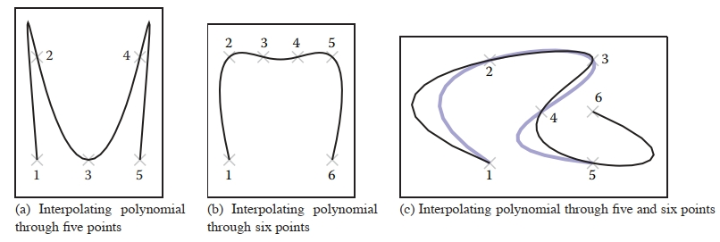
Figure 15.3. Interpolating polynomials through multiple points. Notice the extra wiggles and over-shooting between points. In (c), when the sixth point is added, it completely changes the shape of the curve due to the non-local nature of interpolating polynomials.
图 15.3。 通过多个点插值多项式。 请注意点之间的额外摆动和过度调整。 在（c)中，当添加第六个点时，由于插值多项式的非局部性质，它完全改变了曲线的形状。

## 15.4 Putting Pieces Together  将各个部分组合在一起

Now that we’ve seen how to make individual pieces of polynomial curves, we can consider how to put these pieces together.
现在我们已经了解了如何制作多项式曲线的各个部分，我们可以考虑如何将这些部分组合在一起。

### 15.4.1 Knots 结

The basic idea of a piecewise parametric function is that each piece is only used over some parameter range. For example, if we want to define a function that has two piecewise linear segments that connect three points (as shown in Figure 15.4(a)), we might define
分段参数函数的基本思想是每个部分仅在某个参数范围内使用。 例如，如果我们想定义一个函数，它有两个连接三个点的分段线性段（如图 15.4(a) 所示），我们可以定义
$$
\bold{f}(u) = \begin{cases}
\bold{f}_1(2u) \ \ \ \ \ \ \ \ \ \ if\ 0 ≤ u < \frac{1}{2} \\
\bold{f}_2(2u - 1) \ \ \ if\ \frac{1}{2} ≤ u < 1 \\
\end{cases} \\
(15.13)
$$
where $\bold{f}_1$ and $\bold{f}_2$ are functions for each of the two line segments. Notice that we have rescaled the parameter for each of the pieces to facilitate writing their equations as
其中 $\bold{f}_1$ 和 $\bold{f}_2$ 是两条线段中每一条线段的函数。 请注意，我们重新调整了每个部分的参数，以便于将它们的方程写为
$\bold{f}_1(u) = (1 - u)\bold{p}_1 + u\bold{p}_2.  $

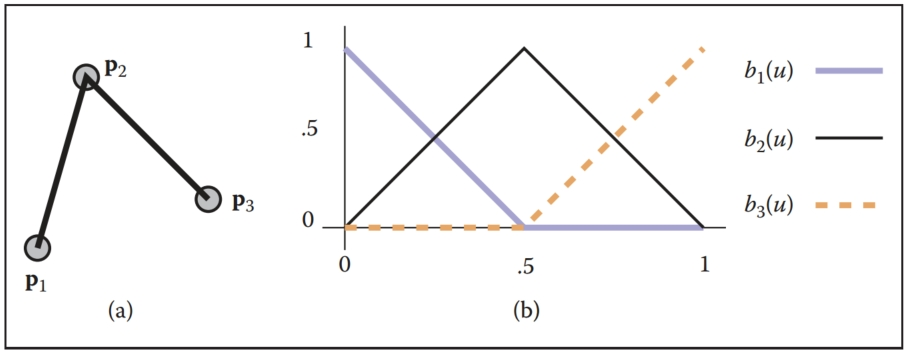
Figure 15.4. (a) Two line segments connect three points; (b) the blending functions for each of the points are graphed at right. 
图 15.4。 (a) 两条线段连接三点； (b) 每个点的混合函数绘制在右侧。

For each polynomial in our piecewise function, there is a site (or parameter value) where it starts and ends. Sites where a piece function begins or ends are called knots. For the example in Equation (15.13), the values of the knots are 0, 0.5, and 1. 
对于分段函数中的每个多项式，都有一个开始和结束的位置（或参数值）。 分段函数开始或结束的位置称为结。 对于方程（15.13）中的示例，结的值为 0、0.5 和 1。

We may also write piecewise polynomial functions as the sum of basis functions, each scaled by a coefficient. For example, we can rewrite the two line segments of Equation (15.13) as
我们还可以将分段多项式函数写为基函数之和，每个基函数按一个系数缩放。 例如，我们可以将方程（15.13）的两条线段重写为
$$
\bold{f}(u) = \bold{p}_1b_1(u) + \bold{p}_2b_2(u) + \bold{p}_3b_3(u),\ \ \ \  (15.14)
$$
where the function $b_1(u)$ is defined as 
其中函数 $b_1(u)$ 定义为
$$
b_1(u) = \begin{cases}
1 - 2u \ \ \ \ \ if\ 0 ≤  u < \frac{1}{2} \\
0 \  \ \ \ \ \ \  \ \  \ \  \ \ \ otherwise
\end{cases}
$$
and $b_2$ and $b_3$ are defined similarly. These functions are plotted in Figure 15.4(b). 
$b_2$ 和 $b_3$ 的定义类似。 这些函数绘制在图 15.4(b) 中。

The knots of a polynomial function are the combination of the knots of all of the pieces that are used to create it. The knot vector is a vector that stores all of the knot values in ascending order. 
多项式函数的结是用于创建它的所有部分的结的组合。 结向量是按升序存储所有结值的向量。

Notice that in this section we have used two different mechanisms for combining polynomial pieces: using independent polynomial pieces for different ranges of the parameter and blending together piecewise polynomial functions.
请注意，在本节中，我们使用了两种不同的机制来组合多项式片段：针对不同的参数范围使用独立的多项式片段以及将分段多项式函数混合在一起。

### 15.4.2 Using Independent Pieces 使用独立片段

In Section 15.3, we defined pieces of polynomials over the unit parameter range. If we want to assemble these pieces, we need to convert from the parameter of the overall function to the value of the parameter for the piece. The simplest way to do this is to define the overall curve over the parameter range [0, n] where n is the number of segments. Depending on the value of the parameter, we can shift it to the required range. 
在 15.3 节中，我们定义了单位参数范围内的多项式。 如果我们想要组装这些片段，我们需要将整个函数的参数转换为片段的参数值。 最简单的方法是在参数范围 [0, n] 上定义整体曲线，其中 n 是段数。 根据参数的值，我们可以将其移动到所需的范围。

### 15.4.3 Putting Segments Together 将片段放在一起

If we want to make a single curve from two line segments, we need to make sure that the end of the first line segment is at the same location as the beginning of the next. There are three ways to connect the two segments (in order of simplicity): 
如果我们想用两条线段制作一条曲线，我们需要确保第一条线段的终点与下一条线段的起点位于同一位置。 有三种方法可以连接两个段（按简单顺序排列）：

1. Represent the line segment as its two endpoints, and then use the same point for both. We call this a shared-point scheme. 
   将线段表示为其两个端点，然后对两个端点使用同一点。 我们称之为共享点方案。
2. Copy the value of the end of the first segment to the beginning of the second segment every time that the parameters of the first segment change. We call this a dependency scheme. 
   每次第一个段的参数发生变化时，将第一个段末尾的值复制到第二个段的开头。 我们称之为依赖方案。
3. Write an explicit equation for the connection, and enforce it through numerical methods as the other parameters are changed. 
   为连接编写一个显式方程，并在其他参数发生变化时通过数值方法强制执行。

While the simpler schemes are preferable since they require less work, they also place more restrictions on the way the line segments are parameterized. For example, if we want to use the center of the line segment as a parameter (so that the user can specify it directly), we will use the beginning of each line segment and the center of the line segment as their parameters. This will force us to use the dependency scheme.
虽然更简单的方案更可取，因为它们需要更少的工作，但它们也对线段参数化的方式施加了更多限制。 例如，如果我们想使用线段的中心作为参数（以便用户可以直接指定），我们将使用每个线段的开头和线段的中心作为它们的参数。 这将迫使我们使用依赖方案。 

Notice that if we use a shared-point or dependency scheme, the total number of control points is less than n ∗ m, where n is the number of segments and m is the number of control points for each segment; many of the control points of the independent pieces will be computed as functions of other pieces. Notice that if we use either the shared-point scheme for lines (each segment uses its two endpoints as parameters and shares interior points with its neighbors), or if we use the dependency scheme (such as the example one with the first endpoint and midpoint), we end up with n + 1 controls for an n-segment curve. 
请注意，如果我们使用共享点或依赖方案，则控制点的总数小于 n * m，其中 n 是段的数量，m 是每个段的控制点的数量； 独立部分的许多控制点将被计算为其他部分的函数。 请注意，如果我们对线使用共享点方案（每个线段使用其两个端点作为参数并与其邻居共享内部点），或者如果我们使用依赖方案（例如具有第一个端点和中点的示例） ），我们最终得到 n 段曲线的 n + 1 个控件。

Dependency schemes have a more serious problem. A change in one place in the curve can propagate through the entire curve. This is called a lack of locality. Locality means that if you move a point on a curve it will only affect a local region. The local region might be big, but it will be finite. If a curve’s controls do not have locality, changing a control point may affect points infinitely far away. 
依赖方案有一个更严重的问题。 曲线中某一位置的变化可以传播到整条曲线。 这称为缺乏局部性。 局部性意味着如果移动曲线上的点，它只会影响局部区域。 局部区域可能很大，但它是有限的。 如果曲线的控件没有局部性，则更改控制点可能会影响无限远的点。

To see locality, and the lack thereof, in action, consider two chains of line segments, as shown in Figure 15.5. One chain has its pieces parameterized by their endpoints and uses point-sharing to maintain continuity. The other has its pieces parameterized by an endpoint and midpoint and uses dependency propagation to keep the segments together. The two segment chains can represent the same curves: they are both a set of n connected line segments. However, because of locality issues, the endpoint-shared form is likely to be more convenient for the user. Consider changing the position of the first control point in each chain. For the endpoint-shared version, only the first segment will change, while all of the segments will be affected in the midpoint version, as in Figure 15.5. In fact, for any point moved in the endpoint-shared version, at most two line segments will change. In the midpoint version, all segments after the control point that is moved will change, even if the chain is infinitely long. 
要查看局部性及其缺失的实际情况，请考虑两条线段链，如图 15.5 所示。 一条链的各个部分由端点参数化，并使用点共享来保持连续性。 另一个的片段由端点和中点参数化，并使用依赖关系传播将片段保持在一起。 两条线段链可以表示相同的曲线：它们都是n条相连的线段的集合。 然而，由于局部性问题，端点共享形式可能对用户来说更方便。 考虑更改每个链中第一个控制点的位置。 对于端点共享版本，只有第一个段会发生变化，而中点版本中所有段都会受到影响，如图15.5所示。 事实上，对于端点共享版本中移动的任何点，最多两条线段会发生变化。 在中点版本中，移动的控制点之后的所有线段都会发生变化，即使链无限长。
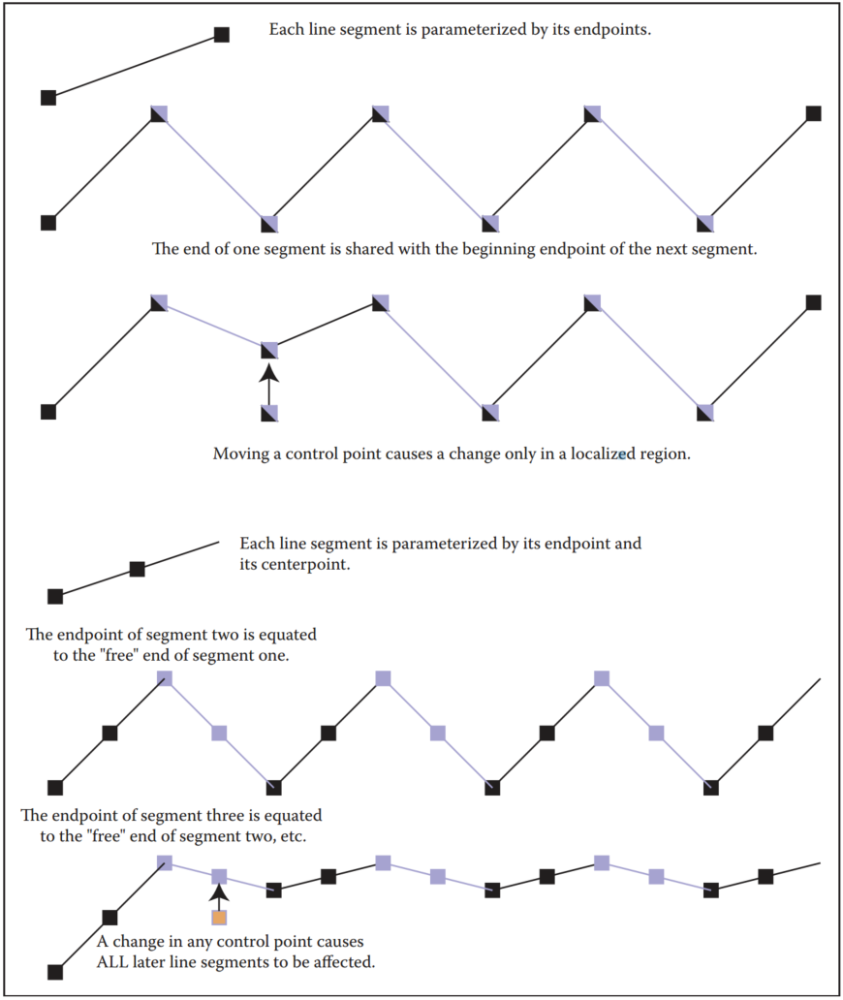
Figure 15.5. A chain of line segments with local control and one with non-local control. 
图 15.5。 具有本地控制和非本地控制的一系列线段。

In this example, the dependency propagation scheme was the one that did not have local control. This is not always true. There are direct sharing schemes that are not local and propagation schemes that are local. 
在此示例中，依赖传播方案是没有本地控制的方案。 这并非总是如此。 存在非本地的直接共享方案和本地的传播方案。

We emphasize that locality is a convenience of control issue. While it is inconvenient to have the entire curve change every time, the same changes can be made to the curve. It simply requires moving several points in unison. 
我们强调局部性是一个控制便利性的问题。 虽然每次都改变整个曲线很不方便，但可以对曲线进行相同的改变。 它只需要一致移动几个点。

## 15.5 Cubics 三次方

In graphics, when we represent curves using piecewise polynomials, we usually use either line segments or cubic polynomials for the pieces. There are a number of reasons why cubics are popular in computer graphics: 
在图形中，当我们使用分段多项式表示曲线时，我们通常使用线段或三次多项式来表示分段。 三次方在计算机图形学中流行的原因有很多：

- Piecewise cubic polynomials allow for $C^2$ continuity, which is generally sufficient for most visual tasks. The $C^1$ smoothness that quadratics offer is often insufficient. The greater smoothness offered by higher-order polynomials is rarely important. 
  分段三次多项式允许 $C^2$ 连续性，这通常足以满足大多数视觉任务。 二次方程提供的 $C^1$ 平滑度通常是不够的。 高阶多项式提供的更大平滑度并不重要。
- Cubic curves provide the minimum-curvature interpolants to a set of points. That is, if you have a set of n + 3 points and define the “smoothest” curve that passes through them (that is the curve that has the minimum curvature over its length), this curve can be represented as a piecewise cubic with n segments.
  三次曲线为一组点提供最小曲率插值。 也就是说，如果您有一组 n + 3 个点并定义穿过它们的“最平滑”曲线（即在其长度上具有最小曲率的曲线），则该曲线可以表示为具有 n 的分段三次 段。
- Cubic polynomials have a nice symmetry where position and derivative can be specified at the beginning and end. 
  三次多项式具有良好的对称性，可以在开始和结束时指定位置和导数。
- Cubic polynomials have a nice tradeoff between the numerical issues in computation and the smoothness. 
  三次多项式在计算中的数值问题和平滑度之间有很好的权衡。

Notice that we do not have to use cubics; they just tend to be a good tradeoff between the amount of smoothness and complexity. Different applications may have different tradeoffs. We focus on cubics since they are the most commonly used. 
请注意，我们不必使用三次方； 它们往往是平滑度和复杂度之间的良好权衡。 不同的应用程序可能有不同的权衡。 我们关注三次方，因为它们是最常用的。

The canonical form of a cubic polynomial is
三次多项式的规范形式是
$\bold{f}(u) = \bold{a}_0 + \bold{a}_1 u + \bold{a}_2 u^2 + \bold{a}_3 u^3.  $

As we discussed in Section 15.3, these canonical form coefficients are not a convenient way to describe a cubic segment. 
正如我们在 15.3 节中讨论的，这些规范形式系数并不是描述立方线段的便捷方法。

We seek forms of cubic polynomials for which the coefficients are a convenient way to control the resulting curve represented by the cubic. One of the main conveniences will be to provide ways to ensure the connectedness of the pieces and the continuity between the segments. 
我们寻求三次多项式的形式，其中系数是控制由三次表示的结果曲线的便捷方法。 主要便利之一是提供确保各部分的连通性和各部分之间的连续性的方法。

Each cubic polynomial piece requires four coefficients or control points. That means for a piecewise polynomial with n pieces, we may require up to 4n control points if no sharing between segments is done or dependencies used. More often, some part of each segment is either shared or depends on an adjacent segment, so the total number of control points is much lower. Also, note that a control point might be a position or a derivative of the curve. 
每个三次多项式需要四个系数或控制点。 这意味着对于包含 n 个部分的分段多项式，如果段之间没有进行共享或使用依赖项，我们可能需要最多 4n 个控制点。 更常见的是，每个段的某些部分要么是共享的，要么依赖于相邻段，因此控制点的总数要少得多。 另请注意，控制点可能是曲线的位置或导数。

Unfortunately, there is no single “best” representation for a piecewise cubic. It is not possible to have a piecewise polynomial curve representation that has all of the following desirable properties: 
不幸的是，分段三次没有单一的“最佳”表示。 分段多项式曲线表示不可能具有以下所有所需属性：

1. each piece of the curve is a cubic; 
   每条曲线都是一个三次方；
2. the curve interpolates the control points; 
   曲线对控制点进行插值；
3. the curve has local control; 
   曲线具有本地控制；
4. the curve has $C^2$ continuity. 
   曲线具有$C^2$连续性。

We can have any three of these properties, but not all four; there are representations that have any combination of three. In this book, we will discuss cubic B-splines that do not interpolate their control points (but have local control and are $C^2$); Cardinal splines and Catmull-Rom splines that interpolate their control points and offer local control, but are not $C^2$; and natural cubics that interpolate and are $C^2$, but do not have local control. 
我们可以拥有这些属性中的任意三个，但不能拥有全部四个； 存在具有三者任意组合的表示。 在本书中，我们将讨论不对其控制点进行插值的三次 B 样条曲线（但具有局部控制且为 $C^2$）； 基数样条线和 Catmull-Rom 样条线对它们的控制点进行插值并提供局部控制，但不是 $C^2$； 以及插值 和 的自然三次方为 $C^2$，但没有本地控制。

The continuity properties of cubics refer to the continuity between the segments (at the knot points). The cubic pieces themselves have infinite continuity in their derivatives (the way we have been talking about continuity so far). Note that if you have a lot of control points (or knots), the curve can be wiggly, which might not seem “smooth.” 
立方体的连续性是指线段之间（节点处）的连续性。 立方体本身在其导数中具有无限连续性（到目前为止我们一直在讨论连续性的方式）。 请注意，如果有很多控制点（或结），曲线可能会摆动，这可能看起来不“平滑”。

### 15.5.1 Natural Cubics 自然立方体

With a piecewise cubic curve, it is possible to create a $C^2$ curve. To do this, we need to specify the position and first and second derivative at the beginning of each segment (so that we can make sure that it is the same as at the end of the previous segment). Notice that each curve segment receives three out of its four parameters from the previous curve in the chain. These $C^2$ continuous chains of cubics are sometimes referred to as natural cubic splines. 
使用分段三次曲线，可以创建 $C^2$ 曲线。 为此，我们需要指定每个段开头的位置以及一阶和二阶导数（以便我们可以确保它与上一段末尾的位置相同）。 请注意，每个曲线段从链中的前一条曲线接收其四个参数中的三个。 这些连续的 $C^2$ 三次链有时被称为自然三次样条。

For one segment of the natural cubic, we need to parameterize the cubic by the positions of its endpoints and the first and second derivative at the beginning point. The control points are therefore
对于自然立方体的一段，我们需要通过其端点的位置以及起点处的一阶和二阶导数来参数化立方体。 因此控制点是
$$
\bold{p}_0 = \bold{f}(0) = \bold{a}_0 + 0^1\bold{a}_1 + 0^2 \bold{a}_2 + 0^3 \bold{a}_3, \\
\bold{p}_1 = \bold{f}'(0) = 1^1\bold{a}_1 +2\ 0^1 \bold{a}_2 +3\ 0^2 \bold{a}_3, \\
\bold{p}_2 = \bold{f}''(0) = 2\ 1^1\bold{a}_2 +6\ 0^1 \bold{a}_3, \\
\bold{p}_3 = \bold{f}(1) = \bold{a}_0 + 1^1 \bold{a}_1 + 1^2 \bold{a}_2 + 1^3 \bold{a}_3.
$$
Therefore, the constraint matrix is 
因此，约束矩阵为
$$
\bold{C} = \begin{bmatrix}
1 & 0 & 0 & 0 \\
0 & 1 & 0 & 0 \\
0 & 0 & 2 & 0 \\
1 & 1 & 1 & 1
\end{bmatrix}
$$
and the basis matrix is  
基矩阵是
$$
\bold{B} = \bold{C}^{-1} = \begin{bmatrix}
1 & 0 & 0 & 0 \\
0 & 1 & 0 & 0 \\
0 & 0 & .5 & 0 \\
−1 & −1 & −.5 & 1
\end{bmatrix}
$$
Given a set of n control points, a natural cubic spline has n−1 cubic segments. The first segment uses the control points to define its beginning position, ending position, and first and second derivative at the beginning. A dependency scheme copies the position, and first and second derivative of the end of the first segment for use in the second segment. 
给定一组 n 个控制点，自然三次样条有 n−1 个三次段。 第一段使用控制点来定义其开始位置、结束位置以及开始时的一阶和二阶导数。 依赖方案复制第一段末尾的位置以及一阶和二阶导数以在第二段中使用。

A disadvantage of natural cubic splines is that they are not local. Any change in any segment may require the entire curve to change (at least the part after the change was made). To make matters worse, natural cubic splines tend to be ill-conditioned: a small change at the beginning of the curve can lead to large changes later. Another issue is that we only have control over the derivatives of the curve at its beginning. Segments after the beginning of the curve determine their derivatives from their beginning point. 
自然三次样条的缺点是它们不是局部的。 任何段中的任何更改都可能需要更改整个曲线（至少是更改后的部分）。 更糟糕的是，自然三次样条往往是病态的：曲线开始时的微小变化可能会导致后来的大变化。 另一个问题是我们只能控制曲线开始时的导数。 曲线起点之后的线段确定其从起点的导数。

### 15.5.2 Hermite Cubics 厄米立方

Hermite cubic polynomials were introduced in Section 15.3.4. A segment of a cubic Hermite spline allows the positions and first derivatives of both of its endpoints to be specified. A chain of segments can be linked into a $C^1$ spline by using the same values for the position and derivative of the end of one segment and for the beginning of the next. 
Hermite 三次多项式在 15.3.4 节中介绍。 三次 Hermite 样条线段允许指定其两个端点的位置和一阶导数。 通过对一个段的末尾和下一个段的开头使用相同的位置和导数值，可以将一系列段链接到 $C^1$ 样条线中。

Given a set of n control points, where every other control point is a derivative value, a cubic Hermite spline contains $(n−2)/2$ cubic segments. The spline interpolates the points, as shown in Figure 15.6, but can guarantee only $C^1$ continuity. 
给定一组 n 个控制点，其中每个其他控制点都是导数值，三次 Hermite 样条包含 $(n−2)/2$ 三次段。 样条曲线对点进行插值，如图 15.6 所示，但只能保证 $C^1$ 连续性。
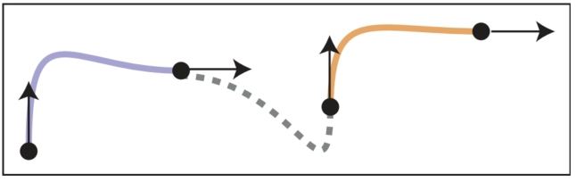
Figure 15.6. A Hermite cubic spline made up of three segments. 
图 15.6。 由三段组成的 Hermite 三次样条。

Hermite cubics are convenient because they provide local control over the shape, and provide $C^1$ continuity. However, since the user must specify both positions and derivatives, a special interface for the derivatives must be provided. One possibility is to provide the user with points that represent where the derivative vectors would end if they were “placed” at the position point. 
Hermite 立方体很方便，因为它们提供对形状的局部控制，并提供 $C^1$ 连续性。 然而，由于用户必须指定头寸和衍生品，因此必须为衍生品提供特殊的接口。 一种可能性是向用户提供表示导数向量“放置”在该位置点时的结束位置的点。

### 15.5.3 Cardinal Cubics 基数三次

A cardinal cubic spline is a type of $C^1$ interpolating spline made up of cubic polynomial segments. Given a set of n control points, a cardinal cubic spline uses n − 2 cubic polynomial segments to interpolate all of its points except for the first and last. 
基数三次样条是一种由三次多项式段组成的 $C^1$ 插值样条。 给定一组 n 个控制点，基数三次样条使用 n − 2 三次多项式段来插值其除第一个和最后一个点之外的所有点。

Cardinal splines have a parameter called tension that controls how “tight” the curve is between the points it interpolates. The tension is a number in the range [0, 1) that controls how the curve bends toward the next control point. For the important special case of t = 0, the splines are called Catmull-Rom splines.
基数样条有一个称为张力的参数，用于控制曲线在其插值点之间的“紧密程度”。 张力是 [0, 1) 范围内的一个数字，用于控制曲线如何向下一个控制点弯曲。 对于 t = 0 的重要特殊情况，样条线称为 Catmull-Rom 样条线。

Each segment of the cardinal spline uses four control points. For segment i, the points used are $i, i + 1, i + 2,$ and $i + 3$ as the segments share three points with their neighbors. Each segment begins at its second control point and ends at its third control point. The derivative at the beginning of the curve is determined by the vector between the first and third control points, while the derivative at the end of the curve is given by the vector between the second and fourth points, as shown in Figure 15.7.
基数样条线的每段都使用四个控制点。 对于线段 i，使用的点是 $i、i + 1、i + 2、$ 和 $i + 3$，因为这些线段与其邻居共享三个点。 每个段从其第二个控制点开始，并在其第三个控制点结束。 曲线开头的导数由第一个和第三个控制点之间的向量确定，而曲线末尾的导数由第二个和第四个控制点之间的向量确定，如图 15.7 所示。
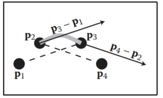
Figure 15.7. A segment of a cardinal cubic spline interpolates its second and third control points ($\bold{p}_2$ and $\bold{p}_3$), and uses its other points to determine the derivatives at the beginning and end.
图 15.7。 基数三次样条线段对其第二个和第三个控制点（$\bold{p}_2$ 和 $\bold{p}_3$)进行插值，并使用其其他点来确定开头和结尾处的导数。

The tension parameter adjusts how much the derivatives are scaled. Specifically, the derivatives are scaled by (1 − t)/2. The constraints on the cubic are therefore
张力参数调整导数的缩放程度。 具体来说，导数按 (1 − t)/2 缩放。 因此，立方体的约束是
$$
\bold{f}(0) = \bold{p}_2, \\
\bold{f}(1) = \bold{p}_3, \\
\bold{f}'(0) = \frac{1}{2}(1 − t)(\bold{p}_3 − \bold{p}_1), \\
\bold{f}'(1) = \frac{1}{2}(1 − t)(\bold{p}_4 − \bold{p}_2).
$$
Solving these equations for the control points (defining $s = (1 - t)/2$) gives 
求解控制点的这些方程（定义 $s = (1 - t)/2$）给出
$$
\bold{p}_0 = \bold{f}(1) − \frac{2}{1-t}\bold{f}'(0) = \bold{a}_0 +(1 − \frac{1}{s} ) \bold{a}_1 + \bold{a}_2 + \bold{a}_3, \\
\bold{p}_1 = \bold{f}(0) = \bold{a}_0, \\
\bold{p}_2 = \bold{f}(1) = \bold{a}_0 + \bold{a}_1 + \bold{a}_2 + \bold{a}_3, \\
\bold{p}_3 = \bold{f}(0) + \frac{1}{s}\bold{f}'(1) = \bold{a}_0 + \frac{1}{s}\bold{a}_1 + 2\frac{1}{s}\bold{a}_2 + 3\frac{1}{s}\bold{a}_3.
$$
This yields the cardinal matrix 
这产生基数矩阵
$$
\bold{B} = \bold{C}^{-1} = \begin{bmatrix}
0 & 1 & 0 & 0 \\
−s & 0 & s & 0 \\
2s & s − 3 & 3 − 2s & −s \\
−s & 2 − s & s − 2 & s
\end{bmatrix}
$$
Since the third point of segment i is the second point of segment $i+1$, adjacent segments of the cardinal spline connect. Similarly, the same points are used to specify the first derivative of each segment, providing $C^1$ continuity. 
由于线段 i 的第三个点是线段 $i+1$ 的第二个点，因此基数样条线的相邻线段连接。 同样，相同的点用于指定每个线段的一阶导数，提供 $C^1$ 连续性。

Cardinal splines are useful, because they provide an easy way to interpolate a set of points with $C^1$ continuity and local control. They are only $C^1$, so they sometimes get “kinks” in them. The tension parameter gives some control over what happens between the interpolated points, as shown in Figure 15.8, where a set of cardinal splines through a set of points is shown. The curves use the same control points, but they use different values for the tension parameters. Note that the first and last control points are not interpolated. 
基数样条很有用，因为它们提供了一种简单的方法来插值一组具有 $C^1$ 连续性和局部控制的点。 它们的价格仅为 $C^1$，因此有时会出现“扭结”。 张力参数可以对插值点之间发生的情况进行一些控制，如图 15.8 所示，其中显示了通过一组点的一组基数样条线。 这些曲线使用相同的控制点，但使用不同的张力参数值。 请注意，第一个和最后一个控制点未进行插值。
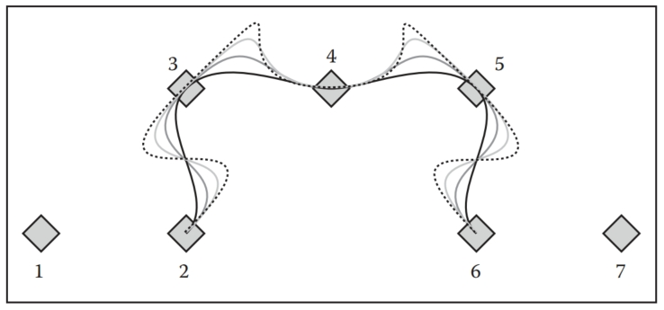
Figure 15.8. Cardinal splines through seven control points with varying values of tension parameter t. 
图 15.8。 通过具有不同张力参数 t 值的七个控制点的基数样条。

Given a set of n points to interpolate, you might wonder why we might prefer to use a cardinal cubic spline (that is a set of n − 2 cubic pieces) rather than a single, order n polynomial as described in Section 15.3.6. Some of the disadvantages of the interpolating polynomial are:
给定一组要插值的 n 个点，您可能想知道为什么我们更喜欢使用基数三次样条（即一组 n-2 三次样条）而不是第 15.3.6 节中描述的单个 n 阶多项式。 插值多项式的一些缺点是：

- The interpolating polynomial tends to overshoot the points, as seen in Figure 15.9. This overshooting gets worse as the number of points grows larger. The cardinal splines tend to be well behaved in between the points. 
  插值多项式往往会超出点，如图 15.9 所示。 随着点数的增加，这种超调会变得更严重。 基数样条在点之间往往表现良好。
  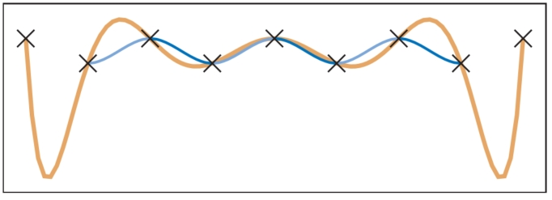
  Figure 15.9. Splines interpolating nine control points (marked with small crosses). The thick orange line shows an interpolating polynomial. The thin line shows a Catmull-Rom spline. The latter is made of seven cubic segments, which are each shown in alternating blue tones.
  图 15.9。 内插九个控制点的样条线（用小十字标记)。 橙色粗线显示插值多项式。 细线显示了 Catmull-Rom 样条线。 后者由七个立方体部分组成，每个部分都以交替的蓝色色调显示。
- Control of the interpolating polynomial is not local. Changing a point at the beginning of the spline affects the entire spline. Cardinal splines are local: any place on the spline is affected by its four neighboring points at most. 
  插值多项式的控制不是局部的。 更改样条线起点处的点会影响整个样条线。 基数样条是局部的：样条上的任何位置最多受其四个相邻点的影响。
- Evaluation of the interpolating polynomial is not local. Evaluating a point on the polynomial requires access to all of its points. Evaluating a point on the piecewise cubic requires a fixed small number of computations, no matter how large the total number of points is.
  插值多项式的计算不是局部的。 评估多项式上的一个点需要访问它的所有点。 无论点总数有多大，评估分段三次方上的点都需要固定的少量计算。

There are a variety of other numerical and technical issues in using interpolating splines as the number of points grows larger. See De Boor (2001) for more information. 
随着点数的增加，使用插值样条线还存在各种其他数值和技术问题。 更多信息请参见 De Boor (2001)。

A cardinal spline has the disadvantage that it does not interpolate the first or last point, which can be easily fixed by adding an extra point at either end of the sequence. The cardinal spline also is not as continuous—providing only C1 continuity at the knots.
基数样条的缺点是它不会插入第一个或最后一个点，这可以通过在序列的任一端添加额外的点来轻松修复。 基数样条也不是连续的——仅在结点处提供 C1 连续性。

## 15.6 Approximating Curves 近似曲线

It might seem like the easiest way to control a curve is to specify a set of points for it to interpolate. In practice, however, interpolation schemes often have undesirable properties because they have less continuity and offer no control of what happens between the points. Curve schemes that only approximate the points are often preferred. With an approximating scheme, the control points influence the shape of the curve, but do not specify it exactly. Although we give up the ability to directly specify points for the curve to pass through, we gain better behavior of the curve and local control. Should we need to interpolate a set of points, the positions of the control points can be computed such that the curve passes through these interpolation points. 
控制曲线的最简单方法似乎是指定一组点以供其插值。 然而，在实践中，插值方案通常具有不良特性，因为它们的连续性较差并且无法控制点之间发生的情况。 仅近似点的曲线方案通常是首选。 使用近似方案时，控制点会影响曲线的形状，但不会精确指定。 尽管我们放弃了直接指定曲线通过的点的能力，但我们获得了更好的曲线行为和局部控制。 如果我们需要插值一组点，可以计算控制点的位置，以便曲线穿过这些插值点。

The two most important types of approximating curves in computer graphics are Bezier curves and B-spline curves. 
计算机图形学中两种最重要的近似曲线类型是 Bezier 曲线和 B 样条曲线。

### 15.6.1 Bezier Curves 贝塞尔曲线

Bezier curves are one of the most common representations for free-form curves in computer graphics. The curves are named for Pierre Bezier, one of the people who was instrumental in their development. Bezier curves have an interesting history where they were concurrently developed by several independent groups.
贝塞尔曲线是计算机图形学中最常见的自由曲线表示形式之一。 这些曲线以皮埃尔·贝塞尔 (Pierre Bezier) 的名字命名，他是其开发过程中的重要人物之一。 贝塞尔曲线有一个有趣的历史，它们是由几个独立的小组同时开发的。

A Bezier curve is a polynomial curve that approximates its control points. The curves can be a polynomial of any degree. A curve of degree d is controlled by d + 1 control points. The curve interpolates its first and last control points, and the shape is directly influenced by the other points. 
贝塞尔曲线是近似其控制点的多项式曲线。 曲线可以是任意次数的多项式。 d 次曲线由 d + 1 个控制点控制。 曲线对其第一个和最后一个控制点进行插值，并且形状直接受其他点的影响。

Often, complex shapes are made by connecting a number of Bezier curves of low degree, and in computer graphics, cubic (d = 3) Bezier curves are commonly used for this purpose. Many popular illustration programs, such as Adobe Illustrator, and font representation schemes, such as that used in Postscript, use cubic Bezier curves. Bezier curves are extremely popular in computer graphics because they are easy to control, have a number of useful properties, and there are very efficient algorithms for working with them.
通常，复杂的形状是通过连接多个低阶贝塞尔曲线来形成的，在计算机图形学中，三次（d = 3）贝塞尔曲线通常用于此目的。 许多流行的插图程序（例如 Adobe Illustrator）和字体表示方案（例如 Postscript 中使用的字体表示方案）都使用三次贝塞尔曲线。 贝塞尔曲线在计算机图形学中非常流行，因为它们易于控制，具有许多有用的属性，并且有非常有效的算法可以使用它们。

 Bezier curves are constructed such that:
贝塞尔曲线的构造如下：

-  The curve interpolates the first and last control points, with u = 0 and 1, respectively. 
   曲线对第一个和最后一个控制点进行插值，u 分别为 0 和 1。
-  The first derivative of the curve at its beginning (end) is determined by the vector between the first and second (next to last and last) control points. The derivatives are given by the vectors between these points scaled by the degree of the curve. 
   曲线在其开始（结束）处的一阶导数由第一个和第二个（紧邻最后一个和最后一个）控制点之间的向量确定。 导数由这些点之间按曲线阶数缩放的向量给出。
-  Higher derivatives at the beginning (end) of the curve depend on the points at the beginning (end) of the curve. The $n^{th}$ derivative depends on the first (last) n + 1 points. 
   曲线起点（终点）处的较高导数取决于曲线起点（终点）处的点。 $n^{th}$ 导数取决于前（后）n + 1 个点。

For example, consider the Bezier curve of degree 3 (cubic) as in Figure 15.10. The curve has four $(d + 1)$ control points. It begins at the first control point ($\bold{p}_0$) and ends at the last ($\bold{p}_1$). The first derivative at the beginning is proportional to the vector between the first and second control points ($\bold{p}_1 − \bold{p}_0$). Specifically, $\bold{f}'(0) = 3(\bold{p}_1 − \bold{p}_0)$. Similarly, the first derivative at the end of the curve is given by $\bold{f}'(1) = 3(\bold{p}_3 − \bold{p}_2)$. The second derivative at the beginning of the curve can be determined from control points $\bold{p}_0$, $\bold{p}_1$ and $\bold{p}_2$. 
例如，考虑 3 次（三次）贝塞尔曲线，如图 15.10 所示。 该曲线有四个 $(d + 1)$ 控制点。 它从第一个控制点 ($\bold{p}_0$) 开始，到最后一个控制点 ($\bold{p}_1$) 结束。 开头的一阶导数与第一个和第二个控制点之间的向量 ($\bold{p}_1 − \bold{p}_0$) 成正比。 具体来说，$\bold{f}'(0) = 3(\bold{p}_1 − \bold{p}_0)$。 类似地，曲线末端的一阶导数由 $\bold{f}'(1) = 3(\bold{p}_3 − \bold{p}_2)$ 给出。 曲线起始处的二阶导数可以从控制点 $\bold{p}_0$、$\bold{p}_1$ 和 $\bold{p}_2$ 确定。
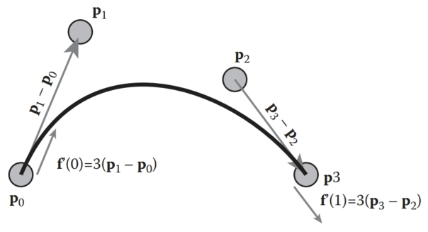
Figure 15.10. A cubic Bezier curve is controlled by four points. It interpolates the first and last, and the beginning and final derivatives are three times the vectors between the first two (or last two) points.
图 15.10。 三次贝塞尔曲线由四个点控制。 它对第一个和最后一个进行插值，并且开始和最终导数是前两个（或最后两个)点之间向量的三倍。

Using the facts about Bezier cubics in the preceding paragraph, we can use the methods of Section 15.5 to create a parametric function for them. The definitions of the beginning and end interpolation and derivatives give 
利用上一段中有关贝塞尔三次曲线的事实，我们可以使用第 15.5 节的方法为它们创建参数函数。 开始和结束插值和导数的定义给出
$$
\bold{p}_0 = \bold{f}(0) = \bold{a}_30^3 + \bold{a}_20^2 + \bold{a}_10 + \bold{a}_0, \\
\bold{p}_3 = \bold{f}(1) = \bold{a}_31^3 + \bold{a}_21^2 + \bold{a}_1^1 + \bold{a}_0, \\
3(\bold{p}_1 − \bold{p}_0) = \bold{f}'(0) = 3\bold{a}_30^2 + 2\bold{a}_20 + \bold{a}_1, \\
3(\bold{p}_3 − \bold{p}_2) = \bold{f}'(1) = 3\bold{a}_31^2 + 2\bold{a}_21 + \bold{a}_1.
$$
This can be solved for the basis matrix 
这可以求解基本矩阵
$$
\bold{B} = \bold{C}^{-1} = \begin{bmatrix}
1 & 0 & 0 & 0 \\
−3 & 3 & 0 & 0 \\
3 & −6 & 3 & 0 \\
−1 & 3 & −3 & 1
\end{bmatrix}
$$
and then written as
然后写成
$\bold{f}(u) = (1 -3u+3u^2 - u^3)\bold{p}_0 +(3u -6u^2 +3u^3)\bold{p}_1 +(3u^2 -3u^3)\bold{p}_2 +(u^3)\bold{p}_3,  $

or
或者
$\bold{f}(u) = \sum^d_{i = 0}b_{i,3}\bold{p}_i \\$

where the $b_{i,3}$ are the Bezier blending functions of degree 3: 
其中 $b_{i,3}$ 是 3 阶 Bezier 混合函数：
$$
b_{0,3} = (1 − u)^3, \\
b_{1,3} = 3u(1 − u)^2, \\
b_{2,3} = 3u^2(1 − u), \\
b_{3,3} = u^3.
$$
Fortunately, the blending functions for Bezier curves have a special form that works for all degrees. These functions are known as the Bernstein basis polynomials and have the general form
幸运的是，贝塞尔曲线的混合函数具有适用于所有度数的特殊形式。 这些函数称为伯恩斯坦基多项式，具有一般形式
$b_{k,n}(u) = C(n, k) u^k (1 - u)^{(n-k)},  $

where n is the order of the Bezier curve, and k is the blending function number between 0 and n (inclusive). $C(n, k)$ are the binomial coefficients: 
其中 n 是贝塞尔曲线的阶数，k 是介于 0 和 n（含）之间的混合函数编号。 $C(n, k)$ 是二项式系数：
$C(n, k) = \frac{n!}{k!(n-k)!}\\$

Given the positions of the control points $\bold{p}_k$, the function to evaluate the Bezier curve of order n (with n + 1 control points) is 
给定控制点 $\bold{p}_k$ 的位置，计算 n 阶贝塞尔曲线（具有 n + 1 个控制点）的函数为
$\bold{p}(u) = \sum^n_{k = 0}p_kC(n, k)u^k(1-u)^{n-k} \\$

Some Bezier segments are shown in Figure 15.11. 
一些贝塞尔线段如图 15.11 所示。
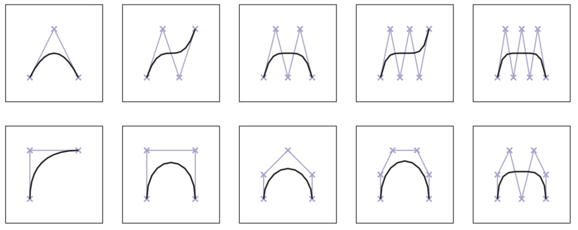
Figure 15.11. Various Bezier segments of degree 2–6. The control points are shown with crosses, and the control polygons (line segments connecting the control points) are also shown. 
图 15.11。 2-6 阶的各种贝塞尔曲线段。 控制点用十字显示，并且还显示控制多边形（连接控制点的线段)。

Bezier segments have several useful properties: 
贝塞尔线段有几个有用的属性：

- The curve is bounded by the convex hull of the control points. 
  曲线以控制点的凸包为界。
- Any line intersects the curve no more times than it intersects the set of line segments connecting the control points. This is called the variation diminishing property. This property is illustrated in Figure 15.12. 
  任何直线与曲线相交的次数不超过与连接控制点的线段集相交的次数。 这称为变异递减性质。 该属性如图 15.12 所示。
  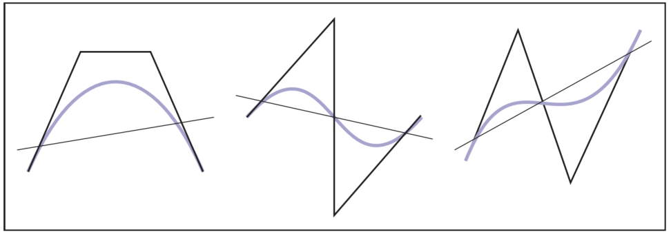
  Figure 15.12. The variation diminishing property of Bezier curves means that the curve does not cross a line more than its control polygon does. Therefore, if the control polygon has no “wiggles,” the curve will not have them either. B-splines (Section 15.6.2) also have this property.
  图 15.12。 贝塞尔曲线的变化递减特性意味着该曲线与线的交叉次数不会多于其控制多边形的交叉次数。 因此，如果控制多边形没有“摆动”，则曲线也不会有“摆动”。 B 样条曲线（第 15.6.2 节)也具有此属性。
- The curves are symmetric: reversing the order of the control points yields the same curve, with a reversed parameterization. 
  曲线是对称的：反转控制点的顺序会产生相同的曲线，但参数化相反。
- The curves are affine invariant. This means that translating, scaling, rotating, or skewing the control points is the same as performing those operations on the curve itself. 
  曲线是仿射不变的。 这意味着平移、缩放、旋转或倾斜控制点与在曲线本身上执行这些操作相同。
- There are good simple algorithms for evaluating and subdividing Bezier curves into pieces that are themselves Bezier curves. Because subdivision can be done effectively using the algorithm described later, a divide and conquer approach can be used to create effective algorithms for important tasks such as rendering Bezier curves, approximating them with line segments, and determining the intersection between two curves.
  有一些很好的简单算法可以评估贝塞尔曲线并将其细分为本身就是贝塞尔曲线的片段。 由于可以使用稍后描述的算法有效地完成细分，因此可以使用分而治之的方法为重要任务创建有效的算法，例如渲染贝塞尔曲线、用线段逼近它们以及确定两条曲线之间的交点。

When Bezier segments are connected together to make a spline, connectivity between the segments is created by sharing the endpoints. However, continuity of the derivatives must be created by positioning the other control points. This provides the user of a Bezier spline with control over the smoothness. For $G^1$ continuity, the second-to-last point of the first curve and the second point of the second curve must be collinear with the equated endpoints. For $C^1$ continuity, the distances between the points must be equal as well. This is illustrated in Figure 15.13. Higher degrees of continuity can be created by properly positioning more points.
当贝塞尔曲线线段连接在一起形成样条线时，线段之间的连接是通过共享端点来创建的。 然而，导数的连续性必须通过定位其他控制点来创建。 这为贝塞尔样条的用户提供了对平滑度的控制。 对于 $G^1$ 连续性，第一条曲线的倒数第二个点和第二条曲线的第二个点必须与相等的端点共线。 对于 $C^1$ 连续性，点之间的距离也必须相等。 如图 15.13 所示。 通过正确定位更多点可以创建更高程度的连续性。
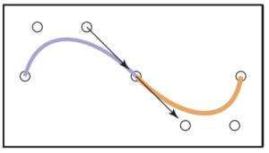
Figure 15.13. Two Bezier segments connect to form a $C^1$ spline, because the vector between the last two points of the first segment is equal to the vector between the first two points of the second segment.
图 15.13。 两个贝塞尔曲线段连接起来形成 $C^1$ 样条曲线，因为第一段最后两点之间的向量等于第二段前两点之间的向量。

#### Geometric Intuition for Bezier Curves 贝塞尔曲线的几何直觉

Bezier curves can be derived from geometric principles, as well as from the algebraic methods described above. We outline the geometric principles because they provides intuition on how Bezier curves work. 
贝塞尔曲线可以从几何原理以及上述代数方法中导出。 我们概述了几何原理，因为它们提供了贝塞尔曲线如何工作的直觉。

Imagine that we have a set of control points from which we want to create a smooth curve. Simply connecting the points with lines (to form the control polygon) will lead to something that is non-smooth. It will have sharp corners. We could imagine “smoothing” this polygon by cutting off the sharp corners, yielding a new polygon that is smoother, but still not “smooth” in the mathematical sense (since the curve is still a polygon, and therefore only $C^1$). We can repeat this process, each time yielding a smoother polygon, as shown in Figure 15.14. In the limit, that is if we repeated the process infinitely many times, we would obtain a $C^1$ smooth curve.
想象一下，我们有一组控制点，我们想从中创建一条平滑的曲线。 简单地用线连接点（以形成控制多边形）将导致不平滑的结果。 它将有尖角。 我们可以想象通过切除尖角来“平滑”这个多边形，产生一个更平滑的新多边形，但在数学意义上仍然不是“平滑”（因为曲线仍然是一个多边形，因此只有 $C^1$ ）。 我们可以重复这个过程，每次都会产生一个更平滑的多边形，如图 15.14 所示。 在极限情况下，即如果我们无限次重复该过程，我们将获得 $C^1$ 平滑曲线。
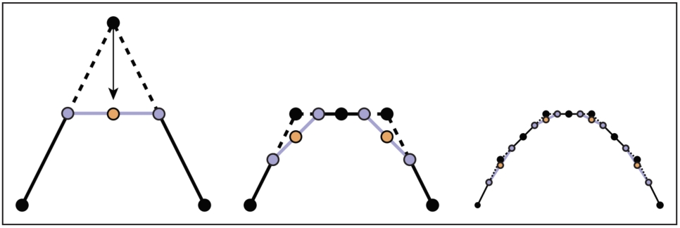
Figure 15.14. Subdivision procedure for quadratic Beziers. Each line segment is divided in half and these midpoints are connected (blue points and lines). The interior control point is moved to the midpoint of the new line segment (orange point). 
图 15.14。 二次贝塞尔曲线的细分过程。 每条线段被分成两半，这些中点被连接起来（蓝色的点和线）。 内部控制点移动到新线段的中点（橙色点)。

What we have done with corner cutting is defining a subdivision scheme. That is, we have defined curves by a process for breaking a simpler curve into smaller pieces (e.g., subdividing it). The resulting curve is the limit curve that is achieved by applying the process infinitely many times. If the subdivision scheme is defined correctly, the result will be a smooth curve, and it will have a parametric form. 
我们通过切角所做的就是定义细分方案。 也就是说，我们通过将更简单的曲线分解成更小的部分（例如，细分它）的过程来定义曲线。 所得曲线是通过应用该过程无限多次而获得的极限曲线。 如果细分方案定义正确，结果将是一条平滑的曲线，并且具有参数形式。

Let us consider applying corner cutting to a single corner. Given three points $(\bold{p}_0, \bold{p}_1, \bold{p}_2)$, we repeatedly “cut off the corners” as shown in Figure 15.15. At each step, we divide each line segment in half, connect the midpoints, and then move the corner point to the midpoint of the new line segment. Note that in this process, new points are introduced, moved once, and then remain in this position for any remaining iterations. The endpoints never move. 
让我们考虑对单个角应用角切割。 给定三个点$(\bold{p}_0, \bold{p}_1, \bold{p}_2)$，我们重复“切角”，如图15.15所示。 在每一步中，我们将每个线段分成两半，连接中点，然后将角点移动到新线段的中点。 请注意，在此过程中，会引入新点，移动一次，然后在任何剩余迭代中保持在该位置。 端点永远不会移动。
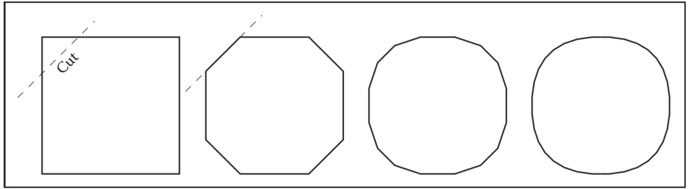
Figure 15.15. By repeatedly cutting the corners off a polygon, we approach a smooth curve. 
图 15.15。 通过反复切割多边形的角，我们可以得到平滑的曲线。

If we compute the “new” position for $\bold{p}_2$ as the midpoint of the midpoints, we get the expression
如果我们计算 $\bold{p}_2$ 的“新”位置作为中点的中点，我们得到表达式
$\bold{p}'_2 = \frac{1}{2}(\frac{1}{2}\bold{p}_0 + \frac{1}{2}\bold{p}_1) + \frac{1}{2}(\frac{1}{2}\bold{p}_1 + \frac{1}{2}\bold{p}_2) \\$

The construction actually works for other proportions of distance along each segment. If we let u be the distance between the beginning and the end of each segment where we place the middle point, we can rewrite this expression as
该结构实际上适用于沿每段的其他距离比例。 如果我们让 u 为放置中点的每个线段的起点和终点之间的距离，我们可以将该表达式重写为
$\bold{p}(u) = (1 - u)((1 - u)\bold{p}_0 + u\bold{p}_1) + u((1 - u)\bold{p}_1 + u\bold{p}_2).  $

Regrouping terms gives the quadratic Bezier function: 
重新组合项给出二次贝塞尔函数：
$\bold{B}_2(u) = (1 - u)^2\bold{p}_0 + 2u(1 - u)\bold{p}_1 + u^2\bold{p}_2.  $

#### The de Casteljau Algorithm de Casteljau 算法

One nice feature of Bezier curves is that there is a very simple and general method for computing and subdividing them. The method, called the de Casteljau algorithm, uses a sequence of linear interpolations to compute the positions along the Bezier curve of arbitrary order. It is the generalization of the subdivision scheme described in the previous section. 
贝塞尔曲线的一个很好的特点是有一种非常简单且通用的方法来计算和细分它们。 该方法称为 de Casteljau 算法，使用一系列线性插值来计算沿任意阶贝塞尔曲线的位置。 它是上一节中描述的细分方案的推广。

The de Casteljau algorithm begins by connecting every adjacent set of points with lines, and finding the point on these lines that is the u interpolation, giving a set of n−1 points. These points are then connected with straight lines, those lines are interpolated (again by u), giving a set of n− 2 points. This process is repeated until there is one point. An illustration of this process is shown in Figure 15.16. 
de Casteljau 算法首先用线连接每个相邻的点集，并找到这些线上的点（即 u 插值），给出一组 n−1 个点。 然后用直线连接这些点，对这些线进行插值（再次通过 u），给出一组 n−2 点。 重复这一过程直到出现一个点。 图 15.16 显示了该过程的图示。
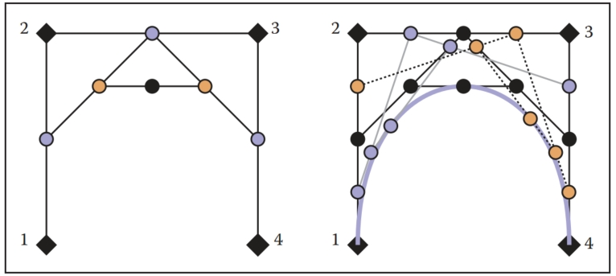
Figure 15.16. An illustration of the de Casteljau algorithm for a cubic Bezier. The left-hand image shows the construction for u = 0.5. The right-hand image shows the construction for 0.25, 0.5, and 0.75.
图 15.16。 三次贝塞尔曲线的 de Casteljau 算法的图示。 左图显示了 u = 0.5 的结构。 右图显示了 0.25、0.5 和 0.75 的结构。

The process of computing a point on a Bezier segment also provides a method for dividing the segment at the point. The intermediate points computed during the de Casteljau algorithm form the new control points of the new, smaller segments, as shown in Figure 15.17. 
计算贝塞尔线段上的点的过程还提供了在该点处划分线段的方法。 de Casteljau 算法期间计算的中间点形成新的较小线段的新控制点，如图 15.17 所示。
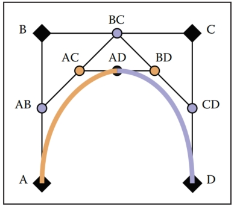
Figure 15.17. The de Casteljau algorithm is used to subdivide a cubic Bezier segment. The initial points (black diamonds A, B, C, and D) are linearly interpolated to yield blue circles (AB, BC, CD), which are linearly interpolated to yield orange circles (AC, BD), which are linearly interpolated to give the point on the cubic AD. This process also has subdivided the Bezier segment with control points A,B,C,D into two Bezier segments with control points A, AB, AC, AD and AD, BD, CD, D.
图 15.17。 de Casteljau 算法用于细分三次贝塞尔线段。 对初始点（黑色菱形 A、B、C 和 D）进行线性插值以产生蓝色圆圈（AB、BC、CD），对这些圆圈进行线性插值以产生橙色圆圈（AC、BD)，对这些圆圈进行线性插值以给出 AD 立方体上的点。 该过程还将具有控制点 A、B、C、D 的贝塞尔曲线段细分为具有控制点 A、AB、AC、AD 和 AD、BD、CD、D 的两个贝塞尔曲线段。

The existence of a good algorithm for dividing Bezier curves makes divideand-conquer algorithms possible. For example, when drawing a Bezier curve segment, it is easy to check if the curve is close to being a straight line because it is bounded by its convex hull. If the control points of the curve are all close to being colinear, the curve can be drawn as a straight line. Otherwise, the curve can be divided into smaller pieces, and the process can be repeated. Similar algorithms can be used for determining the intersection between two curves. Because of the existence of such algorithms, other curve representations are often converted to Bezier form for processing.
良好的贝塞尔曲线划分算法的存在使得分治算法成为可能。 例如，在绘制贝塞尔曲线段时，很容易检查该曲线是否接近直线，因为它受到其凸包的限制。 如果曲线的控制点都接近共线，则可以将曲线画成直线。 否则，可以将曲线分成更小的部分，并且可以重复该过程。 类似的算法可用于确定两条曲线之间的交点。 由于此类算法的存在，其他曲线表示常常被转换为贝塞尔形式进行处理。

### 15.6.2 B-Splines B 样条

B-splines provide a method for approximating a set of $n$ points with a curve made up of polynomials of degree d that gives $C^{(d−1)}$ continuity. Unlike the Bezier splines of the previous section, B-splines allow curves to be generated for any desired degree of continuity (almost up to the number of points). Because of this, B-splines are a preferred way to specify very smooth curves (high degrees of continuity) in computer graphics. If we want a $C^2$ or higher curve through an arbitrary number of points, B-splines are probably the right method.
B 样条曲线提供了一种用由 d 次多项式组成的曲线来逼近一组 $n$ 点的方法，该曲线具有 $C^{(d−1)}$ 连续性。 与上一节的贝塞尔样条曲线不同，B 样条曲线允许生成任何所需连续程度的曲线（几乎达到点数）。 因此，B 样条曲线是在计算机图形学中指定非常平滑的曲线（高度连续性）的首选方法。 如果我们想要通过任意数量的点的 $C^2$ 或更高的曲线，B 样条可能是正确的方法。

We can represent a curve using a linear combination of B-spline basis functions. Since these basis functions are themselves splines, we call them basis splines or B-splines for short. Each B-spline or basis function is made up of a set of $d + 1$ polynomials each of degree $d$. The methods of B-splines provide general procedures for defining these functions. 
我们可以使用 B 样条基函数的线性组合来表示曲线。 由于这些基函数本身就是样条曲线，因此我们将它们简称为基样条曲线或 B 样条曲线。 每个 B 样条或基函数均由一组 $d + 1$ 个多项式组成，每个多项式的阶数为 $d$。 B 样条方法提供了定义这些函数的通用过程。

The term B-spline specifically refers to one of the basis functions, not the function created by the linear combination of a set of B-splines. However, there is inconsistency in how the term is used in computer graphics. Commonly, a “Bspline curve” is used to mean a curve represented by the linear combination of B-splines. 
术语 B 样条曲线特指其中一个基函数，而不是由一组 B 样条曲线线性组合创建的函数。 然而，该术语在计算机图形学中的使用方式并不一致。 通常，“B样条曲线”是指由B样条的线性组合表示的曲线。

The idea of representing a polynomial as the linear combination of other polynomials has been discussed in Section 15.3.1 and 15.3.5. Representing a spline as a linear combination of other splines was shown in Section 15.4.1. In fact, the example given is a simple case of a B-spline. 
将多项式表示为其他多项式的线性组合的想法已在 15.3.1 和 15.3.5 节中讨论过。 将样条曲线表示为其他样条曲线的线性组合如第 15.4.1 节所示。 事实上，给出的示例是 B 样条的简单情况。

The general notation for representing a function as a linear combination of other functions is
将函数表示为其他函数的线性组合的一般符号是
$$
\bold{f}(t) = \sum^n_{i = 1}\bold{p}_ib_i(t) \ \  \ \ (15.15)
$$
where the $\bold{p}_i$ are the coefficients and the $b_i$ are the basis functions. If the coefficients are points (e.g., 2 or 3 vectors), we refer to them as control points. The key to making such a method work is to define the bi appropriately. B-splines provide a very general way to do this.
其中 $\bold{p}_i$ 是系数，$b_i$ 是基函数。 如果系数是点（例如 2 个或 3 个向量），我们将它们称为控制点。 使这种方法发挥作用的关键是适当地定义 bi。 B 样条曲线提供了一种非常通用的方法来执行此操作。

A set of B-splines can be defined for a number of coefficients n and a parameter value $k$(The B-spline parameter is actually the order of the polynomials used in the B-splines. While this terminology is not uniform in the literature, the use of the B-spline parameter $k$ as a value one greater than the polynomial degree is widely used, although some texts (see the chapter notes) write all of the equations in terms of polynomial degree.). The value of $k$ is one more than the degree of the polynomials used to make the B-splines $(k = d + 1.) $
可以为多个系数 n 和一个参数值 $k$ 定义一组 B 样条曲线（B 样条参数实际上是 B 样条曲线中使用的多项式的阶数。虽然这个术语在国际上并不统一） 在文献中，广泛使用 B 样条参数 $k$ 作为比多项式次数大 1 的值，尽管有些文本（参见章节注释）以多项式次数编写所有方程。）。 $k$ 的值比用于生成 B 样条 $(k = d + 1) 的多项式次数多 1。$

B-splines are important because they provide a very general method for creating functions (that will be useful for representing curves) that have a number of useful properties. A curve with $n$ points made with B-splines with parameter value $k$: 
B 样条曲线很重要，因为它们提供了一种非常通用的方法来创建具有许多有用属性的函数（这对于表示曲线很有用）。 使用参数值为 $k$ 的 B 样条曲线绘制具有 $n$ 个点的曲线：

- is $C^{(k−2)}$ continuous; 
  $C^{(k−2)}$ 连续；
- is made of polynomials of degree $k − 1$; 
  由 $k − 1$ 次多项式组成；
- has local control—any site on the curve only depends on $k$ of the control points; 
  具有局部控制——曲线上的任何位置仅取决于控制点的$k$；
- is bounded by the convex hull of the points; 
  由点的凸包界定；
- exhibits the variation diminishing property illustrated in Figure 15.12. 
  表现出如图 15.12 所示的变化递减特性。

A curve created using B-splines does not necessarily interpolate its control points. 
使用 B 样条线创建的曲线不一定会对其控制点进行插值。

We will introduce B-splines by first looking at a specific, simple case to introduce the concepts. We will then generalize the methods and show why they are interesting. Because the method for computing B-splines is very general, we delay introducing it until we have shown what these generalizations are.
我们将首先通过一个具体的、简单的案例来介绍 B 样条的概念。 然后我们将概括这些方法并展示它们为何有趣。 因为计算 B 样条的方法非常通用，所以我们推迟介绍它，直到我们展示了这些概括是什么。

#### Uniform Linear B-Splines 均匀线性 B 样条

Consider a set of basis functions of the following form: 
考虑以下形式的一组基函数：
$$
b_{i, 2}(t) = \begin{cases}
t − i\ \ \ \ \ \ \ \ \ \ \ \ \ \ \  if\ i ≤ t < i + 1, \\
2 − t + i\ \ \ \ \ \ \ \  if\ i + 1 ≤ t ≤ i + 2, \\
0 \ \ \ \ \ \ \ \ \ \ \ \ \ \ \ \ \ \ \ \ \ otherwise
\end{cases} \ \ \ \ \ \  \ (15.16)
$$
Each of these functions looks like a little triangular “hat” between $i$ and $i+2$ with its peak at $i + 1$. Each is a piecewise polynomial, with knots at $i$, $i + 1$, and $i + 2$. Two of them are graphed in Figure 15.18. 
这些函数中的每一个看起来都像 $i$ 和 $i+2$ 之间的一个小三角形“帽子”，其峰值在 $i + 1$ 处。 每个都是分段多项式，节点位于 $i$、$i + 1$ 和 $i + 2$。 其中两个如图 15.18 所示。
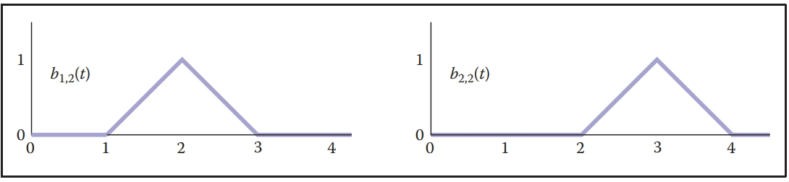
Figure 15.18. B-splines with $d = 1$ or $k = 2$. 
图 15.18。 $d = 1$ 或 $k = 2$ 的 B 样条线。

Each of these functions $b_{i,2}$ is a first-degree (linear) B-spline. Because we will consider B-splines of other parameter values later, we denote these with the 2 in the subscript.
这些函数 $b_{i,2}$ 中的每一个都是一次（线性）B 样条。 因为稍后我们将考虑其他参数值的 B 样条，所以我们用下标中的 2 表示它们。

Notice that we have chosen to put the lower edge of the B-spline (its first knot) at $i$. Therefore, the first knot of the first B-spline $(i = 1)$ is at 1. Iteration over the B-splines or elements of the coefficient vector is from 1 to n (see Equation 15.15). When B-splines are implemented, as well as in many other discussions of them, they often are numbered from 0 to $n − 1$. 
请注意，我们选择将 B 样条线的下边缘（其第一个结）放置在 $i$ 处。 因此，第一个 B 样条线 $(i = 1)$ 的第一个节点位于 1。B 样条线或系数向量元素的迭代范围为从 1 到 n（参见公式 15.15）。 当 B 样条被实现时，以及在它们的许多其他讨论中，它们通常从 0 到 $n − 1$ 进行编号。

We can create a function from a set of n control points using Equation 15.15, with these functions used for the $b_i$ to create an “overall function” that was influenced by the coefficients. If we were to use these $(k = 2)$ B-splines to define the overall function, we would define a piecewise polynomial function that linearly interpolates the coefficients $\bold{p}_i$ between $t = k$ and $t = n + 1$. Note that while $(k = 2)$ B-splines interpolate all of their coefficients, B-splines of higher degree do this under some specific conditions that we will discuss in Section 15.6.3. 
我们可以使用方程 15.15 从一组 n 个控制点创建一个函数，这些函数用于 $b_i$ 来创建受系数影响的“整体函数”。 如果我们使用这些 $(k = 2)$ B 样条来定义整体函数，我们将定义一个分段多项式函数，该函数在 $t = k$ 和 $ 之间线性插值系数 $\bold{p}_i$ t = n + 1$。 请注意，虽然 $(k = 2)$ B 样条对所有系数进行插值，但更高阶的 B 样条会在某些特定条件下执行此操作，我们将在第 15.6.3 节中讨论。

Some properties of B-splines can be seen in this simple case. We will write these in the general form using $k$, the parameter, and $n$ for the number of coefficients or control points:
在这个简单的例子中可以看到 B 样条的一些属性。 我们将使用 $k$（参数）和 $n$（表示系数或控制点的数量）以一般形式编写这些：

- Each B-spline has k + 1 knots. 
  每个 B 样条有 k + 1 个节。
- Each B-spline is zero before its first knot and after its last knot. 
  每个 B 样条在其第一个结之前和最后一个结之后为零。
- The overall spline has local control because each coefficient is only multiplied by one B-spline, and this B-spline is nonzero only between k + 1 knots. 
  整体样条具有局部控制，因为每个系数仅乘以一个 B 样条，并且该 B 样条仅在 k + 1 节之间非零。
- The overall spline has $n + k$ knots. 
  整体样条线有 $n + k$ 个结。
- Each B-spline is $C^{(k−2)}$ continuous, therefore the overall spline is $C^{(k−2)}$ continuous. 
  每个 B 样条线都是 $C^{(k−2)}$ 连续的，因此整个样条线是 $C^{(k−2)}$ 连续的。
- The set of B-splines sums to 1 for all parameter values between knots $k$ and $n+1$. This range is where there are $k$ B-splines that are nonzero. Summing to 1 is important because it means that the B-splines are shift invariant: translating the control points will translate the entire curve.
  对于节点 $k$ 和 $n+1$ 之间的所有参数值，B 样条集的总和为 1。 此范围是有 $k$ 个非零 B 样条的地方。 求和为 1 很重要，因为这意味着 B 样条曲线具有平移不变性：平移控制点将平移整条曲线。
- Between each of its knots, the B-spline is a single polynomial of degree $d = k − 1$. Therefore, the overall curve (that sums these together) can also be expressed as a single, degree d polynomial between any adjacent knots.
  在每个结之间，B 样条是一个次数为 $d = k − 1$ 的单个多项式。 因此，整体曲线（将它们相加）也可以表示为任何相邻结之间的单个 d 次多项式。

In this example, we have chosen the knots to be uniformly spaced. We will consider B-splines with nonuniform spacing later. When the knot spacing is uniform, each of the B-splines is identical except for being shifted. B-splines with uniform knot spacing are sometimes called uniform B-splines or periodic B-splines. 
在此示例中，我们选择了均匀间隔的结。 稍后我们将考虑具有不均匀间距的 B 样条线。 当结点间距均匀时，每个 B 样条线除了移动之外都是相同的。 具有均匀结间距的 B 样条有时称为均匀 B 样条或周期 B 样条。

#### Uniform Quadratic B-Splines 均匀二次 B 样条

The properties of B-splines listed in the previous section were intentionally written for arbitrary n and k. A general procedure for constructing the B-splines will be provided later, but first, lets consider another specific case with k = 3. 
上一节中列出的 B 样条属性是针对任意 n 和 k 有意编写的。 稍后将提供构建 B 样条的一般过程，但首先让我们考虑 k = 3 的另一个特定情况。

The B-spline $b_{2,3}$ is shown in Figure 15.19. It is made of quadratic pieces (degree 2), and has three of them. It is $C^1$ continuous and is nonzero only within the four knots that it spans. Notice that a quadratic B-spline is made of three pieces, one between knot 1 and 2, one between knot 2 and 3, and one between knot 3 and 4. In Section 15.6.3 we will see a general procedure for building these functions. For now, we simply examine these functions:
B 样条 $b_{2,3}$ 如图 15.19 所示。 它由二次块（2 次）组成，并且包含三个二次块。 它是 $C^1$ 连续的，并且仅在其跨越的四个节内不为零。 请注意，二次 B 样条由三部分组成，一个在结 1 和 2 之间，一个在结 2 和 3 之间，一个在结 3 和 4 之间。在第 15.6.3 节中，我们将看到构建这些函数的一般过程 。 现在，我们简单地检查这些函数：
$$
b_{i,3}(t) = \begin{cases}
\frac{1}{2}u^2 \ \ \ \ \  \ \ \ \ \ \ \ \ \ \ \ \ \ \ \ \ \ if\ i ≤ t < i + 1\ \ \ \ \ \ \ \ \ \ \ u = t − i, \\
-u^2 + u + \frac{1}{2}\ \ \ \ \ \ \ if\ i + 1 ≤ t < i + 2\ \ \ \  u = t − (i + 1), \\
\frac{1}{2}(1-u)^2\ \ \ \ \ \ \ \ \ \ \ \ if\ i + 2 ≤ t < i + 3\ \  \ \   u = t − (i + 2), \\
0\ \ \ \ \ \ \ \ \ \ \ \ \ \ \ \ \ \ \ \ \ \ \ \ \ \ \  otherwise.
\end{cases} \ \ \ \ \ \ (15.17) 
$$
In order to make the expressions simpler, we wrote the function for each part as if it applied over the range 0 to 1. 
为了使表达式更简单，我们为每个部分编写了函数，就像它应用于 0 到 1 的范围一样。
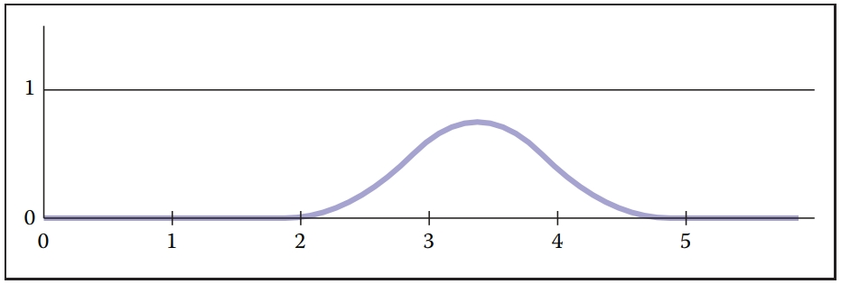
Figure 15.19. The B-spline $b_{2,3}$ with uniform knot spacing. 
图 15.19。 具有均匀结间距的 B 样条线 $b_{2,3}$。

If we evaluate the overall function made from summing together the B-splines, at any time only $k$ (3 in this case) of them are nonzero. One of them will be in the first part of Equation 15.17, one will be in the second part, and one will be in the third part. Therefore, we can think of any piece of the overall function as being made up of a degree $d = k - 1$ polynomial that depends on $k$ coefficients. For the $k = 3$ case, we can write
如果我们评估将 B 样条线相加得到的整体函数，则在任何时候只有 $k$（在本例中为 3）它们是非零的。 其中一个位于公式 15.17 的第一部分，一个位于第二部分，一个位于第三部分。 因此，我们可以将整个函数的任何部分视为由依赖于 $k$ 系数的 $d = k - 1$ 次多项式组成。 对于 $k = 3$ 的情况，我们可以写
$\bold{f}(u) = \frac{1}{2}(1-u)^2\bold{p}_i + (-u^2 + u +\frac{1}{2})\bold{p}_{i+1}+\frac{1}{2}u^2\bold{p}_{i+2}\\$

where $u = t−i$. This defines the piece of the overall function when $i ≤ t < i+1$. 
其中$u = t−i$。 这定义了当 $i ≤ t < i+1$ 时整个函数的部分。

If we have a set of $n$ points, we can use the B-splines to create a curve. If we have seven points, we will need a set of seven B-splines. A set of seven B-splines for $k = 3$ is shown in Figure 15.20. Notice that there are $n + k$ (10) knots, that the sum of the B-splines is 1 over the range $k$ to $n + 1$ (knots 3 through 8). A curve specified using these B-splines and a set of points is shown in Figure 15.21.
如果我们有一组 $n$ 个点，我们可以使用 B 样条线创建一条曲线。 如果我们有七个点，我们将需要一组七个 B 样条线。 $k = 3$ 的一组七个 B 样条如图 15.20 所示。 请注意，有 $n + k$ (10) 个节点，在 $k$ 到 $n + 1$ 范围内（节点 3 到 8），B 样条线的总和为 1。 使用这些 B 样条线和一组点指定的曲线如图 15.21 所示。
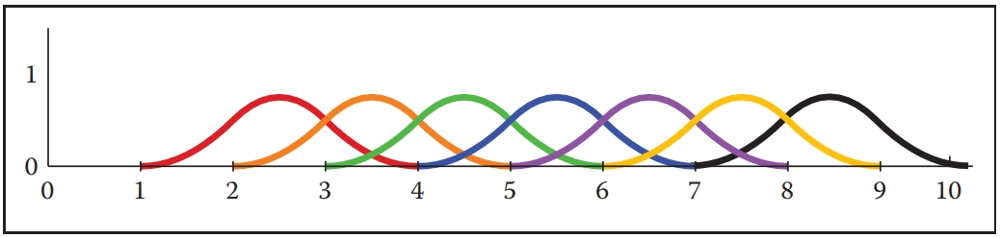
Figure 15.20. The set of seven B-splines with $k = 3$ and uniform knot spacing [1, 2, 3, 4, 5, 6, 7, 8, 10]. 
图 15.20。 七个 B 样条线的集合，其中 $k = 3$ 和均匀的结间距 [1, 2, 3, 4, 5, 6, 7, 8, 10]。

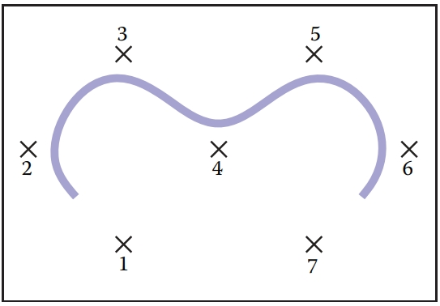
Figure 15.21. Curve made from seven quadratic $(k=3)$ B-splines, using seven control points. 
图 15.21。 由七个二次 $(k=3)$ B 样条线和七个控制点组成的曲线。

#### Uniform Cubic B-Splines  均匀三次 B 样条

Because cubic polynomials are so popular in computer graphics, the special case of B-splines with $k = 4$ is sufficiently important that we consider it before discussing the general case. A B-spline of third degree is defined by four cubic polynomial pieces. The general process by which these pieces are determined is described later, but the result is 
由于三次多项式在计算机图形学中非常流行，因此 $k = 4$ 的 B 样条的特殊情况非常重要，因此我们在讨论一般情况之前考虑它。 三阶 B 样条由四个三次多项式块定义。 确定这些件的一般过程将在后面描述，但结果是
$$
b_{i,4}(t) = \begin{cases}
\frac{1}{6}u^3 \ \ \ \ \ \ \ \ \ \ \ \ \ \ \ \ \ \ \ \ \ \ \ \ \ \ \ \ \ \ \ \ \ \ \ \ \ \ \ \ \ \ if\ i ≤ t < i + 1\ \ \ \ \ \ \ \ \  u = t − i, \\
\frac{1}{6}(−3u^3 + 3u^2 + 3u + 1)\ \ \ \ \ \ \ if\ i + 1 ≤ t < i + 2\ \  u = t − (i + 1), \\
\frac{1}{6}(3u^3 − 6u^2 + 4)\ \ \ \ \ \ \ \ \ \ \ \ \ \ \ \ \ \ \ if\ i + 2 ≤ t < i + 3\ \   u = t − (i + 2), \\
\frac{1}{6}(−u^3 + 3u^2 − 3u + 1)\ \ \ \ \ \ \ \ \ if\ i + 3 ≤ t < i + 4\ \   u = t − (i + 3), \\
0\ \ \ \ \ \ \ \ \ \ \ \ \ \ \ \ \ \ \ \ \ \ \ \ \ \ \ \ \ \ \ \ \ \ \ \ \ \ \ \ \ \ \ \ \ \ \  otherwise
\end{cases} \ \ \ \ \ \ \ (15.18)
$$
This degree 3 B-spline is graphed for $i = 1$ in Figure 15.22. 
该 3 次 B 样条曲线在图 15.22 中以 $i = 1$ 绘制。
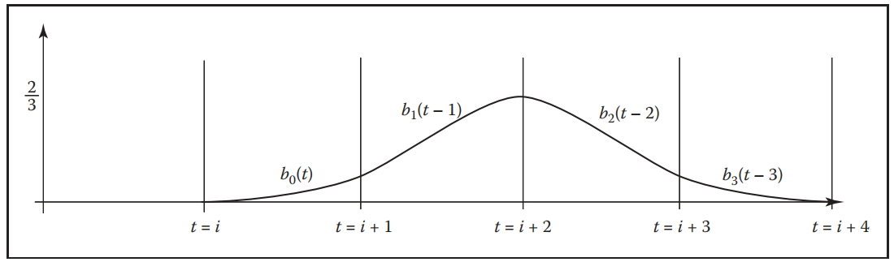
Figure 15.22. The cubic $(k = 4)$ B-spline with uniform knots. 
图 15.22。 具有均匀结的三次 $(k = 4)$ B 样条。

We can write the function for the overall curve between knots $i + 3$ and $i + 4$ as a function of the parameter $u$ between 0 and 1 and the four control points that influence it:
我们可以将节点 $i + 3$ 和 $i + 4$ 之间的整体曲线的函数写为 0 和 1 之间的参数 $u$ 以及影响它的四个控制点的函数：
$\bold{f}(u) = \frac{1}{6}(-u^3 + 3u^2 - 3u + 1)\bold{p}_i + \frac{1}{6}(3u^3 - 6u^2 + 4)\bold{p}_{i+1} + \frac{1}{6} (-3u^3 + 3u^2 + 3u + 1)\bold{p}_{i+2} + \frac{1}{6}u^3\bold{p}_{i+3}  \\$

This can be rewritten using the matrix notation of the previous sections, giving a basis matrix for cubic B-splines of 
这可以使用前面部分的矩阵表示法重写，给出三次 B 样条的基础矩阵
$$
\bold{M}_b = \frac{1}{6}\begin{bmatrix}
−1 & 3 & −3 & 1 \\
3 & −6 & 3 & 0 \\
−3 & 0 & 3 & 0 \\
1 & 4 & 1 & 0
\end{bmatrix}
$$
Unlike the matrices that were derived from constraints in Section 15.5, this matrix is created from the polynomials that are determined by the general B-spline procedure defined in the next section.
与第 15.5 节中从约束导出的矩阵不同，该矩阵是根据下一节中定义的通用 B 样条过程确定的多项式创建的。

### 15.6.3 Nonuniform B-Splines 非均匀 B 样条

One nice feature of B-splines is that they can be defined for any $k > 1$. So if we need a smoother curve, we can simply increase the value of $k$. This is illustrated in Figure 15.23. 
B 样条线的一个很好的功能是可以为任何 $k > 1$ 定义它们。 所以如果我们需要更平滑的曲线，我们可以简单地增加$k$的值。 如图 15.23 所示。
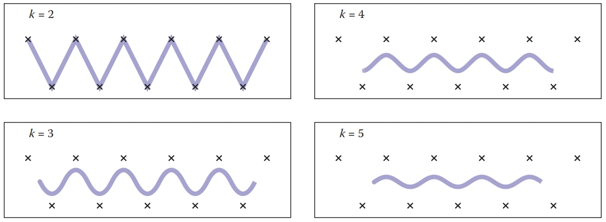
Figure 15.23. B-spline curves using the same uniform set of knots and the same control points, for various values of $k$. Note that as $k$ increases, the valid parameter range for the curve shrinks.
图 15.23。 对于不同的 $k$ 值，B 样条曲线使用相同的统一节点集和相同的控制点。 请注意，随着 $k$ 的增加，曲线的有效参数范围会缩小。

So far, we have said that B-splines generalize to any $k > 1$ and any $n ≥ d$. There is one last generalization to introduce before we show how to actually compute these B-splines. B-splines are defined for any non-decreasing knot vector. 
到目前为止，我们已经说过 B 样条可以推广到任何 $k > 1$ 和任何 $n ≥ d$。 在我们展示如何实际计算这些 B 样条之前，需要介绍最后一项概括。 B 样条是为任何非递减结向量定义的。

For a given n and k, the set of B-splines (and the function created by their linear combination) has $n + k$ knots. We can write the value of these knots as a vector, that we will denote as $t$. For the uniform B-splines, the knot vector is $[1, 2, 3, . . . , n + k]$. However, B-splines can be generated for any knot vector of length $n + k$, providing the values are non-decreasing (e.g., $t_{i+1} ≥ t_i$). 
对于给定的 n 和 k，B 样条集（以及由它们的线性组合创建的函数）有 $n + k$ 个结。 我们可以将这些结的值写成一个向量，我们将其表示为 $t$。 对于均匀 B 样条，结向量为 $[1, 2, 3, ...。 。 。 , n + k]$。 但是，可以为长度为 $n + k$ 的任何节点向量生成 B 样条，前提是这些值是非递减的（例如，$t_{i+1} ≥ t_i$）。

There are two main reasons why nonuniform knot spacing is useful: it gives us control over what parameter range of the overall function each coefficient affects, and it allows us to repeat knots (e.g., create knots with no spacing in between) in order to create functions with different properties around these points. The latter will be considered later in this section. 
非均匀结间距有用的主要原因有两个：它使我们能够控制每个系数影响的整体函数的参数范围，并且它允许我们重复结（例如，创建之间没有间距的结）以创建 围绕这些点具有不同属性的函数。 本节稍后将讨论后者。

The ability to specify knot values for B-splines is similar to being able to specify the interpolation sites for interpolating spline curves. It allows us to associate curve features with parameter values. By specifying a nonuniform knot vector, we specify what parameter range each coefficient of a B-spline curve affects. Remember that B-spline $i$ is nonzero only between knot $i$ and knot $i + k$. Therefore, the coefficient associated with it only affects the curve between these parameter values. 
为 B 样条曲线指定节点值的能力类似于为插值样条曲线指定插值位置的能力。 它允许我们将曲线特征与参数值关联起来。 通过指定非均匀结向量，我们可以指定 B 样条曲线的每个系数影响的参数范围。 请记住，B 样条 $i$ 仅在结 $i$ 和结 $i + k$ 之间不为零。 因此，与其相关的系数仅影响这些参数值之间的曲线。

One place where control over knot values is particularly useful is in inserting or deleting knots near the beginning of a sequence. To illustrate this, consider a curve defined using linear B-splines $(k = 2)$ as discussed in Section 15.6.2. For $n = 4$, the uniform knot vector is $[1, 2, 3, 4, 5, 6]$. This curve is controlled by a set of four points and spans the parameter range $t = 2$ to $t = 5$. The “end” of the curve $(t = 5)$ interpolates the last control point. If we insert a new point in the middle of the point set, we would need a longer knot vector. The locality properties of the B-splines prevent this insertion from affecting the values of the curve at the ends. The longer curve would still interpolate its last control point at its end. However, if we chose to keep the uniform knot spacing, the new knot vector would be $[1, 2, 3, 4, 5, 6, 7]$. The end of the curve would be at $t = 6$, and the parameter value at which the last control point is interpolated will be a different parameter value than before the insertion. With nonuniform knot spacing, we can use the knot vector $[1, 2, 3, 3.5, 4, 5, 6]$ so that the ends of the curve are unaffected by the change. The abilities to have nonuniform knot spacing makes the locality property of B-splines an algebraic property, as well as a geometric one. 
控制结值特别有用的一个地方是在序列开头附近插入或删除结。 为了说明这一点，请考虑使用线性 B 样条 $(k = 2)$ 定义的曲线，如第 15.6.2 节中所述。 对于 $n = 4$，均匀结向量为 $[1, 2, 3, 4, 5, 6]$。 该曲线由一组四个点控制，参数范围为 $t = 2$ 到 $t = 5$。 曲线 $(t = 5)$ 的“末端”对最后一个控制点进行插值。 如果我们在点集中间插入一个新点，我们将需要更长的结向量。 B 样条线的局部性属性可防止此插入影响曲线末端的值。 较长的曲线仍会在其末端插入最后一个控制点。 但是，如果我们选择保持均匀的结间距，则新的结向量将为 $[1, 2, 3, 4, 5, 6, 7]$。 曲线的终点将位于 $t = 6$ 处，最后一个控制点插值处的参数值将与插入之前的参数值不同。 对于不均匀的结间距，我们可以使用结向量 $[1, 2, 3, 3.5, 4, 5, 6]$ 以使曲线的末端不受变化的影响。 具有不均匀结间距的能力使 B 样条的局部性成为代数性质和几何性质。

We now introduce the general method for defining B-splines. Given values for the number of coefficients $n$, the B-spline parameter $k$, and the knot vector $\bold{t}$ (which has length $n + k$), the following recursive equations define the B-splines:
现在介绍定义 B 样条的一般方法。 给定系数数量 $n$、B 样条参数 $k$ 和结向量 $\bold{t}$（长度为 $n + k$）的值，以下递归方程定义 B- 样条线：
$$
b_{i,1,\bold{t}}(t) = \begin{cases}
1 \ \ \ \ \ \ if\ \bold{t}_i ≤ t < \bold{t}_{i+1}, \\
0 \ \ \ \ \ \ otherwise.		\\
\end{cases}\ \ \ \ \ (15.19) \\
b_{i,k,\bold{t}}(t) = \frac{t-\bold{t}_i}{\bold{t}_{i+k-1}- \bold{t}_i}b_{i,k-1}(t) + \frac{\bold{t}_{i+k} - t}{\bold{t}_{i+k}-\bold{t}_{i+1}}b_{i+1,k-1}(t)\ \ \ \ \ \ \ \ (15.20)
$$
This equation is know as the Cox–de Boor recurrence. It may be used to compute specific values for specific B-splines. However, it is more often applied algebraically to derive equations such as Equation 15.17 or 15.18.
该方程称为 Cox-de Boor 递推式。 它可用于计算特定 B 样条的特定值。 然而，它更常用于代数推导方程，如方程 15.17 或 15.18。

As an example, consider how we would have derived Equation 15.17. Using a uniform knot vector $[1, 2, 3, . . .]$, $t_i = i$, and the value $k = 3$ in Equation 15.20 yields
作为一个例子，考虑一下我们如何推导公式 15.17。 使用统一的结向量 $[1, 2, 3, . 。 .]$、$t_i = i$，以及公式 15.20 中的值 $k = 3$ 得出
$$
b_{i,3}(t) = \frac{t-i}{(i+2)-i}b_{i,2} + \frac{(i+3) - t}{(i+3)-(i+1)}b_{i+1,2} = \frac{1}{2}(t-i)b_{i,2} + \frac{1}{2}(i+3-t)b_{i+1,2} \ \ \ \ \ \ (15.21)
$$
Continuing the recurrence, we must evaluate the recursive expressions: 
继续递归，我们必须计算递归表达式：
$$
b_{i,2}(t) = \frac{t-i}{(i+2-1) - i}b_{i,1} + \frac{(i+2) - t}{(i+2)-(i+1)}b_{i+1,1}
 = (t-i)b_{i,1} + (i+2-t)b_{i+1,1}
$$

$$
b_{i+1, 2}(t) = \frac{t-(i+1)}{((i+1)+2-1)-(i+1)}b_{i+1,1} + \frac{((i+1)+2)-t}{((i+1)+2)-((i+1)+1)}b_{(i+1)+1,1} \\
= (t-i+1)b_{i+1,1}+(i+3-t)b_{i+2,1}
$$

Inserting these results into Equation 15.22 gives: 
 将这些结果代入公式 15.22 得出：
$$
b_{i,3}(t) = \frac{1}{2}(t-i)((t-i)b_{i,1}+(i+2-t)b_{i+1,1}) \\
+ \frac{1}{2}(i+3-t)(t-i+1)b_{i+1,1} + (i+3-t)b_{i+2,1}
$$
To see that this expression is equivalent to Equation 15.17, we note that each of the $(k = 1)$ B-splines is like a switch, turning on only for a particular parameter range. For instance, $b_{i,1}$ is only nonzero between $i$ and $i + 1$. So, if $i ≤ t < i + 1$, only the first of the $(k = 1)$ B-splines in the expression is nonzero, so
为了看出这个表达式等价于公式 15.17，我们注意到每个 $(k = 1)$ B 样条线就像一个开关，仅在特定的参数范围内打开。 例如，$b_{i,1}$ 仅在 $i$ 和 $i + 1$ 之间为非零。 因此，如果 $i ≤ t < i + 1$，则表达式中只有第一个 $(k = 1)$ B 样条线为非零，因此
$$
b_{i,3}(t) = \frac{1}{2}(t-i)^2\ \ \ \ \ if\ i ≤ t < i + 1.
$$
Similar manipulations give the other parts of Equation 15.17. 
公式 15.17 的其他部分也可进行类似的处理。

#### Repeated Knots and B-Spline Interpolation  重复结和 B 样条插值

While B-splines have many nice properties, functions defined using them generally do not interpolate the coefficients. This can be inconvenient if we are using them to define a curve that we want to interpolate a specific point. We give a brief overview of how to interpolate a specific point using B-splines here. A more complete discussion can be found in the books listed in the chapter notes. 
虽然 B 样条曲线具有许多良好的属性，但使用它们定义的函数通常不会对系数进行插值。 如果我们使用它们来定义要插入特定点的曲线，这可能会很不方便。 我们在此简要概述如何使用 B 样条线插值特定点。 更完整的讨论可以在章节注释中列出的书籍中找到。

One way to cause B-splines to interpolate their coefficients is to repeat knots. If all of the interior knots for a particular B-spline have the same value, then the overall function will interpolate this B-spline’s coefficient. An example of this is shown in Figure 15.24. 
使 B 样条插值其系数的一种方法是重复结。 如果特定 B 样条线的所有内部结都具有相同的值，则整体函数将对该 B 样条线的系数进行插值。 图 15.24 显示了一个示例。
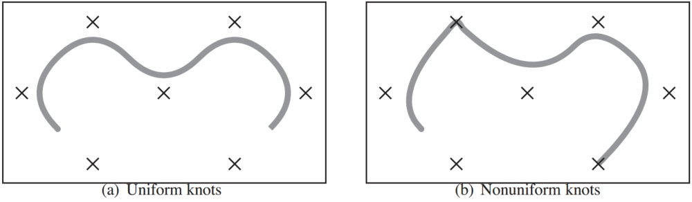
Figure 15.24. A curve parameterized by quadratic B-splines (k = 3) with seven control points. On the left, uniform knots vector [1,2,3,4,5,6,7,8,9,10] is used. On the right, the nonuniform knot spacing [1,2,3,4,4,6,7,8,8,10] is used. The duplication of the 4th and 8th knot means that all interior knots of the 3rd and 7th B-spline are equal, so the curve interpolates the control point associated with those points.
图 15.24。 由具有七个控制点的二次 B 样条曲线 (k = 3) 参数化的曲线。 左侧使用均匀结向量 [1,2,3,4,5,6,7,8,9,10]。 右侧使用不均匀的结间距 [1,2,3,4,4,6,7,8,8,10]。 第 4 个和第 8 个节点的重复意味着第 3 个和第 7 个 B 样条线的所有内部节点相等，因此曲线会插入与这些点关联的控制点。

Interpolation by repeated knots comes at a high cost: it removes the smoothness of the B-spline and the resulting overall function and represented curve. However, at the beginning and end of the spline, where continuity is not an issue, knot repetition is useful for creating endpoint interpolating B-splines. While the first (or last) knot’s value is not important for interpolation, for simplicity, we make the first (or last) k knots have the same value to achieve interpolation. 
通过重复节点进行插值的成本很高：它消除了 B 样条线以及所得整体函数和表示曲线的平滑度。 然而，在样条线的开始和结束处，连续性不是问题，结重复对于创建端点插值 B 样条线非常有用。 虽然第一个（或最后一个）结的值对于插值并不重要，但为了简单起见，我们使第一个（或最后一个）k结具有相同的值来实现插值。

Endpoint interpolating quadratic B-splines are shown in Figure 15.25. The first two and last two B-splines are different than the uniform ones. Their expressions can be derived through the use of the Cox–de Boor recurrence: 
端点插值二次 B 样条如图 15.25 所示。 前两个和最后两个 B 样条曲线与统一样条曲线不同。 它们的表达式可以通过使用 Cox-de Boor 递归推导得出：
$$
b_{1,3,[0,0,0,1,2,...]}(t) = \begin{cases}
(1-t)^2\ \ \ \ \ if\ 0 ≤ t <1, \\
0 \ \  \ \ \ \ \ \ \ \ \ \ \ \ \ \ otherwise. 
\end{cases}
$$

$$
b_{2,3,[0,0,0,1,2,...]}(t) = \begin{cases}
2u − \frac{3}{2}u^2\ \ \ \ \ \ if\ 0 ≤ t < 1\ u = t, \\
\frac{1}{2}(1-u)^2 \ \ \ \ \ if\ 1 ≤ t < 2\ u = t − 1, \\
0 \ \ \ \ \ otherwise.
\end{cases}
$$

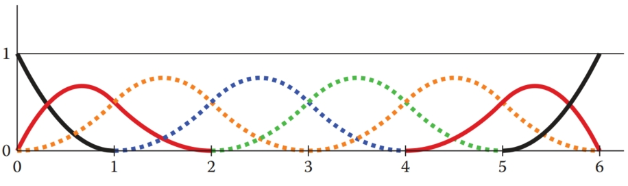
Figure 15.25. Endpoint interpolating quadratic (k = 3) B-splines, for n = 8. The knot vector is [0,0,0,1,2,3,4,5,6,6,6]. The first and last two B-splines are aperiodic, while the middle four (shown as dotted lines) are periodic and identical to the ones in Figure 15.20.
图 15.25。 端点插值二次 (k = 3) B 样条，n = 8。结向量为 [0,0,0,1,2,3,4,5,6,6,6]。 第一个和最后两个 B 样条是非周期性的，而中间的四个（如虚线所示)是周期性的，与图 15.20 中的相同。

### 15.6.4 NURBS 

Despite all of the generality B-splines provide, there are some functions that cannot be exactly represented using them. In particular, B-splines cannot represent conic sections. To represent such curves, a ratio of two polynomials is used. Nonuniform B-splines are used to represent both the numerator and the denominator. The most general form of these are nonuniform rational B-splines, or NURBS for short. 
尽管 B 样条具有所有的通用性，但仍有一些函数无法使用它们精确表示。 特别是，B 样条曲线不能表示圆锥曲线。 为了表示此类曲线，使用两个多项式的比率。 非均匀 B 样条曲线用于表示分子和分母。 其中最常见的形式是非均匀有理 B 样条曲线，简称 NURBS。

NURBS associate a scalar weight hi with every control point pi and use the same B-splines for both:
NURBS 将标量权重 hi 与每个控制点 pi 相关联，并对两者使用相同的 B 样条线：
$$
\bold{f}(u) = \frac{\sum^n_{i=1}h_i\bold{p}_ib_{i,k,\bold{t}}}{\sum^n_{i=1}h_ib_{i,k,\bold{t}}}
$$
where $b_{i,k,\bold{t}}$ are the B-splines with parameter $k$ and knot vector $\bold{t}$. 
其中 $b_{i,k,\bold{t}}$ 是带有参数 $k$ 和结向量 $\bold{t}$ 的 B 样条线。

NURBS are very widely used to represent curves and surfaces in geometric modeling because of the amazing versatility they provide, in addition to the useful properties of B-splines.
NURBS 非常广泛地用于表示几何建模中的曲线和曲面，因为除了 B 样条线的有用属性之外，它们还提供了惊人的多功能性。

## 15.7 Summary 总结

In this chapter, we have discussed a number of representations for free-form curves. The most important ones for computer graphics are: 
在本章中，我们讨论了自由曲线的多种表示形式。 计算机图形学最重要的是：

- Cardinal splines use a set of cubic pieces to interpolate control points. They are generally preferred to interpolating polynomials because they are local and easier to evaluate. 
  基数样条使用一组三次块来插值控制点。 它们通常优于插值多项式，因为它们是局部的并且更容易评估。
- Bezier curves approximate their control points and have many useful properties and associated algorithms. For this reason, they are popular in graphics applications. 
  贝塞尔曲线近似其控制点，并具有许多有用的属性和相关算法。 因此，它们在图形应用程序中很受欢迎。
- B-spline curves represent the curve as a linear combination of B-spline functions. They are general and have many useful properties such as being bounded by their convex hull and being variation diminishing. B-splines are often used when smooth curves are desired. 
  B 样条曲线将曲线表示为 B 样条函数的线性组合。 它们是通用的，并且具有许多有用的属性，例如受凸包限制以及变化递减。 当需要平滑曲线时，通常使用 B 样条曲线。

## Notes 注释

The problem of representing shapes mathematically is an entire field unto itself, generally known as geometric modeling. Representing curves is just the beginning and is generally a precursor to modeling surfaces and solids. A more thorough discussion of curves can be found in most geometric modeling texts, see for example Geometric Modeling (Mortenson, 1985) for a text that is accessible to computer graphics students. Many geometric modeling books specifically focus on smooth curves and surfaces. Texts such as An Introduction to Splines for Use in Computer Graphics (Bartels, Beatty, & Barsky, 1987), Curves and Surfaces for CAGD: A Practical Guide (Farin, 2002) and Geometric Modeling with Splines: An Introduction (E. Cohen, Riesenfeld, & Elber, 2001) provide considerable detail about curve and surface representations. Other books focus on the mathematics of splines; A Practical Guide to Splines (De Boor, 2001) is a standard reference. 
以数学方式表示形状的问题本身就是一个完整的领域，通常称为几何建模。 表示曲线只是开始，并且通常是建模曲面和实体的先驱。 在大多数几何建模文本中都可以找到对曲线的更全面的讨论，例如，请参阅《几何建模》（Mortenson，1985），了解计算机图形学学生可以访问的文本。 许多几何建模书籍特别关注平滑的曲线和曲面。 诸如《计算机图形学中样条曲线简介》（Bartels、Beatty 和 Barsky，1987 年）、CAGD 曲线和曲面：实用指南（Farin，2002 年）和《样条曲线几何建模：简介》（E. Cohen， Riesenfeld, & Elber, 2001）提供了有关曲线和曲面表示的大量细节。 其他书籍侧重于样条的数学； 样条实用指南（De Boor，2001）是标准参考。

The history of the development of curve and surface representations is complex, see the chapter by Farin in Handbook of Computer Aided Geometric Design (Farin, Hoschek, & Kim, 2002) or the book on the subject An Introduction to NURBS: With Historical Perspective (D. F. Rogers, 2000) for a discussion. Many ideas were independently developed by multiple groups who approached the problems from different disciplines. Because of this, it can be difficult to attribute ideas to a single person or to point at the “original” sources. It has also led to a diversity of notation, terminology, and ways of introducing the concepts in the literature. 
曲线和曲面表示的发展历史很复杂，请参阅 Farin 在《计算机辅助几何设计手册》（Farin、Hoschek 和 Kim，2002 年）中的章节或有关该主题的书《NURBS 简介：历史视角》（ D. F. Rogers, 2000）进行了讨论。 许多想法是由多个小组独立开发的，他们从不同的学科来解决问题。 因此，很难将想法归因于某个人或指出“原始”来源。 它还导致了文献中符号、术语和引入概念的方式的多样性。

### 15.7.1 Exercises 练习

For Exercises 1–4, find the constraint matrix, the basis matrix, and the basis functions. To invert the matrices you can use a program such as MATLAB or OCTAVE (a free MATLAB-like system). 
对于练习 1-4，找到约束矩阵、基矩阵和基函数。 要反转矩阵，您可以使用 MATLAB 或 OCTAVE（一个免费的类似 MATLAB 的系统）等程序。

1. A line segment: parameterized with $\bold{p}_0$ located $25\%$ of the way along the segment $(u = 0.25)$, and $\bold{p}_1$ located 75% of the way along the segment. 
   线段：参数化为 $\bold{p}_0$ 位于沿线段 $(u = 0.25)$ 的 $25\%$ 处，$\bold{p}_1$ 位于沿线段 $(u = 0.25)$ 的 75% 处 沿着该段。
2. A quadratic: parameterized with $\bold{p}_0$  as the position of the beginning point (u = 0), $\bold{p}_1$ , the first derivative at the beginning point, and $\bold{p}_2$ , the second derivative at the beginning point. 
   二次方程：参数化为 $\bold{p}_0$ 为起点位置 (u = 0)， $\bold{p}_1$ 为起点处的一阶导数，$\bold{ p}_2$ ，起点处的二阶导数。
3. A cubic: its control points are equally spaced ($\bold{p}_0$  has u = 0, $\bold{p}_1$  has u = 1/3, $\bold{p}_2$  has u = 2/3, and $\bold{p}_3$  has u = 1). 
   立方体：其控制点等距（$\bold{p}_0$ 的 u = 0，$\bold{p}_1$ 的 u = 1/3，$\bold{p}_2$ 的 u = 1/3 = 2/3，$\bold{p}_3$ 的 u = 1)。
4. A quintic: (a degree five polynomial, so the matrices will be 6×6) where $\bold{p}_0$  is the beginning position, $\bold{p}_1$  is the beginning derivative, $\bold{p}_2$  is the middle (u = 0.5) position, $\bold{p}_3$  is the first derivative at the middle, $\bold{p}_4$  is the position at the end, and $\bold{p}_5$  is the first derivative at the end. 
   五次多项式：（五次多项式，因此矩阵为 6×6）其中 $\bold{p}_0$ 是起始位置，$\bold{p}_1$ 是起始导数，$\bold {p}_2$ 是中间（u = 0.5）位置，$\bold{p}_3$ 是中间的一阶导数，$\bold{p}_4$ 是末尾的位置，$\bold {p}_5$ 是最后的一阶导数。
5. The Lagrange form (Equation (15.12)) can be used to represent the interpolating cubic of Exercise 3. Use it at several different parameter values to confirm that it does produce the same results as the basis functions derived in Exercise 3.
   拉格朗日形式（方程（15.12））可用于表示练习 3 的插值三次。在几个不同的参数值下使用它，以确认它确实产生与练习 3 中导出的基函数相同的结果。
6. Devise an arc-length parameterization for the curve represented by the parametric function 
   为参数函数表示的曲线设计弧长参数化
   $f(u) = (u, u^2)$. 
7. Given the four control points of a segment of a Hermite spline, compute the control points of an equivalent Bezier segment. 
   给定 Hermite 样条线段的四个控制点，计算等效 Bezier 线段的控制点。
8. Use the de Casteljau algorithm to evaluate the position of the cubic Bezier curve with its control points at (0,0), (0,1), (1,1) and (1,0) for parameter values u = 0.5 and u = 0.75. Drawing a sketch will help you do this. 
   使用 de Casteljau 算法评估三次贝塞尔曲线的位置，其控制点位于 (0,0)、(0,1)、(1,1) 和 (1,0)，参数值 u = 0.5 且 u = 0.75。 画草图可以帮助你做到这一点。
9. Use the Cox–de Boor recurrence to derive Equation (15.16).
   使用 Cox–de Boor 递推推导出方程 (15.16)。
