[TOC]

------


# Preface 前言

This edition of Fundamentals of Computer Graphics includes substantial rewrites of the chapters on textures and graphics hardware, as well as many corrections throughout. The figures are now in color throughout the book.
本版的《计算机图形学基础》一书对纹理和图形硬件的章节进行了大量重写，并进行了许多修正。本书中的所有图形都是彩色的。

The organization of the book remains substantially similar to the third edition. In our thinking, Chapters 2 through 8 constitute the “core core,” taking the straight and narrow path through what is absolutely required for understanding how images get onto the screen using the complementary approaches of ray tracing and rasterization. Ray tracing is covered first, since it is the simplest way to generate images of 3D scenes, followed by the mathematical machinery required for the graphics pipeline, then the pipeline itself. After that, the “outer core” covers other topics that would commonly be included in an introductory class, such as sampling theory, texture mapping, spatial data structures, and splines. Starting with Chapter 15 is a number of contributed chapters, authored by contributors we have chosen both for their expertise and for their clear way of expressing ideas.
本书的组织结构与第三版基本相似。在我们的思考中，第2章到第8章构成了“核心中的核心”，通过光线跟踪和光栅化的互补方法，沿着直线和狭窄的道路，了解将图像放到屏幕上所需的绝对要求。由于光线跟踪是生成3D场景图像的最简单方法，因此首先介绍光线跟踪，然后介绍图形管道所需的数学机制，然后介绍管道本身。之后，“核心之外”涵盖了其他通常包括在入门课程中的主题，例如采样理论、纹理映射、空间数据结构和样条。从第15章开始，是一些贡献章节，由我们选择的专业人士和表达思想清晰的贡献者编写。

As we have revised this book over the years, we have endeavored to retain the informal, intuitive style of presentation that characterizes the earlier editions, while at the same time improving consistency, precision, and completeness. We hope the reader will find the result is an appealing platform for a variety of courses in computer graphics.  
多年来，我们在修订本书时，一直努力保留早期版本所具有的非正式、直观的演示风格，同时提高了一致性、精度和完整性。我们希望读者能发现，这个结果是一个吸引人的平台，适用于各种计算机图形学课程。

## About the Cover 封面

The cover image is from Tiger in the Water by J. W. Baker (brushed and airbrushed acrylic on canvas, 16” by 20”, www.jwbart.com).
封面图片来自J.W.贝克（J. W. Baker）的《水中老虎》（Tiger in the Water）（16英寸×20英寸，刷涂和喷涂丙烯酸画布，www.jwbart.com）。

The subject of a tiger is a reference to a wonderful talk given by Alain Fournier(1943–2000) at a workshop at Cornell University in 1998. His talk was an evocative verbal description of the movements of a tiger. He summarized his point:
老虎的主题是对Alain Fournier（1943-2000）在1998年康奈尔大学的研讨会上发表的精彩演讲的参考。他的演讲是对老虎运动的生动口头描述。他总结了他的观点：

Even though modelling and rendering in computer graphics have been improved tremendously in the past 35 years, we are still not at the point where we can model automatically a tiger swimming in the river in all its glorious details. By automatically I mean in a way that does not need careful manual tweaking by an artist/expert. The bad news is that we have still a long way to go. The good news is that we have still a long way to go.
尽管在过去的35年中，计算机图形学中的建模和渲染得到了极大的改进，但我们仍然没有达到自动建模老虎在河中游泳的所有辉煌细节的地步。自动化是指以不需要艺术家/专家进行仔细手动调整的方式。坏消息是我们还有很长的路要走。好消息是我们还有很长的路要走。

## Online Resources 在线资源

The website for this book is http://www.cs.cornell.edu/∼srm/fcg4/. We will continue to maintain a list of errata and links to courses that use the book, as well as teaching materials that match the book’s style. Most of the figures in this book are in Adobe Illustrator format, and we would be happy to convert specific figures into portable formats on request. Please feel free to contact us at shirley@cs.utah.edu or srm@cs.cornell.edu.  
本书的网站是 http://www.cs.cornell.edu/∼srm/fcg4/。我们将继续维护勘误表和使用本书的课程链接，以及与本书风格相匹配的教学材料。本书中的大多数图形都是Adobe Illustrator格式的，如果需要，我们可以将特定图形转换为便携式格式。如有任何问题，请随时通过shirley@cs.utah.edu或srm@cs.cornell.edu与我们联系。

## Acknowledgments 鸣谢

The following people have provided helpful information, comments, or feedback about the various editions of this book: Ahmet Oguz Aky¨ ˘ uz, Josh Andersen, Zeferino Andrade, Kavita Bala, Adam Berger, Adeel Bhutta, Solomon Boulos, Stephen Chenney, Michael Coblenz, Greg Coombe, Frederic Cremer, Brian Curtin, Dave Edwards, Jonathon Evans, Karen Feinauer, Amy Gooch, Eungyoung Han, Chuck Hansen, Andy Hanson, Razen Al Harbi, Dave Hart, John Hart, John “Spike” Hughes, Helen Hu, Vicki Interrante, Wenzel Jakob, Doug James, Henrik Wann Jensen, Shi Jin, Mark Johnson, Ray Jones, Revant Kapoor, Kristin Kerr, Erum Arif Khan, Mark Kilgard, Dylan Lacewell, Mathias Lang, Philippe Laval, Marc Levoy, Howard Lo, Joann Luu, Ron Metoyer, Keith Morley, Eric Mortensen, Koji Nakamaru, Micah Neilson, Blake Nelson, Michael Nikelsky, James O’Brien, Steve Parker, Sumanta Pattanaik, Matt Pharr, Peter Poulos, Shaun Ramsey, Rich Riesenfeld, Nate Robins, Nan Schaller, Chris Schryvers, Tom Sederberg, Richard Sharp, Sarah Shirley, Peter-Pike Sloan, Hannah Story, Tony Tahbaz, Jan-Phillip Tiesel, Bruce Walter, Alex Williams, Amy Williams, Chris Wyman, and Kate Zebrose. 
以下人员为本书的各个版本提供了有用的信息、评论或反馈：Ahmet Oguz Aky¨ ˘ uz、Josh Andersen、Zeferino Andrade、Kavita Bala、Adam Berger、Adeel Bhutta、Solomon Boulos、Stephen Chenney、Michael Coblenz、Greg Coombe、Frederic Cremer、Brian Curtin、Dave Edwards、Jonathon Evans、Karen Feinauer、Amy Gooch、Eungyoung Han、Chuck Hansen、Andy Hanson、Razen Al Harbi、Dave Hart、John Hart、John “Spike” Hughes、Helen Hu、Vicki Interrante、Wenzel Jakob、Doug James、Henrik Wann Jensen、Shi Jin、Mark Johnson、Ray Jones、Revant Kapoor、Kristin Kerr、Erum Arif Khan、Mark Kilgard、Dylan Lacewell、Mathias Lang、Philippe Laval、Marc Levoy、Howard Lo、Joann Luu、Ron Metoyer、Keith Morley、Eric Mortensen、Koji Nakamaru、Micah Neilson、Blake Nelson、Michael Nikelsky、James O’Brien、Steve Parker、Sumanta Pattanaik、Matt Pharr、Peter Poulos、Shaun Ramsey、Rich Riesenfeld、Nate Robins、Nan Schaller、Chris Schryvers、Tom Sederberg、Richard Sharp、Sarah Shirley、Peter-Pike Sloan、Hannah Story、Tony Tahbaz、Jan-Phillip Tiesel、Bruce Walter、Alex Williams、Amy Williams、Chris Wyman和Kate Zebrose。

Ching-Kuang Shene and David Solomon allowed us to borrow their examples. Henrik Wann Jensen, Eric Levin, Matt Pharr, and Jason Waltman generously provided images. Brandon Mansfield helped improve the discussion of hierarchical bounding volumes for ray tracing. Philip Greenspun (philip.greenspun.com)  kindly allowed us to use his photographs. John “Spike” Hughes helped improve the discussion of sampling theory. Wenzel Jakob’s Mitsuba renderer was invaluable in creating many figures. We are extremely thankful to J. W. Baker for helping create the cover Pete envisioned. In addition to being a talented artist, he was a great pleasure to work with personally. 
Ching-Kuang Shene和David Solomon允许我们借用他们的例子。Henrik Wann Jensen、Eric Levin、Matt Pharr和Jason Waltman慷慨地提供了图像。Brandon Mansfield帮助改进了光线跟踪中分层边界体的讨论。Philip Greenspun（philip.greenspun.com）慷慨地允许我们使用他的照片。John “Spike” Hughes帮助改进了采样理论的讨论。Wenzel Jakob的Mitsuba渲染器在创建许多图形中非常有价值。我们非常感谢J.W.贝克（J. W. Baker）帮助创作Pete设想的封面。除了是一位才华横溢的艺术家外，他还是一位非常愉快的合作伙伴。

Many works that were helpful in preparing this book are cited in the chapter notes. However, a few key texts that influenced the content and presentation deserve special recognition here. These include the two classic computer graphics texts from which we both learned the basics: Computer Graphics: Principles & Practice (Foley, Van Dam, Feiner, & Hughes, 1990) and Computer Graphics (Hearn & Baker, 1986). Other texts include both of Alan Watt’s influential books (Watt, 1993, 1991), Hill’s Computer Graphics Using OpenGL (Francis S. Hill, 2000), Angel’s Interactive Computer Graphics: A Top-Down Approach Using OpenGL (Angel, 2002), Hugues Hoppe’s University of Washington dissertation (Hoppe, 1994), and Rogers’ two excellent graphics texts (D. F. Rogers, 1985, 1989). 
本书的章节注释中引用了许多有用的作品。然而，一些影响内容和呈现方式的关键文本值得特别认可。这些包括我们两人学习基础的两本经典计算机图形学教材：《计算机图形学原理与实践》（Foley、Van Dam、Feiner和Hughes，1990）和《计算机图形学》（Hearn和Baker，1986）。其他文本包括Alan Watt的两本有影响力的书（Watt，1993年，1991年），Hill的《使用OpenGL的计算机图形学》（Francis S. Hill，2000年），Angel的《交互式计算机图形学：使用OpenGL的自上而下方法》（Angel，2002年），Hugues Hoppe的华盛顿大学论文（Hoppe，1994年）以及Rogers的两本优秀的图形学教材（D. F. Rogers，1985年，1989年）。

We would like to especially thank Alice and Klaus Peters for encouraging Pete to write the first edition of this book and for their great skill in bringing a book to fruition. Their patience with the authors and their dedication to making their books the best they can be has been instrumental in making this book what it is. This book certainly would not exist without their extraordinary efforts.
我们要特别感谢Alice和Klaus Peters，他们鼓励Pete写第一版本书，并以其出色的技能将书籍付诸实践。他们对作者的耐心和对使他们的书籍尽善尽美的奉献精神对于使本书成为现在这个样子起到了关键作用。如果没有他们的非凡努力，这本书肯定不会存在。


# 1 Introduction 引言

The term computer graphics describes any use of computers to create and manipulate images. This book introduces the algorithmic and mathematical tools that can be used to create all kinds of images—realistic visual effects, informative technical illustrations, or beautiful computer animations. Graphics can be two- or three-dimensional; images can be completely synthetic or can be produced by manipulating photographs. This book is about the fundamental algorithms and mathematics, especially those used to produce synthetic images of three-dimensional objects and scenes.
计算机图形学一词描述了计算机用于创建和操作图像的任何用途。本书介绍了可用于创建各种图像（逼真的视觉效果、信息丰富的技术插图或美丽的计算机动画）的算法和数学工具。图形可以是二维或三维的；图像可以是完全合成的，也可以是通过操作照片生成的。本书介绍了基本算法和数学，特别是用于生成三维物体和场景的合成图像的算法和数学。

Actually doing computer graphics inevitably requires knowing about specific hardware, file formats, and usually a graphics API(API: application program interface.) (see Section 1.3) or two. Computer graphics is a rapidly evolving field, so the specifics of that knowledge are a moving target. Therefore, in this book we do our best to avoid depending on any specific hardware or API. Readers are encouraged to supplement the text with relevant documentation for their software and hardware environment. Fortunately, the culture of computer graphics has enough standard terminology and concepts that the discussion in this book should map nicely to most environments.
实际进行计算机图形学不可避免地需要了解特定的硬件、文件格式以及通常是一个或两个图形API（参见第1.3节）。计算机图形学是一个快速发展的领域，因此这些知识的具体内容是一个不断变化的目标。因此，在本书中，我们尽力避免依赖于任何特定的硬件或API。鼓励读者使用与其软件和硬件环境相关的文档来补充本文。幸运的是，计算机图形学的文化具有足够的标准术语和概念，使得本书中的讨论应该能够很好地映射到大多数环境中。

This chapter defines some basic terminology and provides some historical background, as well as information sources related to computer graphics.
本章定义了一些基本术语，并提供了一些历史背景以及与计算机图形学相关的信息来源。

## 1.1 Graphics Areas 图形学领域

Imposing categories on any field is dangerous, but most graphics practitioners would agree on the following major areas of computer graphics:
对任何领域进行分类都是危险的，但大多数图形学从业者都会同意计算机图形学的以下主要领域：

- **Modeling** deals with the mathematical specification of shape and appearance properties in a way that can be stored on the computer. For example a coffee mug might be described as a set of ordered 3D points along with some interpolation rule to connect the points and a reflection model that describes how light interacts with the mug.
  **建模**处理以数学方式规定形状和外观属性，以便可以存储在计算机上。例如，咖啡杯可以描述为一组有序的3D点，以及一些插值规则来连接这些点和描述光如何与杯子交互的反射模型。
- **Rendering** is a term inherited from art and deals with the creation of shaded images from 3D computer models.
  **渲染**是从艺术中继承的术语，用于从3D计算机模型创建阴影图像。
- **Animation** is a technique to create an illusion of motion through sequences of images. Animation uses modeling and rendering but adds the key issue of movement over time, which is not usually dealt with in basic modeling and rendering.
  **动画**是一种通过图像序列创建运动幻觉的技术。动画使用建模和渲染，但增加了关键的随时间移动问题，这通常不在基本建模和渲染中处理。

There are many other areas that involve computer graphics, and whether they are core graphics areas is a matter of opinion. These will all be at least touched on in the text. Such related areas include the following:
计算机图形学涉及许多其他领域，它们是否是核心图形学领域是一个有争议的问题。这些领域都至少会在本文中提到。这些相关领域包括：

- **User interaction** deals with the interface between input devices such as mice and tablets, the application, feedback to the user in imagery, and other sensory feedback. Historically, this area is associated with graphics largely because graphics researchers had some of the earliest access to the input/out-put devices that are now ubiquitous.
  **用户交互**处理输入设备（如鼠标和平板电脑）、应用程序、反馈给用户的图像以及其他感官反馈之间的接口。从历史上看，这个领域与图形学有很大的关联，因为图形学研究人员最早可以使用现在无处不在的输入/输出设备。
- **Virtual reality** attempts to immerse the user into a 3D virtual world. This typically requires at least stereo graphics and response to head motion. For true virtual reality, sound and force feedback should be provided as well. Because this area requires advanced 3D graphics and advanced display technology, it is often closely associated with graphics.
  **虚拟现实**试图将用户沉浸在3D虚拟世界中。这通常需要至少立体声图形和对头部运动的响应。对于真正的虚拟现实，还应该提供声音和力反馈。因为这个领域需要先进的3D图形和先进的显示技术，所以它经常与图形学密切相关。
- **Visualization** attempts to give users insight into complex information via visual display. Often there are graphic issues to be addressed in a visualization problem.
  **可视化**试图通过视觉显示向用户提供复杂信息的洞察力。通常在可视化问题中需要解决图形问题。
- **Image processing** deals with the manipulation of 2D images and is used in both the fields of graphics and vision.
  **图像处理**处理2D图像的操作，用于图形学和视觉领域。
- **3D scanning** uses range-finding technology to create measured 3D models. Such models are useful for creating rich visual imagery, and the processing of such models often requires graphics algorithms.
  **3D扫描**使用测距技术创建测量的3D模型。这样的模型对于创建丰富的视觉图像非常有用，处理这样的模型通常需要图形算法。
- **Computational photography** is the use of computer graphics, computer vision, and image processing methods to enable new ways of photographically capturing objects, scenes, and environments.
  **计算摄影**是使用计算机图形学、计算机视觉和图像处理方法，以实现以新的方式摄影捕捉对象、场景和环境。


## 1.2 Major Applications 主要应用

Almost any endeavor can make some use of computer graphics, but the major consumers of computer graphics technology include the following industries:
几乎任何事业都可以利用计算机图形学，但计算机图形学技术的主要消费者包括以下行业：

- **Video games** increasingly use sophisticated 3D models and rendering algorithms.
  **视频游戏**越来越多地使用复杂的3D模型和渲染算法。
- **Cartoons** are often rendered directly from 3D models. Many traditional2D cartoons use backgrounds rendered from 3D models, which allow a continuously moving viewpoint without huge amounts of artist time.
  **卡通**通常直接从3D模型渲染。许多传统的2D卡通使用从3D模型渲染的背景，这允许连续移动视点而不需要大量的艺术家时间。
- **Visual effects** use almost all types of computer graphics technology. Almost every modern film uses digital compositing to superimpose backgrounds with separately filmed foregrounds. Many films also use 3D modeling and animation to create synthetic environments, objects, and even characters that most viewers will never suspect are not real.
  **视觉效果**使用几乎所有类型的计算机图形学技术。几乎每一部现代电影都使用数字合成将背景与单独拍摄的前景叠加在一起。许多电影还使用3D建模和动画来创建合成环境、物体，甚至是大多数观众永远不会怀疑的角色。
- **Animated films** use many of the same techniques that are used for visual effects, but without necessarily aiming for images that look real.
  **动画电影**使用许多与视觉效果相同的技术，但不一定旨在制作看起来真实的图像。
- **CAD/CAM** stands for computer-aided design and computer-aided manufacturing. These fields use computer technology to design parts and products on the computer and then, using these virtual designs, to guide the manufacturing process. For example, many mechanical parts are designed in a 3D computer modeling package and then automatically produced on a computer-controlled milling device.
  **CAD/CAM**是计算机辅助设计和计算机辅助制造的缩写。这些领域使用计算机技术在计算机上设计零件和产品，然后使用这些虚拟设计来指导制造过程。例如，许多机械零件是在3D计算机建模软件中设计的，然后在计算机控制的铣床上自动生产。
- **Simulation** can be thought of as accurate video gaming. For example, a flight simulator uses sophisticated 3D graphics to simulate the experience of flying an airplane. Such simulations can be extremely useful for initial training in safety-critical domains such as driving, and for scenario training for experienced users such as specific fire-fighting situations that are too costly or dangerous to create physically.
  **模拟**可以被认为是准确的视频游戏。例如，飞行模拟器使用复杂的3D图形来模拟飞行飞机的体验。这样的模拟对于安全关键领域（如驾驶）的初步培训以及对于经验丰富的用户（如特定的消防情况）的情景培训非常有用，这些情况在物理上过于昂贵或危险。
- **Medical imaging** creates meaningful images of scanned patient data. For example, a computed tomography (CT) dataset is composed of a large 3D rectangular array of density values. Computer graphics is used to create shaded images that help doctors extract the most salient information from such data.
  **医学成像**创建有意义的扫描患者数据的图像。例如，计算机断层扫描（CT）数据集由大量的3D矩形密度值数组组成。计算机图形学用于创建阴影图像，以帮助医生从这些数据中提取最重要的信息。
- **Information visualization** creates images of data that do not necessarily have a “natural’ visual depiction. For example, the temporal trend of the price of ten different stocks does not have an obvious visual depiction, but clever graphing techniques can help humans see the patterns in such data.
  **信息可视化**创建数据的图像，这些数据不一定具有“自然”的视觉描述。例如，十种不同股票价格的时间趋势没有明显的视觉描述，但巧妙的绘图技术可以帮助人们看到这些数据中的模式。

## 1.3 Graphics APIs 图形API

A key part of using graphics libraries is dealing with a graphics API. An application program interface (API) is a standard collection of functions to perform a set of related operations, and a graphics API is a set of functions that perform basic operations such as drawing images and 3D surfaces into windows on the screen. 
使用图形库的关键部分是处理图形API。应用程序编程接口（API）是一组标准函数，用于执行一组相关操作，图形API是一组函数，用于在屏幕上的窗口中绘制图像和3D表面等基本操作。

Every graphics program needs to be able to use two related APIs: a graphics API for visual output and a user-interface API to get input from the user. There are currently two dominant paradigms for graphics and user-interface APIs. The first is the integrated approach, exemplified by Java, where the graphics and user interface toolkits are integrated and portable packages that are fully standardized and supported as part of the language. The second is represented by Direct3Dand OpenGL, where the drawing commands are part of a software library tied toa language such as C++, and the user-interface software is an independent entity that might vary from system to system. In this latter approach, it is problematic to write portable code, although for simple programs it may be possible to use a portable library layer to encapsulate the system specific user-interface code. 
每个图形程序都需要能够使用两个相关的API：用于视觉输出的图形API和用于从用户获取输入的用户界面API。目前有两种主要的图形和用户界面API范例。第一种是集成方法，例如Java，其中图形和用户界面工具包是集成和可移植的包，完全标准化并作为语言的一部分得到支持。第二种是由Direct3D和OpenGL代表的方法，其中绘图命令是与诸如C++之类的语言绑定的软件库的一部分，用户界面软件是一个独立的实体，可能因系统而异。在后一种方法中，编写可移植代码存在问题，尽管对于简单的程序，可能可以使用可移植库层来封装特定于系统的用户界面代码。

Whatever your choice of API, the basic graphics calls will be largely the same, and the concepts of this book will apply.
无论您选择哪种API，基本的图形调用将基本相同，并且本书的概念将适用。

## 1.4 Graphics Pipeline 图形管道

Every desktop computer today has a powerful 3D graphics pipeline. This is a special software/hardware subsystem that efficiently draws 3D primitives in perspective. Usually these systems are optimized for processing 3D triangles with shared vertices. The basic operations in the pipeline map the 3D vertex locations to 2D screen positions and shade the triangles so that they both look realistic and appear in proper back-to-front order.
今天的每台台式计算机都有一个强大的3D图形管道。这是一个特殊的软件/硬件子系统，可以有效地以透视方式绘制3D基元。通常，这些系统被优化为处理具有共享顶点的3D三角形。管道中的基本操作将3D顶点位置映射到2D屏幕位置，并对三角形进行着色，使其既看起来逼真又按正确的前后顺序出现。

Although drawing the triangles in valid back-to-front order was once the most important research issue in computer graphics, it is now almost always solved using the z-buffer, which uses a special memory buffer to solve the problem in a brute-force manner.
虽然以有效的前后顺序绘制三角形曾经是计算机图形学中最重要的研究问题，但现在几乎总是使用z缓冲区来解决这个问题，z缓冲区使用特殊的内存缓冲区以蛮力方式解决问题。

It turns out that the geometric manipulation used in the graphics pipeline can be accomplished almost entirely in a 4D coordinate space composed of three traditional geometric coordinates and a fourth homogeneous coordinate that helps with perspective viewing. These 4D coordinates are manipulated using 4 x 4matrices and 4-vectors. The graphics pipeline, therefore, contains much machinery for efficiently processing and composing such matrices and vectors. This4D coordinate system is one of the most subtle and beautiful constructs used in computer science, and it is certainly the biggest intellectual hurdle to jump when learning computer graphics. A big chunk of the first part of every graphics book deals with these coordinates.
事实证明，图形管道中使用的几何操作几乎可以完全在由三个传统几何坐标和第四个用于透视视图的齐次坐标组成的4D坐标空间中完成。这些4D坐标使用4 x 4矩阵和4向量进行操作。因此，图形管道包含了大量的机制，用于高效地处理和组合这些矩阵和向量。这个4D坐标系统是计算机科学中使用的最微妙和最美丽的构造之一，也是学习计算机图形学时最大的知识难点。每本图形书的第一部分都涉及这些坐标。

The speed at which images can be generated depends strongly on the number of triangles being drawn. Because interactivity is more important in many applications than visual quality, it is worthwhile to minimize the number of triangles used to represent a model. In addition, if the model is viewed in the distance, fewer triangles are needed than when the model is viewed from a closer distance. This suggests that it is useful to represent a model with a varying level of detail(LOD).
图形生成速度取决于绘制的三角形数量。因为在许多应用程序中，交互性比视觉质量更重要，所以值得将用于表示模型的三角形数量最小化。此外，如果从远处查看模型，则需要的三角形数量比从较近距离查看模型时少。这表明，使用不同的细节级别（LOD）表示模型是有用的。

## 1.5 Numerical Issues 数值问题

Many graphics programs are really just 3D numerical codes. Numerical issues are often crucial in such programs. In the "old days", it was very difficult to handle such issues in a robust and portable manner because machines had different internal representations for numbers, and even worse, handled exceptions in different and incompatible ways. Fortunately, almost all modern computers conform to the IEEE floating-point standard (IEEE Standards Association, 1985). This al-lows the programmer to make many convenient assumptions about how certain numeric conditions will be handled.
许多图形程序实际上只是3D数值代码。在这些程序中，数值问题通常至关重要。在过去，由于计算机具有不同的数字内部表示方式，而且更糟糕的是，处理异常的方式也不同且不兼容，因此很难以强大和可移植的方式处理这些问题。幸运的是，几乎所有现代计算机都符合IEEE浮点标准（IEEE Standards Association，1985年）。这使得程序员可以对某些数字条件的处理方式做出许多方便的假设。

Although IEEE floating-point has many features that are valuable when coding numeric algorithms, there are only a few that are crucial to know for most situations encountered in graphics. First, and most important, is to understand that there are three "special" values for real numbers in IEEE floating-point:
虽然IEEE浮点具有许多编写数字算法时有价值的功能，但在图形学中遇到的大多数情况下，只有少数功能是至关重要的。首先，也是最重要的是要了解IEEE浮点中有三个实数的"特殊"值：

1. Infinity ($\infty$). This is a valid number that is larger than all other valid numbers.
   无穷大($\infty$)。这是一个大于所有其他有效数字的有效数字
2. Minus infinity ($-\infty$). This is a valid number that is smaller than all other valid numbers.
   负无穷大($-\infty$)。这是一个小于所有其他有效数字的有效数字。
3. Not a number (NaN). This is an invalid number that arises from an operation with undefined consequences, such as zero divided by zero.
   非数字(NaN)。这是一个无效数字，由于具有未定义后果的操作（例如零除以零）而产生。

The designers of IEEE floating-point made some decisions that are extremely convenient for programmers. Many of these relate to the three special values above in handling exceptions such as division by zero. In these cases an exception is logged, but in many cases the programmer can ignore that. Specifically, for any positive real number a, the following rules involving division by infinite values hold:
IEEE浮点数的设计者们做出了一些对程序员非常方便的决策。其中许多与处理诸如除以零等异常情况时上述三个特殊值有关。在这些情况下，会记录异常，但在许多情况下，程序员可以忽略它。具体而言，对于任何正实数a，涉及除以无穷大值的规则如下：
$$
+a / (+\infin) = +0 \\
-a / (+\infin) = -0 \\
+a / (-\infin) = -0 \\
-a / (-\infin) = +0 \\
$$

> IEEE floating-point has two representations for zero, one that is treated as positive and one that is treated as negative. The distinction between –0 and +0 only occasionally matters, but it is worth keeping in mind for those occasions when it does.  
> IEEE浮点数有两种表示0的方式，一种是正的，一种是负的。-0和+0之间的区别只是偶尔重要，但在这种情况下值得记住。

Other operations involving infinite values behave the way one would expect. Again for positive a, the behavior is as follows:
“涉及无穷大值的其他操作”表现出人们所期望的行为。同样，对于正实数a，其行为如下：
$$
\infin + \infin = + \infin \\
\infin - \infin = NaN \\
\infin \cross \infin = \infin \\ 
\infin / \infin = NaN \\
\infin / a = \infin \\
\infin / 0 = \infin \\
0 / 0 = NaN \\
$$
The rules in a Boolean expression involving infinite values are as expected:
包含无限值的布尔表达式中的规则如预期的那样:

1. All finite valid numbers are less than $+\infin$.
   所有有限有效数都小于$+\infin$。
2. All finite valid numbers are greater than $-\infin$.
   所有有限有效数字都大于$-\infin$。
3. $-\infin$ is less than $+\infin$.
   $-\infin$小于$+\infin$。

The rules involving expressions that have NaN values are simple:
包含NaN值的表达式的规则很简单:

1. Any arithmetic expression that includes NaN results in NaN
   任何包含NaN的算术表达式的结果都是NaN
2. Any Boolean expression involving NaN is false.
   任何涉及NaN的布尔表达式都为假

Perhaps the most useful aspect of IEEE floating-point is how divide-by-zero is handled; for any positive real number a, the following rules involving division by zero values hold:
也许IEEE浮点最有用的方面是如何处理除零；对于任意正实数a，除0的规则如下:
$$
+a / +0 = +\infin \\
-a / +0 = -\infin \\
$$

> Some care must be taken if negative zero (-0) might arise.
> 如果可能出现负零(-0)，必须小心。

There are many numeric computations that become much simpler if the programmer takes advantage of the IEEE rules. For example, consider the expression:
如果程序员利用IEEE规则，许多数值计算将变得简单得多。例如，考虑这个表达式:
$$
a = \frac{1}{\frac{1}{b} + \frac{1}{c}}
$$
Such expressions arise with resistors and lenses. If divide-by-zero resulted in a program crash (as was true in many systems before IEEE floating-point), then two if statements would be required to check for small or zero values of b or c. Instead, with IEEE floating-point, if b or c is zero, we will get a zero value for a as desired. Another common technique to avoid special checks is to take advantage of the Boolean properties of NaN. Consider the following code segment:
这样的表达式出现在电阻器和透镜中。如果除以零导致程序崩溃（在IEEE浮点数之前的许多系统中是真实的），那么需要两个if语句来检查b或c的小值或零值。相反，使用IEEE浮点数，如果b或c为零，则我们将获得所需的零值a。另一种避免特殊检查的常见技术是利用NaN的布尔属性。请考虑以下代码段：

```lua
a = f(x)
if (a > 0) then
	do_something
```

Here, the function f may return “ugly" values such as $\infin$ or NaN, but the if condition is still well-defined: it is false for a = NaN or a = $-\infin$ and true for a = $+\infin$. With care in deciding which values are returned, often the if can make the right choice, with no special checks needed. This makes programs smaller, more robust. and more efficient.
这里，函数f可能会返回“丑陋”的值，例如$\infin$或NaN，但if条件仍然是明确定义的：当a = NaN或a = $-\infin$时，它为false，当a = $+\infin$时，它为true。通过仔细决定返回哪些值，if通常可以做出正确的选择，而无需进行特殊检查。这使得程序更小、更健壮、更高效。

## 1.6 Efficiency 效率

There are no magic rules for making code more efficient. Efficiency is achieved through careful tradeoffs, and these tradeoffs are different for different architectures. However, for the foreseeable future, a good heuristic is that programmers should pay more attention to memory access patterns than to operation counts. This is the opposite of the best heuristic of two decades ago. This switch has occurred because the speed of memory has not kept pace with the speed of processors. Since that trend continues, the importance of limited and coherent memory access for optimization should only increase. 
没有什么神奇的规则可以使代码更加高效。通过仔细的权衡，可以实现效率，而这些权衡对于不同的架构是不同的。然而，可预见的未来，一个好的启发式是程序员应该更加关注内存访问模式而不是操作计数。这与二十年前的最佳启发式相反。这种转变是因为内存的速度没有跟上处理器的速度而发生的。由于这种趋势的持续，**有限和连贯的内存访问对于优化的重要性只会增加**。

A reasonable approach to making code fast is to proceed in the following order, taking only those steps which are needed:
使代码快速的一个合理方法是按照以下顺序进行，只采取必要的步骤：

1. Write the code in the most straightforward way possible. Compute inter-mediate results as needed on the fly rather than storing them. 
   尽可能以最直接的方式编写代码。根据需要动态地计算中间结果，而不是存储它们。
2. Compile in optimized mode.
   以优化模式编译。
3. Use whatever profiling tools exist to find critical bottlenecks
   使用现有的任何分析工具来发现关键瓶颈
4. Examine data structures to look for ways to improve locality. If possible.
   检查数据结构以寻找改进局部性的方法。如果可能的话，使数据单元大小与目标体系结构上的缓存/页面大小匹配。
5. If profiling reveals bottlenecks in numeric computations, examine the as sembly code generated by the compiler for missed efficiencies. Rewrite source code to solve any problems you find.
   如果分析揭示了数值计算中的瓶颈，请检查编译器生成的汇编代码，以查找遗漏的效率。重写源代码以解决您发现的任何问题。

The most important of these steps is the first one. Most “optimizations’ make the code harder to read without speeding things up. In addition, time spent upfront optimizing code is usually better spent correcting bugs or adding features. Also, beware of suggestions from old texts; some classic tricks such as using integers instead of reals may no longer yield speed because modern CPUs can usually perform floating-point operations just as fast as they perform integer operations. In all situations, profiling is needed to be sure of the merit of any optimization fora specific machine and compiler.
这些步骤中最重要的是第一步。大多数“优化”使代码难以阅读，但却没有加快速度。此外，花在优化代码上的时间通常最好花在纠正错误或添加功能上。此外，要小心旧文本中的建议;一些经典的技巧，比如使用整数代替实数，可能不再提高速度，因为现代CPU执行浮点运算的速度通常和执行整数运算一样快。在所有情况下，都需要进行分析，以确保针对特定机器和编译器的任何优化的优点。

## 1.7 Designing and Coding Graphics Programs 设计和编码图形程序

Certain common strategies are often useful in graphics programming. In this section we provide some advice that you may find helpful as you implement the methods you learn about in this book.
某些常见的策略在图形编程中通常很有用。在本节中，我们提供了一些建议，在您实现本书中学习的方法时可能会对您有所帮助。

### 1.7.1 Class Design 类设计

A key part of any graphics program is to have good classes or routines for geometric entities such as vectors and matrices, as well as graphics entities such as RGB colors and images. These routines should be made as clean and efficient as possible. A universal design question is whether locations and displacements should be separate classes because they have different operations, e.g. , a location multiplied by one-half makes no geometric sense while one-half of a displacement does (Goldman, 1985: DeRose, 1989). There is little agreement on this question， which can spur hours of heated debate among graphics practitioners, but for the sake of example let's assume we will not make the distinction.
任何图形程序的关键部分是拥有良好的类或例程，用于几何实体（如向量和矩阵）以及图形实体（如RGB颜色和图像）。这些例程应尽可能地简洁和高效。一个通用的设计问题是位置和位移是否应该是单独的类，因为它们具有不同的操作，例如，将位置乘以一半没有几何意义，而将位移的一半则有（Goldman, 1985: DeRose, 1989）。对于这个问题，人们的意见不一，这可能会引发图形从业者数小时的激烈辩论，但为了举例，我们假设我们不会做出区分。

> I believe strongly in the KISS(“keep it simple, stupid’) principle, and in that light the argument fortwo classes is not compelling enough to justify the added complexity. -PS
> 我强烈相信KISS（“保持简单，愚蠢”）原则，在这种情况下，两个类的论点不足以证明增加的复杂性是合理的。-PS 

> I like keeping points and vectors separate because it makes code more readable and can let the compiler catch some bugs.-S.M
> 我喜欢将点和向量分开，因为这可以使代码更易读，并且可以让编译器捕捉一些错误。-S.M

This implies that some basic classes to be written include:
这意味着需要编写的一些基本类包括:

- **vector2.** A 2D vector class that stores an x- and y-component. It should store these components in a length-2 array so that an indexing operator can be well supported. You should also include operations for vector addition, vector subtraction, dot product, cross product, scalar multiplication, and scalar division.
  **vector2.** 一个2D向量类，存储x和y分量。它应该将这些分量存储在长度为2的数组中，以便支持索引运算符。您还应该包括向量加法、向量减法、点积、叉积、标量乘法和标量除法的操作。
- **vector3.** A 3D vector class analogous to vector2.
  **vector3.** 与vector2类似的3D向量类。
- **hvector.** A homogeneous vector with four components (see Chapter 7).
  **hvector.** 具有四个分量的齐次向量（请参见第7章）。
- **rgb.** An RGB color that stores three components. You should also include operations for RGB addition, RGB subtraction, RGB multiplication, scalar multiplication,and scalar division.
  **rgb.** 存储三个分量的RGB颜色。您还应该包括RGB加法、RGB减法、RGB乘法、标量乘法和标量除法的操作。
- **transform.** A 4 x 4 matrix for transformations. You should include a matrix multiply and member functions to apply to locations, directions, and surface normal vectors. As shown in Chapter 6, these are all different.
  **transform.** 用于变换的4 x 4矩阵。您应该包括矩阵乘法和成员函数，以应用于位置、方向和表面法向量。如第6章所示，这些都是不同的。
- **image.** A 2D array of RGB pixels with an output operation.
  **image.** 具有输出操作的RGB像素的2D数组。

In addition, you might or might not want to add classes for intervals, orthonormal bases, and coordinate frames.
此外，您可能或可能不想添加间隔、正交基和坐标框的类。

> You might also consider a special class for unit-length  vectors, although I have found them more pain than they are worth.-PS.
> 您可能还需要考虑为单位长度向量设计一个特殊的类，尽管我发现它们比它们的价值更痛苦。-PS。


### 1.7.2 Float vs. Double

Modern architecture suggests that keeping memory use down and maintaining coherent memory access are the keys to efficiency. This suggests using single-precision data. However, avoiding numerical problems suggests using double precision arithmetic. The tradeoffs depend on the program, but it is nice to have a default in your class definitions.
现代架构建议将内存使用量降至最低并保持连贯的内存访问是提高效率的关键。这表明应使用单精度数据。然而，避免数值问题则建议使用双精度算术。权衡取决于程序，但在类定义中设置默认值是很好的选择。

> I suggest using doubles for geometric computation and floats for color computation. For data that occupies a lot of memory, such as triangle meshes,I suggest storing float data, but con-verting to double when data is accessed through member functions.-PS.
> 我建议在几何计算中使用双精度，而在颜色计算中使用单精度。对于占用大量内存的数据，例如三角形网格，我建议存储单精度数据，但在通过成员函数访问数据时将其转换为双精度。-PS。

> I advocate doing all computations with floats until you find evidence that double precision is needed in a particular part of the code.-S.M.
> 我主张使用单精度浮点数进行所有计算，直到在代码的特定部分发现需要双精度精度的证据。-S.M。

### 1.7.3 Debugging Graphics Programs 调试图形程序

If you ask around, you may find that as programmers become more experienced,they use traditional debuggers less and less. One reason for this is that using such debuggers is more awkward for complex programs than for simple programs. Another reason is that the most difficult errors are conceptual ones where the wrong thing is being implemented, and it is easy to waste large amounts of time stepping through variable values without detecting such cases. We have found several debugging strategies to be particularly useful in graphics.
如果你询问一下，你会发现随着程序员经验的增长，他们使用传统的调试器的次数越来越少。其中一个原因是，对于复杂的程序而言，使用这样的调试器比简单的程序更加棘手。另一个原因是，最困难的错误是概念性的错误，即正在实现错误的事情，而且很容易浪费大量时间在变量值上，而没有检测到这些情况。我们发现在图形中有几种调试策略特别有用。

**The Scientific Method 科学方法**
In graphics programs there is an alternative to traditional debugging that is often very useful. The downside to it is that it is very similar to what computer programmers are taught not to do early in their careers, so you may feel “naughty”if you do it: we create an image and observe what is wrong with it. Then, we develop a hypothesis about what is causing the problem and test it. For example,in a ray-tracing program we might have many somewhat random looking dark pixels. This is the classic “shadow acne” problem that most people run into when they write a ray tracer. Traditional debugging is not helpful here; instead, we must realize that the shadow rays are hitting the surface being shaded. We might notice that the color of the dark spots is the ambient color, so the direct lighting is what is missing. Direct lighting can be turned off in shadow, so you might hypothesize that these points are incorrectly being tagged as in shadow when they are not. To test this hypothesis, we could turn off the shadowing check and recompile. This would indicate that these are false shadow tests, and we could continue our detective work. The key reason that this method can sometimes be good practice is that we never had to spot a false value or really determine our conceptual error. Instead, we just narrowed in on our conceptual error experimentally. Typically only a few trials are needed to track things down, and this type of debugging is enjoyable.
在图形程序中，有一种传统调试的替代方法，通常非常有用。它的缺点是它与计算机程序员在职业生涯早期所学的内容非常相似，因此您可能会感到“naughty”（不安分）：我们创建一个图像并观察其中的问题。然后，我们提出一个关于问题原因的假设并进行测试。例如，在光线追踪程序中，我们可能会有许多看起来有些随机的黑色像素。这是大多数人编写光线追踪器时遇到的经典“阴影痤疮”问题。传统的调试在这里没有帮助；相反，我们必须意识到阴影光线正在击中被遮蔽的表面。我们可能会注意到暗斑点的颜色是环境颜色，因此缺少直接照明。直接照明可以在阴影中关闭，因此您可能会假设这些点被错误地标记为在阴影中，而实际上并不是。为了测试这个假设，我们可以关闭阴影检查并重新编译。这将表明这些是虚假的阴影测试，我们可以继续进行侦探工作。这种方法有时可以成为良好的实践的关键原因是我们从未发现过虚假值或真正确定我们的概念错误。相反，我们只是通过实验缩小了我们的概念错误。通常只需要几次尝试就可以追踪事物，这种调试方式是令人愉快的。

**Images as Coded Debugging Output 图像作为编码调试输出**
In many cases, the easiest channel by which to get debugging information out of a graphics program is the output image itself. If you want to know the value of some variable for part of a computation that runs for every pixel, you can just modify your program temporarily to copy that value directly to the output image and skip the rest of the calculations that would normally be done. For instance, if you suspect a problem with surface normals is causing a problem with shading, you can copy the normal vectors directly to the image (x goes to red, y goes to green,z goes to blue), resulting in a color-coded illustration of the vectors actually being used in your computation. Or, if you suspect a particular value is sometimes out of its valid range, make your program write bright red pixels where that happens. Other common tricks include drawing the back sides of surfaces with an obvious color (when they are not supposed to be visible), coloring the image by the ID numbers of the objects, or coloring pixels by the amount of work they took to compute.
在许多情况下，从图形程序中获取调试信息的最简单渠道是输出图像本身。如果您想要了解某个变量的值，以便对每个像素运行的计算的一部分，您可以暂时修改程序，将该值直接复制到输出图像中，并跳过通常要执行的其余计算。例如，如果您怀疑表面法线存在问题导致着色出现问题，您可以直接将法线向量复制到图像中（x 轴变为红色，y 轴变为绿色，z 轴变为蓝色），从而得到一个彩色编码的向量实际上在您的计算中使用。或者，如果您怀疑某个值有时超出其有效范围，请让您的程序在发生这种情况时写入明亮的红色像素。其他常见的技巧包括用明显的颜色绘制表面的背面（当它们不应该可见时），通过对象的 ID 号对图像进行着色，或者通过像素的计算工作量对像素进行着色。

**Using a Debugger 使用调试器**
There are still cases, particularly when the scientific method seems to have led to a contradiction, when there's no substitute for observing exactly what is going on. The trouble is that graphics programs often involve many, many executions of the same code (once per pixel, for instance, or once per triangle), making it completely impractical to step through in the debugger from the start. And the most difficult bugs usually only occur for complicated inputs.
仍然有一些情况，特别是当科学方法似乎导致矛盾时，没有替代方法来准确观察正在发生的事情。问题在于，图形程序通常涉及许多相同代码的执行（例如，每个像素一次，或每个三角形一次），因此从开始就在调试器中逐步执行是完全不切实际的。而且，最困难的错误通常只会发生在复杂的输入中。

A useful approach is to “set a trap’ for the bug. First, make sure your program is deterministic--run it in a single thread and make sure that all random numbers are computed from fixed seeds. Then, find out which pixel or triangle is exhibiting the bug and add a statement before the code you suspect is incorrect that will be executed only for the suspect case. For instance, if you find that pixel (126, 247)exhibits the bug, then add:
一种有用的方法是为错误“设置陷阱”。首先，确保您的程序是确定性的——在单个线程中运行它，并确保所有随机数都是从固定种子计算的。然后，找出哪个像素或三角形出现了错误，并在您怀疑不正确的代码之前添加一个语句，该语句仅在怀疑的情况下执行。例如，如果您发现像素（126，247）出现了错误，则添加：

```lua
if x = 126 and y = 247 then
	print "blarg!"
```

> A special debugging mode that uses fixed random-number seeds is useful.
> 使用固定随机数种子的特殊调试模式是有用的。

If you set a breakpoint on the print statement, you can drop into the debugger just before the pixel you're interested in is computed. Some debuggers have a “conditional breakpoint feature that can achieve the same thing without modifying the code.
如果在print语句上设置了一个断点，可以在计算感兴趣的像素之前进入调试器。一些调试器具有“条件断点”特性，可以在不修改代码的情况下实现相同的功能。

In the cases where the program crashes, a traditional debugger is useful for pinpointing the site of the crash. You should then start backtracking in the pro-gram, using asserts and recompiles, to find where the program went wrong. These asserts should be left in the program for potential future bugs you will add. This again means the traditional step-through process is avoided, because that would not be adding the valuable asserts to your program.
在程序崩溃的情况下，传统的调试器对于精确定位崩溃的位置很有用。然后，您应该开始在程序中回溯，使用断言和重新编译，以找到程序出错的地方。这些断言应该留在程序中，以备将来可能添加的错误使用。这再次意味着避免了传统的分步执行过程，因为这不会将有价值的断言添加到程序中。

**Data Visualization for Debugging 数据可视化调试**
Often it is hard to understand what your program is doing, because it computes a lot of intermediate results before it finally goes wrong. The situation is similar to a scientific experiment that measures a lot of data, and one solution is the same: make good plots and illustrations for yourself to understand what the data means. For instance, in a ray tracer you might write code to visualize ray trees so you can see what paths contributed to a pixel, or in an image resampling routine you might make plots that show all the points where samples are being taken from the input. Time spent writing code to visualize your program's internal state is also repaid in a better understanding of its behavior when it comes time to optimize it.
通常很难理解程序在做什么，因为它在最终出错之前计算了很多中间结果。这种情况类似于测量大量数据的科学实验，解决方案是相同的:为自己制作好的图表和插图，以了解数据的含义。例如，在光线追踪器中，你可能会编写代码来可视化光线树，这样你就可以看到什么路径促成了一个像素，或者在图像重采样例程中，你可能会制作图表来显示从输入中获取样本的所有点。为了可视化程序的内部状态而编写代码所花费的时间也会在优化程序时更好地理解它的行为。

> I like to format debugging print statements so that the output happens to be a Mat-lab or Gnuplot script that makes a helpful plot.-S.M.
> 我喜欢将调试打印语句格式化，以便输出成Matlab或Gnuplot脚本，从而生成有用的图表。-S.M.

**Notes 注**
The discussion of software engineering is influenced by the Effective C++ series (Meyers, 1995, 1997), the Extreme Programming movement (Beck & Andres, 2004), and The Practice of Programming (Kernighan & Pike, 1999). The discussion of experimental debugging is based on discussions with Steve Parker. There are a number of annual conferences related to computer graphics, including ACM SIGGRAPH and SIGGRAPH Asia, Graphics Interface, the Game Developers Conference (GDC), Eurographics, Pacific Graphics, High Performance Graphics, the Eurographics Symposium on Rendering, and IEEE VisWeek. These can be readily found by web searches on their names.
软件工程的讨论受到了Effective C++系列（Meyers，1995, 1997），极限编程运动（Beck＆Andres，2004）和编程实践（Kernighan＆Pike，1999）的影响。实验调试的讨论基于与Steve Parker的讨论。有许多与计算机图形相关的年度会议，包括ACM SIGGRAPH和SIGGRAPH Asia，Graphics Interface，游戏开发者大会（GDC），Eurographics，Pacific Graphics，High Performance Graphics，Eurographics渲染研讨会和IEEE VisWeek。这些会议可以通过网络搜索它们的名称轻松找到。


# 2 Miscellaneous Math 各种各样的数学

Much of graphics is just translating math directly into code. The cleaner the math,the cleaner the resulting code; so much of this book concentrates on using just theright math for the job. This chapter reviews various tools from high school andcollege mathematics and is designed to be used more as a reference than as a tu-torial. It may appear to be a hodge-podge of topics and indeed it is; each topicis chosen because it is a bit unusual in “standard’ math curricula, because it isof central importance in graphics, or because it is not typically treated from a ge-ometric standpoint. In addition to establishing a review of the notation used inthe book, the chapter also emphasizes a few points that are sometimes skippedin the standard undergraduate curricula, such as barycentric coordinates on tri-angles. This chapter is not intended to be a rigorous treatment of the material;instead intuition and geometric interpretation are emphasized. A discussion oflinear algebra is deferred until Chapter 5 just before transformation matrices arediscussed. Readers are encouraged to skim this chapter to familiarize themselveswith the topics covered and to refer back to it as needed. The exercises at the endof the chapter may be useful in determining which topics need a refresher.
图形学中的很多内容只是将数学直接转换为代码。 数学越干净，生成的代码就越干净；因此，本书的很多内容都集中在使用正确的数学来完成工作。 本章回顾了高中和大学数学中的各种工具，并旨在作为参考而非教程使用。 它可能看起来像一堆杂乱无章的主题，而事实上确实如此；每个主题都是因为它在“标准”数学课程中有些不寻常，因为它在图形学中具有核心重要性，或者因为它通常不从几何角度处理。 除了建立本书中使用的符号的审查外，本章还强调了一些标准本科课程中有时会跳过的要点，例如三角形的重心坐标。 本章不旨在对材料进行严格的处理；相反，强调直觉和几何解释。 线性代数的讨论推迟到第5章之前，就在讨论变换矩阵之前。 鼓励读者浏览本章以熟悉所涵盖的主题，并根据需要参考它。 章末的练习可能有助于确定哪些主题需要复习。

## 2.1 Sets and Mappings 集合和映射

Mappings, also called functions, are basic to mathematics and programming. Likea function in a program, a mapping in math takes an argument of one type and maps it to (returns) an object of a particular type. In a program we say “type; inmath we would identify the set. When we have an object that is a member of aset, we use the $\in$ symbol. For example, $a \in \bold{S} $,
映射，也称为函数，是数学和编程的基础。就像程序中的函数一样，数学中的映射接受一个类型的参数并将其映射到（返回）特定类型的对象。在程序中，我们说“类型”；在数学中，我们会确定集合。当我们有一个属于集合的对象时，我们使用 $\in$ 符号。例如，$a \in \bold{S} $。

can be read "a is a member of set $\bold{S}$." Given any two sets **A** and **B**, we can createa third set by taking the Cartesian product of the two sets, denoted $\bold{A} \cross \bold{B}$. This set $\bold{A} \cross \bold{B}$ is composed of all possible ordered pairs (a, b) where $a \in \bold{A} $ and $b \in \bold{B} $. As a shorthand, we use the notation $\bold{A}^2$to denote $\bold{A} \cross \bold{A} $. We can extendthe Cartesian product to create a set of all possible ordered triples from three sets and so on for arbitrarily long ordered tuples from arbitrarily many sets.
可以读作“a是集合$\bold{S}$的成员”。给定任意两个集合**A**和**B**，我们可以通过取这两个集合的笛卡尔积来创建第三个集合，表示为$\bold{A} \cross \bold{B}$。这个集合$\bold{A} \cross \bold{B}$由所有可能的有序对(A, B)组成，其中$ a \in \bold{A} $和$ b \in \bold{B}$。作为速记，我们使用符号$\bold{A}^2$来表示$\bold{A} \cross \bold{A} $。我们可以将笛卡尔积扩展到从三个集合中创建所有可能的有序三元组，以及从任意多个集合中创建任意长的有序元组。

Common sets of interest include
常见的感兴趣的集合包括：

- $\R$ — the real numbers;
- $\R^+$ — the nonnegative real numbers (includes zero)
- $\R^2$ — the ordered pairs in the real 2D plane;
- $\R^n$ — the points in n-dimensional Cartesian space;
- $\Z$ —  the integers;
- $S^2$ — the set of 3D points (points in $\R^3$ ) on the unit sphere.
- $\R$ — 实数;
- $\R$ — 非负实数(包括零)
- $\R^2$ — 实二维平面上的有序对;
- $\R^n$  — n维笛卡尔空间中的点;
- $\Z$  — 整数;
- $S^2$ — 单位球面上的3D点($\R^3$中的点)的集合。

Note that although $S^2$ is composed of points embedded in three-dimensional space, they are on a surface that can be parameterized with two variables, so it can be thought of as a 2D set. Notation for mappings uses the arrow and a colon,for example:
请注意，虽然$S^2$是由嵌入在三维空间中的点组成的，但它们位于一个可以用两个变量参数化的表面上，因此它可以被认为是一个二维集合。映射的表示法使用箭头和冒号，例如:
$f:\R \mapsto \Z$

which you can read as “There is a function called f that takes a real number as input and maps it to an integer. Here, the set that comes before the arrow is called the domain of the function, and the set on the right-hand side is called the target. Computer programmers might be more comfortable with the following equivalent language: “There is a function called f which has one real argument and returns an integer. In other words, the set notation above is equivalent to the common programming notation:
你可以这样读：“有一个名为f的函数，它以实数作为输入并将其映射到整数。” 这里，箭头前面的集合称为函数的定义域，右侧的集合称为目标。计算机程序员可能更喜欢以下等效语言：“有一个名为f的函数，它有一个实数参数并返回一个整数。“ 换句话说，上面的集合符号等价于常见的编程符号：
$integer\ f(real) \leftarrow equivalent \rightarrow f:\R \mapsto \Z.$

So the colon-arrow notation can be thought of as a programming syntax. It’s that simple.
所以冒号箭头符号可以被看作是一种编程语法。就是这么简单。

The point f(a) is called the image of a, and the image of a set A (a subset of the domain) is the subset of the target that contains the images of all points in A. The image of the whole domain is called the range of the function. 
点f(a)称为a的像，集合A（定义域的子集）的像是包含A中所有点的像的目标的子集。整个定义域的像称为函数的值域。

### 2.1.1 Inverse Mappings 逆映射

If we have a function $f:\bold{A} \mapsto \bold{B}$, there may exist an inverse function $f^{-1}:\bold{B} \mapsto \bold{A}$, which is defined by the rule $f^{-1}(b) = a$ where $b = f(a)$. This definition only works if every $b \in \bold{B}$ is an image of some point under $f$ (that is, the range equals the target) and if there is only one such point (that is, there is only one $a$ for which $f(a) = b$). Such mappings or functions are called bijections. A bijection maps every $a \in A$ to a unique $b \in \bold{B}$, and for every $b \in \bold{B}$, there is exactly one $a \in \bold{A}$ such that $f(a) = b$ (Figure 2.1). A bijection between a group of riders and horses indicates that everybody rides a single horse, and every horse is ridden. The two functions would be rider(horse) and horse(rider). These are inverse functions of each other. Functions that are not bijections have no inverse (Figure 2.2).
如果我们有一个函数$f:\bold{A} \mapsto \bold{B}$，则可能存在一个逆函数 $f^{-1}:\bold{B} \mapsto \bold{A}$，其由规则$f^{-1}(b) = a$定义，其中$b = f(a)$。此定义仅在每个$b \in \bold{B}$都是$f$下某个点的图像（即，范围等于目标）且只有一个这样的点（即，只有一个$a$满足$f(a) = b$）时才有效。这样的映射或函数称为双射。双射将每个$a \in A$映射到唯一的$b \in \bold{B}$，并且对于每个$b \in \bold{B}$，都有一个$a \in \bold{A}$满足$f(a) = b$（图2.1）。骑手和马之间的双射表明每个人都骑一匹马，每匹马都被骑。两个函数将是$rider(horse)$和$horse(rider)$。它们是彼此的逆函数。不是双射的函数没有逆（图2.2）。


Figure 2.1. A bijection $f$ and the inverse function $f^{-1}$. Note that $f^{–1}$ is also a bijection. 
图2.1. 一个双射$f$和反函数$f^{-1}$。注意$f^{-1}$也是一个双射。

Figure 2.2.The function $g$ does not have an inverse be-cause two elements of $\bold{d}$ map to the same element of $\bold{E}$. The function h has no inverse be-cause element $T$ of $\bold{F}$ has no element of $\bold{d}$ mapped to it.
图2.2. 函数$g$没有逆，因为$\bold{d}$的两个元素映射到$\bold{E}$的同一个元素。函数h没有逆，因为$\bold{F}$的$T$没有$\bold{d}$的元素映射到它。

An example of a bijection is $f : \R \mapsto \R$, with $f(x) = x^3$. The inverse function is $f^{-1}(x) = \sqrt[3]{x}$. This example shows that the standard notation can be somewhat awkward because $x$ is used as a dummy variable in both $f$ and $f^{-1}$. It is sometimes more intuitive to use different dummy variables, with $y = f(x)$ and $x = f^{-1}(y)$. This yields the more intuitive $y = x^3$ and $x = \sqrt[3]{y}$. An example of a function that does not have an inverse is $sqr : \R \mapsto \R$, where $sqr(x) = x^2$. This is true for two reasons: first $x^2 = (-x)^2$, and second no members of the domain map to the negative portions of the target. Note that we can define an inverse if we restrict the domain and range to $\R ^+$. Then  $\sqrt{x}$ is a valid inverse.
双射的一个例子是$f: \R \mapsto \R$，其中$f(x) = x^3$。逆函数是$f^{-1}(x) = \sqrt[3]{x}$。这个例子表明，标准表示法可能有些笨拙，因为$x$在$f$和$f^{-1}$中都被用作哑变量。有时使用不同的虚拟变量更直观，例如$y = f(x)$和$x = f^{-1}(y)$。这产生了更直观的$y = x^3$和$x = \sqrt[3]{y}$。一个没有逆函数的例子是$sqr: \R \mapsto \R$，其中$sqr(x) = x^2$。这有两个原因:首先$x^2 = (-x)^2$，其次，没有域的成员映射到目标的负部分。注意，如果我们将定义域和值域限制为$\R ^+$，我们可以定义逆。那么$\sqrt{x}$是一个有效的逆。

### 2.1.2 Intervals 区间

Often we would like to specify that a function deals with real numbers that are restricted in value. One such constraint is to specify an interval. An example of an interval is the real numbers between zero and one, not including zero or one We denote this $(0, 1)$. Because it does not include its endpoints, this is referred to as an open interval. The corresponding closed interval, which does contain its endpoints,is denoted with square brackets: $[0, 1]$ . This notation can be mixed, i.e. $[0, 1)$ includes zero but not one. When writing an interval $[a, b]$, we assume that $a \le b$. The three common ways to represent an interval are shown in Figure 2.3.The Cartesian products of intervals are often used. For example, to indicate that a point x is in the unit cube in 3D, we say $x \in [0, 1]^3$.
通常，我们希望指定函数处理受限制的实数。其中一种约束是指定区间。区间的一个例子是介于零和一之间的实数，不包括零或一，我们用$(0, 1)$表示。因为它不包括其端点，所以称为开区间。相应的闭区间，它包含其端点，用方括号表示：$[0, 1]$ 。这个符号可以混合使用，即$[0, 1)$包括零但不包括一。在写区间$[a, b]$时，我们假设$a \le b$。表示区间的三种常见方法如图2.3所示。区间的笛卡尔积经常被使用。例如，要表示点x在三维单位立方体中，我们说$x \in [0, 1]^3$。

Figure 2.3. Three equivalent ways to denote the interval from a to b that includes b but not a.
图2.3. 表示包括b但不包括a的区间a到b的三种等效方法。

Intervals are particularly useful in conjunction with set operations: intersection, union, and difference. For example, the intersection of two intervals is the set of points they have in common. The symbol $\cap$ is used for intersection. For ex-ample, $[3, 5) \cap [4, 6] = [4, 5)$. For unions, the symbol $\cup$ is used to denote points in either interval. For example, $[3, 5) \cup [4, 6] = [3, 6]$. Unlike the first two operators, the difference operator produces different results depending on argument order. The minus sign is used for the difference operator, which returns the points in the left interval that are not also in the right. For example, $[3, 5) - [4, 6] = [3, 4)$ and $[4, 6] - [3, 5) = [5, 6]$. These operations are particularly easy to visualize using interval diagrams (Figure 2.4).
区间在与集合操作(交集、并并和差)结合时特别有用。例如，两个区间的交集是它们共有的点的集合。符号$\cap$表示交集。例如:$[3, 5) \cap [4, 6] = [4, 5)$。对于联合，符号$\cup$用于表示任一区间中的点。例如:$[3, 5) \cup [4, 6] = [3, 6]$。与前两个操作符不同，差操作符根据参数顺序产生不同的结果。负号用于差分运算符，它返回左边区间中不在右边区间中的点。例如:$[3, 5) - [4, 6] = [3, 4)$、$[4, 6] - [3, 5) = [5, 6]$。使用间隔图(图2.4)，这些操作特别容易可视化。

Figure 2.4. Interval operations on [3,5) and [4,6].
图2.4 在[3,5)和[4,6]上的区间运算。

### 2.1.3 Logarithms 对数

Although not as prevalent today as they were before calculators, logarithms are often useful in problems where equations with exponential terms arise. By definition, every logarithm has $a\ base\ a$. The "log base a" of $x$ is written $\log_a{x}$ and is defined as "the exponent to which a must be raised to get $x$," i.e.,
虽然在计算器出现之前，对数已经不那么普遍了，但在出现指数项方程的问题中，对数还是很有用的。根据定义，每个对数都是"以a为底"。x的“以a为底的对数”写为$\log_a{x}$，并定义为“a的几次方等于x”，即
$y = \log_ax \Leftrightarrow a^y = x$

Note that the logarithm base a and the function that raises a to a power are inverses of each other. This basic definition has several consequences:
注意，以a为底数的对数函数和将a提高到幂的函数是彼此的反函数。这个基本定义有几个后果：
$$
a^{\log_ax} = x \\
\log_a(a^x) = x \\
\log_a(xy) = \log_ax + \log_ay \\
\log_a(x/y) = \log_ax - \log_ay \\
\log_ax = \log_ab\log_bx
$$
When we apply calculus to logarithms, the special number $e = 2.718...$ often turns up. The logarithm with base e is called the natural logarithm. We adopt the common shorthand ln to denote it:
当我们把微积分应用于对数时，经常会出现一个特殊的数字$e = 2.718...$。以e为底的对数称为自然对数。我们采用常见的简写ln来表示它:
$\ln x \equiv \log_ex$

Note that the “$\equiv$” symbol can be read “is equivalent by definition." Like $\pi$, the special number e arises in a remarkable number of contexts. Many fields use a particular base in addition to e for manipulations and omit the base in their notation, i.e., $\log x$. For example, astronomers often use base 10 and theoretical computer scientists often use base 2. Because computer graphics borrows technology from many fields we will avoid this shorthand.
请注意，“$\equiv$”符号可以读作“根据定义是等效的”。像$\pi$一样，特殊数字e在很多情况下都会出现。许多字段使用除e之外的特定基数进行操作，并且在其符号中省略了基数，例如$\log x$。例如，天文学家通常使用10为基数，理论计算机科学家通常使用2为基数。由于计算机图形学借鉴了许多领域的技术，我们将避免这种简写。

The derivatives of logarithms and exponents illuminate why the natural logarithm is “natural’.
对数和指数的导数说明了为什么自然对数是“自然的”。
$$
\frac{d}{dx}\log_ax = \frac{1}{x\ln a} \\
\frac{d}{dx}a^x = a^x\ln a
$$
The constant multipliers above are unity only for $a \equiv e$
上述常数乘数仅在$a \equiv e$时为1。

## 2.2 Solving Quadratic Equations

A quadratic equation has the form
二次方程有这样的形式
$Ax^2 + Bx + C = 0$,
where a is a real unknown, and $A$, $B$, and $C$ are known constants. If you think of a 2D $xy$ plot with $y = Ax^2 + Bx + C$, the solution is just whatever $x$ values are “zero crossings" in $y$. Because $y = Ax^2 + Bx + C$ is a parabola, there will be zero, one, or two real solutions depending on whether the parabola misses, grazes, or hits the x-axis (Figure 2.5).
其中，$a$是一个实数未知数，$A$、$B$和$C$是已知常数。如果你想象一个二维$xy$图，其中$y = Ax^2 + Bx + C$，那么解就是$y$中的“零点”$x$值。因为$y = Ax^2 + Bx + C$是一个抛物线，所以根据抛物线是否与$x$轴相交，会有零个、一个或两个实数解（图2.5）。

Figure 2.5. The geometric interpretation of the roots of a quadratic equation is the intersection points of a parabola with the x-axis
图2.5 二次方程的根的几何解释是抛物线与x轴的交点

To solve the quadratic equation analytically, we first divide by $A$:
为了解析解二次方程，我们首先除以$A$:
$x^2 + \frac{B}{A}x + \frac{C}{A} = 0$

Then we “complete the square“ to group terms:
然后我们“完成平方”来分组项:
$\left(x + \frac{B}{2A} \right)^2 - \frac{B^2}{4A^2} + \frac{C}{A} = 0 \\$

Moving the constant portion to the right-hand side and taking the square root gives
把常数部分移到右边开方得到
$x + \frac{B}{2A} = \pm \sqrt{\frac{B^2}{4A^2} - \frac{C}{A}} \\$

Subtracting $B/(2A)$ from both sides and grouping terms with the denominator $2A$ gives the familiar form:
将$B/(2A)$从两边减去并将分母为$2A$的项分组，得到熟悉的形式：

$x = \frac{-B \pm \sqrt{B^2 - 4AC}}{2A}  \ \ \ (2.1) \\ $

> A robust implementation will use the equivalent expression $2C/(-B \mp \sqrt{B^2 - 4AC})$ to compute one of the roots, depending on the sign of $B$(Exercise 7).
> 一种强健的实现将使用等效表达式$2C/(-B \mp \sqrt{B^2 - 4AC})$来计算其中一个根，具体取决于B的符号（练习7）。

Here the "$\pm$" symbol means there are two solutions, one with a plus sign and one with a minus sign. Thus $3\pm1$ equals “two or four.” Note that the term that determines the number of real solutions is
这里的"$\pm$"符号表示有两个解，一个带正号，一个带负号。因此，$3\pm1$ 等于“二或四”。请注意，决定实数解数量的术语是
$D \equiv B^2 -4AC$

which is called the discriminant of the quadratic equation. If $D > 0$, there are two real solutions (also called roots). If $D = 0$, there is one real solution (a “double" root). If $D < 0$, there are no real solutions.
这被称为二次方程的判别式。如果$D > 0$，则有两个实数解（也称为根）。如果$D = 0$，则有一个实数解（“双重”根）。如果$D < 0$，则没有实数解。

For example, the roots of $2.2 + 6x + 4 = 0$ are $x = -1$ and $x = -2$, and the equation $x^2+x+1$ has no real solutions. The discriminants of these equations are $D = 4$ and $D = -3$, respectively, so we expect the number of solutions given. In programs, it is usually a good idea to evaluate $D$ first and return “no roots" without taking the square root if $D$ is negative.
例如，$2.2 + 6x + 4 = 0$的根为$x = -1$和$x = -2$，而方程$x^2+x+1$ 没有实数解。这些方程的判别式分别为$D = 4$和$D = -3$，因此我们期望给出解的数量。在程序中，通常最好先计算$D$，如果$D$为负，则返回“无解”而不进行平方根运算。

## 2.3 Trigonometry 三角函数

In graphics we use basic trigonometry in many contexts. Usually, it is nothing too fancy, and it often helps to remember the basic definitions.
在图形学中，我们在很多情况下使用基本的三角函数。通常，它不会太花哨，而且它通常有助于记住基本定义。

### 2.3.1 Angles 角度

Although we take angles somewhat for granted, we should return to their definition so we can extend the idea of the angle onto the sphere. An angle is formed between two half-lines (infinite rays stemming from an origin) or directions, and some convention must be used to decide between the two possibilities for the angle created between them as shown in Figure 2.6. An angle is defined by the length of the arc segment it cuts out on the unit circle. A common convention is that the smaller arc length is used, and the sign of the angle is determined by the order in which the two half-lines are specified. Using that convention, all angles are in the range $[-\pi, \pi]$.
虽然我们有点理所当然地考虑角度，但我们应该回到它们的定义，以便我们可以将角度的概念扩展到球体上。 角度是由两个半线（源自原点的无限射线）或方向之间形成的，必须使用某种约定来决定它们之间创建的角度的两种可能性，如图2.6所示。 角度由它在单位圆上切出的弧段长度定义。 通常的约定是使用较小的弧长，并通过指定两个半线的顺序来确定角度的符号。 使用该约定，所有角度都在$[-\pi, \pi]$范围内。

Figure 2.6 Two half-lines cut the unit circle into two arcs. The length of either arc is a valid angle “between” the two half-lines. Either we can use the convention that the smaller length is the angle, or that the two half-lines are specified in a certain order and the arc that determines angle $\varphi$ is the one swept out counterclockwise from the first to the second half-line. 
图2.6中，两个半线将单位圆分为两个弧。任何一个弧的长度都是两个半线之间的有效角度。我们可以使用较小的长度作为角度的度量，或者按照某种顺序指定两个半线，并且从第一个半线逆时针扫过的弧确定角度$\varphi$

Each of these angles is the length of the arc of the unit circle that is “cut” by the two directions. Because the perimeter of the unit circle is $2\pi$, the two possible angles sum to $2\pi$. The unit of these arc lengths is radians. Another common unit is degrees, where the perimeter of the circle is 360 degrees. Thus, an angle that is $\pi$ radians is 180 degrees, usually denoted 180◦. The conversion between degrees and radians is  
每个角度都是由两个方向“切割”的单位圆的弧的长度。由于单位圆的周长为$2\pi$，因此两个可能的角度之和为$2\pi$。这些弧长的单位是弧度。另一个常见的单位是度，其中圆的周长为360度。因此，一个$\pi$弧度的角度是180度，通常表示为180◦。度和弧度之间的转换公式为
$$
degrees = \frac{180}{\pi} radians; \\
radians = \frac{\pi}{180} degrees.\\
$$

### 2.3.2 Trigonometric Functions 三角函数

Given a right triangle with sides of length a, o, and h, where h is the length of the longest side (which is always opposite the right angle), or hypotenuse, an important relation is described by the Pythagorean theorem:
给定一个边长为a、o和h的直角三角形，其中h是最长的边(总是直角的对边)或斜边的长度，毕达哥拉斯定理描述了一个重要的关系:
$a^2 + o^2 = h^2$

You can see that this is true from Figure 2.7, where the big square has area $(a+o)^2$, the four triangles have the combined area $2ao$, and the center square has area $h^2$.
从图2.7中可以看出，大正方形的面积为$(a+o)^2$，四个三角形的总面积为$2ao$，中心正方形的面积为$h^2$。
Figure 2.7.A geometric demonstration of the Pythagorean theorem.
图2.7 毕达哥拉斯定理的几何证明。

Because the triangles and inner square subdivide the larger square evenly, we have $2ao + h^2 = (a + o)^2$, which is easily manipulated to the form above.
因为三角形和内正方形平均地细分了较大的正方形，我们得到$2ao + h^2 = (a + o)^2$，这很容易被处理成上面的形式。

We define sine and cosine of $\varphi$, as well as the other ratio-based trigonometric expressions:
我们定义$\varphi$的正弦和余弦，以及其他基于比率的三角表达式:
$$
\sin{\varphi}  ≡ o/h; \\
\csc{\varphi} ≡ h/o; \\
\cos{\varphi} ≡ a/h; \\
\sec{\varphi} ≡ h/a; \\
\tan{\varphi} ≡ o/a; \\
\cot{\varphi} ≡ a/o \\
$$
These definitions allow us to set up polar coordinates, where a point is coded as a distance from the origin and a signed angle relative to the positive x-axis(Figure 2.8). Note the convention that angles are in the range $\varphi \in (-\pi, \pi] $, and that the positive angles are counterclockwise from the positive x-axis. This convention that counterclockwise maps to positive numbers is arbitrary, but it is used in many contexts in graphics so it is worth committing to memory.
这些定义允许我们建立极坐标系，其中一个点被编码为相对于正x轴的距离和带符号的角度（图2.8）。请注意，角度在$\varphi \in (-\pi, \pi] $范围内，并且正角度是从正x轴逆时针旋转的。这种逆时针映射到正数的约定是任意的，但在许多图形上下文中使用，因此值得记忆。

Figure 2.8. Polar coordinates for the point $(x_a, y_a) = (1, \sqrt{3})$ is $(r_a, \varphi_a) = (2, \pi/3)$.
图2.8.  点$(x_a, y_a) = (1, \sqrt{3})$ 的极坐标为$(r_a, \varphi_a) = (2, \pi/3)$。

Trigonometric functions are periodic and can take any angle as an argument. For example, $\sin(A) = \sin(A + 2)$. This means the functions are not invertible when considered with the domain $\R$. This problem is avoided by restricting the range of standard inverse functions, and this is done in a standard way in almost all modern math libraries (e.g., (Plauger, 1991)). The domains and ranges are:
三角函数是周期性的，可以将任何角度作为参数。例如，$\sin(A) = \sin(A + 2)$。这意味着在定义域$\R$上，这些函数不可逆。这个问题可以通过限制标准反函数的范围来避免，这在几乎所有现代数学库中都是以标准方式完成的（例如，（Plauger，1991））。定义域和值域如下：
$$
\asin: [-1, 1] \mapsto [-\pi/2, \pi/2] \\
\acos: [-1, 1] \mapsto [0, \pi] \\
\atan: \R \mapsto [-\pi/2, \pi/2] \\
\atan2: \R^2 \mapsto [-\pi, \pi] \\
$$
The last function, $atan2(s, c)$ is often very useful. It takes an $s$ value proportional to $\sin A$ and a $c$ value that scales $\cos A$ by the same factor and returns $A$. The factor is assumed to be positive. One way to think of this is that it returns the angle of a 2D Cartesian point $(s, c)$ in polar coordinates (Figure 2.9).
最后一个函数$atan2(s, c)$通常非常有用。它接受与$\sin A$成比例的$s$值和将$\cos A$按相同因子缩放的$c$值，并返回$A$。假定该因子为正。一种思考方式是，它返回二维笛卡尔坐标系中点$(s, c)$的极坐标角度（图2.9）。

Figure 2.9. The function $\atan2(s,c)$ returns the angle $A$ and is often very useful in graphics  
图2.9 函数$\atan2(s,c)$返回角度$A$，在图形中通常非常有用

### 2.3.3 Useful Identities 有用的公式

This section lists without derivation a variety of useful trigonometric identities.
本节不加推导地列出了各种有用的三角恒等式。
$$
Shifting\ identities:正负号转换 \\
\sin(−A) = − \sin A \\
\cos(−A) = \cos A	\\
\tan(−A) = − \tan A	\\
\sin(\pi/2 − A) = \cos A	\\
\cos(\pi/2 − A) = \sin A	\\
\tan(\pi/2 − A) = \cot A	\\
$$

$$
Pythagorean\ identities: \\
\sin^2 A + \cos^2 A = 1 \\
\sec^2 A − \tan^2 A = 1 \\
\csc^2 A − \cot^2 A = 1 \\
$$

$$
Addition\ and\ subtraction\ identities: \\
\sin(A + B) = \sin A \cos B + \sin B \cos A \\
\sin(A − B) = \sin A \cos B − \sin B \cos A \\
\sin(2A) = 2\sin A \cos A \\
\cos(A + B) = \cos A \cos B − \sin A \sin B \\
\cos(A − B) = \cos A \cos B + \sin A \sin B \\
\cos(2A) = \cos^2 A − \sin^2 A \\
\tan(A + B) = \frac{\tan A + \tan B}{1 − \tan A \tan B} \\
\tan(A − B) = \frac{\tan A − \tan B}{1 + \tan A \tan B} \\
\tan(2A) = \frac{2 tan A}{ 1 − tan^2A} \\
$$

$$
Half-angle\ identities: \\
\sin^2(A/2) = (1 − \cos A)/2 \\
\cos^2(A/2) = (1 + \cos A)/2 \\
$$

$$
Product\ identities: \\
\sin A \sin B = −(\cos(A + B) − \cos(A − B))/2 \\
\sin A \cos B = (\sin(A + B) + \sin(A − B))/2 \\
\cos A \cos B = (\cos(A + B) + \cos(A − B))/2 \\
$$

The following identities are for arbitrary triangles with side lengths $a$, $b$, and $c$,each with an angle opposite it given by $A$, $B$, $C$, respectively (Figure 2.10):
下列恒等式适用于边长为$a$， $b$和$c$的任意三角形，每个三角形的对角分别为$a$， $b$， $c$(图2.10):
Figure 2.10. Geometry for triangle laws 
图2.10 三角形定律的几何
$$
\frac{\sin A}{a} = \frac{\sin B}{b} = \frac{\sin C}{c} \ \ (Law\ of\ sines) \\
c^2 = a^2 + b^2 - 2ab\cos C \ \ \ (Law\ of\ cosines) \\
\frac{a + b}{a - b} = \frac{\tan{(\frac{A+B}{2})}}{\tan{(\frac{A-B}{2})}} \ \ \ (Law\ of\ tangents)
$$
The area of a triangle can also be computed in terms of these side lengths:  
三角形的面积也可以用这些边长来计算:
$triangle\ area = \frac{1}{4}\sqrt{ (a + b + c)(-a + b + c)(a - b + c)(a + b - c)} \\  $


## 2.4 Vectors 向量

A vector describes a length and a direction. It can be usefully represented by an arrow. Two vectors are equal if they have the same length and direction even if we think of them as being located in different places (Figure 2.11). As much as possible, you should think of a vector as an arrow and not as coordinates or numbers. At some point we will have to represent vectors as numbers in our programs, but even in code they should be manipulated as objects and only the low-level vector operations should know about their numeric representation (DeRose, 1989). Vectors will be represented as bold characters, e.g., $\bold{a}$. A vector's length is denoted $\|\bold{a}\|$ . A unit vector is any vector whose length is one. The zero vector is the vector of zero length. The direction of the zero vector is undefined.
矢量表示长度和方向。它可以用箭头来表示。如果两个向量的长度和方向相同，即使我们认为它们位于不同的地方，它们也是相等的(图2.11)。尽可能地，你应该把矢量想象成一个箭头，而不是坐标或数字。在某些情况下，我们必须在程序中将向量表示为数字，但即使在代码中，它们也应该作为对象进行操作，并且只有低级向量操作才应该知道它们的数字表示(DeRose, 1989)。向量将被表示为粗体字符，例如，$\bold{a}$。向量的长度表示为$\|\bold{a}\|$。单位向量是任何长度为1的向量。零向量是长度为0的向量。零向量的方向没有定义。
Figure 2.11. These two vectors are the same because they have the same length and direction.
图2.11 这两个向量是相同的因为它们有相同的长度和方向

Vectors can be used to represent many different things. For example, they can be used to store an offset, also called a displacement. If we know “the treasure is buried two paces east and three paces north of the secret meeting place, then we know the offset, but we don't know where to start. Vectors can also be used to store a location, another word for position or point. Locations can be represented as a displacement from another location, Usually there is some understood origin location from which all other locations are stored as offsets. Note that locations are not vectors. As we shall discuss, you can add two vectors. However, it usually does not make sense to add two locations unless it is an intermediate operation when computing weighted averages of a location (Goldman, 1985). Adding two offsets does make sense, so that is one reason why offsets are vectors. But this emphasizes that a location is not an offset; it is an offset from a specific origin location. The offset by itself is not the location.
向量可以用来表示许多不同的东西。例如，它们可用于存储偏移量，也称为位移。如果我们知道“宝藏埋在秘密聚会地点向东两步，向北三步的地方”，那么我们就知道了偏移，但我们不知道从哪里开始。向量也可以用来存储位置，也就是位置或点。位置可以表示为从另一个位置的位移，通常有一个可理解的原点位置，所有其他位置都以偏移量的形式存储。注意，位置不是向量。正如我们将要讨论的，你可以将两个向量相加。然而，除非在计算一个位置的加权平均值时是一个中间操作，否则通常没有意义添加两个位置(Goldman, 1985)。添加两个偏移量是有意义的，这就是为什么偏移量是向量的原因之一。但这强调了位置不是偏移量;它是特定原点位置的偏移量。偏移量本身不是位置。

### 2.4.1 Vector Operations 向量操作

Vectors have most of the usual arithmetic operations that we associate with real numbers. Two vectors are equal if and only if they have the same length and direction. Two vectors are added according to the parallelogram rule. This rule states that the sum of two vectors is found by placing the tail of either vector against the head of the other (Figure 2.12). The sum vector is the vector that “completes the triangle" started by the two vectors. The parallelogram is formed by taking the sum in either order. This emphasizes that vector addition is commutative:
向量具有与实数相关的大多数常用算术运算。两个向量相等当且仅当它们有相同的长度和方向。根据平行四边形规则将两个向量相加。这条规则指出，两个向量的和是通过将任意一个向量的尾部与另一个向量的头部相抵得到的(图2.12)。和向量是由这两个向量开始的“完成三角形”的向量。平行四边形由任意顺序的和构成。这强调了向量加法是可交换的:
$\bold{a} + \bold{b} = \bold{b} + \bold{a} $

Figure 2.12. Two vectors are added by arranging them head to tail. This can be done in either order 
图2.12 两个向量通过首尾相连的方式相加。这可以按两种顺序进行

Note that the parallelogram rule just formalizes our intuition about displacements. Think of walking along one vector, tail to head, and then walking along the other.  The net displacement is just the parallelogram diagonal. You can also create a unary minus for a vector: $-\bold{a}$ (Figure 2.13) is a vector with the same length as  $\bold{a}$ but opposite direction. This allows us to also define subtraction:
注意平行四边形法则只是形式化了我们对位移的直觉。想象一下沿着一个矢量，从头到尾走，然后沿着另一个矢量走。净位移就是平行四边形的对角线。您还可以为矢量创建一元减号:$-\bold{a}$(图2.13)是一个与$\bold{a}$长度相同但方向相反的矢量。这也允许我们定义减法:
$\bold{b} - \bold{a} \equiv -\bold{a} + \bold{b}$

Figure 2.13. The vector $-\bold{a}$ has the same length but opposite direction of the vector $\bold{a}$ 
图2.13 向量$-\bold{a}$与向量$\bold{a}$的长度相同，但方向相反

You can visualize vector subtraction with a parallelogram (Figure 2.14). We can write 
你可以用一个平行四边形来可视化向量减法(图2.14)。我们可以写
$\bold{a} + (\bold{b} - \bold{a}) = \bold{b}$

Figure 2.14. Vector subtraction is just vector addition with a reversal of the second argument 
图2.14 向量减法就是向量加法加上第二个参数的反转

Vectors can also be multiplied. In fact, there are several kinds of products involving vectors. First, we can scale the vector by multiplying it by a real number k. This just multiplies the vector's length without changing its direction. For example, $3.5\bold{a}$ is a vector in the same direction as a but it is 3.5 times as long as a. We discuss two products involving two vectors, the dot product and the cross product, later in this section, and a product involving three vectors, the determinant, in Chapter 5.
向量也可以相乘。事实上，有几种与向量相关的乘积。首先，我们可以把向量乘以一个实数k，这只是乘以向量的长度，而不改变它的方向。例如，$3.5\bold{a}$是与$\bold{a}$方向相同的向量，但它是$\bold{a}$的3.5倍长。我们将在本节后面讨论涉及两个向量的两个乘积，即点积和叉积，以及涉及三个向量的一个乘积，即行列式，在第5章。

### 2.4.2 Cartesian Coordinates of a Vector 向量的笛卡尔坐标

A 2D vector can be written as a combination of any two nonzero vectors which are not parallel. This property of the two vectors is called linear independence. Two linearly independent vectors form a 2D basis, and the vectors are thus referred toas basis vectors. For example, a vector $\bold{c}$ may be expressed as a combination of two basis vectors $\bold{a}$ and $\bold{b}$ (Figure 2.15):
二维向量可以写成任意两个不平行的非零向量的组合。这两个向量的性质叫做线性无关。两个线性无关的向量构成一个二维基，因此这两个向量被称为基向量。例如，向量$\bold{c}$ 可以表示为两个基向量$\bold{a}$和$\bold{b}$的组合(图2.15):
$\bold{c} = a_c\bold{a} + b_c\bold{b} \ \ \ \ \ \ (2.3)$.

Figure 2.15. Any 2D vector $\bold{c}$ is a weighted sum of any two nonparallel 2D vectors $\bold{a}$ and $\bold{b}$.
图2.15 任意二维向量$\bold{c}$是任意两个非平行二维向量$\bold{a}$和$\bold{b}$的加权和。

Note that the weights $a_c$ and $b_c$ are unique. Bases are especially useful if the two vectors are orthogonal, i.e., they are at right angles to each other. It is even more useful if they are also unit vectors in which case they are orthonormal. If we assume two such “special" vectors $\bold{x}$ and $\bold{y}$ are known to us, then we can use them to represent all other vectors in a Cartesian coordinate system, where each vector is represented as two real numbers. For example, a vector $\bold{a}$ might be represented as
注意，权重$a_c$和$b_c$是唯一的。如果两个向量是正交的，即它们彼此成直角，基就特别有用。如果它们也是单位向量的话就更有用了在这种情况下它们是标准正交的。如果我们假设两个这样的“特殊向量”$\bold{x}$和$\bold{y}$是已知的，那么我们可以用它们来表示笛卡尔坐标系中的所有其他向量，其中每个向量都用两个实数表示。例如，向量$\bold{a}$可以表示为
$\bold{a} = x_a\bold{x} + y_a\bold{y}$,

where $x_a$ and $y_a$ are the real Cartesian coordinates of the 2D vector a (Figure 2.16). Note that this is not really any different conceptually from Equation (2.3), where the basis vectors were not orthonormal. But there are several advantages to a Cartesian coordinate system. For instance, by the Pythagorean theorem, the length of $\bold{a}$ is
其中，$x_a$和$y_a$为二维向量a的实笛卡尔坐标(图2.16)。请注意，这在概念上与公式(2.3)没有任何不同，其中基向量不是标准正交的。但是笛卡尔坐标系有几个优点。例如，根据勾股定理，$\bold{a}$的长度为
$\|\bold{a}\| = \sqrt{x_a^2 + y_a^2}$

Figure 2.16. A 2D Cartesian basis for vectors.
图2.16 向量的二维笛卡尔基

It is also simple to compute dot products, cross products, and coordinates of vectors in Cartesian systems, as we'll see in the following sections.
在笛卡尔坐标系中计算点积、叉积和向量坐标也很简单，我们将在接下来的章节中看到。

By convention we write the coordinates of a either as an ordered pair $(x_a, y_a)$or a column matrix:
按照惯例，我们将a的坐标写成有序对$(x_a, y_a)$或列矩阵:
$\bold{a} = \begin{bmatrix} x_a \\ y_a \end{bmatrix}$

The form we use will depend on typographic convenience. We will also occasionally write the vector as a row matrix, which we will indicate as $\bold{a}^T$.
我们使用的形式将取决于排版的便利性。我们偶尔也会将向量写成行矩阵，我们将其表示为$\bold{a}^T$。
$\bold{a}^T = \begin{bmatrix} x_a & y_a \end{bmatrix}$

We can also represent 3D, 4D, etc., vectors in Cartesian coordinates. For the 3D case, we use a basis vector z that is orthogonal to both x and y.
我们也可以用笛卡尔坐标表示3D, 4D等向量。对于三维情况，我们使用一个基向量z，它与x和y都正交。


### 2.4.3 Dot Product 点积

The simplest way to multiply two vectors is the dot product. The dot product of $\bold{a}$ and $\bold{b}$ is denoted $\bold{a} \cdot \bold{b}$ and is often called the scalar product because it returns a scalar. The dot product returns a value related to its arguments' lengths and the angle $\varphi$ between them (Figure 2.17):
两个向量相乘最简单的方法是点积。$\bold{a}$和$\bold{b}$的点积表示为$\bold{a} \cdot \bold{b}$，通常称为标量积，因为它返回一个标量。点积返回的值与参数的长度和它们之间的夹角$\varphi$有关(图2.17):
$\bold{a} \cdot \bold{b} = \|\bold{a}\| \|\bold{b}\|\cos\varphi$          (2.4)

Figure 2.17. The dot product is related to length and angle and is one of the most important formulas in graphics.
图2.17 点积与长度和角度有关，是图形学中最重要的公式之一

The most common use of the dot product in graphics programs is to compute the cosine of the angle between two vectors.
点积在图形程序中最常用的用法是计算两个向量夹角的余弦值。

The dot product can also be used to find the projection of one vector onto another. This is the length $\bold{a} \rightarrow \bold{b}$ of a vector $\bold{a}$ that is projected at right angles onto a vector $\bold{b}$ (Figure 2.18):
点积也可以用来求一个向量在另一个向量上的投影。这是向量$\bold{a}$以直角投影到向量$\bold{b}$上的长度$\bold{a} \rightarrow \bold{b}$(图2.18):
$\bold{a} \rightarrow \bold{b} 
	= \|\bold{a}\| \cos\varphi 
	= \frac{\bold{a} \cdot \bold{b}} {\|\bold{b}\|}\\ 
$ （2.5）

Figure 2.18.The projection of $\bold{a}$ onto $\bold{b}$ is a length found by Equation (2.5).
图2.18 $\bold{a}$到$\bold{b}$的投影是由式(2.5)找到的长度

The dot product obeys the familiar associative and distributive properties we have in real arithmetic:
点积符合我们在实算术中熟悉的结合律和分配律:  (2.6)
$$
\bold{a} \cdot \bold{b} = \bold{b} \cdot \bold{a} \\
\bold{a} \cdot (\bold{b} + \bold{c}) = \bold{a} \cdot \bold{b} + \bold{a} \cdot \bold{c}\\
(k\bold{a}) \cdot \bold{b} = \bold{a} \cdot (k\bold{b}) = k\bold{a}\cdot \bold{b}
$$
If 2D vectors $\bold{a}$ and $\bold{b}$ are expressed in Cartesian coordinates, we can take advantage of $\bold{x} \cdot \bold{x} = \bold{y} \cdot \bold{y} = 1$ and $\bold{x} \cdot \bold{y} = 0$ to derive that their dot product is
如果二维向量$\bold{a}$和$\bold{b}$用笛卡尔坐标表示，我们可以利用$\bold{x} \cdot \bold{x} = \bold{y} \cdot \bold{y} = 1$和$\bold{x} \cdot \bold{y} = 0$推导出它们的点积为
$$
\bold{a} \cdot \bold{b} = (x_a\bold{x} + y_a\bold{y}) \cdot (x_b\bold{x} + y_b\bold{y})\\
= x_ax_b(\bold{x} \cdot \bold{x}) + x_ay_b(\bold{x}\cdot\bold{y}) + x_by_a(\bold{y}\cdot\bold{x}) + y_ay_b(\bold{y} \cdot \bold{y}) \\ 
 = x_ax_b + y_ay_b
$$
Similarly in 3D we can find
在3D中我们也可以发现
$\bold{a} \cdot \bold{b} = x_ax_b +y_ay_b + z_az_b$

### 2.4.4 Cross Product 叉乘

The cross product $\bold{a} \cross \bold{b}$ is usually used only for three-dimensional vectors; generalized cross products are discussed in references given in the chapter notes. The cross product returns a 3D vector that is perpendicular to the two arguments of the cross product. The length of the resulting vector is related to $\sin\varphi$:
叉乘$\bold{a} \cross \bold{b}$通常只用于三维向量；在本章附注的参考文献中讨论了广义叉积。叉乘返回一个垂直于叉乘的两个参数的三维向量。结果向量的长度与$\sin\varphi$有关:
$\|\bold{a} \cross \bold{b}\| = \|\bold{a}\|\|\bold{b}\|\sin\varphi$

The magnitude $\|\bold{a} \cross \bold{b}\|$ is equal to the area of the parallelogram formed by vectors $\bold{a}$ and $\bold{b}$. In addition, $\bold{a} \cross \bold{b}$ is perpendicular to both $\bold{a}$ and $\bold{b}$ (Figure 2.19). Note that there are only two possible directions for such a vector. By definition, the vectors in the direction of the x-, y- and z-axes are given by
$\|\bold{a} \cross \bold{b}\|$ 的大小 等于由向量 $\bold{a}$ 和 $\bold{b}$ 形成的平行四边形的面积。 此外，$\bold{a} \cross \bold{b}$ 垂直于$\bold{a}$ 和$\bold{b}$（图2.19）。 请注意，这样的向量只有两个可能的方向。 根据定义，x、y 和 z 轴方向上的向量由下式给出
$$
\bold{x} = (1, 0, 0) \\
\bold{y} = (0, 1, 0) \\
\bold{z} = (0, 0, 1) \\
$$

Figure 2.19.The cross product $\bold{a} \cross \bold{b}$ is a 3D vector perpendicular to both 3D vectors $\bold{a}$ and $\bold{b}$, and its length is equal to the area of the parallelogram shown.
图2.19 叉积是一个$\bold{a} \cross \bold{b}$垂直于3D向量$\bold{a}$和$\bold{b}$的三维向量，它的长度等于所示平行四边形的面积

and we set as a convention that $\|\bold{x} \cross \bold{y}\|$must be in the plus or minus z direction. The choice is somewhat arbitrary, but it is standard to assume that
我们设定$\|\bold{x} \cross \bold{y}\|$必须在正负z方向上。这个选择有些武断，但这是标准的假设
$\bold{z} = \bold{x} \cross \bold{y}$

All possible permutations of the three Cartesian unit vectors are
三个笛卡尔单位向量的所有可能的排列是
$$
\bold{x} × \bold{y} = +\bold{z} \\
\bold{y} × \bold{z} = -\bold{z} \\
\bold{y} × \bold{z} = +\bold{x} \\
\bold{z} × \bold{y} = -\bold{x} \\
\bold{z} × \bold{x} = +\bold{y} \\
\bold{x} × \bold{z} = -\bold{y} \\
$$
Because of the $\sin\varphi$ property, we also know that a vector cross itself is the zero-vector, so $\bold{x} \cross \bold{x} = \bold{0}$ and so on. Note that the cross product is not commutative, i.e., $\bold{x} \cross \bold{y} \ne \bold{y} \cross \bold{x}$. The careful observer will note that the above discussion does not allow us to draw an unambiguous picture of how the Cartesian axes relate. More specifically, if we put $\bold{x}$ and $\bold{y}$ on a sidewalk, with $\bold{x}$ pointing east and $\bold{y}$ pointing north, then does $\bold{z}$ point up to the sky or into the ground? The usual convention is to have $\bold{z}$ point to the sky. This is known as a right-handed coordinate system. This name comes from the memory scheme of “grabbing” $\bold{x}$ with your right palm and fingers and rotating it toward $\bold{y}$. The vector $\bold{z}$ should align with your thumb. This is illustrated in Figure 2.20.
由于$\sin\varphi$的性质，我们也知道一个向量与自身相交是零向量，所以$\bold{x} \cross \bold{x} = \bold{0}$等等。注意叉乘是不可交换的，也就是$\bold{x} \cross \bold{y} \ne \bold{y} \cross \bold{x}$。细心的观察者会注意到，上面的讨论并不能让我们明确地描绘出笛卡尔轴之间的关系。更具体地说，如果我们把$\bold{x}$和$\bold{y}$放在水平面上，$\bold{x}$指向东，$\bold{y}$指向北，那么$\bold{z}$是指向天空还是指向地面?通常的惯例是$\bold{z}$指向天空。这被称为右手坐标系。这个名字来自于用右手手掌和手指“抓住”$\bold{x}$，并将其旋转到$\bold{y}$的记忆方案。向量$\bold{z}$应该与你的拇指对齐。如图2.20所示。

Figure 2.20. The “right-hand rule" for cross products. Imagine placing the base your right palm where $\bold{a}$ and $\bold{b}$ join at their tails, and pushing the arrow of $\bold{a}$ toward $\bold{b}$. Your extended right thumb should point toward $\bold{a} \cross \bold{b}$.
图2.20 叉乘的右手定则。想象一下，把你的右手掌底部放在$\bold{a}$和$\bold{b}$尾部连接的地方，然后把$\bold{a}$的箭头推向$\bold{b}$。你伸出的右手拇指应该指向。$\bold{a} \cross \bold{b}$

The cross product has the nice property that
外积有一个很好的性质
$\bold{a} \cross (\bold{b} + \bold{c}) = \bold{a} \cross \bold{b} + \bold{a} \cross \bold{c}$
$\bold{a} \cross (k\bold{b}) = k(\bold{a} \cross \bold{b})$

However,a consequence of the right-hand rule is
然而，右手法则的一个结论是
$\bold{a} \cross \bold{b} = -(\bold{b} \cross \bold{a})$

In Cartesian coordinates, we can use an explicit expansion to compute the cross product:
在笛卡尔坐标系中，我们可以使用显式展开来计算叉乘: (2.7)
$$
\bold{a} \cross \bold{b} 
= 	(x_a\bold{x} + y_a\bold{y} +z_a\bold{z}) 
	\cross 
	(x_b\bold{x} + y_b\bold{y} +z_b\bold{z}) \\
=	x_ax_b\bold{x} \cross \bold{x} + x_ay_b\bold{x} \cross \bold{y}  + x_az_b\bold{x} \cross \bold{z} \\
	 + y_ax_b\bold{y} \cross \bold{x} + y_ay_b\bold{y} \cross \bold{y}  + y_az_b\bold{y} \cross \bold{z} \\
	 + z_ax_b\bold{z} \cross \bold{x} + z_ay_b\bold{z} \cross \bold{y}  + z_az_b\bold{z} \cross \bold{z} \\
= 	(y_az_b - z_ay_b)\bold{x} + (z_ax_b - x_az_b)\bold{y} + (x_ay_b - y_ax_b)\bold{z}
$$
So, in coordinate form,
在坐标形式中，(2.8)
$$
\bold{a} \cross \bold{b} = (y_az_b - z_ay_b,\ z_ax_b - x_az_b,\ x_ay_b - y_ax_b)
$$

### 2.4.5 Orthonormal Bases and Coordinate Frames 标准正交基和坐标框架

Managing coordinate systems is one of the core tasks of almost any graphics program; the key to this is managing orthonormal bases. Any set of two 2D vectors $\bold{u}$ and $\bold{v}$ form an orthonormal basis provided that they are orthogonal (at right angles) and are each of unit length. Thus,
管理坐标系统是几乎所有图形程序的核心任务之一；关键是处理标准正交基。任意两个二维向量$\bold{u}$和$\bold{v}$组成一个正交基，只要它们正交(成直角)且各为单位长度。因此,
$\|\bold{u}\| = \|\bold{v}\| = 1$
$\bold{u} \cdot \bold{v} = 0$

In 3D, three vectors $\bold{u}$, $\bold{v}$, and $\bold{w}$ form an orthonormal basis if 
在三维空间中，三个向量$\bold{u}$， $\bold{v}$和$\bold{w}$构成一个标准正交基if
$\|\bold{u}\| = \|\bold{v}\| = \|\bold{w}\| = 1$
$\bold{u} \cdot \bold{v} = \bold{v} \cdot \bold{w} = \bold{w} \cdot \bold{u} = 0$

This orthonormal basis is right-handed provided 
这个标准正交基是右手性的
$\bold{w} = \bold{u} \cdot \bold{v}$

and otherwise it is left-handed.
否则它就是左手的。

Note that the Cartesian canonical orthonormal basis is just one of infinitely many possible orthonormal bases. What makes it special is that it and its implicit origin location are used for low-level representation within a program. Thus,the vectors $\bold{x}$, $\bold{y}$, and $\bold{z}$ are never explicitly stored and neither is the canonical origin location $\bold{o}$. The global model is typically stored in this canonical coordinate system, and it is thus often called the global coordinate system. However, if we want to use another coordinate system with origin $\bold{p}$ and orthonormal basis vectors $\bold{u}$, $\bold{v}$, and $\bold{w}$, then we do store those vectors explicitly. Such a system is called a frame of reference or coordinate frame. For example, in a flight simulator, we might want to maintain a coordinate system with the origin at the nose of the plane, and the orthonormal basis aligned with the airplane. Simultaneously, we would have the master canonical coordinate system (Figure 2.21). The coordinate system associated with a particular object, such as the plane, is usually called a local coordinate system.
注意笛卡尔标准正交基只是无限多可能的标准正交基之一。它的特殊之处在于它和它的隐式原始位置用于程序中的低级表示。因此，向量$\bold{x}$、$\bold{y}$和$\bold{z}$永远不会被显式存储，规范的起始位置$\bold{o}$也不会被显式存储。全局模型通常存储在这个规范坐标系中，因此它通常被称为全局坐标系。然而，如果我们想使用另一个坐标系，它的原点$\bold{p}$和标准正交基向量$\bold{u}$， $\bold{v}$和$\bold{w}$，那么我们需要显式地存储这些向量。这样的系统称为参照系或座标系。例如，在飞行模拟器中，我们可能希望维护一个原点位于飞机机头的坐标系，并且标准正交基与飞机对齐。同时，我们将拥有主规范坐标系(图2.21)。与特定物体(如平面)相关联的坐标系通常称为局部坐标系。
Figure 2.21. There is always a master or canonical” coordinate system with origin $\bold{o}$ and orthonormal basis $\bold{x}$, $\bold{y}$, and $\bold{z}$. This coordinate system is usually defined to be aligned to the global model and is thus often called the “global" or “world" coordinate system, This origin and basis vectors are never stored explicitly. All other vectors and locations are stored with coordinates that relate them to the global frame. The coordinate system associated with the plane are explicitly stored in terms of global coordinates.
图2.21 总有一个主或规范的“坐标系”，其原点$\bold{o}$和标准正交基$\bold{x}$、$\bold{y}$和$\bold{z}$。这个坐标系通常被定义为与全局模型对齐，因此通常被称为“全局”或“世界”坐标系。这个原点和基向量从未被显式存储。所有其他向量和位置都存储在与全局框架相关的坐标中。与平面相关的坐标系统以全局坐标的形式显式存储。

At a low level, the local frame is stored in canonical coordinates. For example, if $\bold{u}$ has coordinates $(x_u, y_u, z_u)$,
在较低的层次上，局部帧以规范坐标存储。例如，如果$\bold{u}$具有坐标$(x_u, y_u, z_u)$，

A location implicitly includes an offset from the canonical origin:
一个位置隐式地包含了标准原点的偏移量:
$\bold{p} = \bold{o} + x_p\bold{x} + y_p\bold{y} + z_p\bold{z} $

where$(x_p, y_p, z_p)$ are the coordinates of $\bold{p}$.
其中$(x_p, y_p, z_p)$为$\bold{p}$的坐标。

Note that if we store a vector a with respect to the $\bold{u}-\bold{v}-\bold{w}$ frame, we store a triple $(u_a, v_a, w_a)$ which we can interpret geometrically as
注意，如果我们存储一个向量a相对于$\bold{u}-\bold{v}-\bold{w}$框架，我们存储的是一个三元组$(u_a, v_a, w_a)$，我们可以将其几何解释为
$\bold{a} = u_a\bold{u} + v_a\bold{v} + w_a\bold{w}$

To get the canonical coordinates of a vector $\bold{a}$ stored in the $\bold{u}-\bold{v}-\bold{w}$ coordinate system, simply recall that $\bold{u}$, $\bold{v}$, and $\bold{w}$ are themselves stored in terms of Cartesian coordinates, so the expression $u_a\bold{u} + v_a\bold{v} + w_a\bold{w}$ is already in Cartesian coordinates if evaluated explicitly. To get the $\bold{u}-\bold{v}-\bold{w}$ coordinates of a vector $\bold{b}$ stored in the canonical coordinate system, we can use dot products:
为了得到存储在$\bold{u}-\bold{v}-\bold{w}$坐标系中的向量$\bold{a}$的规范坐标，只需回忆一下$\bold{u}$、$\bold{v}$和$\bold{w}$本身都是用笛卡尔坐标存储的，因此表达式$u_a\bold{u} + v_a\bold{v} + w_a\bold{w}$如果显式求值，就已经是笛卡尔坐标了。为了得到存储在规范坐标系中的向量$\bold{u}-\bold{v}-\bold{w}$的坐标，我们可以使用点积:
$$
u_b = \bold{u} \cdot \bold{b} \\
v_b = \bold{v} \cdot \bold{b} \\
w_b = \bold{w} \cdot \bold{b} \\
$$
This works because we know that for some $u_b$, $v_b$, and $w_b$
这是可行的，因为我们知道对于一些$u_b$， $v_b$和$w_b$
$u_b\bold{u} + v_b\bold{v} + w_b\bold{w} = \bold{b}$

and the dot product isolates the $u_b$ coordinate: 
并且点积隔离了$u_b$坐标:
$\bold{u} \cdot \bold{b} = u_b(\bold{u} \cdot \bold{u}) + v_b(\bold{u} \cdot \bold{v}) + w_b(\bold{u} \cdot \bold{w}) = u_b$

This works because $\bold{u}$, $\bold{v}$, and $\bold{w}$ are orthonormal.
这是因为$\bold{u}$、$\bold{v}$和$\bold{w}$是标准正交的。

Using matrices to manage changes of coordinate systems is discussed in Sections 6.2.1 and 6.5.
使用矩阵来管理坐标系统的变化将在6.2.1节和6.5节中讨论。

### 2.4.6 Constructing a Basis from a Single Vector 从单个向量构造基

Often we need an orthonormal basis that is aligned with a given vector. That is, given a vector $\bold{a}$, we want an orthonormal $\bold{u}$, $\bold{v}$, and $\bold{w}$ such that $\bold{w}$ points in the same direction as $\bold{a}$ (Hughes & Moller, 1999), but we don't particularly care what $\bold{u}$ and $\bold{v}$ are. One vector isn't enough to uniquely determine the answer; we just need a robust procedure that will find any one of the possible bases.
通常我们需要与给定向量对齐的标准正交基。 也就是说，给定一个向量 $\bold{a}$，我们需要一个正交的 $\bold{u}$、$\bold{v}$ 和 $\bold{w}$ 使得 $\bold{w}$ 指向同一方向为 $\bold{a}$ (Hughes & Moller, 1999)，但我们并不特别关心 $\bold{u}$ 和 $\bold{v}$ 是什么。 一个向量不足以唯一地确定答案； 我们只需要一个强大的过程来找到任何一个可能的基。

This can be done using cross products as follows. First make $\bold{w}$ a unit vector in the direction of $\bold{a}$:
这可以使用如下的叉积来实现。首先使$\bold{w}$为$\bold{a}$方向的单位向量:
$\bold{w} = \frac{\bold{a}}{\|\bold{a}\|} \\$

> This same procedure can,of course, be used to con-struct the three vectors in any order; just pay attention to the order of the cross products to ensure the basis is right-handed.
> 当然，同样的过程也可以用来以任意顺序构造这三个向量;只要注意外积的顺序以确保基是右手性的。

Then choose any vector $\bold{t}$ not collinear with $\bold{w}$, and use the cross product to build a unit vector $\bold{u}$ perpendicular to $\bold{w}$:
然后选择任意不与$\bold{w}$共线的向量$\bold{t}$，用叉乘建立一个垂直于$\bold{w}$的单位向量$\bold{u}$:
$\bold{u} = \frac{\bold{t} \cross \bold{w}}{\|\bold{t} \cross \bold{w}\|}\\$

If $\bold{t}$ is collinear with $\bold{w}$ the denominator will vanish, and if they are nearly collinear the results will have low precision. A simple procedure to find a vector sufficiently different from $\bold{w}$ is to start with $\bold{t}$ equal to $\bold{w}$ and change the smallest magnitude component of $\bold{t}$ to 1. For example, if $\bold{w} = (1/\sqrt{2}, -1/ \sqrt{2}, 0)$ then $\bold{t} = (1/\sqrt{2}, -1/ \sqrt{2}, 1)$. Once $\bold{w}$ and $\bold{u}$ are in hand, completing the basis is simple:
如果 $\bold{t}$ 与 $\bold{w}$ 共线，则分母将消失，如果它们几乎共线，则结果的精度将很低。 找到一个与 $\bold{w}$ 足够不同的向量的简单过程是，从 $\bold{t}$ 等于 $\bold{w}$ 开始，并将 $\bold{t}$ 的最小幅度分量更改为 1。 例如，如果 $\bold{w} = (1/\sqrt{2}, -1/ \sqrt{2}, 0)$，则 $\bold{t} = (1/\sqrt{2}, -1/ \sqrt{2}, 1)$。 一旦 $\bold{w}$ 和 $\bold{u}$ 准备就绪，完成基础就很简单了：
$\bold{v} = \bold{w} \cross \bold{u}$

An example of a situation where this construction is used is surface shading, where a basis aligned to the surface normal is needed but the rotation around the normal is often unimportant.
使用这种构造的一个例子是表面着色，其中需要一个与表面法线对齐的基，但围绕法线的旋转通常不重要。

### 2.4.7 Constructing a Basis from Two Vectors 从两个向量构造基

The procedure in the previous section can also be used in situations where the rotation of the basis around the given vector is important. A common example is building a basis for a camera: it's important to have one vector aligned in the direction the camera is looking, but the orientation of the camera around that vector is not arbitrary, and it needs to be specified somehow. Once the orientation is pinned down, the basis is completely determined. 
上一节中的过程也可用于基础围绕给定向量的旋转很重要的情况。 一个常见的例子是为相机构建基础：将一个向量与相机观察的方向对齐很重要，但相机围绕该向量的方向不是任意的，需要以某种方式指定。 一旦确定了方向，基座标就完全确定了。

A common way to fully specify a frame is by providing two vectors $\bold{a}$ (which specifies $\bold{w}$) and $\bold{b}$ (which specifies $\bold{v}$). If the two vectors are known to be perpendicular it is a simple matter to construct the third vector by $\bold{u} = \bold{b} \cross \bold{a}$.
完全指定框架的常见方法是提供两个向量 $\bold{a}$ （指定 $\bold{w}$）和 $\bold{b}$ （指定 $\bold{v}$） 。 如果已知两个向量是垂直的，那么通过 $\bold{u} = \bold{b} \cross \bold{a}$ 构造第三个向量就很简单了。

> $\bold{u} = \bold{a} \cross \bold{b}$ also produces an orthonormal basis, but it is left-handed.
> $\bold{u} = \bold{a} \cross \bold{b}$也产生一个标准正交基，但它是左手基。

To be sure that the resulting basis really is orthonormal, even if the input vectors weren't quite, a procedure much like the single-vector procedure is advisable:
为了确保结果基确实是标准正交的，即使输入向量不是完全正交的，建议使用类似于单向量过程的过程:
$$
\bold{w} = \frac{\bold{a}}{\|\bold{a}\|} \\
\bold{u} = \frac{\bold{b} \cross \bold{w}}{\|\bold{b} \cross \bold{w} \|} \\ 
\bold{v} = \bold{w} \cross \bold{u}
$$
In fact, this procedure works just fine when $\bold{a}$ and $\bold{b}$ are not perpendicular. In this case, $\bold{w}$ will be constructed exactly in the direction of $\bold{a}$, and $\bold{v}$ is chosen to be the closest vector to $\bold{b}$ among all vectors perpendicular to $\bold{w}$. 
事实上，当$\bold{a}$和$\bold{b}$不垂直时，这个过程工作得很好。在这种情况下，$\bold{w}$将完全按照$\bold{a}$的方向构造，并且$\bold{v}$被选为垂直于$\bold{w}$的所有向量中最接近$\bold{b}$的向量。

This procedure won't work if $\bold{a}$ and $\bold{b}$ are collinear. In this case $\bold{b}$ is of no help in choosing which of the directions perpendicular to $\bold{a}$ we should use: it is perpendicular to all of them.
如果$\bold{a}$和$\bold{b}$共线，此过程将不起作用。在这种情况下，$\bold{b}$对于选择我们应该使用哪个垂直于$\bold{a}$的方向没有帮助:它垂直于所有方向。

In the example of specifying camera positions (Section 4.3), we want to construct a frame that has $\bold{w}$ parallel to the direction the camera is looking, and $\bold{v}$ should point out the top of the camera. To orient the camera upright, we build the basis around the view direction, using the straight-up direction as the reference vector to establish the camera's orientation around the view direction. Setting $\bold{v}$ as close as possible to straight up exactly matches the intuitive notion of “holding the camera straight.”
在指定摄像机位置的例子中(第4.3节)，我们想要构造一个帧，其中$\bold{w}$平行于摄像机所看的方向，$\bold{v}$应该指向摄像机的顶部。为了使摄像机垂直定向，我们围绕视角方向建立基，以垂直方向作为参考向量，围绕视角方向建立摄像机的方向。将$\bold{v}$设置为尽可能接近垂直，正好符合“保持相机垂直”的直观概念。

> If you want me to set $\bold{w}$ and $\bold{v}$ to two nonperpendicular directions, something has to give-with this scheme I'll set everything the way you want, except I'll make the smallest change to $\bold{v}$ so that it is in fact perpendicular to $\bold{w}$.
> 如果你想让我把$\bold{w}$和$\bold{v}$设置为两个不垂直的方向，就必须做出一些让步——在这个方案中，我将按照你想要的方式设置所有内容，除了我将对$\bold{v}$做最小的改变，使它实际上垂直于$\bold{w}$。
>
> What will go wrong with the computation if $\bold{a}$ and $\bold{b}$ are parallel?
> 如果$\bold{a}$和$\bold{b}$是平行的，计算会出现什么问题?

### 2.4.8 Squaring Up a Basis 建立基坐标

Occasionally you may find problems caused in your computations by a basis that is supposed to be orthonormal but where error has crept in-due to rounding error in computation, or to the basis having been stored in a file with low precision, for instance.
有时，您可能会发现计算中出现的问题是由本应正交的基导致的，但由于计算中的舍入误差，或者基被存储在低精度文件中，错误已经悄然出现。

The procedure of the previous section can be used; simply constructing the basis anew using the existing $\bold{w}$ and $\bold{v}$ vectors will produce a new basis that is orthonormal and is close to the old one.
可以使用上一节的过程； 只需使用现有的 $\bold{w}$ 和 $\bold{v}$ 向量重新构建基础，就会产生一个正交且接近旧基础的新基础。

This approach is good for many applications, but it is not the best available. It does produce accurately orthogonal vectors, and for nearly orthogonal starting bases the result will not stray far from the starting point. However, it is asymmetric: it “favors” $\bold{w}$ over $\bold{v}$ and $\bold{v}$ over $\bold{u}$ (whose starting value is thrown away).It chooses a basis close to the starting basis but has no guarantee of choosing the closest orthonormal basis. When this is not good enough, the SVD (Section 5.4.1)can be used to compute an orthonormal basis that is guaranteed to be closest to the original basis.
这种方法适用于许多应用程序，但并不是最好的方法。 它确实产生准确的正交向量，并且对于几乎正交的起始基，结果不会偏离起始点太远。 然而，它是不对称的：它“青睐”$\bold{w}$ 而不是 $\bold{v}$，并且“青睐”$\bold{v}$ 而不是 $\bold{u}$（其起始值被丢弃）。 它选择接近起始基础的基础，但不能保证选择最接近的正交基础。 当这还不够好时，SVD（第 5.4.1 节）可用于计算保证最接近原始基的正交基。

## 2.5 Curves and Surfaces 曲线和曲面

The geometry of curves, and especially surfaces, plays a central role in graphics. and here we review the basics of curves and surfaces in 2D and 3D space.
曲线的几何，尤其是曲面，在图形学中起着核心作用。在这里，我们回顾曲线和曲面在二维和三维空间的基础知识。

### 2.5.1 2D Implicit Curves 二维隐式曲线

Intuitively, a curve is a set of points that can be drawn on a piece of paper without lifting the pen. A common way to describe a curve is using an implicit equation. An implicit equation in two dimensions has the form
直观地说，曲线是一组点，不用动笔就可以在纸上画出来。描述曲线的一种常用方法是使用隐式方程。一个二维隐式方程有这样的形式
$f(x,y) = 0$.

The function $f(x,y)$ returns a real value. Points $(x,y)$ where this value is zero are on the curve, and points where the value is nonzero are not on the curve. For example, let's say that $f(x, y)$ is
函数 $f(x,y)$ 返回一个实值。 该值为零的点 $(x,y)$ 位于曲线上，该值非零的点不在曲线上。 例如，假设 $f(x, y)$ 是
$f(x,y)=(x -x_c)^2 + (y - y_c)^2 -r^2$

where $(x_c, y_c)$ is a 2D point and $r$ is a nonzero real number. If we take $f(x, y) = 0$, the points where this equality holds are on the circle with center $(x_c, y_c)$ and radius $r$. The reason that this is called an “implicit” equation is that the points $(x,y)$ on the curve cannot be immediately calculated from the equation and instead must be determined by solving the equation. Thus, the points on the curve are not generated by the equation explicitly, but they are buried somewhere implicitly in the equation.
其中 $(x_c, y_c)$ 是 2D 点，$r$ 是非零实数。 如果我们取 $f(x, y) = 0$，则该等式成立的点位于以 $(x_c, y_c)$ 为圆心、以 $r$ 为半径的圆上。 之所以将其称为“隐式”方程，是因为曲线上的点 $(x,y)$ 无法立即从方程中计算出来，而必须通过求解方程来确定。 因此，曲线上的点不是由方程显式生成的，而是隐式地隐藏在方程中的某个位置。

It is interesting to note that $f$ does have values for all $(x, y)$. We can think of $f$ as a terrain, with sea level at $f = 0$ (Figure 2.22). The shore is the implicit curve. The value of $f$ is the altitude. Another thing to note is that the curve partitions space into regions where $f > 0$, $f < 0$, and $f = 0$. So you evaluate $f$ to decide whether a point is “inside" a curve. Note that $f(x,y) = c$ is a curve for any constant $c$, and $c = 0$ is just used as a convention. For example, if $f(x, y) = x^2 +y^2 - 1$, varying $c$ just gives a variety of circles centered at the origin (Figure 2.23)
有趣的是，$f$ 确实具有所有 $(x, y)$ 的值。 我们可以将 $f$ 视为一个地形，海平面为 $f = 0$（图 2.22）。 海岸是隐式曲线。 $f$ 的值是海拔高度。 另一件需要注意的事情是，曲线将空间划分为 $f > 0$、$f < 0$ 和 $f = 0$ 的区域。 因此，您可以评估 $f$ 来确定某个点是否在曲线“内部”。请注意，$f(x,y) = c$ 是任何常数 $c$ 的曲线，而 $c = 0$ 仅用作 例如，如果 $f(x, y) = x^2 +y^2 - 1$，则改变 $c$ 只会给出以原点为中心的各种圆（图 2.23）

Figure 2.22. An implicit function $f(x,y) = 0$ can be thought of as a height field where $f$ is the height (top). A path where the height is zero is the implicit curve (bottom).
图 2.22。 隐式函数 $f(x,y) = 0$ 可以被视为高度字段，其中 $f$ 是高度（顶部）。 高度为零的路径是隐式曲线（底部）。


Figure 2.23. An implicit function $f(x,y) = 0$ can be thought of as a height field where $f$ is the height (top). A path where the height is zero is the implicit curve (bottom)
图 2.23。 隐式函数 $f(x,y) = 0$ 可以被视为高度字段，其中 $f$ 是高度（顶部）。 高度为零的路径是隐式曲线（下)

We can compress our notation using vectors. If we have $\bold{c} = (x_c, y_c)$ and $\bold{p} = (x, y)$, then our circle with center c and radius r is defined by those position vectors that satisfy
我们可以使用向量来压缩我们的符号。 如果我们有 $\bold{c} = (x_c, y_c)$ 和 $\bold{p} = (x, y)$，那么以 c 为中心、以 r 为半径的圆由满足以下条件的位置向量定义：
$(\bold{p} - \bold{c} )\cdot (\bold{p} - \bold{c}) -r^2 = 0$

This equation, if expanded algebraically, will yield Equation (2.9), but it is easier to see that this is an equation for a circle by “reading” the equation geometrically. It reads, “points $\bold{p}$ on the circle have the following property: the vector from $\bold{c}$ to $\bold{p}$ when dotted with itself has value $r^2$." Because a vector dotted with itself is just its own length squared, we could also read the equation as, “points $\bold{p}$ on the circle have the following property: the vector from $\bold{c}$ to $\bold{p}$ has squared length $r^2$."
这个方程如果用代数展开，将得到方程（2.9），但通过几何“解读”方程，更容易看出这是一个圆方程。 它写道：“圆上的点 $\bold{p}$ 具有以下属性：从 $\bold{c}$ 到 $\bold{p}$ 的向量在点上自身时具有值 $r^2$。 因为用自身点缀的向量只是其自身长度的平方，所以我们也可以将方程读作“圆上的点 $\bold{p}$ 具有以下属性：从 $\bold{c}$ 到 $\bold{c}$ 的向量 $\bold{p}$ 的长度为 $r^2$ 的平方。”

Even better, is to observe that the squared length is just the squared distance from $\bold{c}$ to $\bold{p}$, which suggests the equivalent form
更好的是，观察到平方长度只是从 $\bold{c}$ 到 $\bold{p}$ 的平方距离，这表明了等效形式
$\|\bold{p} - \bold{c}\|^2 - r^2 = 0$

and, of course, this suggests
当然，这表明
$\|\bold{p} - \bold{c}\| - r = 0$

The above could be read “the points $\bold{p}$ on the circle are those a distance $r$ from the center point $\bold{c}$,which is as good a definition of circle as any. This illustrates that the vector form of an equation often suggests more geometry and intuition than the equivalent full-blown Cartesian form with $x$ and $y$. For this reason, itis usually advisable to use vector forms when possible. In addition, you can support a vector class in your code; the code is cleaner when vector forms are used. The vector-oriented equations are also less error prone in implementation: once you implement and debug vector types in your code, the cut-and-paste errors involving $x$, $y$, and $z$ will go away. It takes a little while to get used to vectors in these equations, but once you get the hang of it, the payoff is large.
上面的内容可以理解为“圆上的点 $\bold{p}$ 是距中心点 $\bold{c}$ 距离 $r$ 的点，这是圆的一个很好的定义。 这说明方程的矢量形式通常比带有 $x$ 和 $y$ 的等效完整笛卡尔形式暗示更多的几何形状和直觉。 因此，通常建议尽可能使用载体形式。 此外，您可以在代码中支持向量类； 使用向量形式时代码更清晰。 面向向量的方程在实现中也不易出错：一旦在代码中实现和调试向量类型，涉及 $x$、$y$ 和 $z$ 的剪切和粘贴错误就会消失。 需要一些时间来适应这些方程中的向量，但一旦掌握了它的窍门，回报是巨大的。

### 2.5.2 The 2D Gradient 2D 渐变

If we think of the function $f(x, y)$ as a height field with $height = f(x,y)$, the gradient vector points in the direction of maximum upslope, i.e., straight uphill. The gradient vector $\nabla f(x, y)$ is given by 
如果我们将函数 $f(x, y)$ 视为一个高度场，其中 $height = f(x,y)$，则梯度向量指向最大上坡方向，即笔直上坡。 梯度向量 $\nabla f(x, y)$ 由下式给出
$\nabla f(x, y) = \left(\frac{\partial f}{\partial x}, \frac{\partial f}{\partial y}\right) \\$ 

The gradient vector evaluated at a point on the implicit curve $f(x,y) = 0$ is perpendicular to the tangent vector of the curve at that point. This perpendicular vector is usually called the normal vector to the curve. In addition, since the gradient points uphill, it indicates the direction of the $f(x, y) > 0$ region.
在隐式曲线 $f(x,y) = 0$ 上的一点处计算的梯度向量垂直于该点处曲线的切向量。 该垂直矢量通常称为曲线的法向矢量。 另外，由于梯度指向上坡，因此它指示$f(x,y) > 0$区域的方向。

In the context of height fields, the geometric meaning of partial derivatives and gradients is more visible than usual. Suppose that near the point $(a, b)$, $f(x, y)$ is a plane (Figure 2.24). There is a specific uphill and downhill direction. At right angles to this direction s a direction that is level with respect to the plane. Any intersection between the plane and the $f(x,y) = 0$ plane will be in the direction that is level. Thus the uphill/downhill directions will be perpendicular to the line of intersection $f(x, y) = 0$. To see why the partial derivative has something to do with this, we need to visualize its geometric meaning. Recall that the conventional derivative of a 1D function $y = g(x)$ is
在高度场的背景下，偏导数和梯度的几何意义比平常更明显。 假设在点$(a,b)$附近，$f(x,y)$是一个平面（图2.24）。 有特定的上坡和下坡方向。 与该方向成直角的是相对于平面水平的方向。 该平面与 $f(x,y) = 0$ 平面之间的任何交点都将沿水平方向。 因此，上坡/下坡方向将垂直于交线 $f(x, y) = 0$。 为了明白为什么偏导数与此有关，我们需要形象化它的几何意义。 回想一下，一维函数 $y = g(x)$ 的常规导数是

Figure 2.24. A surface $height = f(x, y)$ is locally planar near $(x,y) = (a,b)$. The gradient is a projection of the up-hill direction onto the $height = 0$ plane.
图 2.24.  表面 $height = f(x, y)$ 在 $(x,y) = (a,b)$ 附近局部为平面。 梯度是上山方向在 $height = 0$ 平面上的投影。
$$
\frac{dy}{dx} = \lim\limits_{\Delta x\to 0}\frac{\Delta y}{\Delta x} = 
\lim\limits_{\Delta x\to 0}\frac{g(x + \Delta x) - g(x)}{\Delta x} \ \ \ \ (2.10)
$$
This measures the slope of the tangent line to $g$ (Figure 2.25)
这测量了 $g$ 切线的斜率（图 2.25）

Figure 2.25. The derivative of a 1D function measures the slope of the line tangent to the curve.
图 2.25  一维函数的导数测量与曲线相切的直线的斜率

The partial derivative is a generalization of the 1D derivative. For a 2D function $f(x,y)$, we can't take the same limit for $x$ as in Equation (2.10), because $f$ can change in many ways for a given change in $x$. However, if we hold $y$ constant, we can define an analog of the derivative, called the partial derivative(Figure 2.26):
偏导数是一维导数的推广。 对于 2D 函数 $f(x,y)$，我们不能对 $x$ 采取与等式 (2.10) 中相同的限制，因为对于 $x$ 的给定变化，$f$ 可以以多种方式变化。 然而，如果我们保持 $y$ 不变，我们可以定义导数的模拟，称为偏导数（图 2.26）：
$\frac{\Delta f}{\Delta x} = 
\lim\limits_{\Delta x\to 0}\frac{f(x + \Delta x, y) - f(x, y)}{\Delta x} \\$

Figure 2.26.The partial derivative of a function $f$ with respect to $x$ must hold $y$ constant to have a unique value, as shown by the dark point. The hollow points show other values of $f$ that do not hold $y$ constant.
图 2.26. 函数 $f$ 对 $x$ 的偏导数必须保持 $y$ 恒定才能具有唯一值，如黑点所示。 空心点显示不保持 $y$ 恒定的 $f$ 的其他值

Why is it that the partial derivatives with respect to $x$ and $y$ are the components of the gradient vector? Again, there is more obvious insight in the geometry than in the algebra. In Figure 2.27, we see the vector $\bold{a}$ travels along a path where $\bold{f}$ does not change. Note that this is again at a small enough scale that the surface height $(x,y) = f(x, y)$ can be considered locally planar. From the figure, we see that the vector $\bold{a} = (\Delta x, \Delta y)$.
为什么$x$和$y$的偏导数是梯度向量的分量？ 同样，几何中的洞察力比代数中的洞察力更明显。 在图 2.27 中，我们看到向量 $\bold{a}$ 沿着 $\bold{f}$ 不变的路径行进。 请注意，这也是在足够小的尺度上，表面高度 $(x,y) = f(x, y)$ 可以被视为局部平面。 从图中我们看到向量$\bold{a} = (\Delta x, \Delta y)$。

Figure 2.27.The vector $\bold{a}$ points in a direction where $f$ has no change and is thus perpendicular to the gradient vector $\nabla f$.
图 2.27.向量 $\bold{a}$ 指向 $f$ 没有变化的方向，因此垂直于梯度向量 $\nabla f$。


Because the uphill direction is perpendicular to $\bold{a}$, we know the dot product is equal to zero:
因为上坡方向垂直于$\bold{a}$，所以我们知道点积等于0：
$(\nabla f) · \bold{a} ≡ (x_∇, y_∇) \cdot (x_a, y_a) = x_∇Δx + y_∇Δy = 0.  \ \ \ \  \ \ (2.11)$

We also know that the change in $f$ in the direction $(x_a, y_a)$ equals zero: 
我们还知道 $f$ 在 $(x_a, y_a)$ 方向上的变化为零：
$Δf = \frac{∂f}{∂x}Δx + \frac{∂f}{∂y} Δy ≡ \frac{∂f}{∂x}x_a + \frac{∂f}{∂y}y_a = 0   \\$

Given any vectors $(x, y)$ and $(x', y')$ that are perpendicular, we know that the angle between them is 90 degrees, and thus their dot product equals zero (recall that the dot product is proportional to the cosine of the angle between the two vectors). Thus, we have $xx' + yy' = 0$. Given $(x, y)$, it is easy to construct valid vectors whose dot product with $(x, y)$ equals zero, the two most obvious being $(y, -x)$ and $(-y, x)$; you can verify that these vectors give the desired zero dot product with $(x, y)$. A generalization of this observation is that $(x, y)$ is perpendicular to $k(y, -x)$ where $k$ is any nonzero constant. This implies that
给定任何垂直的向量 $(x, y)$ 和 $(x', y')$，我们知道它们之间的角度为 90 度，因此它们的点积为零（回想一下，点积与 为两个向量之间角度的余弦）。 因此，我们有 $xx' + yy' = 0$。 给定 $(x, y)$，很容易构造有效向量，其与 $(x, y)$ 的点积等于 0，最明显的两个是 $(y, -x)$ 和 $(-y, x) )$; 您可以验证这些向量是否与 $(x, y)$ 提供了所需的零点积。 这一观察的概括是 $(x, y)$ 垂直于 $k(y, -x)$，其中 $k$ 是任何非零常数。 这意味着
$$
(x_a, y_a) = k\left(\frac{∂f}{∂y}, −\frac{∂f}{∂x} \right)  \ \ \ \ (2.12)
$$
Combining Equations (2.11) and (2.12) gives
结合方程（2.11）和（2.12）得出
$(x_∇, y_∇) = k'\left(\frac{∂f}{∂x} ,\frac{∂f}{∂y} \right)\\ $

where $k'$ is any nonzero constant. By definition,“uphill" implies a positive change in $f$, so we would like $k' > 0$, and $k' = 1$ is a perfectly good convention.
其中 $k'$ 是任何非零常数。 根据定义，“上坡”意味着 $f$ 发生积极变化，因此我们希望 $k' > 0$，而 $k' = 1$ 是一个非常好的约定。

As an example of the gradient, consider the implicit circle $x^2 + y^2 - 1 = 0$ with gradient vector $(2x,2y)$, indicating that the outside of the circle is the positive region for the function $f(x,y) = x^2 + y^2 - 1$. Note that the length of the gradient vector can be different depending on the multiplier in the implicit equation. For example, the unit circle can be described by $Ax^2 + Ay^2 - A = 0$ for any nonzero $A$. The gradient for this curve is $(2Ax, 2Ay)$. This will be normal (perpendicular) to the circle, but will have a length determined by $A$. For $A > 0$, the normal will point outward from the circle, and for $A < 0$, it will point inward. This switch from outward to inward is as it should be, since the positive region switches inside the circle. In terms of the height-field view, $h = Ax^2 + Ay^2 - A$, and the circle is at zero altitude. For $A > 0$, the circle encloses a depression, and for $A < 0$, the circle encloses a bump. As $A$ becomes more negative, the bump increases in height, but the $h = 0$ circle doesn't change. The direction of maximum uphill doesn't change, but the slope increases. The length of the gradient reflects this change in degree of the slope. So intuitively, you can think of the gradient's direction as pointing uphill and its magnitude as measuring how uphill the slope is.
作为梯度的示例，考虑带有梯度向量 $(2x,2y)$ 的隐式圆 $x^2 + y^2 - 1 = 0$，表示圆的外部是函数 $f  (x,y) = x^2 + y^2 - 1$的正区域。 请注意，梯度向量的长度可能会有所不同，具体取决于隐式方程中的乘数。 例如，对于任何非零 $A$，单位圆可以通过 $Ax^2 + Ay^2 - A = 0$ 来描述。 该曲线的梯度为 $(2Ax, 2Ay)$。 这将垂直于圆，但其长度由 $A$ 确定。 对于 $A > 0$，法线将从圆指向外，而对于 $A < 0$，法线将指向圆内。 这种从外向内的切换是理所应当的，因为正区域在圆内切换。 就高度场视图而言，$h = Ax^2 + Ay^2 - A$，圆的高度为零。 对于 $A > 0$，圆圈包围凹陷，对于 $A < 0$，圆圈包围凸起。 随着 $A$ 变得更负，凹凸的高度会增加，但 $h = 0$ 圆圈不会改变。 最大上坡方向不变，但坡度增加。 坡度的长度反映了坡度的变化。 直观上，您可以将梯度的方向视为指向上坡，将其大小视为测量坡度的坡度。

#### Implicit 2D Lines 隐式二维直线

The familiar “slope-intercept” form of the line is
熟悉的直线“斜截距”形式是
$$
y = mx + b \ \ \ \ (2.13)
$$
This can be converted easily to implicit form (Figure 2.28):
这可以很容易地转换为隐式形式（图 2.28）：
$$
y - mx - b = 0 \ \ \ \ \ (2.14)
$$

Figure 2.28.A 2D line can be described by the equation $y - mx - b = 0$.
图 2.28.  二维线可以用方程 $y - mx - b = 0$ 来描述。

Here $m$ is the “slope" (ratio of rise to run) and $b$ is the $y$ value where the line crosses the y-axis, usually called the y-intercept. The line also partitions the 2D plane, but here “inside" and “outside" might be more intuitively called “over“ and ”under.“
这里 $m$ 是“斜率”（上升与运行的比率），$b$ 是直线与 y 轴相交处的 $y$ 值，通常称为 y 截距。该直线还划分了 2D 平面， 但这里的“内部”和“外部”可能更直观地称为“上方”和“下方”。

Because we can multiply an implicit equation by any constant without changing the points where it is zero, $kf(x,y) = 0$ is the same curve for any nonzero $k$. This allows several implicit forms for the same line, for example,
因为我们可以将隐式方程乘以任何常数而不改变它为零的点，所以对于任何非零 $k$，$kf(x,y) = 0$ 是相同的曲线。 这允许同一行有多种隐式形式，例如，
$2y - 2mx - 2b = 0$

One reason the slope-intercept form is sometimes awkward is that it can't represent some lines such as $x = 0$ because $m$ would have to be infinite. For this reason, a more general form is often useful:
斜率截距形式有时很尴尬的原因之一是它无法表示某些线，例如 $x = 0$，因为 $m$ 必须是无限的。 因此，更通用的形式通常很有用：
$$
Ax + By + C = 0 \ \ \ \ \ (2.15)
$$
for real numbers $A$, $B$, $C$
对于实数$A$, $B$, $C$

Suppose we know two points on the line, $(x_0, y_0)$ and $(x_1, y_1)$. What $A$, $B$ and $C$ describe the line through these two points? Because these points lie on the line, they must both satisfy Equation (2.15):
假设我们知道直线上的两个点，$(x_0, y_0)$ 和 $(x_1, y_1)$。 $A$、$B$ 和 $C$ 描述了穿过这两个点的线？ 因为这些点位于直线上，所以它们必须都满足方程（2.15）：
$Ax_0 + By_0 + C = 0 \\
Ax_1 + By_1 + C = 0$

Unfortunately we have two equations and three unknowns: $A$, $B$, and $C$. This problem arises because of the arbitrary multiplier we can have with an implicit equation. We could set $C = 1$ for convenience:
不幸的是，我们有两个方程和三个未知数：$A$、$B$ 和 $C$。 这个问题的出现是因为我们可以用隐式方程得到任意乘数。 为了方便起见，我们可以设置 $C = 1$：
$Ax + By + 1 = 0$

but we have a similar problem to the infinite slope case in slope-intercept form: lines through the origin would need to have $A(0) + B(0) + 1 = 0$, which is a contradiction. For example, the equation for a 45-degree line through the origin can be written $x - y = 0$, or equally well $y - x = 0$, or even $17y - 17x = 0$, but it cannot be written in the form $Ax + By + 1 = 0$.
但是我们有一个与斜截形式的无限斜率情况类似的问题：通过原点的线需要有 $A(0) + B(0) + 1 = 0$，这是一个矛盾。 例如，通过原点的 45 度线的方程可以写为 $x - y = 0$，或者同样可以写为 $y - x = 0$，甚至 $17y - 17x = 0$，但不能写为 写成 $Ax + By + 1 = 0$ 的形式。

Whenever we have such pesky algebraic problems, we try to solve the problems using geometric intuition as a guide. One tool we have, as discussed in Section 2.5.2, is the gradient. For the line $Ax + By + C = 0$, the gradient vector is $(A, B)$. This vector is perpendicular to the line (Figure 2.29), and points to the side of the line where $Ax + By + C$ is positive. Given two points on the line $(x_0, y_0)$ and $(x_1, y_1)$, we know that the vector between them points in the same direction as the line. This vector is just $(x_1 - x_0, y_1 - y_0)$, and because it is parallel to the line, it must also be perpendicular to the gradient vector $(A, B)$. Recall that there are an infinite number of $(A, B, C)$ that describe the line because of the arbitrary scaling property of implicits. We want any one of the valid $(A, B, C)$.
每当我们遇到此类烦人的代数问题时，我们都会尝试使用几何直觉作为指导来解决问题。 正如第 2.5.2 节中所讨论的，我们拥有的一种工具是梯度。 对于线 $Ax + By + C = 0$，梯度向量为 $(A, B)$。 该向量垂直于直线（图 2.29），并指向 $Ax + By + C$ 为正的直线一侧。 给定直线 $(x_0, y_0)$ 和 $(x_1, y_1)$ 上的两个点，我们知道它们之间的向量与直线指向相同的方向。 这个向量就是$(x_1 - x_0, y_1 - y_0)$，并且因为它平行于直线，所以它也必须垂直于梯度向量$(A, B)$。 回想一下，由于隐式的任意缩放属性，有无数个 $(A, B, C)$ 来描述这条线。 我们想要有效的 $(A, B, C)$ 中的任何一个。

Figure 2.29.The gradient vector $(A, B)$ is perpendicular to the implicit line $Ax + By + C = 0$.
图 2.29. 梯度向量 $(A, B)$ 垂直于隐式直线 $Ax + By + C = 0$。

We can start with any $(A, B)$ perpendicular to $(x_1 - x_0, y_1 - y_0)$. Such a vector is just $(A, B) = (y_0 - y_1, x_1 - x_0)$ by the same reasoning as in Section 2.5.2. This means that the equation of the line through $(x_0, y_0)$ and $(x_1, y_1)$ is
我们可以从任何垂直于 $(x_1 - x_0, y_1 - y_0)$ 的 $(A, B)$ 开始。 这样的向量就是 $(A, B) = (y_0 - y_1, x_1 - x_0)$，其推理与第 2.5.2 节中相同。 这意味着通过 $(x_0, y_0)$ 和 $(x_1, y_1)$ 的直线方程为
$$
(y_0 - y_1)x + (x_1 - x_0) + C = 0 \ \ \ \ \ (2.16)
$$
Now we just need to find $C$. Because $(x_0, y_0)$ and $(x_1, y_1)$ are on the line, they must satisfy Equation (2.16). We can plug either value in and solve for $C$. Doing this for $(x_0, y_0)$ yields $C = x_0y_1 - x_1y_0$, and thus the full equation for the line is
现在我们只需要找到$C$。 由于 $(x_0, y_0)$ 和 $(x_1, y_1)$ 在线，因此它们必须满足方程（2.16）。 我们可以代入任一值并求解 $C$。 对 $(x_0, y_0)$ 执行此操作会产生 $C = x_0y_1 - x_1y_0$，因此该线的完整方程为
$$
(y_0 - y_1)x + (x_1 - x_0)y + x_0y_1 - x_1y_0 = 0 \ \ \ \ \ (2.17)
$$
Again, this is one of infinitely many valid implicit equations for the line through two points, but this form has no division operation and thus no numerically de-generate cases for points with finite Cartesian coordinates. A nice thing about Equation (2.17) is that we can always convert to the slope-intercept form (when it exists) by moving the non-$y$ terms to the right-hand side of the equation and dividing by the multiplier of the $y$ term:
同样，这是通过两点的直线的无限多个有效隐式方程之一，但这种形式没有除法运算，因此对于具有有限笛卡尔坐标的点不存在数值退化情况。 方程 (2.17) 的一个好处是，我们始终可以通过将非 $y$ 项移动到方程的右侧并除以 $y$ 术语：
$$
y = \frac{y_1 - y_0}{x_1 - x_0}x + \frac{x_1y_0 - x_0y_1}{x_1 - x_0}
$$
An interesting property of the implicit line equation is that it can be used to find the signed distance from a point to the line. The value of $Ax + By + C$ is proportional to the distance from the line (Figure 2.30). As shown in Figure 2.31.the distance from a point to the line is the length of the vector $k( A, B)$, which is
隐式直线方程的一个有趣的特性是它可以用来求从点到直线的有符号距离。 $Ax + By + C$ 的值与距直线的距离成正比（图 2.30）。 如图2.31所示，点到直线的距离就是向量$k(A,B)$的长度，即
$$
distance = k\sqrt{A^2 + B^2} \ \ \ \ \ \ (2.18)
$$

Figure 2.30.The value of the implicit function $f(x,y) =Ax + By + C$ is a constant times the signed distance from $Ax + By + C= 0$
图 2.30.  隐式函数 $f(x,y) =Ax + By + C$ 的值是常数乘以距 $Ax + By + C= 0$ 的有符号距离


Figure 2.31.The vector $k(A,B)$ connects a point $(x,y)$ on the line closest toa point not on the line. The distance is proportional to $k$.
图 2.31.向量 $k(A,B)$ 连接线上最接近非线上点的点 $(x,y)$。 距离与$k$成正比

For the point $(x,y) + k(A, B)$, the value of $f(x, y) = Ax + By + C$ is
对于点 $(x,y) + k(A, B)$，$f(x, y) = Ax + By + C$ 的值为
$$
f(x + kA, y + kB)= Ax + kA^2 + By + kB^2 + C = k(A^2 + B^2) \ \ \ \ (2.19)
$$
The simplification in that equation is a result of the fact that we know $(x, y)$ is on the line, so $Ax + By + C = 0$. From Equations (2.18) and (2.19), we can see that the signed distance from line $Ax + By + C = 0$ to a point $(a, b)$ is
该方程的简化是因为我们知道 $(x, y)$ 在线，因此 $Ax + By + C = 0$。 从方程（2.18）和（2.19）中我们可以看出，从线 $Ax + By + C = 0$ 到点 $(a, b)$ 的符号距离为
$distance = \frac{f(a,b)}{\sqrt{A^2 + B^2}}\\$

Here “signed distance" means that its magnitude (absolute value) is the geometric distance, but on one side of the line, distances are positive and on the other they are negative. You can choose between the equally valid representations $f(x,y) = 0$ and $-f(x,y) = 0$ if your problem has some reason to prefer a particular side being positive. Note that if $(A, B)$ is a unit vector, then $f(a,b)$ is the signed distance. We can multiply Equation (2.17) by a constant that ensures that $(A, B)$ is a unit vector:
这里的“有符号距离”意味着它的大小（绝对值）是几何距离，但在线的一侧，距离为正，另一侧为负。您可以在同等有效的表示形式 $f(x, y) = 0$ 和 $-f(x,y) = 0$ 如果您的问题有某种原因希望特定的一侧为正。请注意，如果 $(A, B)$ 是单位向量，则 $f( a,b)$ 是有符号距离。我们可以将方程 (2.17) 乘以一个常数，以确保 $(A, B)$ 是单位向量：
$$
f(x, y) = \frac{y_0 - y_1}{\sqrt{(x_1 - x_0)^2 + (y_0 - y_1)^2}}x \\
+ 
\frac{x_1- x_0}{\sqrt{(x_1 - x_0)^2 + (y_0 -y_1)^2}}y \\
+ \frac{x_0y_1 - x_1y_0}{\sqrt{(x_1 - x_0)^2 + (y_0 - y_1)^2}} = 0 \\
(2.20)
$$
Note that evaluating $f(x, y)$ in Equation (2.20) directly gives the signed distance, but it does require a square root to set up the equation. Implicit lines will turnout to be very useful for triangle rasterization (Section 8.1.2). Other forms for 2Dlines are discussed in Chapter 14.
请注意，在方程 (2.20) 中计算 $f(x, y)$ 直接给出有符号距离，但它确实需要平方根来建立方程。 隐式线对于三角形光栅化非常有用（第 8.1.2 节）。 二维线的其他形式将在第 14 章中讨论。

#### Implicit Quadric Curves 隐式二次曲线

In the previous section we saw that a linear function $f(x, y)$ gives rise to an implicit line $f(x,y) = 0$. If f is instead a quadratic function of $x$ and $y$, with the general form
在上一节中，我们看到线性函数 $f(x, y)$ 产生隐式直线 $f(x,y) = 0$。 如果 f 是 $x$ 和 $y$ 的二次函数，具有一般形式
$Ax^2 + Bxy + Cy^2 + Dx + Ey + F = 0$

the resulting implicit curve is called a quadric. Two-dimensional quadric curves include ellipses and hyperbolas, as well as the special cases of parabolas, circles, and lines.
由此产生的隐式曲线称为二次曲线。 二维二次曲线包括椭圆和双曲线，以及抛物线、圆和直线的特殊情况。

Examples of quadric curves include the circle with center $(x_c, y_c)$ and radius $r$,
二次曲线的示例包括以 $(x_c, y_c)$ 为圆心、以 $r$ 为半径的圆，
$(x - x_c)^2 + (y - y_c)^2 - r^2 = 0,$

and axis-aligned ellipses of the form
和轴对齐的椭圆形

$\frac{(x - x_c)^2}{a^2} + \frac{(y - y_c)^2}{b^2} - 1 = 0\\$

where $(x_c, y_c)$ is the center of the ellipse, and $a$ and $b$ are the minor and major semi-axes(Figure 2.32)
其中$(x_c, y_c)$是椭圆的中心，$a$和$b$是短半轴和长半轴（图2.32）

Figure 2.32.The ellipse with center $(x_c, y_c)$ and semiaxes of length $a$ and $b$.
图 2.32. 中心为 $(x_c, y_c)$ 且半轴长度为 $a$ 和 $b$ 的椭圆。

> Try setting $a = b = r$ in the ellipse equation and compare to the circle equation.
> 尝试在椭圆方程中设置 $a = b = r$ 并与圆方程进行比较。

### 2.5.3 3D Implicit Surfaces

Just as implicit equations can be used to define curves in 2D, they can be used to define surfaces in 3D. As in 2D, implicit equations implicitly define a set of points that are on the surface:
正如隐式方程可用于定义 2D 曲线一样，它们也可用于定义 3D 曲面。 与 2D 中一样，隐式方程隐式定义表面上的一组点：
$f(x, y, z) = 0$

Any point $(x, y, z)$ that is on the surface results in zero when given as an argument to $f$. Any point not on the surface results in some number other than zero. You can check whether a point is on the surface by evaluating $f$, or you can check which side of the surface the point lies on by looking at the sign of $f$, but you cannot always explicitly construct points on the surface. Using vector notation,we will write such functions of $\bold{p} = (x,y,z)$ as
当作为 $f$ 的参数给出时，表面上的任何点 $(x, y, z)$ 都会导致零。 不在表面上的任何点都会产生非零的数字。 您可以通过评估 $f$ 来检查点是否在曲面上，也可以通过查看 $f$ 的符号来检查点位于曲面的哪一侧，但您不能总是在曲面上显式构造点。 使用向量表示法，我们将 $\bold{p} = (x,y,z)$ 的函数写为
$f(\bold{p}) = 0$

### 2.5.4 Surface Normal to an Implicit Surface

A surface normal (which is needed for lighting computations, among other things)is a vector perpendicular to the surface. Each point on the surface may have a different normal vector. In the same way that the gradient provides a normal to an implicit curve in 2D, the surface normal at a point $\bold{p}$ on an implicit surface is given by the gradient of the implicit function
表面法线（除其他外，照明计算所需）是垂直于表面的向量。 表面上的每个点可能具有不同的法向量。 与梯度提供 2D 隐式曲线法线的方式相同，隐式曲面上点 $\bold{p}$ 处的曲面法线由隐式函数的梯度给出
$\bold{n} = \nabla f(\bold{p}) = \left(\frac{\partial f(\bold{p})}{\partial x }, \frac{\partial f(\bold{p})}{\partial y }, \frac{\partial f(\bold{p})}{\partial z }\right)\\$

The reasoning is the same as for the 2D case: the gradient points in the direction of fastest increase in $f$, which is perpendicular to all directions tangent to the surface, in which $f$ remains constant. The gradient vector points toward the side of the surface where $f(\bold{p}) > 0$, which we may think of as “into" the surface or “out from” the surface in a given context. If the particular form of $f$ creates inward-facing gradients, and outward-facing gradients are desired, the surface $-f(\bold{p}) = 0$ is the same as surface $f(\bold{p}) = 0$ but has directionally reversed gradients, i.e., $-\nabla f(p) =  \nabla (-f(p))$.
推理与 2D 情况相同：梯度点位于 $f$ 增加最快的方向，该方向垂直于与表面相切的所有方向，其中 $f$ 保持恒定。 梯度向量指向 $f(\bold{p}) > 0$ 的表面一侧，我们可以将其视为在给定上下文中“进入”表面或“离开”表面。 $f$ 的形式创建向内的渐变，并且需要向外的渐变，表面 $-f(\bold{p}) = 0$ 与表面 $f(\bold{p}) = 0 相同 $ 但具有方向相反的梯度，即 $-\nabla f(p) = \nabla (-f(p))$。

### 2.5.5 Implicit Planes 隐式平面

As an example, consider the infinite plane through point $\bold{a}$ with surface normal $\bold{n}$. The implicit equation to describe this plane is given by
例如，考虑通过点 $\bold{a}$ 且表面法线 $\bold{n}$ 的无限平面。 描述该平面的隐式方程由下式给出
$$
(\bold{p} - \bold{a})\cdot \bold{n} = 0 \ \ \ \ \ (2.21) 
$$
Note that $\bold{a}$ and $\bold{n}$ are known quantities. The point $\bold{p}$ is any unknown point that satisfies the equation. In geometric terms this equation says “the vector from $\bold{a}$ to $\bold{p}$ is perpendicular to the plane normal.” If $\bold{p}$ were not in the plane, then $(\bold{p} - \bold{a})$ would not make a right angle with $\bold{n}$ (Figure 2.33).
请注意，$\bold{a}$ 和$\bold{n}$ 是已知量。 点 $\bold{p}$ 是满足方程的任意未知点。 用几何术语来说，这个方程表示“从 $\bold{a}$ 到 $\bold{p}$ 的向量垂直于平面法线。” 如果 $\bold{p}$ 不在平面内，则 $(\bold{p} - \bold{a})$ 不会与 $\bold{n}$ 形成直角（图 2.33）。

Figure 2.33. Any of the points $\bold{p}$ shown are in the plane with normal vector $\bold{n}$ that includes point $\bold{a}$ if Equation (2.2) is satisfied.
图 2.33 如果满足方程 (2.2)，则显示的任何点 $\bold{p}$ 都位于包含点 $\bold{a}$ 的法线向量 $\bold{n}$ 的平面中。

Sometimes we want the implicit equation for a plane through points $\bold{a}$, $\bold{b}$, and $\bold{c}$. The normal to this plane can be found by taking the cross product of any two vectors in the plane. One such cross product is
有时我们需要通过点 $\bold{a}$、$\bold{b}$ 和 $\bold{c}$ 的平面的隐式方程。 通过取平面中任意两个向量的叉积可以找到该平面的法线。 一种这样的叉积是
$\bold{n} = (\bold{b} - \bold{a})\cross (\bold{c} - \bold{a}).$

This allows us to write the implicit plane equation:
这允许我们写出隐式平面方程：
$$
(\bold{p} - \bold{a}) \cdot ((\bold{b} - \bold{a}) \cross (\bold{c} - \bold{a})) = 0 \ \ \  \ \ (2.22)
$$
A geometric way to read this equation is that the volume of the parallelepiped defined by $\bold{p} - \bold{a}$, $\bold{b} - \bold{a}$, and $\bold{c} - \bold{a}$ is zero, i.e., they are coplanar. This can only be true if $\bold{p}$ is in the same plane as $\bold{a}$, $\bold{b}$, and $\bold{c}$. The full-blown Cartesian representation for this is given by the determinant (this is discussed in more detail in Section 5.3):
阅读该方程的几何方法是，平行六面体的体积由 $\bold{p} - \bold{a}$、$\bold{b} - \bold{a}$ 和 $\bold{c 定义 } - \bold{a}$ 为零，即它们共面。 仅当 $\bold{p}$ 与 $\bold{a}$、$\bold{b}$ 和 $\bold{c}$ 在同一平面时，这才成立。 完整的笛卡尔表示由行列式给出（这将在第 5.3 节中更详细地讨论）：
$$
\begin{vmatrix}
	x - x_a & y - y_a & z - z_a \\
	x_b - x_a & y_b - y_a & z_b - z_a \\
	x_c - x_a & y_c - y_a & z_c - z_a \\
\end{vmatrix} = 0  \ \ \ \ \ \ \ (2.23)
$$
The determinant can be expanded (see Section 5.3 for the mechanics of expanding determinants) to the bloated form with many terms.
行列式可以扩展到（有关扩展行列式的机制，请参阅第 5.3 节）到具有许多项的膨胀形式。

Equations (2.22) and (2.23) are equivalent, and comparing them is instructive. Equation (2.22) is easy to interpret geometrically and will yield efficient code. In addition, it is relatively easy to avoid a typographic error that compiles into incorrect code if it takes advantage of debugged cross and dot product code. Equation (2.23) is also easy to interpret geometrically and will be efficient pro-vided an efficient 3 x 3 determinant function is implemented. It is also easy to implement without a typo if a function $determinant(\bold{a}, \bold{b}, \bold{c})$ is available. It will be especially easy for others to read your code if you rename the determinant function volume. So both Equations (2.22) and (2.23) map well into code. The full expansion of either equation into $x-$, $y-$, and $z-$components is likely to generate typos. Such typos are likely to compile and, thus, to be especially pesky. This is an excellent example of clean math generating clean code and bloated math generating bloated code.
方程（2.22）和（2.23）是等价的，比较它们是有启发性的。 方程（2.22）很容易从几何角度解释，并且会产生高效的代码。 此外，如果利用调试后的叉乘和点乘代码，则相对容易避免编译成不正确代码的印刷错误。 方程 (2.23) 也很容易从几何角度解释，并且只要实现高效的 3 x 3 行列式函数，它就会很有效。 如果函数 $determinant(\bold{a}, \bold{b}, \bold{c})$ 可用，则也很容易实现而不会出现拼写错误。 如果您重命名行列式函数体积，其他人将特别容易阅读您的代码。 因此方程（2.22）和（2.23）都可以很好地映射到代码中。 将任一方程完全展开为 $x-$、$y-$ 和 $z-$ 分量都可能会产生拼写错误。 此类拼写错误很可能会被编译，因此特别令人讨厌。 这是一个很好的例子，干净的数学生成干净的代码，臃肿的数学生成臃肿的代码。

#### 3D Quadric Surfaces 3D 二次曲面

Just as quadratic polynomials in two variables define quadric curves in 2D, quadratic polynomials in $x$, $y$, and $z$ define quadric surfaces in 3D. For instance, a sphere can be written as
正如两个变量中的二次多项式定义 2D 中的二次曲线一样，$x$、$y$ 和 $z$ 中的二次多项式定义 3D 中的二次曲面。 例如，球体可以写为
$f(\bold{p}) = (\bold{p} - \bold{c})^2 - r^2 = 0$

and an axis-aligned ellipsoid may be written as
轴对齐的椭球体可以写为
$f(\bold{p}) = \frac{(x - x_c)^2}{a^2} + \frac{(y - y_c)^2}{b^2} + \frac{(z - z_c)^2}{c^2} - 1 = 0\\$

#### 3D Curves from Implicit Surfaces 隐式曲面的 3D 曲线

One might hope that an implicit 3D curve could be created with the form $f(\bold{p}) = 0$. However, all such curves are just degenerate surfaces and are rarely useful in practice. A 3D curve can be constructed from the intersection of two simultaneous implicit equations:
人们可能希望可以使用 $f(\bold{p}) = 0$ 的形式创建一条隐式 3D 曲线。 然而，所有这些曲线都只是简并曲面，在实践中很少有用。 3D 曲线可以通过两个联立隐式方程的交集构建：
$f(\bold{p}) = 0\\
g(\bold{p}) = 0$

For example, a 3D line can be formed from the intersection of two implicit planes. Typically, it is more convenient to use parametric curves instead; they are dis-cussed in the following sections.
例如，3D 线可以由两个隐式平面的交集形成。 通常，使用参数曲线更方便； 以下各节将讨论它们。

### 2.5.6 2D Parametric Curves 2D 参数曲线

A parametric curve is controlled by a single parameter that can be considered a sort of index that moves continuously along the curve. Such curves have the form
参数曲线由单个参数控制，该参数可以被视为一种沿着曲线连续移动的索引。 这样的曲线具有以下形式
$\begin{bmatrix}x \\ y \end{bmatrix} = \begin{bmatrix}g(t) \\ h(t) \end{bmatrix}$

Here $(x, y)$ is a point on the curve, and t is the parameter that influences the curve. For a given $t$, there will be some point determined by the functions $g$ and $h$. For continuous $g$ and $h$, a small change in $t$ will yield a small change in $x$ and $y$. Thus, as $t$ continuously changes, points are swept out in a continuous curve. This is a nice feature because we can use the parameter $t$ to explicitly construct points on the curve. Often we can write a parametric curve in vector form,
这里$(x,y)$是曲线上的点，t是影响曲线的参数。 对于给定的$t$，存在由函数$g$和$h$确定的某个点。 对于连续的 $g$ 和 $h$，$t$ 的微小变化将导致 $x$ 和 $y$ 的微小变化。 因此，随着 $t$ 不断变化，点会以连续曲线的形式被扫出。 这是一个很好的功能，因为我们可以使用参数 $t$ 显式地构造曲线上的点。 通常我们可以写出矢量形式的参数曲线，
$\bold{p} = f(t)$

where $f$ is a vector-valued function. $f :\R \mapsto \R^2$ .Such vector functions can generate very clean code, so they should be used when possible.
其中 $f$ 是向量值函数。 $f :\R \mapsto \R^2$ 。此类向量函数可以生成非常干净的代码，因此应尽可能使用它们。

We can think of the curve with a position as a function of time. The curve can go anywhere and could loop and cross itself. We can also think of the curve as having a velocity at any point. For example, the point $\bold{p}(t)$ is traveling slowly near $t = -2$ and quickly between $t = 2$ and $t = 3$. This type of “moving point“ vocabulary is often used when discussing parametric curves even when the curve is not describing a moving point.
我们可以将位置视为时间的函数的曲线。 曲线可以去任何地方，并且可以循环和交叉。 我们还可以认为曲线在任意点都有速度。 例如，点 $\bold{p}(t)$ 在 $t = -2$ 附近缓慢移动，并在 $t = 2$ 和 $t = 3$ 之间快速移动。 在讨论参数曲线时，即使曲线没有描述移动点，也经常使用这种类型的“移动点”词汇。

#### 2D Parametric Lines 2D 参数线

A parametric line in 2D that passes through points $\bold{p}_0 = (x_0, y_0)$ and $\bold{p}_1 =(x_1, y_1)$ can be written as
穿过点 $\bold{p}_0 = (x_0, y_0)$ 和 $\bold{p}_1 =(x_1, y_1)$ 的二维参数线可以写为
$\begin{bmatrix}x \\y \\\end{bmatrix} = \begin{bmatrix}x_0 + t(x_1 - x_0) \\y_0 + t(y_1 - y_0) \\\end{bmatrix}$

Because the formulas for $x$ and $y$ have such similar structure, we can use the vector form for $\bold{p} = (x, y)$ (Figure 2.34): 
由于 $x$ 和 $y$ 的公式具有相似的结构，因此我们可以使用向量形式 $\bold{p} = (x, y)$（图 2.34）：
$\bold{p}(t) = \bold{p}_0 + t(\bold{p}_1 - \bold{p}_0)$

Figure 2.34. A 2D para-metric line through $\bold{p}_0$ and $\bold{p}_1$. The line segment defined by $t \in [0,1]$ is shown in bold.
图 2.34 通过 $\bold{p}_0$ 和 $\bold{p}_1$ 的 2D 参数线。 $t \in [0,1]$ 定义的线段以粗体显示。

You can read this in geometric form as: “start at point $\bold{p}_0$ and go some distance toward $\bold{p}_1$ determined by the parameter $t$." A nice feature of this form is that $\bold{p}(0) = \bold{p}_0$ and $\bold{p}(1) = \bold{p}_1$. Since the point changes linearly with $t$, the value oft between $\bold{p}_0$ and $\bold{p}_1$; measures the fractional distance between the points. Points with $t < 0$ are to the “far" side of $\bold{p}_0$, and points with $t > 1$ are to the “far" side of $\bold{p}_1$.
您可以将其以几何形式解读为：“从点 $\bold{p}_0$ 开始，向由参数 $t$ 确定的 $\bold{p}_1$ 走一段距离。”这种形式的一个很好的功能是 $\bold{p}(0) = \bold{p}_0$ 和 $\bold{p}(1) = \bold{p}_1$. 由于该点随 $t$ 线性变化，因此 t 的值 $\bold{p}_0$ 和 $\bold{p}_1$ 之间；测量点之间的分数距离。$t < 0$ 的点位于 $\bold{p}_0$ 的“远”侧 ，$t > 1$ 的点位于 $\bold{p}_1$ 的“远”侧。

Parametric lines can also be described as just a point $\bold{o}$ and a vector $\bold{d}$:
参数线也可以被描述为一个点 $\bold{o}$ 和一个向量 $\bold{d}$：
$\bold{p}(t) = \bold{o} + t(\bold{d})$

When the vector $\bold{d}$ has unit length, the line is arc-length parameterized. This means $t$ is an exact measure of distance along the line. Any parametric curve can be arc-length parameterized, which is obviously a very convenient form, but no tall can be converted analytically.
当向量 $\bold{d}$ 具有单位长度时，该线是弧长参数化的。 这意味着 $t$ 是沿线距离的精确测量。 任何参数曲线都可以进行弧长参数化，这显然是一种非常方便的形式，但没有高的可以解析转换。

#### 2D Parametric Circles 2D 参数圆

A circle with center $(x_c, y_c)$ and radius $r$ has a parametric form:
以 $(x_c, y_c)$ 为圆心、以 $r$ 为半径的圆具有参数形式：
$\begin{bmatrix}x \\y \\\end{bmatrix} = \begin{bmatrix}x_c + r\cos \varphi \\ y_c + r\sin \varphi\\\end{bmatrix}$

To ensure that there is a unique parameter $\varphi$ for every point on the curve, we can restrict its domain: $\varphi \in [0, 2\pi)$ or  $\varphi \in (-\pi, \pi]$ or any other half-open interval of length $2\pi$.
为了确保曲线上的每个点都有唯一的参数 $\varphi$，我们可以限制其域： $\varphi \in [0, 2\pi)$ 或 $\varphi \in (-\pi, \ pi]$ 或任何其他长度为 $2\pi$ 的半开区间。

An axis-aligned ellipse can be constructed by scaling the $x$ and $y$ parametric equations separately:
轴对齐的椭圆可以通过分别缩放 $x$ 和 $y$ 参数方程来构造：
$\begin{bmatrix}x \\y \\\end{bmatrix} = \begin{bmatrix}x_c + a\cos \varphi \\ y_c + b\sin \varphi\\\end{bmatrix}$

### 2.5.7 3D Parametric Curves 3D 参数曲线

A 3D parametric curve operates much like a 2D parametric curve:
3D 参数曲线的运行方式与 2D 参数曲线非常相似：
$x = f(t) \\
y = g(t) \\
z = h(t) \\$

For example, a spiral around the z-axis is written as:
例如，绕 z 轴的螺旋线可写为：
$ x = \cos t \\
y = \sin t \\
z =  t \\$

As with 2D curves, the functions $f$, $g$, and $h$ are defined on a domain $D \subset \R$ if we want to control where the curve starts and ends. In vector form we can write
与 2D 曲线一样，如果我们想要控制曲线的起点和终点，则函数 $f$、$g$ 和 $h$ 是在域 $D \subset \R$ 上定义的。 我们可以用向量形式写出
$\begin{bmatrix}x \\y\\z\\\end{bmatrix} = \bold{p}(t)$

In this chapter we only discuss 3D parametric lines in detail. General 3D parametric curves are discussed more extensively in Chapter 15.
在本章中，我们仅详细讨论 3D 参数线。 第 15 章更广泛地讨论了一般 3D 参数曲线。

> The parametric curve is the range of $\bold{p}: \R \rightarrow \R^3$
> 参数曲线的范围是$\bold{p}：\R \rightarrow \R^3$

#### 3D Parametric Lines 3D 参数线 

A 3D parametric line can be written as a straightforward extension of the 2D parametric line,e.g.,
3D 参数线可以写为 2D 参数线的直接延伸，例如，
$x = 2+7t,\\
y = 1 + 2t\\
z = 3 - 5t.$

This is cumbersome and does not translate well to code variables, so we will write it in vector form:
这很麻烦，并且不能很好地转换为代码变量，因此我们将其写为向量形式：
$\bold{p} = \bold{o} + t\bold{d}$

where, for this example, $\bold{o}$ and $\bold{d}$ are given by
其中，对于本例，$\bold{o}$ 和 $\bold{d}$ 由下式给出
$\bold{o} = (2, 1, 3) \\
\bold{d} = (7, 2, -5)$

Note that this is very similar to the 2D case. The way to visualize this is to imagine that the line passes through $\bold{o}$ and is parallel to $\bold{d}$. Given any value of $t$, you get some point $\bold{p}(t)$ on the line. For example, at $t = 2$, $p(t) = (2, 1, 3) +2(7, 2, -5) = (16, 5, -7)$. This general concept is the same as for two dimensions(Figure 2.30).
请注意，这与 2D 情况非常相似。 形象化的方法是想象这条线穿过 $\bold{o}$ 并与 $\bold{d}$ 平行。 给定 $t$ 的任何值，您都会得到线上的某个点 $\bold{p}(t)$ 。 例如，当 $t = 2$ 时，$p(t) = (2, 1, 3) +2(7, 2, -5) = (16, 5, -7)$。 这个一般概念与二维相同（图 2.30）。

As in 2D, a line segment can be described by a 3D parametric line and an interval $t \in [t_a, t_b]$. The line segment between two points $\bold{a}$ and $\bold{b}$ is given by $\bold{p}(t) = \bold{a} + t(\bold{b} - \bold{a})$ with $t \in [0, 1]$. Here $\bold{p}(0) = \bold{a}$, $\bold{p}(1) = \bold{b}$, and $\bold{p}(0.5) = (\bold{a} + \bold{b})/2$, the midpoint between $\bold{a}$ and $\bold{b}$.
与 2D 中一样，线段可以通过 3D 参数线和区间 $t \in [t_a, t_b]$ 来描述。 两点 $\bold{a}$ 和 $\bold{b}$ 之间的线段由下式给出： $\bold{p}(t) = \bold{a} + t(\bold{b} - \bold {a})$ 与 $t \in [0, 1]$。 这里$\bold{p}(0) = \bold{a}$，$\bold{p}(1) = \bold{b}$，$\bold{p}(0.5) = (\bold{ a} + \bold{b})/2$，$\bold{a}$ 和 $\bold{b}$ 之间的中点。

A ray, or half-line, is a 3D parametric line with a half-open interval, usually $[0, \infty)$. From now on we will refer to all lines, line segments, and rays as “rays.” This is sloppy, but corresponds to common usage and makes the discussion simpler.
射线或半线是具有半开区间的 3D 参数线，通常为 $[0, \infty)$。 从现在开始，我们将所有直线、线段和射线称为“射线”。 这很草率，但符合常见用法并使讨论更简单。

### 2.5.8 3D Parametric Surfaces 3D 参数化曲面 

The parametric approach can be used to define surfaces in 3D space in much the same way we define curves, except that there are two parameters to address the two-dimensional area of the surface. These surfaces have the form
参数化方法可用于定义 3D 空间中的曲面，其方式与定义曲线的方式大致相同，只是有两个参数来处理曲面的二维区域。 这些表面具有以下形式
$x = f(u, v) \\
y = g(u, v) \\
z = h(u, v)$

or, in vector form,
或者，以向量形式，
$\begin{bmatrix}x \\y \\z \\\end{bmatrix} = \bold{p}(u, v)$

> The parametric surface isthe range of the function $\bold{p}: \R^2 \rightarrow \R^3$
> 参数曲面是函数$\bold{p}的范围：\R^2\rightarrow\R^3$

**Example**. For example, a point on the surface of the Earth can be described by the two parameters longitude and latitude. If we define the origin to be at the center of the Earth, and let r be the radius of the Earth, then a spherical coordinate system centered at the origin (Figure 2.35), lets us derive the parametric equations
**例子**。 例如，地球表面的一个点可以用经度和纬度两个参数来描述。 如果我们将原点定义为地球中心，并令 r 为地球半径，则在以原点为中心的球坐标系（图 2.35）中，我们可以推导出参数方程
$$
x = r \cos\varphi \sin \theta \\
y = r \sin\varphi \sin \theta  \ \ \ \ \ (2.24)\\
z = r \cos \theta \\
$$

Figure 2.35. The geometry for spherical coordinates.
图 2.35 球坐标的几何

> Pretend for the sake of argument that the Earth is exactly spherical.
> 为了论证的目的，假装地球是正球形的。

> The θ and φ here may or may not seem reversed depending on your background; the use of these symbols varies across disciplines. In this book we will always assume the meaning of θ and φ used in Equation (2.24) and depicted in Figure 2.35  
> 这里的 θ 和 φ 可能看起来颠倒，也可能不颠倒，具体取决于您的背景； 这些符号的使用因学科而异。 在本书中，我们将始终假设方程 (2.24) 中使用的 θ 和 φ 的含义，如图 2.35 所示

Ideally, we'd like to write this in vector form, but it isn't feasible for this particular parametric form.
理想情况下，我们希望以向量形式编写它，但对于这种特定的参数形式来说这是不可行的。

We would also like to be able to find the $(\theta, \varphi)$ for a given $(x, y, z)$. If we assume that $\varphi \in (-\pi, \pi])$,  this is easy to do using the $atan2$ function from Equation 2.2):
我们还希望能够找到给定 $(x, y, z)$ 的 $(\theta, \varphi)$。 如果我们假设 $\varphi \in (-\pi, \pi])$，则可以使用公式 2.2 中的 $atan2$ 函数轻松实现：
$$
θ = acos(z/\sqrt{x^2 + y^2 + z^2}),  \\
φ = atan2(y, x). \ \ \  \ \ \ \ (2.25)
$$
With implicit surfaces, the derivative of the function $f$ gave us the surface normal. With parametric surfaces, the derivatives of $\bold{p}$ also give information about the surface geometry.
对于隐式曲面，函数 $f$ 的导数为我们提供了曲面法线。 对于参数化曲面，$\bold{p}$ 的导数还提供有关曲面几何形状的信息。

Consider the function $\bold{q}(t) = \bold{p}(t, v_0)$. This function defines a parametric curve obtained by varying $u$ while holding $v$ fixed at the value $v_0$. This curve, called an isoparametric curve (or sometimes “isoparm” for short) lies in the sur-face. The derivative of $\bold{q}$ gives a vector tangent to the curve, and since the curve lies in the surface the vector $\bold{q}'$ also lies in the surface. Since it was obtained by varying one argument of $\bold{p}$, the vector $\bold{q}'$ is the partial derivative of $\bold{p}$ with respect to $u$, which we'll denote $\bold{p}_u$. A similar argument shows that the partial derivative $\bold{p}_v$ gives the tangent to the isoparametric curves for constant $u$, which is a second tangent vector to the surface.
考虑函数 $\bold{q}(t) = \bold{p}(t, v_0)$。 该函数定义了一条参数曲线，该曲线通过改变 $u$ 同时将 $v$ 固定在值 $v_0$ 来获得。 这条曲线称为等参曲线（有时简称为“等参曲线”），位于表面。 $\bold{q}$ 的导数给出与曲线相切的向量，并且由于曲线位于曲面中，因此向量 $\bold{q}'$ 也位于曲面中。 由于它是通过改变 $\bold{p}$ 的一个参数获得的，因此向量 $\bold{q}'$ 是 $\bold{p}$ 相对于 $u$ 的偏导数，我们将其 表示$\bold{p}_u$。 类似的论点表明，偏导数 $\bold{p}_v$ 给出了常数 $u$ 的等参曲线的切线，它是曲面的第二个切向量。

The derivative of $\bold{p}$, then, gives two tangent vectors at any point on the sur-face. The normal to the surface may be found by taking the cross product of these vectors: since both are tangent to the surface, their cross product, which is perpendicular to both tangents, is normal to the surface. The right-hand rule for cross products provides a way to decide which side is the front, or outside, of the surface; we will use the convention that the vector
然后，$\bold{p}$ 的导数给出了表面上任意点的两个切向量。 可以通过取这些向量的叉积来找到表面的法线：由于两者都与表面相切，因此垂直于两条切线的它们的叉积垂直于表面。 叉积的右手定则提供了一种方法来确定哪一侧是曲面的正面或外侧； 我们将使用向量的约定
$\bold{n} = \bold{p}_u \cross \bold{p}_v$

points toward the outside of the surface.
指向表面的外侧。

### 2.5.9 Summary of Curves and Surfaces 曲线和曲面总结

Implicit curves in 2D or surfaces in 3D are defined by scalar-valued functions of two or three variables, $f : \R^2 \rightarrow \R$ or $f : \R^3 \rightarrow \R$, and the surface consists of all points where the function is zero:
2D 中的隐式曲线或 3D 中的曲面由两个或三个变量的标量值函数 $f : \R^2 \rightarrow \R$ 或 $f : \R^3 \rightarrow \R$ 和曲面定义 由函数为零的所有点组成：
$S = \{\bold{p} | f(\bold{p}) = 0\}$

Parametric curves in 2D or 3D are defined by vector-valued functions of one variable, $\bold{p} : D  \subset \R \rightarrow \R^2$ or $\bold{p} : D \subset \R \rightarrow \R^3$, and the curve is swept out as $t$ varies over all of $D$:
2D 或 3D 参数曲线由一个变量的向量值函数定义， $\bold{p} : D \subset \R \rightarrow \R^2$ 或 $\bold{p} : D \subset \R \rightarrow \R ^3$，并且随着 $t$ 在所有 $D$ 上变化，曲线被扫除：
$S = \{\bold{p}(t)| t\in D\}.$

Parametric surfaces in 3D are defined by vector-valued functions of two variables, $\bold{p} : D \subset \R^2 \rightarrow \R^3$, and the surface consists of the images of all points $(u, v)$ in the domain:
3D 中的参数化曲面由两个变量的向量值函数 $\bold{p} : D \subset \R^2 \rightarrow \R^3$ 定义，并且该曲面由所有点 $(u , v)$ 在域中：
$S = \{\bold{p}(t)| (u,v) \in D\}.$

For implicit curves and surfaces, the normal vector is given by the derivative of $f$ (the gradient), and the tangent vector (for a curve) or vectors (for a surface) can be derived from the normal by constructing a basis.
对于隐式曲线和曲面，法线向量由$f$（梯度）的导数给出，并且可以通过构造基从法线导出切向量（对于曲线）或向量（对于曲面）  

For parametric curves and surfaces, the derivative of $\bold{p}$ gives the tangent vector(for a curve) or vectors (for a surface), and the normal vector can be derived from the tangents by constructing a basis.
对于参数曲线和曲面，$\bold{p}$ 的导数给出切向量（对于曲线）或向量（对于曲面），并且可以通过构造基从切线导出法向量。

## 2.6 Linear Interpolation 线性插值

Perhaps the most common mathematical operation in graphics is linear interpolation. We have already seen an example of linear interpolation of position to form line segments in 2D and 3D, where two points $\bold{a}$ and $\bold{b}$ are associated with a parameter $t$ to form the line $\bold{p} = (1 - t)\bold{a} + t\bold{b}$. This is interpolation because $\bold{p}$ goes through $\bold{a}$ and $\bold{b}$ exactly at $t = 0$ and $t = 1$. It is linear interpolation because the weighting terms $t$ and $1 - t$ are linear polynomials of $t$.
也许图形中最常见的数学运算是线性插值。 我们已经看到了在 2D 和 3D 中通过位置线性插值形成线段的示例，其中两个点 $\bold{a}$ 和 $\bold{b}$ 与参数 $t$ 关联以形成线 $\bold{p} = (1 - t)\bold{a} + t\bold{b}$。 这是插值，因为 $\bold{p}$ 恰好在 $t = 0$ 和 $t = 1$ 处经过 $\bold{a}$ 和 $\bold{b}$。 它是线性插值，因为加权项 $t$ 和 $1 - t$ 是 $t$ 的线性多项式。

Another common linear interpolation is among a set of positions on the x-axis: $x_0, x_1, ..., x_n$, and for each $x_i$ we have an associated height, $y_i$. We want to create a continuous function $y = f(x)$ that interpolates these positions, so that $f$ goes through every data point, i.e., $f(x_i) = y_i$. For linear interpolation, the points$(x_i, y_i)$ are connected by straight line segments. It is natural to use parametric line equations for these segments. The parameter $t$ is just the fractional distance between $x_i$ and $x_{i+1}$:
另一种常见的线性插值是在 x 轴上的一组位置之间进行：$x_0、x_1、...、x_n$，对于每个 $x_i$，我们都有一个关联的高度 $y_i$。 我们想要创建一个连续函数 $y = f(x)$ 来插值这些位置，以便 $f$ 遍历每个数据点，即 $f(x_i) = y_i$。 对于线性插值，点$(x_i, y_i)$ 通过直线段连接。 对这些段使用参数线方程是很自然的。 参数 $t$ 只是 $x_i$ 和 $x_{i+1}$ 之间的小数距离：
$$
f(x) = y_i + \frac{x - x_i}{x_{i+1} - x_i}(y_{i + 1} - y_i) \ \ \ \ \ \ (2.26)
$$
Because the weighting functions are linear polynomials of $x$, this is linear interpolation.
因为加权函数是 $x$ 的线性多项式，所以这是线性插值。

The two examples above have the common form of linear interpolation. We create a variable $t$ that varies from 0 to 1 as we move from data item $A$ to data item $B$. Intermediate values are just the function $(1 - t)A + tB$. Notice that Equation (2.26) has this form with
上面的两个例子具有线性插值的常见形式。 我们创建一个变量 $t$，当我们从数据项 $A$ 移动到数据项 $B$ 时，该变量从 0 变化到 1。 中间值就是函数 $(1 - t)A + tB$。 请注意，方程 (2.26) 具有以下形式：
$t = \frac{x - x_i}{x_{x + i} - x_i} \\$


## 2.7 Triangles 三角形

Triangles in both 2D and 3D are the fundamental modeling primitive in many graphics programs. Often information such as color is tagged onto triangle vertices, and this information is interpolated across the triangle. The coordinate system that makes such interpolation straightforward is called barycentric coordinates; we will develop these from scratch. We will also discuss 2D triangles, which must be understood before we can draw their pictures on 2D screens.
2D 和 3D 三角形是许多图形程序中的基本建模基元。 通常，诸如颜色之类的信息被标记到三角形顶点上，并且该信息在三角形上进行插值。 使这种插值变得简单的坐标系称为重心坐标； 我们将从头开始开发这些。 我们还将讨论 2D 三角形，在我们可以在 2D 屏幕上绘制它们的图片之前必须先了解这些三角形。

### 2.7.1 2D Triangles 2D 三角形

If we have a 2D triangle defined by 2D points $\bold{a}$, $\bold{b}$. and $\bold{c}$. we can first find its area:
如果我们有一个由 2D 点 $\bold{a}$、$\bold{b}$ 定义的 2D 三角形。 和$\bold{c}$。 我们首先可以求出它的面积：
$$
area = \frac{1}{2}
\begin{vmatrix}x_b - x_a & x_c - x_a \\ y_b - y_a& y_c - y_a\\\end{vmatrix}
 = \frac{1}{2}(x_ay_b + x_by_c + x_cy_a - x_ay_c - x_by_a - x_cy_b) \ \ \ (2.27)
$$
The derivation of this formula can be found in Section 5.3. This area will have a positive sign if the points $\bold{a}$, $\bold{b}$, and $\bold{c}$ are in counterclockwise order and a negative sign,otherwise.
这个公式的推导可以在5.3节中找到。 如果点 $\bold{a}$、$\bold{b}$ 和 $\bold{c}$ 按逆时针顺序，则该区域的符号为正，否则符号为负。

Often in graphics, we wish to assign a property, such as color, at each triangle vertex and smoothly interpolate the value of that property across the triangle. There are a variety of ways to do this, but the simplest is to use barycentric coordinates. One way to think of barycentric coordinates is as a nonorthogonal coordinate system as was discussed briefly in Section 2.4.2. Such a coordinate system is shown in Figure 2.36, where the coordinate origin is a and the vectors from $\bold{a}$, $\bold{b}$, and $\bold{c}$ are the basis vectors. With that origin and those basis vectors, any point $\bold{p}$ can be written as
通常在图形中，我们希望在每个三角形顶点分配一个属性，例如颜色，并在整个三角形上平滑地插入该属性的值。 有多种方法可以做到这一点，但最简单的是使用重心坐标。 考虑重心坐标的一种方法是将其视为非正交坐标系，如第 2.4.2 节中简要讨论的那样。 这样的坐标系如图2.36所示，其中坐标原点为a，来自$\bold{a}$、$\bold{b}$和$\bold{c}$的向量是基向量。 有了原点和基向量，任何点 $\bold{p}$ 都可以写成
$$
\bold{p} = \bold{a} + β(\bold{b} − \bold{a}) + γ(\bold{c} − \bold{a})\ \ \ \ \ (2.28)
$$


Figure 2.36.  A 2D triangle with vertices $\bold{a}$, $\bold{b}$, $\bold{c}$  can be used to set up a nonorthogonal coordinate system with origin $\bold{a}$ and basis vectors $(\bold{b} – \bold{a})$ and $(\bold{c} – \bold{a})$. A point is then represented by an ordered pair $(β, γ)$. For example, the point $\bold{p} = (2.0, 0.5)$, i.e., $\bold{p} = \bold{a} + 2.0 (\bold{b} – \bold{a}) + 0.5(\bold{c} – \bold{a})$. 
图 2.36  具有顶点 $\bold{a}$、$\bold{b}$、$\bold{c}$ 的二维三角形可用于建立具有原点 $\bold{a}$ 和基向量的非正交坐标系 $(\bold{b} – \bold{a})$ 和 $(\bold{c} – \bold{a})$。 然后，一个点由有序对 $(β, γ)$ 表示。 例如，点 $\bold{p} = (2.0, 0.5)$，即 $\bold{p} = \bold{a} + 2.0 (\bold{b} – \bold{a}) + 0.5 (\bold{c} – \bold{a})$。

Note that we can reorder the terms in Equation (2.28) to get 
请注意，我们可以对方程（2.28）中的项进行重新排序，得到
$\bold{p} = (1 - β - γ)\bold{a} + β\bold{b} + γ\bold{c}  $

Often people define a new variable α to improve the symmetry of the equations:  
人们常常定义一个新变量 α 来提高方程的对称性：
$α ≡ 1 - β - γ  $

which yields the equation
得出方程
$$
\bold{p}(α, β, γ) = α\bold{a} + β\bold{b} + γ\bold{c} \ \ \  \ \ (2.29)
$$
with the constraint that
的约束条件是
$$
α + β + γ = 1 \ \ \ \ (2.30)
$$
Barycentric coordinates seem like an abstract and unintuitive construct at first, but they turn out to be powerful and convenient. You may find it useful to think of how street addresses would work in a city where there are two sets of parallel streets, but where those sets are not at right angles. The natural system would essentially be barycentric coordinates, and you would quickly get used to them. Barycentric coordinates are defined for all points on the plane. A particularly nice feature of barycentric coordinates is that a point $\bold{p}$ is inside the triangle formed by $\bold{a}$, $\bold{b}$, and $\bold{c}$ if and only if 
重心坐标乍一看似乎是一个抽象且不直观的结构，但事实证明它们非常强大且方便。 您可能会发现，考虑在有两组平行街道但这些街道不成直角的城市中街道地址如何工作很有用。 自然系统本质上是重心坐标，您很快就会习惯它们。 为平面上的所有点定义重心坐标。 重心坐标的一个特别好的特征是，点 $\bold{p}$ 位于由 $\bold{a}$、$\bold{b}$ 和 $\bold{c}$ 形成的三角形内部，如果并且 除非
$0 < α < 1, \\
0 < β < 1,\\
0 < γ < 1  $

If one of the coordinates is zero and the other two are between zero and one, then you are on an edge. If two of the coordinates are zero, then the other is one, and you are at a vertex. Another nice property of barycentric coordinates is that Equation (2.29) in effect mixes the coordinates of the three vertices in a smooth way. The same mixing coefficients $(α, β, γ)$ can be used to mix other properties, such as color, as we will see in the next chapter.
如果其中一个坐标为零，而另外两个坐标介于 0 和 1 之间，那么您就处于边缘。 如果其中两个坐标为零，则另一个坐标为 1，此时您位于顶点。 重心坐标的另一个很好的特性是方程（2.29）实际上以平滑的方式混合了三个顶点的坐标。 相同的混合系数 $(α, β, γ)$ 可用于混合其他属性，例如颜色，我们将在下一章中看到。

Given a point p, how do we compute its barycentric coordinates? One way is to write Equation (2.28) as a linear system with unknowns $β$ and $γ$, solve, and set $α = 1 - β - γ$. That linear system is 
给定一个点 p，我们如何计算它的重心坐标？ 一种方法是将方程 (2.28) 写为具有未知数 $β$ 和 $γ$ 的线性系统，求解并设置 $α = 1 - β - γ$。 该线性系统是
$$
\begin{bmatrix}x_b - x_a & x_c - x_a \\y_b - y_a & y_c - y_a \\\end{bmatrix} \begin{bmatrix}\beta \\ \gamma \end{bmatrix}
= \begin{bmatrix}x_p - x_a \\ y_p - y_a \end{bmatrix} \ \ \ \ \ (2.31)
$$
Although it is straightforward to solve Equation (2.31) algebraically, it is often fruitful to compute a direct geometric solution.
虽然用代数方法求解方程（2.31）很简单，但计算直接的几何解通常是富有成效的。

One geometric property of barycentric coordinates is that they are the signed scaled distance from the lines through the triangle sides, as is shown for $\beta$ in Figure 2.37. Recall from Section 2.5.2 that evaluating the equation $f(x, y)$ for the line $f(x,y) = 0$ returns the scaled signed distance from $(x,y)$ to the line. Also recall that if $f(x,y) = 0$ is the equation for a particular line, so is $kf(x, y) = 0$ for any nonzero $k$. Changing $k$ scales the distance and controls which side of the line has positive signed distance, and which negative. We would like to choose $k$ such that, for example, $kf(x,y) = \beta$. Since $k$ is only one unknown, we can force this with one constraint, namely that at point $\bold{b}$ we know $\beta = 1$. So if the line $f_{ac}(x, y) = 0$ goes through both $\bold{a}$ and $\bold{c}$, then we can compute $\beta$ for a point $(x, y)$ as follows:
重心坐标的一个几何属性是它们是从穿过三角形边的线到带符号的缩放距离，如图 2.37 中的 $\beta$ 所示。 回想一下第 2.5.2 节，对线 $f(x,y) = 0$ 计算方程 $f(x, y)$ 会返回从 $(x,y)$ 到线的缩放符号距离。 另请记住，如果 $f(x,y) = 0$ 是特定直线的方程，那么对于任何非零 $k$，$kf(x, y) = 0$ 也是如此。 更改 $k$ 会缩放距离并控制线的哪一侧具有正符号距离，哪一侧具有负符号距离。 我们希望选择 $k$，例如 $kf(x,y) = \beta$。 由于 $k$ 只是一个未知数，我们可以用一个约束来强制这一点，即在点 $\bold{b}$ 处我们知道 $\beta = 1$。 因此，如果线 $f_{ac}(x, y) = 0$ 同时经过 $\bold{a}$ 和 $\bold{c}$，那么我们可以计算点 $(x , y)$ 如下：
$$
\beta = \frac{f_{ac}(x, y)}{f_{ac}(x_b, y_b)} \ \ \ \ \ (2.32) \\
$$

Figure 2.37. The barycentric coordinate $β$ is the signed scaled distance from the line through $\bold{a}$ and $\bold{c}$  
图 2.37  重心坐标 $β$ 是距通过 $\bold{a}$ 和 $\bold{c}$ 的线的带符号缩放距离

and we can compute $γ$ and $α$ in a similar fashion. For efficiency, it is usually wise to compute only two of the barycentric coordinates directly and to compute the third using Equation (2.30).
我们可以用类似的方式计算 $γ$ 和 $α$。 为了提高效率，通常明智的做法是直接计算两个重心坐标，并使用方程（2.30）计算第三个。

To find this “ideal” form for the line through $\bold{p}_0$ and $\bold{p}_1$, we can first use the technique of Section 2.5.2 to find some valid implicit lines through the vertices. Equation (2.17) gives us  
为了找到通过 $\bold{p}_0$ 和 $\bold{p}_1$ 的直线的“理想”形式，我们可以首先使用 2.5.2 节的技术来找到一些通过顶点的有效隐式直线。 方程（2.17）给出了我们
$f_{ab}(x, y) ≡ (y_a - y_b)x + (x_b - x_a)y + x_ay_b - x_by_a = 0  $

Note that $f_{ab}(x_c, y_c)$ probably does not equal one, so it is probably not the ideal form we seek. By dividing through by $f_{ab}(x_c, y_c)$ we get
请注意，$f_{ab}(x_c, y_c)$ 可能不等于 1，因此它可能不是我们寻求的理想形式。 除以 $f_{ab}(x_c, y_c)$ 我们得到
$γ =  \frac{(y_a - y_b)x + (x_b - x_a)y + x_ay_b - x_by_a  }{(y_a - y_b)x_c + (x_b - x_a)y_c + x_ay_b - x_by_a  }\\$

The presence of the division might worry us because it introduces the possibility of divide-by-zero, but this cannot occur for triangles with areas that are not near zero. There are analogous formulas for $α$ and $β$, but typically only one is needed:  
除法的存在可能会让我们担心，因为它引入了被零除的可能性，但对于面积不接近零的三角形来说，这种情况不会发生。 $α$ 和 $β$ 有类似的公式，但通常只需要一个：
$β =  \frac{(y_a - y_c)x + (x_c - x_a)y + x_ay_c - x_cy_a  }{(y_a - y_c)x_b + (x_c - x_a)y_b + x_ay_c - x_cy_a  } \\
α = 1 - β - γ  $

Another way to compute barycentric coordinates is to compute the areas $A_a$, $A_b$, and $A_c$, of subtriangles as shown in Figure 2.38. Barycentric coordinates obey  the rule 
计算重心坐标的另一种方法是计算子三角形的面积 $A_b$、$A_b$ 和 $Ac$，如图 2.38 所示。 重心坐标遵守规则
$$
α = A_a/A, \\
β = A_b/A, \\
γ = A_c/A, \ \ \ \ (2.33)
$$

Figure 2.38. The barycentric coordinates are proportional to the areas of the three subtriangles shown 
图 2.38  重心坐标与所示的三个子三角形的面积成正比

where $A$ is the area of the triangle. Note that $A = A_a + A_b + A_c$, so it can be computed with two additions rather than a full area formula. This rule still holds for points outside the triangle if the areas are allowed to be signed. The reason for this is shown in Figure 2.39. Note that these are signed areas and will be computed correctly as long as the same signed area computation is used for both $A$ and the subtriangles $A_a, A_b, $ and $ A_c$.  
其中 $A$ 是三角形的面积。 请注意，$A = A_a + A_b + A_c$，因此可以通过两次加法而不是完整的面积公式来计算。 如果允许对三角形外的区域进行签名，则该规则仍然适用于三角形之外的点。 其原因如图 2.39 所示。 请注意，这些是有符号面积，只要对 $A$ 和子三角形 $A_a、A_b $和$ A_c$ 使用相同的有符号面积计算，就可以正确计算。

Figure 2.39. The area of the two triangles shown is base times height and are thus the same, as is any triangle with a vertex on the $β = 0.5$ line. The height and thus the area is proportional to $β$ 
图 2.39  显示的两个三角形的面积是底乘以高度，因此是相同的，就像任何顶点位于 $β = 0.5$ 线上的三角形一样。 高度和面积与 $β$ 成正比


### 2.7.2 3D Triangles 3D 三角形

One wonderful thing about barycentric coordinates is that they extend almost transparently to 3D. If we assume the points $\bold{a}$, $\bold{b}$, and $\bold{c}$ are 3D, then we can still use the representation 
重心坐标的一大优点是它们几乎透明地延伸到 3D。 如果我们假设点 $\bold{a}$、$\bold{b}$ 和 $\bold{c}$ 是 3D，那么我们仍然可以使用表示
$\bold{p} = (1 - β - γ)\bold{a} + β\bold{b} + γ\bold{c}$

Now, as we vary $β$ and $γ$, we sweep out a plane. 
现在，当我们改变 $β$ 和 $γ$ 时，我们扫出了一个平面。

The normal vector to a triangle can be found by taking the cross product of any two vectors in the plane of the triangle (Figure 2.40). It is easiest to use two of the three edges as these vectors, for example, 
三角形的法向量可以通过三角形平面中任意两个向量的叉积来找到（图 2.40）。 最简单的是使用三个边中的两个作为这些向量，例如，

Figure 2.40. The normal vector of the triangle is perpendicular to all vectors in the plane of the triangle, and thus perpendicular to the edges of the triangle  
图 2.40 三角形的法向量垂直于三角形平面内的所有向量，因此也垂直于三角形的边
$$
\bold{n} = (\bold{b} − \bold{a}) \cross (\bold{c} − \bold{a}). \ \ \ (2.34)
$$
Note that this normal vector is not necessarily of unit length, and it obeys the right-hand rule of cross products. 
请注意，该法向量不一定是单位长度，并且它遵循叉积的右手定则。

The area of the triangle can be found by taking the length of the cross product:  
三角形的面积可以通过叉积的长度求得：
$$
area = \frac{1}{2}\| (\bold{b} − \bold{a}) × (\bold{c} − \bold{a}) \| \ \ \ \ (2.35)
$$
Note that this is not a signed area, so it cannot be used directly to evaluate barycentric coordinates.  However, we can observe that a triangle with a “clockwise” vertex order will have a normal vector that points in the opposite direction to the normal of a triangle in the same plane with a “counterclockwise” vertex order. Recall that 
请注意，这不是带符号的区域，因此不能直接使用它来评估重心坐标。 然而，我们可以观察到，具有“顺时针”顶点顺序的三角形的法线向量将指向与同一平面中具有“逆时针”顶点顺序的三角形法线相反的方向。 回想起那个
$\bold{a} \cdot \bold{b} = \|a\| \|b\| \cos φ  $

where $φ$ is the angle between the vectors. If $\bold{a}$ and $\bold{b}$ are parallel, then $\cos φ = ±1$, and this gives a test of whether the vectors point in the same or opposite directions. This, along with Equations (2.33), (2.34), and (2.35), suggest the formulas
其中 $φ$ 是向量之间的角度。 如果 $\bold{a}$ 和 $\bold{b}$ 平行，则 $\cos φ = ±1$，这可以测试向量是否指向相同或相反的方向。 这与方程 (2.33)、(2.34) 和 (2.35) 一起得出以下公式
$α =  \frac{\bold{n} · \bold{n}_a  }{\|\bold{n}\|^2} \\
β =  \frac{\bold{n} · \bold{n}_b  }{\|\bold{n}\|^2} \\
γ =  \frac{\bold{n} · \bold{n}_c  }{\|\bold{n}\|^2}$

where $\bold{n}$ is Equation (2.34) evaluated with vertices $\bold{a}$, $\bold{b}$, and $\bold{c}$; $\bold{n}_a$ is Equation (2.34) evaluated with vertices $\bold{b}$, $\bold{c}$, and $\bold{p}$, and so on, i.e.,  
其中 $\bold{n}$ 是用顶点 $\bold{a}$、$\bold{b}$ 和 $\bold{c}$ 计算的方程 (2.34)； $\bold{n}_a$ 是用顶点 $\bold{b}$、$\bold{c}$ 和 $\bold{p}$ 计算的方程 (2.34)，依此类推，即
$$
\bold{n}_a = (\bold{c} − \bold{b}) × (\bold{p} − \bold{b}) \\
\bold{n}_b = (\bold{a} − \bold{c}) × (\bold{p} − \bold{c}) \\
\bold{n}_c = (\bold{b} − \bold{a}) × (\bold{p} − \bold{a}) \\
(2.36)
$$

## Frequently Asked Questions 经常问的问题

### Why isn’t there vector division? 为什么没有向量除法？

It turns out that there is no “nice” analogy of division for vectors. However, it is possible to motivate the quaternions by examining this question in detail (see Hoffmann’s book referenced in the chapter notes).  事实证明，向量的除法没有“好的”类比。 然而，通过详细研究这个问题是可以激发四元数的（参见章节注释中引用的霍夫曼的书）。

### Is there something as clean as barycentric coordinates for polygons with more than three sides?  对于具有三个以上边的多边形，是否有像重心坐标一样清晰的东西？

Unfortunately there is not. Even convex quadrilaterals are much more complicated. This is one reason triangles are such a common geometric primitive in graphics.  
不幸的是没有。 即使凸四边形也要复杂得多。 这就是三角形在图形中如此常见的几何基元的原因之一。

### Is there an implicit form for 3D lines? 3D 线是否有隐式形式？

No. However, the intersection of two 3D planes defines a 3D line, so a 3D line can be described by two simultaneous implicit 3D equations  
不会。但是，两个 3D 平面的交集定义了一条 3D 线，因此 3D 线可以通过两个联立隐式 3D 方程来描述

## Notes 注释

The history of vector analysis is particularly interesting. It was largely invented by Grassman in the mid-1800s but was ignored and reinvented later (Crowe.1994). Grassman now has a following in the graphics field of researchers who are developing Geometric Algebra based on some of his ideas (Doran & Lasenby.2003). Readers interested in why the particular scalar and vector products are in some sense the right ones, and why we do not have a commonly used vector division, will find enlightenment in the concise About Vectors (Hoffmann, 1975)Another important geometric tool is the quaternion invented by Hamilton in the mid-1800s. Quaternions are useful in many situations, but especially where orientations are concerned (Hanson.2005)
矢量分析的历史特别有趣。 它主要是由 Grassman 在 1800 年代中期发明的，但后来被忽视并被重新发明（Crowe.1994）。 Grassman 现在在图形领域拥有一批研究人员，他们正在根据他的一些想法开发几何代数（Doran & Lasenby.2003）。 对为什么特定的标量和向量积在某种意义上是正确的，以及为什么我们没有常用的向量除法感兴趣的读者会在简明的关于向量（Hoffmann，1975）中找到启发。另一个重要的几何工具是四元数 由汉密尔顿于 1800 年代中期发明。 四元数在许多情况下都很有用，特别是在涉及方向时 (Hanson.2005)

## Exercises 练习

1. The cardinality of a set is the number of elements it contains. Under IEEE floating point representation (Section 1.5), what is the cardinality of the floats?  
   集合的基数是它包含的元素的数量。 在 IEEE 浮点表示（第 1.5 节）下，浮点数的基数是多少？
2. Is it possible to implement a function that maps 32-bit integers to 64-bit integers that has a well-defined inverse? Do all functions from 32-bit integers to 64-bit integers have well-defined inverses?  
   是否可以实现一个将 32 位整数映射到具有明确定义的逆的 64 位整数的函数？ 从 32 位整数到 64 位整数的所有函数都具有明确定义的逆函数吗？
3. Specify the unit cube (x-, y-, and z-coordinates all between 0 and 1 inclusive) in terms of the Cartesian product of three intervals.  
   根据三个区间的笛卡尔积指定单位立方体（x、y 和 z 坐标均在 0 和 1 之间（包括 0 和 1））。
4. If you have access to the natural log function $\ln(x)$, specify how you could use it to implement a $\log(b, x)$ function where $b$ is the base of the log. What should the function do for negative $b$ values? Assume an IEEE floating point implementation.  
   如果您有权使用自然对数函数 $\ln(x)$，请指定如何使用它来实现 $\log(b, x)$ 函数，其中 $b$ 是对数的基数。 对于负 $b$ 值，函数应该做什么？ 假设采用 IEEE 浮点实现。
5. Solve the quadratic equation $2x^2 + 6x + 4 = 0$.  
   求解二次方程 $2x^2 + 6x + 4 = 0$。
6. Implement a function that takes in coefficients $A$, $B$, and $C$ for the quadratic equation $Ax^2 + Bx + C = 0$ and computes the two solutions. Have the function return the number of valid (not NaN) solutions and fill in the return arguments so the smaller of the two solutions is first.
   实现一个函数，该函数接受二次方程 $Ax^2 + Bx + C = 0$ 的系数 $A$、$B$ 和 $C$ 并计算两个解。 让函数返回有效（非 NaN）解决方案的数量并填写返回参数，以便两个解决方案中较小的一个位于第一个。
7. Show that the two forms of the quadratic formula on page 17 are equivalent (assuming exact arithmetic) and explain how to choose one for each root in order to avoid subtracting nearly equal floating point numbers, which leads to loss of precision
   证明第 17 页的二次公式的两种形式是等价的（假设精确算术），并解释如何为每个根选择一个形式，以避免减去几乎相等的浮点数，从而导致精度损失
8. Show by counterexample that it is not always true that for 3D vectors $\bold{a}$, $\bold{b}$, and $\bold{c}$, $\bold{a} × (\bold{b} × \bold{c}) = (\bold{a} × \bold{b}) × \bold{c}$
   通过反例证明，对于 3D 向量 $\bold{a}$、$\bold{b}$ 和 $\bold{c}$，$\bold{a} × (\bold {b} × \bold{c}) = (\bold{a} × \bold{b}) × \bold{c}$
9. Given the nonparallel 3D vectors $\bold{a}$ and $\bold{b}$, compute a right-handed orthonormal basis such that $\bold{u}$ is parallel to $\bold{a}$ and $\bold{v}$ is in the the plane defined by $\bold{a}$ and $\bold{b}$.
   给定非平行 3D 向量 $\bold{a}$ 和 $\bold{b}$，计算右手正交基，使得 $\bold{u}$ 与 $\bold{a}$ 平行，并且 $\bold{v}$ 位于由 $\bold{a}$ 和 $\bold{b}$ 定义的平面内。
10. What is the gradient of $f(x, y, z) = x^2 + y - 3z^3$?
    $f(x, y, z) = x^2 + y - 3z^3$ 的梯度是多少？
11. What is a parametric form for the axis-aligned 2D ellipse?
    轴对齐的二维椭圆的参数形式是什么？
12. What is the implicit equation of the plane through 3D points $(1, 0, 0)$,$(0, 1, 0)$, and $(0, 0, 1)$? What is the parametric equation? What is the normal vector to this plane?
    通过 3D 点 $(1, 0, 0)$、$(0, 1, 0)$ 和 $(0, 0, 1)$ 的平面隐式方程是什么？ 参数方程是什么？ 该平面的法向量是多少？
13. Given four 2D points $\bold{a}_0$, $\bold{a}_1$, $\bold{b}_0$, and $\bold{b}_1$, design a robust procedure to determine whether the line segments $\bold{a}_0\bold{a}1$ and $\bold{b}_0\bold{b}1$ intersect.
    给定四个 2D 点 $\bold{a}_0$、$\bold{a}_1$、$\bold{b}_0$ 和 $\bold{b}_1$，设计一个稳健的过程来确定是否 线段 $\bold{a}_0\bold{a}1$ 和 $\bold{b}_0\bold{b}1$ 相交。
14. Design a robust procedure to compute the barycentric coordinates of a 2D point with respect to three 2D non-collinear points. 
    设计一个稳健的程序来计算 2D 点相对于三个 2D 非共线点的重心坐标。


# 3 Raster Images 光栅图像

Most computer graphics images are presented to the user on some kind of raster display. Raster displays show images as rectangular arrays of pixels. A common example is a flat-panel computer display or television, which has a rectangular array of small light-emitting pixels that can individually be set to different colors to create any desired image. Different colors are achieved by mixing varying intensities of red, green, and blue light. Most printers, such as laser printers and ink-jet printers, are also raster devices. They are based on scanning: there is no physical grid of pixels, but the image is laid down sequentially by depositing ink at selected points on a grid.
大多数计算机图形图像都在某种光栅显示器上呈现给用户。 光栅显示器将图像显示为矩形像素阵列。 一个常见的例子是平板计算机显示器或电视，它具有小型发光像素的矩形阵列，可以单独将其设置为不同的颜色以创建任何所需的图像。 通过混合不同强度的红、绿、蓝光获得不同的颜色。 大多数打印机，例如激光打印机和喷墨打印机，也是光栅设备。 它们基于扫描：没有物理像素网格，但通过在网格上的选定点沉积墨水来顺序绘制图像。

> Pixel is short for “picture element.”  
> 像素是“图像元素”的缩写。

Rasters are also prevalent in input devices for images. A digital camera contains an image sensor comprising a grid of light-sensitive pixels, each of which records the color and intensity of light falling on it. A desktop scanner contains a linear array of pixels that is swept across the page being scanned, making many measurements per second to produce a grid of pixels.  
光栅在图像输入设备中也很普遍。 数码相机包含一个由光敏像素网格组成的图像传感器，每个像素记录落在其上的光线的颜色和强度。 桌面扫描仪包含线性像素阵列，该像素阵列扫过正在扫描的页面，每秒进行多次测量以产生像素网格。

> Color in printers is more complicated, involving mixtures of at least four pigments. 
> 打印机中的颜色更为复杂，涉及至少四种颜料的混合物。 

Because rasters are so prevalent in devices, raster images are the most common way to store and process images. A raster image is simply a 2D array that stores the pixel value for each pixel--usually a color stored as three numbers, for red, green, and blue. A raster image stored in memory can be displayed by using each pixel in the stored image to control the color of one pixel of the display.
由于光栅在设备中非常普遍，因此光栅图像是存储和处理图像的最常见方式。 光栅图像只是一个二维数组，它存储每个像素的像素值——通常是存储为三个数字的颜色，即红色、绿色和蓝色。 可以通过使用存储图像中的每个像素来控制显示器的一个像素的颜色来显示存储在存储器中的光栅图像。

> Or, maybe it’s because raster images are so convenient that raster devices are prevalent.  
> 或者，也许是因为光栅图像非常方便，所以光栅设备很流行。

But we don’t always want to display an image this way. We might want to change the size or orientation of the image, correct the colors, or even show the image pasted on a moving three-dimensional surface. Even in televisions, the display rarely has the same number of pixels as the image being displayed. Considerations like these break the direct link between image pixels and display pixels. It's best to think of a raster image as a device-independent description of the image to be displayed, and the display device as a way of approximating that ideal image.
但我们并不总是希望以这种方式显示图像。 我们可能想要更改图像的大小或方向、校正颜色，甚至显示粘贴在移动的三维表面上的图像。 即使在电视中，显示器也很少具有与所显示图像相同数量的像素。 诸如此类的考虑打破了图像像素和显示像素之间的直接联系。 最好将光栅图像视为要显示的图像的独立于设备的描述，并将显示设备视为近似理想图像的一种方式。

There are other ways of describing images besides using arrays of pixels. A vector image is described by storing descriptions of shapes-areas of color bounded by lines or curves-with no reference to any particular pixel grid. In essence this amounts to storing the instructions for displaying the image rather than the pixels needed to display it. The main advantage of vector images is that they are resolution independent and can be displayed well on very high resolution devices. The corresponding disadvantage is that they must be rasterized before they can be displayed. Vector images are often used for text, diagrams, mechanical drawings, and other applications where crispness and precision are important and photographic images and complex shading aren't needed.
除了使用像素数组之外，还有其他描述图像的方法。 矢量图像是通过存储形状的描述（由直线或曲线界定的颜色区域）来描述的，而不参考任何特定的像素网格。 本质上，这相当于存储显示图像的指令，而不是存储显示图像所需的像素。 矢量图像的主要优点是它们与分辨率无关，并且可以在非常高分辨率的设备上很好地显示。 相应的缺点是它们必须经过光栅化才能显示。 矢量图像通常用于文本、图表、机械制图和其他需要清晰和精确且不需要摄影图像和复杂阴影的应用。

In this chapter, we discuss the basics of raster images and displays, paying particular attention to the nonlinearities of standard displays. The details of how pixel values relate to light intensities are important to have in mind when we discuss computing images in later chapters.
在本章中，我们讨论光栅图像和显示的基础知识，特别关注标准显示的非线性。 当我们在后面的章节中讨论计算图像时，必须牢记像素值与光强度之间的关系的详细信息。

> Or: you have to know what those numbers in your image actually mean.
> 或者：您必须知道图像中的这些数字的实际含义。

## 3.1 Raster Devices  光栅设备

Before discussing raster images in the abstract, it is instructive to look at the basic operation of some specific devices that use these images. A few familiar raster devices can be categorized into a simple hierarchy: 
在摘要讨论栅格图像之前，要查看使用这些图像的某些特定设备的基本操作是有帮助的。 一些熟悉的栅格设备可以分为一个简单的层次结构：

- Output
  输出
  - Display
    展示
    - Transmissive: liquid crystal display (LCD)
      传播：液晶显示（LCD）
    - Emissive: light-emitting diode (LED) display
      发射：发光二极管（LED）显示
  - Hardcopy
    硬拷贝
    - Binary: ink-jet printer
      二进制：喷墨打印机
    - Continuous tone: dye sublimation printer
      连续音：染料升华打印机
- Input
  输入
  - 2D array sensor: digital camera
    2D阵列传感器：数码相机
  - 1D array sensor: flatbed scanner 
    1D阵列传感器：平板扫描仪

### 3.1.1 Displays 显示

Current displays,including televisions and digital cinematic projectors as well as displays and projectors for computers, are nearly universally based on fixed arrays of pixels. They can be separated into emissive displays, which use pixels that directly emit controllable amounts of light, and transmissive displays, in which the pixels themselves don't emit light but instead vary the amount of light that they allow to pass through them. Transmissive displays require a light source to illuminate them: in a direct-viewed display this is a backlight behind the array; in a projector it is a lamp that emits light that is projected onto the screen after passing through the array. An emissive display is its own light source.
当前的显示器，包括电视和数字电影投影仪以及计算机的显示器和投影仪，几乎是基于固定的像素阵列的。 它们可以分为发射的显示器，它们使用直接发出可控制量的光线和透射显示器的像素，其中像素本身不会发光，而是改变了它们允许通过它们的光量。 透射显示需要一个光源来照亮它们：在直接查看的显示器中，这是阵列背后的背光； 在投影仪中，这是一盏灯，它在通过阵列后发出的光线会发出的光。 发射显示是其自己的光源。

Light-emitting diode (LED) displays are an example of the emissive type. Each pixel is composed of one or more LEDs, which are semiconductor devices(based on inorganic or organic semiconductors) that emit light with intensity de-pending on the electrical current passing through them (see Figure 3.1).
发光二极管（LED）显示是发射类型的示例。 每个像素由一个或多个LED组成，这些LED是半导体设备（基于无机或有机半导体），它们在通过它们的电流上发出强度的光线发光（见图3.1）。

Figure 3.1. The operation of a light-emitting diode(LED) display.
图3.1  发光二极管（LED)显示的操作

The pixels in a color display are divided into three independently controlled subpixels-one red,one green, and one blue-each with its own LED made using different materials so that they emit light of different colors (Figure 3.2). When the display is viewed from a distance, the eye can't separate the individual subpixels, and the perceived color is a mixture of red, green, and blue.
颜色显示器中的像素分为三个独立控制的子像素 - 一个红色，一个绿色和一个蓝色的蓝色，其LED使用不同的材料制成，因此它们会发出不同的颜色（图3.2）。 当从远处查看显示器时，眼睛无法将单个子像素分开，并且感知到的颜色是红色，绿色和蓝色的混合物。

Figure 3.2. The red, green, and blue subpixels within a pixel of a flat-panel display
图3.2  平板显示器的像素中的红色，绿色和蓝色子像素

Liquid crystal displays (LCDs) are an example of the transmissive type. A liquid crystal is a material whose molecular structure enables it to rotate the polarization of light that passes through it, and the degree of rotation can be adjusted by an applied voltage. An LCD pixel (Figure 3.3) has a layer of polarizing film behind it, so that it is illuminated by polarized light--let's assume it is polarized horizontally.
液晶显示（LCD）是传播类型的一个例子。 液晶是一种材料，其分子结构使其能够旋转通过它的光的极化，并且旋转程度可以通过施加的电压调节。 LCD像素（图3.3）在其后面有一层偏振膜，因此它被极化光照亮 -  LET假设它是水平偏振的。


Figure 3.3. One pixel of an LCD display in the off state (bottom), in which the front polarizer blocks all the light that passes the back polarizer, and the on state (top), in which the liquid crystal cell rotates the polarization of the light so that it can pass through the front polarizer. Figure courtesy Erik Reinhard (Reinhard, Khan, Aky¨ uz, & Johnson, 2008).  
图3.3。 一个LCD显示在OFF状态（底部）的像素的像素，前偏振器会阻止所有通过后偏振器的光，以及在状态（顶部），其中液晶细胞旋转光线的偏振 它可以通过前偏振器。 人物埃里克·莱因哈德（Erik Reinhard）（Reinhard，Khan，Aky'uz和Johnson，2008年）

A second layer of polarizing film in front of the pixel is oriented to transmit only vertically polarized light. If the applied voltage is set so that the liquid crystal layer in between does not change the polarization, all light is blocked and the pixel is in the “off” (minimum intensity) state. If the voltage is set so that the liquid crystal rotates the polarization by 90 degrees, then all the light that entered through the back of the pixel will escape through the front, and the pixel is fully “on-it has its maximum intensity. Intermediate voltages will partly rotate the polarization so that the front polarizer partly blocks the light, resulting in intensities between the minimum and maximum (Figure 3.4). Like color LED displays, color LCDs have red, green, and blue subpixels within each pixel, which are three independent pixels with red, green, and blue color filters over them.
在像素前面的第二层偏振膜定向仅传输垂直极化的光。 如果设置了施加的电压，以使之间的液晶层不会改变极化，则所有光被阻塞，并且像素在“ OFF”（最小强度）状态中。 如果设置了电压，以使液晶旋转极化90度，则通过像素背面输入的所有光将通过前部逸出，并且Pixel完全“ On-On-in-IT具有最大强度”。 中间电压将部分旋转偏振，以使前偏振器部分阻断光，从而导致最小值和最大值之间的强度（图3.4）。 像颜色LED显示器一样，颜色LCD在每个像素内都具有红色，绿色和蓝色子像素，它们是三个独立的像素，上面有红色，绿色和蓝色的过滤器。

Figure 3.4.The operation of a liquid crystal display (LCD)
图3.4.液晶显示器(LCD)的操作

Any type of display with a fixed pixel grid, including these and other technologies, has a fundamentally fixed resolution determined by the size of the grid. For displays and images, resolution simply means the dimensions of the pixel grid: if a desktop monitor has a resolution of 1920  1200 pixels, this means that it has 2,304,000 pixels arranged in 1920 columns and 1200 rows.
具有固定像素网格的任何类型的显示器，包括这些技术和其他技术，都具有基本固定的分辨率，该分辨率由网格的大小确定。 对于显示和图像，分辨率仅表示像素网格的尺寸：如果桌面显示器的分辨率为1920 1200像素，这意味着它在1920列和1200行中具有2,304,000像素。

> The resolution of a display is sometimes called its “native resolution” since most displays can handle images of other resolutions, via built-in conversion.  
> 显示屏的分辨率有时称为其“本地分辨率”，因为大多数显示器都可以通过内置转换来处理其他分辨率的图像。

An image of a different resolution, to fill the screen, must be converted into a 1920 x 1200 image using the methods of Chapter 9.
要填充屏幕的不同分辨率的图像必须使用第9章的方法将其转换为1920 x 1200图像。

### 3.1.2 Hardcopy Devices 硬拷贝设备

The process of recording images permanently on paper has very different constraints from showing images transiently on a display. In printing, pigments are distributed on paper or another medium so that when light reflects from the paper it forms the desired image. Printers are raster devices like displays, but many printers can only print binary images-pigment is either deposited or not at each grid position, with no intermediate amounts possible.
在纸上永久录制图像的过程与在显示屏上的瞬时显示图像的约束非常不同。 在印刷中，颜料分布在纸张或其他介质上，因此当光从纸张反射时，它会形成所需的图像。 打印机是像显示器这样的栅格设备，但是许多打印机只能打印二进制图像色调，要么在每个网格位置放置，要么不存放，而无需中间量。

An ink-jet printer (Figure 3.5) is an example of a device that forms a raster image by scanning. An ink-jet print head contains liquid ink carrying pigment, which can be sprayed in very small drops under electronic control. The head moves across the paper, and drops are emitted as it passes grid positions that should receive ink; no ink is emitted in areas intended to remain blank. After each sweep the paper is advanced slightly, and then the next row of the grid is laid down. Color prints are made by using several print heads, each spraying ink with a different pigment, so that each grid position can receive any combination of different colored drops. Because all drops are the same, an ink-jet printer prints binary images: at each grid point there is a drop or no drop; there are no intermediate shades.
喷墨打印机（图3.5）是通过扫描形成光栅图像的设备的一个示例。 喷墨打印头包含液态墨水含有颜料，可以在电子控制下用很小的滴剂喷涂。 头部在纸上移动，并在通过网格位置接收墨水时发出滴头； 旨在保持空白的区域没有发出墨水。 每次扫描后，纸略微提取，然后将下一行放置。 彩色印刷是通过使用几个印刷头制成的，每个印刷头都用不同的颜料喷涂墨水，以便每个网格位置可以接收不同彩色滴剂的任何组合。 由于所有滴剂都是相同的，所以墨水打印机都会打印二进制图像：在每个网格点上都有一个滴剂或没有滴； 没有中间阴影。

Figure 3.5.The operation of an ink-jet printer.
图3.5.墨水打印机的操作。

> There are also continuous ink-jet printers that print in a continuous helical path on paper wrapped around a spinning drum, rather than moving the head back and forth 
> 还有连续的喷墨打印机，它们在包裹在旋转鼓周围的纸上连续的螺旋路径上打印，而不是来回移动头部

An ink-jet printer has no physical array of pixels; the resolution is determined by how small the drops can be made and how far the paper is advanced after each sweep. Many ink-jet printers have multiple nozzles in the print head, enabling several sweeps to be made in one pass, but it is the paper advance, not the nozzle spacing, that ultimately determines the spacing of the rows.
喷墨打印机没有像素的物理数组。 该分辨率取决于每次扫描后可以将滴剂小的小滴以及纸张进去的距离确定。 许多墨水打印机在打印头上有多个喷嘴，可以在一次通行证中进行几次扫描，但这是纸张的前进，而不是喷嘴间距，最终决定了行的间距。

The thermal dye transfer process is an example of a continuous tone printing process, meaning that varying amounts of dye can be deposited at each pixel——it is not all-or-nothing like an ink-jet printer (Figure 3.6). A donor ribbon containing colored dye is pressed between the paper, or dye receiver, and a print head containing a linear array of heating elements, one for each column of pixels in the image. As the paper and ribbon move past the head, the heating elements switch on and off to heat the ribbon in areas where dye is desired, causing the dye to diffuse from the ribbon to the paper. This process is repeated for each of several dye colors. Since higher temperatures cause more dye to be transferred, the amount of each dye deposited at each grid position can be controlled, allowing a continuous range of colors to be produced. The number of heating elements in the print head establishes a fixed resolution in the direction across the page, but the resolution along the page is determined by the rate of heating and cooling compared to the speed of the paper.
热染料转移过程是连续音调打印过程的一个示例，这意味着可以在每个像素上沉积不同量的染料 - 它并不像墨水喷射打印机那样全或整个（图3.6）。 将含有彩色染料的供体色带压在纸之间，或染料接收器之间，以及一个包含线性加热元件的打印头，图像中的每一列像素一列。 随着纸张和色带移动到头部，加热元件打开和关闭以在需要染料的区域加热色带，从而导致染料从色带扩散到纸。 为几种染料颜色中的每一种都重复此过程。 由于较高的温度会导致更大的染料转移，因此可以控制每个网格位置沉积的每个染料的量，从而产生连续的颜色范围。 打印头中的加热元素数量在整个页面上的方向上建立了固定的分辨率，但是沿页面的分辨率与纸张速度相比取决于加热和冷却速率。

Figure 3.6.The operation of a thermal dye transfer printer.
图3.6. 热染料转移打印机的操作

Unlike displays, the resolution of printers is described in terms of the pixel density instead of the total count of pixels. So a thermal dye transfer printer that has elements spaced 300 per inch across its print head has a resolution of 300 pixels per inch (ppi) across the page. If the resolution along the page is chosen to be the same, we can simply say the printer's resolution is 300 ppi. An ink-jet printer that places dots on a grid with 1200 grid points per inch is described as having a resolution of 1200 dots per inch (dpi). Because the ink-jet printer is a binary device, it requires a much finer grid for at least two reasons. Because edges are abrupt black/white boundaries, very high resolution is required to avoid stair-stepping, or aliasing, from appearing (see Section 8.3). When continuous-tone images are printed,the high resolution is required to simulate intermediate colors by printing varying-density dot patterns called halftones.
与显示不同，打印机的分辨率是用像素密度而不是像素的总数来描述的。 因此，在整个页面上，其打印头的元素每英寸的分辨率为300像素（PPI）。 如果选择页面的分辨率是相同的，我们可以简单地说打印机的分辨率为300 ppi。 将点放在每英寸1200个网格上的点上，将点放在每英寸的分辨率为1200点（DPI）上。 由于喷墨打印机是二进制设备，因此至少有两个原因需要更细网格。 由于边缘是突然的黑色/白色边界，因此需要非常高的分辨率来避免出现楼梯式或混叠（请参见第8.3节）。 当打印连续色调图像时，需要高分辨率来模拟中间颜色，通过打印称为半径的变化密度点图案。

> The term “dpi” is all too often used to mean “pixels per inch,” but dpi should be used in reference to binary devices and ppi in reference to continuous-tone devices 
> “ DPI”一词通常用来表示“每英寸像素”，但是DPI应参考二进制设备和PPI，参考连续音调设备

### 3.1.3 Input Devices 输入设备

Raster images have to come from somewhere, and any image that wasn't computed by some algorithm has to have been measured by some raster input device, most often a camera or scanner. Even in rendering images of 3D scenes, photographs are used constantly as texture maps (see Chapter 11). A raster input device has to make a light measurement for each pixel, and (like output devices)they are usually based on arrays of sensors.
栅格图像必须来自某个地方，并且某些算法未计算的任何图像都必须由某些栅格输入设备（通常是相机或扫描仪）测量。 即使在渲染3D场景的图像中，照片也会不断用作纹理图（请参阅第11章）。 栅格输入设备必须对每个像素进行轻度测量，并且（就像输出设备一样）它们通常基于传感器阵列。

A digital camera is an example of a 2D array input device. The image sensor in a camera is a semiconductor device with a grid of light-sensitive pixels. Two common types of arrays are known as CCDs (charge-coupled devices) and CMOS (complimentary metal-oxide-semiconductor) image sensors. The camera's lens projects an image of the scene to be photographed onto the sensor, and then each pixel measures the light energy falling on it, ultimately resulting in a number that goes into the output image (Figure 3.7). In much the same way as color displays use red, green, and blue subpixels, most color cameras work by using a color-filter array or mosaic to allow each pixel to see only red, green, or blue light, leaving the image processing software to fill in the missing values in a process known as demosaicking (Figure 3.8).
数码相机是2D阵列输入设备的示例。 相机中的图像传感器是具有光敏像素网格的半导体设备。 两种常见类型的阵列称为CCD（电荷耦合设备）和CMOS（免费金属 - 氧化物 - 氧化型）图像传感器。 相机的镜头投射了要在传感器上拍摄的场景的图像，然后每个像素都测量了落在其上的光能，最终导致了输出图像中的数字（图3.7）。 与颜色显示的方式几乎相同，使用红色，绿色和蓝色子像素，大多数颜色相机通过使用颜色滤波器阵列或马赛克来工作，以允许每个像素仅看到红色，绿色或蓝光，从而留下图像处理软件 在演示的过程中填充缺失值（图3.8）。

Figure 3.7. The operation of a digital camera.
图3.7 数码相机的操作。

Figure 3.8. Most color digital cameras use a color-filter array similar to the Bayer mosaic shown here. Each pixel measures either red, green, or blue light.  
图3.8  大多数彩色数码相机都使用类似于此处显示的拜耳马赛克的颜色过滤器阵列。 每个像素测量红色，绿色或蓝光。

Other cameras use three separate arrays, or three separate layers in the array, to measure independent red, green, and blue values at each pixel, producing a usable color image without further processing. The resolution of a camera is determined by the fixed number of pixels in the array and is usually quoted using the total count of pixels: a camera with an array of 3000 columns and 2000 rows produces an image of resolution 3000 x 2000, which has 6 million pixels, and is called a 6 megapixel (MP) camera. It's important to remember that a mosaic sensor does not measure a complete color image, so a camera that measures the same number of pixels but with independent red, green, and blue measurements records more information about the image than one with a mosaic sensor.
其他摄像机使用数组中的三个单独的阵列或三个单独的层来测量每个像素的独立红色，绿色和蓝色值，从而产生一个可用的颜色图像而无需进一步处理。 相机的分辨率由数组中的固定像素数确定，通常使用像素的总数：一个3000列和2000行的摄像机产生分辨率3000 x 2000的图像，该图像具有6个，该图像具有6个。 百万像素，被称为6百万像素（MP）相机。 重要的是要记住，马赛克传感器不能测量完整的颜色图像，因此，可以测量相同数量的像素但具有独立的红色，绿色和蓝色测量值的相机记录了有关图像的信息，而不是带有镶嵌传感器的信息。

> People who are selling cameras use “mega” to mean $10^6$, not $2^{20}$ as with megabytes 
> 出售相机的人使用“ Mega”的意思是$ 10^6 $，而不是$ 2^{20} $，就像Megabytes一样

A flatbed scanner also measures red, green, and blue values for each of a grid of pixels, but like a thermal dye transfer printer it uses a 1D array that sweeps across the page being scanned, making many measurements per second. There solution across the page is fixed by the size of the array, and the resolution along the page is determined by the frequency of measurements compared to the speed at which the scan head moves. A color scanner has a $3 \cross n_x$ array, where $n_x$ is the number of pixels across the page, with the three rows covered by red, green, and blue filters. With an appropriate delay between the times at which the three colors are measured, this allows three independent color measurements at each grid point. As with continuous-tone printers, the resolution of scanners is reported in pixels per inch (ppi).
平板扫描仪还测量了每个像素网格的红色，绿色和蓝色值，但是就像热染料传输打印机一样，它使用的是1D阵列，该阵列在扫描的页面上扫过整个页面，每秒进行了许多测量。 整个页面上的解决方案是由数组的大小固定的，并且沿页面的分辨率与扫描头移动的速度相比，由测量频率确定。 颜色扫描仪具有$ 3 \cross n_x $阵列，其中$ n_x $是整个页面上的像素的数量，其中三行被红色，绿色和蓝色过滤器覆盖。 在测量三种颜色的时间之间有适当的延迟，这允许在每个网格点进行三个独立的颜色测量。 与连续的色调打印机一样，扫描仪的分辨率以每英寸像素（PPI）为单位。

> The resolution of a scanner is sometimes called its “optical resolution” since most scanners can produce images of other resolutions, via built-in conversion
> 扫描仪的分辨率有时被称为“光学分辨率”，因为大多数扫描仪都可以通过内置转换产生其他分辨率的图像

With this concrete information about where our images come from and where they will go, we'll now discuss images more abstractly, in the way we'll use them in graphics algorithms.
借助有关图像来自何处以及它们将去向的具体信息，我们现在将更加抽象地讨论图像，就像我们在图形算法中使用它们一样。

Figure 3.9. The operation of a flatbed scanner.  
图3.9  平板扫描仪的操作

## 3.2 Images, Pixels, and Geometry 图像，像素和几何形状

We know that a raster image is a big array of pixels, each of which stores information about the color of the image at its grid point. We've seen what various output devices do with images we send to them and how input devices derive them from images formed by light in the physical world. But for computations in the computer, we need a convenient abstraction that is independent of the specifics of any device, that we can use to reason about how to produce or interpret the values stored in images.
我们知道，栅格图像是很大的像素，每个像素都在其网格点存储有关图像颜色的信息。 我们已经看到了各种输出设备对发送给它们的图像以及输入设备如何从物理世界中的光形成的图像中得出的方式。 但是，对于计算机中的计算，我们需要一个方便的抽象，该抽象与任何设备的细节无关，我们可以用来推理如何生成或解释图像中存储的值。

When we measure or reproduce images, they take the form of two-dimensional distributions of light energy: the light emitted from the monitor as a function of position on the face of the display; the light falling on a camera's image sensor as a function of position across the sensor's plane; the reflectance, or fraction of light reflected (as opposed to absorbed) as a function of position on a piece of pa-per. So in the physical world, images are functions defined over two-dimensional areas-almost always rectangles. So we can abstract an image as a function
当我们测量或重现图像时，它们采用光能的二维分布的形式：从监视器发出的光作为显示面上的位置的函数； 光线落在相机的图像传感器上是传感器平面上位置的函数； 反射的反射率或部分反射（而不是吸收）是一块pa-per上的位置的函数。 因此，在物理世界中，图像是在二维区域上定义的函数 - 几乎总是矩形。 因此我们可以将图像作为函数抽象
$I(x, y): R\rightarrow V$

> “A pixel is not a little square!”  — Alvy Ray Smith (A. R. Smith, 1995)
> “像素不是一个小正方形！”  -  Alvy Ray Smith（A. R. Smith，1995）

where $R \subset \R^2$ is a rectangular area and V is the set of possible pixel values. The  simplest case is an idealized grayscale image where each point in the rectangle has just a brightness (no color), and we can say $V = \R^+$ (the nonnegative reals). An idealized color image, with red, green, and blue values at each pixel, has $V = (\R^+)^3$. We’ll discuss other possibilities for $V$ in the next section.
其中$ R \subset \R^2 $是矩形区域，$V$是可能的像素值。 最简单的情况是理想化的灰度图像，其中矩形中的每个点都具有亮度（无颜色），我们可以说$ V = \R^+$（非负元素）。 理想化的颜色图像，每个像素处有红色，绿色和蓝色值，具有$ V =(\R^+)^3 $。 我们将在下一节中讨论$ V $的其他可能性。

> Are there any raster devices that are not rectangular?
> 有没有矩形的栅格设备？

How does a raster image relate to this abstract notion of a continuous image? Looking to the concrete examples, a pixel from a camera or scanner is a measurement of the average color of the image over some small area around the pixel. A display pixel, with its red, green, and blue subpixels, is designed so that the average color of the image over the face of the pixel is controlled by the corresponding pixel value in the raster image. In both cases, the pixel value is a local average of the color of the image, and it is called a point sample of the image. In other words, when we find the value x in a pixel, it means “the value of the image in the vicinity of this grid point is x.” The idea of images as sampled representations of functions is explored further in Chapter 9.  
栅格图像与连续图像的这个抽象概念有何关系？ 展望混凝土示例，来自相机或扫描仪的像素是对像素周围某些小区域上图像的平均颜色的测量。 设计像素的显示像素，其红色，绿色和蓝色子像素的设计，以使像素上图像的平均颜色由光栅图像中的相应像素值控制。 在这两种情况下，像素值都是图像颜色的局部平均值，它称为图像的点样本。 换句话说，当我们在像素中找到值x时，它的意思是“该网格点附近图像的值为x”。 在第9章中，进一步探讨了图像作为函数的采样表示的想法。

A mundane but important question is where the pixels are located in 2D space. This is only a matter of convention, but establishing a consistent convention is important! In this book, a raster image is indexed by the pair $(i, j)$ indicating the column $(i)$ and row $(j)$ of the pixel, counting from the bottom left. If an image has $n_x$ columns and $n_y$ rows of pixels, the bottom-left pixel is $(0, 0)$ and the top-right is pixel $(n_x - 1, n_y - 1)$. We need 2D real screen coordinates to specify pixel positions. We will place the pixels’ sample points at integer coordinates, as shown by the 4 x 3 screen in Figure 3.10.
一个平凡但重要的问题是像素在二维空间中的位置。这只是一个惯例的问题，但是建立一个一致的惯例是很重要的!在本书中，栅格图像由一对$(i, j)$索引，表示像素的列$(i)$和行$(j)$，从左下角开始计数。如果图像有$n_x$列和$n_y$行像素，则左下像素为$(0,0)$，右上像素为$(n_x - 1, n_y - 1)$。我们需要2D真实屏幕坐标来指定像素位置。我们将像素的采样点放置在整数坐标上，如图3.10中的4 x 3屏幕所示。

Figure 3.10. Coordinates of a four pixel × three pixel screen. Note that in some APIs the y-axis will point downward.  
图3.10 4像素× 3像素屏幕的坐标。请注意，在某些api中，y轴将向下指向

> In some APIs, and many file formats, the rows of an image are organized top-to-bottom, so that (0, 0) is at the top left. This is for historical reasons: the rows in analog television transmission started from the top.
> 在某些API和许多文件格式中，图像的行是从上到下组织的，因此（0，0）位于左上方。 这是出于历史原因：模拟电视传输中的行从顶部开始。

> Some systems shift the coordinates by half a pixel to place the sample points halfway between the integers but place the edges of the image at integers.
> 有些系统将坐标移动半个像素，将样本点置于整数的中间，但将图像的边缘置于整数上。

The rectangular domain of the image has width $n_x$ and height $n_y$ and is centered on this grid, meaning that it extends half a pixel beyond the last sample point on each side. So the rectangular domain of a $n_x \cross n_y$ image is
图像的矩形域具有宽度$ n_x $和高度$ n_y $，并以此网格为中心，这意味着它将一半像素延伸到每一侧的最后一个样品点之外。 因此，$ n_x \cross n_y $图像是
$R = [-0.5, n_x - 0.5] \cross [-0.5, n_y - 0.5]$

Again, these coordinates are simply conventions, but they will be important to remember later when implementing cameras and viewing transformations.
同样，这些坐标只是简单的约定，但稍后在实现摄像机和查看转换时记住它们将非常重要。

### 3.2.1 Pixel Values 像素值

So far we have described the values of pixels in terms of real numbers, representing intensity (possibly separately for red, green, and blue) at a point in the image. This suggests that images should be arrays of floating-point numbers, with either one (for grayscale, or black and white, images) or three (for RGB color images) 32-bit floating point numbers stored per pixel. This format is sometimes used, when its precision and range of values are needed, but images have a lot of pixels and memory and bandwidth for storing and transmitting images are invariably scarce. Just one ten-megapixel photograph would consume about 115 MB of RAM in this format.
到目前为止，我们已经描述了图像点的强度（可能是红色，绿色和蓝色）的强度（可能分别为红色，绿色和蓝色）。 这表明图像应该是浮点数的阵列，其中一个（用于灰度或黑白，图像）或三个（对于RGB颜色图像）32位浮点数存储的每个像素的32位浮点数。 有时会使用这种格式，当需要其精度和值范围，但是图像具有大量的像素，内存和带宽以存储和传输图像的情况总是稀缺的。 只有一张十百万像素的照片将以这种格式消耗约115 MB的RAM。

> Why 115 MB and not 120 MB?  
> 为什么115 MB而不是120 MB？

Less range is required for images that are meant to be displayed directly. While the range of possible light intensities is unbounded in principle, any given device has a decidedly finite maximum intensity, so in many contexts it is perfectly sufficient for pixels to have a bounded range, usually taken to be [0, 1] for simplicity. For instance, the possible values in an 8-bit image are 0, 1/255, 2/255, . . . , 254/255, 1. Images stored with floating-point numbers, allowing a wide range of values, are often called high dynamic range (HDR) images to distinguish them from fixed-range, or low dynamic range (LDR) images that are stored with integers. See Chapter 21 for an in-depth discussion of techniques and applications for high dynamic range images.
对于要直接显示的图像所需的范围更少。 虽然原则上可能没有可能的光强度范围，但任何给定的设备都具有绝对有限的最大强度，因此在许多情况下，像素完全足以具有界限范围，通常认为[0，1]为了简单性。 例如，8位图像中的可能值为 0, 1/255, 2/255, . . . , 254/255, 1。用浮点数存储的图像，允许广泛的值，通常称为高动态范围（HDR）图像，以区分它们与固定范围或低动态范围（LDR）图像 与整数一起存储。 有关高动态范围图像的技术和应用的深入讨论，请参见第21章。

> The denominator of 255, rather than 256, is awkward, but being able to represent 0 and 1 exactly is important.  
> 255的分母，而不是256，这很尴尬，但是能够确切地表示0和1很重要。

Here are some pixel formats with typical applications:
以下是一些具有典型应用的像素格式：

- 1-bit grayscale—text and other images where intermediate grays are not desired (high resolution required);
  1位灰度 - 不需要中间灰色的文本和其他图像（需要高分辨率）；
- 8-bit RGB fixed-range color (24 bits total per pixel)—web and email applications, consumer photographs;
  8位RGB固定范围颜色（每个像素总计24位） -  Web和电子邮件应用程序，消费者照片；
- 8- or 10-bit fixed-range RGB (24–30 bits/pixel)—digital interfaces to computer displays;
  8-或10位固定范围RGB（24–30位/像素） - 计算机显示的数字接口；
- 12- to 14-bit fixed-range RGB (36–42 bits/pixel)—raw camera images for professional photography;
  12至14位固定范围RGB（36-42位/像素） - 专业摄影的RAW相机图像；
- 16-bit fixed-range RGB (48 bits/pixel)—professional photography and printing; intermediate format for image processing of fixed-range images;
  16位固定范围RGB（48位/像素） - 专业摄影和印刷； 用于固定范围图像的图像处理的中间格式；
- 16-bit fixed-range grayscale (16 bits/pixel)—radiology and medical imaging;
  16位固定范围灰度（16位/像素） - 放射学和医学成像；
- 16-bit “half-precision” floating-point RGB—HDR images; intermediate format for real-time rendering;
  16位“半精确”浮点RGB  -  HDR图像； 实时渲染的中间格式；
- 32-bit floating-point RGB—general-purpose intermediate format for software rendering and processing of HDR images.
  32位浮点RGB  - 用于HDR图像的软件渲染和处理的一般用途中间格式。

Reducing the number of bits used to store each pixel leads to two distinctive types of artifacts, or artificially introduced flaws, in images. First, encoding images with fixed-range values produces clipping when pixels that would otherwise be brighter than the maximum value are set, or clipped, to the maximum representable value. For instance, a photograph of a sunny scene may include reflections that are much brighter than white surfaces; these will be clipped (even if they were measured by the camera) when the image is converted to a fixed range to be displayed. Second, encoding images with limited precision leads to quantization artifacts, or banding, when the need to round pixel values to the nearest representable value introduces visible jumps in intensity or color. Banding can be particularly insidious in animation and video, where the bands may not be objectionable in still images, but become very visible when they move back and forth.
减少用于存储每个像素的位数的数量，导致图像中两种独特类型的人工制品或人为地引入缺陷。 首先，用固定范围值编码图像会产生剪辑，而当像素更明亮的像素将最大值设置或剪裁到最大代表值时。 例如，阳光明媚的场景的照片可能包括反射比白色表面更明亮。 当图像转换为要显示的固定范围时，这些将被剪辑（即使它们是由相机测量的）。 其次，当需要将像素值圆形到最近的代表值时，编码有限的精度编码图像会导致量化伪像或频段，这引入了强度或颜色的可见跳跃。 乐队在动画和视频中可能尤其阴险，在动画和视频中，乐队在静止图像中可能并不令人反感，但是当他们来回移动时变得非常明显。

### 3.2.2 Monitor Intensities and Gamma 监视强度和伽玛

All modern monitors take digital input for the “value” of a pixel and convert this to an intensity level. Real monitors have some nonzero intensity when they are off because the screen reflects some light. For our purposes we can consider this “black” and the monitor fully on as “white.” We assume a numeric description of pixel color that ranges from zero to one. Black is zero, white is one, and a gray halfway between black and white is 0.5. Note that here “halfway” refers to the physical amount of light coming from the pixel, rather than the appearance. The human perception of intensity is nonlinear and will not be part of the present discussion; see Chapter 20 for more.
所有现代监视器都以像素的“价值”为数字输入，并将其转换为强度水平。 真正的监视器在关闭时具有某些非零强度，因为屏幕会反射一些光。 出于我们的目的，我们可以将这种“黑色”和监视器完全视为“白色”。 我们假设对像素颜色的数字描述范围从零到一个。 黑色为零，白色是一个，黑白之间的灰色中间为0.5。 请注意，这里的“中途”是指来自像素的物理量，而不是外观。 人类对强度的看法是非线性的，不会成为当前讨论的一部分； 有关更多信息，请参见第20章。

There are two key issues that must be understood to produce correct images on monitors. The first is that monitors are nonlinear with respect to input. For example, if you give a monitor 0, 0.5, and 1.0 as inputs for three pixels, the intensities displayed might be 0, 0.25, and 1.0 (off, one-quarter fully on, and fully on). As an approximate characterization of this nonlinearity, monitors are commonly characterized by a $γ$ (“gamma”) value. This value is the degree of freedom in the formula
必须理解两个关键问题，以便在监视器上产生正确的图像。 首先是监视器相对于输入是非线性的。 例如，如果将监视器0、0.5和1.0作为三个像素的输入，则显示的强度可能是0、0.25和1.0（off，打开四分之一，完全打开）。 作为这种非线性的近似表征，监视器通常以$γ$（“伽马”）值为特征。 这个价值是公式的自由程度
$$
displayed\ intensity = (maximum\ intensity)a^γ, \ \ \ \ (3.1)
$$
where $a$ is the input pixel value between zero and one. For example, if a monitor has a gamma of 2.0, and we input a value of $a = 0.5$, the displayed intensity will be one fourth the maximum possible intensity because $0.5^2 = 0.25$. Note that $a = 0$ maps to zero intensity and $a = 1$ maps to the maximum intensity regardless of the value of $γ$. Describing a display’s nonlinearity using $γ$ is only an approximation; we do not need a great deal of accuracy in estimating the $γ$ of  a device. A nice visual way to gauge the nonlinearity is to find what value of $a$ gives an intensity halfway between black and white. This a will be
其中$a$为0到1之间的输入像素值。例如，如果显示器的gamma值为2.0，我们输入值$a = 0.5$，则显示的强度将是最大可能强度的四分之一，因为$0.5^2 = 0.25$。注意，$a = 0$映射到零强度，而$a = 1$映射到最大强度，而与$γ$的值无关。使用$γ$描述显示器的非线性只是一个近似值;在估计一个装置的γ值时，我们不需要很高的精度。衡量非线性的一种很好的视觉方法是找出$ A $的值在黑色和白色之间给出的强度。这个a等于
$0.5 = a^γ  $

If we can find that $a$, we can deduce $γ$ by taking logarithms on both sides:  
如果我们能找到$a$，我们可以通过对两边取对数来推导$γ$:
$γ = \frac{\ln 0.5}{\ln a}\\$

We can find this a by a standard technique where we display a checkerboard pattern of black and white pixels next to a square of gray pixels with input a (Figure 3.11), then ask the user to adjust a (with a slider, for instance) until the two sides match in average brightness. When you look at this image from a distance (or without glasses if you are nearsighted), the two sides of the image will look about the same when a is producing an intensity halfway between black and white. This is because the blurred checkerboard is mixing even numbers of white and black pixels so the overall effect is a uniform color halfway between white and black.  
我们可以通过一种标准技术来找到这个a，我们在输入a的情况下显示一个黑白像素的棋盘图案，旁边是一个灰色像素的正方形(图3.11)，然后要求用户调整a(例如使用滑块)，直到两边的平均亮度匹配。当你从远处看这幅图像时(如果你是近视眼，可以不戴眼镜)，当a产生的亮度介于黑白之间时，图像的两边看起来是一样的。这是因为模糊的棋盘混合了偶数的白色和黑色像素，所以整体效果是一种均匀的白色和黑色之间的颜色。我们可以通过一种标准技术来找到这个a，我们在输入a的情况下显示一个黑白像素的棋盘图案，旁边是一个灰色像素的正方形(图3.11)，然后要求用户调整a(例如使用滑块)，直到两边的平均亮度匹配。当你从远处看这幅图像时(如果你是近视眼，可以不戴眼镜)，当a产生的亮度介于黑白之间时，图像的两边看起来是一样的。这是因为模糊的棋盘混合了偶数的白色和黑色像素，所以整体效果是一种均匀的白色和黑色之间的颜色。

Figure 3.11. Alternating black and white pixels viewed from a distance are halfway between black and white. The gamma of a monitor can be inferred by finding a gray value that appears to have the same intensity as the black and white pattern.
图3.11  从远处查看的黑白像素交替在黑色和白色之间的一半。 可以通过找到似乎具有与黑白模式相同强度的灰色值来推断监视器的伽玛。

Once we know $γ$, we can gamma correct our input so that a value of $a = 0.5$ is displayed with intensity halfway between black and white. This is done with the transformation
一旦我们知道了$γ$，我们就可以对输入进行gamma校正，使值$a = 0.5$的显示强度介于黑色和白色之间。这是通过变换完成的
$a' = a^{\frac{1}{γ}}$

When this formula is plugged into Equation (3.1) we get
将此公式代入式(3.1)，得到
$displayed\ intensity = (a')^γ = (a^\frac{1}{γ})^γ (maximum\ intensity) = a(maximum\ intensity)   $

> For monitors with analog interfaces, which have difficulty changing intensity rapidly along the horizontal direction, horizontal black and white stripes work better than a checkerboard.  
> 对于具有模拟界面的监视器，难以沿水平方向迅速改变强度，水平黑色和白色条纹比棋盘板更好。

Another important characteristic of real displays is that they take quantized input values. So while we can manipulate intensities in the floating point range $[0, 1]$, the detailed input to a monitor is a fixed-size integer. The most common range for this integer is $0–255$ which can be held in 8 bits of storage. This means that the possible values for a are not any number in $[0, 1]$ but instead
真实显示器的另一个重要特征是它们采用量化的输入值。因此，虽然我们可以在浮点范围内操作强度$[0,1]$，但监视器的详细输入是一个固定大小的整数。这个整数最常见的范围是$ 0-255 $，它可以保存在8位的存储器中。这意味着a的可能值不是$[0,1]$中的任何数字，而是
$possible\ values\ for\ a = \{ \frac{0}{255}, \frac{1}{255}, \frac{2}{255}, \cdots , \frac{254}{255}, \frac{255}{255}\} $

This means the possible displayed intensity values are approximately 
这意味着可能显示的强度值近似
$\{ M(\frac{0}{255})^γ, M(\frac{1}{255})^γ, M(\frac{2}{255})^γ, \cdots, M(\frac{254}{255})^γ, M(\frac{255}{255})^γ \}\\$

where $M$ is the maximum intensity. In applications where the exact intensities need to be controlled, we would have to actually measure the 256 possible intensities, and these intensities might be different at different points on the screen, especially for CRTs. They might also vary with viewing angle. Fortunately, few applications require such accurate calibration.
其中$M$为最大强度。在需要精确控制强度的应用中，我们必须实际测量256种可能的强度，这些强度在屏幕上的不同点可能是不同的，特别是对于CRTs。它们也可能随着视角的不同而变化。幸运的是，很少有应用需要如此精确的校准。

## 3.3 RGB Color RGB颜色

Most computer graphics images are defined in terms of red-green-blue (RGB) color. RGB color is a simple space that allows straightforward conversion to the controls for most computer screens. In this section, RGB color is discussed from a user’s perspective, and operational facility is the goal. A more thorough discussion of color is given in Chapter 19, but the mechanics of RGB color space will allow us to write most graphics programs. The basic idea of RGB color space is that the color is displayed by mixing three primary lights: one red, one green, and one blue. The lights mix in an additive manner.  
大多数计算机图形图像是根据红绿色蓝色（RGB）颜色定义的。 RGB颜色是一个简单的空间，可以直接转换到大多数计算机屏幕的控件。 在本节中，从用户的角度讨论了RGB颜色，而操作设施是目标。 第19章对颜色进行了更全面的讨论，但是RGB色彩空间的机制将使我们能够编写大多数图形程序。 RGB颜色空间的基本思想是，通过混合三个主灯来显示颜色：一个红色，一个绿色和一个蓝色。 灯以添加的方式混合。

> In grade school you probably learned that the primaries are red, yellow, and blue, and that, e.g., yellow + blue = green. This is subtractive color mixing, which is fundamentally different from the more familiar additive mixing that happens in displays.  
> 在小学里，你可能学过原色是红、黄、蓝，例如，黄+蓝=绿。这是减色混合，它与显示器中更熟悉的加色混合有着根本的不同。

In RGB additive color mixing we have (Figure 3.12)  
在RGB加色混合中，我们有(图3.12)


Figure 3.12. The additive mixing rules for colors red/green/blue  
图3.12 红色/绿色/蓝色的添加混合规则

red + green = yellow,
green + blue = cyan,
blue + red = magenta,
red + green + blue = white.  
红+绿=黄;
绿色+蓝色=青色;
蓝色+红色=品红，
红+绿+蓝=白。

The color “cyan” is a blue-green, and the color “magenta” is a purple.
“青色”是一种蓝绿色，“品红”是一种紫色。

If we are allowed to dim the primary lights from fully off (indicated by pixel value 0) to fully on (indicated by 1), we can create all the colors that can be displayed on an RGB monitor. The red, green, and blue pixel values create a three-dimensional RGB color cube that has a red, a green, and a blue axis. Allowable coordinates for the axes range from zero to one. The color cube is shown graphically in Figure 3.13.  
如果允许我们从完全关闭（由像素值0指示）的主灯光调暗到完全打开（由1表示），则可以创建可以在RGB显示器上显示的所有颜色。 红色，绿色和蓝色像素值创建了一个三维RGB颜色立方体，具有红色，绿色和蓝色轴。 轴的允许坐标范围从零到一个。 颜色立方图在图3.13中以图形方式显示。

Figure 3.13. The RGB color cube in 3D and its faces unfolded. Any RGB color is a point in the cube.  
图3.13  RGB颜色立方体为3D，其脸部展开。 任何RGB颜色都是立方体中的一个点。

The colors at the corners of the cube are
立方体角的颜色是
$black = (0, 0, 0), \\
red = (1, 0, 0), \\
green = (0, 1, 0),\\
blue = (0, 0, 1), \\
yellow = (1, 1, 0), \\
magenta = (1, 0, 1),  \\
cyan = (0, 1, 1), \\
white = (1, 1, 1).  \\
$

Actual RGB levels are often given in quantized form, just like the grayscales discussed in Section 3.2.2. Each component is specified with an integer. The most common size for these integers is one byte each, so each of the three RGB components is an integer between 0 and 255. The three integers together take up three bytes, which is 24 bits. Thus a system that has “24-bit color” has 256 possible levels for each of the three primary colors. Issues of gamma correction discussed in Section 3.2.2 also apply to each RGB component separately.  
实际的RGB级别通常以量化形式给出，就像第3.2.2节中讨论的灰度一样。 每个组件都用整数指定。 这些整数最常见的大小是每个字节，因此三个RGB组件中的每个组件都是0到255之间的整数。三个整数一起占用三个字节，即24位。 因此，具有“ 24位颜色”的系统对于三种原色中的每一个都有256个可能的水平。 第3.2.2节中讨论的伽马校正问题也分别适用于每个RGB组件。

## 3.4 Alpha Compositing Alpha合成

Often we would like to only partially overwrite the contents of a pixel. A common example of this occurs in compositing, where we have a background and want to insert a foreground image over it. For opaque pixels in the foreground, we just replace the background pixel. For entirely transparent foreground pixels, we do not change the background pixel. For partially transparent pixels, some care must be taken. Partially transparent pixels can occur when the foreground object has partially transparent regions, such as glass. But, the most frequent case where foreground and background must be blended is when the foreground object only partly covers the pixel, either at the edge of the foreground object, or when there are sub-pixel holes such as between the leaves of a distant tree.  
通常，我们只想部分覆盖像素的内容。 一个常见的例子发生在合成中，我们有背景，并希望在其上插入前景图像。 对于前景中的不透明像素，我们只需更换背景像素即可。 对于完全透明的前景像素，我们不会更改背景像素。 对于部分透明的像素，必须小心。 当前景对象具有部分透明区域（例如玻璃）时，可能会发生部分透明的像素。 但是，必须混合前景和背景的最常见情况是，当前景对象仅部分覆盖像素，即在前景对象的边缘，或者当有子像素孔（例如远处树的叶子之间） 。

The most important piece of information needed to blend a foreground object over a background object is the pixel coverage, which tells the fraction of the pixel covered by the foreground layer. We can call this fraction $α$. If we want  to composite a foreground color $\bold{c}_f$ over background color $\bold{c}_b$, and the fraction of the pixel covered by the foreground is α, then we can use the formula
将前景对象与背景对象混合所需的最重要的信息是像素覆盖率，它告诉我们前景层覆盖的像素的比例。我们称这个分数为α。如果我们想要合成前景色$\bold{c}_f$和背景色$\bold{c}_b$，并且前景覆盖的像素的分数是α，那么我们可以使用公式
$$
\bold{c} = α\bold{c}_f + (1 - α)\bold{c}_b.   \ \ \  \ (3.2)
$$
For an opaque foreground layer, the interpretation is that the foreground object covers area $α$ within the pixel’s rectangle and the background object covers the remaining area, which is $(1 - α)$. For a transparent layer (think of an image  painted on glass or on tracing paper, using translucent paint), the interpretation is that the foreground layer blocks the fraction $(1 - α)$ of the light coming through from the background and contributes a fraction $α$ of its own color to replace what was removed. An example of using Equation (3.2) is shown in Figure 3.14.  
对于不透明的前景层，解释是前景对象覆盖像素矩形内的区域$α$，背景对象覆盖剩余区域$(1 - α)$。对于透明层(想象一幅画在玻璃或描图纸上的图像，使用半透明的颜料)，解释是前景层阻挡了来自背景的部分$(1 - α)$，并贡献了自己颜色的部分$α$来取代被移除的部分。使用公式(3.2)的示例如图3.14所示。

Figure 3.14. An example of compositing using Equation (3.2). The foreground image is in effect cropped by the $α$ channel before being put on top of the background image. The resulting composite is shown on the bottom. 
图3.14  使用等式(3.2)合成的示例。 前景图像实际上是由$α$通道裁剪到背景图像之上之前裁剪的。所得的复合材料显示在底部。

> Since the weights of the foreground and background layers add up to 1, the color won’t change if the foreground and background layers have the same color.  
> 由于前景和背景层的权重相加为1，如果前景和背景层具有相同的颜色，则颜色不会改变。

The $α$ values for all the pixels in an image might be stored in a separate grayscale image, which is then known as an alpha mask or transparency mask. Or the information can be stored as a fourth channel in an RGB image, in which case it is called the alpha channel, and the image can be called an RGBA image. With 8-bit images, each pixel then takes up 32 bits, which is a conveniently sized chunk in many computer architectures.
图像中所有像素的$α$值可能存储在单独的灰度图像中，然后称为alpha蒙版或透明蒙版。或者信息可以存储为RGB图像中的第四个通道，在这种情况下，它被称为alpha通道，而图像可以称为RGBA图像。对于8位的图像，每个像素占用32位，这在许多计算机体系结构中是一个方便的大小块。

Although Equation (3.2) is what is usually used, there are a variety of situations where $α$ is used differently (Porter & Duff, 1984).  
虽然公式(3.2)是通常使用的，但在各种情况下，$α$的使用方式不同(Porter & Duff, 1984)。

### 3.4.1 Image Storage 图像存储

Most RGB image formats use eight bits for each of the red, green, and blue channels. This results in approximately three megabytes of raw information for a single million-pixel image. To reduce the storage requirement, most image formats allow for some kind of compression. At a high level, such compression is either lossless or lossy. No information is discarded in lossless compression, while some information is lost unrecoverably in a lossy system. Popular image storage formats include:  
大多数RGB图像格式使用八个位为红色，绿色和蓝色通道使用。 这将为一个百万像素图像提供大约三个兆字节的原始信息。 为了减少存储要求，大多数图像格式都允许某种压缩。 在高水平上，这种压缩要么是无损或有损的。 没有任何信息在无损压缩中被丢弃，而在有损系统中，某些信息却无法丢失。 流行的图像存储格式包括：

- **jpeg.** This lossy format compresses image blocks based on thresholds in the human visual system. This format works well for natural images.
  **jpeg.**这种有损格式根据人类视觉系统中的阈值压缩图像块。 这种格式适用于自然图像。
- **tiff**. This format is most commonly used to hold binary images or losslessly compressed 8- or 16-bit RGB although many other options exist.
  这种格式最常用于容纳二进制图像或无损压缩的8或16位RGB，尽管存在许多其他选项。
- **ppm**. This very simple lossless, uncompressed format is most often used for 8-bit RGB images although many options exist.
  这种非常简单的无损，未压缩格式最常用于8位RGB图像，尽管存在许多选项。
- **png**. This is a set of lossless formats with a good set of open source management tools. 
  这是一套具有大量开源管理工具的无损格式。

Because of compression and variants, writing input/output routines for images can be involved. Fortunately one can usually rely on library routines to read and write standard file formats. For quick-and-dirty applications, where simplicity is valued above efficiency, a simple choice is to use raw ppm files, which can often be written simply by dumping the array that stores the image in memory to a file, prepending the appropriate header. 
由于压缩和变体，可以涉及图像的输入/输出例程。 幸运的是，通常可以依靠库例程来读取和编写标准文件格式。 对于快速和划线的应用程序，在效率高于效率之上的简单性的情况下，一个简单的选择是使用原始的PPM文件，通常可以通过将将图像存储在存储器中的数组中简单地写入文件，并准备适当的标头。

## Frequently Asked Questions

### Why don’t they just make monitors linear and avoid all this gamma business?

Ideally the 256 possible intensities of a monitor should look evenly spaced as opposed to being linearly spaced in energy. Because human perception of intensity is itself nonlinear, a gamma between 1.5 and 3 (depending on viewing conditions) will make the intensities approximately uniform in a subjective sense. In this way, gamma is a feature. Otherwise the manufacturers would make the monitors linear.  

## Exercise 练习

Simulate an image acquired from the Bayer mosaic by taking a natural image (preferably a scanned photo rather than a digital photo where the Bayer mosaic may already have been applied) and creating a grayscale image composed of interleaved red/green/blue channels. This simulates the raw output of a digital camera. Now create a true RGB image from that output and compare with the original. 
通过拍摄自然图像（最好是扫描的照片，而不是已经应用了拜耳马赛克的数字照片），并创建一个由交织的红色/绿色/蓝色通道组成的灰度图像。 这模拟了数码相机的原始输出。 现在，从该输出创建一个真正的RGB图像，并与原件进行比较。

# 4 Ray Tracing  射线跟踪

One of the basic tasks of computer graphics is rendering three-dimensional objects: taking a scene, or model, composed of many geometric objects arranged in 3D space and producing a 2D image that shows the objects as viewed from a particular viewpoint. It is the same operation that has been done for centuries by architects and engineers creating drawings to communicate their designs to others.  
计算机图形学的基本任务之一是渲染三维对象：采用一个场景或模型，由在3D空间中排列的许多几何对象组成，并产生一个2D图像，该对象从特定的角度显示为视图所示的对象。 这是建筑师和工程师创建图纸以将其设计传达给他人的几个世纪相同的操作。

Fundamentally, rendering is a process that takes as its input a set of objects and produces as its output an array of pixels. One way or another, rendering involves  considering how each object contributes to each pixel; it can be organized in two general ways. In object-order rendering, each object is considered in turn, and for each object all the pixels that it influences are found and updated. In image-order rendering, each pixel is considered in turn, and for each pixel all the objects that influence it are found and the pixel value is computed. You can think of the difference in terms of the nesting of loops: in image-order rendering the “for each pixel” loop is on the outside, whereas in object-order rendering the “for each object” loop is on the outside. 
从根本上讲，渲染是一个将其输入一组对象的过程，并作为其输出作为一个像素数组。 一种或另一种方式，渲染涉及考虑每个对象如何对每个像素贡献； 它可以通过两种一般的方式组织。 在对象订单渲染中，依次考虑每个对象，对于每个对象，都发现并更新了其影响的所有像素。 在图像订单渲染中，依次考虑每个像素，对于每个像素，所有影响它的对象都被发现并计算出像素值。 您可以想到循环嵌套的差异：在图像顺序中，呈现“每个像素”循环在外部，而在对象顺序中，呈现“每个对象”循环在外部。

> If the output is a vector image rather than a raster image, rendering doesn’t have to involve pixels, but we’ll assume raster images in this book. 
> 如果输出是矢量图像而不是光栅图像，则渲染不必涉及像素，但我们将在本书中假设光栅图像。

Image-order and object-order rendering approaches can compute exactly the same images, but they lend themselves to computing different kinds of effects and have quite different performance characteristics. We’ll explore the comparative strengths of the approaches in Chapter 8 after we have discussed them both, but, broadly speaking, image-order rendering is simpler to get working and more flexible in the effects that can be produced, and usually (though not always) takes much more execution time to produce a comparable image. 
图像顺序和对象订购渲染方法可以计算完全相同的图像，但它们可以计算不同种类的效果并具有完全不同的性能特征。 我们将在讨论两者之间的第8章中探讨方法的比较优势，但是从广义上讲，图像订单渲染更为简单，可以在可以产生的效果上更加灵活，通常不是（尽管不是） 总是）需要更多的执行时间来产生可比的图像。

> In a ray tracer, it is easy to compute accurate shadows and reflections, which are awkward in the object-order framework. 
> 在射线示踪剂中，很容易计算准确的阴影和反射，这在对象订购框架中很尴尬。

Ray tracing is an image-order algorithm for making renderings of 3D scenes, and we’ll consider it first because it’s possible to get a ray tracer working without developing any of the mathematical machinery that’s used for object-order rendering.  
光线追踪是一种用于渲染 3D 场景的图像顺序算法，我们将首先考虑它，因为无需开发任何用于对象顺序渲染的数学机制即可让光线追踪器工作。

## 4.1 The Basic Ray-Tracing Algorithm 基本光线追踪算法

A ray tracer works by computing one pixel at a time, and for each pixel the basic task is to find the object that is seen at that pixel’s position in the image. Each pixel “looks” in a different direction, and any object that is seen by a pixel must intersect the viewing ray, a line that emanates from the viewpoint in the direction that pixel is looking. The particular object we want is the one that intersects the viewing ray nearest the camera, since it blocks the view of any other objects behind it. Once that object is found, a shading computation uses the intersection point, surface normal, and other information (depending on the desired type of rendering) to determine the color of the pixel. This is shown in Figure 4.1, where the ray intersects two triangles, but only the first triangle hit, $T_2$, is shaded. A basic ray tracer therefore has three parts: 
光线追踪器的工作原理是一次计算一个像素，对于每个像素，基本任务是找到在图像中该像素位置看到的物体。 每个像素“看”的方向不同，并且像素所看到的任何对象都必须与视线相交，视线是从视点沿像素所看的方向发出的线。 我们想要的特定对象是与最接近相机的视线相交的对象，因为它阻挡了其后面的任何其他对象的视图。 一旦找到该对象，着色计算就会使用交点、表面法线和其他信息（取决于所需的渲染类型）来确定像素的颜色。 如图 4.1 所示，其中光线与两个三角形相交，但只有第一个三角形 $T_2$ 被着色。 因此，基本的光线追踪器由三个部分组成：

Figure 4.1. The ray is “traced” into the scene and the first object hit is the one seen through the pixel. In this case, the triangle $T_2$ is returned.  
图 4.1  光线被“追踪”到场景中，第一个击中的物体是通过像素看到的物体。 在本例中，返回三角形 $T_2$。

A basic ray tracer therefore has three parts: ·
因此，基本的光线追踪器由三个部分组成：

1. ray generation, which computes the origin and direction of each pixel’s viewing ray based on the camera geometry;
   光线生成，根据相机几何图形计算每个像素观看光线的原点和方向;
2. ray intersection, which finds the closest object intersecting the viewing ray;
   光线相交，寻找与观察光线相交的最近的物体;
3. shading, which computes the pixel color based on the results of ray intersection.  
   着色，基于光线相交的结果计算像素颜色。

The structure of the basic ray tracing program is:  
基本光线追踪程序的结构是:

```lua
for each pixel do
	compute viewing ray
	find first object hit by ray and its surface normal n
	set pixel color to value computed from hit point, light, and n
对于每个像素
    计算观察射线
    求第一个被射线击中的物体及其表面法向n
    将像素颜色设置为根据命中点、光线和n计算的值
```

This chapter covers basic methods for ray generation, ray intersection, and shading, that are sufficient for implementing a simple demonstration ray tracer. For a really useful system, more efficient ray intersection techniques from Chapter 12 need to be added, and the real potential of a ray tracer will be seen with the more advanced shading methods from Chapter 10 and the additional rendering techniques from Chapter 13. 
这一章涵盖了光线生成、光线交叉和阴影的基本方法，这足以实现一个简单的演示光线追踪器。对于一个真正有用的系统，需要在第12章中添加更有效的光线交叉技术，而光线追踪器的真正潜力将在第10章中更高级的阴影方法和第13章中额外的渲染技术中看到。

 

## 4.2 Perspective 看法

The problem of representing a 3D object or scene with a 2D drawing or painting was studied by artists hundreds of years before computers. Photographs also represent 3D scenes with 2D images. While there are many unconventional ways to make images, from cubist painting to fisheye lenses (Figure 4.2) to peripheral cameras, the standard approach for both art and photography, as well as computer graphics, is linear perspective, in which 3D objects are projected onto an image plane in such a way that straight lines in the scene become straight lines in the image. 
在计算机出现之前数百年，艺术家们就已经研究了用 2D 绘图或绘画来表示 3D 对象或场景的问题。 照片还用 2D 图像表示 3D 场景。 虽然有许多非常规的图像制作方法，从立体派绘画到鱼眼镜头（图 4.2）再到外围相机，但艺术和摄影以及计算机图形学的标准方法是线性透视，其中 3D 对象被投影到 图像平面，使场景中的直线变成图像中的直线。

Figure 4.2. An image taken with a fisheye lens is not a linear perspective image. Photo courtesy Philip Greenspun. 
图4.2 用鱼眼镜头拍摄的图像不是线性透视图像。图片由Philip Greenspun提供。

The simplest type of projection is parallel projection, in which 3D points are mapped to 2D by moving them along a projection direction until they hit the image plane (Figures 4.3–4.4). The view that is produced is determined by the choice of projection direction and image plane. If the image plane is perpendicular  to the view direction, the projection is called orthographic; otherwise it is called oblique.  
最简单的投影类型是平行投影，其中 3D 点通过沿投影方向移动直至到达图像平面来映射到 2D（图 4.3-4.4）。 所产生的视图由投影方向和图像平面的选择决定。 如果像平面垂直于视线方向，则该投影称为正交投影； 否则称为斜的。

Figure 4.3. When projection lines are parallel and perpendicular to the image plane, the resulting views are called orthographic. 
图 4.3  当投影线平行和垂直于图像平面时，所得视图称为正交视图。

Figure 4.4. A parallel projection that has the image plane at an angle to the projection direction is called oblique (right). In perspective projection, the projection lines all pass through the viewpoint, rather than being parallel (left). The illustrated perspective view is non-oblique because a projection line drawn through the center of the image would be perpendicular to the image plane.
图 4.4  像平面与投影方向成一定角度的平行投影称为斜投影（右投影）。 在透视投影中，投影线全部穿过视点，而不是平行（左）。 所示透视图是非倾斜的，因为穿过图像中心绘制的投影线将垂直于图像平面。

Parallel projections are often used for mechanical and architectural drawings because they keep parallel lines parallel and they preserve the size and shape of planar objects that are parallel to the image plane. 
平行投影通常用于机械和建筑绘图，因为它们使平行线保持平行，并保持与图像平面平行的平面物体的大小和形状。

> Some books reserve “orthographic” for projection directions that are parallel to the coordinate axes. 
> 有些书保留“正射影”的投影方向平行于坐标轴。 

The advantages of parallel projection are also its limitations. In our everyday experience (and even more so in photographs) objects look smaller as they get farther away, and as a result parallel lines receding into the distance do not appear parallel. This is because eyes and cameras don’t collect light from a single viewing direction; they collect light that passes through a particular viewpoint. As has been recognized by artists since the Renaissance, we can produce natural-looking views using perspective projection: we simply project along lines that pass through a single point, the viewpoint, rather than along parallel lines (Figure 4.4). In this way, objects farther from the viewpoint naturally become smaller when they are projected. A perspective view is determined by the choice of viewpoint (rather than projection direction) and image plane. As with parallel views, there are oblique and non-oblique perspective views; the distinction is made based on the projection direction at the center of the image.
平行投影的优点也是它的局限性。 在我们的日常经验中（在照片中更是如此），物体随着距离越来越远而看起来越来越小，因此，后退到远处的平行线看起来并不平行。 这是因为眼睛和相机不会收集来自单一观察方向的光线；而是收集光线。 它们收集通过特定视点的光线。 正如文艺复兴以来的艺术家所认识到的那样，我们可以使用透视投影产生自然的视图：我们只需沿着穿过单个点（即视点）的线进行投影，而不是沿着平行线进行投影（图 4.4）。 这样，距离视点较远的物体在投影时自然会变小。 透视图是由视点（而不是投影方向）和图像平面的选择决定的。 与平行视图一样，也有倾斜透视图和非倾斜透视图； 区分是根据图像中心的投影方向进行的。

You may have learned about the artistic conventions of three-point perspective, a system for manually constructing perspective views (Figure 4.5). A surprising fact about perspective is that all the rules of perspective drawing will be followed automatically if we follow the simple mathematical rule underlying perspective: objects are projected directly toward the eye, and they are drawn where they meet a view plane in front of the eye.
您可能已经了解了三点透视的艺术惯例，这是一种手动构建透视图的系统（图 4.5）。 关于透视的一个令人惊讶的事实是，如果我们遵循透视背后的简单数学规则，则将自动遵循透视绘制的所有规则：对象直接投影到眼睛，并在与眼睛前面的视图平面相交的位置绘制它们 。

Figure 4.5. In three-point perspective, an artist picks “vanishing points” where parallel lines meet. Parallel horizontal lines will meet at a point on the horizon. Every set of parallel lines has its own vanishing points. These rules are followed automatically if we implement perspective based on the correct geometric principles. 
图4.5 在三点透视法中，艺术家选择平行线相交的“消失点”。平行的水平线会在地平线上的一点相交。每一组平行线都有自己的消失点。如果我们基于正确的几何原理实现透视图，就会自动遵循这些规则。

## 4.3 Computing Viewing Rays  计算观察光线

From the previous section, the basic tools of ray generation are the viewpoint (or view direction, for parallel views) and the image plane. There are many ways to work out the details of camera geometry; in this section we explain one based on orthonormal bases that supports normal and oblique parallel and orthographic views. 
从上一节可知，光线生成的基本工具是视点（或视图方向，对于平行视图）和图像平面。 有很多方法可以计算出相机几何的细节； 在本节中，我们将解释一种基于正交基的方法，该基支持法线视图、倾斜平行视图和正交视图。

In order to generate rays, we first need a mathematical representation for a ray. A ray is really just an origin point and a propagation direction; a 3D parametric line is ideal for this. As discussed in Section 2.5.7, the 3D parametric line from the eye e to a point s on the image plane (Figure 4.6) is given by 
为了生成射线，我们首先需要射线的数学表示。 射线实际上只是一个原点和一个传播方向； 3D 参数线非常适合此目的。 如第 2.5.7 节所述，从眼睛 e 到图像平面上的点 s（图 4.6）的 3D 参数线由下式给出
$\bold{p}(t) = \bold{e} + t(s - \bold{e})  $

Figure 4.6. The ray from the eye to a point on the image plane. 
图 4.6 从眼睛到图像平面上的一点的光线

This should be interpreted as, “we advance from e along the vector $(\bold{s} - \bold{e})$ a fractional distance $t$ to find the point $\bold{p}$.” So given $t$, we can determine a point $\bold{p}$. The point $\bold{e}$ is the ray’s origin, and $\bold{s} - \bold{e}$ is the ray’s direction. 
这应该被解释为，“我们从 e 沿着向量 $(\bold{s} - \bold{e})$ 前进一小部分距离 t 来找到点 $\bold{p}$。” 因此给定$t$，我们可以确定一个点$\bold{p}$。 点 $\bold{e}$ 是射线的原点，$\bold{s} - \bold{e}$ 是射线的方向。

Note that $\bold{p}(0) = \bold{e}$, and $\bold{p}(1) = \bold{s}$, and more generally, if $0 < t_1 < t_2$, then $\bold{p}(t_1)$ is closer to the eye than $\bold{p}(t_2)$. Also, if $t < 0$, then $\bold{p}(t)$ is “behind” the eye. These facts will be useful when we search for the closest object hit by the ray that is not behind the eye. 
请注意 $\bold{p}(0) = \bold{e}$ 和 $\bold{p}(1) = \bold{s}$，更一般地说，如果 $0 < t_1 < t_2$，则 $\bold{p}(t_1)$ 比 $\bold{p}(t_2)$ 更接近眼睛。 另外，如果 $t < 0$，则 $\bold{p}(t)$ 位于眼睛“后面”。 当我们搜索光线击中的、不在眼睛后面的最近物体时，这些事实将很有用。

> Caution: we are overloading the variable $t$, which is the ray parameter and also the v-coordinate of the top edge of the image. 
> 注意：我们正在重载变量 $t$，它是光线参数，也是图像上边缘的 v 坐标。

To compute a viewing ray, we need to know $\bold{e}$ (which is given) and $\bold{s}$. Finding $\bold{s}$ may seem difficult, but it is actually straightforward if we look at the problem in the right coordinate system. 
为了计算视线，我们需要知道 $\bold{e}$ （已给出）和 $\bold{s}$。 找到$\bold{s}$可能看起来很困难，但如果我们在正确的坐标系中看问题，实际上很简单。

All of our ray-generation methods start from an orthonormal coordinate frame known as the camera frame, which we’ll denote by $\bold{e}$, for the eye point, or viewpoint, and $\bold{u}$, $\bold{v}$, and $\bold{w}$ for the three basis vectors, organized with $\bold{u}$ pointing rightward (from the camera’s view), $\bold{v}$ pointing upward, and $\bold{w}$ pointing backward, so that {$\bold{u}$, $\bold{v}$, $\bold{w}$} forms a right-handed coordinate system. The most common way  to construct the camera frame is from the viewpoint, which becomes $\bold{e}$, the view  direction, which is $-\bold{w}$, and the up vector, which is used to construct a basis that has $\bold{v}$ and $\bold{w}$ in the plane defined by the view direction and the up direction, using  the process for constructing an orthonormal basis from two vectors described in Section 2.4.7. 
我们所有的光线生成方法都从称为相机坐标系的正交坐标系开始，我们用 $\bold{e}$ 表示眼点或视点，用 $\bold{u}$ 表示， $\bold{v}$ 和 $\bold{w}$ 表示三个基向量，组织为 $\bold{u}$ 指向右侧（从相机的角度），$\bold{v}$ 指向上方， $\bold{w}$ 向后指向，使得 {$\bold{u}$、$\bold{v}$、$\bold{w}$} 构成右手坐标系。 构造相机框架最常见的方法是从视点开始，它变成 $\bold{e}$，视图方向，它是 $-\bold{w}$，以及向上向量，它用于构造一个 在由视图方向和向上方向定义的平面中具有 $\bold{v}$ 和 $\bold{w}$ 的基，使用第 2.4.7 节中描述的从两个向量构造正交基的过程。

Figure 4.7. The sample points on the screen are mapped to a similar array on the 3D window. A viewing ray is sent to each of these locations.  
图 4.7  屏幕上的采样点被映射到 3D 窗口上的类似阵列。 观察光线被发送到这些位置中的每一个。


Figure 4.8. The vectors of the camera frame, together with the view direction and up direction. The $\bold{w}$ vector is opposite the view direction, and the $\bold{v}$ vector is coplanar with $\bold{w}$ and the up vector. 
图 4.8  相机框架的向量，以及视图方向和向上方向。 $\bold{w}$ 向量与视图方向相反，$\bold{v}$ 向量与 $\bold{w}$ 和向上向量共面。

> Since $\bold{v}$ and $\bold{w}$ have to be perpendicular, the up vector and $\bold{v}$ are not generally the same. But setting the up vector to point straight upward in the scene will orient the camera in the way we would think of as “upright.”  
> 由于 $\bold{v}$ 和 $\bold{w}$ 必须垂直，因此向上向量和 $\bold{v}$ 通常不相同。 但是，将向上向量设置为在场景中笔直向上，将使相机以我们认为的“直立”方式定向。

### 4.3.1 Orthographic Views 正交视图

For an orthographic view, all the rays will have the direction $-\bold{w}$. Even though a parallel view doesn’t have a viewpoint per se, we can still use the origin of the  camera frame to define the plane where the rays start, so that it’s possible for objects to be behind the camera.  
对于正交视图，所有光线的方向都是 $-\bold{w}$。 即使平行视图本身没有视点，我们仍然可以使用相机框架的原点来定义光线开始的平面，这样物体就有可能位于相机后面。

The viewing rays should start on the plane defined by the point $\bold{e}$ and the vectors $\bold{u}$ and $\bold{v}$; the only remaining information required is where on the plane the image is supposed to be. We’ll define the image dimensions with four numbers, for the four sides of the image: $l$ and $r$ are the positions of the left and right edges of the image, as measured from $\bold{e}$ along the $\bold{u}$ direction; and $b$ and $t$ are the positions of the bottom and top edges of the image, as measured from $\bold{e}$ along the $\bold{v}$ direction. Usually $l < 0 < r$ and $b < 0 < t$. (See Figure 4.9.)  
视线应从点 $\bold{e}$ 和向量 $\bold{u}$ 和 $\bold{v}$ 定义的平面开始； 唯一需要的剩余信息是图像在平面上的位置。 我们将用四个数字定义图像的四个边的图像尺寸：$l$ 和 $r$ 是图像左边缘和右边缘的位置，从 $\bold{e}$ 沿 $\bold{u}$ 方向； $b$ 和 $t$ 是图像底部和顶部边缘的位置，从 $\bold{e}$ 沿 $\bold{v}$ 方向测量。 通常 $l < 0 < r$ 且 $b < 0 < t$。 （见图 4.9。）

Figure 4.9. Ray generation using the camera frame. Left: In an orthographic view, the rays start at the pixels’ locations on the image plane, and all share the same direction, which is equal to the view direction. Right: In a perspective view, the rays start at the viewpoint, and each ray’s direction is defined by the line through the viewpoint, $\bold{e}$, and the pixel’s location on the image plane.  
图 4.9  使用相机框架生成光线。 左：在正交视图中，光线从图像平面上的像素位置开始，并且全部共享相同的方向，该方向等于视图方向。 右：在透视图中，光线从视点开始，每条光线的方向由通过视点的线 $\bold{e}$ 和图像平面上的像素位置定义。

> It might seem logical that orthographic viewing rays should start from infinitely far away, but then it would not be possible to make orthographic views of an object inside a room, for instance  
> 正交观察光线应该从无限远的地方开始，这似乎是合乎逻辑的，但是，例如，就不可能对房间内的物体进行正交视图

> Many systems assume that $l = – r$ and $b = – t$ so that a width and a height suffice.
> 许多系统假设 $l = – r$ 和 $b = – t$ 这样宽度和高度就足够了

In Section 3.2 we discussed pixel coordinates in an image. To fit an image with $n_x × n_y$ pixels into a rectangle of size $(r - l) \cross (t - b)$, the pixels are spaced a distance $(r - l)/n_x$ apart horizontally and $(t - b)/n_y$ apart vertically, with a half-pixel space around the edge to center the pixel grid within the image rectangle. This means that the pixel at position $(i, j)$ in the raster image has the position
在 3.2 节中，我们讨论了图像中的像素坐标。 要将具有 $n_x × n_y$ 像素的图像放入大小为 $(r - l) \cross (t - b)$ 的矩形中，像素的水平间隔距离为 $(r - l)/n_x$，并且 $ (t - b)/n_y$ 垂直分开，边缘周围有半像素空间，使像素网格在图像矩形内居中。 这意味着光栅图像中位置 $(i, j)$ 处的像素的位置为
$$
u = l + (r − l)(i + 0.5)/n_x, \\
v = b + (t − b)(j + 0.5)/n_y, \\
(4.1)
$$
where $(u, v)$ are the coordinates of the pixel’s position on the image plane, measured with respect to the origin $\bold{e}$ and the basis $\{\bold{u}, \bold{v}\}$. 
其中 $(u, v)$ 是像素在图像平面上的位置坐标，相对于原点 $\bold{e}$ 和基准  进行$\{\bold{u}, \bold{v}\}$测量。

In an orthographic view, we can simply use the pixel’s image-plane position as the ray’s starting point, and we already know the ray’s direction is the view direction. The procedure for generating orthographic viewing rays is then: 
在正交视图中，我们可以简单地使用像素的图像平面位置作为射线的起点，并且我们已经知道射线的方向就是视图方向。 生成正交观察光线的过程是：

$compute\ u\ and\ v\ using\ (4.1) \\
ray.direction ← -\bold{w} \\
ray.origin ← \bold{e} + u\bold{u} + v\bold{v} \\ $

> With $l$ and $r$ both specified, there is redundancy: moving the viewpoint a bit to the right and correspondingly decreasing $l$ and $r$ will not change the view (and similarly on the $\bold{v}$-axis) 
> 如果同时指定了$l$和$r$，就存在冗余:将视点向右移动一点并相应减少$l$和$r$不会改变视图(在$\bold{v}$-轴上也是如此)

It’s very simple to make an oblique parallel view: just allow the image plane normal w to be specified separately from the view direction $\bold{d}$. The procedure is then exactly the same, but with $\bold{d}$ substituted for $-\bold{w}$. Of course $\bold{w}$ is still used to construct $\bold{u}$ and $\bold{v}$.  
制作倾斜平行视图非常简单：只需将图像平面法线 w 与视图方向 $\bold{d}$ 分开指定即可。 过程完全相同，但用 $\bold{d}$ 替换 $-\bold{w}$。 当然$\bold{w}$仍然用来构造$\bold{u}$和$\bold{v}$。

### 4.3.2 Perspective Views

For a perspective view, all the rays have the same origin, at the viewpoint; it is the directions that are different for each pixel. The image plane is no longer positioned at $\bold{e}$, but rather some distance $d$ in front of $\bold{e}$; this distance is the image plane distance, often loosely called the focal length, because choosing $d$ plays the same role as choosing focal length in a real camera. The direction of each ray is defined by the viewpoint and the position of the pixel on the image plane. This situation is illustrated in Figure 4.9, and the resulting procedure is similar to the  orthographic one:
对于透视图，所有光线在视点处具有相同的原点； 这是每个像素的不同方向。 图像平面不再位于$\bold{e}$处，而是位于$\bold{e}$前面一段距离$d$处； 这个距离是像平面距离，通常被宽松地称为焦距，因为选择 $d$ 与在真实相机中选择焦距起着相同的作用。 每条光线的方向由视点和图像平面上像素的位置定义。 这种情况如图 4.9 所示，生成的过程与拼字法类似：
$compute\ u\ and\ v\ using\ (4.1) \\
ray.direction ← -d \bold{w} + u \bold{u} + v \bold{v} \\
ray.origin ← \bold{e}$

As with parallel projection, oblique perspective views can be achieved by specifying the image plane normal separately from the projection direction, then replacing $-d\bold{w}$ with $d\bold{d}$ in the expression for the ray direction. 
与平行投影一样，可以通过指定与投影方向分开的图像平面法线，然后将光线方向表达式中的 $-d\bold{w}$ 替换为 $d\bold{d}$ 来获得倾斜透视图 。

## 4.4 Ray-Object Intersection 射线-物体相交

Once we’ve generated a ray $\bold{e}+ t\bold{d}$, we next need to find the first intersection with any object where $t > 0$. In practice, it turns out to be useful to solve a slightly more general problem: find the first intersection between the ray and a surface that occurs at a $t$ in the interval $[t_0, t_1]$. The basic ray intersection is the case where $t_0 = 0$ and $t_1 = +∞$. We solve this problem for both spheres and triangles. In the next section, multiple objects are discussed.  
一旦我们生成了一条射线 $\bold{e}+ t\bold{d}$，接下来我们需要找到与 $t > 0$ 的任何对象的第一个交点。 在实践中，事实证明，它对于解决一个稍微更普遍的问题很有用：找到光线和表面之间的第一个交点，该交点出现在区间 $[t_0, t_1]$ 中的 $t$ 处。 基本射线相交是 $t_0 = 0$ 且 $t_1 = +∞$ 的情况。 我们针对球体和三角形解决了这个问题。 在下一节中，将讨论多个对象。

### 4.4.1 Ray-Sphere Intersection   射线-球体相交

Given a ray $\bold{p}(t) = \bold{e} + t\bold{d}$ and an implicit surface $f(\bold{p}) = 0$ (see Section 2.5.3), we’d like to know where they intersect. Intersection points occur when points on the ray satisfy the implicit equation, so the values of $t$ we seek are those that solve the equation
给定一条射线 $\bold{p}(t) = \bold{e} + t\bold{d}$ 和一个隐式曲面 $f(\bold{p}) = 0$ （参见第 2.5.3 节）， 我们想知道它们相交的地方。 当射线上的点满足隐式方程时，就会出现交点，因此我们寻求的 $t$ 值就是解方程的值
$f(\bold{p}(t)) = 0\ or\ f(\bold{e} + t\bold{d}) = 0  $

A sphere with center $\bold{c} = (x_c, y_c, z_c)$ and radius R can be represented by the implicit equation
中心为 $\bold{c} = (x_c, y_c, z_c)$ 且半径为 R 的球体可以用隐式方程表示
$(x - x_c)^2 + (y - y_c)^2 + (z - z_c)^2 - R^2 = 0.  $

We can write this same equation in vector form:  
我们可以将同样的方程写成向量形式：
$(\bold{p} - \bold{c}) · (\bold{p} - \bold{c}) - R^2 = 0.  $

Any point $\bold{p}$ that satisfies this equation is on the sphere. If we plug points on the ray $\bold{p}(t) = \bold{e} + t\bold{d}$ into this equation, we get an equation in terms of t that is satisfied by the values of $t$ that yield points on the sphere:
满足该方程的任何点 $\bold{p}$ 都在球体上。 如果我们将射线 $\bold{p}(t) = \bold{e} + t\bold{d}$ 上的点代入这个方程，我们就得到一个以 t 表示的方程，它满足$t$的值在球体上产生点：
$(\bold{e} + t\bold{d}- \bold{c}) · (\bold{e} + t\bold{d} - \bold{c}) - R^2 = 0.  $

Rearranging terms yields
重新排列
$(\bold{d} · \bold{d})t^2 + 2\bold{d} · (\bold{e} - \bold{c})t + (\bold{e} - \bold{c}) · (\bold{e} - \bold{c}) - R^2 = 0.  $

Here, everything is known except the parameter $t$, so this is a classic quadratic equation in $t$, meaning it has the form
这里，除了参数$t$，其他都是已知的，所以这是$t$的经典二次方程，也就是说它有这样的形式
$At^2 + Bt + C = 0  $

The solution to this equation is discussed in Section 2.2. The term under the square root sign in the quadratic solution, $B^2 - 4AC$, is called the discriminant and tells us how many real solutions there are. If the discriminant is negative, its square root is imaginary and the line and sphere do not intersect. If the discriminant is positive, there are two solutions: one solution where the ray enters the sphere and one where it leaves. If the discriminant is zero, the ray grazes the sphere, touching it at exactly one point. Plugging in the actual terms for the sphere and canceling a factor of two, we get 
该方程的解在 2.2 节中讨论。 二次解中平方根符号下的项 $B^2 - 4AC$ 称为判别式，它告诉我们有多少个实数解。 如果判别式为负，则其平方根为虚数，并且直线和球面不相交。 如果判别式为正，则有两种解决方案：一种是光线进入球体的解决方案，另一种是光线离开球体的解决方案。 如果判别式为零，则光线擦过球体，恰好接触到一个点。 代入球体的实际项并取消两倍，我们得到
$t = \frac{-\bold{d} · (\bold{e} - \bold{c}) ±  \sqrt{(\bold{d} · (\bold{e} - \bold{c}))^2 - (\bold{d} · \bold{d}) ((\bold{e} - \bold{c}) · (\bold{e} - \bold{c}) - R^2)  }}{(\bold{d} · \bold{d})}\\$

In an actual implementation, you should first check the value of the discriminant before computing other terms. If the sphere is used only as a bounding object for more complex objects, then we need only determine whether we hit it; checking the discriminant suffices. 
在实际实现中，您应该在计算其他项之前首先检查判别式的值。 如果球体仅用作更复杂物体的边界物体，那么我们只需要确定是否击中它即可； 检查判别式就足够了。

As discussed in Section 2.5.4, the normal vector at point $\bold{p}$ is given by the gradient $\bold{n} = 2(\bold{p} - \bold{c})$. The unit normal is $(\bold{p} - \bold{c})/R$. 
正如第 2.5.4 节中所讨论的，点 $\bold{p}$ 处的法向量由梯度 $\bold{n} = 2(\bold{p} - \bold{c})$ 给出。 单位法线为$(\bold{p} - \bold{c})/R$。

### 4.4.2 Ray-Triangle Intersection 射线-三角形相交

There are many algorithms for computing ray-triangle intersections. We will present the form that uses barycentric coordinates for the parametric plane containing the triangle, because it requires no long-term storage other than the vertices of the triangle (Snyder & Barr, 1987).  
有许多计算射线与三角形相交的算法。 我们将提出使用重心坐标作为包含三角形的参数平面的形式，因为它除了三角形的顶点之外不需要长期存储（Snyder & Barr，1987）。

To intersect a ray with a parametric surface, we set up a system of equations where the Cartesian coordinates all match: 
为了使射线与参数曲面相交，我们建立了一个方程组，其中笛卡尔坐标都是匹配的:
$$
\begin{rcases}
x_e + tx_d = f(u, v) \\
y_e + ty_d = g(u, v) \\
z_e + tz_d = h(u, v)
\end{rcases}
or, \bold{e} + t\bold{d} = \bold{f}(u, v).
$$
Here, we have three equations and three unknowns ($t$, $u$, and $v$), so we can solve numerically for the unknowns. If we are lucky, we can solve for them analytically.
在这里，我们有三个方程和三个未知数（$t$、$u$ 和 $v$），因此我们可以对未知数进行数值求解。 如果幸运的话，我们可以通过分析来解决它们。

In the case where the parametric surface is a parametric plane, the parametric equation can be written in vector form as discussed in Section 2.7.2. If the vertices of the triangle are $\bold{a}$, $\bold{b}$, and $\bold{c}$, then the intersection will occur when
在参数曲面是参数平面的情况下，参数方程可以写成矢量形式，如第 2.7.2 节所述。 如果三角形的顶点是 $\bold{a}$、$\bold{b}$ 和 $\bold{c}$，则交集将发生在
$$
\bold{e} + t\bold{d} = \bold{a} + β(\bold{b} − \bold{a}) + γ(\bold{c} − \bold{a}), (4.2)
$$
for some $t$, $β$, and $γ$. The intersection $\bold{p}$ will be at $\bold{e} + t\bold{d}$ as shown in Figure 4.10. Again, from Section 2.7.2, we know the intersection is inside the triangle if and only if $β > 0$, $γ > 0$, and $β + γ < 1$. Otherwise, the ray has hit the plane outside the triangle, so it misses the triangle. If there are no solutions, either the triangle is degenerate or the ray is parallel to the plane containing the triangle. 
对于一些 $t$、$β$ 和 $γ$。 交集 $\bold{p}$ 将位于 $\bold{e} + t\bold{d}$，如图 4.10 所示。 同样，根据第 2.7.2 节，我们知道当且仅当 $β > 0$、$γ > 0$ 且 $β + γ < 1$ 时，交点位于三角形内部。 否则，光线击中了三角形外部的平面，因此它错过了三角形。 如果没有解，则三角形是退化的，或者射线平行于包含三角形的平面。

Figure 4.10. The ray hits the plane containing the triangle at point $\bold{p}$
图4.10 射线在点$\bold{p}$处击中包含三角形的平面

To solve for $t$, $β$, and $γ$ in Equation (4.2), we expand it from its vector form into the three equations for the three coordinates: 
为了求解方程 (4.2) 中的 $t$、$β$ 和 $γ$，我们将其从向量形式展开为三个坐标的三个方程：
$x_e + tx_d = x_a + β(x_b - x_a) + γ(x_c - x_a), \\
y_e + ty_d = y_a + β(y_b - y_a) + γ(y_c - y_a), \\
z_e + tz_d = z_a + β(z_b - z_a) + γ(z_c - z_a).  $

This can be rewritten as a standard linear system:  
这可以重写为一个标准的线性系统:
$$
\begin{bmatrix}
x_a − x_b & x_a − x_c & x_d \\
y_a − y_b & y_a − y_c & y_d \\
z_a − z_b & z_a − z_c & z_d
\end{bmatrix}
\begin{bmatrix}
β \\
γ \\
t
\end{bmatrix}
 = \begin{bmatrix}
x_a − x_e \\
y_a − y_e \\
z_a − z_e
\end{bmatrix}
$$
The fastest classic method to solve this 3 × 3 linear system is Cramer’s rule. This gives us the solutions  
解决这个 3 × 3 线性系统最快的经典方法是 Cramer 法则。 这给了我们解决方案
$$
β = \frac{\begin{vmatrix}
x_a − x_e & x_a − x_c & x_d \\
y_a − y_e & y_a − y_c & y_d \\
z_a − z_e & z_a − z_c & z_d
\end{vmatrix}} {|\bold{A}|} \\

γ = \frac{\begin{vmatrix}
x_a − x_b & x_a − x_e & x_d \\
y_a − y_b & y_a − y_e & y_d \\
z_a − z_b & z_a − z_e & z_d
\end{vmatrix}} {|\bold{A}|} \\

t = \frac{\begin{vmatrix}
x_a − x_b & x_a − x_c & x_a − x_e \\
y_a − y_b & y_a − y_c & y_a − y_e \\ 
z_a − z_b & z_a − z_c & z_a − z_e
\end{vmatrix}} {|\bold{A}|} \\
$$
where the matrix $\bold{A}$ is
其中矩阵 $\bold{A}$ 是
$$
\bold{A} = \begin{bmatrix}
x_a - x_b & x_a - x_c & x_d \\
y_a - y_b & y_a - y_c & y_d \\
z_a - z_b & z_a - z_c & z_d
\end{bmatrix}
$$
and $|\bold{A}|$ denotes the determinant of $\bold{A}$. The 3×3 determinants have common sub-terms that can be exploited. Looking at the linear systems with dummy variables 
$|\bold{A}|$ 表示 $\bold{A}$ 的行列式。 3×3 行列式有可以利用的共同子项。 查看具有虚拟变量的线性系统
$$
\begin{bmatrix}
a & d & g \\
b & e & h \\
c & f & i
\end{bmatrix}
\begin{bmatrix}
β \\
γ \\
t
\end{bmatrix}
= \begin{bmatrix}
j \\
k \\
l
\end{bmatrix}
$$
Cramer’s rule gives us 
克莱默法则给了我们
$$
β = \frac{j(ei − hf) + k(gf − di) + l(dh − eg)}{M} \\
γ = \frac{i(ak − jb) + h(jc − al) + g(bl − kc)}{M} \\
β = \frac{f(ak − jb) + e(jc − al) + d(bl − kc)}{M} \\ 
\\
M = a(ei − hf) + b(gf − di) + c(dh − eg)
$$
We can reduce the number of operations by reusing numbers such as “ei-minus-hf.”
我们可以通过重复使用“ei-minus-hf”等数字来减少运算次数。

The algorithm for the ray-triangle intersection for which we need the linear solution can have some conditions for early termination. Thus, the function should look something like:  
我们需要线性解的射线与三角形相交的算法可以有一些提前终止的条件。 因此，该函数应该类似于：

```python
boolean raytri (ray r, vector3 a, vector3 b, vector3 c, interval [t0, t1])
    compute t
    if (t < t0) or (t > t1) then
    	return false
    
    compute γ
    if (γ < 0) or (γ > 1) then
    	return false
    
    compute β
    if (β < 0) or (β > 1 − γ) then
    	return false
    
    return true
```

### 4.4.3 Ray-Polygon Intersection 射线与多边形相交

Given a planar polygon with m vertices $\bold{p}_1$ through $\bold{p}_m$ and surface normal $\bold{n}$, we first compute the intersection points between the ray $\bold{e} + t\bold{d}$ and the plane containing the polygon with implicit equation
给定一个具有 m 个顶点 $\bold{p}_1$ 到 $\bold{p}_m$ 和表面法线 $\bold{n}$ 的平面多边形，我们首先计算光线 $\bold{e}  + t\bold{d}$ 之间的交点和包含具有隐式方程的多边形的平面
$(\bold{p} - \bold{p}_1) · \bold{n} = 0.  $

We do this by setting $\bold{p} = \bold{e} + t\bold{d}$ and solving for $t$ to get
我们通过设置 $\bold{p} = \bold{e} + t\bold{d}$ 并求解 $t$ 得到
$t = \frac{(\bold{p}_1 - \bold{e}) · \bold{n}  } {\bold{d} · \bold{n}  } \\$

This allows us to compute $\bold{p}$. If $\bold{p}$ is inside the polygon, then the ray hits it; otherwise, it does not.
这使我们能够计算$\bold{p}$。 如果 $\bold{p}$ 在多边形内部，则光线击中它； 否则，它不会。

We can answer the question of whether $\bold{p}$ is inside the polygon by projecting the point and polygon vertices to the $xy$ plane and answering it there. The easiest way to do this is to send any 2D ray out from $\bold{p}$ and to count the number of intersections between that ray and the boundary of the polygon (Sutherland, Sproull, & Schumacker, 1974; Glassner, 1989). If the number of intersections is odd, then the point is inside the polygon; otherwise it is not. This is true because a ray that goes in must go out, thus creating a pair of intersections. Only a ray that starts inside will not create such a pair. To make computation simple, the 2D ray may as well propagate along the x-axis:  
我们可以通过将点和多边形顶点投影到 $xy$ 平面并在那里回答来回答 $\bold{p}$ 是否在多边形内部的问题。 最简单的方法是从 $\bold{p}$ 发出任何 2D 射线，并计算该射线与多边形边界之间的交点数量 (Sutherland, Sproull, & Schumacker, 1974; Glassner, 1989 ）。 如果交点的数量是奇数，则该点在多边形内部； 否则就不是。 这是正确的，因为进入的光线必须出去，从而创建一对交叉点。 只有从内部开始的射线不会创建这样的射线对。 为了使计算简单，2D 射线也可以沿 x 轴传播：
$$
\begin{bmatrix}
x \\
y
\end{bmatrix}
 = \begin{bmatrix}
x_p \\
y_p
\end{bmatrix}
+ s\begin{bmatrix}
1 \\
0
\end{bmatrix}
$$
It is straightforward to compute the intersection of that ray with the edges such as $(x_1, y_1, x_2, y_2)$ for $s ∈ (0, ∞)$. 
计算该射线与边的交集很简单，例如 $(x_1, y_1, x_2, y_2)$ 对于 $s ∈ (0, ∞)$。

A problem arises, however, for polygons whose projection into the $xy$ plane is a line. To get around this, we can choose among the $xy$, $yz$, or $zx$ planes for whichever is best. If we implement our points to allow an indexing operation, e.g., $\bold{p}(0) = x_p$ then this can be accomplished as follows:  
然而，对于在 $xy$ 平面上的投影是一条线的多边形，就会出现问题。 为了解决这个问题，我们可以在 $xy$、$yz$ 或 $zx$ 平面中选择最好的一个。 如果我们实现我们的点以允许索引操作，例如 $\bold{p}(0) = x_p$ 则可以按如下方式完成：

```python
if (abs(zn) > abs(xn)) and (abs(zn) > abs(yn)) then
	index0 = 0
	index1 = 1
else if (abs(yn) > abs (xn)) then
	index0 = 0
	index1 = 2
else
	index0 = 1
	index1 = 2
```

Now, all computations can use $\bold{p}$(index0) rather than $x_p$, and so on. 
现在，所有的计算都可以使用$\bold{p}$(index0)而不是$x_p$，以此类推。

Another approach to polygons, one that is often used in practice, is to replace them by several triangles.
另一种在实践中经常使用的多边形方法是将它们替换为多个三角形。

### 4.4.4 Intersecting a Group of Objects 一组对象相交

Of course, most interesting scenes consist of more than one object, and when we intersect a ray with the scene we must find only the closest intersection to the camera along the ray. A simple way to implement this is to think of a group of objects as itself being another type of object. To intersect a ray with a group, you simply intersect the ray with the objects in the group and return the intersection with the smallest $t$ value. The following code tests for hits in the interval $t ∈ [t_0, t_1]$:  
当然，最有趣的场景由多个对象组成，当我们将一条光线与场景相交时，我们必须只找到沿光线与相机最近的交点。 实现这一点的一个简单方法是将一组对象本身视为另一种类型的对象。 要将射线与组相交，只需将射线与组中的对象相交并返回具有最小 $t$ 值的交集。 以下代码测试区间 $t ∈ [t_0, t_1]$ 中的命中：

```python
hit = false
for each object o in the group do
	if (o is hit at ray parameter t and t ∈ [t0, t1]) then
		hit = true
		hitobject = o
		t1 = t
return hit
```


Figure 4.11. A simple scene rendered with only ray generation and surface intersection, but no shading; each pixel is just set to a fixed color depending on which object it hit. 
图 4.11  一个简单的场景，仅使用光线生成和表面相交进行渲染，但没有着色； 每个像素只是根据它击中的对象设置为固定颜色。

## 4.5 Shading  着色

Once the visible surface for a pixel is known, the pixel value is computed by evaluating a shading model. How this is done depends entirely on the application—methods range from very simple heuristics to elaborate numerical computations. In this chapter we describe the two most basic shading models; more advanced models are discussed in Chapter 10.
一旦知道像素的可见表面，就可以通过评估着色模型来计算像素值。 如何做到这一点完全取决于应用程序，方法范围从非常简单的启发式到复杂的数值计算。 在本章中，我们描述了两种最基本的着色模型； 第 10 章讨论了更高级的模型。

Most shading models, one way or another, are designed to capture the process of light reflection, whereby surfaces are illuminated by light sources and reflect part of the light to the camera. Simple shading models are defined in terms of illumination from a point light source. The important variables in light reflection are the light direction $\bold{l}$, which is a unit vector pointing toward the light source; the view direction $\bold{v}$, which is a unit vector pointing toward the eye or camera; the surface normal $\bold{n}$, which is a unit vector perpendicular to the surface at the point where reflection is taking place; and the characteristics of the surface—color, shininess, or other properties depending on the particular model. 
大多数着色模型都以某种方式设计为捕捉光反射的过程，即表面被光源照亮并将部分光反射到相机。 简单的着色模型是根据点光源的照明来定义的。 光反射中重要的变量是光方向$\bold{l}$，它是指向光源的单位向量； 视图方向$\bold{v}$，它是指向眼睛或相机的单位向量； 表面法线$\bold{n}$，它是发生反射的点处垂直于表面的单位向量； 以及表面特征——颜色、光泽度或其他属性，具体取决于特定模型。

### 4.5.1 Lambertian Shading 朗伯着色

The simplest shading model is based on an observation made by Lambert in the 18th century: the amount of energy from a light source that falls on an area of surface depends on the angle of the surface to the light. A surface facing directly toward the light receives maximum illumination; a surface tangent to the light direction (or facing away from the light) receives no illumination; and in between the illumination is proportional to the cosine of the angle $θ$ between the surface normal and the light source (Figure 4.12). This leads to the Lambertian shading model: 
最简单的着色模型基于 Lambert 在 18 世纪的观察：光源落在表面区域上的能量取决于表面与光线的角度。 直接面向光的表面接收最大照度； 与光方向相切（或背向光）的表面不受照明； 其间的照明度与表面法线和光源之间的角度 $θ$ 的余弦成正比（图 4.12）。 这导致了朗伯着色模型：
$L = k_d I max(0, \bold{n} · \bold{l})  $

where $L$ is the pixel color; $k_d$ is the diffuse coefficient, or the surface color; and $I$ is the intensity of the light source. Because $\bold{n}$ and $\bold{l}$ are unit vectors, we can  use $\bold{n} · \bold{l}$ as a convenient shorthand (both on paper and in code) for $\cos θ$. This equation (as with the other shading equations in this section) applies separately to the three color channels, so the red component of the pixel value is the product of the red diffuse component, the red light source intensity, and the dot product; the same holds for green and blue.  
其中$L$为像素颜色;$k_d$为漫射系数，即表面颜色;$I$为光源的强度。因为$\bold{n}$和$\bold{l}$是单位向量，我们可以使用$\bold{n}·\bold{l}$作为$\cos θ$的方便速记(无论是在纸上还是在代码中)。该方程(与本节中的其他阴影方程一样)分别适用于三个颜色通道，因此像素值的红色分量是红色漫射分量、红色光源强度和点积的乘积;绿色和蓝色也是如此。

Figure 4.12. Geometry for Lambertian shading.
图 4.12  朗伯着色的几何形状。

> Illumination from real point sources falls off as distance squared, but that is often more trouble than it’s worth in a simple renderer.  
> 来自真实点光源的照明随着距离的平方而下降，但在简单的渲染器中，这通常比它的价值更麻烦。

The vector $\bold{l}$ is computed by subtracting the intersection point of the ray and surface from the light source position. Don’t forget that $\bold{v}$, $\bold{l}$, and $\bold{n}$ all must be unit vectors; failing to normalize these vectors is a very common error in shading computations.  
向量$\bold{l}$是通过从光源位置减去光线和表面的交点来计算的。 不要忘记 $\bold{v}$、$\bold{l}$ 和 $\bold{n}$ 都必须是单位向量； 未能对这些向量进行归一化是着色计算中非常常见的错误。

> When in doubt, make light sources neutral in color, with equal red, green, and blue intensities.  
> 如有疑问，请使光源颜色为中性，具有相同的红色、绿色和蓝色强度。

### 4.5.2 Blinn-Phong Shading Blinn-Phong 着色

Lambertian shading is view independent: the color of a surface does not depend on the direction from which you look. Many real surfaces show some degree of shininess, producing highlights, or specular reflections, that appear to move around as the viewpoint changes. Lambertian shading doesn’t produce any highlights and leads to a very matte, chalky appearance, and many shading models add a specular component to Lambertian shading; the Lambertian part is then the diffuse component.  
朗伯着色与视图无关：表面的颜色不取决于您观察的方向。 许多真实的表面显示出一定程度的光泽，产生高光或镜面反射，随着视点的变化而看起来会移动。 朗伯着色不会产生任何高光，并会导致非常哑光、白垩色的外观，并且许多着色模型向朗伯着色添加镜面反射组件； 那么朗伯部分就是漫反射分量。

A very simple and widely used model for specular highlights was proposed by Phong (Phong, 1975) and later updated by Blinn (J. F. Blinn, 1976) to the form most commonly used today. The idea is to produce reflection that is at its brightest when $\bold{v}$ and $\bold{l}$ are symmetrically positioned across the surface normal, which is when mirror reflection would occur; the reflection then decreases smoothly as the vectors move away from a mirror configuration. 
Phong (Phong, 1975)提出了一个非常简单和广泛使用的镜面高光模型，后来由Blinn (J. F. Blinn, 1976)更新为今天最常用的形式。这个想法是产生最亮的反射，当$\bold{v}$和$\bold{l}$对称地放置在表面法线上，这是镜子反射发生的时候；然后，随着矢量远离镜像配置，反射平滑地减小。


Figure 4.13. A simple scene rendered with diffuse shading from a single light source.  
图4.13 一个简单的场景渲染漫射阴影从一个单一的光源。


Figure 4.14. A simple scene rendered with diffuse shading and shadows (Section 4.7) from three light sources. 
图4.14 一个简单的场景渲染漫射阴影和阴影(第4.7节)从三个光源。


Figure 4.15. A simple scene rendered with diffuse shading (blue sphere), Blinn-Phong shading (green sphere), and shadows from three light sources.  
图4.15 一个简单的场景渲染漫射阴影(蓝色球)，Blinn-Phong阴影(绿色球)，并从三个光源的阴影。

We can tell how close we are to a mirror configuration by comparing the half vector $\bold{h}$ (the bisector of the angle between $\bold{v}$ and $\bold{l}$) to the surface normal (Figure 4.16). If the half vector is near the surface normal, the specular component  should be bright; if it is far away it should be dim. This result is achieved by computing the dot product between $\bold{h}$ and $\bold{n}$ (remember they are unit vectors, so  $\bold{n} · \bold{h}$ reaches its maximum of 1 when the vectors are equal), then taking the result to a power $p > 1$ to make it decrease faster. The power, or Phong exponent, controls the apparent shininess of the surface. The half vector itself is easy to compute: since $\bold{v}$ and $\bold{l}$ are the same length, their sum is a vector that bisects the angle between them, which only needs to be normalized to produce $\bold{h}$. 
我们可以通过比较半向量 $\bold{h}$ （$\bold{v}$ 和 $\bold{l}$ 之间的角度平分线）与表面法线来判断我们与镜像配置的接近程度 （图 4.16）。 如果半向量接近表面法线，则镜面反射分量应该是明亮的； 如果距离较远，则应该是昏暗的。 这个结果是通过计算 $\bold{h}$ 和 $\bold{n}$ 之间的点积来实现的（记住它们是单位向量，因此 $\bold{n} · \bold{h}$ 达到其最大值 1（当向量相等时），然后对结果进行 $p > 1$ 次方，使其减少得更快。 功率或 Phong 指数控制表面的表观光泽度。 半向量本身很容易计算：由于 $\bold{v}$ 和 $\bold{l}$ 长度相同，因此它们的和是平分它们之间角度的向量，只需对其进行归一化即可产生 $\bold{h}$。

Figure 4.16. Geometry for Blinn-Phong shading. 
图 4.16  Blinn-Phong 着色的几何形状。

Putting this all together, the Blinn-Phong shading model is as follows: 
将所有这些放在一起，Blinn-Phong 着色模型如下：
$$
\bold{h} = \frac{\bold{v} + \bold{l}}{\|\bold{v} + \bold{l}\|} \\
L = k_d I max(0, \bold{n} · \bold{l}) + k_s I max(0, \bold{n} · \bold{h})^p
$$
where $k_s$ is the specular coefficient, or the specular color, of the surface. 
其中 $k_s$ 是表面的镜面反射系数或镜面反射颜色。

> Typical values of p:
> 10—“eggshell”;
> 100—mildly shiny;
> 1000—really glossy;
> 10,000—nearly mirror-like.  
> p 的典型值： 10——“蛋壳”； 100——轻微光泽； 1000——非常有光泽； 10,000——几乎像镜子一样。

> When in doubt, make the specular color gray, with equal red, green, and blue values.  
> 如有疑问，请将镜面反射颜色设置为灰色，并具有相同的红色、绿色和蓝色值。

### 4.5.3 Ambient Shading 环境着色

Surfaces that receive no illumination at all will be rendered as completely black, which is often not desirable. A crude but useful heuristic to avoid black shadows  is to add a constant component to the shading model, one whose contribution to the pixel color depends only on the object hit, with no dependence on the surface geometry at all. This is known as ambient shading—it is as if surfaces were illuminated by “ambient” light that comes equally from everywhere. For  convenience in tuning the parameters, ambient shading is usually expressed as the product of a surface color with an ambient light color, so that ambient shading can be tuned for surfaces individually or for all surfaces together. Together with the rest of the Blinn-Phong model, ambient shading completes the full version of a simple and useful shading model:
完全没有受到照明的表面将被渲染为全黑，这通常是不可取的。 避免黑色着色的一种粗略但有用的启发式方法是向着色模型添加一个常量组件，该组件对像素颜色的贡献仅取决于物体击中，而完全不依赖于表面几何形状。 这被称为环境着色——就好像表面被来自各处的“环境”光照亮一样。 为了方便调整参数，环境明暗通常表示为表面颜色与环境光颜色的乘积，以便可以针对单独的表面或针对所有表面一起调整环境明暗。 与 Blinn-Phong 模型的其余部分一起，环境着色完成了简单且有用的着色模型的完整版本：
$$
L = k_aI_a + k_d I max(0, \bold{n} · \bold{l}) + k_s I max(0, \bold{n} · \bold{h})^n, (4.3)
$$
where $k_a$ is the surface’s ambient coefficient, or “ambient color,” and $I_a$ is the  ambient light intensity.
其中 $k_a$ 是表面的环境系数或“环境颜色”，$I_a$ 是环境光强度。

> In the real world, surfaces that are not illuminated by light sources are illuminated by indirect reflections from other surfaces.  
> 在现实世界中，未被光源照亮的表面会被其他表面的间接反射照亮。

> When in doubt set the ambient color to be the same as the diffuse color.  
> 如果有疑问，请将环境颜色设置为与漫反射颜色相同。

### 4.5.4 Multiple Point Lights  

A very useful property of light is superposition—the effect caused by more than one light source is simply the sum of the effects of the light sources individually. For this reason, our simple shading model can easily be extended to handle $N$ light sources:  
$$
L = k_a I_a + \sum^N_{i = 1}[k_d I_i max(0, \bold{n} · \bold{l}_i) + k_s I_i max(0, \bold{n} · \bold{h}_i)^p] \ \ \  \ \ (4.4)
$$
where $I_i$, $l_i$, and $h_i$ are the intensity, direction, and half vector of the $i^{th}$ light source.  
其中$I_i$、$l_i$和$h_i$是$i^{th}$光源的强度、方向和半矢量。


## 4.6 A Ray-Tracing Program 光线追踪程序

We now know how to generate a viewing ray for a given pixel, how to find the closest intersection with an object, and how to shade the resulting intersection. These are all the parts required for a program that produces shaded images with hidden surfaces removed.  
我们现在知道如何为给定像素生成视线，如何找到与对象最近的交点，以及如何对所得交点进行着色。 这些是生成删除了隐藏表面的着色图像的程序所需的所有部分。

```lua
for each pixel do
	compute viewing ray
	if (ray hits an object with t ∈ [0, ∞)) then
		Compute n
		Evaluate shading model and set pixel to that color
	else
		set pixel color to background color
```

Here the statement “if ray hits an object . . . ” can be implemented using the algorithm of Section 4.4.4.
这里的陈述“如果光线击中一个物体 . . . ”可以使用4.4.4节的算法来实现。

In an actual implementation, the surface intersection routine needs to somehow return either a reference to the object that is hit, or at least its normal vector and shading-relevant material properties. This is often done by passing a record/structure with such information. In an object-oriented implementation, it is a good idea to have a class called something like surface with derived classes triangle, sphere, group, etc. Anything that a ray can intersect would be under that class. The ray-tracing program would then have one reference to a “surface” for the whole model, and new types of objects and efficiency structures can be added transparently.
在实际实现中，表面相交例程需要以某种方式返回对被击中的对象的引用，或者至少返回其法线向量和与着色相关的材质属性。 这通常是通过传递包含此类信息的记录/结构来完成的。 在面向对象的实现中，最好有一个名为 Surface 的类，其派生类为三角形、球体、组等。任何光线可以相交的东西都将位于该类下。 然后，光线追踪程序将对整个模型的“表面”进行一次引用，并且可以透明地添加新类型的对象和效率结构。

### 4.6.1 Object-Oriented Design for a Ray-Tracing Program 光线追踪程序的面向对象设计

As mentioned earlier, the key class hierarchy in a ray tracer are the geometric objects that make up the model. These should be subclasses of some geometric object class, and they should support a hit function (Kirk & Arvo, 1988). To avoid confusion from use of the word “object,” surface is the class name often used. With such a class, you can create a ray tracer that has a general interface that assumes little about modeling primitives and debug it using only spheres. An important point is that anything that can be “hit” by a ray should be part of this class hierarchy, e.g., even a collection of surfaces should be considered a subclass of the surface class. This includes efficiency structures, such as bounding volume hierarchies; they can be hit by a ray, so they are in the class. 
如前所述，光线追踪器中的关键类层次结构是构成模型的几何对象。 这些应该是某些几何对象类的子类，并且它们应该支持命中函数（Kirk & Arvo，1988）。 为了避免使用“对象”一词造成混淆，表面是经常使用的类名称。 使用这样的类，您可以创建一个具有通用接口的光线追踪器，该接口对建模基元几乎不做任何假设，并且仅使用球体对其进行调试。 重要的一点是，任何可以被光线“击中”的东西都应该是这个类层次结构的一部分，例如，即使是表面的集合也应该被视为表面类的子类。 这包括效率结构，例如包围体层次结构； 他们可以被射线击中，所以他们在班级里。

For example, the “abstract” or “base” class would specify the hit function as well as a bounding box function that will prove useful later: 
例如，“抽象”或“基”类将指定命中函数以及稍后将证明有用的边界框函数：

```python
class surface
	virtual bool hit(ray e + td, real t0, real t1, hit-record rec)
	virtual box bounding-box()
```

Here $(t_0, t_1)$ is the interval on the ray where hits will be returned, and rec is are cord that is passed by reference; it contains data such as the t at the intersection when hit returns true. The type box is a 3D “bounding box,” that is two points that define an axis-aligned box that encloses the surface. For example, for a sphere,t he function would be implemented by  
这里$(t_0, t_1)$是射线上将返回命中的间隔，而rec是通过引用传递的绳索； 它包含诸如当 hit 返回 true 时交点处的 t 之类的数据。 类型框是一个 3D“边界框”，即定义包围曲面的轴对齐框的两个点。 例如，对于一个球体，该函数将通过以下方式实现

```python
box sphere::bounding-box()
	vector3 min = center − vector3(radius,radius,radius)
	vector3 max = center + vector3(radius,radius,radius)
	return box(min, max)
```

Another class that is useful is material. This allows you to abstract the material behavior and later add materials transparently. A simple way to link objects and materials is to add a pointer to a material in the surface class, although more programmable behavior might be desirable. A big question is what to do with textures; are they part of the material class or do they live outside of the material class? This will be discussed more in Chapter 11.
另一个有用的类别是材料。 这使您可以抽象材质行为，然后透明地添加材质。 链接对象和材质的一种简单方法是在表面类中添加指向材质的指针，尽管可能需要更多的可编程行为。 一个大问题是如何处理纹理； 他们是物质阶层的一部分还是生活在物质阶层之外？ 这将在第 11 章中详细讨论。

## 4.7 Shadows 阴影

Once you have a basic ray tracing program, shadows can be added very easily. Recall from Section 4.5 that light comes from some direction $\bold{l}$. If we imagine ourselves at a point $\bold{p}$ on a surface being shaded, the point is in shadow if we “look” in direction $\bold{l}$ and see an object. If there are no objects, then the light is not blocked.  
一旦有了基本的光线追踪程序，就可以非常轻松地添加阴影。 回想一下 4.5 节，光来自某个方向 $\bold{l}$。 如果我们想象自己位于被阴影表面上的一个点 $\bold{p}$ 处，那么如果我们向 $\bold{l}$ 方向“看”并看到一个物体，则该点处于阴影中。 如果没有物体，那么光线就不会被阻挡。

This is shown in Figure 4.17, where the ray $\bold{p} + t\bold{l}$ does not hit any objects and is thus not in shadow. The point $\bold{q}$ is in shadow because the ray $\bold{q} + t\bold{l}$ does hit an object. The vector $\bold{l}$ is the same for both points because the light is “far” away. This assumption will later be relaxed. The rays that determine in or out of shadow are called shadow rays to distinguish them from viewing rays.  
如图 4.17 所示，其中光线 $\bold{p} + t\bold{l}$ 没有击中任何物体，因此不在阴影中。 点 $\bold{q}$ 位于阴影中，因为光线 $\bold{q} + t\bold{l}$ 确实击中了物体。 两个点的向量 $\bold{l}$ 是相同的，因为光距离“很远”。 这个假设稍后会被放宽。 确定阴影内或阴影外的光线称为阴影光线，以区别于观察光线。

Figure 4.17. The point $\bold{p}$ is not in shadow, while the point $\bold{q}$  is in shadow.  
图 4.17  点 $\bold{p}$ 不在阴影中，而点 $\bold{q}$ 在阴影中

To get the algorithm for shading, we add an if statement to determine whether the point is in shadow. In a naive implementation, the shadow ray will check for $t ∈ [0, ∞)$, but because of numerical imprecision, this can result in an intersection with the surface on which $\bold{p}$ lies. Instead, the usual adjustment to avoid that problem is to test for $t ∈ [\epsilon, ∞)$ where $\epsilon$ is some small positive constant (Figure 4.18).  
为了获得阴影算法，我们添加一个 if 语句来确定该点是否处于阴影中。 在简单的实现中，阴影光线将检查 $t ∈ [0, ∞)$，但由于数值不精确，这可能会导致与 $\bold{p}$ 所在的表面相交。 相反，避免该问题的通常调整是测试 $t ∈ [\epsilon, ∞)$，其中 $\epsilon$ 是一些小的正常数（图 4.18）。

Figure 4.18. By testing in the interval starting at $\epsilon$, we avoid numerical imprecision causing the ray to hit the surface $\bold{p}$ is on. 
图 4.18  通过在从 $\epsilon$ 开始的间隔中进行测试，我们可以避免数值不精确导致光线撞击 $\bold{p}$ 所在的表面

If we implement shadow rays for Phong lighting with Equation 4.3 then we have the following:  
如果我们使用公式 4.3 实现 Phong 照明的阴影光线，则我们有以下结果：


Note that the ambient color is added whether $\bold{p}$ is in shadow or not. If there are multiple light sources, we can send a shadow ray before evaluating the shading model for each light. The code above assumes that $\bold{d}$ and $\bold{l}$ are not necessarily unit vectors. This is crucial for $\bold{d}$, in particular, if we wish to cleanly add instancing later (see Section 13.2).
请注意，无论 $\bold{p}$ 是否处于阴影中，都会添加环境颜色。 如果有多个光源，我们可以在评估每个光源的着色模型之前发送阴影光线。 上面的代码假设 $\bold{d}$ 和 $\bold{l}$ 不一定是单位向量。 这对于 $\bold{d}$ 至关重要，特别是如果我们希望稍后干净地添加实例（参见第 13.2 节）。

## 4.8 Ideal Specular Reflection 理想的镜面反射

It is straightforward to add ideal specular reflection, or mirror reflection, to a raytracing program. The key observation is shown in Figure 4.19 where a viewer looking from direction $\bold{e}$ sees what is in direction $\bold{r}$ as seen from the surface. The vector $\bold{r}$ is found using a variant of the Phong lighting reflection Equation (10.6). There are sign changes because the vector $\bold{d}$ points toward the surface in this case, so,  
将理想的镜面反射或镜面反射添加到光线跟踪程序中非常简单。 关键观察结果如图 4.19 所示，其中从 $\bold{e}$ 方向观看的观看者看到的是从表面看到的 $\bold{r}$ 方向的内容。 向量 $\bold{r}$ 是使用 Phong 光照反射方程 (10.6) 的变体找到的。 符号发生变化，因为在这种情况下向量 $\bold{d}$ 指向表面，因此，
$$
\bold{r} = \bold{d} − 2(\bold{d} · \bold{n})\bold{n}. \ \ \ \ (4.5)
$$

Figure 4.19. When looking into a perfect mirror, the viewer looking in direction $\bold{d}$ will see whatever the viewer “below” the surface would see in direction $\bold{r}$. 
图 4.19  当观察完美的镜子时，朝 $\bold{d}$ 方向看的观看者将看到表面“下方”的观看者在 $\bold{r}$ 方向上看到的任何内容。

In the real world, some energy is lost when the light reflects from the surface, and this loss can be different for different colors. For example, gold reflects yellow more efficiently than blue, so it shifts the colors of the objects it reflects. This can be implemented by adding a recursive call in raycolor: 
在现实世界中，当光从表面反射时，会损失一些能量，并且对于不同的颜色，这种损失可能不同。 例如，金色比蓝色更有效地反射黄色，因此它会改变所反射物体的颜色。 这可以通过在raycolor中添加递归调用来实现：
$color\ c = c + k_m raycolor(\bold{p} + s\bold{r}, \epsilon, ∞)  $

where $k_m$ (for “mirror reflection”) is the specular RGB color. We need to make sure we test for $s ∈ [	\epsilon, ∞)$ for the same reason as we did with shadow rays; we don’t want the reflection ray to hit the object that generates it. 
其中 $k_m$（“镜面反射”）是镜面 RGB 颜色。 我们需要确保测试 $s ∈ [ \epsilon, ∞)$ 的原因与我们测试阴影光线的原因相同； 我们不希望反射光线击中产生它的物体。

The problem with the recursive call above is that it may never terminate. For example, if a ray starts inside a room, it will bounce forever. This can be fixed by adding a maximum recursion depth. The code will be more efficient if a reflection ray is generated only if $k_m$ is not zero (black). 
上面的递归调用的问题是它可能永远不会终止。 例如，如果光线从房间内开始，它将永远反弹。 这可以通过添加最大递归深度来解决。 如果仅当 $k_m$ 不为零（黑色）时才生成反射光线，则代码将会更有效。

Figure 4.20. A simple scene rendered with diffuse and Blinn-Phong shading, shadows from three light sources, and specular reflection from the floor.
图 4.20  使用漫反射和 Blinn-Phong 着色、来自三个光源的阴影以及来自地板的镜面反射渲染的简单场景。

## 4.9 Historical Notes 历史笔记

Ray tracing was developed early in the history of computer graphics (Appel, \1968) but was not used much until sufficient compute power was available (Kay & Greenberg, 1979; Whitted, 1980).
光线追踪是在计算机图形学历史的早期开发的（Appel，\1968），但直到有足够的计算能力才得到广泛使用（Kay & Greenberg，1979；Whitted，1980）。

Ray tracing has a lower asymptotic time complexity than basic object-order rendering (Snyder & Barr, 1987; Muuss, 1995; S. Parker et al., 1999; Wald, Slusallek, Benthin, & Wagner, 2001). Although it was traditionally thought of  as an offline method, real-time ray tracing implementations are becoming more and more common.
光线追踪的渐近时间复杂度低于基本的对象顺序渲染（Snyder & Barr，1987；Muuss，1995；S. Parker 等，1999；Wald、Slusallek、Benthin 和 Wagner，2001）。 尽管传统上它被认为是一种离线方法，但实时光线追踪实现正变得越来越普遍。

## Frequently Asked Questions  经常问的问题

### Why is there no perspective matrix in ray tracing? 为什么光线追踪中没有透视矩阵？

The perspective matrix in a z-buffer exists so that we can turn the perspective projection into a parallel projection. This is not needed in ray tracing, because it is easy to do the perspective projection implicitly by fanning the rays out from the eye.
z 缓冲区中存在透视矩阵，以便我们可以将透视投影转换为平行投影。 这在光线追踪中是不需要的，因为通过将光线从眼睛扇形散开来隐式地进行透视投影很容易。

### Can ray tracing be made interactive? 光线追踪可以交互吗？

For sufficiently small models and images, any modern PC is sufficiently powerful for ray tracing to be interactive. In practice, multiple CPUs with a shared frame buffer are required for a full-screen implementation. Computer power is increasing much faster than screen resolution, and it is just a matter of time before conventional PCs can ray trace complex scenes at screen resolution.
对于足够小的模型和图像，任何现代 PC 都足够强大，可以进行交互式光线追踪。 实际上，全屏实现需要多个具有共享帧缓冲区的 CPU。 计算机能力的增长速度远远快于屏幕分辨率的增长速度，传统 PC 以屏幕分辨率对复杂场景进行光线追踪只是时间问题。

### Is ray tracing useful in a hardware graphics program? 光线追踪在硬件图形程序中有用吗？

Ray tracing is frequently used for picking. When the user clicks the mouse on a pixel in a 3D graphics program, the program needs to determine which object is visible within that pixel. Ray tracing is an ideal way to determine that. 
光线追踪经常用于拾取。 当用户在 3D 图形程序中的像素上单击鼠标时，程序需要确定该像素内哪个对象是可见的。 光线追踪是确定这一点的理想方法。

## Exercises

1. What are the ray parameters of the intersection points between ray $(1, 1, 1)+ t(-1, -1, -1)$ and the sphere centered at the origin with radius 1? Note: this is a good debugging case. 
   射线 $(1, 1, 1)+ t(-1, -1, -1)$ 与以原点为中心、半径为 1 的球体之间的交点的射线参数是多少？ 注意：这是一个很好的调试案例。
2. What are the barycentric coordinates and ray parameter where the ray $(1, 1, 1) + t(-1, -1, -1)$ hits the triangle with vertices $(1, 0, 0)$, $(0, 1, 0)$, and $(0, 0, 1)$? Note: this is a good debugging case. 
   当射线$(1,1,1)+ t(-1， -1， -1)$碰到顶点$(1,0,0)$，$(0,1,0)$和$(0,0,1)$的三角形时，质心坐标和射线参数是什么?注意:这是一个很好的调试案例。
3. Do a back of the envelope computation of the approximate time complexity of ray tracing on “nice” (non-adversarial) models. Split your analysis into the cases of preprocessing and computing the image, so that you can predict the behavior of ray tracing multiple frames for a static model. 
   对“好的”（非对抗性）模型上的光线追踪的近似时间复杂度进行回溯计算。 将您的分析分为预处理和计算图像的情况，以便您可以预测静态模型的光线追踪多帧的行为。


# 5 Linear Algebra 线性代数

Perhaps the most universal tools of graphics programs are the matrices that change or transform points and vectors. In the next chapter, we will see how a vector can be represented as a matrix with a single column, and how the vector can be represented in a different basis via multiplication with a square matrix. We will also describe how we can use such multiplications to accomplish changes in the vector such as scaling, rotation, and translation. In this  chapter, we review basic linear algebra from a geometric perspective, focusing on intuition and algorithms that work well in the two- and three-dimensional case. This chapter can be skipped by readers comfortable with linear algebra. However, there may be some enlightening tidbits even for such readers, such as the development of determinants and the discussion of singular and eigenvalue decomposition. 
也许图形程序最通用的工具是改变或变换点和向量的矩阵。 在下一章中，我们将看到如何将向量表示为具有单列的矩阵，以及如何通过与方阵相乘来将向量表示为不同的基。 我们还将描述如何使用此类乘法来完成向量的变化，例如缩放、旋转和平移。 在本章中，我们从几何角度回顾基本线性代数，重点关注在二维和三维情况下运行良好的直觉和算法。 熟悉线性代数的读者可以跳过本章。 然而，即使对于这样的读者来说，也可能有一些启发性的花絮，例如行列式的发展以及奇异值和特征值分解的讨论。

## 5.1 Determinants 行列式

We usually think of determinants as arising in the solution of linear equations. However, for our purposes, we will think of determinants as another way to multiply vectors. For 2D vectors $\bold{a}$ and $\bold{b}$, the determinant $|\bold{a}\bold{b}|$ is the area of the  parallelogram formed by $\bold{a}$ and $\bold{b}$ (Figure 5.1). This is a signed area, and the sign is positive if $\bold{a}$ and $\bold{b}$ are right-handed and negative if they are left-handed. This means $|\bold{a}\bold{b}|$ = -$|\bold{b}\bold{a}|$. In 2D we can interpret “right-handed” as meaning we rotate the first vector counterclockwise to close the smallest angle to the second vector. In 3D, the determinant must be taken with three vectors at a time. For  three 3D vectors, $\bold{a}$, $\bold{b}$, and $\bold{c}$, the determinant $|\bold{a}\bold{b}\bold{c}|$ is the signed volume of the parallelepiped (3D parallelogram; a sheared 3D box) formed by the three vectors (Figure 5.2). To compute a 2D determinant, we first need to establish a few of its properties. We note that scaling one side of a parallelogram scales its area by the same fraction (Figure 5.3): 
我们通常认为行列式是在线性方程的解中产生的。 然而，出于我们的目的，我们将把行列式视为向量相乘的另一种方式。 对于二维向量 $\bold{a}$ 和 $\bold{b}$，行列式 $|\bold{a}\bold{b}|$ 是由 $\bold{a}$ 形成的平行四边形的面积 和$\bold{b}$（图5.1）。 这是一个有符号区域，如果 $\bold{a}$ 和 $\bold{b}$ 是右撇子，则符号为正；如果它们是左撇子，则符号为负。 这意味着 $|\bold{a}\bold{b}|$ = -$|\bold{b}\bold{a}|$。 在二维中，我们可以将“右手”解释为逆时针旋转第一个向量以接近第二个向量的最小角度。 在 3D 中，行列式必须同时采用三个向量。 对于三个 3D 向量 $\bold{a}$、$\bold{b}$ 和 $\bold{c}$，行列式 $|\bold{a}\bold{b}\bold{c}| $ 是由三个向量形成的平行六面体（3D 平行四边形；剪切的 3D 盒子）的带符号体积（图 5.2）。 为了计算二维行列式，我们首先需要建立它的一些属性。 我们注意到，缩放平行四边形的一侧会以其相同的分数缩放其面积（图 5.3）：
$|(k\bold{a})\bold{b}| = |\bold{a}(k\bold{b})| = k|\bold{a}\bold{b}|  $


Figure 5.1. The signed area of the parallelogram is $|\bold{a}\bold{b}|$, and in this case the area is positive.  
图 5.1 平行四边形的有符号面积为 $|\bold{a}\bold{b}|$，在这种情况下面积为正。


Figure 5.2. The signed volume of the parallelepiped shown is denoted by the determinant $|\bold{a}\bold{b}\bold{c}|$, and in this case the volume is positive because the vectors form a righthanded basis. 
图 5.2  所示平行六面体的带符号体积由行列式 $|\bold{a}\bold{b}\bold{c}|$ 表示，在这种情况下，体积为正，因为向量形成右手基。


Figure 5.3. Scaling a parallelogram along one direction changes the area in the same proportion. 
图 5.3 沿一个方向缩放平行四边形会以相同的比例更改面积。

Also, we note that “shearing” a parallelogram does not change its area (Figure 5.4): 
另外，我们注意到“剪切”平行四边形并不会改变其面积（图 5.4）：
$|(\bold{a} + k\bold{b})\bold{b}| = |\bold{a}(\bold{b} + k\bold{a})| = |\bold{a}\bold{b}|.  $

Figure 5.4. Shearing a parallelogram does not change its area. These four parallelograms have the same length base and thus the same area. 
图 5.4  剪切平行四边形不会改变其面积。 这四个平行四边形具有相同的底边长度，因此面积也相同。

Finally, we see that the determinant has the following property:  
最后，我们看到行列式具有以下性质：
$$
|\bold{a}(\bold{b} + \bold{c})| = |\bold{a}\bold{b}| + |\bold{a}\bold{c}|, \ \ \ \ \ (5.1)
$$
because as shown in Figure 5.5 we can “slide” the edge between the two parallelograms over to form a single parallelogram without changing the area of either of the two original parallelograms. 
因为如图 5.5 所示，我们可以“滑动”两个平行四边形之间的边以形成单个平行四边形，而无需更改两个原始平行四边形中任何一个的面积。

Figure 5.5. The geometry behind Equation 5.1. Both of the parallelograms on the left can be sheared to cover the single parallelogram on the right. 
图 5.5  方程 5.1 背后的几何结构。 左侧的两个平行四边形都可以被剪切以覆盖右侧的单个平行四边形。

Now let’s assume a Cartesian representation for $\bold{a}$ and $\bold{b}$: 
现在让我们假设 $\bold{a}$ 和 $\bold{b}$ 的笛卡尔表示：
$$
|\bold{a}\bold{b}| = |(x_a\bold{x} + y_a\bold{y})(x_b\bold{x} + y_b\bold{y})| \\
= x_ax_b|\bold{x}\bold{x}| + x_ay_b|\bold{x}\bold{y}| + y_ax_b|\bold{y}\bold{x}| + y_ay_b|\bold{y}\bold{y}| \\
= x_ax_b(0) + x_ay_b(+1) + y_ax_b(−1) + y_ay_b(0) \\
= x_ay_b − y_ax_b.
$$
This simplification uses the fact that $|\bold{v}\bold{v}| = 0$ for any vector $\bold{v}$, because the parallelograms would all be collinear with $\bold{v}$ and thus without area.  
这种简化利用了以下事实： $|\bold{v}\bold{v}| = 0$ 对于任何向量 $\bold{v}$，因为平行四边形都与 $\bold{v}$ 共线，因此没有面积。

In three dimensions, the determinant of three 3D vectors $\bold{a}$, $\bold{b}$, and $\bold{c}$ is denoted $|\bold{a}\bold{b}\bold{c}|$. With Cartesian representations for the vectors, there are analogous rules for parallelepipeds as there are for parallelograms, and we can do an analogous expansion as we did for 2D: 
在三维空间中，三个 3D 向量 $\bold{a}$、$\bold{b}$ 和 $\bold{c}$ 的行列式表示为 $|\bold{a}\bold{b}\bold {c}|$。 对于向量的笛卡尔表示，平行六面体有与平行四边形类似的规则，并且我们可以像对 2D 所做的那样进行类似的展开：
$|\bold{a}\bold{b}\bold{c}| = |(x_a\bold{x} + y_a\bold{y} + z_a\bold{z})(x_b\bold{x} + y_b\bold{y} + z_b\bold{z})(x_c\bold{x} + y_c\bold{y} + z_c\bold{z})| \\
= x_ay_bz_c - x_az_by_c - y_ax_bz_c + y_az_bx_c + z_ax_by_c - z_ay_bx_c.  $

As you can see, the computation of determinants in this fashion gets uglier as the dimension increases. We will discuss less error-prone ways to compute determinants in Section 5.3.  
正如您所看到的，随着维度的增加，以这种方式计算行列式会变得更加难看。 我们将在 5.3 节中讨论计算行列式的不易出错的方法。

**Example**. Determinants arise naturally when computing the expression for one vector as a linear combination of two others—for example, if we wish to express a vector $\bold{c}$ as a combination of vectors $\bold{a}$ and $\bold{b}$:
**例子**。 当计算一个向量作为两个其他向量的线性组合的表达式时，行列式自然出现，例如，如果我们希望将向量$\bold{c}$表示为向量$\bold{a}$和$\bold{b}$的组合:
$\bold{c} = a_c\bold{a} + b_c\bold{b}.  $

We can see from Figure 5.6 that 
从图5.6我们可以看出
$|(b_c\bold{b})\bold{a}| = |\bold{c}\bold{a}|  $

Figure 5.6. On the left, the vector c can be represented using two basis vectors as $a_c\bold{a} + b_c\bold{b}$. On the right, we see that the parallelogram formed by $\bold{a}$ and $\bold{c}$ is a sheared version of the parallelogram formed by $b_c\bold{b}$ and $\bold{a}$. 
图5.6 在左边，向量c可以用两个基向量表示为$a_c\bold{a} + b_c\bold{b}$。在右边，我们看到由$\bold{a}$和$\bold{c}$组成的平行四边形是由$b_c\bold{b}$和$\bold{a}$组成的平行四边形的剪切版本。

because these parallelograms are just sheared versions of each other. Solving for $b_c$ yields 
因为这些平行四边形只是彼此的剪切版本。 求解 $b_c$ 的结果
$b_c =  \frac{\bold{c}\bold{a}}{\bold{b}\bold{a}} \\$ 

An analogous argument yields 
类似的论证产生
$a_c =  \frac{\bold{b}\bold{c}}{\bold{b}\bold{a}} \\$

This is the two-dimensional version of Cramer’s rule which we will revisit in Section 5.3.2. 
这是克莱默规则的二维版本，我们将在第 5.3.2 节中重新讨论。

## 5.2 Matrices 矩阵

A matrix is an array of numeric elements that follow certain arithmetic rules. An example of a matrix with two rows and three columns is
矩阵是遵循一定算术规则的数字元素数组。 两行三列矩阵的示例是
$$
\begin{bmatrix}
	1.7 & -1.2 & 4.2 \\
	3.0 & 4.5 & -7.2
\end{bmatrix}
$$
Matrices are frequently used in computer graphics for a variety of purposes including representation of spatial transforms. For our discussion, we assume the elements of a matrix are all real numbers. This chapter describes both the mechanics of matrix arithmetic and the determinant of “square” matrices, i.e., matrices with the same number of rows as columns.
矩阵在计算机图形学中经常用于多种目的，包括空间变换的表示。 在我们的讨论中，我们假设矩阵的元素都是实数。 本章描述矩阵算术的原理和“方”矩阵（即行数与列数相同的矩阵）的行列式。

### 5.2.1 Matrix Arithmetic 矩阵算术

A matrix times a constant results in a matrix where each element has been multiplied by that constant, e.g., 
矩阵乘以常数会得到一个矩阵，其中每个元素都乘以该常数，例如，
$$
2\begin{bmatrix}
	1 & -4 \\
	3 & 2
\end{bmatrix}
= \begin{bmatrix}
	2 & -8 \\
	6 & 4
\end{bmatrix}
$$
Matrices also add element by element, e.g., 
矩阵也一个元素一个元素地相加，例如:
$$
\begin{bmatrix}
	1 & -4 \\
	3 & 2
\end{bmatrix}
+ \begin{bmatrix}
	2 & 2 \\
	2 & 2
\end{bmatrix}
= \begin{bmatrix}
	3 & -2 \\
	5 & 4
\end{bmatrix}
$$
For matrix multiplication, we “multiply” rows of the first matrix with columns of the second matrix:  
对于矩阵乘法，我们将第一个矩阵的行与第二个矩阵的列“相乘”：
$$
\begin{bmatrix}
	a_{11} & \cdots & a_{1m} \\
	\vdots & & \vdots \\
	a_{i1} & \cdots & a_{im} \\
	\vdots & & \vdots \\
	a_{r1} & \cdots & a_{rm}
\end{bmatrix}
\begin{bmatrix}
b_{11} & \cdots & b_{1j} & \cdots & b_{1c} \\
\vdots & & \vdots & & \vdots \\
b_{m1} & \cdots & b_{mj} & \cdots & b_{mc}
\end{bmatrix} = 
\begin{bmatrix}
p_{11} & \cdots & p_{1j} & \cdots & p_{1c} \\
\vdots & & \vdots & & \vdots \\
p_{i1} & \cdots & p_{ij} & \cdots & p_{ic} \\
\vdots & & \vdots & & \vdots \\
p_{r1} & \cdots & p_{rj} & \cdots & p_{rc}
\end{bmatrix}
$$


So the element $p_{ij}$ of the resulting product is 
所以结果乘积的元素$p_{ij}$是
$$
p_{ij} = a_{i1}b_{1j} + a_{i2}b_{2j} +\ ···\ + a_{im}b_{mj}. \ \ \ \ (5.2)
$$
Taking a product of two matrices is only possible if the number of columns of the left matrix is the same as the number of rows of the right matrix. For example, 
仅当左矩阵的列数与右矩阵的行数相同时，才可能对两个矩阵进行乘积。 例如，
$$
\begin{bmatrix}
0 & 1 \\ 
2 & 3 \\
4 & 5 \\
\end{bmatrix}
\begin{bmatrix}
6 & 7 & 8 & 9 \\
0 & 1 & 2 & 3
\end{bmatrix}
 = \begin{bmatrix}
0 & 1 & 2 & 3 \\
12 & 17 & 22 & 27 \\
24 & 33 & 42 & 51 \\
\end{bmatrix}
$$
Matrix multiplication is not commutative in most instances:  
在大多数情况下，矩阵乘法是不可交换的:
$$
\bold{A}\bold{B} \ne \bold{B}\bold{A}. \ \ \ \ (5.3)
$$
Also, if $\bold{A}\bold{B}$ = $\bold{A}\bold{C}$, it does not necessarily follow that $\bold{B} = \bold{C}$. Fortunately, matrix multiplication is associative and distributive:
同样，如果$\bold{A}\bold{B}$ = $\bold{A}\bold{C}$，并不一定推导出$\bold{B} = \bold{C}$。幸运的是，矩阵乘法是结合式和分配式的:
$$
(\bold{A}\bold{B})\bold{C} = \bold{A}(\bold{B}\bold{C}), \\
\bold{A}(\bold{B} + \bold{C}) = \bold{A}\bold{B} + \bold{A}\bold{C}, \\
(\bold{A} + \bold{B})\bold{C} = \bold{A}\bold{C} + \bold{B}\bold{C}.
$$

### 5.2.2 Operations on Matrices 矩阵的运算

We would like a matrix analog of the inverse of a real number. We know the inverse of a real number $x$ is $1/x$ and that the product of $x$ and its inverse is 1. We need a matrix $\bold{I}$ that we can think of as a “matrix one.” This exists only for square matrices and is known as the identity matrix; it consists of ones down the diagonal and zeroes elsewhere. For example, the four by four identity matrix is
我们想要一个实数倒数的矩阵模拟。 我们知道实数 $x$ 的倒数是 $1/x$，并且 $x$ 与其倒数的乘积是 1。我们需要一个矩阵 $\bold{I}$，我们可以将其视为“矩阵一”。 这只存在于方阵中，称为单位矩阵； 它由对角线下方的 1 和其他地方的 0 组成。 例如，四乘四单位矩阵是
$$
\bold{I} = \begin{bmatrix}
1 & 0 & 0 & 0 \\
0 & 1 & 0 & 0 \\
0 & 0 & 1 & 0 \\
0 & 0 & 0 & 1 \\
\end{bmatrix}
$$
The inverse matrix $\bold{A}^{-1}$ of a matrix $\bold{A}$ is the matrix that ensures $\bold{A}\bold{A}^{-1} = \bold{I}$. For example,  
矩阵$\bold{A}$的逆矩阵$\bold{A}^{-1}$是保证$\bold{A}\bold{A}^{-1} = \bold{I}$的矩阵。例如,
$$
\begin{bmatrix}
1 & 2\\
3 & 4
\end{bmatrix}^{-1}
 = \begin{bmatrix}
-2.0 & 1.0\\
1.5 & -0.5
\end{bmatrix}
\ because \ 
\begin{bmatrix}
1 & 2\\
3 & 4
\end{bmatrix}
\begin{bmatrix}
-2.0 & 1.0\\
1.5 & -0.5
\end{bmatrix}
 = \begin{bmatrix}
1 & 0\\
0 & 1
\end{bmatrix}
$$
Note that the inverse of $\bold{A}^{-1}$ is $\bold{A}$. So $\bold{A}\bold{A}^{-1} = \bold{A}^{-1}\bold{A} = \bold{I}$. The inverse of a product of two matrices is the product of the inverses, but with the order reversed: 
请注意，$\bold{A}^{-1}$ 的逆是 $\bold{A}$。 所以$\bold{A}\bold{A}^{-1} = \bold{A}^{-1}\bold{A} = \bold{I}$。 两个矩阵乘积的逆是逆矩阵的乘积，但顺序相反：
$$
(\bold{A}\bold{B})^{−1} = \bold{B}^{−1}\bold{A}^{−1}. \ \ \  \ (5.4)
$$
We will return to the question of computing inverses later in the chapter. 
我们将在本章后面回到计算逆的问题。

The transpose $\bold{A}^T$ of a matrix $\bold{A}$ has the same numbers but the rows are switched with the columns. If we label the entries of $\bold{A}^T$ as $a'_{ij}$ then
矩阵$\bold{A}$的转置$\bold{A}^T$具有相同的数字，但行与列交换了。如果我们将$\bold{A}^T$的项标记为$ A '_{ij}$，则
$a_{ij} = a'_{ji}  $

For example, 
例如,
$$
\begin{bmatrix}
1 & 2 \\
3 & 4 \\
5 & 6
\end{bmatrix} ^ T
= \begin{bmatrix}
1 & 3 & 5 \\
2 & 4 & 6
\end{bmatrix}
$$
The transpose of a product of two matrices obeys a rule similar to Equation (5.4):
两个矩阵乘积的转置遵循类似式(5.4)的规则:
$(\bold{A}\bold{B})^T = \bold{B}^T\bold{A}^T.  $

The determinant of a square matrix is simply the determinant of the columns of the matrix, considered as a set of vectors. The determinant has several nice relationships to the matrix operations just discussed, which we list here for reference: 
一个方阵的行列式是简单的矩阵列的行列式，被认为是一组向量。行列式与刚才讨论的矩阵运算有几个很好的关系，我们在这里列出以供参考:
$$
|\bold{A}\bold{B}| = |\bold{A}| |\bold{B}| , \ \ \ \ \ \ (5.5) \\
|\bold{A}^{-1}| = \frac{1}{|\bold{A}|}, \ \ \ \ \ \ (5.6) \\
|\bold{A}^T| = |\bold{A}|. \ \ \ \ \ (5.7)
$$

### 5.2.3 Vector Operations in Matrix Form  矩阵形式的向量运算

In graphics, we use a square matrix to transform a vector represented as a matrix. For example, if you have a 2D vector $\bold{a} = (x_a, y_a)$ and want to rotate it by 90 degrees about the origin to form vector $\bold{a}' = (-y_a, x_a)$, you can use a product of a 2 × 2 matrix and a 2 × 1 matrix, called a column vector. The operation in matrix form is 
在图形学中，我们使用方阵来变换表示为矩阵的向量。 例如，如果您有一个 2D 向量 $\bold{a} = (x_a, y_a)$ 并且想要将其绕原点旋转 90 度以形成向量 $\bold{a}' = (-y_a, x_a) $，可以使用2×2矩阵和2×1矩阵的乘积，称为列向量。 矩阵形式的运算为
$$
\begin{bmatrix}
0 & -1 \\
1 & 0
\end{bmatrix}
\begin{bmatrix}
x_a \\
y_a
\end{bmatrix}
= \begin{bmatrix}
-y_a \\
x_a
\end{bmatrix}
$$
We can get the same result by using the transpose of this matrix and multiplying on the left (“premultiplying”) with a row vector:
通过使用该矩阵的转置并在左侧乘以行向量（“预乘”），我们可以获得相同的结果：
$$
\begin{bmatrix}
x_a & y_a
\end{bmatrix}
\begin{bmatrix}
0 & 1 \\
-1 & 0 
\end{bmatrix}
= \begin{bmatrix}
-y_a & x_a
\end{bmatrix}
$$
These days, postmultiplication using column vectors is fairly standard, but in many older books and systems you will run across row vectors and premultiplication. The only difference is that the transform matrix must be replaced with its transpose. 
如今，使用列向量的后乘法是相当标准的，但在许多较旧的书籍和系统中，您将运行行向量和预乘法。 唯一的区别是变换矩阵必须替换为其转置矩阵。

We also can use matrix formalism to encode operations on just vectors. If we consider the result of the dot product as a 1 × 1 matrix, it can be written
我们还可以使用矩阵形式来编码向量上的运算。 如果我们将点积的结果视为 1 × 1 矩阵，则可以写成
$\bold{a} · \bold{b} = \bold{a}^T\bold{b}  $

For example, if we take two 3D vectors we get  
例如，如果我们采用两个 3D 向量，我们会得到
$$
\begin{bmatrix}
x_a & y_a & z_a
\end{bmatrix}
\begin{bmatrix}
x_b \\
y_b \\
z_b
\end{bmatrix}
 = \begin{bmatrix}
x_ax_b + y_ay_b + z_az_b
\end{bmatrix}
$$
A related vector product is the outer product between two vectors, which can be expressed as a matrix multiplication with a column vector on the left and a row vector on the right: $\bold{a}\bold{b}^T$. The result is a matrix consisting of products of all pairs of an entry of a with an entry of $\bold{b}$. For 3D vectors, we have
相关向量积是两个向量之间的外积，可以表示为左侧为列向量、右侧为行向量的矩阵乘法：$\bold{a}\bold{b}^T$。 结果是一个由 a 条目与 $\bold{b}$ 条目的所有对的乘积组成的矩阵。 对于 3D 向量，我们有
$$
\begin{bmatrix}
x_a \\
y_a \\
z_a
\end{bmatrix}
\begin{bmatrix}
x_b & y_b & z_b
\end{bmatrix}
 = \begin{bmatrix}
x_ax_b & x_ay_b & x_az_b \\
y_ax_b & y_ay_b & y_az_b \\
z_ax_b & z_ay_b & z_az_b \\
\end{bmatrix}
$$
It is often useful to think of matrix multiplication in terms of vector operations. To illustrate using the three-dimensional case, we can think of a 3 × 3 matrix as a collection of three 3D vectors in two ways: either it is made up of three column vectors side-by-side, or it is made up of three row vectors stacked up. For instance, the result of a matrix-vector multiplication $y = \bold{A}x$ can be interpreted as a vector whose entries are the dot products of $x$ with the rows of $\bold{A}$. Naming these row vectors $\bold{r}_i$, we have 
从向量运算的角度考虑矩阵乘法通常很有用。 为了说明使用三维情况，我们可以将 3 × 3 矩阵视为三个 3D 向量的集合，有两种方式：要么由三个并排的列向量组成，要么由 三个行向量堆叠起来。 例如，矩阵向量乘法 $y = \bold{A}x$ 的结果可以解释为一个向量，其条目是 $x$ 与 $\bold{A}$ 行的点积。 将这些行向量命名为$\bold{r}_i$，我们有
$$
\\\begin{bmatrix}
| \\
\bold{y}\\
|\\
\end{bmatrix}
= \begin{bmatrix}
— & \bold{r_1} & — \\
— & \bold{r_2} & — \\
— & \bold{r_3} & — \\
\end{bmatrix}
\begin{bmatrix}
| \\
\bold{x} \\
|
\end{bmatrix} \\ \\
y_i = \bold{r}_i · \bold{x}.
$$
Alternatively, we can think of the same product as a sum of the three columns $\bold{c}_i$ of $\bold{A}$, weighted by the entries of $\bold{x}$:  
或者，我们可以将相同的乘积视为 $\bold{A}$ 的三列 $\bold{c}_i$ 的总和，并由 $\bold{x}$ 的条目加权：
$$
\\\begin{bmatrix}
| \\
\bold{y}\\
|\\
\end{bmatrix}
= \begin{bmatrix}
| & | & | \\
\bold{c_1} & \bold{c_2} & \bold{c_3} \\
| & | & | \\
\end{bmatrix}
\begin{bmatrix}
x_1 \\
x_2 \\
x_3
\end{bmatrix} \\ \\
\bold{y} = x_1\bold{c}_1 + x_2\bold{c}_2 + x_3\bold{c}_3.
$$
Using the same ideas, one can understand a matrix-matrix product $\bold{A}\bold{B}$ as an array containing the pairwise dot products of all rows of $\bold{A}$ with all columns of $\bold{B}$ (cf. (5.2)); as a collection of products of the matrix $\bold{A}$ with all the column vectors of $\bold{B}$, arranged left to right; as a collection of products of all the row vectors of $\bold{A}$ with the matrix $\bold{B}$, stacked top to bottom; or as the sum of the pairwise outer products of all columns of $\bold{A}$ with all rows of $\bold{B}$. (See Exercise 8.)  
使用同样的思想，可以将矩阵-矩阵乘积$\bold{A}\bold{B}$理解为包含$\bold{A}$的所有行与$\bold{B}$的所有列的成对点积的数组(参见(5.2));作为矩阵$\bold{A}$与$\bold{B}$的所有列向量的乘积的集合，从左到右排列;作为$\bold{A}$的所有行向量与矩阵$\bold{B}$乘积的集合，从上到下堆叠;或者作为$\bold{A}$的所有列与$\bold{B}$的所有行对外积的和。(见练习8)

These interpretations of matrix multiplication can often lead to valuable geometric interpretations of operations that may otherwise seem very abstract. 
对矩阵乘法的这些解释通常会导致对运算的有价值的几何解释，否则这些解释可能看起来非常抽象。

### 5.2.4 Special Types of Matrices 特殊类型的矩阵

The identity matrix is an example of a diagonal matrix, where all nonzero elements occur along the diagonal. The diagonal consists of those elements whose column index equals the row index counting from the upper left. 
单位矩阵是对角矩阵的一个例子，其中所有的非零元素都出现在对角线上。对角线由那些列索引等于从左上角开始计数的行索引的元素组成。

The identity matrix also has the property that it is the same as its transpose. Such matrices are called symmetric.
单位矩阵还具有与其转置相同的性质。 这样的矩阵称为对称矩阵。

The identity matrix is also an orthogonal matrix, because each of its columns considered as a vector has length 1 and the columns are orthogonal to one another. The same is true of the rows (see Exercise 2). The determinant of any orthogonal matrix is either $+1$ or $−1$.
单位矩阵也是一个正交矩阵，因为它的每一列都被视为向量，长度为 1，并且各列彼此正交。 行也是如此（参见练习 2）。 任何正交矩阵的行列式要么是$+1$，要么是$−1$。

> The idea of an orthogonal matrix corresponds to the idea of an orthonormal basis, not just a set of orthogonal vectors—an unfortunate glitch in terminology.  
> 正交矩阵的概念对应于标准正交基的概念，而不仅仅是一组正交向量——这是术语中的一个不幸的小故障。

A very useful property of orthogonal matrices is that they are nearly their own inverses. Multiplying an orthogonal matrix by its transpose results in the identity,  
正交矩阵的一个非常有用的性质是它们几乎是自己的逆矩阵。正交矩阵乘以它的转置得到单位矩阵，
$\bold{R}^T\bold{R} = I = \bold{R}\bold{R}^T\ for\ orthogonal\ \bold{R} $

This is easy to see because the entries of $\bold{R}^T\bold{R}$ are dot products between the columns of $\bold{R}$. Off-diagonal entries are dot products between orthogonal vectors, and the diagonal entries are dot products of the (unit-length) columns with themselves. 
这很容易看出，因为$\bold{R}^T\bold{R}$的项是$\bold{R}$列之间的点积。非对角线项是正交向量之间的点积，对角线项是(单位长度)列与自身的点积。

**Example**. The matrix 
$$
\begin{bmatrix}
8 & 0 & 0 \\
0 & 2 & 0 \\
0 & 0 & 9
\end{bmatrix}
$$
is diagonal, and therefore symmetric, but not orthogonal (the columns are orthogonal but they are not unit length). 
矩阵是对角线的，因此是对称的，但不是正交的(列是正交的，但它们不是单位长度)。

The matrix  
$$
\begin{bmatrix}
1 & 1 & 2 \\
1 & 9 & 7 \\
2 & 7 & 1
\end{bmatrix}
$$
is symmetric, but not diagonal or orthogonal.  
矩阵是对称的，但不是对角的或正交的。

The matrix  
$$
\begin{bmatrix}
0 & 1 & 0 \\
0 & 0 & 1 \\
1 & 0 & 0
\end{bmatrix}
$$
is orthogonal, but neither diagonal nor symmetric.  
这个矩阵是正交的，但既不是对角的，也不是对称的。

## 5.3 Computing with Matrices and Determinants 计算与矩阵和行列式

Recall from Section 5.1 that the determinant takes n n-dimensional vectors and combines them to get a signed n-dimensional volume of the n-dimensional parallelepiped defined by the vectors. For example, the determinant in 2D is the area of the parallelogram formed by the vectors. We can use matrices to handle the mechanics of computing determinants.
回想一下第5.1节，行列式取n个n维向量并将它们组合以得到由这些向量定义的n维平行六面体的带符号n维体积。例如，二维中的行列式是由向量构成的平行四边形的面积。我们可以用矩阵来处理计算行列式的机制。

If we have 2D vectors $\bold{r}$ and $\bold{s}$, we denote the determinant $|\bold{r}\bold{s}|$; this value is the signed area of the parallelogram formed by the vectors. Suppose we have two 2D vectors with Cartesian coordinates $(a, b)$ and $(A, B)$ (Figure 5.7). The determinant can be written in terms of column vectors or as a shorthand:  
$$
\begin{vmatrix}
	\begin{bmatrix}
	a \\
	b
	\end{bmatrix} 
	& \begin{bmatrix}
	A \\
	B
	\end{bmatrix} 
\end{vmatrix} = 
\begin{vmatrix}
a & A \\
b & B
\end{vmatrix}
= aB - Ab
\ \ \ \ \ \ (5.8)
$$

Figure 5.7. The 2D determinant in Equation 5.8 is the area of the parallelogram formed by the 2D vectors. 
图 5.7  方程 5.8 中的 2D 行列式是 2D 矢量形成的平行四边形的面积。 

Note that the determinant of a matrix is the same as the determinant of its transpose: 
请注意，矩阵的行列式与其转置的行列式相同：
$$
\begin{vmatrix}
a & A \\
b & B
\end{vmatrix}
 = \begin{vmatrix}
a & b \\
A & B
\end{vmatrix} = aB - Ab.
$$
This means that for any parallelogram in 2D there is a “sibling” parallelogram that has the same area but a different shape (Figure 5.8). For example, the parallelogram defined by vectors (3, 1) and (2, 4) has area 10, as does the parallelogram defined by vectors (3, 2) and (1, 4). 
这意味着对于任何二维平行四边形，都存在一个具有相同面积但形状不同的“兄弟”平行四边形（图 5.8）。 例如，由向量 (3, 1) 和 (2, 4) 定义的平行四边形的面积为 10，由向量 (3, 2) 和 (1, 4) 定义的平行四边形的面积也是如此。


Figure 5.8. The sibling parallelogram has the same area as the parallelogram in Figure 5.7. 
图 5.8  同级平行四边形与图 5.7 中的平行四边形具有相同的面积。

**Example**. The geometric meaning of the 3D determinant is helpful in seeing why certain formulas make sense. For example, the equation of the plane through the points $(x_i, y_i, z_i)$ for $i = 0, 1, 2$ is 
**例子**。 3D 行列式的几何意义有助于理解为什么某些公式有意义。 例如，对于 $i = 0, 1, 2$，通过点 $(x_i, y_i, z_i)$ 的平面方程为
$$
\begin{vmatrix}
x − x_0 & x − x_1 & x − x_2 \\
y − y_0 & y − y_1 & y − y_2 \\
z − z_0 & z − z_1 & z − z_2
\end{vmatrix} = 0 
$$
Each column is a vector from point $(x_i, y_i, z_i)$ to point $(x, y, z)$. The volume of the parallelepiped with those vectors as sides is zero only if $(x, y, z)$ is coplanar with the three other points. Almost all equations involving determinants have similarly simple underlying geometry. 
每一列是一个从点$(x_i, y_i, z_i)$到点$(x, y, z)$的向量。只有当$(x, y, z)$与其他三个点共面时，以这些向量为边的平行六面体的体积才为零。几乎所有涉及行列式的方程都有类似的简单基础几何。

As we saw earlier, we can compute determinants by a brute force expansion where most terms are zero, and there is a great deal of bookkeeping on plus and minus signs. The standard way to manage the algebra of computing determinants is to use a form of Laplace’s expansion. The key part of computing the determinant this way is to find cofactors of various matrix elements. Each element of a square matrix has a cofactor which is the determinant of a matrix with one fewer row and column possibly multiplied by minus one. The smaller matrix is obtained by eliminating the row and column that the element in question is in. For example, for a 10 ×10 matrix, the cofactor of $a_{82}$ is the determinant of the 9 × 9 matrix with the 8th row and 2nd column eliminated. The sign of a cofactor is positive if the sum of the row and column indices is even and negative otherwise. This can be remembered by a checkerboard pattern:
正如我们前面看到的，我们可以通过蛮力展开来计算行列式，其中大多数项为零，并且有大量的正负号记录。处理计算行列式的代数的标准方法是使用拉普拉斯展开的一种形式。这种方法计算行列式的关键是求出各种矩阵元素的余因式。一个方阵的每个元素都有一个协因式它是一个矩阵的行列式它的行和列都少一个可能乘以- 1。较小的矩阵是通过消除所讨论的元素所在的行和列来获得的。例如，对于一个10 ×10矩阵，$a_{82}$的协因式是去掉第8行和第2列的9 × 9矩阵的行列式。如果行和列指标的和为偶数，则协因式的符号为正，否则为负。这可以通过棋盘模式来记住:
$$
\begin{bmatrix}
+ & − & + & − & \cdots \\
− & + & − & + &  \cdots \\
+ & − & + & − &  \cdots \\
− & + & − & + &  \cdots \\
\vdots & \vdots & \vdots & \vdots & \ddots
\end{bmatrix}
$$
So, for a 4 × 4 matrix, 
对于一个4 × 4矩阵，
$$
\bold{A} = \begin{bmatrix}
a_{11} & a_{12} & a_{13} & a_{14} \\
a_{21} & a_{22} & a_{23} & a_{24} \\
a_{31} & a_{32} & a_{33} & a_{34} \\
a_{41} & a_{42} & a_{43} & a_{44} \\
\end{bmatrix}
$$
The cofactors of the first row are 
第一行的辅因子是
$$
a^c_{11} = \begin{vmatrix}
a_{22} & a_{23} & a_{24} \\
a_{32} & a_{33} & a_{34} \\
a_{42} & a_{43} & a_{44} \\
\end{vmatrix} \ \ \ \

a^c_{12} = \begin{vmatrix}
a_{21} & a_{23} & a_{24} \\
a_{31} & a_{33} & a_{34} \\
a_{41} & a_{43} & a_{44} \\
\end{vmatrix} \\

a^c_{13} = \begin{vmatrix}
a_{21} & a_{22} & a_{24} \\
a_{31} & a_{32} & a_{34} \\
a_{41} & a_{42} & a_{44} \\
\end{vmatrix} \ \ \ \
a^c_{14} = \begin{vmatrix}
a_{21} & a_{22} & a_{23} \\
a_{31} & a_{32} & a_{33} \\
a_{41} & a_{42} & a_{43} \\
\end{vmatrix}
$$
The determinant of a matrix is found by taking the sum of products of the elements of any row or column with their cofactors. For example, the determinant of the 4 × 4 matrix above taken about its second column is  
矩阵的行列式是通过取任意行或列的元素与其余因式的乘积的和得到的。例如，上面的4 × 4矩阵的第二列的行列式是
$|\bold{A}| = a_{12}a^c_{12} + a_{22}a^c_{22} + a_{32}a^c_{32} + a_{42}a^c_{42}.  $

We could do a similar expansion about any row or column and they would all yield the same result. Note the recursive nature of this expansion. 
我们可以对任意行或列做类似的展开它们都会得到相同的结果。注意这个展开的递归性质。

**Example**. A concrete example for the determinant of a particular 3 × 3 matrix by expanding the cofactors of the first row is 
**例子**。 通过扩展第一行的余因子来确定特定 3 × 3 矩阵的行列式的具体示例是
$$
\\\begin{vmatrix}
0 & 1 & 2 \\
3 & 4 & 5 \\
6 & 7 & 8
\end{vmatrix}
 = 0 \begin{vmatrix}
 4 & 5 \\
 7 & 8
\end{vmatrix}
 - 1 \begin{vmatrix}
3 & 5 \\
6 & 8
\end{vmatrix}
+ 2\begin{vmatrix}
3 & 4 \\
6 & 7 
\end{vmatrix} \\
= 0(32 − 35) − 1(24 − 30) + 2(21 − 24) = 0
$$
We can deduce that the volume of the parallelepiped formed by the vectors defined by the columns (or rows since the determinant of the transpose is the same) is zero. This is equivalent to saying that the columns (or rows) are not linearly independent. Note that the sum of the first and third rows is twice the second row, which implies linear dependence.
我们可以推断，由列（或行，因为转置的行列式相同）定义的向量形成的平行六面体的体积为零。 这相当于说列（或行）不是线性独立的。 请注意，第一行和第三行的总和是第二行的两倍，这意味着线性相关。

### 5.3.1 Computing Inverses 计算逆

Determinants give us a tool to compute the inverse of a matrix. It is a very inefficient method for large matrices, but often in graphics our matrices are small. A key to developing this method is that the determinant of a matrix with two identical rows is zero. This should be clear because the volume of the n-dimensional parallelepiped is zero if two of its sides are the same. Suppose we have a 4 × 4 $\bold{A}$ and we wish to find its inverse $\bold{A}^{-1}$. The inverse is  
行列式为我们提供了计算矩阵逆的工具。 对于大型矩阵来说，这是一种非常低效的方法，但在图形中，我们的矩阵通常很小。 开发这种方法的关键是具有两个相同行的矩阵的行列式为零。 这应该很清楚，因为如果 n 维平行六面体的两条边相同，则其体积为零。 假设我们有一个 4 × 4 $\bold{A}$ 并且我们希望找到它的逆 $\bold{A}^{-1}$。 其倒数是
$$
\bold{A}^{-1} = \frac{1}{|\bold{A}|} = \begin{vmatrix}
a^c_{11} & a^c_{21} & a^c_{31} & a^c_{41} \\
a^c_{12} & a^c_{22} & a^c_{32} & a^c_{42} \\
a^c_{13} & a^c_{23} & a^c_{33} & a^c_{43} \\
a^c_{14} & a^c_{24} & a^c_{34} & a^c_{44} \\
\end{vmatrix}
$$
Note that this is just the transpose of the matrix where elements of $\bold{A}$ are replaced by their respective cofactors multiplied by the leading constant (1 or -1). This matrix is called the adjoint of $\bold{A}$. The adjoint is the transpose of the cofactor matrix of $\bold{A}$. We can see why this is an inverse. Look at the product $\bold{A}\bold{A}^{-1}$ which we expect to be the identity. If we multiply the first row of A by the first column of the adjoint matrix we need to get $|\bold{A}|$ (remember the leading constant above divides by $|\bold{A}|$: 
请注意，这只是矩阵的转置，其中 $\bold{A}$ 的元素被替换为它们各自的辅因子乘以前导常数（1 或 -1）。 该矩阵称为 $\bold{A}$ 的伴随矩阵。 伴随矩阵是 $\bold{A}$ 的辅因子矩阵的转置。 我们可以明白为什么这是一个逆矩阵。 看看产品 $\bold{A}\bold{A}^{-1}$ 我们期望它是恒等式。 如果我们将 A 的第一行乘以伴随矩阵的第一列，我们需要得到 $|\bold{A}|$ （记住上面的前导常数除以 $|\bold{A}|$：
$$
\begin{bmatrix}
a_{11} & a_{12} & a_{13} & a_{14} \\
\cdot & \cdot & \cdot & \cdot \\
\cdot & \cdot & \cdot & \cdot \\
\cdot & \cdot & \cdot & \cdot \\
\end{bmatrix}
\begin{bmatrix}
a^c_{11} & \cdot & \cdot & \cdot \\
a^c_{12} & \cdot & \cdot & \cdot \\
a^c_{13} & \cdot & \cdot & \cdot \\
a^c_{14} & \cdot & \cdot & \cdot 
\end{bmatrix}
= \begin{bmatrix}
|\bold{A}| & \cdot & \cdot & \cdot \\
\cdot  & \cdot & \cdot & \cdot \\
\cdot  & \cdot & \cdot & \cdot \\
\cdot  & \cdot & \cdot & \cdot \\
\end{bmatrix}
$$
This is true because the elements in the first row of $\bold{A}$ are multiplied exactly by their cofactors in the first column of the adjoint matrix which is exactly the determinant. The other values along the diagonal of the resulting matrix are $|\bold{A}|$ for analogous reasons. The zeros follow a similar logic: 
这是正确的，因为 $\bold{A}$ 第一行中的元素恰好乘以伴随矩阵第一列中的辅因子，而伴随矩阵第一列正是行列式。 出于类似的原因，结果矩阵对角线上的其他值是 $|\bold{A}|$ 。 零遵循类似的逻辑：
$$
\begin{bmatrix}
\cdot & \cdot & \cdot & \cdot \\
a_{21} & a_{22} & a_{23} & a_{24} \\
\cdot & \cdot & \cdot & \cdot \\
\cdot & \cdot & \cdot & \cdot \\
\end{bmatrix}
\begin{bmatrix}
a^c_{11} & \cdot & \cdot & \cdot \\
a^c_{12} & \cdot & \cdot & \cdot \\
a^c_{13} & \cdot & \cdot & \cdot \\
a^c_{14} & \cdot & \cdot & \cdot 
\end{bmatrix}
 = \begin{bmatrix}
\cdot & \cdot & \cdot & \cdot \\
0  & \cdot & \cdot & \cdot \\
\cdot  & \cdot & \cdot & \cdot \\
\cdot  & \cdot & \cdot & \cdot \\
\end{bmatrix}
$$
Note that this product is a determinant of some matrix:  
请注意，该乘积是某个矩阵的行列式：
$a_{21}a^c_{11} + a_{22}a^c_{12} + a_{23}a^c_{13} + a_{24}a^c_{14}.  $

The matrix in fact is 
矩阵实际上是
$$
\begin{bmatrix}
a_{21} & a_{22} & a_{23} & a_{24} \\
a_{21} & a_{22} & a_{23} & a_{24} \\
a_{31} & a_{32} & a_{33} & a_{34} \\
a_{41} & a_{42} & a_{43} & a_{44} \\
\end{bmatrix}
$$
Because the first two rows are identical, the matrix is singular, and thus, its determinant is zero. 
由于前两行相同，因此该矩阵是奇异的，因此其行列式为零。

The argument above does not apply just to four by four matrices; using that size just simplifies typography. For any matrix, the inverse is the adjoint matrix divided by the determinant of the matrix being inverted. The adjoint is the transpose of the cofactor matrix, which is just the matrix whose elements have been replaced by their cofactors. 
上述论点不仅仅适用于四乘四矩阵； 使用这个尺寸只会简化排版。 对于任何矩阵，逆矩阵是伴随矩阵除以被求逆矩阵的行列式。 伴随矩阵是辅因子矩阵的转置，即元素被辅因子替换的矩阵。

**Example**. The inverse of one particular three by three matrix whose determinant is 6 is  
**例子**  行列式为 6 的一个特定三乘三矩阵的逆矩阵为
$$
\begin{bmatrix}
1 & 1 & 2 \\
1 & 3 & 4 \\
0 & 2 & 5
\end{bmatrix}
 = \frac{1}{6}
 \begin{bmatrix}
 	\begin{vmatrix}
 		3 & 4 \\
 		2 & 5 \\
 	\end{vmatrix} & 
 	-\begin{vmatrix}
 		1 & 2 \\
 		2 & 5 \\
 	\end{vmatrix} & 
 	\begin{vmatrix}
 		1 & 1 \\
 		3 & 4 \\
 	\end{vmatrix} \\
 	
 	-\begin{vmatrix}
 		1 & 4 \\
 		0 & 5 \\
 	\end{vmatrix} & 
 	\begin{vmatrix}
 		1 & 2 \\
 		0 & 5 \\
 	\end{vmatrix} & 
 	-\begin{vmatrix}
 		1 & 2 \\
 		1 & 4 \\
 	\end{vmatrix} \\
 	
 	\begin{vmatrix}
 		1 & 3 \\
 		0 & 2 \\
 	\end{vmatrix} & 
 	-\begin{vmatrix}
 		1 & 1 \\
 		0 & 2 \\
 	\end{vmatrix} & 
 	\begin{vmatrix}
 		1 & 1 \\
 		1 & 3 \\
 	\end{vmatrix} \\
 	
 \end{bmatrix}
= \frac{1}{6}\begin{bmatrix}
	7 & −1 & −2 \\
	−5 & 5 & −2 \\
	2 & −2 & 2 \\
\end{bmatrix}
$$
You can check this yourself by multiplying the matrices and making sure you get the identity.  
您可以通过将矩阵相乘并确保获得恒等式来自行检查。

### 5.3.2 Linear Systems

We often encounter linear systems in graphics with “$n$ equations and $n$ unknowns,” usually for $n = 2$ or $n = 3$. For example, 
$$
3x + 7y + 2z = 4, \\
2x − 4y − 3z = −1, \\
5x + 2y + z = 1
$$
Here $x$, $y$, and $z$ are the “unknowns” for which we wish to solve. We can write this in matrix form:
这里 $x$、$y$ 和 $z$ 是我们希望求解的“未知数”。 我们可以将其写成矩阵形式：
$$
\begin{bmatrix}
3 & 7 & 2 \\
2 & −4 & −3 \\
5 & 2 & 1
\end{bmatrix}
\begin{bmatrix}
x \\
y \\
z
\end{bmatrix}
= \begin{bmatrix}
4 \\
-1 \\
1
\end{bmatrix}
$$
A common shorthand for such systems is $\bold{A}x = \bold{b}$ where it is assumed that $\bold{A}$ is a square matrix with known constants, $x$ is an unknown column vector (with elements $x$, $y$, and $z$ in our example), and $\bold{b}$ is a column matrix of known constants.
此类系统的常见简写是 $\bold{A}x = \bold{b}$，其中假设 $\bold{A}$ 是具有已知常数的方阵，$x$ 是未知的列向量（ 在我们的示例中，元素为 $x$、$y$ 和 $z$），而 $\bold{b}$ 是已知常量的列矩阵。

There are many ways to solve such systems, and the appropriate method depends on the properties and dimensions of the matrix $\bold{A}$. Because in graphics we so frequently work with systems of size $n ≤ 4$, we’ll discuss here a method appropriate for these systems, known as Cramer’s rule, which we saw earlier, from a 2D geometric viewpoint, in the example on page 90. Here, we show this algebraically. The solution to the above equation is  
解决此类系统的方法有很多种，适当的方法取决于矩阵 $\bold{A}$ 的属性和维数。因为在图形中我们经常使用大小为 $n ≤ 4$ 的系统，所以我们将在这里讨论一种适用于 这些系统被称为克莱默法则，我们之前在第 90 页的示例中从 2D 几何角度看到过该法则。在这里，我们用代数方式展示了这一点。 上式的解为
$$
x = \frac{
\begin{vmatrix}
4 & 7 & 2 \\
−1 & −4 & −3 \\
1 & 2 & 1
\end{vmatrix}
}{
\begin{vmatrix}
3 & 7 & 2 \\
2 & −4 & −3 \\
5 & 2 & 1
\end{vmatrix}
} \ \ \  \

y = \frac{
\begin{vmatrix}
3 & 4 & 2 \\
2 & −1 & −3 \\
5 & 1 & 1
\end{vmatrix}
}{
\begin{vmatrix}
3 & 7 & 2 \\
2 & −4 & −3 \\
5 & 2 & 1
\end{vmatrix}
}  \ \ \  \

z = \frac{
\begin{vmatrix}
3 & 7 & 4 \\
2 & −4 & −1 \\
5 & 2 & 1
\end{vmatrix}
}{
\begin{vmatrix}
3 & 7 & 2 \\
2 & −4 & −3 \\
5 & 2 & 1
\end{vmatrix}
} \\
$$
The rule here is to take a ratio of determinants, where the denominator is $|\bold{A}|$ and the numerator is the determinant of a matrix created by replacing a column of $\bold{A}$ with the column vector b. The column replaced corresponds to the position of the unknown in vector $x$. For example, $y$ is the second unknown and the second column is replaced. Note that if $|\bold{A}| = 0$, the division is undefined and there is no solution. This is just another version of the rule that if $\bold{A}$ is singular (zero determinant) then there is no unique solution to the equations.  
这里的规则是取行列式的比率，其中分母是 $|\bold{A}|$ ，分子是将 $\bold{A}$ 的列替换为列向量而创建的矩阵的行列式 b. 被替换的列对应于向量 $x$ 中未知数的位置。 例如，$y$ 是第二个未知数，第二列被替换。 请注意，如果 $|\bold{A}| = 0$，除法未定义，无解。 这只是该规则的另一个版本：如果 $\bold{A}$ 是奇异的（行列式为零），则方程没有唯一解。

## 5.4 Eigenvalues and Matrix Diagonalization  特征值与矩阵对角化

Square matrices have eigenvalues and eigenvectors associated with them. The eigenvectors are those nonzero vectors whose directions do not change when multiplied by the matrix. For example, suppose for a matrix $\bold{A}$ and vector $\bold{a}$, we have 
方阵具有与其相关的特征值和特征向量。 特征向量是那些与矩阵相乘时方向不改变的非零向量。 例如，假设对于矩阵 $\bold{A}$ 和向量 $\bold{a}$，我们有
$$
\bold{A}\bold{a} = λ\bold{a}. (5.9)
$$
This means we have stretched or compressed $\bold{a}$, but its direction has not changed. The scale factor $λ$ is called the eigenvalue associated with eigenvector $\bold{a}$. Knowing  the eigenvalues and eigenvectors of matrices is helpful in a variety of practical applications. We will describe them to gain insight into geometric transformation matrices and as a step toward singular values and vectors described in the next section.
这意味着我们拉伸或压缩了$\bold{a}$，但它的方向没有改变。 比例因子 $λ$ 称为与特征向量 $\bold{a}$ 相关的特征值。 了解矩阵的特征值和特征向量对于各种实际应用都有帮助。 我们将描述它们以深入了解几何变换矩阵，并作为迈向下一节中描述的奇异值和向量的一步。

If we assume a matrix has at least one eigenvector, then we can do a standard manipulation to find it. First, we write both sides as the product of a square matrix with the vector $\bold{a}$:
如果我们假设一个矩阵至少有一个特征向量，那么我们可以进行标准操作来找到它。 首先，我们将两边写成方阵与向量 $\bold{a}$ 的乘积：
$$
\bold{A}\bold{a} = λ\bold{I}\bold{a}, (5.10)
$$
where $\bold{I}$ is an identity matrix. This can be rewritten
其中$\bold{I}$为单位矩阵。这个可以重写
$$
\bold{A}\bold{a} − λ\bold{I}\bold{a} = 0. (5.11)
$$
Because matrix multiplication is distributive, we can group the matrices:
因为矩阵乘法是分配式的，我们可以把矩阵分组:
$$
(\bold{A} − λ\bold{I})\bold{a} = 0. (5.12)
$$
This equation can only be true if the matrix $(\bold{A} - λ\bold{I})$ is singular, and thus its determinant is zero. The elements in this matrix are the numbers in $\bold{A}$ except along the diagonal. For example, for a 2 × 2 matrix the eigenvalues obey  
仅当矩阵 $(\bold{A} - λ\bold{I})$ 为奇异矩阵且行列式为零时，该方程才成立。 该矩阵中的元素是 $\bold{A}$ 中除对角线以外的数字。 例如，对于 2 × 2 矩阵，特征值服从
$$
\begin{vmatrix}
a_{11} − λ & a_{12} \\
a_{21} & a_{22} − λ
\end{vmatrix} = 
λ^2 − (a_{11} + a_{22})λ + (a_{11}a_{22} − a_{12}a_{21}) = 0. \ \ \ (5.13)
$$
Because this is a quadratic equation, we know there are exactly two solutions for $λ$. These solutions may or may not be unique or real. A similar manipulation for an n × n matrix will yield an nth-degree polynomial in λ. Because it is not possible, in general, to find exact explicit solutions of polynomial equations of degree greater than four, we can only compute eigenvalues of matrices 4 × 4 or smaller by analytic methods. For larger matrices, numerical methods are the only option. 
因为这是一个二次方程，所以我们知道 $λ$ 恰好有两个解。 这些解决方案可能是也可能不是唯一或真实的。 对 n × n 矩阵进行类似的操作将产生 λ 的 n 次多项式。 由于一般不可能找到大于四次的多项式方程的精确显式解，因此我们只能通过解析方法计算 4 × 4 或更小的矩阵的特征值。 对于较大的矩阵，数值方法是唯一的选择。

An important special case where eigenvalues and eigenvectors are particularly simple is symmetric matrices (where $\bold{A} = \bold{A}^T$). The eigenvalues of real symmetric matrices are always real numbers, and if they are also distinct, their eigenvectors are mutually orthogonal. Such matrices can be put into diagonal form: 
特征值和特征向量特别简单的一个重要特殊情况是对称矩阵（其中 $\bold{A} = \bold{A}^T$）。 实对称矩阵的特征值始终是实数，如果它们也是不同的，则它们的特征向量相互正交。 这样的矩阵可以写成对角形式：
$$
\bold{A} = \bold{Q}\bold{D}\bold{Q}^T, (5.14)
$$
where $\bold{Q}$ is an orthogonal matrix and $\bold{D}$ is a diagonal matrix. The columns of $\bold{Q}$  are the eigenvectors of $\bold{A}$ and the diagonal elements of $\bold{D}$ are the eigenvalues of $\bold{A}$. Putting $\bold{A}$ in this form is also called the eigenvalue decomposition, because it decomposes $\bold{A}$ into a product of simpler matrices that reveal its eigenvectors and eigenvalues. 
其中 $\bold{Q}$ 是正交矩阵，$\bold{D}$ 是对角矩阵。 $\bold{Q}$ 的列是 $\bold{A}$ 的特征向量，$\bold{D}$ 的对角线元素是 $\bold{A}$ 的特征值。 以这种形式放置 $\bold{A}$ 也称为特征值分解，因为它将 $\bold{A}$ 分解为更简单的矩阵的乘积，从而揭示其特征向量和特征值。

> Recall that an orthogonal matrix has orthonormal rows and orthonormal columns.  
> 回想一下，一个正交矩阵有标准正交行和标准正交列。

**Example**. Given the matrix 
**例子**  给定矩阵
$$
\bold{A} = \begin{bmatrix}
2 & 1 \\
1 & 1
\end{bmatrix}
$$
the eigenvalues of $\bold{A}$ are the solutions to
$\bold{A}$ 的特征值是
$λ^2 - 3λ + 1 = 0  $

We approximate the exact values for compactness of notation: 
我们近似表示法紧凑性的精确值：
$λ =  \frac{3 ± \sqrt{5}}{2} ≈  \begin{bmatrix} 
2.618 \\
0.382
\end{bmatrix}$

Now we can find the associated eigenvector. The first is the nontrivial (not $x = y = 0$) solution to the homogeneous equation, 
现在我们可以找到相关的特征向量。 第一个是齐次方程的非平凡解（不是 $x = y = 0$），
$$
\begin{bmatrix}
2 - 2.618 & 1 \\
1 & 1 - 2.618
\end{bmatrix}
\begin{bmatrix}
x \\
y
\end{bmatrix}
 = \begin{bmatrix}
0 \\
0
\end{bmatrix}
$$
This is approximately $(x, y) = (0.8507, 0.5257)$. Note that there are infinitely many solutions parallel to that 2D vector, and we just picked the one of unit length. Similarly the eigenvector associated with $λ_2$ is $(x, y) = (-0.5257, 0.8507)$. This means the diagonal form of $\bold{A}$ is (within some precision due to our numeric approximation): 
这大约为 $(x, y) = (0.8507, 0.5257)$。 请注意，与该二维向量平行的解有无限多个，我们只选择单位长度的解。 类似地，与 $λ_2$ 相关的特征向量为 $(x, y) = (-0.5257, 0.8507)$。 这意味着 $\bold{A}$ 的对角形式是（由于我们的数值近似，在一定精度内）：
$$
\begin{bmatrix}
2 & 1\\
1 & 1
\end{bmatrix}
= \begin{bmatrix}
0.8507 & -0.5257 \\
0.5257 & 0.8507
\end{bmatrix}
\begin{bmatrix}
2.618 & 0 \\
0 & 0.382
\end{bmatrix}
\begin{bmatrix}
0.8507 & 0.5257 \\
-0.5257 & 0.8507
\end{bmatrix}
$$
We will revisit the geometry of this matrix as a transform in the next chapter.  
我们将在下一章中重新讨论这个矩阵的几何变换。

### 5.4.1 Singular Value Decomposition 奇异值分解

We saw in the last section that any symmetric matrix can be diagonalized, or decomposed into a convenient product of orthogonal and diagonal matrices. However, most matrices we encounter in graphics are not symmetric, and the eigenvalue decomposition for nonsymmetric matrices is not nearly so convenient or illuminating, and in general involves complex-valued eigenvalues and eigenvectors even for real-valued inputs. 
我们在上一节中看到，任何对称矩阵都可以对角化，或者分解为正交矩阵和对角矩阵的便捷乘积。 然而，我们在图形中遇到的大多数矩阵都不是对称的，并且非对称矩阵的特征值分解并不是那么方便或具有启发性，并且通常涉及复值特征值和特征向量，即使对于实值输入也是如此。

There is another generalization of the symmetric eigenvalue decomposition to nonsymmetric (and even non-square) matrices; it is the singular value decomposition (SVD). The main difference between the eigenvalue decomposition of a symmetric matrix and the SVD of a nonsymmetric matrix is that the orthogonal matrices on the left and right sides are not required to be the same in the SVD: 
对称特征值分解还有另一种推广到非对称（甚至非方）矩阵的方法； 这就是奇异值分解（SVD）。 对称矩阵的特征值分解与非对称矩阵的 SVD 的主要区别在于 SVD 中不要求左右两侧的正交矩阵相同：

> We would recommend learning in this order: symmetric eigenvalues/vectors, singular values/vectors, and then nonsymmetric eigenvalues, which are much trickier. 
> 我们建议按以下顺序学习：对称特征值/向量、奇异值/向量，然后是非对称特征值，这要棘手得多。

$\bold{A} = \bold{U}\bold{S}\bold{V}^T.  $

Here $\bold{U}$ and $\bold{V}$ are two, potentially different, orthogonal matrices, whose columns are known as the left and right singular vectors of $\bold{A}$, and S is a diagonal matrix whose entries are known as the singular values of $\bold{A}$. When $\bold{A}$ is symmetric and has all nonnegative eigenvalues, the SVD and the eigenvalue decomposition are the same.
这里 $\bold{U}$ 和 $\bold{V}$ 是两个可能不同的正交矩阵，其列称为 $\bold{A}$ 的左右奇异向量，S 是对角线 矩阵，其条目被称为 $\bold{A}$ 的奇异值。 当 $\bold{A}$ 是对称的并且具有所有非负特征值时，SVD 和特征值分解是相同的。

There is another relationship between singular values and eigenvalues that can be used to compute the SVD (though this is not the way an industrial-strength SVD implementation works). First we define $\bold{M} = \bold{A}\bold{A}^T$. We assume that we can perform a SVD on $\bold{M}$:
奇异值和特征值之间还有另一种关系，可用于计算 SVD（尽管这不是工业级 SVD 实现的工作方式）。 首先我们定义$\bold{M} = \bold{A}\bold{A}^T$。 我们假设我们可以对 $\bold{M}$ 执行 SVD：

$\bold{M} = \bold{A}\bold{A}^T = (\bold{U}\bold{S}\bold{V}^T)(\bold{U}\bold{S}\bold{V}^T)^T = \bold{U}\bold{S}(\bold{V}^T\bold{V})\bold{S}\bold{U}^T = \bold{U}\bold{S}^2\bold{U}^T$

The substitution is based on the fact that $(\bold{B}\bold{C})^T = \bold{C}^T\bold{B}^T$, that the transpose of an orthogonal matrix is its inverse, and the transpose of a diagonal matrix is the matrix itself. The beauty of this new form is that $\bold{M}$ is symmetric and $\bold{U}\bold{S}^2\bold{U}^T$ is its eigenvalue decomposition, where $\bold{S}^2$ contains the (all nonnegative) eigenvalues. Thus, we find that the singular values of a matrix are the square roots of the eigenvalues of the product of the matrix with its transpose, and the left singular vectors are the eigenvectors of that product. A similar argument allows $\bold{V}$, the matrix of right singular vectors, to be computed from $\bold{A}^T\bold{A}$. 
替换基于 $(\bold{B}\bold{C})^T = \bold{C}^T\bold{B}^T$ 的事实，即正交矩阵的转置是其逆矩阵 ，对角矩阵的转置就是矩阵本身。 这种新形式的美妙之处在于 $\bold{M}$ 是对称的，而 $\bold{U}\bold{S}^2\bold{U}^T$ 是其特征值分解，其中 $\bold{S }^2$ 包含（所有非负）特征值。 因此，我们发现矩阵的奇异值是矩阵与其转置乘积的特征值的平方根，而左奇异向量是该乘积的特征向量。 类似的论点允许从 $\bold{A}^T\bold{A}$ 计算右奇异向量矩阵 $\bold{V}$。

**Example**. We now make this concrete with an example: 
**例子** 现在我们用一个例子来具体说明这一点：
$$
\bold{A} = \begin{bmatrix}
1 & 1 \\
0 & 1
\end{bmatrix} \ \ \ \ 
\bold{M} = \bold{A}\bold{A}^T = \begin{bmatrix}
2 & 1 \\
1 & 1
\end{bmatrix}
$$
We saw the eigenvalue decomposition for this matrix in the previous section. We observe immediately  
我们在上一节中看到了该矩阵的特征值分解。 我们立即观察
$$
\begin{bmatrix}
1 & 1 \\
0 & 1
\end{bmatrix} = \begin{bmatrix}
0.8507 & -0.5257 \\
0.5257 & 0.8507
\end{bmatrix}\begin{bmatrix}
\sqrt{2.618} & 0 \\
0 & \sqrt{0.382}
\end{bmatrix}\bold{V}^T
$$
We can solve for $\bold{V}$ algebraically: 
我们可以用代数方法求解 $\bold{V}$：
$\bold{V} = (\bold{S}^{-1}\bold{U}^T\bold{A})^T.  $

The inverse of $\bold{S}$ is a diagonal matrix with the reciprocals of the diagonal elements of $\bold{S}$. This yields
$\bold{S}$ 的逆矩阵是一个对角矩阵，其对角元素为 $\bold{S}$ 的倒数。 这产生
$$
\begin{bmatrix}
1 & 1 \\
0 & 1
\end{bmatrix}
 = \bold{U}\begin{bmatrix}
 σ_1 & 0 \\
 0 & σ_2
 \end{bmatrix}\bold{V}^T
 = \begin{bmatrix}
 0.8507 & -0.5257 \\
 0.5257 & 0.8507
 \end{bmatrix}
 \begin{bmatrix}
 1.618 & 0 \\
 0 & 0.618
 \end{bmatrix}
 \begin{bmatrix}
 0.5257 & 0.8507 \\
 -0.8507 & 0.5257
 \end{bmatrix}
$$
This form used the standard symbol σi for the $ith$ singular value. Again, for a symmetric matrix, the eigenvalues and the singular values are the same ($σ_i = λ_i$). We will examine the geometry of SVD further in Section 6.1.6.
这种形式使用标准符号 σi 来表示 $ith$ 奇异值。 同样，对于对称矩阵，特征值和奇异值是相同的 ($σ_i = λ_i$)。 我们将在 6.1.6 节中进一步研究 SVD 的几何结构。

## Frequently Asked Questions 经常问的问题

### Why is matrix multiplication defined the way it is rather than just element by element? 为什么矩阵乘法是这样定义的，而不是逐个元素地定义？

Element by element multiplication is a perfectly good way to define matrix multiplication, and indeed it has nice properties. However, in practice it is not very useful. Ultimately, most matrices are used to transform column vectors, e.g., in 3D you might have  逐个元素乘法是定义矩阵乘法的完美方法，而且它确实具有很好的属性。 然而，在实践中它并不是很有用。 最终，大多数矩阵用于变换列向量，例如，在 3D 中，您可能有
$\bold{b} = \bold{M}\bold{a}$

where $\bold{a}$ and $\bold{b}$ are vectors and $\bold{M}$ is a 3×3 matrix. To allow geometric operations such as rotation, combinations of all three elements of $\bold{a}$ must go into each element of $\bold{b}$. That requires us to either go row-by-row or column-by-column through $\bold{M}$. That choice is made based on composition of matrices having the desired property,  
其中 $\bold{a}$ 和 $\bold{b}$ 是向量，$\bold{M}$ 是 3×3 矩阵。 为了允许旋转等几何操作，$\bold{a}$ 的所有三个元素的组合必须放入 $\bold{b}$ 的每个元素中。 这需要我们逐行或逐列地遍历$\bold{M}$。 该选择是根据具有所需属性的矩阵的组成做出的，
$\bold{M}_2(\bold{M}_1\bold{a}) = (\bold{M}_2\bold{M}_1)\bold{a}  $

which allows us to use one composite matrix $\bold{C} = \bold{M}_2\bold{M}_1$ to transform our vector. This is valuable when many vectors will be transformed by the same composite matrix. So, in summary, the somewhat weird rule for matrix multiplication is engineered to have these desired properties.  
这允许我们使用一个复合矩阵 $\bold{C} = \bold{M}_2\bold{M}_1$ 来转换我们的向量。 当许多向量将由同一复合矩阵变换时，这很有价值。 因此，总而言之，矩阵乘法有点奇怪的规则被设计为具有这些所需的属性。

### Sometimes I hear that eigenvalues and singular values are the same thing and sometimes that one is the square of the other. Which is right?  有时我听说特征值和奇异值是同一回事，有时一个是另一个的平方。 哪个是对的？

If a real matrix $\bold{A}$ is symmetric, and its eigenvalues are nonnegative, then its eigenvalues and singular values are the same. If $\bold{A}$ is not symmetric, the matrix $\bold{M} = \bold{A}\bold{A}^T$ is symmetric and has nonnegative real eignenvalues. The singular values of $\bold{A}$ and $\bold{A}^T$ are the same and are the square roots of the singular/eigenvalues of $\bold{M}$. Thus, when the square root statement is made, it is because two different matrices (with a very particular relationship) are being talked about: $\bold{M} = \bold{A}\bold{A}^T$. 
如果实数矩阵 $\bold{A}$ 是对称的，并且其特征值非负，则其特征值和奇异值相同。 如果 $\bold{A}$ 不对称，则矩阵 $\bold{M} = \bold{A}\bold{A}^T$ 是对称的并且具有非负实特征值。 $\bold{A}$ 和 $\bold{A}^T$ 的奇异值相同，并且是 $\bold{M}$ 的奇异值/特征值的平方根。 因此，当进行平方根陈述时，这是因为正在讨论两个不同的矩阵（具有非常特殊的关系）：$\bold{M} = \bold{A}\bold{A}^T$。

## Notes 注释

The discussion of determinants as volumes is based on A Vector Space Approach to Geometry (Hausner, 1998). Hausner has an excellent discussion of vector analysis and the fundamentals of geometry as well. The geometric derivation of Cramer’s rule in 2D is taken from Practical Linear Algebra: A Geometry Toolbox (Farin & Hansford, 2004). That book also has geometric interpretations of other linear algebra operations such as Gaussian elimination. The discussion of eigenvalues and singular values is based primarily on Linear Algebra and Its Applications (Strang, 1988). The example of SVD of the shear matrix is based on a discussion in Computer Graphics and Geometric Modeling (Salomon, 1999).  
将行列式作为体积的讨论基于向量空间几何方法（Hausner，1998）。 豪斯纳对矢量分析和几何基础进行了精彩的讨论。 二维克莱默法则的几何推导取自《实用线性代数：几何工具箱》（Farin & Hansford，2004）。 该书还对其他线性代数运算（例如高斯消去法）进行了几何解释。 对特征值和奇异值的讨论主要基于线性代数及其应用（Strang，1988）。 剪切矩阵的 SVD 示例基于计算机图形学和几何建模（Salomon，1999）中的讨论。

## Exercises  练习

1.  Write an implicit equation for the 2D line through points $(x_0, y_0)$ and $(x_1, y_1)$ using a 2D determinant.
    使用 2D 行列式为通过点 $(x_0, y_0)$ 和 $(x_1, y_1)$ 的 2D 直线编写隐式方程。
2.  Show that if the columns of a matrix are orthonormal, then so are the rows.
    证明如果矩阵的列是正交的，那么行也是正交的。
3.  Prove the properties of matrix determinants stated in Equations (5.5)–(5.7).
    证明方程(5.5)-(5.7)中所述矩阵行列式的性质。
4.  Show that the eigenvalues of a diagonal matrix are its diagonal elements.
    证明对角矩阵的特征值是其对角元素。
5.  Show that for a square matrix $\bold{A}$, $\bold{A}\bold{A}^T$ is a symmetric matrix.
    证明对于方阵 $\bold{A}$，$\bold{A}\bold{A}^T$ 是对称矩阵。
6.  Show that for three 3D vectors $\bold{a}$, $\bold{b}$, $\bold{c}$, the following identity holds: $|\bold{abc}| = (\bold{a} × \bold{b}) · \bold{c}$.
    证明对于三个 3D 向量 $\bold{a}$、$\bold{b}$、$\bold{c}$，以下恒等式成立：$|\bold{abc}| = (\bold{a} × \bold{b}) · \bold{c}$。
7.  Explain why the volume of the tetrahedron with side vectors $\bold{a}$, $\bold{b}$, $\bold{c}$ (see Figure 5.2) is given by $|\bold{abc}|/6$.
    解释为什么边向量为$\bold{a}$， $\bold{b}$， $\bold{c}$的四面体的体积(见图5.2)由$|\bold{abc}|/6$给出。
8.  Demonstrate the four interpretations of matrix-matrix multiplication by taking the following matrix-matrix multiplication code, rearranging the nested loops, and interpreting the resulting code in terms of matrix and vector operations.  
    通过使用下面的矩阵-矩阵乘法代码，重新排列嵌套循环，并根据矩阵和向量操作解释结果代码，演示矩阵-矩阵乘法的四种解释。

```js
function mat-mult(in a[m][p], in b[p][n], out c[m][n]) {
	// the array c is initialized to zero
	for i = 1 to m
		for j = 1 to n
			for k = 1 to p
				c[i][j] += a[i][k] * b[k][j]
}
```

9. Prove that if $\bold{A}$, $\bold{Q}$, and $\bold{D}$ satisfy Equation (5.14), $\bold{v}$ is the $ith$ row of $\bold{Q}$, and $λ$is the $ith$ entry on the diagonal of $\bold{D}$, then $\bold{v}$ is an eigenvector of $\bold{A}$ with eigenvalue $λ$.
   证明如果$\bold{A}$、$\bold{Q}$和$\bold{D}$满足方程(5.14)，则$\bold{v}$是$\bold的第$ith$行 {Q}$，$λ$是$\bold{D}$对角线上的$ith$条目，则$\bold{v}$是$\bold{A}$的特征向量，特征值为$λ $。

10. Prove that if $\bold{A}$, $\bold{Q}$, and $\bold{D}$ satisfy Equation (5.14), the eigenvalues of $\bold{A}$ are all distinct, and $\bold{v}$ is an eigenvector of $\bold{A}$ with eigenvalue $λ$, then for some $i$, $\bold{v}$ is the $ith$ row of $\bold{Q}$ and $λ$ is the $ith$ entry on the diagonal of $\bold{D}$.
    证明如果$\bold{A}$、$\bold{Q}$和$\bold{D}$满足方程(5.14)，则$\bold{A}$的特征值都不同，且$\ bold{v}$ 是 $\bold{A}$ 的特征向量，特征值为 $λ$，那么对于某些 $i$，$\bold{v}$ 是 $\bold{Q}$ 的第 $ith$ 行 $λ$ 是 $\bold{D}$ 对角线上的第 $ith$ 条目。

11. Given the $(x, y)$ coordinates of the three vertices of a 2D triangle, explain why the area is given by
    给定 2D 三角形三个顶点的 $(x, y)$ 坐标，解释为什么面积由下式给出
    $$
    \frac{1}{2}\begin{bmatrix}
    x_0 & x_1 & x_2 \\
    y_0 & y_1 & y_2 \\
    1 & 1 & 1
    \end{bmatrix}
    $$

# 6  Transformation Matrices 变换矩阵

The machinery of linear algebra can be used to express many of the operations required to arrange objects in a 3D scene, view them with cameras, and get them onto the screen. Geometric transformations like rotation, translation, scaling, and projection can be accomplished with matrix multiplication, and the transformation matrices used to do this are the subject of this chapter.
线性代数机制可用于表达在 3D 场景中排列对象、使用相机查看它们并将它们显示到屏幕上所需的许多操作。 旋转、平移、缩放和投影等几何变换可以通过矩阵乘法来完成，用于执行此操作的变换矩阵是本章的主题。

We will show how a set of points transforms if the points are represented as offset vectors from the origin, and we will use the clock shown in Figure 6.1 as an example of a point set. So think of the clock as a bunch of points that are the ends of vectors whose tails are at the origin. We also discuss how these transforms operate differently on locations (points), displacement vectors, and surface normal vectors.  
我们将展示如果将点表示为距原点的偏移向量，则一组点将如何变换，并且我们将使用图 6.1 中所示的时钟作为点集的示例。 因此，可以将时钟视为一堆点，这些点是尾部位于原点的向量的末端。 我们还讨论了这些变换如何对位置（点）、位移向量和表面法线向量进行不同的操作。我们将展示如果将点表示为距原点的偏移向量，则一组点将如何变换，并且我们将使用图 6.1 中所示的时钟作为点集的示例。 因此，可以将时钟视为一堆点，这些点是尾部位于原点的向量的末端。 我们还讨论了这些变换如何对位置（点）、位移向量和表面法线向量进行不同的操作。

## 6.1 2D Linear Transformations 二维线性变换

We can use a 2 × 2 matrix to change, or transform, a 2D vector: 
我们可以使用 2 × 2 矩阵来更改或变换 2D 向量：
$$
\begin{bmatrix}
a_{11} & a_{12} \\
a_{21} & aa_{22} \\
\end{bmatrix}
\begin{bmatrix}
x \\
y
\end{bmatrix}
 = \begin{bmatrix}
 a_{11}x + a_{12}y \\
 a_{21}x + a_{22}y
 \end{bmatrix}
$$
This kind of operation, which takes in a 2-vector and produces another 2-vector by a simple matrix multiplication, is a linear transformation. 
这种采用一个 2 向量并通过简单的矩阵乘法产生另一个 2 向量的运算是线性变换。

By this simple formula we can achieve a variety of useful transformations, depending on what we put in the entries of the matrix, as will be discussed in the following sections. For our purposes, consider moving along the x-axis a horizontal move and along the y-axis, a vertical move.
通过这个简单的公式，我们可以实现各种有用的变换，具体取决于我们在矩阵条目中放入的内容，这将在以下各节中讨论。 出于我们的目的，考虑沿 x 轴移动为水平移动，沿 y 轴移动为垂直移动。

### 6.1.1 Scaling 缩放

The most basic transform is a scale along the coordinate axes. This transform can change length and possibly direction: 
最基本的变换是沿坐标轴的缩放。 这种变换可以改变长度和可能的方向：
$$
scale(s_x, s_y) = \begin{bmatrix}
s_x & 0 \\
0 & s_y
\end{bmatrix}
$$
Note what this matrix does to a vector with Cartesian components $(x, y)$: 
请注意该矩阵对具有笛卡尔分量 $(x, y)$ 的向量的作用：
$$
\begin{bmatrix}
s_x & 0 \\
0 & s_y
\end{bmatrix}
\begin{bmatrix}
x \\
y
\end{bmatrix}
= \begin{bmatrix}
s_xx \\
s_yy
\end{bmatrix}
$$
So, just by looking at the matrix of an axis-aligned scale, we can read off the two scale factors. 
因此，只需查看轴对齐比例的矩阵，我们就可以读出两个比例因子。

Example. The matrix that shrinks x and y uniformly by a factor of two is (Figure 6.1) 
例子  将 x 和 y 均匀缩小两倍的矩阵为（图 6.1）
$$
scale(0.5, 0.5) = \begin{bmatrix}
0.5 & 0 \\
0 & 0.5
\end{bmatrix}
$$

Figure 6.1. Scaling uniformly by half for each axis: The axis-aligned scale matrix has the proportion of change in each of the diagonal elements and zeroes in the off-diagonal elements. 
图 6.1 每个轴统一缩放一半：轴对齐的缩放矩阵具有每个对角线元素的变化比例以及非对角线元素的零。

A matrix which halves in the horizontal and increases by three-halves in the vertical is (see Figure 6.2) 
水平方向减半、垂直方向增加三半的矩阵是（见图 6.2）
$$
scale(0.5, 1.5) = \begin{bmatrix}
0.5 & 0 \\
0 & 1.5
\end{bmatrix}
$$

Figure 6.2. Scaling nonuniformly in x and y: The scaling matrix is diagonal with non-equal elements. Note that the square outline of the clock becomes a rectangle and the circular face becomes an ellipse. 
图 6.2 x 和 y 上的非均匀缩放：缩放矩阵是具有不相等元素的对角矩阵。 请注意，时钟的方形轮廓变成了矩形，圆形面变成了椭圆形。

### 6.1.2 Shearing 剪切

A shear is something that pushes things sideways, producing something like a deck of cards across which you push your hand; the bottom card stays put and cards move more the closer they are to the top of the deck. The horizontal and vertical shear matrices are 
剪刀是将物体向侧面推的东西，产生类似于一副纸牌的东西，你可以用手推过它； 底部的牌保持原状，并且离牌堆顶部越近的牌移动得越多。 水平和垂直剪切矩阵是
$$
shear-x(s) = \begin{bmatrix}
1 & s \\
0 & 1
\end{bmatrix} \ \ \ \
shear-y(s) = \begin{bmatrix}
1 & 0 \\
s & 1
\end{bmatrix}
$$
Example. The transform that shears horizontally so that vertical lines become $45◦$ lines leaning toward the right is (see Figure 6.3) 
例子。 水平剪切使垂直线变成向右倾斜的 $45°$ 线的变换是（见图 6.3）
$$
shear-x(1) = \begin{bmatrix}
1 & 1 \\
0 & 1
\end{bmatrix}
$$

Figure 6.3. An x-shear matrix moves points to the right in proportion to their y-coordinate. Now the square outline of the clock becomes a parallelogram and, as with scaling, the circular face of the clock becomes an ellipse. 
图 6.3  x 剪切矩阵将点按与其 y 坐标成比例向右移动。 现在，时钟的方形轮廓变成了平行四边形，并且与缩放一样，时钟的圆形面变成了椭圆形。

An analogous transform vertically is (see Figure 6.4) 
类似的垂直变换是（见图 6.4）

$$
shear-y(1) = \begin{bmatrix}
1 & 0 \\
1 & 1
\end{bmatrix}
$$
In both cases, the square outline of the sheared clock becomes a parallelogram,  and the circular face of the sheared clock becomes an ellipse. 
在这两种情况下，剪切时钟的方形轮廓变成平行四边形，剪切时钟的圆形面变成椭圆形。

> In fact, the image of a circle under any matrix transformation is an ellipse. 
> 事实上，圆在任何矩阵变换下的图像都是椭圆。

Another way to think of a shear is in terms of rotation of only the vertical (or horizontal) axis. The shear transform that takes a vertical axis and tilts it clockwise by an angle $φ$ is 
考虑剪切的另一种方式是仅垂直（或水平）轴的旋转。 采用垂直轴并将其顺时针倾斜角度 $φ$ 的剪切变换为
$$
\begin{bmatrix}
1 & \tanφ \\
0 & 1 
\end{bmatrix}
$$
Similarly, the shear matrix which rotates the horizontal axis counterclockwise by angle $φ$ is
类似地，水平轴逆时针旋转角度$φ$的剪切矩阵为
$$
\begin{bmatrix}
1 & 0\\
\tanφ & 1
\end{bmatrix}
$$

### 6.1.3 Rotation 旋转

Suppose we want to rotate a vector $\bold{a}$ by an angle $φ$ counterclockwise to get vector $\bold{b}$ (Figure 6.5). If a makes an angle $α$ with the x-axis, and its length is $r = \sqrt{x^2_a + y^2_a}$, then we know that
假设我们想将向量 $\bold{a}$ 逆时针旋转角度 $φ$ 得到向量 $\bold{b}$ （图 6.5）。 如果 a 与 x 轴形成角度 $α$，且其长度为 $r = \sqrt{x^2_a + y^2_a}$，那么我们知道
$$
x_a = r \cos α, \\
y_a = r \sin α
$$

Figure 6.5. The geometry for Equation (6.1).  
图 6.5  方程（6.1）的几何形状。

Because $\bold{b}$ is a rotation of $\bold{a}$, it also has length $r$. Because it is rotated an angle $φ$ from $\bold{a}$, $\bold{b}$ makes an angle $(α + φ)$ with the x-axis. Using the trigonometric addition identities (Section 2.3.3):
因为 $\bold{b}$ 是 $\bold{a}$ 的旋转，所以它也有长度 $r$。 因为它从 $\bold{a}$ 旋转了角度 $φ$，所以 $\bold{b}$ 与 x 轴形成角度 $(α + φ)$。 使用三角加法恒等式（第 2.3.3 节）：
$$
x_b = r \cos(α + φ) = r \cos α \cos φ − r \sin α \sin φ, \\
y_b = r \sin(α + φ) = r \sin α \cos φ + r \cos α \sin φ. \\
(6.1)
$$
Substituting $x_a = r \cos α$ and $y_a = r \sin α$ gives
代入 $x_a = r \cos α$ 和 $y_a = r \sin α$ 给出
$$
x_b = x_a \cos φ − y_a \sin φ, \\
y_b = y_a \cos φ + x_a \sin φ.
$$
In matrix form, the transformation that takes $\bold{a}$ to $\bold{b}$ is then
以矩阵形式，$\bold{a}$ 到 $\bold{b}$ 的变换为
$$
rotate(φ) = \begin{bmatrix}
\cos φ & -\sin φ \\
\sin φ & \cos φ
\end{bmatrix}
$$
Example. A matrix that rotates vectors by $π/4$ radians (45 degrees) is (see Figure 6.6) 
例子.  将向量旋转 $π/4$ 弧度（45 度）的矩阵为（见图 6.6）
$$
\begin{bmatrix}
\cos \frac{\pi}{4} & -\sin \frac{\pi}{4} \\
\sin \frac{\pi}{4} & \cos \frac{\pi}{4}
\end{bmatrix}
= \begin{bmatrix}
0.707 & -0.707 \\
0.707 & 0.707
\end{bmatrix}
$$

Figure 6.6. A rotation by $45◦$. Note that the rotation is counterclockwise and that $cos(45◦) = sin(45◦) ≈ .707$. 
图 6.6. 旋转$45°$。 请注意，旋转是逆时针的，并且 $cos(45°) = sin(45°) ≈ .707$。

A matrix that rotates by $π/6$ radians (30 degrees) in the clockwise direction is a rotation by $-π/6$ radians in our framework (see Figure 6.7): 
在我们的框架中，顺时针方向旋转 $π/6$ 弧度（30 度）的矩阵是旋转 $-π/6$ 弧度（见图 6.7）：
$$
\begin{bmatrix}
\cos \frac{-\pi}{6} & -\sin \frac{-\pi}{6} \\
\sin \frac{-\pi}{6} & \cos \frac{-\pi}{6}
\end{bmatrix}
= \begin{bmatrix}
0.866 & 0.5 \\
-0.5 & 0.866
\end{bmatrix}
$$

Figure 6.7. A rotation by –30 degrees. Note that the rotation is clockwise and that $cos(–30◦) ≈ .866$ and $sin(–30◦) = –.5$. 
图 6.7.  旋转 –30 度。 请注意，旋转为顺时针方向，并且 $cos(–30°) ≈ .866$ 且 $sin(–30°) = –.5$。

Because the norm of each row of a rotation matrix is one $(sin^2 φ+cos^2 φ = 1)$, and the rows are orthogonal $(cos φ(- sin φ) + sin φ cos φ = 0)$, we see that rotation matrices are orthogonal matrices (Section 5.2.4). By looking at the matrix we can read off two pairs of orthonormal vectors: the two columns, which are the vectors to which the transformation sends the canonical basis vectors $(1, 0)$ and $(0, 1)$; and the rows, which are the vectors that the transformations sends to the canonical basis vectors. 
因为旋转矩阵每行的范数为 1 $(sin^2 φ+cos^2 φ = 1)$，并且各行是正交的 $(cos φ(- sin φ) + sin φ cos φ = 0) $，我们看到旋转矩阵是正交矩阵（第 5.2.4 节）。 通过查看矩阵，我们可以读出两对正交向量：两列，它们是变换将规范基向量 $(1, 0)$ 和 $(0, 1)$ 发送到的向量； 和行，它们是变换发送到规范基向量的向量。

> Said briefly, $\bold{R}\bold{e}_i = \bold{u}_i$ and $\bold{R}\bold{v}_i = \bold{u}i$, for a rotation with columns $\bold{u}_i$ and rows $\bold{v}_i$. 
> 简单地说，$\bold{R}\bold{e}_i = \bold{u}_i$ 和 $\bold{R}\bold{v}_i = \bold{u}i$，用于列旋转 $\bold{u}_i$ 和行 $\bold{v}_i$。

### 6.1.4 Reflection 反射

We can reflect a vector across either of the coordinate axes by using a scale with one negative scale factor (see Figures 6.8 and 6.9): 
我们可以通过使用具有一个负比例因子的比例来反映跨任一坐标轴的矢量（见图 6.8 和 6.9）：
$$
reflect-y = \begin{bmatrix}
-1 & 0 \\
0 & 1
\end{bmatrix} \ \ \ \ \ \ 
reflect-x = \begin{bmatrix}
1 & 0 \\
0 & -1
\end{bmatrix}
$$

Figure 6.8. A reflection about the y-axis is achieved by multiplying all x-coordinates by $–1$.  
图 6.8 通过将所有 x 坐标乘以 $–1$ 来实现关于 y 轴的反射。


Figure 6.9. A reflection about the x-axis is achieved by multiplying all y-coordinates by $–1$.
图 6.9 关于 x 轴的反射是通过将所有 y 坐标乘以 $–1$ 来实现的。

While one might expect that the matrix with $-1$ in both elements of the diagonal is also a reflection, in fact it is just a rotation by $π$ radians. 
虽然人们可能认为对角线两个元素中都有 $-1$ 的矩阵也是一种反射，但实际上它只是旋转 $π$ 弧度。

> This rotation can also be called a “reflection through the origin.” 
> 这种旋转也可以称为“通过原点的反射”。

### 6.1.5 Composition and Decomposition of Transformations 变换的组合和分解

It is common for graphics programs to apply more than one transformation to an object. For example, we might want to first apply a scale $\bold{S}$, and then a rotation $\bold{R}$. This would be done in two steps on a 2D vector $\bold{v}_1$: 
图形程序对一个对象应用多个变换是很常见的。 例如，我们可能想首先应用缩放 $\bold{S}$，然后应用旋转 $\bold{R}$。 这可以在 2D 矢量 $\bold{v}_1$ 上分两步完成：
$first,\bold{v}_2 = \bold{S}\bold{v}_1, then,\bold{v}_3 = \bold{R}\bold{v}2.  $

Another way to write this is
另一种写法是
$\bold{v}_3 = \bold{R}(\bold{S}\bold{v}_1)   $

Because matrix multiplication is associative, we can also write
因为矩阵乘法是结合律，所以我们也可以写成
$\bold{v}_3 = (\bold{R}\bold{S})\bold{v}_1 $

In other words, we can represent the effects of transforming a vector by two matrices in sequence using a single matrix of the same size, which we can compute by multiplying the two matrices: $\bold{M} = \bold{R}\bold{S}$ (Figure 6.10).
换句话说，我们可以使用相同大小的单个矩阵来表示按顺序将向量变换为两个矩阵的效果，我们可以通过将两个矩阵相乘来计算： $\bold{M} = \bold{R}\bold{S}$（图6.10）。

Figure 6.10. Applying the two transform matrices in sequence is the same as applying the product of those matrices once. This is a key concept that underlies most graphics hardware and software.  
图 6.10  按顺序应用两个变换矩阵与应用一次这些矩阵的乘积相同。 这是大多数图形硬件和软件的关键概念。

It is very important to remember that these transforms are applied from the right side first. So the matrix $\bold{M} = \bold{R}\bold{S}$ first applies $\bold{S}$ and then $\bold{R}$. 
请记住，这些变换首先从右侧应用，这一点非常重要。 因此矩阵 $\bold{M} = \bold{R}\bold{S}$ 首先应用 $\bold{S}$，然后应用 $\bold{R}$。

Example. Suppose we want to scale by one-half in the vertical direction and then rotate by $π/4$ radians (45 degrees). The resulting matrix is
例子. 假设我们要在垂直方向缩放二分之一，然后旋转 $π/4$ 弧度（45 度）。 得到的矩阵是
$$
\begin{bmatrix}
0.707 & -0.707 \\
0.707 & 0.707
\end{bmatrix}
\begin{bmatrix}
1 & 0 \\
0 & 0.5
\end{bmatrix}
= \begin{bmatrix}
0.707 & -0.353 \\
0.707 & 0.353
\end{bmatrix}
$$
It is important to always remember that matrix multiplication is not commutative. So the order of transforms does matter. In this example, rotating first, and then scaling, results in a different matrix (see Figure 6.11): 
重要的是要始终记住矩阵乘法是不可交换的。 所以转换的顺序很重要。 在此示例中，先旋转，然后缩放，会产生不同的矩阵（参见图 6.11）：
$$
\begin{bmatrix}
1 & 0 \\
0 & 0.5
\end{bmatrix}
\begin{bmatrix}
0.707 & -0.707 \\
0.707 & 0.707
\end{bmatrix}
= \begin{bmatrix}
0.707 & -0.707 \\
0.353 & 0.353
\end{bmatrix}
$$


Figure 6.11. The order in which two transforms are applied is usually important. In this example, we do a scale by one-half in y and then rotate by $45◦$. Reversing the order in which these two transforms are applied yields a different result. 
图 6.11  应用两个变换的顺序通常很重要。 在此示例中，我们将 y 缩放二分之一，然后旋转 $45°$。 颠倒这两个变换的应用顺序会产生不同的结果。

Example. Using the scale matrices we have presented, nonuniform scaling can only be done along the coordinate axes. If we wanted to stretch our clock by 50% along one of its diagonals, so that 8:00 through 1:00 move to the northwest and 2:00 through 7:00 move to the southeast, we can use rotation matrices in
combination with an axis-aligned scaling matrix to get the result we want. The idea is to use a rotation to align the scaling axis with a coordinate axis, then scale along that axis, then rotate back. In our example, the scaling axis is the “backslash” diagonal of the square, and we can make it parallel to the x-axis with  a rotation by $+45◦$. Putting these operations together, the full transformation is
例子。 使用我们提出的尺度矩阵，非均匀缩放只能沿着坐标轴完成。 如果我们想沿着其中一条对角线拉伸时钟 50%，以便 8:00 到 1:00 向西北方向移动，2:00 到 7:00 向东南方向移动，我们可以使用旋转矩阵
与轴对齐缩放矩阵组合以获得我们想要的结果。 这个想法是使用旋转将缩放轴与坐标轴对齐，然后沿该轴缩放，然后向后旋转。 在我们的示例中，缩放轴是正方形的“反斜杠”对角线，我们可以使其与 x 轴平行，旋转 $+45°$。 将这些操作放在一起，完整的转换是
$rotate(-45◦) scale(1.5, 1) rotate(45◦)  $

> Remember to read the transformations from right to left. 
> 请记住从右到左阅读转换。

In mathematical notation, this can be written $\bold{R}\bold{S}\bold{R}^T$. The result of multiplying the three matrices together is
用数学符号来说，这可以写成RSRT。 三个矩阵相乘的结果是
$$
\begin{bmatrix}
1.25 & -0.25 \\
-0.25 & 1.25
\end{bmatrix}
$$

> It is no coincidence that this matrix is symmetric— try applying the transpose-of-product rule to the for mula $\bold{R}\bold{S}\bold{R}^T$.
> 该矩阵是对称的并非巧合 - 尝试将乘积转置规则应用于公式 $\bold{R}\bold{S}\bold{R}^T$。

Building up a transformation from rotation and scaling transformations actually works for any linear transformation, and this fact leads to a powerful way of thinking about these transformations, as explored in the next section.
从旋转和缩放变换构建变换实际上适用于任何线性变换，这一事实导致了一种思考这些变换的强大方法，如下一节所述。

### 6.1.6 Decomposition of Transformations  变换的分解

Sometimes it’s necessary to “undo” a composition of transformations, taking a transformation apart into simpler pieces. For instance, it’s often useful to present a transformation to the user for manipulation in terms of separate rotations and scale factors, but a transformation might be represented internally simply as a  matrix, with the rotations and scales already mixed together. This kind of manipulation can be achieved if the matrix can be computationally disassembled into the desired pieces, the pieces adjusted, and the matrix reassembled by multiplying the pieces together again.
有时有必要“撤消”变换的组合，将变换分解成更简单的部分。 例如，向用户呈现一个变换以便根据单独的旋转和缩放因子进行操作通常很有用，但变换可能在内部简单地表示为矩阵，其中旋转和缩放已经混合在一起。 如果可以通过计算将矩阵分解为所需的部分，调整这些部分，然后通过将这些部分再次相乘来重新组合矩阵，则可以实现这种操作。

It turns out that this decomposition, or factorization, is possible, regardless of the entries in the matrix—and this fact provides a fruitful way of thinking about transformations and what they do to geometry that is transformed by them.
事实证明，无论矩阵中的条目如何，这种分解或因式分解都是可能的，这一事实提供了一种富有成效的方式来思考变换以及它们对变换后的几何图形的作用。

#### Symmetric Eigenvalue Decomposition 对称特征值分解

Let’s start with symmetric matrices. Recall from Section 5.4 that a symmetric matrix can always be taken apart using the eigenvalue decomposition into a product of the form 
让我们从对称矩阵开始。 回想一下 5.4 节，对称矩阵总是可以使用特征值分解分解为以下形式的乘积
$\bold{A} = \bold{R}\bold{S}\bold{R}^T  $

where $\bold{R}$ is an orthogonal matrix and $\bold{S}$ is a diagonal matrix; we will call the columns of $\bold{R}$ (the eigenvectors) by the names $\bold{v}_1$ and $\bold{v}_2$, and we’ll call the diagonal entries of $\bold{S}$ (the eigenvalues) by the names $λ_1$ and $λ_2$. 
其中$\bold{R}$是正交矩阵，$\bold{S}$是对角矩阵； 我们将通过名称 $\bold{v}_1$ 和 $\bold{v}_2$ 来调用 $\bold{R}$ 的列（特征向量），我们将 $\bold{S}$ （特征值）的对角线条目命名为 $λ_1$ 和 $λ_2$。

In geometric terms we can now recognize $\bold{R}$ as a rotation and $\bold{S}$ as a scale, sot his is just a multi-step geometric transformation (Figure 6.13): 
用几何术语来说，我们现在可以将 $\bold{R}$ 识别为旋转，将 $\bold{S}$ 识别为缩放，因此他只是一个多步几何变换（图 6.13）：

1. Rotate $\bold{v}_1$ and $\bold{v}_2$ to the x- and y-axes (the transform by $R^T$).
   将 $\bold{v}_1$ 和 $\bold{v}_2$ 旋转到 x 轴和 y 轴（通过 $R^T$ 进行变换）。
2. Scale in $x$ and $y$ by $(λ1, λ2)$ (the transform by $\bold{S}$).
   按 $(λ1, λ2)$ 缩放 $x$ 和 $y$（通过 $\bold{S}$ 进行变换）。
3. Rotate the x- and y-axes back to $\bold{v}_1$ and $\bold{v}2$ (the transform by $\bold{R}$). 
   将 x 轴和 y 轴旋转回 $\bold{v}_1$ 和 $\bold{v}2$（通过 $\bold{R}$ 进行变换）。

> If you like to count dimensions: a symmetric 2 × 2 matrix has 3 degrees of freedom, and the eigenvalue decomposition rewrites them as a rotation angle and two scale factors. 
> 如果你喜欢计算维度：对称的 2 × 2 矩阵有 3 个自由度，特征值分解将它们重写为旋转角度和两个比例因子。


Figure 6.13. What happens when the unit circle is transformed by an arbitrary symmetric matrix $\bold{A}$, also known as a non–axis-aligned, nonuniform scale. The two perpendicular vectors $\bold{v}_1$ and $\bold{v}_2$, which are the eigenvectors of $\bold{A}$, remain fixed in direction but get scaled. In terms of elementary transformations, this can be seen as first rotating the eigenvectors to the canonical basis, doing an axis-aligned scale, and then rotating the canonical basis back to the eigenvectors. 
图 6.13。 当单位圆被任意对称矩阵 $\bold{A}$（也称为非轴对齐、非均匀尺度）变换时会发生什么。 两个垂直向量 $\bold{v}_1$ 和 $\bold{v}_2$ 是 $\bold{A}$ 的特征向量，其方向保持固定，但会进行缩放。 就初等变换而言，这可以看作是首先将特征向量旋转到规范基，进行轴对齐缩放，然后将规范基旋转回特征向量。

Looking at the effect of these three transforms together, we can see that they have the effect of a nonuniform scale along a pair of axes. As with an axis-aligned scale, the axes are perpendicular, but they aren’t the coordinate axes; instead they  are the eigenvectors of $\bold{A}$. This tells us something about what it means to be a symmetric matrix: symmetric matrices are just scaling operations—albeit potentially nonuniform and non–axis-aligned ones. 
一起查看这三个变换的效果，我们可以看到它们具有沿一对轴的非均匀缩放效果。 与轴对齐比例一样，轴是垂直的，但它们不是坐标轴； 相反，它们是 $\bold{A}$ 的特征向量。 这告诉我们对称矩阵的含义：对称矩阵只是缩放操作——尽管可能是不均匀和非轴对齐的。

Example. Recall the example from Section 5.4: 
例子。 回想一下 5.4 节中的例子：
$$
\ \begin{bmatrix}
2 & 1 \\
1 & 1
\end{bmatrix}
= \bold{R}\begin{bmatrix}
λ_1 & 0 \\
0 & λ_2
\end{bmatrix}\bold{R}^T
= \begin{bmatrix}
0.8507 & -0.5257 \\
0.5257 & 0.8507
\end{bmatrix}
\begin{bmatrix}
2.618 & 0 \\
0 & 0.382
\end{bmatrix}
\begin{bmatrix}
0.8507 & 0.5257 \\
-0.5257 & 0.8507
\end{bmatrix} \\
= rotate (31.7◦) scale (2.618, 0.382) rotate (−31.7◦).
$$
The matrix above, then, according to its eigenvalue decomposition, scales in a direction $31.7◦$ counterclockwise from three o’clock (the x-axis). This is a touch before 2 p.m. on the clockface as is confirmed by Figure 6.14. 
然后，根据其特征值分解，上面的矩阵从三点钟（x 轴）开始沿逆时针方向 $31.7°$ 缩放。 这是下午 2 点之前的触摸。 如图 6.14 所示。

Figure 6.14. A symmetric matrix is always a scale along some axis. In this case it is along the $φ = 31.7◦$ direction which means the real eigenvector for this matrix is in that direction.  
图 6.14  对称矩阵始终是沿某个轴的尺度。 在这种情况下，它沿着 $φ = 31.7°$ 方向，这意味着该矩阵的真实特征向量在该方向上。

We can also reverse the diagonalization process; to scale by $(λ_1, λ_2)$ with the first scaling direction an angle $φ$ clockwise from the x-axis, we have
我们还可以反转对角化过程； 要按 $(λ_1, λ_2)$ 缩放，并且第一个缩放方向与 x 轴顺时针旋转 $φ$ 角度，我们有
$$
\ \begin{bmatrix}
\cos φ & \sin φ \\
-\sin φ & \cos φ 
\end{bmatrix}
\begin{bmatrix}
λ_1 & 0 \\
0 & λ_2
\end{bmatrix}
\begin{bmatrix}
\cos φ & -\sin φ \\
\sin φ & \cos φ 
\end{bmatrix} = \\
\begin{bmatrix}
λ_1\cos^2 φ + λ_2\sin^2φ & (λ_2 - λ_1)\cos φ\sin φ\\
(λ_2 - λ_1)\cos φ\sin φ & λ_2 \cos^2 φ + λ_1 \sin^2 φ\\ 
\end{bmatrix}
$$
We should take heart that this is a symmetric matrix as we know must be true since we constructed it from a symmetric eigenvalue decomposition. 
我们应该放心，这是一个对称矩阵，因为我们知道它一定是真的，因为我们是通过对称特征值分解构造它的。

#### Singular Value Decomposition 奇异值分解

A very similar kind of decomposition can be done with nonsymmetric matrices as well: it’s the Singular Value Decomposition (SVD), also discussed in Section 5.4.1. The difference is that the matrices on either side of the diagonal matrix are no longer the same: 
非对称矩阵也可以进行一种非常相似的分解：它是奇异值分解（SVD），也在第 5.4.1 节中讨论。 不同之处在于对角矩阵两侧的矩阵不再相同：
$\bold{A} = \bold{U}\bold{S}\bold{V}^T  $

The two orthogonal matrices that replace the single rotation $\bold{R}$ are called $\bold{U}$ and $\bold{V}$, and their columns are called $\bold{u}_i$ (the left singular vectors) and $\bold{v}_i$ (the right singular vectors), respectively. In this context, the diagonal entries of $\bold{S}$ are called singular values rather than eigenvalues. The geometric interpretation is very similar to that of the symmetric eigenvalue decomposition (Figure 6.15): 
代替单个旋转$\bold{R}$的两个正交矩阵称为$\bold{U}$和$\bold{V}$，它们的列称为$\bold{u}_i$（左边 分别是奇异向量）和 $\bold{v}_i$ （右奇异向量）。 在这种情况下，$\bold{S}$ 的对角线条目称为奇异值而不是特征值。 几何解释与对称特征值分解非常相似（图 6.15）：

1. Rotate $\bold{v}_1$ and $\bold{v}_2$ to the x- and y-axes (the transform by $\bold{V}^T$).
   将 $\bold{v}_1$ 和 $\bold{v}_2$ 旋转到 x 轴和 y 轴（通过 $\bold{V}^T$ 进行变换）。
2. Scale in $x$ and $y$ by $(σ_1, σ_2)$ (the transform by $\bold{S}$).
   按 $(σ_1, σ_2)$ 缩放 $x$ 和 $y$（通过 $\bold{S}$ 进行变换）。
3. Rotate the x- and y-axes to $\bold{u}_1$ and $\bold{u}_2$ (the transform by $\bold{U}$). 
   将 x 轴和 y 轴旋转到 $\bold{u}_1$ 和 $\bold{u}_2$（通过 $\bold{U}$ 进行变换）。

> For dimension counters: a general 2 × 2 matrix has 4 degrees of freedom, and the SVD rewrites them as two rotation angles and two scale factors. One more bit is needed to keep track of reflections, but that doesn’t add a dimension. 
> 对于维度计数器：一般的 2 × 2 矩阵有 4 个自由度，SVD 将它们重写为两个旋转角度和两个比例因子。 还需要一位来跟踪反射，但这并不会增加维度。


Figure 6.15. What happens when the unit circle is transformed by an arbitrary matrix $\bold{A}$. The two perpendicular vectors $\bold{v}_1$ and $\bold{v}_2$, which are the right singular vectors of $\bold{A}$, get scaled and changed in direction to match the left singular vectors, $\bold{u}_1$ and $\bold{u}_2$. In terms of elementary transformations, this can be seen as first rotating the right singular vectors to the canonical basis, doing an axis-aligned scale, and then rotating the canonical basis to the left singular vectors. 
图 6.15  当单位圆被任意矩阵 $\bold{A}$ 变换时会发生什么。 两个垂直向量 $\bold{v}_1$ 和 $\bold{v}_2$ 是 $\bold{A}$ 的右奇异向量，它们被缩放并改变方向以匹配左奇异向量， $\bold{u}_1$ 和 $\bold{u}_2$。 就初等变换而言，这可以看作是首先将右奇异向量旋转到规范基，进行轴对齐缩放，然后将规范基旋转到左奇异向量。

The principal difference is between a single rotation and two different orthogonal matrices. This difference causes another, less important, difference. Because the SVD has different singular vectors on the two sides, there is no need for negative singular values: we can always flip the sign of a singular value, reverse the direction of one of the associated singular vectors, and end up with the same transformation again. For this reason, the SVD always produces a diagonal matrix with all positive entries, but the matrices $\bold{U}$ and $\bold{V}$ are not guaranteed to be rotations—they could include reflection as well. In geometric applications like graphics this is an inconvenience, but a minor one: it is easy to differentiate rotations from reflections by checking the determinant, which is +1 for rotations and −1 for reflections, and if rotations are desired, one of the singular values can be negated, resulting in a rotation–scale–rotation sequence where the reflection is rolled in with the scale, rather than with one of the rotations.
主要区别在于单个旋转和两个不同的正交矩阵之间。 这种差异导致了另一个不太重要的差异。 由于 SVD 两侧具有不同的奇异向量，因此不需要负奇异值：我们始终可以翻转奇异值的符号，反转相关奇异向量之一的方向，并最终得到相同的变换 再次。 因此，SVD 总是生成一个所有正项的对角矩阵，但矩阵 $\bold{U}$ 和 $\bold{V}$ 不保证是旋转，它们也可能包含反射。 在图形等几何应用中，这是一个不便，但只是一个小问题：通过检查行列式很容易区分旋转和反射，行列式对于旋转为+1，对于反射为-1，如果需要旋转，则奇异值之一 值可以取反，从而产生旋转-缩放-旋转序列，其中反射随缩放滚动，而不是随旋转之一滚动。

Example. The example used in Section 5.4.1 is in fact a shear matrix (Figure 6.12): 
例子。 5.4.1 节中使用的示例实际上是一个剪切矩阵（图 6.12）：
$$
\ \begin{bmatrix}
1 & 1 \
0 & 1
\end{bmatrix} = \bold{R}_2 \begin{bmatrix}
σ_1 & 0 \\
0 & σ_2
\end{bmatrix} \bold{R}_1 \\
= \begin{bmatrix}
0.8507 & -0.5257 \\
0.5257 & 0.8507
\end{bmatrix}
\begin{bmatrix}
1.618 & 0 \\
0 & 0.618
\end{bmatrix}
\begin{bmatrix}
0.5257 & 0.8507 \\
-0.8507 & 0.5257
\end{bmatrix} \\
= rotate (31.7◦) scale (1.618, 0.618) rotate (−58.3◦).
$$

Figure 6.12. Singular Value Decomposition (SVD) for a shear matrix. Any 2D matrix can be decomposed into a product of rotation, scale, rotation. Note that the circular face of the clock must become an ellipse because it is just a rotated and scaled circle. 
图 6.12。 剪切矩阵的奇异值分解 (SVD)。 任何二维矩阵都可以分解为旋转、缩放、旋转的乘积。 请注意，时钟的圆形面必须变成椭圆形，因为它只是一个旋转和缩放的圆。

An immediate consequence of the existence of SVD is that all the 2D transformation matrices we have seen can be made from rotation matrices and scale matrices. Shear matrices are a convenience, but they are not required for expressing transformations. 
SVD 存在的直接后果是我们所看到的所有 2D 变换矩阵都可以由旋转矩阵和缩放矩阵组成。 剪切矩阵很方便，但它们不是表达变换所必需的。

In summary, every matrix can be decomposed via SVD into a rotation times a scale times another rotation. Only symmetric matrices can be decomposed via eigenvalue diagonalization into a rotation times a scale times the inverse-rotation, and such matrices are a simple scale in an arbitrary direction. The SVD of a symmetric matrix will yield the same triple product as eigenvalue decomposition via a slightly more complex algebraic manipulation. 
总之，每个矩阵都可以通过 SVD 分解为一个旋转乘以一个尺度乘以另一个旋转。 只有对称矩阵可以通过特征值对角化分解为旋转乘以尺度乘以逆旋转，并且这样的矩阵是任意方向上的简单尺度。 对称矩阵的 SVD 将通过稍微复杂的代数运算产生与特征值分解相同的三重积。

#### Paeth Decomposition of Rotations 旋转的 Paeth 分解

Another decomposition uses shears to represent nonzero rotations (Paeth, 1990). The following identity allows this: 
另一种分解使用剪切来表示非零旋转（Paeth，1990）。 以下身份允许这样做：
$$
\begin{bmatrix}
\cos φ & -\sin φ \\
\sin φ & \cos φ
\end{bmatrix}
 = \begin{bmatrix}
 1 & \frac{\cosφ - 1}{\sin φ} \\
 0 & 1
 \end{bmatrix}
 \begin{bmatrix}
 1 & 0 \\
 \sin φ & 1
 \end{bmatrix}
 \begin{bmatrix}
 1 & \frac{\cosφ - 1}{\sin φ} \\
 0 & 1
 \end{bmatrix}
$$
For example, a rotation by $π/4$ (45 degrees) is (see Figure 6.16) 
例如，旋转 $π/4$（45 度）为（见图 6.16）
$$
rotate(\frac{π}{4}) = \begin{bmatrix}
1 & 1 - \sqrt{2} \\
0 & 1
\end{bmatrix}
\begin{bmatrix}
1 & 0\\
\frac{\sqrt{2}}{2} & 1
\end{bmatrix}
\begin{bmatrix}
1 & 1- \sqrt{2} \\
0 & 1
\end{bmatrix} \ \ \ \ \ (6.2)
$$

Figure 6.16. Any 2D rotation can be accomplished by three shears in sequence. In this case a rotation by 45◦ is decomposed as shown in Equation 6.2. 
图 6.16。 任何二维旋转都可以通过依次进行三个剪切来完成。 在这种情况下，45° 的旋转被分解，如公式 6.2 所示。

This particular transform is useful for raster rotation because shearing is a very efficient raster operation for images; it introduces some jagginess, but will  leave no holes. The key observation is that if we take a raster position $(i, j)$ and apply a horizontal shear to it, we get 
这种特殊的变换对于光栅旋转很有用，因为剪切对于图像来说是一种非常有效的光栅操作； 它会引入一些锯齿，但不会留下任何洞。 关键的观察是，如果我们采用栅格位置 $(i, j)$ 并对它应用水平剪切，我们会得到
$$
\begin{bmatrix}
1 & s \\
0 & 1 
\end{bmatrix}
\begin{bmatrix}
i \\
j
\end{bmatrix}
= \begin{bmatrix}
i + sj \\
j
\end{bmatrix}
$$
If we round $sj$ to the nearest integer, this amounts to taking each row in the image and moving it sideways by some amount—a different amount for each row. Because it is the same displacement within a row, this allows us to rotate with no gaps in the resulting image. A similar action works for a vertical shear. Thus, we can implement a simple raster rotation easily.
如果我们将 $sj$ 舍入到最接近的整数，这相当于获取图像中的每一行并将其横向移动一定的量（每行移动不同的量）。 因为一行内的位移相同，所以我们可以在生成的图像中无间隙地旋转。 类似的动作也适用于垂直剪切。 这样，我们就可以轻松实现简单的光栅旋转。

## 6.2 3D Linear Transformations  3D 线性变换

The linear 3D transforms are an extension of the 2D transforms. For example, a scale along Cartesian axes is 
线性 3D 变换是 2D 变换的扩展。 例如，沿笛卡尔轴的比例是
$$
scale(s_x, s_y, s_z) = \begin{bmatrix}
s_x & 0 & 0 \\
0 & s_y & 0 \\
0 & 0 & s_z
\end{bmatrix} \ \ \ \ (6.3)
$$
Rotation is considerably more complicated in 3D than in 2D, because there are more possible axes of rotation. However, if we simply want to rotate about the z-axis, which will only change x- and y-coordinates, we can use the 2D rotation matrix with no operation on $z$:
3D 中的旋转比 2D 中的旋转要复杂得多，因为有更多可能的旋转轴。 然而，如果我们只是想绕 z 轴旋转，这只会改变 x 和 y 坐标，我们可以使用 2D 旋转矩阵，而不对 $z$ 进行任何操作：
$$
rotate-z(φ) = \begin{bmatrix}
\cos φ & − \sin φ & 0 \\
\sin φ & \cos φ & 0 \\
0 & 0 & 1
\end{bmatrix}
$$
Similarly we can construct matrices to rotate about the x-axis and the y-axis: 
类似地，我们可以构造绕 x 轴和 y 轴旋转的矩阵：
$$
rotate-x(φ) = \begin{bmatrix}
1 & 0 & 0 \\
0 & \cos φ & − \sin φ \\
0 & \sin φ & \cos φ
\end{bmatrix} \\
rotate-y(φ) =\begin{bmatrix}
\cos φ & 0 & \sin φ \\
0 & 1 & 0 \\
− \sin φ & 0 & \cos φ
\end{bmatrix}
$$

> To understand why the minus sign is in the lower left for the y-axis rotation, think of the three axes in a circular sequence: y after x; z after y; x after z.  
> 要理解为什么负号位于 y 轴旋转的左下角，请考虑按循环顺序排列的三个轴：y 在 x 之后； z 在 y 之后； z 之后的 x。

We will discuss rotations about arbitrary axes in the next section.
我们将在下一节中讨论绕任意轴的旋转。

As in two dimensions, we can shear along a particular axis, for example, 
在二维中，我们可以沿着特定的轴剪切，例如，
$$
shear-x(d_y, d_z) = \begin{bmatrix}
1 & d_y & d_z \\
0 & 1 & 0 \\
0 & 0 & 1
\end{bmatrix}
$$
As with 2D transforms, any 3D transformation matrix can be decomposed using SVD into a rotation, scale, and another rotation. Any symmetric 3D matrix has an eigenvalue decomposition into rotation, scale, and inverse-rotation. Finally, a 3D rotation can be decomposed into a product of 3D shear matrices. 
与 2D 变换一样，任何 3D 变换矩阵都可以使用 SVD 分解为旋转、缩放和另一个旋转。 任何对称 3D 矩阵都可以将特征值分解为旋转、缩放和逆旋转。 最后，3D 旋转可以分解为 3D 剪切矩阵的乘积。

### 6.2.1 Arbitrary 3D Rotations 任意 3D 旋转

As in 2D, 3D rotations are orthogonal matrices. Geometrically, this means that the three rows of the matrix are the Cartesian coordinates of three mutually orthogonal unit vectors as discussed in Section 2.4.5. The columns are three, potentially different, mutually orthogonal unit vectors. There are an infinite number of such rotation matrices. Let’s write down such a matrix: 
与 2D 中一样，3D 旋转也是正交矩阵。 从几何角度来说，这意味着矩阵的三行是三个相互正交的单位向量的笛卡尔坐标，如第 2.4.5 节中所述。 这些列是三个可能不同的、相互正交的单位向量。 这样的旋转矩阵有无数个。 我们写下这样一个矩阵：
$$
\bold{R}_{uvw} = \begin{bmatrix}
x_u & y_u & z_u \\
x_v & y_v & z_v \\
x_w & y_w & z_w \\
\end{bmatrix}
$$
Here, $u = x_u\bold{x} + y_u\bold{y} + z_u\bold{z}$ and so on for $\bold{v}$ and $\bold{w}$. Since the three vectors are orthonormal we know that
这里，$u = x_u\bold{x} + y_u\bold{y} + z_u\bold{z}$ 对于 $\bold{v}$ 和 $\bold{w}$ 依此类推。 由于这三个向量是正交的，我们知道
$$
\bold{u} · \bold{u} = \bold{v} · \bold{v} = \bold{w} · \bold{w} = 1, \\
\bold{u} · \bold{v} = \bold{v} · \bold{w} = \bold{w} · \bold{u} = 0.
$$
We can infer some of the behavior of the rotation matrix by applying it to the vectors $\bold{u}$, $\bold{v}$ and $\bold{w}$. For example, 
我们可以通过将旋转矩阵应用于向量 $\bold{u}$、$\bold{v}$ 和 $\bold{w}$ 来推断旋转矩阵的一些行为。 例如，
$$
\bold{R}_{uvw}\bold{u} = \begin{bmatrix}
x_u & y_u & z_u \\
x_v & y_v & z_v \\
x_w & y_w & z_w \\
\end{bmatrix}
\begin{bmatrix}
x_u \\ 
y_u \\
z_u
\end{bmatrix}
 = \begin{bmatrix}
x_ux_u + y_uy_u + z_uz_u \\ 
x_vx_v + y_vy_v + z_vz_v \\ 
x_wx_w + y_wy_w + z_wz_w
\end{bmatrix}
$$
Note that those three rows of $\bold{R}_{uvw}\bold{u}$ are all dot products: 
请注意，这三行 $\bold{R}_{uvw}\bold{u}$ 都是点积：
$$
\bold{R}_{uvw}\bold{u} = \begin{bmatrix}
\bold{u} \cdot \bold{u} \\
\bold{v} \cdot \bold{u} \\
\bold{w} \cdot \bold{u} \\
\end{bmatrix}
= \begin{bmatrix}
1 \\
0 \\
0
\end{bmatrix}
= \bold{x}
$$
Similarly, $\bold{R}_{uvw}\bold{v} = \bold{y}$, and $\bold{R}_{uvw}\bold{w} = \bold{z}$. So $\bold{R}_{uvw}$ takes the basis $\bold{u}\bold{v}\bold{w}$ to the corresponding Cartesian axes via rotation.
类似地，$\bold{R}_{uvw}\bold{v} = \bold{y}$，$\bold{R}_{uvw}\bold{w} = \bold{z}$。 所以 $\bold{R}_{uvw}$ 通过旋转将基 $\bold{u}\bold{v}\bold{w}$ 带到相应的笛卡尔轴上。

If $\bold{R}_{uvw}$ is a rotation matrix with orthonormal rows, then $R^T_{uvw}$ is also a rotation matrix with orthonormal columns, and in fact is the inverse of $\bold{R}_{uvw}$ (the inverse of an orthogonal matrix is always its transpose). An important point is that for transformation matrices, the algebraic inverse is also the geometric inverse. So if $\bold{R}_{uvw}$ takes $\bold{u}$ to $\bold{x}$, then $\bold{R}^T_{uvw}$ takes $\bold{x}$ to $\bold{u}$. The same should be true of $\bold{v}$ and $\bold{y}$ as we can confirm: 
如果 $\bold{R}_{uvw}$ 是一个具有正交行的旋转矩阵，则 $R^T_{uvw}$也是一个具有正交列的旋转矩阵，并且实际上是 $\bold{R}_{uvw}$的逆（正交矩阵的逆始终是其转置）。一个重要的观点是，对于变换矩阵，代数逆矩阵也是几何逆矩阵。因此，如果 $\bold{R}_{uvw}$将 $\bold{u}$ 映射到 $\bold{x}$，则 $\bold{R}^T_{uvw}$将 $\bold{x}$ 映射到$\bold{u}$。我们可以确认，对于 $\bold{v}$ 和 $\bold{y}$，情况也应该是如此：
$$
\bold{R}^T_{uvw}\bold{y} = \begin{bmatrix}
x_u & x_v & x_w \\
y_u & y_v & y_w \\
z_u & z_v & z_w
\end{bmatrix}
\begin{bmatrix}
0 \\
1 \\
0
\end{bmatrix}
= \begin{bmatrix}
x_v \\
y_v \\
z_v
\end{bmatrix}
= \bold{v}
$$
So we can always create rotation matrices from orthonormal bases.
所以我们总是可以从正交基创建旋转矩阵。

If we wish to rotate about an arbitrary vector $\bold{a}$, we can form an orthonormal basis with $\bold{w} = \bold{a}$, rotate that basis to the canonical basis $\bold{xyz}$, rotate about the z-axis, and then rotate the canonical basis back to the $\bold{uvw}$ basis. In matrix form, to rotate about the w-axis by an angle $φ$:
如果我们希望围绕任意向量 $\bold{a}$ 旋转，我们可以用 $\bold{w} = \bold{a}$ 形成一个正交基，将该基旋转到规范基 $\bold{xyz }$，绕 z 轴旋转，然后将规范基旋转回 $\bold{uvw}$ 基。 以矩阵形式，绕 w 轴旋转角度 $φ$：
$$
\begin{bmatrix}
x_u & x_v & x_w \\
y_u & y_v & y_w \\
z_u & z_v & z_w
\end{bmatrix}
\begin{bmatrix}
\cos φ & − \sin φ & 0 \\
\sin φ & \cos φ & 0 \\
0 & 0 & 1
\end{bmatrix}
\begin{bmatrix}
x_u & x_u & x_u \\
y_v & y_v & y_v \\
z_w & z_w & z_w
\end{bmatrix}
$$
Here we have w a unit vector in the direction of a (i.e., a divided by its own length). But what are $\bold{u}$ and $\bold{v}$? A method to find reasonable $\bold{u}$ and $\bold{v}$ is given in Section 2.4.6. 
这里我们有一个 a 方向的单位向量 w（即 a 除以它自己的长度）。 但是 $\bold{u}$ 和 $\bold{v}$ 是什么？ 第 2.4.6 节给出了找到合理的 $\bold{u}$ 和 $\bold{v}$ 的方法。

If we have a rotation matrix and we wish to have the rotation in axis-angle form, we can compute the one real eigenvalue (which will be $λ = 1$), and the corresponding eigenvector is the axis of rotation. This is the one axis that is not changed by the rotation. 
如果我们有一个旋转矩阵，并且希望以轴角形式进行旋转，我们可以计算一个实数特征值（$λ = 1$），相应的特征向量就是旋转轴。 这是不因旋转而改变的一根轴。

See Chapter 16 for a comparison of the few most-used ways to represent rotations, besides rotation matrices.
请参阅第 16 章，了解除旋转矩阵之外的几种最常用的表示旋转的方法的比较。

#### 6.2.2 Transforming Normal Vectors 变换法线向量

While most 3D vectors we use represent positions (offset vectors from the origin) or directions, such as where light comes from, some vectors represent surface normals. Surface normal vectors are perpendicular to the tangent plane of a surface. These normals do not transform the way we would like when the underlying surface is transformed. For example, if the points of a surface are transformed by a matrix $\bold{M}$, a vector $\bold{t}$ that is tangent to the surface and is multiplied by $\bold{M}$ will be tangent to the transformed surface. However, a surface normal vector $\bold{v}$ that is transformed by $\bold{M}$ may not be normal to the transformed surface (Figure 6.17). 
虽然我们使用的大多数 3D 矢量表示位置（距原点的偏移矢量）或方向，例如光线的来源，但某些矢量表示表面法线。 表面法向量垂直于表面的切平面。 当底层表面变换时，这些法线不会按照我们想要的方式变换。 例如，如果曲面上的点通过矩阵 $\bold{M}$ 进行变换，则与曲面相切并乘以 $\bold{M}$ 的向量 $\bold{t}$ 将与变换后的曲面相切。 然而，由 $\bold{M}$ 变换的表面法线向量 $\bold{v}$ 可能不垂直于变换后的表面（图 6.17）。


Figure 6.17. When a normal vector is transformed using the same matrix that transforms the points on an object, the resulting vector may not be perpendicular to the surface as is shown here for the sheared rectangle. The tangent vector, however, does transform to a vector tangent to the transformed surface.  
图 6.17。 当使用与变换对象上的点相同的矩阵来变换法线向量时，所得向量可能不垂直于表面，如此处针对剪切矩形所示。 然而，切向量确实变换为与变换后的表面相切的向量。

We can derive a transform matrix $\bold{N}$ which does take $\bold{n}$ to a vector perpendicular to the transformed surface. One way to attack this issue is to note that a surface normal vector and a tangent vector are perpendicular, so their dot product is zero, which is expressed in matrix form as
我们可以导出一个变换矩阵 $\bold{N}$ ，它将 $\bold{n}$ 转换为垂直于变换表面的向量。 解决这个问题的一种方法是注意表面法向量和切向量是垂直的，因此它们的点积为零，以矩阵形式表示为
$$
\bold{n}^T\bold{t} = \bold{0}. (6.4)
$$
If we denote the desired transformed vectors as $\bold{t}_M = \bold{M}\bold{t}$ and $\bold{n}_N = \bold{N}\bold{n}$, our goal is to find $\bold{N}$ such that $\bold{n}^T_N\bold{t}_M = \bold{0}$. We can find N by some algebraic tricks. First, we can sneak an identity matrix into the dot product, and then take advantage of $\bold{M}^{-1}\bold{M} = \bold{I}$:
如果我们将所需的变换向量表示为 $\bold{t}_M = \bold{M}\bold{t}$ 和 $\bold{n}_N = \bold{N}\bold{n}$，我们的目标 就是找到 $\bold{N}$ 使得 $\bold{n}^T_N\bold{t}_M = \bold{0}$。 我们可以通过一些代数技巧找到 N。 首先，我们可以将单位矩阵潜入点积中，然后利用 $\bold{M}^{-1}\bold{M} = \bold{I}$：
$\bold{n}^T\bold{t} = \bold{n}^T\bold{I}\bold{t} = \bold{n}^T\bold{M}^{-1}\bold{M}\bold{t} = \bold{0}.  $

Although the manipulations above don’t obviously get us anywhere, note that we can add parentheses that make the above expression more obviously a dot product:  
尽管上面的操作显然没有给我们带来任何帮助，但请注意，我们可以添加括号，使上面的表达式更明显地成为一个点积：
$(\bold{n}^T\bold{M}^{-1})(\bold{M}\bold{t}) = (\bold{n}^T\bold{M}^{-1}) \bold{t}_M = 0.  $

This means that the row vector that is perpendicular to $\bold{t}_M$ is the left part of the expression above. This expression holds for any of the tangent vectors in the tangent plane. Since there is only one direction in 3D (and its opposite) that is perpendicular to all such tangent vectors, we know that the left part of the expression above must be the row vector expression for $\bold{n}_N$, i.e., it is $\bold{n}^T_N$, so this allows us to infer $\bold{N}$:
这意味着垂直于 $\bold{t}_M$ 的行向量是上面表达式的左侧部分。 该表达式适用于切平面中的任何切向量。 由于 3D 中只有一个方向（及其相反方向）垂直于所有此类切向量，因此我们知道上面表达式的左侧部分必定是 $\bold{n}_N$ 的行向量表达式，即 它是 $\bold{n}^T_N$，因此我们可以推断 $\bold{N}$：
$\bold{n}^T_N = \bold{n}^T\bold{M}^{-1},  $

so we can take the transpose of that to get
所以我们可以将其转置得到
$$
\bold{n}_N = (\bold{n}^T\bold{M}^{−1})^T = (\bold{M}^{−1})^T\bold{n}. (6.5)
$$
Therefore, we can see that the matrix which correctly transforms normal vectors so they remain normal is $\bold{N} = (\bold{M}^{-1})^T$, i.e., the transpose of the inverse matrix. Since this matrix may change the length of $\bold{n}$, we can multiply it by an arbitrary scalar and it will still produce $\bold{n}_N$ with the right direction. Recall from Section 5.3 that the inverse of a matrix is the transpose of the cofactor matrix divided by the determinant. Because we don’t care about the length of a normal vector, we can skip the division and find that for a 3 × 3 matrix, 
因此，我们可以看到，正确变换法向量使其保持法向量的矩阵是 $\bold{N} = (\bold{M}^{-1})^T$，即逆矩阵的转置。 由于该矩阵可能会改变 $\bold{n}$ 的长度，因此我们可以将其乘以任意标量，它仍然会产生方向正确的 $\bold{n}_N$ 。 回想一下 5.3 节，矩阵的逆矩阵是辅因子矩阵除以行列式的转置。 因为我们不关心法向量的长度，所以我们可以跳过除法并发现对于 3 × 3 矩阵，
$$
\bold{N} = \begin{bmatrix}
m^c_{11} & m^c_{12} & m^c_{13} \\ 
m^c_{21} & m^c_{22} & m^c_{23} \\ 
m^c_{31} & m^c_{32} & m^c_{33} \\ 
\end{bmatrix}
$$
This assumes the element of $\bold{M}$ in row $i$ and column $j$ is $m_{ij}$. So the full expression for $\bold{N}$ is
假设行$i$和列$j$中$\bold{M}$的元素是$m_{ij}$。 所以 $\bold{N}$ 的完整表达式是
$$
\bold{N} = \begin{bmatrix}
m_{22}m_{33} - m_{23}m_{32} & m_{23}m_{31} - m_{21}m_{33} & m_{21}m_{32} - m_{22}m_{31} \\
m_{13}m_{32} - m_{12}m_{33} & m_{11}m_{33} - m_{13}m_{31} & m_{12}m_{31} - m_{11}m_{32} \\
m_{12}m_{23} - m_{13}m_{22} & m_{13}m_{21} - m_{11}m_{23} & m_{11}m_{22} - m_{12}m_{21} \\
\end{bmatrix}
$$

## 6.3 Translation and Affine Transformations 平移和仿射变换

We have been looking at methods to change vectors using a matrix $\bold{M}$. In two dimensions, these transforms have the form,
我们一直在研究使用矩阵 $\bold{M}$ 改变向量的方法。 在二维中，这些变换具有以下形式：
$x' = m_{11}x + m_{12}y, \\
y' = m_{21}x + m_{22}y.  $

We cannot use such transforms to move objects, only to scale and rotate them. In particular, the origin $(0, 0)$ always remains fixed under a linear transformation. To move, or translate, an object by shifting all its points the same amount, we need a transform of the form, 
我们不能使用此类变换来移动对象，只能缩放和旋转它们。 特别是，原点 $(0, 0)$ 在线性变换下始终保持固定。 要通过将所有点移动相同的量来移动或平移对象，我们需要形式的变换，
$x' = x + x_t, \\
y' = y + y_t.  $

There is just no way to do that by multiplying $(x, y)$ by a 2 × 2 matrix. One possibility for adding translation to our system of linear transformations is to simply associate a separate translation vector with each transformation matrix, letting the matrix take care of scaling and rotation and the vector take care of translation. This is perfectly feasible, but the bookkeeping is awkward and the rule for composing two transformations is not as simple and clean as with linear transformations.
没有办法通过将 $(x, y)$ 乘以 2 × 2 矩阵来做到这一点。 将平移添加到线性变换系统的一种可能性是简单地将单独的平移向量与每个变换矩阵相关联，让矩阵负责缩放和旋转，而向量负责平移。 这是完全可行的，但是簿记很尴尬，并且组合两个变换的规则不像线性变换那么简单和干净。

Instead, we can use a clever trick to get a single matrix multiplication to do both operations together. The idea is simple: represent the point $(x, y)$ by a 3D vector $\begin{bmatrix}x & y & 1\end{bmatrix}^T$, and use 3 × 3 matrices of the form
相反，我们可以使用一个巧妙的技巧来获得单个矩阵乘法来同时执行这两个操作。 想法很简单：用 3D 向量 $\begin{bmatrix}x & y & 1\end{bmatrix}^T$ 表示点 $(x, y)$，并使用以下形式的 3 × 3 矩阵
$$
\begin{bmatrix}
m_{11} & m_{12} & x_t \\
m_{21} & m_{22} & y_t \\
0 & 0 & 1
\end{bmatrix}
$$
The fixed third row serves to copy the 1 into the transformed vector, so that all vectors have a 1 in the last place, and the first two rows compute $x'$ and $y'$ as linear combinations of $x$, $y$, and $1$:  
固定的第三行用于将1复制到转换后的向量中，这样所有向量的最后一个位置都有一个1，前两行计算$x'$和$y'$作为$x$， $y$和$1$的线性组合:
$$
\begin{bmatrix}
x' \\
y' \\
1
\end{bmatrix}
= \begin{bmatrix}
m_{11} & m_{12} & x_t \\
m_{21} & m_{22} & y_t \\
0 & 0 & 1
\end{bmatrix}
\begin{bmatrix}
x \\ 
y \\
1
\end{bmatrix}
= \begin{bmatrix}
m_{11}x + m_{12}y + x_t \\
m_{21}x + m_{22}y + y_t \\
1
\end{bmatrix}
$$
The single matrix implements a linear transformation followed by a translation! This kind of transformation is called an affine transformation, and this way of implementing affine transformations by adding an extra dimension is called homogeneous coordinates (Roberts, 1965; Riesenfeld, 1981; Penna & Patterson, 1986). Homogeneous coordinates not only clean up the code for transformations,  but this scheme also makes it obvious how to compose two affine transformations: simply multiply the matrices.
单个矩阵实现了一个线性变换，然后是一个平移!这种变换被称为仿射变换，这种通过增加一个额外维度来实现仿射变换的方式被称为齐次坐标(Roberts, 1965; Riesenfeld, 1981;Penna & Patterson, 1986)。齐次坐标不仅清理了转换的代码，而且该方案还使如何组合两个仿射转换变得很明显:只需将矩阵相乘。

A problem with this new formalism arises when we need to transform vectors that are not supposed to be positions—they represent directions, or offsets between positions. Vectors that represent directions or offsets should not change when we translate an object. Fortunately, we can arrange for this by setting the third coordinate to zero:
当我们需要变换不应该是位置的向量时，这种新形式主义就会出现问题——它们代表方向或位置之间的偏移。 当我们平移对象时，表示方向或偏移的向量不应改变。 幸运的是，我们可以通过将第三个坐标设置为零来做到这一点：
$$
\begin{bmatrix}
1 & 0 & x_t \\
0 & 1 & y_t \\
0 & 0 & 1
\end{bmatrix}
\begin{bmatrix}
x \\
y \\
0
\end{bmatrix}
= \begin{bmatrix}
x \\
y \\
0
\end{bmatrix}
$$
If there is a scaling/rotation transformation in the upper-left 2 × 2 entries of the matrix, it will apply to the vector, but the translation still multiplies with the zero and is ignored. Furthermore, the zero is copied into the transformed vector, so direction vectors remain direction vectors after they are transformed. 
如果矩阵左上角的 2 × 2 条目中有缩放/旋转变换，它将应用于向量，但平移仍然与零相乘并被忽略。 此外，零被复制到变换后的向量中，因此方向向量在变换后仍然是方向向量。

This is exactly the behavior we want for vectors, so they fit smoothly into the system: the extra (third) coordinate will be either 1 or 0 depending on whether we are encoding a position or a direction. We actually do need to store the homogeneous coordinate so we can distinguish between locations and other vectors. For example, 
这正是我们想要的向量行为，因此它们可以顺利地融入系统：额外的（第三个）坐标将为 1 或 0，具体取决于我们编码的是位置还是方向。 实际上，我们确实需要存储齐次坐标，以便我们可以区分位置和其他向量。 例如，
$$
\begin{bmatrix}
3 \\
2 \\
1
\end{bmatrix}\ is\ a\ location\ and\ 
\begin{bmatrix}
3 \\
2 \\
0
\end{bmatrix}\ is\ a\ displacement\ or\ direction.
$$

> This gives an explanation for the name “homogeneous:” translation, rotation, and scaling of positions and directions all fit into a single system. 
> 这给出了“同质”名称的解释：位置和方向的平移、旋转和缩放都适合单个系统。

Later, when we do perspective viewing, we will see that it is useful to allow the homogeneous coordinate to take on values other than one or zero. 
稍后，当我们进行透视观察时，我们会发现允许齐次坐标取除 1 或 0 以外的值是很有用的。

Homogeneous coordinates are used nearly universally to represent transformations in graphics systems. In particular, homogeneous coordinates underlie the  design and operation of renderers implemented in graphics hardware. We will see in Chapter 7 that homogeneous coordinates also make it easy to draw scenes in perspective, another reason for their popularity. 
齐次坐标几乎普遍用于表示图形系统中的变换。 特别是，齐次坐标是图形硬件中实现的渲染器的设计和操作的基础。 我们将在第 7 章中看到，齐次坐标还使以透视方式绘制场景变得容易，这是它们受欢迎的另一个原因。

> Homogeneous coordinates are also ubiquitous in computer vision. 
> 齐次坐标在计算机视觉中也很普遍。

Homogeneous coordinates can be considered just a clever way to handle the bookkeeping for translation, but there is also a different, geometric interpretation. The key observation is that when we do a 3D shear based on the z-coordinate we get this transform:
齐次坐标可以被认为是处理平移簿记的一种巧妙方法，但也有一种不同的几何解释。 关键的观察结果是，当我们基于 z 坐标进行 3D 剪切时，我们得到以下变换：
$$
\begin{bmatrix}
1 & 0 & x_t \\
0 & 1 & y_t \\
0 & 0 & 1
\end{bmatrix}
\begin{bmatrix}
x \\
y \\
z
\end{bmatrix}
= \begin{bmatrix}
x + x_tz \\
y + y_tz \\
z
\end{bmatrix}
$$
Note that this almost has the form we want in $x$ and $y$ for a 2D translation, but has a $z$ hanging around that doesn’t have a meaning in 2D. Now comes the key  decision: we will add a coordinate $z = 1$ to all 2D locations. This gives us
请注意，这几乎具有我们想要的 2D 转换的 $x$ 和 $y$ 形式，但有一个 $z$ 悬挂在 2D 中没有意义。 现在是关键决定：我们将向所有 2D 位置添加坐标 $z = 1$。 这给了我们
$$
\begin{bmatrix}
1 & 0 & x_t \\
0 & 1 & y_t \\
0 & 0 & 1
\end{bmatrix}
\begin{bmatrix}
x \\
y \\
1
\end{bmatrix}
= \begin{bmatrix}
x + x_tz \\
y + y_tz \\
1
\end{bmatrix}
$$
By associating a ($z = 1$)-coordinate with all 2D points, we now can encode translations into matrix form. For example, to first translate in 2D by $(x_t, y_t)$ and then rotate by angle $φ$ we would use the matrix
通过将 ($z = 1$) 坐标与所有 2D 点相关联，我们现在可以将翻译编码为矩阵形式。 例如，要首先在 2D 中平移 $(x_t, y_t)$，然后旋转角度 $φ$，我们将使用矩阵
$$
\bold{M} = \begin{bmatrix}
\cosφ & -\sinφ & 0 \\
\sinφ & \cosφ & 0 \\
0 & 0 & 1
\end{bmatrix}
\begin{bmatrix}
1 & 0 & x_t \\
0 & 1 & y_t \\
0 & 0 & 1
\end{bmatrix}
$$
Note that the 2D rotation matrix is now 3 × 3 with zeros in the “translation slots.” With this type of formalism, which uses shears along $z = 1$ to encode translations, we can represent any number of 2D shears, 2D rotations, and 2D translations as one composite 3D matrix. The bottom row of that matrix will always be $(0, 0, 1)$, so we don’t really have to store it. We just need to remember it is there when we multiply two matrices together. 
请注意，2D 旋转矩阵现在为 3 × 3，“平移槽”中为零。 通过这种形式，使用沿 $z = 1$ 的剪切来编码平移，我们可以将任意数量的 2D 剪切、2D 旋转和 2D 平移表示为一个复合 3D 矩阵。 该矩阵的底行始终是 $(0, 0, 1)$，因此我们实际上不必存储它。 我们只需要记住当我们将两个矩阵相乘时它就在那里。

In 3D, the same technique works: we can add a fourth coordinate, a homogeneous coordinate, and then we have translations:
在 3D 中，同样的技术也有效：我们可以添加第四个坐标，即齐次坐标，然后我们就可以进行平移：
$$
\begin{bmatrix}
1 & 0 & 0 & x_t \\
0 & 1 & 0 & y_t \\
0 & 0 & 1 & z_t \\
0 & 0 & 0 & 1
\end{bmatrix}
\begin{bmatrix}
x \\
y \\
z \\
1
\end{bmatrix}
= \begin{bmatrix}
x + x_t \\
y + y_t \\
z + z_t \\
1
\end{bmatrix}
$$
Again, for a direction vector, the fourth coordinate is zero and the vector is thus unaffected by translations. 
同样，对于方向矢量，第四个坐标为零，因此矢量不受平移的影响。

**Example (Windowing transformations)**. Often in graphics we need to create a transform matrix that takes points in the rectangle $[x_l, x_h] × [y_l, y_h]$ to the rectangle $[x'_l, x'_h] × [y'_l, y'_h ]$. This can be accomplished with a single scale and translate in sequence. However, it is more intuitive to create the transform from a sequence of three operations (Figure 6.18): 
**示例（窗口转换）**。 通常在图形中我们需要创建一个变换矩阵，将矩形 $[x_l, x_h] × [y_l, y_h]$ 中的点转换为矩形 $[x'_l, x'_h] × [y'_l, y' _h]$。 这可以通过单个比例并按顺序翻译来完成。 然而，通过三个操作序列创建变换更为直观（图 6.18）：

1. Move the point $(x_l, y_l)$ to the origin.
   将点$(x_l, y_l)$移动到原点。
2. Scale the rectangle to be the same size as the target rectangle.
   将矩形缩放至与目标矩形相同的大小。
3. Move the origin to point $(x'_l, y'_l)$. 
   将原点移动到点$(x'_l, y'_l)$。


Figure 6.18. To take one rectangle (window) to the other, we first shift the lower-left corner to the origin, then scale it to the new size, and then move the origin to the lower-left corner of the target rectangle.  
图 6.18. 要将一个矩形（窗口）转移到另一个矩形（窗口），我们首先将左下角移动到原点，然后将其缩放到新大小，然后将原点移动到目标矩形的左下角。

Remembering that the right-hand matrix is applied first, we can write
请记住首先应用右侧矩阵，我们可以写
$$
window = translate (x'_l, y'_l)\ scale(\frac{x'_h -x'_l}{x_h-x_l}, \frac{y'_h - y'_l}{y_h - y_l}) \ translate (−x_l, −y_l) \\
= \begin{bmatrix}
1 & 0 & x'_l \\
0 & 1 & y'_l \\
0 & 0 & 1
\end{bmatrix}
\begin{bmatrix}
\frac{x'_h - x'_l}{x_h - x_l} & 0 & 0 \\
0 & \frac{y'_h - y'_l}{y_h - y_l} & 0 \\
0 & 0 & 1 \\
\end{bmatrix}
\begin{bmatrix}
1 & 0 & -x_l \\
0 & 1 & -y_l \\
0 & 0 & 1
\end{bmatrix} \\
=\begin{bmatrix}
\frac{x'_h - x'_l}{x_h - x_l} & 0 & \frac{x'_lx_h - x'_hx_l}{x_h-x_l} \\
0 & \frac{y'_h - y'_l}{y_h - y_l} & \frac{y'_ly_h - y'_hy_l}{y_h-y_l} \\
0 & 0 & 1 \\
\end{bmatrix} \ \ \ \ \  \ (6.6)
$$
It is perhaps not surprising to some readers that the resulting matrix has the form it does, but the constructive process with the three matrices leaves no doubt as to the correctness of the result.
对于某些读者来说，得到的矩阵具有它所具有的形式也许并不奇怪，但是三个矩阵的构造过程使结果的正确性毫无疑问。

An exactly analogous construction can be used to define a 3D windowing transformation, which maps the box $[x_l, x_h] × [y_l, y_h] × [z_l, z_h]$ to the box
完全类似的构造可用于定义 3D 窗口变换，它将框 $[x_l, x_h] × [y_l, y_h] × [z_l, z_h]$ 映射到框
$$
[x'_l, x'_h] × [y'_l, y'_h] × [z'_l, z'_h]:\\
\begin{bmatrix}
\frac{x'_h - x'_l}{x_h - x_l} & 0 & 0 & \frac{x'_lx_h - x'_hx_l}{x_h - x_l} \\
0 & \frac{y'_h - y'_l}{y_h - y_l} & 0 & \frac{y'_ly_h - y'_hy_l}{y_h - y_l} \\
0 & 0 & \frac{z'_h - z'_l}{z_h - z_l} & \frac{z'_lz_h - z'_hz_l}{z_h - z_l} \\
0 & 0 & 0 & 1
\end{bmatrix} \ \ \ \ (6.7)
$$
It is interesting to note that if we multiply an arbitrary matrix composed of scales, shears, and rotations with a simple translation (translation comes second), we get
有趣的是，如果我们将由尺度、剪切和旋转组成的任意矩阵与简单的平移（平移排在第二位）相乘，我们得到
$$
\begin{bmatrix}
1 & 0 & 0 & x_t \\
0 & 1 & 0 & y_t \\
0 & 0 & 1 & z_t \\
0 & 0 & 0 & 1
\end{bmatrix}
\begin{bmatrix}
a_{11} & a_{12} & a_{13} & 0 \\
a_{21} & a_{22} & a_{23} & 0 \\
a_{31} & a_{32} & a_{33} & 0 \\
0 & 0 & 0 & 1 \\
\end{bmatrix}
= \begin{bmatrix}
a_{11} & a_{12} & a_{13} & x_t \\
a_{21} & a_{22} & a_{23} & y_t \\
a_{31} & a_{32} & a_{33} & z_t \\
0 & 0 & 0 & 1
\end{bmatrix}
$$
Thus, we can look at any matrix and think of it as a scaling/rotation part and a translation part because the components are nicely separated from each other. 
因此，我们可以查看任何矩阵并将其视为缩放/旋转部分和平移部分，因为这些组件彼此很好地分离。

An important class of transforms are rigid-body transforms. These are composed only of translations and rotations, so they have no stretching or shrinking of the objects. Such transforms will have a pure rotation for the $a_{ij}$ above. 
一类重要的变换是刚体变换。 这些仅由平移和旋转组成，因此它们没有对象的拉伸或收缩。 这样的变换将对上面的 $a_{ij}$ 进行纯旋转。

## 6.4 Inverses of Transformation Matrices 变换矩阵的逆

While we can always invert a matrix algebraically, we can use geometry if we know what the transform does. For example, the inverse of scale$(s_x, s_y, s_z)$ is scale $(1/s_x, 1/s_y, 1/s_z)$. The inverse of a rotation is the same rotation with the opposite sign on the angle. The inverse of a translation is a translation in the opposite direction. If we have a series of matrices $\bold{M} = \bold{M}_1\bold{M}_2 · · · \bold{M}_n$ then $\bold{M}^{-1} = \bold{M}^{-1}_n ··· \bold{M}^{-1}_2\bold{M}_1^{-1}$. 
虽然我们总是可以代数地求矩阵的逆，但是如果我们知道变换的作用，我们也可以使用几何方法。例如，缩放$(s_x, s_y, s_z)$的逆是缩放$(1/s_x, 1/s_y, 1/s_z)$。旋转的逆是角度相反的相同旋转。平移的逆是相反方向的平移。如果我们有一系列矩阵$\bold{M} = \bold{M}_1\bold{M}_2 · · · \bold{M}_n$，那么$\bold{M}^{-1} = \bold{M}^{-1}_n ··· \bold{M}^{-1}_2\bold{M}_1^{-1}$。

Also, certain types of transformation matrices are easy to invert. We’ve already mentioned scales, which are diagonal matrices; the second important example is rotations, which are orthogonal matrices. Recall (Section 5.2.4) that the inverse of an orthogonal matrix is its transpose. This makes it easy to invert rotations and rigid body transformations (see Exercise 6). Also, it’s useful to know that a matrix with [0 0 0 1] in the bottom row has an inverse that also has [0 0 0 1] in the bottom row (see Exercise 7).
而且，某些类型的变换矩阵很容易求逆。我们已经提到过尺度，它是对角矩阵;第二个重要的例子是旋转，它是正交矩阵。回想一下(第5.2.4节)，正交矩阵的逆是它的转置。这使得旋转反转和刚体转换变得很容易(参见练习6)。此外，知道底部一行有[0 0 0 1]的矩阵的逆矩阵在底部一行也有[0 0 0 1]是有用的(参见练习7)。

Interestingly, we can use SVD to invert a matrix as well. Since we know that any matrix can be decomposed into a rotation times a scale times a rotation,  inversion is straightforward. For example, in 3D we have
有趣的是，我们也可以使用 SVD 来反转矩阵。 由于我们知道任何矩阵都可以分解为旋转乘以尺度乘以旋转，因此求逆很简单。 例如，在 3D 中我们有
$\bold{M} = \bold{R}_1scale(σ1, σ2, σ3)\bold{R}_2, $

and from the rules above it follows easily that
从上面的规则很容易得出
$\bold{M}^{-1} = \bold{R}^T_2\ scale(1/σ_1, 1/σ_2, 1/σ_3)\bold{R}^T_1 .  $

## 6.5 Coordinate Transformations  坐标变换

All of the previous discussion has been in terms of using transformation matrices to move points around. We can also think of them as simply changing the coordinate system in which the point is represented. For example, in Figure 6.19, we see two ways to visualize a movement. In different contexts, either interpretation may be more suitable. 
前面的所有讨论都是关于使用变换矩阵来移动点。 我们也可以将它们视为简单地更改表示点的坐标系。 例如，在图 6.19 中，我们看到两种可视化运动的方法。 在不同的背景下，任何一种解释都可能更合适。

Figure 6.19. The point (2,1) has a transform “translate by (-1,0)” applied to it. On the top right is our mental image if we view this transformation as a physical movement, and on the bottom right is our mental image if we view it as a change of coordinates (a movement of the origin in this case). The artificial boundary is just an artifice, and the relative position of the axes and the point are the same in either case. 
图6.19 点(2,1)有一个变换“translate by(-1,0)”应用于它。右上方是我们的心理图像，如果我们把这个变换看作是一个物理运动，右下方是我们的心理图像，如果我们把它看作是坐标的变化(在这种情况下是原点的运动)。人工边界只是一种技巧，在任何一种情况下，轴和点的相对位置都是相同的。

For example, a driving game may have a model of a city and a model of a car. If the player is presented with a view out the windshield, objects inside the car are always drawn in the same place on the screen, while the streets and buildings appear to move backward as the player drives. On each frame, we apply a transformation to these objects that moves them farther back than on the previous frame. One way to think of this operation is simply that it moves the buildings backward; another way to think of it is that the buildings are staying put but the coordinate system in which we want to draw them—which is attached to the car—is moving. In the second interpretation, the transformation is changing the coordinates of the city geometry, expressing them as coordinates in the car’s coordinate system. Both ways will lead to exactly the same matrix that is applied to the geometry outside the car.
例如，驾驶游戏可能有城市模型和汽车模型。 如果玩家看到挡风玻璃外的景色，车内的物体总是被绘制在屏幕上的同一位置，而街道和建筑物似乎随着玩家驾驶而向后移动。 在每一帧上，我们对这些对象应用变换，使它们比前一帧向后移动得更远。 思考这一操作的一种方式是简单地将建筑物向后移动。 另一种思考方式是，建筑物保持不动，但我们想要绘制它们的坐标系（连接到汽车上）正在移动。 在第二种解释中，变换是改变城市几何的坐标，将它们表示为汽车坐标系中的坐标。 两种方法都会产生应用于汽车外部几何形状的完全相同的矩阵。

If the game also supports an overhead view to show where the car is in the city, the buildings and streets need to be drawn in fixed positions while the car needs to move from frame to frame. The same two interpretations apply: we can think of the changing transformation as moving the car from its canonical position to its current location in the world; or we can think of the transformation as simply changing the coordinates of the car’s geometry, which is originally expressed in terms of a coordinate system attached to the car, to express them instead in a coordinate system fixed relative to the city. The change-of-coordinates interpretation makes it clear that the matrices used in these two modes (city-to-car coordinate change vs. car-to-city coordinate change) are inverses of one another. 
如果游戏还支持俯视图来显示汽车在城市中的位置，则需要将建筑物和街道绘制在固定位置，而汽车需要在帧之间移动。 同样的两种解释也适用：我们可以将变化的转变视为将汽车从其规范位置移动到其在世界中的当前位置； 或者我们可以将转换视为简单地更改汽车几何形状的坐标，该坐标最初是用附加在汽车上的坐标系来表示的，以相对于城市固定的坐标系来表示它们。 坐标变化的解释清楚地表明，这两种模式（城市到汽车坐标变化与汽车到城市坐标变化）中使用的矩阵是彼此相反的。

The idea of changing coordinate systems is much like the idea of type conversions in programming. Before we can add a floating-point number to an integer, we need to convert the integer to floating point or the floating-point number to an integer, depending on our needs, so that the types match. And before we can draw the city and the car together, we need to convert the city to car coordinates or the car to city coordinates, depending on our needs, so that the coordinates match. 
改变坐标系的想法很像编程中类型转换的想法。 在将浮点数与整数相加之前，我们需要根据需要将整数转换为浮点数或将浮点数转换为整数，以便类型匹配。 在我们将城市和汽车绘制在一起之前，我们需要根据我们的需要将城市转换为汽车坐标或将汽车转换为城市坐标，以便坐标匹配。

When managing multiple coordinate systems, it’s easy to get confused and wind up with objects in the wrong coordinates, causing them to show up in unexpected places. But with systematic thinking about transformations between coordinate systems, you can reliably get the transformations right.
管理多个坐标系时，很容易感到困惑并最终导致对象出现在错误的坐标中，导致它们出现在意想不到的位置。 但是，通过系统地思考坐标系之间的转换，您可以可靠地获得正确的转换。

Geometrically, a coordinate system, or coordinate frame, consists of an origin and a basis—a set of three vectors. Orthonormal bases are so convenient that we’ll normally assume frames are orthonormal unless otherwise specified. In a frame with origin p and basis ${\bold{u}, \bold{v}, \bold{w}}$, the coordinates $(u, v, w)$ describe the point
从几何角度来看，坐标系或坐标系由原点和基（一组三个向量）组成。 正交基非常方便，除非另有说明，否则我们通常会假设框架是正交的。 在原点为 p 且基础为 ${\bold{u}, \bold{v}, \bold{w}}$ 的框架中，坐标 $(u, v, w)$ 描述该点
$\bold{p} + u\bold{u} + v\bold{v} + w\bold{w}.  $

> In 2D, of course, there are two basis vectors. 
> 当然，在二维中，有两个基向量。

When we store these vectors in the computer, they need to be represented in terms of some coordinate system. To get things started, we have to designate some canonical coordinate system, often called “global” or “world” coordinates, which is used to describe all other systems. In the city example, we might adopt the street grid and use the convention that the x-axis points along Main Street, the y-axis points up, and the z-axis points along Central Avenue. Then when we write the origin and basis of the car frame in terms of these coordinates it is clear what we mean. 
当我们将这些向量存储在计算机中时，它们需要用某种坐标系来表示。 首先，我们必须指定一些规范坐标系，通常称为“全局”或“世界”坐标，用于描述所有其他系统。 在城市示例中，我们可能采用街道网格并使用 x 轴指向主街、y 轴指向上方、z 轴指向中央大道的约定。 然后，当我们用这些坐标写出车架的原点和基础时，我们的意思就很清楚了。

> In 2D, right-handed means $y$ is counterclockwise from $x$. 
> 在 2D 中，右手意味着 $y$ 从 $x$ 逆时针旋转。

In 2D our convention is is to use the point $\bold{o}$ for the origin, and $\bold{x}$ and $\bold{y}$ for the right-handed orthonormal basis vectors $\bold{x}$ and $\bold{y}$ (Figure 6.20). 
在二维中，我们的约定是使用点 $\bold{o}$ 作为原点，使用 $\bold{x}$ 和 $\bold{y}$ 作为右手正交基向量 $\bold{x }$ 和 $\bold{y}$（图 6.20）。

Figure 6.20. The point $\bold{p}$ can be represented in terms of either coordinate system.
图 6.20. 点 $\bold{p}$ 可以用任一坐标系表示。

Another coordinate system might have an origin $\bold{e}$ and right-handed orthonormal basis vectors $\bold{u}$ and $\bold{v}$. Note that typically the canonical data $\bold{o}$, $\bold{x}$, and $\bold{y}$ are never stored explicitly. They are the frame-of-reference for all other coordinate systems. In that coordinate system, we often write down the location of $\bold{p}$ as an ordered pair, which is shorthand for a full vector expression: 
另一个坐标系可能有一个原点$\bold{e}$和右手正交基向量$\bold{u}$和$\bold{v}$。请注意，通常规范化数据$\bold{o}$、$\bold{x}$和$\bold{y}$不会被显式存储。它们是所有其他坐标系的参照系。在这个坐标系中，我们通常把$\bold{p}$的位置写成一个有序对，这是一个完整向量表达式的简写:
$\bold{p} = (x_p, y_p) ≡ \bold{o} + x_p\bold{x} + y_p\bold{y}.  $

For example, in Figure 6.20, $(x_p, y_p) = (2.5, 0.9)$. Note that the pair $(x_p, y_p)$ implicitly assumes the origin $\bold{o}$. Similarly, we can express $\bold{p}$ in terms of another equation:
例如，在图 6.20 中，$(x_p, y_p) = (2.5, 0.9)$。 请注意，$(x_p, y_p)$ 对隐式假定原点 $\bold{o}$。 类似地，我们可以用另一个方程来表达$\bold{p}$：
$\bold{p} = (u_p, v_p) ≡ \bold{e} + u_p\bold{u} + v_p\bold{v}.  $

In Figure 6.20, this has $(u_p, v_p) = (0.5, -0.7)$. Again, the origin $\bold{e}$ is left as an implicit part of the coordinate system associated with $\bold{u}$ and $\bold{v}$.
在图 6.20 中，$(u_p, v_p) = (0.5, -0.7)$。 同样，原点 $\bold{e}$ 被保留为与 $\bold{u}$ 和 $\bold{v}$ 关联的坐标系的隐式部分。

We can express this same relationship using matrix machinery, like this: 
我们可以使用矩阵机制来表达相同的关系，如下所示：
$$
\begin{bmatrix}
x_p \\
y_p \\
1
\end{bmatrix}
= \begin{bmatrix}
1 & 0 & x_e \\
0 & 1 & y_e \\
0 & 0 & 1
\end{bmatrix}
\begin{bmatrix}
x_u & x_v & 0 \\
y_u & y_v & 0 \\
0 & 0 & 1
\end{bmatrix}
\begin{bmatrix}
u_p \\
v_p \\
1
\end{bmatrix}
= \begin{bmatrix}
x_u & x_v & x_e \\
y_u & y_v & y_e \\
0 & 0 & 1
\end{bmatrix}
\begin{bmatrix}
u_p \\
v_p \\
1
\end{bmatrix}
$$
Note that this assumes we have the point $\bold{e}$ and vectors $\bold{u}$ and $\bold{v}$ stored in canonical coordinates; the (x, y)-coordinate system is the first among equals. In terms of the basic types of transformations we’ve discussed in this chapter, this is a rotation (involving $\bold{u}$ and $\bold{v}$) followed by a translation (involving $\bold{e}$). Looking at the matrix for the rotation and translation together, you can see it’s very easy to write down: we just put $\bold{u}$, $\bold{v}$, and $\bold{e}$ into the columns of a matrix, with the usual [0 0 1] in the third row. To make this even clearer we can write the matrix like this:
请注意，这假设我们有点 $\bold{e}$ 和向量 $\bold{u}$ 和 $\bold{v}$ 存储在规范坐标中； (x, y) 坐标系是第一个相等的坐标系。 就我们在本章中讨论的基本变换类型而言，这是一个旋转（涉及 $\bold{u}$ 和 $\bold{v}$），然后是平移（涉及 $\bold{e} $）。 把旋转和平移矩阵放在一起看，你会发现它很容易写下来：我们只需将 $\bold{u}$、$\bold{v}$ 和 $\bold{e}$ 放入 矩阵的列，通常的 [0 0 1] 位于第三行。 为了让这一点更清楚，我们可以这样写矩阵：

> The name “frame-to-canonical” is based on thinking about changing the coordinates of a vector from one system to another. Thinking in terms of moving vectors around, the frame-to-canonical matrix maps the canonical frame to the $(u,v)$ frame. 
> “框架到规范”这个名称是基于将向量的坐标从一个系统更改为另一个系统的想法。 从移动向量的角度考虑，帧到规范矩阵将规范框架映射到 $(u,v)$ 框架。

$$
\bold{p}_{xy} = \begin{bmatrix}
\bold{u} & \bold{v} & \bold{e} \\
0 & 0 & 1
\end{bmatrix}\bold{p}_{uv}
$$

We call this matrix the frame-to-canonical matrix for the $(u, v)$ frame. It takes points expressed in the $(u, v)$ frame and converts them to the same points expressed in the canonical frame. 
我们将此矩阵称为 $(u, v)$ 帧的帧到规范矩阵。 它采用 $(u, v)$ 框架中表示的点，并将它们转换为规范框架中表示的相同点。

To go in the other direction we have
朝另一个方向走，我们有
$$
\begin{bmatrix}
u_p \\
v_p \\
1
\end{bmatrix}
= \begin{bmatrix}
x_u & y_u & 0 \\
x_v & y_v & 0 \\
0 & 0 & 1
\end{bmatrix}
\begin{bmatrix}
1 & 0 & -x_e \\
0 & 1 & -y_e \\
0 & 0 & 1
\end{bmatrix}
\begin{bmatrix}
x_p \\
y_p \\
1
\end{bmatrix}
$$
This is a translation followed by a rotation; they are the inverses of the rotation and translation we used to build the frame-to-canonical matrix, and when multiplied together they produce the inverse of the frame-to-canonical matrix, which is (not surprisingly) called the canonical-to-frame matrix:
这是先平移后旋转； 它们是我们用来构建框架到规范矩阵的旋转和平移的逆矩阵，当它们相乘时，它们会产生框架到规范矩阵的逆矩阵，这（毫不奇怪）被称为规范到 - 帧矩阵：
$$
\bold{p}_{uv} = \begin{bmatrix}
\bold{u} & \bold{v} & \bold{e} \\
0 & 0 & 1
\end{bmatrix}^{-1}
\bold{p}_{xy}
$$
The canonical-to-frame matrix takes points expressed in the canonical frame and converts them to the same points expressed in the $(u,v)$ frame. We have written this matrix as the inverse of the frame-to-canonical matrix because it can’t immediately be written down using the canonical coordinates of $\bold{e}$, $\bold{u}$, and $\bold{v}$. But remember that all coordinate systems are equivalent; it’s only our convention of storing vectors in terms of x- and y-coordinates that creates this seeming asymmetry. The canonical-to-frame matrix can be expressed simply in terms of the $(u, v)$ coordinates of $\bold{o}$, $\bold{x}$, and $\bold{y}$:
规范到坐标系矩阵取在规范坐标系中表示的点，并将它们转换为在$(u,v)$坐标系中表示的相同点。我们把这个矩阵写成坐标系到正则矩阵的逆矩阵因为它不能马上用正则坐标$\bold{e}$， $\bold{u}$和$\bold{v}$来表示。但是记住所有的坐标系都是等价的;只是我们用x坐标和y坐标来存储向量的习惯造成了这种不对称。正则到坐标系矩阵可以简单地表示为$\bold{o}$、$\bold{x}$和$\bold{y}$的$(u, v)$坐标:
$$
\bold{p}_{uv} = \begin{bmatrix}
\bold{x}_{uv} & \bold{y}_{uv} & \bold{o}_{uv} \\
0 & 0 & 1
\end{bmatrix}^{-1}
\bold{p}_{xy}
$$
All these ideas work strictly analogously in 3D, where we have
所有这些想法在3D中都是类似的
$$
\ \begin{bmatrix}
x_p \\
y_p \\
z_p \\
1
\end{bmatrix}
= \begin{bmatrix}
1 & 0 & 0 & x_e \\
0 & 1 & 0 & y_e \\
0 & 0 & 1 & z_e \\
0 & 0 & 0 & 1
\end{bmatrix}
\begin{bmatrix}
x_u & x_v & x_w & 0 \\
y_u & y_v & y_w & 0 \\ 
z_u & z_v & z_w & 0 \\
0 & 0 & 0 & 1
\end{bmatrix}
\begin{bmatrix}
u_p \\
v_p \\
w_p \\
1
\end{bmatrix} \\

\bold{p}_{xyz} = \begin{bmatrix}
\bold{u} & \bold{v} & \bold{w} & \bold{e}\\
0 & 0 & 0 & 1
\end{bmatrix}\bold{p}_{uvw} \ \ \ \ \ (6.8)\\\\

\begin{bmatrix}
u_p \\
v_p \\
w_p \\
1
\end{bmatrix}
= \begin{bmatrix}
x_u & x_v & x_w & 0 \\
y_u & y_v & y_w & 0 \\ 
z_u & z_v & z_w & 0 \\
0 & 0 & 0 & 1
\end{bmatrix}
\begin{bmatrix}
1 & 0 & 0 & -x_e \\
0 & 1 & 0 & -y_e \\
0 & 0 & 1 & -z_e \\
0 & 0 & 0 & 1
\end{bmatrix}\begin{bmatrix}
x_p \\
y_p \\
z_p \\
1
\end{bmatrix} \\
\bold{p}_{uvw} = \begin{bmatrix}
\bold{u} & \bold{v} & \bold{w} & \bold{e}\\
0 & 0 & 0 & 1
\end{bmatrix}^{-1}\bold{p}_{xyz} \ \ \ \ \ (6.9)\\
$$

## Frequently Asked Questions 经常问的问题

### Can’t I just hardcode transforms rather than use the matrix formalisms? 我不能只硬编码变换而不使用矩阵形式吗？

Yes, but in practice it is harder to derive, harder to debug, and not any more efficient. Also, all current graphics APIs use this matrix formalism so it must be understood even to use graphics libraries.
是的，但在实践中，它更难推导，更难调试，而且效率也没有提高。 此外，当前所有图形 API 都使用这种矩阵形式，因此即使要使用图形库也必须理解它。

### The bottom row of the matrix is always (0,0,0,1). Do I have to store it?矩阵的底行始终为 (0,0,0,1)。 我必须储存它吗？

You do not have to store it unless you include perspective transforms (Chapter 7).  
除非包含透视变换（第 7 章），否则不必存储它。

## Notes

The derivation of the transformation properties of normals is based on Properties of Surface Normal Transformations (Turkowski, 1990). In many treatments through the mid-1990s, vectors were represented as row vectors and premultiplied, e.g., $\bold{b} = \bold{a}\bold{M}$. In our notation this would be $\bold{b}^T = \bold{a}^T\bold{M}^T$. If you want to find a rotation matrix $\bold{R}$ that takes one vector $\bold{a}$ to a vector $\bold{b}$ of the same length: $\bold{b} = \bold{R}\bold{a}$ you could use two rotations constructed from orthonormal bases. A more efficient method is given in Efficiently Building a Matrix to Rotate One Vector to Another (Akenine-M¨oller, Haines, & Hoffman, 2008).  
法线变换属性的推导基于表面法线变换的属性（Turkowski，1990）。 在 20 世纪 90 年代中期的许多处理中，向量被表示为行向量并进行预乘，例如 $\bold{b} = \bold{a}\bold{M}$。 在我们的符号中，这将是 $\bold{b}^T = \bold{a}^T\bold{M}^T$。 如果你想找到一个旋转矩阵 $\bold{R}$，它将一个向量 $\bold{a}$ 转换为相同长度的向量 $\bold{b}$： $\bold{b} = \bold {R}\bold{a}$ 您可以使用从正交基构造的两个旋转。 Efficiently Building a Matrix to Rotate One Vector to Another (Akenine-Möller, Haines, & Hoffman, 2008) 中给出了一种更有效的方法。

## Exercises

1. Write down the 4 × 4 3D matrix to move by $(x_m, y_m, z_m)$.
   写下要移动 $(x_m, y_m, z_m)$ 的 4 × 4 3D 矩阵。

2. Write down the 4 × 4 3D matrix to rotate by an angle $θ$ about the y-axis.
   写下 4 × 4 3D 矩阵，使其绕 y 轴旋转角度 $θ$。

3. Write down the 4 × 4 3D matrix to scale an object by $50%$ in all directions.
   写下 4 × 4 3D 矩阵，将对象在所有方向上缩放 $50%$。

4. Write the 2D rotation matrix that rotates by 90 degrees clockwise.
   写出顺时针旋转90度的2D旋转矩阵。

5. Write the matrix from Exercise 4 as a product of three shear matrices.
   将练习 4 中的矩阵写为三个剪切矩阵的乘积。

6. Find the inverse of the rigid body transformation: 
   求刚体变换的逆：
   $$
   \begin{bmatrix}
   \bold{R} & \bold{t} \\
   0\ 0\ 0 & 1  
   \end{bmatrix}
   $$
   where $\bold{R}$ is a 3 × 3 rotation matrix and $\bold{t}$ is a 3-vector. 
   其中 $\bold{R}$ 是 3 × 3 旋转矩阵，$\bold{t}$ 是 3 向量。

7. Show that the inverse of the matrix for an affine transformation (one that has all zeros in the bottom row except for a one in the lower right entry) also has the same form.
   证明仿射变换的矩阵的逆矩阵（除了右下方条目中的 1 之外，底行中全为 0）也具有相同的形式。

8. Describe in words what this 2D transform matrix does:
   用文字描述这个二维变换矩阵的作用：
   $$
   \begin{bmatrix}
   0 & −1 & 1 \\
   1 & 0 & 1 \\
   0 & 0 & 1
   \end{bmatrix}
   $$

9. Write down the 3×3 matrix that rotates a 2D point by angle $θ$ about a point $\bold{p} = (x_p, y_p)$.
   写下 3×3 矩阵，该矩阵将 2D 点绕点 $\bold{p} = (x_p, y_p)$ 旋转角度 $θ$。

10. Write down the 4 × 4 rotation matrix that takes the orthonormal 3D vectors $\bold{u} = (x_u, y_u, z_u)$, $\bold{v} = (x_v, y_v, z_v)$, and $\bold{w} = (x_w, y_w, z_w)$, to orthonormal 3D vectors $\bold{a} = (x_a, y_a, z_a)$, $\bold{b} = (x_b, y_b, z_b)$, and $\bold{c} = (x_c, y_c, z_c)$, So $M\bold{u} = \bold{a}$, $M\bold{v} = \bold{b}$, and $M\bold{w} = \bold{c}$. 
    写下一个4×4的旋转矩阵，它将正交的3D向量 $\bold{u} = (x_u, y_u, z_u)$, $\bold{v} = (x_v, y_v, z_v)$,和 $\bold{w} = (x_w, y_w, z_w)$, 转换为正交的3D向量$\bold{a} = (x_a, y_a, z_a)$, $\bold{b} = (x_b, y_b, z_b)$,  和$\bold{c} = (x_c, y_c, z_c)$。所以有  $M\bold{u} = \bold{a}$, $M\bold{v} = \bold{b}$ 和 $M\bold{w} = \bold{c}$。

11. What is the inverse matrix for the answer to the previous problem?
    上一个问题的答案的逆矩阵是什么？


# 7  Viewing 视图

In the previous chapter, we saw how to use matrix transformations as a tool for arranging geometric objects in 2D or 3D space. A second important use of geometric transformations is in moving objects between their 3D locations and their positions in a 2D view of the 3D world. This 3D to 2D mapping is called a viewing transformation, and it plays an important role in object-order rendering, in which we need to rapidly find the image-space location of each object in the scene. 
在上一章中，我们了解了如何使用矩阵变换作为在 2D 或 3D 空间中排列几何对象的工具。 几何变换的第二个重要用途是在 3D 位置和 3D 世界的 2D 视图中的位置之间移动对象。 这种 3D 到 2D 的映射称为视图变换，它在对象顺序渲染中发挥着重要作用，其中我们需要快速找到场景中每个对象的图像空间位置。

When we studied ray tracing in Chapter 4, we covered the different types of perspective and orthographic views and how to generate viewing rays according to any given view. This chapter is about the inverse of that process. Here we explain how to use matrix transformations to express any parallel or perspective view. The transformations in this chapter project 3D points in the scene (world space) to 2D points in the image (image space), and they will project any point on a given pixel’s viewing ray back to that pixel’s position in image space. 
当我们在第 4 章中学习光线追踪时，我们介绍了不同类型的透视和正交视图以及如何根据任何给定视图生成观察光线。 本章讨论的是该过程的逆过程。 在这里，我们解释如何使用矩阵变换来表达任何平行视图或透视图。 本章中的变换将场景（世界空间）中的 3D 点投影到图像（图像空间）中的 2D 点，并且它们会将给定像素的视线上的任何点投影回该像素在图像空间中的位置。

If you have not looked at it recently, it is advisable to review the discussion of perspective and ray generation in Chapter 4 before reading this chapter. 
如果你最近没有看过它，建议在阅读本章之前回顾一下第 4 章中关于透视和光线生成的讨论。

By itself, the ability to project points from the world to the image is only good for producing wireframe renderings—renderings in which only the edges of objects are drawn, and closer surfaces do not occlude more distant surfaces (Figure 7.1). Just as a ray tracer needs to find the closest surface intersection along each viewing ray, an object-order renderer displaying solid-looking objects has to work out which of the (possibly many) surfaces drawn at any given point on the screen is closest and display only that one. In this chapter, we assume we are drawing a model consisting only of 3D line segments that are specified by the $(x, y, z)$ coordinates of their two endpoints. Later chapters will discuss the machinery needed to produce renderings of solid surfaces. 
就其本身而言，将点从世界投影到图像的能力仅适用于生成线框渲染，即仅绘制对象边缘的渲染，并且较近的表面不会遮挡较远的表面（图 7.1）。 正如光线追踪器需要沿着每条观察光线找到最近的表面交点一样，显示实体外观对象的对象顺序渲染器也必须计算出在屏幕上的任何给定点绘制的哪个（可能是多个）表面最接近，并且 只显示那个。 在本章中，我们假设我们正在绘制一个仅由 3D 线段组成的模型，这些线段由其两个端点的 $(x, y, z)$ 坐标指定。 后面的章节将讨论生成实体表面渲染所需的机械。

Figure 7.1. Left: wireframe cube in orthographic projection. Middle: wireframe cube in perspective projection. Right: perspective projection with hidden lines removed. 
图 7.1.  左：正交投影中的线框立方体。 中：透视投影中的线框立方体。 右：删除隐藏线的透视投影。


## 7.1 Viewing Transformations 视图变换

The viewing transformation has the job of mapping 3D locations, represented as $(x, y, z)$ coordinates in the canonical coordinate system, to coordinates in the image, expressed in units of pixels. It is a complicated beast that depends on  many different things, including the camera position and orientation, the type of projection, the field of view, and the resolution of the image. As with all complicated transformations it is best approached by breaking it up into a product of several simpler transformations. Most graphics systems do this by using a sequence of three transformations: 
视图变换的任务是将 3D 位置（在规范坐标系中表示为 $(x, y, z)$ 坐标）映射到图像中的坐标（以像素为单位表示）。 它是一个复杂的野兽，取决于许多不同的因素，包括相机的位置和方向、投影类型、视野和图像的分辨率。 与所有复杂的转换一样，最好的方法是将其分解为几个更简单的转换的产物。 大多数图形系统通过使用三个转换序列来实现此目的：

> Some APIs use “viewing transformation” for just the piece of our viewing transformation that we call the camera transformation. 
> 一些 API 将“视图变换”仅用于我们称为相机变换的视图变换部分。

- A camera transformation or eye transformation, which is a rigid body transformation that places the camera at the origin in a convenient orientation. It depends only on the position and orientation, or pose, of the camera.
  相机变换或眼睛变换，这是一种刚体变换，它将相机以方便的方向放置在原点。 它仅取决于相机的位置和方向或姿势。
- A projection transformation, which projects points from camera space so that all visible points fall in the range -1 to 1 in x and y. It depends only on the type of projection desired.
  投影变换，从相机空间投影点，以便所有可见点都落在 x 和 y 的 -1 到 1 范围内。 这仅取决于所需的投影类型。
- A viewport transformation or windowing transformation, which maps this unit image rectangle to the desired rectangle in pixel coordinates. It depends only on the size and position of the output image. 
  视口变换或窗口变换，将单位图像矩形映射到像素坐标中所需的矩形。 它仅取决于输出图像的大小和位置。

To make it easy to describe the stages of the process (Figure 7.2), we give names to the coordinate systems that are the inputs and output of these transformations.  The camera transformation converts points in canonical coordinates (or world space) to camera coordinates or places them in camera space. The projection transformation moves points from camera space to the canonical view volume.  Finally, the viewport transformation maps the canonical view volume to screen space. 
为了便于描述该过程的各个阶段（图 7.2），我们为作为这些变换的输入和输出的坐标系命名。 相机变换将规范坐标（或世界空间）中的点转换为相机坐标或将它们放置在相机空间中。 投影变换将点从相机空间移动到规范视图体积。 最后，视口变换将规范视图体积映射到屏幕空间。


Figure 7.2. The sequence of spaces and transformations that gets objects from their original coordinates into screen space. 
图 7.2. 将对象从原始坐标转换到屏幕空间的空间和变换序列。

> Other names: camera space is also “eye space” and the camera transformation is sometimes the “viewing transformation;” the canonical view volume is also “clip space” or “normalized device coordinates;” screen space is also “pixel coordinates.” 
> 其他名称：相机空间也是“眼睛空间”，相机变换有时是“观看变换”； 规范视图体积也是“剪辑空间”或“标准化设备坐标”； 屏幕空间也是“像素坐标”。

Each of these transformations is individually quite simple. We’ll discuss them in detail for the orthographic case beginning with the viewport transformation, then cover the changes required to support perspective projection.
这些转换中的每一个都非常简单。 我们将从视口转换开始详细讨论正交案例，然后介绍支持透视投影所需的更改。

### 7.1.1 The Viewport Transformation 视口变换

We begin with a problem whose solution will be reused for any viewing condition. We assume that the geometry we want to view is in the canonical view volume,  and we wish to view it with an orthographic camera looking in the $-z$ direction. The canonical view volume is the cube containing all 3D points whose Cartesian coordinates are between $-1$ and $+1$—that is, $(x, y, z) ∈ [-1, 1]^3$ (Figure 7.3) We project $x = -1$ to the left side of the screen, $x = +1$ to the right side of the screen, $y = -1$ to the bottom of the screen, and $y = +1$ to the top of the screen. 
我们从一个问题开始，其解决方案将在任何观看条件下重复使用。 我们假设我们想要查看的几何图形位于规范视图体积中，并且我们希望使用正交相机在 $-z$ 方向上查看它。 规范视图体积是包含笛卡尔坐标在 $-1$ 和 $+1$ 之间的所有 3D 点的立方体，即 $(x, y, z) ∈ [-1, 1]^3$（图 7.3 ）我们将 $x = -1$ 投影到屏幕左侧，$x = +1$ 投影到屏幕右侧，$y = -1$ 投影到屏幕底部，$y = +1 $ 到屏幕顶部。

Figure 7.3. The canonical view volume is a cube with side of length two centered at the origin. 
图 7.3. 规范视图体积是一个边长为 2、以原点为中心的立方体。

> The word “canonical” crops up again—it means something arbitrarily chosen for convenience. For instance, the unit circle could be called the “canonical circle.”
> “规范”这个词再次出现——它的意思是为了方便而任意选择的东西。 例如，单位圆可以称为“规范圆”。

Recall the conventionsfor pixel coordinates from Chapter 3: each pixel “owns” a unit square centered at integer coordinates; the image boundaries have a half-unit overshoot from the pixel centers; and the smallest pixel center coordinates are $(0, 0)$. If we are drawing into an image (or window on the screen) that has $n_x$ by $n_y$ pixels, we need to map the square $[−1, 1]^2$ to the rectangle $[−0.5, n_x − 0.5] × [−0.5, n_y − 0.5]$.
回想一下第 3 章中像素坐标的约定：每个像素“拥有”一个以整数坐标为中心的单位正方形； 图像边界与像素中心有半个单位的超调； 最小像素中心坐标为$(0, 0)$。 如果我们要绘制具有 $n_x$ x $n_y$ 像素的图像（或屏幕上的窗口），我们需要将正方形 $[−1, 1]^2$ 映射到矩形 $[−0.5, n_x − 0.5] × [−0.5, n_y − 0.5]$。

> Mapping a square to a potentially non-square rectangle is not a problem; x and y just end up with different scale factors going from canonical to pixel coordinates.
> 将正方形映射到潜在的非正方形矩形不是问题； x 和 y 最终会得到从规范坐标到像素坐标的不同比例因子。

For now, we will assume that all line segments to be drawn are completely inside the canonical view volume. Later we will relax that assumption when we discuss clipping.
现在，我们假设所有要绘制的线段都完全位于规范视图体积内。 稍后，当我们讨论裁剪时，我们将放宽这一假设。

Since the viewport transformation maps one axis-aligned rectangle to another, it is a case of the windowing transform given by Equation (6.6):
由于视口变换将一个轴对齐的矩形映射到另一个轴对齐的矩形，因此它是等式（6.6）给出的窗口变换的一种情况：
$$
\begin{bmatrix}
x_{screen} \\
y_{screen} \\
1
\end{bmatrix} 
= \begin{bmatrix}
\frac{n_x}{2} & 0 & \frac{n_x - 1}{2} \\
0 & \frac{n_y}{2} & \frac{n_y - 1}{2} \\
0 & 0 & 1
\end{bmatrix}
\begin{bmatrix}
x_{canonical} \\
y_{canonical} \\
1
\end{bmatrix} \ \ \ \ \ (7.1)
$$
Note that this matrix ignores the z-coordinate of the points in the canonical view volume, because a point’s distance along the projection direction doesn’t affect where that point projects in the image. But before we officially call this the viewport matrix, we add a row and column to carry along the z-coordinate without changing it. We don’t need it in this chapter, but eventually we will need the z values because they can be used to make closer surfaces hide more distant surfaces (see Section 8.2.3).
请注意，该矩阵忽略了规范视图体积中点的 z 坐标，因为点沿投影方向的距离不会影响该点在图像中的投影位置。 但在我们正式将其称为视口矩阵之前，我们添加一行和一列来携带 z 坐标而不更改它。 在本章中我们不需要它，但最终我们将需要 z 值，因为它们可以用来使更近的曲面隐藏更远的曲面（参见第 8.2.3 节）。
$$
M_{vp} = \begin{bmatrix}
\frac{n_x}{2} & 0 & 0 & \frac{n_x - 1}{2} \\
0 & \frac{n_y}{2} & 0 & \frac{n_y - 1}{2} \\
0 & 0 & 1 & 0 \\
0 & 0 & 0 & 1
\end{bmatrix} \ \ \ \ \ \ (7.2)
$$

### 7.1.2 The Orthographic Projection Transformation正交投影变换

Of course, we usually want to render geometry in some region of space other than the canonical view volume. Our first step in generalizing the view will keep the view direction and orientation fixed looking along -z with +y up, but will allow arbitrary rectangles to be viewed. Rather than replacing the viewport matrix, we’ll augment it by multiplying it with another matrix on the right. 
当然，我们通常希望在规范视图体积之外的某些空间区域中渲染几何图形。 我们概括视图的第一步将保持视图方向和方向固定，沿着 -z 和 +y 向上看，但允许查看任意矩形。 我们不是替换视口矩阵，而是通过将其与右侧的另一个矩阵相乘来增强它。

Under these constraints, the view volume is an axis-aligned box, and we’ll name the coordinates of its sides so that the view volume is $[l, r] × [b, t] × [f, n]$ shown in Figure 7.4. We call this box the orthographic view volume and refer to the bounding planes as follows:
在这些约束下，视图体积是一个轴对齐的盒子，我们将命名其边的坐标，以便视图体积为 $[l, r] × [b, t] × [f, n]$ 所示 如图 7.4 所示。 我们将此框称为正交视图体积，并按如下方式引用边界平面： 

Figure 7.4. The orthographic view volume.
图 7.4. 正交视图体积。
$$
x = l ≡ left\ plane, \\
x = r ≡ right\ plane, \\
y = b ≡ bottom\ plane, \\
y = t ≡ top\ plane, \\
z = n ≡ near\ plane, \\
z = f ≡ far\ plane. \\
$$
That vocabulary assumes a viewer who is looking along the minus z-axis with  his head pointing in the y-direction(Most programmers find it intuitive to have the x-axis pointing right and the y-axis pointing up. In
a right-handed coordinate system, this implies that we are looking in the -z direction. Some systems use a left-handed coordinate system for viewing so that the gaze direction is along +z. Which is best is a matter of taste, and this text assumes a right-handed coordinate system. A reference that argues for the left-handed system instead is given in the notes at the end of the chapter.  ). This implies that $n > f$, which may be unintuitive, but if you assume the entire orthographic view volume has negative $z$ values then the $z = n$ “near” plane is closer to the viewer if and only if $n > f$; here $f$ is a smaller number than $n$, i.e., a negative number of larger absolute value than $n$. 
该词汇假设观看者沿着负 z 轴观看，头指向 y 方向（大多数程序员认为 x 轴指向右侧，y 轴指向上方是直观的。右手坐标系，这意味着我们正在朝 -z 方向看。 一些系统使用左手坐标系进行观察，以便注视方向沿着+z。 哪个最好取决于个人喜好，本文假设使用右手坐标系。 本章末尾的注释中给出了支持左手系统的参考文献。 ）。 这意味着 $n > f$，这可能不直观，但如果假设整个正交视图体积具有负 $z$ 值，则 $z = n$ “近”平面更接近观察者当且仅当 $ n > f$; 这里$f$是比$n$小的数，即绝对值比$n$大的负数。

This concept is shown in Figure 7.5. The transform from orthographic view volume to the canonical view volume is another windowing transform, so we can simply substitute the bounds of the orthographic and canonical view volumes into Equation (6.7) to obtain the matrix for this transformation:
这个概念如图 7.5 所示。 从正交视图体积到规范视图体积的变换是另一种加窗变换，因此我们可以简单地将正交视图体积和规范视图体积的边界代入方程（6.7）以获得该变换的矩阵：
$$
\bold{M}_{orth} = \begin{bmatrix}
\frac{2}{r - l} & 0 & 0 & -\frac{r + l}{r - l} \\
0 & \frac{2}{t - b} & 0 & -\frac{t+b}{t-b} \\
0 & 0 & \frac{2}{n-f} & -\frac{n+f}{n-f} \\
0 & 0 & 0 & 1
\end{bmatrix} \ \ \ \ (7.3)
$$

> This matrix is very close to the one used traditionally in OpenGL, except that $n$, $f$, and $z_{canonical}$ all have the opposite sign.
> 该矩阵与 OpenGL 中传统使用的矩阵非常接近，只是 $n$、$f$ 和 $z_{canonical}$ 都具有相反的符号。


Figure 7.5. The orthographic view volume is along the negative z-axis, so $f$ is a more negative number than $n$, thus $n > f$. 
图 7.5. 正交视图体积沿着负 z 轴，因此 $f$ 是比 $n$ 更负的数，因此 $n > f$。

To draw 3D line segments in the orthographic view volume, we project them into screen x- and y-coordinates and ignore z-coordinates. We do this by combining Equations (7.2) and (7.3). Note that in a program we multiply the matrices together to form one matrix and then manipulate points as follows:
为了在正交视图体积中绘制 3D 线段，我们将它们投影到屏幕 x 和 y 坐标并忽略 z 坐标。 我们通过结合方程（7.2）和（7.3）来做到这一点。 请注意，在程序中，我们将矩阵相乘以形成一个矩阵，然后按如下方式操作点：
$$
\begin{bmatrix}
x_{pixel} \\
y_{pixel} \\
z_{canonical} \\
1
\end{bmatrix}
=(\bold{M}_{vp}\bold{M}_{orth})\begin{bmatrix}
x \\
y \\
z \\
1
\end{bmatrix}
$$
The z-coordinate will now be in [-1, 1]. We don’t take advantage of this now, but it will be useful when we examine z-buffer algorithms. 
z 坐标现在位于 [-1, 1] 中。 我们现在不利用这一点，但当我们检查 z 缓冲区算法时它会很有用。

The code to draw many 3D lines with endpoints $\bold{a}_i$ and $\bold{b}_i$ thus becomes both simple and efficient: 
因此，绘制许多带有端点 $\bold{a}_i$ 和 $\bold{b}_i$ 的 3D 线的代码变得既简单又高效：


> This is a first example of how matrix transformation machinery makes graphics programs clean and efficient.
> 这是矩阵变换机制如何使图形程序变得干净和高效的第一个例子。

### 7.1.3 The Camera Transformation  相机转换

We’d like to be able to change the viewpoint in 3D and look in any direction. There are a multitude of conventions for specifying viewer position and orientation. We will use the following one (see Figure 7.6):
我们希望能够改变 3D 视角并朝任意方向观看。 有多种用于指定观看者位置和方向的约定。 我们将使用以下一个（见图 7.6）：

Figure 7.6. The user specifies viewing as an eye position $\bold{e}$, a gaze direction $\bold{g}$, and an up vector $\bold{t}$. We construct a right-handed basis with $\bold{w}$ pointing opposite to the gaze and $\bold{v}$ being in the same plane as $\bold{g}$ and $\bold{t}$.
图 7.6. 用户将观看指定为眼睛位置 $\bold{e}$、注视方向 $\bold{g}$ 和向上向量 $\bold{t}$。 我们构造一个右手基础，其中 $\bold{w}$ 指向凝视方向，并且 $\bold{v}$ 与 $\bold{g}$ 和 $\bold{t}$ 在同一平面上。

- the eye position $\bold{e}$,
  眼睛位置$\bold{e}$,
- the gaze direction $\bold{g}$,
  凝视方向$\bold{g}$,
- the view-up vector $\bold{t}$. 
  视图向上向量$\bold{t}$。

The eye position is a location that the eye “sees from.” If you think of graphics as a photographic process, it is the center of the lens. The gaze direction is any vector in the direction that the viewer is looking. The view-up vector is any vector in the plane that both bisects the viewer’s head into right and left halves and points “to the sky” for a person standing on the ground. These vectors provide us with enough information to set up a coordinate system with origin $\bold{e}$ and a $\bold{uvw}$ basis, using the construction of Section 2.4.7:
眼睛位置是眼睛“观看”的位置。 如果您将图形视为摄影过程，那么它就是镜头的中心。 注视方向是观察者注视方向上的任意向量。 视图向上向量是平面中的任何向量，它将观看者的头部平分为左右两半，并且对于站在地面上的人来说指向“天空”。 这些向量为我们提供了足够的信息来建立一个以原点 $\bold{e}$ 和 $\bold{uvw}$ 为基础的坐标系，使用第 2.4.7 节的构造：
$$
\bold{w} = -\frac{\bold{g}}{\|\bold{g}\|}, \\
\bold{u} = \frac{\bold{t}\cross \bold{w}}{\|\bold{t}\cross \bold{w}\|} \\
\bold{v} = \bold{w} \cross \bold{u}
$$
Our job would be done if all points we wished to transform were stored in coordinates with origin $\bold{e}$ and basis vectors $\bold{u}$, $\bold{v}$, and $\bold{w}$. But as shown in Figure 7.7, the coordinates of the model are stored in terms of the canonical (or world) origin o and the x-, y-, and z-axes. To use the machinery we have already developed, we just need to convert the coordinates of the line segment endpoints we wish to draw from xyz-coordinates into uvw-coordinates. This kind of transformation was discussed in Section 6.5, and the matrix that enacts this transformation is the canonical-to-basis matrix of the camera’s coordinate frame:
如果我们希望变换的所有点都存储在具有原点 $\bold{e}$ 和基向量 $\bold{u}$、$\bold{v}$ 和 $\bold{w}$ 的坐标中，我们的工作就完成了。 但如图 7.7 所示，模型的坐标是根据规范（或世界）原点 o 以及 x、y 和 z 轴存储的。 要使用我们已经开发的机制，我们只需要将要绘制的线段端点的坐标从 xyz 坐标转换为 uvw 坐标。 这种变换在 6.5 节中讨论过，执行这种变换的矩阵是相机坐标系的规范基矩阵：
$$
\bold{M}_{cam} = \begin{bmatrix}
\bold{u} & \bold{v} & \bold{w} & \bold{e} \\
0 & 0 & 0 & 1
\end{bmatrix}^{-1}
= \begin{bmatrix}
x_u & y_u & z_u & 0 \\
x_v & y_v & z_v & 0 \\
x_w & y_w & z_w & 0 \\
0 & 0 & 0 & 1
\end{bmatrix}
\begin{bmatrix}
1 & 0 & 0 & −x_e \\
0 & 1 & 0 & −y_e \\
0 & 0 & 1 & −z_e \\
0 & 0 & 0 & 1
\end{bmatrix} \ \ \ \ \ (7.4)
$$

Figure 7.7. For arbitrary viewing, we need to change the points to be stored in the “appropriate” coordinate system. In this case it has origin e and offset coordinates in terms of $\bold{u}\bold{v}\bold{w}$.
图 7.7. 为了任意查看，我们需要更改要存储在“适当”坐标系中的点。 在这种情况下，它具有原点 e 和以 $\bold{u}\bold{v}\bold{w}$ 表示的偏移坐标。

Alternatively, we can think of this same transformation as first moving $\bold{e}$ to the origin, then aligning $\bold{u}$, $\bold{v}$, $\bold{w}$ to $\bold{x}$, $\bold{y}$, $\bold{z}$.
或者，我们可以将相同的转换视为首先将 $\bold{e}$ 移动到原点，然后将 $\bold{u}$、$\bold{v}$、$\bold{w}$ 与 $  \bold{x}$、$\bold{y}$、$\bold{z}$对齐。

To make our previously z-axis-only viewing algorithm work for cameras with any location and orientation, we just need to add this camera transformation to  the product of the viewport and projection transformations, so that it converts the incoming points from world to camera coordinates before they are projected:
为1了使我们之前的仅 z 轴查看算法适用于任何位置和方向的相机，我们只需将此相机变换添加到视口和投影变换的乘积中，以便它将输入点从世界坐标转换为相机坐标 在预测之前：


Again, almost no code is needed once the matrix infrastructure is in place. 
同样，一旦矩阵基础设施就位，几乎不需要任何代码。

## 7.2 Projective Transformations 投影变换

We have left perspective for last because it takes a little bit of cleverness to make it fit into the system of vectors and matrix transformations that has served us so well up to now. To see what we need to do, let’s look at what the perspective projection transformation needs to do with points in camera space. Recall that the  viewpoint is positioned at the origin and the camera is looking along the z-axis.
我们把透视图留到最后，因为它需要一点点聪明才智才能使其适应迄今为止为我们提供良好服务的向量和矩阵变换系统。 为了了解我们需要做什么，让我们看看透视投影变换需要对相机空间中的点做什么。 回想一下，视点位于原点，相机沿着 z 轴观察。

> For the moment we will ignore the sign of z to keep the equations simpler, but it will return on page 150. 
> 目前我们将忽略 z 的符号以使方程更简单，但它将在第 150 页返回。

The key property of perspective is that the size of an object on the screen is proportional to $1/z$ for an eye at the origin looking up the negative z-axis. This can be expressed more precisely in an equation for the geometry in Figure 7.8: 
透视的关键属性是，对于在原点处向上看负 z 轴的眼睛，屏幕上对象的大小与 $1/z$ 成正比。 这可以用图 7.8 中的几何方程更精确地表达：
$$
y_s = \frac{d}{z}y,\ \ \ \ (7.5)
$$

Figure 7.8. The geometry for Equation (7.5). The viewer’s eye is at $\bold{e}$ and the gaze direction is $\bold{g}$ (the minus z-axis). The view plane is a distance $d$ from the eye. A point is projected toward $\bold{e}$ and where it intersects the view plane is where it is drawn. 
图 7.8. 方程（7.5）的几何形状。 观看者的眼睛位于$\bold{e}$，注视方向为$\bold{g}$（负z轴）。 视平面距眼睛的距离为$d$。 一个点向 $\bold{e}$ 投影，它与视图平面相交的地方就是它被绘制的地方。

where $y$ is the distance of the point along the $y$-axis, and $y_s$ is where the point should be drawn on the screen. 
其中 $y$ 是点沿 $y$ 轴的距离，$y_s$ 是应在屏幕上绘制点的位置。

We would really like to use the matrix machinery we developed for orthographic projection to draw perspective images; we could then just multiply another matrix into our composite matrix and use the algorithm we already have. However, this type of transformation, in which one of the coordinates of the input vector appears in the denominator, can’t be achieved using affine transformations. 
我们真的很想使用我们为正交投影开发的矩阵机制来绘制透视图像； 然后我们可以将另一个矩阵乘以我们的复合矩阵并使用我们已有的算法。 然而，这种类型的变换（其中输入向量的坐标之一出现在分母中）无法使用仿射变换来实现。

We can allow for division with a simple generalization of the mechanism of homogeneous coordinates that we have been using for affine transformations. We have agreed to represent the point $(x, y, z)$ using the homogeneous vector $[x\ y\ z\ 1]^T$; the extra coordinate, $w$, is always equal to 1, and this is ensured by always using $[0\ 0\ 0\ 1]^T$ as the fourth row of an affine transformation matrix. 
我们可以通过对我们一直用于仿射变换的齐次坐标机制的简单概括来允许除法。 我们同意使用齐次向量 $[x\ y\ z\ 1]^T$ 来表示点 $(x, y, z)$； 额外的坐标 $w$ 始终等于 1，这是通过始终使用 $[0\ 0\ 0\ 1]^T$ 作为仿射变换矩阵的第四行来确保的。

Rather than just thinking of the 1 as an extra piece bolted on to coerce matrix multiplication to implement translation, we now define it to be the denominator of the $x-$, $y-$, and $z-$coordinates: the homogeneous vector $[x\ y\ z\ w]^T$ represents the point $(x/w, y/w, z/w)$. This makes no difference when $w = 1$, but it allows a broader range of transformations to be implemented if we allow any values in the bottom row of a transformation matrix, causing $w$ to take on values other than 1. 
我们现在将其定义为 $x-$、$y-$ 和 $z-$ 坐标的分母，而不是仅仅将 1 视为附加在强制矩阵乘法上以实现平移的额外部分：齐次 向量$[x\ y\ z\ w]^T$表示点$(x/w, y/w, z/w)$。 当 $w = 1$ 时，这没有什么区别，但如果我们允许变换矩阵底行中的任何值，导致 $w$ 取 1 以外的值，则可以实现更广泛的变换。

Concretely, linear transformations allow us to compute expressions like
具体来说，线性变换允许我们计算如下表达式
$x' = ax + by + cz  $

and affine transformations extend this to
仿射变换将其扩展到
$x' = ax + by + cz + d  $

Treating $w$ as the denominator further expands the possibilities, allowing us to compute functions like
将 $w$ 视为分母进一步扩展了可能性，使我们能够计算如下函数
$x' = \frac{ax + by + cz + d  }{ex + fy + gz + h  } \\$ 

this could be called a “linear rational function” of x, y, and z. But there is an extra constraint—the denominators are the same for all coordinates of the transformed point: 
这可以称为 x、y 和 z 的“线性有理函数”。 但有一个额外的约束 - 变换点的所有坐标的分母都相同：
$$
x' = \frac{a_1x + b_1y + c_1z + d_1}{ex + fy + gz + h} \\
y' = \frac{a_2x + b_2y + c_2z + d_2}{ex + fy + gz + h} \\
z' = \frac{a_3x + b_3y + c_3z + d_3}{ex + fy + gz + h} \\
$$
Expressed as a matrix transformation, 
表示为矩阵变换，
$$
\ \begin{bmatrix}
\tilde{x} \\
\tilde{y} \\
\tilde{z} \\
\tilde{w}
\end{bmatrix} = 
\begin{bmatrix}
a_1 & b_1 & c_1 & d_1 \\
a_2 & b_2 & c_2 & d_2 \\
a_3 & b_3 & c_3 & d_3 \\
e & f & g & h
\end{bmatrix}
\begin{bmatrix}
x \\
y\\
z \\
1
\end{bmatrix} \\
(x', y', z') = (\tilde{x}/\tilde{w}, \tilde{y}/ \tilde{w}, \tilde{z}/ \tilde{w})
$$
A transformation like this is known as a projective transformation or a homography. 
像这样的变换称为投影变换或单应性。

Example. The matrix
例子。 矩阵
$$
\bold{M} = \begin{bmatrix}
 2 & 0 & -1 \\
 0 & 3 & 0  \\
 0 & \frac{2}{3} & \frac{1}{3}
\end{bmatrix}
$$
represents a 2D projective transformation that transforms the unit square $([0, 1] × [0, 1])$ to the quadrilateral shown in Figure 7.9. 
表示一个 2D 投影变换，将单位正方形 $([0, 1] × [0, 1])$ 变换为图 7.9 所示的四边形。


Figure 7.9. A projective transformation maps a square to a quadrilateral, preserving straight lines but not parallel lines. 
图 7.9. 射影变换将正方形映射为四边形，保留直线但不保留平行线。

For instance, the lower-right corner of the square at (1, 0) is represented by the homogeneous vector $[1\ 0\ 1]^T$ and transforms as follows: 
例如，(1, 0) 处的正方形右下角由齐次向量 $[1\ 0\ 1]^T$ 表示，并变换如下：
$$
\begin{bmatrix}
2 & 0 & -1 \\
0 & 3 & 0 \\
0 & \frac{2}{3} & \frac{1}{3}
\end{bmatrix}
\begin{bmatrix}
1 \\
0 \\
1
\end{bmatrix}
= \begin{bmatrix}
1 \\
0 \\
\frac{1}{3}
\end{bmatrix}
$$
which represents the point $(1/ \frac{1}{3}, 0/\frac{1}{3})$, or $(3, 0)$. Note that if we use the matrix
表示点 $(1/ \frac{1}{3}, 0/\frac{1}{3})$ 或 $(3, 0)$。 请注意，如果我们使用矩阵
$$
3\bold{M} = \begin{bmatrix}
6 & 0 & -3 \\
0 & 9 & 0 \\
0 & 2 & 1
\end{bmatrix}
$$
instead, the result is $[3\ 0\ 1]^T$, which also represents $(3, 0)$. In fact, any scalar multiple $c\bold{M}$ is equivalent: the numerator and denominator are both scaled by $c$, which does not change the result. 
相反，结果是 $[3\ 0\ 1]^T$，它也代表 $(3, 0)$。 事实上，任何标量倍数 $c\bold{M}$ 都是等价的：分子和分母都按 $c$ 缩放，这不会改变结果。

There is a more elegant way of expressing the same idea, which avoids treating the w-coordinate specially. In this view a 3D projective transformation is simply a 4D linear transformation, with the extra stipulation that all scalar multiples of a vector refer to the same point: 
有一种更优雅的方式来表达相同的想法，从而避免特殊处理 w 坐标。 在此视图中，3D 投影变换只是 4D 线性变换，额外规定向量的所有标量倍数都指向同一点：
$\bold{x} ∼ α\bold{x}\ for\ all\ α\ ≠\ 0.  $

The symbol ∼ is read as “is equivalent to” and means that the two homogeneous vectors both describe the same point in space. 
符号 ∼ 被理解为“等于”，意味着两个齐次向量都描述空间中的同一点。

**Example.** In 1D homogeneous coordinates, in which we use 2-vectors to represent points on the real line, we could represent the point (1.5) using the homogeneous vector $[1.5\ 1]^T$, or any other point on the line $x = 1.5h$ in homogeneous space. (See Figure 7.10.)
**示例。** 在一维齐次坐标中，我们使用 2 向量来表示实线上的点，我们可以使用齐次向量 $[1.5\ 1]^T$ 或任意向量来表示点 (1.5) 齐次空间中直线 $x = 1.5h$ 上的其他点。 （见图 7.10。）

Figure 7.10. The point $x = 1.5$ is represented by any point on the line $x = 1.5h$, such as points at the hollow circles. However, before we interpret $x$ as a conventional Cartesian coordinate, we first divide by $h$ to get $(x, h) = (1.5,1)$ as shown by the black point. 
图 7.10. 点 $x = 1.5$ 由直线 $x = 1.5h$ 上的任意点表示，例如空心圆处的点。 然而，在我们将 $x$ 解释为传统的笛卡尔坐标之前，我们首先除以 $h$ 得到 $(x, h) = (1.5,1)$，如黑点所示。

In 2D homogeneous coordinates, in which we use 3-vectors to represent points in the plane, we could represent the point $(-1, -0.5)$ using the homogeneous vector $[-2;\ -1;\ 2]^T$, or any other point on the line $\bold{x} = α[-1\ -0.5\ 1]^T$. Any homogeneous vector on the line can be mapped to the line’s intersection with the plane $w = 1$ to obtain its Cartesian coordinates. (See Figure 7.11.)
在二维齐次坐标中，我们使用3向量来表示平面上的点，我们可以用齐次向量$[-2;\ -1;\ 2]^T$来表示点$(-1，-0.5)$，或者直线上的任何其他点$\bold{x} = α[-1\ -0.5\ 1]^T$。直线上的任何齐次向量都可以映射到直线与平面$w = 1$的交点，从而得到直线的笛卡尔坐标。(见图7.11)

Figure 7.11. A point in homogeneous coordinates is equivalent to any other point on the line through it and the origin, and normalizing the point amounts to intersecting this line with the plane $w = 1$. 
图7.11. 齐次坐标中的一个点等价于直线上通过它和原点的任何其他点，将该点归一化等于将这条直线与平面$w = 1$相交。

It’s fine to transform homogeneous vectors as many times as needed, without worrying about the value of the w-coordinate—in fact, it is fine if the wcoordinate is zero at some intermediate phase. It is only when we want the ordinary Cartesian coordinates of a point that we need to normalize to an equivalent point that has $w = 1$, which amounts to dividing all the coordinates by $w$. Once we’ve done this we are allowed to read off the (x, y, z)-coordinates from the first three components of the homogeneous vector.
可以根据需要多次变换齐次向量，而不必担心 w 坐标的值 - 事实上，如果 w 坐标在某个中间阶段为零也很好。 只有当我们想要一个点的普通笛卡尔坐标时，我们才需要将其归一化为 $w = 1$ 的等效点，这相当于将所有坐标除以 $w$。 完成此操作后，我们就可以从齐次向量的前三个分量中读取 (x, y, z) 坐标。

## 7.3 Perspective Projection 透视投影

The mechanism of projective transformations makes it simple to implement the division by z required to implement perspective. In the 2D example shown in Figure 7.8, we can implement the perspective projection with a matrix transformation as follows: 
投影转换的机制使得实现透视所需的除以z的方法变得简单。在图7.8所示的2D示例中，我们可以通过如下的矩阵变换来实现透视投影:
$$
\begin{bmatrix}
y_s \\
1
\end{bmatrix}
∼ \begin{bmatrix}
d & 0 & 0 \\
0 & 1 & 0
\end{bmatrix}
\begin{bmatrix}
y \\
z \\
1
\end{bmatrix}
$$
This transforms the 2D homogeneous vector $[y;\ z;\ 1]^T$ to the 1D homogeneous vector $[dy\ z]^T$, which represents the 1D point $(dy/z)$ (because it is equivalent to the 1D homogeneous vector $[dy/z 1]^T$. This matches Equation (7.5). 
这将二维齐次向量$[y;\ z;\ 1]^T$变换为一维齐次向量$[dy\ z]^T$，它表示一维点$(dy/z)$(因为它等价于一维齐次向量$[dy/z]^T$)。这符合式(7.5)。

For the “official” perspective projection matrix in 3D, we’ll adopt our usual convention of a camera at the origin facing in the $-z$ direction, so the distance of the point $(x, y, z)$ is $-z$. As with orthographic projection, we also adopt the notion of near and far planes that limit the range of distances to be seen. In this context, we will use the near plane as the projection plane, so the image plane distance is $-n$.
对于3D中的“官方”透视投影矩阵，我们将采用通常的惯例，即在原点处面向$-z$方向设置摄像机，因此点$(x, y, z)$的距离为$-z$。与正射影一样，我们也采用了远近平面的概念，这限制了可以看到的距离范围。在这种情况下，我们将使用近平面作为投影平面，因此成像平面距离为$-n$。

> Remember, n < 0. 
> 请记住，n < 0。

The desired mapping is then $y_s = (n/z)y$, and similarly for $x$. This transformation can be implemented by the perspective matrix:
所需的映射是$y_s = (n/z)y$，对于$x$也是如此。这个变换可以通过透视矩阵来实现:
$$
\bold{P} = \begin{bmatrix}
n & 0 & 0 & 0 \\
0 & n & 0 & 0 \\
0 & 0 & n + f & -fn \\
0 & 0 & 1 & 0
\end{bmatrix}
$$
The first, second, and fourth rows simply implement the perspective equation. The third row, as in the orthographic and viewport matrices, is designed to bring the z-coordinate “along for the ride” so that we can use it later for hidden surface removal. In the perspective projection, though, the addition of a non-constant denominator prevents us from actually preserving the value of z—it’s actually impossible to keep $z$ from changing while getting $x$ and $y$ to do what we need them to do. Instead we’ve opted to keep $z$ unchanged for points on the near or far planes. 
第一行、第二行和第四行简单地实现了透视图方程。第三行，就像在正射影和视口矩阵中一样，旨在将z坐标“随驾而行”，以便我们可以稍后使用它来删除隐藏表面。然而，在透视投影中，非常数分母的加入阻止了我们实际保留z的值——实际上不可能在保持z不变的同时让x和y做我们需要它们做的事情。相反，我们选择保持近平面或远平面上的点$z$不变。

> More on this later. 
> 稍后会详细介绍。

There are many matrices that could function as perspective matrices, and all of them nonlinearly distort the z-coordinate. This specific matrix has the nice properties shown in Figures 7.12 and 7.13; it leaves points on the $(z = n)$-plane entirely alone, and it leaves points on the $(z = f)$-plane while “squishing” them in $x$ and $y$ by the appropriate amount. The effect of the matrix on a point $(x, y, z)$ is
有许多矩阵可以作为透视矩阵，它们都非线性地扭曲了z坐标。这个特定的矩阵具有如图7.12和7.13所示的良好性质;它将点完全单独留在$(z = n)$-平面上，并将点留在$(z = f)$-平面上，同时将它们适当地“压扁”到$x$和$y$中。矩阵对点$(x, y, z)$的影响是
$$
\bold{P}\begin{bmatrix}
x \\ y \\ z \\1
\end{bmatrix}
= \begin{bmatrix} nx \\ ny \\ (n + f)z -fn \\ z  \end{bmatrix}
∼ \begin{bmatrix} \frac{nx}{z} \\ \frac{ny}{z} \\ n + f- \frac{fn}{z} \\ 1 \end{bmatrix}
$$

Figure 7.12. The perspective projection leaves points on the $z = n$ plane unchanged and maps the large $z = f$ rectangle at the back of the perspective volume to the small $z = f$ rectangle at the back of the orthographic volume. 
图7.12. 透视投影使$z = n$平面上的点保持不变，并将透视体后面的大$z = f$矩形映射到正射影体后面的小$z = f$矩形。


Figure 7.13. The perspective projection maps any line through the origin/eye to a line parallel to the z-axis and without moving the point on the line at $z = n$.
图 7.13. 透视投影将通过原点/眼睛的任何线映射到与 z 轴平行的线，并且不移动线上 $z = n$ 处的点。

As you can see, x and y are scaled and, more importantly, divided by $z$. Because both n and z (inside the view volume) are negative, there are no “flips” in $x$ and $y$. Although it is not obvious (see the exercise at the end of the chapter), the transform also preserves the relative order of $z$ values between $z = n$ and $z = f$, allowing us to do depth ordering after this matrix is applied. This will be important later when we do hidden surface elimination.
正如你所看到的，x和y被缩放了，更重要的是，被除以z。因为n和z(在视图体积内)都是负的，所以$x$和$y$中没有“翻转”。虽然这并不明显(参见本章末尾的练习)，但变换也保留了$z$值在$z = n$和$z = f$之间的相对顺序，允许我们在应用该矩阵后进行深度排序。这在后面进行隐藏面消去时非常重要。

Sometimes we will want to take the inverse of $\bold{P}$, for example, to bring a screen coordinate plus z back to the original space, as we might want to do for picking. The inverse is
有时我们想取$\bold{P}$的逆，例如，将屏幕坐标+ z带回到原始空间，就像我们在选择时可能想做的那样。逆函数是
$$
\bold{P}^{-1} = \begin{bmatrix}
\frac{1}{n} & 0 & 0 & 0 \\
0 & \frac{1}{n} & 0 & 0 \\
0 & 0 & 0 & 1 \\
0 & 0 & -\frac{1}{fn} & \frac{n+f}{fn}
\end{bmatrix}
$$
Since multiplying a homogeneous vector by a scalar does not change its meaning, the same is true of matrices that operate on homogeneous vectors. So we can write the inverse matrix in a prettier form by multiplying through by $nf$:
由于一个齐次向量乘以一个标量不会改变它的意义，所以对于作用于齐次向量的矩阵也是如此。我们可以把逆矩阵写成更漂亮的形式通过乘以$nf$
$$
\bold{P}^{-1} = \begin{bmatrix}
f & 0 & 0 & 0 \\
0 & f & 0 & 0 \\
0 & 0 & 0 & fn \\
0 & 0 & -1 & n + f
\end{bmatrix}
$$
This matrix is not literally the inverse of the matrix $\bold{P}$, but the transformation it describes is the inverse of the transformation described by $\bold{P}$. 
这个矩阵并不是字面上的矩阵 $\bold{P}$ 的逆矩阵，但它描述的变换是 $\bold{P}$ 描述的变换的逆矩阵。

Taken in the context of the orthographic projection matrix $\bold{M}_{orth}$ in Equation (7.3), the perspective matrix simply maps the perspective view volume (which is shaped like a slice, or frustum, of a pyramid) to the orthographic view volume (which is an axis-aligned box). The beauty of the perspective matrix is that once we apply it, we can use an orthographic transform to get to the canonical view volume. Thus, all of the orthographic machinery applies, and all that we have added is one matrix and the division by w. It is also heartening that we are not “wasting” the bottom row of our four by four matrices!
在式(7.3)中的正交投影矩阵$\bold{M}_{north}$的上下文中，透视矩阵简单地将透视视图体(其形状类似于金字塔的切片或截锥体)映射到正交视图体(它是一个与轴对齐的盒子)。透视矩阵的美妙之处在于，一旦我们应用了它，我们就可以使用正交变换来获得规范视图体积。因此，所有的正字法机制都适用，我们所添加的只是一个矩阵和除以w。同样令人鼓舞的是，我们没有“浪费”我们的4 × 4矩阵的底部行!

Concatenating $\bold{P}$ with $\bold{M}_{orth}$ results in the perspective projection matrix, 
将$\bold{P}$与$\bold{M}_{north}$连接得到透视投影矩阵，
$\bold{M}_{per} = \bold{M}_{orth}\bold{P}$

One issue, however, is: How are $l,r,b,t$ determined for perspective? They identify the “window” through which we look. Since the perspective matrix does not change the values of $x$ and $y$ on the $(z = n)$-plane, we can specify $(l, r, b, t)$ on that plane.
然而，有一个问题是:$ 1,r,b,t$是如何决定透视图的?它们确定了我们观看的“窗口”。由于透视矩阵不会改变$(z = n)$-平面上的$x$和$y$的值，因此我们可以在该平面上指定$(l, r, b, t)$。

To integrate the perspective matrix into our orthographic infrastructure, we simply replace $\bold{M}_{orth}$ with $\bold{M}_{per}$, which inserts the perspective matrix $\bold{P}$ after the camera matrix $\bold{M}_{cam}$ has been applied but before the orthographic projection. So the full set of matrices for perspective viewing is
要将透视矩阵集成到我们的正交基础结构中，我们只需将 $\bold{M}_{orth}$ 替换为 $\bold{M}_{per}$，这会在后面插入透视矩阵 $\bold{P}$ 相机矩阵 $\bold{M}_{cam}$ 已应用，但在正交投影之前。 所以透视观察的全套矩阵是
$\bold{M} = \bold{M}_{vp}\bold{M}_{orth}\bold{P}\bold{M}_{cam}.  $

The resulting algorithm is: 
得到的算法是：

> compute $\bold{M}_{vp}$
> compute $\bold{M}_{per}$
> compute $\bold{M}_{cam}$
> $\bold{M} = \bold{M}_{vp}\bold{M}_{per}\bold{M}_{cam}$
> for each line segment $(\bold{a}_i, \bold{b}_i)$ do
> 	p = $\bold{M}\bold{a}_i$
> 	q = $\bold{M}\bold{b}_i$
> 	drawline$(x_p/w_p, y_p/w_p, x_q/w_q, y_q/w_q)$

Note that the only change other than the additional matrix is the divide by the homogeneous coordinate $w$.
注意，除了额外的矩阵之外，唯一的变化是除以齐次坐标w。

Multiplied out, the matrix $\bold{M}_{per}$ looks like this: 
乘出来，矩阵$\bold{M}_{per}$看起来像这样: 
$$
\bold{M}_{per} = \begin{bmatrix}
\frac{2n}{r - l} & 0 & \frac{l + r}{l - r} & 0 \\
0 & \frac{2n}{t - b} & \frac{b + t}{b - t} & 0 \\
0 & 0 & \frac{f + n}{n - f} & \frac{2fn}{f - n} \\
0 & 0 & 1 & 0 \\
\end{bmatrix}
$$
This or similar matrices often appear in documentation, and they are less mysterious when one realizes that they are usually the product of a few simple matrices.
这个或类似的矩阵经常出现在文档中，当人们意识到它们通常是几个简单矩阵的乘积时，它们就不那么神秘了。

Example. Many APIs such as OpenGL (Shreiner, Neider, Woo, & Davis, 2004) use the same canonical view volume as presented here. They also usually have the user specify the absolute values of $n$ and $f$. The projection matrix for OpenGL is
例子。 许多 API，例如 OpenGL（Shreiner、Neider、Woo 和 Davis，2004）使用与此处介绍的相同的规范视图体积。 他们通常还让用户指定 $n$ 和 $f$ 的绝对值。 OpenGL 的投影矩阵为 
$$
\bold{M}_{OpenGL} = \begin{bmatrix}
\frac{2|n|}{r - l} & 0 & \frac{r + l}{r - l} & 0 \\
0 & \frac{2|n|}{t - b} & \frac{t + b}{t - b} & 0 \\
0 & 0 & \frac{|n| + |f|}{|n| - |f|} & \frac{2|f||n|}{|n| - |f|} \\
0 & 0 & -1 & 0 \\
\end{bmatrix}
$$
Other APIs send n and f to 0 and 1, respectively. Blinn (J. Blinn, 1996) recommends making the canonical view volume $[0, 1]^3$ for efficiency. All such decisions will change the the projection matrix slightly. 
其他API分别将n和f发送到0和1。Blinn (J. Blinn, 1996)建议为提高效率而创建规范视图卷$[0,1]^3$。所有这些决定都会稍微改变投影矩阵。

## 7.4 Some Properties of the Perspective Transform 透视变换的一些属性

An important property of the perspective transform is that it takes lines to lines and planes to planes. In addition, it takes line segments in the view volume to line segments in the canonical volume. To see this, consider the line segment 
透视变换的一个重要性质是它将线转换为线，将平面转换为平面。此外，它将视图卷中的线段转换为规范卷中的线段。为了理解这一点，考虑一下线段
$\bold{q} + t(\bold{Q} - \bold{q})$

When transformed by a 4 ×4 matrix $\bold{M}$, it is a point with possibly varying homogeneous coordinate: 
当用4 ×4矩阵$\bold{M}$变换时，它是一个可能具有变化齐次坐标的点: 
$\bold{M}{q} + t(\bold{M}\bold{Q} - \bold{M}\bold{q}) ≡ \bold{r} + t(\bold{R} - \bold{r}).  $

The homogenized 3D line segment is 
均质化 3D 线段为
$$
\frac{\bold{r} + t(\bold{R} − \bold{r})}{w_r + t(w_R − w_r)} \ \ \ \ (7.6)
$$
If Equation (7.6) can be rewritten in a form 
若式(7.6)可以改写为
$$
\frac{\bold{r}}{w_r} + f(t)(\frac{\bold{R}}{w_R} - \frac{\bold{r}}{w_r}) \ \ \ \ \ (7.7)
$$
then all the homogenized points lie on a 3D line. Brute force manipulation of Equation (7.6) yields such a form with
那么所有均匀化的点都在一条三维直线上。蛮力操作公式(7.6)产生这样的形式
$$
f(t) = \frac{w_Rt}{w_r + t(w_R − w_r)} \ \ \ \ \ (7.8)
$$
It also turns out that the line segments do map to line segments preserving the ordering of the points (Exercise 8), i.e., they do not get reordered or “torn.”
结果还表明，线段确实映射到保持点的顺序的线段(练习8)，也就是说，它们不会被重新排序或“撕裂”。

A byproduct of the transform taking line segments to line segments is that it takes the edges and vertices of a triangle to the edges and vertices of another triangle. Thus, it takes triangles to triangles and planes to planes. 
将线段转换为线段的一个副产品是，它将一个三角形的边和顶点转换为另一个三角形的边和顶点。因此，它将三角形转换为三角形，将平面转换为平面。 

## 7.5 Field-of-View 视场

While we can specify any window using the (l, r, b, t) and n values, sometimes we would like to have a simpler system where we look through the center of the window. This implies the constraint that
虽然我们可以使用(l, r, b, t)和n值指定任何窗口，但有时我们希望有一个更简单的系统，通过窗口的中心查看。这意味着约束条件
$l = -r \\
b = -t$

If we also add the constraint that the pixels are square, i.e., there is no distortion of shape in the image, then the ratio of $r$ to $t$ must be the same as the ratio of the number of horizontal pixels to the number of vertical pixels: 
如果我们还加上像素是正方形的约束，即图像中没有形状畸变，那么$r$与$t$的比值必须等于水平像素与垂直像素的比值:
$\frac{n_x}{n_y} = \frac{r}{t} \\ $

Once $n_x$ and $n_y$ are specified, this leaves only one degree of freedom. That is often set using the field-of-view shown as $θ$ in Figure 7.14. This is sometimes called the vertical field-of-view to distinguish it from the angle between left and right sides or from the angle between diagonal corners. From the figure we can see that
一旦指定了$n_x$和$n_y$，就只剩下一个自由度了。这通常使用图7.14中显示的视场$θ$来设置。这有时被称为垂直视场，以区别于左右两边的角度或对角角之间的角度。从图中我们可以看到
$\tan \frac{θ}{2} = \frac{t}{|n|}\\ $

If $n$ and $θ$ are specified, then we can derive $t$ and use code for the more general viewing system. In some systems, the value of $n$ is hard-coded to some reasonable value, and thus we have one fewer degree of freedom. 
如果指定了$n$和$θ$，那么我们可以导出$t$，并使用代码用于更一般的查看系统。在某些系统中，$n$的值被硬编码为某个合理的值，这样我们就少了一个自由度。

## Frequently Asked Questions 常见问题

### Is orthographic projection ever useful in practice? 正射影在实践中有用吗?

It is useful in applications where relative length judgments are important. It can also yield simplifications where perspective would be too expensive as occurs in some medical visualization applications.
它在相对长度判断很重要的应用程序中很有用。在某些医学可视化应用程序中，透视图的使用成本太高，而这种方法也可以简化透视图。

### The tessellated spheres I draw in perspective look like ovals. Is this a bug? 我在透视图中画的镶嵌球体看起来像椭圆形。这是臭虫吗?

No. It is correct behavior. If you place your eye in the same relative position to the screen as the virtual viewer has with respect to the viewport, then these ovals will look like circles because they themselves are viewed at an angle. 
不。这是正确的行为。如果你把你的眼睛放在与屏幕相同的相对位置上，就像虚拟观看者相对于视口的位置一样，那么这些椭圆看起来就像圆圈，因为它们本身是在一个角度上被观看的。

### Does the perspective matrix take negative z values to positive z values with a reversed ordering? Doesn’t that cause trouble? 透视矩阵是否以相反的顺序将负 z 值变为正 z 值？ 这不会带来麻烦吗？

Yes. The equation for transformed z is 
是的。 z 变换后的方程为
$z' = n + f - \frac{fn}{z} \\ $

So $z = +\epsilon$ is transformed to $z' = -∞$ and $z = -\epsilon$ is transformed to $z = ∞$. So any line segments that span $z = 0$ will be “torn” although all points will be projected to an appropriate screen location. This tearing is not relevant when all objects are contained in the viewing volume. This is usually assured by clipping to the view volume. However, clipping itself is made more complicated by the tearing phenomenon as is discussed in Chapter 8.
因此 $z = +\epsilon$ 转换为 $z' = -∞$ 并且 $z = -\epsilon$ 转换为 $z = ∞$。 因此，尽管所有点都将投影到适当的屏幕位置，但跨越 $z = 0$ 的任何线段都将被“撕裂”。 当所有对象都包含在观看体积中时，这种撕裂是不相关的。 这通常通过剪切到视图体积来保证。 然而，如第 8 章中讨论的那样，撕裂现象使剪切本身变得更加复杂。

### The perspective matrix changes the value of the homogeneous coordinate. Doesn’t that make the move and scale transformations no longer work properly? 透视矩阵改变齐次坐标的值。 这难道不会导致移动和规模转换不再正常进行吗？

Applying a translation to a homogeneous point we have 
将平移应用到齐次点我们有
$$
\begin{bmatrix}
1 & 0 & 0 & t_x \\
0 & 1 & 0 & t_y \\
0 & 0 & 1 & t_z \\
0 & 0 & 0 & 1
\end{bmatrix}
\begin{bmatrix}
hx \\ hy \\ hz \\ h
\end{bmatrix}
= \begin{bmatrix}
hx + ht_x \\ hy + ht_y \\ hz + ht_z \\ h
\end{bmatrix} \rightarrow{homogenize} 
\begin{bmatrix}
x + t_x \\
y + t_y \\
Z + t_z \\
1
\end{bmatrix}
$$
Similar effects are true for other transforms (see Exercise 5). 
其他变换也有类似的效果（参见练习 5）。

## Notes 注释

Most of the discussion of viewing matrices is based on information in Real-Time Rendering (Akenine-M¨ oller et al., 2008), the OpenGL Programming Guide (Shreiner et al., 2004), Computer Graphics (Hearn & Baker, 1986), and 3D Game Engine Design (Eberly, 2000).
大多数关于查看矩阵的讨论都是基于实时渲染（Akenine-Měller 等人，2008 年）、OpenGL 编程指南（Shreiner 等人，2004 年）、计算机图形学（Hearn & Baker，1986 年）中的信息 ）和 3D 游戏引擎设计（Eberly，2000）。

## Exercises

1.  Construct the viewport matrix required for a system in which pixel coordinates count down from the top of the image, rather than up from the bottom.
   构建系统所需的视口矩阵，其中像素坐标从图像顶部向下计数，而不是从底部向上计数。
2. Multiply the viewport and orthographic projection matrices, and show that the result can also be obtained by a single application of Equation (6.7). 
   将视口矩阵和正交投影矩阵相乘，并表明结果也可以通过单独应用方程（6.7）来获得。
3. Derive the third row of Equation (7.3) from the constraint that z is preserved for points on the near and far planes.
   从近平面和远平面上的点保留 z 的约束导出方程（7.3）的第三行。
4. Show algebraically that the perspective matrix preserves order of z values within the view volume.
    用代数方式表明透视矩阵保留视图体积内 z 值的顺序。
5. For a 4×4 matrix whose top three rows are arbitrary and whose bottom row is $(0, 0, 0, 1)$, show that the points $(x, y, z, 1)$ and $(hx, hy, hz, h)$ transform to the same point after homogenization.
    对于一个 4×4 矩阵，其前三行是任意的，其底行是 $(0, 0, 0, 1)$，证明点 $(x, y, z, 1)$ 和 $(hx , hy, hz, h)$均质化后变换到同一点。
6. Verify that the form of $\bold{M}^{−1}_p$ given in the text is correct.
   验证文中给出的$\bold{M}^{−1}_p$的形式是否正确。
7. Verify that the full perspective to canonical matrix $\bold{M}_{projection}$ takes $(r, t, n)$ to $(1, 1, 1)$.
    验证规范矩阵 $\bold{M}_{projection}$ 的完整视角是否从 $(r, t, n)$ 变为 $(1, 1, 1)$。
8. Write down a perspective matrix for $n = 1$, $f = 2$.
   写出 $n = 1$、$f = 2$ 的透视矩阵。
9. For the point $\bold{p} = (x, y, z, 1)$, what are the homogenized and unhomogenized results for that point transformed by the perspective matrix in Exercise 6?
   对于点 $\bold{p} = (x, y, z, 1)$，练习 6 中透视矩阵变换该点的均质化和非均质化结果是多少？
10. For the eye position $\bold{e} = (0, 1, 0)$, a gaze vector $\bold{g} = (0, −1, 0)$, and a viewup vector $\bold{t} = (1, 1, 0)$, what is the resulting orthonormal $\bold{uvw}$ basis used for coordinate rotations?
    对于眼睛位置 $\bold{e} = (0, 1, 0)$，注视向量 $\bold{g} = (0, −1, 0)$ 和视图向量 $\bold{ t} = (1, 1, 0)$，用于坐标旋转的正交 $\bold{uvw}$ 基础是什么？
11. Show, that for a perspective transform, line segments that start in the view volume do map to line segments in the canonical volume after homogenization. Further, show that the relative ordering of points on the two segments is the same. Hint: Show that the f(t) in Equation (7.8) has the properties
    $f(0) = 0, f(1) = 1$, the derivative of f is positive for all $t ∈ [0, 1]$​, and the homogeneous coordinate does not change sign.
    表明，对于透视变换，在视图体积中开始的线段在均质化后确实映射到规范体积中的线段。 进一步证明两条线段上点的相对顺序是相同的。 提示：证明方程（7.8）中的 f(t) 具有以下性质
         $f(0) = 0, f(1) = 1$，f的导数对于所有$t ∈ [0, 1]$均为正，且齐次坐标不改变符号。


# 8  The Graphics Pipeline  图形管道

The previous several chapters have established the mathematical scaffolding we need to look at the second major approach to rendering: drawing objects one by one onto the screen, or object-order rendering. Unlike in ray tracing, where we consider each pixel in turn and find the objects that influence its color, we’ll now instead consider each geometric object in turn and find the pixels that it could have an effect on. The process of finding all the pixels in an image that are occupied by  a geometric primitive is called rasterization, so object-order rendering can also  be called rendering by rasterization. The sequence of operations that is required,  starting with objects and ending by updating pixels in the image, is known as the graphics pipeline.
前面几章已经建立了我们需要查看第二种主要渲染方法的数学支架：将对象一个接一个地绘制到屏幕上，或对象顺序渲染。 与光线追踪中我们依次考虑每个像素并找到影响其颜色的对象不同，我们现在将依次考虑每个几何对象并找到它可能产生影响的像素。 找到图像中某个几何图元所占据的所有像素的过程称为光栅化，因此对象顺序渲染也可以称为光栅化渲染。 所需的操作序列（从对象开始到更新图像中的像素结束）称为图形管道。

> Any graphics system has one or more types of “primitive object” that it can handle directly, and more complex objects are converted into these “primitives.” Triangles are the most often used primitive.
> 任何图形系统都有一种或多种可以直接处理的“原始对象”，更复杂的对象被转换为这些“原始对象”。 三角形是最常用的图元。

> Rasterization-based systems are also called scanline renderers. 
> 基于光栅化的系统也称为扫描线渲染器。

Object-order rendering has enjoyed great success because of its efficiency. For large scenes, management of data access patterns is crucial to performance, and making a single pass over the scene visiting each bit of geometry once has significant advantages over repeatedly searching the scene to retrieve the objects required to shade each pixel.
对象顺序渲染因其效率而获得了巨大的成功。 对于大型场景，数据访问模式的管理对于性能至关重要，与重复搜索场景以检索对每个像素进行着色所需的对象相比，对场景进行单次访问访问几何图形的每一位具有显着的优势。

The title of this chapter suggests that there is only one way to do objectorder rendering. Of course this isn’t true—two quite different examples of graphics pipelines with very different goals are the hardware pipelines used to support interactive rendering via APIs like OpenGL and Direct3D and the software pipelines used in film production, supporting APIs like RenderMan. Hardware pipelines must run fast enough to react in real time for games, visualizations, and user interfaces. Production pipelines must render the highest quality animation and visual effects possible and scale to enormous scenes, but may take much  more time to do so. Despite the different design decisions resulting from these divergent goals, a remarkable amount is shared among most, if not all, pipelines, and this chapter attempts to focus on these common fundamentals, erring on the side of following the hardware pipelines more closely.
本章的标题表明只有一种方法可以进行对象顺序渲染。 当然，这不是真的——两个截然不同的图形管道示例，目标截然不同，一个是用于通过 OpenGL 和 Direct3D 等 API 支持交互式渲染的硬件管道，另一个是电影制作中使用的支持 RenderMan 等 API 的软件管道。 硬件管道必须运行得足够快，才能对游戏、可视化和用户界面做出实时反应。 制作流程必须尽可能渲染最高质量的动画和视觉效果，并扩展到巨大的场景，但可能需要更多时间才能完成。 尽管这些不同的目标导致了不同的设计决策，但大多数（如果不是全部）管道之间共享了大量的数据，本章试图重点关注这些共同的基础知识，而不是更紧密地遵循硬件管道。

The work that needs to be done in object-order rendering can be organized into the task of rasterization itself, the operations that are done to geometry before rasterization, and the operations that are done to pixels after rasterization. The most common geometric operation is applying matrix transformations, as discussed in the previous two chapters, to map the points that define the geometry from object space to screen space, so that the input to the rasterizer is expressed in pixel coordinates, or screen space. The most common pixelwise operation is hidden surface removal which arranges for surfaces closer to the viewer to appear in front of surfaces farther from the viewer. Many other operations also can be included at each stage, thereby achieving a wide range of different rendering effects using the same general process.
对象顺序渲染中需要完成的工作可以组织为光栅化本身的任务、光栅化之前对几何图形执行的操作以及光栅化之后对像素执行的操作。 最常见的几何操作是应用矩阵变换，如前两章所述，将定义几何的点从对象空间映射到屏幕空间，以便光栅化器的输入以像素坐标或屏幕空间表示。 最常见的像素级操作是隐藏表面去除，它将靠近观察者的表面安排在距观察者较远的表面前面。 每个阶段还可以包括许多其他操作，从而使用相同的通用过程实现各种不同的渲染效果。

For the purposes of this chapter, we’ll discuss the graphics pipeline in terms of four stages (Figure 8.1). Geometric objects are fed into the pipeline from an interactive application or from a scene description file, and they are always described by sets of vertices. The vertices are operated on in the vertex-processing stage, then the primitives using those vertices are sent to the rasterization stage. The rasterizer breaks each primitive into a number of fragments, one for each pixel covered by the primitive. The fragments are processed in the fragment processing stage, and then the various fragments corresponding to each pixel are combined in the fragment blending stage.
为了本章的目的，我们将分四个阶段讨论图形管道（图 8.1）。 几何对象从交互式应用程序或场景描述文件输入到管道中，并且它们始终由顶点集描述。 顶点在顶点处理阶段进行操作，然后使用这些顶点的图元被发送到光栅化阶段。 光栅化器将每个基元分解为多个片段，一个片段对应于基元覆盖的每个像素。 在片段处理阶段对片段进行处理，然后在片段混合阶段将每个像素对应的各个片段进行组合。


Figure 8.1. The stages of a graphics pipeline.
图 8.1. 图形管道的阶段。

We’ll begin by discussing rasterization, then illustrate the purpose of the geometric and pixel-wise stages by a series of examples.
我们将从讨论光栅化开始，然后通过一系列示例说明几何和像素级阶段的目的。

## 8.1 Rasterization 光栅化

Rasterization is the central operation in object-order graphics, and the rasterizer is central to any graphics pipeline. For each primitive that comes in, the rasterizer has two jobs: it enumerates the pixels that are covered by the primitive and it interpolates values, called attributes, across the primitive—the purpose for these attributes will be clear with later examples. The output of the rasterizer is a set of fragments, one for each pixel covered by the primitive. Each fragment “lives” at a particular pixel and carries its own set of attribute values. 
光栅化是对象顺序图形中的核心操作，光栅化器是任何图形管道的核心。 对于每个进来的基元，光栅化器有两个工作：它枚举基元覆盖的像素，并在基元上插入值（称为属性） - 这些属性的用途将在后面的示例中清楚地显示出来。 光栅化器的输出是一组片段，每个片段对应图元覆盖的每个像素。 每个片段“存在”于特定的像素处并携带其自己的一组属性值。

In this chapter, we will present rasterization with a view toward using it to render three-dimensional scenes. The same rasterization methods are used to draw  lines and shapes in 2D as well—although it is becoming more and more common to use the 3D graphics system “under the covers” to do all 2D drawing.
在本章中，我们将介绍光栅化，以期使用它来渲染三维场景。 相同的光栅化方法也用于在 2D 中绘制线条和形状 - 尽管“在幕后”使用 3D 图形系统来完成所有 2D 绘图变得越来越普遍。

### 8.1.1 Line Drawing 画线

Most graphics packages contain a line drawing command that takes two endpoints in screen coodinates (see Figure 3.10) and draws a line between them. For example, the call for endpoints (1,1) and (3,2) would turn on pixels (1,1) and (3,2) and fill in one pixel between them. For general screen coordinate endpoints $(x_0, y_0)$ and $(x_1, y_1)$, the routine should draw some “reasonable” set of pixels that approximates a line between them. Drawing such lines is based on line equations, and we have two types of equations to choose from: implicit and parametric. This section describes the approach using implicit lines.
大多数图形包都包含一个线条绘制命令，该命令获取屏幕坐标中的两个端点（参见图 3.10）并在它们之间绘制一条线。 例如，对端点 (1,1) 和 (3,2) 的调用将打开像素 (1,1) 和 (3,2)，并在它们之间填充一个像素。 对于一般屏幕坐标端点 $(x_0, y_0)$ 和 $(x_1, y_1)$，例程应该绘制一些“合理”的像素集，近似它们之间的一条线。 绘制这样的线是基于线方程，我们有两种类型的方程可供选择：隐式方程和参数方程。 本节介绍使用隐式线的方法。  

> Even though we often use integer-valued endpoints for examples, it’s important to properly support arbitrary endpoints.
> 尽管我们经常使用整数值端点作为示例，但正确支持任意端点也很重要。

#### Line Drawing Using Implicit Line Equations 使用隐式直线方程绘制线条

The most common way to draw lines using implicit equations is the midpoint algorithm (Pitteway (1967); van Aken and Novak (1985)). The midpoint algorithm ends up drawing the same lines as the Bresenham algorithm (Bresenham, 1965) but it is somewhat more straightforward.
使用隐式方程绘制直线的最常见方法是中点算法（Pitteway (1967)；van Aken 和 Novak (1985)）。 中点算法最终绘制与 Bresenham 算法相同的线（Bresenham，1965），但它更简单一些。

The first thing to do is find the implicit equation for the line as discussed in Section 2.5.2:
首先要做的是找到直线的隐式方程，如第 2.5.2 节中所述：
$$
f(x, y) ≡ (y_0 − y_1)x + (x_1 − x_0)y + x_0y_1 − x_1y_0 = 0. (8.1)
$$
We assume that $x_0 ≤ x_1$. If that is not true, we swap the points so that it is true. The slope m of the line is given by
我们假设 $x_0 ≤ x_1$。 如果这不是真的，我们交换点以使其为真。 直线的斜率 m 由下式给出
$m = \frac{y_1 - y_0}{x_1 - x_0}\\$

The following discussion assumes $m ∈ (0, 1]$. Analogous discussions can be derived for $m ∈ (-∞, -1]$, $m ∈ (-1, 0]$, and $m ∈ (1, ∞)$. The four cases cover all possibilities. 
以下讨论假设 $m ∈ (0, 1]$。类似的讨论可以推导出 $m ∈ (-∞, -1]$、$m ∈ (-1, 0]$ 和 $m ∈ (1, ∞)$.这四种情况涵盖了所有的可能性。

For the case m ∈ (0, 1], there is more “run” than “rise,” i.e., the line is moving faster in x than in y. If we have an API where the y-axis points downward, we might have a concern about whether this makes the process harder, but, in fact, we can ignore that detail. We can ignore the geometric notions of “up” and “down,” because the algebra is exactly the same for the two cases. Cautious readers can confirm that the resulting algorithm works for the y-axis downward case. The key assumption of the midpoint algorithm is that we draw the thinnest line possible  that has no gaps. A diagonal connection between two pixels is not considered a gap.
对于 m ∈ (0, 1] 的情况，“运行”多于“上升”，即，线在 x 方向上移动比在 y 方向上移动得更快。如果我们有一个 y 轴指向下方的 API，我们可能会 担心这是否会使过程变得更加困难，但事实上，我们可以忽略这个细节。我们可以忽略“向上”和“向下”的几何概念，因为这两种情况的代数完全相同。 读者可以确认所得算法适用于 y 轴向下的情况。中点算法的关键假设是我们绘制尽可能没有间隙的最细线。两个像素之间的对角线连接不被视为间隙。

As the line progresses from the left endpoint to the right, there are only two possibilities: draw a pixel at the same height as the pixel drawn to its left, or draw a pixel one higher. There will always be exactly one pixel in each column of pixels between the endpoints. Zero would imply a gap, and two would be too thick a line. There may be two pixels in the same row for the case we are considering; the line is more horizontal than vertical so sometimes it will go right, and sometimes up. This concept is shown in Figure 8.2, where three “reasonable” lines are shown, each advancing more in the horizontal direction than in the vertical direction.
当线从左端点向右延伸时，只有两种可能性：在与左侧绘制的像素相同的高度上绘制一个像素，或者在更高的高度绘制一个像素。 端点之间的每一列像素中始终只有一个像素。 零意味着有一个间隙，而两个则意味着线条太粗。 对于我们正在考虑的情况，同一行中可能有两个像素； 该线的水平方向多于垂直方向，因此有时会向右移动，有时会向上移动。 这个概念如图 8.2 所示，其中显示了 3 条“合理”线，每条线在水平方向上比在垂直方向上前进得更多。

Figure 8.2. Three “reasonable” lines that go seven pixels horizontally and three pixels vertically. 
图 8.2. 三个“合理”的线，水平方向有七个像素，垂直方向有三个像素。

The midpoint algorithm for $m ∈ (0, 1]$ first establishes the leftmost pixel and the column number (x-value) of the rightmost pixel and then loops horizontally establishing the row (y-value) of each pixel. The basic form of the algorithm is:
$m ∈ (0, 1]$ 的中点算法首先建立最左边的像素和最右边像素的列号（x 值），然后水平循环建立每个像素的行（y 值）。基本形式 算法的内容是：

> $y = y_0$
> for $x = x_0$ to $x_1$ do
> 	draw(x, y)
> 	if (some condition) then
> 		y = y + 1  

Note that x and y are integers. In words this says, “keep drawing pixels from left to right and sometimes move upward in the y-direction while doing so.” The key is to establish efficient ways to make the decision in the if statement.
请注意，x 和 y 是整数。 换句话说，“不断从左向右绘制像素，有时在 y 方向上向上移动”。 关键是建立有效的方法来在 if 语句中做出决定。

An effective way to make the choice is to look at the midpoint of the line between the two potential pixel centers. More specifically, the pixel just drawn is pixel (x, y) whose center in real screen coordinates is at (x, y). The candidate pixels to be drawn to the right are pixels (x + 1, y) and (x + 1, y + 1). The midpoint between the centers of the two candidate pixels is (x + 1, y + 0.5). If the line passes below this midpoint we draw the bottom pixel, and otherwise we draw the top pixel (Figure 8.3).  
做出选择的有效方法是查看两个潜在像素中心之间的线的中点。 更具体地说，刚刚绘制的像素是实际屏幕坐标中的中心位于（x，y）的像素（x，y）。 向右绘制的候选像素是像素(x+1，y)和(x+1，y+1)。 两个候选像素中心之间的中点是(x + 1, y + 0.5)。 如果该线穿过该中点下方，我们将绘制底部像素，否则我们将绘制顶部像素（图 8.3）。

Figure 8.3. Top: the line goes above the midpoint so the top pixel is drawn. Bottom: the line goes below the midpoint so the bottom pixel is drawn. 
图 8.3. 顶部：线位于中点上方，因此绘制顶部像素。 底部：线位于中点下方，因此绘制底部像素。 

To decide whether the line passes above or below $(x+1, y +0.5)$, we evaluate $f(x, y + 0.5)$ in Equation (8.1). Recall from Section 2.5.1 that $f(x, y) = 0$ for points $(x, y)$ on the line, $f(x, y) > 0$ for points on one side of the line, and $f(x, y) < 0$ for points on the other side of the line. Because $-f(x, y) = 0$ and $f(x, y) = 0$ are both perfectly good equations for the line, it is not immediately clear whether $f(x, y)$ being positive indicates that $(x, y)$ is above the line, or whether it is below. However, we can figure it out; the key term in Equation (8.1) is the $y$ term $(x_1 - x_0)y$. Note that $(x_1 - x_0)$ is definitely positive because $x_1 > x_0$. This means that as $y$ increases, the term $(x_1-x_0)y$ gets larger (i.e., more positive or less negative). Thus, the case $f(x, +∞)$ is definitely positive, and definitely above the line, implying points above the line are all positive. Another way to look at it is that the $y$ component of the gradient vector is positive. So above the line, where $y$ can increase arbitrarily, $f(x, y)$ must be positive. Thism eans we can make our code more specific by filling in the if statement:
为了确定直线是否高于或低于 $(x+1, y +0.5)$，我们评估方程 (8.1) 中的 $f(x, y + 0.5)$。 回想一下第 2.5.1 节，对于直线上的点 $(x, y)$，$f(x, y) = 0$，对于直线一侧的点，$f(x, y) > 0$，并且 $f(x, y) < 0$ 对于线另一侧的点。 由于 $-f(x, y) = 0$ 和 $f(x, y) = 0$ 都是该直线的完美方程，因此尚不清楚 $f(x, y)$ 为正是否表明 $(x, y)$ 在线上方，或者在线下方。 然而，我们可以弄清楚； 方程 (8.1) 中的关键项是 $y$ 项 $(x_1 - x_0)y$。 请注意，$(x_1 - x_0)$ 肯定是正数，因为 $x_1 > x_0$。 这意味着随着 $y$ 的增加，$(x_1-x_0)y$ 项变得更大（即，更多的正值或更少的负值）。 因此，$f(x, +∞)$ 的情况肯定是正的，并且肯定在线上方，这意味着线上方的点都是正的。 另一种看待它的方式是梯度向量的 $y$ 分量为正。 因此，在线上方，$y$ 可以任意增加，$f(x, y)$ 必须为正数。 这意味着我们可以通过填写 if 语句来使我们的代码更加具体：

> if $f(x + 1, y + 0.5) < 0$ then
> 	$y = y + 1$

The above code will work nicely for lines of the appropriate slope (i.e., between zero and one). The reader can work out the other three cases which differ only in small details. 
上面的代码对于具有适当斜率（即介于 0 和 1 之间）的线可以很好地工作。 读者可以找出其他三种仅在小细节上有所不同的情况。

If greater efficiency is desired, using an incremental method can help. An incremental method tries to make a loop more efficient by reusing computation from the previous step. In the midpoint algorithm as presented, the main computation is the evaluation of $f(x + 1, y + 0.5)$. Note that inside the loop, after the first iteration, either we already evaluated $f(x - 1, y + 0.5)$ or $f(x - 1, y - 0.5)$ (Figure 8.4). Note also this relationship:
如果需要更高的效率，使用增量方法会有所帮助。 增量方法尝试通过重用上一步的计算来提高循环效率。 在所提出的中点算法中，主要计算是$f(x + 1, y + 0.5)$的评估。 请注意，在循环内部，第一次迭代之后，我们要么已经计算了 $f(x - 1, y + 0.5)$ 或 $f(x - 1, y - 0.5)$（图 8.4）。 还要注意这种关系：
$f(x + 1, y) = f(x, y) + (y_0 - y_1)\\
f(x + 1, y + 1) = f(x, y) + (y_0 - y_1) + (x_1 - x_0).  $


Figure 8.4. When using the decision point shown between the two orange pixels, we just drew the blue pixel, so we evaluated f at one of the two left points shown. 
图 8.4. 当使用两个橙色像素之间显示的决策点时，我们只绘制了蓝色像素，因此我们在显示的两个左侧点之一评估 f。

This allows us to write an incremental version of the code: 
这允许我们编写代码的增量版本：

> $y = y_0$
> $d = f(x_0 + 1, y_0 + 0.5)$
> for $x = x_0$ to $x_1$ do
> 	draw(x, y)
> 	if d < 0 then
> 		y = y + 1
> 		$d = d + (x_1 - x_0) + (y_0 - y_1)$
> 	else
> 		$d = d + (y_0 - y_1)$

This code should run faster since it has little extra setup cost compared to the non-incremental version (that is not always true for incremental algorithms), but it may accumulate more numeric error because the evaluation of $f(x, y + 0.5)$ may be composed of many adds for long lines. However, given that lines are rarely longer than a few thousand pixels, such an error is unlikely to be critical. Slightly longer setup cost, but faster loop execution, can be achieved by storing $(x_1 - x_0) + (y_0 - y_1)$ and $(y_0 - y_1)$ as variables. We might hope a good compiler would do that for us, but if the code is critical, it would be wise to examine the results of compilation to make sure.
该代码应该运行得更快，因为与非增量版本相比，它几乎没有额外的设置成本（增量算法并不总是如此），但它可能会积累更多的数字错误，因为 $f(x, y + 0.5)$的评估可能由许多添加组成，以表示长行。 然而，考虑到线条很少超过几千像素，这样的错误不太可能是严重的。 通过将 $(x_1 - x_0) + (y_0 - y_1)$ 和 $(y_0 - y_1)$ 存储为变量，可以实现稍长的设置成本，但更快的循环执行。 我们可能希望一个好的编译器能为我们做到这一点，但如果代码很关键，那么明智的做法是检查编译结果以确保这一点。

### 8.1.2 Triangle Rasterization 三角形光栅化

We often want to draw a 2D triangle with 2D points $\bold{p}_0 = (x_0, y_0)$, $\bold{p}_1 = (x_1, y_1)$, and $\bold{p}_2 = (x_2, y_2)$ in screen coordinates. This is similar to the line drawing problem, but it has some of its own subtleties. As with line drawing, we may wish to interpolate color or other properties from values at the vertices. This is straightforward if we have the barycentric coordinates (Section 2.7). For example, if the vertices have colors $\bold{c}_0$, $\bold{c}_1$, and $\bold{c}_2$, the color at a point in the triangle with barycentric coordinates $(α, β, γ)$ is
我们经常想画一个2D三角形，在屏幕坐标中有两个点$\bold{p}_0 = (x_0, y_0)$， $\bold{p}_1 = (x_1, y_1)$和$\bold{p}_2 = (x_2, y_2)$。这类似于线条绘制问题，但它有一些自己的微妙之处。与线条绘制一样，我们可能希望从顶点处的值插入颜色或其他属性。如果我们有以质量为中心的坐标(第2.7节)，这是很简单的。例如，如果顶点的颜色为$\bold{c}_0$， $\bold{c}_1$和$\bold{c}_2$，则三角形中具有质心坐标$(α， β， γ)$的点的颜色为
$\bold{c} = α\bold{c}_0 + β\bold{c}_1 + γ\bold{c}_2  $

This type of interpolation of color is known in graphics as Gouraud interpolation after its inventor (Gouraud, 1971). 
这种类型的颜色插值在图形学中被称为 Gouraud 插值，以其发明者命名（Gouraud，1971）。

Another subtlety of rasterizing triangles is that we are usually rasterizing triangles that share vertices and edges. This means we would like to rasterize adjacent triangles so there are no holes. We could do this by using the midpoint algorithm to draw the outline of each triangle and then fill in the interior pixels. This would mean adjacent triangles both draw the same pixels along each edge. If the adjacent triangles have different colors, the image will depend on the order in which the two triangles are drawn. The most common way to rasterize triangles that avoids the order problem and eliminates holes is to use the convention that pixels are drawn if and only if their centers are inside the triangle, i.e., the barycentric coordinates of the pixel center are all in the interval (0, 1). This raises the issue of what to do if the center is exactly on the edge of the triangle. There are several ways to handle this as will be discussed later in this section. The key observation is that barycentric coordinates allow us to decide whether to draw a pixel and what color that pixel should be if we are interpolating colors from the vertices. So our problem of rasterizing the triangle boils down to efficiently finding the barycentric coordinates of pixel centers (Pineda, 1988). The brute-force rasterization algorithm is:
栅格化三角形的另一个微妙之处是我们通常栅格化共享顶点和边的三角形。 这意味着我们想要栅格化相邻的三角形，这样就不会有洞。 我们可以通过使用中点算法绘制每个三角形的轮廓，然后填充内部像素来做到这一点。 这意味着相邻的三角形都沿着每条边绘制相同的像素。 如果相邻三角形具有不同的颜色，则图像将取决于两个三角形的绘制顺序。 栅格化三角形以避免顺序问题并消除空洞的最常见方法是使用以下约定：当且仅当像素中心位于三角形内部时，即像素中心的重心坐标都在区间 ( 0, 1)。 这就提出了一个问题：如果中心恰好位于三角形的边缘上该怎么办。 有多种方法可以处理此问题，本节稍后将对此进行讨论。 关键的观察是，重心坐标允许我们决定是否绘制像素，以及如果我们从顶点插值颜色，该像素应该是什么颜色。 因此，我们对三角形进行光栅化的问题归结为有效地找到像素中心的重心坐标（Pineda，1988）。 暴力光栅化算法是：

> for all x do
> 	for all y do
> 		compute $(α, β, γ)$ for $(x, y)$
> 		if $(α ∈ [0, 1] and β ∈ [0, 1] and γ ∈ [0, 1])$ then
> 			$\bold{c} = α\bold{c}_0 + β\bold{c}_1 + γ\bold{c}_2$
> 			drawpixel (x, y) with color $\bold{c}$

The rest of the algorithm limits the outer loops to a smaller set of candidate pixels and makes the barycentric computation efficient.
该算法的其余部分将外部循环限制为较小的候选像素集，并使重心计算变得高效。

We can add a simple efficiency by finding the bounding rectangle of the three vertices and only looping over this rectangle for candidate pixels to draw. We can compute barycentric coordinates using Equation (2.32). This yields the algorithm:
我们可以通过找到三个顶点的边界矩形并仅循环该矩形来绘制候选像素来增加简单的效率。 我们可以使用方程（2.32）计算重心坐标。 这产生了算法：

> $x_{min}$ = floor($x_i$)
> $x_{max}$ = ceiling($x_i$)
> $y_{min}$ = floor($y_i$)
> $y_{max}$ = ceiling($y_i$)
> for $y = y_{min}$ to $y_{max}$ do
> 	for $x = x_{min}$ to $x_{max}$ do
> 		$α = f_{12}(x, y)/f_{12}(x_0, y_0)$
> 		$β = f_{20}(x, y)/f_{20}(x_1, y_1)$
> 		$γ = f_{01}(x, y)/f_{01}(x_2, y_2)$
> 		if ($α > 0$ and $β > 0$ and $γ > 0$) then
> 			$\bold{c} = α\bold{c}_0 + β\bold{c}_1 + γ\bold{c}_2$
> 			drawpixel (x, y) with color $\bold{c}$

Here $f_{ij}$ is the line given by Equation (8.1) with the appropriate vertices:
这里$f_{ij}$是由式(8.1)给出的具有相应顶点的直线:
$$
f_{01}(x, y) = (y_0 − y_1)x + (x_1 − x_0)y + x_0y_1 − x_1y_0, \\
f_{12}(x, y) = (y_1 − y_2)x + (x_2 − x_1)y + x_1y_2 − x_2y_1, \\
f_{20}(x, y) = (y_2 − y_0)x + (x_0 − x_2)y + x_2y_0 − x_0y_2.
$$
Note that we have exchanged the test $α ∈ (0, 1)$ with $α > 0$ etc., because if all of $α, β, γ$ are positive, then we know they are all less than one because $α + β + γ = 1$. We could also compute only two of the three barycentric variables and get the third from that relation, but it is not clear that this saves computation once the algorithm is made incremental, which is possible as in the line drawing algorithms; each of the computations of $α$, $β$, and $γ$ does an evaluation of the form $f(x, y) = Ax + By + C$. In the inner loop, only $x$ changes, and it changes by one. Note that $f(x + 1, y) = f(x, y) + A$. This is the basis of the incremental algorithm. In the outer loop, the evaluation changes for $f(x, y)$ to $f(x, y + 1)$, so a similar efficiency can be achieved. Because $α$, $β$, and $γ$ change by constant increments in the loop, so does the color $\bold{c}$. So this can be made incremental as well. For example, the red value for pixel $(x + 1, y)$ differs from the red value for pixel $(x, y)$ by a constant amount that can be precomputed. An example of a triangle with color interpolation is shown in Figure 8.5.
请注意，我们已经将测试 $α ∈ (0, 1)$ 与 $α > 0$ 等交换，因为如果所有 $α, β, γ$ 都是正数，那么我们知道它们都小于 1，因为 $ α + β + γ = 1$。 我们也可以只计算三个重心变量中的两个，并从该关系中得到第三个，但尚不清楚一旦算法增量，这是否可以节省计算量，这在画线算法中是可能的； $α$、$β$ 和 $γ$ 的每个计算都会进行 $f(x, y) = Ax + By + C$ 形式的评估。 在内层循环中，只有$x$改变，并且改变了1。 请注意 $f(x + 1, y) = f(x, y) + A$。 这是增量算法的基础。 在外循环中，$f(x, y)$ 的评估更改为$f(x, y + 1)$，因此可以实现类似的效率。 由于 $α$、$β$ 和 $γ$ 在循环中按恒定增量变化，因此颜色 $\bold{c}$ 也会变化。 所以这也可以是增量的。 例如，像素 $(x + 1, y)$ 的红色值与像素 $(x, y)$ 的红色值相差可预先计算的恒定量。 图 8.5 显示了带有颜色插值的三角形示例。

Figure 8.5. A colored triangle with barycentric interpolation. Note that the changes in color components are linear in each row and column as well as along each edge. In fact it is constant along every line, such as the diagonals, as well. 
图 8.5. 具有重心插值的彩色三角形。 请注意，颜色分量的变化在每行和每列以及沿每条边缘都是线性的。 事实上，它沿着每条线（例如对角线)都是恒定的。

#### Dealing with Pixels on Triangle Edges 处理三角形边缘上的像素

We have still not discussed what to do for pixels whose centers are exactly on the edge of a triangle. If a pixel is exactly on the edge of a triangle, then it is also on the edge of the adjacent triangle if there is one. There is no obvious way to award the pixel to one triangle or the other. The worst decision would be to not draw the pixel because a hole would result between the two triangles. Better, but still not good, would be to have both triangles draw the pixel. If the triangles are transparent, this will result in a double-coloring. We would really like to award the pixel to exactly one of the triangles, and we would like this process to be simple; which triangle is chosen does not matter as long as the choice is well defined.
我们还没有讨论如何处理中心正好位于三角形边缘的像素。 如果一个像素正好位于三角形的边缘上，那么它也位于相邻三角形的边缘上（如果有的话）。 没有明显的方法将像素分配给一个三角形或另一个三角形。 最糟糕的决定是不绘制像素，因为两个三角形之间会产生一个洞。 更好但仍然不好的是让两个三角形都绘制像素。 如果三角形是透明的，这将导致双色。 我们真的很想将像素奖励给其中一个三角形，并且我们希望这个过程很简单； 只要选择明确，选择哪个三角形并不重要。

One approach is to note that any off-screen point is definitely on exactly one side of the shared edge and that is the edge we will draw. For two non-overlapping triangles, the vertices not on the edge are on opposite sides of the edge from each other. Exactly one of these vertices will be on the same side of the edge as the off-screen point (Figure 8.6). This is the basis of the test. The test if numbers $p$ and $q$ have the same sign can be implemented as the test $pq > 0$, which is very efficient in most environments.
一种方法是注意任何屏幕外点绝对位于共享边缘的一侧，这就是我们将绘制的边缘。 对于两个不重叠的三角形，不在边上的顶点位于边的相对两侧。 这些顶点中的一个恰好与屏幕外点位于边缘的同一侧（图 8.6）。 这是测试的基础。 数字 $p$ 和 $q$ 是否具有相同符号的测试可以实现为测试 $pq > 0$，这在大多数环境中非常有效。

Figure 8.6. The off-screen point will be on one side of the triangle edge or the other. Exactly one of the non-shared vertices $\bold{a}$ and $\bold{b}$ will be on the same side. 
图 8.6. 屏幕外点将位于三角形边缘的一侧或另一侧。 非共享顶点 $\bold{a}$ 和 $\bold{b}$ 中的一个恰好位于同一侧。

Note that the test is not perfect because the line through the edge may also go through the off-screen point, but we have at least greatly reduced the number of problematic cases. Which off-screen point is used is arbitrary, and $(x, y) = (−1, −1)$ is as good a choice as any. We will need to add a check for the case of a point exactly on an edge. We would like this check not to be reached for common cases, which are the completely inside or outside tests. This suggests:
请注意，测试并不完美，因为穿过边缘的线也可能穿过屏幕外的点，但我们至少大大减少了有问题的情况。 使用哪个屏幕外点是任意的，$(x, y) = (−1, −1)$ 是一个不错的选择。 我们需要添加一个检查，检查点是否恰好位于边缘上。 我们希望在常见情况下不要进行此检查，这些情况是完全内部或外部测试。 这表明：

> $x_{min} = floor(x_i)$
> $x_{max} = ceiling(x_i)$
> $y_{min} = floor(y_i) $
> $y_{max} = ceiling(y_i)$
> $f_α = f_{12}(x_0, y_0)$
> $f_β = f_{20}(x_1, y_1)$
> $f_γ = f_{01}(x_2, y_2)$
> for $y = y_{min}$ to $y_{max}$ do
> 	for $x = x_{min}$ to $x_{max}$ do
> 		$α = f_{12}(x, y)/f_α$
> 		$β = f_{20}(x, y)/f_β$
> 		$γ = f_{01}(x, y)/f_γ$
> 		if ($α ≥ 0$ and $β ≥ 0$ and $γ ≥ 0$) then
> 			if ($α > 0$ or $f_αf_{12}(-1, -1) > 0)$ and
> 				($β > 0$ or $f_βf_{20}(-1, -1) > 0$) and
> 				($γ > 0$ or $f_γf_{01}(-1, -1) > 0$) then
> 				$\bold{c} = α\bold{c}_0 + β\bold{c}_1 + γ\bold{c}_2$
> 				drawpixel $(x, y)$ with color $\bold{c}$  

We might expect that the above code would work to eliminate holes and doubledraws only if we use exactly the same line equation for both triangles. In fact, the line equation is the same only if the two shared vertices have the same order in the draw call for each triangle. Otherwise the equation might flip in sign. This could be a problem depending on whether the compiler changes the order of operations. So if a robust implementation is needed, the details of the compiler and arithmetic unit may need to be examined. The first four lines in the pseudocode above must be coded carefully to handle cases where the edge exactly hits the pixel center. 
我们可能期望，只有当我们对两个三角形使用完全相同的直线方程时，上述代码才能消除孔和双重绘制。 事实上，仅当两个共享顶点在每个三角形的绘制调用中具有相同的顺序时，线方程才是相同的。 否则方程的符号可能会翻转。 这可能会成为一个问题，具体取决于编译器是否更改操作顺序。 因此，如果需要健壮的实现，则可能需要检查编译器和算术单元的细节。 上面伪代码中的前四行必须仔细编码，以处理边缘恰好击中像素中心的情况。

In addition to being amenable to an incremental implementation, there are several potential early exit points. For example, if $α$ is negative, there is no need to compute $β$ or $γ$. While this may well result in a speed improvement, profiling is always a good idea; the extra branches could reduce pipelining or concurrency and might slow down the code. So as always, test any attractive-looking optimizations if the code is a critical section. 
除了适合增量实施之外，还有几个潜在的早期退出点。 例如，如果$α$为负，则无需计算$β$或$γ$。 虽然这很可能会提高速度，但分析始终是一个好主意。 额外的分支可能会减少管道或并发性，并可能减慢代码速度。 因此，与往常一样，如果代码是关键部分，请测试任何看起来有吸引力的优化。

Another detail of the above code is that the divisions could be divisions by zero for degenerate triangles, i.e., if $f_γ = 0$. Either the floating point error conditions should be accounted for properly, or another test will be needed.
上述代码的另一个细节是，对于简并三角形，除法可以被零除，即，如果 $f_γ = 0$。 要么应正确考虑浮点错误条件，要么需要进行另一次测试。

### 8.1.3 Clipping 剪辑

Simply transforming primitives into screen space and rasterizing them does not quite work by itself. This is because primitives that are outside the view volume— particularly, primitives that are behind the eye—can end up being rasterized, leading to incorrect results. For instance, consider the triangle shown in Figure 8.7.
简单地将图元转换为屏幕空间并对它们进行光栅化本身并不能完全起作用。 这是因为视图体积之外的图元（特别是眼睛后面的图元）最终可能会被光栅化，从而导致不正确的结果。 例如，考虑图 8.7 中所示的三角形。

Figure 8.7. The depth $z$ is transformed to the depth $z'$ by the perspective transform. Note that when $z$ moves from positive to negative, $z'$ switches from negative to positive. Thus vertices behind the eye are moved in front of the eye beyond $z' = n + f$. This will lead to wrong results, which is why the triangle is first clipped to ensure all vertices are in front of the eye.
图 8.7. 深度$z$通过透视变换变换为深度$z'$。 请注意，当 $z$ 从正值变为负值时，$z'$ 从负值变为正值。 因此，眼睛后面的顶点会移动到眼睛前面，超出 $z' = n + f$。 这将导致错误的结果，这就是为什么首先对三角形进行裁剪以确保所有顶点都在眼睛前面的原因。

Two vertices are in the view volume, but the third is behind the eye. The projection transformation maps this vertex to a nonsensical location behind the far plane, and if this is allowed to happen the triangle will be rasterized incorrectly. For this reason, rasterization has to be preceded by a clipping operation that removes parts of primitives that could extend behind the eye.
两个顶点在视图体中，但第三个在眼睛后面。投影变换将这个顶点映射到远平面后面的一个无意义的位置，如果允许这种情况发生，三角形将被错误地栅格化。由于这个原因，光栅化之前必须进行裁剪操作，该操作删除可能延伸到眼睛后面的原语部分。

Clipping is a common operation in graphics, needed whenever one geometric entity “cuts” another. For example, if you clip a triangle against the plane x = 0, the plane cuts the triangle into two parts if the signs of the x-coordinates of the vertices are not all the same. In most applications of clipping, the portion of the triangle on the “wrong” side of the plane is discarded. This operation for a single plane is shown in Figure 8.8.
剪切是图形中的一种常见操作，每当一个几何实体“剪切”另一个几何实体时就需要剪切。 例如，如果您相对于平面 x = 0 裁剪三角形，并且顶点的 x 坐标的符号不相同，则平面会将三角形切割成两部分。 在大多数裁剪应用中，平面“错误”一侧的三角形部分会被丢弃。 单平面的操作如图 8.8 所示。


Figure 8.8. A polygon is clipped against a clipping plane. The portion “inside” the plane is retained.
图 8.8. 多边形相对于剪裁平面进行剪裁。 保留平面“内部”的部分。

In clipping to prepare for rasterization, the “wrong” side is the side outside the view volume. It is always safe to clip away all geometry outside the view volume—that is, clipping against all six faces of the volume—but many systems manage to get away with only clipping against the near plane. 
在为光栅化做准备的剪裁中，“错误”的一侧是视图体积之外的一侧。 剪掉视图体积之外的所有几何体始终是安全的，即剪裁体积的所有六个面，但许多系统设法仅剪裁近平面。

This section discusses the basic implementation of a clipping module. Those interested in implementing an industrial-speed clipper should see the book by Blinn mentioned in the notes at the end of this chapter. 
本节讨论裁剪模块的基本实现。 那些对实现工业速度剪裁机感兴趣的人应该看看本章末尾的注释中提到的 Blinn 的书。

The two most common approaches for implementing clipping are
实现裁剪的两种最常见的方法是

1. in world coordinates using the six planes that bound the truncated viewing pyramid, 
   在世界坐标中，使用限制截断观察金字塔的六个平面，
2. in the 4D transformed space before the homogeneous divide.
   在齐次划分之前的4D变换空间中。

Either possibility can be effectively implemented (J. Blinn, 1996) using the following approach for each triangle:
对于每个三角形，使用以下方法都可以有效地实现任何一种可能性（J. Blinn，1996）：

> for each of six planes do
> 	if (triangle entirely outside of plane) then
> 		break (triangle is not visible)
> 	else if triangle spans plane then
> 		clip triangle
> 		if (quadrilateral is left) then
> 			break into two triangles

### 8.1.4 Clipping Before the Transform (Option 1)  变换前裁剪（选项 1）

Option 1 has a straightforward implementation. The only question is, “What are the six plane equations?” Because these equations are the same for all triangles rendered in the single image, we do not need to compute them very efficiently. For this reason, we can just invert the transform shown in Figure 5.11 and apply it to the eight vertices of the transformed view volume:
选项 1 的实现很简单。 唯一的问题是，“六个平面方程是什么？” 因为这些方程对于单个图像中渲染的所有三角形都是相同的，所以我们不需要非常有效地计算它们。 因此，我们可以反转图 5.11 所示的变换并将其应用到变换后的视图体积的八个顶点：
$$
(x, y, z) =(l, b, n) \\
(r, b, n) \\
(l, t, n) \\
(r, t, n) \\
(l, b, f) \\
(r, b, f) \\
(l, t, f) \\
(r, t, f).
$$
The plane equations can be inferred from here. Alternatively, we can use vector geometry to get the planes directly from the viewing parameters.
平面方程可以从这里推断出来。或者，我们可以使用矢量几何直接从查看参数中获取平面。

### 8.1.5 Clipping in Homogeneous Coordinates (Option 2) 在齐次坐标中裁剪（选项 2）

Surprisingly, the option usually implemented is that of clipping in homogeneous coordinates before the divide. Here the view volume is 4D, and it is bounded by 3D volumes (hyperplanes). These are
令人惊讶的是，通常实现的选项是在划分之前在齐次坐标中进行裁剪。 这里的视图体积是 4D 的，并且它受到 3D 体积（超平面）的限制。 这些都是
$$
−x + lw = 0, \\
x − rw = 0, \\
−y + bw = 0, \\
y − tw = 0, \\
−z + nw = 0, \\
z − fw = 0.
$$
These planes are quite simple, so the efficiency is better than for Option 1. They still can be improved by transforming the view volume $[l, r] × [b, t] × [f, n]$ to $[0, 1]^3$. It turns out that the clipping of the triangles is not much more complicated than in 3D.
这些平面非常简单，所以效率比选项1要好。它们仍然可以通过将视图体积$[1,r] × [b, t] × [f, n]$转换为$[0,1]^3$来改进。事实证明，三角形的裁剪并不比在3D中复杂多少。

### 8.1.6 Clipping against a Plane 对平面进行裁剪

No matter which option we choose, we must clip against a plane. Recall from Section 2.5.5 that the implicit equation for a plane through point $\bold{q}$ with normal $\bold{n}$ is
无论我们选择哪一个选项，我们都必须夹在一个平面上。回想2.5.5节，通过点$\bold{q}$的平面与法线$\bold{n}$的隐式方程为
$f(\bold{p}) = \bold{n} · (\bold{p} - \bold{q}) = 0.  $

This is often written
经常这样写
$f(\bold{p}) = \bold{n} · \bold{p} + D = 0. (8.2)  $

Interestingly, this equation not only describes a 3D plane, but it also describes a line in 2D and the volume analog of a plane in 4D. All of these entities are usually called planes in their appropriate dimension.
有趣的是，这个方程不仅描述了 3D 平面，还描述了 2D 中的直线和 4D 中平面的体积模拟。 所有这些实体通常在其适当的尺寸下被称为平面。

If we have a line segment between points $\bold{a}$ and $\bold{b}$, we can “clip” it against a plane using the techniques for cutting the edges of 3D triangles in BSP tree programs described in Section 12.4.3. Here, the points a and b are tested to determine whether they are on opposite sides of the plane $f(\bold{p}) = 0$ by checking whether $f(\bold{a})$ and $f(\bold{b})$ have different signs. Typically $f(\bold{p}) < 0$ is defined to be “inside” the plane, and $f(\bold{p}) > 0$ is “outside” the plane. If the plane does split the line, then we can solve for the intersection point by substituting the equation for the parametric line,
如果我们在点 $\bold{a}$ 和 $\bold{b}$ 之间有一条线段，我们可以使用第 2 节中描述的 BSP 树程序中切割 3D 三角形边缘的技术将其“剪辑”到平面上 12.4.3。 这里，通过检查 $f(\bold{a})$ 和 $f(\ 粗体{b})$有不同的符号。 通常，$f(\bold{p}) < 0$ 被定义为平面“内部”，$f(\bold{p}) > 0$ 被定义为平面“外部”。 如果平面确实分割了线，那么我们可以通过将方程代入参数线来求解交点，
$\bold{p} = \bold{a} + t(\bold{b} - \bold{a}),  $

into the $f(\bold{p}) = 0$ plane of Equation (8.2). This yields
进入方程（8.2）的 $f(\bold{p}) = 0$ 平面。 这产生
$\bold{n} · (\bold{a} + t(\bold{b} - \bold{a})) + D = 0.  $

Solving for t gives
求解t得到
$$
t = \frac{\bold{n}· \bold{a} + D }{\bold{n}· (\bold{a} − \bold{b})}
$$
We can then find the intersection point and “shorten” the line.
然后我们可以找到交点并“缩短”这条线。

To clip a triangle, we again can follow Section 12.4.3 to produce one or two triangles. 
要裁剪一个三角形，我们同样可以按照第12.4.3节来生成一个或两个三角形。

## 8.2 Operations Before and After Rasterization 光栅化前后的操作

Before a primitive can be rasterized, the vertices that define it must be in screen coordinates, and the colors or other attributes that are supposed to be interpolated across the primitive must be known. Preparing this data is the job of the vertex-processing stage of the pipeline. In this stage, incoming vertices are transformed by the modeling, viewing, and projection transformations, mapping them from their original coordinates into screen space (where, recall, position is measured in terms of pixels). At the same time, other information, such as colors, surface normals, or texture coordinates, is transformed as needed; we’ll discuss these additional attributes in the examples below. 
在对图元进行光栅化之前，定义它的顶点必须位于屏幕坐标中，并且必须知道应该在图元上插值的颜色或其他属性。 准备这些数据是管道的顶点处理阶段的工作。 在此阶段，传入的顶点通过建模、查看和投影变换进行变换，将它们从原始坐标映射到屏幕空间（其中，位置以像素为单位进行测量）。 同时，其他信息，例如颜色、表面法线或纹理坐标，也会根据需要进行转换； 我们将在下面的示例中讨论这些附加属性。

After rasterization, further processing is done to compute a color and depth for each fragment. This processing can be as simple as just passing through an interpolated color and using the depth computed by the rasterizer; or it can involve complex shading operations. Finally, the blending phase combines the fragments generated by the (possibly several) primitives that overlapped each pixel to compute the final color. The most common blending approach is to choose the color of the fragment with the smallest depth (closest to the eye). 
光栅化后，进行进一步处理以计算每个片段的颜色和深度。 这种处理可以非常简单，只需通过插值颜色并使用光栅化器计算的深度即可； 或者它可能涉及复杂的着色操作。 最后，混合阶段组合由重叠每个像素的（可能是多个）图元生成的片段来计算最终颜色。 最常见的混合方法是选择深度最小（最接近眼睛）的片段的颜色。

The purposes of the different stages are best illustrated by examples.
不同阶段的目的可以通过示例得到最好的说明。

### 8.2.1 Simple 2D Drawing 简单的 2D 绘图

The simplest possible pipeline does nothing in the vertex or fragment stages, and in the blending stage the color of each fragment simply overwrites the value of the previous one. The application supplies primitives directly in pixel coordinates, and the rasterizer does all the work. This basic arrangement is the essence of many simple, older APIs for drawing user interfaces, plots, graphs, and other 2D content. Solid color shapes can be drawn by specifying the same color for all vertices of each primitive, and our model pipeline also supports smoothly varying color using interpolation. 
最简单的管道在顶点或片段阶段不执行任何操作，并且在混合阶段，每个片段的颜色只是覆盖前一个片段的值。 应用程序直接以像素坐标提供图元，光栅化器完成所有工作。 这种基本安排是许多简单、较旧的 API 的本质，用于绘制用户界面、绘图、图表和其他 2D 内容。 可以通过为每个图元的所有顶点指定相同的颜色来绘制纯色形状，并且我们的模型管道还支持使用插值平滑地改变颜色。

### 8.2.2 A Minimal 3D Pipeline

To draw objects in 3D, the only change needed to the 2D drawing pipeline is a single matrix transformation: the vertex-processing stage multiplies the incoming vertex positions by the product of the modeling, camera, projection, and viewport matrices, resulting in screen-space triangles that are then drawn in the same way as if they’d been specified directly in 2D. 
要以 3D 方式绘制对象，2D 绘图管道所需的唯一更改是单个矩阵转换：顶点处理阶段将传入的顶点位置乘以建模、相机、投影和视口矩阵的乘积，从而得到屏幕矩阵 然后以与直接在 2D 中指定的方式相同的方式绘制空间三角形。

One problem with the minimal 3D pipeline is that in order to get occlusion relationships correct—to get nearer objects in front of farther away objects— primitives must be drawn in back-to-front order. This is known as the painter’s algorithm for hidden surface removal, by analogy to painting the background of a painting first, then painting the foreground over it. The painter’s algorithm is a perfectly valid way to remove hidden surfaces, but it has several drawbacks. It cannot handle triangles that intersect one another, because there is no correct order in which to draw them. Similarly, several triangles, even if they don’t intersect, can still be arranged in an occlusion cycle, as shown in Figure 8.9, another case in which the back-to-front order does not exist. And most importantly, sorting the primitives by depth is slow, especially for large scenes, and disturbs the efficient flow of data that makes object-order rendering so fast. Figure 8.10 shows the result of this process when the objects are not sorted by depth.
最小3D管道的一个问题是，为了获得正确的遮挡关系——使较近的物体在较远的物体前面——原语必须按前后顺序绘制。这被称为去除隐藏表面的画家算法，类似于先绘制一幅画的背景，然后在其上绘制前景。画家的算法是去除隐藏表面的一种非常有效的方法，但它有几个缺点。它不能处理彼此相交的三角形，因为没有正确的顺序来绘制它们。同样，即使几个三角形不相交，也可以排列成一个遮挡循环，如图8.9所示，这是另一种不存在前后顺序的情况。最重要的是，按深度排序原语很慢，特别是对于大型场景，并且会干扰有效的数据流，从而使对象顺序渲染如此快速。图8.10显示了对象不按深度排序时的处理结果。


Figure 8.9. Two occlusion cycles, which cannot be drawn in back-to-front order. 
图 8.9. 两个遮挡循环，不能按从后到前的顺序绘制。

 
Figure 8.10. The result of drawing two spheres of identical size using the minimal pipeline. The sphere that appears smaller is farther away but is drawn last, so it incorrectly overwrites the nearer one.
图 8.10. 使用最小管道绘制两个相同尺寸的球体的结果。 看起来较小的球体距离较远，但最后绘制，因此它错误地覆盖了较近的球体。

### 8.2.3 Using a z-Buffer for Hidden Surfaces对隐藏表面使用 z 缓冲区

In practice, the painter’s algorithm is rarely used; instead a simple and effective hidden surface removal algorithm known as the z-buffer algorithm is used. The method is very simple: at each pixel we keep track of the distance to the closest surface that has been drawn so far, and we throw away fragments that are farther away than that distance. The closest distance is stored by allocating an extra value for each pixel, in addition to the red, green, and blue color values, which is known as the depth, or z-value. The depth buffer, or z-buffer, is the name for the grid of depth values.
在实际应用中，画家算法很少被使用； 相反，使用一种简单有效的隐藏表面去除算法，称为 z 缓冲区算法。 该方法非常简单：在每个像素处，我们跟踪迄今为止绘制的最近表面的距离，并丢弃比该距离更远的片段。 除了红色、绿色和蓝色值之外，还通过为每个像素分配一个额外值（称为深度或 z 值）来存储最近距离。 深度缓冲区或 z 缓冲区是深度值网格的名称。

The z-buffer algorithm is implemented in the fragment blending phase, by comparing the depth of each fragment with the current value stored in the z-buffer. If the fragment’s depth is closer, both its color and its depth value overwrite the values currently in the color and depth buffers. If the fragment’s depth is farther away, it is discarded. To ensure that the first fragment will pass the depth test, the z buffer is initialized to the maximum depth (the depth of the far plane). Irrespective of the order in which surfaces are drawn, the same fragment will win the depth test, and the image will be the same.
z 缓冲区算法是在片段混合阶段实现的，通过将每个片段的深度与 z 缓冲区中存储的当前值进行比较。 如果片段的深度更接近，则其颜色和深度值都会覆盖颜色和深度缓冲区中当前的值。 如果片段的深度较远，则将其丢弃。 为了确保第一个片段能够通过深度测试，z 缓冲区被初始化为最大深度（远平面的深度）。 无论表面绘制的顺序如何，相同的片段将赢得深度测试，并且图像将是相同的。

> Of course there can be ties in the depth test, in which case the order may well matter.
> 当然，深度测试中可能存在平局，在这种情况下，顺序可能很重要。

The z-buffer algorithm requires each fragment to carry a depth. This is done simply by interpolating the z-coordinate as a vertex attribute, in the same way that color or other attributes are interpolated. 
z-buffer算法要求每个片段携带一个深度。 只需将 z 坐标插值作为顶点属性即可完成此操作，与插值颜色或其他属性的方式相同。

The z-buffer is such a simple and practical way to deal with hidden surfaces in object-order rendering that it is by far the dominant approach. It is much simpler than geometric methods that cut surfaces into pieces that can be sorted by depth, because it avoids solving any problems that don’t need to be solved. The depth order only needs to be determined at the locations of the pixels, and that is all that the z-buffer does. It is universally supported by hardware graphics pipelines and is also the most commonly used method for software pipelines. Figure 8.11 shows an example result.
z 缓冲区是一种处理对象顺序渲染中隐藏表面的简单而实用的方法，因此它是迄今为止占主导地位的方法。 它比将曲面切割成可以按深度排序的块的几何方法要简单得多，因为它避免了解决任何不需要解决的问题。 只需要在像素位置确定深度顺序，这就是 z 缓冲区所做的全部工作。 它得到硬件图形管线的普遍支持，也是软件管线最常用的方法。 图 8.11 显示了示例结果。

Figure 8.11. The result of drawing the same two spheres using the z-buffer.
图 8.11.  使用 z 缓冲区绘制相同的两个球体的结果。

#### Precision Issues 精度问题

In practice, the z-values stored in the buffer are nonnegative integers. This is preferable to true floats because the fast memory needed for the z-buffer is somewhat expensive and is worth keeping to a minimum. 
实际上，存储在缓冲区中的 z 值是非负整数。 这比真正的浮点数更可取，因为 z 缓冲区所需的快速内存有点昂贵，并且值得保持在最低限度。

The use of integers can cause some precision problems. If we use an integer range having $B$ values ${0, 1, . . . , B - 1}$, we can map 0 to the near clipping plane $z = n$ and $B -1$ to the far clipping plane $z = f$. Note, that for this discussion, we assume $z$, $n$, and $f$ are positive. This will result in the same results as the negative case, but the details of the argument are easier to follow. We send each z-value to  a “bucket” with depth $Δz = (f - n)/B$. We would not use the integer z-buffer if memory were not a premium, so it is useful to make $B$ as small as possible.  
使用整数可能会导致一些精度问题。 如果我们使用具有 $B$ 值 ${0, 1, . . ., B - 1}$，我们可以将 0 映射到近裁剪平面 $z = n$，将 $B -1$ 映射到远裁剪平面 $z = f$。 请注意，对于本次讨论，我们假设 $z$、$n$ 和 $f$ 为正。 这将产生与反面情况相同的结果，但论证的细节更容易理解。 我们将每个 z 值发送到深度 $Δz = (f - n)/B$ 的“桶”。 如果内存不是溢价，我们不会使用整数 z 缓冲区，因此使 $B$ 尽可能小是有用的。

If we allocate b bits to store the z-value, then $B = 2^b$. We need enough bits to make sure any triangle in front of another triangle will have its depth mapped to distinct depth bins. 
如果我们分配 b 位来存储 z 值，则 $B = 2^b$。 我们需要足够的位来确保另一个三角形前面的任何三角形都将其深度映射到不同的深度箱。

For example, if you are rendering a scene where triangles have a separation of at least one meter, then $Δz < 1$ should yield images without artifacts. There are two ways to make $Δz$ smaller: move $n$ and $f$ closer together or increase $b$. If $b$ is fixed, as it may be in APIs or on particular hardware platforms, adjusting $n$ and $f$ is the only option. 
例如，如果您渲染的场景中三角形间隔至少一米，则 $Δz < 1$ 应生成没有伪影的图像。 有两种方法可以使 $Δz$ 变小：将 $n$ 和 $f$ 移近或增加 $b$。 如果 $b$ 是固定的，因为它可能在 API 或特定硬件平台上，则调整 $n$ 和 $f$ 是唯一的选择。

The precision of z-buffers must be handled with great care when perspective images are created. The value $Δz$ above is used after the perspective divide. Recall from Section 7.3 that the result of the perspective divide is
创建透视图像时必须非常小心地处理 z 缓冲区的精度。 上面的值 $Δz$ 在透视除法之后使用。 回想一下 7.3 节，透视除法的结果是
$z = n + f - \frac{fn}{z_w}\\$

The actual bin depth is related to $z_w$, the world depth, rather than $z$, the post-perspective divide depth. We can approximate the bin size by differentiating both sides:
实际的 bin 深度与 $z_w$（世界深度）相关，而不是与 $z$（后透视划分深度）相关。 我们可以通过区分两侧来估算 bin 大小：
$Δz ≈  \frac{fnΔz_w}{z^2_w}\\$

Bin sizes vary in depth. The bin size in world space is
垃圾箱的大小因深度而异。 世界空间中的 bin 大小为
$Δzw ≈  \frac{z_w^2 Δz}{fn}\\$

Note that the quantity $Δz$ is as previously discussed. The biggest bin will be for $z' = f$, where
注意，数量$Δz$与前面讨论的一样。最大的箱子将是$z' = f$，其中
$Δz^{max}_w ≈ \frac{fΔz}{n} $

Note that choosing $n = 0$, a natural choice if we don’t want to lose objects right in front of the eye, will result in an infinitely large bin—a very bad condition. To make $Δz_{max}^w$ as small as possible, we want to minimize $f$ and maximize $n$. Thus, it is always important to choose $n$ and $f$ carefully.
请注意，选择$n = 0$，如果我们不想失去眼前的物体，这是一个自然的选择，将导致一个无限大的箱子，这是一个非常糟糕的情况。为了使$Δz_{max}^w$尽可能小，我们希望最小化$f$和最大化$n$。因此，仔细选择$n$和$f$总是很重要的。

Figure 8.12. A z-buffer rasterizing two triangles in each of two possible orders. The first triangle is fully rasterized. The second triangle has every pixel computed, but for three of the pixels the depth-contest is lost, and those pixels are not drawn. The final image is the same regardless.
图 8.12。 z 缓冲区以两种可能的顺序光栅化两个三角形。 第一个三角形已完全光栅化。 第二个三角形计算了每个像素，但对于其中三个像素，深度竞争丢失，并且不绘制这些像素。 无论如何，最终图像都是相同的。

### 8.2.4 Per-vertex Shading 每顶点着色

So far the application sending triangles into the pipeline is responsible for setting the color; the rasterizer just interpolates the colors and they are written directly into the output image. For some applications this is sufficient, but in many cases we want 3D objects to be drawn with shading, using the same illumination equations that we used for image-order rendering in Chapter 4. Recall that these equations require a light direction, an eye direction, and a surface normal to compute the color of a surface.
到目前为止，将三角形发送到管道的应用程序负责设置颜色； 光栅化器只是插入颜色并将它们直接写入输出图像中。 对于某些应用程序来说，这已经足够了，但在许多情况下，我们希望使用与第 4 章中用于图像顺序渲染的照明方程相同的照明方程，使用着色来绘制 3D 对象。回想一下，这些方程需要光线方向、眼睛方向 ，以及用于计算表面颜色的表面法线。

One way to handle shading computations is to perform them in the vertex stage. The application provides normal vectors at the vertices, and the positions and colors of the lights are provided separately (they don’t vary across the surface, so they don’t need to be specified for each vertex). For each vertex, the direction to the viewer and the direction to each light are computed based on the positions of the camera, the lights, and the vertex. The desired shading equation is evaluated to compute a color, which is then passed to the rasterizer as the vertex color. Per-vertex shading is sometimes called Gouraud shading.
处理着色计算的一种方法是在顶点阶段执行它们。 该应用程序在顶点处提供法线向量，并且单独提供灯光的位置和颜色（它们在整个表面上不会变化，因此不需要为每个顶点指定它们）。 对于每个顶点，根据相机、灯光和顶点的位置计算到观察者的方向和到每个灯光的方向。 评估所需的着色方程以计算颜色，然后将其作为顶点颜色传递到光栅器。 每顶点着色有时称为 Gouraud 着色。

One decision to be made is the coordinate system in which shading computations are done. World space or eye space are good choices. It is important to choose a coordinate system that is orthonormal when viewed in world space, because shading equations depend on angles between vectors, which are not preserved by operations like nonuniform scale that are often used in the modeling transformation, or perspective projection, often used in the projection to the canonical view volume. Shading in eye space has the advantage that we don’t need to keep track of the camera position, because the camera is always at the origin in eye space, in perspective projection, or the view direction is always +z in orthographic projection.
需要做出的一项决定是进行着色计算的坐标系。 世界空间或眼睛空间是不错的选择。 选择在世界空间中查看时正交的坐标系非常重要，因为着色方程取决于向量之间的角度，而这些角度不能通过建模变换中经常使用的非均匀缩放或经常使用的透视投影等操作来保留。 在到规范视图体积的投影中。 眼睛空间中的阴影的优点是我们不需要跟踪相机位置，因为在透视投影中相机始终位于眼睛空间的原点，或者在正交投影中视图方向始终为 +z。

Per-vertex shading has the disadvantage that it cannot produce any details in the shading that are smaller than the primitives used to draw the surface, because it only computes shading once for each vertex and never in between vertices. For instance, in a room with a floor that is drawn using two large triangles and illuminated by a light source in the middle of the room, shading will be evaluated only at the corners of the room, and the interpolated value will likely be much too dark in the center. Also, curved surfaces that are shaded with specular highlights must be drawn using primitives small enough that the highlights can be resolved.
每顶点着色的缺点是它无法在着色中产生任何小于用于绘制表面的图元的细节，因为它只为每个顶点计算一次着色，而从不在顶点之间计算着色。 例如，在一个使用两个大三角形绘制地板并由房间中间的光源照明的房间中，将仅在房间的角落评估阴影，并且插值可能会太大 中心黑暗。 此外，必须使用足够小的图元来绘制用镜面高光着色的曲面，以便可以解析高光。

Figure 8.13 shows our two spheres drawn with per-vertex shading.
图 8.13 显示了我们用逐顶点着色绘制的两个球体。


Figure 8.13. Two spheres drawn using per-vertex (Gouraud) shading. Because the triangles are large, interpolation artifacts are visible.
图8.13. 使用逐顶点(Gouraud)着色绘制的两个球体。因为三角形很大，所以可以看到插值伪影。

### 8.2.5 Per-fragment Shading  每片段着色

To avoid the interpolation artifacts associated with per-vertex shading, we can avoid interpolating colors by performing the shading computations after the interpolation, in the fragment stage. In per-fragment shading, the same shading equations are evaluated, but they are evaluated for each fragment using interpolated vectors, rather than for each vertex using the vectors from the application. 
为了避免与每顶点着色相关的插值伪像，我们可以通过在片段阶段插值后执行着色计算来避免插值颜色。 在逐片段着色中，计算相同的着色方程，但使用插值向量对每个片段进行计算，而不是使用应用程序中的向量对每个顶点进行计算。

> Per-fragment shading is sometimes called Phong shading, which is confusing because the same name is attached to the Phong illumination model.
> 每片段着色有时称为 Phong 着色，这很容易混淆，因为 Phong 照明模型也有相同的名称。

In per-fragment shading, the geometric information needed for shading is passed through the rasterizer as attributes, so the vertex stage must coordinate with the fragment stage to prepare the data appropriately. One approach is to interpolate the eye-space surface normal and the eye-space vertex position, which then can be used just as they would in per-vertex shading. 
在逐片段着色中，着色所需的几何信息作为属性通过光栅化器传递，因此顶点阶段必须与片段阶段协调以适当地准备数据。 一种方法是对眼睛空间表面法线和眼睛空间顶点位置进行插值，然后可以像在逐顶点着色中一样使用它们。

Figure 8.14 shows our two spheres drawn with per-fragment shading.
图 8.14 显示了我们用每个片段着色绘制的两个球体。


Figure 8.14. Two spheres drawn using per-fragment shading. Because the triangles are large, interpolation artifacts are visible.
图8.14. 使用每个片段着色绘制的两个球体。因为三角形很大，所以可以看到插值伪影。

### 8.2.6 Texture Mapping  纹理映射

Textures (discussed in Chapter 11) are images that are used to add extra detail to the shading of surfaces that would otherwise look too homogeneous and artificial. The idea is simple: each time shading is computed, we read one of the values used in the shading computation—the diffuse color, for instance—from a texture instead of using the attribute values that are attached to the geometry being rendered. This operation is known as a texture lookup: the shading code specifies a texture coordinate, a point in the domain of the texture, and the texture-mapping system finds the value at that point in the texture image and returns it. The texture value is then used in the shading computation.
纹理（第 11 章中讨论）是用于为表面阴影添加额外细节的图像，否则这些图像看起来过于均匀和人造。 这个想法很简单：每次计算着色时，我们都会从纹理中读取着色计算中使用的值之一（例如漫反射颜色），而不是使用附加到正在渲染的几何体的属性值。 此操作称为纹理查找：着色代码指定纹理坐标、纹理域中的点，纹理映射系统查找纹理图像中该点的值并将其返回。 然后将纹理值用于着色计算。

The most common way to define texture coordinates is simply to make the texture coordinate another vertex attribute. Each primitive then knows where it lives in the texture.
定义纹理坐标最常见的方法就是将纹理坐标作为另一个顶点属性。 然后，每个基元都知道它位于纹理中的位置。

### 8.2.7 Shading Frequency 着色频率

The decision about where to place shading computations depends on how fast the color changes—the scale of the details being computed. Shading with large-scale features, such as diffuse shading on curved surfaces, can be evaluated fairly infrequently and then interpolated: it can be computed with a low shading frequency. Shading that produces small-scale features, such as sharp highlights or detailed textures, needs to be evaluated at a high shading frequency. For details that need to look sharp and crisp in the image, the shading frequency needs to be at least one shading sample per pixel. 
关于在何处进行着色计算的决定取决于颜色变化的速度 - 正在计算的细节的规模。 具有大规模特征的着色（例如曲面上的漫反射着色）可以相当不频繁地进行评估，然后进行插值：可以使用低着色频率进行计算。 产生小尺度特征（例如锐利高光或详细纹理）的着色需要以高着色频率进行评估。 对于需要在图像中看起来清晰锐利的细节，着色频率需要至少为每个像素一个着色样本。

So large-scale effects can safely be computed in the vertex stage, even when the vertices defining the primitives are many pixels apart. Effects that require a high shading frequency can also be computed at the vertex stage, as long as the vertices are close together in the image; alternatively, they can be computed at the fragment stage when primitives are larger than a pixel. 
因此，即使定义图元的顶点相距许多像素，也可以在顶点阶段安全地计算大规模效果。 需要高着色频率的效果也可以在顶点阶段计算，只要图像中的顶点靠近即可； 或者，当基元大于像素时，可以在片段阶段计算它们。

For example, a hardware pipeline as used in a computer game, generally using primitives that cover several pixels to ensure high efficiency, normally does most shading computations per fragment. On the other hand, the PhotoRealistic RenderMan system does all shading computations per vertex, after first subdividing, or dicing, all surfaces into small quadrilaterals called micropolygons that are about the size of pixels. Since the primitives are small, per-vertex shading in this system achieves a high shading frequency that is suitable for detailed shading.
例如，计算机游戏中使用的硬件管道通常使用覆盖多个像素的图元来确保高效率，通常对每个片段进行大部分着色计算。 另一方面，PhotoRealistic RenderMan 系统在首先将所有表面细分或切割成大约像素大小的称为微多边形的小四边形之后，对每个顶点进行所有着色计算。 由于图元很小，因此该系统中的逐顶点着色实现了适合详细着色的高着色频率。

## 8.3 Simple Antialiasing  简单的抗锯齿

Just as with ray tracing, rasterization will produce jagged lines and triangle edgesif we make an all-or-nothing determination of whether each pixel is inside theprimitive or not. In fact, the set of fragments generated by the simple trianglerasterization algorithms described in this chapter, sometimes called standard oraliased rasterization, is exactly the same as the set of pixels that would be mappedto that triangle by a ray tracer that sends one ray through the center of each pixel.Also as in ray tracing, the solution is to allow pixels to be partly covered by aprimitive (Crow, 1978). In practice, this form of blurring helps visual quality,especially in animations. This is shown as the top line of Figure 8.15.
就像光线追踪一样，如果我们对每个像素是否位于基元内部进行全有或全无的确定，则光栅化将产生锯齿状线条和三角形边缘。 事实上，本章中描述的简单三角形光栅化算法（有时称为标准口腔锯齿光栅化）生成的一组片段与通过中心发送一条光线的光线追踪器映射到该三角形的像素组完全相同。 与光线追踪一样，解决方案是允许像素部分被基元覆盖（Crow，1978）。 在实践中，这种形式的模糊有助于提高视觉质量，尤其是在动画中。 这如图 8.15 的顶行所示。

Figure 8.15. An antialiased and a jaggy line viewed at close range so individual pixels are visible. 
图 8.15. 在近距离观察时会出现抗锯齿和锯齿线，因此各个像素都可见。

There are a number of different approaches to antialiasing in rasterizationapplications. Just as with a ray tracer, we can produce an antialiased image bysetting each pixel value to the average color of the image over the square areabelonging to the pixel, an approach known as box filtering. This means we have to think of all drawable entities as having well-defined areas. For example, the linein Figure 8.15 can be thought of as approximating a one-pixel-wide rectangle.
光栅化应用程序中有多种不同的抗锯齿方法。 就像光线追踪器一样，我们可以通过将每个像素值设置为属于该像素的方形区域上图像的平均颜色来生成抗锯齿图像，这种方法称为盒过滤。 这意味着我们必须将所有可绘制实体视为具有明确定义的区域。 例如，图 8.15 中的线条可以被认为近似于一个像素宽的矩形。

> There are better filters thanthe box, but a box filter willsuffice for all but the mostdemanding applications.
> 有比箱式过滤器更好的过滤器，但箱式过滤器足以满足除最苛刻应用之外的所有应用。

The easiest way to implement box-filter antialiasing is by supersampling: create images at very high resolutions and then downsample. For example, if ourgoal is a 256 × 256 pixel image of a line with width 1.2 pixels, we could rasterizea rectangle version of the line with width 4.8 pixels on a 1024 × 1024 screen,and then average 4 × 4 groups of pixels to get the colors for each of the 256 ×256 pixels in the “shrunken” image. This is an approximation of the actual boxfiltered image, but works well when objects are not extremely small relative to thedistance between pixels.
实现盒式滤波器抗锯齿的最简单方法是超级采样：以非常高的分辨率创建图像，然后进行下采样。 例如，如果我们的目标是宽度为 1.2 像素的线条的 256 × 256 像素图像，我们可以在 1024 × 1024 屏幕上光栅化宽度为 4.8 像素的线条的矩形版本，然后平均 4 × 4 组像素以获得 “缩小”图像中每个 256 × 256 像素的颜色。 这是实际盒式过滤图像的近似值，但当对象相对于像素之间的距离不是极小时，效果很好。

Supersampling is quite expensive, however. Because the very sharp edgesthat cause aliasing are normally caused by the edges of primitives, rather thansudden variations in shading within a primitive, a widely used optimization isto sample visibility at a higher rate than shading. If information about coverageand depth is stored for several points within each pixel, very good antialiasingcan be achieved even if only one color is computed. In systems like RenderManthat use per-vertex shading, this is achieved by rasterizing at high resolution: it isinexpensive to do so because shading is simply interpolated to produce colors forthe many fragments, or visibility samples. In systems with per-fragment shading,such as hardware pipelines, multisample antialiasing is achieved by storing foreach fragment a single color plus a coverage mask and a set of depth values.
然而，超级采样非常昂贵。 由于导致锯齿的非常尖锐的边缘通常是由基元的边缘引起的，而不是由基元内着色的突然变化引起的，因此广泛使用的优化是以比着色更高的速率对可见性进行采样。 如果为每个像素内的多个点存储有关覆盖范围和深度的信息，即使只计算一种颜色，也可以实现非常好的抗锯齿效果。 在像 RenderMan 这样使用逐顶点着色的系统中，这是通过以高分辨率进行光栅化来实现的：这样做的成本并不高，因为着色只需插值即可为许多片段或可见性样本生成颜色。 在具有逐片段着色的系统中，例如硬件管道，多重采样抗锯齿是通过为每个片段存储单一颜色加上覆盖遮罩和一组深度值来实现的。

## 8.4 Culling Primitives for Efficiency  剔除基元以提高效率

The strength of object-order rendering, that it requires a single pass over all thegeometry in the scene, is also a weakness for complex scenes. For instance, in amodel of an entire city, only a few buildings are likely to be visible at any giventime. A correct image can be obtained by drawing all the primitives in the scene,but a great deal of effort will be wasted processing geometry that is behind thevisible buildings, or behind the viewer, and therefore doesn’t contribute to thefinal image.
对象顺序渲染的优点是它需要一次遍历场景中的所有几何图形，这也是复杂场景的弱点。 例如，在整个城市的模型中，在任何给定时间可能只有少数建筑物可见。 通过绘制场景中的所有图元可以获得正确的图像，但是大量的精力将浪费在处理可见建筑物后面或观看者后面的几何体上，因此对最终图像没有贡献。

Identifying and throwing away invisible geometry to save the time that wouldbe spent processing it is known as culling. Three commonly implemented cullingstrategies (often used in tandem) are
识别并丢弃不可见的几何体以节省处理它所花费的时间称为剔除。 三种常用的剔除策略（通常串联使用）是

- view volume culling—the removal of geometry that is outside the viewvolume;
  视图体积剔除——移除视体积之外的几何体；
- occlusion culling—the removal of geometry that may be within the viewvolume but is obscured, or occluded, by other geometry closer to thecamera;
  遮挡剔除——移除可能位于视体积内但被更靠近相机的其他几何体遮挡或遮挡的几何体；
- backface culling—the removal of primitives facing away from the camera.
  背面剔除——去除远离相机的图元。

We will briefly discuss view volume culling and backface culling, but cullingin high performance systems is a complex topic; see (Akenine-M¨ oller et al., 2008)for a complete discussion and for information about occlusion culling.
我们将简要讨论视图体积剔除和背面剔除，但高性能系统中的剔除是一个复杂的话题； 有关遮挡剔除的完整讨论和信息，请参阅（Akenine-Měller 等人，2008）。

### 8.4.1 View Volume Culling 视图卷剔除

When an entire primitive lies outside the view volume, it can be culled, since itwill produce no fragments when rasterized. If we can cull many primitives with aquick test, we may be able to speed up drawing significantly. On the other hand,testing primitives individually to decide exactly which ones need to be drawn maycost more than just letting the rasterizer eliminate them.
当整个图元位于视图体积之外时，它可以被剔除，因为它在光栅化时不会产生片段。 如果我们可以通过快速测试剔除许多图元，我们也许能够显着加快绘制速度。 另一方面，单独测试图元以准确决定需要绘制哪些图元可能比仅仅让光栅化器消除它们花费更多。

View volume culling, also known as view frustum culling, is especially helpful when many triangles are grouped into an object with an associated boundingvolume. If the bounding volume lies outside the view volume, then so do all thetriangles that make up the object. For example, if we have 1000 triangles boundedby a single sphere with center $\bold{c}$ and radius $r$, we can check whether the spherelies outside the clipping plane,
当许多三角形被分组为具有关联边界体积的对象时，视图体积剔除（也称为视图视锥体剔除）特别有用。 如果边界体积位于视图体积之外，则构成该对象的所有三角形也是如此。 例如，如果我们有 1000 个由中心 $\bold{c}$ 和半径 $r$ 的单个球体包围的三角形，我们可以检查球体是否位于剪切平面之外，
$(\bold{p} - \bold{a}) · \bold{n} = 0,  $

where $\bold{a}$ is a point on the plane, and $\bold{p}$ is a variable. This is equivalent to checkingwhether the signed distance from the center of the sphere $\bold{c}$ to the plane is greaterthan $+r$. This amounts to the check that
其中$\bold{a}$是平面上的点，$\bold{p}$是变量。 这相当于检查球心 $\bold{c}$ 到平面的有符号距离是否大于 $+r$。 这相当于支票
$\frac{(\bold{c} - \bold{a}) \cdot \bold{n}}{|\|n\|} > r \\$

Note that the sphere may overlap the plane even in a case where all the trianglesdo lie outside the plane. Thus, this is a conservative test. How conservative thetest is depends on how well the sphere bounds the object.
请注意，即使所有三角形都位于平面之外，球体也可能与平面重叠。 因此，这是一个保守的测试。 测试的保守程度取决于球体对物体的限制程度。

The same idea can be applied hierarchically if the scene is organized in oneof the spatial data structures described in Chapter 12.
如果场景以第 12 章中描述的空间数据结构之一进行组织，则可以分层应用相同的想法。

### 8.4.2 Backface Culling 背面剔除

When polygonal models are closed, i.e., they bound a closed space with no holes,then they are often assumed to have outward facing normal vectors as discussedin Chapter 10. For such models, the polygons that face away from the eye arecertain to be overdrawn by polygons that face the eye. Thus, those polygons canbe culled before the pipeline even starts. The test for this condition is the sameone used for silhouette drawing given in Section 10.3.1.
当多边形模型是封闭的时，即它们限定了一个没有孔的封闭空间，那么它们通常被假设为具有朝外的法向量，如第 10 章所述。对于此类模型，背离眼睛的多边形肯定会被透支 面向眼睛的多边形。 因此，可以在管道启动之前剔除这些多边形。 此条件的测试与第 10.3.1 节中给出的轮廓绘制所用的测试相同。

## Frequently Asked Questions 经常问的问题

### I’ve often seen clipping discussed at length, and it is a much more involved process than that described in this chapter. What is going on here? 我经常看到对裁剪进行详细讨论，这是一个比本章中描述的过程复杂得多的过程。 这里发生了什么？

The clipping described in this chapter works, but lacks optimizations that anindustrial-strength clipper would have. These optimizations are discussed in detail in Blinn’s definitive work listed in the chapter notes.
本章中描述的剪裁可以工作，但缺乏工业级剪裁器所具有的优化。 这些优化在章节注释中列出的 Blinn 权威著作中进行了详细讨论。

### How are polygons that are not triangles rasterized? 非三角形的多边形是如何光栅化的？

These can either be done directly scan-line by scan-line, or they can be brokendown into triangles. The latter appears to be the more popular technique.
这些可以直接逐行扫描完成，也可以分解为三角形。 后者似乎是更流行的技术。

### Is it always better to antialias? 抗锯齿总是更好吗？

No. Some images look crisper without antialiasing. Many programs use unantialiased “screen fonts” because they are easier to read. 
不会。有些图像在没有抗锯齿的情况下看起来更清晰。 许多程序使用未抗锯齿的“屏幕字体”，因为它们更易于阅读。

### The documentation for my API talks about “scene graphs” and “matrixstacks.” Are these part of the graphics pipeline?我的 API 文档讨论了“场景图”和“矩阵堆栈”。 这些是图形管道的一部分吗？

The graphics pipeline is certainly designed with these in mind, and whether wedefine them as part of the pipeline is a matter of taste. This book delays theirdiscussion until Chapter 12.
图形管道在设计时肯定考虑到了这些，我们是否将它们定义为管道的一部分是一个品味问题。 本书将他们的讨论推迟到第 12 章。

### Is a uniform distance z-buffer better than the standard one that includesperspective matrix nonlinearities?均匀距离 z 缓冲区是否比包含透视矩阵非线性的标准缓冲区更好？

It depends. One “feature” of the nonlinearities is that the z-buffer has more resolution near the eye and less in the distance. If a level-of-detail system is used,then geometry in the distance is coarser and the “unfairness” of the z-buffer canbe a good thing.
这取决于。 非线性的一个“特征”是 z 缓冲区在眼睛附近的分辨率较高，而在远处的分辨率较低。 如果使用细节层次系统，那么远处的几何图形会更粗糙，并且 z 缓冲区的“不公平”可能是一件好事。

### Is a software z-buffer ever useful?软件 z 缓冲区有用吗？

Yes. Most of the movies that use 3D computer graphics have used a variant of thesoftware z-buffer developed by Pixar (Cook, Carpenter, & Catmull, 1987).
是的。 大多数使用 3D 计算机图形的电影都使用了 Pixar 开发的软件 z 缓冲区的变体（Cook、Carpenter 和 Catmull，1987）。

## Notes 注释

A wonderful book about designing a graphics pipeline is Jim Blinn’s Corner:A Trip Down the Graphics Pipeline (J. Blinn, 1996). Many nice details of thepipeline and culling are in 3D Game Engine Design (Eberly, 2000) and Real-TimeRendering (Akenine-M¨ oller et al., 2008).
Jim Blinn 的《Corner:A Trip Down the Graphics Pipeline》（J. Blinn，1996 年）是一本关于设计图形管道的精彩书籍。 3D 游戏引擎设计（Eberly，2000）和实时渲染（Akenine-Měller 等人，2008）中有许多关于管道和剔除的精彩细节。

## Exercises 练习

1. Suppose that in the perspective transform we have $n = 1$ and $f = 2$. Underwhat circumstances will we have a “reversal” where a vertex before andafter the perspective transform flips from in front of to behind the eye orvice versa?
   假设在透视变换中我们有 $n = 1$ 和 $f = 2$。 在什么情况下我们会出现“反转”，即透视变换前后的顶点从眼睛前面翻转到眼睛后面，反之亦然？
2. Is there any reason not to clip in $x$ and $y$ after the perspective divide (seeFigure 11.2, stage 3)?
   在透视分割之后，是否有任何理由不剪辑 $x$ 和 $y$（参见图 11.2，阶段 3）？
3. Derive the incremental form of the midpoint line-drawing algorithm withcolors at endpoints for $0 < m ≤ 1$.
   推导出端点颜色为 $0 < m ≤ 1$ 的中点画线算法的增量形式。
4. Modify the triangle-drawing algorithm so that it will draw exactly one pixelfor points on a triangle edge which goes through $(x, y) = (-1, -1)$.
   修改三角形绘制算法，使其为经过 $(x, y) = (-1, -1)$ 的三角形边缘上的点精确绘制一个像素。
5. Suppose you are designing an integer z-buffer for flight simulation whereall of the objects are at least one meter thick, are never closer to the viewerthan 4 meters, and may be as far away as 100 km. How many bits areneeded in the z-buffer to ensure there are no visibility errors? Suppose thatvisibility errors only matter near the viewer, i.e., for distances less than 100meters. How many bits are needed in that case?
   假设您正在设计一个用于飞行模拟的整数 z 缓冲区，其中所有对象的厚度至少为 1 米，距离观察者的距离绝不会超过 4 米，并且可能远至 100 公里。 z 缓冲区中需要多少位才能确保不存在可见性错误？ 假设可见度误差仅在观察者附近（即距离小于 100 米）产生影响。 在这种情况下需要多少位？


# 9 Signal Processing 信号处理

In graphics, we often deal with functions of a continuous variable: an image is the first example you have seen, but you will encounter many more as you continue your exploration of graphics. By their nature, continuous functions can’t be directly represented in a computer; we have to somehow represent them using a finite number of bits. One of the most useful approaches to representing continuous functions is to use samples of the function: just store the values of the function at many different points and reconstruct the values in between when and if they are needed. 
在图形中，我们经常处理连续变量的函数：图像是您看到的第一个示例，但是当您继续探索图形时，您会遇到更多示例。 就其本质而言，连续函数不能直接在计算机中表示； 我们必须以某种方式使用有限数量的位来表示它们。 表示连续函数的最有用的方法之一是使用函数的样本：只需将函数的值存储在许多不同的点，并在需要时和需要时重建值。

You are by now familiar with the idea of representing an image using a two-dimensional grid of pixels—so you have already seen a sampled representation! Think of an image captured by a digital camera: the actual image of the scene that was formed by the camera’s lens is a continuous function of the position on the image plane, and the camera converted that function into a two-dimensional grid of samples. Mathematically, the camera converted a function of type $\R^2 → \bold{C}$ (where $\bold{C}$ is the set of colors) to a two-dimensional array of color samples, or a function of type $\Z^2 → \bold{C}$. 
您现在已经熟悉了使用二维像素网格表示图像的想法，因此您已经看到了采样表示！ 想象一下数码相机捕获的图像：由相机镜头形成的场景的实际图像是图像平面上位置的连续函数，并且相机将该函数转换为样本的二维网格。 从数学上讲，相机将 $\R^2 → \bold{C}$ 类型的函数（其中 $\bold{C}$ 是颜色集）转换为二维颜色样本数组，或者函数 输入 $\Z^2 → \bold{C}$。

Another example of a sampled representation is a 2D digitizing tablet, such as the screen of a tablet computer or a separate pen tablet used by an artist. In this case, the original function is the motion of the stylus, which is a time-varying 2D position, or a function of type $\R → \R^2$. The digitizer measures the position of the stylus at many points in time, resulting in a sequence of 2D coordinates, or a function of type $\Z → \R^2$. A motion capture system does exactly the same thing for a special marker attached to an actor’s body: it takes the 3D position of the marker over time ($\R → \R^3$) and makes it into a series of instantaneous position measurements ($\Z → \R^3$). 
采样表示的另一个示例是 2D 数字化平板电脑，例如平板电脑的屏幕或艺术家使用的单独的手写板。 在这种情况下，原始函数是触笔的运动，即随时间变化的 2D 位置，或者 $\R → \R^2$ 类型的函数。 数字化仪在多个时间点测量触笔的位置，从而产生一系列 2D 坐标，或 $\Z → \R^2$ 类型的函数。 动作捕捉系统对于附着在演员身体上的特殊标记执行完全相同的操作：它随着时间的推移获取标记的 3D 位置 ($\R → \R^3$) 并将其转换为一系列瞬时位置测量值 ($\Z → \R^3$)。

Going up in dimension, a medical CT scanner, used to non-invasively examine the interior of a person’s body, measures density as a function of position inside the body. The output of the scanner is a 3D grid of density values: it converts the density of the body $(\R^3 → \R)$ to a 3D array of real numbers $(\Z^3 → \R)$. 
在维度上，医用 CT 扫描仪用于非侵入性检查人体内部，测量密度作为体内位置的函数。 扫描仪的输出是密度值的 3D 网格：它将身体的密度 $(\R^3 → \R)$ 转换为实数 $(\Z^3 → \R)$ 的 3D 数组。

These examples seem different, but in fact they can all be handled using exactly the same mathematics. In all cases a function is being sampled at the points of a lattice in one or more dimensions, and in all cases we need to be able to reconstruct that original continuous function from the array of samples. 
这些例子看起来不同，但实际上它们都可以使用完全相同的数学来处理。 在所有情况下，函数都会在一维或多维的点阵点处进行采样，并且在所有情况下，我们都需要能够从样本数组中重建原始连续函数。

From the example of a 2D image, it may seem that the pixels are enough, and we never need to think about continuous functions again once the camera has discretized the image. But what if we want to make the image larger or smaller on the screen, particularly by non-integer scale factors? It turns out that the simplest algorithms to do this perform badly, introducing obvious visual artifacts known as aliasing. Explaining why aliasing happens and understanding how to prevent it require the mathematics of sampling theory. The resulting algorithms are rather simple, but the reasoning behind them, and the details of making them perform well, can be subtle. 
从2D图像的例子来看，似乎像素已经足够了，一旦相机将图像离散化，我们就不再需要考虑连续函数了。 但是，如果我们想要在屏幕上放大或缩小图像，特别是通过非整数比例因子，该怎么办？ 事实证明，最简单的算法执行此操作的效果很差，引入了明显的视觉伪像，称为混叠。 解释混叠发生的原因以及了解如何防止混叠需要采样理论的数学知识。 由此产生的算法相当简单，但其背后的推理以及使它们表现良好的细节可能很微妙。

Representing continuous functions in a computer is, of course, not unique to graphics; nor is the idea of sampling and reconstruction. Sampled representations are used in applications from digital audio to computational physics, and graphics is just one (and by no means the first) user of the related algorithms and mathematics. The fundamental facts about how to do sampling and reconstruction have been known in the field of communications since the 1920s and were stated in exactly the form we use them by the 1940s (Shannon & Weaver, 1964). 
当然，在计算机中表示连续函数并不是图形所独有的。 采样和重建的想法也不是。 采样表示用于从数字音频到计算物理的应用中，而图形只是相关算法和数学的一个（并且绝不是第一个）用户。 自 20 年代以来，有关如何进行采样和重建的基本事实在通信领域已为人所知，并且在 1940 年代以我们使用的形式准确地表述了（Shannon & Weaver，1964）。

This chapter starts by summarizing sampling and reconstruction using the concrete one-dimensional example of digital audio. Then, we go on to present the basic mathematics and algorithms that underlie sampling and reconstruction in one and two dimensions. Finally, we go into the details of the frequency-domain viewpoint, which provides many insights into the behavior of these algorithms.
本章首先使用数字音频的具体一维示例总结采样和重建。 然后，我们继续介绍一维和二维采样和重建的基础数学和算法。 最后，我们详细介绍频域观点，它为这些算法的行为提供了许多见解。

## 9.1 Digital Audio: Sampling in 1D 数字音频：一维采样

Although sampled representations had already been in use for years in telecommunications, the introduction of the compact disc in 1982, following the increased use of digital recording for audio in the previous decade, was the first highly visible consumer application of sampling. 
尽管采样表示法已在电信领域使用多年，但随着过去十年音频数字录音的使用不断增加，1982 年推出的光盘成为第一个高度可见的采样消费者应用。

In audio recording, a microphone converts sound, which exists as pressure waves in the air, into a time-varying voltage that amounts to a measurement of the changing air pressure at the point where the microphone is located. This electrical signal needs to be stored somehow so that it may be played back at a later time and sent to a loudspeaker that converts the voltage back into pressure waves by moving a diaphragm in synchronization with the voltage. 
在音频录制中，麦克风将空气中以压力波形式存在的声音转换为随时间变化的电压，该电压相当于麦克风所在位置变化的气压的测量值。 该电信号需要以某种方式存储，以便稍后回放并发送到扬声器，扬声器通过与电压同步移动隔膜将电压转换回压力波。

The digital approach to recording the audio signal (Figure 9.1) uses sampling: an analog-to-digital converter (A/D converter, or ADC) measures the voltage many thousand times per second, generating a stream of integers that can easily be stored on any number of media, say a disk on a computer in the recording studio, or transmitted to another location, say the memory in a portable audio player. At playback time, the data is read out at the appropriate rate and sent to a digital-to-analog converter (D/A converter, or DAC). The DAC produces a voltage according to the numbers it receives, and, provided we take enough samples to fairly represent the variation in voltage, the resulting electrical signal is, for all practical purposes, identical to the input. 
记录音频信号的数字方法（图 9.1）使用采样：模数转换器（A/D 转换器或 ADC）每秒测量电压数千次，生成易于存储的整数流 在任意数量的媒体上，例如录音室计算机上的磁盘，或传输到另一个位置，例如便携式音频播放器中的内存。 在播放时，数据以适当的速率读出并发送到数模转换器（D/A 转换器或 DAC）。 DAC 根据其接收到的数字产生电压，并且，如果我们采取足够的样本来公平地表示电压的变化，则出于所有实际目的，所得电信号与输入相同。

Figure 9.1. Sampling and reconstruction in digital audio.  
图 9.1. 数字音频中的采样和重建。

It turns out that the number of samples per second required to end up with a good reproduction depends on how high-pitched the sounds are that we are trying to record. A sample rate that works fine for reproducing a string bass or a kick drum produces bizarre-sounding results if we try to record a piccolo or a cymbal; but those sounds are reproduced just fine with a higher sample rate. To avoid these undersampling artifacts the digital audio recorder filters the input to the ADC to remove high frequencies that can cause problems. 
事实证明，最终获得良好再现效果所需的每秒样本数取决于我们尝试录制的声音的高音调。 如果我们尝试录制短笛或铙钹，那么适合再现低音提琴或底鼓的采样率会产生听起来很奇怪的结果； 但这些声音可以通过更高的采样率很好地再现。 为了避免这些欠采样伪影，数字录音机会对 ADC 的输入进行过滤，以消除可能导致问题的高频。

Another kind of problem arises on the output side. The DAC produces a voltage that changes whenever a new sample comes in, but stays constant until the next sample, producing a stair-step shaped graph. These stair-steps act like noise, adding a high-frequency, signal-dependent buzzing sound. To remove this reconstruction artifact, the digital audio player filters the output from the DAC to smooth out the waveform.
另一种问题出现在输出侧。 DAC 产生的电压在新样本进入时会发生变化，但在下一个样本到来之前保持恒定，从而产生阶梯形图形。 这些楼梯就像噪音一样，增加了高频、与信号相关的嗡嗡声。 为了消除这种重建伪影，数字音频播放器会对 DAC 的输出进行过滤以平滑波形。

### 9.1.1 Sampling Artifacts and Aliasing 采样伪像和混叠

The digital audio recording chain can serve as a concrete model for the sampling and reconstruction processes that happen in graphics. The same kind of undersampling and reconstruction artifacts also happen with images or other sampled signals in graphics, and the solution is the same: filtering before sampling and filtering again during reconstruction. 
数字音频记录链可以作为图形中发生的采样和重建过程的具体模型。 同样的欠采样和重建伪影也会发生在图像或图形中的其他采样信号上，解决方案是相同的：在采样之前进行滤波，并在重建期间再次进行滤波。

A concrete example of the kind of artifacts that can arise from too-low sample frequencies is shown in Figure 9.2. Here we are sampling a simple sine wave using two different sample frequencies: 10.8 samples per cycle on the top and 1.2 samples per cycle on the bottom. The higher rate produces a set of samples that obviously capture the signal well, but the samples resulting from the lower sample rate are indistinguishable from samples of a low-frequency sine wave—in fact, faced with this set of samples the low-frequency sinusoid seems the more likely interpretation.
图 9.2 显示了因采样频率过低而产生的伪像的具体示例。 在这里，我们使用两种不同的采样频率对简单的正弦波进行采样：顶部每个周期 10.8 个样本，底部每个周期 1.2 个样本。 较高的速率产生的一组样本显然可以很好地捕获信号，但较低采样率产生的样本与低频正弦波的样本无法区分 - 事实上，面对这组样本，低频正弦波 似乎更有可能的解释。

Figure 9.2. A sine wave (blue curve) sampled at two different rates. Top: at a high sample rate, the resulting samples (black dots) represent the signal well. Bottom: a lower sample rate produces an ambiguous result: the samples are exactly the same as would result from sampling a wave of much lower frequency (dashed curve).
图 9.2. 以两种不同速率采样的正弦波（蓝色曲线）。 上图：在高采样率下，生成的样本（黑点）很好地代表了信号。 底部：较低的采样率会产生不明确的结果：样本与对频率低得多的波进行采样所得到的结果完全相同（虚线）。

Once the sampling has been done, it is impossible to know which of the two signals—the fast or the slow sine wave—was the original, and therefore there is no single method that can properly reconstruct the signal in both cases. Because the high-frequency signal is “pretending to be” a low-frequency signal, this phenomenon is known as aliasing.
一旦完成采样，就不可能知道两个信号（快正弦波或慢速正弦波）中哪一个是原始信号，因此没有一种方法可以在这两种情况下正确重建信号。 由于高频信号“假装”为低频信号，因此这种现象称为混叠。

Aliasing shows up whenever flaws in sampling and reconstruction lead to artifacts at surprising frequencies. In audio, aliasing takes the form of odd-sounding extra tones—a bell ringing at 10KHz, after being sampled at 8KHz, turns into a 6KHz tone. In images, aliasing often takes the form of moire patterns ´ that result from the interaction of the sample grid with regular features in an image, for instance the window blinds in Figure 9.34.
每当采样和重建中的缺陷导致令人惊讶的频率的伪影时，就会出现混叠。 在音频中，混叠表现为听起来很奇怪的额外音调——以 10KHz 响起的铃声，在以 8KHz 采样后变成 6KHz 音调。 在图像中，混叠通常采用莫尔图案的形式，这是由样本网格与图像中的常规特征相互作用产生的，例如图 9.34 中的百叶窗。

Another example of aliasing in a synthetic image is the familiar stair-stepping on straight lines that are rendered with only black and white pixels (Figure 9.34). This is an example of small-scale features (the sharp edges of the lines) creating artifacts at a different scale (for shallow-slope lines the stair steps are very long). 
合成图像中锯齿的另一个例子是常见的仅用黑白像素渲染的直线上的阶梯（图 9.34）。 这是小尺度特征（线条的尖锐边缘）在不同尺度上创建伪影的示例（对于浅坡度线条，楼梯台阶非常长）。

The basic issues of sampling and reconstruction can be understood simply based on features being too small or too large, but some more quantitative questions are harder to answer: 
采样和重建的基本问题可以简单地根据特征太小或太大来理解，但一些更定量的问题很难回答：

- What sample rate is high enough to ensure good results? 
  什么样的采样率足够高才能确保良好的结果？
- What kinds of filters are appropriate for sampling and reconstruction? 
  什么样的滤波器适合采样和重建？
- What degree of smoothing is required to avoid aliasing?
  需要什么程度的平滑才能避免混叠？

Solid answers to these questions will have to wait until we have developed the theory fully in Section 9.5
这些问题的可靠答案必须等到我们在第 9.5 节中充分发展理论之后

## 9.2 Convolution 卷积

Before we discuss algorithms for sampling and reconstruction, we’ll first examine the mathematical concept on which they are based—convolution. Convolution is a simple mathematical concept that underlies the algorithms that are used for sampling, filtering, and reconstruction. It also is the basis of how we will analyze these algorithms later in the chapter.
在讨论采样和重建算法之前，我们将首先研究它们所基于的数学概念——卷积。 卷积是一个简单的数学概念，是用于采样、滤波和重建的算法的基础。 这也是我们在本章后面分析这些算法的基础。

Convolution is an operation on functions: it takes two functions and combines them to produce a new function. In this book, the convolution operator is denoted by a star: the result of applying convolution to the functions $f$ and $g$ is $f *g$. We say that $f$ is convolved with $g$, and $f*g$ is the convolution of $f$ and $g$. 
卷积是函数的运算：它采用两个函数并将它们组合起来产生一个新函数。 在本书中，卷积算子用星号表示：将卷积应用于函数$f$和$g$的结果是$f *g$。 我们说$f$与$g$进行卷积，$f*g$是$f$和$g$的卷积。

Convolution can be applied either to continuous functions (functions $f(x)$ that are defined for any real argument $x$) or to discrete sequences (functions $a[i]$ that are defined only for integer arguments $i$). It can also be applied to functions defined on one-dimensional, two-dimensional, or higher-dimensional domains (that is, functions of one, two, or more arguments). We will start with the discrete, one-dimensional case first, then continue to continuous functions and two- and three-dimensional functions.
卷积可以应用于连续函数（为任何实数参数 $x$ 定义的函数 $f(x)$）或离散序列（仅为整数参数 $i$ 定义的函数 $a[i]$） 。 它还可以应用于在一维、二维或更高维域上定义的函数（即一个、两个或多个参数的函数）。 我们将首先从离散的一维情况开始，然后继续讨论连续函数以及二维和三维函数。

For convenience in the definitions, we generally assume that the functions’ domains go on forever, though of course in practice they will have to stop somewhere, and we have to handle the endpoints in a special way.
为了定义方便，我们通常假设函数的域永远持续下去，尽管在实践中它们当然必须在某个地方停止，并且我们必须以特殊的方式处理端点。

### 9.2.1 Moving Averages 移动平均线

To get a basic picture of convolution, consider the example of smoothing a 1D function using a moving average (Figure 9.3). To get a smoothed value at any point, we compute the average of the function over a range extending a distance r in each direction. The distance r, called the radius of the smoothing operation, is a parameter that controls how much smoothing happens.
要了解卷积的基本情况，请考虑使用移动平均值平滑一维函数的示例（图 9.3）。 为了获得任意点的平滑值，我们计算函数在每个方向延伸距离 r 的范围内的平均值。 距离 r，称为平滑操作的半径，是控制平滑程度的参数。

Figure 9.3. Smoothing using a moving average. 
图 9.3. 使用移动平均线进行平滑。

We can state this idea mathematically for discrete or continuous functions. If we’re smoothing a continuous function $g(x)$, averaging means integrating $g$ over an interval and then dividing by the length of the interval:
我们可以用数学方法对离散或连续函数表达这个想法。 如果我们要平滑连续函数 $g(x)$，平均意味着在一个区间内对 $g$ 进行积分，然后除以区间的长度：
$$
h(x) = \frac{1}{2r}\int^{x+r}_{x-r}g(t)dt
$$
On the other hand, if we’re smoothing a discrete function $a[i]$, averaging means summing a for a range of indices and dividing by the number of values: 
另一方面，如果我们要平滑离散函数 $a[i]$，平均意味着对一系列索引求和 a，然后除以值的数量：
$$
c[i] = \frac{1}{2r + 1}\sum^{i+r}_{j=i-r}a[j] \ \ \ \ (9.1)
$$
In each case, the normalization constant is chosen so that if we smooth a constant function the result will be the same function. 
在每种情况下，都会选择归一化常数，以便如果我们平滑常数函数，结果将是相同的函数。

This idea of a moving average is the essence of convolution; the only difference is that in convolution the moving average is a weighted average.
移动平均的思想是卷积的本质； 唯一的区别是，在卷积中，移动平均值是加权平均值。

### 9.2.2 Discrete Convolution 离散卷积

We will start with the most concrete case of convolution: convolving a discrete sequence $a[i]$ with another discrete sequence $b[i]$. The result is a discrete sequence $(a*b)[i]$. The process is just like smoothing a with a moving average, but this time instead of equally weighting all samples within a distance $r$, we use a second sequence $b$ to give a weight to each sample (Figure 9.4). The value $b[i − j]$ gives the weight for the sample at position $j$, which is at a distance $i − j$ from the index i where we are evaluating the convolution. Here is the definition of $(a*b)$, expressed as a formula:
我们将从最具体的卷积案例开始：将离散序列 $a[i]$ 与另一个离散序列 $b[i]$ 进行卷积。 结果是离散序列$(a*b)[i]$。 这个过程就像用移动平均值平滑 a 一样，但这次我们不是对距离 $r$ 内的所有样本进行平均加权，而是使用第二个序列 $b$ 为每个样本赋予权重（图 9.4）。 值 $b[i − j]$ 给出位置 $j$ 处样本的权重，该位置距我们评估卷积的索引 i 的距离为 $i − j$。 这是 $(a*b)$ 的定义，用公式表示：
$$
(a * b)[i] = \sum_ja[j]b[i − j]. \ \ \ \ \ \ (9.2)
$$
By omitting bounds on $j$, we indicate that this sum runs over all integers (that is, from $−∞$ to $+∞$). Figure 9.4 illustrates how one output sample is computed, using the example of $b = \frac{1}{16}[. . . , 0, 1, 4, 6, 4, 1, 0, . . .]$—that is, $b[0] = \frac{6}{16}$ , $a[±1] = \frac{4}{16}$, etc.
通过省略$j$的界限，我们表示这个求和是对所有整数进行的（也就是说，从$−∞$到$+∞$）。图9.4说明了如何计算一个输出样本，使用的例子是$b = \frac{1}{16}[. . . , 0, 1, 4, 6, 4, 1, 0, . . .]$——也就是说，$b[0] = \frac{6}{16}$ , $a[±1] = \frac{4}{16}$，等等。

In graphics, one of the two functions will usually have finite support (as does the example in Figure 9.4), which means that it is nonzero only over a finite interval of argument values. If we assume that b has finite support, there is some radius r such that $b[k] = 0$ whenever $|k| > r$. In that case, we can write the sum above as 
在图形中，两个函数之一通常具有有限支持（如图 9.4 中的示例所示），这意味着它仅在参数值的有限区间内才非零。 如果我们假设 b 具有有限支持，则存在某个半径 r，使得每当 $|k| 时 $b[k] = 0$ > r$。 在这种情况下，我们可以将上面的总和写为
$(a*b)[i] = \sum^{i+r}_{j=i-r}a[j]b[i-j] \\$

Figure 9.4. Computing one value in the discrete convolution of a sequence a with $a$ filter $b$ that has support five samples wide. Each sample in $a*b$ is an average of nearby samples in $a$, weighted by the values of $b$.
图 9.4. 使用支持五个样本宽的 $a$ 过滤器 $b$ 计算序列 a 的离散卷积中的一个值。 $a*b$ 中的每个样本都是 $a$ 中附近样本的平均值，并按 $b$ 的值加权。

and we can express the definition in code as
我们可以把这个定义用代码表示为

> function convolve(sequence a, filter b, int i)
> 	$s = 0$
> 	$r = b.radius$
> 	for $j = i - r$ to $i + r$ do
> 		$s = s + a[j]b[i - j]$
> 	return s  

#### Convolution Filters 卷积滤波器

Convolution is important because we can use it to perform filtering. Looking back at our first example of filtering, the moving average, we can now reinterpret that smoothing operation as convolution with a particular sequence. When we compute an average over some limited range of indices, that is the same as weighting the points in the range all identically and weighting the rest of the points with zeros. This kind of filter, which has a constant value over the interval where it is nonzero, is known as a box filter (because it looks like a rectangle if you draw its graph—see Figure 9.5). For a box filter of radius r the weight is $1/(2r + 1)$: 
卷积很重要，因为我们可以用它来进行过滤。回顾我们滤波的第一个例子，即移动平均线，我们现在可以将平滑操作重新解释为与特定序列的卷积。当我们在一些有限的指标范围内计算平均值时，这就等同于对范围内的点进行相同的加权，并对其余的点进行零加权。这种过滤器在非零区间内具有恒定值，称为框式过滤器(因为如果您绘制它的图形，它看起来像一个矩形，请参见图9.5)。对于半径为r的框过滤器，其权重为$1/(2r + 1)$:

Figure 9.5. A discrete box filter. 
图9.5. 离散盒滤波器。
$$
b[k] = \begin{cases}
\frac{1}{2r+1} \ \ \ \ \ (-r ≤ k ≤ r)\\
0 \ \ \ \ otherwise
\end{cases}
$$
If you substitute this filter into Equation (9.2), you will find that it reduces to the moving average in Equation (9.1). 
如果将此滤波器代入方程（9.2），您会发现它简化为方程（9.1）中的移动平均值。

As in this example, convolution filters are usually designed so that they sum to 1. That way, they don’t affect the overall level of the signal.
如本例所示，卷积滤波器通常设计为总和为 1。这样，它们就不会影响信号的整体电平。

Example (Convolution of a box and a step). For a simple example of filtering, let the signal be the step function 
示例（框和步骤的卷积）。 对于一个简单的滤波示例，令信号为阶跃函数 
$$
a_{i} = \begin{cases}
1 \ \ \ i ≥ 0 \\
1 \ \ \ i < 0
\end{cases}
$$
and the filter be the five-point box filter centered at zero, 
滤波器是以零为中心的五点箱式滤波器，
$$
b[k] = \frac{1}{5}
\begin{cases}
1 \ \ \ \ -2 ≤ k ≤ 2 \\
0 \ \ \ \ \ \ otherwise
\end{cases}
$$
What is the result of convolving $a$ and $b$? At a particular index $i$, as shown in Figure 9.6, the result is the average of the step function over the range from $i − 2$ to $i + 2$. If $i < −2$, we are averaging all zeros and the result is zero. If $i ≥ 2$, we are averaging all ones and the result is one. In between there are $i + 3$ ones, resulting in the value $\frac{i+3}{5}$ . The output is a linear ramp that goes from 0 to 1 over five samples: $\frac{1}{5}[. . . , 0, 0, 1, 2, 3, 4, 5, 5, . . .]$.
$a$ 和 $b$ 卷积的结果是什么？ 在特定索引 $i$ 处，如图 9.6 所示，结果是从 $i − 2$ 到 $i + 2$ 范围内阶跃函数的平均值。 如果 $i < −2$，我们对所有零进行平均，结果为零。 如果 $i ≥ 2$，我们对所有 1 进行平均，结果为 1。 中间有 $i + 3$ 个，结果为 $\frac{i+3}{5}$ 值。 输出是一个线性斜坡，在五个样本中从 0 到 1：$\frac{1}{5}[. . . , 0, 0, 1, 2, 3, 4, 5, 5, . . .]$.

Figure 9.6. Discrete convolution of a box function with a step function. 
图 9.6. 盒函数与阶跃函数的离散卷积。

#### Properties of Convolution 卷积的性质

The way we’ve written it so far, convolution seems like an asymmetric operation: $a$ is the sequence we’re smoothing, and $b$ provides the weights. But one of the nice properties of convolution is that it actually doesn’t make any difference which is which: the filter and the signal are interchangeable. To see this, just rethink the sum in Equation (9.2) with the indices counting from the origin of the filter $b$, rather than from the origin of $a$. That is, we replace $j$ with $i - k$. The result of this change of variable is 
到目前为止我们编写的方式，卷积似乎是一种不对称操作：$a$ 是我们正在平滑的序列，$b$ 提供权重。 但卷积的一个很好的特性是，它实际上没有任何区别：滤波器和信号是可以互换的。 要看到这一点，只需重新考虑等式 (9.2) 中的总和，其中索引从过滤器 $b$ 的原点计数，而不是从 $a$ 的原点计数。 也就是说，我们将 $j$ 替换为 $i - k$。 变量变化的结果是
$$
(a*b)[i] = \sum_ka[i − k]b[i − (i − k)] = \sum_kb[k]a[i − k]
$$
This is exactly the same as Equation (9.2) but with $a$ acting as the filter and $b$ acting as the signal. So for any sequences $a$ and $b$, $(a*b) = (b*a)$, and we say that convolution is a commutative operation.（You may have noticed that one of the functions in the convolution sum seems to be flipped over— that is, $b[k]$ gives the weight for the sample $k$ units earlier in the sequence, while $b[−k]$ gives the weight for the sample $k$ units later in the sequence. The reason for this has to do with ensuring associativity; see Exercise 4. Most of the filters we use are symmetric, so you hardly ever need to worry about this.）
这与方程 (9.2) 完全相同，但 $a$ 充当滤波器，$b$ 充当信号。 所以对于任意序列$a$和$b$，$(a*b) = (b*a)$，我们说卷积是一种交换运算。（你可能已经注意到，卷积和中的函数之一 似乎被翻转了——也就是说，$b[k]$ 给出了序列中较早的样本 $k$ 单位的权重，而 $b[−k]$ 给出了序列中较晚的样本 $k$ 单位的权重 序列。 这样做的原因与确保关联性有关。 请参见练习 4。我们使用的大多数滤波器都是对称的，因此您几乎不需要担心这一点。）

More generally, convolution is a “multiplication-like” operation. Like multiplication or addition of numbers or functions, neither the order of the arguments nor the placement of parentheses affects the result. Also, convolution relates to addition in the same way that multiplication does. To be precise, convolution is commutative and associative, and it is distributive over addition.
更一般地说，卷积是一种“类似乘法”的运算。 与数字或函数的乘法或加法一样，参数的顺序和括号的位置都不影响结果。 此外，卷积与加法的关系与乘法的关系相同。 准确地说，卷积是可交换的和结合的，并且对加法是分配的。
$$
commutative: (a * b)[i] = (b * a)[i] \\
associative: (a * (b * c))[i] = ((a * b) * c)[i] \\
distributive: (a * (b + c))[i] = (a * b + a * c)[i]
$$
These properties are very natural if we think of convolution as being like multiplication, and they are very handy to know about because they can help us save work by simplifying convolutions before we actually compute them. For instance, suppose we want to take a sequence a and convolve it with three filters, $b_1$, $b_2$, and $b_3$—that is, we want $((a*b_1)*b_2)*b_3$. If the sequence is long and the filters are short (that is, they have small radii), it is much faster to first convolve the three filters together (computing $b_1*b_2*b_3$) and finally to convolve the result with the signal, computing $a*(b_1*b_2*b_3)$, which we know from associativity gives the same result.
如果我们将卷积视为乘法，那么这些属性是非常自然的，并且它们非常容易了解，因为它们可以帮助我们在实际计算卷积之前通过简化卷积来节省工作量。 例如，假设我们想要获取一个序列 a 并将其与三个过滤器 $b_1$、$b_2$ 和 $b_3$ 进行卷积，也就是说，我们需要 $((a*b_1)*b_2)*b_3$。 如果序列很长并且滤波器很短（即它们的半径很小），那么首先将三个滤波器卷积在一起（计算 $b_1*b_2*b_3$），最后将结果与信号进行卷积要快得多 ，计算 $a*(b_1*b_2*b_3)$，我们从结合性知道它会给出相同的结果。

A very simple filter serves as an identity for discrete convolution: it is the discrete filter of radius zero, or the sequence $d[i] = . . . , 0, 0, 1, 0, 0, . . .$ (Figure 9.7). If we convolve d with a signal a, there will be only one nonzero term in the sum:
一个非常简单的滤波器作为离散卷积的恒等式:它是半径为零的离散滤波器，或者序列($d[i] = . . . , 0, 0, 1, 0, 0, . . .$图9.7)。如果我们将d与信号a进行卷积，那么和中只有一个非零项:

Figure 9.7. The discrete identity filter. 
图9.7. 离散身份过滤器。
$$
(a*d)[i] =\sum^{j=i}_{j=i}a[j]d[i − j] = a[i]
$$
So clearly, convolving a with d just gives back a again. The sequence d is known as the discrete impluse. It is occasionally useful in expressing a filter: for instance, the process of smoothing a signal a with a filter b and then subtracting that from the original could be expressed as a single convolution with the filter $d − b$:
很明显，将 a 与 d 进行卷积只会再次返回 a。 序列 d 称为离散脉冲。 它有时在表达滤波器时很有用：例如，用滤波器 b 平滑信号 a，然后从原始信号中减去该信号的过程可以表示为与滤波器 $d − b$ 的单个卷积：
$c = a - a*b = a*d - a*b = a*(d - b).  $

### 9.2.3 Convolution as a Sum of Shifted Filters 卷积作为移位滤波器的总和

There is a second, entirely equivalent, way of interpreting Equation (9.2). Looking at the samples of $a*b$ one at a time leads to the weighted-average interpretation that we have already seen. But if we omit the $[i]$, we can instead think of the sum as adding together entire sequences. One piece of notation is required to make this work: if $b$ is a sequence, then the same sequence shifted to the right by j places is called $b_{→j}$ (Figure 9.8):
还有第二种完全等价的解释方程（9.2）的方法。 一次查看 $a*b$ 的样本会得出我们已经看到的加权平均解释。 但如果我们省略 $[i]$，我们可以将总和视为将整个序列加在一起。 需要一种符号来完成这项工作：如果 $b$ 是一个序列，那么向右移动 j 个位置的同一序列称为 $b_{→j}$ （图 9.8）：
$b_{→j}[i] = b[i - j].  $


Figure 9.8. Shifting a sequence b to get $b_{→j}$.
图 9.8. 移动序列 b 得到 $b_{→j}$。

Then, we can write Equation (9.2) as a statement about the whole sequence $(a*b)$ rather than element-by-element: 
然后，我们可以将方程（9.2）写为关于整个序列 $(a*b)$ 的陈述，而不是逐个元素：
$(a*b) = \sum_ja[j]b_{→j}.  $

Looking at it this way, the convolution is a sum of shifted copies of $b$, weighted by the entries of $a$ (Figure 9.9). Because of commutativity, we can pick either $a$ or $b$ as the filter; if we choose $b$, then we are adding up one copy of the filter for every sample in the input.
从这个角度来看，卷积是 $b$ 的移位副本的总和，并由 $a$ 的条目加权（图 9.9）。 由于交换律，我们可以选择 $a$ 或 $b$ 作为过滤器； 如果我们选择 $b$，那么我们将为输入中的每个样本添加一份过滤器副本。

Figure 9.9. Discrete convolution as a sum of shifted copies of the filter. 
图 9.9. 离散卷积作为滤波器的移位副本的总和。

### 9.2.4 Convolution with Continuous Functions 与连续函数的卷积

While it is true that discrete sequences are what we actually work with in a computer program, these sampled sequences are supposed to represent continuous functions, and often we need to reason mathematically about the continuous functions in order to figure out what to do. For this reason, it is useful to define convolution between continuous functions and also between continuous and discrete functions.
虽然离散序列确实是我们在计算机程序中实际使用的，但这些采样序列应该表示连续函数，并且通常我们需要对连续函数进行数学推理，以便弄清楚要做什么。 因此，定义连续函数之间以及连续函数和离散函数之间的卷积很有用。 

The convolution of two continuous functions is the obvious generalization of Equation (9.2), with an integral replacing the sum:
两个连续函数的卷积是方程（9.2）的明显推广，用积分代替和：
$$
(f*g)(x) = 	\int^{+∞}_{-∞}f(t)g(x − t) dt. \ \ \ \ \ \ \ \  (9.3)
$$
One way of interpreting this definition is that the convolution of $f$ and $g$, evaluated at the argument $x$, is the area under the curve of the product of the two functions  after we shift $g$ so that $g(0)$ lines up with $f(t)$. Just like in the discrete case, the convolution is a moving average, with the filter providing the weights for the average (see Figure 9.10).
解释此定义的一种方法是，$f$ 和 $g$ 的卷积（在参数 $x$ 处求值）是我们移动 $g$ 后两个函数的乘积曲线下的面积，使得 $g (0)$ 与 $f(t)$ 对齐。 就像离散情况一样，卷积是移动平均值，滤波器提供平均值的权重（见图 9.10）。

Figure 9.10. Continuous convolution. 
图 9.10. 连续卷积。

Like discrete convolution, convolution of continuous functions is commutative and associative, and it is distributive over addition. Also as with the discrete case, the continuous convolution can be seen as a sum of copies of the filter rather than the computation of weighted averages. Except, in this case, there are infinitely many copies of the filter $g$:
与离散卷积一样，连续函数的卷积是可交换的和结合的，并且对加法是分配的。 与离散情况一样，连续卷积可以看作是滤波器副本的总和，而不是加权平均值的计算。 除了在这种情况下，过滤器 $g$ 有无限多个副本：
$(f*g) =  \int^{+∞}_{-∞}f(t)g_{→t}dt.  $

Example (Convolution of two box functions). Let $f$ be a box function:
示例（两个框函数的卷积）。 令 $f$ 为盒函数：
$$
f(x) = \begin{cases}
1 \ \ \ \ \ -\frac{1}{2} ≤ x < \frac{1}{2} \\
0 \ \ \ \ \ otherwise
\end{cases}
$$
Then what is $f*f$ ? The definition (Equation 9.3) gives
那么 $f*f$ 是什么？ 定义（公式 9.3）给出
$(f*f)(x) =  \int^{∞}_{-∞}f(t)f(x - t) dt.  $

Figure 9.11 shows the two cases of this integral. The two boxes might have zero overlap, which happens when $x ≤ −1$ or $x ≥ 1$; in this case the result is zero. When $−1 < x < 1$, the overlap depends on the separation between the two boxes, which is $|x|$; the result is $1 − |x|$. So
图 9.11 显示了该积分的两种情况。 当 $x ≤ −1$ 或 $x ≥ 1$ 时，两个框可能有零重叠； 在这种情况下，结果为零。 当$−1 < x < 1$时，重叠取决于两个盒子之间的间隔，即$|x|$； 结果是 $1 − |x|$。 所以

Figure 9.11. Convolving two boxes yields a tent function. 
图 9.11.  对两个盒子进行卷积会产生一个帐篷函数
$$
(f*f)(x) = \begin{cases}
1 - |x| \ \ \ \ \ -1 < x < 1 \\
0 \ \ \ \ \ \ otherwise
\end{cases}
$$
This function, known as the tent function, is another common filter (see Section 9.3.1).
该函数称为帐篷函数，是另一个常见的过滤器（参见第 9.3.1 节）。

#### The Dirac Delta Function 狄拉克 Delta 函数

In discrete convolution, we saw that the discrete impulse $d$ acted as an identity: $d*a = a$. In the continuous case, there is also an identity function, called the Dirac impulse or Dirac delta function, denoted $δ(x)$.
在离散卷积中，我们看到离散脉冲 $d$ 充当恒等式：$d*a = a$。 在连续情况下，还有一个恒等函数，称为狄拉克脉冲或狄拉克δ函数，表示为$δ(x)$。

Intuitively, the delta function is a very narrow, very tall spike that has infinitesimal width but still has area equal to 1 (Figure 9.12). The key defining property of  the delta function is that multiplying it by a function selects out the value exactly at zero: 
直观上，Delta 函数是一个非常窄、非常高的尖峰，其宽度无穷小，但面积仍等于 1（图 9.12）。 Delta 函数的关键定义属性是，将其乘以一个函数会选择恰好为零的值：
$$
\int^∞_{-∞}δ(x)f(x)dx = f(0).
$$

Figure 9.12. The Dirac delta function $δ(x)$. 
图 9.12. 狄拉克δ函数$δ(x)$。

The delta function does not have a well-defined value at $0$ (you can think of its value loosely as $+∞$), but it does have the value $δ(x) = 0$ for all $x ≠ 0$. 
Delta 函数在 $0$ 处没有明确定义的值（您可以将其值宽松地视为 $+∞$），但对于所有 $x ≠ 0$，它的值确实为 $δ(x) = 0$ 。

From this property of selecting out single values, it follows that the delta function is the identity for continuous convolution (Figure 9.13), because convolving $δ$ with any function $f$ yields
从选择单个值的这个性质可以看出，delta 函数是连续卷积的恒等式（图 9.13），因为将 $δ$ 与任何函数 $f$ 进行卷积会产生
$(δ*f)(x) = \int^{∞}_{-∞}δ(t)f(x - t)dt = f(x).  $

Figure 9.13. Convolving a function with $δ(x)$ returns a copy of the same function.
图 9.13. 将函数与 $δ(x)$ 进行卷积会返回同一函数的副本。

So $δ*f = f$ (and because of commutativity $f*δ = f$ also). 
所以$δ*f = f$（并且由于交换律$f*δ = f$）。

### 9.2.5 Discrete-Continuous Convolution 离散连续卷积

There are two ways to connect the discrete and continuous worlds. One is sampling: we convert a continuous function into a discrete one by writing down the function’s value at all integer arguments and forgetting about the rest. Given a continuous function f(x), we can sample it to convert to a discrete sequence $a[i]$:
有两种方法可以连接离散世界和连续世界。 一种是采样：我们通过记下函数在所有整数参数处的值并忘记其余部分，将连续函数转换为离散函数。 给定一个连续函数 f(x)，我们可以对其进行采样以转换为离散序列 $a[i]$：
$a[i] = f(i).  $

Going the other way, from a discrete function, or sequence, to a continuous function, is called reconstruction. This is accomplished using yet another form of convolution, the discrete-continuous form. In this case, we are filtering a discrete sequence $a[i]$ with a continuous filter $f(x)$:
相反，从离散函数或序列到连续函数，称为重构。 这是通过使用另一种形式的卷积（离散连续形式）来完成的。 在本例中，我们使用连续过滤器 $f(x)$ 过滤离散序列 $a[i]$：
$(a*f)(x) = \sum_ia[i]f(x - i).  $

The value of the reconstructed function $a*f$ at $x$ is a weighted sum of the samples $a[i]$ for values of $i$ near $x$ (Figure 9.14). The weights come from the filter $f$, which is evaluated at a set of points spaced one unit apart. For example, if $x = 5.3$ and $f$ has radius 2, f is evaluated at 1.3, 0.3, -0.7, and -1.7. Note that for discrete-continuous convolution we generally write the sequence first and the filter second, so that the sum is over integers.
$x$ 处的重构函数 $a*f$ 的值是 $x$ 附近 $i$ 值的样本 $a[i]$ 的加权和（图 9.14）。 权重来自过滤器 $f$，它在一组间隔一个单位的点上进行评估。 例如，如果 $x = 5.3$ 并且 $f$ 的半径为 2，则 f 的计算值为 1.3、0.3、-0.7 和 -1.7。 请注意，对于离散连续卷积，我们通常先写序列，然后写滤波器，以便总和超过整数。


Figure 9.14. Discrete-continuous convolution. 
图9.14. 离散连续卷积。

As with discrete convolution, we can put bounds on the sum if we know the filter’s radius, $r$, eliminating all points where the difference between $x$ and $i$ is at least $r$:
与离散卷积一样，如果我们知道滤波器的半径 $r$，我们可以对总和设置界限，从而消除 $x$ 和 $i$ 之间的差异至少为 $r$ 的所有点：
$$
(a*f)(x) = \sum^{\lfloor x + r \rfloor}_{i=\lceil x - r \rceil} a[i]f(x − i).
$$
Note, that if a point falls exactly at distance $r$ from $x$ (i.e., if $x − r$ turns out to be an integer), it will be left out of the sum. This is in contrast to the discrete case, where we included the point at $i − r$.
请注意，如果一个点恰好落在距 $x$ 的距离 $r$ 处（即，如果 $x − r$ 结果是一个整数），则它将被排除在总和之外。 这与离散情况相反，在离散情况下，我们将点包含在 $i − r$ 处。

Expressed in code, this is:
用代码来表达就是：

> function reconstruct(sequence a, filter f, real x)
> 	$s = 0$
> 	$r = f.radius$
> 	for $i = \lceil x - r\rceil$ to $\lfloor x + r\rfloor$ do
> 		$s = s + a[i]f(x - i)$
> 	return s  

As with the other forms of convolution, discrete-continuous convolution may be seen as summing shifted copies of the filter (Figure 9.15): 
与其他形式的卷积一样，离散连续卷积可以被视为对滤波器的移位副本求和（图 9.15）：

Figure 9.15. Reconstruction (discrete-continuous convolution) as a sum of shifted copies of the filter.  
图 9.15. 重建（离散连续卷积）作为滤波器的移位副本的总和。
$$
(a*f) = \sum_i a[i]f_{→i}.
$$
Discrete-continuous convolution is closely related to splines. For uniform splines (a uniform B-spline, for instance), the parameterized curve for the spline is exactly the convolution of the spline’s basis function with the control point sequence (see Section 15.6.2).
离散连续卷积与样条密切相关。 对于均匀样条（例如均匀 B 样条），样条的参数化曲线正是样条的基函数与控制点序列的卷积（参见第 15.6.2 节）。

### 9.2.6 Convolution in More Than One Dimension 多维卷积

So far, everything we have said about sampling and reconstruction has been one-dimensional: there has been a single variable x or a single sequence index i. Many of the important applications of sampling and reconstruction in graphics, though, are applied to two-dimensional functions—in particular, to 2D images. Fortunately, the generalization of sampling algorithms and theory from 1D to 2D, 3D, and beyond is conceptually very simple.
到目前为止，我们所说的有关采样和重建的所有内容都是一维的：存在单个变量 x 或单个序列索引 i。 然而，图形中采样和重建的许多重要应用都应用于二维函数，特别是二维图像。 幸运的是，从 1D 到 2D、3D 等的采样算法和理论的推广在概念上非常简单。

Beginning with the definition of discrete convolution, we can generalize it to two dimensions by making the sum into a double sum:
从离散卷积的定义开始，我们可以通过将和变成双和来将其推广到二维：
$(a*b)[i, j] = \sum_{i'}\sum_{j'}a[i', j']b[i - i', j - j'].   \\$

If $b$ is a finitely supported filter of radius r (that is, it has $(2r + 1)^2$ values), then we can write this sum with bounds (Figure 9.16): 
如果 $b$ 是半径为 r 的有限支持滤波器（即，它具有 $(2r + 1)^2$ 值），那么我们可以将这个总和写为有界（图 9.16）：
$(a*b)[i, j] = \sum^{i+r}_{i'=i-r}\sum^{j+r}_{j'=j-r}a[i', j']b[i - i', j - j']   \\ $

Figure 9.16. The weights for the nine input samples that contribute to the discrete convolution at point $(i, j)$ with a filter $b$ of radius 1. 
图 9.16. 九个输入样本的权重，有助于在点 $(i, j)$ 处使用半径为 1 的滤波器 $b$ 进行离散卷积。

and express it in code:
并用代码表达：

> function convolve2d(sequence2d a, filter2d b, int i, int j)
> 	$s = 0$
> 	$r = b.radius$
> 	for $i' = i − r$ to $i + r$ do
> 		for $j' = j − r$ to $j + r$ do
> 			$s = s + a[i'][j']b[i − i'][j − j']$
> 	return s

This definition can be interpreted in the same way as in the 1D case: each output sample is a weighted average of an area in the input, using the 2D filter as a “mask” to determine the weight of each sample in the average. 
这个定义可以用与 1D 情况相同的方式解释：每个输出样本是输入中某个区域的加权平均值，使用 2D 滤波器作为“掩模”来确定平均值中每个样本的权重。

Continuing the generalization, we can write continuous-continuous (Figure 9.17) and discrete-continuous (Figure 9.18) convolutions in 2D as well:
继续泛化，我们也可以在 2D 中编写连续-连续（图 9.17）和离散-连续（图 9.18）卷积：

Figure 9.17. The weight for an infinitesimal area in the input signal resulting from continuous convolution at $(x, y)$.
图 9.17. 输入信号中无穷小区域的权重，由 $(x, y)$ 处的连续卷积产生。


Figure 9.18. The weights for the 16 input samples that contribute to the discrete-continuous convolution at point $(x, y)$ for a reconstruction filter of radius 2. 
图 9.18. 16 个输入样本的权重，有助于半径为 2 的重建滤波器在点 $(x, y)$ 处的离散连续卷积。
$$
(f*g)(x, y) =\int\int f(x', y')g(x − x', y − y') dx' dy'; \\
(a*f)(x, y) = \sum_i\sum_j a[i, j]f(x − i, y − j). 
$$
In each case, the result at a particular point is a weighted average of the input near that point. For the continuous-continuous case, it is a weighted integral over a region centered at that point, and in the discrete-continuous case it is a weighted average of all the samples that fall near the point.
在每种情况下，特定点的结果是该点附近输入的加权平均值。对于连续连续的情况，它是在该点为中心的区域上的加权积分，而在离散连续的情况下，它是落在该点附近的所有样本的加权平均值。

Once we have gone from 1D to 2D, it should be fairly clear how to generalize further to 3D or even to higher dimensions.
一旦我们从 1D 过渡到 2D，如何进一步推广到 3D 甚至更高的维度就应该相当清楚了。

### 9.3 Convolution Filters 卷积滤波器

Now that we have the machinery of convolution, let’s examine some of the particular filters commonly used in graphics. 
现在我们已经掌握了卷积机制，让我们研究一下图形中常用的一些特定过滤器。

Each of the following filters has a natural radius, which is the default size to be used for sampling or reconstruction when samples are spaced one unit apart. In this section filters are defined at this natural size: for instance, the box filter has a natural radius of $\frac{1}{2}$, and the cubic filters have a natural radius of 2. We also arrange for each filter to integrate to $1: \int^{∞}_{x=0}f(x)dx = 1$, as required for sampling and reconstruction without changing a signal’s average value.
以下每个滤波器都有一个自然半径，这是当样本间隔一个单位时用于采样或重建的默认大小。 在本节中，过滤器定义为自然尺寸：例如，盒式过滤器的自然半径为 $\frac{1}{2}$，立方过滤器的自然半径为 2。我们还为每个过滤器进行了安排 积分到 $1：\int^{∞}_{x=0}f(x)dx = 1$，根据采样和重建的要求，而不改变信号的平均值。

As we will see in Section 9.4.3, some applications require filters of different sizes, which can be obtained by scaling the basic filter. For a filter $f(x)$, we can define a version of scale $s$:
正如我们将在第 9.4.3 节中看到的，某些应用程序需要不同大小的滤波器，这可以通过缩放基本滤波器来获得。 对于过滤器 $f(x)$，我们可以定义尺度 $s$ 的一个版本：
$f_s{x} = \frac{f(x/s)}{s}\\$

The filter is stretched horizontally by a factor of $s$, and then squashed vertically by a factor $\frac{1}{s}$ so that its area is unchanged. A filter that has a natural radius of $r$ and is used at scale s has a radius of support $sr$ (see Figure 9.20 below). 
过滤器在水平方向被拉伸$s$，然后在垂直方向被挤压$\frac{1}{s}$，这样它的面积是不变的。一个具有自然半径$r$并在尺度s上使用的滤波器具有支持半径$sr$(见下面的图9.20)。


Figure 9.20. The tent filter and two scaled versions. 
图 9.20。 帐篷过滤器和两个缩放版本。

### 9.3.1 A Gallery of Convolution Filters  卷积滤波器图库

#### The Box Filter 箱式过滤器

The box filter (Figure 9.19) is a piecewise constant function whose integral is equal to one. As a discrete filter, it can be written as 
箱式滤波器（图 9.19）是一个分段常数函数，其积分等于 1。 作为离散滤波器，它可以写为
$$
a_{box,r}[i] = \begin{cases}
1/(2r + 1) \ \ \  \ \ \ \ |i| ≤ r, \\
0 \ \ \ \ \ \ \ \ otherwise
\end{cases}
$$

Figure 9.19. The discrete and continuous box filters.
图 9.19. 离散和连续箱式过滤器。

Note that for symmetry we include both endpoints.
请注意，为了对称，我们包括两个端点。

As a continuous filter, we write
作为连续过滤器，我们写
$$
f_{box, r}(x) = \begin{cases}
1/(2r) \ \ \ \ \ -r ≤ x < r \\
0 \ \ \ \ \ \ \ otherwise
\end{cases}
$$
In this case, we exclude one endpoint, which makes the box of radius 0.5 usable as a reconstruction filter. It is because the box filter is discontinuous that these boundary cases are important, and so for this particular filter we need to pay attention to them. We write just fbox for the natural radius of $r = \frac{1}{2}$.
在这种情况下，我们排除一个端点，这使得半径为 0.5 的盒子可用作重建滤波器。 正是因为盒式滤波器是不连续的，所以这些边界情况很重要，因此对于这个特定的滤波器我们需要注意它们。 我们只用 fbox 来表示 $r = \frac{1}{2}$ 的自然半径。

#### The Tent Filter 帐篷过滤器

The tent, or linear filter (Figure 9.20), is a continuous, piecewise linear function:
帐篷或线性滤波器（图 9.20）是一个连续的分段线性函数：

Figure 9.20. The tent filter and two scaled versions.
图 9.20。 帐篷过滤器和两个缩放版本。
$$
f_{tent}(x) = \begin{cases}
1 - |x| \ \ \ \ |x| < 1 \\
0 \ \ \ \ \ \ \ otherwise
\end{cases}
$$
Its natural radius is 1. For filters, such as this one, that are at least $C^0$ (that is, there are no sudden jumps in the value, as there are with the box), we no longer need to separate the definitions of the discrete and continuous filters: the discrete filter is just the continuous filter sampled at the integers.
它的自然半径是 1。对于像这个这样的至少为 $C^0$ 的过滤器（也就是说，值不会像盒子那样突然跳跃），我们不再需要分离 离散滤波器和连续滤波器的定义：离散滤波器只是以整数采样的连续滤波器。

#### The Gaussian Filter 高斯滤波器 

The Gaussian function (Figure 9.21), also known as the normal distribution, is an important filter theoretically and practically. We’ll see more of its special properties as the chapter goes on:
高斯函数（图 9.21），也称为正态分布，是理论上和实践中重要的滤波器。 随着本章的继续，我们将看到更多它的特殊属性：
$$
f_g,σ(x) = \frac{1}{σ\sqrt{2π}}e^{-x^2/2σ^2}
$$

Figure 9.21. The Gaussian filter.
图 9.21。 高斯滤波器。

The parameter σ is called the standard deviation. The Gaussian makes a good sampling filter because it is very smooth; we’ll make this statement more precise later in the chapter.
参数 σ 称为标准差。 高斯滤波器是一个很好的采样滤波器，因为它非常平滑； 我们将在本章后面使这一说法更加精确。

The Gaussian filter does not have any particular natural radius; it is a useful sampling filter for a range of σ. The Gaussian also does not have a finite radius of support, although because of the exponential decay, its values rapidly become small enough to ignore. When necessary, then, we can trim the tails from the function by setting it to zero outside some radius r, resulting in a trimmed Gaussian. This means that the filter’s width and natural radius can vary depending on the application, and a trimmed Gaussian scaled by s is the same as an unscaled trimmed Gaussian with standard deviation sσ and radius sr. The best way to handle this in practice is to let σ and r be set as properties of the filter, fixed when the filter is specified, and then scale the filter just like any other when it is applied.
高斯滤波器没有任何特定的自然半径； 它对于 σ 范围来说是一个有用的采样过滤器。 高斯也没有有限的支持半径，尽管由于指数衰减，它的值很快变得小到可以忽略。 必要时，我们可以通过将函数在半径 r 之外设置为零来修剪函数的尾部，从而得到修剪后的高斯分布。 这意味着滤波器的宽度和自然半径可以根据应用而变化，并且按 s 缩放的修剪高斯与标准偏差 sσ 和半径 sr 的未缩放修剪高斯相同。 在实践中处理这个问题的最佳方法是让 σ 和 r 设置为过滤器的属性，在指定过滤器时固定，然后在应用时像任何其他过滤器一样缩放过滤器。

> Good starting points are σ = 1 and r = 3. 
> 好的起点是 σ = 1 和 r = 3。

#### The B-Spline Cubic Filter B 样条三次过滤器

Many filters are defined as piecewise polynomials, and cubic filters with four pieces (natural radius of 2) are often used as reconstruction filters. One such filter  is known as the B-spline filter (Figure 9.22) because of its origins as a blending function for spline curves (see Chapter 15):
许多滤波器被定义为分段多项式，并且四部分三次滤波器（自然半径为2）通常用作重建滤波器。 其中一种滤波器被称为 B 样条滤波器（图 9.22），因为它起源于样条曲线的混合函数（参见第 15 章）：

Figure 9.22. The B-spline filter.
图 9.22。 B 样条滤波器。
$$
f_B(x) = \frac{1}{6} \begin{cases}
-3(1 − |x|)^3 + 3(1 − |x|)^2 + 3(1 − |x|) + 1 \ \ \ \ \ -1 ≤ x ≤ 1 \\
(2 - |x|)^3 \ \ \ \ \ \ \ 1 ≤ |x| ≤ 2 \\
0 \ \ \ \ \ \ \ \ \ otherwise
\end{cases}
$$
Among piecewise cubics, the B-spline is special because it has continuous first and second derivatives—that is, it is $C^2$. A more concise way of defining this filter is $fB = f_{box} * f_{box} * f_{box} * f_{box}$; proving that the longer form above is equivalent is a nice exercise in convolution (see Exercise 3).
在分段三次中，B 样条比较特殊，因为它具有连续的一阶导数和二阶导数，即 $C^2$。 定义此过滤器的更简洁方法是 $fB = f_{box} * f_{box} * f_{box} * f_{box}$; 证明上面的较长形式是等效的是一个很好的卷积练习（参见练习 3）。

#### The Catmull-Rom Cubic Filter Catmull-Rom 立方滤波器

Another piecewise cubic filter named for a spline, the Catmull-Rom filter (Figure 9.23), has the value zero at $x = −2, −1, 1,$ and $2$, which means it will interpolate the samples when used as a reconstruction filter (Section 9.3.2):
另一个以样条命名的分段三次滤波器 Catmull-Rom 滤波器（图 9.23）在 $x = −2, −1, 1,$ 和 $2$ 处的值为零，这意味着当用作 重建滤波器（第 9.3.2 节）：
$$
f_C(x) = \frac{1}{2} \begin{cases}
-3(1 − |x|)^3 + 4(1 − |x|)^2 + (1 − |x|) \ \ \ \ \ \ -1 ≤ x ≤ 1 \\
(2 − |x|)^3 − (2 − |x|)^2 \ \ \ \ \ \ \ \ \ 1 ≤ |x| ≤ 2 \\ 
0 \ \ \ \ \ \ \ \ \ otherwise.
\end{cases}
$$

Figure 9.23. The CatmullRom filter. 
图 9.23。 CatmullRom 过滤器。

#### The Mitchell-Netravali Cubic Filter Mitchell-Netravali 立方滤波器

For the all-important application of resampling images, Mitchell and Netravali (Mitchell & Netravali, 1988) made a study of cubic filters and recommended one partway between the previous two filters as the best all-around choice (Figure 9.24). It is simply a weighted combination of the previous two filters:
对于图像重采样这一至关重要的应用，Mitchell 和 Netravali（Mitchell & Netravali，1988）对三次滤波器进行了研究，并推荐前两个滤波器之间的一个作为最佳全面选择（图 9.24）。 它只是前两个过滤器的加权组合：
$$
f_M(x) = \frac{1}{3}f_B(x) + \frac{2}{3}f_C(x) \\
= \frac{1}{18}\begin{cases}
−21(1 − |x|)^3 + 27(1 − |x|)^2 + 9(1 − |x|) + 1 \ \ \ \ \ \ -1 ≤ x ≤ 1 \\
7(2 − |x|)^3 − 6(2 − |x|)^2 \ \ \ \ \ \ \ \ \ 1 ≤ |x| ≤ 2 \\
0 \ \  \ \ \ \ \ \ otherwise
\end{cases}
$$

Figure 9.24. The MitchellNetravali filter. 
图 9.24。 MitchellNetravali 过滤器。

### 9.3.2 Properties of Filters 过滤器的属性

Filters have some traditional terminology that goes with them, which we use to describe the filters and compare them to one another.
过滤器有一些与之相关的传统术语，我们用它们来描述过滤器并将它们相互比较。

The impulse response of a filter is just another name for the function: it is the response of the filter to a signal that just contains an impluse (and recall that convolving with an impulse just gives back the filter).
滤波器的脉冲响应只是该函数的另一个名称：它是滤波器对仅包含脉冲的信号的响应（回想一下，与脉冲进行卷积只会返回滤波器）。

A continuous filter is interpolating if, when it is used to reconstruct a continuous function from a discrete sequence, the resulting function takes on exactly the values of the samples at the sample points— that is, it “connects the dots” rather than producing a function that only goes near the dots. Interpolating filters are exactly those filters f for which $f(0) = 1$ and $f(i) = 0$ for all nonzero integers i (Figure 9.25).
如果当连续滤波器用于从离散序列重建连续函数时，所得到的函数精确地采用样本点处的样本值，则连续滤波器正在插值 - 也就是说，它“连接点”而不是产生一个 只接近点的函数。 插值滤波器正是那些滤波器 f，对于所有非零整数 i，$f(0) = 1$ 且 $f(i) = 0$（图 9.25）。

Figure 9.25. An interpolating filter reconstructs the sample points exactly because it has the value zero at all nonzero integer offsets from the center.
图 9.25。 插值滤波器精确地重建样本点，因为它在距中心的所有非零整数偏移处具有零值。

A filter that takes on negative values has ringing or overshoot: it will produce extra oscillations in the value around sharp changes in the value of the function being filtered.
具有负值的滤波器会产生振铃或过冲：它会在被滤波函数值急剧变化时产生额外的振荡。

For instance, the Catmull-Rom filter has negative lobes on either side, and if you filter a step function with it, it will exaggerate the step a bit, resulting in function values that undershoot 0 and overshoot 1 (Figure 9.26).
例如，Catmull-Rom 滤波器的两侧都有负瓣，如果用它过滤阶跃函数，它会稍微夸大阶跃，导致函数值低于 0 且高于 1（图 9.26）。

Figure 9.26. A filter with negative lobes will always produce some overshoot when filtering or reconstructing a sharp discontinuity.
图 9.26。 当过滤或重建尖锐的不连续性时，具有负瓣的滤波器总是会产生一些过冲。

A continuous filter is ripple free if, when used as a reconstruction filter, it will reconstruct a constant sequence as a constant function (Figure 9.27). This is equivalent to the requirement that the filter sum to one on any integer-spaced grid:
如果连续滤波器用作重构滤波器时，它将重构常数序列作为常数函数，则它是无纹波的（图 9.27）。 这相当于要求滤波器在任何整数间隔网格上总和为 1：
$\sum_if(x + i) = 1\ \ \ for\ all\ x \\$


Figure 9.27. The tent filter of radius 1 is a ripple-free reconstruction filter; the Gaussian filter with standard deviation 1/2 is not.
图 9.27。 半径为1的帐篷滤波器是无波纹重构滤波器； 标准差为 1/2 的高斯滤波器则不然。

All the filters in Section 9.3.1 are ripple free at their natural radii, except the Gaussian, but none of them are necessarily ripple free when they are used at a noninteger scale. If it is necessary to eliminate ripple in discrete-continuous convolution, it is easy to do so: divide each computed sample by the sum of the weights used to compute it:
除高斯滤波器外，第 9.3.1 节中的所有滤波器在其自然半径上都是无波纹的，但当它们用于非整数尺度时，它们都不一定是无波纹的。 如果需要消除离散连续卷积中的纹波，很容易做到：将每个计算样本除以用于计算它的权重总和：
$$
\overline{(a * f)}(x) = \frac{\sum_ia[i]f(x-i)}{\sum_ia[i]} \ \ \ \ (9.4)
$$
This expression can still be interpreted as convolution between a and a filter $\overline{f}$ (see Exercise 6). 
这个表达式仍然可以解释为 a 和过滤器 $\overline{f}$ 之间的卷积（参见练习 6）。

A continuous filter has a degree of continuity, which is the highest-order derivative that is defined everywhere. A filter, like the box filter, that has sudden jumps in its value is not continuous at all. A filter that is continuous but has sharp corners (discontinuities in the first derivative), such as the tent filter, has order of continuity zero, and we say it is $C^0$. A filter that has a continuous derivative (no sharp corners), such as the piecewise cubic filters in the previous section, is $C^1$; if its second derivative is also continuous, as is true of the B-spline filter, it is $C^2$. The order of continuity of a filter is particularly important for a reconstruction filter because the reconstructed function inherits the continuity of the filter.
连续滤波器具有一定程度的连续性，这是到处都定义的最高阶导数。 过滤器（如箱式过滤器）的值突然跳跃，根本不是连续的。 连续但具有尖角（一阶导数不连续）的滤波器（例如帐篷滤波器）的连续阶数为零，我们称其为 $C^0$。 具有连续导数（无尖角）的滤波器，例如上一节中的分段三次滤波器，为 $C^1$； 如果它的二阶导数也是连续的，就像 B 样条滤波器一样，则它是 $C^2$。 滤波器的连续性阶对于重构滤波器来说特别重要，因为重构函数继承了滤波器的连续性。

#### Separable Filters 可分离过滤器

So far we have only discussed filters for 1D convolution, but for images and other multidimensional signals we need filters too. In general, any 2D function could be a 2D filter, and occasionally it is useful to define them this way. But, in most cases, we can build suitable 2D (or higher-dimensional) filters from the 1D filters we have already seen.
到目前为止，我们只讨论了一维卷积的滤波器，但对于图像和其他多维信号，我们也需要滤波器。 一般来说，任何 2D 函数都可以是 2D 滤波器，有时以这种方式定义它们很有用。 但是，在大多数情况下，我们可以从已经见过的 1D 滤波器构建合适的 2D（或更高维）滤波器。

The most useful way of doing this is by using a separable filter. The value of a separable filter $f_2(x, y)$ at a particular $x$ and $y$ is simply the product of $f_1$ (the 1D filter) evaluated at $x$ and at $y$:
最有用的方法是使用可分离的过滤器。 可分离滤波器 $f_2(x, y)$ 在特定 $x$ 和 $y$ 处的值只是在 $x$ 和 $y$ 处计算的 $f_1$（一维滤波器）的乘积：
$f_2(x, y) = f_1(x)f_1(y)  $

Similarly, for discrete filters, 
类似地，对于离散滤波器，
$b_2[i, j] = b_1[i]b_1[j].  $

Any horizontal or vertical slice through $f_2$ is a scaled copy of $f_1$. The integral of $f_2$ is the square of the integral of $f_1$, so in particular if $f_1$ is normalized, then so is $f_2$.
通过 $f_2$ 的任何水平或垂直切片都是 $f_1$ 的缩放副本。 $f_2$ 的积分是 $f_1$ 积分的平方，因此特别是如果 $f_1$ 被标准化，那么 $f_2$ 也被标准化。

**Example (The separable tent filter)**. If we choose the tent function for $f_1$, the resulting piecewise bilinear function (Figure 9.28) is
**示例（可分离的帐篷过滤器）**。 如果我们为$ f_1 $选择帐篷函数，则得到的分段双线性函数（图 9.28）为
$$
f_{2,tent}(x,y) = \begin{cases}
(1 - |x|)(1 - |y|) \ \ \ \ \ |x| < 1\ and\ |y| < 1 \\
0 \ \ \ \ \ \ \ \ \ otherwise
\end{cases}
$$


Figure 9.28. The separable 2D tent filter.
图 9.28。 可分离的 2D 帐篷过滤器。

The profiles along the coordinate axes are tent functions, but the profiles along the diagonals are quadratics (for instance, along the line $x = y$ in the positive quadrant, we see the quadratic function $(1 − x)^2$).
沿坐标轴的轮廓是帐篷函数，但沿对角线的轮廓是二次函数（例如，沿正象限中的 $x = y$ 线，我们看到二次函数 $(1 − x)^2$） 。

**Example (The 2D Gaussian filter)**. If we choose the Gaussian function for f1, the resulting 2D function (Figure 9.29) is 
**示例（2D 高斯滤波器）**。 如果我们为 f1 选择高斯函数，则得到的 2D 函数（图 9.29）为
$f_{2,g}(x,y) = \frac{1}{2\pi}(e^{-x^2/2}e^{-y^2/2}) \\ 
 = \frac{1}{2\pi}(e^{-(x^2+y^2)/2})\\
 = \frac{1}{2\pi}e^{-r^2/2}$


Figure 9.29. The 2D Gaussian filter, which is both separable and radially symmetric.
图 9.29。 二维高斯滤波器，既可分离又径向对称。

Notice that this is (up to a scale factor) the same function we would get if we revolved the 1D Gaussian around the origin to produce a circularly symmetric function. The property of being both circularly symmetric and separable at the same time is unique to the Gaussian function. The profiles along the coordinate axes are Gaussians, but so are the profiles along any direction at any offset from the center.
请注意，如果我们围绕原点旋转一维高斯函数以产生圆对称函数，则这（在比例因子范围内）与我们得到的函数相同。 同时具有圆对称性和可分离性的性质是高斯函数所独有的。 沿坐标轴的轮廓是高斯分布，但沿距中心任意偏移的任意方向的轮廓也是高斯分布。

The key advantage of separable filters over other 2D filters has to do with efficiency in implementation. Let’s substitute the definition of $a_2$ into the definition of discrete convolution:
与其他 2D 滤波器相比，可分离滤波器的主要优势在于实现效率。 我们将$a_2$的定义代入离散卷积的定义：
$(a*b_2)[i, j] = \sum_{i'}\sum_{j'}a[i', j']b_1[i - i']b_1[j - j']    \\$

Note that $b_1[i - i']$ does not depend on $j'$ and can be factored out of the inner sum:
请注意，$b_1[i - i']$ 不依赖于 $j'$，并且可以从内部总和中分解出来：
$= \sum_{i'}b_1[i - i']\sum_{j'}a[i',j']b_1[j-j'] \\ $

Let’s abbreviate the inner sum as $S[i']$: 
让我们将内部总和缩写为 $S[i']$：
$$
S[i'] = \sum_{j'}a[i', j']b_1[j-j'] \\
(a*b_2)[i,j] = \sum_{i'}b_1[i - i']S[i']  \ \ \  \ \ \ (9.5)
$$
With the equation in this form, we can first compute and store $S[i']$ for each value of $i'$, and then compute the outer sum using these stored values. At first glance this does not seem remarkable, since we still had to do work proportional to $(2r + 1)^2$ to compute all the inner sums. However, it’s quite different if we want to compute the value at many points $[i, j]$.
通过这种形式的方程，我们可以首先计算并存储 $i'$ 的每个值的 $S[i']$，然后使用这些存储的值计算外部总和。 乍一看，这似乎并不引人注目，因为我们仍然必须做与 $(2r + 1)^2$ 成比例的工作来计算所有内部总和。 然而，如果我们想要计算多个点 $[i, j]$ 的值，那就完全不同了。

Suppose we need to compute $a*b_2$ at $[2, 2]$ and $[3, 2]$, and $b_1$ has a radius of 2. Examining Equation 9.5, we can see that we will need $S[0], . . . , S[4]$ to compute the result at $[2, 2]$, and we will need $S[1], . . . , S[5]$ to compute the result at $[3, 2]$. So, in the separable formulation, we can just compute all six values of $S$ and share $S[1], . . . , S[4]$ (Figure 9.30).
假设我们需要计算 $[2, 2]$ 和 $[3, 2]$ 处的 $a*b_2$，并且 $b_1$ 的半径为 2。检查公式 9.5，我们可以看到我们需要 $S [0]，..., S[4]$ 来计算 $[2, 2]$ 处的结果，我们将需要 $S[1], ..., S[5]$ 计算 $[3, 2]$ 处的结果。 因此，在可分离公式中，我们可以计算 $S$ 的所有六个值并共享 $S[1], ...，S[4]$（图 9.30）。

Figure 9.30. Computing two output points using separate 2D arrays of 25 samples (above) vs. filtering once along the columns, then using separate 1D arrays of five samples (below).
图 9.30。 使用包含 25 个样本的单独 2D 数组（上图）计算两个输出点，而不是沿列过滤一次，然后使用包含 5 个样本的单独 1D 数组（下图)。

This savings has great significance for large filters. Filtering an image with a filter of radius r in the general case requires computation of $(2r + 1)^2$ products per pixel, while filtering the image with a separable filter of the same size requires $2(2r + 1)$ products (at the expense of some intermediate storage). This change in asymptotic complexity from $O(r^2)$ to $O(r)$ enables the use of much larger filters.
这种节省对于大型过滤器具有重要意义。 一般情况下，使用半径为 r 的滤波器过滤图像需要计算每个像素 $(2r + 1)^2$ 个乘积，而使用相同大小的可分离滤波器过滤图像需要 $2(2r + 1)$ 个乘积 （以一些中间存储为代价）。 渐近复杂度从 $O(r^2)$ 到 $O(r)$ 的这种变化使得可以使用更大的滤波器。

The algorithm is:
算法是：

> function filterImage(image I, filter b)
> 	$r = b.radius$
> 	$n_x = I.width$
> 	$n_y = I.height$
> 	allocate storage array $S[0 . . . n_x − 1]$
> 	allocate image $I_{out}[r . . . n_x − r − 1, r . . . n_y − r − 1]$
> 	initialize $S$ and $I_{out}$ to all zero
> 	for $j = r$ to $n_y − r − 1$ do
> 		for $i' = 0$ to $n_x − 1$ do
> 			$S[i'] = 0$
> 			for $j' = j − r$ to $j + r$ do
> 				$S[i'] = S[i'] + I[i', j']b[j − j']$
> 		for $i = r$ to $n_x − r − 1$ do
> 			for $i' = i − r$ to $i + r$ do
> 				$I_{out}[i, j] = I_{out}[i, j] + S[i']b[i − i']$
> 	return $I_{out}$

For simplicity, this function avoids all questions of boundaries by trimming $r$ pixels off all four sides of the output image. In practice there are various ways to handle the boundaries; see Section 9.4.3.
为简单起见，此函数通过修剪输出图像所有四个边的 $r$ 像素来避免所有边界问题。 在实践中，有多种方法可以处理边界； 参见第 9.4.3 节。

## 9.4 Signal Processing for Images 图像信号处理

We have discussed sampling, filtering, and reconstruction in the abstract so far, using mostly 1D signals for examples. But as we observed at the beginning of the chapter, the most important and most common application of signal processing in graphics is for sampled images. Let us look carefully at how all this applies to images.
到目前为止，我们已经抽象地讨论了采样、滤波和重构，主要使用一维信号作为示例。 但正如我们在本章开头所观察到的，信号处理在图形中最重要和最常见的应用是采样图像。 让我们仔细看看这一切如何应用于图像。

### 9.4.1 Image Filtering Using Discrete Filters 使用离散滤波器进行图像滤波

Perhaps the simplest application of convolution is processing images using discrete convolution. Some of the most widely used features of image manipulation programs are simple convolution filters. Blurring of images can be achieved by convolving with many common lowpass filters, ranging from the box to the Gaussian (Figure 9.31). A Gaussian filter creates a very smooth-looking blur and is commonly used for this purpose. 
也许卷积最简单的应用是使用离散卷积处理图像。 图像处理程序最广泛使用的一些功能是简单的卷积滤波器。 图像模糊可以通过与许多常见的低通滤波器（从盒子到高斯）进行卷积来实现（图 9.31）。 高斯滤镜可创建看起来非常平滑的模糊效果，通常用于此目的。 

Figure 9.31. Blurring an image by convolution with each of three different filters. 
图9.31。通过与三种不同的滤镜中的每一种进行卷积来模糊图像。

The opposite of blurring is sharpening, and one way to do this is by using the “unsharp mask” procedure: subtract a fraction α of a blurred image from the original. With a rescaling to avoid changing the overall brightness, we have
模糊的反面是锐化，实现此目的的一种方法是使用“unsharp mask”过程：从原始图像中减去模糊图像的一小部分 α。 通过重新缩放以避免改变整体亮度，我们有
$$
I_{sharp} = (1 + α)I − α(I * f_{g,σ}) \\
= I * ((1 + α)d − αf_{g,σ}) \\
= I * f_{sharp}(σ, α),
$$
where $f_{g,σ}$ is the Gaussian filter of width $σ$. Using the discrete impluse d and the distributive property of convolution, we were able to write this whole process as a single filter that depends on both the width of the blur and the degree of sharpening (Figure 9.32).
其中 $f_{g,σ}$ 是宽度 $σ$ 的高斯滤波器。 使用离散脉冲 d 和卷积的分布特性，我们能够将整个过程编写为单个滤波器，该滤波器取决于模糊的宽度和锐化的程度（图 9.32）。

Figure 9.32. Sharpening an image using a convolution filter. 
图 9.32。 使用卷积滤波器锐化图像。

Another example of combining two discrete filters is a drop shadow. It’s common to take a blurred, shifted copy of an object’s outline to create a soft drop shadow (Figure 9.33). We can express the shifting operation as convolution with an off-center impulse:
组合两个离散滤镜的另一个示例是阴影。 通常采用对象轮廓的模糊、移位副本来创建柔和的阴影（图 9.33）。 我们可以将移位操作表示为带有偏心脉冲的卷积：

Figure 9.33. A soft drop shadow. 
图9.33。柔和的投影。
$$
d_{m,n}(i, j) = \begin{cases}
1 \ \ \ \ \ \ i = m\ and\ j = n \\
0 \ \ \ \ \ \ otherwise.
\end{cases}
$$
Shifting, then blurring, is achieved by convolving with both filters:
通过与两个滤波器进行卷积来实现移动，然后模糊：
$$
I_{shadow} = (I * d_{m,n}) * f_{g,σ} \\
= I * (d_{m,n} * f_{g,σ}) \\
= I * f_{shadow}(m, n, σ) 
$$
Here we have used associativity to group the two operations into a single filter with three parameters. 
这里我们使用结合律将这两个操作组合到一个带有三个参数的过滤器中。

### 9.4.2 Antialiasing in Image Sampling 图像采样中的抗锯齿

In image synthesis, we often have the task of producing a sampled representation of an image for which we have a continuous mathematical formula (or at least a procedure we can use to compute the color at any point, not just at integer pixel positions). Ray tracing is a common example; more about ray tracing and the specific methods for antialiasing is in Chapter 4. In the language of signal processing, we have a continuous 2D signal (the image) that we need to sample on a regular 2D lattice. If we go ahead and sample the image without any special measures, the result will exhibit various aliasing artifacts (Figure 9.34). At sharp edges in the image, we see stair-step artifacts known as “jaggies.” In areas where there are repeating patterns, we see wide bands known as moire patterns .
在图像合成中，我们经常需要生成图像的采样表示，对于该图像，我们有一个连续的数学公式（或者至少是一个可以用来计算任意点的颜色的过程，而不仅仅是整数像素位置的颜色）。 光线追踪是一个常见的例子； 有关光线追踪和抗锯齿具体方法的更多信息请参见第 4 章。用信号处理的语言来说，我们有一个连续的 2D 信号（图像），需要在规则的 2D 晶格上进行采样。 如果我们在不采取任何特殊措施的情况下对图像进行采样，结果将出现各种混叠伪像（图 9.34）。 在图像的锐利边缘，我们看到称为“锯齿”的阶梯伪影。 在有重复图案的区域，我们会看到称为莫尔图案的宽带。

Figure 9.34. Two artifacts of aliasing in images: moir patterns in periodic textures (left), and “jaggies” on straight lines (right). 
图 9.34。 图像中的两种锯齿现象：周期性纹理中的莫尔图案（左）和直线上的“锯齿”（右)。

The problem here is that the image contains too many small-scale features; we need to smooth it out by filtering it before sampling. Looking back at the definition of continuous convolution in Equation (9.3), we need to average the image over an area around the pixel location, rather than just taking the value at a single point. The specific methods for doing this are discussed in Chapter 4. A simple filter like a box will improve the appearance of sharp edges, but it still produces some moir´ e patterns (Figure 9.35). The Gaussian filter, which is very smooth, is much more effective against the moir´ e patterns, at the expense of overall somewhat more blurring. These two examples illustrate the tradeoff between sharpness and aliasing that is fundamental to choosing antialiasing filters.
这里的问题是图像包含太多小尺度特征； 我们需要在采样之前通过过滤来平滑它。 回顾方程（9.3）中连续卷积的定义，我们需要在像素位置周围的区域上对图像进行平均，而不是仅仅取单个点的值。 具体方法将在第 4 章中讨论。像盒子这样的简单过滤器将改善锐利边缘的外观，但它仍然会产生一些莫尔图案（图 9.35）。 高斯滤镜非常平滑，对莫尔图案的抑制效果要好得多，但总体上会更加模糊。 这两个例子说明了清晰度和混叠之间的权衡，这是选择抗混叠滤波器的基础。

Figure 9.35. A comparison of three different sampling filters being used to antialias a difficult test image that contains circles that are spaced closer and closer as they get larger. 
图 9.35。 比较三种不同的采样滤波器，用于对困难的测试图像进行抗锯齿处理，其中包含的圆圈随着它们变大而间隔越来越近。

### 9.4.3 Reconstruction and Resampling 重建和重采样

One of the most common image operations where careful filtering is crucial is resampling—changing the sample rate, or changing the image size.
最常见的图像操作之一是重新采样，其中仔细的过滤至关重要，即更改采样率或更改图像大小。

Suppose we have taken an image with a digital camera that is 3000 by 2000 pixels in size, and we want to display it on a monitor that has only 1280 by 1024 pixels. In order to make it fit, while maintaining the 3:2 aspect ratio, we need to resample it to 1278 by 852 pixels. How should we go about this?
假设我们用数码相机拍摄了一张尺寸为 3000 x 2000 像素的图像，并且希望将其显示在只有 1280 x 1024 像素的显示器上。 为了使其适合，同时保持 3:2 的宽高比，我们需要将其重新采样为 1278 x 852 像素。 我们应该怎样做呢？

One way to approach this problem is to think of the process as dropping pixels: the size ratio is between 2 and 3, so we’ll have to drop out one or two pixels between pixels that we keep. It’s possible to shrink an image in this way, but the quality of the result is low—the images in Figure 9.34 were made using pixel dropping. Pixel dropping is very fast, however, and it is a reasonable choice to make a preview of the resized image during an interactive manipulation.
解决这个问题的一种方法是将该过程视为丢弃像素：尺寸比在 2 到 3 之间，因此我们必须在保留的像素之间丢弃一两个像素。 可以通过这种方式缩小图像，但结果的质量较低——图 9.34 中的图像是使用像素丢弃技术制作的。 然而，像素下降非常快，在交互式操作期间预览调整大小的图像是一个合理的选择。

The way to think about resizing images is as a resampling operation: we want a set of samples of the image on a particular grid that is defined by the new image dimensions, and we get them by sampling a continuous function that is reconstructed from the input samples (Figure 9.36). Looking at it this way, it’s just a sequence of standard image processing operations: first we reconstruct a continuous function from the input samples, and then we sample that function just as we would sample any other continuous image. To avoid aliasing artifacts, appropriate filters need to be used at each stage.
调整图像大小的方式被视为重采样操作：我们希望在由新图像尺寸定义的特定网格上获得一组图像样本，并通过对从输入重建的连续函数进行采样来获取它们 样本（图 9.36）。 从这个角度来看，它只是一系列标准图像处理操作：首先，我们从输入样本中重建一个连续函数，然后我们对该函数进行采样，就像对任何其他连续图像进行采样一样。 为了避免混叠伪影，需要在每个阶段使用适当的滤波器。

Figure 9.36. Resampling an image consists of two logical steps that are combined into a single operation in code. First, we use a reconstruction filter to define a smooth, continuous function from the input samples. Then, we sample that function on a new grid to get the output samples.
图 9.36。 图像重采样由两个逻辑步骤组成，这两个步骤组合成代码中的单个操作。 首先，我们使用重建滤波器根据输入样本定义平滑、连续的函数。 然后，我们在新网格上对该函数进行采样以获得输出样本。

A small example is shown in Figure 9.37: if the original image is 12 × 9 pixels and the new one is 8 × 6 pixels, there are 2/3 as many output pixels as input pixels in each dimension, so their spacing across the image is 3/2 the spacing of the original samples.
图 9.37 显示了一个小例子：如果原始图像是 12 × 9 像素，新图像是 8 × 6 像素，则每个维度上的输出像素数量是输入像素数量的 2/3，因此它们在图像上的间距 是原始样本间距的 3/2。

Figure 9.37. The sample locations for the input and output grids in resampling a 12 by 9 image to make an 8 by 6 one.
图 9.37。 对 12 x 9 图像重新采样以生成 8 x 6 图像时输入和输出网格的样本位置。

In order to come up with a value for each of the output samples, we need to somehow compute values for the image in between the samples. The pixeldropping algorithm gives us one way to do this: just take the value of the closest sample in the input image and make that the output value. This is exactly equivalent to reconstructing the image with a 1-pixel-wide (radius one-half) box filter and then point sampling.
为了得出每个输出样本的值，我们需要以某种方式计算样本之间图像的值。 像素丢弃算法为我们提供了一种方法：只需获取输入图像中最接近样本的值并将其作为输出值。 这完全相当于用 1 像素宽（半径二分之一）的盒式滤波器重建图像，然后进行点采样。

Of course, if the main reason for choosing pixel dropping or other very simple filtering is performance, one would never implement that method as a special case of the general reconstruction-and-resampling procedure. In fact, because of the discontinuities, it’s difficult to make box filters work in a general framework. But, for high-quality resampling, the reconstruction/sampling framework provides valuable flexibility.
当然，如果选择像素丢弃或其他非常简单的过滤的主要原因是性能，则永远不会将该方法作为一般重建和重采样过程的特殊情况来实现。 事实上，由于不连续性，很难使盒式滤波器在通用框架中工作。 但是，对于高质量重采样，重建/采样框架提供了宝贵的灵活性。

To work out the algorithmic details, it’s simplest to drop down to 1D and discuss resampling a sequence. The simplest way to write an implementation is in terms of the reconstruct function we defined in Section 9.2.5.
要弄清楚算法细节，最简单的方法是下降到一维并讨论对序列进行重采样。 编写实现的最简单方法是使用我们在第 9.2.5 节中定义的重建函数。

> function resample(sequence a, float $x_0$, float $Δx$, int $n$, filter $f$)
> 	create sequence $b$ of length $n$
> 	for $i = 0$ to $n - 1$ do
> 		$b[i]$ = reconstruct$(a, f, x_0 + iΔx)$
> 	return $b$

The parameter $x_0$ gives the position of the first sample of the new sequence in terms of the samples of the old sequence. That is, if the first output sample falls midway between samples 3 and 4 in the input sequence, $x_0$ is 3.5.
参数 $x_0$ 给出了新序列的第一个样本相对于旧序列的样本的位置。 也就是说，如果第一个输出样本位于输入序列中样本 3 和 4 之间，则 $x_0$ 为 3.5。

This procedure reconstructs a continuous image by convolving the input sequence with a continuous filter and then point samples it. That’s not to say that these two operations happen sequentially—the continuous function exists only in principle and its values are computed only at the sample points. But mathematically, this function computes a set of point samples of the function $a*f$.
该过程通过将输入序列与连续滤波器进行卷积来重建连续图像，然后对其进行点采样。 这并不是说这两个操作是顺序发生的——连续函数仅在原则上存在，并且其值仅在样本点处计算。 但从数学上讲，该函数计算函数 $a*f$ 的一组点样本。

This point sampling seems wrong, though, because we just finished saying that a signal should be sampled with an appropriate smoothing filter to avoid aliasing. We should be convolving the reconstructed function with a sampling filter $g$ and point sampling $g*(f*a)$. But since this is the same as $(g*f)*a$, we can roll the sampling filter together with the reconstruction filter; one convolution operation is all we need (Figure 9.38). This combined reconstruction and sampling filter is known as a resampling filter.
不过，这种点采样似乎是错误的，因为我们刚刚说过应该使用适当的平滑滤波器对信号进行采样以避免混叠。 我们应该将重构函数与采样滤波器 $g$ 和点采样 $g*(f*a)$ 进行卷积。 但由于这与 $(g*f)*a$ 相同，因此我们可以将采样滤波器与重建滤波器一起滚动； 我们只需要一次卷积运算（图 9.38）。 这种组合的重建和采样滤波器称为重采样滤波器。

Figure 9.38. Resampling involves filtering for reconstruction and for sampling. Since two convolution filters applied in sequence can be replaced with a single filter, we only need one resampling filter, which serves the roles of reconstruction and sampling.
图 9.38。 重采样涉及重构和采样的过滤。 由于顺序应用的两个卷积滤波器可以用单个滤波器代替，因此我们只需要一个重采样滤波器，它起到重建和采样的作用。

When resampling images, we usually specify a source rectangle in the units of the old image that specifies the part we want to keep in the new image. For example, using the pixel sample positioning convention from Chapter 3, the rectangle we’d use to resample the entire image is $(−0.5, n^{old}_{x} − 0.5) × (−0.5, n^{old}_y − 0.5)$. Given a source rectangle $(x_l, x_h) × (y_l, y_h)$, the sample spacing for the new image is $Δx = (x_h − x_l)/n^{new}_x$ in $x$ and $Δy = (y_h − y_l)/n^{new}_y$ in $y$. The lower-left sample is positioned at $(x_l + Δx/2, y_l + Δy/2)$.
当我们重新采样图像时，我们通常会在旧图像的单位中指定一个源矩形，该矩形指定了我们希望在新图像中保留的部分。例如，使用第3章中的像素采样定位约定，我们用来重新采样整个图像的矩形是 $(−0.5, n^{old}_{x} − 0.5) × (−0.5, n^{old}_y − 0.5)$。给定源矩形 $(x_l, x_h) × (y_l, y_h)$，新图像的样本间距是 $Δx = (x_h − x_l)/n^{new}_x$ 在 $x$ 方向和 $Δy = (y_h − y_l)/n^{new}_y$ 在 $y$ 方向。左下角的样本位于 $(x_l + Δx/2, y_l + Δy/2)$ 的位置。

Modifying the 1D pseudocode to use this convention, and expanding the call to the reconstruct function into the double loop that is implied, we arrive at:
修改一维伪代码以使用此约定，并将对重建函数的调用扩展为隐含的双循环，我们得到：

> function resample(sequence $a$, float $x_l$, float $x_h$, int $n$, filter $f$)
> 	create sequence $b$ of length $n$
> 	$r = f.radius$
> 	$x_0 = x_l + Δx/2$
> 	for $i = 0$ to $n - 1$ do
> 		$s = 0$
> 		$x = x_0 + iΔx$
> 		for $j = \lceil x - r\rceil$ to $\lfloor x + r\rfloor$ do
> 			$s = s + a[j]f(x - j)$
> 		$b[i] = s$
> 	return $b$

This routine contains all the basics of resampling an image. One last issue that remains to be addressed is what to do at the edges of the image, where the simple version here will access beyond the bounds of the input sequence. There are several things we might do:
该例程包含图像重采样的所有基础知识。 仍有待解决的最后一个问题是在图像边缘做什么，这里的简单版本将超出输入序列的边界。 我们可以做几件事：

- Just stop the loop at the ends of the sequence. This is equivalent to padding the image with zeros on all sides.
  只需在序列末尾停止循环即可。 这相当于用零填充图像的所有边。
- Clip all array accesses to the end of the sequence—that is, return a[0] when we would want to access $a[−1]$. This is equivalent to padding the edges of the image by extending the last row or column.
  将所有数组访问剪辑到序列的末尾，也就是说，当我们想要访问 $a[−1]$ 时，返回 a[0]。 这相当于通过延伸最后一行或最后一列来填充图像的边缘。
- Modify the filter as we approach the edge so that it does not extend beyond the bounds of the sequence.
  当我们接近边缘时修改过滤器，使其不会超出序列的边界。

The first option leads to dim edges when we resample the whole image, which is not really satisfactory. The second option is easy to implement; the third is probably the best performing. The simplest way to modify the filter near the edge of the image is to renormalize it: divide the filter by the sum of the part of the filter that falls within the image. This way, the filter always adds up to 1 over the actual image samples, so it preserves image intensity. For performance, it is desirable to handle the band of pixels within a filter radius of the edge (which require this renormalization) separately from the center (which contains many more pixels and does not require renormalization).
当我们对整个图像重新采样时，第一个选项会导致边缘变暗，这并不令人满意。 第二种方案很容易实现； 第三个可能是表现最好的。 修改图像边缘附近的滤波器的最简单方法是将其重新归一化：将滤波器除以落在图像内的滤波器部分的总和。 这样，滤波器在实际图像样本上的总和总是为 1，因此它保留了图像强度。 为了提高性能，需要将边缘滤波器半径内的像素带（需要重新归一化）与中心（包含更多像素并且不需要重新归一化）分开处理。

The choice of filter for resampling is important. There are two separate issues: the shape of the filter and the size (radius). Because the filter serves both as a reconstruction filter and a sampling filter, the requirements of both roles affect the choice of filter. For reconstruction, we would like a filter smooth enough to avoid aliasing artifacts when we enlarge the image, and the filter should be ripplefree. For sampling, the filter should be large enough to avoid undersampling and smooth enough to avoid moir´ e artifacts. Figure 9.39 illustrates these two different needs.
用于重采样的滤波器的选择很重要。 有两个独立的问题：过滤器的形状和尺寸（半径）。 由于滤波器既充当重建滤波器又充当采样滤波器，因此这两种角色的要求都会影响滤波器的选择。 对于重建，我们希望滤波器足够平滑，以避免放大图像时出现混叠伪影，并且滤波器应该没有波纹。 对于采样，滤波器应该足够大以避免采样不足，并且足够平滑以避免莫尔伪影。 图 9.39 说明了这两种不同的需求。

Figure 9.39. The effects of using different sizes of a filter for upsampling (enlarging) or downsampling (reducing) an image.
图 9.39。 使用不同尺寸的滤波器对图像进行上采样（放大）或下采样（缩小)的效果。

Generally, we will choose one filter shape and scale it according to the relative resolutions of the input and output. The lower of the two resolutions determines the size of the filter: when the output is more coarsely sampled than the input (downsampling, or shrinking the image), the smoothing required for proper sampling is greater than the smoothing required for reconstruction, so we size the filter according to the output sample spacing (radius 3 in Figure 9.39). On the other hand, when the output is more finely sampled (upsampling, or enlarging the image) then the smoothing required for reconstruction dominates (the reconstructed function is already smooth enough to sample at a higher rate than it started), so the size of the filter is determined by the input sample spacing (radius 1 in Figure 9.39).
通常，我们会选择一种滤波器形状并根据输入和输出的相对分辨率对其进行缩放。 两个分辨率中较低的一个决定了滤波器的大小：当输出的采样比输入更粗略时（下采样或缩小图像），正确采样所需的平滑大于重建所需的平滑，因此我们调整大小 根据输出样本间距（图 9.39 中的半径 3）过滤器。 另一方面，当对输出进行更精细的采样（上采样或放大图像）时，重建所需的平滑占主导地位（重建函数已经足够平滑，可以以比开始时更高的速率进行采样），因此 滤波器由输入样本间距（图 9.39 中的半径 1）决定。

Choosing the filter itself is a tradeoff between speed and quality. Common choices are the box filter (when speed is paramount), the tent filter (moderate quality), or a piecewise cubic (excellent quality). In the piecewise cubic case, the degree of smoothing can be adjusted by interpolating between fB and fC; the Mitchell-Netravali filter is a good choice. 
选择过滤器本身就是速度和质量之间的权衡。 常见的选择是盒式过滤器（当速度至关重要时）、帐篷过滤器（中等质量）或分段立方过滤器（卓越质量）。 在分段三次的情况下，可以通过在fB和fC之间插值来调整平滑程度； Mitchell-Netravali 滤波器是一个不错的选择。

Just as with image filtering, separable filters can provide a significant speedup. The basic idea is to resample all the rows first, producing an image with changed width but not height, then to resample the columns of that image to produce the final result (Figure 9.40). Modifying the pseudocode given earlier so that it takes advantage of this optimization is reasonably straightforward.
正如图像过滤一样，可分离的过滤器可以提供显着的加速。 基本思想是首先对所有行重新采样，生成宽度改变但高度不变的图像，然后对该图像的列重新采样以产生最终结果（图 9.40）。 修改前面给出的伪代码以利用这种优化是相当简单的。

Figure 9.40. Resampling an image using a separable approach. 
图 9.40。 使用可分离方法对图像进行重新采样。

## 9.5 Sampling Theory 抽样理论

If you are only interested in implementation, you can stop reading here; the algorithms and recommendations in the previous sections will let you implement programs that perform sampling and reconstruction and achieve excellent results. However, there is a deeper mathematical theory of sampling with a history reaching back to the first uses of sampled representations in telecommunications. Sampling theory answers many questions that are difficult to answer with reasoning based strictly on scale arguments.
如果你只对实现感兴趣，你可以停止阅读这里； 前面几节中的算法和建议将让您实现执行采样和重建的程序并获得出色的结果。 然而，还有更深入的采样数学理论，其历史可以追溯到电信中采样表示的首次使用。 抽样理论回答了许多严格基于尺度论证的推理难以回答的问题。

But most important, sampling theory gives valuable insight into the workings of sampling and reconstruction. It gives the student who learns it an extra set of intellectual tools for reasoning about how to achieve the best results with the most efficient code.
但最重要的是，采样理论为采样和重建的工作原理提供了宝贵的见解。 它为学习它的学生提供了一套额外的智力工具，用于推理如何使用最有效的代码实现最佳结果。

### 9.5.1 The Fourier Transform 傅里叶变换

The Fourier transform, along with convolution, is the main mathematical concept that underlies sampling theory. You can read about the Fourier transform in many math books on analysis, as well as in books on signal processing.
傅立叶变换与卷积一起是构成采样理论的主要数学概念。 您可以在许多有关分析的数学书籍以及有关信号处理的书籍中阅读有关傅立叶变换的内容。

The basic idea behind the Fourier transform is to express any function by adding together sine waves (sinusoids) of all frequencies. By using the appropriate weights for the different frequencies, we can arrange for the sinusoids to add up to any (reasonable) function we want.
傅立叶变换背后的基本思想是通过将所有频率的正弦波（正弦波）相加来表达任何函数。 通过对不同频率使用适当的权重，我们可以安排正弦曲线相加得到我们想要的任何（合理的）函数。

As an example, the square wave in Figure 9.41 can be expressed by a sequence of sine waves:
例如，图 9.41 中的方波可以用正弦波序列表示：
$\sum^∞_{n=1,3,5,...}\frac{4}{\pi n}\sin2\pi nx\\$


Figure 9.41. Approximating a square wave with finite sums of sines.
图 9.41。 用有限正弦和近似方波。

This Fourier series starts with a sine wave ($\sin 2πx$) that has frequency 1.0—same as the square wave—and the remaining terms add smaller and smaller corrections to reduce the ripples and, in the limit, reproduce the square wave exactly. Note that all the terms in the sum have frequencies that are integer multiples of the frequency of the square wave. This is because other frequencies would produce results that don’t have the same period as the square wave.
该傅立叶级数以频率为 1.0 的正弦波 ($\sin 2πx$) 开始（与方波相同），其余项添加越来越小的修正以减少纹波，并在极限情况下精确再现方波 。 请注意，总和中的所有项的频率都是方波频率的整数倍。 这是因为其他频率会产生与方波周期不同的结果。

A surprising fact is that a signal does not have to be periodic in order to be expressed as a sum of sinusoids in this way: a non-periodic signal just requires more sinusoids. Rather than summing over a discrete sequence of sinusoids, we will instead integrate over a continuous family of sinusoids. For instance, a box function can be written as the integral of a family of cosine waves:
一个令人惊讶的事实是，信号不一定必须是周期性的才能以这种方式表示为正弦波之和：非周期性信号只需要更多的正弦波。 我们不会对离散的正弦曲线序列进行求和，而是对连续的正弦曲线族进行积分。 例如，盒函数可以写成余弦波族的积分： 
$$
\int^∞_{−∞}\frac{\sin\pi u}{\pi u}\cos2\pi ux du \ \ \ \ \ (9.6)
$$
This integral in Equation (9.6) is adding up infinitely many cosines, weighting the cosine of frequency $u$ by the weight $(\sin πu)/πu$. The result, as we include higher and higher frequencies, converges to the box function (see Figure 9.42). When a function $f$ is expressed in this way, this weight, which is a function of the frequency $u$, is called the Fourier transform of $f$, denoted $\hat{f}$. The function $\hat{f}$tells us how to build $f$ by integrating over a family of sinusoids:
方程（9.6）中的积分将无穷多个余弦相加，用权重 $(\sin πu)/πu$ 对频率 $u$ 的余弦进行加权。 当我们包含越来越高的频率时，结果会收敛到框函数（见图 9.42）。 当函数$f$以这种方式表达时，这个权重是频率$u$的函数，称为$f$的傅立叶变换，记为$\hat{f}$。 函数 $\hat{f}$ 告诉我们如何通过对一系列正弦曲线进行积分来构建 $f$：
$$
f(x) = \int^∞_{-∞}\hat{f}(u)e^{2\pi iux}du \ \ \ \ \ (9.7)
$$

Figure 9.42. Approximating a box function with integrals of cosines up to each of four cutoff frequencies.
图 9.42。 使用最多四个截止频率中的每一个的余弦积分来近似箱函数。

Equation (9.7) is known as the inverse Fourier transform (IFT) because it starts with the Fourier transform of f and ends up with $f$.(Note that the term “Fourier transform” is used both for the function $\hat{f}$ and for the operation that computes $\hat{f}$ from $f$. Unfortunately, this rather ambiguous usage is standard.  )
方程 (9.7) 被称为逆傅里叶变换 (IFT)，因为它以 f 的傅里叶变换开始，以 $f$ 结束。（请注意，术语“傅里叶变换”同时用于函数 $\hat{ f}$ 以及从 $f$ 计算 $\hat{f}$ 的操作。不幸的是，这种相当模糊的用法是标准的。）

Note that in Equation (9.7) the complex exponential $e^{2πiux}$ has been substituted for the cosine in the previous equation. Also, $\hat{f}$ is a complex-valued function. The machinery of complex numbers is required to allow the phase, as well as the frequency, of the sinusoids to be controlled; this is necessary to represent any functions that are not symmetric across zero. The magnitude of $\hat{f}$ is known as the Fourier spectrum, and, for our purposes, this is sufficient—we won’t need to worry about phase or use any complex numbers directly.
请注意，在方程 (9.7) 中，复指数 $e^{2πiux}$ 已替换为前面方程中的余弦。 此外，$\hat{f}$ 是一个复值函数。 需要复数机制来控制正弦波的相位和频率； 这对于表示任何不对称于零的函数是必要的。 $\hat{f}$ 的幅度被称为傅里叶谱，对于我们的目的来说，这已经足够了——我们不需要担心相位或直接使用任何复数。

It turns out that computing $\hat{f}$ from $f$ looks very much like computing $f$ from $\hat{f}$: 
事实证明，从 $f$ 计算 $\hat{f}$ 看起来非常像从 $\hat{f}$ 计算 $f$： 
$$
\hat{f}u = \int^∞_{-∞}f(x)e^{2πiux}dx \ \ \ \ \ (9.8)
$$
Equation (9.8) is known as the (forward) Fourier transform (FT). The sign in the exponential is the only difference between the forward and inverse Fourier transforms, and it is really just a technical detail. For our purposes, we can think of the FT and IFT as the same operation.
方程（9.8）被称为（前）傅立叶变换（FT）。 指数中的符号是正向和逆傅里叶变换之间的唯一区别，这实际上只是一个技术细节。 出于我们的目的，我们可以将 FT 和 IFT 视为相同的操作。

Sometimes the $f–\hat{f}$ notation is inconvenient, and then we will denote the Fourier transform of $f$ by $F{f}$ and the inverse Fourier transform of $\hat{f}$by $F^{−1}\{\hat{f}\}$. 
有时$f–\hat{f}$表示法不方便，这时我们将$f$的傅立叶变换表示为$F{f}$，将$\hat{f}$的逆傅立叶变换表示为$F ^{−1}\{\hat{f}\}$。

A function and its Fourier transform are related in many useful ways. A few facts (most of them easy to verify) that we will use later in the chapter are:
函数及其傅里叶变换在许多有用的方面相关。 我们将在本章后面使用的一些事实（其中大多数很容易验证）是：

- A function and its Fourier transform have the same squared integral:
  函数及其傅里叶变换具有相同的平方积分： 
  $\int (f(x))^2dx = \int(\hat{f}(u))^2du$

  The physical interpretation is that the two have the same energy (Figure 9.43).
  物理解释是两者具有相同的能量（图9.43）。
  
  Figure 9.43. The Fourier transform preserves the squared integral of the signal.
  图 9.43。 傅里叶变换保留了信号的平方积分。
  In particular, scaling a function up by a also scales its Fourier transform by $a$. That is, $F{af} = aF{f}$.
  特别是，将函数放大 a 也会将其傅立叶变换放大 $a$。 即 $F{af} = aF{f}$。

- Stretching a function along the x-axis squashes its Fourier transform along the u-axis by the same factor (Figure 9.44):
  沿 x 轴拉伸函数会沿 u 轴将其傅立叶变换压缩相同的因子（图 9.44）：

  
  Figure 9.44. Scaling a signal along the x-axis in the space domain causes an inverse scale along the u-axis in the frequency domain.
  图 9.44。 在空间域中沿 x 轴缩放信号会导致在频域中沿 u 轴缩放信号。
  $F\{f(x/b)\} = b\hat{f}(bx)  $
  (The renormalization by b is needed to keep the energy the same.) 
  （需要通过 b 进行重整化以保持能量相同。）
  This means that if we are interested in a family of functions of different width and height (say all box functions centered at zero), then we only need to know the Fourier transform of one canonical function (say the box function with width and height equal to one), and we can easily know the Fourier transforms of all the scaled and dilated versions of that function. For example, we can instantly generalize Equation (9.6) to give the Fourier transform of a box of width $b$ and height $a$:
  这意味着，如果我们对一系列不同宽度和高度的函数感兴趣（假设所有框函数都以零为中心），那么我们只需要知道一个规范函数的傅立叶变换（假设宽度和高度相等的框函数） 到一），我们可以很容易地知道该函数的所有缩放和扩张版本的傅里叶变换。 例如，我们可以立即推广方程（9.6)来给出宽度为 $b$ 和高度为 $a$ 的盒子的傅里叶变换：
  $ab\frac{\sin\pi bu}{\pi bu} \\$

- The average value of f is equal to $\hat{f}(0)$. This makes sense since $\hat{f}(0)$ is supposed to be the zero-frequency component of the signal (the DC component if we are thinking of an electrical voltage).
  f 的平均值等于 $\hat{f}(0)$。 这是有道理的，因为 $\hat{f}(0)$ 应该是信号的零频率分量（如果我们考虑的是电压，则为直流分量）。

- If $f$ is real (which it always is for us), $\hat{f}$ is an even function—that is, $\hat{f}(u) = \hat{f}(−u)$. Likewise, if f is an even function then $\hat{f}$ will be real (this is not usually the case in our domain, but remember that we really are only going to care about the magnitude of $\hat{f}$).
  如果 $f$ 是实数（对我们来说始终如此），则 $\hat{f}$ 是偶函数，即 $\hat{f}(u) = \hat{f}(−u) $。 同样，如果 f 是偶函数，那么 $\hat{f}$ 将是实数（在我们的域中通常不是这种情况，但请记住，我们实际上只关心 $\hat{f} 的大小 $）。

### 9.5.2 Convolution and the Fourier Transform 卷积和傅立叶变换

One final property of the Fourier transform that deserves special mention is its relationship to convolution (Figure 9.45). Briefly,
傅立叶变换值得特别提及的最后一个属性是它与卷积的关系（图 9.45）。 简要地，
$F\{f*g\} = \hat{f}\hat{g}$

Figure 9.45. A commutative diagram to show visually the relationship between convolution and multiplication. If we multiply $f$ and g in space, then transform to frequency, we end up in the same place as if we transformed $f$ and $g$ to frequency and then convolved them. Likewise, if we convolve $f$ and $g$ in space and then transform into frequency, we end up in the same place as if we transformed $f$ and $g$ to frequency, then multiplied them.
图 9.45。 交换图直观地展示了卷积和乘法之间的关系。 如果我们在空间中将 $f$ 和 g 相乘，然后转换为频率，我们最终会得到相同的结果，就像我们将 $f$ 和 $g$ 转换为频率然后对它们进行卷积一样。 同样，如果我们在空间中对 $f$ 和 $g$ 进行卷积，然后转换为频率，我们最终会得到相同的位置，就像我们将 $f$ 和 $g$ 转换为频率，然后将它们相乘一样。

The Fourier transform of the convolution of two functions is the product of the Fourier transforms. Following the by now familiar symmetry, 
两个函数卷积的傅里叶变换是傅里叶变换的乘积。 遵循现在熟悉的对称性，
$\hat{f}*\hat{g}=F\{fg\}$

The convolution of two Fourier transforms is the Fourier transform of the product of the two functions. These facts are fairly straightforward to derive from the definitions.
两个傅里叶变换的卷积是两个函数乘积的傅里叶变换。 这些事实很容易从定义中推导出来。

This relationship is the main reason Fourier transforms are useful in studying the effects of sampling and reconstruction. We’ve seen how sampling, filtering, and reconstruction can be seen in terms of convolution; now the Fourier transform gives us a new domain—the frequency domain—in which these operations are simply products.
这种关系是傅立叶变换可用于研究采样和重建效果的主要原因。 我们已经了解了如何用卷积来看待采样、滤波和重构； 现在，傅里叶变换为我们提供了一个新的域——频域——其中这些运算只是乘积。

### 9.5.3 A Gallery of Fourier Transforms 傅里叶变换画廊

Now that we have some facts about Fourier transforms, let’s look at some examples of individual functions. In particular, we’ll look at some filters from Section 9.3.1, which are shown with their Fourier transforms in Figure 9.46. We have already seen the box function:
现在我们已经了解了有关傅里叶变换的一些事实，让我们看一下各个函数的一些示例。 特别是，我们将查看第 9.3.1 节中的一些滤波器，它们及其傅里叶变换如图 9.46 所示。 我们已经看到了 box 函数：
$F\{f_{box}\} = \frac{\sinπu}{πu}
= sinc\ πu.  $

Figure 9.46. The Fourier transforms of the box, tent, B-spline, and Gaussian filters.
图 9.46。 盒子滤波器、帐篷滤波器、B 样条滤波器和高斯滤波器的傅立叶变换。

The function $sin x/x$ is important enough to have its own name, $sinc\ x$.(You may notice that $\sin πu/πu$ is undefined for $u = 0$. It is, however, continuous across zero,a nd we take it as understood that we use the limiting value of this ratio, 1, at $u = 0$.  )
函数 $sin x/x$ 非常重要，有自己的名称 $sinc\ x$。（您可能会注意到，$\sin πu/πu$ 对于 $u = 0$ 是未定义的。然而，它是连续的 跨越零，并且我们认为我们使用该比率的极限值 1，在 $u = 0$ 处。）

The tent function is the convolution of the box with itself, so its Fourier transform is just the square of the Fourier transform of the box function:
帐篷函数是盒子与自身的卷积，因此它的傅里叶变换只是盒子函数傅里叶变换的平方：
$F\{f_{tent}\} = \frac{\sin^2 πu}{π^2u^2} = sinc^2πu. \\$

We can continue this process to get the Fourier transform of the B-spline filter (see Exercise 3):
我们可以继续这个过程来获得 B 样条滤波器的傅立叶变换（参见练习 3）：
$F\{f_B\} = \frac{\sin^4 πu}{π^4u^4} = sinc^4πu \\ $

The Gaussian has a particularly nice Fourier transform:
高斯有一个特别好的傅立叶变换：
$F\{f_G\} = e^{-(2πu)^2/2}  $

It is another Gaussian! The Gaussian with standard deviation 1.0 becomes a Gaussian with standard deviation 1/2π.
这是另一个高斯分布！ 标准差为 1.0 的高斯函数变为标准差为 1/2π 的高斯函数。

### 9.5.4 Dirac Impulses in Sampling Theory 抽样理论中的狄拉克脉冲

The reason impulses are useful in sampling theory is that we can use them to talk about samples in the context of continuous functions and Fourier transforms. We represent a sample, which has a position and a value, by an impulse translated to that position and scaled by that value. A sample at position a with value b is represented by $bδ(x − a)$. This way we can express the operation of sampling the function $f(x)$ at a as multiplying $f$ by $δ(x − a)$. The result is $f(a)δ(x − a)$.
脉冲在采样理论中有用的原因是我们可以使用它们来讨论连续函数和傅里叶变换背景下的样本。 我们通过转换到该位置并按该值缩放的脉冲来表示具有位置和值的样本。 位置 a 且值为 b 的样本由 $bδ(x − a)$ 表示。 这样我们就可以将在 a 处对函数 $f(x)$ 进行采样的操作表示为 $f$ 乘以 $δ(x − a)$。 结果是 $f(a)δ(x − a)$。

Sampling a function at a series of equally spaced points is therefore expressed as multiplying the function by the sum of a series of equally spaced impulses, called an impulse train (Figure 9.47). An impulse train with period T, meaning that the impulses are spaced a distance T apart is
因此，在一系列等距点处对函数进行采样表示为将该函数乘以一系列等距脉冲的总和，称为脉冲串（图 9.47）。 周期为 T 的脉冲串，意味着脉冲之间的距离为 T
$s_T(x) = \sum^{∞}_{i= -∞}δ(x - Ti)  $

Figure 9.47. Impulse trains. The Fourier transform of an impulse train is another impulse train. Changing the period of the impulse train in space causes an inverse change in the period in frequency.
图 9.47。 脉冲列车。 脉冲串的傅里叶变换是另一种脉冲串。 改变空间脉冲序列的周期会导致频率周期的反向变化。

The Fourier transform of $s_1$ is the same as $s_1$: a sequence of impulses at all integer frequencies. You can see why this should be true by thinking about what happens when we multiply the impulse train by a sinusoid and integrate. We wind up adding up the values of the sinusoid at all the integers. This sum will exactly cancel to zero for non-integer frequencies, and it will diverge to $+∞$ for integer frequencies.
$s_1$ 的傅立叶变换与 $s_1$ 相同：所有整数频率的脉冲序列。 通过思考当我们将脉冲串乘以正弦曲线并积分时会发生什么，您可以明白为什么这是正确的。 我们最终将所有整数处的正弦曲线值相加。 对于非整数频率，这个总和将精确地抵消为零，对于整数频率，它将发散到 $+∞$。

Because of the dilation property of the Fourier transform, we can guess that the Fourier transform of an impulse train with period T (which is like a dilation of $s_1$) is an impulse train with period $1/T$ . Making the sampling finer in the space domain makes the impulses farther apart in the frequency domain.
由于傅里叶变换的膨胀特性，我们可以猜测周期为 T 的脉冲序列（类似于 $s_1$ 的膨胀）的傅里叶变换是周期为 $1/T$ 的脉冲序列。 在空间域中进行更精细的采样会使脉冲在频域中相距更远。 

### 9.5.5 Sampling and Aliasing 采样和混叠

Now that we have built the mathematical machinery, we need to understand the sampling and reconstruction process from the viewpoint of the frequency domain. The key advantage of introducing Fourier transforms is that it makes the effects of convolution filtering on the signal much clearer, and it provides more precise explanations of why we need to filter when sampling and reconstructing.
现在我们已经构建了数学机制，我们需要从频域的角度来理解采样和重构过程。 引入傅里叶变换的主要优点是它使卷积滤波对信号的影响更加清晰，并且更精确地解释了为什么我们在采样和重构时需要滤波。

We start the process with the original, continuous signal. In general its Fourier transform could include components at any frequency, although for most kinds of signals (especially images), we expect the content to decrease as the frequency gets higher. Images also tend to have a large component at zero frequency— remember that the zero-frequency, or DC, component is the integral of the whole image, and since images are all positive values this tends to be a large number.
我们从原始的连续信号开始该过程。 一般来说，它的傅里叶变换可以包括任何频率的分量，尽管对于大多数类型的信号（尤其是图像），我们预计随着频率的升高，内容会减少。 图像在零频率处也往往有一个很大的分量 - 请记住，零频率或 DC 分量是整个图像的积分，并且由于图像都是正值，因此这往往是一个很大的数字。

Let’s see what happens to the Fourier transform if we sample and reconstruct without doing any special filtering (Figure 9.48). When we sample the signal, we model the operation as multiplication with an impulse train; the sampled signal is $fs_T$ . Because of the multiplication-convolution property, the FT of the sampled signal is $\hat{f}* \hat{s_T} = \hat{f} * s_{1/T} $. 
让我们看看如果我们在不进行任何特殊滤波的情况下进行采样和重建，傅里叶变换会发生什么（图 9.48）。 当我们对信号进行采样时，我们将运算建模为与脉冲序列相乘； 采样信号是 $fs_T$ 。 由于乘法卷积特性，采样信号的 FT 为 $\hat{f}* \hat{s_T} = \hat{f} * s_{1/T} $。

Figure 9.48. Sampling and reconstruction with no filtering. Sampling produces alias spectra that overlap and mix with the base spectrum. Reconstruction with a box filter collects even more information from the alias spectra. The result is a signal that has serious aliasing artifacts.
图 9.48。 无过滤的采样和重建。 采样产生与基础光谱重叠并混合的混叠光谱。 使用盒式滤波器进行重建可以从别名光谱中收集更多信息。 结果是信号具有严重的混叠伪影。

Recall that $δ$ is the identity for convolution. This means that
回想一下，$δ$ 是卷积的恒等式。 这意味着
$(\hat{f}*s_{1/T})(u) = \sum^∞_{i=-∞}\hat{f}(u - i/T);  $

that is, convolving with the impulse train makes a whole series of equally spaced copies of the spectrum of f. A good intuitive interpretation of this seemingly odd result is that all those copies just express the fact (as we saw back in Section 9.1.1) that frequencies that differ by an integer multiple of the sampling frequency are indistinguishable once we have sampled—they will produce exactly the same set of samples. The original spectrum is called the base spectrum and the copies are known as alias spectra.
也就是说，与脉冲序列卷积生成 f 频谱的一系列等距副本。 对这个看似奇怪的结果的一个很好的直观解释是，所有这些副本都只是表达了这样一个事实（正如我们在第 9.1.1 节中看到的那样）：一旦我们采样，相差采样频率整数倍的频率就无法区分——它们将 产生完全相同的一组样本。 原始光谱称为基础光谱，副本称为别名光谱。

The trouble begins if these copies of the signal’s spectrum overlap, which will happen if the signal contains any significant content beyond half the sample frequency. When this happens, the spectra add, and the information about different frequencies is irreversibly mixed up. This is the first place aliasing can occur, and if it happens here, it’s due to undersampling—using too low a sample frequency for the signal.
如果信号频谱的这些副本重叠，那么麻烦就开始了，如果信号包含超过采样频率一半的任何重要内容，就会发生这种情况。 当这种情况发生时，频谱会相加，不同频率的信息就会不可逆地混合在一起。 这是第一个可能发生混叠的地方，如果在这里发生混叠，那是由于采样不足——对信号使用了太低的采样频率。 

Suppose we reconstruct the signal using the nearest-neighbor technique. This is equivalent to convolving with a box of width 1. (The discrete-continuous convolution used to do this is the same as a continuous convolution with the series of impulses that represent the samples.) The convolution-multiplication property means that the spectrum of the reconstructed signal will be the product of the spectrum of the sampled signal and the spectrum of the box. The resulting reconstructed Fourier transform contains the base spectrum (though somewhat attenuated at higher frequencies), plus attenuated copies of all the alias spectra. Because the box has a fairly broad Fourier transform, these attenuated bits of alias spectra are significant, and they are the second form of aliasing, due to an inadequate reconstruction filter. These alias components manifest themselves in the image as the pattern of squares that is characteristic of nearest-neighbor reconstruction.
假设我们使用最近邻技术重建信号。 这相当于与宽度为 1 的框进行卷积。（用于执行此操作的离散连续卷积与与代表样本的一系列脉冲进行连续卷积相同。）卷积乘法属性意味着 重建的信号将是采样信号的频谱和盒子的频谱的乘积。 由此产生的重建傅里叶变换包含基础频谱（尽管在较高频率下有所衰减），以及所有混叠频谱的衰减副本。 由于该盒子具有相当宽的傅里叶变换，因此混叠频谱的这些衰减位非常重要，并且由于重建滤波器不充分，它们是混叠的第二种形式。 这些混叠分量在图像中表现为正方形图案，这是最近邻重建的特征。

#### Preventing Aliasing in Sampling 防止采样中的混叠

To do high quality sampling and reconstruction, we have seen that we need to choose sampling and reconstruction filters appropriately. From the standpoint of the frequency domain, the purpose of lowpass filtering when sampling is to limit the frequency range of the signal so that the alias spectra do not overlap the base spectrum. Figure 9.49 shows the effect of sample rate on the Fourier transform of the sampled signal. Higher sample rates move the alias spectra farther apart, and eventually whatever overlap is left does not matter.
为了进行高质量的采样和重建，我们已经看到我们需要适当地选择采样和重建滤波器。 从频域的角度来看，采样时低通滤波的目的是限制信号的频率范围，使混叠频谱不与基础频谱重叠。 图 9.49 显示了采样率对采样信号傅里叶变换的影响。 较高的采样率会使混叠频谱相距更远，最终留下的任何重叠都无关紧要。

Figure 9.49. The effect of sample rate on the frequency spectrum of the sampled signal. Higher sample rates push the copies of the spectrum apart, reducing problems caused by overlap.
图 9.49。 采样率对采样信号频谱的影响。 更高的采样率将频谱的副本分开，减少了重叠引起的问题。

The key criterion is that the width of the spectrum must be less than the distance between the copies—that is, the highest frequency present in the signal must be less than half the sample frequency. This is known as the Nyquist criterion, and the highest allowable frequency is known as the Nyquist frequency or Nyquist limit. The Nyquist-Shannon sampling theorem states that a signal whose frequencies do not exceed the Nyquist limit (or, said another way, a signal that is bandlimited to the Nyquist frequency) can, in principle, be reconstructed exactly from samples.
关键标准是频谱的宽度必须小于副本之间的距离，也就是说，信号中存在的最高频率必须小于采样频率的一半。 这称为奈奎斯特准则，最高允许频率称为奈奎斯特频率或奈奎斯特极限。 奈奎斯特-香农采样定理指出，原则上，频率不超过奈奎斯特极限的信号（或者换句话说，带宽限制为奈奎斯特频率的信号）可以从样本中精确重建。

With a high enough sample rate for a particular signal, we don’t need to use a sampling filter. But if we are stuck with a signal that contains a wide range of frequencies (such as an image with sharp edges in it), we must use a sampling filter to bandlimit the signal before we can sample it. Figure 9.50 shows the effects of three lowpass (smoothing) filters in the frequency domain, and Figure 9.51 shows the effect of using these same filters when sampling. Even if the spectra overlap without filtering, convolving the signal with a lowpass filter can narrow the spectrum enough to eliminate overlap and produce a well-sampled representation of the filtered signal. Of course, we have lost the high frequencies, but that’s better than having them get scrambled with the signal and turn into artifacts.
如果特定信号的采样率足够高，我们就不需要使用采样滤波器。 但是，如果我们遇到包含各种频率的信号（例如具有锐利边缘的图像），则必须使用采样滤波器对信号进行带宽限制，然后才能对其进行采样。 图 9.50 显示了频域中三个低通（平滑）滤波器的效果，图 9.51 显示了采样时使用这些相同滤波器的效果。 即使频谱在没有滤波的情况下重叠，用低通滤波器对信号进行卷积也可以使频谱变窄，足以消除重叠并产生滤波后信号的良好采样表示。 当然，我们失去了高频，但这比让它们与信号混杂并变成伪影要好。

Figure 9.50. Applying lowpass (smoothing) filters narrows the frequency spectrum of a signal.
图 9.50。 应用低通（平滑)滤波器可以缩小信号的频谱。


Figure 9.51. How the lowpass filters from Figure 9.50 prevent aliasing during sampling. Lowpass filtering narrows the spectrum so that the copies overlap less, and the high frequencies from the alias spectra interfere less with the base spectrum.
图 9.51。 图 9.50 中的低通滤波器如何防止采样期间出现混叠。 低通滤波使频谱变窄，从而使副本重叠更少，并且混叠频谱中的高频对基本频谱的干扰更少。

#### Preventing Aliasing in Reconstruction 防止重建中出现锯齿

From the frequency domain perspective, the job of a reconstruction filter is to remove the alias spectra while preserving the base spectrum. In Figure 9.48, we can see that the crudest reconstruction filter, the box, does attenuate the alias spectra. Most important, it completely blocks the DC spike for all the alias spectra. This is a characteristic of all reasonable reconstruction filters: they have zeroes in frequency space at all multiples of the sample frequency. This turns out to be equivalent to the ripple-free property in the space domain.
从频域的角度来看，重建滤波器的作用是去除混叠频谱，同时保留基础频谱。 在图 9.48 中，我们可以看到最原始的重建滤波器（盒子）确实衰减了混叠频谱。 最重要的是，它完全阻挡了所有混叠频谱的直流尖峰。 这是所有合理的重构滤波器的一个特征：它们在频率空间中在采样频率的所有倍数处都有零点。 事实证明，这相当于空间域中的无波纹特性。

So a good reconstruction filter needs to be a good lowpass filter, with the added requirement of completely blocking all multiples of the sample frequency. The purpose of using a reconstruction filter different from the box filter is to more completely eliminate the alias spectra, reducing the leakage of high-frequency artifacts into the reconstructed signal, while disturbing the base spectrum as little as possible. Figure 9.52 illustrates the effects of different filters when used during reconstruction. As we have seen, the box filter is quite “leaky” and results in plenty of artifacts even if the sample rate is high enough. The tent filter, resulting in linear interpolation, attenuates high frequencies more, resulting in milder artifacts, and the B-spline filter is very smooth, controlling the alias spectra very effectively. It also smooths the base spectrum some—this is the tradeoff between smoothing and aliasing that we saw earlier.
因此，一个好的重构滤波器必须是一个好的低通滤波器，并且还需要完全阻止采样频率的所有倍数。 使用与盒式滤波器不同的重建滤波器的目的是更完全地消除混叠频谱，减少高频伪影泄漏到重建信号中，同时尽可能少地干扰基础频谱。 图 9.52 说明了在重建过程中使用不同滤波器的效果。 正如我们所看到的，盒式滤波器非常“泄漏”，即使采样率足够高，也会产生大量伪影。 帐篷滤波器产生线性插值，更多地衰减高频，从而产生更温和的伪影，而 B 样条滤波器非常平滑，可以非常有效地控制混叠频谱。 它还对基础频谱进行了一些平滑——这是我们之前看到的平滑和混叠之间的权衡。

Figure 9.52. The effects of different reconstruction filters in the frequency domain. A good  reconstruction filter attenuates the alias spectra effectively while preserving the base spectrum.
图 9.52。 频域中不同重构滤波器的效果。 良好的重建滤波器可以有效地衰减混叠频谱，同时保留基础频谱。

#### Preventing Aliasing in Resampling 防止重采样中的混叠

When the operations of reconstruction and sampling are combined in resampling, the same principles apply, but with one filter doing the work of both reconstruction and sampling. Figure 9.53 illustrates how a resampling filter must remove the alias spectra and leave the spectrum narrow enough to be sampled at the new sample rate.
当在重采样中组合重建和采样操作时，适用相同的原理，但由一个滤波器同时完成重建和采样工作。 图 9.53 说明了重采样滤波器如何必须去除混叠频谱并使频谱足够窄以便以新的采样率进行采样。

Figure 9.53. Resampling viewed in the frequency domain. The resampling filter both reconstructs the signal (removes the alias spectra) and bandlimits it (reduces its width) for sampling at the new rate.
图 9.53。 在频域中查看重采样。 重采样滤波器既重建信号（去除混叠频谱），又对其进行频带限制（减小其宽度)，以便以新的速率进行采样。

### 9.5.6 Ideal Filters vs. Useful Filters 理想过滤器与有用过滤器

Following the frequency domain analysis to its logical conclusion, a filter that is exactly a box in the frequency domain is ideal for both sampling and reconstruction. Such a filter would prevent aliasing at both stages without diminishing the frequencies below the Nyquist frequency at all.
根据频域分析得出的逻辑结论，频域中恰好是一个盒子的滤波器对于采样和重建都是理想的。 这样的滤波器可以防止两个阶段的混叠，而根本不会减少奈奎斯特频率以下的频率。

Recall that the inverse and forward Fourier transforms are essentially identical, so the spatial domain filter that has a box as its Fourier transform is the function $\sin πx/πx = sinc πx$.
回想一下，逆傅立叶变换和正向傅立叶变换本质上是相同的，因此以框作为傅立叶变换的空间域滤波器是函数 $\sin πx/πx = sinc πx$。

However, the sinc filter is not generally used in practice, either for sampling or for reconstruction, because it is impractical and because, even though it is optimal according to the frequency domain criteria, it doesn’t produce the best results for many applications.
然而，sinc 滤波器在实践中通常不用于采样或重建，因为它不切实际，而且即使根据频域标准它是最佳的，它也不会为许多应用产生最佳结果。

For sampling, the infinite extent of the sinc filter, and its relatively slow rate of decrease with distance from the center, is a liability. Also, for some kinds of sampling, the negative lobes are problematic. A Gaussian filter makes an excellent sampling filter even for difficult cases where high-frequency patterns must be removed from the input signal, because its Fourier transform falls off exponentially, with no bumps that tend to let aliases leak through. For less difficult cases, a tent filter generally suffices.
对于采样来说，sinc 滤波器的无限范围及其随着距中心距离的减小而相对缓慢的速率是一个缺点。 此外，对于某些类型的采样，负瓣是有问题的。 即使对于必须从输入信号中去除高频模式的困难情况，高斯滤波器也是一个出色的采样滤波器，因为它的傅里叶变换呈指数下降，并且没有容易让混叠泄漏的凹凸。 对于不太困难的情况，帐篷过滤器通常就足够了。

For reconstruction, the size of the sinc function again creates problems, but even more importantly, the many ripples create “ringing” artifacts in reconstructed signals.
对于重建来说，sinc 函数的大小再次产生了问题，但更重要的是，许多纹波会在重建信号中产生“振铃”伪影。

## Exercises 练习

1. Show that discrete convolution is commutative and associative. Do the same for continuous convolution. 
   证明离散卷积是可交换的和结合的。 对连续卷积做同样的事情。
2. Discrete-continuous convolution can’t be commutative, because its arguments have two different types. Show that it is associative, though.
   离散连续卷积不能交换，因为它的参数有两种不同的类型。 不过，请证明它是关联的。
3. Prove that the B-spline is the convolution of four box functions.
   证明B样条是四个框函数的卷积。
4. Show that the “flipped” definition of convolution is necessary by trying to show that convolution is commutative and associative using this (incorrect) definition (see the footnote on page 192):
   通过尝试使用这个（不正确的）定义来证明卷积是可交换的和结合的，证明卷积的“翻转”定义是必要的（参见第 192 页的脚注）：
   $(a*b)[i] = \sum_ja[j]b[i + j]  \\$
5. Prove that $F\{f*g\} = \hat{f}\hat{g}$  and $\hat{f}*\hat{g} = F\{fg\}$. 
   证明 $F\{f*g\} = \hat{f}\hat{g}$ 且 $\hat{f}*\hat{g} = F\{fg\}$。
6. Equation 9.4 can be interpreted as the convolution of a with a filter $\overline{f}$. Write a mathematical expression for the “de-rippled” filter $\overline{f}$. Plot the filter that results from de-rippling the box, tent, and B-spline filters scaled to $s = 1.25$.
   方程 9.4 可以解释为 a 与滤波器 $\overline{f}$ 的卷积。 为“去波纹”滤波器 $\overline{f}$ 编写一个数学表达式。 绘制通过对盒子、帐篷和 B 样条滤波器去波纹而得到的滤波器，并缩放至 $s = 1.25$。


# 10  Surface Shading 表面着色

To make objects appear to have more volume, it can help to use shading, i.e., the surface is “painted” with light. This chapter presents the most common heuristic shading methods. The first two, diffuse and Phong shading, were developed in the 1970s and are available in most graphics libraries. The last, artistic shading, uses artistic conventions to assign color to objects. This creates images reminiscent of technical drawings, which is desirable in many applications. 
为了使物体看起来有更大的体积，可以使用阴影，即用光“绘制”表面。 本章介绍最常见的启发式着色方法。 前两种，漫反射和 Phong 着色，是在 20 世纪 70 年代开发的，并且在大多数图形库中都可用。 最后一种是艺术着色，使用艺术惯例为对象分配颜色。 这创建的图像让人想起技术图纸，这在许多应用中都是理想的。

## 10.1 Diffuse Shading 漫反射着色

Many objects in the world have a surface appearance loosely described as “matte,” indicating that the object is not at all shiny. Examples include paper, unfinished wood, and dry, unpolished stones. To a large degree, such objects do not have a color change with a change in viewpoint. For example, if you stare at a particular point on a piece of paper and move while keeping your gaze fixed on that point, the color at that point will stay relatively constant. Such matte objects can be considered as behaving as Lambertian objects. This section discusses how to implement the shading of such objects. A key point is that all formulas in this chapter should be evaluated in world coordinates and not in the warped coordinates after the perspective transform is applied. Otherwise, the angles between normals are changed and the shading will be inaccurate.
世界上许多物体的表面外观被粗略地描述为“无光泽”，表明该物体根本没有光泽。 例如纸张、未加工的木材以及干燥、未抛光的石头。 在很大程度上，此类物体的颜色不会随着视点的变化而变化。 例如，如果您盯着一张纸上的特定点，并在目光固定在该点上的同时移动，则该点的颜色将保持相对恒定。 此类无光泽对象可以被视为具有朗伯对象的行为。 本节讨论如何实现此类对象的着色。 关键点是本章中的所有公式都应在世界坐标中计算，而不是在应用透视变换后在扭曲坐标中计算。 否则，法线之间的角度会发生变化，并且着色将不准确。

### 10.1.1 Lambertian Shading Model  朗伯着色模型

A Lambertian object obeys Lambert’s cosine law, which states that the color c of a surface is proportional to the cosine of the angle between the surface normal and the direction to the light source (Gouraud, 1971):
朗伯物体遵循朗伯余弦定律，该定律规定表面的颜色 c 与表面法线和光源方向之间的角度的余弦成正比（Gouraud，1971）：
$c ∝ \cos θ  $
or in vector form,
或以向量形式，
$c ∝ \bold{n} · \bold{l},  $
where $\bold{n}$ and $\bold{l}$ are shown in Figure 10.1. Thus, the color on the surface will vary according to the cosine of the angle between the surface normal and the light direction. Note that the vector $\bold{l}$ is typically assumed not to depend on the location of the object. That assumption is equivalent to assuming the light is “distant” relative to object size. Such a “distant” light is often called a directional light, because its position is specified only by a direction.
其中 $\bold{n}$ 和 $\bold{l}$ 如图 10.1 所示。 因此，表面上的颜色将根据表面法线与光线方向之间的角度的余弦而变化。 请注意，通常假设向量 $\bold{l}$ 不依赖于对象的位置。 该假设相当于假设光相对于物体大小是“远”的。 这种“远”光通常称为定向光，因为它的位置仅由方向指定。

Figure 10.1. The geometry for Lambert’s law. Both $\bold{n}$ and $\bold{l}$ are unit vectors.
图 10.1。 兰伯特定律的几何形状。 $\bold{n}$ 和 $\bold{l}$ 都是单位向量。

A surface can be made lighter or darker by changing the intensity of the light source or the reflectance of the surface. The diffuse reflectance $c_r$ is the fraction of light reflected by the surface. This fraction will be different for different color components. For example, a surface is red if it reflects a higher fraction of red incident light than blue incident light. If we assume surface color is proportional to the light reflected from a surface, then the diffuse reflectance $c_r$—an RGB color—must also be included:
通过改变光源的强度或表面的反射率可以使表面变亮或变暗。 漫反射率 $c_r$ 是表面反射的光的比例。 对于不同的颜色分量，该分数会有所不同。 例如，如果表面反射的红色入射光比例高于蓝色入射光，则该表面为红色。 如果我们假设表面颜色与表面反射的光成正比，则还必须包括漫反射率 $c_r$（RGB 颜色）：
$$
c ∝ c_r\bold{n} · \bold{l}. \ \ \ \ \ \ (10.1)
$$
The right-hand side of Equation (10.1) is an RGB color with all RGB components in the range [0, 1]. We would like to add the effects of light intensity while keeping the RGB components in the range [0, 1]. This suggests adding an RGB intensity term $c_l$ which itself has components in the range [0, 1]:
等式（10.1）的右侧是 RGB 颜色，所有 RGB 分量都在 [0, 1] 范围内。 我们希望添加光强度的影响，同时将 RGB 分量保持在 [0, 1] 范围内。 这建议添加一个 RGB 强度项 $c_l$，它本身具有 [0, 1] 范围内的分量：
$$
c = c_rc_l\bold{n} · \bold{l}. (10.2)
$$
This is a very convenient form, but it can produce RGB components for $c$ that are outside the range $[0, 1]$, because the dot product can be negative. The dot product is negative when the surface is pointing away from the light as shown in Figure 10.2. 
这是一种非常方便的形式，但它可以为 $c$ 生成超出范围 $[0, 1]$ 的 RGB 分量，因为点积可能为负。 当表面背向光源时，点积为负，如图 10.2 所示。

Figure 10.2. When a surface points away from the light, it should receive no light. This case can be verified by checking whether the dot product of $\bold{l}$ and $\bold{n}$ is negative.
图 10.2。 当表面远离光线时，它不应接收到光线。 这种情况可以通过检查 $\bold{l}$ 和 $\bold{n}$ 的点积是否为负来验证。

The “max” function can be added to Equation (10.2) to test for that case:
可以将“max”函数添加到方程（10.2）中来测试这种情况：
$$
c = c_rc_lmax(0, \bold{n} · \bold{l}). \ \ \ \ \ \  (10.3)
$$
Another way to deal with the “negative” light is to use an absolute value:
处理“负”光的另一种方法是使用绝对值：
$$
c = c_rc_l|\bold{n} · \bold{l}|.\ \ \ \ \  (10.4)
$$
While Equation (10.4) may seem physically implausible, it actually corresponds to Equation (10.3) with two lights in opposite directions. For this reason it is often called two-sided lighting (Figure 10.3).
虽然方程（10.4）在物理上看起来不可信，但它实际上对应于方程（10.3），其中两个光方向相反。 因此，它通常被称为两侧照明（图 10.3）。

Figure 10.3. Using Equation (10.4), the two-sided lighting formula, is equivalent to assuming two opposing light sources of the same color.
图 10.3。 使用方程（10.4)，即两侧照明公式，相当于假设两个相对的相同颜色的光源。

### 10.1.2 Ambient Shading 环境阴影

One problem with the diffuse shading of Equation (10.3) is that any point whose normal faces away from the light will be black. In real life, light is reflected all over, and some light is incident from every direction. In addition, there is often skylight giving “ambient” lighting. One way to handle this is to use several light sources. A common trick is to always put a dim source at the eye so that all visible points will receive some light. Another way is to use two-sided lighting as described by Equation (10.4). A more common approach is to add an ambient term (Gouraud, 1971). This is just a constant color term added to Equation (10.3):
方程 (10.3) 的漫反射着色的一个问题是法线背离光线的任何点都将是黑色的。 在现实生活中，光会到处反射，有些光会从各个方向入射。 此外，通常还有天窗提供“环境”照明。 解决这个问题的一种方法是使用多个光源。 一个常见的技巧是始终将昏暗的光源放在眼睛上，以便所有可见点都会接收到一些光线。 另一种方法是使用两侧照明，如公式 (10.4) 所示。 更常见的方法是添加环境术语（Gouraud，1971）。 这只是添加到方程 (10.3) 中的常数颜色项：
$c = c_r (c_a + c_lmax (0, \bold{n} · \bold{l})) .  $

Intuitively, you can think of the ambient color $c_a$ as the average color of all surfaces in the scene. If you want to ensure that the computed RGB color stays in the range $[0, 1]^3$, then $c_a + c_l ≤ (1, 1, 1)$. Otherwise your code should “clamp” RGB values above one to have the value one.
直观上，您可以将环境颜色 $c_a$ 视为场景中所有表面的平均颜色。 如果要确保计算出的 RGB 颜色保持在 $[0, 1]^3$ 范围内，则 $c_a + c_l ≤ (1, 1, 1)$。 否则，您的代码应将 RGB 值“限制”在 1 以上，以使其值为 1。

### 10.1.3 Vertex-Based Diffuse Shading 基于顶点的漫反射着色

If we apply Equation (10.1) to an object made up of triangles, it will typically have a faceted appearance. Often, the triangles are an approximation to a smooth surface. To avoid the faceted appearance, we can place surface normal vectors at the vertices of the triangles (Phong, 1975), and apply Equation (10.3) at each of the vertices using the normal vectors at the vertices (see Figure 10.4). This will give a color at each triangle vertex, and this color can be interpolated using the barycentric interpolation described in Section 8.1.2. 
如果我们将方程（10.1）应用于由三角形组成的对象，它通常会具有多面外观。 通常，三角形是光滑表面的近似值。 为了避免多面外观，我们可以将表面法线向量放置在三角形的顶点处（Phong，1975），并使用顶点处的法线向量在每个顶点应用方程（10.3）（见图10.4）。 这将在每个三角形顶点给出颜色，并且可以使用第 8.1.2 节中描述的重心插值来插值该颜色。

Figure 10.4. A circle (left) is approximated by an octagon (right). Vertex normals record the surface normal of the original curve. 
图 10.4。 圆形（左）近似为八边形（右)。 顶点法线记录原始曲线的表面法线。

One problem with shading at triangle vertices is that we need to get the normals from somewhere. Many models will come with normals supplied. If you tessellate your own smooth model, you can create normals when you create the triangles. If you are presented with a polygonal model that does not have normals at vertices and you want to shade it smoothly, you can compute normals by a variety of heuristic methods. The simplest is to just average the normals of the triangles that share each vertex and use this average normal at the vertex. This average normal will not automatically be of unit length, so you should convert it to a unit vector before using it for shading.
三角形顶点着色的一个问题是我们需要从某处获取法线。 许多型号都会提供法线。 如果您对自己的平滑模型进行细分，则可以在创建三角形时创建法线。 如果您看到的多边形模型在顶点处没有法线，并且您希望对其进行平滑着色，则可以通过各种启发式方法计算法线。 最简单的方法是对共享每个顶点的三角形的法线进行平均，并在顶点处使用该平均法线。 该平均法线不会自动具有单位长度，因此您应该在将其用于着色之前将其转换为单位向量。

## 10.2 Phong Shading Phong 阴影

Some surfaces are essentially like matte surfaces, but they have highlights. Examples of such surfaces include polished tile floors, gloss paint, and whiteboards. Highlights move across a surface as the viewpoint moves. This means that we must add a unit vector e toward the eye into our equations. If you look carefully at highlights, you will see that they are really reflections of the light; sometimes these reflections are blurred. The color of these highlights is the color of the light—the surface color seems to have little effect. This is because the reflection occurs at the object’s surface, and the light that penetrates the surface and picks up the object’s color is scattered diffusely.
有些表面本质上类似于无光泽表面，但它们具有高光。 此类表面的示例包括抛光瓷砖地板、光泽涂料和白板。 随着视点的移动，高光也会在表面上移动。 这意味着我们必须在方程中添加一个朝向眼睛的单位向量 e。 如果你仔细观察高光，你会发现它们实际上是光的反射； 有时这些反射是模糊的。 这些高光的颜色就是光的颜色——表面颜色似乎影响不大。 这是因为反射发生在物体表面，穿透表面并拾取物体颜色的光被漫散射。

### 10.2.1 Phong Lighting Model  Phong 光照模型

We want to add a fuzzy “spot” the same color as the light source in the right place. The center of the dot should be drawn where the direction $\bold{e}$ to the eye “lines” up with the natural direction of reflection $\bold{r}$ as shown in Figure 10.5. Here “lines up” is mathematically equivalent to “where $σ$ is zero.” We would like to have the highlight have some nonzero area, so that the eye sees some highlight wherever $σ$ is small. 
我们想在正确的位置添加一个与光源颜色相同的模糊“点”。 点的中心应该绘制在眼睛的方向 $\bold{e}$ 与反射的自然方向 $\bold{r}$ 对齐的位置，如图 10.5 所示。 这里的“排队”在数学上相当于“$σ$ 为零”。 我们希望高光具有一些非零区域，以便眼睛在 $σ$ 较小的地方看到一些高光。

Figure 10.5. The geometry for the Phong illumination model. The eye should see a highlight if σ is small.
图 10.5。 Phong 照明模型的几何形状。 如果 σ 很小，眼睛应该看到亮点。

Given $\bold{r}$, we’d like a heuristic function that is bright when $\bold{e} = \bold{r}$ and falls off gradually when $\bold{e}$ moves away from $\bold{r}$. An obvious candidate is the cosine of the angle between them:
给定 $\bold{r}$，我们想要一个启发式函数，当 $\bold{e} = \bold{r}$ 时明亮，而当 $\bold{e}$ 远离 $\ 粗体{r}$。 一个明显的候选者是它们之间角度的余弦：
$c = c_l(\bold{e} · \bold{r}).  $

There are two problems with using this equation. The first is that the dot product can be negative. This can be solved computationally with an “if” statement that sets the color to zero when the dot product is negative. The more serious problem is that the highlight produced by this equation is much wider than that seen in real life. The maximum is in the right place and it is the right color, but it is just too big. We can narrow it without reducing its maximum color by raising to a power:
使用这个方程有两个问题。 首先是点积可能为负。 这可以通过“if”语句通过计算来解决，当点积为负时，该语句将颜色设置为零。 更严重的问题是，这个方程产生的亮点比现实生活中看到的要宽得多。 最大值位于正确的位置，颜色也正确，但它太大了。 我们可以通过求幂来缩小它而不减少其最大颜色：
$$
c = c_lmax(0, \bold{e} · \bold{r})^p. \ \ \ \  \ \  \ (10.5)
$$
Here p is called the Phong exponent; it is a positive real number (Phong, 1975). The effect that changing the Phong exponent has on the highlight can be seen in Figure 10.6. 
这里 p 称为 Phong 指数； 它是一个正实数（Phong，1975）。 改变 Phong 指数对高光的影响如图 10.6 所示。

Figure 10.6. The effect of the Phong exponent on highlight characteristics. This uses Equation (10.5) for the highlight. There is also a diffuse component, giving the objects a shiny but nonmetallic appearance. Image courtesy Nate Robins.
图 10.6。 Phong 指数对高光特征的影响。 这使用方程（10.5)来突出显示。 还有一个漫反射组件，使物体具有闪亮但非金属的外观。 图片由内特·罗宾斯提供。

To implement Equation (10.5), we first need to compute the unit vector r. Given unit vectors l and n, r is the vector l reflected about n. Figure 10.7 shows that this vector can be computed as 
为了实现方程（10.5），我们首先需要计算单位向量r。 给定单位向量 l 和 n，r 是关于 n 反射的向量 l。 图 10.7 显示该向量可以计算为

Figure 10.7. The geometry for calculating the vector $\bold{r}$. 
图 10.7。 用于计算向量 $\bold{r}$ 的几何图形。
$$
\bold{r} = −\bold{l} + 2(\bold{l} · \bold{n})\bold{n},\ \ \ \ \ \ \ \ (10.6)
$$
where the dot product is used to compute $\cos θ$. 
其中点积用于计算 $\cos θ$。

An alternative heuristic model based on Equation (10.5) eliminates the need to check for negative values of the number used as a base for exponentiation (Warn, 1983). Instead of $\bold{r}$, we compute $\bold{h}$, the unit vector halfway between $\bold{l}$ and $\bold{e}$ (Figure 10.8):
基于方程（10.5）的替代启发式模型无需检查用作求幂基数的数字是否为负值（Warn，1983）。 我们计算 $\bold{h}$，而不是 $\bold{r}$，它是 $\bold{l}$ 和 $\bold{e}$ 之间的单位向量（图 10.8）：
$\bold{h} = \frac{\bold{e} + \bold{l}}{\| \bold{e} + \bold{l} \|} \\$


Figure 10.8. The unit vector $\bold{h}$ is halfway between $\bold{l}$ and $\bold{e}$.
图 10.8。 单位向量 $\bold{h}$ 位于 $\bold{l}$ 和 $\bold{e}$ 之间。

The highlight occurs when $\bold{h}$ is near $\bold{n}$, i.e., when $\cos ω = \bold{h} · \bold{n}$ is near 1. This suggests the rule:
当 $\bold{h}$ 接近 $\bold{n}$ 时，即当 $\cos ω = \bold{h} · \bold{n}$ 接近 1 时，突出显示。这表明了以下规则： 
$$
c = c_l(\bold{h} · \bold{n})^p. (10.7)
$$
The exponent $p$ here will have analogous control behavior to the exponent in Equation (10.5), but the angle between $\bold{h}$ and $\bold{n}$ is half the size of the angle between $\bold{e}$ and $\bold{r}$, so the details will be slightly different. The advantage of using the cosine between $\bold{n}$ and $\bold{h}$ is that it is always positive for eye and light above the plane. The disadvantage is that a square root and divide is needed to compute $\bold{h}$.
这里的指数$p$将具有与式(10.5)中的指数类似的控制行为，但是$\bold{h}$和$\bold{n}$之间的角度是$\bold{e}$和$\bold{r}$之间角度的一半，因此细节将略有不同。使用$\bold{n}$和$\bold{h}$之间的余弦值的优点是，它对于平面上方的眼睛和光线总是正的。缺点是需要平方根和除法来计算$\bold{h}$。

In practice, we want most materials to have a diffuse appearance in addition to a highlight. We can combine Equations (10.3) and (10.7) to get
在实践中，我们希望大多数材质除了高光之外还具有漫反射外观。 我们可以结合方程（10.3）和（10.7）得到
$$
c = c_r (c_a + c_lmax (0, \bold{n} · \bold{l})) + c_l(\bold{h} · \bold{n})^p. \ \ \ \ \ \ (10.8)
$$
If we want to allow the user to dim the highlight, we can add a control term $c_p$: 
如果我们想允许用户调暗突出显示，我们可以添加一个控制项$c_p$：
$$
c = c_r (c_a + c_lmax (0, \bold{n} · \bold{l})) + c_lc_p(\bold{h} · \bold{n})^p. (10.9)
$$
The term $c_p$ is a RGB color, which allows us to change highlight colors. This is useful for metals where $c_p = c_r$, because highlights on metal take on a metallic color. In addition, it is often useful to make $c_p$ a neutral value less than one, so that colors stay below one. For example, setting $c_p = 1 − M$ where $M$ is the maximum component of $c_r$ will keep colors below one for one light source and no ambient term. 
术语 $c_p$ 是 RGB 颜色，它允许我们更改突出显示颜色。 这对于 $c_p = c_r$ 的金属很有用，因为金属上的高光呈现金属颜色。 此外，将 $c_p$ 设置为小于 1 的中性值通常很有用，这样颜色就会保持在 1 以下。 例如，设置 $c_p = 1 − M$（其中 $M$ 是 $c_r$ 的最大分量）将使一个光源的颜色保持在 1 以下，并且没有环境项。

### 10.2.2 Surface Normal Vector Interpolation 表面法向量插值

Smooth surfaces with highlights tend to change color quickly compared to Lambertian surfaces with the same geometry. Thus, shading at the normal vectors can generate disturbing artifacts.
与具有相同几何形状的朗伯表面相比，具有高光的光滑表面往往会快速改变颜色。 因此，法向量处的阴影可能会产生令人不安的伪影。

These problems can be reduced by interpolating the normal vectors across the polygon and then applying Phong shading at each pixel. This allows you to get good images without making the size of the triangles extremely small. Recall from Chapter 3, that when rasterizing a triangle, we compute barycentric coordinates $(α, β, γ)$ to interpolate the vertex colors $c_0, c_1, c_2$:
通过在多边形上插入法向量，然后在每个像素上应用 Phong 着色，可以减少这些问题。 这样您就可以获得良好的图像，而无需使三角形的尺寸变得非常小。 回想一下第 3 章，当光栅化三角形时，我们计算重心坐标 $(α, β, γ)$ 来插值顶点颜色 $c_0, c_1, c_2$：
$$
c = αc_0 + βc_1 + γc_2. (10.10)
$$
We can use the same equation to interpolate surface normals $n_0$, $n_1$, and $n_2$:
我们可以使用相同的方程来插值表面法线 $n_0$、$n_1$ 和 $n_2$：
$$
\bold{n} = α\bold{n}_0 + β\bold{n}_1 + γ\bold{n}_2. (10.11)
$$
And Equation (10.9) can then be evaluated for the $\bold{n}$ computed at each pixel. Note that the $\bold{n}$ resulting from Equation (10.11) is usually not a unit normal. Better visual results will be achieved if it is converted to a unit vector before it is used in shading computations. This type of normal interpolation is often called Phong normal interpolation (Phong, 1975).
然后可以针对每个像素处计算的 $\bold{n}$ 评估方程（10.9）。 请注意，由方程 (10.11) 得出的 $\bold{n}$ 通常不是单位法线。 如果在用于着色计算之前将其转换为单位向量，将获得更好的视觉效果。 这种类型的法线插值通常称为 Phong 法线插值（Phong，1975）。

## 10.3 Artistic Shading  艺术着色

The Lambertian and Phong shading methods are based on heuristics designed to imitate the appearance of objects in the real world. Artistic shading is designed to mimic drawings made by human artists (Yessios, 1979; Dooley & Cohen, 1990; Saito & Takahashi, 1990; L. Williams, 1991). Such shading seems to have advantages in many applications. For example, auto manufacturers hire artists to draw diagrams for car owners’ manuals. This is more expensive than using much more “realistic” photographs, so there is probably some intrinsic advantage to the techniques of artists when certain types of communication are needed. In this section, we show how to make subtly shaded line drawings reminiscent of human-drawn images. Creating such images is often called non-photorealistic rendering, but we will avoid that term because many non-photorealistic techniques are used for efficiency that are not related to any artistic practice.
Lambertian 和 Phong 着色方法基于启发式算法，旨在模仿现实世界中对象的外观。 艺术着色旨在模仿人类艺术家的绘画（Yessios，1979；Dooley & Cohen，1990；Saito & Takahashi，1990；L. Williams，1991）。 这种阴影似乎在许多应用中都有优势。 例如，汽车制造商聘请艺术家为车主手册绘制图表。 这比使用更“现实”的照片更昂贵，因此当需要某些类型的交流时，艺术家的技术可能有一些内在的优势。 在本节中，我们将展示如何制作微妙的阴影线条图，让人想起人类绘制的图像。 创建此类图像通常称为非真实感渲染，但我们将避免使用该术语，因为许多非真实感技术用于提高与任何艺术实践无关的效率。

### 10.3.1 Line Drawing 画线

The most obvious thing we see in human drawings that we don’t see in real life is silhouettes. When we have a set of triangles with shared edges, we should draw an edge as a silhouette when one of the two triangles sharing an edge faces toward the viewer, and the other triangle faces away from the viewer. This condition can be tested for two normals $\bold{n}_0$ and $\bold{n}_1$ by
我们在人类绘画中看到但在现实生活中看不到的最明显的东西是剪影。 当我们有一组具有共享边的三角形时，当共享边的两个三角形中的一个面向观察者，而另一个三角形背向观察者时，我们应该绘制一条边作为轮廓。 可以通过以下方式对两个法线 $\bold{n}_0$ 和 $\bold{n}1$ 测试此条件
$draw\ silhouette\ if (\bold{e} · \bold{n}_0)(\bold{e} · \bold{n}_1) ≤ 0.  $

Here $\bold{e}$ is a vector from the edge to the eye. This can be any point on the edge or either of the triangles. Alternatively, if $f_i(\bold{p}) = 0$ are the implicit plane equations for the two triangles, the test can be written
这里$\bold{e}$是从边缘到眼睛的向量。 这可以是边缘或任一三角形上的任何点。 或者，如果 $f_i(\bold{p}) = 0$ 是两个三角形的隐式平面方程，则可以编写测试
$draw\ silhouette\ if\ f_0(\bold{e})f_1(\bold{e}) ≤ 0.  $

We would also like to draw visible edges of a polygonal model. To do this, we can use either of the hidden surface methods of Chapter 12 for drawing in the background color and then draw the outlines of each triangle in black. This, in fact, will also capture the silhouettes. Unfortunately, if the polygons represent a smooth surface, we really don’t want to draw most of those edges. However, we might want to draw all creases where there really is a corner in the geometry. We can test for creases by using a heuristic threshold:
我们还想绘制多边形模型的可见边缘。 为此，我们可以使用第 12 章中的任何一种隐藏表面方法来绘制背景色，然后用黑色绘制每个三角形的轮廓。 事实上，这也将捕捉剪影。 不幸的是，如果多边形代表光滑的表面，我们真的不想绘制大部分边缘。 然而，我们可能想要在几何体中确实有角的地方绘制所有折痕。 我们可以使用启发式阈值来测试折痕：
$draw\ crease\ if\ (n_0 · n_1) ≤ threshold.  $

This combined with the silhouette test will give nice-looking line drawings. 
与轮廓测试相结合将得到漂亮的线条图。

### 10.3.2 Cool-to-Warm Shading 冷色到暖色着色

When artists shade line drawings, they often use low intensity shading to give some impression of curve to the surface and to give colors to objects (Gooch, Gooch, Shirley, & Cohen, 1998). Surfaces facing in one direction are shaded with a cool color, such as a blue, and surfaces facing in the opposite direction are shaded with a warm color, such as orange. Typically these colors are not very saturated and are also not dark. That way, black silhouettes show up nicely. Overall this gives a cartoon-like effect. This can be achieved by setting up a direction to a “warm” light l and using the cosine to modulate color, where the warmth constant $k_w$ is defined on $[0, 1]$:
当艺术家对线条图进行着色时，他们经常使用低强度着色来给表面带来一些曲线印象，并为物体赋予颜色（Gooch、Gooch、Shirley 和 Cohen，1998）。 面向一个方向的表面用冷色（例如蓝色）着色，面向相反方向的表面用暖色（例如橙色）着色。 通常这些颜色不是很饱和，也不是很暗。 这样，黑色轮廓就会很好地显现出来。 总体而言，这给出了类似卡通的效果。 这可以通过设置“暖”光 l 的方向并使用余弦来调制颜色来实现，其中暖度常数 $k_w$ 在 $[0, 1]$ 上定义：
$k_w = \frac{1 + \bold{n} \cdot \bold{l}}{2} \\$

The color $c$ is then just a linear blend of the cool color $c_c$ and the warm color $c_w$: 
那么颜色 $c$ 只是冷色 $c_c$ 和暖色 $c_w$ 的线性混合：
$c = k_wc_w + (1 - k_w)c_c.  $

There are many possible $c_w$ and $c_b$ that will produce reasonable looking results. A good starting place for a guess is
有许多可能的 $c_w$ 和 $c_b$ 会产生合理的结果。 猜测的一个很好的起点是
$$
c_c = (0.4, 0.4, 0.7), \\
c_c = (0.8, 0.6, 0.6).
$$
Figure 10.9 shows a comparison between traditional Phong lighting and this type of artistic shading.
图 10.9 显示了传统 Phong 照明与此类艺术着色之间的比较。

Figure 10.9. Left: a Phong-illuminated image. Middle: cool-to-warm shading is not useful without silhouettes. Right: cool-to-warm shading plus silhouettes. Image courtesy Amy Gooch. 
图 10.9。 左：Phong 照明图像。 中：如果没有轮廓，从冷到暖的阴影是没有用的。 右：从冷色到暖色的阴影加上轮廓。 图片由艾米·古奇提供。

## Frequently Asked Questions 经常问的问题

### All of the shading in this chapter seems like enormous hacks. Is that true? 本章中的所有阴影看起来都是巨大的黑客攻击。 真的吗？

Yes. However, they are carefully designed hacks that have proven useful in practice. In the long run, we will probably have better-motivated algorithms that include physics, psychology, and tone-mapping. However, the improvements in image quality will probably be incremental. 
是的。 然而，它们是精心设计的技巧，在实践中证明是有用的。 从长远来看，我们可能会拥有更积极的算法，包括物理学、心理学和色调映射。 然而，图像质量的改进可能是渐进的。

### I hate calling pow(). Is there a way to avoid it when doing Phong lighting? 我讨厌调用 pow()。 在进行 Phong 照明时有没有办法避免这种情况？

A simple way is to only have exponents that are themselves a power of two, i.e., 2, 4, 8, 16, . . . . In practice, this is not a problematic restriction for most applications. A look-up table is also possible, but will often not give a large speed-up.
一种简单的方法是只使用本身是 2 的幂的指数，即 2, 4, 8, 16, . . . .。 实际上，对于大多数应用程序来说这并不是一个有问题的限制。 查找表也是可能的，但通常不会提供很大的加速。

## Exercises 练习

1. The moon is poorly approximated by diffuse or Phong shading. What observations tell you that this is true? 
   漫反射或 Phong 阴影对月亮的近似效果很差。 什么观察告诉你这是真的？
2. Velvet is poorly approximated by diffuse or Phong shading. What observations tell you that this is true?
   漫反射或 Phong 阴影对天鹅绒的近似效果很差。 什么观察告诉你这是真的？
3. Why do most highlights on plastic objects look white, while those on gold metal look gold?
   为什么塑料物体上的大多数高光看起来是白色的，而金色金属上的高光看起来是金色的？


# 11  Texture Mapping  纹理映射

When trying to replicate the look of the real world, one quickly realizes that hardly any surfaces are featureless. Wood grows with grain; skin grows with wrinkles; cloth shows its woven structure; paint shows the marks of the brush or roller that laid it down. Even smooth plastic is made with bumps molded into it, and smooth metal shows the marks of the machining process that made it. Materials that were once featureless quickly become covered with marks, dents, stains, scratches, fingerprints, and dirt. 
当试图复制现实世界的外观时，人们很快就会意识到几乎没有任何表面是毫无特色的。 木随谷而生； 皮肤长出皱纹； 布料显示其编织结构； 油漆显示了放置它的刷子或滚筒的痕迹。 即使是光滑的塑料也是由模制而成的凸块制成的，而光滑的金属则显示出其加工过程的痕迹。 曾经毫无特色的材料很快就会布满痕迹、凹痕、污渍、划痕、指纹和污垢。

In computer graphics we lump all these phenomena under the heading of “spatially varying surface properties”—attributes of surfaces that vary from place to place but don’t really change the shape of the surface in a meaningful way. To allow for these effects, all kinds of modeling and rendering systems provide some means for texture mapping: using an image, called a texture map, texture image, or just a texture, to store the details that you want to go on a surface, then mathematically “mapping” the image onto the surface.
在计算机图形学中，我们将所有这些现象归结为“空间变化的表面属性”——表面的属性因地点而异，但并没有真正以有意义的方式改变表面的形状。 为了实现这些效果，各种建模和渲染系统都提供了一些纹理映射方法：使用图像（称为纹理贴图、纹理图像或只是纹理）来存储要在表面上显示的细节， 然后以数学方式将图像“映射”到表面上。

> This is mapping in the sense of Section 2.1. 
> 这是第 2.1 节意义上的映射。

As it turns out, once the mechanism to map images onto surfaces exists, there are many less obvious ways it can be used that go beyond the basic purpose of introducing surface detail. Textures can be used to make shadows and reflections, to provide illumination, even to define surface shape. In sophisticated interactive programs, textures are used to store all kinds of data that doesn’t even have anything to do with pictures! 
事实证明，一旦将图像映射到表面的机制存在，就有许多不那么明显的方法可以使用它，超出了引入表面细节的基本目的。 纹理可用于制作阴影和反射、提供照明，甚至定义表面形状。 在复杂的交互程序中，纹理被用来存储各种甚至与图片无关的数据！

This chapter discusses the use of texture for representing surface detail, shadows, and reflections. While the basic ideas are simple, several practical problems complicate the use of textures. First of all, textures easily become distorted, and designing the functions that map textures onto surfaces is challenging. Also, texture mapping is a resampling process, just like rescaling an image, and as we saw in Chapter 9, resampling can very easily introduce aliasing artifacts. The use of texture mapping and animation together readily produces truly dramatic aliasing, and much of the complexity of texture mapping systems is created by the antialiasing measures that are used to tame these artifacts.
本章讨论使用纹理来表示表面细节、阴影和反射。 虽然基本思想很简单，但一些实际问题使纹理的使用变得复杂。 首先，纹理很容易扭曲，并且设计将纹理映射到表面的函数具有挑战性。 此外，纹理映射是一个重采样过程，就像重新缩放图像一样，正如我们在第 9 章中看到的，重采样很容易引入锯齿伪影。 纹理映射和动画一起使用很容易产生真正引人注目的锯齿，并且纹理映射系统的大部分复杂性是由用于抑制这些伪像的抗锯齿措施造成的。

## 11.1 Looking Up Texture Values 查找纹理值

To start off, let’s consider a simple application of texture mapping. We have a scene with a wood floor, and we would like the diffuse color of the floor to be controlled by an image showing floorboards with wood grain. Regardless of whether we are using ray tracing or rasterization, the shading code that computes the color for a ray-surface intersection point or for a fragment generated by the rasterizer needs to know the color of the texture at the shading point, in order to use it as the diffuse color in the Lambertian shading model from Chapter 10. 
首先，让我们考虑纹理映射的简单应用。 我们有一个带有木地板的场景，我们希望通过显示木纹地板的图像来控制地板的漫反射颜色。 无论我们使用光线追踪还是光栅化，计算光线表面交点或光栅化器生成的片段颜色的着色代码都需要知道着色点处纹理的颜色，以便使用 它是第 10 章朗伯着色模型中的漫反射颜色。

To get this color, the shader performs a texture lookup: it figures out the location, in the coordinate system of the texture image, that corresponds to the shading point, and it reads out the color at that point in the image, resulting in the texture sample. That color is then used in shading, and since the texture lookup happens at a different place in the texture for every pixel that sees the floor, a pattern of different colors shows up in the image. The code might look like this:
为了获得这种颜色，着色器执行纹理查找：它在纹理图像的坐标系中找出与着色点相对应的位置，并读出图像中该点的颜色，从而得到 纹理样本。 然后将该颜色用于着色，并且由于对于看到地板的每个像素，纹理查找发生在纹理中的不同位置，因此图像中会显示不同颜色的图案。 代码可能如下所示：

> Color texture_lookup(Texture t, float u, float v) {
> 	int i = round(u * t.width() - 0.5)
> 	int j = round(v * t.height() - 0.5)
> 	return t.get_pixel(i,j)
> }
> Color shade_surface_point(Surface s, Point p, Texture t) {
> 	Vector normal = s.get_normal(p)
> 	(u,v) = s.get_texcoord(p)
> 	Color diffuse_color = texture_lookup(u,v)
> 	// compute shading using diffuse_color and normal
> 	// return shading result
> }  

In this code, the shader asks the surface where to look in the texture, and somehow every surface that we want to shade using a texture needs to be able to answer this query. This brings us to the first key ingredient of texture mapping: we need a function that maps from the surface to the texture that we can easily compute for every pixel. This is the texture coordinate function (Figure 11.1) and we say that it assigns texture coordinates to every point on the surface. Mathematically it is a mapping from the surface $S$ to the domain of the texture, $T$ :
在此代码中，着色器询问表面在纹理中的何处查看，并且不知何故，我们想要使用纹理着色的每个表面都需要能够回答此查询。 这给我们带来了纹理映射的第一个关键要素：我们需要一个从表面映射到纹理的函数，我们可以轻松计算每个像素。 这就是纹理坐标函数（图 11.1），我们说它为表面上的每个点分配纹理坐标。 从数学上讲，它是从表面 $S$ 到纹理域 $T$ 的映射：

Figure 11.1. Just like the viewing projection π maps every point on an object’s surface, S, to a point in the image, the texture coordinate function φ maps every point on the object’s surface to a point in the texture map, T . Appropriately defining this function φ is fundamental to all applications of texture mapping.
图 11.1。 就像观察投影 π 将对象表面 S 上的每个点映射到图像中的点一样，纹理坐标函数 φ 将对象表面上的每个点映射到纹理映射中的点 T 。 正确定义该函数 φ 是纹理映射所有应用的基础。
$φ : S → T : (x, y, z) \mapsto (u, v).  $

The set $T$ , often called “texture space,” is usually just a rectangle that contains the image; it is common to use the unit square $(u, v) ∈ [0, 1]^2$ (in this book we’ll use the names $u$ and $v$ for the two texture coordinates). In many ways it’s similar to the viewing projection discussed in Chapter 7, called $π$ in this chapter, which maps points on surfaces in the scene to points in the image; both are 3D-to-2D mappings, and both are needed for rendering—one to know where to get the texture value from, and one to know where to put the shading result in the image. But there are some important differences, too: $π$ is almost always a perspective or orthographic projection, whereas $φ$ can take on many forms; and there is only one viewing projection for an image, whereas each object in the scene is likely to have a completely separate texture coordinate function.
集合 $T$ 通常称为“纹理空间”，通常只是一个包含图像的矩形； 通常使用单位正方形 $(u, v) ∈ [0, 1]^2$（在本书中，我们将使用名称 $u$ 和 $v$ 来表示两个纹理坐标）。 在很多方面，它类似于第 7 章中讨论的观看投影，在本章中称为 $π$，它将场景中表面上的点映射到图像中的点； 两者都是 3D 到 2D 映射，并且渲染都需要两者 — 一个用于了解从何处获取纹理值，另一个用于了解将着色结果放在图像中的何处。 但也有一些重要的区别：$π$ 几乎总是透视或正交投影，而 $φ$ 可以采取多种形式； 并且一幅图像只有一个观看投影，而场景中的每个对象很可能具有完全独立的纹理坐标函数。

It may seem surprising that $φ$ is a mapping from the surface to the texture, when our goal is to put the texture onto the surface, but this is the function we need.
当我们的目标是将纹理放到表面上时，$φ$ 是从表面到纹理的映射，这似乎令人惊讶，但这正是我们需要的函数。

For the case of the wood floor, if the floor happens to be at constant z and aligned to the x and y axes, we could just use the mapping
对于木地板的情况，如果地板恰好处于常数 z 并与 x 和 y 轴对齐，我们可以使用映射
$u = ax; v = by,  $
for some suitably chosen scale factors a and b, to assign texture coordinates $(s, t)$ to the point $(x, y, z)_{floor}$, and then use the value of the texture pixel, or texel, closest to $(u, v)$ as the texture value at $(x, y)$. In this way we rendered the image in Figure 11.2.
对于一些适当选择的比例因子 a 和 b，将纹理坐标 $(s, t)$ 分配给点 $(x, y, z)_{floor}$，然后使用纹理像素或纹素的值 ，最接近 $(u, v)$ 作为 $(x, y)$ 处的纹理值。 这样我们就渲染出了图11.2的图像。

Figure 11.2. A wood floor, textured using a texture coordinate function that simply uses the x and y coordinates of points directly.
图 11.2。 木地板，使用纹理坐标函数进行纹理化，该函数直接使用点的 x 和 y 坐标。

> So . . . the first thing you have to learn is how to think backwards?
> 所以. . . 你首先要学会的是如何逆向思维？

This is pretty limiting, though: what if the room is modeled at an angle to the x and y axes, or what if we want the wood texture on the curved back of a chair? We will need some better way to compute texture coordinates for points on the surface.
不过，这是相当有限的：如果房间的模型与 x 轴和 y 轴成一定角度，或者如果我们想要在椅子的弯曲靠背上使用木质纹理，该怎么办？ 我们需要一些更好的方法来计算表面上点的纹理坐标。

Another problem that arises from the simplest form of texture mapping is illustrated dramatically by rendering at a high contrast texture from a very grazing angle into a low-resolution image. Figure 11.3 shows a larger plane textured using the same approach but with a high contrast grid pattern and a view toward the horizon. You can see it contains aliasing artifacts (stairsteps in the foreground, wavy and glittery patterns in the distance) similar to the ones that arise in image resampling (Chapter 9) when appropriate filters are not used. Although it takes an extreme case to make these artifacts so obvious in a tiny still image printed in a book, in animations these patterns move around and are very distracting even when they are much more subtle.
最简单形式的纹理映射所产生的另一个问题可以通过从非常掠射角度以高对比度纹理渲染到低分辨率图像来戏剧性地说明。 图 11.3 显示了使用相同方法纹理化的较大平面，但具有高对比度网格图案和地平线视图。 您可以看到它包含混叠伪影（前景中的楼梯，远处的波浪形和闪光图案），类似于未使用适当的滤波器时在图像重采样（第 9 章）中出现的伪影。 虽然需要极端的情况才能使这些伪像在书中印刷的微小静态图像中如此明显，但在动画中，这些图案会四处移动，即使它们更加微妙，也会非常分散注意力。

Figure 11.3. A large horizontal plane, textured in the same way as in Figure 11.2 and displaying severe aliasing artifacts.
图 11.3。 一个大的水平面，其纹理方式与图 11.2 中相同，并显示严重的锯齿伪影。

We have now seen the two primary issues in basic texture mapping:
我们现在已经看到了基本纹理映射中的两个主要问题：

- defining texture coordinate functions, and
  定义纹理坐标函数，以及
- looking up texture values without introducing too much aliasing.
  查找纹理值而不引入太多锯齿。

These two concerns are fundamental to all kinds of applications of texture mapping and are discussed in Sections 11.2 and 11.3. Once you understand them and some of the solutions to them, then you understand texture mapping. The rest is just how to apply the basic texturing machinery for a variety of different purposes, which is discussed in Section 11.4.
这两个问题对于纹理映射的各种应用都是基础，并在 11.2 和 11.3 节中讨论。 一旦您了解了它们以及它们的一些解决方案，您就了解了纹理映射。 剩下的就是如何将基本纹理机制应用于各种不同的目的，这将在 11.4 节中讨论。

## 11.2 Texture Coordinate Functions 纹理坐标函数

Designing the texture coordinate function $φ$ well is a key requirement for getting good results with texture mapping. You can think of this as deciding how you are going to deform a flat, rectangular image so that it conforms to the 3D surface you want to draw. Or alternatively, you are taking the surface and gently flattening it, without letting it wrinkle, tear, or fold, so that it lies flat on the image. Sometimes this is easy: maybe the 3D surface is already a flat rectangle! In other cases it’s very tricky: the 3D shape might be very complicated, like the surface of a character’s body.
设计好纹理坐标函数$φ$是纹理映射获得良好效果的关键要求。 您可以将其视为决定如何使平面矩形图像变形，使其符合您想要绘制的 3D 表面。 或者，您可以将表面轻轻压平，不要让它起皱、撕裂或折叠，使其平放在图像上。 有时这很简单：也许 3D 表面已经是一个平坦的矩形了！ 在其他情况下，这非常棘手：3D 形状可能非常复杂，例如角色身体的表面。

The problem of defining texture coordinate functions is not new to computer graphics. Exactly the same problem is faced by cartographers when designing maps that cover large areas of the Earth’s surface: the mapping from the curved globe to the flat map inevitably causes distortion of areas, angles, and/or distances that can easily make maps very misleading. Many map projections have been proposed over the centuries, all balancing the same competing concerns—of minimizing various kinds of distortion while covering a large area in one contiguous piece—that are faced in texture mapping.
定义纹理坐标函数的问题对于计算机图形学来说并不新鲜。 制图师在设计覆盖地球表面大面积的地图时面临着完全相同的问题：从弯曲的地球到平面地图的映射不可避免地会导致面积、角度和/或距离的扭曲，这很容易使地图具有很大的误导性。 几个世纪以来，人们提出了许多地图投影，它们都平衡了纹理映射中面临的相同的相互竞争的问题——在覆盖一个连续部分的大区域的同时最大限度地减少各种失真。

In some applications (as we’ll see later in this chapter) there’s a clear reason to use a particular map. But in most cases, designing the texture coordinate map is a delicate task of balancing competing concerns, which skilled modelers put considerable effort into.
在某些应用程序中（正如我们将在本章后面看到的），使用特定地图有明确的理由。 但在大多数情况下，设计纹理坐标图是一项平衡相互竞争的问题的微妙任务，熟练的建模者为此付出了相当大的努力。

You can define $φ$ in just about any way you can dream up. But there are several competing goals to consider:
您几乎可以用任何您能想到的方式来定义$φ$。 但有几个相互竞争的目标需要考虑：

> “UV mapping” or “surface parameterization” are other names you may encounter for the texture coordinate function.
> “UV 映射”或“表面参数化”是您可能遇到的纹理坐标函数的其他名称。

- **Bijectivity**. In most cases you’d like φ to be bijective (see Section 2.1.1), so that each point on the surface maps to a different point in texture space. If several points map to the same texture space point, the value at one point in the texture will affect several points on the surface. In cases where you want a texture to repeat over a surface (think of wallpaper or carpet with their repeating patterns), it makes sense to deliberately introduce a many-to-one mapping from surface points to texture points, but you don’t want this to happen by accident. 
  **双射性**。 在大多数情况下，您希望 φ 是双射的（参见第 2.1.1 节），以便表面上的每个点映射到纹理空间中的不同点。 如果多个点映射到同一纹理空间点，则纹理中某一点的值将影响表面上的多个点。 如果您希望纹理在表面上重复（想想具有重复图案的壁纸或地毯），则有意引入从表面点到纹理点的多对一映射是有意义的，但您不希望 这是偶然发生的。
- **Size distortion**. The scale of the texture should be approximately constant across the surface. That is, close-together points anywhere on the surface that are about the same distance apart should map to points about the same distance apart in the texture. In terms of the function φ, the magnitude of the derivatives of φ should not vary too much. 
  **尺寸扭曲**。 纹理的比例在整个表面上应该大致恒定。 也就是说，表面上任何位置相距大约相同距离的靠近点应该映射到纹理中相距大约相同距离的点。 就函数 φ 而言，φ 的导数的大小不应变化太大。
- **Shape distortion**. The texture should not be very distorted. That is, a small circle drawn on the surface should map to a reasonably circular shape in texture space, rather than an extremely squashed or elongated shape. In terms of φ, the derivative of φ should not be too different in different directions.
  **形状扭曲**。 纹理不应该非常扭曲。 也就是说，在表面上绘制的小圆圈应该映射到纹理空间中合理的圆形形状，而不是极度挤压或拉长的形状。 就φ而言，不同方向上的导数不应该相差太大。 
- **Continuity**. There should not be too many seams: neighboring points on the surface should map to neighboring points in the texture. That is, φ should be continuous, or have as few discontinuities as possible. In most cases, some discontinuities are inevitable, and we’d like to put them in inconspicuous locations.
  **连续性**。 不应有太多接缝：表面上的相邻点应映射到纹理中的相邻点。 也就是说， φ 应该是连续的，或者具有尽可能少的不连续性。 在大多数情况下，一些不连续性是不可避免的，我们希望将它们放在不显眼的位置。

Surfaces that are defined by parametric equations (Section 2.5.8) come with a built-in choice for the texture coordinate function: simply invert the function that defines the surface, and use the two parameters of the surface as texture coordinates. These texture coordinates may or may not have desirable properties, depending on the surface, but they do provide a mapping. 
由参数方程（第 2.5.8 节）定义的表面带有纹理坐标函数的内置选择：只需反转定义表面的函数，并使用表面的两个参数作为纹理坐标。 这些纹理坐标可能具有也可能不具有所需的属性，具体取决于表面，但它们确实提供了映射。

But for surfaces that are defined implicitly, or are just defined by a triangle mesh, we need some other way to define the texture coordinates, without relying on an existing parameterization. Broadly speaking, the two ways to define texture coordinates are to compute them geometrically, from the spatial coordinates of the surface point, or, for mesh surfaces, to store values of the texture coordinates at vertices and interpolate them across the surface. Let’s look at these options one at a time.
但对于隐式定义的表面或仅由三角形网格定义的表面，我们需要其他方法来定义纹理坐标，而不依赖于现有的参数化。 一般来说，定义纹理坐标的两种方法是从表面点的空间坐标进行几何计算，或者对于网格表面，存储顶点处的纹理坐标值并将它们插值到整个表面。 让我们一次看一下这些选项。

### 11.2.1 Geometrically Determined Coordinates 几何确定的坐标

Geometrically determined texture coordinates are used for simple shapes or special situations, as a quick solution, or as a starting point for designing a hand-tweaked texture coordinate map. 
几何确定的纹理坐标用于简单的形状或特殊情况，作为快速解决方案，或作为设计手动调整纹理坐标图的起点。

We will illustrate the various texture coordinate functions by mapping the test image in Figure 11.4 onto the surface. The numbers in the image let you read the approximate (u, v) coordinates out of the rendered image, and the grid lets you see how distorted the mapping is.
我们将通过将图 11.4 中的测试图像映射到表面来说明各种纹理坐标函数。 图像中的数字可让您从渲染图像中读取近似 (u, v) 坐标，而网格可让您了解映射的扭曲程度。

Figure 11.4. Test image. 
图 11.4。 测试图像。

#### Planar Projection 平面投影

Probably the simplest mapping from 3D to 2D is a parallel projection—the same mapping as used for orthographic viewing (Figure 11.5). The machinery we developed already for viewing (Section 7.1) can be re-used directly for defining texture coordinates: just as orthographic viewing boils down to multiplying by a matrix and discarding the z component, generating texture coordinates by planar projection can be done with a simple matrix multiply:
从 3D 到 2D 的最简单映射可能是平行投影 - 与用于正交视图的映射相同（图 11.5）。 我们已经开发的用于查看的机制（第 7.1 节）可以直接重新用于定义纹理坐标：正如正交查看归结为乘以矩阵并丢弃 z 分量一样，通过平面投影生成纹理坐标可以使用 简单矩阵乘法：
$$
φ(x, y, z) = (u, v) where \begin{bmatrix}
u \\ v\\ *\\ 1
\end{bmatrix} = M_t\begin{bmatrix}
x\\ y\\ z\\ 1
\end{bmatrix}
$$

Figure 11.5. Planar projection makes a useful parameterization for objects or parts of objects that are nearly flat to start with, if the projection direction is chosen roughly along the overall normal.
图 11.5。 如果大致沿整体法线选择投影方向，则平面投影对于一开始就接近平坦的对象或对象部分可以进行有用的参数化。

where the texturing matrix $M_t$ represents an affine transformation, and the asterisk indicates that we don’t care what ends up in the third coordinate. 
其中纹理矩阵 $M_t$ 表示仿射变换，星号表示我们不关心第三个坐标的结果。

This works quite well for surfaces that are mostly flat, without too much variation in surface normal, and a good projection direction can be found by taking the average normal. For any kind of closed shape, though, a planar projection will not be injective: points on the front and back will map to the same point in texture space (Figure 11.6).
这对于大部分平坦的表面非常有效，表面法线没有太大变化，并且可以通过取平均法线找到良好的投影方向。 然而，对于任何类型的闭合形状，平面投影都不会是单射的：正面和背面的点将映射到纹理空间中的同一点（图 11.6）。

Figure 11.6. Using planar projection on a closed object will always result in a noninjective, one-to-many mapping, and extreme distortion near points where the projection direction is tangent to the surface.
图 11.6。 在闭合对象上使用平面投影总是会导致非内射、一对多映射，以及投影方向与表面相切的点附近的极端扭曲。

By simply substituting perspective projection for orthographic, we get projective texture coordinates (Figure 11.7): 
通过简单地用透视投影代替正交投影，我们得到投影纹理坐标（图 11.7）：

Figure 11.7. A projective texture transformation uses a viewing-like transformation that projects toward a point.
图 11.7。 投影纹理变换使用类似观看的变换来投影到一个点。
$$
φ(x, y, z) = (\tilde{u}/w, \tilde{v}/w)\ where\ \begin{bmatrix}
\tilde{u} \\ \tilde{v} \\ * \\ w  
\end{bmatrix} =
P_t
\begin{bmatrix}
x \\ y \\ z \\ 1
\end{bmatrix}
$$
Now the 4×4 matrix Pt represents a projective (not necessarily affine) transformation—that is, the last row may not be [0, 0, 0, 1]. 
现在 4×4 矩阵 Pt 表示射影（不一定是仿射）变换，即最后一行可能不是 [0, 0, 0, 1]。

Projective texture coordinates are important in the technique of shadow mapping, discussed in Section 11.4.4. 
投影纹理坐标在阴影贴图技术中很重要，这将在 11.4.4 节中讨论。

#### Spherical Coordinates 球坐标

For spheres, the latitude/longitude parameterization is familiar and widely used. It has a lot of distortion near the poles, which can lead to difficulties, but it does cover the whole sphere with discontinuities only along one line of latitude. 
对于球体，纬度/经度参数化是熟悉且广泛使用的。 它在两极附近有很多扭曲，这可能会导致困难，但它确实覆盖了整个球体，仅沿着一条纬线存在不连续性。

Surfaces that are roughly spherical in shape can be parameterized using a texture coordinate function that maps a point on the surface to a point on a sphere using radial projection: take a line from the center of the sphere through the point on the surface, and find the intersection with the sphere. The spherical coordinates of this intersection point are the texture coordinates of the point you started with on the surface. 
形状大致为球形的表面可以使用纹理坐标函数进行参数化，该函数使用径向投影将表面上的点映射到球体上的点：从球体中心穿过表面上的点取一条线，然后找到 与球体的交点。 该交点的球面坐标是您在曲面上开始的点的纹理坐标。

Another way to say this is that you express the surface point in spherical coordinates $(ρ, θ, φ)$ and then discard the ρ coordinate and map $θ$ and $φ$ each to the range $[0, 1]$. The formula depends on the spherical coordinates convention; using the convention of Section 2.5.8,
另一种说法是，用球面坐标 $(ρ, θ, φ)$ 表示表面点，然后丢弃 ρ 坐标并将 $θ$ 和 $φ$ 分别映射到范围 $[0, 1]$ 。 该公式取决于球坐标约定； 使用第 2.5.8 节的约定，
$φ(x, y, z) = ([π + \atan2(y, x)]/2π, [π - acos(z/\|x\|)]/π) .  $

> This and other texture coordinate functions in this chapter for objects that are in the box $[−1, 1]^3$ and centered at the origin.
> 本章中的此纹理坐标函数和其他纹理坐标函数适用于框 $[−1, 1]^3$ 中且以原点为中心的对象。

A spherical coordinates map will be bijective everywhere except at the poles if the whole surface is visible from the center point. It inherits the same distortion near the poles as the latitude-longitude map on the sphere. Figure 11.8 shows an object for which spherical coordinates provide a suitable texture coordinate function.
如果整个表面从中心点可见，则球面坐标图在除极点之外的任何地方都是双射的。 它在两极附近继承了与球体上的经纬度地图相同的变形。 图 11.8 显示了一个对象，球坐标为其提供了合适的纹理坐标函数。

Figure 11.8. For this vaguely sphere-like object, projecting each point onto a sphere centered at the center of the object provides an injective mapping, which here is used to place the same map texture as was used for the globe images. Note that areas become magnified (surface points are crowded together in texture space) where the surface is far from the center, and areas shrink where the surface is closer to the center.
图 11.8。 对于这个模糊的球形对象，将每个点投影到以对象中心为中心的球体上提供了单射映射，此处用于放置与地球图像所使用的相同的地图纹理。 请注意，当表面远离中心时，区域会被放大（表面点在纹理空间中拥挤在一起)，而当表面靠近中心时，区域会缩小。

#### Cylindrical Coordinates 圆柱坐标

For objects that are more columnar than spherical, projection outward from an axis onto a cylinder may work better than projection from a point onto a sphere (Figure 11.9). Analogously to spherical projection, this amounts to converting to cylindrical coordinates and discarding the radius:
对于柱状而非球状的物体，从轴向外投影到圆柱体可能比从点到球体的投影效果更好（图 11.9）。 与球面投影类似，这相当于转换为柱坐标并丢弃半径：
$φ(x, y, z) = ( \frac{1}{2π} [π + \atan2(y, x)]/2π, \frac{1}{2}[1 + z]) .  \\$


Figure 11.9. A far-from-spherical vase for which spherical projection produces a lot of distortion (left) and cylindrical projection produces a very good result on the outer surface.
图 11.9。 一个远非球形的花瓶，其球形投影会产生大量变形（左)，而圆柱形投影会在外表面产生非常好的效果。

#### Cubemaps 立方体贴图

Using spherical coordinates to parameterize a spherical or sphere-like shape leads to high distortion of shape and area near the poles, which often leads to visible artifacts that reveal that there are two special points where something is going wrong with the texture. A popular alternative is much more uniform at the cost of having more discontinuities. The idea is to project onto a cube, rather than a sphere, and then use six separate square textures for the six faces of the cube. The collection of six square textures is called a cubemap. This introduces discontinuities along all the cube edges, but it keeps distortion of shape and area low. 
使用球坐标来参数化球形或类球体形状会导致极点附近的形状和区域高度变形，这通常会导致可见的伪影，表明纹理有两个特殊点出现问题。 一种流行的替代方案是更加统一，但代价是有更多的不连续性。 这个想法是投影到立方体而不是球体上，然后对立方体的六个面使用六个单独的方形纹理。 六个正方形纹理的集合称为立方体贴图。 这会沿所有立方体边缘引入不连续性，但可以保持较低的形状和面积扭曲。

Computing cubemap texture coordinates is also cheaper than for spherical coordinates, because projecting onto a plane just requires a division—essentially the same as perspective projection for viewing. For instance, for a point that projects onto the +z face of the cube:
计算立方体贴图纹理坐标也比球面坐标便宜，因为投影到平面上只需要除法，与用于查看的透视投影本质上相同。 例如，对于投影到立方体 +z 面上的点：
$(x, y, z) \mapsto (\frac{x}{z} , \frac{y}{z}) .  \\$

A confusing aspect of cubemaps is establishing the convention for how the $u$ and $v$ directions are defined on the six faces. Any convention is fine, but the convention chosen affects the contents of textures, so standardization is important. Because cubemaps are very often used for textures that are viewed from the inside of the cube (see environment mapping in Section 11.4.5), the usual conventions have the $u$ and $v$ axes oriented so that $u$ is clockwise from $v$ as viewed from inside. The convention used by OpenGL is
立方体贴图的一个令人困惑的方面是建立如何在六个面上定义 $u$ 和 $v$ 方向的约定。 任何约定都可以，但是选择的约定会影响纹理的内容，因此标准化很重要。 由于立方体贴图经常用于从立方体内部查看的纹理（请参阅第 11.4.5 节中的环境映射），因此通常的约定将 $u$ 和 $v$ 轴定向，以便 $u$ 从 从内部看$v$。 OpenGL 使用的约定是
$$
φ_{−x}(x, y, z) = \frac{1}{2}[1 + (+z, −y) / |x|] , \\
φ_{+x}(x, y, z) = \frac{1}{2}[1 + (−z, −y) / |x|] , \\
φ_{−y}(x, y, z) = \frac{1}{2}[1 + (+x, −z) / |y|] , \\
φ_{+y}(x, y, z) = \frac{1}{2}[1 + (+x, +z) / |y|] , \\ 
φ_{−z}(x, y, z) = \frac{1}{2}[1 + (−x, −y) / |z|] , \\
φ_{+z}(x, y, z) = \frac{1}{2}[1 + (+x, −y) / |z|] .
$$
The subscripts indicate which face of the cube each projection corresponds to. For example, $φ_{−x}$ is used for points that project to the face of the cube at $x = +1$. You can tell which face a point projects to by looking at the coordinate with the largest absolute value: for example, if $|x| > |y|$ and $|x| > |z|$, the point projects to the $+x$ or $−x$ face, depending on the sign of $x$. 
下标表示每个投影对应于立方体的哪个面。 例如，$φ_{−x}$ 用于投影到立方体表面 $x = +1$ 处的点。 您可以通过查看绝对值最大的坐标来判断点投影到哪个面：例如，如果 $|x| > |y|$ 和 $|x| > |z|$，点投影到 $+x$ 或 $−x$ 面上，具体取决于 $x$ 的符号。

A texture to be used with a cube map has six square pieces. (See Figure 11.10.) Often they are packed together in a single image for storage, arranged as if the cube was unwrapped.
与立方体贴图一起使用的纹理有六个正方形块。 （见图 11.10。）它们通常被打包在一个图像中进行存储，排列得就像立方体被展开一样。

Figure 11.10. A surface being projected into a cubemap. Points on the surface project outward from the center, each mapping to a point on one of the six faces.
图 11.10。 被投影到立方体贴图的表面。 曲面上的点从中心向外投影，每个点映射到六个面之一上的一个点。

### 11.2.2 Interpolated Texture Coordinates 插值纹理坐标

For more fine-grained control over the texture coordinate function on a triangle mesh surface, you can explicitly store the texture coordinates at each vertex,  and interpolate them across the triangles using barycentric interpolation (Section 8.1.2). It works in exactly the same way as any other smoothly varying quantities you might define over a mesh: colors, normals, even the 3D position itself.
为了对三角形网格表面上的纹理坐标函数进行更细粒度的控制，您可以显式存储每个顶点的纹理坐标，并使用重心插值在三角形上对它们进行插值（第 8.1.2 节）。 它的工作方式与您在网格上定义的任何其他平滑变化的量完全相同：颜色、法线，甚至 3D 位置本身。

> The idea of interpolated texture coordinates is very simple—but it can be a bit confusing at first.
> 插值纹理坐标的想法非常简单，但一开始可能会有点令人困惑。

Let’s look at an example with a single triangle. Figure 11.11 shows a triangle texture mapped with part of the by now familiar test pattern. By looking at the pattern that appears on the rendered triangle, you can deduce that the texture coordinates of the three vertices are $(0.2, 0.2)$, $(0.8, 0.2)$, and $(0.2, 0.8)$, because those are the points in the texture that appear at the three corners of the triangle. Just as with the geometrically determined mappings in the previous section, we control where the texture goes on the surface by giving the mapping from the surface to the texture domain, in this case by specifying where each vertex should go in texture space. Once you position the vertices, linear (barycentric) interpolation across triangles takes care of the rest.
让我们看一个只有一个三角形的例子。 图 11.11 显示了与现在熟悉的测试图案的一部分映射的三角形纹理。 通过查看渲染三角形上出现的图案，您可以推断出三个顶点的纹理坐标为 $(0.2, 0.2)$、$(0.8, 0.2)$ 和 $(0.2, 0.8)$，因为 这些是纹理中出现在三角形三个角处的点。 正如上一节中几何确定的映射一样，我们通过给出从表面到纹理域的映射来控制纹理在表面上的位置，在本例中是通过指定每个顶点在纹理空间中的位置。 一旦定位了顶点，三角形之间的线性（重心）插值就会处理其余的事情。

Figure 11.11. A single triangle using linearly interpolated texture coordinates. Left: the triangle drawn in texture space; right: the triangle rendered in a 3D scene. 
图 11.11。 使用线性插值纹理坐标的单个三角形。 左：在纹理空间中绘制的三角形； 右：3D 场景中渲染的三角形。

In Figure 11.12 we show a common way to visualize texture coordinates on a whole mesh: simply draw triangles in texture space with the vertices positioned at  their texture coordinates. This visualization shows you what parts of the texture are being used by which triangles, and it is a handy tool for evaluating texture coordinates and for debugging all sorts of texture-mapping code.
在图 11.12 中，我们展示了一种在整个网格上可视化纹理坐标的常用方法：简单地在纹理空间中绘制三角形，其顶点位于其纹理坐标处。 此可视化显示了哪些三角形正在使用纹理的哪些部分，并且它是用于评估纹理坐标和调试各种纹理映射代码的便捷工具。


Figure 11.12. An icosahedron with its triangles laid out in texture space to provide zero distortion but with many seams. 
图 11.12。 一个二十面体，其三角形布置在纹理空间中，以提供零失真，但有许多接缝。

The quality of a texture coordinate mapping that is defined by vertex texture coordinates depends on what coordinates are assigned to the vertices—that is, how the mesh is laid out in texture space. No matter what coordinates are assigned, as long as the triangles in the mesh share vertices (Section 12.1), the texture coordinate mapping is always continuous, because neighboring triangles will agree on the texture coordinate at points on their shared edge. But the other desirable qualities described above are not so automatic. Injectivity means the triangles don’t overlap in texture space—if they do, it means there’s some point in the texture that will show up at more than one place on the surface. 
由顶点纹理坐标定义的纹理坐标映射的质量取决于分配给顶点的坐标，即网格在纹理空间中的布局方式。 无论分配什么坐标，只要网格中的三角形共享顶点（第 12.1 节），纹理坐标映射始终是连续的，因为相邻三角形将在其共享边缘上的点处同意纹理坐标。 但上述其他理想的品质并不是那么自然而然的。 注入性意味着三角形在纹理空间中不会重叠，如果重叠，则意味着纹理中的某个点将出现在表面上的多个位置。

Size distortion is low when the areas of triangles in texture space are in proportion to their areas in 3D. For instance, if a character’s face is mapped with a continuous texture coordinate function, one often ends up with the nose squeezed into a relatively small area in texture space, as shown in Figure 11.13. Although triangles on the nose are smaller than on the cheek, the ratio of sizes is more extreme in texture space. The result is that the texture is enlarged on the nose, because a small area of texture has to cover a large area of surface. Similarly, comparing the forehead to the temple, the triangles are similar in size in 3D, but the triangles around the temple are larger in texture space, causing the texture to appear smaller there.
当纹理空间中的三角形面积与其在 3D 中的面积成比例时，尺寸失真较低。 例如，如果使用连续纹理坐标函数映射角色的脸部，则通常会导致鼻子被挤压到纹理空间中相对较小的区域，如图 11.13 所示。 尽管鼻子上的三角形比脸颊上的小，但尺寸比例在纹理空间中更为极端。 结果是鼻子上的纹理被放大，因为小面积的纹理必须覆盖大面积的表面。 同样，将前额与太阳穴进行比较，三角形在 3D 中大小相似，但太阳穴周围的三角形在纹理空间中更大，导致那里的纹理显得更小。

Figure 11.13. A face model, with texture coordinates assigned so as to achieve reasonably low shape distortion, but still showing moderate area distortion.
图 11.13。 面部模型，分配了纹理坐标，以实现相当低的形状失真，但仍然显示出中等的区域失真。

Similarly, shape distortion is low when the shapes of triangles are similar in 3D and in texture space. The face example has fairly low shape distortion, but, for example, the sphere in Figure 11.17 has very large shape distortion near the poles.
类似地，当三角形的形状在 3D 和纹理空间中相似时，形状失真较低。 面部示例具有相当低的形状畸变，但是，例如图 11.17 中的球体在两极附近具有非常大的形状畸变。

### 11.2.3 Tiling, Wrapping Modes, and Texture Transformations 平铺、环绕模式和纹理转换

It’s often useful to allow texture coordinates to go outside the bounds of the texture image. Sometimes this is a detail: rounding error in a texture coordinate calculation might cause a vertex that lands exactly on the texture boundary to be slightly outside, and the texture mapping machinery should not fail in that case. But it can also be a modeling tool. 
允许纹理坐标超出纹理图像的范围通常很有用。 有时这是一个细节：纹理坐标计算中的舍入误差可能会导致恰好落在纹理边界上的顶点稍微位于外部，并且在这种情况下纹理映射机制不应失败。 但它也可以是一个建模工具。

If a texture is only supposed to cover part of the surface, but texture coordinates are already set up to map the whole surface to the unit square, one option is to prepare a texture image that is mostly blank with the content in a small area. But that might require a very high resolution texture image to get enough detail in the relevant area. Another alternative is to scale up all the texture coordinates so that they cover a larger range—$[−4.5, 5.5] × [−4.5, 5.5]$ for instance, to position the unit square at one-tenth size in the center of the surface. 
如果纹理仅覆盖表面的一部分，但纹理坐标已设置为将整个表面映射到单位正方形，则一种选择是准备一个大部分为空白且内容位于小区域的纹理图像。 但这可能需要非常高分辨率的纹理图像才能在相关区域获得足够的细节。 另一种选择是放大所有纹理坐标，以便它们覆盖更大的范围 - 例如 $[−4.5, 5.5] × [−4.5, 5.5]$，将单位正方形放置在十分之一大小的中心 表面。

For a case like this, texture lookups outside the unit-square area that’s covered by the texture image should return a constant background color. One way to do this is to set a background color to be returned by texture lookups outside the unit square. If the texture image already has a constant background color (for instance, a logo on a white background), another way to extend this background automatically over the plane is to arrange for lookups outside the unit square to return the color of the texture image at the closest point on the edge, achieved by clamping the u and v coordinates to the range from the first pixel to the last pixel in the image. 
对于这样的情况，纹理图像覆盖的单位正方形区域之外的纹理查找应返回恒定的背景颜色。 实现此目的的一种方法是设置由单位方块外部的纹理查找返回的背景颜色。 如果纹理图像已经具有恒定的背景颜色（例如，白色背景上的徽标），则在平面上自动扩展此背景的另一种方法是安排单位正方形之外的查找，以返回纹理图像的颜色 边缘上的最近点，通过将 u 和 v 坐标限制在图像中从第一个像素到最后一个像素的范围来实现。

Sometimes we want a repeating pattern, such as a checkerboard, a tile floor, or a brick wall. If the pattern repeats on a rectangular grid, it would be wasteful to create an image with many copies of the same data. Instead we can handle texture lookups outside the texture image using wraparound indexing—when the lookup point exits the right edge of the texture image, it wraps around to the left edge. This is handled very simply using the integer remainder operation on the pixel coordinates.
有时我们想要重复的图案，例如棋盘、瓷砖地板或砖墙。 如果图案在矩形网格上重复，则创建具有相同数据的许多副本的图像将是浪费的。 相反，我们可以使用环绕索引来处理纹理图像外部的纹理查找 - 当查找点退出纹理图像的右边缘时，它会环绕到左边缘。 使用像素坐标上的整数余数运算可以非常简单地处理此问题。

> Color texture_lookup_wrap(Texture t, float u, float v) {
> 	int i = round(u * t.width() - 0.5)
> 	int j = round(v * t.height() - 0.5)
> 	return t.get_pixel(i % t.width(), j % t.height())
> }
> Color texture_lookup_wrap(Texture t, float u, float v) {
> 	int i = round(u * t.width() - 0.5)
> 	int j = round(v * t.height() - 0.5)
> 	return t.get_pixel(max(0, min(i, t.width()-1)),
> 					(max(0, min(j, t.height()-1))))
> }

The choice between these two ways of handling out-of-bounds lookups is specified by selecting a wrapping mode from a list that includes tiling, clamping, and often combinations or variants of the two. With wrapping modes, we can freely think of a texture as a function that returns a color for any point in the infinite 2D plane (Figure 11.14). When we specify a texture using an image, these modes describe how the finite image data is supposed to be used to define this function. In Section 11.5, we’ll see that procedural textures can naturally extend across an infinite plane, since they are not limited by finite image data. Since both are logically infinite in extent, the two types of textures are interchangeable. 
这两种处理越界查找的方法之间的选择是通过从列表中选择环绕模式来指定的，该列表包括平铺、夹紧以及通常两者的组合或变体。 通过环绕模式，我们可以自由地将纹理视为一个为无限 2D 平面中的任何点返回颜色的函数（图 11.14）。 当我们使用图像指定纹理时，这些模式描述了如何使用有限图像数据来定义该函数。 在第 11.5 节中，我们将看到程序纹理可以自然地延伸到无限平面，因为它们不受有限图像数据的限制。 由于两者在逻辑上都是无限的，因此两种类型的纹理是可以互换的。

Figure 11.14. A wood floor texture tiled over texture space by wrapping texel coordinates. 
图 11.14。 通过包裹纹理像素坐标在纹理空间上平铺的木地板纹理。

When adjusting the scale and placement of textures, it’s convenient to avoid actually changing the functions that generate texture coordinates, or the texture coordinate values stored at vertices of meshes, by instead applying a matrix transformation to the texture coordinates before using them to sample the texture: 
调整纹理的比例和位置时，可以方便地避免实际更改生成纹理坐标的函数或存储在网格顶点的纹理坐标值，而是在使用纹理坐标对纹理进行采样之前对纹理坐标应用矩阵变换 :
$φ(\bold{x}) = \bold{M}_T φ_{model}(\bold{x}),  $

where $φ_{model}$ is the texture coordinate function provided with the model, and $\bold{M}_T$ is a 3 by 3 matrix representing an affine or projective transformation of the 2D texture coordinates using homogeneous coordinates. Such a transformation, sometimes limited just to scaling and/or translation, is supported by most renderers that use texture mapping.
其中 $φ_{model}$ 是模型提供的纹理坐标函数，$\bold{M}_T$ 是一个 3 x 3 矩阵，表示使用齐次坐标对 2D 纹理坐标进行仿射或投影变换。 大多数使用纹理映射的渲染器都支持这种变换，有时仅限于缩放和/或平移。

### 11.2.4 Perspective Correct Interpolation 透视正确插值

There are some subtleties in achieving correct-looking perspective by interpolating texture coordinates across triangles, but we can address this at the rasterization stage. The reason things are not straightforward is that just interpolating texture coordinates in screen space results in incorrect images, as shown for the grid texture in Figure 11.15. Because things in perspective get smaller as the distance to the viewer increases, the lines that are evenly spaced in 3D should compress in 2D image space. More careful interpolation of texture coordinates is needed to accomplish this.
通过在三角形之间插值纹理坐标来实现正确的透视有一些微妙之处，但我们可以在光栅化阶段解决这个问题。 事情并不简单的原因是，仅在屏幕空间中插值纹理坐标会导致不正确的图像，如图 11.15 中的网格纹理所示。 由于随着与观察者距离的增加，透视中的物体会变得更小，因此 3D 中均匀分布的线条在 2D 图像空间中应该会被压缩。 需要更仔细地插值纹理坐标才能实现此目的。

Figure 11.15. Left: correct perspective. Right: interpolation in screen space.
图 11.15。 左：正确的视角。 右：屏幕空间中的插值。

We can implement texture mapping on triangles by interpolating the $(u, v)$ coordinates, modifying the rasterization method of Section 8.1.2, but this results in the problem shown at the right of Figure 11.15. A similar problem occurs for triangles if screen space barycentric coordinates are used as in the following rasterization code:
我们可以通过对$(u,v)$坐标进行插值来实现三角形上的纹理映射，修改8.1.2节的光栅化方法，但这会导致如图11.15右侧所示的问题。 如果使用屏幕空间重心坐标，如以下光栅化代码所示，三角形也会出现类似的问题：

> for all $x$ do
> 	for all $y$ do
> 		compute $(α, β, γ)$ for $(x, y)$
> 		if $α ∈ (0, 1)$ and $β ∈ (0, 1)$ and $γ ∈ (0, 1)$ then
> 			$\bold{t} = α\bold{t}_0 + β\bold{t}_1 + γ\bold{t}_2$
> 			drawpixel $(x, y)$ with color texture($\bold{t}$) for a solid texture
> 			or with texture$(β, γ)$ for a 2D texture.  

This code will generate images, but there is a problem. To unravel the basic problem, let’s consider the progression from world space $\bold{q}$ to homogeneous point $\bold{r}$ to homogenized point $\bold{s}$:
这段代码会生成图像，但是有一个问题。 为了解决这个基本问题，让我们考虑从世界空间 $\bold{q}$ 到同质点 $\bold{r}$ 再到同质点 $\bold{s}$ 的进展：
$$
\begin{bmatrix}
x_q \\y_q \\z_q \\ 1
\end{bmatrix}
{transform}\rightarrow
\begin{bmatrix}
x_r \\y_r \\z_r \\ h_r
\end{bmatrix}
homogenize\rightarrow
\begin{bmatrix}
x_r/h_r \\y_r/h_r \\z_r/h_r \\ 1
\end{bmatrix}
\equiv \begin{bmatrix}
x_s \\y_s \\z_s \\ 1
\end{bmatrix}
$$
The simplest form of the texture coordinate interpolation problem is when we have texture coordinates $(u, v)$ associated with two points, $\bold{q}$ and $\bold{Q}$, and we need to generate texture coordinates in the image along the line between $\bold{s}$ and $\bold{S}$. If the world-space point $\bold{q}'$ that is on the line between $\bold{q}$ and $\bold{Q}$ projects to the screen-space point $\bold{s}'$ on the line between $\bold{s}$ and $\bold{S}$, then the two points should have the same texture coordinates.
纹理坐标插值问题的最简单形式是当我们有与两个点 $\bold{q}$ 和 $\bold{Q}$ 关联的纹理坐标 $(u, v)$ 时，我们需要生成纹理坐标 在图像中沿着 $\bold{s}$ 和 $\bold{S}$ 之间的线。 如果 $\bold{q}$ 和 $\bold{Q}$ 之间的直线上的世界空间点 $\bold{q}'$ 投影到屏幕空间点 $\bold{s}'$ 在 $\bold{s}$ 和 $\bold{S}$ 之间的线上，那么这两个点应该具有相同的纹理坐标。

The naïve screen-space approach, embodied by the algorithm above, says that at the point $\bold{s}' = \bold{s} + α(\bold{S} − \bold{s})$ we should use texture coordinates $u_s + α(u_S − u_s)$ and $v_s + α(v_S − v_s)$. This doesn’t work correctly because the world-space point $\bold{q}'$ that transforms to $\bold{s}'$ is not $\bold{q} + α(\bold{Q} − \bold{q})$.
上面的算法所体现的朴素屏幕空间方法表示，在 $\bold{s}' = \bold{s} + α(\bold{S} − \bold{s})$ 点，我们应该使用 纹理坐标 $u_s + α(u_S − u_s)$ 和 $v_s + α(v_S − v_s)$。 这无法正常工作，因为转换为 $\bold{s}'$ 的世界空间点 $\bold{q}'$ 不是 $\bold{q} + α(\bold{Q} − \bold {q})$。

However, we know from Section 7.4 that the points on the line segment between $\bold{q}$ and $\bold{Q}$ do end up somewhere on the line segment between $\bold{s}$ and $\bold{S}$; in fact, in that section we showed that
然而，我们从第 7.4 节知道，$\bold{q}$ 和 $\bold{Q}$ 之间的线段上的点确实位于 $\bold{s}$ 和 $\bold 之间的线段上的某个位置 {S}$; 事实上，在该部分我们表明
$\bold{q} + t(\bold{Q} - \bold{q}) \mapsto \bold{s} + α(\bold{S} + \bold{s}).  $

The interpolation parameters $t$ and $α$ are not the same, but we can compute one from the other: (It is worthwhile to derive these functions yourself from Equation (7.6); in that chapter’s notation, $α = f(t)$.  ) 
插值参数 $t$ 和 $α$ 不同，但我们可以从另一个计算一个：（值得自己从方程（7.6）导出这些函数；在该章的符号中，$α = f(t ）$。）
$$
t(α) = \frac{w_rα}{w_R + α(w_r − w_R)}\ and\ α(t) = \frac{w_Rt}{w_r + t(w_R- w_r)} \ \ \ \ \ (11.1)
$$
These equations provide one possible fix to the screen-space interpolation idea. To get texture coordinates for the screen-space point $\bold{s}' = \bold{s} + α(\bold{S} − \bold{s})$, compute $u'_s = u_s + t(α)(u_S − u_s)$ and $v'_s = v_s + t(α)(v_S − v_s)$. These are the coordinates of the point $\bold{q}'$ that maps to $\bold{s}'$, so this will work. However, it is slow to evaluate $t(α)$ for each fragment, and there is a simpler way.
这些方程为屏幕空间插值思想提供了一种可能的解决方案。 要获取屏幕空间点 $\bold{s}' = \bold{s} + α(\bold{S} − \bold{s})$ 的纹理坐标，请计算 $u'_s = u_s + t( α)(u_S − u_s)$ 和 $v'_s = v_s + t(α)(v_S − v_s)$。 这些是映射到 $\bold{s}'$ 的点 $\bold{q}'$ 的坐标，因此这是可行的。 然而，为每个片段评估 $t(α)$ 的速度很慢，并且有一种更简单的方法。

The key observation is that because, as we know, the perspective transform preserves lines and planes, it is safe to linearly interpolate any attributes we want across triangles, but only as long as they go through the perspective transformation along with the points. To get a geometric intuition for this, reduce the dimension so that we have homogeneous points $(x_r, y_r, w_r)$ and a single attribute $u$ being interpolated. The attribute $u$ is supposed to be a linear function of $x_r$ and $y_r$, so if we plot $u$ as a height field over $(x_r, y_r)$ the result is a plane. Now, if we think of $u$ as a third spatial coordinate (call it $u_r$ to emphasize that it’s treated the same as the others) and send the whole 3D homogeneous point $(x_r, y_r, u_r, w_r)$ through the perspective transformation, the result $(x_s, y_s, u_s)$ still generates points that lie on a plane. There will be some warping within the plane, but the plane stays flat. This means that us is a linear function of $(x_s, y_s)$—which is to say, we can compute us anywhere by using linear interpolation based on the coordinates $(x_s, y_s)$. 
关键的观察结果是，正如我们所知，透视变换保留了直线和平面，因此在三角形上线性插入我们想要的任何属性是安全的，但前提是它们与点一起经历透视变换。 为了获得对此的几何直觉，请减少维度，以便我们拥有同质点 $(x_r, y_r, w_r)$ 和单个属性 $u$ 进行插值。 属性 $u$ 应该是 $x_r$ 和 $y_r$ 的线性函数，因此如果我们将 $u$ 绘制为 $(x_r, y_r)$ 上的高度场，则结果是一个平面。 现在，如果我们将 $u$ 视为第三个空间坐标（称其为 $u_r$ 以强调它与其他空间坐标相同）并将整个 3D 齐次点 $(x_r, y_r, u_r, w_r)$ 通过 透视变换，结果 $(x_s, y_s, u_s)$ 仍然生成位于平面上的点。 平面内会有一些扭曲，但平面保持平坦。 这意味着 us 是 $(x_s, y_s)$ 的线性函数，也就是说，我们可以在任何地方使用基于坐标 $(x_s, y_s)$ 的线性插值来计算 us。

Figure 11.16. Geometric reasoning for screen-space interpolation. Top: $u_r$ is to be interpolated as a linear function of $(x_r, y_r)$. Bottom: after a perspective transformation from $(x_r, y_r, u_r, w_r)$ to $(x_s, y_s, u_s, 1)$, $u_s$ is a linear function of $(x_s, y_s)$.
图 11.16。 屏幕空间插值的几何推理。 顶部：$u_r$ 将作为 $(x_r, y_r)$ 的线性函数进行插值。 下图：从 $(x_r, y_r, u_r, w_r)$ 到 $(x_s, y_s, u_s, 1)$ 的透视变换后，$u_s$ 是 $(x_s, y_s)$ 的线性函数。

Returning to the full problem, we need to interpolate texture coordinates $(u, v)$ that are linear functions of the world space coordinates $(x_q, y_q, z_q)$. After transforming the points to screen space, and adding the texture coordinates as if they were additional coordinates, we have
回到完整的问题，我们需要插入纹理坐标 $(u, v)$，它们是世界空间坐标 $(x_q, y_q, z_q)$ 的线性函数。 将点转换到屏幕空间并添加纹理坐标（就像它们是附加坐标一样）后，我们有
$$
\begin{bmatrix}
u\\ v\\ 1\\ x_r\\ y_r\\ z_r\\ w_r
\end{bmatrix}
homogenize\rightarrow 
\begin{bmatrix}
u/w_r\\ v/w_r\\ 1/w_r\\ x_r/w_r = x_s\\ y_r/w_r = y_s\\ z_r/w_r = z_s \\ 1 
\end{bmatrix} \ \ \ \ \ \ \ (11.2)
$$
The practical implication of the previous paragraph is that we can go ahead and interpolate all of these quantities based on the values of $(x_s, y_s)$—including the value $z_s$, used in the z-buffer. The problem with the naïve approach is simply that we are interpolating components selected inconsistently—as long as the quantities involved are from before or all from after the perspective divide, all will be well.
上一段的实际含义是，我们可以继续根据 $(x_s, y_s)$ 的值（包括 z 缓冲区中使用的值 $z_s$）对所有这些量进行插值。 这种简单方法的问题在于，我们对选择的成分进行了不一致的插值——只要涉及的数量来自透视划分之前或全部来自透视划分之后，一切都会好起来的。

The one remaining problem is that $(u/w_r, v/w_r)$ is not directly useful for looking up texture data; we need $(u, v)$. This explains the purpose of the extra parameter we slipped into (11.2), whose value is always 1: once we have $u/w_r$, $v/w_r$, and $1/w_r$, we can easily recover $(u, v)$ by dividing.
剩下的一个问题是 $(u/w_r, v/w_r)$ 对于查找纹理数据并不直接有用； 我们需要$(u, v)$。 这解释了我们放入 (11.2) 的额外参数的用途，该参数的值始终为 1：一旦我们有了 $u/w_r$、$v/w_r$ 和 $1/w_r$，我们就可以轻松恢复 $(u, v)$ 除以。

To verify that this is all correct, let’s check that interpolating the quantity $1/w_r$ in screen space indeed produces the reciprocal of the interpolated $w_r$ in world space. To see this is true, confirm (Exercise 2):
为了验证这一切是否正确，让我们检查在屏幕空间中插入数量 $1/w_r$ 是否确实产生了在世界空间中插入的 $w_r$ 的倒数。 要验证这是真的，请确认（练习 2）：
$$
\frac{1}{w_r} +  α(t)(\frac{1}{w_R} - \frac{1}{w_r}) = \frac{1}{w'_r}= \frac{1}{w_r+ t(w_R - w_r)} \ \ \ \ \ \ \ (11.3)
$$
remembering that $α(t)$ and t are related by Equation 11.1.
请记住 $α(t)$ 和 t 通过公式 11.1 相关。

This ability to interpolate $1/w_r$ linearly with no error in the transformed space allows us to correctly texture triangles. We can use these facts to modify our scan-conversion code for three points $\bold{t}_i = (x_i, y_i, z_i, w_i)$ that have been passed through the viewing matrices, but have not been homogenized, complete with texture coordinates $\bold{t}_i = (u_i, v_i)$:
这种在变换空间中无误差地线性插值 $1/w_r$ 的能力使我们能够正确地纹理三角形。 我们可以使用这些事实来修改三个点的扫描转换代码 $\bold{t}_i = (x_i, y_i, z_i, w_i)$ ，这些点已通过观察矩阵，但尚未均质化，完成 纹理坐标$\bold{t}_i = (u_i, v_i)$:

> for all $x_s$ do
> 	for all $y_s$ do
> 		compute $(α, β, γ)$ for $(x_s, y_s)$
> 		if ($α ∈ [0, 1]$ and $β ∈ [0, 1]$ and $γ ∈ [0, 1]$) then
> 			$u_s = α(u_0/w_0) + β(u_1/w_1) + γ(u_2/w_2)$
> 			$v_s = α(v_0/w_0) + β(v_1/w_1) + γ(v_2/w_2)$
> 			$1_s = α(1/w_0) + β(1/w_1) + γ(2/w_2)$
> 			$u = u_s/1_s$
> 			$v = v_s/1_s$
> 			drawpixel $(x_s, y_s)$ with color texture$(u, v)$  

Of course, many of the expressions appearing in this pseudocode would be precomputed outside the loop for speed. For solid textures, it’s simple enough to include the original world space coordinates $x_q, y_q, z_q$ in the list of attributes, treated the same as $u$ and $v$, and correct interpolated world space coordinates will be obtained, which can be passed to the solid texture function.
当然，为了速度，该伪代码中出现的许多表达式将在循环外部预先计算。 对于实体纹理，很简单，只需将原始世界空间坐标 $x_q、y_q、z_q$ 包含在属性列表中，与 $u$ 和 $v$ 处理相同，即可获得正确的插值世界空间坐标，其中 可以传递给实体纹理函数。

### 11.2.5 Continuity and Seams 连续性和接缝

Although low distortion and continuity are nice properties to have in a texture coordinate function, discontinuities are often unavoidable. For any closed 3D surface, it’s a basic result of topology that there is no continuous, bijective function that maps the whole surface into a texture image. Something has to give, and by introducing seams—curves on the surface where the texture coordinates change suddenly—we can have low distortion everywhere else. Many of the geometrically determined mappings discussed above already contain seams: in spherical and cylindrical coordinates, the seams are where the angle computed by atan2 wraps around from π to -π, and in the cubemap, the seams are along the cube edges, where the mapping switches between the six square textures.
尽管低失真和连续性是纹理坐标函数的良好特性，但不连续性通常是不可避免的。 对于任何封闭的 3D 表面，拓扑的基本结果是不存在将整个表面映射到纹理图像的连续双射函数。 必须做出一些让步，通过引入接缝（纹理坐标突然变化的表面上的曲线），我们可以在其他地方保持低失真。 上面讨论的许多几何确定的映射已经包含接缝：在球面和柱面坐标中，接缝是由 atan2 计算的角度从 π 到 -π 环绕的地方，而在立方体贴图中，接缝沿着立方体边缘，其中 映射在六个方形纹理之间切换。

With interpolated texture coordinates, seams require special consideration, because they don’t happen naturally. We observed earlier that interpolated texture coordinates are automatically continuous on shared-vertex meshes—the sharing of texture coordinates guarantees it. But this means that if a triangle spans a seam, with some vertices on one side and some on the other, the interpolation machinery will cheerfully provide a continuous mapping, but it will likely be highly distorted or fold over so that it’s not injective. Figure 11.17 illustrates this problem on a globe mapped with spherical coordinates. For example, there is a triangle near the bottom of the globe that has one vertex at the tip of New Zealand’s South Island, and another vertex in the Pacific about 400 km northeast of the North Island. A sensible pilot flying between these points would fly over New Zealand, but the path starts at longitude $167^◦s$ E (+167) and ends at $179^◦s$ W (that is, longitude −179), so linear interpolation chooses a route that crosses South America on the way. This causes a backward copy of the entire map to be compressed into the strip of triangles that crosses the $180^{th}$ meridian! The solution is to label the second vertex with the equivalent longitude of $181^◦s$ E, but this just pushes the problem to the next triangle.
对于插值纹理坐标，需要特别考虑接缝，因为它们不会自然发生。 我们之前观察到，插值纹理坐标在共享顶点网格上自动连续 - 纹理坐标的共享保证了这一点。 但这意味着，如果三角形跨越接缝，一侧有一些顶点，另一侧有一些顶点，插值机制将乐意提供连续映射，但它可能会高度扭曲或折叠，因此它不是单射的。 图 11.17 在用球坐标映射的地球上说明了这个问题。 例如，地球底部附近有一个三角形，其一个顶点位于新西兰南岛的尖端，另一个顶点位于北岛东北约 400 公里处的太平洋。 在这些点之间飞行的明智飞行员会飞越新西兰，但路径从经度 $167^°s$ E (+167) 开始，到 $179^°s$ W 结束（即经度 -179），因此线性插值 途中选择了一条穿越南美洲的路线。 这会导致整个地图的向后副本被压缩为穿过 $180^{th}$ 子午线的三角形带！ 解决方案是用等效经度 $181^°s$ E 标记第二个顶点，但这只是将问题推到下一个三角形。

The only way to create a clean transition is to avoid sharing texture coordinates at the seam: the triangle crossing New Zealand needs to interpolate to longitude +181, and the next triangle in the Pacific needs to continue starting from to longitude −179. To do this, we duplicate the vertices at the seam: for each vertex we add a second vertex with an equivalent longitude, differing by $360^◦s$, and the triangles on opposite sides of the seam use different vertices. This solution is shown in the right half of Figure 11.17, in which the vertices at the far left and right of the texture space are duplicates, with the same 3D positions.
创建干净过渡的唯一方法是避免在接缝处共享纹理坐标：穿过新西兰的三角形需要插值到经度 +181，而太平洋中的下一个三角形需要继续从经度 -179 开始。 为此，我们复制接缝处的顶点：对于每个顶点，我们添加具有相同经度的第二个顶点，相差 $360^°s$，并且接缝相对两侧的三角形使用不同的顶点。 该解决方案如图 11.17 的右半部分所示，其中纹理空间最左侧和最右侧的顶点是重复的，具有相同的 3D 位置。

Figure 11.17. Polygonal globes: on the left, with all shared vertices, the texture coordinate function is continuous, but necessarily has problems with triangles that cross the 180th meridian, because texture coordinates are interpolated from longitudes near 180 to longitudes near −180. On the right, some vertices are duplicated, with identical 3D positions but texture coordinates differing by exactly 360 degrees in longitude, so that texture coordinates are interpolated across the meridian rather than all the way across the map.
图 11.17。 多边形地球：在左侧，所有共享顶点的纹理坐标函数是连续的，但对于穿过第 180 条经线的三角形必然存在问题，因为纹理坐标是从 180 附近的经度插值到 -180 附近的经度。 在右侧，一些顶点是重复的，具有相同的 3D 位置，但纹理坐标的经度相差正好 360 度，因此纹理坐标是跨子午线而不是整个地图进行插值的。

## 11.3 Antialiasing Texture Lookups 抗锯齿纹理查找

The second fundamental problem of texture mapping is antialiasing. Rendering a texture mapped image is a sampling process: mapping the texture onto the surface and then projecting the surface into the image produces a 2D function across the image plane, and we are sampling it at pixels. As we saw in Chapter 9, doing this using point samples will produce aliasing artifacts when the image contains detail or sharp edges—and since the whole point of textures is to introduce detail, they become a prime source of aliasing problems like the ones we saw in Figure 11.3. 
纹理映射的第二个基本问题是抗锯齿。 渲染纹理映射图像是一个采样过程：将纹理映射到表面，然后将表面投影到图像中，生成跨图像平面的 2D 函数，我们在像素处对其进行采样。 正如我们在第 9 章中看到的，当图像包含细节或锐利边缘时，使用点样本执行此操作会产生锯齿伪影，并且由于纹理的全部目的是引入细节，因此它们成为锯齿问题的主要来源，就像我们看到的那样 如图 11.3 所示。

> It’s a good idea to review the first half of Chapter 9 now.
> 现在回顾一下第 9 章的前半部分是个好主意。

Just as with antialiased rasterization of lines or triangles, antialiased ray tracing (Section 13.4), or downsampling images (Section 9.4), the solution is to make each pixel not a point sample but an area average of the image, over an area similar in size to the pixel. Using the same supersampling approach used for antialiased rasterization and ray tracing, with enough samples, excellent results can be obtained with no changes to the texture mapping machinery: many samples within a pixel’s area will land at different places in the texture map, and averaging the shading results computed using the different texture lookups is an accurate way to approximate the average color of the image over the pixel. However, with detailed textures it takes very many samples to get good results, which is slow. Computing this area average efficiently in the presence of textures on the surface is the first key topic in texture antialiasing. 
正如直线或三角形的抗锯齿光栅化、抗锯齿光线追踪（第 13.4 节）或下采样图像（第 9.4 节）一样，解决方案是使每个像素不是点样本，而是图像的区域平均值，在类似的区域上 大小到像素。 使用与抗锯齿光栅化和光线追踪相同的超级采样方法，只要有足够的样本，就可以在不改变纹理映射机制的情况下获得出色的结果：像素区域内的许多样本将落在纹理贴图中的不同位置，并平均 使用不同纹理查找计算的着色结果是近似像素上图像平均颜色的准确方法。 然而，对于详细的纹理，需要非常多的样本才能获得良好的结果，速度很慢。 在表面存在纹理的情况下有效计算该面积平均值是纹理抗锯齿的第一个关键主题。

Texture images are usually defined by raster images, so there is also a reconstruction problem to be considered, just as with upsampling images (Section 9.4). The solution is the same for textures: use a reconstruction filter to interpolate between texels.
纹理图像通常由光栅图像定义，因此还需要考虑重建问题，就像上采样图像一样（第 9.4 节）。 纹理的解决方案是相同的：使用重建滤波器在纹理像素之间进行插值。

We expand on each of these topics in the following sections.
我们将在以下部分中详细介绍每个主题。

### 11.3.1 The Footprint of a Pixel 像素的足迹

What makes antialiasing textures more complex than other kinds of antialiasing is that the relationship between the rendered image and the texture is constantly changing. Every pixel value should be computed as an average color over the area belonging to the pixel in the image, and in the common case that the pixel is looking at a single surface, this corresponds to averaging over an area on the surface. If the surface color comes from a texture, this in turn amounts to averaging over a corresponding part of the texture, known as the texture space footprint of the pixel. Figure 11.18 illustrates how the footprints of square areas (which could be pixel areas in a lower-resolution image) map to very different sized and shaped areas in the floor’s texture space.
抗锯齿纹理比其他类型的抗锯齿更复杂的原因是渲染图像和纹理之间的关系不断变化。 每个像素值应计算为属于图像中像素的区域的平均颜色，并且在像素查看单个表面的常见情况下，这对应于表面上的区域的平均值。 如果表面颜色来自纹理，则这又相当于对纹理的相应部分进行平均，称为像素的纹理空间足迹。 图 11.18 说明了方形区域（可能是低分辨率图像中的像素区域）的足迹如何映射到地板纹理空间中大小和形状截然不同的区域。
Figure 11.18. The footprints in texture space of identically sized square areas in the image vary in size and shape across the image.
图 11.18。 图像中相同大小的正方形区域的纹理空间中的足迹在图像中的大小和形状各不相同。

Recall the three spaces involved in rendering with textures: the projection $π$ that maps 3D points into the image and the texture coordinate function $φ$ that maps 3D points into texture space. To work with pixel footprints we need to understand the composition of these two mappings: first follow $π$ backwards to get from the image to the surface, then follow $φ$ forwards. This composition $ψ = φ ◦ π^{−1}$ is what determines pixel footprints: the footprint of a pixel is the image of that pixel’s square area of the image under the mapping $ψ$.
回想一下使用纹理进行渲染所涉及的三个空间：将 3D 点映射到图像中的投影 $π$ 以及将 3D 点映射到纹理空间中的纹理坐标函数 $φ$。 要处理像素足迹，我们需要了解这两个映射的组成：首先向后跟随 $π$ 从图像到表面，然后向前跟随 $φ$。 这种组合 $ψ = φ ◦ π^{−1}$ 决定了像素足迹：像素的足迹是映射 $ψ$ 下该像素的图像方形区域的图像。

The core problem in texture antialiasing is computing an average value of the texture over the footprint of a pixel. To do this exactly in general could be a pretty complicated job: for a faraway object with a complicated surface shape, the footprint could be a complicated shape covering a large area, or possibly several disconnected areas, in texture space. But in the typical case, a pixel lands in a smooth area of surface that is mapped to a single area in the texture.
纹理抗锯齿的核心问题是计算像素覆盖范围内纹理的平均值。 一般来说，要准确地做到这一点可能是一项相当复杂的工作：对于具有复杂表面形状的远处物体，足迹可能是覆盖纹理空间中大面积或可能几个不连续区域的复杂形状。 但在典型情况下，像素落在表面的平滑区域中，该区域被映射到纹理中的单个区域。

Because $ψ$ contains both the mapping from image to surface and the mapping from surface to texture, the size and shape of the footprint depend on both the viewing situation and the texture coordinate function. When a surface is closer to the camera, pixel footprints will be smaller; when the same surface moves farther away, the footprint gets bigger. When surfaces are viewed at an oblique angle, the footprint of a pixel on the surface is elongated, which usually means it will be elongated in texture space also. Even with a fixed view, the texture coordinate function can cause variations in the footprint: if it distorts area, the size of footprints will vary, and if it distorts shape, they can be elongated even for head-on views of the surface.
因为 $ψ$ 既包含从图像到表面的映射，又包含从表面到纹理的映射，因此足迹的大小和形状取决于观看情况和纹理坐标函数。 当表面距离相机越近时，像素足迹就会越小； 当同一表面移动得更远时，足迹就会变大。 当以倾斜角度查看表面时，表面上像素的足迹会被拉长，这通常意味着它在纹理空间中也会被拉长。 即使使用固定视图，纹理坐标函数也会导致足迹的变化：如果它扭曲区域，足迹的大小就会变化，如果它扭曲形状，即使对于表面的正面视图，足迹也会被拉长。

Figure 11.19. An approximation of the texture-space footprint of a pixel can be made using the derivative of the mapping from $(x, y)$ to $(u, v)$. The partial derivatives with respect to $x$ and $y$ are parallel to the images of the $x$ and $y$ isolines (blued) and span a parallelogram (shaded in orange) that approximates the curved shape of the exact footprint (outlined in black).
图 11.19。 可以使用从 $(x, y)$ 到 $(u, v)$ 映射的导数来近似像素的纹理空间足迹。 关于 $x$ 和 $y$ 的偏导数与 $x$ 和 $y$ 等值线（蓝色）的图像平行，并跨越一个平行四边形（橙色阴影），该平行四边形近似于精确足迹的弯曲形状（ 黑色轮廓)。

However, to find an efficient algorithm for computing antialiased lookups, some substantial approximations will be needed. When a function is smooth, a linear approximation is often useful. In the case of texture antialiasing, this means approximating the mapping $ψ$ from image space to texture space as a linear mapping from 2D to 2D:
然而，为了找到计算抗锯齿查找的有效算法，需要一些实质性的近似。 当函数平滑时，线性近似通常很有用。 在纹理抗锯齿的情况下，这意味着将从图像空间到纹理空间的映射 $ψ$ 近似为从 2D 到 2D 的线性映射：
$ψ(\bold{x}) = ψ(\bold{x}_0) + \bold{J}(\bold{x} - \bold{x}_0),  $

> In mathematicians’ terms, we have made a one-term Taylor series approximation to the function $ψ$.
> 用数学家的话来说，我们对函数$ψ$做了一项泰勒级数近似。

where the 2-by-2 matrix $\bold{J}$ is some approximation to the derivative of $ψ$. It has four entries, and if we denote the image-space position as $\bold{x} = (x, y)$ and the texture-space position as $\bold{u} = (u, v)$ then
其中 2×2 矩阵 $\bold{J}$ 是 $ψ$ 导数的某种近似值。 它有四个条目，如果我们将图像空间位置表示为 $\bold{x} = (x, y)$ 并将纹理空间位置表示为 $\bold{u} = (u, v)$ 那么
$$
\bold{M} = \begin{bmatrix}
\frac{du}{dx} & \frac{du}{dy} \\
\frac{dv}{dx} & \frac{dv}{dy}
\end{bmatrix}
$$
where the four derivatives describe how the texture point $(u, v)$ that is seen at a point $(x, y)$ in the image changes when we change $x$ and $y$.
其中四个导数描述了当我们改变 $x$ 和 $y$ 时，在图像中的点 $(x, y)$ 处看到的纹理点 $(u, v)$ 如何变化。

A geometric interpretation of this approximation is that it says a unit-sized square pixel area centered at $\bold{x}$ in the image will map approximately to a parallelogram in texture space, centered at $ψ(\bold{x})$ and with its edges parallel to the vectors $\bold{u}_x = (du/dx, dv/dx)$ and $\bold{u}_y = (du/dy, dv/dy)$.
这种近似的几何解释是，它说图像中以$\bold{x}$为中心的单位大小的正方形像素区域将近似映射到纹理空间中的平行四边形，以$ψ(\bold{x})$为中心，其边缘平行于向量$\bold{u}_x = (du/dx, dv/dx)$和$\bold{u}_y = (du/dy, dv/dy)$。

The derivative matrix $\bold{J}$ is useful because it tells the whole story of variation in the (approximated) texture-space footprint across the image. Derivatives that are larger in magnitude indicate larger texture-space footprints, and the relationship between the derivative vectors $\bold{u}_x$ and $\bold{u}_y$ indicates the shape. When they are orthogonal and the same length, the footprint is square, and as they become skewed and/or very different in length, the footprint becomes elongated. 
导数矩阵 $\bold{J}$ 很有用，因为它讲述了整个图像中（近似）纹理空间足迹的变化。 导数值越大表示纹理空间足迹越大，导数向量 $\bold{u}_x$ 和 $\bold{u}_y$ 之间的关系表示形状。 当它们正交并且长度相同时，足迹是正方形的，并且当它们变得倾斜和/或长度非常不同时，足迹变得拉长。

We’ve now reached the form of the problem that’s usually thought of as the “right answer”: a filtered texture sample at a particular image-space position should be the average value of the texture map over the parallelogram-shaped footprint defined by the texture coordinate derivatives at that point. This already has some assumptions baked into it—namely, that the mapping from image to texture is smooth—but it is sufficiently accurate for excellent image quality. However, this parallelogram area average is already too expensive to compute exactly, so various approximations are used. Approaches to texture antialiasing differ in the speed/quality tradeoffs they make in approximating this lookup. We discuss these in the following sections.
我们现在已经达到了通常被认为是“正确答案”的问题的形式：特定图像空间位置处的过滤纹理样本应该是由 该点的纹理坐标导数。 这已经包含了一些假设，即从图像到纹理的映射是平滑的，但它对于出色的图像质量来说足够准确。 然而，这个平行四边形面积平均值已经太昂贵而无法精确计算，因此使用了各种近似值。 纹理抗锯齿的方法在近似此查找时进行的速度/质量权衡方面有所不同。 我们将在以下各节中讨论这些内容。

> The approach here uses a box filter to sample the image. Some systems instead use a Gaussian pixel filter, which becomes an elliptical Gaussian in texture space; this is elliptical weighted averaging (EWA).
> 这里的方法使用盒式过滤器对图像进行采样。 有些系统改用高斯像素滤波器，它在纹理空间中变成椭圆高斯； 这就是椭圆加权平均 (EWA)。

### 11.3.2 Reconstruction 重建

When the footprint is smaller than a texel, we are magnifying the texture as it is mapped into the image. This case is analogous to upsampling an image, and the main consideration is interpolating between texels to produce a smooth image in which the texel grid is not obvious. Just as in image upsampling, this smoothing process is defined by a reconstruction filter that is used to compute texture samples at arbitrary locations in texture space. (See Figure 11.20.)
当足迹小于纹理元素时，我们会在纹理映射到图像时放大纹理。 这种情况类似于对图像进行上采样，主要考虑的是在纹素之间进行插值以产生平滑的图像，其中纹素网格不明显。 正如图像上采样一样，此平滑过程由重建滤波器定义，该重建滤波器用于计算纹理空间中任意位置的纹理样本。 （见图 11.20。）

Figure 11.20. The dominant issues in texture filtering change with the footprint size. For small footprints (left) interpolating between pixels is needed to avoid blocky artifacts; for large footprints, the challenge is to efficiently find the average of many pixels.
图 11.20。 纹理过滤的主要问题随着占地面积的大小而变化。 对于小足迹（左)，需要在像素之间进行插值以避免块状伪影； 对于大的足迹，挑战是有效地找到许多像素的平均值。

The considerations are pretty much the same as in image resampling, with one important difference. In image resampling, the task is to compute output samples on a regular grid, and that regularity enabled an important optimization in the case of a separable reconstruction filter. In texture filtering, the pattern of lookups is not regular, and the samples have to be computed separately. This means large, high-quality reconstruction filters are very expensive to use, and for this reason the highest-quality filter normally used for textures is bilinear interpolation. 
这些考虑因素与图像重采样几乎相同，但有一个重要的区别。 在图像重采样中，任务是在规则网格上计算输出样本，并且该规则性在可分离重建滤波器的情况下实现了重要的优化。 在纹理过滤中，查找的模式不规则，并且必须单独计算样本。 这意味着大型高质量重建滤波器的使用成本非常昂贵，因此通常用于纹理的最高质量滤波器是双线性插值。

The calculation of a bilinearly interpolated texture sample is the same as computing one pixel in an image being upsampled with bilinear interpolation. First we express the texture-space sample point in terms of (real-valued) texel coordinates, then we read the values of the four neighboring texels and average them. Textures are usually parameterized over the unit square, and the texels are located in the same way as pixels in any image, spaced a distance $1/n_u$ apart in the $u$ direction and $1/n_v$ in $v$, with texel (0,0) positioned half a texel in from the edge for symmetry. (See Chapter 9 for the full explanation.)
双线性插值纹理样本的计算与计算使用双线性插值上采样的图像中的一个像素相同。 首先，我们用（实值）纹素坐标来表示纹理空间样本点，然后读取四个相邻纹素的值并对它们进行平均。 纹理通常在单位正方形上参数化，纹素的定位方式与任何图像中的像素相同，在 $u$ 方向上间隔 $1/n_u$ 距离，在 $v$ 上间隔 $1/n_v$ 距离，纹素 (0,0) 从边缘定位半个纹理元素以实现对称。 （完整解释请参见第 9 章。）

```
Color tex_sample_bilinear(Texture t, float u, float v) {
	u_p = u * t.width - 0.5
	v_p = v * t.height - 0.5
	iu0 = floor(u_p); iu1 = iu0 + 1
	iv0 = floor(v_p); iv1 = iv0 + 1
	a_u = (iu1 - u_p); b_u = 1 - a_u
	a_v = (iv1 - v_p); b_v = 1 - a_v
	return a_u * a_v * t[iu0][iv0] + a_u * b_v * t[iu0][iv1] +
		b_u * a_v * t[iu1][iv0] + b_u * b_v * t[iu1][iv1]
}
```

In many systems, this operation becomes an important performance bottleneck, mainly because of the memory latency involved in fetching the four texel values from the texture data. The pattern of sample points for textures is irregular, because the mapping from image to texture space is arbitrary, but often coherent, since nearby image points tend to map to nearby texture points that may read the same texels. For this reason, high-performance systems have special hardware devoted to texture sampling that handles interpolation and manages caches of recently used texture data to minimize the number of slow data fetches from the memory where the texture data is stored.
在许多系统中，此操作成为重要的性能瓶颈，主要是因为从纹理数据获取四个纹素值涉及内存延迟。 纹理的样本点的图案是不规则的，因为从图像到纹理空间的映射是任意的，但通常是连贯的，因为附近的图像点倾向于映射到可以读取相同纹素的附近的纹理点。 因此，高性能系统具有专用于纹理采样的特殊硬件，用于处理插值并管理最近使用的纹理数据的缓存，以最大限度地减少从存储纹理数据的内存中获取缓慢数据的次数。

After reading Chapter 9 you may complain that linear interpolation may not be a smooth enough reconstruction for some demanding applications. However, it can always be made good enough by resampling the texture to a somewhat higher resolution using a better filter, so that the texture is smooth enough that bilinear interpolation works well.
读完第 9 章后，您可能会抱怨线性插值对于某些要求苛刻的应用程序来说可能不够平滑重建。 然而，通过使用更好的滤波器将纹理重新采样到更高的分辨率，它总是可以变得足够好，以便纹理足够平滑，双线性插值可以很好地工作。

### 11.3.3 Mipmapping Mip 贴图

Doing a good job of interpolation only suffices in situations where the texture is being magnified: where the pixel footprint is small compared to the spacing of texels. When a pixel footprint covers many texels, good antialiasing requires computing the average of many texels to smooth out the signal so that it can be sampled safely.
只有在纹理被放大的情况下，做好插值工作才足够：与纹理像素的间距相比，像素占用空间很小。 当像素足迹覆盖许多纹素时，良好的抗锯齿需要计算许多纹素的平均值来平滑信号，以便可以安全地对其进行采样。 

One very accurate way to compute the average texture value over the footprint would be to find all the texels within the footprint and add them up. However, this is potentially very expensive when the footprint is large—it could require reading many thousands of texel just for a single lookup. A better approach is to precompute and store the averages of the texture over various areas of different size and position.
计算足迹上的平均纹理值的一种非常准确的方法是找到足迹内的所有纹理像素并将它们相加。 然而，当占用空间很大时，这可能会非常昂贵——一次查找可能需要读取数千个纹素。 更好的方法是预先计算并存储不同大小和位置的各个区域的纹理平均值。

A very popular version of this idea is known as “MIP mapping” or just mipmapping. A mipmap is a sequence of textures that all contain the same image but at lower and lower resolution. The original, full-resolution texture image is called the base level, or level 0, of the mipmap, and level 1 is generated by taking that image and downsampling it by a factor of 2 in each dimension, resulting in an image with one-fourth as many texels. The texels in this image are, roughly speaking, averages of square areas 2 by 2 texels in size in the level-0 image.
这个想法的一个非常流行的版本称为“MIP 映射”或简称为 mipmap。 mipmap 是一系列纹理，全部包含相同的图像，但分辨率越来越低。 原始的全分辨率纹理图像称为 mipmap 的基本级别或级别 0，级别 1 是通过获取该图像并在每个维度上按 2 倍下采样生成的，从而生成具有一的图像 第四个纹理像素。 粗略地说，该图像中的纹素是 0 级图像中大小为 2 x 2 纹素的方形区域的平均值。

> The name “mip” stands for the Latin phrase multim in parvo meaning “much in a small space.”
> “mip”这个名字代表拉丁短语 multim in parvo，意思是“小空间里的很多东西”。

This process can be continued to define as many mipmap levels as desired: the image at level $k$ is computed by downsampling the image at level $k − 1$ by two. A texel at level $k$ corresponds to a square area measuring $2^k$ by $2^k$ texels in the original texture. For instance, starting with a 1024 × 1024 texture image, we could generate a mipmap with 11 levels: level 0 is 1024 × 1024; level 1 is 512 × 512, and so on until level 10, which has just a single texel. This kind of structure, with images that represent the same content at a series of lower and lower sampling rates, is called an image pyramid, based on the visual metaphor of stacking all the smaller images on top of the original.
可以继续此过程来定义所需数量的 mipmap 级别：级别 $k$ 的图像是通过将级别 $k − 1$ 的图像下采样 2 倍来计算的。 $k$ 级别的纹素对应于原始纹理中 $2^k$ 乘以 $2^k$ 纹素的方形区域。 例如，从 1024 × 1024 纹理图像开始，我们可以生成具有 11 个级别的 mipmap：级别 0 是 1024 × 1024；级别 0 是 1024 × 1024； 第 1 级是 512 × 512，依此类推，直到第 10 级，只有一个纹理像素。 这种结构以一系列越来越低的采样率表示相同内容的图像，被称为图像金字塔，基于将所有较小图像堆叠在原始图像之上的视觉隐喻。

### 11.3.4 Basic Texture Filtering with Mipmaps 使用 Mipmap 进行基本纹理过滤

With the mipmap, or image pyramid, in hand, texture filtering can be done much more efficiently than by accessing many texels individually. When we need a texture value averaged over a large area, we simply use values from higher levels of the mipmap, which are already averages over large areas of the image. The simplest and fastest way to do this is to look up a single value from the mipmap, choosing the level so that the size covered by the texels at that level is roughly the same as the overall size of the pixel footprint. Of course, the pixel footprint might be quite different in shape from the (always square) area represented by the texel, and we can expect that to produce some artifacts.
有了 mipmap 或图像金字塔，纹理过滤可以比单独访问许多纹素更有效地完成。 当我们需要大面积的平均纹理值时，我们只需使用 mipmap 更高级别的值，这些值已经是图像大面积的平均值。 最简单、最快的方法是从 mipmap 中查找单个值，选择级别，以便该级别的纹素覆盖的大小与像素占用空间的总体大小大致相同。 当然，像素足迹的形状可能与纹素表示的（始终是正方形）区域有很大不同，我们可以预期这会产生一些伪影。

Setting aside for a moment the question of what to do when the pixel footprint has an elongated shape, suppose the footprint is a square of width D, measured in terms of texels in the full-resolution texture. What level of the mipmap is it appropriate to sample? Since the texels at level k cover squares of width $2^k$, it seems appropriate to choose k so that
暂时搁置当像素足迹具有拉长形状时该怎么办的问题，假设足迹是宽度为 D 的正方形，以全分辨率纹理中的纹素来测量。 什么级别的 mipmap 适合采样？ 由于 k 层的纹素覆盖宽度为 $2^k$ 的正方形，因此选择 k 似乎是合适的：
$2^k ≈ D  $

so we let $k = \log_2D$. Of course this will give non-integer values of $k$ most of the time, and we only have stored mipmap images for integer levels. Two possible solutions are to look up a value only for the integer nearest to $k$ (efficient but produces seams at the abrupt transitions between levels) or to look up values for the two nearest integers to k and linearly interpolate the values (twice the work, but smoother).
所以我们让 $k = \log_2D$。 当然，大多数时候这会给出 $k$ 的非整数值，并且我们只存储了整数级别的 mipmap 图像。 两种可能的解决方案是仅查找最接近 $k$ 的整数的值（有效，但会在级别之间的突然过渡处产生接缝）或查找最接近 k 的两个整数的值并线性插值这些值（两倍的值） 工作，但更顺利）。

Before we can actually write down the algorithm for sampling a mipmap, we have to decide how we will choose the “width” D when footprints are not square. Some possibilities might be to use the square root of the area or to find the longest axis of the footprint and call that the width. A practical compromise that is easy to compute is to use the length of the longest edge:
在我们真正写出对 mipmap 进行采样的算法之前，我们必须决定当足迹不是正方形时如何选择“宽度”D。 一些可能性可能是使用面积的平方根或找到足迹的最长轴并将其称为宽度。 一个易于计算的实用折衷方案是使用最长边的长度：
$D = max {\|\bold{u}_x\|, \|\bold{u}_y\|} .  $

```
Color mipmap_sample_trilinear(Texture mip[], float u, float v, matrix J) {
	D = max_column_norm(J)
	k = log2(D)
	k0 = floor(k); k1 = k0 + 1
	a = k1 - k; b = 1 - a
	c0 = tex_sample_bilinear(mip[k0], u, v)
	c1 = tex_sample_bilinear(mip[k1], u, v)
	return a * c0 + b * c1
}
```

Basic mipmapping does a good job of removing aliasing, but because it’s unable to handle elongated, or anisotropic pixel footprints, it doesn’t perform well when surfaces are viewed at grazing angles. This is most commonly seen on large planes that represent a surface the viewer is standing on. Points on the floor that are far away are viewed at very steep angles, resulting in very anisotropic footprints that mipmapping approximates with much larger square areas. The resulting image will appear blurred in the horizontal direction.
基本 mipmap 在消除锯齿方面做得很好，但由于它无法处理拉长的或各向异性的像素足迹，因此当以掠射角查看表面时，它的表现不佳。 这最常见于代表观看者所站立的表面的大平面上。 以非常陡的角度观察地板上较远的点，从而产生非常各向异性的足迹，mipmap 会用更大的正方形区域来近似。 生成的图像在水平方向上会显得模糊。

### 11.3.5 Anisotropic Filtering 各向异性过滤

A mipmap can be used with multiple lookups to approximate an elongated footprint better. The idea is to select the mipmap level based on the shortest axis of the footprint rather than the largest, then average together several lookups spaced along the long axis. (See Figure 11.21.)
mipmap 可以与多次查找一起使用，以更好地近似拉长的足迹。 这个想法是根据足迹的最短轴而不是最大轴来选择 mipmap 级别，然后对沿长轴间隔的多个查找进行平均。 （见图 11.21。）

Figure 11.21. The results of antialiasing a challenging test scene (reference images showing detailed structure, at left) using three different strategies: simply taking a single point sample with nearest-neighbor interpolation; using a mipmap pyramid to average a square area in the texture for each pixel; using several samples from a mipmap to average an anisotropic region in the texture.
图 11.21。 使用三种不同策略对具有挑战性的测试场景（显示详细结构的参考图像，左侧)进行抗锯齿的结果：简单地采用最近邻插值法获取单点样本； 使用 mipmap 金字塔对每个像素的纹理中的方形区域进行平均； 使用 mipmap 中的多个样本来平均纹理中的各向异性区域。

## 11.4 Applications of Texture Mapping 纹理映射的应用 

Once you understand the idea of defining texture coordinates for a surface and the machinery of looking up texture values, this machinery has many uses. In this section we survey a few of the most important techniques in texture mapping, but textures are a very general tool with applications limited only by what the programmer can think up.
一旦您了解了定义表面纹理坐标的想法以及查找纹理值的机制，这种机制就有很多用途。 在本节中，我们将调查纹理映射中的一些最重要的技术，但纹理是一种非常通用的工具，其应用程序仅受程序员所能想到的限制。 

### 11.4.1 Controlling Shading Parameters 控制着色参数 

The most basic use of texture mapping is to introduce variation in color by making the diffuse color that is used in shading computations—whether in a ray tracer or in a fragment shader—dependent on a value looked up from a texture. A textured diffuse component can be used to paste decals, paint decorations, or print text on a surface, and it can also simulate the variation in material color, for example for wood or stone.
纹理映射的最基本用途是通过使着色计算中使用的漫反射颜色（无论是在光线追踪器中还是在片段着色器中）依赖于从纹理查找的值来引入颜色变化。 带纹理的漫反射组件可用于在表面上粘贴贴花、油漆装饰或打印文本，它还可以模拟材料颜色的变化，例如木材或石头的颜色。

Nothing limits us to varying only the diffuse color, though. Any other parameters, such as the specular reflectance or specular roughness, can also be textured. For instance, a cardboard box with transparent packing tape stuck to it may have the same diffuse color everywhere but be shinier, with higher specular reflectance and lower roughness, where the tape is than elsewhere. In many cases the maps for different parameters are correlated: for instance, a glossy white ceramic cup with a logo printed on it may be both rougher and darker where it is printed (Figure 11.22), and a book with its title printed in metallic ink might change in diffuse color, specular color, and roughness, all at once.
不过，没有什么限制我们只能改变漫反射颜色。 任何其他参数，例如镜面反射率或镜面粗糙度，也可以进行纹理化。 例如，粘有透明包装胶带的纸板箱可能到处都有相同的漫反射颜色，但胶带所在的地方比其他地方更闪亮，具有更高的镜面反射率和更低的粗糙度。 在许多情况下，不同参数的贴图是相关的：例如，一个印有徽标的光滑白色陶瓷杯的印刷位置可能会更粗糙且更暗（图 11.22），而一本用金属墨水印刷标题的书 漫反射颜色、镜面反射颜色和粗糙度可能会同时发生变化。

Figure 11.22. A ceramic mug with specular roughness controlled by an inverted copy of the diffuse color texture.
图 11.22。 陶瓷杯，其镜面粗糙度由漫反射颜色纹理的反转副本控制。

### 11.4.2 Normal Maps and Bump Maps 法线贴图和凹凸贴图

Another quantity that is important for shading is the surface normal. With interpolated normals (Section 8.2), we know that the shading normal does not have to be the same as the geometric normal of the underlying surface. Normal mapping takes advantage of this fact by making the shading normal depend on values read from a texture map. The simplest way to do this is just to store the normals in a texture, with three numbers stored at every texel that are interpreted, instead of as the three components of a color, as the 3D coordinates of the normal vector.
对于着色来说另一个重要的量是表面法线。 使用插值法线（第 8.2 节），我们知道着色法线不必与底层表面的几何法线相同。 法线贴图利用了这一事实，使着色法线取决于从纹理贴图读取的值。 最简单的方法是将法线存储在纹理中，在每个被解释的纹素处存储三个数字，而不是作为颜色的三个分量，作为法线向量的 3D 坐标。

Before a normal map can be used, though, we need to know what coordinate system the normals read from the map are represented in. Storing normals directly in object space, in the same coordinate system used for representing the surface geometry itself, is simplest: the normal read from the map can be used in exactly the same way as the normal reported by the surface itself: in most cases it will need to be transformed into world space for lighting calculations, just like a normal that came with the geometry.
不过，在使用法线贴图之前，我们需要知道从贴图读取的法线是用什么坐标系表示的。将法线直接存储在对象空间中（与用于表示表面几何本身的坐标系相同）是最简单的： 从地图上读取的法线可以以与表面本身报告的法线完全相同的方式使用：在大多数情况下，需要将其转换为世界空间以进行照明计算，就像几何体附带的法线一样。 

However, normal maps that are stored in object space are inherently tied to the surface geometry—even for the normal map to have no effect, to reproduce the result with the geometric normals, the contents of the normal map have to track the orientation of the surface. Furthermore, if the surface is going to deform, so that the geometric normal changes, the object-space normal map can no longer be used, since it would keep providing the same shading normals. 
然而，存储在对象空间中的法线贴图本质上与表面几何体相关联，即使法线贴图没有任何效果，为了使用几何法线重现结果，法线贴图的内容也必须跟踪物体的方向。 表面。 此外，如果表面将变形，从而几何法线发生变化，则不能再使用对象空间法线贴图，因为它将继续提供相同的着色法线。

The solution is to define a coordinate system for the normals that is attached to the surface. Such a coordinate system can be defined based on the tangent space of the surface (see Section 2.5): select a pair of tangent vectors and use them to define an orthonormal basis (Section 2.4.5). The texture coordinate function itself provides a useful way to select a pair of tangent vectors: use the directions tangent to lines of constant $u$ and $v$. These tangents are not generally orthogonal, but we can use the procedure from Section 2.4.7 to “square up” the orthonormal basis, or it can be defined using the surface normal and just one tangent vector. 
解决方案是为附加到曲面的法线定义一个坐标系。 这样的坐标系可以基于曲面的切线空间来定义（参见第 2.5 节）：选择一对切向量并使用它们来定义正交基（第 2.4.5 节）。 纹理坐标函数本身提供了一种选择一对切向量的有用方法：使用与常数 $u$ 和 $v$ 的线相切的方向。 这些切线通常不是正交的，但我们可以使用第 2.4.7 节中的过程来“平方”正交基，或者可以使用表面法线和一个切向量来定义它。

When normals are expressed in this basis they vary a lot less; since they are mostly pointing near the direction of the normal to the smooth surface, they will be near the vector $(0, 0, 1)^T$ in the normal map.
当以此为基础表达法线时，它们的变化就会小得多； 由于它们大多指向平滑表面法线方向附近，因此它们将靠近法线贴图中的向量 $(0, 0, 1)^T$ 。

Where do normal maps come from? Often they are computed from a more detailed model to which the smooth surface is an approximation; other times they can be measured directly from real surfaces. They can also be authored as part of the modeling process; in this case it’s often nice to use a bump map to specify the normals indirectly. The idea is that a bump map is a height field: a function that give the local height of the detailed surface above the smooth surface. Where the values are high (where the map looks bright, if you display it as an image) the surface is protruding outside the smooth surface; where the values are low (where the map looks dark) the surface is receding below it. For instance, a narrow dark line in the bump map is a scratch, or a small white dot is a bump. 
法线贴图从哪里来？ 通常，它们是根据更详细的模型计算得出的，其中光滑表面是其近似值； 有时可以直接从真实表面进行测量。 它们也可以作为建模过程的一部分进行创作； 在这种情况下，使用凹凸贴图间接指定法线通常会很好。 这个想法是，凹凸贴图是一个高度字段：一个给出平滑表面之上的详细表面的局部高度的函数。 如果值较高（如果将其显示为图像，则地图看起来很亮），则表面突出到光滑表面之外； 值较低的地方（地图看起来较暗的地方），地表正在向其下方后退。 例如，凹凸贴图中的一条窄黑线是划痕，或者一个小白点是凹凸。

Deriving a normal map from a bump map is simple: the normal map (expressed in the tangent frame) is the derivative of the bump map. 
从凹凸贴图导出法线贴图很简单：法线贴图（在切线框架中表示）是凹凸贴图的导数。

Figure 11.23 shows texture maps being used to create woodgrain color and to simulate increased surface roughness due to finish soaking into the more porous parts of the wood, together with a bump map to create an imperfect finish and gaps between boards, to make a realistic wood floor.
图 11.23 显示了用于创建木纹颜色并模拟由于饰面浸入木材的多孔部分而增加的表面粗糙度的纹理贴图，以及凹凸贴图以创建不完美的饰面和板之间的间隙，从而制作出逼真的木材 地面。


Figure 11.23. A wood floor rendered using texture maps to control the shading. (a) Only the diffuse color is modulated by a texture map. (b) The specular roughness is also modulated by a second texture map. (c) The surface normal is modified by a bump map.
图 11.23。 使用纹理贴图渲染的木地板来控制阴影。 (a) 仅漫反射颜色由纹理贴图调制。 (b) 镜面反射粗糙度也由第二个纹理贴图调制。 (c) 表面法线由凹凸贴图修改。

### 11.4.3 Displacement Maps  位移贴图

A problem with normal maps is that they don’t actually change the surface at all; they are just a shading trick. This becomes obvious when the geometry implied by the normal map should cause noticeable effects in 3D. In still images, the first problem to be noticed is usually that the silhouettes of objects remain smooth despite the appearance of bumps in the interior. In animations, the lack of parallax gives away that the bumps, however convincing, are really just “painted” on the surface. 
法线贴图的一个问题是它们实际上根本不会改变表面； 它们只是一种阴影技巧。 当法线贴图隐含的几何体在 3D 中产生明显的效果时，这一点就变得很明显。 在静态图像中，首先要注意的问题通常是物体的轮廓保持平滑，尽管内部出现凹凸。 在动画中，视差的缺乏表明，无论多么令人信服，凹凸实际上只是“画”在表面上的。

Textures can be used for more than just shading, though: they can be used to alter geometry. A displacement map is one of the simplest versions of this idea. The concept is the same as a bump map: a scalar (one-channel) map that gives the height above the “average terrain.” But the effect is different. Rather than deriving a shading normal from the height map while using the smooth geometry, a displacement map actually changes the surface, moving each point along the normal of the smooth surface to a new location. The normals are roughly the same in each case, but the surface is different. 
不过，纹理不仅仅可以用于着色：它们还可以用于改变几何形状。 置换贴图是这个想法最简单的版本之一。 这个概念与凹凸贴图相同：标量（单通道）贴图给出了“平均地形”之上的高度。 但效果不同。 位移贴图实际上改变了表面，沿着平滑表面的法线将每个点移动到新位置，而不是在使用平滑几何体时从高度图导出着色法线。 每种情况下的法线大致相同，但表面不同。

The most common way to implement displacement maps is to tessellate the smooth surface with a large number of small triangles, and then displace the vertices of the resulting mesh using the displacement map. In the graphics pipeline, this can be done using a texture lookup at the vertex stage, and is particularly handy for terrain.
实现置换贴图的最常见方法是用大量小三角形对平滑表面进行细分，然后使用置换贴图置换所得网格的顶点。 在图形管道中，这可以通过在顶点阶段使用纹理查找来完成，并且对于地形来说特别方便。

### 11.4.4 Shadow Maps 阴影贴图

Shadows are an important cue to object relationships in a scene, and as we have seen, they are simple to include in ray-traced images. However, it’s not obvious how to get shadows in rasterized renderings, because surfaces are considered one at a time, in isolation. Shadow maps are a technique for using the machinery of texture mapping to get shadows from point light sources. 
阴影是场景中对象关系的重要提示，正如我们所见，它们很容易包含在光线追踪图像中。 然而，如何在光栅化渲染中获取阴影并不明显，因为表面一次被视为一个单独的表面。 阴影贴图是一种使用纹理映射机制从点光源获取阴影的技术。

The idea of a shadow map is to represent the volume of space that is illuminated by a point light source. Think of a source like a spotlight or video projector, which emits light from a point into a limited range of directions. The volume that is illuminated—the set of points where you would see light on your hand if you held it there—is the union of line segments joining the light source to the closest surface point along every ray leaving that point.
阴影贴图的想法是表示点光源照明的空间体积。 想象一下像聚光灯或视频投影仪这样的光源，它将光从一个点发射到有限的方向范围内。 被照亮的体积（如果您将手握在手上，您会在手上看到光的一组点）是沿着离开该点的每条光线将光源连接到最近的表面点的线段的并集。 

Interestingly, this volume is the same as the volume that is visible to a perspective camera located at the same point as the light source: a point is illuminated by a source if and only if it is visible from the light source location. In both cases, there’s a need to evaluate visibility for points in the scene: for visibility, we needed to know whether a fragment was visible to the camera, to know whether to draw it in the image; and for shadowing, we need to know whether a fragment is visible to the light source, to know whether it’s illuminated by that source or not. (See Figure 11.24.)
有趣的是，这个体积与与光源位于同一点的透视相机可见的体积相同：当且仅当从光源位置可见时，一个点才会被光源照亮。 在这两种情况下，都需要评估场景中点的可见性：对于可见性，我们需要知道某个片段对相机是否可见，以知道是否将其绘制在图像中； 对于阴影，我们需要知道某个片段对光源是否可见，以及它是否被该光源照亮。 （见图 11.24。）

Figure 11.24. Top: the region of space illuminated by a point light. Bottom: that region as approximated by a 10-pixel-wide shadow map.
图 11.24。 顶部：点光源照亮的空间区域。 底部：该区域近似为 10 像素宽的阴影贴图。

In both cases, the solution is the same: a depth map that tells the distance to the closest surface along a bunch of rays. In the visibility case, this is the z-buffer (Section 8.2.3), and for the shadowing case, it is called a shadow map. In both cases, visibility is evaluated by comparing the depth of a new fragment to the depth stored in the map, and the surface is hidden from the projection point (occluded or shadowed) if its depth is greater than the depth of the closest visible surface. A difference is that the z buffer is used to keep track of the closest surface seen so far and is updated during rendering, whereas a shadow map tells the distance to the closest surface in the whole scene.
在这两种情况下，解决方案是相同的：深度图告诉我们沿着一束光线到最近表面的距离。 在可见性情况下，这是 z 缓冲区（第 8.2.3 节），对于阴影情况，它称为阴影贴图。 在这两种情况下，通过将新片段的深度与地图中存储的深度进行比较来评估可见性，如果表面的深度大于最近的可见表面的深度，则表面从投影点隐藏（遮挡或阴影） 。 不同之处在于，z 缓冲区用于跟踪迄今为止看到的最近表面并在渲染期间更新，而阴影贴图则告诉整个场景中到最近表面的距离。

A shadow map is calculated in a separate rendering pass ahead of time: simply rasterize the whole scene as usual, and retain the resulting depth map (there is no need to bother with calculating pixel values). Then, with the shadow map in hand, you perform an ordinary rendering pass, and when you need to know whether a fragment is visible to the source, you project its location in the shadow map (using the same perspective projection that was used to render the shadow map in the first place) and compare the looked-up value $d_{map}$ with the actual distance $d$ to the source. If the distances are the same, the fragment’s point is illuminated; if the $d > d_{map}$, that implies there is a different surface closer to the source, so it is shadowed.
阴影贴图是提前在单独的渲染通道中计算的：像往常一样简单地光栅化整个场景，并保留生成的深度图（无需费心计算像素值）。 然后，有了阴影贴图，您可以执行普通的渲染过程，当您需要知道片段对源是否可见时，可以将其位置投影到阴影贴图中（使用与渲染时相同的透视投影） 首先是阴影贴图）并将查找值 $d_{map}$ 与到源的实际距离 $d$ 进行比较。 如果距离相同，则片段的点被照亮； 如果 $d > d_{map}$，则意味着有一个更接近源的不同表面，因此它被遮挡。

The phrase “if the distances are the same” should raise some red flags in your mind: since all the quantities involved are approximations with limited precision, we can’t expect them to be exactly the same. For visible points, the $d ≈ d_{map}$ but sometimes d will be a bit larger and sometimes a bit smaller. For this reason, a tolerance is required: a point is considered illuminated if $d − d_{map} < \epsilon$. This tolerance $\epsilon$ is known as shadow bias.
“如果距离相同”这句话应该会在你的脑海中引起一些危险信号：由于所有涉及的数量都是精度有限的近似值，我们不能期望它们完全相同。 对于可见点，$d ≈ d_{map}$，但有时 d 会大一点，有时小一点。 因此，需要一个容差：如果 $d − d_{map} < \epsilon$，则认为点被照亮。 这种容差 $\epsilon$ 被称为影子偏差。

When looking up in shadow maps it doesn’t make a lot of sense to interpolate between the depth values recorded in the map. This might lead to more accurate depths (requiring less shadow bias) in smooth areas, but will cause bigger problems near shadow boundaries, where the depth value changes suddenly. Therefore, texture lookups in shadow maps are done using nearest-neighbor reconstruction. To reduce aliasing, multiple samples can be used, with the 1-or-0 shadow results (rather than the depths) averaged; this is known as percentage closer filtering.
在阴影贴图中查找时，在贴图中记录的深度值之间进行插值没有多大意义。 这可能会导致平滑区域中的深度更准确（需要更少的阴影偏差），但会在阴影边界附近引起更大的问题，其中深度值会突然变化。 因此，阴影贴图中的纹理查找是使用最近邻重建来完成的。 为了减少锯齿，可以使用多个样本，并对 1 或 0 阴影结果（而不是深度）进行平均； 这称为百分比更接近过滤。

### 11.4.5 Environment Maps 环境贴图

Just as a texture is handy for introducing detail into the shading on a surface without having to add more detail to the model, a texture can also be used to introduce detail into the illumination without having to model complicated light source geometry. When light comes from far away compared to the size of objects in view, the illumination changes very little from point to point in the scene. It is handy to make the assumption that the illumination depends only on the direction you look, and is the same for all points in the scene, and then to express this dependence of illumination on direction using an environment map. 
正如纹理可以方便地将细节引入表面上的阴影，而无需向模型添加更多细节一样，纹理也可用于将细节引入照明，而无需对复杂的光源几何形状进行建模。 与视野中物体的大小相比，当光线来自较远的地方时，场景中点与点之间的照明变化很小。 可以方便地假设照明仅取决于您观察的方向，并且对于场景中的所有点都是相同的，然后使用环境贴图来表达照明对方向的依赖性。

The idea of an environment map is that a function defined over directions in 3D is a function on the unit sphere, so it can be represented using a texture map in exactly the same way as we might represent color variation on a spherical object. Instead of computing texture coordinates from the 3D coordinates of a surface point, we use exactly the same formulas to compute texture coordinates from the 3D coordinates of the unit vector that represents the direction from which we want to know the illumination. 
环境贴图的想法是，在 3D 方向上定义的函数是单位球体上的函数，因此可以使用纹理贴图来表示它，就像我们表示球形对象上的颜色变化一样。 我们不是从表面点的 3D 坐标计算纹理坐标，而是使用完全相同的公式从表示我们想要了解照明的方向的单位向量的 3D 坐标计算纹理坐标。

The simplest application of an environment map is to give colors to rays in a ray tracer that don’t hit any objects:
环境贴图最简单的应用是为光线追踪器中不击中任何物体的光线赋予颜色：

```
trace_ray(ray, scene) {
	if (surface = scene.intersect(ray)) {
        return surface.shade(ray)
    } else {
    	u, v = spheremap_coords(r.direction)
    	return texture_lookup(scene.env_map, u, v)
    }
}
```

With this change to the ray tracer, shiny objects that reflect other scene objects will now also reflect the background environment. 
通过对光线追踪器的更改，反射其他场景对象的闪亮对象现在也将反射背景环境。

A similar effect can be achieved in the rasterization context by adding a mirror reflection to the shading computation, which is computed in the same way as in a ray tracer, but simply looks up directly in the environment map with no regard for other objects in the scene:
通过在着色计算中添加镜面反射，可以在光栅化上下文中实现类似的效果，其计算方式与光线追踪器中相同，但只需直接在环境贴图中查找，而不考虑环境中的其他对象。 场景：

```
shade_fragment(view_dir, normal) {
	out_color = diffuse_shading(k_d, normal)
	out_color += specular_shading(k_s, view_dir, normal)
	u, v = spheremap_coords(reflect(view_dir, normal))
	out_color += k_m * texture_lookup(environment_map, u, v)
}
```

This technique is known as reflection mapping. 
这种技术称为反射贴图。

A more advanced used of environment maps computes all the illumination from the environment map, not just the mirror reflection. This is environment lighting, and can be computed in a ray tracer using Monte Carlo integration or in rasterization by approximating the environment with a collection of point sources and computing many shadow maps. 
环境贴图的更高级用法是计算环境贴图的所有照明，而不仅仅是镜面反射。 这是环境照明，可以在光线追踪器中使用蒙特卡罗积分进行计算，也可以在光栅化中通过使用点源集合来近似环境并计算许多阴影贴图来进行计算。

Environment maps can be stored in any coordinates that could be used for mapping a sphere. Spherical (longitude–latitude) coordinates are one popular option, though the compression of texture at the poles wastes texture resolution and can create artifacts at the poles. Cubemaps are a more efficient choice, widely used in interactive applications (Figure 11.25).
环境贴图可以存储在可用于映射球体的任何坐标中。 球面（经度 - 纬度）坐标是一种流行的选择，但极点处的纹理压缩会浪费纹理分辨率并可能在极点处产生伪影。 立方体贴图是一种更有效的选择，广泛用于交互式应用程序（图 11.25）。

Figure 11.25. A cube map of St. Peter’s Basilica, with the six faces stored in on image in the unwrapped “horizontal cross” arrangement. (texture: Emil Persson)
图 11.25。 圣彼得大教堂的立方体贴图，其中六个面以展开的“水平十字”排列存储在图像中。 （材质：埃米尔·佩尔森)

## 11.5 Procedural 3D Textures 程序 3D 纹理

In previous chapters, we used $c_r$ as the diffuse reflectance at a point on an object. For an object that does not have a solid color, we can replace this with a function $c_r(\bold{p})$ which maps 3D points to RGB colors (Peachey, 1985; Perlin, 1985). This function might just return the reflectance of the object that contains $\bold{p}$. But for objects with texture, we should expect $c_r(\bold{p})$ to vary as $\bold{p}$ moves across a surface. 
在前面的章节中，我们使用 $c_r$ 作为物体上某个点的漫反射率。 对于没有纯色的对象，我们可以用函数 $c_r(\bold{p})$ 替换它，该函数将 3D 点映射到 RGB 颜色（Peachey，1985；Perlin，1985）。 该函数可能只返回包含 $\bold{p}$ 的对象的反射率。 但对于具有纹理的物体，我们应该期望 $c_r(\bold{p})$ 随着 $\bold{p}$ 在表面上移动而变化。

An alternative to defining texture mapping functions that map from a 3D surface to a 2D texture domain is to create a 3D texture that defines an RGB value at every point in 3D space. We will only call it for points p on the surface, but it is usually easier to define it for all 3D points than a potentially strange 2D subset of points that are on an arbitrary surface. The good thing about 3D texture mapping is that it is easy to define the mapping function, because the surface is already embedded in 3D space, and there is no distortion in the mapping from 3D to texture space. Such a strategy is clearly suitable for surfaces that are “carved” from a solid medium, such as a marble sculpture. 
定义从 3D 表面映射到 2D 纹理域的纹理映射函数的另一种方法是创建一个 3D 纹理，该纹理定义 3D 空间中每个点的 RGB 值。 我们只会为表面上的点 p 调用它，但为所有 3D 点定义它通常比为任意表面上的潜在奇怪的 2D 点子集定义它更容易。 3D纹理映射的好处是很容易定义映射函数，因为表面已经嵌入到3D空间中，并且从3D到纹理空间的映射不存在失真。 这种策略显然适用于由固体介质“雕刻”的表面，例如大理石雕塑。

The downside to 3D textures is that storing them as 3D raster images or volumes consumes a great deal of memory. For this reason, 3D texture coordinates are most commonly used with procedural textures in which the texture values are computed using a mathematical procedure rather than by looking them up from a texture image. In this section, we look at a couple of the fundamental tools used to define procedural textures. These could also be used to define 2D procedural textures, though in 2D it is more common to use raster texture images.
3D 纹理的缺点是将它们存储为 3D 光栅图像或体积会消耗大量内存。 因此，3D 纹理坐标最常与程序纹理一起使用，其中使用数学过程而不是从纹理图像中查找纹理值来计算纹理值。 在本节中，我们将介绍一些用于定义程序纹理的基本工具。 这些也可用于定义 2D 程序纹理，尽管在 2D 中更常见的是使用光栅纹理图像。

### 11.5.1 3D Stripe Textures 3D 条纹纹理

There are a surprising number of ways to make a striped texture. Let’s assume we have two colors $c_0$ and $c_1$ that we want to use to make the stripe color. We need some oscillating function to switch between the two colors. An easy one is a sine:
制作条纹纹理的方法有很多种。 假设我们有两种颜色 $c_0$ 和 $c_1$，我们想用它们来制作条纹颜色。 我们需要一些振荡函数来在两种颜色之间切换。 一个简单的函数是正弦：

> RGB stripe( point $\bold{p}$ )
> 	if $(\sin(x_p) > 0)$ then
> 		return $c_0$
> 	else
> 		return $c_1$  

We can also make the stripe’s width w controllable: 
我们还可以使条纹的宽度w可控：

> RGB stripe( point $\bold{p}$, real w)
> 	if $(\sin(πx_p/w) > 0)$ then
> 		return $c_0$
> 	else
> 		return $c_1$  

If we want to interpolate smoothly between the stripe colors, we can use a parameter $t$ to vary the color linearly:
如果我们想在条纹颜色之间平滑插值，我们可以使用参数 $t$ 来线性改变颜色：

> RGB stripe( point $\bold{p}$, real w )
> 	$t = (1 + \sin(πp_x/w))/2$
> 	return $(1 - t)c_0 + tc_1$  

These three possibilities are shown in Figure 11.26.
这三种可能性如图 11.26 所示。

Figure 11.26. Various stripe textures result from drawing a regular array of $xy$ points while keeping $z$ constant.
图 11.26。 各种条纹纹理是通过绘制规则的 $xy$ 点数组并保持 $z$ 不变而产生的。

### 11.5.2 Solid Noise  固体噪音

Although regular textures such as stripes are often useful, we would like to be able to make “mottled” textures such as we see on birds’ eggs. This is usually done by using a sort of “solid noise,” usually called Perlin noise after its inventor, who received a technical Academy Award for its impact in the film industry (Perlin, 1985). 
尽管条纹等规则纹理通常很有用，但我们希望能够制作“斑驳”纹理，例如我们在鸟蛋上看到的纹理。 这通常是通过使用一种“固体噪声”来完成的，通常被称为 Perlin 噪声，以其发明者的名字命名，他因其对电影行业的影响而获得了奥斯卡技术奖（Perlin，1985）。

Getting a noisy appearance by calling a random number for every point would not be appropriate, because it would just be like “white noise” in TV static. We would like to make it smoother without losing the random quality. One possibility is to blur white noise, but there is no practical implementation of this. Another possibility is to make a large lattice with a random number at every lattice point, and then interpolate these random points for new points between lattice nodes; this is just a 3D texture array as described in the last section with random numbers in the array. This technique makes the lattice too obvious. Perlin used a variety of tricks to improve this basic lattice technique so the lattice was not so obvious. This results in a rather baroque-looking set of steps, but essentially there are just three changes from linearly interpolating a 3D array of random values. The first change is to use Hermite interpolation to avoid mach bands, just as can be done with regular textures. The second change is the use of random vectors rather than values, with a dot product to derive a random number; this makes the underlying grid structure less visually obvious by moving the local minima and maxima off the grid vertices. The third change is to use a 1D array and hashing to create a virtual 3D array of random vectors. This adds computation to lower memory use. Here is his basic method:
通过为每个点调用随机数来获得嘈杂的外观是不合适的，因为它就像电视静态中的“白噪声”。 我们希望在不失去随机质量的情况下使其更加平滑。 一种可能性是模糊白噪声，但目前还没有实际实现。 另一种可能性是制作一个大格子，在每个格子点处都有一个随机数，然后在格子节点之间插入这些随机点以获得新点； 这只是一个 3D 纹理数组，如上一节所述，数组中包含随机数。 这种技术使晶格过于明显。 Perlin 使用了各种技巧来改进这种基本的格子技术，因此格子不那么明显。 这会产生一组看起来相当巴洛克式的步骤，但本质上，与线性插值随机值的 3D 数组相比，只有三个变化。 第一个更改是使用 Hermite 插值来避免马赫带，就像使用常规纹理所做的那样。 第二个变化是使用随机向量而不是值，通过点积得出随机数； 通过将局部最小值和最大值移离网格顶点，使得底层网格结构在视觉上不那么明显。 第三个变化是使用 1D 数组和散列来创建随机向量的虚拟 3D 数组。 这会增加计算量以降低内存使用量。 这是他的基本方法：
$$
n(x, y, z) = \sum^{\lfloor x\rfloor + 1}_{i = \lfloor x\rfloor}
\sum^{\lfloor y\rfloor + 1}_{j = \lfloor y\rfloor}
\sum^{\lfloor z\rfloor + 1}_{k = \lfloor z\rfloor}
Ω_{ijk}(x − i, y − j, z − k),
$$
where $(x, y, z)$ are the Cartesian coordinates of $\bold{x}$, and 
其中 $(x, y, z)$ 是 $\bold{x}$ 的笛卡尔坐标，并且
$Ω_{ijk}(u, v, w) = ω(u)ω(v)ω(w) (Γ_{ijk} · (u, v, w)) ,  $

and $ω(t)$ is the cubic weighting function:
$ω(t)$ 是三次加权函数：
$$
ω(t) = \begin{cases}
2|t|^3 − 3|t|^2 + 1 \ \ \ \ if\ |t| < 1 \\
0 \ \ \ \ \ otherwise
\end{cases}
$$
The final piece is that $Γ_{ijk}$ is a random unit vector for the lattice point $(x, y, z) = (i, j, k)$. Since we want any potential $ijk$, we use a pseudorandom table: 
最后一点是 $Γ_{ijk}$ 是格点 $(x, y, z) = (i, j, k)$ 的随机单位向量。 由于我们想要任何潜在的 $ijk$，因此我们使用伪随机表：
$Γ_{ijk} = \bold{G} (φ(i + φ(j + φ(k)))) ,  $

where $\bold{G}$ is a precomputed array of $n$ random unit vectors, and $φ(i) = P [i\ mod\ n]$ where $P$ is an array of length n containing a permutation of the integers 0 through $n − 1$. In practice, Perlin reports $n = 256$ works well. To choose a random unit vector $(v_x, v_y, v_z)$ first set
其中 $\bold{G}$ 是预先计算的 $n$ 个随机单位向量数组，$φ(i) = P [i\ mod\ n]$ 其中 $P$ 是长度为 n 的数组，包含以下排列 整数 0 到 $n − 1$。 实际上，Perlin 报告 $n = 256$ 效果很好。 首先选择一个随机单位向量$(v_x, v_y, v_z)$
$$
v_x = 2ξ − 1, \\ 
v_y = 2ξ' − 1, \\
v_z = 2ξ'' − 1,
$$
where $ξ, ξ', ξ''$ are canonical random numbers (uniform in the interval $[0, 1)$). Then, if $(v_x^2 +v_y^2 +v_z^2) < 1$, make the vector a unit vector. Otherwise keep setting it randomly until its length is less than one, and then make it a unit vector. This is an example of a rejection method, which will be discussed more in Chapter 14. Essentially, the “less than” test gets a random point in the unit sphere, and the vector for the origin to that point is uniformly random. That would not be true of random points in the cube, so we “get rid” of the corners with the test.
其中 $xi, xi', xi''$ 是规范随机数（在区间 $[0, 1)$ 内均匀）。 然后，如果 $(v_x^2 +v_y^2 +v_z^2) < 1$，则使该向量成为单位向量。 否则继续随机设置，直到其长度小于1，然后将其设为单位向量。 这是拒绝方法的一个示例，将在第 14 章中详细讨论。本质上，“小于”测试会在单位球体中获取一个随机点，并且原点到该点的向量是均匀随机的。 对于立方体中的随机点来说，情况并非如此，因此我们通过测试“摆脱”角点。

Because solid noise can be positive or negative, it must be transformed before being converted to a color. The absolute value of noise over a 10 × 10 square is shown in Figure 11.27, along with stretched versions. These versions are stretched by scaling the points input to the noise function.
由于固体噪点可以是正值或负值，因此在转换为颜色之前必须对其进行转换。 图 11.27 显示了 10 × 10 正方形上的噪声绝对值以及拉伸版本。 这些版本通过缩放输入到噪声函数的点来拉伸。

Figure 11.27. Absolute value of solid noise, and noise for scaled x and y values.
图 11.27。 实体噪声的绝对值以及缩放的 x 和 y 值的噪声。

The dark curves are where the original noise function changed from positive to negative. Since noise varies from −1 to 1, a smoother image can be achieved by using (noise+ 1)/2 for color. However, since noise values close to 1 or −1 are rare, this will be a fairly smooth image. Larger scaling can increase the contrast (Figure 11.28).
深色曲线是原始噪声函数从正变为负的地方。 由于噪声的变化范围为 -1 到 1，因此通过使用 (噪声+ 1)/2 的颜色可以获得更平滑的图像。 然而，由于接近 1 或 -1 的噪声值很少见，因此这将是一个相当平滑的图像。 较大的缩放比例可以增加对比度（图 11.28）。

Figure 11.28. Using 0.5(noise+1) (top) and 0.8(noise+1) (bottom) for intensity.
图 11.28。 使用 0.5（噪声+1）（顶部）和 0.8（噪声+1）（底部)作为强度。

### 11.5.3 Turbulence 湍流

Many natural textures contain a variety of feature sizes in the same texture. Perlin uses a pseudo fractal “turbulence” function:
许多自然纹理在同一纹理中包含多种特征尺寸。 Perlin 使用伪分形“湍流”函数：
$$
n_t(\bold{x}) = \sum_i\frac{n(2^i\bold{x})}{2^i}
$$
This effectively repeatedly adds scaled copies of the noise function on top of itself as shown in Figure 11.29.
这有效地在其自身之上重复添加噪声函数的缩放副本，如图 11.29 所示。

Figure 11.29. Turbulence function with (from top left to bottom right) one through eight terms in the summation. 
图 11.29。 求和中包含（从左上到右下)一到八项的湍流函数。

The turbulence can be used to distort the stripe function:
湍流可用于扭曲条纹函数：

> RGB turbstripe( point $\bold{p}$, double w )
> 	double $t = (1 + sin(k_1z_p + turbulence(k_2\bold{p}))/w)/2$
> 	return t ∗ s0 + (1 - t) ∗ s1

Various values for $k_1$ and $k_2$ were used to generate Figure 11.30. 
$k_1$ 和 $k_2$ 的不同值用于生成图 11.30。

Figure 11.30. Various turbulent stripe textures with different $k_1$ , $k_2$. The top row has only the first term of the turbulence series.
图 11.30。 具有不同 $k_1$ 、 $k_2$ 的各种湍流条纹纹理。 顶行只有湍流级数的第一项。

## Frequently Asked Questions 经常问的问题

### How do I implement displacement mapping in ray tracing? 如何在光线追踪中实现位移贴图？

There is no ideal way to do it. Generating all the triangles and caching the geometry when necessary will prevent memory overload (Pharr & Hanrahan, 1996; Pharr, Kolb, Gershbein, & Hanrahan, 1997). Trying to intersect the displaced surface directly is possible when the displacement function is restricted (Patterson, Hoggar, & Logie, 1991; Heidrich & Seidel, 1998; Smits, Shirley, & Stark, 2000). 
没有理想的方法来做到这一点。 生成所有三角形并在必要时缓存几何图形将防止内存过载（Pharr & Hanrahan, 1996；Pharr, Kolb, Gershbein, & Hanrahan, 1997）。 当位移函数受到限制时，尝试直接与位移曲面相交是可能的（Patterson、Hoggar 和 Logie，1991；Heidrich 和 Seidel，1998；Smits、Shirley 和 Stark，2000）。

### Why don’t my images with textures look realistic? 为什么我的带有纹理的图像看起来不真实？

Humans are good at seeing small imperfections in surfaces. Geometric imperfections are typically absent in computer-generated images that use texture maps for details, so they look “too smooth.” 
人类善于发现表面的细小缺陷。 使用纹理贴图获取细节的计算机生成的图像通常不存在几何缺陷，因此它们看起来“太平滑”。

## Notes 注释

The discussion of perspective-correct textures is based on Fast Shadows and Lighting Effects Using Texture Mapping (Segal, Korobkin, van Widenfelt, Foran, & Haeberli, 1992) and on 3D Game Engine Design (Eberly, 2000). 
对透视正确纹理的讨论基于使用纹理映射的快速阴影和光照效果（Segal、Korobkin、van Widenfelt、Foran 和 Haeberli，1992 年）和 3D 游戏引擎设计（Eberly，2000 年）。

## Exercises 练习

1. Find several ways to implement an infinite 2D checkerboard using surface and solid techniques. Which is best? 
   找到几种使用曲面和实体技术实现无限二维棋盘的方法。 哪个最好？
1. Verify that Equation (11.3) is a valid equality using brute-force algebra. 
   使用强力代数验证方程 (11.3) 是否是有效的等式。
1. How could you implement solid texturing by using the z-buffer depth and a matrix transform? 
   如何使用 z 缓冲区深度和矩阵变换来实现实体纹理？
1. Expand the function mipmap sample trilinear into a single function.
   将函数 mipmap Sample trilinear 扩展为单个函数。


# 12  Data Structures for Graphics 图形数据结构

Certain data structures seem to pop up repeatedly in graphics applications, perhaps because they address fundamental underlying ideas like surfaces, space, and scene structure. This chapter talks about several basic and unrelated categories of data structures that are among the most common and useful: mesh structures, spatial data structures, scene graphs, and tiled multidimensional arrays. 
某些数据结构似乎在图形应用程序中反复出现，也许是因为它们解决了表面、空间和场景结构等基本概念。 本章讨论最常见和最有用的数据结构的几个基本且不相关的类别：网格结构、空间数据结构、场景图和平铺多维数组。

For meshes, we discuss the basic storage schemes used for storing static meshes and for transferring meshes to graphics APIs. We also discuss the winged-edge data structure (Baumgart, 1974) and the related half-edge structure, which are useful for managing models where the tessellation changes, such as in subdivision or model simplification. Although these methods generalize to arbitrary polygon meshes, we focus on the simpler case of triangle meshes here. 
对于网格，我们讨论用于存储静态网格和将网格传输到图形 API 的基本存储方案。 我们还讨论了翼边数据结构（Baumgart，1974）和相关的半边结构，它们对于管理细分变化的模型很有用，例如在细分或模型简化中。 尽管这些方法可以推广到任意多边形网格，但我们在这里关注的是三角形网格的简单情况。

Next, the scene-graph data structure is presented. Various forms of this data structure are ubiquitous in graphics applications because they are so useful in managing objects and transformations. All new graphics APIs are designed to support scene graphs well. 
接下来，介绍场景图数据结构。 这种数据结构的各种形式在图形应用程序中无处不在，因为它们在管理对象和转换方面非常有用。 所有新的图形 API 都旨在很好地支持场景图。

For spatial data structures, we discuss three approaches to organizing models in 3D space—bounding volume hierarchies, hierarchical space subdivision, and uniform space subdivision—and the use of hierarchical space subdivision (BSP trees) for hidden surface removal. The same methods are also used for other purposes, including geometry culling and collision detection. 
对于空间数据结构，我们讨论了在 3D 空间中组织模型的三种方法——包围体层次结构、层次空间细分和均匀空间细分——以及使用层次空间细分（BSP 树）去除隐藏表面。 相同的方法也用于其他目的，包括几何剔除和碰撞检测。

Finally, the tiled multidimensional array is presented. Originally developed to help paging performance in applications where graphics data needed to be swapped in from disk, such structures are now crucial for memory locality on machines regardless of whether the array fits in main memory.
最后，给出了平铺的多维数组。 最初开发这种结构是为了帮助需要从磁盘换入图形数据的应用程序的分页性能，现在无论阵列是否适合主内存，这种结构对于机器上的内存局部性都至关重要。

## 12.1 Triangle Meshes 三角形网格

Most real-world models are composed of complexes of triangles with shared vertices. These are usually known as triangular meshes, triangle meshes, or triangular irregular networks (TINs), and handling them efficiently is crucial to the performance of many graphics programs. The kind of efficiency that is important depends on the application. Meshes are stored on disk and in memory, and we’d like to minimize the amount of storage consumed. When meshes are transmitted across networks or from the CPU to the graphics system, they consume bandwidth, which is often even more precious than storage. In applications that perform operations on meshes, besides simply storing and drawing them—such as subdivision, mesh editing, mesh compression, or other operations—efficient access to adjacency information is crucial. 
大多数现实世界的模型都是由具有共享顶点的三角形复合体组成。 这些通常称为三角形网格、三角形网格或不规则三角形网络 (TIN)，有效处理它们对于许多图形程序的性能至关重要。 效率的重要程度取决于应用。 网格存储在磁盘和内存中，我们希望最大限度地减少存储消耗。 当网格通过网络或从 CPU 传输到图形系统时，它们会消耗带宽，而带宽通常比存储更宝贵。 在对网格执行操作的应用程序中，除了简单地存储和绘制网格（例如细分、网格编辑、网格压缩或其他操作）之外，有效访问邻接信息也至关重要。

Triangle meshes are generally used to represent surfaces, so a mesh is not just a collection of unrelated triangles, but rather a network of triangles that connect to one another through shared vertices and edges to form a single continuous surface. This is a key insight about meshes: a mesh can be handled more efficiently than a collection of the same number of unrelated triangles. 
三角形网格通常用于表示曲面，因此网格不仅仅是不相关三角形的集合，而是通过共享顶点和边相互连接以形成单个连续曲面的三角形网络。 这是关于网格的一个关键见解：与相同数量的不相关三角形的集合相比，网格的处理效率更高。

The minimum information required for a triangle mesh is a set of triangles (triples of vertices) and the positions (in 3D space) of their vertices. But many, if not most, programs require the ability to store additional data at the vertices, edges, or faces to support texture mapping, shading, animation, and other operations. Vertex data is the most common: each vertex can have material parameters, texture coordinates, irradiances—any parameters whose values change across the surface. These parameters are then linearly interpolated across each triangle to define a continuous function over the whole surface of the mesh. However, it is also occasionally important to be able to store data per edge or per face.
三角形网格所需的最少信息是一组三角形（三个顶点）及其顶点的位置（在 3D 空间中）。 但许多（如果不是大多数）程序需要能够在顶点、边或面存储附加数据，以支持纹理映射、着色、动画和其他操作。 顶点数据是最常见的：每个顶点可以有材质参数、纹理坐标、辐照度——其值在表面上变化的任何参数。 然后，这些参数在每个三角形上进行线性插值，以在网格的整个表面上定义连续函数。 然而，有时能够存储每个边或每个面的数据也很重要。

### 12.1.1 Mesh Topology 网状拓扑

The idea that meshes are surface-like can be formalized as constraints on the mesh topology—the way the triangles connect together, without regard for the vertex positions. Many algorithms will only work, or are much easier to implement, on a mesh with predictable connectivity. The simplest and most restrictive requirement on the topology of a mesh is for the surface to be a manifold. A manifold mesh is “watertight”—it has no gaps and separates the space on the inside of the surface from the space outside. It also looks like a surface everywhere on the mesh.
网格类似于表面的想法可以形式化为对网格拓扑的约束——三角形连接在一起的方式，而不考虑顶点位置。 许多算法只能在具有可预测连接性的网格上工作，或者更容易实现。 对网格拓扑最简单且最具限制性的要求是表面是流形。 流形网格是“水密的”——它没有间隙，并将表面内部的空间与外部的空间分开。 它看起来也像网格上各处的表面。

> We’ll leave the precise definitions to the mathematicians; see the chapter notes.  
> 我们将把精确的定义留给数学家； 参见章节注释。

The term manifold comes from the mathematical field of topology: roughly speaking, a manifold (specifically a two-dimensional manifold, or 2-manifold) is  a surface in which a small neighborhood around any point could be smoothed out into a bit of flat surface. This idea is most clearly explained by counterexample: if an edge on a mesh has three triangles connected to it, the neighborhood of a point on the edge is different from the neighborhood of one of the points in the interior of one of the triangles, because it has an extra “fin” sticking out of it (Figure 12.1). If the edge has exactly two triangles attached to it, points on the edge have neighborhoods just like points in the interior, only with a crease down the middle. Similarly, if the triangles sharing a vertex are in a configuration like the left one in Figure 12.2, the neighborhood is like two pieces of surface glued together at the center, which can’t be flattened without doubling it up. The vertex with the simpler neighborhood shown at right is just fine.
术语流形来自拓扑学的数学领域：粗略地说，流形（特别是二维流形或 2 流形）是一个表面，其中任何点周围的小邻域都可以平滑为一点平坦的表面 。 这个想法可以通过反例得到最清楚的解释：如果网格上的一条边与三个三角形相连，则该边上的点的邻域与其中一个三角形内部的点的邻域不同，因为 它有一个额外的“鳍”伸出（图12.1）。 如果边缘恰好连接有两个三角形，则边缘上的点具有与内部点一样的邻域，只是中间有一条折痕。 类似地，如果共享一个顶点的三角形处于如图 12.2 中左侧所示的配置，则邻域就像在中心粘合在一起的两块表面，如果不将其折叠起来就无法展平。 右侧显示的具有更简单邻域的顶点就很好。

Figure 12.1. Non-manifold (left) and manifold (right) interior edges.
图 12.1。 非歧管（左）和歧管（右）内边缘。

Figure 12.2. Non-manifold (left) and manifold (right) interior vertices.
图 12.2。 非流形（左）和流形（右)内部顶点。

Many algorithms assume that meshes are manifold, and it’s always a good idea to verify this property to prevent crashes or infinite loops if you are handed a malformed mesh as input. This verification boils down to checking that all edges are manifold and checking that all vertices are manifold by verifying the following conditions:
许多算法都假设网格是流形的，如果您收到一个格式错误的网格作为输入，那么验证此属性始终是一个好主意，以防止崩溃或无限循环。 此验证归结为检查所有边是否是流形的，并通过验证以下条件来检查所有顶点是否是流形的：

- Every edge is shared by exactly two triangles. 
  每条边都由两个三角形共享。
- Every vertex has a single, complete loop of triangles around it.
  每个顶点周围都有一个完整的三角形环。

Figure 12.1 illustrates how an edge can fail the first test by having too many triangles, and Figure 12.2 illustrates how a vertex can fail the second test by having two separate loops of triangles attached to it. 
图 12.1 说明了一条边如何因具有太多三角形而无法通过第一个测试，图 12.2 说明了一个顶点如何通过附加两个单独的三角形环而无法通过第二个测试。

Manifold meshes are convenient, but sometimes it’s necessary to allow meshes to have edges, or boundaries. Such meshes are not manifolds—a point on the boundary has a neighborhood that is cut off on one side. They are not necessarily watertight. However, we can relax the requirements of a manifold mesh to those for a manifold with boundary without causing problems for most mesh processing algorithms. The relaxed conditions are:
流形网格很方便，但有时需要允许网格具有边缘或边界。 这样的网格不是流形——边界上的点有一个在一侧被切断的邻域。 它们不一定是防水的。 然而，我们可以将流形网格的要求放宽到具有边界的流形的要求，而不会导致大多数网格处理算法出现问题。 放宽的条件是：

- Every edge is used by either one or two triangles. 
  每条边都由一个或两个三角形使用。
- Every vertex connects to a single edge-connected set of triangles.
  每个顶点都连接到一组单条边连接的三角形。

Figure 12.3 illustrates these conditions: from left to right, there is an edge with one triangle, a vertex whose neighboring triangles are in a single edge-connected set, and a vertex with two disconnected sets of triangles attached to it.
图 12.3 说明了这些情况：从左到右，有一条带有一个三角形的边，一个其相邻三角形位于单个边连接集合中的顶点，以及一个带有两个不相连的三角形集合的顶点。

Figure 12.3. Conditions at the edge of a manifold with boundary.
图 12.3。 具有边界的流形边缘的条件。

Finally, in many applications it’s important to be able to distinguish the “front” or “outside” of a surface from the “back” or “inside”—this is known as the orientation of the surface. For a single triangle, we define orientation based on the order in which the vertices are listed: the front is the side from which the triangle’s three vertices are arranged in counterclockwise order. A connected mesh is consistently oriented if its triangles all agree on which side is the front—and this is true if and only if every pair of adjacent triangles is consistently oriented.
最后，在许多应用中，能够区分表面的“正面”或“外部”与“背面”或“内部”非常重要，这称为表面的方向。 对于单个三角形，我们根据顶点列出的顺序定义方向：前面是三角形的三个顶点按逆时针顺序排列的边。 如果连接的网格的三角形都一致以哪一侧为前，则该网格的方向一致 - 当且仅当每对相邻三角形的方向一致时，这才是正确的。

In a consistently oriented pair of triangles, the two shared vertices appear in opposite orders in the two triangles’ vertex lists (Figure 12.4). What’s important is consistency of orientation—some systems define the front using clockwise rather than counterclockwise order.
在方向一致的三角形对中，两个共享顶点在两个三角形的顶点列表中以相反的顺序出现（图 12.4）。 重要的是方向的一致性——一些系统使用顺时针而不是逆时针顺序定义前端。

Figure 12.4. Triangles (B,A,C) and (D,C,A) are consistently oriented, whereas (B,A,C) and (A,C,D) are inconsistently oriented.
图 12.4。 三角形 (B,A,C) 和 (D,C,A) 方向一致，而 (B,A,C) 和 (A,C,D) 方向不一致。

Any mesh that has non-manifold edges can’t be oriented consistently. But it’s also possible for a mesh to be a valid manifold with boundary (or even a manifold), and yet have no consistent way to orient the triangles—they are not orientable surfaces. An example is the Möbius band shown in Figure 12.5. This is rarely an issue in practice, however.
任何具有非流形边的网格都无法一致地定向。 但网格也可能是具有边界的有效流形（甚至是流形），但没有一致的方法来定向三角形 - 它们不是可定向的表面。 图 12.5 所示的莫比乌斯带就是一个例子。 然而，这在实践中很少成为问题。

Figure 12.5. A triangulated Möbius band, which is not orientable.
图 12.5。 不可定向的三角莫比乌斯带。

### 12.1.2 Indexed Mesh Storage 索引网格存储

A simple triangular mesh is shown in Figure 12.6. You could store these three triangles as independent entities, each of this form:
一个简单的三角形网格如图 12.6 所示。 您可以将这三个三角形存储为独立的实体，每个形式如下：

Figure 12.6. A three-triangle mesh with four vertices, represented with separate triangles (left) and with shared vertices (right). 
图 12.6。 具有四个顶点的三三角形网格，用单独的三角形（左）和共享顶点（右)表示。

```
Triangle {
	vector3 vertexPosition[3]
}
```

This would result in storing vertex $\bold{b}$ three times and the other vertices twice each for a total of nine stored points (three vertices for each of three triangles). Or you could instead arrange to share the common vertices and store only four, resulting in a shared-vertex mesh. Logically, this data structure has triangles which point to vertices which contain the vertex data:
这将导致存储顶点 $\bold{b}$ 三次，其他顶点各存储两次，总共九个存储点（三个三角形各三个顶点）。 或者，您可以安排共享公共顶点并仅存储四个顶点，从而形成共享顶点网格。 从逻辑上讲，该数据结构具有指向包含顶点数据的顶点的三角形：

```
Triangle {
	Vertex v[3]
}
Vertex {
	vector3 position // or other vertex data
}
```

Note that the entries in the v array are references, or pointers, to Vertex objects; the vertices are not contained in the triangle.
请注意，v 数组中的条目是对 Vertex 对象的引用或指针； 顶点不包含在三角形中。

Figure 12.7. The triangle-to-vertex references in a shared-vertex mesh.
图 12.7。 共享顶点网格中的三角形到顶点的参考。

In implementation, the vertices and triangles are normally stored in arrays, with the triangle-to-vertex references handled by storing array indices:
在实现中，顶点和三角形通常存储在数组中，三角形到顶点的引用通过存储数组索引来处理：

```
IndexedMesh {
	int tInd[nt][3]
	vector3 verts[nv]
}
```

The index of the $k$th vertex of the $i$th triangle is found in $tInd[i][k]$, and the position of that vertex is stored in the corresponding row of the verts array; see Figure 12.8 for an example. This way of storing a shared-vertex mesh is an indexed triangle mesh. 
在$tInd[i][k]$中找到第$i$个三角形的第$k$个顶点的索引，并将该顶点的位置存储在verts数组的相应行中； 示例见图 12.8。 这种存储共享顶点网格的方式是索引三角形网格。

Figure 12.8. A larger triangle mesh, with part of its representation as an indexed triangle mesh.  
图 12.8。 较大的三角形网格，其部分表示形式为索引三角形网格。

Separate triangles or shared vertices will both work well. Is there a space advantage for sharing vertices? If our mesh has $n_v$ vertices and $n_t$ triangles, and if we assume that the data for floats, pointers, and ints all require the same storage (a dubious assumption), the space requirements are as follows:
单独的三角形或共享的顶点都可以很好地工作。 共享顶点有空间优势吗？ 如果我们的网格有 $n_v$ 个顶点和 $n_t$ 个三角形，并且如果我们假设浮点数、指针和整数的数据都需要相同的存储（一个可疑的假设），则空间要求如下：

- **Triangle**. Three vectors per triangle, for $9n_t$ units of storage; 
  **三角形**。 每个三角形三个向量，用于 $9n_t$ 存储单元；
- **IndexedMesh**. One vector per vertex and three ints per triangle, for $3n_v + 3n_t$ units of storage.
  **索引网格**。 每个顶点一个向量，每个三角形三个整数，存储单元为 $3n_v + 3n_t$。

The relative storage requirements depend on the ratio of $n_t$ to $n_v$.
相对存储要求取决于 $n_t$ 与 $n_v$ 的比率。

As a rule of thumb, a large mesh has each vertex connected to about six triangles (although there can be any number for extreme cases). Since each triangle connects to three vertices, this means that there are generally twice as many triangles as vertices in a large mesh: $nt ≈ 2n_v$. Making this substitution, we can conclude that the storage requirements are $18n_v$ for the Triangle structure and $9n_v$ for IndexedMesh. Using shared vertices reduces storage requirements by about a factor of two; and this seems to hold in practice for most implementations.
根据经验，大网格的每个顶点连接到大约六个三角形（尽管极端情况下可以有任意数量）。 由于每个三角形连接到三个顶点，这意味着大网格中三角形的数量通常是顶点的两倍：$nt ≈ 2n_v$。 通过这种替换，我们可以得出结论，Triangle 结构的存储需求为 $18n_v$，IndexedMesh 的存储需求为 $9n_v$。 使用共享顶点可将存储需求减少大约两倍； 对于大多数实现来说，这似乎在实践中是成立的。

> Is this factor of two worth the complication? I think the answer is yes, and it becomes an even bigger win as soon as you start adding “properties” to the vertices.
> 这个二的因素值得复杂化吗？ 我认为答案是肯定的，一旦你开始向顶点添加“属性”，它就会成为一个更大的胜利。

### 12.1.3 Triangle Strips and Fans 三角条和扇子

Indexed meshes are the most common in-memory representation of triangle meshes, because they achieve a good balance of simplicity, convenience, and compactness. They are also commonly used to transfer meshes over networks and between the application and graphics pipeline. In applications where even more compactness is desirable, the triangle vertex indices (which take up two-thirds of the space in an indexed mesh with only positions at the vertices) can be expressed more efficiently using triangle strips and triangle fans.
索引网格是三角形网格最常见的内存表示形式，因为它们实现了简单性、便利性和紧凑性的良好平衡。 它们还通常用于通过网络以及应用程序和图形管道之间传输网格。 在需要更紧凑的应用中，可以使用三角形条和三角形扇更有效地表达三角形顶点索引（在仅包含顶点位置的索引网格中占据三分之二的空间）。

A triangle fan is shown in Figure 12.9. In an indexed mesh, the triangles array would contain [(0, 1, 2), (0, 2, 3), (0, 3, 4), (0, 4, 5)]. We are storing 12 vertex indices, although there are only six distinct vertices. In a triangle fan, all the triangles share one common vertex, and the other vertices generate a set of triangles like the vanes of a collapsible fan. The fan in the figure could be specified with the sequence [0, 1, 2, 3, 4, 5]: the first vertex establishes the center, and subsequently each pair of adjacent vertices (1-2, 2-3, etc.) 
三角扇如图 12.9 所示。 在索引网格中，三角形数组将包含 [(0, 1, 2), (0, 2, 3), (0, 3, 4), (0, 4, 5)]。 尽管只有 6 个不同的顶点，但我们存储了 12 个顶点索引。 在三角形风扇中，所有三角形共享一个公共顶点，其他顶点生成一组三角形，就像可折叠风扇的叶片一样。 图中的扇形可以用序列 [0, 1, 2, 3, 4, 5] 指定：第一个顶点建立中心，随后每对相邻顶点（1-2、2-3 等）建立中心。 ) 创建一个三角形。creates a triangle.

Figure 12.9. A triangle fan. 
图 12.9。 一把三角扇。

The triangle strip is a similar concept, but it is useful for a wider range of meshes. Here, vertices are added alternating top and bottom in a linear strip as shown in Figure 12.10. The triangle strip in the figure could be specified by the sequence [0 1 2 3 4 5 6 7], and every subsequence of three adjacent vertices (0- 1-2, 1-2-3, etc.) creates a triangle. For consistent orientation, every other triangle needs to have its order reversed. In the example, this results in the triangles (0, 1, 2), (2, 1, 3), (2, 3, 4), (4, 3, 5), etc. For each new vertex that comes in, the oldest vertex is forgotten and the order of the two remaining vertices is swapped. See Figure 12.11 for a larger example.
三角形带是一个类似的概念，但它适用于更广泛的网格。 在这里，顶点以线性条带的顶部和底部交替添加，如图 12.10 所示。 图中的三角形带可以由序列[0 1 2 3 4 5 6 7]指定，并且三个相邻顶点（0-1-2、1-2-3等）的每个子序列创建一个三角形。 为了保持方向一致，所有其他三角形都需要颠倒顺序。 在本例中，这会产生三角形 (0, 1, 2)、(2, 1, 3)、(2, 3, 4)、(4, 3, 5) 等。对于进入的每个新顶点 ，最旧的顶点被遗忘，剩下的两个顶点的顺序被交换。 更大的例子见图 12.11。

Figure 12.10. A triangle strip. 
图 12.10。 一条三角带。


Figure 12.11. Two triangle strips in the context of a larger mesh. Note that neither strip can be extended to include the triangle marked with an asterisk. 
图 12.11。 较大网格中的两个三角形条带。 请注意，这两个条带都不能扩展以包含标有星号的三角形。

In both strips and fans, $n + 2$ vertices suffice to describe $n$ triangles—a substantial savings over the $3n$ vertices required by a standard indexed mesh. Long triangle strips will save approximately a factor of three if the program is vertex-bound. 
在条带和扇形中，$n + 2$ 个顶点足以描述 $n$ 个三角形，这比标准索引网格所需的 $3n$ 个顶点节省了很多。 如果程序是顶点绑定的，长三角形带将节省大约三倍的时间。

It might seem that triangle strips are only useful if the strips are very long, but even relatively short strips already gain most of the benefits. The savings in storage space (for only the vertex indices) are as follows:
看起来三角形条带只有在条带很长的情况下才有用，但即使是相对较短的条带也已经获得了大部分好处。 节省的存储空间（仅针对顶点索引）如下：

| strip length  |  1   |  2   |  3   |  4   |  5   |  6   |  7   |  8   |  16  | 100  | $∞$  |
| :-----------: | :--: | :--: | :--: | :--: | :--: | :--: | :--: | :--: | :--: | :--: | :--: |
| relative size | 1.00 | 0.67 | 0.56 | 0.50 | 0.47 | 0.44 | 0.43 | 0.42 | 0.38 | 0.34 | 0.33 |

So, in fact, there is a rather rapid diminishing return as the strips grow longer. Thus, even for an unstructured mesh, it is worthwhile to use some greedy algorithm to gather them into short strips.
因此，事实上，随着条带变长，回报会迅速递减。 因此，即使对于非结构化网格，也值得使用一些贪心算法将它们聚集成短条。

### 12.1.4 Data Structures for Mesh Connectivity 网格连接的数据结构

Indexed meshes, strips, and fans are all good, compact representations for static meshes. However, they do not readily allow for meshes to be modified. In order to efficiently edit meshes, more complicated data structures are needed to efficiently answer queries such as:
索引网格、条带和扇形都是静态网格的良好、紧凑的表示形式。 然而，它们不容易允许修改网格。 为了有效地编辑网格，需要更复杂的数据结构来有效地回答查询，例如：

- Given a triangle, what are the three adjacent triangles?
  给定一个三角形，三个相邻的三角形是什么？
- Given an edge, which two triangles share it?
  给定一条边，哪两个三角形共享它？
- Given a vertex, which faces share it?
  给定一个顶点，哪些面共享它？
- Given a vertex, which edges share it?
  给定一个顶点，哪些边共享它？

There are many data structures for triangle meshes, polygonal meshes, and polygonal meshes with holes (see the notes at the end of the chapter for references). In many applications the meshes are very large, so an efficient representation can be crucial. 
三角形网格、多边形网格、带孔多边形网格的数据结构有很多种（参考见本章末尾的注释）。 在许多应用中，网格非常大，因此有效的表示至关重要。

The most straightforward, though bloated, implementation would be to have three types, Vertex, Edge, and Triangle, and to just store all the relationships directly:
最直接但臃肿的实现是具有三种类型：顶点、边和三角形，并直接存储所有关系：

```
Triangle {
	Vertex v[3]
	Edge e[3]
}
Edge {
	Vertex v[2]
	Triangle t[2]
}
Vertex {
	Triangle t[]
	Edge e[]
}
```

This lets us directly look up answers to the connectivity questions above, but because this information is all inter-related, it stores more than is really needed. Also, storing connectivity in vertices makes for variable-length data structures (since vertices can have arbitrary numbers of neighbors), which are generally less efficient to implement. Rather than committing to store all these relationships explicitly, it is best to define a class interface to answer these questions, behind which a more efficient data structure can hide. It turns out we can store only some of the connectivity and efficiently recover the other information when needed. 
这使我们可以直接查找上述连接问题的答案，但由于这些信息都是相互关联的，因此它存储的信息超出了实际需要的信息。 此外，在顶点中存储连接性会产生可变长度的数据结构（因为顶点可以具有任意数量的邻居），这通常实现起来效率较低。 与其致力于显式存储所有这些关系，不如定义一个类接口来回答这些问题，在其后面可以隐藏更高效的数据结构。 事实证明，我们可以只存储一些连接性，并在需要时有效地恢复其他信息。

The fixed-size arrays in the Edge and Triangle classes suggest that it will be more efficient to store the connectivity information there. In fact, for polygon meshes, in which polygons have arbitrary numbers of edges and vertices, only edges have fixed-size connectivity information, which leads to many traditional mesh data structures being based on edges. But for triangle-only meshes, storing connectivity in the (less numerous) faces is appealing. 
Edge 和 Triangle 类中的固定大小数组表明在那里存储连接信息会更有效。 事实上，对于多边形网格来说，多边形具有任意数量的边和顶点，只有边具有固定大小的连通性信息，这导致许多传统的网格数据结构都是基于边的。 但对于纯三角形网格来说，在（数量较少的）面中存储连接性很有吸引力。

A good mesh data structure should be reasonably compact and allow efficient answers to all adjacency queries. Efficient means constant-time: the time to find neighbors should not depend on the size of the mesh. We’ll look at three data structures for meshes, one based on triangles and two based on edges.
一个好的网格数据结构应该相当紧凑，并且能够有效地回答所有邻接查询。 高效意味着恒定时间：寻找邻居的时间不应取决于网格的大小。 我们将研究三种网格数据结构，一种基于三角形，两种基于边缘。

#### The Triangle-Neighbor Structure 三角形相邻结构

We can create a compact mesh data structure based on triangles by augmenting the basic shared-vertex mesh with pointers from the triangles to the three neighboring triangles, and a pointer from each vertex to one of the adjacent triangles (it doesn’t matter which one); see Figure 12.12:
我们可以创建一个基于三角形的紧凑网格数据结构，通过使用从三角形到三个相邻三角形的指针以及从每个顶点到相邻三角形之一的指针（无论是哪一个）来扩充基本共享顶点网格。 ）； 见图12.12：

Figure 12.12. The references between triangles and vertices in the triangle-neighbor structure.
图 12.12。 三角形邻居结构中三角形和顶点之间的引用。

```
Triangle {
	Triangle nbr[3];
	Vertex v[3];
}
Vertex {
	// ... per-vertex data ...
	Triangle t; // any adjacent tri
}
```

In the array Triangle.nbr, the kth entry points to the neighboring triangle that shares vertices k and k + 1. We call this structure the triangle-neighbor structure. Starting from standard indexed mesh arrays, it can be implemented with two additional arrays: one that stores the three neighbors of each triangle, and one that stores a single neighboring triangle for each vertex (see Figure 12.13 for an example):
在数组 Triangle.nbr 中，第 k 个条目指向共享顶点 k 和 k + 1 的相邻三角形。我们将此结构称为三角形相邻结构。 从标准索引网格数组开始，它可以通过两个附加数组来实现：一个存储每个三角形的三个邻居，另一个存储每个顶点的单个相邻三角形（参见图 12.13 的示例）：


Figure 12.13. The triangle-neighbor structure as encoded in arrays, and the sequence that is followed in traversing the neighboring triangles of vertex 2. 
图 12.13。 数组中编码的三角形相邻结构，以及遍历顶点 2 的相邻三角形时遵循的序列。

```
Mesh {
	// ... per-vertex data ...
	int tInd[nt][3]; // vertex indices
	int tNbr[nt][3]; // indices of neighbor triangles
	int vTri[nv]; // index of any adjacent triangle
}
```

Clearly the neighboring triangles and vertices of a triangle can be found directly in the data structure, but by using this triangle adjacency information carefully it is also possible to answer connectivity queries about vertices in constant time. The idea is to move from triangle to triangle, visiting only the triangles adjacent to the relevant vertex. If triangle t has vertex v as its kth vertex, then the triangle $t.nbr[k]$ is the next triangle around v in the clockwise direction. This observation leads to the following algorithm to traverse all the triangles adjacent to a given vertex:
显然，可以直接在数据结构中找到相邻三角形和三角形的顶点，但是通过仔细使用该三角形邻接信息，也可以在恒定时间内回答有关顶点的连通性查询。 这个想法是从一个三角形移动到另一个三角形，仅访问与相关顶点相邻的三角形。 如果三角形 t 将顶点 v 作为其第 k 个顶点，则三角形 $t.nbr[k]$ 是沿顺时针方向围绕 v 的下一个三角形。 这一观察导致以下算法来遍历与给定顶点相邻的所有三角形：

```
TrianglesOfVertex(v) {
	t = v.t
	do {
		find i such that (t.v[i] == v)
		t = t.nbr[i]
	} while (t != v.t)
}
```

> Of course, a real program would do something with the triangles as it found them.
> 当然，真正的程序会在找到三角形时对其进行处理。

This operation finds each subsequent triangle in constant time—even though a search is required to find the position of the central vertex in each triangle’s vertex list, the vertex lists have constant size so the search takes constant time. However, that search is awkward and requires extra branching. 
此操作在恒定时间内找到每个后续三角形 - 尽管需要搜索来查找每个三角形顶点列表中中心顶点的位置，但顶点列表具有恒定大小，因此搜索需要恒定时间。 然而，这种搜索很尴尬并且需要额外的分支。

A small refinement can avoid these searches. The problem is that once we follow a pointer from one triangle to the next, we don’t know from which way we came: we have to search the triangle’s vertices to find the vertex that connects back to the previous triangle. To solve this, instead of storing pointers to neighboring triangles, we can store pointers to specific edges of those triangles by storing an index with the pointer:
一个小的改进可以避免这些搜索。 问题是，一旦我们沿着指针从一个三角形到下一个三角形，我们就不知道我们是从哪条路来的：我们必须搜索三角形的顶点以找到连接回前一个三角形的顶点。 为了解决这个问题，我们可以通过存储指针的索引来存储指向这些三角形的特定边的指针，而不是存储指向相邻三角形的指针：

```
Triangle {
	Edge nbr[3];
	Vertex v[3];
}
Edge { // the i-th edge of triangle t
	Triangle t;
	int i; // in {0,1,2}
}
Vertex {
	// ... per-vertex data ...
	Edge e; // any edge leaving vertex
}
```

In practice the Edge is stored by borrowing two bits of storage from the triangle index $t$ to store the edge index $i$, so that the total storage requirements remain the same.
实际上，边的存储是通过从三角形索引$t$借用两位存储来存储边索引$i$，使得总存储需求保持不变。

In this structure the neighbor array for a triangle tells which of the neighboring triangles’ edges are shared with the three edges of that triangle. With this extra information, we always know where to find the original triangle, which leads to an invariant of the data structure: for any $j$th edge of any triangle $t$,
在这个结构中，三角形的邻居数组告诉我们相邻三角形的哪条边与该三角形的三个边共享。 有了这些额外的信息，我们总是知道在哪里可以找到原始三角形，这导致了数据结构的不变性：对于任何三角形$t$的任何$j$th边，
$t.nbr[j].t.nbr[t.nbr[j].i].t == t.$

Knowing which edge we came in through lets us know immediately which edge to leave through in order to continue traversing around a vertex, leading to a streamlined algorithm:
知道我们通过哪条边进入可以让我们立即知道要离开哪条边以便继续围绕顶点遍历，从而形成简化的算法：

```
TrianglesOfVertex(v) {
	{t, i} = v.e;
	do {
		{t, i} = t.nbr[i];
		i = (i+1) mod 3;
	} while (t != v.e.t);
}
```

The triangle-neighbor structure is quite compact. For a mesh with only vertex positions, we are storing four numbers (three coordinates and an edge) per vertex and six (three vertex indices and three edges) per face, for a total of $4n_v + 6n_t ≈ 16n_v$ units of storage per vertex, compared with $9n_v$ for the basic indexed mesh. 
三角形邻居结构非常紧凑。 对于仅包含顶点位置的网格，我们为每个顶点存储 4 个数字（三个坐标和一条边），为每个面存储 6 个数字（三个顶点索引和三个边），总共为每个存储 $4n_v + 6n_t ≈ 16n_v$ 单位。 顶点，与基本索引网格的 $9n_v$ 相比。

The triangle neighbor structure as presented here works only for manifold meshes, because it depends on returning to the starting triangle to terminate the traversal of a vertex’s neighbors, which will not happen at a boundary vertex that doesn’t have a full cycle of triangles. However, it is not difficult to generalize it to manifolds with boundary, by introducing a suitable sentinel value (such as −1) for the neighbors of boundary triangles and taking care that the boundary vertices point to the most counterclockwise neighboring triangle, rather than to any arbitrary triangle.
这里介绍的三角形邻居结构仅适用于流形网格，因为它依赖于返回起始三角形来终止顶点邻居的遍历，这不会发生在没有完整三角形循环的边界顶点上。 然而，将其推广到有边界的流形并不困难，通过为边界三角形的邻居引入合适的哨兵值（例如-1），并注意边界顶点指向最逆时针相邻的三角形，而不是指向 任意三角形。

#### The Winged-Edge Structure 翼缘结构

One widely used mesh data structure that stores connectivity information at the edges instead of the faces is the winged-edge data structure. This data structure makes edges the first-class citizen of the data structure, as illustrated in Figures 12.14 and 12.15.
翼边数据结构是一种广泛使用的网格数据结构，它存储边缘而不是面的连接信息。 这种数据结构使边成为数据结构的一等公民，如图 12.14 和 12.15 所示。

Figure 12.14. An example of a winged-edge mesh structure, stored in arrays. 
图 12.14。 存储在数组中的翼边网格结构的示例。


Figure 12.15. A tetrahedron and the associated elements for a winged-edge data structure. The two small tables are not unique; each vertex and face stores any one of the edges with which it is associated.
图 12.15。 翼边数据结构的四面体和相关元素。 这两张小桌子并不独特； 每个顶点和面都存储与其关联的任何一条边。

In a winged-edge mesh, each edge stores pointers to the two vertices it connects (the head and tail vertices), the two faces it is part of (the left and right faces), and, most importantly, the next and previous edges in the counterclockwise traversal of its left and right faces (Figure 12.16). Each vertex and face also stores a pointer to a single, arbitrary edge that connects to it:
在翼边网格中，每条边都存储指向它连接的两个顶点（头顶点和尾顶点）、它所属的两个面（左面和右面）的指针，以及最重要的下一条边和上一条边 逆时针遍历其左右面（图12.16）。 每个顶点和面还存储一个指向连接到它的单个任意边的指针：

Figure 12.16. The references from an edge to the neighboring edges, faces, and vertices in the winged-edge structure.
图 12.16。 翼边结构中从边到相邻边、面和顶点的参考。

```
Edge {
	Edge lprev, lnext, rprev, rnext;
	Vertex head, tail;
	Face left, right;
}
Face {
	// ... per-face data ...
	Edge e; // any adjacent edge
}
Vertex {
	// ... per-vertex data ...
	Edge e; // any incident edge
}
```

The winged-edge data structure supports constant-time access to the edges of a face or of a vertex, and from those edges the adjoining vertices or faces can be found:
翼边数据结构支持对面或顶点的边进行恒定时间访问，并且可以从这些边找到相邻的顶点或面：

```
EdgesOfVertex(v) {
	e = v.e;
	do {
		if (e.tail == v)
			e = e.lprev;
		else
			e = e.rprev;
	} while (e != v.e);
}
EdgesOfFace(f) {
	e = f.e;
	do {
		if (e.left == f)
			e = e.lnext;
		else
			e = e.rnext;
	} while (e != f.e);
}
```

These same algorithms and data structures will work equally well in a polygon mesh that isn’t limited to triangles; this is one important advantage of edge-based structures. 
这些相同的算法和数据结构在多边形网格中同样适用，不仅限于三角形； 这是基于边缘的结构的一个重要优势。

As with any data structure, the winged-edge data structure makes a variety of time/space tradeoffs. For example, we can eliminate the prev references. This makes it more difficult to traverse clockwise around faces or counterclockwise around vertices, but when we need to know the previous edge, we can always follow the successor edges in a circle until we get back to the original edge. This saves space, but it makes some operations slower. (See the chapter notes for more information on these tradeoffs).
与任何数据结构一样，翼缘数据结构会进行各种时间/空间权衡。 例如，我们可以删除以前的引用。 这使得绕面顺时针遍历或绕顶点逆时针遍历变得更加困难，但是当我们需要知道前一条边时，我们总是可以沿着一圈跟随后继边，直到回到原始边。 这可以节省空间，但会使某些操作变慢。 （有关这些权衡的更多信息，请参阅章节注释）。

#### The Half-Edge Structure 半边结构

The winged-edge structure is quite elegant, but it has one remaining awkwardness—the need to constantly check which way the edge is oriented before moving to the next edge. This check is directly analogous to the search we saw in the basic version of the triangle neighbor structure: we are looking to find out whether we entered the present edge from the head or from the tail. The solution is also almost indistinguishable: rather than storing data for each edge, we store data for each half-edge. There is one half-edge for each of the two triangles that share an edge, and the two half-edges are oriented oppositely, each oriented consistently with its own triangle. 
翼缘结构非常优雅，但它还有一个尴尬之处——在移动到下一个边缘之前需要不断检查边缘的方向。 这种检查直接类似于我们在三角形邻居结构的基本版本中看到的搜索：我们正在寻找我们是从头部还是从尾部进入当前边缘。 该解决方案也几乎无法区分：我们不是为每个边存储数据，而是为每个半边存储数据。 共享一条边的两个三角形各有一个半边，并且这两个半边的方向相反，每个半边的方向与其自己的三角形一致。

The data normally stored in an edge is split between the two half-edges. Each half-edge points to the face on its side of the edge and to the vertex at its head, and each contains the edge pointers for its face. It also points to its neighbor on the other side of the edge, from which the other half of the information can be found. Like the winged-edge, a half-edge can contain pointers to both the previous and next half-edges around its face, or only to the next half-edge. We’ll show the example that uses a single pointer.
通常存储在边缘中的数据被分割在两个半边缘之间。 每个半边都指向该边一侧的面和其头部的顶点，并且每个半边都包含其面的边指针。 它还指向边缘另一侧的邻居，从中可以找到另一半信息。 与翼边一样，半边可以包含指向其面周围的前一个半边和下一个半边的指针，或者仅包含指向下一个半边的指针。 我们将展示使用单个指针的示例。

```
HEdge {
	HEdge pair, next;
	Vertex v;
	Face f;
}
Face {
	// ... per-face data ...
	HEdge h; // any h-edge of this face
}
Vertex {
	// ... per-vertex data ...
	HEdge h; // any h-edge pointing toward this vertex
}
```


Figure 12.17. The references from a half-edge to its neighboring mesh components.
图 12.17。 从半边到其相邻网格组件的引用。

Traversing a half-edge structure is just like traversing a winged-edge structure except that we no longer need to check orientation, and we follow the pair pointer to access the edges in the opposite face.
遍历半边结构就像遍历翼边结构一样，只不过我们不再需要检查方向，并且我们沿着对指针访问相反面的边。

```
EdgesOfVertex(v) {
	h = v.h;
	do {
		h = h.pair.next;
	} while (h != v.h);
}
EdgesOfFace(f) {
	h = f.h;
	do {
		h = h.next;
	} while (h != f.h);
}
```

The vertex traversal here is clockwise, which is necessary because of omitting the prev pointer from the structure.
这里的顶点遍历是顺时针的，这是必要的，因为从结构中省略了 prev 指针。

Because half-edges are generally allocated in pairs (at least in a mesh with no boundaries), many implementations can do away with the pair pointers. For instance, in an implementation based on array indexing (such as shown in Figure 12.18), the array can be arranged so that an even-numbered edge $i$ always pairs with edge $i + 1$ and an odd-numbered edge $j$ always pairs with edge $j − 1$. 
由于半边通常成对分配（至少在没有边界的网格中），因此许多实现可以取消对指针。 例如，在基于数组索引的实现中（如图 12.18 所示），可以对数组进行排列，使得偶数边 $i$ 始终与边 $i + 1$ 和奇数边 $ 配对 j$ 总是与边 $j − 1$ 配对。

Figure 12.18. An example of a half-edge mesh structure, stored in arrays.
图 12.18。 存储在数组中的半边网格结构的示例。

In addition to the simple traversal algorithms shown in this chapter, all three of these mesh topology structures can support “mesh surgery” operations of various sorts, such as splitting or collapsing vertices, swapping edges, adding or removing triangles, etc.
除了本章所示的简单遍历算法之外，所有这三种网格拓扑结构都可以支持各种类型的“网格手术”操作，例如分裂或折叠顶点、交换边、添加或删除三角形等。

## 12.2 Scene Graphs 场景图

A triangle mesh manages a collection of triangles that constitute an object in a scene, but another universal problem in graphics applications is arranging the objects in the desired positions. As we saw in Chapter 6, this is done using transformations, but complex scenes can contain a great many transformations and organizing them well makes the scene much easier to manipulate. Most scenes admit to a hierarchical organization, and the transformations can be managed according to this hierarchy using a scene graph.
三角形网格管理构成场景中对象的三角形集合，但图形应用程序中的另一个普遍问题是将对象排列在所需的位置。 正如我们在第 6 章中看到的，这是使用变换来完成的，但是复杂的场景可以包含大量变换，并且良好地组织它们使场景更容易操作。 大多数场景都允许分层组织，并且可以使用场景图根据该分层结构来管理转换。

To motivate the scene-graph data structure, we will use the hinged pendulum shown in Figure 12.19. Consider how we would draw the top part of the pendulum:
为了激发场景图数据结构，我们将使用如图 12.19 所示的铰链摆。 考虑一下我们如何绘制钟摆的顶部：

Figure 12.19. A hinged pendulum. On the left are the two pieces in their “local” coordinate systems. The hinge of the bottom piece is at point $\bold{b}$ and the attachment for the bottom piece is at its local origin. The degrees of freedom for the assembled object are the angles $(θ,φ)$ and the location $\bold{p}$ of the top hinge.
图 12.19。 一个铰接摆。 左边是“局部”坐标系中的两个部分。 底部部件的铰链位于点 $\bold{b}$ 处，底部部件的附件位于其本地原点。 组装物体的自由度是角度 $(θ,φ)$ 和顶部铰链的位置 $\bold{p}$。

> $\bold{M}_1 = rotate(θ)$
> $\bold{M}_2 = translate(\bold{p})$
> $\bold{M}_3 = \bold{M}_2\bold{M}_1$
> Apply $\bold{M}_3$ to all points in upper pendulum  

The bottom is more complicated, but we can take advantage of the fact that it is attached to the bottom of the upper pendulum at point $\bold{b}$ in the local coordinate system. First, we rotate the lower pendulum so that it is at an angle φ relative to its initial position. Then, we move it so that its top hinge is at point b. Now it is at the appropriate position in the local coordinates of the upper pendulum, and it can then be moved along with that coordinate system. The composite transform for the lower pendulum is:
底部更复杂，但我们可以利用它在局部坐标系中的点 $\bold{b}$ 处连接到上摆底部的事实。 首先，我们旋转下摆，使其相对于初始位置成角度 φ。 然后，我们移动它，使其顶部铰链位于 b 点。 现在它位于上摆局部坐标中的适当位置，然后它可以沿着该坐标系移动。 下摆的复合变换为：

> $\bold{M}_a = rotate(φ)$
> $\bold{M}_b = translate(\bold{b})$
> $\bold{M}_c = \bold{M}_b\bold{M}_a$
> $\bold{M}_d = \bold{M}_3\bold{M}_c$
> Apply $\bold{M}_d$ to all points in lower pendulum  

Thus, we see that the lower pendulum not only lives in its own local coordinate system, but also that coordinate system itself is moved along with that of the upper pendulum. 
因此，我们看到下摆不仅存在于自己的局部坐标系中，而且该坐标系本身也随着上摆的坐标系一起移动。

We can encode the pendulum in a data structure that makes management of these coordinate system issues easier, as shown in Figure 12.20. The appropriate matrix to apply to an object is just the product of all the matrices in the chain from the object to the root of the data structure. For example, consider the model of a ferry that has a car that can move freely on the deck of the ferry, and wheels that each move relative to the car as shown in Figure 12.21.
我们可以将摆编码为数据结构，从而使这些坐标系问题的管理变得更加容易，如图 12.20 所示。 应用于对象的适当矩阵只是从对象到数据结构根的链中所有矩阵的乘积。 例如，考虑一个渡轮模型，其中有一辆可以在渡轮甲板上自由移动的汽车，以及每个相对于汽车移动的轮子，如图 12.21 所示。


Figure 12.20. The scene graph for the hinged pendulum of Figure 12.19.
图 12.20。 图 12.19 的铰接摆场景图。


Figure 12.21. A ferry, a car on the ferry, and the wheels of the car (only two shown) are stored in a scene-graph.
图 12.21。 渡轮、渡轮上的汽车以及汽车的车轮（仅显示两个)都存储在场景图中。

As with the pendulum, each object should be transformed by the product of the matrices in the path from the root to the object: 
与钟摆一样，每个对象都应该通过从根到对象的路径中的矩阵乘积进行变换：

- ferry transform using $M_0$; 
  使用 $M_0$ 进行轮渡变换；
- car body transform using $M_0M_1$; 
  使用$M_0M_1$进行车身变换；
- left wheel transform using $M_0M_1M_2$; 
  使用 $M_0M_1M_2$ 进行左轮变换；
- left wheel transform using $M_0M_1M_3$.
  使用$M_0M_1M_3$进行左轮变换。

An efficient implementation can be achieved using a matrix stack, a data structure supported by many APIs. A matrix stack is manipulated using push and pop operations that add and delete matrices from the right-hand side of a matrix product. For example, calling:
使用矩阵堆栈（许多 API 支持的数据结构）可以实现高效的实现。 矩阵堆栈是使用压入和弹出操作来操作的，这些操作从矩阵乘积的右侧添加和删除矩阵。 例如，调用：

> push($\bold{M}_0$)
> push($\bold{M}_1$)
> push($\bold{M}_2$)

creates the active matrix $\bold{M} = \bold{M}_0\bold{M}_1\bold{M}_2$. A subsequent call to pop() strips the last matrix added so that the active matrix becomes $\bold{M} = \bold{M}_0\bold{M}_1$. Combining the matrix stack with a recursive traversal of a scene graph gives us:
创建活动矩阵 $\bold{M} = \bold{M}_0\bold{M}_1\bold{M}_2$。 随后调用 pop() 会删除最后添加的矩阵，以便活动矩阵变为 $\bold{M} = \bold{M}_0\bold{M}_1$。 将矩阵堆栈与场景图的递归遍历相结合，我们可以得到：

> function traverse(node)
> 	push($\bold{M}_{local}$)
> 	draw object using composite matrix from stack
> 	traverse(left child)
> 	traverse(right child)
> 	pop()

There are many variations on scene graphs but all follow the basic idea above.
场景图有很多变化，但都遵循上述基本思想。

## 12.3 Spatial Data Structures 空间数据结构

In many, if not all, graphics applications, the ability to quickly locate geometric objects in particular regions of space is important. Ray tracers need to find objects that intersect rays; interactive applications navigating an environment need to find the objects visible from any given viewpoint; games and physical simulations require detecting when and where objects collide. All these needs can be supported by various spatial data structures designed to organize objects in space so they can be looked up efficiently. 
在许多（如果不是全部）图形应用程序中，快速定位特定空间区域中的几何对象的能力非常重要。 光线追踪器需要找到与光线相交的物体； 在环境中导航的交互式应用程序需要找到从任何给定视点可见的对象； 游戏和物理模拟需要检测物体碰撞的时间和地点。 所有这些需求都可以通过各种空间数据结构来支持，这些空间数据结构旨在组织空间中的对象，以便可以有效地查找它们。

In this section we will discuss examples of three general classes of spatial data structures. Structures that group objects together into a hierarchy are object partitioning schemes: objects are divided into disjoint groups, but the groups may end up overlapping in space. Structures that divide space into disjoint regions are space partitioning schemes: space is divided into separate partitions, but one object may have to intersect more than one partition. Space partitioning schemes can be regular, in which space is divided into uniformly shaped pieces, or irregular, in which space is divided adaptively into irregular pieces, with smaller pieces where there are more and smaller objects. 
在本节中，我们将讨论三类通用空间数据结构的示例。 将对象分组到层次结构中的结构是对象分区方案：对象被分为不相交的组，但这些组最终可能在空间上重叠。 将空间划分为不相交区域的结构是空间划分方案：空间被划分为单独的分区，但一个对象可能必须与多个分区相交。 空间划分方案可以是规则的，其中空间被划分为均匀形状的块，或者是不规则的，其中空间被适应性地划分为不规则的块，其中存在更多和更小的对象的块更小。

We will use ray tracing as the primary motivation while discussing these structures, though they can all also be used for view culling or collision detection. In Chapter 4, all objects were looped over while checking for intersections. For N objects, this is an O(N) linear search and is thus slow for large scenes. Like most search problems, the ray-object intersection can be computed in sub-linear time using “divide and conquer” techniques, provided we can create an ordered data structure as a preprocess. There are many techniques to do this. 
在讨论这些结构时，我们将使用光线追踪作为主要动机，尽管它们也可以用于视图剔除或碰撞检测。 在第 4 章中，在检查交叉点时循环遍历所有对象。 对于 N 个对象，这是一个 O(N) 线性搜索，因此对于大场景来说速度很慢。 与大多数搜索问题一样，只要我们可以创建有序数据结构作为预处理，就可以使用“分而治之”技术在亚线性时间内计算光线与对象的交集。 有很多技术可以做到这一点。

This section discusses three of these techniques in detail: bounding volume hierarchies (Rubin & Whitted, 1980; Whitted, 1980; Goldsmith & Salmon, 1987), uniform spatial subdivision (Cleary, Wyvill, Birtwistle, & Vatti, 1983; Fujimoto, Tanaka, & Iwata, 1986; Amanatides & Woo, 1987), and binary space partitioning (Glassner, 1984; Jansen, 1986; Havran, 2000). An example of the first two strategies is shown in Figure 12.22.
本节详细讨论其中三种技术：包围体层次结构（Rubin & Whitted，1980；Whitted，1980；Goldsmith & Salmon，1987）、统一空间细分（Cleary、Wyvill、Birtwistle 和 Vatti，1983；Fujimoto、Tanaka， & Iwata，1986；Amanatides & Woo，1987），以及二进制空间划分（Glassner，1984；Jansen，1986；Havran，2000）。 前两种策略的示例如图 12.22 所示。


Figure 12.22. Left: a uniform partitioning of space. Right: adaptive bounding-box hierarchy. Image courtesy David DeMarle.  
图 12.22。 左：统一的空间划分。 右：自适应边界框层次结构。 图片由大卫·德马尔提供。

### 12.3.1 Bounding Boxes 边界框

A key operation in most intersection-acceleration schemes is computing the intersection of a ray with a bounding box (Figure 12.23). This differs from conventional intersection tests in that we do not need to know where the ray hits the box; we only need to know whether it hits the box. 
大多数相交加速方案中的一个关键操作是计算射线与边界框的相交（图 12.23）。 这与传统的相交测试不同，我们不需要知道光线击中盒子的位置； 我们只需要知道它是否击中盒子即可。

Figure 12.23. The ray is only tested for intersection with the surfaces if it hits the bounding box.
图 12.23。 仅当光线击中边界框时才测试光线与表面的相交。

To build an algorithm for ray-box intersection, we begin by considering a 2D ray whose direction vector has positive x and y components. We can generalize this to arbitrary 3D rays later. The 2D bounding box is defined by two horizontal and two vertical lines: 
为了构建射线盒相交的算法，我们首先考虑方向向量具有正 x 和 y 分量的 2D 射线。 稍后我们可以将其推广到任意 3D 射线。 2D 边界框由两条水平线和两条垂直线定义：

> $x = x_{min}$, 
> $x = x_{max}$,
> $y = y_{min}$,
> $y = y_{max}.  $

The points bounded by these lines can be described in interval notation: 
这些线所包围的点可以用区间表示法来描述：
$(x, y) ∈ [x_{min}, x_{max}] × [y_{min}, y_{max}]  $

As shown in Figure 12.24, the intersection test can be phrased in terms of these intervals. First, we compute the ray parameter where the ray hits the line $x = x_{min}$:
如图 12.24 所示，交叉测试可以用这些间隔来表达。 首先，我们计算光线撞击线 $x = x_{min}$ 的光线参数：
$t_{xmin} = \frac{x_{min}-x_e}{x_d}\\$

Figure 12.24. The ray will be inside the interval $x ∈ [x_{min}, x_{max}]$ for some interval in its parameter space $t ∈ [t_{xmin}, t_{xmax}]$. A similar interval exists for the y interval. The ray intersects the box if it is in both the x interval and y interval at the same time, i.e., the intersection of the two one-dimensional intervals is not empty.
图 12.24。 对于参数空间 $t ∈ [t_{xmin}, t_{xmax}]$ 中的某个区间，射线将位于区间 $x ∈ [x_{min}, x_{max}]$ 内。 y 区间也存在类似的区间。 如果射线同时位于 x 区间和 y 区间，即两个一维区间的交集不为空，则射线与盒子相交。

We then make similar computations for $t_{xmax}$, $t_{ymin}$, and $t_{ymax}$. The ray hits the box if and only if the intervals $[t_{xmin}, t_{xmax}]$ and $[t_{ymin}, t_{ymax}]$ overlap, i.e., their intersection is nonempty. In pseudocode this algorithm is:
然后我们对 $t_{xmax}$、$t_{ymin}$ 和 $t_{ymax}$ 进行类似的计算。 当且仅当区间 $[t_{xmin}, t_{xmax}]$ 和 $[t_{ymin}, t_{ymax}]$ 重叠时，光线才会击中盒子，即它们的交集非空。 该算法的伪代码为：

> $t_{xmin} = (x_{min} - x_e)/x_d$
> $t_{xmax} = (x_{max} - x_e)/x_d$
> $t_{ymin} = (y_{min} - y_e)/y_d$
> $tymax = (ymax - ye)/y_d$
> if $(t_{xmin} > t_{ymax})$ or $(t_{ymin} > t_{xmax})$ then
> 	return false
> else
> 	return true  

The if statement may seem non-obvious. To see the logic of it, note that there is no overlap if the first interval is either entirely to the right or entirely to the left of the second interval.
if 语句可能看起来不明显。 要了解其逻辑，请注意，如果第一个间隔完全位于第二个间隔的右侧或完全左侧，则不存在重叠。

The first thing we must address is the case when $x_d$ or $y_d$ is negative. If $x_d$ is negative, then the ray will hit $x_{max}$ before it hits $x_{min}$. Thus the code for computing $t_{xmin}$ and $t_{xmax}$ expands to:
我们必须解决的第一件事是 $x_d$ 或 $y_d$ 为负数的情况。 如果 $x_d$ 为负数，则光线将在到达 $x_{min}$ 之前先到达 $x_{max}$。 因此，计算 $t_{xmin}$ 和 $t_{xmax}$ 的代码扩展为：

> if ($x_d ≥ 0$) then
> 	$t_{xmin} = (x_{min} - x_e)/x_d$
> 	$t_{xmax} = (x_{max} - x_e)/x_d$
> else
> 	$t_{xmin} = (x_{max} - x_{e})/x_d$
> 	$t_{xmax} = (x_{min} - x_e)/x_d  $

A similar code expansion must be made for the $y$ cases. A major concern is that horizontal and vertical rays have a zero value for $y_d$ and $x_d$, respectively. This will cause divide by zero which may be a problem. However, before addressing this directly, we check whether IEEE floating point computation handles these cases gracefully for us. Recall from Section 1.5 the rules for divide by zero: for any positive real number $a$,
必须对 $y$ 情况进行类似的代码扩展。 主要问题是水平和垂直光线的 $y_d$ 和 $x_d$ 分别为零值。 这将导致除以零，这可能是一个问题。 然而，在直接解决这个问题之前，我们检查 IEEE 浮点计算是否可以很好地为我们处理这些情况。 回想一下 1.5 节除以零的规则：对于任何正实数 $a$，
$+a/0 = +∞;\\
-a/0 = -∞.  $

Consider the case of a vertical ray where $x_d = 0$ and $y_d > 0$. We can then calculate
考虑垂直射线的情况，其中 $x_d = 0$ 且 $y_d > 0$。 然后我们可以计算
$$
t_{xmin} = \frac{x_{min} - x_e}{0}\\
t_{xmax} = \frac{x_{max} - x_e}{0}
$$
There are three possibilities of interest:
感兴趣的有以下三种可能性：

1. $x_e ≤ x_{min}$ (no hit);
2. $x_{min} < x_e < x_{max}$ (hit);
3. $x_{max} ≤ x_e$ (no hit).

For the first case we have
对于第一种情况，我们有
$$
t_{xmin} = \frac{positive\ number}{0} \\
t_{xmax} = \frac{positive\ number}{0} \\
$$
This yields the interval $(t_{xmin}, t_{xmin}) = (∞, ∞)$. That interval will not overlap with any interval, so there will be no hit, as desired. For the second case, we have
由此得出区间 $(t_{xmin}, t_{xmin}) = (∞, ∞)$。 该间隔不会与任何间隔重叠，因此不会出现所需的命中。 对于第二种情况，我们有
$$
t_{xmin} = \frac{negative\ number}{0} \\
t_{xmax} = \frac{positive\ number}{0} \\
$$
This yields the interval $(t_{xmin}, t_{xmin}) = (−∞, ∞)$ which will overlap with all intervals and thus will yield a hit as desired. The third case results in the interval $(−∞, −∞)$ which yields no hit, as desired. Because these cases work as desired, we need no special checks for them. As is often the case, IEEE floating point conventions are our ally. However, there is still a problem with this approach. 
这会产生区间 $(t_{xmin}, t_{xmin}) = (−∞, ∞)$ ，它将与所有区间重叠，从而产生所需的命中。 第三种情况导致区间 $(−∞, −∞)$ 不产生所需的命中。 因为这些情况按预期工作，所以我们不需要对它们进行特殊检查。 通常情况下，IEEE 浮点约定是我们的盟友。 然而，这种方法仍然存在一个问题。

Consider the code segment:
考虑代码段：

> if $(x_d ≥ 0)$ then
> 	$t_{min} = (x_{min} - x_e)/x_d$
> 	$t_{max} = (x_{max} - x_e)/x_d$ 
> else
> 	$t_{min} = (x_{max} − x_e)/x_d$
> 	$t_{max} = (x_{min} − x_e)/x_d$

This code breaks down when $x_d = -0$. This can be overcome by testing on the reciprocal of $x_d$ (A. Williams, Barrus, Morley, & Shirley, 2005): 
当 $x_d = -0$ 时，此代码将崩溃。 这可以通过测试 $x_d$ 的倒数来克服（A. Williams, Barrus, Morley, & Shirley, 2005）：

> $a = 1/x_d$
> if $(a ≥ 0)$ then
> 	$t_{min} = a(x_{min} - x_e)$
> 	$t_{max} = a(x_{max} - x_e)$
> else
> 	$t_{min} = a(x_{max} - x_e)$
> 	$t_{max} = a(x_{min} - x_e)$

### 12.3.2 Hierarchical Bounding Boxes 分层边界框

The basic idea of hierarchical bounding boxes can be seen by the common tactic of placing an axis-aligned 3D bounding box around all the objects as shown in Figure 12.25. Rays that hit the bounding box will actually be more expensive to compute than in a brute force search, because testing for intersection with the box is not free. However, rays that miss the box are cheaper than the brute force search. Such bounding boxes can be made hierarchical by partitioning the set of objects in a box and placing a box around each partition as shown in Figure 12.26. The data structure for the hierarchy shown in Figure 12.27 might be a tree with the large bounding box at the root and the two smaller bounding boxes as left and right subtrees. These would in turn each point to a list of three triangles. The intersection of a ray with this particular hard-coded tree would be: 
分层边界框的基本思想可以通过在所有对象周围放置轴对齐的 3D 边界框的常见策略来看出，如图 12.25 所示。 击中边界框的光线实际上比暴力搜索的计算成本更高，因为与边界框相交的测试并不是免费的。 然而，错过盒子的射线比强力搜索便宜。 这种边界框可以通过划分框中的对象集并在每个分区周围放置一个框来分层，如图 12.26 所示。 图 12.27 所示的层次结构的数据结构可能是一棵树，其中大边界框位于根，两个较小的边界框作为左子树和右子树。 这些将依次指向三个三角形的列表。 射线与这个特定的硬编码树的交集将是：

```
if (ray hits root box) then
	if (ray hits left subtree box) then
		check three triangles for intersection
	if (ray intersects right subtree box) then
		check other three triangles for intersection
	if (an intersections returned from each subtree) then
		return the closest of the two hits
	else if (a intersection is returned from exactly one subtree) then
		return that intersection
	else
		return false
else
	return false
```


Figure 12.25. A 2D ray $\bold{e} + t\bold{d}$ is tested against a 2D bounding box.
图 12.25。 2D 射线 $\bold{e} + t\bold{d}$ 针对 2D 边界框进行测试。


Figure 12.26. The bounding boxes can be nested by creating boxes around subsets of the model.
图 12.26。 可以通过在模型子集周围创建框来嵌套边界框。


Figure 12.27. The gray box is a tree node that points to the three gray spheres, and the thick black box points to the three black spheres. Note that not all spheres enclosed by the box are guaranteed to be pointed to by the corresponding tree node.
图 12.27。 灰色框是一个树节点，指向三个灰色球体，粗黑框指向三个黑色球体。 请注意，并非所有被盒子包围的球体都保证被相应的树节点指向。

Some observations related to this algorithm are that there is no geometric ordering between the two subtrees, and there is no reason a ray might not hit both subtrees. Indeed, there is no reason that the two subtrees might not overlap.
与该算法相关的一些观察结果是，两个子树之间没有几何顺序，并且光线没有理由不击中两个子树。 事实上，两个子树没有理由不重叠。

A key point of such data hierarchies is that a box is guaranteed to bound all objects that are below it in the hierarchy, but they are not guaranteed to contain all objects that overlap it spatially, as shown in Figure 12.27. This makes this geometric search somewhat more complicated than a traditional binary search on strictly ordered one-dimensional data. The reader may note that several possible optimizations present themselves. We defer optimizations until we have a full hierarchical algorithm.
这种数据层次结构的一个关键点是，一个盒子保证绑定层次结构中低于它的所有对象，但不能保证它们包含空间上与其重叠的所有对象，如图 12.27 所示。 这使得这种几何搜索比严格排序的一维数据上的传统二分搜索更加复杂。 读者可能会注意到，存在几种可能的优化。 我们推迟优化，直到我们拥有完整的分层算法。

If we restrict the tree to be binary and require that each node in the tree have a bounding box, then this traversal code extends naturally. Further, assume that all nodes are either leaves in the tree and contain a primitive, or that they contain one or two subtrees.
如果我们将树限制为二叉树，并要求树中的每个节点都有一个边界框，那么这个遍历代码就会自然地扩展。 此外，假设所有节点要么是树中的叶子并包含基元，要么它们包含一两个子树。

The bvh-node class should be of type surface, so it should implement surface::hit. The data it contains should be simple:
bvh-node 类应该是surface 类型，因此它应该实现surface::hit。 它包含的数据应该很简单：

> class bvh-node subclass of surface
> 	virtual bool hit(ray $\bold{e} + t\bold{d}$, real $t_0$, real $t_1$, hit-record rec)
> 	virtual box bounding-box()
> 	surface-pointer left
> 	surface-pointer right
> 	box bbox

The traversal code can then be called recursively in an object-oriented style:
然后可以以面向对象的方式递归调用遍历代码：

> function bool bvh-node::hit(ray $\bold{a} + t\bold{b}$, real $t_0$, real $t_1$, hit-record rec)
> 	if (bbox.hitbox($\bold{a} + t\bold{b}$, $t_0$, $t_1$)) then
> 		hit-record lrec, rrec
> 		left-hit = (left ≠ NULL) and (left → hit($\bold{a} + t\bold{b}$, $t_0$, $t_1$, lrec))
> 		right-hit = (right ≠ NULL) and (right → hit($\bold{a}+t\bold{b}$, $t_0$, $t_1$, rrec))
> 		if (left-hit and right-hit) then
> 			if (lrec.t < rrec.t) then
> 				rec = lrec
> 			else
> 				rec = rrec
> 			return true
> 		else if (left-hit) then
> 			rec = lrec
> 			return true
> 		else if (right-hit) then
> 			rec = rrec
> 			return true
> 		else
> 			return false
> 	else
> 		return false  

Note that because left and right point to surfaces rather than bvh-nodes specifically, we can let the virtual functions take care of distinguishing between internal and leaf nodes; the appropriate hit function will be called. Note that if the tree is built properly, we can eliminate the check for left being NULL. If we want to eliminate the check for right being NULL, we can replace NULL right pointers with a redundant pointer to left. This will end up checking left twice, but will eliminate the check throughout the tree. Whether that is worth it will depend on the details of tree construction.
请注意，因为 left 和 right 专门指向表面而不是 bvh 节点，所以我们可以让虚函数负责区分内部节点和叶节点； 将调用适当的命中函数。 请注意，如果树构建正确，我们可以消除对 left 为 NULL 的检查。 如果我们想消除对右为 NULL 的检查，我们可以用指向左的冗余指针替换 NULL 右指针。 这将最终检查左两次，但会消除整个树的检查。 这是否值得将取决于树木构造的细节。

There are many ways to build a tree for a bounding volume hierarchy. It is convenient to make the tree binary, roughly balanced, and to have the boxes of sibling subtrees not overlap too much. A heuristic to accomplish this is to sort the surfaces along an axis before dividing them into two sublists. If the axes are defined by an integer with $x = 0$, $y = 1$, and $z = 2$ we have:
有多种方法可以构建包围体层次结构的树。 方便使树成为二叉树，大致平衡，并且兄弟子树的框不会重叠太多。 实现此目的的启发式方法是先沿轴对曲面进行排序，然后再将其划分为两个子列表。 如果轴由整数定义，其中 $x = 0$、$y = 1$ 和 $z = 2$，我们有：

> function bvh-node::create(object-array A, int AXIS)
> 	N = A.length
> 	if (N= 1) then
> 		left = A[0]
> 		right = NULL
> 		bbox = bounding-box(A[0])
> 	else if (N= 2) then
> 		left-node = A[0]
> 		right-node = A[1]
> 		bbox = combine(bounding-box(A[0]), bounding-box(A[1]))
> 	else
> 		sort A by the object center along AXIS
> 		left= new bvh-node(A[0..N/2 - 1], (AXIS +1) mod 3)
> 		right = new bvh-node(A[N/2..N-1], (AXIS +1) mod 3)
> 		bbox = combine(left → bbox, right → bbox)  

The quality of the tree can be improved by carefully choosing AXIS each time. One way to do this is to choose the axis such that the sum of the volumes of the bounding boxes of the two subtrees is minimized. This change compared to rotating through the axes will make little difference for scenes composed of isotopically distributed small objects, but it may help significantly in less well-behaved scenes. This code can also be made more efficient by doing just a partition rather than a full sort. 
每次仔细选择 AXIS 都可以提高树的质量。 实现此目的的一种方法是选择轴，以使两个子树的边界框的体积之和最小化。 与通过轴旋转相比，这种变化对于由同位素分布的小物体组成的场景几乎没有什么影响，但对于表现不佳的场景可能会有很大帮助。 通过仅执行分区而不是完整排序，还可以提高此代码的效率。

Another, and probably better, way to build the tree is to have the subtrees contain about the same amount of space rather than the same number of objects. To do this we partition the list based on space:
另一种可能更好的构建树的方法是让子树包含大约相同数量的空间而不是相同数量的对象。 为此，我们根据空间对列表进行分区：

> function bvh-node::create(object-array A, int AXIS)
> 	N = A.length
> 	if (N = 1) then
> 		left = A[0]
> 		right = NULL
> 		bbox = bounding-box(A[0])
> 	else if (N = 2) then
> 		left = A[0]
> 		right = A[1]
> 		bbox = combine(bounding-box(A[0]), bounding-box(A[1]))
> 	else
> 		find the midpoint m of the bounding box of A along AXIS
> 		partition A into lists with lengths k and (N − k) surrounding m
> 		left = new bvh-node(A[0..k], (AXIS +1) mod 3)
> 		right = new bvh-node(A[k + 1..N − 1], (AXIS +1) mod 3)
> 		bbox = combine(left → bbox, right → bbox)

Although this results in an unbalanced tree, it allows for easy traversal of empty space and is cheaper to build because partitioning is cheaper than sorting. 
尽管这会导致树不平衡，但它可以轻松遍历空白空间，并且构建成本更低，因为分区比排序更便宜。

### 12.3.3 Uniform Spatial Subdivision 统一空间细分

Another strategy to reduce intersection tests is to divide space. This is fundamentally different from dividing objects as was done with hierarchical bounding volumes: 
减少交叉测试的另一个策略是划分空间。 这与使用分层包围体划分对象有本质上的不同：

- In hierarchical bounding volumes, each object belongs to one of two sibling nodes, whereas a point in space may be inside both sibling nodes. 
  在分层包围体中，每个对象属于两个兄弟节点之一，而空间中的点可能位于两个兄弟节点内。
- In spatial subdivision, each point in space belongs to exactly one node, whereas objects may belong to many nodes. 
  在空间细分中，空间中的每个点恰好属于一个节点，而对象可能属于多个节点。

In uniform spatial subdivision, the scene is partitioned into axis-aligned boxes. These boxes are all the same size, although they are not necessarily cubes. The ray traverses these boxes as shown in Figure 12.28. When an object is hit, the traversal ends.
在均匀空间细分中，场景被划分为轴对齐的框。 这些盒子大小相同，但不一定是立方体。 光线穿过这些盒子，如图 12.28 所示。 当物体被击中时，遍历结束。

Figure 12.28. In uniform spatial subdivision, the ray is tracked forward through cells until an object in one of those cells is hit. In this example, only objects in the shaded cells are checked. 
图 12.28。 在均匀空间细分中，光线向前跟踪穿过细胞，直到击中其中一个细胞中的物体。 在此示例中，仅检查阴影单元格中的对象。

The grid itself should be a subclass of surface and should be implemented as a 3D array of pointers to surface. For empty cells these pointers are NULL. For cells with one object, the pointer points to that object. For cells with more than one object, the pointer can point to a list, another grid, or another data structure, such as a bounding volume hierarchy.
网格本身应该是表面的子类，并且应该作为表面指针的 3D 数组来实现。 对于空单元格，这些指针为 NULL。 对于具有一个对象的单元格，指针指向该对象。 对于具有多个对象的单元格，指针可以指向列表、另一个网格或另一个数据结构，例如包围体层次结构。 

This traversal is done in an incremental fashion. The regularity comes from the way that a ray hits each set of parallel planes, as shown in Figure 12.29. To see how this traversal works, first consider the 2D case where the ray direction has positive x and y components and starts outside the grid. Assume the grid is bounded by points $(x_{min}, y_{min})$ and $(x_{max}, y_{max})$. The grid has $n_x × n_y$ cells.
这种遍历是以增量方式完成的。 规律性来自于光线撞击每组平行平面的方式，如图 12.29 所示。 要了解这种遍历的工作原理，首先考虑 2D 情况，其中射线方向具有正 x 和 y 分量并从网格外部开始。 假设网格以点 $(x_{min}, y_{min})$ 和 $(x_{max}, y_{max})$ 为边界。 网格有 $n_x × n_y$ 个单元格。

Figure 12.29. Although the pattern of cell hits seems irregular (left), the hits on sets of parallel planes are very even.
图 12.29。 尽管细胞命中的模式看起来不规则（左)，但平行平面组上的命中非常均匀。

Our first order of business is to find the index $(i, j)$ of the first cell hit by the ray $\bold{e} + t\bold{d}$. Then, we need to traverse the cells in an appropriate order. The key parts to this algorithm are finding the initial cell $(i, j)$ and deciding whether to increment $i$ or $j$ (Figure 12.30). Note that when we check for an intersection with objects in a cell, we restrict the range of t to be within the cell (Figure 12.31). Most implementations make the 3D array of type “pointer to surface.” To improve the locality of the traversal, the array can be tiled as discussed in Section 12.5.
我们的首要任务是找到光线 $\bold{e} + t\bold{d}$ 击中的第一个单元格的索引 $(i, j)$。 然后，我们需要以适当的顺序遍历单元格。 该算法的关键部分是找到初始单元$(i, j)$并决定是否增加$i$或$j$（图12.30）。 请注意，当我们检查与单元格中的对象的交集时，我们将 t 的范围限制在单元格内（图 12.31）。 大多数实现将 3D 数组设为“指向表面的指针”类型。 为了提高遍历的局部性，可以按照 12.5 节中的讨论对数组进行平铺。

Figure 12.30. To decide whether we advance right or upward, we keep track of the intersections with the next vertical and horizontal boundary of the cell.
图 12.30。 为了决定是向右还是向上前进，我们跟踪与单元格的下一个垂直和水平边界的交点。


Figure 12.31. Only hits within the cell should be reported. Otherwise the case above would cause us to report hitting object $b$ rather than object $a$.
图 12.31。 仅应报告细胞内的命中。 否则，上面的情况会导致我们报告击中对象 $b$ 而不是对象 $a$。

### 12.3.4 Axis-Aligned Binary Space Partitioning  轴对齐的二进制空间分区

We can also partition space in a hierarchical data structure such as a binary space partitioning tree (BSP tree). This is similar to the BSP tree used for visibility sorting in Section 12.4, but it’s most common to use axis-aligned, rather than polygon-aligned, cutting planes for ray intersection. 
我们还可以在分层数据结构中划分空间，例如二元空间划分树（BSP 树）。 这类似于第 12.4 节中用于可见性排序的 BSP 树，但最常见的是使用轴对齐而不是多边形对齐的切割平面来进行射线相交。

A node in this structure contains a single cutting plane and a left and right subtree. Each subtree contains all the objects on one side of the cutting plane. Objects that pass through the plane are stored in in both subtrees. If we assume the cutting plane is parallel to the $yz$ plane at $x = D$, then the node class is:
该结构中的节点包含单个切割平面和左右子树。 每个子树包含切割平面一侧的所有对象。 通过平面的对象存储在两个子树中。 如果我们假设切割平面在 $x = D$ 处平行于 $yz$ 平面，则节点类为：

> class bsp-node subclass of surface
> 	virtual bool hit(ray $\bold{e} + t\bold{d}$, real $t_0$, real $t_1$, hit-record rec)
> 	virtual box bounding-box()
> 	surface-pointer left
> 	surface-pointer right
> 	real D  

We generalize this to y and z cutting planes later. The intersection code can then be called recursively in an object-oriented style. The code considers the four cases shown in Figure 12.32. For our purposes, the origin of these rays is a point at parameter $t_0$:
稍后我们将其推广到 y 和 z 切割平面。 然后可以以面向对象的方式递归调用交集代码。 该代码考虑了图 12.32 中所示的四种情况。 出于我们的目的，这些光线的原点是参数 $t_0$ 处的点：
$\bold{p} = \bold{a} + t_0\bold{b}.  $

Figure 12.32. The four cases of how a ray relates to the BSP cutting plane $x = D$.
图 12.32。 射线与 BSP 剖切面 $x = D$ 的关系的四种情况。

The four cases are: 
这四种情况是：

1. The ray only interacts with the left subtree, and we need not test it for intersection with the cutting plane. It occurs for $x_p < D$ and $x_b < 0$. 
   射线仅与左子树相互作用，我们不需要测试它与切割平面的相交。 当 $x_p < D$ 且 $x_b < 0$ 时会发生这种情况。
2. The ray is tested against the left subtree, and if there are no hits, it is then tested against the right subtree. We need to find the ray parameter at $x = D$, so we can make sure we only test for intersections within the subtree. This case occurs for $x_p < D$ and $x_b > 0$.
   射线针对左子树进行测试，如果没有命中，则针对右子树进行测试。 我们需要找到 $x = D$ 处的射线参数，这样我们就可以确保只测试子树内的相交。 这种情况发生在 $x_p < D$ 和 $x_b > 0$ 时。
3. This case is analogous to case 1 and occurs for $x_p > D$ and $x_b > 0$. 
   这种情况与情况 1 类似，发生在 $x_p > D$ 且 $x_b > 0$ 的情况下。
4. This case is analogous to case 2 and occurs for $x_p > D$ and $x_b < 0$.
   这种情况与情况 2 类似，发生在 $x_p > D$ 且 $x_b < 0$ 的情况下。

The resulting traversal code handling these cases in order is:
按顺序处理这些情况的最终遍历代码是：

> function bool bsp-node::hit(ray $\bold{a} + t\bold{b}$, real $t_0$, real $t_1$,hit-record rec)
> 	$x_p = x_a + t_0x_b$
> 	if $(x_p < D)$ then
> 		if $(x_b < 0)$ then
> 			return (left ≠ NULL) and (left→hit($\bold{a} + t\bold{b}, t_0, t_1, rec$))
> 		$t = (D - x_a)/x_b$
> 		if $(t > t_1)$ then
> 			return (left ≠ NULL) and (left→hit($\bold{a} + t\bold{b}, t_0, t_1$, rec))
> 		if (left ≠ NULL) and (left→hit($\bold{a} + t\bold{b}, t_0, t$, rec)) then
> 			return true
> 		return (right ≠ NULL) and (right→hit($\bold{a} + t\bold{b}, t, t_1$, rec))
> 	else
> 		analogous code for cases 3 and 4

This is very clean code. However, to get it started, we need to hit some root object that includes a bounding box so we can initialize the traversal, t0 and t1. An issue we have to address is that the cutting plane may be along any axis. We can add an integer index axis to the bsp-node class. If we allow an indexing operator for points, this will result in some simple modifications to the code above, for example,
这是非常干净的代码。 然而，为了开始它，我们需要命中一些包含边界框的根对象，以便我们可以初始化遍历 t0 和 t1。 我们必须解决的一个问题是切割平面可以沿着任何轴。 我们可以向 bsp-node 类添加一个整数索引轴。 如果我们允许点的索引运算符，这将导致对上面的代码进行一些简单的修改，例如，
$x_p = x_a + t_0x_b  $

would become
会成为
$u_p = a[axis] + t_0b[axis]  $

which will result in some additional array indexing, but will not generate more branches. 
这将导致一些额外的数组索引，但不会生成更多分支。

While the processing of a single bsp-node is faster than processing a bvh-node, the fact that a single surface may exist in more than one subtree means there are more nodes and, potentially, a higher memory use. How “well” the trees are built determines which is faster. Building the tree is similar to building the BVH tree. We can pick axes to split in a cycle, and we can split in half each time, or we can try to be more sophisticated in how we divide.
虽然处理单个 bsp 节点比处理 bvh 节点更快，但单个表面可能存在于多个子树中这一事实意味着存在更多节点，并且可能会使用更高的内存。 树木建造的“好”程度决定了哪一个更快。 构建树与构建 BVH 树类似。 我们可以选择一个循环中的轴进行分割，并且每次都可以分割成两半，或者我们可以尝试更复杂的分割方式。

## 12.4 BSP Trees for Visibility BSP 树的可见性

Another geometric problem in which spatial data structures can be used is determining the visibility ordering of objects in a scene with changing viewpoint. 
可以使用空间数据结构的另一个几何问题是确定视点变化的场景中对象的可见性顺序。

If we are making many images of a fixed scene composed of planar polygons, from different viewpoints—as is often the case for applications such as games— we can use a binary space partitioning scheme closely related to the method for ray intersection discussed in the previous section. The difference is that for visibility sorting we use non–axis-aligned splitting planes, so that the planes can be made coincident with the polygons. This leads to an elegant algorithm known as the BSP tree algorithm to order the surfaces from front to back. The key aspect of the BSP tree is that it uses a preprocess to create a data structure that is useful for any viewpoint. So, as the viewpoint changes, the same data structure is used without change.
如果我们从不同的角度制作由平面多边形组成的固定场景的许多图像（游戏等应用程序经常出现这种情况），我们可以使用与前面讨论的光线相交方法密切相关的二元空间划分方案 部分。 不同之处在于，对于可见性排序，我们使用非轴对齐的分割平面，以便平面可以与多边形重合。 这导致了一种称为 BSP 树算法的优雅算法，用于从前到后对表面进行排序。 BSP 树的关键方面是它使用预处理来创建对任何观点都有用的数据结构。 因此，随着观点的变化，使用相同的数据结构而不改变。 

### 12.4.1 Overview of BSP Tree Algorithm BSP树算法概述

The BSP tree algorithm is an example of a painter’s algorithm. A painter’s algorithm draws every object from back-to-front, with each new polygon potentially overdrawing previous polygons, as is shown in Figure 12.33. It can be implemented as follows:
BSP 树算法是画家算法的一个例子。 画家的算法从后到前绘制每个对象，每个新的多边形都可能会过度绘制先前的多边形，如图 12.33 所示。 可以按如下方式实现：

```
sort objects back to front relative to viewpoint
for each object do
	draw object on screen
```


Figure 12.33. A painter’s algorithm starts with a blank image and then draws the scene one object at a time from back-to-front, overdrawing whatever is already there. This automatically eliminates hidden surfaces.
图 12.33。 画家的算法从一张空白图像开始，然后从后到前一次绘制场景中的一个对象，过度绘制已经存在的任何内容。 这会自动消除隐藏的曲面。

The problem with the first step (the sort) is that the relative order of multiple objects is not always well defined, even if the order of every pair of objects is. This problem is illustrated in Figure 12.34 where the three triangles form a cycle.
第一步（排序）的问题在于，多个对象的相对顺序并不总是明确定义的，即使每对对象的顺序都是如此。 这个问题如图 12.34 所示，其中三个三角形形成一个循环。

Figure 12.34. A cycle occurs if a global back-to-front ordering is not possible for a particular eye position.
图 12.34。 如果对于特定眼睛位置不可能进行全局从后到前排序，则会发生循环。

The BSP tree algorithm works on any scene composed of polygons where no polygon crosses the plane defined by any other polygon. This restriction is then relaxed by a preprocessing step. For the rest of this discussion, triangles are assumed to be the only primitive, but the ideas extend to arbitrary polygons.
BSP 树算法适用于由多边形组成的任何场景，其中没有多边形与任何其他多边形定义的平面相交。 然后通过预处理步骤放宽此限制。 在本次讨论的其余部分中，假设三角形是唯一的基元，但这些想法可以扩展到任意多边形。

The basic idea of the BSP tree can be illustrated with two triangles, $T_1$ and $T_2$. We first recall (see Section 2.5.3) the implicit plane equation of the plane containing $T_1: f_1(\bold{p}) = 0$. The key property of implicit planes that we wish to take advantage of is that for all points $\bold{p}^+$ on one side of the plane, $f_1(\bold{p}^+) > 0$; and for all points $\bold{p}^−$ on the other side of the plane, $f_1(\bold{p}^−) < 0$. Using this property, we can find out on which side of the plane $T_2$ lies. Again, this assumes all three vertices of T2 are on the same side of the plane. For discussion, assume that $T_2$ is on the $f_1(\bold{p}) < 0$ side of the plane. Then, we can draw $T_1$ and $T_2$ in the right order for any eyepoint $\bold{e}$: 
BSP树的基本思想可以用两个三角形T1和T2来说明。我们首先回顾一下（见第2.5.3节）包含T1的平面的隐式方程：$T_1: f_1(\bold{p}) = 0$。我们希望利用隐式平面的一个关键性质，即对于平面一侧的所有点$\bold{p}^+$，有$f_1(\bold{p}^+) > 0$；对于平面另一侧的所有点$\bold{p}^−$，有$f_1(\bold{p}^−) < 0$。利用这个性质，我们可以找出$T_2$位于平面的哪一侧。这里假设$T_2$的三个顶点都在平面的同一侧。为了讨论，假设$T_2$在$f_1(\bold{p}) < 0$的平面一侧。那么，我们可以按照任意视点$\bold{e}$的正确顺序绘制 $T_1$和 $T_2$：

> if $(f_1(\bold{e}) < 0)$ then
> 	draw $T_1$
> 	draw $T_2$
> else
> 	draw $T_2$
> 	draw $T_1$

The reason this works is that if $T_2$ and e are on the same side of the plane containing $T_1$, there is no way for $T_2$ to be fully or partially blocked by $T_1$ as seen from $\bold{e}$, so it is safe to draw $T_1$ first. If $\bold{e}$ and $T_2$ are on opposite sides of the plane containing $T_1$, then $T_2$ cannot fully or partially block $T_1$, and the opposite drawing order is safe (Figure 12.35).
这样做的原因是，如果$T_2$和e在包含$T_1$的平面的同一侧，则从$\bold{e}$中可以看出，$T_2$不可能被$T_1$完全或部分阻塞，因此先绘制$T_1$是安全的。如果$\bold{e}$和$T_2$在包含$T_1$的平面的对面，则$T_2$不能完全或部分阻塞$T_1$，相反的绘制顺序是安全的(图12.35)。

Figure 12.35. When $\bold{e}$ and $T_2$ are on opposite sides of the plane containing $T_1$, then it is safe to draw $T_2$ first and $T_1$ second. If $\bold{e}$ and $T_2$ are on the same side of the plane, then $T_1$ should be drawn before $T_2$. This is the core idea of the BSP tree algorithm.
图12.35。当$\bold{e}$和$T_2$位于包含$T_1$的平面的相对两侧时，则可以安全地绘制$T_2$ first和$T_1$ second。如果$\bold{e}$和$T_2$在平面的同一侧，则$T_1$应在$T_2$之前绘制。这是BSP树算法的核心思想。

This observation can be generalized to many objects provided none of them span the plane defined by $T_1$. If we use a binary tree data structure with $T_1$ as root, the negative branch of the tree contains all the triangles whose vertices have $f_i(\bold{p}) < 0$, and the positive branch of the tree contains all the triangles whose vertices have $f_i(\bold{p}) > 0$. We can draw in proper order as follows:
这种观察可以推广到许多对象，只要它们都不跨越 $T_1$ 定义的平面。 如果我们使用以$T_1$为根的二叉树数据结构，树的负分支包含所有顶点$f_i(\bold{p}) < 0$的三角形，树的正分支包含所有顶点为$f_i(\bold{p}) < 0$的三角形。 顶点 $f_i(\bold{p}) > 0$ 的三角形。 我们可以按照正确的顺序绘制如下：

> function draw(bsptree tree, point $\bold{e}$)
> 	if (tree.empty) then
> 		return
> 	if $(f_{tree.root}(\bold{e}) < 0)$ then
> 		draw(tree.plus, $\bold{e}$)
> 		rasterize tree.triangle
> 		draw(tree.minus, $\bold{e}$)
> 	else
> 		draw(tree.minus, $\bold{e}$)
> 		rasterize tree.triangle
> 		draw(tree.plus, $\bold{e}$)  

The nice thing about that code is that it will work for any viewpoint $\bold{e}$, so the tree can be precomputed. Note that, if each subtree is itself a tree, where the root triangle divides the other triangles into two groups relative to the plane containing it, the code will work as is. It can be made slightly more efficient by terminating the recursive calls one level higher, but the code will still be simple. A tree illustrating this code is shown in Figure 12.36. As discussed in Section 2.5.5, the implicit equation for a point $\bold{p}$ on a plane containing three non-colinear points $\bold{a}$, $\bold{b}$, and $\bold{c}$ is
这段代码的好处是，它将适用于任何视点$\bold{e}$，因此树可以预先计算。注意，如果每个子树本身是一个树，其中根三角形将其他三角形相对于包含它的平面分成两组，则代码将按原样工作。通过在更高一级终止递归调用，可以稍微提高效率，但代码仍然很简单。图12.36中显示了一个树来说明这段代码。如第2.5.5节所述，在包含三个非共线点$\bold{a}$、$\bold{b}$和$\bold{c}$的平面上，点$\bold{p}$的隐式方程为
$$
f(\bold{p}) = ((\bold{b} − \bold{a}) × (\bold{c} − \bold{a})) · (\bold{p} − \bold{a}) = 0. (12.1)
$$

Figure 12.36. Three triangles and a BSP tree that is valid for them. The “positive” and “negative” are encoded by right and left subtree position, respectively. 
图12.36。三个三角形和一个对它们有效的BSP树。“正”和“负”分别由右子树和左子树位置编码。

It can be faster to store the (A, B, C, D) of the implicit equation of the form
它可以更快地存储(A, B, C, D)的隐式方程的形式 
$$
f(x, y, z) = Ax + By + Cz + D = 0. (12.2)
$$
Equations (12.1) and (12.2) are equivalent, as is clear when you recall that the gradient of the implicit equation is the normal to the triangle. The gradient of Equation (12.2) is $\bold{n} = (A, B, C)$ which is just the normal vector
方程 (12.1) 和 (12.2) 是等价的，当您回想隐式方程的梯度是三角形的法线时就清楚了。 方程（12.2）的梯度为$\bold{n} = (A, B, C)$，它只是法向量
$\bold{n} = (\bold{b} - \bold{a}) × (\bold{c} - \bold{a}).  $

We can solve for D by plugging in any point on the plane, e.g., $\bold{a}$:
我们可以通过代入平面上的任意点来求解 D，例如 $\bold{a}$：
$D = -Ax_a - By_a - Cz_a = -\bold{n} · \bold{a}。 $
$D = -Ax_a - By_a - Cz_a = -\bold{n} · \bold{a}.  $  

This suggests the form:
这建议采用以下形式：
$f(\bold{p}) = \bold{n} · \bold{p} - \bold{n} · \bold{a} = \bold{n} · (\bold{p} - \bold{a}) = 0,  $

which is the same as Equation (12.1) once you recall that $\bold{n}$ is computed using the cross product. Which form of the plane equation you use and whether you store only the vertices, $\bold{n}$ and the vertices, or $\bold{n}$, $D$, and the vertices, is probably a matter of taste—a classic time-storage tradeoff that will be settled best by profiling. For debugging, using Equation (12.1) is probably the best.
一旦您回想起 $\bold{n}$ 是使用叉积计算的，它就与方程 (12.1) 相同。 使用哪种形式的平面方程以及是否仅存储顶点、$\bold{n}$ 和顶点，或者 $\bold{n}$、$D$ 和顶点，可能是一个品味问题 ——一个经典的时间存储权衡，最好通过分析来解决。 对于调试，使用方程（12.1）可能是最好的。

The only issue that prevents the code above from working in general is that one cannot guarantee that a triangle can be uniquely classified on one side of a plane or the other. It can have two vertices on one side of the plane and the third on the other. Or it can have vertices on the plane. This is handled by splitting the triangle into smaller triangles using the plane to “cut” them.
阻止上述代码正常工作的唯一问题是，无法保证三角形可以唯一地分类在平面的一侧或另一侧。 它可以在平面的一侧有两个顶点，在另一侧有第三个顶点。 或者它可以在平面上有顶点。 这是通过使用平面“切割”三角形将三角形分割成更小的三角形来处理的。

### 12.4.2 Building the Tree 构建树

If none of the triangles in the dataset cross each other’s planes, so that all triangles are on one side of all other triangles, a BSP tree that can be traversed using the code above can be built using the following algorithm:
如果数据集中没有一个三角形彼此相交，因此所有三角形都位于所有其他三角形的一侧，则可以使用以下算法构建可以使用上述代码遍历的 BSP 树：

> ​	tree-root = node($T_1$)
> ​	for $i ∈ {2, . . . , N}$ do
> ​		tree-root.add($T_i$)
> function add ( triangle T )
> ​	if (f($\bold{a}$) < 0 and f($\bold{b}$) < 0 and f($\bold{c}$) < 0) then
> ​		if (negative subtree is empty) then
> ​			negative-subtree = node(T)
> ​		else
> ​			negative-subtree.add (T)
> ​	else if (f($\bold{a}$) > 0 and f($\bold{b}$) > 0 and f($\bold{c}$) > 0) then
> ​		if positive subtree is empty then
> ​			positive-subtree = node(T)
> ​		else
> ​			positive-subtree.add (T)
> ​	else
> ​		we have assumed this case is impossible  

The only thing we need to fix is the case where the triangle crosses the dividing plane, as shown in Figure 12.37. Assume, for simplicity, that the triangle has vertices $\bold{a}$ and $\bold{b}$ on one side of the plane, and vertex $\bold{c}$ is on the other side. In this case, we can find the intersection points $\bold{A}$ and $\bold{B}$ and cut the triangle into three new triangles with vertices
我们唯一需要修复的是三角形与分割面相交的情况，如图 12.37 所示。 为简单起见，假设三角形的顶点 $\bold{a}$ 和 $\bold{b}$ 位于平面的一侧，顶点 $\bold{c}$ 位于平面的另一侧。 在这种情况下，我们可以找到交点 $\bold{A}$ 和 $\bold{B}$ 并将三角形切割成三个带有顶点的新三角形
$$
T_1 = (\bold{a}, \bold{b}, \bold{A}), \\
T_2 = (\bold{b}, \bold{B}, \bold{A}), \\
T_3 = (\bold{A}, \bold{B}, \bold{c}),
$$

Figure 12.37. When a triangle spans a plane, there will be one vertex on one side and two on the other.
图 12.37。 当三角形跨越一个平面时，一侧有一个顶点，另一侧有两个顶点。

as shown in Figure 12.38. This order of vertices is important so that the direction of the normal remains the same as for the original triangle. If we assume that $f(\bold{c}) < 0$, the following code could add these three triangles to the tree assuming the positive and negative subtrees are not empty:
如图12.38所示。 顶点的这种顺序很重要，这样法线的方向与原始三角形的法线方向保持相同。 如果我们假设 $f(\bold{c}) < 0$，则假设正子树和负子树不为空，以下代码可以将这三个三角形添加到树中：
$$
positive-subtree = node (T_1) \\
positive-subtree = node (T_2) \\
negative-subtree = node (T_3) \\
$$

Figure 12.38. When a triangle is cut, we break it into three triangles, none of which span the cutting plane.
图 12.38。 当一个三角形被切割时，我们把它分成三个三角形，三个三角形都不跨越切割平面。

A precision problem that will plague a naive implementation occurs when a vertex is very near the splitting plane. For example, if we have two vertices on one side of  the splitting plane and the other vertex is only an extremely small distance on the other side, we will create a new triangle almost the same as the old one, a triangle that is a sliver, and a triangle of almost zero size. It would be better to detect this as a special case and not split into three new triangles. One might expect this case to be rare, but because many models have tessellated planes and triangles with shared vertices, it occurs frequently, and thus must be handled carefully. Some simple manipulations that accomplish this are:
当顶点非常靠近分割平面时，就会出现困扰简单实现的精度问题。 例如，如果我们在分割平面的一侧有两个顶点，而另一个顶点在另一侧只有极小的距离，我们将创建一个与旧三角形几乎相同的新三角形，一个是条子的三角形 ，以及一个大小几乎为零的三角形。 最好将其检测为特殊情况，而不是将其分成三个新三角形。 人们可能认为这种情况很少见，但由于许多模型都具有细分平面和具有共享顶点的三角形，因此这种情况经常发生，因此必须小心处理。 完成此操作的一些简单操作是：

> function add( triangle T )
> 	$fa = f(\bold{a})$
> 	$fb = f(\bold{b})$
> 	$fc = f(\bold{c})$
> 	if $(abs(fa) < \epsilon)$ then
> 		fa = 0
> 	if $(abs(fb) < \epsilon)$ then
> 		fb = 0
> 	if $(abs(fc) < \epsilon)$ then
> 		fc = 0
> 	if ($fa ≤ 0$ and $fb ≤ 0$ and $fc ≤ 0$) then
> 		if (negative subtree is empty) then
> 			negative-subtree = node(T) 
> 		else
> 			negative-subtree.add(T )
> 	else if ($fa ≥ 0$ and $fb ≥ 0$ and $fc ≥ 0$) then
> 		if (positive subtree is empty) then
> 			positive-subtree = node(T)
> 		else
> 			positive-subtree.add(T)
> 	else
> 		cut triangle into three triangles and add to each side  

This takes any vertex whose $f$ value is within $\epsilon$ of the plane and counts it as positive or negative. The constant $\epsilon$ is a small positive real chosen by the user. The technique above is a rare instance where testing for floating-point equality is useful and works because the zero value is set rather than being computed. Comparing for equality with a computed floating-point value is almost never advisable, but we are not doing that.
这采用 $f$ 值在平面 $\epsilon$ 范围内的任何顶点，并将其计为正数或负数。 常数 $\epsilon$ 是用户选择的一个小的正实数。 上面的技术是一个罕见的实例，其中测试浮点相等性非常有用并且有效，因为零值是设置的而不是计算的。 与计算的浮点值进行比较是否相等几乎是不可取的，但我们不会这样做。

### 12.4.3 Cutting Triangles 切割三角形

Filling out the details of the last case “cut triangle into three triangles and add to each side” is straightforward, but tedious. We should take advantage of the BSP tree construction as a preprocess where highest efficiency is not key. Instead, we should attempt to have a clean compact code. A nice trick is to force many of the cases into one by ensuring that c is on one side of the plane and the other two vertices are on the other. This is easily done with swaps. Filling out the details in the final else statement (assuming the subtrees are nonempty for simplicity) gives:
填写最后一个案例“将三角形切成三个三角形并添加到每个边”的详细信息很简单，但很乏味。 我们应该利用 BSP 树构建作为预处理，其中最高效率不是关键。 相反，我们应该尝试拥有干净紧凑的代码。 一个不错的技巧是通过确保 c 位于平面的一侧而其他两个顶点位于另一侧，将许多情况强制合并为一个。 这可以通过交换轻松完成。 在最后的 else 语句中填写详细信息（为简单起见，假设子树非空）给出：

> if $(fa ∗ fc ≥ 0)$ then
> 	swap(fb, fc)
> 	swap$(\bold{b}, \bold{c})$
> 	swap(fa, fb)
> 	swap$(\bold{a}, \bold{b})$
> else if (fb ∗ fc ≥ 0) then
> 	swap(fa, fc)
> 	swap$(\bold{a}, \bold{c})$
> 	swap$(fa, fb)$
> 	swap($\bold{a}$, $\bold{b}$)
> compute $\bold{A}$
> compute $\bold{B}$
> $T_1 = (\bold{a}, \bold{b}, \bold{A})$
> $T_2 = (\bold{b}, \bold{B}, \bold{A})$
> $T_3 = (\bold{A}, \bold{B}, \bold{c})$
> if (fc ≥ 0) then
> 	negative-subtree.add($T_1$)
> 	negative-subtree.add($T_2$)
> 	positive-subtree.add($T_3$)
> else
> 	positive-subtree.add($T_1$)
> 	positive-subtree.add($T_2$)
> 	negative-subtree.add($T_3$)  

This code takes advantage of the fact that the product of a and b are positive if they have the same sign—thus, the first if statement. If vertices are swapped, we must do two swaps to keep the vertices ordered counterclockwise. Note that exactly one of the vertices may lie exactly on the plane, in which case the code above will work, but one of the generated triangles will have zero area. This can be handled by ignoring the possibility, which is not that risky, because the rasterization code must handle zero-area triangles in screen space (i.e., edge-on triangles). You can also add a check that does not add zero-area triangles to the tree. Finally, you can put in a special case for when exactly one of $fa$, $fb$, and $fc$ is zero which cuts the triangle into two triangles. 
此代码利用了这样一个事实：如果 a 和 b 具有相同的符号，则它们的乘积为正，因此是第一个 if 语句。 如果交换顶点，我们必须进行两次交换以保持顶点逆时针排序。 请注意，其中一个顶点可能恰好位于平面上，在这种情况下，上面的代码将起作用，但生成的三角形之一的面积将为零。 这可以通过忽略这种可能性来处理，这并没有那么危险，因为光栅化代码必须处理屏幕空间中的零面积三角形（即边缘三角形）。 您还可以添加一个不将零面积三角形添加到树中的检查。 最后，您可以添加一种特殊情况，即当 $fa$、$fb$ 和 $fc$ 中的一个正好为零时，将三角形切成两个三角形。

To compute $\bold{A}$ and $\bold{B}$, a line segment and implicit plane intersection is needed. For example, the parametric line connecting $\bold{a}$ and $\bold{c}$ is
为了计算 $\bold{A}$ 和 $\bold{B}$，需要线段和隐式平面相交。 例如，连接 $\bold{a}$ 和 $\bold{c}$ 的参数线为
$\bold{p}(t) = \bold{a} + t(\bold{c} - \bold{a}).  $

The point of intersection with the plane $\bold{n} · \bold{p} + D = 0$ is found by plugging $\bold{p}(t)$ into the plane equation:
将 $\bold{p}(t)$ 代入平面方程即可找到与平面 $\bold{n} · \bold{p} + D = 0$ 的交点： 
$\bold{n} · (\bold{a} + t(\bold{c} - \bold{a})) + D = 0,  $

and solving for $t$:
并求解$t$：
$$
t = −\frac{\bold{n} \cdot \bold{a} + D}{\bold{n} \cdot (\bold{c} - \bold{a})}
$$
Calling this solution $t_A$, we can write the expression for $\bold{A}$: 
调用这个解决方案$t_A$，我们可以编写$\bold{A}$的表达式：
$\bold{A} = \bold{a} + t_A(\bold{c} - \bold{a})  $

A similar computation will give $\bold{B}$. 
类似的计算将给出$\bold{B}$。

### 12.4.4 Optimizing the Tree 优化树

The efficiency of tree creation is much less of a concern than tree traversal because it is a preprocess. The traversal of the BSP tree takes time proportional to the number of nodes in the tree. (How well balanced the tree is does not matter.) There will be one node for each triangle, including the triangles that are created as a result of splitting. This number can depend on the order in which triangles are added to the tree. For example, in Figure 12.39, if $T_1$ is the root, there will be two nodes in the tree, but if $T_2$ is the root, there will be more nodes, because $T_1$ will be split.
树创建的效率远不如树遍历那么重要，因为它是一个预处理。 遍历 BSP 树所需的时间与树中节点的数量成正比。 （树的平衡程度如何并不重要。）每个三角形都有一个节点，包括由于分裂而创建的三角形。 该数字取决于三角形添加到树中的顺序。 例如，在图12.39中，如果$T_1$是根，树中将有两个节点，但如果$T_2$是根，则会有更多节点，因为$T_1$将被分裂。

Figure 12.39. Using $T_1$ as the root of a BSP tree will result in a tree with two nodes. Using $T_2$ as the root will require a cut and thus make a larger tree.
图 12.39。 使用 $T_1$ 作为 BSP 树的根将生成具有两个节点的树。 使用 $T_2$ 作为根需要进行切割，从而形成更大的树。

It is difficult to find the “best” order of triangles to add to the tree. For N triangles, there are N! orderings that are possible. So trying all orderings is not usually feasible. Alternatively, some predetermined number of orderings can be tried from a random collection of permutations, and the best one can be kept for the final tree.
很难找到添加到树中的三角形的“最佳”顺序。 对于 N 个三角形，有 N 个！ 可能的订单。 因此尝试所有订单通常是不可行的。 或者，可以从随机排列集合中尝试一些预定数量的排序，并且可以为最终树保留最好的排序。

The splitting algorithm described above splits one triangle into three triangles. It could be more efficient to split a triangle into a triangle and a convex quadrilateral. This is probably not worth it if all input models have only triangles, but would be easy to support for implementations that accommodate arbitrary polygons.
上述分割算法将一个三角形分割成三个三角形。 将三角形分割成三角形和凸四边形可能会更有效。 如果所有输入模型都只有三角形，这可能不值得，但很容易支持容纳任意多边形的实现。

## 12.5 Tiling Multidimensional Arrays 平铺多维数组

Effectively utilizing the memory hierarchy is a crucial task in designing algorithms for modern architectures. Making sure that multidimensional arrays have data in a “nice” arrangement is accomplished by tiling, sometimes also called bricking. A traditional 2D array is stored as a 1D array together with an indexing mechanism; for example, an $N_x$ by $N_y$ array is stored in a 1D array of length $N_xN_y$ and the 2D index $(x, y)$ (which runs from $(0, 0)$ to $(N_x −1, N_y −1)$) maps to the 1D index (running from 0 to $N_xN_y − 1$) using the formula
有效利用内存层次结构是设计现代架构算法的一项关键任务。 确保多维数组的数据以“良好”的方式排列是通过平铺（有时也称为分砖）来完成的。 传统的二维数组与索引机制一起存储为一维数组； 例如，$N_x$ by $N_y$ 数组存储在长度为 $N_xN_y$ 的一维数组中，二维索引为 $(x, y)$（从 $(0, 0)$ 到 $(N_x - 1, N_y −1)$) 使用以下公式映射到一维索引（从 0 到 $N_xN_y − 1$）
$index = x + N_xy.  $

An example of how that memory lays out is shown in Figure 12.40. A problem with this layout is that although two adjacent array elements that are in the same row are next to each other in memory, two adjacent elements in the same column will be separated by $N_x$ elements in memory. This can cause poor memory locality for large $N_x$. The standard solution to this is to use tiles to make memory locality for rows and columns more equal. An example is shown in Figure 12.41 where 2 × 2 tiles are used. The details of indexing such an array are discussed in the next section. A more complicated example, with two levels of tiling on a 3D array, is covered after that.
图 12.40 显示了该内存布局的示例。 这种布局的一个问题是，虽然同一行中的两个相邻数组元素在内存中彼此相邻，但同一列中的两个相邻元素在内存中将被 $N_x$ 个元素分隔开。 这可能会导致较大的 $N_x$ 的内存局部性较差。 对此的标准解决方案是使用切片来使行和列的内存局部性更加平等。 图 12.41 显示了一个使用 2 × 2 块的示例。 下一节将讨论对此类数组进行索引的详细信息。 之后介绍了一个更复杂的示例，在 3D 阵列上有两层平铺。

Figure 12.40. The memory layout for an untiled 2D array with $N_x = 4$ and $N_y = 3$.
图 12.40。 $N_x = 4$ 和 $N_y = 3$ 的无齿二维数组的内存布局。


Figure 12.41. The memory layout for a tiled 2D array with $N_x = 4$ and $N_y = 3$ and 2 × 2 tiles. Note that padding on the top of the array is needed because $N_y$ is not a multiple of the tile size two.
图 12.41。 平铺二维数组的内存布局，其中 $N_x = 4$ 和 $N_y = 3$ 以及 2 × 2 个平铺。 请注意，需要在数组顶部进行填充，因为 $N_y$ 不是图块大小 2 的倍数。

A key question is what size to make the tiles. In practice, they should be similar to the memory-unit size on the machine. For example, if we are using 16-bit (2-byte) data values on a machine with 128-byte cache lines, 8 × 8 tiles fit exactly in a cache line. However, using 32-bit floating-point numbers, which fit 32 elements to a cache line, 5 × 5 tiles are a bit too small and 6 × 6 tiles are a bit too large. Because there are also coarser-sized memory units such as pages, hierarchical tiling with similar logic can be useful.
一个关键问题是制作瓷砖的尺寸。 实际上，它们应该与机器上的内存单元大小相似。 例如，如果我们在具有 128 字节缓存行的机器上使用 16 位（2 字节）数据值，则 8 × 8 块正好适合缓存行。 然而，使用 32 位浮点数（可容纳 32 个元素到一个缓存行），5 × 5 块有点太小，6 × 6 块有点太大。 由于还存在尺寸较粗的内存单元（例如页面），因此具有类似逻辑的分层平铺可能会很有用。

### 12.5.1 One-Level Tiling for 2D Arrays 2D 数组的一级平铺

If we assume an $N_x×N_y$ array decomposed into square n×n tiles (Figure 12.42), then the number of tiles required is
如果我们假设 $N_x×N_y$ 数组分解为方形 n×n 个图块（图 12.42），则所需的图块数量为
$$
B_x = N_x/n, \\
B_y = N_y/n.
$$

Figure 12.42. A tiled 2D array composed of $B_x × B_y$ tiles each of size $n$ by $n$. 
图 12.42。 由 $B_x × B_y$ 组成的平铺二维数组将每个大小为 $n$ 的平铺为 $n$。

Here, we assume that $n$ divides $N_x$ and $N_y$ exactly. When this is not true, the array should be padded. For example, if $N_x = 15$ and $n = 4$, then $N_x$ should be changed to 16. To work out a formula for indexing such an array, we first find the tile indices $(b_x, b_y)$ that give the row/column for the tiles (the tiles themselves form a 2D array):
这里，我们假设 $n$ 正好整除 $N_x$ 和 $N_y$。 当这不成立时，应该填充数组。 例如，如果 $N_x = 15$ 且 $n = 4$，则 $N_x$ 应更改为 16。要计算出索引此类数组的公式，我们首先找到图块索引 $(b_x, b_y)$ 给出图块的行/列（图块本身形成一个 2D 数组）：
$b_x = x ÷ n, \\
b_y = y ÷ n,  $

where ÷ is integer division, e.g., $12 ÷ 5 = 2$. If we order the tiles along rows as shown in Figure 12.40, then the index of the first element of the tile $(b_x, b_y)$ is
其中 ÷ 是整数除法，例如 $12 ÷ 5 = 2$。 如果我们按行对图块进行排序，如图 12.40 所示，则图块 $(b_x, b_y)$ 的第一个元素的索引为
$index = n^2(B_xb_y + b_x).  $

The memory in that tile is arranged like a traditional 2D array as shown in Figure 12.41. The partial offsets $(x', y')$ inside the tile are
该图块中的内存排列方式类似于传统的 2D 数组，如图 12.41 所示。 图块内的部分偏移量 $(x', y')$ 为
$x' = x\ mod\ n, \\
y' = y\ mod\ n,  $

where mod is the remainder operator, e.g., $12 mod 5 = 2$. Therefore, the offset inside the tile is
其中 mod 是余数运算符，例如 $12 mod 5 = 2$。 因此，图块内部的偏移量为
$offset = y'n + x'$

Thus the full formula for finding the 1D index element $(x, y)$ in an $N_x × N_y$ array with $n × n$ tiles is
因此，在具有 $n × n$ 块的 $N_x × N_y$ 数组中查找一维索引元素 $(x, y)$ 的完整公式为
$index = n^2(B_xb_y + b_x) + y'n + x', \\
= n^2((N_x ÷ n)(y ÷ n) + x ÷ n) + (y\ mod\ n)n + (x\ mod\ n).  $  

This expression contains many integer multiplication, divide and modulus operations, which are costly on some processors. When $n$ is a power of two, these operations can be converted to bitshifts and bitwise logical operations. However, as noted above, the ideal size is not always a power of two. Some of the multiplications can be converted to shift/add operations, but the divide and modulus operations are more problematic. The indices could be computed incrementally, but this would require tracking counters, with numerous comparisons and poor branch prediction performance.
该表达式包含许多整数乘法、除法和模运算，这些运算在某些处理器上成本很高。 当$n$是2的幂时，这些运算可以转换为位移位和按位逻辑运算。 然而，如上所述，理想的大小并不总是 2 的幂。 一些乘法可以转换为移位/加法运算，但除法和模运算问题较多。 索引可以增量计算，但这需要跟踪计数器，需要进行大量比较并且分支预测性能较差。

However, there is a simple solution; note that the index expression can be written as
然而，有一个简单的解决方案； 请注意，索引表达式可以写为
$index = F_x(x) + F_y(y),  $

where
其中
$$
F_x(x) = n^2(x ÷ n) + (x\ mod\ n), \\
F_y(y) = n^2(N_x ÷ n)(y ÷ n) + (y\ mod\ n)n.
$$
We tabulate $F_x$ and $F_y$, and use $x$ and $y$ to find the index into the data array. These tables will consist of $N_x$ and $N_y$ elements, respectively. The total size of the tables will fit in the primary data cache of the processor, even for very large data set sizes.
我们将 $F_x$ 和 $F_y$ 制成表格，并使用 $x$ 和 $y$ 查找数据数组的索引。 这些表将分别由 $N_x$ 和 $N_y$ 元素组成。 表的总大小将适合处理器的主数据缓存，即使对于非常大的数据集大小也是如此。

### 12.5.2 Example: Two-Level Tiling for 3D Arrays 示例：3D 数组的两级平铺

Effective TLB utilization is also becoming a crucial factor in algorithm performance. The same technique can be used to improve TLB hit rates in a 3D array by creating m × m × m bricks of n × n × n cells. For example, a 40 × 20 × 19 volume could be decomposed into 4 × 2 × 2 macrobricks of 2 × 2 × 2 bricks of 5 × 5 × 5 cells. This corresponds to $m = 2$ and $n = 5$. Because 19 cannot be factored by $mn = 10$, one level of padding is needed. Empirically useful sizes are $m = 5$ for 16-bit datasets and $m = 6$ for float datasets.
有效的 TLB 利用率也正在成为算法性能的关键因素。 通过创建 n × n × n 单元的 m × m × m 块，可以使用相同的技术来提高 3D 阵列中的 TLB 命中率。 例如，40 × 20 × 19 的体积可以分解为 4 × 2 × 2 的宏块，2 × 2 × 2 的块，5 × 5 × 5 的单元。 这对应于 $m = 2$ 和 $n = 5$。 由于 19 无法被 $mn = 10$ 分解，因此需要一级填充。 根据经验，对于 16 位数据集，有用的大小为 $m = 5$；对于浮点数据集，有用的大小为 $m = 6$。

> TLB: translation lookaside buffer, a cache that is part of the virtual memory system.
> TLB：转换后备缓冲区，是虚拟内存系统一部分的高速缓存。

The resulting index into the data array can be computed for any $(x, y, z)$ triple with the expression
可以使用表达式计算任何 $(x, y, z)$ 三元组的数据数组结果索引
$$
index = ((x ÷ n) ÷ m)n^3m^3((N_z ÷ n) ÷ m)((N_y ÷ n) ÷ m) \\
+((y ÷ n) ÷ m)n^3m^3((N_z ÷ n) ÷ m) \\
+((z ÷ n) ÷ m)n^3m^3 \\
+((x ÷ n)\ mod\ m)n^3m^2 \\
+((y ÷ n)\ mod\ m)n^3m \\ 
+((z ÷ n)\ mod\ m)n^3 \\
+(x\ mod\ (n^2))n^2 \\
+(y\ mod\ n)n \\
+(z\ mod\ n), \\
$$
where $N_x$, $N_y$ and $N_z$ are the respective sizes of the dataset.
其中 $N_x$、$N_y$ 和 $N_z$ 分别是数据集的大小。

Note that, as in the simpler 2D one-level case, this expression can be written as
请注意，与更简单的 2D 单层情况一样，该表达式可以写为
$index = F_x(x) + F_y(y) + F_z(z),  $

where
其中
$$
F_x(x) = ((x ÷ n) ÷ m)n^3m^3((N_z ÷ n) ÷ m)((N_y ÷ n) ÷ m) \\
+((x ÷ n)\ mod\ m)n^3m^2 \\
+(x\ mod\ n)n^2, \\ \\ 

F_y(y) = ((y ÷ n) ÷ m)n^3m^3((N_z ÷ n) ÷ m) \\
+((y ÷ n)\ mod\ m)n^3m \\
+(y\ mod\ n)n, \\ \\ 

F_z(z) = ((z ÷ n) ÷ m)n^3m^3 \\
+((z ÷ n)\ mod\ m)n^3 \\
+(z\ mod\ n). \\
$$

## Frequently Asked Questions 经常问的问题

### Does tiling really make that much difference in performance? 平铺真的会对性能产生如此大的影响吗？

On some volume rendering applications, a two-level tiling strategy made as much as a factor-of-ten performance difference. When the array does not fit in main memory, it can effectively prevent thrashing in some applications such as image editing. 
在某些体渲染应用程序中，两级平铺策略造成的性能差异高达十倍。 当数组无法容纳在主存中时，它可以有效防止某些应用程序（例如图像编辑）中的抖动。

### How do I store the lists in a winged-edge structure? 如何将列表存储在翼缘结构中？

For most applications, it is feasible to use arrays and indices for the references. However, if many delete operations are to be performed, then it is wise to use linked lists and pointers. 
对于大多数应用程序，使用数组和索引作为引用是可行的。 然而，如果要执行很多删除操作，那么使用链表和指针是明智的。

## Notes 注释

The discussion of the winged-edge data structure is based on the course notes of Ching-Kuang Shene (Shene, 2003). There are smaller mesh data structures than winged-edge. The tradeoffs in using such structures is discussed in Directed Edges—A Scalable Representation for Triangle Meshes (Campagna, Kobbelt, & Seidel, 1998). The tiled-array discussion is based on Interactive Ray Tracing for Volume Visualization (S. Parker et al., 1999). A structure similar to the triangle neighbor structure is discussed in a technical report by Charles Loop (Loop, 2000). A discussion of manifolds can be found in an introductory topology text (Munkres, 2000). 
翼边数据结构的讨论基于 Ching-Kuang Shene 的课程笔记 (Shene, 2003)。 有比翼边更小的网格数据结构。 使用此类结构的权衡在《Directed Edges—A Scalable Representation for Triangle Meshes》（Campagna、Kobbelt 和 Seidel，1998）中进行了讨论。 平铺阵列的讨论基于体积可视化的交互式光线追踪（S. Parker 等人，1999）。 Charles Loop（Loop，2000）的技术报告中讨论了类似于三角形邻居结构的结构。 关于流形的讨论可以在介绍性拓扑文本中找到（Munkres，2000）。

## Exercises 练习

1. What is the memory difference for a simple tetrahedron stored as four independent triangles and one stored in a winged-edge data structure? 
   一个简单的四面体存储为四个独立的三角形和一个存储在翼边数据结构中的内存差异是什么？
1. Diagram a scene graph for a bicycle. 
   绘制自行车的场景图。
1. How many look-up tables are needed for a single-level tiling of an n-dimensional array? 
   n 维数组的单层平铺需要多少个查找表？
1. Given N triangles, what is the minimum number of triangles that could be added to a resulting BSP tree? What is the maximum number?
   给定 N 个三角形，可以添加到生成的 BSP 树中的三角形的最小数量是多少？ 最大数量是多少？


# 13  More Ray Tracing  更多光线追踪

A ray tracer is a great substrate on which to build all kinds of advanced rendering effects. Many effects that take significant work to fit into the object-order rasterization framework, including basics like the shadows and reflections already presented in Chapter 4, are simple and elegant in a ray tracer. In this chapter, we discuss some fancier techniques that can be used to ray-trace a wider variety of scenes and to include a wider variety of effects. Some extensions allow more general geometry: instancing and constructive solid geometry (CSG) are two ways to make models more complex with minimal complexity added to the program. Other extensions add to the range of materials we can handle: refraction through transparent materials, like glass and water, and glossy reflections on a variety of surfaces are essential for realism in many scenes.
光线追踪器是构建各种高级渲染效果的绝佳基础。 许多需要大量工作才能适应对象顺序光栅化框架的效果，包括第 4 章中已经介绍的阴影和反射等基础知识，在光线追踪器中都是简单而优雅的。 在本章中，我们将讨论一些更高级的技术，这些技术可用于对更广泛的场景进行光线追踪并包含更广泛的效果。 一些扩展允许更通用的几何图形：实例化和构造实体几何图形（CSG）是使模型变得更加复杂的两种方法，同时将添加到程序中的复杂性降至最低。 其他扩展增加了我们可以处理的材质范围：通过玻璃和水等透明材质的折射以及各种表面上的光泽反射对于许多场景中的真实感至关重要。

This chapter also discusses the general framework of distribution ray tracing (Cook, Porter, & Carpenter, 1984), a powerful extension to the basic raytracing idea in which multiple random rays are sent through each pixel in an image to produce images with smooth edges and to simply and elegantly (if slowly) produce a wide range of effects from soft shadows to camera depth-of-field.
本章还讨论了分布光线追踪的一般框架（Cook、Porter 和 Carpenter，1984），它是基本光线追踪思想的强大扩展，其中多条随机光线穿过图像中的每个像素，以生成具有平滑边缘和边缘的图像。 简单而优雅（如果缓慢）产生从柔和阴影到相机景深的各种效果。

> If you start with a brute-force ray intersection loop, you’ll have ample time to implement an acceleration structure while you wait for images to render.
> 如果您从强力射线相交循环开始，那么在等待图像渲染时您将有充足的时间来实现加速结构。

The price of the elegance of ray tracing is exacted in terms of computer time: most of these extensions will trace a very large number of rays for any nontrivial scene. Because of this, it’s crucial to use the methods described in Chapter 12 to accelerate the tracing of rays.
光线追踪的优雅代价是根据计算机时间来计算的：大多数这些扩展都会为任何重要的场景追踪大量光线。 因此，使用第 12 章中描述的方法来加速光线追踪至关重要。

## 13.1 Transparency and Refraction 透明度和折射

In Chapter 4, we discussed the use of recursive ray tracing to compute specular, or mirror, reflection from surfaces. Another type of specular object is a dielectric—a transparent material that refracts light. Diamonds, glass, water, and air are dielectrics. Dielectrics also filter light; some glass filters out more red and blue light than green light, so the glass takes on a green tint. When a ray travels from a medium with refractive index n into one with a refractive index $n_t$, some of the light is transmitted, and it bends. This is shown for $n_t > n$ in Figure 13.1. Snell’s Law tells us that
在第 4 章中，我们讨论了使用递归光线追踪来计算表面的镜面反射或镜面反射。 另一种类型的镜面物体是电介质——一种折射光的透明材料。 钻石、玻璃、水和空气都是电介质。 电介质还可以过滤光； 有些玻璃过滤掉的红光和蓝光多于绿光，因此玻璃呈现出绿色色调。 当光线从折射率为 n 的介质传播到折射率为 $n_t$ 的介质时，部分光会被透射，并且会发生弯曲。 图 13.1 中显示了 $n_t > n$ 的情况。 斯涅尔定律告诉我们
$n \sin θ = n_t \sin φ.  $

> Example values of n:
> air: 1.00;
> water: 1.33–1.34;
> window glass: 1.51;
> optical glass: 1.49–1.92;
> diamond: 2.42.  


Figure 13.1. Snell’s Law describes how the angle $φ$ depends on the angle $θ$ and the refractive indices of the object and the surrounding medium. 
图 13.1。 斯涅尔定律描述了角度 $φ$ 如何取决于角度 $θ$ 以及物体和周围介质的折射率。

Computing the sine of an angle between two vectors is usually not as convenient as computing the cosine, which is a simple dot product for the unit vectors such as we have here. Using the trigonometric identity $\sin^2 θ + \cos^2 θ = 1$, we can derive a refraction relationship for cosines:
计算两个向量之间角度的正弦通常不如计算余弦那么方便，余弦是单位向量的简单点积，就像我们这里的那样。 利用三角恒等式 $\sin^2 θ + \cos^2 θ = 1$，我们可以推导出余弦的折射关系：
$$
\cos^2 φ = 1 − \frac{n^2 (1 − \cos^2 θ)}{n^2_t}
$$
Note that if $n$ and $n_t$ are reversed, then so are $θ$ and $φ$ as shown on the right of Figure 13.1.
请注意，如果 $n$ 和 $n_t$ 颠倒，那么 $θ$ 和 $φ$ 也颠倒，如图 13.1 右侧所示。 

To convert $\sin φ$ and $\cos φ$ into a 3D vector, we can set up a 2D orthonormal basis in the plane of the surface normal, $\bold{n}$, and the ray direction, $\bold{d}$. 
为了将$\sin φ$和$\cos φ$转换成一个3D向量，我们可以在表面法线$\bold{n}$和射线方向$\bold{d}$的平面上建立一个二维正交基。

From Figure 13.2, we can see that $\bold{n}$ and $\bold{b}$ form an orthonormal basis for the plane of refraction. By definition, we can describe the direction of the transformed ray, $\bold{t}$, in terms of this basis:
从图13.2中，我们可以看到$\bold{n}$和$\bold{b}$构成了折射平面的正交基。 根据定义，我们可以根据这个基础来描述变换后的光线 $\bold{t}$ 的方向：
$\bold{t} = \sin φ\bold{b} - \cos φ\bold{n}.  $

Figure 13.2. The vectors $\bold{n}$  and $\bold{b}$ form a 2D orthonormal basis that is parallel to the transmission vector $\bold{t}$.
图 13.2。 向量 $\bold{n}$ 和 $\bold{b}$ 形成与传输向量 $\bold{t}$ 平行的 2D 正交基。 

Since we can describe $\bold{d}$ in the same basis, and $\bold{d}$ is known, we can solve for $\bold{b}$:
由于我们可以在相同的基础上描述$\bold{d}$，并且$\bold{d}$已知，因此我们可以求解$\bold{b}$：
$$
\bold{d} = \sin θ\bold{b} − \cos θ\bold{n}, \\
\bold{n} = \frac{\bold{d} + \bold{n} \cos θ}{\sin θ}
$$

This means that we can solve for $\bold{t}$ with known variables: 
这意味着我们可以用已知变量求解 $\bold{t}$：
$$
\bold{t} = \frac{n(\bold{d} + \bold{n}\cosθ )}{n-t} - \bold{n}φ \\
= \frac{\bold{n}-(\bold{d} − \bold{n}(\bold{d} · \bold{n}))}{n_t} - 
\bold{n}\sqrt{1 - \frac{n^2(1 - (\bold{d}\cdot \bold{n}))^2)}{n^2_t}}
$$
Note that this equation works regardless of which of n and $n_t$ is larger. An immediate question is, “What should you do if the number under the square root is negative?” In this case, there is no refracted ray and all of the energy is reflected. This is known as total internal reflection, and it is responsible for much of the rich appearance of glass objects. 
请注意，无论 n 和 $n_t$ 中哪一个更大，该方程都有效。 一个直接的问题是，“如果平方根下的数字是负数，你该怎么办？” 在这种情况下，没有折射光线，所有能量都被反射。 这被称为全内反射，它是玻璃物体丰富外观的主要原因。

The reflectivity of a dielectric varies with the incident angle according to the Fresnel equations. A nice way to implement something close to the Fresnel equations is to use the Schlick approximation (Schlick, 1994a),
根据菲涅尔方程，电介质的反射率随入射角变化。 实现接近菲涅耳方程的一个好方法是使用 Schlick 近似（Schlick，1994a），
$R(θ) = R_0 + (1 - R_0) (1 - \cos θ)^5 ,  $

where $R_0$ is the reflectance at normal incidence:
其中 $R_0$ 是法向入射时的反射率：
$$
R_0 = (\frac{n_t - 1}{n_t + 1})^2
$$
Note that the $\cos θ$ terms above are always for the angle in air (the larger of the internal and external angles relative to the normal). 
请注意，上面的 $\cos θ$ 项始终针对空气中的角度（相对于法线的内角和外角中较大的一个）。

For homogeneous impurities, as is found in typical colored glass, a lightcarrying ray’s intensity will be attenuated according to Beer’s Law. As the ray travels through the medium it loses intensity according to $dI = −CI dx$, where dx is distance. Thus, $dI/dx = −CI$. We can solve this equation and get the exponential $I = k exp(−Cx)$. The degree of attenuation is described by the RGB attenuation constant a, which is the amount of attenuation after one unit of distance. Putting in boundary conditions, we know that $I(0) = I_0$, and $I(1) = aI(0)$. The former implies $I(x) = I_0exp(-Cx)$. The latter implies $I_0a = I_0 exp(-C)$, so $-C = ln(a)$. Thus, the final formula is
对于均匀的杂质，如典型的彩色玻璃中所发现的，携带光线的射线的强度将根据比尔定律衰减。当射线穿过介质时，它的强度会根据$dI = −CI dx$,减小，其中dx是距离。因此，$dI/dx = −CI$。我们可以解这个方程，得到指数$I = k exp(−Cx)$。衰减的程度由RGB衰减常数a描述，它是单位距离后的衰减量。代入边界条件，我们知道$I(0) = I_0$，并且$I(1) = aI(0)$。前者意味着$I(x) = I_0exp(-Cx)$。后者意味着$I_0a = I_0 exp(-C)$，所以$-C = ln(a)$。因此，最终的公式是
$I(s) = I(0)e^{ln(a)s,}  $

where I(s) is the intensity of the beam at distance s from the interface. In practice, we reverse-engineer a by eye, because such data is rarely easy to find. The effect of Beer’s Law can be seen in Figure 13.3, where the glass takes on a green tint. 
其中 I(s) 是距界面距离 s 处的光束强度。 在实践中，我们通过肉眼进行逆向工程，因为此类数据很少容易找到。 比尔定律的影响如图 13.3 所示，其中玻璃呈现绿色。

Figure 13.3. The color of the glass is affected by total internal reflection and Beer’s Law. The amount of light transmitted and reflected is determined by the Fresnel equations. The complex lighting on the ground plane was computed using particle tracing as described in Chapter 23.
图 13.3。 玻璃的颜色受全内反射和比尔定律的影响。 透射和反射的光量由菲涅尔方程确定。 地平面上的复杂光照是使用第 23 章中所述的粒子追踪来计算的。

To add transparent materials to our code, we need a way to determine when a ray is going “into” an object. The simplest way to do this is to assume that all objects are embedded in air with refractive index very close to 1.0, and that surface normals point “out” (toward the air). The code segment for rays and dielectrics with these assumptions is:
为了将透明材质添加到我们的代码中，我们需要一种方法来确定光线何时“进入”对象。 最简单的方法是假设所有物体都嵌入空气中，折射率非常接近 1.0，并且表面法线指向“外面”（朝向空气）。 具有这些假设的射线和电介质的代码段是：

> if ($\bold{p}$ is on a dielectric) then
> 	$\bold{r}$ = reflect$(\bold{d}, \bold{n} )$
> 	if $(\bold{d} · \bold{n} < 0)$ then
> 		refract$(\bold{d}, \bold{n}, n, \bold{t})$
> 		$c = -\bold{d} · \bold{n}$
> 		$k_r = k_g = k_b = 1$
> 	else
> 		$k_r = exp(-a_rt)$
> 		$kg = exp(-a_gt)$
> 		$k_b = exp(-a_bt)$
> 		if refract$(\bold{d}, -\bold{n}, 1/n, \bold{t})$ then
> 			$c = \bold{t} · \bold{n}$
> 		else
> 			return $k ∗ color(\bold{p} + t\bold{r})$
> 	$R_0 = (n - 1)^2/(n + 1)^2$
> 	$R = R_0 + (1 - R_0)(1 - c)^5$
> 	return $k(R color(\bold{p} + t\bold{r}) + (1 - R)$ color$(\bold{p} + t\bold{t}))$  

The code above assumes that the natural log has been folded into the constants $(a_r, a_g, a_b)$. The refract function returns false if there is total internal reflection, and otherwise it fills in the last argument of the argument list.
上面的代码假设自然对数已折叠为常量 $(a_r, a_g, a_b)$。 如果存在全内反射，则 refract 函数返回 false，否则将填充参数列表的最后一个参数。

## 13.2 Instancing 实例化

An elegant property of ray tracing is that it allows very natural instancing. The basic idea of instancing is to distort all points on an object by a transformation matrix before the object is displayed. For example, if we transform the unit circle (in 2D) by a scale factor (2, 1) in x and y, respectively, then rotate it by 45◦, and move one unit in the x-direction, the result is an ellipse with an eccentricity of 2 and a long axis along the $(x = −y)$-direction centered at (0, 1) (Figure 13.4). The key thing that makes that entity an “instance” is that we store the circle and the composite transform matrix. Thus, the explicit construction of the ellipse is left as a future operation at render time.
光线追踪的一个优雅特性是它允许非常自然的实例化。 实例化的基本思想是在显示对象之前通过变换矩阵扭曲对象上的所有点。 例如，如果我们将单位圆（二维）在 x 和 y 方向上分别按比例因子 (2, 1) 进行变换，然后将其旋转 45°，并在 x 方向上移动一个单位，则结果是 椭圆，偏心率为 2，长轴沿 $(x = −y)$ 方向，中心为 (0, 1)（图 13.4）。 使该实体成为“实例”的关键是我们存储圆和复合变换矩阵。 因此，椭圆的显式构造留作渲染时的未来操作。

Figure 13.4. An instance of a circle with a series of three transforms is an ellipse.
图 13.4。 具有一系列三个变换的圆的一个实例是椭圆。

The advantage of instancing in ray tracing is that we can choose the space in which to do intersection. If the base object is composed of a set of points, one of which is $\bold{p}$, then the transformed object is composed of that set of points transformed by matrix $\bold{M}$, where the example point is transformed to $\bold{Mp}$. If we have a ray $\bold{a} + t\bold{b}$ that we want to intersect with the transformed object, we can instead intersect an inverse-transformed ray with the untransformed object (Figure 13.5). There are two potential advantages to computing in the untransformed space (i.e., the right-hand side of Figure 13.5):
光线追踪中实例化的优点是我们可以选择进行相交的空间。 如果基础对象由一组点组成，其中一个为 $\bold{p}$，则变换后的对象由矩阵 $\bold{M}$ 变换的该组点组成，其中示例点 转换为$\bold{Mp}$。 如果我们有一条射线 $\bold{a} + t\bold{b}$ 想要与变换后的对象相交，我们可以将逆变换的射线与未变换的对象相交（图 13.5）。 在未变换空间（即图 13.5 的右侧）中进行计算有两个潜在优势：

Figure 13.5. The ray intersection problem in the two spaces are just simple transforms of each other. The object is specified as a sphere plus matrix $\bold{M}$. The ray is specified in the transformed (world) space by location $\bold{a}$ and direction $\bold{b}$.
图 13.5。 两个空间中的射线相交问题只是彼此的简单变换。 该对象被指定为球体加矩阵 $\bold{M}$。 光线在变换后的（世界)空间中通过位置 $\bold{a}$ 和方向 $\bold{b}$ 指定。

1. The untransformed object may have a simpler intersection routine, e.g., a sphere versus an ellipsoid. 
   未变换的对象可能具有更简单的相交例程，例如球体与椭球体。
2. Many transformed objects can share the same untransformed object thus reducing storage, e.g., a traffic jam of cars, where individual cars are just transforms of a few base (untransformed) models.
   许多转换后的对象可以共享相同的未转换对象，从而减少存储，例如，汽车交通拥堵，其中各个汽车只是一些基本（未转换）模型的转换。

As discussed in Section 6.2.2, surface normal vectors transform differently. With this in mind and using the concepts illustrated in Figure 13.5, we can determine the intersection of a ray and an object transformed by matrix $\bold{M}$. If we create an instance class of type surface, we need to create a hit function:
正如第 6.2.2 节中所讨论的，表面法线向量的变换方式不同。 考虑到这一点并使用图 13.5 中所示的概念，我们可以确定光线与由矩阵 $\bold{M}$ 变换的物体的交集。 如果我们创建一个surface类型的实例类，我们需要创建一个hit函数：

> instance::hit(ray $\bold{a} + t\bold{b}$, real $t_0$, real $t_1$, hit-record rec)
> 	ray $\bold{r}' = \bold{M}^{-1}\bold{a} + t\bold{M}^{-1}\bold{b}$
> 	if (base-object→hit$(\bold{r}', t_0, t_1, rec))$ then
> 		$rec.\bold{n} = (\bold{M}^{-1})^Trec.\bold{n}$
> 		return true
> 	else
> 		return false  

An elegant thing about this function is that the parameter rec.t does not need to be changed, because it is the same in either space. Also note that we need not compute or store the matrix $\bold{M}$. 
该函数的一个优雅之处在于参数 rec.t 不需要更改，因为它在两个空间中都是相同的。 另请注意，我们不需要计算或存储矩阵 $\bold{M}$。

This brings up a very important point: the ray direction $\bold{b}$ must not be restricted to a unit-length vector, or none of the infrastructure above works. For this reason, it is useful not to restrict ray directions to unit vectors.
这提出了一个非常重要的点：光线方向 $\bold{b}$ 不得限制为单位长度向量，否则上述基础设施都不起作用。 因此，不将射线方向限制为单位向量是有用的。

## 13.3 Constructive Solid Geometry  构造立体几何

One nice thing about ray tracing is that any geometric primitive whose intersection with a 3D line can be computed can be seamlessly added to a ray tracer. It turns out to also be straightforward to add constructive solid geometry (CSG) to a ray tracer (Roth, 1982). The basic idea of CSG is to use set operations to combine solid shapes. These basic operations are shown in Figure 13.6. The operations can be viewed as set operations. For example, we can consider $C$ the set of all points in the circle and $S$ the set of all points in the square. The intersection operation $C ∩ S$ is the set of all points that are both members of $C$ and $S$. The other operations are analogous.
光线追踪的一个好处是，任何可以计算与 3D 线相交的几何图元都可以无缝添加到光线追踪器中。 事实证明，将构造实体几何 (CSG) 添加到光线追踪器中也很简单（Roth，1982）。 CSG的基本思想是使用集合运算来组合实体形状。 这些基本操作如图 13.6 所示。 这些操作可以被视为集合操作。 例如，我们可以认为$C$是圆中所有点的集合，$S$是正方形中所有点的集合。 交集运算 $C ∩ S$ 是同时属于 $C$ 和 $S$ 成员的所有点的集合。 其他操作类似。

Figure 13.6. The basic CSG operations on a 2D circle and square.
图 13.6。 二维圆形和正方形上的基本 CSG 运算。

Although one can do CSG directly on the model, if all that is desired is an image, we do not need to explicitly change the model. Instead, we perform the set operations directly on the rays as they interact with a model. To make this natural, we find all the intersections of a ray with a model rather than just the closest. For example, a ray $\bold{a} + t\bold{b}$ might hit a sphere at $t = 1$ and $t = 2$. In the context of CSG, we think of this as the ray being inside the sphere for $t ∈ [1, 2]$. We can compute these “inside intervals” for all of the surfaces and do set operations on those intervals (recall Section 2.1.2). This is illustrated in Figure 13.7, where the hit intervals are processed to indicate that there are two intervals inside the difference object. The first hit for $t > 0$ is what the ray actually intersects.
虽然可以直接在模型上进行 CSG，但如果需要的只是一张图像，则不需要显式更改模型。 相反，当光线与模型交互时，我们直接对光线执行集合操作。 为了使其自然，我们找到光线与模型的所有交点，而不仅仅是最接近的交点。 例如，光线 $\bold{a} + t\bold{b}$ 可能会在 $t = 1$ 和 $t = 2$ 处撞击球体。 在 CSG 的上下文中，我们将其视为 $t ∈ [1, 2]$ 球体内的射线。 我们可以计算所有曲面的这些“内部区间”，并对这些区间进行集合运算（回想第 2.1.2 节）。 图 13.7 对此进行了说明，其中处理命中间隔以指示差异对象内有两个间隔。 $t > 0$ 的第一次命中是射线实际相交的地方。

Figure 13.7. Intervals are processed to indicate how the ray hits the composite object.
图 13.7。 处理间隔以指示光线如何撞击复合对象。

In practice, the CSG intersection routine must maintain a list of intervals. When the first hitpoint is determined, the material property and surface normal is that associated with the hitpoint. In addition, you must pay attention to precision issues because there is nothing to prevent the user from taking two objects that abut and taking an intersection. This can be made robust by eliminating any interval whose thickness is below a certain tolerance.
实际上，CSG 交叉例程必须维护一个间隔列表。 当确定第一个命中点时，材质属性和表面法线就是与该命中点相关的属性和表面法线。 此外，您必须注意精度问题，因为没有什么可以阻止用户获取相邻的两个对象并进行相交。 通过消除厚度低于特定公差的任何间隔，可以使这一点变得稳健。

## 13.4 Distribution Ray Tracing 分布光线追踪

For some applications, ray-traced images are just too “clean.” This effect can be mitigated using distribution ray tracing (Cook et al., 1984). The conventionally ray-traced images look clean, because everything is crisp; the shadows are perfectly sharp, the reflections have no fuzziness, and everything is in perfect focus. Sometimes we would like to have the shadows be soft (as they are in real life), the reflections be fuzzy as with brushed metal, and the image have variable degrees of focus as in a photograph with a large aperture. While accomplishing these things from first principles is somewhat involved (as is developed in Chapter 23), we can get most of the visual impact with some fairly simple changes to the basic ray tracing algorithm. In addition, the framework gives us a relatively simple way to antialias (recall Section 8.3) the image.
对于某些应用程序来说，光线追踪图像太“干净”。 使用分布光线追踪可以减轻这种影响（Cook 等人，1984）。 传统的光线追踪图像看起来很干净，因为一切都很清晰； 阴影非常清晰，反射没有模糊，一切都完美聚焦。 有时我们希望阴影是柔和的（就像现实生活中的那样），反射是模糊的，就像拉丝金属一样，并且图像具有可变的焦度，就像大光圈照片中的那样。 虽然从第一原理完成这些事情有些复杂（如第 23 章中所述），但我们可以通过对基本光线追踪算法进行一些相当简单的更改来获得大部分视觉效果。 此外，该框架为我们提供了一种相对简单的方法来对图像进行抗锯齿（回忆第 8.3 节）。

### 13.4.1 Antialiasing 抗锯齿

Recall that a simple way to antialias an image is to compute the average color for the area of the pixel rather than the color at the center point. In ray tracing, our computational primitive is to compute the color at a point on the screen. If we average many of these points across the pixel, we are approximating the true average. If the screen coordinates bounding the pixel are $[i, i + 1] × [j, j + 1]$, then we can replace the loop:
回想一下，对图像进行抗锯齿的一种简单方法是计算像素区域的平均颜色而不是中心点的颜色。 在光线追踪中，我们的计算原语是计算屏幕上某个点的颜色。 如果我们对像素上的许多点进行平均，我们就接近真实的平均值。 如果围绕像素的屏幕坐标是 $[i, i + 1] × [j, j + 1]$，那么我们可以替换循环：

> for each pixel (i, j) do
> 	c_{ij} = ray-color(i + 0.5, j + 0.5)  

with code that samples on a regular n × n grid of samples within each pixel: 
使用在每个像素内的规则 n × n 样本网格上进行采样的代码：

> for each pixel (i, j) do
> 	c = 0
> 	for p = 0 to n - 1 do
> 		for q = 0 to n - 1 do
> 			c = c + ray-color(i + (p + 0.5)/n, j + (q + 0.5)/n)
> 	$c_{ij} = c/n^2$  


Figure 13.8. A simple scene rendered with one sample per pixel (lower left half) and nine samples per pixel (upper right half).
图 13.8。 一个简单的场景，每个像素一个样本（左下半部分）和每个像素九个样本（右上半部分)渲染。

This is usually called regular sampling. The 16 sample locations in a pixel for $n = 4$ are shown in Figure 13.9. Note that this produces the same answer as rendering a traditional ray-traced image with one sample per pixel at $n_xn$ by $n_yn$ resolution and then averaging blocks of n by n pixels to get a $n_x$ by $n_y$ image.
这通常称为定期抽样。 $n = 4$ 的像素中的 16 个样本位置如图 13.9 所示。 请注意，这与以 $n_xn$ x $n_yn$ 分辨率渲染每个像素一个样本的传统光线追踪图像相同，然后对 n x n 像素块进行平均以获得 $n_x$ x $n_y$ 图像。

Figure 13.9. Sixteen regular samples for a single pixel. 
图 13.9。 单个像素的十六个常规样本。

One potential problem with taking samples in a regular pattern within a pixel is that regular artifacts such as moiré patterns can arise. These artifacts can be turned into noise by taking samples in a random pattern within each pixel as shown in Figure 13.10. This is usually called random sampling and involves just a small change to the code:
在像素内以规则图案采样的一个潜在问题是可能会出现规则伪像，例如莫尔图案。 通过在每个像素内以随机模式采样，这些伪影可以变成噪声，如图 13.10 所示。 这通常称为随机采样，只需要对代码进行很小的更改：

> for each pixel (i, j) do
> 	c = 0
> 	for p = 1 to $n^2$ do
> 		c = c+ ray-color(i + ξ, j + ξ)
> 	$c_{ij} = c/n^2$ 


Figure 13.10. Sixteen random samples for a single pixel.
图 13.10。 单个像素的十六个随机样本。

Here ξ is a call that returns a uniform random number in the range $[0, 1)$. Unfortunately, the noise can be quite objectionable unless many samples are taken. A compromise is to make a hybrid strategy that randomly perturbs a regular grid:
这里 Ψ 是一个返回 $[0, 1)$ 范围内的均匀随机数的调用。 不幸的是，除非采集大量样本，否则噪声可能会非常令人讨厌。 一种折衷方案是制定一种随机扰动规则网格的混合策略：

> for each pixel (i, j) do
> 	c = 0
> 	for p = 0 to n - 1 do
> 		for q = 0 to n - 1 do
> 			c = c + ray-color(i + (p + ξ)/n, j + (q + ξ)/n)
> 	$c_{ij} = c/n^2$

That method is usually called jittering or stratified sampling (Figure 13.11). 
该方法通常称为抖动或分层采样（图 13.11）。

Figure 13.11. Sixteen stratified (jittered) samples for a single pixel shown with and without the bins highlighted. There is exactly one random sample taken within each bin.
图 13.11。 单个像素的十六个分层（抖动)样本显示有和没有突出显示的垃圾箱。 每个箱内仅抽取一个随机样本。

### 13.4.2 Soft Shadows 软阴影

The reason shadows are hard to handle in standard ray tracing is that lights are infinitesimal points or directions and are thus either visible or invisible. In real life, lights have nonzero area and can thus be partially visible. This idea is shown in 2D in Figure 13.12. The region where the light is entirely invisible is called the umbra. The partially visible region is called the penumbra. There is not a commonly used term for the region not in shadow, but it is sometimes called the anti-umbra.
在标准光线追踪中阴影难以处理的原因是灯光是无限小的点或方向，因此要么可见，要么不可见。 在现实生活中，灯光具有非零面积，因此可以部分可见。 这个想法在图 13.12 中以 2D 形式显示。 光完全不可见的区域称为本影。 部分可见的区域称为半影。 对于不在阴影中的区域没有常用的术语，但它有时被称为反本影。

Figure 13.12. A soft shadow has a gradual transition from the unshadowed to shadowed region. The transition zone is the “penumbra” denoted by $p$ in the figure.
图 13.12。 软阴影从非阴影区域逐渐过渡到阴影区域。 过渡区就是图中用$p$表示的“半影”。

The key to implementing soft shadows is to somehow account for the light being an area rather than a point. An easy way to do this is to approximate the light with a distributed set of N point lights each with one Nth of the intensity of the base light. This concept is illustrated at the left of Figure 13.13 where nine lights are used. You can do this in a standard ray tracer, and it is a common trick to get soft shadows in an off-the-shelf renderer. There are two potential problems with this technique. First, typically dozens of point lights are needed to achieve visually smooth results, which slows down the program a great deal. The second problem is that the shadows have sharp transitions inside the penumbra.
实现软阴影的关键是以某种方式将光视为一个区域而不是一个点。 实现此目的的一种简单方法是使用一组分布的 N 个点光源来近似光源，每个点光源的强度为基础光源的 N 分之一。 这个概念如图 13.13 左侧所示，其中使用了九个灯。 您可以在标准光线追踪器中执行此操作，并且在现成的渲染器中获得柔和阴影是一种常见的技巧。 这种技术有两个潜在的问题。 首先，通常需要数十个点光源才能获得视觉上平滑的结果，这会大大减慢程序速度。 第二个问题是阴影在半影内有急剧的过渡。

Figure 13.13. Left: an area light can be approximated by some number of point lights; four of the nine points are visible to $\bold{p}$ so it is in the penumbra. Right: a random point on the light is chosen for the shadow ray, and it has some chance of hitting the light or not.
图 13.13。 左：区域光可以用一定数量的点光源来近似； 九个点中的四个对 $\bold{p}$ 可见，因此位于半影中。 右：为阴影光线选择灯光上的随机点，并且它有一定的机会击中或不击中灯光。

Distribution ray tracing introduces a small change in the shadowing code. Instead of representing the area light at a discrete number of point sources, we represent it as an infinite number and choose one at random for each viewing ray. This amounts to choosing a random point on the light for any surface point being lit as is shown at the right of Figure 13.13.
分布光线追踪在阴影代码中引入了一个小变化。 我们不是将区域光表示为离散数量的点光源，而是将其表示为无限数量，并为每条观察光线随机选择一个。 这相当于为任何被照亮的表面点选择灯光上的随机点，如图 13.13 右侧所示。

If the light is a parallelogram specified by a corner point $\bold{c}$ and two edge vectors $\bold{a}$ and $\bold{b}$ (Figure 13.14), then choosing a random point $\bold{r}$ is straightforward:
如果光线是由角点 $\bold{c}$ 和两个边缘向量 $\bold{a}$ 和 $\bold{b}$ 指定的平行四边形（图 13.14），则选择一个随机点 $\bold {r}$ 很简单：
$\bold{r} = \bold{c} + ξ_1\bold{a} + ξ_2\bold{b},  $
where $ξ_1$ and $ξ_2$ are uniform random numbers in the range [0, 1). 
其中$ξ_1$和$ξ_2$是[0, 1)范围内的均匀随机数。

Figure 13.14. The geometry of a parallelogram light specified by a corner point and two edge vectors.
图 13.14。 由角点和两个边缘向量指定的平行四边形光的几何形状。

We then send a shadow ray to this point as shown at the right in Figure 13.13. Note that the direction of this ray is not unit length, which may require some modification to your basic ray tracer depending upon its assumptions. 
然后我们向该点发送阴影射线，如图 13.13 右侧所示。 请注意，该光线的方向不是单位长度，这可能需要根据其假设对基本光线追踪器进行一些修改。

We would really like to jitter points on the light. However, it can be dangerous to implement this without some thought. We would not want to always have the ray in the upper left-hand corner of the pixel generate a shadow ray to the upper left-hand corner of the light. Instead we would like to scramble the samples, such that the pixel samples and the light samples are each themselves jittered, but so that there is no correlation between pixel samples and light samples. A good way to accomplish this is to generate two distinct sets of $n^2$ jittered samples and pass samples into the light source routine:
我们真的很想在灯光上抖动点。 然而，不经过深思熟虑就实施这一点可能会很危险。 我们不希望像素左上角的光线始终生成到光源左上角的阴影光线。 相反，我们想对样本进行置乱，使得像素样本和光样本本身都抖动，但像素样本和光样本之间不存在相关性。 实现此目的的一个好方法是生成两组不同的 $n^2$ 抖动样本并将样本传递到光源例程中：

> for each pixel (i, j) do
> 	c = 0
> 	generate $N = n^2$ jittered 2D points and store in array r[ ]
> 	generate $N = n^2$ jittered 2D points and store in array s[ ]
> 	shuffle the points in array s[ ]
> 	for p = 0 to N - 1 do
> 		c = c + ray-color(i + r[p].x(), j + r[p].y(), s[p])
> 	$c_{ij} = c/N$

This shuffle routine eliminates any coherence between arrays $r$ and $s$. The shadow routine will just use the 2D random point stored in s[p] rather than calling the random number generator. A shuffle routine for an array indexed from 0 to N − 1 is:
这个随机例程消除了数组 $r$ 和 $s$ 之间的任何一致性。 影子例程将仅使用存储在 s[p] 中的 2D 随机点，而不是调用随机数生成器。 索引从 0 到 N − 1 的数组的洗牌例程是：

> for i = N - 1 downto 1 do
> 	choose random integer j between 0 and i inclusive
> 	swap array elements i and j  

### 13.4.3 Depth of Field 景深

The soft focus effects seen in most photos can be simulated by collecting light at a nonzero size “lens” rather than at a point. This is called depth of field. The lens collects light from a cone of directions that has its apex at a distance where everything is in focus (Figure 13.15). We can place the “window” we are sampling on the plane where everything is in focus (rather than at the $z = n$ plane as we did previously) and the lens at the eye. The distance to the plane where everything is in focus we call the focus plane, and the distance to it is set by the user, just as the distance to the focus plane in a real camera is set by the user or range finder.
大多数照片中看到的柔焦效果可以通过在非零尺寸“镜头”而不是在一个点收集光线来模拟。 这称为景深。 透镜从一个方向锥收集光线，该锥的顶点位于所有物体都聚焦的距离处（图 13.15）。 我们可以将采样的“窗口”放置在一切都聚焦的平面上（而不是像我们之前那样放置在 $z = n$ 平面上）并将晶状体放置在眼睛上。 到一切都聚焦的平面的距离我们称为焦平面，到它的距离由用户设置，就像真实相机中到焦平面的距离由用户或测距仪设置一样。

Figure 13.15. The lens averages over a cone of directions that hit the pixel location being sampled.
图 13.15。 镜头对撞击正在采样的像素位置的方向锥进行平均。

To be most faithful to a real camera, we should make the lens a disk. However, we will get very similar effects with a square lens (Figure 13.16). So we choose the side-length of the lens and take random samples on it. The origin of the view rays will be these perturbed positions rather than the eye position. Again, a shuffling routine is used to prevent correlation with the pixel sample positions. An example using 25 samples per pixel and a large disk lens is shown in Figure 13.17.
为了最忠实于真实的相机，我们应该将镜头做成圆盘。 然而，使用方形透镜我们会得到非常相似的效果（图 13.16）。 因此，我们选择透镜的边长并对其进行随机采样。 视线的来源将是这些扰动的位置而不是眼睛的位置。 再次，使用改组例程来防止与像素样本位置的相关性。 图 13.17 显示了使用每像素 25 个样本和大圆盘透镜的示例。

Figure 13.16. To create depth-of-field effects, the eye is randomly selected from a square region.
图 13.16。 为了创建景深效果，眼睛是从方形区域中随机选择的。

Figure 13.17. An example of depth of field. The caustic in the shadow of the wine glass is computed using particle tracing as described in Chapter 23. 
图 13.17。 景深的示例。 酒杯阴影中的焦散度是使用第 23 章中所述的粒子追踪来计算的。

### 13.4.4 Glossy Reflection 光泽反射

Some surfaces, such as brushed metal, are somewhere between an ideal mirror and a diffuse surface. Some discernible image is visible in the reflection, but it is blurred. We can simulate this by randomly perturbing ideal specular reflection rays as shown in Figure 13.18.
某些表面（例如拉丝金属）介于理想镜面和漫射表面之间。 反射中可以看到一些可辨别的图像，但它是模糊的。 我们可以通过随机扰动理想镜面反射光线来模拟这一点，如图 13.18 所示。

Figure 13.18. The reflection ray is perturbed to a random vector $\bold{r}'$.
图 13.18。 反射光线受到随机向量 $\bold{r}'$ 的扰动。

Only two details need to be worked out: how to choose the vector $\bold{r}'$ and what to do when the resulting perturbed ray is below the surface from which the ray is reflected. The latter detail is usually settled by returning a zero color when the ray is below the surface.
只需要解决两个细节：如何选择向量 $\bold{r}'$ 以及当产生的扰动光线低于反射光线的表面时该怎么办。 当光线低于表面时，后一个细节通常通过返回零颜色来解决。

To choose $r'$, we again sample a random square. This square is perpendicular to $\bold{r}$ and has width a which controls the degree of blur. We can set up the square’s orientation by creating an orthonormal basis with $\bold{w} = \bold{r}$ using the techniques in Section 2.4.6. Then, we create a random point in the 2D square with side length a centered at the origin. If we have 2D sample points $(ξ, ξ') ∈ [0, 1]^2$, then the analogous point on the desired square is
为了选择 $r'$，我们再次对随机正方形进行采样。 这个正方形垂直于$\bold{r}$，宽度a控制模糊程度。 我们可以使用第 2.4.6 节中的技术通过 $\bold{w} = \bold{r}$ 创建正交基来设置正方形的方向。 然后，我们在 2D 正方形中创建一个边长为 a、以原点为中心的随机点。 如果我们有 2D 样本点 $(ξ, ξ') ∈ [0, 1]^2$，那么所需正方形上的类似点是
$$
u = -\frac{a}{2} + ξa, \\
v = −\frac{a}{2} + ξ'a.
$$
Because the square over which we will perturb is parallel to both the $\bold{u}$ and $\bold{v}$ vectors, the ray $\bold{r}'$ is just
因为我们要扰动的正方形与 $\bold{u}$ 和 $\bold{v}$ 向量平行，所以射线 $\bold{r}'$ 只是
$\bold{r}' = \bold{r }+ u\bold{u} + v\bold{v}.  $

Note that $\bold{r}'$ is not necessarily a unit vector and should be normalized if your code requires that for ray directions.
请注意，$\bold{r}'$ 不一定是单位向量，如果您的代码需要射线方向，则应对其进行归一化。

### 13.4.5 Motion Blur 运动模糊

We can add a blurred appearance to objects as shown in Figure 13.19. This is called motion blur and is the result of the image being formed over a nonzero span of time. In a real camera, the aperture is open for some time interval during which objects move. We can simulate the open aperture by setting a time variable ranging from $T_0$ to $T_1$. For each viewing ray we choose a random time,
我们可以为对象添加模糊外观，如图 13.19 所示。 这称为运动模糊，是在非零时间跨度内形成图像的结果。 在真实相机中，光圈会打开一段时间间隔，在此期间物体会移动。 我们可以通过设置范围从 $T_0$ 到 $T_1$ 的时间变量来模拟开放孔径。 对于每条观察光线，我们选择一个随机时间，
$T = T_0 + ξ(T_1 - T_0).  $

We may also need to create some objects to move with time. For example, we might have a moving sphere whose center travels from $\bold{c}_0$ to $\bold{c}_1$ during the interval. Given $T$ , we could compute the actual center and do a ray–intersection with that sphere. Because each ray is sent at a different time, each will encounter the sphere at a different position, and the final appearance will be blurred. Note that the bounding box for the moving sphere should bound its entire path so an efficiency structure can be built for the whole time interval (Glassner, 1988).
我们可能还需要创建一些随时间移动的对象。 例如，我们可能有一个移动球体，其中心在间隔期间从 $\bold{c}_0$ 移动到 $\bold{c}_1$。 给定 $T$ ，我们可以计算实际中心并与该球体进行射线相交。 由于每条光线在不同的时间发送，每条光线都会在不同的位置遇到球体，最终的外观会变得模糊。 请注意，移动球体的边界框应限制其整个路径，以便可以为整个时间间隔构建效率结构（Glassner，1988）。

Figure 13.19. The bottom right sphere is in motion, and a blurred appearance results. Image courtesy Chad Barb.
图 13.19。 右下角的球体在运动，并产生模糊的外观。 图片由查德·巴布提供。

## Notes 注释

There are many, many other advanced methods that can be implemented in the ray-tracing framework. Some resources for further information are Glassner’s An Introduction to Ray Tracing and Principles of Digital Image Synthesis, Shirley’s Realistic Ray Tracing, and Pharr and Humphreys’s Physically Based Rendering: From Theory to Implementation.
还有很多很多其他高级方法可以在光线追踪框架中实现。 有关更多信息的一些资源包括 Glassner 的《光线追踪和数字图像合成原理简介》、Shirley 的《真实光线追踪》以及 Pharr 和 Humphreys 的《基于物理的渲染：从理论到实现》。

## Frequently Asked Questions 经常问的问题

### What is the best ray-intersection efficiency structure? 最佳光线相交效率结构是什么？

The most popular structures are binary space partitioning trees (BSP trees), uniform subdivision grids, and bounding volume hierarchies. Most people who use BSP trees make the splitting planes axis-aligned, and such trees are usually called k-d trees. There is no clear-cut answer for which is best, but all are much, much better than brute-force search in practice. If I were to implement only one, it would be the bounding volume hierarchy because of its simplicity and robustness.
最流行的结构是二元空间划分树（BSP 树）、均匀细分网格和包围体层次结构。 大多数使用 BSP 树的人都使分裂平面轴对齐，这种树通常称为 k-d 树。 对于哪一个最好没有明确的答案，但在实践中，所有这些都比暴力搜索要好得多。 如果我只实现一个，那就是包围体层次结构，因为它简单且稳健。

### Why do people use bounding boxes rather than spheres or ellipsoids? 为什么人们使用边界框而不是球体或椭球体？

Sometimes spheres or ellipsoids are better. However, many models have polygonal elements that are tightly bounded by boxes, but they would be difficult to tightly bind with an ellipsoid.
有时球体或椭球体更好。 然而，许多模型都具有由盒子紧密包围的多边形元素，但它们很难与椭球体紧密束缚。


# 14  Sampling  采样

Many applications in graphics require “fair” sampling of unusual spaces, such as the space of all possible lines. For example, we might need to generate random edges within a pixel, or random sample points on a pixel that vary in density according to some density function. This chapter provides the machinery for such probability operations. These techniques will also prove useful for numerically evaluating complicated integrals using Monte Carlo integration, also covered in this chapter.
图形中的许多应用程序需要对异常空间进行“公平”采样，例如所有可能的线条的空间。 例如，我们可能需要在像素内生成随机边缘，或者在像素上生成密度根据某种密度函数变化的随机样本点。 本章提供了此类概率运算的机制。 这些技术对于使用蒙特卡罗积分对复杂积分进行数值计算也很有用，本章也将对此进行介绍。

## 14.1 Integration 集成 

Although the words “integral” and “measure” often seem intimidating, they relate to some of the most intuitive concepts found in mathematics, and they should not be feared. For our very non-rigorous purposes, a measure is just a function that maps subsets to $\R^+$ in a manner consistent with our intuitive notions of length, area, and volume. For example, on the 2D real plane $\R^2$, we have the area measure A which assigns a value to a set of points in the plane. Note that A is just a function that takes pieces of the plane and returns area. This means the domain of A is all possible subsets of $\R^2$, which we denote as the power set $ P(\R^2)$. Thus, we can characterize A in arrow notation:
尽管“积分”和“度量”这两个词常常看起来令人生畏，但它们与数学中一些最直观的概念相关，因此不应该害怕。 对于我们非常不严格的目的来说，度量只是一个函数，它以与我们直观的长度、面积和体积概念一致的方式将子集映射到 $\R^+$。 例如，在 2D 真实平面 $\R^2$ 上，我们有面积度量 A，它为平面上的一组点分配一个值。 请注意，A 只是一个获取平面碎片并返回面积的函数。 这意味着 A 的域是 $\R^2$ 的所有可能子集，我们将其表示为幂集 $P(\R^2)$。 因此，我们可以用箭头表示法来表征 A：
$A : P(\R^2) → \R^+.  $

An example of applying the area measure shows that the area of the square with side length one is one:
应用面积测量的示例显示边长为 1 的正方形的面积为 1：
$A([a, a + 1] × [b, b + 1]) = 1,  $

where $(a, b)$ is just the lower left-hand corner of the square. Note that a single point such as $(3, 7)$ is a valid subset of $\R^2$ and has zero area: $A((3, 7)) = 0$. The same is true of the set of points $S$ on the x-axis, $S = (x, y)$ such that $(x, y) ∈ \R^2$ and $y = 0$, i.e., $A(S) = 0$. Such sets are called zero measure sets.
其中 $(a, b)$ 就是正方形的左下角。 请注意，单个点（例如 $(3, 7)$）是 $\R^2$ 的有效子集，并且面积为零：$A((3, 7)) = 0$。 x 轴上的点集 $S$ 也是如此，$S = (x, y)$ 使得 $(x, y) ∈ \R^2$ 且 $y = 0$，即 $A(S) = 0$。 这样的集合称为零测量集。

To be considered a measure, a function has to obey certain area-like properties. For example, we have a function $μ : P( \mathbb{S}) → \R^+$. For $μ$ to be a measure, the following conditions must be true:
要被视为一种度量，函数必须遵循某些类似区域的属性。 例如，我们有一个函数 $μ : P( \mathbb{S}) → \R^+$。 要使 $μ$ 成为度量，必须满足以下条件：

1. The measure of the empty set is zero: $μ(∅) = 0$,
   空集的测度为零：$μ(∅) = 0$，
2. The measure of two distinct sets together is the sum of their measure alone. This rule with possible intersections is
   两个不同集合的测度是它们单独测度的总和。 这条可能有交集的规则是
   $μ(A ∪ B) = μ(A) + μ(B) - μ(A ∩ B),  $
   where ∪ is the set union operator and ∩ is the set intersection operator. 
   其中 ∪ 是集合并运算符，∩ 是集合交运算符。 

When we actually compute measures, we usually use integration. We can think of integration as really just notation:
当我们实际计算度量时，我们通常使用积分。 我们可以将积分视为真正的符号：
$A(S) = \int_x∈S dA(\bold{x})$

You can informally read the right-hand side as “take all points x in the region S, and sum their associated differential areas.” The integral is often written other ways including
您可以将右侧非正式地理解为“获取区域 S 中的所有点 x，并对它们相关的微分面积求和”。 积分通常以其他方式编写，包括
$\int_S dA, \ \ \ \int_{\bold{x}∈S}d\bold{x}, \ \ \ \int_{\bold{x}∈S}dA_\bold{x}, \ \ \ \int_{\bold{x}}d\bold{x}, \ \ \   \\ $

All of the above formulas represent “the area of region S.” We will stick with the first one we used, because it is so verbose it avoids ambiguity. To evaluate such integrals analytically, we usually need to lay down some coordinate system and use our bag of calculus tricks to solve the equations. But have no fear if those skills have faded, as we usually have to numerically approximate integrals, and that requires only a few simple techniques which are covered later in this chapter.
以上公式均表示“区域S的面积”。 我们将坚持使用我们使用的第一个，因为它非常冗长，可以避免歧义。 为了分析地评估此类积分，我们通常需要建立一些坐标系并使用我们的微积分技巧来求解方程。 但是，如果这些技能已经消失，请不要担心，因为我们通常必须对积分进行数值近似，而这只需要一些简单的技术，本章稍后将介绍这些技术。

Given a measure on a set $ \mathbb{S}$, we can always create a new measure by weighting with a nonnegative function $w :  \mathbb{S} → \R^+$. This is best expressed in integral notation. For example, we can start with the example of the simple area measure on $[0, 1]^2$:
给定集合$ \mathbb{S}$上的一个测度，我们总是可以用一个非负函数$w: \mathbb{S}→\R^+$加权来创建一个新的测度。这最好用积分符号表示。例如，我们可以从$[0,1]^2$上的简单面积度量的例子开始:
$\int_{\bold{x}∈[0,1]^2} dA(x)\\$

and we can use a “radially weighted” measure by inserting a weighting function of radius squared:
我们可以通过插入半径平方的加权函数来使用“径向加权”度量： 
$\int_{\bold{x}∈[0,1]^2} \|\bold{x}\|^2dA(x) \\$

To evaluate this analytically, we can expand using a Cartesian coordinate system with $dA ≡ dx dy$:
为了进行分析评估，我们可以使用笛卡尔坐标系 $dA ≡ dx dy$ 进行扩展： 
$\int_{\bold{x}∈[0,1]^2} \|\bold{x}\|^2dA(x) = \int^1_{x=0}\int^1_{y=0}dxdy \\$

The key thing here is that if you think of the $\|\bold{x}\|^2$ term as married to the $dA$ term, and that these together form a new measure, we can call that measure $ν$. This would allow us to write $ν(S)$ instead of the whole integral. If this strikes you as just a bunch of notation and bookkeeping, you are right. But it does allow us to write down equations that are either compact or expanded depending on our preference.
这里的关键是，如果您认为 $\|\bold{x}\|^2$ 项与 $dA$ 项结合在一起，并且它们一起形成一个新的度量，我们可以将该度量称为 $ν $。 这将允许我们写 $ν(S)$ 而不是整个积分。 如果您觉得这只是一堆符号和簿记，那么您是对的。 但它确实允许我们根据我们的喜好写下紧凑或扩展的方程。

### 14.1.1 Measures and Averages 测量值和平均值 

Measures really start paying off when taking averages of a function. You can only take an average with respect to a particular measure, and you would like to select a measure that is “natural” for the application or domain. Once a measure is chosen, the average of a function f over a region S with respect to measure μ is
当对函数取平均值时，措施才真正开始得到回报。 您只能针对特定度量取平均值，并且您希望选择对于应用程序或域来说“自然”的度量。 一旦选择了测量值，区域 S 上的函数 f 相对于测量值 μ 的平均值为
$average(f) ≡  \frac{\int_{x∈S}f(\bold{x})dμ(\bold{x})}{\int_{x∈S}dμ(\bold{x})} \\$

For example, the average of the function $f(x, y) = x^2$ over $[0, 2]^2$ with respect to the area measure is
例如，函数 $f(x, y) = x^2$ 在 $[0, 2]^2$ 上相对于面积度量的平均值为
$average(f) ≡  \frac{\int^2_{x=0}\int^2_{y=0}x^2dxdy}{\int^2_{x=0}\int^2_{y=0}dxdy} = \frac{4}{3}\\$

This machinery helps solve seemingly hard problems where choosing the measure is the tricky part. Such problems often arise in integral geometry, a field that studies measures on geometric entities, such as lines and planes. For example, one might want to know the average length of a line through $[0, 1]^2$. That is, by definition,
这种机制有助于解决看似困难的问题，而选择措施是棘手的部分。 此类问题经常出现在积分几何中，该领域研究几何实体（例如直线和平面）的测量。 例如，人们可能想知道通过 $[0, 1]^2$ 的线的平均长度。 也就是说，根据定义，
$average(length) =  \frac{\int_{lines\ L\ through\ [0, 1]^2}length(L)dμ(L)}{\int_{lines\ L\ through\ [0, 1]^2}dμ(L)  } \\$

All that is left, once we know that, is choosing the appropriate μ for the application. This is dealt with for lines in the next section.
一旦我们知道了这一点，剩下的就是为应用选择合适的μ。 这将在下一节中针对行进行处理。

### 14.1.2 Example: Measures on the Lines in the 2D Plane 示例：2D 平面上的直线测量

What measure μ is “natural”?
什么度量 μ 是“自然的”？

If you parameterize the lines as $y = mx + b$, you might think of a given line as a point $(m, b)$ in “slope-intercept” space. An easy measure to use would be $dm\ db$, but this would not be a “good” measure in that not all equal size “bundles”  of lines would have the same measure. More precisely, the measure would not be invariant with respect to change of coordinate system. For example, if you took all lines through the square $[0, 1]^2$, the measure of lines through it would not be the same as the measure through a unit square rotated 45 degrees. What we would really like is a “fair” measure that does not change with rotation or translation of a set of lines. This idea is illustrated in Figures 14.1 and 14.2.
如果将线参数化为 $y = mx + b$，您可能会将给定线视为“斜截距”空间中的点 $(m, b)$。 一个容易使用的度量是 $dm\ db$，但这不是一个“好的”度量，因为并非所有相同大小的线“束”都具有相同的度量。 更准确地说，该测量不会随着坐标系的变化而保持不变。 例如，如果您将所有直线穿过正方形 $[0, 1]^2$，则穿过该正方形的直线的测量值将与穿过旋转 45 度的单位正方形的测量值不同。 我们真正想要的是一种“公平”的度量，它不会随着一组线的旋转或平移而改变。 这个想法如图 14.1 和 14.2 所示。

Figure 14.1. These two bundles of lines should have the same measure. They have different intersection lengths with the y-axis so using $db$ would be a poor choice for a differential measure.
图 14.1。 这两束线应该具有相同的尺寸。 它们与 y 轴的交叉长度不同，因此使用 $db$ 对于差分测量来说是一个糟糕的选择。

Figure 14.2. These two bundles of lines should have the same measure. Since they have different values for change in slope, using dm would be a poor choice for a differential measure.
图 14.2。 这两束线应该具有相同的尺寸。 由于它们的斜率变化具有不同的值，因此使用 dm 作为差分测量并不是一个好的选择。

To develop a natural measure on the lines, we should first start thinking of them as points in a dual space. This is a simple concept: the line $y = mx + b$ can be specified as the point $(m, b)$ in a slope-intercept space. This concept is illustrated in Figure 14.3. It is more straightforward to develop a measure in $(φ, b)$ space. In that space b is the y-intercept, while φ is the angle the line makes with the x-axis, as shown in Figure 14.4. Here, the differential measure $dφ\ db$ almost works, but it would not be fair due to the effect shown in Figure 14.1. To account for the larger span b that a constant width bundle of lines makes, we must add a cosine factor:
为了发展直线上的自然测度，我们首先应该把直线看作对偶空间中的点。这是一个简单的概念:直线$y = mx + b$可以指定为斜率-截距空间中的点$(m, b)$。图14.3说明了这个概念。在$(φ， b)$空间中建立一个测度更为直接。其中，b为y轴截距，φ为直线与x轴夹角，如图14.4所示。这里，差分度量$dφ\ db$几乎可以工作，但由于图14.1所示的效果，它可能不公平。为了解释恒定宽度的线束形成的更大的跨度b，我们必须添加余弦因子:

$dμ = cos φ dφ db.  $

Figure 14.3. The set of points on the line $y = m x + b$ in $(x, y)$ space can also be represented by a single point in $(m, b)$ space so the top line and the bottom point represent the same geometric entity: a 2D line.
图14.3。$(x, y)$空间中$y = m x + b$上的点的集合也可以用$(m, b)$空间中的单个点来表示，因此顶部的线和底部的点表示相同的几何实体:一条2D线。

Figure 14.4. In angle-intercept space we parameterize the line by angle $φ ∈ [−π/2, π/2)$ rather than slope.
图 14.4。 在角截距空间中，我们通过角度 $φ ∈ [−π/2, π/2)$ 而不是斜率来参数化直线。

It can be shown that this measure, up to a constant, is the only one that is invariant with respect to rotation and translation.
可以证明，这一度量在达到常数的情况下是唯一相对于旋转和平移不变的度量。

This measure can be converted into an appropriate measure for other parameterizations of the line. For example, the appropriate measure for $(m, b)$ space is
该测量可以转换为适合生产线其他参数化的测量。 例如，$(m, b)$ 空间的适当度量是
$dμ =  \frac{dm db}{(1+m^2)^{\frac{3}{2}}} \\$

For the space of lines parameterized in $(u, v)$ space,
对于 $(u, v)$ 空间中参数化的线空间，
$ux + vy + 1 = 0,  $

the appropriate measure is
适当的措施是
$dμ =  \frac{du dv}{(u^2 + v^2)^{\frac{3}{2}}} \\ $

For lines parameterized in terms of (a, b), the x-intercept and y-intercept, the measure is
对于根据 (a, b)、x 截距和 y 截距参数化的线，测量为
$dμ =  \frac{ab\ da\ db}{(a^2 + b^2)^{\frac{3}{2}}} \\$

Note that any of those spaces are equally valid ways to specify lines, and which is best depends upon the circumstances. However, one might wonder whether there exists a coordinate system where the measure of a set of lines is just an area in the dual space. In fact, there is such a coordinate system, and it is delightfully simple; it is the normal coordinates which specify a line in terms of the normal distance from the origin to the line, and the angle the normal of the line makes with respect to the x-axis (Figure 14.5). The implicit equation for such lines is
请注意，任何这些空格都是指定行的同等有效方式，具体哪种方式最好取决于具体情况。 然而，人们可能想知道是否存在一个坐标系，其中一组线的度量只是对偶空间中的一个区域。 事实上，确实有这样一个坐标系，而且简单得令人高兴； 它是法线坐标，根据从原点到线的法线距离以及线的法线相对于 x 轴的角度来指定线（图 14.5）。 此类直线的隐式方程为
$x \cos θ + y \sin θ - p = 0.  $

Figure 14.5. The normal coordinates of a line use the normal distance to the origin and an angle to specify a line.
图 14.5。 直线的法线坐标使用到原点的法线距离和角度来指定直线。

And, indeed, the measure in that space is
事实上，该空间的度量是
$dμ = dp\ dθ.$

We shall use these measures to choose fair random lines in a later section. 
我们将在后面的部分中使用这些措施来选择公平的随机线。 

### 14.1.3 Example: Measure of Lines in 3D 示例：3D 线的测量

In 3D there are many ways to parameterize lines. Perhaps, the simplest way is to use their intersection with a particular plane along with some specification of their orientation. For example, we could chart the intersection with the $xy$ plane along with the spherical coordinates of its orientation. Thus, each line would be specified as a $(x, y, θ, φ)$ quadruple. This shows that lines in 3D are 4D entities, i.e., they can be described as points in a 4D space.
在 3D 中，有多种方法可以对线进行参数化。 也许，最简单的方法是使用它们与特定平面的交集以及它们的方向的某些规范。 例如，我们可以绘制与 $xy$ 平面的交点及其方向的球面坐标。 因此，每条线将被指定为 $(x, y, θ, φ)$ 四元组。 这表明 3D 中的线是 4D 实体，即它们可以描述为 4D 空间中的点。

The differential measure of a line should not vary with (x, y), but bundles of lines with equal cross section should have equal measure. Thus, a fair differential measure is
一条线的微分测量不应随 (x, y) 变化，但具有相同横截面的线束应具有相同的测量。 因此，公平的差别措施是
$dμ = dx\ dy \sin θ dθ dφ.$

Another way to parameterize lines is to chart the intersection with two parallel planes. For example, if the line intersects the plane $z = $0 at $(x = u, y = v)$ and the plane $z = 1$ at $(x = s, y = t)$, then the line can be described by the quadruple $(u, v, s, t)$. Note, that like the previous parameterization, this one is degenerate for lines parallel to the $xy$ plane. The differential measure is more complicated for this parameterization although it can be approximated as
参数化线的另一种方法是绘制与两个平行平面的交线。 例如，如果直线在 $(x = u, y = v)$ 处与平面 $z = $0 相交，并在 $(x = s, y = t)$ 处与平面 $z = 1$ 相交，则直线可以 由四元组$(u, v, s, t)$描述。 请注意，与之前的参数化一样，对于平行于 $xy$ 平面的线，此参数化是退化的。 对于这种参数化，微分测量更加复杂，尽管它可以近似为
$dμ ≈ du\ dv\ a\ ds\ dt,  $

for bundles of lines nearly parallel to the z-axis. This is the measure often implicitly used in image-based rendering.
对于几乎平行于 z 轴的线束。 这是基于图像的渲染中经常隐式使用的度量。 

For sets of lines that intersect a sphere, we can use the parameterization of the two points where the line intersects the sphere. If these are in spherical coordinates, then the point can be described by the quadruple $(θ_1, φ_1, θ_2, φ_2)$ and the measure is just the differential area associated with each point:
对于与球体相交的线组，我们可以使用线与球体相交的两个点的参数化。 如果这些是在球坐标中，则该点可以用四元组 $(θ_1, φ_1, θ_2, φ_2)$ 来描述，并且度量只是与每个点相关的微分面积：
$dμ = \sin θ_1 dθ_1 dφ_1 \sin θ_2 dθ_2 dφ_2.  $

This implies that picking two uniform random endpoints on the sphere results in a line with uniform density. This observation was used to compute form-factors by Mateu Sbert in his dissertation (Sbert, 1997).
这意味着在球体上选取两个均匀的随机端点会产生密度均匀的线。 Mateu Sbert 在他的论文中使用这一观察结果来计算形状因子（Sbert，1997）。

Note that sometimes we want to parameterize directed lines, and sometimes we want the order of the endpoints not to matter. This is a bookkeeping detail that is especially important for rendering applications where the amount of light flowing along a line is different in the two directions along the line.
请注意，有时我们想要参数化有向线，有时我们希望端点的顺序无关紧要。 这是一个记录细节，对于渲染应用程序尤其重要，因为沿着一条线流动的光量在沿线的两个方向上是不同的。

## 14.2 Continuous Probability 连续概率

Many graphics algorithms use probability to construct random samples to solve integration and averaging problems. This is the domain of applied continuous probability which has basic connections to measure theory. 
许多图形算法使用概率来构造随机样本来解决积分和平均问题。 这是应用连续概率的领域，与测度论有基本联系。

### 14.2.1 One-Dimensional Continuous Probability Density Functions 一维连续概率密度函数 

Loosely speaking, a continuous random variable $x$ is a scalar or vector quantity that “randomly” takes on some value from the real line $\R = (−∞, +∞)$. The behavior of x is entirely described by the distribution of values it takes. This distribution of values can be quantitatively described by the probability density function (pdf), p, associated with $x$ (the relationship is denoted $x ∼ p$). The probability that x assumes a particular value in some interval $[a, b]$ is given by the following integral:
宽松地说，连续随机变量 $x$ 是一个标量或向量，它“随机”从实数线 $\R = (−∞, +∞)$ 中获取一些值。 x 的行为完全由它所取值的分布来描述。 这种值的分布可以通过与 $x$ 相关的概率密度函数 (pdf) p 来定量描述（该关系表示为 $x ∼ p$）。 x 在某个区间 $[a, b]$ 中取特定值的概率由以下积分给出：
$$
Probability(x ∈ [a, b]) = \int^a_bp(x)dx \ \ \ \ (14.1)
$$
Loosely speaking, the probability density function p describes the relative likelihood of a random variable taking a certain value; if $p(x_1) = 6.0$ and $p(x_2) = 3.0$, then a random variable with density p is twice as likely to have a value “near” $x_1$ than it is to have a value near $x_2$. The density p has two characteristics:
广义地说，概率密度函数p描述了一个随机变量取某一值的相对似然;如果是$p(x_1) = 6.0$和$p(x_2) = 3.0$，那么密度p的随机变量在$x_1$附近的概率是在$x_2$附近的概率的两倍。密度p有两个特点:
$$
p(x) ≥ 0 (probability\ is\ nonnegative), \ \ \ \ \ (14.2) \\
\int^{+∞}_{-∞}p(x)dx = 1 (Probability(x ∈ \R) = 1). \ \ \ \ \  (14.3)
$$
As an example, the canonical random variable ξ takes on values between zero (inclusive) and one (non-inclusive) with uniform probability (here uniform simply means each value for ξ is equally likely). This implies that the probability density function q for ξ is
作为一个例子，规范随机变量ξ以均匀的概率取0(包括)和1(不包括)之间的值(这里均匀仅仅意味着ξ的每个值都是等可能的)。这意味着ξ的概率密度函数q是
$$
q(ξ) = \begin{cases}
1\ \  \ \ \ \ if\ 0 ≤ ξ < 1, \\
0\ \ \ \ \ \ otherwise
\end{cases}
$$
The space over which ξ is defined is simply the interval $[0, 1)$. The probability that ξ takes on a value in a certain interval $[a, b] ∈ [0, 1)$ is
定义ξ的空间就是区间$[0, 1)$。ξ在某一区间$[a, b] ∈ [0, 1)$取值的概率是
$$
Probability(a ≤ ξ ≤ b) = \int^b_a1dx = b-a.
$$

### 14.2.2 One-Dimensional Expected Value 一维期望值

The average value that a real function f of a one-dimensional random variable with underlying pdf $p$ will take on is called its expected value, $E(f(x))$ (sometimes written $Ef(x))$:
具有基础 pdf $p$ 的一维随机变量的实函数 f 所取的平均值称为其期望值 $E(f(x))$ （有时写作 $Ef(x))$：
$E(f(x)) = \int f(x)p(x)dx \\$

The expected value of a one-dimensional random variable can be calculated by setting $f(x) = x$. The expected value has a surprising and useful property: the expected value of the sum of two random variables is the sum of the expected values of those variables:
一维随机变量的期望值可以通过设置 $f(x) = x$ 来计算。 期望值有一个令人惊讶且有用的属性：两个随机变量之和的期望值是这些变量的期望值之和：
$E(x + y) = E(x) + E(y),$

for random variables x and y. Because functions of random variables are themselves random variables, this linearity of expectation applies to them as well:
对于随机变量 x 和 y。 因为随机变量的函数本身就是随机变量，所以这种期望的线性也适用于它们： 
$E(f(x) + g(y)) = E(f(x)) + E(g(y)).  $

An obvious question to ask is whether this property holds if the random variables being summed are correlated (variables that are not correlated are called independent). This linearity property in fact does hold whether or not the variables are independent! This summation property is vital for most Monte Carlo applications.
一个明显的问题是，如果求和的随机变量是相关的（不相关的变量称为独立的），这个属性是否成立。 事实上，无论变量是否独立，这种线性属性都成立！ 此求和属性对于大多数蒙特卡罗应用至关重要。

### 14.2.3 Multidimensional Random Variables 多维随机变量

The discussion of random variables and their expected values extends naturally to multidimensional spaces. Most graphics problems will be in such higher-dimensional spaces. For example, many lighting problems are phrased on the surface of the hemisphere. Fortunately, if we define a measure $μ$ on the space the random variables occupy, everything is very similar to the one-dimensional case. Suppose the space S has associated measure $μ$; for example S is the surface of a sphere and $μ$ measures area. We can define a pdf $p : S \mapsto \R$, and if $x$ is a random variable with $x ∼ p$, then the probability that x will take on a value in some region $S_i ⊂ S$ is given by the integral
对随机变量及其期望值的讨论自然延伸到多维空间。 大多数图形问题都出现在这样的高维空间中。 例如，许多照明问题都是在半球表面上表述的。 幸运的是，如果我们在随机变量占据的空间上定义一个度量$μ$，那么一切都与一维情况非常相似。 假设空间S有关联测度$μ$； 例如，S 是球体的表面，$μ$ 测量面积。 我们可以定义一个 pdf $p : S \mapsto \R$，如果 $x$ 是一个 $x ∼ p$ 的随机变量，那么 x 在某个区域 $S_i ⊂ S$ 取值的概率为 由积分给出
$Probability(x ∈ Si) = \int_{S_i} p(x)dμ.\\$

Here Probability (event ) is the probability that event is true, so the integral is the probability that x takes on a value in the region $S_i$. 
这里的概率 (event ) 是事件为真的概率，因此积分是 x 在 $S_i$ 区域中取值的概率。

In graphics, S is often an area $(dμ = dA = dxdy)$ or a set of directions (points on a unit sphere: $dμ = dω = sin θ dθ dφ$). As an example, a two-dimensional random variable $α$ is a uniformly distributed random variable on a disk of radius R. Here uniformly means uniform with respect to area, e.g., the way a bad dart player’s hits would be distributed on a dart board. Since it is uniform, we know that $p(α)$ is some constant. From the fact that the area of the disk is $πr^2$ and that the total probability is one, we can deduce that
在图形中，S 通常是一个面积 $(dμ = dA = dxdy)$ 或一组方向（单位球面上的点：$dμ = dω = sin θ dθ dφ$）。 举个例子，二维随机变量 $α$ 是半径为 R 的圆盘上均匀分布的随机变量。这里均匀意味着面积均匀，例如，糟糕的飞镖玩家的命中在飞镖上的分布方式 木板。 由于它是一致的，我们知道 $p(α)$ 是某个常数。 根据圆盘面积为 $πr^2$ 且总概率为 1 的事实，我们可以推断出
$p(α) =  \frac{1}{πR^2}\\$

This means that the probability that α is in a certain subset $S_1$ of the disk is just
这意味着 α 位于磁盘的某个子集 $S_1$ 中的概率为
$Probability(α ∈ S_1) = \int_{S_1}\frac{1}{πR^2}dA \\$

This is all very abstract. To actually use this information, we need the integral in a form we can evaluate. Suppose $S_i$ is the portion of the disk closer to the center than the perimeter. If we convert to polar coordinates, then $α$ is represented as a $(r, φ)$ pair, and $S_1$ is the region where $r < R/2$. Note, that just because $α$ is uniform, it does not imply that $φ$ or $r$ are necessarily uniform (in fact, $φ$ is uniform, and $r$ is not uniform). The differential area $dA$ is just $r\ dr\ dφ$. Thus,
这一切都非常抽象。 为了实际使用这些信息，我们需要采用可以计算的形式进行积分。 假设 $S_i$ 是圆盘上比周边更靠近中心的部分。 如果我们转换为极坐标，则$α$表示为$(r, φ)$对，$S_1$是$r < R/2$的区域。 请注意，仅仅因为 $α$ 是一致的，并不意味着 $φ$ 或 $r$ 一定是一致的（事实上，$φ$ 是一致的，而 $r$ 不是一致的）。 微分面积$dA$就是$r\ dr\ dφ$。 因此，
$Probability (r < R^2 ) = \int^{2\pi}_0\int^{(\frac{R}{2})}_0 \frac{1}{\pi R^2}r\ dr\ dφ = 0.25\\ $

The formula for expected value of a real function applies to the multidimensional case:
实函数期望值的公式适用于多维情况：
$E(f(x)) = \int_S f(x)p(x)dμ, \\ $

where $x ∈ S$ and $f : S \mapsto \R$, and $p : S \mapsto \R$. For example, on the unit square $S = [0, 1] × [0, 1]$ and $p(x, y) = 4xy$, the expected value of the $x$ coordinate for $(x, y) ∼ p$ is
比如$x ∈ S$$f : S \mapsto \R$和$p : S \mapsto \R$。例如，在单位方格$S = [0, 1] × [0, 1]$和$p(x, y) = 4xy$上，$(x, y) ∼ p$的$x$坐标的期望值为
$$
E(x) = \int_S f(x, y)p(x, y)dA \\
= \int^1_0\int^1_0 4x^2y dx dy \\
= \frac{2}{3}
$$
Note that here $f(x, y) = x$.
注意这里$f(x, y) = x$。 

### 14.2.4 Variance 方差

The variance, V (x), of a one-dimensional random variable is, by definition, the expected value of the square of the difference between x and E(x):
根据定义，一维随机变量的方差 V (x) 是 x 和 E(x) 之差的平方的期望值：
$V (x) ≡ E([x - E(x)]^2)  $

Some algebraic manipulation gives the non-obvious expression:
一些代数运算给出了不明显的表达式：
$V (x) = E(x^2) - [E(x)]^2 .  $

The expression $E([x − E(x)]^2)$ is more useful for thinking intuitively about variance, while the algebraically equivalent expression $E(x^2) − [E(x)]^2$ is usually convenient for calculations. The variance of a sum of random variables is the sum of the variances if the variables are independent. This summation property of variance is one of the reasons it is frequently used in analysis of probabilistic models. The square root of the variance is called the standard deviation, $σ$, which gives some indication of expected absolute deviation from the expected value.
表达式 $E([x − E(x)]^2)$ 对于直观地思考方差更有用，而代数等效表达式 $E(x^2) − [E(x)]^2$ 通常更方便 计算。 如果变量是独立的，则随机变量之和的方差是方差之和。 方差的求和性质是它经常用于概率模型分析的原因之一。 方差的平方根称为标准差 $σ$，它给出了与预期值的预期绝对偏差的一些指示。

### 14.2.5 Estimated Means 估计平均值

Many problems involve sums of independent random variables $x_i$, where the variables share a common density p. Such variables are said to be independent identically distributed (iid) random variables. When the sum is divided by the number of variables, we get an estimate of $E(x)$:
许多问题涉及独立随机变量 $x_i$ 的总和，其中变量共享公共密度 p。 这些变量被称为独立同分布（iid）随机变量。 当总和除以变量数量时，我们得到 $E(x)$ 的估计值：
$E(x) ≈ \frac{1}{N}\sum^N_{i=1}x_i \\$

As N increases, the variance of this estimate decreases. We want $N$ to be large enough so that we have confidence that the estimate is “close enough.” However, there are no sure things in Monte Carlo; we just gain statistical confidence that our estimate is good. To be sure, we would have to have $N = ∞$. This confidence is expressed by the Law of Large Numbers:
随着 N 的增加，该估计的方差会减小。 我们希望 $N$ 足够大，以便我们有信心估计值“足够接近”。 然而，蒙特卡洛没有确定的事情； 我们只是获得了统计上的信心，相信我们的估计是好的。 可以肯定的是，我们必须有 $N = ∞$。 这种信心由大数定律表达：
$Probability[E(x) = \lim_{N\rightarrow ∞} \frac{1}{N}\sum^N_{i=1}x_i] = 1 \\$ 

## 14.3 Monte Carlo Integration 蒙特卡罗积分

In this section, the basic Monte Carlo solution methods for definite integrals are outlined. These techniques are then straightforwardly applied to certain integral problems. All of the basic material of this section is also covered in several of the classic Monte Carlo texts. (See the Notes section at the end of this chapter.)
本节概述定积分的基本蒙特卡罗求解方法。 然后，这些技术可以直接应用于某些积分问题。 本节的所有基本材料也包含在一些经典的蒙特卡罗文本中。 （参见本章末尾的注释部分。）

As discussed earlier, given a function $f : S \mapsto \R$ and a random variable $x ∼ p$, we can approximate the expected value of f(x) by a sum:
如前所述，给定函数 $f : S \mapsto \R$ 和随机变量 $x ∼ p$，我们可以通过总和来近似 f(x) 的期望值：
$$
E(f(x)) = \int_{x∈S} f(x)p(x)dμ ≈ \frac{1}{N}\sum^N_{i=1}f(x_i) \ \ \ (14.4)
$$
Because the expected value can be expressed as an integral, the integral is also approximated by the sum. The form of Equation (14.4) is a bit awkward; we would usually like to approximate an integral of a single function g rather than a product $fp$. We can accomplish this by substituting $g = fp$ as the integrand:
由于期望值可以表示为积分，因此积分也可以通过总和来近似。 方程（14.4）的形式有点尴尬； 我们通常希望近似单个函数 g 的积分，而不是乘积 $fp$。 我们可以通过替换 $g = fp$ 作为被积函数来实现这一点：
$$
\int_{x∈S} = g(x)dμ ≈ \frac{1}{N}\sum^{N}_{i=1}\frac{g(x_i)}{p(x_i)} \ \ \ (14.5)
$$
For this formula to be valid, p must be positive when g is nonzero.
为了使该公式有效，当 g 不为零时，p 必须为正。

So to get a good estimate, we want as many samples as possible, and we want the $g/p$ to have a low variance ($g$ and $p$ should have a similar shape). Choosing $p$ intelligently is called importance sampling, because if $p$ is large where $g$ is large, there will be more samples in important regions. Equation (14.4) also shows the fundamental problem with Monte Carlo integration: diminishing return. Because the variance of the estimate is proportional to $1/N$, the standard deviation is proportional to $1/\sqrt{N}$. Since the error in the estimate behaves similarly to the standard deviation, we will need to quadruple $N$ to halve the error. 
因此，为了获得良好的估计，我们需要尽可能多的样本，并且希望 $g/p$ 具有较低的方差（$g$ 和 $p$ 应该具有相似的形状）。 智能地选择$p$称为重要性采样，因为如果$p$很大而$g$很大，那么重要区域会有更多的样本。 方程（14.4）还显示了蒙特卡罗积分的基本问题：收益递减。 由于估计的方差与 $1/N$ 成正比，因此标准差与 $1/\sqrt{N}$ 成正比。 由于估计误差的表现与标准差类似，因此我们需要将 $N$ 翻四倍才能将误差减半。

Another way to reduce variance is to partition $S$, the domain of the integral, into several smaller domains $S_i$, and evaluate the integral as a sum of integrals over the Si. This is called stratified sampling, the technique that jittering employs in pixel sampling (Chapter 4). Normally only one sample is taken in each $S_i$ (with density $p_i$), and in this case the variance of the estimate is:
减少方差的另一种方法是将积分域 $S$ 划分为几个较小的域 $S_i$，并将积分评估为 Si 上的积分之和。 这称为分层采样，即抖动在像素采样中采用的技术（第 4 章）。 通常，每个 $S_i$ 中仅抽取一个样本（密度为 $p_i$），在这种情况下，估计的方差为：
$$
var(\sum^N_{i=1}\frac{g(x_i)}{p_i(x_i)}) = \sum^N_{i = 1}var(\frac{g(x_i)}{p_i(x_i)})  \ \ \ \ (14.6)
$$
It can be shown that the variance of stratified sampling is never higher than unstratified if all strata have equal measure: 
可以证明，如果所有层具有相同的度量，则分层抽样的方差永远不会高于未分层抽样的方差：
$\int_{S_i} p(x)dμ =  \frac{1}{N}\int_Sp(x)dμ\\$

The most common example of stratified sampling in graphics is jittering for pixel sampling as discussed in Section 13.4.
图形中分层采样最常见的例子是像素采样的抖动，如第 13.4 节所述。

As an example of the Monte Carlo solution of an integral I, set $g(x)$ equal to $x$ over the interval $(0, 4)$:
作为积分 I 的蒙特卡洛解的示例，设置 $g(x)$ 在区间 $(0, 4)$ 上等于 $x$：
$$
I = \int^4_0xdx = 8 \ \ \ \ \ (14.7)
$$
The impact of the shape of the function p on the variance of the $N$ sample estimates is shown in Table 14.1. Note that the variance is reduced when the shape of $p$ is similar to the shape of $g$. The variance drops to zero if $p = g/I$, but I is not usually known or we would not have to resort to Monte Carlo. One important principle illustrated in Table 14.1 is that stratified sampling is often far superior to importance sampling (Mitchell, 1996). Although the variance for this stratification on $I$ is inversely proportional to the cube of the number of samples, there is no general result for the behavior of variance under stratification. There are some functions for which stratification does no good. One example is a white noise function, where the variance is constant for all regions. On the other hand, most functions will benefit from stratified sampling, because the variance in each subcell will usually be smaller than the variance of the entire domain.
函数 p 的形状对 $N$ 样本估计方差的影响如表 14.1 所示。 请注意，当 $p$ 的形状与 $g$ 的形状相似时，方差会减小。 如果 $p = g/I$，则方差降至零，但 I 通常不知道，否则我们不必求助于蒙特卡洛。 表 14.1 中说明的一个重要原则是分层抽样通常远远优于重要性抽样（Mitchell，1996）。 尽管 $I$ 上的这种分层的方差与样本数量的立方成反比，但分层下的方差行为没有一般结果。 对于某些功能，分层没有什么好处。 一个例子是白噪声函数，其中所有区域的方差都是恒定的。 另一方面，大多数函数将受益于分层采样，因为每个子单元中的方差通常小于整个域的方差。

|   Method   | Sampling function |   Variance   | Samples needed for standard error of 0.008 |
| :--------: | :---------------: | :----------: | :----------------------------------------: |
| importance |   (6 - x)/(16)    | $56.8N^{-1}$ |                  887,500                   |
| importance |        1/4        | $21.3N^{-1}$ |                  332,812                   |
| importance |    (x + 2)/16     | $6.3N^{-1}$  |                   98,437                   |
| importance |        x/8        |      0       |                     1                      |
| stratified |        1/4        | $21.3N^{-3}$ |                     70                     |

Table 14.1. Variance for Monte Carlo estimate of $\int^4_0xdx$.
表 14.1。 $\int^4_0xdx$ 的蒙特卡罗估计方差。

### 14.3.1 Quasi–Monte Carlo Integration 准蒙特卡罗积分

A popular method for quadrature is to replace the random points in Monte Carlo integration with quasi-random points. Such points are deterministic, but are in some sense uniform. For example, on the unit square $[0, 1]^2$, a set of N quasi-random points should have the following property on a region of area A within the square:
一种流行的求积方法是用准随机点代替蒙特卡罗积分中的随机点。 这些点是确定性的，但在某种意义上是一致的。 例如，在单位正方形 $[0, 1]^2$ 上，一组 N 个准随机点在该正方形内面积 A 的区域上应具有以下性质
$number\ of\ points\ in\ the\ region ≈ AN  $

For example, a set of regular samples in a lattice has this property.
例如，晶格中的一组规则样本就具有此属性。

Quasi-random points can improve performance in many integration applications. Sometimes care must be taken to make sure that they do not introduce aliasing. It is especially nice that, in any application where calls are made to random or stratified points in $[0, 1]^d$, one can substitute d-dimensional quasi-random points with no other changes. 
准随机点可以提高许多集成应用程序的性能。 有时必须小心确保它们不会引入混叠。 特别好的一点是，在任何调用 $[0, 1]^d$ 中的随机或分层点的应用程序中，我们可以替换 d 维准随机点而无需其他更改。

The key intuition motivating quasi–Monte Carlo integration is that when estimating the average value of an integrand, any set of sample points will do, provided they are “fair.”
激发准蒙特卡罗积分的关键直觉是，在估计被积函数的平均值时，任何样本点集都可以，只要它们是“公平的”。

## 14.4 Choosing Random Points 选择随机点

We often want to generate sets of random or pseudorandom points on the unit square for applications such as distribution ray tracing. There are several methods for doing this, e.g., jittering (see Section 13.4). These methods give us a set of N reasonably equidistributed points on the unit square $[0, 1]^2$ : $(u_1, v_1)$ through $(u_N , v_N)$. 
我们经常希望在单位正方形上生成随机或伪随机点集，以用于分布光线追踪等应用。 有几种方法可以做到这一点，例如抖动（参见第 13.4 节）。 这些方法为我们提供了单位正方形 $[0, 1]^2$ 上一组 N 个合理均匀分布的点：$(u_1, v_1)$ 到 $(u_N , v_N)$。

Sometimes, our sampling space may not be square (e.g., a circular lens), or may not be uniform (e.g., a filter function centered on a pixel). It would be nice if we could write a mathematical transformation that would take our equidistributed points $(u_i, v_i)$ as input and output a set of points in our desired sampling space with our desired density. For example, to sample a camera lens, the transformation would take $(u_i, v_i)$ and output $(r_i, φ_i)$ such that the new points are approximately equidistributed on the disk of the lens. While we might be tempted to use the transform
有时，我们的采样空间可能不是正方形的（例如，圆形透镜），或者可能不均匀（例如，以像素为中心的滤波器函数）。 如果我们可以编写一个数学变换，将均匀分布的点 $(u_i, v_i)$ 作为输入，并以所需的密度输出所需采样空间中的一组点，那就太好了。 例如，要对相机镜头进行采样，变换将采用 $(u_i, v_i)$ 并输出 $(r_i, φ_i)$ ，以便新点近似均匀分布在镜头圆盘上。 虽然我们可能会想使用转换
$$
φ_i = 2πu_i, \\
r_i = v_iR,
$$
it has a serious problem. While the points do cover the lens, they do so nonuniformly (Figure 14.6). What we need in this case is a transformation that takes equal-area regions to equal-area regions—one that takes uniform sampling distributions on the square to uniform distributions on the new domain.
它有一个严重的问题。 虽然这些点确实覆盖了镜头，但它们的覆盖并不均匀（图 14.6）。 在这种情况下，我们需要的是一种将等面积区域转换为等面积区域的转换，即将正方形上的均匀采样分布转换为新域上的均匀分布。 

Figure 14.6. The transform that takes the horizontal and vertical dimensions uniformly to $(r, φ)$ does not preserve relative area; not all of the resulting areas are the same.
图 14.6。 将水平和垂直尺寸统一为 $(r, φ)$ 的变换不会保留相对面积； 并非所有生成的区域都是相同的。

There are several ways to generate such nonuniform points or uniform points on non-rectangular domains, and the following sections review the three most often used: function inversion, rejection, and Metropolis.
有多种方法可以在非矩形域上生成此类非均匀点或均匀点，以下部分回顾最常用的三种：函数求逆、拒绝和 Metropolis。

### 14.4.1 Function Inversion 函数反转

If the density $f(x)$ is one-dimensional and defined over the interval $x ∈ [x_{min}, x_{max}]$, then we can generate random numbers $α_i$ that have density $f$ from a set of uniform random numbers $ξ_i$, where $ξ_i ∈ [0, 1]$. To do this, we need the cumulative probability distribution function $P(x)$:
如果密度 $f(x)$ 是一维的，并且定义在区间 $x ∈ [x_{min}, x_{max}]$ 上，那么我们可以生成密度为 $f$ 的随机数 $α_i$ 一组均匀随机数$ xi_i $，其中$ xi_i ∈ [0, 1] $。 为此，我们需要累积概率分布函数 $P(x)$：
$Probability(α < x) = P (x) =  \int^x_{x_{min}}f(x')dμ.  \\ $

To get $α_i$, we simply transform $ξ_i$:
为了得到$α_i$，我们只需变换$ψ_i$： 
$α_i = P^{-1}(ξ_i),  $

where $P^{−1}$ is the inverse of $P$. If $P$ is not analytically invertible, then numerical methods will suffice, because an inverse exists for all valid probability distribution functions.
其中 $P^{−1}$ 是 $P$ 的倒数。 如果 $P$ 在分析上不可逆，那么数值方法就足够了，因为所有有效的概率分布函数都存在逆函数。

Note that analytically inverting a function is more confusing than it should be due to notation. For example, if we have the function
请注意，由于符号的原因，分析求逆函数比应有的情况更令人困惑。 例如，如果我们有函数
$y=x^2$

for $x > 0$, then the inverse function is expressed in terms of $y$ as a function of $x$:
对于 $x > 0$，则反函数用 $y$ 表示为 $x$ 的函数：
$x = \sqrt{y}$  

When the function is analytically invertible, it is almost always that simple. However, things are a little more opaque with the standard notation:
当函数在解析上是可逆的时，它几乎总是那么简单。 然而，使用标准符号时事情有点不透明：
$f(x) = x^2, \\
f^{-1}(x) = \sqrt{x}.  $

Here x is just a dummy variable. You may find it easier to use the less standard notation:
这里x只是一个虚拟变量。 您可能会发现使用不太标准的符号更容易：
$y = x^2,\\
x = \sqrt{y},  $

while keeping in mind that these are inverse functions of each other.
同时请记住，它们是彼此的反函数。

For example, to choose random points $x_i$ that have density
例如，选择具有密度的随机点 $x_i$
$p(x) = \frac{3x^2}{2}\\$

on [-1, 1], we see that
在 [-1, 1] 上，我们看到
$P(x) = \frac{x^3+1}{2}\\$

and
和
$P^{-1}(x) = \sqrt[3]{2x-1}  $

so we can “warp” a set of canonical random numbers $(ξ_1, · · · , ξ_N)$ to the properly distributed numbers
所以我们可以将一组规范随机数$(ξ_1, · · · , ξ_N)$”扭曲”为正确分布的数字
$(x_1, · · · , x_N) = (\sqrt[3]{2ξ_1 - 1}, · · · , \sqrt[3]{2ξ_N - 1}).  $

Of course, this same warping function can be used to transform “uniform” jittered samples into nicely distributed samples with the desired density. 
当然，同样的扭曲函数可用于将“均匀”的抖动样本转换为具有所需密度的良好分布的样本。

If we have a random variable $α = (α_x, α_y)$ with two-dimensional density $(x, y)$ defined on $[x_{min}, x_{max}] × [y_{min}, y_{max}]$, then we need the two-dimensional distribution function:
如果我们有一个随机变量 $α = (α_x, α_y)$，其二维密度 $(x, y)$ 定义在 $[x_{min}, x_{max}] × [y_{min}, y_{ max}]$，那么我们需要二维分布函数：
$Probability(α_x < x\ and\ α_y < y) = F(x, y) = \int^y_{y_{min}}\int^x_{x_{min}}f(x', y')dμ(x', y').   \\$

We first choose an xi using the marginal distribution $F(x, y_{max})$ and then choose $y_i$ according to $F(x_i, y)/F(x_i, y_{max})$. If $f(x, y)$ is separable (expressible as $g(x)h(y)$), then the one-dimensional techniques can be used on each dimension.
我们首先使用边际分布 $F(x, y_{max})$ 选择 xi，然后根据 $F(x_i, y)/F(x_i, y_{max})$ 选择 $y_i$。 如果 $f(x, y)$ 是可分离的（可表示为 $g(x)h(y)$），则可以在每个维度上使用一维技术。

Returning to our earlier example, suppose we are sampling uniformly from the disk of radius $R$, so $p(r, φ) = 1/(πR^2)$. The two-dimensional distribution function is
回到我们之前的例子，假设我们从半径为 $R$ 的圆盘上均匀采样，因此 $p(r, φ) = 1/(πR^2)$。 二维分布函数为
$Probability(r < r_0\ and\ φ < φ_0) = F(r_0, φ_0) = \int^{φ_0}_0\int^{r_0}_{0} 
\frac{rdrdφ}{πR^2} = \frac{φr^2}{2πR^2}\\ $

This means that a canonical pair $(ξ_1, ξ_2)$ can be transformed to a uniform random point on the disk:
这意味着规范对 $(xi_1, xi_2)$ 可以转换为磁盘上的均匀随机点： 
$φ = 2πξ_1,\\
r = R\sqrt{ξ_2}.  $

This mapping is shown in Figure 14.7.
该映射如图 14.7 所示。

Figure 14.7. A mapping that takes equal area regions in the unit square to equal area regions in the disk.
图 14.7。 将单位正方形中的等面积区域映射到磁盘中的等面积区域。

To choose reflected ray directions for some realistic rendering applications, we choose points on the unit hemisphere according to the density:
为了为某些真实渲染应用选择反射光线方向，我们根据密度选择单位半球上的点：
$p(θ, φ) =  \frac{n+1}{2\pi} \cos^n θ  \\$

where n is a Phong-like exponent, $θ$ is the angle from the surface normal and $θ ∈ [0, π/2]$ (is on the upper hemisphere) and $φ$ is the azimuthal angle ($φ ∈ [0, 2π]$). The cumulative distribution function is
其中 n 是 Phong 型指数，$θ$ 是与表面法线的角度，$θ ∈ [0, π/2]$（位于上半球），$φ$ 是方位角（$φ ε [0, 2π]$)。 累积分布函数为
$$
P(θ, φ) = \int^φ_0\int^θ_0 p(θ', φ') \sin θ'dθ'dφ'. (14.8)
$$
The $\sin θ'$ term arises because, on the sphere, $dω = \cos θdθdφ$. When the marginal densities are found, $p$ (as expected) is separable, and we find that a $(ξ_1, ξ_2)$ pair of canonical random numbers can be transformed to a direction by
$\sin θ'$ 项的出现是因为在球面上，$dω = \cos θdθdφ$。 当找到边际密度时，$p$（如预期）是可分离的，并且我们发现$(Ψ_1，Ψ_2)$一对规范随机数可以转换为一个方向：
$θ = \arccos ((1 - ξ_1)^{\frac{1}{n+1}}) , \\
φ = 2πξ_2.  $

Again, a nice thing about this is that a set of jittered points on the unit square can be easily transformed to a set of jittered points on the hemisphere with the desired distribution. Note that if n is set to 1, we have a diffuse distribution, as is often needed.
同样，这样做的一个好处是，单位正方形上的一组抖动点可以轻松地转换为具有所需分布的半球上的一组抖动点。 请注意，如果 n 设置为 1，我们将得到扩散分布，这正是经常需要的。

Often we must map the point on the sphere into an appropriate direction with respect to a $uvw$ basis. To do this, we can first convert the angles to a unit vector $\vec{a}$:
通常我们必须将球体上的点映射到相对于 $uvw$ 基础的适当方向。 为此，我们首先可以将角度转换为单位向量 $\vec{a}$：
$\bold{a} = (\cos φ \sin θ, \sin φ \sin θ, \cos θ)  $

As an efficiency improvement, we can avoid taking trigonometric functions of inverse trigonometric functions (e.g., $\cos (\arccos θ)$). For example, when $n = 1$ (a diffuse distribution), the vector $\bold{a}$ simplifies to
为了提高效率，我们可以避免采用反三角函数的三角函数（例如，$\cos (\arccos θ)$）。 例如，当 $n = 1$ （扩散分布）时，向量 $\bold{a}$ 简化为
$\bold{a} = (\cos (2πξ_1)\sqrt{ξ_2}, \sin (2πξ_1)\sqrt{ξ_2}, \sqrt{1 - ξ_2})  $

### 14.4.2 Rejection 拒绝

A rejection method chooses points according to some simple distribution and rejects some of them that are in a more complex distribution. There are several scenarios where rejection is used, and we show some of these by example.
拒绝方法根据一些简单分布选择点并拒绝其中一些更复杂分布的点。 有多种使用拒绝的场景，我们通过示例展示其中一些场景。

Suppose we want uniform random points within the unit circle. We can first choose uniform random points $(x, y) ∈ [−1, 1]^2$ and reject those outside the circle. If the function r() returns a canonical random number, then the procedure is:
假设我们想要单位圆内均匀的随机点。 我们可以首先选择均匀的随机点 $(x, y) ∈ [−1, 1]^2$ 并拒绝那些在圆之外的点。 如果函数 r() 返回规范随机数，则过程为：

> done = false
> while (not done) do
> 	x = -1 + 2r()
> 	y = -1 + 2r()
> 	if $(x^2 + y^2 < 1)$ then
> 		done = true  

If we want a random number $x ∼ p$ and we know that $p : [a, b] \mapsto \R$, and that for all $x, p(x) < m$, then we can generate random points in the rectangle $[a, b] × [0, m]$ and take those where $y < p(x)$:
如果我们想要一个随机数 $x ∼ p$ 并且我们知道 $p : [a, b] \mapsto \R$，并且对于所有 $x，p(x) < m$，那么我们可以生成随机点 在矩形 $[a, b] × [0, m]$ 中并取 $y < p(x)$ 处的值：

> done = false
> while (not done) do
> 	x = a + r()(b - a)
> 	y = r()m
> 	if (y < p(x)) then
> 		done = true  

This same idea can be applied to take random points on the surface of a sphere. To pick a random unit vector with uniform directional distribution, we first pick a random point in the unit sphere and then treat that point as a direction vector by taking the unit vector in the same direction:
同样的想法可以应用于在球体表面上随机取点。 为了选取具有均匀方向分布的随机单位向量，我们首先在单位球体中选取一个随机点，然后通过在同一方向上取单位向量将该点视为方向向量：

> done = false
> while (not done) do
> 	x = -1 + 2r()
> 	y = -1 + 2r()
> 	z = -1 + 2r()
> 	if $((l = \sqrt{x^2 + y^2 + z^2}) < 1)$ then
> 		done = true
> x = x/l
> y = y/l
> z = z/l

Although the rejection method is usually simple to code, it is rarely compatible with stratification. For this reason, it tends to converge more slowly and should thus be used mainly for debugging, or in particularly difficult circumstances.
尽管拒绝方法通常编写起来很简单，但它很少与分层兼容。 因此，它往往收敛得更慢，因此应主要用于调试或特别困难的情况下。

### 14.4.3 Metropolis 大都会

The Metropolis method uses random mutations to produce a set of samples with a desired density. This concept is used extensively in the Metropolis Light Transport algorithm referenced in the chapter notes. Suppose we have a random point $x_0$ in a domain $S$. Further, suppose for any point $x$, we have a way to generate random $y ∼ p_x$. We use the marginal notation $p_x(y) ≡ p(x → y)$ to denote this density function. Now, suppose we let $x_1$ be a random point in $S$ selected with underlying density $p(x_0 → x_1)$. We generate $x_2$ with density $p(x_1 → x_0)$ and so on. In the limit, where we generate an infinite number of samples, it can be proved that the samples will have some underlying density determined by p regardless of the initial point $x_0$. 
Metropolis 方法使用随机突变来生成一组具有所需密度的样本。 这个概念在章节注释中引用的 Metropolis Light Transport 算法中被广泛使用。 假设我们在域 $S$ 中有一个随机点 $x_0$。 此外，假设对于任何点 $x$，我们有办法生成随机 $y ∼ p_x$。 我们使用边际符号 $p_x(y) ≡ p(x → y)$ 来表示该密度函数。 现在，假设我们让 $x_1$ 为 $S$ 中的一个随机点，选择的基础密度为 $p(x_0 → x_1)$。 我们生成密度为 $p(x_1 → x_0)$ 的 $x_2$ 等等。 在极限情况下，我们生成无限数量的样本，可以证明样本将具有由 p 确定的潜在密度，无论初始点 $x_0$ 如何。

Now, suppose we want to choose $p$ such that the underlying density of samples to which we converge is proportional to a function $f(x)$ where f is a nonnegative function with domain $S$. Further, suppose we can evaluate $f$, but we have little or no additional knowledge about its properties (such functions are common in graphics). Also, suppose we have the ability to make “transitions” from $x_i$ to $x_{i+1}$ with underlying density function $t(x_{i} → x_{i+1})$. To add flexibility, further suppose we add the potentially nonzero probability that $x_i$ transitions to itself, i.e., $x_{i+1} = x_i$. We phrase this as generating a potential candidate $y ∼ t(x_i → y)$ and “accepting” this candidate (i.e., $x_{i+1} = y$) with probability $a(x_i → y)$ and rejecting it (i.e., $x_{i+1} = x_i$) with probability $1−a(x_i → y)$. Note that the sequence $x_0, x_1, x_2, . . .$ will be a random set, but there will be some correlation among samples. They will still be suitable for Monte Carlo integration or density estimation, but analyzing the variance of those estimates is much more challenging. 
现在，假设我们要选择 $p$，使得我们收敛到的样本的基础密度与函数 $f(x)$ 成正比，其中 f 是域为 $S$ 的非负函数。 此外，假设我们可以评估 $f$，但我们对其属性知之甚少或根本不了解（此类函数在图形中很常见）。 另外，假设我们有能力使用底层密度函数 $t(x_{i} → x_{i+1})$ 进行从 $x_i$ 到 $x_{i+1}$ 的“转换”。 为了增加灵活性，进一步假设我们添加 $x_i$ 转换到自身的潜在非零概率，即 $x_{i+1} = x_i$。 我们将其表述为生成一个潜在候选 $y ∼ t(x_i → y)$ 并以 $a(x_i → y)$ 概率“接受”该候选（即 $x_{i+1} = y$）并拒绝 它（即 $x_{i+1} = x_i$）的概率为 $1−a(x_i → y)$。 请注意，序列 $x_0, x_1, x_2, . . .$ 将是一个随机集，但样本之间会有一些相关性。 它们仍然适用于蒙特卡罗积分或密度估计，但分析这些估计的方差更具挑战性。

Now, suppose we are given a transition function $t(x → y)$ and a function $f(x)$ of which we want to mimic the distribution, can we use $a(y → x)$ such that the points are distributed in the shape of $f$ ? Or more precisely,
现在，假设我们有一个转换函数 $t(x → y)$ 和一个我们想要模拟分布的函数 $f(x)$，我们可以使用 $a(y → x)$ 使得点 以 $f$ 的形式分布？ 或者更准确地说，
${x0, x1, x2, . . .} ∼ \frac{f}{\int_sf}\\$

It turns out this can be forced by making sure the xi are stationary in some strong sense. If you visualize a huge collection of sample points $x$, you want the “flow” between two points to be the same in each direction. If we assume the density of points near $x$ and $y$ are proportional to $f(x)$ and $f(y)$, respectively, then the flow in the two directions should be the same:
事实证明，这可以通过确保 xi 在某种强意义上是静止的来强制实现。 如果您可视化大量样本点 $x$，您希望两点之间的“流量”在每个方向上都相同。 如果我们假设$x$和$y$附近的点的密度分别与$f(x)$和$f(y)$成正比，那么两个方向上的流量应该是相同的：
$flow(x → y) = kf(x)t(x → y)a(x → y), \\
flow(y → x) = kf(y)t(y → x)a(y → x),  $

where $k$ is some positive constant. Setting these two flows constant gives a constraint on $a$: 
其中 $k$ 是某个正常数。 将这两个流设置为常数会给 $a$ 带来约束：
$\frac{a(y → x)}{a(x → y)} = \frac{f(x)t(x → y)}{f(y)t(y → x)}\\$

Thus, if either $a(y → x)$ or $a(x → y)$ is known, so is the other. Making them larger improves the chance of acceptance, so the usual technique is to set the larger of the two to 1. 
因此，如果 $a(y → x)$ 或 $a(x → y)$ 已知，则另一个也已知。 使它们更大可以提高接受的机会，因此通常的技术是将两者中较大的设置为 1。

A difficulty in using the Metropolis sample generation technique is that it is hard to estimate how many points are needed before the set of points is “good.” Things are accelerated if the first n points are discarded, although choosing $n$ wisely is nontrivial.
使用 Metropolis 样本生成技术的一个困难在于，很难估计在点集“良好”之前需要多少个点。 如果前 n 个点被丢弃，事情就会加速，尽管明智地选择 $n$ 是很重要的。

### 14.4.4 Example: Choosing Random Lines in the Square 示例：在正方形中选择随机线

As an example of the full process of designing a sampling strategy, consider the problem of finding random lines that intersect the unit square $[0, 1]^2$. We want this process to be fair; that is, we would like the lines to be uniformly distributed within the square. Intuitively, we can see that there is some subtlety to this problem; there are “more” lines at an oblique angle than in horizontal or vertical directions. This is because the cross section of the square is not uniform.
作为设计采样策略的完整过程的示例，请考虑查找与单位正方形 $[0, 1]^2$ 相交的随机线的问题。 我们希望这个过程是公平的； 也就是说，我们希望线条均匀分布在正方形内。 直观上，我们可以看出这个问题有一些微妙之处； 倾斜方向的线比水平或垂直方向的线“更多”。 这是因为正方形的横截面不均匀。

Our first goal is to find a function-inversion method, if one exists, and then to fall back on rejection or Metropolis if that fails. This is because we would like to have stratified samples in line space. We try using normal coordinates first, because the problem of choosing random lines in the square is just the problem of finding uniform random points in whatever part of $(r, θ)$ space corresponds to lines in the square.
我们的第一个目标是找到一种函数反转方法（如果存在），然后在失败时求助于拒绝或 Metropolis。 这是因为我们希望在行空间中有分层样本。 我们首先尝试使用法线坐标，因为在正方形中选择随机线的问题就是在 $(r, θ)$ 空间的任意部分中找到与正方形中的线相对应的均匀随机点的问题。

Consider the region where $−π/2 < θ < 0$. What values of r correspond to lines that hit the square? For those angles, $r < cos θ$ are all the lines that hit the square as shown in Figure 14.8. Similar reasoning in the other four quadrants finds the region in $(r, θ)$ space that must be sampled, as shown in Figure 14.9. The equation of the boundary of that region $r_{max}(θ)$ is
考虑 $−π/2 < θ < 0$ 的区域。 r 的什么值对应于击中正方形的线？ 对于这些角度，$r < cos θ$ 是击中正方形的所有线，如图 14.8 所示。 其他四个象限中的类似推理找到了$(r,θ)$空间中必须采样的区域，如图14.9所示。 该区域的边界方程 $r_{max}(θ)$ 为

Figure 14.8. The largest distance $r$ corresponds to a line hitting the square for $θ ∈ [ − π/2, 0 ]$. Because the square has sidelength one, $r = cos θ$.
图 14.8。 最大距离 $r$ 对应于 $θ ∈ [ − π/2, 0 ]$ 的正方形的一条线。 因为正方形的边长为 1，所以 $r = cos θ$。


Figure 14.9. The maximum radius for lines hitting the unit square $[0,1]^2$ as a function of $θ$.  
图 14.9。 到达单位正方形 $[0,1]^2$ 的线的最大半径作为 $θ$ 的函数。
$$
r_{max}(θ) = \begin{cases}
0\ \ \ \ \ \  \ \ \ \ \ \ \  \ if\ θ ∈ [−π, −π/2 ], \\
\cos θ\ \ \ \ \ \ \ \  if\ θ ∈ [−π/2 , 0], \\
\sqrt{2}\cos(θ − π/4) \ \ \ \  \ \ if\ θ ∈ [0, π/2 ], \\
\sin θ\ \ \ \  \ \ \ \ \  if\ θ ∈ [ π/2 , π].
\end{cases}
$$
Because the region under $r_{max}(θ)$ is a simple function bounded below by $r = 0$, we can sample it by first choosing $θ$ according to the density function:
因为 $r_{max}(θ)$ 下的区域是一个简单函数，其边界为 $r = 0$，所以我们可以通过首先根据密度函数选择 $θ$ 来对其进行采样：
$p(θ) = \frac{r_{max}(θ)}{\int^π_{-π}r_{max}(θ)dθ}\\$

The denominator here is 4. Now, we can compute the cumulative probability distribution function: 
这里的分母是 4。现在，我们可以计算累积概率分布函数：
$P (θ) =  \begin{cases}
0\ \ \ \ \ \ \ \ \ \ \ \ \ \ \ \ \ \ \ \ \ \ \ \ \ \ \ \  \ \ \ \ \ \ \ \ \ \ \ \ \ \ if\ θ ∈ [-π, - π/2 ], \\
(1 + sin θ)/4\ \ \ \ \ \ \ \ \ \ \ \ \ \ \ \ \ \ \ \ \ \ \ if\ θ ∈ [-π/2 , 0], \\
(1 + \frac{\sqrt{2}}{2} sin(θ - π/4 ))/2\ \ \ if\ θ ∈ [0, π/2 ], \\
(3 - cos θ)/4\ \ \ \ \ \ \ \ \ \ \ \ \ \ \ \ \ \ \ \ \ \ if\ θ ∈ [ π/2 , π].  
\end{cases}$

We can invert this by manipulating $ξ_1 = P(θ)$ into the form $θ = g(ξ_1)$. This yields
我们可以通过将 $Σ_1 = P(θ)$ 转换为 $θ = g(Σ_1)$ 的形式来反转它。 这产生
$θ = \begin{cases}
\arcsin(4ξ_1 - 1)\ \ \ \ \ \ if\ ξ_1 < \frac{1}{4}, \\
\arcsin(\frac{\sqrt{2}}{2}(2ξ_1 - 1)) + \frac{\pi}{4}\ \ \ \ \ if\ ξ_1 ∈ [\frac{1}{4}, \frac{3}{4}], \\
\arccos(3 - 4ξ_1)\ \ \ \ \ \ \ \ \ \  if ξ_1 > \frac{3}{4}.  
\end{cases}$

Once we have $θ$, then $r$ is simply: 
一旦我们有了 $θ$，那么 $r$ 就很简单：
$r = ξ_2r_{max}(θ)  $

As discussed earlier, there are many parameterizations of the line, and each has an associated “fair” measure. We can generate random lines in any of these spaces as well. For example, in slope-intercept space, the region that hits the square is shown in Figure 14.10. By similar reasoning to the normal space, the density function for the slope is
如前所述，生产线有许多参数化，每个参数化都有一个关联的“公平”度量。 我们也可以在任何这些空间中生成随机线。 例如，在斜截空间中，碰到正方形的区域如图 14.10 所示。 通过与正常空间类似的推理，斜率的密度函数为
$p(m) =  \frac{1+|m|}{4}\\$


Figure 14.10. The region of $(m,b)$ space that contains lines that intersect the unit square $[0,1]^2$.
图 14.10。 $(m,b)$ 空间的区域，包含与单位正方形 $[0,1]^2$ 相交的线。 

with respect to the differential measure
关于差分测量
$dμ = \frac{dm}{(1 + m^2)^{\frac{3}{2}}}\\$

This gives rise to the cumulative distribution function:
这就产生了累积分布函数：
$P(m) = \begin{cases} 
\frac{1}{4} + \frac{m+1}{4\sqrt{1+m^2}} \ \ \ \ if\ m < 0 \\ 
\frac{3}{4} + \frac{m-1}{4\sqrt{1+m^2}} \ \ \ \ if\ m ≥ 0 \\ 
\end{cases}$

These can be inverted by solving two quadratic equations. Given an m generated using $ξ_1$, we then have
这些可以通过求解两个二次方程来反转。 给定使用$ xi_1 $生成的m，我们有
$b =  \begin{cases} 
(1 + m)ξ_2 \ \ \ \ \ \ \ \ \ \ \ \ \ \ \ \ \ \ \ \ if\ ξ < \frac{1}{2} \\
-m + (1 + m) ξ_2 \ \ \ \ \ \ \ \ otherwise
\end{cases}$

This is not a better way than using normal coordinates; it is just an alternative way.
这并不是比使用普通坐标更好的方法； 这只是一种替代方式。 

## Frequently Asked Questions 经常问的问题

### This chapter discussed probability but not statistics. What is the distinction? 本章讨论概率但不讨论统计。 有什么区别？

Probability is the study of how likely an event is. Statistics infers characteristics of large, but finite, populations of random variables. In that sense, statistics could be viewed as a specific type of applied probability. 
概率是对事件发生可能性的研究。 统计推断出大量但有限的随机变量群体的特征。 从这个意义上说，统计学可以被视为一种特定类型的应用概率。

### Is Metropolis sampling the same as the Metropolis Light Transport Algorithm? Metropolis 采样与 Metropolis 轻传输算法相同吗？

No. The Metropolis Light Transport (Veach & Guibas, 1997) algorithm uses Metropolis sampling as part of its procedure, but it is specifically for rendering, and it has other steps as well. 
不会。Metropolis Light Transport（Veach & Guibas，1997）算法使用 Metropolis 采样作为其过程的一部分，但它专门用于渲染，并且还有其他步骤。

## Notes 注释

The classic reference for geometric probability is Geometric Probability (Solomon, 1978). Another method for picking random edges in a square is given in Random–Edge Discrepancy of Supersampling Patterns (Dobkin & Mitchell, 1993). More information on quasi-Monte Carlo methods for graphics can be found in Efficient Multidimensional Sampling (Kollig & Keller, 2002). Three classic and very readable books on Monte Carlo methods are Monte Carlo Methods (Hammersley & Handscomb, 1964), Monte Carlo Methods, Basics (Kalos & Whitlock, 1986), and The Monte Carlo Method (Sobel, Stone, & Messer, 1975).
几何概率的经典参考文献是《几何概率》（Solomon，1978）。 超级采样模式的随机边缘差异（Dobkin & Mitchell，1993）中给出了另一种在正方形中选取随机边缘的方法。 有关图形的准蒙特卡罗方法的更多信息可以在高效多维采样（Kollig & Keller，2002）中找到。 关于蒙特卡罗方法的三本经典且非常可读的书籍是《蒙特卡罗方法》（Hammersley & Handscomb，1964 年）、《蒙特卡罗方法基础》（Kalos & Whitlock，1986 年）和《蒙特卡罗方法》（Sobel、Stone 和 Messer，1975 年） 。

## Exercises 练习

1. What is the average value of the function $xyz$ in the unit cube $(x, y, z) ∈ [0, 1]^3$? 
   单位立方体$(x, y, z) ∈ [0, 1]^3$中函数$xyz$的平均值是多少？

2. What is the average value of $r$ on the unit-radius disk: $(r, φ) ∈ [0, 1] × [0, 2π)$?
   单位半径圆盘上 $r$ 的平均值是多少：$(r, φ) ∈ [0, 1] × [0, 2π)$？
3. Show that the uniform mapping of canonical random points $(ξ_1, ξ_2)$ to the barycentric coordinates of any triangle is: $β = 1 - \sqrt{1 - ξ_1}$, and $γ = (1 - u)ξ_2$.
   证明正则随机点 $(ξ_1, ξ_2)$ 到任意三角形重心坐标的均匀映射为：$β = 1 - \sqrt{1 - ξ_1}$，且 $γ = (1 - u)ξ_2$。
4. What is the average length of a line inside the unit square? Verify your answer by generating ten million random lines in the unit square and averaging their lengths.
   单位正方形内的线的平均长度是多少？ 通过在单位正方形中生成一千万条随机线并平均它们的长度来验证您的答案。
5. What is the average length of a line inside the unit cube? Verify your answer by generating ten million random lines in the unit cube and averaging their lengths.
   单位立方体内的一条线的平均长度是多少？ 通过在单位立方体中生成一千万条随机线并平均它们的长度来验证您的答案。
6. Show from the definition of variance that $V(x) = E(x^2) - [E(x)]^2$ . 
   根据方差的定义证明 $V(x) = E(x^2) - [E(x)]^2$ 。


# 15 Curves 曲线

## 15.1 Curves  曲线

Intuitively, think of a curve as something you can draw with a pen. The curve is the set of points that the pen traces over an interval of time. While we usually think of a pen writing on paper (e.g., a curve that is in a 2D space), the pen could move in 3D to generate a space curve, or you could imagine the pen moving in some other kind of space.
直观地，可以将曲线视为可以用钢笔绘制的东西。 曲线是笔在一段时间内追踪的点的集合。 虽然我们通常认为笔在纸上书写（例如，2D 空间中的曲线），但笔可以在 3D 中移动以生成空间曲线，或者您可以想象笔在其他类型的空间中移动。

Mathematically, definitions of curve can be seen in at least two ways: 
从数学上来说，曲线的定义至少可以通过两种方式来看待：

1. the continuous image of some interval in an n-dimensional space; 
   n维空间中某个区间的连续图像；
2. a continuous map from a one-dimensional space to an n-dimensional space. 
   从一维空间到n维空间的连续映射。

Both of these definitions start with the idea of an interval range (the time over which the pen traces the curve). However, there is a significant difference: in the first definition, the curve is the set of points the pen traces (the image), while in the second definition, the curve is the mapping between time and that set of points. For this chapter, we use the first definition. 
这两个定义都始于间隔范围（笔追踪曲线的时间）的概念。 然而，有一个显着的区别：在第一个定义中，曲线是笔轨迹（图像）的一组点，而在第二个定义中，曲线是时间和该组点之间的映射。 在本章中，我们使用第一个定义。

A curve is an infinitely large set of points. The points in a curve have the property that any point has two neighbors, except for a small number of points that have one neighbor (these are the endpoints). Some curves have no endpoints, either because they are infinite (like a line) or they are closed (loop around and connect to themselves).
曲线是无限大的点集。 曲线中的点具有这样的属性：任何点都有两个邻居，除了少数具有一个邻居的点（这些点是端点）之外。 有些曲线没有端点，要么是因为它们是无限的（如直线），要么是封闭的（环绕并连接到自身）。

Because the “pen” of the curve is thin (infinitesimally), it is difficult to create filled regions. While space-filling curves are possible (by having them fold over themselves infinitely many times), we do not consider such mathematical oddities here. Generally, we think of curves as the outlines of things, not the “insides.” 
由于曲线的“笔”很细（无穷小），因此很难创建填充区域。 虽然空间填充曲线是可能的（通过让它们无限次折叠），但我们在这里不考虑这种数学上的奇怪现象。 一般来说，我们将曲线视为事物的轮廓，而不是“内部”。

The problem that we need to address is how to specify a curve—to give a name or representation to a curve so that we can represent it on a computer. For some curves, the problem of naming them is easy since they have known shapes: line segments, circles, elliptical arcs, etc. A general curve that does not have a “named” shape is sometimes called a free-form curve. Because a free-form curve can take on just about any shape, they are much harder to specify. 
我们需要解决的问题是如何指定一条曲线——给一条曲线命名或表示，以便我们可以在计算机上表示它。 对于某些曲线，命名它们的问题很容易，因为它们具有已知的形状：线段、圆、椭圆弧等。没有“命名”形状的一般曲线有时称为自由曲线。 由于自由曲线几乎可以呈现任何形状，因此指定它们要困难得多。

There are three main ways to specify curves mathematically:
以数学方式指定曲线的主要方法有以下三种： 

1. **Implicit** curve representations define the set of points on a curve by giving a procedure that can test to see if a point in on the curve. Usually, an implicit curve representation is defined by an implicit function of the form
   **隐式**曲线表示通过给出一个可以测试曲线上的点是否位于曲线上的过程来定义曲线上的点集。 通常，隐式曲线表示由以下形式的隐式函数定义：
   $f(x, y)=0,$
   so that the curve is the set of points for which this equation is true. Note that the implicit function *f* is a scalar function (it returns a single real number).
   因此该曲线是该方程成立的点的集合。 请注意，隐式函数 *f* 是标量函数（它返回单个实数）。
2. **Parametric** curve representations provide a mapping from a free parameter to the set of points on the curve. That is, this free parameter provides an index to the points on the curve. The parametric form of a curve is a function that assigns positions to values of the free parameter. Intuitively, if you think of a curve as something you can draw with a pen on a piece of paper, the free parameter is time, ranging over the interval from the time that we began drawing the curve to the time that we finish. The parametric function of this curve tells us where the pen is at any instant in time:
   **参数**曲线表示提供从自由参数到曲线上点集的映射。 也就是说，这个自由参数提供了曲线上的点的索引。 曲线的参数形式是将位置分配给自由参数值的函数。 直观上，如果您将曲线视为可以用笔在一张纸上绘制的东西，那么自由参数就是时间，范围是从我们开始绘制曲线的时间到我们完成的时间间隔。 这条曲线的参数函数告诉我们笔在任何时刻的位置：
   $(x, y) = \bold{f}(t) $
   Note that the parametric function is a vector-valued function. This example is a 2D curve, so the output of the function is a 2-vector; in 3D it would be a 3-vector.
   请注意，参数函数是向量值函数。 这个例子是一个2D曲线，所以函数的输出是一个2-向量； 在 3D 中它将是一个 3 向量。
3. **Generative or procedural** curve representations provide procedures that can generate the points on the curve that do not fall into the first two categories. Examples of generative curve descriptions include subdivision schemes and fractals.
   **生成或过程**曲线表示提供了可以生成曲线上不属于前两类的点的过程。 生成曲线描述的示例包括细分方案和分形。

Remember that a curve is a set of points. These representations give us ways to specify those sets. Any curve has many possible representations. For this reason, mathematicians typically are careful to distinguish between a curve and its representations. In computer graphics we are often sloppy, since we usually only refer to the representation, not the actual curve itself. So when someone says “an implicit curve,” they are either referring to the curve that is represented by some implicit function or to the implicit function that is one of the representations of some curve. Such distinctions are not usually important, unless we need to consider different representations of the same curve. We will consider different curve representations in this chapter, so we will be more careful. When we use a term like “polynomial curve,” we will mean the curve that can be represented by the polynomial.
请记住，曲线是一组点。 这些表示为我们提供了指定这些集合的方法。 任何曲线都有多种可能的表示形式。 因此，数学家通常会小心地区分曲线及其表示形式。 在计算机图形学中，我们常常很草率，因为我们通常只参考表示，而不是实际的曲线本身。 因此，当有人说“隐式曲线”时，他们要么指的是由某个隐函数表示的曲线，要么指的是作为某些曲线的表示形式之一的隐函数。 这种区别通常并不重要，除非我们需要考虑同一曲线的不同表示。 我们将在本章中考虑不同的曲线表示，因此我们会更加小心。 当我们使用“多项式曲线”这样的术语时，我们指的是可以用多项式表示的曲线。

By the definition given at the beginning of the chapter, for something to be a curve it must have a parametric representation. However, many curves have other representations. For example, a circle in 2D with its center at the origin and radius equal to 1 can be written in implicit form as
根据本章开头给出的定义，对于曲线来说，它必须具有参数表示。 然而，许多曲线还有其他表示形式。 例如，一个圆心位于原点、半径等于 1 的二维圆可以隐式写为
$f(x, y) = x^2 + y^2 - 1 = 0, $

or in parametric form as
或参数形式为
$(x, y) = \bold{f}(t) = (\cos t, \sin t), t ∈ [0, 2π). $

The parametric form need not be the most convenient representation for a given curve. In fact, it is possible to have curves with simple implicit or generative representations for which it is difficult to find a parametric representation. 
参数形式不必是给定曲线的最方便的表示。 事实上，曲线可能具有简单的隐式或生成表示，但很难找到参数表示。

Different representations of curves have advantages and disadvantages. For example, parametric curves are much easier to draw, because we can sample the free parameter. Generally, parametric forms are the most commonly used in computer graphics since they are easier to work with. Our focus will be on parametric representations of curves.
不同的曲线表示方法各有优点和缺点。 例如，参数曲线更容易绘制，因为我们可以对自由参数进行采样。 一般来说，参数形式在计算机图形学中最常用，因为它们更容易使用。 我们的重点将是曲线的参数表示。

### 15.1.1 Parameterizations and Reparameterizations 参数化和重新参数化

A parametric curve refers to the curve that is given by a specific parametric function over some particular interval. To be more precise, a parametric curve has a given function that is a mapping from an interval of the parameters. It is often convenient to have the parameter run over the unit interval from 0 to 1. When the free parameter varies over the unit interval, we often denote the parameter as u. 
参数曲线是指由特定参数函数在某个特定区间内给出的曲线。 更准确地说，参数曲线具有给定函数，该函数是参数区间的映射。 让参数在 0 到 1 的单位区间内运行通常很方便。当自由参数在单位区间内变化时，我们通常将参数表示为 u。

If we view the parametric curve to be a line drawn with a pen, we can consider u = 0 as the time when the pen is first set down on the paper and the unit of time to be the amount of time it takes to draw the curve (u = 1 is the end of the curve).The curve can be specified by a function that maps time (in these unit coordinates) to positions. Basically, the specification of the curve is a function that can answer the question, “Where is the pen at time $u$?” 
如果我们把参数曲线看成是用笔画的一条线，那么我们可以把u=0视为笔第一次落在纸上的时间，而时间单位就是画这条线所花费的时间。 曲线（u = 1 是曲线的末端）。曲线可以通过将时间（在这些单位坐标中）映射到位置的函数来指定。 基本上，曲线的规范是一个可以回答以下问题的函数：“时间 $u$ 时笔在哪里？”

If we are given a function $\bold{f}(t)$ that specifies a curve over interval $[a, b]$, we can easily define a new function $\bold{f}_2(u)$ that specifies the same curve over the unit interval. We can first define
如果给定一个函数 $\bold{f}(t)$ 指定区间 $[a, b]$ 上的曲线，我们可以轻松定义一个新函数 $\bold{f}_2(u)$ 指定 单位间隔内的相同曲线。 我们可以先定义
$g(u) = a + (b - a)u, $
and then
进而
$\bold{f}_2(u) = \bold{f}(g(u)). $
The two functions, $\bold{f}$ and $\bold{f}_2$ both represent the same curve; however, they provide different parameterizations of the curve. The process of creating a new parameterization for an existing curve is called reparameterization, and the mapping from old parameters to the new ones (g, in this example) is called the reparameterization function.
$\bold{f}$ 和 $\bold{f}_2$ 这两个函数都代表同一条曲线； 然而，它们提供了不同的曲线参数化。 为现有曲线创建新参数化的过程称为重新参数化，从旧参数到新参数（本例中为 g）的映射称为重新参数化函数。

If we have defined a curve by some parameterization, infinitely many others exist (because we can always reparameterize). Being able to have multiple parameterizations of a curve is useful, because it allows us to create parameterizations that are convenient. However, it can also be problematic, because it makes it difficult to compare two functions to see if they represent the same curve. 
如果我们通过某种参数化定义了一条曲线，则存在无限多个其他曲线（因为我们总是可以重新参数化）。 能够对曲线进行多个参数化非常有用，因为它允许我们创建方便的参数化。 然而，它也可能存在问题，因为它使得比较两个函数以查看它们是否代表相同的曲线变得困难。

The essence of this problem is more general: the existence of the free parameter (or the element of time) adds an invisible, potentially unknown element to our representation of the curves. When we look at the curve after it is drawn, we don’t necessarily know the timing. The pen might have moved at a constant speed over the entire time interval, or it might have started slowly and sped up. For example, while u = 0.5 is halfway through the parameter space, it may not be halfway along the curve if the motion of the pen starts slowly and speeds up at the end. Consider the following representations of a very simple curve:
这个问题的本质更为普遍：自由参数（或时间元素）的存在为我们的曲线表示添加了一个不可见的、潜在未知的元素。 当我们在绘制曲线后查看它时，我们不一定知道时间。 笔可能在整个时间间隔内以恒定速度移动，或者可能先缓慢开始然后加速。 例如，虽然 u = 0.5 位于参数空间的中间，但如果笔的运动开始缓慢并在最后加速，则它可能不是沿着曲线的中间。 考虑以下非常简单的曲线表示：
$$
(x, y) = \bold{f}(u) = (u, u), \\
(x, y) = \bold{f}(u) = (u^2, u^2), \\
(x, y) = \bold{f}(u) = (u^5, u^5).
$$
All three functions represent the same curve on the unit interval; however when $u$ is not 0 or 1, f(u) refers to a different point depending on the representation of the curve. 
所有三个函数在单位区间上代表相同的曲线； 然而，当 $u$ 不为 0 或 1 时，f(u) 指的是不同的点，具体取决于曲线的表示。

If we are given a parameterization of a curve, we can use it directly as our specification of the curve, or we can develop a more convenient parameterization. Usually, the natural parameterization is created in a way that is convenient (or natural) for specifying the curve, so we don’t have to know about how the speed changes along the curve. 
如果我们给出了一条曲线的参数化，我们可以直接使用它作为我们的曲线规范，或者我们可以开发一个更方便的参数化。 通常，自然参数化是以一种方便（或自然）指定曲线的方式创建的，因此我们不必知道速度沿曲线如何变化。

If we know that the pen moves at a constant velocity, then the values of the free parameters have more meaning. Halfway through parameter space is halfway along the curve. Rather than measuring time, the parameter can be thought to measure length along the curve. Such parameterizations are called arc-length parameterizations because they define curves by functions that map from the distance along the curve (known as the arc length) to positions. We often use the variable s to denote an arc-length parameter. 
如果我们知道笔以恒定速度移动，那么自由参数的值就更有意义。 参数空间的一半是曲线的一半。 该参数不是测量时间，而是测量沿曲线的长度。 这种参数化称为弧长参数化，因为它们通过从沿曲线的距离（称为弧长）映射到位置的函数来定义曲线。 我们经常使用变量 s 来表示弧长参数。

Technically, a parameterization is an arc-length parameterization if the magnitude of its tangent (that is, the derivative of the parameterization with respect to the parameter) has constant magnitude. Expressed as an equation,
从技术上讲，如果参数化的切线大小（即参数化相对于参数的导数）具有恒定大小，则参数化是弧长参数化。 表达为方程，
$|\frac{d\bold{f}(s)}{ds}|^2 = c$

Computing the length along a curve can be tricky. In general, it is defined by the integral of the magnitude of the derivative (intuitively, the magnitude of the derivative is the velocity of the pen as it moves along the curve). So, given a value for the parameter v, you can compute s (the arc-length distance along the curve from the point $\bold{f}(0)$ to the point $\bold{f}(v)$) as
计算沿曲线的长度可能很棘手。 一般来说，它是由导数大小的积分来定义的（直观上，导数的大小就是笔沿着曲线移动的速度）。 因此，给定参数 v 的值，您可以计算 s（沿曲线从点 $\bold{f}(0)$ 到点 $\bold{f}(v)$ 的弧长距离） 作为
$$
s = \int^v_0|\frac{d\bold{f}(s)}{ds}|^2  dt\ \ \ \ \ (15.1)
$$
where $\bold{f}(t)$ is a function that defines the curve with a natural parameterization. Using the arc-length parameterization requires being able to solve Equation (15.1) for $t$, given $s$. For many of the kinds of curves we examine, it cannot be done in a closed-form (simple) manner and must be done numerically. 
其中 $\bold{f}(t)$ 是一个用自然参数化定义曲线的函数。 使用弧长参数化需要能够在给定 $s$ 的情况下求解 $t$ 的方程 (15.1)。 对于我们检查的许多类型的曲线，它不能以封闭形式（简单）的方式完成，而必须以数字方式完成。

Generally, we use the variable $u$ to denote free parameters that range over the unit interval, s to denote arc-length free parameters, and t to represent parameters that aren’t one of the other two.
通常，我们使用变量 $u$ 来表示单位间隔范围内的自由参数，s 表示弧长自由参数，t 表示不属于其他两个参数之一的参数。

### 15.1.2 Piecewise Parametric Representations  分段参数表示

For some curves, defining a parametric function that represents their shape is easy. For example, lines, circles, and ellipses all have simple functions that define the points they contain in terms of a parameter. For many curves, finding a function that specifies their shape can be hard. The main strategy that we use to create complex curves is divide-and-conquer: we break the curve into a number of simpler smaller pieces, each of which has a simple description. 
对于某些曲线，定义表示其形状的参数函数很容易。 例如，直线、圆和椭圆都具有简单的函数，可以根据参数定义它们包含的点。 对于许多曲线来说，找到指定其形状的函数可能很困难。 我们用来创建复杂曲线的主要策略是分而治之：我们将曲线分成许多更简单的小块，每个小块都有一个简单的描述。

For example, consider the curves in Figure 15.1. The first two curves are easily specified in terms of two pieces. In the case of the curve in Figure 15.1(b), we need two different kinds of pieces: a line segment and a circle. 
例如，考虑图 15.1 中的曲线。 前两条曲线很容易用两部分来指定。 对于图 15.1(b) 中的曲线，我们需要两种不同类型的块：线段和圆。

Figure 15.1. (a) A curve that can be easily represented as two lines; (b) a curve that can be easily represented as a line and a circular arc; (c) a curve approximating curve (b) with five line segments. 
图 15.1。 (a) 一条可以很容易地表示为两条线的曲线； (b) 可以容易地表示为直线和圆弧的曲线； (c) 一条由五条线段逼近曲线 (b) 的曲线。

To create a parametric representation of a compound curve (like the curve in Figure 15.1(b)), we need to have our parametric function switch between the functions that represent the pieces. If we define our parametric functions over the range 0 ≤ u ≤ 1, then the curve in Figures 15.1(a) or (b) might be defined as
要创建复合曲线的参数表示（如图 15.1(b) 中的曲线），我们需要在表示片段的函数之间切换参数函数。 如果我们在 0 ≤ u ≤ 1 范围内定义参数函数，则图 15.1(a) 或 (b) 中的曲线可定义为
$$
\bold{f}(u) = \begin{cases}
\bold{f}_1(2u)  \ \ \ \ \ \ \ \ \ \ \ if\ u ≤ 0.5, \\
\bold{f}_2(2u-1)\ \ \ \ if\ u> 0.5
\end{cases}
$$
where $\bold{f}_1$ is a parameterization of the first piece, $\bold{f}_2$ is a parameterization of the second piece, and both of these functions are defined over the unit interval. 
其中 $\bold{f}_1$ 是第一部分的参数化，$\bold{f}_2$ 是第二部分的参数化，并且这两个函数都是在单位间隔上定义的。

We need to be careful in defining the functions $\bold{f}_1$ and $\bold{f}_2$ to make sure that the pieces of the curve fit together. If $\bold{f}_1(1) ≠ \bold{f}_2(0)$, then our curve pieces will not connect and will not form a single continuous curve. 
我们在定义函数 $\bold{f}_1$ 和 $\bold{f}_2$ 时需要小心，以确保曲线的各个部分能够拟合在一起。 如果 $\bold{f}_1(1) ≠ \bold{f}_2(0)$，那么我们的曲线段将不会连接并且不会形成单个连续曲线。

To represent the curve in Figure 15.1(b), we needed to use two different types of pieces: a line segment and a circular arc. For simplicity’s sake, we may prefer to use a single type of piece. If we try to represent the curve in Figure 15.1(b) with only one type of piece (line segments), we cannot exactly re-create the curve (unless we use an infinite number of pieces). While the new curve made of line segments (as in Figure 15.1(c)) may not be exactly the same shape as in Figure 15.1(b), it might be close enough for our use. In such a case, we might prefer the simplicity of using the simpler line segment pieces to having a curve that more accurately represents the shape. 
为了表示图 15.1(b) 中的曲线，我们需要使用两种不同类型的块：线段和圆弧。 为了简单起见，我们可能更喜欢使用单一类型的作品。 如果我们尝试仅使用一种类型的片段（线段）来表示图 15.1（b）中的曲线，则我们无法准确地重新创建该曲线（除非我们使用无限数量的片段）。 虽然由线段组成的新曲线（如图 15.1(c) 所示）可能与图 15.1(b) 中的形状不完全相同，但对于我们的使用而言，它可能足够接近。 在这种情况下，我们可能更喜欢使用更简单的线段，而不是更准确地表示形状的曲线。

Also, notice that as we use an increasing number of pieces, we can get a better approximation. In the limit (using an infinite number of pieces), we can exactly represent the original shape.
另外，请注意，随着我们使用越来越多的块，我们可以获得更好的近似值。 在极限（使用无限数量的块）下，我们可以准确地表示原始形状。

One advantage to using a piecewise representation is that it allows us to make a tradeoff between 
使用分段表示的一个优点是它允许我们在

1. how well our represented curve approximates the real shape we are trying to represent; 
   我们所表示的曲线与我们试图表示的真实形状的近似程度如何；

2. how complicated the pieces that we use are; 
   我们使用的部件有多复杂；
3. how many pieces we use. 
   我们用了多少块。

So, if we are trying to represent a complicated shape, we might decide that a crude approximation is acceptable and use a small number of simple pieces. To improve the approximation, we can choose between using more pieces and using more complicated pieces. 
因此，如果我们试图表示一个复杂的形状，我们可能会认为粗略的近似是可以接受的，并使用少量的简单部件。 为了提高近似值，我们可以选择使用更多块和使用更复杂的块。

In computer graphics practice, we tend to prefer using relatively simple curve pieces (either line segments, arcs, or polynomial segments). 
在计算机图形学实践中，我们倾向于使用相对简单的曲线段（线段、圆弧或多项式线段）。

### 15.1.3 Splines 样条曲线

Before computers, when draftsmen wanted to draw a smooth curve, one tool they employed was a stiff piece of metal that they would bend into the desired shape for tracing. Because the metal would bend, not fold, it would have a smooth shape. The stiffness meant that the metal would bend as little as possible to make the desired shape. This stiff piece of metal was called a spline. 
在计算机出现之前，当绘图员想要绘制平滑的曲线时，他们使用的一种工具是一块坚硬的金属，他们可以将其弯曲成所需的形状以进行描画。 因为金属会弯曲而不是折叠，所以它会具有光滑的形状。 刚度意味着金属将尽可能少地弯曲以形成所需的形状。 这块坚硬的金属被称为花键。

Mathematicians found that they could represent the curves created by a draftman’s spline with piecewise polynomial functions. Initially, they used the term spline to mean a smooth, piecewise polynomial function. More recently, the term spline has been used to describe any piecewise polynomial function. We prefer this latter definition. 
数学家发现，他们可以用分段多项式函数来表示制图员样条线创建的曲线。 最初，他们使用术语“样条”来表示平滑的分段多项式函数。 最近，术语“样条”已用于描述任何分段多项式函数。 我们更喜欢后一个定义。

For us, a spline is a piecewise polynomial function. Such functions are very useful for representing curves.
对于我们来说，样条曲线是分段多项式函数。 这些函数对于表示曲线非常有用。

## 15.2 Curve Properties  曲线属性

To describe a curve, we need to give some facts about its properties. For “named” curves, the properties are usually specific according to the type of curve. For example, to describe a circle, we might provide its radius and the position of its center. For an ellipse, we might also provide the orientation of its major axis and the ratio of the lengths of the axes. For free-form curves however, we need to have a more general set of properties to describe individual curves.
为了描述一条曲线，我们需要给出一些有关其属性的事实。 对于“命名”曲线，属性通常根据曲线类型而特定。 例如，为了描述一个圆，我们可以提供它的半径和圆心的位置。 对于椭圆，我们还可以提供其长轴的方向和轴的长度比。 然而，对于自由曲线，我们需要一组更通用的属性来描述各个曲线。

Some properties of curves are attributed to only a single location on the curve, while other properties require knowledge of the whole curve. For an intuition of the difference, imagine that the curve is a train track. If you are standing on the track on a foggy day, you can tell that the track is straight or curved and whether or not you are at an endpoint. These are local properties. You cannot tell whether or not the track is a closed curve, or crosses itself, or how long it is. We call this type of property, a global property. 
曲线的某些属性仅归因于曲线上的单个位置，而其他属性则需要了解整个曲线。 为了直观地了解差异，可以想象该曲线是一条火车轨道。 如果您在雾天站在赛道上，您可以判断赛道是直的还是弯曲的，以及您是否位于终点。 这些都是当地的财产。 你无法判断轨道是否是闭合曲线，或者是否与自身交叉，或者它有多长。 我们将这种类型的财产称为全局财产。

The study of local properties of geometric objects (curves and surfaces) is known as differential geometry. Technically, to be a differential property, there are some mathematical restrictions about the properties (roughly speaking, in the train-track analogy, you would not be able to have a GPS or a compass). Rather than worry about this distinction, we will use the term local property rather than differential property. 
对几何对象（曲线和曲面）局部属性的研究称为微分几何。 从技术上讲，要成为微分属性，就需要对其属性进行一些数学限制（粗略地说，在火车轨道的类比中，您将无法拥有 GPS 或指南针）。 不用担心这种区别，我们将使用术语“局部属性”而不是“微分属性”。

Local properties are important tools for describing curves because they do not require knowledge about the whole curve. Local properties include 
局部属性是描述曲线的重要工具，因为它们不需要了解整个曲线。 当地的房产包括

- continuity, 
  连续性，
- position at a specific place on the curve, 
  曲线上特定位置的位置，
- direction at a specific place on the curve, 
  曲线上特定位置的方向，
- curvature (and other derivatives). 
  曲率（和其他导数）。

Often, we want to specify that a curve includes a particular point. A curve is said to interpolate a point if that point is part of the curve. A function f interpolates a value v if there is some value of the parameter u for which $f(t) = v$. We call the place of interpolation, that is the value of t, the site.
通常，我们想要指定一条曲线包含一个特定的点。 如果该点是曲线的一部分，则称该曲线对该点进行插值。 如果参数 u 的某个值满足 $f(t) = v$，则函数 f 会插入值 v。 我们将插值的位置（即 t 的值）称为站点。

### 15.2.1 Continuity 连续性

It will be very important to understand the local properties of a curve where two parametric pieces come together. If a curve is defined using an equation like Equation (15.2), then we need to be careful about how the pieces are defined. If $\bold{f}_1(1) ≠ \bold{f}_2(0)$, then the curve will be “broken”—we would not be able to draw the curve in a continuous stroke of a pen. We call the condition that the curve pieces fit together continuity conditions because if they hold, the curve can be drawn as a continuous piece. Because our definition of ”curve” at the beginning of the chapter requires a curve to be continuous, technically a ”broken curve” is not a curve.
了解两个参数部分结合在一起的曲线的局部属性非常重要。 如果使用像方程（15.2）这样的方程来定义曲线，那么我们需要小心如何定义各个部分。 如果$\bold{f}_1(1) ≠ \bold{f}_2(0)$，则曲线将被“断”——我们将无法连续用笔画出曲线。 我们将曲线段拟合在一起的条件称为连续性条件，因为如果它们成立，则可以将曲线绘制为连续段。 因为我们在本章开头对“曲线”的定义要求曲线是连续的，所以从技术上讲，“断裂曲线”并不是曲线。

In addition to the positions, we can also check that the derivatives of the pieces match correctly. If $\bold{f}'_1(1) ≠ \bold{f}'_2(0)$, then the combined curve will have an abrupt change in its first derivative at the switching point; the first derivative will not be continuous. In general, we say that a curve is $C^n$ continuous if all of its derivatives up to n match across pieces. We denote the position itself as the zeroth derivative, so that the $C^0$ continuity condition means that the positions of the curve are continuous, and $C^1$ continuity means that positions and first derivatives are continuous. The definition of curve requires the curve to be $C^0$. 
除了位置之外，我们还可以检查棋子的导数是否正确匹配。 如果 $\bold{f}'_1(1) ≠ \bold{f}'_2(0)$，则组合曲线在切换点处的一阶导数将发生突变； 一阶导数将不连续。 一般来说，如果一条曲线的所有导数（最多为 n）在各部分之间匹配，则称该曲线是 $C^n$ 连续的。 我们将位置本身表示为零阶导数，因此$C^0$连续性条件意味着曲线的位置是连续的，$C^1$连续性意味着位置和一阶导数是连续的。 曲线的定义要求曲线为$C^0$。

An illustration of some continuity conditions is shown in Figure 15.2. A discontinuity in the first derivative (the curve is $C^0$ but not $C^1$) is usually noticeable because it displays a sharp corner. A discontinuity in the second derivative is sometimes visually noticeable. Discontinuities in higher derivatives might matter, depending on the application. For example, if the curve represents a motion, an abrupt change in the second derivative is noticeable, so third derivative continuity is often useful. If the curve is going to have a fluid flowing over it (for example, if it is the shape for an airplane wing or boat hull), a discontinuity in the fourth or fifth derivative might cause turbulence. 
图 15.2 显示了一些连续性条件的说明。 一阶导数中的不连续性（曲线是 $C^0$ 但不是 $C^1$）通常很明显，因为它显示出尖角。 二阶导数的不连续性有时在视觉上是显而易见的。 根据应用的不同，高阶导数的不连续性可能很重要。 例如，如果曲线表示运动，二阶导数的突然变化是明显的，因此三阶导数连续性通常很有用。 如果曲线上有流体流过（例如，如果它是飞机机翼或船体的形状），则四阶或五阶导数的不连续性可能会导致湍流。
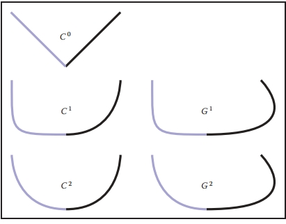
Figure 15.2. An illustration of various types of continuity between two curve segments. 
图 15.2。 两条曲线段之间各种类型的连续性的图示。

The type of continuity we have just introduced ($C^n$) is commonly referred to as parametric continuity as it depends on the parameterization of the two curve pieces. If the “speed” of each piece is different, then they will not be continuous. For cases where we care about the shape of the curve, and not its parameterization, we define geometric continuity that requires that the derivatives of the curve pieces match when the curves are parameterized equivalently (for example, using an arc-length parameterization). Intuitively, this means that the corresponding derivatives must have the same direction, even if they have different magnitudes.
我们刚刚介绍的连续性类型 ($C^n$) 通常称为参数连续性，因为它取决于两个曲线段的参数化。 如果每块的“速度”不同，那么它们就不会连续。 对于我们关心曲线形状而不是其参数化的情况，我们定义几何连续性，要求当曲线等效参数化（例如，使用弧长参数化）时曲线段的导数匹配。 直观上，这意味着相应的导数必须具有相同的方向，即使它们具有不同的大小。

So, if the $C^1$ continuity condition is 
因此，如果 $C^1$ 连续性条件是
$\bold{f}'_1(1) = \bold{f}'_2(0), $
the $G^1$ continuity condition would be 
$G^1$ 连续性条件为
$\bold{f}’_1(1) = k\bold{f}'_2(0), $
for some value of scalar $k$. Generally, geometric continuity is less restrictive than parametric continuity. A $C^n$ curve is also $G^n$ except when the parametric derivatives vanish.
对于标量 $k$ 的某个值。 一般来说，几何连续性比参数连续性限制更少。 $C^n$ 曲线也是 $G^n$，除非参数导数消失。

## 15.3 Polynomial Pieces 多项式部分

The most widely used representations of curves in computer graphics is done by piecing together basic elements that are defined by polynomials and called polynomial pieces. For example, a line element is given by a linear polynomial. In Section 15.3.1, we give a formal definition and explain how to put pieces of polynomial together.
计算机图形学中最广泛使用的曲线表示是通过将多项式定义的基本元素拼凑在一起来完成的，这些基本元素称为多项式片段。 例如，线元素由线性多项式给出。 在第 15.3.1 节中，我们给出了正式的定义并解释了如何将多项式组合在一起。

### 15.3.1 Polynomial Notation 多项式表示法

Polynomials are functions of the form  多项式是以下形式的函数
$$
f(t) = a_0 + a_1t + a_2t^2 + . . . + a_nt^n.\ \ \ \  (15.3)
$$
The $a_i$ are called the coefficients, and $n$ is called the degree of the polynomial if $a_n ≠ 0$. We also write Equation (15.3) in the form 
$a_i$ 称为系数，如果 $a_n ≠ 0$，$n$ 称为多项式的次数。 我们还将方程（15.3）写成以下形式
$$
\bold{f}(t) = \sum^n_{i=0}\bold{a}_it^i. \ \ \ \ (15.4)
$$
We call this the canonical form of the polynomial.
我们称其为多项式的规范形式。

We can generalize the canonical form to 
我们可以将规范形式概括为
$$
\bold{f}(t) = \sum^n_{i = 0}\bold{c}_ib_i(t) \ \ \ \ \ \ (15.5)
$$
where $b_i(t)$ is a polynomial. We can choose these polynomials in a convenient form for different applications, and we call them basis functions or blending functions (see Section 15.3.5). In Equation (15.4), the $t^i$ are the $b_i(t)$ of Equation (15.5). If the set of basis functions is chosen correctly, any polynomial of degree $n + 1$ can be represented by an appropriate choice of $\bold{c}$.
其中 $b_i(t)$ 是多项式。 我们可以针对不同的应用以方便的形式选择这些多项式，我们将它们称为基函数或混合函数（参见第 15.3.5 节）。 在方程(15.4)中，$t^i$是方程(15.5)的$b_i(t)$。 如果正确选择了基函数集，任何 $n + 1$ 次多项式都可以通过 $\bold{c}$ 的适当选择来表示。

The canonical form does not always have convenient coefficients. For practical purposes, throughout this chapter, we will find sets of basis functions such that the coefficients are convenient ways to control the curves represented by the polynomial functions. 
规范形式并不总是具有方便的系数。 出于实用目的，在本章中，我们将找到基函数集，使得系数成为控制多项式函数表示的曲线的便捷方法。

To specify a curve embedded in two dimensions, one can either specify two polynomials in t: one for how x varies with t and one for how y varies with t; or specify a single polynomial where each of the ai is a 2D point. An analogous situation exists for any curve in an n-dimensional space.
要指定嵌入二维的曲线，可以在 t 中指定两个多项式：一个表示 x 如何随 t 变化，另一个表示 y 如何随 t 变化； 或者指定一个多项式，其中每个 ai 都是一个 2D 点。 n 维空间中的任何曲线都存在类似的情况。

### 15.3.2 A Line Segment  线段

To introduce the concepts of piecewise polynomial curve representations, we will discuss line segments. In practice, line segments are so simple that the mathematical derivations will seem excessive. However, by understanding this simple case, things will be easier when we move on to more complicated polynomials. 
为了介绍分段多项式曲线表示的概念，我们将讨论线段。 在实践中，线段非常简单，以至于数学推导显得过多。 然而，通过理解这个简单的情况，当我们转向更复杂的多项式时，事情会变得更容易。

Consider a line segment that connects point $\bold{p}_0$ to $\bold{p}_1$. We could write the parametric function over the unit domain for this line segment as
考虑一条连接点 $\bold{p}_0$ 到 $\bold{p}_1$ 的线段。 我们可以将该线段的单位域上的参数函数写为
$$
\bold{f}(u) = (1 − u)\bold{p}_0 + u\bold{p}_1.\ \ \ \ \ (15.6)
$$
By writing this in vector form, we have hidden the dimensionality of the points and the fact that we are dealing with each dimension separately. For example, were we working in 2D, we could have created separate equations:
通过以向量形式编写，我们隐藏了点的维度以及我们单独处理每个维度的事实。 例如，如果我们在二维中工作，我们可以创建单独的方程：
$$
f_x(u) = (1 − u)x_0 + ux_1, \\
f_y(u) = (1 − u)y_0 + uy_1.
$$
The line that we specify is determined by the two endpoints, but from now on we will stick to vector notation since it is cleaner. We will call the vector of control parameters, $\bold{p}$, the control points, and each element of $\bold{p}$, a control point. 
我们指定的线是由两个端点确定的，但从现在开始我们将坚持使用矢量表示法，因为它更清晰。 我们将控制参数向量 $\bold{p}$ 称为控制点，并将 $\bold{p}$ 的每个元素称为控制点。

While describing a line segment by the positions of its endpoints is obvious and usually convenient, there are other ways to describe a line segment. For example,
虽然通过端点的位置来描述线段是显而易见且通常很方便的，但还有其他方法来描述线段。 例如，

1. the position of the center of the line segment, the orientation, and the length;
   线段的中心位置、方向、长度；
2. the position of one endpoint and the position of the second point relative to the first;
   一个端点的位置以及第二个点相对于第一个点的位置；
3. the position of the middle of the line segment and one endpoint. 
   线段的中点和一个端点的位置。

It is obvious that given one kind of a description of a line segment, we can switch to another one. 
显然，给定一种线段描述，我们可以切换到另一种。

A different way to describe a line segment is using the canonical form of the polynomial (as discussed in Section 15.3.1),
描述线段的另一种方法是使用多项式的规范形式（如第 15.3.1 节中所述），
$$
\bold{f}(u) = \bold{a}_0 + u\bold{a}_1. (15.7)
$$
Any line segment can be represented either by specifying $\bold{a}_0$ and $\bold{a}_1$ or the endpoints ($\bold{p}_0$ and $\bold{p}_1$). It is usually more convenient to specify the endpoints, because we can compute the other parameters from the endpoints. 
任何线段都可以通过指定 $\bold{a}_0$ 和 $\bold{a}_1$ 或端点（$\bold{p}_0$ 和 $\bold{p}_1$）来表示。 指定端点通常更方便，因为我们可以从端点计算其他参数。

To write the canonical form as a vector expression, we define a vector u that is a vector of the powers of $u$:
为了将规范形式写成向量表达式，我们定义一个向量 u，它是 $u$ 幂的向量：
$\bold{u} = [1\ u\ u^2\ u^3\ ...\ u^n],$
so that Equation (15.4) can be written as
式(15.4)可写为
$$
\bold{f}(u) = \bold{u} · \bold{a}.\ \ \ \ \ \  (15.8)
$$
This vector notation will make transforming between different forms of the curve easier. 
这种矢量符号将使不同形式的曲线之间的转换变得更容易。

Equation (15.8) describes a curve segment by the set of polynomial coefficients for the simple form of the polynomial. We call such a representation the canonical form. We will denote the parameters of the canonical form by $\bold{a}$. 
方程（15.8）通过多项式简单形式的多项式系数集描述了一条曲线段。 我们将这种表示称为规范形式。 我们将用 $\bold{a}$ 表示规范形式的参数。

While it is mathematically simple, the canonical form is not always the most convenient way to specify curves. For example, we might prefer to specify a line segment by the positions of its endpoints. If we want to define $\bold{p}_0$ to be the beginning of the segment (where the segment is when $u = 0$) and $\bold{p}_1$ to be the end of the line segment (where the line segment is at $u = 1$), we can write
虽然它在数学上很简单，但规范形式并不总是指定曲线的最方便的方法。 例如，我们可能更喜欢通过端点的位置来指定线段。 如果我们想将 $\bold{p}_0$ 定义为线段的开头（当 $u = 0$ 时为线段），将 $\bold{p}_1$ 定义为线段的结尾（ 其中线段位于 $u = 1$)，我们可以写
$$
\bold{p}_0 = \bold{f}(0) = [1\ 0] · [\bold{a}_0\ \bold{a}_1], \\
\bold{p}_1 = \bold{f}(1) = [1\ 1] · [\bold{a}_0\ \bold{a}_1], \\
(15.9)
$$
We can solve these equations for $\bold{a}_0$ and $\bold{a}_1$: 
我们可以求解 $\bold{a}_0$ 和 $\bold{a}_1$ 的方程：
$$
\bold{a}_0 = \bold{p}_0, \\
\bold{a}_1 = \bold{p}_1 − \bold{p}_0.
$$

#### Matrix Form for Polynomials 多项式的矩阵形式

While this first example was easy enough to solve, for more complicated examples it will be easier to write Equation (15.9) in the form
虽然第一个例子很容易解决，但对于更复杂的例子，将方程（15.9）写成以下形式会更容易
$$
\begin{bmatrix}
\bold{p}_0 \\
\bold{p}_1
\end{bmatrix} = \begin{bmatrix}
1 & 0 \\
1 & 1
\end{bmatrix} 
\begin{bmatrix}
\bold{a}_0 \\
\bold{a}_1
\end{bmatrix}
$$
Alternatively, we can write
或者，我们可以写
$$
\bold{p} = \bold{C}\bold{a},\ \ \  (15.10)
$$

where we call $\bold{C}$, the constraint matrix(We assume the form of a vector (row or column) is obvious from the context, and we will skip all of the transpose symbols for vectors. ). If having vectors of points bothers you, you can consider each dimension independently (so that $\bold{p}$ is $[x_0\ x_1]$ or $[y_0\ y_1]$ and a is handled correspondingly). 
其中我们称$\bold{C}$为约束矩阵（我们假设向量的形式（行或列）从上下文中是显而易见的，并且我们将跳过向量的所有转置符号。）。 如果点向量困扰您，您可以独立考虑每个维度（因此 $\bold{p}$ 是 $[x_0\ x_1]$ 或 $[y_0\ y_1]$ 并且 a 被相应处理）。

We can solve Equation (15.10) for a by finding the inverse of $\bold{C}$. This inverse matrix which we will denote by $\bold{B}$ is called the basis matrix. The basis matrix is very handy since it tells us how to convert between the convenient parameters $\bold{p}$ and the canonical form $\bold{a}$, and, therefore, gives us an easy way to evaluate the curve
我们可以通过求 $\bold{C}$ 的逆来求解方程 (15.10) 的 a。 我们用 $\bold{B}$ 表示的逆矩阵称为基础矩阵。 基础矩阵非常方便，因为它告诉我们如何在方便的参数 $\bold{p}$ 和规范形式 $\bold{a}$ 之间进行转换，因此为我们提供了一种评估曲线的简单方法
$\bold{f}(u) = \bold{u} \bold{B} \bold{p}. $

We can find a basis matrix for whatever form of the curve that we want, providing that there are no nonlinearities in the definition of the parameters. Examples of nonlinearly defined parameters include the length and angle of the line segment. 
只要参数定义中不存在非线性，我们就可以找到所需曲线形式的基础矩阵。 非线性定义的参数的示例包括线段的长度和角度。

Now, suppose we want to parameterize the line segment so that $\bold{p}_0$ is the halfway point $(u = 0.5)$, and $\bold{p}_1$ is the ending point $(u = 1)$. To derive the basis matrix for this parameterization, we set
现在，假设我们要参数化线段，使 $\bold{p}_0$ 为中间点 $(u = 0.5)$，$\bold{p}_1$ 为终点 $(u = 1)$。 为了导出此参数化的基础矩阵，我们设置
$$
\bold{p}_0 = \bold{f}(0.5) = 1 \bold{a}_0 + 0.5 \bold{a}_1, \\
\bold{p}_1 = \bold{f}(1) = 1 \bold{a}_0 + 1 \bold{a}_1.
$$
So 
所以
$$
\bold{C} = \begin{bmatrix}
1 & 5 \\
1 & 1
\end{bmatrix}
$$
and therefore
因此
$$
\bold{B} = \bold{C}^{-1} = \begin{bmatrix}
2 & -1 \\
-2 & 2
\end{bmatrix}
$$

### 15.3.3 Beyond Line Segments 线段之外

Line segments are so simple that finding a basis matrix is trivial. However, it was good practice for curves of higher degree. First, let’s consider quadratics (curves of degree two). The advantage of the canonical form (Equation (15.4)) is that it works for these more complicated curves, just by letting n be a larger number.
线段是如此简单，以至于找到一个基础矩阵是微不足道的。 然而，对于更高阶的曲线来说，这是一个很好的做法。 首先，让我们考虑二次方程（二次曲线）。 规范形式（方程（15.4））的优点是它适用于这些更复杂的曲线，只需让 n 为一个更大的数字即可。

A quadratic (a degree-two polynomial) has three coefficients, $\bold{a}_0$, $\bold{a}_1$, and $\bold{a}_2$. These coefficients are not convenient for describing the shape of the curve. However, we can use the same basis matrix method to devise more convenient parameters. If we know the value of $u$, Equation (15.4) becomes a linear equation in the parameters, and the linear algebra from the last section still works. 
二次多项式（二次多项式）具有三个系数：$\bold{a}_0$、$\bold{a}_1$ 和 $\bold{a}_2$。 这些系数不方便描述曲线的形状。 然而，我们可以使用相同的基础矩阵方法来设计更方便的参数。 如果我们知道$u$的值，方程(15.4)就变成了参数中的线性方程，上一节的线性代数仍然有效。

Suppose that we wanted to describe our curves by the position of the beginning $(u = 0)$, middle(Notice that this is the middle of the parameter space, which might not be the middle of the curve itself. ) $(u = 0.5)$, and end $(u = 1)$. Entering the appropriate values into Equation (15.4):
假设我们想通过开头 $(u = 0)$ 的位置来描述曲线，中间（注意这是参数空间的中间，可能不是曲线本身的中间。）$(u = 0.5)$，结束$(u = 1)$。 在方程（15.4）中输入适当的值：
$$
\bold{p}0 = \bold{f}(0) = \bold{a}_0 + 0^1 \bold{a}_1 + 0^2 \bold{a}_2, \\
p1 = f(0.5) = \bold{a}_0 + 0.5^1 \bold{a}_1 + 0.5^2 \bold{a}_2, \\
p2 = f(1) = \bold{a}_0 + 1^1 \bold{a}_1 + 1^2 \bold{a}_2.
$$
So the constraint matrix is 
所以约束矩阵是
$$
\bold{C} = \begin{bmatrix}
1 & 0 & 0 \\
1 & 0.5 & 0.25 \\
1 & 1 & 1
\end{bmatrix}
$$
and the basis matrix is
基矩阵是
$$
\bold{B} = \bold{C}^{-1} = \begin{bmatrix}
1 & 0 & 0 \\
-3 & 4 & -1 \\
2 & -4 & 2
\end{bmatrix}
$$
There is an additional type of constraint (or parameter) that is sometimes convenient to specify: the derivative of the curve (with respect to its free parameter) at a particular value. Intuitively, the derivatives tell us how the curve is changing, so that the first derivative tells us what direction the curve is going, the second derivative tells us how quickly the curve is changing direction, etc. We will see examples of why it is useful to specify derivatives later. 
有时可以方便地指定另一种类型的约束（或参数）：曲线在特定值处的导数（相对于其自由参数）。 直观上，导数告诉我们曲线是如何变化的，因此一阶导数告诉我们曲线的方向，二阶导数告诉我们曲线改变方向的速度等等。我们将看到一些例子来说明为什么它有用 稍后指定导数。

For the quadratic
对于二次方
$\bold{f}(u) = \bold{a}_0 + \bold{a}_1u + \bold{a}_2u^2, $

the derivatives are simple: 
导数很简单：
$\bold{f}'(u) = \frac{d\bold{f}}{du} = \bold{a}_1 + 2\bold{a}_2u, $

and 
和
$$
\bold{f}''(u) = \frac{d^2\bold{f}}{du^2}= \frac{d\bold{f}'}{du} = 2\bold{a}_2 \\
\bold{f}'(u) = \sum^n_{i = 1} iu^{i - 1} \bold{a}_i \\
\bold{f}''(u) = \sum^n_{i = 2}i(i-1)u^{i-2}\bold{a}_i
$$
For example, consider a case where we want to specify a quadratic curve segment by the position, first, and second derivative at its middle $(u = 0.5)$. 
例如，考虑这样一种情况，我们想要通过中间 $(u = 0.5)$ 的位置、一阶导数和二阶导数来指定二次曲线段。
$$
\bold{p}_0 = \bold{f}(0.5) = \bold{a}_0+ 0.5^1 \bold{a}_1+ 0.5^2 \bold{a}_2, \\
\bold{p}_1 = \bold{f}'(0.5) = \bold{a}_1+ 2 0.5 \bold{a}_2, \\
\bold{p}_2 = \bold{f}''(0.5) = 2 \bold{a}_2.
$$
The constraint matrix is 
约束矩阵是
$$
\bold{C} = \begin{bmatrix}
1 & 0.5 & 0.25 \\
0 & 1 & 1 \\
0 & 0 & 2 
\end{bmatrix}
$$
and the basis matrix is
基矩阵是
$$
\bold{B} = \bold{C}^{-1} = \begin{bmatrix}
1 & -0.5 & 0.125 \\
0 & 1 & -0.5 \\
0 & 0 & 0.5
\end{bmatrix}
$$

### 15.3.4 Basis Matrices for Cubics 三次方的基矩阵

Cubic polynomials are popular in graphics (See Section 15.5). The derivations for the various forms of cubics are just like the derivations we’ve seen already in this section. We will work through one more example for practice. 
三次多项式在图形学中很流行（参见第 15.5 节）。 各种形式的三次方的推导就像我们在本节中已经看到的推导一样。 我们将通过一个例子来进行实践。

A very useful form of a cubic polynomial is the Hermite form, where we specify the position and first derivative at the beginning and end, that is,
三次多项式的一种非常有用的形式是 Hermite 形式，其中我们指定开头和结尾的位置和一阶导数，即
$$
\bold{p}_0 = \bold{f}(0) = \bold{a}_0 + 0^1 \bold{a}_1 + 0^2 \bold{a}_2+ 0^3 \bold{a}_3, \\
\bold{p}_1 = \bold{f}'(0) = \bold{a}_1 +2\ 0^1 \bold{a}_2+ 3\ 0^2 \bold{a}_3, \\
\bold{p}_2 = \bold{f}(1) = \bold{a}_0 + 1^1 \bold{a}_1 + 1^2 \bold{a}_2+ 1^3 \bold{a}_3, \\
\bold{p}_3 = \bold{f}'(1) = \bold{a}_1 +2\ 1^1 \bold{a}_2+ 3\ 1^2 \bold{a}_3. \\
$$
Thus, the constraint matrix is 
因此，约束矩阵为
$$
\bold{C} = \begin{bmatrix}
1 & 0 & 0 & 0 \\
0 & 1 & 0 & 0 \\
1 & 1 & 1 & 1 \\
0 & 1 & 2 & 3
\end{bmatrix}
$$
and the basis matrix is 
基矩阵是
$$
\bold{B} = \bold{C}^{-1} = \begin{bmatrix}
1 & 0 & 0 & 0 \\
0 & 1 & 0 & 0 \\
-3 & -2 & 3 & -1 \\
2 & 1 & -2 & 1
\end{bmatrix}
$$
We will discuss Hermite cubic splines in Section 15.5.2. 
我们将在 15.5.2 节中讨论 Hermite 三次样条。

### 15.3.5 Blending Functions 混合函数

If we know the basis matrix, $\bold{B}$, we can multiply it by the parameter vector, $\bold{u}$, to get a vector of functions 
如果我们知道基础矩阵 $\bold{B}$，我们可以将其乘以参数向量 $\bold{u}$，得到函数向量
$\bold{b}(u) = \bold{u} \bold{B}. $

Notice that we denote this vector by $\bold{b}(u)$ to emphasize the fact that its value depends on the free parameter u. We call the elements of $\bold{b}(u)$ the blending functions, because they specify how to blend the values of the control point vector together:
请注意，我们用 $\bold{b}(u)$ 表示该向量，以强调其值取决于自由参数 u 的事实。 我们将 $\bold{b}(u)$ 的元素称为混合函数，因为它们指定如何将控制点向量的值混合在一起：
$$
\bold{f}(u) = \sum^n_{i=0}\bold{b}_i(u)\bold{p}_i \ \ \ \ \ (15.11)
$$
It is important to note that for a chosen value of $u$, Equation (15.11) is a linear equation specifying a linear blend (or weighted average) of the control points. This is true no matter what degree polynomials are “hidden” inside of the $\bold{b}_i$ functions. 
值得注意的是，对于选定的 $u$ 值，方程 (15.11) 是一个线性方程，指定控制点的线性混合（或加权平均值）。 无论 $\bold{b}_i$ 函数内“隐藏”多少次多项式，情况都是如此。

Blending functions provide a nice abstraction for describing curves. Any type of curve can be represented as a linear combination of its control points, where those weights are computed as some arbitrary functions of the free parameter.
混合函数为描述曲线提供了一个很好的抽象。 任何类型的曲线都可以表示为其控制点的线性组合，其中这些权重被计算为自由参数的一些任意函数。

### 15.3.6 Interpolating Polynomials 插值多项式

In general, a polynomial of degree n can interpolate a set of $n + 1$ values. If we are given a vector $\bold{p} = (p_0, . . . , p_n)$ of points to interpolate and a vector $\bold{t} = (t_0, . . . , t_n)$ of increasing parameter values, $t_i ≠ t_j$, we can use the methods described in the previous sections to determine an $n + 1 × n + 1$ basis matrix that gives us a function $f(t)$ such that $f(t_i) = p_i$. For any given vector $\bold{t}$, we need to set up and solve an $n = 1 × n + 1$ linear system. This provides us with a set of $n + 1$ basis functions that perform interpolation:
一般来说，n 次多项式可以插值一组 $n + 1$ 值。 如果我们给定一个要插值点的向量 $\bold{p} = (p_0, . . . , p_n)$ 和一个递增参数的向量 $\bold{t} = (t_0, . . . , t_n)$ 值，$t_i ≠ t_j$，我们可以使用前几节中描述的方法来确定 $n + 1 × n + 1$ 基础矩阵，该矩阵为我们提供函数 $f(t)$，使得 $f(t_i) = p_i$。 对于任何给定的向量 $\bold{t}$，我们需要建立并求解 $n = 1 × n + 1$ 线性系统。 这为我们提供了一组执行插值的 $n + 1$ 基函数：
$$
\bold{f}(t) = \sum^n_{i = 0}\bold{p}_ib_i(t)
$$
These interpolating basis functions can be derived in other ways. One particularly elegant way to define them is the Lagrange form: 
这些插值基函数可以通过其他方式导出。 定义它们的一种特别优雅的方法是拉格朗日形式：
$$
b_i = \prod^n_{j=0,j≠i}\frac{x-t_j}{t_i-t_j} \ \ \ \ \ (15.12)
$$
There are more computationally efficient ways to express the interpolating basis functions than the Lagrange form (see De Boor (1978) for details). 
有比拉格朗日形式更计算有效的方法来表达插值基函数（详细信息请参见 De Boor (1978)）。

Interpolating polynomials provide a mechanism for defining curves that interpolate a set of points. Figure 15.3 shows some examples. While it is possible to create a single polynomial to interpolate any number of points, we rarely use high-order polynomials to represent curves in computer graphics. Instead, interpolating splines (piecewise polynomial functions) are preferred. Some reasons for this are considered in Section 15.5.3.
插值多项式提供了一种定义对一组点进行插值的曲线的机制。 图 15.3 显示了一些示例。 虽然可以创建单个多项式来插值任意数量的点，但我们很少使用高阶多项式来表示计算机图形学中的曲线。 相反，首选插值样条（分段多项式函数）。 第 15.5.3 节考虑了一些原因。
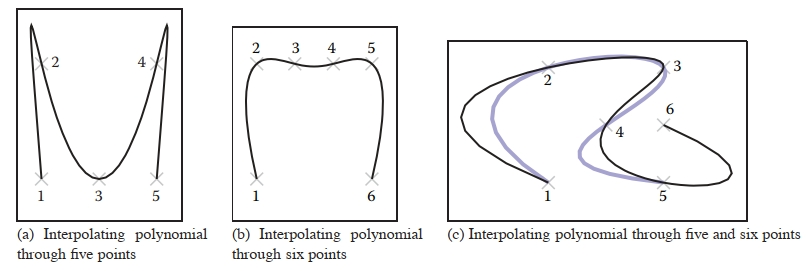
Figure 15.3. Interpolating polynomials through multiple points. Notice the extra wiggles and over-shooting between points. In (c), when the sixth point is added, it completely changes the shape of the curve due to the non-local nature of interpolating polynomials.
图 15.3。 通过多个点插值多项式。 请注意点之间的额外摆动和过度调整。 在（c)中，当添加第六个点时，由于插值多项式的非局部性质，它完全改变了曲线的形状。

## 15.4 Putting Pieces Together  将各个部分组合在一起

Now that we’ve seen how to make individual pieces of polynomial curves, we can consider how to put these pieces together.
现在我们已经了解了如何制作多项式曲线的各个部分，我们可以考虑如何将这些部分组合在一起。

### 15.4.1 Knots 结

The basic idea of a piecewise parametric function is that each piece is only used over some parameter range. For example, if we want to define a function that has two piecewise linear segments that connect three points (as shown in Figure 15.4(a)), we might define
分段参数函数的基本思想是每个部分仅在某个参数范围内使用。 例如，如果我们想定义一个函数，它有两个连接三个点的分段线性段（如图 15.4(a) 所示），我们可以定义
$$
\bold{f}(u) = \begin{cases}
\bold{f}_1(2u) \ \ \ \ \ \ \ \ \ \ if\ 0 ≤ u < \frac{1}{2} \\
\bold{f}_2(2u - 1) \ \ \ if\ \frac{1}{2} ≤ u < 1 \\
\end{cases} \\
(15.13)
$$
where $\bold{f}_1$ and $\bold{f}_2$ are functions for each of the two line segments. Notice that we have rescaled the parameter for each of the pieces to facilitate writing their equations as
其中 $\bold{f}_1$ 和 $\bold{f}_2$ 是两条线段中每一条线段的函数。 请注意，我们重新调整了每个部分的参数，以便于将它们的方程写为
$\bold{f}_1(u) = (1 - u)\bold{p}_1 + u\bold{p}_2.  $


Figure 15.4. (a) Two line segments connect three points; (b) the blending functions for each of the points are graphed at right. 
图 15.4。 (a) 两条线段连接三点； (b) 每个点的混合函数绘制在右侧。

For each polynomial in our piecewise function, there is a site (or parameter value) where it starts and ends. Sites where a piece function begins or ends are called knots. For the example in Equation (15.13), the values of the knots are 0, 0.5, and 1. 
对于分段函数中的每个多项式，都有一个开始和结束的位置（或参数值）。 分段函数开始或结束的位置称为结。 对于方程（15.13）中的示例，结的值为 0、0.5 和 1。

We may also write piecewise polynomial functions as the sum of basis functions, each scaled by a coefficient. For example, we can rewrite the two line segments of Equation (15.13) as
我们还可以将分段多项式函数写为基函数之和，每个基函数按一个系数缩放。 例如，我们可以将方程（15.13）的两条线段重写为
$$
\bold{f}(u) = \bold{p}_1b_1(u) + \bold{p}_2b_2(u) + \bold{p}_3b_3(u),\ \ \ \  (15.14)
$$
where the function $b_1(u)$ is defined as 
其中函数 $b_1(u)$ 定义为
$$
b_1(u) = \begin{cases}
1 - 2u \ \ \ \ \ if\ 0 ≤  u < \frac{1}{2} \\
0 \  \ \ \ \ \ \  \ \  \ \  \ \ \ otherwise
\end{cases}
$$
and $b_2$ and $b_3$ are defined similarly. These functions are plotted in Figure 15.4(b). 
$b_2$ 和 $b_3$ 的定义类似。 这些函数绘制在图 15.4(b) 中。

The knots of a polynomial function are the combination of the knots of all of the pieces that are used to create it. The knot vector is a vector that stores all of the knot values in ascending order. 
多项式函数的结是用于创建它的所有部分的结的组合。 结向量是按升序存储所有结值的向量。

Notice that in this section we have used two different mechanisms for combining polynomial pieces: using independent polynomial pieces for different ranges of the parameter and blending together piecewise polynomial functions.
请注意，在本节中，我们使用了两种不同的机制来组合多项式片段：针对不同的参数范围使用独立的多项式片段以及将分段多项式函数混合在一起。

### 15.4.2 Using Independent Pieces 使用独立片段

In Section 15.3, we defined pieces of polynomials over the unit parameter range. If we want to assemble these pieces, we need to convert from the parameter of the overall function to the value of the parameter for the piece. The simplest way to do this is to define the overall curve over the parameter range [0, n] where n is the number of segments. Depending on the value of the parameter, we can shift it to the required range. 
在 15.3 节中，我们定义了单位参数范围内的多项式。 如果我们想要组装这些片段，我们需要将整个函数的参数转换为片段的参数值。 最简单的方法是在参数范围 [0, n] 上定义整体曲线，其中 n 是段数。 根据参数的值，我们可以将其移动到所需的范围。

### 15.4.3 Putting Segments Together 将片段放在一起

If we want to make a single curve from two line segments, we need to make sure that the end of the first line segment is at the same location as the beginning of the next. There are three ways to connect the two segments (in order of simplicity): 
如果我们想用两条线段制作一条曲线，我们需要确保第一条线段的终点与下一条线段的起点位于同一位置。 有三种方法可以连接两个段（按简单顺序排列）：

1. Represent the line segment as its two endpoints, and then use the same point for both. We call this a shared-point scheme. 
   将线段表示为其两个端点，然后对两个端点使用同一点。 我们称之为共享点方案。
2. Copy the value of the end of the first segment to the beginning of the second segment every time that the parameters of the first segment change. We call this a dependency scheme. 
   每次第一个段的参数发生变化时，将第一个段末尾的值复制到第二个段的开头。 我们称之为依赖方案。
3. Write an explicit equation for the connection, and enforce it through numerical methods as the other parameters are changed. 
   为连接编写一个显式方程，并在其他参数发生变化时通过数值方法强制执行。

While the simpler schemes are preferable since they require less work, they also place more restrictions on the way the line segments are parameterized. For example, if we want to use the center of the line segment as a parameter (so that the user can specify it directly), we will use the beginning of each line segment and the center of the line segment as their parameters. This will force us to use the dependency scheme.
虽然更简单的方案更可取，因为它们需要更少的工作，但它们也对线段参数化的方式施加了更多限制。 例如，如果我们想使用线段的中心作为参数（以便用户可以直接指定），我们将使用每个线段的开头和线段的中心作为它们的参数。 这将迫使我们使用依赖方案。 

Notice that if we use a shared-point or dependency scheme, the total number of control points is less than n ∗ m, where n is the number of segments and m is the number of control points for each segment; many of the control points of the independent pieces will be computed as functions of other pieces. Notice that if we use either the shared-point scheme for lines (each segment uses its two endpoints as parameters and shares interior points with its neighbors), or if we use the dependency scheme (such as the example one with the first endpoint and midpoint), we end up with n + 1 controls for an n-segment curve. 
请注意，如果我们使用共享点或依赖方案，则控制点的总数小于 n * m，其中 n 是段的数量，m 是每个段的控制点的数量； 独立部分的许多控制点将被计算为其他部分的函数。 请注意，如果我们对线使用共享点方案（每个线段使用其两个端点作为参数并与其邻居共享内部点），或者如果我们使用依赖方案（例如具有第一个端点和中点的示例） ），我们最终得到 n 段曲线的 n + 1 个控件。

Dependency schemes have a more serious problem. A change in one place in the curve can propagate through the entire curve. This is called a lack of locality. Locality means that if you move a point on a curve it will only affect a local region. The local region might be big, but it will be finite. If a curve’s controls do not have locality, changing a control point may affect points infinitely far away. 
依赖方案有一个更严重的问题。 曲线中某一位置的变化可以传播到整条曲线。 这称为缺乏局部性。 局部性意味着如果移动曲线上的点，它只会影响局部区域。 局部区域可能很大，但它是有限的。 如果曲线的控件没有局部性，则更改控制点可能会影响无限远的点。

To see locality, and the lack thereof, in action, consider two chains of line segments, as shown in Figure 15.5. One chain has its pieces parameterized by their endpoints and uses point-sharing to maintain continuity. The other has its pieces parameterized by an endpoint and midpoint and uses dependency propagation to keep the segments together. The two segment chains can represent the same curves: they are both a set of n connected line segments. However, because of locality issues, the endpoint-shared form is likely to be more convenient for the user. Consider changing the position of the first control point in each chain. For the endpoint-shared version, only the first segment will change, while all of the segments will be affected in the midpoint version, as in Figure 15.5. In fact, for any point moved in the endpoint-shared version, at most two line segments will change. In the midpoint version, all segments after the control point that is moved will change, even if the chain is infinitely long. 
要查看局部性及其缺失的实际情况，请考虑两条线段链，如图 15.5 所示。 一条链的各个部分由端点参数化，并使用点共享来保持连续性。 另一个的片段由端点和中点参数化，并使用依赖关系传播将片段保持在一起。 两条线段链可以表示相同的曲线：它们都是n条相连的线段的集合。 然而，由于局部性问题，端点共享形式可能对用户来说更方便。 考虑更改每个链中第一个控制点的位置。 对于端点共享版本，只有第一个段会发生变化，而中点版本中所有段都会受到影响，如图15.5所示。 事实上，对于端点共享版本中移动的任何点，最多两条线段会发生变化。 在中点版本中，移动的控制点之后的所有线段都会发生变化，即使链无限长。

Figure 15.5. A chain of line segments with local control and one with non-local control. 
图 15.5。 具有本地控制和非本地控制的一系列线段。

In this example, the dependency propagation scheme was the one that did not have local control. This is not always true. There are direct sharing schemes that are not local and propagation schemes that are local. 
在此示例中，依赖传播方案是没有本地控制的方案。 这并非总是如此。 存在非本地的直接共享方案和本地的传播方案。

We emphasize that locality is a convenience of control issue. While it is inconvenient to have the entire curve change every time, the same changes can be made to the curve. It simply requires moving several points in unison. 
我们强调局部性是一个控制便利性的问题。 虽然每次都改变整个曲线很不方便，但可以对曲线进行相同的改变。 它只需要一致移动几个点。

## 15.5 Cubics 三次方

In graphics, when we represent curves using piecewise polynomials, we usually use either line segments or cubic polynomials for the pieces. There are a number of reasons why cubics are popular in computer graphics: 
在图形中，当我们使用分段多项式表示曲线时，我们通常使用线段或三次多项式来表示分段。 三次方在计算机图形学中流行的原因有很多：

- Piecewise cubic polynomials allow for $C^2$ continuity, which is generally sufficient for most visual tasks. The $C^1$ smoothness that quadratics offer is often insufficient. The greater smoothness offered by higher-order polynomials is rarely important. 
  分段三次多项式允许 $C^2$ 连续性，这通常足以满足大多数视觉任务。 二次方程提供的 $C^1$ 平滑度通常是不够的。 高阶多项式提供的更大平滑度并不重要。
- Cubic curves provide the minimum-curvature interpolants to a set of points. That is, if you have a set of n + 3 points and define the “smoothest” curve that passes through them (that is the curve that has the minimum curvature over its length), this curve can be represented as a piecewise cubic with n segments.
  三次曲线为一组点提供最小曲率插值。 也就是说，如果您有一组 n + 3 个点并定义穿过它们的“最平滑”曲线（即在其长度上具有最小曲率的曲线），则该曲线可以表示为具有 n 的分段三次 段。
- Cubic polynomials have a nice symmetry where position and derivative can be specified at the beginning and end. 
  三次多项式具有良好的对称性，可以在开始和结束时指定位置和导数。
- Cubic polynomials have a nice tradeoff between the numerical issues in computation and the smoothness. 
  三次多项式在计算中的数值问题和平滑度之间有很好的权衡。

Notice that we do not have to use cubics; they just tend to be a good tradeoff between the amount of smoothness and complexity. Different applications may have different tradeoffs. We focus on cubics since they are the most commonly used. 
请注意，我们不必使用三次方； 它们往往是平滑度和复杂度之间的良好权衡。 不同的应用程序可能有不同的权衡。 我们关注三次方，因为它们是最常用的。

The canonical form of a cubic polynomial is
三次多项式的规范形式是
$\bold{f}(u) = \bold{a}_0 + \bold{a}_1 u + \bold{a}_2 u^2 + \bold{a}_3 u^3.  $

As we discussed in Section 15.3, these canonical form coefficients are not a convenient way to describe a cubic segment. 
正如我们在 15.3 节中讨论的，这些规范形式系数并不是描述立方线段的便捷方法。

We seek forms of cubic polynomials for which the coefficients are a convenient way to control the resulting curve represented by the cubic. One of the main conveniences will be to provide ways to ensure the connectedness of the pieces and the continuity between the segments. 
我们寻求三次多项式的形式，其中系数是控制由三次表示的结果曲线的便捷方法。 主要便利之一是提供确保各部分的连通性和各部分之间的连续性的方法。

Each cubic polynomial piece requires four coefficients or control points. That means for a piecewise polynomial with n pieces, we may require up to 4n control points if no sharing between segments is done or dependencies used. More often, some part of each segment is either shared or depends on an adjacent segment, so the total number of control points is much lower. Also, note that a control point might be a position or a derivative of the curve. 
每个三次多项式需要四个系数或控制点。 这意味着对于包含 n 个部分的分段多项式，如果段之间没有进行共享或使用依赖项，我们可能需要最多 4n 个控制点。 更常见的是，每个段的某些部分要么是共享的，要么依赖于相邻段，因此控制点的总数要少得多。 另请注意，控制点可能是曲线的位置或导数。

Unfortunately, there is no single “best” representation for a piecewise cubic. It is not possible to have a piecewise polynomial curve representation that has all of the following desirable properties: 
不幸的是，分段三次没有单一的“最佳”表示。 分段多项式曲线表示不可能具有以下所有所需属性：

1. each piece of the curve is a cubic; 
   每条曲线都是一个三次方；
2. the curve interpolates the control points; 
   曲线对控制点进行插值；
3. the curve has local control; 
   曲线具有本地控制；
4. the curve has $C^2$ continuity. 
   曲线具有$C^2$连续性。

We can have any three of these properties, but not all four; there are representations that have any combination of three. In this book, we will discuss cubic B-splines that do not interpolate their control points (but have local control and are $C^2$); Cardinal splines and Catmull-Rom splines that interpolate their control points and offer local control, but are not $C^2$; and natural cubics that interpolate and are $C^2$, but do not have local control. 
我们可以拥有这些属性中的任意三个，但不能拥有全部四个； 存在具有三者任意组合的表示。 在本书中，我们将讨论不对其控制点进行插值的三次 B 样条曲线（但具有局部控制且为 $C^2$）； 基数样条线和 Catmull-Rom 样条线对它们的控制点进行插值并提供局部控制，但不是 $C^2$； 以及插值 和 的自然三次方为 $C^2$，但没有本地控制。

The continuity properties of cubics refer to the continuity between the segments (at the knot points). The cubic pieces themselves have infinite continuity in their derivatives (the way we have been talking about continuity so far). Note that if you have a lot of control points (or knots), the curve can be wiggly, which might not seem “smooth.” 
立方体的连续性是指线段之间（节点处）的连续性。 立方体本身在其导数中具有无限连续性（到目前为止我们一直在讨论连续性的方式）。 请注意，如果有很多控制点（或结），曲线可能会摆动，这可能看起来不“平滑”。

### 15.5.1 Natural Cubics 自然立方体

With a piecewise cubic curve, it is possible to create a $C^2$ curve. To do this, we need to specify the position and first and second derivative at the beginning of each segment (so that we can make sure that it is the same as at the end of the previous segment). Notice that each curve segment receives three out of its four parameters from the previous curve in the chain. These $C^2$ continuous chains of cubics are sometimes referred to as natural cubic splines. 
使用分段三次曲线，可以创建 $C^2$ 曲线。 为此，我们需要指定每个段开头的位置以及一阶和二阶导数（以便我们可以确保它与上一段末尾的位置相同）。 请注意，每个曲线段从链中的前一条曲线接收其四个参数中的三个。 这些连续的 $C^2$ 三次链有时被称为自然三次样条。

For one segment of the natural cubic, we need to parameterize the cubic by the positions of its endpoints and the first and second derivative at the beginning point. The control points are therefore
对于自然立方体的一段，我们需要通过其端点的位置以及起点处的一阶和二阶导数来参数化立方体。 因此控制点是
$$
\bold{p}_0 = \bold{f}(0) = \bold{a}_0 + 0^1\bold{a}_1 + 0^2 \bold{a}_2 + 0^3 \bold{a}_3, \\
\bold{p}_1 = \bold{f}'(0) = 1^1\bold{a}_1 +2\ 0^1 \bold{a}_2 +3\ 0^2 \bold{a}_3, \\
\bold{p}_2 = \bold{f}''(0) = 2\ 1^1\bold{a}_2 +6\ 0^1 \bold{a}_3, \\
\bold{p}_3 = \bold{f}(1) = \bold{a}_0 + 1^1 \bold{a}_1 + 1^2 \bold{a}_2 + 1^3 \bold{a}_3.
$$
Therefore, the constraint matrix is 
因此，约束矩阵为
$$
\bold{C} = \begin{bmatrix}
1 & 0 & 0 & 0 \\
0 & 1 & 0 & 0 \\
0 & 0 & 2 & 0 \\
1 & 1 & 1 & 1
\end{bmatrix}
$$
and the basis matrix is  
基矩阵是
$$
\bold{B} = \bold{C}^{-1} = \begin{bmatrix}
1 & 0 & 0 & 0 \\
0 & 1 & 0 & 0 \\
0 & 0 & .5 & 0 \\
−1 & −1 & −.5 & 1
\end{bmatrix}
$$
Given a set of n control points, a natural cubic spline has n−1 cubic segments. The first segment uses the control points to define its beginning position, ending position, and first and second derivative at the beginning. A dependency scheme copies the position, and first and second derivative of the end of the first segment for use in the second segment. 
给定一组 n 个控制点，自然三次样条有 n−1 个三次段。 第一段使用控制点来定义其开始位置、结束位置以及开始时的一阶和二阶导数。 依赖方案复制第一段末尾的位置以及一阶和二阶导数以在第二段中使用。

A disadvantage of natural cubic splines is that they are not local. Any change in any segment may require the entire curve to change (at least the part after the change was made). To make matters worse, natural cubic splines tend to be ill-conditioned: a small change at the beginning of the curve can lead to large changes later. Another issue is that we only have control over the derivatives of the curve at its beginning. Segments after the beginning of the curve determine their derivatives from their beginning point. 
自然三次样条的缺点是它们不是局部的。 任何段中的任何更改都可能需要更改整个曲线（至少是更改后的部分）。 更糟糕的是，自然三次样条往往是病态的：曲线开始时的微小变化可能会导致后来的大变化。 另一个问题是我们只能控制曲线开始时的导数。 曲线起点之后的线段确定其从起点的导数。

### 15.5.2 Hermite Cubics 厄米立方

Hermite cubic polynomials were introduced in Section 15.3.4. A segment of a cubic Hermite spline allows the positions and first derivatives of both of its endpoints to be specified. A chain of segments can be linked into a $C^1$ spline by using the same values for the position and derivative of the end of one segment and for the beginning of the next. 
Hermite 三次多项式在 15.3.4 节中介绍。 三次 Hermite 样条线段允许指定其两个端点的位置和一阶导数。 通过对一个段的末尾和下一个段的开头使用相同的位置和导数值，可以将一系列段链接到 $C^1$ 样条线中。

Given a set of n control points, where every other control point is a derivative value, a cubic Hermite spline contains $(n−2)/2$ cubic segments. The spline interpolates the points, as shown in Figure 15.6, but can guarantee only $C^1$ continuity. 
给定一组 n 个控制点，其中每个其他控制点都是导数值，三次 Hermite 样条包含 $(n−2)/2$ 三次段。 样条曲线对点进行插值，如图 15.6 所示，但只能保证 $C^1$ 连续性。
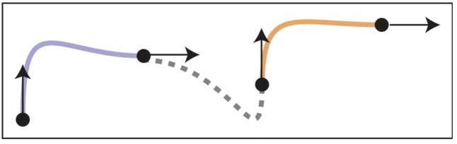
Figure 15.6. A Hermite cubic spline made up of three segments. 
图 15.6。 由三段组成的 Hermite 三次样条。

Hermite cubics are convenient because they provide local control over the shape, and provide $C^1$ continuity. However, since the user must specify both positions and derivatives, a special interface for the derivatives must be provided. One possibility is to provide the user with points that represent where the derivative vectors would end if they were “placed” at the position point. 
Hermite 立方体很方便，因为它们提供对形状的局部控制，并提供 $C^1$ 连续性。 然而，由于用户必须指定头寸和衍生品，因此必须为衍生品提供特殊的接口。 一种可能性是向用户提供表示导数向量“放置”在该位置点时的结束位置的点。

### 15.5.3 Cardinal Cubics 基数三次

A cardinal cubic spline is a type of $C^1$ interpolating spline made up of cubic polynomial segments. Given a set of n control points, a cardinal cubic spline uses n − 2 cubic polynomial segments to interpolate all of its points except for the first and last. 
基数三次样条是一种由三次多项式段组成的 $C^1$ 插值样条。 给定一组 n 个控制点，基数三次样条使用 n − 2 三次多项式段来插值其除第一个和最后一个点之外的所有点。

Cardinal splines have a parameter called tension that controls how “tight” the curve is between the points it interpolates. The tension is a number in the range [0, 1) that controls how the curve bends toward the next control point. For the important special case of t = 0, the splines are called Catmull-Rom splines.
基数样条有一个称为张力的参数，用于控制曲线在其插值点之间的“紧密程度”。 张力是 [0, 1) 范围内的一个数字，用于控制曲线如何向下一个控制点弯曲。 对于 t = 0 的重要特殊情况，样条线称为 Catmull-Rom 样条线。

Each segment of the cardinal spline uses four control points. For segment i, the points used are $i, i + 1, i + 2,$ and $i + 3$ as the segments share three points with their neighbors. Each segment begins at its second control point and ends at its third control point. The derivative at the beginning of the curve is determined by the vector between the first and third control points, while the derivative at the end of the curve is given by the vector between the second and fourth points, as shown in Figure 15.7.
基数样条线的每段都使用四个控制点。 对于线段 i，使用的点是 $i、i + 1、i + 2、$ 和 $i + 3$，因为这些线段与其邻居共享三个点。 每个段从其第二个控制点开始，并在其第三个控制点结束。 曲线开头的导数由第一个和第三个控制点之间的向量确定，而曲线末尾的导数由第二个和第四个控制点之间的向量确定，如图 15.7 所示。

Figure 15.7. A segment of a cardinal cubic spline interpolates its second and third control points ($\bold{p}_2$ and $\bold{p}_3$), and uses its other points to determine the derivatives at the beginning and end.
图 15.7。 基数三次样条线段对其第二个和第三个控制点（$\bold{p}_2$ 和 $\bold{p}_3$)进行插值，并使用其其他点来确定开头和结尾处的导数。

The tension parameter adjusts how much the derivatives are scaled. Specifically, the derivatives are scaled by (1 − t)/2. The constraints on the cubic are therefore
张力参数调整导数的缩放程度。 具体来说，导数按 (1 − t)/2 缩放。 因此，立方体的约束是
$$
\bold{f}(0) = \bold{p}_2, \\
\bold{f}(1) = \bold{p}_3, \\
\bold{f}'(0) = \frac{1}{2}(1 − t)(\bold{p}_3 − \bold{p}_1), \\
\bold{f}'(1) = \frac{1}{2}(1 − t)(\bold{p}_4 − \bold{p}_2).
$$
Solving these equations for the control points (defining $s = (1 - t)/2$) gives 
求解控制点的这些方程（定义 $s = (1 - t)/2$）给出
$$
\bold{p}_0 = \bold{f}(1) − \frac{2}{1-t}\bold{f}'(0) = \bold{a}_0 +(1 − \frac{1}{s} ) \bold{a}_1 + \bold{a}_2 + \bold{a}_3, \\
\bold{p}_1 = \bold{f}(0) = \bold{a}_0, \\
\bold{p}_2 = \bold{f}(1) = \bold{a}_0 + \bold{a}_1 + \bold{a}_2 + \bold{a}_3, \\
\bold{p}_3 = \bold{f}(0) + \frac{1}{s}\bold{f}'(1) = \bold{a}_0 + \frac{1}{s}\bold{a}_1 + 2\frac{1}{s}\bold{a}_2 + 3\frac{1}{s}\bold{a}_3.
$$
This yields the cardinal matrix 
这产生基数矩阵
$$
\bold{B} = \bold{C}^{-1} = \begin{bmatrix}
0 & 1 & 0 & 0 \\
−s & 0 & s & 0 \\
2s & s − 3 & 3 − 2s & −s \\
−s & 2 − s & s − 2 & s
\end{bmatrix}
$$
Since the third point of segment i is the second point of segment $i+1$, adjacent segments of the cardinal spline connect. Similarly, the same points are used to specify the first derivative of each segment, providing $C^1$ continuity. 
由于线段 i 的第三个点是线段 $i+1$ 的第二个点，因此基数样条线的相邻线段连接。 同样，相同的点用于指定每个线段的一阶导数，提供 $C^1$ 连续性。

Cardinal splines are useful, because they provide an easy way to interpolate a set of points with $C^1$ continuity and local control. They are only $C^1$, so they sometimes get “kinks” in them. The tension parameter gives some control over what happens between the interpolated points, as shown in Figure 15.8, where a set of cardinal splines through a set of points is shown. The curves use the same control points, but they use different values for the tension parameters. Note that the first and last control points are not interpolated. 
基数样条很有用，因为它们提供了一种简单的方法来插值一组具有 $C^1$ 连续性和局部控制的点。 它们的价格仅为 $C^1$，因此有时会出现“扭结”。 张力参数可以对插值点之间发生的情况进行一些控制，如图 15.8 所示，其中显示了通过一组点的一组基数样条线。 这些曲线使用相同的控制点，但使用不同的张力参数值。 请注意，第一个和最后一个控制点未进行插值。

Figure 15.8. Cardinal splines through seven control points with varying values of tension parameter t. 
图 15.8。 通过具有不同张力参数 t 值的七个控制点的基数样条。

Given a set of n points to interpolate, you might wonder why we might prefer to use a cardinal cubic spline (that is a set of n − 2 cubic pieces) rather than a single, order n polynomial as described in Section 15.3.6. Some of the disadvantages of the interpolating polynomial are:
给定一组要插值的 n 个点，您可能想知道为什么我们更喜欢使用基数三次样条（即一组 n-2 三次样条）而不是第 15.3.6 节中描述的单个 n 阶多项式。 插值多项式的一些缺点是：

- The interpolating polynomial tends to overshoot the points, as seen in Figure 15.9. This overshooting gets worse as the number of points grows larger. The cardinal splines tend to be well behaved in between the points. 
  插值多项式往往会超出点，如图 15.9 所示。 随着点数的增加，这种超调会变得更严重。 基数样条在点之间往往表现良好。
  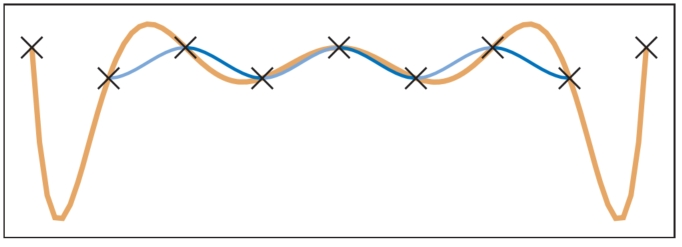
  Figure 15.9. Splines interpolating nine control points (marked with small crosses). The thick orange line shows an interpolating polynomial. The thin line shows a Catmull-Rom spline. The latter is made of seven cubic segments, which are each shown in alternating blue tones.
  图 15.9。 内插九个控制点的样条线（用小十字标记)。 橙色粗线显示插值多项式。 细线显示了 Catmull-Rom 样条线。 后者由七个立方体部分组成，每个部分都以交替的蓝色色调显示。
- Control of the interpolating polynomial is not local. Changing a point at the beginning of the spline affects the entire spline. Cardinal splines are local: any place on the spline is affected by its four neighboring points at most. 
  插值多项式的控制不是局部的。 更改样条线起点处的点会影响整个样条线。 基数样条是局部的：样条上的任何位置最多受其四个相邻点的影响。
- Evaluation of the interpolating polynomial is not local. Evaluating a point on the polynomial requires access to all of its points. Evaluating a point on the piecewise cubic requires a fixed small number of computations, no matter how large the total number of points is.
  插值多项式的计算不是局部的。 评估多项式上的一个点需要访问它的所有点。 无论点总数有多大，评估分段三次方上的点都需要固定的少量计算。

There are a variety of other numerical and technical issues in using interpolating splines as the number of points grows larger. See De Boor (2001) for more information. 
随着点数的增加，使用插值样条线还存在各种其他数值和技术问题。 更多信息请参见 De Boor (2001)。

A cardinal spline has the disadvantage that it does not interpolate the first or last point, which can be easily fixed by adding an extra point at either end of the sequence. The cardinal spline also is not as continuous—providing only C1 continuity at the knots.
基数样条的缺点是它不会插入第一个或最后一个点，这可以通过在序列的任一端添加额外的点来轻松修复。 基数样条也不是连续的——仅在结点处提供 C1 连续性。

## 15.6 Approximating Curves 近似曲线

It might seem like the easiest way to control a curve is to specify a set of points for it to interpolate. In practice, however, interpolation schemes often have undesirable properties because they have less continuity and offer no control of what happens between the points. Curve schemes that only approximate the points are often preferred. With an approximating scheme, the control points influence the shape of the curve, but do not specify it exactly. Although we give up the ability to directly specify points for the curve to pass through, we gain better behavior of the curve and local control. Should we need to interpolate a set of points, the positions of the control points can be computed such that the curve passes through these interpolation points. 
控制曲线的最简单方法似乎是指定一组点以供其插值。 然而，在实践中，插值方案通常具有不良特性，因为它们的连续性较差并且无法控制点之间发生的情况。 仅近似点的曲线方案通常是首选。 使用近似方案时，控制点会影响曲线的形状，但不会精确指定。 尽管我们放弃了直接指定曲线通过的点的能力，但我们获得了更好的曲线行为和局部控制。 如果我们需要插值一组点，可以计算控制点的位置，以便曲线穿过这些插值点。

The two most important types of approximating curves in computer graphics are Bezier curves and B-spline curves. 
计算机图形学中两种最重要的近似曲线类型是 Bezier 曲线和 B 样条曲线。

### 15.6.1 Bezier Curves 贝塞尔曲线

Bezier curves are one of the most common representations for free-form curves in computer graphics. The curves are named for Pierre Bezier, one of the people who was instrumental in their development. Bezier curves have an interesting history where they were concurrently developed by several independent groups.
贝塞尔曲线是计算机图形学中最常见的自由曲线表示形式之一。 这些曲线以皮埃尔·贝塞尔 (Pierre Bezier) 的名字命名，他是其开发过程中的重要人物之一。 贝塞尔曲线有一个有趣的历史，它们是由几个独立的小组同时开发的。

A Bezier curve is a polynomial curve that approximates its control points. The curves can be a polynomial of any degree. A curve of degree d is controlled by d + 1 control points. The curve interpolates its first and last control points, and the shape is directly influenced by the other points. 
贝塞尔曲线是近似其控制点的多项式曲线。 曲线可以是任意次数的多项式。 d 次曲线由 d + 1 个控制点控制。 曲线对其第一个和最后一个控制点进行插值，并且形状直接受其他点的影响。

Often, complex shapes are made by connecting a number of Bezier curves of low degree, and in computer graphics, cubic (d = 3) Bezier curves are commonly used for this purpose. Many popular illustration programs, such as Adobe Illustrator, and font representation schemes, such as that used in Postscript, use cubic Bezier curves. Bezier curves are extremely popular in computer graphics because they are easy to control, have a number of useful properties, and there are very efficient algorithms for working with them.
通常，复杂的形状是通过连接多个低阶贝塞尔曲线来形成的，在计算机图形学中，三次（d = 3）贝塞尔曲线通常用于此目的。 许多流行的插图程序（例如 Adobe Illustrator）和字体表示方案（例如 Postscript 中使用的字体表示方案）都使用三次贝塞尔曲线。 贝塞尔曲线在计算机图形学中非常流行，因为它们易于控制，具有许多有用的属性，并且有非常有效的算法可以使用它们。

 Bezier curves are constructed such that:
贝塞尔曲线的构造如下：

-  The curve interpolates the first and last control points, with u = 0 and 1, respectively. 
   曲线对第一个和最后一个控制点进行插值，u 分别为 0 和 1。
-  The first derivative of the curve at its beginning (end) is determined by the vector between the first and second (next to last and last) control points. The derivatives are given by the vectors between these points scaled by the degree of the curve. 
   曲线在其开始（结束）处的一阶导数由第一个和第二个（紧邻最后一个和最后一个）控制点之间的向量确定。 导数由这些点之间按曲线阶数缩放的向量给出。
-  Higher derivatives at the beginning (end) of the curve depend on the points at the beginning (end) of the curve. The $n^{th}$ derivative depends on the first (last) n + 1 points. 
   曲线起点（终点）处的较高导数取决于曲线起点（终点）处的点。 $n^{th}$ 导数取决于前（后）n + 1 个点。

For example, consider the Bezier curve of degree 3 (cubic) as in Figure 15.10. The curve has four $(d + 1)$ control points. It begins at the first control point ($\bold{p}_0$) and ends at the last ($\bold{p}_1$). The first derivative at the beginning is proportional to the vector between the first and second control points ($\bold{p}_1 − \bold{p}_0$). Specifically, $\bold{f}'(0) = 3(\bold{p}_1 − \bold{p}_0)$. Similarly, the first derivative at the end of the curve is given by $\bold{f}'(1) = 3(\bold{p}_3 − \bold{p}_2)$. The second derivative at the beginning of the curve can be determined from control points $\bold{p}_0$, $\bold{p}_1$ and $\bold{p}_2$. 
例如，考虑 3 次（三次）贝塞尔曲线，如图 15.10 所示。 该曲线有四个 $(d + 1)$ 控制点。 它从第一个控制点 ($\bold{p}_0$) 开始，到最后一个控制点 ($\bold{p}_1$) 结束。 开头的一阶导数与第一个和第二个控制点之间的向量 ($\bold{p}_1 − \bold{p}_0$) 成正比。 具体来说，$\bold{f}'(0) = 3(\bold{p}_1 − \bold{p}_0)$。 类似地，曲线末端的一阶导数由 $\bold{f}'(1) = 3(\bold{p}_3 − \bold{p}_2)$ 给出。 曲线起始处的二阶导数可以从控制点 $\bold{p}_0$、$\bold{p}_1$ 和 $\bold{p}_2$ 确定。

Figure 15.10. A cubic Bezier curve is controlled by four points. It interpolates the first and last, and the beginning and final derivatives are three times the vectors between the first two (or last two) points.
图 15.10。 三次贝塞尔曲线由四个点控制。 它对第一个和最后一个进行插值，并且开始和最终导数是前两个（或最后两个)点之间向量的三倍。

Using the facts about Bezier cubics in the preceding paragraph, we can use the methods of Section 15.5 to create a parametric function for them. The definitions of the beginning and end interpolation and derivatives give 
利用上一段中有关贝塞尔三次曲线的事实，我们可以使用第 15.5 节的方法为它们创建参数函数。 开始和结束插值和导数的定义给出
$$
\bold{p}_0 = \bold{f}(0) = \bold{a}_30^3 + \bold{a}_20^2 + \bold{a}_10 + \bold{a}_0, \\
\bold{p}_3 = \bold{f}(1) = \bold{a}_31^3 + \bold{a}_21^2 + \bold{a}_1^1 + \bold{a}_0, \\
3(\bold{p}_1 − \bold{p}_0) = \bold{f}'(0) = 3\bold{a}_30^2 + 2\bold{a}_20 + \bold{a}_1, \\
3(\bold{p}_3 − \bold{p}_2) = \bold{f}'(1) = 3\bold{a}_31^2 + 2\bold{a}_21 + \bold{a}_1.
$$
This can be solved for the basis matrix 
这可以求解基本矩阵
$$
\bold{B} = \bold{C}^{-1} = \begin{bmatrix}
1 & 0 & 0 & 0 \\
−3 & 3 & 0 & 0 \\
3 & −6 & 3 & 0 \\
−1 & 3 & −3 & 1
\end{bmatrix}
$$
and then written as
然后写成
$\bold{f}(u) = (1 -3u+3u^2 - u^3)\bold{p}_0 +(3u -6u^2 +3u^3)\bold{p}_1 +(3u^2 -3u^3)\bold{p}_2 +(u^3)\bold{p}_3,  $

or
或者
$\bold{f}(u) = \sum^d_{i = 0}b_{i,3}\bold{p}_i \\$

where the $b_{i,3}$ are the Bezier blending functions of degree 3: 
其中 $b_{i,3}$ 是 3 阶 Bezier 混合函数：
$$
b_{0,3} = (1 − u)^3, \\
b_{1,3} = 3u(1 − u)^2, \\
b_{2,3} = 3u^2(1 − u), \\
b_{3,3} = u^3.
$$
Fortunately, the blending functions for Bezier curves have a special form that works for all degrees. These functions are known as the Bernstein basis polynomials and have the general form
幸运的是，贝塞尔曲线的混合函数具有适用于所有度数的特殊形式。 这些函数称为伯恩斯坦基多项式，具有一般形式
$b_{k,n}(u) = C(n, k) u^k (1 - u)^{(n-k)},  $

where n is the order of the Bezier curve, and k is the blending function number between 0 and n (inclusive). $C(n, k)$ are the binomial coefficients: 
其中 n 是贝塞尔曲线的阶数，k 是介于 0 和 n（含）之间的混合函数编号。 $C(n, k)$ 是二项式系数：
$C(n, k) = \frac{n!}{k!(n-k)!}\\$

Given the positions of the control points $\bold{p}_k$, the function to evaluate the Bezier curve of order n (with n + 1 control points) is 
给定控制点 $\bold{p}_k$ 的位置，计算 n 阶贝塞尔曲线（具有 n + 1 个控制点）的函数为
$\bold{p}(u) = \sum^n_{k = 0}p_kC(n, k)u^k(1-u)^{n-k} \\$

Some Bezier segments are shown in Figure 15.11. 
一些贝塞尔线段如图 15.11 所示。

Figure 15.11. Various Bezier segments of degree 2–6. The control points are shown with crosses, and the control polygons (line segments connecting the control points) are also shown. 
图 15.11。 2-6 阶的各种贝塞尔曲线段。 控制点用十字显示，并且还显示控制多边形（连接控制点的线段)。

Bezier segments have several useful properties: 
贝塞尔线段有几个有用的属性：

- The curve is bounded by the convex hull of the control points. 
  曲线以控制点的凸包为界。
- Any line intersects the curve no more times than it intersects the set of line segments connecting the control points. This is called the variation diminishing property. This property is illustrated in Figure 15.12. 
  任何直线与曲线相交的次数不超过与连接控制点的线段集相交的次数。 这称为变异递减性质。 该属性如图 15.12 所示。
  
  Figure 15.12. The variation diminishing property of Bezier curves means that the curve does not cross a line more than its control polygon does. Therefore, if the control polygon has no “wiggles,” the curve will not have them either. B-splines (Section 15.6.2) also have this property.
  图 15.12。 贝塞尔曲线的变化递减特性意味着该曲线与线的交叉次数不会多于其控制多边形的交叉次数。 因此，如果控制多边形没有“摆动”，则曲线也不会有“摆动”。 B 样条曲线（第 15.6.2 节)也具有此属性。
- The curves are symmetric: reversing the order of the control points yields the same curve, with a reversed parameterization. 
  曲线是对称的：反转控制点的顺序会产生相同的曲线，但参数化相反。
- The curves are affine invariant. This means that translating, scaling, rotating, or skewing the control points is the same as performing those operations on the curve itself. 
  曲线是仿射不变的。 这意味着平移、缩放、旋转或倾斜控制点与在曲线本身上执行这些操作相同。
- There are good simple algorithms for evaluating and subdividing Bezier curves into pieces that are themselves Bezier curves. Because subdivision can be done effectively using the algorithm described later, a divide and conquer approach can be used to create effective algorithms for important tasks such as rendering Bezier curves, approximating them with line segments, and determining the intersection between two curves.
  有一些很好的简单算法可以评估贝塞尔曲线并将其细分为本身就是贝塞尔曲线的片段。 由于可以使用稍后描述的算法有效地完成细分，因此可以使用分而治之的方法为重要任务创建有效的算法，例如渲染贝塞尔曲线、用线段逼近它们以及确定两条曲线之间的交点。

When Bezier segments are connected together to make a spline, connectivity between the segments is created by sharing the endpoints. However, continuity of the derivatives must be created by positioning the other control points. This provides the user of a Bezier spline with control over the smoothness. For $G^1$ continuity, the second-to-last point of the first curve and the second point of the second curve must be collinear with the equated endpoints. For $C^1$ continuity, the distances between the points must be equal as well. This is illustrated in Figure 15.13. Higher degrees of continuity can be created by properly positioning more points.
当贝塞尔曲线线段连接在一起形成样条线时，线段之间的连接是通过共享端点来创建的。 然而，导数的连续性必须通过定位其他控制点来创建。 这为贝塞尔样条的用户提供了对平滑度的控制。 对于 $G^1$ 连续性，第一条曲线的倒数第二个点和第二条曲线的第二个点必须与相等的端点共线。 对于 $C^1$ 连续性，点之间的距离也必须相等。 如图 15.13 所示。 通过正确定位更多点可以创建更高程度的连续性。
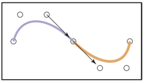
Figure 15.13. Two Bezier segments connect to form a $C^1$ spline, because the vector between the last two points of the first segment is equal to the vector between the first two points of the second segment.
图 15.13。 两个贝塞尔曲线段连接起来形成 $C^1$ 样条曲线，因为第一段最后两点之间的向量等于第二段前两点之间的向量。

#### Geometric Intuition for Bezier Curves 贝塞尔曲线的几何直觉

Bezier curves can be derived from geometric principles, as well as from the algebraic methods described above. We outline the geometric principles because they provides intuition on how Bezier curves work. 
贝塞尔曲线可以从几何原理以及上述代数方法中导出。 我们概述了几何原理，因为它们提供了贝塞尔曲线如何工作的直觉。

Imagine that we have a set of control points from which we want to create a smooth curve. Simply connecting the points with lines (to form the control polygon) will lead to something that is non-smooth. It will have sharp corners. We could imagine “smoothing” this polygon by cutting off the sharp corners, yielding a new polygon that is smoother, but still not “smooth” in the mathematical sense (since the curve is still a polygon, and therefore only $C^1$). We can repeat this process, each time yielding a smoother polygon, as shown in Figure 15.14. In the limit, that is if we repeated the process infinitely many times, we would obtain a $C^1$ smooth curve.
想象一下，我们有一组控制点，我们想从中创建一条平滑的曲线。 简单地用线连接点（以形成控制多边形）将导致不平滑的结果。 它将有尖角。 我们可以想象通过切除尖角来“平滑”这个多边形，产生一个更平滑的新多边形，但在数学意义上仍然不是“平滑”（因为曲线仍然是一个多边形，因此只有 $C^1$ ）。 我们可以重复这个过程，每次都会产生一个更平滑的多边形，如图 15.14 所示。 在极限情况下，即如果我们无限次重复该过程，我们将获得 $C^1$ 平滑曲线。

Figure 15.14. Subdivision procedure for quadratic Beziers. Each line segment is divided in half and these midpoints are connected (blue points and lines). The interior control point is moved to the midpoint of the new line segment (orange point). 
图 15.14。 二次贝塞尔曲线的细分过程。 每条线段被分成两半，这些中点被连接起来（蓝色的点和线）。 内部控制点移动到新线段的中点（橙色点)。

What we have done with corner cutting is defining a subdivision scheme. That is, we have defined curves by a process for breaking a simpler curve into smaller pieces (e.g., subdividing it). The resulting curve is the limit curve that is achieved by applying the process infinitely many times. If the subdivision scheme is defined correctly, the result will be a smooth curve, and it will have a parametric form. 
我们通过切角所做的就是定义细分方案。 也就是说，我们通过将更简单的曲线分解成更小的部分（例如，细分它）的过程来定义曲线。 所得曲线是通过应用该过程无限多次而获得的极限曲线。 如果细分方案定义正确，结果将是一条平滑的曲线，并且具有参数形式。

Let us consider applying corner cutting to a single corner. Given three points $(\bold{p}_0, \bold{p}_1, \bold{p}_2)$, we repeatedly “cut off the corners” as shown in Figure 15.15. At each step, we divide each line segment in half, connect the midpoints, and then move the corner point to the midpoint of the new line segment. Note that in this process, new points are introduced, moved once, and then remain in this position for any remaining iterations. The endpoints never move. 
让我们考虑对单个角应用角切割。 给定三个点$(\bold{p}_0, \bold{p}_1, \bold{p}_2)$，我们重复“切角”，如图15.15所示。 在每一步中，我们将每个线段分成两半，连接中点，然后将角点移动到新线段的中点。 请注意，在此过程中，会引入新点，移动一次，然后在任何剩余迭代中保持在该位置。 端点永远不会移动。

Figure 15.15. By repeatedly cutting the corners off a polygon, we approach a smooth curve. 
图 15.15。 通过反复切割多边形的角，我们可以得到平滑的曲线。

If we compute the “new” position for $\bold{p}_2$ as the midpoint of the midpoints, we get the expression
如果我们计算 $\bold{p}_2$ 的“新”位置作为中点的中点，我们得到表达式
$\bold{p}'_2 = \frac{1}{2}(\frac{1}{2}\bold{p}_0 + \frac{1}{2}\bold{p}_1) + \frac{1}{2}(\frac{1}{2}\bold{p}_1 + \frac{1}{2}\bold{p}_2) \\$

The construction actually works for other proportions of distance along each segment. If we let u be the distance between the beginning and the end of each segment where we place the middle point, we can rewrite this expression as
该结构实际上适用于沿每段的其他距离比例。 如果我们让 u 为放置中点的每个线段的起点和终点之间的距离，我们可以将该表达式重写为
$\bold{p}(u) = (1 - u)((1 - u)\bold{p}_0 + u\bold{p}_1) + u((1 - u)\bold{p}_1 + u\bold{p}_2).  $

Regrouping terms gives the quadratic Bezier function: 
重新组合项给出二次贝塞尔函数：
$\bold{B}_2(u) = (1 - u)^2\bold{p}_0 + 2u(1 - u)\bold{p}_1 + u^2\bold{p}_2.  $

#### The de Casteljau Algorithm de Casteljau 算法

One nice feature of Bezier curves is that there is a very simple and general method for computing and subdividing them. The method, called the de Casteljau algorithm, uses a sequence of linear interpolations to compute the positions along the Bezier curve of arbitrary order. It is the generalization of the subdivision scheme described in the previous section. 
贝塞尔曲线的一个很好的特点是有一种非常简单且通用的方法来计算和细分它们。 该方法称为 de Casteljau 算法，使用一系列线性插值来计算沿任意阶贝塞尔曲线的位置。 它是上一节中描述的细分方案的推广。

The de Casteljau algorithm begins by connecting every adjacent set of points with lines, and finding the point on these lines that is the u interpolation, giving a set of n−1 points. These points are then connected with straight lines, those lines are interpolated (again by u), giving a set of n− 2 points. This process is repeated until there is one point. An illustration of this process is shown in Figure 15.16. 
de Casteljau 算法首先用线连接每个相邻的点集，并找到这些线上的点（即 u 插值），给出一组 n−1 个点。 然后用直线连接这些点，对这些线进行插值（再次通过 u），给出一组 n−2 点。 重复这一过程直到出现一个点。 图 15.16 显示了该过程的图示。

Figure 15.16. An illustration of the de Casteljau algorithm for a cubic Bezier. The left-hand image shows the construction for u = 0.5. The right-hand image shows the construction for 0.25, 0.5, and 0.75.
图 15.16。 三次贝塞尔曲线的 de Casteljau 算法的图示。 左图显示了 u = 0.5 的结构。 右图显示了 0.25、0.5 和 0.75 的结构。

The process of computing a point on a Bezier segment also provides a method for dividing the segment at the point. The intermediate points computed during the de Casteljau algorithm form the new control points of the new, smaller segments, as shown in Figure 15.17. 
计算贝塞尔线段上的点的过程还提供了在该点处划分线段的方法。 de Casteljau 算法期间计算的中间点形成新的较小线段的新控制点，如图 15.17 所示。

Figure 15.17. The de Casteljau algorithm is used to subdivide a cubic Bezier segment. The initial points (black diamonds A, B, C, and D) are linearly interpolated to yield blue circles (AB, BC, CD), which are linearly interpolated to yield orange circles (AC, BD), which are linearly interpolated to give the point on the cubic AD. This process also has subdivided the Bezier segment with control points A,B,C,D into two Bezier segments with control points A, AB, AC, AD and AD, BD, CD, D.
图 15.17。 de Casteljau 算法用于细分三次贝塞尔线段。 对初始点（黑色菱形 A、B、C 和 D）进行线性插值以产生蓝色圆圈（AB、BC、CD），对这些圆圈进行线性插值以产生橙色圆圈（AC、BD)，对这些圆圈进行线性插值以给出 AD 立方体上的点。 该过程还将具有控制点 A、B、C、D 的贝塞尔曲线段细分为具有控制点 A、AB、AC、AD 和 AD、BD、CD、D 的两个贝塞尔曲线段。

The existence of a good algorithm for dividing Bezier curves makes divideand-conquer algorithms possible. For example, when drawing a Bezier curve segment, it is easy to check if the curve is close to being a straight line because it is bounded by its convex hull. If the control points of the curve are all close to being colinear, the curve can be drawn as a straight line. Otherwise, the curve can be divided into smaller pieces, and the process can be repeated. Similar algorithms can be used for determining the intersection between two curves. Because of the existence of such algorithms, other curve representations are often converted to Bezier form for processing.
良好的贝塞尔曲线划分算法的存在使得分治算法成为可能。 例如，在绘制贝塞尔曲线段时，很容易检查该曲线是否接近直线，因为它受到其凸包的限制。 如果曲线的控制点都接近共线，则可以将曲线画成直线。 否则，可以将曲线分成更小的部分，并且可以重复该过程。 类似的算法可用于确定两条曲线之间的交点。 由于此类算法的存在，其他曲线表示常常被转换为贝塞尔形式进行处理。

### 15.6.2 B-Splines B 样条

B-splines provide a method for approximating a set of $n$ points with a curve made up of polynomials of degree d that gives $C^{(d−1)}$ continuity. Unlike the Bezier splines of the previous section, B-splines allow curves to be generated for any desired degree of continuity (almost up to the number of points). Because of this, B-splines are a preferred way to specify very smooth curves (high degrees of continuity) in computer graphics. If we want a $C^2$ or higher curve through an arbitrary number of points, B-splines are probably the right method.
B 样条曲线提供了一种用由 d 次多项式组成的曲线来逼近一组 $n$ 点的方法，该曲线具有 $C^{(d−1)}$ 连续性。 与上一节的贝塞尔样条曲线不同，B 样条曲线允许生成任何所需连续程度的曲线（几乎达到点数）。 因此，B 样条曲线是在计算机图形学中指定非常平滑的曲线（高度连续性）的首选方法。 如果我们想要通过任意数量的点的 $C^2$ 或更高的曲线，B 样条可能是正确的方法。

We can represent a curve using a linear combination of B-spline basis functions. Since these basis functions are themselves splines, we call them basis splines or B-splines for short. Each B-spline or basis function is made up of a set of $d + 1$ polynomials each of degree $d$. The methods of B-splines provide general procedures for defining these functions. 
我们可以使用 B 样条基函数的线性组合来表示曲线。 由于这些基函数本身就是样条曲线，因此我们将它们简称为基样条曲线或 B 样条曲线。 每个 B 样条或基函数均由一组 $d + 1$ 个多项式组成，每个多项式的阶数为 $d$。 B 样条方法提供了定义这些函数的通用过程。

The term B-spline specifically refers to one of the basis functions, not the function created by the linear combination of a set of B-splines. However, there is inconsistency in how the term is used in computer graphics. Commonly, a “Bspline curve” is used to mean a curve represented by the linear combination of B-splines. 
术语 B 样条曲线特指其中一个基函数，而不是由一组 B 样条曲线线性组合创建的函数。 然而，该术语在计算机图形学中的使用方式并不一致。 通常，“B样条曲线”是指由B样条的线性组合表示的曲线。

The idea of representing a polynomial as the linear combination of other polynomials has been discussed in Section 15.3.1 and 15.3.5. Representing a spline as a linear combination of other splines was shown in Section 15.4.1. In fact, the example given is a simple case of a B-spline. 
将多项式表示为其他多项式的线性组合的想法已在 15.3.1 和 15.3.5 节中讨论过。 将样条曲线表示为其他样条曲线的线性组合如第 15.4.1 节所示。 事实上，给出的示例是 B 样条的简单情况。

The general notation for representing a function as a linear combination of other functions is
将函数表示为其他函数的线性组合的一般符号是
$$
\bold{f}(t) = \sum^n_{i = 1}\bold{p}_ib_i(t) \ \  \ \ (15.15)
$$
where the $\bold{p}_i$ are the coefficients and the $b_i$ are the basis functions. If the coefficients are points (e.g., 2 or 3 vectors), we refer to them as control points. The key to making such a method work is to define the bi appropriately. B-splines provide a very general way to do this.
其中 $\bold{p}_i$ 是系数，$b_i$ 是基函数。 如果系数是点（例如 2 个或 3 个向量），我们将它们称为控制点。 使这种方法发挥作用的关键是适当地定义 bi。 B 样条曲线提供了一种非常通用的方法来执行此操作。

A set of B-splines can be defined for a number of coefficients n and a parameter value $k$(The B-spline parameter is actually the order of the polynomials used in the B-splines. While this terminology is not uniform in the literature, the use of the B-spline parameter $k$ as a value one greater than the polynomial degree is widely used, although some texts (see the chapter notes) write all of the equations in terms of polynomial degree.). The value of $k$ is one more than the degree of the polynomials used to make the B-splines $(k = d + 1.) $
可以为多个系数 n 和一个参数值 $k$ 定义一组 B 样条曲线（B 样条参数实际上是 B 样条曲线中使用的多项式的阶数。虽然这个术语在国际上并不统一） 在文献中，广泛使用 B 样条参数 $k$ 作为比多项式次数大 1 的值，尽管有些文本（参见章节注释）以多项式次数编写所有方程。）。 $k$ 的值比用于生成 B 样条 $(k = d + 1) 的多项式次数多 1。$

B-splines are important because they provide a very general method for creating functions (that will be useful for representing curves) that have a number of useful properties. A curve with $n$ points made with B-splines with parameter value $k$: 
B 样条曲线很重要，因为它们提供了一种非常通用的方法来创建具有许多有用属性的函数（这对于表示曲线很有用）。 使用参数值为 $k$ 的 B 样条曲线绘制具有 $n$ 个点的曲线：

- is $C^{(k−2)}$ continuous; 
  $C^{(k−2)}$ 连续；
- is made of polynomials of degree $k − 1$; 
  由 $k − 1$ 次多项式组成；
- has local control—any site on the curve only depends on $k$ of the control points; 
  具有局部控制——曲线上的任何位置仅取决于控制点的$k$；
- is bounded by the convex hull of the points; 
  由点的凸包界定；
- exhibits the variation diminishing property illustrated in Figure 15.12. 
  表现出如图 15.12 所示的变化递减特性。

A curve created using B-splines does not necessarily interpolate its control points. 
使用 B 样条线创建的曲线不一定会对其控制点进行插值。

We will introduce B-splines by first looking at a specific, simple case to introduce the concepts. We will then generalize the methods and show why they are interesting. Because the method for computing B-splines is very general, we delay introducing it until we have shown what these generalizations are.
我们将首先通过一个具体的、简单的案例来介绍 B 样条的概念。 然后我们将概括这些方法并展示它们为何有趣。 因为计算 B 样条的方法非常通用，所以我们推迟介绍它，直到我们展示了这些概括是什么。

#### Uniform Linear B-Splines 均匀线性 B 样条

Consider a set of basis functions of the following form: 
考虑以下形式的一组基函数：
$$
b_{i, 2}(t) = \begin{cases}
t − i\ \ \ \ \ \ \ \ \ \ \ \ \ \ \  if\ i ≤ t < i + 1, \\
2 − t + i\ \ \ \ \ \ \ \  if\ i + 1 ≤ t ≤ i + 2, \\
0 \ \ \ \ \ \ \ \ \ \ \ \ \ \ \ \ \ \ \ \ \ otherwise
\end{cases} \ \ \ \ \ \  \ (15.16)
$$
Each of these functions looks like a little triangular “hat” between $i$ and $i+2$ with its peak at $i + 1$. Each is a piecewise polynomial, with knots at $i$, $i + 1$, and $i + 2$. Two of them are graphed in Figure 15.18. 
这些函数中的每一个看起来都像 $i$ 和 $i+2$ 之间的一个小三角形“帽子”，其峰值在 $i + 1$ 处。 每个都是分段多项式，节点位于 $i$、$i + 1$ 和 $i + 2$。 其中两个如图 15.18 所示。

Figure 15.18. B-splines with $d = 1$ or $k = 2$. 
图 15.18。 $d = 1$ 或 $k = 2$ 的 B 样条线。

Each of these functions $b_{i,2}$ is a first-degree (linear) B-spline. Because we will consider B-splines of other parameter values later, we denote these with the 2 in the subscript.
这些函数 $b_{i,2}$ 中的每一个都是一次（线性）B 样条。 因为稍后我们将考虑其他参数值的 B 样条，所以我们用下标中的 2 表示它们。

Notice that we have chosen to put the lower edge of the B-spline (its first knot) at $i$. Therefore, the first knot of the first B-spline $(i = 1)$ is at 1. Iteration over the B-splines or elements of the coefficient vector is from 1 to n (see Equation 15.15). When B-splines are implemented, as well as in many other discussions of them, they often are numbered from 0 to $n − 1$. 
请注意，我们选择将 B 样条线的下边缘（其第一个结）放置在 $i$ 处。 因此，第一个 B 样条线 $(i = 1)$ 的第一个节点位于 1。B 样条线或系数向量元素的迭代范围为从 1 到 n（参见公式 15.15）。 当 B 样条被实现时，以及在它们的许多其他讨论中，它们通常从 0 到 $n − 1$ 进行编号。

We can create a function from a set of n control points using Equation 15.15, with these functions used for the $b_i$ to create an “overall function” that was influenced by the coefficients. If we were to use these $(k = 2)$ B-splines to define the overall function, we would define a piecewise polynomial function that linearly interpolates the coefficients $\bold{p}_i$ between $t = k$ and $t = n + 1$. Note that while $(k = 2)$ B-splines interpolate all of their coefficients, B-splines of higher degree do this under some specific conditions that we will discuss in Section 15.6.3. 
我们可以使用方程 15.15 从一组 n 个控制点创建一个函数，这些函数用于 $b_i$ 来创建受系数影响的“整体函数”。 如果我们使用这些 $(k = 2)$ B 样条来定义整体函数，我们将定义一个分段多项式函数，该函数在 $t = k$ 和 $ 之间线性插值系数 $\bold{p}_i$ t = n + 1$。 请注意，虽然 $(k = 2)$ B 样条对所有系数进行插值，但更高阶的 B 样条会在某些特定条件下执行此操作，我们将在第 15.6.3 节中讨论。

Some properties of B-splines can be seen in this simple case. We will write these in the general form using $k$, the parameter, and $n$ for the number of coefficients or control points:
在这个简单的例子中可以看到 B 样条的一些属性。 我们将使用 $k$（参数）和 $n$（表示系数或控制点的数量）以一般形式编写这些：

- Each B-spline has k + 1 knots. 
  每个 B 样条有 k + 1 个节。
- Each B-spline is zero before its first knot and after its last knot. 
  每个 B 样条在其第一个结之前和最后一个结之后为零。
- The overall spline has local control because each coefficient is only multiplied by one B-spline, and this B-spline is nonzero only between k + 1 knots. 
  整体样条具有局部控制，因为每个系数仅乘以一个 B 样条，并且该 B 样条仅在 k + 1 节之间非零。
- The overall spline has $n + k$ knots. 
  整体样条线有 $n + k$ 个结。
- Each B-spline is $C^{(k−2)}$ continuous, therefore the overall spline is $C^{(k−2)}$ continuous. 
  每个 B 样条线都是 $C^{(k−2)}$ 连续的，因此整个样条线是 $C^{(k−2)}$ 连续的。
- The set of B-splines sums to 1 for all parameter values between knots $k$ and $n+1$. This range is where there are $k$ B-splines that are nonzero. Summing to 1 is important because it means that the B-splines are shift invariant: translating the control points will translate the entire curve.
  对于节点 $k$ 和 $n+1$ 之间的所有参数值，B 样条集的总和为 1。 此范围是有 $k$ 个非零 B 样条的地方。 求和为 1 很重要，因为这意味着 B 样条曲线具有平移不变性：平移控制点将平移整条曲线。
- Between each of its knots, the B-spline is a single polynomial of degree $d = k − 1$. Therefore, the overall curve (that sums these together) can also be expressed as a single, degree d polynomial between any adjacent knots.
  在每个结之间，B 样条是一个次数为 $d = k − 1$ 的单个多项式。 因此，整体曲线（将它们相加）也可以表示为任何相邻结之间的单个 d 次多项式。

In this example, we have chosen the knots to be uniformly spaced. We will consider B-splines with nonuniform spacing later. When the knot spacing is uniform, each of the B-splines is identical except for being shifted. B-splines with uniform knot spacing are sometimes called uniform B-splines or periodic B-splines. 
在此示例中，我们选择了均匀间隔的结。 稍后我们将考虑具有不均匀间距的 B 样条线。 当结点间距均匀时，每个 B 样条线除了移动之外都是相同的。 具有均匀结间距的 B 样条有时称为均匀 B 样条或周期 B 样条。

#### Uniform Quadratic B-Splines 均匀二次 B 样条

The properties of B-splines listed in the previous section were intentionally written for arbitrary n and k. A general procedure for constructing the B-splines will be provided later, but first, lets consider another specific case with k = 3. 
上一节中列出的 B 样条属性是针对任意 n 和 k 有意编写的。 稍后将提供构建 B 样条的一般过程，但首先让我们考虑 k = 3 的另一个特定情况。

The B-spline $b_{2,3}$ is shown in Figure 15.19. It is made of quadratic pieces (degree 2), and has three of them. It is $C^1$ continuous and is nonzero only within the four knots that it spans. Notice that a quadratic B-spline is made of three pieces, one between knot 1 and 2, one between knot 2 and 3, and one between knot 3 and 4. In Section 15.6.3 we will see a general procedure for building these functions. For now, we simply examine these functions:
B 样条 $b_{2,3}$ 如图 15.19 所示。 它由二次块（2 次）组成，并且包含三个二次块。 它是 $C^1$ 连续的，并且仅在其跨越的四个节内不为零。 请注意，二次 B 样条由三部分组成，一个在结 1 和 2 之间，一个在结 2 和 3 之间，一个在结 3 和 4 之间。在第 15.6.3 节中，我们将看到构建这些函数的一般过程 。 现在，我们简单地检查这些函数：
$$
b_{i,3}(t) = \begin{cases}
\frac{1}{2}u^2 \ \ \ \ \  \ \ \ \ \ \ \ \ \ \ \ \ \ \ \ \ \ if\ i ≤ t < i + 1\ \ \ \ \ \ \ \ \ \ \ u = t − i, \\
-u^2 + u + \frac{1}{2}\ \ \ \ \ \ \ if\ i + 1 ≤ t < i + 2\ \ \ \  u = t − (i + 1), \\
\frac{1}{2}(1-u)^2\ \ \ \ \ \ \ \ \ \ \ \ if\ i + 2 ≤ t < i + 3\ \  \ \   u = t − (i + 2), \\
0\ \ \ \ \ \ \ \ \ \ \ \ \ \ \ \ \ \ \ \ \ \ \ \ \ \ \  otherwise.
\end{cases} \ \ \ \ \ \ (15.17) 
$$
In order to make the expressions simpler, we wrote the function for each part as if it applied over the range 0 to 1. 
为了使表达式更简单，我们为每个部分编写了函数，就像它应用于 0 到 1 的范围一样。

Figure 15.19. The B-spline $b_{2,3}$ with uniform knot spacing. 
图 15.19。 具有均匀结间距的 B 样条线 $b_{2,3}$。

If we evaluate the overall function made from summing together the B-splines, at any time only $k$ (3 in this case) of them are nonzero. One of them will be in the first part of Equation 15.17, one will be in the second part, and one will be in the third part. Therefore, we can think of any piece of the overall function as being made up of a degree $d = k - 1$ polynomial that depends on $k$ coefficients. For the $k = 3$ case, we can write
如果我们评估将 B 样条线相加得到的整体函数，则在任何时候只有 $k$（在本例中为 3）它们是非零的。 其中一个位于公式 15.17 的第一部分，一个位于第二部分，一个位于第三部分。 因此，我们可以将整个函数的任何部分视为由依赖于 $k$ 系数的 $d = k - 1$ 次多项式组成。 对于 $k = 3$ 的情况，我们可以写
$\bold{f}(u) = \frac{1}{2}(1-u)^2\bold{p}_i + (-u^2 + u +\frac{1}{2})\bold{p}_{i+1}+\frac{1}{2}u^2\bold{p}_{i+2}\\$

where $u = t−i$. This defines the piece of the overall function when $i ≤ t < i+1$. 
其中$u = t−i$。 这定义了当 $i ≤ t < i+1$ 时整个函数的部分。

If we have a set of $n$ points, we can use the B-splines to create a curve. If we have seven points, we will need a set of seven B-splines. A set of seven B-splines for $k = 3$ is shown in Figure 15.20. Notice that there are $n + k$ (10) knots, that the sum of the B-splines is 1 over the range $k$ to $n + 1$ (knots 3 through 8). A curve specified using these B-splines and a set of points is shown in Figure 15.21.
如果我们有一组 $n$ 个点，我们可以使用 B 样条线创建一条曲线。 如果我们有七个点，我们将需要一组七个 B 样条线。 $k = 3$ 的一组七个 B 样条如图 15.20 所示。 请注意，有 $n + k$ (10) 个节点，在 $k$ 到 $n + 1$ 范围内（节点 3 到 8），B 样条线的总和为 1。 使用这些 B 样条线和一组点指定的曲线如图 15.21 所示。

Figure 15.20. The set of seven B-splines with $k = 3$ and uniform knot spacing [1, 2, 3, 4, 5, 6, 7, 8, 10]. 
图 15.20。 七个 B 样条线的集合，其中 $k = 3$ 和均匀的结间距 [1, 2, 3, 4, 5, 6, 7, 8, 10]。


Figure 15.21. Curve made from seven quadratic $(k=3)$ B-splines, using seven control points. 
图 15.21。 由七个二次 $(k=3)$ B 样条线和七个控制点组成的曲线。

#### Uniform Cubic B-Splines  均匀三次 B 样条

Because cubic polynomials are so popular in computer graphics, the special case of B-splines with $k = 4$ is sufficiently important that we consider it before discussing the general case. A B-spline of third degree is defined by four cubic polynomial pieces. The general process by which these pieces are determined is described later, but the result is 
由于三次多项式在计算机图形学中非常流行，因此 $k = 4$ 的 B 样条的特殊情况非常重要，因此我们在讨论一般情况之前考虑它。 三阶 B 样条由四个三次多项式块定义。 确定这些件的一般过程将在后面描述，但结果是
$$
b_{i,4}(t) = \begin{cases}
\frac{1}{6}u^3 \ \ \ \ \ \ \ \ \ \ \ \ \ \ \ \ \ \ \ \ \ \ \ \ \ \ \ \ \ \ \ \ \ \ \ \ \ \ \ \ \ \ if\ i ≤ t < i + 1\ \ \ \ \ \ \ \ \  u = t − i, \\
\frac{1}{6}(−3u^3 + 3u^2 + 3u + 1)\ \ \ \ \ \ \ if\ i + 1 ≤ t < i + 2\ \  u = t − (i + 1), \\
\frac{1}{6}(3u^3 − 6u^2 + 4)\ \ \ \ \ \ \ \ \ \ \ \ \ \ \ \ \ \ \ if\ i + 2 ≤ t < i + 3\ \   u = t − (i + 2), \\
\frac{1}{6}(−u^3 + 3u^2 − 3u + 1)\ \ \ \ \ \ \ \ \ if\ i + 3 ≤ t < i + 4\ \   u = t − (i + 3), \\
0\ \ \ \ \ \ \ \ \ \ \ \ \ \ \ \ \ \ \ \ \ \ \ \ \ \ \ \ \ \ \ \ \ \ \ \ \ \ \ \ \ \ \ \ \ \ \  otherwise
\end{cases} \ \ \ \ \ \ \ (15.18)
$$
This degree 3 B-spline is graphed for $i = 1$ in Figure 15.22. 
该 3 次 B 样条曲线在图 15.22 中以 $i = 1$ 绘制。
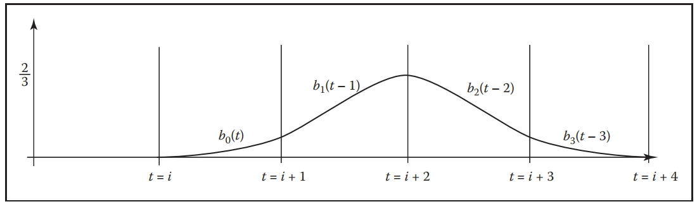
Figure 15.22. The cubic $(k = 4)$ B-spline with uniform knots. 
图 15.22。 具有均匀结的三次 $(k = 4)$ B 样条。

We can write the function for the overall curve between knots $i + 3$ and $i + 4$ as a function of the parameter $u$ between 0 and 1 and the four control points that influence it:
我们可以将节点 $i + 3$ 和 $i + 4$ 之间的整体曲线的函数写为 0 和 1 之间的参数 $u$ 以及影响它的四个控制点的函数：
$\bold{f}(u) = \frac{1}{6}(-u^3 + 3u^2 - 3u + 1)\bold{p}_i + \frac{1}{6}(3u^3 - 6u^2 + 4)\bold{p}_{i+1} + \frac{1}{6} (-3u^3 + 3u^2 + 3u + 1)\bold{p}_{i+2} + \frac{1}{6}u^3\bold{p}_{i+3}  \\$

This can be rewritten using the matrix notation of the previous sections, giving a basis matrix for cubic B-splines of 
这可以使用前面部分的矩阵表示法重写，给出三次 B 样条的基础矩阵
$$
\bold{M}_b = \frac{1}{6}\begin{bmatrix}
−1 & 3 & −3 & 1 \\
3 & −6 & 3 & 0 \\
−3 & 0 & 3 & 0 \\
1 & 4 & 1 & 0
\end{bmatrix}
$$
Unlike the matrices that were derived from constraints in Section 15.5, this matrix is created from the polynomials that are determined by the general B-spline procedure defined in the next section.
与第 15.5 节中从约束导出的矩阵不同，该矩阵是根据下一节中定义的通用 B 样条过程确定的多项式创建的。

### 15.6.3 Nonuniform B-Splines 非均匀 B 样条

One nice feature of B-splines is that they can be defined for any $k > 1$. So if we need a smoother curve, we can simply increase the value of $k$. This is illustrated in Figure 15.23. 
B 样条线的一个很好的功能是可以为任何 $k > 1$ 定义它们。 所以如果我们需要更平滑的曲线，我们可以简单地增加$k$的值。 如图 15.23 所示。

Figure 15.23. B-spline curves using the same uniform set of knots and the same control points, for various values of $k$. Note that as $k$ increases, the valid parameter range for the curve shrinks.
图 15.23。 对于不同的 $k$ 值，B 样条曲线使用相同的统一节点集和相同的控制点。 请注意，随着 $k$ 的增加，曲线的有效参数范围会缩小。

So far, we have said that B-splines generalize to any $k > 1$ and any $n ≥ d$. There is one last generalization to introduce before we show how to actually compute these B-splines. B-splines are defined for any non-decreasing knot vector. 
到目前为止，我们已经说过 B 样条可以推广到任何 $k > 1$ 和任何 $n ≥ d$。 在我们展示如何实际计算这些 B 样条之前，需要介绍最后一项概括。 B 样条是为任何非递减结向量定义的。

For a given n and k, the set of B-splines (and the function created by their linear combination) has $n + k$ knots. We can write the value of these knots as a vector, that we will denote as $t$. For the uniform B-splines, the knot vector is $[1, 2, 3, . . . , n + k]$. However, B-splines can be generated for any knot vector of length $n + k$, providing the values are non-decreasing (e.g., $t_{i+1} ≥ t_i$). 
对于给定的 n 和 k，B 样条集（以及由它们的线性组合创建的函数）有 $n + k$ 个结。 我们可以将这些结的值写成一个向量，我们将其表示为 $t$。 对于均匀 B 样条，结向量为 $[1, 2, 3, ...。 。 。 , n + k]$。 但是，可以为长度为 $n + k$ 的任何节点向量生成 B 样条，前提是这些值是非递减的（例如，$t_{i+1} ≥ t_i$）。

There are two main reasons why nonuniform knot spacing is useful: it gives us control over what parameter range of the overall function each coefficient affects, and it allows us to repeat knots (e.g., create knots with no spacing in between) in order to create functions with different properties around these points. The latter will be considered later in this section. 
非均匀结间距有用的主要原因有两个：它使我们能够控制每个系数影响的整体函数的参数范围，并且它允许我们重复结（例如，创建之间没有间距的结）以创建 围绕这些点具有不同属性的函数。 本节稍后将讨论后者。

The ability to specify knot values for B-splines is similar to being able to specify the interpolation sites for interpolating spline curves. It allows us to associate curve features with parameter values. By specifying a nonuniform knot vector, we specify what parameter range each coefficient of a B-spline curve affects. Remember that B-spline $i$ is nonzero only between knot $i$ and knot $i + k$. Therefore, the coefficient associated with it only affects the curve between these parameter values. 
为 B 样条曲线指定节点值的能力类似于为插值样条曲线指定插值位置的能力。 它允许我们将曲线特征与参数值关联起来。 通过指定非均匀结向量，我们可以指定 B 样条曲线的每个系数影响的参数范围。 请记住，B 样条 $i$ 仅在结 $i$ 和结 $i + k$ 之间不为零。 因此，与其相关的系数仅影响这些参数值之间的曲线。

One place where control over knot values is particularly useful is in inserting or deleting knots near the beginning of a sequence. To illustrate this, consider a curve defined using linear B-splines $(k = 2)$ as discussed in Section 15.6.2. For $n = 4$, the uniform knot vector is $[1, 2, 3, 4, 5, 6]$. This curve is controlled by a set of four points and spans the parameter range $t = 2$ to $t = 5$. The “end” of the curve $(t = 5)$ interpolates the last control point. If we insert a new point in the middle of the point set, we would need a longer knot vector. The locality properties of the B-splines prevent this insertion from affecting the values of the curve at the ends. The longer curve would still interpolate its last control point at its end. However, if we chose to keep the uniform knot spacing, the new knot vector would be $[1, 2, 3, 4, 5, 6, 7]$. The end of the curve would be at $t = 6$, and the parameter value at which the last control point is interpolated will be a different parameter value than before the insertion. With nonuniform knot spacing, we can use the knot vector $[1, 2, 3, 3.5, 4, 5, 6]$ so that the ends of the curve are unaffected by the change. The abilities to have nonuniform knot spacing makes the locality property of B-splines an algebraic property, as well as a geometric one. 
控制结值特别有用的一个地方是在序列开头附近插入或删除结。 为了说明这一点，请考虑使用线性 B 样条 $(k = 2)$ 定义的曲线，如第 15.6.2 节中所述。 对于 $n = 4$，均匀结向量为 $[1, 2, 3, 4, 5, 6]$。 该曲线由一组四个点控制，参数范围为 $t = 2$ 到 $t = 5$。 曲线 $(t = 5)$ 的“末端”对最后一个控制点进行插值。 如果我们在点集中间插入一个新点，我们将需要更长的结向量。 B 样条线的局部性属性可防止此插入影响曲线末端的值。 较长的曲线仍会在其末端插入最后一个控制点。 但是，如果我们选择保持均匀的结间距，则新的结向量将为 $[1, 2, 3, 4, 5, 6, 7]$。 曲线的终点将位于 $t = 6$ 处，最后一个控制点插值处的参数值将与插入之前的参数值不同。 对于不均匀的结间距，我们可以使用结向量 $[1, 2, 3, 3.5, 4, 5, 6]$ 以使曲线的末端不受变化的影响。 具有不均匀结间距的能力使 B 样条的局部性成为代数性质和几何性质。

We now introduce the general method for defining B-splines. Given values for the number of coefficients $n$, the B-spline parameter $k$, and the knot vector $\bold{t}$ (which has length $n + k$), the following recursive equations define the B-splines:
现在介绍定义 B 样条的一般方法。 给定系数数量 $n$、B 样条参数 $k$ 和结向量 $\bold{t}$（长度为 $n + k$）的值，以下递归方程定义 B- 样条线：
$$
b_{i,1,\bold{t}}(t) = \begin{cases}
1 \ \ \ \ \ \ if\ \bold{t}_i ≤ t < \bold{t}_{i+1}, \\
0 \ \ \ \ \ \ otherwise.		\\
\end{cases}\ \ \ \ \ (15.19) \\
b_{i,k,\bold{t}}(t) = \frac{t-\bold{t}_i}{\bold{t}_{i+k-1}- \bold{t}_i}b_{i,k-1}(t) + \frac{\bold{t}_{i+k} - t}{\bold{t}_{i+k}-\bold{t}_{i+1}}b_{i+1,k-1}(t)\ \ \ \ \ \ \ \ (15.20)
$$
This equation is know as the Cox–de Boor recurrence. It may be used to compute specific values for specific B-splines. However, it is more often applied algebraically to derive equations such as Equation 15.17 or 15.18.
该方程称为 Cox-de Boor 递推式。 它可用于计算特定 B 样条的特定值。 然而，它更常用于代数推导方程，如方程 15.17 或 15.18。

As an example, consider how we would have derived Equation 15.17. Using a uniform knot vector $[1, 2, 3, . . .]$, $t_i = i$, and the value $k = 3$ in Equation 15.20 yields
作为一个例子，考虑一下我们如何推导公式 15.17。 使用统一的结向量 $[1, 2, 3, . 。 .]$、$t_i = i$，以及公式 15.20 中的值 $k = 3$ 得出
$$
b_{i,3}(t) = \frac{t-i}{(i+2)-i}b_{i,2} + \frac{(i+3) - t}{(i+3)-(i+1)}b_{i+1,2} = \frac{1}{2}(t-i)b_{i,2} + \frac{1}{2}(i+3-t)b_{i+1,2} \ \ \ \ \ \ (15.21)
$$
Continuing the recurrence, we must evaluate the recursive expressions: 
继续递归，我们必须计算递归表达式：
$$
b_{i,2}(t) = \frac{t-i}{(i+2-1) - i}b_{i,1} + \frac{(i+2) - t}{(i+2)-(i+1)}b_{i+1,1}
 = (t-i)b_{i,1} + (i+2-t)b_{i+1,1}
$$

$$
b_{i+1, 2}(t) = \frac{t-(i+1)}{((i+1)+2-1)-(i+1)}b_{i+1,1} + \frac{((i+1)+2)-t}{((i+1)+2)-((i+1)+1)}b_{(i+1)+1,1} \\
= (t-i+1)b_{i+1,1}+(i+3-t)b_{i+2,1}
$$

Inserting these results into Equation 15.22 gives: 
 将这些结果代入公式 15.22 得出：
$$
b_{i,3}(t) = \frac{1}{2}(t-i)((t-i)b_{i,1}+(i+2-t)b_{i+1,1}) \\
+ \frac{1}{2}(i+3-t)(t-i+1)b_{i+1,1} + (i+3-t)b_{i+2,1}
$$
To see that this expression is equivalent to Equation 15.17, we note that each of the $(k = 1)$ B-splines is like a switch, turning on only for a particular parameter range. For instance, $b_{i,1}$ is only nonzero between $i$ and $i + 1$. So, if $i ≤ t < i + 1$, only the first of the $(k = 1)$ B-splines in the expression is nonzero, so
为了看出这个表达式等价于公式 15.17，我们注意到每个 $(k = 1)$ B 样条线就像一个开关，仅在特定的参数范围内打开。 例如，$b_{i,1}$ 仅在 $i$ 和 $i + 1$ 之间为非零。 因此，如果 $i ≤ t < i + 1$，则表达式中只有第一个 $(k = 1)$ B 样条线为非零，因此
$$
b_{i,3}(t) = \frac{1}{2}(t-i)^2\ \ \ \ \ if\ i ≤ t < i + 1.
$$
Similar manipulations give the other parts of Equation 15.17. 
公式 15.17 的其他部分也可进行类似的处理。

#### Repeated Knots and B-Spline Interpolation  重复结和 B 样条插值

While B-splines have many nice properties, functions defined using them generally do not interpolate the coefficients. This can be inconvenient if we are using them to define a curve that we want to interpolate a specific point. We give a brief overview of how to interpolate a specific point using B-splines here. A more complete discussion can be found in the books listed in the chapter notes. 
虽然 B 样条曲线具有许多良好的属性，但使用它们定义的函数通常不会对系数进行插值。 如果我们使用它们来定义要插入特定点的曲线，这可能会很不方便。 我们在此简要概述如何使用 B 样条线插值特定点。 更完整的讨论可以在章节注释中列出的书籍中找到。

One way to cause B-splines to interpolate their coefficients is to repeat knots. If all of the interior knots for a particular B-spline have the same value, then the overall function will interpolate this B-spline’s coefficient. An example of this is shown in Figure 15.24. 
使 B 样条插值其系数的一种方法是重复结。 如果特定 B 样条线的所有内部结都具有相同的值，则整体函数将对该 B 样条线的系数进行插值。 图 15.24 显示了一个示例。

Figure 15.24. A curve parameterized by quadratic B-splines (k = 3) with seven control points. On the left, uniform knots vector [1,2,3,4,5,6,7,8,9,10] is used. On the right, the nonuniform knot spacing [1,2,3,4,4,6,7,8,8,10] is used. The duplication of the 4th and 8th knot means that all interior knots of the 3rd and 7th B-spline are equal, so the curve interpolates the control point associated with those points.
图 15.24。 由具有七个控制点的二次 B 样条曲线 (k = 3) 参数化的曲线。 左侧使用均匀结向量 [1,2,3,4,5,6,7,8,9,10]。 右侧使用不均匀的结间距 [1,2,3,4,4,6,7,8,8,10]。 第 4 个和第 8 个节点的重复意味着第 3 个和第 7 个 B 样条线的所有内部节点相等，因此曲线会插入与这些点关联的控制点。

Interpolation by repeated knots comes at a high cost: it removes the smoothness of the B-spline and the resulting overall function and represented curve. However, at the beginning and end of the spline, where continuity is not an issue, knot repetition is useful for creating endpoint interpolating B-splines. While the first (or last) knot’s value is not important for interpolation, for simplicity, we make the first (or last) k knots have the same value to achieve interpolation. 
通过重复节点进行插值的成本很高：它消除了 B 样条线以及所得整体函数和表示曲线的平滑度。 然而，在样条线的开始和结束处，连续性不是问题，结重复对于创建端点插值 B 样条线非常有用。 虽然第一个（或最后一个）结的值对于插值并不重要，但为了简单起见，我们使第一个（或最后一个）k结具有相同的值来实现插值。

Endpoint interpolating quadratic B-splines are shown in Figure 15.25. The first two and last two B-splines are different than the uniform ones. Their expressions can be derived through the use of the Cox–de Boor recurrence: 
端点插值二次 B 样条如图 15.25 所示。 前两个和最后两个 B 样条曲线与统一样条曲线不同。 它们的表达式可以通过使用 Cox-de Boor 递归推导得出：
$$
b_{1,3,[0,0,0,1,2,...]}(t) = \begin{cases}
(1-t)^2\ \ \ \ \ if\ 0 ≤ t <1, \\
0 \ \  \ \ \ \ \ \ \ \ \ \ \ \ \ \ otherwise. 
\end{cases}
$$

$$
b_{2,3,[0,0,0,1,2,...]}(t) = \begin{cases}
2u − \frac{3}{2}u^2\ \ \ \ \ \ if\ 0 ≤ t < 1\ u = t, \\
\frac{1}{2}(1-u)^2 \ \ \ \ \ if\ 1 ≤ t < 2\ u = t − 1, \\
0 \ \ \ \ \ otherwise.
\end{cases}
$$


Figure 15.25. Endpoint interpolating quadratic (k = 3) B-splines, for n = 8. The knot vector is [0,0,0,1,2,3,4,5,6,6,6]. The first and last two B-splines are aperiodic, while the middle four (shown as dotted lines) are periodic and identical to the ones in Figure 15.20.
图 15.25。 端点插值二次 (k = 3) B 样条，n = 8。结向量为 [0,0,0,1,2,3,4,5,6,6,6]。 第一个和最后两个 B 样条是非周期性的，而中间的四个（如虚线所示)是周期性的，与图 15.20 中的相同。

### 15.6.4 NURBS 

Despite all of the generality B-splines provide, there are some functions that cannot be exactly represented using them. In particular, B-splines cannot represent conic sections. To represent such curves, a ratio of two polynomials is used. Nonuniform B-splines are used to represent both the numerator and the denominator. The most general form of these are nonuniform rational B-splines, or NURBS for short. 
尽管 B 样条具有所有的通用性，但仍有一些函数无法使用它们精确表示。 特别是，B 样条曲线不能表示圆锥曲线。 为了表示此类曲线，使用两个多项式的比率。 非均匀 B 样条曲线用于表示分子和分母。 其中最常见的形式是非均匀有理 B 样条曲线，简称 NURBS。

NURBS associate a scalar weight hi with every control point pi and use the same B-splines for both:
NURBS 将标量权重 hi 与每个控制点 pi 相关联，并对两者使用相同的 B 样条线：
$$
\bold{f}(u) = \frac{\sum^n_{i=1}h_i\bold{p}_ib_{i,k,\bold{t}}}{\sum^n_{i=1}h_ib_{i,k,\bold{t}}}
$$
where $b_{i,k,\bold{t}}$ are the B-splines with parameter $k$ and knot vector $\bold{t}$. 
其中 $b_{i,k,\bold{t}}$ 是带有参数 $k$ 和结向量 $\bold{t}$ 的 B 样条线。

NURBS are very widely used to represent curves and surfaces in geometric modeling because of the amazing versatility they provide, in addition to the useful properties of B-splines.
NURBS 非常广泛地用于表示几何建模中的曲线和曲面，因为除了 B 样条线的有用属性之外，它们还提供了惊人的多功能性。

## 15.7 Summary 总结

In this chapter, we have discussed a number of representations for free-form curves. The most important ones for computer graphics are: 
在本章中，我们讨论了自由曲线的多种表示形式。 计算机图形学最重要的是：

- Cardinal splines use a set of cubic pieces to interpolate control points. They are generally preferred to interpolating polynomials because they are local and easier to evaluate. 
  基数样条使用一组三次块来插值控制点。 它们通常优于插值多项式，因为它们是局部的并且更容易评估。
- Bezier curves approximate their control points and have many useful properties and associated algorithms. For this reason, they are popular in graphics applications. 
  贝塞尔曲线近似其控制点，并具有许多有用的属性和相关算法。 因此，它们在图形应用程序中很受欢迎。
- B-spline curves represent the curve as a linear combination of B-spline functions. They are general and have many useful properties such as being bounded by their convex hull and being variation diminishing. B-splines are often used when smooth curves are desired. 
  B 样条曲线将曲线表示为 B 样条函数的线性组合。 它们是通用的，并且具有许多有用的属性，例如受凸包限制以及变化递减。 当需要平滑曲线时，通常使用 B 样条曲线。

## Notes 注释

The problem of representing shapes mathematically is an entire field unto itself, generally known as geometric modeling. Representing curves is just the beginning and is generally a precursor to modeling surfaces and solids. A more thorough discussion of curves can be found in most geometric modeling texts, see for example Geometric Modeling (Mortenson, 1985) for a text that is accessible to computer graphics students. Many geometric modeling books specifically focus on smooth curves and surfaces. Texts such as An Introduction to Splines for Use in Computer Graphics (Bartels, Beatty, & Barsky, 1987), Curves and Surfaces for CAGD: A Practical Guide (Farin, 2002) and Geometric Modeling with Splines: An Introduction (E. Cohen, Riesenfeld, & Elber, 2001) provide considerable detail about curve and surface representations. Other books focus on the mathematics of splines; A Practical Guide to Splines (De Boor, 2001) is a standard reference. 
以数学方式表示形状的问题本身就是一个完整的领域，通常称为几何建模。 表示曲线只是开始，并且通常是建模曲面和实体的先驱。 在大多数几何建模文本中都可以找到对曲线的更全面的讨论，例如，请参阅《几何建模》（Mortenson，1985），了解计算机图形学学生可以访问的文本。 许多几何建模书籍特别关注平滑的曲线和曲面。 诸如《计算机图形学中样条曲线简介》（Bartels、Beatty 和 Barsky，1987 年）、CAGD 曲线和曲面：实用指南（Farin，2002 年）和《样条曲线几何建模：简介》（E. Cohen， Riesenfeld, & Elber, 2001）提供了有关曲线和曲面表示的大量细节。 其他书籍侧重于样条的数学； 样条实用指南（De Boor，2001）是标准参考。

The history of the development of curve and surface representations is complex, see the chapter by Farin in Handbook of Computer Aided Geometric Design (Farin, Hoschek, & Kim, 2002) or the book on the subject An Introduction to NURBS: With Historical Perspective (D. F. Rogers, 2000) for a discussion. Many ideas were independently developed by multiple groups who approached the problems from different disciplines. Because of this, it can be difficult to attribute ideas to a single person or to point at the “original” sources. It has also led to a diversity of notation, terminology, and ways of introducing the concepts in the literature. 
曲线和曲面表示的发展历史很复杂，请参阅 Farin 在《计算机辅助几何设计手册》（Farin、Hoschek 和 Kim，2002 年）中的章节或有关该主题的书《NURBS 简介：历史视角》（ D. F. Rogers, 2000）进行了讨论。 许多想法是由多个小组独立开发的，他们从不同的学科来解决问题。 因此，很难将想法归因于某个人或指出“原始”来源。 它还导致了文献中符号、术语和引入概念的方式的多样性。

### 15.7.1 Exercises 练习

For Exercises 1–4, find the constraint matrix, the basis matrix, and the basis functions. To invert the matrices you can use a program such as MATLAB or OCTAVE (a free MATLAB-like system). 
对于练习 1-4，找到约束矩阵、基矩阵和基函数。 要反转矩阵，您可以使用 MATLAB 或 OCTAVE（一个免费的类似 MATLAB 的系统）等程序。

1. A line segment: parameterized with $\bold{p}_0$ located $25\%$ of the way along the segment $(u = 0.25)$, and $\bold{p}_1$ located 75% of the way along the segment. 
   线段：参数化为 $\bold{p}_0$ 位于沿线段 $(u = 0.25)$ 的 $25\%$ 处，$\bold{p}_1$ 位于沿线段 $(u = 0.25)$ 的 75% 处 沿着该段。
2. A quadratic: parameterized with $\bold{p}_0$  as the position of the beginning point (u = 0), $\bold{p}_1$ , the first derivative at the beginning point, and $\bold{p}_2$ , the second derivative at the beginning point. 
   二次方程：参数化为 $\bold{p}_0$ 为起点位置 (u = 0)， $\bold{p}_1$ 为起点处的一阶导数，$\bold{ p}_2$ ，起点处的二阶导数。
3. A cubic: its control points are equally spaced ($\bold{p}_0$  has u = 0, $\bold{p}_1$  has u = 1/3, $\bold{p}_2$  has u = 2/3, and $\bold{p}_3$  has u = 1). 
   立方体：其控制点等距（$\bold{p}_0$ 的 u = 0，$\bold{p}_1$ 的 u = 1/3，$\bold{p}_2$ 的 u = 1/3 = 2/3，$\bold{p}_3$ 的 u = 1)。
4. A quintic: (a degree five polynomial, so the matrices will be 6×6) where $\bold{p}_0$  is the beginning position, $\bold{p}_1$  is the beginning derivative, $\bold{p}_2$  is the middle (u = 0.5) position, $\bold{p}_3$  is the first derivative at the middle, $\bold{p}_4$  is the position at the end, and $\bold{p}_5$  is the first derivative at the end. 
   五次多项式：（五次多项式，因此矩阵为 6×6）其中 $\bold{p}_0$ 是起始位置，$\bold{p}_1$ 是起始导数，$\bold {p}_2$ 是中间（u = 0.5）位置，$\bold{p}_3$ 是中间的一阶导数，$\bold{p}_4$ 是末尾的位置，$\bold {p}_5$ 是最后的一阶导数。
5. The Lagrange form (Equation (15.12)) can be used to represent the interpolating cubic of Exercise 3. Use it at several different parameter values to confirm that it does produce the same results as the basis functions derived in Exercise 3.
   拉格朗日形式（方程（15.12））可用于表示练习 3 的插值三次。在几个不同的参数值下使用它，以确认它确实产生与练习 3 中导出的基函数相同的结果。
6. Devise an arc-length parameterization for the curve represented by the parametric function 
   为参数函数表示的曲线设计弧长参数化
   $f(u) = (u, u^2)$. 
7. Given the four control points of a segment of a Hermite spline, compute the control points of an equivalent Bezier segment. 
   给定 Hermite 样条线段的四个控制点，计算等效 Bezier 线段的控制点。
8. Use the de Casteljau algorithm to evaluate the position of the cubic Bezier curve with its control points at (0,0), (0,1), (1,1) and (1,0) for parameter values u = 0.5 and u = 0.75. Drawing a sketch will help you do this. 
   使用 de Casteljau 算法评估三次贝塞尔曲线的位置，其控制点位于 (0,0)、(0,1)、(1,1) 和 (1,0)，参数值 u = 0.5 且 u = 0.75。 画草图可以帮助你做到这一点。
9. Use the Cox–de Boor recurrence to derive Equation (15.16).
   使用 Cox–de Boor 递推推导出方程 (15.16)。


# 16  Computer Animation  电脑动画

Animation is derived from the Latin anima and means the act, process, or result of imparting life, interest, spirit, motion, or activity. Motion is a defining property of life and much of the true art of animation is about how to tell a story, show emotion, or even express subtle details of human character through motion. A computer is a secondary tool for achieving these goals—it is a tool which a skillful animator can use to help get the result he wants faster and without concentrating on technicalities in which he is not interested. Animation without computers, which is now often called “traditional” animation, has a long and rich history of its own which is continuously being written by hundreds of people still active in this art. As in any established field, some time-tested rules have been crystallized which give general high-level guidance to how certain things should be done and what should be avoided. These principles of traditional animation apply equally to computer animation, and we will discuss some of them in this chapter. 
动画源自拉丁语anima，意为赋予生命、兴趣、精神、运动或活动的行为、过程或结果。 运动是生命的一个决定性属性，动画的大部分真正艺术是关于如何通过运动讲述故事、表达情感，甚至表达人类性格的微妙细节。 计算机是实现这些目标的辅助工具——熟练的动画师可以使用它来帮助更快地获得他想要的结果，而无需专注于他不感兴趣的技术细节。 没有计算机的动画现在通常被称为“传统”动画，它有自己悠久而丰富的历史，数百名仍然活跃在这一艺术领域的人不断地创作它。 与任何已建立的领域一样，一些经过时间考验的规则已经具体化，这些规则为应该如何做某些事情以及应该避免什么事情提供了一般性的高级指导。 传统动画的这些原则同样适用于计算机动画，我们将在本章中讨论其中的一些原则。

The computer, however, is more than just a tool. In addition to making the animator’s main task less tedious, computers also add some truly unique abilities that were simply not available or were extremely difficult to obtain before. Modern modeling tools allow the relatively easy creation of detailed three-dimensional models, rendering algorithms can produce an impressive range of appearances, from fully photorealistic to highly stylized, powerful numerical simulation algorithms can help to produce desired physics-based motion for particularly hard to animate objects, and motion capture systems give the ability to record and use real-life motion. These developments led to an exploding use of computer animation techniques in motion pictures and commercials, automotive design and architecture, medicine and scientific research, among many other areas. Completely new domains and applications have also appeared including fully computer-animated feature films, virtual/augmented reality systems, and, of course, computer games. 
然而，计算机不仅仅是一个工具。 除了使动画师的主要任务变得不那么乏味之外，计算机还添加了一些真正独特的能力，这些能力以前根本不可用或极难获得。 现代建模工具可以相对轻松地创建详细的三维模型，渲染算法可以产生令人印象深刻的外观范围，从完全真实的到高度风格化的，强大的数值模拟算法可以帮助产生所需的基于物理的运动，特别是难以制作动画的运动 对象和动作捕捉系统提供了记录和使用现实生活中的动作的能力。 这些发展导致计算机动画技术在电影和广告、汽车设计和建筑、医学和科学研究以及许多其他领域中得到爆炸性的应用。 全新的领域和应用也出现了，包括完全计算机动画的故事片、虚拟/增强现实系统，当然还有计算机游戏。

Other chapters of this book cover many of the developments mentioned above (for example, geometric modeling and rendering) more directly. Here, we will provide an overview only of techniques and algorithms directly used to create and manipulate motion. In particular, we will loosely distinguish and briefly describe four main computer animation approaches:
本书的其他章节更直接地涵盖了上面提到的许多发展（例如，几何建模和渲染）。 在这里，我们将仅概述直接用于创建和操纵运动的技术和算法。 特别是，我们将松散地区分并简要描述四种主要的计算机动画方法：

- **Keyframing** gives the most direct control to the animator who provides necessary data at some moments in time and the computer fills in the rest. 
  **关键帧**为动画师提供了最直接的控制，动画师在某些时刻提供必要的数据，然后由计算机填充其余部分。
- **Procedural** animation involves specially designed, often empirical, mathematical functions and procedures whose output resembles some particular motion. 
  **程序**动画涉及专门设计的、通常是经验性的数学函数和程序，其输出类似于某些特定的运动。
- **Physics-based** techniques solve differential equation of motion. 
  **基于物理的**技术求解运动微分方程。
- **Motion capture** uses special equipment or techniques to record real-world motion and then transfers this motion into that of computer models.
  **动作捕捉**使用特殊设备或技术来记录现实世界的运动，然后将该运动转换为计算机模型的运动。

We do not touch upon the artistic side of the field at all here. In general, we cannot possibly do more here than just scratch the surface of the fascinating subject of creating motion with a computer. We hope that readers truly interested in the subject will continue their journey well beyond the material of this chapter.
我们在这里根本不涉及该领域的艺术方面。 总的来说，我们在这里只能做一些简单的事情，即用计算机创造运动这一令人着迷的主题。 我们希望真正对该主题感兴趣的读者能够在本章内容之外继续他们的旅程。

## 16.1 Principles of Animation 动画原理

In his seminal 1987 SIGGRAPH paper (Lasseter, 1987), John Lasseter brought key principles developed as early as the 1930’s by traditional animators of Walt Disney studios to the attention of the then-fledgling computer animation community. Twelve principles were mentioned: squash and stretch, timing, anticipation, follow through and overlapping action, slow-in and slow-out, staging, arcs, secondary action, straight-ahead and pose-to-pose action, exaggeration, solid drawing skill, and appeal. Almost two decades later, these time-tested rules, which can make a difference between a natural and entertaining animation and a mechanistic-looking and boring one, are as important as ever. For computer animation, in addition, it is very important to balance control and flexibility given to the animator with the full advantage of the computer’s abilities. Although these principles are widely known, many factors affect how much attention is being paid to these rules in practice. While a character animator working on a feature film might spend many hours trying to follow some of these suggestions (for example, tweaking his timing to be just right), many game designers tend to believe that their time is better spent elsewhere. 
约翰·拉塞特 (John Lasseter) 在 1987 年发表的开创性 SIGGRAPH 论文（Lasseter，1987）中，将华特迪士尼工作室的传统动画师早在 1930 年代就制定的关键原则引起了当时刚刚起步的计算机动画界的注意。 提到了十二个原则：挤压和伸展、时机、预期、跟随和重叠动作、慢进和慢出、分段、弧线、辅助动作、直行和姿势动作、夸张、扎实的绘画技巧 ，并上诉。 近二十年后，这些经过时间考验的规则一如既往地重要，它们可以区分自然且有趣的动画和看起来机械而无聊的动画。 此外，对于计算机动画来说，充分利用计算机的能力来平衡赋予动画师的控制力和灵活性非常重要。 尽管这些原则广为人知，但许多因素影响着实践中对这些规则的关注程度。 虽然制作故事片的角色动画师可能会花费大量时间尝试遵循其中一些建议（例如，将时间调整到恰到好处），但许多游戏设计师倾向于认为他们的时间最好花在其他地方。

### 16.1.1 Timing 计时

Timing, or the speed of action, is at the heart of any animation. How fast things happen affects the meaning of action, emotional state, and even perceived weight of objects involved. Depending on its speed, the same action, a turn of a character’s head from left to right, can mean anything from a reaction to being hit by a heavy object to slowly seeking a book on a bookshelf or stretching a neck muscle. It is very important to set timing appropriate for the specific action at hand. Action should occupy enough time to be noticed while avoiding too slow and potentially boring motions. For computer animation projects involving recorded sound, the sound provides a natural timing anchor to be followed. In fact, in most productions, the actor’s voice is recorded first and the complete animation is then synchronized to this recording. Since large and heavy objects tend to move slower than small and light ones (with less acceleration, to be more precise), timing can be used to provide significant information about the weight of an object. 
时间或动作速度是任何动画的核心。 事情发生的速度会影响行动的意义、情绪状态，甚至所感知到的物体的重量。 根据其速度，相同的动作（角色从左向右转动头部）可能意味着任何事情，从被重物击中的反应到慢慢地在书架上寻找一本书或伸展颈部肌肉。 为当前的具体行动设置适当的时间非常重要。 动作应该占据足够的时间来引起注意，同时避免太慢和可能无聊的动作。 对于涉及录制声音的计算机动画项目，声音提供了要遵循的自然定时锚点。 事实上，在大多数制作中，首先录制演员的声音，然后将完整的动画同步到该录音。 由于大而重的物体往往比小而轻的物体移动得慢（更精确地说，加速度较小），因此可以使用计时来提供有关物体重量的重要信息。

### 16.1.2 Action Layout 动作布局

At any moment during an animation, it should be clear to the viewer what idea (action, mood, expression) is being presented. Good staging, or high-level planning of the action, should lead a viewer’s eye to where the important action is currently concentrated, effectively telling him “look at this, and now, look at this” without using any words. Some familiarity with human perception can help us with this difficult task. Since human visual systems react mostly to relative changes rather than absolute values of stimuli, a sudden motion in a still environment or lack of motion in some part of a busy scene naturally draws attention. The same action presented so that the silhouette of the object is changing can often be much more noticeable compared with a frontal arrangement (see Figure 16.1 (bottom left)). 
在动画制作过程中的任何时刻，观看者都应该清楚所呈现的想法（动作、情绪、表情）。 好的舞台表演，或者对动作的高层次规划，应该引导观众的注意力集中在重要动作当前集中的地方，有效地告诉他“看这个，现在，看这个”，而无需使用任何语言。 对人类感知的一些熟悉可以帮助我们完成这项艰巨的任务。 由于人类视觉系统主要对相对变化而不是刺激的绝对值做出反应，因此静止环境中的突然运动或繁忙场景中某些部分缺乏运动自然会引起注意。 与正面排列相比，相同的动作使物体轮廓发生变化通常会更加明显（见图 16.1（左下））。

Figure 16.1. Action layout. Left: Staging action properly is crucial for bringing attention to currently important motion. The act of raising a hand would be prominent on the top but harder to notice on the bottom. A change in nose length, on the contrary, might be completely invisible in the first case. Note that this might be intentionally hidden, for example, to be suddenly revealed later. Neither arrangement is particularly good if both motions should be attended to. Middle: The amount of anticipation can tell much about the following action. The action which is about to follow (throwing a ball) is very short, but it is clear what is about to happen. The more wound up the character is, the faster the following action is perceived to be. Right: The follow-through phase is especially important for secondary appendages (hair) whose motion follows the leading part (head). The motion of the head is very simple, but leads to nontrivial follow-through behavior of the hair itself. It is impossible to create a natural animation without a follow-through phase and overlapping action in this case. Figure courtesy Peter Shirley and Christina Villarruel.
图 16.1。 动作布局。 左：正确地安排行动对于引起人们对当前重要行动的关注至关重要。 举手的动作在顶部会很明显，但在底部很难注意到。 相反，在第一种情况下，鼻子长度的变化可能是完全看不见的。 请注意，这可能是故意隐藏的，例如稍后突然透露。 如果两项动议都应得到关注，那么这两种安排都不是特别好。 中：预期的程度可以很大程度上说明接下来的行动。 接下来的动作（扔球）很短，但很清楚将要发生什么。 角色越紧张，接下来的动作就越快。 右：跟随阶段对于次要附属物（头发）尤其重要，因为次要附属物（头发）的运动跟随主导部分（头部)。 头部的运动非常简单，但会导致头发本身的不平凡的跟随行为。 在这种情况下，如果没有后续阶段和重叠动作，就不可能创建自然的动画。 图片由 Peter Shirley 和 Christina Villarruel 提供。

On a slightly lower level, each action can be split into three parts: anticipation (preparation for the action), the action itself, and follow-through (termination of the action). In many cases, the action itself is the shortest part and, in some sense, the least interesting. For example, kicking a football might involve extensive preparation on the part of the kicker and long “visual tracking” of the departing ball with ample opportunities to show the stress of the moment, emotional state of the kicker, and even the reaction to the expected result of the action. The action itself (motion of the leg to kick the ball) is rather plain and takes just a fraction of a second in this case. 
在稍低的层面上，每个动作可以分为三个部分：预期（动作的准备）、动作本身和后续（动作的终止）。 在许多情况下，动作本身是最短的部分，从某种意义上说，也是最无趣的。 例如，踢足球可能需要踢球者进行大量准备，并对离去的球进行长时间的“视觉跟踪”，有足够的机会显示踢球者当时的压力、情绪状态，甚至对预期的反应 行动的结果。 动作本身（腿踢球的动作）相当简单，在这种情况下只需要几分之一秒。

The goal of anticipation is to prepare the viewer for what is about to happen. This becomes especially important if the action itself is very fast, greatly important, or extremely difficult. Creating a more extensive anticipation for such actions serves to underscore these properties and, in case of fast events, makes sure the action will not be missed (see Figure 16.1 (bottom center)). In real life, the main action often causes one or more other overlapping actions. Different appendages or loose parts of the object typically drag behind the main leading section and keep moving for a while in the follow-through part of the main action as shown in Figure 16.1 (bottom right). 
预期的目的是让观众为即将发生的事情做好准备。 如果动作本身非常快、非常重要或极其困难，这一点就变得尤为重要。 为此类操作创建更广泛的预期可以强调这些属性，并且在快速事件的情况下，确保不会错过操作（参见图 16.1（底部中心））。 在现实生活中，主要动作常常会导致一个或多个其他重叠动作。 物体的不同附属物或松散部分通常会拖到主要引导部分后面，并在主要动作的后续部分中保持移动一段时间，如图 16.1（右下）所示。

Moreover, the next action often starts before the previous one is completely over. A player might start running while he is still tracking the ball he just kicked. Ignoring such natural flow is generally perceived as if there are pauses between actions and can result in robot-like mechanical motion. While overlapping is necessary to keep the motion natural, secondary action is often added by the animator to make motion more interesting and achieve realistic complexity of the animation. It is important not to allow secondary action to dominate the main action.
而且，下一个动作往往在前一个动作完全结束之前就开始了。 球员可能会在追踪刚刚踢出的球时开始奔跑。 忽略这种自然流动通常会被认为好像动作之间存在暂停，并可能导致类似机器人的机械运动。 虽然重叠对于保持运动自然是必要的，但动画师通常会添加辅助动作，以使运动更有趣并实现动画的真实复杂性。 重要的是不要让次要行动主导主要行动。

### 16.1.3 Animation Techniques 动画技术

Several specific techniques can be used to make motion look more natural. The most important one is probably squash and stretch which suggests to change the shape of a moving object in a particular way as it moves. One would generally stretch an object in the direction of motion and squash it when a force is applied to it, as demonstrated in Figure 16.2 for a classic animation of a bouncing ball. It is important to preserve the total volume as this happens to avoid the illusion of growing or shrinking of the object. The greater the speed of motion (or the force), the more stretching (or squashing) is applied. Such deformations are used for several reasons. For very fast motion, an object can move between two16.1.3 Animation Techniques Several specific techniques can be used to make motion look more natural. The most important one is probably squash and stretch which suggests to change the shape of a moving object in a particular way as it moves. One would generally stretch an object in the direction of motion and squash it when a force is applied to it, as demonstrated in Figure 16.2 for a classic animation of a bouncing ball. It is important to preserve the total volume as this happens to avoid the illusion of growing or shrinking of the object. The greater the speed of motion (or the force), the more stretching (or squashing) is applied. Such deformations are used for several reasons. For very fast motion, an object can move between two sequential frames so quickly that there is no overlap between the object at the time of the current frame and at the time of the previous frame which can lead to strobing (a variant of aliasing). Having the object elongated in the direction of motion can ensure better overlap and helps the eye to fight this unpleasant effect. Stretching/squashing can also be used to show flexibility of the object with more deformation applied for more pliable materials. If the object is intended to appear as rigid, its shape is purposefully left the same when it moves. 
可以使用多种特定技术使运动看起来更自然。 最重要的可能是挤压和拉伸，这意味着在移动物体移动时以特定方式改变其形状。 人们通常会沿运动方向拉伸物体，并在对其施加力时挤压它，如图 16.2 中弹跳球的经典动画所示。 保留总体积很重要，因为这可以避免物体变大或缩小的错觉。 运动速度（或力）越大，施加的拉伸（或挤压）就越大。 使用这种变形有几个原因。 对于非常快的运动，一个对象可以在两个之间移动16.1.3 动画技术 可以使用几种特定的技术使运动看起来更自然。 最重要的可能是挤压和拉伸，这意味着在移动物体移动时以特定方式改变其形状。 人们通常会沿运动方向拉伸物体，并在对其施加力时挤压它，如图 16.2 中弹跳球的经典动画所示。 保留总体积很重要，因为这可以避免物体变大或缩小的错觉。 运动速度（或力）越大，施加的拉伸（或挤压）就越大。 使用这种变形有几个原因。 对于非常快的运动，对象可以在两个连续帧之间移动得如此之快，以至于当前帧的时间和前一帧的时间之间没有重叠，这可能导致选通（锯齿的一种变体）。 让物体在运动方向上拉长可以确保更好的重叠，并帮助眼睛对抗这种不愉快的效果。 拉伸/挤压也可用于显示对象的灵活性，对更柔韧的材料应用更多变形。 如果物体想要看起来是刚性的，那么当它移动时，它的形状会故意保持不变。

Figure 16.2. Classic example of applying the squash and stretch principle. Note that the volume of the bouncing ball should remain roughly the same throughout the animation.
图 16.2。 应用挤压和拉伸原理的经典示例。 请注意，弹跳球的体积在整个动画中应保持大致相同。

Natural motion rarely happens along straight lines, so this should generally be avoided in animation and arcs should be used instead. Similarly, no real-world motion can instantly change its speed—this would require an infinite amount of force to be applied to an object. It is desirable to avoid such situations in animation as well. In particular, the motion should start and end gradually (slow in and out). While hand-drawn animation is sometimes done via straight-ahead action with an animator starting at the first frame and drawing one frame after another in sequence until the end, pose-to-pose action, also known as keyframing, is much more suitable for computer animation. In this technique, animation is carefully planned through a series of relatively sparsely spaced key frames with the rest of the animation (in-between frames) filled in only after the keys are set (Figure 16.3). This allows more precise timing and allows the computer to take over the most tedious part of the process—the creation of the in-between frames— using algorithms presented in the next section.
自然运动很少沿着直线发生，因此在动画中通常应避免这种情况，而应使用弧线。 同样，现实世界中的任何运动都不能立即改变其速度——这需要对物体施加无限大的力。 在动画中也希望避免这种情况。 特别是，运动应该逐渐开始和结束（慢进和慢出）。 虽然手绘动画有时是通过直接动作完成的，动画师从第一帧开始，依次绘制一帧又一帧直到最后，但姿势到姿势动作（也称为关键帧）更适合 电脑动画。 在这种技术中，动画是通过一系列相对稀疏的关键帧精心规划的，只有在设置关键帧后才填充动画的其余部分（中间帧）（图 16.3）。 这允许更精确的计时，并允许计算机使用下一节中介绍的算法接管该过程中最繁琐的部分 - 创建中间帧。
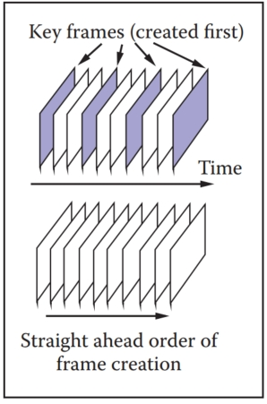
Figure 16.3. Keyframing (top) encourages detailed action planning while straight-ahead action (bottom) leads to a more spontaneous result.
图 16.3。 关键帧（上）鼓励详细的行动计划，而直接行动（下)则产生更自发的结果。

Almost any of the techniques outlined above can be used with some reasonable amount of exaggeration to achieve greater artistic effect or underscore some specific property of an action or a character. The ultimate goal is to achieve something the audience will want to see, something which is appealing. Extreme complexity or too much symmetry in a character or action tends to be less appealing. To create good results, a traditional animator needs solid drawing skills. Analogously, a computer animator should certainly understand computer graphics and have a solid knowledge of the tools he uses.
几乎上述任何技术都可以通过一定程度的夸张来使用，以实现更大的艺术效果或强调动作或角色的某些特定属性。 最终目标是实现观众想要看到的、有吸引力的东西。 角色或动作过于复杂或过于对称往往会不太有吸引力。 为了创造出好的效果，传统动画师需要扎实的绘画功底。 类似地，计算机动画师当然应该了解计算机图形学并对他使用的工具有扎实的了解。

### 16.1.4 Animator Control vs. Automatic Methods 动画器控制与自动方法

In traditional animation, the animator has complete control over all aspects of the production process and nothing prevents the final product to be as it was planned in every detail. The price paid for this flexibility is that every frame is created by hand, leading to an extremely time- and labor-consuming enterprise. In computer animation, there is a clear tradeoff between, on the one hand, giving an animator more direct control over the result, but asking him to contribute more work and, on the other hand, relying on more automatic techniques which might require setting just a few input parameters but offer little or no control over some of the properties of the result. A good algorithm should provide sufficient flexibility while asking an animator only the information which is intuitive, easy to provide, and which he himself feels is necessary for achieving the desired effect. While perfect compliance with this requirement is unlikely in practice since it would probably take something close to a mind-reading machine, we do encourage the reader to evaluate any computer-animation technique from the point of view of providing such balance. 
在传统动画中，动画师可以完全控制制作过程的各个方面，没有什么可以阻止最终产品的每一个细节都符合计划。 这种灵活性所付出的代价是每个框架都是手工创建的，导致企业极其耗时和劳力。 在计算机动画中，存在明显的权衡，一方面，给予动画师对结果更直接的控制，但要求他贡献更多的工作，另一方面，依赖更自动化的技术，这可能需要设置 一些输入参数，但对结果的某些属性提供很少或没有控制。 一个好的算法应该提供足够的灵活性，同时只向动画师询问直观、易于提供的信息，并且他自己认为这些信息对于实现所需的效果是必要的。 虽然在实践中完全符合这一要求不太可能，因为它可能需要类似于读心机的东西，但我们确实鼓励读者从提供这种平衡的角度评估任何计算机动画技术。

## 16.2 Keyframing 关键帧

The term keyframing can be misleading when applied to 3D computer animation since no actual completed frames (i.e., images) are typically involved. At any given moment, a 3D scene being animated is specified by a set of numbers: the positions of centers of all objects, their RGB colors, the amount of scaling applied to each object in each axis, modeling transformations between different parts of a complex object, camera position and orientation, light sources intensity, etc. To animate a scene, some subset of these values have to change with time. One can, of course, directly set these values at every frame, but this will not be particularly efficient. Short of that, some number of important moments in time (key frames $t_k$) can be chosen along the timeline of animation for each of the parameters and values of this parameter (key values $f_k$) are set only for these selected frames. We will call a combination $(t_k, f_k)$ of key frame and key value simply a key. Key frames do not have to be the same for different parameters, but it is often logical to set keys at least for some of them simultaneously. For example, key frames chosen for x-, y- and z-coordinates of a specific object might be set at exactly the same frames forming a single position vector key $(t_k, \bold{p}_k)$. These key frames, however, might be completely different from those chosen for the object’s orientation or color. The closer key frames are to each other, the more control the animator has over the result; however the cost of doing more work of setting the keys has to be assessed. It is, therefore, typical to have large spacing between keys in parts of the animation which are relatively simple, concentrating them in intervals where complex action occurs, as shown in Figure 16.4. 
当应用于 3D 计算机动画时，关键帧一词可能会产生误导，因为通常不涉及实际完成的帧（即图像）。 在任何给定时刻，动画的 3D 场景都由一组数字指定：所有对象的中心位置、它们的 RGB 颜色、应用于每个轴中每个对象的缩放量、复杂对象不同部分之间的建模变换 对象、摄像机位置和方向、光源强度等。要为场景制作动画，这些值的某些子集必须随时间变化。 当然，我们可以直接在每一帧设置这些值，但这不会特别有效。 除此之外，可以沿着动画时间轴为每个参数选择一些重要的时刻（关键帧 $t_k$），并且仅为这些选定的帧设置此参数的值（关键值 $f_k$） 。 我们将关键帧和关键值的组合 $(t_k, f_k)$ 简称为关键。 对于不同的参数，关键帧不必相同，但至少同时为其中一些参数设置关键帧通常是合乎逻辑的。 例如，为特定对象的 x、y 和 z 坐标选择的关键帧可能设置在形成单个位置矢量关键 $(t_k, \bold{p}_k)$ 的完全相同的帧处。 然而，这些关键帧可能与为对象的方向或颜色选择的关键帧完全不同。 关键帧彼此越接近，动画师对结果的控制力就越大； 然而，必须评估进行更多设置密钥工作的成本。 因此，在动画中相对简单的部分中，键之间的间距通常较大，将它们集中在发生复杂动作的间隔中，如图 16.4 所示。
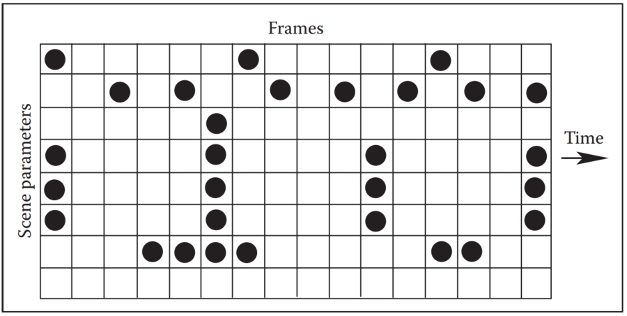
Figure 16.4. Different patterns of setting keys (black circles above) can be used simultaneously for the same scene. It is assumed that there are more frames before, as well as after, this portion. 
图 16.4。 同一场景可以同时使用不同模式的设置键（上图黑圈)。 假设该部分之前和之后有更多帧。

Once the animator sets the key $(t_k, f_k)$, the system has to compute values of f for all other frames. Although we are ultimately interested only in a discrete set of values, it is convenient to treat this as a classical interpolation problem which fits a continuous animation curve f(t) through a provided set of data points (Figure 16.5). Extensive discussion of curve-fitting algorithms can be found in Chapter 15, and we will not repeat it here. Since the animator initially provides only the keys and not the derivative (tangent), methods which compute all necessary information directly from keys are preferable for animation. The speed of parameter change along the curve is given by the derivative of the curve with respect to time $df/dt$. Therefore, to avoid sudden jumps in velocity, $C^1$ continuity is typically necessary. A higher degree of continuity is typically not required from animation curves, since the second derivative, which corresponds to acceleration or applied force, can experience very sudden changes in real-world situations (ball hitting a solid wall), and higher derivatives do not directly correspond to any parameters of physical motion. These consideration make Catmull-Rom splines one of the best choices for initial animation curve creation. 
一旦动画师设置了关键 $(t_k, f_k)$，系统就必须计算所有其他帧的 f 值。 尽管我们最终只对一组离散值感兴趣，但将其视为经典插值问题很方便，该问题通过提供的一组数据点拟合连续动画曲线 f(t)（图 16.5）。 关于曲线拟合算法的广泛讨论可以在第15章中找到，我们在这里不再重复。 由于动画师最初只提供关键帧而不提供导数（正切），因此直接从关键帧计算所有必要信息的方法对于动画来说是更可取的。 参数沿曲线变化的速度由曲线相对于时间 $df/dt$ 的导数给出。 因此，为了避免速度突然跳跃，$C^1$ 连续性通常是必要的。 动画曲线通常不需要更高程度的连续性，因为二阶导数（对应于加速度或施加的力）可能会在现实世界的情况下经历非常突然的变化（球撞到实心墙），而更高阶的导数并不直接 对应于物理运动的任何参数。 这些考虑因素使 Catmull-Rom 样条线成为初始动画曲线创建的最佳选择之一。
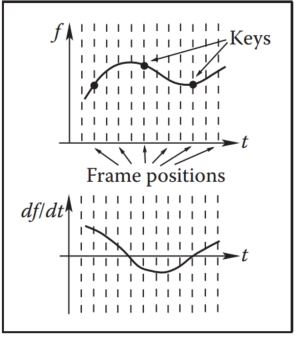
Figure 16.5. A continuous curve $f(t)$ is fit through the keys provided by the animator even though only values at frame positions are of interest. The derivative of this function gives the speed of parameter change and is at first determined automatically by the fitting procedure.
图 16.5。 连续曲线 $f(t)$ 通过动画师提供的关键点进行拟合，即使仅帧位置处的值感兴趣。 该函数的导数给出了参数变化的速度，并且首先由拟合程序自动确定。

Most animation systems give the animator the ability to perform interactive fine editing of this initial curve, including inserting more keys, adjusting existing keys, or modifying automatically computed tangents. Another useful technique which can help to tweak the shape of the curve is called TCB control (TCB stands for tension, continuity, and bias). The idea is to introduce three new parameters which can be used to modify the shape of the curve near a key through coordinated adjustment of incoming and outgoing tangents at this point. For keys uniformly spaced in time with distance $Δt$ between them, the standard Catmull-Rom expression for incoming $T_i^{in}$ and outgoing $T_i^{out}$ tangents at an internal key $(t_k, f_k)$ can be rewritten as
大多数动画系统使动画师能够对此初始曲线执行交互式精细编辑，包括插入更多关键点、调整现有关键点或修改自动计算的切线。 另一种有助于调整曲线形状的有用技术称为 TCB 控制（TCB 代表张力、连续性和偏差）。 这个想法是引入三个新参数，这些参数可用于通过协调调整此时的传入和传出切线来修改关键点附近的曲线形状。 对于在时间上均匀间隔且距离 $Δt$ 的键，传入 $T_i^{in}$ 和传出 $T_i^{out}$ 的标准 Catmull-Rom 表达式在内部键 $(t_k, f_k)$ 处切线 可以重写为
$T_k^{in} = T_k^{out} = \frac{1}{2Δt}(f_{k+1}-f_k)+\frac{1}{2Δt}(f_k-f_{k-1}) \\$

Modified tangents of a TCB spline are
TCB 样条的修正切线为
$T^{in}_k = \frac{(1-t)(1-c)(1+b)}{2Δt}(f_{k+1}-f_k)+\frac{(1-t)(1+c)(1-b)}{2Δt}(f_k-f_{k-1})\\$

$T^{out}_k = \frac{(1-t)(1+c)(1+b)}{2Δt}(f_{k+1}-f_k)+ \frac{(1-t)(1-c)(1-b)}{2Δt}(f_k-f_{k-1})\\$

The tension parameter t controls the sharpness of the curve near the key by scaling both incoming and outgoing tangents. Larger tangents (lower tension) lead to a flatter curve shape near the key. Bias b allows the animator to selectively increase the weight of a key’s neighbors locally pulling the curve closer to a straight line connecting the key with its left (b near 1, “overshooting” the action) or right (b near −1, “undershooting” the action) neighbors. A nonzero value of continuity c makes incoming and outgoing tangents different allowing the animator to create kinks in the curve at the key value. Practically useful values of TCB parameters are typically confined to the interval [−1; 1] with defaults $t = c = b = 0$ corresponding to the original Catmull-Rom spline. Examples of possible curve shape adjustments are shown in Figure 16.6.
张力参数 t 通过缩放传入和传出切线来控制关键帧附近曲线的锐度。 较大的切线（较低的张力）会导致键附近的曲线形状更平坦。 偏差 b 允许动画师有选择地增加某个关键点的邻居的权重，局部拉动曲线更接近连接关键点与其左侧（b 接近 1，“超出”动作）或右侧（b 接近 -1，“低于目标”）的直线 ”的行动）邻居。 连续性 c 的非零值使传入和传出切线不同，从而允许动画师在关键值处的曲线中创建扭结。 TCB 参数的实际有用值通常限制在区间 [−1; 1] 默认值 $t = c = b = 0$ 对应于原始 Catmull-Rom 样条线。 可能的曲线形状调整示例如图 16.6 所示。
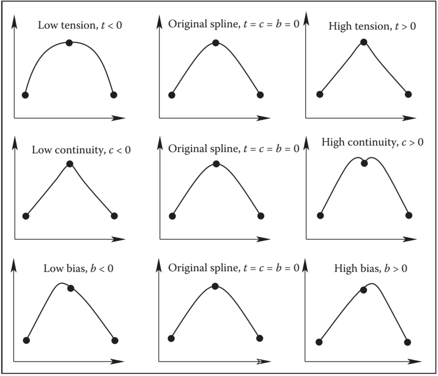
Figure 16.6. Editing the default interpolating spline (middle column) using TCB controls. Note that all keys remain at the same positions. 
图 16.6。 使用 TCB 控件编辑默认插值样条线（中间列)。 请注意，所有键均保持在相同位置。

### 16.2.1 Motion Controls  运动控制

So far, we have described how to control the shape of the animation curve through key positioning and fine tweaking of tangent values at the keys. This, however, is generally not sufficient when one would like to have control both over where the object is moving, i.e., its path, and how fast it moves along this path. Given a set of positions in space as keys, automatic curve-fitting techniques can fit a curve through them, but resulting motion is only constrained by forcing the object to arrive at a specified key position pk at the corresponding key frame tk, and nothing is directly said about the speed of motion between the keys. This can create problems. For example, if an object moves along the x-axis with velocity 11 meters per second for 1 second and then with 1 meter per second for 9 seconds, it will arrive at position $x = 20$ after 10 seconds thus satisfying animator’s keys (0,0) and (10, 20). It is rather unlikely that this jerky motion was actually desired, and uniform motion with speed 2 meters/second is probably closer to what the animator wanted when setting these keys. Although typically not displaying such extreme behavior, polynomial curves resulting from standard fitting procedures do exhibit nonuniform speed of motion between keys as demonstrated in Figure 16.7. While this can be tolerable (within limits) for some parameters for which the human visual system is not very good at determining nonuniformities in the rate of change (such as color or even rate of rotation), we have to do better for position $\bold{p}$ of the object where velocity directly corresponds to everyday experience.
到目前为止，我们已经描述了如何通过关键点定位和关键点切线值的微调来控制动画曲线的形状。 然而，当人们想要控制物体移动的位置（即其路径）以及物体沿该路径移动的速度时，这通常是不够的。 给定空间中的一组位置作为关键点，自动曲线拟合技术可以通过它们拟合一条曲线，但最终的运动仅通过强制对象到达相应关键帧 tk 处的指定关键位置 pk 来约束，并且什么也没有 直接说一下按键之间的运动速度。 这可能会产生问题。 例如，如果一个对象沿 x 轴以每秒 11 米的速度移动 1 秒，然后以每秒 1 米的速度移动 9 秒，则它将在 10 秒后到达位置 $x = 20$，从而满足动画师的关键点（ 0,0) 和 (10, 20)。 这种急促的运动不太可能是真正想要的，速度为 2 米/秒的匀速运动可能更接近动画师在设置这些关键点时想要的效果。 尽管通常不会表现出这种极端行为，但标准拟合程序产生的多项式曲线确实表现出按键之间运动速度的不均匀，如图 16.7 所示。 虽然对于人类视觉系统不太擅长确定变化率（例如颜色甚至旋转率）的不均匀性的某些参数来说，这可以容忍（在限制范围内），但我们必须对位置 $\ 做得更好 对象的粗体{p}$，其中速度直接对应于日常经验。
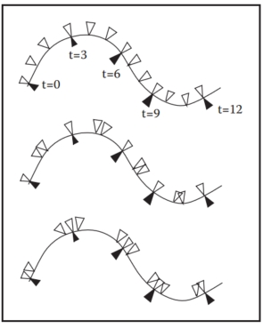
Figure 16.7. All three motions are along the same 2D path and satisfy the set of keys at the tips of the black triangles. The tips of the white triangles show object position at $Δt = 1$ intervals. Uniform speed of motion between the keys (top) might be closer to what the animator wanted, but automatic fitting procedures could result in either of the other two motions.
图 16.7。 所有三个运动都沿着相同的 2D 路径，并满足黑色三角形尖端的关键点集。 白色三角形的尖端以 $Δt = 1$ 间隔显示对象位置。 键之间的均匀运动速度（顶部)可能更接近动画师想要的效果，但自动拟合过程可能会导致其他两个运动中的任何一个。

We will first distinguish curve parameterization used during the fitting procedure from that used for animation. When a curve is fit through position keys, we will write the result as a function $\bold{p}(u)$ of some parameter $u$. This will describe the geometry of the curve in space. The arc length s is the physical length of  the curve. A natural way for the animator to control the motion along the now-existing curve is to specify an extra function $s(t)$ which corresponds to how far along the curve the object should be at any given time. To get an actual position in space, we need one more auxiliary function $u(s)$ which computes a parameter value $u$ for given arc length $s$. The complete process of computing an object position for a given time $t$ is then given by composing these functions (see Figure 16.8):
我们首先将拟合过程中使用的曲线参数化与动画中使用的曲线参数化区分开来。 当通过位置键拟合曲线时，我们将把结果写为某个参数 $u$ 的函数 $\bold{p}(u)$。 这将描述空间曲线的几何形状。 弧长s是曲线的物理长度。 动画师控制沿现有曲线运动的自然方法是指定一个额外函数 $s(t)$，该函数对应于对象在任何给定时间沿曲线应移动的距离。 为了获得空间中的实际位置，我们还需要一个辅助函数 $u(s)$，它计算给定弧长 $s$ 的参数值 $u$。 然后，通过组合这些函数给出计算给定时间 $t$ 内物体位置的完整过程（见图 16.8）：
$\bold{p}(t) = \bold{p}(u(s(t)))$
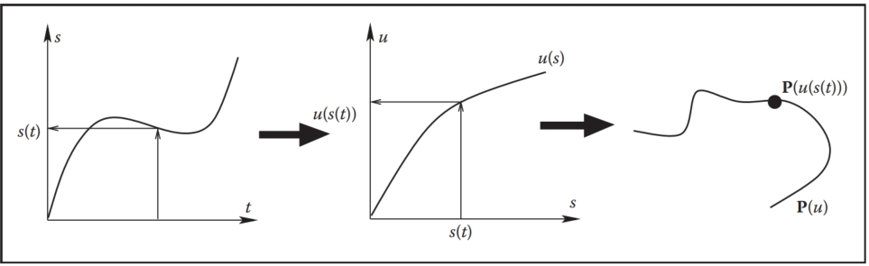
Figure 16.8. To get position in space at a given time t, one first utilizes user-specified motion control to obtain the distance along the curve s(t) and then computes the corresponding curve parameter value $u(s(t))$. Previously fitted curve $\bold{P}(u)$ can now be used to find the position $\bold{P}(u(s(t)))$.
图 16.8。 为了获得给定时间 t 的空间位置，首先利用用户指定的运动控制来获取沿曲线 s(t) 的距离，然后计算相应的曲线参数值 $u(s(t))$。 之前拟合的曲线 $\bold{P}(u)$ 现在可用于查找位置 $\bold{P}(u(s(t)))$。

Several standard functions can be used as the distance-time function s(t). One of the simplest is the linear function corresponding to constant velocity: $s(t) = vt$ with v = const. Another common example is the motion with constant acceleration a (and initial speed v0) which is described by the parabolic $s(t) = v_0t + at^2/2$. Since velocity is changing gradually here, this function can help to model desirable ease-in and ease-out behavior. More generally, the slope of $s(t)$ gives the velocity of motion with negative slope corresponding to the motion backwards along the curve. To achieve most flexibility, the ability to interactively edit s(t) is typically provided to the animator by the animation system. The distance-time function is not the only way to control motion. In some cases it might be more convenient for the user to specify a velocity-time function v(t) or even an acceleration-time function a(t). Since these are correspondingly first and second derivatives of s(t), to use these type of controls, the system first recovers the distance-time function by integrating the user input (twice in the case of a(t)).
可以使用几个标准函数作为距离-时间函数s(t)。 最简单的函数之一是对应于恒定速度的线性函数：$s(t) = vt$，其中 v = const。 另一个常见的例子是恒定加速度 a（和初始速度 v0）的运动，由抛物线 $s(t) = v_0t + at^2/2$ 描述。 由于速度在这里逐渐变化，因此该函数可以帮助模拟所需的缓入和缓出行为。 更一般地，$s(t)$ 的斜率给出了具有负斜率的运动速度，对应于沿着曲线向后的运动。 为了实现最大的灵活性，动画系统通常向动画师提供交互式编辑 s(t) 的能力。 距离-时间函数并不是控制运动的唯一方法。 在某些情况下，用户指定速度时间函数 v(t) 甚至加速时间函数 a(t) 可能更方便。 由于它们相应地是 s(t) 的一阶和二阶导数，为了使用这些类型的控制，系统首先通过对用户输入进行积分（在 a(t) 的情况下两次）来恢复距离-时间函数。

The relationship between the curve parameter u and arc length s is established automatically by the system. In practice, the system first determines arc length dependance on parameter u (i.e., the inverse function s(u)). Using this function, for any given S it is possible to solve the equation s(u) − S = 0 with unknown u obtaining u(S). For most curves, the function s(u) cannot be expressed in closed analytic form and numerical integration is necessary (see Chapter 14). Standard numerical root-finding procedures (such as the Newton-Raphson method, for example) can then be directly used to solve the equation $s(u) − S = 0$ for u.
曲线参数u与弧长s之间的关系由系统自动建立。 实际上，系统首先确定与参数 u（即反函数 s(u)）相关的弧长。 使用此函数，对于任何给定的 S，可以求解方程 s(u) − S = 0，其中 u 未知，从而获得 u(S)。 对于大多数曲线，函数 s(u) 不能用封闭解析形式表示，需要进行数值积分（参见第 14 章）。 然后可以直接使用标准数值求根程序（例如 Newton-Raphson 方法）来求解 u 的方程 $s(u) − S = 0$。

An alternative technique is to approximate the curve itself as a set of linear segments between points $\bold{p}_i$ computed at some set of sufficiently densely spaced parameter values $u_i$. One then creates a table of approximate arc lengths
另一种技术是将曲线本身近似为点 $\bold{p}_i$ 之间的一组线性段，这些线性段是在一组足够密集的参数值 $u_i$ 上计算的。 然后创建一个近似弧长表
$s(u_i) ≈ \sum^i_{j=1}\|\bold{p}_j - \bold{p}_{j-1}\| = s(u_{i-1}) + \|\bold{p}_i - \bold{p}_{i-1}\|  \\$

Since s(u) is a non-decreasing function of u, one can then find the interval containing the value S by simple searching through the table (see Figure 16.9). Linear interpolation of the interval’s u end values is then performed to finally find u(S). If greater precision is necessary, a few steps of the Newton-Raphson algorithm with this value as the starting point can be applied.
由于 s(u) 是 u 的非减函数，因此可以通过简单地搜索表格来找到包含值 S 的区间（见图 16.9）。 然后对区间的 u 最终值进行线性插值，最终找到 u(S)。 如果需要更高的精度，可以应用以该值作为起点的牛顿-拉夫森算法的几个步骤。
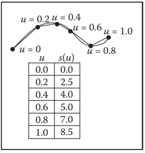
Figure 16.9. To create a tabular version of s(u), the curve can be approximated by a number of line segments connecting points on the curve positioned at equal parameter increments. The table is searched to find the u-interval for a given S. For the curve above, for example, the value of u corresponding to the position of $S = 6.5$ lies between $u = 0.6$ and $u = 0.8$.
图 16.9。 要创建 s(u) 的表格版本，可以通过连接曲线上以相等参数增量定位的点的许多线段来近似曲线。 搜索该表以找到给定 S 的 u 区间。例如，对于上面的曲线，$S = 6.5$ 位置对应的 u 值位于 $u = 0.6$ 和 $u = 0.8$ 之间 。

### 16.2.2 Interpolating Rotation  插值旋转

The techniques presented above can be used to interpolate the keys set for most of the parameters describing the scene. Three-dimensional rotation is one important motion for which more specialized interpolation methods and representations are common. The reason for this is that applying standard techniques to 3D rotations often leads to serious practical problems. Rotation (a change in orientation of an object) is the only motion other than translation which leaves the shape of the object intact. It therefore plays a special role in animating rigid objects. 
上述技术可用于对描述场景的大多数参数的关键帧进行插值。 三维旋转是一种重要的运动，更专业的插值方法和表示很常见。 其原因是，将标准技术应用于 3D 旋转通常会导致严重的实际问题。 旋转（物体方向的改变）是除平移之外唯一能保持物体形状完好无损的运动。 因此，它在刚性对象动画方面发挥着特殊作用。

There are several ways to specify the orientation of an object. First, transformation matrices as described in Chapter 6 can be used. Unfortunately, naive (element-by-element)interpolation of rotation matrices does not produce a correct result. For example, the matrix “halfway” between 2D clock- and counterclockwise 90 degree rotation is the null matrix:
有多种方法可以指定对象的方向。 首先，可以使用第 6 章中描述的变换矩阵。 不幸的是，旋转矩阵的简单（逐个元素）插值不会产生正确的结果。 例如，二维顺时针和逆时针 90 度旋转之间的矩阵“中间”是零矩阵：
$$
\frac{1}{2}\begin{bmatrix}
0 & 1\\
-1 & 0
\end{bmatrix}
+\frac{1}{2}\begin{bmatrix}
0 & -1\\
1 & 0
\end{bmatrix}
= \begin{bmatrix}
0 & 0\\
0 & 0
\end{bmatrix}
$$
The correct result is, of course, the unit matrix corresponding to no rotation. Second, one can specify arbitrary orientation as a sequence of exactly three rotations around coordinate axes chosen in some specific order. These axes can be fixed in space (fixed-angle representation) or embedded into the object therefore changing after each rotation (Euler-angle representation as shown in Figure 16.10). These three angles of rotation can be animated directly through standard keyframing, but a subtle problem known as gimbal lock arises. Gimbal lock occurs if during rotation one of the three rotation axes is by accident aligned with another, thereby reducing by one the number of available degrees of freedom as shown in Figure 16.11 for a physical device. This effect is more common than one might think—a single 90 degree turn to the right (or left) can potentially put an object into a gimbal lock. Finally, any orientation can be specified by choosing an appropriate axis in space and angle of rotation around this axis. While animating in this representation is relatively straightforward, combining two rotations, i.e., finding the axis and angle corresponding to a sequence of two rotations both represented by axis and angle, is nontrivial. A special mathematical apparatus, quaternions has been developed to make this representation suitable both for combining several rotations into a single one and for animation. 
正确的结果当然是没有旋转对应的单位矩阵。 其次，可以将任意方向指定为围绕以某种特定顺序选择的坐标轴的恰好三个旋转的序列。 这些轴可以固定在空间中（固定角度表示）或嵌入到对象中，因此每次旋转后都会发生变化（欧拉角度表示，如图 16.10 所示）。 这三个旋转角度可以直接通过标准关键帧进行动画处理，但会出现一个称为万向节锁定的微妙问题。 如果在旋转过程中三个旋转轴之一意外地与另一个旋转轴对齐，则会发生万向节锁定，从而使可用自由度的数量减少一个，如图 16.11 所示的物理设备。 这种效应比人们想象的更常见——向右（或向左）旋转 90 度就可能使物体陷入万向节锁定状态。 最后，可以通过选择适当的空间轴和绕该轴的旋转角度来指定任何方向。 虽然在此表示中设置动画相对简单，但组合两个旋转（即找到与均由轴和角度表示的两个旋转序列相对应的轴和角度）却很重要。 四元数是一种特殊的数学工具，它的开发使得这种表示既适用于将多个旋转组合成一个旋转，也适用于动画。
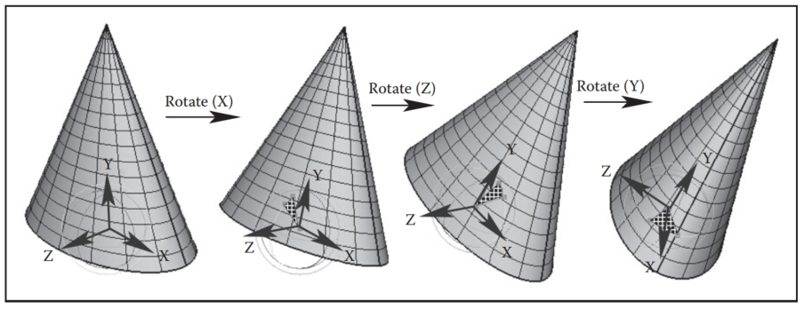
Figure 16.10. Three Euler angles can be used to specify arbitrary object orientation through a sequence of three rotations around coordinate axes embedded into the object (axis Y always points to the tip of the cone). Note that each rotation is given in a new coordinate system. Fixed angle representation is very similar, but the coordinate axes it uses are fixed in space and do not rotate with the object.
图 16.10。 三个欧拉角可用于通过围绕嵌入到对象中的坐标轴（Y 轴始终指向圆锥体尖端)的一系列三个旋转来指定任意对象方向。 请注意，每次旋转都是在新的坐标系中给出的。 固定角度表示法非常相似，但它使用的坐标轴在空间中是固定的，不随对象旋转。

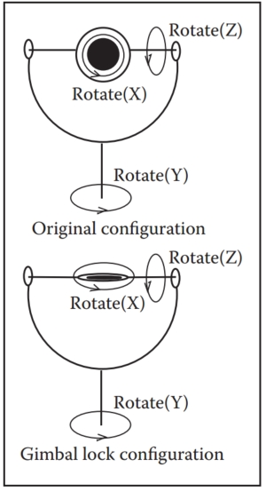
Figure 16.11. In this example, gimbal lock occurs when a 90 degree turn around axis Z is made. Both X and Y rotations are now performed around the same axis leading to the loss of one degree of freedom.
图 16.11。 在此示例中，当绕 Z 轴旋转 90 度时，会发生万向节锁定。 X 和 Y 旋转现在均绕同一轴执行，导致失去一个自由度。

Given a 3D vector $\bold{v} = (x, y, z)$ and a scalar s, a quaternion q is formed by combining the two into a four-component object: $q = [s x y z] = [s; \bold{v}]$. Several new operations are then defined for quaternions. Quaternion addition simply sums scalar and vector parts separately:
给定一个 3D 向量 $\bold{v} = (x, y, z)$ 和一个标量 s，通过将两者组合成一个四分量对象来形成四元数 q： $q = [s x y z] = [s; \bold{v}]$。 然后为四元数定义了几个新的运算。 四元数加法简单地分别对标量和向量部分求和：
$q_1+q_2 ≡  [s_1 + s_2; \bold{v}_1 + \bold{v}_2  ]$

Multiplication by a scalar a gives a new quaternion
乘以标量 a 得到一个新的四元数 
$aq ≡ [as; a\bold{v}].  $

More complex quaternion multiplication is defined as
更复杂的四元数乘法定义为
$q_1 · q_2 ≡ [s_1s_2 - \bold{v}_1\bold{v}_2; s_1\bold{v}_2 + s_2\bold{v}_1 + \bold{v}_1 × \bold{v}_2],  $

where × denotes a vector cross product. It is easy to see that, similar to matrices, quaternion multiplication is associative, but not commutative. We will be interested mostly in normalized quaternions—those for which the quaternion norm $|q| = \sqrt{s^2 + \bold{v}^2}$ is equal to one. One final definition we need is that of an inverse quaternion:
其中 × 表示向量叉积。 很容易看出，与矩阵类似，四元数乘法是结合律，但不是交换律。 我们主要对归一化四元数感兴趣——四元数范数 $|q| 的四元数 = \sqrt{s^2 + \bold{v}^2}$ 等于 1。 我们需要的最后一个定义是逆四元数的定义：
$q^{-1} = (1/|q|)[s; -\bold{v}].  $

To represent a rotation by angle $φ$ around an axis passing through the origin whose direction is given by the normalized vector $\bold{n}$, a normalized quaternion
表示围绕穿过原点的轴旋转 $φ$ 角度，其方向由归一化向量 $\bold{n}$（归一化四元数）给出
$q = [cos(φ/2); sin(φ/2)\bold{n}]  $

is formed. To rotate point $\bold{p}$, one turns it into the quaternion $q_p = [0; \bold{p}]$ and  computes the quaternion product
形成了。 要旋转点 $\bold{p}$，请将其转换为四元数 $q_p = [0; \bold{p}]$ 并计算四元数乘积
$q_p' = q · qp · q^{-1}  $

which is guaranteed to have a zero scalar part and the rotated point as its vector part. Composite rotation is given simply by the product of quaternions representing each of the separate rotation steps. To animate with quaternions, one can treat them as points in a four-dimensional space and set keys directly in this space. To keep quaternions normalized, one should, strictly speaking, restrict interpolation procedures to a unit sphere (a 3D object) in this 4D space. However, a spherical version of even linear interpolation (often called slerp) already results in rather unpleasant math. Simple 4D linear interpolation followed by projection onto the unit sphere shown in Figure 16.12 is much simpler and often sufficient in practice. Smoother results can be obtained via repeated application of a linear interpolation procedure using the de Casteljau algorithm.
保证标量部分为零，旋转点作为其矢量部分。 复合旋转简单地由代表每个单独旋转步骤的四元数的乘积给出。 要使用四元数制作动画，可以将它们视为四维空间中的点并直接在该空间中设置关键点。 为了保持四元数标准化，严格来说，应该将插值过程限制到这个 4D 空间中的单位球体（3D 对象）。 然而，即使是线性插值（通常称为 slerp）的球形版本也已经产生了相当令人不快的数学结果。 简单的 4D 线性插值然后投影到图 16.12 所示的单位球体上要简单得多，并且在实践中通常就足够了。 使用 de Casteljau 算法重复应用线性插值过程可以获得更平滑的结果。
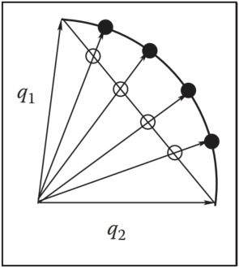
Figure 16.12. Interpolating quaternions should be done on the surface of a 3D unit sphere embedded in 4D space. However, much simpler interpolation along a 4D straight line (open circles) followed by reprojection of the results onto the sphere (black circles) is often sufficient.
图 16.12。 四元数插值应在嵌入 4D 空间的 3D 单位球体的表面上完成。 然而，沿着 4D 直线（空心圆圈）进行更简单的插值，然后将结果重新投影到球体（黑色圆圈)上通常就足够了。

## 16.3 Deformations 变形

Although techniques for object deformation might be more properly treated as modeling tools, they are traditionally discussed together with animation methods. Probably the simplest example of an operation which changes object shape is a nonuniform scaling. More generally, some function can be applied to local coordinates of all points specifying the object (i.e., vertices of a triangular mesh or control polygon of a spline surface), repositioning these points and creating a new shape: $\bold{p}' = f(\bold{p}, γ)$ where $γ$ is a vector of parameters used by the deformation function. Choosing different $f$ (and combining them by applying one after another) can help to create very interesting deformations. Examples of useful simple functions include bend, twist, and taper which are shown in Figure 16.13. Animating shape change is very easy in this case by keyframing the parameters of the deformation function. Disadvantages of this technique include difficulty of choosing the mathematical function for some nonstandard deformations and the fact that the resulting deformation is global in the sense that the complete object, and not just some part of it, is reshaped.
尽管对象变形技术可能更适合视为建模工具，但它们传统上与动画方法一起讨论。 改变对象形状的操作的最简单示例可能是非均匀缩放。 更一般地，某些函数可以应用于指定对象的所有点的局部坐标（即，三角形网格的顶点或样条曲面的控制多边形），重新定位这些点并创建新形状：$\bold{p}' = f(\bold{p}, γ)$ 其中 $γ$ 是变形函数使用的参数向量。 选择不同的 $f$（并通过依次应用将它们组合起来）可以帮助创建非常有趣的变形。 有用的简单函数的示例包括弯曲、扭曲和锥度，如图 16.13 所示。 在这种情况下，通过对变形函数的参数设置关键帧，可以非常轻松地对形状变化进行动画处理。 该技术的缺点包括难以为某些非标准变形选择数学函数，以及所产生的变形是全局的，即整个对象（而不仅仅是其某些部分）被重塑。
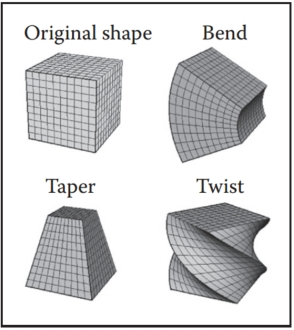
Figure 16.13. Popular examples of global deformations. Bending and twist angles, as well as the degree of taper, can all be animated to achieve dynamic shape change.
图 16.13。 全局变形的流行例子。 弯曲和扭转角度以及锥度都可以进行动画处理，以实现动态形状变化。

To deform an object locally while providing more direct control over the result, one can choose a single vertex, move it to a new location and adjust vertices within some neighborhood to follow the seed vertex. The area affected by the deformation and the specific amount of displacement in different parts of the object are controlled by an attenuation function which decreases with distance (typically computed over the object’s surface) to the seed vertex. Seed vertex motion can be keyframed to produce animated shape change. 
要使对象局部变形，同时提供对结果的更直接控制，可以选择单个顶点，将其移动到新位置并调整某个邻域内的顶点以遵循种子顶点。 受变形影响的区域以及对象不同部分的具体位移量由衰减函数控制，该函数随着到种子顶点的距离（通常在对象表面上计算）而减小。 可以对种子顶点运动设置关键帧以产生动画形状变化。

A more general deformation technique is called free-form deformation (FFD) (Sederberg & Parry, 1986). A local (in most cases rectilinear) coordinate grid is first established to encapsulate the part of the object to be deformed, and coordinates $(s, t, u)$ of all relevant points are computed with respect to this grid. The user then freely reshapes the grid of lattice points $\bold{P}_{ijk}$ into a new distorted lattice $\bold{P}'_{ijk}$ (Figure 16.14). The object is reconstructed using coordinates computed in the original undistorted grid in the trivariate analog of Bezier interpolants (see Chapter 15) with distorted lattice points $\bold{P}'_{ijk}$ serving as control points in this expression:
更通用的变形技术称为自由变形（FFD）（Sederberg & Parry，1986）。 首先建立一个局部（大多数情况下是直线）坐标网格来封装要变形的对象部分，并相对于该网格计算所有相关点的坐标$(s, t, u)$。 然后，用户可以自由地将晶格点网格$\bold{P}_{ijk}$重塑为新的扭曲晶格$\bold{P}'_{ijk}$（图16.14）。 使用贝塞尔插值的三变量模拟中原始未扭曲网格中计算的坐标（参见第 15 章）来重建对象，其中扭曲晶格点 $\bold{P}'_{ijk}$ 作为此表达式中的控制点：
$P(s, u, t) =  \sum^L_{i=0}\begin{pmatrix}i \\L\end{pmatrix}(1-s)^{L-i}s^i\sum^M_{j=0}\begin{pmatrix}j \\M\end{pmatrix}(1-t)^{M-j}t^j\sum^N_{k=0}\begin{pmatrix}k \\N\end{pmatrix}(1-u)^{N-k}u^k\bold{P}'_{ijk}$

where L, M, N are maximum indices of lattice points in each dimension. In effect, the lattice serves as a low-resolution version of the object for the purpose of deformation, allowing for a smooth shape change of an arbitrarily complex object through a relatively small number of intuitive adjustments. FFD lattices can themselves be treated as regular objects by the system and can be transformed, animated, and even further deformed if necessary, leading to corresponding changes in the object to which the lattice is attached. For example, moving a deformation tool consisting of the original lattice and distorted lattice representing a bulge across an object results in a bulge moving across the object.
其中L、M、N是每个维度中格点的最大索引。 实际上，晶格充当了用于变形目的的对象的低分辨率版本，允许通过相对少量的直观调整来平滑地改变任意复杂的对象的形状。 FFD 晶格本身可以被系统视为常规对象，并且可以进行变换、动画，甚至在必要时进一步变形，从而导致晶格所附着的对象发生相应的变化。 例如，移动由原始晶格和代表凸起的变形晶格组成的变形工具穿过对象会导致凸起移动穿过对象。
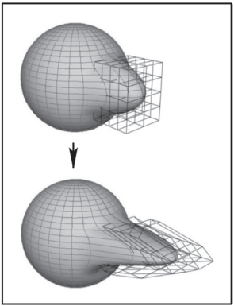
Figure 16.14. Adjusting the FFD lattice results in the deformation of the object. 
图 16.14。 调整FFD晶格会导致物体变形。

## 16.4 Character Animation 角色动画

Animation of articulated figures is most often performed through a combination of keyframing and specialized deformation techniques. The character model intended for animation typically consists of at least two main layers as shown in Figure 16.15. The motion of a highly detailed surface representing the outer shell or skin of the character is what the viewer will eventually see in the final product. The skeleton underneath it is a hierarchical structure (a tree) of joints which provides a kinematic model of the figure and is used exclusively for animation. In some cases, additional intermediate layer(s) roughly corresponding to muscles are inserted between the skeleton and the skin.
铰接人物的动画通常是通过关键帧和专门的变形技术的组合来执行的。 用于动画的角色模型通常由至少两个主要层组成，如图 16.15 所示。 代表角色外壳或皮肤的高度详细的表面的运动是观众最终在最终产品中看到的。 它下面的骨架是一个关节的层次结构（树），它提供了图形的运动学模型，并且专门用于动画。 在一些情况下，在骨骼和皮肤之间插入大致对应于肌肉的附加中间层。
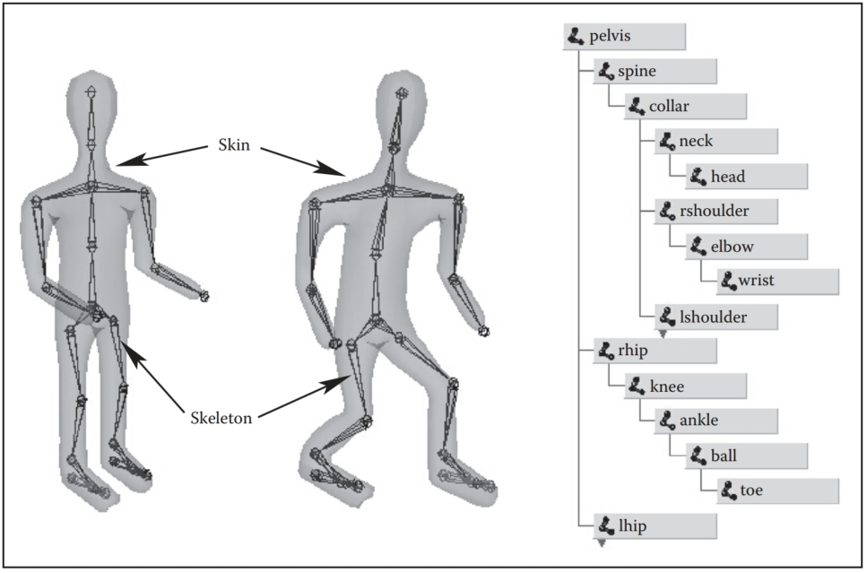
Figure 16.15. (Left) A hierarchy of joints, a skeleton, serves as a kinematic abstraction of the character; (middle) repositioning the skeleton deforms a separate skin object attached to it; (right) a tree data structure is used to represent the skeleton. For compactness, the internal structure of several nodes is hidden (they are identical to a corresponding sibling).
图 16.15。 （左）关节层次结构（骨骼）充当角色的运动学抽象； （中）重新定位骨架会使附着在其上的单独蒙皮对象变形； （右）使用树数据结构来表示骨架。 为了紧凑性，隐藏了多个节点的内部结构（它们与相应的兄弟节点相同)。

Each of the skeleton’s joints acts as a parent for the hierarchy below it. The root represents the whole character and is positioned directly in the world coordinate system. If a local transformation matrix which relates a joint to its parent in the hierarchy is available, one can obtain a transformation which relates local space of any joint to the world system (i.e., the system of the root) by simply concatenating transformations along the path from the root to the joint. To evaluate the whole skeleton (i.e., find position and orientation of all joints), a depth-first traversal of the complete tree of joints is performed. A transformation stack is a natural data structure to help with this task. While traversing down the tree, the current composite matrix is pushed on the stack and a new one is created by multiplying the current matrix with the one stored at the joint. When backtracking to the parent, this extra transformation should be undone before another branch is visited; this is easily done by simply popping the stack. Although this general and simple technique for evaluating hierarchies is used throughout computer graphics, in animation (and robotics) it is given a special name—forward kinematics (FK). While general representations for all transformations can be used, it is common to use specialized sets of parameters, such as link lengths or joint angles, to specify skeletons. To animate with forward kinematics, rotational parameters of all joints are manipulated directly. The technique also allows the animator to change the distance between joints (link lengths), but one should be aware that this corresponds to limb stretching and can often look rather unnatural. 
骨骼的每个关节都充当其下方层次结构的父级。 根代表整个角色并直接位于世界坐标系中。 如果将关节与其层次结构中的父级相关联的局部变换矩阵可用，则可以通过简单地沿路径串联变换来获得将任何关节的局部空间与世界系统（即根系统）相关联的变换 从根部到关节。 为了评估整个骨架（即找到所有关节的位置和方向），需要对完整的关节树进行深度优先遍历。 转换堆栈是帮助完成此任务的自然数据结构。 向下遍历树时，当前复合矩阵被压入堆栈，并通过将当前矩阵与存储在节点处的矩阵相乘来创建一个新矩阵。 当回溯到父分支时，应该在访问另一个分支之前撤消这个额外的转换； 只需弹出堆栈即可轻松完成此操作。 尽管这种用于评估层次结构的通用而简单的技术在整个计算机图形学中都有使用，但在动画（和机器人学）中，它被赋予了一个特殊的名称——正向运动学（FK）。 虽然可以使用所有变换的通用表示，但通常使用专门的参数集（例如链接长度或关节角度）来指定骨架。 为了使用正向运动学制作动画，可以直接操纵所有关节的旋转参数。 该技术还允许动画师改变关节之间的距离（链接长度），但人们应该意识到这对应于肢体拉伸，并且通常看起来相当不自然。

Forward kinematics requires the user to set parameters for all joints involved in the motion (Figure 16.16 (top)). Most of these joints, however, belong to in ternal nodes of the hierarchy, and their motion is typically not something the animator wants to worry about. In most situations, the animator just wants them to move naturally “on their own,” and one is much more interested in specifying the behavior of the endpoint of a joint chain, which typically corresponds to something performing a specific action, such as an ankle or a tip of a finger. The animator would rather have parameters of all internal joints be determined from the motion of the end effector automatically by the system. Inverse kinematics (IK) allows us to do just that (see Figure 16.16 (bottom)). 
正向运动学要求用户为运动中涉及的所有关节设置参数（图 16.16（顶部））。 然而，大多数这些关节属于层次结构的内部节点，并且它们的运动通常不是动画师想要担心的事情。 在大多数情况下，动画师只是希望它们“自行”自然移动，而人们更感兴趣的是指定关节链端点的行为，这通常对应于执行特定动作的物体，例如脚踝 或指尖。 动画师宁愿让系统根据末端执行器的运动自动确定所有内部关节的参数。 逆运动学 (IK) 使我们能够做到这一点（见图 16.16（底部））。
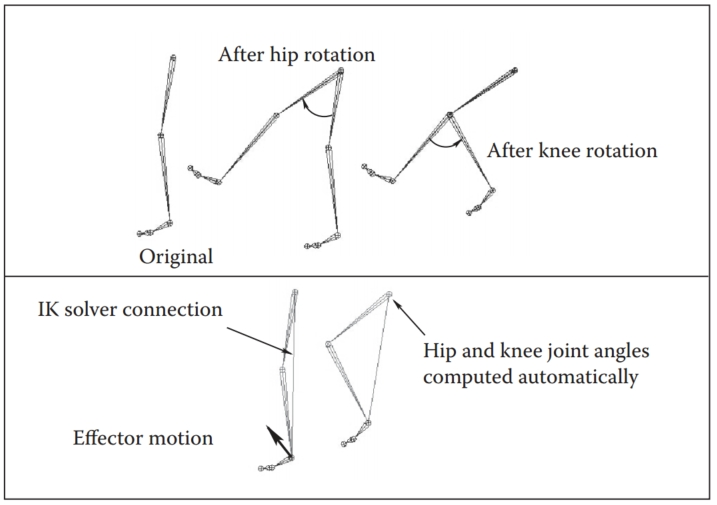
Figure 16.16. Forward kinematics (top) requires the animator to put all joints into correct position. In inverse kinematic (bottom), parameters of some internal joints are computed based on desired end effector motion.
图 16.16。 正向运动学（上）要求动画师将所有关节置于正确的位置。 在逆运动学（底部)中，一些内部关节的参数是根据所需的末端执行器运动来计算的。

Let x be the position of the end effector and α be the vector of parameters needed to specify all internal joints along the chain from the root to the final joint. Sometimes the orientation of the final joint is also directly set by the animator, in which case we assume that the corresponding variables are included in the vector $\bold{x}$. For simplicity, however, we will write all specific expressions for the vector:
令 x 为末端执行器的位置，α 为指定沿链从根到最终关节的所有内部关节所需的参数向量。 有时最终关节的方向也由动画师直接设置，在这种情况下我们假设相应的变量包含在向量$\bold{x}$中。 然而，为了简单起见，我们将为向量编写所有特定表达式：
$\bold{x} = (x_1, x_2, x_3)^T$

Since each of the variables in x is a function of α, it can be written as a vector equation $\bold{x} = \bold{F}(α)$. If we change the internal joint parameters by a small amount $δα$, a resulting change $δx$ in the position of the end effector can be approximately written as
由于 x 中的每个变量都是 α 的函数，因此可以将其写为向量方程 $\bold{x} = \bold{F}(α)$。 如果我们将内部关节参数改变少量 $δα$，则末端执行器位置的变化 $δx$ 可以近似写为
$$
δ\bold{x} = \frac{∂\bold{F}}{∂α} δα \ \ \ \ \ (16.1)
$$
where $\frac{∂\bold{F}}{∂α}$ is the matrix of partial derivatives called the Jacobian:
其中 $\frac{∂\bold{F}}{∂α}$ 是称为雅可比行列式的偏导数矩阵：
$$
\frac{∂\bold{F}}{∂α} = \begin{bmatrix}
\frac{∂f_1}{∂α_1} & \frac{∂f_1}{∂α_2} & ... & \frac{∂f_1}{∂α_n} \\
\frac{∂f_2}{∂α_1} & \frac{∂f_2}{∂α_2} & ... & \frac{∂f_2}{∂α_n} \\
\frac{∂f_3}{∂α_1} & \frac{∂f_3}{∂α_2} & ... & \frac{∂f_3}{∂α_n}
\end{bmatrix}
$$
At each moment in time, we know the desired position of the end effector (set by the animator) and, of course, the effector’s current position. Subtracting the two, we will get the desired adjustment $δ\bold{x}$. Elements of the Jacobian matrix are related to changes in a coordinate of the end effector when a particular internal parameter is changed while others remain fixed (see Figure 16.17). These elements can be computed for any given skeleton configuration using geometric relationships. The only remaining unknowns in the system of equations (16.1) are the changes in internal parameters $α$. Once we solve for them, we update $α = α+δα$ which gives all the necessary information for the FK procedure to reposition the skeleton. 
在每个时刻，我们都知道末端执行器的所需位置（由动画师设置），当然还有执行器的当前位置。 将两者相减，我们将得到所需的调整$δ\bold{x}$。 当特定内部参数发生变化而其他参数保持固定时，雅可比矩阵的元素与末端执行器坐标的变化相关（见图 16.17）。 可以使用几何关系针对任何给定的骨架配置计算这些元素。 方程组 (16.1) 中唯一剩下的未知数是内部参数 $α$ 的变化。 一旦我们解决了它们，我们就会更新 $α = α+δα$，它为 FK 过程重新定位骨架提供了所有必要的信息。
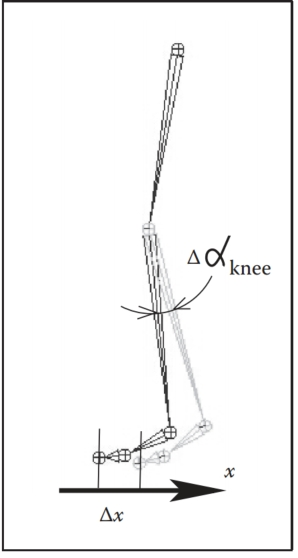
Figure 16.17. Partial derivative $∂x/∂α_{knee}$ is given by the limit of $Δx/Δα_{knee}$. Effector displacement is computed while all joints, except the knee, are kept fixed.
图 16.17。 偏导数 $∂x/∂α_{knee}$ 由 $Δx/Δα_{knee}$ 的极限给出。 在计算效应器位移时，除膝关节外的所有关节均保持固定。

Unfortunately, the system (16.1) cannot usually be solved analytically and, moreover, it is in most cases underconstrained, i.e., the number of unknown internal joint parameters $α$ exceeds the number of variables in vector $\bold{x}$. This means that different motions of the skeleton can result in the same motion of the end effector. Some examples are shown on Figure 16.18. Many ways of obtaining specific solution for such systems are available, including those taking into account natural constraints needed for some real-life joints (bending a knee only in one direction, for example). One should also remember that the computed Jacobian matrix is valid only for one specific configuration, and it has to be updated as the skeleton moves. The complete IK framework is presented in Figure 16.19. Of course, the root joint for IK does not have to be the root of the whole hierarchy, and multiple IK solvers can be applied to independent parts of the skeleton. For example, one can use separate solvers for right and left feet and yet another one to help animate grasping with the right hand, each with its own root.
不幸的是，系统（16.1）通常无法解析求解，而且在大多数情况下都受到约束，即未知内部关节参数 $α$ 的数量超过向量 $\bold{x}$ 中变量的数量。 这意味着骨架的不同运动可以导致末端执行器的相同运动。 图 16.18 显示了一些示例。 获得此类系统的特定解决方案的方法有很多，包括考虑一些现实生活中关节所需的自然约束的方法（例如，仅向一个方向弯曲膝盖）。 人们还应该记住，计算出的雅可比矩阵仅对一种特定配置有效，并且必须随着骨架的移动而更新。 完整的 IK 框架如图 16.19 所示。 当然，IK 的根关节不必是整个层次结构的根，多个 IK 解算器可以应用于骨架的独立部分。 例如，可以对右脚和左脚使用单独的解算器，然后使用另一个解算器来帮助制作右手抓握的动画，每个解算器都有自己的根。
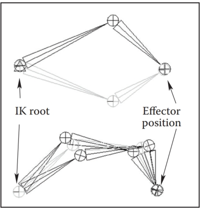
Figure 16.18. Multiple configurations of internal joints can result in the same effector position. (Top) disjoint “flipped” solutions; (bottom) a continuum of solutions.
图 16.18。 内部关节的多种配置可以导致相同的效应器位置。 （上）不相交的“翻转”解决方案； （底部)连续的解决方案。

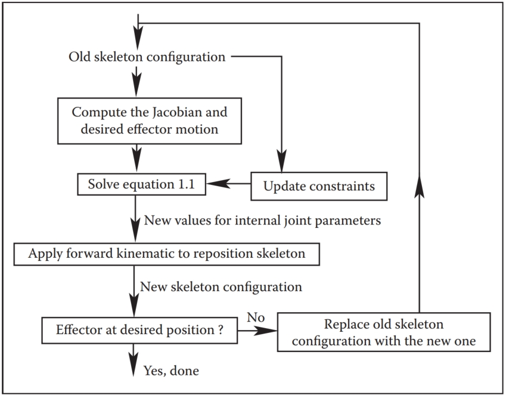
Figure 16.19. A diagram of the inverse kinematic algorithm. 
图 16.19。 逆运动学算法图。

A combination of FK and IK approaches is typically used to animate the skeleton. Many common motions (walking or running cycles, grasping, reaching, etc.) exhibit well-known patterns of mutual joint motion making it possible to quickly create naturally looking motion or even use a library of such “clips.” The animator then adjusts this generic result according to the physical parameters of the character and also to give it more individuality. 
FK 和 IK 方法的组合通常用于为骨架设置动画。 许多常见的动作（步行或跑步循环、抓握、伸手等）都表现出众所周知的相互关节运动模式，从而可以快速创建看起来自然的动作，甚至可以使用此类“剪辑”库。 然后动画师根据角色的物理参数调整这个通用结果，并赋予它更多的个性。

When a skeleton changes its position, it acts as a special type of deformer applied to the skin of the character. The motion is transferred to this surface by assigning each skin vertex one (rigid skinning) or more (smooth skinning) joints as drivers (see Figure 16.20). In the first case, a skin vertex is simply frozen into the local space of the corresponding joint, which can be the one nearest in space or one chosen directly by the user. The vertex then repeats whatever motion this joint experiences, and its position in world coordinates is determined by standard FK procedure. Although it is simple, rigid skinning makes it difficult to obtain sufficiently smooth skin deformation in areas near the joints or also for more subtle effects resembling breathing or muscle action. Additional specialized deformers called flexors can be used for this purpose. In smooth skinning, several joints can influence a skin vertex according to some weight assigned by the animator, providing more detailed control over the results. Displacement vectors, $\bold{d}_i$, suggested by different joints affecting a given skin vertex (each again computed with standard FK) are averaged according to their weights $w_i$ to compute the final displacement of the vertex $\bold{d} = \sum w_i\bold{d}_i$. Normalized weights ($\sum w_i = 1$) are the most common but not fundamentally necessary. Setting smooth skinning weights to achieve the desired effect is not easy and requires significant skill from the animator.
当骨架改变其位置时，它充当应用于角色皮肤的特殊类型的变形器。 通过将每个蒙皮顶点分配一个（刚性蒙皮）或多个（平滑蒙皮）关节作为驱动器，将运动传递到该表面（参见图 16.20）。 在第一种情况下，皮肤顶点只是被冻结到相应关节的局部空间中，该关节可以是空间中最近的关节，也可以是用户直接选择的关节。 然后，顶点会重复该关节经历的任何运动，并且其在世界坐标中的位置由标准 FK 程序确定。 虽然它很简单，但刚性蒙皮使得很难在关节附近的区域获得足够平滑的皮肤变形，或者也难以获得类似于呼吸或肌肉动作的更微妙的效果。 称为屈肌的附加专用变形器可用于此目的。 在平滑蒙皮中，多个关节可以根据动画师分配的一些权重影响蒙皮顶点，从而对结果提供更详细的控制。 由影响给定皮肤顶点的不同关节建议的位移向量 $\bold{d}_i$ （每个关节再次使用标准 FK 计算）根据其权重 $w_i$ 进行平均，以计算顶点的最终位移 $\bold{ d} = \sum w_i\bold{d}_i$。 归一化权重 ($\sum w_i = 1$) 是最常见的，但不是根本必要的。 设置平滑蒙皮权重以达到所需的效果并不容易，并且需要动画师的高超技巧。
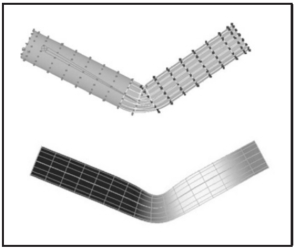
Figure 16.20. Top: Rigid skinning assigns skin vertices to a specific joint. Those belonging to the elbow joint are shown in black; Bottom: Soft skinning can blend the influence of several joints. Weights for the elbow joint are shown (lighter = greater weight). Note smoother skin deformation of the inner part of the skin near the joint.
图 16.20。 顶部：刚性蒙皮将蒙皮顶点分配给特定关节。 属于肘关节的以黑色显示； 底部：软蒙皮可以混合多个关节的影响。 显示了肘关节的重量（更轻=更大的重量)。 注意关节附近皮肤内部的平滑皮肤变形。

### 16.4.1 Facial Animation 面部动画

Skeletons are well suited for creating most motions of a character’s body, but they are not very convenient for realistic facial animation. The reason is that the skin of a human face is moved by muscles directly attached to it, contrary to other parts of the body where the primary objective of the muscles is to move the bones of the skeleton and any skin deformation is a secondary outcome. The result of this facial anatomical arrangement is a very rich set of dynamic facial expressions humans use as one of the main instruments of communication. We are all very well trained to recognize such facial variations and can easily notice any unnatural appearance. This not only puts special demands on the animator but also requires a high-resolution geometric model of the face and, if photorealism is desired, accurate skin reflection properties and textures. 
骨骼非常适合创建角色身体的大多数动作，但对于逼真的面部动画来说不太方便。 原因是，人脸的皮肤是由直接附着在其上的肌肉移动的，这与身体的其他部位相反，在身体的其他部位，肌肉的主要目标是移动骨骼，任何皮肤变形都是次要结果。 这种面部解剖结构的结果是形成了一组非常丰富的动态面部表情，人类将其用作主要的交流工具之一。 我们都受过良好的训练来识别这种面部变化，并且可以很容易地注意到任何不自然的外观。 这不仅对动画师提出了特殊要求，而且还需要高分辨率的面部几何模型，如果需要真实感，还需要精确的皮肤反射特性和纹理。

While it is possible to set key poses of the face vertex-by-vertex and interpolate between them or directly simulate the behavior of the underlying muscle structure using physics-based techniques (see Section 16.5), more specialized high-level approaches also exist. The static shape of a specific face can be characterized by a relatively small set of so-called conformational parameters (overall scale, distance from the eye to the forehead, length of the nose, width of the jaws, etc.) which are used to morph a generic face model into one with individual features. An additional set of expressive parameters can be used to describe the dynamic shape of the face for animation. Examples include rigid rotation of the head, how wide the eyes are open, movement of some feature point from its static position, etc. These are chosen so that most of the interesting expressions can be obtained through some combination of parameter adjustments, therefore, allowing a face to be animated via standard keyframing. To achieve a higher level of control, one can use expressive parameters to create a set of expressions corresponding to common emotions (neutral, sadness, happiness, anger, surprise, etc.) and then blend these key poses to obtain a “slightly sad” or “angrily surprised” face. Similar techniques can be used to perform lip-synch animation, but key poses in this case correspond to different phonemes. Instead of using a sequence of static expressions to describe a dynamic one, the Facial Action Coding System (FACS) (Eckman & Friesen, 1978) decomposes dynamic facial expressions directly into a sum of elementary motions called action units (AUs). The set of AUs is based on extensive psychological research and includes such movements as raising the inner brow, wrinkling the nose, stretching lips, etc. Combining AUs can be used to synthesize a necessary expression. 
虽然可以逐个顶点设置面部的关键姿势并在它们之间进行插值，或者使用基于物理的技术直接模拟底层肌肉结构的行为（参见第 16.5 节），但也存在更专业的高级方法。 特定脸部的静态形状可以通过一组相对较小的所谓构象参数（整体尺度、眼睛到前额的距离、鼻子长度、下巴宽度等）来表征，这些参数用于 将通用面部模型转变为具有个人特征的模型。 可以使用一组附加的表达参数来描述动画中面部的动态形状。 示例包括头部的刚性旋转、眼睛张开的程度、某些特征点从其静态位置的移动等。选择这些是为了通过参数调整的某些组合可以获得大多数有趣的表情，因此，允许 通过标准关键帧进行动画处理的脸部。 为了达到更高的控制水平，可以利用表情参数创建一组对应常见情绪（中性、悲伤、快乐、愤怒、惊讶等）的表情，然后将这些关键姿势混合起来，得到一个“微悲伤”的表情。 或“愤怒惊讶”的脸。 类似的技术可用于执行口型同步动画，但这种情况下的关键姿势对应于不同的音素。 面部动作编码系统 (FACS)（Eckman & Friesen，1978）不是使用一系列静态表情来描述动态表情，而是将动态面部表情直接分解为称为动作单元 (AU) 的基本动作总和。 该组AU基于广泛的心理学研究，包括内抬眉毛、皱鼻子、伸展嘴唇等动作。组合AU可用于合成必要的表情。

### 16.4.2 Motion Capture 动作捕捉

Even with the help of the techniques described above, creating realistic-looking character animation from scratch remains a daunting task. It is therefore only natural that much attention is directed toward techniques which record an actor’s motion in the real world and then apply it to computer-generated characters. Two main classes of such motion capture (MC) techniques exist: electromagnetic and optical. 
即使借助上述技术，从头开始创建逼真的角色动画仍然是一项艰巨的任务。 因此，自然而然地，很多注意力都集中在记录演员在现实世界中的动作，然后将其应用于计算机生成的角色的技术上。 此类动作捕捉 (MC) 技术主要有两类：电磁技术和光学技术。

In electromagnetic motion capture, an electromagnetic sensor directly measures its position (and possibly orientation) in 3D, often providing the captured results in real time. Disadvantages of this technique include significant equipment cost, possible interference from nearby metal objects, and noticeable size of sensors and batteries which can be an obstacle in performing high-amplitude motions. In optical MC, small colored markers are used instead of active sensors making it a much less intrusive procedure. Figure 16.21 shows the operation of such a system. In the most basic arrangement, the motion is recorded by two calibrated video cameras, and simple triangulation is used to extract the marker’s 3D position. More advanced computer vision algorithms used for accurate tracking of multiple markers from video are computationally expensive, so, in most cases, such processing is done offline. Optical tracking is generally less robust than electromagnetic. Occlusion of a given marker in some frames, possible misidentification of markers, and noise in images are just a few of the common problem which have to be addressed. Introducing more cameras observing the motion from different directions improves both accuracy and robustness, but this approach is more expensive and it takes longer to process such data. Optical MC becomes more attractive as available computational power increases and better computer vision algorithms are developed. Because of low impact nature of markers, optical methods are suitable for delicate facial motion capture and can also be used with objects other than humans—for example, animals or even tree branches in the wind. 
在电磁运动捕捉中，电磁传感器直接测量 3D 位置（以及可能的方向），通常实时提供捕捉的结果。 该技术的缺点包括设备成本高昂、可能受到附近金属物体的干扰以及传感器和电池的尺寸过大，这可能会成为执行高振幅运动的障碍。 在光学 MC 中，使用小型彩色标记代替有源传感器，使其成为一个侵入性较小的过程。 图 16.21 显示了这样一个系统的操作。 在最基本的布置中，运动由两个校准摄像机记录，并使用简单的三角测量来提取标记的 3D 位置。 用于准确跟踪视频中的多个标记的更先进的计算机视觉算法的计算成本很高，因此在大多数情况下，此类处理是离线完成的。 光学跟踪通常不如电磁跟踪稳健。 某些帧中给定标记的遮挡、标记可能的误识别以及图像中的噪声只是必须解决的一些常见问题。 引入更多摄像头从不同方向观察运动可以提高准确性和鲁棒性，但这种方法成本更高，并且处理此类数据需要更长的时间。 随着可用计算能力的增加和更好的计算机视觉算法的开发，光学MC变得更具吸引力。 由于标记的影响力较小，光学方法适用于精细的面部动作捕捉，也可用于人类以外的物体，例如动物甚至风中的树枝。
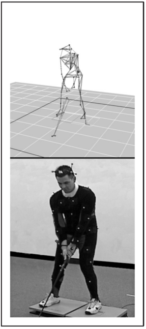
Figure 16.21. Optical motion capture: markers attached to a performer’s body allow skeletal motion to be extracted. Image courtesy of Motion Analysis Corp.
图 16.21。 光学动作捕捉：附着在表演者身体上的标记可以提取骨骼运动。 图片由 Motion Analysis Corp. 提供

With several sensors or markers attached to a performer’s body, a set of time-dependant 3D positions of some collection of points can be recorded. These tracking locations are commonly chosen near joints, but, of course, they still lie on skin surface and not at points where actual bones meet. Therefore, some additional care and a bit of extra processing is necessary to convert recorded positions into those of the physical skeleton joints. For example, putting two markers on opposite sides of the elbow or ankle allows the system to obtain better joint position by averaging locations of the two markers. Without such extra care, very noticeable artifacts can appear due to offset joint positions as well as inherent noise and insufficient measurement accuracy. Because of physical inaccuracy during motion, for example, character limbs can lose contact with objects they are supposed to touch during walking or grasping, problems like foot-sliding (skating) of the skeleton can occur. Most of these problems can be corrected by using inverse kinematics techniques which can explicitly force the required behavior of the limb’s end. 
通过将多个传感器或标记附着在表演者的身体上，可以记录一些点集合的一组与时间相关的 3D 位置。 这些跟踪位置通常选择在关节附近，但当然，它们仍然位于皮肤表面，而不是实际骨骼相交的点。 因此，需要一些额外的注意和一些额外的处理来将记录的位置转换为物理骨骼关节的位置。 例如，将两个标记放在肘部或脚踝的相对侧，允许系统通过平均两个标记的位置来获得更好的关节位置。 如果不加倍小心，由于关节位置偏移以及固有噪声和测量精度不足，可能会出现非常明显的伪影。 例如，由于运动过程中的物理不准确，角色的四肢在行走或抓握时可能会失去与它们应该接触的物体的接触，因此可能会出现骨骼脚滑动（滑冰）等问题。 大多数这些问题可以通过使用逆运动学技术来纠正，该技术可以明确地强制肢体末端所需的行为。

Recovered joint positions can now be directly applied to the skeleton of a computer-generated character. This procedure assumes that the physical dimensions of the character are identical to those of the performer. Retargeting recorded motion to a different character and, more generally, editing MC data, requires significant care to satisfy necessary constraints (such as maintaining feet on the ground or not allowing an elbow to bend backwards) and preserve an overall natural appearance of the modified motion. Generally, the greater the desired change from the original, the less likely it will be possible to maintain the quality of the result. An interesting approach to the problem is to record a large collection of motions and stitch together short clips from this library to obtain desired movement. Although this topic is currently a very active research area, limited ability to adjust the recorded motion to the animator’s needs remains one of the main disadvantages of motion capture technique.
恢复的关节位置现在可以直接应用于计算机生成的角色的骨架。 此过程假设角色的物理尺寸与表演者的物理尺寸相同。 将记录的动作重新定位到不同的角色，更一般地说，编辑 MC 数据，需要非常小心地满足必要的约束（例如将脚保持在地面上或不允许肘部向后弯曲）并保留修改后的动作的整体自然外观 。 一般来说，与原始内容相比所需的变化越大，维持结果质量的可能性就越小。 解决该问题的一个有趣方法是记录大量运动并将该库中的短剪辑拼接在一起以获得所需的运动。 尽管该主题目前是一个非常活跃的研究领域，但根据动画师的需求调整记录的动作的能力有限仍然是动作捕捉技术的主要缺点之一。

## 16.5 Physics-Based Animation 基于物理的动画

The world around us is governed by physical laws, many of which can be formalized as sets of partial or, in some simpler cases, ordinary differential equations. One of the original applications of computers was (and remains) solving such equations. It is therefore only natural to attempt to use numerical techniques developed over the several past decades to obtain realistic motion for computer animation. 
我们周围的世界受物理定律支配，其中许多物理定律可以形式化为偏微分方程组，或者在某些更简单的情况下，可以形式化为常微分方程组。 计算机最初的应用之一是（并且仍然是）求解此类方程。 因此，尝试使用过去几十年发展起来的数值技术来获得计算机动画的真实运动是很自然的。

Because of its relative complexity and significant cost, physics-based animation is most commonly used in situations when other techniques are either unavailable or do not produce sufficiently realistic results. Prime examples include animation of fluids (which includes many gaseous phase phenomena described by the same equations—smoke, clouds, fire, etc.), cloth simulation (an exam ple is shown in Figure 16.22), rigid body motion, and accurate deformation of elastic objects. Governing equations and details of commonly used numerical approaches are different in each of these cases, but many fundamental ideas and difficulties remain applicable across applications. Many methods for numerically solving ODEs and PDEs exist, but discussing them in details is far beyond the scope of this book. To give the reader a flavor of physics-based techniques and some of the issues involved, we will briefly mention here only the finite difference approach—one of the conceptually simplest and most popular families of algorithms which has been applied to most, if not all, differential equations encountered in animation. 
由于其相对复杂性和巨大的成本，基于物理的动画最常用于其他技术不可用或不能产生足够逼真的结果的情况。 主要的例子包括流体动画（其中包括由相同方程描述的许多气相现象——烟、云、火等）、布料模拟（示例如图 16.22 所示）、刚体运动以及物体的精确变形。 弹性物体。 在每种情况下，常用数值方法的控制方程和细节都不同，但许多基本思想和困难仍然适用于各种应用。 存在许多数值求解 ODE 和 PDE 的方法，但详细讨论它们远远超出了本书的范围。 为了让读者了解基于物理的技术和所涉及的一些问题，我们在这里将仅简要提及有限差分方法 - 概念上最简单和最流行的算法系列之一，已应用于大多数（如果不是全部） ，动画中遇到的微分方程。
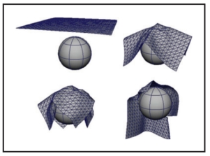
Figure 16.22. Realistic cloth simulation is often performed with physics-based methods. In this example, forces are due to collisions and gravity.
图 16.22。 真实的布料模拟通常使用基于物理的方法进行。 在此示例中，力是由碰撞和重力产生的。

The key idea of this approach is to replace a differential equation with its discrete analog—a difference equation. To do this, the continuous domain of interest is represented by a finite set of points at which the solution will be computed. In the simplest case, these are defined on a uniform rectangular grid as shown in Figure 16.23. Every derivative present in the original ODE or PDE is then replaced by its approximation through function values at grid points. One way of doing this is to subtract the function value at a given point from the function value for its neighboring point on the grid:
这种方法的关键思想是用离散方程（差分方程）代替微分方程。 为此，感兴趣的连续域由一组有限的点表示，在这些点上计算解。 在最简单的情况下，它们被定义在统一的矩形网格上，如图 16.23 所示。 然后，原始 ODE 或 PDE 中存在的每个导数都通过网格点处的函数值替换为其近似值。 一种方法是从网格上相邻点的函数值中减去给定点的函数值：
$\frac{df(t)}{dt} ≈ \frac{Δf}{Δt} = \frac{f(t + Δt) - f(t)}{Δt}$
or
$\frac{∂f(x, t)}{∂x}≈\frac{Δf}{Δx} = \frac{f(x + Δx, t) - f(x, t)}{Δx} \ \ \ \  \ \ \ (16.2)$
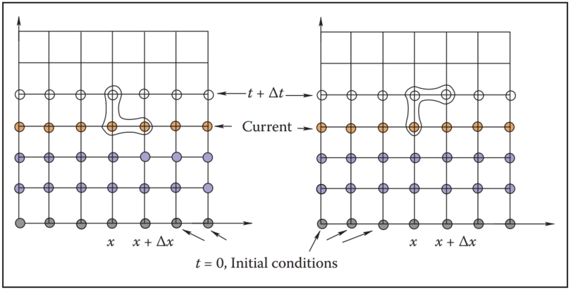
Figure 16.23. Two possible difference schemes for an equation involving derivatives $∂f/∂x$ and $∂f/∂t$. (Left) An explicit scheme expresses unknown values (open circles) only through known values at the current (orange circles) and possibly past (blue circles) time; (Right) Implicit schemes mix known and unknown values in a single equation making it necessary to solve all such equations as a system. For both schemes, information about values on the right boundary is needed to close the process.
图 16.23。 涉及导数 $∂f/∂x$ 和 $∂f/∂t$ 的方程的两种可能的差分格式。 （左）显式方案仅通过当前（橙色圆圈）和可能过去（蓝色圆圈）时间的已知值来表达未知值（空心圆圈）； （右)隐式方案将已知值和未知值混合在一个方程中，因此有必要将所有此类方程作为一个系统来求解。 对于这两种方案，需要有关右边界上的值的信息来关闭该过程。

These expressions are, of course, not the only way. One can, for example, use $f(t − Δt)$ instead of f(t) above and divide by $2Δt$ . For an equation containing a time derivative, it is now possible to propagate values of an unknown function forward in time in a sequence of Δt-size steps by solving the system of difference equations (one at each spatial location) for unknown $f(t + Δt)$. Some initial conditions, i.e., values of the unknown function at $t = 0$, are necessary to start the process. Other information, such as values on the boundary of the domain, might also be required depending on the specific problem. 
当然，这些表达并不是唯一的方法。例如，可以使用$f(t - Δt)$代替上面的f(t)并除以$2Δt$。对于包含时间导数的方程，现在可以通过求解未知$f(t + Δt)$的差分方程系统(每个空间位置一个)，以Δt-size步骤的序列在时间上向前传播未知函数的值。一些初始条件，即未知函数在t = 0处的值，是启动该过程所必需的。根据具体问题，可能还需要其他信息，例如域边界上的值。

The computation of $f(t+Δt)$ can be done easily for so-called explicit schemes when all other values present are taken at the current time and the only unknown in the corresponding difference equation $f(t + Δt)$ is expressed through these known values. Implicit schemes mix values at current and future times and might use, for example,
当所有其他存在值均取当前时间且相应差分方程 $f(t + Δt)$ 中唯一的未知数为时，对于所谓的显式方案，$f(t+Δt)$ 的计算可以轻松完成 通过这些已知值来表达。 隐式方案混合当前和未来的值，并可能使用，例如，
$\frac{f(x + Δx, t + Δt) - f(x, t + Δt)}{Δx} \\$

as an approximation of $\frac{∂f}{∂x}$. In this case one has to solve a system of algebraic equations at each step. 
作为 $\frac{∂f}{∂x}$ 的近似值。 在这种情况下，每一步都必须求解代数方程组。

The choice of difference scheme can dramatically affect all aspects of the algorithm. The most obvious among them is accuracy. In the limit $Δt → 0$ or $Δx → 0$, expressions of the type in Equation (16.2) are exact, but for finite step size some schemes allow better approximation of the derivative than others. Stability of a difference scheme is related to how fast numerical errors, which are always present in practice, can grow with time. For stable schemes this growth is bounded, while for unstable ones it is exponential and can quickly overwhelm the solution one seeks (see Figure 16.24). It is important to realize that while some inaccuracy in the solution is tolerable (and, in fact, accuracy demanded in physics and engineering is rarely needed for animation), an unstable result is completely meaningless, and one should avoid using unstable schemes. Generally, explicit schemes are either unstable or can become unstable at larger step sizes while implicit ones are unconditionally stable. Implicit schemes allows greater step size (and, therefore, fewer steps) which is why they are popular despite the need to solve a system of algebraic equations at each step. Explicit schemes are attractive because of their simplicity if their stability conditions can be satisfied. Developing a good difference scheme and corresponding algorithm for a specific problem is not easy, and for most standard situations it is well advised to use an existing method. Ample literature discussing details of these techniques is available. 
差分方案的选择可以极大地影响算法的各个方面。 其中最明显的是准确性。 在极限 $Δt → 0$ 或 $Δx → 0$ 下，方程 (16.2) 中类型的表达式是精确的，但对于有限步长，某些方案比其他方案允许更好地逼近导数。 差分格式的稳定性与实际中始终存在的数值误差随时间增长的速度有关。 对于稳定的方案，这种增长是有界的，而对于不稳定的方案，它是指数级的，并且很快就会压倒人们所寻求的解决方案（见图 16.24）。 重要的是要认识到，虽然解决方案中的一些不准确性是可以容忍的（事实上，动画很少需要物理和工程中要求的准确性），但不稳定的结果是完全没有意义的，应该避免使用不稳定的方案。 一般来说，显式方案要么不稳定，要么在较大步长下变得不稳定，而隐式方案则无条件稳定。 隐式方案允许更大的步长（因此步数更少），这就是为什么它们很受欢迎，尽管每一步都需要求解代数方程组。 如果能够满足稳定性条件，显式方案由于其简单性而具有吸引力。 针对特定问题开发良好的差分方案和相应的算法并不容易，对于大多数标准情况，建议使用现有方法。 有大量讨论这些技术细节的文献。
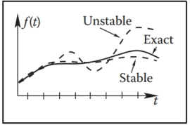
Figure 16.24. An unstable solution might follow the exact one initially, but can deviate arbitrarily far from it with time. Accuracy of a stable solution might still be insufficient for a specific application.
图 16.24。 不稳定的解决方案一开始可能遵循精确的解决方案，但随着时间的推移可能会偏离它任意远的距离。 对于特定应用来说，稳定解决方案的准确性可能仍然不够。

One should remember that, in many cases, just computing all necessary terms in the equation is a difficult and time-consuming task on its own. In rigid body or cloth simulation, for example, most of the forces acting on the system are due to collisions among objects. At each step during animation, one therefore has to solve a purely geometric, but very nontrivial, problem of collision detection. In such conditions, schemes which require fewer evaluations of such forces might provide significant computational savings. 
人们应该记住，在许多情况下，仅仅计算方程中的所有必要项本身就是一项困难且耗时的任务。 例如，在刚体或布料模拟中，作用在系统上的大部分力都是由于物体之间的碰撞而产生的。 因此，在动画过程中的每一步，都必须解决一个纯几何但非常重要的碰撞检测问题。 在这种情况下，需要对此类力进行较少评估的方案可能会节省大量计算量。

Although the result of solving appropriate time-dependant equations gives very realistic motion, this approach has its limitations. First of all, it is very hard to control the result of physics-based animation. Fundamental mathematical properties of these equations state that once the initial conditions are set, the solution is uniquely defined. This does not leave much room for animator input and, if the result is not satisfactory for some reason, one has only a few options. They are mostly limited to adjusting initial condition used, changing physical properties of the system, or even modifying the equations themselves by introducing artificial terms intended to “drive” the solution in the direction the animator wants. Making such changes requires significant skill as well as understanding of the underlying physics and, ideally, numerical methods. Without this knowledge, the realism provided by physics-based animation can be destroyed or severe numerical problems might appear. 
尽管求解适当的瞬态方程的结果给出了非常真实的运动，但这种方法有其局限性。 首先，基于物理的动画的结果很难控制。 这些方程的基本数学属性表明，一旦设置了初始条件，解就被唯一定义。 这并没有给动画师留下太多的输入空间，如果由于某种原因结果不令人满意，人们就只有几个选择。 它们大多仅限于调整所使用的初始条件，改变系统的物理属性，甚至通过引入旨在“驱动”解决方案朝动画师想要的方向“驱动”的人工术语来修改方程本身。 做出这样的改变需要大量的技能以及对基础物理的理解，最好是对数值方法的理解。 如果没有这些知识，基于物理的动画所提供的真实感可能会被破坏，或者可能会出现严重的数值问题。

## 16.6 Procedural Techniques 程序技术

Imagine that one could write (and implement on a computer) a mathematical function which outputs precisely the desired motion given some animator guidance. Physics-based techniques outlined above can be treated as a special case of such an approach when the “function” involved is the procedure to solve a particular differential equation and “guidance” is the set of initial and boundary conditions, extra equation terms, etc.
想象一下，人们可以编写（并在计算机上实现）一个数学函数，该函数在动画师的指导下精确输出所需的运动。 当涉及的“函数”是求解特定微分方程的过程，而“指导”是初始条件和边界条件、额外方程项等的集合时，上述基于物理的技术可以被视为这种方法的特例。

However, if we are only concerned with the final result, we do not have to follow a physics-based approach. For example, a simple constant amplitude wave on the surface of a lake can be directly created by applying the function $f(\bold{x}, t) = A cos(ωt − \bold{kx} + φ)$ with constant frequency $ω$, wave vector $\bold{k}$ and phase $φ$ to get displacement at the 2D point $\bold{x}$ at time $t$. A collection of such waves with random phases and appropriately chosen amplitudes, frequencies, and wave vectors can result in a very realistic animation of the surface of water without explicitly solving any fluid dynamics equations. It turns out that other rather simple mathematical functions can also create very interesting patterns or objects. Several such functions, most based on lattice noises, have been described in Section 11.5. Adding time dependance to these functions allows us to animate certain complex phenomena much easier and cheaper than with physics-based techniques while maintaining very high visual quality of the results. If $noise(\bold{x})$ is the underlying pattern-generating function, one can create a time-dependant variant of it by moving the argument position through the lattice. The simplest case is motion with constant speed: $timenoise(\bold{x}, t) = noise(\bold{x} + \bold{v}t)$, but more complex motion through the lattice is, of course, also possible and, in fact, more common. One such path, a spiral, is shown in Figure 16.25. Another approach is to animate parameters used to generate the noise function. This is especially appropriate if the appearance changes significantly with time—a cloud becoming more turbulent, for example. In this way one can animate the dynamic process of formation of clouds using the function which generates static ones.
但是，如果我们只关心最终结果，则不必遵循基于物理的方法。 例如，可以通过应用函数 $f(\bold{x}, t) = A cos(ωt − \bold{kx} + φ)$ 以及常数来直接创建湖面上的简单等幅波 频率 $ω$、波矢 $\bold{k}$ 和相位 $φ$ 以获得 2D 点 $\bold{x}$ 在时间 $t$ 处的位移。 具有随机相位和适当选择的振幅、频率和波矢量的此类波的集合可以产生非常逼真的水面动画，而无需明确求解任何流体动力学方程。 事实证明，其他相当简单的数学函数也可以创建非常有趣的图案或物体。 几个这样的函数，大多数基于晶格噪声，已在第 11.5 节中描述。 与基于物理的技术相比，向这些函数添加时间依赖性使我们能够更轻松、更便宜地制作某些复杂现象的动画，同时保持结果的非常高的视觉质量。 如果 $noise(\bold{x})$ 是底层模式生成函数，则可以通过在晶格中移动参数位置来创建它的时间相关变体。 最简单的情况是匀速运动：$timenoise(\bold{x}, t) = Noise(\bold{x} + \bold{v}t)$，但是通过晶格的更复杂的运动当然是， 也是可能的，而且事实上更常见。 图 16.25 显示了这样一种路径，即螺旋路径。 另一种方法是对用于生成噪声函数的参数进行动画处理。 如果外观随时间发生显着变化（例如，云变得更加混乱），这尤其合适。 通过这种方式，人们可以使用生成静态云的函数来动画化云形成的动态过程。
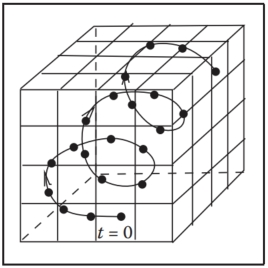
Figure 16.25. A path through the cube defining procedural noise is traversed to animate the resulting pattern.
图 16.25。 穿过定义程序噪声的立方体的路径来动画生成的图案。

For some procedural techniques, time dependance is a more integral component. The simplest cellular automata operate on a 2D rectangular grid where a binary value is stored at each location (cell). To create a time varying pattern, some user-provided rules for modifying these values are repeatedly applied. Rules typically involve some set of conditions on the current value and that of the cell’s neighbors. For example, the rules of the popular 2D Game of Life cellular automaton invented in 1970 by British mathematician John Conway are the following: 
对于某些程序技术来说，时间依赖性是一个更不可或缺的组成部分。 最简单的元胞自动机在二维矩形网格上运行，其中每个位置（单元）都存储一个二进制值。 为了创建随时间变化的模式，需要重复应用一些用户提供的用于修改这些值的规则。 规则通常涉及当前值和单元格邻居的某些条件集。 例如，英国数学家约翰·康威于 1970 年发明的流行的 2D 生命游戏元胞自动机的规则如下：

1. A dead cell (i.e., binary value at a given location is 0) with exactly three live neighbors becomes a live cell (i.e., its value set to 1). 
   恰好有三个活邻居的死细胞（即给定位置的二进制值为 0）成为活细胞（即其值设置为 1）。
2. A live cell with two or three live neighbors stays alive. 
   一个活细胞如果有两个或三个活邻居，那么它就会保持存活状态。
3. In all other cases, a cell dies or remains dead. 
   在所有其他情况下，细胞死亡或保持死亡状态。

Once the rules are applied to all grid locations, a new pattern is created and a new evolution cycle can be started. Three sample snapshots of the live cell distribution at different times are shown in Figure 16.26. More sophisticated automata simultaneously operate on several 3D grids of possibly floating point values and can be used for modeling dynamics of clouds and other gaseous phenomena or biological systems for which this apparatus was originally invented (note the terminology). Surprising pattern complexity can arise from just a few well-chosen rules, but how to write such rules to create the desired behavior is often not obvious. This is a common problem with procedural techniques: there is only limited, if any, guidance on how to create new procedures or even adjust parameters of existing ones. Therefore, a lot of tweaking and learning by trial-and-error (“by experience”) is usually needed to unlock the full potential of procedural methods. 
一旦规则应用于所有网格位置，就会创建新的模式并开始新的演化周期。 图 16.26 显示了不同时间活细胞分布的三个样本快照。 更复杂的自动机同时在多个可能浮点值的 3D 网格上运行，可用于对云和其他气体现象或生物系统的动力学建模，该设备最初是为这些系统发明的（注意术语）。 只需几个精心选择的规则就可以产生令人惊讶的模式复杂性，但如何编写这些规则来创建所需的行为通常并不明显。 这是程序技术的一个常见问题：关于如何创建新程序甚至调整现有程序的参数的指导（如果有的话）也是有限的。 因此，通常需要通过反复试验（“通过经验”）进行大量调整和学习，以释放程序方法的全部潜力。
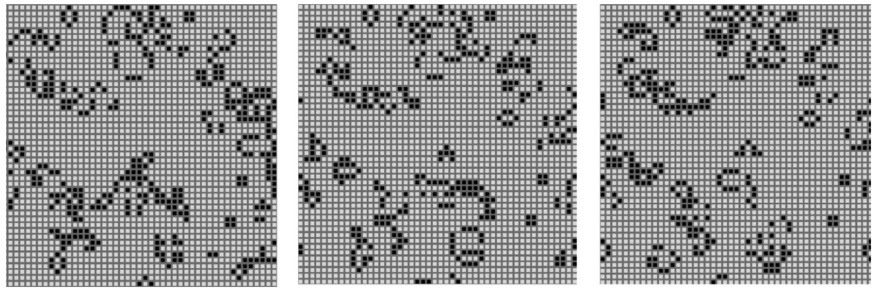
Figure 16.26. Several (non-consecutive) stages in the evolution of a Game of Life automaton. Live cells are shown in black. Stable objects, oscillators, traveling patterns, and many other interesting constructions can result from the application of very simple rules. Figure created using a program by Alan Hensel.
图 16.26。 生命游戏自动机演化的几个（非连续)阶段。 活细胞显示为黑色。 稳定的物体、振荡器、移动模式和许多其他有趣的结构都可以通过应用非常简单的规则来产生。 使用 Alan Hensel 的程序创建的图形。

Another interesting approach which was also originally developed to describe biological objects is the technique called L-systems (after the name of their original inventor, Astrid Lindenmayer). This approach is based on grammars or sets of recursive rules for rewriting strings of symbols. There are two types of symbols: terminal symbols stand for elements of something we want to represent with a grammar. Depending on their meaning, grammars can describe structure of trees and bushes, buildings and whole cities, or programming and natural languages. In animation, L-systems are most popular for representing plants and corresponding terminals are instructions to the geometric modeling system: put a leaf (or a branch) at a current position—we will use the symbol @ and just draw a circle, move current position forward by some number of units (symbol f), turn current direction 60 degrees around world Z-axis (symbol +), pop (symbol [) or push (symbol ]) current position/orientation, etc. Auxiliary nonterminal symbols (denoted by capital letters) have only semantic rather than any direct meaning. They are intended to be eventually rewritten through terminals. We start from the special nonterminal start symbol S and keep applying grammar rules to the current string in parallel, i.e., replace all nonterminals currently present to get the new string, until we end up with a string containing only terminals and no more substitution is therefore possible. This string of modeling instructions is then used to output the actual geometry. For example, a set of rules (productions)
另一种有趣的方法最初也是为了描述生物对象而开发的，它是称为 L 系统的技术（以其原始发明者 Astrid Lindenmayer 的名字命名）。 这种方法基于用于重写符号字符串的语法或递归规则集。 有两种类型的符号：终结符号代表我们想要用语法表示的事物的元素。 根据其含义，语法可以描述树木和灌木、建筑物和整个城市的结构，或者编程和自然语言。 在动画中，L系统最流行用于表示植物，相应的终端是对几何建模系统的指令：将一片叶子（或树枝）放在当前位置 - 我们将使用符号@并只画一个圆，移动当前位置 向前移动一些单位（符号 f），将当前方向绕世界 Z 轴旋转 60 度（符号 +），弹出（符号 [）或推送（符号 ]）当前位置/方向等。辅助非终结符号（表示为 由大写字母组成）仅具有语义而不具有任何直接含义。 它们最终将通过终端重写。 我们从特殊的非终结符开始符号 S 开始，并继续并行地将语法规则应用于当前字符串，即替换当前存在的所有非终结符以获得新字符串，直到我们最终得到一个仅包含终结符的字符串，因此不再需要替换 可能的。 然后使用这串建模指令来输出实际的几何形状。 例如，一组规则（产生式）
$$
S → A \\
A → [+B]fA \\
A → B \\
B → fB \\
B → f@ \\
$$
might result in the following sequence of rewriting steps demonstrated in Figure 16.27: 
可能会导致如图 16.27 所示的以下重写步骤序列：
$$
S \mapsto A \mapsto [+B]fA \mapsto [+fB]f[+B]fA \mapsto \\
[+ff@]f[+fB]fB \mapsto [+ff@]f[+ff@]ff@ . 
$$
As shown above, there are typically many different productions for the same nonterminal allowing the generation of many different objects with the same grammar. The choice of which rule to apply can depend on which symbols are located next to the one being replaced (context-sensitivity) or can be performed at random with some assigned probability for each rule (stochastic L-systems). More complex rules can model interaction with the environment, such as pruning to a particular shape, and parameters can be associated with symbols to control geometric commands issued. 
如上所示，相同的非终结符通常有许多不同的产生式，从而允许使用相同的语法生成许多不同的对象。 应用哪个规则的选择可以取决于哪些符号位于被替换的符号旁边（上下文敏感），或者可以以每个规则的某个指定概率随机执行（随机 L 系统）。 更复杂的规则可以对与环境的交互进行建模，例如修剪为特定形状，并且参数可以与符号关联以控制发出的几何命令。

L-systems already capture plant topology changes with time: each intermediate string obtained in the rewriting process can be interpreted as a “younger” version of the plant (see Figure 16.27). For more significant changes, different productions can be in effect at different times allowing the structure of the plant to change significantly as it grows. A young tree, for example, produces a lot of new branches, while an older one branches only moderately. 
L-系统已经捕获了工厂拓扑随时间的变化：重写过程中获得的每个中间字符串都可以解释为工厂的“年轻”版本（见图 16.27）。 对于更显着的变化，不同的生产可以在不同的时间生效，从而使植物的结构随着其生长而发生显着的变化。 例如，一棵年轻的树会产生大量新枝，而老树则只能产生适度的枝条。
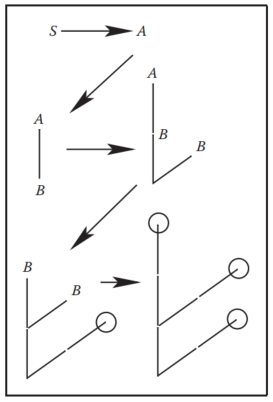
Figure 16.27. Consecutive derivation steps using a simple L-system. Capital letters denote nonterminals and illustrate positions at which corresponding nonterminal will be expanded. They are not part of the actual output.
图 16.27。 使用简单的 L 系统的连续推导步骤。 大写字母表示非终结符，并说明相应非终结符将被扩展的位置。 它们不是实际输出的一部分。

Very realistic plant models have been created with L-systems. However, as with most procedural techniques, one needs some experience to meaningfully apply existing L-systems, and writing new grammars to capture some desired effect is certainly not easy. 
使用 L 系统创建了非常逼真的植物模型。 然而，与大多数程序技术一样，需要一些经验才能有意义地应用现有的 L 系统，并且编写新语法来捕获某些所需的效果当然并不容易。

## 16.7 Groups of Objects 对象组

To animate multiple objects one can, of course, simply apply standard techniques described in the chapter so far to each of them. This works reasonably well for a moderate number of independent objects whose desired motion is known in advance. However, in many cases, some kind of coordinated action in a dynamic environment is necessary. If only a few objects are involved, the animator can use an artificial intelligence (AI)-based system to automatically determine immediate tasks for each object based on some high-level goal, plan necessary motion, and execute the plan. Many modern games use such autonomous objects to create smart monsters or player’s collaborators. 
当然，要为多个对象设置动画，只需将本章到目前为止描述的标准技术应用于每个对象即可。 对于预先知道所需运动的中等数量的独立物体来说，这种方法相当有效。 然而，在许多情况下，动态环境中某种协调行动是必要的。 如果只涉及几个对象，动画师可以使用基于人工智能 (AI) 的系统，根据一些高级目标自动确定每个对象的即时任务，规划必要的动作并执行计划。 许多现代游戏都使用这种自主对象来创建智能怪物或玩家的合作者。

Interestingly, as the number of objects in a group grows from just a few to several dozens, hundreds, and thousands, individual members of a group must have only very limited “intelligence” in order for the group as a whole to exhibit what looks like coordinated goal-driven motion. It turns out that this flocking is emergent behavior which can arise as a result of limited interaction of group members with just a few of their closest neighbors (Reynolds, 1987). Flocking should be familiar to anyone who has observed the fascinatingly synchronized motion of a flock of birds or a school of fish. The technique can also be used to control groups of animals moving over terrain or even a human crowd. 
有趣的是，当一个群体中的物体数量从几个增长到几十个、几百个、几千个时，群体中的个体成员必须只有非常有限的“智力”才能使整个群体表现出看起来像的样子。 协调目标驱动的运动。 事实证明，这种聚集是一种突发行为，可能是由于群体成员与他们最近的几个邻居的有限互动而产生的（Reynolds，1987）。 任何观察过鸟群或鱼群令人着迷的同步运动的人都应该熟悉集群现象。 该技术还可用于控制在地形上移动的动物群甚至人群。

At any given moment, the motion of a member of a group, often called boid when applied to flocks, is the result of balancing several often contradictory tendencies, each of which suggests its own velocity vector (see Figure 16.28). First, there are external physical forces $F$ acting on the boid, such as gravity or wind. New velocity due to those forces can be computed directly through Newton’s law as
在任何给定时刻，群体成员的运动（应用于群体时通常称为 boid）是平衡几个通常相互矛盾的趋势的结果，每个趋势都有自己的速度矢量（见图 16.28）。 首先，有外部物理力$F$作用在物体上，例如重力或风。 这些力产生的新速度可以直接通过牛顿定律计算：
$v^{physics}_{new} = \bold{v}_{old} + \bold{F}Δt/m.    $


Figure 16.28. (Left) Individual flock member (boid) can experience several urges of different importance (shown by line thickness) which have to be negotiated into a single velocity vector. A boid is aware of only its limited neighborhood (circle). (Right) Boid control is commonly implemented as three separate modules.
图 16.28。 （左）单个群体成员（boid）可能会经历几种不同重要性的冲动（由线条粗细显示），这些冲动必须协商成单个速度矢量。 群体只知道其有限的邻域（圆圈）。 （右)Boid 控制通常作为三个独立的模块来实现。

Second, a boid should react to global environment and to the behavior of other group members. Collision avoidance is one of the main results of such interaction. It is crucial for flocking that each group member has only limited field of view, and therefore is aware only of things happening within some neighborhood of its current position. To avoid objects in the environment, the simplest, if imperfect, strategy is to set up a limited extent repulsive force field around each such object. This will create a second desired velocity vector $\bold{v}^{col\_avoid}_{new}$, also given by Newton’s law. Interaction with other group members can be modeled by simultaneously applying different steering behaviors resulting in several additional desired velocity vectors $\bold{v}^{steer}_{new}$. Moving away from neighbors to avoid crowding, steering toward flock mates to ensure flock cohesion, and adjusting a boid’s speed to align with average heading of neighbors are most common. Finally, some additional desired velocity vectors $\bold{v}^{goal}_{new}$ are usually applied to achieve needed global goals. These can be vectors along some path in space, following some specific designated leader of the flock, or simply representing migratory urge of a flock member. 
其次，群体应对全球环境和其他群体成员的行为做出反应。 避免碰撞是这种交互的主要结果之一。 对于群体聚集来说至关重要的是，每个群体成员的视野都有限，因此只能意识到其当前位置的某个邻域内发生的事情。 为了避开环境中的物体，最简单（如果不完美）的策略是在每个此类物体周围建立有限范围的排斥力场。 这将创建第二个所需的速度矢量 $\bold{v}^{col\_avoid}_{new}$，也由牛顿定律给出。 与其他组成员的交互可以通过同时应用不同的转向行为来建模，从而产生几个额外的所需速度向量 $\bold{v}^{steer}_{new}$。 远离邻居以避免拥挤，转向群体伙伴以确保群体凝聚力，以及调整群体的速度以与邻居的平均航向保持一致是最常见的。 最后，通常应用一些额外的所需速度向量 $\bold{v}^{goal}_{new}$ 来实现所需的全局目标。 这些可以是沿着空间中某些路径的向量，跟随某个特定的指定的羊群领导者，或者简单地代表羊群成员的迁徙冲动。

Once all $\bold{v}_{new}$ are determined, the final desired vector is negotiated based on priorities among them. Collision avoidance and velocity matching typically have higher priority. Instead of simple averaging of desired velocity vectors which can lead to cancellation of urges and unnatural “moving nowhere” behavior, an acceleration allocation strategy is used. Some fixed total amount of acceleration is made available for a boid and fractions of it are being given to each urge in order of priority. If the total available acceleration runs out, some lower priority urges will have less effect on the motion or be completely ignored. The hope is that once the currently most important task (collision avoidance in most situations) is accomplished, other tasks can be taken care of in near future. It is also important to respect some physical limitations of real objects, for example, clamping too high accelerations or speeds to some realistic values. Depending on the internal complexity of the flock member, the final stage of animation might be to turn the negotiated velocity vector into a specific set of parameters (bird’s wing positions, orientation of plane model in space, leg skeleton bone configuration) used to control a boid’s motion. A diagram of a system implementing flocking is shown on Figure 16.28 (right). 
一旦确定了所有$\bold{v}_{new}$，就根据它们之间的优先级协商最终的期望向量。 避免碰撞和速度匹配通常具有更高的优先级。 使用加速度分配策略，而不是对期望速度向量进行简单平均，这可能导致取消冲动和不自然的“无处可去”行为。 为主体提供了一些固定的总加速度，并将其中的一小部分按优先级顺序分配给每个冲动。 如果总可用加速度耗尽，一些较低优先级的冲动对运动的影响较小或完全被忽略。 希望一旦当前最重要的任务（大多数情况下避免碰撞）完成，其他任务就可以在不久的将来得到处理。 尊重真实物体的一些物理限制也很重要，例如，将过高的加速度或速度限制在某些实际值。 根据鸟群成员的内部复杂性，动画的最后阶段可能是将协商的速度矢量转换为一组特定的参数（鸟的翅膀位置、平面模型在空间中的方向、腿部骨骼的骨骼配置），用于控制 博德的动作。 图 16.28（右）显示了实现集群的系统图。

A much simpler, but still very useful, version of group control is implemented by particle systems (Reeves, 1983). The number of particles in a system is typically much larger than number of boids in a flock and can be in the tens or hundreds of thousands, or even more. Moreover, the exact number of particles can fluctuate during animation with new particles being born and some of the old ones destroyed at each step. Particles are typically completely independent from each other, ignoring one’s neighbors and interacting with the environment only by experiencing external forces and collisions with objects, not through collision avoidance as was the case for flocks. At each step during animation, the system first creates new particles with some initial parameters, terminates old ones, and then computes necessary forces and updates velocities and positions of the remaining particles according to Newton’s law. 
一个更简单但仍然非常有用的组控制版本是由粒子系统实现的（Reeves，1983）。 系统中的粒子数量通常远大于群体中的粒子数量，并且可以是数万或数十万，甚至更多。 此外，粒子的确切数量在动画过程中可能会发生波动，每一步都会产生新粒子，并销毁一些旧粒子。 粒子通常彼此完全独立，忽略邻近的粒子，仅通过经历外力和与物体的碰撞来与环境相互作用，而不是像群体那样通过避免碰撞。 在动画过程中的每个步骤中，系统首先创建具有一些初始参数的新粒子，终止旧粒子，然后计算必要的力并根据牛顿定律更新剩余粒子的速度和位置。
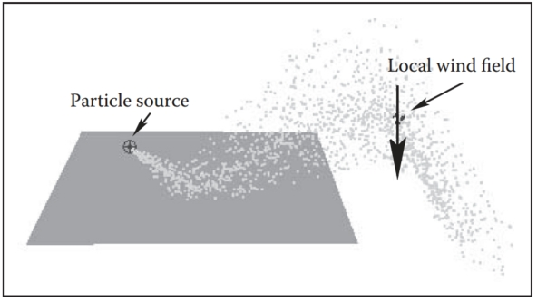
Figure 16.29. After being emitted by a directional source, particles collide with an object and then are blown down by a local wind field once they clear the obstacle. 
图 16.29。 粒子由定向源发射后，与物体碰撞，一旦越过障碍物，就会被局部风场吹落。

All parameters of a particle system (number of particles, particle life span, initial velocity, and location of a particle, etc.) are usually under the direct control of the animator. Prime applications of particle systems include modeling fireworks, explosions, spraying liquids, smoke and fire, or other fuzzy objects and phenomena with no sharp boundaries. To achieve a realistic appearance, it is important to introduce some randomness to all parameters, for example, having a random number of particles born (and destroyed) at each step with their velocities generated according to some distribution. In addition to setting appropriate initial parameters, controlling the motion of a particle system is commonly done by creating a specific force pattern in space—blowing a particle in a new direction once it reaches some specific location or adding a center of attraction, for example. One should remember that with all their advantages, simplicity of implementation and ease of control being the prime ones, particle systems typically do not provide the level of realism characteristic of true physics-based simulation of the same phenomena.
粒子系统的所有参数（粒子数量、粒子寿命、初始速度和粒子位置等）通常都在动画师的直接控制下。 粒子系统的主要应用包括对烟花、爆炸、喷射液体、烟雾和火焰或其他没有明确边界的模糊物体和现象进行建模。 为了实现逼真的外观，重要的是向所有参数引入一些随机性，例如，在每一步产生（和破坏）随机数量的粒子，并根据某种分布生成它们的速度。 除了设置适当的初始参数之外，控制粒子系统的运动通常是通过在空间中创建特定的力模式来完成的，例如，一旦粒子到达某个特定位置，就将其吹向新的方向或添加吸引力中心。 人们应该记住，尽管粒子系统具有所有优点，但实现简单和易于控制是主要优点，但它们通常无法提供对相同现象进行真正基于物理的模拟的真实感特征。

## Notes 注释

In this chapter we have concentrated on techniques used in 3D animation. There also exist a rich set of algorithms to help with 2D animation production and post-processing of images created by computer graphics rendering systems. These include techniques for cleaning up scanned-in artist drawings, feature extraction, automatic 2D in-betweening, colorization, image warping, enhancement and compositing, and many others. 
在本章中，我们集中讨论 3D 动画中使用的技术。 还有一组丰富的算法可以帮助进行 2D 动画制作以及对计算机图形渲染系统创建的图像进行后处理。 其中包括清理扫描输入的艺术家绘图、特征提取、自动 2D 中间处理、着色、图像扭曲、增强和合成等技术。

One of the most significant developments in the area of computer animation has been the increasing power and availability of sophisticated animation systems. While different in their specific set of features, internal structure, details of user interface, and price, most such systems include extensive support not only for animation, but also for modeling and rendering, turning them into complete production platforms. It is also common to use these systems to create still images. For example, many images for figures in this section were produced using Maya software generously donated by Alias. 
计算机动画领域最重要的发展之一是复杂动画系统的功能和可用性不断增强。 虽然其特定功能集、内部结构、用户界面细节和价格有所不同，但大多数此类系统不仅包括对动画的广泛支持，而且还包括对建模和渲染的广泛支持，将它们转变为完整的制作平台。 使用这些系统创建静态图像也很常见。 例如，本节中的许多人物图像都是使用 Alias 慷慨捐赠的 Maya 软件制作的。

Large-scale animation production is an extremely complex process which typically involves a combined effort by dozens of people with different backgrounds spread across many departments or even companies. To better coordinate this activity, a certain production pipeline is established which starts with a story and character sketches, proceeds to record necessary sound, build models, and rig characters for animation. Once actual animation commences, it is common to go back and revise the original designs, models, and rigs to fix any discovered motion and appearance problems. Setting up lighting and material properties is then necessary, after which it is possible to start rendering. In most sufficiently complex projects, extensive postprocessing and compositing stages bring together images from different sources and finalize the product. 
大型动画制作是一个极其复杂的过程，通常需要分布在多个部门甚至公司的数十名不同背景的人员共同努力。 为了更好地协调这项活动，建立了一定的制作流程，从故事和角色草图开始，然后录制必要的声音、构建模型和为动画装配角色。 一旦实际的动画开始，通常会返回并修改原始设计、模型和装备，以修复任何发现的运动和外观问题。 然后需要设置照明和材质属性，然后才能开始渲染。 在大多数足够复杂的项目中，大量的后处理和合成阶段将不同来源的图像汇集在一起并最终确定产品。

We conclude this chapter by reminding the reader that in the field of computer animation, any technical sophistication is secondary to a good story, expressive characters, and other artistic factors, most of which are hard or simply impossible to quantify. It is safe to say that Snow White and her seven dwarfs will always share the screen with green ogres and donkeys, and most of the audience will be much more interested in the characters and the story rather than in which, if any, computers (and in what exact way) helped to create them.
在本章结束时，我们提醒读者，在计算机动画领域，任何技术的复杂性都是次要的，而不是一个好的故事、富有表现力的角色和其他艺术因素，其中大多数很难或根本不可能量化。 可以肯定地说，白雪公主和她的七个小矮人将始终与绿色食人魔和驴子共享屏幕，大多数观众将对角色和故事更感兴趣，而不是对计算机（如果有的话）感兴趣。 以什么确切的方式）帮助创造了它们。


# 17  Using Graphics Hardware  使用图形硬件

## 17.1 Hardware Overview   硬件概述

Throughout most of this book, the focus is on the fundamentals that underly computer graphics rather than on any specifics relating to the APIs or hardware on which the algorithms may be implemented. This chapter takes a slightly different route and blends the details of using graphics hardware with some of the practical issues associated with programming that hardware. The chapter is designed to be an introductory guide to graphics hardware and could be used as the basis for a set of weekly labs that investigate graphics hardware. 
在本书的大部分内容中，重点是计算机图形学的基础知识，而不是与可实现算法的 API 或硬件相关的任何细节。 本章采取了略有不同的路线，并将使用图形硬件的细节与与该硬件编程相关的一些实际问题结合起来。 本章旨在作为图形硬件的介绍性指南，并且可以用作研究图形硬件的每周实验的基础。

## 17.2 What Is Graphics Hardware 什么是图形硬件

Graphics hardware describes the hardware components necessary to quickly render 3D objects as pixels on your computer’s screen using specialized rasterization-based (and in some cases, ray-tracer–based) hardware architectures. The use of the term graphics hardware is meant to elicit a sense of the physical components necessary for performing a range of graphics computations. In other words, the hardware is the set of chipsets, transistors, buses, processors, and computing cores found on current video cards. As you will learn in this chapter, and eventually experience yourself, current graphics hardware is very good at processing descriptions of 3D objects and transforming those representations into the colored pixels that fill your monitor.
图形硬件描述了使用专门的基于光栅化（在某些情况下基于光线追踪器）的硬件架构将 3D 对象快速渲染为计算机屏幕上的像素所需的硬件组件。 使用术语图形硬件是为了引出对执行一系列图形计算所需的物理组件的了解。 换句话说，硬件是当前显卡上的芯片组、晶体管、总线、处理器和计算核心的集合。 正如您将在本章中了解到并最终亲自体验到的那样，当前的图形硬件非常擅长处理 3D 对象的描述并将这些表示转换为填充显示器的彩色像素。

Graphics hardware has certainly changed very rapidly over the last decade. Newer graphics hardware provides more parallel processing capabilities, as well as better support for specialized rendering. One explanation for the fast pace is the video game industry and its economic momentum. Essentially what this means is that each new graphics card provides better performance and processing capabilities. As a result, video games appear more visually realistic. The processors on graphics hardware, often called GPUs, or Graphics Processing Units, are highly parallel and afford thousands of concurrent threads of execution. The hardware is designed for throughput which allows larger numbers of pixels and vertices to be processed in shorter amounts of time. All of this parallelism is good for graphics algorithms, but other work has benefited from the parallel hardware. In addition to video games, GPUs are used to accelerate physics computations, develop real-time ray tracing codes, solve Navier-Stokes related equations for fluid flow simulations, and develop faster codes for understanding the climate (Purcell, Buck, Mark, & Hanrahan, 2002; S. G. Parker et al., 2010; Harris, 2004). Several APIs and SDKs have been developed that afford more direct general purpose computation, such as OpenCL and NVIDIA’s CUDA. Hardware accelerated ray tracing APIs also exist to accelerate ray-object intersection (S. G. Parker et al., 2010). Similarly, the standard APIs that are used to program the graphics components of video games, such as OpenGL and DirectX, also allow mechanisms to leverage the graphics hardware’s parallel capabilities. Many of these APIs change as new hardware is developed to support more sophisticated computations.
在过去的十年里，图形硬件确实发生了非常迅速的变化。 更新的图形硬件提供了更多的并行处理能力，以及对专业渲染的更好支持。 快速发展的一种解释是视频游戏行业及其经济动力。 从本质上讲，这意味着每个新显卡都提供更好的性能和处理能力。 因此，视频游戏在视觉上显得更加真实。 图形硬件上的处理器（通常称为 GPU 或图形处理单元）是高度并行的，可提供数千个并发执行线程。 硬件专为吞吐量而设计，允许在更短的时间内处理大量像素和顶点。 所有这些并行性都有利于图形算法，但其他工作也受益于并行硬件。 除了视频游戏之外，GPU 还用于加速物理计算、开发实时光线追踪代码、求解流体流动模拟的纳维-斯托克斯相关方程，以及开发更快的代码来了解气候（Purcell、Buck、Mark 和 Hanrahan） ，2002 年；S.G. Parker 等人，2010 年；哈里斯，2004 年）。 一些 API 和 SDK 已经开发出来，可以提供更直接的通用计算，例如 OpenCL 和 NVIDIA 的 CUDA。 还存在硬件加速光线追踪 API 来加速光线与对象的相交（S. G. Parker 等人，2010）。 同样，用于对视频游戏的图形组件进行编程的标准 API（例如 OpenGL 和 DirectX）也允许利用图形硬件的并行功能的机制。 随着新硬件的开发以支持更复杂的计算，其中许多 API 都会发生变化。

> Real-Time Graphics: By real-time graphics, we generally mean that the graphics-related computations are being carried out fast enough that the results can be viewed immediately. Being able to conduct operations at 60Hz or higher is considered real time. Once the time to refresh the display (frame rate) drops below 15Hz, the speed is considered more interactive than it is real-time, but this distinction is not critical. Because the computations need to be fast, the equations used to render the graphics are often approximations to what could be done if more time were available.
> 实时图形：所谓实时图形，通常是指与图形相关的计算执行得足够快，可以立即查看结果。 能够以 60Hz 或更高频率进行操作被认为是实时的。 一旦刷新显示的时间（帧速率）降至 15Hz 以下，则该速度被认为更具交互性，而不是实时速度，但这种区别并不重要。 由于计算需要快速，因此用于渲染图形的方程通常是在有更多时间可用的情况下可以完成的近似值。

Graphics hardware is programmable. As a developer, you have control over much of the computations associated with processing geometry, vertices, and the fragments that eventually become pixels. Recent hardware changes as well as ongoing updates to the APIs, such as OpenGL or DirectX, support a completely programmable pipeline. These changes afford developers creative license to exploit the computation available on GPUs. Prior to this, fixed-function rasterization pipelines forced the computation to a specific style of vertex transformations, lighting, and fragment processing. The fixed functionality of the pipeline ensured that basic coloring, lighting, and texturing could occur very quickly. Whether it is a programmable interface, or fixed-function computation, the basic computations of the rasterization pipeline are similar, and follow the illustration in Figure 17.1. In the rasterization pipeline, vertices are transformed from local space to global space, and eventually into screen coordinates, after being transformed by the viewing and projection transformation matrices. The set of screen coordinates associated with a geometry’s vertices are rasterized into fragments. The final stages of the pipeline process the fragments into pixels and can apply per-fragment texture lookups, lighting, and any necessary blending. In general, the pipeline lends itself to parallel execution and the GPU cores can be used to process both vertices and fragments concurrently. Additional details about the rasterization pipeline can be found in Chapter 8.
图形硬件是可编程的。 作为开发人员，您可以控制与处理几何图形、顶点以及最终变成像素的片段相关的大部分计算。 最近的硬件变化以及 API（例如 OpenGL 或 DirectX）的持续更新支持完全可编程的管道。 这些变化为开发人员提供了利用 GPU 上可用计算的创造性许可。 在此之前，固定功能光栅化管道迫使计算采用特定类型的顶点变换、光照和片段处理。 管道的固定功能确保了基本的着色、照明和纹理可以非常快速地发生。 无论是可编程接口，还是固定功能计算，光栅化流水线的基本计算都是类似的，如图17.1所示。 在光栅化管道中，顶点在经过观察和投影变换矩阵变换后，从局部空间变换到全局空间，并最终变换到屏幕坐标。 与几何体顶点关联的屏幕坐标集被光栅化为片段。 管道的最后阶段将片段处理为像素，并可以应用每个片段的纹理查找、照明和任何必要的混合。 一般来说，管道适合并行执行，GPU 核心可用于同时处理顶点和片段。 有关光栅化管道的更多详细信息，请参阅第 8 章。

> Fragment: Fragment is a term that describes the information associated with a pixel prior to being processed in the final stages of the graphics pipeline. This definition includes much of the data that might be used to calculate the color of the pixel, such as the pixel’s scene depth, texture coordinates, or stencil information.
> 片段：片段是一个术语，描述在图形管道的最后阶段进行处理之前与像素相关的信息。 此定义包括许多可用于计算像素颜色的数据，例如像素的场景深度、纹理坐标或模板信息。

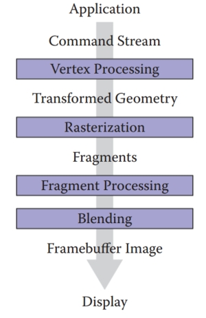
Figure 17.1. The basic graphics hardware pipeline consists of stages that transform 3D data into 2D screen objects ready for rasterizing and coloring by the pixel processing stages. 
图 17.1。 基本图形硬件管道由多个阶段组成，这些阶段将 3D 数据转换为 2D 屏幕对象，准备好由像素处理阶段进行光栅化和着色。

## 17.3 Heterogeneous Multiprocessing 异构多重处理

When using graphics hardware, it is convenient to distinguish between the CPU and the GPU as separate computational entities. In this context, the term host is used to refer to the CPU including the threads and memory available to it. The  term device is used to refer to the GPU, or the graphics processing units, and the threads and memory associated with it. This makes some sense because most graphics hardware is comprised of external hardware that is connected to the machine via the PCI bus. The hardware may also be soldered to the machine as a separate chipset. In this sense, the graphics hardware represents a specialized co-processor since both the CPU (and its cores) can be programmed, as can the GPU and its cores. All programs that utilize graphics hardware must first establish a mapping between the CPU and the GPU memory. This is a rather low-level detail that is necessary so that the graphics hardware driver residing within the operating system can interface between the hardware and the operating system and windowing system software. Recall that because the host (CPU) and the device (GPU) are separate, data must be communicated between the two systems. More formally, this mapping between the operating system, the hardware driver, the hardware, and the windowing system is known as the graphics context. The context is usually established through API calls to the windowing system. Details about establishing a context is outside the scope of this chapter, but many windowing system development libraries have ways to query the graphics hardware for various capabilities and establish the graphics context based on those requirements. Because setting up the context is windowing system dependent, it also means that such code is not likely to be cross-platform code. However, in practice, or at least when starting out, it is very unlikely that such low-level context setup code will be required since many higher level APIs exist to help people develop portable interactive applications. 
使用图形硬件时，可以方便地将 CPU 和 GPU 区分为单独的计算实体。 在这种情况下，术语主机用于指代 CPU，包括可用的线程和内存。 术语“设备”用于指代 GPU 或图形处理单元以及与其关联的线程和内存。 这是有道理的，因为大多数图形硬件都是由通过 PCI 总线连接到机器的外部硬件组成的。 硬件也可以作为单独的芯片组焊接到机器上。 从这个意义上说，图形硬件代表了一个专门的协处理器，因为 CPU（及其核心）都可以编程，GPU 及其核心也可以编程。 所有使用图形硬件的程序都必须首先在CPU和GPU内存之间建立映射。 这是一个相当低级的细节，它是必要的，以便驻留在操作系统内的图形硬件驱动程序可以在硬件与操作系统和窗口系统软件之间进行接口。 回想一下，由于主机（CPU）和设备（GPU）是分开的，因此数据必须在两个系统之间进行通信。 更正式地说，操作系统、硬件驱动程序、硬件和窗口系统之间的映射称为图形上下文。 上下文通常是通过对窗口系统的 API 调用来建立的。 有关建立上下文的详细信息超出了本章的范围，但许多窗口系统开发库都有方法查询图形硬件的各种功能，并根据这些要求建立图形上下文。 由于设置上下文依赖于窗口系统，因此这也意味着此类代码不太可能是跨平台代码。 然而，在实践中，或者至少在开始时，不太可能需要这种低级上下文设置代码，因为存在许多更高级别的 API 来帮助人们开发便携式交互式应用程序。

> Host: In a graphics hardware program, the host refers to the CPU components of the application.
> 主机：在图形硬件程序中，主机指的是应用程序的CPU组件。
>
> Device: The GPU side of the graphics application, including the data and computation that are stored and executed on the GPU.
> 设备：图形应用程序的GPU端，包括在GPU上存储和执行的数据和计算。

Many of the frameworks for developing interactive applications support querying input devices such as the keyboard or mouse. Some frameworks provide access to the network, audio system, and other higher level system resources. In this regard, many of these APIs are the preferred way to develop graphics, and even game applications. 
许多用于开发交互式应用程序的框架都支持查询输入设备，例如键盘或鼠标。 一些框架提供对网络、音频系统和其他更高级别系统资源的访问。 在这方面，许多 API 是开发图形甚至游戏应用程序的首选方式。

Cross-platform hardware acceleration is often achieved with the OpenGL API. OpenGL is an open industry standard graphics API that supports hardware acceleration on many types of graphics hardware. OpenGL represents one of the most common APIs for programming graphics hardware along with APIs such as DirectX. While OpenGL is available on many operating systems and hardware architectures, DirectX is specific to Microsoft-based systems. For the purposes of this chapter, hardware programming concepts and examples will be presented with OpenGL.
跨平台硬件加速通常通过 OpenGL API 来实现。 OpenGL 是一种开放式行业标准图形 API，支持多种图形硬件上的硬件加速。 OpenGL 与 DirectX 等 API 一样，是图形硬件编程最常见的 API 之一。 虽然 OpenGL 可在许多操作系统和硬件架构上使用，但 DirectX 特定于基于 Microsoft 的系统。 为了本章的目的，将使用 OpenGL 来介绍硬件编程概念和示例。

### 17.3.1 Programming with OpenGL  使用 OpenGL 编程

When you program with the OpenGL API, you are writing code for at least two processors: the CPU(s) and the GPU(s). OpenGL is implemented in a C-style API and all functions are prefixed with “gl” to indicate their inclusion with OpenGL. OpenGL function calls change the state of the graphics hardware and can be used to declare and define geometry, load vertex and fragment shaders, and determine how computation will occur as data passes through the hardware. 
当您使用 OpenGL API 进行编程时，您正在为至少两个处理器编写代码：CPU 和 GPU。 OpenGL 以 C 风格的 API 实现，所有函数都以“gl”为前缀，以表明它们包含在 OpenGL 中。 OpenGL 函数调用会更改图形硬件的状态，可用于声明和定义几何图形、加载顶点和片段着色器，以及确定数据通过硬件时如何进行计算。

The variant of OpenGL that this chapter presents is the OpenGL 3.3 Core Profile version. While not the most recent version of OpenGL, the 3.3 version of OpenGL is in line with the future direction of OpenGL programming. These versions are focused on improving efficiency while also fully placing the programming of the pipeline within the hands of the developer. Many of the function calls present in earlier versions of OpenGL are not present in these newer APIs. For instance, immediate mode rendering is deprecated. Immediate mode rendering was used to send data from the CPU memory to the graphics card memory as needed each frame and was often very inefficient, especially for larger models and complex scenes. The current API focuses on storing data on the graphics card before it is needed and instancing it at render time. As another example, OpenGL’s matrix stacks have been deprecated as well, leaving the developer to use third-party matrix libraries (such as GLM) or their own classes to create the necessary matrices for viewing, projection, and transformation, as presented in Chapter 7. As a result, OpenGL’s shader language (GLSL) has taken on larger roles as well, performing the necessary matrix transformations along with lighting and shading within the shaders. Because the fixed-function pipeline which performed per-vertex transformation and lighting is no longer present, programmers must develop all shaders themselves. The shading examples presented in this chapter will utilize the GLSL 3.3 Core Profile version shader specification. Future readers of this chapter will want to explore the current OpenGL and OpenGL Shading Language specifications for additional details on what these APIs and languages can support.
本章介绍的 OpenGL 变体是 OpenGL 3.3 Core Profile 版本。 虽然不是最新版本的 OpenGL，但 OpenGL 3.3 版本符合 OpenGL 编程的未来方向。 这些版本专注于提高效率，同时将管道的编程完全交给开发人员。 早期版本的 OpenGL 中存在的许多函数调用在这些较新的 API 中并不存在。 例如，立即模式渲染已被弃用。 立即模式渲染用于根据需要每帧将数据从 CPU 内存发送到显卡内存，效率通常非常低，特别是对于较大的模型和复杂的场景。 当前的 API 侧重于在需要数据之前将数据存储在显卡上，并在渲染时实例化它。 另一个例子，OpenGL 的矩阵堆栈也已被弃用，开发人员只能使用第三方矩阵库（例如 GLM）或他们自己的类来创建查看、投影和转换所需的矩阵，如第 7 章中所述 因此，OpenGL 的着色器语言 (GLSL) 也发挥了更大的作用，在着色器内执行必要的矩阵转换以及照明和着色。 由于执行逐顶点变换和光照的固定功能管道不再存在，因此程序员必须自己开发所有着色器。 本章中介绍的着色示例将利用 GLSL 3.3 Core Profile 版本着色器规范。 本章的未来读者将希望探索当前的 OpenGL 和 OpenGL 着色语言规范，以获取有关这些 API 和语言可以支持的更多详细信息。

## 17.4 Graphics Hardware Programming: Buffers, State, and Shaders 图形硬件编程：缓冲区、状态和着色器

Three concepts will help to understand contemporary graphics hardware programming. The first is the notion of a data buffer, which is quite simply, a linear allocation of memory on the device that can store various data on which the GPUs will operate. The second is the idea that the graphics card maintains a computational state that determines how computations associated with scene data and shaders will occur on the graphics hardware. Moreover, state can be communicated from the host to the device and even within the device between shaders. Shaders represent the mechanism by which computation occurs on the GPU related to per-vertex or per-fragment processing. This chapter will focus on vertex and fragment shaders, but specialized geometry and compute shaders also exist in the current versions of OpenGL. Shaders play a very important role in how modern graphics hardware functions. 
三个概念将有助于理解当代图形硬件编程。 第一个是数据缓冲区的概念，它非常简单，是设备上内存的线性分配，可以存储 GPU 将操作的各种数据。 第二个想法是，显卡维护一种计算状态，该状态确定与场景数据和着色器相关的计算如何在图形硬件上发生。 此外，状态可以从主机传送到设备，甚至可以在设备内部的着色器之间传送。 着色器代表在 GPU 上进行与每顶点或每片段处理相关的计算的机制。 本章将重点介绍顶点和片段着色器，但当前版本的 OpenGL 中也存在专门的几何和计算着色器。 着色器在现代图形硬件的功能中发挥着非常重要的作用。

### 17.4.1 Buffers  缓冲区

Buffers are the primary structure to store data on graphics hardware. They represent the graphics hardware’s internal memory associated with everything from geometry, textures, and image plane data. With regard to the rasterization pipeline described in Chapter 8, the computations associated with hardware-accelerated rasterization read and write the various buffers on the GPU. From a programming standpoint, an application must initialize the buffers on the GPU that are needed for the application. This amounts to a host to device copy operation. At the end of various stages of execution, device to host copies can be performed as well to pull data from the GPU to the CPU memory. Additionally, mechanisms do exist in OpenGL’s API that allow device memory to be mapped into host memory so that an application program can write directly to the buffers on the graphics card. 
缓冲区是图形硬件上存储数据的主要结构。 它们代表与几何、纹理和图像平面数据等所有内容相关的图形硬件的内部存储器。 关于第 8 章中描述的光栅化管道，与硬件加速光栅化相关的计算读取和写入 GPU 上的各种缓冲区。 从编程的角度来看，应用程序必须初始化 GPU 上应用程序所需的缓冲区。 这相当于主机到设备的复制操作。 在各个执行阶段结束时，还可以执行设备到主机的复制，以将数据从 GPU 提取到 CPU 内存。 此外，OpenGL 的 API 中确实存在允许将设备内存映射到主机内存的机制，以便应用程序可以直接写入显卡上的缓冲区。

### 17.4.2 Display Buffer 显示缓冲区

In the graphics pipeline, the final set of pixel colors can be linked to the display, or they may be written to disk as a PNG image. The data associated with these pixels is generally a 2D array of color values. The data is inherently 2D, but it is efficiently represented on the GPU as a 1D linear array of memory. This array implements the display buffer, which eventually gets mapped to the window. Rendering images involves communicating the changes to the display buffer on the graphics hardware through the graphics API. At the end of the rasterization pipeline, the fragment processing and blending stages write data to the output display buffer memory. Meanwhile, the windowing system reads the contents of the display buffer to produce the raster images on the monitor’s window. 
在图形管道中，最终的像素颜色集可以链接到显示器，也可以作为 PNG 图像写入磁盘。 与这些像素相关的数据通常是颜色值的二维数组。 数据本质上是 2D 的，但它在 GPU 上有效地表示为 1D 线性内存阵列。 该数组实现了显示缓冲区，最终映射到窗口。 渲染图像涉及通过图形 API 将更改传达到图形硬件上的显示缓冲区。 在光栅化管道的末尾，片段处理和混合阶段将数据写入输出显示缓冲存储器。 同时，窗口系统读取显示缓冲区的内容，以在监视器窗口上生成光栅图像。

### 17.4.3 Cycle of Refresh  刷新周期

Most applications prefer a double-buffered display state. What this means is that there are two buffers associated with a graphics window: the front buffer and the back buffer. The purpose of the double-buffered system is that the application can communicate changes to the back buffer (and thus, write changes to that buffer) while the front-buffer memory is used to drive the pixel colors on the window. 
大多数应用程序更喜欢双缓冲显示状态。 这意味着有两个缓冲区与图形窗口关联：前缓冲区和后缓冲区。 双缓冲系统的目的是应用程序可以将更改传达到后台缓冲区（从而将更改写入该缓冲区），同时前端缓冲区内存用于驱动窗口上的像素颜色。

At the end of the rendering loop, the buffers are swapped through a pointer exchange. The front-buffer pointer points to the back buffer and the back-buffer pointer is then assigned to the previous front buffer. In this way, the windowing system will refresh the content of the window with the most up-to-date buffer. If the buffer pointer swap is synchronized with the windowing system’s refresh of the entire display, the rendering will appear seamless. Otherwise, users may observe a tearing of the geometry on the actual display as changes to the scene’s geometry and fragments are processed (and thus written to the display buffer) faster than the screen is refreshed.
在渲染循环结束时，通过指针交换来交换缓冲区。 前缓冲区指针指向后缓冲区，然后将后缓冲区指针分配给前一个前缓冲区。 这样，窗口系统就会用最新的缓冲区刷新窗口的内容。 如果缓冲区指针交换与窗口系统对整个显示的刷新同步，则渲染将显得无缝。 否则，用户可能会在实际显示器上观察到几何图形的撕裂，因为场景几何图形和片段的更改处理（并因此写入显示缓冲区）的速度比刷新屏幕的速度更快。

When the display is considered a memory buffer, one of the simplest operations on the display is essentially a memory setting (or copying) operation that zeros-out, or clears the memory to a default state. For a graphics program, this likely means clearing the background of the window to a specific color. To clear the background color (to black) in an OpenGL application, the following code can be used:
当显示器被视为内存缓冲区时，显示器上最简单的操作之一本质上是内存设置（或复制）操作，该操作将内存清零或清除为默认状态。 对于图形程序，这可能意味着将窗口背景清除为特定颜色。 要在 OpenGL 应用程序中清除背景颜色（变为黑色），可以使用以下代码：

```glsl
glClearColor( 0.0f, 0.0f, 0.0f, 1.0f );
glClear( GL_COLOR_BUFFER_BIT );
```

The first three arguments for the glClearColor function represent the red, green, and blue color components, specified within the range [0, 1]. The fourth argument represents opacity, or alpha value, ranging from 0.0 being completely transparent to 1.0 being completely opaque. The alpha value is used to determine transparency through various fragment blending operations in the final stages of the pipeline. 
glClearColor 函数的前三个参数表示红色、绿色和蓝色分量，在 [0, 1] 范围内指定。 第四个参数表示不透明度或 alpha 值，范围从 0.0（完全透明）到 1.0（完全不透明）。 alpha 值用于通过管道最后阶段的各种片段混合操作来确定透明度。

This operation only clears the color buffer. In addition to the color buffer, specified by GL_COLOR_BUFFER_BIT, being cleared to black in this case, graphics hardware also uses a depth buffer to represent the distance that fragments are relative to the camera (you may recall the discussion of the z-buffer algorithm in Chapter 8). Clearing the depth buffer is necessary to ensure operation of the z-buffer algorithm and allow correct hidden surface removal to occur. Clearing the depth buffer can be achieved by or’ing two bit field values together, as follows:
此操作仅清除颜色缓冲区。 除了由 GL_COLOR_BUFFER_BIT 指定的颜色缓冲区（在这种情况下被清除为黑色）之外，图形硬件还使用深度缓冲区来表示片段相对于相机的距离（您可能还记得在 第 8 章）。 清除深度缓冲区对于确保 z 缓冲区算法的运行并允许正确删除隐藏表面是必要的。 清除深度缓冲区可以通过将两个位字段值进行“或”运算来实现，如下所示：

```glsl
glClear(GL_COLOR_BUFFER_BIT | GL_DEPTH_BUFFER_BIT);
```

Within a basic interactive graphics application, this step of clearing is normally the first operation performed before any geometry or fragments are processed. 
在基本的交互式图形应用程序中，此清除步骤通常是处理任何几何图形或片段之前执行的第一个操作。

## 17.5 State Machine  状态机

By illustrating the buffer-clearing operation for the display’s color and depth buffers, the idea of graphics hardware state is also introduced. The glClearColor function sets the default color values that are written to all the pixels within the color buffer when glClear is called. The clear call initializes the color component of the display buffer and can also reset the values of the depth buffer. If the clear color does not change within an application, the clear color need only be set once, and often this is done in the initialization of an OpenGL program. Each time that glClear is called it uses the previously set state of the clear color.
通过说明显示器颜色和深度缓冲区的缓冲区清除操作，还介绍了图形硬件状态的概念。 glClearColor 函数设置在调用 glClear 时写入颜色缓冲区内所有像素的默认颜色值。 清除调用会初始化显示缓冲区的颜色分量，还可以重置深度缓冲区的值。 如果透明颜色在应用程序内不改变，则仅需要设置一次透明颜色，并且通常这在OpenGL程序的初始化中完成。 每次调用 glClear 时，它都会使用先前设置的透明颜色状态。

Note also that the z-buffer algorithm state can be enabled and disabled as needed. The z-buffer algorithm is also known in OpenGL as the depth test. By enabling it, a fragment’s depth value will be compared to the depth value currently stored in the depth buffer prior to writing any fragment colors to the color buffer. Sometimes, the depth test is not necessary and could potentially slow down an application. Disabling the depth test will prevent the z-buffer computation and change the behavior of the executable. Enabling the z-buffer test with OpenGL is done as follows:
另请注意，可以根据需要启用和禁用 z 缓冲区算法状态。 z 缓冲区算法在 OpenGL 中也称为深度测试。 通过启用它，在将任何片段颜色写入颜色缓冲区之前，片段的深度值将与当前存储在深度缓冲区中的深度值进行比较。 有时，深度测试是不必要的，并且可能会减慢应用程序的速度。 禁用深度测试将阻止 z 缓冲区计算并更改可执行文件的行为。 使用 OpenGL 启用 z 缓冲区测试的方法如下：

```glsl
glEnable(GL_DEPTH_TEST);
glDepthFunc(GL_LESS);
```

The glEnable call turns on the depth test while the glDepthFunc call sets the mechanism for how the depth comparison is performed. In this case, the depth function is set to its default value of GL LESS to show that other state variables exist and can be modified. The converse of the glEnable calls are glDisable calls. 
glEnable 调用打开深度测试，而 glDepthFunc 调用设置如何执行深度比较的机制。 在这种情况下，深度函数设置为其默认值 GL LESS，以表明其他状态变量存在并且可以修改。 glEnable 调用的逆过程是 glDisable 调用。

The idea of state in OpenGL mimics the use of static variables in object-oriented classes. As needed, programmers enable, disable, and/or set the state of OpenGL variables that reside on the graphics card. These state then affect any succeeding computations on the hardware. In general, efficient OpenGL programs attempt to minimize state changes, enabling states that are needed, while disabling states that are not required for rendering. 
OpenGL 中的状态概念模仿了面向对象类中静态变量的使用。 根据需要，程序员启用、禁用和/或设置驻留在图形卡上的 OpenGL 变量的状态。 这些状态随后会影响硬件上的任何后续计算。 一般来说，高效的 OpenGL 程序会尝试最小化状态更改，启用所需的状态，同时禁用渲染不需要的状态。

## 17.6 Basic OpenGL Application Layout 基本 OpenGL 应用程序布局

A simple and basic OpenGL application has, at its heart, a display loop that is called either as fast as possible, or at a rate that coincides with the refresh rate of the monitor or display device. The example loop below uses the GLFW library, which supports OpenGL coding across multiple platforms.
一个简单且基本的 OpenGL 应用程序的核心是一个显示循环，该循环要么尽可能快地调用，要么以与监视器或显示设备的刷新率一致的速率调用。 下面的示例循环使用 GLFW 库，该库支持跨多个平台的 OpenGL 编码。

```glsl
while (!glfwWindowShouldClose(window)) {
{
    // OpenGL code is called here,
    // each time this loop is executed.
    glClear(GL_COLOR_BUFFER_BIT | GL_DEPTH_BUFFER_BIT);
    // Swap front and back buffers
    glfwSwapBuffers(window);
    // Poll for events
    glfwPollEvents();
    if (glfwGetKey( window, GLFW_KEY_ESCAPE ) == GLFW_PRESS)
		glfwSetWindowShouldClose(window, 1);
}
```

The glEnable call turns on the depth test while the glDepthFunc call sets the mechanism for how the depth comparison is performed. In this case, the depth function is set to its default value of GL LESS to show that other state variables exist and can be modified. The converse of the glEnable calls are glDisable calls. The idea of state in OpenGL mimics the use of static variables in objectoriented classes. As needed, programmers enable, disable, and/or set the state of OpenGL variables that reside on the graphics card. These state then affect any succeeding computations on the hardware. In general, efficient OpenGL programs attempt to minimize state changes, enabling states that are needed, while disabling states that are not required for rendering. 17.6 Basic OpenGL Application Layout A simple and basic OpenGL application has, at its heart, a display loop that is called either as fast as possible, or at a rate that coincides with the refresh rate of the monitor or display device. The example loop below uses the GLFW library, which supports OpenGL coding across multiple platforms.The loop is tightly constrained to operate only while the window is open. This example loop resets the color buffer values and also resets the z-buffer depth values in the graphics hardware memory based on previously set (or default) values. Input devices, such as keyboards, mouse, network, or some other interaction mechanism are processed at the end of the loop to change the state of data structures associated with the program. The call to glfwSwapBuffers synchronizes the graphics context with the display refresh, performing the pointer swap between the front and back buffers so that the updated graphics state is displayed on the user’s screen. The call to swap the buffers occurs after all graphics calls have been issued. 
glEnable 调用打开深度测试，而 glDepthFunc 调用设置如何执行深度比较的机制。 在这种情况下，深度函数设置为其默认值 GL LESS，以表明其他状态变量存在并且可以修改。 glEnable 调用的逆过程是 glDisable 调用。 OpenGL 中的状态概念模仿了面向对象类中静态变量的使用。 根据需要，程序员启用、禁用和/或设置驻留在图形卡上的 OpenGL 变量的状态。 这些状态随后会影响硬件上的任何后续计算。 一般来说，高效的 OpenGL 程序会尝试最小化状态更改，启用所需的状态，同时禁用渲染不需要的状态。 17.6 基本 OpenGL 应用程序布局 一个简单且基本的 OpenGL 应用程序的核心是一个显示循环，该循环要么尽可能快地调用，要么以与监视器或显示设备的刷新率一致的速率调用。 下面的示例循环使用 GLFW 库，该库支持跨多个平台的 OpenGL 编码。该循环严格限制为仅在窗口打开时运行。 此示例循环重置颜色缓冲区值，并根据先前设置（或默认）值重置图形硬件内存中的 z 缓冲区深度值。 输入设备（例如键盘、鼠标、网络或某些其他交互机制）在循环结束时进行处理，以更改与程序关联的数据结构的状态。 对 glfwSwapBuffers 的调用将图形上下文与显示刷新同步，在前后缓冲区之间执行指针交换，以便更新的图形状态显示在用户的屏幕上。 交换缓冲区的调用在所有图形调用发出后发生。

While conceptually separate, the depth and color buffers are often collectively called the framebuffer. By clearing the contents of the framebuffer, the application can proceed with additional OpenGL calls to push geometry and fragments through the graphics pipeline. The framebuffer is directly related to the size of the window that has been opened to contain the graphics context. The window, or viewport, dimensions are needed by OpenGL to construct the $M_{vp}$ matrix (from Chapter 7) within the hardware. This is accomplished through the following code, demonstrated again with the GLFW toolkit, which provides functions for querying the requested window (or framebuffer) dimensions:
虽然在概念上是分开的，但深度缓冲区和颜色缓冲区通常统称为帧缓冲区。 通过清除帧缓冲区的内容，应用程序可以继续执行其他 OpenGL 调用，以通过图形管道推送几何图形和片段。 帧缓冲区与已打开以包含图形上下文的窗口的大小直接相关。 OpenGL 需要窗口或视口尺寸来在硬件内构造 $M_{vp}$ 矩阵（来自第 7 章）。 这是通过以下代码完成的，再次使用 GLFW 工具包进行演示，该工具包提供了用于查询请求的窗口（或帧缓冲区）尺寸的函数：

```glsl
int nx, ny;
glfwGetFramebufferSize(window, &nx, &ny);
glViewport(0, 0, nx, ny);
```

In this example, glViewport sets the OpenGL state for the window dimension using nx and ny for the width and height of the window and the viewport being specified to start at the origin. 
在此示例中，glViewport 使用 nx 和 ny 作为窗口的宽度和高度以及指定从原点开始的视口来设置窗口尺寸的 OpenGL 状态。

Technically, OpenGL writes to the framebuffer memory as a result of operations that rasterize geometry, and process fragments. These writes happen before the pixels are displayed on the user’s monitor. 
从技术上讲，OpenGL 会通过光栅化几何和处理片段的操作来写入帧缓冲区内存。 这些写入发生在像素显示在用户显示器上之前。

## 17.7 Geometry  几何

Similar to the idea of a display buffer, geometry is also specified using arrays to store vertex data and other vertex attributes, such as vertex colors, normals, or texture coordinates needed for shading. The concept of buffers will be used to allocate storage on the graphics hardware, transferring data from the host to the device.
与显示缓冲区的想法类似，几何体也使用数组来指定，以存储顶点数据和其他顶点属性，例如着色所需的顶点颜色、法线或纹理坐标。 缓冲区的概念将用于在图形硬件上分配存储，将数据从主机传输到设备。

### 17.7.1 Describing Geometry for the Hardware 描述硬件的几何形状

One of the challenges with graphics hardware programming is the management of the 3D data and its transfer to and from the memory of the graphics hardware.  Most graphics hardware work with specific sets of geometric primitives. The different primitive types leverage primitive complexity for processing speed on the graphics hardware. Simpler primitives can sometimes be processed very fast. The caveat is that the primitive types need to be general purpose so as to model a wide range of geometry from very simple to very complex. On typical graphics hardware, the primitive types are limited to one or more of the following:
图形硬件编程的挑战之一是 3D 数据的管理及其与图形硬件内存之间的传输。 大多数图形硬件都使用特定的几何基元集。 不同的基元类型利用基元复杂性来提高图形硬件上的处理速度。 有时可以非常快地处理更简单的基元。 需要注意的是，原始类型必须是通用的，以便对从非常简单到非常复杂的各种几何形状进行建模。 在典型的图形硬件上，基元类型仅限于以下一种或多种：

> **Primitives**: The three primitives (points, lines, triangles, and quads) are really the only primitives available! Even when creating spline-based surfaces, such as NURBS, the surfaces are tessellated into triangle primitives by the graphics hardware.
> **图元**：三个图元（点、线、三角形和四边形）实际上是唯一可用的图元！ 即使在创建基于样条曲线的曲面（例如 NURBS）时，图形硬件也会将曲面细分为三角形图元。
>
> **Point Rendering**: Point and line primitives may initially appear to be limited in use, but researchers have used points to render very complex geometry (Rusinkiewicz & Levoy, 2000; Dachsbacher, Vogelgsang, & Stamminger, 2003).
> **点渲染**：点和线基元最初似乎在使用中受到限制，但研究人员已经使用点来渲染非常复杂的几何图形（Rusinkiewicz & Levoy，2000；Dachsbacher、Vogelgsang 和 Stamminger，2003）。

- points—single vertices used to represent points or particle systems;
  点——用于表示点或粒子系统的单个顶点；
- lines—pairs of vertices used to represent lines, silhouettes, or edge-highlighting; 
  线——用于表示线、轮廓或边缘突出显示的顶点对；
- triangles—triangles, triangle strips, indexed triangles, indexed triangle strips, quadrilaterals, or triangle meshes approximating geometric surfaces. 
  三角形——三角形、三角形带、索引三角形、索引三角形带、四边形或近似几何表面的三角形网格。

These three primitive types form the basic building blocks for most geometry that can be defined. An example of a triangle mesh rendered with OpenGL is shown in Figure 17.2.
这三种基本类型构成了大多数可定义几何图形的基本构建块。 使用 OpenGL 渲染的三角形网格的示例如图 17.2 所示。
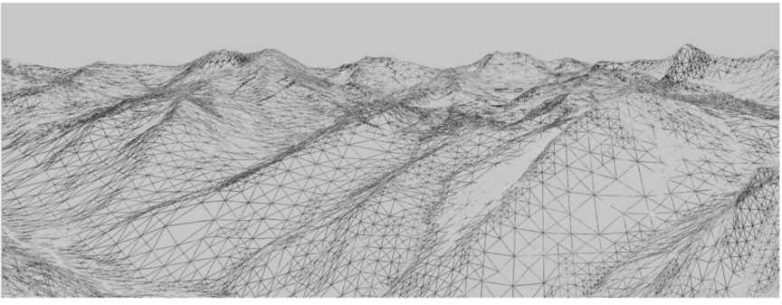
Figure 17.2. How your geometry is organized will affect the performance of your application. This wireframe depiction of the Little Cottonwood Canyon terrain dataset shows tens of thousands of triangles organized as a triangle mesh running at real-time rates. The image is rendered using the VTerrain Project terrain system courtesy of Ben Discoe.
图 17.2。 几何图形的组织方式将影响应用程序的性能。 小三叶杨峡谷地形数据集的线框描述显示了数以万计的三角形，这些三角形组织为以实时速率运行的三角形网格。 该图像是使用 Ben Discoe 提供的 VTerrain Project 地形系统渲染的。

## 17.8 A First Look at Shaders  初看着色器

Modern versions of OpenGL require that shaders be used to process vertices and fragments. As such, no primitives can be rendered without at least one vertex shader to process the incoming primitive vertices and another shader to process the rasterized fragments. Advanced shader types exist within OpenGL and the OpenGL Shading Language: geometry shaders and compute shaders. Geometry shaders are designed to process primitives, potentially creating additional primitives, and can support geometric instancing operations. Compute shaders are designed for performing general computation on the GPU, and can be linked into the set of shaders necessary for a specific application. For more information on geometry and compute shaders, the reader is referred the OpenGL specification documents and other resources. 
现代版本的 OpenGL 要求使用着色器来处理顶点和片段。 因此，如果没有至少一个顶点着色器来处理传入的图元顶点和另一着色器来处理光栅化片段，则无法渲染图元。 OpenGL 和 OpenGL 着色语言中存在高级着色器类型：几何着色器和计算着色器。 几何着色器设计用于处理图元，可能创建额外的图元，并且可以支持几何实例化操作。 计算着色器设计用于在 GPU 上执行一般计算，并且可以链接到特定应用程序所需的着色器集。 有关几何和计算着色器的更多信息，读者可以参考 OpenGL 规范文档和其他资源。

### 17.8.1 Vertex Shader Example  顶点着色器示例

Vertex shaders provide control over how vertices are transformed and often help prepare data for use in fragment shaders. In addition to standard transformations and potential per-vertex lighting operations, vertex shaders could be used to perform general computation on the GPU. For instance, if the vertices represent particles and the particle motion can be (simply) modeled within the vertex shader computations, the CPU can mostly be removed from performing those computations. The ability to perform computations on the vertices already stored in the graphics hardware memory is a potential performance gain. While this approach is useful in some situations, advanced general computation may be more appropriately coded with compute shaders. 
顶点着色器提供对顶点变换方式的控制，并且通常有助于准备在片段着色器中使用的数据。 除了标准转换和潜在的每顶点光照操作之外，顶点着色器还可用于在 GPU 上执行一般计算。 例如，如果顶点代表粒子，并且可以在顶点着色器计算中（简单地）对粒子运动进行建模，则 CPU 基本上可以免于执行这些计算。 对已存储在图形硬件内存中的顶点执行计算的能力是潜在的性能增益。 虽然这种方法在某些情况下很有用，但高级通用计算可能更适合使用计算着色器进行编码。

In Chapter 7, the viewport matrix $M_{vp}$ was introduced. It transforms the canonical view volume coordinates to screen coordinates. Within the canonical view volume, coordinates exist in the range of [−1, 1]. Anything outside of this range is clipped. If we make an initial assumption that the geometry exists within this range and the z-value is ignored, we can create a very simple vertex shader. This vertex shader passes the vertex positions through to the rasterization stage, where the final viewport transformation will occur. Note that because of this simplification, there are no projection, viewing, or model transforms that will be applied to the incoming vertices. This is initially cumbersome for creating anything except very simple scenes, but will help introduce the concepts of shaders and allow you to render an initial triangle to the screen. The passthrough vertex shader follows:
第7章介绍了视口矩阵$M_{vp}$。 它将规范视图体积坐标转换为屏幕坐标。 在规范视图体积内，坐标存在于[−1, 1]范围内。 任何超出此范围的内容都会被剪掉。 如果我们初步假设几何体存在于该范围内并且忽略 z 值，则我们可以创建一个非常简单的顶点着色器。 该顶点着色器将顶点位置传递到光栅化阶段，最终的视口转换将在该阶段发生。 请注意，由于这种简化，不会对传入顶点应用投影、查看或模型变换。 除了非常简单的场景之外，这对于创建任何东西来说最初都很麻烦，但将有助于介绍着色器的概念并允许您在屏幕上渲染初始三角形。 直通顶点着色器如下：

```glsl
#version 330 core
layout(location=0) in vec3 in_Position;
void main(void)
{
	gl_Position = vec4(in_Position, 1.0);
}
```

This vertex shader does only one thing. It passes the incoming vertex position out as the gl Position that OpenGL uses to rasterize fragments. Note that gl Position is a built-in, reserved variable that signifies one of the key outputs required from a vertex shader. Also note the version string in the first line. In this case, the string instructs the GLSL compiler that version 3.3 of the GLSL Core profile is to be used to compile the shading language. 
这个顶点着色器只做一件事。 它将传入的顶点位置作为 OpenGL 用于光栅化片段的 gl 位置传递出去。 请注意，gl Position 是一个内置的保留变量，表示顶点着色器所需的关键输出之一。 另请注意第一行中的版本字符串。 在本例中，该字符串指示 GLSL 编译器使用 3.3 版 GLSL Core 配置文件来编译着色语言。

Vertex and fragment shaders are SIMD operations that respectively operate on all the vertices or fragments being processed in the pipeline. Additional data can be communicated from the host to the shaders executing on the device by using input, output, or uniform variables. Data that is passed into a shader is prefixed with the keyword in. The location of that data as it relates to specific vertex attributes or fragment output indices is also specified directly in the shader. Thus,
顶点和片段着色器是 SIMD 操作，分别对管道中正在处理的所有顶点或片段进行操作。 通过使用输入、输出或统一变量，可以将附加数据从主机传送到在设备上执行的着色器。 传递到着色器的数据以关键字 in 为前缀。与特定顶点属性或片段输出索引相关的数据的位置也直接在着色器中指定。 因此，

```glsl
layout(location=0) in vec3 in_Position;
```

specifies that in Position is an input variable that is of type vec3. The source of that data is the attribute index 0 that is associated with the geometry. The name of this variable is determined by the programmer, and the link between the incoming geometry and the shader occurs while setting up the vertex data on the device. The GLSL contains a nice variety of types useful to graphics programs, including vec2, vec3, vec4, mat2, mat3, and mat4 to name a few. Standard types such as int or float also exist. In shader programming, vectors, such as vec4 hold 4-components corresponding to the x, y, z, and w components of a homogeneous coordinate, or the r, g, b, and a components of a RGBA tuple. The labels for the types can be interchanged as needed (and even repeated) in what is called swizzling (e.g., in Position.zyxa). Moreover, the component-wise labels are overloaded and can be used appropriately to provide context. 
指定 Position 是 vec3 类型的输入变量。 该数据的来源是与几何关联的属性索引 0。 该变量的名称由程序员确定，传入几何体和着色器之间的链接在设备上设置顶点数据时发生。 GLSL 包含多种对图形程序有用的类型，包括 vec2、vec3、vec4、mat2、mat3 和 mat4 等。 也存在标准类型，例如 int 或 float。 在着色器编程中，向量（例如 vec4）保存 4 个分量，对应于齐次坐标的 x、y、z 和 w 分量，或 RGBA 元组的 r、g、b 和 a 分量。 类型的标签可以根据需要在所谓的 swizzling 中互换（甚至重复）（例如，在 Position.zyxa 中）。 此外，组件级标签超载，可以适当地使用来提供上下文。

All shaders must have a main function that performs the primary computation across all inputs. In this example, the main function simply copies the input vertex position (in Position), which is of type vec3 into the built-in vertex shader output variable, which is of type vec4. Note that many of the built-in types have constructors that are useful for conversions such as the one presented here to convert the incoming vertex position’s vec3 type into gl Position’s vec4 type. Homogeneous coordinates are used with OpenGL, so 1.0 is specified as the fourth coordinate to indicate that the vector is a position.
所有着色器都必须有一个主函数，用于对所有输入执行主要计算。 在此示例中，主函数只是将 vec3 类型的输入顶点位置（在 Position 中）复制到 vec4 类型的内置顶点着色器输出变量中。 请注意，许多内置类型都具有可用于转换的构造函数，例如此处提供的构造函数，用于将传入顶点位置的 vec3 类型转换为 gl Position 的 vec4 类型。 OpenGL 使用齐次坐标，因此将 1.0 指定为第四个坐标以指示该向量是一个位置。

### 17.8.2 Fragment Shader Example  片段着色器示例

If the simplest vertex shader simply passes clip coordinates through, the simplest fragment shader sets the color of the fragment to a constant value.  
如果最简单的顶点着色器只是传递剪辑坐标，那么最简单的片段着色器将片段的颜色设置为常量值。

```glsl
#version 330 core
layout(location=0) out vec4 out_FragmentColor;
void main(void)
{
	out_FragmentColor = vec4(0.49, 0.87, 0.59, 1.0);
}
```

In this example, all fragments will be set to a light shade of green. One key difference is the use of the out keyword. In general, the keywords in and out in shader programs indicate the flow of data into, and out of, shaders. While the vertex shader received incoming vertices and output them to a built-in variable, the fragment shader declares its outgoing value which is written out to the color buffer:
在此示例中，所有片段都将设置为浅绿色阴影。 一个关键的区别是 out 关键字的使用。 一般来说，着色器程序中的关键字 in 和 out 表示数据流入和流出着色器的流程。 当顶点着色器接收传入顶点并将它们输出到内置变量时，片段着色器声明其输出值，该值被写出到颜色缓冲区：

```glsl
layout(location=0) out vec4 out_FragmentColor;
```

The output variable out FragmentColor is again user defined. The location of the output is color buffer index 0. Fragment shaders can output to multiple buffers, but this is an advanced topic left to the reader that will be needed if OpenGL’s framebuffer objects are investigated. The use of the layout and location keywords makes an explicit connection between the application’s geometric data in the vertex shader and the output color buffers in the fragment shader. 
输出变量 FragmentColor 再次由用户定义。 输出的位置是颜色缓冲区索引 0。片段着色器可以输出到多个缓冲区，但这是一个留给读者的高级主题，如果研究 OpenGL 的帧缓冲区对象，则将需要该主题。 使用布局和位置关键字在顶点着色器中应用程序的几何数据与片段着色器中的输出颜色缓冲区之间建立了显式连接。

### 17.8.3 Loading, Compiling, and Using Shaders  加载、编译和使用着色器

Shader programs are transferred onto the graphics hardware in the form of character strings. They must then be compiled and linked. Furthermore, shaders are coupled together into shader programs so that vertex and fragment processing occur in a consistent manner. A developer can activate a shader that has been successfully compiled and linked into a shader program as needed, while also deactivating shaders when not required. While the detailed process of creating, loading, compiling, and linking shader programs is not provided in this chapter, the following OpenGL functions will be helpful in creating shaders: 
着色器程序以字符串的形式传输到图形硬件上。 然后必须对它们进行编译和链接。 此外，着色器被耦合到着色器程序中，以便顶点和片段处理以一致的方式进行。 开发人员可以根据需要激活已成功编译并链接到着色器程序中的着色器，同时也可以在不需要时停用着色器。 虽然本章没有提供创建、加载、编译和链接着色器程序的详细过程，但以下 OpenGL 函数将有助于创建着色器：

- glCreateShader creates a handle to a shader on the hardware. 
  glCreateShader 在硬件上创建着色器的句柄。
- glShaderSourceloads the character strings into the graphics hardware memory. 
  glShaderSource 将字符串加载到图形硬件内存中。
- glCompileShader performs the actual compilation of the shader within the hardware. 
  glCompileShader 在硬件内执行着色器的实际编译。

The functions above need to be called for each shader. So, for the simple passthrough shaders, each of those functions would be called for both the vertex shader code and the fragment shader code provided. At the end of the compilation phase, compilation status and any errors can be queried using additional OpenGL commands. 
每个着色器都需要调用上述函数。 因此，对于简单的直通着色器，将为所提供的顶点着色器代码和片段着色器代码调用每个函数。 在编译阶段结束时，可以使用其他 OpenGL 命令查询编译状态和任何错误。

After both shader codes are loaded and compiled, they can be linked into a shader program. The shader program is what is used to affect rendering of geometry. 
加载并编译两个着色器代码后，可以将它们链接到着色器程序中。 着色器程序用于影响几何体的渲染。

- glCreateProgram creates a program object that will contain the previously compiled shaders. 
  glCreateProgram 创建一个程序对象，其中将包含先前编译的着色器。
- glAttachShader attaches a shader to the shader program object. In the simple example, this function will be called for both the compiled vertex shader and the compiled fragment shader objects. 
  glAttachShader 将着色器附加到着色器程序对象。 在简单的示例中，将为编译的顶点着色器和编译的片段着色器对象调用此函数。
- glLinkProgram links the shaders internally after all shaders have been attached to the program object. 
  glLinkProgram 在所有着色器附加到程序对象后在内部链接着色器。
- glUseProgram binds the shader program for use on the graphics hardware. As shaders are needed, the program handles are bound using this function. When no shaders are needed, they can be unbound by using the shader program handle 0 as an argument to this function.
  glUseProgram 绑定着色器程序以在图形硬件上使用。 由于需要着色器，因此使用此函数绑定程序句柄。 当不需要着色器时，可以通过使用着色器程序句柄 0 作为此函数的参数来取消绑定它们。

## 17.9 Vertex Buffer Objects 顶点缓冲区对象

Vertices are stored on the graphics hardware using buffers, known as vertex buffer objects. In addition to vertices, any additional vertex attributes, such as colors, normal vectors, or texture coordinates, will also be specified using vertex buffer objects.
顶点使用缓冲区（称为顶点缓冲区对象）存储在图形硬件上。 除了顶点之外，任何其他顶点属性（例如颜色、法向量或纹理坐标）也将使用顶点缓冲区对象来指定。

First, let’s focus on specifying the geometric primitive themselves. This starts by allocating the vertices associated with the primitive within the host memory of the application. The most general way to do this is to define an array on the host to contain the vertices needed for the primitive. For instance, a single triangle, fully contained within the canonical volume, could be defined statically on the host as follows:
首先，让我们重点关注指定几何图元本身。 首先在应用程序的主机内存中分配与图元关联的顶点。 最通用的方法是在主机上定义一个数组来包含图元所需的顶点。 例如，完全包含在规范体积内的单个三角形可以在主机上静态定义，如下所示：

```glsl
GLfloat vertices[] = {-0.5f, -0.5f, 0.0f, 0.5f, -0.5f, 0.0f, 0.0f, 0.5f, 0.0f};
```

If the simple passthrough shaders are used for this triangle, then all vertices will be rendered. Although the triangle is placed on the z = 0 plane, the z coordinates for this example do not really matter since they are essentially dropped in the final transformation into screen coordinates. Another thing to note is the use of the type GLfloat in these examples. Just as the GLSL language has specialized types, OpenGL has related type which generally can intermix well with the standard types (like float). For preciseness, the OpenGL types will be used when necessary. 
如果对这个三角形使用简单的直通着色器，则将渲染所有顶点。 尽管三角形放置在 z = 0 平面上，但此示例中的 z 坐标并不重要，因为它们在最终转换为屏幕坐标时实质上已被丢弃。 另一件需要注意的事情是这些示例中使用了 GLfloat 类型。 正如 GLSL 语言有专门的类型一样，OpenGL 也有相关的类型，通常可以与标准类型（如浮点数）很好地混合。 为了精确起见，必要时将使用 OpenGL 类型。

> OpenGL Coordinate System: The coordinate system used by OpenGL is identical to that presented in this book. It is a right-handed coordinate system with +x to the right, +y up, and +z away from the screen (or window). Thus, –z points into the monitor.
> OpenGL 坐标系：OpenGL 使用的坐标系与本书中介绍的坐标系相同。 它是一个右手坐标系，+x 向右，+y 向上，+z 远离屏幕（或窗口）。 因此，-z 指向监视器。

Before the vertices can be processed, a vertex buffer is first created on the device to store the vertices. The vertices on the host are then transferred to the device. After this, the vertex buffer can be referenced as needed to draw the array of vertices stored in the buffer. Moreover, after the initial transfer of vertex data, no additional copying of data across the host to device bus need occur, especially if the geometry remains static across rendering loop updates. Any host memory can also be deleted if it was dynamically allocated. 
在处理顶点之前，首先在设备上创建顶点缓冲区来存储顶点。 然后主机上的顶点被传输到设备上。 此后，可以根据需要引用顶点缓冲区来绘制缓冲区中存储的顶点数组。 此外，在初始传输顶点数据之后，不需要从主机到设备总线进行额外的数据复制，特别是如果几何图形在渲染循环更新期间保持静态。 如果是动态分配的任何主机内存也可以被删除。

Vertex buffer objects, often called VBOs, represent the primary mechanism with modern OpenGL to store vertex and vertex attributes in the graphics memory. For efficiency purposes, the initial setup of a VBO and the transfer of vertex-related data mostly happens prior to entering the display loop. As an example, to create a VBO for this triangle, the following code could be used:
顶点缓冲区对象（通常称为 VBO）代表现代 OpenGL 在图形内存中存储顶点和顶点属性的主要机制。 出于效率目的，VBO 的初始设置和顶点相关数据的传输大多发生在进入显示循环之前。 例如，要为该三角形创建 VBO，可以使用以下代码：

```glsl
GLuint triangleVBO[1];
glGenBuffers(1, triangleVBO);
glBindBuffer(GL_ARRAY_BUFFER, triangleVBO[0]);
glBufferData(GL_ARRAY_BUFFER, 9 * sizeof(GLfloat), vertices, GL_STATIC_DRAW);
glBindBuffer(GL_ARRAY_BUFFER, 0);
```

Three OpenGL calls are required to create and allocate the vertex buffer object. The first, glGenBuffers creates a handle that can be used to refer to the VBO once it is stored on the device. Multiple handles to VBOs (stored in arrays) can be created in a single glGenBuffers call, as illustrated but not utilized here. Note that when a buffer object is generated, the actual allocation of space on the device is not yet performed. 
创建和分配顶点缓冲区对象需要三个 OpenGL 调用。 第一个，glGenBuffers 创建一个句柄，一旦 VBO 存储在设备上，就可以使用该句柄来引用它。 可以在单个 glGenBuffers 调用中创建 VBO 的多个句柄（存储在数组中），如图所示，但此处未使用。 请注意，当生成缓冲区对象时，设备上的实际空间分配尚未执行。

With OpenGL, objects, such as vertex buffer objects, are primary targets for computation and processing. Objects must be bound to a known OpenGL state when used and unbound when not in use. Examples of OpenGL’s use of objects include the vertex buffer objects, framebuffer objects, texture objects, and shader programs, to name a few. In the current example, the GL ARRAY BUFFER state of OpenGL is bound to the triangle VBO handle that was generated previously. This essentially makes the triangle VBO the active vertex buffer object. Any operations that affect vertex buffers that follow the glBindBuffer(GL ARRAY BUFFER, triangleVBO[0]) command will use the triangle data in the VBO either by reading the data or writing to it. 
对于 OpenGL，对象（例如顶点缓冲区对象）是计算和处理的主要目标。 对象在使用时必须绑定到已知的 OpenGL 状态，在不使用时必须解除绑定。 OpenGL 使用对象的示例包括顶点缓冲区对象、帧缓冲区对象、纹理对象和着色器程序等。 在当前示例中，OpenGL的GL ARRAY BUFFER状态绑定到之前生成的三角形VBO句柄。 这实质上使三角形 VBO 成为活动顶点缓冲区对象。 任何影响 glBindBuffer(GL ARRAY BUFFER,triangleVBO[0]) 命令之后的顶点缓冲区的操作都将通过读取数据或写入数据来使用 VBO 中的三角形数据。

Vertex data is copied from the host (the vertices array) to the device (currently bound GL ARRAY BUFFER) using the
使用以下命令将顶点数据从主机（顶点数组）复制到设备（当前绑定的 GL ARRAY BUFFER）

```glsl
glBufferData(GL_ARRAY_BUFFER, 9 * sizeof(GLfloat), vertices, GL_STATIC_DRAW);
```

call. The arguments represent the type of target, the size in bytes of the buffer to be copied, the pointer to the host buffer, and an enumerated type that indicates how the buffer will be used. In the current example, the target is GL_ARRAY_BUFFER, the size of the data is 9∗ sizeof(GLfloat), and the last argument is GL STATIC DRAW indicating to OpenGL that the vertices will not change over the course of the rendering. Finally, when the VBO no longer needs to be an active target for reading or writing, it is unbound with the glBindBuffer(GL_ARRAY_BUFFER, 0) call. In general, binding any of OpenGL’s objects or buffers to handle 0, unbinds, or disables that buffer from affecting subsequent functionality. 17.10 Vertex Array Objects While vertex buffer objects are the storage containers for vertices (and vertex attributes), vertex array objects represent OpenGL’s mechanism to bundle vertex buffers together into a consistent vertex state that can be communicated and linked with shaders in the graphics hardware. Recall that the fixed function pipeline of the past no longer exists and therefore, per-vertex state, such as normals or even vertex colors, must be stored in hardware buffers and then referenced in shaders, using input variables (e.g., in). As with vertex buffer objects, vertex array objects, or VAOs, must be created and allocated with any necessary state being set while the vertex array object is bound. For instance, the following code shows how to create a VAO to contain the triangle VBO previously defined:
调用。 参数表示目标的类型、要复制的缓冲区的大小（以字节为单位）、指向主机缓冲区的指针以及指示如何使用缓冲区的枚举类型。 在当前示例中，目标是 GL_ARRAY_BUFFER，数据大小是 9* sizeof(GLfloat)，最后一个参数是 GL STATIC DRAW，向 OpenGL 指示顶点在渲染过程中不会改变。 最后，当 VBO 不再需要成为读取或写入的活动目标时，它会通过 glBindBuffer(GL_ARRAY_BUFFER, 0) 调用解除绑定。 一般来说，将任何 OpenGL 对象或缓冲区绑定到句柄 0、解除绑定或禁用该缓冲区影响后续功能。 17.10 顶点数组对象 虽然顶点缓冲区对象是顶点（和顶点属性）的存储容器，但顶点数组对象代表 OpenGL 将顶点缓冲区捆绑在一起形成一致的顶点状态的机制，该状态可以与图形硬件中的着色器进行通信和链接。 回想一下，过去的固定功能管道不再存在，因此，每个顶点状态（例如法线甚至顶点颜色）必须存储在硬件缓冲区中，然后使用输入变量（例如 in）在着色器中引用。 与顶点缓冲区对象一样，顶点数组对象或 VAO 必须在绑定顶点数组对象时创建和分配，并设置任何必要的状态。 例如，以下代码显示如何创建一个 VAO 来包含先前定义的三角形 VBO：

```glsl
GLuint VAO;
glGenVertexArrays(1, &VAO);
glBindVertexArray(VAO);
glEnableVertexAttribArray(0);
glBindBuffer(GL_ARRAY_BUFFER, triangleVBO[0]);
glVertexAttribPointer(0, 3, GL_FLOAT, GL_FALSE, 3 * sizeof(GLfloat), 0);
glBindVertexArray(0);
```

When defining a vertex array object, specific vertex buffer objects can be bound to specific vertex attributes (or inputs) in shader code. Recall the use of
定义顶点数组对象时，可以将特定顶点缓冲区对象绑定到着色器代码中的特定顶点属性（或输入）。 回想一下使用

```glsl
layout(location=0) in vec3 in_Position 
```

in the passthrough vertex shader. This syntax indicate that the shader variable will receive its data from attribute index 0 in the bound vertex array object. In host code, the mapping is created using the 
在直通顶点着色器中。 此语法指示着色器变量将从绑定顶点数组对象中的属性索引 0 接收其数据。 在主机代码中，映射是使用以下命令创建的

```glsl
glEnableVertexAttribArray(0); 
glBindBuffer(GL_ARRAY_BUFFER, triangleVBO[0]); 
glVertexAttribPointer(0, 3, GL_FLOAT, GL_FALSE, 3 * sizeof(GLfloat), 0); 
```

calls. The first call enables the vertex attribute index (in this case, 0). The next two calls connect the previously defined vertex buffer object that holds the vertices to the vertex attribute itself. Because glVertexAttribPointer utilizes the currently bound VBO, it is important that the glBindBuffer is issued before assigning the vertex attribute pointer. These function calls create a mapping that binds the vertices in our vertex buffer to the in Position variable within the vertex shader. The glVertexAttribPointer calls seems complicated but it basically sets attribute index 0 to hold three components (e.g., x, y, z) of GLfloats (the 2nd and 3rd arguments) that are not normalized (the fourth argument). The fifth argument instructs OpenGL that three float values separate the starts of each vertex set. In other words, the vertices are tightly packed in the memory, one after the other. The final argument is a pointer to the data, but because a vertex buffer has been bound prior to this call, the data will be associated with the vertex buffer. 
调用。 第一个调用启用顶点属性索引（在本例中为 0）。 接下来的两个调用将先前定义的保存顶点的顶点缓冲区对象连接到顶点属性本身。 由于 glVertexAttribPointer 使用当前绑定的 VBO，因此在分配顶点属性指针之前发出 glBindBuffer 非常重要。 这些函数调用创建一个映射，将顶点缓冲区中的顶点绑定到顶点着色器中的 in Position 变量。 glVertexAttribPointer 调用看起来很复杂，但它基本上设置属性索引 0 来保存未标准化（第四个参数）的 GLfloats（第二个和第三个参数）的三个组件（例如，x、y、z）。 第五个参数指示 OpenGL 用三个浮点值分隔每个顶点集的起点。 换句话说，顶点一个接一个地紧密地排列在内存中。 最后一个参数是指向数据的指针，但由于在此调用之前已绑定顶点缓冲区，因此数据将与顶点缓冲区关联。

The previous steps that initialize and construct the vertex array object, the vertex buffer objects, and the shaders should all be executed prior to entering the display loop. All memory from the vertex buffer will have been transferred to the GPU and the vertex array objects will make the connection between the data and shader input variable indexes. In the display loop, the following calls will trigger the processing of the vertex array object: 
前面初始化和构造顶点数组对象、顶点缓冲区对象和着色器的步骤都应该在进入显示循环之前执行。 顶点缓冲区中的所有内存都将被传输到 GPU，并且顶点数组对象将在数据和着色器输入变量索引之间建立连接。 在显示循环中，以下调用将触发顶点数组对象的处理：

```glsl
glBindVertexArray(VAO); 
glDrawArrays(GL_TRIANGLES, 0, 3); 
glBindVertexArray(0);
```

Note again, that a bind call makes the vertex array object active. The call to glDrawArrays initiates the pipeline for this geometry, describing that the geometry should be interpreted as a series of triangle primitives starting at offset 0 and only rendering three of the indices. In this example, there are only three elements in the array and the primitive is a triangle, so a single triangle will be rendered. Figure 17.3. The canonical triangle rendered using the simple vertex and fragment shaders. 
再次注意，绑定调用会使顶点数组对象处于活动状态。 对 glDrawArrays 的调用启动了该几何图形的管道，描述了该几何图形应被解释为一系列从偏移量 0 开始并且仅渲染三个索引的三角形图元。 在此示例中，数组中只有三个元素，并且基元是三角形，因此将渲染单个三角形。 图 17.3。 使用简单的顶点和片段着色器渲染的规范三角形。

Combining all of these steps, the assembled code for the triangle would resemble the following, assuming that shader and vertex data loading are contained in external functions:
结合所有这些步骤，三角形的汇编代码将类似于以下内容，假设着色器和顶点数据加载包含在外部函数中：

```glsl
// Set the viewport once
int nx, ny;
glfwGetFramebufferSize(window, &nx, &ny);
glViewport(0, 0, nx, ny);
// Set clear color state
glClearColor( 0.0f, 0.0f, 0.0f, 1.0f );
// Create the Shader programs, VBO, and VAO
GLuint shaderID = loadPassthroughShader();
GLuint VAO = loadVertexData();
while (!glfwWindowShouldClose(window)) {
{
    glClear(GL_COLOR_BUFFER_BIT | GL_DEPTH_BUFFER_BIT);
    glUseProgram( shaderID );
    glBindVertexArray(VAO);
    glDrawArrays(GL_TRIANGLES, 0, 3);
    glBindVertexArray(0);
    glUseProgram( 0 );
    // Swap front and back buffers
    glfwSwapBuffers(window);
    // Poll for events
    glfwPollEvents();
    if (glfwGetKey( window, GLFW_KEY_ESCAPE ) == GLFW_PRESS)
    glfwSetWindowShouldClose(window, 1);
}
```

Figure 17.3 shows the result of using the shaders and vertex state to render the canonical view volume triangle. 
图 17.3 显示了使用着色器和顶点状态渲染规范视图体积三角形的结果。

Figure 17.3. The canonical triangle rendered using the simple vertex and fragment shaders.
图 17.3。 使用简单的顶点和片段着色器渲染的规范三角形。

## 17.11 Transformation Matrices 变换矩阵

Current versions of OpenGL have removed the matrix stacks that were once used to reference the projection and modelview matrices from the hardware. Because these matrix stacks no longer exist, the programmer must write matrix code that can be transferred to vertex shaders where the transformations will occur. That initially may seem challenging. However, several libraries and toolkits have been developed to assist with cross-platform development of OpenGL code. One of these libraries, GLM, or OpenGL Mathematics, has been developed to track the OpenGL and GLSL specifications closely so that interoperation between GLM and the hardware will work seamlessly. 
当前版本的 OpenGL 已经删除了曾经用于从硬件引用投影和模型视图矩阵的矩阵堆栈。 由于这些矩阵堆栈不再存在，因此程序员必须编写可以传输到将发生转换的顶点着色器的矩阵代码。 乍一看这似乎具有挑战性。 然而，已经开发了一些库和工具包来协助 OpenGL 代码的跨平台开发。 这些库之一，GLM（或 OpenGL Mathematics），是为了密切跟踪 OpenGL 和 GLSL 规范而开发的，以便 GLM 和硬件之间的互操作能够无缝工作

### 17.11.1 GLM

GLM provides several basic math types useful to computer graphics. For our purposes, we will focus on just a few types and a handful of functions that make use of matrix transforms within the shaders easy. A few types that will be used include the following: 
GLM 提供了几种对计算机图形学有用的基本数学类型。 出于我们的目的，我们将只关注几种类型和一些函数，它们可以轻松地在着色器中使用矩阵变换。 将使用的一些类型包括：

- glm::vec3—a compact array of 3 floats that can be accessed using the same component-wise access found in the shaders; 
  glm::vec3 - 3 个浮点数的紧凑数组，可以使用着色器中相同的组件方式访问进行访问；
- glm::vec4—a compact array of 4 floats that can be accessed using the same component-wise access found in the shaders; 
  glm::vec4——4个浮点数的紧凑数组，可以使用着色器中相同的组件方式访问来访问；
- glm::mat4—a 4 × 4 matrix storage represented as 16 floats. The matrix is stored in column-major format. 
  glm::mat4——表示为 16 个浮点数的 4 × 4 矩阵存储。 矩阵以列优先格式存储。

Similarly, GLM provides functions for creating the projection matrices, $\bold{M}_orth$ and $\bold{M}_p$, as well as functions for generating the view matrix, $\bold{M}_{cam}$: 
类似地，GLM 提供了用于创建投影矩阵 $\bold{M}_orth$ 和 $\bold{M}_p$ 的函数，以及用于生成视图矩阵 $\bold{M}_{cam}$ 的函数 :

- glm::ortho creates a 4 × 4 orthographic projection matrix. 
  glm::ortho 创建 4 × 4 正交投影矩阵。
- glm::perspective creates the 4 × 4 perspective matrix. 
  glm::perspective 创建 4 × 4 透视矩阵。
- glm::lookAt creates the 4 × 4 homogeneous transform that translates and orients the camera.
  glm::lookAt 创建 4 × 4 齐次变换来平移和定向相机。

### 17.11.2 Using an Orthographic Projection 使用正交投影

A simple extension to the previous example would be to place the triangle vertices into a more flexible coordinate system and render the scene using an orthographic projection. The vertices in the previous example could become:
对上一个示例的简单扩展是将三角形顶点放入更灵活的坐标系中，并使用正交投影渲染场景。 上一个示例中的顶点可能会变为： 

```glsl
GLfloat vertices[] = {-3.0f, -3.0f, 0.0f, 3.0f, -3.0f, 0.0f, 0.0f, 3.0f, 0.0f}; 
```

Using GLM, an orthographic projection can be created easily on the host. For instance, 
使用 GLM，可以在主机上轻松创建正交投影。 例如，

```glsl
glm::mat4 projMatrix = glm::ortho(-5.0f, 5.0f, -5.0, 5.0, -10.0f, 10.0f); 
```

The projection matrix can then be applied to each vertex transforming it into clip coordinates. The vertex shader will be modified to perform this operation:
然后可以将投影矩阵应用于每个顶点，将其转换为剪辑坐标。 将修改顶点着色器来执行此操作：
$\bold{v}_{canon} = \bold{M}_{orth}\bold{v}. $

This computation will occur in a modified vertex shader that uses uniform variables to communicate data from the host to the device. Uniform variables represent static data that is invariant across the execution of a shader program. The data is the same for all elements and remains static. However, uniform variables can be modified by an application between executions of a shader. This is the primary mechanism that data within the host application can communicate changes to shader computations. Uniform data often represent the graphics state associated with an application. For instance, the projection, view, or model matrices can be set and accessed through uniform variables. 
此计算将在修改后的顶点着色器中进行，该顶点着色器使用统一变量将数据从主机传送到设备。 统一变量表示在着色器程序执行过程中不变的静态数据。 所有元素的数据都相同并且保持静态。 然而，应用程序可以在着色器的执行之间修改统一变量。 这是主机应用程序中的数据可以将更改传达给着色器计算的主要机制。 统一数据通常表示与应用程序相关的图形状态。 例如，可以通过统一变量设置和访问投影、视图或模型矩阵。

Information about light sources within a scene may also be obtained through uniform variables. Modifying the vertex shader requires adding a uniform variable to hold the projection matrix. We can use GLSL’s mat4 type to store this data. The projection matrix can then be used naturally to transform the incoming vertices into the canonical coordinate system:
有关场景内光源的信息也可以通过统一变量获得。 修改顶点着色器需要添加一个uniform变量来保存投影矩阵。 我们可以使用 GLSL 的 mat4 类型来存储这些数据。 然后可以自然地使用投影矩阵将传入的顶点转换为规范坐标系：

```glsl
#version 330 core
layout(location=0) in vec3 in_Position;
uniform mat4 projMatrix;
void main(void)
{
	gl_Position = projMatrix * vec4(in_Position, 1.0);
}  
```

The application code need only transfer the uniform variable from the host memory (a GLM mat4) into the device’s shader program (a GLSL mat4). This is easy enough, but requires that the host side of the application acquire a handle to the uniform variable after the shader program has been linked. For instance, to obtain a handle to the projMatrix variable, the following call would be issued once, after shader program linking is complete: 
应用程序代码只需将统一变量从主机内存（GLM mat4）传输到设备的着色器程序（GLSL mat4）中。 这很容易，但要求应用程序的主机端在链接着色器程序后获取统一变量的句柄。 例如，要获取 projMatrix 变量的句柄，在着色器程序链接完成后将发出以下调用一次：

```glsl
GLint pMatID = glGetUniformLocation(shaderProgram, "projMatrix"); 
```

The first argument is the shader program object handle and the second argument is the character string of the variable name in the shader. The id can then be used with a variety of OpenGL glUniform function call to transfer the memory on the host into the device. However, shader programs must first be bound prior to setting the value related to a uniform variable. Also, because GLM is used to store the projection matrix on the host, a GLM helper function will be used to obtain a pointer to the underlying matrix, and allow the copy to proceed. 
第一个参数是着色器程序对象句柄，第二个参数是着色器中变量名称的字符串。 然后可以将该 id 与各种 OpenGL glUniform 函数调用一起使用，将主机上的内存传输到设备中。 但是，在设置与统一变量相关的值之前，必须首先绑定着色器程序。 此外，由于 GLM 用于在主机上存储投影矩阵，因此将使用 GLM 辅助函数来获取指向底层矩阵的指针，并允许继续进行复制。

```glsl
glUseProgram(shaderID); 
glUniformMatrix4fv(pMatID, 1, GL_FALSE, glm::value_ptr(projMatrix)); 
glBindVertexArray(VAO); 
glDrawArrays(GL_TRIANGLES, 0, 3); 
glBindVertexArray(0); 
glUseProgram(0); 
```

Notice the form that glUniform takes. The function name ends with characters that help define how it is used. In this case, a single 4 × 4 matrix of floats is being tranferred into the uniform variable. The v indicates that an array contains the data, rather than passing by value. The third argument lets OpenGL know whether the matrix should be transposed (a potentially handy feature), and the last argument is a pointer to the memory where the matrix resides. 
注意 glUniform 采用的形式。 函数名称以有助于定义其使用方式的字符结尾。 在本例中，单个 4 × 4 浮点数矩阵被转换为统一变量。 v 表示数组包含数据，而不是按值传递。 第三个参数让 OpenGL 知道矩阵是否应该转置（一个可能方便的功能），最后一个参数是指向矩阵所在内存的指针。

By this section of the chapter, you should have a sense for the role that shaders and vertex data play in rendering objects with OpenGL. Shaders, in particular, form a very important role in modern OpenGL. The remaining sections will further explore the role of shaders in rendering scenes, attempting to build upon the role that shaders play in other rendering styles presented in this book. 
通过本章的这一部分，您应该了解着色器和顶点数据在使用 OpenGL 渲染对象中所扮演的角色。 尤其是着色器，在现代 OpenGL 中发挥着非常重要的作用。 其余部分将进一步探讨着色器在渲染场景中的作用，尝试以着色器在本书中介绍的其他渲染风格中所扮演的角色为基础。

## 17.12 Shading with Per-Vertex Attributes 使用每顶点属性进行着色

The previous examples specified a single triangle with no additional data. Vertex attributes, such as normal vectors, texture coordinates, or even colors, can be interleaved with the vertex data in a vertex buffer. The memory layout is straightforward. Below, the color of each vertex is set after each vertex in the array. Three components are used to represent the red, green, and blue channels. Allocating the vertex buffer is identical with the exception being that the size of the array is now 18 GLfloats instead of 9. 
前面的示例指定了一个没有附加数据的三角形。 顶点属性（例如法线向量、纹理坐标甚至颜色）可以与顶点缓冲区中的顶点数据交织。 内存布局很简单。 下面，每个顶点的颜色设置在数组中每个顶点之后。 使用三个分量来表示红色、绿色和蓝色通道。 分配顶点缓冲区是相同的，但数组的大小现在是 18 个 GLfloats 而不是 9。

```glsl
GLfloat vertexData[] = {0.0f, 3.0f, 0.0f, 1.0f, 1.0f, 0.0f, -3.0f, -3.0f, 0.0f, 0.0f, 1.0f, 1.0f, 3.0f, -3.0f, 0.0f, 1.0f, 0.0f, 1.0f}; 
```

The vertex array object specification is different. Because the color data is interleaved between vertices, the vertex attribute pointers must stride across the data appropriately. The second vertex attribute index must also be enabled. Building off the previous examples, we construct the new VAO as follows: 
顶点数组对象规范不同。 由于颜色数据在顶点之间交错，因此顶点属性指针必须适当地跨过数据。 还必须启用第二个顶点属性索引。 基于前面的示例，我们构建新的 VAO 如下：

```glsl
glBindBuffer(GL_ARRAY_BUFFER, m_triangleVBO[0]); 
glEnableVertexAttribArray(0); 
glVertexAttribPointer(0, 3, GL_FLOAT, GL_FALSE, 6 * sizeof(GLfloat), 0); glEnableVertexAttribArray(1); 
glVertexAttribPointer(1, 3, GL_FLOAT, GL_FALSE, 6 * sizeof(GLfloat), (const GLvoid *)12); 
```

A single VBO is used and bound prior to setting the attributes since both vertex and color data are contained within the VBO. The first vertex attribute is enabled at index 0, which will represent the vertices in the shader. Note that the stride (the 5th argument) is different as the vertices are separated by six floats (e.g., the x, y, z of the vertex followed by the r, g, b of the color). The second vertex attribute index is enabled and will represent the vertex color attributes in the shader at location 1. It has the same stride, but the last argument now represents the pointer offset for the start of the first color value. While 12 is used in the above example, this is identical to stating 3 * sizeof(GLfloat). In other words, we need to jump across the three floats representing the vertex x, y, z values to locate the first color attribute in the array. 
在设置属性之前使用并绑定单个 VBO，因为顶点和颜色数据都包含在 VBO 中。 第一个顶点属性在索引 0 处启用，它将表示着色器中的顶点。 请注意，步幅（第 5 个参数）是不同的，因为顶点被六个浮点数分隔开（例如，顶点的 x、y、z 后跟颜色的 r、g、b）。 第二个顶点属性索引已启用，并将表示着色器中位置 1 处的顶点颜色属性。它具有相同的步幅，但最后一个参数现在表示第一个颜色值开始处的指针偏移量。 虽然上面的示例中使用了 12，但这与声明 3 * sizeof(GLfloat) 相同。 换句话说，我们需要跳过代表顶点 x、y、z 值的三个浮点数来定位数组中的第一个颜色属性。

The shaders for this example are only slightly modified. The primary differences in the vertex shader (shown below) are (1) the second attribute, color, is at location 1 and (2) vColor is an output variable that is set in the main body of the vertex shader.
此示例的着色器仅略有修改。 顶点着色器（如下所示）的主要区别是 (1) 第二个属性颜色位于位置 1 处，以及 (2) vColor 是在顶点着色器主体中设置的输出变量。

```glsl
#version 330 core
layout(location=0) in vec3 in_Position;
layout(location=1) in vec3 in_Color; 
out vec3 vColor;
uniform mat4 projMatrix;
void main(void)
{
	vColor = in_Color;
	gl_Position = projMatrix * vec4(in_Position, 1.0);
}  
```

Recall that the keywords in and out refer to the flow of data between shaders. Data that flows out of the vertex shader becomes input data in the connected fragment shader, provided that the variable names match up. Moreover, out variables that are passed to fragment shaders are interpolated across the fragments using barycentric interpolation. Some modification of the interpolation can be achieved with additional keywords, but this detail will be left to the reader. In this example, three vertices are specified, each with a specific color value. Within the fragment shader, the colors will be interpolated across the face of the triangle. 
回想一下，关键字 in 和 out 指的是着色器之间的数据流。 如果变量名称匹配，流出顶点着色器的数据将成为连接的片段着色器中的输入数据。 此外，传递给片段着色器的输出变量使用重心插值在片段之间进行插值。 可以使用附加关键字来实现对插值的一些修改，但这个细节将留给读者。 在此示例中，指定了三个顶点，每个顶点都有一个特定的颜色值。 在片段着色器中，颜色将在三角形的面上进行插值。

The fragment shader changes are simple. The vColor variable that was set and passed out of the vertex shader now becomes an in variable. As fragments are processed, the vColor vec3 will contain the correctly interpolated values based on the location of the fragment within the triangle.
片段着色器的更改很简单。 从顶点着色器设置并传递出的 vColor 变量现在成为 in 变量。 处理片段时，vColor vec3 将包含基于片段在三角形内的位置的正确插值。

```glsl
#version 330 core
layout(location=0) out vec4 fragmentColor;
in vec3 vColor;
void main(void)
{
	fragmentColor = vec4(vColor, 1.0);
}  
```

The image that results from running this shader with the triangle data is shown in Figure 17.4. 
使用三角形数据运行该着色器所产生的图像如图 17.4 所示。
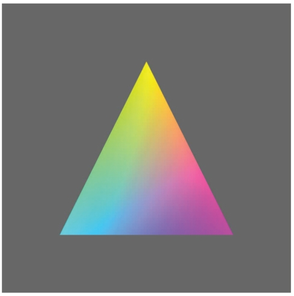
Figure 17.4. Setting the colors of each vertex in the vertex shader and passing the data to the fragment shader results in barycentric interpolation of the colors.  
图 17.4。 在顶点着色器中设置每个顶点的颜色并将数据传递到片段着色器会导致颜色的重心插值。

### 17.12.1 Structs of Vertex Data  顶点数据的结构

The previous example illustrates the interleaving of data in an array. Vertex buffers can be used in a variety of ways, including separate vertex buffers for different model attributes. Interleaving data has advantages as the attributes associated with a vertex are near the vertex in memory and can likely take advantage of memory locality when operating in the shaders. While the use of these interleaved arrays is straightforward, it can become cumbersome to manage large models in this way, especially as data structures are used for building robust (and sustainable) software infrastructure for graphics (see Chapter 12). It is rather simple to store vertex data as vectors of structs that contain the vertex and any related attributes. When done this way, the structure need only be mapped into the vertex buffer. For instance, the following structure contains the vertex position and vertex color, using GLM’s vec3 type:
前面的示例说明了数组中数据的交错。 顶点缓冲区可以以多种方式使用，包括针对不同模型属性的单独顶点缓冲区。 交错数据具有优势，因为与顶点关联的属性靠近内存中的顶点，并且在着色器中操作时可以利用内存局部性。 虽然这些交错数组的使用很简单，但以这种方式管理大型模型可能会变得很麻烦，特别是当数据结构用于构建强大（且可持续）的图形软件基础设施时（请参阅第 12 章）。 将顶点数据存储为包含顶点和任何相关属性的结构向量非常简单。 当这样做时，结构只需要映射到顶点缓冲区中。 例如，以下结构包含顶点位置和顶点颜色，使用 GLM 的 vec3 类型：

```glsl
struct vertexData
{
	glm::vec3 pos;
	glm::vec3 color;
};
std::vector< vertexData > modelData;  
```

The STL vector will hold all vertices related to all the triangles in the model. We will continue to use the same layout for triangles as in previous examples, which is a basic triangle strip. Every three vertices represents a triangle in the list. There are other data organizations that can be used with OpenGL, and Chapter 12 presents other options for organizing data more efficiently. 
STL 向量将保存与模型中所有三角形相关的所有顶点。 我们将继续使用与前面示例中相同的三角形布局，这是一个基本的三角形带。 每三个顶点代表列表中的一个三角形。 还有其他可以与 OpenGL 一起使用的数据组织，第 12 章介绍了更有效地组织数据的其他选项。

Once the data is loaded into the vector, the same calls used before load the data into the vertex buffer object:
将数据加载到向量中后，将在将数据加载到顶点缓冲区对象之前使用相同的调用：

```glsl
int numBytes = modelData.size() * sizeof(vertexData);  
glBufferData(GL_ARRAY_BUFFER, numBytes, modelData.data(), GL_STATIC_DRAW);
glBindBuffer(GL_ARRAY_BUFFER, 0);
```

STL vectors store data contiguously. The vertexData struct used above is represented by a flat memory layout (it does not contain pointers to other data elements) and is contiguous. However, the STL vector is an abstraction and the pointer that references the underlying memory must be queried using the data() member. That pointer is provided to the call to glBufferData. Attribute assignment in the vertex array object is identical as the locality of the vertex attributes remains the same.
STL 向量连续存储数据。 上面使用的 vertexData 结构由平面内存布局表示（它不包含指向其他数据元素的指针）并且是连续的。 然而，STL向量是一个抽象，引用底层内存的指针必须使用data()成员来查询。 该指针被提供给对 glBufferData 的调用。 顶点数组对象中的属性分配是相同的，因为顶点属性的局部性保持不变。

## 17.13 Shading in the Fragment Processor  片段处理器中的着色

The graphics pipeline chapter (Chapter 8) and the surface shading chapter (Chapter 10) do a nice job of describing and illustrating the effects of per-vertex and per-fragment shading as they relate to rasterization and shading in general. With modern graphics hardware, applying shading algorithms in the fragment processor produces better visual results and more accurately approximates lighting. Shading that is computed on a per-vertex basis is often subject to visual artifacts related to the underlying geometry tessellation. In particular, per-vertex based shading often fails to approximate the appropriate intensities across the face of the triangle since the lighting is only being calculated at each vertex. For example, when the distance to the light source is small, as compared with the size of the face being shaded, the illumination on the face will be incorrect. Figure 17.5 illustrates this situation. The center of the triangle will not be illuminated brightly, despite being very close to the light source, since the lighting on the vertices, which are far from the light source, are used to interpolate the shading across the face. Of course, increasing the tessellation of the geometry can improve the visuals. However, this solution is of limited use in real-time graphics as the added geometry required for more accurate illumination can result in slower rendering. 
图形管道章节（第 8 章）和表面着色章节（第 10 章）很好地描述和说明了逐顶点和逐片段着色的效果，因为它们通常与光栅化和着色有关。 借助现代图形硬件，在片段处理器中应用着色算法可以产生更好的视觉效果并更准确地近似照明。 基于每个顶点计算的着色通常会受到与底层几何镶嵌相关的视觉伪影的影响。 特别是，基于每个顶点的着色通常无法近似三角形面上的适当强度，因为仅在每个顶点计算照明。 例如，当与光源的距离较小时，与被遮挡的脸部的大小相比，脸部的照明将不正确。 图 17.5 说明了这种情况。 尽管三角形的中心非常靠近光源，但它不会被明亮地照亮，因为远离光源的顶点上的照明用于插入整个面上的阴影。 当然，增加几何形状的镶嵌可以改善视觉效果。 然而，该解决方案在实时图形中的用途有限，因为更准确的照明所需的添加几何体可能会导致渲染速度变慢。
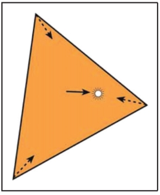
Figure 17.5. The distance to the light source is small relative to the size of the triangle.
图 17.5。 相对于三角形的大小，到光源的距离很小。

Fragment shaders operate on the fragments that emerge from rasterization after vertices have been transformed and clipped. Generally speaking, fragment shaders must output a value that is written to a framebuffer. Often times, this is the color of the pixel. If the depth test is enabled, the fragment’s depth value will be used to control whether the color and its depth are written to the framebuffer memory. The data that fragment shaders use for computation comes from various sources: 
片段着色器对顶点变换和裁剪后光栅化产生的片段进行操作。 一般来说，片段着色器必须输出写入帧缓冲区的值。 很多时候，这就是像素的颜色。 如果启用深度测试，则片段的深度值将用于控制是否将颜色及其深度写入帧缓冲区内存。 片段着色器用于计算的数据来自各种来源：

- Built-in OpenGL variables. These variables are provided by the system. Examples of fragment shader variables include gl_FragCoord or gl FrontFacing. These variables can change based on revisions to OpenGL and GLSL, so it is advised that you check the specification for the version of OpenGL and GLSL that you are targeting. 
  内置 OpenGL 变量。 这些变量是由系统提供的。 片段着色器变量的示例包括 gl_FragCoord 或 gl FrontFacing。 这些变量可能会根据 OpenGL 和 GLSL 的修订而变化，因此建议您检查目标 OpenGL 和 GLSL 版本的规范。
- Uniform variables. Uniform variables are transferred from the host to the device and can change as needed based on user input or changing simulation state in the application. These variables are declared and defined by the programmer for use within both vertex and fragment shaders. The projection matrix in the previous vertex shader examples was communicated to the shader via a uniform variable. If needed, the same uniform variable names can be used within both vertex and fragment shaders. 
  统一变量。 统一变量从主机传输到设备，并且可以根据用户输入或应用程序中更改的模拟状态根据需要进行更改。 这些变量由程序员声明和定义，以便在顶点着色器和片段着色器中使用。 前面的顶点着色器示例中的投影矩阵通过统一变量传递给着色器。 如果需要，可以在顶点着色器和片段着色器中使用相同的统一变量名称。
- Input variables. Input variables are specified in the fragment shader with the prefixed keyword in. Recall that data can flow into and out of shaders. Vertex shaders can output data to the next shader stage using the out keyword (e.g., out vec3 vColor, in a previous example). The outputs are linked to inputs when the next stage uses an in keyword followed by the same type and name qualifiers (e.g., in vec3 vColor in the previous example’s corresponding fragment shader). 
  输入变量。 输入变量在片段着色器中使用前缀关键字 in 指定。回想一下，数据可以流入和流出着色器。 顶点着色器可以使用 out 关键字（例如，前面示例中的 out vec3 vColor）将数据输出到下一个着色器阶段。 当下一阶段使用 in 关键字后跟相同的类型和名称限定符时，输出将链接到输入（例如，在上一个示例的相应片段着色器中的 vec3 vColor 中）。

Any data that is passed to a fragment shader through the in-out linking mechanism will vary on a per-fragment basis using barycentric interpolation. The interpolation is computed outside of the shader by the graphics hardware. Within this infrastructure, fragment shaders can be used to perform per-fragment shading algorithms that evaluate specific equations across the face of the triangle. Vertex shaders provide support computations, transforming vertices and staging intermediate per-vertex values that will be interpolated for the fragment code. 
通过输入输出链接机制传递到片段着色器的任何数据都将使用重心插值根据每个片段而变化。 插值是由图形硬件在着色器外部计算的。 在此基础设施中，片段着色器可用于执行每个片段着色算法，该算法评估三角形面上的特定方程。 顶点着色器提供支持计算、转换顶点和暂存将为片段代码插值的中间每个顶点值。

The following shader program code implements per-fragment, Blinn-Phong shading. It brings together much of what has been presented in this chapter thus far and binds it to the shader descriptions from Chapter 4. An interleaved vertex buffer is used to contain the vertex position and normal vectors. These values manifest in the vertex shader as vertex array attributes for index 0 and index 1. The shading computations that occur in the fragment shader code are performed in camera coordinates (sometimes referred to as eye-space). 
以下着色器程序代码实现了逐片段 Blinn-Phong 着色。 它汇集了本章迄今为止介绍的大部分内容，并将其与第 4 章中的着色器描述绑定在一起。交错的顶点缓冲区用于包含顶点位置和法线向量。 这些值在顶点着色器中表现为索引 0 和索引 1 的顶点数组属性。片段着色器代码中发生的着色计算在相机坐标（有时称为眼睛空间）中执行。

### 17.13.1 Blinn-Phong Shader Program: Vertex Shader  Blinn-Phong 着色器程序：顶点着色器

The vertex shader stage of our program is used to transform the incoming vertices using the $\bold{M}_{model}$ and $\bold{M}_{cam}$ matrices into camera coordinates. It also uses the normal matrix, $(\bold{M}^{-1})^T$ , to appropriately transform the incoming normal vector attribute. The vertex shader outputs three variables to the fragment stage: 
我们程序的顶点着色器阶段用于使用 $\bold{M}_{model}$ 和 $\bold{M}_{cam}$ 矩阵将传入的顶点转换为相机坐标。 它还使用法线矩阵 $(\bold{M}^{-1})^T$ 来适当地转换传入的法线向量属性。 顶点着色器向片段阶段输出三个变量：

- normal. The vertex’s normal vector as transformed into the camera coordinate system. 
  普通的。 顶点的法线向量转换到相机坐标系中。
- h. The half-vector needed for Blinn-Phong shading. 
  H。 Blinn-Phong 着色所需的半向量。
- l. The light direction transformed into the camera coordinate system. 
  l. 光线方向转换到相机坐标系中。

Each of these variables will then be available for fragment computation, after applying barycentric interpolation across the three vertices in the triangle. 
在对三角形的三个顶点应用重心插值后，每个变量都可用于片段计算。

A single point light is used with this shader program. The light position and intensity is communicated to both the vertex and fragment shaders using a uniform variable. The light data is declared using GLSL’s struct qualifer, which allows variables to be grouped together in meaningful ways. Although not presented here, GLSL supports arrays and for-loop control structures, so additional lights could easily be added to this example. 
该着色器程序使用单点光源。 使用统一变量将灯光位置和强度传递给顶点着色器和片段着色器。 光数据是使用 GLSL 的结构限定符声明的，它允许变量以有意义的方式分组在一起。 尽管此处未介绍，但 GLSL 支持数组和 for 循环控制结构，因此可以轻松地将其他灯光添加到此示例中。

All matrices are also provided to the vertex shader using uniform variables. For now, we will imagine that the model (or local transform) matrix will be set to the indentity matrix. In the following section, more detail will be provided to expand on how the model matrix can be specified on the host using GLM.
所有矩阵也使用统一变量提供给顶点着色器。 现在，我们假设模型（或局部变换）矩阵将设置为恒等矩阵。 在下一节中，将提供更多详细信息来扩展如何使用 GLM 在主机上指定模型矩阵。

```glsl
#version 330 core
//
// Blinn-Phong Vertex Shader
//
layout(location=0) in vec3 in_Position;
layout(location=1) in vec3 in_Normal;
out vec4 normal;
out vec3 half;
out vec3 lightdir;
struct LightData {
	vec3 position;
	vec3 intensity;
};
uniform LightData light;
uniform mat4 projMatrix;
uniform mat4 viewMatrix;
uniform mat4 modelMatrix;
uniform mat4 normalMatrix;  
void main(void)
{
	// Calculate lighting in eye space: transform the local
	// position to world and then camera coordinates.
	vec4 pos = viewMatrix * modelMatrix * vec4(in_Position, 1.0);
	vec4 lightPos = viewMatrix * vec4(light.position, 1.0);
	normal = normalMatrix * vec4(in_Normal, 0.0);
	vec3 v = normalize( -pos.xyz );
	lightdir = normalize( lightPos.xyz - pos.xyz );
	half = normalize( v + lightdir );
	gl_Position = projMatrix * pos;
}
```

The vertex shader’s main function first transforms the position and light position into camera coordinates using vec4 types to correspond with the 4 × 4 matrices of GLSL’s mat4. We then transform the normal vector and store it in the out vec4 normal variable. The view (or eye) vector and light direction vector are then calculated, which leads to the computation of the half vector needed for Blinn-Phong shading. The final computation completes the calculation of
顶点着色器的主函数首先使用vec4类型将位置和光照位置转换为相机坐标，以对应GLSL的mat4的4×4矩阵。 然后我们变换法线向量并将其存储在 out vec4 法线变量中。 然后计算视图（或眼睛）矢量和光方向矢量，从而计算 Blinn-Phong 着色所需的半矢量。 最终计算完成计算
$\bold{v}_{canon} = \bold{M}_{proj}\bold{M}_{cam}\bold{M}_{model}\bold{v}  $

by applying the projection matrix. It then sets the canonical coordinates of the vertex to the built-in GLSL vertex shader output variable gl_Position. After this, the vertex is in clip-coordinates and is ready for rasterization. 
通过应用投影矩阵。 然后，它将顶点的规范坐标设置为内置 GLSL 顶点着色器输出变量 gl_Position。 此后，顶点处于剪辑坐标中并准备好进行光栅化。

### 17.13.2 Blinn-Phong Shader Program: Fragment Shader Blinn-Phong 着色器程序：片段着色器

The fragment shader computes the Blinn-Phong shading model. It receives barycentric interpolated values for the vertex normal, half vector, and light direction. Note that these variables are specified using the in keyword as they come in from the vertex processing stage. The light data is also shared with the fragment shader using the same uniform specification that was used in the vertex shader. The matrices are not required so no uniform matrix variables are declared. The material properties for the geometric model are communicated through uniform variables to specify $k_a$, $k_d$, $k_s$, $I_a$, and $p$. Together, the data allow the fragment shader to compute Equation 4.3:
片段着色器计算 Blinn-Phong 着色模型。 它接收顶点法线、半矢量和光线方向的重心插值。 请注意，这些变量是使用 in 关键字指定的，因为它们来自顶点处理阶段。 光照数据还使用与顶点着色器中使用的相同的统一规范与片段着色器共享。 矩阵不是必需的，因此没有声明统一的矩阵变量。 几何模型的材料属性通过统一变量来指定 $k_a$、$k_d$、$k_s$、$I_a$ 和 $p$。 这些数据共同允许片段着色器计算公式 4.3：
$L = k_a I_a + k_d Imax(0, \bold{n} · \bold{l}) + k_s Imax(0, \bold{n} · \bold{h})^p  $
at each fragment. 
在每个片段。

```glsl
#version 330 core
//
// Blinn-Phong Fragment Shader
//
in vec4 normal;
in vec3 half;
in vec3 lightdir;
layout(location=0) out vec4 fragmentColor;
struct LightData {
	vec3 position;
	vec3 intensity;
};
uniform LightData light;
uniform vec3 Ia;
uniform vec3 ka, kd, ks;
uniform float phongExp;
void main(void)
{
    vec3 n = normalize(normal.xyz);
    vec3 h = normalize(half);
    vec3 l = normalize(lightdir);
    vec3 intensity = ka * Ia
        + kd * light.intensity * max( 0.0, dot(n, l) )
        + ks * light.intensity
        * pow( max( 0.0, dot(n, h) ), phongExp );
    fragmentColor = vec4( intensity, 1.0 );
}  
```

The fragment shader writes the computed intensity to the fragment color output buffer. Figure 17.6 illustrates several examples that show the effect of perfragment shading across varying degrees of tessellation on a geometric model. This fragment shader introduces the use of structures for holding uniform variables. It should be noted that they are user-defined structures, and in this example, the LightData type holds only the light position and its intensity. In host code, the uniform variables in structures are referenced using the fully qualified variable name when requesting the handle to the uniform variable, as in: 
片段着色器将计算出的强度写入片段颜色输出缓冲区。 图 17.6 说明了几个示例，显示了几何模型上不同程度的细分程度的片段着色效果。 该片段着色器引入了使用结构来保存统一变量。 应该注意的是，它们是用户定义的结构，在本例中，LightData 类型仅保存灯光位置及其强度。 在主机代码中，当请求统一变量的句柄时，使用完全限定的变量名称来引用结构中的统一变量，如下所示：

```glsl
lightPosID = shader.createUniform( "light.position" ); 
lightIntensityID = shader.createUniform( "light.intensity" );
```

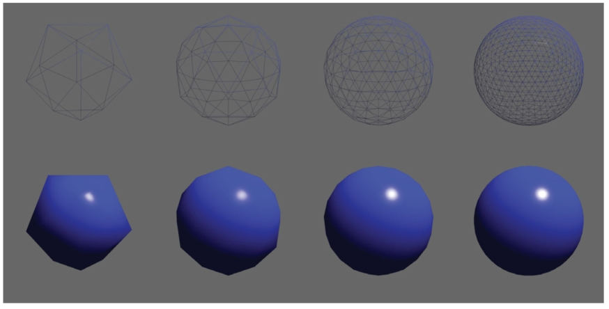
Figure 17.6. Per-fragment shading applied across increasing tessellation of a subdivision sphere. The specular highlight is apparent with lower tessellations. 
图 17.6。 每片段着色应用于细分球体的不断增加的镶嵌。 较低的镶嵌图案的镜面高光很明显。

### 17.13.3 A Normal Shader  普通着色器

Once you have a working shader program, such as the Blinn-Phong one presented here, it is easy to expand your ideas and develop new shaders. It may also be helpful to develop a set of very specific shaders for debugging. One such shader is the normal shader program. Normal shading is often helpful to understand whether the incoming geometry is organized correctly or whether the computations are correct. In this example, the vertex shader remains the same. Only the fragment shader changes:
一旦您有了一个可用的着色器程序（例如此处介绍的 Blinn-Phong 程序），就可以轻松扩展您的想法并开发新的着色器。 开发一组非常具体的着色器以进行调试也可能会有所帮助。 普通着色器程序就是这样的着色器之一。 正常着色通常有助于了解传入的几何体是否组织正确或计算是否正确。 在此示例中，顶点着色器保持不变。 仅片段着色器发生变化：

```glsl
#version 330 core
in vec4 normal;
layout(location=0) out vec4 fragmentColor;
void main(void)
{
	// Notice the use of swizzling here to access
	// only the xyz values to convert the normal vec4
	// into a vec3 type!
	vec3 intensity = normalize(normal.xyz) * 0.5 + 0.5;
	fragmentColor = vec4( intensity, 1.0 );
}  
```

Whichever shaders you start building, be sure to comment them! The GLSL specification allows comments to be included in shader code, so leave yourself some details that can guide you later.
无论您开始构建哪个着色器，请务必对它们进行评论！ GLSL 规范允许在着色器代码中包含注释，因此请为自己留下一些可以在以后指导您的详细信息。

## 17.14 Meshes and Instancing  网格和实例化

Once basic shaders are working, it’s interesting to start creating more complex scenes. Some 3D model files are simple to load and others require more effort. One simple 3D object file representation is the OBJ format. OBJ is a widely used format and several codes are available to load these types of files. The array of structs mechanism presented earlier works well for containing the OBJ data on the host. It can then easily be transferred into a VBO and vertex array objects. 
一旦基本着色器开始工作，开始创建更复杂的场景就会很有趣。 有些 3D 模型文件加载起来很简单，而另一些则需要更多的努力。 一种简单的 3D 对象文件表示形式是 OBJ 格式。 OBJ 是一种广泛使用的格式，有多种代码可用于加载这些类型的文件。 前面介绍的结构数组机制非常适合包含主机上的 OBJ 数据。 然后可以轻松地将其转换为 VBO 和顶点数组对象。

Many 3D models are defined in their own local coordinate systems and need various transformations to align them with the OpenGL coordinate system. For instance, when the Stanford Dragon’s OBJ file is loaded into the OpenGL coordinate system, it appears lying on its side at the origin. Using GLM, we can create the model transformations to place objects within our scenes. For the dragon model, this means rotating −90 degrees about $\stackrel{\rightarrow}{X}$ , and then translating up in $\stackrel{\rightarrow}{Y}$ . The effective model transform becomes
许多 3D 模型都是在自己的局部坐标系中定义的，需要进行各种变换才能将其与 OpenGL 坐标系对齐。 例如，当斯坦福龙的 OBJ 文件加载到 OpenGL 坐标系中时，它看起来位于原点一侧。 使用 GLM，我们可以创建模型转换以将对象放置在场景中。 对于龙模型，这意味着围绕 $\stackrel{\rightarrow}{X}$ 旋转 −90 度，然后在 $\stackrel{\rightarrow}{Y}$ 中向上平移。 有效的模型变换为
$\bold{M}_{model} = \bold{M}_{translate} \bold{M}_{rotX},  $
and the dragon is presented upright and above the ground plane, as shown in Figure 17.7. To do this we utilize several functions from GLM for generating local model transforms: 
龙是直立的，位于地平面之上，如图17.7所示。 为此，我们利用 GLM 中的多个函数来生成局部模型变换：

- **glm::translate** creates a translation matrix. 
  **glm::translate** 创建翻译矩阵。
- **glm::rotate** creates a rotation matrix, specified in either degrees or radians about a specific axis. 
  **glm::rotate** 创建一个旋转矩阵，以围绕特定轴的度数或弧度指定。
- **glm::scale** creates a scale matrix.
  **glm::scale** 创建一个比例矩阵。

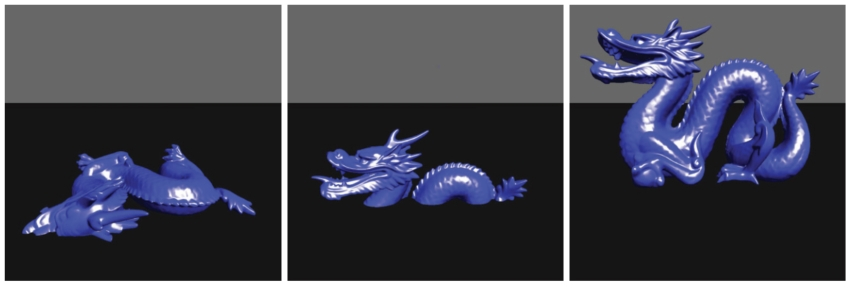
Figure 17.7. Images are described from left to right. The default local orientation of the dragon, lying on its side. After a –90 degree rotation about $\stackrel{\rightarrow}{X}$  , the dragon is upright but still centered about the origin. Finally, after applying a translation of 1.0 in $\stackrel{\rightarrow}{Y}$ , the dragon is ready for instancing.
图 17.7。 图像是从左到右描述的。 龙的默认局部方向，侧卧。 绕 $\stackrel{\rightarrow}{X}$ 旋转 –90 度后，龙是直立的，但仍以原点为中心。 最后，在 $\stackrel{\rightarrow}{Y}$ 中应用 1.0 的翻译后，龙就准备好实例化了。

We can apply these functions to create the model transforms and pass the model matrix to the shader using uniform variables. The Blinn-Phong vertex shader contains instructions that apply the local transform to the incoming vertex. The following code shows how the dragon model is rendered:
我们可以应用这些函数来创建模型变换，并使用统一变量将模型矩阵传递给着色器。 Blinn-Phong 顶点着色器包含将局部变换应用于传入顶点的指令。 以下代码展示了龙模型的渲染方式：

```glsl
glUseProgram( BlinnPhongShaderID );
// Describe the Local Transform Matrix
glm::mat4 modelMatrix = glm::mat4(1.0); // Identity Matrix
modelMatrix = glm::translate(modelMatrix, glm::vec3(0.0f, 1.0f, 0.0f));
float rot = (-90.0f / 180.0f) * M_PI;
modelMatrix = glm::rotate(modelMatrix, rot, glm::vec3(1, 0, 0));
// Set the Normal Matrix
glm::mat4 normalMatrix = glm::transpose( glm::inverse( viewMatrix * modelMatrix ) );
// Pass the matrices to the GPU memory
glUniformMatrix4fv(nMatID, 1, GL_FALSE, glm::value_ptr(normalMatrix));
glUniformMatrix4fv(pMatID, 1, GL_FALSE, glm::value_ptr(projMatrix));
glUniformMatrix4fv(vMatID, 1, GL_FALSE, glm::value_ptr(viewMatrix←));
glUniformMatrix4fv(mMatID, 1, GL_FALSE, glm::value_ptr(modelMatrix));
// Set material for this object
glm::vec3 kd( 0.2, 0.2, 1.0 );
glm::vec3 ka = kd * 0.15f;
glm::vec3 ks( 1.0, 1.0, 1.0 );
float phongExp = 32.0;
glUniform3fv(kaID, 1, glm::value_ptr(ka));
glUniform3fv(kdID, 1, glm::value_ptr(kd));
glUniform3fv(ksID, 1, glm::value_ptr(ks));
glUniform1f(phongExpID, phongExp);
// Process the object and note that modelData.size() holds
// the number of vertices, not the number of triangles!
glBindVertexArray(VAO);
glDrawArrays(GL_TRIANGLES, 0, modelData.size());
glBindVertexArray(0);
glUseProgram( 0 );  
```

### 17.14.1 Instancing Models  实例化模型

Instancing with OpenGL is implemented differently than instancing with the ray tracer. With the ray tracer, rays are inversely transformed into the local space of the object using the model transform matrix. With OpenGL, instancing is performed by loading a single copy of the object as a vertex array object (with associated vertex buffer objects), and then reusing the geometry as needed. Like the ray tracer, only a single object is loaded into memory, but many may be rendered.
使用 OpenGL 实例化的实现方式与使用光线追踪器实例化的方式不同。 使用光线追踪器，使用模型变换矩阵将光线逆变换到对象的局部空间。 对于 OpenGL，实例化是通过将对象的单个副本加载为顶点数组对象（带有关联的顶点缓冲区对象）来执行的，然后根据需要重用几何体。 与光线追踪器一样，只有一个对象被加载到内存中，但可以渲染许多对象。

Modern OpenGL nicely supports this style of instancing because vertex shaders can (and must) compute the necessary transformations to transform vertices into clip coordinates. By writing generalized shaders that embed these transformations, such as presented with the Blinn-Phong vertex shader, models can be rerendered with the same underlying local geometry. Different material types and transforms can be queried from higher-level class structures to populate the uniform variables passed from host to device each frame. Animations and interactive control are also easily created as the model transforms can change over time across the the display loop iteration. Figures 17.8 and 17.9 use the memory footprint of one dragon, yet render three different dragon models to the screen.
现代 OpenGL 很好地支持这种实例化风格，因为顶点着色器可以（并且必须）计算必要的转换以将顶点转换为剪辑坐标。 通过编写嵌入这些变换的通用着色器（例如 Blinn-Phong 顶点着色器），可以使用相同的底层局部几何体重新渲染模型。 可以从更高级别的类结构查询不同的材质类型和变换，以填充每帧从主机传递到设备的统一变量。 由于模型变换可以在显示循环迭代中随时间变化，因此也可以轻松创建动画和交互式控制。 图 17.8 和 17.9 使用一条龙的内存占用，但在屏幕上渲染了三种不同的龙模型。
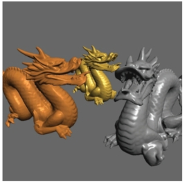
Figure 17.8. The results of running the Blinn-Phong shader program on the three dragons using uniform variables to specify material properties and transformations.
图 17.8。 使用统一变量指定材质属性和变换对三条龙运行 Blinn-Phong 着色器程序的结果。
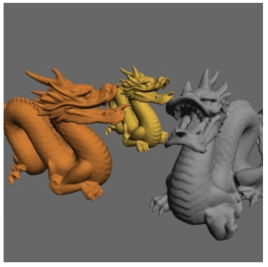
Figure 17.9. Setting the uniform variable $k_s = (0, 0, 0)$ in the Blinn-Phong shader program produces Lambertian shading.
图 17.9。 在 Blinn-Phong 着色器程序中设置统一变量 $k_s = (0, 0, 0)$ 会产生朗伯着色。

## 17.15 Texture Objects 纹理对象

Textures are an effective means to manipulate visual effects with OpenGL shaders. They are used extensively with many hardware-based graphics algorithms and OpenGL supports them natively with Texture objects. Like the previous OpenGL concepts, texture objects must be allocated and initialized by copying data on the host to the GPU memory and setting OpenGL state. Texture coordinates are often integrated into the vertex buffer objects and passed as vertex attributes to shader programs. Fragment shaders typically perform the texture lookup function using interpolated texture coordinate passed from the vertex shaders. 
纹理是使用 OpenGL 着色器操纵视觉效果的有效方法。 它们广泛用于许多基于硬件的图形算法，并且 OpenGL 通过纹理对象原生支持它们。 与之前的 OpenGL 概念一样，必须通过将主机上的数据复制到 GPU 内存并设置 OpenGL 状态来分配和初始化纹理对象。 纹理坐标通常集成到顶点缓冲区对象中，并作为顶点属性传递给着色器程序。 片段着色器通常使用从顶点着色器传递的插值纹理坐标来执行纹理查找功能。

Textures are rather simple to add to your code if you already have working shader and vertex array objects. The standard OpenGL techniques for creating objects on the hardware are used with textures. However, the source of the texture data must first be determined. Data can either be loaded from a file (e.g., PNG, JPG, EXR, or HDR image file formats) or generated procedurally on the host (and even on the GPU). After the data is loaded into host memory, the data is copied to GPU memory, and optionally, OpenGL state associated with textures can be set. OpenGL texture data is loaded as a linear buffer of memory containing the data used for textures. Texture lookups on the hardware can be 1D, 2D, or 3D queries. Regardless of the texture dimension query, the data is loaded onto the memory in the same way, using linearly allocated memory on the host. In the following example, the process of loading data from an image file (or generating it procedurally) is left to the reader, but variable names are provided that match what might be present if an image is loaded (e.g., imgData, imgWidth, imgHeight).
如果您已经有可用的着色器和顶点数组对象，则将纹理添加到代码中相当简单。 用于在硬件上创建对象的标准 OpenGL 技术与纹理一起使用。 然而，必须首先确定纹理数据的来源。 数据可以从文件（例如 PNG、JPG、EXR 或 HDR 图像文件格式）加载，也可以在主机（甚至 GPU）上按程序生成。 将数据加载到主机内存后，将数据复制到 GPU 内存，并且可以选择设置与纹理关联的 OpenGL 状态。 OpenGL 纹理数据作为内存的线性缓冲区加载，其中包含用于纹理的数据。 硬件上的纹理查找可以是 1D、2D 或 3D 查询。 无论纹理维度查询如何，数据都会以相同的方式加载到内存中，即使用主机上线性分配的内存。 在以下示例中，从图像文件加载数据（或按程序生成数据）的过程留给读者，但提供了与加载图像时可能出现的内容相匹配的变量名称（例如，imgData、imgWidth、imgHeight） ）。

```glsl
float *imgData = new float[ imgHeight * imgWidth * 3 ];
...
GLuint texID;
glGenTextures(1, &texID);
glBindTexture(GL_TEXTURE_2D, texID);
glTexParameteri(GL_TEXTURE_2D, GL_TEXTURE_WRAP_S, GL_CLAMP);
glTexParameteri(GL_TEXTURE_2D, GL_TEXTURE_WRAP_T, GL_CLAMP);
glTexParameteri(GL_TEXTURE_2D, GL_TEXTURE_MAG_FILTER, GL_LINEAR);
glTexParameteri(GL_TEXTURE_2D, GL_TEXTURE_MIN_FILTER, GL_LINEAR);
glTexImage2D(GL_TEXTURE_2D, 0, GL_RGB, imgWidth, imgHeight, 0,
GL_RGB, GL_FLOAT, imgData);
glBindTexture(GL_TEXTURE_2D, 0);
delete [] imgData;
```

The example presented here highlights how to set up and use basic 2D OpenGL textures with shader programs. The process for creating OpenGL objects should be familiar by now. A handle (or ID) must be generated on the device to refer to the texture object (e.g., in this case, texID). The id is then bound to allow any subsequent texture state operations to affect the state of the texture. A fairly extensive set of OpenGL texture state and parameters exist that affect texture coordinate interpretation and texture lookup filtering. Various texture targets exist with graphics hardware. In this case, the texture target is specified as GL TEXTURE 2D and will appear as the first argument in the texture-related functions. For OpenGL this particular texture target implies that texture coordinates will be specified in a device normalized manner (i.e., in the range of [0, 1]). Moreover, texture data must be allocated so that the width and height dimensions are powers of two (e.g., 512 × 512, 1024 × 512, etc.). Texture parameters are set for the currently bound texture by calling glTexParameter. This signature for this function takes on a variety of forms depending on the types of data being set. In this case, texture coordinates will be clamped by the hardware to the explicit range [0, 1]. The minifying and magnifying filters of OpenGL texture objects are set to use linear filtering (rather than nearest neighbor - GL NEAREST) automatically when performing texture lookups. Chapter 11 provides substantial details on texturing, including details about the filtering that can occur with texture lookups. Graphics hardware can perform many of these operations automatically by setting the associated texture state. 
此处提供的示例重点介绍了如何通过着色器程序设置和使用基本 2D OpenGL 纹理。 创建 OpenGL 对象的过程现在应该很熟悉了。 必须在设备上生成一个句柄（或 ID）来引用纹理对象（例如，在本例中为 texID）。 然后绑定 id 以允许任何后续纹理状态操作影响纹理的状态。 存在一组相当广泛的 OpenGL 纹理状态和参数，它们会影响纹理坐标解释和纹理查找过滤。 图形硬件存在各种纹理目标。 在这种情况下，纹理目标被指定为 GL TEXTURE 2D，并将作为纹理相关函数中的第一个参数出现。 对于 OpenGL，这个特定的纹理目标意味着纹理坐标将以设备标准化方式指定（即在 [0, 1] 范围内）。 此外，必须分配纹理数据，使得宽度和高度尺寸为2的幂（例如，512×512、1024×512等）。 通过调用 glTexParameter 为当前绑定的纹理设置纹理参数。 该函数的签名根据所设置的数据类型而采用多种形式。 在这种情况下，纹理坐标将被硬件限制在显式范围 [0, 1] 内。 OpenGL 纹理对象的缩小和放大过滤器设置为在执行纹理查找时自动使用线性过滤（而不是最近邻 - GL NEAREST）。 第 11 章提供了有关纹理的大量详细信息，包括有关纹理查找时可能发生的过滤的详细信息。 图形硬件可以通过设置关联的纹理状态来自动执行许多这样的操作。

Finally, the call to glTexImage2D performs the host to device copy for the texture. There are several arguments to this function, but the overall operation is to allocate space on the graphics card (e.g., imageWidth X imgHeight) of three floats (7th and 8th arguments: GL RGB and GL FLOAT) and copy the linear texture data to the hardware (e.g., imgData pointer). The remaining arguments deal with setting the mipmap level of detail (2nd argument), specifying the internal format (e.g., 3rd argument’s GL RGB) and whether the texture has a border or not (6th argument). When learning OpenGL textures it is safe to keep these as the defaults listed here. However, the reader is advised to learn more about mipmaps and the potential internal formats of textures as more advanced graphics processing is required. 
最后，对 glTexImage2D 的调用执行纹理的主机到设备复制。 该函数有多个参数，但总体操作是在显卡上分配三个浮点数（第7个和第8个参数：GL RGB和GL FLOAT）的空间（例如，imageWidth X imgHeight），并将线性纹理数据复制到 硬件（例如，imgData 指针）。 其余参数处理设置 mipmap 细节级别（第二个参数）、指定内部格式（例如，第三个参数的 GL RGB）以及纹理是否有边框（第六个参数）。 学习 OpenGL 纹理时，将这些纹理保留为此处列出的默认值是安全的。 然而，建议读者更多地了解 mipmap 和纹理的潜在内部格式，因为需要更高级的图形处理。

Texture object allocation and initialization happens with the code above. Additional modifications must be made to vertex buffers and vertex array objects to link in the correct texture coordinates with the geometric description. Following the previous examples, the storage for texture coordinates is a straightforward modification to the vertex data structure:
纹理对象分配和初始化通过上面的代码进行。 必须对顶点缓冲区和顶点数组对象进行其他修改，以将正确的纹理坐标与几何描述链接起来。 按照前面的示例，纹理坐标的存储是对顶点数据结构的直接修改：

```glsl
struct vertexData
{
	glm::vec3 pos;
	glm::vec3 normal;
	glm::vec2 texCoord;
};  
```

As a result, the vertex buffer object will increase in size and the interleaving of texture coordinates will require a change to the stride in the vertex attribute specification for the vertex array objects. Figure 17.10 illustrates the basic interleaving of data within the vertex buffer.
因此，顶点缓冲区对象的大小将增加，并且纹理坐标的交错将需要更改顶点数组对象的顶点属性规范中的步幅。 图 17.10 说明了顶点缓冲区内数据的基本交错。
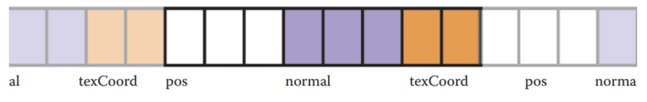
Figure 17.10. Data layout after adding the texture coordinate to the vertex buffer. Each block represents a GLfloat, which is 4 bytes. The position is encoded as a white block, the normals as purple, and the texture coordinates as orange.
图 17.10。 将纹理坐标添加到顶点缓冲区后的数据布局。 每个块代表一个GLfloat，即4个字节。 位置被编码为白色块，法线被编码为紫色，纹理坐标被编码为橙色。

```glsl
glBindBuffer(GL_ARRAY_BUFFER, m_triangleVBO[0]);
glEnableVertexAttribArray(0);
glVertexAttribPointer(0, 3, GL_FLOAT, GL_FALSE, 8 * sizeof(GLfloat), 0);
glEnableVertexAttribArray(1);
glVertexAttribPointer(1, 3, GL_FLOAT, GL_FALSE, 8 * sizeof(GLfloat), (const GLvoid *)12);
glEnableVertexAttribArray(2);
glVertexAttribPointer(2, 2, GL_FLOAT, GL_FALSE, 8 * sizeof(GLfloat), (const GLvoid *)24);
glBindVertexArray(0);  
```

With the code snippet above, the texture coordinates are placed at vertex attribute location 2. Note the change in size of the texture coordinate’s size (e.g., 2nd argument of glVertexAttribPointer is 2 for texture coordinates to coincide with the vec2 type in the structure). At this point, all initialization will have been completed for the texture object. 
在上面的代码片段中，纹理坐标放置在顶点属性位置 2 处。请注意纹理坐标大小的变化（例如，glVertexAttribPointer 的第二个参数是 2，以便纹理坐标与结构中的 vec2 类型一致）。 至此，纹理对象的所有初始化就已经完成。

The texture object must be enabled (or bound) prior to rendering the vertex array object with your shaders. In general, graphics hardware allows the use of multiple texture objects when executing a shader program. In this way, shader programs can apply sophisticated texturing and visual effects. Thus, to bind a texture for use with a shader, it must be associated to one of potentially many texture units. Texture units represent the mechanism by which shaders can use multiple textures. In the sample below, only one texture is used so texture unit 0 will be made active and bound to our texture. 
在使用着色器渲染顶点数组对象之前，必须启用（或绑定）纹理对象。 一般来说，图形硬件允许在执行着色器程序时使用多个纹理对象。 通过这种方式，着色器程序可以应用复杂的纹理和视觉效果。 因此，要绑定纹理以与着色器一起使用，它必须与潜在的许多纹理单元之一相关联。 纹理单元表示着色器可以使用多个纹理的机制。 在下面的示例中，仅使用了一个纹理，因此纹理单元 0 将被激活并绑定到我们的纹理。

The function that activates a texture unit is glActiveTexture. Its only argument is the texture unit to make active. It is set to GL TEXTURE0 below, but it could be GL TEXTURE1 or GL TEXTURE2, for instance, if multiple textures were needed in the shader. Once a texture unit is made active, a texture object can be bound to it using the glBindTexture call.
激活纹理单元的函数是glActiveTexture。 它唯一的参数是要激活的纹理单元。 下面将其设置为 GL TEXTURE0，但例如，如果着色器中需要多个纹理，则它可以是 GL TEXTURE1 或 GL TEXTURE2。 一旦纹理单元被激活，就可以使用 glBindTexture 调用将纹理对象绑定到它。

```glsl
glUseProgram(shaderID);
glActiveTexture(GL_TEXTURE0);
glBindTexture(GL_TEXTURE_2D, texID);
glUniform1i(texUnitID, 0);
glBindVertexArray(VAO);
glDrawArrays(GL_TRIANGLES, 0, 3);
glBindVertexArray(0);
glBindTexture(GL_TEXTURE_2D, 0);
glUseProgram(0);  
```

Most of the code above should be logical extensions to what you’ve developed thus far. Note the call to glUniform prior to rendering the vertex array object. In modern graphics hardware programming, shaders perform the work of texture lookups and blending, and therefore, must have data about which texture units hold the textures used in the shader. The active texture units are supplied to shaders using uniform variables. In this case, 0 is set to indicate that the texture lookups will come from texture unit 0. This will be expanded upon in the following section.
上面的大部分代码应该是您迄今为止开发的代码的逻辑扩展。 请注意在渲染顶点数组对象之前对 glUniform 的调用。 在现代图形硬件编程中，着色器执行纹理查找和混合的工作，因此必须具有有关哪些纹理单元保存着色器中使用的纹理的数据。 使用统一变量将活动纹理单元提供给着色器。 在本例中，设置 0 表示纹理查找将来自纹理单元 0。这将在下一节中进行扩展。

### 17.15.1 Texture Lookup in Shaders  着色器中的纹理查找

Shader programs perform the lookup and any blending that may be required. The bulk of that computation typically goes into the fragment shader, but the vertex shader often stages the fragment computation by passing the texture coordinate out to the fragment shader. In this way, the texture coordinates will be interpolated and afford per-fragment lookup of texture data. 
着色器程序执行查找和可能需要的任何混合。 该计算的大部分通常进入片段着色器，但顶点着色器通常通过将纹理坐标传递给片段着色器来分阶段进行片段计算。 通过这种方式，纹理坐标将被插值并提供纹理数据的每个片段查找。

Simple changes are required to use texture data in shader programs. Using the Blinn-Phong vertex shader provided previously, only three changes are needed: 
在着色器程序中使用纹理数据需要进行简单的更改。 使用之前提供的Blinn-Phong顶点着色器，只需要进行三处更改：

1. The texture coordinates are a per-vertex attribute stored within the vertex array object. They are associated with vertex attribute index 2 (or location 2). 
   纹理坐标是存储在顶点数组对象中的每顶点属性。 它们与顶点属性索引 2（或位置 2）相关联。

   ```glsl
   layout(location=2) in vec2 in_TexCoord; 
   ```

2. The fragment shader will perform the texture lookup and will need an interpolated texture coordinate. This variable will be added as an output variable that gets passed to the fragment shader. 
   片段着色器将执行纹理查找，并且需要插值纹理坐标。 该变量将作为输出变量添加到片段着色器。

   ```glsl
   out vec2 tCoord; 
   ```

3. Copy the the incoming vertex attribute to the output variable in the main function. 
   将传入的顶点属性复制到主函数中的输出变量中。

   ```glsl
   // Pass the texture coordinate to the fragment shader 
   tCoord = in_TexCoord; 
   ```

The fragment shader also requires simple changes. First, the incoming interpolated texture coordinates passed from the vertex shader must be declared. Also recall that a uniform variable should store the texture unit to which the texture is bound. This must be communicated to the shader as a sampler type. Samplers are a shading language type that allows the lookup of data from a single texture object. In this example, only one sampler is required, but in shaders in which multiple texture lookups are used, multiple sampler variables will be used. There are also multiple sampler types depending upon the type of texture object. In the example presented here, a GL TEXTURE 2D type was used to create the texture state. The associated sampler within the fragment shader is of type sampler2D. The following two variable declarations must be added to the fragment shader: 
片段着色器也需要简单的更改。 首先，必须声明从顶点着色器传递的传入插值纹理坐标。 另请记住，统一变量应存储纹理所绑定到的纹理单元。 这必须作为采样器类型传递给着色器。 采样器是一种着色语言类型，允许从单个纹理对象查找数据。 在此示例中，仅需要一个采样器，但在使用多个纹理查找的着色器中，将使用多个采样器变量。 根据纹理对象的类型，还有多种采样器类型。 在此提供的示例中，使用 GL TEXTURE 2D 类型来创建纹理状态。 片段着色器中关联的采样器的类型为sampler2D。 必须将以下两个变量声明添加到片段着色器中：

```glsl
in vec2 tCoord; 
uniform sampler2D textureUnit;
```

The final modification goes into the main function of the fragment shader code. The texture is sampled using the GLSL texture lookup function and (in this case), replaces the diffuse coefficient of the geometry. The first argument to texture takes the sampler type which holds the texture unit to which the texture is bound. The second argument is the texture coordinate. The function returns a vec4 type. In the code snippet below, no alpha values are utilized in the final computation so the resulting texture lookup value is component-wise selected to only the RGB components. The diffuse coefficient from the texture lookup is set to a vec3 type that is used in the illumination equation.
最后的修改进入片段着色器代码的主函数。 使用 GLSL 纹理查找函数对纹理进行采样，并（在本例中）替换几何体的漫反射系数。 纹理的第一个参数采用采样器类型，该类型保存纹理所绑定到的纹理单元。 第二个参数是纹理坐标。 该函数返回 vec4 类型。 在下面的代码片段中，最终计算中没有使用 alpha 值，因此生成的纹理查找值仅按组件选择 RGB 组件。 纹理查找中的漫反射系数设置为照明方程中使用的 vec3 类型。

```glsl
vec3 kdTexel = texture(textureUnit, tCoord).rgb;
vec3 intensity = ka * Ia + kdTexel * light.intensity
	* max( 0.0, dot(n, l) ) + ks * light.intensity
	* pow( max( 0.0, dot(n, h) ), phongExp );  
```

Figure 17.11 illustrates the results of using these shader modifications. The right-most image in the figure extends the example code by enabling texture tiling with the OpenGL state. Note that these changes are only done in host code and the shaders do not change. To enable this tiling, which allows for texture coordinates outside of the device normalized ranges, the texture parameters for GL TEXTURE WRAP S and GL TEXTURE WRAP T are changed from GL CLAMP to GL REPEAT. Additionally, the host code that sets the texture coordinates now ranges from [0, 5]. 
图 17.11 说明了使用这些着色器修改的结果。 图中最右边的图像通过启用 OpenGL 状态的纹理平铺来扩展示例代码。 请注意，这些更改仅在主机代码中完成，着色器不会更改。 为了启用此平铺（允许纹理坐标超出设备标准化范围），GL TEXTURE WRAP S 和 GL TEXTURE WRAP T 的纹理参数从 GL CLAMP 更改为 GL REPEAT。 此外，设置纹理坐标的主机代码现在的范围是 [0, 5]。
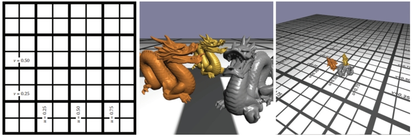
Figure 17.11. The left-most image shows the texture, a 1024 × 1024 pixel image. The middle image shows the scene with the texture applied using texture coordinates in the range of [0, 1] so that only one image is tiled onto the ground plane. The right-most image modifies the texture parameters so that GL REPEAT is used for GL TEXTURE WRAP S and GL TEXTURE WRAP T and the texture coordinate range from [0, 5]. The result is a tiled texture repeat five times in both texture dimensions.
图 17.11。 最左边的图像显示纹理，这是一张 1024 × 1024 像素的图像。 中间的图像显示了使用 [0, 1] 范围内的纹理坐标应用纹理的场景，以便只有一张图像平铺到地平面上。 最右边的图像修改纹理参数，以便 GL REPEAT 用于 GL TEXTURE WRAP S 和 GL TEXTURE WRAP T 以及纹理坐标范围从 [0, 5]。 结果是平铺纹理在两个纹理维度上重复五次。

As a side note, another texture target that may be useful for various applications is the GL TEXTURE RECTANGLE. Texture rectangle are unique texture objects that are not constrained with the power-of-two width and height image requirements and use non-normalized texture coordinates. Furthermore, they do not allow repeated tiling. If texture rectangles are used, shaders must reference them using the special sampler type: sampler2DRect. 
顺便说一句，另一个可能对各种应用有用的纹理目标是 GL 纹理矩形。 纹理矩形是独特的纹理对象，不受二次方宽度和高度图像要求的约束，并使用非标准化纹理坐标。 此外，它们不允许重复平铺。 如果使用纹理矩形，着色器必须使用特殊的采样器类型来引用它们：sampler2DRect。

## 17.16 Object-Oriented Design for Graphics Hardware Programming 图形硬件编程的面向对象设计

As your familiarity with OpenGL increases, it becomes wise to encapsulate most of what is described in this chapter into class structures that can contain the model specific data and afford rendering of a variety of objects within the scene. For instance, in Figure 17.12, a single sphere is instanced six times to create the three ellipsoids and three spheres. Each model uses the same underlying geometry yet has different material properties and model transforms. If you’ve followed through the book and implemented the ray tracer, as detailed in Chapter 4, then it is likely that your implementation is based on a solid object-oriented design. That design can be leveraged to make developing a graphics hardware program with OpenGL easier. A typical ray tracer software architecture will include several classes that map directly into graphics hardware as well as software rasterization applications. The abstract base classes in the ray tracer that represent surfaces, materials, lights, shaders, and cameras can be adapted to initialize the graphics hardware state, update that state, and if necessary render the class data to the framebuffer. The interfaces to these virtual functions will likely need to be adapted to your specific implementation, but a first pass that extends the surface class design might resemble the following: 
随着您对 OpenGL 的熟悉程度的增加，将本章中描述的大部分内容封装到类结构中就变得明智了，这些结构可以包含模型特定的数据并提供场景中各种对象的渲染。 例如，在图 17.12 中，单个球体被实例化六次以创建三个椭球体和三个球体。 每个模型都使用相同的基础几何体，但具有不同的材料属性和模型变换。 如果您已经阅读了本书并实现了光线追踪器（如第 4 章中详细介绍的那样），那么您的实现很可能基于可靠的面向对象设计。 利用该设计可以更轻松地使用 OpenGL 开发图形硬件程序。 典型的光线追踪器软件架构将包括几个直接映射到图形硬件以及软件光栅化应用程序的类。 光线追踪器中表示表面、材质、灯光、着色器和相机的抽象基类可用于初始化图形硬件状态、更新该状态，并在必要时将类数据渲染到帧缓冲区。 这些虚拟函数的接口可能需要适应您的特定实现，但扩展表面类设计的第一遍可能类似于以下内容：

```glsl
class surface
virtual bool initializeOpenGL( )
virtual bool renderOpenGL( glm::mat4& Mp, glm::mat4& Mcam) 
```

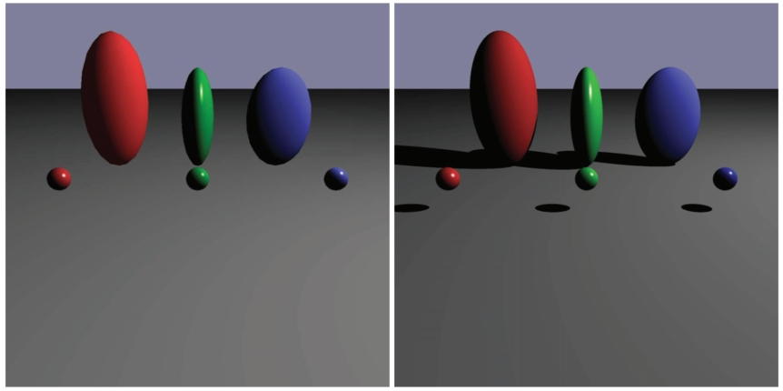
Figure 17.12. On the left, a single tessellated sphere is instanced six times using different model transforms to create this scene using the per-fragment shader program. The image on the right is rendered using a basic Whitted ray tracer. Notice the effect that shadows have on the perception of the scene. Per-fragment shading allows the specular highlight to be similar in both rendering styles.
图 17.12。 在左侧，使用不同的模型变换将单个细分球体实例化六次，以使用每片段着色器程序创建此场景。 右侧图像是使用基本 Whitted 光线追踪器渲染的。 注意阴影对场景感知的影响。 每片段着色允许镜面高光在两种渲染风格中相似。

Passing the projection and view matrices to the render functions affords an indirection for how these matrices are managed. These matrices would come from the camera classes which may be manipulated by interpreting keyboard, mouse, or joystick input. The initialization functions (at least for the surface derivatives) would contain the vertex buffer object and vertex array object allocation and initialization code. Aside from initiating the draw arrays for any vertex array objects, the render function would also need to activate shader programs and pass in the necessary matrices into the shaders, as illustrated previously in the dragon model example. As you work to integrate the image-order and object-order (hardware and software) algorithms into the same underlying data framework, a few software design challenges will pop up, mostly related to data access and organization. However, this is a highly useful exercise to become adept at software engineering for graphics programming and eventually gain solid experience hybridizing your rendering algorithms. 
将投影和视图矩阵传递给渲染函数可以间接了解如何管理这些矩阵。 这些矩阵来自相机类，可以通过解释键盘、鼠标或操纵杆输入来操作它们。 初始化函数（至少对于表面导数）将包含顶点缓冲区对象和顶点数组对象分配和初始化代码。 除了启动任何顶点数组对象的绘制数组之外，渲染函数还需要激活着色器程序并将必要的矩阵传递到着色器中，如前面的龙模型示例中所示。 当您致力于将图像顺序和对象顺序（硬件和软件）算法集成到同一底层数据框架中时，将会出现一些软件设计挑战，主要与数据访问和组织有关。 然而，这是一个非常有用的练习，可以熟练掌握图形编程的软件工程，并最终获得混合渲染算法的扎实经验。

## 17.17 Continued Learning  继续学习

This chapter was designed to provide an introductory glimpse into graphics hardware programming, influenced by the OpenGL API. There are many directions that your continued learning could go. Many topics, such as framebuffer objects, render to texture, environment mapping, geometry shaders, compute shaders, and advanced illumination shaders were not covered. These areas represent the next stages in learning about graphics hardware, but even within the areas covered, there are many directions that one could go to develop stronger graphics hardware understanding. Graphics hardware programming will continue to evolve and change. Interested readers should expect these changes and look to the specification documents for OpenGL and the OpenGL Shading Language for many more details about what OpenGL is capable of doing and how the hardware relates to those computations.
本章旨在介绍受 OpenGL API 影响的图形硬件编程。 您继续学习的方向有很多。 许多主题（例如帧缓冲区对象、渲染到纹理、环境映射、几何着色器、计算着色器和高级照明着色器）均未涵盖。 这些领域代表了学习图形硬件的下一阶段，但即使在所涵盖的领域内，人们也可以通过许多方向来加深对图形硬件的理解。 图形硬件编程将继续发展和变化。 感兴趣的读者应该期待这些变化，并查看 OpenGL 和 OpenGL 着色语言的规范文档，以获取有关 OpenGL 功能以及硬件如何与这些计算相关的更多详细信息。

## Frequently Asked Questions 经常问的问题

### How do I debug shader programs?  如何调试着色器程序？

On most platforms, debugging both vertex shaders and fragment shaders is not simple. However, more and more support is available through various drivers, operating system extensions, and IDEs to provide pertinent information to the developer. It still can be challenging, so use the shaders to visually debug your code. If nothing comes up on the screen, try rendering the normal vectors, the half vector, or anything that give you a sense for where the error might be (or not be). Figure 17.13 illustrates a normal shader in operation. If images do appear on your window, make sure they are what you expect (refer to Figure 17.14)!
在大多数平台上，调试顶点着色器和片段着色器并不简单。 然而，越来越多的支持可以通过各种驱动程序、操作系统扩展和 IDE 来为开发人员提供相关信息。 它仍然具有挑战性，因此请使用着色器以可视方式调试您的代码。 如果屏幕上没有显示任何内容，请尝试渲染法线向量、半向量或任何可以让您了解错误可能出现（或不出现）的位置的内容。 图 17.13 展示了正常运行的着色器。 如果图像确实出现在您的窗口中，请确保它们符合您的预期（请参阅图 17.14）！
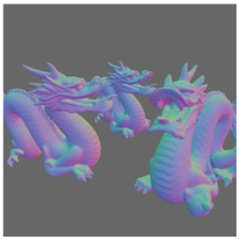
Figure 17.13. Applying the normal shader to a complex model for debugging purposes.
图 17.13。 将普通着色器应用于复杂模型以进行调试。
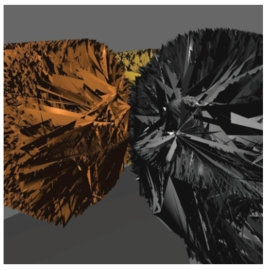
Figure 17.14. Visual debugging is important! Can you figure out what is wrong from the image or where to start debugging? When the incorrect stride is applied to the vertex array object, rendering goes awry.
图 17.14。 可视化调试很重要！ 您能从图像中找出问题所在或从哪里开始调试吗？ 当错误的步幅应用于顶点数组对象时，渲染就会出错。

## Notes  注释

There are many good resources available to learn more about the technical details involved with programming graphics hardware. A good starting point might be the OpenGL and GLSL specification documents. They are available for free online at the opengl.org website. These documents will provide complete details for all the different and emerging versions of OpenGL.
有许多很好的资源可用于了解有关图形硬件编程所涉及的技术细节的更多信息。 OpenGL 和 GLSL 规范文档可能是一个很好的起点。 它们可以在 opengl.org 网站上免费在线获取。 这些文档将为所有不同的和新兴的 OpenGL 版本提供完整的详细信息。

## Exercises 练习

The sections of this chapter are roughly organized to step students through the process of creating a modern OpenGL application. Some extra effort will be required to understand the details relating to setting up windows and OpenGL contexts. However, it should be possible to following the sections for a set of weekly one hour labs: 
本章的各个部分大致是为了引导学生完成创建现代 OpenGL 应用程序的过程。 需要付出一些额外的努力来理解与设置窗口和 OpenGL 上下文相关的细节。 但是，应该可以按照以下部分进行一组每周一小时的实验：

1. Lab 1: Basic code setup for OpenGL applications. This includes installing the necessary drivers and related software such as GLM and GLFW. Students can then write code to open a window and clear the color buffers.
   实验 1：OpenGL 应用程序的基本代码设置。 这包括安装必要的驱动程序和相关软件，例如 GLM 和 GLFW。 然后，学生可以编写代码来打开窗口并清除颜色缓冲区。
2. Lab 2: Creating a shader. Since a rudimentary shader is necessary to visualize the output in modern OpenGL, starting with efforts to create a very basic shader will go a long way. In this lab, or labs, students could build (or use provided) classes to load, compile, and link shaders into shader programs.
   实验 2：创建着色器。 由于在现代 OpenGL 中可视化输出需要一个基本的着色器，因此从创建一个非常基本的着色器开始将大有帮助。 在这个或多个实验室中，学生可以构建（或使用提供的）类来加载、编译着色器并将其链接到着色器程序中。
3. Lab 3: Create a clip coordinate triangle and shade. Using the shader classes from the previous lab, students will add the passthrough shader and create simple geometry to render.
   实验 3：创建剪辑坐标三角形和阴影。 使用上一个实验中的着色器类，学生将添加直通着色器并创建简单的几何体进行渲染。
4. Lab 4: Introduce GLM. Start using GLM to generate projection matrices and viewing matrices for viewing more generalized, yet simple, scenes. 
   实验 4：介绍 GLM。 开始使用 GLM 生成投影矩阵和查看矩阵，以查看更通用但简单的场景。
5. Lab 5: Use GLM for local transformations. Students can expand their working shader program to use local transforms, perhaps applying animations based on changing transforms. 
   实验 5：使用 GLM 进行局部转换。 学生可以扩展他们的工作着色器程序以使用局部变换，也许可以根据变化的变换应用动画。
6. Lab 6: Shader development. Develop the Lambertian or Blinn-Phong shaders. 
   实验室 6：着色器开发。 开发 Lambertian 或 Blinn-Phong 着色器。
7. Lab 7: Work with materials. Students can explore additional material properties and rendering styles with different shader programs. 
   实验室 7：使用材料。 学生可以使用不同的着色器程序探索其他材质属性和渲染样式。
8. Lab 8: Load 3D models. Using code to load OBJ files, students can further explore the capabilities of their graphics hardware including the limits of hardware processing for real-time applications. 
   实验 8：加载 3D 模型。 使用代码加载 OBJ 文件，学生可以进一步探索其图形硬件的功能，包括实时应用程序的硬件处理限制。
9. Lab 9: Textures. Using PNG (or other formats), students can load images onto the hardware and practice a variety of texture-mapping strategies. 
   实验 9：纹理。 使用 PNG（或其他格式），学生可以将图像加载到硬件上并练习各种纹理映射策略。
10. Lab 10: Integration with rendering code. If scene files are used to describe scenes for the ray tracer (or rasterizer), students’ OpenGL code can be integrated into a complete rendering framework using common structures and classes to build a complete system. 
    实验 10：与渲染代码集成。 如果场景文件用于描述光线追踪器（或光栅器）的场景，则学生的 OpenGL 代码可以使用通用结构和类集成到完整的渲染框架中，以构建完整的系统。

This list is only a guide. In labs for my computer graphics course, students are provided material to get them started on the week’s idea. After they get the basic idea working, the lab is completed once they add their spin or a creative exploration of the idea to their code. As students get familiar with graphics hardware programming, they can explore additional areas of interest, such as textures, render to texture, or more advanced shaders and graphics algorithms.
此列表仅供参考。 在我的计算机图形学课程的实验室中，为学生提供了材料来帮助他们开始本周的想法。 在他们获得基本想法后，一旦他们将自己的想法或对该想法的创造性探索添加到代码中，实验室就完成了。 随着学生熟悉图形硬件编程，他们可以探索其他感兴趣的领域，例如纹理、渲染到纹理或更高级的着色器和图形算法。


# 18  Light  光

In this chapter, we discuss the practical issues of measuring light, usually called radiometry. The terms that arise in radiometry may at first seem strange and have terminology and notation that may be hard to keep straight. However, because radiometry is so fundamental to computer graphics, it is worth studying radiometry until it sinks in. This chapter also covers photometry, which takes radiometric quantities and scales them to estimate how much “useful” light is present. For example, a green light may seem twice as bright as a blue light of the same power because the eye is more sensitive to green light. Photometry attempts to quantify such distinctions. 
在本章中，我们讨论测量光的实际问题，通常称为辐射测量。 辐射测量中出现的术语乍一看可能很奇怪，并且术语和符号可能很难理解。 然而，由于辐射测量对于计算机图形学来说是如此基础，因此值得研究辐射测量直到它被理解。本章还介绍了光度测量，它采用辐射测量量并对其进行缩放以估计存在多少“有用”光。 例如，绿光看起来可能是相同功率的蓝光的两倍，因为眼睛对绿光更敏感。 光度测定试图量化这种区别。

## 18.1 Radiometry  辐射测量

Although we can define radiometric units in many systems, we use SI (International System of Units) units. Familiar SI units include the metric units of meter (m) and gram (g). Light is fundamentally a propagating form of energy, so it is useful to define the SI unit of energy, which is the joule (J). 
尽管我们可以在许多系统中定义辐射单位，但我们使用 SI（国际单位制）单位。 熟悉的 SI 单位包括公制单位米 (m) 和克 (g)。 光从根本上来说是一种能量的传播形式，因此定义能量的 SI 单位（焦耳 (J)）非常有用。

### 18.1.1 Photons  光子

To aid our intuition, we will describe radiometry in terms of collections of large numbers of photons, and this section establishes what is meant by a photon in this context. For the purposes of this chapter, a photon is a quantum of light that has a position, direction of propagation, and a wavelength $λ$. Somewhat strangely, the SI unit used for wavelength is nanometer (nm). This is mainly for historical reasons, and $1 nm = 10^{−9} m$. Another unit, the angstrom, is sometimes used, and one nanometer is ten angstroms. A photon also has a speed c that depends only on the refractive index n of the medium through which it propagates. Sometimes the frequency $f = c/λ$ is also used for light. This is convenient because unlike λ and c, f does not change when the photon refracts into a medium with a new refractive index. Another invariant measure is the amount of energy q carried by a photon, which is given by the following relationship:
为了帮助我们的直觉，我们将用大量光子的集合来描述辐射测量，本节将确定光子在这种情况下的含义。 就本章而言，光子是具有位置、传播方向和波长 $λ$ 的光量子。 有点奇怪的是，用于波长的 SI 单位是纳米 (nm)。 这主要是历史原因，$1 nm = 10^{−9} m$。 有时使用另一个单位埃，一纳米等于十埃。 光子的速度 c 只取决于光子传播介质的折射率 n。 有时，频率 $f = c/λ$ 也用于光。 这很方便，因为与 λ 和 c 不同，当光子折射到具有新折射率的介质中时，f 不会改变。 另一个不变的度量是光子携带的能量 q，其由以下关系给出：
$$
q=hf=\frac{hc}{λ} \ \ \ \ (18.1)
$$
where $h = 6.63 × 10^{−34}$ J s is Plank’s Constant. Although these quantities can be measured in any unit system, we will use SI units whenever possible. 
其中 $h = 6.63 × 10^{−34}$ J s 是普朗克常数。 尽管这些量可以用任何单位制来测量，但我们将尽可能使用 SI 单位。

### 18.1.2 Spectral Energy  光谱能量

If we have a large collection of photons, their total energy Q can be computed by summing the energy qi of each photon. A reasonable question to ask is “How is the energy distributed across wavelengths?” An easy way to answer this is to partition the photons into bins, essentially histogramming them. We then have an energy associated with an interval. For example, we can count all the energy between λ = 500 nm and λ = 600 nm and have it turn out to be 10.2 J, and this might be denoted q[500, 600] = 10.2. If we divided the wavelength interval into two 50 nm intervals, we might find that q[500, 550] = 5.2 and q[550, 600] = 5.0. This tells us there was a little more energy in the short wavelength half of the interval [500, 600]. If we divide into 25 nm bins, we might find q[500, 525] = 2.5, and so on. The nice thing about the system is that it is straightforward. The bad thing about it is that the choice of the interval size determines the number. 
如果我们有大量光子，它们的总能量 Q 可以通过对每个光子的能量 qi 求和来计算。 一个合理的问题是“能量如何在波长上分布？” 回答这个问题的一个简单方法是将光子划分到箱中，本质上是对它们进行直方图绘制。 然后我们就有了与间隔相关的能量。 例如，我们可以计算 λ = 500 nm 和 λ = 600 nm 之间的所有能量，结果为 10.2 J，这可以表示为 q[500, 600] = 10.2。 如果我们将波长间隔分成两个 50 nm 的间隔，我们可能会发现 q[500, 550] = 5.2 和 q[550, 600] = 5.0。 这告诉我们在间隔 [500, 600] 的短波长一半中有更多的能量。 如果我们划分为 25 nm 的 bin，我们可能会发现 q[500, 525] = 2.5，依此类推。 该系统的优点在于它很简单。 其不好之处在于间隔大小的选择决定了数量。

A more commonly used system is to divide the energy by the size of the interval. So instead of q[500, 600] = 10.2 we would have
更常用的系统是将能量除以间隔的大小。 因此，我们将不用 q[500, 600] = 10.2
$Q_λ[500, 600] = \frac{10.2}{100} = 0.12 J(nm)^{-1} $

This approach is nice, because the size of the interval has much less impact on the overall size of the numbers. An immediate idea would be to drive the interval size Δλ to zero. This could be awkward, because for a sufficiently small Δλ, $Q_λ$ will either be zero or huge depending on whether there is a single photon or no photon in the interval. There are two schools of thought to solve that dilemma. The first is to assume that Δλ is small, but not so small that the quantum nature of light comes into play. The second is to assume that the light is a continuum rather than individual photons, so a true derivative $dQ/dλ$ is appropriate. Both ways of thinking about it are appropriate and lead to the same computational machinery. In practice, it seems that most people who measure light prefer small, but finite, intervals, because that is what they can measure in the lab. Most people who do theory or computation prefer infinitesimal intervals, because that makes the machinery of calculus available. 
这种方法很好，因为间隔的大小对数字整体大小的影响要小得多。 一个直接的想法是将间隔大小 Δλ 驱动至零。 这可能会很尴尬，因为对于足够小的 Δλ，$Q_λ$ 将为零或很大，具体取决于间隔中是否有单个光子或没有光子。 有两种思想流派可以解决这个困境。 首先是假设 Δλ 很小，但不会小到光的量子性质发挥作用。 第二个是假设光是连续谱而不是单个光子，因此真正的导数 $dQ/dλ$ 是合适的。 两种思考方式都是合适的，并且会产生相同的计算机制。 在实践中，大多数测量光的人似乎更喜欢小但有限的间隔，因为这是他们可以在实验室中测量的。 大多数从事理论或计算的人更喜欢无穷小的区间，因为这使得微积分的机制变得可用。

The quantity $Q_λ$ is called spectral energy, and it is an intensive quantity as opposed to an extensive quantity such as energy, length, or mass. Intensive quantities can be thought of as density functions that tell the density of an extensive quantity at an infinitesimal point. For example, the energy Q at a specific wavelength is probably zero, but the spectral energy (energy density) $Q_λ$ is a meaningful quantity. A probably more familiar example is that the population of a country may be 25 million, but the population at a point in that country is meaningless. However, the population density measured in people per square meter is meaningful, provided it is measured over large enough areas. Much like with photons, population density works best if we pretend that we can view population as a continuum where population density never becomes granular even when the area is small. 
量 $Q_λ$ 称为谱能量，它是一个强度量，而不是能量、长度或质量等广延量。 密集量可以被认为是密度函数，它告诉无限小点处的广延量的密度。 例如，特定波长处的能量 Q 可能为零，但光谱能量（能量密度）$Q_λ$ 是一个有意义的量。 一个可能更熟悉的例子是，一个国家的人口可能有2500万，但那个国家某一点的人口是没有意义的。 然而，只要在足够大的区域内进行测量，以每平方米的人数来衡量的人口密度是有意义的。 就像光子一样，如果我们假设我们可以将人口视为一个连续体，即使面积很小，人口密度也永远不会变得颗粒状，那么人口密度效果最好。

We will follow the convention of graphics where spectral energy is almost always used, and energy is rarely used. This results in a proliferation of λ subscripts if “proper” notation is used. Instead, we will drop the subscript and use Q to denote spectral energy. This can result in some confusion when people outside of graphics read graphics papers, so be aware of this standards issue. Your intuition about spectral energy might be aided by imagining a measurement device with a sensor that measures light energy Δq. If you place a colored filter in front of the sensor that allows only light in the interval $[λ − Δλ/2, λ + Δλ/2]$, then the spectral energy at λ is $Q = Δq/Δλ$. 
我们将遵循图形惯例，其中几乎总是使用光谱能量，而很少使用能量。 如果使用“正确”的符号，这会导致 λ 下标的激增。 相反，我们将去掉下标并使用 Q 来表示光谱能量。 当图形之外的人阅读图形纸时，这可能会导致一些混乱，因此请注意这个标准问题。 想象一个带有测量光能 Δq 的传感器的测量设备可能会有助于您对光谱能量的直觉。 如果您在传感器前面放置一个彩色滤光片，仅允许 $[λ − Δλ/2, λ + Δλ/2]$ 区间内的光进入，则 λ 处的光谱能量为 $Q = Δq/Δλ$。

### 18.1.3 Power  电源

It is useful to estimate a rate of energy production for light sources. This rate is called power, and it is measured in watts, W , which is another name for joules per second. This is easiest to understand in a steady state, but because power is an intensive quantity (a density over time), it is well defined even when energy production is varying over time. The units of power may be more familiar, e.g., a 100-watt light bulb. Such bulbs draw approximately 100 J of energy each second. The power of the light produced will actually be less than 100 W because of heat loss, etc., but we can still use this example to help understand more about photons. For example, we can get a feel for how many photons are produced in a second by a 100 W light. Suppose the average photon produced has the energy of a λ = 500 nm photon. The frequency of such a photon is
估计光源的能量产生率很有用。 该速率称为功率，以瓦特 (W) 为单位进行测量，W 是每秒焦耳的另一个名称。 这在稳定状态下最容易理解，但由于功率是一个密集量（随时间变化的密度），因此即使能源产量随时间变化，它也能得到很好的定义。 功率单位可能更为熟悉，例如 100 瓦灯泡。 这种灯泡每秒消耗大约 100 J 的能量。 由于热损失等原因，产生的光的功率实际上会低于 100W，但我们仍然可以使用这个例子来帮助更多地了解光子。 例如，我们可以了解 100 W 的光在一秒钟内产生了多少个光子。 假设产生的平均光子的能量为 λ = 500 nm 光子。 这种光子的频率是
$$
f = \frac{c}{λ} = \frac{3 × 10^8 ms^{−1}}{500 × 10^{−9} m} = 6 × 10^{14} s^{−1}
$$
The energy of that photon is $hf ≈ 4 × 10^{−19} J$. That means a staggering $10^{20}$ photons are produced each second, even if the bulb is not very efficient. This explains why simulating a camera with a fast shutter speed and directly simulated photons is an inefficient choice for producing images. 
该光子的能量为 $hf ≈ 4 × 10^{−19} J$。 这意味着即使灯泡的效率不是很高，每秒也会产生惊人的 $10^{20}$ 光子。 这解释了为什么模拟具有快速快门速度和直接模拟光子的相机对于生成图像来说是低效的选择。

As with energy, we are really interested in spectral power measured in $W(nm)^{−1}$. Again, although the formal standard symbol for spectral power is $Φ_λ$, we will use $Φ$ with no subscript for convenience and consistency with most of the graphics literature. One thing to note is that the spectral power for a light source is usually a smaller number than the power. For example, if a light emits a power of 100 W evenly distributed over wavelengths 400 nm to 800 nm, then the spectral power will be $100 W/400 nm = 0.25 W(nm)^{−1}$. This is something to keep in mind if you set the spectral power of light sources by hand for debugging purposes. 
与能量一样，我们真正感兴趣的是以 $W(nm)^{−1}$ 为单位测量的光谱功率。 同样，虽然光谱功率的正式标准符号是 $Φ_λ$，但为了方便和与大多数图形文献保持一致，我们将使用不带下标的 $Φ$。 需要注意的一件事是，光源的光谱功率通常比功率更小。 例如，如果光发出 100 W 的功率，均匀分布在 400 nm 至 800 nm 的波长上，则光谱功率将为 $100 W/400 nm = 0.25 W(nm)^{−1}$。 如果您出于调试目的手动设置光源的光谱功率，则需要记住这一点。

The measurement device for spectral energy in the last section could be modified by taking a reading with a shutter that is open for a time interval Δt centered at time t. The spectral power would then be $Φ = Δq/(ΔtΔλ)$.
最后一节中的光谱能量测量装置可以通过使用以时间 t 为中心打开时间间隔 Δt 的快门读取读数来修改。 光谱功率将为 $Φ = Δq/(ΔtΔλ)$。

### 18.1.4 Irradiance 辐照度

The quantity irradiance arises naturally if you ask the question “How much light hits this point?” Of course the answer is “none,” and again we must use a density function. If the point is on a surface, it is natural to use area to define our density function. We modify the device from the last section to have a finite $ΔA$ area sensor that is smaller than the light field being measured. The spectral irradiance H is just the power per unit area $ΔΦ/ΔA$. Fully expanded this is
如果你问“有多少光照射到这一点？”这个问题，数量辐照度自然会出现。 当然，答案是“无”，我们必须再次使用密度函数。 如果该点位于曲面上，则很自然地使用面积来定义我们的密度函数。 我们修改了上一节的设备，使其具有比被测量的光场更小的有限 $ΔA$ 面积传感器。 光谱辐照度H就是单位面积的功率$ΔΦ/ΔA$。 完全展开后是这样的
$$
H = \frac{Δq}{ΔA ΔtΔλ} \ \ \ \ (18.2)
$$
Thus, the full units of irradiance are $Jm^{−2}s^{−1}(nm)^{−1}$. Note that the SI units for radiance include inverse-meter-squared for area and inverse-nanometer for wavelength. This seeming inconsistency (using both nanometer and meter) arises because of the natural units for area and visible light wavelengths.
因此，辐照度的完整单位为 $Jm^{−2}s^{−1}(nm)^{−1}$。 请注意，辐射亮度的 SI 单位包括面积的倒数米平方和波长的倒数纳米。 这种看似不一致（同时使用纳米和米）的原因是面积和可见光波长的自然单位。

When the light is leaving a surface, e.g., when it is reflected, the same quantity as irradiance is called radiant exitance, E. It is useful to have different words for incident and exitant light, because the same point has potentially different irradiance and radiant exitance.
当光离开表面时，例如，当它被反射时，与辐照度相同的量称为辐射出射度 E。对入射光和出射光使用不同的词很有用，因为同一点可能具有不同的辐照度和辐射度。 退出。

### 18.1.5 Radiance 光辉

Although irradiance tells us how much light is arriving at a point, it tells us little about the direction that light comes from. To measure something analogous to what we see with our eyes, we need to be able to associate “how much light” with a specific direction. We can imagine a simple device to measure such a quantity (Figure 18.1). We use a small irradiance meter and add a conical “baffler” which limits light hitting the counter to a range of angles with solid angle $Δσ$. The response of the detector is as follows:
尽管辐照度告诉我们有多少光到达某个点，但它却无法告诉我们光来自的方向。 为了测量类似于我们用眼睛看到的东西，我们需要能够将“多少光”与特定方向联系起来。 我们可以想象一个简单的设备来测量这样的量（图 18.1）。 我们使用小型辐照度计并添加锥形“挡板”，将照射到柜台的光线限制在立体角 $Δσ$ 的角度范围内。 检测器的响应如下：
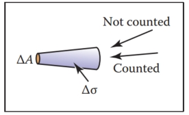
Figure 18.1. By adding a blinder that shows only a small solid angle Δσ to the irradiance detector, we measure radiance.
图 18.1。 通过向辐照度检测器添加仅显示小立体角 Δσ 的遮光罩，我们可以测量辐射率。

$response = \frac{ΔH}{Δσ} = \frac{Δq}{ΔA Δσ Δt Δλ} \\$

This is the spectral radiance of light traveling in space. Again, we will drop the “spectral” in our discussion and assume that it is implicit. 
这是在太空中传播的光的光谱辐射亮度。 再次，我们将在讨论中放弃“光谱”并假设它是隐含的。

Radiance is what we are usually computing in graphics programs. A wonderful property of radiance is that it does not vary along a line in space. To see why this is true, examine the two radiance detectors both looking at a surface as shown in Figure 18.2. Assume the lines the detectors are looking along are close enough together that the surface is emitting/reflecting light “the same” in both of the areas being measured. Because the area of the surface being sampled is proportional to squared distance, and because the light reaching the detector is inversely proportional to squared distance, the two detectors should have the same reading. 
辐射度是我们通常在图形程序中计算的。 辐射度的一个奇妙特性是它不会沿空间线变化。 要了解为什么会出现这种情况，请检查两个均观察表面的辐射探测器，如图 18.2 所示。 假设探测器所观察的线足够近，以至于表面在两个被测量的区域中发射/反射的光“相同”。 因为被采样表面的面积与距离的平方成正比，并且因为到达检测器的光与距离的平方成反比，所以两个检测器应该具有相同的读数。
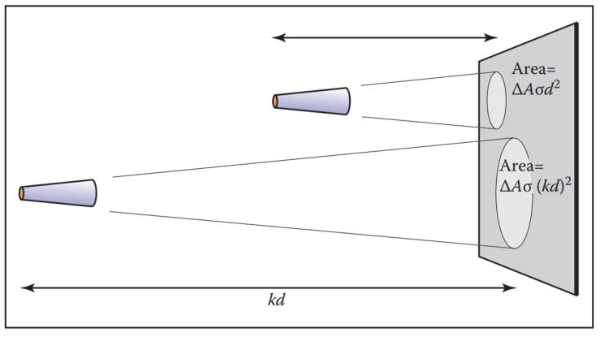
Figure 18.2. The signal a radiance detector receives does not depend on the distance to the surface being measured. This figure assumes the detectors are pointing at areas on the surface that are emitting light in the same way.
图 18.2。 辐射检测器接收的信号并不取决于到被测量表面的距离。 该图假设探测器指向表面上以相同方式发光的区域。

It is useful to measure the radiance hitting a surface. We can think of placing the cone baffler from the radiance detector at a point on the surface and measuring the irradiance H on the surface originating from directions within the cone (Figure 18.3). Note that the surface “detector” is not aligned with the cone. For this reason we need to add a cosine correction term to our definition of radiance:
测量照射到表面的辐射率很有用。 我们可以考虑将辐射检测器的锥体挡板放置在表面上的一点，并测量表面上源自锥体内方向的辐照度 H（图 18.3）。 请注意，表面“探测器”未与锥体对齐。 因此，我们需要在辐射率的定义中添加一个余弦校正项：
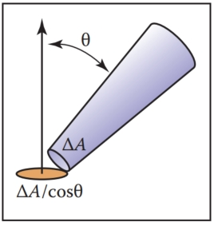
Figure 18.3. The irradiance at the surface as masked by the cone is smaller than that measured at the detector by a cosine factor.
图 18.3。 锥体遮蔽的表面处的辐照度比探测器处测量的辐照度小一个余弦因子。
$$
response = \frac{ΔH}{Δσ cos θ} = \frac{Δq}{ΔA cos θ Δσ Δt Δλ}
$$
As with irradiance and radiant exitance, it is useful to distinguish between radiance incident at a point on a surface and exitant from that point. Terms for these concepts sometimes used in the graphics literature are surface radiance $L_s$ for the radiance of (leaving) a surface, and field radiance $L_f$ for the radiance incident at a surface. Both require the cosine term, because they both correspond to the configuration in Figure 18.3:
与辐照度和辐射出射度一样，区分表面上某一点的入射辐射度和从该点出射的辐射度非常有用。 有时在图形文献中使用的这些概念的术语是表面辐射率 $L_s$（离开）表面的辐射率，场辐射率 $L_f$ 表示入射到表面的辐射率。 两者都需要余弦项，因为它们都对应于图 18.3 中的配置：
$$
L_s = \frac{ΔE}{Δσ cos θ} \\
L_f = \frac{ΔH}{Δσ cos θ}
$$

#### Radiance and Other Radiometric Quantities  辐射亮度和其他辐射量

If we have a surface whose field radiance is $L_f$ , then we can derive all of the other radiometric quantities from it. This is one reason radiance is considered the “fundamental” radiometric quantity. For example, the irradiance can be expressed as
如果我们有一个场辐射率为 $L_f$ 的表面，那么我们可以从中导出所有其他辐射量。 这是辐射率被认为是“基本”辐射量的原因之一。 例如，辐照度可以表示为
$$
H = \int_{all\ \bold{k}} L_f(\bold{k})\cos θ dσ
$$
This formula has several notational conventions that are common in graphics that make such formulae opaque to readers not familiar with them (Figure 18.4). First, $\bold{k}$ is an incident direction and can be thought of as a unit vector, a direction, or a (θ, φ) pair in spherical coordinates with respect to the surface normal. The direction has a differential solid angle dσ associated with it. The field radiance is potentially different for every direction, so we write it as a function $L(\bold{k})$.
该公式具有图形中常见的几种符号约定，这使得这些公式对于不熟悉它们的读者来说不透明（图18.4）。 首先， $\bold{k}$ 是入射方向，可以被认为是相对于表面法线的球坐标中的单位向量、方向或 (θ, φ) 对。 该方向有一个与之相关的微分立体角 dσ。 每个方向的场辐射率可能不同，因此我们将其写为函数 $L(\bold{k})$。
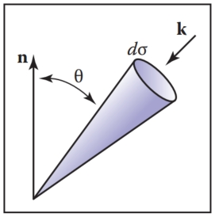
Figure 18.4. The direction $\bold{k}$ has a differential solid angle dσ associated with it.
图 18.4。 方向 $\bold{k}$ 有一个与之相关的微分立体角 dσ。

As an example, we can compute the irradiance H at a surface that has constant field radiance $L_f$ in all directions. To integrate, we use a classic spherical coordinate system and recall that the differential solid angle is
例如，我们可以计算在所有方向上具有恒定场辐射 $L_f$ 的表面的辐照度 H。 为了积分，我们使用经典的球坐标系并回想一下微分立体角是
$dσ ≡ sin θ dθ dφ,  $
so the irradiance is 
所以辐照度是
$H = \int^{2\pi}_{φ=0}\int^{\frac{\pi}{2}}_{θ=0}L_f cos θ sin θ dθ dφ =  πLf .   \\$

This relation shows us our first occurrence of a potentially surprising constant π. These factors of π occur frequently in radiometry and are an artifact of how we chose to measure solid angles, i.e., the area of a unit sphere is a multiple of π rather than a multiple of one. 
这种关系向我们展示了一个可能令人惊讶的常数 π 的首次出现。 这些 π 因子在辐射测量中经常出现，并且是我们选择测量立体角的方式的产物，即单位球体的面积是 π 的倍数而不是 1 的倍数。

Similarly, we can find the power hitting a surface by integrating the irradiance across the surface area:
类似地，我们可以通过积分整个表面区域的辐照度来找到击中表面的功率：
$Φ =  \int_{all\ \bold{x}}H(x)dA$

where x is a point on the surface, and dA is the differential area associated with that point. Note that we don’t have special terms or symbols for incoming versus outgoing power. That distinction does not seem to come up enough to have encouraged the distinction. 
其中 x 是表面上的点，dA 是与该点相关的微分面积。 请注意，我们没有针对输入功率和输出功率的特殊术语或符号。 这种区别似乎还不足以鼓励这种区别。

### 18.1.6 BRDF 双向逆向分布函数

Because we are interested in surface appearance, we would like to characterize how a surface reflects light. At an intuitive level, for any incident light coming from direction $\bold{k}_i$, there is some fraction scattered in a small solid angle near the outgoing direction $\bold{k}_o$. There are many ways we could formalize such a concept, and not surprisingly, the standard way to do so is inspired by building a simple measurement device. Such a device is shown in Figure 18.5, where a small light source is positioned in direction $\bold{k}_i$ as seen from a point on a surface, and a detector is placed in direction ko. For every directional pair $(\bold{k}_i, \bold{k}_o)$, we take a reading with the detector. 
因为我们对表面外观感兴趣，所以我们想表征表面如何反射光。 在直观层面上，对于来自 $\bold{k}_i$ 方向的任何入射光，在出射方向 $\bold{k}_o$ 附近的小立体角中会有一些散射。 我们可以通过多种方法来形式化这样的概念，毫不奇怪，这样做的标准方法是受到构建一个简单的测量设备的启发。 这样的设备如图 18.5 所示，其中一个小光源位于从表面上的点看去的方向 $\bold{k}_i$ 上，探测器放置在方向 ko 上。 对于每个方向对 $(\bold{k}_i, \bold{k}_o)$，我们用探测器读取读数。
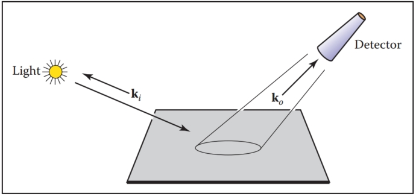
Figure 18.5. A simple measurement device for directional reflectance. The positions of light and detector are moved to each possible pair of directions. Note that both $\bold{k}_i$ and $\bold{k}_o$ point away from the surface to allow reciprocity.
图 18.5。 一种简单的定向反射率测量装置。 光和检测器的位置移动到每对可能的方向。 请注意，$\bold{k}_i$ 和 $\bold{k}_o$ 都指向远离表面的方向，以实现互易。

Now we just have to decide how to measure the strength of the light source and make our reflection function independent of this strength. For example, if we replaced the light with a brighter light, we would not want to think of the surface as reflecting light differently. We could place a radiance meter at the point being illuminated to measure the light. However, for this to get an accurate reading that would not depend on the Δσ of the detector, we would need the light to subtend a solid angle bigger than Δσ. Unfortunately, the measurement taken by our roving radiance detector in direction $\bold{k}_o$ will also count light that comes from points outside the new detector’s cone. So this does not seem like a practical solution. 
现在我们只需要决定如何测量光源的强度并使我们的反射函数独立于该强度。 例如，如果我们用更亮的光替换光，我们就不会希望表面以不同的方式反射光。 我们可以在被照射的点放置一个辐射计来测量光。 然而，为了获得不依赖于探测器 Δσ 的准确读数，我们需要光线对向大于 Δσ 的立体角。 不幸的是，我们的流动辐射探测器在 $\bold{k}_o$ 方向上进行的测量也会计算来自新探测器锥体之外的点的光。 所以这似乎不是一个实际的解决方案。

Alternatively, we can place an irradiance meter at the point on the surface being measured. This will take a reading that does not depend strongly on subtleties of the light source geometry. This suggests characterizing reflectance as a ratio:
或者，我们可以将辐照度计放置在被测量表面的点处。 这将需要一个不太依赖于光源几何形状的微妙之处的读数。 这表明将反射率表征为一个比率：
$ρ =  \frac{L_s}{H} \\$

where this fraction ρ will vary with incident and exitant directions $\bold{k}_i$ and $\bold{k}_o$, H is the irradiance for light position $\bold{k}_i$, and $L_s$ is the surface radiance measured in direction $\bold{k}_o$. If we take such a measurement for all direction pairs, we end up with a 4D function $ρ(\bold{k}_i, \bold{k}_o)$. This function is called the bidirectional reflectance distribution function (BRDF). The BRDF is all we need to know to characterize the directional properties of how a surface reflects light.
其中该分数 ρ 将随入射和出射方向 $\bold{k}_i$ 和 $\bold{k}_o$ 变化，H 是光位置 $\bold{k}_i$ 的辐照度，$L_s$ 是 在 $\bold{k}_o$ 方向测量的表面辐射率。 如果我们对所有方向对进行这样的测量，我们最终会得到一个 4D 函数 $ρ(\bold{k}_i, \bold{k}_o)$。 该函数称为双向反射分布函数（BRDF）。 我们只需要知道 BRDF 即可描述表面反射光的方向特性。

#### Directional Hemispherical Reflectance 定向半球反射率

Given a BRDF, it is straightforward to ask, “What fraction of incident light is reflected?” However, the answer is not so easy; the fraction reflected depends on the directional distribution of incoming light. For this reason, we typically only set a fraction reflected for a fixed incident direction $\bold{k}_i$. This fraction is called the directional hemispherical reflectance. This fraction, $R(\bold{k}_i)$ is defined by
给定 BRDF，很容易问“入射光的哪一部分被反射？” 然而，答案并不那么容易； 反射的部分取决于入射光的方向分布。 因此，我们通常只设置固定入射方向 $\bold{k}_i$ 反射的分数。 该分数称为定向半球反射率。 该分数 $R(\bold{k}_i)$ 定义为
$R(\bold{k}_i) = \frac{power\ in\ all\ outgoing\ directions\ \bold{k}_o }{power\ in\ a\ beam\ from\ direction\ \bold{k}_i   } \\$

Note that this quantity is between zero and one for reasons of energy conservation. If we allow the incident power $Φ_i$ to hit on a small area ΔA, then the irradiance is $Φ_i/ΔA$. Also, the ratio of the incoming power is just the ratio of the radiant exitance to irradiance:
请注意，出于能量守恒的原因，该数量介于 0 和 1 之间。 如果我们让入射功率 $Φ_i$ 照射到一个小区域 ΔA，则辐照度为 $Φ_i/ΔA$。 此外，输入功率的比率就是辐射出射度与辐照度的比率：
$R(\bold{k}_i) =  \frac{E}{H} \\$

The radiance in a particular direction resulting from this power is by the definition of BRDF: 
由该功率产生的特定方向的辐射度由 BRDF 定义：
$L(\bold{k}_o) = Hρ(\bold{k}_i, \bold{k}_o) = \frac{Φ_i}{ΔA } \\$

And from the definition of radiance, we also have 
根据辐射度的定义，我们也有
$L(\bold{k}_o) = \frac{ΔE}{Δσ_o cos θ_o  } \\$

where E is the radiant exitance of the small patch in direction $\bold{k}_o$. Using these two definitions for radiance we get
其中 E 是小斑块在 $\bold{k}_o$ 方向上的辐射出射度。 使用这两个辐射度定义，我们得到
$H_ρ(\bold{k}_i, \bold{k}_o) = \frac{ΔE}{Δσ_o cos θ_o  }\\$

Rearranging terms, we get 
重新排列术语，我们得到
$\frac{ΔE}{H} = ρ(\bold{k}_i, \bold{k}_o)Δσ_o cos θ_o.  \\$

This is just the small contribution to E/H that is reflected near the particular $\bold{k}_o$. To find the total $R(\bold{k}_i)$, we sum over all outgoing $\bold{k}_o$. In integral form this is
这只是反映在特定 $\bold{k}_o$ 附近对 E/H 的微小贡献。 为了找到总 $R(\bold{k}_i)$，我们对所有传出的 $\bold{k}_o$ 求和。 积分形式是
$R(\bold{k}_i) = \int_{all\ \bold{k}_o}ρ(\bold{k}_i, \bold{k}_o)\cosθ_o dσ_o.  $

#### Ideal Diffuse BRDF 理想的漫反射 BRDF

An idealized diffuse surface is called Lambertian. Such surfaces are impossible in nature for thermodynamic reasons, but mathematically they do conserve energy. The Lambertian BRDF has ρ equal to a constant for all angles. This means the surface will have the same radiance for all viewing angles, and this radiance will be proportional to the irradiance. 
理想化的漫反射表面称为朗伯表面。 由于热力学原因，这样的表面在自然界中是不可能的，但从数学上讲，它们确实节省了能量。 朗伯 BRDF 的 ρ 对于所有角度都等于常数。 这意味着表面对于所有视角都将具有相同的辐射亮度，并且该辐射亮度将与辐照度成正比。

If we compute $R(\bold{k}_i)$ for a a Lambertian surface with $ρ = C$ we get
如果我们计算朗伯曲面的 $R(\bold{k}_i)$ 且 $ρ = C$ 我们得到
$R(\bold{k}_i) = \int_{all\ \bold{k}_o}C\cosθ_o dσ_o = \int^{2\pi}_{φ_o=0}  \int^{\pi/2}_{θ_o=0}C \cos θ_o \sin θ_o dθ_o dφ_o = \pi C \\$

Thus, for a perfectly reflecting Lambertian surface (R = 1), we have $ρ = 1/π$, and for a Lambertian surface where $R(\bold{k}_i) = r$, we have
因此，对于完美反射的朗伯表面 (R = 1)，我们有 $ρ = 1/π$，对于 $R(\bold{k}_i) = r$ 的朗伯表面，我们有
$ρ(\bold{k}_i, \bold{k}_o) = \frac{r}{\pi} \\$
This is another example where the use of a steradian for the solid angle determines the normalizing constant and thus introduces factors of π.
这是另一个例子，其中使用立体角的球面度来确定归一化常数，从而引入 π 因子。

## 18.2 Transport Equation 传输方程

With the definition of BRDF, we can describe the radiance of a surface in terms of the incoming radiance from all different directions. Because in computer graphics we can use idealized mathematics that might be impractical to instantiate in the lab, we can also write the BRDF in terms of radiance only. If we take a small part of the light with solid angle $Δσ_i$ with radiance $L_i$ and “measure” the reflected radiance in direction $\bold{k}_o$ due to this small piece of the light, we can compute a BRDF (Figure 18.6). The irradiance due to the small piece of light is $H = L_i \cos θ_iΔσ_i$. Thus the BRDF is
根据 BRDF 的定义，我们可以用来自所有不同方向的入射辐射率来描述表面的辐射率。 因为在计算机图形学中，我们可以使用在实验室中实例化可能不切实际的理想化数学，所以我们也可以仅根据辐射度来编写 BRDF。 如果我们取一小部分具有立体角$Δσ_i$、辐射度为$L_i$的光，并“测量”由于这小块光而在$\bold{k}_o$方向上反射的辐射度，我们可以计算出 BRDF（图 18.6）。 小片光的辐照度为 $H = L_i \cos θ_iΔσ_i$。 因此 BRDF 是
$ρ =  \frac{L_o}{L_i \cos θ_iΔσ_i } \\$

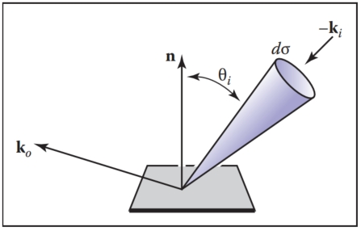
Figure 18.6. The geometry for the transport equation in its directional form. 
图 18.6。 方向形式的输运方程的几何形状。

This form can be useful in some situations. Rearranging terms, we can write down the part of the radiance that is due to light coming from direction $\bold{k}_i$: 
这种形式在某些情况下很有用。 重新排列术语，我们可以写下由于来自 $\bold{k}_i$ 方向的光而产生的辐射部分：
$ΔL_o = ρ(\bold{k}_i, \bold{k}_o)L_i \cos θ_iΔσ_i.  $

If there is light coming from many directions $L_i(\bold{k}_i)$, we can sum all of them. In integral form, with notation for surface and field radiance, this is 
如果有来自多个方向的光$L_i(\bold{k}_i)$，我们可以将它们全部相加。 以积分形式，用表面和场辐射率的符号表示，这是
$L_s(\bold{k}_o) = \int_{all\ \bold{k}_i} ρ(\bold{k}_i, \bold{k}_o)L_f(\bold{k}_i) \cos θ_idσ_i.   $

This is often called the rendering equation in computer graphics (Immel, Cohen, & Greenberg, 1986). 
这通常称为计算机图形学中的渲染方程（Immel、Cohen 和 Greenberg，1986）。

Sometimes it is useful to write the transport equation in terms of surface radiances only (Kajiya, 1986). Note, that in a closed environment, the field radiance $L_f(\bold{k}_i)$ comes from some surface with surface radiance $L_s(−\bold{k}_i) = L_f(\bold{k}_i)$ (Figure 18.7). The solid angle subtended by the point $\bold{x}'$ in the figure is given by
 有时仅根据表面辐射率来编写输运方程是有用的（Kajiya，1986）。 请注意，在封闭环境中，场辐射率 $L_f(\bold{k}_i)$ 来自表面辐射率 $L_s(−\bold{k}_i) = L_f(\bold{k}_i) 的某个表面 $（图 18.7）。 图中点 $\bold{x}'$ 所对的立体角由下式给出
$Δσ_i =  \frac{ΔA' \cos θ'}{\|\bold{x}-  \bold{x}'\|^2} \\$

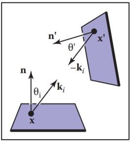
Figure 18.7. The light coming into one point comes from another point.
图 18.7。 进入一点的光来自另一点。

where $ΔA'$ the the area we associate with $x'$. Substituting for $Δσ_i$ in terms of $ΔA'$ suggests the following transport equation:
其中 $ΔA'$ 是我们与 $x'$ 关联的区域。 用 $ΔA'$ 代替 $Δσ_i$ 得出以下传输方程：
$L_s(\bold{x}, \bold{k}_o) = \int_{all\ x'\ visible\ to\ \bold{x}}\frac{ρ(\bold{k}_i, \bold{k}_o)L_s(\bold{x'}, \bold{x}- \bold{x}')\cos θ_i \cos θ'}{\|\bold{x} - \bold{x}'\|^2} dA'\\$

Note that we are using a non-normalized vector $\bold{x} − \bold{x}'$ to indicate the direction from $\bold{x}'$ to $\bold{x}$. Also note that we are writing $L_s$ as a function of position and direction. 
请注意，我们使用非归一化向量 $\bold{x} − \bold{x}'$ 来指示从 $\bold{x}'$ 到 $\bold{x}$ 的方向。 另请注意，我们将 $L_s$ 写为位置和方向的函数。

The only problem with this new transport equation is that the domain of integration is awkward. If we introduce a visibility function, we can trade off complexity in the domain with complexity in the integrand:
这个新的传输方程的唯一问题是积分域很尴尬。 如果我们引入可见性函数，我们可以权衡域的复杂性和被积函数的复杂性：
$L_s(x, \bold{k}_o) = \int_{all\ \bold{x}'} \frac{ρ(\bold{k}_i, \bold{k}_o)L_s(\bold{x'}, \bold{x}- \bold{x}')v(\bold{x}, \bold{x}')\cos θ_i \cos θ'}{\|\bold{x} - \bold{x}'\|^2} dA' \\ $

where
其中
$$
v(\bold{x}, \bold{x}') = \begin{cases}
1\ \ \ \ \  if\ \bold{x}\ and\ \bold{x}’\ are\ mutually\ visible, \\
0\ \ \ \ \ otherwise
\end{cases}
$$

## 18.3 Photometry 光度测定

For every spectral radiometric quantity there is a related photometric quantity that measures how much of that quantity is “useful” to a human observer. Given a spectral radiometric quantity $f_r(λ)$, the related photometric quantity $f_p$ is
对于每个光谱辐射量，都有一个相关的光度量，用于测量该量中有多少对人类观察者“有用”。 给定光谱辐射量 $f_r(λ)$，相关光度量 $f_p$ 为
$f_p = 683 \frac{lm}{W} \int^{800nm}_{λ  =380 nm  }\overline{y}(λ)f_r(λ) dλ   \\$

where $\overline{y}$ is the luminous efficiency function of the human visual system. This function is zero outside the limits of integration above, so the limits could be 0 and $∞$ and $f_p$ would not change. The luminous efficiency function will be discussed in more detail in Chapter 19, but we discuss its general properties here. The leading constant is to make the definition consistent with historical absolute photometric quantities.
其中$\overline{y}$是人类视觉系统的发光效率函数。 在上述积分限制之外，该函数为零，因此限制可以为 0，并且 $∞$ 和 $f_p$ 不会改变。 发光效率函数将在第 19 章中更详细地讨论，但我们在这里讨论它的一般属性。 主要常数是使定义与历史绝对光度量一致。

The luminous efficiency function is not equally sensitive to all wavelengths (Figure 18.8). For wavelengths below 380 nm (the ultraviolet range), the light is not visible to humans and thus has a $\overline{y}$ value of zero. From 380 nm it gradually increases until λ = 555 nm where it peaks. This is a pure green light. Then, it gradually decreases until it reaches the boundary of the infrared region at 800 nm.
发光效率函数对所有波长的敏感度不同（图 18.8）。 对于低于 380 nm（紫外线范围）的波长，人类看不到光，因此 $\overline{y}$ 值为零。 从 380 nm 开始，它逐渐增加，直到 λ = 555 nm，达到峰值。 这是纯粹的绿光。 然后逐渐减小，直至到达800 nm 处的红外区域边界。
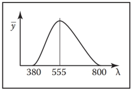
Figure 18.8. The luminous efficiency function versus wavelength (nm).
图 18.8。 发光效率与波长（nm)的函数。

The photometric quantity that is most commonly used in graphics is luminance, the photometric analog of radiance:
图形中最常用的光度量是亮度，即辐射亮度的光度模拟：
$$
Y = 683\frac{lm}{W}\int^{800nm}_{λ =380 nm}\overline{y}(λ)L(λ) dλ.
$$
The symbol Y for luminance comes from colorimetry. Most other fields use the symbol L; we will not follow that convention because it is too confusing to use L for both luminance and spectral radiance. Luminance gives one a general idea of how “bright” something is independent of the adaptation of the viewer. Note that the black paper under noonday sun is subjectively darker than the lower luminance white paper under moonlight; reading too much into luminance is dangerous, but it is a very useful quantity for getting a quantitative feel for relative perceivable light output. The unit lm stands for lumens. Note that most light bulbs are rated in terms of the power they consume in watts, and the useful light they produce in lumens. More efficient bulbs produce more of their light where $\overline{y}$ is large and thus produce more lumens per watt. A “perfect” light would convert all power into 555 nm light and would produce 683 lumens per watt. The units of luminance are thus $(lm/W)(W/(m^2sr)) = lm/(m^2sr)$. The quantity one lumen per steradian is defined to be one candela (cd), so luminance is usually described in units $cd/m^2$.
亮度符号 Y 来自比色学。 大多数其他字段使用符号 L； 我们不会遵循该约定，因为使用 L 表示亮度和光谱辐射率太混乱了。 亮度可以让人们大致了解某物的“明亮”程度，与观看者的适应无关。 请注意，正午阳光下的黑纸主观上比月光下亮度较低的白纸更暗； 过多地解读亮度是危险的，但对于获得相对可感知光输出的定量感觉来说，它是一个非常有用的量。 单位 lm 代表流明。 请注意，大多数灯泡的额定值是根据它们消耗的功率（以瓦为单位）和它们产生的有用光（以流明为单位）来衡量的。 更高效的灯泡在 $\overline{y}$ 较大的情况下产生更多的光，从而每瓦产生更多的流明。 “完美”的光会将所有能量转换为 555 nm 光，每瓦产生 683 流明。 因此，亮度单位为 $(lm/W)(W/(m^2sr)) = lm/(m^2sr)$。 每球面度一流明的数量定义为一坎德拉 (cd)，因此亮度通常以单位 $cd/m^2$ 来描述。

## Frequently Asked Questions 经常问的问题

### What is “intensity”?什么是“强度”？

The term intensity is used in a variety of contexts and its use varies with both era and discipline. In practice, it is no longer meaningful as a specific radiometric quantity, but it is useful for intuitive discussion. Most papers that use it do so in place of radiance.
“强度”一词在多种情况下都有使用，其用法随时代和学科的不同而变化。 在实践中，它作为特定的辐射量不再有意义，但对于直观讨论很有用。 大多数使用它的纸张都用它来代替辐射度。

### What is “radiosity”?  什么是“光能传递”？

The term radiosity is used in place of radiant exitance in some fields. It is also sometimes used to describe world-space light transport algorithms. 
在某些领域中，术语“光能传递”用于代替辐射出射度。 它有时也用于描述世界空间光传输算法。

## Notes  注释

A common radiometric quantity not described in this chapter is radiant intensity (I), which is the spectral power per steradian emitted from an infinitesimal point source. It should usually be avoided in graphics programs because point sources cause implementation problems. A more rigorous treatment of radiometry can be found in Analytic Methods for Simulated Light Transport (Arvo, 1995). The radiometric and photometric terms in this chapter are from the Illumination Engineering Society’s standard that is increasingly used by all fields of science and engineering (American National Standard Institute, 1986). A broader discussion of radiometric and appearance standards can be found in Principles of Digital Image Synthesis (Glassner, 1995). 
本章未描述的常见辐射量是辐射强度 (I)，它是从无穷小点源发射的每球面度的光谱功率。 在图形程序中通常应该避免它，因为点源会导致实现问题。 更严格的辐射测量处理可以在模拟光传输分析方法（Arvo，1995）中找到。 本章中的辐射和光度术语来自照明工程学会的标准，该标准越来越多地被科学和工程的所有领域使用（美国国家标准协会，1986）。 关于辐射测量和外观标准的更广泛讨论可以在《数字图像合成原理》（Glassner，1995）中找到。

## Exercises 练习

1. For a diffuse surface with outgoing radiance L, what is the radiant exitance? 
   对于出射辐射率为 L 的漫射表面，辐射出射率是多少？
2. What is the total power exiting a diffuse surface with an area of $4 m^2$ and a radiance of L? 
   面积为 $4 m^2$、辐射率为 L 的漫射表面的总功率是多少？
3. If a fluorescent light and an incandescent light both consume 20 watts of power, why is the fluorescent light usually preferred?
   如果荧光灯和白炽灯的功耗均为 20 瓦，为什么通常首选荧光灯？

# 19  Color  颜色


Photons are the carriers of optical information. They propagate through media taking on properties associated with waves. At surface boundaries they interact with matter, behaving more as particles. They can also be absorbed by the retina, where the information they carry is transcoded into electrical signals that are subsequently processed by the brain. It is only there that a sensation of color is generated. 
光子是光学信息的载体。 它们通过具有与波相关的特性的介质传播。 在表面边界，它们与物质相互作用，表现得更像粒子。 它们还可以被视网膜吸收，它们携带的信息被转码成电信号，随后由大脑处理。 只有在那里才会产生色彩的感觉。

As a consequence, the study of color in all its guises touches upon several different fields: physics for the propagation of light through space, chemistry for its interaction with matter, and neuroscience and psychology for aspects relating to perception and cognition of color (Reinhard et al., 2008). 
因此，对各种形式的颜色的研究涉及几个不同的领域：物理学研究光在空间中的传播，化学研究光与物质的相互作用，以及神经科学和心理学研究与颜色感知和认知相关的方面（Reinhard 等） 等，2008）。

In computer graphics, we traditionally take a simplified view of how light propagates through space. Photons travel along straight paths until they hit a surface boundary and are then reflected according to a reflection function of some sort. A single photon will carry a certain amount of energy, which is represented by its wavelength. Thus, a photon will have only one wavelength. The relationship between its wavelength λ and the amount of energy it carries (ΔE) is given by 
在计算机图形学中，我们传统上对光如何在空间中传播采取简化的观点。 光子沿着直线路径行进，直到到达表面边界，然后根据某种反射函数被反射。 单个光子将携带一定量的能量，用其波长表示。 因此，光子只有一个波长。 其波长 λ 与其携带的能量 (ΔE) 之间的关系由下式给出
$λ ΔE = 1239.9,$
where ΔE is measured in electron volts (eV). 
其中 ΔE 以电子伏特 (eV) 为单位测量。

In computer graphics, it is not very efficient to simulate single photons; instead large collections of them are simulated at the same time. If we take a very large number of photons, each carrying a possibly different amount of energy, then together they represent a spectrum. A spectrum can be thought of as a graph where the number of photons is plotted against wavelength. Because two photons of the same wavelength carry twice as much energy as a single photon of that wavelength, this graph can also be seen as a plot of energy against wavelength. An example of a spectrum is shown in Figure 19.1. The range of wavelengths to which humans are sensitive is roughly between 380 and 800 nanometers (nm). 
在计算机图形学中，模拟单光子的效率不是很高； 相反，它们的大量集合是同时模拟的。 如果我们采用大量光子，每个光子可能携带不同的能量，那么它们一起代表一个光谱。 光谱可以被认为是一张图表，其中光子数相对于波长绘制。 由于相同波长的两个光子携带的能量是该波长的单个光子携带的能量的两倍，因此该图也可以视为能量与波长的关系图。 图 19.1 显示了一个频谱示例。 人类敏感的波长范围大致在 380 至 800 纳米 (nm) 之间。
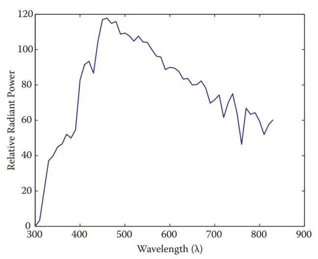
Figure 19.1. A spectrum describes how much energy is available at each wavelength λ, here measured as relative radiant power. This specific spectrum represents average daylight. 
图 19.1。 光谱描述了每个波长 λ 处有多少可用能量，此处测量为相对辐射功率。 该特定光谱代表平均日光。

When simulating light, it would therefore be possible to trace rays that each carry a spectrum. A renderer that accomplishes this is normally called a spectral renderer. From preceding chapters, it should be clear that we are not normally going through the expense of building spectral renderers. Instead, we replace spectra with representations that typically use red, green, and blue components. The reason that this is possible at all has to do with human vision and will be discussed later in this chapter. 
因此，在模拟光时，可以追踪每条带有光谱的光线。 完成此任务的渲染器通常称为光谱渲染器。 从前面的章节可以清楚地看出，我们通常不会花费构建光谱渲染器的费用。 相反，我们用通常使用红色、绿色和蓝色分量的表示来替换光谱。 这之所以可能，与人类视觉有关，本章稍后将对此进行讨论。

Simulating light by tracing rays takes care of the physics of light, although it should be noted that several properties of light, including, for instance, polarization, diffraction, and interference, are not modeled in this manner. 
通过追踪光线来模拟光会考虑到光的物理特性，但应该注意的是，光的一些属性（包括偏振、衍射和干涉）并不是以这种方式建模的。

At surface boundaries, we normally model what happens with light by means of a reflectance function. These functions can be measured directly by means of gonioreflectometers, leading to a large amount of tabled data, which can be more compactly represented by various different functions. Nonetheless, these reflectance functions are empirical in nature, i.e., they abstract away the chemistry that happens when a photon is absorbed and re-emitted by an electron. Thus, reflectance functions are useful for modeling in computer graphics, but do not offer an explanation as to why certain wavelengths of light are absorbed and others are reflected. We can therefore not use reflectance functions to explain why the light reflected off a banana has a spectral composition that appears to us as yellow. For that, we would have to study molecular orbital theory, a topic beyond the scope of this book. 
在表面边界，我们通常通过反射函数来模拟光发生的情况。 这些函数可以通过测角反射仪直接测量，从而产生大量的表格数据，可以通过各种不同的函数更紧凑地表示这些数据。 尽管如此，这些反射函数本质上是经验性的，即它们抽象了光子被电子吸收和重新发射时发生的化学反应。 因此，反射函数对于计算机图形学建模很有用，但不能解释为什么某些波长的光被吸收而其他波长的光被反射。 因此，我们不能使用反射函数来解释为什么香蕉反射的光具有在我们看来为黄色的光谱成分。 为此，我们必须研究分子轨道理论，这个主题超出了本书的范围。

Finally, when light reaches the retina, it is transcoded into electrical signals that are propagated to the brain. A large part of the brain is devoted to processing visual signals, part of which gives rise to the sensation of color. Thus, even if we know the spectrum of light that is reflected off a banana, we do not know yet why humans associate the term “yellow” with it. Moreover, as we will find out in the remainder of this chapter, our perception of color is vastly more complicated than it would seem at first glance. It changes with illumination, varies between observers, and varies within an observer over time. 
最后，当光线到达视网膜时，它被转码成电信号，并传播到大脑。 大脑的很大一部分致力于处理视觉信号，其中一部分产生颜色感觉。 因此，即使我们知道香蕉反射的光谱，我们仍然不知道为什么人类将“黄色”一词与它联系起来。 此外，正如我们将在本章的其余部分中发现的那样，我们对颜色的感知比乍一看要复杂得多。 它随着照明的变化而变化，在观察者之间变化，并且随着时间的推移在观察者内部变化。

In other words, the spectrum of light coming off a banana is perceived in the context of an environment. To predict how an observer perceives a “banana spectrum” requires knowledge of the environment that contains the banana as well as the observer’s environment. In many instances, these two environments are the same. However, when we are displaying a photograph of a banana on a monitor, then these two environments will be different. As human visual perception depends on the environment the observer is in, it may perceive the banana in the photograph differently from how an observer directly looking at the banana would perceive it. This has a significant impact on how we should deal with color and illustrates the complexities associated with color. 
换句话说，香蕉发出的光谱是在环境背景下被感知的。 要预测观察者如何感知“香蕉光谱”，需要了解包含香蕉的环境以及观察者的环境。 在许多情况下，这两个环境是相同的。 然而，当我们在显示器上显示香蕉的照片时，这两种环境将会有所不同。 由于人类的视觉感知取决于观察者所处的环境，因此它对照片中香蕉的感知可能与观察者直接观看香蕉的感知不同。 这对我们如何处理颜色有重大影响，并说明了与颜色相关的复杂性。

To emphasize the crucial role that human vision plays, we only have to look at the definition of color: “Color is the aspect of visual perception by which an observer may distinguish differences between two structure-free fields of view of the same size and shape, such as may be caused by differences in the spectral composition of the radiant energy concerned in the observation” (Wyszecki & Stiles, 2000). In essence, without a human observer there is no color. 
为了强调人类视觉所发挥的关键作用，我们只需要看看颜色的定义：“颜色是视觉感知的一个方面，观察者可以通过颜色来区分两个相同大小和形状的无结构视场之间的差异。 ，例如可能是由观测中涉及的辐射能的光谱组成差异引起的”（Wyszecki & Stiles，2000）。 本质上，没有人类观察者就没有颜色。

Luckily, much of what we know about color can be quantified, so that we can carry out computations to correct for the idiosyncrasies of human vision and thereby display images that will appear to observers the way the designer of those images intended. This chapter contains the theory and mathematics required to do so.
幸运的是，我们对颜色的了解大部分都可以量化，这样我们就可以进行计算来纠正人类视觉的特性，从而以图像设计者的预期方式向观察者显示图像。 本章包含这样做所需的理论和数学。

## 19.1 Colorimetry 比色法

Colorimetry is the science of color measurement and description. Since color is ultimately a human response, color measurement should begin with human observation. The photodetectors in the human retina consist of rods and cones. The rods are highly sensitive and come into play in low-light conditions. Under normal lighting conditions, the cones are operational, mediating human vision. There are three cone types and together they are primarily responsible for color vision. 
比色学是颜色测量和描述的科学。 由于颜色最终是人类的反应，因此颜色测量应从人类观察开始。 人类视网膜中的光电探测器由视杆细胞和视锥细胞组成。 这些视杆细胞非常敏感，在弱光条件下发挥作用。 在正常照明条件下，视锥细胞可以发挥作用，调节人类视觉。 视锥细胞分为三种类型，它们共同主要负责色觉。

Although it may be possible to directly record the electrical output of cones while some visual stimulus is being presented, such a procedure would be invasive, while at the same time ignoring the sometimes substantial differences between observers. Moreover, much of the measurement of color was developed well before such direct recording techniques were available. 
尽管在呈现一些视觉刺激时可以直接记录视锥细胞的电输出，但这样的过程将是侵入性的，同时忽略了观察者之间有时存在的实质性差异。 此外，许多颜色测量方法早在这种直接记录技术出现之前就已经开发出来了。

The alternative is to measure color by means of measuring the human response to patches of color. This leads to color matching experiments, which will be described later in this section. Carrying out these experiments have resulted in several standardized observers, which can be thought of as statistical approximations of actual human observers. First, however, we need to describe some of the assumptions underlying the possibility of color matching, which are summarized by Grassmann’s laws. 
另一种方法是通过测量人类对色块的反应来测量颜色。 这导致了颜色匹配实验，本节稍后将对此进行描述。 进行这些实验产生了几个标准化的观察者，可以将其视为实际人类观察者的统计近似值。 然而，首先，我们需要描述颜色匹配可能性背后的一些假设，这些假设由格拉斯曼定律进行了总结。

### 19.1.1 Grassmann’s Laws 格拉斯曼定律

Given that humans have three different cone types, the experimental laws of color matching can be summed up as the trichromatic generalization (Wyszecki & Stiles, 2000), which states that any color stimulus can be matched completely with an additive mixture of three appropriately modulated color sources. This feature of color is often used in practice, for instance by televisions and monitors which reproduce many different colors by adding a mixture of red, green, and blue light for each pixel. It is also the reason that renderers can be built using only three values to describe each color. 
鉴于人类具有三种不同的视锥细胞类型，颜色匹配的实验定律可以总结为三色概括（Wyszecki & Stiles，2000），它指出任何颜色刺激都可以与三种适当调制颜色的加法混合物完全匹配 来源。 这种颜色特征在实践中经常使用，例如电视和显示器通过为每个像素添加红、绿和蓝光的混合来再现许多不同的颜色。 这也是渲染器可以仅使用三个值来描述每种颜色来构建的原因。

The trichromatic generalization allows us to make color matches between any given stimulus and an additive mixture of three other color stimuli. Hermann Grassmann was the first to describe the algebraic rules to which color matching adheres. They are known as Grassmann’s laws of additive color matching (Grassmann, 1853) and are the following: 
三色泛化使我们能够在任何给定的刺激和其他三种颜色刺激的附加混合物之间进行颜色匹配。 赫尔曼·格拉斯曼 (Hermann Grassmann) 是第一个描述颜色匹配所遵循的代数规则的人。 它们被称为格拉斯曼加色匹配定律（Grassmann，1853），如下：

- Symmetry law. If color stimulus A matches color stimulus B, then B matches A. 
  对称定律。 如果颜色刺激 A 与颜色刺激 B 匹配，则 B 与 A 匹配。
- Transitive law. If A matches B and B matches C, then A matches C. 
  传递律。 如果A匹配B且B匹配C，则A匹配C。
- Proportionality law. If A matches B, then αA matches αB, where α is a positive scale factor.
  比例法。 如果 A 与 B 匹配，则 αA 与 αB 匹配，其中 α 是正比例因子。
- Additivity law. If A matches B, C matches D, and A + C matches B + D, then it follows that A + D matches B + C. 
  可加性定律。 如果A匹配B，C匹配D，并且A+C匹配B+D，则A+D匹配B+C。

The additivity law forms the basis for color matching and colorimetry as a whole. 
可加性定律构成了整个色彩匹配和比色学的基础。

### 19.1.2 Cone Responses  锥体反应

Each cone type is sensitive to a range of wavelengths, spanning most of the full visible range. However, sensitivity to wavelengths is not evenly distributed, but contains a peak wavelength at which sensitivity is greatest. The location of this peak wavelength is different for each cone type. The three cone types are classified as S, M, and L cones, where the letters stand for short, medium, and long, indicating where in the visible spectrum the peak sensitivity is located. 
每种锥体类型都对一定范围的波长敏感，涵盖大部分完整可见光范围。 然而，对波长的敏感度并不是均匀分布的，而是包含敏感度最大的峰值波长。 对于每种锥体类型，该峰值波长的位置都不同。 三种视锥细胞类型分为 S、M 和 L 视锥细胞，其中字母代表短、中、长，表示可见光谱中峰值灵敏度所在的位置。

The response of a given cone is then the magnitude of the electrical signal it outputs, as a function of the spectrum of wavelengths incident upon the cone. The cone response functions for each cone type as a function of wavelength λ are then given by L(λ), M(λ), and S(λ). They are plotted in Figure 19.2. 
给定锥体的响应就是它输出的电信号的幅度，作为入射到锥体上的波长光谱的函数。 每种锥体类型的锥体响应函数作为波长 λ 的函数由 L(λ)、M(λ) 和 S(λ) 给出。 它们如图 19.2 所示。
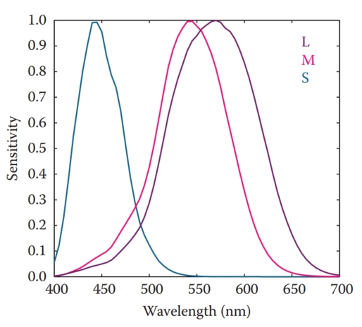
Figure 19.2. The cone response functions for L, M, and S cones.  
图 19.2。 L、M 和 S 视锥细胞的视锥细胞响应函数。

The actual response to a stimulus with a given spectral composition Φ(λ) is then given for each cone type by
然后，对于每种锥体类型，对具有给定光谱成分 Φ(λ) 的刺激的实际响应由下式给出：
$$
L = \int_λΦ(λ) L(λ) dλ, \\
M = \int_λΦ(λ) M(λ) dλ, \\
S = \int_λΦ(λ) S(λ) dλ, \\
$$
These three integrated responses are known as tristimulus values. 
这三个综合响应称为三刺激值。

### 19.1.3 Color Matching Experiments 配色实验

Given that tristimulus values are created by integrating the product of two functions over the visible range, it is immediately clear that the human visual system does not act as a simple wavelength detector. Rather, our photo-receptors act as approximately linear integrators. As a result, it is possible to find two different spectral compositions, say $Φ_1(λ)$ and $Φ_2(λ)$, that after integration yield the same response (L, M, S). This phenomenon is known as metamerism, an example of which is shown in Figure 19.3. 
鉴于三刺激值是通过对可见光范围内的两个函数的乘积进行积分而创建的，因此很明显人类视觉系统不能充当简单的波长检测器。 相反，我们的光感受器充当近似线性积分器。 因此，可以找到两种不同的光谱成分，例如 $Φ_1(λ)$ 和 $Φ_2(λ)$，积分后会产生相同的响应 (L、M、S)。 这种现象称为同色异谱，其示例如图 19.3 所示。
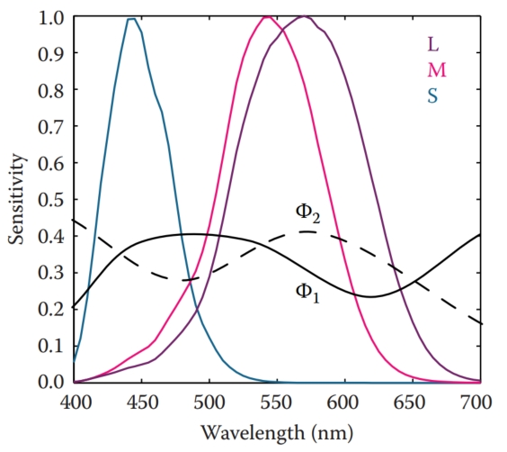
Figure 19.3. Two stimuli $Φ_1(λ)$ and $Φ_2(λ)$ leading to the same tristimulus values after integration. 
图 19.3。 积分后两个刺激 $Φ_1(λ)$ 和 $Φ_2(λ)$ 产生相同的三刺激值。

Metamerism is the key feature of human vision that allows the construction of color reproduction devices, including the color figures in this book and anything reproduced on printers, televisions, and monitors. 
同色异谱是人类视觉的关键特征，它允许构建色彩再现设备，包括本书中的彩色图形以及打印机、电视和显示器上再现的任何内容。

Color matching experiments also rely on the principle of metamerism. Suppose we have three differently colored light sources, each with a dial to alter its intensity. We call these three light sources primaries. We should now be able to adjust the intensity of each in such a way that when mixed together additively, the resulting spectrum integrates to a tristimulus value that matches the perceived color of a fourth unknown light source. When we carry out such an experiment, we have essentially matched our primaries to an unknown color. The positions of our three dials are then a representation of the color of the fourth light source. 
配色实验也依赖于同色异谱的原理。 假设我们有三个不同颜色的光源，每个光源都有一个旋钮来改变其强度。 我们将这三种光源称为原色。 我们现在应该能够以这样的方式调整每个强度，即当加法混合在一起时，所得光谱积分为与第四个未知光源的感知颜色相匹配的三刺激值。 当我们进行这样的实验时，我们基本上将我们的原色与未知的颜色进行了匹配。 我们三个刻度盘的位置代表了第四个光源的颜色。

In such an experiment, we have used Grassmann’s laws to add the three spectra of our primaries. We have also used metamerism, because the combined spectrum of our three primaries is almost certainly different from the spectrum of the fourth light source. However, the tristimulus values computed from these two spectra will be identical, having produced a color match. 
在这样的实验中，我们使用格拉斯曼定律将我们的原色的三个光谱相加。 我们还使用了同色异谱，因为我们的三个基色的组合光谱几乎肯定与第四个光源的光谱不同。 然而，根据这两个光谱计算出的三刺激值将是相同的，从而产生了颜色匹配。

Note that we do not actually have to know the cone response functions to carry out such an experiment. As long as we use the same observer under the same conditions, we are able to match colors and record the positions of our dials for each color. However, it is quite inconvenient to have to carry out such experiments every time we want to measure colors. For this reason, we do want to know the spectral cone response functions and average those for a set of different observers to eliminate interobserver variability. 
请注意，我们实际上不必知道锥体响应函数即可进行此类实验。 只要我们在相同的条件下使用相同的观察者，我们就能够匹配颜色并记录每种颜色的表盘位置。 但每次要测量颜色时都必须进行这样的实验，非常不方便。 出于这个原因，我们确实想知道光谱锥响应函数并对一组不同观察者进行平均，以消除观察者间的变异性。

### 19.1.4 Standard Observers 标准观察员

If we perform a color matching experiment for a large range of colors, carried out by a set of different observers, it is possible to generate an average color matching dataset. If we specifically use monochromatic light sources against which to match our primaries, we can repeat this experiment for all visible wavelengths. The resulting tristimulus values are then called spectral tristimulus values, and can be plotted against wavelength λ, shown in Figure 19.4. 
如果我们由一组不同的观察者对大范围的颜色进行颜色匹配实验，则可以生成平均颜色匹配数据集。 如果我们专门使用单色光源来匹配我们的原色，我们可以对所有可见波长重复这个实验。 由此产生的三刺激值称为光谱三刺激值，并且可以根据波长 λ 绘制，如图 19.4 所示。
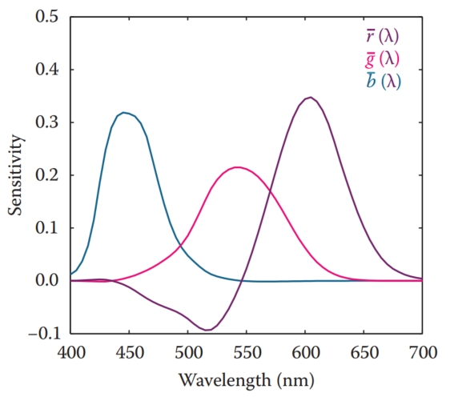
Figure 19.4. Spectral tristimulus values averaged over many observers. The primaries where monochromatic light sources with wavelengths of 435.8, 546.1, and 700 nm.  
图 19.4。 光谱三刺激值对许多观察者进行平均。 原色采用波长为 435.8、546.1 和 700 nm 的单色光源。

By using a well-defined set of primary light sources, the spectral tristimulus values lead to three color matching functions. The Commission Internationale d’Eclairage (CIE) has defined three such primaries to be monochromatic light sources of 435.8, 546.1, and 700 nm, respectively. With these three monochromatic light sources, all other visible wavelengths can be matched by adding different amounts of each. The amount of each required to match a given wavelength λ is encoded in color matching functions, given by $\overline{r}(λ)$, $\overline{g}(λ)$, and $\overline{b}(λ)$ and plotted in Figure 19.4. Tristimulus values associated with these color matching functions are termed R, G, and B. 
通过使用一组明确的主光源，光谱三刺激值产生三个颜色匹配函数。 国际照明委员会 (CIE) 将三种原色定义为分别为 435.8、546.1 和 700 nm 的单色光源。 有了这三种单色光源，所有其他可见波长都可以通过添加不同数量的每种光源来匹配。 匹配给定波长 λ 所需的每种颜色的数量都用颜色匹配函数进行编码，由 $\overline{r}(λ)$、$\overline{g}(λ)$ 和 $\overline{b}( λ)$ 并绘制在图 19.4 中。 与这些颜色匹配函数相关的三刺激值称为 R、G 和 B。

Given that we are adding light, and light cannot be negative, you may have noticed an anomaly in Figure 19.4: to create a match for some wavelengths, it is necessary to subtract light. Although there is no such thing as negative light, we can use Grassmann’s laws once more, and instead of subtracting light from the mixture of primaries, we can add the same amount of light to the color that is being matched. 
鉴于我们正在添加光，并且光不能为负，您可能已经注意到图 19.4 中的异常情况：为了创建某些波长的匹配，有必要减去光。 虽然不存在负光这样的东西，但我们可以再次使用格拉斯曼定律，而不是从原色混合中减去光，我们可以向正在匹配的颜色添加相同量的光。

The CIE $\overline{r}(λ)$, $\overline{g}(λ)$, and $\overline{b}(λ)$ color matching functions allow us to determine if a spectral distribution $\bold{Φ}_1$ matches a second spectral distribution $\bold{Φ}_2$  by simply comparing the resulting tristimulus values obtained by integrating with these color matching functions:
CIE $\overline{r}(λ)$、$\overline{g}(λ)$ 和 $\overline{b}(λ)$ 颜色匹配函数允许我们确定光谱分布 $\bold{ Φ}_1$ 通过简单地比较通过与这些颜色匹配函数集成获得的三刺激值来匹配第二光谱分布 $\bold{Φ}_2$：
$$
\int_{λ}\bold{Φ}_1(λ)\overline{r}(λ) = \int_{λ}\bold{Φ}_2(λ)\overline{r}(λ) \\
\int_{λ}\bold{Φ}_1(λ)\overline{g}(λ) = \int_{λ}\bold{Φ}_2(λ)\overline{g}(λ) \\
\int_{λ}\bold{Φ}_1(λ)\overline{b}(λ) = \int_{λ}\bold{Φ}_2(λ)\overline{b}(λ) \\
$$
Of course, a color match is only guaranteed if all three tristimulus values match. 
当然，只有当所有三个三刺激值都匹配时才能保证颜色匹配。

The importance of these color matching functions lies in the fact that we are now able to communicate and describe colors compactly by means of tristimulus values. For a given spectral function, the CIE color matching functions provide a precise way in which to calculate tristimulus values. As long as everybody uses the same color matching functions, it should always be possible to generate a match. 
这些颜色匹配函数的重要性在于我们现在能够通过三刺激值来紧凑地传达和描述颜色。 对于给定的光谱函数，CIE 颜色匹配函数提供了计算三刺激值的精确方法。 只要每个人都使用相同的颜色匹配函数，就应该总是可以生成匹配的颜色。

If the same color matching functions are not available, then it is possible to transform one set of tristimulus values into a different set of tristimulus values appropriate for a corresponding set of primaries. The CIE has defined one such a transform for two specific reasons. First, in the 1930s numerical integrations were difficult to perform, and even more so for functions that can be both positive and negative. Second, the CIE had already developed the photopic luminance response function, CIE V (λ). It became desirable to have three integrating functions, of which V (λ) is one and all three being positive over the visible range. 
如果相同的颜色匹配函数不可用，则可以将一组三色刺激值变换成适合于对应的原色组的另一组三色刺激值。 CIE 出于两个具体原因定义了这样一种转换。 首先，在 20 世纪 30 年代，数值积分很难执行，对于既可以是正值也可以是负值的函数来说更是如此。 其次，CIE 已经开发了明视亮度响应函数 CIE V (λ)。 人们希望具有三个积分函数，其中 V (λ) 为 1，并且所有三个积分函数在可见光范围内均为正值。

To create a set of positive color matching functions, it is necessary to define imaginary primaries. In other words, to reproduce any color in the visible spectrum, we need light sources that cannot be physically realized. The color matching functions that were settled upon by the CIE are named $\overline{x}(λ)$, $\overline{y}(λ)$, and $\overline{z}(λ)$ and are shown in Figure 19.5. Note that $\overline{y}(λ)$ is equal to the photopic luminance response function $V(λ)$ and that each of these functions is indeed positive. They are known as the CIE 1931 standard observer. 
要创建一组正颜色匹配函数，需要定义假想原色。 换句话说，为了再现可见光谱中的任何颜色，我们需要无法物理实现的光源。 CIE 确定的颜色匹配函数被命名为 $\overline{x}(λ)$、$\overline{y}(λ)$ 和 $\overline{z}(λ)$，并显示在 图 19.5。 请注意，$\overline{y}(λ)$ 等于明视亮度响应函数$V(λ)$，并且这些函数中的每一个实际上都是正的。 他们被称为 CIE 1931 标准观察员。
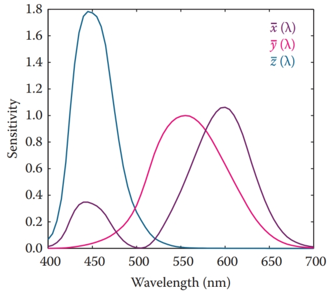
Figure 19.5. The CIE $\overline{x}(λ)$, $\overline{y}(λ)$, and $\overline{z}(λ)$ color matching functions.  
图 19.5。 CIE $\overline{x}(λ)$、$\overline{y}(λ)$ 和 $\overline{z}(λ)$ 颜色匹配函数。

The corresponding tristimulus values are termed X, Y , and Z, to avoid confusion with R, G, and B tristimulus values that are normally associated with realizable primaries. The conversion from (R, G, B) tristimulus values to (X, Y, Z) tristimulus values is defined by a simple 3×3 transform:
相应的三色刺激值被称为 X、Y 和 Z，以避免与通常与可实现的原色相关的 R、G 和 B 三色刺激值混淆。 从 (R, G, B) 三色刺激值到 (X, Y, Z) 三色刺激值的转换由简单的 3×3 变换定义：
$$
\begin{bmatrix}
X \\ Y \\ Z
\end{bmatrix} = \frac{1}{0.17697} \begin{bmatrix}
0.4900 & 0.3100 & 0.2000 \\
0.17697 & 0.81240 & 0.01063 \\
0.0000 & 0.0100 & 0.9900 \\
\end{bmatrix}\cdot \begin{bmatrix}
R\\ G\\ B
\end{bmatrix}
$$
To calculate tristimulus values, we typically directly integrate the standard observer color matching functions with the spectrum of interest $Φ(λ)$, rather than go through the CIE $\overline{r}(λ)$, $\overline{g}(λ)$, and $\overline{b}(λ)$ color matching functions first, followed by the above transformation. It allows us to calculate consistent color measurements and also determine when two colors match each other. 
为了计算三刺激值，我们通常直接将标准观察者颜色匹配函数与感兴趣的光谱 $Φ(λ)$ 相结合，而不是通过 CIE $\overline{r}(λ)$, $\overline{g} (λ)$ 和 $\overline{b}(λ)$ 首先进行颜色匹配函数，然后进行上述变换。 它使我们能够计算一致的颜色测量值，并确定两种颜色何时相互匹配。

### 19.1.5 Chromaticity Coordinates  色度坐标

Every color can be represented by a set of three tristimulus values (X, Y, Z). We could define an orthogonal coordinate system with X, Y , and Z axes and plot each color in the resulting 3D space. This is called a color space. The spatial extent of the volume in which colors lie is then called the color gamut.
每种颜色都可以由一组三个三刺激值（X、Y、Z）表示。 我们可以定义一个具有 X、Y 和 Z 轴的正交坐标系，并在生成的 3D 空间中绘制每种颜色。 这称为色彩空间。 颜色所在体积的空间范围称为色域。

Visualizing colors in a 3D color space is fairly difficult. Moreover, the Y - value of any color corresponds to its luminance, by virtue of the fact that $\overline{y}(λ)$ equals $V(λ)$. We could therefore project tristimulus values to a 2D space which approximates chromatic information, i.e., information which is independent of luminance. This projection is called a chromaticity diagram and is obtained by normalization while at the same time removing luminance information:
在 3D 色彩空间中可视化颜色相当困难。 此外，任何颜色的 Y 值都对应于其亮度，因为 $\overline{y}(λ)$ 等于 $V(λ)$。 因此，我们可以将三刺激值投影到近似色度信息（即独立于亮度的信息）的二维空间。 该投影称为色度图，通过归一化同时去除亮度信息而获得：
$$
x = \frac{X}{X + Y + Z} \\
y = \frac{Y}{X + Y + Z} \\
z = \frac{Z}{X + Y + Z} \\
$$
Given that x + y + z equals 1, the z-value is redundant, allowing us to plot the x and y chromaticities against each other in a chromaticity diagram. Although x and y by themselves are not sufficient to fully describe a color, we can use these two chromaticity coordinates and one of the three tristimulus values, traditionally Y , to recover the other two tristimulus values:
鉴于 x + y + z 等于 1，z 值是多余的，允许我们在色度图中绘制 x 和 y 色度。 尽管 x 和 y 本身不足以完全描述颜色，但我们可以使用这两个色度坐标和三个三色刺激值之一（传统上为 Y ）来恢复其他两个三色刺激值：
$$
X = \frac{x}{y}Y \\
Z = \frac{1 - x - y}{y} Y
$$
By plotting all monochromatic (spectral) colors in a chromaticity diagram, we obtain a horseshoe-shaped curve. The points on this curve are called spectrum loci. All other colors will generate points lying inside this curve. The spectrum locus for the 1931 standard observer is shown in Figure 19.6. The purple line between either end of the horseshoe does not represent a monochromatic color, but rather a combination of short and long wavelength stimuli. 
通过在色度图中绘制所有单色（光谱）颜色，我们获得了马蹄形曲线。 这条曲线上的点称为频谱轨迹。 所有其他颜色都会生成位于该曲线内的点。 1931 年标准观测器的频谱轨迹如图 19.6 所示。 马蹄形两端之间的紫色线并不代表单色，而是短波长和长波长刺激的组合。
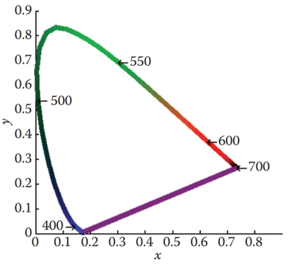
Figure 19.6. The spectrum locus for the CIE 1931 standard observer.  
图 19.6。 CIE 1931 标准观察者的光谱轨迹。

A (non-monochromatic) primary can be integrated over all visible wavelengths, leading to (X, Y, Z) tristimulus values, and subsequently to an (x, y) chromaticity coordinate, i.e., a point on a chromaticity diagram. Repeating this for two or more primaries yields a set of points on a chromaticity diagram that can be connected by straight lines. The volume spanned in this manner represents the range of colors that can be reproduced by the additive mixture of these primaries. Examples of three-primary systems are shown in Figure 19.7. 
（非单色）原色可以在所有可见波长上积分，产生 (X, Y, Z) 三刺激值，并随后产生 (x, y) 色度坐标，即色度图上的点。 对两个或多个原色重复此操作，会在色度图上产生一组可以通过直线连接的点。 以这种方式跨越的体积代表可以通过这些原色的加法混合物再现的颜色范围。 三主系统的示例如图 19.7 所示。
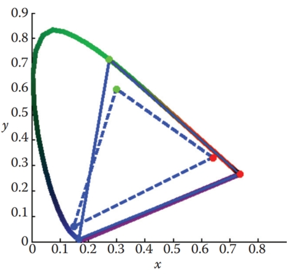
Figure 19.7. The chromaticity boundaries of the CIE RGB primaries at 435.8, 546.1, and 700 nm (solid) and a typical HDTV (dashed). 
图 19.7。 435.8、546.1 和 700 nm 处的 CIE RGB 原色（实线）和典型 HDTV（虚线)的色度边界。

Chromaticity diagrams provide insight into additive color mixtures. However, they should be used with care. First, the interior of the horseshoe should not be colored, as any color reproduction system will have its own primaries and can only reproduce some parts of the chromaticity diagram. Second, as the CIE color matching functions do not represent human cone sensitivities, the distance between any two points on a chromaticity diagram is not a good indicator for how differently these colors will be perceived. 
色度图提供了对加色混合物的深入了解。 但是，应谨慎使用它们。 首先，马蹄铁的内部不应该被着色，因为任何颜色再现系统都有自己的原色，并且只能再现色度图的某些部分。 其次，由于 CIE 颜色匹配函数并不代表人类视锥细胞的敏感度，因此色度图上任意两点之间的距离并不能很好地指示这些颜色的感知差异程度。

A more uniform chromaticity diagram was developed to at least in part address the second of these problems. The CIE $u'v'$ chromaticity diagram provides a perceptually more uniform spacing and is therefore generally preferred over (x, y) chromaticity diagrams. It is computed from (X, Y, Z) tristimulus values by applying a different normalization,
开发了更均匀的色度图，以至少部分解决第二个问题。 CIE $u'v'$ 色度图提供了感知上更均匀的间距，因此通常优于 (x, y) 色度图。 它是通过应用不同的归一化根据 (X, Y, Z) 三刺激值计算得出的，
$$
u' = \frac{4X}{X+15Y+3Z} \\
v' = \frac{9Y}{X+15Y+3Z}
$$
and can alternatively be computed directly from (x, y) chromaticity coordinates:  
也可以直接从 (x, y) 色度坐标计算：
$$
u' = \frac{4x}{-2x+12y+3} \\
v' = \frac{9y}{-2x+12y+3}
$$
A CIE $u'v'$ chromaticity diagram is shown in Figure 19.8. 
CIE $u'v'$ 色度图如图 19.8 所示。
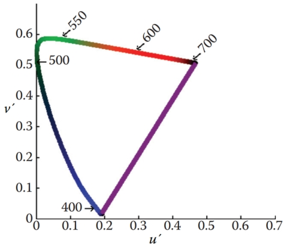
Figure 19.8. The CIE $u'v'$ chromaticity diagram. 
图 19.8。 CIE $u'v'$ 色度图。

## 19.2 Color Spaces 色彩空间

As explained above, each color can be represented by three numbers, for instance defined by (X, Y, Z) tristimulus values. However, its primaries are imaginary, meaning that it is not possible to construct a device that has three light sources (all positive) that can reproduce all colors in the visible spectrum. 
如上所述，每种颜色可以由三个数字表示，例如由（X，Y，Z）三刺激值定义。 然而，它的原色是虚数，这意味着不可能构建具有三个光源（均为正）且可以再现可见光谱中所有颜色的设备。

For the same reason, image encoding and computations on images may not be practical. There is, for instance, a large number of possible XY Z values that do not correspond to any physical color. This would lead to inefficient use of available bits for storage and to a higher requirement for bit-depth to preserve visual integrity after image processing. Although it may be possible to build a capture device that has primaries that are close to the CIE XY Z color matching functions, the cost of hardware and image processing make this an unattractive option. It is not possible to build a display that corresponds to CIE XY Z. For these reasons, it is necessary to design other color spaces: physical realizability, efficient encoding, perceptual uniformity, and intuitive color specification. 
出于同样的原因，图像编码和图像计算可能不切实际。 例如，存在大量不对应于任何物理颜色的可能 XY Z 值。 这将导致存储可用位的使用效率低下，并且对位深度提出更高的要求，以在图像处理后保持视觉完整性。 尽管可以构建具有接近 CIE XY Z 颜色匹配功能的原色的捕获设备，但硬件和图像处理的成本使其成为一个没有吸引力的选择。 不可能构建与 CIE XY Z 相对应的显示器。出于这些原因，有必要设计其他色彩空间：物理可实现性、高效编码、感知均匀性和直观的色彩规范。

The CIE XY Z color space is still actively used, mostly for the conversion between other color spaces. It can be seen as a device-independent color space. Other color spaces can then be defined in terms of their relationship to CIE XY Z, which is often specified by a specific transform. For instance, linear and additive trichromatic display devices can be transformed to and from CIE XY Z by means of a simple 3 × 3 matrix. Some nonlinear additional transform may also be specified, for instance to minimize perceptual errors when data is stored with a limited bit-depth, or to enable display directly on devices that have a nonlinear relationship between input signal and the amount of light emitted. 
CIE XY Z 色彩空间仍然被积极使用，主要用于其他色彩空间之间的转换。 它可以被看作是一个独立于设备的色彩空间。 其他色彩空间可以根据它们与 CIE XY Z 的关系来定义，这通常由特定的变换指定。 例如，线性和加法三色显示设备可以通过简单的 3 × 3 矩阵在 CIE XY Z 之间进行转换。 还可以指定一些非线性附加变换，例如，以在以有限位深度存储数据时最小化感知错误，或者使得能够直接在输入信号和发射的光量之间具有非线性关系的设备上进行显示。

### 19.2.1 Constructing a Matrix Transform 构造矩阵变换

For a display device with three primaries, say red, green, and blue, we can measure the spectral composition of the emitted light by sending the color vectors (1, 0, 0), (0, 1, 0), and (0, 0, 1). These vectors represent the three cases namely where one of the primaries is full on, and the other two are off. From the measured spectral output, we can then compute the corresponding chromaticity coordinates $(x_R, y_R)$, $(x_G, y_G)$, and $(x_B, y_B)$. 
对于具有三基色（例如红色、绿色和蓝色）的显示设备，我们可以通过发送颜色向量 (1, 0, 0)、(0, 1, 0) 和 (0 , 0, 1)。 这些向量代表三种情况，即其中一个初级完全打开，而另外两个关闭。 根据测量的光谱输出，我们可以计算相应的色度坐标 $(x_R, y_R)$、$(x_G, y_G)$ 和 $(x_B, y_B)$。

The white point of a display is defined as the spectrum emitted when the color vector (1, 1, 1) is sent to the display. Its corresponding chromaticity coordinate is $(x_W , y_W)$. The three primaries and the white point characterize the display and are each required to construct a transformation matrix between the display’s color space and CIE XY Z. 
显示器的白点定义为将颜色矢量 (1, 1, 1) 发送到显示器时发出的光谱。 其对应的色度坐标为$(x_W , y_W)$。 三原色和白点表征了显示器的特征，并且每一个都需要在显示器的色彩空间和 CIE XY Z 之间构建变换矩阵。

These four chromaticity coordinates can be extended to chromaticity triplets reconstructing the z-coordinate from $z = 1−x−y,$ leading to triplets $(x_R, y_R, z_R)$, $(x_G, y_G, z_G)$, $(x_B, y_B, z_B)$, and $(x_W , y_W , z_W )$. If we know the maximum luminance of the white point, we can compute its corresponding tristimulus value $(X_W , Y_W , Z_W )$ and then solve the following set of equations for the luminance ratio scalars $S_R, S_G$, and $S_B$:
这四个色度坐标可以扩展到色度三元组，从 $z = 1−x−y,$ 重建 z 坐标，得到三元组 $(x_R, y_R, z_R)$, $(x_G, y_G, z_G)$, $ (x_B, y_B, z_B)$ 和 $(x_W , y_W , z_W )$。 如果我们知道白点的最大亮度，我们可以计算其相应的三刺激值 $(X_W , Y_W , Z_W )$，然后求解以下一组方程以获得亮度比标量 $S_R、S_G$ 和 $S_B$ :
$$
X_W = x_R S_R + x_G S_G + x_B S_B, \\
Y_W = y_R S_R + y_G S_G + y_B S_B, \\
Z_W = z_R S_R + z_G S_G + z_B S_B.
$$
The conversion between RGB and XYZ is then given by 
RGB 和 XYZ 之间的转换由下式给出
$$
\begin{bmatrix}
X\\ Y\\ Z
\end{bmatrix} = \begin{bmatrix}
x_R S_R & x_G S_G & x_B S_B \\
y_R S_R & y_G S_G & y_B S_B \\
z_R S_R & z_G S_G & z_B S_B
\end{bmatrix}
\begin{bmatrix}
R \\G \\B
\end{bmatrix}
$$
The luminance of any given color can be computed by evaluating the middle row of a matrix constructed in this manner: 
任何给定颜色的亮度可以通过评估以此方式构造的矩阵的中间行来计算：
$Y = y_R S_R R + y_G S_G G + y_B S_B B  $

To convert between XYZ and RGB of a given device, the above matrix can simply be inverted. 
要在给定设备的 XYZ 和 RGB 之间进行转换，只需反转上述矩阵即可。

If an image is represented in an RGB color space for which the primaries and white point are unknown, then the next best thing is to assume that the image was encoded in a standard RGB color space. A reasonable choice is then to assume that the image was specified according to ITU-R BT.709, which is the specification used for encoding and broadcasting of HDTV. Its primaries and white point are specified in Table 19.1. Note that the same primaries and white point are used to define the well-known sRGB color space. The transformation between this RGB color space and CIE XYZ is and vice versa given by
如果图像以 RGB 颜色空间表示，而原色和白点未知，那么最好的办法是假设该图像是在标准 RGB 颜色空间中编码的。 合理的选择是假设图像是根据 ITU-R BT.709 指定的，这是用于 HDTV 编码和广播的规范。 其原色和白点在表 19.1 中指定。 请注意，相同的原色和白点用于定义众所周知的 sRGB 色彩空间。 此 RGB 颜色空间与 CIE XYZ 之间的变换为（反之亦然）：

|      |   R    |   G    |   B    | White  |
| :--: | :----: | :----: | :----: | :----: |
|  x   | 0.6400 | 0.3000 | 0.1500 | 0.3127 |
|  y   | 0.3300 | 0.6000 | 0.0600 | 0.3290 |

Table 19.1. The (x, y) chromaticity coordinates for the primaries and white point specified by ITU-R BT.709. The sRGB standard also uses these primaries and white point.  
表 19.1。 ITU-R BT.709 指定的原色和白点的 (x, y) 色度坐标。 sRGB 标准也使用这些原色和白点。
$$
\ \begin{bmatrix}
X\\ Y\\ Z
\end{bmatrix} = \begin{bmatrix}
0.4124 & 0.3576 & 0.1805 \\
0.2126 & 0.7152 & 0.0722 \\
0.0193 & 0.1192 & 0.9505
\end{bmatrix}
\begin{bmatrix}
R \\G \\B
\end{bmatrix} \\
\begin{bmatrix}
R \\G \\B
\end{bmatrix} = \begin{bmatrix}
3.2405 & −1.5371 & −0.4985 \\
−0.9693 & 1.8706 & 0.0416 \\
0.0556 & −0.2040 & 1.0572
\end{bmatrix} \begin{bmatrix}
X\\ Y\\ Z
\end{bmatrix}
$$
By substituting the maximum RGB values of the device, we can compute the white point. For ITU-R BT.709, the maximum values are $(R_W , G_W , B_W) = (100, 100, 100)$, leading to a white point of $(X_W , Y_W , Z_W) = (95.05, 100.00, 108.90)$. 
通过替换设备的最大 RGB 值，我们可以计算白点。 对于 ITU-R BT.709，最大值为 $(R_W , G_W , B_W) = (100, 100, 100)$，导致白点为 $(X_W , Y_W , Z_W) = (95.05, 100.00, 108.90)$。

In addition to a linear transformation, the sRGB color space is characterized by a subsequent nonlinear transform. The nonlinear encoding is given by
除了线性变换之外，sRGB 色彩空间的特征还在于后续的非线性变换。 非线性编码由下式给出
$$
R_{sRGB} = \begin{cases}
1.055R^{1/2.4} - 0.055\ \ \ \ \ \ \ \ \ \  R > 0.0031308\\
12.92R\ \ \ \ \ \ \ \ \ \ \ \ \ \ \ \ \ \ \ \ \ \ \ \ \ \ \ \ \ \ \ R ≤ 0.0031308
\end{cases} \\
G_{sRGB} = \begin{cases}
1.055G^{1/2.4} - 0.055\ \ \ \ \ \ \ \ \ \  G > 0.0031308\\
12.92G\ \ \ \ \ \ \ \ \ \ \ \ \ \ \ \ \ \ \ \ \ \ \ \ \ \ \ \ \ \ \ G ≤ 0.0031308
\end{cases} \\
B_{sRGB} = \begin{cases}
1.055B^{1/2.4} - 0.055\ \ \ \ \ \ \ \ \ \ B > 0.0031308\\
12.92B\ \ \ \ \ \ \ \ \ \ \ \ \ \ \ \ \ \ \ \ \ \ \ \ \ \ \ \ \ \ \ B ≤ 0.0031308
\end{cases} \\
$$
This nonlinear encoding helps minimize perceptual errors due to quantization errors in digital applications.  
这种非线性编码有助于最大限度地减少数字应用中由于量化误差而导致的感知误差。

### 19.2.2 Device-Dependent RGB Spaces  设备相关的 RGB 空间

As each device typically has its own set of primaries and white point, we call the associated RGB color spaces device-dependent. It should be noted that even if all these devices operate in an RGB space, they may have very different primaries and white points. If we therefore have an image specified in some RGB space, it may appear very different to us, depending upon which device we display it. 
由于每个设备通常都有自己的一组原色和白点，因此我们将关联的 RGB 颜色空间称为设备相关的。 应该注意的是，即使所有这些设备都在 RGB 空间中运行，它们也可能具有非常不同的原色和白点。 因此，如果我们在某个 RGB 空间中指定了一个图像，那么它对我们来说可能会显得非常不同，具体取决于我们显示它的设备。

This is clearly an undesirable situation, resulting from a lack of color management. However, if the image is specified in a known RGB color space, it can first be converted to XYZ, which is device independent, and then subsequently it can be converted to the RGB space of the device on which it will be displayed. 
这显然是一种不受欢迎的情况，是由于缺乏色彩管理造成的。 然而，如果图像是在已知的 RGB 颜色空间中指定的，则可以首先将其转换为与设备无关的 XYZ，然后将其转换为将在其上显示的设备的 RGB 空间。

There are several other RGB color spaces that are well defined. They each consist of a linear matrix transform followed by a nonlinear transform, akin to the aforementioned sRGB color space. The nonlinear transform can be parameterized as follows:
还有其他几个定义明确的 RGB 色彩空间。 它们均由线性矩阵变换和非线性变换组成，类似于前面提到的 sRGB 颜色空间。 非线性变换可以参数化如下：
$$
R_{nonlinear} = \begin{cases}
(1+f)R^γ - f \ \ \ \ t < R ≤ 1 \\
sR \ \ \ \ \ \ \ \ \ \ \ \ \ \ \ \ \ \ \ \ \ \ \ 0 ≤ R ≤ t
\end{cases} \\
G_{nonlinear} = \begin{cases}
(1+f)G^γ - f \ \ \ \ t < G ≤ 1 \\
sG \ \ \ \ \ \ \ \ \ \ \ \ \ \ \ \ \ \ \ \ \ \ \ 0 ≤ G ≤ t
\end{cases} \\
R_{nonlinear} = \begin{cases}
(1+f)R^γ - f \ \ \ \ t < R ≤ 1 \\
sR \ \ \ \ \ \ \ \ \ \ \ \ \ \ \ \ \ \ \ \ \ \ \ 0 ≤ R ≤ t
\end{cases} \\
$$
The parameters s, f, t and γ, together with primaries and white point, specify a class of RGB color spaces that are used in various industries. Several common transformations are listed in Table 19.2. 
参数 s、f、t 和 γ 与原色和白点一起指定了用于各个行业的一类 RGB 颜色空间。 表 19.2 列出了几种常见的转换。
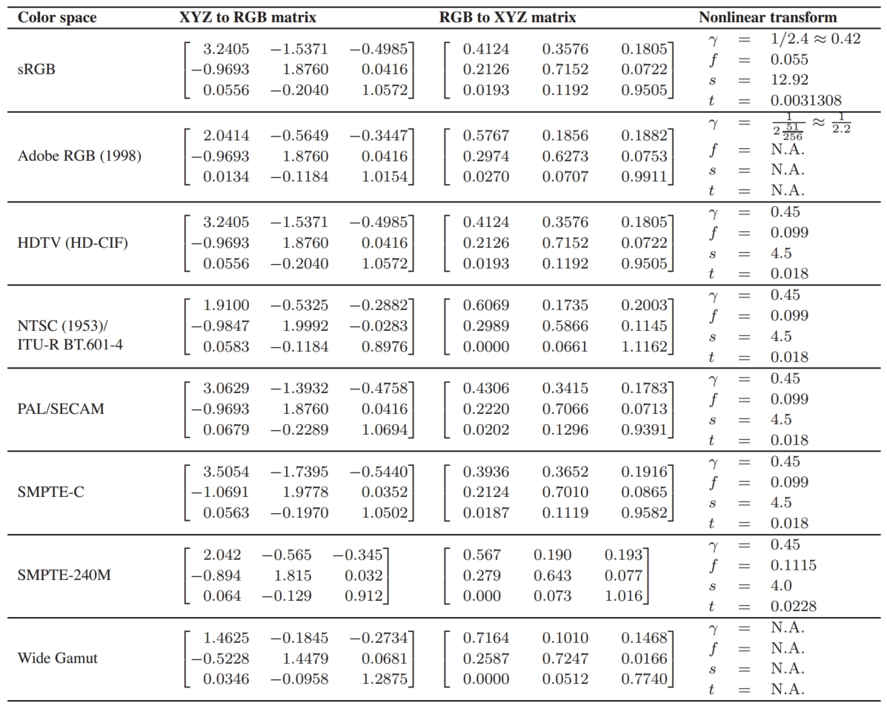
Table 19.2. Transformations for standard RGB color spaces (after (Pascale, 2003)). 
表 19.2。 标准 RGB 颜色空间的转换（继（Pascale，2003）之后)。

### 19.2.3 LMS Cone Space  LMS 锥体空间

The aforementioned cone signals can be expressed in terms of the CIE XYZ color space. The matrix transform to compute LMS signals from XY Z and vice versa are given by
上述锥体信号可以用CIE XYZ颜色空间来表达。 用于计算来自 XY Z 的 LMS 信号（反之亦然）的矩阵变换由下式给出
$$
\ \begin{bmatrix}
L\\ M\\ S
\end{bmatrix} = \begin{bmatrix}
0.38971 & 0.68898 & −0.07868 \\
−0.22981 & 1.18340 & 0.04641 \\
0.00000 & 0.00000 & 1.00000
\end{bmatrix}\begin{bmatrix}
X\\ Y\\ Z
\end{bmatrix} \\
\begin{bmatrix}
X\\ Y\\ Z
\end{bmatrix} = \begin{bmatrix}
1.91019 & −1.11214 & 0.20195 \\
0.37095 & 0.62905 & 0.00000 \\
0.00000 & 0.00000 & 1.00000
\end{bmatrix}\begin{bmatrix}
L\\ M\\ S
\end{bmatrix}
$$
This transform is known as the Hunt-Pointer-Estevez transform (Hunt, 2004) and is used in chromatic adaptation transforms as well as in color appearance modeling. 
该变换称为 Hunt-Pointer-Estevez 变换（Hunt，2004），用于色彩适应变换以及颜色外观建模。

### 19.2.4 CIE 1976 L∗a∗b∗ 

Color opponent spaces are characterized by a channel representing an achromatic channel (luminance), as well as two channels encoding color opponency. These are frequently red-green and yellow-blue channels. These color opponent channels thus encode two chromaticities along one axis, which can have both positive and negative values. For instance, a red-green channel encodes red for positive values and green for negative values. The value zero encodes a special case: neutral which is neither red or green. The yellow-blue channel works in much the same way. 
颜色对立空间的特征是一个通道代表一个消色差通道（亮度），以及两个编码颜色对立的通道。 这些通道通常是红绿通道和黄蓝通道。 因此，这些颜色对立通道沿一个轴编码两个色度，可以同时具有正值和负值。 例如，红绿通道将红色编码为正值，将绿色编码为负值。 值零编码一种特殊情况：中性，既不是红色也不是绿色。 黄蓝色通道的工作原理大致相同。

As at least two colors are encoded on each of the two chromatic axes, it is not possible to encode a mixture of red and green. Neither is it possible to encode yellow and blue simultaneously. While this may seem a disadvantage, it is known that the human visual system computes similar attributes early in the visual pathway. As a result, humans are not able to perceive colors that are simultaneously red and green, or yellow and blue. We do not see anything resembling reddishgreen, or yellowish-blue. We are, however, able to perceive mixtures of colors such as yellowish-red (orange) or greenish-blue, as these are encoded across the chromatic channels. 
由于在两个色轴中的每一个上至少编码两种颜色，所以不可能对红色和绿色的混合进行编码。 也不可能同时对黄色和蓝色进行编码。 虽然这似乎是一个缺点，但众所周知，人类视觉系统在视觉通路的早期计算类似的属性。 因此，人类无法感知同时为红色和绿色，或黄色和蓝色的颜色。 我们看不到任何类似红绿色或黄蓝色的东西。 然而，我们能够感知黄红色（橙色）或绿蓝色等颜色的混合，因为这些颜色是通过色通道编码的。

The most relevant color opponent system for computer graphics is the CIE 1976 L∗a∗b∗ color model. It is a perceptually more or less uniform color space, useful, among other things, for the computation of color differences. It is also known as CIELAB. 
计算机图形学最相关的颜色对手系统是 CIE 1976 L*a*b* 颜色模型。 它是一个在感知上或多或少均匀的色彩空间，除其他外，对于计算色差很有用。 它也被称为 CIELAB。

The input to CIELAB are the stimulus (X, Y, Z) tristimulus values as well as the tristimulus values of a diffuse white reflecting surface that is lit by a known illuminant, $(X_n, Y_n, Z_n)$. CIELAB therefore goes beyond being an ordinary color space, as it takes into account a patch of color in the context of a known illumination. It can thus be seen as a rudimentary color appearance space. 
CIELAB 的输入是刺激 (X, Y, Z) 三刺激值以及由已知光源 $(X_n, Y_n, Z_n)$ 照亮的漫反射白色反射表面的三刺激值。 因此，CIELAB 超越了普通的色彩空间，因为它考虑了已知照明背景下的一小块色彩。 因此它可以被视为一个基本的颜色外观空间。

The three channels defined in CIELAB are L∗, a∗, and b∗. The L∗ channel encodes the lightness of the color, i.e., the perceived reflectance of a patch with tristimulus value (X, Y, Z). The a∗ and b∗ are chromatic opponent channels. The transform between XYZ and CIELAB is given by
CIELAB 中定义的三个通道是 L*、a* 和 b*。 L* 通道对颜色的亮度进行编码，即具有三刺激值 (X, Y, Z) 的色块的感知反射率。 a* 和 b* 是彩色对立通道。 XYZ 和 CIELAB 之间的变换由下式给出
$$
\begin{bmatrix}
L∗\\ a∗\\ b∗
\end{bmatrix}
= \begin{bmatrix}
0 & 116 & 0 & −16 \\
500 & −500 & 0 & 0 \\
0 & 200 & −200 & 0
\end{bmatrix}
\begin{bmatrix}
f(X/X_n) \\
f(Y/Y_n) \\
f(Z/Z_n) \\
1
\end{bmatrix}
$$
The function f is defined as
函数 f 定义为
$$
f(r) = \begin{cases}
\sqrt[3]{r} \ \ \ \ \ \ \ \ \ \ \ \ \ \ \ \ \ \ \ \ \ \ \ \ for\ r > 0.008856, \\
7.787 r + \frac{16}{116} \ \ \ \ \ \ \ for\ r ≤ 0.008856.
\end{cases}
$$
As can be seen from this formulation, the chromatic channels do depend on the luminance Y . Although this is perceptually accurate, it means that we cannot plot the values of a∗ and b∗ in a chromaticity diagram. The lightness L∗ is normalized between 0 and 100 for black and white. Although the a∗ and b∗ channels are not explicitly constrained, they are typically in the range [−128, 128]. 
从这个公式可以看出，色彩通道确实取决于亮度 Y 。 尽管这在感知上是准确的，但这意味着我们无法在色度图中绘制 a* 和 b* 的值。 对于黑色和白色，亮度 L* 标准化为 0 到 100 之间。 尽管 a* 和 b* 通道没有明确约束，但它们通常在 [−128, 128] 范围内。

As CIELAB is approximately perceptually linear, it is possible to take two colors, convert them to CIELAB, and then estimate the perceived color difference by computing the Euclidean distance between them. This leads to the following color difference formula:
由于 CIELAB 在感知上近似线性，因此可以采用两种颜色，将它们转换为 CIELAB，然后通过计算它们之间的欧几里德距离来估计感知的色差。 由此得出以下色差公式：
$ΔE^∗_{ab} = [(ΔL^∗)^2 + (Δa^∗)^2 + (Δb^∗)^2  ]^{1/2}  \\$

The letter E stands for difference in sensation (in German, Empfindung) (Judd, 1932).
字母 E 代表感觉差异（德语为 Empfindung）（Judd，1932）。

Finally, the inverse transform between CIELAB and XYZ is given by
最后，CIELAB 和 XYZ 之间的逆变换由下式给出
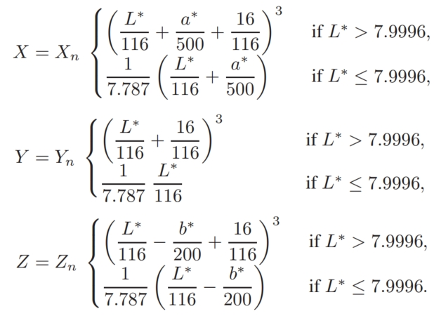

## 19.3 Chromatic Adaptation 半音适应

The CIELAB color space just described takes as input both a tristimulus value of the stimulus and the tristimulus value of light reflected off a white diffuse patch. As such, it forms the beginnings of a system in which the viewing environment is taken into account. 
刚刚描述的 CIELAB 色彩空间将刺激的三色刺激值和从白色漫射斑块反射的光的三色刺激值作为输入。 因此，它构成了考虑观看环境的系统的开端。

The environment in which we observe objects and images has a large influence on how we perceive those objects. The range of viewing environments that we encounter in daily life is very large, from sunlight to starlight and from candlelight to fluorescent light. The lighting conditions not only constitute a very large range in the amount of light that is present, but also vary greatly in the color of the emitted light.
我们观察物体和图像的环境对我们感知这些物体的方式有很大影响。 我们在日常生活中遇到的观看环境范围非常广，从阳光到星光，从烛光到荧光灯。 照明条件不仅在存在的光量方面构成非常大的范围，而且在发出的光的颜色方面也有很大的变化。

The human visual system accommodates these changes in the environment through a process called adaptation. Three different types of adaptation can be distinguished, namely light adaptation, dark adaptation, and chromatic adaptation. Light adaptation refers to the changes that occur when we move from a very dark to a very light environment. When this happens, at first we are dazzled by the light, but soon we adapt to the new situation and begin to distinguish objects in our environment. Dark adaptation refers to the opposite—when we go from a light environment to a dark environment. At first, we see very little, but after a given amount of time, details will start to emerge. The time needed to adapt to the dark is generally much longer than for light adaptation. 
人类视觉系统通过称为适应的过程来适应环境中的这些变化。 可以区分三种不同类型的适应，即光适应、暗适应和色适应。 光适应是指当我们从非常黑暗的环境移动到非常明亮的环境时发生的变化。 当这种情况发生时，一开始我们会被光线弄得眼花缭乱，但很快我们就适应了新的情况并开始区分环境中的物体。 暗适应指的是相反的情况——当我们从明亮的环境进入黑暗的环境时。 起初，我们看到的很少，但经过一段时间后，细节就会开始显现。 适应黑暗所需的时间通常比适应光所需的时间长得多。

Chromatic adaptation refers to our ability to adapt, and largely ignore, variations in the color of the illumination. Chromatic adaptation is, in essence, the biological equivalent of the white balancing operation that is available on most modern cameras. The human visual system effectively normalizes the viewing conditions to present a visual experience that is fairly consistent. Thus, we exhibit a certain amount of color constancy: object reflectances appear relatively constant despite variations in illumination. 
色彩适应是指我们适应并在很大程度上忽略照明颜色变化的能力。 本质上，色彩适应在生物学上相当于大多数现代相机上提供的白平衡操作。 人类视觉系统有效地标准化观看条件，以呈现相当一致的视觉体验。 因此，我们表现出一定程度的颜色恒定性：尽管照明发生变化，物体反射率仍显得相对恒定。

Although we are able to largely ignore changes in viewing environment, we are not able to do so completely. For instance, colors appear much more colorful on a sunny day than they do on a cloudy day. Although the appearances have changed, we do not assume that object reflectance's themselves have actually changed their physical properties. We thus understand that the lighting conditions have influenced the overall color appearance. Nonetheless, color constancy does apply to chromatic content. Chromatic adaptation allows white objects to appear white for a large number of lighting conditions, as shown in Figure 19.9.
虽然我们可以在很大程度上忽略观看环境的变化，但我们不能完全做到这一点。 例如，颜色在晴天比在阴天显得更加丰富多彩。 尽管外观发生了变化，但我们并不认为物体反射率本身实际上改变了它们的物理属性。 因此我们了解到照明条件影响了整体颜色外观。 尽管如此，颜色恒常性确实适用于彩色内容。 色彩适应允许白色物体在大量照明条件下呈现白色，如图 19.9 所示。
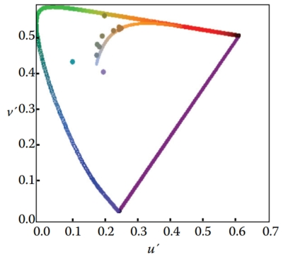
Figure 19.9. A series of light sources plotted in the CIE $u'v'$ chromaticity diagram. A white piece of paper illuminated by any of these light sources maintains a white color appearance. 
图 19.9。 在 CIE $u'v'$ 色度图中绘制的一系列光源。 一张白色的纸在任何这些光源的照射下都会保持白色的外观。

Computational models of chromatic adaptation tend to focus on the gain control mechanism in the cones. One of the simplest models assumes that each cone adapts independently to the energy that it absorbs. This means that different cone types adapt differently dependent on the spectrum of the light being absorbed. Such adaptation can then be modeled as an adaptive and independent rescaling of the cone signals:
色适应的计算模型倾向于关注锥体中的增益控制机制。 最简单的模型之一假设每个锥体独立地适应其吸收的能量。 这意味着不同的锥体类型根据被吸收的光的光谱进行不同的适应。 然后，这种适应可以被建模为锥体信号的自适应且独立的重新缩放：
$$
L_a = α L, \\
M_a = β M, \\
S_a = γ S,
$$
where $(L_a, M_a, S_a)$ are the chromatically adapted cone signals, and α, β, and γ are the independent gain controls which are determined by the viewing environment. This type of independent adaptation is also known as von-Kries adaptation. An example is shown in Figure 19.10. 
其中 $(L_a, M_a, S_a)$ 是色度适应的锥体信号，α、β 和 γ 是由观看环境确定的独立增益控制。 这种类型的独立适应也称为 von-Kries 适应。 图 19.10 显示了一个示例。
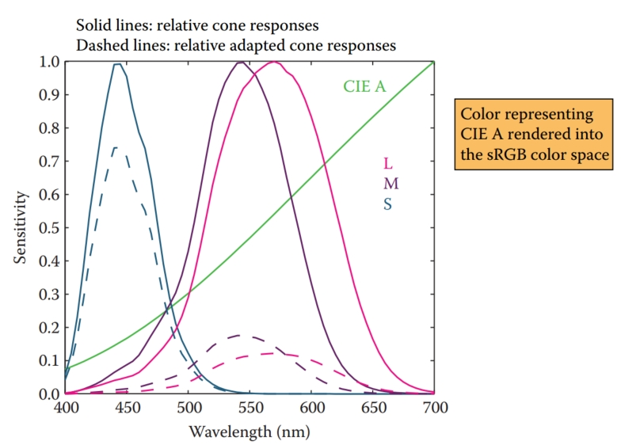
Figure 19.10. An example of von Kries–style independent photoreceptor gain control. The relative cone responses (solid line) and the relative adapted cone responses to CIE illuminant A (dashed) are shown. The separate patch of color represents CIE illuminant A rendered into the sRGB color space.
图 19.10。 冯·克里斯式独立感光器增益控制的一个例子。 显示了相对锥体响应（实线）和对 CIE 光源 A（虚线)的相对适应锥体响应。 单独的色块代表渲染到 sRGB 色彩空间的 CIE 光源 A。

The adapting illumination can be measured off a white surface in the scene. In the ideal case, this would be a Lambertian surface. In a digital image, the adapting illumination can also be approximated as the maximum tristimulus values of the scene. The light measured or computed in this manner is the adapting white, given by $(L_w, M_w, S_w)$. Von Kries adaptation is then simply a scaling by the reciprocal of the adapting white, carried out in cone response space: 
可以在场景中的白色表面上测量适应照明。 在理想情况下，这将是朗伯曲面。 在数字图像中，自适应照明也可以近似为场景的最大三刺激值。 以这种方式测量或计算的光是适应白光，由 $(L_w, M_w, S_w)$ 给出。 那么，Von Kries 适应只是在锥体响应空间中进行的适应白的倒数的缩放：
$$
\begin{bmatrix}
L_a\\ M_a\\ S_a
\end{bmatrix} = \begin{bmatrix}
\frac{1}{L_w} & 0 & 0 \\
0 & \frac{1}{M_w} & 0 \\
0 & 0 & \frac{1}{S_w}
\end{bmatrix}\begin{bmatrix}
L \\M \\S
\end{bmatrix}
$$
In many cases, we are interested in what stimulus should be generated under one illumination to match a given color under a different illumination. For example, if we have a colored patch illuminated by daylight, we may ask ourselves what tristimulus values should be generated to create a matching color patch that will be illuminated by incandescent light. 
在许多情况下，我们感兴趣的是在一种照明下应该产生什么刺激来匹配不同照明下的给定颜色。 例如，如果我们有一个被日光照亮的色块，我们可能会问自己应该生成什么三刺激值来创建将被白炽光照亮的匹配色块。

We are thus interested in computing corresponding colors, which can be achieved by cascading two chromatic adaptation calculations. In essence, the previously mentioned von Kries transform divides out the adapting illuminant—in our example, the daylight illumination. If we subsequently multiply in the incandescent illuminant, we have computed a corresponding color. If the two illuminants are given by $(L_{w,1}, M_{w,1}, S_{w,1})$ and $(L_{w,2}, M_{w,2}, S_{w,2})$, the corresponding color $(L_c, M_c, S_c)$ is given by
因此，我们感兴趣的是计算相应的颜色，这可以通过级联两个色彩适应计算来实现。 本质上，前面提到的冯·克里斯变换划分了适应光源——在我们的例子中，是日光照明。 如果我们随后乘以白炽光源，我们就计算出相应的颜色。 如果两个光源由 $(L_{w,1}, M_{w,1}, S_{w,1})$ 和 $(L_{w,2}, M_{w,2}, S_{ w,2})$，相应的颜色$(L_c, M_c, S_c)$由下式给出
$$
\begin{bmatrix}
L_c\\ M_c\\ S_c
\end{bmatrix} = \begin{bmatrix}
L_{w,2} & 0 & 0 \\
0 & M_{w,2} & 0 \\
0 & 0 & S_{w,2}
\end{bmatrix}
\begin{bmatrix}
\frac{1}{L_{w,1}} & 0 & 0 \\
0 & \frac{1}{M_{w,1}} & 0 \\
0 & 0 & \frac{1}{S_{w,1}}
\end{bmatrix}
\begin{bmatrix}
L \\M \\S
\end{bmatrix}
$$
There are several more complicated and, therefore, more accurate chromatic adaptation transform in existence (Reinhard et al., 2008). However, the simple von Kries model remains remarkably effective in modeling chromatic adaptation and can thus be used to achieve white balancing in digital images. 
存在几种更复杂、因此更准确的色适应变换（Reinhard et al., 2008）。 然而，简单的 von Kries 模型在模拟色彩适应方面仍然非常有效，因此可用于实现数字图像中的白平衡。

The importance of chromatic adaptation in the context of rendering, is that we have moved one step closer to taking into account the viewing environment of the observer, without having to correct for it by adjusting the scene and rerendering our imagery. Instead, we can model and render our scenes, and then, as an image postprocess, correct for the illumination of the viewing environment. To ensure that white balancing does not introduce artifacts, however, it is important to ensure that the image is rendered to a floating-point format. If rendered to traditional 8- bit image formats, the chromatic adaptation transform may amplify quantization errors.
渲染环境中色彩适应的重要性在于，我们在考虑观察者的观看环境方面又向前迈进了一步，而无需通过调整场景和重新渲染图像来进行纠正。 相反，我们可以对场景进行建模和渲染，然后作为图像后处理，校正观看环境的照明。 然而，为了确保白平衡不会引入伪影，确保将图像渲染为浮点格式非常重要。 如果渲染为传统的 8 位图像格式，色适应变换可能会放大量化误差。

## 19.4 Color Appearance 颜色外观

While colorimetry allows us to accurately specify and communicate color in a device-independent manner, and chromatic adaptation allows us to predict color matches across changes in illumination, these tools are still insufficient to describe what colors actually look like. 
虽然比色法使我们能够以独立于设备的方式准确地指定和传达颜色，并且色彩适应使我们能够预测照明变化下的颜色匹配，但这些工具仍然不足以描述颜色的实际外观。

To predict the actual perception of an object, we need to know more information about the environment and take that information into account. The human visual system is constantly adapting to its environment, which means that the perception of color will be strongly influenced by such changes. Color appearance models take into account measurements of the stimulus itself, as well as the viewing environment. This means that the resulting description of color is independent of viewing condition. 
为了预测对物体的实际感知，我们需要了解更多有关环境的信息并将这些信息考虑在内。 人类视觉系统不断适应其环境，这意味着对颜色的感知将受到这种变化的强烈影响。 颜色外观模型考虑了刺激本身以及观看环境的测量。 这意味着所得到的颜色描述与观看条件无关。

The importance of color appearance modeling can be seen in the following example. Consider an image being displayed on an LCD screen. When making a print of the same image and viewing it in a different context, more often than not the image will look markedly different. Color appearance models can be used to predict the changes required to generate an accurate cross-media color reproduction (Fairchild, 2005). 
从下面的例子可以看出颜色外观建模的重要性。 考虑 LCD 屏幕上显示的图像。 当打印相同的图像并在不同的环境中查看它时，图像通常看起来会明显不同。 颜色外观模型可用于预测生成准确的跨媒体颜色再现所需的变化（Fairchild，2005）。

Although color appearance modeling offers important tools for color reproduction, actual implementations tend to be relatively complicated and cumbersome in practical use. It can be anticipated that this situation may change over time. However, until then, we leave their description to more specialized textbooks (Fairchild, 2005). 
尽管颜色外观建模为颜色再现提供了重要的工具，但实际实现在实际使用中往往相对复杂和繁琐。 可以预见，随着时间的推移，这种情况可能会发生变化。 然而，在那之前，我们将它们的描述留给更专业的教科书（Fairchild，2005）。

## Notes 注释

Of all the books on color theory, Reinhard et al.’s work (Reinhard et al., 2008) is most directly geared toward engineering disciplines, including computer graphics, computer vision, and image processing. Other general introductions to color theory are given by Berns (Berns, 2000) and Stone (Stone, 2003). Wyszecki and Stiles have produced a comprehensive volume of data and formulae, forming an indispensable reference work (Wyszecki & Stiles, 2000). For color reproduction, we recommend Hunt’s book (Hunt, 2004). Color appearance models are comprehensively described in Fairchild’s book (Fairchild, 2005). For color issues related to video and HDTV Poynton’s book is essential (Poynton, 2003).
在所有关于色彩理论的书籍中，Reinhard 等人的著作（Reinhard 等人，2008）最直接面向工程学科，包括计算机图形学、计算机视觉和图像处理。 Berns (Berns, 2000) 和 Stone (Stone, 2003) 对色彩理论进行了其他一般介绍。 Wyszecki 和 Stiles 提供了大量的数据和公式，形成了不可缺少的参考书（Wyszecki & Stiles，2000）。 对于色彩再现，我们推荐 Hunt 的书（Hunt，2004）。 Fairchild 的书中全面描述了颜色外观模型（Fairchild，2005）。 对于与视频和 HDTV 相关的色彩问题，Poynton 的书至关重要（Poynton，2003）。


# 20  Visual Perception  视觉感知


The ultimate purpose of computer graphics is to produce images for viewing by people. Thus, the success of a computer graphics system depends on how well it conveys relevant information to a human observer. The intrinsic complexity of the physical world and the limitations of display devices make it impossible to present a viewer with the identical patterns of light that would occur when looking at a natural environment. When the goal of a computer graphics system is physical realism, the best we can hope for is that the system be perceptually effective: displayed images should “look” as intended. For applications such as technical illustration, it is often desirable to visually highlight relevant information and perceptual effectiveness becomes an explicit requirement. 
计算机图形学的最终目的是产生供人们观看的图像。 因此，计算机图形系统的成功取决于它向人类观察者传达相关信息的程度。 物理世界的内在复杂性和显示设备的局限性使得不可能向观看者呈现与观看自然环境时相同的光图案。 当计算机图形系统的目标是物理真实感时，我们所能期望的最好结果就是系统在感知上有效：显示的图像应该“看起来”符合预期。 对于技术插图等应用，通常需要在视觉上突出显示相关信息，并且感知有效性成为明确的要求。

Artists and illustrators have developed empirically a broad range of tools and techniques for effectively conveying visual information. One approach to improving the perceptual effectiveness of computer graphics is to utilize these methods in our automated systems. A second approach builds directly on knowledge of the human vision system by using perceptual effectiveness as an optimization criterion in the design of computer graphics systems. These two approaches are not completely distinct. Indeed, one of the first systematic examinations of visual perception is found in the notebooks of Leonardo da Vinci. 
艺术家和插画家凭经验开发了一系列广泛的工具和技术来有效地传达视觉信息。 提高计算机图形感知有效性的一种方法是在我们的自动化系统中利用这些方法。 第二种方法直接建立在人类视觉系统的知识之上，使用感知有效性作为计算机图形系统设计中的优化标准。 这两种方法并不完全不同。 事实上，对视觉感知的最早的系统检查之一是在列奥纳多·达·芬奇的笔记本中发现的。

The remainder of this chapter provides a partial overview of what is known about visual perception in people. The emphasis is on aspects of human vision that are most relevant to computer graphics. The human visual system is extremely complex in both its operation and its architecture. A chapter such as this can at best provide a summary of key points, and it is important to avoid over generalizing from what is presented here. More in-depth treatments of visual perception can be found in Wandell (1995) and Palmer (1999); Gregory (1997) and Yantis (2000) provide additional useful information. A good computer vision reference such as Forsyth and Ponce (2002) is also helpful. It is important to note that despite over 150 years of intensive research, our knowledge of many aspects of vision is still very limited and imperfect. 
本章的其余部分部分概述了人们对视觉感知的了解。 重点是与计算机图形学最相关的人类视觉方面。 人类视觉系统的操作和架构都极其复杂。 像这样的一章最多只能提供要点的总结，重要的是要避免对此处介绍的内容进行过度概括。 Wandell (1995) 和 Palmer (1999) 对视觉感知进行了更深入的处理； Gregory (1997) 和 Yantis (2000) 提供了更多有用的信息。 Forsyth 和 Ponce (2002) 等优秀的计算机视觉参考文献也很有帮助。 值得注意的是，尽管经过 150 多年的深入研究，我们对视觉许多方面的了解仍然非常有限和不完善。

## 20.1 Vision Science 视觉科学

Vision is generally agreed to be the most powerful of the senses in humans. Vision produces more useful information about the world than does hearing,  touch, smell, or taste. This is a direct consequence of the physics of light (Figure 20.1). Illumination is pervasive, especially during the day but also at night due to moonlight, starlight, and artificial sources. Surfaces reflect a substantial portion of incident illumination and do so in ways that are idiosyncratic to particular materials and that are dependent on the shape of the surface. The fact that light (mostly) travels in straight lines through the air allows vision to acquire information from distant locations. 
人们普遍认为视觉是人类最强大的感官。 视觉比听觉、触觉、嗅觉或味觉产生更多关于世界的有用信息。 这是光物理学的直接结果（图 20.1）。 照明无处不在，尤其是在白天，但在夜间，由于月光、星光和人造光源的影响，照明也很普遍。 表面反射大部分入射照明，其反射方式对于特定材料而言是特殊的，并且取决于表面的形状。 光（大部分）在空气中沿直线传播的事实使视觉能够从远处获取信息。

> Light:  
>
> - travels far
> - travels fast
> - travels in straight lines
> - interacts with stuff
> - bounces off things
> - is produced in nature
> - has lots of energy
>
> ​			—Steven Shafer
>
> Figure 20.1. The nature of light makes vision a powerful sense.  
>
> 光： 
>
> - 旅行很远 
>
> - 行驶速度快 
>
> - 直线行驶 
>
> - 与事物互动 
>
> - 从物体上反弹 
>
> - 自然产生 
>
> - 能量充沛 >
>
>   ​	史蒂文·谢弗 
>
>  图 20.1。 光的本质使视觉成为一种强大的感觉。

The study of vision has a long and rich history. Much of what we know about the eye traces back to the work of philosophers and physicists in the 1600s. Starting in the mid-1800s, there was an explosion of work by perceptual psychologists exploring the phenomenology of vision and proposing models of how vision might work. The mid-1900s saw the start of modern neuroscience, which investigates both the fine-scale workings of individual neurons and the large-scale architectural organization of the brain and nervous system. A substantial portion of neuroscience research has focused on vision. More recently, computer science has contributed to the understanding of visual perception by providing tools for precisely describing hypothesized models of visual computations and by allowing empirical examination of computer vision programs. The term vision science was coined to refer to the multidisciplinary study of visual perception involving perceptual psychology, neuroscience, and computational analysis. 
视觉研究有着悠久而丰富的历史。 我们对眼睛的了解大部分可以追溯到 1600 年代哲学家和物理学家的工作。 从 1800 年代中期开始，感知心理学家的工作激增，探索视觉现象学并提出视觉工作原理的模型。 1900 年代中期见证了现代神经科学的兴起，它研究单个神经元的精细运作以及大脑和神经系统的大规模结构组织。 神经科学研究的很大一部分集中在视觉上。 最近，计算机科学通过提供精确描述视觉计算假设模型的工具以及允许对计算机视觉程序进行实证检验，为对视觉感知的理解做出了贡献。 视觉科学一词是指视觉感知的多学科研究，涉及感知心理学、神经科学和计算分析。

Vision science views the purpose of vision as producing information about objects, locations, and events in the world from imaged patterns of light reaching the viewer. Psychologists use the term distal stimulus to refer to the physical world under observation and proximal stimulus to refer to the retinal image.(In computer vision, the term scene is often used to refer to the external world, while the term image is used to refer to the projection of the scene onto a sensing plane.  ) Using this terminology, the function of vision is to generate a description of aspects of the distal stimulus given the proximal stimulus. Visual perception is said to be veridical when the description that is produced accurately reflects the real world. In practice, it makes little sense to think of these descriptions of objects, locations, and events in isolation. Rather, vision is better understood in the context of the motor and cognitive functions that it serves. 
视觉科学将视觉的目的视为通过到达观察者的光的成像模式产生有关世界上的物体、位置和事件的信息。 心理学家使用术语“远端刺激”来指代观察到的物理世界，用“近端刺激”来指代视网膜图像。（在计算机视觉中，术语“场景”通常用来指代外部世界，而术语“图像”则用来指代） 场景到传感平面的投影。）使用这个术语，视觉的功能是在给定近端刺激的情况下生成远端刺激各方面的描述。 当产生的描述准确地反映现实世界时，视觉感知被认为是真实的。 实际上，孤立地考虑这些对物体、位置和事件的描述是没有意义的。 相反，在其所服务的运动和认知功能的背景下，可以更好地理解视觉。

## 20.2 Visual Sensitivity  视觉灵敏度

Vision systems create descriptions of the visual environment based on properties of the incident illumination. As a result, it is important to understand what properties of incident illumination the human vision system can actually detect. One critical observation about the human vision system is that it is primarily sensitive to patterns of light rather than being sensitive to the absolute magnitude of light energy. The eye does not operate as a photometer. Instead, it detects spatial, temporal, and spectral patterns in the light imaged on the retina and information about these patterns of light form the basis for all of visual perception. 
视觉系统根据入射照明的属性创建视觉环境的描述。 因此，了解人类视觉系统实际上可以检测到的入射照明的哪些特性非常重要。 关于人类视觉系统的一项重要观察是，它主要对光的模式敏感，而不是对光能的绝对大小敏感。 眼睛并不充当光度计。 相反，它检测视网膜上成像的光的空间、时间和光谱模式，有关这些光模式的信息构成了所有视觉感知的基础。

There is a clear ecological utility to the vision system’s sensitivity to variations in illumination over space and time. Being able to accurately sense changes in the environment is crucial to our survival.(It is sometime said that the primary goals of vision are to support eating, avoiding being eaten, reproduction, and avoidance of catastrophe while moving. Thinking about vision as a goal-directed activity is often useful, but needs to be done so at a more detailed level.) A system which measures changes in light energy rather than the magnitude of the energy itself also makes engineering sense, since it makes it easier to detect patterns of light over large ranges in light intensity. It is a good thing for computer graphics that vision operates in this manner. Display devices are physically limited in their ability to project light with the power and dynamic range typical of natural scenes. Graphical displays would not be effective if they needed to produce the identical patterns of light as the corresponding physical world. Fortunately, all that is required is that displays be able to produce similar patterns of spatial and temporal change to the real world. 
视觉系统对照明随空间和时间变化的敏感性具有明显的生态效用。 能够准确地感知环境的变化对于我们的生存至关重要。（有时有人说，视觉的主要目标是支持进食、避免被吃掉、繁殖以及避免移动时的灾难。将视觉视为目标 -定向活动通常很有用，但需要在更详细的水平上进行。）测量光能变化而不是能量本身大小的系统也具有工程意义，因为它可以更容易地检测光能的模式 光强度范围大的光。 视觉以这种方式运作对于计算机图形学来说是一件好事。 显示设备在以自然场景典型的功率和动态范围投射光的能力方面受到物理限制。 如果图形显示器需要产生与相应的物理世界相同的光图案，那么它们就不会有效。 幸运的是，所需要的只是显示器能够产生与现实世界类似的空间和时间变化模式。

### 20.2.1 Brightness and Contrast  亮度和对比度

In bright light, the human visual system is capable of distinguishing gratings consisting of high-contrast parallel light and dark bars as fine as 50–60 cycles/degree. (In this case, a “cycle” consists of an adjacent pair of light and dark bars.) For comparison, the best currently available LCD computer monitor, at a normal viewing distance, can display patterns as fine as about 20 cycles/degree. The minimum contrast difference at an edge detectable by the human visual system in bright light is about 1% of the average luminance across the edge. In most 8-bit displays, differences of a single gray level are often noticeable over at least a portion of the range of intensities due to the nature of the mapping from gray levels to actual display luminance. 
在明亮的光线下，人类视觉系统能够区分由高对比度平行光和暗条组成的光栅，精度可达 50-60 周期/度。 （在这种情况下，一个“周期”由一对相邻的亮条和暗条组成。）作为比较，目前最好的 LCD 计算机显示器在正常观看距离下可以显示精细到约 20 周期/度的图案。 在强光下，人类视觉系统可检测到的边缘处的最小对比度差异约为边缘平均亮度的 1%。 在大多数 8 位显示器中，由于从灰度级到实际显示亮度的映射性质，单个灰度级的差异通常在强度范围的至少一部分上是明显的。

Characterizing the ability of the visual system to detect fine scale patterns (visual acuity) and to detect changes in brightness is considerably more complicated than for cameras and similar image acquisition devices. As shown in Figure 20.2, there is an interaction between contrast and acuity in human vision. In the figure, the scale of the pattern decreases from left to right while the contrast increases from top to bottom. If you view the figure at a normal viewing distance, it will be clear that the lowest contrast at which a pattern is visible is a function of the spatial frequency of the pattern. 
表征视觉系统检测精细尺度图案（视敏度）和检测亮度变化的能力比相机和类似的图像采集设备要复杂得多。 如图 20.2 所示，人类视觉的对比度和敏锐度之间存在相互作用。 在图中，图案的比例从左到右减小，而对比度从上到下增加。 如果您在正常观看距离处查看该图，就会清楚地看到图案可见的最低对比度是图案空间频率的函数。

Figure 20.2. The contrast between stripes increases in a constant manner from top to bottom, yet the threshold of visibility varies with frequency.
图 20.2。 条纹之间的对比度从上到下以恒定的方式增加，但可见度阈值随频率而变化。

There is a linear relationship between the intensity of light L reaching the eye from a particular surface point in the world, the intensity of light I illuminating that surface point, and the reflectivity R of the surface at the point being observed:
从世界上特定表面点到达眼睛的光强度 L、照亮该表面点的光强度 I 以及被观察点处的表面反射率 R 之间存在线性关系：
$$
L = αI · R, \ \ \ \ (20.1)
$$
where α is dependent on the relationship between the surface geometry, the pattern of incident illumination, and the viewing direction. While the eye is only able to directly measure L, human vision is much better at estimating R than L. To see this, view Figure 20.3 in bright direct light. Use your hand to shadow one of the patterns, leaving the other directly illuminated. While the light reflected off of the two patterns will be significantly different, the apparent brightness of the two center squares will seem nearly the same. The term lightness is often used to describe the apparent brightness of a surface, as distinct from its actual luminance. In many situations, lightness is invariant to large changes in illumination, a phenomenon referred to as lightness constancy. 
其中 α 取决于表面几何形状、入射照明模式和观察方向之间的关系。 虽然眼睛只能直接测量 L，但人类视觉对 R 的估计比对 L 的估计要好得多。要看到这一点，请在明亮的直射光下查看图 20.3。 用手遮住其中一个图案的阴影，使另一个图案直接被照亮。 虽然两个图案反射的光明显不同，但两个中心方块的表观亮度看起来几乎相同。 术语“亮度”通常用于描述表面的表观亮度，与其实际亮度不同。 在许多情况下，亮度对于光照的大幅变化是不变的，这种现象称为亮度恒定性。

Figure 20.3. Lightness constancy. Cast a shadow over one of the patterns with your hand and notice that the apparent brightness of the two center squares remains nearly the same. 
图 20.3。 亮度恒定。 用手在其中一个图案上投射阴影，您会发现两个中心方块的表观亮度几乎保持不变。

The mechanisms by which the human visual system achieves lightness constancy are not well understood. As shown in Figure 20.2, the vision system is relatively insensitive to slowly varying patterns of light, which may serve to discount the effects of slowly varying illumination. Apparent brightness is affected by the brightness of surrounding regions (Figure 20.4). This can aid lightness constancy when regions are illuminated dissimilarly. While this simultaneous contrast effect is often described as a modification of the perceived lightness of one region based on contrasting brightness in the surrounding region, it is actually much more complicated than that (Figures 20.5 and 20.6). For more on lightness perception, see (Gilchrist et al., 1999) and (Adelson, 1999).
人类视觉系统实现亮度恒定的机制尚不清楚。 如图 20.2 所示，视觉系统对缓慢变化的光模式相对不敏感，这可能有助于减弱缓慢变化的照明的影响。 表观亮度受周围区域亮度的影响（图20.4）。 当区域照明不同时，这可以帮助亮度恒定。 虽然这种同时对比效果通常被描述为根据周围区域的对比亮度对一个区域的感知亮度进行修改，但实际上比这复杂得多（图 20.5 和 20.6）。 有关亮度感知的更多信息，请参阅（Gilchrist et al., 1999）和（Adelson, 1999）。

Figure 20.4. (a) Simultaneous contrast: the apparent brightness of the center bar is affected by the brightness of the surrounding area; (b) The same bar without a variable surround. 
图 20.4。 (a) 同时对比度：中心条的表观亮度受到周围区域亮度的影响； (b) 没有可变环绕声的同一个小节。
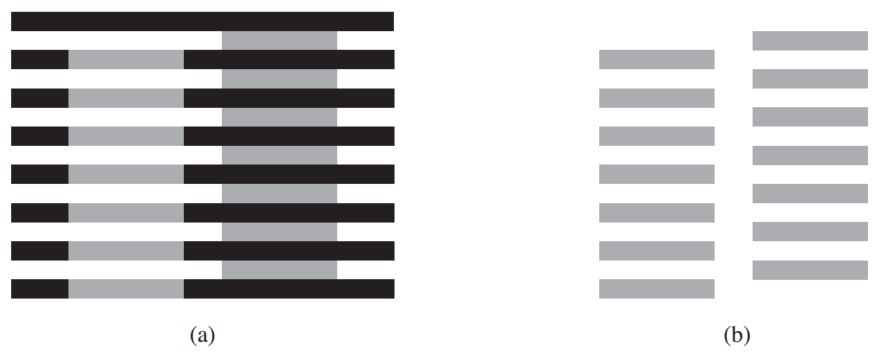
Figure 20.5. The Munker-White illusion shows the complexity of simultaneous contrast. In Figure 20.4, the central region looked lighter when the surrounding area was darker. In (a), the gray strips on the left look lighter than the gray strips on the right, even though they are nearly surrounded by regions of white; (b) shows the gray strips without the black lines.
图 20.5。 芒克-怀特错觉显示了同时对比的复杂性。 在图 20.4 中，当周围区域较暗时，中心区域看起来较亮。 在（a）中，左侧的灰色条带看起来比右侧的灰色条带更亮，尽管它们几乎被白色区域包围； (b) 显示没有黑线的灰色条带。

Figure 20.6. The perception of lightness is affected by the perception of 3D structure. The two surfaces marked (a) have the same brightness, as do the two surfaces marked (b) (after Adelson (1999)).
图 20.6。 亮度感知受到 3D 结构感知的影响。 标记为 (a) 的两个表面具有相同的亮度，标记为 (b) 的两个表面也具有相同的亮度（根据 Adelson (1999))。

While the visual system largely ignores slowly varying intensity patterns, it is extremely sensitive to edges consisting of lines of discontinuity in brightness. Edges in imaged light intensity often correspond to surface boundaries or other important features in the environment (Figure 20.7). The vision system can also detect localized differences in motion, stereo disparity, texture, and several other image properties. The vision system has very little ability, however, to detect spatial discontinuities in color when not accompanied by differences in one of these other properties. 
虽然视觉系统在很大程度上忽略了缓慢变化的强度模式，但它对由亮度不连续线组成的边缘极其敏感。 成像光强度的边缘通常对应于环境中的表面边界或其他重要特征（图 20.7）。 视觉系统还可以检测运动、立体视差、纹理和其他一些图像属性的局部差异。 然而，当不伴随这些其他属性之一的差异时，视觉系统几乎没有能力检测颜色的空间不连续性。

Figure 20.7. (a) Original gray scale image, (b) image edges, which are lines of high spatial variability in some direction. 
图 20.7。 (a) 原始灰度图像，(b) 图像边缘，它们是在某个方向上具有高空间变异性的线。

Perception of edges seems to interact with perception of form. While edges give the visual system the information it needs to recognize shapes, slowly varying brightness can appear as a sharp edge if the resulting edge creates a more complete form (Figure 20.8). Figure 20.9 shows a subjective contour, an extreme form of this effect in which a closed contour is seen even though no such contour exists in the actual image. Finally, the vision system’s sensitivity to edges also appears to be part of the mechanism involved in lightness perception. Note that the region enclosed by the subjective contour in Figure 20.9 appears a bit brighter than the surrounding area of the page. Figure 20.10 shows a different interaction between edges and lightness. In this case, a particular brightness profile at the edge has a dramatic effect on the apparent brightness of the surfaces to either side of the edge.
对边缘的感知似乎与对形式的感知相互作用。 虽然边缘为视觉系统提供了识别形状所需的信息，但如果生成的边缘创建了更完整的形状，则缓慢变化的亮度可能会显示为锐利边缘（图 20.8）。 图 20.9 显示了主观轮廓，这是这种效果的一种极端形式，其中可以看到闭合轮廓，即使实际图像中不存在这样的轮廓。 最后，视觉系统对边缘的敏感性似乎也是亮度感知机制的一部分。 请注意，图 20.9 中主观轮廓包围的区域看起来比页面周围区域更亮。 图 20.10 显示了边缘和亮度之间不同的相互作用。 在这种情况下，边缘处的特定亮度分布对边缘两侧表面的表观亮度具有显着影响。

Figure 20.8. The visual system sometimes sees “edges” even when there are no sharp discontinuities in brightness, as is the case at the right side of the central pattern in this image. 
图 20.8。 即使亮度没有明显的不连续性，视觉系统有时也会看到“边缘”，就像该图像中中心图案右侧的情况一样。
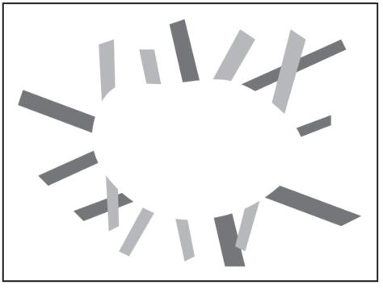
Figure 20.9. Sometimes, the visual system will “see” subjective contours without any associated change in brightness. 
图 20.9。 有时，视觉系统会“看到”主观轮廓，而没有任何相关的亮度变化。

Figure 20.10. Perceived lightness depends more on local contrast at edges than on brightness across surfaces. Try covering the vertical edge in the middle of the figure with a pencil. This figure is an instance of the Craik-O’Brien-Cornsweet illusion.
图 20.10。 感知的亮度更多地取决于边缘的局部对比度，而不是表面的亮度。 尝试用铅笔覆盖图形中间的垂直边缘。 这个数字是克雷克-奥布莱恩-玉米甜错觉的一个例子。

As indicated above, people can detect differences in the brightness between two adjacent regions if the difference is at least 1% of the average brightness. This is an example of Weber’s law, which states that there is a constant ratio between the just noticeable differences (jnd) in a stimulus and the magnitude of the stimulus:
如上所述，如果两个相邻区域之间的亮度差异至少为平均亮度的 1%，人们就可以检测到该差异。 这是韦伯定律的一个例子，该定律指出刺激中的可察觉差异 (jnd) 与刺激的强度之间存在恒定比率：
$$
\frac{ΔI}{I} = k_1 \ \ \ \ \ (20.2)
$$
where I is the magnitude of the stimulus, ΔI is the magnitude of the just noticeable difference, and k1 is a constant particular to the stimulus. Weber’s law was postulated in 1846 and still remains a useful characterization of many perceptual effects. Fechner’s law, proposed in 1860, generalized Weber’s law in a way that allowed for the description of the strength of any sensory experience, not just jnd’s:
其中 I 是刺激的大小，ΔI 是可察觉差异的大小，k1 是特定于刺激的常数。 韦伯定律于 1846 年提出，至今仍然是许多感知效果的有用表征。 费希纳定律于 1860 年提出，概括了韦伯定律，允许描述任何感官体验的强度，而不仅仅是 jnd 的强度：
$$
S = k_2 log(I),\ \ \ \ \   (20.3)
$$
where S is the perceptual strength of the sensory experience, I is the physical magnitude of the corresponding stimulus, and $k_2$ is a scaling constant specific to the stimulus. Current practice is to model the association between perceived and actual strength of a stimulus using a power function (Stevens’s law):
其中 S 是感官体验的感知强度，I 是相应刺激的物理强度，$k_2$ 是特定于刺激的缩放常数。 目前的做法是使用幂函数（史蒂文斯定律）对刺激的感知强度和实际强度之间的关联进行建模：
$$
S = k_3I^b, \ \ \ \ \ \  (20.4)
$$
where S and I are as before, k3 is another scaling constant, and b is an exponent specific to the stimulus. For a large number of perceptual quantities involving vision, b < 1. The CIE L∗a∗b∗ color space, described elsewhere, uses a modified Stevens’s law representation to characterize perceptual differences between brightness values. Note that in the first two characterizations of the perceptual strength of a stimulus and in Stevens’s Law when b < 1, changes in the stimulus when it has a small average magnitude create larger perceptual effects than do the same physical change in the stimulus when it has a larger magnitude.
其中 S 和 I 与之前一样，k3 是另一个缩放常数，b 是特定于刺激的指数。 对于涉及视觉的大量感知量，b < 1。其他地方描述的 CIE L*a*b* 颜色空间使用修改后的史蒂文斯定律表示来表征亮度值之间的感知差异。 请注意，在刺激感知强度的前两个特征中以及在 b < 1 时的史蒂文斯定律中，当刺激的平均幅度较小时，刺激的变化会比刺激的平均幅度较小时产生的相同物理变化产生更大的感知效果。 更大的幅度。

The “laws” described above are not physical constraints on how perception operates. Rather, they are generalizations about how the perceptual system responds to particular physical stimuli. In the field of perceptual psychology, the quantitative study of the relationships between physical stimuli and their perceptual effects is called psychophysics. While psychophysical laws are empirically derived observations rather than mechanistic accounts, the fact that so many perceptual effects are well modeled by simple power functions is striking and may provide insights into the mechanisms involved. 
上述“法则”并不是对感知运作方式的物理限制。 相反，它们是关于感知系统如何响应特定物理刺激的概括。 在知觉心理学领域，对物理刺激与其知觉效果之间关系的定量研究称为心理物理学。 虽然心理物理学定律是根据经验得出的观察结果，而不是机械解释，但如此多的感知效应可以通过简单的幂函数很好地建模，这一事实是惊人的，并且可以提供对所涉及机制的见解。

### 20.2.2 Color  颜色

In 1666, Isaac Newton used prisms to show that apparently white sunlight could be decomposed into a spectrum of colors and that these colors could be recombined to produce light that appeared white. We now know that light energy is made up of a collection of photons, each with a particular wavelength. The spectral distribution of light is a measure of the average energy of the light at each wavelength. For natural illumination, the spectral distribution of light reflected off of surfaces varies significantly depending on the surface material. Characterizations of this spectral distribution can therefore provide visual information for the nature of surfaces in the environment. 
1666 年，艾萨克·牛顿使用棱镜证明，白色的阳光可以分解成一系列颜色，并且这些颜色可以重新组合以产生白色的光。 我们现在知道光能是由光子的集合组成的，每个光子都有特定的波长。 光的光谱分布是每个波长的光的平均能量的量度。 对于自然照明，从表面反射的光的光谱分布根据表面材料的不同而显着变化。 因此，这种光谱分布的特征可以提供环境中表面性质的视觉信息。

Most people have a pervasive sense of color when they view the world. Color perception depends on the frequency distribution of light, with the visible spectrum for humans ranging from a wavelength of about 370 nm to a wavelength of about 730 nm (see Figure 20.11). The manner in which the visual systems derives a sense of color from this spectral distribution was first systematically examined in 1801 and remained extremely controversial for 150 years. The problem is that the visual system responds to patterns of spectral distribution very differently than patterns of luminance distribution.
大多数人在观察世界时都有一种普遍的色彩感。 颜色感知取决于光的频率分布，人类的可见光谱范围从波长约 370 nm 到波长约 730 nm（见图 20.11）。 视觉系统从这种光谱分布中获得颜色感的方式于 1801 年首次被系统地研究，并且在 150 年来一直备受争议。 问题在于视觉系统对光谱分布模式的响应与亮度分布模式的响应非常不同。

Figure 20.11. The visible spectrum. Wavelengths are in nanometers. 
图 20.11。 可见光谱。 波长以纳米为单位。

> “The history of the investigation of colour vision is remarkable for its acrimony.” —Richard Gregory (1997)
> “色觉研究的历史因其尖酸刻薄而引人注目。” ——理查德·格雷戈里 (1997)

Even accounting for phenomena such as lightness constancy, distinctly different spatial distributions almost always look distinctly different. More importantly given that the purpose of the visual system is to produce descriptions of the distal stimulus given the proximal stimulus, perceived patterns of lightness correspond at least approximately to patterns of brightness over surfaces in the environment.The same is not true of color perception. Many quite different spectral distributions of light can produce a sense of any specific color. Correspondingly, the sense that a surface is a specific color provides little direct information about the spectral distribution of light coming from the surface. For example, a spectral distribution consisting of a combination of light at wavelengths of 700 nm and 540 nm, with appropriately chosen relative strengths, will look indistinguishable from light at the single wavelength of 580 nm. (Perceptually indistinguishable colors with different spectral compositions are referred to as metamers.) If we see the color “yellow,” we have no way of knowing if it was generated by one or the other of these distributions or an infinite family of other spectral distributions. For this reason, in the context of vision the term color refers to a purely perceptual quality, not a physical property. 
即使考虑到亮度恒定性等现象，明显不同的空间分布几乎总是看起来明显不同。 更重要的是，考虑到视觉系统的目的是在给定近端刺激的情况下产生对远端刺激的描述，所感知的亮度模式至少大致对应于环境中表面上的亮度模式。对于颜色感知来说，情况并非如此。 许多完全不同的光谱分布的光可以产生任何特定颜色的感觉。 相应地，表面具有特定颜色的感觉几乎不能提供有关来自该表面的光的光谱分布的直接信息。 例如，由 700 nm 和 540 nm 波长的光组合组成的光谱分布（具有适当选择的相对强度）看起来与 580 nm 单一波长的光没有区别。 （具有不同光谱成分的感知上无法区分的颜色被称为同色异谱。）如果我们看到颜色“黄色”，我们无法知道它是由这些分布中的一个或另一个生成的，还是由无限系列的其他光谱分布生成的 。 因此，在视觉背景下，术语“颜色”指的是纯粹的感知质量，而不是物理属性。

There are two classes of photoreceptors in the human retina. Cones are involved in color perception, while rods are sensitive to light energy across the visible range and do not provide information about color. There are three types of cones, each with a different spectral sensitivity (Figure 20.12). S-cones respond to short wavelengths in the blue range of the visible spectrum. M-cones respond to wavelengths in the middle (greenish) region of the visible spectrum. L-cones respond to somewhat longer wavelengths covering the green and red portions of the visible spectrum. 
人类视网膜中有两类感光器。 视锥细胞参与颜色感知，而视杆细胞对可见光范围内的光能敏感，并且不提供有关颜色的信息。 视锥细胞分为三种类型，每种类型都有不同的光谱灵敏度（图 20.12）。 S 锥体对可见光谱蓝色范围内的短波长有反应。 M 锥体对可见光谱中间（绿色）区域的波长做出响应。 L 锥体对覆盖可见光谱的绿色和红色部分的较长波长做出响应。

Figure 20.12. Spectral sensitivity of the short, medium, and long cones in the human retina. 
图 20.12。 人类视网膜中短、中、长视锥细胞的光谱敏感性。

While it is common to describe the three types of cones as red, green, and blue, this is neither correct terminology nor does it accurately reflect the cone sensitivities shown in Figure 20.12. The L-cones and M-cones are broadly tuned, meaning that they respond to a wide range of frequencies. There is also substantial overlap between the sensitivity curves of the three cone types. Taken together, these two properties mean that it is not possible to reconstruct an approximation to the original spectral distribution given the responses of the three cone types. This is in contrast to spatial sampling in the retina (and in digital cameras), where the receptors are narrowly tuned in their spatial sensitivity in order to be able to detect fine detail in local contrast. 
虽然通常将三种类型的视锥细胞描述为红色、绿色和蓝色，但这既不是正确的术语，也不能准确反映图 20.12 中所示的视锥细胞灵敏度。 L 锥体和 M 锥体经过广泛调谐，这意味着它们可以响应较宽的频率范围。 三种锥体类型的灵敏度曲线之间也存在大量重叠。 总而言之，这两个属性意味着在给定三种锥体类型的响应的情况下不可能重建原始光谱分布的近似值。 这与视网膜（和数码相机）中的空间采样形成鲜明对比，在视网膜（和数码相机）中，受体的空间灵敏度被微调，以便能够检测局部对比度的精细细节。

The fact that there are are only three types of color sensitive photoreceptors in the human retina greatly simplifies the task of displaying colors on computer monitors and in other graphical displays. Computer monitors display colors as a weighted combination of three fixed-color distributions. Most often, the three colors are a distinct red, a distinct green, and a distinct blue. As a result, in computer graphics, color is often represented by a red-green-blue (RGB) triple, representing the intensities of red, green, and blue primaries needed to display a particular color. Three basis colors are sufficient to display most perceptible colors, since appropriately weighted combinations of three appropriately chosen colors can produce metamers for these perceptible colors. 
人类视网膜中只有三种类型的颜色敏感感光器这一事实大大简化了在计算机显示器和其他图形显示器上显示颜色的任务。 计算机显示器将颜色显示为三种固定颜色分布的加权组合。 最常见的是，这三种颜色是独特的红色、独特的绿色和独特的蓝色。 因此，在计算机图形学中，颜色通常由红-绿-蓝 (RGB) 三元组表示，表示显示特定颜色所需的红、绿、蓝三原色的强度。 三种基色足以显示最可感知的颜色，因为三种适当选择的颜色的适当加权组合可以产生这些可感知颜色的同色异谱。

There are at least two significant problems with the RGB color representation. The first is that different monitors have different spectral distributions for their red, green, and blue primaries. As a result, perceptually correct color rendition involves remapping RGB values for each monitor. This is, of course, only possible if the original RGB values satisfy some well-defined standard, which is often not the case. (See Chapter 19 for more information on this issue.) The second problem is that RGB values do not define a particular color in a way that corresponds to subjective perception. When we see the color “yellow,” we do not have the sense that it is made up of equal parts of red and green light. Rather, it looks like a single color, with additional properties involving brightness and the “amount” of color. Representing color as the output of the S-cones, M-cones, and L-cones is no help either, since we have no more phenomenological sense of color as characterized by these properties than we do as characterized by RGB display properties. 
RGB 颜色表示至少存在两个重大问题。 首先，不同的显示器的红、绿、蓝原色具有不同的光谱分布。 因此，感知上正确的色彩再现需要重新映射每个显示器的 RGB 值。 当然，这只有在原始 RGB 值满足某些明确定义的标准时才有可能，但情况通常并非如此。 （有关此问题的更多信息，请参阅第 19 章。）第二个问题是 RGB 值并不以与主观感知相对应的方式定义特定颜色。 当我们看到“黄色”颜色时，我们并没有感觉到它是由等量的红光和绿光组成的。 相反，它看起来像单一颜色，具有涉及亮度和颜色“数量”的附加属性。 将颜色表示为 S 锥体、M 锥体和 L 锥体的输出也没有帮助，因为我们对这些属性所表征的颜色的现象学意义并不比 RGB 显示属性所表征的颜色更多。

There are two different approaches to characterizing color in a way that more closely reflects human perception. The various CIE color spaces aim to to be “perceptually uniform” so that the magnitude of the difference in the represented values of two colors is proportional to the perceived difference in color (Wyszecki & Stiles, 2000). This turns out to be a difficult goal to accomplish, and there have been several modifications to the CIE model over the years. Furthermore, while one of the dimensions of the CIE color spaces corresponds to perceived brightness, the other two dimensions that specify chromaticity have no intuitive meaning. 
有两种不同的方法可以更接近地反映人类感知的方式来表征颜色。 各种 CIE 色彩空间的目标是“感知统一”，以便两种颜色表示值的差异大小与感知的颜色差异成正比（Wyszecki & Stiles，2000）。 事实证明这是一个很难实现的目标，多年来 CIE 模型进行了多次修改。 此外，虽然 CIE 色彩空间的一个维度对应于感知亮度，但指定色度的其他两个维度没有直观意义。

The second approach to characterizing color in a more natural manner starts with the observation that there are three distinct and independent properties that dominate the subjective sense of color. Lightness, the apparent brightness of a surface, has already been discussed. Saturation refers to the purity or vividness of a color. Colors can range from totally unsaturated gray to partially saturated pastels to fully saturated “pure” colors. The third property, hue, corresponds most closely to the informal sense of the word “color” and is characterized in a manner similar to colors in the visible spectrum, ranging from dark violet to dark red. Figure 20.13 shows a plot of the hue-saturation-lightness (HSV) color space. Since the relationship between brightness and lightness is both complex and not well understood, HSV color spaces almost always use brightness instead of attempting to estimate lightness. Unlike wavelengths in the spectrum, however, hue is usually represented in a manner that reflects the fact that the extremes of the visible spectrum are actually similar in appearance (Figure 20.14). Simple transformations exist between RGB and HSV representations of a particular color value. As a result, while the HSV color space is motivated by perceptual considerations, it contains no more information than does an RGB representation.
以更自然的方式表征颜色的第二种方法始于观察到主导颜色的主观感觉的三个不同且独立的属性。 亮度，即表面的表观亮度，已经讨论过。 饱和度是指颜色的纯度或鲜艳度。 颜色范围可以从完全不饱和的灰色到部分饱和的粉彩再到完全饱和的“纯”色。 第三个属性，色调，最接近于“颜色”一词的非正式含义，其特征类似于可见光谱中的颜色，范围从深紫色到深红色。 图 20.13 显示了色调-饱和度-亮度 (HSV) 颜色空间的图。 由于亮度和亮度之间的关系既复杂又不易理解，所以 HSV 颜色空间几乎总是使用亮度而不是尝试估计亮度。 然而，与光谱中的波长不同，色调通常以反映可见光谱的极端外观实际上相似这一事实的方式表示（图 20.14）。 特定颜色值的 RGB 和 HSV 表示之间存在简单的转换。 因此，虽然 HSV 颜色空间是出于感知考虑，但它包含的信息并不比 RGB 表示更多。

Figure 20.13. HSV color space. Hue varies around the circle, saturation varies with radius, and value varies with height. 
图 20.13。 HSV 颜色空间。 色调围绕圆变化，饱和度随半径变化，值随高度变化。

Figure 20.14. Which color is closer to red: green or violet? 
图 20.14。 哪种颜色更接近红色：绿色还是紫色？

The hue-saturation-lightness approach to describing color is based on the spectral distribution at a single point and so only approximates the perceptual response to spectral distributions of light distributed over space. Color perception is subject to similar constancy and simultaneous contrast effects as is lightness/brightness, neither of which are captured in the RGB representation and as a result are not captured in the HSV representation. For an example of color constancy, look at a piece of white paper indoors under incandescent light and outdoors under direct sunlight. The paper will look “white” in both cases, even though incandescent light has a distinctly yellow hue and so the light reflected off of the paper will also have a yellow hue, while sunlight has a much more uniform color spectrum. 
描述颜色的色调-饱和度-亮度方法基于单个点的光谱分布，因此仅近似对空间分布的光的光谱分布的感知响应。 颜色感知与亮度/亮度一样受到类似的恒定性和同时对比度影响，这两者都没有在 RGB 表示中捕获，因此也没有在 HSV 表示中捕获。 举一个颜色恒常性的例子，在室内白炽灯下和室外阳光直射下观察一张白纸。 在这两种情况下，纸张看起来都是“白色”，尽管白炽光具有明显的黄色色调，因此从纸张反射的光也将具有黄色色调，而阳光具有更均匀的色谱。

Another aspect of color perception not captured by either the CIE color spaces or HSV encoding is the fact that we see a small number of distinct colors when looking at a continuous spectrum of visible light (Figure 20.11) or in a naturally occurring rainbow. For most people, the visible spectrum appears to be divided into four to six distinct colors: red, yellow, green, and blue, plus perhaps light blue and purple. Considering non-spectral colors as well, there are only 11 basic color terms commonly used in English: red, green, blue, yellow, black, white, gray, orange, purple, brown, and pink. The partitioning of the intrinsically continuous space of spectral distributions into a relatively small set of perceptual categories associated with well-defined linguistic terms seems to be a basic property of perception, not just a cultural artifact (Berlin & Kay, 1969). The exact nature of the process, however, is not well understood. 
CIE 色彩空间或 HSV 编码未捕获的色彩感知的另一个方面是，当我们观察连续的可见光光谱（图 20.11）或自然出现的彩虹时，我们会看到少量不同的颜色。 对于大多数人来说，可见光谱似乎分为四到六种不同的颜色：红色、黄色、绿色和蓝色，也许还有浅蓝色和紫色。 考虑到非光谱颜色，英语中常用的基本颜色术语只有 11 种：红、绿、蓝、黄、黑、白、灰、橙、紫、棕、粉红。 将本质上连续的光谱分布空间划分为一组相对较小的与明确定义的语言术语相关的感知类别似乎是感知的基本属性，而不仅仅是一种文化制品（Berlin＆Kay，1969）。 然而，该过程的确切性质尚不清楚。

### 20.2.3 Dynamic Range 动态范围

Natural illumination varies in intensity over 6 orders of magnitude (Figure 20.15). The human vision system is able to operate over this full range of brightness levels. However, at any one point in time, the visual system is only able to detect variations in light intensity over a much smaller range. As the average brightness to which the visual system is exposed changes over time, the range of discriminable brightnesses changes in a corresponding manner. This effect is most obvious if we move rapidly from a brightly lit outdoor area to a very dark room. At first, we are able to see little. After a while, however, details in the room start to become apparent. The dark adaptation that occurs involves a number of physiological changes in the eye. It takes several minutes for significant dark adaptation to occur and 40 minutes or so for complete dark adaptation. If we then move back into the bright light, not only is vision difficult but it can actually be painful. Light adaptation is required before it is again possible to see clearly. Light adaptation occurs much more quickly than dark adaptation, typically requiring less than a minute. 
自然照明的强度变化超过 6 个数量级（图 20.15）。 人类视觉系统能够在整个亮度级别范围内运行。 然而，在任何一个时间点，视觉系统只能检测到小范围内的光强度变化。 当视觉系统暴露的平均亮度随时间变化时，可辨别的亮度范围也以相应的方式变化。 如果我们快速从明亮的室外区域移动到非常黑暗的房间，这种效果最为明显。 起初，我们能看到的东西很少。 然而，过了一会儿，房间里的细节开始变得明显。 发生的暗适应涉及眼睛的许多生理变化。 显着的暗适应需要几分钟的时间，完全暗适应需要 40 分钟左右的时间。 如果我们回到明亮的光线下，不仅视力会变得困难，而且实际上会很痛苦。 在再次看得清楚之前需要适应光。 光适应比暗适应发生得快得多，通常需要不到一分钟。

Figure 20.15. Approximate luminance level of a white surface under different types of illumination in candelas per meter squared $(cd/m^2)$. (Wandell, 1995).
图 20.15。 不同照明类型下白色表面的近似亮度水平，以坎德拉每平方米 $(cd/m^2)$ 为单位。 （万德尔，1995)。

The two classes of photoreceptors in the human retina are sensitive to different ranges of brightness. The cones provide visual information over most of what we consider normal lighting conditions, ranging from bright sunlight to dim indoor lighting. The rods are only effective at very low light levels. Photopic vision involves bright light in which only the cones are effective. Scotopic vision involves dark light in which only the rods are effective. There is a range of intensities within which both cones and rods are sensitive to changes in light, which is referred to as mesopic conditions (see Chapter 21).
人类视网膜中的两类感光器对不同范围的亮度敏感。 视锥细胞提供了我们认为的大多数正常照明条件下的视觉信息，从明亮的阳光到昏暗的室内照明。 这些棒仅在非常低的光照水平下有效。 明视觉涉及明亮的光线，其中只有视锥细胞有效。 暗视觉涉及暗光，其中只有视杆细胞有效。 在一定的强度范围内，视锥细胞和视杆细胞都对光的变化敏感，这被称为中间视觉条件（见第 21 章）。

### 20.2.4 Field-of-View and Acuity  视野和敏锐度

Each eye in the human visual system has a field-of-view of approximately 160◦ horizontal by 135◦ vertical. With binocular viewing, there is only partial overlap between the fields-of-view of the two eyes. This results in a wider overall field-ofview (approximately 200◦ horizontal by 135◦ vertical), with the region of overlap being approximately 120◦ horizontal by 135◦ vertical. 
人类视觉系统中的每只眼睛的视野约为水平 160° x 垂直 135°。 在双眼观看时，两只眼睛的视野之间仅存在部分重叠。 这会产生更宽的整体视场（大约水平 200°，垂直 135°），重叠区域大约水平 120°，垂直 135°。

With normal or corrected-to-normal vision, we usually have the subjective experience of being able to see relatively fine detail wherever we look. This is an illusion, however. Only a small portion of the visual field of each eye is actually sensitive to fine detail. To see this, hold a piece of paper covered with normal-sized text at arm’s length, as shown in Figure 20.16. Cover one eye with the hand not holding the paper. While staring at your thumb and not moving your eye, note that the text immediately above your thumb is readable while the text to either side is not. High acuity vision is limited to a visual angle slightly larger than your thumb held at arm’s length. We do not normally notice this because the eyes usually move frequently, allowing different regions of the visual field to be viewed at high resolution. The visual system then integrates this information over time to produce the subjective experience of the whole visual field being seen at high resolution. 
在正常或矫正至正常视力的情况下，我们通常有这样的主观体验：无论我们看什么，都能看到相对精细的细节。 然而，这是一种幻觉。 每只眼睛的视野中只有一小部分实际上对细节敏感。 要看到这一点，请将一张覆盖有正常大小文本的纸放在一臂远的地方，如图 20.16 所示。 用不拿纸的手遮住一只眼睛。 当盯着拇指而不移动眼睛时，请注意，拇指正上方的文本是可读的，而两侧的文本则不可读。 高敏锐度视力仅限于比您在手臂长度处握住的拇指稍大的视角。 我们通常不会注意到这一点，因为眼睛通常会频繁移动，从而可以以高分辨率查看视野的不同区域。 然后，视觉系统会随着时间的推移整合这些信息，以产生以高分辨率看到的整个视野的主观体验。

Figure 20.16. If you hold a page of text at arm’s length and stare at your thumb, only the text near your thumb will be readable. Photo by Peter Shirley. 
图 20.16。 如果您将一页文本放在一臂之外并盯着拇指，则只有拇指附近的文本才能阅读。 彼得·雪莉拍摄。

There is not enough bandwidth in the human visual cortex to process the information that would result if there was a dense sampling of image intensity over the whole of the retina. The combination of variable density photoreceptor packing in the retina and a mechanism for rapid eye movements to point at areas of interest provides a way to simultaneously optimize acuity and field-of-view. Other animals have evolved different ways of balancing acuity and field-of-view that are not dependent on rapid eye movements. Some have only high acuity vision, but limited to a narrow field-of-view. Others have wide field-of-view vision, but limited ability to see detail. 
人类视觉皮层没有足够的带宽来处理整个视网膜上图像强度的密集采样所产生的信息。 视网膜中的可变密度感光器堆积与快速眼球运动以指向感兴趣区域的机制相结合，提供了一种同时优化敏锐度和视野的方法。 其他动物已经进化出了不同的平衡敏锐度和视野的方法，这些方法不依赖于快速的眼球运动。 有些人只有很高的视力，但视野有限。 其他人的视野很宽，但看到细节的能力有限。 

The eye motions which focus areas of interest in the environment on the fovea are called saccades. Saccades occur very quickly. The time from a triggering stimulus to the completion of the eye movement is 150–200 ms. Most of this time is spent in the vision system planning the saccade. The actual motion takes 20 ms or so on average. The eyes are moving very quickly during a saccade, with the maximum rotational velocity often exceeding 500◦/second. Between saccades, the eyes point toward an area of interest (fixate), taking 300 ms or so to acquire fine detail visual information. The mechanism by which multiple fixations are integrated to form an overall subjective sense of fine detail over a wide field of view is not well understood. 
将环境中感兴趣的区域聚焦在中央凹上的眼球运动称为眼跳。 眼跳发生得非常快。 从触发刺激到眼球运动完成的时间为150-200毫秒。 大部分时间都花在视觉系统规划眼跳上。 实际运动平均需要 20 毫秒左右。 扫视时眼睛的移动速度非常快，最大旋转速度通常超过 500°/秒。 在扫视之间，眼睛指向感兴趣的区域（注视），大约需要 300 毫秒才能获取精细的视觉信息。 整合多个注视点以在宽阔的视野中形成精细细节的整体主观感觉的机制尚不清楚。

Figure 20.17 shows the variable packing density of cones and rods in the human retina. The cones, which are responsible for vision under normal lighting, are packed most closely at the fovea of the retina (Figure 20.17). When the eye is fixated at a particular point in the environment, the image of that point falls on the fovea. The higher packing density of cones at the fovea results in a higher sampling frequency of the imaged light (see Chapter 9) and hence greater detail in the sampled pattern. Foveal vision encompasses about 1.7◦, which is the same visual angle as the width of your thumb held at arm’s length. 
图 20.17 显示了人类视网膜中视锥细胞和视杆细胞的可变堆积密度。 负责正常照明下视觉的视锥细胞在视网膜中央凹处最密集（图 20.17）。 当眼睛注视环境中的特定点时，该点的图像落在中央凹上。 中央凹处视锥细胞的堆积密度越高，成像光的采样频率就越高（参见第 9 章），因此采样图案的细节也更加丰富。 中央凹视力大约为 1.7°，与保持一臂长度的拇指宽度相同的视角。

Figure 20.17. Density of rods and cone in the human retina (after Osterberg (1935)).  
图 20.17。 人类视网膜中视杆细胞和视锥细胞的密度（根据奥斯特伯格（Osterberg，1935）)。

While a version of Figure 20.17 appears in most introductory texts on human visual perception, it provides only a partial explanation for the neurophysiological limitations on visual acuity. The output of individual rods and cones is pooled in various ways by neural interconnects in the eye, before the information is shipped along the optic nerve to the visual cortex.(All of the cells in the optic nerve and almost all cells in the visual cortex have an associated retinal receptive field. Patterns of light hitting the retina outside of a cell’s receptive field have no effect on the firing rate of that cell.) This pooling filters the signal provided by the pattern of incident illumination in ways that have important impacts on the patterns of light that are detectable. In particular, the farther away from the fovea, the larger the area over which brightness is averaged. As a consequence, spatial acuity drops sharply away from the fovea. Most figures showing rod and cone packing density indicate the location of the retinal blind spot, where the nerve bundle carrying optical information from the eye to the brain passes through the retina, and there is no sensitivity to light. By and large, the only practical impact of the blind spot on real-world perception is its use as an illusion in introductory perception texts, since normal eye movements otherwise compensate for the temporary loss of information. 
虽然图 20.17 的一个版本出现在大多数关于人类视觉感知的介绍性文本中，但它仅对视敏度的神经生理学限制提供了部分解释。 在信息沿着视神经运送到视觉皮层之前，各个视杆细胞和视锥细胞的输出通过眼睛中的神经互连以各种方式汇集。（视神经中的所有细胞和视觉皮层中的几乎所有细胞 具有相关的视网膜感受野。在细胞感受野之外照射到视网膜的光模式对该细胞的发射率没有影响。）这种池化过滤了入射照明模式提供的信号，这对 可检测到的光模式。 特别是，距离中央凹越远，亮度平均的区域就越大。 结果，远离中央凹的空间敏锐度急剧下降。 大多数显示视杆细胞和视锥细胞堆积密度的图都表明了视网膜盲点的位置，从眼睛到大脑携带光学信息的神经束穿过视网膜，并且对光不敏感。 总的来说，盲点对现实世界感知的唯一实际影响是它在介绍性感知文本中用作幻觉，因为正常的眼球运动可以补偿信息的暂时丢失。

As shown in Figure 20.17, the packing density of rods drops to zero at the center of the fovea. Away from the fovea, the rod density first increases and then decreases. One result of this is that there is no foveal vision when illumination is very low. The lack of rods in the fovea can be demonstrated by observing a night sky on a moonless night, well away from any city lights. Some stars will be so dim that they will be visible if you look at a point in the sky slightly to the side of the star, but they will disappear if you look directly at them. This occurs because when you look directly at these features, the image of the features falls only on the cones in the retina, which are not sufficiently light sensitive to detect the feature. Looking slightly to the side causes the image to fall on the more light-sensitive cones. Scotopic vision is also limited in acuity, in part because of the lower density of rods over much of the retina and in part because greater pooling of signals from the rods occurs in the retina in order to increase the light sensitivity of the visual information passed back to the brain. 
如图 20.17 所示，视杆的堆积密度在中央凹中心降至零。 远离中央凹，杆密度先增加然后减少。 其结果之一是，当光照度很低时，没有中央凹视力。 中央凹中缺乏视杆细胞可以通过观察无月之夜、远离城市灯光的夜空来证明。 有些星星非常暗淡，如果你看天空中稍微靠近星星一侧的一点，它们就会可见，但如果你直视它们，它们就会消失。 发生这种情况的原因是，当您直接观看这些特征时，这些特征的图像仅落在视网膜中的视锥细胞上，而这些视锥细胞对光的敏感度不足以检测到该特征。 稍微向侧面看会导致图像落在对光更敏感的锥体上。 暗视觉的敏锐度也受到限制，部分原因是视网膜大部分区域的视杆细胞密度较低，部分原因是视网膜中出现了更多来自视杆细胞的信号汇集，以增加传回的视觉信息的光敏感性 到大脑。 

### 20.2.5 Motion  运动

When reading about visual perception and looking at static figures on a printed page, it is easy to forget that motion is pervasive in our visual experience. The patterns of light that fall on the retina are constantly changing due to eye and body motion and the movement of objects in the world. This section covers our ability to detect visual motion. Section 20.3.4 describes how visual motion can be used to determine geometric information about the environment. Section 20.4.3 deals with the use of motion to guide our movement through the environment. 
当阅读有关视觉感知的内容并查看印刷页面上的静态图形时，很容易忘记运动在我们的视觉体验中无处不在。 由于眼睛和身体的运动以及世界上物体的运动，落在视网膜上的光的图案不断变化。 本节介绍我们检测视觉运动的能力。 第 20.3.4 节描述了如何使用视觉运动来确定有关环境的几何信息。 第 20.4.3 节涉及使用运动来引导我们在环境中移动。

The detectability of motion in a particular pattern of light falling on the retina is a complex function of speed, direction, pattern size, and contrast. The issue is further complicated because simultaneous contrast effects occur for motion perception in a manner similar to that observed in brightness perception. In the extreme case of a single small pattern moving against a contrasting, homogenous background, perceivable motion requires a rate of motion corresponding to 0.2◦–0.3◦/second of visual angle. Motion of the same pattern moving against a textured pattern is detectable at about a tenth this speed. 
落在视网膜上的特定光图案中运动的可检测性是速度、方向、图案大小和对比度的复杂函数。 这个问题更加复杂，因为运动感知中同时发生的对比效应与亮度感知中观察到的方式类似。 在单个小图案在对比均匀的背景下移动的极端情况下，可感知的运动需要对应于 0.2°–0.3°/秒视角的运动速率。 相对于纹理图案移动的相同图案的运动可以以该速度的十分之一左右的速度被检测到。

With this sensitivity to retinal motion, combined with the frequency and velocity of saccadic eye movements, it is surprising that the world usually appears stable and stationary when we view it. The vision system accomplishes this in three ways. Contrast sensitivity is reduced during saccades, reducing the visual effects generated by these rapid changes in eye position. Between saccades, a variety of sophisticated and complex mechanisms adjust eye position to compensate for head and body motion and the motion of objects of interest in the world. Finally, the visual system exploits information about the position of the eyes to assemble a mosaic of small patches of high-resolution imagery from multiple fixations into a single, stable whole. 
由于对视网膜运动的敏感性，再加上眼球扫视运动的频率和速度，令人惊讶的是，当我们观看世界时，世界通常看起来是稳定和静止的。 视觉系统通过三种方式实现这一点。 扫视期间对比敏感度会降低，从而减少眼睛位置快速变化产生的视觉效果。 在眼跳之间，各种复杂的机制会调整眼睛位置，以补偿头部和身体运动以及世界上感兴趣的物体的运动。 最后，视觉系统利用有关眼睛位置的信息，将来自多个注视点的高分辨率图像小块的马赛克组装成一个稳定的整体。

The motion of straight lines and edges is ambiguous if no endpoints or corners are visible, a phenomenon referred to as the aperture problem (Figure 20.18). The aperture problem arises because the component of motion parallel to the line or edge does not produce any visual changes. The geometry of the real world is sufficiently complex that this rarely causes difficulties in practice, except for intentional illusions such as barber poles. The simplified geometry and texturing found in some computer graphics renderings, however, has the potential to introduce inaccuracies in perceived motion.
如果没有可见的端点或角，直线和边缘的运动是不明确的，这种现象称为孔径问题（图 20.18）。 出现孔径问题是因为平行于线或边缘的运动分量不会产生任何视觉变化。 现实世界的几何结构非常复杂，因此在实践中很少会造成困难，除了理发杆之类的故意幻想之外。 然而，一些计算机图形渲染中发现的简化几何形状和纹理有可能导致感知运动的不准确性。

Figure 20.18. The aperture problem: (a) If a straight line or edge moves in such a way that its endpoints are hidden, the visual information is not sufficient to determine the actual motion of the line. (b) 2D motion of a line is unambiguous if there are any corners or other distinctive markings on the line.
图 20.18。 孔径问题：（a）如果直线或边缘以其端点被隐藏的方式移动，则视觉信息不足以确定线的实际运动。 (b) 如果线上有任何角点或其他显着标记，则线的 2D 运动是明确的。

Real-time computer graphics, film, and video would not be possible without an important perceptual phenomena: discontinuous motion, in which a series of static images are visible for discrete intervals in time and then move by discrete intervals in space, can be nearly indistinguishable from continuous motion. The effect is called apparent motion to highlight that the appearance of continuous motion is an illusion. 
如果没有一个重要的感知现象，实时计算机图形、电影和视频就不可能实现：不连续运动，即一系列静态图像在时间上的离散间隔内可见，然后在空间上的离散间隔内移动，几乎无法区分 来自连续运动。 这种效果称为视运动，以强调连续运动的外观是一种幻觉。

Figure 20.19 illustrates the difference between continuous motion, which is typical of the real world, and apparent motion, which is generated by almost all dynamic image display devices. The motion plotted in Figure 20.19 (b) consists of an average motion comparable to that shown in Figure 20.19 (a), modulated by a high space-time frequency that accounts for the alternation between a stationary pattern and one that moves discontinuously to a new location. Apparent perception of continuous motion occurs because the visual system is insensitive to the high-frequency component of the motion. 
图 20.19 说明了连续运动（现实世界中的典型现象）与表观运动（几乎所有动态图像显示设备都会产生）之间的差异。 图 20.19 (b) 中绘制的运动由与图 20.19 (a) 中所示的运动相当的平均运动组成，由高时空频率调制，该频率解释了静止模式和不连续移动到新模式之间的交替。 地点。 由于视觉系统对运动的高频成分不敏感，因此会出现对连续运动的明显感知。

Figure 20.19. (a) Continuous motion. (b) Discontinuous motion with the same average velocity. Under some circumstances, the perception of these two motion patterns may be similar. 
图 20.19。 (a) 连续运动。 (b) 具有相同平均速度的不连续运动。 在某些情况下，这两种运动模式的感知可能相似。

A compelling sense of apparent motion occurs when the rate at which individual images appear is above about 10 Hz, as long as the positional changes between successive images is not too great. This rate is not fast enough, however, to produce a satisfying sense of continuous motion for most image display devices. Almost all such devices introduce brightness variation as one image is switched to the next. In well-lit conditions, the human visual system is sensitive to this varying brightness for rates of variations up to about 80 Hz. In lower light, detectability is present up to about 40 Hz. When the rate of alternating brightness is sufficiently high, flicker fusion occurs and the variation is no longer visible.
当单个图像出现的速率高于约 10 Hz 时，只要连续图像之间的位置变化不太大，就会出现令人信服的明显运动感。 然而，这个速率还不够快，无法为大多数图像显示设备产生令人满意的连续运动感。 几乎所有此类设备在一幅图像切换到下一幅图像时都会引入亮度变化。 在光线充足的条件下，人类视觉系统对这种变化的亮度非常敏感，其变化率高达约 80 Hz。 在较低的光线下，可检测性高达约 40 Hz。 当交替亮度的速率足够高时，就会发生闪烁融合并且变化不再可见。

To produce a compelling sense of visual motion, an image display must therefore satisfy two separate constraints: 
因此，为了产生引人注目的视觉运动感，图像显示必须满足两个单独的约束：

- images must be updated at a rate ≥ 10 Hz; 
  图像必须以≥10 Hz的速率更新；
- any flicker introduced in the process of updating images must occur at a rate ≥ 60–80 Hz. 
  更新图像过程中引入的任何闪烁必须以 ≥ 60–80 Hz 的速率发生。

One solution is to require that the image update rate be greater than or equal to 60–80 Hz. In many situations, however, this is simply not possible. For computer graphics displays, the frame computation time is often substantially greater than 12–15 msec. Transmission bandwidth and limitations of older monitor technologies limit normal broadcast television to 25–30 images per second. (Some HDTV formats operate at 60 images/sec.) Movies update images at 24 frames/second due to exposure time requirements and the mechanical difficulties of physically moving film any faster than that. 
一种解决方案是要求图像更新率大于或等于60-80 Hz。 然而，在许多情况下，这是不可能的。 对于计算机图形显示，帧计算时间通常远大于 12-15 毫秒。 传输带宽和旧显示器技术的限制将普通广播电视限制为每秒 25-30 个图像。 （某些 HDTV 格式的运行速度为 60 个图像/秒。）由于曝光时间要求以及物理移动胶片的机械困难，电影以 24 帧/秒的速度更新图像。

Different display technologies solve this problem in different ways. Computer displays refresh the displayed image at ∼70–80 Hz, regardless of how often the contents of the image change. The term frame rate is ambiguous for such displays, since two values are required to characterize this display: refresh rate, which indicates the rate at which the image is redisplayed and frame update rate, which indicates the rate at which new images are generated for display. Standard nonHDTV broadcast television uses a refresh rate of 60 Hz (NTSC, used in North America and some other locations) or 50 Hz (PAL, used in most of the rest of the world). The frame update rate is half the refresh rate. Instead of displaying each new image twice, the display is interlaced by dividing alternating horizontal image lines into even and odd fields and alternating the display of these even and odd fields. Flicker is avoided in movies by using a mechanical shutter to blink each frame of the film three times before moving to the next frame, producing a refresh rate of 72 Hz while maintaining the frame update rate of 24 Hz. 
不同的显示技术以不同的方式解决这个问题。 计算机显示器以 ∼70–80 Hz 的频率刷新显示的图像，无论图像内容更改的频率如何。 对于此类显示器，术语“帧速率”是不明确的，因为需要两个值来表征该显示器：刷新率，表示重新显示图像的速率；帧更新率，表示生成新图像以供显示的速率 。 标准非 HDTV 广播电视使用 60 Hz（NTSC，用于北美和其他一些地区）或 50 Hz（PAL，用于世界其他大部分地区）的刷新率。 帧更新速率是刷新速率的一半。 不是将每个新图像显示两次，而是通过将交替的水平图像行划分为偶数场和奇数场并交替显示这些偶数场和奇数场来进行隔行扫描。 通过使用机械快门在移至下一帧之前使胶片的每一帧闪烁 3 次，从而产生 72 Hz 的刷新率，同时保持 24 Hz 的帧更新率，可以避免电影中的闪烁。

The use of apparent motion to simulate continuous motion occasionally produces undesirable artifacts. Best known of these is the wagon wheel illusion in which the spokes of a rotating wheel appear to revolve in the opposite direction from what would be expected given the translational motion of the wheel. The wagon wheel illusion is an example of temporal aliasing. Spokes, or other spatially periodic patterns on a rotating disk, produce a temporally periodic signal for viewing locations that are fixed with respect to the center of the wheel or disk. Fixed frame update rates have the effect of sampling this temporally periodic signal in time. If the temporal frequency of the sampled pattern is too high, undersampling results in an aliased, lower temporal frequency appearing when the image is displayed. Under some circumstances, this distortion of temporal frequency causes a spatial distortion in which the wheel appears to move backwards. Wagon wheel illusions are more likely to occur with movies than with video, since the temporal sampling rate is lower. 
使用视运动来模拟连续运动有时会产生不良的伪影。 其中最著名的是马车车轮错觉，其中旋转车轮的辐条似乎以与车轮平移运动预期相反的方向旋转。 马车车轮错觉是时间混叠的一个例子。 轮辐或旋转盘上的其他空间周期性图案产生时间周期性信号，用于观察相对于轮或盘中心固定的位置。 固定帧更新速率具有及时采样该时间周期信号的效果。 如果采样模式的时间频率太高，则欠采样会导致显示图像时出现混叠、较低的时间频率。 在某些情况下，这种时间频率的失真会导致空间失真，其中轮子看起来向后移动。 与视频相比，电影中更容易出现车轮错觉，因为时间采样率较低。

Problems can also occur when apparent motion imagery is converted from one medium to another. This is of particular concern when 24 Hz movies are transferred to video. Not only does a non-interlaced format need to be translated to an interlaced format, but there is no straightforward way to move from 24 frames per second to 50 or 60 fields per second. Some high-end display devices have the ability to partially compensate for the artifacts introduced when film is converted to video. 
当明显的运动图像从一种介质转换为另一种介质时，也会出现问题。 当 24 Hz 电影转换为视频时，这一点尤其值得关注。 非隔行扫描格式不仅需要转换为隔行扫描格式，而且没有直接的方法可以从每秒 24 帧转换为每秒 50 或 60 场。 一些高端显示设备能够部分补偿电影转换为视频时引入的伪像。

## 20.3 Spatial Vision 空间视觉

One of the critical operations performed by the visual system is the estimation of geometric properties of the visible environment, since these are central to determining information about objects, locations, and events. Vision has sometimes been described as inverse optics, to emphasize that one function of the visual system is to invert the image formation process in order to determine the geometry, materials, and lighting in the world that produced a particular pattern on light on the retina. The central problem for a vision system is that properties of the visible environment are confounded in the patterns of light imaged on the retina. Brightness is a function of both illumination and reflectance, and can depend on environmental properties across large regions of space due to the complexities of light transport. Image locations of a projected environmental location at best can be used to constrain the position of that location to a half-line. As a consequence, it is rarely possible to uniquely determine the nature of the world that produced a particular imaged pattern of light. 
视觉系统执行的关键操作之一是估计可见环境的几何特性，因为这些对于确定有关对象、位置和事件的信息至关重要。 视觉有时被描述为逆光学，强调视觉系统的一项功能是反转图像形成过程，以确定世界中的几何形状、材料和照明，从而在视网膜上产生特定的光图案。 视觉系统的核心问题是可见环境的特性与视网膜上成像的光模式相混淆。 亮度是照明和反射率的函数，并且由于光传输的复杂性，亮度可能取决于大空间区域的环境特性。 投影环境位置的图像位置最多可用于将该位置的位置限制为半线。 因此，几乎不可能唯一地确定产生特定光成像图案的世界的本质。

Determining surface layout—the location and orientation of visible surfaces in the environment—is thought to be a key step in human vision. Most discussions of how the vision system extracts information about surface layout from the patterns of light it receives divide the problem into a set of visual cues, with each cue describing a particular visual pattern which can be used to infer properties of surface layout along with the needed rules of inference. Since surface layout can rarely be determined accurately and unambiguously from vision alone, the process of inferring surface layout usually requires additional, nonvisual information. This can come from other senses or assumptions about what is likely to occur in the real world. 
确定表面布局（环境中可见表面的位置和方向）被认为是人类视觉的关键步骤。 大多数关于视觉系统如何从其接收到的光模式中提取有关表面布局信息的讨论都将问题划分为一组视觉线索，每个线索描述一个特定的视觉模式，该视觉模式可用于推断表面布局的属性以及 需要的推理规则。 由于仅通过视觉很难准确且明确地确定表面布局，因此推断表面布局的过程通常需要额外的非视觉信息。 这可以来自对现实世界中可能发生的事情的其他感觉或假设。

Visual cues are typically categorized into four categories. Ocularmotor cues involve information about the position and focus of the eyes. Disparity cues involve information extracted from viewing the same surface point with two eyes, beyond that available just from the positioning of the eyes. Motion cues provide information about the world that arises from either the movement of the observer or the movement of objects. Pictorial cues result from the process of projecting 3D surface shapes onto a 2D pattern of light that falls on the retina. This section deals with the visual cues relevant to the extraction of geometric information about individual points on surfaces. More general extraction of location and shape information is covered in Section 20.4. 
视觉线索通常分为四类。 眼动线索涉及有关眼睛位置和焦点的信息。 视差线索涉及从用两只眼睛观看同一表面点提取的信息，超出了仅从眼睛的位置获得的信息。 运动线索提供有关观察者的运动或物体的运动所产生的世界信息。 图像线索是将 3D 表面形状投影到落在视网膜上的 2D 光图案上的过程产生的。 本节讨论与提取表面上各个点的几何信息相关的视觉提示。 第 20.4 节介绍了更一般的位置和形状信息提取。

### 20.3.1 Frames of Reference and Measurement Scales 参考系和测量尺度

Descriptions of the location and orientation of points on a visible surface must be done within the context of a particular frame of references that specifies the origin, orientation, and scaling of the coordinate system used in representing the geometric information. The human vision system uses multiple frames of reference, partially because of the different sorts of information available from different visual cues and partly because of the different purposes to which the information is put (Klatzky, 1998). Egocentric representations are defined with respect to the viewer’s body. They can be subdivided into coordinate systems fixed to the eyes, head, or body. Allocentric representations, also called exocentric representations, are defined with respect to something external to the viewer. Allocentric frames of reference can be local to some configuration of objects in the environment or can be globally defined in terms of distinctive locations, gravity, or geographic properties.
对可见表面上点的位置和方向的描述必须在特定参考系的上下文中完成，该参考系指定用于表示几何信息的坐标系的原点、方向和缩放。 人类视觉系统使用多个参考系，部分是因为不同的视觉线索可提供不同种类的信息，部分是因为信息的用途不同（Klatzky，1998）。 以自我为中心的表现是根据观看者的身体来定义的。 它们可以细分为固定在眼睛、头部或身体上的坐标系。 异中心表示，也称为外中心表示，是相对于观察者外部的事物来定义的。 非中心参考系可以是环境中物体的某些配置的本地参考系，也可以根据独特的位置、重力或地理特性进行全局定义。

The distance from the viewer to a particular visible location in the environment, expressed in an egocentric representation, is often referred to as depth in the perception literature. Surface orientation can be represented in either egocentric or allocentric coordinates. In egocentric representations of orientation, the term slant is used to refer to the angle between the line of sight to the point and the surface normal at the point, while the term tilt refers to the orientation of the projection of the surface normal onto a plane perpendicular to the line of sight. 
从观看者到环境中特定可见位置的距离，以自我中心的表示形式表达，在感知文献中通常被称为深度。 表面方向可以用自中心坐标或异中心坐标表示。 在方向的自我中心表示中，术语“倾斜”用于指代该点的视线与该点处的表面法线之间的角度，而术语“倾斜”指的是表面法线在平面上的投影的方向 垂直于视线。

Distance and orientation can be expressed in a variety of measurement scales. Absolute descriptions are specified using a standard that is not part of the sensed information itself. These can be culturally defined standards (e.g., meters), or standards relative to the viewer’s body (e.g., eye height, the width of one’s shoulders). Relative descriptions relate one perceived geometric property to another (e.g., point a is twice as far away as point b). Ordinal descriptions are a special case of relative measure in which the sign, but not the magnitude, of the relation is all that is represented. Table 20.1 provides a list of the most commonly considered visual cues, along with a characterization of the sorts of information they can potentially provide.
距离和方向可以用多种测量尺度来表示。 绝对描述是使用不属于感测信息本身的标准来指定的。 这些可以是文化上定义的标准（例如米），也可以是相对于观看者身体的标准（例如眼睛高度、肩宽）。 相对描述将一种感知的几何属性与另一种几何属性相关联（例如，a 点的距离是 b 点的两倍）。 序数描述是相对测量的一种特殊情况，其中只表示关系的符号，而不是大小。 表 20.1 提供了最常考虑的视觉提示的列表，以及它们可能提供的信息类型的特征。

Table 20.1. Common visual cues for absolute (a), relative (r), and ordinal (o) depth.
表 20.1。 绝对 (a)、相对 (r) 和序数 (o) 深度的常见视觉提示。

### 20.3.2 Ocularmotor Cues 动眼线索

Ocularmotor information about depth results directly from the muscular control of the eyes. There are two distinct types of ocularmotor information. Accommodation is the process by which the eye optically focuses at a particular distance. Convergence (often referred to as vergence) is the process by which the two eyes are pointed toward the same point in three-dimensional space. Both accommodation and convergence have the potential to provide absolute information about depth. 
有关深度的眼动信息直接来自眼睛的肌肉控制。 眼动信息有两种不同类型。 调节是眼睛光学聚焦在特定距离的过程。 会聚（通常称为聚散）是两眼指向三维空间中同一点的过程。 调节和收敛都有可能提供有关深度的绝对信息。

Physiologically, focusing in the human eye is accomplished by distorting the shape of the lens at the front of the eye. The vision system can infer depth from the amount of this distortion. Accommodation is a relatively weak cue to distance and is ineffective beyond about 2 m. Most people have increasing difficulty in focusing over a range of distances as they get beyond about 45 years old. For them, accommodation becomes even less effective. 
从生理学上来说，人眼的聚焦是通过扭曲眼睛前部晶状体的形状来实现的。 视觉系统可以根据这种扭曲的程度来推断深度。 调节对距离的影响相对较弱，超过 2 m 左右就无效。 大多数人在 45 岁左右之后，在一定距离内聚焦就会变得越来越困难。 对他们来说，住宿变得更加无效。

Those not familiar with the specifics of visual perception sometimes confuse depth estimation from accommodation with depth information arising out of the blur associated with limited depth-of-field in the eye. The accommodation depth cue provides information about the distance to that portion of the visual field that it is in focus. It does not depend on the degree to which other portions of the visual field are out of focus, other than that blur is used by the visual system to adjust focus. Depth-of-field does seem to provide a degree of ordinal depth information (Figure 20.20), though this effect has received only limited investigation. 
那些不熟悉视觉感知细节的人有时会将调节的深度估计与因眼睛有限景深相关的模糊而产生的深度信息混淆。 调节深度提示提供有关到焦点所在视野部分的距离的信息。 它不取决于视野其他部分失焦的程度，除了视觉系统使用模糊来调整焦点之外。 景深似乎确实提供了一定程度的顺序深度信息（图 20.20），尽管这种效应仅得到了有限的研究。

Figure 20.20. Does the central square appear in front of the pattern of circles or is it seen as appearing through a square hole in the pattern of circles? The only difference in the two images is the sharpness of the edge between the line and circle patterns (Marshall, Burbeck, Arely, Rolland, and Martin (1999), used by permission).
图 20.20。 中心正方形是出现在圆形图案的前面还是看起来是通过圆形图案中的方孔出现的？ 两个图像中唯一的区别是线条和圆形图案之间的边缘清晰度（Marshall、Bulbeck、Arely、Rolland 和 Martin (1999)，经许可使用)。

If two eyes fixate on the same point in space, trigonometry can be used to determine the distance from the viewer to the viewed location (Figure 20.21). For the simplest case, in which the point of interest is directly in front of the viewer,
如果两只眼睛注视空间中的同一点，则可以使用三角学来确定从观看者到观看位置的距离（图 20.21）。 对于最简单的情况，其中兴趣点位于观看者的正前方，
$$
z = \frac{ipd/2}{\tan θ } \ \ \  \ (20.5)
$$

Figure 20.21. The vergence of the two eyes provides information about the distance to the point on which the eyes are fixated. 
图 20.21。 两只眼睛的聚散度提供了有关眼睛注视点的距离的信息。

where z is the distance to a point in the world, ipd is the interpupillary distance indicating the distance between the eyes, and θ is the vergence angle indicating the orientation of the eyes relative to straight ahead. For small θ, which is the case for the geometric configuration of human eyes, tan θ ≈ θ when θ is expressed in radians. Thus, differences in vergence angle specify differences in depth by the following relationship:
其中 z 是到世界上一点的距离，ipd 是表示眼睛之间距离的瞳距，θ 是表示眼睛相对于直线前方的方向的聚散角。 对于较小的 θ，即人眼的几何结构的情况，当 θ 以弧度表示时，tan θ ≈ θ。 因此，聚散角的差异通过以下关系指定深度的差异：
$$
Δθ ≈ \frac{ipd}{2} \cdot \frac{1}{Δz}  \ \ \ \ \ \ \ (20.6)
$$
As $θ → 0$ in uniform steps, Δz gets increasingly larger. This means that stereo vision is less sensitive to changes in depth as the overall depth increases. Convergence in fact only provides information on absolute depth for distances out to a few meters. Beyond that, changes in distance produce changes in vergence angle that are too small to be useful. 
随着 $θ → 0$ 以统一的步长，Δz 变得越来越大。 这意味着随着整体深度的增加，立体视觉对深度的变化不太敏感。 事实上，收敛仅提供几米距离的绝对深度信息。 除此之外，距离的变化会产生聚散角的变化，但变化太小而无用。

There is an interaction between accommodation and convergence in the human visual system: accommodation is used to help determine the appropriate vergence angle, while vergence angle is used to help set the focus distance. Normally, this helps the visual system when there is uncertainty is setting either accommodation or vergence. However, stereographic computer displays break the relationship between focus and convergence that occurs in the real world, leading to a number of perceptual difficulties (Wann, Rushton, & Mon-Williams, 1995). 
人类视觉系统中的调节和会聚之间存在相互作用：调节用于帮助确定合适的聚散角，而聚散角用于帮助设置焦距。 通常，当设置调节或聚散度存在不确定性时，这有助于视觉系统。 然而，立体计算机显示器打破了现实世界中焦点和会聚之间的关系，导致了许多感知困难（Wann、Rushton 和 Mon-Williams，1995）。

### 20.3.3 Binocular Disparity  双眼视差

The vergence angle of the eyes, when fixated on a common point in space, is only one of the ways that the visual system is able to determine depth from binocular stereo. A second mechanism involves a comparison of the retinal images in the two eyes and does not require information about where the eyes are pointed. A simple example demonstrates the effect. Hold your arm straight out in front of you, with your thumb pointed up. Stare at your thumb and then close one eye. Now, simultaneously open the closed eye and close the open eye. Your thumb will appear to be more or less stationary, while the more distant surfaces seen behind your thumb will appear to move from side to side (Figure 20.22). The change in retinal position of points in the scene between the left and right eyes is called disparity. 
当注视空间中的共同点时，眼睛的聚散角只是视觉系统能够确定双眼立体深度的方式之一。 第二种机制涉及比较两只眼睛的视网膜图像，并且不需要有关眼睛所指向的位置的信息。 一个简单的例子演示了效果。 将手臂伸直在身前，拇指朝上。 盯着你的拇指，然后闭上一只眼睛。 现在，同时打开闭着的眼睛和闭上睁着的眼睛。 您的拇指看起来或多或少是静止的，而在您的拇指后面看到的更远的表面似乎会从一侧移动到另一侧（图20.22）。 左眼和右眼之间场景中点的视网膜位置的变化称为视差。

Figure 20.22. Binocular disparity. The view from the left and right eyes shows an offset for surface points at depths different from the point of fixation. Images courtesy Peter Shirley. 
图 20.22。 双眼视差。 左眼和右眼的视图显示与注视点不同深度的表面点的偏移。 图片由彼得·雪莉提供。

The binocular disparity cue requires that the vision system be able to match the image of points in the world in one eye with the imaged locations of those points in the other eye, a process referred to as the correspondence problem. This is a relatively complicated process and is only partially understood. Once correspondences have been established, the relative positions on which particular points in the world project onto the left and right retinas indicate whether the points are closer than or farther away than the point of fixation. Crossed disparity occurs when the corresponding points are displaced outward relative to the fovea and indicates that the surface point is closer than the point of fixation. Uncrossed disparity occurs when the corresponding points are displaced inward relative to the fovea and indicates that the surface point is farther away than the point of fixation (Figure 20.23).(Technically, crossed and uncrossed disparities indicate that the surface point generating the disparity is closer to or farther away from the horopter. The horopter is not a fixed distance away from the eyes but rather it is a curved surface passing through the point of fixation.) Binocular disparity is a relative depth cue, but it can provide information about absolute depth when scaled by convergence. Equation (20.5) applies to binocular disparity as well as binocular convergence. As with convergence, the sensitivity of binocular disparity to changes in depth decreases with depth. 
双眼视差提示要求视觉系统能够将一只眼睛中的世界点的图像与另一只眼睛中这些点的成像位置进行匹配，这个过程称为对应问题。 这是一个相对复杂的过程，人们只是部分了解。 一旦建立了对应关系，世界上的特定点投射到左右视网膜上的相对位置就表明这些点是比注视点更近还是更远。 当对应点相对于中央凹向外移位时，就会出现交叉视差，这表明表面点比注视点更近。 当对应点相对于中央凹向内移动时，就会出现非交叉视差，这表明表面点比注视点更远（图20.23）。（从技术上讲，交叉和非交叉视差表明产生视差的表面点更近 双眼视差是一个相对深度线索，但它可以提供有关绝对深度的信息 当通过收敛进行缩放时。 方程（20.5）适用于双眼视差以及双眼会聚。 与会聚一样，双眼视差对深度变化的敏感性随着深度的增加而降低。

Figure 20.23. Near the line of sight, surface points nearer than the fixation point produce disparities in the opposite direction from those associated with surface points more distant than the fixation point.
图 20.23。 在视线附近，比注视点更近的表面点产生与比注视点更远的表面点相关的视差，方向相反。 

### 20.3.4 Motion Cues  动作提示

Relative motion between the eyes and visible surfaces will produce changes in the image of those surfaces on the retina. Three-dimensional relative motion between the eye and a surface point produces two-dimensional motion of the projection of the surface point on the retina. This retinal motion is given the name optic flow. Optic flow serves as the basis for several types of depth cues. In addition, optic flow can be used to determine information about how a person is moving in the world and whether or not a collision is imminent (Section 20.4.3). 
眼睛和可见表面之间的相对运动将导致这些表面在视网膜上的图像发生变化。 眼睛和表面点之间的三维相对运动产生表面点在视网膜上的投影的二维运动。 这种视网膜运动被称为光流。 光流是多种深度线索的基础。 此外，光流还可用于确定有关人在世界中如何移动以及是否即将发生碰撞的信息（第 20.4.3 节）。

If a person moves to the side while continuing to fixate on some surface point, then optic flow provides information about depth similar to stereo disparity. This is referred to as motion parallax. For other surface points that project to retinal locations near the fixation point, zero optic flow indicates a depth equivalent to the fixation point; flow in the opposite direction to head translation indicates nearer points, equivalent to crossed disparity; and flow in the same direction as head translation indicates farther points, equivalent to uncrossed disparity (Figure 20.24). Motion parallax is a powerful cue to relative depth. In principle, motion parallax can provide absolute depth information if the visual system has access to information about the velocity of head motion. In practice, motion parallax appears at best to be a weak cue for absolute depth. 
如果一个人向一侧移动，同时继续注视某个表面点，则光流提供类似于立体视差的深度信息。 这称为运动视差。 对于投影到注视点附近视网膜位置的其他表面点，零光流表示与注视点等效的深度； 与头部平移方向相反的流表示较近的点，相当于交叉视差； 与头部平移方向相同的流表示更远的点，相当于未交叉的视差（图20.24）。 运动视差是相对深度的有力提示。 原则上，如果视觉系统能够获取有关头部运动速度的信息，则运动视差可以提供绝对深度信息。 在实践中，运动视差充其量只是绝对深度的微弱提示。

Figure 20.24. (a) Motion parallax generated by sideways movement to the right while looking at an extended ground plane. (b) The same motion, with eye tracking of the fixation point. 
图 20.24。 (a) 在观察延伸的地平面时向右横向移动产生的运动视差。 (b) 相同的运动，眼球追踪注视点。

In addition to egocentric depth information due to motion parallax, visual motion can also provide information about the three-dimensional shape of objects moving relative to the viewer. In the perception literature, this is known as the kinetic depth effect. In computer vision, it is referred to as structure-from-motion. The kinetic depth effect presumes that one component of object motion is rotation in depth, meaning that there is a component of rotation around an axis perpendicular to the line of sight.
除了由于运动视差而产生的以自我为中心的深度信息之外，视觉运动还可以提供有关相对于观看者移动的物体的三维形状的信息。 在感知文献中，这被称为动态深度效应。 在计算机视觉中，它被称为运动结构。 动力学深度效应假设物体运动的一个分量是深度旋转，这意味着存在围绕垂直于视线的轴的旋转分量。

Optic flow can also provide information about the shape and location of surface boundaries, as shown in Figure 20.25. Spatial discontinuities in optic flow almost always either correspond to depth discontinuities or result from independently moving objects. Simple comparisons of the magnitude of optic flow are insufficient to determine the sign of depth changes, except in the special case of a viewer moving through an otherwise static world. Even when independently moving objects are present, however, the sign of the change in depth across surface boundaries can often be determined by other means. Motion often changes the portion of the more distant surface visible at surface boundaries. The appearance (accretion) or disappearance (deletion) of surface texture occurs because the nearer, occluding surface progressively uncovers or covers portions of the more distant, occluded surface. Comparisons of the motion of surface texture to either side of a boundary can also be used to infer ordinal depth, even in the absence of accretion or deletion of the texture. Discontinuities in optic flow and accretion/deletion of surface texture are referred to as dynamic occlusion cues and are another powerful source of visual information about the spatial structure of the environment.
光流还可以提供有关表面边界的形状和位置的信息，如图 20.25 所示。 光流中的空间不连续性几乎总是对应于深度不连续性或由独立移动的物体引起。 光流大小的简单比较不足以确定深度变化的符号，除非观察者在静态世界中移动的特殊情况。 然而，即使存在独立移动的物体，跨越表面边界的深度变化的符号通常也可以通过其他方式确定。 运动通常会改变表面边界处可见的较远表面的部分。 表面纹理的出现（增加）或消失（删除）是因为较近的遮挡表面逐渐露出或覆盖较远的遮挡表面的部分。 即使没有纹理的增加或删除，也可以使用边界任一侧的表面纹理运动的比较来推断顺序深度。 光流的不连续性和表面纹理的增加/删除被称为动态遮挡线索，是有关环境空间结构的视觉信息的另一个强大来源。
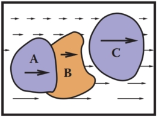
Figure 20.25. Discontinuities in optic flow signal surface boundaries. In many cases, the sign of the depth change (i.e., the ordinal depth) can be determined.
图 20.25。 光流信号表面边界的不连续性。 在许多情况下，可以确定深度变化的符号（即序数深度)。

The speed that a viewer is traveling relative to points in the world cannot be determined from visual motion alone (see Section 20.4.3). Despite this limitation, it is possible to use visual information to determine the time it will take to reach a visible point in the world, even when speed cannot be determined. When velocity is constant, time-to-contact (often referred to as time-to-collision) is given by the retinal size of an entity toward which the observer is moving, divided by the rate at which that image size is increasing.(The terms time-to-collision and time-to-contact are misleading, since contact will only occur if the viewer’s trajectory actually passes through or near the entity under view.  ) In the biological vision literature, this is often called the τ function (Lee & Reddish, 1981). If distance information to the structure in the world on which the time-to-collision estimate is based is available, then this can be used to determine speed.
观看者相对于世界上各点的行进速度不能仅通过视觉运动来确定（参见第 20.4.3 节）。 尽管存在这种限制，即使无法确定速度，也可以使用视觉信息来确定到达世界上可见点所需的时间。 当速度恒定时，接触时间（通常称为碰撞时间）由观察者移动的实体的视网膜尺寸除以图像尺寸增加的速率得出。（ 术语“碰撞时间”和“接触时间”具有误导性，因为只有当观察者的轨迹实际穿过或接近所观察的实体时才会发生接触。）在生物视觉文献中，这通常称为 τ 函数（ 李和雷迪什，1981）。 如果碰撞时间估计所基于的世界结构的距离信息可用，则可以使用它来确定速度。

### 20.3.5 Pictorial Cues  图形提示

An image can contain much information about the spatial structure of the world from which it arose, even in the absence of binocular stereo or motion. As evidence for this, note that the world still appears three-dimensional even if we close one eye, hold our head stationary, and nothing moves in the environment. (As discussed in Section 20.5, the situation is more complicated in the case of photographs and other displayed images.) There are three classes of such pictorial depth cues. The best known of these involve linear perspective. There are also a number of occlusion cues that provide information about ordinal depth even in the absence of perspective. Finally, illumination cues involving shading, shadows and interreflections, and aerial perspective also provide visual information about spatial layout. 
即使没有双眼立体或运动，图像也可以包含有关其产生的世界的空间结构的大量信息。 作为这一点的证据，请注意，即使我们闭上一只眼睛，保持头部静止，并且环境中没有任何物体移动，世界仍然显示为三维的。 （如第 20.5 节中所讨论的，在照片和其他显示图像的情况下，情况更为复杂。）此类图片深度线索分为三类。 其中最著名的是线性透视。 即使在没有透视的情况下，还有许多遮挡线索可以提供有关顺序深度的信息。 最后，涉及阴影、阴影和相互反射的照明线索以及空中透视也提供了有关空间布局的视觉信息。

The term linear perspective is often used to refer to properties of images involving object size in the image scaled by distance, the convergence of parallel lines, the ground plane extending to a visible horizon, and the relationship between the distance to objects on the ground plane and the image location of those objects relative to the horizon (Figure 20.26). More formally, linear perspective cues are those visual cues which exploit the fact that under perspective projection, the image location onto which points in the world are projected is scaled by $\frac{1}{z}$, where z is the distance from the point of projection to the point in the environment. Direct consequences of this relationship are that points that are farther away are projected to points closer to the center of the image (convergence of parallel lines) and that the spacing between the image of points in the world decreases for more distant world points (object size in the image is scaled by distance).(The actual mathematics for analyzing the specifics of biological vision are different, since eyes are not well approximated by the planar projection formulation used in computer graphics and most other imaging applications.) The fact that the image of an infinite flat surface in the world ends at a finite horizon is explained by examining the perspective projection equation as $z → ∞$. 
术语“线性透视”通常用于指图像的属性，涉及图像中按距离缩放的对象大小、平行线的收敛、延伸到可见地平线的地平面以及到地平面上的对象的距离之间的关系 以及这些物体相对于地平线的图像位置（图 20.26）。 更正式地说，线性透视线索是利用以下事实的视觉线索：在透视投影下，世界上的点投影到的图像位置按 $\frac{1}{z}$ 缩放，其中 z 是 到环境中点的投影点。 这种关系的直接后果是，距离较远的点会投影到更靠近图像中心的点（平行线的收敛），并且对于更远的世界点，世界中点的图像之间的间距会减小（对象大小） 图像中的内容按距离缩放）。（分析生物视觉细节的实际数学是不同的，因为计算机图形学和大多数其他成像应用中使用的平面投影公式不能很好地近似眼睛。）事实上，图像 世界上无限平坦表面在有限地平线结束的情况可以通过检查透视投影方程 $z → ∞$ 来解释。
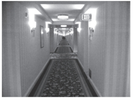
Figure 20.26. The classical linear perspective effects include object size scaled by distance, the convergence of parallel lines, the ground plane extending to a visible horizon, and position on the ground plane relative to the horizon. Image courtesy Sam Pullara.
图 20.26。 经典的线性透视效果包括按距离缩放的对象大小、平行线的收敛、延伸到可见地平线的地平面以及地平面上相对于地平线的位置。 图片由萨姆·普拉拉提供。

With the exception of size-related effects described in Section 20.4.2, most pictorial depth cues involving linear perspective depend on objects of interest being in contact with a ground plane. In effect, these cues estimate not the distance to the objects but, instead, the distance to the contact point on the ground plane. Assuming observer and object are both on top of a horizontal ground plane, then locations on the ground plane lower in the view will be close. Figure 20.27 illustrates this effect quantitatively. For a viewpoint h above the ground and an angle of declination θ between the horizon and a point of interest on the ground, the point in question is a distance d = h cot θ from the point at which the observer is standing. The angle of declination provides relative depth information for arbitrary fixed viewpoints and can provide absolute depth when scaling by eye height (h) is possible. 
除了第 20.4.2 节中描述的与尺寸相关的效果之外，大多数涉及线性透视的图像深度线索取决于与地平面接触的感兴趣对象。 实际上，这些提示不是估计到物体的距离，而是估计到地平面上接触点的距离。 假设观察者和物体都位于水平地平面的顶部，则视图中较低的地平面上的位置将很接近。 图 20.27 定量地说明了这种效应。 对于地面上方的视点 h 以及地平线与地面兴趣点之间的偏角 θ，所讨论的点是距观察者站立点的距离 d = h cot θ。 偏角提供任意固定视点的相对深度信息，并且当可以按眼高 (h) 缩放时可以提供绝对深度。
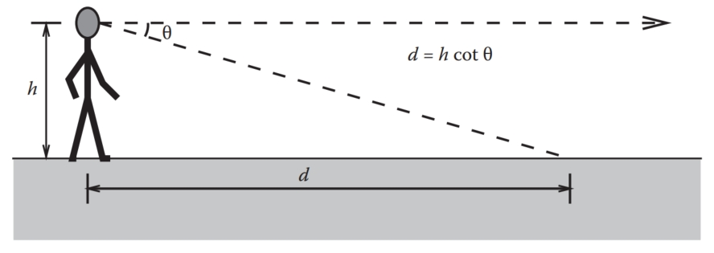
Figure 20.27. Absolute distance to locations on the ground plane can be determined based on declination angle from the horizon and eye height. 
图 20.27。 到地平面上的位置的绝对距离可以根据地平线的偏角和眼高来确定。

While the human visual system almost certainly makes use of angle of declination as a depth cue, the exact mechanisms used to acquire the needed information are not clear. The angle θ could be obtained relative to either gravity or the visible horizon. There is some evidence that both are used in human vision. Eye height h could be based on posture, visually determined by looking at the ground at one’s feet, or learned by experience and presumed to be constant. While a number of researchers have investigated this issue, if and how these values are determined is not yet known with certainty.
虽然人类视觉系统几乎肯定会利用偏角作为深度提示，但用于获取所需信息的确切机制尚不清楚。 角度 θ 可以相对于重力或可见地平线获得。 有一些证据表明两者都用于人类视觉。 眼高h可以基于姿势，通过观察脚下的地面来视觉确定，或者通过经验获知并假定是恒定的。 尽管许多研究人员已经研究了这个问题，但这些值是否以及如何确定尚不清楚。

Shadows provide a variety of types of information about three-dimensional spatial layout. Attached shadows indicate that an object is in contact with another surface, often consisting of the ground plane. Detached shadows indicate that an object is close to some surface, but not in contact with that surface. Shadows can serve as an indirect depth cue by causing an object to appear at the depth of the location of the shadow on the ground plane (Yonas, Goldsmith, & Hallstrom, 1978). When utilizing this cue, the visual system seems to make the assumption that light is coming from directly above (Figure 20.28). 
阴影提供了有关三维空间布局的各种类型的信息。 附加阴影表示物体与另一个表面（通常由地平面组成）接触。 分离的阴影表示物体靠近某个表面，但不与该表面接触。 阴影可以通过使对象出现在地平面上阴影位置的深度处来充当间接深度提示（Yonas、Goldsmith 和 Hallstrom，1978）。 当利用这个提示时，视觉系统似乎会假设光线来自正上方（图 20.28）。

Figure 20.28. Shadows can indirectly function as a depth cue by associating the depth of an object with a location on the ground plane (after Kersten, Mamassian, and Knill (1997)). 
图 20.28。 通过将对象的深度与地平面上的位置相关联，阴影可以间接充当深度提示（遵循 Kersten、Mamassian 和 Knill (1997))。

Vision provides information about surface orientation as well as distance. It is convenient to represent visually determined surface orientation in terms of tilt, defined as the orientation in the image of the projection of the surface normal, and slant, defined as the angle between the surface normal and the line of sight.
视觉提供有关表面方向和距离的信息。 用倾斜（定义为表面法线投影图像中的方向）和倾斜（定义为表面法线与视线之间的角度）来表示视觉确定的表面方向很方便。

A visible surface horizon can be used to find the orientation of an (effectively infinite) surface relative to the viewer. Determining tilt is straightforward, since the tilt of the surface is the orientation of the visible horizon. Slant can be recovered as well, since the lines of sight from the eye point to the horizon define a plane parallel to the surface. In many situations, either the surface horizon is not visible or the surface is small enough that its far edge does not correspond to an actual horizon. In such cases, visible texture can still be used to estimate orientation. 
可见表面地平线可用于查找（实际上是无限的）表面相对于观察者的方向。 确定倾斜度很简单，因为表面的倾斜度就是可见地平线的方向。 倾斜也可以恢复，因为从眼睛点到地平线的视线定义了一个与表面平行的平面。 在许多情况下，要么表面地平线不可见，要么表面足够小以至于其远边与实际地平线不对应。 在这种情况下，可见纹理仍然可以用于估计方向。

In the context of perception, the term texture refers to visual patterns consisting of sub-patterns replicated over a surface. The sub-patterns and their distribution can be fixed and regular, as for a checkerboard, or consistent in a more statistical sense, as in the view of a grassy field.(In computer graphics, the term texture has a different meaning, referring to any image that is applied to a surface as part of the rendering process.  ) When a textured surface is viewed from an oblique angle, the projected view of the texture is distorted relative to the actual markings on the surface. Two quite distinct types of distortions occur (Knill, 1998), both affected by the amount of slant. The position and size of texture elements are subject to the linear perspective effects described above. This produces a texture gradient (Gibson, 1950) due to both element size and spacing decreasing with distance (Figure 20.29(a)). Both the image of individual texture elements and the distribution of elements are foreshortened under oblique viewing (Figure 20.29(b)). This produces a compression in the direction of tilt. For example, an obliquely viewed circle appears as an ellipse, with the ratio of the minor to major axes equal to the cosine of the slant. Note that foreshortening itself is not a result of linear perspective, though in practice both linear perspective and foreshortening provide information about slant.(A third form of visual distortion occurs when surfaces with distinct 3D surface relief are viewed obliquely (Leung & Malik, 1997), as shown in Figure 20.29(c). Nothing is currently known about if or how this effect might be used by the human vision system to determine slant.)
在感知的背景下，术语“纹理”是指由在表面上复制的子图案组成的视觉图案。 子图案及其分布可以是固定且规则的，如棋盘，或者在更统计意义上是一致的，如草地视图。（在计算机图形学中，术语“纹理”有不同的含义，指的是 作为渲染过程的一部分应用于表面的任何图像。）当从倾斜角度查看纹理表面时，纹理的投影视图相对于表面上的实际标记会发生扭曲。 出现两种截然不同类型的扭曲（Knill，1998），两者都受到倾斜量的影响。 纹理元素的位置和大小受上述线性透视效果的影响。 由于元素大小和间距随着距离而减小，这会产生纹理梯度（Gibson，1950）（图 20.29（a））。 在倾斜观察下，各个纹理元素的图像和元素的分布都会被缩短（图20.29（b））。 这会产生倾斜方向的压缩。 例如，倾斜观察的圆显示为椭圆形，短轴与长轴之比等于倾斜的余弦。 请注意，透视本身并不是线性透视的结果，尽管在实践中线性透视和透视都提供了有关倾斜的信息。（当倾斜地查看具有明显 3D 表面浮雕的表面时，会出现第三种形式的视觉扭曲（Leung & Malik，1997） ，如图 20.29(c) 所示。目前尚不知道人类视觉系统是否或如何使用这种效应来确定倾斜。）
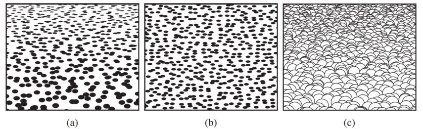
Figure 20.29. Texture cues for slant. (a) Near surface exhibiting compression and texture gradient; (b) distant surface exhibiting only compression; (c) variability in appearance of near surface with regular geometric variability.
图 20.29。 倾斜的纹理提示。 (a) 近表面表现出压缩和纹理梯度； (b) 远处表面仅表现出压缩； (c) 近地表外观的变化具有规则的几何变化。

For texture gradients to serve as a cue to surface slant, the average size and spacing of texture elements must be constant over the textured surface. If spatial variability in size and spacing in the image is not due in its entirely to the projection process, then attempts to invert the effects of projection will produce incorrect inferences about surface orientation. Likewise, the foreshortening cue fails if the shape of texture elements is not isotropic, since then asymmetric texture element image shapes would occur in situations not associated with oblique viewing. These are examples of the assumptions often required in order for spatial visual cues to be effective. Such assumptions are reasonable to the degree that they reflect commonly occurring properties of the world. 
为了使纹理渐变充当表面倾斜的提示，纹理元素的平均大小和间距在纹理表面上必须保持不变。 如果图像中大小和间距的空间变化不完全是由于投影过程造成的，那么尝试反转投影的效果将产生关于表面方向的错误推断。 同样，如果纹理元素的形状不是各向同性，则透视提示会失败，因为在与倾斜观看不相关的情况下会出现不对称的纹理元素图像形状。 这些是为了使空间视觉线索有效而经常需要的假设的例子。 这些假设在一定程度上是合理的，因为它们反映了世界普遍存在的特性。

Shading also provides information about surface shape (Figure 20.30). The brightness of viewed points on a surface depends on the surface reflectance and the orientation of the surface with respect to directional light sources and the observation point. When the relative position of an object, viewing direction, and illumination direction remain fixed, changes in brightness over a constant reflectance surface are indications of changes in the orientation of the surface of the object. Shape-from-shading is the process of recovering surface shape from these variations in observed brightness. It is almost never possible to recover the actual orientation of surfaces from shading alone, though shading can often be combined with other cues to provide an effective indication of surface shape. For surfaces with fine-scale geometric variability, shading can provide a compelling three-dimensional appearance, even for an image rendered on a two-dimensional surface (Figure 20.31). 
阴影还提供有关表面形状的信息（图 20.30）。 表面上观察点的亮度取决于表面反射率以及表面相对于定向光源和观察点的方向。 当物体的相对位置、观察方向和照明方向保持固定时，恒定反射率表面上的亮度变化表明物体表面方向的变化。 阴影形状是从观察到的亮度变化中恢复表面形状的过程。 尽管阴影通常可以与其他线索结合起来以提供表面形状的有效指示，但几乎永远不可能仅从阴影中恢复表面的实际方向。 对于具有精细几何变化的表面，着色可以提供引人注目的三维外观，即使对于在二维表面上渲染的图像也是如此（图20.31）。

Figure 20.30. Shape-from-shading. The images in (a) and (b) appear to have different 3D shapes because of differences in the rate of change of brightness over their surfaces. 
图 20.30。 阴影形状。 (a) 和 (b) 中的图像似乎具有不同的 3D 形状，因为它们表面的亮度变化率不同。

Figure 20.31. Shading can generate a strong perception of three-dimensional shape. In this figure, the effect is stronger if you view the image from several meters away using one eye. It becomes yet stronger if you place a piece of cardboard in front of the figure with a hole cut out slightly smaller than the picture (see Section 20.5). Image courtesy Albert Yonas.
图 20.31。 阴影可以产生强烈的三维形状感知。 在此图中，如果用一只眼睛从几米外观看图像，效果会更强。 如果你在人物前面放一块纸板，并剪出一个比图片稍小的孔，它就会变得更坚固（见第 20.5 节)。 图片由阿尔伯特·约纳斯提供。

There are a number of pictorial cues that yield ordinal information about depth, without directly indicating actual distance. In line drawings, different types of junctions provide constraints on the 3D geometry that could have generated the drawing (Figure 20.32). Many of these effects occur in more natural images as well. Most perceptually effective of the junction cues are T-junctions, which are strong indicators that the surface opposite the stem of the T is occluding at least one more distant surface. T-junctions often generate a sense of amodal completion, in which one surface is seen to continue behind a nearer, occluding surface (Figure 20.33). 
有许多图形提示可以产生有关深度的顺序信息，但不直接指示实际距离。 在线图中，不同类型的连接点对可能生成绘图的 3D 几何形状提供了约束（图 20.32）。 其中许多效果也出现在更自然的图像中。 在感知上最有效的连接线索是 T 形连接，它是与 T 形茎相对的表面遮挡至少一个更远的表面的有力指标。 T 形连接通常会产生一种非模态完成感，其中一个表面被视为继续位于较近的遮挡表面后面（图 20.33）。

Figure 20.32. (a) Junctions provide information about occlusion and the convexity or concavity of corners. (b) Common junction types for planar surface objects. 
图 20.32。 (a) 连接点提供有关遮挡以及角点凸度或凹度的信息。 (b) 平面物体的常见连接类型。


Figure 20.33. T-junctions cause the left disk to appear to be continuing behind the rectangle, while the right disk appears in front of the rectangle, which is seen to continue behind the disk. 
图 20.33。 T 形连接导致左侧圆盘看起来在矩形后面继续，而右侧圆盘出现在矩形前面，看起来矩形在圆盘后面继续。

Atmospheric effects cause visual changes that can provide information about depth, particularly outdoors over long distances. Leonardo da Vinci was the first to describe aerial perspective (also called atmospheric perspective), in which scattering reduces the contrast of distant portions of the scene and causes them to appear more bluish than if they were nearer (da Vinci, 1970) (see Figure 20.34). Aerial perspective is predominately a relative depth cue, though there is some speculation that it may affect perception of absolute distance as well. While many people believe that more distant objects look blurrier due to atmospheric effects, atmospheric scattering actually causes little blur.
大气影响会导致视觉变化，从而提供有关深度的信息，尤其是在长距离的户外。 列奥纳多·达·芬奇 (Leonardo da Vinci) 是第一个描述空中透视（也称为大气透视）的人，其中散射降低了场景中远处部分的对比度，并使它们看起来比近处更偏蓝（da Vinci，1970）（见图 20.34）。 空中视角主要是相对深度提示，尽管有人猜测它也可能影响对绝对距离的感知。 虽然许多人认为，由于大气影响，越远的物体看起来越模糊，但大气散射实际上几乎不会造成模糊。

Figure 20.34. Aerial perspective, in which atmospheric effects reduce contrast and shift colors toward blue, provides a depth cue over long distances.
图 20.34。 在空中透视中，大气效应会降低对比度并将颜色转向蓝色，从而提供长距离的深度提示。

## 20.4 Objects, Locations, and Events  对象、位置和事件

While there is fairly wide agreement among current vision scientists that the purpose of vision is to extract information about objects, locations, and events, there is little consensus on the key features of what information is extracted, how it is extracted, or how the information is used to perform tasks. Significant controversies exist about the nature of object recognition and the potential interactions between object recognition and other aspects of perception. Most of what we know about location involves low-level spatial vision, not issues associated with spatial relationships between complex objects or the visual processes required to navigate in complex environments. We know a fair amount about how people perceive their speed and heading as they move through the world, but have only a limited understanding of actual event perception. Visual attention involves aspects of the perception of objects, locations, and events. While there is much data about the phenomenology of visual attention for relatively simple and well-controlled stimuli, we know much less about how visual attention serves high-level perceptual goals.
虽然当前的视觉科学家们普遍认为视觉的目的是提取有关物体、位置和事件的信息，但对于提取什么信息、如何提取信息或如何提取信息的关键特征却鲜有共识。 用于执行任务。 关于物体识别的本质以及物体识别与感知的其他方面之间的潜在相互作用存在重大争议。 我们对位置的了解大多涉及低级空间视觉，而不是与复杂对象之间的空间关系或在复杂环境中导航所需的视觉过程相关的问题。 我们对人们在世界中移动时如何感知自己的速度和航向有相当多的了解，但对实际事件感知的了解却很有限。 视觉注意力涉及对物体、位置和事件的感知的各个方面。 虽然有很多关于相对简单和控制良好的刺激的视觉注意现象学的数据，但我们对视觉注意如何服务于高层次的感知目标知之甚少。

### 20.4.1 Object Recognition  物体识别

Object recognition involves segregating an image into constituent parts corresponding to distinct physical entities and determining the identity of those entities. Figure 20.35 illustrates a few of the complexities associated with this process. We have little difficulty recognizing that the image on the left is some sort of vehicle, even though we have never before seen this particular view of a vehicle nor do most of us typically associate vehicles with this context. The image on the right is less easily recognizable until the page is turned upside down, indicating an orientational preference in human object recognition.
对象识别涉及将图像分成与不同物理实体相对应的组成部分并确定这些实体的身份。 图 20.35 说明了与此过程相关的一些复杂性。 我们很容易就能认出左边的图像是某种车辆，尽管我们以前从未见过这种特定的车辆视图，而且我们大多数人通常也不会将车辆与这种背景联系起来。 右侧的图像不太容易识别，直到将页面翻转过来，这表明人体对象识别中的方向偏好。

Figure 20.35. The complexities of object recognition. (a) We recognize a vehicle-like object even though we have likely never seen this particular view of a vehicle before. (b) The image is hard to recognize based on a quick view. It becomes much easier to recognize if the book is turned upside down.
图 20.35。 物体识别的复杂性。 (a) 我们认出了类似车辆的物体，尽管我们以前可能从未见过车辆的这种特殊视图。 (b) 快速浏览时很难识别图像。 如果将书翻过来，就更容易识别。

Object recognition is thought to involve two, fairly distinct steps. The first step organizes the visual field into groupings likely to correspond to objects and surfaces. These grouping processes are very powerful (see Figure 20.36), though there is little or no conscious awareness of the low-level image features that generate the grouping effect.(The most common form of visual camouflage involves adding visual textures that fool the perceptual grouping processes so that the view of the world cannot be organized in a way that separates out the object being camouflaged.) Grouping is based on the complex interaction of proximity, similarities in the brightness, color, shape, and orientation of primitive structures in the image, common motion, and a variety of more complex relationships.
物体识别被认为涉及两个相当不同的步骤。 第一步将视野组织成可能对应于物体和表面的分组。 这些分组过程非常强大（见图 20.36），尽管人们很少或根本没有意识到产生分组效果的低级图像特征。（视觉伪装的最常见形式包括添加视觉纹理来欺骗感知分组） 过程使得世界观无法以分离出被伪装的对象的方式组织。）分组基于图像中原始结构的亮度、颜色、形状和方向的邻近性、相似性以及相似性的复杂相互作用 、常见运动以及各种更复杂的关系。
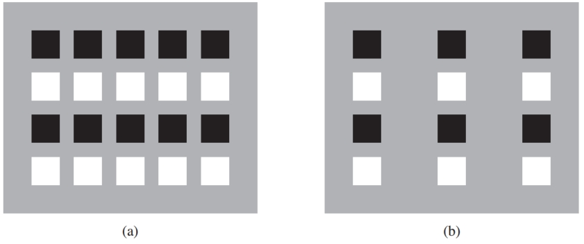
Figure 20.36. Images are perceptually organized into groupings based on a complex set of similarity and organizational criteria. (a) Similarity in brightness results in four horizontal groupings. (b) Proximity resulting in three vertical groupings.
图 20.36。 根据一组复杂的相似性和组织标准，图像在感知上被组织成组。 (a) 亮度的相似性导致四个水平分组。 (b) 邻近导致三个垂直分组。

The second step in object recognition is to interpret groupings as identified objects. A computational analysis suggests that there are a number of distinctly different ways in which an object can be identified. The perceptual data is unclear as to which of these are actually used in human vision. Object recognition requires that the vision system have available to it descriptions of each class of object sufficient to discriminate each class from all others. Theories of object recognition differ in the nature of the information describing each class and the mechanisms used to match these descriptions to actual views of the world.
对象识别的第二步是将分组解释为已识别的对象。 计算分析表明，可以通过多种截然不同的方式来识别物体。 感知数据尚不清楚其中哪些实际上用于人类视觉。 物体识别要求视觉系统能够对每一类物体进行足够的描述，以将每一类物体与所有其他物体区分开来。 对象识别理论的不同之处在于描述每个类别的信息的性质以及用于将这些描述与世界的实际视图相匹配的机制。

Three general types of descriptions are possible. Templates represent object classes in terms of prototypical views of objects in each class. Figure 20.37 shows a simple example. Structural descriptions represent object classes in terms of distinctive features of each class likely to be easily detected in views of the object, along with information about the geometric relationships between the features. Structural descriptions can either be represented in 2D or 3D. For 2D models of objects types, there must be a separate description for each distinctly different potential view of the object. For 3D models, two distinct forms of matching strategies are possible. In one, the three-dimensional structure of the viewed object is determined prior to classification using whatever spatial cues are available, and then this 3D description of the view is matched to 3D prototypes of known objects. The other possibility is that some mechanism allows the determination of the orientation of the yet-to-be identified object under view. This orientation information is used to rotate and project potential 3D descriptions in a way that allows a 2D matching of the description and the viewed object. Finally, the last option for describing the properties of object classes involves invariant features which describe classes of objects in terms of more generic geometric properties, particularly those that are likely be be insensitive to different views of the object. 
三种一般类型的描述是可能的。 模板根据每个类中对象的原型视图来表示对象类。 图 20.37 显示了一个简单的示例。 结构描述根据每个类别的独特特征来表示对象类别，这些特征很容易在对象的视图中检测到，以及有关特征之间的几何关系的信息。 结构描述可以用 2D 或 3D 表示。 对于对象类型的 2D 模型，必须对对象的每个明显不同的潜在视图进行单独的描述。 对于 3D 模型，可能有两种不同形式的匹配策略。 其中之一是，在使用任何可用的空间线索进行分类之前，确定所观察对象的三维结构，然后将视图的 3D 描述与已知对象的 3D 原型进行匹配。 另一种可能性是某种机制允许确定所观察的尚未识别的物体的方向。 该方向信息用于旋转和投影潜在的 3D 描述，从而允许描述与所查看的对象进行 2D 匹配。 最后，用于描述对象类属性的最后一个选项涉及不变特征，这些特征根据更通用的几何属性来描述对象的类别，特别是那些可能对对象的不同视图不敏感的属性。

Figure 20.37. Template matching. The bright spot in the right image indicates the best match location to the template in the left image. Image courtesy National Archives and Records Administration. 
图 20.37。 模板匹配。 右图像中的亮点表示与左图像中的模板的最佳匹配位置。 图片由国家档案和记录管理局提供。

### 20.4.2 Size and Distance  大小和距离

In the absence of more definitive information about depth, objects which project onto a larger area of the retina are seen as closer compared with objects which project to a smaller retinal area, an effect called relative size. A more powerful cue involves familiar size, which can provide information for absolute distance to recognizable objects of known size. The strength of familiar size as a depth cue can be seen in illusions such as Figure 20.38, in which it is put in conflict with ground-plane, perspective-based depth cues. Familiar size is one part of the size-distance relationship, relating the physical size of an object, the optical size of the same object projected onto the retina, and the distance of the object from the eye (Figure 20.39).
在缺乏关于深度的更明确的信息的情况下，与投射到较小视网膜区域的物体相比，投射到视网膜较大区域的物体看起来更近，这种效应称为相对尺寸。 更强大的提示涉及熟悉的尺寸，它可以提供与已知尺寸的可识别物体的绝对距离信息。 熟悉的尺寸作为深度线索的强度可以在图 20.38 等幻觉中看到，其中它与地平面、基于透视的深度线索发生冲突。 熟悉尺寸是尺寸-距离关系的一部分，它与物体的物理尺寸、同一物体投射到视网膜上的光学尺寸以及物体距眼睛的距离有关（图20.39）。

Figure 20.38. Left: perspective and familiar size cues are consistent. Right: perspective and familiar size cues are inconsistent. Images courtesy Peter Shirley, Scott Kuhl, and J. Dylan Lacewell. 
图 20.38。 左：透视和熟悉的尺寸线索是一致的。 右图：视角和熟悉的尺寸线索不一致。 图片由 Peter Shirley、Scott Kuhl 和 J. Dylan Lacewell 提供。
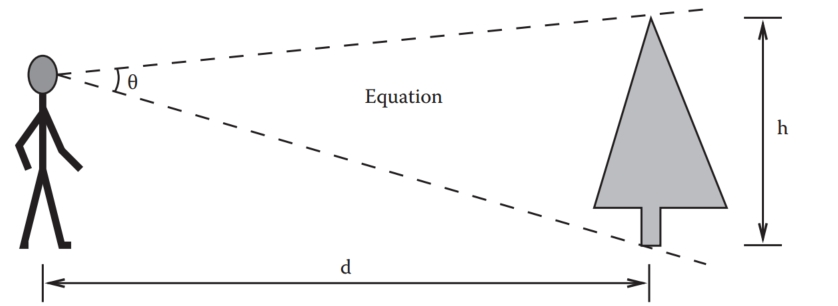
Figure 20.39. The size-distance relationship allows the distance to objects of known size to be determined based on the visual angle subtended by the object. Likewise, the size of an object at a know distance can be determined based on the visual angle subtended by the object.
图 20.39。 尺寸-距离关系允许根据物体所对的视角来确定到已知尺寸的物体的距离。 同样，已知距离处的物体的尺寸可以基于该物体所对的视角来确定。

When objects are sitting on top of a flat-ground plane, additional sources for depth information become available, particularly when the horizon is either visible or can be derived from other perspective information. The angle of declination to the contact point on the ground is a relative depth cue and provides absolute egocentric distance when scaled by eye height, as previously shown in Figure 20.27. The horizon ratio, in which the total visible height of an object is compared with the visible extent of that portion of the object appearing below the horizon, can be used to determine the actual size of objects, even when the distance to the objects is not known (Figure 20.40). Underlying the horizon ratio is the fact that for a flat-ground plane, the line of sight to the horizon intersects objects at a position that is exactly an eye height above the ground.
当物体位于平坦的地面上时，可以使用其他深度信息源，特别是当地平线可见或可以从其他透视信息导出时。 与地面接触点的偏角是一个相对深度提示，并在按眼睛高度缩放时提供绝对的自我中心距离，如图 20.27 所示。 地平线比率，即物体的总可见高度与地平线以下物体部分的可见范围进行比较，可用于确定物体的实际大小，即使到物体的距离不存在。 已知（图20.40）。 水平比背后的事实是，对于平坦的地面，地平线的视线与物体相交的位置正好是距地面一个眼睛的高度。

Figure 20.40. (a) The horizon ratio can be used to determine depth by comparing the visible portion of an object below the horizon to the total vertical visible extent of the object. (b) A real-world example.
图 20.40。 (a) 水平比可用于通过将地平线以下物体的可见部分与物体的总垂直可见范围进行比较来确定深度。 (b) 一个现实世界的例子。

The human visual system is sufficiently able to determine the absolute size of most viewed objects; our perception of size is dominated by the the actual physical size, and we have almost no conscious awareness of the corresponding retinal size of objects. This is similar to lightness constancy, discussed earlier, in that our perception is dominated by inferred properties of the world, not the low level features actually sensed by photoreceptors in the retina. Gregory (1997) describes a simple example of size constancy. Hold your two hands out in front of you, one at arm’s length and the other at half that distance away from you (Figure 20.41(a)). Your two hands will look almost the same size, even though the retinal sizes differ by a factor of two. The effect is much less strong if the nearer hand partially occludes the more distant hand, particularly if you close one eye (Figure 20.41(b)). The visual system also exhibits shape constancy, where the perception of geometric structure is close to actual object geometry than might be expected given the distortions of the retinal image due to perspective (Figure 20.42).
人类视觉系统足以确定大多数观看物体的绝对大小； 我们对尺寸的感知受实际物理尺寸的支配，我们几乎没有意识地意识到物体相应的视网膜尺寸。 这类似于前面讨论的亮度恒定性，因为我们的感知是由世界的推断属性主导的，而不是视网膜中的光感受器实际感知到的低级特征。 Gregory (1997) 描述了一个大小恒定性的简单例子。 将两只手伸出在您面前，一只手与您保持一臂的距离，另一只手与您距离的一半（图20.41（a））。 尽管视网膜尺寸相差两倍，但您的两只手看起来几乎相同大小。 如果较近的手部分遮挡较远的手，特别是当您闭上一只眼睛时，效果会弱得多（图 20.41(b)）。 视觉系统还表现出形状恒常性，其中几何结构的感知接近实际物体的几何形状，而不是考虑到由于透视导致的视网膜图像扭曲（图20.42）。
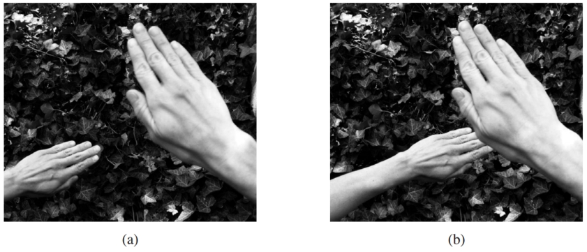
Figure 20.41. (a) Size constancy makes hands positioned at different distances from the eye appear to be nearly the same size for real-world viewing, even though the retinal sizes are quite different. (b) The effect is less strong when one hand is partially occluded by the other, particularly when one eye is closed. Images courtesy Peter Shirley and Pat Moulis.
图 20.41。 (a) 尺寸恒定性使得位于距眼睛不同距离的手在现实世界观看时看起来几乎相同尺寸，即使视网膜尺寸差异很大。 (b) 当一只手被另一只手部分遮挡时，特别是当一只手闭上时，效果不太强。 图片由 Peter Shirley 和 Pat Moulis 提供。
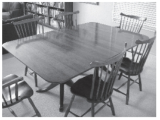
Figure 20.42. Shape constancy—the table looks rectangular even though its shape in the image is an irregular four-sided polygon.
图 20.42。 形状恒常性——桌子看起来是矩形，尽管它在图像中的形状是不规则的四边形。

### 20.4.3 Events  事件

Most aspects of event perception are beyond the scope of this chapter, since they involve complex nonvisual cognitive processes. Three types of event perception are primarily visual, however, and are also of clear relevance to computer graphics. Vision is capable of providing information about how a person is moving in the world, the existence of independently moving objects in the world, and the potential for collisions either due to observer motion or due to objects moving toward the observer. 
事件感知的大多数方面都超出了本章的范围，因为它们涉及复杂的非视觉认知过程。 然而，三种类型的事件感知主要是视觉的，并且也与计算机图形学有明显的相关性。 视觉能够提供有关人如何在世界中移动、世界中是否存在独立移动物体以及由于观察者运动或由于物体向观察者移动而发生碰撞的可能性的信息。

Vision can be used to determine rotation and the direction of translation relative to the environment. The simplest case involves movement toward a flat surface oriented perpendicularly to the line of sight. Presuming that there is sufficient surface texture to enable the recovery of optic flow, the flow field will form a symmetric pattern as shown in Figure 20.43(a). The location in the field of view of the focus of expansion of the flow field will have an associated line of sight corresponding to the direction of translation. While optic flow can be used to visually determine the direction of motion, it does not contain enough information to determine speed. To see this, consider the situation in which the world is made twice as large and the viewer moves twice as fast. The decrease in the magnitude of flow values due to the doubling of distances is exactly compensated for by the increase in the magnitude of flow values due to the doubling of velocity, resulting in an identical flow field.
视觉可用于确定相对于环境的旋转和平移方向。 最简单的情况涉及朝向垂直于视线的平坦表面的移动。 假设有足够的表面纹理来恢复光流，流场将形成如图 20.43(a) 所示的对称图案。 流场扩展焦点在视场中的位置将具有对应于平移方向的关联视线。 虽然光流可用于直观地确定运动方向，但它不包含足够的信息来确定速度。 要了解这一点，请考虑以下情况：世界变大一倍，观看者移动速度变快一倍。 由于距离加倍而导致的流量值大小的减小恰好被由于速度加倍而导致的流量值大小的增加所补偿，从而产生相同的流场。

Figure 20.43. (a) Movement toward a flat, textured surface produces an expanding flow field, with the focus of expansion indicating the line of sight corresponding to the direction of motion. (b) The flow field resulting from rotation around the vertical axis while viewing a flat surface oriented perpendicularly to the line of sight. (c) The flow field resulting from translation parallel to a flat, textured surface.
图 20.43。 (a) 向平坦、有纹理的表面移动会产生扩大的流场，其中扩大的焦点指示与运动方向相对应的视线。 (b) 在观察垂直于视线的平坦表面时绕垂直轴旋转产生的流场。 (c) 平行于平坦、有纹理的表面平移而产生的流场。

Figure 20.43(b) shows the optic flow field resulting from the viewer (or more accurately, the viewer’s eyes) rotating around the vertical axis. Unlike the situation with respect to translational motion, optic flow provides sufficient information to determine both the axis of rotation and the (angular) speed of rotation. The practical problem in exploiting this is that the flow resulting from pure rotational motion around an axis perpendicular to the line of sight is quite similar to the flow resulting from pure translation in the direction that is perpendicular to both the line of sight and this rotational axis, making it difficult to visually discriminate between the two very different types of motion (Figure 20.43(c)). Figure 20.44 shows the optical flow patterns generated by movement through a more realistic environment.
图 20.43(b) 显示了观察者（或更准确地说，观察者的眼睛）绕垂直轴旋转产生的光流场。 与平移运动的情况不同，光流提供了足够的信息来确定旋转轴和旋转（角）速度。 利用这一点的实际问题是，由绕垂直于视线的轴的纯旋转运动产生的流动与由沿垂直于视线和该旋转轴的方向的纯平移产生的流动非常相似 ，使得很难在视觉上区分两种截然不同的运动类型（图 20.43(c)）。 图 20.44 显示了在更真实的环境中移动时生成的光流模式。

Figure 20.44. The optic flow generated by moving through an otherwise static environment provides information about both the motion relative to the environment and the distances to points in the environment. In this case, the direction of view is depressed from the horizon, but as indicated by the focus of expansion, the motion is parallel to the ground plane.
图 20.44。 通过在静态环境中移动而生成的光流提供有关相对于环境的运动以及到环境中的点的距离的信息。 在这种情况下，视线方向从地平线向下凹陷，但如扩展焦点所示，运动平行于地平面。

If a viewer is completely stationary, visual detection of moving objects is easy, since such objects will be associated with the only nonzero optic flow in the field of view. The situation is considerably more complicated when the observer is moving, since the visual field will be dominated by nonzero flow, most or all of which is due to relative motion between the observer and the static environment (Thompson & Pong, 1990). In such cases, the visual system must be sensitive to patterns in the optic flow field that are inconsistent with flow fields associated with observer movement relative to a static environment (Figure 20.45).
如果观察者完全静止，则移动物体的视觉检测很容易，因为此类物体将与视场中唯一的非零光流相关联。 当观察者移动时，情况要复杂得多，因为视野将由非零流主导，其中大部分或全部是由于观察者和静态环境之间的相对运动造成的（Thompson & Pong，1990）。 在这种情况下，视觉系统必须对光流场中的模式敏感，这些模式与观察者相对于静态环境的运动相关的流场不一致（图20.45）。

Figure 20.45. Visual detection of moving objects from a moving observation point requires recognizing patterns in the optic flow that cannot be associated with motion through a static environment.
图 20.45。 从移动观察点视觉检测移动物体需要识别光流中的模式，这些模式无法与静态环境中的运动相关联。

Section 20.3.4 described how vision can be used to determine time to contact with a point in the environment even when the speed of motion is not known. Assuming a viewer moving with a straight, constant-speed trajectory and no independently moving objects in the world, contact will be made with whatever surface is in the direction of the line of sight corresponding to the focus of expansion at a time indicated by the τ relationship. An independently moving object complicates the matter of determining if a collision will in fact occur. Sailors use a method for detecting potential collisions that may also be employed in the human visual system: for non-accelerating straight-line motion, collisions will occur with objects that are visually expanding but otherwise remain visually stationary in the egocentric frame of reference. 
第 20.3.4 节描述了如何使用视觉来确定与环境中某个点接触的时间，即使运动速度未知。 假设观察者以匀速直线轨迹移动，并且世界上没有独立移动的物体，则在 τ 指示的时间，将与对应于扩展焦点的视线方向上的任何表面进行接触 关系。 独立移动的物体使确定是否确实发生碰撞的问题变得复杂。 水手们使用一种检测潜在碰撞的方法，这种方法也可以在人类视觉系统中使用：对于非加速直线运动，会与视觉上正在扩展但在自我中心参考系中保持视觉静止的物体发生碰撞。

One form of more complex event perception merits discussion here, since it is so important in interactive computer graphics. People are particularly sensitive to motion corresponding to human movement. Locomotion can be recognized when the only features visible are lights on the walker’s joints (Johansson, 1973). Such moving light displays are often even sufficient to recognize properties such as the sex of the walker and the weight of the load that the walker may be carrying. In computer graphics renderings, viewers will notice even small inaccuracies in animated characters, particularly if they are intended to mimic human motion.
更复杂的事件感知的一种形式值得在这里讨论，因为它在交互式计算机图形学中非常重要。 人们对与人体运动相对应的运动特别敏感。 当唯一可见的特征是步行者关节上的灯光时，就可以识别运动（Johansson，1973）。 这种移动光显示器通常甚至足以识别诸如步行者的性别和步行者可能携带的负载的重量之类的属性。 在计算机图形渲染中，观看者会注意到动画角色中哪怕是很小的误差，特别是当它们旨在模仿人类运动时。

The term visual attention covers a range of phenomenon from where we point our eyes to cognitive effects involving what we notice in a complex scene and how we interpret what we notice (Pashler, 1998). Figure 20.46 provides an example of how attentional processes affect vision, even for very simple images. In the left two panels, the one pattern differing in shape or color from the rest immediately “pops out” and is easily noticed. In the panel on the right, the one pattern differing in both shape and color is harder to find. The reason for this is that the visual system can do a parallel search for items distinguished by individual properties, but requires more cognitive, sequential search when looking for items that are indicated by the simultaneous presence of two distinguishing features. Graphically based human-computer interfaces should be (but often are not!) designed with an understanding of how to take advantage of visual attention processes in people so as to communicate important information quickly and effectively.
视觉注意力一词涵盖了一系列现象，从我们将眼睛指向认知效果，涉及我们在复杂场景中注意到的内容以及我们如何解释我们注意到的内容（Pashler，1998）。 图 20.46 提供了注意力过程如何影响视觉的示例，即使对于非常简单的图像也是如此。 在左侧的两个面板中，形状或颜色与其他图案不同的一个图案立即“弹出”并且很容易被注意到。 在右侧的面板中，形状和颜色都不同的一种图案更难找到。 其原因是视觉系统可以对由各个属性区分的项目进行并行搜索，但在寻找由同时存在的两个区别特征指示的项目时需要更多的认知、顺序搜索。 基于图形的人机界面的设计应该（但通常不是！）了解如何利用人们的视觉注意力过程，以便快速有效地传达重要信息。

Figure 20.46. In (a) and (b), visual attention is quickly drawn to the item of different shape or color. In (c), sequential search appears to be necessary in order to find the one item that differs in both shape and color.
图 20.46。 在（a）和（b）中，视觉注意力很快被吸引到不同形状或颜色的项目上。 在（c)中，为了找到形状和颜色都不同的一项，顺序搜索似乎是必要的。

## 20.5 Picture Perception 图片感知

So far, this chapter has dealt with the visual perception that occurs when the world is directly imaged by the human eye. When we view the results of computer graphics, of course, we are looking at rendered images and not the real world. This has important perceptual implications. In principle, it should be possible to generate computer graphics that appear indistinguishable from the real world, at least for monocular viewing without either object or observer motion. Imagine looking out at the world through a glass window. Now, consider coloring each point on the window to exactly match the color of the world originally seen at that point.(This idea was first described by the painter Leon Battista Alberti in 1435 and is now known as Alberti’s Window. It is closely related to the camera obscura.  ) The light reaching the eye is unchanged by this operation, meaning that perception should be the same whether the painted glass is viewed or the real world is viewed through the window. The goal of computer graphics can be thought of as producing the colored window without actually having the equivalent real-world view available. 
到目前为止，本章讨论了人眼直接成像世界时发生的视觉感知。 当然，当我们查看计算机图形结果时，我们看到的是渲染图像，而不是现实世界。 这具有重要的感知意义。 原则上，应该可以生成与现实世界无法区分的计算机图形，至少对于没有物体或观察者运动的单眼观察来说是这样。 想象一下透过玻璃窗看外面的世界。 现在，考虑为窗户上的每个点着色，使其与该点最初看到的世界的颜色完全匹配。（这个想法最早由画家 Leon Battista Alberti 在 1435 年描述，现在被称为阿尔贝蒂窗。它与 ）通过此操作，到达眼睛的光线不会发生变化，这意味着无论是观看彩绘玻璃还是透过窗户观看现实世界，感知都应该是相同的。 计算机图形学的目标可以被认为是在没有实际可用的等效真实世界视图的情况下生成彩色窗口。

The problem for computer graphics and other visual arts is that we can’t in practice match a view of the real world by coloring a flat surface. The brightness and dynamic range of light in the real world is impossible to re-create using any current display technology. Resolution of rendered images is also often less that the finest detail perceivable by human vision. Lightness and color constancy are much less apparent in pictures than in the real world, likely because the visual system attempts to compensate for variability in the brightness and color of the illumination based on the ambient illumination in the viewing environment, rather than the illumination associated with the rendered image. This is why the realistic appearance of color in photographs depends on film color balanced for the nature of the light source present when the photograph was taken and why realistic color in video requires a white-balancing step. While much is known about how limitations in resolution, brightness, and dynamic range affect the detectability of simple patterns, almost nothing is known about how these display properties affect spatial vision or object identification. 
计算机图形学和其他视觉艺术的问题在于，我们实际上无法通过为平面着色来匹配现实世界的视图。 使用任何当前的显示技术都不可能重新创建现实世界中的光的亮度和动态范围。 渲染图像的分辨率通常也低于人类视觉可感知的最精细细节。 图片中的亮度和颜色恒定性比现实世界中的亮度和颜色恒常性要差得多，这可能是因为视觉系统试图根据观看环境中的环境照明（而不是与环境相关的照明）来补偿照明的亮度和颜色的变化。 渲染的图像。 这就是为什么照片中的真实色彩取决于拍摄照片时光源性质的胶片色彩平衡，以及为什么视频中的真实色彩需要白平衡步骤。 虽然人们对分辨率、亮度和动态范围的限制如何影响简单图案的可检测性了解很多，但对这些显示特性如何影响空间视觉或物体识别几乎一无所知。 

We have a better understanding of other aspects of this problem, which psychologists refer to as the perception of pictorial space (S. Rogers, 1995). One difference between viewing images and viewing the real world is that accommodation, binocular stereo, motion parallax, and perhaps other depth cues may indicate that the surface under view is much different from the distances in the world that it is intended to represent. The depths that are seen in such a situation tend to be somewhere between the depths indicated by the pictorial cues in the image and the distance to the image itself. When looking at a photograph or computer display, this often results in a sense of scale smaller than intended. On the other hand, seeing a movie in a big-screen theater produces a more compelling sense of spaciousness than does seeing the same movie on television, even if the distance to the TV is such that the visual angles are the same, since the movie screen is farther away. 
我们对这个问题的其他方面有了更好的理解，心理学家将其称为图像空间的感知（S. Rogers，1995）。 观看图像和观看现实世界之间的一个区别是，调节、双眼立体、运动视差以及可能的其他深度线索可能表明所看到的表面与其想要表示的世界中的距离有很大不同。 在这种情况下看到的深度往往介于图像中的图形提示所指示的深度和到图像本身的距离之间。 当观看照片或计算机显示器时，这通常会导致尺寸感小于预期。 另一方面，在大屏幕影院观看电影比在电视上观看同一部电影会产生更引人注目的宽敞感，即使与电视的距离相同，视角相同，因为电影 屏幕距离较远。

Computer graphics rendered using perspective projection has a viewpoint, specified as a position and direction in model space, and a view frustum, which specifies the horizontal and vertical field of view and several other aspects of the viewing transform. If the rendered image is not viewed from the correct location, the visual angles to the borders of the image will not match the frustum used in creating the image. All visual angles within the image will be distorted as well, causing a distortion in all of the pictorial depth and orientation cues based on linear perspective. This effect occurs frequently in practice, when a viewer is positioned either too close or too far away from a photograph or display surface. If the viewer is too close, the perspective cues for depth will be compressed, and the cues for surface slant will indicate that the surface is closer to perpendicular to the line of sight than is actually the case. The situation is reversed if the viewer is too far from the photograph or screen. The situation is even more complicated if the line of sight does not go through the center of the viewing area, as is commonly the case in a wide variety of viewing situations. 
使用透视投影渲染的计算机图形具有视点（指定为模型空间中的位置和方向）和视锥体（指定水平和垂直视野以及视图变换的其他几个方面）。 如果未从正确的位置查看渲染的图像，则图像边界的视角将与创建图像时使用的平截头体不匹配。 图像内的所有视角也会扭曲，导致基于线性透视的所有图像深度和方向线索扭曲。 当观看者距离照片或显示表面太近或太远时，这种效应在实践中经常发生。 如果观察者太近，深度的透视提示将被压缩，并且表面倾斜的提示将表明表面比实际情况更接近垂直于视线。 如果观看者距离照片或屏幕太远，情况就会相反。 如果视线没有穿过观看区域的中心，情况会更加复杂，这在各种观看情况下都是常见的情况。

The human visual system is able to partially compensate for perspective distortions arising from viewing an image at the wrong location, which is why we are able to sit in different seats at a movie theater and experience a similar sense of the depicted space. When controlling viewing position is particularly important, viewing tubes can be used. These are appropriately sized tubes, mounted in a fixed position relative to the display, and through which the viewer sees the display. The viewing tube constrains the observation point to the (hopefully) correct position. Viewing tubes are also quite effective at reducing the conflict in depth information between the pictorial cues in the image and the actual display surface. They eliminate both stereo and motion parallax, which, if present, would correspond to the display surface, not the rendered view. If they are small enough in diameter, they also reduce other cues to the location of the display surface by hiding the picture frame or edge of the display device. Exotic visually immersive display devices such as head-mounted displays (HMDs) go further in attempting to hide visual cues to the position of the display surface while adding binocular stereo and motion parallax consistent with the geometry of the world being rendered.
人类视觉系统能够部分补偿因在错误位置观看图像而产生的透视扭曲，这就是为什么我们能够坐在电影院的不同座位上并体验到所描绘空间的相似感觉。 当控制观察位置特别重要时，可以使用观察管。 这些是适当尺寸的管，安装在相对于显示器的固定位置，并且观看者通过它们看到显示器。 观察管将观察点限制在（希望）正确的位置。 观察管在减少图像中的图形线索与实际显示表面之间的深度信息冲突方面也非常有效。 它们消除了立体视差和运动视差，如果存在的话，它们将对应于显示表面，而不是渲染的视图。 如果它们的直径足够小，它们还可以通过隐藏显示设备的相框或边缘来减少对显示表面位置的其他提示。 头戴式显示器 (HMD) 等奇异的视觉沉浸式显示设备进一步尝试隐藏显示表面位置的视觉线索，同时添加与所渲染世界的几何形状一致的双眼立体和运动视差。

# 21  Tone Reproduction   音调再现

As discussed in Chapter 20, the human visual system adapts to a wide range of viewing conditions. Under normal viewing, we may discern a range of around 4 to 5 log units of illumination, i.e., the ratio between brightest and darkest areas where we can see detail may be as large as 100,000 : 1. Through adaptation processes, we may adapt to an even larger range of illumination. We call images that are matched to the capabilities of the human visual system high dynamic range. 
正如第 20 章所讨论的，人类视觉系统适应各种观看条件。 在正常观看下，我们可以辨别大约 4 到 5 个对数单位的照度范围，即我们可以看到细节的最亮和最暗区域之间的比率可能高达 100,000 : 1。通过适应过程，我们可以适应 更大的照明范围。 我们将与人类视觉系统能力相匹配的图像称为高动态范围。

Visual simulations routinely produce images with a high dynamic range (Ward Larson & Shakespeare, 1998). Recent developments in image-capturing techniques allow multiple exposures to be aligned and recombined into a single high dynamic range image (Debevec & Malik, 1997). Multiple exposure techniques are also available for video. In addition, we expect future hardware to be able to photograph or film high dynamic range scenes directly. In general, we may think of each pixel as a triplet of three floating point numbers. 
视觉模拟通常会产生高动态范围的图像（Ward Larson & Shakespeare，1998）。 图像捕捉技术的最新发展允许将多次曝光对齐并重新组合成单个高动态范围图像（Debevec＆Malik，1997）。 多重曝光技术也可用于视频。 此外，我们期望未来的硬件能够直接拍摄或拍摄高动态范围场景。 一般来说，我们可以将每个像素视为三个浮点数的三元组。

As it is becoming easier to create high dynamic range imagery, the need to display such data is rapidly increasing. Unfortunately, most current display devices, monitors and printers, are only capable of displaying around 2 log units of dynamic range. We consider such devices to be of low dynamic range. Most images in existence today are represented with a byte-per-pixel-per-color channel, which is matched to current display devices, rather than to the scenes they represent. 
随着创建高动态范围图像变得越来越容易，显示此类数据的需求正在迅速增加。 不幸的是，大多数当前的显示设备、监视器和打印机只能显示大约 2 个对数单位的动态范围。 我们认为此类设备的动态范围较低。 当今存在的大多数图像都是用每像素每颜色字节的通道表示的，该通道与当前的显示设备匹配，而不是与它们所表示的场景匹配。

Typically, low dynamic range images are not able to represent scenes without loss of information. A common example is an indoor room with an outdoor area visible through the window. Humans are easily able to see details of both the indoor part and the outside part. A conventional photograph typically does not capture this full range of information—the photographer has to choose whether the indoor or the outdoor part of the scene is properly exposed (see Figure 21.1). These decisions may be avoided by using high dynamic range imaging and preparing these images for display using techniques described in this chapter (see Figure 21.2).
通常，低动态范围图像无法在不丢失信息的情况下表示场景。 一个常见的例子是室内房间，通过窗户可以看到室外区域。 人类可以轻松地看到室内部分和室外部分的细节。 传统的照片通常无法捕获全部信息——摄影师必须选择场景的室内或室外部分是否正确曝光（见图 21.1）。 通过使用高动态范围成像并使用本章描述的技术准备这些图像以供显示，可以避免这些决定（参见图 21.2）。

Figure 21.1. With conventional photography, some parts of the scene may be under- or overexposed. To visualize the snooker table, the view through the window is burned out in the left image. On the other hand, the snooker table will be too dark if the outdoor part of this scene is properly exposed. Compare with Figure 21.2, which shows a high dynamic range image prepared for display using a tone reproduction algorithm.
图 21.1。 使用传统摄影时，场景的某些部分可能曝光不足或过度。 为了可视化斯诺克台球桌，透过窗户看到的景色在左图中被烧掉了。 另一方面，如果该场景的室外部分曝光得当，斯诺克台球桌就会太暗。 与图 21.2 相比，图 21.2 显示了使用色调再现算法准备显示的高动态范围图像。

Figure 21.2. A high dynamic range image tonemapped for display using a recent tone reproduction operator (Reinhard & Devlin, 2005). In this image, both the indoor part and the view through the window are properly exposed.
图 21.2。 使用最新的色调再现算子进行显示色调映射的高动态范围图像（Reinhard & Devlin，2005)。 在这张图片中，室内部分和透过窗户看到的景色都得到了适当的曝光。

There are two strategies available to display high dynamic range images. First, we may develop display devices which can directly accommodate a high dynamic range (Seetzen, Whitehead, & Ward, 2003; Seetzen et al., 2004). Second, we may prepare high dynamic range images for display on low dynamic range display devices (Upstill, 1985). This is currently the more common approach and the topic of this chapter. Although we foresee that high dynamic range display devices will become widely used in the (near) future, the need to compress the dynamic range of an image may diminish, but will not disappear. In particular, printed media such as this book are, by their very nature, low dynamic range. 
有两种策略可用于显示高动态范围图像。 首先，我们可以开发可以直接适应高动态范围的显示设备（Seetzen、Whitehead 和 Ward，2003；Seetzen 等人，2004）。 其次，我们可以准备高动态范围图像以在低动态范围显示设备上显示（Upstill，1985）。 这是目前比较常见的做法，也是本章的主题。 尽管我们预见高动态范围显示设备将在（不久的）将来广泛使用，但压缩图像动态范围的需求可能会减少，但不会消失。 特别是，像本书这样的印刷媒体本质上是低动态范围的。

Compressing the range of values of an image for the purpose of display on a low dynamic range display device is called tonemapping or tone reproduction. A simple compression function would be to normalize an image (see Figure 21.3 (left)). This constitutes a linear scaling which tends to be sufficient only if the dynamic range of the image is only marginally higher than the dynamic range of the display device. For images with a higher dynamic range, small intensity differences will be quantized to the same display value such that visible details are lost. In Figure 21.3 (middle) all pixel values larger than a user-specified maximum are set to this maximum (i.e., they are clamped). This makes the normalization less dependent on noisy outliers, but here we lose information in the bright areas of the image. For comparison, Figure 21.3 (right) is a tonemapped version showing detail in both the dark and the bright regions. 
为了在低动态范围显示设备上显示而压缩图像的值范围称为色调映射或色调再现。 一个简单的压缩函数是标准化图像（见图 21.3（左））。 这构成了线性缩放，仅当图像的动态范围仅略微高于显示设备的动态范围时，线性缩放才趋于足够。 对于具有较高动态范围的图像，小的强度差异将被量化为相同的显示值，从而导致可见细节丢失。 在图 21.3（中）中，所有大于用户指定最大值的像素值都设置为该最大值（即，它们被钳位）。 这使得归一化更少依赖于噪声异常值，但在这里我们丢失了图像明亮区域的信息。 为了进行比较，图 21.3（右）是一个色调映射版本，显示了黑暗和明亮区域的细节。
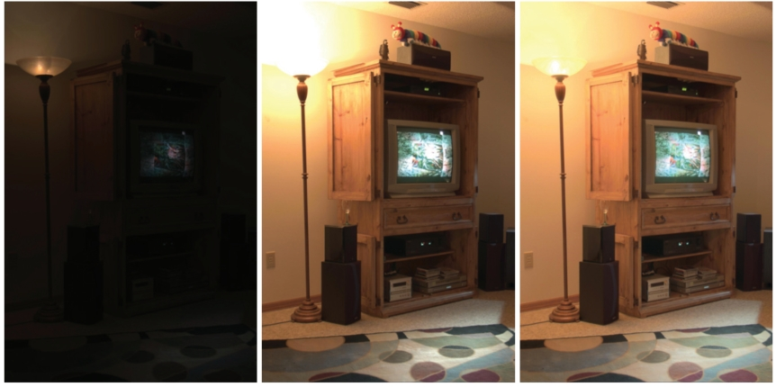
Figure 21.3. Linear scaling of high dynamic range images to fit a given display device may cause significant detail to be lost (left and middle). The left image is linearly scaled. In the middle image high values are clamped. For comparison, the right image is tonemapped, allowing details in both bright and dark regions to be visible.
图 21.3。 对高动态范围图像进行线性缩放以适应给定的显示设备可能会导致大量细节丢失（左图和中图)。 左图是线性缩放的。 在中间图像中，高值被限制。 为了进行比较，右侧图像经过色调映射，使得明亮和黑暗区域的细节都可见。

In general, linear scaling will not be appropriate for tone reproduction. The key issue in tone reproduction is then to compress an image while at the same time preserving one or more attributes of the image. Different tone reproduction algorithms focus on different attributes such as contrast, visible detail, brightness, or appearance.
一般来说，线性缩放不适合色调再现。 色调再现的关键问题是压缩图像，同时保留图像的一个或多个属性。 不同的色调再现算法侧重于不同的属性，例如对比度、可见细节、亮度或外观。

Ideally, displaying a tonemapped image on a low dynamic range display device would create the same visual response in the observer as the original scene. Given the limitations of display devices, this will not be achievable, although we could aim for approximating this goal as closely as possible.
理想情况下，在低动态范围显示设备上显示色调映射图像将在观察者中产生与原始场景相同的视觉响应。 考虑到显示设备的限制，这是不可能实现的，尽管我们可以尽可能接近这个目标。

As an example, we created the high dynamic range image shown in Figure 21.4. This image was then tonemapped and displayed on a display device. The display device itself was then placed in the scene such that it displays its own background (Figure 21.5). In the ideal case, the display should appear transparent. Dependent on the quality of the tone reproduction operator, as well as the nature of the scene being depicted, this goal may be more or less achievable.
作为示例，我们创建了如图 21.4 所示的高动态范围图像。 然后对该图像进行色调映射并显示在显示设备上。 然后将显示设备本身放置在场景中，使其显示自己的背景（图 21.5）。 在理想情况下，显示屏应呈现透明。 根据色调再现操作员的质量以及所描绘的场景的性质，这个目标或多或少可以实现。

Figure 21.4. Image used for demonstrating the goal of tone reproduction in Figure 21.5.
图 21.4。 图 21.5 中用于演示色调再现目标的图像。

Figure 21.5. After tonemapping the image in Figure 21.4 and displaying it on a monitor, the monitor is placed in the scene approximately at the location where the image was taken. Dependent on the quality of the tone reproduction operator, the result should appear as if the monitor is transparent.
图 21.5。 在对图 21.4 中的图像进行色调映射并将其显示在监视器上之后，将监视器放置在场景中大约拍摄图像的位置处。 根据色调再现操作器的质量，结果应该看起来就像监视器是透明的一样。

## 21.1 Classification 分类

Although it would be possible to classify tone reproduction operators by which attribute they aim to preserve, or for which task they were developed, we classify algorithms according to their general technique. This will enable us to show the differences and similarities between a significant number of different operators, and so, hopefully, contribute to the meaningful selection of specific operators for given tone reproduction tasks. 
尽管可以根据音调再现操作符旨在保留的属性或它们开发的任务来对它们进行分类，但我们根据其通用技术对算法进行分类。 这将使我们能够展示大量不同操作符之间的差异和相似之处，因此，希望有助于为给定的音调再现任务有意义地选择特定操作符。

The main classification scheme we follow hinges upon the realization that tone reproduction operators are based on insights gained from various disciplines. In particular, several operators are based on knowledge of human visual perception. 
我们遵循的主要分类方案取决于音调再现操作符基于从不同学科获得的见解的认识。 特别是，一些运算符是基于人类视觉感知的知识。

The human visual system detects light using photoreceptors located in the retina. Light is converted to an electrical signal which is partially processed in the retina and then transmitted to the brain. Except for the first few layers of cells in the retina, the signal derived from detected light is transmitted using impulse trains. The information-carrying quantity is the frequency with which these electrical pulses occur. 
人类视觉系统使用位于视网膜的感光器来检测光。 光被转换为电信号，该信号在视网膜中进行部分处理，然后传输到大脑。 除了视网膜中的前几层细胞外，检测到的光产生的信号通过脉冲序列传输。 信息承载量是这些电脉冲发生的频率。

The range of light that the human visual system can detect is much larger than the range of frequencies employed by the human brain to transmit information. Thus, the human visual system effortlessly solves the tone reproduction problem—a large range of luminances is transformed into a small range of frequencies of impulse trains. Emulating relevant aspects of the human visual system is therefore a worthwhile approach to tone reproduction; this approach is explained in more detail in Section 21.7.
人类视觉系统可以检测到的光范围远大于人脑传输信息所采用的频率范围。 因此，人类视觉系统毫不费力地解决了色调再现问题——大范围的亮度被转换成小范围的脉冲序列频率。 因此，模拟人类视觉系统的相关方面是一种有价值的色调再现方法； 第 21.7 节更详细地解释了这种方法。

A second class of operators is grounded in physics. Light interacts with surfaces and volumes before being absorbed by the photoreceptors. In computer graphics, light interaction is generally modeled by the rendering equation. For purely diffuse surfaces, this equation may be simplified to the product between light incident upon a surface (illuminance), and this surface’s ability to reflect light (reflectance) (Oppenheim, Schafer, & Stockham, 1968). 
第二类运算符以物理学为基础。 光在被感光器吸收之前与表面和体积相互作用。 在计算机图形学中，光交互通常通过渲染方程来建模。 对于纯漫射表面，该方程可以简化为入射到表面的光（照度）与该表面反射光的能力（反射率）之间的乘积（Oppenheim、Schafer 和 Stockham，1968）。

Since reflectance is a passive property of surfaces, for diffuse surfaces it is, by definition, low dynamic range—typically between 0.005 and 1 (Stockham, 1972). The reflectance of a surface cannot be larger than 1, since then it would reflect more light than was incident upon the surface. Illuminance, on the other hand, can produce arbitrarily large values and is limited only by the intensity and proximity of the light sources. 
由于反射率是表面的被动属性，因此对于漫反射表面来说，根据定义，它的动态范围较低，通常在 0.005 到 1 之间（Stockham，1972）。 表面的反射率不能大于 1，因为这样它会反射比入射到表面上的光更多的光。 另一方面，照度可以产生任意大的值，并且仅受光源的强度和接近度的限制。

The dynamic range of an image is thus predominantly governed by the illuminance component. In the face of diffuse scenes, a viable approach to tone reproduction may therefore be to separate reflectance from illuminance, compress the illuminance component, and then recombine the image. 
因此，图像的动态范围主要由照度分量决定。 因此，面对漫射场景，一种可行的色调再现方法可能是将反射率与照度分开，压缩照度分量，然后重新组合图像。

However, the assumption that all surfaces in a scene are diffuse is generally incorrect. Many high dynamic range images depict highlights and/or directly visible light sources (Figure 21.3). The luminance reflected by a specular surface may be almost as high as the light source it reflects. Various tone reproduction operators currently used split the image into a high dynamic range base layer and a low dynamic range detail layer. These layers would represent illuminance and reflectance if the depicted scene were entirely diffuse. For scenes containing directly visible light sources or specular highlights, separation into base and detail layers still allows the design of effective tone reproduction operators, although no direct meaning can be attached to the separate layers. Such operators are discussed in Section 21.5. 
然而，场景中所有表面都是漫反射的假设通常是不正确的。 许多高动态范围图像描绘了高光和/或直接可见的光源（图 21.3）。 镜面反射的亮度可能几乎与它反射的光源一样高。 目前使用的各种色调再现算子将图像分为高动态范围基础层和低动态范围细节层。 如果所描绘的场景完全漫射，这些层将代表照度和反射率。 对于包含直接可见光源或镜面高光的场景，分离为基础层和细节层仍然允许设计有效的色调再现操作符，尽管不能将直接含义附加到单独的层上。 此类运算符将在第 21.5 节中讨论。

## 21.2 Dynamic Range 动态范围

Conventional images are stored with one byte per pixel for each of the red, green and blue components. The dynamic range afforded by such an encoding depends on the ratio between smallest and largest representable value, as well as the step size between successive values. Thus, for low dynamic range images, there are only 256 different values per color channel. 
传统图像的红色、绿色和蓝色分量中的每一个都以每个像素一个字节的方式存储。 这种编码提供的动态范围取决于最小和最大可表示值之间的比率，以及连续值之间的步长。 因此，对于低动态范围图像，每个颜色通道只有 256 个不同的值。

Figure 21.6. Dynamic range of 2.65 $log_2$ units.
图 21.6。 动态范围为 2.65 $log_2$ 单位。

High dynamic range images encode a significantly larger set of possible values; the maximum representable value may be much larger and the step size between successive values may be much smaller. The file size of high dynamic range images is therefore generally larger as well, although at least one standard (the OpenEXR high dynamic range file format (Kainz, Bogart, & Hess, 2003)) includes a very capable compression scheme. 
高动态范围图像编码了一组明显更大的可能值； 最大可表示值可能大得多，并且连续值之间的步长可能小得多。 因此，高动态范围图像的文件大小通常也较大，尽管至少有一个标准（OpenEXR 高动态范围文件格式（Kainz、Bogart 和 Hess，2003））包含功能非常强大的压缩方案。

Figure 21.7. Dynamic range of 3.96 $log_2$ units. 
图 21.7。 动态范围为 3.96 $log_2$ 单位。

A different approach to limit file sizes is to apply a tone reproduction operator to the high dynamic data. The result may then be encoded in JPEG format. In addition, the input image may be divided pixel-wise by the tonemapped image. The result of this division can then be subsampled and stored as a small amount of data in the header of the same JPEG image (G. Ward & Simmons, 2004). The file size of such sub-band encoded images is of the same order as conventional JPEG encoded images. Display programs can display the JPEG image directly or may reconstruct the high dynamic range image by multiplying the tonemapped image with the data stored in the header. 
限制文件大小的另一种方法是将色调再现运算符应用于高动态数据。 然后可以将结果编码为 JPEG 格式。 另外，输入图像可以按像素方式除以色调映射图像。 然后，可以对除法的结果进行二次采样，并将其作为少量数据存储在同一 JPEG 图像的标头中（G. Ward & Simmons，2004）。 这种子带编码图像的文件大小与传统的JPEG编码图像具有相同的量级。 显示程序可以直接显示 JPEG 图像，也可以通过将色调映射图像与标头中存储的数据相乘来重建高动态范围图像。

Figure 21.8. Dynamic range of 4.22 $log_2$ units. 
图 21.8。 动态范围为 4.22 $log_2$ 单位。

In general, the combination of smallest step size and ratio of the smallest and largest representable values determines the dynamic range that an image encoding scheme affords. For computer-generated imagery, an image is typically stored as a triplet of floating point values before it is written to file or displayed on screen, although more efficient encoding schemes are possible (Reinhard, Ward, Debevec, & Pattanaik, 2005). Since most display devices are still fitted with eightbit D/A converters, we may think of tone reproduction as the mapping of floating point numbers to bytes such that the result is displayable on a low dynamic range display device. 
一般来说，最小步长以及最小和最大可表示值的比率的组合决定了图像编码方案提供的动态范围。 对于计算机生成的图像，图像通常在写入文件或在屏幕上显示之前存储为浮点值的三元组，尽管可以使用更有效的编码方案（Reinhard、Ward、Debevec 和 Pattanaik，2005）。 由于大多数显示设备仍然配备有八位 D/A 转换器，因此我们可以将色调再现视为浮点数到字节的映射，以便结果可以在低动态范围显示设备上显示。

Figure 21.9. Dynamic range of 5.01 $log_2$ units. 
图 21.9。 动态范围为 5.01 $log_2$ 单位。

The dynamic range of individual images is generally smaller, and is determined by the smallest and largest luminances found in the scene. A simplistic approach to measure the dynamic range of an image may therefore compute the ratio between the largest and smallest pixel value of an image. Sensitivity to outliers may be reduced by ignoring a small percentage of the darkest and brightest pixels. 
单个图像的动态范围通常较小，并且由场景中发现的最小和最大亮度决定。 因此，测量图像动态范围的简单方法可以计算图像的最大和最小像素值之间的比率。 通过忽略一小部分最暗和最亮的像素，可以降低对异常值的敏感度。
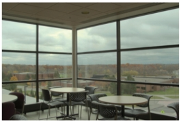
Figure 21.10. Dynamic range of 6.56 $log_2$ units. 
图 21.10。 动态范围为 6.56 $log_2$ 单位。

Alternatively, the same ratio may be expressed as a difference in the logarithmic domain. This measure is less sensitive to outliers. The images shown in the margin on this page are examples of images with different dynamic ranges. Note that the night scene in this case does not have a smaller dynamic range than the day scene. While all the values in the night scene are smaller, the ratio between largest and smallest values is not. 
或者，相同的比率可以表示为对数域中的差。 该指标对异常值不太敏感。 本页页边空白处显示的图像是具有不同动态范围的图像示例。 请注意，这种情况下的夜景的动态范围并不比白天场景小。 虽然夜景中的所有值都较小，但最大值与最小值之间的比率却并非如此。

However, the recording device or rendering algorithm may introduce noise which will lower the useful dynamic range. Thus, a measurement of the dynamic range of an image should factor in noise. A better measure of dynamic range would therefore be a signal-to-noise ratio, expressed in decibels, as used in signal processing.
然而，记录设备或渲染算法可能会引入噪声，从而降低有用的动态范围。 因此，图像动态范围的测量应该考虑噪声。 因此，动态范围的更好衡量标准是信号处理中使用的以分贝表示的信噪比。

## 21.3 Color 颜色

Tone reproduction operators normally compress luminance values, rather than work directly on the red, green, and blue components of a color image. After these luminance values have been compressed into display values $L_d(x, y)$, a color image may be reconstructed by keeping the ratios between color channels the same as they were before compression (using s = 1) (Schlick, 1994b):
色调再现算子通常会压缩亮度值，而不是直接作用于彩色图像的红色、绿色和蓝色分量。 将这些亮度值压缩为显示值 $L_d(x, y)$ 后，可以通过保持颜色通道之间的比率与压缩前相同（使用 s = 1）来重建彩色图像（Schlick，1994b）：
$$
I_{r, d}(x, y) = (\frac{I_r(x, y)}{L_v(x, y)})^sL_d(x, y), \\
I_{g, d}(x, y) = (\frac{I_g(x, y)}{L_v(x, y)})^sL_d(x, y), \\
I_{b, d}(x, y) = (\frac{I_b(x, y)}{L_v(x, y)})^sL_d(x, y), \\
$$
The results frequently appear over-saturated, because human color perception is nonlinear with respect to overall luminance level. This means that if we view an image of a bright outdoor scene on a monitor in a dim environment, our eyes are adapted to the dim environment rather than the outdoor lighting. By keeping color ratios constant, we do not take this effect into account. 
结果经常显得过饱和，因为人类的色彩感知相对于整体亮度水平是非线性的。 这意味着，如果我们在昏暗的环境中在显示器上观看明亮的户外场景的图像，我们的眼睛会适应昏暗的环境，而不是户外照明。 通过保持颜色比率恒定，我们不考虑这种影响。

Alternatively, the saturation constant s may be chosen smaller than one. Such per-channel gamma correction may desaturate the results to an appropriate level, as shown in Figure 21.11 (Fattal, Lischinski, & Werman, 2002). A more comprehensive solution is to incorporate ideas from the field of color appearance modeling into tone reproduction operators (Pattanaik, Ferwerda, Fairchild, & Greenberg, 1998; Fairchild & Johnson, 2004; Reinhard & Devlin, 2005).
或者，饱和常数s可以选择为小于1。 这种每通道伽马校正可能会将结果去饱和至适当的水平，如图 21.11 所示（Fattal、Lischinski 和 Werman，2002）。 更全面的解决方案是将色彩外观建模领域的想法融入色调再现算子中（Pattanaik、Ferwerda、Fairchild 和 Greenberg，1998；Fairchild 和 Johnson，2004；Reinhard 和 Devlin，2005）。

Figure 21.11. Per-channel gamma correction may desaturate the image. The left image was desaturated with a value of s = 0.5. The right image was not desaturated (s = 1). 
图 21.11。 每通道伽玛校正可能会使图像去饱和。 左图的饱和度为 s = 0.5。 右侧图像未去饱和 (s = 1)。 

Finally, if an example image with a representative color scheme is already available, this color scheme may be applied to a new image. Such a mapping of colors between images may be used for subtle color correction, such as saturation adjustment or for more creative color mappings. The mapping proceeds by converting both source and target images to a decorrelated color space. In such a color space, the pixel values in each color channel may be treated independently without introducing too many artifacts (Reinhard, Ashikhmin, Gooch, & Shirley, 2001). 
最后，如果具有代表性配色方案的示例图像已经可用，则可以将该配色方案应用于新图像。 图像之间的这种颜色映射可用于细微的颜色校正，例如饱和度调整或用于更具创意的颜色映射。 通过将源图像和目标图像转换为去相关的色彩空间来进行映射。 在这样的颜色空间中，可以独立处理每个颜色通道中的像素值，而不会引入太多伪影（Reinhard、Ashikhmin、Gooch 和 Shirley，2001）。

Mapping colors from one image to another in a decorrelated color space is then straightforward: compute the mean and standard deviation of all pixels in the source and target images for the three color channels separately. Then, shift and scale the target image so that in each color channel the mean and standard deviation of the target image is the same as the source image. The resulting image is then obtained by converting from the decorrelated color space to RGB and clamping negative pixels to zero. The dynamic range of the image may have changed as a result of applying this algorithm. It is therefore recommended to apply this algorithm on high dynamic range images and apply a conventional tone reproduction algorithm afterward. A suitable decorrelated color space is the opponent space from Section 19.2.4. 
在去相关的颜色空间中将颜色从一幅图像映射到另一幅图像非常简单：分别计算三个颜色通道的源图像和目标图像中所有像素的平均值和标准差。 然后，移动和缩放目标图像，以便在每个颜色通道中目标图像的均值和标准差与源图像相同。 然后通过从解相关的颜色空间转换为 RGB 并将负像素钳位为零来获得结果图像。 由于应用此算法，图像的动态范围可能会发生变化。 因此，建议在高动态范围图像上应用该算法，然后应用传统的色调再现算法。 合适的去相关色彩空间是第 19.2.4 节中的对手空间。

The result of applying such a color transform to the image in Figure 21.12 is shown in Figure 21.13.
将这种颜色变换应用于图 21.12 中的图像的结果如图 21.13 所示。

Figure 21.12. Image used for demonstrating the color transfer technique. Results are shown in Figures 21.13 and 21.31.
图 21.12。 用于演示颜色转移技术的图像。 结果如图 21.13 和 21.31 所示。

Figure 21.13. The image on the left is used to adjust the colors of the image shown in Figure 21.12. The result is shown on the right. 
图 21.13。 左边的图像用于调整图21.12所示图像的颜色。 结果如右图所示。

## 21.4 Image Formation 图像形成

For now, we assume that an image is formed as the result of light being diffusely reflected off of surfaces. Later in this chapter, we relax this constraint to scenes directly depicting light sources and highlights. The luminance $L_v$ of each pixel is then approximated by the following product:
现在，我们假设图像是由于光从表面漫反射而形成的。 在本章后面，我们将放宽对直接描绘光源和高光的场景的限制。 然后，每个像素的亮度 $L_v$ 通过以下乘积进行近似：
$L_v(x, y) = r(x, y)E_v(x, y).$

Here, r denotes the reflectance of a surface, and $E_v$ denotes the illuminance. The subscript v indicates that we are using photometrically weighted quantities. Alternatively, we may write this expression in the logarithmic domain (Oppenheim et al., 1968):
这里，r表示表面的反射率，$E_v$表示照度。 下标 v 表示我们正在使用光度加权量。 或者，我们可以在对数域中写出这个表达式（Oppenheim et al., 1968）：
$$
D(x, y) = log(L_v(x, y)) \\
= log(r(x, y) E_v(x, y)) \\
= log(r(x, y)) + log(E_v(x, y)).
$$
Photographic transparencies record images by varying the density of the material. In traditional photography, this variation has a logarithmic relation with luminance. Thus, in analogy with common practice in photography, we will use the term density representation (D) for log luminance. When represented in the log domain, reflectance and illuminance become additive. This facilitates separation of these two components, despite the fact that isolating either reflectance or illuminance is an under-constrained problem. In practice, separation is possible only to a certain degree and depends on the composition of the image. Nonetheless, tone reproduction could be based on disentangling these two components of image formation, as shown in the following two sections. 
照相透明胶片通过改变材料的密度来记录图像。 在传统摄影中，这种变化与亮度呈对数关系。 因此，与摄影中的常见做法类似，我们将使用术语密度表示 (D) 来表示对数亮度。 当在对数域中表示时，反射率和照度会相加。 尽管隔离反射率或照度是一个欠约束的问题，但这还是有利于这两个组件的分离。 实际上，分离只能在一定程度上进行，并且取决于图像的组成。 尽管如此，色调再现可以基于解开图像形成的这两个组成部分，如以下两节所示。

## 21.5 Frequency-Based Operators 基于频率的运算符

For typical diffuse scenes, the reflectance component tends to exhibit high spatial frequencies due to textured surfaces as well as the presence of surface edges. On the other hand, illuminance tends to be a slowly varying function over space. 
对于典型的漫反射场景，由于纹理表面以及表面边缘的存在，反射分量往往表现出高空间频率。 另一方面，照度往往是随空间缓慢变化的函数。

Since reflectance is low dynamic range and illuminance is high dynamic range, we may try to separate the two components. The frequency-dependence of both reflectance and illuminance provides a solution. We may, for instance, compute the Fourier transform of an image and attenuate only the low frequencies. This compresses the illuminance component while leaving the reflectance component largely unaffected—the very first digital tone reproduction operator known to us takes this approach (Oppenheim et al., 1968). 
由于反射率是低动态范围，而照度是高动态范围，我们可以尝试将这两个分量分开。 反射率和照度的频率依赖性提供了一个解决方案。 例如，我们可以计算图像的傅立叶变换并仅衰减低频。 这压缩了照度分量，同时使反射率分量基本上不受影响——我们所知的第一个数字色调再现算子就采用了这种方法（Oppenheim et al., 1968）。

More recently, other operators have also followed this line of reasoning. In particular, bilateral and trilateral filters were used to separate an image into base and detail layers (Durand & Dorsey, 2002; Choudhury & Tumblin, 2003). Both filters are edge-preserving smoothing operators which may be used in a variety of different ways. Applying an edge-preserving smoothing operator to a density image results in a blurred image in which sharp edges remain present (Figure 21.14 (left)). We may view such an image as a base layer. If we then pixel-wise divide the high dynamic range image by the base layer, we obtain a detail layer which contains all the high-frequency detail (Figure 21.14 (right)). 
最近，其他运营商也遵循了这一思路。 特别是，双边和三边过滤器用于将图像分离为基础层和细节层（Durand & Dorsey，2002；Choudhury & Tumblin，2003）。 两个滤波器都是边缘保留平滑算子，可以以多种不同的方式使用。 将边缘保留平滑算子应用于密度图像会产生模糊图像，其中仍存在锐利边缘（图 21.14（左））。 我们可以将这样的图像视为基础层。 如果我们将高动态范围图像按像素除以基础层，我们将获得包含所有高频细节的细节层（图 21.14（右））。

Figure 21.14. Bilateral filtering removes small details but preserves sharp gradients (left). The associated detail layer is shown on the right. 
图 21.14。 双边过滤消除了小细节，但保留了锐利的梯度（左)。 关联的细节层显示在右侧。

For diffuse scenes, base and detail layers are similar to representations of illuminance and reflectance. For images depicting highlights and light sources, this parallel does not hold. However, separation of an image into base and detail layers is possible regardless of the image’s content. By compressing the base layer before recombining into a compressed density image, a low dynamic range density image may be created (Figure 21.15). After exponentiation, a displayable image is obtained. 
对于漫反射场景，基础层和细节层类似于照度和反射率的表示。 对于描绘高光和光源的图像，这种相似之处并不成立。 然而，无论图像的内容如何，都可以将图像分为基础层和细节层。 通过在重新组合成压缩密度图像之前压缩基础层，可以创建低动态范围密度图像（图 21.15）。 求幂后，得到可显示的图像。

Figure 21.15. An image tonemapped using bilateral filtering. The base and detail layers shown in Figure 21.14 are recombined after compressing the base layer.
图 21.15。 使用双边滤波进行色调映射的图像。 压缩基础层后，基础层和细节层重新组合，如图 21.14 所示。

Edge-preserving smoothing operators may also be used to compute a local adaptation level for each pixel, which may be used in a spatially varying or local tone reproduction operator. We describe this use of bilateral and trilateral filters in Section 21.7.
边缘保留平滑算子还可以用于计算每个像素的局部适应水平，其可以在空间变化或局部色调再现算子中使用。 我们在第 21.7 节中描述了双边和三边过滤器的使用。

## 21.6 Gradient-Domain Operators  梯度域运算符

The arguments made for the frequency-based operators in the preceding section also hold for the gradient field. Assuming that no light sources are directly visible, the reflectance component will be a constant function with sharp spikes in the gradient field. Similarly, the illuminance component will cause small gradients everywhere.
上一节中针对基于频率的算子所做的论证也适用于梯度场。 假设没有直接可见的光源，则反射率分量将是梯度场中具有尖锐尖峰的常数函数。 同样，照度分量会在各处造成小梯度。

Humans are generally able to separate illuminance from reflectance in typical scenes. The perception of surface reflectance after discounting the illuminant is called lightness. To assess the lightness of an image depicting only diffuse surfaces, B. K. P. Horn was the first to separate reflectance and illuminance using a gradient field (Horn, 1974). He used simple thresholding to remove all small gradients and then integrated the image, which involves solving a Poisson equation using the Full Multigrid Method (Press, Teukolsky, Vetterling, & Flannery, 1992). 
在典型场景中，人类通常能够区分照度和反射率。 扣除光源后的表面反射率感知称为亮度。 为了评估仅描绘漫射表面的图像的亮度，B.K.P.Horn 是第一个使用梯度场分离反射率和照度的人（Horn，1974）。 他使用简单的阈值处理来删除所有小梯度，然后对图像进行积分，其中涉及使用完全多重网格方法求解泊松方程（Press、Teukolsky、Vetterling 和 Flannery，1992）。

The result is similar to an edge-preserving smoothing filter. This is according to expectation since Oppenheim’s frequency-based operator works under the same assumptions of scene reflectivity and image formation. In particular, Horn’s work was directly aimed at “mini-worlds of Mondrians,” which are simplified versions of diffuse scenes which resemble the abstract paintings by the famous Dutch painter Piet Mondrian. 
结果类似于边缘保留平滑滤波器。 这是符合预期的，因为奥本海姆基于频率的算子在场景反射率和图像形成的相同假设下工作。 特别是，霍恩的作品直接针对“蒙德里安的迷你世界”，这是漫射场景的简化版本，类似于荷兰著名画家皮特·蒙德里安的抽象画。

Horn’s work cannot be employed directly as a tone reproduction operator, since most high dynamic range images depict light sources. However, a relatively small variation will turn this work into a suitable tone reproduction operator. If light sources or specular surfaces are depicted in the image, then large gradients will be associated with the edges of light sources and highlights. These cause the image to have a high dynamic range. An example is shown in Figure 21.16, where the highlights on the snooker balls cause sharp gradients.
霍恩的工作不能直接用作色调再现算子，因为大多数高动态范围图像都描绘光源。 然而，相对较小的变化将使这项工作变成一个合适的音调再现操作器。 如果图像中描绘了光源或镜面，则光源和高光的边缘将出现大梯度。 这些使得图像具有高动态范围。 图 21.16 中显示了一个示例，其中斯诺克球上的高光导致了尖锐的渐变。

Figure 21.16. The image on the left (tonemapped using gradient-domain compression) shows a scene with highlights. These highlights show up as large gradients on the right, where the magnitude of the gradients is mapped to a grayscale (black is a gradient of 0, white is the maximum gradient in the image).
图 21.16。 左侧的图像（使用梯度域压缩进行色调映射）显示了带有高光的场景。 这些高光在右侧显示为大梯度，其中梯度的大小映射到灰度（黑色是梯度 0，白色是图像中的最大梯度)。

We could therefore compress a high dynamic range image by attenuating large gradients, rather than thresholding the gradient field. This approach was taken by Fattal et al. who showed that high dynamic range imagery may be successfully compressed by integrating a compressed gradient field (Figure 21.17) (Fattal et al., 2002). Fattal’s gradient-domain compression is not limited to diffuse scenes.
因此，我们可以通过衰减大梯度来压缩高动态范围图像，而不是对梯度场进行阈值化。 Fattal 等人采用了这种方法。 他表明，通过集成压缩梯度场可以成功压缩高动态范围图像（图 21.17）（Fattal 等，2002）。 Fattal 的梯度域压缩不仅限于漫反射场景。

Figure 21.17. An image tonemapped using gradient-domain compression. 
图 21.17。 使用梯度域压缩进行色调映射的图像。

## 21.7 Spatial Operators 空间运算符

In the following sections, we discuss tone reproduction operators which apply compression directly on pixels without transformation to other domains. Often global and local operators are distinguished. Tone reproduction operators in the former class change each pixel’s luminance values according to a compressive function which is the same for each pixel. The term global stems from the fact that many such functions need to be anchored to some values determined by analyzing the full image. In practice, most operators use the geometric average $\overline{L}_v$ to steer the compression:
在以下部分中，我们讨论直接对像素应用压缩而不转换到其他域的色调再现算子。 全球运营商和本地运营商通常是有区别的。 前一类中的色调再现算子根据每个像素相同的压缩函数来改变每个像素的亮度值。 术语“全局”源于这样一个事实：许多此类函数需要锚定到通过分析完整图像确定的某些值。 在实践中，大多数运算符使用几何平均值 $\overline{L}_v$ 来控制压缩：
$$
\overline{L}_v = exp(\frac{1}{N}\sum_{x,y}\log{(δ + L_v(x, y)} \ \ \ \ \ \ (21.1)
$$
In Equation (21.1), a small constant δ is introduced to prevent the average to become zero in the presence of black pixels. The geometric average is normally mapped to a predefined display value. The effect of mapping the geometric average to different display values is shown in Figure 21.18. Alternatively, sometimes the minimum or maximum image luminance is used. The main challenge faced in the design of a global operator lies in the choice of the compressive function. 
在方程（21.1）中，引入了一个小的常数δ，以防止在存在黑色像素的情况下平均值变为零。 几何平均值通常映射到预定义的显示值。 将几何平均值映射到不同显示值的效果如图21.18所示。 或者，有时使用最小或最大图像亮度。 全局算子设计面临的主要挑战在于压缩函数的选择。

Figure 21.18. Spatial tonemapping operator applied after mapping the geometric average to different display values (left: 0.12, right: 0.38). 
图 21.18。 将几何平均值映射到不同的显示值后应用空间色调映射运算符（左：0.12，右：0.38)。

On the other hand, local operators compress each pixel according to a specific compression function which is modulated by information derived from a selection of neighboring pixels, rather than the full image. The rationale is that a bright pixel in a bright neighborhood may be perceived differently than a bright pixel in a dim neighborhood. Design challenges in the development of a local operator involves choosing the compressive function, the size of the local neighborhood for each pixel, and the manner in which local pixel values are used. In general, local operators achieve better compression than global operators (Figure 21.19), albeit at a higher computational cost. 
另一方面，局部算子根据特定的压缩函数来压缩每个像素，该压缩函数是通过从相邻像素的选择而不是整个图像中导出的信息来调制的。 其基本原理是，明亮邻域中的亮像素可能与暗邻域中的亮像素被感知不同。 开发局部算子的设计挑战包括选择压缩函数、每个像素的局部邻域的大小以及局部像素值的使用方式。 一般来说，局部运算符比全局运算符实现更好的压缩（图 21.19），尽管计算成本更高。
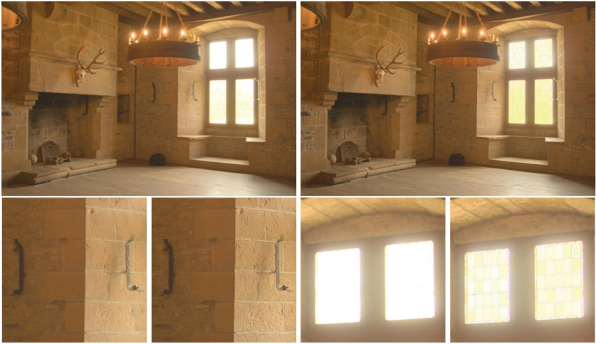
Figure 21.19. A global tone reproduction operator (left) and a local tone reproduction operator (right) (Reinhard, Stark, Shirley, & Ferwerda, 2002) of each image. The local operator shows more detail; for example, the metal badge on the right shows better contrast and the highlights are crisper.
图 21.19。 每个图像的全局色调再现算子（左）和局部色调再现算子（右）（Reinhard、Stark、Shirley 和 Ferwerda，2002)。 当地运营商显示更多细节； 例如，右侧的金属徽章显示出更好的对比度，并且高光更清晰。

Both global and local operators are often inspired by the human visual system. Most operators employ one of two distinct compressive functions, which is orthogonal to the distinction between local and global operators. Display values $L_d(x, y)$ are most commonly derived from image luminances $L_v(x, y)$ by the following two functional forms:
全球和本地运营商都经常受到人类视觉系统的启发。 大多数运算符采用两种不同的压缩函数之一，这与局部运算符和全局运算符之间的区别正交。 显示值 $L_d(x, y)$ 通常通过以下两种函数形式从图像亮度 $L_v(x, y)$ 导出：
$$
L_d(x, y) = \frac{L_v(x, y)}{f(x, y)} \ \ \ \ (21.2) \\
L_d(x, y) = \frac{L_v(x, y)}{L_v(x, y) + f^n(x, y)} \ \ \ \ \ \ (21.3)
$$
In these equations, f(x, y) may either be a constant or a function which varies per pixel. In the former case, we have a global operator, whereas a spatially varying function f(x, y) results in a local operator. The exponent n is usually a constant which is fixed for a particular operator.
在这些方程中，f(x, y) 可以是常数，也可以是每个像素变化的函数。 在前一种情况下，我们有一个全局算子，而空间变化的函数 f(x, y) 则产生一个局部算子。 指数 n 通常是针对特定运算符固定的常数。

Equation (21.2) divides each pixel’s luminance by a value derived from either the full image or a local neighborhood. Equation (21.3) has an S-shaped curve on a log-linear plot and is called a sigmoid for that reason. This functional form fits data obtained from measuring the electrical response of photoreceptors to flashes of light in various species. In the following sections, we discuss both functional forms.
方程（21.2）将每个像素的亮度除以从完整图像或局部邻域导出的值。 方程（21.3）在对数线性图上有一条 S 形曲线，因此被称为 S 型曲线。 这种功能形式适合通过测量不同物种的光感受器对闪光的电响应获得的数据。 在以下部分中，我们将讨论这两种函数形式。

## 21.8 Division 除法

Each pixel may be divided by a constant to bring the high dynamic range image within a displayable range. Such a division essentially constitutes linear scaling, as shown in Figure 21.3. While Figure 21.3 shows ad-hoc linear scaling, this approach may be refined by employing psychophysical data to derive the scaling constant $f(x, y) = k$ in Equation (21.2) (G. J. Ward, 1994; Ferwerda, Pattanaik, Shirley, & Greenberg, 1996).
每个像素可以除以常数以使高动态范围图像处于可显示范围内。 这样的划分本质上构成了线性缩放，如图21.3所示。 虽然图 21.3 显示了临时线性标度，但可以通过使用心理物理学数据推导方程 (21.2) 中的标度常数 $f(x, y) = k$ 来完善此方法（G. J. Ward，1994；Ferwerda、Pattanaik、Shirley） ，＆格林伯格，1996）。

Alternatively, several approaches exist that compute a spatially varying divisor. In each of these cases, $f(x, y)$ is a blurred version of the image, i.e., $f(x, y) = L^{blur}_v (x, y)$. The blur is achieved by convolving the image with a Gaussian filter (Chiu et al., 1993; Rahman, Jobson, & Woodell, 1996). In addition, the computation of $f(x, y)$ by blurring the image may be combined with a shift in white point for the purpose of color appearance modeling (Fairchild & Johnson, 2002; G. M. Johnson & Fairchild, 2003; Fairchild & Johnson, 2004). 
或者，存在多种计算空间变化除数的方法。 在每种情况下，$f(x, y)$ 都是图像的模糊版本，即 $f(x, y) = L^{blur}_v (x, y)$。 模糊是通过将图像与高斯滤波器进行卷积来实现的（Chiu 等人，1993 年；Rahman、Jobson 和 Woodell，1996 年）。 此外，通过模糊图像计算 $f(x, y)$ 可以与白点偏移相结合，以实现色彩外观建模（Fairchild & Johnson, 2002；G. M. Johnson & Fairchild, 2003；Fairchild & Johnson） 约翰逊，2004）。

The size and the weight of the Gaussian filter has a profound impact on the resulting displayable image. The Gaussian filter has the effect of selecting a weighted local average. Tone reproduction is then a matter of dividing each pixel by its associated weighted local average. If the size of the filter kernel is chosen too small, then haloing artifacts will occur (Figure 21.20 (left)). Haloing is a common problem with local operators and is particularly evident when tone mapping relies on division.
高斯滤波器的尺寸和重量对最终的可显示图像具有深远的影响。 高斯滤波器具有选择加权局部平均值的作用。 色调再现就是将每个像素除以其相关的加权局部平均值。 如果滤波器内核的大小选择得太小，则会出现光晕伪影（图 21.20（左））。 光晕是本地运营商的常见问题，当色调映射依赖于划分时尤其明显。

Figure 21.20. Images tonemapped by dividing by Gaussian-blurred versions. The size of the filter kernel is 64 pixels for the left image and 512 pixels for the right image. For division-based algorithms, halo artifacts are minimized by choosing large filter kernels.
图 21.20。 通过除以高斯模糊版本进行色调映射的图像。 左图像的滤波器内核的大小为 64 像素，右图像的滤波器内核的大小为 512 像素。 对于基于除法的算法，通过选择大的滤波器内核可以最小化光晕伪影。

In general, haloing artifacts may be minimized in this approach by making the filter kernel large (Figure 21.20 (right)). Reasonable results may be obtained by choosing a filter size of at least one quarter of the image. Sometimes even larger filter kernels are desirable to minimize artifacts. Note, that in the limit, the filter size becomes as large as the image itself. In that case, the local operator becomes global, and the extra compression normally afforded by a local approach is lost. 
一般来说，通过增大滤波器内核，可以在此方法中最大程度地减少光晕伪影（图 21.20（右））。 通过选择至少图像四分之一的滤波器尺寸可以获得合理的结果。 有时甚至需要更大的滤波器内核来最小化伪影。 请注意，在极限情况下，滤波器尺寸会变得与图像本身一样大。 在这种情况下，本地运营商将成为全球运营商，并且通常由本地方法提供的额外压缩会丢失。

The functional form whereby each pixel is divided by a Gaussian-blurred pixel at the same spatial position thus requires an undesirable tradeoff between amount of compression and severity of artifacts. 
因此，每个像素除以相同空间位置处的高斯模糊像素的函数形式需要在压缩量和伪影严重性之间进行不期望的权衡。

## 21.9 Sigmoids  S 型函数

Equation (21.3) follows a different functional form from simple division, and, therefore, affords a different tradeoff between amount of compression, presence of artifacts, and speed of computation. 
方程（21.3）遵循与简单除法不同的函数形式，因此在压缩量、伪像的存在和计算速度之间提供了不同的权衡。

Sigmoids have several desirable properties. For very small luminance values, the mapping is approximately linear, so that contrast is preserved in dark areas of the image. The function has an asymptote at one, which means that the output mapping is always bounded between 0 and 1. 
Sigmoid 有几个理想的特性。 对于非常小的亮度值，映射近似线性，以便在图像的暗区域保留对比度。 该函数的渐近线为 1，这意味着输出映射始终限制在 0 和 1 之间。

In Equation (21.3), the function $f(x, y)$ may be computed as a global constant or as a spatially varying function. Following common practice in electrophysiology, we call $f(x, y)$ the semi-saturation constant. Its value determines which values in the input image are optimally visible after tonemapping. In particular, if we assume that the exponent n equals 1, then luminance values equal to the semi-saturation constant will be mapped to 0.5. The effect of choosing different semi-saturation constants is shown in Figure 21.21.
在方程（21.3）中，函数 $f(x, y)$ 可以计算为全局常数或空间变化函数。 按照电生理学的常见做法，我们将 $f(x, y)$ 称为半饱和常数。 它的值决定了输入图像中的哪些值在色调映射后最佳可见。 特别是，如果我们假设指数 n 等于 1，则等于半饱和常数的亮度值将映射为 0.5。 选择不同半饱和常数的效果如图21.21所示。

Figure 21.21. The choice of semi-saturation constant determines how input values are mapped to display values. 
图 21.21。 半饱和常数的选择决定了输入值如何映射到显示值。

The function $f(x, y)$ may be computed in several different ways (Reinhard et al., 2005). In its simplest form, f(x, y) is set to $\overline{L}_v/k$, so that the geometric average is mapped to user parameter k (Figure 21.22) (Reinhard et al., 2002). In this case, a good initial value for k is 0.18, although for particularly bright or dark scenes this value may be raised or lowered. Its value may be estimated from the image itself (Reinhard, 2003). The exponent $n$ in Equation (21.3) may be set to 1.
函数 $f(x, y)$ 可以用几种不同的方式计算（Reinhard et al., 2005）。 最简单的形式是，f(x, y) 设置为 $\overline{L}_v/k$，以便将几何平均值映射到用户参数 k（图 21.22）（Reinhard et al., 2002）。 在这种情况下，k 的良好初始值为 0.18，尽管对于特别明亮或黑暗的场景，该值可能会升高或降低。 它的价值可以根据图像本身来估计（Reinhard，2003）。 等式(21.3)中的指数$n$可以设置为1。 

Figure 21.22. A linearly scaled image (left) and an image tonemapped using sigmoidal compression(right). 
图 21.22。 线性缩放的图像（左）和使用 S 形压缩进行色调映射的图像（右)。

In this approach, the semi-saturation constant is a function of the geometric average, and the operator is therefore global. A variation of this global operator computes the semi-saturation constant by linearly interpolating between the geometric average and each pixel’s luminance:
在这种方法中，半饱和常数是几何平均值的函数，因此算子是全局的。 该全局运算符的变体通过在几何平均值和每个像素的亮度之间进行线性插值来计算半饱和常数：
$f(x, y) = a L_v(x, y) + (1 - a) \overline{L}_v.  $

The interpolation is governed by user parameter a which has the effect of varying the amount of contrast in the displayable image (Figure 21.23) (Reinhard & Devlin, 2005). More contrast means less visible detail in the light and dark areas and vice versa. This interpolation may be viewed as a halfway house between a fully global and a fully local operator by interpolating between the two extremes without resorting to expensive blurring operations. 
插值由用户参数 a 控制，该参数具有改变可显示图像中的对比度量的效果（图 21.23）（Reinhard & Devlin，2005）。 对比度越高意味着亮区和暗区的可见细节越少，反之亦然。 通过在两个极端之间进行插值而不诉诸昂贵的模糊操作，这种插值可以被视为完全全局和完全局部操作之间的折衷方案。

Figure 21.23. Linear interpolation varies contrast in the tonemapped image. The parameter a is set to 0.0 in the left image, and to 1.0 in the right image. 
图 21.23。 线性插值会改变色调映射图像中的对比度。 左图中参数 a 设置为 0.0，右图中参数 a 设置为 1.0。

Although operators typically compress luminance values, this particular operator may be extended to include a simple form of chromatic adaptation. It thus presents an opportunity to adjust the level of saturation normally associated with tonemapping, as discussed at the beginning of this chapter.
尽管算子通常压缩亮度值，但是可以扩展该特定算子以包括简单形式的色彩适应。 因此，它提供了一个调整通常与色调映射相关的饱和度水平的机会，如本章开头所讨论的。

Rather than compress the luminance channel only, sigmoidal compression is applied to each of the three color channels:
sigmoidal 压缩应用于三个颜色通道中的每一个，而不是仅压缩亮度通道：
$$
I_{r,d}(x, y) = \frac{I_r(x, y)}{I_r(x, y) + f^n(x, y)} \\
I_{g,d}(x, y) = \frac{I_g(x, y)}{I_g(x, y) + f^n(x, y)} \\
I_{b,d}(x, y) = \frac{I_b(x, y)}{I_b(x, y) + f^n(x, y)} \\
$$
The computation of $f(x, y)$ is also modified to bilinearly interpolate between the geometric average luminance and pixel luminance and between each independent color channel and the pixel’s luminance value. We therefore compute the geometric average luminance value $\overline{L}_v$, as well as the geometric average of the red, green, and blue channels ($\overline{I}_r$, $\overline{I}_g$, and $\overline{I}_b$). From these values, we compute $f(x, y)$ for each pixel and for each color channel independently. We show the equation for the red channel $(f_r(x, y))$: 
$f(x, y)$ 的计算也被修改为在几何平均亮度和像素亮度之间以及每个独立颜色通道和像素亮度值之间进行双线性插值。 因此，我们计算几何平均亮度值$\overline{L}_v$，以及红色、绿色和蓝色通道的几何平均值（$\overline{I}_r$，$\overline{I}_g$ 和 $\overline{I}_b$)。 根据这些值，我们独立计算每个像素和每个颜色通道的 $f(x, y)$。 我们展示红色通道 $(f_r(x, y))$ 的方程：
$$
G_r(x, y) = c I_r(x, y) + (1 − c) L_v(x, y), \\
\overline{G}_r(x, y) = c \overline{I}_r + (1 − c)\overline{L}_v, \\
f_r(x, y) = aG_r(x, y) + (1 − a) \overline{G}_r(x, y).
$$
The interpolation parameter a steers the amount of contrast as before, and the new interpolation parameter c allows a simple form of color correction (Figure 21.24).
插值参数 a 与以前一样控制对比度量，新的插值参数 c 允许进行简单形式的颜色校正（图 21.24）。

Figure 21.24. Linear interpolation for color correction. The parameter c is set to 0.0 in the left image, and to 1.0 in the right image.
图 21.24。 用于色彩校正的线性插值。 左图中参数 c 设置为 0.0，右图中参数 c 设置为 1.0。

So far we have not discussed the value of the exponent n in Equation (21.3). Studies in electrophysiology report values between $n = 0.2$ and $n = 0.9$ (Hood, Finkelstein, & Buckingham, 1979). While the exponent may be user-specified, for a wide variety of images we may estimate a reasonable value from the geometric average luminance $\overline{L}_v$ and the minimum and maximum luminance in the image ($L_{min}$ and $L_{max}$) with the following empirical equation:
到目前为止，我们还没有讨论等式（21.3）中指数n的值。 电生理学研究报告的值介于 $n = 0.2$ 和 $n = 0.9$ 之间（Hood、Finkelstein 和 Buckingham，1979）。 虽然指数可能是用户指定的，但对于各种图像，我们可以根据几何平均亮度 $\overline{L}_v$ 以及图像中的最小和最大亮度 ($L_{min}$ 和 $L_{max}$) 具有以下经验方程：
$$
n = 0.3 + 0.7(\frac{L_{max} - \overline{L}_v}{L_{max} - L_{min}}) ^{1.4}
$$
The several variants of sigmoidal compression shown so far are all global in nature. This has the advantage that they are fast to compute, and they are very suitable for medium to high dynamic range images. For very high dynamic range images, it may be necessary to resort to a local operator, since this may give some extra compression. A straightforward method to extend sigmoidal compression replaces the global semi-saturation constant by a spatially varying function, which may be computed in several different ways. 
到目前为止显示的 S 形压缩的几种变体本质上都是全局的。 这样做的优点是计算速度快，并且非常适合中高动态范围图像。 对于非常高动态范围的图像，可能需要求助于本地操作员，因为这可能会产生一些额外的压缩。 扩展 S 形压缩的一种直接方法是用空间变化函数代替全局半饱和常数，该函数可以通过多种不同的方式计算。

In other words, the function $f(x, y)$ is so far assumed to be constant, but may also be computed as a spatially localized average. Perhaps the simplest way to accomplish this is to once more use a Gaussian-blurred image. Each pixel in a blurred image represents a locally averaged value which may be viewed as a suitable choice for the semi-saturation constant.(Although $f(x, y)$ is now no longer a constant, we continue to refer to it as the semi-saturation constant.  ) 
换句话说，函数 $f(x, y)$ 到目前为止被假设为常数，但也可以计算为空间局部平均值。 也许实现这一点的最简单方法是再次使用高斯模糊图像。 模糊图像中的每个像素代表一个局部平均值，可以将其视为半饱和常数的合适选择。（尽管 $f(x, y)$ 现在不再是常数，但我们继续将其称为 半饱和常数。）

As with division-based operators discussed in the previous section, we have to consider haloing artifacts. However, when an image is divided by a Gaussianblurred version of itself, the size of the Gaussian filter kernel needs to be large in order to minimize halos. If sigmoids are used with a spatially variant semisaturation constant, the Gaussian filter kernel needs to be made small in order to minimize artifacts. This is a significant improvement, since small amounts of Gaussian blur may be efficiently computed directly in the spatial domain. In other words, there is no need to resort to expensive Fourier transforms. In practice, filter kernels of only a few pixels width are sufficient to suppress significant artifacts while at the same time producing more local contrast in the tonemapped images. 
与上一节中讨论的基于除法的运算符一样，我们必须考虑光晕伪影。 然而，当图像除以自身的高斯模糊版本时，高斯滤波器内核的大小需要很大，以便最大限度地减少光晕。 如果 sigmoid 与空间变化的半饱和常数一起使用，则需要使高斯滤波器内核变小，以便最大限度地减少伪影。 这是一个显着的改进，因为可以在空间域中直接有效地计算少量的高斯模糊。 换句话说，无需诉诸昂贵的傅立叶变换。 实际上，只有几个像素宽度的滤波器内核足以抑制明显的伪影，同时在色调映射图像中产生更多的局部对比度。

One potential issue with Gaussian blur is that the filter blurs across sharp contrast edges in the same way that it blurs small details. In practice, if there is a large contrast gradient in the neighborhood of the pixel under consideration, this causes the Gaussian-blurred pixel to be significantly different from the pixel itself. This is the direct cause for halos. By using a very large filter kernel in a division-based approach, such large contrasts are averaged out. 
高斯模糊的一个潜在问题是，滤镜会模糊鲜明对比的边缘，就像模糊小细节一样。 实际上，如果所考虑的像素的邻域中存在较大的对比度梯度，这会导致高斯模糊像素与像素本身显着不同。 这就是光晕产生的直接原因。 通过在基于除法的方法中使用非常大的滤波器内核，可以平均掉如此大的对比度。

In sigmoidal compression schemes, a small Gaussian filter minimizes the chances of overlapping with a sharp contrast gradient. In that case, halos still occur, but their size is such that they usually go unnoticed and instead are perceived as enhancing contrast. 
在 S 型压缩方案中，小型高斯滤波器可最大限度地减少与锐对比梯度重叠的机会。 在这种情况下，光晕仍然会出现，但其大小通常不会被注意到，而是被认为增强了对比度。

Another way to blur an image, while minimizing the negative effects of nearby large contrast steps, is to avoid blurring over such edges. A simple, but computationally expensive way, is to compute a stack of Gaussian-blurred images with different kernel sizes. For each pixel, we may choose the largest Gaussian that does not overlap with a significant gradient. 
另一种模糊图像的方法是避免这些边缘模糊，同时最大限度地减少附近大对比度步骤的负面影响。 一种简单但计算成本昂贵的方法是计算一堆具有不同内核大小的高斯模糊图像。 对于每个像素，我们可以选择不与显着梯度重叠的最大高斯。

In a relatively uniform neighborhood, the value of a Gaussian-blurred pixel should be the same regardless of the filter kernel size. Thus, the difference between a pixel filtered with two different Gaussians should be approximately zero. This difference will only change significantly if the wider filter kernel overlaps with a neighborhood containing a sharp contrast step, whereas the smaller filter kernel does not. 
在相对均匀的邻域中，无论滤波器内核大小如何，高斯模糊像素的值都应该相同。 因此，用两个不同高斯函数过滤的像素之间的差异应该大约为零。 仅当较宽的滤波器内核与包含鲜明对比步骤的邻域重叠时，这种差异才会显着变化，而较小的滤波器内核则不会。

It is possible, therefore, to find the largest neighborhood around a pixel that does not contain sharp edges by examining differences of Gaussians at different kernel sizes. For the image shown in Figure 21.25, the scale selected for each pixel is shown in Figure 21.26 (left). Such a scale selection mechanism is employed by the photographic tone reproduction operator (Reinhard et al., 2002) as well as in Ashikhmin’s operator (Ashikhmin, 2002). 
因此，通过检查不同内核大小的高斯分布的差异，可以找到不包含锐边的像素周围的最大邻域。 对于图 21.25 所示的图像，为每个像素选择的比例如图 21.26（左）所示。 照相色调再现算子（Reinhard et al., 2002）以及 Ashikhmin 算子（Ashikhmin, 2002）都采用了这种比例选择机制。

Figure 21.25. Example image used to demonstrate the scale selection mechanism shown in Figure 21.26.
图 21.25。 用于演示比例选择机制的示例图像如图 21.26 所示。

Figure 21.26. Scale selection mechanism: the left image shows the scale selected for each pixel of the image shown in Figure 21.25; the darker the pixel, the smaller the scale. A total of eight different scales were used to compute this image. The right image shows the local average computed for each pixel on the basis of the neighborhood selection mechanism.
图 21.26。 尺度选择机制：左图显示了为图21.25所示图像的每个像素选择的尺度； 像素越暗，比例越小。 总共使用八种不同的比例来计算该图像。 右图显示了基于邻域选择机制为每个像素计算的局部平均值。

Once the appropriate neighborhood for each pixel is known, the Gaussianblurred average $L_{blur}$ for this neighborhood (shown on the right of Figure 21.26) may be used to steer the semi-saturation constant, such as for instance employed by the photographic tone reproduction operator:
一旦知道每个像素的适当邻域，该邻域的高斯模糊平均值 $L_{blur}$（如图 21.26 右侧所示）可用于控制半饱和常数，例如摄影所采用的半饱和常数。 音调再现运算符：
$$
L_d = \frac{L_w}{1 + L_{blur}}
$$
An alternative, and arguably better, approach is to employ edge-preserving smoothing operators, which are designed specifically for removing small details while keeping sharp contrasts in tact. Several such filters, such as the bilateral filter (Figure 21.27), trilateral filter, Susan filter, the LCIS algorithm and the mean shift algorithm are suitable, although some of them are expensive to compute (Durand & Dorsey, 2002; Choudhury & Tumblin, 2003; Pattanaik & Yee, 2002; Tumblin & Turk, 1999; Comaniciu & Meer, 2002).
另一种可以说是更好的方法是采用边缘保留平滑算子，该算子是专门为去除小细节而设计的，同时保持鲜明的对比。 一些这样的滤波器，例如双边滤波器（图 21.27）、三边滤波器、Susan 滤波器、LCIS 算法和均值平移算法都是合适的，尽管其中一些滤波器的计算成本很高（Durand & Dorsey，2002；Choudhury & Tumblin， 2003 年；Pattanaik 和 Yee，2002 年；Tumblin 和 Turk，1999 年；Comaniciu 和 Meer，2002 年）。
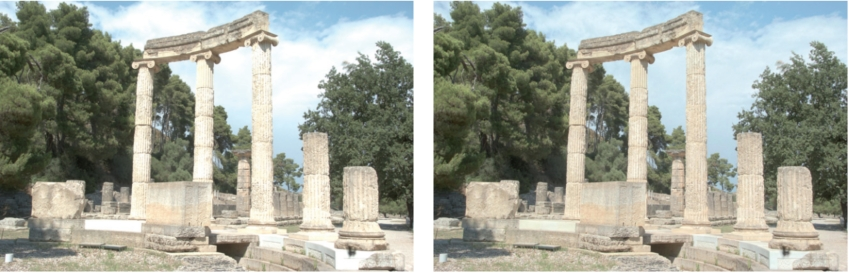
Figure 21.27. Sigmoidal compression (left) and sigmoidal compression using bilateral filtering to compute the semi-saturation constant (right). Note the improved contrast in the sky in the right image. 
图 21.27。 S 形压缩（左）和使用双边滤波计算半饱和常数的 S 形压缩（右)。 请注意右图中天空对比度的改善。

## 21.10 Other Approaches 其他方法

Although the previous sections together discuss most tone reproduction operators to date, there are one or two operators that do not directly fit into the above categories. The simplest of these are variations of logarithmic compression, and the other is a histogram-based approach. 
尽管前面的部分一起讨论了迄今为止大多数色调再现操作符，但仍有一两个操作符不直接属于上述类别。 其中最简单的是对数压缩的变体，另一种是基于直方图的方法。

Dynamic range reduction may be accomplished by taking the logarithm, provided that this number is greater than 1. Any positive number may then be nonlinearly scaled between 0 and 1 using the following equation:
动态范围减小可以通过取对数来实现，前提是该数字大于 1。然后可以使用以下等式在 0 和 1 之间非线性缩放任何正数：
$$
L_d(x, y) = \frac{\log_b(1 + L_v(x, y))}{\log_b(1 + L_{max}) }
$$
While the base b of the logarithm above is not specified, any choice of base will do. This freedom to choose the base of the logarithm may be used to vary the base with input luminance, and thus achieve an operator that is better matched to the image being compressed (Drago, Myszkowski, Annen, & Chiba, 2003). This method uses Perlin and Hoffert’s bias function which takes user parameter p (Perlin & Hoffert, 1989):
虽然上面对数的底 b 没有指定，但可以选择任何底数。 这种选择对数底数的自由可用于改变输入亮度的底数，从而实现与压缩图像更好匹配的算子（Drago、Myszkowski、Annen 和 Chiba，2003）。 该方法使用 Perlin 和 Hoffert 的偏差函数，该函数采用用户参数 p (Perlin & Hoffert, 1989)：
$$
bias_p(x) = x^{\log_{10}(p)/ log_{10}(1/2)}.
$$
Making the base b dependent on luminance and smoothly interpolating bases between 2 and 10, the logarithmic mapping above may be refined:
使基数 b 依赖于亮度并在 2 和 10 之间平滑地插值基数，可以细化上面的对数映射：
$$
L_d(x, y) = \frac{\log_{10}(1+L_v(x,y))}{\log_{10}(1+L_{max})} 
\cdot \frac{1}{\log_{10}(2 + 8((\frac{L_v(x,y)}{L_{max}})^{\log_{10}(p)/\log_{10}(1/2)}))} \\
$$
For user parameter p, an initial value of around 0.85 tends to yield plausible results (Figure 21.28 (right)). 
对于用户参数 p，初始值约为 0.85 往往会产生合理的结果（图 21.28（右））。

Figure 21.28. Logarithmic compression using base 10 logarithms (left) and logarithmic compression with varying base (right). 
图 21.28。 使用以 10 为底的对数的对数压缩（左）和不同底数的对数压缩（右)。

Alternatively, tone reproduction may be based on histogram equalization. Traditional histogram equalization aims to give each luminance value equal probability of occurrence in the output image. Greg Ward refines this method in a manner that preserves contrast (Ward Larson, Rushmeier, & Piatko, 1997). 
或者，音调再现可以基于直方图均衡。 传统的直方图均衡旨在使输出图像中每个亮度值出现的概率相等。 Greg Ward 以保留对比度的方式改进了该方法（Ward Larson、Rushmeier 和 Piatko，1997）。

First, a histogram is computed from the luminances in the high dynamic range image. From this histogram, a cumulative histogram is computed such that each bin contains the number of pixels that have a luminance value less than or equal to the luminance value that the bin represents. The cumulative histogram is a monotonically increasing function. Plotting the values in each bin against the luminance values represented by each bin therefore yields a function which may be viewed as a luminance mapping function. Scaling this function, such that the vertical axis spans the range of the display device, yields a tone reproduction operator. This technique is called histogram equalization. 
首先，根据高动态范围图像中的亮度计算直方图。 根据该直方图，计算累积直方图，使得每个区间包含亮度值小于或等于该区间表示的亮度值的像素的数量。 累积直方图是单调递增函数。 因此，将每个仓中的值相对于每个仓所表示的亮度值进行绘制，产生可以被视为亮度映射函数的函数。 缩放该函数，使得垂直轴跨越显示设备的范围，产生色调再现算子。 这种技术称为直方图均衡。

Ward further refined this method by ensuring that the gradient of this function never exceeds 1. This means, that if the difference between neighboring values in the cumulative histogram is too large, this difference is clamped to 1. This avoids the problem that small changes in luminance in the input may yield large differences in the output image. In other words, by limiting the gradient of the cumulative histogram to 1, contrast is never exaggerated. The resulting algorithm is called histogram adjustment (see Figure 21.29).
Ward 进一步完善了该方法，确保该函数的梯度永远不会超过 1。这意味着，如果累积直方图中相邻值之间的差异太大，则该差异将被限制为 1。这避免了 输入的亮度可能会在输出图像中产生很大的差异。 换句话说，通过将累积直方图的梯度限制为 1，对比度永远不会被夸大。 由此产生的算法称为直方图调整（见图 21.29）。

Figure 21.29. A linearly scaled image (left) and a histogram adjusted image (right). Image created with the kind permission of the Albin Polasek museum, Winter Park, Florida. 
图 21.29。 线性缩放图像（左）和直方图调整图像（右)。 图片经佛罗里达州温特帕克阿尔宾·波拉塞克博物馆许可制作。

## 21.11 Night Tonemapping  夜间色调映射

The tone reproduction operators discussed so far nearly all assume that the image represents a scene under photopic viewing conditions, i.e., as seen at normal light levels. For scotopic scenes, i.e., very dark scenes, the human visual system exhibits distinctly different behavior. In particular, perceived contrast is lower, visual acuity (i.e., the smallest detail that we can distinguish) is lower, and everything has a slightly blue appearance. 
到目前为止讨论的色调再现算子几乎都假设图像代表明视觉条件下的场景，即在正常光照水平下看到的场景。 对于暗场景，即非常暗的场景，人类视觉系统表现出明显不同的行为。 特别是，感知对比度较低，视觉敏锐度（即我们可以区分的最小细节）较低，并且所有东西都具有略带蓝色的外观。

To allow such images to be viewed correctly on monitors placed in photopic lighting conditions, we may preprocess the image such that it appears as if we were adapted to a very dark viewing environment. Such preprocessing frequently takes the form of a reduction in brightness and contrast, desaturation of the image, blue shift, and a reduction in visual acuity (Thompson, Shirley, & Ferwerda, 2002). 
为了使此类图像能够在明视照明条件下的监视器上正确观看，我们可以对图像进行预处理，使其看起来好像我们适应了非常黑暗的观看环境。 这种预处理通常采取降低亮度和对比度、图像去饱和、蓝移和降低视敏度的形式（Thompson、Shirley 和 Ferwerda，2002）。

A typical approach starts by converting the image from RGB to XYZ. Then, scotopic luminance V may be computed for each pixel:
典型的方法首先将图像从 RGB 转换为 XYZ。 然后，可以计算每个像素的暗视亮度 V：
$$
V = Y [1.33 (1 + \frac{Y+Z}{X}) - 1.68]
$$
This single channel image may then be scaled and multiplied by an empirically chosen bluish gray. An example is shown in Figure 21.30. If some pixels are in the photopic range, then the night image may be created by linearly blending the bluish-gray image with the input image. The fraction to use for each pixel depends on V . 
然后可以对该单通道图像进行缩放并乘以凭经验选择的蓝灰色。 图 21.30 显示了一个示例。 如果某些像素在明视范围内，则可以通过将蓝灰色图像与输入图像线性混合来创建夜间图像。 每个像素使用的分数取决于 V 。

Figure 21.30. Simulated night scene using the image shown in Figure 21.12. 
图 21.30。 使用图21.12所示图像模拟夜景。

Loss of visual acuity may be modeled by low-pass filtering the night image, although this would give an incorrect sense of blurriness. A better approach is to apply a bilateral filter to retain sharp edges while blurring smaller details (Tomasi & Manduchi, 1998). 
视力损失可以通过对夜间图像进行低通滤波来建模，尽管这会给出不正确的模糊感。 更好的方法是应用双边滤波器来保留锐利边缘，同时模糊较小的细节（Tomasi & Manduchi，1998）。

Finally, the color transfer technique outlined in Section 21.3 may also be used to transform a day-lit image into a night scene. The effectiveness of this approach depends on the availability of a suitable night image from which to transfer colors. As an example, the image in Figure 21.12 is transformed into a night image in Figure 21.31.
最后，第 21.3 节中概述的颜色传输技术也可用于将白天图像转换为夜间场景。 这种方法的有效性取决于是否有合适的夜间图像来传输颜色。 例如，图 21.12 中的图像转换为图 21.31 中的夜间图像。

Figure 21.31. The image on the left is used to transform the image of Figure 21.12 into a night scene, shown here on the right. 
图 21.31。 左侧的图像用于将图 21.12 的图像转换为夜景，如右侧所示。

## 21.12 Discussion  讨论

Since global illumination algorithms naturally produce high dynamic range images, direct display of the resulting images is not possible. Rather than resort to linear scaling or clamping, a tone reproduction operator should be used. Any tone reproduction operator is better than using no tone reproduction. Dependent on the requirements of the application, one of several operators may be suitable. 
由于全局照明算法自然会产生高动态范围图像，因此无法直接显示所得图像。 应使用音调再现运算符，而不是诉诸线性缩放或钳位。 任何音调再现操作符都比不使用音调再现要好。 根据应用程序的要求，几个运算符之一可能是合适的。

For instance, real-time rendering applications should probably resort to a simple sigmoidal compression, since these are fast enough to also run in real time. In addition, their visual quality is often good enough. The histogram adjustment technique (Ward Larson et al., 1997) may also be fast enough for real-time operation. 
例如，实时渲染应用程序可能应该采用简单的 sigmoidal 压缩，因为它们足够快，可以实时运行。 此外，它们的视觉质量通常也足够好。 直方图调整技术（Ward Larson 等人，1997）对于实时操作来说也可能足够快。

For scenes containing a very high dynamic range, better compression may be achieved with a local operator. However, the computational cost is frequently substantially higher, leaving these operators suitable only for noninteractive applications. Among the fastest of the local operators is the bilateral filter due to the optimizations afforded by this technique (Durand & Dorsey, 2002). 
对于包含非常高动态范围的场景，可以使用本地算子实现更好的压缩。 然而，计算成本通常要高得多，使得这些运算符仅适用于非交互式应用程序。 双边滤波器是最快的本地运算符之一，因为该技术提供了优化（Durand & Dorsey，2002）。

This filter is interesting as a tone reproduction operator by itself, or it may be used to compute a local adaptation level for use in a sigmoidal compression function. In either case, the filter respects sharp contrast changes and smoothes over smaller contrasts. This is an important feature that helps minimize halo artifacts, which are a common problem with local operators. 
该滤波器本身作为音调再现算子很有趣，或者它可用于计算在 S 形压缩函数中使用的局部自适应级别。 在任何一种情况下，滤镜都会考虑急剧的对比度变化并平滑较小的对比度。 这是一项重要功能，有助于最大限度地减少光晕伪影，而光晕伪影是本地操作员的常见问题。

An alternative approach to minimize halo artifacts is the scale selection mechanism used in the photographic tone reproduction operator (Reinhard et al., 2002), although this technique is slower to compute. 
最小化光晕伪影的另一种方法是摄影色调再现算子中使用的比例选择机制（Reinhard 等人，2002），尽管这种技术计算速度较慢。

In summary, while a large number of tone reproduction operators is currently available, only a small number of fundamentally different approaches exist. Fourier-domain and gradient-domain operators are both rooted in knowledge of image formation. Spatial-domain operators are either spatially variant (local) or global in nature. These operators are usually based on insights gained from studying the human visual system (and the visual system of many other species).
总之，虽然目前有大量的音调再现算子可用，但仅存在少量根本不同的方法。 傅立叶域和梯度域算子都植根于图像形成的知识。 空间域算子本质上要么是空间变异的（局部的），要么是全局的。 这些运算符通常基于通过研究人类视觉系统（以及许多其他物种的视觉系统）获得的见解。

# 22  Implicit Modeling 隐式建模

Implicit modeling (also known as implicit surfaces) in computer graphics covers many different methods for defining models. These include skeletal implicit modeling, offset surfaces, level sets, variational surfaces, and algebraic surfaces. In this chapter, we briefly touch on these methods and describe how to build skeletal implicit models in more detail. Curves can be defined by implicit equations of the form
计算机图形学中的隐式建模（也称为隐式曲面）涵盖了许多不同的模型定义方法。 其中包括骨架隐式建模、偏移曲面、水平集、变分曲面和代数曲面。 在本章中，我们将简要介绍这些方法，并更详细地描述如何构建骨架隐式模型。 曲线可以通过以下形式的隐式方程定义
$f(x, y) = 0.  $

If we consider a closed curve, such as a circle, with radius r, then the implicit equation can be written as
如果我们考虑一条闭合曲线，例如半径为 r 的圆，则隐式方程可以写为
$$
f(x, y) = x^2 + y^2 − r^2 = 0. \ \ \ \ (22.1)
$$
The value of f(x, y) can be positive (outside the circle), negative (inside the circle), or zero for points precisely on the circle. The equivalent in three dimensions is a closed surface around a set of points that occupy a given volume or region of space. The volume forms a scalar field, i.e., we can compute a value for every point and as can be seen for the circle, the negative values are bounded by the implicit curve or surface. The surface can be visualized as a contour in the field, connecting points with a particular value such as zero (see Equation (22.1)). To compute such a surface implies searching through space to find the points that satisfy the implicit equation; this method is unlikely to lead to an efficient algorithm for circle drawing (and even less likely in three dimensions). This was perhaps the reason that algorithmic methods for modeling with parametric curves and surfaces were investigated before implicit methods; however, there are some good reasons to develop algorithms to visualize implicit surfaces. In this chapter we explore the implications of deriving the data from a modeling process rather than from a scanner. 
对于精确位于圆上的点，f(x, y) 的值可以是正值（圆外）、负值（圆内）或零。 三维中的等价物是围绕占据给定体积或空间区域的一组点的闭合表面。 体积形成一个标量场，即我们可以计算每个点的值，并且如圆所示，负值受到隐式曲线或曲面的限制。 表面可以可视化为场中的轮廓，连接具有特定值（例如零）的点（参见方程（22.1））。 计算这样的表面意味着搜索空间以找到满足隐式方程的点； 这种方法不太可能产生有效的圆形绘制算法（在三维空间中更不可能）。 这也许是在隐式方法之前研究参数曲线和曲面建模的算法方法的原因； 然而，开发可视化隐式曲面的算法有一些充分的理由。 在本章中，我们探讨从建模过程而不是从扫描仪获取数据的含义。

Despite the computational overhead of finding the implicit surface, designing with implicit modeling techniques offers some advantages over other modeling methods. Many geometric operations are simplified using implicit methods including: 
尽管查找隐式曲面的计算开销很大，但使用隐式建模技术进行设计比其他建模方法具有一些优势。 使用隐式方法可以简化许多几何运算，包括：

- the definition of blends; 
  混合物的定义；
- the standard set operations (union, intersection, difference, etc.) of constructive solid geometry (CSG); 
  构造立体几何（CSG）的标准集合运算（并、交、差等）；
- functional composition with other implicit functions (e.g., R-functions, Barthe blends, Ricci blends, and warping); 
  与其他隐式函数的函数组合（例如，R 函数、Barthe 混合、Ricci 混合和扭曲）；
- inside/outside tests, (e.g., for collision detection). 
  内部/外部测试（例如，碰撞检测）。

Visualizing the surfaces can be done either by direct ray tracing using an algorithm as described in (Kalra & Barr, 1989; Mitchell, 1990; Hart & Baker, 1996; deGroot & Wyvill, 2005) or by first converting to polygons (Wyvill, McPheeters, & Wyvill, 1986).
可视化表面可以通过使用算法（Kalra & Barr, 1989; Mitchell, 1990; Hart & Baker, 1996; deGroot & Wyvill, 2005）中描述的直接光线追踪来完成，也可以通过首先转换为多边形（Wyvill, McPheeters）来完成 ，＆威维尔，1986）。

One of the first methods was proposed by Ricci as far back as 1973 (Ricci, 1973), who also introduced CSG in the same paper. Jim Blinn’s algorithm for finding contours in electron density fields, known as Blobby molecules (J. Blinn, 1982), Nishimura’s Metaballs (Nishimura et al., 1985) and Wyvills’ Soft Objects (Wyvill et al., 1986) were all early examples of implicit modeling methods. Jim Blinn’s Blobby Man (see Figure 22.1) was the first rendering of a nonalgebraic implicit model. 
第一个方法是 Ricci 早在 1973 年就提出的（Ricci，1973），他还在同一篇论文中介绍了 CSG。 Jim Blinn 在电子密度场中寻找轮廓的算法，称为 Blobby 分子（J. Blinn，1982）、Nishimura 的 Metaballs（Nishimura 等人，1985）和 Wyvill 的 Soft Objects（Wyvill 等人，1986）都是早期的例子 隐式建模方法。 Jim Blinn 的 Blobby Man（见图 22.1）是第一个非代数隐式模型的渲染。

Figure 22.1. Blinn’s Blobby Man 1980. Image courtesy Jim Blinn.
图 22.1。 Blinn 的 Blobby Man 1980。图片由 Jim Blinn 提供。

## 22.1 Implicit Functions, Skeletal Primitives, and Summation Blending 隐式函数、骨架基元和求和混合

In the context of modeling an implicit function is defined as a function f applied to a point $p ∈ \mathbb{E}^3$ yielding a scalar $value ∈ \R$. 
在建模的上下文中，隐函数被定义为应用于点 $p ∈ \mathbb{E}^3$ 的函数 f，产生标量 $value ∈ \R$。

The implicit function $f_i(x, y, z)$ may be split into a distance function $d_i(x, y, z)$ and a fall-off filter function(These functions have been given many names by researchers in the past, e.g., filter, potential, radial-basis, kernel, but we use fall-off filter as a simple term to describe their appearance.  ) $g_i(r)$, where r stands for the distance from the skeleton and the subscript refers to the ith skeletal element.
隐式函数 $f_i(x, y, z)$ 可以分为距离函数 $d_i(x, y, z)$ 和衰减滤波器函数（过去研究人员给这些函数起了很多名字） ，例如滤波器、势能、径向基、内核，但我们使用衰减滤波器作为简单术语来描述它们的外观。）$g_i(r)$，其中r代表距骨架的距离，下标指 到第 i 个骨架元素。

We will use the following notation:
我们将使用以下符号：
$$
f_i(x, y, z) = g_i ◦ d_i(x, y, z)\ \ \ \ \  \ (22.2)
$$
A simple example is a point primitive, and we take the analogy of a star radiating heat into space. The field value (temperature in this example) may be measured at any point $p$ and can be found by taking the distance from $p$ to the center of the star and supplying the value to a fall-off filter function similar to one of those given in Figure 22.2. In these sample functions, the field is given a value of 1 at the center of the star; the value falls off with distance. The surface of a model may be derived from the implicit function $f(x, y, z)$ as the points of space whose values are equal to some desired iso-value (iso); in the star example, a spherical shell for values of iso $∈ (0, 1)$. 
一个简单的例子是点基元，我们将其类比为一颗向太空辐射热量的恒星。 场值（本例中的温度）可以在任意点 $p$ 处测量，并且可以通过获取从 $p$ 到恒星中心的距离并将该值提供给类似于一个的衰减滤波器函数来找到 图 22.2 中给出的那些。 在这些示例函数中，恒星中心的场值为 1； 该值随着距离的增加而下降。 模型的表面可以从隐式函数 $f(x, y, z)$ 导出，作为其值等于某个所需 iso 值 (iso) 的空间点； 在星形示例中，值为 iso $ε (0, 1)$ 的球壳。
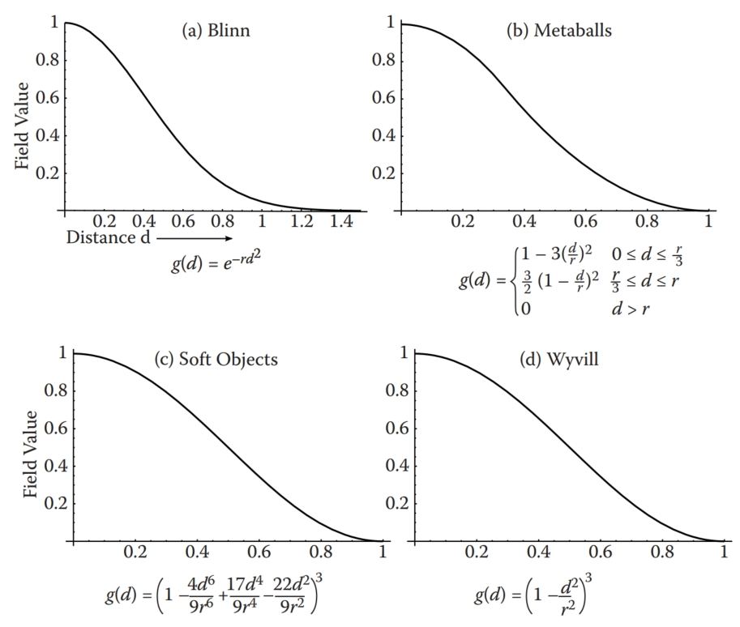
Figure 22.2. Fall-off filter functions $(0 ≤ r ≤ 1)$. (a) Blinn’s Gaussian or “Blobby” function; (b) Nishimura’s “Metaball” function; (c) Wyvill et al.’s “soft objects” function; (d) the Wyvill function.
图 22.2。 衰减滤波器函数$(0 ≤ r ≤ 1)$。 (a) Blinn 高斯函数或“Blobby”函数； (b) 西村的“元球”功能； (c) Wyvill 等人的“软物体”功能； (d) 威维尔函数。

In general, filter functions ($g_i$) are chosen so that the field values are maximized on the skeleton and fall off to zero at some chosen distance from the skeleton. In the simple case where the resulting surfaces are blended together,
the global field $f(x, y, z)$ of an object, the implicit function, may be defined as
一般来说，选择过滤函数 ($g_i$) 以便场值在骨架上最大化，并在距骨架的某个选定距离处降至零。 在将所得表面混合在一起的简单情况下， 对象的全局字段 $f(x, y, z)$（隐式函数）可以定义为
$$
f(x, y, z) = \sum^{i=n}_{i=1}f_i(x, y, z) \ \  \ \ \ \ \ (22.3)
$$
where n skeletal elements contribute to the resulting field value. An example is shown in Figure 22.3 in which the field at any point $(x, y, z)$ is calculated as in Equation (22.3). 
其中 n 个骨架元素对结果字段值有贡献。 图 22.3 中显示了一个示例，其中任意点 $(x, y, z)$ 处的场的计算方式如公式 (22.3) 所示。

Figure 22.3. Each column shows two point primitives approaching each other. From left to right: the fall-off filter functions used are Blobby, Metaball, soft objects, and Wyvill. Image courtesy Erwin DeGroot.
图 22.3。 每列显示两个相互接近的点基元。 从左到右：使用的衰减过滤器函数是 Blobby、Metaball、软对象和 Wyvill。 图片由埃尔文·德格鲁特提供。

In this case, two point primitives are placed in close proximity. As the two points are brought together, the surfaces bulge and then blend together. The term filter function is used because the function causes the primitives to be blurred together somewhat akin to a filter function for images. The summation blend is the most compact and efficient blending operation that can be applied to implicit surfaces (see Equation (22.3)). 
在这种情况下，两个基元被放置得非常接近。 当两点靠在一起时，表面会凸出，然后融合在一起。 使用术语“过滤函数”是因为该函数会导致图元模糊在一起，有点类似于图像的过滤函数。 求和混合是可应用于隐式曲面的最紧凑、最高效的混合操作（参见方程（22.3））。

One advantage of using filter functions with finite support is that primitives that are far from p will have zero contribution and thus need not be considered (Wyvill et al., 1986).
使用具有有限支持的滤波器函数的优点之一是远离 p 的基元的贡献为零，因此不需要考虑（Wyvill 等人，1986）。

### 22.1.1 $C^1$ Continuity and the Gradient  $C^1$ 连续性和梯度

The most basic form of continuity is $C^0$ continuity, which ensures that there are no “jumps” in a function. Higher-order continuity is defined in terms of derivatives of functions (see Chapter 15). 
最基本的连续性形式是 $C^0$ 连续性，它确保函数中没有“跳跃”。 高阶连续性是根据函数的导数定义的（参见第 15 章）。

In the case of a 3D scalar field f, the first derivative is a vector function known as the gradient, written $∇f$ and defined as
在 3D 标量场 f 的情况下，一阶导数是称为梯度的向量函数，写为 $∇f$ 并定义为
$$
∇f(p) = \{\frac{∂f(\bold{p})}{∂x}, \frac{∂f(\bold{p})}{∂y}, \frac{∂f(\bold{p})}{∂z}\}
$$
If $∇f$ is defined at all points, and the three one-dimensional partial derivatives are each $C^0$, then $f$ is $C^1$. Informally, $C^1$ surface continuity means that the surface normal varies smoothly over the surface. The surface normal is the unit vector perpendicular to the surface. If no unique surface normal can be defined on the edge of a cube, for example, then the surface is not $C^1$. For points on an implicit surface, the surface normal can be computed by normalizing the gradient vector $∇f$. In the example of the circle, points inside have a negative value and those on the outside have a positive one. For many types of implicit surfaces, the sense of inside and outside is inverted, and since the normal vector must always point outward, it can be opposite to the gradient direction.
如果$∇f$在所有点上都有定义，并且三个一维偏导数均为$C^0$，则$f$为$C^1$。 通俗地说，$C^1$ 表面连续性意味着表面法线在表面上平滑变化。 表面法线是垂直于表面的单位向量。 例如，如果无法在立方体的边缘上定义唯一的表面法线，则该表面不是 $C^1$。 对于隐式曲面上的点，可以通过归一化梯度向量 $∇f$ 来计算曲面法线。 在圆的示例中，内部的点具有负值，外部的点具有正值。 对于许多类型的隐式曲面，内部和外部的含义是相反的，并且由于法向量必须始终指向外部，因此它可以与梯度方向相反。

Skeletal implicit primitives are created by applying a fall-off filter function to an unsigned distance field as in Equation (22.2). Although the distance field is never $C^1$ at the skeleton, these discontinuities can be removed by using a suitable fall-off function (Akleman & Chen, 1999). If an operator, $g$, combines implicit functions, $f_1$ and $f_2$, where all points are $C^1$, then $g(f_1, f_2)$ is not necessarily $C^1$. For example, it is possible to make a sharp CSG junction using the min and max operators. The combination is not $C^1$ continuous because the min and max operators don’t have that property (see Section 22.5). 
骨架隐式基元是通过将衰减滤波器函数应用于无符号距离场来创建的，如方程（22.2）所示。 尽管骨架上的距离场永远不是 $C^1$，但可以通过使用合适的衰减函数来消除这些不连续性（Akleman & Chen，1999）。 如果运算符 $g$ 组合隐式函数 $f_1$ 和 $f_2$，其中所有点都是 $C^1$，则 $g(f_1, f_2)$ 不一定是 $C^1$。 例如，可以使用最小和最大运算符来创建尖锐的 CSG 连接。 该组合不是 $C^1$ 连续的，因为 min 和 max 运算符没有该属性（参见第 22.5 节）。

The analysis of operators is complicated by the fact that it is sometimes desirable to create a $C^1$ discontinuity. This case occurs whenever a crease in the surface is desired. For example, a cube is not $C^1$ because tangent discontinuities occur at each edge. To create creases using $C^1$ primitives, the operator must introduce $C^1$ discontinuities, and hence cannot be $C^1$ itself.
由于有时需要创建 $C^1$ 不连续性，因此运算符的分析变得复杂。 每当需要在表面上出现折痕时就会出现这种情况。 例如，立方体不是 $C^1$，因为每条边都会出现切线不连续性。 要使用 $C^1$ 基元创建折痕，操作符必须引入 $C^1$ 不连续性，因此不能是 $C^1$ 本身。

### 22.1.2 Distance Fields, R-Functions, and F-Reps  距离场、R 函数和 F 重复

The distance field is defined with respect to some geometric object T:
距离场是相对于某个几何对象 T 定义的：
$\bold{F}(T, \bold{p}) = min_{\bold{q}∈T}|\bold{q} - \bold{p}|  $

Visually, $\bold{F}(T, \bold{p})$ is the shortest distance from $\bold{p}$ to T. Hence, when $\bold{p}$ lies on T,  $\bold{F}(T, \bold{p}) = 0$ and the surface created by the implicit function is the object T. Outside of T, a nonzero distance is returned. The function T can be any geometric entity embedded in 3D—a point, curve, surface, or solid. Procedural modeling with distance fields started with Ricci (Ricci, 1973); R-functions (Rvachev, 1963) were first applied to shape modeling more than 20 years later (see (Shapiro, 1994) and (A. Pasko, Adzhiev, Sourin, & Savchenko, 1995)).
从视觉上看，$\bold{F}(T, \bold{p})$ 是从 $\bold{p}$ 到 T 的最短距离。因此，当 $\bold{p}$ 位于 T 上时，$\bold {F}(T, \bold{p}) = 0$，隐式函数创建的表面是对象 T。在 T 之外，返回非零距离。 函数 T 可以是嵌入 3D 中的任何几何实体——点、曲线、曲面或实体。 距离场的程序建模始于 Ricci（Ricci，1973）； 20 多年后，R 函数（Rvachev，1963）首次应用于形状建模（参见（Shapiro，1994）和（A. Pasko，Adzhiev，Sourin 和 Savchenko，1995））。

An R-function or Rvachev function is a function whose sign can change if and only if the sign of one of its arguments changes; that is, its sign is determined solely by its arguments. R-functions provide a robust theoretical framework for boolean composition of real functions, permitting the construction of Cn CSG operators (Shapiro, 1988). These CSG operators can be used to create blending operators simply by adding a fixed offset to the result (A. Pasko et al., 1995). Although these blending functions are no longer technically R-functions, they have most of the desirable properties and can be mixed freely with R-functions to create complex hierarchical models (Shapiro, 1988). These R-function-based blending and CSG operators are referred to as R-operators (see Section 22.4). The Hyperfun system (Adzhiev et al., 1999) is based on F-reps (function representation), another name for an implicit surface. The system uses a procedural C-like language to describe many types of implicit surfaces. 
R 函数或 Rvachev 函数是一种函数，当且仅当其参数之一的符号发生变化时，其符号才会发生变化； 也就是说，它的符号仅由它的参数决定。 R 函数为实函数的布尔组合提供了强大的理论框架，允许构造 Cn CSG 算子（Shapiro，1988）。 这些 CSG 运算符可用于创建混合运算符，只需向结果添加固定偏移量即可（A. Pasko 等人，1995）。 尽管这些混合函数在技术上不再是 R 函数，但它们具有大多数所需的属性，并且可以与 R 函数自由混合以创建复杂的分层模型（Shapiro，1988）。 这些基于 R 函数的混合和 CSG 算子被称为 R 算子（参见第 22.4 节）。 Hyperfun 系统（Adzhiev 等人，1999）基于 F-reps（函数表示），即隐式曲面的另一个名称。 该系统使用类似 C 的过程语言来描述多种类型的隐式表面。

### 22.1.3 Level Sets  关卡集

It is useful to represent an implicit field discretely via a regular grid (Barthe, Mora, Dodgson, & Sabin, 2002) or an adaptive grid (Frisken, Perry, Rockwood, & Jones, 2000). This is exactly what the polygonization algorithm does in the case of level sets; moreover, the grid can be used for various other purposes besides building polygons. Discrete representations of f are commonly obtained by sampling a continuous function at regular intervals. For example, the sampled function may be defined by other volume model representations (V. V. Savchenko, Pasko, Sourin, & Kunii, 1998). The data may also be a physical object sampled using three-dimensional imaging techniques. Discrete volume data has most often been used in conjunction with the level sets method (Osher & Sethian, 1988), which defines a means for dynamically modifying the data structure using curvaturedependent speed functions. Interactive modeling environments based on level sets have been defined (Museth, Breen, Whitaker, & Barr, 2002), although level sets are only one method employing a discrete representation of the implicit field. Methods for interactively defining discrete representations using standard implicit surfaces techniques have also been explored (Baerentzen & Christensen, 2002). 
通过规则网格（Barthe、Mora、Dodgson 和 Sabin，2002）或自适应网格（Frisken、Perry、Rockwood 和 Jones，2000）离散地表示隐式场非常有用。 这正是多边形算法在水平集情况下所做的事情； 此外，除了构建多边形之外，网格还可以用于各种其他目的。 f 的离散表示通常通过定期采样连续函数来获得。 例如，采样函数可以由其他体积模型表示来定义（V.V.Savchenko、Pasko、Sourin 和 Kunii，1998）。 数据还可以是使用三维成像技术采样的物理对象。 离散体数据最常与水平集方法结合使用（Osher & Sethian，1988），该方法定义了一种使用曲率相关速度函数动态修改数据结构的方法。 基于水平集的交互式建模环境已经被定义（Museth、Breen、Whitaker 和 Barr，2002），尽管水平集只是采用隐式场的离散表示的一种方法。 还探索了使用标准隐式曲面技术交互式定义离散表示的方法（Baerentzen & Christensen，2002）。

A key advantage to employing a discrete data structure is its ability to act as a unifying approach for all of the various volume models defined by potential fields (discrete or not) (V. V. Savchenko et al., 1998). The conversion of any continuous function to a discrete representation introduces the problem of how to reconstruct a continuous function, needed for the combined purposes of additional modeling operations and visualization of the resulting potential field. A well-known solution to this problem is to apply a filter g using the convolution operator (see Chapter 9). The choice of a filter is guided by the desired properties of the reconstruction, and many filters have been explored (Marschner & Lobb, 1994). The salient point is that there is typically a tradeoff between the efficiency of the chosen filter and the smoothness of the resulting reconstruction; see also Section 22.9.
采用离散数据结构的一个关键优势是它能够作为由势场（离散或非离散）定义的所有各种体积模型的统一方法（V. V. Savchenko 等人，1998）。 将任何连续函数转换为离散表示会引入如何重建连续函数的问题，这是附加建模操作和所得势场可视化的综合目的所需要的。 这个问题的一个众所周知的解决方案是使用卷积算子应用过滤器 g（参见第 9 章）。 滤波器的选择以重建所需的属性为指导，并且已经探索了许多滤波器（Marschner & Lobb，1994）。 突出的一点是，所选滤波器的效率和所得重建的平滑度之间通常需要权衡； 另见第 22.9 节。

To be interactive, a discrete system must restrict the size of the grid relative to the available computing power. This, in turn, limits the ability of the modeler to include high-frequency details. Additionally, the smoothing triquadratic filter makes it impossible to include sharp edges, should they be desired. A partial solution to this problem is the use of adaptive grids, although with any discrete representation there will be limitations. A discrete grid is used in (Schmidt, Wyvill, & Galin, 2005) to act as a cache representing a BlobTree node. The grid in this work is used for fast prototyping and uses trilinear interpolation for position and the slower, more accurate triquadratic interpolation to calculate gradient values, because the eye is more discerning in observing gradient errors than position errors.
为了实现交互，离散系统必须限制网格相对于可用计算能力的大小。 这反过来又限制了建模者包含高频细节的能力。 此外，平滑三二次滤波器使得不可能包含尖锐的边缘（如果需要的话）。 该问题的部分解决方案是使用自适应网格，尽管任何离散表示都会存在限制。 (Schmidt, Wyvill, & Galin, 2005) 使用离散网格作为表示 BlobTree 节点的缓存。 这项工作中的网格用于快速原型设计，并使用三线性插值来计算位置，并使用更慢、更准确的三二次插值来计算梯度值，因为眼睛在观察梯度误差时比观察位置误差更容易辨别。

### 22.1.4 Variational Implicit Surfaces  变分隐式曲面

It is often required to convert sampled data to an implicit representation. Variational implicit surfaces interpolate or approximate a set of points using a weighted sum of globally supported basis functions (V. Savchenko, Pasko, Okunev, & Kunii, 1995; Turk & O’Brien, 1999; Carr et al., 2001; Turk & O’Brien, 2002). These radially symmetric basis functions are applied at each sample point. The continuity of such a surface depends on the choice of basis function. The $C^2$ thin-plate spline is most commonly used (Turk & O’Brien, 2002; Carr et al., 2001). Like Blinn’s exponential function (see Figure 22.2), this function is unbounded as is the resulting variational implicit surface. 
通常需要将采样数据转换为隐式表示。 变分隐式曲面使用全局支持的基函数的加权和来插值或近似一组点（V. Savchenko、Pasko、Okunev 和 Kunii，1995；Turk 和 O'Brien，1999；Carr 等人，2001；Turk 和 奥布莱恩，2002）。 这些径向对称基函数应用于每个采样点。 这种表面的连续性取决于基函数的选择。 $C^2$ 薄板样条是最常用的（Turk & O’Brien, 2002；Carr et al., 2001）。 与 Blinn 指数函数一样（参见图 22.2），该函数是无界的，所得到的变分隐式曲面也是无界的。

If the field is is globally $C^2$, creases cannot be defined;(Except see Section 15.2.) however, anisotropic basis functions can be used to produce fields which change more rapidly and may appear to have creases (Dinh, Slabaugh, & Turk, 2001). At the appropriate scale, the surface is still smooth. The smooth field implies that self-intersections do not occur, and hence volumes are always well-defined. The thin-plate spline guarantees that global curvature is minimized (Duchon, 1977). Variational interpolation has many properties which are desirable for 3D modeling; however, controlling the resulting surfaces can be difficult. 
如果该场全局为 $C^2$，则无法定义折痕；（参见第 15.2 节除外。）但是，各向异性基函数可用于产生变化更快并且可能看起来有折痕的场（Dinh、Slabaugh、 ＆土耳其人，2001）。 在适当的比例下，表面仍然是光滑的。 平滑场意味着不会发生自相交，因此体积总是明确定义的。 薄板样条保证全局曲率最小化（Duchon，1977）。 变分插值具有许多 3D 建模所需的属性； 然而，控制最终的表面可能很困难。

Variational implicit surfaces can also be based on compactly supported radial basis functions (CS-RBFs) to reduce the computational cost of variational interpolation techniques (Morse, Yoo, Rheingans, Chen, & Subramanian, 2001). Each CS-RBF only influences a local region, so computing $f(\bold{p})$ requires only evaluation of basis functions within some small neighborhood of $\bold{p}$. As with the globally supported counterpart, the resulting field is $C^k$, creases are not supported, and self-intersections cannot occur.(Note, $k > 0$ depending on the RBF (see Section 15.2).) The local support of each basis function results in a bounded global field. This also guarantees that additional iso-contours will be present, as noted by various researchers (Ohtake, Belyaev, & Pasko, 2003; Reuter, 2003). 
变分隐式曲面还可以基于紧凑支持的径向基函数 (CS-RBF)，以减少变分插值技术的计算成本（Morse、Yoo、Rheingans、Chen 和 Subramanian，2001）。 每个CS-RBF仅影响局部区域，因此计算$f(\bold{p})$只需要评估$\bold{p}$的一些小邻域内的基函数。 与全局支持的对应字段一样，结果字段为 $C^k$，不支持折痕，并且不会发生自相交。（注意，$k > 0$ 取决于 RBF（参见第 15.2 节）。） 每个基函数的支持都会产生一个有界的全局场。 正如多位研究人员指出的那样，这也保证了会出现额外的等值线（Ohtake、Belyaev 和 Pasko，2003 年；Reuter，2003 年）。

### 22.1.5 Convolution Surfaces  卷积曲面

Convolution surfaces, introduced by Bloomenthal and Shoemake (Bloomenthal & Shoemake, 1991) are produced by convolving a geometric skeleton $S$ with a kernel function $h$. Hence, the value at any position in space is defined by an integral over the skeleton:
卷积曲面由 Bloomenthal 和 Shoemake 提出（Bloomenthal & Shoemake，1991），是通过将几何骨架 $S$ 与核函数 $h$ 进行卷积来生成的。 因此，空间中任意位置的值由骨架上的积分定义：
$f(\bold{p}) = \int_S g(\bold{r})h(\bold{p}-\bold{r})d\bold{r} \\$

Any finitely supported function can be used as h; see (Sherstyuk, 1999) for a detailed analysis of different kernels.
任何有限支持函数都可以用作h； 有关不同内核的详细分析，请参阅（Sherstyuk，1999）。

Like skeletal primitives, convolution surfaces have bounded fields. Blinn’s “Blobby molecules” is the simplest form of a convolution surface (J. Blinn, 1982); in this case, the skeleton consists of points only. This idea was extended by Bloomenthal to include line, arc, triangle, and polygon skeletons (Bloomenthal & Shoemake, 1991). These represent 1D and 2D primitives; 3D primitives were later described by Bloomenthal (Bloomenthal, 1995).
与骨架基元一样，卷积表面也具有有界域。 Blinn 的“Blobby 分子”是卷积表面的最简单形式（J. Blinn，1982）； 在这种情况下，骨架仅由点组成。 Bloomenthal 将这一想法扩展为包括直线、弧线、三角形和多边形骨架（Bloomenthal & Shoemake，1991）。 它们代表 1D 和 2D 图元； 3D 图元后来由 Bloomenthal 描述（Bloomenthal，1995）。

Combination of convolution surfaces is defined by composition of the underlying geometric skeletons and has the advantage of eliminating the bulges that tend to occur when composing multiple skeletal primitives with additive blending. The surface resulting from convolution of the combined skeleton does not have bulges, as in Figure 22.4, and the field is continuous even if the combined skeleton is nonconvex. Convolution surfaces are offset a fixed distance from convex portions of a skeleton, but produce a fillet along concave portions of a skeleton.
卷积表面的组合是通过底层几何骨架的组合来定义的，并且具有消除在通过加法混合组合多个骨架基元时容易出现的凸起的优点。 组合骨架卷积产生的表面没有凸起，如图 22.4 所示，即使组合骨架是非凸的，场也是连续的。 卷积曲面从骨架的凸部偏移固定距离，但沿骨架的凹部生成圆角。
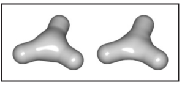
Figure 22.4. Two blended cylinders. Left: summation blend; right: convolution surface with barely discernible bulge (Bloomenthal, 1997). Image courtesy Erwin DeGroot.
图 22.4。 两个混合气缸。 左：求和混合； 右：带有几乎无法辨别的凸起的卷积表面（Bloomenthal，1997)。 图片由埃尔文·德格鲁特提供。

An example of skeletal elements convolved to build a complex model is shown in Figure 22.5. The hand model contains fourteen primitives.
图 22.5 显示了通过卷积构建复杂模型的骨架元素示例。 手部模型包含十四个基元。

Figure 22.5. Skeletal elements convolved to build a hand model. Image courtesy Jules Bloomenthal. 
图 22.5。 骨骼元素进行卷积以构建手部模型。 图片由朱尔斯·布卢门撒尔提供。

### 22.1.6 Defining Skeletal Primitives  定义骨架基元

As we will see in the following sections rendering the implicit models requires finding the field value and gradient for a large number of points. We need the distance to supply to Equation (22.2) and the gradient is useful for root finding as well as lighting calculations. Supplying the distance to the fall-off filter functions of Figure 22.2 is a matter of calculating the nearest distance to the skeletal primitive, simple for point primitives but a little trickier for more complex geometrical shapes. A line segment primitive (AB) can be defined as a cylinder around a line with hemispherical end caps (see Figure 22.6). Point P0 lies on the surface where $f(P_0) = iso$ and $f(P_1) = 0$ since it lies outside of the influence of the line primitive. The distance from some $P_i$ to the line is found by simply projecting onto the line $AB$ and calculating the perpendicular distance, e.g., $|CP_0|$; this can be found from AC, since A, $P_0$, and B, are all known:
正如我们将在以下部分中看到的，渲染隐式模型需要找到大量点的字段值和梯度。 我们需要为方程（22.2）提供距离，并且梯度对于求根和照明计算很有用。 向图 22.2 的衰减滤波器函数提供距离就是计算到骨架基元的最近距离，对于点基元来说很简单，但对于更复杂的几何形状来说有点棘手。 线段基元 (AB) 可以定义为带有半球形端盖的线周围的圆柱体（见图 22.6）。 点 P0 位于 $f(P_0) = iso$ 且 $f(P_1) = 0$ 的曲面上，因为它位于线基元的影响之外。 通过简单地投影到线 $AB$ 上并计算垂直距离即可找到从某个 $P_i$ 到线的距离，例如 $|CP_0|$； 这可以从 AC 中找到，因为 A、$P_0$ 和 B 都是已知的：
$$
\stackrel{\rightarrow}{AC} = \stackrel{\rightarrow}{AB}\frac{\stackrel{\rightarrow}{AP_0} \cdot \stackrel{\rightarrow}{AB}} {\|AB\|^2}
$$
In Figure 22.6, the field value of $P_2 > 0$, since $P_2$ is in the hemispherical endcap, which can be checked separately. Variations of this idea can define primitives with endcaps of different radii producing interesting cone shapes. An example is shown in Figure 22.7.
图22.6中$P_2的字段值> 0$，因为$P_2$在半球端盖内，可以单独检查。 这个想法的变体可以定义具有不同半径端盖的基元，产生有趣的圆锥形状。 图 22.7 显示了一个示例。

Figure 22.6. Line primitive ab and example points $p_0$, $p_1$, $p_2$ showing distance calculation.
图 22.6。 线基元 ab 和示例点 $p_0$、$p_1$、$p_2$ 显示距离计算。


Figure 22.7. Cylinder primitive blended with a sphere. Image courtesy Erwin DeGroot.
图 22.7。 与球体混合的圆柱体基元。 图片由埃尔文·德格鲁特提供。

A great variety of geometrical skeletons have been described, and, in principle, it is simply a matter of defining the distance to the skeleton from some point $\bold{p}$ and also the gradient at $\bold{p}$. For example, an offset surface of a triangle can be defined from the vertices of the triangle and a radius $r$. A simple way to implement this is to use line segment primitives to describe bounding cylinders connecting the vertices (radius $r$). The distance from a point $\bold{q}$ within the triangle that does not fall within the bounding fields of one of the line segment primitives is returned as the perpendicular distance to the plane of the triangle. Other examples include an implicit disk, defined by a circle and a thickness parameter, a torus also defined by a circle and the radius of the cross section (or inner and outer circle radii), a circular cone from a disk and a height, a cube with rounded corners, etc. (see Figure 22.8).
已经描述了各种各样的几何骨架，原则上，只需定义从某个点 $\bold{p}$ 到骨架的距离以及 $\bold{p}$ 处的梯度即可。 例如，可以根据三角形的顶点和半径 $r$ 来定义三角形的偏移表面。 实现此目的的一个简单方法是使用线段基元来描述连接顶点的边界圆柱体（半径 $r$）。 距三角形内未落在线段基元之一的边界场内的点 $\bold{q}$ 的距离将作为到三角形平面的垂直距离返回。 其他示例包括由圆和厚度参数定义的隐式圆盘、也由圆和横截面半径（或内圆和外圆半径）定义的圆环、由圆盘和高度定义的圆锥体、 圆角立方体等（见图22.8）。
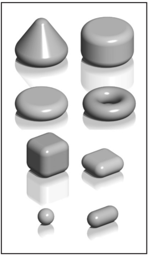
Figure 22.8. Implicit models from various skeletal primitives. Image courtesy Erwin DeGroot.
图 22.8。 来自各种骨骼基元的隐式模型。 图片由埃尔文·德格鲁特提供。

## 22.2 Rendering 渲染

Modeling methods, such as parametric surfaces, lend themselves to visualization, since it is easy to iterate over points on the surface that can be found directly from the defining equations; for example $(x, y) = (cos θ, sin θ), θ ∈ [0, 2π)$ produces  a circle. 
建模方法（例如参数化曲面）有助于可视化，因为很容易迭代曲面上的点，这些点可以直接从定义方程中找到； 例如 $(x, y) = (cos θ, sin θ), θ ∈ [0, 2π)$ 生成一个圆。

There are two techniques that are commonly used to render implicit surfaces: ray tracing and surface tiling. In practice, a designer wants to visualize an implicit surface model quickly, sacrificing quality for speed for interaction purposes. Prototyping algorithms have been concerned with producing a polygon mesh that can be rendered in real time on modern workstations. Finding the polygonal mesh which best approximates the desired surface is referred to as polygonization or surface tiling. For animation or for a final visualization, where quality is preferred over speed, ray tracing implicit surfaces directly without first polygonising produces excellent results. 
有两种常用于渲染隐式表面的技术：光线追踪和表面平铺。 在实践中，设计人员希望快速可视化隐式表面模型，为了交互目的而牺牲质量以换取速度。 原型算法一直致力于生成可以在现代工作站上实时渲染的多边形网格。 找到最接近所需表面的多边形网格称为多边形化或表面平铺。 对于动画或最终可视化，质量优先于速度，直接光线追踪隐式曲面无需先进行多边形化即可产生出色的结果。

As previously mentioned, finding an implicit surface requires searching through space to find the points that satisfy, $f(\bold{p}) = 0$. There are two main approaches to executing such a search: space partitioning—partitioning space into manageable units such as cubes, and non-space partitioning, e.g., marching triangles (Hartmann, 1998; Akkouche & Galin, 2001) and the shrinkwrap algorithm (van Overveld & Wyvill, 2004).
如前所述，找到隐式曲面需要搜索空间来找到满足 $f(\bold{p}) = 0$ 的点。 执行这种搜索有两种主要方法：空间划分——将空间划分为可管理的单元，例如立方体，以及非空间划分，例如行进三角形（Hartmann，1998；Akkouche & Galin，2001）和收缩包裹算法（van Overveld 和 Wyvill，2004）。

In this chapter, we describe the original space partitioning algorithm and leave it to the reader to explore the more advanced methods. This algorithm together with postprocessing for mesh refinement (see Chapter 12) and caching provide a method for interactive viewing of implicit models on modern workstations.
在本章中，我们描述了原始的空间划分算法，并留给读者探索更高级的方法。 该算法与网格细化的后处理（参见第 12 章）和缓存一起提供了一种在现代工作站上交互式查看隐式模型的方法。

Figure 22.9. A ray-traced dinosaur model showing the underlying skeletal primitives. Image courtesy Erwin DeGroot.
图 22.9。 光线追踪恐龙模型显示了底层的骨骼基元。 图片由埃尔文·德格鲁特提供。

## 22.3 Space Partitioning  空间划分

### 22.3.1 Exhaustive Search  穷举搜索

The basic cubic space partitioning algorithm for tiling implicit surfaces was first published in (Wyvill et al., 1986) and a similar algorithm oriented toward volume visualization, called marching cubes in (Lorensen & Cline, 1987). Since then there have been many refinements and extensions.
用于平铺隐式曲面的基本立方空间划分算法首次发布于（Wyvill 等人，1986），并且面向体积可视化的类似算法称为行进立方体（Lorensen & Cline，1987）。 从那时起，出现了许多改进和扩展。

A first approach to finding the implicit surface might be to subdivide space uniformly into a regular lattice of cubic cells and calculate a value for every vertex. Each cell is replaced with a set of polygons that best approximates the part of the surface contained within that cell. The problem with this method is that many of the cells will be completely outside or completely inside the volume; thus, many cells that contain no part of the surface are processed. For large grids of data this can be very time consuming and memory intensive. 
找到隐式表面的第一种方法可能是将空间均匀地细分为立方单元的规则晶格，并计算每个顶点的值。 每个单元都被替换为最接近该单元内包含的表面部分的一组多边形。 这种方法的问题在于，许多单元将完全位于体积之外或完全位于体积之内。 因此，许多不包含表面部分的细胞被处理。 对于大型数据网格，这可能非常耗时且占用大量内存。

To avoid storing the whole grid, a hash table is used to store only the cubes that contain a piece of the surface, based on the data structures used in (Wyvill et al., 1986). Working software was published in Graphics Gems IV (Bloomenthal, 1990). The algorithm is based on numerical continuation; it starts with a seed cube that intersects part of the surface and builds neighboring cubes as necessary to follow the surface. 
为了避免存储整个网格，根据（Wyvill 等人，1986）中使用的数据结构，使用哈希表仅存储包含一块表面的立方体。 工作软件发表在 Graphics Gems IV (Bloomenthal, 1990) 中。 该算法基于数值延拓； 它从与部分表面相交的种子立方体开始，并根据需要构建相邻的立方体以跟随表面。

The algorithm has two parts. In the first part, cubic cells are found that contain the surface and in the second part, each cube is replaced by triangles. The first part of the algorithm is driven by a queue of cubes, each of which contains part of the surface; the second part of the algorithm is table-driven. 
该算法有两个部分。 在第一部分中，发现包含表面的立方体单元，在第二部分中，每个立方体都被三角形替换。 该算法的第一部分由立方体队列驱动，每个立方体都包含部分表面； 该算法的第二部分是表驱动的。

### 22.3.2 Algorithm Description  算法说明 

A fast overview of the algorithm is as follows: 
该算法的快速概述如下：

- divide space into cubic voxels; 
  将空间划分为立方体素；
- search for surface, starting from a skeletal element; 
  从骨架元素开始搜索表面；
- add voxel to queue, mark it visited; 
  将体素添加到队列中，将其标记为已访问；
- search neighbors; 
  搜索邻居；
- when done, replace voxel with polygons. 
  完成后，用多边形替换体素。

First, space is subdivided into a cubic lattice, and the next task is to find a seed cube containing part of the surface. A cube vertex $v_i$ inside the surface will have a field value $v_i >= iso$ and a vertex outside the surface will have a field value $v_i < iso$; thus, an edge with one of each type of vertex will intersect the surface. We call this an intersecting edge. The field value at the nearest cube vertex to the first primitive can be evaluated by summing the contributions of the primitives as per Equation (22.3), although other operators can also be used as will be seen later. We will assume that $f(v_0) > iso$, which indicates that $v_0$ lies within the solid. The value of iso is chosen by the user; an example is iso = 0.5 when using the soft fall-off function, which has some symmetry properties that lead to nice blending (see Figure 22.3). The vertices along one axis are evaluated in turn until a value $v_i < iso$ is found. The cube containing the intersecting edge is the seed cube. 
首先，将空间细分为立方晶格，接下来的任务是找到包含部分表面的种子立方体。 表面内部的立方体顶点 $v_i$ 将具有字段值 $v_i >= iso$，表面外部的顶点将具有字段值 $v_i < iso$； 因此，具有每种类型顶点之一的边将与表面相交。 我们称之为相交边。 距离第一个基元最近的立方体顶点处的场值可以通过根据方程（22.3）求和基元的贡献来评估，尽管也可以使用其他运算符，如稍后将看到的。 我们假设 $f(v_0) > iso$，这表明 $v_0$ 位于实体内。 iso的值由用户选择； 一个例子是使用软衰减函数时 iso = 0.5，它具有一些对称属性，可以实现良好的混合（见图 22.3）。 依次评估沿一个轴的顶点，直到找到值 $v_i < iso$。 包含相交边的立方体是种子立方体。

The neighbors of the seed cube are examined, and those that contain at least one intersecting edge are added to the queue ready for processing. To process a cube, we examine each face. If any of the bounding edges have oppositely signed vertices, the surface will pass through that face and the face neighbor must be processed. When this process has been completed for all the faces, the second phase of the algorithm is applied to the cube. If the surface is closed, eventually a cube will be revisited and no more unmarked neighbors found, and the search algorithm will terminate. Processing a cube involves marking it as processed and processing its unmarked neighbors. Those that contain intersecting edges are processed until the entire surface has been covered (see Figure 22.10). 
检查种子立方体的邻居，并将包含至少一个相交边的邻居添加到队列中以备处理。 为了处理立方体，我们检查每个面。 如果任何边界边具有相反符号的顶点，则该曲面将穿过该面，并且必须处理该面的邻居。 当所有面都完成此过程后，算法的第二阶段将应用于立方体。 如果表面是封闭的，最终将重新访问立方体并且不再找到未标记的邻居，并且搜索算法将终止。 处理立方体涉及将其标记为已处理并处理其未标记的邻居。 包含相交边缘的那些将被处理，直到整个表面被覆盖（见图 22.10）。

Figure 22.10. A section through the cubic lattice. The + sign indicates a vertex inside the surface ($f (v_i ≥ iso$) and - is outside $f (v_i < iso)$.
图 22.10。 立方晶格的剖面。 + 号表示顶点位于曲面 ($f (v_i ≥ iso$) 内部，- 表示顶点位于 $f (v_i < iso)$ 外部。

Each cube is indexed by an identifying vertex which we define to be the lowerleft far corner (i.e., the vertex with the lowest (x, y, z)-coordinate values (see Figure 22.11)). For each vertex that is inside the surface, the corresponding bit will be set to form the address in an 8-bit table (see Figure 22.11 and Section 22.3.3). 
每个立方体都由一个标识顶点进行索引，我们将其定义为左下远角（即具有最低 (x, y, z) 坐标值的顶点（参见图 22.11））。 对于表面内的每个顶点，将设置相应的位以形成 8 位表中的地址（参见图 22.11 和第 22.3.3 节）。
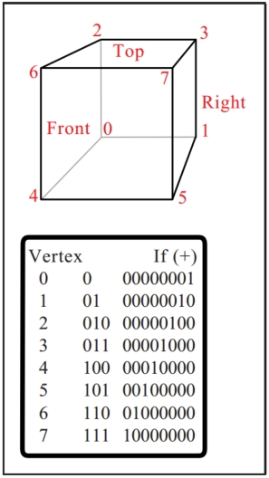
Figure 22.11. Vertex numbering. 
图 22.11。 顶点编号。

The identifying vertex is addressed by integers i, j, k, computed from the (x, y, z)-coordinate location of the cube such that $x = side ∗ i$, etc., where side is the size of the cube. The identifying vertex of each cube may appear in as many as eight other cubes, and it would be inefficient to store these vertices more than once. Thus, the vertices are stored uniquely in a chained hash table. Since most of the space does not contain any part of the surface, only those cubes that are visited will be stored. The implicit function value is found for each vertex as it is stored in the hash table.
标识顶点由整数 i、j、k 寻址，这些整数是根据立方体的 (x, y, z) 坐标位置计算的，使得 $x = side ∗ i$ 等，其中 side 是立方体的大小 。 每个立方体的标识顶点可能出现在多达八个其他立方体中，并且多次存储这些顶点是低效的。 因此，顶点被唯一地存储在链式哈希表中。 由于大部分空间不包含表面的任何部分，因此只有那些被访问过的立方体才会被存储。 为每个顶点找到存储在哈希表中的隐式函数值。

Nothing is known about the topology of the surface so a search must be started from every primitive to avoid any disconnected parts of the surface being missed. A scalar can be used to scale the influence of a primitive. If the scalar can be less than zero, then it is possible to search along an axis without finding an intersecting edge. In this case, a more sophisticated search must be done to find a seed cube (Galin & Akkouche, 1999).
关于表面的拓扑一无所知，因此必须从每个基元开始搜索，以避免错过表面的任何断开的部分。 标量可用于缩放基元的影响。 如果标量可以小于零，则可以沿轴搜索而不会找到相交的边。 在这种情况下，必须进行更复杂的搜索来找到种子立方体（Galin & Akkouche，1999）。

#### Data Structures 数据结构

The hash table entry holds five values:
哈希表条目包含五个值：

- the i, j, k lattice indices of the identifying vertex (see Figure 22.11); 
  识别顶点的 i、j、k 晶格索引（见图 22.11）；
- f, the implicit function value of the identifying vertex; 
  f，识别顶点的隐函数值；
- Boolean to indicate whether this cube has been visited.
  布尔值，指示此多维数据集是否已被访问。

The hash function computes an address in the hash table by selecting a few bits out of each of $i, j, k$ and combining them arithmetically. For example, the five least significant bits produces a 15-bit address for a table, which must have a length of $2^{15}$. Such a hash function can be neatly implemented in the C-preprocessor as follows: 
哈希函数通过从 $i、j、k$ 中选择一些位并将它们进行算术组合来计算哈希表中的地址。 例如，五个最低有效位生成表的 15 位地址，该地址的长度必须为 $2^{15}$。 这样的哈希函数可以在 C 预处理器中巧妙地实现，如下所示：

```c++
#define NBITS 5
#define BMASK 037
#define HASH(a,b,c) (((a&BMASK)<<NBITS|b&BMASK)
					<<NBITS|c&BMASK)
#define HSIZE 1<<NBITS*3
```

The queue (FIFO list) is used as temporary storage to identify the neighbors for processing. The algorithm begins with a seed cube that is marked as visited and placed on the queue. The first cube on the queue is dequeued and all its unvisited neighbors are added to the queue. Each cube is processed and passed to the second phase of the algorithm if it contains part of the surface. The queue is then processed until empty. 
队列（先进先出列表）用作临时存储来识别要处理的邻居。 该算法从标记为已访问并放置在队列中的种子立方体开始。 队列中的第一个多维数据集将出列，并且其所有未访问的邻居都将添加到队列中。 如果每个立方体包含表面的一部分，则每个立方体都会被处理并传递到算法的第二阶段。 然后处理队列直到空为止。

### 22.3.3 Polygonization Algorithm  多边形化算法

The second phase of the algorithm treats each cube independently. The cell is replaced by a set of triangles that best matches the shape of the part of the surface that passes through the cell. The algorithm must decide how to polygonize the cell given the implicit function values at each vertex. These values will be positive or negative (i.e., less than or greater than the iso-value), giving 256 combinations of positive or negative vertices for the eight vertices of the cube. A table of 256 entries provides the right vertices to use in each triangle (Figure 22.12). For example, entry 4(00000100) points to a second table that records the vertices that bound the intersecting edges. In this example, vertex number 2 is inside the surface ($f(V 2) >= iso$) and, therefore, we wish to draw a triangle that connects the points on the surface that intersecgt with edges bounded by $(V 2, V 0)$, $(V 2, V 3)$, and $(V 2, V 6)$ as shown in Figure 22.13. 
该算法的第二阶段独立处理每个立方体。 该单元被一组与穿过该单元的表面部分的形状最匹配的三角形所取代。 算法必须决定如何在给定每个顶点的隐式函数值的情况下对单元进行多边形化。 这些值将为正值或负值（即小于或大于等值），为立方体的 8 个顶点提供 256 种正或负顶点组合。 包含 256 个条目的表提供了每个三角形中使用的正确顶点（图 22.12）。 例如，条目 4(00000100) 指向记录相交边的顶点的第二个表。 在此示例中，顶点号 2 位于曲面内部 ($f(V 2) >= iso$)，因此，我们希望绘制一个三角形，连接曲面上与 $(V 2) 边界相交的点 、V 0)$、$(V 2, V 3)$ 和$(V 2, V 6)$，如图 22.13 所示。

Figure 22.12. Table 2 contains the edges intersected by the surface. Table 1 points to the appropriate entry in Table 2. 
图 22.12。 表 2 包含与曲面相交的边。 表 1 指向表 2 中的相应条目。


Figure 22.13. Finding the intersection of the surface with a cube edge.
图 22.13。 找到曲面与立方体边的交点。

#### Finding Cube-Surface Intersections  寻找立方体与曲面的交点

Figure 22.13 shows a cube where vertex $V_2$ is inside the surface and all other vertices are outside. Intersections with the surface occur on three edges as shown. The surface intersects edge $V_2 − V_6$ at the point A. The fastest, but inaccurate, way to calculate A is to use linear interpolation:
图 22.13 显示了一个立方体，其中顶点 $V_2$ 位于曲面内部，所有其他顶点均位于曲面外部。 与曲面的相交发生在三个边上，如图所示。 曲面与边 $V_2 − V_6$ 相交于点 A。计算 A 的最快但不准确的方法是使用线性插值：
$$
\frac{f(A) − f(V_2)}{f(V_6) − f(V_2)} = \frac{|A − V_2|}{side}
$$
If the cube side is 1 and the iso-value sought for f(A) is 0.5, then
如果立方体边长为 1，求 f(A) 的等值为 0.5，则
$$
A = V_3 + \frac{0.5 - f(V_2)}{f(V_6) - f(V_2)}
$$
This works well for a static image, but in animation error differences between frames will be very noticeable. A root-finding method such as regula falsi should be employed. This becomes more computationally costly as the gradient is needed to evaluate the point of intersection. The gradient is also needed at surface points for rendering. For many types of primitives it is simpler to find a numerical approximation using sample points around p, as in
这对于静态图像效果很好，但在动画中，帧之间的错误差异将非常明显。 应采用诸如regula falsi 之类的寻根方法。 由于需要梯度来评估交点，因此计算成本变得更高。 表面点也需要渐变来进行渲染。 对于许多类型的基元，使用 p 周围的样本点找到数值近似值会更简单，如下所示
$$
∇f(\bold{p}) = (
	\frac{f(\bold{p} + Δx) - f(\bold{p})}{Δx}, 
	\frac{f(\bold{p} + Δy) - f(\bold{p})}{Δy}, 
	\frac{f(\bold{p} + Δz) - f(\bold{p})}{Δz}
)
$$
A reasonable value for Δ has been found empirically to be 0.01 ∗ side where side is the length of a cube edge. 
根据经验，Δ 的合理值是 0.01 * side，其中 side 是立方体边的长度。

For manufacturing a mesh, as opposed to a set of independent triangles, a second hash table can maintain a list of all the intersecting edges. Since each cube edge is shared by up to four neighbors, the edge hash table prevents repetition of the surface-cube edge intersection calculation. The hash address can be derived from the same hash function as for vertices (applied to the edge endpoints).
为了制造网格，与一组独立的三角形相反，第二个哈希表可以维护所有相交边的列表。 由于每个立方体边缘最多由四个邻居共享，因此边缘哈希表可以防止重复表面-立方体边缘交集计算。 哈希地址可以从与顶点相同的哈希函数（应用于边缘端点）导出。

### 22.3.4 Sampling Problems  抽样问题

Ambiguities occur when opposite corners of a face (or the cube) have the same sign and the other pair of vertices on the face have the opposite sign (see Figure 22.14). A sample taken in the center of the face will give a clue as to whether the cube represents the meeting of two surfaces or a saddle. It should be made clear that a spatial grid stores a sample of the implicit function at every vertex. If the function happens to vary considerably within a cell, the polygonal representation will not show such variations (see Figure 22.15). The surface cannot be resolved by sampling alone unless something is known about the curvature of the surface. A good discussion of this topic appears in (Kalra & Barr, 1989).
当一个面（或立方体）的对角具有相同的符号而该面上的另一对顶点具有相反的符号时，就会出现歧义（见图 22.14）。 在面的中心采集的样本将给出关于立方体是否代表两个表面或鞍座的交汇处的线索。 应该明确的是，空间网格在每个顶点存储隐函数的样本。 如果函数在单元内发生很大变化，则多边形表示将不会显示此类变化（见图 22.15）。 除非了解表面的曲率，否则无法仅通过采样来解析表面。 (Kalra & Barr, 1989)对此主题进行了很好的讨论。

Figure 22.14. Examples of vertices inside (+) and outside (-) the surface. Note the extra sample gives a clue to avoid ambiguous cases. 
图 22.14。 曲面内部 (+) 和外部 (-) 的顶点示例。 请注意，额外的示例提供了避免模棱两可的情况的线索。

22.3.4 Sampling Problems Ambiguities occur when opposite corners of a face (or the cube) have the same sign and the other pair of vertices on the face have the opposite sign (see Figure 22.14). A sample taken in the center of the face will give a clue as to whether the cube represents the meeting of two surfaces or a saddle. It should be made clear that a spatial grid stores a sample of the implicit function at every vertex. If the function happens to vary considerably within a cell, the polygonal representation will not show such variations (see Figure 22.15). The surface cannot be resolved by sampling alone unless something is known about the curvature of the surface. A good discussion of this topic appears in (Kalra & Barr, 1989).This ambiguity problem (not the undersampling problem) is avoided by subdividing the cubic cell into tetrahedra. The tetrahedra can then be polygonized unambiguously. Since there are four vertices in each tetrahedron, a table of 16 entries will provide the correct triangle information. The disadvantage is that approximately twice the number of polygons will be generated. 
22.3.4 采样问题 当一个面（或立方体）的对角具有相同的符号而该面上的另一对顶点具有相反的符号时，就会出现歧义（见图 22.14）。 在面的中心采集的样本将给出关于立方体是否代表两个表面或鞍座的交汇处的线索。 应该明确的是，空间网格在每个顶点存储隐函数的样本。 如果函数在单元内发生很大变化，则多边形表示将不会显示此类变化（见图 22.15）。 除非了解表面的曲率，否则无法仅通过采样来解析表面。 关于这个主题的一个很好的讨论出现在（Kalra & Barr，1989）中。通过将立方体单元细分为四面体，可以避免这种歧义问题（不是欠采样问题）。 然后可以明确地将四面体多边形化。 由于每个四面体有四个顶点，因此包含 16 个条目的表将提供正确的三角形信息。 缺点是将生成大约两倍数量的多边形。
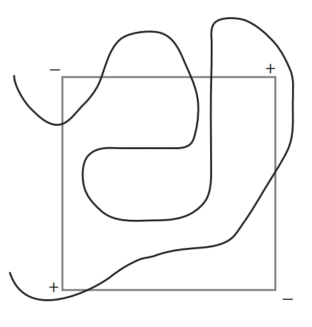
Figure 22.15. Cube too large to capture small variation in implicit function. 
图 22.15。 立方体太大，无法捕获隐函数的微小变化。

#### Subdividing a Cube 细分立方体

Without requiring additional cell vertices, a cube may be decomposed into five or six tetrahedra as shown in Figure 22.16. These decompositions introduce diagonals on the cube faces, and to maintain a consistent diagonal direction between neighbors, the six decomposition is preferable. The introduction of diagonal edges produces a higher-resolution surface than replacing each cube directly with triangles. The decomposition into tetrahedra and the replacement of the tetrahedra with triangles are fast, table-driven algorithms, which produce topologically consistent meshes.
不需要额外的单元顶点，一个立方体可以分解为五个或六个四面体，如图 22.16 所示。 这些分解在立方体面上引入了对角线，并且为了保持邻居之间一致的对角线方向，六次分解是优选的。 与直接用三角形替换每个立方体相比，对角边缘的引入产生了更高分辨率的表面。 分解为四面体以及用三角形替换四面体是快速的表格驱动算法，可生成拓扑一致的网格。

Figure 22.16. Decomposing a cube into six tetrahedra. Image courtesy Erwin DeGroot. 
图 22.16。 将一个立方体分解为六个四面体。 图片由埃尔文·德格鲁特提供。

### 22.3.5 Cell Polygonization 细胞多边形化

Two obvious problems emerge from the use of uniform space subdivision. The size of triangles output by this algorithm do not adapt to the curvature of the surface and a further sample is required to solve the ambiguities, in which cubic cells are replaced by polygons. A space subdivision algorithm based on an octree was developed by Bloomenthal (Bloomenthal, 1988), which does adapt to the curvature of the surface. Cells are subdivided into eight octants and cracks are avoided by using a restricted octree scheme, i.e., neighboring cells cannot differ by more than one level of subdivision. This indeed reduces the number of polygons generated, but full advantage of large cells can only be taken if the flat regions of the surface happen to fall entirely within the appropriate octants. The algorithm proves in practice to be considerably slower than the uniform voxel algorithm and is more complicated to implement.
使用均匀空间细分会出现两个明显的问题。 该算法输出的三角形的大小不适应表面的曲率，需要进一步的样本来解决歧义，其中立方单元被多边形替换。 Bloomenthal 开发了基于八叉树的空间细分算法（Bloomenthal，1988），该算法确实适应表面的曲率。 单元格被细分为八个八分圆，并通过使用受限八叉树方案来避免裂纹，即相邻单元格的细分不能超过一级。 这确实减少了生成的多边形数量，但只有当表面的平坦区域恰好完全落在适当的八分圆内时，才能充分利用大单元。 该算法在实践中被证明比统一体素算法要慢得多，并且实现起来更复杂。

## 22.4 More on Blending 有关混合的更多信息

Section 22.1 showed that blending can be made to occur when field values are summed. Ricci, in his landmark paper (Ricci, 1973), describes super-elliptic blending. Given two functions $F_A$ and $F_B$, previously we simply found the implicit value as $F_{total} = F_A + F_B$. We can denote this more general blending operator as $A \diamond B$. The Ricci blend is defined as:
第 22.1 节展示了当字段值求和时可以进行混合。 Ricci 在他的里程碑式论文（Ricci，1973）中描述了超椭圆混合。 给定两个函数 $F_A$ 和 $F_B$，之前我们只是简单地找到隐式值 $F_{total} = F_A + F_B$。 我们可以将这个更通用的混合运算符表示为 $A \diamond B$。 Ricci 混合定义为：
$$
f_{A \diamond B} = (f_{A}^n + f_B^n)^{\frac{1}{n}} \ \ \ \ \ (22.4)
$$
It is interesting to point out the following properties: 
有趣的是指出以下属性：
$$
\lim_{n\rightarrow +∞}(f _A^n + f_B^n)^{\frac{1}{n}} = \max(f_A, f_B) \\
\lim_{n\rightarrow -∞}(f _A^n + f_B^n)^{\frac{1}{n}} = \min(f_A, f_B)
$$
Moreover, this generalized blending is associative, i.e., $f_{(A\diamond B)\diamond C} = f_{A\diamond(B\diamond C)}$. The standard blending operator + proves to be a special case of the super-elliptic blend with $n = 1$. When n varies from 1 to infinity, it creates a set of blends interpolating between blending $A + B$ and union $A ∪ B$ (see Figure 22.17). Figure 22.27 shows the nodes to be binary or unary; in fact the binary nodes can easily be extended using the above formulation to n-ary nodes.
此外，这种广义混合是关联的，即$f_{(A\diamond B)\diamond C} = f_{A\diamond(B\diamond C)}$。 标准混合运算符 + 被证明是 $n = 1$ 的超椭圆混合的特例。 当 n 从 1 变化到无穷大时，它会在混合 $A + B$ 和并集 $A ∪ B$ 之间创建一组混合插值（见图 22.17）。 图22.27显示了二元或一元的节点； 事实上，使用上述公式可以轻松地将二元节点扩展到 n 元节点。

Figure 22.17. By varying n, the Ricci blend may be made to change smoothly from blend to union. Image courtesy Erwin DeGroot.
图 22.17。 通过改变n，可以使Ricci混合从混合平滑地改变到联合。 图片由埃尔文·德格鲁特提供。

The power of Ricci’s operators is that they are closed under the operations on the space of all possible implicit volumes, meaning that an application of an operator simply produces another scalar field defining another implicit volume. This new field can be composed with other fields, again using Ricci’s operators. Equation (22.4) will always produce the exact union of two implicit volumes, regardless of how complex they are. Compared with the difficulties involved in applying boolean CSG operations to B-rep surfaces, solid modeling with implicit volumes is incredibly simple.
里奇运算符的强大之处在于，它们在所有可能的隐式卷的空间上的运算下都是封闭的，这意味着运算符的应用只需生成定义另一个隐式卷的另一个标量场。 这个新字段可以与其他字段组合，再次使用 Ricci 运算符。 方程（22.4）总是会产生两个隐式体积的精确并集，无论它们有多复杂。 与将布尔 CSG 运算应用于 B-rep 曲面所涉及的困难相比，使用隐式体积的实体建模非常简单。

Following Pasko’s functional representation (A. Pasko et al., 1995), another generalized blending function may be defined:
根据 Pasko 的函数表示（A. Pasko 等人，1995），可以定义另一个广义混合函数：
$$
f_{A\diamond B} = (f_A + f_B + α\sqrt{f_A^2 + f_B^2})(f_A^2 + f_B^2)^{\frac{2}{n}}
$$
When $α ∈ [−1, 1]$ varies from −1 to 1, it creates a set of blends interpolating the union and the intersection operators. However, this operator is no longer associative which is incompatible with the definition of n-ary operators.
当 $α ∈ [−1, 1]$ 从 −1 到 1 变化时，它会创建一组插值并集和交集运算符的混合。 但是，该运算符不再具有结合性，这与 n 元运算符的定义不兼容。

## 22.5 Constructive Solid Geometry 构造立体几何

Implicit models are frequently termed implicit surfaces; however, they are inherently volume models and useful for solid modeling operations. Ricci introduced a constructive geometry for defining complex shapes from operations such as union, intersection, difference, and blend upon primitives (Ricci, 1973). The surface was considered as the boundary between the half spaces $f(\bold{p}) < 1$, defining the inside, and $f(\bold{p}) > 1$ defining the outside. This initial approach to solid modeling evolved into constructive solid geometry or CSG (Ricci, 1973; Requicha, 1980). CSG is typically evaluated bottom-up according to a binary tree, with low-degree polynomial primitives as the leaf nodes and internal nodes representing Boolean set operations. These methods are readily adapted for use in implicit modeling, and in the case of skeletal implicit surfaces, the Boolean set operations union $∪_{max}$, intersection $∩_{min}$ and difference $\setminus_{minmax}$ are defined as follows (Wyvill, Galin, & Guy, 1999):
隐式模型通常称为隐式曲面； 然而，它们本质上是体积模型，对于实体建模操作很有用。 Ricci 引入了一种构造几何，用于通过基元上的并、交、差和混合等操作来定义复杂的形状（Ricci，1973）。 表面被认为是定义内部的半空间 $f(\bold{p}) < 1$ 和定义外部的 $f(\bold{p}) > 1$ 之间的边界。 这种最初的实体建模方法演变为构造实体几何或 CSG（Ricci，1973；Requicha，1980）。 CSG 通常根据二叉树自下而上进行评估，以低次多项式基元作为叶节点，内部节点表示布尔集运算。 这些方法很容易适用于隐式建模，并且在骨架隐式曲面的情况下，布尔集运算并集 $∪_{max}$、交集 $∩_{min}$ 和差 $\setminus_{minmax}$ 定义如下（Wyvill、Galin 和 Guy，1999）：
$$
∪_{max} f = \max^{k-1}_{i=0}(f_i) \\
∩_{min} f = \min^{k-1}_{i=0}(f_i)\\
\setminus_{minmax} f = \min(f_0, 2 * iso - \max^{k-1}_{j=1}(f_j)) \\
(22.5)
$$
The Ricci operators are illustrated in Figure 22.18 for point primitives A and B. For union (bottom left) the field at all points inside the union will be the greater of $f_A()$ and $f_B()$. For intersection (center), points in the region marked as $P_1$ will have value min $(f_A(P_1), f_B(P_1))$ = 0, since the contribution of B will be zero outside of its range of influence. Similarly, for the region marked as $P_2$, (influence of A is zero, i.e., the minimum) leaving only the intersection region with positive values. Difference works similarly using the iso-value in the three marked regions ($P_i$) as follows:
图 22.18 说明了点基元 A 和 B 的 Ricci 运算符。对于并集（左下），并集内所有点的场将是 $f_A()$ 和 $f_B()$ 中的较大者。 对于交集（中心），标记为 $P_1$ 的区域中的点将具有值 min $(f_A(P_1), f_B(P_1))$ = 0，因为 B 的贡献在其影响范围之外将为零。 类似地，对于标记为$P_2$的区域，（A的影响为零，即最小值）仅留下交集区域为正值。 使用三个标记区域 ($P_i$) 中的 iso 值进行差分的工作方式类似，如下所示：
$$
f(P_0) = \min (f_B(P_0), 2 ∗ iso − f_A(P_0)) \\
 = \min([iso, 1], [2 ∗ iso − 1, iso]) \\
= [2 ∗ iso − 1, iso] < iso \\ \\

f(P_1) = \min (f_B(P_1), 2 ∗ iso − f_A(P_1)) \\
= \min([0, iso], [2 ∗ iso − 1, iso]) < iso \\ \\

f(P_2) = \min (f_B(P_2), 2 ∗ iso − f_A(P_2)) \\
= \min([iso, 1], [iso, 2 ∗ iso]) >= iso
$$

Figure 22.18. Ricci operators for CSG. Image courtesy Erwin DeGroot. 
图 22.18。 CSG 的 Ricci 运营商。 图片由埃尔文·德格鲁特提供。

CSG operators create creases, i.e., $C^1$ discontinuities. For example, the min() operator (Equation (22.5)) creates $C^1$ discontinuities at all points where $f_1(\bold{p}) = f_2(\bold{p})$. When applied to two spheres, the discontinuities produced by this union operator result in a crease on the surface, as shown in Figure 22.18, which is the desired result. Discontinuities unfortunately extend into the field outside of the surface, which is not visible in this image. If a blend is then applied to the result of the union, the $C^1$-discontinuous plane in the field produces a shading discontinuity (Figure 22.19).
CSG 操作员会产生折痕，即 $C^1$ 不连续性。 例如，min() 运算符（方程 (22.5)）在 $f_1(\bold{p}) = f_2(\bold{p})$ 的所有点处创建 $C^1$ 不连续性。 当应用于两个球体时，该并集运算符产生的不连续性会导致表面出现折痕，如图 22.18 所示，这是所需的结果。 不幸的是，不连续性延伸到表面外部的场中，这在该图像中不可见。 如果随后将混合应用于并集的结果，则场中的 $C^1$ 不连续平面会产生阴影不连续性（图 22.19）。
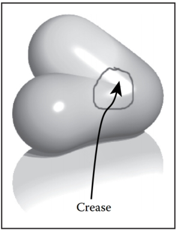
Figure 22.19. Two point primitives on the left are connected by the Ricci union. A third primitive is blended to the result, creating an unwanted crease in the field. Image courtesy Erwin DeGroot.
图 22.19。 左侧的两个点基元通过 Ricci 并连接。 第三个基元与结果混合，在场中产生不需要的折痕。 图片由埃尔文·德格鲁特提供。

The problem can be avoided to an extent (G. Pasko, Pasko, Ikeda, & Kunii, 2002), and CSG operators have been developed that are $C^1$ at all points except those where $f_1(\bold{p}) = f_2(\bold{p}) = iso$ (Barthe, Dodgson, Sabin, Wyvill, & Gaildrat, 2003).
这个问题可以在一定程度上避免（G. Pasko, Pasko, Ikeda, & Kunii, 2002），并且已经开发出 CSG 算子，除了 $f_1(\bold{p} 的点之外，在所有点上都是 $C^1$ ) = f_2(\bold{p}) = iso$ (Barthe, Dodgson, Sabin, Wyvill, & Gaildrat, 2003)。

## 22.6 Warping  变形

The ability to distort the shape of a surface by warping the space in its neighborhood is a useful modeling tool. A warp is a continuous function $w(x, y, z)$ that maps $\R^3$ onto $\R^3$. Sederberg provides a good analogy for warping when describing free form deformations (Sederberg & Parry, 1986). He suggests that the warped space can be likened to a clear, flexible, plastic parallelepiped in which the objects to be warped are embedded. A warped element may be defined by simply applying some warp function $w(\bold{p})$ to the implicit equation:
通过扭曲邻近空间来扭曲表面形状的能力是一种有用的建模工具。 扭曲是将 $\R^3$ 映射到 $\R^3$ 的连续函数 $w(x, y, z)$。 Sederberg 在描述自由形式变形时为扭曲提供了一个很好的类比（Sederberg & Parry，1986）。 他认为，扭曲的空间可以比作一个清晰、灵活的塑料平行六面体，其中嵌入了要扭曲的物体。 扭曲元素可以通过简单地将一些扭曲函数 $w(\bold{p})$ 应用于隐式方程来定义：
$$
f_i(x, y, z) = g_i ◦ d_i ◦ w_i(x, y, z). \ \ \ \ \ \ \ (22.6)
$$
A warped element may be fully characterized by the distance to its skeleton $d_i(x, y, z),$ its fall-off filter function $g_i(r)$, and eventually its warp function $w_i(x, y, z)$. To render or perform operations on an implicit surface, the implicit value of many points $f(P )$ must be found. First, $P$ is transformed by the warp function to some new point $Q$, and $f(Q)$ is returned in place of $f(P)$. In Figure 22.20, instead of returning the implicit value of some point $f(Q)$, the value for $f(P )$ is returned. In this case, the iso-value is returned and the implicit surface (curve in 2D) passes through $Q$ instead of $P$ . Thus, the circle is warped into an ellipse. 
扭曲元素可以通过到其骨架 $d_i(x, y, z)$ 的距离、其衰减滤波器函数 $g_i(r)$ 以及最终其扭曲函数 $w_i(x, y, z) 来完全表征 ）$。 要在隐式曲面上渲染或执行操作，必须找到许多点 $f(P )$ 的隐式值。 首先，扭曲函数将 $P$ 变换到某个新点 $Q$，并返回 $f(Q)$ 来代替 $f(P)$。 在图 22.20 中，返回的是 $f(P )$ 的值，而不是返回某个点 $f(Q)$ 的隐式值。 在这种情况下，返回 iso 值，并且隐式曲面（2D 中的曲线）通过 $Q$ 而不是 $P$ 。 因此，圆形扭曲成椭圆形。

Figure 22.20. Point Q returns the field value for point P. 
图 22.20。 点 Q 返回点 P 的字段值。

Barr introduced the notion of global and local deformations using the operations of twist, taper, and bend applied to parametric surfaces (Barr, 1984). The deformations can be nested to produce models such as the one shown in Figure 22.27. Conceptually, these are easy to apply to an implicit surface, as indicated in Equation (22.6). 
Barr 使用应用于参数曲面的扭曲、锥度和弯曲操作引入了全局和局部变形的概念（Barr，1984）。 可以嵌套变形来生成如图 22.27 所示的模型。 从概念上讲，这些很容易应用于隐式曲面，如方程（22.6）所示。

Note that the normal cannot be calculated in a similar manner to warping a point. This problem is similar to the problem outlined in Section 13.2 on instancing. In this case, the normal can most easily be approximated using Equation (22.3.3) although the use of the Jacobian, as suggested in (Barr, 1984), yields precise results. The Barr warps are described in the following sections.
请注意，法线不能以与扭曲点类似的方式计算。 这个问题类似于 13.2 节中关于实例化的问题。 在这种情况下，尽管使用雅可比行列式（如（Barr，1984）中建议的那样）可以产生精确的结果，但使用方程（22.3.3）可以最容易地近似法线。 Barr 扭曲将在以下部分中进行描述。

### 22.6.1 Twist 扭转

In this example, the twist is around the z-axis by $θ$ (see Figure 22.21) for three blended implicit cylinders with a twist warp applied to them.
在此示例中，对于应用了扭曲变形的三个混合隐式圆柱体，扭曲围绕 z 轴 $θ$（参见图 22.21）。
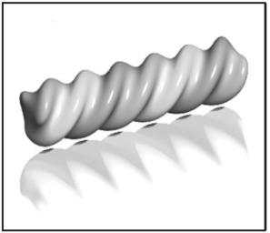
Figure 22.21. Three blended implicit cylinders twisted together. Image courtesy Erwin DeGroot.
图 22.21。 三个混合的隐式圆柱体扭曲在一起。 图片由埃尔文·德格鲁特提供。

The twist around z is expressed as 
绕 z 的扭曲表示为
$$
w(x, y, z) = \begin{Bmatrix}
x ∗ cos(θ(z)) − y ∗ sin(θ(z)) \\
x ∗ sin(θ(z)) + y ∗ cos(θ(z)) \\
z \\\end{Bmatrix}
$$

### 22.6.2 Taper 锥度

Taper is applied along one major axis. A linear taper has proved to be the most useful although quadratic and cubic tapers are easily implemented. For example, a linear taper along the y-axis involves changing both x- and z-coordinates. (See Figure 22.22.) A linear scale is applied to y between $y_{max}$ and $y_{min}$:
沿一个主轴线应用锥度。 尽管二次锥度和三次锥度很容易实现，但线性锥度已被证明是最有用的。 例如，沿 y 轴的线性锥度涉及更改 x 坐标和 z 坐标。 （参见图 22.22。）线性比例应用于 $y_{max}$ 和 $y_{min}$ 之间的 y：
$$
s(y) = \frac{y_{max} − y}{y_{max} − y_{min}} \\
w(x, y, z) = \begin{Bmatrix}
s(y)x \\
y \\
s(y)z
\end{Bmatrix}
$$


Figure 22.22. Three blended implicit cylinders, twisted then tapered. Image courtesy Erwin DeGroot. 
图 22.22。 三个混合的隐式圆柱体，扭曲然后逐渐变细。 图片由埃尔文·德格鲁特提供。

### 22.6.3 Bend  弯曲

Bend is also applied along one major axis. (See Figure 22.23.) For the bend example below, the bending rate is k measured in radians per unit length, the axis of the bend is $(x_0, 1/k)$, and the angle θ is defined as $(x − x_0) ∗ k$. The bend around z is
弯曲也沿一根主轴应用。 （参见图 22.23。）对于下面的弯曲示例，弯曲率 k 以每单位长度的弧度测量，弯曲轴为 $(x_0, 1/k)$，角度 θ 定义为 $(x - x_0) * k$。 绕 z 的弯曲是
$$
w(x, y, z) = \begin{Bmatrix} 
− sin(θ) ∗ (y − 1/k) + x_0 \\
cos(θ) ∗ (y − 1/k) + 1/k \\
z
\end{Bmatrix}
$$


Figure 22.23. Three blended implicit cylinders, twisted together, tapered and bent. Image courtesy Erwin DeGroot.
图 22.23。 三个混合的隐式圆柱体，扭曲在一起，逐渐变细并弯曲。 图片由埃尔文·德格鲁特提供。

## 22.7 Precise Contact Modeling 精确接触建模

Precise contact modeling (PCM) is a method of deforming implicit surface primitives in contact situations while maintaining a precise contact surface with $C^1$ continuity (Gascuel, 1993). PCM is important in that it is a simple and automatic way of showing how a model can react to its environment. This cannot be so easily done with non-implicit methods (see Figure 22.24).
精确接触建模 (PCM) 是一种在接触情况下使隐式表面基元变形的方法，同时保持具有 $C^1$ 连续性的精确接触表面（Gascuel，1993）。 PCM 很重要，因为它是一种简单且自动的方式来显示模型如何对其环境做出反应。 使用非隐式方法无法轻松完成此操作（参见图 22.24）。

Figure 22.24. Sea anemone deforms to implicit rock. Image courtesy Mai Nur and X. Liang.
图 22.24。 海葵变形为隐含的岩石。 图片由 Mai Nur 和 X. Liang 提供。

PCM is implemented by the inclusion of a deforming function s(p) that modifies the field value returned for each point. For each pair of objects, collision is first detected using a bounding-box test. Once it is established that a collision is likely, PCM is applied. A local, geometric deformation term $s_i$ is computed and added to the implicit function $f_i$. The volume of the colliding objects is divided into an interpenetration region and a deformation region. The result of applying $s_i$ is that the interpenetration region is compressed so that contact is maintained without interpenetration occurring (see Figure 22.25). The effect of $s_i$ is attenuated to zero within the propagation region so that the volume outside of the two regions is not deformed.
PCM 通过包含变形函数 s(p) 来实现，该函数修改为每个点返回的字段值。 对于每对对象，首先使用边界框测试检测碰撞。 一旦确定可能发生碰撞，就会应用 PCM。 计算局部几何变形项 $s_i$ 并将其添加到隐式函数 $f_i$。 碰撞物体的体积分为互穿区域和变形区域。 应用 $s_i$ 的结果是互穿区域被压缩，以便在不发生互穿的情况下保持接触（见图 22.25）。 $s_i$ 的影响在传播区域内衰减为零，因此两个区域之外的体积不会变形。

Figure 22.25. A 2D slice through objects in collision showing the various regions and PCM deformation. Image courtesy Erwin DeGroot. 
图 22.25。 碰撞中物体的 2D 切片显示各个区域和 PCM 变形。 图片由埃尔文·德格鲁特提供。

Given two skeletal elements generating fields $f_1(p)$ and $f_2(p)$, the surface around each one is calculated as
给定两个生成场 $f_1(p)$ 和 $f_2(p)$ 的骨架元素，每个骨架元素周围的表面计算如下
$$
f_1(p) + s_1(p) = 0, \\
f_2(p) + s_2(p) = 0.
$$
We need to generate a surface common to both elements (dotted line in Figure 22.25), i.e., where they share a solution in the interpenetration region for some p in that region:
我们需要生成两个元素共有的表面（图 22.25 中的虚线），即它们在互穿区域中共享该区域中某些 p 的解：
$$
s_1(p) − f_1(p) = iso, \\
s_2(p) − f_2(p) = iso. \\
(22.7)
$$
Intuitively, the deeper within object 1 that object 2 penetrates, the higher the implicit value of object 1 and thus the more that object 2 will be compressed.
直观上，对象 2 在对象 1 内渗透得越深，对象 1 的隐式值就越高，因此对象 2 被压缩的程度就越大。

The function, $s_i$ is defined to produce a smooth junction at the boundary of the interpenetration region, in other words where $s_i = 0$ but its derivative is greater than zero. From here to the boundary of the propagation region, $s_i$ is used to attenuate the propagation to zero. The nearest point on the interpenetration region boundary $p_0$ is found by following the gradient. 
函数 $s_i$ 被定义为在互穿区域的边界处产生平滑连接，换句话说，其中 $s_i = 0$ 但其导数大于零。 从这里到传播区域的边界，$s_i$ 用于将传播衰减到零。 通过遵循梯度找到互穿区域边界 $p_0$ 上的最近点。

Within the propagation region $s_i(p) = h_i(r)$, where $p = (x, y, z)$ is the point whose implicit value is being calculated and $r = \|p−p_0\|$ (see Figure 22.26). The value of $r_i$, set by the user, defines the size of the propagation region; no deformation occurs beyond this region. To control how much the objects inflate in the propagation region, the user provides a value for the parameter $α$. The maximum value of $h_i$ is $M_i$. The current minimum of $s_i$ is negative in the interpenetration region and is given as $s_{imin}$, where $Mi = −α_is_{i min}$. Thus an object will be compressed in the interpenetration region and will inflate in the propagation region. The equation for hi is formed in two parts by two cubic polynomials that are designed to join at $r = r_i/2$, where the slope is zero:
在传播区域 $s_i(p) = h_i(r)$ 内，其中 $p = (x, y, z)$ 是正在计算隐式值的点，$r = \|p−p_0\|$ ( 参见图 22.26）。 $r_i$的值由用户设置，定义了传播区域的大小； 超出该区域不会发生变形。 为了控制对象在传播区域中膨胀的程度，用户为参数 $α$ 提供一个值。 $h_i$ 的最大值为$M_i$。 $s_i$ 的当前最小值在互穿区域中为负值，并表示为 $s_{imin}$，其中 $Mi = −α_is_{i min}$。 因此，物体将在互穿区域被压缩，并在传播区域膨胀。 hi 的方程由两个三次多项式组成，分为两部分，这两个多项式设计为在 $r = r_i/2$ 处连接，其中斜率为零：
$$
c = \frac{4(w_ik − 4M_i)}{w^3_i} \\
d = \frac{4(3M_i − w_ik)}{w^2_i} \\
h_i(r) = cr^3 + dr^2 + kr\ \ \ \  \ if\ r ∈ [0, w_i/2], \\
h_i(r) = \frac{4M_i}{w^3_i}(r − w_i)^2(4r − w_i)^3\ if\ r ∈ [w_i/2, w_i]
$$
It is desirable that we have $C^1$-continuity as we move from the interpenetration to the propagation region. Thus, $h'_i(0) = k$ in Figure 22.26, is the directional derivative of $s_i$ at the junction (marked as $p_0$ in Figure 22.25). As indicated in Equation (22.7), $s_i = −f_i$ in the interpenetration region, thus:
当我们从互穿区域移动到传播区域时，我们希望具有 $C^1$-连续性。 因此，图 22.26 中的 $h'_i(0) = k$ 是连接处 $s_i$ 的方向导数（在图 22.25 中标记为 $p_0$）。 如式(22.7)所示，在互穿区域$s_i = −f_i$，因此：
$k = \|(f_i, p_0)\|  $

PCM is only an approximation to a properly deformed surface, but it is an attractive algorithm due to its simplicity. 
PCM 只是适当变形表面的近似，但由于其简单性，它是一种有吸引力的算法。

Figure 22.26. The function, $h_i(r)$ is the value of the deformation function $w_i$ in the propagation region. 
图 22.26。 函数 $h_i(r)$ 是传播区域中变形函数 $w_i$ 的值。

## 22.8 The BlobTree Blob 树

The BlobTree is a method that employs a tree structure that extended the CSG tree to include various blending operations using skeletal primitives (Wyvill et al., 1999). A system with similar capabilities, the Hyperfun project, used a specialized language to describe F-rep objects (Adzhiev et al., 1999). 
BlobTree 是一种采用树结构的方法，该树结构扩展了 CSG 树以包括使用骨架基元的各种混合操作（Wyvill 等人，1999）。 具有类似功能的系统 Hyperfun 项目使用专门的语言来描述 F-rep 对象（Adzhiev 等人，1999）。

In the BlobTree system, models are defined by expressions that combine implicit primitives and the operators ∪ (union), ∩ (intersection), − (difference), + (blend), $ \diamond$ (super-elliptic blend), and w (warp). The BlobTree is not only the data structure built from these expressions but also a way of visualizing the structure of the models. The operators listed above are binary with the exception of warp, which is a unary operator. In general it is more efficient to use n-ary rather than binary operators. The BlobTree incorporates affine transformations as nodes so that it is also a scene graph and primitives (e.g., skeletons) form the leaf nodes.
在 BlobTree 系统中，模型由组合隐式基元和运算符 ∪（并集）、∩（交集）、−（差值）、+（混合）、$ \diamond$（超椭圆混合）和 w 的表达式来定义 （经）。 BlobTree 不仅是根据这些表达式构建的数据结构，而且还是一种可视化模型结构的方式。 上面列出的运算符都是二元运算符，但 warp 除外，它是一元运算符。 一般来说，使用 n 元运算符比使用二元运算符更有效。 BlobTree 将仿射变换合并为节点，因此它也是一个场景图，并且基元（例如骨架）形成叶节点。

### 22.8.1 Traversing the BlobTree 遍历 BlobTree

An example of a BlobTree including the Barr warps and CSG operations is shown in Figure 22.27. Other nodes can include 2D texturing (Schmidt, Grimm, & Wyvill, 2006), precise contact modeling, as well as animation and other attributes. The traversal of the BlobTree is in essence very simple. All that is required to render the object either by polygonizing or ray tracing is to find the implicit value of any point (and the corresponding gradient). This can be done by traversing the tree. Polygonization and ray-tracing algorithms need to evaluate the implicit field function at a large number of points in space. The function f(N , M) returns the field value for the node N at the point M, which depends on the type of the node. The values L and R indicate that the left or right branch of the tree is explored. The algorithm below is written (for simplicity) as if the tree were binary: 
包含 Barr 扭曲和 CSG 操作的 BlobTree 示例如图 22.27 所示。 其他节点可以包括 2D 纹理（Schmidt、Grimm 和 Wyvill，2006）、精确接触建模以及动画和其他属性。 BlobTree 的遍历本质上非常简单。 通过多边形化或光线追踪渲染对象所需要做的就是找到任何点的隐式值（以及相应的梯度）。 这可以通过遍历树来完成。 多边形化和光线追踪算法需要评估空间中大量点的隐式场函数。 函数 f(N , M) 返回节点 N 在点 M 处的字段值，该值取决于节点的类型。 值 L 和 R 表示探索树的左分支或右分支。 下面的算法被写成（为了简单起见），就好像树是二叉树一样：

Figure 22.27. BlobTree. The spiral staircase is built from a central textured cylinder to which the stairs and the railing are blended. The railing is comprised of a series of cylinders blended with two circle (torus) primitives, blended together and further blended with a vertical cylinder. The BlobTree is also a scene graph and instancing nodes repeat the various parts transformed by the appropriate matrices. Each stair is made from a tapered polygon primitive (that becomes an offset surface); intersection and union nodes combine the inflated disk with the stair.
图 22.27。 斑点树。 螺旋楼梯由中央纹理圆柱体建造而成，楼梯和栏杆与圆柱体融为一体。 栏杆由一系列与两个圆形（圆环）基元混合的圆柱体组成，混合在一起并进一步与垂直圆柱体混合。 BlobTree 也是一个场景图，实例节点重复由适当矩阵转换的各个部分。 每个楼梯均由锥形多边形基元（成为偏移表面)组成； 交集和并集节点将膨胀的圆盘与楼梯结合起来。

function f(N , M) : 
函数 f(N , M) ：

- primitive: f(M); 
  原语：f(M)；
- warp: f(L(N ), w(M)); 
  扭曲：f(L(N), w(M))；
- blend: f(L(N ), M) + f(R(N ), M)); 
  混合：f(L(N), M) + f(R(N), M))；
- union: max(f(L(N ), M), f(R(N ), M));
  并集：max(f(L(N), M), f(R(N), M))；
- intersection: min(f(L(N ), M), f(R(N ), M)); 
  交集：min(f(L(N), M), f(R(N), M))；
- difference: min(f(L(N ), M), −f(R(N ), M)). 
  差异：min(f(L(N), M), −f(R(N), M))。

A complex BlobTree model showing many of the features that have been integrated is shown in Figure 22.28. 
一个复杂的 BlobTree 模型显示了许多已集成的功能，如图 22.28 所示。
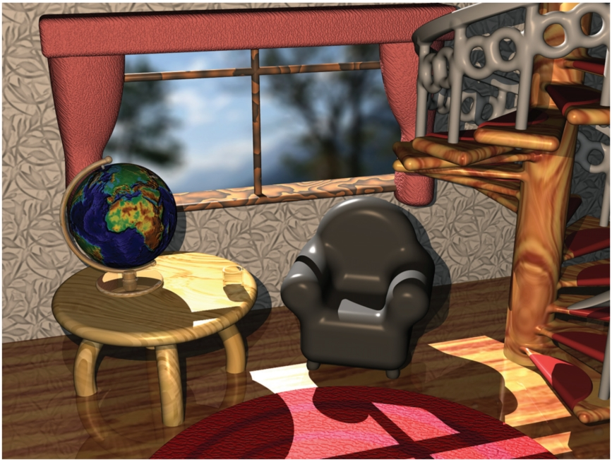
Figure 22.28. “Spiral Stairs.” A complex BlobTree implicit model created in Erwin DeGroot’s BlobTree.net system.
图 22.28。 “螺旋楼梯。” 在 Erwin DeGroot 的 BlobTree.net 系统中创建的复杂 BlobTree 隐式模型。

## 22.9 Interactive Implicit Modeling Systems  交互式隐式建模系统

Early sketch-based modeling systems, such as Teddy (Igarashi, Matsuoka, & Tanaka, 1999), used a few drawn strokes from the user to infer a polygonal model in 3-space. With better hardware and improved algorithms, sketch-based implicit modeling systems are now possible. Shapeshop uses implicit sweep surfaces to manufacture 3D strokes from 2D user strokes and also preserves the hierarchy of the BlobTree unlike the early systems that produced homogeneous meshes (Schmidt, Wyvill, Sousa, & Jorge, 2005). This enables a user to produce complex models of arbitrary topology from a few simple strokes. The margin figures show a closed drawn stroke (Figure 22.29) inflated into a an implicit sweep and a second sweep (Figure 22.30) that has a smaller sweep object subtracted using CSG.
早期基于草图的建模系统，例如 Teddy（Igarashi、Matsuoka 和 Tanaka，1999），使用用户的一些绘制笔画来推断 3 空间中的多边形模型。 有了更好的硬件和改进的算法，基于草图的隐式建模系统现在已经成为可能。 Shapeshop 使用隐式扫描曲面从 2D 用户笔划生成 3D 笔划，并且还保留了 BlobTree 的层次结构，这与生成同质网格的早期系统不同（Schmidt、Wyvill、Sousa 和 Jorge，2005）。 这使得用户能够通过几个简单的笔画生成任意拓扑的复杂模型。 边距数字显示了一个封闭的绘制笔划（图 22.29），该笔划被扩展为隐式扫描和第二次扫描（图 22.30），其中使用 CSG 减去了较小的扫描对象。

Figure 22.29. Outlines are inflated. Image courtesy Erwin DeGroot.
图 22.29。 轮廓被夸大了。 图片由埃尔文·德格鲁特提供。


Figure 22.30. BlobTree operations can be applied, e.g., CSG difference. Image courtesy Erwin DeGroot.
图 22.30。 可以应用BlobTree操作，例如CSG差异。 图片由埃尔文·德格鲁特提供。

One of the improvements that made this possible is a caching system that uses a fixed 3D grid of implicit values at each node of the BlobTree representing the values found by traversing the tree below the node (Schmidt, Wyvill, & Galin, 2005). If the value of some point p is required at node N, a value may be returned without traversing the tree below N, provided that part of the tree is unaltered. Instead, an interpolation scheme (see Chapter 9) is used to find a value for p. This scheme speeds up traversal for complex BlobTrees and is one factor in enabling a system to run at interactive rates.
实现这一点的改进之一是缓存系统，该系统在 BlobTree 的每个节点上使用隐式值的固定 3D 网格，表示通过遍历节点下方的树找到的值（Schmidt、Wyvill 和 Galin，2005）。 如果节点 N 需要某个点 p 的值，则可以在不遍历 N 下面的树的情况下返回值，前提是树的该部分未更改。 相反，使用插值方案（参见第 9 章）来查找 p 的值。 该方案加快了复杂 BlobTree 的遍历速度，并且是使系统能够以交互速率运行的因素之一。

The next generation of implicit modeling systems will exploit hardware and software advances to be able to handle more and more complex hierarchical models interactively. A more complex Shapeshop example is shown in Figure 22.31.
下一代隐式建模系统将利用硬件和软件的进步，能够交互地处理越来越复杂的分层模型。 更复杂的 Shapeshop 示例如图 22.31 所示。
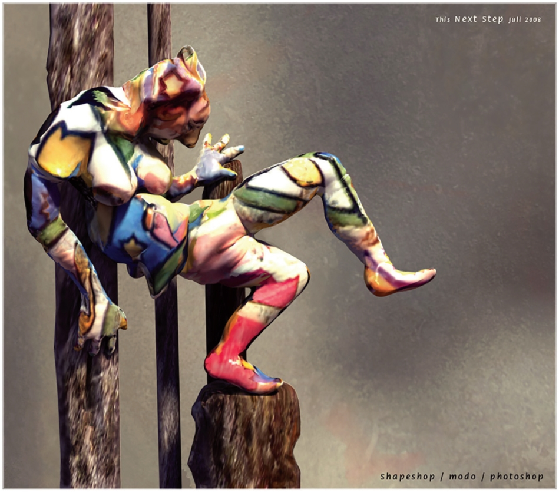
Figure 22.31. “The Next Step.” A complex BlobTree implicit model created interactively in Ryan Schmidt’s Shapeshop by artist Corien Clapwijk (Andusan). 
图 22.31。 “下一步。” 由艺术家 Corien Clapwijk (Andusan) 在 Ryan Schmidt 的 Shapeshop 中交互式创建的复杂 BlobTree 隐式模型。

## Exercises 练习

1. In an implicit surface modeling system the fall-off filter function is defined as 
   在隐式表面建模系统中，衰减滤波器函数定义为
   $$
   f(r) = \begin{cases}
   0,  \ \ \ \ \ \ \ \ \ \ \ \ \ \ \ \ r > R, \\
   1 - r/R, \ \ \ \ otherwise
   \end{cases}
   $$
   where R is a constant. A point primitive placed at (−1, 0) and another at (1, 0) are rendered to show the f = 0.5 iso-surface. The value R, the distance where the potential due to the point falls to zero in both cases, is 1.5.

   其中 R 是常数。 渲染放置在 (−1, 0) 处的点基元和放置在 (1, 0) 处的另一个点基元以显示 f = 0.5 等值面。 R 值（两种情况下该点的电势降至零的距离）为 1.5。
   Calculate the potential at the point (0, 0) and at +0.5 intervals until the point (2.5, 0). Sketch the 0.5 contour and the contour at which the field falls to zero. 
   计算点 (0, 0) 处以及以 +0.5 间隔直至点 (2.5, 0) 的电势。 绘制 0.5 等值线以及场降至零时的等值线。

2. Why are the ambiguous cases in the polygonization algorithm considered to be a sampling problem? 
   为什么多边形化算法中的模糊情况被认为是采样问题？

3. Calculate the error involved in using linear interpolation to estimate the intersection of an implicit surface and a cubic voxel.
   计算使用线性插值估计隐式曲面和立方体素的交集所涉及的误差。

4. Design an implicit primitive function using the skeleton of your choice. The function must take as input a point and return an implicit value and also the gradient at that point.
   使用您选择的骨架设计隐式原语函数。 该函数必须将一个点作为输入并返回一个隐式值以及该点的梯度。

# 23  Global Illumination  全局照明

Many surfaces in the real world receive most or all of their incident light from other reflective surfaces. This is often called indirect lighting or mutual illumination. For example, the ceilings of most rooms receive little or no illumination directly from luminaires (light-emitting objects). The direct and indirect components of illumination are shown in Figure 23.1. 
现实世界中的许多表面从其他反射表面接收大部分或全部入射光。 这通常称为间接照明或相互照明。 例如，大多数房间的天花板很少或根本没有直接来自灯具（发光物体）的照明。 照明的直接和间接分量如图 23.1 所示。

Figure 23.1. In the left and middle images, the indirect and direct lighting, respectively, are separated out. On the right, the sum of both components is shown. Global illumination algorithms account for both the direct and the indirect lighting.
图 23.1。 在左图和中图中，间接照明和直接照明分别被分离出来。 右侧显示了两个组件的总和。 全局照明算法同时考虑直接照明和间接照明。

Although accounting for the interreflection of light between surfaces is straightforward, it is potentially costly because all surfaces may reflect any given surface, resulting in as many as $O(N^2)$ interactions for N surfaces. Because the entire global database of objects may illuminate any given object, accounting for indirect illumination is often called the global illumination problem. 
尽管计算表面之间光的相互反射很简单，但其成本可能很高，因为所有表面都可能反射任何给定表面，导致 N 个表面的相互作用多达 $O(N^2)$。 由于对象的整个全局数据库可能照亮任何给定的对象，因此考虑间接照明通常称为全局照明问题。

There is a rich and complex literature on solving the global illumination problem (e.g., Appel, 1968; Goral, Torrance, Greenberg, & Battaile, 1984; Cook et al., 1984; Immel et al., 1986; Kajiya, 1986; Malley, 1988). In this chapter, we discuss two algorithms as examples: particle tracing and path tracing. The first is useful for walkthrough applications such as maze games, and as a component of batch rendering. The second is useful for realistic batch rendering. Then we discuss separating out “direct” lighting where light takes exactly once bounce between luminaire and camera.
关于解决全局照明问题有丰富而复杂的文献（例如，Appel，1968；Goral、Torrance、Greenberg 和 Battaile，1984；Cook 等，1984；Immel 等，1986；Kajiya，1986；Malley ，1988）。 在本章中，我们将讨论两种算法作为示例：粒子追踪和路径追踪。 第一个对于迷宫游戏等演练应用程序非常有用，并且可以作为批量渲染的组件。 第二个对于真实的批量渲染很有用。 然后我们讨论分离“直接”照明，其中光线在灯具和相机之间只反射一次。

## 23.1 Particle Tracing for Lambertian Scenes  朗伯场景的粒子追踪

Recall the transport equation from Section 18.2: 回想一下 18.2 节中的传输方程：
$$
L_s(\bold{k}_o) = \int_{ all\ \bold{k}_i} ρ(\bold{k}_i, \bold{k}_o)L_f(\bold{k}_i) cos θ_idσ_i.
$$
The geometry for this equation is shown in Figure 23.2. When the illuminated point is Lambertian, this equation reduces to:  
该方程的几何结构如图 23.2 所示。 当被照射点为朗伯型时，该方程简化为：
$$
Ls = \frac{R}{π}\int_{all\ \bold{k}_i} L_f(\bold{k}_i) cos θ_idσ_i,
$$

Figure 23.2. The geometry for the transport equation in its directional form. 
图 23.2。 方向形式的输运方程的几何形状。

where R is the diffuse reflectance. One way to approximate the solution to this equation is to use finite element methods. First, we break the scene into N surfaces each with unknown surface radiance $L_i$, reflectance $R_i$, and emitted radiance $E_i$. This results in the set of N simultaneous linear equations
其中 R 是漫反射率。 近似求解该方程的一种方法是使用有限元方法。 首先，我们将场景分成 N 个表面，每个表面具有未知的表面辐射率 $L_i$、反射率 $R_i$ 和发射辐射率 $E_i$。 这导致 N 个联立线性方程组
$$
L_i = E_i + \frac{R_i}{π} \sum^N_{j=1}k_{ij}L_j,
$$
where $k_{ij}$ is a constant related to the original integral representation. We then solve this set of linear equations, and we can render N constant-colored polygons. This finite element approach is often called radiosity.
其中 $k_{ij}$ 是与原始积分表示相关的常数。 然后我们求解这组线性方程，就可以渲染 N 个常量颜色的多边形。 这种有限元方法通常称为光能传递。

An alternative method to radiosity is to use a statistical simulation approach by randomly following light “particles” from the luminaire through the environment. This is a type of particle tracing. There are many algorithms that use some form of particle tracing; we will discuss a form of particle tracing that deposits light in the textures on triangles. First, we review some basic radiometric relations. The radiance L of a Lambertian surface with area A is directly proportional to the incident power per unit area:
光能传递的另一种方法是使用统计模拟方法，随机跟踪来自灯具的光“粒子”穿过环境。 这是一种粒子追踪。 有许多算法使用某种形式的粒子追踪； 我们将讨论一种将光线沉积在三角形纹理中的粒子追踪形式。 首先，我们回顾一些基本的辐射关系。 面积为 A 的朗伯表面的辐射亮度 L 与单位面积的入射功率成正比：
$$
L = \frac{Φ}{πA}, \ \ \ \ \ (23.1)
$$
where $Φ$ is the outgoing power from the surface. Note that in this discussion, all radiometric quantities are either spectral or RGB, depending on the implementation. If the surface has emitted power $Φ_e$, incident power $Φ_i$, and reflectance $R$, then this equation becomes
其中 $Φ$ 是表面的输出功率。 请注意，在此讨论中，所有辐射量都是光谱或 RGB，具体取决于实现。 如果表面具有发射功率 $Φ_e$、入射功率 $Φ_i$ 和反射率 $R$，则该方程变为
$$
L = \frac{Φ_e + RΦ_i}{πA} 
$$
If we are given a model with $Φ_e$ and R specified for each triangle, we can proceed luminaire by luminaire, firing power in the form of particles from each luminaire. We associate a texture map with each triangle to store accumulated radiance, with all texels initialized to
如果我们给定一个模型，其中为每个三角形指定了 $Φ_e$ 和 R，我们可以逐个灯具进行处理，从每个灯具以粒子形式发射功率。 我们将纹理贴图与每个三角形相关联以存储累积的辐射亮度，所有纹理像素都初始化为
$$
L = \frac{Φ_e}{πA} .
$$
If a given triangle has area A and $n_t$ texels, and it is hit by a particle carrying power φ, then the radiance of that texel is incremented by 
如果给定的三角形具有面积 A 和 $n_t$ 纹素，并且它被携带功率 φ 的粒子击中，则该纹素的辐射亮度会增加
$$
ΔL = \frac{n_tφ}{πA}
$$
Once a particle hits a surface, we increment the radiance of the texel it hits, probabilistically decide whether to reflect the particle, and if we reflect it we choose a direction and adjust its power. 
一旦粒子撞击表面，我们就会增加它撞击的纹素的辐射度，概率性地决定是否反射粒子，如果反射它，我们选择一个方向并调整其功率。

Note that we want the particle to terminate at some point. For each surface we can assign a reflection probability p to each surface interaction. A natural choice would be to let p = R as it is with light in nature. The particle would then scatter around the environment, not losing or gaining any energy until it is absorbed. This approach works well when the particles carry a single wavelength (Walter, Hubbard, Shirley, & Greenberg, 1997). However, when a spectrum or RGB triple is carried by the ray as is often implemented (Jensen, 2001), there is no single R and some compromise for the value of p should be chosen. The power $φ'$ for reflected particles should be adjusted to account for the possible extinction of the particles:
请注意，我们希望粒子在某个时刻终止。 对于每个表面，我们可以为每个表面相互作用分配一个反射概率 p。 一个自然的选择是让 p = R，就像自然界中的光一样。 然后，粒子会分散在环境周围，在被吸收之前不会失去或获得任何能量。 当粒子携带单一波长时，这种方法效果很好（Walter、Hubbard、Shirley 和 Greenberg，1997）。 然而，当光谱或 RGB 三元组由光线携带时（Jensen，2001），没有单一的 R，并且应该选择 p 值的一些折衷方案。 应调整反射粒子的功率 $φ'$ 以考虑粒子可能消失的情况：
$$
φ' = \frac{Rφ}{p}
$$
Note that p can be set to any positive constant less than one, and that this constant can be different for each interaction. When $p > R$ for a given wavelength, the particle will gain power at that wavelength, and when $p < R$ it will lose power at that wavelength. The case where it gains power will not interfere with convergence because the particle will stop scattering and be terminated at some point as long as $p < 1$. For the remainder of this discussion we set $p = 0.5$. The path of a single particle in such a system is shown in Figure 23.3. 
请注意，p 可以设置为任何小于 1 的正常数，并且该常数对于每次交互作用可以不同。 对于给定波长，当 $p > R$ 时，粒子将在该波长处获得功率，而当 $p < R$ 时，粒子将在该波长处损失功率。 它获得能量的情况不会干扰收敛，因为只要 $p < 1$，粒子就会停止散射并在某个点终止。 对于本次讨论的其余部分，我们设置 $p = 0.5$。 此类系统中单个粒子的路径如图 23.3 所示。
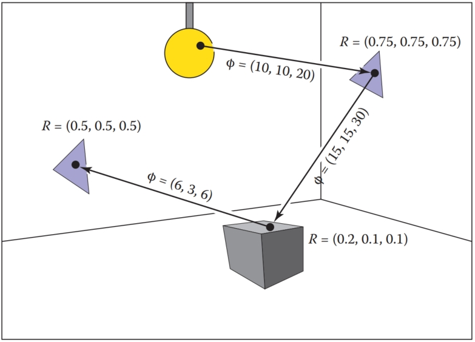
Figure 23.3. The path of a particle that survives with probability 0.5 and is absorbed at the last intersection. The RGB power is shown for each path segment. 
图 23.3。 以 0.5 的概率幸存并在最后一个交叉点被吸收的粒子的路径。 显示每个路径段的 RGB 功率。

A key part to this algorithm is that we scatter the light with an appropriate distribution for Lambertian surfaces. As discussed in Section 14.4.1, we can find a vector with a cosine (Lambertian) distribution by transforming two canonical random numbers $(ξ_1, ξ_2)$ as follows:
该算法的关键部分是我们以适合朗伯表面的分布来散射光。 正如第 14.4.1 节中所讨论的，我们可以通过如下变换两个规范随机数  $(ξ_1, ξ_2)$来找到具有余弦（朗伯）分布的向量：
$$
\bold{a} = (cos (2πξ_1)\sqrt{ξ_2},\ sin (2πξ_1)\sqrt{ξ_2}, \sqrt{1 − ξ_2}) . \ \ \ \ \ (23.2)
$$
Note that this assumes the normal vector is parallel to the z-axis. For a triangle, we must establish an orthonormal basis with w parallel to the normal vector. We can accomplish this as follows:
请注意，这假设法向量平行于 z 轴。 对于三角形，我们必须建立一个正交基，其中 w 平行于法向量。 我们可以按如下方式完成此操作：
$$
\bold{w} = \frac{\bold{n}}{\|\bold{n}\|} , \\
\bold{u} = \frac{\bold{p}_1 - \bold{p}_0}{\|\bold{p}_1 - \bold{p}_0\|} \\

\bold{v} = \bold{w} × \bold{u} ,
$$
where $\bold{p}_i$ are the vertices of the triangle. Then, by definition, our vector in the appropriate coordinates is 
其中 $\bold{p}_i$ 是三角形的顶点。 然后，根据定义，我们在适当坐标中的向量是
$$
\bold{a} = \cos (2πξ_1)\sqrt{ξ_2}\bold{u} + \sin (2πξ_1)\sqrt{ξ_2}\bold{v} + \sqrt{1 − ξ_2}\bold{w}. \ \ \ \ \ (23.3)
$$
In pseudocode our algorithm for $p = 0.5$ and one luminaire is:  
在伪代码中，我们针对 $p = 0.5$ 和一个灯具的算法是：

> for (Each of n particles) do
> 	RGB $phi = Φ/n$
> 	compute uniform random point $\bold{a}$ on luminaire
> 	compute random direction $\bold{b}$ with cosine density
> 	done = false
> 	while not done do
> 		if (ray $\bold{a} + t\bold{b}$ hits at some point $\bold{c}$ ) then
> 			add $n_tRφ/(πA)$ to appropriate texel
> 			if ($ξ_1 > 0.5$) then
> 				φ = 2Rφ
> 				$\bold{a} = \bold{c}$
> 				$\bold{b}$ = random direction with cosine density
> 		else
> 			done = true  

Here $ξ_i$ are canonical random numbers. Once this code has run, the texture maps store the radiance of each triangle and can be rendered directly for any viewpoint with no additional computation. 
这里  $ξ_i$是规范随机数。 运行此代码后，纹理贴图将存储每个三角形的辐射亮度，并且可以直接针对任何视点进行渲染，无需额外计算。

## 23.2 Path Tracing 路径追踪

While particle tracing is well suited to precomputation of the radiances of diffuse scenes, it is problematic for creating images of scenes with general BRDFs or scenes that contain many objects. The most straightforward way to create images of such scenes is to use path tracing (Kajiya, 1986). This is a probabilistic method that sends rays from the eye and traces them back to the light. Often path tracing is used only to compute the indirect lighting. Here we will present it in a way that captures all lighting, which can be inefficient. This is sometimes called brute force path tracing. In Section 23.3, more efficient techniques for direct lighting can be added. 
虽然粒子追踪非常适合漫射场景的辐射亮度的预计算，但在创建具有一般 BRDF 的场景图像或包含许多对象的场景时存在问题。 创建此类场景图像的最直接方法是使用路径追踪（Kajiya，1986）。 这是一种概率方法，从眼睛发出光线并将其追踪回光线。 通常路径追踪仅用于计算间接照明。 在这里，我们将以捕获所有照明的方式呈现它，这可能效率很低。 这有时称为强力路径追踪。 在第 23.3 节中，可以添加更有效的直接照明技术。

In path tracing, we start with the full transport equation:
在路径追踪中，我们从完整的传输方程开始：
$$
L_s(\bold{k}_o) = L_e(\bold{k}_o) + \int_{all\ \bold{k}_i} ρ(\bold{k}_i, \bold{k}_o)L_f(\bold{k}_i) \cosθ_idσ_i.
$$
We use Monte Carlo integration to approximate the solution to this equation for each viewing ray. Recall from Section 14.3, that we can use random samples to approximate an integral:
我们使用蒙特卡罗积分来近似求解每个观察光线的该方程。 回想一下 14.3 节，我们可以使用随机样本来近似积分：
$$
\int_{x∈S}g(x)dμ ≈ \frac{1}{N}\sum^{N}_{i=1}\frac{g(x_i)}{p(x_i)},
$$
where the $x_i$ are random points with probability density function $p$. If we apply this directly to the transport equation with N = 1 we get
其中 $x_i$ 是具有概率密度函数 $p$ 的随机点。 如果我们直接将其应用到 N = 1 的传输方程中，我们会得到
$$
L_s(\bold{k}_o) ≈ L_e(\bold{k}_o) + \frac{ρ(\bold{k}_i, \bold{k}_o)L_f(\bold{k}_i) \cos θ_idσ_i}{ p(\bold{k}_i)}
$$
So, if we have a way to select random directions $\bold{k}_i$ with a known density $p$, we can get an estimate. The catch is that $L_f(\bold{k}_i)$ is itself an unknown. Fortunately, we can apply recursion and use a statistical estimate for $L_f(\bold{k}_i)$ by sending a ray in that direction to find the surface seen in that direction. We end when we hit a luminaire and $L_e$ is nonzero (Figure 23.4). This method assumes lights have zero reflectance, or we would continue to recurse. 
因此，如果我们有办法选择具有已知密度 $p$ 的随机方向 $\bold{k}_i$，我们就可以获得估计值。 问题是 $L_f(\bold{k}_i)$ 本身就是一个未知数。 幸运的是，我们可以应用递归并使用 $L_f(\bold{k}_i)$ 的统计估计，通过向该方向发送光线来找到在该方向上看到的表面。 当我们击中灯具并且 $L_e$ 不为零时，我们就结束了（图 23.4）。 该方法假设光的反射率为零，否则我们将继续递归。
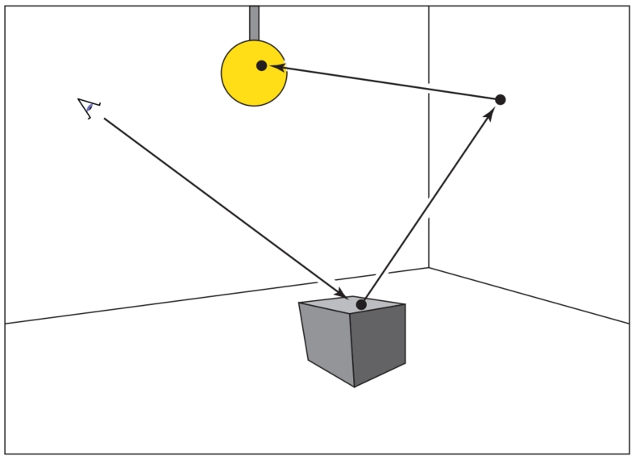
Figure 23.4. In path tracing, a ray is followed through a pixel from the eye and scattered through the scene until it hits a luminaire. 
图 23.4。 在路径追踪中，光线从眼睛穿过一个像素，并在场景中散射，直到击中灯具。

In the case of a Lambertian BRDF ($ρ = R/π$), we can use a cosine density function:
对于朗伯 BRDF ($ρ = R/π$)，我们可以使用余弦密度函数：
$$
p(\bold{k}_i) = \frac{cos θ_i}{π}.
$$
A direction with this density can be chosen according to Equation (23.3). This allows some cancellation of cosine terms in our estimate:
可以根据方程（23.3）选择具有该密度的方向。 这允许在我们的估计中取消一些余弦项：
$$
L_s(\bold{k}_o) ≈ L_e(\bold{k}_o) + RL_f(\bold{k}_i).
$$
In pseudocode, such a path tracer for Lambertian surfaces would operate just like the ray tracers described in Chapter 4, but the raycolor function would be modified:
在伪代码中，朗伯曲面的路径追踪器的运行方式与第 4 章中描述的光线追踪器类似，但光线颜色函数将被修改：

> RGB raycolor(ray $\bold{a} + t\bold{b}$, int depth)
> if (ray hits at some point $\bold{c}$ ) then
> 	RGB $c = L_e(-\bold{b})$
> 	if (depth < maxdepth) then
> 		compute random direction $\bold{d}$
> 		return $c + R$ raycolor($\bold{c} + s\bold{d}, depth+1$)
> else
> 	return background color  

This will result in a very noisy image unless either large luminaires or very large numbers of samples are used. Note the color of the luminaires must be well above one (sometimes thousands or tens of thousands) to make the surfaces have final colors near one, because only those rays that hit a luminaire by chance will make a contribution, and most rays will contribute only a color near zero. To generate the random direction d, we use the same technique as we do in particle tracing (see Equation (23.2)). 
除非使用大型灯具或大量样本，否则这将导致图像噪声非常大。 请注意，灯具的颜色必须远高于 1（有时数千或数万），以使表面的最终颜色接近 1，因为只有那些偶然照射到灯具的光线才会做出贡献，而大多数光线只会做出贡献 接近于零的颜色。 为了生成随机方向 d，我们使用与粒子追踪相同的技术（参见方程（23.2））。

In the general case, we might want to use spectral colors or use a more general BRDF. In practice, we should have the material class contain member functions to compute a random direction as well as compute the p associated with that direction. This way materials can be added transparently to an implementation. 
在一般情况下，我们可能想要使用光谱颜色或更通用的 BRDF。 在实践中，我们应该让材质类包含成员函数来计算随机方向以及计算与该方向关联的 p。 通过这种方式，可以将材料透明地添加到实现中。

## 23.3 Accurate Direct Lighting 准确的直接照明

This section presents a more physically based method of direct lighting than Chapter 10. These methods will be useful in making global illumination algorithms more efficient. The key idea is to send shadow rays to the luminaires as described in Chapter 4, but to do so with careful bookkeeping based on the transport equation from the previous chapter. The global illumination algorithms can be adjusted to make sure they compute the direct component exactly once. For example, in particle tracing, particles coming directly from the luminaire would not be logged, so the particles would only encode indirect lighting. This makes nice looking shadows much more efficiently than computing direct lighting in the context of global illumination. 
本节介绍了一种比第 10 章更基于物理的直接照明方法。这些方法将有助于提高全局照明算法的效率。 关键思想是将阴影光线发送到第 4 章中描述的灯具，但要根据上一章中的传输方程仔细记录。 可以调整全局照明算法，以确保它们只计算一次直接分量。 例如，在粒子追踪中，不会记录直接来自灯具的粒子，因此粒子只会对间接照明进行编码。 这使得漂亮的阴影比在全局照明的背景下计算直接照明更有效。

### 23.3.1 Mathematical Framework  数学框架

To calculate the direct light from one luminaire (light emitting object) onto a nonemitting surface, we solve a form of the transport equation from Section 18.2:
为了计算从一个灯具（发光物体）到非发光表面的直接光，我们求解第 18.2 节中的传输方程的一种形式：
$$
L_s(\bold{x}, \bold{k}_o) = \int_{all\ \bold{x}'} \frac{ρ(\bold{k}_i, \bold{k}_o)L_e(\bold{x}', -\bold{k}_i)v(\bold{x}, \bold{x}')\cos θ_i \cos θ'}{\|\bold{x} - \bold{x}\|^2} dA' \ \ \ \  \ \ \ \ (23.4)
$$
Recall that $L_e$ is the emitted radiance of the source, v is a visibility function that is equal to 1 if $\bold{x}$ “sees” $\bold{x}'$ and zero otherwise, and the other variables are as illustrated in Figure 23.5. 
回想一下，$L_e$ 是光源发出的辐射亮度，v 是一个可见性函数，如果 $\bold{x}$ “看到”$\bold{x}'$，则等于 1，否则为零，其他变量 如图 23.5 所示。

Figure 23.5. The direct lighting terms for Equation (23.4).
图 23.5。 方程（23.4)的直接照明项。

If we are to sample Equation (23.4) using Monte Carlo integration, we need to pick a random point $\bold{x}'$ on the surface of the luminaire with density function p (so $\bold{x}' \sim p$). Just plugging into Equation (14.5) with one sample yields
如果我们要使用蒙特卡洛积分对方程（23.4）进行采样，我们需要在具有密度函数 p 的灯具表面上选取一个随机点 $\bold{x}'$ （因此 $\bold{x}' \sim p$）。 只需用一个样本代入方程 (14.5) 即可得出
$$
L_s(\bold{x}, \bold{k}_o) ≈ \frac{ρ(\bold{k}_i, \bold{k}_o)L_e(\bold{x}', −\bold{k}_i)v(\bold{x}, \bold{x}') \cos θ_i \cos θ'}{p(\bold{x}')\|\bold{x} − \bold{x}'\|^2} \ \ \ \ \ \ (23.5)
$$

If we pick a uniform random point on the luminaire, then $p = 1/A$, where A is the area of the luminaire. This gives
如果我们在灯具上选择一个均匀的随机点，则 $p = 1/A$，其中 A 是灯具的面积。 这给出了
$$
L_s(\bold{x}, \bold{k}_o) ≈ \frac{ρ(\bold{k}_i, \bold{k}_o)L_e(\bold{x}', −\bold{k}_i)v(\bold{x}, \bold{x}') \cos θ_i \cos θ'}{\|\bold{x} − \bold{x}'\|^2} \ \ \ \ \ \ (23.6)
$$
We can use Equation (23.6) to sample planar (e.g., rectangular) luminaires in a straightforward fashion. We simply pick a random point on each luminaire.
我们可以使用方程（23.6）以简单的方式对平面（例如矩形）灯具进行采样。 我们只需在每个灯具上随机选择一个点。

The code for one luminaire is:
一台灯具的代码是：

> color directLight$(\bold{x}, \bold{k}_o, \bold{n})$
> pick random point $\bold{x}'$ with normal vector $\bold{n}'$ on light
> $\bold{d} = \bold{x}' - \bold{x}$
> $\bold{k}_i = \bold{d}/\|d\|$
> if (ray $\bold{x} + t\bold{d}$ has no hits for $t < 1 - \epsilon$) then
> 	return $ρ(\bold{k}_i, \bold{k}_o)L_e(\bold{x}', -\bold{k}_i)(\bold{n} · \bold{d})(-\bold{n}' · \bold{xd})/\|d\|^4$
> else
> 	return 0  

The above code needs some extra tests such as clamping the cosines to zero if they are negative. Note that the term $\|\bold{d}\|^4$ comes from the distance squared term and the two cosines, e.g., $\bold{n} · \bold{d} = \|\bold{d}\| \cos θ$ because $\bold{d}$ is not necessarily a unit vector.
上面的代码需要一些额外的测试，例如如果余弦为负，则将余弦钳位为零。 请注意，项 $\|\bold{d}\|^4$ 来自距离平方项和两个余弦，例如 $\bold{n} · \bold{d} = \|\bold{d} \| \cos θ$ 因为 $\bold{d}$ 不一定是单位向量。

Several examples of soft shadows are shown in Figure 23.6. 
图 23.6 显示了几个软阴影的示例。

Figure 23.6. Various soft shadows on a backlit sphere with a square and an area light source. Top: 1 sample. Bottom: 100 samples. Note that the shape of the light source is less important than its size in determining shadow appearance.
图 23.6。 带有方形和区域光源的背光球体上的各种柔和阴影。 顶部：1 个样品。 底部：100 个样本。 请注意，在确定阴影外观时，光源的形状不如其大小重要。

### 23.3.2 Sampling a Spherical Luminaire  对球形灯具进行采样

Though a sphere with center c and radius R can be sampled using Equation (23.6), this sampling will yield a very noisy image because many samples will be on the back of the sphere, and the $\cos θ'$ term varies so much. Instead, we can use a more complex $p(\bold{x}')$ to reduce noise. 
虽然可以使用方程（23.6）对中心为 c、半径为 R 的球体进行采样，但这种采样将产生噪声非常大的图像，因为许多样本将位于球体的背面，并且 $\cos θ'$ 项变化很大 。 相反，我们可以使用更复杂的 $p(\bold{x}')$ 来减少噪音。

The first nonuniform density we might try is $p(\bold{x}') ∝ cos θ'$. This turns out to be just as complicated as sampling with $p(\bold{x}') ∝ \cos θ'/\|\bold{x}' − \bold{x}\|^2$, so we instead discuss that here. We observe that sampling on the luminaire this way is the same as using a constant density function $q(\bold{k}_i) =$ const defined in the space of directions subtended by the luminaire as seen from x. We now use a coordinate system defined with x at the origin, and a right-handed orthonormal basis with $\bold{w} = (\bold{c} − \bold{x})/\|\bold{c} − \bold{x}\|$, and $\bold{v} = (\bold{w} × \bold{n})/\|(\bold{w} × \bold{n})\| $(see Figure 23.7). We also define $(α, φ)$ to be the azimuthal and polar angles with respect to the $uvw$ coordinate system. 
我们可能尝试的第一个非均匀密度是 $p(\bold{x}') ∝ cos θ'$。 事实证明，这与使用 $p(\bold{x}') ∝ \cos θ'/\|\bold{x}' − \bold{x}\|^2$ 采样一样复杂，所以我们改为 在这里讨论这个问题。 我们观察到，以这种方式对灯具进行采样与使用恒定密度函数 $q(\bold{k}_i) =$ const 相同，该函数在从 x 看到的灯具所对方向的空间中定义。 我们现在使用以 x 为原点定义的坐标系，以及右手正交基 $\bold{w} = (\bold{c} − \bold{x})/\|\bold{c} − \bold{x}\|$ 和 $\bold{v} = (\bold{w} × \bold{n})/\|(\bold{w} × \bold{n})\| $（见图 23.7）。 我们还将 $(α, φ)$ 定义为相对于 $uvw$ 坐标系的方位角和极角。

Figure 23.7. Geometry for direct lighting at point $\bold{x}$ from a spherical luminaire. 
图 23.7。 来自球形灯具的点 $\bold{x}$ 直接照明的几何形状。

The maximum α that includes the spherical luminaire is given by
包括球形灯具在内的最大 α 由下式给出
$$
α_{max} = \arcsin(\frac{R}{\|\bold{x} - \bold{c}\|}) = \arccos\sqrt{1- (\frac{R}{\|\bold{x} - \bold{c}\|})^2}
$$
Thus, a uniform density (with respect to solid angle) within the cone of directions subtended by the sphere is just the reciprocal of the solid angle $2π(1 − \cos α_{max})$ subtended by the sphere:
因此，球体对向的方向锥内的均匀密度（相对于立体角）就是球体对向的立体角 $2π(1 − \cos α_{max})$ 的倒数：
$$
q(\bold{k}_i) = \frac{1}{2\pi(1-\sqrt{1 - (\frac{R}{\|\bold{x} - \bold{c}\|})^2})}
$$
And we get 
我们得到
$$
\begin{bmatrix}
\cos α \\
φ
\end{bmatrix} = \begin{bmatrix}
1 - ξ_1 + ξ_1\sqrt{1-(\frac{R}{\|\bold{x} - \bold{c}\|})^2} \\
2\pi ξ_2
\end{bmatrix}
$$
This gives us the direction $\bold{k}_i$. To find the actual point, we need to find the first point on the sphere in that direction. The ray in that direction is just $(\bold{x} + t\bold{k}_i)$,  where $\bold{k}_i$ is given by 
这给了我们方向$\bold{k}_i$。 为了找到实际的点，我们需要找到球体上该方向的第一个点。 该方向上的射线就是 $(\bold{x} + t\bold{k}_i)$，其中 $\bold{k}_i$ 由下式给出
$$
\bold{k}_i = \begin{bmatrix}
u_x & v_x & w_x \\
u_y & v_y & w_y \\
u_z & v_z & w_z \\
\end{bmatrix}
\begin{bmatrix}
\cosφ \sinα \\
\sinφ \sinα \\
\cosα
\end{bmatrix}
$$
We must also calculate $p(\bold{x}')$, the probability density function with respect to the area measure (recall that the density function $q$ is defined in solid angle space). Since we know that $q$ is a valid probability density function using the $ω$ measure, and we know that $dΩ = dA(\bold{x}') \cos θ'/\|\bold{x}' − \bold{x}\|^2$, we can relate any probability density function $q(\bold{k}_i)$ with its associated probability density function $p(\bold{x}')$:
我们还必须计算 $p(\bold{x}')$，即相对于面积度量的概率密度函数（回想一下，密度函数 $q$ 是在立体角空间中定义的）。 因为我们知道 $q$ 是使用 $ω$ 度量的有效概率密度函数，并且我们知道 $dΩ = dA(\bold{x}') \cos θ'/\|\bold{x}' - \bold{x}\|^2$，我们可以将任何概率密度函数 $q(\bold{k}_i)$ 与其相关的概率密度函数 $p(\bold{x}')$ 联系起来：
$$
q(\bold{k}_i) = \frac{p(\bold{x}')\cosθ'}{\|\bold{x}' - \bold{x}\|^2} \ \ \ \ \ (23.7)
$$
So we can solve for $p(\bold{x}')$: 
因此我们可以求解 $p(\bold{x}')$：
$$
p(\bold{x}') = \frac{\cos θ'}{2\pi\|\bold{x}' - \bold{x}\|^2(1-\sqrt{1-(\frac{R}{\|\bold{x} - \bold{c}\|})^2})}
$$
A good debugging case for this is shown in Figure 23.8. 
图 23.8 显示了一个很好的调试案例。

Figure 23.8. A sphere with $L_e = 1$ touching a sphere of reflectance 1. Where the two spheres touch, the reflective sphere should have $L(\bold{x}') = 1$ . Left: 1 sample. Middle: 100 samples. Right: 100 samples, close-up.
图 23.8。 $L_e = 1$ 的球体接触反射率为 1 的球体。在两个球体接触的地方，反射球体应具有 $L(\bold{x}') = 1$ 。 左：1 个样本。 中：100 个样本。 右：100 个样本，特写。

### 23.3.3 Nondiffuse Luminaries 非漫射灯具

There is no reason the luminance of the luminaire cannot vary with both direction and position. For example, it can vary with position if the luminaire is a television. It can vary with direction for car headlights and other directional sources. Little in our analysis need change from the previous sections, except that $L_e(x')$ must change to $L_e(\bold{x}', −\bold{k}_i)$. The simplest way to vary the intensity with direction is to use a Phong-like pattern with respect to the normal vector $\bold{n}'$. To avoid using an exponent in the term for the total light output, we can use the form
灯具的亮度没有理由不能随方向和位置而变化。 例如，如果灯具是电视，则它可以随位置而变化。 它会随着汽车前灯和其他定向光源的方向而变化。 我们的分析与前面的部分相比几乎不需要改变，除了 $L_e(x')$ 必须更改为 $L_e(\bold{x}', −\bold{k}_i)$。 随方向改变强度的最简单方法是使用相对于法线向量 $\bold{n}'$ 的类似 Phong 的图案。 为了避免在总光输出项中使用指数，我们可以使用以下形式
$$
L_e(\bold{x}', −\bold{k}_i) = \frac{(n + 1)E(\bold{x}')}{2π} \cos^{(n−1)}θ',
$$
where $E(\bold{x}')$ is the radiant exitance (power per unit area) at point $\bold{x}'$, and n is the Phong exponent. You get a diffuse light for n = 1. If the light is nonuniform across its area, e.g., as a television set is, then E will not be a constant.
其中 $E(\bold{x}')$ 是点 $\bold{x}'$ 处的辐射出射度（每单位面积的功率），n 是 Phong 指数。 当 n = 1 时，您会得到漫射光。如果光在其区域内不均匀，例如电视机，则 E 将不是常数。

## Frequently Asked Questions  经常问的问题

### My pixel values are no longer in some sensible zero-to-one range. What should I display? 我的像素值不再处于某个合理的零到一范围内。 我应该展示什么？

You should use one of the tone reproduction techniques described in Chapter 21. 
您应该使用第 21 章中描述的一种音调再现技术。

### What global illumination techniques are used in practice? 实践中使用了哪些全局照明技术？

For batch rendering of complex scenes, path tracing with one level of reflection is often used. Path tracing is often augmented with a particle tracing preprocess as described in Jensen’s book in the chapter notes. For walkthrough games, some form of world-space preprocess is often used, such as the particle tracing described in this chapter. For scenes with very complicated specular transport, an elegant but involved method, Metropolis Light Transport (Veach & Guibas, 1997) may be the best choice. 
对于复杂场景的批量渲染，通常使用一级反射的路径追踪。 路径追踪通常会通过粒子追踪预处理进行增强，如 Jensen 的书中章节注释中所述。 对于演练游戏，经常使用某种形式的世界空间预处理，例如本章中描述的粒子追踪。 对于镜面反射传输非常复杂的场景，Metropolis Light Transport（Veach & Guibas，1997）是一种优雅但复杂的方法，可能是最佳选择。

### How does the ambient component relate to global illumination?  环境成分与全局照明有何关系？

For diffuse scenes, the radiance of a surface is proportional to the product of the irradiance at the surface and the reflectance of the surface. The ambient component is just an approximation to the irradiance scaled by the inverse of π. So although it is a crude approximation, there can be some methodology to guessing it (M. F. Cohen, Chen, Wallace, & Greenberg, 1988), and it is probably more accurate than doing nothing, i.e., using zero for the ambient term. Because the indirect irradiance can vary widely within a scene, using a different constant for each surface can be used for better results rather than using a global ambient term. 
对于漫反射场景，表面的辐射度与表面的辐照度和表面的反射率的乘积成正比。 环境分量只是按 π 倒数缩放的辐照度的近似值。 因此，虽然它是一个粗略的近似值，但可以通过一些方法来猜测它（M. F. Cohen、Chen、Wallace 和 Greenberg，1988），并且它可能比什么都不做（即使用零作为环境项）更准确。 由于间接辐照度在场景内可能变化很大，因此为每个表面使用不同的常数可以获得更好的结果，而不是使用全局环境项。

### Why do most algorithms compute direct lighting using traditional ray tracing? 为什么大多数算法使用传统光线追踪来计算直接照明？

Although global illumination algorithms automatically compute direct lighting, and it is, in fact, slightly more complicated to make them compute only indirect lighting, it is usually faster to compute direct lighting separately. There are three reasons for this. First, indirect lighting tends to be smooth compared to direct lighting (see Figure 23.1) so coarser representations can be used, e.g., lowresolution texture maps for particle tracing. The second reason is that light sources tend to be small, and it is rare to hit them by chance in a “from the eye” method such as path tracing, while direct shadow rays are efficient. The third reason is that direct lighting allows stratified sampling, so it converges rapidly compared to unstratified sampling. The issue of stratification is the reason that shadow rays are used in Metropolis Light Transport despite the stability of its default technique for dealing with direct lighting as just one type of path to handle. 
尽管全局照明算法会自动计算直接照明，而且事实上，让它们仅计算间接照明稍微复杂一些，但单独计算直接照明通常会更快。 这有三个原因。 首先，与直接照明相比，间接照明往往更平滑（参见图 23.1），因此可以使用更粗糙的表示，例如用于粒子追踪的低分辨率纹理贴图。 第二个原因是光源往往很小，并且在“从眼睛”的方法（例如路径追踪）中很少会偶然击中光源，而直接阴影光线则非常有效。 第三个原因是直接照明允许分层采样，因此与非分层采样相比收敛得很快。 分层问题是在 Metropolis Light Transport 中使用阴影光线的原因，尽管其处理直接照明的默认技术仅作为一种要处理的路径类型具有稳定性。

### How artificial is it to assume ideal diffuse and specular behavior?  假设理想的漫反射和镜面反射行为有多人为？

For environments that have only matte and mirrored surfaces, the Lambertian/ specular assumption works well. A comparison between a rendering using that assumption and a photograph is shown in Figure 23.9. 
对于只有无光泽和镜面表面的环境，朗伯/镜面假设效果很好。 使用该假设的渲染与照片之间的比较如图 23.9 所示。

Figure 23.9. A comparison between a rendering and a photo. Image courtesy Sumant Pattanaik and the Cornell Program of Computer Graphics. 
图 23.9。 渲染和照片之间的比较。 图片由 Sumant Pattanaik 和康奈尔大学计算机图形学项目提供。

### How many shadow rays are needed per pixel?  每个像素需要多少阴影光线？

Typically between 16 and 400. Using narrow penumbra, a large ambient term (or a large indirect component), and a masking texture (Ferwerda, Shirley, Pattanaik, & Greenberg, 1997) can reduce the number needed. 
通常在 16 到 400 之间。使用窄半影、大的环境项（或大的间接分量）和遮蔽纹理（Ferwerda、Shirley、Pattanaik 和 Greenberg，1997）可以减少所需的数量。

### How do I sample something like a filament with a metal reflector where much of the light is reflected from the filament?如何对带有金属反射器的灯丝（其中大部分光从灯丝反射）之类的物体进行采样？ 

Typically, the whole light is replaced by a simple source that approximates its aggregate behavior. For viewing rays, the complicated source is used. So a car headlight would look complex to the viewer, but the lighting code might see simple disk-shaped lights. 
通常，整个光被一个近似其聚合行为的简单光源所取代。 为了观察光线，使用了复杂的光源。 因此，汽车前灯对于观察者来说看起来很复杂，但照明代码可能会看到简单的盘形灯。

### Isn’t something like the sky a luminaire?  像天空这样的东西不就是一个灯具吗？

Yes, and you can treat it as one. However, such large light sources may not be helped by direct lighting; the brute-force techniques are likely to work better. 
是的，您可以将其视为一个整体。 然而，如此大的光源可能无法通过直接照明得到帮助； 蛮力技术可能效果更好。

## Notes  注释

Global illumination has its roots in the fields of heat transfer and illumination engineering as documented in Radiosity: A Programmer’s Perspective (Ashdown, 1994). Other good books related to global illumination include Radiosity and Global Illumination (M. F. Cohen & Wallace, 1993), Radiosity and Realistic Image Synthesis (Sillion & Puech, 1994), Principles of Digital Image Synthesis (Glassner, 1995), Realistic Image Synthesis Using Photon Mapping (Jensen, 2001), Advanced Global Illumination (Dutr´ e, Bala, & Bekaert, 2002), and Physically Based Rendering (Pharr & Humphreys, 2004). The probabilistic methods discussed in this chapter are from Monte Carlo Techniques for Direct Lighting Calculations (Shirley, Wang, & Zimmerman, 1996).
全局照明起源于传热和照明工程领域，如《光能传递：程序员的视角》（Ashdown，1994 年）中所述。 其他与全局照明相关的好书包括《光能传递和全局照明》(M. F. Cohen & Wallace, 1993)、《光能传递和真实图像合成》(Sillion & Puech, 1994)、《数字图像合成原理》(Glassner, 1995)、《使用光子的真实图像合成》 映射（Jensen，2001）、高级全局照明（Dutr´ e、Bala 和 Bekaert，2002）以及基于物理的渲染（Pharr 和 Humphreys，2004）。 本章讨论的概率方法来自直接照明计算的蒙特卡罗技术（Shirley、Wang 和 Zimmerman，1996）。

## Exercises  练习

1. For a closed environment, where every surface is a diffuse reflector and emittor with reflectance R and emitted radiance E, what is the total radiance at each point? Hint: for $R = 0.5$ and $E = 0.25$ the answer is 0.5. This is an excellent debugging case. 
   对于封闭环境，每个表面都是漫反射器和发射器，反射率为 R，发射辐射率为 E，每个点的总辐射率是多少？ 提示：对于 $R = 0.5$ 和 $E = 0.25$，答案是 0.5。 这是一个优秀的调试案例。
1. Using the definitions from Chapter 18, verify Equation (23.1). 
   使用第 18 章中的定义，验证方程 (23.1)。
1. If we want to render a typically sized room with textures at centimetersquare resolution, approximately how many particles should we send to get an average of about 1000 hits per texel? 
   如果我们想要渲染一个典型大小的房间，并具有厘米见方分辨率的纹理，我们应该发送大约多少粒子才能获得每个纹素平均约 1000 次点击？
1. Develop a method to take random samples with uniform density from a disk. 
   开发一种从圆盘中随机抽取均匀密度样本的方法。
1. Develop a method to take random samples with uniform density from a triangle. 
   开发一种从三角形中随机抽取均匀密度样本的方法。
1. Develop a method to take uniform random samples on a “sky dome” (the inside of a hemisphere).
   开发一种在“天穹”（半球内部）上进行均匀随机采样的方法。

# 24  Reflection Models  反射模型

As we discussed in Chapter 18, the reflective properties of a surface can be summarized using the BRDF (Nicodemus, Richmond, Hsia, Ginsberg, & Limperis, 1977; Cook & Torrance, 1982). In this chapter, we discuss some of the most visually important aspects of material properties and a few fairly simple models that are useful in capturing these properties. There are many BRDF models in use in graphics, and the models presented here are meant to give just an idea of nondiffuse BRDFs. 
正如我们在第 18 章中讨论的，表面的反射特性可以使用 BRDF 进行总结（Nicodemus、Richmond、Hsia、Ginsberg 和 Limperis，1977；Cook 和 Torrance，1982）。 在本章中，我们讨论材料属性的一些在视觉上最重要的方面以及一些可用于捕获这些属性的相当简单的模型。 图形中使用了许多 BRDF 模型，这里介绍的模型只是为了提供非扩散 BRDF 的概念。

## 24.1 Real-World Materials  现实世界的材料

Many real materials have a visible structure at normal viewing distances. For example, most carpets have easily visible pile that contributes to appearance. For our purposes, such structure is not part of the material property but is, instead, part of the geometric model. Structure whose details are invisible at normal viewing distances, but which do determine macroscopic material appearance, are part of the material property. For example, the fibers in paper have a complex appearance under magnification, but they are blurred together into an homogeneous appearance when viewed at arm’s length. This distinction between microstructure that is folded into BRDF is somewhat arbitrary and depends on what one defines as “normal” viewing distance and visual acuity, but the distinction has proven quite useful in practice. In this section, we define some categories of materials. Later in the chapter, we present reflection models that target each type of material. In the notes at the end of the chapter, some models that account for more exotic materials are also discussed. 
许多真实材料在正常观看距离下具有可见的结构。 例如，大多数地毯都具有明显的绒毛，有助于美观。 就我们的目的而言，这种结构不是材料属性的一部分，而是几何模型的一部分。 其细节在正常观看距离下不可见，但确实决定宏观材料外观的结构是材料属性的一部分。 例如，纸张中的纤维在放大后具有复杂的外观，但当在一定距离处观察时，它们会模糊在一起形成均匀的外观。 折叠到 BRDF 中的微观结构之间的这种区别有些武断，取决于人们对“正常”观看距离和视敏度的定义，但这种区别在实践中已被证明非常有用。 在本节中，我们定义了一些材料类别。 在本章后面，我们将介绍针对每种类型材质的反射模型。 在本章末尾的注释中，还讨论了一些考虑更奇特材料的模型。

### 24.1.1 Smooth Dielectrics and Metals  光滑电介质和金属

Dielectrics are clear materials that refract light; their basic properties were summarized in Chapter 4. Metals reflect and refract light much like dielectrics, but they absorb light very, very quickly. Thus, only very thin metal sheets are transparent at all, e.g., the thin gold plating on some glass objects. For a smooth material, there are only two important properties: 
电介质是折射光的透明材料； 第 4 章总结了它们的基本特性。金属像电介质一样反射和折射光，但它们吸收光的速度非常非常快。 因此，只有非常薄的金属片是透明的，例如某些玻璃物体上的薄金镀层。 对于光滑材料来说，只有两个重要的特性：

1. How much light is reflected at each incident angle and wavelength. 
   每个入射角和波长反射多少光。
2. What fraction of light is absorbed as it travels through the material for a given distance and wavelength.
   当光在给定的距离和波长下穿过材料时，有多少部分的光被吸收。

The amount of light transmitted is whatever is not reflected (a result of energy conservation). For a metal, in practice, we can assume all the light is immediately absorbed. For a dielectric, the fraction is determined by the constant used in Beer’s Law as discussed in Chapter 13.
传输的光量是没有反射的光量（能量守恒的结果）。 对于金属，实际上，我们可以假设所有的光都会立即被吸收。 对于电介质，分数由比尔定律中使用的常数决定，如第 13 章所述。 

The amount of light reflected is determined by the Fresnel equations as discussed in Chapter 4. These equations are straightforward, but cumbersome. The main effect of the Fresnel equations is to increase the reflectance as the incident angle increases, particularly near grazing angles. This effect works for transmitted light as well. These ideas are shown diagrammatically in Figure 24.1. Note that the light is repeatedly reflected and refracted as shown in Figure 24.2. Usually only one or two of the reflected images is easily visible. 
反射的光量由第 4 章中讨论的菲涅尔方程确定。这些方程很简单，但很麻烦。 菲涅耳方程的主要作用是随着入射角的增加（特别是在掠射角附近）增加反射率。 这种效果也适用于透射光。 这些想法如图 24.1 所示。 请注意，光会反复反射和折射，如图 24.2 所示。 通常只有一两个反射图像是容易看到的。

Figure 24.1. The amount of light reflected and transmitted by glass varies with the angle.
图 24.1。 玻璃反射和透射的光量随角度的不同而变化。

Figure 24.2. Light is repeatedly reflected and refracted by glass, with the fractions of energy shown.
图 24.2。 光被玻璃反复反射和折射，并显示出能量的分数。

### 24.1.2 Rough Surfaces  粗糙表面

If a metal or dielectric is roughened to a small degree, but not so small that diffraction occurs, then we can think of it as a surface with microfacets (Cook & Torrance, 1982). Such surfaces behave specularly at a closer distance, but viewed at a further distance seem to spread the light out in a distribution. For a metal, an example of this rough surface might be brushed steel, or the “cloudy” side of most aluminum foil. 
如果金属或电介质被粗糙化到很小的程度，但又没有小到发生衍射，那么我们可以将其视为具有微面的表面（Cook & Torrance，1982）。 这种表面在较近的距离处表现出镜面反射，但在较远的距离处观察似乎将光以一定的分布形式散开。 对于金属，这种粗糙表面的一个例子可能是拉丝钢，或大多数铝箔的“浑浊”面。

For dielectrics, such as a sheet of glass, scratches or other irregular surface features make the glass blur the reflected and transmitted images that we can normally see clearly. If the surface is heavily scratched, we call it translucent rather than transparent. This is a somewhat arbitrary distinction, but it is usually clear whether we would consider a glass translucent or transparent.
对于电介质，例如玻璃片，划痕或其他不规则的表面特征会使玻璃模糊我们通常可以清楚看到的反射和透射图像。 如果表面被严重划伤，我们称其为半透明而不是透明。 这是一个有点武断的区别，但通常很清楚我们是否会认为玻璃是半透明的或透明的。

### 24.1.3 Diffuse Materials 漫反射材质

A material is diffuse if it is matte, i.e., not shiny. Many surfaces we see are diffuse, such as most stones, paper, and unfinished wood. To a first approximation, diffuse surfaces can be approximated with a Lambertian (constant) BRDF. Real diffuse materials usually become somewhat specular for grazing angles. This is a subtle effect, but can be important for realism. 
如果材料是无光泽的，即没有光泽，则该材料是漫反射的。 我们看到的许多表面都是漫反射的，例如大多数石头、纸张和未完成的木材。 对于第一个近似，漫反射表面可以用朗伯（常数）BRDF 来近似。 真实的漫反射材质通常会因掠射角而变得有些镜面反射。 这是一种微妙的效果，但对于现实主义来说可能很重要。

### 24.1.4 Translucent Materials 半透明材质

Many thin objects, such as leaves and paper, both transmit and reflect light diffusely. For all practical purposes no clear image is transmitted by these objects. These surfaces can add a hue shift to the transmitted light. For example, red paper is red because it filters out non-red light for light that penetrates a short distance into the paper, and then scatters back out. The paper also transmits light with a red hue because the same mechanisms apply, but the transmitted light makes it all the way through the paper. One implication of this property is that the transmitted coefficient should be the same in both directions.
许多薄的物体，例如树叶和纸张，都会漫射和反射光。 出于所有实际目的，这些物体无法传输清晰的图像。 这些表面可以为透射光添加色调偏移。 例如，红纸之所以是红色，是因为它过滤掉了穿透纸一小段距离然后散射出去的非红光。 纸张还可以传输红色调的光，因为应用了相同的机制，但传输的光使其一直穿过纸张。 这一属性的含义之一是传输系数在两个方向上应该相同。

### 24.1.5 Layered Materials  分层材料

Many surfaces are composed of “layers” or are dielectrics with embedded particles that give the surface a diffuse property (Phong, 1975). The surface of such materials reflects specularly as shown in Figure 24.3, and thus obeys the Fresnel equations. The light that is transmitted is either absorbed or scattered back up to the dielectric surface where it may or may not be transmitted. That light that is transmitted, scattered, and then retransmitted in the opposite direction forms a diffuse “reflection” component.
许多表面由“层”组成，或者是带有嵌入颗粒的电介质，赋予表面漫射特性（Phong，1975）。 此类材料的表面发生镜面反射，如图 24.3 所示，因此遵循菲涅尔方程。 传输的光要么被吸收，要么被散射回电介质表面，在那里它可能会或可能不会被传输。 透射、散射、然后沿相反方向重新透射的光形成漫反射“反射”分量。
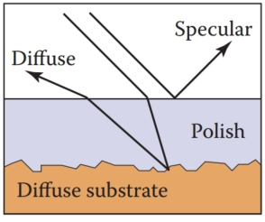
Figure 24.3. Light hitting a layered surface can be reflected specularly, or it can be transmitted and then scatter diffusely off the substrate.
图 24.3。 照射到分层表面的光可以镜面反射，也可以透射，然后从基材上漫反射。

Note that the diffuse component also is attenuated with the degree of the angle, because the Fresnel equations cause reflection back into the surface as the angle increases as shown in Figure 24.4. Thus, instead of a constant diffuse BRDF, one that vanishes near the grazing angle is more appropriate.
请注意，漫反射分量也会随着角度的大小而衰减，因为随着角度的增加，菲涅尔方程会导致反射回表面，如图 24.4 所示。 因此，与恒定的漫反射 BRDF 不同，在掠射角附近消失的 BRDF 更合适。
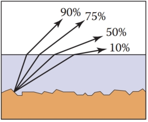
Figure 24.4. The light scattered by the substrate is less and less likely to make it out of the surface as the angle relative to the surface normal increases.
图 24.4。 随着相对于表面法线的角度增大，被基底散射的光越来越不可能从表面中出来。

## 24.2 Implementing Reflection Models  实现反射模型

A BRDF model, as described in Section 18.1.6, will produce a rendering which is more physically based than the rendering we get from point light sources and Phong-like models. Unfortunately, real BRDFs are typically quite complicated and cannot be deduced from first principles. Instead, they must either be measured and directly approximated from raw data, or they must be crudely approximated in an empirical fashion. The latter empirical strategy is what is usually done, and the development of such approximate models is still an area of research. This section discusses several desirable properties of such empirical models. 
BRDF 模型，如第 18.1.6 节中所述，将产生比我们从点光源和类似 Phong 模型获得的渲染更基于物理的渲染。 不幸的是，真正的 BRDF 通常相当复杂，无法从第一原理中推导出来。 相反，它们必须要么被测量并直接根据原始数据进行近似，要么必须以经验方式粗略地近似。 后一种经验策略是通常所做的，并且这种近似模型的开发仍然是一个研究领域。 本节讨论此类经验模型的几个理想属性。

First, physical constraints imply two properties of a BRDF model. The first constraint is energy conservation:
首先，物理约束意味着 BRDF 模型的两个属性。 第一个约束是能量守恒：
$$
for\ all\ \bold{k}_i, R(\bold{k}_i) = \int _{all\ \bold{k}_o} ρ(\bold{k}_i, \bold{k}_o) \cos θ_o dσ_o ≤ 1.
$$
If you send a beam of light at a surface from any direction $\bold{k}_i$, then the total amount of light reflected over all directions will be at most the incident amount. The second physical property we expect all BRDFs to have is reciprocity:
如果从任意方向 $\bold{k}_i$ 向表面发射光束，则所有方向反射的光总量最多为入射光量。 我们期望所有 BRDF 都具有的第二个物理属性是互易性：
$$
for\ all\ \bold{k}_i, \bold{k}_o, ρ(\bold{k}_i, \bold{k}_o) = ρ(\bold{k}_o, \bold{k}_i).
$$
Second, we want a clear separation between diffuse and specular components. The reason for this is that, although there is a mathematically clean delta function formulation for ideal specular components, delta functions must be implemented as special cases in practice. Such special cases are only practical if the BRDF model clearly indicates what is specular and what is diffuse.
其次，我们希望漫反射和镜面反射分量之间有明确的分离。 其原因是，虽然理想镜面反射分量有一个数学上清晰的 delta 函数公式，但在实践中必须将 delta 函数作为特殊情况来实现。 只有当 BRDF 模型清楚地表明什么是镜面反射、什么是漫反射时，这种特殊情况才实用。

Third, we would like intuitive parameters. For example, one reason the Phong model has enjoyed such longevity is that its diffuse constant and exponent are both clearly related to the intuitive properties of the surface, namely surface color and highlight size.
第三，我们想要直观的参数。 例如，Phong 模型如此长寿的原因之一是它的漫反射常数和指数都与表面的直观属性（即表面颜色和高光大小）明显相关。

Finally, we would like the BRDF function to be amenable to Monte Carlo sampling. Recall from Chapter 14 that an integral can be sampled by N random points $x_i ∼ p$ where p is defined with the same measure as the integral:
最后，我们希望 BRDF 函数能够进行蒙特卡洛采样。 回想一下第 14 章，积分可以通过 N 个随机点 $x_i ∼ p$ 进行采样，其中 p 的定义与积分的度量相同：
$$
\int f(x)dμ ≈ \frac{1}{N} \sum^N_{j=1}\frac{f(x_j)}{p(x_j)}
$$
Recall from Section 18.2 that the surface radiance in direction $\bold{k}_o$ is given by a transport equation: 
回想一下 18.2 节，$\bold{k}_o$ 方向上的表面辐射率由传输方程给出：
$$
L_s(\bold{k}_o) = \int _{all\ \bold{k}_i} ρ(\bold{k}_i, \bold{k}_o)L_f(\bold{k}_i) cos θ_idσ_i.
$$
If we sample directions with pdf p(ki) as discussed in Chapter 23, then we can approximate the surface radiance with samples: 
如果我们使用第 23 章中讨论的 pdf p(ki) 对方向进行采样，那么我们可以使用样本来近似表面辐射率：
$$
L_s(\bold{k}_o) ≈ \frac{1}{N}\sum^{N}_{j=1}\frac{ρ(\bold{k}_j, \bold{k}_o)L_f(\bold{k}_j) \cos θ_j}
{p(\bold{k}_j)} 
$$
This approximation will converge for any $p$ that is nonzero where the integrand is nonzero. However, it will only converge well if the integrand is not very large relative to $p$. Ideally, $p(\bold{k})$ should be approximately shaped like the integrand $ρ(\bold{k}_j, \bold{k}_o)L_f(\bold{k}_j) \cos θ_j$. In practice, $L_f$ is complicated, and the best we can accomplish is to have $p(\bold{k})$ shaped somewhat like $ρ(\bold{k}, \bold{k}_o)L_f(\bold{k}) \cos θ$. 
对于任何非零且被积函数非零的 $p$，该近似将收敛。 然而，只有当被积函数相对于 $p$ 不是很大时，它才会很好地收敛。 理想情况下，$p(\bold{k})$ 的形状应近似于被积函数 $ρ(\bold{k}_j, \bold{k}_o)L_f(\bold{k}_j) \cos θ_j$。 实际上，$L_f$ 很复杂，我们能做到的最好的结果就是让 $p(\bold{k})$ 的形状有点像 $ρ(\bold{k}, \bold{k}_o)L_f(\bold{k}) \cos θ$。

For example, if the BRDF is Lambertian, then it is constant and the “ideal” $p(\bold{k})$ is proportional to $\cos θ$. Because the integral of p must be one, we can deduce the leading constant:
例如，如果 BRDF 是朗伯分布，那么它是常数，并且“理想”$p(\bold{k})$ 与 $\cos θ$ 成正比。 因为 p 的积分必须为 1，所以我们可以推导出前导常数：
$$
\int_{all\ \bold{k} \ with\ θ < π/2}C\cosθdσ = 1
$$
This implies that $C = 1/π$, so we have
这意味着 $C = 1/π$，所以我们有
$$
p(\bold{k}) = \frac{1}{π}\cos θ
$$
An acceptably efficient implementation will result as long as p doesn’t get too small when the integrand is nonzero. Thus, the constant pdf will also suffice:
只要当被积函数非零时 p 不变得太小，就会产生可接受的高效实现。 因此，常数 pdf 也足够了：
$$
p(\bold{k}) = \frac{1}{2\pi}
$$
This emphasizes that many pdfs may be acceptable for a given BRDF model. 
这强调了对于给定的 BRDF 模型，许多 pdf 可能是可接受的。

## 24.3 Specular Reflection Models 镜面反射模型

For a metal, we typically specify the reflectance at normal incidence $R_0(λ)$. The reflectance should vary according to the Fresnel equations, and a good approximation is given by (Schlick, 1994a)
对于金属，我们通常指定法向入射时的反射率 $R_0(λ)$。 反射率应根据菲涅耳方程而变化，并且给出了一个很好的近似值（Schlick，1994a）
$$
R(θ, λ) = R_0(λ) + (1 − R_0(λ)) (1 − \cos θ)^5
$$
This approximation allows us to just set the normal reflectance of the metal either from data or by eye.
这种近似使我们能够根据数据或肉眼设置金属的法向反射率。

For a dielectric, the same formula works for reflectance. However, we can set $R_0(λ)$ in terms of the refractive index $n(λ)$:
对于电介质，相同的公式适用于反射率。 然而，我们可以根据折射率 $n(λ)$ 来设置 $R_0(λ)$：
$$
R_0(λ) = (\frac{n(λ)-1}{n(λ)+1})^2
$$
Typically, n does not vary with wavelength, but for applications where dispersion is important, n can vary. The refractive indices that are often useful include water $(n = 1.33)$, glass ($n = 1.4$ to $n = 1.7$), and diamond ($n = 2.4$).
通常，n 不随波长变化，但对于色散很重要的应用，n 可以变化。 通常有用的折射率包括水 $(n = 1.33)$、玻璃（$n = 1.4$ 至 $n = 1.7$）和钻石（$n = 2.4$）。

## 24.4 Smooth-Layered Model  平滑分层模型

Reflection in matte/specular materials, such as plastics or polished woods, is governed by Fresnel equations at the surface and by scattering within the subsurface. An example of this reflection can be seen in the tiles in the renderings in Figure 24.5. Note that the blurring in the specular reflection is mostly vertical due to the compression of apparent bump spacing in the view direction. This effect causes the vertically streaked reflections seen on lakes on windy days; it can either be modeled using explicit microgeometry and a simple smooth-surface reflection model or by a more general model that accounts for this asymmetry.
哑光/镜面材料（例如塑料或抛光木材）中的反射由表面的菲涅尔方程和次表面内的散射控制。 这种反射的一个例子可以在图 24.5 中的渲染图块中看到。 请注意，由于视图方向上明显的凹凸间距被压缩，镜面反射中的模糊大部分是垂直的。 这种效应会导致大风天湖面上出现垂直条纹反射。 它可以使用显式微观几何和简单的光滑表面反射模型进行建模，也可以通过解释这种不对称性的更通用的模型进行建模。

We could use the traditional Lambertian-specular model for the tiles, which linearly mixes specular and Lambertian terms. In standard radiometric terms, this can be expressed as
我们可以对图块使用传统的朗伯镜面模型，该模型线性混合镜面反射项和朗伯镜面项。 在标准辐射测量术语中，这可以表示为
$$
ρ(θ, φ, θ', φ'λ) = \frac{Rd(λ)}{π} + R_sρ_s(θ, φ, θ', φ'),
$$
where $R_d(λ)$ is the hemispherical reflectance of the matte term, $R_s$ is the specular reflectance, and $ρ_s$ is the normalized specular BRDF (a weighted Dirac delta function on the sphere). This equation is a simplified version of the BRDF where Rs is independent of wavelength. The independence of wavelength causes a highlight that is the color of the luminaire, so a polished rather than a metal appearance will be achieved. Ward (G. J. Ward, 1992) suggests to set $R_d(λ) + R_s ≤ 1$ in order to conserve energy. However, such models with constant $R_s$ fail to show the increase in specularity for steep viewing angles. This is the key point: in the real world the relative proportions of matte and specular appearance change with the viewing angle.
其中 $R_d(λ)$ 是遮罩项的半球反射率，$R_s$ 是镜面反射率，$ρ_s$ 是归一化镜面 BRDF（球体上的加权狄拉克 δ 函数）。 该方程是 BRDF 的简化版本，其中 Rs 与波长无关。 波长的独立性导致灯具的颜色成为亮点，因此将实现抛光而不是金属的外观。 Ward (G. J. Ward, 1992) 建议设置 $R_d(λ) + R_s ≤ 1$ 以节省能量。 然而，此类具有恒定 $R_s$ 的模型无法显示陡峭视角下镜面反射率的增加。 这是关键点：在现实世界中，哑光和镜面外观的相对比例随着视角的变化而变化。

One way to simulate the change in the matte appearance is to explicitly dampen $R_d(λ)$ as $R_s$ increases (Shirley, 1991):
模拟哑光外观变化的一种方法是随着 $R_s$ 的增加显式抑制 $R_d(λ)$ (Shirley, 1991)：
$$
ρ(θ, φ, θ', φ', λ) = R_f(θ)ρ_s(θ, φ, θ', φ') + \frac{R_d(λ)(1 − R_f(θ))}{π}
$$
where $R_f(θ)$ is the Fresnel reflectance for a polish-air interface. The problem with this equation is that it is not reciprocal, as can been seen by exchanging $θ$ and $θ'$; this changes the value of the matte damping factor because of the multiplication by $(1 − R_f(θ))$. The specular term, a scaled Dirac delta function, is reciprocal, but this does not make up for the non-reciprocity of the matte term. Although this BRDF works well, its lack of reciprocity can cause some rendering methods to have ill-defined solutions.
其中 $R_f(θ)$ 是抛光空气界面的菲涅耳反射率。 这个方程的问题是它不是倒数的，通过交换 $θ$ 和 $θ'$ 可以看出； 由于乘以 $(1 − R_f(θ))$，这会改变遮罩阻尼因子的值。 镜面项（缩放后的狄拉克 δ 函数）是互易的，但这并不能弥补遮罩项的非互易性。 尽管这种 BRDF 效果很好，但它缺乏互惠性可能会导致某些渲染方法出现不明确的解决方案。

We now present a model that produces the matte/specular tradeoff while remaining reciprocal and energy conserving. Because the key feature of the new model is that it couples the matte and specular scaling coefficients, it is called a coupled model (Shirley, Smits, Hu, & Lafortune, 1997).
我们现在提出一个模型，可以在保持倒数和节能的同时产生哑光/镜面权衡。 由于新模型的关键特征是它耦合了遮罩和镜面缩放系数，因此称为耦合模型（Shirley、Smits、Hu 和 Lafortune，1997）。

Surfaces which have a glossy appearance are often a clear dielectric, such as polyurethane or oil, with some subsurface structure. The specular (mirrorlike) component of the reflection is caused by the smooth dielectric surface and is independent of the structure below this surface. The magnitude of this specular term is governed by the Fresnel equations.
具有光泽外观的表面通常是透明电介质，例如聚氨酯或油，具有一些地下结构。 反射的镜面（镜面）分量是由光滑的介电表面引起的，并且与该表面下方的结构无关。 该镜面反射项的大小由菲涅耳方程控制。

The light that is not reflected specularly at the surface is transmitted through the surface. There, either it is absorbed by the subsurface, or it is reflected from a pigment or a subsurface and transmitted back through the surface of the polish. This transmitted light forms the matte component of reflection. Since the matte component can only consist of the light that is transmitted, it will naturally decrease in total magnitude for increasing angle.
不在表面镜面反射的光会透过该表面。 在那里，它要么被次表面吸收，要么从颜料或次表面反射并通过抛光剂的表面传输回来。 这种透射光形成反射的无光泽成分。 由于无光泽成分只能由透射的光组成，因此随着角度的增加，它的总强度自然会减小。

To avoid choosing between physically plausible models and models with good qualitative behavior over a range of incident angles, note that the Fresnel equations that account for the specular term, $R_f(θ)$, are derived directly from the physics of the dielectric-air interface. Therefore, the problem must lie in the matte term. We could use a full-blown simulation of subsurface scattering as implemented, but this technique is both costly and requires detailed knowledge of subsurface structure, which is usually neither known nor easily measurable. Instead, we can modify the matte term to be a simple approximation that captures the important qualitative angular behavior shown in Figure 24.4. 
为了避免在物理上合理的模型和在一系列入射角上具有良好定性行为的模型之间进行选择，请注意，考虑镜面反射项的菲涅尔方程 $R_f(θ)$ 直接从介电空气的物理学中得出 界面。 因此，问题一定出在matte项上。 我们可以使用对次表面散射进行全面的模拟来实现，但这种技术不仅成本高昂，而且需要对次表面结构的详细了解，而这些知识通常既不为人所知，也不容易测量。 相反，我们可以将遮罩项修改为简单的近似值，以捕获图 24.4 中所示的重要定性角度行为。

Let us assume that the matte term is not Lambertian, but instead is some other function that depends only on $θ, θ'$ and $λ: ρ_m(θ, θ', λ)$. We discard behavior that depends on $φ$ or $φ'$ in the interest of simplicity. We try to keep the formulas reasonably simple because the physics of the matte term is complicated and sometimes requires unknown parameters. We expect the matte term to be close to constant, and roughly rotationally symmetric (He et al., 1992). 
让我们假设遮罩项不是朗伯函数，而是仅依赖于 $θ、θ'$ 和 $λ 的其他函数：ρ_m(θ, θ', λ)$。 为了简单起见，我们放弃依赖于 $φ$ 或 $φ'$ 的行为。 我们尝试使公式保持相当简单，因为遮罩项的物理原理很复杂，有时需要未知的参数。 我们期望遮罩项接近常数，并且大致旋转对称（He et al., 1992）。

An obvious candidate for the matte component $ρm(θ, θ', λ)$ that will be reciprocal is the separable form $kR_m(λ)f(θ)f(θ')$ for some constant k and matte reflectance parameter $R_m(λ)$. We could merge $k$ and $R_m(λ)$ into a single term, but we choose to keep them separated because this makes it more intuitive to set $R_m(λ)$—which must be between 0 and 1 for all wavelengths. Separable BRDFs have been shown to have several computational advantages, thus we use the separable model:
对于某个常数 k 和遮罩反射参数 $，遮罩分量 $ρm(θ, θ', λ)$ 的一个明显候选者是可分离形式 $kR_m(λ)f(θ)f(θ')$，该形式将是倒数 R_m(λ)$。 我们可以将 $k$ 和 $R_m(λ)$ 合并为一个项，但我们选择将它们分开，因为这样可以更直观地设置 $R_m(λ)$ — 对于所有波长，它必须介于 0 和 1 之间 。 可分离 BRDF 已被证明具有多种计算优势，因此我们使用可分离模型：
$$
ρ(θ, φ, θ', φ', λ) = R_f(θ)ρ_s(θ, φ, θ', φ') + kR_m(λ)f(θ)f(θ').
$$
We know that the matte component can only contain energy not reflected in the surface (specular) component. This means that for $R_m(λ) = 1$, the incident and reflected energy are the same, which suggests the following constraint on the BRDF for each incident θ and λ:
我们知道，哑光分量只能包含表面（镜面）分量中未反射的能量。 这意味着对于 $R_m(λ) = 1$，入射能量和反射能量相同，这表明对于每个入射 θ 和 λ 的 BRDF 有以下约束：
$$
R_f(θ) + 2πkf(θ) \int^{\frac{\pi}{2}}_0  f(θ')\cos θ' \sin θ'dθ' = 1. \ \ \ \ (24.1)
$$
We can see that $f(θ)$ must be proportional to $(1 − R_f(θ))$. If we assume that matte components that absorb some energy have the same directional pattern as this ideal, we get a BRDF of the form
我们可以看到 $f(θ)$ 必须与 $(1 − R_f(θ))$ 成正比。 如果我们假设吸收一些能量的哑光组件具有与理想方向相同的方向模式，我们会得到以下形式的 BRDF
$$
ρ(θ, φ, θ', φ', λ) = R_f(θ)ρ_s(θ, φ, θ', φ') + kR_m(λ)[1 − R_f(θ)][1 − R_f(θ')].
$$
We could now insert the full form of the Fresnel equations to get $R_f(θ)$, and then use energy conservation to solve for constraints on k. Instead, we will use the approximation discussed in Section 24.1.1 We find that
我们现在可以插入菲涅耳方程的完整形式来得到 $R_f(θ)$，然后使用能量守恒来求解 k 的约束。 相反，我们将使用第 24.1.1 节中讨论的近似值我们发现
$$
f(θ) ∝ (1 − (1 − cos θ)^5).
$$
Applying Equation (24.1) yields
应用方程（24.1）得出
$$
k = \frac{21}{20π(1 − R_0)} \ \  \ \ (24.2)
$$
The full coupled BRDF is then
那么全耦合的 BRDF 就是
$$
ρ(θ, φ, θ', φ', λ) = \\
[R_0 + (1 − \cos θ)^5(1 − R_0)] ρ_s(θ, φ, θ', φ') + \\
kR_m(λ) [1 − (1 − \cos θ)^5] [1 − (1 − cos θ')^5] . (24.3)
$$
The results of running the coupled model is shown in Figure 24.5. Note that for the high viewpoint, the specular reflection is almost invisible, but it is clearly visible in the low-angle photograph image, where the matte behavior is less obvious.
耦合模型的运行结果如图 24.5 所示。 请注意，对于高视角，镜面反射几乎不可见，但在低角度照片图像中清晰可见，其中遮罩行为不太明显。

For reasonable values of refractive indices, $R_0$ is limited to approximately the range 0.03 to 0.06 (the value R0 = 0.05 was used for Figure 24.5). The value of Rs in a traditional Phong model is harder to choose, because it typically must be tuned for viewpoint in static images and tuned for a particular camera sequence for animations. Thus, the coupled model is easier to use in a “hands-off” mode. 
对于合理的折射率值，$R_0$ 限制在大约 0.03 到 0.06 的范围内（图 24.5 使用的值 R0 = 0.05）。 传统 Phong 模型中的 Rs 值更难选择，因为它通常必须针对静态图像中的视点进行调整，并针对动画的特定摄像机序列进行调整。 因此，耦合模型在“不干涉”模式下更容易使用。

Figure 24.5. Renderings of polished tiles using coupled model. These images were produced using a Monte Carlo path tracer. The sampling distribution for the diffuse term is $\cos θ/π$. 
图 24.5。 使用耦合模型的抛光砖效果图。 这些图像是使用蒙特卡罗路径追踪器生成的。 扩散项的采样分布为 $\cos θ/π$。

## 24.5 Rough-Layered Model  粗糙分层模型

The previous model is fine if the surface is smooth. However, if the surface is not ideal, some spread is needed in the specular component. An extension of the coupled model to this case is presented here (Ashikhmin & Shirley, 2000). At a given point on a surface, the BRDF is a function of two directions, one in the direction toward the light and one in the direction toward the viewer. We would like to have a BRDF model that works for “common” surfaces, such as metal and plastic, and has the following characteristics: 
如果表面光滑的话，以前的模型就可以了。 然而，如果表面不理想，则镜面反射分量需要一些扩散。 这里介绍了耦合模型对这种情况的扩展（Ashikhmin & Shirley，2000）。 在表面上的给定点，BRDF 是两个方向的函数，一个方向朝向光，另一个方向朝向观察者。 我们希望有一个适用于“常见”表面（例如金属和塑料）的 BRDF 模型，并具有以下特征：

1. Plausible. As defined by Lewis (R. R. Lewis, 1994), this refers to the BRDF obeying energy conservation and reciprocity. 
   合理。 按照 Lewis 的定义（R. R. Lewis, 1994），这是指 BRDF 遵循能量守恒和互易性。
2. Anisotropy. The material should model simple anisotropy, such as seen on brushed metals. 
   各向异性。 该材料应模拟简单的各向异性，例如拉丝金属上的各向异性。
3. Intuitive parameters. For material, such as plastics, there should be parameters $R_d$ for the substrate and $R_s$ for the normal specular reflectance as well as two roughness parameters $n_u$ and $n_v$. 
   直观的参数。 对于塑料等材料，应该有用于基材的参数 $R_d$ 和用于正常镜面反射率的参数 $R_s$，以及两个粗糙度参数 $n_u$ 和 $n_v$。
4. Fresnel behavior. Specularity should increase as the incident angle decreases. 
   菲涅尔行为。 镜面反射度应随着入射角的减小而增加。
5. Non-Lambertian diffuse term. The material should allow for a diffuse term, but the component should be non-Lambertian to assure energy conservation in the presence of Fresnel behavior. 
   非朗伯漫反射项。 该材料应允许漫射项，但该组件应为非朗伯函数，以确保在存在菲涅尔行为的情况下能量守恒。
6. Monte Carlo friendliness. There should be some reasonable probability density function that allows straightforward Monte Carlo sample generation for the BRDF.
   蒙特卡洛的友善。 应该有一些合理的概率密度函数，允许直接为 BRDF 生成蒙特卡罗样本。

A BRDF with these properties is a Fresnel-weighted, Phong-style cosine lobe model that is anisotropic. 
具有这些属性的 BRDF 是菲涅尔加权、Phong 型各向异性余弦波瓣模型。

We again decompose the BRDF into a specular component and a diffuse component (Figure 24.6). Accordingly, we write our BRDF as the classical sum of two parts:
我们再次将 BRDF 分解为镜面反射分量和漫反射分量（图 24.6）。 因此，我们将 BRDF 写为两部分的经典和：
$$
ρ(k_1, k_2) = ρ_s(k_1, k_2) + ρ_d(k_1, k_2), \ \ \ \ \ (24.4)
$$
where the first term accounts for the specular reflection (this will be presented in the next section). While it is possible to use the Lambertian BRDF for the diffuse term $ρ_d(\bold{k}_1, \bold{k}_2)$ in our model, we will discuss a better solution in Section 24.5.2 and how to implement the model in Section 24.5.3. Readers who just want to implement the model should skip to that section.
其中第一项说明镜面反射（这将在下一节中介绍）。 虽然可以在我们的模型中对漫反射项 $ρ_d(\bold{k}_1, \bold{k}_2)$ 使用朗伯 BRDF，但我们将在第 24.5.2 节中讨论更好的解决方案以及如何实现 第 24.5.3 节中的模型。 只想实现该模型的读者应该跳到该部分。

Figure 24.6. Geometry of reflection. Note that $\bold{k}_1$, $\bold{k}_2$, and $\bold{h}$ share a plane, which usually does not include $\bold{n}$. 
图 24.6。 反射几何。 请注意，$\bold{k}_1$、$\bold{k}_2$ 和 $\bold{h}$ 共享一个平面，该平面通常不包括 $\bold{n}$。

### 24.5.1 Anisotropic Specular BRDF  各向异性镜面 BRDF

To model the specular behavior, we use a Phong-style specular lobe but make this lobe anisotropic and incorporate Fresnel behavior while attempting to preserve the simplicity of the initial mode. This BRDF is
为了模拟镜面反射行为，我们使用 Phong 型镜面反射波瓣，但使该波瓣各向异性并结合菲涅耳行为，同时尝试保持初始模式的简单性。 这个 BRDF 是
$$
ρ(\bold{k}_1, \bold{k}_2) = \frac{\sqrt{(n_u + 1)(n_v + 1)}}{8\pi}
\frac{(\bold{n} · \bold{h})^{n_u \cos^2 φ+n_v \sin^2 φ}}{(\bold{h} · \bold{k}_i)max(\cos θ_i, \cos θ_o))}
F(\bold{k}_i \cdot \bold{h}) \ \ \ \ \ (24.5)
$$
Again we use Schlick’s approximation to the Fresnel equation: 
我们再次使用 Schlick 近似菲涅尔方程：
$$
F (\bold{k}_i · \bold{h}) = R_s + (1 − R_s)(1 − (\bold{k}_i · \bold{h}))^5,\ \ \ \ \ \ (24.6)
$$
where $R_s$ is the material’s reflectance for the normal incidence. Because $\bold{k}_i · \bold{h} = \bold{k}_o · \bold{h}$, this form is reciprocal. We have an empirical model whose terms are  chosen to enforce energy conservation and reciprocity. A full rationalization for the terms is given in the paper by Ashikhmin, listed in the chapter notes.
其中 $R_s$ 是材料的法向入射反射率。 因为 $\bold{k}_i · \bold{h} = \bold{k}_o · \bold{h}$，这种形式是倒数的。 我们有一个经验模型，其项的选择是为了加强能量守恒和互惠。 Ashikhmin 的论文给出了这些术语的完整合理化，并在章节注释中列出。

The specular BRDF of Equation (24.5) is useful for representing metallic surfaces where the diffuse component of reflection is very small. Figure 24.7 shows a set of metal spheres on a texture-mapped Lambertian plane. As the values of parameters nu and nv change, the appearance of the spheres shift from rough metal to almost perfect mirror, and from highly anisotropic to the more familiar Phong-like behavior.
方程 (24.5) 的镜面 BRDF 对于表示漫反射分量非常小的金属表面非常有用。 图 24.7 显示了纹理映射朗伯平面上的一组金属球体。 随着参数 nu 和 nv 的值发生变化，球体的外观从粗糙的金属转变为几乎完美的镜面，并从高度各向异性转变为更熟悉的 Phong 状行为。
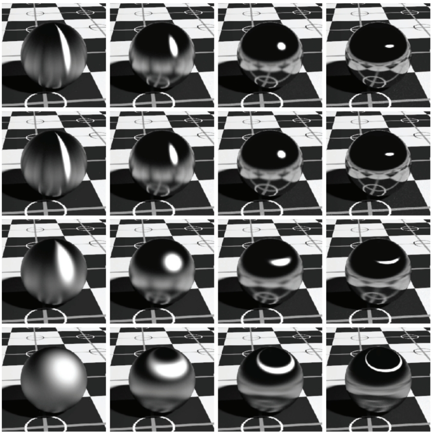
Figure 24.7. Metallic spheres for exponents 10, 100, 1000, and 10,000 increasing both left to right and top to bottom.
图 24.7。 指数 10、100、1000 和 10,000 的金属球从左到右、从上到下递增。 

### 24.5.2 Diffuse Term for the Anisotropic Phong Model 各向异性 Phong 模型的漫反射项

It is possible to use a Lambertian BRDF together with the anisotropic specular term; this is done for most models, but it does not necessarily conserve energy. A better approach is a simple angle-dependent form of the diffuse component which accounts for the fact that the amount of energy available for diffuse scattering varies due to the dependence of the specular teqrm’s total reflectance on the incident angle. In particular, diffuse color of a surface disappears near the grazing angle, because the total specular reflectance is close to one. This well-known effect cannot be reproduced with a Lambertian diffuse term and is therefore missed by most reflection models.
可以将朗伯 BRDF 与各向异性镜面反射项一起使用； 大多数型号都会这样做，但不一定能节省能源。 更好的方法是漫反射分量的简单的角度相关形式，它解释了可用于漫散射的能量由于镜面 teqrm 的总反射率对入射角的依赖性而变化的事实。 特别是，表面的漫反射颜色在掠射角附近消失，因为总镜面反射率接近于 1。 这种众所周知的效应无法用朗伯漫反射项重现，因此大多数反射模型都忽略了这一效应。

show Following a similar approach to the coupled model, we can find a form of the diffuse term that is compatible with the anisotropic Phong lobe:
按照耦合模型的类似方法，我们可以找到与各向异性 Phong 波瓣兼容的漫反射项的形式：
$$
ρ_d(k_1, k_2) = \frac{28R_d}{23π}(1 − R_s)(1 − (1 − \frac{\cosθ_i}{2})^5)(1 − (1 − \frac{\cosθ_o}{2})^5) \ \  \ \ (24.7)
$$
Here $R_d$ is the diffuse reflectance for normal incidence, and $R_s$ is the Phong lobe coefficient. An example using this model is shown in Figure 24.8. 
这里$R_d$是法向入射的漫反射率，$R_s$是Phong瓣系数。 图 24.8 显示了使用该模型的示例。
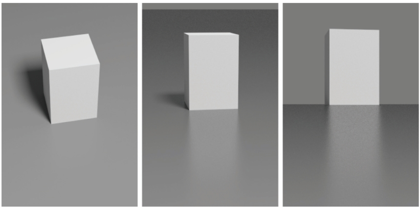
Figure 24.8. Three views for $n_u = n_v = 400$ and a diffuse substrate. Note the change in intensity of the specular reflection. 
图 24.8。 $n_u = n_v = 400$ 和漫射基板的三个视图。 注意镜面反射强度的变化。

### 24.5.3 Implementing the Model 实施模型

Recall that the BRDF is a combination of diffuse and specular components: 
回想一下，BRDF 是漫反射和镜面反射分量的组合：
$$
ρ(\bold{k}_1, \bold{k}_2) = ρ_s(\bold{k}_1, \bold{k}_2) + ρ_d(\bold{k}_1, \bold{k}_2).\ \ \ \ \ \  (24.8)
$$
The diffuse component is given in Equation (24.7); the specular component is given in Equation (24.5). It is not necessary to call trigonometric functions to compute the exponent, so the specular BRDF can be written: 
漫反射分量由公式 (24.7) 给出； 镜面反射分量由公式 (24.5) 给出。 不需要调用三角函数来计算指数，因此镜面 BRDF 可以写成：
$$
ρ(\bold{k}_1, \bold{k}_2) = \frac{\sqrt{(n_u + 1)(n_v + 1)}}{8\pi}(\bold{n} · \bold{h})
^{\frac{(n_u(\bold{h}·\bold{u})^2+n_v(\bold{h}·\bold{v})^2)/(1−(\bold{h}\bold{n})^2)}{(\bold{h}·\bold{k}_i)max(\cos θ_i,\cos θ_o)}} F (\bold{k}_i · \bold{h}) \ \ \ \ (24.9)
$$
In a Monte Carlo setting, we are interested in the following problem: given $\bold{k}_1$, generate samples of $\bold{k}_2$ with a distribution whose shape is similar to the cosineweighted BRDF. Note that greatly undersampling a large value of the integrand is a serious error, while greatly oversampling a small value is acceptable in practice. The reader can verify that the densities suggested below have this property.
在蒙特卡罗设置中，我们对以下问题感兴趣：给定 $\bold{k}_1$，生成 $\bold{k}_2$ 的样本，其分布形状类似于余弦加权 BRDF。 请注意，对被积函数的大值进行大幅欠采样是一个严重的错误，而对小值进行大幅过采样在实践中是可以接受的。 读者可以验证下面建议的密度是否具有此属性。

A suitable way to construct a pdf for sampling is to consider the distribution of half vectors that would give rise to our BRDF. Such a function is
构建 pdf 进行采样的合适方法是考虑产生 BRDF 的半向量的分布。 这样的函数是
$$
p_h(\bold{h}) = \frac{\sqrt{(n_u + 1)(n_v + 1)}}{2π} (\bold{nh})^{n_u \cos^2 φ + n_v \sin^2 φ} \ \ \ \ \ (24.10)
$$
where the constants are chosen to ensure it is a valid pdf.
其中选择常量以确保它是有效的 pdf。

We can just use the probability density function $p_h(\bold{h})$ of Equation (24.10) to generate a random $\bold{h}$. However, to evaluate the rendering equation, we need both a reflected vector $\bold{k}_o$ and a probability density function $p(\bold{k}_o)$. It is important to note that if you generate $\bold{h}$ according to $p_h(\bold{h})$ and then transform to the resulting $\bold{k}_o$:
我们可以使用方程（24.10）的概率密度函数$p_h(\bold{h})$来生成随机$\bold{h}$。 然而，为了评估渲染方程，我们需要反射向量 $\bold{k}_o$ 和概率密度函数 $p(\bold{k}_o)$。 需要注意的是，如果根据$p_h(\bold{h})$生成$\bold{h}$，然后转换为得到的$\bold{k}_o$：
$$
\bold{k}_o = −\bold{k}_i + 2(\bold{k}_i · \bold{h})\bold{h},\ \ \ \ \  (24.11)
$$
the density of the resulting $\bold{k}_o$ is not $p_h(\bold{k}_o)$. This is because of the difference in measures in $\bold{h}$ and $\bold{k}_o$. So the actual density $p(\bold{k}_o)$ is
所得$\bold{k}_o$ 的密度不是$p_h(\bold{k}_o)$。 这是因为 $\bold{h}$ 和 $\bold{k}_o$ 的度量不同。 所以实际密度 $p(\bold{k}_o)$ 是
$$
p(\bold{k}_o) = \frac{p_h(\bold{h})}{4(\bold{k}_i\bold{h})} \ \ \ \ \ (24.12)
$$
Note that in an implementation where the BRDF is known to be this model, the estimate of the rendering equation is quite simple as many terms cancel out. 
请注意，在已知 BRDF 就是该模型的实现中，渲染方程的估计非常简单，因为许多项被抵消。 

It is possible to generate an $\bold{h}$ vector whose corresponding vector $\bold{k}_o$ will point inside the surface, i.e., $\cos θ_o < 0$. The weight of such a sample should be set to zero. This situation corresponds to the specular lobe going below the horizon and is the main source of energy loss in the model. Clearly, this problem becomes progressively less severe as $n_u, n_v$ become larger. 
可以生成一个 $\bold{h}$ 向量，其对应向量 $\bold{k}_o$ 将指向曲面内部，即 $\cos θ_o < 0$。 此类样本的重量应设置为零。 这种情况对应于低于地平线的镜面波瓣，是模型中能量损失的主要来源。 显然，随着 $n_u, n_v$ 变大，这个问题逐渐变得不那么严重。

The only thing left now is to describe how to generate $\bold{h}$ vectors with the pdf of Equation (24.10). We will start by generating $\bold{h}$ with its spherical angles in the range $(θ, φ) ∈ [0, \frac{π}{2} ] × [0, \frac{π}{2} ]$. Note that this is only the first quadrant of the hemisphere. Given two random numbers $(ξ_1, ξ_2)$ uniformly distributed in [0, 1], we can choose
现在剩下的唯一事情就是描述如何用方程（24.10）的pdf生成$\bold{h}$向量。 我们首先生成 $\bold{h}$，其球面角在 $(θ, φ) ∈ [0, \frac{π}{2} ] × [0, \frac{π}{2} ]$ 范围内。 请注意，这只是半球的第一象限。 给定两个均匀分布在 [0, 1] 中的随机数 $(ξ_1, ξ_2)$，我们可以选择
$$
φ = \arctan(\sqrt{\frac{n_u + 1}{n_v + 1}} \tan(\frac{πξ_1}{2}) ) , (24.13)
$$
and then use this value of $φ$ to obtain $θ$ according to
然后使用$φ$的值根据以下公式获得$θ$
$$
\cos θ = (1 − ξ_2)^{1/(n_u \cos^2 φ+n_v \sin^2 φ+1)}. (24.14)
$$
To sample the entire hemisphere, we use the standard manipulation where $ξ_1$ is mapped to one of four possible functions depending on whether it is in $[0, 0.25)$, $[0.25, 0.5)$, $[0.5, 0.75)$, or $[0.75, 1.0).$ For example, for $ξ_1 ∈ [0.25, 0.5),$ find $φ(1 − 4(0.5 − ξ_1))$ via Equation (24.13), and then “flip” it about the $φ = π/2$ axis. This ensures full coverage and stratification. 
为了对整个半球进行采样，我们使用标准操作，其中 $ xi_1 $ 映射到四个可能的函数之一，具体取决于它是否在 $[0, 0.25)$、$[0.25, 0.5)$、$[0.5, 0.75 )$, 或 $[0.75, 1.0).$ 例如，对于 $xi_1 ∈ [0.25, 0.5),$ 通过方程 (24.13) 求出 $φ(1 − 4(0.5 − ξ_1))$，然后“翻转” ” 它围绕 $φ = π/2$ 轴。 这确保了完全覆盖和分层。

For the diffuse term, use a simpler approach and generate samples according to a cosine distribution. This is sufficiently close to the complete diffuse BRDF to substantially reduce variance of the Monte Carlo estimation.
对于扩散项，使用更简单的方法并根据余弦分布生成样本。 这与完整的漫反射 BRDF 足够接近，可以显着减少蒙特卡罗估计的方差。

## Frequently Asked Questions 经常问的问题

### My images look too smooth, even with a complex BRDF. What am I doing wrong? 即使使用复杂的 BRDF，我的图像看起来也太平滑了。 我究竟做错了什么？

BRDFs only capture subpixel detail that is too small to be resolved by the eye. Most real surfaces also have some small variations, such as the wrinkles in skin, that can be seen. If you want true realism, some sort of texture or displacement map is needed. 
BRDF 仅捕获太小而无法被眼睛分辨的子像素细节。 大多数真实的表面也有一些小的变化，例如可以看到的皮肤皱纹。 如果您想要真正的真实感，则需要某种纹理或置换贴图。

### How do I integrate the BRDF with texture mapping? 如何将 BRDF 与纹理映射集成？

Texture mapping can be used to control any parameter on a surface. So any kinds of colors or control parameters used by a BRDF should be programmable. 
纹理映射可用于控制表面上的任何参数。 因此 BRDF 使用的任何类型的颜色或控制参数都应该是可编程的。

### I have very pretty code except for my material class. What am I doing wrong?  除了我的材料类之外，我有非常漂亮的代码。 我究竟做错了什么？

You are probably doing nothing wrong. Material classes tend to be the ugly thing in everybody’s programs. If you find a nice way to deal with it, please let me know! My own code uses a shader architecture (Hanrahan & Lawson, 1990) which makes the material include much of the rendering algorithm. 
你可能没有做错什么。 材料类往往是每个人的程序中最丑陋的事情。 如果您找到好的处理方法，请告诉我！ 我自己的代码使用着色器架构（Hanrahan & Lawson，1990），这使得材质包含大部分渲染算法。

## Notes 注释

There are many BRDF models described in the literature, and only a few of them have been described here. Others include (Cook & Torrance, 1982; Heet al., 1992; G. J. Ward, 1992; Oren & Nayar, 1994; Schlick, 1994a; Lafortune, Foo, Torrance, & Greenberg, 1997; Stam, 1999; Ashikhmin, Premoze, & ˇ Shirley, 2000; Ershov, Kolchin, & Myszkowski, 2001; Matusik, Pfister, Brand, & McMillan, 2003; Lawrence, Rusinkiewicz, & Ramamoorthi, 2004; Stark, Arvo, & Smits, 2005). The desired characteristics of BRDF models is discussed in Making Shaders More Physically Plausible (R. R. Lewis, 1994).
文献中描述了很多 BRDF 模型，这里只描述了其中的一小部分。 其他包括（Cook & Torrance，1982；Heet al.，1992；G. J. Ward，1992；Oren & Nayar，1994；Schlick，1994a；Lafortune、Foo、Torrance 和 Greenberg，1997；Stam，1999；Ashikhmin、Premoze 和 ˇ Shirley，2000；Ershov、Kolchin 和 Myszkowski，2001；Matusik、Pfister、Brand 和 McMillan，2003；Lawrence、Rusinkiewicz 和 Ramamoorthi，2004；Stark、Arvo 和 Smits，2005）。 《Making Shaders More Physically Plausible》（R. R. Lewis，1994 年）中讨论了 BRDF 模型所需的特性。

## Exercises  练习

1. Suppose that instead of the Lambertian BRDF we used a BRDF of the form $C cos^a θ_i$. What must $C$ be to conserve energy? 
   假设我们使用 $C cos^a θ_i$ 形式的 BRDF 代替朗伯 BRDF。 为了节约能源，$C$ 必须是多少？
1. The BRDF in Exercise 1 is not reciprocal. Can you modify it to be reciprocal? 
   练习 1 中的 BRDF 不是互易的。 你能修改成互惠的吗？
1. Something like a highway sign is a retroreflector. This means that the BRDF is large when $\bold{k}_i$ and $\bold{k}_o$ are near each other. Make a model inspired by the Phong model that captures retroreflection behavior while being reciprocal and conserving energy.
   像高速公路标志这样的东西就是后向反射器。 这意味着当 $\bold{k}_i$ 和 $\bold{k}_o$ 彼此靠近时，BRDF 很大。 受 Phong 模型启发，制作一个模型，捕捉回射行为，同时实现互惠和节能。

# 25  Computer Graphics in Games  游戏中的计算机图形学

Of all the applications of computer graphics, computer and video games attract perhaps the most attention. The graphics methods selected for a given game have a profound effect, not only on the game engine code, but also on the art asset creation, and even sometimes on the gameplay, or core game mechanics.
在计算机图形学的所有应用中，计算机和视频游戏也许最受关注。 为给定游戏选择的图形方法不仅对游戏引擎代码有深远的影响，而且对艺术资产创建，有时甚至对游戏玩法或核心游戏机制也有深远的影响。

Although game graphics rely on the material in all of the preceding chapters, two chapters are particularly germane. Games need to make highly efficient use of graphics hardware, so an understanding of the material in Chapter 17 is important.
尽管游戏图形依赖于前面所有章节中的材料，但有两章特别密切。 游戏需要高效地利用图形硬件，因此理解第 17 章中的材料非常重要。

In this chapter, I will detail the specific considerations that apply to graphics in game development, from the platforms on which games run to the game production process.
在本章中，我将详细介绍游戏开发中图形应用的具体注意事项，从游戏运行的平台到游戏制作过程。

## 25.1 Platforms 平台

Here, I use the term platform to refer to a specific combination of hardware, operating system, and API (application programming interface) for which a game is designed. Games run on a large variety of platforms, ranging from virtual machines used for browser-based games to dedicated game consoles using specialized hardware and APIs.
在这里，我使用术语“平台”来指代游戏设计所针对的硬件、操作系统和 API（应用程序编程接口）的特定组合。 游戏在多种平台上运行，从用于基于浏览器的游戏的虚拟机到使用专用硬件和 API 的专用游戏控制台。

In the past, it was common for games to be designed for a single platform. The increasing cost of game development has made this rare; multiplatform game development is now the norm. The incremental increase in development cost to support multiple platforms is more than repaid by a potential doubling or tripling of the customer base.
过去，为单一平台设计游戏很常见。 游戏开发成本的不断增加使得这种情况变得罕见。 多平台游戏开发现已成为常态。 支持多个平台的开发成本的增量增长远远超出了客户群潜在的两倍或三倍的回报。

Some platforms are quite loosely defined. For example, when developing a game for the Windows PC platform, the developer must account for a very large variety of possible hardware configurations. Games are even expected to run (and run well) on PC configurations that did not exist when the game was developed! This is only possible due to the abstractions afforded by the APIs defining the Windows platform.
有些平台的定义相当松散。 例如，在为 Windows PC 平台开发游戏时，开发人员必须考虑多种可能的硬件配置。 游戏甚至有望在游戏开发时不存在的 PC 配置上运行（并且运行良好）！ 这只能归功于定义 Windows 平台的 API 提供的抽象。

One way in which developers account for wide variance in graphics performance is by scaling—adjusting graphics quality in response to system capabilities. This can ensure reasonable performance on low-end systems, while still achieving competitive visuals on high-performance systems. This adjustment is sometimes done automatically by profiling the system performance, but more often this control is left in the hands of the user, who can best judge his personal preferences for quality versus speed. Display resolution is easiest to adjust, followed by antialiasing quality. It is also fairly common to offer several quality levels for visual effects such as shadows and motion blur, including the option of turning the effect off entirely.
开发人员解决图形性能巨大差异的一种方法是根据系统功能进行缩放，调整图形质量。 这可以确保低端系统上的合理性能，同时仍然在高性能系统上实现有竞争力的视觉效果。 这种调整有时是通过分析系统性能自动完成的，但更常见的是，这种控制权留给用户，用户可以最好地判断他对质量与速度的个人偏好。 显示分辨率最容易调整，其次是抗锯齿质量。 为视觉效果（例如阴影和运动模糊）提供多个质量级别也相当常见，包括完全关闭效果的选项。

Differences in graphics performance can be so large that some machines may not run the game at a playable frame rate, even with the lowest quality settings; for this reason PC game developers publish minimum and recommended machine specifications for each game.
图形性能的差异可能如此之大，以至于某些机器可能无法以可玩的帧速率运行游戏，即使使用最低的质量设置也是如此； 因此，PC 游戏开发商会发布每个游戏的最低和推荐机器规格。

As platforms, game consoles are strictly defined. When developing a game for, e.g., Nintendo’s Wii console, the developer knows exactly what hardware the game will run on. If the platform’s hardware implementation is changed (often done to reduce manufacturing costs), the console manufacturer must ensure that the new implementation behaves exactly like the previous one, including timing and performance. This is not to say that the console developer’s task is easy; console APIs tend to be much less abstract and closer to the underlying hardware. This gives console development its own set of difficulties. In some sense, multiplatform development (which commonly includes at least two different console platforms and often Windows as well) is the hardest of all, since the multiplatform game developer has neither the assurance of a fixed platform or the convenience of a single high-level API.
作为平台，游戏机是有严格定义的。 当为任天堂的 Wii 控制台等开发游戏时，开发人员确切地知道游戏将在什么硬件上运行。 如果平台的硬件实现发生变化（通常是为了降低制造成本），控制台制造商必须确保新实现的行为与前一个实现完全相同，包括时序和性能。 这并不是说控制台开发人员的任务很容易；而是说控制台开发人员的任务很简单。 控制台 API 往往不那么抽象，更接近底层硬件。 这给控制台开发带来了一系列困难。 从某种意义上说，多平台开发（通常包括至少两个不同的控制台平台，通常还包括 Windows）是最难的，因为多平台游戏开发人员既没有固定平台的保证，也没有单一高级平台的便利性。 API。

Browser-based virtual machines such as Adobe Flash are an interesting class of game platforms. Although such virtual machines run on a wide class of hardware from personal computers to mobile phones, the high degree of abstraction provided by the virtual machine results in a stable and unified development platform. The relative ease of development for these platforms and the huge pool of potential customers makes them increasingly attractive to game developers. However, these platforms are defined by the lowest common denominator of the supported hardware, and virtual machines have lower performance than native code on any given platform. For these reasons, such platforms are best suited to games with modest graphics requirements.
基于浏览器的虚拟机（例如 Adobe Flash）是一类有趣的游戏平台。 尽管此类虚拟机运行在从个人计算机到移动电话的各种硬件上，但虚拟机提供的高度抽象性导致了稳定且统一的开发平台。 这些平台的开发相对容易，并且拥有庞大的潜在客户，这使得它们对游戏开发商越来越有吸引力。 然而，这些平台是由支持的硬件的最低公分母定义的，并且虚拟机的性能低于任何给定平台上的本机代码。 由于这些原因，此类平台最适合图形要求适中的游戏。

Platforms can also be characterized by their openness to development, which is a business or legal distinction rather than a technical one. For example, Windows is open in the sense that development tools are widely available, and there are no gatekeepers controlling access to the marketplace of Windows games. Apple’s iPhone is a somewhat more restricted platform in that all applications need to pass a certification process and certain classes of applications are banned outright. Consoles are the most restrictive game platforms, where access to the development tools is tightly controlled. This is opening up somewhat with the introduction of online console game marketplaces, which tend to be more open. A particularly interesting example is Microsoft’s Xbox LIVE Community Games service, where the development tools are freely available and the “gatekeeping” is performed primarily by peer review. Games distributed through this service must use a virtual machine platform provided by Microsoft for security reasons. 
平台的特点还在于其对开发的开放性，这是一种商业或法律上的区别，而不是技术上的区别。 例如，Windows 是开放的，因为开发工具可以广泛使用，并且没有看门人控制对 Windows 游戏市场的访问。 Apple 的 iPhone 是一个受到更多限制的平台，因为所有应用程序都需要通过认证流程，并且某些类别的应用程序被彻底禁止。 控制台是限制最严格的游戏平台，对开发工具的访问受到严格控制。 随着在线游戏机游戏市场的引入，这种情况在某种程度上开放了，而在线游戏市场往往更加开放。 一个特别有趣的例子是微软的 Xbox LIVE 社区游戏服务，其中的开发工具是免费提供的，并且“把关”主要由同行评审来执行。 出于安全原因，通过此服务分发的游戏必须使用 Microsoft 提供的虚拟机平台。

The game platform determines many elements of the game experience. For example, PC gamers use keyboard and mouse, while console gamers use specialized game controllers. Many console games support multiple players on the same console, either sharing a screen or providing a window for each player. Due to the difficulty of sharing keyboard and mouse, this type of play is not found on PC. A handheld game system will have a different control scheme than a touch-screen phone, etc.
游戏平台决定了游戏体验的很多要素。 例如，PC 游戏玩家使用键盘和鼠标，而控制台游戏玩家则使用专门的游戏控制器。 许多主机游戏支持同一主机上的多个玩家，共享屏幕或为每个玩家提供一个窗口。 由于共享键盘和鼠标的困难，这种玩法在PC上是找不到的。 手持游戏系统将具有与触摸屏手机等不同的控制方案。

Although game platforms vary widely, some common trends can be discerned. Most platforms have multiple processing cores, divided between general-purpose (CPU) and graphics-specific (GPU). Performance gains over time are due mostly to increases in core count; gains in individual core performance are modest. As GPU cores grow in generality, the lines between GPU and CPU cores are increasingly blurred. Storage capacity tends to increase at a slower rate than processing power, and communication bandwidth (between cores as well as between each core and storage) grows at a slower pace still.
尽管游戏平台差异很大，但可以看出一些共同趋势。 大多数平台都有多个处理核心，分为通用 (CPU) 和图形专用 (GPU)。 随着时间的推移，性能的提升主要是由于核心数量的增加； 个人核心表现的提升是有限的。 随着 GPU 核心的普遍化，GPU 和 CPU 核心之间的界限变得越来越模糊。 存储容量的增长速度往往慢于处理能力的增长速度，并且通信带宽（核心之间以及每个核心与存储之间）的增长速度仍然较慢。

## 25.2 Limited Resources  有限资源

One of the primary challenges of game graphics is the need to manage multiple pools of limited resources. Each platform imposes its own constraints on hardware resources such as processing time, storage, and memory bandwidth. At a higher level, development resources also need to be managed; there is a fixed-size team of programmers, artists, and game designers with limited time to complete the game, hopefully without working too much overtime! This needs to be taken into account when deciding which graphics techniques to adopt. 
游戏图形的主要挑战之一是需要管理多个有限资源池。 每个平台对硬件资源（例如处理时间、存储和内存带宽）都有自己的限制。 在更高的层面上，开发资源也需要管理； 有一个由程序员、美术师和游戏设计师组成的固定规模团队，他们在有限的时间内完成游戏，希望不会加班太多！ 在决定采用哪种图形技术时需要考虑到这一点。

### 25.2.1 Processing Time  处理时间

Early game developers only had to worry about budgeting a single processor. Current game platforms contain multiple CPU and GPU cores. These processors need to be carefully synchronized to avoid deadlocks or excessive stalls.
早期的游戏开发人员只需担心单个处理器的预算。 当前的游戏平台包含多个CPU和GPU核心。 这些处理器需要仔细同步以避免死锁或过度停顿。

Since the time consumed by a single rendering command is highly variable, graphics processors are decoupled from the rest of the system via a command buffer. This buffer acts as a queue; commands are deposited on one end and the GPU reads rendering commands from the other. Increasing the size of this buffer decreases the chances of GPU starvation. It is fairly common for games to buffer an entire frame’s worth of rendering commands before sending them to the GPU; this guarantees that GPU starvation does not occur. However, this approach requires reserving enough storage space for two full frame’s worth of commands (the GPU works on one, while the CPU deposits commands in the other). It also increases the latency between the user’s input and the display, which can be problematic for fast-paced games.
由于单个渲染命令所消耗的时间变化很大，因此图形处理器通过命令缓冲区与系统的其余部分解耦。 该缓冲区充当队列； 命令存放在一端，GPU 从另一端读取渲染命令。 增加该缓冲区的大小可以降低 GPU 资源匮乏的可能性。 对于游戏来说，在将整个帧的渲染命令发送到 GPU 之前对其进行缓冲是相当常见的； 这保证了不会发生 GPU 饥饿的情况。 然而，这种方法需要为两个全帧的命令保留足够的存储空间（GPU 在一个上工作，而 CPU 在另一个上存储命令）。 它还增加了用户输入和显示之间的延迟，这对于快节奏的游戏来说可能会出现问题。

Processing budgets are determined by the frame rate, which is the frequency at which the frame buffer is refreshed with new renderings of the scene. On fixed platforms (such as consoles), the frame rate experienced by the user is essentially the same one seen by the game developer, so fairly strict frame–rate limits can be imposed. Most games target a frame rate of 30 frames per second (fps); in games where response latency is especially important, the target is often 60 fps. On highly variable platforms (such as PCs), the frame-rate budgets are (by necessity) defined more loosely. 
处理预算由帧速率决定，帧速率是用新的场景渲染刷新帧缓冲区的频率。 在固定平台（例如游戏机）上，用户体验到的帧速率本质上与游戏开发者看到的帧速率相同，因此可以施加相当严格的帧速率限制。 大多数游戏的帧速率目标为每秒 30 帧 (fps)； 在响应延迟特别重要的游戏中，目标通常是 60 fps。 在高度可变的平台（例如 PC）上，帧速率预算（必然）定义得更宽松。

The required frame rate gives the graphics programmer a fixed budget per frame to work with. In the case of a 30 fps target, the CPU cores have 33 milliseconds to gather inputs, process the game logic, perform any physical simulations, traverse the scene description, and send the rendering commands to the graphics hardware. In parallel, other tasks such as audio and network processing must be handled, with their own required response times. While this is happening, the GPU is typically executing the graphics commands submitted during the previous frame. 
所需的帧速率为图形程序员提供了每帧的固定预算。 在 30 fps 目标的情况下，CPU 内核有 33 毫秒的时间来收集输入、处理游戏逻辑、执行任何物理模拟、遍历场景描述以及将渲染命令发送到图形硬件。 与此同时，还必须处理其他任务，例如音频和网络处理，并具有各自所需的响应时间。 发生这种情况时，GPU 通常会执行前一帧期间提交的图形命令。

In most cases, CPU cores are a homogeneous resource; all cores are the same, and any of them are equally well suited to a given workload (there are some exceptions, such as the Cell processor used in Sony’s PLAYSTATION 3 console). 
大多数情况下，CPU 核心是同质资源； 所有内核都是相同的，并且它们中的任何一个都同样适合给定的工作负载（有一些例外，例如索尼 PLAYSTATION 3 控制台中使用的 Cell 处理器）。

In contrast, GPUs contain a heterogeneous mix of resources, each specialized to a certain set of tasks. Some of these resources consist of fixed-function hardware (for triangle rasterization, alpha blending, and texture sampling), and some are programmable cores. On older GPUs, programmable cores were further differentiated into vertex and pixel processing cores; newer GPU designs have unified shader cores which can execute any of the programmable shader types. 
相比之下，GPU 包含异构资源组合，每个资源专门用于一组特定的任务。 其中一些资源由固定功能硬件（用于三角形光栅化、Alpha 混合和纹理采样）组成，还有一些是可编程内核。 在较旧的 GPU 上，可编程核心进一步分为顶点处理核心和像素处理核心； 较新的 GPU 设计具有统一的着色器核心，可以执行任何可编程着色器类型。

Such heterogeneous resources are budgeted separately. Typically, at any point, only one resource type will be the bottleneck, and the others will have excess capacity. On the one hand, this is good, since this capacity can be leveraged to improve visual quality without decreasing performance. On the other hand, it makes it harder to improve performance, since decreasing usage of any of the non-bottleneck resources will have no effect. Even decreasing usage of the bottleneck resource may only improve performance slightly, depending on the degree of utilization of the “next bottleneck.” 
这些异构资源是单独预算的。 通常，在任何时候，只有一种资源类型会成为瓶颈，其他资源类型将出现产能过剩。 一方面，这很好，因为可以利用这种能力来提高视觉质量而不降低性能。 另一方面，它使提高性能变得更加困难，因为减少任何非瓶颈资源的使用都不会产生任何效果。 即使减少瓶颈资源的使用也只能略微提高性能，具体取决于“下一个瓶颈”的利用程度。

### 25.2.2 Storage  存储

Game platforms, like any modern computing system, possess multi-stage storage hierarchies, with smaller, faster memory types at the top and larger, slower storage at the bottom. This arrangement is borne of engineering necessity, although it does complicate life for the developer. Most platforms include optical disc storage, which is extremely slow and is used mostly for delivery. On platforms such as Windows, a lengthy installation process is performed once to move all data from the optical disc onto the hard drive, which is significantly faster. The optical disc is never used again (except as an anti-piracy measure). On console platforms, this is less common, although it does sometimes happen when a hard drive is guaranteed to be present, as on Sony’s PLAYSTATION 3 console. More often, the hard drive (if present) is only used as a cache for the optical disc. 
游戏平台与任何现代计算系统一样，拥有多级存储层次结构，较小、较快的内存类型位于顶部，较大、较慢的存储类型位于底部。 这种安排是出于工程需要，尽管它确实使开发人员的生活变得复杂。 大多数平台都包含光盘存储，速度极慢，主要用于交付。 在Windows等平台上，只需执行一次漫长的安装过程即可将所有数据从光盘移动到硬盘上，速度明显更快。 该光盘不会再被使用（除非作为反盗版措施）。 在游戏机平台上，这种情况不太常见，尽管在保证有硬盘驱动器的情况下有时会发生这种情况，例如在索尼的 PLAYSTATION 3 游戏机上。 更常见的是，硬盘驱动器（如果有）仅用作光盘的缓存。

The next step up the memory hierarchy is RAM, which on many platforms is divided into general system RAM and VRAM (video RAM) which benefits from a high-speed interface to the graphics hardware. A game level may be too large to fit in RAM, in which case the game developer needs to manage moving the data in and out of RAM as needed. On platforms such as Windows, virtual memory is often used for this. On console platforms, custom data streaming and caching systems are typically employed. 
内存层次结构的下一步是 RAM，在许多平台上，RAM 分为通用系统 RAM 和 VRAM（视频 RAM），VRAM 受益于与图形硬件的高速接口。 游戏关卡可能太大而无法装入 RAM，在这种情况下，游戏开发人员需要根据需要管理将数据移入和移出 RAM。 在 Windows 等平台上，通常使用虚拟内存来实现此目的。 在控制台平台上，通常采用自定义数据流和缓存系统。

Finally, both the CPU and GPU boast various kinds of on-chip memory and caches. These are extremely small and fast and are usually managed by the graphics API. 
最后，CPU 和 GPU 都拥有各种片上内存和缓存。 它们非常小且速度快，通常由图形 API 管理。

Graphics resources take up a lot of memory, so they are a primary focus of storage budgets in game development. Textures are usually the greatest memory consumers, followed by geometry (vertex data), and finally other types of graphics data such as animations. Not all memory can be used for graphics—audio also takes up a fair bit, and game logic may use sizeable data structures. As in the case of processing time, budgeting tends to be somewhat looser on Windows, where the exact amount of memory present on the user’s system is unknown and virtual memory covers a multitude of sins. In contrast, memory budgeting on console platforms is quite strict—often the lead programmer keeps track of memory on a spreadsheet and a programmer requiring more memory for their system needs to beg, borrow, or steal it from someone else. 
图形资源占用大量内存，因此它们是游戏开发中存储预算的主要关注点。 纹理通常是最大的内存消耗者，其次是几何图形（顶点数据），最后是其他类型的图形数据（例如动画）。 并非所有内存都可以用于图形——音频也占用相当一部分，并且游戏逻辑可能使用相当大的数据结构。 与处理时间的情况一样，Windows 上的预算往往比较宽松，用户系统上存在的确切内存量是未知的，而虚拟内存涵盖了许多问题。 相比之下，控制台平台上的内存预算相当严格——通常首席程序员会在电子表格上跟踪内存，而需要更多内存的程序员需要向其他人乞讨、借用或窃取内存。

The various levels of the memory hierarchy differ not only in size, but also in access speed. This has two separate dimensions: latency and bandwidth. 
存储器层次结构的各个级别不仅在大小上不同，而且在访问速度上也不同。 这有两个独立的维度：延迟和带宽。

Latency is the time that elapses between a storage access request and its final fulfillment. This varies from a few clock cycles (for on-chip cache) to millions of clock cycles (for data residing on optical disc). Latency is usually an issue for read access (although write latency can also be an issue if the result needs to be read back from memory soon after). In some cases, the read request is blocking, which means that the processor core that submitted the read can do nothing else until the request is fulfilled. In other cases, the read is non-blocking; the processing core can submit the read request, do other types of processing, and then use the results of the read after it has arrived. Texture accesses by the GPU are an example of non-blocking reads; an important aspect of GPU design is to find ways to “hide” texture read latency by performing unrelated computations while the texture read is being fulfilled. 
延迟是指存储访问请求与其最终完成之间所经历的时间。 这从几个时钟周期（对于片上高速缓存）到数百万个时钟周期（对于驻留在光盘上的数据）不等。 延迟通常是读取访问的一个问题（尽管如果需要很快从内存中读回结果，则写入延迟也可能是一个问题）。 在某些情况下，读取请求是阻塞的，这意味着提交读取的处理器核心在请求得到满足之前不能执行任何其他操作。 其他情况下，读取是非阻塞的； 处理核心可以提交读取请求，进行其他类型的处理，然后在读取结果到达后使用它。 GPU 的纹理访问是非阻塞读取的一个示例； GPU 设计的一个重要方面是找到通过在纹理读取完成时执行不相关的计算来“隐藏”纹理读取延迟的方法。

For this latency hiding to work, there must be a sufficient amount of computation relative to texture accesses. This is an important consideration for the shader writer; the optimal mix of computation vs. texture access keeps changing (in favor of more computation) as memory fails to keep up with increases in processing power. 
为了使这种延迟隐藏发挥作用，必须有足够的与纹理访问相关的计算量。 对于着色器编写者来说，这是一个重要的考虑因素； 由于内存无法跟上处理能力的增长，计算与纹理访问的最佳组合不断变化（有利于更多计算）。

Bandwidth refers to the maximum rate of transfer to and from storage. It is typically measured in gigabytes per second.
带宽是指进出存储的最大传输速率。 它通常以每秒千兆字节为单位进行测量。

### 25.2.3 Development Resources  开发资源

Besides hardware resources, such as processing power and storage space, the game graphics programmer also has to contend with a different kind of limited resource—the time of his teammates! When selecting graphics techniques, the engineering resources needed to implement each technique must be taken into account, as well as any tools necessary to compute the input data (in many cases, tools can take significantly more time than implementing the technique itself). Perhaps most importantly, the impact on artist productivity must be taken into account. Most graphics techniques use assets created by game artists, who comprise by far the largest part of most modern game teams. The graphics programmer must foster the artist’s productivity and creativity, which will ultimately determine the visual quality of the game.
除了处理能力和存储空间等硬件资源之外，游戏图形程序员还必须应对另一种有限资源——队友的时间！ 选择图形技术时，必须考虑实现每种技术所需的工程资源，以及计算输入数据所需的任何工具（在许多情况下，工具可能比实现技术本身花费更多的时间）。 也许最重要的是，必须考虑对艺术家生产力的影响。 大多数图形技术都使用游戏艺术家创建的资源，而游戏艺术家是迄今为止大多数现代游戏团队的最大组成部分。 图形程序员必须培养美术师的生产力和创造力，这将最终决定游戏的视觉质量。

## 25.3 Optimization Techniques  优化技术

Making wise use of these limited resources is the primary challenge of the game graphics programmer. To this end, various optimization techniques are commonly employed. 
明智地利用这些有限的资源是游戏图形程序员面临的主要挑战。 为此，通常采用各种优化技术。

In many games, pixel shader processing is a primary bottleneck. Most GPUs contain hierarchical depth-culling hardware which can avoid executing pixel shaders on occluded surfaces. To make good use of this hardware, opaque objects can be rendered back-to-front. Alternatively, optimal depth-culling usage can be achieved by performing a depth prepass, i.e., rendering all the opaque objects into the depth buffer (without any color output or pixel shaders) before rendering the scene normally. This does incur some overhead (due to the need to render every object twice), but in many cases the performance gain is worth it. 
在许多游戏中，像素着色器处理是主要瓶颈。 大多数 GPU 包含分层深度剔除硬件，可以避免在遮挡表面上执行像素着色器。 为了充分利用该硬件，可以从后到前渲染不透明对象。 或者，可以通过执行深度预通道来实现最佳深度剔除使用，即在正常渲染场景之前将所有不透明对象渲染到深度缓冲区中（没有任何颜色输出或像素着色器）。 这确实会产生一些开销（由于需要渲染每个对象两次），但在许多情况下，性能提升是值得的。

The fastest way to render an object is to not render it at all; thus any method of discerning early on that an object is occluded can be useful. This saves not only pixel processing but also vertex processing and even CPU time that would be spent submitting the object to the graphics API. View frustum culling (see Section 8.4.1) is universally employed, but in many games it is not sufficient. High-level occlusion culling algorithms are often used, utilizing data structures such as PVS (potentially visible sets) or BSP (binary spatial partitioning) trees to quickly narrow down the pool of potentially visible objects. 
渲染对象的最快方法是根本不渲染它； 因此，任何早期辨别物体被遮挡的方法都是有用的。 这不仅节省了像素处理，还节省了顶点处理，甚至节省了将对象提交给图形 API 所花费的 CPU 时间。 视锥体剔除（参见第 8.4.1 节）被普遍采用，但在许多游戏中这还不够。 通常使用高级遮挡剔除算法，利用 PVS（潜在可见集）或 BSP（二元空间分区）树等数据结构来快速缩小潜在可见对象池的范围。

Even if an object is visible, it may be at such a distance that most of its detail can be removed without apparent effect. LOD (level-of-detail) algorithms render different representations of an object based on distance (or other factors, such as screen coverage or importance). This can save significant processing, vertex processing in particular. Examples can be seen in Figure 25.1. 
即使一个物体是可见的，它也可能处于这样一个距离，以至于可以删除它的大部分细节而不会产生明显的效果。 LOD（细节层次）算法根据距离（或其他因素，例如屏幕覆盖范围或重要性）渲染对象的不同表示。 这可以节省大量处理，特别是顶点处理。 示例见图25.1。

Figure 25.1. Two examples of game objects at a varying level of detail. The small inset images show the relative sizes at which the simplified models might be used. Upper row of images courtesy Crytek; lower row courtesy Valve Corp.
图 25.1。 不同细节级别的游戏对象的两个示例。 小插图显示了可以使用简化模型的相对尺寸。 上排图像由 Crytek 提供； 下排由 Valve Corp. 提供 

In many cases, processing can be performed before the game even starts. The results of such preprocessing can be stored and used each frame, thus speeding up the game. This is most commonly employed for lighting, where global illumination algorithms are utilized to compute lighting throughout the scene and store it in lightmaps and other data structures for later use. 
在许多情况下，处理甚至可以在游戏开始之前执行。 这种预处理的结果可以在每一帧中存储和使用，从而加快游戏速度。 这最常用于照明，其中全局照明算法用于计算整个场景的照明并将其存储在光照贴图和其他数据结构中以供以后使用。

## 25.4 Game Types  游戏类型

Since game requirements vary widely, the selection of graphics techniques is driven by the exact type of game being developed. 
由于游戏要求差异很大，因此图形技术的选择取决于正在开发的游戏的确切类型。

The allocation of processing time depends strongly on the frame rate. Currently, most console games tend to target 30 frames per second, since this enables much higher graphics quality. However, certain game types with fast gameplay require very low latency, and such games typically render at 60 frames per second. This includes music games such as Guitar Hero and first-person shooters such as Call of Duty. 
处理时间的分配很大程度上取决于帧速率。 目前，大多数主机游戏都倾向于以每秒 30 帧为目标，因为这可以实现更高的图形质量。 然而，某些具有快速游戏玩法的游戏类型需要非常低的延迟，并且此类游戏通常以每秒 60 帧的速度渲染。 其中包括《吉他英雄》等音乐游戏和《使命召唤》等第一人称射击游戏。

The frame rate determines the available time to render the scene. The composition of the scene itself also varies widely from game to game. Most games have a division between background geometry (scenery, mostly static) and foreground geometry (characters and dynamic objects). These are handled differently by the rendering engine. For example, background geometry will often have lightmaps containing precomputed lighting, which is not feasible for foreground objects. Precomputed lighting is typically applied to foreground objects via some type of volumetric representation which can take account of the changing position of each object over time. 
帧速率决定渲染场景的可用时间。 场景本身的构成也因游戏而异。 大多数游戏都有背景几何体（风景，大部分是静态的）和前景几何体（人物和动态物体）之间的划分。 渲染引擎对这些进行不同的处理。 例如，背景几何体通常具有包含预先计算的光照的光照贴图，这对于前景对象是不可行的。 预先计算的照明通常通过某种类型的体积表示应用于前景对象，该体积表示可以考虑每个对象随时间变化的位置。

Some games have relatively enclosed environments, where the camera remains largely in place. The purest examples are fighting games such as the Street Fighter series, but this is also true to some extent for games such as Devil May Cry and God of War. These games have cameras that are not under direct player control, and the game play tends to move from one enclosed environment to another, spending a significant amount of playing time in each. This allows the game developer to lavish large amounts of resources (processing, storage, and artist time) on each room or enclosed environment, resulting in very high levels of graphics fidelity. 
有些游戏有相对封闭的环境，镜头大部分保持在原位。 最纯粹的例子就是《街头霸王》系列等格斗游戏，但《鬼泣》《战神》等游戏在某种程度上也是如此。 这些游戏的摄像机不受玩家直接控制，并且游戏玩法往往从一个封闭环境转移到另一个封闭环境，在每个封闭环境中花费大量的游戏时间。 这使得游戏开发人员可以在每个房间或封闭环境中投入大量资源（处理、存储和美术时间），从而获得非常高水平的图形保真度。

Other games have extremely large worlds, where the player can move about freely. This is most true for “sandbox games” such as the Grand Theft Auto series and online role-playing games such as World of Warcraft. Such games pose great challenges to the graphics developer, since resource allocation is very difficult when during each frame the player can see a large extent of the world. Further complicating things, the player can freely go to some formerly distant part of the world and observe it from up close. Such games typically have changing time of day, which makes precomputation of lighting difficult at best, if not impossible. 
其他游戏有非常大的世界，玩家可以在其中自由移动。 对于《侠盗猎车手》系列等“沙盒游戏”和《魔兽世界》等在线角色扮演游戏来说尤其如此。 此类游戏给图形开发人员带来了巨大的挑战，因为当玩家在每一帧中都可以看到很大范围的世界时，资源分配非常困难。 更复杂的是，玩家可以自由地前往世界上一些以前遥远的地方并近距离观察它。 此类游戏通常会在一天中的时间发生变化，这使得预先计算光照即使不是不可能，也是很困难。

Most games, such as first-person shooters, are somewhere between the two extremes. The player can see a fair amount of scenery each frame, but movement through the game world is somewhat constrained. Many games also have a fixed time of day for each game level, for ease of lighting precomputation. 
大多数游戏，例如第一人称射击游戏，都介于两个极端之间。 玩家每帧都可以看到相当多的风景，但在游戏世界中的移动受到一定限制。 许多游戏还为每个游戏关卡设定了一天中的固定时间，以便于光照预计算。

The number of foreground objects rendered also varies widely between game types. Real-time strategy games such as the Command and Conquer series often have many dozens, if not hundreds, of units visible on screen. Other types of games have more limited quantities of visible characters, with fighting games at the opposite extreme, where only two characters are visible, each rendered with extremely high detail. A distinction must be drawn between the number of characters visible at any time (which affects budgeting of processing time) and the number of unique characters which can potentially be visible at short notice (which affects storage budgets). 
渲染的前景对象的数量在游戏类型之间也有很大差异。 《命令与征服》系列等实时策略游戏通常在屏幕上显示数十个（甚至数百个）单位。 其他类型的游戏的可见角色数量更加有限，而格斗游戏则处于相反的极端，只有两个角色可见，每个角色都以极高的细节渲染。 必须区分随时可见的字符数（这会影响处理时间的预算）和可能在短时间内可见的唯一字符数（这会影响存储预算）。

The type or genre of game also determines audience expectations of the graphics. For example, first-person shooters have historically had very high levels of graphics fidelity, and this expectation drives the graphics design when developing new games in that genre; see Figure 25.2. On the other hand, puzzle games have typically had relatively simplistic graphics, so most game developers will not invest large amounts of programming or art resources into developing photorealistic graphics for such games. 
游戏的类型或流派也决定了观众对图形的期望。 例如，第一人称射击游戏历来具有非常高水平的图形保真度，这种期望在开发该类型的新游戏时推动了图形设计； 参见图 25.2。 另一方面，益智游戏通常具有相对简单的图形，因此大多数游戏开发商不会投入大量的编程或艺术资源来为此类游戏开发逼真的图形。
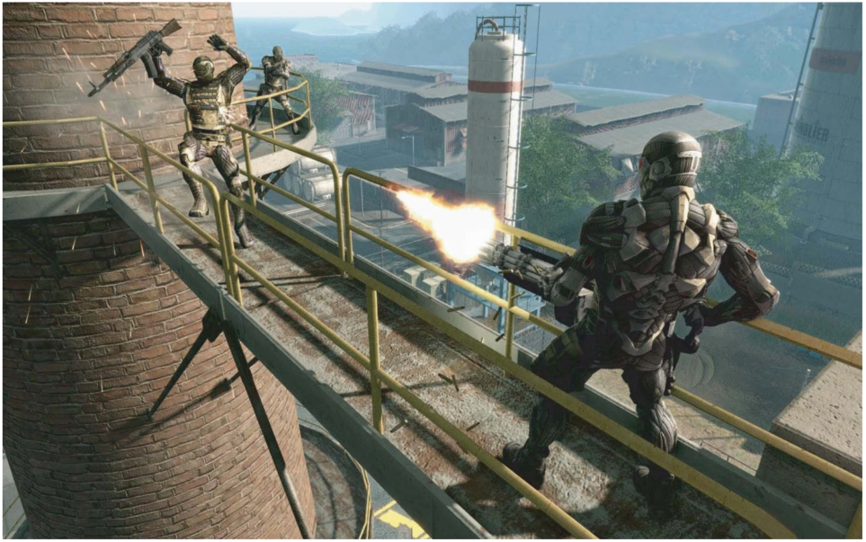
Figure 25.2. Crysis exemplifies the realistic and detailed graphics expected of first-person shooters. Image courtesy Crytek. 
图 25.2。 《孤岛危机》体现了第一人称射击游戏所期望的逼真和详细的图形。 图片由 Crytek 提供。

Although most games aim for a photorealistic look, a few do attempt more stylized rendering. One interesting example of this is Okami, which can be seen in Figure 25.3. 
尽管大多数游戏的目标都是逼真的外观，但也有一些游戏尝试了更风格化的渲染。 一个有趣的例子是 Okami，如图 25.3 所示。

Figure 25.3. An example of highly stylized, non-photorealistic rendering from the game Okami. Image courtesy Capcom Entertainment, Inc. 
图 25.3。 来自游戏《Okami》的高度风格化、非真实感渲染的示例。 图片由卡普空娱乐公司提供

The management of development resources also differs by game type. Most games have a closed development cycle of one to two years, which ends after the game ships. Recently it has become common to have downloadable content (DLC), which can be purchased after the game ships, so some development resources need to be reserved for that. Persistent-world online games have a never-ending development process where new content is continually being generated, at least as long as the game is economically viable (which may be a period of decades).
开发资源的管理也因游戏类型而异。 大多数游戏都有一到两年的封闭开发周期，在游戏发行后结束。 最近，可下载内容（DLC）已变得很常见，可以在游戏发布后购买，因此需要为此预留一些开发资源。 持久世界的在线游戏有一个永无止境的开发过程，新内容不断产生，至少只要游戏在经济上可行（可能需要几十年）。

The creative exploitation of the specific requirements and restrictions of a particular game is the hallmark of a skilled game graphics programmer. A good example is the game LittleBigPlanet, which has a “two-and-a-half-dimensional” game world comprising a small number of two-dimensional layers, as well as a noninteractive background. The graphics quality of this game is excellent, driven by the use of unusual rendering techniques specialized to this type of environment; see Figure 25.4.
创造性地利用特定游戏的特定要求和限制是熟练游戏图形程序员的标志。 一个很好的例子是游戏《LittleBigPlanet》，它有一个由少量二维层组成的“二维半”游戏世界，以及一个非交互式背景。 该游戏的图形质量非常出色，这是由于使用了专门针对此类环境的不寻常渲染技术； 参见图 25.4。

Figure 25.4. The LittleBigPlanet developers took care to choose techniques that fit the game’s constraints, combining them in unusual ways to achieve stunning results. LittleBigPlanet © 2007 Sony Computer Entertainment Europe. Developed by Media Molecule. LittleBigPlanet is a trademark of Sony Computer Entertainment Europe.
图 25.4。 LittleBigPlanet 开发人员精心选择了适合游戏限制的技术，并以不寻常的方式将它们组合起来，以实现令人惊叹的结果。 LittleBigPlanet © 2007 索尼计算机娱乐欧洲公司。 由 Media Molecul 开发。 LittleBigPlanet 是索尼计算机娱乐欧洲公司的商标。

## 25.5 The Game Production Process  游戏制作流程

The game production process starts with the basic game design or concept. In some cases (such as sequels), the basic gameplay and visual design is clear, and only incremental changes are made. In the case of a new game type, extensive prototyping is needed to determine gameplay and design. Most cases sit somewhere in the middle, where there are some new gameplay elements and the visual design is somewhat open. After this step there may be a greenlight stage where some early demo or concept is shown to the game publisher to get approval (and funding!) for the game. 
游戏制作过程从基本的游戏设计或概念开始。 在某些情况下（例如续集），基本的游戏玩法和视觉设计是明确的，只进行增量更改。 对于新的游戏类型，需要进行广泛的原型设计来确定游戏玩法和设计。 大多数情况都处于中间位置，那里有一些新的游戏元素，视觉设计也有些开放。 在此步骤之后，可能会出现一个绿灯阶段，向游戏发行商展示一些早期演示或概念，以获得游戏的批准（和资金！）。

The next step is typically pre-production. While other teams are working on finishing up the last game, a small core team works on making any needed changes to the game engine and production tool chain, as well as working out the rough details of any new gameplay elements. This core team is working under a strict deadline. After the existing game ships and the rest of the team comes back from a well-deserved vacation, the entire tool chain and engine must be ready for them. If the core team misses this deadline, several dozen developers may be left idle—an extremely expensive proposition! 
下一步通常是预生产。 当其他团队致力于完成最后一款游戏时，一个小型核心团队致力于对游戏引擎和制作工具链进行任何必要的更改，并制定任何新游戏元素的粗略细节。 这个核心团队正在严格的期限内工作。 在现有游戏发布并且团队其他成员结束应得的假期后，整个工具链和引擎必须为他们做好准备。 如果核心团队错过了这个最后期限，数十名开发人员可能会闲置——这是一个极其昂贵的提议！

Full production is the next step, with the entire team creating art assets, designing levels, tweaking gameplay, and implementing further changes to the game engine. In a perfect world, everything done during this process would be used in the final game, but in reality there is an iterative nature to game development which will result in some work being thrown out and redone. The goal is to minimize this with careful planning and prototyping.
下一步是全面制作，整个团队将创建艺术资产、设计关卡、调整游戏玩法并对游戏引擎进行进一步的更改。 在完美的世界中，在此过程中完成的所有内容都将在最终游戏中使用，但实际上游戏开发具有迭代性质，这将导致一些工作被丢弃并重做。 我们的目标是通过仔细的规划和原型设计来最大限度地减少这种情况。

When the game is functionally complete, the final stage begins. The term alpha release usually refers to the version which marks the start of extensive internal testing, beta release to the one which marks the start of extensive external testing, and gold release to the final release submitted to the console manufacturer, but different companies have slightly varying definitions of these terms. In any case, testing, or quality assurance (QA) is an important part of this phase, and it involves testers at the game development studio, at the publisher, at the console manufacturer, and possibly external QA contractors as well. These various rounds of testing result in bug reports which are submitted back to the game developers and worked on until the next release.
当游戏功能完成时，最后阶段开始。 alpha 版本通常指标志着广泛内部测试开始的版本，beta 版本指标志着广泛外部测试开始的版本，gold 版本指提交给游戏机制造商的最终版本，但不同的公司略有不同 这些术语的不同定义。 无论如何，测试或质量保证 (QA) 是此阶段的重要组成部分，它涉及游戏开发工作室、发行商、游戏机制造商的测试人员，还可能涉及外部 QA 承包商。 这些多轮测试会产生错误报告，这些报告会提交给游戏开发人员并一直持续到下一个版本。 

After the game ships, most of the developers go on vacation for a while, but a small team may have to stay to work on patches or downloadable content. In the meantime, a small core team has been working on pre-production for the next game.
游戏发布后，大多数开发人员都会休假一段时间，但一小部分团队可能必须留下来处理补丁或可下载内容。 与此同时，一个小型核心团队一直在为下一款游戏进行前期制作。

Art asset creation is an aspect of game production that is particularly relevant to graphics development, so I will go into it in some detail.
艺术资产创建是游戏制作的一个方面，与图形开发特别相关，因此我将详细介绍它。

### 25.5.1 Asset Creation  资产创建

While the exact process of art asset creation varies from game to game, the outline I give here is fairly representative. In the past, a single artist would create an entire asset from start to finish, but this process is now much more specialized, involving people with different skill sets working on each asset at various times. Some of these stages have clear dependencies (for example, a character cannot be animated until it is rigged and cannot be rigged before it is modeled). Most game developers have well-defined approval processes, where the art director or a lead artist signs off on each stage before the asset is sent on to the next. Ideally an asset proceeds through each stage exactly once, but in practice changes may be made that require resubmission. 
虽然艺术资产创建的具体过程因游戏而异，但我在这里给出的概述相当具有代表性。 过去，单个艺术家可以从头到尾创建整个资产，但现在这个过程更加专业化，涉及具有不同技能的人员在不同时间处理每个资产。 其中一些阶段具有明确的依赖性（例如，角色在装配之前无法进行动画处理，并且在建模之前也无法进行装配）。 大多数游戏开发商都有明确的审批流程，艺术总监或首席美术师在每个阶段都会签字，然后资产才会被发送到下一个阶段。 理想情况下，资产在每个阶段只进行一次，但实际上可能会发生需要重新提交的更改。

### Initial Modeling  初始建模

Typically the art asset creation process starts by modeling the object geometry. This step is performed in a general-purpose modeling package such as Maya, MAX or Softimage. The modeled geometry will be passed directly to the game engine, so it is important to minimize vertex count while preserving good silhouettes. Character meshes must also be constructed so as to be amenable to animation.
通常，艺术资产创建过程从对对象几何进行建模开始。 此步骤在通用建模包（例如 Maya、MAX 或 Softimage）中执行。 建模的几何体将直接传递到游戏引擎，因此在保留良好轮廓的同时最大限度地减少顶点数非常重要。 还必须构建角色网格以适应动画。

In this stage, a two-dimensional surface parameterization for textures is usually created. It is important that this parameterization be highly continuous, since discontinuities require vertex duplication and may cause filtering artifacts. An example of a mesh with its associated texture parameterization is shown in Figure 25.5.
在此阶段，通常会创建纹理的二维表面参数化。 重要的是，这种参数化必须高度连续，因为不连续性需要顶点复制，并且可能会导致过滤伪影。 图 25.5 显示了网格及其相关纹理参数化的示例。

Figure 25.5. A mesh being modeled in Maya, with associated texture parameterization. Image courtesy Keith Bruns. 
图 25.5。 在 Maya 中建模的网格，具有相关的纹理参数化。 图片由基思·布伦斯提供。

#### Texturing  纹理

In the past, texturing was a straightforward process of painting a color texture, typically in Photoshop. Now, specialized detail modeling packages such as ZBrush or Mudbox are commonly used to sculpt fine surface detail. Figures 25.6 and 25.7 show an example of this process.
过去，纹理化是绘制颜色纹理的简单过程，通常在 Photoshop 中进行。 现在，专业的细节建模包（例如 ZBrush 或 Mudbox）通常用于雕刻精细的表面细节。 图 25.6 和 25.7 显示了该过程的示例。

Figure 25.6. The mesh from Figure 25.5 has been brought into ZBrush for detail modeling. Image courtesy Keith Bruns. 
图 25.6。 图 25.5 中的网格已被引入 ZBrush 中进行细节建模。 图片由基思·布伦斯提供。


Figure 25.7. The mesh from Figure 25.6, with fine detail added to it in ZBrush. Image courtesy Keith Bruns. 
图 25.7。 图 25.6 中的网格，在 ZBrush 中添加了精细的细节。 图片由基思·布伦斯提供。

If this additional detail were to be represented with actual geometry, millions of triangles would be needed. Instead, the detail is commonly “baked” into a normal map which is applied onto the original, coarse mesh, as shown in Figures 25.8 and 25.9. 
如果要使用实际几何体来表示此附加细节，则将需要数百万个三角形。 相反，细节通常被“烘焙”到法线贴图中，然后应用到原始的粗网格上，如图 25.8 和 25.9 所示。

Figure 25.8. A visualization (in ZBrush) of the mesh from Figure 25.6, rendered with a normal map derived from the detailed mesh in Figure 25.7. The bottom of the figure shows the interface for ZBrush’s “Zmapper” tool, which was used to derive the normal map. Image courtesy Keith Bruns.
图 25.8。 图 25.6 中网格的可视化（在 ZBrush 中)，使用源自图 25.7 中详细网格的法线贴图进行渲染。 图的底部显示了ZBrush的“Zmapper”工具的界面，该工具用于导出法线贴图。 图片由基思·布伦斯提供。

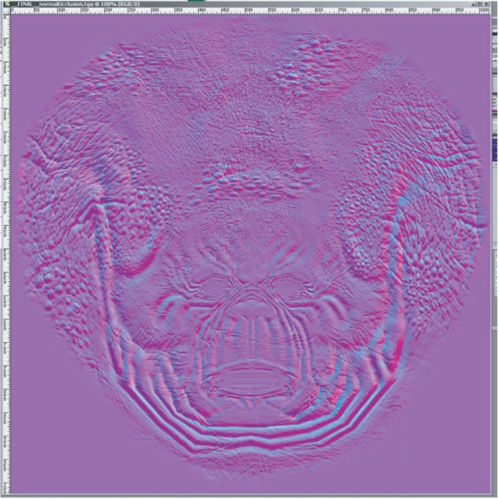
Figure 25.9. The normal map used in Figure 25.8. In this image, the red, green, and blue channels of the texture contain the X, Y, and Z coordinates of the surface normals. Image courtesy Keith Bruns. 
图 25.9。 图 25.8 中使用的法线贴图。 在此图像中，纹理的红色、绿色和蓝色通道包含表面法线的 X、Y 和 Z 坐标。 图片由基思·布伦斯提供。

Besides normal maps, multiple textures containing surface properties such as diffuse color, specular color, and smoothness (specular power) are also created. These are either painted directly on the surface in the detail modeling application, or in a two-dimensional application such as Photoshop. All of these texture maps use the surface parameterization defined in the initial modeling phase. When the texture is painted in a two-dimensional painting application, the artist must frequently switch between the painting application and some other application which can show a three-dimensional rendering of the object with the texture applied. This iterative process is illustrated in Figures 25.10, 25.11, 25.12, and 25.13.
除了法线贴图之外，还创建包含漫反射颜色、镜面反射颜色和平滑度（镜面反射强度）等表面属性的多个纹理。 它们可以在细节建模应用程序中直接绘制在表面上，也可以在 Photoshop 等二维应用程序中绘制。 所有这些纹理贴图都使用初始建模阶段定义的表面参数化。 当在二维绘画应用程序中绘制纹理时，艺术家必须频繁地在绘画应用程序和可以显示应用了纹理的对象的三维渲染的一些其他应用程序之间切换。 这个迭代过程如图 25.10、25.11、25.12 和 25.13 所示。

Figure 25.10. An early version of a diffuse color texture for the mesh from Figure 25.8, shown in Photoshop. Image courtesy Keith Bruns. 
图 25.10。 图 25.8 中网格的漫反射颜色纹理的早期版本，在 Photoshop 中显示。 图片由基思·布伦斯提供。

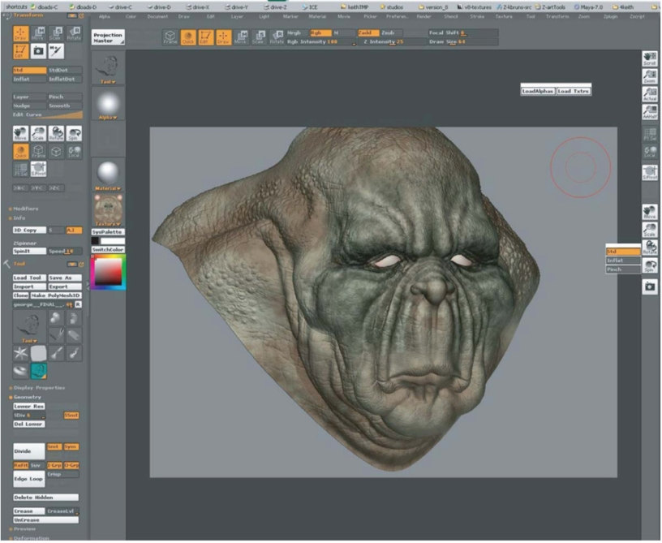
Figure 25.11. A rendering (in ZBrush) of the mesh with normal map and early diffuse color texture (from Figure 25.10) applied. Image courtesy Keith Bruns. 
图 25.11。 应用了法线贴图和早期漫反射颜色纹理（来自图 25.10）的网格渲染（在 ZBrush 中)。 图片由基思·布伦斯提供。

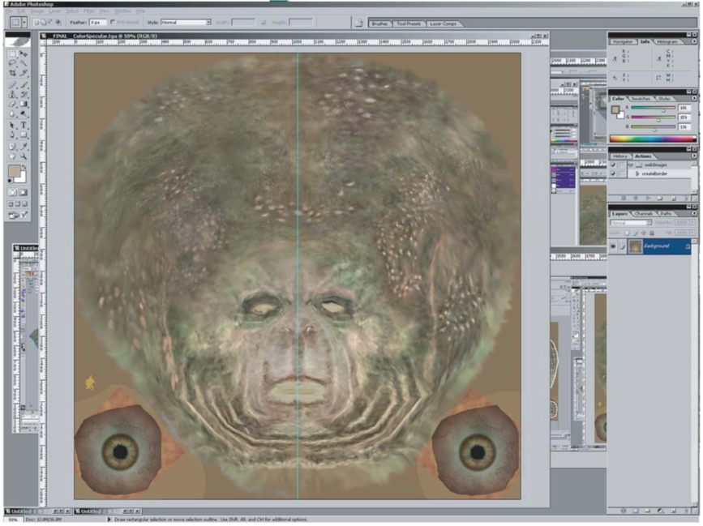
Figure 25.12. Final version of the color texture from Figure 25.10. Image courtesy Keith Bruns. 
图 25.12。 图 25.10 中颜色纹理的最终版本。 图片由基思·布伦斯提供。


Figure 25.13. Rendering of the mesh with normal map and final color texture (from Figure 25.12) applied. Image courtesy Keith Bruns. 
图 25.13。 应用法线贴图和最终颜色纹理（来自图 25.12)渲染网格。 图片由基思·布伦斯提供。

#### Shading  阴影

Shaders are typically applied in the same application used for initial modeling. In this process, a shader (from the set of shaders defined for that game) is applied to the mesh. The various textures resulting from the detail modeling stage are applied as inputs to this shader, using the surface parameterization defined during initial modeling. Various other shader inputs are set via visual experimentation (“tweaking”); see Figure 25.14. 
着色器通常应用在用于初始建模的同一应用程序中。 在此过程中，着色器（来自为该游戏定义的着色器集）将应用于网格。 使用初始建模期间定义的表面参数化，将细节建模阶段产生的各种纹理用作该着色器的输入。 各种其他着色器输入是通过视觉实验（“调整”）设置的； 参见图 25.14。
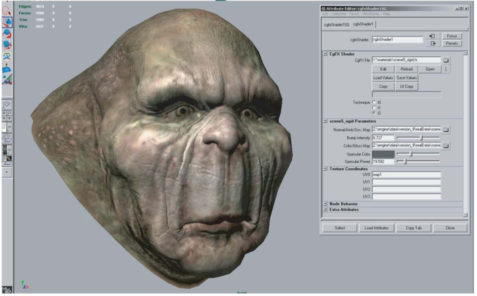
Figure 25.14. Shader configuration in Maya. The interface on the right is used to select the shader, assign textures to shader inputs, and set the values of non-texture shader inputs (such as the “Specular Color” and “Specular Power” sliders). The rendering on the left is updated dynamically while these properties are modified, enabling immediate visual feedback. Image courtesy Keith Bruns.
图 25.14。 Maya 中的着色器配置。 右侧界面用于选择着色器、将纹理分配给着色器输入以及设置非纹理着色器输入的值（例如“镜面颜色”和“镜面强度”滑块)。 修改这些属性时，左侧的渲染会动态更新，从而实现即时视觉反馈。 图片由基思·布伦斯提供。

#### Lighting 灯光

In the case of background scenery, lighting artists will typically start their work after modeling, texturing, and shading have been completed. Light sources are placed and their effect computed in a preprocessing step. The results of this process are stored in lightmaps for later use by the rendering engine. 
就背景风景而言，灯光艺术家通常会在建模、纹理和着色完成后开始工作。 在预处理步骤中放置光源并计算其效果。 此过程的结果存储在光照贴图中，供渲染引擎稍后使用。

#### Animation 动画片

Character meshes undergo several additional steps related to animation. The primary method used to animate game characters is skinning. This requires a rig, consisting of a hierarchy of transform nodes that is attached to the character, a process known as rigging. The area of effect of each transform node is painted onto a subset of mesh vertices. Finally, animators create animations that move, rotate, and scale these transform nodes, “dragging” the mesh behind them. 
角色网格经历了几个与动画相关的附加步骤。 用于制作游戏角色动画的主要方法是蒙皮。 这需要一个装备，由附加到角色的变换节点层次结构组成，这个过程称为装备。 每个变换节点的效果区域被绘制到网格顶点的子集上。 最后，动画师创建移动、旋转和缩放这些变换节点的动画，“拖动”它们后面的网格。

A typical game character will have many dozens of animations, corresponding to different modes of motion (walking, running, turning) as well as different actions such as attacks. In the case of a main character, the number of animations can be in the hundreds. Transitions between different animations also need to be defined. 
一个典型的游戏角色会有几十种动画，对应于不同的运动模式（行走、奔跑、转身）以及攻击等不同的动作。 对于主角来说，动画的数量可以达到数百个。 还需要定义不同动画之间的过渡。

For facial animation, another technique, called morph targets is sometimes employed. In this technique, the mesh vertices are directly manipulated to deform the mesh. Different copies of the deformed mesh are stored (e.g., for different facial expressions) and combined by the game engine at runtime. The creation of morph targets is shown in Figure 25.15.
对于面部动画，有时会采用另一种技术，称为变形目标。 在该技术中，直接操纵网格顶点以使网格变形。 变形网格的不同副本被存储（例如，针对不同的面部表情）并由游戏引擎在运行时组合。 变形目标的创建如图 25.15 所示。

Figure 25.15. Morph target interface in Maya. The bottom row shows four different morph targets, and the model at the top shows the effects of combining several morph targets together. The interface at the upper left is used to control the degree to which each morph target is applied. Image courtesy Keith Bruns.
图 25.15。 Maya 中的变形目标界面。 底行显示了四个不同的变形目标，顶部的模型显示了将多个变形目标组合在一起的效果。 左上角的界面用于控制每个变形目标应用的程度。 图片由基思·布伦斯提供。

## Notes  注释

There is a huge amount of information on real-time rendering and game programming available, both in books and online. Here are some resources I can recommend from personal familiarity.
书籍和在线都有大量关于实时渲染和游戏编程的信息。 以下是我可以根据个人熟悉程度推荐的一些资源。

Game Developer Magazine is a good source of information on game development, as are slides from the talks given at the annual Game Developers Conference (GDC) and Microsoft’s Gamefest conference. The GPU Gems and ShaderX book series also contain good information—all of the former and the first two of the latter are also available online. 
《游戏开发者杂志》是有关游戏开发的良好信息来源，年度游戏开发者大会 (GDC) 和 Microsoft Gamefest 会议上的演讲幻灯片也是如此。 GPU Gems 和 ShaderX 书籍系列也包含很好的信息——前者的所有内容和后者的前两本也可以在线获取。

Eric Lengyel’s Mathematics for 3D Game Programming & Computer Graphics, now in its second edition, is a good reference for the various types of math used in graphics and games. A specific area of game programming that is closely related to graphics is collision detection, for which Christer Ericson’s Real-Time Collision Detection is the definitive resource. 
Eric Lengyel 的《3D 游戏编程和计算机图形数学》现已推出第二版，对于图形和游戏中使用的各种类型的数学来说，这是一本很好的参考书。 与图形密切相关的游戏编程的一个特定领域是碰撞检测，Christer Ericson 的实时碰撞检测是该领域的权威资源。

Since its first edition in 1999, Eric Haines and Tomas Akenine-M¨ oller’s RealTime Rendering has endeavored to cover this fast-growing field in a thorough manner. As a longtime fan of this book, I was glad to have the opportunity to be a coauthor on the third edition, which came out in mid-2008. 
自 1999 年第一版以来，Eric Haines 和 Tomas Akenine-Měller 的《实时渲染》一直致力于全面涵盖这一快速发展的领域。 作为这本书的长期粉丝，我很高兴有机会成为 2008 年中期出版的第三版的合著者。

Reading is not enough—make sure you play a variety of games regularly to get a good idea of the requirements of various game types, as well as the current state of the art. 
仅仅阅读是不够的，请确保您经常玩各种游戏，以充分了解各种游戏类型的要求以及当前的技术水平。

## Exercises 练习 

1. Examine the visuals of two dissimilar games. What differences can you deduce in the graphics requirements of these two games? Analyze the effect on rendering time, storage budgets, etc.
   检查两个不同游戏的视觉效果。 您可以推断出这两款游戏的图形要求有何差异？ 分析对渲染时间、存储预算等的影响。

# 26  Visualization 可视化

A major application area of computer graphics is visualization, where computergenerated images are used to help people understand both spatial and nonspatial data. Visualization is used when the goal is to augment human capabilities in situations where the problem is not sufficiently well defined for a computer to handle algorithmically. If a totally automatic solution can completely replace human judgment, then visualization is not typically required. Visualization can be used to generate new hypotheses when exploring a completely unfamiliar dataset, to confirm existing hypotheses in a partially understood dataset, or to present information about a known dataset to another audience. 
计算机图形学的一个主要应用领域是可视化，其中计算机生成的图像用于帮助人们理解空间和非空间数据。 当目标是在问题没有充分定义以供计算机通过算法处理的情况下增强人类能力时，可以使用可视化。 如果全自动解决方案可以完全取代人类判断，那么通常不需要可视化。 可视化可用于在探索完全陌生的数据集时生成新的假设，以确认部分理解的数据集中的现有假设，或向其他受众呈现有关已知数据集的信息。

Visualization allows people to offload cognition to the perceptual system, using carefully designed images as a form of external memory. The human visual system is a very high-bandwidth channel to the brain, with a significant amount of processing occurring in parallel and at the pre-conscious level. We can thus use external images as a substitute for keeping track of things inside our own heads. For an example, let us consider the task of understanding the relationships between a subset of the topics in the splendid book Godel, Escher, Bach: The ¨ Eternal Golden Braid (Hofstadter, 1979); see Figure 26.1. 
可视化允许人们将认知转移到感知系统，使用精心设计的图像作为外部记忆的形式。 人类视觉系统是通往大脑的带宽非常高的通道，大量处理在前意识层面并行发生。 因此，我们可以使用外部图像来代替跟踪我们自己头脑中的事物。 例如，让我们考虑理解精彩著作《哥德尔、埃舍尔、巴赫：永恒的金辫子》（Hofstadter，1979）中主题子集之间关系的任务； 参见图 26.1。
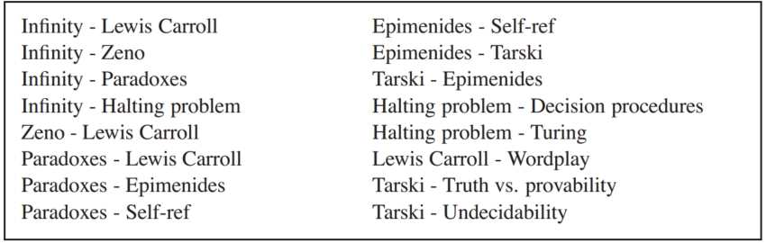
Figure 26.1. Keeping track of relationships between topics is difficult using a text list. 
图 26.1。 使用文本列表来跟踪主题之间的关系很困难。

When we see the dataset as a text list, at the low level we must read words and compare them to memories of previously read words. It is hard to keep track of just these dozen topics using cognition and memory alone, let alone the hundreds of topics in the full book. The higher-level problem of identifying neighborhoods, for instance finding all the topics two hops away from the target topic Paradoxes, is very difficult.
当我们将数据集视为文本列表时，在低级别，我们必须读取单词并将它们与之前读取的单词的记忆进行比较。 仅凭认知和记忆就很难记住这十几个主题，更不用说整本书中的数百个主题了。 识别邻域的高级问题，例如找到距目标主题悖论两跳的所有主题，是非常困难的。

Figure 26.2 shows an external visual representation of the same dataset as a node-link graph, where each topic is a node and the linkage between two topics is shown directly with a line. Following the lines by moving our eyes around the image is a fast low-level operation with minimal cognitive load, so higherlevel neighborhood finding becomes possible. The placement of the nodes and the routing of the links between them was created automatically by the dot graph drawing program (Gansner, Koutsofois, North, & Vo, 1993). 
图 26.2 显示了同一数据集作为节点链接图的外部视觉表示，其中每个主题都是一个节点，两个主题之间的链接直接用一条线显示。 通过在图像周围移动眼睛来跟踪线条是一种快速的低级操作，认知负荷最小，因此更高级别的邻域查找成为可能。 节点的放置和节点之间链接的路由由点图绘制程序自动创建（Gansner、Koutsofois、North 和 Vo，1993）。

Figure 26.2. Substituting perception for cognition and memory allows us to understand relationships between book topics quickly. 
图 26.2。 用感知代替认知和记忆可以让我们快速理解书籍主题之间的关系。

We call the mapping of dataset attributes to a visual representation a visual encoding. One of the central problems in visualization is choosing appropriate encodings from the enormous space of possible visual representations, taking into account the characteristics of the human perceptual system, the dataset in question, and the task at hand.
我们将数据集属性到视觉表示的映射称为视觉编码。 可视化的核心问题之一是从可能的视觉表示的巨大空间中选择适当的编码，同时考虑人类感知系统的特征、相关数据集和手头的任务。

## 26.1 Background  背景 

### 26.1.1 History  历史

People have a long history of conveying meaning through static images, dating back to the oldest known cave paintings from over thirty thousand years ago. We continue to visually communicate today in ways ranging from rough sketches on the back of a napkin to the slick graphic design of advertisements. For thousands of years, cartographers have studied the problem of making maps that represent some aspect of the world around us. The first visual representations of abstract, nonspatial datasets were created in the 18th century by William Playfair (Friendly, 2008). 
人们通过静态图像传达意义有着悠久的历史，可以追溯到三万多年前已知的最古老的洞穴壁画。 今天，我们继续以各种方式进行视觉交流，从餐巾背面的草图到广告的精美图形设计。 几千年来，制图师一直在研究制作代表我们周围世界某些方面的地图的问题。 抽象、非空间数据集的第一个视觉表示是由 William Playfair 在 18 世纪创建的（Friendly，2008）。

Although we have had the power to create moving images for over one hundred and fifty years, creating dynamic images interactively is a more recent development only made possible by the widespread availability of fast computer graphics hardware and algorithms in the past few decades. Static visualizations of tiny datasets can be created by hand, but computer graphics enables interactive visualization of large datasets. 
尽管我们有能力创建移动图像已有一百五十多年的历史，但以交互方式创建动态图像只是最近的发展，只有在过去几十年中快速计算机图形硬件和算法的广泛使用才成为可能。 小型数据集的静态可视化可以手动创建，但计算机图形学可以实现大型数据集的交互式可视化。

### 26.1.2 Resource Limitations  资源限制 

When designing a visualization system, we must consider three different kinds of limitations: computational capacity, human perceptual and cognitive capacity, and display capacity. 
在设计可视化系统时，我们必须考虑三种不同的限制：计算能力、人类感知和认知能力以及显示能力。

As with any application of computer graphics, computer time and memory are limited resources and we often have hard constraints. If the visualization system needs to deliver interactive response, then it must use algorithms that can run in a fraction of a second rather than minutes or hours. 
与计算机图形学的任何应用程序一样，计算机时间和内存都是有限的资源，我们经常受到严格的限制。 如果可视化系统需要提供交互式响应，那么它必须使用可以在几分之一秒而不是几分钟或几小时内运行的算法。

On the human side, memory and attention must be considered as finite resources. Human memory is notoriously limited, both for long-term recall and for shorter-term working memory. Later in this chapter, we discuss some of the power and limitations of the low-level visual attention mechanisms that carry out massively parallel processing of the visual field. We store surprisingly little information internally in visual working memory, leaving us vulnerable to change blindness, the phenomenon where even very large changes are not noticed if we are attending to something else in our view (Simons, 2000). Moreover, vigilance is also a highly limited resource; our ability to perform visual search tasks degrades quickly, with far worse results after several hours than in the first few minutes (Ware, 2000).
在人类方面，记忆和注意力必须被视为有限的资源。 众所周知，人类记忆无论是长期记忆还是短期工作记忆都是有限的。 在本章后面，我们将讨论对视野进行大规模并行处理的低级视觉注意机制的一些功能和局限性。 我们在视觉工作记忆中存储的内部信息少得惊人，这使我们很容易出现变化盲视，即如果我们关注我们认为的其他事物，即使非常大的变化也不会被注意到的现象（Simons，2000）。 此外，警惕性也是一种非常有限的资源； 我们执行视觉搜索任务的能力会迅速下降，几个小时后的结果比最初几分钟要差得多（Ware，2000）。

Display capacity is a third kind of limitation to consider. Visualization designers often “run out of pixels,” where the resolution of the screen is not large enough to show all desired information simultaneously. The information density of a particular frame is a measure of the amount of information encoded versus the amount of unused space. There is a tradeoff between the benefits of showing as much as possible at once, to minimize the need for navigation and exploration, and the costs of showing too much at once, where the user is overwhelmed by visual clutter. 
显示容量是要考虑的第三种限制。 可视化设计人员经常“耗尽像素”，即屏幕分辨率不足以同时显示所有所需信息。 特定帧的信息密度是编码信息量与未使用空间量的度量。 一次显示尽可能多的内容（以最大程度地减少导航和探索的需要）的好处与一次显示太多内容（用户会被视觉混乱淹没）的成本之间存在权衡。

## 26.2 Data Types 数据类型

Many aspects of a visualization design are driven by the type of the data that we need to look at. For example, is it a table of numbers, or a set of relations between items, or inherently spatial data such as a location on the Earth’s surface or a collection of documents? 
可视化设计的许多方面都是由我们需要查看的数据类型驱动的。 例如，它是一个数字表，还是一组项目之间的关系，或者本质上是空间数据，例如地球表面的位置或文档集合？

We start by considering a table of data. We call the rows items of data and the columns are dimensions, also known as attributes. For example, the rows might represent people, and the columns might be names, age, height, shirt size, and favorite fruit. 
我们首先考虑一个数据表。 我们将行称为数据项，将列称为维度，也称为属性。 例如，行可能代表人，列可能代表姓名、年龄、身高、衬衫尺寸和最喜欢的水果。

We distinguish between three types of dimensions: quantitative, ordered, and categorical. Quantitative data, such as age or height, is numerical and we can do arithmetic on it. For example, the quantity of 68 inches minus 42 inches is 26 inches. With ordered data, such as shirt size, we cannot do full-fledged arithmetic, but there is a well-defined ordering. For example, large minus medium is not a meaningful concept, but we know that medium falls between small and large. Categorical data, such as favorite fruit or names, does not have an implicit ordering. We can only distinguish whether two things are the same (apples) or different (apples vs. bananas). 
我们区分三种类型的维度：定量、有序和分类。 定量数据，例如年龄或身高，是数字，我们可以对其进行算术运算。 例如，68英寸减去42英寸的数量是26英寸。 对于有序数据，例如衬衫尺寸，我们无法进行完整的算术，但有一个明确定义的排序。 例如，大减中并不是一个有意义的概念，但我们知道中介于小和大之间。 分类数据（例如最喜欢的水果或名称）没有隐式排序。 我们只能区分两个东西是否相同（苹果）或不同（苹果与香蕉）。

Relational data, or graphs, are another data type where nodes are connected by links. One specific kind of graph is a tree, which is typically used for hierarchical data. Both nodes and edges can have associated attributes. The word graph is unfortunately overloaded in visualization. The node-link graphs we discuss here, following the terminology of graph drawing and graph theory, could also be called networks. In the field of statistical graphics, graph is often used for chart, as in the line charts for time-series data shown in Figure 26.10. 
关系数据或图形是另一种数据类型，其中节点通过链接连接。 一种特定类型的图是树，它通常用于分层数据。 节点和边都可以具有关联的属性。 不幸的是，词图在可视化中超载了。 我们在这里讨论的节点链接图，遵循图绘制和图论的术语，也可以称为网络。 在统计图形领域，graph经常用于图表，如图26.10所示的时间序列数据的折线图。

Figure 26.10. Top: A 3D representation of this time series dataset introduces the problems of occlusion and perspective distortion. Bottom: The linked 2D views of derived aggregate curves and the calendar allow direct comparison and show more fine-grained patterns. Image courtesy Jarke van Wijk (van Wijk & van Selow, 1999), © 1999 IEEE.
图 26.10。 上图：该时间序列数据集的 3D 表示引入了遮挡和透视变形的问题。 底部：派生聚合曲线和日历的链接 2D 视图允许直接比较并显示更细粒度的模式。 图片由 Jarke van Wijk 提供（van Wijk & van Selow，1999)，© 1999 IEEE。

Some data is inherently spatial, such as geographic location or a field of measurements at positions in three-dimensional space as in the MRI or CT scans used by doctors to see the internal structure of a person’s body. The information associated with each point in space may be an unordered set of scalar quantities, or indexed vectors, or tensors. In contrast, nonspatial data can be visually encoded using spatial position, but that encoding is chosen by the designer rather than given implicitly in the semantics of the dataset itself. This choice is one of the most central and difficult problems of visualization design. 
有些数据本质上是空间数据，例如地理位置或三维空间中位置的测量范围，如医生用来查看人体内部结构的 MRI 或 CT 扫描。 与空间中的每个点相关联的信息可以是一组无序的标量、索引向量或张量。 相反，非空间数据可以使用空间位置进行可视化编码，但该编码是由设计者选择的，而不是在数据集本身的语义中隐式给出的。 这个选择是可视化设计最核心、最困难的问题之一。

### 26.2.1 Dimension and Item Count  维度和项目计数

The number of data dimensions that need to be visually encoded is one of the most fundamental aspects of the visualization design problem. Techniques that work for a low-dimensional dataset with a few columns will often fail for very high-dimensional datasets with dozens or hundreds of columns. A data dimension may have hierarchical structure, for example with a time series dataset where there are interesting patterns at multiple temporal scales. 
需要可视化编码的数据维度的数量是可视化设计问题的最基本方面之一。 适用于具有几列的低维数据集的技术通常不适用于具有数十或数百列的极高维数据集。 数据维度可能具有分层结构，例如时间序列数据集，其中在多个时间尺度上存在有趣的模式。

The number of data items is also important: a visualization that performs well for a few hundred items often does not scale to millions of items. In some cases the difficulty is purely algorithmic, where a computation would take too long; in others it is an even deeper perceptual problem that even an instantaneous algorithm could not solve, where visual clutter makes the representation unusable by a person. The range of possible values within a dimension may also be relevant. 
数据项的数量也很重要：对于数百个项目表现良好的可视化通常无法扩展到数百万个项目。 在某些情况下，困难纯粹是算法上的，计算时间太长； 在其他情况下，这是一个甚至瞬时算法也无法解决的更深层次的感知问题，其中视觉混乱使人无法使用表示。 维度内可能值的范围也可能是相关的。

### 26.2.2 Data Transformation and Derived Dimensions  数据转换和派生维度

Data is often transformed from one type to another as part of a visualization pipeline for solving the domain problem. For example, an original data dimension might be made up of quantitative data: floating point numbers that represent temperature. For some tasks, like finding anomalies in local weather patterns, the raw data might be used directly. For another task, like deciding whether water is an appropriate temperature for a shower, the data might be transformed into an ordered dimension: hot, warm, or cold. In this transformation, most of the detail is aggregated away. In a third example, when making toast, an even more lossy transformation into a categorical dimension might suffice: burned or not burned. 
作为解决领域问题的可视化管道的一部分，数据通常从一种类型转换为另一种类型。 例如，原始数据维度可能由定量数据组成：表示温度的浮点数。 对于某些任务，例如查找当地天气模式的异常情况，可以直接使用原始数据。 对于另一项任务，例如确定水是否适合淋浴的温度，数据可能会转换为有序维度：热、暖或冷。 在这个转变中，大部分细节都被聚合掉了。 在第三个例子中，在制作吐司时，对分类维度进行更有损的转换可能就足够了：烧焦或不烧焦。

The principle of transforming data into derived dimensions, rather than simply visually encoding the data in its original form, is a powerful idea. In Figure 26.10, the original data was an ordered collection of time-series curves. The transformation was to cluster the data, reducing the amount of information to visually encode to a few highly meaningful curves.
将数据转换为派生维度的原则，而不是简单地以原始形式对数据进行视觉编码，是一个强大的想法。 在图26.10中，原始数据是时间序列曲线的有序集合。 转换的目的是对数据进行聚类，减少视觉编码到一些高度有意义的曲线的信息量。

## 26.3 Human-Centered Design Process  以人为本的设计过程

The visualization design process can be split into a cascading set of layers, as shown in Figure 26.3. These layers all depend on each other; the output of the level above is input into the level below. 
可视化设计过程可以分为一组级联层，如图 26.3 所示。 这些层都相互依赖； 上一层的输出被输入到下一层。

Figure 26.3. Four nested layers of validation for visualization. 
图 26.3。 用于可视化的四个嵌套验证层。

### 26.3.1 Task Characterization  任务表征

A given dataset has many possible visual encodings. Choosing which visual encoding to use can be guided by the specific needs of some intended user. Different questions, or tasks, require very different visual encodings. For example, consider the domain of software engineering. The task of understanding the coverage of a test suite is well supported by the Tarantula interface shown in Figure 26.11. However, the task of understanding the modular decomposition of the software while refactoring the code might be better served by showing its hierarchical structure more directly as a node-link graph. 
给定的数据集有许多可能的视觉编码。 可以根据某些目标用户的特定需求来选择要使用的视觉编码。 不同的问题或任务需要非常不同的视觉编码。 例如，考虑软件工程领域。 图 26.11 所示的 Tarantula 界面很好地支持了理解测试套件覆盖范围的任务。 然而，通过更直接地将其层次结构显示为节点链接图，可能会更好地完成在重构代码时理解软件的模块化分解的任务。

Figure 26.11. Tarantula shows an overview of source code using one-pixel lines color coded by execution status of a software test suite. Image courtesy John Stasko (Jones, Harrold, & Stasko, 2002). 
图 26.11。 Tarantula 使用按软件测试套件的执行状态进行颜色编码的单像素线显示源代码的概述。 图片由 John Stasko 提供（Jones、Harrold 和 Stasko，2002 年)。

Understanding the requirements of some target audience is a tricky problem. In a human-centered design approach, the visualization designer works with a group of target users over time (C. Lewis & Rieman, 1993). In most cases, users know they need to somehow view their data but cannot directly articulate their needs as clear-cut tasks in terms of operations on data types. The iterative design process includes gathering information from the target users about their problems through interviews and observation of them at work, creating prototypes, and observing how users interact with those prototypes to see how well the proposed solution actually works. The software engineering methodology of requirements analysis can also be useful (Kovitz, 1999). 
了解某些目标受众的需求是一个棘手的问题。 在以人为本的设计方法中，可视化设计师随着时间的推移与一组目标用户一起工作（C. Lewis & Rieman，1993）。 在大多数情况下，用户知道他们需要以某种方式查看数据，但无法直接将他们的需求明确表达为数据类型操作方面的明确任务。 迭代设计过程包括通过访谈和观察目标用户在工作中收集有关其问题的信息，创建原型，并观察用户如何与这些原型交互，以了解所提出的解决方案的实际效果如何。 需求分析的软件工程方法也很有用（Kovitz，1999）。

### 26.3.2 Abstraction  抽象

After the specific domain problem has been identified in the first layer, the next layer requires abstracting it into a more generic representation as operations on the data types discussed in the previous section. Problems from very different domains can map to the same visualization abstraction. These generic operations include sorting, filtering, characterizing trends and distributions, finding anomalies and outliers, and finding correlation (Amar, Eagan, & Stasko, 2005). They also include operations that are specific to a particular data type, for example following a path for relational data in the form of graphs or trees. 
在第一层中识别出特定领域问题后，下一层需要将其抽象为更通用的表示形式，作为对上一节中讨论的数据类型的操作。 来自不同领域的问题可以映射到相同的可视化抽象。 这些通用操作包括排序、过滤、描述趋势和分布、查找异常和异常值以及查找相关性（Amar、Eagan 和 Stasko，2005）。 它们还包括特定于特定数据类型的操作，例如遵循图形或树形式的关系数据的路径。

This abstraction step often involves data transformations from the original raw data into derived dimensions. These derived dimensions are often of a different type than the original data: a graph may be converted into a tree, tabular data may be converted into a graph by using a threshold to decide whether a link should exist based on the field values, and so on. 
此抽象步骤通常涉及从原始数据到派生维度的数据转换。 这些导出的维度通常与原始数据具有不同的类型：图形可以转换为树，表格数据可以通过使用阈值来根据字段值决定链接是否应该存在来转换为图形，等等 在。 

### 26.3.3 Technique and Algorithm Design  技术和算法设计

Once an abstraction has been chosen, the next layer is to design appropriate visual encoding and interaction techniques. Section 26.4 covers the principles of visual encoding, and we discuss interaction principles in Sections 26.5. We present techniques that take these principles into account in Sections 26.6 and 26.7. 
一旦选择了抽象，下一层就是设计适当的视觉编码和交互技术。 第 26.4 节涵盖了视觉编码的原理，我们在第 26.5 节中讨论了交互原理。 我们在第 26.6 节和第 26.7 节中介绍了考虑这些原则的技术。

A detailed discussion of visualization algorithms is unfortunately beyond the scope of this chapter. 
不幸的是，可视化算法的详细讨论超出了本章的范围。

### 26.3.4 Validation  验证

Each of the four layers has different validation requirements. 
四层中的每一层都有不同的验证要求。

The first layer is designed to determine whether the problem is correctly characterized: is there really a target audience performing particular tasks that would benefit from the proposed tool? An immediate way to test assumptions and conjectures is to observe or interview members of the target audience, to ensure that the visualization designer fully understands their tasks. A measurement that cannot be done until a tool has been built and deployed is to monitor its adoption rate within that community, although of course many other factors in addition to utility affect adoption. 
第一层旨在确定问题是否被正确表征：是否真的有目标受众执行将从所提议的工具中受益的特定任务？ 测试假设和猜想的直接方法是观察或采访目标受众的成员，以确保可视化设计师完全理解他们的任务。 在构建和部署工具之前无法进行的测量是监控其在该社区内的采用率，当然，除了实用性之外，还有许多其他因素也会影响采用。

The next layer is used to determine whether the abstraction from the domain problem into operations on specific data types actually solves the desired problem. After a prototype or finished tool has been deployed, a field study can be carried out to observe whether and how it is used by its intended audience. Also, images produced by the system can be analyzed both qualitatively and quantitatively. 
下一层用于确定从领域问题抽象为特定数据类型的操作是否真正解决了所需的问题。 部署原型或成品工具后，可以进行实地研究以观察目标受众是否以及如何使用它。 此外，系统生成的图像可以进行定性和定量分析。

The purpose of the third layer is to verify that the visual encoding and interaction techniques chosen by the designer effectively communicate the chosen abstraction to the users. An immediate test is to justify that individual design choices do not violate known perceptual and cognitive principles. Such a justification is necessary but not sufficient, since visualization design involves many tradeoffs between interacting choices. After a system is built, it can be tested through formal laboratory studies where many people are asked to do assigned tasks so that measurements of the time required for them to complete the tasks and their error rates can be statistically analyzed. 
第三层的目的是验证设计者选择的视觉编码和交互技术是否有效地将所选抽象传达给用户。 一个直接的测试是证明个人设计选择不违反已知的感知和认知原则。 这样的理由是必要的，但还不够，因为可视化设计涉及交互选择之间的许多权衡。 系统建成后，可以通过正式的实验室研究进行测试，要求许多人完成分配的任务，以便可以统计分析他们完成任务所需的时间和错误率。

A fourth layer is employed to verify that the algorithm designed to carry out the encoding and interaction choices is faster or takes less memory than previous algorithms. An immediate test is to analyze the computational complexity of the proposed algorithm. After implementation, the actual time performance and memory usage of the system can be directly measured. 
第四层用于验证设计用于执行编码和交互选择的算法是否比以前的算法更快或占用更少的内存。 立即测试是分析所提出算法的计算复杂性。 实施后，可以直接测量系统的实际时间性能和内存使用情况。

## 26.4 Visual Encoding Principles  视觉编码原理

We can describe visual encodings as graphical elements, called marks, that convey information through visual channels. A zero-dimensional mark is a point, a one-dimensional mark is a line, a two-dimensional mark is an area, and a three-dimensional mark is a volume. Many visual channels can encode information, including spatial position, color, size, shape, orientation, and direction of motion. Multiple visual channels can be used to simultaneously encode different data dimensions; for example, Figure 26.4 shows the use of horizontal and vertical spatial position, color, and size to display four data dimensions. More than one channel can be used to redundantly code the same dimension, for a design that displays less information but shows it more clearly. 
我们可以将视觉编码描述为图形元素，称为标记，通过视觉通道传达信息。 零维标记是点，一维标记是线，二维标记是面，三维标记是体积。 许多视觉通道可以编码信息，包括空间位置、颜色、大小、形状、方位和运动方向。 可以使用多个视觉通道同时编码不同的数据维度； 例如，图26.4显示了使用水平和垂直空间位置、颜色和大小来显示四个数据维度。 可以使用多个通道对同一尺寸进行冗余编码，以实现显示较少信息但显示更清晰的设计。

Figure 26.4. The four visual channels of horizontal and vertical spatial position, color, and size are used to encode information in this scatterplot chart Image courtesy George Robertson (Robertson, Fernandez, Fisher, Lee, & Stasko, 2008), © IEEE 2008.
图 26.4。 水平和垂直空间位置、颜色和大小的四个视觉通道用于编码此散点图中的信息 图片由 George Robertson 提供（Robertson、Fernandez、Fisher、Lee 和 Stasko，2008 年)，© IEEE 2008。

### 26.4.1 Visual Channel Characteristics  视觉通道特性

Important characteristics of visual channels are distinguishability, separability, and popout. 
视觉通道的重要特征是可区分性、可分离性和弹出性。

Channels are not all equally distinguishable. Many psychophysical experiments have been carried out to measure the ability of people to make precise distinctions about information encoded by the different visual channels. Our abilities depend on whether the data type is quantitative, ordered, or categorical. Figure 26.5 shows the rankings of visual channels for the three data types. Figure 26.6 shows some of the default mappings for visual channels in the Tableau/Polaris system, which take into account the data type.
渠道的区别并不相同。 已经进行了许多心理物理学实验来测量人们精确区分不同视觉通道编码的信息的能力。 我们的能力取决于数据类型是定量的、有序的还是分类的。 图 26.5 显示了三种数据类型的视觉通道的排名。 图 26.6 显示了 Tableau/Polaris 系统中视觉通道的一些默认映射，其中考虑了数据类型。
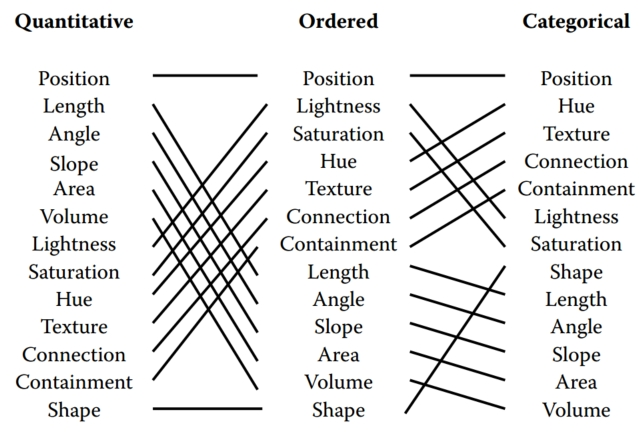
Figure 26.5. Our ability to perceive information encoded by a visual channel depends on the type of data used, from most accurate at the top to least at the bottom. Redrawn and adapted from (Mackinlay, 1986).
图 26.5。 我们感知视觉通道编码的信息的能力取决于所使用的数据类型，从顶部最准确到底部最不准确。 重新绘制并改编自（Mackinlay，1986)。

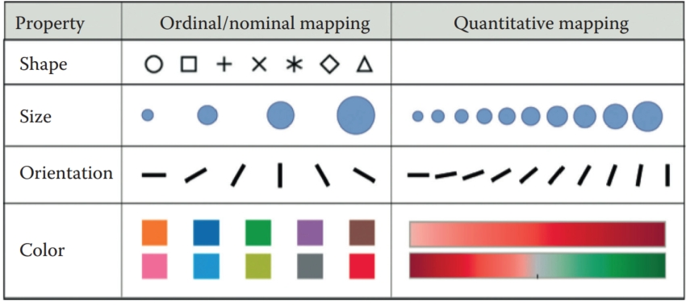
Figure 26.6. The Tableau/Polaris system default mappings for four visual channels according to data type. Image courtesy Chris Stolte (Stolte, Tang, & Hanrahan, 2008), © 2008 IEEE. 
图 26.6。 Tableau/Polaris 系统根据数据类型默认映射四个视觉通道。 图片由 Chris Stolte 提供（Stolte、Tang 和 Hanrahan，2008 年)，© 2008 IEEE。

Spatial position is the most accurate visual channel for all three types of data, and it dominates our perception of a visual encoding. Thus, the two most important data dimensions are often mapped to horizontal and vertical spatial positions.
空间位置是所有三种类型数据最准确的视觉通道，它主导着我们对视觉编码的感知。 因此，两个最重要的数据维度通常映射到水平和垂直空间位置。

However, the other channels differ strongly between types. The channels of length and angle are highly discriminable for quantitative data but poor for ordered and categorical, while in contrast hue is very accurate for categorical data but mediocre for quantitative data.
然而，其他渠道之间的类型差异很大。 长度和角度的通道对于定量数据具有很强的可区分性，但对于有序和分类数据的区分性较差，而相比之下，色调对于分类数据非常准确，但对于定量数据则表现平庸。

We must always consider whether there is a good match between the dynamic range necessary to show the data dimension and the dynamic range available in the channel. For example, encoding with line width uses a one-dimensional mark and the size channel. There are a limited number of width steps that we can reliably use to visually encode information: a minimum thinness of one pixel is enforced by the screen resolution (ignoring antialiasing to simplify this discussion), and there is a maximum thickness beyond which the object will be perceived as a polygon rather than a line. Line width can work very well to show three or four different values in a data dimension, but it would be a poor choice for dozens or hundreds of values.
我们必须始终考虑显示数据维度所需的动态范围与通道中可用的动态范围之间是否存在良好的匹配。 例如，线宽编码使用一维标记和尺寸通道。 我们可以可靠地使用有限数量的宽度步骤来对信息进行视觉编码：屏幕分辨率强制执行一个像素的最小厚度（忽略抗锯齿以简化讨论），并且存在一个最大厚度，超过该厚度物体将 被视为多边形而不是线。 线宽可以很好地显示数据维度中的三到四个不同值，但对于数十或数百个值来说，这将是一个糟糕的选择。

Some visual channels are integral, fused together at a pre-conscious level, so they are not good choices for visually encoding different data dimensions. Others are separable, without interactions between them during visual processing, and are safe to use for encoding multiple dimensions. Figure 26.7 shows two channel pairs. Color and position are highly separable. We can see that horizontal size and vertical size are not so easy to separate, because our visual system automatically integrates these together into a unified perception of area. Size interacts with many channels: as the size of an object grows smaller, it becomes more difficult to distinguish its shape or color.
一些视觉通道是完整的，在前意识层面融合在一起，因此它们不是对不同数据维度进行视觉编码的良好选择。 其他是可分离的，在视觉处理过程中它们之间没有交互，并且可以安全地用于编码多个维度。 图 26.7 显示了两个通道对。 颜色和位置是高度可分离的。 我们可以看到，水平尺寸和垂直尺寸并不那么容易分开，因为我们的视觉系统自动将它们整合在一起形成统一的区域感知。 尺寸与许多通道相互作用：随着物体尺寸变小，区分其形状或颜色变得更加困难。
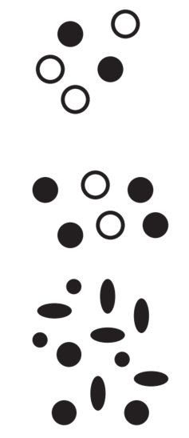
Figure 26.7. Color and location are separable channels well suited to encode different data dimensions, but the horizontal size and and vertical size channels are automatically fused into an integrated perception of area. Redrawn after (Ware, 2000).
图 26.7。 颜色和位置是可分离的通道，非常适合编码不同的数据维度，但水平尺寸和垂直尺寸通道会自动融合到区域的集成感知中。 之后重新绘制（Ware，2000)。

We can selectively attend to a channel so that items of a particular type “pop out” visually, as discussed in Section 20.4.3. An example of visual popout is when we immediately spot the red item amidst a sea of blue ones, or distinguish the circle from the squares. Visual popout is powerful and scalable because it occurs in parallel, without the need for conscious processing of the items one by one. Many visual channels have this popout property, including not only the list above but also curvature, flicker, stereoscopic depth, and even the direction of lighting. However, in general we can only take advantage of popout for one channel at a time. For example, a white circle does not pop out from a group of circles and squares that can be white or black, as shown in Figure 20.46. When we need to search across more than one channel simultaneously, the length of time it takes to find the target object depends linearly on the number of objects in the scene. 
我们可以有选择地关注一个通道，以便特定类型的项目在视觉上“弹出”，如第 20.4.3 节中所述。 视觉弹出的一个例子是，当我们立即在蓝色项目的海洋中发现红色项目，或者区分圆形和正方形时。 视觉弹出功能强大且可扩展，因为它是并行发生的，无需有意识地逐项处理。 许多视觉通道都具有这种弹出属性，不仅包括上面的列表，还包括曲率、闪烁、立体深度，甚至照明方向。 然而，一般来说，我们一次只能利用一个通道的弹出功能。 例如，白色圆圈不会从一组可以是白色或黑色的圆形和正方形中弹出，如图 20.46 所示。 当我们需要同时搜索多个通道时，找到目标对象所需的时间长度与场景中对象的数量线性相关。

### 26.4.2 Color  颜色

Color can be a very powerful channel, but many people do not understand its properties and use it improperly. As discussed in Section 20.2.2, we can consider color in terms of three separate visual channels: hue, saturation, and lightness. Region size strongly affects our ability to sense color. Color in small regions is relatively difficult to perceive, and designers should use bright, highly saturated colors to ensure that the color coding is distinguishable. The inverse situation is true when colored regions are large, as in backgrounds, where low saturation pastel colors should be used to avoid blinding the viewer. 
颜色可以是一个非常强大的通道，但许多人不了解它的属性并且使用不当。 正如第 20.2.2 节中所讨论的，我们可以根据三个独立的视觉通道来考虑颜色：色调、饱和度和亮度。 区域大小强烈影响我们感知颜色的能力。 小区域的颜色相对难以感知，设计者应使用明亮、高饱和度的颜色，以确保颜色编码可区分。 当彩色区域较大时（如背景），情况正好相反，应使用低饱和度柔和的颜色以避免使观看者感到眩目。

Hue is a very strong cue for encoding categorical data. However, the available dynamic range is very limited. People can reliably distinguish only around a dozen hues when the colored regions are small and scattered around the display. A good guideline for color coding is to keep the number of categories less than eight, keeping in mind that the background and the neutral object color also count in the total. 
色调是编码分类数据的非常有力的线索。 然而，可用的动态范围非常有限。 当彩色区域很小并且分散在显示器周围时，人们只能可靠地区分大约十几种色调。 颜色编码的一个很好的指导原则是保持类别数量少于八个，请记住背景和中性对象颜色也计入总数。

For ordered data, lightness and saturation are effective because they have an implicit perceptual ordering. People can reliably order by lightness, always placing gray in between black and white. With saturation, people reliably place the less saturated pink between fully saturated red and zero-saturation white. However, hue is not as as good a channel for ordered data because it does not have an implicit perceptual ordering. When asked to create an ordering of red, blue, green, and yellow, people do not all give the same answer. People can and do learn conventions, such as green-yellow-red for traffic lights, or the order of colors in the rainbow, but these constructions are at a higher level than pure perception. Ordered data is typically shown with a discrete set of color values.
对于有序数据，亮度和饱和度是有效的，因为它们具有隐式的感知顺序。 人们可以可靠地根据亮度进行排序，总是将灰色置于黑色和白色之间。 通过饱和度，人们可靠地将不太饱和的粉色置于完全饱和的红色和零饱和度的白色之间。 然而，色调对于有序数据来说并不是一个很好的通道，因为它没有隐式的感知顺序。 当被要求创建红色、蓝色、绿色和黄色的顺序时，人们并没有给出相同的答案。 人们可以而且确实学习了约定，例如交通信号灯的绿-黄-红，或者彩虹中的颜色顺序，但这些结构比纯粹的感知处于更高的水平。 有序数据通常用一组离散的颜色值显示。

Quantitative data is shown with a colormap, a range of color values that can be continuous or discrete. A very unfortunate default in many software packages is the rainbow colormap, as shown in Figure 26.8. The standard rainbow scale suffers from three problems. First, hue is used to indicate order. A better choice would be to use lightness because it has an implicit perceptual ordering. Even more importantly, the human eye responds most strongly to luminance. Second, the scale is not perceptually linear: equal steps in the continuous range are not perceived as equal steps by our eyes. Figure 26.8 shows an example, where the rainbow colormap obfuscates the data. While the range from −2000 to −1000 has three distinct colors (cyan, green, and yellow), a range of the same size from −1000 to 0 simply looks yellow throughout. The graphs on the right show that the perceived value is strongly tied to the luminance, which is not even monotonically increasing in this scale. 
定量数据用颜色图显示，颜色图是一系列可以连续或离散的颜色值。 许多软件包中一个非常不幸的默认值是彩虹颜色图，如图 26.8 所示。 标准彩虹标尺存在三个问题。 首先，色调用于表示顺序。 更好的选择是使用亮度，因为它具有隐含的感知顺序。 更重要的是，人眼对亮度的反应最为强烈。 其次，尺度在感知上不是线性的：连续范围内的相等步长不会被我们的眼睛感知为相等步长。 图 26.8 显示了一个示例，其中彩虹颜色图混淆了数据。 虽然从 -2000 到 -1000 的范围具有三种不同的颜色（青色、绿色和黄色），但从 -1000 到 0 的相同大小的范围整个看起来只是黄色。 右图显示感知值与亮度密切相关，在这个尺度上亮度甚至不是单调增加的。

Figure 26.8. The standard rainbow colormap has two defects: it uses hue to denote ordering, and it is not perceptually isolinear. Image courtesy Bernice Rogowitz. 
图 26.8。 标准彩虹色彩图有两个缺陷：它使用色调来表示排序，并且它在感知上不是等线的。 图片由伯妮斯·罗戈维茨提供。

In contrast, Figure 26.9 shows the same data with a more appropriate colormap, where the lightness increases monotonically. Hue is used to create a semantically meaningful categorization: the viewer can discuss structure in the dataset, such as the dark blue sea, the cyan continental shelf, the green lowlands, and the white mountains. 
相比之下，图 26.9 显示了具有更合适的颜色图的相同数据，其中亮度单调增加。 色调用于创建语义上有意义的分类：查看者可以讨论数据集中的结构，例如深蓝色的海洋、青色的大陆架、绿色的低地和白色的山脉。

Figure 26.9. The structure of the same dataset is far more clear with a colormap where monotonically increasing lightness is used to show ordering and hue is used instead for segmenting into categorical regions. Image courtesy Bernice Rogowitz.
图 26.9。 使用颜色图，同一数据集的结构更加清晰，其中使用单调增加的亮度来显示排序，并使用色调来分割为分类区域。 图片由伯妮斯·罗戈维茨提供。

In both the discrete and continuous cases, colormaps should take into account whether the data is sequential or diverging. The ColorBrewer application (www.colorbrewer.org) is an excellent resource for colormap construction (Brewer, 1999). 
在离散和连续情况下，颜色图都应考虑数据是连续的还是发散的。 ColorBrewer 应用程序 (www.colorbrewer.org) 是构建色彩图的绝佳资源（Brewer，1999）。

Another important issue when encoding with color is that a significant fraction of the population, roughly 10% of men, is red-green color deficient. If a coding using red and green is chosen because of conventions in the target domain, redundantly coding lightness or saturation in addition to hue is wise. Tools such as the website http://www.vischeck.com should be used to check whether a color scheme is distinguishable to people with color deficient vision. 
使用颜色进行编码时的另一个重要问题是，很大一部分人口（大约 10% 的男性）缺乏红绿色颜色。 如果由于目标域中的约定而选择使用红色和绿色的编码，那么除了色调之外，对亮度或饱和度进行冗余编码是明智的。 应使用网站 http://www.vischeck.com 等工具来检查颜色方案对于色觉缺陷的人是否可以区分。

26.4.3 2D vs. 3D Spatial Layouts  2D 与 3D 空间布局

The question of whether to use two or three channels for spatial position has been extensively studied. When computer-based visualization began in the late 1980s, and interactive 3D graphics was a new capability, there was a lot of enthusiasm for 3D representations. As the field matured, researchers began to understand the costs of 3D approaches when used for abstract datasets (Ware, 2001). 
是否使用两个或三个通道进行空间定位的问题已被广泛研究。 当基于计算机的可视化在 20 世纪 80 年代末开始出现时，交互式 3D 图形成为一种新功能，人们对 3D 表示产生了极大的热情。 随着该领域的成熟，研究人员开始了解 3D 方法用于抽象数据集时的成本（Ware，2001）。

Occlusion, where some parts of the dataset are hidden behind others, is a major problem with 3D. Although hidden surface removal algorithms such as zbuffers and BSP trees allow fast computation of a correct 2D image, people must still synthesize many of these images into an internal mental map. When people look at realistic scenes made from familiar objects, usually they can quickly understand what they see. However, when they see an unfamiliar dataset, where a chosen visual encoding maps abstract dimensions into spatial positions, understanding the details of its 3D structure can be challenging even when they can use interactive navigation controls to change their 3D viewpoint. The reason is once again the limited capacity of human working memory (Plumlee & Ware, 2006).
遮挡（数据集的某些部分隐藏在其他部分后面）是 3D 的一个主要问题。 尽管隐藏表面去除算法（例如 zbuffers 和 BSP 树）可以快速计算正确的 2D 图像，但人们仍然必须将许多这些图像合成到内部心理地图中。 当人们看到由熟悉的物体组成的真实场景时，通常可以很快理解他们所看到的内容。 然而，当他们看到一个不熟悉的数据集（其中选择的视觉编码将抽象维度映射到空间位置）时，即使他们可以使用交互式导航控件来更改其 3D 视点，理解其 3D 结构的细节也可能具有挑战性。 原因又是人类工作记忆的容量有限（Plumlee & Ware，2006）。

Another problem with 3D is perspective distortion. Although real-world objects do indeed appear smaller when they are further from our eyes, foreshortening makes direct comparison of object heights difficult (Tory, Kirkpatrick, Atkins, & M¨ oller, 2006). Once again, although we can often judge the heights of familiar objects in the real world based on past experience, we cannot necessarily do so with completely abstract data that has a visual encoding where the height conveys meaning. For example, it is more difficult to judge bar heights in a 3D bar chart than in multiple horizontally aligned 2D bar charts. 
3D 的另一个问题是透视变形。 尽管现实世界的物体在离我们的眼睛较远时确实看起来更小，但透视法使得直接比较物体高度变得困难（Tory、Kirkpatrick、Atkins 和 Měller，2006）。 再说一遍，虽然我们经常可以根据过去的经验来判断现实世界中熟悉物体的高度，但我们不一定能用完全抽象的数据来做到这一点，这些数据具有高度传达意义的视觉编码。 例如，判断 3D 条形图中的条形高度比判断多个水平对齐的 2D 条形图中的条形高度更困难。

Another problem with unconstrained 3D representations is that text at arbitrary orientations in 3D space is far more difficult to read than text aligned in the 2D image plane (Grossman, Wigdor, & Balakrishnan, 2007). 
无约束 3D 表示的另一个问题是 3D 空间中任意方向的文本比 2D 图像平面中对齐的文本更难以阅读（Grossman、Wigdor 和 Balakrishnan，2007）。

Figure 26.10 illustrates how carefully chosen 2D views of an abstract dataset can avoid the problems with occlusion and perspective distortion inherent in 3D views. The top view shows a 3D representation created directly from the original time-series data, where each cross-section is a 2D time-series curve showing power consumption for one day, with one curve for each day of the year along the extruded third axis. Although this representation is straightforward to create, we can only see large-scale patterns such as the higher consumption during working hours and the seasonal variation between winter and summer. To create the 2D linked views at the bottom, the curves were hierarchically clustered, and only aggregate curves representing the top clusters are drawn superimposed in the same 2D frame. Direct comparison between the curve heights at all times of the day is easy because there is no perspective distortion or occlusion. The same color coding is used in the calendar view, which is very effective for understanding temporal patterns. 
图 26.10 说明了如何精心选择抽象数据集的 2D 视图来避免 3D 视图中固有的遮挡和透视变形问题。 顶视图显示了直接根据原始时间序列数据创建的 3D 表示，其中每个横截面都是显示一天功耗的 2D 时间序列曲线，沿着拉伸的第三轴，一条曲线代表一年中的每一天 。 尽管这种表示很容易创建，但我们只能看到大规模模式，例如工作时间的较高消耗以及冬季和夏季之间的季节性变化。 为了在底部创建 2D 链接视图，曲线被分层聚类，并且仅在同一 2D 框架中叠加绘制代表顶部聚类的聚合曲线。 一天中任何时间的曲线高度之间的直接比较都很容易，因为不存在透视变形或遮挡。 日历视图中使用相同的颜色编码，这对于理解时间模式非常有效。

In contrast, if a dataset consists of inherently 3D spatial data, such as showing fluid flow over an airplane wing or a medical imaging dataset from an MRI scan, then the costs of a 3D view are outweighed by its benefits in helping the user construct a useful mental model of the dataset structure. 
相比之下，如果数据集由固有的 3D 空间数据组成，例如显示飞机机翼上的流体流动或来自 MRI 扫描的医学成像数据集，则 3D 视图的成本与其帮助用户构建 数据集结构的有用心理模型。

### 26.4.4 Text Labels 文本标签

Text in the form of labels and legends is a very important factor in creating visualizations that are useful rather than simply pretty. Axes and tick marks should be labeled. Legends should indicate the meaning of colors, whether used as discrete patches or in continuous color ramps. Individual items in a dataset typically have meaningful text labels associated with them. In many cases showing all labels at all times would result in too much visual clutter, so labels can be shown for a subset of the items using label positioning algorithms that show labels at a desired density while avoiding overlap (Luboschik, Schumann, & Cords, 2008). A straightforward way to choose the best label to represent a group of items is to use a greedy algorithm based on some measure of label importance, but synthesizing a new label based on the characteristics of the group remains a difficult problem. A more interaction-centric approach is to only show labels for individual items based on an interactive indication from the user. 
标签和图例形式的文本是创建有用而不仅仅是美观的可视化效果的一个非常重要的因素。 轴和刻度线应贴上标签。 图例应指示颜色的含义，无论是用作离散色块还是连续色带。 数据集中的各个项目通常具有与其关联的有意义的文本标签。 在许多情况下，始终显示所有标签会导致过多的视觉混乱，因此可以使用标签定位算法显示项目子集的标签，该算法以所需的密度显示标签，同时避免重叠（Luboschik、Schumann 和 Cords， 2008）。 选择最佳标签来表示一组项目的一种直接方法是使用基于某种标签重要性度量的贪心算法，但是根据组的特征合成新标签仍然是一个难题。 一种更加以交互为中心的方法是根据用户的交互指示仅显示单个项目的标签。

## 26.5 Interaction Principles  交互原则

Several principles of interaction are important when designing a visualization. Low-latency visual feedback allows users to explore more fluidly, for example by showing more detail when the cursor simply hovers over an object rather than requiring the user to explicitly click. Selecting items is a fundamental operation when interacting with large datasets, as is visually indicating the selected set with highlighting. Color coding is a common form of highlighting, but other channels can also be used. 
设计可视化时，交互的几个原则很重要。 低延迟视觉反馈允许用户更流畅地探索，例如，当光标简单地悬停在对象上时显示更多细节，而不是要求用户显式单击。 选择项目是与大型数据集交互时的基本操作，就像通过突出显示直观地指示所选集一样。 颜色编码是突出显示的常见形式，但也可以使用其他通道。

Many forms of interaction can be considered in terms of what aspect of the display they change. Navigation can be considered a change of viewport. Sorting is a change to the spatial ordering; that is, changing how data is mapped to the spatial position visual channel. The entire visual encoding can also be changed. 
许多形式的交互可以根据它们改变显示的哪个方面来考虑。 导航可以被认为是视口的改变。 排序是对空间顺序的改变； 也就是说，改变数据映射到空间位置视觉通道的方式。 整个视觉编码也可以改变。

### 26.5.1 Overview First, Zoom and Filter, Details on Demand  概览先行，缩放过滤，详情按需

The influential mantra “Overview first, zoom and filter, details on demand” (Shneiderman, 1996) elucidates the role of interaction and navigation in visualization design. Overviews help the user notice regions where further investigation might be productive, whether through spatial navigation or through filtering. As we discuss below, details can be presented in many ways: with popups from clicking or cursor hovering, in a separate window, and by changing the layout on the fly to make room to show additional information. 
有影响力的口号“概览优先，缩放和过滤，按需提供细节”（Shneiderman，1996）阐明了交互和导航在可视化设计中的作用。 概述可以帮助用户注意到进一步调查可能有效的区域，无论是通过空间导航还是通过过滤。 正如我们下面讨论的，详细信息可以通过多种方式呈现：通过单击或光标悬停弹出窗口，在单独的窗口中，以及通过动态更改布局以腾出空间来显示附加信息。

### 26.5.2 Interactivity Costs   交互成本 

Interactivity has both power and cost. The benefit of interaction is that people can explore a larger information space than can be understood in a single static image. However, a cost to interaction is that it requires human time and attention. If the user must exhaustively check every possibility, use of the visualization system may degenerate into human-powered search. Automatically detecting features of interest to explicitly bring to the user’s attention via the visual encoding is a useful goal for the visualization designer. However, if the task at hand could be completely solved by automatic means, there would be no need for a visualization in the first place. Thus, there is always a tradeoff between finding automatable aspects and relying on the human in the loop to detect patterns. 
交互性既有力量，也有成本。 交互的好处是人们可以探索比单个静态图像所能理解的更大的信息空间。 然而，交互的代价是它需要人类的时间和注意力。 如果用户必须详尽地检查每种可能性，则可视化系统的使用可能会退化为人力搜索。 自动检测感兴趣的特征以通过视觉编码明确引起用户的注意对于可视化设计者来说是一个有用的目标。 然而，如果手头的任务可以完全通过自动方式解决，那么一开始就不需要可视化。 因此，在寻找可自动化方面和依赖循环中的人员来检测模式之间总是存在权衡。

### 26.5.3 Animation  动画片

Animation shows change using time. We distinguish animation, where successive frames can only be played, paused, or stopped, from true interactive control. There is considerable evidence that animated transitions can be more effective than jump cuts, by helping people track changes in object positions or camera viewpoints (Heer & Robertson, 2007). Although animation can be very effective for narrative and storytelling, it is often used ineffectively in a visualization context (Tversky, Morrison, & Betrancourt, 2002). It might seem obvious to show data that changes over time by using animation, a visual modality that changes over time. However, people have difficulty in making specific comparisons between individual frames that are not contiguous when they see an animation consisting of many frames. The very limited capacity of human visual memory means that we are much worse at comparing memories of things that we have seen in the past than at comparing things that are in our current field of view. For tasks requiring comparison between up to several dozen frames, side-by-side comparison is often more effective than animation. Moreover, if the number of objects that change between frames is large, people will have a hard time tracking everything that occurs (Robertson et al., 2008). Narrative animations are carefully designed to avoid having too many actions occurring simultaneously, whereas a dataset being visualized has no such constraint. For the special case of just two frames with a limited amount of change, the very simple animation of flipping back and forth between the two can be a useful way to identify the differences between them. 
动画显示使用时间的变化。 我们将连续帧只能播放、暂停或停止的动画与真正的交互式控制区分开来。 有大量证据表明，动画过渡可以比跳切更有效，可以帮助人们跟踪物体位置或摄像机视点的变化（Heer & Robertson，2007）。 尽管动画对于叙事和讲故事非常有效，但它在可视化环境中通常使用效率较低（Tversky、Morrison 和 Betrancourt，2002）。 使用动画（一种随时间变化的视觉形式）来显示随时间变化的数据似乎是显而易见的。 然而，当人们看到由许多帧组成的动画时，很难对不连续的各个帧进行具体比较。 人类视觉记忆的能力非常有限，这意味着我们在比较过去看到的事物的记忆方面比比较当前视野中的事物要差得多。 对于需要在多达几十帧之间进行比较的任务，并排比较通常比动画更有效。 此外，如果帧之间变化的对象数量很大，人们将很难跟踪发生的一切（Robertson et al., 2008）。 叙事动画经过精心设计，以避免同时发生太多动作，而可视化的数据集则没有这样的限制。 对于只有两个帧且变化量有限的特殊情况，在两个帧之间来回翻转的非常简单的动画可能是识别它们之间差异的有用方法。

## 26.6 Composite and Adjacent Views  复合视图和相邻视图

A very fundamental visual encoding choice is whether to have a single composite view showing everything in the same frame or window, or to have multiple views adjacent to each other.
一个非常基本的视觉编码选择是是否使用单个复合视图来显示同一帧或窗口中的所有内容，或者使用多个彼此相邻的视图。

### 26.6.1 Single Drawing  单图

When there are only one or two data dimensions to encode, then horizontal and vertical spatial position are the obvious visual channel to use, because we perceive them most accurately and position has the strongest influence on our internal mental model of the dataset. The traditional statistical graphics displays of line charts, bar charts, and scatterplots all use spatial ordering of marks to encode information. These displays can be augmented with additional visual channels, such as color and size and shape, as in the scatterplot shown in Figure 26.4. 
当只有一两个数据维度需要编码时，水平和垂直空间位置是明显要使用的视觉通道，因为我们感知它们最准确，并且位置对我们数据集的内部心理模型的影响最大。 传统的统计图形显示（折线图、条形图和散点图）都使用标记的空间排序来编码信息。 这些显示可以通过额外的视觉通道进行增强，例如颜色、大小和形状，如图 26.4 所示的散点图所示。

The simplest possible mark is a single pixel. In pixel-oriented displays, the goal is to provide an overview of as many items as possible. These approaches use the spatial position and color channels at a high information density, but preclude the use of the size and shape channels. Figure 26.11 shows the Tarantula software visualization tool (Jones et al., 2002), where most of the screen is devoted to an overview of source code using one-pixel high lines (Eick, Steffen, & Sumner, 1992). The color and brightness of each line shows whether it passed, failed, or had mixed results when executing a suite of test cases. 
最简单的标记是单个像素。 在面向像素的显示器中，目标是提供尽可能多的项目的概览。 这些方法以高信息密度使用空间位置和颜色通道，但排除了尺寸和形状通道的使用。 图 26.11 显示了 Tarantula 软件可视化工具（Jones 等人，2002 年），其中大部分屏幕专门用于使用一像素高线来概述源代码（Eick、Steffen 和 Sumner，1992 年）。 每条线的颜色和亮度显示执行一组测试用例时它是通过、失败还是混合结果。

### 26.6.2 Superimposing and Layering  叠加和分层

Multiple items can be superimposed in the same frame when their spatial position is compatible. Several lines can be shown in the same line chart, and many dots in the same scatterplot, when the axes are shared across all items. One benefit of a single shared view is that comparing the position of different items is very easy. If the number of items in the dataset is limited, then a single view will often suffice. Visual layering can extend the usefulness of a single view when there are enough items that visual clutter becomes a concern. Figure 26.12 shows how a redundant combination of the size, saturation, and brightness channels serves to distinguish a foreground layer from a background layer when the user moves the cursor over a block of words. 
当多个项目的空间位置兼容时，可以将多个项目叠加在同一帧中。 当所有项目共享轴时，同一个折线图中可以显示多条线，同一个散点图中可以显示许多点。 单一共享视图的好处之一是比较不同项目的位置非常容易。 如果数据集中的项目数量有限，那么单个视图通常就足够了。 当有足够多的项目导致视觉混乱成为问题时，视觉分层可以扩展单个视图的有用性。 图 26.12 显示了当用户将光标移动到单词块上时，大小、饱和度和亮度通道的冗余组合如何用于区分前景层和背景层。

Figure 26.12. Visual layering with size, saturation, and brightness in the Constellation system (Munzner, 2000). 
图 26.12。 星座系统中的大小、饱和度和亮度的视觉分层（Munzner，2000)。

### 26.6.3 Glyphs  字形 

We have been discussing the idea of visual encoding using simple marks, where a single mark can only have one value for each visual channel used. With more complex marks, which we will call glyphs, there is internal structure where subregions have different visual channel encodings.
我们一直在讨论使用简单标记进行视觉编码的想法，其中单个标记对于所使用的每个视觉通道只能有一个值。 对于更复杂的标记（我们将其称为字形），存在内部结构，其中子区域具有不同的视觉通道编码。

Designing appropriate glyphs has the same challenges as designing visual encodings. Figure 26.13 shows a variety of glyphs, including the notorious faces originally proposed by Chernoff. The danger of using faces to show abstract data dimensions is that our perceptual and emotional response to different facial features is highly nonlinear in a way that is not fully understood, but the variability is greater than between the visual channels that we have discussed so far. We are probably far more attuned to features that indicate emotional state, such as eyebrow orientation, than other features, such as nose size or face shape. 
设计适当的字形与设计视觉编码具有相同的挑战。 图 26.13 显示了各种字形，包括 Chernoff 最初提出的臭名昭著的面孔。 使用面部来显示抽象数据维度的危险在于，我们对不同面部特征的感知和情感反应是高度非线性的，其方式尚未完全理解，但变异性比我们迄今为止讨论的视觉通道之间的变异性更大。 与鼻子大小或脸型等其他特征相比，我们可能更容易注意到表明情绪状态的特征，例如眉毛方向。
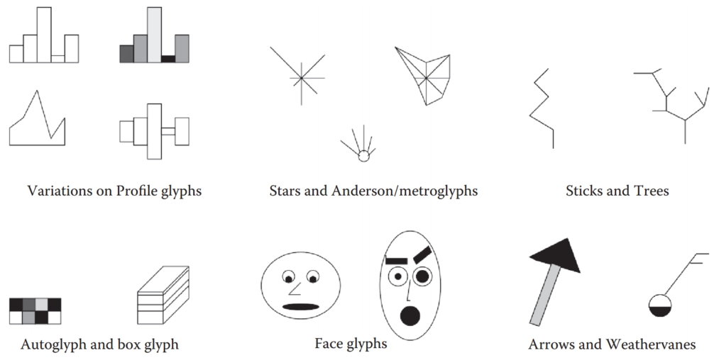
Figure 26.13. Complex marks, which we call glyphs, have subsections that visually encode different data dimensions. Image courtesy Matt Ward (M. O. Ward, 2002). 
图 26.13。 复杂标记（我们称之为字形）具有对不同数据维度进行视觉编码的子部分。 图片由马特·沃德 (M. O. Ward, 2002) 提供。

Complex glyphs require significant display area for each glyph, as shown in Figure 26.14 where miniature bar charts show the value of four different dimensions at many points along a spiral path. Simpler glyphs can be used to create a global visual texture, the glyph size is so small that individual values cannot be read out without zooming, but region boundaries can be discerned from the overview level. Figure 26.15 shows an example using stick figures of the kind in the upper right in Figure 26.13. Glyphs may be placed at regular intervals, or in data-driven spatial positions using an original or derived data dimension. 
复杂的字形需要每个字形的显着显示区域，如图 26.14 所示，其中微型条形图显示沿着螺旋路径的许多点处的四个不同维度的值。 更简单的字形可用于创建全局视觉纹理，字形尺寸非常小，以至于在不缩放的情况下无法读出各个值，但可以从概览级别辨别区域边界。 图 26.15 显示了使用图 26.13 右上角的简笔画的示例。 字形可以以规则的间隔放置，或者使用原始或导出的数据维度放置在数据驱动的空间位置中。

Figure 26.14. Complex glyphs require significant display area so that the encoded information can be read. Image courtesy Matt Ward, created with the SpiralGlyphics software (M. O. Ward, 2002). 
图 26.14。 复杂的字形需要大量的显示区域，以便可以读取编码信息。 图片由 Matt Ward 提供，使用 SpiralGlyphics 软件创建（M. O. Ward，2002 年)。


Figure 26.15. A dense array of simple glyphs. Image courtesy Georges Grinstein (S. Smith, Grinstein, & Bergeron, 1991), © 1991 IEEE. 
图 26.15。 密集的简单字形数组。 图片由 Georges Grinstein 提供（S. Smith、Grinstein 和 Bergeron，1991 年)，© 1991 IEEE。

### 26.6.4 Multiple Views  多个视图

We now turn from approaches with only a single frame to those which use multiple views that are linked together. The most common form of linkage is linked highlighting, where items selected in one view are highlighted in all others. In linked navigation, movement in one view triggers movement in the others. 
我们现在从仅使用单个框架的方法转向使用链接在一起的多个视图的方法。 最常见的链接形式是链接突出显示，其中在一个视图中选择的项目在所有其他视图中突出显示。 在链接导航中，一个视图中的移动会触发其他视图中的移动。 

There are many kinds of multiple-view approaches. In what is usually called simply the multiple-view approach, the same data is shown in several views, each of which has a different visual encoding that shows certain aspects of the dataset most clearly. The power of linked highlighting across multiple visual encodings is that items that fall in a contiguous region in one view are often distributed very differently in the other views. In the small-multiples approach, each view has the same visual encoding for different datasets, usually with shared axes between frames so that comparison of spatial position between them is meaningful. Sideby-side comparison with small multiples is an alternative to the visual clutter of superimposing all the data in the same view, and to the human memory limitations of remembering previously seen frames in an animation that changes over time. 
多视图方法有很多种。 在通常所谓的多视图方法中，相同的数据显示在多个视图中，每个视图都有不同的视觉编码，可以最清楚地显示数据集的某些方面。 跨多个视觉编码的链接突出显示的强大之处在于，落在一个视图中的连续区域中的项目通常在其他视图中的分布非常不同。 在小倍数方法中，每个视图对于不同的数据集具有相同的视觉编码，通常在帧之间具有共享轴，因此它们之间的空间位置的比较是有意义的。 与小倍数进行并排比较是一种替代方案，可以替代在同一视图中叠加所有数据带来的视觉混乱，以及记住动画中随时间变化的先前看过的帧的人类记忆限制。

The overview-and-detail approach is to have the same data and the same visual encoding in two views, where the only difference between them is the level of zooming. In most cases, the overview uses much less display space than the detail view. The combination of overview and detail views is common outside of visualization in many tools ranging from mapping software to photo editing. With a detail-on-demand approach, another view shows more information about some selected item, either as a popup window near the cursor or in a permanent window in another part of the display. 
概述和细节方法是在两个视图中具有相同的数据和相同的视觉编码，其中它们之间的唯一区别是缩放级别。 在大多数情况下，概览使用的显示空间比详细视图少得多。 概述和详细视图的组合在可视化之外的许多工具（从地图软件到照片编辑）中很常见。 通过按需详细信息方法，另一个视图显示有关某些选定项目的更多信息，或者作为光标附近的弹出窗口，或者在显示的另一部分的永久窗口中。

Determining the most appropriate spatial position of the views themselves with respect to each other can be as significant a problem as determining the spatial position of marks within a single view. In some systems, the location of the views is arbitrary and left up to the window system or the user. Aligning the views allows precise comparison between them, either vertically, horizontally, or with an array for both directions. Just as items can be sorted within a view, views can be sorted within a display, typically with respect to a derived variable measuring some aspect of the entire view as opposed to an individual item within it. 
确定视图本身相对于彼此的最合适的空间位置可能与确定单个视图内标记的空间位置一样重要。 在某些系统中，视图的位置是任意的，由窗口系统或用户决定。 对齐视图可以在垂直、水平或两个方向上使用数组进行精确比较。 正如可以在视图内对项目进行排序一样，视图也可以在显示内进行排序，通常相对于测量整个视图的某些方面的派生变量而不是其中的单个项目。

Figure 26.16 shows a visualization of census data that uses many views. In addition to geographic information, the demographic information for each county includes population, density, gender, median age, percent change since 1990, and proportions of major ethnic groups. The visual encodings used include geographic, scatterplot, parallel coordinate, tabular, and matrix views. The same color encoding is used across all the views, with a legend in the bottom middle. The scatterplot matrix shows linked highlighting across all views, where the blue items are close together in some views and scattered in others. The map in the upper-left corner is an overview for the large detail map in the center. The tabular views allow direct sorting by and selection within a dimension of interest.
图 26.16 显示了使用多个视图的人口普查数据的可视化。 除地理信息外，每个县的人口信息还包括人口、密度、性别、年龄中位数、自 1990 年以来的百分比变化以及主要民族的比例。 使用的视觉编码包括地理、散点图、平行坐标、表格和矩阵视图。 所有视图都使用相同的颜色编码，底部中间有一个图例。 散点图矩阵显示所有视图中的链接突出显示，其中蓝色项目在某些视图中靠近在一起，而在其他视图中分散。 左上角的地图是中心大细节地图的概述。 表格视图允许在感兴趣的维度内直接排序和选择。
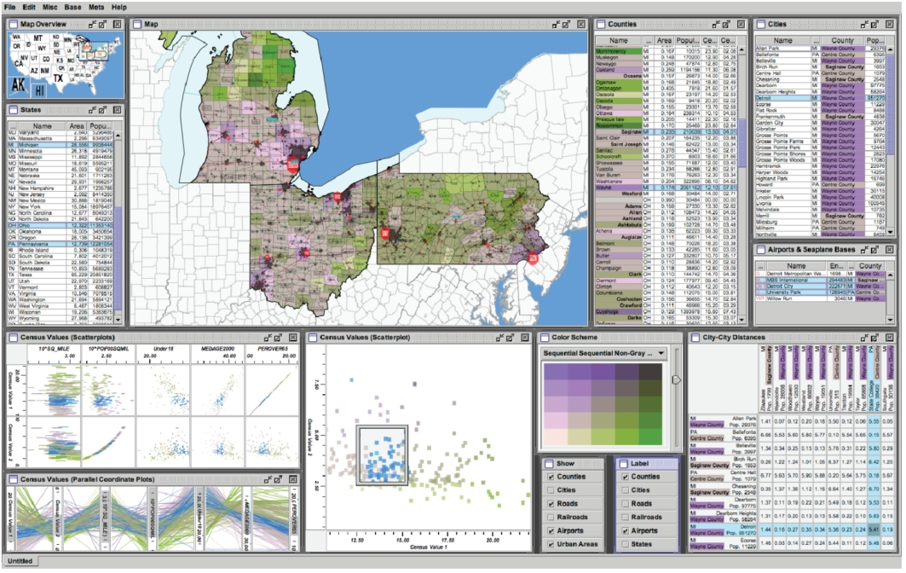
Figure 26.16. The Improvise toolkit was used to create this multiple-view visualization. Image courtesy Chris Weaver. 
图 26.16。 Improvise 工具包用于创建这种多视图可视化。 图片由克里斯·韦弗提供。

## 26.7 Data Reduction 数据缩减

The visual encoding techniques that we have discussed so far show all of the items in a dataset. However, many datasets are so large that showing everything simultaneously would result in so much visual clutter that the visual representation would be difficult or impossible for a viewer to understand. The main strategies to reduce the amount of data shown are overviews and aggregation, filtering and navigation, the focus+context techniques, and dimensionality reduction. 
到目前为止，我们讨论的视觉编码技术显示了数据集中的所有项目。 然而，许多数据集太大，同时显示所有内容会导致视觉混乱，以致观看者很难或不可能理解视觉表示。 减少显示数据量的主要策略是概述和聚合、过滤和导航、焦点+上下文技术以及降维。

### 26.7.1 Overviews and Aggregation  概述和聚合

With tiny datasets, a visual encoding can easily show all data dimensions for all items. For datasets of medium size, an overview that shows information about all items can be constructed by showing less detail for each item. Many datasets have internal or derivable structure at multiple scales. In these cases, a multiscale visual representation can provide many levels of overview, rather than just a single level. Overviews are typically used as a starting point to give users clues about where to drill down to inspect in more detail. 
对于微小的数据集，视觉编码可以轻松显示所有项目的所有数据维度。 对于中等大小的数据集，可以通过显示每个项目的较少细节来构建显示有关所有项目的信息的概述。 许多数据集在多个尺度上具有内部或可导出的结构。 在这些情况下，多尺度视觉表示可以提供多个级别的概览，而不仅仅是单个级别。 概述通常用作起点，为用户提供有关向下钻取以更详细地检查的位置的线索。

For larger datasets, creating an overview requires some kind of visual summarization. One approach to data reduction is to use an aggregate representation where a single visual mark in the overview explicitly represents many items. 
对于较大的数据集，创建概述需要某种视觉摘要。 数据缩减的一种方法是使用聚合表示，其中概述中的单个视觉标记明确表示许多项目。

The challenge of aggregation is to avoid eliminating the interesting signals in the dataset in the process of summarization. In the cartographic literature, the problem of creating maps at different scales while retaining the important distinguishing characteristics has been extensively studied under the name of cartographic generalization (Slocum, McMaster, Kessler, & Howard, 2008). 
聚合的挑战是避免在汇总过程中消除数据集中的有趣信号。 在制图文献中，以制图概括的名义广泛研究了在保留重要区别特征的同时创建不同比例的地图的问题（Slocum、McMaster、Kessler 和 Howard，2008）。

### 26.7.2 Filtering and Navigation  过滤和导航

Another approach to data reduction is to filter the data, showing only a subset of the items. Filtering is often carried out by directly selecting ranges of interest in one or more of the data dimensions. 
数据缩减的另一种方法是过滤数据，仅显示项目的子集。 过滤通常是通过直接选择一个或多个数据维度中感兴趣的范围来进行的。

Navigation is a specific kind of filtering based on spatial position, where changing the viewpoint changes the visible set of items. Both geometric and nongeometric zooming are used in visualization. With geometric zooming, the camera position in 2D or 3D space can be changed with standard computer graphics controls. In a realistic scene, items should be drawn at a size that depends on their distance from the camera, and only their apparent size changes based on that distance. However, in a visual encoding of an abstract space, nongeometric zooming can be useful. In semantic zooming, the visual appearance of an object changes dramatically based on the number of pixels available to draw it. For instance, an abstract visual representation of a text file could change from a tiny color-coded box with no label to a medium-sized box containing only the filename as a text label to a large rectangle containing a multi-line summary of the file contents. In realistic scenes, objects that are sufficiently far away from the camera are not visible in the images, for example, after they subtend less than one pixel of screen area. With guaranteed visibility, one of the original or derived data dimensions is used as a measure of importance, and objects of sufficient importance must have some kind of representation visible in the image plane at all times. 
导航是一种基于空间位置的特定过滤，其中改变视点会改变可见的项目集。 几何和非几何缩放都用于可视化。 通过几何缩放，可以使用标准计算机图形控件来更改 2D 或 3D 空间中的摄像机位置。 在现实场景中，项目的绘制尺寸应取决于它们与相机的距离，并且只有它们的外观尺寸会根据该距离而变化。 然而，在抽象空间的视觉编码中，非几何缩放可能很有用。 在语义缩放中，对象的视觉外观根据可用于绘制对象的像素数量而发生巨大变化。 例如，文本文件的抽象视觉表示可以从没有标签的微小颜色编码框更改为仅包含文件名作为文本标签的中型框，再更改为包含文件的多行摘要的大矩形 内容。 在现实场景中，距离相机足够远的物体在图像中是不可见的，例如，当它们对着屏幕区域的一个像素以下时。 在保证可见性的情况下，原始或派生数据维度之一被用作重要性的衡量标准，并且足够重要的对象必须始终在图像平面中具有某种可见的表示形式。

### 26.7.3 Focus+Context  焦点+背景

Focus+context techniques are another approach to data reduction. A subset of the dataset items are interactively chosen by the user to be the focus and are drawn in detail. The visual encoding also includes information about some or all of the rest of the dataset shown for context, integrated into the same view that shows the focus items. Many of these techniques use carefully chosen distortion to combine magnified focus regions and minified context regions into a unified view. 
焦点+上下文技术是另一种数据缩减方法。 用户以交互方式选择数据集项目的子集作为焦点并详细绘制。 视觉编码还包括有关为上下文显示的数据集的部分或全部其余部分的信息，集成到显示焦点项目的同一视图中。 其中许多技术使用精心选择的失真将放大的焦点区域和缩小的上下文区域组合成统一的视图。

One common interaction metaphor is a moveable fisheye lens. Hyperbolic geometry provides an elegant mathematical framework for a single radial lens that affects all objects in the view. Another interaction metaphor is to use multiple lenses of different shapes and magnification levels that affect only local regions. Stretch and squish navigation uses the interaction metaphor of a rubber sheet where stretching one region squishes the rest, as shown in Figure 26.17. The borders of the sheet stay fixed so that all items are within the viewport, although many items may be compressed to subpixel size. The fisheye metaphor is not limited to a geometric lens used after spatial layout; it can be used directly on structured data, such as a hierarchical document where some sections are collapsed while others are left expanded.
一种常见的交互比喻是可移动的鱼眼镜头。 双曲几何为影响视图中所有物体的单个径向透镜提供了一个优雅的数学框架。 另一个交互隐喻是使用仅影响局部区域的不同形状和放大级别的多个透镜。 拉伸和挤压导航使用橡胶板的交互隐喻，其中拉伸一个区域会挤压其余区域，如图 26.17 所示。 工作表的边框保持固定，以便所有项目都在视口内，尽管许多项目可能会被压缩到子像素大小。 鱼眼隐喻并不局限于空间布局后使用的几何镜头； 它可以直接用于结构化数据，例如分层文档，其中某些部分折叠，而其他部分保持展开。
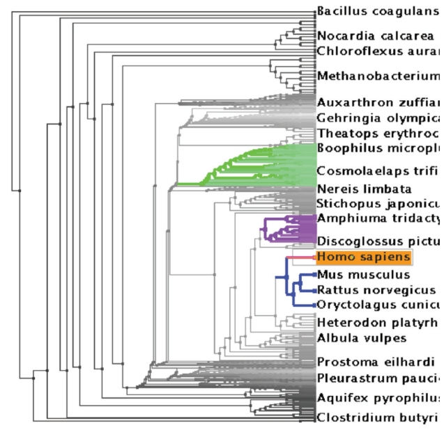
Figure 26.17. The TreeJuxtaposer system features stretch and squish navigation and guaranteed visibility of regions marked with colors (Munzner, Guimbreti` ere, Tasiran, Zhang, & Zhou, 2003).  ` 
图 26.17。 TreeJuxtaposer 系统具有拉伸和挤压导航功能，并保证用颜色标记的区域的可见性（Munzner、Guimbreti` ere、Tasiran、Zhang 和 Zhou，2003)。

These distortion-based approaches are another example of nonliteral navigation in the same spirit as nongeometric zooming. When navigating within a large and unfamiliar dataset with realistic camera motion, users can become disoriented at high zoom levels when they can see only a small local region. These approaches are designed to provide more contextual information than a single undistorted view, in hopes that people can stay oriented if landmarks remain recognizeable. However, these kinds of distortion can still be confusing or difficult to follow for users. The costs and benefits of distortion, as opposed to multiple views or a single realistic view, are not yet fully understood. Standard 3D perspective is a particularly familiar kind of distortion and was explicitly used as a form of focus+context in early visualization work. However, as the costs of 3D spatial layout discussed in Section 26.4 became more understood, this approach became less popular. 
这些基于失真的方法是非文字导航的另一个例子，其精神与非几何缩放相同。 当在具有真实相机运动的大型且不熟悉的数据集中导航时，当用户只能看到很小的局部区域时，他们可能会在高缩放级别上迷失方向。 这些方法旨在提供比单一未扭曲视图更多的上下文信息，希望人们能够在地标仍然可识别的情况下保持方向。 然而，这些类型的失真仍然会让用户感到困惑或难以理解。 与多种观点或单一现实观点相比，扭曲的成本和好处尚未完全理解。 标准 3D 透视是一种特别熟悉的变形，在早期可视化工作中被明确用作焦点+上下文的一种形式。 然而，随着第 26.4 节中讨论的 3D 空间布局的成本变得更加容易理解，这种方法变得不那么流行了。

Other approaches to providing context around focus items do not require distortion. For instance, the SpaceTree system shown in Figure 26.18 elides most nodes in the tree, showing the path between the interactively chosen focus node and the root of the tree for context.
其他提供焦点项目背景的方法不需要失真。 例如，图 26.18 中所示的 SpaceTree 系统省略了树中的大多数节点，显示了交互式选择的焦点节点和上下文树根之间的路径。

Figure 26.18. The SpaceTree system shows the path between the root and the interactively chosen focus node to provide context (Grosjean, Plaisant, & Bederson, 2002).
图 26.18。 SpaceTree 系统显示根和交互式选择的焦点节点之间的路径以提供上下文（Grosjean、Plaisant 和 Bederson，2002)。

### 26.7.4 Dimensionality Reduction  降维

The data reduction approaches covered so far reduce the number of items to draw. When there are many data dimensions, dimensionality reduction can also be effective. 
到目前为止所涉及的数据缩减方法减少了要绘制的项目数量。 当数据维度较多时，降维也能起到有效的作用。

With slicing, a single value is chosen from the dimension to eliminate, and only the items matching that value for the dimension are extracted to include in the lower-dimensional slice. Slicing is particularly useful with 3D spatial data, for example when inspecting slices through a CT scan of a human head at different heights along the skull. Slicing can be used to eliminate multiple dimensions at once. 
通过切片，从维度中选择单个值进行消除，并且仅提取与该维度值匹配的项目以包含在较低维度的切片中。 切片对于 3D 空间数据特别有用，例如，通过沿头骨不同高度对人体头部进行 CT 扫描来检查切片时。 切片可用于一次消除多个维度。

With projection, no information about the eliminated dimensions is retained; the values for those dimensions are simply dropped, and all items are still shown. A familiar form of projection is the standard graphics perspective transformation which projects from 3D to 2D, losing information about depth along the way. In mathematical visualization, the structure of higher-dimensional geometric objects can be shown by projecting from 4D to 3D before the standard projection to the image plane and using color to encode information from the projected-away dimension. This technique is sometimes called dimensional filtering when it is used for nonspatial data. 
通过投影，不会保留有关消除的维度的信息； 这些维度的值被简单地删除，并且所有项目仍然显示。 一种熟悉的投影形式是标准图形透视变换，它从 3D 投影到 2D，沿途丢失有关深度的信息。 在数学可视化中，高维几何对象的结构可以通过在标准投影到图像平面之前从 4D 投影到 3D 并使用颜色对投影维度的信息进行编码来显示。 当此技术用于非空间数据时，有时称为维度过滤。

In some datasets, there may be interesting hidden structure in a much lowerdimensional space than the number of original data dimensions. For instance, sometimes directly measuring the independent variables of interest is difficult or impossible, but a large set of dependent or indirect variables is available. The goal is to find a small set of dimensions that faithfully represent most of the structure or variance in the dataset. These dimensions may be the original ones, or synthesized new ones that are linear or nonlinear combinations of the originals. Principal component analysis is a fast, widely used linear method. Many nonlinear approaches have been proposed, including multidimensional scaling (MDS). These methods are usually used to determine whether there are large-scale clusters in the dataset; the fine-grained structure in the lower-dimensional plots is usually not reliable because information is lost in the reduction. Figure 26.19 shows document collection in a single scatterplot. When the true dimensionality of the dataset is far higher than two, a matrix of scatterplots showing pairs of synthetic dimensions may be necessary.
在某些数据集中，在比原始数据维度数量低得多的维度空间中可能存在有趣的隐藏结构。 例如，有时直接测量感兴趣的自变量是困难或不可能的，但大量的因变量或间接变量是可用的。 目标是找到一小组忠实代表数据集中大部分结构或方差的维度。 这些维度可以是原始维度，也可以是原始维度的线性或非线性组合的合成新维度。 主成分分析是一种快速、广泛使用的线性方法。 人们已经提出了许多非线性方法，包括多维尺度（MDS）。 这些方法通常用于判断数据集中是否存在大规模聚类； 低维图中的细粒度结构通常不可靠，因为信息在简化过程中丢失。 图 26.19 显示了单个散点图中的文档集合。 当数据集的真实维度远高于二时，可能需要显示成对合成维度的散点图矩阵。
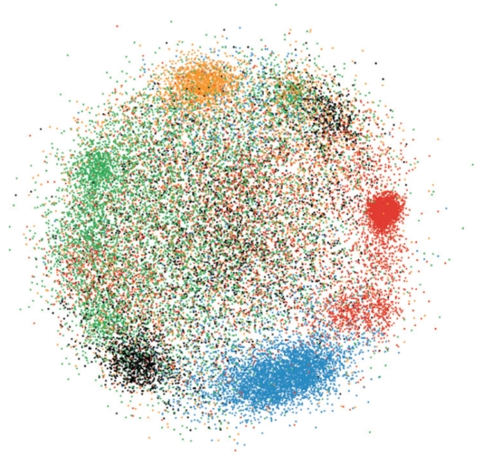
Figure 26.19. Dimensionality reduction with the Glimmer multidimensional scaling approach shows clusters in a document dataset (Ingram, Munzner, & Olano, 2009), © 2009 IEEE. 
图 26.19。 使用 Glimmer 多维缩放方法进行降维显示文档数据集中的簇（Ingram、Munzner 和 Olano，2009 年)，© 2009 IEEE。

## 26.8 Examples  例子

We conclude this chapter with several examples of visualizing specific types of data using the techniques discussed above. 
我们以几个使用上述技术可视化特定类型数据的示例来结束本章。

### 26.8.1 Tables  表格

Tabular data is extremely common, as all spreadsheet users know. The goal in visualization is to encode this information through easily perceivable visual channels rather than forcing people to read through it as numbers and text. Figure 26.20 shows the Table Lens, a focus+context approach where quantitative values are encoded as the length of one-pixel high lines in the context regions, and shown as numbers in the focus regions. Each dimension of the dataset is shown as a column, and the rows of items can be resorted according to the values in that column with a single click in its header. 
正如所有电子表格用户都知道的那样，表格数据非常常见。 可视化的目标是通过易于感知的视觉通道对这些信息进行编码，而不是强迫人们将其阅读为数字和文本。 图 26.20 显示了 Table Lens，这是一种焦点+上下文方法，其中定量值被编码为上下文区域中单像素高线的长度，并在焦点区域中显示为数字。 数据集的每个维度都显示为一列，只需单击标题即可根据该列中的值对项目行进行重新排列。
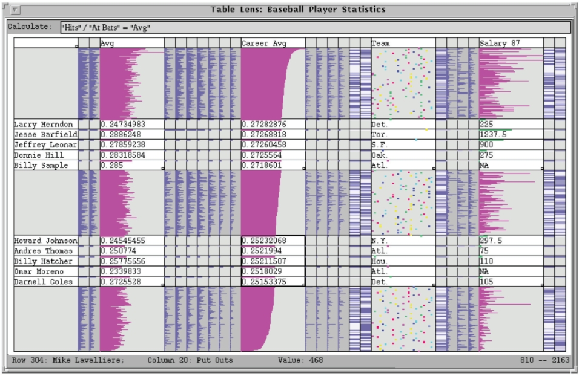
Figure 26.20. The Table Lens provides focus+context interaction with tabular data, immediately reorderable by the values in each dimension column. Image courtesy Stuart Card (Rao & Card, 1994), © 1994 ACM, Inc. Included here by permission. 
图 26.20。 Table Lens 提供与表格数据的焦点+上下文交互，可立即按每个维度列中的值重新排序。 图片由 Stuart Card（Rao & Card，1994 年)提供，© 1994 ACM, Inc. 经许可包含在此处。

The traditional Cartesian approach of a scatterplot, where items are plotted as dots with respect to perpendicular axes, is only usable for two and three dimensions of data. Many tables contain far more than three dimensions of data, and the number of additional dimensions that can be encoded using other visual channels is limited. Parallel coordinates are an approach for visualizing more dimensions at once using spatial position, where the axes are parallel rather than perpendicular and an n-dimensional item is shown as a polyline that crosses each of the n axes once (Inselberg & Dimsdale, 1990; Wegman, 1990). Figure 26.21 shows an eight-dimensional dataset of 230,000 items at multiple levels of detail (Fua, Ward, & Rundensteiner, 1999), from a high-level view at the top to finer detail at the bottom. With hierarchical parallel coordinates, the items are clustered and an entire cluster of items is represented by a band of varying width and opacity, where the mean is in the middle and width at each axis depends on the values of the items in the cluster in that dimension. The coloring of each band is based on the proximity between clusters according to a similarity metric.
散点图的传统笛卡尔方法（其中项目相对于垂直轴绘制为点）仅适用于二维和三维数据。 许多表包含远远超过三个维度的数据，并且可以使用其他视觉通道编码的附加维度的数量是有限的。 平行坐标是一种使用空间位置同时可视化更多维度的方法，其中轴是平行的而不是垂直的，并且 n 维项目显示为与 n 个轴中的每个轴交叉一次的折线（Inselberg & Dimsdale，1990；Wegman ，1990）。 图 26.21 显示了一个包含 230,000 个项目的八维数据集，具有多个细节级别（Fua、Ward 和 Rundensteiner，1999），从顶部的高级视图到底部的更精细的细节。 使用分层平行坐标，项目被聚类，整个项目簇由不同宽度和不透明度的带表示，其中平均值位于中间，每个轴的宽度取决于簇中项目的值 方面。 每个带的颜色是基于根据相似性度量的簇之间的接近度。

Figure 26.21. Hierarchical parallel coordinates show high-dimensional data at multiple levels of detail. Image courtesy Matt Ward (Fua et al., 1999), © 1999 IEEE. 
图 26.21。 分层平行坐标以多个细节级别显示高维数据。 图片由 Matt Ward 提供（Fua 等人，1999 年)，© 1999 IEEE。

### 26.8.2 Graphs  图表

The field of graph drawing is concerned with finding a spatial position for the nodes in a graph in 2D or 3D space and routing the edges between these nodes (Di Battista, Eades, Tamassia, & Tollis, 1999). In many cases the edge-routing problem is simplified by using only straight edges, or by only allowing rightangle bends for the class of orthogonal layouts, but some approaches handle true curves. If the graph has directed edges, a layered approach can be used to show hierarchical structure through the horizontal or vertical spatial ordering of nodes, as shown in Figure 26.2.
图绘制领域涉及在 2D 或 3D 空间中查找图中节点的空间位置并路由这些节点之间的边（Di Battista、Eades、Tamassia 和 Tollis，1999）。 在许多情况下，通过仅使用直边或仅允许正交布局类的直角弯曲来简化边缘布线问题，但某些方法可以处理真正的曲线。 如果图具有有向边，则可以使用分层方法通过节点的水平或垂直空间排序来显示层次结构，如图26.2所示。 

A suite of aesthetic criteria operationalize human judgments about readable graphs as metrics that can be computed on a proposed layout (Ware, Purchase, Colpys, & McGill, 2002). Figure 26.22 shows some examples. Some metrics should be minimized, such as the number of edge crossings, the total area of the layout, and the number of right-angle bends or curves. Others should be maximized, such as the angular resolution or symmetry. The problem is difficult because most of these criteria are individually NP-hard, and moreover they are mutually incompatible (Brandenburg, 1988). 
一套审美标准将人类对可读图形的判断操作化为可以在建议的布局上计算的度量（Ware、Purchase、Colpys 和 McGill，2002）。 图 26.22 显示了一些示例。 应尽量减少某些指标，例如边缘交叉的数量、布局的总面积以及直角弯曲或曲线的数量。 其他的应该最大化，例如角分辨率或对称性。 这个问题很困难，因为大多数这些标准都是单独的 NP 困难的，而且它们是相互不兼容的（Brandenburg，1988）。

Figure 26.22. Graph layout aesthetic criteria. Top: Edge crossings should be minimized. Middle: Angular resolution should be maximized. Bottom: Symmetry is maximized on the left, whereas crossings are minimized on the right, showing the conflict between the individually NPhard criteria.
图 26.22。 图形布局的审美标准。 上：应尽量减少边缘交叉。 中：角度分辨率应最大化。 底部：左侧对称性最大化，而右侧交叉最小化，显示了各个 NPhard 标准之间的冲突。 

Many approaches to node-link graph drawing use force-directed placement, motivated by the intuitive physical metaphor of spring forces at the edges drawing together repelling particles at the nodes. Although naive approaches have high time complexity and are prone to being caught in local minima, much work has gone into developing more sophisticated algorithms such as GEM (Frick, Ludwig, & Mehldau, 1994) or IPSep-CoLa (Dwyer, Koren, & Marriott, 2006). Figure 26.23 shows an interactive system using the r-PolyLog energy model, where a focus+context view of the clustered graph is created with both geometric and semantic fisheye (van Ham & van Wijk, 2004).
许多节点链接图绘制方法都使用力定向放置，其动机是边缘处的弹簧力将节点处的粒子聚集在一起排斥粒子的直观物理隐喻。 尽管简单的方法具有很高的时间复杂度并且容易陷入局部极小值，但人们已经投入了大量的工作来开发更复杂的算法，例如 GEM（Frick、Ludwig 和 Mehldau，1994）或 IPSep-CoLa（Dwyer、Koren 和 Marriott） ，2006）。 图 26.23 显示了使用 r-PolyLog 能量模型的交互系统，其中使用几何和语义鱼眼创建聚类图的焦点+上下文视图（van Ham & van Wijk，2004）。

Figure 26.23. Force-directed placement showing a clustered graph with both geometric and semantic fisheye. Image courtesy Jarke van Wijk (van Ham & van Wijk, 2004), © 2004 IEEE. 
图 26.23。 力导向放置显示具有几何和语义鱼眼的聚类图。 图片由 Jarke van Wijk 提供（van Ham & van Wijk，2004 年)，© 2004 IEEE。

Graphs can also be visually encoded by showing the adjacency matrix, where all vertices are placed along each axis and the cell between two vertices is colored if there is an edge between them. The MatrixExplorer system uses linked multiple views to help social science researchers visually analyze social networks with both matrix and node-link representations (Henry & Fekete, 2006). Figure 26.24 shows the different visual patterns created by the same graph structure in these two views: A represents an actor connecting several communities; B is a community; and C is a clique, or a complete sub-graph. Matrix views do not suffer from cluttered edge crossings, but many tasks including path following are more difficult with this approach. 
还可以通过显示邻接矩阵来对图进行可视化编码，其中所有顶点都沿每个轴放置，并且如果两个顶点之间存在边，则两个顶点之间的单元格会被着色。 MatrixExplorer 系统使用链接的多个视图来帮助社会科学研究人员通过矩阵和节点链接表示形式直观地分析社交网络（Henry & Fekete，2006）。 图 26.24 显示了这两个视图中相同图结构创建的不同视觉模式： A 代表连接多个社区的参与者； B是一个社区； C是一个派系，或者说是一个完全子图。 矩阵视图不会受到混乱的边缘交叉的影响，但使用这种方法，包括路径跟踪在内的许多任务会变得更加困难。

Figure 26.24. Graphs can be shown with either matrix or node-link views. Image courtesy JeanDaniel Fekete (Henry & Fekete, 2006), © 2006 IEEE. 
图 26.24。 图形可以用矩阵或节点链接视图显示。 图片由 JeanDaniel Fekete 提供（Henry & Fekete，2006 年)，© 2006 IEEE。

### 26.8.3 Trees  树

Trees are a special case of graphs so common that a great deal of visualization research has been devoted to them. A straightforward algorithm to lay out trees in the two-dimensional plane works well for small trees (Reingold & Tilford, 1981), while a more complex but scalable approach runs in linear time (Buchheim, Junger, & Leipert, 2002). Figures 26.17 and 26.18 also show trees with different approaches to spatial layout, but all four of these methods visually encode the relationship between parent and child nodes by drawing a link connecting them.
树是图的一种特殊情况，它非常常见，因此大量的可视化研究都致力于它们。 在二维平面中布置树的简单算法对于小树来说效果很好（Reingold & Tilford，1981），而更复杂但可扩展的方法则在线性时间内运行（Buchheim，Junger 和 Leipert，2002）。 图 26.17 和 26.18 还显示了具有不同空间布局方法的树，但是所有这四种方法都通过绘制连接父节点和子节点的链接来直观地编码父节点和子节点之间的关系。

Treemaps use containment rather than connection to show the hierarchical relationship between parent and child nodes in a tree (B. Johnson & Shneiderman, 1991). That is, treemaps show child nodes nested within the outlines of the parent node. Figure 26.25 shows a hierarchical filesystem of nearly one million files, where file size is encoded by rectangle size and file type is encoded by color (Fekete & Plaisant, 2002). The size of nodes at the leaves of the tree can encode an additional data dimension, but the size of nodes in the interior does not show the value of that dimension; it is dictated by the cumulative size of their descendants. Although tasks such as understanding the topological structure of the tree or tracing paths through it are more difficult with treemaps than with nodelink approaches, tasks that involve understanding an attribute tied to leaf nodes are well supported. Treemaps are space-filling representations that are usually more compact than node-link approaches.
树形图使用包含而不是连接来显示树中父节点和子节点之间的层次关系（B. Johnson & Shneiderman，1991）。 也就是说，树形图显示嵌套在父节点轮廓内的子节点。 图 26.25 显示了一个包含近一百万个文件的分层文件系统，其中文件大小由矩形大小编码，文件类型由颜色编码（Fekete & Plaisant，2002）。 树的叶子节点的大小可以编码一个额外的数据维度，但内部节点的大小并不显示该维度的值； 这是由其后代的累积规模决定的。 尽管使用树图来理解树的拓扑结构或跟踪树的路径等任务比使用节点链接方法更困难，但涉及理解与叶节点相关的属性的任务得到了很好的支持。 树形图是空间填充表示，通常比节点链接方法更紧凑。

Figure 26.25. Treemap showing a filesystem of nearly one million files. Image courtesy JeanDaniel Fekete (Fekete & Plaisant, 2002), © 2002 IEEE. 
图 26.25。 显示包含近一百万个文件的文件系统的树状图。 图片由 JeanDaniel Fekete 提供（Fekete & Plaisant，2002 年)，© 2002 IEEE。

### 26.8.4 Geographic  地理

Many kinds of analysis such as epidemiology require understanding both geographic and nonspatial data. Figure 26.26 shows a tool for the visual analysis of a cancer demographics dataset that combines many of the ideas described in this chapter (MacEachren, Dai, Hardisty, Guo, & Lengerich, 2003). The top matrix of linked views features small multiples of three types of visual encodings: geographic maps showing Appalachian counties at the lower left, histograms across the diagonal of the matrix, and scatterplots on the upper right. The bottom 2 × 2 matrix, linking scatterplots with maps, includes the color legend for both. The discrete bivariate sequential colormap has lightness increasing sequentially for each of two complementary hues and is effective for color-deficient people.
流行病学等多种分析需要了解地理和非空间数据。 图 26.26 显示了一个用于癌症人口统计数据集可视化分析的工具，它结合了本章中描述的许多想法（MacEachren、Dai、Hardisty、Guo 和 Lengerich，2003）。 链接视图的顶部矩阵具有三种类型视觉编码的小倍数：左下角显示阿巴拉契亚县的地理地图、矩阵对角线上的直方图以及右上角的散点图。 底部的 2 × 2 矩阵将散点图与地图连接起来，包括两者的颜色图例。 离散二元顺序色彩图对于两种互补色调中的每一种具有顺序增加的亮度，并且对于色彩不足的人来说是有效的。

Figure 26.26. Two matrices of linked small multiples showing cancer demographic data (MacEachren et al., 2003), © 2003 IEEE.
图 26.26。 显示癌症人口统计数据的两个相互关联的小倍数矩阵（MacEachren 等，2003)，© 2003 IEEE。

### 26.8.5 Spatial Fields  空间场

Most nongeographic spatial data is modeled as a field, where there are one or more values associated with each point in 2D or 3D space. Scalar fields, for example CT or MRI medical imaging scans, are usually visualized by finding isosurfaces or using direct volume rendering. Vector fields, for example, flows in water or air, are often visualized using arrows, streamlines (McLouglin, Laramee, Peikert, Post, & Chen, 2009), and line integral convolution (LIC) (Laramee et al., 2004). Tensor fields, such as those describing the anisotropic diffusion of molecules through the human brain, are particularly challenging to display (Kindlmann, Weinstein, & Hart, 2000). 
大多数非地理空间数据被建模为一个字段，其中有一个或多个与 2D 或 3D 空间中的每个点相关联的值。 标量场（例如 CT 或 MRI 医学成像扫描）通常通过查找等值面或使用直接体积渲染来可视化。 矢量场（例如，水或空气中的流动）通常使用箭头、流线（McLouglin、Laramee、Peikert、Post 和 Chen，2009 年）和线积分卷积 (LIC)（Laramee 等人，2004 年）来可视化。 张量场，例如描述分子通过人脑的各向异性扩散的张量场，尤其难以显示（Kindlmann、Weinstein 和 Hart，2000）。

## Frequently Asked Questions  经常问的问题

### What conferences and journals are good places to look for further information about visualization?  哪些会议和期刊是寻找有关可视化的更多信息的好地方？

The IEEE VisWeek conference comprises three subconferences: InfoVis (Information Visualization), Vis (Visualization), and VAST (Visual Analytics Science and Technology). There is also a European EuroVis conference and an Asian PacificVis venue. Relevant journals include IEEE TVCG (Transactions on Visualization and Computer Graphics) and Palgrave Information Visualization.
IEEE VisWeek会议由三个分会议组成：InfoVis（信息可视化）、Vis（可视化）和VAST（视觉分析科学与技术）。 还有一个欧洲 EuroVis 会议和一个 Asia PacificVis 场地。 相关期刊包括IEEE TVCG（Transactions on Visualization and Computer Graphics）和Palgrave Information Visualization。

### What software and toolkits are available for visualization?  有哪些软件和工具包可用于可视化？

The most popular toolkit for spatial data is vtk, a C/C++ codebase available at www.vtk.org. For abstract data, the Java-based prefuse (http://www .prefuse.org) and Processing (processing.org) toolkits are becoming widely used. The ManyEyes site from IBM Research (www.many-eyes.com) allows people to upload their own data, create interactive visualizations in a variety of formats, and carry on conversations about visual data analysis.
最流行的空间数据工具包是 vtk，它是 www.vtk.org 上提供的 C/C++ 代码库。 对于抽象数据，基于Java的prefuse (http://www .prefuse.org)和Processing (processing.org)工具包正在被广泛使用。 IBM Research 的 ManyEyes 网站 (www.many-eyes.com) 允许人们上传自己的数据、以各种格式创建交互式可视化，并进行有关可视化数据分析的对话。

# References  

Adelson, E. H. (1999). Lightness Perception and Lightness Illusions. In M. S. Gazzaniga (Ed.), The New Cognitive Neurosciences (Second ed., pp. 339–351). Cambridge, MA: MIT Press. 

Adzhiev, V., Cartwright, R., Fausett, E., Ossipov, A., Pasko, A., & Savchenko, V. (1999, Sep). Hyperfun Project: A Framework for Collaborative Multidimensional F-rep Modeling. In Implicit Surfaces ’99 (pp. 59–69). Aire-laville, Switzerland: Eurographics Association.

Akenine-M¨ oller, T., Haines, E., & Hoffman, N. (2008). Real-Time Rendering (Third ed.). Wellesley, MA: A K Peters. Akkouche, S., & Galin, E. (2001). Adaptive Implicit Surface Polygonization Using Marching Triangles. Computer Graphics Forum, 20(2), 67–80. 

Akleman, E., & Chen, J. (1999). Generalized Distance Functions. In Proceedings of the International Conference on Shape Modeling and Applications (pp. 72–79). Washington, DC: IEEE Computer Society Press. 

Amanatides, J., & Woo, A. (1987). A Fast Voxel Traversal Algorithm for Ray Tracing. In Proceedings of Eurographics (pp. 1–10). Amsterdam: Elsevier Science Publishers. 

Amar, R., Eagan, J., & Stasko, J. (2005). Low-Level Components of Analytic Activity in Information Visualization. In Proc. IEEE Symposium on Information Visualization (InfoVis) (pp. 111–117). Washington, DC: IEEE Computer Society Press. 

American National Standard Institute. (1986). Nomenclature and Definitions for Illumination Engineering. ANSI Report (New York). (ANSI/IES RP-16- 1986) 

Angel, E. (2002). Interactive Computer Graphics: A Top-Down Approach with OpenGL (Third ed.). Reading, MA: Addison-Wesley. 

Appel, A. (1968). Some Techniques for Shading Machine Renderings of Solids. In Proceedings of the AFIPS Spring Joint Computing Conference (Vol. 32, pp. 37–45). AFIPS. 

Arvo, J. (1995). Analytic Methods for Simulated Light Transport (Unpublished doctoral dissertation). 

Ashdown, I. (1994). Radiosity: A Programmer’s Perspective. New York: John Wiley & Sons. 

Ashikhmin, M. (2002). A Tone Mapping Algorithm for High Contrast Images. In EGRW ’02: Proceedings of the 13th Eurographics Workshop on Rendering (pp. 145–155). Aire-la-Ville, Switzerland: Eurographics Association.

Ashikhmin, M., Premoze, S., & Shirley, P. (2000). A Microfacet-Based BRDF ˇGenerator. In Proceedings of SIGGRAPH (pp. 65–74). Reading, MA:Addison-Wesley Longman.

Ashikhmin, M., & Shirley, P. (2000). An Anisotropic Phong BRDF Model. journal of graphics tools, 5(2), 25–32.

Baerentzen, J., & Christensen, N. (2002, May). Volume Sculpting Using the Level-Set Method. In SMI ’02: Proceedings of Shape Modeling International 2002 (SMI ’02) (pp. 175–182). Washington, DC: IEEE Computer Society Press.

Barr, A. H. (1984). Global and Local Deformations of Solid Primitives. Proc. SIGGRAPH ’84 Computer Graphics, 18(3), 21–30.

Bartels, R. H., Beatty, J. C., & Barsky, B. A. (1987). An Introduction to Splines for Use in Computer Graphics and Geometric Modeling. San Francisco, CA: Morgan Kaufmann.

Barthe, L., Dodgson, N. A., Sabin, M. A., Wyvill, B., & Gaildrat, V. (2003). Twodimensional Potential Fields for Advanced Implicit Modeling Operators. Computer Graphics Forum, 22(1), 23–33.

Barthe, L., Mora, B., Dodgson, N. A., & Sabin, M. A. (2002). Interactive ImplicitModelling based on C1 Reconstruction of Regular Grids. International Journal of Shape Modeling, 8(2), 99–117.

Baumgart, B. (1974, October). Geometric Modeling for Computer Vision (Tech. Rep. No. AIM-249). Palo Alto, CA: Stanford University AI Laboratory.

Beck, K., & Andres, C. (2004). Extreme Programming Explained: Embrace Change (Second ed.). Reading, MA: Addison-Wesley.

Berlin, B., & Kay, P. (1969). Basic Color Terms: Their Universality and Evolution. Berkeley, CA: University of California Press.

Berns, R. S. (2000). Billmeyer and Saltzman’s Principles of Color Technology (3rd ed.). New York: John Wiley and Sons.

Blinn, J. (1982). A Generalization of Algebraic Surface Drawing. ACM Transactions on Graphics, 1(3), 235–258.

Blinn, J. (1996). Jim Blinn’s Corner. San Francisco, CA: Morgan Kaufmann.

Blinn, J. F. (1976). Texture and Reflection in Computer Generated Images. Communications of the ACM, 19(10), 542–547.

Bloomenthal, J. (1988). Polygonization of Implicit Surfaces. Computer Aided Geometric Design, 4(5), 341–355.

Bloomenthal, J. (1990). Calculation of Reference Frames Along a Space Curve. In A. Glassner (Ed.), Graphics Gems (pp. 567–571). Boston: Academic Press.

Bloomenthal, J. (1995). Skeletal Design of Natural Forms (Unpublished doctoral dissertation). University of Calgary, Canada.

Bloomenthal, J. (1997). Bulge Elimination in Convolution Surfaces. Computer Graphics Forum, 16(1), 31–41.
