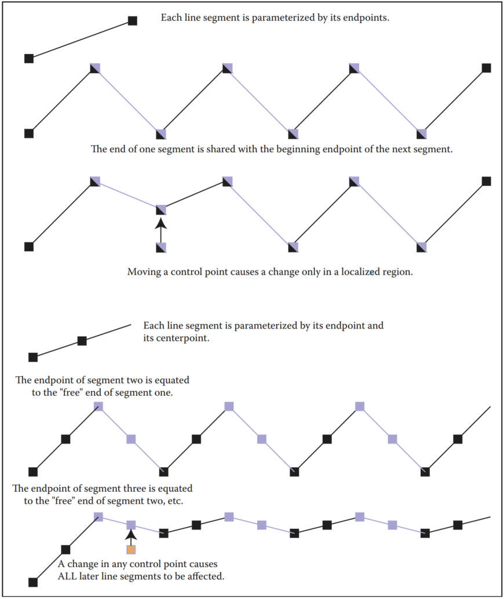
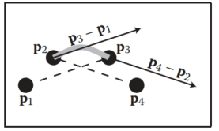
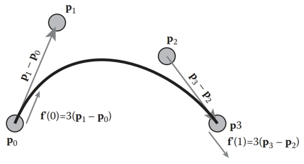
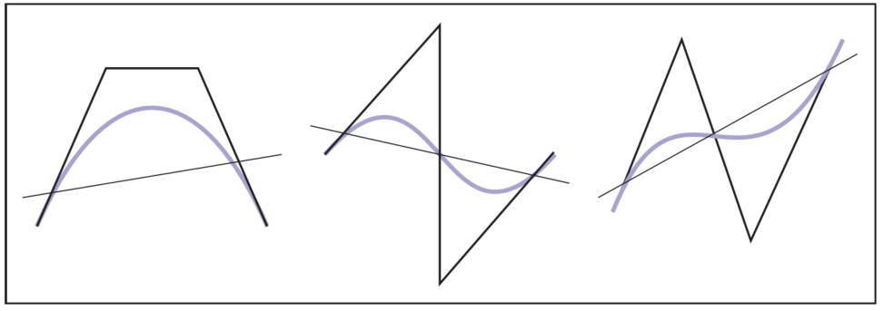
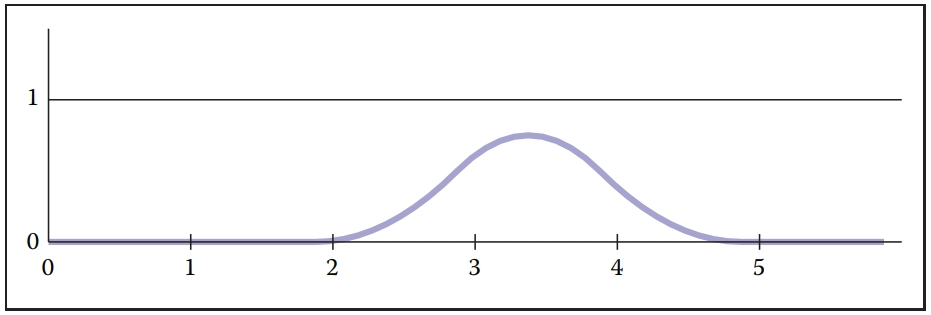

# 15 Curves 曲线

## 15.1 Curves  曲线

Intuitively, think of a curve as something you can draw with a pen. The curve is the set of points that the pen traces over an interval of time. While we usually think of a pen writing on paper (e.g., a curve that is in a 2D space), the pen could move in 3D to generate a space curve, or you could imagine the pen moving in some other kind of space.
直观地，可以将曲线视为可以用钢笔绘制的东西。 曲线是笔在一段时间内追踪的点的集合。 虽然我们通常认为笔在纸上书写（例如，2D 空间中的曲线），但笔可以在 3D 中移动以生成空间曲线，或者您可以想象笔在其他类型的空间中移动。

Mathematically, definitions of curve can be seen in at least two ways: 
从数学上来说，曲线的定义至少可以通过两种方式来看待：

1. the continuous image of some interval in an n-dimensional space; 
   n维空间中某个区间的连续图像；
2. a continuous map from a one-dimensional space to an n-dimensional space. 
   从一维空间到n维空间的连续映射。

Both of these definitions start with the idea of an interval range (the time over which the pen traces the curve). However, there is a significant difference: in the first definition, the curve is the set of points the pen traces (the image), while in the second definition, the curve is the mapping between time and that set of points. For this chapter, we use the first definition. 
这两个定义都始于间隔范围（笔追踪曲线的时间）的概念。 然而，有一个显着的区别：在第一个定义中，曲线是笔轨迹（图像）的一组点，而在第二个定义中，曲线是时间和该组点之间的映射。 在本章中，我们使用第一个定义。

A curve is an infinitely large set of points. The points in a curve have the property that any point has two neighbors, except for a small number of points that have one neighbor (these are the endpoints). Some curves have no endpoints, either because they are infinite (like a line) or they are closed (loop around and connect to themselves).
曲线是无限大的点集。 曲线中的点具有这样的属性：任何点都有两个邻居，除了少数具有一个邻居的点（这些点是端点）之外。 有些曲线没有端点，要么是因为它们是无限的（如直线），要么是封闭的（环绕并连接到自身）。

Because the “pen” of the curve is thin (infinitesimally), it is difficult to create filled regions. While space-filling curves are possible (by having them fold over themselves infinitely many times), we do not consider such mathematical oddities here. Generally, we think of curves as the outlines of things, not the “insides.” 
由于曲线的“笔”很细（无穷小），因此很难创建填充区域。 虽然空间填充曲线是可能的（通过让它们无限次折叠），但我们在这里不考虑这种数学上的奇怪现象。 一般来说，我们将曲线视为事物的轮廓，而不是“内部”。

The problem that we need to address is how to specify a curve—to give a name or representation to a curve so that we can represent it on a computer. For some curves, the problem of naming them is easy since they have known shapes: line segments, circles, elliptical arcs, etc. A general curve that does not have a “named” shape is sometimes called a free-form curve. Because a free-form curve can take on just about any shape, they are much harder to specify. 
我们需要解决的问题是如何指定一条曲线——给一条曲线命名或表示，以便我们可以在计算机上表示它。 对于某些曲线，命名它们的问题很容易，因为它们具有已知的形状：线段、圆、椭圆弧等。没有“命名”形状的一般曲线有时称为自由曲线。 由于自由曲线几乎可以呈现任何形状，因此指定它们要困难得多。

There are three main ways to specify curves mathematically:
以数学方式指定曲线的主要方法有以下三种： 

1. **Implicit** curve representations define the set of points on a curve by giving a procedure that can test to see if a point in on the curve. Usually, an implicit curve representation is defined by an implicit function of the form
   **隐式**曲线表示通过给出一个可以测试曲线上的点是否位于曲线上的过程来定义曲线上的点集。 通常，隐式曲线表示由以下形式的隐式函数定义：
   $f(x, y)=0,$
   so that the curve is the set of points for which this equation is true. Note that the implicit function *f* is a scalar function (it returns a single real number).
   因此该曲线是该方程成立的点的集合。 请注意，隐式函数 *f* 是标量函数（它返回单个实数）。
2. **Parametric** curve representations provide a mapping from a free parameter to the set of points on the curve. That is, this free parameter provides an index to the points on the curve. The parametric form of a curve is a function that assigns positions to values of the free parameter. Intuitively, if you think of a curve as something you can draw with a pen on a piece of paper, the free parameter is time, ranging over the interval from the time that we began drawing the curve to the time that we finish. The parametric function of this curve tells us where the pen is at any instant in time:
   **参数**曲线表示提供从自由参数到曲线上点集的映射。 也就是说，这个自由参数提供了曲线上的点的索引。 曲线的参数形式是将位置分配给自由参数值的函数。 直观上，如果您将曲线视为可以用笔在一张纸上绘制的东西，那么自由参数就是时间，范围是从我们开始绘制曲线的时间到我们完成的时间间隔。 这条曲线的参数函数告诉我们笔在任何时刻的位置：
   $(x, y) = \bold{f}(t) $
   Note that the parametric function is a vector-valued function. This example is a 2D curve, so the output of the function is a 2-vector; in 3D it would be a 3-vector.
   请注意，参数函数是向量值函数。 这个例子是一个2D曲线，所以函数的输出是一个2-向量； 在 3D 中它将是一个 3 向量。
3. **Generative or procedural** curve representations provide procedures that can generate the points on the curve that do not fall into the first two categories. Examples of generative curve descriptions include subdivision schemes and fractals.
   **生成或过程**曲线表示提供了可以生成曲线上不属于前两类的点的过程。 生成曲线描述的示例包括细分方案和分形。

Remember that a curve is a set of points. These representations give us ways to specify those sets. Any curve has many possible representations. For this reason, mathematicians typically are careful to distinguish between a curve and its representations. In computer graphics we are often sloppy, since we usually only refer to the representation, not the actual curve itself. So when someone says “an implicit curve,” they are either referring to the curve that is represented by some implicit function or to the implicit function that is one of the representations of some curve. Such distinctions are not usually important, unless we need to consider different representations of the same curve. We will consider different curve representations in this chapter, so we will be more careful. When we use a term like “polynomial curve,” we will mean the curve that can be represented by the polynomial.
请记住，曲线是一组点。 这些表示为我们提供了指定这些集合的方法。 任何曲线都有多种可能的表示形式。 因此，数学家通常会小心地区分曲线及其表示形式。 在计算机图形学中，我们常常很草率，因为我们通常只参考表示，而不是实际的曲线本身。 因此，当有人说“隐式曲线”时，他们要么指的是由某个隐函数表示的曲线，要么指的是作为某些曲线的表示形式之一的隐函数。 这种区别通常并不重要，除非我们需要考虑同一曲线的不同表示。 我们将在本章中考虑不同的曲线表示，因此我们会更加小心。 当我们使用“多项式曲线”这样的术语时，我们指的是可以用多项式表示的曲线。

By the definition given at the beginning of the chapter, for something to be a curve it must have a parametric representation. However, many curves have other representations. For example, a circle in 2D with its center at the origin and radius equal to 1 can be written in implicit form as
根据本章开头给出的定义，对于曲线来说，它必须具有参数表示。 然而，许多曲线还有其他表示形式。 例如，一个圆心位于原点、半径等于 1 的二维圆可以隐式写为
$f(x, y) = x^2 + y^2 - 1 = 0, $

or in parametric form as
或参数形式为
$(x, y) = \bold{f}(t) = (\cos t, \sin t), t ∈ [0, 2π). $

The parametric form need not be the most convenient representation for a given curve. In fact, it is possible to have curves with simple implicit or generative representations for which it is difficult to find a parametric representation. 
参数形式不必是给定曲线的最方便的表示。 事实上，曲线可能具有简单的隐式或生成表示，但很难找到参数表示。

Different representations of curves have advantages and disadvantages. For example, parametric curves are much easier to draw, because we can sample the free parameter. Generally, parametric forms are the most commonly used in computer graphics since they are easier to work with. Our focus will be on parametric representations of curves.
不同的曲线表示方法各有优点和缺点。 例如，参数曲线更容易绘制，因为我们可以对自由参数进行采样。 一般来说，参数形式在计算机图形学中最常用，因为它们更容易使用。 我们的重点将是曲线的参数表示。

### 15.1.1 Parameterizations and Reparameterizations 参数化和重新参数化

A parametric curve refers to the curve that is given by a specific parametric function over some particular interval. To be more precise, a parametric curve has a given function that is a mapping from an interval of the parameters. It is often convenient to have the parameter run over the unit interval from 0 to 1. When the free parameter varies over the unit interval, we often denote the parameter as u. 
参数曲线是指由特定参数函数在某个特定区间内给出的曲线。 更准确地说，参数曲线具有给定函数，该函数是参数区间的映射。 让参数在 0 到 1 的单位区间内运行通常很方便。当自由参数在单位区间内变化时，我们通常将参数表示为 u。

If we view the parametric curve to be a line drawn with a pen, we can consider u = 0 as the time when the pen is first set down on the paper and the unit of time to be the amount of time it takes to draw the curve (u = 1 is the end of the curve).The curve can be specified by a function that maps time (in these unit coordinates) to positions. Basically, the specification of the curve is a function that can answer the question, “Where is the pen at time $u$?” 
如果我们把参数曲线看成是用笔画的一条线，那么我们可以把u=0视为笔第一次落在纸上的时间，而时间单位就是画这条线所花费的时间。 曲线（u = 1 是曲线的末端）。曲线可以通过将时间（在这些单位坐标中）映射到位置的函数来指定。 基本上，曲线的规范是一个可以回答以下问题的函数：“时间 $u$ 时笔在哪里？”

If we are given a function $\bold{f}(t)$ that specifies a curve over interval $[a, b]$, we can easily define a new function $\bold{f}_2(u)$ that specifies the same curve over the unit interval. We can first define
如果给定一个函数 $\bold{f}(t)$ 指定区间 $[a, b]$ 上的曲线，我们可以轻松定义一个新函数 $\bold{f}_2(u)$ 指定 单位间隔内的相同曲线。 我们可以先定义
$g(u) = a + (b - a)u, $
and then
进而
$\bold{f}_2(u) = \bold{f}(g(u)). $
The two functions, $\bold{f}$ and $\bold{f}_2$ both represent the same curve; however, they provide different parameterizations of the curve. The process of creating a new parameterization for an existing curve is called reparameterization, and the mapping from old parameters to the new ones (g, in this example) is called the reparameterization function.
$\bold{f}$ 和 $\bold{f}_2$ 这两个函数都代表同一条曲线； 然而，它们提供了不同的曲线参数化。 为现有曲线创建新参数化的过程称为重新参数化，从旧参数到新参数（本例中为 g）的映射称为重新参数化函数。

If we have defined a curve by some parameterization, infinitely many others exist (because we can always reparameterize). Being able to have multiple parameterizations of a curve is useful, because it allows us to create parameterizations that are convenient. However, it can also be problematic, because it makes it difficult to compare two functions to see if they represent the same curve. 
如果我们通过某种参数化定义了一条曲线，则存在无限多个其他曲线（因为我们总是可以重新参数化）。 能够对曲线进行多个参数化非常有用，因为它允许我们创建方便的参数化。 然而，它也可能存在问题，因为它使得比较两个函数以查看它们是否代表相同的曲线变得困难。

The essence of this problem is more general: the existence of the free parameter (or the element of time) adds an invisible, potentially unknown element to our representation of the curves. When we look at the curve after it is drawn, we don’t necessarily know the timing. The pen might have moved at a constant speed over the entire time interval, or it might have started slowly and sped up. For example, while u = 0.5 is halfway through the parameter space, it may not be halfway along the curve if the motion of the pen starts slowly and speeds up at the end. Consider the following representations of a very simple curve:
这个问题的本质更为普遍：自由参数（或时间元素）的存在为我们的曲线表示添加了一个不可见的、潜在未知的元素。 当我们在绘制曲线后查看它时，我们不一定知道时间。 笔可能在整个时间间隔内以恒定速度移动，或者可能先缓慢开始然后加速。 例如，虽然 u = 0.5 位于参数空间的中间，但如果笔的运动开始缓慢并在最后加速，则它可能不是沿着曲线的中间。 考虑以下非常简单的曲线表示：
$$
(x, y) = \bold{f}(u) = (u, u), \\
(x, y) = \bold{f}(u) = (u^2, u^2), \\
(x, y) = \bold{f}(u) = (u^5, u^5).
$$
All three functions represent the same curve on the unit interval; however when $u$ is not 0 or 1, f(u) refers to a different point depending on the representation of the curve. 
所有三个函数在单位区间上代表相同的曲线； 然而，当 $u$ 不为 0 或 1 时，f(u) 指的是不同的点，具体取决于曲线的表示。

If we are given a parameterization of a curve, we can use it directly as our specification of the curve, or we can develop a more convenient parameterization. Usually, the natural parameterization is created in a way that is convenient (or natural) for specifying the curve, so we don’t have to know about how the speed changes along the curve. 
如果我们给出了一条曲线的参数化，我们可以直接使用它作为我们的曲线规范，或者我们可以开发一个更方便的参数化。 通常，自然参数化是以一种方便（或自然）指定曲线的方式创建的，因此我们不必知道速度沿曲线如何变化。

If we know that the pen moves at a constant velocity, then the values of the free parameters have more meaning. Halfway through parameter space is halfway along the curve. Rather than measuring time, the parameter can be thought to measure length along the curve. Such parameterizations are called arc-length parameterizations because they define curves by functions that map from the distance along the curve (known as the arc length) to positions. We often use the variable s to denote an arc-length parameter. 
如果我们知道笔以恒定速度移动，那么自由参数的值就更有意义。 参数空间的一半是曲线的一半。 该参数不是测量时间，而是测量沿曲线的长度。 这种参数化称为弧长参数化，因为它们通过从沿曲线的距离（称为弧长）映射到位置的函数来定义曲线。 我们经常使用变量 s 来表示弧长参数。

Technically, a parameterization is an arc-length parameterization if the magnitude of its tangent (that is, the derivative of the parameterization with respect to the parameter) has constant magnitude. Expressed as an equation,
从技术上讲，如果参数化的切线大小（即参数化相对于参数的导数）具有恒定大小，则参数化是弧长参数化。 表达为方程，
$|\frac{d\bold{f}(s)}{ds}|^2 = c$

Computing the length along a curve can be tricky. In general, it is defined by the integral of the magnitude of the derivative (intuitively, the magnitude of the derivative is the velocity of the pen as it moves along the curve). So, given a value for the parameter v, you can compute s (the arc-length distance along the curve from the point $\bold{f}(0)$ to the point $\bold{f}(v)$) as
计算沿曲线的长度可能很棘手。 一般来说，它是由导数大小的积分来定义的（直观上，导数的大小就是笔沿着曲线移动的速度）。 因此，给定参数 v 的值，您可以计算 s（沿曲线从点 $\bold{f}(0)$ 到点 $\bold{f}(v)$ 的弧长距离） 作为
$$
s = \int^v_0|\frac{d\bold{f}(s)}{ds}|^2  dt\ \ \ \ \ (15.1)
$$
where $\bold{f}(t)$ is a function that defines the curve with a natural parameterization. Using the arc-length parameterization requires being able to solve Equation (15.1) for $t$, given $s$. For many of the kinds of curves we examine, it cannot be done in a closed-form (simple) manner and must be done numerically. 
其中 $\bold{f}(t)$ 是一个用自然参数化定义曲线的函数。 使用弧长参数化需要能够在给定 $s$ 的情况下求解 $t$ 的方程 (15.1)。 对于我们检查的许多类型的曲线，它不能以封闭形式（简单）的方式完成，而必须以数字方式完成。

Generally, we use the variable $u$ to denote free parameters that range over the unit interval, s to denote arc-length free parameters, and t to represent parameters that aren’t one of the other two.
通常，我们使用变量 $u$ 来表示单位间隔范围内的自由参数，s 表示弧长自由参数，t 表示不属于其他两个参数之一的参数。

### 15.1.2 Piecewise Parametric Representations  分段参数表示

For some curves, defining a parametric function that represents their shape is easy. For example, lines, circles, and ellipses all have simple functions that define the points they contain in terms of a parameter. For many curves, finding a function that specifies their shape can be hard. The main strategy that we use to create complex curves is divide-and-conquer: we break the curve into a number of simpler smaller pieces, each of which has a simple description. 
对于某些曲线，定义表示其形状的参数函数很容易。 例如，直线、圆和椭圆都具有简单的函数，可以根据参数定义它们包含的点。 对于许多曲线来说，找到指定其形状的函数可能很困难。 我们用来创建复杂曲线的主要策略是分而治之：我们将曲线分成许多更简单的小块，每个小块都有一个简单的描述。

For example, consider the curves in Figure 15.1. The first two curves are easily specified in terms of two pieces. In the case of the curve in Figure 15.1(b), we need two different kinds of pieces: a line segment and a circle. 
例如，考虑图 15.1 中的曲线。 前两条曲线很容易用两部分来指定。 对于图 15.1(b) 中的曲线，我们需要两种不同类型的块：线段和圆。

Figure 15.1. (a) A curve that can be easily represented as two lines; (b) a curve that can be easily represented as a line and a circular arc; (c) a curve approximating curve (b) with five line segments. 
图 15.1。 (a) 一条可以很容易地表示为两条线的曲线； (b) 可以容易地表示为直线和圆弧的曲线； (c) 一条由五条线段逼近曲线 (b) 的曲线。

To create a parametric representation of a compound curve (like the curve in Figure 15.1(b)), we need to have our parametric function switch between the functions that represent the pieces. If we define our parametric functions over the range 0 ≤ u ≤ 1, then the curve in Figures 15.1(a) or (b) might be defined as
要创建复合曲线的参数表示（如图 15.1(b) 中的曲线），我们需要在表示片段的函数之间切换参数函数。 如果我们在 0 ≤ u ≤ 1 范围内定义参数函数，则图 15.1(a) 或 (b) 中的曲线可定义为
$$
\bold{f}(u) = \begin{cases}
\bold{f}_1(2u)  \ \ \ \ \ \ \ \ \ \ \ if\ u ≤ 0.5, \\
\bold{f}_2(2u-1)\ \ \ \ if\ u> 0.5
\end{cases}
$$
where $\bold{f}_1$ is a parameterization of the first piece, $\bold{f}_2$ is a parameterization of the second piece, and both of these functions are defined over the unit interval. 
其中 $\bold{f}_1$ 是第一部分的参数化，$\bold{f}_2$ 是第二部分的参数化，并且这两个函数都是在单位间隔上定义的。

We need to be careful in defining the functions $\bold{f}_1$ and $\bold{f}_2$ to make sure that the pieces of the curve fit together. If $\bold{f}_1(1) ≠ \bold{f}_2(0)$, then our curve pieces will not connect and will not form a single continuous curve. 
我们在定义函数 $\bold{f}_1$ 和 $\bold{f}_2$ 时需要小心，以确保曲线的各个部分能够拟合在一起。 如果 $\bold{f}_1(1) ≠ \bold{f}_2(0)$，那么我们的曲线段将不会连接并且不会形成单个连续曲线。

To represent the curve in Figure 15.1(b), we needed to use two different types of pieces: a line segment and a circular arc. For simplicity’s sake, we may prefer to use a single type of piece. If we try to represent the curve in Figure 15.1(b) with only one type of piece (line segments), we cannot exactly re-create the curve (unless we use an infinite number of pieces). While the new curve made of line segments (as in Figure 15.1(c)) may not be exactly the same shape as in Figure 15.1(b), it might be close enough for our use. In such a case, we might prefer the simplicity of using the simpler line segment pieces to having a curve that more accurately represents the shape. 
为了表示图 15.1(b) 中的曲线，我们需要使用两种不同类型的块：线段和圆弧。 为了简单起见，我们可能更喜欢使用单一类型的作品。 如果我们尝试仅使用一种类型的片段（线段）来表示图 15.1（b）中的曲线，则我们无法准确地重新创建该曲线（除非我们使用无限数量的片段）。 虽然由线段组成的新曲线（如图 15.1(c) 所示）可能与图 15.1(b) 中的形状不完全相同，但对于我们的使用而言，它可能足够接近。 在这种情况下，我们可能更喜欢使用更简单的线段，而不是更准确地表示形状的曲线。

Also, notice that as we use an increasing number of pieces, we can get a better approximation. In the limit (using an infinite number of pieces), we can exactly represent the original shape.
另外，请注意，随着我们使用越来越多的块，我们可以获得更好的近似值。 在极限（使用无限数量的块）下，我们可以准确地表示原始形状。

One advantage to using a piecewise representation is that it allows us to make a tradeoff between 
使用分段表示的一个优点是它允许我们在

1. how well our represented curve approximates the real shape we are trying to represent; 
   我们所表示的曲线与我们试图表示的真实形状的近似程度如何；

2. how complicated the pieces that we use are; 
   我们使用的部件有多复杂；
3. how many pieces we use. 
   我们用了多少块。

So, if we are trying to represent a complicated shape, we might decide that a crude approximation is acceptable and use a small number of simple pieces. To improve the approximation, we can choose between using more pieces and using more complicated pieces. 
因此，如果我们试图表示一个复杂的形状，我们可能会认为粗略的近似是可以接受的，并使用少量的简单部件。 为了提高近似值，我们可以选择使用更多块和使用更复杂的块。

In computer graphics practice, we tend to prefer using relatively simple curve pieces (either line segments, arcs, or polynomial segments). 
在计算机图形学实践中，我们倾向于使用相对简单的曲线段（线段、圆弧或多项式线段）。

### 15.1.3 Splines 样条曲线

Before computers, when draftsmen wanted to draw a smooth curve, one tool they employed was a stiff piece of metal that they would bend into the desired shape for tracing. Because the metal would bend, not fold, it would have a smooth shape. The stiffness meant that the metal would bend as little as possible to make the desired shape. This stiff piece of metal was called a spline. 
在计算机出现之前，当绘图员想要绘制平滑的曲线时，他们使用的一种工具是一块坚硬的金属，他们可以将其弯曲成所需的形状以进行描画。 因为金属会弯曲而不是折叠，所以它会具有光滑的形状。 刚度意味着金属将尽可能少地弯曲以形成所需的形状。 这块坚硬的金属被称为花键。

Mathematicians found that they could represent the curves created by a draftman’s spline with piecewise polynomial functions. Initially, they used the term spline to mean a smooth, piecewise polynomial function. More recently, the term spline has been used to describe any piecewise polynomial function. We prefer this latter definition. 
数学家发现，他们可以用分段多项式函数来表示制图员样条线创建的曲线。 最初，他们使用术语“样条”来表示平滑的分段多项式函数。 最近，术语“样条”已用于描述任何分段多项式函数。 我们更喜欢后一个定义。

For us, a spline is a piecewise polynomial function. Such functions are very useful for representing curves.
对于我们来说，样条曲线是分段多项式函数。 这些函数对于表示曲线非常有用。

## 15.2 Curve Properties  曲线属性

To describe a curve, we need to give some facts about its properties. For “named” curves, the properties are usually specific according to the type of curve. For example, to describe a circle, we might provide its radius and the position of its center. For an ellipse, we might also provide the orientation of its major axis and the ratio of the lengths of the axes. For free-form curves however, we need to have a more general set of properties to describe individual curves.
为了描述一条曲线，我们需要给出一些有关其属性的事实。 对于“命名”曲线，属性通常根据曲线类型而特定。 例如，为了描述一个圆，我们可以提供它的半径和圆心的位置。 对于椭圆，我们还可以提供其长轴的方向和轴的长度比。 然而，对于自由曲线，我们需要一组更通用的属性来描述各个曲线。

Some properties of curves are attributed to only a single location on the curve, while other properties require knowledge of the whole curve. For an intuition of the difference, imagine that the curve is a train track. If you are standing on the track on a foggy day, you can tell that the track is straight or curved and whether or not you are at an endpoint. These are local properties. You cannot tell whether or not the track is a closed curve, or crosses itself, or how long it is. We call this type of property, a global property. 
曲线的某些属性仅归因于曲线上的单个位置，而其他属性则需要了解整个曲线。 为了直观地了解差异，可以想象该曲线是一条火车轨道。 如果您在雾天站在赛道上，您可以判断赛道是直的还是弯曲的，以及您是否位于终点。 这些都是当地的财产。 你无法判断轨道是否是闭合曲线，或者是否与自身交叉，或者它有多长。 我们将这种类型的财产称为全局财产。

The study of local properties of geometric objects (curves and surfaces) is known as differential geometry. Technically, to be a differential property, there are some mathematical restrictions about the properties (roughly speaking, in the train-track analogy, you would not be able to have a GPS or a compass). Rather than worry about this distinction, we will use the term local property rather than differential property. 
对几何对象（曲线和曲面）局部属性的研究称为微分几何。 从技术上讲，要成为微分属性，就需要对其属性进行一些数学限制（粗略地说，在火车轨道的类比中，您将无法拥有 GPS 或指南针）。 不用担心这种区别，我们将使用术语“局部属性”而不是“微分属性”。

Local properties are important tools for describing curves because they do not require knowledge about the whole curve. Local properties include 
局部属性是描述曲线的重要工具，因为它们不需要了解整个曲线。 当地的房产包括

- continuity, 
  连续性，
- position at a specific place on the curve, 
  曲线上特定位置的位置，
- direction at a specific place on the curve, 
  曲线上特定位置的方向，
- curvature (and other derivatives). 
  曲率（和其他导数）。

Often, we want to specify that a curve includes a particular point. A curve is said to interpolate a point if that point is part of the curve. A function f interpolates a value v if there is some value of the parameter u for which $f(t) = v$. We call the place of interpolation, that is the value of t, the site.
通常，我们想要指定一条曲线包含一个特定的点。 如果该点是曲线的一部分，则称该曲线对该点进行插值。 如果参数 u 的某个值满足 $f(t) = v$，则函数 f 会插入值 v。 我们将插值的位置（即 t 的值）称为站点。

### 15.2.1 Continuity 连续性

It will be very important to understand the local properties of a curve where two parametric pieces come together. If a curve is defined using an equation like Equation (15.2), then we need to be careful about how the pieces are defined. If $\bold{f}_1(1) ≠ \bold{f}_2(0)$, then the curve will be “broken”—we would not be able to draw the curve in a continuous stroke of a pen. We call the condition that the curve pieces fit together continuity conditions because if they hold, the curve can be drawn as a continuous piece. Because our definition of ”curve” at the beginning of the chapter requires a curve to be continuous, technically a ”broken curve” is not a curve.
了解两个参数部分结合在一起的曲线的局部属性非常重要。 如果使用像方程（15.2）这样的方程来定义曲线，那么我们需要小心如何定义各个部分。 如果$\bold{f}_1(1) ≠ \bold{f}_2(0)$，则曲线将被“断”——我们将无法连续用笔画出曲线。 我们将曲线段拟合在一起的条件称为连续性条件，因为如果它们成立，则可以将曲线绘制为连续段。 因为我们在本章开头对“曲线”的定义要求曲线是连续的，所以从技术上讲，“断裂曲线”并不是曲线。

In addition to the positions, we can also check that the derivatives of the pieces match correctly. If $\bold{f}'_1(1) ≠ \bold{f}'_2(0)$, then the combined curve will have an abrupt change in its first derivative at the switching point; the first derivative will not be continuous. In general, we say that a curve is $C^n$ continuous if all of its derivatives up to n match across pieces. We denote the position itself as the zeroth derivative, so that the $C^0$ continuity condition means that the positions of the curve are continuous, and $C^1$ continuity means that positions and first derivatives are continuous. The definition of curve requires the curve to be $C^0$. 
除了位置之外，我们还可以检查棋子的导数是否正确匹配。 如果 $\bold{f}'_1(1) ≠ \bold{f}'_2(0)$，则组合曲线在切换点处的一阶导数将发生突变； 一阶导数将不连续。 一般来说，如果一条曲线的所有导数（最多为 n）在各部分之间匹配，则称该曲线是 $C^n$ 连续的。 我们将位置本身表示为零阶导数，因此$C^0$连续性条件意味着曲线的位置是连续的，$C^1$连续性意味着位置和一阶导数是连续的。 曲线的定义要求曲线为$C^0$。

An illustration of some continuity conditions is shown in Figure 15.2. A discontinuity in the first derivative (the curve is $C^0$ but not $C^1$) is usually noticeable because it displays a sharp corner. A discontinuity in the second derivative is sometimes visually noticeable. Discontinuities in higher derivatives might matter, depending on the application. For example, if the curve represents a motion, an abrupt change in the second derivative is noticeable, so third derivative continuity is often useful. If the curve is going to have a fluid flowing over it (for example, if it is the shape for an airplane wing or boat hull), a discontinuity in the fourth or fifth derivative might cause turbulence. 
图 15.2 显示了一些连续性条件的说明。 一阶导数中的不连续性（曲线是 $C^0$ 但不是 $C^1$）通常很明显，因为它显示出尖角。 二阶导数的不连续性有时在视觉上是显而易见的。 根据应用的不同，高阶导数的不连续性可能很重要。 例如，如果曲线表示运动，二阶导数的突然变化是明显的，因此三阶导数连续性通常很有用。 如果曲线上有流体流过（例如，如果它是飞机机翼或船体的形状），则四阶或五阶导数的不连续性可能会导致湍流。

Figure 15.2. An illustration of various types of continuity between two curve segments. 
图 15.2。 两条曲线段之间各种类型的连续性的图示。

The type of continuity we have just introduced ($C^n$) is commonly referred to as parametric continuity as it depends on the parameterization of the two curve pieces. If the “speed” of each piece is different, then they will not be continuous. For cases where we care about the shape of the curve, and not its parameterization, we define geometric continuity that requires that the derivatives of the curve pieces match when the curves are parameterized equivalently (for example, using an arc-length parameterization). Intuitively, this means that the corresponding derivatives must have the same direction, even if they have different magnitudes.
我们刚刚介绍的连续性类型 ($C^n$) 通常称为参数连续性，因为它取决于两个曲线段的参数化。 如果每块的“速度”不同，那么它们就不会连续。 对于我们关心曲线形状而不是其参数化的情况，我们定义几何连续性，要求当曲线等效参数化（例如，使用弧长参数化）时曲线段的导数匹配。 直观上，这意味着相应的导数必须具有相同的方向，即使它们具有不同的大小。

So, if the $C^1$ continuity condition is 
因此，如果 $C^1$ 连续性条件是
$\bold{f}'_1(1) = \bold{f}'_2(0), $
the $G^1$ continuity condition would be 
$G^1$ 连续性条件为
$\bold{f}’_1(1) = k\bold{f}'_2(0), $
for some value of scalar $k$. Generally, geometric continuity is less restrictive than parametric continuity. A $C^n$ curve is also $G^n$ except when the parametric derivatives vanish.
对于标量 $k$ 的某个值。 一般来说，几何连续性比参数连续性限制更少。 $C^n$ 曲线也是 $G^n$，除非参数导数消失。

## 15.3 Polynomial Pieces 多项式部分

The most widely used representations of curves in computer graphics is done by piecing together basic elements that are defined by polynomials and called polynomial pieces. For example, a line element is given by a linear polynomial. In Section 15.3.1, we give a formal definition and explain how to put pieces of polynomial together.
计算机图形学中最广泛使用的曲线表示是通过将多项式定义的基本元素拼凑在一起来完成的，这些基本元素称为多项式片段。 例如，线元素由线性多项式给出。 在第 15.3.1 节中，我们给出了正式的定义并解释了如何将多项式组合在一起。

### 15.3.1 Polynomial Notation 多项式表示法

Polynomials are functions of the form  多项式是以下形式的函数
$$
f(t) = a_0 + a_1t + a_2t^2 + . . . + a_nt^n.\ \ \ \  (15.3)
$$
The $a_i$ are called the coefficients, and $n$ is called the degree of the polynomial if $a_n ≠ 0$. We also write Equation (15.3) in the form 
$a_i$ 称为系数，如果 $a_n ≠ 0$，$n$ 称为多项式的次数。 我们还将方程（15.3）写成以下形式
$$
\bold{f}(t) = \sum^n_{i=0}\bold{a}_it^i. \ \ \ \ (15.4)
$$
We call this the canonical form of the polynomial.
我们称其为多项式的规范形式。

We can generalize the canonical form to 
我们可以将规范形式概括为
$$
\bold{f}(t) = \sum^n_{i = 0}\bold{c}_ib_i(t) \ \ \ \ \ \ (15.5)
$$
where $b_i(t)$ is a polynomial. We can choose these polynomials in a convenient form for different applications, and we call them basis functions or blending functions (see Section 15.3.5). In Equation (15.4), the $t^i$ are the $b_i(t)$ of Equation (15.5). If the set of basis functions is chosen correctly, any polynomial of degree $n + 1$ can be represented by an appropriate choice of $\bold{c}$.
其中 $b_i(t)$ 是多项式。 我们可以针对不同的应用以方便的形式选择这些多项式，我们将它们称为基函数或混合函数（参见第 15.3.5 节）。 在方程(15.4)中，$t^i$是方程(15.5)的$b_i(t)$。 如果正确选择了基函数集，任何 $n + 1$ 次多项式都可以通过 $\bold{c}$ 的适当选择来表示。

The canonical form does not always have convenient coefficients. For practical purposes, throughout this chapter, we will find sets of basis functions such that the coefficients are convenient ways to control the curves represented by the polynomial functions. 
规范形式并不总是具有方便的系数。 出于实用目的，在本章中，我们将找到基函数集，使得系数成为控制多项式函数表示的曲线的便捷方法。

To specify a curve embedded in two dimensions, one can either specify two polynomials in t: one for how x varies with t and one for how y varies with t; or specify a single polynomial where each of the ai is a 2D point. An analogous situation exists for any curve in an n-dimensional space.
要指定嵌入二维的曲线，可以在 t 中指定两个多项式：一个表示 x 如何随 t 变化，另一个表示 y 如何随 t 变化； 或者指定一个多项式，其中每个 ai 都是一个 2D 点。 n 维空间中的任何曲线都存在类似的情况。

### 15.3.2 A Line Segment  线段

To introduce the concepts of piecewise polynomial curve representations, we will discuss line segments. In practice, line segments are so simple that the mathematical derivations will seem excessive. However, by understanding this simple case, things will be easier when we move on to more complicated polynomials. 
为了介绍分段多项式曲线表示的概念，我们将讨论线段。 在实践中，线段非常简单，以至于数学推导显得过多。 然而，通过理解这个简单的情况，当我们转向更复杂的多项式时，事情会变得更容易。

Consider a line segment that connects point $\bold{p}_0$ to $\bold{p}_1$. We could write the parametric function over the unit domain for this line segment as
考虑一条连接点 $\bold{p}_0$ 到 $\bold{p}_1$ 的线段。 我们可以将该线段的单位域上的参数函数写为
$$
\bold{f}(u) = (1 − u)\bold{p}_0 + u\bold{p}_1.\ \ \ \ \ (15.6)
$$
By writing this in vector form, we have hidden the dimensionality of the points and the fact that we are dealing with each dimension separately. For example, were we working in 2D, we could have created separate equations:
通过以向量形式编写，我们隐藏了点的维度以及我们单独处理每个维度的事实。 例如，如果我们在二维中工作，我们可以创建单独的方程：
$$
f_x(u) = (1 − u)x_0 + ux_1, \\
f_y(u) = (1 − u)y_0 + uy_1.
$$
The line that we specify is determined by the two endpoints, but from now on we will stick to vector notation since it is cleaner. We will call the vector of control parameters, $\bold{p}$, the control points, and each element of $\bold{p}$, a control point. 
我们指定的线是由两个端点确定的，但从现在开始我们将坚持使用矢量表示法，因为它更清晰。 我们将控制参数向量 $\bold{p}$ 称为控制点，并将 $\bold{p}$ 的每个元素称为控制点。

While describing a line segment by the positions of its endpoints is obvious and usually convenient, there are other ways to describe a line segment. For example,
虽然通过端点的位置来描述线段是显而易见且通常很方便的，但还有其他方法来描述线段。 例如，

1. the position of the center of the line segment, the orientation, and the length;
   线段的中心位置、方向、长度；
2. the position of one endpoint and the position of the second point relative to the first;
   一个端点的位置以及第二个点相对于第一个点的位置；
3. the position of the middle of the line segment and one endpoint. 
   线段的中点和一个端点的位置。

It is obvious that given one kind of a description of a line segment, we can switch to another one. 
显然，给定一种线段描述，我们可以切换到另一种。

A different way to describe a line segment is using the canonical form of the polynomial (as discussed in Section 15.3.1),
描述线段的另一种方法是使用多项式的规范形式（如第 15.3.1 节中所述），
$$
\bold{f}(u) = \bold{a}_0 + u\bold{a}_1. (15.7)
$$
Any line segment can be represented either by specifying $\bold{a}_0$ and $\bold{a}_1$ or the endpoints ($\bold{p}_0$ and $\bold{p}_1$). It is usually more convenient to specify the endpoints, because we can compute the other parameters from the endpoints. 
任何线段都可以通过指定 $\bold{a}_0$ 和 $\bold{a}_1$ 或端点（$\bold{p}_0$ 和 $\bold{p}_1$）来表示。 指定端点通常更方便，因为我们可以从端点计算其他参数。

To write the canonical form as a vector expression, we define a vector u that is a vector of the powers of $u$:
为了将规范形式写成向量表达式，我们定义一个向量 u，它是 $u$ 幂的向量：
$\bold{u} = [1\ u\ u^2\ u^3\ ...\ u^n],$
so that Equation (15.4) can be written as
式(15.4)可写为
$$
\bold{f}(u) = \bold{u} · \bold{a}.\ \ \ \ \ \  (15.8)
$$
This vector notation will make transforming between different forms of the curve easier. 
这种矢量符号将使不同形式的曲线之间的转换变得更容易。

Equation (15.8) describes a curve segment by the set of polynomial coefficients for the simple form of the polynomial. We call such a representation the canonical form. We will denote the parameters of the canonical form by $\bold{a}$. 
方程（15.8）通过多项式简单形式的多项式系数集描述了一条曲线段。 我们将这种表示称为规范形式。 我们将用 $\bold{a}$ 表示规范形式的参数。

While it is mathematically simple, the canonical form is not always the most convenient way to specify curves. For example, we might prefer to specify a line segment by the positions of its endpoints. If we want to define $\bold{p}_0$ to be the beginning of the segment (where the segment is when $u = 0$) and $\bold{p}_1$ to be the end of the line segment (where the line segment is at $u = 1$), we can write
虽然它在数学上很简单，但规范形式并不总是指定曲线的最方便的方法。 例如，我们可能更喜欢通过端点的位置来指定线段。 如果我们想将 $\bold{p}_0$ 定义为线段的开头（当 $u = 0$ 时为线段），将 $\bold{p}_1$ 定义为线段的结尾（ 其中线段位于 $u = 1$)，我们可以写
$$
\bold{p}_0 = \bold{f}(0) = [1\ 0] · [\bold{a}_0\ \bold{a}_1], \\
\bold{p}_1 = \bold{f}(1) = [1\ 1] · [\bold{a}_0\ \bold{a}_1], \\
(15.9)
$$
We can solve these equations for $\bold{a}_0$ and $\bold{a}_1$: 
我们可以求解 $\bold{a}_0$ 和 $\bold{a}_1$ 的方程：
$$
\bold{a}_0 = \bold{p}_0, \\
\bold{a}_1 = \bold{p}_1 − \bold{p}_0.
$$

#### Matrix Form for Polynomials 多项式的矩阵形式

While this first example was easy enough to solve, for more complicated examples it will be easier to write Equation (15.9) in the form
虽然第一个例子很容易解决，但对于更复杂的例子，将方程（15.9）写成以下形式会更容易
$$
\begin{bmatrix}
\bold{p}_0 \\
\bold{p}_1
\end{bmatrix} = \begin{bmatrix}
1 & 0 \\
1 & 1
\end{bmatrix} 
\begin{bmatrix}
\bold{a}_0 \\
\bold{a}_1
\end{bmatrix}
$$
Alternatively, we can write
或者，我们可以写
$$
\bold{p} = \bold{C}\bold{a},\ \ \  (15.10)
$$

where we call $\bold{C}$, the constraint matrix(We assume the form of a vector (row or column) is obvious from the context, and we will skip all of the transpose symbols for vectors. ). If having vectors of points bothers you, you can consider each dimension independently (so that $\bold{p}$ is $[x_0\ x_1]$ or $[y_0\ y_1]$ and a is handled correspondingly). 
其中我们称$\bold{C}$为约束矩阵（我们假设向量的形式（行或列）从上下文中是显而易见的，并且我们将跳过向量的所有转置符号。）。 如果点向量困扰您，您可以独立考虑每个维度（因此 $\bold{p}$ 是 $[x_0\ x_1]$ 或 $[y_0\ y_1]$ 并且 a 被相应处理）。

We can solve Equation (15.10) for a by finding the inverse of $\bold{C}$. This inverse matrix which we will denote by $\bold{B}$ is called the basis matrix. The basis matrix is very handy since it tells us how to convert between the convenient parameters $\bold{p}$ and the canonical form $\bold{a}$, and, therefore, gives us an easy way to evaluate the curve
我们可以通过求 $\bold{C}$ 的逆来求解方程 (15.10) 的 a。 我们用 $\bold{B}$ 表示的逆矩阵称为基础矩阵。 基础矩阵非常方便，因为它告诉我们如何在方便的参数 $\bold{p}$ 和规范形式 $\bold{a}$ 之间进行转换，因此为我们提供了一种评估曲线的简单方法
$\bold{f}(u) = \bold{u} \bold{B} \bold{p}. $

We can find a basis matrix for whatever form of the curve that we want, providing that there are no nonlinearities in the definition of the parameters. Examples of nonlinearly defined parameters include the length and angle of the line segment. 
只要参数定义中不存在非线性，我们就可以找到所需曲线形式的基础矩阵。 非线性定义的参数的示例包括线段的长度和角度。

Now, suppose we want to parameterize the line segment so that $\bold{p}_0$ is the halfway point $(u = 0.5)$, and $\bold{p}_1$ is the ending point $(u = 1)$. To derive the basis matrix for this parameterization, we set
现在，假设我们要参数化线段，使 $\bold{p}_0$ 为中间点 $(u = 0.5)$，$\bold{p}_1$ 为终点 $(u = 1)$。 为了导出此参数化的基础矩阵，我们设置
$$
\bold{p}_0 = \bold{f}(0.5) = 1 \bold{a}_0 + 0.5 \bold{a}_1, \\
\bold{p}_1 = \bold{f}(1) = 1 \bold{a}_0 + 1 \bold{a}_1.
$$
So 
所以
$$
\bold{C} = \begin{bmatrix}
1 & 5 \\
1 & 1
\end{bmatrix}
$$
and therefore
因此
$$
\bold{B} = \bold{C}^{-1} = \begin{bmatrix}
2 & -1 \\
-2 & 2
\end{bmatrix}
$$

### 15.3.3 Beyond Line Segments 线段之外

Line segments are so simple that finding a basis matrix is trivial. However, it was good practice for curves of higher degree. First, let’s consider quadratics (curves of degree two). The advantage of the canonical form (Equation (15.4)) is that it works for these more complicated curves, just by letting n be a larger number.
线段是如此简单，以至于找到一个基础矩阵是微不足道的。 然而，对于更高阶的曲线来说，这是一个很好的做法。 首先，让我们考虑二次方程（二次曲线）。 规范形式（方程（15.4））的优点是它适用于这些更复杂的曲线，只需让 n 为一个更大的数字即可。

A quadratic (a degree-two polynomial) has three coefficients, $\bold{a}_0$, $\bold{a}_1$, and $\bold{a}_2$. These coefficients are not convenient for describing the shape of the curve. However, we can use the same basis matrix method to devise more convenient parameters. If we know the value of $u$, Equation (15.4) becomes a linear equation in the parameters, and the linear algebra from the last section still works. 
二次多项式（二次多项式）具有三个系数：$\bold{a}_0$、$\bold{a}_1$ 和 $\bold{a}_2$。 这些系数不方便描述曲线的形状。 然而，我们可以使用相同的基础矩阵方法来设计更方便的参数。 如果我们知道$u$的值，方程(15.4)就变成了参数中的线性方程，上一节的线性代数仍然有效。

Suppose that we wanted to describe our curves by the position of the beginning $(u = 0)$, middle(Notice that this is the middle of the parameter space, which might not be the middle of the curve itself. ) $(u = 0.5)$, and end $(u = 1)$. Entering the appropriate values into Equation (15.4):
假设我们想通过开头 $(u = 0)$ 的位置来描述曲线，中间（注意这是参数空间的中间，可能不是曲线本身的中间。）$(u = 0.5)$，结束$(u = 1)$。 在方程（15.4）中输入适当的值：
$$
\bold{p}0 = \bold{f}(0) = \bold{a}_0 + 0^1 \bold{a}_1 + 0^2 \bold{a}_2, \\
p1 = f(0.5) = \bold{a}_0 + 0.5^1 \bold{a}_1 + 0.5^2 \bold{a}_2, \\
p2 = f(1) = \bold{a}_0 + 1^1 \bold{a}_1 + 1^2 \bold{a}_2.
$$
So the constraint matrix is 
所以约束矩阵是
$$
\bold{C} = \begin{bmatrix}
1 & 0 & 0 \\
1 & 0.5 & 0.25 \\
1 & 1 & 1
\end{bmatrix}
$$
and the basis matrix is
基矩阵是
$$
\bold{B} = \bold{C}^{-1} = \begin{bmatrix}
1 & 0 & 0 \\
-3 & 4 & -1 \\
2 & -4 & 2
\end{bmatrix}
$$
There is an additional type of constraint (or parameter) that is sometimes convenient to specify: the derivative of the curve (with respect to its free parameter) at a particular value. Intuitively, the derivatives tell us how the curve is changing, so that the first derivative tells us what direction the curve is going, the second derivative tells us how quickly the curve is changing direction, etc. We will see examples of why it is useful to specify derivatives later. 
有时可以方便地指定另一种类型的约束（或参数）：曲线在特定值处的导数（相对于其自由参数）。 直观上，导数告诉我们曲线是如何变化的，因此一阶导数告诉我们曲线的方向，二阶导数告诉我们曲线改变方向的速度等等。我们将看到一些例子来说明为什么它有用 稍后指定导数。

For the quadratic
对于二次方
$\bold{f}(u) = \bold{a}_0 + \bold{a}_1u + \bold{a}_2u^2, $

the derivatives are simple: 
导数很简单：
$\bold{f}'(u) = \frac{d\bold{f}}{du} = \bold{a}_1 + 2\bold{a}_2u, $

and 
和
$$
\bold{f}''(u) = \frac{d^2\bold{f}}{du^2}= \frac{d\bold{f}'}{du} = 2\bold{a}_2 \\
\bold{f}'(u) = \sum^n_{i = 1} iu^{i - 1} \bold{a}_i \\
\bold{f}''(u) = \sum^n_{i = 2}i(i-1)u^{i-2}\bold{a}_i
$$
For example, consider a case where we want to specify a quadratic curve segment by the position, first, and second derivative at its middle $(u = 0.5)$. 
例如，考虑这样一种情况，我们想要通过中间 $(u = 0.5)$ 的位置、一阶导数和二阶导数来指定二次曲线段。
$$
\bold{p}_0 = \bold{f}(0.5) = \bold{a}_0+ 0.5^1 \bold{a}_1+ 0.5^2 \bold{a}_2, \\
\bold{p}_1 = \bold{f}'(0.5) = \bold{a}_1+ 2 0.5 \bold{a}_2, \\
\bold{p}_2 = \bold{f}''(0.5) = 2 \bold{a}_2.
$$
The constraint matrix is 
约束矩阵是
$$
\bold{C} = \begin{bmatrix}
1 & 0.5 & 0.25 \\
0 & 1 & 1 \\
0 & 0 & 2 
\end{bmatrix}
$$
and the basis matrix is
基矩阵是
$$
\bold{B} = \bold{C}^{-1} = \begin{bmatrix}
1 & -0.5 & 0.125 \\
0 & 1 & -0.5 \\
0 & 0 & 0.5
\end{bmatrix}
$$

### 15.3.4 Basis Matrices for Cubics 三次方的基矩阵

Cubic polynomials are popular in graphics (See Section 15.5). The derivations for the various forms of cubics are just like the derivations we’ve seen already in this section. We will work through one more example for practice. 
三次多项式在图形学中很流行（参见第 15.5 节）。 各种形式的三次方的推导就像我们在本节中已经看到的推导一样。 我们将通过一个例子来进行实践。

A very useful form of a cubic polynomial is the Hermite form, where we specify the position and first derivative at the beginning and end, that is,
三次多项式的一种非常有用的形式是 Hermite 形式，其中我们指定开头和结尾的位置和一阶导数，即
$$
\bold{p}_0 = \bold{f}(0) = \bold{a}_0 + 0^1 \bold{a}_1 + 0^2 \bold{a}_2+ 0^3 \bold{a}_3, \\
\bold{p}_1 = \bold{f}'(0) = \bold{a}_1 +2\ 0^1 \bold{a}_2+ 3\ 0^2 \bold{a}_3, \\
\bold{p}_2 = \bold{f}(1) = \bold{a}_0 + 1^1 \bold{a}_1 + 1^2 \bold{a}_2+ 1^3 \bold{a}_3, \\
\bold{p}_3 = \bold{f}'(1) = \bold{a}_1 +2\ 1^1 \bold{a}_2+ 3\ 1^2 \bold{a}_3. \\
$$
Thus, the constraint matrix is 
因此，约束矩阵为
$$
\bold{C} = \begin{bmatrix}
1 & 0 & 0 & 0 \\
0 & 1 & 0 & 0 \\
1 & 1 & 1 & 1 \\
0 & 1 & 2 & 3
\end{bmatrix}
$$
and the basis matrix is 
基矩阵是
$$
\bold{B} = \bold{C}^{-1} = \begin{bmatrix}
1 & 0 & 0 & 0 \\
0 & 1 & 0 & 0 \\
-3 & -2 & 3 & -1 \\
2 & 1 & -2 & 1
\end{bmatrix}
$$
We will discuss Hermite cubic splines in Section 15.5.2. 
我们将在 15.5.2 节中讨论 Hermite 三次样条。

### 15.3.5 Blending Functions 混合函数

If we know the basis matrix, $\bold{B}$, we can multiply it by the parameter vector, $\bold{u}$, to get a vector of functions 
如果我们知道基础矩阵 $\bold{B}$，我们可以将其乘以参数向量 $\bold{u}$，得到函数向量
$\bold{b}(u) = \bold{u} \bold{B}. $

Notice that we denote this vector by $\bold{b}(u)$ to emphasize the fact that its value depends on the free parameter u. We call the elements of $\bold{b}(u)$ the blending functions, because they specify how to blend the values of the control point vector together:
请注意，我们用 $\bold{b}(u)$ 表示该向量，以强调其值取决于自由参数 u 的事实。 我们将 $\bold{b}(u)$ 的元素称为混合函数，因为它们指定如何将控制点向量的值混合在一起：
$$
\bold{f}(u) = \sum^n_{i=0}\bold{b}_i(u)\bold{p}_i \ \ \ \ \ (15.11)
$$
It is important to note that for a chosen value of $u$, Equation (15.11) is a linear equation specifying a linear blend (or weighted average) of the control points. This is true no matter what degree polynomials are “hidden” inside of the $\bold{b}_i$ functions. 
值得注意的是，对于选定的 $u$ 值，方程 (15.11) 是一个线性方程，指定控制点的线性混合（或加权平均值）。 无论 $\bold{b}_i$ 函数内“隐藏”多少次多项式，情况都是如此。

Blending functions provide a nice abstraction for describing curves. Any type of curve can be represented as a linear combination of its control points, where those weights are computed as some arbitrary functions of the free parameter.
混合函数为描述曲线提供了一个很好的抽象。 任何类型的曲线都可以表示为其控制点的线性组合，其中这些权重被计算为自由参数的一些任意函数。

### 15.3.6 Interpolating Polynomials 插值多项式

In general, a polynomial of degree n can interpolate a set of $n + 1$ values. If we are given a vector $\bold{p} = (p_0, . . . , p_n)$ of points to interpolate and a vector $\bold{t} = (t_0, . . . , t_n)$ of increasing parameter values, $t_i ≠ t_j$, we can use the methods described in the previous sections to determine an $n + 1 × n + 1$ basis matrix that gives us a function $f(t)$ such that $f(t_i) = p_i$. For any given vector $\bold{t}$, we need to set up and solve an $n = 1 × n + 1$ linear system. This provides us with a set of $n + 1$ basis functions that perform interpolation:
一般来说，n 次多项式可以插值一组 $n + 1$ 值。 如果我们给定一个要插值点的向量 $\bold{p} = (p_0, . . . , p_n)$ 和一个递增参数的向量 $\bold{t} = (t_0, . . . , t_n)$ 值，$t_i ≠ t_j$，我们可以使用前几节中描述的方法来确定 $n + 1 × n + 1$ 基础矩阵，该矩阵为我们提供函数 $f(t)$，使得 $f(t_i) = p_i$。 对于任何给定的向量 $\bold{t}$，我们需要建立并求解 $n = 1 × n + 1$ 线性系统。 这为我们提供了一组执行插值的 $n + 1$ 基函数：
$$
\bold{f}(t) = \sum^n_{i = 0}\bold{p}_ib_i(t)
$$
These interpolating basis functions can be derived in other ways. One particularly elegant way to define them is the Lagrange form: 
这些插值基函数可以通过其他方式导出。 定义它们的一种特别优雅的方法是拉格朗日形式：
$$
b_i = \prod^n_{j=0,j≠i}\frac{x-t_j}{t_i-t_j} \ \ \ \ \ (15.12)
$$
There are more computationally efficient ways to express the interpolating basis functions than the Lagrange form (see De Boor (1978) for details). 
有比拉格朗日形式更计算有效的方法来表达插值基函数（详细信息请参见 De Boor (1978)）。

Interpolating polynomials provide a mechanism for defining curves that interpolate a set of points. Figure 15.3 shows some examples. While it is possible to create a single polynomial to interpolate any number of points, we rarely use high-order polynomials to represent curves in computer graphics. Instead, interpolating splines (piecewise polynomial functions) are preferred. Some reasons for this are considered in Section 15.5.3.
插值多项式提供了一种定义对一组点进行插值的曲线的机制。 图 15.3 显示了一些示例。 虽然可以创建单个多项式来插值任意数量的点，但我们很少使用高阶多项式来表示计算机图形学中的曲线。 相反，首选插值样条（分段多项式函数）。 第 15.5.3 节考虑了一些原因。

Figure 15.3. Interpolating polynomials through multiple points. Notice the extra wiggles and over-shooting between points. In (c), when the sixth point is added, it completely changes the shape of the curve due to the non-local nature of interpolating polynomials.
图 15.3。 通过多个点插值多项式。 请注意点之间的额外摆动和过度调整。 在（c)中，当添加第六个点时，由于插值多项式的非局部性质，它完全改变了曲线的形状。

## 15.4 Putting Pieces Together  将各个部分组合在一起

Now that we’ve seen how to make individual pieces of polynomial curves, we can consider how to put these pieces together.
现在我们已经了解了如何制作多项式曲线的各个部分，我们可以考虑如何将这些部分组合在一起。

### 15.4.1 Knots 结

The basic idea of a piecewise parametric function is that each piece is only used over some parameter range. For example, if we want to define a function that has two piecewise linear segments that connect three points (as shown in Figure 15.4(a)), we might define
分段参数函数的基本思想是每个部分仅在某个参数范围内使用。 例如，如果我们想定义一个函数，它有两个连接三个点的分段线性段（如图 15.4(a) 所示），我们可以定义
$$
\bold{f}(u) = \begin{cases}
\bold{f}_1(2u) \ \ \ \ \ \ \ \ \ \ if\ 0 ≤ u < \frac{1}{2} \\
\bold{f}_2(2u - 1) \ \ \ if\ \frac{1}{2} ≤ u < 1 \\
\end{cases} \\
(15.13)
$$
where $\bold{f}_1$ and $\bold{f}_2$ are functions for each of the two line segments. Notice that we have rescaled the parameter for each of the pieces to facilitate writing their equations as
其中 $\bold{f}_1$ 和 $\bold{f}_2$ 是两条线段中每一条线段的函数。 请注意，我们重新调整了每个部分的参数，以便于将它们的方程写为
$\bold{f}_1(u) = (1 - u)\bold{p}_1 + u\bold{p}_2.  $

Figure 15.4. (a) Two line segments connect three points; (b) the blending functions for each of the points are graphed at right. 
图 15.4。 (a) 两条线段连接三点； (b) 每个点的混合函数绘制在右侧。

For each polynomial in our piecewise function, there is a site (or parameter value) where it starts and ends. Sites where a piece function begins or ends are called knots. For the example in Equation (15.13), the values of the knots are 0, 0.5, and 1. 
对于分段函数中的每个多项式，都有一个开始和结束的位置（或参数值）。 分段函数开始或结束的位置称为结。 对于方程（15.13）中的示例，结的值为 0、0.5 和 1。

We may also write piecewise polynomial functions as the sum of basis functions, each scaled by a coefficient. For example, we can rewrite the two line segments of Equation (15.13) as
我们还可以将分段多项式函数写为基函数之和，每个基函数按一个系数缩放。 例如，我们可以将方程（15.13）的两条线段重写为
$$
\bold{f}(u) = \bold{p}_1b_1(u) + \bold{p}_2b_2(u) + \bold{p}_3b_3(u),\ \ \ \  (15.14)
$$
where the function $b_1(u)$ is defined as 
其中函数 $b_1(u)$ 定义为
$$
b_1(u) = \begin{cases}
1 - 2u \ \ \ \ \ if\ 0 ≤  u < \frac{1}{2} \\
0 \  \ \ \ \ \ \  \ \  \ \  \ \ \ otherwise
\end{cases}
$$
and $b_2$ and $b_3$ are defined similarly. These functions are plotted in Figure 15.4(b). 
$b_2$ 和 $b_3$ 的定义类似。 这些函数绘制在图 15.4(b) 中。

The knots of a polynomial function are the combination of the knots of all of the pieces that are used to create it. The knot vector is a vector that stores all of the knot values in ascending order. 
多项式函数的结是用于创建它的所有部分的结的组合。 结向量是按升序存储所有结值的向量。

Notice that in this section we have used two different mechanisms for combining polynomial pieces: using independent polynomial pieces for different ranges of the parameter and blending together piecewise polynomial functions.
请注意，在本节中，我们使用了两种不同的机制来组合多项式片段：针对不同的参数范围使用独立的多项式片段以及将分段多项式函数混合在一起。

### 15.4.2 Using Independent Pieces 使用独立片段

In Section 15.3, we defined pieces of polynomials over the unit parameter range. If we want to assemble these pieces, we need to convert from the parameter of the overall function to the value of the parameter for the piece. The simplest way to do this is to define the overall curve over the parameter range [0, n] where n is the number of segments. Depending on the value of the parameter, we can shift it to the required range. 
在 15.3 节中，我们定义了单位参数范围内的多项式。 如果我们想要组装这些片段，我们需要将整个函数的参数转换为片段的参数值。 最简单的方法是在参数范围 [0, n] 上定义整体曲线，其中 n 是段数。 根据参数的值，我们可以将其移动到所需的范围。

### 15.4.3 Putting Segments Together 将片段放在一起

If we want to make a single curve from two line segments, we need to make sure that the end of the first line segment is at the same location as the beginning of the next. There are three ways to connect the two segments (in order of simplicity): 
如果我们想用两条线段制作一条曲线，我们需要确保第一条线段的终点与下一条线段的起点位于同一位置。 有三种方法可以连接两个段（按简单顺序排列）：

1. Represent the line segment as its two endpoints, and then use the same point for both. We call this a shared-point scheme. 
   将线段表示为其两个端点，然后对两个端点使用同一点。 我们称之为共享点方案。
2. Copy the value of the end of the first segment to the beginning of the second segment every time that the parameters of the first segment change. We call this a dependency scheme. 
   每次第一个段的参数发生变化时，将第一个段末尾的值复制到第二个段的开头。 我们称之为依赖方案。
3. Write an explicit equation for the connection, and enforce it through numerical methods as the other parameters are changed. 
   为连接编写一个显式方程，并在其他参数发生变化时通过数值方法强制执行。

While the simpler schemes are preferable since they require less work, they also place more restrictions on the way the line segments are parameterized. For example, if we want to use the center of the line segment as a parameter (so that the user can specify it directly), we will use the beginning of each line segment and the center of the line segment as their parameters. This will force us to use the dependency scheme.
虽然更简单的方案更可取，因为它们需要更少的工作，但它们也对线段参数化的方式施加了更多限制。 例如，如果我们想使用线段的中心作为参数（以便用户可以直接指定），我们将使用每个线段的开头和线段的中心作为它们的参数。 这将迫使我们使用依赖方案。 

Notice that if we use a shared-point or dependency scheme, the total number of control points is less than n ∗ m, where n is the number of segments and m is the number of control points for each segment; many of the control points of the independent pieces will be computed as functions of other pieces. Notice that if we use either the shared-point scheme for lines (each segment uses its two endpoints as parameters and shares interior points with its neighbors), or if we use the dependency scheme (such as the example one with the first endpoint and midpoint), we end up with n + 1 controls for an n-segment curve. 
请注意，如果我们使用共享点或依赖方案，则控制点的总数小于 n * m，其中 n 是段的数量，m 是每个段的控制点的数量； 独立部分的许多控制点将被计算为其他部分的函数。 请注意，如果我们对线使用共享点方案（每个线段使用其两个端点作为参数并与其邻居共享内部点），或者如果我们使用依赖方案（例如具有第一个端点和中点的示例） ），我们最终得到 n 段曲线的 n + 1 个控件。

Dependency schemes have a more serious problem. A change in one place in the curve can propagate through the entire curve. This is called a lack of locality. Locality means that if you move a point on a curve it will only affect a local region. The local region might be big, but it will be finite. If a curve’s controls do not have locality, changing a control point may affect points infinitely far away. 
依赖方案有一个更严重的问题。 曲线中某一位置的变化可以传播到整条曲线。 这称为缺乏局部性。 局部性意味着如果移动曲线上的点，它只会影响局部区域。 局部区域可能很大，但它是有限的。 如果曲线的控件没有局部性，则更改控制点可能会影响无限远的点。

To see locality, and the lack thereof, in action, consider two chains of line segments, as shown in Figure 15.5. One chain has its pieces parameterized by their endpoints and uses point-sharing to maintain continuity. The other has its pieces parameterized by an endpoint and midpoint and uses dependency propagation to keep the segments together. The two segment chains can represent the same curves: they are both a set of n connected line segments. However, because of locality issues, the endpoint-shared form is likely to be more convenient for the user. Consider changing the position of the first control point in each chain. For the endpoint-shared version, only the first segment will change, while all of the segments will be affected in the midpoint version, as in Figure 15.5. In fact, for any point moved in the endpoint-shared version, at most two line segments will change. In the midpoint version, all segments after the control point that is moved will change, even if the chain is infinitely long. 
要查看局部性及其缺失的实际情况，请考虑两条线段链，如图 15.5 所示。 一条链的各个部分由端点参数化，并使用点共享来保持连续性。 另一个的片段由端点和中点参数化，并使用依赖关系传播将片段保持在一起。 两条线段链可以表示相同的曲线：它们都是n条相连的线段的集合。 然而，由于局部性问题，端点共享形式可能对用户来说更方便。 考虑更改每个链中第一个控制点的位置。 对于端点共享版本，只有第一个段会发生变化，而中点版本中所有段都会受到影响，如图15.5所示。 事实上，对于端点共享版本中移动的任何点，最多两条线段会发生变化。 在中点版本中，移动的控制点之后的所有线段都会发生变化，即使链无限长。

Figure 15.5. A chain of line segments with local control and one with non-local control. 
图 15.5。 具有本地控制和非本地控制的一系列线段。

In this example, the dependency propagation scheme was the one that did not have local control. This is not always true. There are direct sharing schemes that are not local and propagation schemes that are local. 
在此示例中，依赖传播方案是没有本地控制的方案。 这并非总是如此。 存在非本地的直接共享方案和本地的传播方案。

We emphasize that locality is a convenience of control issue. While it is inconvenient to have the entire curve change every time, the same changes can be made to the curve. It simply requires moving several points in unison. 
我们强调局部性是一个控制便利性的问题。 虽然每次都改变整个曲线很不方便，但可以对曲线进行相同的改变。 它只需要一致移动几个点。

## 15.5 Cubics 三次方

In graphics, when we represent curves using piecewise polynomials, we usually use either line segments or cubic polynomials for the pieces. There are a number of reasons why cubics are popular in computer graphics: 
在图形中，当我们使用分段多项式表示曲线时，我们通常使用线段或三次多项式来表示分段。 三次方在计算机图形学中流行的原因有很多：

- Piecewise cubic polynomials allow for $C^2$ continuity, which is generally sufficient for most visual tasks. The $C^1$ smoothness that quadratics offer is often insufficient. The greater smoothness offered by higher-order polynomials is rarely important. 
  分段三次多项式允许 $C^2$ 连续性，这通常足以满足大多数视觉任务。 二次方程提供的 $C^1$ 平滑度通常是不够的。 高阶多项式提供的更大平滑度并不重要。
- Cubic curves provide the minimum-curvature interpolants to a set of points. That is, if you have a set of n + 3 points and define the “smoothest” curve that passes through them (that is the curve that has the minimum curvature over its length), this curve can be represented as a piecewise cubic with n segments.
  三次曲线为一组点提供最小曲率插值。 也就是说，如果您有一组 n + 3 个点并定义穿过它们的“最平滑”曲线（即在其长度上具有最小曲率的曲线），则该曲线可以表示为具有 n 的分段三次 段。
- Cubic polynomials have a nice symmetry where position and derivative can be specified at the beginning and end. 
  三次多项式具有良好的对称性，可以在开始和结束时指定位置和导数。
- Cubic polynomials have a nice tradeoff between the numerical issues in computation and the smoothness. 
  三次多项式在计算中的数值问题和平滑度之间有很好的权衡。

Notice that we do not have to use cubics; they just tend to be a good tradeoff between the amount of smoothness and complexity. Different applications may have different tradeoffs. We focus on cubics since they are the most commonly used. 
请注意，我们不必使用三次方； 它们往往是平滑度和复杂度之间的良好权衡。 不同的应用程序可能有不同的权衡。 我们关注三次方，因为它们是最常用的。

The canonical form of a cubic polynomial is
三次多项式的规范形式是
$\bold{f}(u) = \bold{a}_0 + \bold{a}_1 u + \bold{a}_2 u^2 + \bold{a}_3 u^3.  $

As we discussed in Section 15.3, these canonical form coefficients are not a convenient way to describe a cubic segment. 
正如我们在 15.3 节中讨论的，这些规范形式系数并不是描述立方线段的便捷方法。

We seek forms of cubic polynomials for which the coefficients are a convenient way to control the resulting curve represented by the cubic. One of the main conveniences will be to provide ways to ensure the connectedness of the pieces and the continuity between the segments. 
我们寻求三次多项式的形式，其中系数是控制由三次表示的结果曲线的便捷方法。 主要便利之一是提供确保各部分的连通性和各部分之间的连续性的方法。

Each cubic polynomial piece requires four coefficients or control points. That means for a piecewise polynomial with n pieces, we may require up to 4n control points if no sharing between segments is done or dependencies used. More often, some part of each segment is either shared or depends on an adjacent segment, so the total number of control points is much lower. Also, note that a control point might be a position or a derivative of the curve. 
每个三次多项式需要四个系数或控制点。 这意味着对于包含 n 个部分的分段多项式，如果段之间没有进行共享或使用依赖项，我们可能需要最多 4n 个控制点。 更常见的是，每个段的某些部分要么是共享的，要么依赖于相邻段，因此控制点的总数要少得多。 另请注意，控制点可能是曲线的位置或导数。

Unfortunately, there is no single “best” representation for a piecewise cubic. It is not possible to have a piecewise polynomial curve representation that has all of the following desirable properties: 
不幸的是，分段三次没有单一的“最佳”表示。 分段多项式曲线表示不可能具有以下所有所需属性：

1. each piece of the curve is a cubic; 
   每条曲线都是一个三次方；
2. the curve interpolates the control points; 
   曲线对控制点进行插值；
3. the curve has local control; 
   曲线具有本地控制；
4. the curve has $C^2$ continuity. 
   曲线具有$C^2$连续性。

We can have any three of these properties, but not all four; there are representations that have any combination of three. In this book, we will discuss cubic B-splines that do not interpolate their control points (but have local control and are $C^2$); Cardinal splines and Catmull-Rom splines that interpolate their control points and offer local control, but are not $C^2$; and natural cubics that interpolate and are $C^2$, but do not have local control. 
我们可以拥有这些属性中的任意三个，但不能拥有全部四个； 存在具有三者任意组合的表示。 在本书中，我们将讨论不对其控制点进行插值的三次 B 样条曲线（但具有局部控制且为 $C^2$）； 基数样条线和 Catmull-Rom 样条线对它们的控制点进行插值并提供局部控制，但不是 $C^2$； 以及插值 和 的自然三次方为 $C^2$，但没有本地控制。

The continuity properties of cubics refer to the continuity between the segments (at the knot points). The cubic pieces themselves have infinite continuity in their derivatives (the way we have been talking about continuity so far). Note that if you have a lot of control points (or knots), the curve can be wiggly, which might not seem “smooth.” 
立方体的连续性是指线段之间（节点处）的连续性。 立方体本身在其导数中具有无限连续性（到目前为止我们一直在讨论连续性的方式）。 请注意，如果有很多控制点（或结），曲线可能会摆动，这可能看起来不“平滑”。

### 15.5.1 Natural Cubics 自然立方体

With a piecewise cubic curve, it is possible to create a $C^2$ curve. To do this, we need to specify the position and first and second derivative at the beginning of each segment (so that we can make sure that it is the same as at the end of the previous segment). Notice that each curve segment receives three out of its four parameters from the previous curve in the chain. These $C^2$ continuous chains of cubics are sometimes referred to as natural cubic splines. 
使用分段三次曲线，可以创建 $C^2$ 曲线。 为此，我们需要指定每个段开头的位置以及一阶和二阶导数（以便我们可以确保它与上一段末尾的位置相同）。 请注意，每个曲线段从链中的前一条曲线接收其四个参数中的三个。 这些连续的 $C^2$ 三次链有时被称为自然三次样条。

For one segment of the natural cubic, we need to parameterize the cubic by the positions of its endpoints and the first and second derivative at the beginning point. The control points are therefore
对于自然立方体的一段，我们需要通过其端点的位置以及起点处的一阶和二阶导数来参数化立方体。 因此控制点是
$$
\bold{p}_0 = \bold{f}(0) = \bold{a}_0 + 0^1\bold{a}_1 + 0^2 \bold{a}_2 + 0^3 \bold{a}_3, \\
\bold{p}_1 = \bold{f}'(0) = 1^1\bold{a}_1 +2\ 0^1 \bold{a}_2 +3\ 0^2 \bold{a}_3, \\
\bold{p}_2 = \bold{f}''(0) = 2\ 1^1\bold{a}_2 +6\ 0^1 \bold{a}_3, \\
\bold{p}_3 = \bold{f}(1) = \bold{a}_0 + 1^1 \bold{a}_1 + 1^2 \bold{a}_2 + 1^3 \bold{a}_3.
$$
Therefore, the constraint matrix is 
因此，约束矩阵为
$$
\bold{C} = \begin{bmatrix}
1 & 0 & 0 & 0 \\
0 & 1 & 0 & 0 \\
0 & 0 & 2 & 0 \\
1 & 1 & 1 & 1
\end{bmatrix}
$$
and the basis matrix is  
基矩阵是
$$
\bold{B} = \bold{C}^{-1} = \begin{bmatrix}
1 & 0 & 0 & 0 \\
0 & 1 & 0 & 0 \\
0 & 0 & .5 & 0 \\
−1 & −1 & −.5 & 1
\end{bmatrix}
$$
Given a set of n control points, a natural cubic spline has n−1 cubic segments. The first segment uses the control points to define its beginning position, ending position, and first and second derivative at the beginning. A dependency scheme copies the position, and first and second derivative of the end of the first segment for use in the second segment. 
给定一组 n 个控制点，自然三次样条有 n−1 个三次段。 第一段使用控制点来定义其开始位置、结束位置以及开始时的一阶和二阶导数。 依赖方案复制第一段末尾的位置以及一阶和二阶导数以在第二段中使用。

A disadvantage of natural cubic splines is that they are not local. Any change in any segment may require the entire curve to change (at least the part after the change was made). To make matters worse, natural cubic splines tend to be ill-conditioned: a small change at the beginning of the curve can lead to large changes later. Another issue is that we only have control over the derivatives of the curve at its beginning. Segments after the beginning of the curve determine their derivatives from their beginning point. 
自然三次样条的缺点是它们不是局部的。 任何段中的任何更改都可能需要更改整个曲线（至少是更改后的部分）。 更糟糕的是，自然三次样条往往是病态的：曲线开始时的微小变化可能会导致后来的大变化。 另一个问题是我们只能控制曲线开始时的导数。 曲线起点之后的线段确定其从起点的导数。

### 15.5.2 Hermite Cubics 厄米立方

Hermite cubic polynomials were introduced in Section 15.3.4. A segment of a cubic Hermite spline allows the positions and first derivatives of both of its endpoints to be specified. A chain of segments can be linked into a $C^1$ spline by using the same values for the position and derivative of the end of one segment and for the beginning of the next. 
Hermite 三次多项式在 15.3.4 节中介绍。 三次 Hermite 样条线段允许指定其两个端点的位置和一阶导数。 通过对一个段的末尾和下一个段的开头使用相同的位置和导数值，可以将一系列段链接到 $C^1$ 样条线中。

Given a set of n control points, where every other control point is a derivative value, a cubic Hermite spline contains $(n−2)/2$ cubic segments. The spline interpolates the points, as shown in Figure 15.6, but can guarantee only $C^1$ continuity. 
给定一组 n 个控制点，其中每个其他控制点都是导数值，三次 Hermite 样条包含 $(n−2)/2$ 三次段。 样条曲线对点进行插值，如图 15.6 所示，但只能保证 $C^1$ 连续性。

Figure 15.6. A Hermite cubic spline made up of three segments. 
图 15.6。 由三段组成的 Hermite 三次样条。

Hermite cubics are convenient because they provide local control over the shape, and provide $C^1$ continuity. However, since the user must specify both positions and derivatives, a special interface for the derivatives must be provided. One possibility is to provide the user with points that represent where the derivative vectors would end if they were “placed” at the position point. 
Hermite 立方体很方便，因为它们提供对形状的局部控制，并提供 $C^1$ 连续性。 然而，由于用户必须指定头寸和衍生品，因此必须为衍生品提供特殊的接口。 一种可能性是向用户提供表示导数向量“放置”在该位置点时的结束位置的点。

### 15.5.3 Cardinal Cubics 基数三次

A cardinal cubic spline is a type of $C^1$ interpolating spline made up of cubic polynomial segments. Given a set of n control points, a cardinal cubic spline uses n − 2 cubic polynomial segments to interpolate all of its points except for the first and last. 
基数三次样条是一种由三次多项式段组成的 $C^1$ 插值样条。 给定一组 n 个控制点，基数三次样条使用 n − 2 三次多项式段来插值其除第一个和最后一个点之外的所有点。

Cardinal splines have a parameter called tension that controls how “tight” the curve is between the points it interpolates. The tension is a number in the range [0, 1) that controls how the curve bends toward the next control point. For the important special case of t = 0, the splines are called Catmull-Rom splines.
基数样条有一个称为张力的参数，用于控制曲线在其插值点之间的“紧密程度”。 张力是 [0, 1) 范围内的一个数字，用于控制曲线如何向下一个控制点弯曲。 对于 t = 0 的重要特殊情况，样条线称为 Catmull-Rom 样条线。

Each segment of the cardinal spline uses four control points. For segment i, the points used are $i, i + 1, i + 2,$ and $i + 3$ as the segments share three points with their neighbors. Each segment begins at its second control point and ends at its third control point. The derivative at the beginning of the curve is determined by the vector between the first and third control points, while the derivative at the end of the curve is given by the vector between the second and fourth points, as shown in Figure 15.7.
基数样条线的每段都使用四个控制点。 对于线段 i，使用的点是 $i、i + 1、i + 2、$ 和 $i + 3$，因为这些线段与其邻居共享三个点。 每个段从其第二个控制点开始，并在其第三个控制点结束。 曲线开头的导数由第一个和第三个控制点之间的向量确定，而曲线末尾的导数由第二个和第四个控制点之间的向量确定，如图 15.7 所示。

Figure 15.7. A segment of a cardinal cubic spline interpolates its second and third control points ($\bold{p}_2$ and $\bold{p}_3$), and uses its other points to determine the derivatives at the beginning and end.
图 15.7。 基数三次样条线段对其第二个和第三个控制点（$\bold{p}_2$ 和 $\bold{p}_3$)进行插值，并使用其其他点来确定开头和结尾处的导数。

The tension parameter adjusts how much the derivatives are scaled. Specifically, the derivatives are scaled by (1 − t)/2. The constraints on the cubic are therefore
张力参数调整导数的缩放程度。 具体来说，导数按 (1 − t)/2 缩放。 因此，立方体的约束是
$$
\bold{f}(0) = \bold{p}_2, \\
\bold{f}(1) = \bold{p}_3, \\
\bold{f}'(0) = \frac{1}{2}(1 − t)(\bold{p}_3 − \bold{p}_1), \\
\bold{f}'(1) = \frac{1}{2}(1 − t)(\bold{p}_4 − \bold{p}_2).
$$
Solving these equations for the control points (defining $s = (1 - t)/2$) gives 
求解控制点的这些方程（定义 $s = (1 - t)/2$）给出
$$
\bold{p}_0 = \bold{f}(1) − \frac{2}{1-t}\bold{f}'(0) = \bold{a}_0 +(1 − \frac{1}{s} ) \bold{a}_1 + \bold{a}_2 + \bold{a}_3, \\
\bold{p}_1 = \bold{f}(0) = \bold{a}_0, \\
\bold{p}_2 = \bold{f}(1) = \bold{a}_0 + \bold{a}_1 + \bold{a}_2 + \bold{a}_3, \\
\bold{p}_3 = \bold{f}(0) + \frac{1}{s}\bold{f}'(1) = \bold{a}_0 + \frac{1}{s}\bold{a}_1 + 2\frac{1}{s}\bold{a}_2 + 3\frac{1}{s}\bold{a}_3.
$$
This yields the cardinal matrix 
这产生基数矩阵
$$
\bold{B} = \bold{C}^{-1} = \begin{bmatrix}
0 & 1 & 0 & 0 \\
−s & 0 & s & 0 \\
2s & s − 3 & 3 − 2s & −s \\
−s & 2 − s & s − 2 & s
\end{bmatrix}
$$
Since the third point of segment i is the second point of segment $i+1$, adjacent segments of the cardinal spline connect. Similarly, the same points are used to specify the first derivative of each segment, providing $C^1$ continuity. 
由于线段 i 的第三个点是线段 $i+1$ 的第二个点，因此基数样条线的相邻线段连接。 同样，相同的点用于指定每个线段的一阶导数，提供 $C^1$ 连续性。

Cardinal splines are useful, because they provide an easy way to interpolate a set of points with $C^1$ continuity and local control. They are only $C^1$, so they sometimes get “kinks” in them. The tension parameter gives some control over what happens between the interpolated points, as shown in Figure 15.8, where a set of cardinal splines through a set of points is shown. The curves use the same control points, but they use different values for the tension parameters. Note that the first and last control points are not interpolated. 
基数样条很有用，因为它们提供了一种简单的方法来插值一组具有 $C^1$ 连续性和局部控制的点。 它们的价格仅为 $C^1$，因此有时会出现“扭结”。 张力参数可以对插值点之间发生的情况进行一些控制，如图 15.8 所示，其中显示了通过一组点的一组基数样条线。 这些曲线使用相同的控制点，但使用不同的张力参数值。 请注意，第一个和最后一个控制点未进行插值。

Figure 15.8. Cardinal splines through seven control points with varying values of tension parameter t. 
图 15.8。 通过具有不同张力参数 t 值的七个控制点的基数样条。

Given a set of n points to interpolate, you might wonder why we might prefer to use a cardinal cubic spline (that is a set of n − 2 cubic pieces) rather than a single, order n polynomial as described in Section 15.3.6. Some of the disadvantages of the interpolating polynomial are:
给定一组要插值的 n 个点，您可能想知道为什么我们更喜欢使用基数三次样条（即一组 n-2 三次样条）而不是第 15.3.6 节中描述的单个 n 阶多项式。 插值多项式的一些缺点是：

- The interpolating polynomial tends to overshoot the points, as seen in Figure 15.9. This overshooting gets worse as the number of points grows larger. The cardinal splines tend to be well behaved in between the points. 
  插值多项式往往会超出点，如图 15.9 所示。 随着点数的增加，这种超调会变得更严重。 基数样条在点之间往往表现良好。
  
  Figure 15.9. Splines interpolating nine control points (marked with small crosses). The thick orange line shows an interpolating polynomial. The thin line shows a Catmull-Rom spline. The latter is made of seven cubic segments, which are each shown in alternating blue tones.
  图 15.9。 内插九个控制点的样条线（用小十字标记)。 橙色粗线显示插值多项式。 细线显示了 Catmull-Rom 样条线。 后者由七个立方体部分组成，每个部分都以交替的蓝色色调显示。
- Control of the interpolating polynomial is not local. Changing a point at the beginning of the spline affects the entire spline. Cardinal splines are local: any place on the spline is affected by its four neighboring points at most. 
  插值多项式的控制不是局部的。 更改样条线起点处的点会影响整个样条线。 基数样条是局部的：样条上的任何位置最多受其四个相邻点的影响。
- Evaluation of the interpolating polynomial is not local. Evaluating a point on the polynomial requires access to all of its points. Evaluating a point on the piecewise cubic requires a fixed small number of computations, no matter how large the total number of points is.
  插值多项式的计算不是局部的。 评估多项式上的一个点需要访问它的所有点。 无论点总数有多大，评估分段三次方上的点都需要固定的少量计算。

There are a variety of other numerical and technical issues in using interpolating splines as the number of points grows larger. See De Boor (2001) for more information. 
随着点数的增加，使用插值样条线还存在各种其他数值和技术问题。 更多信息请参见 De Boor (2001)。

A cardinal spline has the disadvantage that it does not interpolate the first or last point, which can be easily fixed by adding an extra point at either end of the sequence. The cardinal spline also is not as continuous—providing only C1 continuity at the knots.
基数样条的缺点是它不会插入第一个或最后一个点，这可以通过在序列的任一端添加额外的点来轻松修复。 基数样条也不是连续的——仅在结点处提供 C1 连续性。

## 15.6 Approximating Curves 近似曲线

It might seem like the easiest way to control a curve is to specify a set of points for it to interpolate. In practice, however, interpolation schemes often have undesirable properties because they have less continuity and offer no control of what happens between the points. Curve schemes that only approximate the points are often preferred. With an approximating scheme, the control points influence the shape of the curve, but do not specify it exactly. Although we give up the ability to directly specify points for the curve to pass through, we gain better behavior of the curve and local control. Should we need to interpolate a set of points, the positions of the control points can be computed such that the curve passes through these interpolation points. 
控制曲线的最简单方法似乎是指定一组点以供其插值。 然而，在实践中，插值方案通常具有不良特性，因为它们的连续性较差并且无法控制点之间发生的情况。 仅近似点的曲线方案通常是首选。 使用近似方案时，控制点会影响曲线的形状，但不会精确指定。 尽管我们放弃了直接指定曲线通过的点的能力，但我们获得了更好的曲线行为和局部控制。 如果我们需要插值一组点，可以计算控制点的位置，以便曲线穿过这些插值点。

The two most important types of approximating curves in computer graphics are Bezier curves and B-spline curves. 
计算机图形学中两种最重要的近似曲线类型是 Bezier 曲线和 B 样条曲线。

### 15.6.1 Bezier Curves 贝塞尔曲线

Bezier curves are one of the most common representations for free-form curves in computer graphics. The curves are named for Pierre Bezier, one of the people who was instrumental in their development. Bezier curves have an interesting history where they were concurrently developed by several independent groups.
贝塞尔曲线是计算机图形学中最常见的自由曲线表示形式之一。 这些曲线以皮埃尔·贝塞尔 (Pierre Bezier) 的名字命名，他是其开发过程中的重要人物之一。 贝塞尔曲线有一个有趣的历史，它们是由几个独立的小组同时开发的。

A Bezier curve is a polynomial curve that approximates its control points. The curves can be a polynomial of any degree. A curve of degree d is controlled by d + 1 control points. The curve interpolates its first and last control points, and the shape is directly influenced by the other points. 
贝塞尔曲线是近似其控制点的多项式曲线。 曲线可以是任意次数的多项式。 d 次曲线由 d + 1 个控制点控制。 曲线对其第一个和最后一个控制点进行插值，并且形状直接受其他点的影响。

Often, complex shapes are made by connecting a number of Bezier curves of low degree, and in computer graphics, cubic (d = 3) Bezier curves are commonly used for this purpose. Many popular illustration programs, such as Adobe Illustrator, and font representation schemes, such as that used in Postscript, use cubic Bezier curves. Bezier curves are extremely popular in computer graphics because they are easy to control, have a number of useful properties, and there are very efficient algorithms for working with them.
通常，复杂的形状是通过连接多个低阶贝塞尔曲线来形成的，在计算机图形学中，三次（d = 3）贝塞尔曲线通常用于此目的。 许多流行的插图程序（例如 Adobe Illustrator）和字体表示方案（例如 Postscript 中使用的字体表示方案）都使用三次贝塞尔曲线。 贝塞尔曲线在计算机图形学中非常流行，因为它们易于控制，具有许多有用的属性，并且有非常有效的算法可以使用它们。

 Bezier curves are constructed such that:
贝塞尔曲线的构造如下：

-  The curve interpolates the first and last control points, with u = 0 and 1, respectively. 
   曲线对第一个和最后一个控制点进行插值，u 分别为 0 和 1。
-  The first derivative of the curve at its beginning (end) is determined by the vector between the first and second (next to last and last) control points. The derivatives are given by the vectors between these points scaled by the degree of the curve. 
   曲线在其开始（结束）处的一阶导数由第一个和第二个（紧邻最后一个和最后一个）控制点之间的向量确定。 导数由这些点之间按曲线阶数缩放的向量给出。
-  Higher derivatives at the beginning (end) of the curve depend on the points at the beginning (end) of the curve. The $n^{th}$ derivative depends on the first (last) n + 1 points. 
   曲线起点（终点）处的较高导数取决于曲线起点（终点）处的点。 $n^{th}$ 导数取决于前（后）n + 1 个点。

For example, consider the Bezier curve of degree 3 (cubic) as in Figure 15.10. The curve has four $(d + 1)$ control points. It begins at the first control point ($\bold{p}_0$) and ends at the last ($\bold{p}_1$). The first derivative at the beginning is proportional to the vector between the first and second control points ($\bold{p}_1 − \bold{p}_0$). Specifically, $\bold{f}'(0) = 3(\bold{p}_1 − \bold{p}_0)$. Similarly, the first derivative at the end of the curve is given by $\bold{f}'(1) = 3(\bold{p}_3 − \bold{p}_2)$. The second derivative at the beginning of the curve can be determined from control points $\bold{p}_0$, $\bold{p}_1$ and $\bold{p}_2$. 
例如，考虑 3 次（三次）贝塞尔曲线，如图 15.10 所示。 该曲线有四个 $(d + 1)$ 控制点。 它从第一个控制点 ($\bold{p}_0$) 开始，到最后一个控制点 ($\bold{p}_1$) 结束。 开头的一阶导数与第一个和第二个控制点之间的向量 ($\bold{p}_1 − \bold{p}_0$) 成正比。 具体来说，$\bold{f}'(0) = 3(\bold{p}_1 − \bold{p}_0)$。 类似地，曲线末端的一阶导数由 $\bold{f}'(1) = 3(\bold{p}_3 − \bold{p}_2)$ 给出。 曲线起始处的二阶导数可以从控制点 $\bold{p}_0$、$\bold{p}_1$ 和 $\bold{p}_2$ 确定。

Figure 15.10. A cubic Bezier curve is controlled by four points. It interpolates the first and last, and the beginning and final derivatives are three times the vectors between the first two (or last two) points.
图 15.10。 三次贝塞尔曲线由四个点控制。 它对第一个和最后一个进行插值，并且开始和最终导数是前两个（或最后两个)点之间向量的三倍。

Using the facts about Bezier cubics in the preceding paragraph, we can use the methods of Section 15.5 to create a parametric function for them. The definitions of the beginning and end interpolation and derivatives give 
利用上一段中有关贝塞尔三次曲线的事实，我们可以使用第 15.5 节的方法为它们创建参数函数。 开始和结束插值和导数的定义给出
$$
\bold{p}_0 = \bold{f}(0) = \bold{a}_30^3 + \bold{a}_20^2 + \bold{a}_10 + \bold{a}_0, \\
\bold{p}_3 = \bold{f}(1) = \bold{a}_31^3 + \bold{a}_21^2 + \bold{a}_1^1 + \bold{a}_0, \\
3(\bold{p}_1 − \bold{p}_0) = \bold{f}'(0) = 3\bold{a}_30^2 + 2\bold{a}_20 + \bold{a}_1, \\
3(\bold{p}_3 − \bold{p}_2) = \bold{f}'(1) = 3\bold{a}_31^2 + 2\bold{a}_21 + \bold{a}_1.
$$
This can be solved for the basis matrix 
这可以求解基本矩阵
$$
\bold{B} = \bold{C}^{-1} = \begin{bmatrix}
1 & 0 & 0 & 0 \\
−3 & 3 & 0 & 0 \\
3 & −6 & 3 & 0 \\
−1 & 3 & −3 & 1
\end{bmatrix}
$$
and then written as
然后写成
$\bold{f}(u) = (1 -3u+3u^2 - u^3)\bold{p}_0 +(3u -6u^2 +3u^3)\bold{p}_1 +(3u^2 -3u^3)\bold{p}_2 +(u^3)\bold{p}_3,  $

or
或者
$\bold{f}(u) = \sum^d_{i = 0}b_{i,3}\bold{p}_i \\$

where the $b_{i,3}$ are the Bezier blending functions of degree 3: 
其中 $b_{i,3}$ 是 3 阶 Bezier 混合函数：
$$
b_{0,3} = (1 − u)^3, \\
b_{1,3} = 3u(1 − u)^2, \\
b_{2,3} = 3u^2(1 − u), \\
b_{3,3} = u^3.
$$
Fortunately, the blending functions for Bezier curves have a special form that works for all degrees. These functions are known as the Bernstein basis polynomials and have the general form
幸运的是，贝塞尔曲线的混合函数具有适用于所有度数的特殊形式。 这些函数称为伯恩斯坦基多项式，具有一般形式
$b_{k,n}(u) = C(n, k) u^k (1 - u)^{(n-k)},  $

where n is the order of the Bezier curve, and k is the blending function number between 0 and n (inclusive). $C(n, k)$ are the binomial coefficients: 
其中 n 是贝塞尔曲线的阶数，k 是介于 0 和 n（含）之间的混合函数编号。 $C(n, k)$ 是二项式系数：
$C(n, k) = \frac{n!}{k!(n-k)!}\\$

Given the positions of the control points $\bold{p}_k$, the function to evaluate the Bezier curve of order n (with n + 1 control points) is 
给定控制点 $\bold{p}_k$ 的位置，计算 n 阶贝塞尔曲线（具有 n + 1 个控制点）的函数为
$\bold{p}(u) = \sum^n_{k = 0}p_kC(n, k)u^k(1-u)^{n-k} \\$

Some Bezier segments are shown in Figure 15.11. 
一些贝塞尔线段如图 15.11 所示。

Figure 15.11. Various Bezier segments of degree 2–6. The control points are shown with crosses, and the control polygons (line segments connecting the control points) are also shown. 
图 15.11。 2-6 阶的各种贝塞尔曲线段。 控制点用十字显示，并且还显示控制多边形（连接控制点的线段)。

Bezier segments have several useful properties: 
贝塞尔线段有几个有用的属性：

- The curve is bounded by the convex hull of the control points. 
  曲线以控制点的凸包为界。
- Any line intersects the curve no more times than it intersects the set of line segments connecting the control points. This is called the variation diminishing property. This property is illustrated in Figure 15.12. 
  任何直线与曲线相交的次数不超过与连接控制点的线段集相交的次数。 这称为变异递减性质。 该属性如图 15.12 所示。
  
  Figure 15.12. The variation diminishing property of Bezier curves means that the curve does not cross a line more than its control polygon does. Therefore, if the control polygon has no “wiggles,” the curve will not have them either. B-splines (Section 15.6.2) also have this property.
  图 15.12。 贝塞尔曲线的变化递减特性意味着该曲线与线的交叉次数不会多于其控制多边形的交叉次数。 因此，如果控制多边形没有“摆动”，则曲线也不会有“摆动”。 B 样条曲线（第 15.6.2 节)也具有此属性。
- The curves are symmetric: reversing the order of the control points yields the same curve, with a reversed parameterization. 
  曲线是对称的：反转控制点的顺序会产生相同的曲线，但参数化相反。
- The curves are affine invariant. This means that translating, scaling, rotating, or skewing the control points is the same as performing those operations on the curve itself. 
  曲线是仿射不变的。 这意味着平移、缩放、旋转或倾斜控制点与在曲线本身上执行这些操作相同。
- There are good simple algorithms for evaluating and subdividing Bezier curves into pieces that are themselves Bezier curves. Because subdivision can be done effectively using the algorithm described later, a divide and conquer approach can be used to create effective algorithms for important tasks such as rendering Bezier curves, approximating them with line segments, and determining the intersection between two curves.
  有一些很好的简单算法可以评估贝塞尔曲线并将其细分为本身就是贝塞尔曲线的片段。 由于可以使用稍后描述的算法有效地完成细分，因此可以使用分而治之的方法为重要任务创建有效的算法，例如渲染贝塞尔曲线、用线段逼近它们以及确定两条曲线之间的交点。

When Bezier segments are connected together to make a spline, connectivity between the segments is created by sharing the endpoints. However, continuity of the derivatives must be created by positioning the other control points. This provides the user of a Bezier spline with control over the smoothness. For $G^1$ continuity, the second-to-last point of the first curve and the second point of the second curve must be collinear with the equated endpoints. For $C^1$ continuity, the distances between the points must be equal as well. This is illustrated in Figure 15.13. Higher degrees of continuity can be created by properly positioning more points.
当贝塞尔曲线线段连接在一起形成样条线时，线段之间的连接是通过共享端点来创建的。 然而，导数的连续性必须通过定位其他控制点来创建。 这为贝塞尔样条的用户提供了对平滑度的控制。 对于 $G^1$ 连续性，第一条曲线的倒数第二个点和第二条曲线的第二个点必须与相等的端点共线。 对于 $C^1$ 连续性，点之间的距离也必须相等。 如图 15.13 所示。 通过正确定位更多点可以创建更高程度的连续性。

Figure 15.13. Two Bezier segments connect to form a $C^1$ spline, because the vector between the last two points of the first segment is equal to the vector between the first two points of the second segment.
图 15.13。 两个贝塞尔曲线段连接起来形成 $C^1$ 样条曲线，因为第一段最后两点之间的向量等于第二段前两点之间的向量。

#### Geometric Intuition for Bezier Curves 贝塞尔曲线的几何直觉

Bezier curves can be derived from geometric principles, as well as from the algebraic methods described above. We outline the geometric principles because they provides intuition on how Bezier curves work. 
贝塞尔曲线可以从几何原理以及上述代数方法中导出。 我们概述了几何原理，因为它们提供了贝塞尔曲线如何工作的直觉。

Imagine that we have a set of control points from which we want to create a smooth curve. Simply connecting the points with lines (to form the control polygon) will lead to something that is non-smooth. It will have sharp corners. We could imagine “smoothing” this polygon by cutting off the sharp corners, yielding a new polygon that is smoother, but still not “smooth” in the mathematical sense (since the curve is still a polygon, and therefore only $C^1$). We can repeat this process, each time yielding a smoother polygon, as shown in Figure 15.14. In the limit, that is if we repeated the process infinitely many times, we would obtain a $C^1$ smooth curve.
想象一下，我们有一组控制点，我们想从中创建一条平滑的曲线。 简单地用线连接点（以形成控制多边形）将导致不平滑的结果。 它将有尖角。 我们可以想象通过切除尖角来“平滑”这个多边形，产生一个更平滑的新多边形，但在数学意义上仍然不是“平滑”（因为曲线仍然是一个多边形，因此只有 $C^1$ ）。 我们可以重复这个过程，每次都会产生一个更平滑的多边形，如图 15.14 所示。 在极限情况下，即如果我们无限次重复该过程，我们将获得 $C^1$ 平滑曲线。

Figure 15.14. Subdivision procedure for quadratic Beziers. Each line segment is divided in half and these midpoints are connected (blue points and lines). The interior control point is moved to the midpoint of the new line segment (orange point). 
图 15.14。 二次贝塞尔曲线的细分过程。 每条线段被分成两半，这些中点被连接起来（蓝色的点和线）。 内部控制点移动到新线段的中点（橙色点)。

What we have done with corner cutting is defining a subdivision scheme. That is, we have defined curves by a process for breaking a simpler curve into smaller pieces (e.g., subdividing it). The resulting curve is the limit curve that is achieved by applying the process infinitely many times. If the subdivision scheme is defined correctly, the result will be a smooth curve, and it will have a parametric form. 
我们通过切角所做的就是定义细分方案。 也就是说，我们通过将更简单的曲线分解成更小的部分（例如，细分它）的过程来定义曲线。 所得曲线是通过应用该过程无限多次而获得的极限曲线。 如果细分方案定义正确，结果将是一条平滑的曲线，并且具有参数形式。

Let us consider applying corner cutting to a single corner. Given three points $(\bold{p}_0, \bold{p}_1, \bold{p}_2)$, we repeatedly “cut off the corners” as shown in Figure 15.15. At each step, we divide each line segment in half, connect the midpoints, and then move the corner point to the midpoint of the new line segment. Note that in this process, new points are introduced, moved once, and then remain in this position for any remaining iterations. The endpoints never move. 
让我们考虑对单个角应用角切割。 给定三个点$(\bold{p}_0, \bold{p}_1, \bold{p}_2)$，我们重复“切角”，如图15.15所示。 在每一步中，我们将每个线段分成两半，连接中点，然后将角点移动到新线段的中点。 请注意，在此过程中，会引入新点，移动一次，然后在任何剩余迭代中保持在该位置。 端点永远不会移动。

Figure 15.15. By repeatedly cutting the corners off a polygon, we approach a smooth curve. 
图 15.15。 通过反复切割多边形的角，我们可以得到平滑的曲线。

If we compute the “new” position for $\bold{p}_2$ as the midpoint of the midpoints, we get the expression
如果我们计算 $\bold{p}_2$ 的“新”位置作为中点的中点，我们得到表达式
$\bold{p}'_2 = \frac{1}{2}(\frac{1}{2}\bold{p}_0 + \frac{1}{2}\bold{p}_1) + \frac{1}{2}(\frac{1}{2}\bold{p}_1 + \frac{1}{2}\bold{p}_2) \\$

The construction actually works for other proportions of distance along each segment. If we let u be the distance between the beginning and the end of each segment where we place the middle point, we can rewrite this expression as
该结构实际上适用于沿每段的其他距离比例。 如果我们让 u 为放置中点的每个线段的起点和终点之间的距离，我们可以将该表达式重写为
$\bold{p}(u) = (1 - u)((1 - u)\bold{p}_0 + u\bold{p}_1) + u((1 - u)\bold{p}_1 + u\bold{p}_2).  $

Regrouping terms gives the quadratic Bezier function: 
重新组合项给出二次贝塞尔函数：
$\bold{B}_2(u) = (1 - u)^2\bold{p}_0 + 2u(1 - u)\bold{p}_1 + u^2\bold{p}_2.  $

#### The de Casteljau Algorithm de Casteljau 算法

One nice feature of Bezier curves is that there is a very simple and general method for computing and subdividing them. The method, called the de Casteljau algorithm, uses a sequence of linear interpolations to compute the positions along the Bezier curve of arbitrary order. It is the generalization of the subdivision scheme described in the previous section. 
贝塞尔曲线的一个很好的特点是有一种非常简单且通用的方法来计算和细分它们。 该方法称为 de Casteljau 算法，使用一系列线性插值来计算沿任意阶贝塞尔曲线的位置。 它是上一节中描述的细分方案的推广。

The de Casteljau algorithm begins by connecting every adjacent set of points with lines, and finding the point on these lines that is the u interpolation, giving a set of n−1 points. These points are then connected with straight lines, those lines are interpolated (again by u), giving a set of n− 2 points. This process is repeated until there is one point. An illustration of this process is shown in Figure 15.16. 
de Casteljau 算法首先用线连接每个相邻的点集，并找到这些线上的点（即 u 插值），给出一组 n−1 个点。 然后用直线连接这些点，对这些线进行插值（再次通过 u），给出一组 n−2 点。 重复这一过程直到出现一个点。 图 15.16 显示了该过程的图示。

Figure 15.16. An illustration of the de Casteljau algorithm for a cubic Bezier. The left-hand image shows the construction for u = 0.5. The right-hand image shows the construction for 0.25, 0.5, and 0.75.
图 15.16。 三次贝塞尔曲线的 de Casteljau 算法的图示。 左图显示了 u = 0.5 的结构。 右图显示了 0.25、0.5 和 0.75 的结构。

The process of computing a point on a Bezier segment also provides a method for dividing the segment at the point. The intermediate points computed during the de Casteljau algorithm form the new control points of the new, smaller segments, as shown in Figure 15.17. 
计算贝塞尔线段上的点的过程还提供了在该点处划分线段的方法。 de Casteljau 算法期间计算的中间点形成新的较小线段的新控制点，如图 15.17 所示。

Figure 15.17. The de Casteljau algorithm is used to subdivide a cubic Bezier segment. The initial points (black diamonds A, B, C, and D) are linearly interpolated to yield blue circles (AB, BC, CD), which are linearly interpolated to yield orange circles (AC, BD), which are linearly interpolated to give the point on the cubic AD. This process also has subdivided the Bezier segment with control points A,B,C,D into two Bezier segments with control points A, AB, AC, AD and AD, BD, CD, D.
图 15.17。 de Casteljau 算法用于细分三次贝塞尔线段。 对初始点（黑色菱形 A、B、C 和 D）进行线性插值以产生蓝色圆圈（AB、BC、CD），对这些圆圈进行线性插值以产生橙色圆圈（AC、BD)，对这些圆圈进行线性插值以给出 AD 立方体上的点。 该过程还将具有控制点 A、B、C、D 的贝塞尔曲线段细分为具有控制点 A、AB、AC、AD 和 AD、BD、CD、D 的两个贝塞尔曲线段。

The existence of a good algorithm for dividing Bezier curves makes divideand-conquer algorithms possible. For example, when drawing a Bezier curve segment, it is easy to check if the curve is close to being a straight line because it is bounded by its convex hull. If the control points of the curve are all close to being colinear, the curve can be drawn as a straight line. Otherwise, the curve can be divided into smaller pieces, and the process can be repeated. Similar algorithms can be used for determining the intersection between two curves. Because of the existence of such algorithms, other curve representations are often converted to Bezier form for processing.
良好的贝塞尔曲线划分算法的存在使得分治算法成为可能。 例如，在绘制贝塞尔曲线段时，很容易检查该曲线是否接近直线，因为它受到其凸包的限制。 如果曲线的控制点都接近共线，则可以将曲线画成直线。 否则，可以将曲线分成更小的部分，并且可以重复该过程。 类似的算法可用于确定两条曲线之间的交点。 由于此类算法的存在，其他曲线表示常常被转换为贝塞尔形式进行处理。

### 15.6.2 B-Splines B 样条

B-splines provide a method for approximating a set of $n$ points with a curve made up of polynomials of degree d that gives $C^{(d−1)}$ continuity. Unlike the Bezier splines of the previous section, B-splines allow curves to be generated for any desired degree of continuity (almost up to the number of points). Because of this, B-splines are a preferred way to specify very smooth curves (high degrees of continuity) in computer graphics. If we want a $C^2$ or higher curve through an arbitrary number of points, B-splines are probably the right method.
B 样条曲线提供了一种用由 d 次多项式组成的曲线来逼近一组 $n$ 点的方法，该曲线具有 $C^{(d−1)}$ 连续性。 与上一节的贝塞尔样条曲线不同，B 样条曲线允许生成任何所需连续程度的曲线（几乎达到点数）。 因此，B 样条曲线是在计算机图形学中指定非常平滑的曲线（高度连续性）的首选方法。 如果我们想要通过任意数量的点的 $C^2$ 或更高的曲线，B 样条可能是正确的方法。

We can represent a curve using a linear combination of B-spline basis functions. Since these basis functions are themselves splines, we call them basis splines or B-splines for short. Each B-spline or basis function is made up of a set of $d + 1$ polynomials each of degree $d$. The methods of B-splines provide general procedures for defining these functions. 
我们可以使用 B 样条基函数的线性组合来表示曲线。 由于这些基函数本身就是样条曲线，因此我们将它们简称为基样条曲线或 B 样条曲线。 每个 B 样条或基函数均由一组 $d + 1$ 个多项式组成，每个多项式的阶数为 $d$。 B 样条方法提供了定义这些函数的通用过程。

The term B-spline specifically refers to one of the basis functions, not the function created by the linear combination of a set of B-splines. However, there is inconsistency in how the term is used in computer graphics. Commonly, a “Bspline curve” is used to mean a curve represented by the linear combination of B-splines. 
术语 B 样条曲线特指其中一个基函数，而不是由一组 B 样条曲线线性组合创建的函数。 然而，该术语在计算机图形学中的使用方式并不一致。 通常，“B样条曲线”是指由B样条的线性组合表示的曲线。

The idea of representing a polynomial as the linear combination of other polynomials has been discussed in Section 15.3.1 and 15.3.5. Representing a spline as a linear combination of other splines was shown in Section 15.4.1. In fact, the example given is a simple case of a B-spline. 
将多项式表示为其他多项式的线性组合的想法已在 15.3.1 和 15.3.5 节中讨论过。 将样条曲线表示为其他样条曲线的线性组合如第 15.4.1 节所示。 事实上，给出的示例是 B 样条的简单情况。

The general notation for representing a function as a linear combination of other functions is
将函数表示为其他函数的线性组合的一般符号是
$$
\bold{f}(t) = \sum^n_{i = 1}\bold{p}_ib_i(t) \ \  \ \ (15.15)
$$
where the $\bold{p}_i$ are the coefficients and the $b_i$ are the basis functions. If the coefficients are points (e.g., 2 or 3 vectors), we refer to them as control points. The key to making such a method work is to define the bi appropriately. B-splines provide a very general way to do this.
其中 $\bold{p}_i$ 是系数，$b_i$ 是基函数。 如果系数是点（例如 2 个或 3 个向量），我们将它们称为控制点。 使这种方法发挥作用的关键是适当地定义 bi。 B 样条曲线提供了一种非常通用的方法来执行此操作。

A set of B-splines can be defined for a number of coefficients n and a parameter value $k$(The B-spline parameter is actually the order of the polynomials used in the B-splines. While this terminology is not uniform in the literature, the use of the B-spline parameter $k$ as a value one greater than the polynomial degree is widely used, although some texts (see the chapter notes) write all of the equations in terms of polynomial degree.). The value of $k$ is one more than the degree of the polynomials used to make the B-splines $(k = d + 1.) $
可以为多个系数 n 和一个参数值 $k$ 定义一组 B 样条曲线（B 样条参数实际上是 B 样条曲线中使用的多项式的阶数。虽然这个术语在国际上并不统一） 在文献中，广泛使用 B 样条参数 $k$ 作为比多项式次数大 1 的值，尽管有些文本（参见章节注释）以多项式次数编写所有方程。）。 $k$ 的值比用于生成 B 样条 $(k = d + 1) 的多项式次数多 1。$

B-splines are important because they provide a very general method for creating functions (that will be useful for representing curves) that have a number of useful properties. A curve with $n$ points made with B-splines with parameter value $k$: 
B 样条曲线很重要，因为它们提供了一种非常通用的方法来创建具有许多有用属性的函数（这对于表示曲线很有用）。 使用参数值为 $k$ 的 B 样条曲线绘制具有 $n$ 个点的曲线：

- is $C^{(k−2)}$ continuous; 
  $C^{(k−2)}$ 连续；
- is made of polynomials of degree $k − 1$; 
  由 $k − 1$ 次多项式组成；
- has local control—any site on the curve only depends on $k$ of the control points; 
  具有局部控制——曲线上的任何位置仅取决于控制点的$k$；
- is bounded by the convex hull of the points; 
  由点的凸包界定；
- exhibits the variation diminishing property illustrated in Figure 15.12. 
  表现出如图 15.12 所示的变化递减特性。

A curve created using B-splines does not necessarily interpolate its control points. 
使用 B 样条线创建的曲线不一定会对其控制点进行插值。

We will introduce B-splines by first looking at a specific, simple case to introduce the concepts. We will then generalize the methods and show why they are interesting. Because the method for computing B-splines is very general, we delay introducing it until we have shown what these generalizations are.
我们将首先通过一个具体的、简单的案例来介绍 B 样条的概念。 然后我们将概括这些方法并展示它们为何有趣。 因为计算 B 样条的方法非常通用，所以我们推迟介绍它，直到我们展示了这些概括是什么。

#### Uniform Linear B-Splines 均匀线性 B 样条

Consider a set of basis functions of the following form: 
考虑以下形式的一组基函数：
$$
b_{i, 2}(t) = \begin{cases}
t − i\ \ \ \ \ \ \ \ \ \ \ \ \ \ \  if\ i ≤ t < i + 1, \\
2 − t + i\ \ \ \ \ \ \ \  if\ i + 1 ≤ t ≤ i + 2, \\
0 \ \ \ \ \ \ \ \ \ \ \ \ \ \ \ \ \ \ \ \ \ otherwise
\end{cases} \ \ \ \ \ \  \ (15.16)
$$
Each of these functions looks like a little triangular “hat” between $i$ and $i+2$ with its peak at $i + 1$. Each is a piecewise polynomial, with knots at $i$, $i + 1$, and $i + 2$. Two of them are graphed in Figure 15.18. 
这些函数中的每一个看起来都像 $i$ 和 $i+2$ 之间的一个小三角形“帽子”，其峰值在 $i + 1$ 处。 每个都是分段多项式，节点位于 $i$、$i + 1$ 和 $i + 2$。 其中两个如图 15.18 所示。

Figure 15.18. B-splines with $d = 1$ or $k = 2$. 
图 15.18。 $d = 1$ 或 $k = 2$ 的 B 样条线。

Each of these functions $b_{i,2}$ is a first-degree (linear) B-spline. Because we will consider B-splines of other parameter values later, we denote these with the 2 in the subscript.
这些函数 $b_{i,2}$ 中的每一个都是一次（线性）B 样条。 因为稍后我们将考虑其他参数值的 B 样条，所以我们用下标中的 2 表示它们。

Notice that we have chosen to put the lower edge of the B-spline (its first knot) at $i$. Therefore, the first knot of the first B-spline $(i = 1)$ is at 1. Iteration over the B-splines or elements of the coefficient vector is from 1 to n (see Equation 15.15). When B-splines are implemented, as well as in many other discussions of them, they often are numbered from 0 to $n − 1$. 
请注意，我们选择将 B 样条线的下边缘（其第一个结）放置在 $i$ 处。 因此，第一个 B 样条线 $(i = 1)$ 的第一个节点位于 1。B 样条线或系数向量元素的迭代范围为从 1 到 n（参见公式 15.15）。 当 B 样条被实现时，以及在它们的许多其他讨论中，它们通常从 0 到 $n − 1$ 进行编号。

We can create a function from a set of n control points using Equation 15.15, with these functions used for the $b_i$ to create an “overall function” that was influenced by the coefficients. If we were to use these $(k = 2)$ B-splines to define the overall function, we would define a piecewise polynomial function that linearly interpolates the coefficients $\bold{p}_i$ between $t = k$ and $t = n + 1$. Note that while $(k = 2)$ B-splines interpolate all of their coefficients, B-splines of higher degree do this under some specific conditions that we will discuss in Section 15.6.3. 
我们可以使用方程 15.15 从一组 n 个控制点创建一个函数，这些函数用于 $b_i$ 来创建受系数影响的“整体函数”。 如果我们使用这些 $(k = 2)$ B 样条来定义整体函数，我们将定义一个分段多项式函数，该函数在 $t = k$ 和 $ 之间线性插值系数 $\bold{p}_i$ t = n + 1$。 请注意，虽然 $(k = 2)$ B 样条对所有系数进行插值，但更高阶的 B 样条会在某些特定条件下执行此操作，我们将在第 15.6.3 节中讨论。

Some properties of B-splines can be seen in this simple case. We will write these in the general form using $k$, the parameter, and $n$ for the number of coefficients or control points:
在这个简单的例子中可以看到 B 样条的一些属性。 我们将使用 $k$（参数）和 $n$（表示系数或控制点的数量）以一般形式编写这些：

- Each B-spline has k + 1 knots. 
  每个 B 样条有 k + 1 个节。
- Each B-spline is zero before its first knot and after its last knot. 
  每个 B 样条在其第一个结之前和最后一个结之后为零。
- The overall spline has local control because each coefficient is only multiplied by one B-spline, and this B-spline is nonzero only between k + 1 knots. 
  整体样条具有局部控制，因为每个系数仅乘以一个 B 样条，并且该 B 样条仅在 k + 1 节之间非零。
- The overall spline has $n + k$ knots. 
  整体样条线有 $n + k$ 个结。
- Each B-spline is $C^{(k−2)}$ continuous, therefore the overall spline is $C^{(k−2)}$ continuous. 
  每个 B 样条线都是 $C^{(k−2)}$ 连续的，因此整个样条线是 $C^{(k−2)}$ 连续的。
- The set of B-splines sums to 1 for all parameter values between knots $k$ and $n+1$. This range is where there are $k$ B-splines that are nonzero. Summing to 1 is important because it means that the B-splines are shift invariant: translating the control points will translate the entire curve.
  对于节点 $k$ 和 $n+1$ 之间的所有参数值，B 样条集的总和为 1。 此范围是有 $k$ 个非零 B 样条的地方。 求和为 1 很重要，因为这意味着 B 样条曲线具有平移不变性：平移控制点将平移整条曲线。
- Between each of its knots, the B-spline is a single polynomial of degree $d = k − 1$. Therefore, the overall curve (that sums these together) can also be expressed as a single, degree d polynomial between any adjacent knots.
  在每个结之间，B 样条是一个次数为 $d = k − 1$ 的单个多项式。 因此，整体曲线（将它们相加）也可以表示为任何相邻结之间的单个 d 次多项式。

In this example, we have chosen the knots to be uniformly spaced. We will consider B-splines with nonuniform spacing later. When the knot spacing is uniform, each of the B-splines is identical except for being shifted. B-splines with uniform knot spacing are sometimes called uniform B-splines or periodic B-splines. 
在此示例中，我们选择了均匀间隔的结。 稍后我们将考虑具有不均匀间距的 B 样条线。 当结点间距均匀时，每个 B 样条线除了移动之外都是相同的。 具有均匀结间距的 B 样条有时称为均匀 B 样条或周期 B 样条。

#### Uniform Quadratic B-Splines 均匀二次 B 样条

The properties of B-splines listed in the previous section were intentionally written for arbitrary n and k. A general procedure for constructing the B-splines will be provided later, but first, lets consider another specific case with k = 3. 
上一节中列出的 B 样条属性是针对任意 n 和 k 有意编写的。 稍后将提供构建 B 样条的一般过程，但首先让我们考虑 k = 3 的另一个特定情况。

The B-spline $b_{2,3}$ is shown in Figure 15.19. It is made of quadratic pieces (degree 2), and has three of them. It is $C^1$ continuous and is nonzero only within the four knots that it spans. Notice that a quadratic B-spline is made of three pieces, one between knot 1 and 2, one between knot 2 and 3, and one between knot 3 and 4. In Section 15.6.3 we will see a general procedure for building these functions. For now, we simply examine these functions:
B 样条 $b_{2,3}$ 如图 15.19 所示。 它由二次块（2 次）组成，并且包含三个二次块。 它是 $C^1$ 连续的，并且仅在其跨越的四个节内不为零。 请注意，二次 B 样条由三部分组成，一个在结 1 和 2 之间，一个在结 2 和 3 之间，一个在结 3 和 4 之间。在第 15.6.3 节中，我们将看到构建这些函数的一般过程 。 现在，我们简单地检查这些函数：
$$
b_{i,3}(t) = \begin{cases}
\frac{1}{2}u^2 \ \ \ \ \  \ \ \ \ \ \ \ \ \ \ \ \ \ \ \ \ \ if\ i ≤ t < i + 1\ \ \ \ \ \ \ \ \ \ \ u = t − i, \\
-u^2 + u + \frac{1}{2}\ \ \ \ \ \ \ if\ i + 1 ≤ t < i + 2\ \ \ \  u = t − (i + 1), \\
\frac{1}{2}(1-u)^2\ \ \ \ \ \ \ \ \ \ \ \ if\ i + 2 ≤ t < i + 3\ \  \ \   u = t − (i + 2), \\
0\ \ \ \ \ \ \ \ \ \ \ \ \ \ \ \ \ \ \ \ \ \ \ \ \ \ \  otherwise.
\end{cases} \ \ \ \ \ \ (15.17) 
$$
In order to make the expressions simpler, we wrote the function for each part as if it applied over the range 0 to 1. 
为了使表达式更简单，我们为每个部分编写了函数，就像它应用于 0 到 1 的范围一样。

Figure 15.19. The B-spline $b_{2,3}$ with uniform knot spacing. 
图 15.19。 具有均匀结间距的 B 样条线 $b_{2,3}$。

If we evaluate the overall function made from summing together the B-splines, at any time only $k$ (3 in this case) of them are nonzero. One of them will be in the first part of Equation 15.17, one will be in the second part, and one will be in the third part. Therefore, we can think of any piece of the overall function as being made up of a degree $d = k - 1$ polynomial that depends on $k$ coefficients. For the $k = 3$ case, we can write
如果我们评估将 B 样条线相加得到的整体函数，则在任何时候只有 $k$（在本例中为 3）它们是非零的。 其中一个位于公式 15.17 的第一部分，一个位于第二部分，一个位于第三部分。 因此，我们可以将整个函数的任何部分视为由依赖于 $k$ 系数的 $d = k - 1$ 次多项式组成。 对于 $k = 3$ 的情况，我们可以写
$\bold{f}(u) = \frac{1}{2}(1-u)^2\bold{p}_i + (-u^2 + u +\frac{1}{2})\bold{p}_{i+1}+\frac{1}{2}u^2\bold{p}_{i+2}\\$

where $u = t−i$. This defines the piece of the overall function when $i ≤ t < i+1$. 
其中$u = t−i$。 这定义了当 $i ≤ t < i+1$ 时整个函数的部分。

If we have a set of $n$ points, we can use the B-splines to create a curve. If we have seven points, we will need a set of seven B-splines. A set of seven B-splines for $k = 3$ is shown in Figure 15.20. Notice that there are $n + k$ (10) knots, that the sum of the B-splines is 1 over the range $k$ to $n + 1$ (knots 3 through 8). A curve specified using these B-splines and a set of points is shown in Figure 15.21.
如果我们有一组 $n$ 个点，我们可以使用 B 样条线创建一条曲线。 如果我们有七个点，我们将需要一组七个 B 样条线。 $k = 3$ 的一组七个 B 样条如图 15.20 所示。 请注意，有 $n + k$ (10) 个节点，在 $k$ 到 $n + 1$ 范围内（节点 3 到 8），B 样条线的总和为 1。 使用这些 B 样条线和一组点指定的曲线如图 15.21 所示。

Figure 15.20. The set of seven B-splines with $k = 3$ and uniform knot spacing [1, 2, 3, 4, 5, 6, 7, 8, 10]. 
图 15.20。 七个 B 样条线的集合，其中 $k = 3$ 和均匀的结间距 [1, 2, 3, 4, 5, 6, 7, 8, 10]。

Figure 15.21. Curve made from seven quadratic $(k=3)$ B-splines, using seven control points. 
图 15.21。 由七个二次 $(k=3)$ B 样条线和七个控制点组成的曲线。

#### Uniform Cubic B-Splines  均匀三次 B 样条

Because cubic polynomials are so popular in computer graphics, the special case of B-splines with $k = 4$ is sufficiently important that we consider it before discussing the general case. A B-spline of third degree is defined by four cubic polynomial pieces. The general process by which these pieces are determined is described later, but the result is 
由于三次多项式在计算机图形学中非常流行，因此 $k = 4$ 的 B 样条的特殊情况非常重要，因此我们在讨论一般情况之前考虑它。 三阶 B 样条由四个三次多项式块定义。 确定这些件的一般过程将在后面描述，但结果是
$$
b_{i,4}(t) = \begin{cases}
\frac{1}{6}u^3 \ \ \ \ \ \ \ \ \ \ \ \ \ \ \ \ \ \ \ \ \ \ \ \ \ \ \ \ \ \ \ \ \ \ \ \ \ \ \ \ \ \ if\ i ≤ t < i + 1\ \ \ \ \ \ \ \ \  u = t − i, \\
\frac{1}{6}(−3u^3 + 3u^2 + 3u + 1)\ \ \ \ \ \ \ if\ i + 1 ≤ t < i + 2\ \  u = t − (i + 1), \\
\frac{1}{6}(3u^3 − 6u^2 + 4)\ \ \ \ \ \ \ \ \ \ \ \ \ \ \ \ \ \ \ if\ i + 2 ≤ t < i + 3\ \   u = t − (i + 2), \\
\frac{1}{6}(−u^3 + 3u^2 − 3u + 1)\ \ \ \ \ \ \ \ \ if\ i + 3 ≤ t < i + 4\ \   u = t − (i + 3), \\
0\ \ \ \ \ \ \ \ \ \ \ \ \ \ \ \ \ \ \ \ \ \ \ \ \ \ \ \ \ \ \ \ \ \ \ \ \ \ \ \ \ \ \ \ \ \ \  otherwise
\end{cases} \ \ \ \ \ \ \ (15.18)
$$
This degree 3 B-spline is graphed for $i = 1$ in Figure 15.22. 
该 3 次 B 样条曲线在图 15.22 中以 $i = 1$ 绘制。

Figure 15.22. The cubic $(k = 4)$ B-spline with uniform knots. 
图 15.22。 具有均匀结的三次 $(k = 4)$ B 样条。

We can write the function for the overall curve between knots $i + 3$ and $i + 4$ as a function of the parameter $u$ between 0 and 1 and the four control points that influence it:
我们可以将节点 $i + 3$ 和 $i + 4$ 之间的整体曲线的函数写为 0 和 1 之间的参数 $u$ 以及影响它的四个控制点的函数：
$\bold{f}(u) = \frac{1}{6}(-u^3 + 3u^2 - 3u + 1)\bold{p}_i + \frac{1}{6}(3u^3 - 6u^2 + 4)\bold{p}_{i+1} + \frac{1}{6} (-3u^3 + 3u^2 + 3u + 1)\bold{p}_{i+2} + \frac{1}{6}u^3\bold{p}_{i+3}  \\$

This can be rewritten using the matrix notation of the previous sections, giving a basis matrix for cubic B-splines of 
这可以使用前面部分的矩阵表示法重写，给出三次 B 样条的基础矩阵
$$
\bold{M}_b = \frac{1}{6}\begin{bmatrix}
−1 & 3 & −3 & 1 \\
3 & −6 & 3 & 0 \\
−3 & 0 & 3 & 0 \\
1 & 4 & 1 & 0
\end{bmatrix}
$$
Unlike the matrices that were derived from constraints in Section 15.5, this matrix is created from the polynomials that are determined by the general B-spline procedure defined in the next section.
与第 15.5 节中从约束导出的矩阵不同，该矩阵是根据下一节中定义的通用 B 样条过程确定的多项式创建的。

### 15.6.3 Nonuniform B-Splines 非均匀 B 样条

One nice feature of B-splines is that they can be defined for any $k > 1$. So if we need a smoother curve, we can simply increase the value of $k$. This is illustrated in Figure 15.23. 
B 样条线的一个很好的功能是可以为任何 $k > 1$ 定义它们。 所以如果我们需要更平滑的曲线，我们可以简单地增加$k$的值。 如图 15.23 所示。

Figure 15.23. B-spline curves using the same uniform set of knots and the same control points, for various values of $k$. Note that as $k$ increases, the valid parameter range for the curve shrinks.
图 15.23。 对于不同的 $k$ 值，B 样条曲线使用相同的统一节点集和相同的控制点。 请注意，随着 $k$ 的增加，曲线的有效参数范围会缩小。

So far, we have said that B-splines generalize to any $k > 1$ and any $n ≥ d$. There is one last generalization to introduce before we show how to actually compute these B-splines. B-splines are defined for any non-decreasing knot vector. 
到目前为止，我们已经说过 B 样条可以推广到任何 $k > 1$ 和任何 $n ≥ d$。 在我们展示如何实际计算这些 B 样条之前，需要介绍最后一项概括。 B 样条是为任何非递减结向量定义的。

For a given n and k, the set of B-splines (and the function created by their linear combination) has $n + k$ knots. We can write the value of these knots as a vector, that we will denote as $t$. For the uniform B-splines, the knot vector is $[1, 2, 3, . . . , n + k]$. However, B-splines can be generated for any knot vector of length $n + k$, providing the values are non-decreasing (e.g., $t_{i+1} ≥ t_i$). 
对于给定的 n 和 k，B 样条集（以及由它们的线性组合创建的函数）有 $n + k$ 个结。 我们可以将这些结的值写成一个向量，我们将其表示为 $t$。 对于均匀 B 样条，结向量为 $[1, 2, 3, ...。 。 。 , n + k]$。 但是，可以为长度为 $n + k$ 的任何节点向量生成 B 样条，前提是这些值是非递减的（例如，$t_{i+1} ≥ t_i$）。

There are two main reasons why nonuniform knot spacing is useful: it gives us control over what parameter range of the overall function each coefficient affects, and it allows us to repeat knots (e.g., create knots with no spacing in between) in order to create functions with different properties around these points. The latter will be considered later in this section. 
非均匀结间距有用的主要原因有两个：它使我们能够控制每个系数影响的整体函数的参数范围，并且它允许我们重复结（例如，创建之间没有间距的结）以创建 围绕这些点具有不同属性的函数。 本节稍后将讨论后者。

The ability to specify knot values for B-splines is similar to being able to specify the interpolation sites for interpolating spline curves. It allows us to associate curve features with parameter values. By specifying a nonuniform knot vector, we specify what parameter range each coefficient of a B-spline curve affects. Remember that B-spline $i$ is nonzero only between knot $i$ and knot $i + k$. Therefore, the coefficient associated with it only affects the curve between these parameter values. 
为 B 样条曲线指定节点值的能力类似于为插值样条曲线指定插值位置的能力。 它允许我们将曲线特征与参数值关联起来。 通过指定非均匀结向量，我们可以指定 B 样条曲线的每个系数影响的参数范围。 请记住，B 样条 $i$ 仅在结 $i$ 和结 $i + k$ 之间不为零。 因此，与其相关的系数仅影响这些参数值之间的曲线。

One place where control over knot values is particularly useful is in inserting or deleting knots near the beginning of a sequence. To illustrate this, consider a curve defined using linear B-splines $(k = 2)$ as discussed in Section 15.6.2. For $n = 4$, the uniform knot vector is $[1, 2, 3, 4, 5, 6]$. This curve is controlled by a set of four points and spans the parameter range $t = 2$ to $t = 5$. The “end” of the curve $(t = 5)$ interpolates the last control point. If we insert a new point in the middle of the point set, we would need a longer knot vector. The locality properties of the B-splines prevent this insertion from affecting the values of the curve at the ends. The longer curve would still interpolate its last control point at its end. However, if we chose to keep the uniform knot spacing, the new knot vector would be $[1, 2, 3, 4, 5, 6, 7]$. The end of the curve would be at $t = 6$, and the parameter value at which the last control point is interpolated will be a different parameter value than before the insertion. With nonuniform knot spacing, we can use the knot vector $[1, 2, 3, 3.5, 4, 5, 6]$ so that the ends of the curve are unaffected by the change. The abilities to have nonuniform knot spacing makes the locality property of B-splines an algebraic property, as well as a geometric one. 
控制结值特别有用的一个地方是在序列开头附近插入或删除结。 为了说明这一点，请考虑使用线性 B 样条 $(k = 2)$ 定义的曲线，如第 15.6.2 节中所述。 对于 $n = 4$，均匀结向量为 $[1, 2, 3, 4, 5, 6]$。 该曲线由一组四个点控制，参数范围为 $t = 2$ 到 $t = 5$。 曲线 $(t = 5)$ 的“末端”对最后一个控制点进行插值。 如果我们在点集中间插入一个新点，我们将需要更长的结向量。 B 样条线的局部性属性可防止此插入影响曲线末端的值。 较长的曲线仍会在其末端插入最后一个控制点。 但是，如果我们选择保持均匀的结间距，则新的结向量将为 $[1, 2, 3, 4, 5, 6, 7]$。 曲线的终点将位于 $t = 6$ 处，最后一个控制点插值处的参数值将与插入之前的参数值不同。 对于不均匀的结间距，我们可以使用结向量 $[1, 2, 3, 3.5, 4, 5, 6]$ 以使曲线的末端不受变化的影响。 具有不均匀结间距的能力使 B 样条的局部性成为代数性质和几何性质。

We now introduce the general method for defining B-splines. Given values for the number of coefficients $n$, the B-spline parameter $k$, and the knot vector $\bold{t}$ (which has length $n + k$), the following recursive equations define the B-splines:
现在介绍定义 B 样条的一般方法。 给定系数数量 $n$、B 样条参数 $k$ 和结向量 $\bold{t}$（长度为 $n + k$）的值，以下递归方程定义 B- 样条线：
$$
b_{i,1,\bold{t}}(t) = \begin{cases}
1 \ \ \ \ \ \ if\ \bold{t}_i ≤ t < \bold{t}_{i+1}, \\
0 \ \ \ \ \ \ otherwise.		\\
\end{cases}\ \ \ \ \ (15.19) \\
b_{i,k,\bold{t}}(t) = \frac{t-\bold{t}_i}{\bold{t}_{i+k-1}- \bold{t}_i}b_{i,k-1}(t) + \frac{\bold{t}_{i+k} - t}{\bold{t}_{i+k}-\bold{t}_{i+1}}b_{i+1,k-1}(t)\ \ \ \ \ \ \ \ (15.20)
$$
This equation is know as the Cox–de Boor recurrence. It may be used to compute specific values for specific B-splines. However, it is more often applied algebraically to derive equations such as Equation 15.17 or 15.18.
该方程称为 Cox-de Boor 递推式。 它可用于计算特定 B 样条的特定值。 然而，它更常用于代数推导方程，如方程 15.17 或 15.18。

As an example, consider how we would have derived Equation 15.17. Using a uniform knot vector $[1, 2, 3, . . .]$, $t_i = i$, and the value $k = 3$ in Equation 15.20 yields
作为一个例子，考虑一下我们如何推导公式 15.17。 使用统一的结向量 $[1, 2, 3, . 。 .]$、$t_i = i$，以及公式 15.20 中的值 $k = 3$ 得出
$$
b_{i,3}(t) = \frac{t-i}{(i+2)-i}b_{i,2} + \frac{(i+3) - t}{(i+3)-(i+1)}b_{i+1,2} = \frac{1}{2}(t-i)b_{i,2} + \frac{1}{2}(i+3-t)b_{i+1,2} \ \ \ \ \ \ (15.21)
$$
Continuing the recurrence, we must evaluate the recursive expressions: 
继续递归，我们必须计算递归表达式：
$$
b_{i,2}(t) = \frac{t-i}{(i+2-1) - i}b_{i,1} + \frac{(i+2) - t}{(i+2)-(i+1)}b_{i+1,1}
 = (t-i)b_{i,1} + (i+2-t)b_{i+1,1}
$$

$$
b_{i+1, 2}(t) = \frac{t-(i+1)}{((i+1)+2-1)-(i+1)}b_{i+1,1} + \frac{((i+1)+2)-t}{((i+1)+2)-((i+1)+1)}b_{(i+1)+1,1} \\
= (t-i+1)b_{i+1,1}+(i+3-t)b_{i+2,1}
$$

Inserting these results into Equation 15.22 gives: 
 将这些结果代入公式 15.22 得出：
$$
b_{i,3}(t) = \frac{1}{2}(t-i)((t-i)b_{i,1}+(i+2-t)b_{i+1,1}) \\
+ \frac{1}{2}(i+3-t)(t-i+1)b_{i+1,1} + (i+3-t)b_{i+2,1}
$$
To see that this expression is equivalent to Equation 15.17, we note that each of the $(k = 1)$ B-splines is like a switch, turning on only for a particular parameter range. For instance, $b_{i,1}$ is only nonzero between $i$ and $i + 1$. So, if $i ≤ t < i + 1$, only the first of the $(k = 1)$ B-splines in the expression is nonzero, so
为了看出这个表达式等价于公式 15.17，我们注意到每个 $(k = 1)$ B 样条线就像一个开关，仅在特定的参数范围内打开。 例如，$b_{i,1}$ 仅在 $i$ 和 $i + 1$ 之间为非零。 因此，如果 $i ≤ t < i + 1$，则表达式中只有第一个 $(k = 1)$ B 样条线为非零，因此
$$
b_{i,3}(t) = \frac{1}{2}(t-i)^2\ \ \ \ \ if\ i ≤ t < i + 1.
$$
Similar manipulations give the other parts of Equation 15.17. 
公式 15.17 的其他部分也可进行类似的处理。

#### Repeated Knots and B-Spline Interpolation  重复结和 B 样条插值

While B-splines have many nice properties, functions defined using them generally do not interpolate the coefficients. This can be inconvenient if we are using them to define a curve that we want to interpolate a specific point. We give a brief overview of how to interpolate a specific point using B-splines here. A more complete discussion can be found in the books listed in the chapter notes. 
虽然 B 样条曲线具有许多良好的属性，但使用它们定义的函数通常不会对系数进行插值。 如果我们使用它们来定义要插入特定点的曲线，这可能会很不方便。 我们在此简要概述如何使用 B 样条线插值特定点。 更完整的讨论可以在章节注释中列出的书籍中找到。

One way to cause B-splines to interpolate their coefficients is to repeat knots. If all of the interior knots for a particular B-spline have the same value, then the overall function will interpolate this B-spline’s coefficient. An example of this is shown in Figure 15.24. 
使 B 样条插值其系数的一种方法是重复结。 如果特定 B 样条线的所有内部结都具有相同的值，则整体函数将对该 B 样条线的系数进行插值。 图 15.24 显示了一个示例。

Figure 15.24. A curve parameterized by quadratic B-splines (k = 3) with seven control points. On the left, uniform knots vector [1,2,3,4,5,6,7,8,9,10] is used. On the right, the nonuniform knot spacing [1,2,3,4,4,6,7,8,8,10] is used. The duplication of the 4th and 8th knot means that all interior knots of the 3rd and 7th B-spline are equal, so the curve interpolates the control point associated with those points.
图 15.24。 由具有七个控制点的二次 B 样条曲线 (k = 3) 参数化的曲线。 左侧使用均匀结向量 [1,2,3,4,5,6,7,8,9,10]。 右侧使用不均匀的结间距 [1,2,3,4,4,6,7,8,8,10]。 第 4 个和第 8 个节点的重复意味着第 3 个和第 7 个 B 样条线的所有内部节点相等，因此曲线会插入与这些点关联的控制点。

Interpolation by repeated knots comes at a high cost: it removes the smoothness of the B-spline and the resulting overall function and represented curve. However, at the beginning and end of the spline, where continuity is not an issue, knot repetition is useful for creating endpoint interpolating B-splines. While the first (or last) knot’s value is not important for interpolation, for simplicity, we make the first (or last) k knots have the same value to achieve interpolation. 
通过重复节点进行插值的成本很高：它消除了 B 样条线以及所得整体函数和表示曲线的平滑度。 然而，在样条线的开始和结束处，连续性不是问题，结重复对于创建端点插值 B 样条线非常有用。 虽然第一个（或最后一个）结的值对于插值并不重要，但为了简单起见，我们使第一个（或最后一个）k结具有相同的值来实现插值。

Endpoint interpolating quadratic B-splines are shown in Figure 15.25. The first two and last two B-splines are different than the uniform ones. Their expressions can be derived through the use of the Cox–de Boor recurrence: 
端点插值二次 B 样条如图 15.25 所示。 前两个和最后两个 B 样条曲线与统一样条曲线不同。 它们的表达式可以通过使用 Cox-de Boor 递归推导得出：
$$
b_{1,3,[0,0,0,1,2,...]}(t) = \begin{cases}
(1-t)^2\ \ \ \ \ if\ 0 ≤ t <1, \\
0 \ \  \ \ \ \ \ \ \ \ \ \ \ \ \ \ otherwise. 
\end{cases}
$$

$$
b_{2,3,[0,0,0,1,2,...]}(t) = \begin{cases}
2u − \frac{3}{2}u^2\ \ \ \ \ \ if\ 0 ≤ t < 1\ u = t, \\
\frac{1}{2}(1-u)^2 \ \ \ \ \ if\ 1 ≤ t < 2\ u = t − 1, \\
0 \ \ \ \ \ otherwise.
\end{cases}
$$

Figure 15.25. Endpoint interpolating quadratic (k = 3) B-splines, for n = 8. The knot vector is [0,0,0,1,2,3,4,5,6,6,6]. The first and last two B-splines are aperiodic, while the middle four (shown as dotted lines) are periodic and identical to the ones in Figure 15.20.
图 15.25。 端点插值二次 (k = 3) B 样条，n = 8。结向量为 [0,0,0,1,2,3,4,5,6,6,6]。 第一个和最后两个 B 样条是非周期性的，而中间的四个（如虚线所示)是周期性的，与图 15.20 中的相同。

### 15.6.4 NURBS 

Despite all of the generality B-splines provide, there are some functions that cannot be exactly represented using them. In particular, B-splines cannot represent conic sections. To represent such curves, a ratio of two polynomials is used. Nonuniform B-splines are used to represent both the numerator and the denominator. The most general form of these are nonuniform rational B-splines, or NURBS for short. 
尽管 B 样条具有所有的通用性，但仍有一些函数无法使用它们精确表示。 特别是，B 样条曲线不能表示圆锥曲线。 为了表示此类曲线，使用两个多项式的比率。 非均匀 B 样条曲线用于表示分子和分母。 其中最常见的形式是非均匀有理 B 样条曲线，简称 NURBS。

NURBS associate a scalar weight hi with every control point pi and use the same B-splines for both:
NURBS 将标量权重 hi 与每个控制点 pi 相关联，并对两者使用相同的 B 样条线：
$$
\bold{f}(u) = \frac{\sum^n_{i=1}h_i\bold{p}_ib_{i,k,\bold{t}}}{\sum^n_{i=1}h_ib_{i,k,\bold{t}}}
$$
where $b_{i,k,\bold{t}}$ are the B-splines with parameter $k$ and knot vector $\bold{t}$. 
其中 $b_{i,k,\bold{t}}$ 是带有参数 $k$ 和结向量 $\bold{t}$ 的 B 样条线。

NURBS are very widely used to represent curves and surfaces in geometric modeling because of the amazing versatility they provide, in addition to the useful properties of B-splines.
NURBS 非常广泛地用于表示几何建模中的曲线和曲面，因为除了 B 样条线的有用属性之外，它们还提供了惊人的多功能性。

## 15.7 Summary 总结

In this chapter, we have discussed a number of representations for free-form curves. The most important ones for computer graphics are: 
在本章中，我们讨论了自由曲线的多种表示形式。 计算机图形学最重要的是：

- Cardinal splines use a set of cubic pieces to interpolate control points. They are generally preferred to interpolating polynomials because they are local and easier to evaluate. 
  基数样条使用一组三次块来插值控制点。 它们通常优于插值多项式，因为它们是局部的并且更容易评估。
- Bezier curves approximate their control points and have many useful properties and associated algorithms. For this reason, they are popular in graphics applications. 
  贝塞尔曲线近似其控制点，并具有许多有用的属性和相关算法。 因此，它们在图形应用程序中很受欢迎。
- B-spline curves represent the curve as a linear combination of B-spline functions. They are general and have many useful properties such as being bounded by their convex hull and being variation diminishing. B-splines are often used when smooth curves are desired. 
  B 样条曲线将曲线表示为 B 样条函数的线性组合。 它们是通用的，并且具有许多有用的属性，例如受凸包限制以及变化递减。 当需要平滑曲线时，通常使用 B 样条曲线。

## Notes 注释

The problem of representing shapes mathematically is an entire field unto itself, generally known as geometric modeling. Representing curves is just the beginning and is generally a precursor to modeling surfaces and solids. A more thorough discussion of curves can be found in most geometric modeling texts, see for example Geometric Modeling (Mortenson, 1985) for a text that is accessible to computer graphics students. Many geometric modeling books specifically focus on smooth curves and surfaces. Texts such as An Introduction to Splines for Use in Computer Graphics (Bartels, Beatty, & Barsky, 1987), Curves and Surfaces for CAGD: A Practical Guide (Farin, 2002) and Geometric Modeling with Splines: An Introduction (E. Cohen, Riesenfeld, & Elber, 2001) provide considerable detail about curve and surface representations. Other books focus on the mathematics of splines; A Practical Guide to Splines (De Boor, 2001) is a standard reference. 
以数学方式表示形状的问题本身就是一个完整的领域，通常称为几何建模。 表示曲线只是开始，并且通常是建模曲面和实体的先驱。 在大多数几何建模文本中都可以找到对曲线的更全面的讨论，例如，请参阅《几何建模》（Mortenson，1985），了解计算机图形学学生可以访问的文本。 许多几何建模书籍特别关注平滑的曲线和曲面。 诸如《计算机图形学中样条曲线简介》（Bartels、Beatty 和 Barsky，1987 年）、CAGD 曲线和曲面：实用指南（Farin，2002 年）和《样条曲线几何建模：简介》（E. Cohen， Riesenfeld, & Elber, 2001）提供了有关曲线和曲面表示的大量细节。 其他书籍侧重于样条的数学； 样条实用指南（De Boor，2001）是标准参考。

The history of the development of curve and surface representations is complex, see the chapter by Farin in Handbook of Computer Aided Geometric Design (Farin, Hoschek, & Kim, 2002) or the book on the subject An Introduction to NURBS: With Historical Perspective (D. F. Rogers, 2000) for a discussion. Many ideas were independently developed by multiple groups who approached the problems from different disciplines. Because of this, it can be difficult to attribute ideas to a single person or to point at the “original” sources. It has also led to a diversity of notation, terminology, and ways of introducing the concepts in the literature. 
曲线和曲面表示的发展历史很复杂，请参阅 Farin 在《计算机辅助几何设计手册》（Farin、Hoschek 和 Kim，2002 年）中的章节或有关该主题的书《NURBS 简介：历史视角》（ D. F. Rogers, 2000）进行了讨论。 许多想法是由多个小组独立开发的，他们从不同的学科来解决问题。 因此，很难将想法归因于某个人或指出“原始”来源。 它还导致了文献中符号、术语和引入概念的方式的多样性。

### 15.7.1 Exercises 练习

For Exercises 1–4, find the constraint matrix, the basis matrix, and the basis functions. To invert the matrices you can use a program such as MATLAB or OCTAVE (a free MATLAB-like system). 
对于练习 1-4，找到约束矩阵、基矩阵和基函数。 要反转矩阵，您可以使用 MATLAB 或 OCTAVE（一个免费的类似 MATLAB 的系统）等程序。

1. A line segment: parameterized with $\bold{p}_0$ located $25\%$ of the way along the segment $(u = 0.25)$, and $\bold{p}_1$ located 75% of the way along the segment. 
   线段：参数化为 $\bold{p}_0$ 位于沿线段 $(u = 0.25)$ 的 $25\%$ 处，$\bold{p}_1$ 位于沿线段 $(u = 0.25)$ 的 75% 处 沿着该段。
2. A quadratic: parameterized with $\bold{p}_0$  as the position of the beginning point (u = 0), $\bold{p}_1$ , the first derivative at the beginning point, and $\bold{p}_2$ , the second derivative at the beginning point. 
   二次方程：参数化为 $\bold{p}_0$ 为起点位置 (u = 0)， $\bold{p}_1$ 为起点处的一阶导数，$\bold{ p}_2$ ，起点处的二阶导数。
3. A cubic: its control points are equally spaced ($\bold{p}_0$  has u = 0, $\bold{p}_1$  has u = 1/3, $\bold{p}_2$  has u = 2/3, and $\bold{p}_3$  has u = 1). 
   立方体：其控制点等距（$\bold{p}_0$ 的 u = 0，$\bold{p}_1$ 的 u = 1/3，$\bold{p}_2$ 的 u = 1/3 = 2/3，$\bold{p}_3$ 的 u = 1)。
4. A quintic: (a degree five polynomial, so the matrices will be 6×6) where $\bold{p}_0$  is the beginning position, $\bold{p}_1$  is the beginning derivative, $\bold{p}_2$  is the middle (u = 0.5) position, $\bold{p}_3$  is the first derivative at the middle, $\bold{p}_4$  is the position at the end, and $\bold{p}_5$  is the first derivative at the end. 
   五次多项式：（五次多项式，因此矩阵为 6×6）其中 $\bold{p}_0$ 是起始位置，$\bold{p}_1$ 是起始导数，$\bold {p}_2$ 是中间（u = 0.5）位置，$\bold{p}_3$ 是中间的一阶导数，$\bold{p}_4$ 是末尾的位置，$\bold {p}_5$ 是最后的一阶导数。
5. The Lagrange form (Equation (15.12)) can be used to represent the interpolating cubic of Exercise 3. Use it at several different parameter values to confirm that it does produce the same results as the basis functions derived in Exercise 3.
   拉格朗日形式（方程（15.12））可用于表示练习 3 的插值三次。在几个不同的参数值下使用它，以确认它确实产生与练习 3 中导出的基函数相同的结果。
6. Devise an arc-length parameterization for the curve represented by the parametric function 
   为参数函数表示的曲线设计弧长参数化
   $f(u) = (u, u^2)$. 
7. Given the four control points of a segment of a Hermite spline, compute the control points of an equivalent Bezier segment. 
   给定 Hermite 样条线段的四个控制点，计算等效 Bezier 线段的控制点。
8. Use the de Casteljau algorithm to evaluate the position of the cubic Bezier curve with its control points at (0,0), (0,1), (1,1) and (1,0) for parameter values u = 0.5 and u = 0.75. Drawing a sketch will help you do this. 
   使用 de Casteljau 算法评估三次贝塞尔曲线的位置，其控制点位于 (0,0)、(0,1)、(1,1) 和 (1,0)，参数值 u = 0.5 且 u = 0.75。 画草图可以帮助你做到这一点。
9. Use the Cox–de Boor recurrence to derive Equation (15.16).
   使用 Cox–de Boor 递推推导出方程 (15.16)。