# 19  Color  颜色

Photons are the carriers of optical information. They propagate through media taking on properties associated with waves. At surface boundaries they interact with matter, behaving more as particles. They can also be absorbed by the retina, where the information they carry is transcoded into electrical signals that are subsequently processed by the brain. It is only there that a sensation of color is generated. 
光子是光学信息的载体。 它们通过具有与波相关的特性的介质传播。 在表面边界，它们与物质相互作用，表现得更像粒子。 它们还可以被视网膜吸收，它们携带的信息被转码成电信号，随后由大脑处理。 只有在那里才会产生色彩的感觉。

As a consequence, the study of color in all its guises touches upon several different fields: physics for the propagation of light through space, chemistry for its interaction with matter, and neuroscience and psychology for aspects relating to perception and cognition of color (Reinhard et al., 2008). 
因此，对各种形式的颜色的研究涉及几个不同的领域：物理学研究光在空间中的传播，化学研究光与物质的相互作用，以及神经科学和心理学研究与颜色感知和认知相关的方面（Reinhard 等） 等，2008）。

In computer graphics, we traditionally take a simplified view of how light propagates through space. Photons travel along straight paths until they hit a surface boundary and are then reflected according to a reflection function of some sort. A single photon will carry a certain amount of energy, which is represented by its wavelength. Thus, a photon will have only one wavelength. The relationship between its wavelength λ and the amount of energy it carries (ΔE) is given by 
在计算机图形学中，我们传统上对光如何在空间中传播采取简化的观点。 光子沿着直线路径行进，直到到达表面边界，然后根据某种反射函数被反射。 单个光子将携带一定量的能量，用其波长表示。 因此，光子只有一个波长。 其波长 λ 与其携带的能量 (ΔE) 之间的关系由下式给出
$λ ΔE = 1239.9,$
where ΔE is measured in electron volts (eV). 
其中 ΔE 以电子伏特 (eV) 为单位测量。

In computer graphics, it is not very efficient to simulate single photons; instead large collections of them are simulated at the same time. If we take a very large number of photons, each carrying a possibly different amount of energy, then together they represent a spectrum. A spectrum can be thought of as a graph where the number of photons is plotted against wavelength. Because two photons of the same wavelength carry twice as much energy as a single photon of that wavelength, this graph can also be seen as a plot of energy against wavelength. An example of a spectrum is shown in Figure 19.1. The range of wavelengths to which humans are sensitive is roughly between 380 and 800 nanometers (nm). 
在计算机图形学中，模拟单光子的效率不是很高； 相反，它们的大量集合是同时模拟的。 如果我们采用大量光子，每个光子可能携带不同的能量，那么它们一起代表一个光谱。 光谱可以被认为是一张图表，其中光子数相对于波长绘制。 由于相同波长的两个光子携带的能量是该波长的单个光子携带的能量的两倍，因此该图也可以视为能量与波长的关系图。 图 19.1 显示了一个频谱示例。 人类敏感的波长范围大致在 380 至 800 纳米 (nm) 之间。
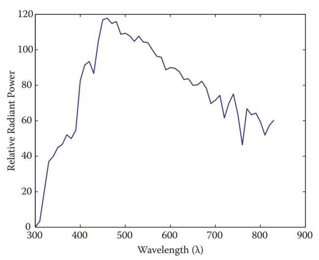
Figure 19.1. A spectrum describes how much energy is available at each wavelength λ, here measured as relative radiant power. This specific spectrum represents average daylight. 
图 19.1。 光谱描述了每个波长 λ 处有多少可用能量，此处测量为相对辐射功率。 该特定光谱代表平均日光。

When simulating light, it would therefore be possible to trace rays that each carry a spectrum. A renderer that accomplishes this is normally called a spectral renderer. From preceding chapters, it should be clear that we are not normally going through the expense of building spectral renderers. Instead, we replace spectra with representations that typically use red, green, and blue components. The reason that this is possible at all has to do with human vision and will be discussed later in this chapter. 
因此，在模拟光时，可以追踪每条带有光谱的光线。 完成此任务的渲染器通常称为光谱渲染器。 从前面的章节可以清楚地看出，我们通常不会花费构建光谱渲染器的费用。 相反，我们用通常使用红色、绿色和蓝色分量的表示来替换光谱。 这之所以可能，与人类视觉有关，本章稍后将对此进行讨论。

Simulating light by tracing rays takes care of the physics of light, although it should be noted that several properties of light, including, for instance, polarization, diffraction, and interference, are not modeled in this manner. 
通过追踪光线来模拟光会考虑到光的物理特性，但应该注意的是，光的一些属性（包括偏振、衍射和干涉）并不是以这种方式建模的。

At surface boundaries, we normally model what happens with light by means of a reflectance function. These functions can be measured directly by means of gonioreflectometers, leading to a large amount of tabled data, which can be more compactly represented by various different functions. Nonetheless, these reflectance functions are empirical in nature, i.e., they abstract away the chemistry that happens when a photon is absorbed and re-emitted by an electron. Thus, reflectance functions are useful for modeling in computer graphics, but do not offer an explanation as to why certain wavelengths of light are absorbed and others are reflected. We can therefore not use reflectance functions to explain why the light reflected off a banana has a spectral composition that appears to us as yellow. For that, we would have to study molecular orbital theory, a topic beyond the scope of this book. 
在表面边界，我们通常通过反射函数来模拟光发生的情况。 这些函数可以通过测角反射仪直接测量，从而产生大量的表格数据，可以通过各种不同的函数更紧凑地表示这些数据。 尽管如此，这些反射函数本质上是经验性的，即它们抽象了光子被电子吸收和重新发射时发生的化学反应。 因此，反射函数对于计算机图形学建模很有用，但不能解释为什么某些波长的光被吸收而其他波长的光被反射。 因此，我们不能使用反射函数来解释为什么香蕉反射的光具有在我们看来为黄色的光谱成分。 为此，我们必须研究分子轨道理论，这个主题超出了本书的范围。

Finally, when light reaches the retina, it is transcoded into electrical signals that are propagated to the brain. A large part of the brain is devoted to processing visual signals, part of which gives rise to the sensation of color. Thus, even if we know the spectrum of light that is reflected off a banana, we do not know yet why humans associate the term “yellow” with it. Moreover, as we will find out in the remainder of this chapter, our perception of color is vastly more complicated than it would seem at first glance. It changes with illumination, varies between observers, and varies within an observer over time. 
最后，当光线到达视网膜时，它被转码成电信号，并传播到大脑。 大脑的很大一部分致力于处理视觉信号，其中一部分产生颜色感觉。 因此，即使我们知道香蕉反射的光谱，我们仍然不知道为什么人类将“黄色”一词与它联系起来。 此外，正如我们将在本章的其余部分中发现的那样，我们对颜色的感知比乍一看要复杂得多。 它随着照明的变化而变化，在观察者之间变化，并且随着时间的推移在观察者内部变化。

In other words, the spectrum of light coming off a banana is perceived in the context of an environment. To predict how an observer perceives a “banana spectrum” requires knowledge of the environment that contains the banana as well as the observer’s environment. In many instances, these two environments are the same. However, when we are displaying a photograph of a banana on a monitor, then these two environments will be different. As human visual perception depends on the environment the observer is in, it may perceive the banana in the photograph differently from how an observer directly looking at the banana would perceive it. This has a significant impact on how we should deal with color and illustrates the complexities associated with color. 
换句话说，香蕉发出的光谱是在环境背景下被感知的。 要预测观察者如何感知“香蕉光谱”，需要了解包含香蕉的环境以及观察者的环境。 在许多情况下，这两个环境是相同的。 然而，当我们在显示器上显示香蕉的照片时，这两种环境将会有所不同。 由于人类的视觉感知取决于观察者所处的环境，因此它对照片中香蕉的感知可能与观察者直接观看香蕉的感知不同。 这对我们如何处理颜色有重大影响，并说明了与颜色相关的复杂性。

To emphasize the crucial role that human vision plays, we only have to look at the definition of color: “Color is the aspect of visual perception by which an observer may distinguish differences between two structure-free fields of view of the same size and shape, such as may be caused by differences in the spectral composition of the radiant energy concerned in the observation” (Wyszecki & Stiles, 2000). In essence, without a human observer there is no color. 
为了强调人类视觉所发挥的关键作用，我们只需要看看颜色的定义：“颜色是视觉感知的一个方面，观察者可以通过颜色来区分两个相同大小和形状的无结构视场之间的差异。 ，例如可能是由观测中涉及的辐射能的光谱组成差异引起的”（Wyszecki & Stiles，2000）。 本质上，没有人类观察者就没有颜色。

Luckily, much of what we know about color can be quantified, so that we can carry out computations to correct for the idiosyncrasies of human vision and thereby display images that will appear to observers the way the designer of those images intended. This chapter contains the theory and mathematics required to do so.
幸运的是，我们对颜色的了解大部分都可以量化，这样我们就可以进行计算来纠正人类视觉的特性，从而以图像设计者的预期方式向观察者显示图像。 本章包含这样做所需的理论和数学。

## 19.1 Colorimetry 比色法

Colorimetry is the science of color measurement and description. Since color is ultimately a human response, color measurement should begin with human observation. The photodetectors in the human retina consist of rods and cones. The rods are highly sensitive and come into play in low-light conditions. Under normal lighting conditions, the cones are operational, mediating human vision. There are three cone types and together they are primarily responsible for color vision. 
比色学是颜色测量和描述的科学。 由于颜色最终是人类的反应，因此颜色测量应从人类观察开始。 人类视网膜中的光电探测器由视杆细胞和视锥细胞组成。 这些视杆细胞非常敏感，在弱光条件下发挥作用。 在正常照明条件下，视锥细胞可以发挥作用，调节人类视觉。 视锥细胞分为三种类型，它们共同主要负责色觉。

Although it may be possible to directly record the electrical output of cones while some visual stimulus is being presented, such a procedure would be invasive, while at the same time ignoring the sometimes substantial differences between observers. Moreover, much of the measurement of color was developed well before such direct recording techniques were available. 
尽管在呈现一些视觉刺激时可以直接记录视锥细胞的电输出，但这样的过程将是侵入性的，同时忽略了观察者之间有时存在的实质性差异。 此外，许多颜色测量方法早在这种直接记录技术出现之前就已经开发出来了。

The alternative is to measure color by means of measuring the human response to patches of color. This leads to color matching experiments, which will be described later in this section. Carrying out these experiments have resulted in several standardized observers, which can be thought of as statistical approximations of actual human observers. First, however, we need to describe some of the assumptions underlying the possibility of color matching, which are summarized by Grassmann’s laws. 
另一种方法是通过测量人类对色块的反应来测量颜色。 这导致了颜色匹配实验，本节稍后将对此进行描述。 进行这些实验产生了几个标准化的观察者，可以将其视为实际人类观察者的统计近似值。 然而，首先，我们需要描述颜色匹配可能性背后的一些假设，这些假设由格拉斯曼定律进行了总结。

### 19.1.1 Grassmann’s Laws 格拉斯曼定律

Given that humans have three different cone types, the experimental laws of color matching can be summed up as the trichromatic generalization (Wyszecki & Stiles, 2000), which states that any color stimulus can be matched completely with an additive mixture of three appropriately modulated color sources. This feature of color is often used in practice, for instance by televisions and monitors which reproduce many different colors by adding a mixture of red, green, and blue light for each pixel. It is also the reason that renderers can be built using only three values to describe each color. 
鉴于人类具有三种不同的视锥细胞类型，颜色匹配的实验定律可以总结为三色概括（Wyszecki & Stiles，2000），它指出任何颜色刺激都可以与三种适当调制颜色的加法混合物完全匹配 来源。 这种颜色特征在实践中经常使用，例如电视和显示器通过为每个像素添加红、绿和蓝光的混合来再现许多不同的颜色。 这也是渲染器可以仅使用三个值来描述每种颜色来构建的原因。

The trichromatic generalization allows us to make color matches between any given stimulus and an additive mixture of three other color stimuli. Hermann Grassmann was the first to describe the algebraic rules to which color matching adheres. They are known as Grassmann’s laws of additive color matching (Grassmann, 1853) and are the following: 
三色泛化使我们能够在任何给定的刺激和其他三种颜色刺激的附加混合物之间进行颜色匹配。 赫尔曼·格拉斯曼 (Hermann Grassmann) 是第一个描述颜色匹配所遵循的代数规则的人。 它们被称为格拉斯曼加色匹配定律（Grassmann，1853），如下：

- Symmetry law. If color stimulus A matches color stimulus B, then B matches A. 
  对称定律。 如果颜色刺激 A 与颜色刺激 B 匹配，则 B 与 A 匹配。
- Transitive law. If A matches B and B matches C, then A matches C. 
  传递律。 如果A匹配B且B匹配C，则A匹配C。
- Proportionality law. If A matches B, then αA matches αB, where α is a positive scale factor.
  比例法。 如果 A 与 B 匹配，则 αA 与 αB 匹配，其中 α 是正比例因子。
- Additivity law. If A matches B, C matches D, and A + C matches B + D, then it follows that A + D matches B + C. 
  可加性定律。 如果A匹配B，C匹配D，并且A+C匹配B+D，则A+D匹配B+C。

The additivity law forms the basis for color matching and colorimetry as a whole. 
可加性定律构成了整个色彩匹配和比色学的基础。

### 19.1.2 Cone Responses  锥体反应

Each cone type is sensitive to a range of wavelengths, spanning most of the full visible range. However, sensitivity to wavelengths is not evenly distributed, but contains a peak wavelength at which sensitivity is greatest. The location of this peak wavelength is different for each cone type. The three cone types are classified as S, M, and L cones, where the letters stand for short, medium, and long, indicating where in the visible spectrum the peak sensitivity is located. 
每种锥体类型都对一定范围的波长敏感，涵盖大部分完整可见光范围。 然而，对波长的敏感度并不是均匀分布的，而是包含敏感度最大的峰值波长。 对于每种锥体类型，该峰值波长的位置都不同。 三种视锥细胞类型分为 S、M 和 L 视锥细胞，其中字母代表短、中、长，表示可见光谱中峰值灵敏度所在的位置。

The response of a given cone is then the magnitude of the electrical signal it outputs, as a function of the spectrum of wavelengths incident upon the cone. The cone response functions for each cone type as a function of wavelength λ are then given by L(λ), M(λ), and S(λ). They are plotted in Figure 19.2. 
给定锥体的响应就是它输出的电信号的幅度，作为入射到锥体上的波长光谱的函数。 每种锥体类型的锥体响应函数作为波长 λ 的函数由 L(λ)、M(λ) 和 S(λ) 给出。 它们如图 19.2 所示。
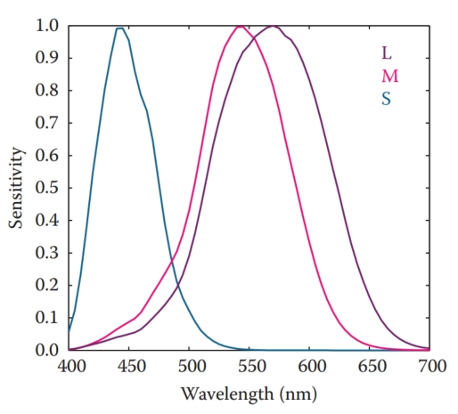
Figure 19.2. The cone response functions for L, M, and S cones.  
图 19.2。 L、M 和 S 视锥细胞的视锥细胞响应函数。

The actual response to a stimulus with a given spectral composition Φ(λ) is then given for each cone type by
然后，对于每种锥体类型，对具有给定光谱成分 Φ(λ) 的刺激的实际响应由下式给出：
$$
L = \int_λΦ(λ) L(λ) dλ, \\
M = \int_λΦ(λ) M(λ) dλ, \\
S = \int_λΦ(λ) S(λ) dλ, \\
$$
These three integrated responses are known as tristimulus values. 
这三个综合响应称为三刺激值。

### 19.1.3 Color Matching Experiments 配色实验

Given that tristimulus values are created by integrating the product of two functions over the visible range, it is immediately clear that the human visual system does not act as a simple wavelength detector. Rather, our photo-receptors act as approximately linear integrators. As a result, it is possible to find two different spectral compositions, say $Φ_1(λ)$ and $Φ_2(λ)$, that after integration yield the same response (L, M, S). This phenomenon is known as metamerism, an example of which is shown in Figure 19.3. 
鉴于三刺激值是通过对可见光范围内的两个函数的乘积进行积分而创建的，因此很明显人类视觉系统不能充当简单的波长检测器。 相反，我们的光感受器充当近似线性积分器。 因此，可以找到两种不同的光谱成分，例如 $Φ_1(λ)$ 和 $Φ_2(λ)$，积分后会产生相同的响应 (L、M、S)。 这种现象称为同色异谱，其示例如图 19.3 所示。
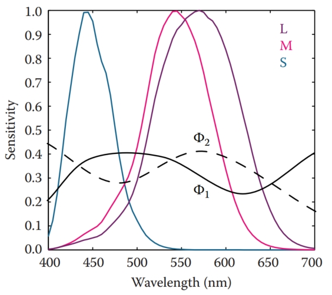
Figure 19.3. Two stimuli $Φ_1(λ)$ and $Φ_2(λ)$ leading to the same tristimulus values after integration. 
图 19.3。 积分后两个刺激 $Φ_1(λ)$ 和 $Φ_2(λ)$ 产生相同的三刺激值。

Metamerism is the key feature of human vision that allows the construction of color reproduction devices, including the color figures in this book and anything reproduced on printers, televisions, and monitors. 
同色异谱是人类视觉的关键特征，它允许构建色彩再现设备，包括本书中的彩色图形以及打印机、电视和显示器上再现的任何内容。

Color matching experiments also rely on the principle of metamerism. Suppose we have three differently colored light sources, each with a dial to alter its intensity. We call these three light sources primaries. We should now be able to adjust the intensity of each in such a way that when mixed together additively, the resulting spectrum integrates to a tristimulus value that matches the perceived color of a fourth unknown light source. When we carry out such an experiment, we have essentially matched our primaries to an unknown color. The positions of our three dials are then a representation of the color of the fourth light source. 
配色实验也依赖于同色异谱的原理。 假设我们有三个不同颜色的光源，每个光源都有一个旋钮来改变其强度。 我们将这三种光源称为原色。 我们现在应该能够以这样的方式调整每个强度，即当加法混合在一起时，所得光谱积分为与第四个未知光源的感知颜色相匹配的三刺激值。 当我们进行这样的实验时，我们基本上将我们的原色与未知的颜色进行了匹配。 我们三个刻度盘的位置代表了第四个光源的颜色。

In such an experiment, we have used Grassmann’s laws to add the three spectra of our primaries. We have also used metamerism, because the combined spectrum of our three primaries is almost certainly different from the spectrum of the fourth light source. However, the tristimulus values computed from these two spectra will be identical, having produced a color match. 
在这样的实验中，我们使用格拉斯曼定律将我们的原色的三个光谱相加。 我们还使用了同色异谱，因为我们的三个基色的组合光谱几乎肯定与第四个光源的光谱不同。 然而，根据这两个光谱计算出的三刺激值将是相同的，从而产生了颜色匹配。

Note that we do not actually have to know the cone response functions to carry out such an experiment. As long as we use the same observer under the same conditions, we are able to match colors and record the positions of our dials for each color. However, it is quite inconvenient to have to carry out such experiments every time we want to measure colors. For this reason, we do want to know the spectral cone response functions and average those for a set of different observers to eliminate interobserver variability. 
请注意，我们实际上不必知道锥体响应函数即可进行此类实验。 只要我们在相同的条件下使用相同的观察者，我们就能够匹配颜色并记录每种颜色的表盘位置。 但每次要测量颜色时都必须进行这样的实验，非常不方便。 出于这个原因，我们确实想知道光谱锥响应函数并对一组不同观察者进行平均，以消除观察者间的变异性。

### 19.1.4 Standard Observers 标准观察员

If we perform a color matching experiment for a large range of colors, carried out by a set of different observers, it is possible to generate an average color matching dataset. If we specifically use monochromatic light sources against which to match our primaries, we can repeat this experiment for all visible wavelengths. The resulting tristimulus values are then called spectral tristimulus values, and can be plotted against wavelength λ, shown in Figure 19.4. 
如果我们由一组不同的观察者对大范围的颜色进行颜色匹配实验，则可以生成平均颜色匹配数据集。 如果我们专门使用单色光源来匹配我们的原色，我们可以对所有可见波长重复这个实验。 由此产生的三刺激值称为光谱三刺激值，并且可以根据波长 λ 绘制，如图 19.4 所示。
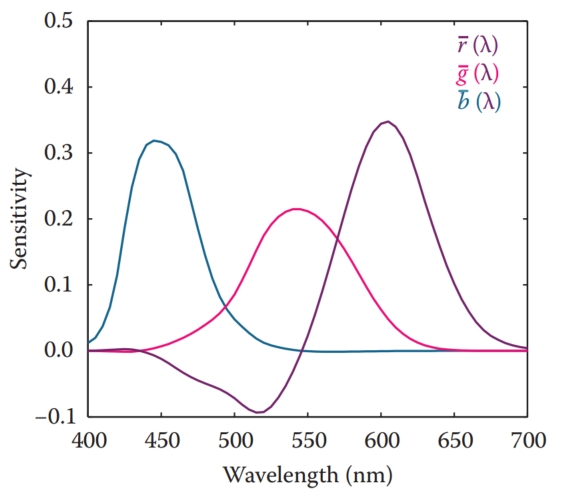
Figure 19.4. Spectral tristimulus values averaged over many observers. The primaries where monochromatic light sources with wavelengths of 435.8, 546.1, and 700 nm.  
图 19.4。 光谱三刺激值对许多观察者进行平均。 原色采用波长为 435.8、546.1 和 700 nm 的单色光源。

By using a well-defined set of primary light sources, the spectral tristimulus values lead to three color matching functions. The Commission Internationale d’Eclairage (CIE) has defined three such primaries to be monochromatic light sources of 435.8, 546.1, and 700 nm, respectively. With these three monochromatic light sources, all other visible wavelengths can be matched by adding different amounts of each. The amount of each required to match a given wavelength λ is encoded in color matching functions, given by $\overline{r}(λ)$, $\overline{g}(λ)$, and $\overline{b}(λ)$ and plotted in Figure 19.4. Tristimulus values associated with these color matching functions are termed R, G, and B. 
通过使用一组明确的主光源，光谱三刺激值产生三个颜色匹配函数。 国际照明委员会 (CIE) 将三种原色定义为分别为 435.8、546.1 和 700 nm 的单色光源。 有了这三种单色光源，所有其他可见波长都可以通过添加不同数量的每种光源来匹配。 匹配给定波长 λ 所需的每种颜色的数量都用颜色匹配函数进行编码，由 $\overline{r}(λ)$、$\overline{g}(λ)$ 和 $\overline{b}( λ)$ 并绘制在图 19.4 中。 与这些颜色匹配函数相关的三刺激值称为 R、G 和 B。

Given that we are adding light, and light cannot be negative, you may have noticed an anomaly in Figure 19.4: to create a match for some wavelengths, it is necessary to subtract light. Although there is no such thing as negative light, we can use Grassmann’s laws once more, and instead of subtracting light from the mixture of primaries, we can add the same amount of light to the color that is being matched. 
鉴于我们正在添加光，并且光不能为负，您可能已经注意到图 19.4 中的异常情况：为了创建某些波长的匹配，有必要减去光。 虽然不存在负光这样的东西，但我们可以再次使用格拉斯曼定律，而不是从原色混合中减去光，我们可以向正在匹配的颜色添加相同量的光。

The CIE $\overline{r}(λ)$, $\overline{g}(λ)$, and $\overline{b}(λ)$ color matching functions allow us to determine if a spectral distribution $\bold{Φ}_1$ matches a second spectral distribution $\bold{Φ}_2$  by simply comparing the resulting tristimulus values obtained by integrating with these color matching functions:
CIE $\overline{r}(λ)$、$\overline{g}(λ)$ 和 $\overline{b}(λ)$ 颜色匹配函数允许我们确定光谱分布 $\bold{ Φ}_1$ 通过简单地比较通过与这些颜色匹配函数集成获得的三刺激值来匹配第二光谱分布 $\bold{Φ}_2$：
$$
\int_{λ}\bold{Φ}_1(λ)\overline{r}(λ) = \int_{λ}\bold{Φ}_2(λ)\overline{r}(λ) \\
\int_{λ}\bold{Φ}_1(λ)\overline{g}(λ) = \int_{λ}\bold{Φ}_2(λ)\overline{g}(λ) \\
\int_{λ}\bold{Φ}_1(λ)\overline{b}(λ) = \int_{λ}\bold{Φ}_2(λ)\overline{b}(λ) \\
$$
Of course, a color match is only guaranteed if all three tristimulus values match. 
当然，只有当所有三个三刺激值都匹配时才能保证颜色匹配。

The importance of these color matching functions lies in the fact that we are now able to communicate and describe colors compactly by means of tristimulus values. For a given spectral function, the CIE color matching functions provide a precise way in which to calculate tristimulus values. As long as everybody uses the same color matching functions, it should always be possible to generate a match. 
这些颜色匹配函数的重要性在于我们现在能够通过三刺激值来紧凑地传达和描述颜色。 对于给定的光谱函数，CIE 颜色匹配函数提供了计算三刺激值的精确方法。 只要每个人都使用相同的颜色匹配函数，就应该总是可以生成匹配的颜色。

If the same color matching functions are not available, then it is possible to transform one set of tristimulus values into a different set of tristimulus values appropriate for a corresponding set of primaries. The CIE has defined one such a transform for two specific reasons. First, in the 1930s numerical integrations were difficult to perform, and even more so for functions that can be both positive and negative. Second, the CIE had already developed the photopic luminance response function, CIE V (λ). It became desirable to have three integrating functions, of which V (λ) is one and all three being positive over the visible range. 
如果相同的颜色匹配函数不可用，则可以将一组三色刺激值变换成适合于对应的原色组的另一组三色刺激值。 CIE 出于两个具体原因定义了这样一种转换。 首先，在 20 世纪 30 年代，数值积分很难执行，对于既可以是正值也可以是负值的函数来说更是如此。 其次，CIE 已经开发了明视亮度响应函数 CIE V (λ)。 人们希望具有三个积分函数，其中 V (λ) 为 1，并且所有三个积分函数在可见光范围内均为正值。

To create a set of positive color matching functions, it is necessary to define imaginary primaries. In other words, to reproduce any color in the visible spectrum, we need light sources that cannot be physically realized. The color matching functions that were settled upon by the CIE are named $\overline{x}(λ)$, $\overline{y}(λ)$, and $\overline{z}(λ)$ and are shown in Figure 19.5. Note that $\overline{y}(λ)$ is equal to the photopic luminance response function $V(λ)$ and that each of these functions is indeed positive. They are known as the CIE 1931 standard observer. 
要创建一组正颜色匹配函数，需要定义假想原色。 换句话说，为了再现可见光谱中的任何颜色，我们需要无法物理实现的光源。 CIE 确定的颜色匹配函数被命名为 $\overline{x}(λ)$、$\overline{y}(λ)$ 和 $\overline{z}(λ)$，并显示在 图 19.5。 请注意，$\overline{y}(λ)$ 等于明视亮度响应函数$V(λ)$，并且这些函数中的每一个实际上都是正的。 他们被称为 CIE 1931 标准观察员。
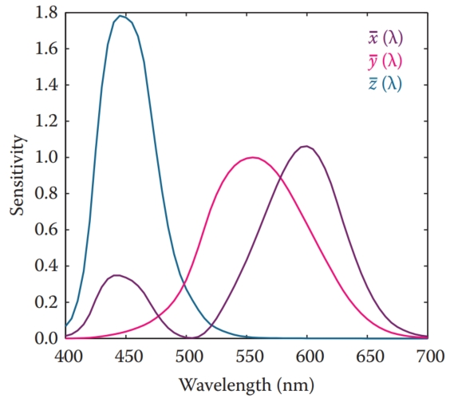
Figure 19.5. The CIE $\overline{x}(λ)$, $\overline{y}(λ)$, and $\overline{z}(λ)$ color matching functions.  
图 19.5。 CIE $\overline{x}(λ)$、$\overline{y}(λ)$ 和 $\overline{z}(λ)$ 颜色匹配函数。

The corresponding tristimulus values are termed X, Y , and Z, to avoid confusion with R, G, and B tristimulus values that are normally associated with realizable primaries. The conversion from (R, G, B) tristimulus values to (X, Y, Z) tristimulus values is defined by a simple 3×3 transform:
相应的三色刺激值被称为 X、Y 和 Z，以避免与通常与可实现的原色相关的 R、G 和 B 三色刺激值混淆。 从 (R, G, B) 三色刺激值到 (X, Y, Z) 三色刺激值的转换由简单的 3×3 变换定义：
$$
\begin{bmatrix}
X \\ Y \\ Z
\end{bmatrix} = \frac{1}{0.17697} \begin{bmatrix}
0.4900 & 0.3100 & 0.2000 \\
0.17697 & 0.81240 & 0.01063 \\
0.0000 & 0.0100 & 0.9900 \\
\end{bmatrix}\cdot \begin{bmatrix}
R\\ G\\ B
\end{bmatrix}
$$
To calculate tristimulus values, we typically directly integrate the standard observer color matching functions with the spectrum of interest $Φ(λ)$, rather than go through the CIE $\overline{r}(λ)$, $\overline{g}(λ)$, and $\overline{b}(λ)$ color matching functions first, followed by the above transformation. It allows us to calculate consistent color measurements and also determine when two colors match each other. 
为了计算三刺激值，我们通常直接将标准观察者颜色匹配函数与感兴趣的光谱 $Φ(λ)$ 相结合，而不是通过 CIE $\overline{r}(λ)$, $\overline{g} (λ)$ 和 $\overline{b}(λ)$ 首先进行颜色匹配函数，然后进行上述变换。 它使我们能够计算一致的颜色测量值，并确定两种颜色何时相互匹配。

### 19.1.5 Chromaticity Coordinates  色度坐标

Every color can be represented by a set of three tristimulus values (X, Y, Z). We could define an orthogonal coordinate system with X, Y , and Z axes and plot each color in the resulting 3D space. This is called a color space. The spatial extent of the volume in which colors lie is then called the color gamut.
每种颜色都可以由一组三个三刺激值（X、Y、Z）表示。 我们可以定义一个具有 X、Y 和 Z 轴的正交坐标系，并在生成的 3D 空间中绘制每种颜色。 这称为色彩空间。 颜色所在体积的空间范围称为色域。

Visualizing colors in a 3D color space is fairly difficult. Moreover, the Y - value of any color corresponds to its luminance, by virtue of the fact that $\overline{y}(λ)$ equals $V(λ)$. We could therefore project tristimulus values to a 2D space which approximates chromatic information, i.e., information which is independent of luminance. This projection is called a chromaticity diagram and is obtained by normalization while at the same time removing luminance information:
在 3D 色彩空间中可视化颜色相当困难。 此外，任何颜色的 Y 值都对应于其亮度，因为 $\overline{y}(λ)$ 等于 $V(λ)$。 因此，我们可以将三刺激值投影到近似色度信息（即独立于亮度的信息）的二维空间。 该投影称为色度图，通过归一化同时去除亮度信息而获得：
$$
x = \frac{X}{X + Y + Z} \\
y = \frac{Y}{X + Y + Z} \\
z = \frac{Z}{X + Y + Z} \\
$$
Given that x + y + z equals 1, the z-value is redundant, allowing us to plot the x and y chromaticities against each other in a chromaticity diagram. Although x and y by themselves are not sufficient to fully describe a color, we can use these two chromaticity coordinates and one of the three tristimulus values, traditionally Y , to recover the other two tristimulus values:
鉴于 x + y + z 等于 1，z 值是多余的，允许我们在色度图中绘制 x 和 y 色度。 尽管 x 和 y 本身不足以完全描述颜色，但我们可以使用这两个色度坐标和三个三色刺激值之一（传统上为 Y ）来恢复其他两个三色刺激值：
$$
X = \frac{x}{y}Y \\
Z = \frac{1 - x - y}{y} Y
$$
By plotting all monochromatic (spectral) colors in a chromaticity diagram, we obtain a horseshoe-shaped curve. The points on this curve are called spectrum loci. All other colors will generate points lying inside this curve. The spectrum locus for the 1931 standard observer is shown in Figure 19.6. The purple line between either end of the horseshoe does not represent a monochromatic color, but rather a combination of short and long wavelength stimuli. 
通过在色度图中绘制所有单色（光谱）颜色，我们获得了马蹄形曲线。 这条曲线上的点称为频谱轨迹。 所有其他颜色都会生成位于该曲线内的点。 1931 年标准观测器的频谱轨迹如图 19.6 所示。 马蹄形两端之间的紫色线并不代表单色，而是短波长和长波长刺激的组合。
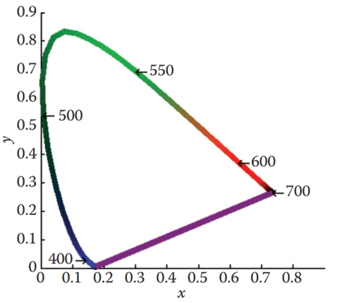
Figure 19.6. The spectrum locus for the CIE 1931 standard observer.  
图 19.6。 CIE 1931 标准观察者的光谱轨迹。

A (non-monochromatic) primary can be integrated over all visible wavelengths, leading to (X, Y, Z) tristimulus values, and subsequently to an (x, y) chromaticity coordinate, i.e., a point on a chromaticity diagram. Repeating this for two or more primaries yields a set of points on a chromaticity diagram that can be connected by straight lines. The volume spanned in this manner represents the range of colors that can be reproduced by the additive mixture of these primaries. Examples of three-primary systems are shown in Figure 19.7. 
（非单色）原色可以在所有可见波长上积分，产生 (X, Y, Z) 三刺激值，并随后产生 (x, y) 色度坐标，即色度图上的点。 对两个或多个原色重复此操作，会在色度图上产生一组可以通过直线连接的点。 以这种方式跨越的体积代表可以通过这些原色的加法混合物再现的颜色范围。 三主系统的示例如图 19.7 所示。
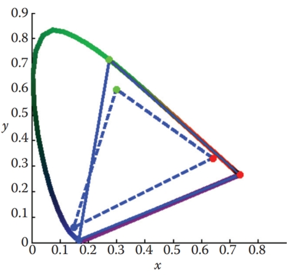
Figure 19.7. The chromaticity boundaries of the CIE RGB primaries at 435.8, 546.1, and 700 nm (solid) and a typical HDTV (dashed). 
图 19.7。 435.8、546.1 和 700 nm 处的 CIE RGB 原色（实线）和典型 HDTV（虚线)的色度边界。

Chromaticity diagrams provide insight into additive color mixtures. However, they should be used with care. First, the interior of the horseshoe should not be colored, as any color reproduction system will have its own primaries and can only reproduce some parts of the chromaticity diagram. Second, as the CIE color matching functions do not represent human cone sensitivities, the distance between any two points on a chromaticity diagram is not a good indicator for how differently these colors will be perceived. 
色度图提供了对加色混合物的深入了解。 但是，应谨慎使用它们。 首先，马蹄铁的内部不应该被着色，因为任何颜色再现系统都有自己的原色，并且只能再现色度图的某些部分。 其次，由于 CIE 颜色匹配函数并不代表人类视锥细胞的敏感度，因此色度图上任意两点之间的距离并不能很好地指示这些颜色的感知差异程度。

A more uniform chromaticity diagram was developed to at least in part address the second of these problems. The CIE $u'v'$ chromaticity diagram provides a perceptually more uniform spacing and is therefore generally preferred over (x, y) chromaticity diagrams. It is computed from (X, Y, Z) tristimulus values by applying a different normalization,
开发了更均匀的色度图，以至少部分解决第二个问题。 CIE $u'v'$ 色度图提供了感知上更均匀的间距，因此通常优于 (x, y) 色度图。 它是通过应用不同的归一化根据 (X, Y, Z) 三刺激值计算得出的，
$$
u' = \frac{4X}{X+15Y+3Z} \\
v' = \frac{9Y}{X+15Y+3Z}
$$
and can alternatively be computed directly from (x, y) chromaticity coordinates:  
也可以直接从 (x, y) 色度坐标计算：
$$
u' = \frac{4x}{-2x+12y+3} \\
v' = \frac{9y}{-2x+12y+3}
$$
A CIE $u'v'$ chromaticity diagram is shown in Figure 19.8. 
CIE $u'v'$ 色度图如图 19.8 所示。
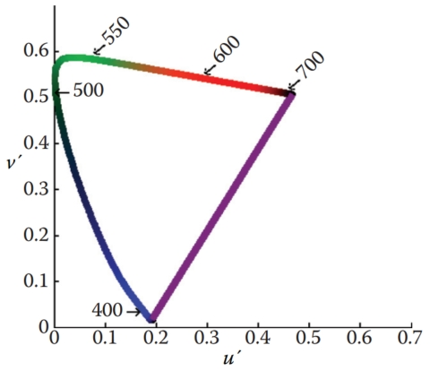
Figure 19.8. The CIE $u'v'$ chromaticity diagram. 
图 19.8。 CIE $u'v'$ 色度图。

## 19.2 Color Spaces 色彩空间

As explained above, each color can be represented by three numbers, for instance defined by (X, Y, Z) tristimulus values. However, its primaries are imaginary, meaning that it is not possible to construct a device that has three light sources (all positive) that can reproduce all colors in the visible spectrum. 
如上所述，每种颜色可以由三个数字表示，例如由（X，Y，Z）三刺激值定义。 然而，它的原色是虚数，这意味着不可能构建具有三个光源（均为正）且可以再现可见光谱中所有颜色的设备。

For the same reason, image encoding and computations on images may not be practical. There is, for instance, a large number of possible XY Z values that do not correspond to any physical color. This would lead to inefficient use of available bits for storage and to a higher requirement for bit-depth to preserve visual integrity after image processing. Although it may be possible to build a capture device that has primaries that are close to the CIE XY Z color matching functions, the cost of hardware and image processing make this an unattractive option. It is not possible to build a display that corresponds to CIE XY Z. For these reasons, it is necessary to design other color spaces: physical realizability, efficient encoding, perceptual uniformity, and intuitive color specification. 
出于同样的原因，图像编码和图像计算可能不切实际。 例如，存在大量不对应于任何物理颜色的可能 XY Z 值。 这将导致存储可用位的使用效率低下，并且对位深度提出更高的要求，以在图像处理后保持视觉完整性。 尽管可以构建具有接近 CIE XY Z 颜色匹配功能的原色的捕获设备，但硬件和图像处理的成本使其成为一个没有吸引力的选择。 不可能构建与 CIE XY Z 相对应的显示器。出于这些原因，有必要设计其他色彩空间：物理可实现性、高效编码、感知均匀性和直观的色彩规范。

The CIE XY Z color space is still actively used, mostly for the conversion between other color spaces. It can be seen as a device-independent color space. Other color spaces can then be defined in terms of their relationship to CIE XY Z, which is often specified by a specific transform. For instance, linear and additive trichromatic display devices can be transformed to and from CIE XY Z by means of a simple 3 × 3 matrix. Some nonlinear additional transform may also be specified, for instance to minimize perceptual errors when data is stored with a limited bit-depth, or to enable display directly on devices that have a nonlinear relationship between input signal and the amount of light emitted. 
CIE XY Z 色彩空间仍然被积极使用，主要用于其他色彩空间之间的转换。 它可以被看作是一个独立于设备的色彩空间。 其他色彩空间可以根据它们与 CIE XY Z 的关系来定义，这通常由特定的变换指定。 例如，线性和加法三色显示设备可以通过简单的 3 × 3 矩阵在 CIE XY Z 之间进行转换。 还可以指定一些非线性附加变换，例如，以在以有限位深度存储数据时最小化感知错误，或者使得能够直接在输入信号和发射的光量之间具有非线性关系的设备上进行显示。

### 19.2.1 Constructing a Matrix Transform 构造矩阵变换

For a display device with three primaries, say red, green, and blue, we can measure the spectral composition of the emitted light by sending the color vectors (1, 0, 0), (0, 1, 0), and (0, 0, 1). These vectors represent the three cases namely where one of the primaries is full on, and the other two are off. From the measured spectral output, we can then compute the corresponding chromaticity coordinates $(x_R, y_R)$, $(x_G, y_G)$, and $(x_B, y_B)$. 
对于具有三基色（例如红色、绿色和蓝色）的显示设备，我们可以通过发送颜色向量 (1, 0, 0)、(0, 1, 0) 和 (0 , 0, 1)。 这些向量代表三种情况，即其中一个初级完全打开，而另外两个关闭。 根据测量的光谱输出，我们可以计算相应的色度坐标 $(x_R, y_R)$、$(x_G, y_G)$ 和 $(x_B, y_B)$。

The white point of a display is defined as the spectrum emitted when the color vector (1, 1, 1) is sent to the display. Its corresponding chromaticity coordinate is $(x_W , y_W)$. The three primaries and the white point characterize the display and are each required to construct a transformation matrix between the display’s color space and CIE XY Z. 
显示器的白点定义为将颜色矢量 (1, 1, 1) 发送到显示器时发出的光谱。 其对应的色度坐标为$(x_W , y_W)$。 三原色和白点表征了显示器的特征，并且每一个都需要在显示器的色彩空间和 CIE XY Z 之间构建变换矩阵。

These four chromaticity coordinates can be extended to chromaticity triplets reconstructing the z-coordinate from $z = 1−x−y,$ leading to triplets $(x_R, y_R, z_R)$, $(x_G, y_G, z_G)$, $(x_B, y_B, z_B)$, and $(x_W , y_W , z_W )$. If we know the maximum luminance of the white point, we can compute its corresponding tristimulus value $(X_W , Y_W , Z_W )$ and then solve the following set of equations for the luminance ratio scalars $S_R, S_G$, and $S_B$:
这四个色度坐标可以扩展到色度三元组，从 $z = 1−x−y,$ 重建 z 坐标，得到三元组 $(x_R, y_R, z_R)$, $(x_G, y_G, z_G)$, $ (x_B, y_B, z_B)$ 和 $(x_W , y_W , z_W )$。 如果我们知道白点的最大亮度，我们可以计算其相应的三刺激值 $(X_W , Y_W , Z_W )$，然后求解以下一组方程以获得亮度比标量 $S_R、S_G$ 和 $S_B$ :
$$
X_W = x_R S_R + x_G S_G + x_B S_B, \\
Y_W = y_R S_R + y_G S_G + y_B S_B, \\
Z_W = z_R S_R + z_G S_G + z_B S_B.
$$
The conversion between RGB and XYZ is then given by 
RGB 和 XYZ 之间的转换由下式给出
$$
\begin{bmatrix}
X\\ Y\\ Z
\end{bmatrix} = \begin{bmatrix}
x_R S_R & x_G S_G & x_B S_B \\
y_R S_R & y_G S_G & y_B S_B \\
z_R S_R & z_G S_G & z_B S_B
\end{bmatrix}
\begin{bmatrix}
R \\G \\B
\end{bmatrix}
$$
The luminance of any given color can be computed by evaluating the middle row of a matrix constructed in this manner: 
任何给定颜色的亮度可以通过评估以此方式构造的矩阵的中间行来计算：
$Y = y_R S_R R + y_G S_G G + y_B S_B B  $

To convert between XYZ and RGB of a given device, the above matrix can simply be inverted. 
要在给定设备的 XYZ 和 RGB 之间进行转换，只需反转上述矩阵即可。

If an image is represented in an RGB color space for which the primaries and white point are unknown, then the next best thing is to assume that the image was encoded in a standard RGB color space. A reasonable choice is then to assume that the image was specified according to ITU-R BT.709, which is the specification used for encoding and broadcasting of HDTV. Its primaries and white point are specified in Table 19.1. Note that the same primaries and white point are used to define the well-known sRGB color space. The transformation between this RGB color space and CIE XYZ is and vice versa given by
如果图像以 RGB 颜色空间表示，而原色和白点未知，那么最好的办法是假设该图像是在标准 RGB 颜色空间中编码的。 合理的选择是假设图像是根据 ITU-R BT.709 指定的，这是用于 HDTV 编码和广播的规范。 其原色和白点在表 19.1 中指定。 请注意，相同的原色和白点用于定义众所周知的 sRGB 色彩空间。 此 RGB 颜色空间与 CIE XYZ 之间的变换为（反之亦然）：

|      |   R    |   G    |   B    | White  |
| :--: | :----: | :----: | :----: | :----: |
|  x   | 0.6400 | 0.3000 | 0.1500 | 0.3127 |
|  y   | 0.3300 | 0.6000 | 0.0600 | 0.3290 |

Table 19.1. The (x, y) chromaticity coordinates for the primaries and white point specified by ITU-R BT.709. The sRGB standard also uses these primaries and white point.  
表 19.1。 ITU-R BT.709 指定的原色和白点的 (x, y) 色度坐标。 sRGB 标准也使用这些原色和白点。
$$
\ \begin{bmatrix}
X\\ Y\\ Z
\end{bmatrix} = \begin{bmatrix}
0.4124 & 0.3576 & 0.1805 \\
0.2126 & 0.7152 & 0.0722 \\
0.0193 & 0.1192 & 0.9505
\end{bmatrix}
\begin{bmatrix}
R \\G \\B
\end{bmatrix} \\
\begin{bmatrix}
R \\G \\B
\end{bmatrix} = \begin{bmatrix}
3.2405 & −1.5371 & −0.4985 \\
−0.9693 & 1.8706 & 0.0416 \\
0.0556 & −0.2040 & 1.0572
\end{bmatrix} \begin{bmatrix}
X\\ Y\\ Z
\end{bmatrix}
$$
By substituting the maximum RGB values of the device, we can compute the white point. For ITU-R BT.709, the maximum values are $(R_W , G_W , B_W) = (100, 100, 100)$, leading to a white point of $(X_W , Y_W , Z_W) = (95.05, 100.00, 108.90)$. 
通过替换设备的最大 RGB 值，我们可以计算白点。 对于 ITU-R BT.709，最大值为 $(R_W , G_W , B_W) = (100, 100, 100)$，导致白点为 $(X_W , Y_W , Z_W) = (95.05, 100.00, 108.90)$。

In addition to a linear transformation, the sRGB color space is characterized by a subsequent nonlinear transform. The nonlinear encoding is given by
除了线性变换之外，sRGB 色彩空间的特征还在于后续的非线性变换。 非线性编码由下式给出
$$
R_{sRGB} = \begin{cases}
1.055R^{1/2.4} - 0.055\ \ \ \ \ \ \ \ \ \  R > 0.0031308\\
12.92R\ \ \ \ \ \ \ \ \ \ \ \ \ \ \ \ \ \ \ \ \ \ \ \ \ \ \ \ \ \ \ R ≤ 0.0031308
\end{cases} \\
G_{sRGB} = \begin{cases}
1.055G^{1/2.4} - 0.055\ \ \ \ \ \ \ \ \ \  G > 0.0031308\\
12.92G\ \ \ \ \ \ \ \ \ \ \ \ \ \ \ \ \ \ \ \ \ \ \ \ \ \ \ \ \ \ \ G ≤ 0.0031308
\end{cases} \\
B_{sRGB} = \begin{cases}
1.055B^{1/2.4} - 0.055\ \ \ \ \ \ \ \ \ \ B > 0.0031308\\
12.92B\ \ \ \ \ \ \ \ \ \ \ \ \ \ \ \ \ \ \ \ \ \ \ \ \ \ \ \ \ \ \ B ≤ 0.0031308
\end{cases} \\
$$
This nonlinear encoding helps minimize perceptual errors due to quantization errors in digital applications.  
这种非线性编码有助于最大限度地减少数字应用中由于量化误差而导致的感知误差。

### 19.2.2 Device-Dependent RGB Spaces  设备相关的 RGB 空间

As each device typically has its own set of primaries and white point, we call the associated RGB color spaces device-dependent. It should be noted that even if all these devices operate in an RGB space, they may have very different primaries and white points. If we therefore have an image specified in some RGB space, it may appear very different to us, depending upon which device we display it. 
由于每个设备通常都有自己的一组原色和白点，因此我们将关联的 RGB 颜色空间称为设备相关的。 应该注意的是，即使所有这些设备都在 RGB 空间中运行，它们也可能具有非常不同的原色和白点。 因此，如果我们在某个 RGB 空间中指定了一个图像，那么它对我们来说可能会显得非常不同，具体取决于我们显示它的设备。

This is clearly an undesirable situation, resulting from a lack of color management. However, if the image is specified in a known RGB color space, it can first be converted to XYZ, which is device independent, and then subsequently it can be converted to the RGB space of the device on which it will be displayed. 
这显然是一种不受欢迎的情况，是由于缺乏色彩管理造成的。 然而，如果图像是在已知的 RGB 颜色空间中指定的，则可以首先将其转换为与设备无关的 XYZ，然后将其转换为将在其上显示的设备的 RGB 空间。

There are several other RGB color spaces that are well defined. They each consist of a linear matrix transform followed by a nonlinear transform, akin to the aforementioned sRGB color space. The nonlinear transform can be parameterized as follows:
还有其他几个定义明确的 RGB 色彩空间。 它们均由线性矩阵变换和非线性变换组成，类似于前面提到的 sRGB 颜色空间。 非线性变换可以参数化如下：
$$
R_{nonlinear} = \begin{cases}
(1+f)R^γ - f \ \ \ \ t < R ≤ 1 \\
sR \ \ \ \ \ \ \ \ \ \ \ \ \ \ \ \ \ \ \ \ \ \ \ 0 ≤ R ≤ t
\end{cases} \\
G_{nonlinear} = \begin{cases}
(1+f)G^γ - f \ \ \ \ t < G ≤ 1 \\
sG \ \ \ \ \ \ \ \ \ \ \ \ \ \ \ \ \ \ \ \ \ \ \ 0 ≤ G ≤ t
\end{cases} \\
R_{nonlinear} = \begin{cases}
(1+f)R^γ - f \ \ \ \ t < R ≤ 1 \\
sR \ \ \ \ \ \ \ \ \ \ \ \ \ \ \ \ \ \ \ \ \ \ \ 0 ≤ R ≤ t
\end{cases} \\
$$
The parameters s, f, t and γ, together with primaries and white point, specify a class of RGB color spaces that are used in various industries. Several common transformations are listed in Table 19.2. 
参数 s、f、t 和 γ 与原色和白点一起指定了用于各个行业的一类 RGB 颜色空间。 表 19.2 列出了几种常见的转换。
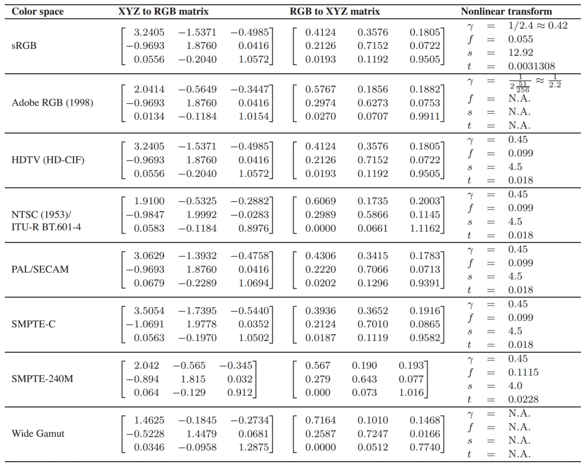
Table 19.2. Transformations for standard RGB color spaces (after (Pascale, 2003)). 
表 19.2。 标准 RGB 颜色空间的转换（继（Pascale，2003）之后)。

### 19.2.3 LMS Cone Space  LMS 锥体空间

The aforementioned cone signals can be expressed in terms of the CIE XYZ color space. The matrix transform to compute LMS signals from XY Z and vice versa are given by
上述锥体信号可以用CIE XYZ颜色空间来表达。 用于计算来自 XY Z 的 LMS 信号（反之亦然）的矩阵变换由下式给出
$$
\ \begin{bmatrix}
L\\ M\\ S
\end{bmatrix} = \begin{bmatrix}
0.38971 & 0.68898 & −0.07868 \\
−0.22981 & 1.18340 & 0.04641 \\
0.00000 & 0.00000 & 1.00000
\end{bmatrix}\begin{bmatrix}
X\\ Y\\ Z
\end{bmatrix} \\
\begin{bmatrix}
X\\ Y\\ Z
\end{bmatrix} = \begin{bmatrix}
1.91019 & −1.11214 & 0.20195 \\
0.37095 & 0.62905 & 0.00000 \\
0.00000 & 0.00000 & 1.00000
\end{bmatrix}\begin{bmatrix}
L\\ M\\ S
\end{bmatrix}
$$
This transform is known as the Hunt-Pointer-Estevez transform (Hunt, 2004) and is used in chromatic adaptation transforms as well as in color appearance modeling. 
该变换称为 Hunt-Pointer-Estevez 变换（Hunt，2004），用于色彩适应变换以及颜色外观建模。

### 19.2.4 CIE 1976 L∗a∗b∗ 

Color opponent spaces are characterized by a channel representing an achromatic channel (luminance), as well as two channels encoding color opponency. These are frequently red-green and yellow-blue channels. These color opponent channels thus encode two chromaticities along one axis, which can have both positive and negative values. For instance, a red-green channel encodes red for positive values and green for negative values. The value zero encodes a special case: neutral which is neither red or green. The yellow-blue channel works in much the same way. 
颜色对立空间的特征是一个通道代表一个消色差通道（亮度），以及两个编码颜色对立的通道。 这些通道通常是红绿通道和黄蓝通道。 因此，这些颜色对立通道沿一个轴编码两个色度，可以同时具有正值和负值。 例如，红绿通道将红色编码为正值，将绿色编码为负值。 值零编码一种特殊情况：中性，既不是红色也不是绿色。 黄蓝色通道的工作原理大致相同。

As at least two colors are encoded on each of the two chromatic axes, it is not possible to encode a mixture of red and green. Neither is it possible to encode yellow and blue simultaneously. While this may seem a disadvantage, it is known that the human visual system computes similar attributes early in the visual pathway. As a result, humans are not able to perceive colors that are simultaneously red and green, or yellow and blue. We do not see anything resembling reddishgreen, or yellowish-blue. We are, however, able to perceive mixtures of colors such as yellowish-red (orange) or greenish-blue, as these are encoded across the chromatic channels. 
由于在两个色轴中的每一个上至少编码两种颜色，所以不可能对红色和绿色的混合进行编码。 也不可能同时对黄色和蓝色进行编码。 虽然这似乎是一个缺点，但众所周知，人类视觉系统在视觉通路的早期计算类似的属性。 因此，人类无法感知同时为红色和绿色，或黄色和蓝色的颜色。 我们看不到任何类似红绿色或黄蓝色的东西。 然而，我们能够感知黄红色（橙色）或绿蓝色等颜色的混合，因为这些颜色是通过色通道编码的。

The most relevant color opponent system for computer graphics is the CIE 1976 L∗a∗b∗ color model. It is a perceptually more or less uniform color space, useful, among other things, for the computation of color differences. It is also known as CIELAB. 
计算机图形学最相关的颜色对手系统是 CIE 1976 L*a*b* 颜色模型。 它是一个在感知上或多或少均匀的色彩空间，除其他外，对于计算色差很有用。 它也被称为 CIELAB。

The input to CIELAB are the stimulus (X, Y, Z) tristimulus values as well as the tristimulus values of a diffuse white reflecting surface that is lit by a known illuminant, $(X_n, Y_n, Z_n)$. CIELAB therefore goes beyond being an ordinary color space, as it takes into account a patch of color in the context of a known illumination. It can thus be seen as a rudimentary color appearance space. 
CIELAB 的输入是刺激 (X, Y, Z) 三刺激值以及由已知光源 $(X_n, Y_n, Z_n)$ 照亮的漫反射白色反射表面的三刺激值。 因此，CIELAB 超越了普通的色彩空间，因为它考虑了已知照明背景下的一小块色彩。 因此它可以被视为一个基本的颜色外观空间。

The three channels defined in CIELAB are L∗, a∗, and b∗. The L∗ channel encodes the lightness of the color, i.e., the perceived reflectance of a patch with tristimulus value (X, Y, Z). The a∗ and b∗ are chromatic opponent channels. The transform between XYZ and CIELAB is given by
CIELAB 中定义的三个通道是 L*、a* 和 b*。 L* 通道对颜色的亮度进行编码，即具有三刺激值 (X, Y, Z) 的色块的感知反射率。 a* 和 b* 是彩色对立通道。 XYZ 和 CIELAB 之间的变换由下式给出
$$
\begin{bmatrix}
L∗\\ a∗\\ b∗
\end{bmatrix}
= \begin{bmatrix}
0 & 116 & 0 & −16 \\
500 & −500 & 0 & 0 \\
0 & 200 & −200 & 0
\end{bmatrix}
\begin{bmatrix}
f(X/X_n) \\
f(Y/Y_n) \\
f(Z/Z_n) \\
1
\end{bmatrix}
$$
The function f is defined as
函数 f 定义为
$$
f(r) = \begin{cases}
\sqrt[3]{r} \ \ \ \ \ \ \ \ \ \ \ \ \ \ \ \ \ \ \ \ \ \ \ \ for\ r > 0.008856, \\
7.787 r + \frac{16}{116} \ \ \ \ \ \ \ for\ r ≤ 0.008856.
\end{cases}
$$
As can be seen from this formulation, the chromatic channels do depend on the luminance Y . Although this is perceptually accurate, it means that we cannot plot the values of a∗ and b∗ in a chromaticity diagram. The lightness L∗ is normalized between 0 and 100 for black and white. Although the a∗ and b∗ channels are not explicitly constrained, they are typically in the range [−128, 128]. 
从这个公式可以看出，色彩通道确实取决于亮度 Y 。 尽管这在感知上是准确的，但这意味着我们无法在色度图中绘制 a* 和 b* 的值。 对于黑色和白色，亮度 L* 标准化为 0 到 100 之间。 尽管 a* 和 b* 通道没有明确约束，但它们通常在 [−128, 128] 范围内。

As CIELAB is approximately perceptually linear, it is possible to take two colors, convert them to CIELAB, and then estimate the perceived color difference by computing the Euclidean distance between them. This leads to the following color difference formula:
由于 CIELAB 在感知上近似线性，因此可以采用两种颜色，将它们转换为 CIELAB，然后通过计算它们之间的欧几里德距离来估计感知的色差。 由此得出以下色差公式：
$ΔE^∗_{ab} = [(ΔL^∗)^2 + (Δa^∗)^2 + (Δb^∗)^2  ]^{1/2}  \\$

The letter E stands for difference in sensation (in German, Empfindung) (Judd, 1932).
字母 E 代表感觉差异（德语为 Empfindung）（Judd，1932）。

Finally, the inverse transform between CIELAB and XYZ is given by
最后，CIELAB 和 XYZ 之间的逆变换由下式给出
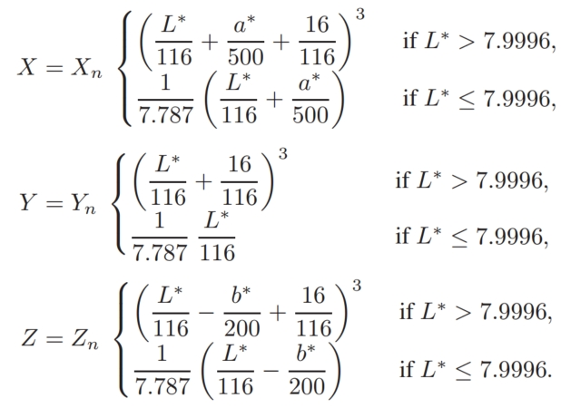

## 19.3 Chromatic Adaptation 半音适应

The CIELAB color space just described takes as input both a tristimulus value of the stimulus and the tristimulus value of light reflected off a white diffuse patch. As such, it forms the beginnings of a system in which the viewing environment is taken into account. 
刚刚描述的 CIELAB 色彩空间将刺激的三色刺激值和从白色漫射斑块反射的光的三色刺激值作为输入。 因此，它构成了考虑观看环境的系统的开端。

The environment in which we observe objects and images has a large influence on how we perceive those objects. The range of viewing environments that we encounter in daily life is very large, from sunlight to starlight and from candlelight to fluorescent light. The lighting conditions not only constitute a very large range in the amount of light that is present, but also vary greatly in the color of the emitted light.
我们观察物体和图像的环境对我们感知这些物体的方式有很大影响。 我们在日常生活中遇到的观看环境范围非常广，从阳光到星光，从烛光到荧光灯。 照明条件不仅在存在的光量方面构成非常大的范围，而且在发出的光的颜色方面也有很大的变化。

The human visual system accommodates these changes in the environment through a process called adaptation. Three different types of adaptation can be distinguished, namely light adaptation, dark adaptation, and chromatic adaptation. Light adaptation refers to the changes that occur when we move from a very dark to a very light environment. When this happens, at first we are dazzled by the light, but soon we adapt to the new situation and begin to distinguish objects in our environment. Dark adaptation refers to the opposite—when we go from a light environment to a dark environment. At first, we see very little, but after a given amount of time, details will start to emerge. The time needed to adapt to the dark is generally much longer than for light adaptation. 
人类视觉系统通过称为适应的过程来适应环境中的这些变化。 可以区分三种不同类型的适应，即光适应、暗适应和色适应。 光适应是指当我们从非常黑暗的环境移动到非常明亮的环境时发生的变化。 当这种情况发生时，一开始我们会被光线弄得眼花缭乱，但很快我们就适应了新的情况并开始区分环境中的物体。 暗适应指的是相反的情况——当我们从明亮的环境进入黑暗的环境时。 起初，我们看到的很少，但经过一段时间后，细节就会开始显现。 适应黑暗所需的时间通常比适应光所需的时间长得多。

Chromatic adaptation refers to our ability to adapt, and largely ignore, variations in the color of the illumination. Chromatic adaptation is, in essence, the biological equivalent of the white balancing operation that is available on most modern cameras. The human visual system effectively normalizes the viewing conditions to present a visual experience that is fairly consistent. Thus, we exhibit a certain amount of color constancy: object reflectances appear relatively constant despite variations in illumination. 
色彩适应是指我们适应并在很大程度上忽略照明颜色变化的能力。 本质上，色彩适应在生物学上相当于大多数现代相机上提供的白平衡操作。 人类视觉系统有效地标准化观看条件，以呈现相当一致的视觉体验。 因此，我们表现出一定程度的颜色恒定性：尽管照明发生变化，物体反射率仍显得相对恒定。

Although we are able to largely ignore changes in viewing environment, we are not able to do so completely. For instance, colors appear much more colorful on a sunny day than they do on a cloudy day. Although the appearances have changed, we do not assume that object reflectance's themselves have actually changed their physical properties. We thus understand that the lighting conditions have influenced the overall color appearance. Nonetheless, color constancy does apply to chromatic content. Chromatic adaptation allows white objects to appear white for a large number of lighting conditions, as shown in Figure 19.9.
虽然我们可以在很大程度上忽略观看环境的变化，但我们不能完全做到这一点。 例如，颜色在晴天比在阴天显得更加丰富多彩。 尽管外观发生了变化，但我们并不认为物体反射率本身实际上改变了它们的物理属性。 因此我们了解到照明条件影响了整体颜色外观。 尽管如此，颜色恒常性确实适用于彩色内容。 色彩适应允许白色物体在大量照明条件下呈现白色，如图 19.9 所示。
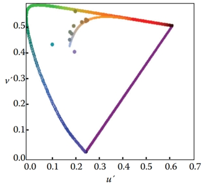
Figure 19.9. A series of light sources plotted in the CIE $u'v'$ chromaticity diagram. A white piece of paper illuminated by any of these light sources maintains a white color appearance. 
图 19.9。 在 CIE $u'v'$ 色度图中绘制的一系列光源。 一张白色的纸在任何这些光源的照射下都会保持白色的外观。

Computational models of chromatic adaptation tend to focus on the gain control mechanism in the cones. One of the simplest models assumes that each cone adapts independently to the energy that it absorbs. This means that different cone types adapt differently dependent on the spectrum of the light being absorbed. Such adaptation can then be modeled as an adaptive and independent rescaling of the cone signals:
色适应的计算模型倾向于关注锥体中的增益控制机制。 最简单的模型之一假设每个锥体独立地适应其吸收的能量。 这意味着不同的锥体类型根据被吸收的光的光谱进行不同的适应。 然后，这种适应可以被建模为锥体信号的自适应且独立的重新缩放：
$$
L_a = α L, \\
M_a = β M, \\
S_a = γ S,
$$
where $(L_a, M_a, S_a)$ are the chromatically adapted cone signals, and α, β, and γ are the independent gain controls which are determined by the viewing environment. This type of independent adaptation is also known as von-Kries adaptation. An example is shown in Figure 19.10. 
其中 $(L_a, M_a, S_a)$ 是色度适应的锥体信号，α、β 和 γ 是由观看环境确定的独立增益控制。 这种类型的独立适应也称为 von-Kries 适应。 图 19.10 显示了一个示例。
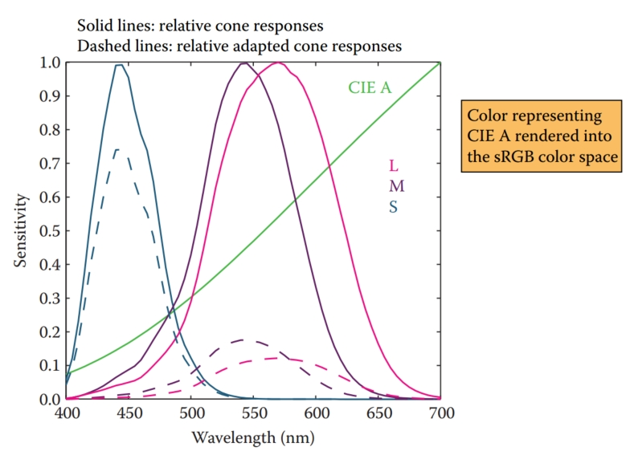
Figure 19.10. An example of von Kries–style independent photoreceptor gain control. The relative cone responses (solid line) and the relative adapted cone responses to CIE illuminant A (dashed) are shown. The separate patch of color represents CIE illuminant A rendered into the sRGB color space.
图 19.10。 冯·克里斯式独立感光器增益控制的一个例子。 显示了相对锥体响应（实线）和对 CIE 光源 A（虚线)的相对适应锥体响应。 单独的色块代表渲染到 sRGB 色彩空间的 CIE 光源 A。

The adapting illumination can be measured off a white surface in the scene. In the ideal case, this would be a Lambertian surface. In a digital image, the adapting illumination can also be approximated as the maximum tristimulus values of the scene. The light measured or computed in this manner is the adapting white, given by $(L_w, M_w, S_w)$. Von Kries adaptation is then simply a scaling by the reciprocal of the adapting white, carried out in cone response space: 
可以在场景中的白色表面上测量适应照明。 在理想情况下，这将是朗伯曲面。 在数字图像中，自适应照明也可以近似为场景的最大三刺激值。 以这种方式测量或计算的光是适应白光，由 $(L_w, M_w, S_w)$ 给出。 那么，Von Kries 适应只是在锥体响应空间中进行的适应白的倒数的缩放：
$$
\begin{bmatrix}
L_a\\ M_a\\ S_a
\end{bmatrix} = \begin{bmatrix}
\frac{1}{L_w} & 0 & 0 \\
0 & \frac{1}{M_w} & 0 \\
0 & 0 & \frac{1}{S_w}
\end{bmatrix}\begin{bmatrix}
L \\M \\S
\end{bmatrix}
$$
In many cases, we are interested in what stimulus should be generated under one illumination to match a given color under a different illumination. For example, if we have a colored patch illuminated by daylight, we may ask ourselves what tristimulus values should be generated to create a matching color patch that will be illuminated by incandescent light. 
在许多情况下，我们感兴趣的是在一种照明下应该产生什么刺激来匹配不同照明下的给定颜色。 例如，如果我们有一个被日光照亮的色块，我们可能会问自己应该生成什么三刺激值来创建将被白炽光照亮的匹配色块。

We are thus interested in computing corresponding colors, which can be achieved by cascading two chromatic adaptation calculations. In essence, the previously mentioned von Kries transform divides out the adapting illuminant—in our example, the daylight illumination. If we subsequently multiply in the incandescent illuminant, we have computed a corresponding color. If the two illuminants are given by $(L_{w,1}, M_{w,1}, S_{w,1})$ and $(L_{w,2}, M_{w,2}, S_{w,2})$, the corresponding color $(L_c, M_c, S_c)$ is given by
因此，我们感兴趣的是计算相应的颜色，这可以通过级联两个色彩适应计算来实现。 本质上，前面提到的冯·克里斯变换划分了适应光源——在我们的例子中，是日光照明。 如果我们随后乘以白炽光源，我们就计算出相应的颜色。 如果两个光源由 $(L_{w,1}, M_{w,1}, S_{w,1})$ 和 $(L_{w,2}, M_{w,2}, S_{ w,2})$，相应的颜色$(L_c, M_c, S_c)$由下式给出
$$
\begin{bmatrix}
L_c\\ M_c\\ S_c
\end{bmatrix} = \begin{bmatrix}
L_{w,2} & 0 & 0 \\
0 & M_{w,2} & 0 \\
0 & 0 & S_{w,2}
\end{bmatrix}
\begin{bmatrix}
\frac{1}{L_{w,1}} & 0 & 0 \\
0 & \frac{1}{M_{w,1}} & 0 \\
0 & 0 & \frac{1}{S_{w,1}}
\end{bmatrix}
\begin{bmatrix}
L \\M \\S
\end{bmatrix}
$$
There are several more complicated and, therefore, more accurate chromatic adaptation transform in existence (Reinhard et al., 2008). However, the simple von Kries model remains remarkably effective in modeling chromatic adaptation and can thus be used to achieve white balancing in digital images. 
存在几种更复杂、因此更准确的色适应变换（Reinhard et al., 2008）。 然而，简单的 von Kries 模型在模拟色彩适应方面仍然非常有效，因此可用于实现数字图像中的白平衡。

The importance of chromatic adaptation in the context of rendering, is that we have moved one step closer to taking into account the viewing environment of the observer, without having to correct for it by adjusting the scene and rerendering our imagery. Instead, we can model and render our scenes, and then, as an image postprocess, correct for the illumination of the viewing environment. To ensure that white balancing does not introduce artifacts, however, it is important to ensure that the image is rendered to a floating-point format. If rendered to traditional 8- bit image formats, the chromatic adaptation transform may amplify quantization errors.
渲染环境中色彩适应的重要性在于，我们在考虑观察者的观看环境方面又向前迈进了一步，而无需通过调整场景和重新渲染图像来进行纠正。 相反，我们可以对场景进行建模和渲染，然后作为图像后处理，校正观看环境的照明。 然而，为了确保白平衡不会引入伪影，确保将图像渲染为浮点格式非常重要。 如果渲染为传统的 8 位图像格式，色适应变换可能会放大量化误差。

## 19.4 Color Appearance 颜色外观

While colorimetry allows us to accurately specify and communicate color in a device-independent manner, and chromatic adaptation allows us to predict color matches across changes in illumination, these tools are still insufficient to describe what colors actually look like. 
虽然比色法使我们能够以独立于设备的方式准确地指定和传达颜色，并且色彩适应使我们能够预测照明变化下的颜色匹配，但这些工具仍然不足以描述颜色的实际外观。

To predict the actual perception of an object, we need to know more information about the environment and take that information into account. The human visual system is constantly adapting to its environment, which means that the perception of color will be strongly influenced by such changes. Color appearance models take into account measurements of the stimulus itself, as well as the viewing environment. This means that the resulting description of color is independent of viewing condition. 
为了预测对物体的实际感知，我们需要了解更多有关环境的信息并将这些信息考虑在内。 人类视觉系统不断适应其环境，这意味着对颜色的感知将受到这种变化的强烈影响。 颜色外观模型考虑了刺激本身以及观看环境的测量。 这意味着所得到的颜色描述与观看条件无关。

The importance of color appearance modeling can be seen in the following example. Consider an image being displayed on an LCD screen. When making a print of the same image and viewing it in a different context, more often than not the image will look markedly different. Color appearance models can be used to predict the changes required to generate an accurate cross-media color reproduction (Fairchild, 2005). 
从下面的例子可以看出颜色外观建模的重要性。 考虑 LCD 屏幕上显示的图像。 当打印相同的图像并在不同的环境中查看它时，图像通常看起来会明显不同。 颜色外观模型可用于预测生成准确的跨媒体颜色再现所需的变化（Fairchild，2005）。

Although color appearance modeling offers important tools for color reproduction, actual implementations tend to be relatively complicated and cumbersome in practical use. It can be anticipated that this situation may change over time. However, until then, we leave their description to more specialized textbooks (Fairchild, 2005). 
尽管颜色外观建模为颜色再现提供了重要的工具，但实际实现在实际使用中往往相对复杂和繁琐。 可以预见，随着时间的推移，这种情况可能会发生变化。 然而，在那之前，我们将它们的描述留给更专业的教科书（Fairchild，2005）。

## Notes 注释

Of all the books on color theory, Reinhard et al.’s work (Reinhard et al., 2008) is most directly geared toward engineering disciplines, including computer graphics, computer vision, and image processing. Other general introductions to color theory are given by Berns (Berns, 2000) and Stone (Stone, 2003). Wyszecki and Stiles have produced a comprehensive volume of data and formulae, forming an indispensable reference work (Wyszecki & Stiles, 2000). For color reproduction, we recommend Hunt’s book (Hunt, 2004). Color appearance models are comprehensively described in Fairchild’s book (Fairchild, 2005). For color issues related to video and HDTV Poynton’s book is essential (Poynton, 2003).
在所有关于色彩理论的书籍中，Reinhard 等人的著作（Reinhard 等人，2008）最直接面向工程学科，包括计算机图形学、计算机视觉和图像处理。 Berns (Berns, 2000) 和 Stone (Stone, 2003) 对色彩理论进行了其他一般介绍。 Wyszecki 和 Stiles 提供了大量的数据和公式，形成了不可缺少的参考书（Wyszecki & Stiles，2000）。 对于色彩再现，我们推荐 Hunt 的书（Hunt，2004）。 Fairchild 的书中全面描述了颜色外观模型（Fairchild，2005）。 对于与视频和 HDTV 相关的色彩问题，Poynton 的书至关重要（Poynton，2003）。