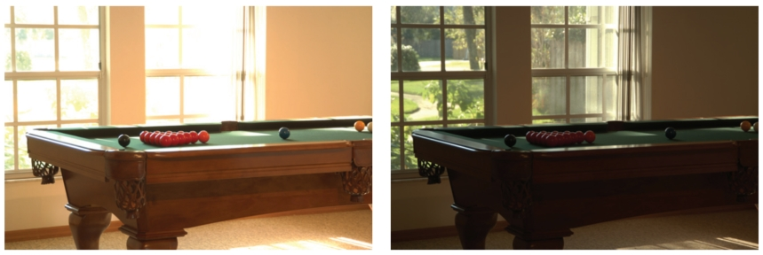
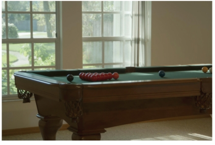
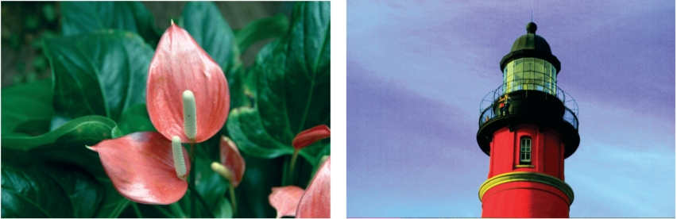
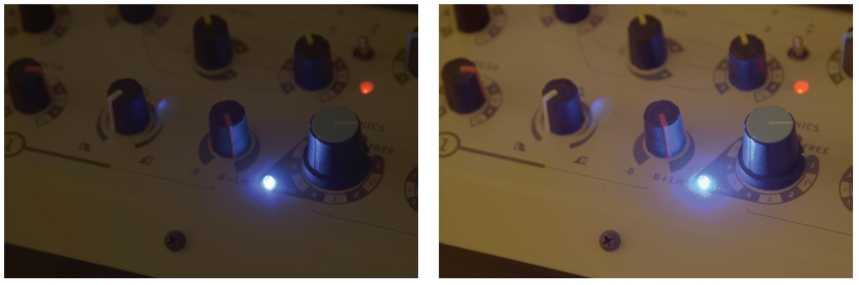
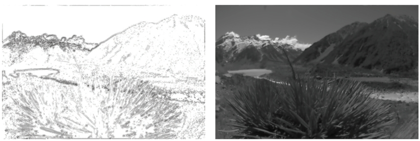

# 21  Tone Reproduction   音调再现

As discussed in Chapter 20, the human visual system adapts to a wide range of viewing conditions. Under normal viewing, we may discern a range of around 4 to 5 log units of illumination, i.e., the ratio between brightest and darkest areas where we can see detail may be as large as 100,000 : 1. Through adaptation processes, we may adapt to an even larger range of illumination. We call images that are matched to the capabilities of the human visual system high dynamic range. 
正如第 20 章所讨论的，人类视觉系统适应各种观看条件。 在正常观看下，我们可以辨别大约 4 到 5 个对数单位的照度范围，即我们可以看到细节的最亮和最暗区域之间的比率可能高达 100,000 : 1。通过适应过程，我们可以适应 更大的照明范围。 我们将与人类视觉系统能力相匹配的图像称为高动态范围。

Visual simulations routinely produce images with a high dynamic range (Ward Larson & Shakespeare, 1998). Recent developments in image-capturing techniques allow multiple exposures to be aligned and recombined into a single high dynamic range image (Debevec & Malik, 1997). Multiple exposure techniques are also available for video. In addition, we expect future hardware to be able to photograph or film high dynamic range scenes directly. In general, we may think of each pixel as a triplet of three floating point numbers. 
视觉模拟通常会产生高动态范围的图像（Ward Larson & Shakespeare，1998）。 图像捕捉技术的最新发展允许将多次曝光对齐并重新组合成单个高动态范围图像（Debevec＆Malik，1997）。 多重曝光技术也可用于视频。 此外，我们期望未来的硬件能够直接拍摄或拍摄高动态范围场景。 一般来说，我们可以将每个像素视为三个浮点数的三元组。

As it is becoming easier to create high dynamic range imagery, the need to display such data is rapidly increasing. Unfortunately, most current display devices, monitors and printers, are only capable of displaying around 2 log units of dynamic range. We consider such devices to be of low dynamic range. Most images in existence today are represented with a byte-per-pixel-per-color channel, which is matched to current display devices, rather than to the scenes they represent. 
随着创建高动态范围图像变得越来越容易，显示此类数据的需求正在迅速增加。 不幸的是，大多数当前的显示设备、监视器和打印机只能显示大约 2 个对数单位的动态范围。 我们认为此类设备的动态范围较低。 当今存在的大多数图像都是用每像素每颜色字节的通道表示的，该通道与当前的显示设备匹配，而不是与它们所表示的场景匹配。

Typically, low dynamic range images are not able to represent scenes without loss of information. A common example is an indoor room with an outdoor area visible through the window. Humans are easily able to see details of both the indoor part and the outside part. A conventional photograph typically does not capture this full range of information—the photographer has to choose whether the indoor or the outdoor part of the scene is properly exposed (see Figure 21.1). These decisions may be avoided by using high dynamic range imaging and preparing these images for display using techniques described in this chapter (see Figure 21.2).
通常，低动态范围图像无法在不丢失信息的情况下表示场景。 一个常见的例子是室内房间，通过窗户可以看到室外区域。 人类可以轻松地看到室内部分和室外部分的细节。 传统的照片通常无法捕获全部信息——摄影师必须选择场景的室内或室外部分是否正确曝光（见图 21.1）。 通过使用高动态范围成像并使用本章描述的技术准备这些图像以供显示，可以避免这些决定（参见图 21.2）。

Figure 21.1. With conventional photography, some parts of the scene may be under- or overexposed. To visualize the snooker table, the view through the window is burned out in the left image. On the other hand, the snooker table will be too dark if the outdoor part of this scene is properly exposed. Compare with Figure 21.2, which shows a high dynamic range image prepared for display using a tone reproduction algorithm.
图 21.1。 使用传统摄影时，场景的某些部分可能曝光不足或过度。 为了可视化斯诺克台球桌，透过窗户看到的景色在左图中被烧掉了。 另一方面，如果该场景的室外部分曝光得当，斯诺克台球桌就会太暗。 与图 21.2 相比，图 21.2 显示了使用色调再现算法准备显示的高动态范围图像。

Figure 21.2. A high dynamic range image tonemapped for display using a recent tone reproduction operator (Reinhard & Devlin, 2005). In this image, both the indoor part and the view through the window are properly exposed.
图 21.2。 使用最新的色调再现算子进行显示色调映射的高动态范围图像（Reinhard & Devlin，2005)。 在这张图片中，室内部分和透过窗户看到的景色都得到了适当的曝光。

There are two strategies available to display high dynamic range images. First, we may develop display devices which can directly accommodate a high dynamic range (Seetzen, Whitehead, & Ward, 2003; Seetzen et al., 2004). Second, we may prepare high dynamic range images for display on low dynamic range display devices (Upstill, 1985). This is currently the more common approach and the topic of this chapter. Although we foresee that high dynamic range display devices will become widely used in the (near) future, the need to compress the dynamic range of an image may diminish, but will not disappear. In particular, printed media such as this book are, by their very nature, low dynamic range. 
有两种策略可用于显示高动态范围图像。 首先，我们可以开发可以直接适应高动态范围的显示设备（Seetzen、Whitehead 和 Ward，2003；Seetzen 等人，2004）。 其次，我们可以准备高动态范围图像以在低动态范围显示设备上显示（Upstill，1985）。 这是目前比较常见的做法，也是本章的主题。 尽管我们预见高动态范围显示设备将在（不久的）将来广泛使用，但压缩图像动态范围的需求可能会减少，但不会消失。 特别是，像本书这样的印刷媒体本质上是低动态范围的。

Compressing the range of values of an image for the purpose of display on a low dynamic range display device is called tonemapping or tone reproduction. A simple compression function would be to normalize an image (see Figure 21.3 (left)). This constitutes a linear scaling which tends to be sufficient only if the dynamic range of the image is only marginally higher than the dynamic range of the display device. For images with a higher dynamic range, small intensity differences will be quantized to the same display value such that visible details are lost. In Figure 21.3 (middle) all pixel values larger than a user-specified maximum are set to this maximum (i.e., they are clamped). This makes the normalization less dependent on noisy outliers, but here we lose information in the bright areas of the image. For comparison, Figure 21.3 (right) is a tonemapped version showing detail in both the dark and the bright regions. 
为了在低动态范围显示设备上显示而压缩图像的值范围称为色调映射或色调再现。 一个简单的压缩函数是标准化图像（见图 21.3（左））。 这构成了线性缩放，仅当图像的动态范围仅略微高于显示设备的动态范围时，线性缩放才趋于足够。 对于具有较高动态范围的图像，小的强度差异将被量化为相同的显示值，从而导致可见细节丢失。 在图 21.3（中）中，所有大于用户指定最大值的像素值都设置为该最大值（即，它们被钳位）。 这使得归一化更少依赖于噪声异常值，但在这里我们丢失了图像明亮区域的信息。 为了进行比较，图 21.3（右）是一个色调映射版本，显示了黑暗和明亮区域的细节。

Figure 21.3. Linear scaling of high dynamic range images to fit a given display device may cause significant detail to be lost (left and middle). The left image is linearly scaled. In the middle image high values are clamped. For comparison, the right image is tonemapped, allowing details in both bright and dark regions to be visible.
图 21.3。 对高动态范围图像进行线性缩放以适应给定的显示设备可能会导致大量细节丢失（左图和中图)。 左图是线性缩放的。 在中间图像中，高值被限制。 为了进行比较，右侧图像经过色调映射，使得明亮和黑暗区域的细节都可见。

In general, linear scaling will not be appropriate for tone reproduction. The key issue in tone reproduction is then to compress an image while at the same time preserving one or more attributes of the image. Different tone reproduction algorithms focus on different attributes such as contrast, visible detail, brightness, or appearance.
一般来说，线性缩放不适合色调再现。 色调再现的关键问题是压缩图像，同时保留图像的一个或多个属性。 不同的色调再现算法侧重于不同的属性，例如对比度、可见细节、亮度或外观。

Ideally, displaying a tonemapped image on a low dynamic range display device would create the same visual response in the observer as the original scene. Given the limitations of display devices, this will not be achievable, although we could aim for approximating this goal as closely as possible.
理想情况下，在低动态范围显示设备上显示色调映射图像将在观察者中产生与原始场景相同的视觉响应。 考虑到显示设备的限制，这是不可能实现的，尽管我们可以尽可能接近这个目标。

As an example, we created the high dynamic range image shown in Figure 21.4. This image was then tonemapped and displayed on a display device. The display device itself was then placed in the scene such that it displays its own background (Figure 21.5). In the ideal case, the display should appear transparent. Dependent on the quality of the tone reproduction operator, as well as the nature of the scene being depicted, this goal may be more or less achievable.
作为示例，我们创建了如图 21.4 所示的高动态范围图像。 然后对该图像进行色调映射并显示在显示设备上。 然后将显示设备本身放置在场景中，使其显示自己的背景（图 21.5）。 在理想情况下，显示屏应呈现透明。 根据色调再现操作员的质量以及所描绘的场景的性质，这个目标或多或少可以实现。

Figure 21.4. Image used for demonstrating the goal of tone reproduction in Figure 21.5.
图 21.4。 图 21.5 中用于演示色调再现目标的图像。

Figure 21.5. After tonemapping the image in Figure 21.4 and displaying it on a monitor, the monitor is placed in the scene approximately at the location where the image was taken. Dependent on the quality of the tone reproduction operator, the result should appear as if the monitor is transparent.
图 21.5。 在对图 21.4 中的图像进行色调映射并将其显示在监视器上之后，将监视器放置在场景中大约拍摄图像的位置处。 根据色调再现操作器的质量，结果应该看起来就像监视器是透明的一样。

## 21.1 Classification 分类

Although it would be possible to classify tone reproduction operators by which attribute they aim to preserve, or for which task they were developed, we classify algorithms according to their general technique. This will enable us to show the differences and similarities between a significant number of different operators, and so, hopefully, contribute to the meaningful selection of specific operators for given tone reproduction tasks. 
尽管可以根据音调再现操作符旨在保留的属性或它们开发的任务来对它们进行分类，但我们根据其通用技术对算法进行分类。 这将使我们能够展示大量不同操作符之间的差异和相似之处，因此，希望有助于为给定的音调再现任务有意义地选择特定操作符。

The main classification scheme we follow hinges upon the realization that tone reproduction operators are based on insights gained from various disciplines. In particular, several operators are based on knowledge of human visual perception. 
我们遵循的主要分类方案取决于音调再现操作符基于从不同学科获得的见解的认识。 特别是，一些运算符是基于人类视觉感知的知识。

The human visual system detects light using photoreceptors located in the retina. Light is converted to an electrical signal which is partially processed in the retina and then transmitted to the brain. Except for the first few layers of cells in the retina, the signal derived from detected light is transmitted using impulse trains. The information-carrying quantity is the frequency with which these electrical pulses occur. 
人类视觉系统使用位于视网膜的感光器来检测光。 光被转换为电信号，该信号在视网膜中进行部分处理，然后传输到大脑。 除了视网膜中的前几层细胞外，检测到的光产生的信号通过脉冲序列传输。 信息承载量是这些电脉冲发生的频率。

The range of light that the human visual system can detect is much larger than the range of frequencies employed by the human brain to transmit information. Thus, the human visual system effortlessly solves the tone reproduction problem—a large range of luminances is transformed into a small range of frequencies of impulse trains. Emulating relevant aspects of the human visual system is therefore a worthwhile approach to tone reproduction; this approach is explained in more detail in Section 21.7.
人类视觉系统可以检测到的光范围远大于人脑传输信息所采用的频率范围。 因此，人类视觉系统毫不费力地解决了色调再现问题——大范围的亮度被转换成小范围的脉冲序列频率。 因此，模拟人类视觉系统的相关方面是一种有价值的色调再现方法； 第 21.7 节更详细地解释了这种方法。

A second class of operators is grounded in physics. Light interacts with surfaces and volumes before being absorbed by the photoreceptors. In computer graphics, light interaction is generally modeled by the rendering equation. For purely diffuse surfaces, this equation may be simplified to the product between light incident upon a surface (illuminance), and this surface’s ability to reflect light (reflectance) (Oppenheim, Schafer, & Stockham, 1968). 
第二类运算符以物理学为基础。 光在被感光器吸收之前与表面和体积相互作用。 在计算机图形学中，光交互通常通过渲染方程来建模。 对于纯漫射表面，该方程可以简化为入射到表面的光（照度）与该表面反射光的能力（反射率）之间的乘积（Oppenheim、Schafer 和 Stockham，1968）。

Since reflectance is a passive property of surfaces, for diffuse surfaces it is, by definition, low dynamic range—typically between 0.005 and 1 (Stockham, 1972). The reflectance of a surface cannot be larger than 1, since then it would reflect more light than was incident upon the surface. Illuminance, on the other hand, can produce arbitrarily large values and is limited only by the intensity and proximity of the light sources. 
由于反射率是表面的被动属性，因此对于漫反射表面来说，根据定义，它的动态范围较低，通常在 0.005 到 1 之间（Stockham，1972）。 表面的反射率不能大于 1，因为这样它会反射比入射到表面上的光更多的光。 另一方面，照度可以产生任意大的值，并且仅受光源的强度和接近度的限制。

The dynamic range of an image is thus predominantly governed by the illuminance component. In the face of diffuse scenes, a viable approach to tone reproduction may therefore be to separate reflectance from illuminance, compress the illuminance component, and then recombine the image. 
因此，图像的动态范围主要由照度分量决定。 因此，面对漫射场景，一种可行的色调再现方法可能是将反射率与照度分开，压缩照度分量，然后重新组合图像。

However, the assumption that all surfaces in a scene are diffuse is generally incorrect. Many high dynamic range images depict highlights and/or directly visible light sources (Figure 21.3). The luminance reflected by a specular surface may be almost as high as the light source it reflects. Various tone reproduction operators currently used split the image into a high dynamic range base layer and a low dynamic range detail layer. These layers would represent illuminance and reflectance if the depicted scene were entirely diffuse. For scenes containing directly visible light sources or specular highlights, separation into base and detail layers still allows the design of effective tone reproduction operators, although no direct meaning can be attached to the separate layers. Such operators are discussed in Section 21.5. 
然而，场景中所有表面都是漫反射的假设通常是不正确的。 许多高动态范围图像描绘了高光和/或直接可见的光源（图 21.3）。 镜面反射的亮度可能几乎与它反射的光源一样高。 目前使用的各种色调再现算子将图像分为高动态范围基础层和低动态范围细节层。 如果所描绘的场景完全漫射，这些层将代表照度和反射率。 对于包含直接可见光源或镜面高光的场景，分离为基础层和细节层仍然允许设计有效的色调再现操作符，尽管不能将直接含义附加到单独的层上。 此类运算符将在第 21.5 节中讨论。

## 21.2 Dynamic Range 动态范围

Conventional images are stored with one byte per pixel for each of the red, green and blue components. The dynamic range afforded by such an encoding depends on the ratio between smallest and largest representable value, as well as the step size between successive values. Thus, for low dynamic range images, there are only 256 different values per color channel. 
传统图像的红色、绿色和蓝色分量中的每一个都以每个像素一个字节的方式存储。 这种编码提供的动态范围取决于最小和最大可表示值之间的比率，以及连续值之间的步长。 因此，对于低动态范围图像，每个颜色通道只有 256 个不同的值。

Figure 21.6. Dynamic range of 2.65 $log_2$ units.
图 21.6。 动态范围为 2.65 $log_2$ 单位。

High dynamic range images encode a significantly larger set of possible values; the maximum representable value may be much larger and the step size between successive values may be much smaller. The file size of high dynamic range images is therefore generally larger as well, although at least one standard (the OpenEXR high dynamic range file format (Kainz, Bogart, & Hess, 2003)) includes a very capable compression scheme. 
高动态范围图像编码了一组明显更大的可能值； 最大可表示值可能大得多，并且连续值之间的步长可能小得多。 因此，高动态范围图像的文件大小通常也较大，尽管至少有一个标准（OpenEXR 高动态范围文件格式（Kainz、Bogart 和 Hess，2003））包含功能非常强大的压缩方案。

Figure 21.7. Dynamic range of 3.96 $log_2$ units. 
图 21.7。 动态范围为 3.96 $log_2$ 单位。

A different approach to limit file sizes is to apply a tone reproduction operator to the high dynamic data. The result may then be encoded in JPEG format. In addition, the input image may be divided pixel-wise by the tonemapped image. The result of this division can then be subsampled and stored as a small amount of data in the header of the same JPEG image (G. Ward & Simmons, 2004). The file size of such sub-band encoded images is of the same order as conventional JPEG encoded images. Display programs can display the JPEG image directly or may reconstruct the high dynamic range image by multiplying the tonemapped image with the data stored in the header. 
限制文件大小的另一种方法是将色调再现运算符应用于高动态数据。 然后可以将结果编码为 JPEG 格式。 另外，输入图像可以按像素方式除以色调映射图像。 然后，可以对除法的结果进行二次采样，并将其作为少量数据存储在同一 JPEG 图像的标头中（G. Ward & Simmons，2004）。 这种子带编码图像的文件大小与传统的JPEG编码图像具有相同的量级。 显示程序可以直接显示 JPEG 图像，也可以通过将色调映射图像与标头中存储的数据相乘来重建高动态范围图像。

Figure 21.8. Dynamic range of 4.22 $log_2$ units. 
图 21.8。 动态范围为 4.22 $log_2$ 单位。

In general, the combination of smallest step size and ratio of the smallest and largest representable values determines the dynamic range that an image encoding scheme affords. For computer-generated imagery, an image is typically stored as a triplet of floating point values before it is written to file or displayed on screen, although more efficient encoding schemes are possible (Reinhard, Ward, Debevec, & Pattanaik, 2005). Since most display devices are still fitted with eightbit D/A converters, we may think of tone reproduction as the mapping of floating point numbers to bytes such that the result is displayable on a low dynamic range display device. 
一般来说，最小步长以及最小和最大可表示值的比率的组合决定了图像编码方案提供的动态范围。 对于计算机生成的图像，图像通常在写入文件或在屏幕上显示之前存储为浮点值的三元组，尽管可以使用更有效的编码方案（Reinhard、Ward、Debevec 和 Pattanaik，2005）。 由于大多数显示设备仍然配备有八位 D/A 转换器，因此我们可以将色调再现视为浮点数到字节的映射，以便结果可以在低动态范围显示设备上显示。

Figure 21.9. Dynamic range of 5.01 $log_2$ units. 
图 21.9。 动态范围为 5.01 $log_2$ 单位。

The dynamic range of individual images is generally smaller, and is determined by the smallest and largest luminances found in the scene. A simplistic approach to measure the dynamic range of an image may therefore compute the ratio between the largest and smallest pixel value of an image. Sensitivity to outliers may be reduced by ignoring a small percentage of the darkest and brightest pixels. 
单个图像的动态范围通常较小，并且由场景中发现的最小和最大亮度决定。 因此，测量图像动态范围的简单方法可以计算图像的最大和最小像素值之间的比率。 通过忽略一小部分最暗和最亮的像素，可以降低对异常值的敏感度。

Figure 21.10. Dynamic range of 6.56 $log_2$ units. 
图 21.10。 动态范围为 6.56 $log_2$ 单位。

Alternatively, the same ratio may be expressed as a difference in the logarithmic domain. This measure is less sensitive to outliers. The images shown in the margin on this page are examples of images with different dynamic ranges. Note that the night scene in this case does not have a smaller dynamic range than the day scene. While all the values in the night scene are smaller, the ratio between largest and smallest values is not. 
或者，相同的比率可以表示为对数域中的差。 该指标对异常值不太敏感。 本页页边空白处显示的图像是具有不同动态范围的图像示例。 请注意，这种情况下的夜景的动态范围并不比白天场景小。 虽然夜景中的所有值都较小，但最大值与最小值之间的比率却并非如此。

However, the recording device or rendering algorithm may introduce noise which will lower the useful dynamic range. Thus, a measurement of the dynamic range of an image should factor in noise. A better measure of dynamic range would therefore be a signal-to-noise ratio, expressed in decibels, as used in signal processing.
然而，记录设备或渲染算法可能会引入噪声，从而降低有用的动态范围。 因此，图像动态范围的测量应该考虑噪声。 因此，动态范围的更好衡量标准是信号处理中使用的以分贝表示的信噪比。

## 21.3 Color 颜色

Tone reproduction operators normally compress luminance values, rather than work directly on the red, green, and blue components of a color image. After these luminance values have been compressed into display values $L_d(x, y)$, a color image may be reconstructed by keeping the ratios between color channels the same as they were before compression (using s = 1) (Schlick, 1994b):
色调再现算子通常会压缩亮度值，而不是直接作用于彩色图像的红色、绿色和蓝色分量。 将这些亮度值压缩为显示值 $L_d(x, y)$ 后，可以通过保持颜色通道之间的比率与压缩前相同（使用 s = 1）来重建彩色图像（Schlick，1994b）：
$$
I_{r, d}(x, y) = (\frac{I_r(x, y)}{L_v(x, y)})^sL_d(x, y), \\
I_{g, d}(x, y) = (\frac{I_g(x, y)}{L_v(x, y)})^sL_d(x, y), \\
I_{b, d}(x, y) = (\frac{I_b(x, y)}{L_v(x, y)})^sL_d(x, y), \\
$$
The results frequently appear over-saturated, because human color perception is nonlinear with respect to overall luminance level. This means that if we view an image of a bright outdoor scene on a monitor in a dim environment, our eyes are adapted to the dim environment rather than the outdoor lighting. By keeping color ratios constant, we do not take this effect into account. 
结果经常显得过饱和，因为人类的色彩感知相对于整体亮度水平是非线性的。 这意味着，如果我们在昏暗的环境中在显示器上观看明亮的户外场景的图像，我们的眼睛会适应昏暗的环境，而不是户外照明。 通过保持颜色比率恒定，我们不考虑这种影响。

Alternatively, the saturation constant s may be chosen smaller than one. Such per-channel gamma correction may desaturate the results to an appropriate level, as shown in Figure 21.11 (Fattal, Lischinski, & Werman, 2002). A more comprehensive solution is to incorporate ideas from the field of color appearance modeling into tone reproduction operators (Pattanaik, Ferwerda, Fairchild, & Greenberg, 1998; Fairchild & Johnson, 2004; Reinhard & Devlin, 2005).
或者，饱和常数s可以选择为小于1。 这种每通道伽马校正可能会将结果去饱和至适当的水平，如图 21.11 所示（Fattal、Lischinski 和 Werman，2002）。 更全面的解决方案是将色彩外观建模领域的想法融入色调再现算子中（Pattanaik、Ferwerda、Fairchild 和 Greenberg，1998；Fairchild 和 Johnson，2004；Reinhard 和 Devlin，2005）。

Figure 21.11. Per-channel gamma correction may desaturate the image. The left image was desaturated with a value of s = 0.5. The right image was not desaturated (s = 1). 
图 21.11。 每通道伽玛校正可能会使图像去饱和。 左图的饱和度为 s = 0.5。 右侧图像未去饱和 (s = 1)。 

Finally, if an example image with a representative color scheme is already available, this color scheme may be applied to a new image. Such a mapping of colors between images may be used for subtle color correction, such as saturation adjustment or for more creative color mappings. The mapping proceeds by converting both source and target images to a decorrelated color space. In such a color space, the pixel values in each color channel may be treated independently without introducing too many artifacts (Reinhard, Ashikhmin, Gooch, & Shirley, 2001). 
最后，如果具有代表性配色方案的示例图像已经可用，则可以将该配色方案应用于新图像。 图像之间的这种颜色映射可用于细微的颜色校正，例如饱和度调整或用于更具创意的颜色映射。 通过将源图像和目标图像转换为去相关的色彩空间来进行映射。 在这样的颜色空间中，可以独立处理每个颜色通道中的像素值，而不会引入太多伪影（Reinhard、Ashikhmin、Gooch 和 Shirley，2001）。

Mapping colors from one image to another in a decorrelated color space is then straightforward: compute the mean and standard deviation of all pixels in the source and target images for the three color channels separately. Then, shift and scale the target image so that in each color channel the mean and standard deviation of the target image is the same as the source image. The resulting image is then obtained by converting from the decorrelated color space to RGB and clamping negative pixels to zero. The dynamic range of the image may have changed as a result of applying this algorithm. It is therefore recommended to apply this algorithm on high dynamic range images and apply a conventional tone reproduction algorithm afterward. A suitable decorrelated color space is the opponent space from Section 19.2.4. 
在去相关的颜色空间中将颜色从一幅图像映射到另一幅图像非常简单：分别计算三个颜色通道的源图像和目标图像中所有像素的平均值和标准差。 然后，移动和缩放目标图像，以便在每个颜色通道中目标图像的均值和标准差与源图像相同。 然后通过从解相关的颜色空间转换为 RGB 并将负像素钳位为零来获得结果图像。 由于应用此算法，图像的动态范围可能会发生变化。 因此，建议在高动态范围图像上应用该算法，然后应用传统的色调再现算法。 合适的去相关色彩空间是第 19.2.4 节中的对手空间。

The result of applying such a color transform to the image in Figure 21.12 is shown in Figure 21.13.
将这种颜色变换应用于图 21.12 中的图像的结果如图 21.13 所示。

Figure 21.12. Image used for demonstrating the color transfer technique. Results are shown in Figures 21.13 and 21.31.
图 21.12。 用于演示颜色转移技术的图像。 结果如图 21.13 和 21.31 所示。

Figure 21.13. The image on the left is used to adjust the colors of the image shown in Figure 21.12. The result is shown on the right. 
图 21.13。 左边的图像用于调整图21.12所示图像的颜色。 结果如右图所示。

## 21.4 Image Formation 图像形成

For now, we assume that an image is formed as the result of light being diffusely reflected off of surfaces. Later in this chapter, we relax this constraint to scenes directly depicting light sources and highlights. The luminance $L_v$ of each pixel is then approximated by the following product:
现在，我们假设图像是由于光从表面漫反射而形成的。 在本章后面，我们将放宽对直接描绘光源和高光的场景的限制。 然后，每个像素的亮度 $L_v$ 通过以下乘积进行近似：
$L_v(x, y) = r(x, y)E_v(x, y).$

Here, r denotes the reflectance of a surface, and $E_v$ denotes the illuminance. The subscript v indicates that we are using photometrically weighted quantities. Alternatively, we may write this expression in the logarithmic domain (Oppenheim et al., 1968):
这里，r表示表面的反射率，$E_v$表示照度。 下标 v 表示我们正在使用光度加权量。 或者，我们可以在对数域中写出这个表达式（Oppenheim et al., 1968）：
$$
D(x, y) = log(L_v(x, y)) \\
= log(r(x, y) E_v(x, y)) \\
= log(r(x, y)) + log(E_v(x, y)).
$$
Photographic transparencies record images by varying the density of the material. In traditional photography, this variation has a logarithmic relation with luminance. Thus, in analogy with common practice in photography, we will use the term density representation (D) for log luminance. When represented in the log domain, reflectance and illuminance become additive. This facilitates separation of these two components, despite the fact that isolating either reflectance or illuminance is an under-constrained problem. In practice, separation is possible only to a certain degree and depends on the composition of the image. Nonetheless, tone reproduction could be based on disentangling these two components of image formation, as shown in the following two sections. 
照相透明胶片通过改变材料的密度来记录图像。 在传统摄影中，这种变化与亮度呈对数关系。 因此，与摄影中的常见做法类似，我们将使用术语密度表示 (D) 来表示对数亮度。 当在对数域中表示时，反射率和照度会相加。 尽管隔离反射率或照度是一个欠约束的问题，但这还是有利于这两个组件的分离。 实际上，分离只能在一定程度上进行，并且取决于图像的组成。 尽管如此，色调再现可以基于解开图像形成的这两个组成部分，如以下两节所示。

## 21.5 Frequency-Based Operators 基于频率的运算符

For typical diffuse scenes, the reflectance component tends to exhibit high spatial frequencies due to textured surfaces as well as the presence of surface edges. On the other hand, illuminance tends to be a slowly varying function over space. 
对于典型的漫反射场景，由于纹理表面以及表面边缘的存在，反射分量往往表现出高空间频率。 另一方面，照度往往是随空间缓慢变化的函数。

Since reflectance is low dynamic range and illuminance is high dynamic range, we may try to separate the two components. The frequency-dependence of both reflectance and illuminance provides a solution. We may, for instance, compute the Fourier transform of an image and attenuate only the low frequencies. This compresses the illuminance component while leaving the reflectance component largely unaffected—the very first digital tone reproduction operator known to us takes this approach (Oppenheim et al., 1968). 
由于反射率是低动态范围，而照度是高动态范围，我们可以尝试将这两个分量分开。 反射率和照度的频率依赖性提供了一个解决方案。 例如，我们可以计算图像的傅立叶变换并仅衰减低频。 这压缩了照度分量，同时使反射率分量基本上不受影响——我们所知的第一个数字色调再现算子就采用了这种方法（Oppenheim et al., 1968）。

More recently, other operators have also followed this line of reasoning. In particular, bilateral and trilateral filters were used to separate an image into base and detail layers (Durand & Dorsey, 2002; Choudhury & Tumblin, 2003). Both filters are edge-preserving smoothing operators which may be used in a variety of different ways. Applying an edge-preserving smoothing operator to a density image results in a blurred image in which sharp edges remain present (Figure 21.14 (left)). We may view such an image as a base layer. If we then pixel-wise divide the high dynamic range image by the base layer, we obtain a detail layer which contains all the high-frequency detail (Figure 21.14 (right)). 
最近，其他运营商也遵循了这一思路。 特别是，双边和三边过滤器用于将图像分离为基础层和细节层（Durand & Dorsey，2002；Choudhury & Tumblin，2003）。 两个滤波器都是边缘保留平滑算子，可以以多种不同的方式使用。 将边缘保留平滑算子应用于密度图像会产生模糊图像，其中仍存在锐利边缘（图 21.14（左））。 我们可以将这样的图像视为基础层。 如果我们将高动态范围图像按像素除以基础层，我们将获得包含所有高频细节的细节层（图 21.14（右））。

Figure 21.14. Bilateral filtering removes small details but preserves sharp gradients (left). The associated detail layer is shown on the right. 
图 21.14。 双边过滤消除了小细节，但保留了锐利的梯度（左)。 关联的细节层显示在右侧。

For diffuse scenes, base and detail layers are similar to representations of illuminance and reflectance. For images depicting highlights and light sources, this parallel does not hold. However, separation of an image into base and detail layers is possible regardless of the image’s content. By compressing the base layer before recombining into a compressed density image, a low dynamic range density image may be created (Figure 21.15). After exponentiation, a displayable image is obtained. 
对于漫反射场景，基础层和细节层类似于照度和反射率的表示。 对于描绘高光和光源的图像，这种相似之处并不成立。 然而，无论图像的内容如何，都可以将图像分为基础层和细节层。 通过在重新组合成压缩密度图像之前压缩基础层，可以创建低动态范围密度图像（图 21.15）。 求幂后，得到可显示的图像。

Figure 21.15. An image tonemapped using bilateral filtering. The base and detail layers shown in Figure 21.14 are recombined after compressing the base layer.
图 21.15。 使用双边滤波进行色调映射的图像。 压缩基础层后，基础层和细节层重新组合，如图 21.14 所示。

Edge-preserving smoothing operators may also be used to compute a local adaptation level for each pixel, which may be used in a spatially varying or local tone reproduction operator. We describe this use of bilateral and trilateral filters in Section 21.7.
边缘保留平滑算子还可以用于计算每个像素的局部适应水平，其可以在空间变化或局部色调再现算子中使用。 我们在第 21.7 节中描述了双边和三边过滤器的使用。

## 21.6 Gradient-Domain Operators  梯度域运算符

The arguments made for the frequency-based operators in the preceding section also hold for the gradient field. Assuming that no light sources are directly visible, the reflectance component will be a constant function with sharp spikes in the gradient field. Similarly, the illuminance component will cause small gradients everywhere.
上一节中针对基于频率的算子所做的论证也适用于梯度场。 假设没有直接可见的光源，则反射率分量将是梯度场中具有尖锐尖峰的常数函数。 同样，照度分量会在各处造成小梯度。

Humans are generally able to separate illuminance from reflectance in typical scenes. The perception of surface reflectance after discounting the illuminant is called lightness. To assess the lightness of an image depicting only diffuse surfaces, B. K. P. Horn was the first to separate reflectance and illuminance using a gradient field (Horn, 1974). He used simple thresholding to remove all small gradients and then integrated the image, which involves solving a Poisson equation using the Full Multigrid Method (Press, Teukolsky, Vetterling, & Flannery, 1992). 
在典型场景中，人类通常能够区分照度和反射率。 扣除光源后的表面反射率感知称为亮度。 为了评估仅描绘漫射表面的图像的亮度，B.K.P.Horn 是第一个使用梯度场分离反射率和照度的人（Horn，1974）。 他使用简单的阈值处理来删除所有小梯度，然后对图像进行积分，其中涉及使用完全多重网格方法求解泊松方程（Press、Teukolsky、Vetterling 和 Flannery，1992）。

The result is similar to an edge-preserving smoothing filter. This is according to expectation since Oppenheim’s frequency-based operator works under the same assumptions of scene reflectivity and image formation. In particular, Horn’s work was directly aimed at “mini-worlds of Mondrians,” which are simplified versions of diffuse scenes which resemble the abstract paintings by the famous Dutch painter Piet Mondrian. 
结果类似于边缘保留平滑滤波器。 这是符合预期的，因为奥本海姆基于频率的算子在场景反射率和图像形成的相同假设下工作。 特别是，霍恩的作品直接针对“蒙德里安的迷你世界”，这是漫射场景的简化版本，类似于荷兰著名画家皮特·蒙德里安的抽象画。

Horn’s work cannot be employed directly as a tone reproduction operator, since most high dynamic range images depict light sources. However, a relatively small variation will turn this work into a suitable tone reproduction operator. If light sources or specular surfaces are depicted in the image, then large gradients will be associated with the edges of light sources and highlights. These cause the image to have a high dynamic range. An example is shown in Figure 21.16, where the highlights on the snooker balls cause sharp gradients.
霍恩的工作不能直接用作色调再现算子，因为大多数高动态范围图像都描绘光源。 然而，相对较小的变化将使这项工作变成一个合适的音调再现操作器。 如果图像中描绘了光源或镜面，则光源和高光的边缘将出现大梯度。 这些使得图像具有高动态范围。 图 21.16 中显示了一个示例，其中斯诺克球上的高光导致了尖锐的渐变。

Figure 21.16. The image on the left (tonemapped using gradient-domain compression) shows a scene with highlights. These highlights show up as large gradients on the right, where the magnitude of the gradients is mapped to a grayscale (black is a gradient of 0, white is the maximum gradient in the image).
图 21.16。 左侧的图像（使用梯度域压缩进行色调映射）显示了带有高光的场景。 这些高光在右侧显示为大梯度，其中梯度的大小映射到灰度（黑色是梯度 0，白色是图像中的最大梯度)。

We could therefore compress a high dynamic range image by attenuating large gradients, rather than thresholding the gradient field. This approach was taken by Fattal et al. who showed that high dynamic range imagery may be successfully compressed by integrating a compressed gradient field (Figure 21.17) (Fattal et al., 2002). Fattal’s gradient-domain compression is not limited to diffuse scenes.
因此，我们可以通过衰减大梯度来压缩高动态范围图像，而不是对梯度场进行阈值化。 Fattal 等人采用了这种方法。 他表明，通过集成压缩梯度场可以成功压缩高动态范围图像（图 21.17）（Fattal 等，2002）。 Fattal 的梯度域压缩不仅限于漫反射场景。

Figure 21.17. An image tonemapped using gradient-domain compression. 
图 21.17。 使用梯度域压缩进行色调映射的图像。

## 21.7 Spatial Operators 空间运算符

In the following sections, we discuss tone reproduction operators which apply compression directly on pixels without transformation to other domains. Often global and local operators are distinguished. Tone reproduction operators in the former class change each pixel’s luminance values according to a compressive function which is the same for each pixel. The term global stems from the fact that many such functions need to be anchored to some values determined by analyzing the full image. In practice, most operators use the geometric average $\overline{L}_v$ to steer the compression:
在以下部分中，我们讨论直接对像素应用压缩而不转换到其他域的色调再现算子。 全球运营商和本地运营商通常是有区别的。 前一类中的色调再现算子根据每个像素相同的压缩函数来改变每个像素的亮度值。 术语“全局”源于这样一个事实：许多此类函数需要锚定到通过分析完整图像确定的某些值。 在实践中，大多数运算符使用几何平均值 $\overline{L}_v$ 来控制压缩：
$$
\overline{L}_v = exp(\frac{1}{N}\sum_{x,y}\log{(δ + L_v(x, y)} \ \ \ \ \ \ (21.1)
$$
In Equation (21.1), a small constant δ is introduced to prevent the average to become zero in the presence of black pixels. The geometric average is normally mapped to a predefined display value. The effect of mapping the geometric average to different display values is shown in Figure 21.18. Alternatively, sometimes the minimum or maximum image luminance is used. The main challenge faced in the design of a global operator lies in the choice of the compressive function. 
在方程（21.1）中，引入了一个小的常数δ，以防止在存在黑色像素的情况下平均值变为零。 几何平均值通常映射到预定义的显示值。 将几何平均值映射到不同显示值的效果如图21.18所示。 或者，有时使用最小或最大图像亮度。 全局算子设计面临的主要挑战在于压缩函数的选择。

Figure 21.18. Spatial tonemapping operator applied after mapping the geometric average to different display values (left: 0.12, right: 0.38). 
图 21.18。 将几何平均值映射到不同的显示值后应用空间色调映射运算符（左：0.12，右：0.38)。

On the other hand, local operators compress each pixel according to a specific compression function which is modulated by information derived from a selection of neighboring pixels, rather than the full image. The rationale is that a bright pixel in a bright neighborhood may be perceived differently than a bright pixel in a dim neighborhood. Design challenges in the development of a local operator involves choosing the compressive function, the size of the local neighborhood for each pixel, and the manner in which local pixel values are used. In general, local operators achieve better compression than global operators (Figure 21.19), albeit at a higher computational cost. 
另一方面，局部算子根据特定的压缩函数来压缩每个像素，该压缩函数是通过从相邻像素的选择而不是整个图像中导出的信息来调制的。 其基本原理是，明亮邻域中的亮像素可能与暗邻域中的亮像素被感知不同。 开发局部算子的设计挑战包括选择压缩函数、每个像素的局部邻域的大小以及局部像素值的使用方式。 一般来说，局部运算符比全局运算符实现更好的压缩（图 21.19），尽管计算成本更高。

Figure 21.19. A global tone reproduction operator (left) and a local tone reproduction operator (right) (Reinhard, Stark, Shirley, & Ferwerda, 2002) of each image. The local operator shows more detail; for example, the metal badge on the right shows better contrast and the highlights are crisper.
图 21.19。 每个图像的全局色调再现算子（左）和局部色调再现算子（右）（Reinhard、Stark、Shirley 和 Ferwerda，2002)。 当地运营商显示更多细节； 例如，右侧的金属徽章显示出更好的对比度，并且高光更清晰。

Both global and local operators are often inspired by the human visual system. Most operators employ one of two distinct compressive functions, which is orthogonal to the distinction between local and global operators. Display values $L_d(x, y)$ are most commonly derived from image luminances $L_v(x, y)$ by the following two functional forms:
全球和本地运营商都经常受到人类视觉系统的启发。 大多数运算符采用两种不同的压缩函数之一，这与局部运算符和全局运算符之间的区别正交。 显示值 $L_d(x, y)$ 通常通过以下两种函数形式从图像亮度 $L_v(x, y)$ 导出：
$$
L_d(x, y) = \frac{L_v(x, y)}{f(x, y)} \ \ \ \ (21.2) \\
L_d(x, y) = \frac{L_v(x, y)}{L_v(x, y) + f^n(x, y)} \ \ \ \ \ \ (21.3)
$$
In these equations, f(x, y) may either be a constant or a function which varies per pixel. In the former case, we have a global operator, whereas a spatially varying function f(x, y) results in a local operator. The exponent n is usually a constant which is fixed for a particular operator.
在这些方程中，f(x, y) 可以是常数，也可以是每个像素变化的函数。 在前一种情况下，我们有一个全局算子，而空间变化的函数 f(x, y) 则产生一个局部算子。 指数 n 通常是针对特定运算符固定的常数。

Equation (21.2) divides each pixel’s luminance by a value derived from either the full image or a local neighborhood. Equation (21.3) has an S-shaped curve on a log-linear plot and is called a sigmoid for that reason. This functional form fits data obtained from measuring the electrical response of photoreceptors to flashes of light in various species. In the following sections, we discuss both functional forms.
方程（21.2）将每个像素的亮度除以从完整图像或局部邻域导出的值。 方程（21.3）在对数线性图上有一条 S 形曲线，因此被称为 S 型曲线。 这种功能形式适合通过测量不同物种的光感受器对闪光的电响应获得的数据。 在以下部分中，我们将讨论这两种函数形式。

## 21.8 Division 除法

Each pixel may be divided by a constant to bring the high dynamic range image within a displayable range. Such a division essentially constitutes linear scaling, as shown in Figure 21.3. While Figure 21.3 shows ad-hoc linear scaling, this approach may be refined by employing psychophysical data to derive the scaling constant $f(x, y) = k$ in Equation (21.2) (G. J. Ward, 1994; Ferwerda, Pattanaik, Shirley, & Greenberg, 1996).
每个像素可以除以常数以使高动态范围图像处于可显示范围内。 这样的划分本质上构成了线性缩放，如图21.3所示。 虽然图 21.3 显示了临时线性标度，但可以通过使用心理物理学数据推导方程 (21.2) 中的标度常数 $f(x, y) = k$ 来完善此方法（G. J. Ward，1994；Ferwerda、Pattanaik、Shirley） ，＆格林伯格，1996）。

Alternatively, several approaches exist that compute a spatially varying divisor. In each of these cases, $f(x, y)$ is a blurred version of the image, i.e., $f(x, y) = L^{blur}_v (x, y)$. The blur is achieved by convolving the image with a Gaussian filter (Chiu et al., 1993; Rahman, Jobson, & Woodell, 1996). In addition, the computation of $f(x, y)$ by blurring the image may be combined with a shift in white point for the purpose of color appearance modeling (Fairchild & Johnson, 2002; G. M. Johnson & Fairchild, 2003; Fairchild & Johnson, 2004). 
或者，存在多种计算空间变化除数的方法。 在每种情况下，$f(x, y)$ 都是图像的模糊版本，即 $f(x, y) = L^{blur}_v (x, y)$。 模糊是通过将图像与高斯滤波器进行卷积来实现的（Chiu 等人，1993 年；Rahman、Jobson 和 Woodell，1996 年）。 此外，通过模糊图像计算 $f(x, y)$ 可以与白点偏移相结合，以实现色彩外观建模（Fairchild & Johnson, 2002；G. M. Johnson & Fairchild, 2003；Fairchild & Johnson） 约翰逊，2004）。

The size and the weight of the Gaussian filter has a profound impact on the resulting displayable image. The Gaussian filter has the effect of selecting a weighted local average. Tone reproduction is then a matter of dividing each pixel by its associated weighted local average. If the size of the filter kernel is chosen too small, then haloing artifacts will occur (Figure 21.20 (left)). Haloing is a common problem with local operators and is particularly evident when tone mapping relies on division.
高斯滤波器的尺寸和重量对最终的可显示图像具有深远的影响。 高斯滤波器具有选择加权局部平均值的作用。 色调再现就是将每个像素除以其相关的加权局部平均值。 如果滤波器内核的大小选择得太小，则会出现光晕伪影（图 21.20（左））。 光晕是本地运营商的常见问题，当色调映射依赖于划分时尤其明显。

Figure 21.20. Images tonemapped by dividing by Gaussian-blurred versions. The size of the filter kernel is 64 pixels for the left image and 512 pixels for the right image. For division-based algorithms, halo artifacts are minimized by choosing large filter kernels.
图 21.20。 通过除以高斯模糊版本进行色调映射的图像。 左图像的滤波器内核的大小为 64 像素，右图像的滤波器内核的大小为 512 像素。 对于基于除法的算法，通过选择大的滤波器内核可以最小化光晕伪影。

In general, haloing artifacts may be minimized in this approach by making the filter kernel large (Figure 21.20 (right)). Reasonable results may be obtained by choosing a filter size of at least one quarter of the image. Sometimes even larger filter kernels are desirable to minimize artifacts. Note, that in the limit, the filter size becomes as large as the image itself. In that case, the local operator becomes global, and the extra compression normally afforded by a local approach is lost. 
一般来说，通过增大滤波器内核，可以在此方法中最大程度地减少光晕伪影（图 21.20（右））。 通过选择至少图像四分之一的滤波器尺寸可以获得合理的结果。 有时甚至需要更大的滤波器内核来最小化伪影。 请注意，在极限情况下，滤波器尺寸会变得与图像本身一样大。 在这种情况下，本地运营商将成为全球运营商，并且通常由本地方法提供的额外压缩会丢失。

The functional form whereby each pixel is divided by a Gaussian-blurred pixel at the same spatial position thus requires an undesirable tradeoff between amount of compression and severity of artifacts. 
因此，每个像素除以相同空间位置处的高斯模糊像素的函数形式需要在压缩量和伪影严重性之间进行不期望的权衡。

## 21.9 Sigmoids  S 型函数

Equation (21.3) follows a different functional form from simple division, and, therefore, affords a different tradeoff between amount of compression, presence of artifacts, and speed of computation. 
方程（21.3）遵循与简单除法不同的函数形式，因此在压缩量、伪像的存在和计算速度之间提供了不同的权衡。

Sigmoids have several desirable properties. For very small luminance values, the mapping is approximately linear, so that contrast is preserved in dark areas of the image. The function has an asymptote at one, which means that the output mapping is always bounded between 0 and 1. 
Sigmoid 有几个理想的特性。 对于非常小的亮度值，映射近似线性，以便在图像的暗区域保留对比度。 该函数的渐近线为 1，这意味着输出映射始终限制在 0 和 1 之间。

In Equation (21.3), the function $f(x, y)$ may be computed as a global constant or as a spatially varying function. Following common practice in electrophysiology, we call $f(x, y)$ the semi-saturation constant. Its value determines which values in the input image are optimally visible after tonemapping. In particular, if we assume that the exponent n equals 1, then luminance values equal to the semi-saturation constant will be mapped to 0.5. The effect of choosing different semi-saturation constants is shown in Figure 21.21.
在方程（21.3）中，函数 $f(x, y)$ 可以计算为全局常数或空间变化函数。 按照电生理学的常见做法，我们将 $f(x, y)$ 称为半饱和常数。 它的值决定了输入图像中的哪些值在色调映射后最佳可见。 特别是，如果我们假设指数 n 等于 1，则等于半饱和常数的亮度值将映射为 0.5。 选择不同半饱和常数的效果如图21.21所示。

Figure 21.21. The choice of semi-saturation constant determines how input values are mapped to display values. 
图 21.21。 半饱和常数的选择决定了输入值如何映射到显示值。

The function $f(x, y)$ may be computed in several different ways (Reinhard et al., 2005). In its simplest form, f(x, y) is set to $\overline{L}_v/k$, so that the geometric average is mapped to user parameter k (Figure 21.22) (Reinhard et al., 2002). In this case, a good initial value for k is 0.18, although for particularly bright or dark scenes this value may be raised or lowered. Its value may be estimated from the image itself (Reinhard, 2003). The exponent $n$ in Equation (21.3) may be set to 1.
函数 $f(x, y)$ 可以用几种不同的方式计算（Reinhard et al., 2005）。 最简单的形式是，f(x, y) 设置为 $\overline{L}_v/k$，以便将几何平均值映射到用户参数 k（图 21.22）（Reinhard et al., 2002）。 在这种情况下，k 的良好初始值为 0.18，尽管对于特别明亮或黑暗的场景，该值可能会升高或降低。 它的价值可以根据图像本身来估计（Reinhard，2003）。 等式(21.3)中的指数$n$可以设置为1。 

Figure 21.22. A linearly scaled image (left) and an image tonemapped using sigmoidal compression(right). 
图 21.22。 线性缩放的图像（左）和使用 S 形压缩进行色调映射的图像（右)。

In this approach, the semi-saturation constant is a function of the geometric average, and the operator is therefore global. A variation of this global operator computes the semi-saturation constant by linearly interpolating between the geometric average and each pixel’s luminance:
在这种方法中，半饱和常数是几何平均值的函数，因此算子是全局的。 该全局运算符的变体通过在几何平均值和每个像素的亮度之间进行线性插值来计算半饱和常数：
$f(x, y) = a L_v(x, y) + (1 - a) \overline{L}_v.  $

The interpolation is governed by user parameter a which has the effect of varying the amount of contrast in the displayable image (Figure 21.23) (Reinhard & Devlin, 2005). More contrast means less visible detail in the light and dark areas and vice versa. This interpolation may be viewed as a halfway house between a fully global and a fully local operator by interpolating between the two extremes without resorting to expensive blurring operations. 
插值由用户参数 a 控制，该参数具有改变可显示图像中的对比度量的效果（图 21.23）（Reinhard & Devlin，2005）。 对比度越高意味着亮区和暗区的可见细节越少，反之亦然。 通过在两个极端之间进行插值而不诉诸昂贵的模糊操作，这种插值可以被视为完全全局和完全局部操作之间的折衷方案。

Figure 21.23. Linear interpolation varies contrast in the tonemapped image. The parameter a is set to 0.0 in the left image, and to 1.0 in the right image. 
图 21.23。 线性插值会改变色调映射图像中的对比度。 左图中参数 a 设置为 0.0，右图中参数 a 设置为 1.0。

Although operators typically compress luminance values, this particular operator may be extended to include a simple form of chromatic adaptation. It thus presents an opportunity to adjust the level of saturation normally associated with tonemapping, as discussed at the beginning of this chapter.
尽管算子通常压缩亮度值，但是可以扩展该特定算子以包括简单形式的色彩适应。 因此，它提供了一个调整通常与色调映射相关的饱和度水平的机会，如本章开头所讨论的。

Rather than compress the luminance channel only, sigmoidal compression is applied to each of the three color channels:
sigmoidal 压缩应用于三个颜色通道中的每一个，而不是仅压缩亮度通道：
$$
I_{r,d}(x, y) = \frac{I_r(x, y)}{I_r(x, y) + f^n(x, y)} \\
I_{g,d}(x, y) = \frac{I_g(x, y)}{I_g(x, y) + f^n(x, y)} \\
I_{b,d}(x, y) = \frac{I_b(x, y)}{I_b(x, y) + f^n(x, y)} \\
$$
The computation of $f(x, y)$ is also modified to bilinearly interpolate between the geometric average luminance and pixel luminance and between each independent color channel and the pixel’s luminance value. We therefore compute the geometric average luminance value $\overline{L}_v$, as well as the geometric average of the red, green, and blue channels ($\overline{I}_r$, $\overline{I}_g$, and $\overline{I}_b$). From these values, we compute $f(x, y)$ for each pixel and for each color channel independently. We show the equation for the red channel $(f_r(x, y))$: 
$f(x, y)$ 的计算也被修改为在几何平均亮度和像素亮度之间以及每个独立颜色通道和像素亮度值之间进行双线性插值。 因此，我们计算几何平均亮度值$\overline{L}_v$，以及红色、绿色和蓝色通道的几何平均值（$\overline{I}_r$，$\overline{I}_g$ 和 $\overline{I}_b$)。 根据这些值，我们独立计算每个像素和每个颜色通道的 $f(x, y)$。 我们展示红色通道 $(f_r(x, y))$ 的方程：
$$
G_r(x, y) = c I_r(x, y) + (1 − c) L_v(x, y), \\
\overline{G}_r(x, y) = c \overline{I}_r + (1 − c)\overline{L}_v, \\
f_r(x, y) = aG_r(x, y) + (1 − a) \overline{G}_r(x, y).
$$
The interpolation parameter a steers the amount of contrast as before, and the new interpolation parameter c allows a simple form of color correction (Figure 21.24).
插值参数 a 与以前一样控制对比度量，新的插值参数 c 允许进行简单形式的颜色校正（图 21.24）。

Figure 21.24. Linear interpolation for color correction. The parameter c is set to 0.0 in the left image, and to 1.0 in the right image.
图 21.24。 用于色彩校正的线性插值。 左图中参数 c 设置为 0.0，右图中参数 c 设置为 1.0。

So far we have not discussed the value of the exponent n in Equation (21.3). Studies in electrophysiology report values between $n = 0.2$ and $n = 0.9$ (Hood, Finkelstein, & Buckingham, 1979). While the exponent may be user-specified, for a wide variety of images we may estimate a reasonable value from the geometric average luminance $\overline{L}_v$ and the minimum and maximum luminance in the image ($L_{min}$ and $L_{max}$) with the following empirical equation:
到目前为止，我们还没有讨论等式（21.3）中指数n的值。 电生理学研究报告的值介于 $n = 0.2$ 和 $n = 0.9$ 之间（Hood、Finkelstein 和 Buckingham，1979）。 虽然指数可能是用户指定的，但对于各种图像，我们可以根据几何平均亮度 $\overline{L}_v$ 以及图像中的最小和最大亮度 ($L_{min}$ 和 $L_{max}$) 具有以下经验方程：
$$
n = 0.3 + 0.7(\frac{L_{max} - \overline{L}_v}{L_{max} - L_{min}}) ^{1.4}
$$
The several variants of sigmoidal compression shown so far are all global in nature. This has the advantage that they are fast to compute, and they are very suitable for medium to high dynamic range images. For very high dynamic range images, it may be necessary to resort to a local operator, since this may give some extra compression. A straightforward method to extend sigmoidal compression replaces the global semi-saturation constant by a spatially varying function, which may be computed in several different ways. 
到目前为止显示的 S 形压缩的几种变体本质上都是全局的。 这样做的优点是计算速度快，并且非常适合中高动态范围图像。 对于非常高动态范围的图像，可能需要求助于本地操作员，因为这可能会产生一些额外的压缩。 扩展 S 形压缩的一种直接方法是用空间变化函数代替全局半饱和常数，该函数可以通过多种不同的方式计算。

In other words, the function $f(x, y)$ is so far assumed to be constant, but may also be computed as a spatially localized average. Perhaps the simplest way to accomplish this is to once more use a Gaussian-blurred image. Each pixel in a blurred image represents a locally averaged value which may be viewed as a suitable choice for the semi-saturation constant.(Although $f(x, y)$ is now no longer a constant, we continue to refer to it as the semi-saturation constant.  ) 
换句话说，函数 $f(x, y)$ 到目前为止被假设为常数，但也可以计算为空间局部平均值。 也许实现这一点的最简单方法是再次使用高斯模糊图像。 模糊图像中的每个像素代表一个局部平均值，可以将其视为半饱和常数的合适选择。（尽管 $f(x, y)$ 现在不再是常数，但我们继续将其称为 半饱和常数。）

As with division-based operators discussed in the previous section, we have to consider haloing artifacts. However, when an image is divided by a Gaussianblurred version of itself, the size of the Gaussian filter kernel needs to be large in order to minimize halos. If sigmoids are used with a spatially variant semisaturation constant, the Gaussian filter kernel needs to be made small in order to minimize artifacts. This is a significant improvement, since small amounts of Gaussian blur may be efficiently computed directly in the spatial domain. In other words, there is no need to resort to expensive Fourier transforms. In practice, filter kernels of only a few pixels width are sufficient to suppress significant artifacts while at the same time producing more local contrast in the tonemapped images. 
与上一节中讨论的基于除法的运算符一样，我们必须考虑光晕伪影。 然而，当图像除以自身的高斯模糊版本时，高斯滤波器内核的大小需要很大，以便最大限度地减少光晕。 如果 sigmoid 与空间变化的半饱和常数一起使用，则需要使高斯滤波器内核变小，以便最大限度地减少伪影。 这是一个显着的改进，因为可以在空间域中直接有效地计算少量的高斯模糊。 换句话说，无需诉诸昂贵的傅立叶变换。 实际上，只有几个像素宽度的滤波器内核足以抑制明显的伪影，同时在色调映射图像中产生更多的局部对比度。

One potential issue with Gaussian blur is that the filter blurs across sharp contrast edges in the same way that it blurs small details. In practice, if there is a large contrast gradient in the neighborhood of the pixel under consideration, this causes the Gaussian-blurred pixel to be significantly different from the pixel itself. This is the direct cause for halos. By using a very large filter kernel in a division-based approach, such large contrasts are averaged out. 
高斯模糊的一个潜在问题是，滤镜会模糊鲜明对比的边缘，就像模糊小细节一样。 实际上，如果所考虑的像素的邻域中存在较大的对比度梯度，这会导致高斯模糊像素与像素本身显着不同。 这就是光晕产生的直接原因。 通过在基于除法的方法中使用非常大的滤波器内核，可以平均掉如此大的对比度。

In sigmoidal compression schemes, a small Gaussian filter minimizes the chances of overlapping with a sharp contrast gradient. In that case, halos still occur, but their size is such that they usually go unnoticed and instead are perceived as enhancing contrast. 
在 S 型压缩方案中，小型高斯滤波器可最大限度地减少与锐对比梯度重叠的机会。 在这种情况下，光晕仍然会出现，但其大小通常不会被注意到，而是被认为增强了对比度。

Another way to blur an image, while minimizing the negative effects of nearby large contrast steps, is to avoid blurring over such edges. A simple, but computationally expensive way, is to compute a stack of Gaussian-blurred images with different kernel sizes. For each pixel, we may choose the largest Gaussian that does not overlap with a significant gradient. 
另一种模糊图像的方法是避免这些边缘模糊，同时最大限度地减少附近大对比度步骤的负面影响。 一种简单但计算成本昂贵的方法是计算一堆具有不同内核大小的高斯模糊图像。 对于每个像素，我们可以选择不与显着梯度重叠的最大高斯。

In a relatively uniform neighborhood, the value of a Gaussian-blurred pixel should be the same regardless of the filter kernel size. Thus, the difference between a pixel filtered with two different Gaussians should be approximately zero. This difference will only change significantly if the wider filter kernel overlaps with a neighborhood containing a sharp contrast step, whereas the smaller filter kernel does not. 
在相对均匀的邻域中，无论滤波器内核大小如何，高斯模糊像素的值都应该相同。 因此，用两个不同高斯函数过滤的像素之间的差异应该大约为零。 仅当较宽的滤波器内核与包含鲜明对比步骤的邻域重叠时，这种差异才会显着变化，而较小的滤波器内核则不会。

It is possible, therefore, to find the largest neighborhood around a pixel that does not contain sharp edges by examining differences of Gaussians at different kernel sizes. For the image shown in Figure 21.25, the scale selected for each pixel is shown in Figure 21.26 (left). Such a scale selection mechanism is employed by the photographic tone reproduction operator (Reinhard et al., 2002) as well as in Ashikhmin’s operator (Ashikhmin, 2002). 
因此，通过检查不同内核大小的高斯分布的差异，可以找到不包含锐边的像素周围的最大邻域。 对于图 21.25 所示的图像，为每个像素选择的比例如图 21.26（左）所示。 照相色调再现算子（Reinhard et al., 2002）以及 Ashikhmin 算子（Ashikhmin, 2002）都采用了这种比例选择机制。

Figure 21.25. Example image used to demonstrate the scale selection mechanism shown in Figure 21.26.
图 21.25。 用于演示比例选择机制的示例图像如图 21.26 所示。

Figure 21.26. Scale selection mechanism: the left image shows the scale selected for each pixel of the image shown in Figure 21.25; the darker the pixel, the smaller the scale. A total of eight different scales were used to compute this image. The right image shows the local average computed for each pixel on the basis of the neighborhood selection mechanism.
图 21.26。 尺度选择机制：左图显示了为图21.25所示图像的每个像素选择的尺度； 像素越暗，比例越小。 总共使用八种不同的比例来计算该图像。 右图显示了基于邻域选择机制为每个像素计算的局部平均值。

Once the appropriate neighborhood for each pixel is known, the Gaussianblurred average $L_{blur}$ for this neighborhood (shown on the right of Figure 21.26) may be used to steer the semi-saturation constant, such as for instance employed by the photographic tone reproduction operator:
一旦知道每个像素的适当邻域，该邻域的高斯模糊平均值 $L_{blur}$（如图 21.26 右侧所示）可用于控制半饱和常数，例如摄影所采用的半饱和常数。 音调再现运算符：
$$
L_d = \frac{L_w}{1 + L_{blur}}
$$
An alternative, and arguably better, approach is to employ edge-preserving smoothing operators, which are designed specifically for removing small details while keeping sharp contrasts in tact. Several such filters, such as the bilateral filter (Figure 21.27), trilateral filter, Susan filter, the LCIS algorithm and the mean shift algorithm are suitable, although some of them are expensive to compute (Durand & Dorsey, 2002; Choudhury & Tumblin, 2003; Pattanaik & Yee, 2002; Tumblin & Turk, 1999; Comaniciu & Meer, 2002).
另一种可以说是更好的方法是采用边缘保留平滑算子，该算子是专门为去除小细节而设计的，同时保持鲜明的对比。 一些这样的滤波器，例如双边滤波器（图 21.27）、三边滤波器、Susan 滤波器、LCIS 算法和均值平移算法都是合适的，尽管其中一些滤波器的计算成本很高（Durand & Dorsey，2002；Choudhury & Tumblin， 2003 年；Pattanaik 和 Yee，2002 年；Tumblin 和 Turk，1999 年；Comaniciu 和 Meer，2002 年）。

Figure 21.27. Sigmoidal compression (left) and sigmoidal compression using bilateral filtering to compute the semi-saturation constant (right). Note the improved contrast in the sky in the right image. 
图 21.27。 S 形压缩（左）和使用双边滤波计算半饱和常数的 S 形压缩（右)。 请注意右图中天空对比度的改善。

## 21.10 Other Approaches 其他方法

Although the previous sections together discuss most tone reproduction operators to date, there are one or two operators that do not directly fit into the above categories. The simplest of these are variations of logarithmic compression, and the other is a histogram-based approach. 
尽管前面的部分一起讨论了迄今为止大多数色调再现操作符，但仍有一两个操作符不直接属于上述类别。 其中最简单的是对数压缩的变体，另一种是基于直方图的方法。

Dynamic range reduction may be accomplished by taking the logarithm, provided that this number is greater than 1. Any positive number may then be nonlinearly scaled between 0 and 1 using the following equation:
动态范围减小可以通过取对数来实现，前提是该数字大于 1。然后可以使用以下等式在 0 和 1 之间非线性缩放任何正数：
$$
L_d(x, y) = \frac{\log_b(1 + L_v(x, y))}{\log_b(1 + L_{max}) }
$$
While the base b of the logarithm above is not specified, any choice of base will do. This freedom to choose the base of the logarithm may be used to vary the base with input luminance, and thus achieve an operator that is better matched to the image being compressed (Drago, Myszkowski, Annen, & Chiba, 2003). This method uses Perlin and Hoffert’s bias function which takes user parameter p (Perlin & Hoffert, 1989):
虽然上面对数的底 b 没有指定，但可以选择任何底数。 这种选择对数底数的自由可用于改变输入亮度的底数，从而实现与压缩图像更好匹配的算子（Drago、Myszkowski、Annen 和 Chiba，2003）。 该方法使用 Perlin 和 Hoffert 的偏差函数，该函数采用用户参数 p (Perlin & Hoffert, 1989)：
$$
bias_p(x) = x^{\log_{10}(p)/ log_{10}(1/2)}.
$$
Making the base b dependent on luminance and smoothly interpolating bases between 2 and 10, the logarithmic mapping above may be refined:
使基数 b 依赖于亮度并在 2 和 10 之间平滑地插值基数，可以细化上面的对数映射：
$$
L_d(x, y) = \frac{\log_{10}(1+L_v(x,y))}{\log_{10}(1+L_{max})} 
\cdot \frac{1}{\log_{10}(2 + 8((\frac{L_v(x,y)}{L_{max}})^{\log_{10}(p)/\log_{10}(1/2)}))} \\
$$
For user parameter p, an initial value of around 0.85 tends to yield plausible results (Figure 21.28 (right)). 
对于用户参数 p，初始值约为 0.85 往往会产生合理的结果（图 21.28（右））。

Figure 21.28. Logarithmic compression using base 10 logarithms (left) and logarithmic compression with varying base (right). 
图 21.28。 使用以 10 为底的对数的对数压缩（左）和不同底数的对数压缩（右)。

Alternatively, tone reproduction may be based on histogram equalization. Traditional histogram equalization aims to give each luminance value equal probability of occurrence in the output image. Greg Ward refines this method in a manner that preserves contrast (Ward Larson, Rushmeier, & Piatko, 1997). 
或者，音调再现可以基于直方图均衡。 传统的直方图均衡旨在使输出图像中每个亮度值出现的概率相等。 Greg Ward 以保留对比度的方式改进了该方法（Ward Larson、Rushmeier 和 Piatko，1997）。

First, a histogram is computed from the luminances in the high dynamic range image. From this histogram, a cumulative histogram is computed such that each bin contains the number of pixels that have a luminance value less than or equal to the luminance value that the bin represents. The cumulative histogram is a monotonically increasing function. Plotting the values in each bin against the luminance values represented by each bin therefore yields a function which may be viewed as a luminance mapping function. Scaling this function, such that the vertical axis spans the range of the display device, yields a tone reproduction operator. This technique is called histogram equalization. 
首先，根据高动态范围图像中的亮度计算直方图。 根据该直方图，计算累积直方图，使得每个区间包含亮度值小于或等于该区间表示的亮度值的像素的数量。 累积直方图是单调递增函数。 因此，将每个仓中的值相对于每个仓所表示的亮度值进行绘制，产生可以被视为亮度映射函数的函数。 缩放该函数，使得垂直轴跨越显示设备的范围，产生色调再现算子。 这种技术称为直方图均衡。

Ward further refined this method by ensuring that the gradient of this function never exceeds 1. This means, that if the difference between neighboring values in the cumulative histogram is too large, this difference is clamped to 1. This avoids the problem that small changes in luminance in the input may yield large differences in the output image. In other words, by limiting the gradient of the cumulative histogram to 1, contrast is never exaggerated. The resulting algorithm is called histogram adjustment (see Figure 21.29).
Ward 进一步完善了该方法，确保该函数的梯度永远不会超过 1。这意味着，如果累积直方图中相邻值之间的差异太大，则该差异将被限制为 1。这避免了 输入的亮度可能会在输出图像中产生很大的差异。 换句话说，通过将累积直方图的梯度限制为 1，对比度永远不会被夸大。 由此产生的算法称为直方图调整（见图 21.29）。

Figure 21.29. A linearly scaled image (left) and a histogram adjusted image (right). Image created with the kind permission of the Albin Polasek museum, Winter Park, Florida. 
图 21.29。 线性缩放图像（左）和直方图调整图像（右)。 图片经佛罗里达州温特帕克阿尔宾·波拉塞克博物馆许可制作。

## 21.11 Night Tonemapping  夜间色调映射

The tone reproduction operators discussed so far nearly all assume that the image represents a scene under photopic viewing conditions, i.e., as seen at normal light levels. For scotopic scenes, i.e., very dark scenes, the human visual system exhibits distinctly different behavior. In particular, perceived contrast is lower, visual acuity (i.e., the smallest detail that we can distinguish) is lower, and everything has a slightly blue appearance. 
到目前为止讨论的色调再现算子几乎都假设图像代表明视觉条件下的场景，即在正常光照水平下看到的场景。 对于暗场景，即非常暗的场景，人类视觉系统表现出明显不同的行为。 特别是，感知对比度较低，视觉敏锐度（即我们可以区分的最小细节）较低，并且所有东西都具有略带蓝色的外观。

To allow such images to be viewed correctly on monitors placed in photopic lighting conditions, we may preprocess the image such that it appears as if we were adapted to a very dark viewing environment. Such preprocessing frequently takes the form of a reduction in brightness and contrast, desaturation of the image, blue shift, and a reduction in visual acuity (Thompson, Shirley, & Ferwerda, 2002). 
为了使此类图像能够在明视照明条件下的监视器上正确观看，我们可以对图像进行预处理，使其看起来好像我们适应了非常黑暗的观看环境。 这种预处理通常采取降低亮度和对比度、图像去饱和、蓝移和降低视敏度的形式（Thompson、Shirley 和 Ferwerda，2002）。

A typical approach starts by converting the image from RGB to XYZ. Then, scotopic luminance V may be computed for each pixel:
典型的方法首先将图像从 RGB 转换为 XYZ。 然后，可以计算每个像素的暗视亮度 V：
$$
V = Y [1.33 (1 + \frac{Y+Z}{X}) - 1.68]
$$
This single channel image may then be scaled and multiplied by an empirically chosen bluish gray. An example is shown in Figure 21.30. If some pixels are in the photopic range, then the night image may be created by linearly blending the bluish-gray image with the input image. The fraction to use for each pixel depends on V . 
然后可以对该单通道图像进行缩放并乘以凭经验选择的蓝灰色。 图 21.30 显示了一个示例。 如果某些像素在明视范围内，则可以通过将蓝灰色图像与输入图像线性混合来创建夜间图像。 每个像素使用的分数取决于 V 。

Figure 21.30. Simulated night scene using the image shown in Figure 21.12. 
图 21.30。 使用图21.12所示图像模拟夜景。

Loss of visual acuity may be modeled by low-pass filtering the night image, although this would give an incorrect sense of blurriness. A better approach is to apply a bilateral filter to retain sharp edges while blurring smaller details (Tomasi & Manduchi, 1998). 
视力损失可以通过对夜间图像进行低通滤波来建模，尽管这会给出不正确的模糊感。 更好的方法是应用双边滤波器来保留锐利边缘，同时模糊较小的细节（Tomasi & Manduchi，1998）。

Finally, the color transfer technique outlined in Section 21.3 may also be used to transform a day-lit image into a night scene. The effectiveness of this approach depends on the availability of a suitable night image from which to transfer colors. As an example, the image in Figure 21.12 is transformed into a night image in Figure 21.31.
最后，第 21.3 节中概述的颜色传输技术也可用于将白天图像转换为夜间场景。 这种方法的有效性取决于是否有合适的夜间图像来传输颜色。 例如，图 21.12 中的图像转换为图 21.31 中的夜间图像。

Figure 21.31. The image on the left is used to transform the image of Figure 21.12 into a night scene, shown here on the right. 
图 21.31。 左侧的图像用于将图 21.12 的图像转换为夜景，如右侧所示。

## 21.12 Discussion  讨论

Since global illumination algorithms naturally produce high dynamic range images, direct display of the resulting images is not possible. Rather than resort to linear scaling or clamping, a tone reproduction operator should be used. Any tone reproduction operator is better than using no tone reproduction. Dependent on the requirements of the application, one of several operators may be suitable. 
由于全局照明算法自然会产生高动态范围图像，因此无法直接显示所得图像。 应使用音调再现运算符，而不是诉诸线性缩放或钳位。 任何音调再现操作符都比不使用音调再现要好。 根据应用程序的要求，几个运算符之一可能是合适的。

For instance, real-time rendering applications should probably resort to a simple sigmoidal compression, since these are fast enough to also run in real time. In addition, their visual quality is often good enough. The histogram adjustment technique (Ward Larson et al., 1997) may also be fast enough for real-time operation. 
例如，实时渲染应用程序可能应该采用简单的 sigmoidal 压缩，因为它们足够快，可以实时运行。 此外，它们的视觉质量通常也足够好。 直方图调整技术（Ward Larson 等人，1997）对于实时操作来说也可能足够快。

For scenes containing a very high dynamic range, better compression may be achieved with a local operator. However, the computational cost is frequently substantially higher, leaving these operators suitable only for noninteractive applications. Among the fastest of the local operators is the bilateral filter due to the optimizations afforded by this technique (Durand & Dorsey, 2002). 
对于包含非常高动态范围的场景，可以使用本地算子实现更好的压缩。 然而，计算成本通常要高得多，使得这些运算符仅适用于非交互式应用程序。 双边滤波器是最快的本地运算符之一，因为该技术提供了优化（Durand & Dorsey，2002）。

This filter is interesting as a tone reproduction operator by itself, or it may be used to compute a local adaptation level for use in a sigmoidal compression function. In either case, the filter respects sharp contrast changes and smoothes over smaller contrasts. This is an important feature that helps minimize halo artifacts, which are a common problem with local operators. 
该滤波器本身作为音调再现算子很有趣，或者它可用于计算在 S 形压缩函数中使用的局部自适应级别。 在任何一种情况下，滤镜都会考虑急剧的对比度变化并平滑较小的对比度。 这是一项重要功能，有助于最大限度地减少光晕伪影，而光晕伪影是本地操作员的常见问题。

An alternative approach to minimize halo artifacts is the scale selection mechanism used in the photographic tone reproduction operator (Reinhard et al., 2002), although this technique is slower to compute. 
最小化光晕伪影的另一种方法是摄影色调再现算子中使用的比例选择机制（Reinhard 等人，2002），尽管这种技术计算速度较慢。

In summary, while a large number of tone reproduction operators is currently available, only a small number of fundamentally different approaches exist. Fourier-domain and gradient-domain operators are both rooted in knowledge of image formation. Spatial-domain operators are either spatially variant (local) or global in nature. These operators are usually based on insights gained from studying the human visual system (and the visual system of many other species).
总之，虽然目前有大量的音调再现算子可用，但仅存在少量根本不同的方法。 傅立叶域和梯度域算子都植根于图像形成的知识。 空间域算子本质上要么是空间变异的（局部的），要么是全局的。 这些运算符通常基于通过研究人类视觉系统（以及许多其他物种的视觉系统）获得的见解。