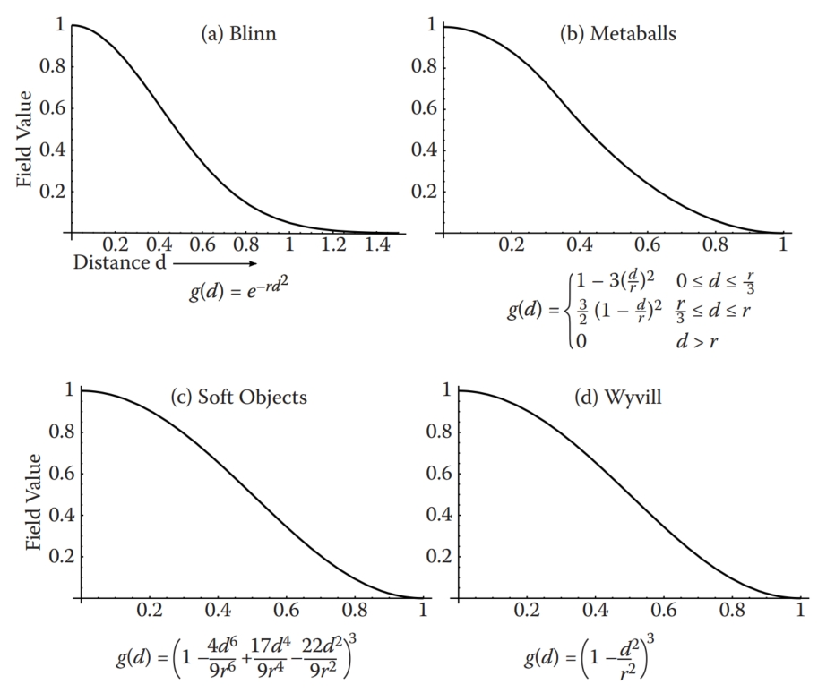
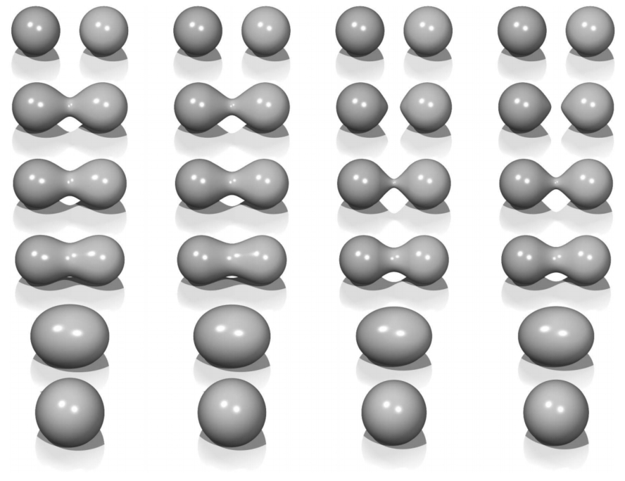
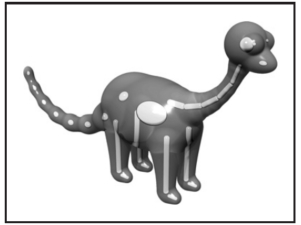
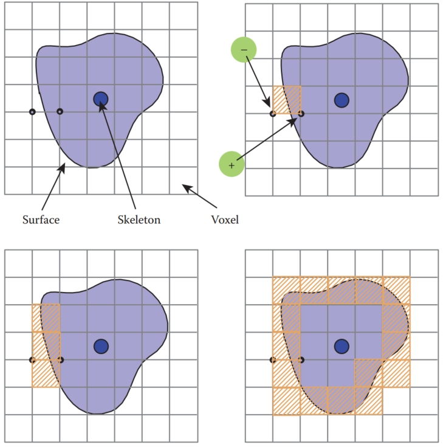
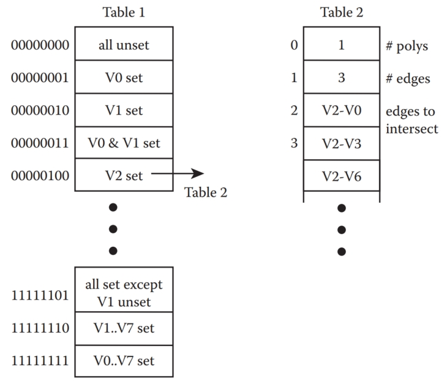
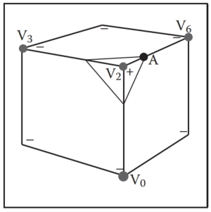
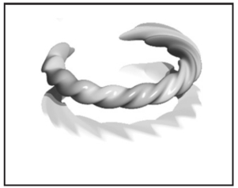
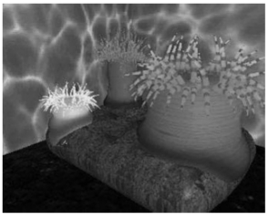
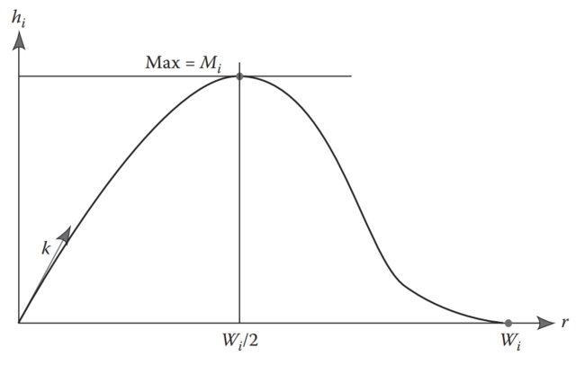

# 22  Implicit Modeling 隐式建模

Implicit modeling (also known as implicit surfaces) in computer graphics covers many different methods for defining models. These include skeletal implicit modeling, offset surfaces, level sets, variational surfaces, and algebraic surfaces. In this chapter, we briefly touch on these methods and describe how to build skeletal implicit models in more detail. Curves can be defined by implicit equations of the form
计算机图形学中的隐式建模（也称为隐式曲面）涵盖了许多不同的模型定义方法。 其中包括骨架隐式建模、偏移曲面、水平集、变分曲面和代数曲面。 在本章中，我们将简要介绍这些方法，并更详细地描述如何构建骨架隐式模型。 曲线可以通过以下形式的隐式方程定义
$f(x, y) = 0.  $

If we consider a closed curve, such as a circle, with radius r, then the implicit equation can be written as
如果我们考虑一条闭合曲线，例如半径为 r 的圆，则隐式方程可以写为
$$
f(x, y) = x^2 + y^2 − r^2 = 0. \ \ \ \ (22.1)
$$
The value of f(x, y) can be positive (outside the circle), negative (inside the circle), or zero for points precisely on the circle. The equivalent in three dimensions is a closed surface around a set of points that occupy a given volume or region of space. The volume forms a scalar field, i.e., we can compute a value for every point and as can be seen for the circle, the negative values are bounded by the implicit curve or surface. The surface can be visualized as a contour in the field, connecting points with a particular value such as zero (see Equation (22.1)). To compute such a surface implies searching through space to find the points that satisfy the implicit equation; this method is unlikely to lead to an efficient algorithm for circle drawing (and even less likely in three dimensions). This was perhaps the reason that algorithmic methods for modeling with parametric curves and surfaces were investigated before implicit methods; however, there are some good reasons to develop algorithms to visualize implicit surfaces. In this chapter we explore the implications of deriving the data from a modeling process rather than from a scanner. 
对于精确位于圆上的点，f(x, y) 的值可以是正值（圆外）、负值（圆内）或零。 三维中的等价物是围绕占据给定体积或空间区域的一组点的闭合表面。 体积形成一个标量场，即我们可以计算每个点的值，并且如圆所示，负值受到隐式曲线或曲面的限制。 表面可以可视化为场中的轮廓，连接具有特定值（例如零）的点（参见方程（22.1））。 计算这样的表面意味着搜索空间以找到满足隐式方程的点； 这种方法不太可能产生有效的圆形绘制算法（在三维空间中更不可能）。 这也许是在隐式方法之前研究参数曲线和曲面建模的算法方法的原因； 然而，开发可视化隐式曲面的算法有一些充分的理由。 在本章中，我们探讨从建模过程而不是从扫描仪获取数据的含义。

Despite the computational overhead of finding the implicit surface, designing with implicit modeling techniques offers some advantages over other modeling methods. Many geometric operations are simplified using implicit methods including: 
尽管查找隐式曲面的计算开销很大，但使用隐式建模技术进行设计比其他建模方法具有一些优势。 使用隐式方法可以简化许多几何运算，包括：

- the definition of blends; 
  混合物的定义；
- the standard set operations (union, intersection, difference, etc.) of constructive solid geometry (CSG); 
  构造立体几何（CSG）的标准集合运算（并、交、差等）；
- functional composition with other implicit functions (e.g., R-functions, Barthe blends, Ricci blends, and warping); 
  与其他隐式函数的函数组合（例如，R 函数、Barthe 混合、Ricci 混合和扭曲）；
- inside/outside tests, (e.g., for collision detection). 
  内部/外部测试（例如，碰撞检测）。

Visualizing the surfaces can be done either by direct ray tracing using an algorithm as described in (Kalra & Barr, 1989; Mitchell, 1990; Hart & Baker, 1996; deGroot & Wyvill, 2005) or by first converting to polygons (Wyvill, McPheeters, & Wyvill, 1986).
可视化表面可以通过使用算法（Kalra & Barr, 1989; Mitchell, 1990; Hart & Baker, 1996; deGroot & Wyvill, 2005）中描述的直接光线追踪来完成，也可以通过首先转换为多边形（Wyvill, McPheeters）来完成 ，＆威维尔，1986）。

One of the first methods was proposed by Ricci as far back as 1973 (Ricci, 1973), who also introduced CSG in the same paper. Jim Blinn’s algorithm for finding contours in electron density fields, known as Blobby molecules (J. Blinn, 1982), Nishimura’s Metaballs (Nishimura et al., 1985) and Wyvills’ Soft Objects (Wyvill et al., 1986) were all early examples of implicit modeling methods. Jim Blinn’s Blobby Man (see Figure 22.1) was the first rendering of a nonalgebraic implicit model. 
第一个方法是 Ricci 早在 1973 年就提出的（Ricci，1973），他还在同一篇论文中介绍了 CSG。 Jim Blinn 在电子密度场中寻找轮廓的算法，称为 Blobby 分子（J. Blinn，1982）、Nishimura 的 Metaballs（Nishimura 等人，1985）和 Wyvill 的 Soft Objects（Wyvill 等人，1986）都是早期的例子 隐式建模方法。 Jim Blinn 的 Blobby Man（见图 22.1）是第一个非代数隐式模型的渲染。

Figure 22.1. Blinn’s Blobby Man 1980. Image courtesy Jim Blinn.
图 22.1。 Blinn 的 Blobby Man 1980。图片由 Jim Blinn 提供。

## 22.1 Implicit Functions, Skeletal Primitives, and Summation Blending 隐式函数、骨架基元和求和混合

In the context of modeling an implicit function is defined as a function f applied to a point $p ∈ \mathbb{E}^3$ yielding a scalar $value ∈ \R$. 
在建模的上下文中，隐函数被定义为应用于点 $p ∈ \mathbb{E}^3$ 的函数 f，产生标量 $value ∈ \R$。

The implicit function $f_i(x, y, z)$ may be split into a distance function $d_i(x, y, z)$ and a fall-off filter function(These functions have been given many names by researchers in the past, e.g., filter, potential, radial-basis, kernel, but we use fall-off filter as a simple term to describe their appearance.  ) $g_i(r)$, where r stands for the distance from the skeleton and the subscript refers to the ith skeletal element.
隐式函数 $f_i(x, y, z)$ 可以分为距离函数 $d_i(x, y, z)$ 和衰减滤波器函数（过去研究人员给这些函数起了很多名字） ，例如滤波器、势能、径向基、内核，但我们使用衰减滤波器作为简单术语来描述它们的外观。）$g_i(r)$，其中r代表距骨架的距离，下标指 到第 i 个骨架元素。

We will use the following notation:
我们将使用以下符号：
$$
f_i(x, y, z) = g_i ◦ d_i(x, y, z)\ \ \ \ \  \ (22.2)
$$
A simple example is a point primitive, and we take the analogy of a star radiating heat into space. The field value (temperature in this example) may be measured at any point $p$ and can be found by taking the distance from $p$ to the center of the star and supplying the value to a fall-off filter function similar to one of those given in Figure 22.2. In these sample functions, the field is given a value of 1 at the center of the star; the value falls off with distance. The surface of a model may be derived from the implicit function $f(x, y, z)$ as the points of space whose values are equal to some desired iso-value (iso); in the star example, a spherical shell for values of iso $∈ (0, 1)$. 
一个简单的例子是点基元，我们将其类比为一颗向太空辐射热量的恒星。 场值（本例中的温度）可以在任意点 $p$ 处测量，并且可以通过获取从 $p$ 到恒星中心的距离并将该值提供给类似于一个的衰减滤波器函数来找到 图 22.2 中给出的那些。 在这些示例函数中，恒星中心的场值为 1； 该值随着距离的增加而下降。 模型的表面可以从隐式函数 $f(x, y, z)$ 导出，作为其值等于某个所需 iso 值 (iso) 的空间点； 在星形示例中，值为 iso $ε (0, 1)$ 的球壳。

Figure 22.2. Fall-off filter functions $(0 ≤ r ≤ 1)$. (a) Blinn’s Gaussian or “Blobby” function; (b) Nishimura’s “Metaball” function; (c) Wyvill et al.’s “soft objects” function; (d) the Wyvill function.
图 22.2。 衰减滤波器函数$(0 ≤ r ≤ 1)$。 (a) Blinn 高斯函数或“Blobby”函数； (b) 西村的“元球”功能； (c) Wyvill 等人的“软物体”功能； (d) 威维尔函数。

In general, filter functions ($g_i$) are chosen so that the field values are maximized on the skeleton and fall off to zero at some chosen distance from the skeleton. In the simple case where the resulting surfaces are blended together,
the global field $f(x, y, z)$ of an object, the implicit function, may be defined as
一般来说，选择过滤函数 ($g_i$) 以便场值在骨架上最大化，并在距骨架的某个选定距离处降至零。 在将所得表面混合在一起的简单情况下， 对象的全局字段 $f(x, y, z)$（隐式函数）可以定义为
$$
f(x, y, z) = \sum^{i=n}_{i=1}f_i(x, y, z) \ \  \ \ \ \ \ (22.3)
$$
where n skeletal elements contribute to the resulting field value. An example is shown in Figure 22.3 in which the field at any point $(x, y, z)$ is calculated as in Equation (22.3). 
其中 n 个骨架元素对结果字段值有贡献。 图 22.3 中显示了一个示例，其中任意点 $(x, y, z)$ 处的场的计算方式如公式 (22.3) 所示。

Figure 22.3. Each column shows two point primitives approaching each other. From left to right: the fall-off filter functions used are Blobby, Metaball, soft objects, and Wyvill. Image courtesy Erwin DeGroot.
图 22.3。 每列显示两个相互接近的点基元。 从左到右：使用的衰减过滤器函数是 Blobby、Metaball、软对象和 Wyvill。 图片由埃尔文·德格鲁特提供。

In this case, two point primitives are placed in close proximity. As the two points are brought together, the surfaces bulge and then blend together. The term filter function is used because the function causes the primitives to be blurred together somewhat akin to a filter function for images. The summation blend is the most compact and efficient blending operation that can be applied to implicit surfaces (see Equation (22.3)). 
在这种情况下，两个基元被放置得非常接近。 当两点靠在一起时，表面会凸出，然后融合在一起。 使用术语“过滤函数”是因为该函数会导致图元模糊在一起，有点类似于图像的过滤函数。 求和混合是可应用于隐式曲面的最紧凑、最高效的混合操作（参见方程（22.3））。

One advantage of using filter functions with finite support is that primitives that are far from p will have zero contribution and thus need not be considered (Wyvill et al., 1986).
使用具有有限支持的滤波器函数的优点之一是远离 p 的基元的贡献为零，因此不需要考虑（Wyvill 等人，1986）。

### 22.1.1 $C^1$ Continuity and the Gradient  $C^1$ 连续性和梯度

The most basic form of continuity is $C^0$ continuity, which ensures that there are no “jumps” in a function. Higher-order continuity is defined in terms of derivatives of functions (see Chapter 15). 
最基本的连续性形式是 $C^0$ 连续性，它确保函数中没有“跳跃”。 高阶连续性是根据函数的导数定义的（参见第 15 章）。

In the case of a 3D scalar field f, the first derivative is a vector function known as the gradient, written $∇f$ and defined as
在 3D 标量场 f 的情况下，一阶导数是称为梯度的向量函数，写为 $∇f$ 并定义为
$$
∇f(p) = \{\frac{∂f(\bold{p})}{∂x}, \frac{∂f(\bold{p})}{∂y}, \frac{∂f(\bold{p})}{∂z}\}
$$
If $∇f$ is defined at all points, and the three one-dimensional partial derivatives are each $C^0$, then $f$ is $C^1$. Informally, $C^1$ surface continuity means that the surface normal varies smoothly over the surface. The surface normal is the unit vector perpendicular to the surface. If no unique surface normal can be defined on the edge of a cube, for example, then the surface is not $C^1$. For points on an implicit surface, the surface normal can be computed by normalizing the gradient vector $∇f$. In the example of the circle, points inside have a negative value and those on the outside have a positive one. For many types of implicit surfaces, the sense of inside and outside is inverted, and since the normal vector must always point outward, it can be opposite to the gradient direction.
如果$∇f$在所有点上都有定义，并且三个一维偏导数均为$C^0$，则$f$为$C^1$。 通俗地说，$C^1$ 表面连续性意味着表面法线在表面上平滑变化。 表面法线是垂直于表面的单位向量。 例如，如果无法在立方体的边缘上定义唯一的表面法线，则该表面不是 $C^1$。 对于隐式曲面上的点，可以通过归一化梯度向量 $∇f$ 来计算曲面法线。 在圆的示例中，内部的点具有负值，外部的点具有正值。 对于许多类型的隐式曲面，内部和外部的含义是相反的，并且由于法向量必须始终指向外部，因此它可以与梯度方向相反。

Skeletal implicit primitives are created by applying a fall-off filter function to an unsigned distance field as in Equation (22.2). Although the distance field is never $C^1$ at the skeleton, these discontinuities can be removed by using a suitable fall-off function (Akleman & Chen, 1999). If an operator, $g$, combines implicit functions, $f_1$ and $f_2$, where all points are $C^1$, then $g(f_1, f_2)$ is not necessarily $C^1$. For example, it is possible to make a sharp CSG junction using the min and max operators. The combination is not $C^1$ continuous because the min and max operators don’t have that property (see Section 22.5). 
骨架隐式基元是通过将衰减滤波器函数应用于无符号距离场来创建的，如方程（22.2）所示。 尽管骨架上的距离场永远不是 $C^1$，但可以通过使用合适的衰减函数来消除这些不连续性（Akleman & Chen，1999）。 如果运算符 $g$ 组合隐式函数 $f_1$ 和 $f_2$，其中所有点都是 $C^1$，则 $g(f_1, f_2)$ 不一定是 $C^1$。 例如，可以使用最小和最大运算符来创建尖锐的 CSG 连接。 该组合不是 $C^1$ 连续的，因为 min 和 max 运算符没有该属性（参见第 22.5 节）。

The analysis of operators is complicated by the fact that it is sometimes desirable to create a $C^1$ discontinuity. This case occurs whenever a crease in the surface is desired. For example, a cube is not $C^1$ because tangent discontinuities occur at each edge. To create creases using $C^1$ primitives, the operator must introduce $C^1$ discontinuities, and hence cannot be $C^1$ itself.
由于有时需要创建 $C^1$ 不连续性，因此运算符的分析变得复杂。 每当需要在表面上出现折痕时就会出现这种情况。 例如，立方体不是 $C^1$，因为每条边都会出现切线不连续性。 要使用 $C^1$ 基元创建折痕，操作符必须引入 $C^1$ 不连续性，因此不能是 $C^1$ 本身。

### 22.1.2 Distance Fields, R-Functions, and F-Reps  距离场、R 函数和 F 重复

The distance field is defined with respect to some geometric object T:
距离场是相对于某个几何对象 T 定义的：
$\bold{F}(T, \bold{p}) = min_{\bold{q}∈T}|\bold{q} - \bold{p}|  $

Visually, $\bold{F}(T, \bold{p})$ is the shortest distance from $\bold{p}$ to T. Hence, when $\bold{p}$ lies on T,  $\bold{F}(T, \bold{p}) = 0$ and the surface created by the implicit function is the object T. Outside of T, a nonzero distance is returned. The function T can be any geometric entity embedded in 3D—a point, curve, surface, or solid. Procedural modeling with distance fields started with Ricci (Ricci, 1973); R-functions (Rvachev, 1963) were first applied to shape modeling more than 20 years later (see (Shapiro, 1994) and (A. Pasko, Adzhiev, Sourin, & Savchenko, 1995)).
从视觉上看，$\bold{F}(T, \bold{p})$ 是从 $\bold{p}$ 到 T 的最短距离。因此，当 $\bold{p}$ 位于 T 上时，$\bold {F}(T, \bold{p}) = 0$，隐式函数创建的表面是对象 T。在 T 之外，返回非零距离。 函数 T 可以是嵌入 3D 中的任何几何实体——点、曲线、曲面或实体。 距离场的程序建模始于 Ricci（Ricci，1973）； 20 多年后，R 函数（Rvachev，1963）首次应用于形状建模（参见（Shapiro，1994）和（A. Pasko，Adzhiev，Sourin 和 Savchenko，1995））。

An R-function or Rvachev function is a function whose sign can change if and only if the sign of one of its arguments changes; that is, its sign is determined solely by its arguments. R-functions provide a robust theoretical framework for boolean composition of real functions, permitting the construction of Cn CSG operators (Shapiro, 1988). These CSG operators can be used to create blending operators simply by adding a fixed offset to the result (A. Pasko et al., 1995). Although these blending functions are no longer technically R-functions, they have most of the desirable properties and can be mixed freely with R-functions to create complex hierarchical models (Shapiro, 1988). These R-function-based blending and CSG operators are referred to as R-operators (see Section 22.4). The Hyperfun system (Adzhiev et al., 1999) is based on F-reps (function representation), another name for an implicit surface. The system uses a procedural C-like language to describe many types of implicit surfaces. 
R 函数或 Rvachev 函数是一种函数，当且仅当其参数之一的符号发生变化时，其符号才会发生变化； 也就是说，它的符号仅由它的参数决定。 R 函数为实函数的布尔组合提供了强大的理论框架，允许构造 Cn CSG 算子（Shapiro，1988）。 这些 CSG 运算符可用于创建混合运算符，只需向结果添加固定偏移量即可（A. Pasko 等人，1995）。 尽管这些混合函数在技术上不再是 R 函数，但它们具有大多数所需的属性，并且可以与 R 函数自由混合以创建复杂的分层模型（Shapiro，1988）。 这些基于 R 函数的混合和 CSG 算子被称为 R 算子（参见第 22.4 节）。 Hyperfun 系统（Adzhiev 等人，1999）基于 F-reps（函数表示），即隐式曲面的另一个名称。 该系统使用类似 C 的过程语言来描述多种类型的隐式表面。

### 22.1.3 Level Sets  关卡集

It is useful to represent an implicit field discretely via a regular grid (Barthe, Mora, Dodgson, & Sabin, 2002) or an adaptive grid (Frisken, Perry, Rockwood, & Jones, 2000). This is exactly what the polygonization algorithm does in the case of level sets; moreover, the grid can be used for various other purposes besides building polygons. Discrete representations of f are commonly obtained by sampling a continuous function at regular intervals. For example, the sampled function may be defined by other volume model representations (V. V. Savchenko, Pasko, Sourin, & Kunii, 1998). The data may also be a physical object sampled using three-dimensional imaging techniques. Discrete volume data has most often been used in conjunction with the level sets method (Osher & Sethian, 1988), which defines a means for dynamically modifying the data structure using curvaturedependent speed functions. Interactive modeling environments based on level sets have been defined (Museth, Breen, Whitaker, & Barr, 2002), although level sets are only one method employing a discrete representation of the implicit field. Methods for interactively defining discrete representations using standard implicit surfaces techniques have also been explored (Baerentzen & Christensen, 2002). 
通过规则网格（Barthe、Mora、Dodgson 和 Sabin，2002）或自适应网格（Frisken、Perry、Rockwood 和 Jones，2000）离散地表示隐式场非常有用。 这正是多边形算法在水平集情况下所做的事情； 此外，除了构建多边形之外，网格还可以用于各种其他目的。 f 的离散表示通常通过定期采样连续函数来获得。 例如，采样函数可以由其他体积模型表示来定义（V.V.Savchenko、Pasko、Sourin 和 Kunii，1998）。 数据还可以是使用三维成像技术采样的物理对象。 离散体数据最常与水平集方法结合使用（Osher & Sethian，1988），该方法定义了一种使用曲率相关速度函数动态修改数据结构的方法。 基于水平集的交互式建模环境已经被定义（Museth、Breen、Whitaker 和 Barr，2002），尽管水平集只是采用隐式场的离散表示的一种方法。 还探索了使用标准隐式曲面技术交互式定义离散表示的方法（Baerentzen & Christensen，2002）。

A key advantage to employing a discrete data structure is its ability to act as a unifying approach for all of the various volume models defined by potential fields (discrete or not) (V. V. Savchenko et al., 1998). The conversion of any continuous function to a discrete representation introduces the problem of how to reconstruct a continuous function, needed for the combined purposes of additional modeling operations and visualization of the resulting potential field. A well-known solution to this problem is to apply a filter g using the convolution operator (see Chapter 9). The choice of a filter is guided by the desired properties of the reconstruction, and many filters have been explored (Marschner & Lobb, 1994). The salient point is that there is typically a tradeoff between the efficiency of the chosen filter and the smoothness of the resulting reconstruction; see also Section 22.9.
采用离散数据结构的一个关键优势是它能够作为由势场（离散或非离散）定义的所有各种体积模型的统一方法（V. V. Savchenko 等人，1998）。 将任何连续函数转换为离散表示会引入如何重建连续函数的问题，这是附加建模操作和所得势场可视化的综合目的所需要的。 这个问题的一个众所周知的解决方案是使用卷积算子应用过滤器 g（参见第 9 章）。 滤波器的选择以重建所需的属性为指导，并且已经探索了许多滤波器（Marschner & Lobb，1994）。 突出的一点是，所选滤波器的效率和所得重建的平滑度之间通常需要权衡； 另见第 22.9 节。

To be interactive, a discrete system must restrict the size of the grid relative to the available computing power. This, in turn, limits the ability of the modeler to include high-frequency details. Additionally, the smoothing triquadratic filter makes it impossible to include sharp edges, should they be desired. A partial solution to this problem is the use of adaptive grids, although with any discrete representation there will be limitations. A discrete grid is used in (Schmidt, Wyvill, & Galin, 2005) to act as a cache representing a BlobTree node. The grid in this work is used for fast prototyping and uses trilinear interpolation for position and the slower, more accurate triquadratic interpolation to calculate gradient values, because the eye is more discerning in observing gradient errors than position errors.
为了实现交互，离散系统必须限制网格相对于可用计算能力的大小。 这反过来又限制了建模者包含高频细节的能力。 此外，平滑三二次滤波器使得不可能包含尖锐的边缘（如果需要的话）。 该问题的部分解决方案是使用自适应网格，尽管任何离散表示都会存在限制。 (Schmidt, Wyvill, & Galin, 2005) 使用离散网格作为表示 BlobTree 节点的缓存。 这项工作中的网格用于快速原型设计，并使用三线性插值来计算位置，并使用更慢、更准确的三二次插值来计算梯度值，因为眼睛在观察梯度误差时比观察位置误差更容易辨别。

### 22.1.4 Variational Implicit Surfaces  变分隐式曲面

It is often required to convert sampled data to an implicit representation. Variational implicit surfaces interpolate or approximate a set of points using a weighted sum of globally supported basis functions (V. Savchenko, Pasko, Okunev, & Kunii, 1995; Turk & O’Brien, 1999; Carr et al., 2001; Turk & O’Brien, 2002). These radially symmetric basis functions are applied at each sample point. The continuity of such a surface depends on the choice of basis function. The $C^2$ thin-plate spline is most commonly used (Turk & O’Brien, 2002; Carr et al., 2001). Like Blinn’s exponential function (see Figure 22.2), this function is unbounded as is the resulting variational implicit surface. 
通常需要将采样数据转换为隐式表示。 变分隐式曲面使用全局支持的基函数的加权和来插值或近似一组点（V. Savchenko、Pasko、Okunev 和 Kunii，1995；Turk 和 O'Brien，1999；Carr 等人，2001；Turk 和 奥布莱恩，2002）。 这些径向对称基函数应用于每个采样点。 这种表面的连续性取决于基函数的选择。 $C^2$ 薄板样条是最常用的（Turk & O’Brien, 2002；Carr et al., 2001）。 与 Blinn 指数函数一样（参见图 22.2），该函数是无界的，所得到的变分隐式曲面也是无界的。

If the field is is globally $C^2$, creases cannot be defined;(Except see Section 15.2.) however, anisotropic basis functions can be used to produce fields which change more rapidly and may appear to have creases (Dinh, Slabaugh, & Turk, 2001). At the appropriate scale, the surface is still smooth. The smooth field implies that self-intersections do not occur, and hence volumes are always well-defined. The thin-plate spline guarantees that global curvature is minimized (Duchon, 1977). Variational interpolation has many properties which are desirable for 3D modeling; however, controlling the resulting surfaces can be difficult. 
如果该场全局为 $C^2$，则无法定义折痕；（参见第 15.2 节除外。）但是，各向异性基函数可用于产生变化更快并且可能看起来有折痕的场（Dinh、Slabaugh、 ＆土耳其人，2001）。 在适当的比例下，表面仍然是光滑的。 平滑场意味着不会发生自相交，因此体积总是明确定义的。 薄板样条保证全局曲率最小化（Duchon，1977）。 变分插值具有许多 3D 建模所需的属性； 然而，控制最终的表面可能很困难。

Variational implicit surfaces can also be based on compactly supported radial basis functions (CS-RBFs) to reduce the computational cost of variational interpolation techniques (Morse, Yoo, Rheingans, Chen, & Subramanian, 2001). Each CS-RBF only influences a local region, so computing $f(\bold{p})$ requires only evaluation of basis functions within some small neighborhood of $\bold{p}$. As with the globally supported counterpart, the resulting field is $C^k$, creases are not supported, and self-intersections cannot occur.(Note, $k > 0$ depending on the RBF (see Section 15.2).) The local support of each basis function results in a bounded global field. This also guarantees that additional iso-contours will be present, as noted by various researchers (Ohtake, Belyaev, & Pasko, 2003; Reuter, 2003). 
变分隐式曲面还可以基于紧凑支持的径向基函数 (CS-RBF)，以减少变分插值技术的计算成本（Morse、Yoo、Rheingans、Chen 和 Subramanian，2001）。 每个CS-RBF仅影响局部区域，因此计算$f(\bold{p})$只需要评估$\bold{p}$的一些小邻域内的基函数。 与全局支持的对应字段一样，结果字段为 $C^k$，不支持折痕，并且不会发生自相交。（注意，$k > 0$ 取决于 RBF（参见第 15.2 节）。） 每个基函数的支持都会产生一个有界的全局场。 正如多位研究人员指出的那样，这也保证了会出现额外的等值线（Ohtake、Belyaev 和 Pasko，2003 年；Reuter，2003 年）。

### 22.1.5 Convolution Surfaces  卷积曲面

Convolution surfaces, introduced by Bloomenthal and Shoemake (Bloomenthal & Shoemake, 1991) are produced by convolving a geometric skeleton $S$ with a kernel function $h$. Hence, the value at any position in space is defined by an integral over the skeleton:
卷积曲面由 Bloomenthal 和 Shoemake 提出（Bloomenthal & Shoemake，1991），是通过将几何骨架 $S$ 与核函数 $h$ 进行卷积来生成的。 因此，空间中任意位置的值由骨架上的积分定义：
$f(\bold{p}) = \int_S g(\bold{r})h(\bold{p}-\bold{r})d\bold{r} \\$

Any finitely supported function can be used as h; see (Sherstyuk, 1999) for a detailed analysis of different kernels.
任何有限支持函数都可以用作h； 有关不同内核的详细分析，请参阅（Sherstyuk，1999）。

Like skeletal primitives, convolution surfaces have bounded fields. Blinn’s “Blobby molecules” is the simplest form of a convolution surface (J. Blinn, 1982); in this case, the skeleton consists of points only. This idea was extended by Bloomenthal to include line, arc, triangle, and polygon skeletons (Bloomenthal & Shoemake, 1991). These represent 1D and 2D primitives; 3D primitives were later described by Bloomenthal (Bloomenthal, 1995).
与骨架基元一样，卷积表面也具有有界域。 Blinn 的“Blobby 分子”是卷积表面的最简单形式（J. Blinn，1982）； 在这种情况下，骨架仅由点组成。 Bloomenthal 将这一想法扩展为包括直线、弧线、三角形和多边形骨架（Bloomenthal & Shoemake，1991）。 它们代表 1D 和 2D 图元； 3D 图元后来由 Bloomenthal 描述（Bloomenthal，1995）。

Combination of convolution surfaces is defined by composition of the underlying geometric skeletons and has the advantage of eliminating the bulges that tend to occur when composing multiple skeletal primitives with additive blending. The surface resulting from convolution of the combined skeleton does not have bulges, as in Figure 22.4, and the field is continuous even if the combined skeleton is nonconvex. Convolution surfaces are offset a fixed distance from convex portions of a skeleton, but produce a fillet along concave portions of a skeleton.
卷积表面的组合是通过底层几何骨架的组合来定义的，并且具有消除在通过加法混合组合多个骨架基元时容易出现的凸起的优点。 组合骨架卷积产生的表面没有凸起，如图 22.4 所示，即使组合骨架是非凸的，场也是连续的。 卷积曲面从骨架的凸部偏移固定距离，但沿骨架的凹部生成圆角。

Figure 22.4. Two blended cylinders. Left: summation blend; right: convolution surface with barely discernible bulge (Bloomenthal, 1997). Image courtesy Erwin DeGroot.
图 22.4。 两个混合气缸。 左：求和混合； 右：带有几乎无法辨别的凸起的卷积表面（Bloomenthal，1997)。 图片由埃尔文·德格鲁特提供。

An example of skeletal elements convolved to build a complex model is shown in Figure 22.5. The hand model contains fourteen primitives.
图 22.5 显示了通过卷积构建复杂模型的骨架元素示例。 手部模型包含十四个基元。

Figure 22.5. Skeletal elements convolved to build a hand model. Image courtesy Jules Bloomenthal. 
图 22.5。 骨骼元素进行卷积以构建手部模型。 图片由朱尔斯·布卢门撒尔提供。

### 22.1.6 Defining Skeletal Primitives  定义骨架基元

As we will see in the following sections rendering the implicit models requires finding the field value and gradient for a large number of points. We need the distance to supply to Equation (22.2) and the gradient is useful for root finding as well as lighting calculations. Supplying the distance to the fall-off filter functions of Figure 22.2 is a matter of calculating the nearest distance to the skeletal primitive, simple for point primitives but a little trickier for more complex geometrical shapes. A line segment primitive (AB) can be defined as a cylinder around a line with hemispherical end caps (see Figure 22.6). Point P0 lies on the surface where $f(P_0) = iso$ and $f(P_1) = 0$ since it lies outside of the influence of the line primitive. The distance from some $P_i$ to the line is found by simply projecting onto the line $AB$ and calculating the perpendicular distance, e.g., $|CP_0|$; this can be found from AC, since A, $P_0$, and B, are all known:
正如我们将在以下部分中看到的，渲染隐式模型需要找到大量点的字段值和梯度。 我们需要为方程（22.2）提供距离，并且梯度对于求根和照明计算很有用。 向图 22.2 的衰减滤波器函数提供距离就是计算到骨架基元的最近距离，对于点基元来说很简单，但对于更复杂的几何形状来说有点棘手。 线段基元 (AB) 可以定义为带有半球形端盖的线周围的圆柱体（见图 22.6）。 点 P0 位于 $f(P_0) = iso$ 且 $f(P_1) = 0$ 的曲面上，因为它位于线基元的影响之外。 通过简单地投影到线 $AB$ 上并计算垂直距离即可找到从某个 $P_i$ 到线的距离，例如 $|CP_0|$； 这可以从 AC 中找到，因为 A、$P_0$ 和 B 都是已知的：
$$
\stackrel{\rightarrow}{AC} = \stackrel{\rightarrow}{AB}\frac{\stackrel{\rightarrow}{AP_0} \cdot \stackrel{\rightarrow}{AB}} {\|AB\|^2}
$$
In Figure 22.6, the field value of $P_2 > 0$, since $P_2$ is in the hemispherical endcap, which can be checked separately. Variations of this idea can define primitives with endcaps of different radii producing interesting cone shapes. An example is shown in Figure 22.7.
图22.6中$P_2的字段值> 0$，因为$P_2$在半球端盖内，可以单独检查。 这个想法的变体可以定义具有不同半径端盖的基元，产生有趣的圆锥形状。 图 22.7 显示了一个示例。

Figure 22.6. Line primitive ab and example points $p_0$, $p_1$, $p_2$ showing distance calculation.
图 22.6。 线基元 ab 和示例点 $p_0$、$p_1$、$p_2$ 显示距离计算。


Figure 22.7. Cylinder primitive blended with a sphere. Image courtesy Erwin DeGroot.
图 22.7。 与球体混合的圆柱体基元。 图片由埃尔文·德格鲁特提供。

A great variety of geometrical skeletons have been described, and, in principle, it is simply a matter of defining the distance to the skeleton from some point $\bold{p}$ and also the gradient at $\bold{p}$. For example, an offset surface of a triangle can be defined from the vertices of the triangle and a radius $r$. A simple way to implement this is to use line segment primitives to describe bounding cylinders connecting the vertices (radius $r$). The distance from a point $\bold{q}$ within the triangle that does not fall within the bounding fields of one of the line segment primitives is returned as the perpendicular distance to the plane of the triangle. Other examples include an implicit disk, defined by a circle and a thickness parameter, a torus also defined by a circle and the radius of the cross section (or inner and outer circle radii), a circular cone from a disk and a height, a cube with rounded corners, etc. (see Figure 22.8).
已经描述了各种各样的几何骨架，原则上，只需定义从某个点 $\bold{p}$ 到骨架的距离以及 $\bold{p}$ 处的梯度即可。 例如，可以根据三角形的顶点和半径 $r$ 来定义三角形的偏移表面。 实现此目的的一个简单方法是使用线段基元来描述连接顶点的边界圆柱体（半径 $r$）。 距三角形内未落在线段基元之一的边界场内的点 $\bold{q}$ 的距离将作为到三角形平面的垂直距离返回。 其他示例包括由圆和厚度参数定义的隐式圆盘、也由圆和横截面半径（或内圆和外圆半径）定义的圆环、由圆盘和高度定义的圆锥体、 圆角立方体等（见图22.8）。

Figure 22.8. Implicit models from various skeletal primitives. Image courtesy Erwin DeGroot.
图 22.8。 来自各种骨骼基元的隐式模型。 图片由埃尔文·德格鲁特提供。

## 22.2 Rendering 渲染

Modeling methods, such as parametric surfaces, lend themselves to visualization, since it is easy to iterate over points on the surface that can be found directly from the defining equations; for example $(x, y) = (cos θ, sin θ), θ ∈ [0, 2π)$ produces  a circle. 
建模方法（例如参数化曲面）有助于可视化，因为很容易迭代曲面上的点，这些点可以直接从定义方程中找到； 例如 $(x, y) = (cos θ, sin θ), θ ∈ [0, 2π)$ 生成一个圆。

There are two techniques that are commonly used to render implicit surfaces: ray tracing and surface tiling. In practice, a designer wants to visualize an implicit surface model quickly, sacrificing quality for speed for interaction purposes. Prototyping algorithms have been concerned with producing a polygon mesh that can be rendered in real time on modern workstations. Finding the polygonal mesh which best approximates the desired surface is referred to as polygonization or surface tiling. For animation or for a final visualization, where quality is preferred over speed, ray tracing implicit surfaces directly without first polygonising produces excellent results. 
有两种常用于渲染隐式表面的技术：光线追踪和表面平铺。 在实践中，设计人员希望快速可视化隐式表面模型，为了交互目的而牺牲质量以换取速度。 原型算法一直致力于生成可以在现代工作站上实时渲染的多边形网格。 找到最接近所需表面的多边形网格称为多边形化或表面平铺。 对于动画或最终可视化，质量优先于速度，直接光线追踪隐式曲面无需先进行多边形化即可产生出色的结果。

As previously mentioned, finding an implicit surface requires searching through space to find the points that satisfy, $f(\bold{p}) = 0$. There are two main approaches to executing such a search: space partitioning—partitioning space into manageable units such as cubes, and non-space partitioning, e.g., marching triangles (Hartmann, 1998; Akkouche & Galin, 2001) and the shrinkwrap algorithm (van Overveld & Wyvill, 2004).
如前所述，找到隐式曲面需要搜索空间来找到满足 $f(\bold{p}) = 0$ 的点。 执行这种搜索有两种主要方法：空间划分——将空间划分为可管理的单元，例如立方体，以及非空间划分，例如行进三角形（Hartmann，1998；Akkouche & Galin，2001）和收缩包裹算法（van Overveld 和 Wyvill，2004）。

In this chapter, we describe the original space partitioning algorithm and leave it to the reader to explore the more advanced methods. This algorithm together with postprocessing for mesh refinement (see Chapter 12) and caching provide a method for interactive viewing of implicit models on modern workstations.
在本章中，我们描述了原始的空间划分算法，并留给读者探索更高级的方法。 该算法与网格细化的后处理（参见第 12 章）和缓存一起提供了一种在现代工作站上交互式查看隐式模型的方法。

Figure 22.9. A ray-traced dinosaur model showing the underlying skeletal primitives. Image courtesy Erwin DeGroot.
图 22.9。 光线追踪恐龙模型显示了底层的骨骼基元。 图片由埃尔文·德格鲁特提供。

## 22.3 Space Partitioning  空间划分

### 22.3.1 Exhaustive Search  穷举搜索

The basic cubic space partitioning algorithm for tiling implicit surfaces was first published in (Wyvill et al., 1986) and a similar algorithm oriented toward volume visualization, called marching cubes in (Lorensen & Cline, 1987). Since then there have been many refinements and extensions.
用于平铺隐式曲面的基本立方空间划分算法首次发布于（Wyvill 等人，1986），并且面向体积可视化的类似算法称为行进立方体（Lorensen & Cline，1987）。 从那时起，出现了许多改进和扩展。

A first approach to finding the implicit surface might be to subdivide space uniformly into a regular lattice of cubic cells and calculate a value for every vertex. Each cell is replaced with a set of polygons that best approximates the part of the surface contained within that cell. The problem with this method is that many of the cells will be completely outside or completely inside the volume; thus, many cells that contain no part of the surface are processed. For large grids of data this can be very time consuming and memory intensive. 
找到隐式表面的第一种方法可能是将空间均匀地细分为立方单元的规则晶格，并计算每个顶点的值。 每个单元都被替换为最接近该单元内包含的表面部分的一组多边形。 这种方法的问题在于，许多单元将完全位于体积之外或完全位于体积之内。 因此，许多不包含表面部分的细胞被处理。 对于大型数据网格，这可能非常耗时且占用大量内存。

To avoid storing the whole grid, a hash table is used to store only the cubes that contain a piece of the surface, based on the data structures used in (Wyvill et al., 1986). Working software was published in Graphics Gems IV (Bloomenthal, 1990). The algorithm is based on numerical continuation; it starts with a seed cube that intersects part of the surface and builds neighboring cubes as necessary to follow the surface. 
为了避免存储整个网格，根据（Wyvill 等人，1986）中使用的数据结构，使用哈希表仅存储包含一块表面的立方体。 工作软件发表在 Graphics Gems IV (Bloomenthal, 1990) 中。 该算法基于数值延拓； 它从与部分表面相交的种子立方体开始，并根据需要构建相邻的立方体以跟随表面。

The algorithm has two parts. In the first part, cubic cells are found that contain the surface and in the second part, each cube is replaced by triangles. The first part of the algorithm is driven by a queue of cubes, each of which contains part of the surface; the second part of the algorithm is table-driven. 
该算法有两个部分。 在第一部分中，发现包含表面的立方体单元，在第二部分中，每个立方体都被三角形替换。 该算法的第一部分由立方体队列驱动，每个立方体都包含部分表面； 该算法的第二部分是表驱动的。

### 22.3.2 Algorithm Description  算法说明 

A fast overview of the algorithm is as follows: 
该算法的快速概述如下：

- divide space into cubic voxels; 
  将空间划分为立方体素；
- search for surface, starting from a skeletal element; 
  从骨架元素开始搜索表面；
- add voxel to queue, mark it visited; 
  将体素添加到队列中，将其标记为已访问；
- search neighbors; 
  搜索邻居；
- when done, replace voxel with polygons. 
  完成后，用多边形替换体素。

First, space is subdivided into a cubic lattice, and the next task is to find a seed cube containing part of the surface. A cube vertex $v_i$ inside the surface will have a field value $v_i >= iso$ and a vertex outside the surface will have a field value $v_i < iso$; thus, an edge with one of each type of vertex will intersect the surface. We call this an intersecting edge. The field value at the nearest cube vertex to the first primitive can be evaluated by summing the contributions of the primitives as per Equation (22.3), although other operators can also be used as will be seen later. We will assume that $f(v_0) > iso$, which indicates that $v_0$ lies within the solid. The value of iso is chosen by the user; an example is iso = 0.5 when using the soft fall-off function, which has some symmetry properties that lead to nice blending (see Figure 22.3). The vertices along one axis are evaluated in turn until a value $v_i < iso$ is found. The cube containing the intersecting edge is the seed cube. 
首先，将空间细分为立方晶格，接下来的任务是找到包含部分表面的种子立方体。 表面内部的立方体顶点 $v_i$ 将具有字段值 $v_i >= iso$，表面外部的顶点将具有字段值 $v_i < iso$； 因此，具有每种类型顶点之一的边将与表面相交。 我们称之为相交边。 距离第一个基元最近的立方体顶点处的场值可以通过根据方程（22.3）求和基元的贡献来评估，尽管也可以使用其他运算符，如稍后将看到的。 我们假设 $f(v_0) > iso$，这表明 $v_0$ 位于实体内。 iso的值由用户选择； 一个例子是使用软衰减函数时 iso = 0.5，它具有一些对称属性，可以实现良好的混合（见图 22.3）。 依次评估沿一个轴的顶点，直到找到值 $v_i < iso$。 包含相交边的立方体是种子立方体。

The neighbors of the seed cube are examined, and those that contain at least one intersecting edge are added to the queue ready for processing. To process a cube, we examine each face. If any of the bounding edges have oppositely signed vertices, the surface will pass through that face and the face neighbor must be processed. When this process has been completed for all the faces, the second phase of the algorithm is applied to the cube. If the surface is closed, eventually a cube will be revisited and no more unmarked neighbors found, and the search algorithm will terminate. Processing a cube involves marking it as processed and processing its unmarked neighbors. Those that contain intersecting edges are processed until the entire surface has been covered (see Figure 22.10). 
检查种子立方体的邻居，并将包含至少一个相交边的邻居添加到队列中以备处理。 为了处理立方体，我们检查每个面。 如果任何边界边具有相反符号的顶点，则该曲面将穿过该面，并且必须处理该面的邻居。 当所有面都完成此过程后，算法的第二阶段将应用于立方体。 如果表面是封闭的，最终将重新访问立方体并且不再找到未标记的邻居，并且搜索算法将终止。 处理立方体涉及将其标记为已处理并处理其未标记的邻居。 包含相交边缘的那些将被处理，直到整个表面被覆盖（见图 22.10）。

Figure 22.10. A section through the cubic lattice. The + sign indicates a vertex inside the surface ($f (v_i ≥ iso$) and - is outside $f (v_i < iso)$.
图 22.10。 立方晶格的剖面。 + 号表示顶点位于曲面 ($f (v_i ≥ iso$) 内部，- 表示顶点位于 $f (v_i < iso)$ 外部。

Each cube is indexed by an identifying vertex which we define to be the lowerleft far corner (i.e., the vertex with the lowest (x, y, z)-coordinate values (see Figure 22.11)). For each vertex that is inside the surface, the corresponding bit will be set to form the address in an 8-bit table (see Figure 22.11 and Section 22.3.3). 
每个立方体都由一个标识顶点进行索引，我们将其定义为左下远角（即具有最低 (x, y, z) 坐标值的顶点（参见图 22.11））。 对于表面内的每个顶点，将设置相应的位以形成 8 位表中的地址（参见图 22.11 和第 22.3.3 节）。

Figure 22.11. Vertex numbering. 
图 22.11。 顶点编号。

The identifying vertex is addressed by integers i, j, k, computed from the (x, y, z)-coordinate location of the cube such that $x = side ∗ i$, etc., where side is the size of the cube. The identifying vertex of each cube may appear in as many as eight other cubes, and it would be inefficient to store these vertices more than once. Thus, the vertices are stored uniquely in a chained hash table. Since most of the space does not contain any part of the surface, only those cubes that are visited will be stored. The implicit function value is found for each vertex as it is stored in the hash table.
标识顶点由整数 i、j、k 寻址，这些整数是根据立方体的 (x, y, z) 坐标位置计算的，使得 $x = side ∗ i$ 等，其中 side 是立方体的大小 。 每个立方体的标识顶点可能出现在多达八个其他立方体中，并且多次存储这些顶点是低效的。 因此，顶点被唯一地存储在链式哈希表中。 由于大部分空间不包含表面的任何部分，因此只有那些被访问过的立方体才会被存储。 为每个顶点找到存储在哈希表中的隐式函数值。

Nothing is known about the topology of the surface so a search must be started from every primitive to avoid any disconnected parts of the surface being missed. A scalar can be used to scale the influence of a primitive. If the scalar can be less than zero, then it is possible to search along an axis without finding an intersecting edge. In this case, a more sophisticated search must be done to find a seed cube (Galin & Akkouche, 1999).
关于表面的拓扑一无所知，因此必须从每个基元开始搜索，以避免错过表面的任何断开的部分。 标量可用于缩放基元的影响。 如果标量可以小于零，则可以沿轴搜索而不会找到相交的边。 在这种情况下，必须进行更复杂的搜索来找到种子立方体（Galin & Akkouche，1999）。

#### Data Structures 数据结构

The hash table entry holds five values:
哈希表条目包含五个值：

- the i, j, k lattice indices of the identifying vertex (see Figure 22.11); 
  识别顶点的 i、j、k 晶格索引（见图 22.11）；
- f, the implicit function value of the identifying vertex; 
  f，识别顶点的隐函数值；
- Boolean to indicate whether this cube has been visited.
  布尔值，指示此多维数据集是否已被访问。

The hash function computes an address in the hash table by selecting a few bits out of each of $i, j, k$ and combining them arithmetically. For example, the five least significant bits produces a 15-bit address for a table, which must have a length of $2^{15}$. Such a hash function can be neatly implemented in the C-preprocessor as follows: 
哈希函数通过从 $i、j、k$ 中选择一些位并将它们进行算术组合来计算哈希表中的地址。 例如，五个最低有效位生成表的 15 位地址，该地址的长度必须为 $2^{15}$。 这样的哈希函数可以在 C 预处理器中巧妙地实现，如下所示：

```c++
#define NBITS 5
#define BMASK 037
#define HASH(a,b,c) (((a&BMASK)<<NBITS|b&BMASK)
					<<NBITS|c&BMASK)
#define HSIZE 1<<NBITS*3
```

The queue (FIFO list) is used as temporary storage to identify the neighbors for processing. The algorithm begins with a seed cube that is marked as visited and placed on the queue. The first cube on the queue is dequeued and all its unvisited neighbors are added to the queue. Each cube is processed and passed to the second phase of the algorithm if it contains part of the surface. The queue is then processed until empty. 
队列（先进先出列表）用作临时存储来识别要处理的邻居。 该算法从标记为已访问并放置在队列中的种子立方体开始。 队列中的第一个多维数据集将出列，并且其所有未访问的邻居都将添加到队列中。 如果每个立方体包含表面的一部分，则每个立方体都会被处理并传递到算法的第二阶段。 然后处理队列直到空为止。

### 22.3.3 Polygonization Algorithm  多边形化算法

The second phase of the algorithm treats each cube independently. The cell is replaced by a set of triangles that best matches the shape of the part of the surface that passes through the cell. The algorithm must decide how to polygonize the cell given the implicit function values at each vertex. These values will be positive or negative (i.e., less than or greater than the iso-value), giving 256 combinations of positive or negative vertices for the eight vertices of the cube. A table of 256 entries provides the right vertices to use in each triangle (Figure 22.12). For example, entry 4(00000100) points to a second table that records the vertices that bound the intersecting edges. In this example, vertex number 2 is inside the surface ($f(V 2) >= iso$) and, therefore, we wish to draw a triangle that connects the points on the surface that intersecgt with edges bounded by $(V 2, V 0)$, $(V 2, V 3)$, and $(V 2, V 6)$ as shown in Figure 22.13. 
该算法的第二阶段独立处理每个立方体。 该单元被一组与穿过该单元的表面部分的形状最匹配的三角形所取代。 算法必须决定如何在给定每个顶点的隐式函数值的情况下对单元进行多边形化。 这些值将为正值或负值（即小于或大于等值），为立方体的 8 个顶点提供 256 种正或负顶点组合。 包含 256 个条目的表提供了每个三角形中使用的正确顶点（图 22.12）。 例如，条目 4(00000100) 指向记录相交边的顶点的第二个表。 在此示例中，顶点号 2 位于曲面内部 ($f(V 2) >= iso$)，因此，我们希望绘制一个三角形，连接曲面上与 $(V 2) 边界相交的点 、V 0)$、$(V 2, V 3)$ 和$(V 2, V 6)$，如图 22.13 所示。

Figure 22.12. Table 2 contains the edges intersected by the surface. Table 1 points to the appropriate entry in Table 2. 
图 22.12。 表 2 包含与曲面相交的边。 表 1 指向表 2 中的相应条目。


Figure 22.13. Finding the intersection of the surface with a cube edge.
图 22.13。 找到曲面与立方体边的交点。

#### Finding Cube-Surface Intersections  寻找立方体与曲面的交点

Figure 22.13 shows a cube where vertex $V_2$ is inside the surface and all other vertices are outside. Intersections with the surface occur on three edges as shown. The surface intersects edge $V_2 − V_6$ at the point A. The fastest, but inaccurate, way to calculate A is to use linear interpolation:
图 22.13 显示了一个立方体，其中顶点 $V_2$ 位于曲面内部，所有其他顶点均位于曲面外部。 与曲面的相交发生在三个边上，如图所示。 曲面与边 $V_2 − V_6$ 相交于点 A。计算 A 的最快但不准确的方法是使用线性插值：
$$
\frac{f(A) − f(V_2)}{f(V_6) − f(V_2)} = \frac{|A − V_2|}{side}
$$
If the cube side is 1 and the iso-value sought for f(A) is 0.5, then
如果立方体边长为 1，求 f(A) 的等值为 0.5，则
$$
A = V_3 + \frac{0.5 - f(V_2)}{f(V_6) - f(V_2)}
$$
This works well for a static image, but in animation error differences between frames will be very noticeable. A root-finding method such as regula falsi should be employed. This becomes more computationally costly as the gradient is needed to evaluate the point of intersection. The gradient is also needed at surface points for rendering. For many types of primitives it is simpler to find a numerical approximation using sample points around p, as in
这对于静态图像效果很好，但在动画中，帧之间的错误差异将非常明显。 应采用诸如regula falsi 之类的寻根方法。 由于需要梯度来评估交点，因此计算成本变得更高。 表面点也需要渐变来进行渲染。 对于许多类型的基元，使用 p 周围的样本点找到数值近似值会更简单，如下所示
$$
∇f(\bold{p}) = (
	\frac{f(\bold{p} + Δx) - f(\bold{p})}{Δx}, 
	\frac{f(\bold{p} + Δy) - f(\bold{p})}{Δy}, 
	\frac{f(\bold{p} + Δz) - f(\bold{p})}{Δz}
)
$$
A reasonable value for Δ has been found empirically to be 0.01 ∗ side where side is the length of a cube edge. 
根据经验，Δ 的合理值是 0.01 * side，其中 side 是立方体边的长度。

For manufacturing a mesh, as opposed to a set of independent triangles, a second hash table can maintain a list of all the intersecting edges. Since each cube edge is shared by up to four neighbors, the edge hash table prevents repetition of the surface-cube edge intersection calculation. The hash address can be derived from the same hash function as for vertices (applied to the edge endpoints).
为了制造网格，与一组独立的三角形相反，第二个哈希表可以维护所有相交边的列表。 由于每个立方体边缘最多由四个邻居共享，因此边缘哈希表可以防止重复表面-立方体边缘交集计算。 哈希地址可以从与顶点相同的哈希函数（应用于边缘端点）导出。

### 22.3.4 Sampling Problems  抽样问题

Ambiguities occur when opposite corners of a face (or the cube) have the same sign and the other pair of vertices on the face have the opposite sign (see Figure 22.14). A sample taken in the center of the face will give a clue as to whether the cube represents the meeting of two surfaces or a saddle. It should be made clear that a spatial grid stores a sample of the implicit function at every vertex. If the function happens to vary considerably within a cell, the polygonal representation will not show such variations (see Figure 22.15). The surface cannot be resolved by sampling alone unless something is known about the curvature of the surface. A good discussion of this topic appears in (Kalra & Barr, 1989).
当一个面（或立方体）的对角具有相同的符号而该面上的另一对顶点具有相反的符号时，就会出现歧义（见图 22.14）。 在面的中心采集的样本将给出关于立方体是否代表两个表面或鞍座的交汇处的线索。 应该明确的是，空间网格在每个顶点存储隐函数的样本。 如果函数在单元内发生很大变化，则多边形表示将不会显示此类变化（见图 22.15）。 除非了解表面的曲率，否则无法仅通过采样来解析表面。 (Kalra & Barr, 1989)对此主题进行了很好的讨论。

Figure 22.14. Examples of vertices inside (+) and outside (-) the surface. Note the extra sample gives a clue to avoid ambiguous cases. 
图 22.14。 曲面内部 (+) 和外部 (-) 的顶点示例。 请注意，额外的示例提供了避免模棱两可的情况的线索。

22.3.4 Sampling Problems Ambiguities occur when opposite corners of a face (or the cube) have the same sign and the other pair of vertices on the face have the opposite sign (see Figure 22.14). A sample taken in the center of the face will give a clue as to whether the cube represents the meeting of two surfaces or a saddle. It should be made clear that a spatial grid stores a sample of the implicit function at every vertex. If the function happens to vary considerably within a cell, the polygonal representation will not show such variations (see Figure 22.15). The surface cannot be resolved by sampling alone unless something is known about the curvature of the surface. A good discussion of this topic appears in (Kalra & Barr, 1989).This ambiguity problem (not the undersampling problem) is avoided by subdividing the cubic cell into tetrahedra. The tetrahedra can then be polygonized unambiguously. Since there are four vertices in each tetrahedron, a table of 16 entries will provide the correct triangle information. The disadvantage is that approximately twice the number of polygons will be generated. 
22.3.4 采样问题 当一个面（或立方体）的对角具有相同的符号而该面上的另一对顶点具有相反的符号时，就会出现歧义（见图 22.14）。 在面的中心采集的样本将给出关于立方体是否代表两个表面或鞍座的交汇处的线索。 应该明确的是，空间网格在每个顶点存储隐函数的样本。 如果函数在单元内发生很大变化，则多边形表示将不会显示此类变化（见图 22.15）。 除非了解表面的曲率，否则无法仅通过采样来解析表面。 关于这个主题的一个很好的讨论出现在（Kalra & Barr，1989）中。通过将立方体单元细分为四面体，可以避免这种歧义问题（不是欠采样问题）。 然后可以明确地将四面体多边形化。 由于每个四面体有四个顶点，因此包含 16 个条目的表将提供正确的三角形信息。 缺点是将生成大约两倍数量的多边形。

Figure 22.15. Cube too large to capture small variation in implicit function. 
图 22.15。 立方体太大，无法捕获隐函数的微小变化。

#### Subdividing a Cube 细分立方体

Without requiring additional cell vertices, a cube may be decomposed into five or six tetrahedra as shown in Figure 22.16. These decompositions introduce diagonals on the cube faces, and to maintain a consistent diagonal direction between neighbors, the six decomposition is preferable. The introduction of diagonal edges produces a higher-resolution surface than replacing each cube directly with triangles. The decomposition into tetrahedra and the replacement of the tetrahedra with triangles are fast, table-driven algorithms, which produce topologically consistent meshes.
不需要额外的单元顶点，一个立方体可以分解为五个或六个四面体，如图 22.16 所示。 这些分解在立方体面上引入了对角线，并且为了保持邻居之间一致的对角线方向，六次分解是优选的。 与直接用三角形替换每个立方体相比，对角边缘的引入产生了更高分辨率的表面。 分解为四面体以及用三角形替换四面体是快速的表格驱动算法，可生成拓扑一致的网格。

Figure 22.16. Decomposing a cube into six tetrahedra. Image courtesy Erwin DeGroot. 
图 22.16。 将一个立方体分解为六个四面体。 图片由埃尔文·德格鲁特提供。

### 22.3.5 Cell Polygonization 细胞多边形化

Two obvious problems emerge from the use of uniform space subdivision. The size of triangles output by this algorithm do not adapt to the curvature of the surface and a further sample is required to solve the ambiguities, in which cubic cells are replaced by polygons. A space subdivision algorithm based on an octree was developed by Bloomenthal (Bloomenthal, 1988), which does adapt to the curvature of the surface. Cells are subdivided into eight octants and cracks are avoided by using a restricted octree scheme, i.e., neighboring cells cannot differ by more than one level of subdivision. This indeed reduces the number of polygons generated, but full advantage of large cells can only be taken if the flat regions of the surface happen to fall entirely within the appropriate octants. The algorithm proves in practice to be considerably slower than the uniform voxel algorithm and is more complicated to implement.
使用均匀空间细分会出现两个明显的问题。 该算法输出的三角形的大小不适应表面的曲率，需要进一步的样本来解决歧义，其中立方单元被多边形替换。 Bloomenthal 开发了基于八叉树的空间细分算法（Bloomenthal，1988），该算法确实适应表面的曲率。 单元格被细分为八个八分圆，并通过使用受限八叉树方案来避免裂纹，即相邻单元格的细分不能超过一级。 这确实减少了生成的多边形数量，但只有当表面的平坦区域恰好完全落在适当的八分圆内时，才能充分利用大单元。 该算法在实践中被证明比统一体素算法要慢得多，并且实现起来更复杂。

## 22.4 More on Blending 有关混合的更多信息

Section 22.1 showed that blending can be made to occur when field values are summed. Ricci, in his landmark paper (Ricci, 1973), describes super-elliptic blending. Given two functions $F_A$ and $F_B$, previously we simply found the implicit value as $F_{total} = F_A + F_B$. We can denote this more general blending operator as $A \diamond B$. The Ricci blend is defined as:
第 22.1 节展示了当字段值求和时可以进行混合。 Ricci 在他的里程碑式论文（Ricci，1973）中描述了超椭圆混合。 给定两个函数 $F_A$ 和 $F_B$，之前我们只是简单地找到隐式值 $F_{total} = F_A + F_B$。 我们可以将这个更通用的混合运算符表示为 $A \diamond B$。 Ricci 混合定义为：
$$
f_{A \diamond B} = (f_{A}^n + f_B^n)^{\frac{1}{n}} \ \ \ \ \ (22.4)
$$
It is interesting to point out the following properties: 
有趣的是指出以下属性：
$$
\lim_{n\rightarrow +∞}(f _A^n + f_B^n)^{\frac{1}{n}} = \max(f_A, f_B) \\
\lim_{n\rightarrow -∞}(f _A^n + f_B^n)^{\frac{1}{n}} = \min(f_A, f_B)
$$
Moreover, this generalized blending is associative, i.e., $f_{(A\diamond B)\diamond C} = f_{A\diamond(B\diamond C)}$. The standard blending operator + proves to be a special case of the super-elliptic blend with $n = 1$. When n varies from 1 to infinity, it creates a set of blends interpolating between blending $A + B$ and union $A ∪ B$ (see Figure 22.17). Figure 22.27 shows the nodes to be binary or unary; in fact the binary nodes can easily be extended using the above formulation to n-ary nodes.
此外，这种广义混合是关联的，即$f_{(A\diamond B)\diamond C} = f_{A\diamond(B\diamond C)}$。 标准混合运算符 + 被证明是 $n = 1$ 的超椭圆混合的特例。 当 n 从 1 变化到无穷大时，它会在混合 $A + B$ 和并集 $A ∪ B$ 之间创建一组混合插值（见图 22.17）。 图22.27显示了二元或一元的节点； 事实上，使用上述公式可以轻松地将二元节点扩展到 n 元节点。

Figure 22.17. By varying n, the Ricci blend may be made to change smoothly from blend to union. Image courtesy Erwin DeGroot.
图 22.17。 通过改变n，可以使Ricci混合从混合平滑地改变到联合。 图片由埃尔文·德格鲁特提供。

The power of Ricci’s operators is that they are closed under the operations on the space of all possible implicit volumes, meaning that an application of an operator simply produces another scalar field defining another implicit volume. This new field can be composed with other fields, again using Ricci’s operators. Equation (22.4) will always produce the exact union of two implicit volumes, regardless of how complex they are. Compared with the difficulties involved in applying boolean CSG operations to B-rep surfaces, solid modeling with implicit volumes is incredibly simple.
里奇运算符的强大之处在于，它们在所有可能的隐式卷的空间上的运算下都是封闭的，这意味着运算符的应用只需生成定义另一个隐式卷的另一个标量场。 这个新字段可以与其他字段组合，再次使用 Ricci 运算符。 方程（22.4）总是会产生两个隐式体积的精确并集，无论它们有多复杂。 与将布尔 CSG 运算应用于 B-rep 曲面所涉及的困难相比，使用隐式体积的实体建模非常简单。

Following Pasko’s functional representation (A. Pasko et al., 1995), another generalized blending function may be defined:
根据 Pasko 的函数表示（A. Pasko 等人，1995），可以定义另一个广义混合函数：
$$
f_{A\diamond B} = (f_A + f_B + α\sqrt{f_A^2 + f_B^2})(f_A^2 + f_B^2)^{\frac{2}{n}}
$$
When $α ∈ [−1, 1]$ varies from −1 to 1, it creates a set of blends interpolating the union and the intersection operators. However, this operator is no longer associative which is incompatible with the definition of n-ary operators.
当 $α ∈ [−1, 1]$ 从 −1 到 1 变化时，它会创建一组插值并集和交集运算符的混合。 但是，该运算符不再具有结合性，这与 n 元运算符的定义不兼容。

## 22.5 Constructive Solid Geometry 构造立体几何

Implicit models are frequently termed implicit surfaces; however, they are inherently volume models and useful for solid modeling operations. Ricci introduced a constructive geometry for defining complex shapes from operations such as union, intersection, difference, and blend upon primitives (Ricci, 1973). The surface was considered as the boundary between the half spaces $f(\bold{p}) < 1$, defining the inside, and $f(\bold{p}) > 1$ defining the outside. This initial approach to solid modeling evolved into constructive solid geometry or CSG (Ricci, 1973; Requicha, 1980). CSG is typically evaluated bottom-up according to a binary tree, with low-degree polynomial primitives as the leaf nodes and internal nodes representing Boolean set operations. These methods are readily adapted for use in implicit modeling, and in the case of skeletal implicit surfaces, the Boolean set operations union $∪_{max}$, intersection $∩_{min}$ and difference $\setminus_{minmax}$ are defined as follows (Wyvill, Galin, & Guy, 1999):
隐式模型通常称为隐式曲面； 然而，它们本质上是体积模型，对于实体建模操作很有用。 Ricci 引入了一种构造几何，用于通过基元上的并、交、差和混合等操作来定义复杂的形状（Ricci，1973）。 表面被认为是定义内部的半空间 $f(\bold{p}) < 1$ 和定义外部的 $f(\bold{p}) > 1$ 之间的边界。 这种最初的实体建模方法演变为构造实体几何或 CSG（Ricci，1973；Requicha，1980）。 CSG 通常根据二叉树自下而上进行评估，以低次多项式基元作为叶节点，内部节点表示布尔集运算。 这些方法很容易适用于隐式建模，并且在骨架隐式曲面的情况下，布尔集运算并集 $∪_{max}$、交集 $∩_{min}$ 和差 $\setminus_{minmax}$ 定义如下（Wyvill、Galin 和 Guy，1999）：
$$
∪_{max} f = \max^{k-1}_{i=0}(f_i) \\
∩_{min} f = \min^{k-1}_{i=0}(f_i)\\
\setminus_{minmax} f = \min(f_0, 2 * iso - \max^{k-1}_{j=1}(f_j)) \\
(22.5)
$$
The Ricci operators are illustrated in Figure 22.18 for point primitives A and B. For union (bottom left) the field at all points inside the union will be the greater of $f_A()$ and $f_B()$. For intersection (center), points in the region marked as $P_1$ will have value min $(f_A(P_1), f_B(P_1))$ = 0, since the contribution of B will be zero outside of its range of influence. Similarly, for the region marked as $P_2$, (influence of A is zero, i.e., the minimum) leaving only the intersection region with positive values. Difference works similarly using the iso-value in the three marked regions ($P_i$) as follows:
图 22.18 说明了点基元 A 和 B 的 Ricci 运算符。对于并集（左下），并集内所有点的场将是 $f_A()$ 和 $f_B()$ 中的较大者。 对于交集（中心），标记为 $P_1$ 的区域中的点将具有值 min $(f_A(P_1), f_B(P_1))$ = 0，因为 B 的贡献在其影响范围之外将为零。 类似地，对于标记为$P_2$的区域，（A的影响为零，即最小值）仅留下交集区域为正值。 使用三个标记区域 ($P_i$) 中的 iso 值进行差分的工作方式类似，如下所示：
$$
f(P_0) = \min (f_B(P_0), 2 ∗ iso − f_A(P_0)) \\
 = \min([iso, 1], [2 ∗ iso − 1, iso]) \\
= [2 ∗ iso − 1, iso] < iso \\ \\

f(P_1) = \min (f_B(P_1), 2 ∗ iso − f_A(P_1)) \\
= \min([0, iso], [2 ∗ iso − 1, iso]) < iso \\ \\

f(P_2) = \min (f_B(P_2), 2 ∗ iso − f_A(P_2)) \\
= \min([iso, 1], [iso, 2 ∗ iso]) >= iso
$$

Figure 22.18. Ricci operators for CSG. Image courtesy Erwin DeGroot. 
图 22.18。 CSG 的 Ricci 运营商。 图片由埃尔文·德格鲁特提供。

CSG operators create creases, i.e., $C^1$ discontinuities. For example, the min() operator (Equation (22.5)) creates $C^1$ discontinuities at all points where $f_1(\bold{p}) = f_2(\bold{p})$. When applied to two spheres, the discontinuities produced by this union operator result in a crease on the surface, as shown in Figure 22.18, which is the desired result. Discontinuities unfortunately extend into the field outside of the surface, which is not visible in this image. If a blend is then applied to the result of the union, the $C^1$-discontinuous plane in the field produces a shading discontinuity (Figure 22.19).
CSG 操作员会产生折痕，即 $C^1$ 不连续性。 例如，min() 运算符（方程 (22.5)）在 $f_1(\bold{p}) = f_2(\bold{p})$ 的所有点处创建 $C^1$ 不连续性。 当应用于两个球体时，该并集运算符产生的不连续性会导致表面出现折痕，如图 22.18 所示，这是所需的结果。 不幸的是，不连续性延伸到表面外部的场中，这在该图像中不可见。 如果随后将混合应用于并集的结果，则场中的 $C^1$ 不连续平面会产生阴影不连续性（图 22.19）。

Figure 22.19. Two point primitives on the left are connected by the Ricci union. A third primitive is blended to the result, creating an unwanted crease in the field. Image courtesy Erwin DeGroot.
图 22.19。 左侧的两个点基元通过 Ricci 并连接。 第三个基元与结果混合，在场中产生不需要的折痕。 图片由埃尔文·德格鲁特提供。

The problem can be avoided to an extent (G. Pasko, Pasko, Ikeda, & Kunii, 2002), and CSG operators have been developed that are $C^1$ at all points except those where $f_1(\bold{p}) = f_2(\bold{p}) = iso$ (Barthe, Dodgson, Sabin, Wyvill, & Gaildrat, 2003).
这个问题可以在一定程度上避免（G. Pasko, Pasko, Ikeda, & Kunii, 2002），并且已经开发出 CSG 算子，除了 $f_1(\bold{p} 的点之外，在所有点上都是 $C^1$ ) = f_2(\bold{p}) = iso$ (Barthe, Dodgson, Sabin, Wyvill, & Gaildrat, 2003)。

## 22.6 Warping  变形

The ability to distort the shape of a surface by warping the space in its neighborhood is a useful modeling tool. A warp is a continuous function $w(x, y, z)$ that maps $\R^3$ onto $\R^3$. Sederberg provides a good analogy for warping when describing free form deformations (Sederberg & Parry, 1986). He suggests that the warped space can be likened to a clear, flexible, plastic parallelepiped in which the objects to be warped are embedded. A warped element may be defined by simply applying some warp function $w(\bold{p})$ to the implicit equation:
通过扭曲邻近空间来扭曲表面形状的能力是一种有用的建模工具。 扭曲是将 $\R^3$ 映射到 $\R^3$ 的连续函数 $w(x, y, z)$。 Sederberg 在描述自由形式变形时为扭曲提供了一个很好的类比（Sederberg & Parry，1986）。 他认为，扭曲的空间可以比作一个清晰、灵活的塑料平行六面体，其中嵌入了要扭曲的物体。 扭曲元素可以通过简单地将一些扭曲函数 $w(\bold{p})$ 应用于隐式方程来定义：
$$
f_i(x, y, z) = g_i ◦ d_i ◦ w_i(x, y, z). \ \ \ \ \ \ \ (22.6)
$$
A warped element may be fully characterized by the distance to its skeleton $d_i(x, y, z),$ its fall-off filter function $g_i(r)$, and eventually its warp function $w_i(x, y, z)$. To render or perform operations on an implicit surface, the implicit value of many points $f(P )$ must be found. First, $P$ is transformed by the warp function to some new point $Q$, and $f(Q)$ is returned in place of $f(P)$. In Figure 22.20, instead of returning the implicit value of some point $f(Q)$, the value for $f(P )$ is returned. In this case, the iso-value is returned and the implicit surface (curve in 2D) passes through $Q$ instead of $P$ . Thus, the circle is warped into an ellipse. 
扭曲元素可以通过到其骨架 $d_i(x, y, z)$ 的距离、其衰减滤波器函数 $g_i(r)$ 以及最终其扭曲函数 $w_i(x, y, z) 来完全表征 ）$。 要在隐式曲面上渲染或执行操作，必须找到许多点 $f(P )$ 的隐式值。 首先，扭曲函数将 $P$ 变换到某个新点 $Q$，并返回 $f(Q)$ 来代替 $f(P)$。 在图 22.20 中，返回的是 $f(P )$ 的值，而不是返回某个点 $f(Q)$ 的隐式值。 在这种情况下，返回 iso 值，并且隐式曲面（2D 中的曲线）通过 $Q$ 而不是 $P$ 。 因此，圆形扭曲成椭圆形。

Figure 22.20. Point Q returns the field value for point P. 
图 22.20。 点 Q 返回点 P 的字段值。

Barr introduced the notion of global and local deformations using the operations of twist, taper, and bend applied to parametric surfaces (Barr, 1984). The deformations can be nested to produce models such as the one shown in Figure 22.27. Conceptually, these are easy to apply to an implicit surface, as indicated in Equation (22.6). 
Barr 使用应用于参数曲面的扭曲、锥度和弯曲操作引入了全局和局部变形的概念（Barr，1984）。 可以嵌套变形来生成如图 22.27 所示的模型。 从概念上讲，这些很容易应用于隐式曲面，如方程（22.6）所示。

Note that the normal cannot be calculated in a similar manner to warping a point. This problem is similar to the problem outlined in Section 13.2 on instancing. In this case, the normal can most easily be approximated using Equation (22.3.3) although the use of the Jacobian, as suggested in (Barr, 1984), yields precise results. The Barr warps are described in the following sections.
请注意，法线不能以与扭曲点类似的方式计算。 这个问题类似于 13.2 节中关于实例化的问题。 在这种情况下，尽管使用雅可比行列式（如（Barr，1984）中建议的那样）可以产生精确的结果，但使用方程（22.3.3）可以最容易地近似法线。 Barr 扭曲将在以下部分中进行描述。

### 22.6.1 Twist 扭转

In this example, the twist is around the z-axis by $θ$ (see Figure 22.21) for three blended implicit cylinders with a twist warp applied to them.
在此示例中，对于应用了扭曲变形的三个混合隐式圆柱体，扭曲围绕 z 轴 $θ$（参见图 22.21）。

Figure 22.21. Three blended implicit cylinders twisted together. Image courtesy Erwin DeGroot.
图 22.21。 三个混合的隐式圆柱体扭曲在一起。 图片由埃尔文·德格鲁特提供。

The twist around z is expressed as 
绕 z 的扭曲表示为
$$
w(x, y, z) = \begin{Bmatrix}
x ∗ cos(θ(z)) − y ∗ sin(θ(z)) \\
x ∗ sin(θ(z)) + y ∗ cos(θ(z)) \\
z \\\end{Bmatrix}
$$

### 22.6.2 Taper 锥度

Taper is applied along one major axis. A linear taper has proved to be the most useful although quadratic and cubic tapers are easily implemented. For example, a linear taper along the y-axis involves changing both x- and z-coordinates. (See Figure 22.22.) A linear scale is applied to y between $y_{max}$ and $y_{min}$:
沿一个主轴线应用锥度。 尽管二次锥度和三次锥度很容易实现，但线性锥度已被证明是最有用的。 例如，沿 y 轴的线性锥度涉及更改 x 坐标和 z 坐标。 （参见图 22.22。）线性比例应用于 $y_{max}$ 和 $y_{min}$ 之间的 y：
$$
s(y) = \frac{y_{max} − y}{y_{max} − y_{min}} \\
w(x, y, z) = \begin{Bmatrix}
s(y)x \\
y \\
s(y)z
\end{Bmatrix}
$$


Figure 22.22. Three blended implicit cylinders, twisted then tapered. Image courtesy Erwin DeGroot. 
图 22.22。 三个混合的隐式圆柱体，扭曲然后逐渐变细。 图片由埃尔文·德格鲁特提供。

### 22.6.3 Bend  弯曲

Bend is also applied along one major axis. (See Figure 22.23.) For the bend example below, the bending rate is k measured in radians per unit length, the axis of the bend is $(x_0, 1/k)$, and the angle θ is defined as $(x − x_0) ∗ k$. The bend around z is
弯曲也沿一根主轴应用。 （参见图 22.23。）对于下面的弯曲示例，弯曲率 k 以每单位长度的弧度测量，弯曲轴为 $(x_0, 1/k)$，角度 θ 定义为 $(x - x_0) * k$。 绕 z 的弯曲是
$$
w(x, y, z) = \begin{Bmatrix} 
− sin(θ) ∗ (y − 1/k) + x_0 \\
cos(θ) ∗ (y − 1/k) + 1/k \\
z
\end{Bmatrix}
$$


Figure 22.23. Three blended implicit cylinders, twisted together, tapered and bent. Image courtesy Erwin DeGroot.
图 22.23。 三个混合的隐式圆柱体，扭曲在一起，逐渐变细并弯曲。 图片由埃尔文·德格鲁特提供。

## 22.7 Precise Contact Modeling 精确接触建模

Precise contact modeling (PCM) is a method of deforming implicit surface primitives in contact situations while maintaining a precise contact surface with $C^1$ continuity (Gascuel, 1993). PCM is important in that it is a simple and automatic way of showing how a model can react to its environment. This cannot be so easily done with non-implicit methods (see Figure 22.24).
精确接触建模 (PCM) 是一种在接触情况下使隐式表面基元变形的方法，同时保持具有 $C^1$ 连续性的精确接触表面（Gascuel，1993）。 PCM 很重要，因为它是一种简单且自动的方式来显示模型如何对其环境做出反应。 使用非隐式方法无法轻松完成此操作（参见图 22.24）。

Figure 22.24. Sea anemone deforms to implicit rock. Image courtesy Mai Nur and X. Liang.
图 22.24。 海葵变形为隐含的岩石。 图片由 Mai Nur 和 X. Liang 提供。

PCM is implemented by the inclusion of a deforming function s(p) that modifies the field value returned for each point. For each pair of objects, collision is first detected using a bounding-box test. Once it is established that a collision is likely, PCM is applied. A local, geometric deformation term $s_i$ is computed and added to the implicit function $f_i$. The volume of the colliding objects is divided into an interpenetration region and a deformation region. The result of applying $s_i$ is that the interpenetration region is compressed so that contact is maintained without interpenetration occurring (see Figure 22.25). The effect of $s_i$ is attenuated to zero within the propagation region so that the volume outside of the two regions is not deformed.
PCM 通过包含变形函数 s(p) 来实现，该函数修改为每个点返回的字段值。 对于每对对象，首先使用边界框测试检测碰撞。 一旦确定可能发生碰撞，就会应用 PCM。 计算局部几何变形项 $s_i$ 并将其添加到隐式函数 $f_i$。 碰撞物体的体积分为互穿区域和变形区域。 应用 $s_i$ 的结果是互穿区域被压缩，以便在不发生互穿的情况下保持接触（见图 22.25）。 $s_i$ 的影响在传播区域内衰减为零，因此两个区域之外的体积不会变形。

Figure 22.25. A 2D slice through objects in collision showing the various regions and PCM deformation. Image courtesy Erwin DeGroot. 
图 22.25。 碰撞中物体的 2D 切片显示各个区域和 PCM 变形。 图片由埃尔文·德格鲁特提供。

Given two skeletal elements generating fields $f_1(p)$ and $f_2(p)$, the surface around each one is calculated as
给定两个生成场 $f_1(p)$ 和 $f_2(p)$ 的骨架元素，每个骨架元素周围的表面计算如下
$$
f_1(p) + s_1(p) = 0, \\
f_2(p) + s_2(p) = 0.
$$
We need to generate a surface common to both elements (dotted line in Figure 22.25), i.e., where they share a solution in the interpenetration region for some p in that region:
我们需要生成两个元素共有的表面（图 22.25 中的虚线），即它们在互穿区域中共享该区域中某些 p 的解：
$$
s_1(p) − f_1(p) = iso, \\
s_2(p) − f_2(p) = iso. \\
(22.7)
$$
Intuitively, the deeper within object 1 that object 2 penetrates, the higher the implicit value of object 1 and thus the more that object 2 will be compressed.
直观上，对象 2 在对象 1 内渗透得越深，对象 1 的隐式值就越高，因此对象 2 被压缩的程度就越大。

The function, $s_i$ is defined to produce a smooth junction at the boundary of the interpenetration region, in other words where $s_i = 0$ but its derivative is greater than zero. From here to the boundary of the propagation region, $s_i$ is used to attenuate the propagation to zero. The nearest point on the interpenetration region boundary $p_0$ is found by following the gradient. 
函数 $s_i$ 被定义为在互穿区域的边界处产生平滑连接，换句话说，其中 $s_i = 0$ 但其导数大于零。 从这里到传播区域的边界，$s_i$ 用于将传播衰减到零。 通过遵循梯度找到互穿区域边界 $p_0$ 上的最近点。

Within the propagation region $s_i(p) = h_i(r)$, where $p = (x, y, z)$ is the point whose implicit value is being calculated and $r = \|p−p_0\|$ (see Figure 22.26). The value of $r_i$, set by the user, defines the size of the propagation region; no deformation occurs beyond this region. To control how much the objects inflate in the propagation region, the user provides a value for the parameter $α$. The maximum value of $h_i$ is $M_i$. The current minimum of $s_i$ is negative in the interpenetration region and is given as $s_{imin}$, where $Mi = −α_is_{i min}$. Thus an object will be compressed in the interpenetration region and will inflate in the propagation region. The equation for hi is formed in two parts by two cubic polynomials that are designed to join at $r = r_i/2$, where the slope is zero:
在传播区域 $s_i(p) = h_i(r)$ 内，其中 $p = (x, y, z)$ 是正在计算隐式值的点，$r = \|p−p_0\|$ ( 参见图 22.26）。 $r_i$的值由用户设置，定义了传播区域的大小； 超出该区域不会发生变形。 为了控制对象在传播区域中膨胀的程度，用户为参数 $α$ 提供一个值。 $h_i$ 的最大值为$M_i$。 $s_i$ 的当前最小值在互穿区域中为负值，并表示为 $s_{imin}$，其中 $Mi = −α_is_{i min}$。 因此，物体将在互穿区域被压缩，并在传播区域膨胀。 hi 的方程由两个三次多项式组成，分为两部分，这两个多项式设计为在 $r = r_i/2$ 处连接，其中斜率为零：
$$
c = \frac{4(w_ik − 4M_i)}{w^3_i} \\
d = \frac{4(3M_i − w_ik)}{w^2_i} \\
h_i(r) = cr^3 + dr^2 + kr\ \ \ \  \ if\ r ∈ [0, w_i/2], \\
h_i(r) = \frac{4M_i}{w^3_i}(r − w_i)^2(4r − w_i)^3\ if\ r ∈ [w_i/2, w_i]
$$
It is desirable that we have $C^1$-continuity as we move from the interpenetration to the propagation region. Thus, $h'_i(0) = k$ in Figure 22.26, is the directional derivative of $s_i$ at the junction (marked as $p_0$ in Figure 22.25). As indicated in Equation (22.7), $s_i = −f_i$ in the interpenetration region, thus:
当我们从互穿区域移动到传播区域时，我们希望具有 $C^1$-连续性。 因此，图 22.26 中的 $h'_i(0) = k$ 是连接处 $s_i$ 的方向导数（在图 22.25 中标记为 $p_0$）。 如式(22.7)所示，在互穿区域$s_i = −f_i$，因此：
$k = \|(f_i, p_0)\|  $

PCM is only an approximation to a properly deformed surface, but it is an attractive algorithm due to its simplicity. 
PCM 只是适当变形表面的近似，但由于其简单性，它是一种有吸引力的算法。

Figure 22.26. The function, $h_i(r)$ is the value of the deformation function $w_i$ in the propagation region. 
图 22.26。 函数 $h_i(r)$ 是传播区域中变形函数 $w_i$ 的值。

## 22.8 The BlobTree Blob 树

The BlobTree is a method that employs a tree structure that extended the CSG tree to include various blending operations using skeletal primitives (Wyvill et al., 1999). A system with similar capabilities, the Hyperfun project, used a specialized language to describe F-rep objects (Adzhiev et al., 1999). 
BlobTree 是一种采用树结构的方法，该树结构扩展了 CSG 树以包括使用骨架基元的各种混合操作（Wyvill 等人，1999）。 具有类似功能的系统 Hyperfun 项目使用专门的语言来描述 F-rep 对象（Adzhiev 等人，1999）。

In the BlobTree system, models are defined by expressions that combine implicit primitives and the operators ∪ (union), ∩ (intersection), − (difference), + (blend), $ \diamond$ (super-elliptic blend), and w (warp). The BlobTree is not only the data structure built from these expressions but also a way of visualizing the structure of the models. The operators listed above are binary with the exception of warp, which is a unary operator. In general it is more efficient to use n-ary rather than binary operators. The BlobTree incorporates affine transformations as nodes so that it is also a scene graph and primitives (e.g., skeletons) form the leaf nodes.
在 BlobTree 系统中，模型由组合隐式基元和运算符 ∪（并集）、∩（交集）、−（差值）、+（混合）、$ \diamond$（超椭圆混合）和 w 的表达式来定义 （经）。 BlobTree 不仅是根据这些表达式构建的数据结构，而且还是一种可视化模型结构的方式。 上面列出的运算符都是二元运算符，但 warp 除外，它是一元运算符。 一般来说，使用 n 元运算符比使用二元运算符更有效。 BlobTree 将仿射变换合并为节点，因此它也是一个场景图，并且基元（例如骨架）形成叶节点。

### 22.8.1 Traversing the BlobTree 遍历 BlobTree

An example of a BlobTree including the Barr warps and CSG operations is shown in Figure 22.27. Other nodes can include 2D texturing (Schmidt, Grimm, & Wyvill, 2006), precise contact modeling, as well as animation and other attributes. The traversal of the BlobTree is in essence very simple. All that is required to render the object either by polygonizing or ray tracing is to find the implicit value of any point (and the corresponding gradient). This can be done by traversing the tree. Polygonization and ray-tracing algorithms need to evaluate the implicit field function at a large number of points in space. The function f(N , M) returns the field value for the node N at the point M, which depends on the type of the node. The values L and R indicate that the left or right branch of the tree is explored. The algorithm below is written (for simplicity) as if the tree were binary: 
包含 Barr 扭曲和 CSG 操作的 BlobTree 示例如图 22.27 所示。 其他节点可以包括 2D 纹理（Schmidt、Grimm 和 Wyvill，2006）、精确接触建模以及动画和其他属性。 BlobTree 的遍历本质上非常简单。 通过多边形化或光线追踪渲染对象所需要做的就是找到任何点的隐式值（以及相应的梯度）。 这可以通过遍历树来完成。 多边形化和光线追踪算法需要评估空间中大量点的隐式场函数。 函数 f(N , M) 返回节点 N 在点 M 处的字段值，该值取决于节点的类型。 值 L 和 R 表示探索树的左分支或右分支。 下面的算法被写成（为了简单起见），就好像树是二叉树一样：

Figure 22.27. BlobTree. The spiral staircase is built from a central textured cylinder to which the stairs and the railing are blended. The railing is comprised of a series of cylinders blended with two circle (torus) primitives, blended together and further blended with a vertical cylinder. The BlobTree is also a scene graph and instancing nodes repeat the various parts transformed by the appropriate matrices. Each stair is made from a tapered polygon primitive (that becomes an offset surface); intersection and union nodes combine the inflated disk with the stair.
图 22.27。 斑点树。 螺旋楼梯由中央纹理圆柱体建造而成，楼梯和栏杆与圆柱体融为一体。 栏杆由一系列与两个圆形（圆环）基元混合的圆柱体组成，混合在一起并进一步与垂直圆柱体混合。 BlobTree 也是一个场景图，实例节点重复由适当矩阵转换的各个部分。 每个楼梯均由锥形多边形基元（成为偏移表面)组成； 交集和并集节点将膨胀的圆盘与楼梯结合起来。

function f(N , M) : 
函数 f(N , M) ：

- primitive: f(M); 
  原语：f(M)；
- warp: f(L(N ), w(M)); 
  扭曲：f(L(N), w(M))；
- blend: f(L(N ), M) + f(R(N ), M)); 
  混合：f(L(N), M) + f(R(N), M))；
- union: max(f(L(N ), M), f(R(N ), M));
  并集：max(f(L(N), M), f(R(N), M))；
- intersection: min(f(L(N ), M), f(R(N ), M)); 
  交集：min(f(L(N), M), f(R(N), M))；
- difference: min(f(L(N ), M), −f(R(N ), M)). 
  差异：min(f(L(N), M), −f(R(N), M))。

A complex BlobTree model showing many of the features that have been integrated is shown in Figure 22.28. 
一个复杂的 BlobTree 模型显示了许多已集成的功能，如图 22.28 所示。

Figure 22.28. “Spiral Stairs.” A complex BlobTree implicit model created in Erwin DeGroot’s BlobTree.net system.
图 22.28。 “螺旋楼梯。” 在 Erwin DeGroot 的 BlobTree.net 系统中创建的复杂 BlobTree 隐式模型。

## 22.9 Interactive Implicit Modeling Systems  交互式隐式建模系统

Early sketch-based modeling systems, such as Teddy (Igarashi, Matsuoka, & Tanaka, 1999), used a few drawn strokes from the user to infer a polygonal model in 3-space. With better hardware and improved algorithms, sketch-based implicit modeling systems are now possible. Shapeshop uses implicit sweep surfaces to manufacture 3D strokes from 2D user strokes and also preserves the hierarchy of the BlobTree unlike the early systems that produced homogeneous meshes (Schmidt, Wyvill, Sousa, & Jorge, 2005). This enables a user to produce complex models of arbitrary topology from a few simple strokes. The margin figures show a closed drawn stroke (Figure 22.29) inflated into a an implicit sweep and a second sweep (Figure 22.30) that has a smaller sweep object subtracted using CSG.
早期基于草图的建模系统，例如 Teddy（Igarashi、Matsuoka 和 Tanaka，1999），使用用户的一些绘制笔画来推断 3 空间中的多边形模型。 有了更好的硬件和改进的算法，基于草图的隐式建模系统现在已经成为可能。 Shapeshop 使用隐式扫描曲面从 2D 用户笔划生成 3D 笔划，并且还保留了 BlobTree 的层次结构，这与生成同质网格的早期系统不同（Schmidt、Wyvill、Sousa 和 Jorge，2005）。 这使得用户能够通过几个简单的笔画生成任意拓扑的复杂模型。 边距数字显示了一个封闭的绘制笔划（图 22.29），该笔划被扩展为隐式扫描和第二次扫描（图 22.30），其中使用 CSG 减去了较小的扫描对象。

Figure 22.29. Outlines are inflated. Image courtesy Erwin DeGroot.
图 22.29。 轮廓被夸大了。 图片由埃尔文·德格鲁特提供。


Figure 22.30. BlobTree operations can be applied, e.g., CSG difference. Image courtesy Erwin DeGroot.
图 22.30。 可以应用BlobTree操作，例如CSG差异。 图片由埃尔文·德格鲁特提供。

One of the improvements that made this possible is a caching system that uses a fixed 3D grid of implicit values at each node of the BlobTree representing the values found by traversing the tree below the node (Schmidt, Wyvill, & Galin, 2005). If the value of some point p is required at node N, a value may be returned without traversing the tree below N, provided that part of the tree is unaltered. Instead, an interpolation scheme (see Chapter 9) is used to find a value for p. This scheme speeds up traversal for complex BlobTrees and is one factor in enabling a system to run at interactive rates.
实现这一点的改进之一是缓存系统，该系统在 BlobTree 的每个节点上使用隐式值的固定 3D 网格，表示通过遍历节点下方的树找到的值（Schmidt、Wyvill 和 Galin，2005）。 如果节点 N 需要某个点 p 的值，则可以在不遍历 N 下面的树的情况下返回值，前提是树的该部分未更改。 相反，使用插值方案（参见第 9 章）来查找 p 的值。 该方案加快了复杂 BlobTree 的遍历速度，并且是使系统能够以交互速率运行的因素之一。

The next generation of implicit modeling systems will exploit hardware and software advances to be able to handle more and more complex hierarchical models interactively. A more complex Shapeshop example is shown in Figure 22.31.
下一代隐式建模系统将利用硬件和软件的进步，能够交互地处理越来越复杂的分层模型。 更复杂的 Shapeshop 示例如图 22.31 所示。

Figure 22.31. “The Next Step.” A complex BlobTree implicit model created interactively in Ryan Schmidt’s Shapeshop by artist Corien Clapwijk (Andusan). 
图 22.31。 “下一步。” 由艺术家 Corien Clapwijk (Andusan) 在 Ryan Schmidt 的 Shapeshop 中交互式创建的复杂 BlobTree 隐式模型。

## Exercises 练习

1. In an implicit surface modeling system the fall-off filter function is defined as 
   在隐式表面建模系统中，衰减滤波器函数定义为
   $$
   f(r) = \begin{cases}
   0,  \ \ \ \ \ \ \ \ \ \ \ \ \ \ \ \ r > R, \\
   1 - r/R, \ \ \ \ otherwise
   \end{cases}
   $$
   where R is a constant. A point primitive placed at (−1, 0) and another at (1, 0) are rendered to show the f = 0.5 iso-surface. The value R, the distance where the potential due to the point falls to zero in both cases, is 1.5.

   其中 R 是常数。 渲染放置在 (−1, 0) 处的点基元和放置在 (1, 0) 处的另一个点基元以显示 f = 0.5 等值面。 R 值（两种情况下该点的电势降至零的距离）为 1.5。
   Calculate the potential at the point (0, 0) and at +0.5 intervals until the point (2.5, 0). Sketch the 0.5 contour and the contour at which the field falls to zero. 
   计算点 (0, 0) 处以及以 +0.5 间隔直至点 (2.5, 0) 的电势。 绘制 0.5 等值线以及场降至零时的等值线。

2. Why are the ambiguous cases in the polygonization algorithm considered to be a sampling problem? 
   为什么多边形化算法中的模糊情况被认为是采样问题？

3. Calculate the error involved in using linear interpolation to estimate the intersection of an implicit surface and a cubic voxel.
   计算使用线性插值估计隐式曲面和立方体素的交集所涉及的误差。

4. Design an implicit primitive function using the skeleton of your choice. The function must take as input a point and return an implicit value and also the gradient at that point.
   使用您选择的骨架设计隐式原语函数。 该函数必须将一个点作为输入并返回一个隐式值以及该点的梯度。