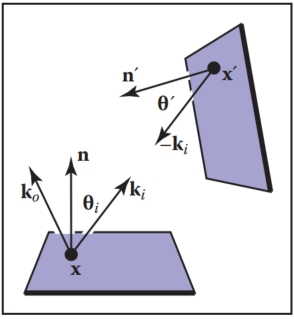
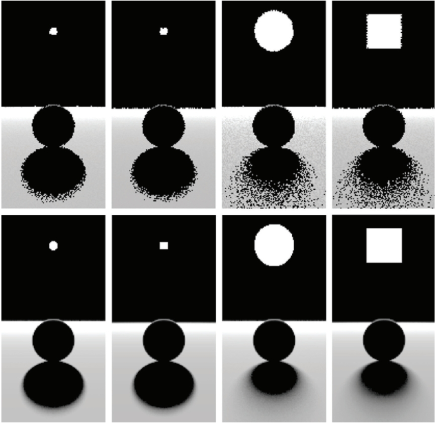
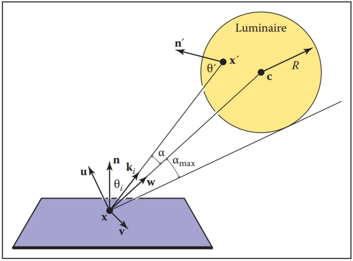

# 23  Global Illumination  全局照明

Many surfaces in the real world receive most or all of their incident light from other reflective surfaces. This is often called indirect lighting or mutual illumination. For example, the ceilings of most rooms receive little or no illumination directly from luminaires (light-emitting objects). The direct and indirect components of illumination are shown in Figure 23.1. 
现实世界中的许多表面从其他反射表面接收大部分或全部入射光。 这通常称为间接照明或相互照明。 例如，大多数房间的天花板很少或根本没有直接来自灯具（发光物体）的照明。 照明的直接和间接分量如图 23.1 所示。

Figure 23.1. In the left and middle images, the indirect and direct lighting, respectively, are separated out. On the right, the sum of both components is shown. Global illumination algorithms account for both the direct and the indirect lighting.
图 23.1。 在左图和中图中，间接照明和直接照明分别被分离出来。 右侧显示了两个组件的总和。 全局照明算法同时考虑直接照明和间接照明。

Although accounting for the interreflection of light between surfaces is straightforward, it is potentially costly because all surfaces may reflect any given surface, resulting in as many as $O(N^2)$ interactions for N surfaces. Because the entire global database of objects may illuminate any given object, accounting for indirect illumination is often called the global illumination problem. 
尽管计算表面之间光的相互反射很简单，但其成本可能很高，因为所有表面都可能反射任何给定表面，导致 N 个表面的相互作用多达 $O(N^2)$。 由于对象的整个全局数据库可能照亮任何给定的对象，因此考虑间接照明通常称为全局照明问题。

There is a rich and complex literature on solving the global illumination problem (e.g., Appel, 1968; Goral, Torrance, Greenberg, & Battaile, 1984; Cook et al., 1984; Immel et al., 1986; Kajiya, 1986; Malley, 1988). In this chapter, we discuss two algorithms as examples: particle tracing and path tracing. The first is useful for walkthrough applications such as maze games, and as a component of batch rendering. The second is useful for realistic batch rendering. Then we discuss separating out “direct” lighting where light takes exactly once bounce between luminaire and camera.
关于解决全局照明问题有丰富而复杂的文献（例如，Appel，1968；Goral、Torrance、Greenberg 和 Battaile，1984；Cook 等，1984；Immel 等，1986；Kajiya，1986；Malley ，1988）。 在本章中，我们将讨论两种算法作为示例：粒子追踪和路径追踪。 第一个对于迷宫游戏等演练应用程序非常有用，并且可以作为批量渲染的组件。 第二个对于真实的批量渲染很有用。 然后我们讨论分离“直接”照明，其中光线在灯具和相机之间只反射一次。

## 23.1 Particle Tracing for Lambertian Scenes  朗伯场景的粒子追踪

Recall the transport equation from Section 18.2: 回想一下 18.2 节中的传输方程：
$$
L_s(\bold{k}_o) = \int_{ all\ \bold{k}_i} ρ(\bold{k}_i, \bold{k}_o)L_f(\bold{k}_i) cos θ_idσ_i.
$$
The geometry for this equation is shown in Figure 23.2. When the illuminated point is Lambertian, this equation reduces to:  
该方程的几何结构如图 23.2 所示。 当被照射点为朗伯型时，该方程简化为：
$$
Ls = \frac{R}{π}\int_{all\ \bold{k}_i} L_f(\bold{k}_i) cos θ_idσ_i,
$$

Figure 23.2. The geometry for the transport equation in its directional form. 
图 23.2。 方向形式的输运方程的几何形状。

where R is the diffuse reflectance. One way to approximate the solution to this equation is to use finite element methods. First, we break the scene into N surfaces each with unknown surface radiance $L_i$, reflectance $R_i$, and emitted radiance $E_i$. This results in the set of N simultaneous linear equations
其中 R 是漫反射率。 近似求解该方程的一种方法是使用有限元方法。 首先，我们将场景分成 N 个表面，每个表面具有未知的表面辐射率 $L_i$、反射率 $R_i$ 和发射辐射率 $E_i$。 这导致 N 个联立线性方程组
$$
L_i = E_i + \frac{R_i}{π} \sum^N_{j=1}k_{ij}L_j,
$$
where $k_{ij}$ is a constant related to the original integral representation. We then solve this set of linear equations, and we can render N constant-colored polygons. This finite element approach is often called radiosity.
其中 $k_{ij}$ 是与原始积分表示相关的常数。 然后我们求解这组线性方程，就可以渲染 N 个常量颜色的多边形。 这种有限元方法通常称为光能传递。

An alternative method to radiosity is to use a statistical simulation approach by randomly following light “particles” from the luminaire through the environment. This is a type of particle tracing. There are many algorithms that use some form of particle tracing; we will discuss a form of particle tracing that deposits light in the textures on triangles. First, we review some basic radiometric relations. The radiance L of a Lambertian surface with area A is directly proportional to the incident power per unit area:
光能传递的另一种方法是使用统计模拟方法，随机跟踪来自灯具的光“粒子”穿过环境。 这是一种粒子追踪。 有许多算法使用某种形式的粒子追踪； 我们将讨论一种将光线沉积在三角形纹理中的粒子追踪形式。 首先，我们回顾一些基本的辐射关系。 面积为 A 的朗伯表面的辐射亮度 L 与单位面积的入射功率成正比：
$$
L = \frac{Φ}{πA}, \ \ \ \ \ (23.1)
$$
where $Φ$ is the outgoing power from the surface. Note that in this discussion, all radiometric quantities are either spectral or RGB, depending on the implementation. If the surface has emitted power $Φ_e$, incident power $Φ_i$, and reflectance $R$, then this equation becomes
其中 $Φ$ 是表面的输出功率。 请注意，在此讨论中，所有辐射量都是光谱或 RGB，具体取决于实现。 如果表面具有发射功率 $Φ_e$、入射功率 $Φ_i$ 和反射率 $R$，则该方程变为
$$
L = \frac{Φ_e + RΦ_i}{πA} 
$$
If we are given a model with $Φ_e$ and R specified for each triangle, we can proceed luminaire by luminaire, firing power in the form of particles from each luminaire. We associate a texture map with each triangle to store accumulated radiance, with all texels initialized to
如果我们给定一个模型，其中为每个三角形指定了 $Φ_e$ 和 R，我们可以逐个灯具进行处理，从每个灯具以粒子形式发射功率。 我们将纹理贴图与每个三角形相关联以存储累积的辐射亮度，所有纹理像素都初始化为
$$
L = \frac{Φ_e}{πA} .
$$
If a given triangle has area A and $n_t$ texels, and it is hit by a particle carrying power φ, then the radiance of that texel is incremented by 
如果给定的三角形具有面积 A 和 $n_t$ 纹素，并且它被携带功率 φ 的粒子击中，则该纹素的辐射亮度会增加
$$
ΔL = \frac{n_tφ}{πA}
$$
Once a particle hits a surface, we increment the radiance of the texel it hits, probabilistically decide whether to reflect the particle, and if we reflect it we choose a direction and adjust its power. 
一旦粒子撞击表面，我们就会增加它撞击的纹素的辐射度，概率性地决定是否反射粒子，如果反射它，我们选择一个方向并调整其功率。

Note that we want the particle to terminate at some point. For each surface we can assign a reflection probability p to each surface interaction. A natural choice would be to let p = R as it is with light in nature. The particle would then scatter around the environment, not losing or gaining any energy until it is absorbed. This approach works well when the particles carry a single wavelength (Walter, Hubbard, Shirley, & Greenberg, 1997). However, when a spectrum or RGB triple is carried by the ray as is often implemented (Jensen, 2001), there is no single R and some compromise for the value of p should be chosen. The power $φ'$ for reflected particles should be adjusted to account for the possible extinction of the particles:
请注意，我们希望粒子在某个时刻终止。 对于每个表面，我们可以为每个表面相互作用分配一个反射概率 p。 一个自然的选择是让 p = R，就像自然界中的光一样。 然后，粒子会分散在环境周围，在被吸收之前不会失去或获得任何能量。 当粒子携带单一波长时，这种方法效果很好（Walter、Hubbard、Shirley 和 Greenberg，1997）。 然而，当光谱或 RGB 三元组由光线携带时（Jensen，2001），没有单一的 R，并且应该选择 p 值的一些折衷方案。 应调整反射粒子的功率 $φ'$ 以考虑粒子可能消失的情况：
$$
φ' = \frac{Rφ}{p}
$$
Note that p can be set to any positive constant less than one, and that this constant can be different for each interaction. When $p > R$ for a given wavelength, the particle will gain power at that wavelength, and when $p < R$ it will lose power at that wavelength. The case where it gains power will not interfere with convergence because the particle will stop scattering and be terminated at some point as long as $p < 1$. For the remainder of this discussion we set $p = 0.5$. The path of a single particle in such a system is shown in Figure 23.3. 
请注意，p 可以设置为任何小于 1 的正常数，并且该常数对于每次交互作用可以不同。 对于给定波长，当 $p > R$ 时，粒子将在该波长处获得功率，而当 $p < R$ 时，粒子将在该波长处损失功率。 它获得能量的情况不会干扰收敛，因为只要 $p < 1$，粒子就会停止散射并在某个点终止。 对于本次讨论的其余部分，我们设置 $p = 0.5$。 此类系统中单个粒子的路径如图 23.3 所示。

Figure 23.3. The path of a particle that survives with probability 0.5 and is absorbed at the last intersection. The RGB power is shown for each path segment. 
图 23.3。 以 0.5 的概率幸存并在最后一个交叉点被吸收的粒子的路径。 显示每个路径段的 RGB 功率。

A key part to this algorithm is that we scatter the light with an appropriate distribution for Lambertian surfaces. As discussed in Section 14.4.1, we can find a vector with a cosine (Lambertian) distribution by transforming two canonical random numbers $(ξ_1, ξ_2)$ as follows:
该算法的关键部分是我们以适合朗伯表面的分布来散射光。 正如第 14.4.1 节中所讨论的，我们可以通过如下变换两个规范随机数  $(ξ_1, ξ_2)$来找到具有余弦（朗伯）分布的向量：
$$
\bold{a} = (cos (2πξ_1)\sqrt{ξ_2},\ sin (2πξ_1)\sqrt{ξ_2}, \sqrt{1 − ξ_2}) . \ \ \ \ \ (23.2)
$$
Note that this assumes the normal vector is parallel to the z-axis. For a triangle, we must establish an orthonormal basis with w parallel to the normal vector. We can accomplish this as follows:
请注意，这假设法向量平行于 z 轴。 对于三角形，我们必须建立一个正交基，其中 w 平行于法向量。 我们可以按如下方式完成此操作：
$$
\bold{w} = \frac{\bold{n}}{\|\bold{n}\|} , \\
\bold{u} = \frac{\bold{p}_1 - \bold{p}_0}{\|\bold{p}_1 - \bold{p}_0\|} \\

\bold{v} = \bold{w} × \bold{u} ,
$$
where $\bold{p}_i$ are the vertices of the triangle. Then, by definition, our vector in the appropriate coordinates is 
其中 $\bold{p}_i$ 是三角形的顶点。 然后，根据定义，我们在适当坐标中的向量是
$$
\bold{a} = \cos (2πξ_1)\sqrt{ξ_2}\bold{u} + \sin (2πξ_1)\sqrt{ξ_2}\bold{v} + \sqrt{1 − ξ_2}\bold{w}. \ \ \ \ \ (23.3)
$$
In pseudocode our algorithm for $p = 0.5$ and one luminaire is:  
在伪代码中，我们针对 $p = 0.5$ 和一个灯具的算法是：

> for (Each of n particles) do
> 	RGB $phi = Φ/n$
> 	compute uniform random point $\bold{a}$ on luminaire
> 	compute random direction $\bold{b}$ with cosine density
> 	done = false
> 	while not done do
> 		if (ray $\bold{a} + t\bold{b}$ hits at some point $\bold{c}$ ) then
> 			add $n_tRφ/(πA)$ to appropriate texel
> 			if ($ξ_1 > 0.5$) then
> 				φ = 2Rφ
> 				$\bold{a} = \bold{c}$
> 				$\bold{b}$ = random direction with cosine density
> 		else
> 			done = true  

Here $ξ_i$ are canonical random numbers. Once this code has run, the texture maps store the radiance of each triangle and can be rendered directly for any viewpoint with no additional computation. 
这里  $ξ_i$是规范随机数。 运行此代码后，纹理贴图将存储每个三角形的辐射亮度，并且可以直接针对任何视点进行渲染，无需额外计算。

## 23.2 Path Tracing 路径追踪

While particle tracing is well suited to precomputation of the radiances of diffuse scenes, it is problematic for creating images of scenes with general BRDFs or scenes that contain many objects. The most straightforward way to create images of such scenes is to use path tracing (Kajiya, 1986). This is a probabilistic method that sends rays from the eye and traces them back to the light. Often path tracing is used only to compute the indirect lighting. Here we will present it in a way that captures all lighting, which can be inefficient. This is sometimes called brute force path tracing. In Section 23.3, more efficient techniques for direct lighting can be added. 
虽然粒子追踪非常适合漫射场景的辐射亮度的预计算，但在创建具有一般 BRDF 的场景图像或包含许多对象的场景时存在问题。 创建此类场景图像的最直接方法是使用路径追踪（Kajiya，1986）。 这是一种概率方法，从眼睛发出光线并将其追踪回光线。 通常路径追踪仅用于计算间接照明。 在这里，我们将以捕获所有照明的方式呈现它，这可能效率很低。 这有时称为强力路径追踪。 在第 23.3 节中，可以添加更有效的直接照明技术。

In path tracing, we start with the full transport equation:
在路径追踪中，我们从完整的传输方程开始：
$$
L_s(\bold{k}_o) = L_e(\bold{k}_o) + \int_{all\ \bold{k}_i} ρ(\bold{k}_i, \bold{k}_o)L_f(\bold{k}_i) \cosθ_idσ_i.
$$
We use Monte Carlo integration to approximate the solution to this equation for each viewing ray. Recall from Section 14.3, that we can use random samples to approximate an integral:
我们使用蒙特卡罗积分来近似求解每个观察光线的该方程。 回想一下 14.3 节，我们可以使用随机样本来近似积分：
$$
\int_{x∈S}g(x)dμ ≈ \frac{1}{N}\sum^{N}_{i=1}\frac{g(x_i)}{p(x_i)},
$$
where the $x_i$ are random points with probability density function $p$. If we apply this directly to the transport equation with N = 1 we get
其中 $x_i$ 是具有概率密度函数 $p$ 的随机点。 如果我们直接将其应用到 N = 1 的传输方程中，我们会得到
$$
L_s(\bold{k}_o) ≈ L_e(\bold{k}_o) + \frac{ρ(\bold{k}_i, \bold{k}_o)L_f(\bold{k}_i) \cos θ_idσ_i}{ p(\bold{k}_i)}
$$
So, if we have a way to select random directions $\bold{k}_i$ with a known density $p$, we can get an estimate. The catch is that $L_f(\bold{k}_i)$ is itself an unknown. Fortunately, we can apply recursion and use a statistical estimate for $L_f(\bold{k}_i)$ by sending a ray in that direction to find the surface seen in that direction. We end when we hit a luminaire and $L_e$ is nonzero (Figure 23.4). This method assumes lights have zero reflectance, or we would continue to recurse. 
因此，如果我们有办法选择具有已知密度 $p$ 的随机方向 $\bold{k}_i$，我们就可以获得估计值。 问题是 $L_f(\bold{k}_i)$ 本身就是一个未知数。 幸运的是，我们可以应用递归并使用 $L_f(\bold{k}_i)$ 的统计估计，通过向该方向发送光线来找到在该方向上看到的表面。 当我们击中灯具并且 $L_e$ 不为零时，我们就结束了（图 23.4）。 该方法假设光的反射率为零，否则我们将继续递归。

Figure 23.4. In path tracing, a ray is followed through a pixel from the eye and scattered through the scene until it hits a luminaire. 
图 23.4。 在路径追踪中，光线从眼睛穿过一个像素，并在场景中散射，直到击中灯具。

In the case of a Lambertian BRDF ($ρ = R/π$), we can use a cosine density function:
对于朗伯 BRDF ($ρ = R/π$)，我们可以使用余弦密度函数：
$$
p(\bold{k}_i) = \frac{cos θ_i}{π}.
$$
A direction with this density can be chosen according to Equation (23.3). This allows some cancellation of cosine terms in our estimate:
可以根据方程（23.3）选择具有该密度的方向。 这允许在我们的估计中取消一些余弦项：
$$
L_s(\bold{k}_o) ≈ L_e(\bold{k}_o) + RL_f(\bold{k}_i).
$$
In pseudocode, such a path tracer for Lambertian surfaces would operate just like the ray tracers described in Chapter 4, but the raycolor function would be modified:
在伪代码中，朗伯曲面的路径追踪器的运行方式与第 4 章中描述的光线追踪器类似，但光线颜色函数将被修改：

> RGB raycolor(ray $\bold{a} + t\bold{b}$, int depth)
> if (ray hits at some point $\bold{c}$ ) then
> 	RGB $c = L_e(-\bold{b})$
> 	if (depth < maxdepth) then
> 		compute random direction $\bold{d}$
> 		return $c + R$ raycolor($\bold{c} + s\bold{d}, depth+1$)
> else
> 	return background color  

This will result in a very noisy image unless either large luminaires or very large numbers of samples are used. Note the color of the luminaires must be well above one (sometimes thousands or tens of thousands) to make the surfaces have final colors near one, because only those rays that hit a luminaire by chance will make a contribution, and most rays will contribute only a color near zero. To generate the random direction d, we use the same technique as we do in particle tracing (see Equation (23.2)). 
除非使用大型灯具或大量样本，否则这将导致图像噪声非常大。 请注意，灯具的颜色必须远高于 1（有时数千或数万），以使表面的最终颜色接近 1，因为只有那些偶然照射到灯具的光线才会做出贡献，而大多数光线只会做出贡献 接近于零的颜色。 为了生成随机方向 d，我们使用与粒子追踪相同的技术（参见方程（23.2））。

In the general case, we might want to use spectral colors or use a more general BRDF. In practice, we should have the material class contain member functions to compute a random direction as well as compute the p associated with that direction. This way materials can be added transparently to an implementation. 
在一般情况下，我们可能想要使用光谱颜色或更通用的 BRDF。 在实践中，我们应该让材质类包含成员函数来计算随机方向以及计算与该方向关联的 p。 通过这种方式，可以将材料透明地添加到实现中。

## 23.3 Accurate Direct Lighting 准确的直接照明

This section presents a more physically based method of direct lighting than Chapter 10. These methods will be useful in making global illumination algorithms more efficient. The key idea is to send shadow rays to the luminaires as described in Chapter 4, but to do so with careful bookkeeping based on the transport equation from the previous chapter. The global illumination algorithms can be adjusted to make sure they compute the direct component exactly once. For example, in particle tracing, particles coming directly from the luminaire would not be logged, so the particles would only encode indirect lighting. This makes nice looking shadows much more efficiently than computing direct lighting in the context of global illumination. 
本节介绍了一种比第 10 章更基于物理的直接照明方法。这些方法将有助于提高全局照明算法的效率。 关键思想是将阴影光线发送到第 4 章中描述的灯具，但要根据上一章中的传输方程仔细记录。 可以调整全局照明算法，以确保它们只计算一次直接分量。 例如，在粒子追踪中，不会记录直接来自灯具的粒子，因此粒子只会对间接照明进行编码。 这使得漂亮的阴影比在全局照明的背景下计算直接照明更有效。

### 23.3.1 Mathematical Framework  数学框架

To calculate the direct light from one luminaire (light emitting object) onto a nonemitting surface, we solve a form of the transport equation from Section 18.2:
为了计算从一个灯具（发光物体）到非发光表面的直接光，我们求解第 18.2 节中的传输方程的一种形式：
$$
L_s(\bold{x}, \bold{k}_o) = \int_{all\ \bold{x}'} \frac{ρ(\bold{k}_i, \bold{k}_o)L_e(\bold{x}', -\bold{k}_i)v(\bold{x}, \bold{x}')\cos θ_i \cos θ'}{\|\bold{x} - \bold{x}\|^2} dA' \ \ \ \  \ \ \ \ (23.4)
$$
Recall that $L_e$ is the emitted radiance of the source, v is a visibility function that is equal to 1 if $\bold{x}$ “sees” $\bold{x}'$ and zero otherwise, and the other variables are as illustrated in Figure 23.5. 
回想一下，$L_e$ 是光源发出的辐射亮度，v 是一个可见性函数，如果 $\bold{x}$ “看到”$\bold{x}'$，则等于 1，否则为零，其他变量 如图 23.5 所示。

Figure 23.5. The direct lighting terms for Equation (23.4).
图 23.5。 方程（23.4)的直接照明项。

If we are to sample Equation (23.4) using Monte Carlo integration, we need to pick a random point $\bold{x}'$ on the surface of the luminaire with density function p (so $\bold{x}' \sim p$). Just plugging into Equation (14.5) with one sample yields
如果我们要使用蒙特卡洛积分对方程（23.4）进行采样，我们需要在具有密度函数 p 的灯具表面上选取一个随机点 $\bold{x}'$ （因此 $\bold{x}' \sim p$）。 只需用一个样本代入方程 (14.5) 即可得出
$$
L_s(\bold{x}, \bold{k}_o) ≈ \frac{ρ(\bold{k}_i, \bold{k}_o)L_e(\bold{x}', −\bold{k}_i)v(\bold{x}, \bold{x}') \cos θ_i \cos θ'}{p(\bold{x}')\|\bold{x} − \bold{x}'\|^2} \ \ \ \ \ \ (23.5)
$$

If we pick a uniform random point on the luminaire, then $p = 1/A$, where A is the area of the luminaire. This gives
如果我们在灯具上选择一个均匀的随机点，则 $p = 1/A$，其中 A 是灯具的面积。 这给出了
$$
L_s(\bold{x}, \bold{k}_o) ≈ \frac{ρ(\bold{k}_i, \bold{k}_o)L_e(\bold{x}', −\bold{k}_i)v(\bold{x}, \bold{x}') \cos θ_i \cos θ'}{\|\bold{x} − \bold{x}'\|^2} \ \ \ \ \ \ (23.6)
$$
We can use Equation (23.6) to sample planar (e.g., rectangular) luminaires in a straightforward fashion. We simply pick a random point on each luminaire.
我们可以使用方程（23.6）以简单的方式对平面（例如矩形）灯具进行采样。 我们只需在每个灯具上随机选择一个点。

The code for one luminaire is:
一台灯具的代码是：

> color directLight$(\bold{x}, \bold{k}_o, \bold{n})$
> pick random point $\bold{x}'$ with normal vector $\bold{n}'$ on light
> $\bold{d} = \bold{x}' - \bold{x}$
> $\bold{k}_i = \bold{d}/\|d\|$
> if (ray $\bold{x} + t\bold{d}$ has no hits for $t < 1 - \epsilon$) then
> 	return $ρ(\bold{k}_i, \bold{k}_o)L_e(\bold{x}', -\bold{k}_i)(\bold{n} · \bold{d})(-\bold{n}' · \bold{xd})/\|d\|^4$
> else
> 	return 0  

The above code needs some extra tests such as clamping the cosines to zero if they are negative. Note that the term $\|\bold{d}\|^4$ comes from the distance squared term and the two cosines, e.g., $\bold{n} · \bold{d} = \|\bold{d}\| \cos θ$ because $\bold{d}$ is not necessarily a unit vector.
上面的代码需要一些额外的测试，例如如果余弦为负，则将余弦钳位为零。 请注意，项 $\|\bold{d}\|^4$ 来自距离平方项和两个余弦，例如 $\bold{n} · \bold{d} = \|\bold{d} \| \cos θ$ 因为 $\bold{d}$ 不一定是单位向量。

Several examples of soft shadows are shown in Figure 23.6. 
图 23.6 显示了几个软阴影的示例。

Figure 23.6. Various soft shadows on a backlit sphere with a square and an area light source. Top: 1 sample. Bottom: 100 samples. Note that the shape of the light source is less important than its size in determining shadow appearance.
图 23.6。 带有方形和区域光源的背光球体上的各种柔和阴影。 顶部：1 个样品。 底部：100 个样本。 请注意，在确定阴影外观时，光源的形状不如其大小重要。

### 23.3.2 Sampling a Spherical Luminaire  对球形灯具进行采样

Though a sphere with center c and radius R can be sampled using Equation (23.6), this sampling will yield a very noisy image because many samples will be on the back of the sphere, and the $\cos θ'$ term varies so much. Instead, we can use a more complex $p(\bold{x}')$ to reduce noise. 
虽然可以使用方程（23.6）对中心为 c、半径为 R 的球体进行采样，但这种采样将产生噪声非常大的图像，因为许多样本将位于球体的背面，并且 $\cos θ'$ 项变化很大 。 相反，我们可以使用更复杂的 $p(\bold{x}')$ 来减少噪音。

The first nonuniform density we might try is $p(\bold{x}') ∝ cos θ'$. This turns out to be just as complicated as sampling with $p(\bold{x}') ∝ \cos θ'/\|\bold{x}' − \bold{x}\|^2$, so we instead discuss that here. We observe that sampling on the luminaire this way is the same as using a constant density function $q(\bold{k}_i) =$ const defined in the space of directions subtended by the luminaire as seen from x. We now use a coordinate system defined with x at the origin, and a right-handed orthonormal basis with $\bold{w} = (\bold{c} − \bold{x})/\|\bold{c} − \bold{x}\|$, and $\bold{v} = (\bold{w} × \bold{n})/\|(\bold{w} × \bold{n})\| $(see Figure 23.7). We also define $(α, φ)$ to be the azimuthal and polar angles with respect to the $uvw$ coordinate system. 
我们可能尝试的第一个非均匀密度是 $p(\bold{x}') ∝ cos θ'$。 事实证明，这与使用 $p(\bold{x}') ∝ \cos θ'/\|\bold{x}' − \bold{x}\|^2$ 采样一样复杂，所以我们改为 在这里讨论这个问题。 我们观察到，以这种方式对灯具进行采样与使用恒定密度函数 $q(\bold{k}_i) =$ const 相同，该函数在从 x 看到的灯具所对方向的空间中定义。 我们现在使用以 x 为原点定义的坐标系，以及右手正交基 $\bold{w} = (\bold{c} − \bold{x})/\|\bold{c} − \bold{x}\|$ 和 $\bold{v} = (\bold{w} × \bold{n})/\|(\bold{w} × \bold{n})\| $（见图 23.7）。 我们还将 $(α, φ)$ 定义为相对于 $uvw$ 坐标系的方位角和极角。

Figure 23.7. Geometry for direct lighting at point $\bold{x}$ from a spherical luminaire. 
图 23.7。 来自球形灯具的点 $\bold{x}$ 直接照明的几何形状。

The maximum α that includes the spherical luminaire is given by
包括球形灯具在内的最大 α 由下式给出
$$
α_{max} = \arcsin(\frac{R}{\|\bold{x} - \bold{c}\|}) = \arccos\sqrt{1- (\frac{R}{\|\bold{x} - \bold{c}\|})^2}
$$
Thus, a uniform density (with respect to solid angle) within the cone of directions subtended by the sphere is just the reciprocal of the solid angle $2π(1 − \cos α_{max})$ subtended by the sphere:
因此，球体对向的方向锥内的均匀密度（相对于立体角）就是球体对向的立体角 $2π(1 − \cos α_{max})$ 的倒数：
$$
q(\bold{k}_i) = \frac{1}{2\pi(1-\sqrt{1 - (\frac{R}{\|\bold{x} - \bold{c}\|})^2})}
$$
And we get 
我们得到
$$
\begin{bmatrix}
\cos α \\
φ
\end{bmatrix} = \begin{bmatrix}
1 - ξ_1 + ξ_1\sqrt{1-(\frac{R}{\|\bold{x} - \bold{c}\|})^2} \\
2\pi ξ_2
\end{bmatrix}
$$
This gives us the direction $\bold{k}_i$. To find the actual point, we need to find the first point on the sphere in that direction. The ray in that direction is just $(\bold{x} + t\bold{k}_i)$,  where $\bold{k}_i$ is given by 
这给了我们方向$\bold{k}_i$。 为了找到实际的点，我们需要找到球体上该方向的第一个点。 该方向上的射线就是 $(\bold{x} + t\bold{k}_i)$，其中 $\bold{k}_i$ 由下式给出
$$
\bold{k}_i = \begin{bmatrix}
u_x & v_x & w_x \\
u_y & v_y & w_y \\
u_z & v_z & w_z \\
\end{bmatrix}
\begin{bmatrix}
\cosφ \sinα \\
\sinφ \sinα \\
\cosα
\end{bmatrix}
$$
We must also calculate $p(\bold{x}')$, the probability density function with respect to the area measure (recall that the density function $q$ is defined in solid angle space). Since we know that $q$ is a valid probability density function using the $ω$ measure, and we know that $dΩ = dA(\bold{x}') \cos θ'/\|\bold{x}' − \bold{x}\|^2$, we can relate any probability density function $q(\bold{k}_i)$ with its associated probability density function $p(\bold{x}')$:
我们还必须计算 $p(\bold{x}')$，即相对于面积度量的概率密度函数（回想一下，密度函数 $q$ 是在立体角空间中定义的）。 因为我们知道 $q$ 是使用 $ω$ 度量的有效概率密度函数，并且我们知道 $dΩ = dA(\bold{x}') \cos θ'/\|\bold{x}' - \bold{x}\|^2$，我们可以将任何概率密度函数 $q(\bold{k}_i)$ 与其相关的概率密度函数 $p(\bold{x}')$ 联系起来：
$$
q(\bold{k}_i) = \frac{p(\bold{x}')\cosθ'}{\|\bold{x}' - \bold{x}\|^2} \ \ \ \ \ (23.7)
$$
So we can solve for $p(\bold{x}')$: 
因此我们可以求解 $p(\bold{x}')$：
$$
p(\bold{x}') = \frac{\cos θ'}{2\pi\|\bold{x}' - \bold{x}\|^2(1-\sqrt{1-(\frac{R}{\|\bold{x} - \bold{c}\|})^2})}
$$
A good debugging case for this is shown in Figure 23.8. 
图 23.8 显示了一个很好的调试案例。

Figure 23.8. A sphere with $L_e = 1$ touching a sphere of reflectance 1. Where the two spheres touch, the reflective sphere should have $L(\bold{x}') = 1$ . Left: 1 sample. Middle: 100 samples. Right: 100 samples, close-up.
图 23.8。 $L_e = 1$ 的球体接触反射率为 1 的球体。在两个球体接触的地方，反射球体应具有 $L(\bold{x}') = 1$ 。 左：1 个样本。 中：100 个样本。 右：100 个样本，特写。

### 23.3.3 Nondiffuse Luminaries 非漫射灯具

There is no reason the luminance of the luminaire cannot vary with both direction and position. For example, it can vary with position if the luminaire is a television. It can vary with direction for car headlights and other directional sources. Little in our analysis need change from the previous sections, except that $L_e(x')$ must change to $L_e(\bold{x}', −\bold{k}_i)$. The simplest way to vary the intensity with direction is to use a Phong-like pattern with respect to the normal vector $\bold{n}'$. To avoid using an exponent in the term for the total light output, we can use the form
灯具的亮度没有理由不能随方向和位置而变化。 例如，如果灯具是电视，则它可以随位置而变化。 它会随着汽车前灯和其他定向光源的方向而变化。 我们的分析与前面的部分相比几乎不需要改变，除了 $L_e(x')$ 必须更改为 $L_e(\bold{x}', −\bold{k}_i)$。 随方向改变强度的最简单方法是使用相对于法线向量 $\bold{n}'$ 的类似 Phong 的图案。 为了避免在总光输出项中使用指数，我们可以使用以下形式
$$
L_e(\bold{x}', −\bold{k}_i) = \frac{(n + 1)E(\bold{x}')}{2π} \cos^{(n−1)}θ',
$$
where $E(\bold{x}')$ is the radiant exitance (power per unit area) at point $\bold{x}'$, and n is the Phong exponent. You get a diffuse light for n = 1. If the light is nonuniform across its area, e.g., as a television set is, then E will not be a constant.
其中 $E(\bold{x}')$ 是点 $\bold{x}'$ 处的辐射出射度（每单位面积的功率），n 是 Phong 指数。 当 n = 1 时，您会得到漫射光。如果光在其区域内不均匀，例如电视机，则 E 将不是常数。

## Frequently Asked Questions  经常问的问题

### My pixel values are no longer in some sensible zero-to-one range. What should I display? 我的像素值不再处于某个合理的零到一范围内。 我应该展示什么？

You should use one of the tone reproduction techniques described in Chapter 21. 
您应该使用第 21 章中描述的一种音调再现技术。

### What global illumination techniques are used in practice? 实践中使用了哪些全局照明技术？

For batch rendering of complex scenes, path tracing with one level of reflection is often used. Path tracing is often augmented with a particle tracing preprocess as described in Jensen’s book in the chapter notes. For walkthrough games, some form of world-space preprocess is often used, such as the particle tracing described in this chapter. For scenes with very complicated specular transport, an elegant but involved method, Metropolis Light Transport (Veach & Guibas, 1997) may be the best choice. 
对于复杂场景的批量渲染，通常使用一级反射的路径追踪。 路径追踪通常会通过粒子追踪预处理进行增强，如 Jensen 的书中章节注释中所述。 对于演练游戏，经常使用某种形式的世界空间预处理，例如本章中描述的粒子追踪。 对于镜面反射传输非常复杂的场景，Metropolis Light Transport（Veach & Guibas，1997）是一种优雅但复杂的方法，可能是最佳选择。

### How does the ambient component relate to global illumination?  环境成分与全局照明有何关系？

For diffuse scenes, the radiance of a surface is proportional to the product of the irradiance at the surface and the reflectance of the surface. The ambient component is just an approximation to the irradiance scaled by the inverse of π. So although it is a crude approximation, there can be some methodology to guessing it (M. F. Cohen, Chen, Wallace, & Greenberg, 1988), and it is probably more accurate than doing nothing, i.e., using zero for the ambient term. Because the indirect irradiance can vary widely within a scene, using a different constant for each surface can be used for better results rather than using a global ambient term. 
对于漫反射场景，表面的辐射度与表面的辐照度和表面的反射率的乘积成正比。 环境分量只是按 π 倒数缩放的辐照度的近似值。 因此，虽然它是一个粗略的近似值，但可以通过一些方法来猜测它（M. F. Cohen、Chen、Wallace 和 Greenberg，1988），并且它可能比什么都不做（即使用零作为环境项）更准确。 由于间接辐照度在场景内可能变化很大，因此为每个表面使用不同的常数可以获得更好的结果，而不是使用全局环境项。

### Why do most algorithms compute direct lighting using traditional ray tracing? 为什么大多数算法使用传统光线追踪来计算直接照明？

Although global illumination algorithms automatically compute direct lighting, and it is, in fact, slightly more complicated to make them compute only indirect lighting, it is usually faster to compute direct lighting separately. There are three reasons for this. First, indirect lighting tends to be smooth compared to direct lighting (see Figure 23.1) so coarser representations can be used, e.g., lowresolution texture maps for particle tracing. The second reason is that light sources tend to be small, and it is rare to hit them by chance in a “from the eye” method such as path tracing, while direct shadow rays are efficient. The third reason is that direct lighting allows stratified sampling, so it converges rapidly compared to unstratified sampling. The issue of stratification is the reason that shadow rays are used in Metropolis Light Transport despite the stability of its default technique for dealing with direct lighting as just one type of path to handle. 
尽管全局照明算法会自动计算直接照明，而且事实上，让它们仅计算间接照明稍微复杂一些，但单独计算直接照明通常会更快。 这有三个原因。 首先，与直接照明相比，间接照明往往更平滑（参见图 23.1），因此可以使用更粗糙的表示，例如用于粒子追踪的低分辨率纹理贴图。 第二个原因是光源往往很小，并且在“从眼睛”的方法（例如路径追踪）中很少会偶然击中光源，而直接阴影光线则非常有效。 第三个原因是直接照明允许分层采样，因此与非分层采样相比收敛得很快。 分层问题是在 Metropolis Light Transport 中使用阴影光线的原因，尽管其处理直接照明的默认技术仅作为一种要处理的路径类型具有稳定性。

### How artificial is it to assume ideal diffuse and specular behavior?  假设理想的漫反射和镜面反射行为有多人为？

For environments that have only matte and mirrored surfaces, the Lambertian/ specular assumption works well. A comparison between a rendering using that assumption and a photograph is shown in Figure 23.9. 
对于只有无光泽和镜面表面的环境，朗伯/镜面假设效果很好。 使用该假设的渲染与照片之间的比较如图 23.9 所示。

Figure 23.9. A comparison between a rendering and a photo. Image courtesy Sumant Pattanaik and the Cornell Program of Computer Graphics. 
图 23.9。 渲染和照片之间的比较。 图片由 Sumant Pattanaik 和康奈尔大学计算机图形学项目提供。

### How many shadow rays are needed per pixel?  每个像素需要多少阴影光线？

Typically between 16 and 400. Using narrow penumbra, a large ambient term (or a large indirect component), and a masking texture (Ferwerda, Shirley, Pattanaik, & Greenberg, 1997) can reduce the number needed. 
通常在 16 到 400 之间。使用窄半影、大的环境项（或大的间接分量）和遮蔽纹理（Ferwerda、Shirley、Pattanaik 和 Greenberg，1997）可以减少所需的数量。

### How do I sample something like a filament with a metal reflector where much of the light is reflected from the filament?如何对带有金属反射器的灯丝（其中大部分光从灯丝反射）之类的物体进行采样？ 

Typically, the whole light is replaced by a simple source that approximates its aggregate behavior. For viewing rays, the complicated source is used. So a car headlight would look complex to the viewer, but the lighting code might see simple disk-shaped lights. 
通常，整个光被一个近似其聚合行为的简单光源所取代。 为了观察光线，使用了复杂的光源。 因此，汽车前灯对于观察者来说看起来很复杂，但照明代码可能会看到简单的盘形灯。

### Isn’t something like the sky a luminaire?  像天空这样的东西不就是一个灯具吗？

Yes, and you can treat it as one. However, such large light sources may not be helped by direct lighting; the brute-force techniques are likely to work better. 
是的，您可以将其视为一个整体。 然而，如此大的光源可能无法通过直接照明得到帮助； 蛮力技术可能效果更好。

## Notes  注释

Global illumination has its roots in the fields of heat transfer and illumination engineering as documented in Radiosity: A Programmer’s Perspective (Ashdown, 1994). Other good books related to global illumination include Radiosity and Global Illumination (M. F. Cohen & Wallace, 1993), Radiosity and Realistic Image Synthesis (Sillion & Puech, 1994), Principles of Digital Image Synthesis (Glassner, 1995), Realistic Image Synthesis Using Photon Mapping (Jensen, 2001), Advanced Global Illumination (Dutr´ e, Bala, & Bekaert, 2002), and Physically Based Rendering (Pharr & Humphreys, 2004). The probabilistic methods discussed in this chapter are from Monte Carlo Techniques for Direct Lighting Calculations (Shirley, Wang, & Zimmerman, 1996).
全局照明起源于传热和照明工程领域，如《光能传递：程序员的视角》（Ashdown，1994 年）中所述。 其他与全局照明相关的好书包括《光能传递和全局照明》(M. F. Cohen & Wallace, 1993)、《光能传递和真实图像合成》(Sillion & Puech, 1994)、《数字图像合成原理》(Glassner, 1995)、《使用光子的真实图像合成》 映射（Jensen，2001）、高级全局照明（Dutr´ e、Bala 和 Bekaert，2002）以及基于物理的渲染（Pharr 和 Humphreys，2004）。 本章讨论的概率方法来自直接照明计算的蒙特卡罗技术（Shirley、Wang 和 Zimmerman，1996）。

## Exercises  练习

1. For a closed environment, where every surface is a diffuse reflector and emittor with reflectance R and emitted radiance E, what is the total radiance at each point? Hint: for $R = 0.5$ and $E = 0.25$ the answer is 0.5. This is an excellent debugging case. 
   对于封闭环境，每个表面都是漫反射器和发射器，反射率为 R，发射辐射率为 E，每个点的总辐射率是多少？ 提示：对于 $R = 0.5$ 和 $E = 0.25$，答案是 0.5。 这是一个优秀的调试案例。
1. Using the definitions from Chapter 18, verify Equation (23.1). 
   使用第 18 章中的定义，验证方程 (23.1)。
1. If we want to render a typically sized room with textures at centimetersquare resolution, approximately how many particles should we send to get an average of about 1000 hits per texel? 
   如果我们想要渲染一个典型大小的房间，并具有厘米见方分辨率的纹理，我们应该发送大约多少粒子才能获得每个纹素平均约 1000 次点击？
1. Develop a method to take random samples with uniform density from a disk. 
   开发一种从圆盘中随机抽取均匀密度样本的方法。
1. Develop a method to take random samples with uniform density from a triangle. 
   开发一种从三角形中随机抽取均匀密度样本的方法。
1. Develop a method to take uniform random samples on a “sky dome” (the inside of a hemisphere).
   开发一种在“天穹”（半球内部）上进行均匀随机采样的方法。