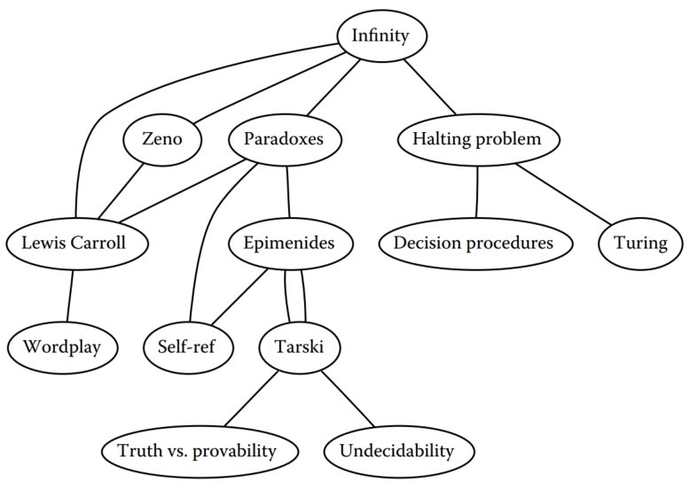
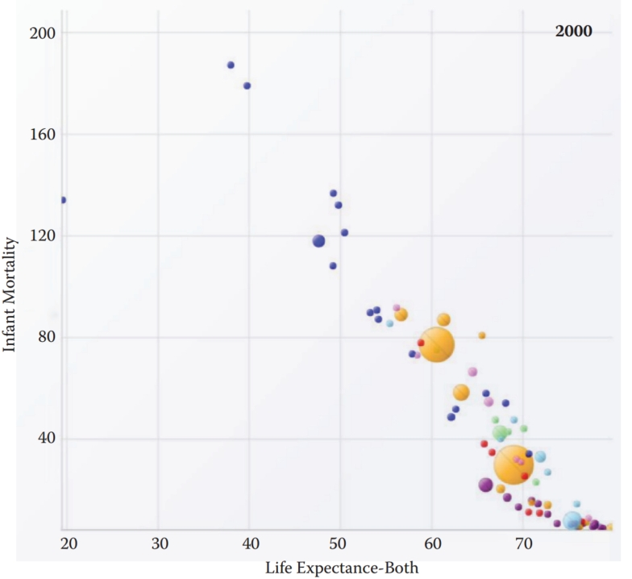
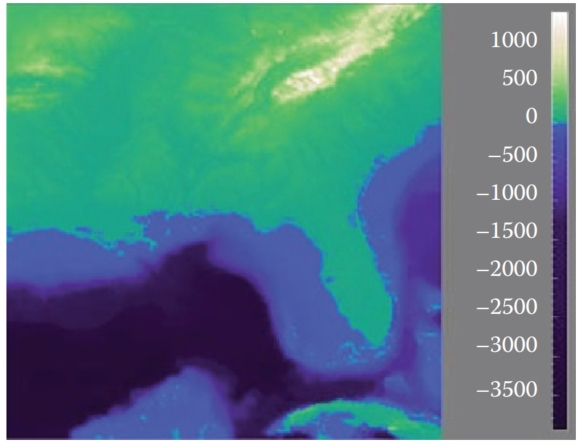
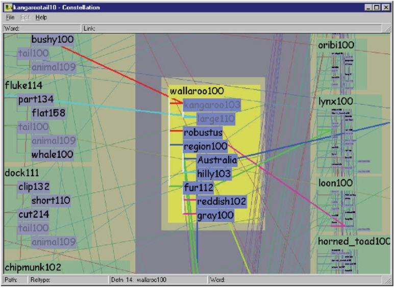
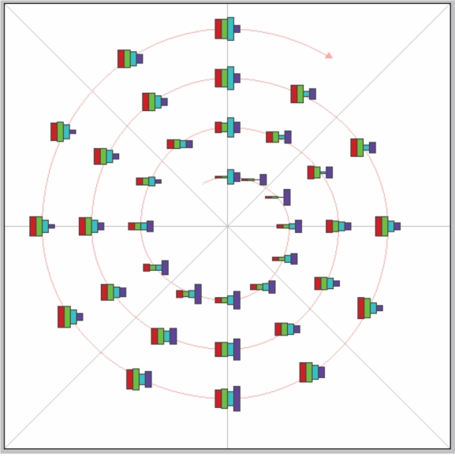
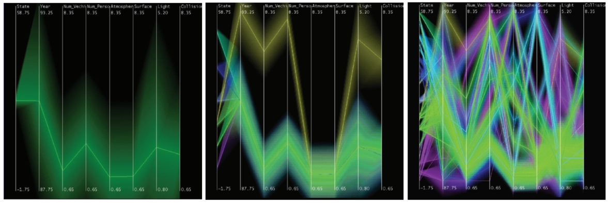
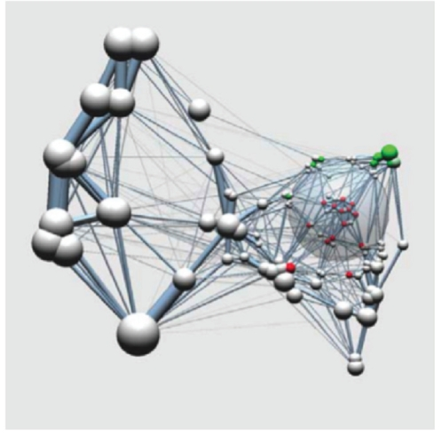
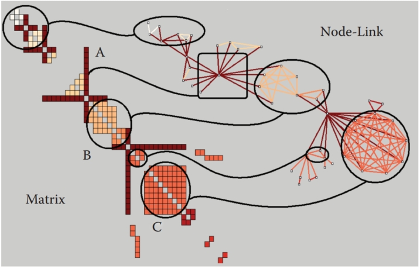

# 26  Visualization 可视化

A major application area of computer graphics is visualization, where computergenerated images are used to help people understand both spatial and nonspatial data. Visualization is used when the goal is to augment human capabilities in situations where the problem is not sufficiently well defined for a computer to handle algorithmically. If a totally automatic solution can completely replace human judgment, then visualization is not typically required. Visualization can be used to generate new hypotheses when exploring a completely unfamiliar dataset, to confirm existing hypotheses in a partially understood dataset, or to present information about a known dataset to another audience. 
计算机图形学的一个主要应用领域是可视化，其中计算机生成的图像用于帮助人们理解空间和非空间数据。 当目标是在问题没有充分定义以供计算机通过算法处理的情况下增强人类能力时，可以使用可视化。 如果全自动解决方案可以完全取代人类判断，那么通常不需要可视化。 可视化可用于在探索完全陌生的数据集时生成新的假设，以确认部分理解的数据集中的现有假设，或向其他受众呈现有关已知数据集的信息。

Visualization allows people to offload cognition to the perceptual system, using carefully designed images as a form of external memory. The human visual system is a very high-bandwidth channel to the brain, with a significant amount of processing occurring in parallel and at the pre-conscious level. We can thus use external images as a substitute for keeping track of things inside our own heads. For an example, let us consider the task of understanding the relationships between a subset of the topics in the splendid book Godel, Escher, Bach: The ¨ Eternal Golden Braid (Hofstadter, 1979); see Figure 26.1. 
可视化允许人们将认知转移到感知系统，使用精心设计的图像作为外部记忆的形式。 人类视觉系统是通往大脑的带宽非常高的通道，大量处理在前意识层面并行发生。 因此，我们可以使用外部图像来代替跟踪我们自己头脑中的事物。 例如，让我们考虑理解精彩著作《哥德尔、埃舍尔、巴赫：永恒的金辫子》（Hofstadter，1979）中主题子集之间关系的任务； 参见图 26.1。

Figure 26.1. Keeping track of relationships between topics is difficult using a text list. 
图 26.1。 使用文本列表来跟踪主题之间的关系很困难。

When we see the dataset as a text list, at the low level we must read words and compare them to memories of previously read words. It is hard to keep track of just these dozen topics using cognition and memory alone, let alone the hundreds of topics in the full book. The higher-level problem of identifying neighborhoods, for instance finding all the topics two hops away from the target topic Paradoxes, is very difficult.
当我们将数据集视为文本列表时，在低级别，我们必须读取单词并将它们与之前读取的单词的记忆进行比较。 仅凭认知和记忆就很难记住这十几个主题，更不用说整本书中的数百个主题了。 识别邻域的高级问题，例如找到距目标主题悖论两跳的所有主题，是非常困难的。

Figure 26.2 shows an external visual representation of the same dataset as a node-link graph, where each topic is a node and the linkage between two topics is shown directly with a line. Following the lines by moving our eyes around the image is a fast low-level operation with minimal cognitive load, so higherlevel neighborhood finding becomes possible. The placement of the nodes and the routing of the links between them was created automatically by the dot graph drawing program (Gansner, Koutsofois, North, & Vo, 1993). 
图 26.2 显示了同一数据集作为节点链接图的外部视觉表示，其中每个主题都是一个节点，两个主题之间的链接直接用一条线显示。 通过在图像周围移动眼睛来跟踪线条是一种快速的低级操作，认知负荷最小，因此更高级别的邻域查找成为可能。 节点的放置和节点之间链接的路由由点图绘制程序自动创建（Gansner、Koutsofois、North 和 Vo，1993）。

Figure 26.2. Substituting perception for cognition and memory allows us to understand relationships between book topics quickly. 
图 26.2。 用感知代替认知和记忆可以让我们快速理解书籍主题之间的关系。

We call the mapping of dataset attributes to a visual representation a visual encoding. One of the central problems in visualization is choosing appropriate encodings from the enormous space of possible visual representations, taking into account the characteristics of the human perceptual system, the dataset in question, and the task at hand.
我们将数据集属性到视觉表示的映射称为视觉编码。 可视化的核心问题之一是从可能的视觉表示的巨大空间中选择适当的编码，同时考虑人类感知系统的特征、相关数据集和手头的任务。

## 26.1 Background  背景 

### 26.1.1 History  历史

People have a long history of conveying meaning through static images, dating back to the oldest known cave paintings from over thirty thousand years ago. We continue to visually communicate today in ways ranging from rough sketches on the back of a napkin to the slick graphic design of advertisements. For thousands of years, cartographers have studied the problem of making maps that represent some aspect of the world around us. The first visual representations of abstract, nonspatial datasets were created in the 18th century by William Playfair (Friendly, 2008). 
人们通过静态图像传达意义有着悠久的历史，可以追溯到三万多年前已知的最古老的洞穴壁画。 今天，我们继续以各种方式进行视觉交流，从餐巾背面的草图到广告的精美图形设计。 几千年来，制图师一直在研究制作代表我们周围世界某些方面的地图的问题。 抽象、非空间数据集的第一个视觉表示是由 William Playfair 在 18 世纪创建的（Friendly，2008）。

Although we have had the power to create moving images for over one hundred and fifty years, creating dynamic images interactively is a more recent development only made possible by the widespread availability of fast computer graphics hardware and algorithms in the past few decades. Static visualizations of tiny datasets can be created by hand, but computer graphics enables interactive visualization of large datasets. 
尽管我们有能力创建移动图像已有一百五十多年的历史，但以交互方式创建动态图像只是最近的发展，只有在过去几十年中快速计算机图形硬件和算法的广泛使用才成为可能。 小型数据集的静态可视化可以手动创建，但计算机图形学可以实现大型数据集的交互式可视化。

### 26.1.2 Resource Limitations  资源限制 

When designing a visualization system, we must consider three different kinds of limitations: computational capacity, human perceptual and cognitive capacity, and display capacity. 
在设计可视化系统时，我们必须考虑三种不同的限制：计算能力、人类感知和认知能力以及显示能力。

As with any application of computer graphics, computer time and memory are limited resources and we often have hard constraints. If the visualization system needs to deliver interactive response, then it must use algorithms that can run in a fraction of a second rather than minutes or hours. 
与计算机图形学的任何应用程序一样，计算机时间和内存都是有限的资源，我们经常受到严格的限制。 如果可视化系统需要提供交互式响应，那么它必须使用可以在几分之一秒而不是几分钟或几小时内运行的算法。

On the human side, memory and attention must be considered as finite resources. Human memory is notoriously limited, both for long-term recall and for shorter-term working memory. Later in this chapter, we discuss some of the power and limitations of the low-level visual attention mechanisms that carry out massively parallel processing of the visual field. We store surprisingly little information internally in visual working memory, leaving us vulnerable to change blindness, the phenomenon where even very large changes are not noticed if we are attending to something else in our view (Simons, 2000). Moreover, vigilance is also a highly limited resource; our ability to perform visual search tasks degrades quickly, with far worse results after several hours than in the first few minutes (Ware, 2000).
在人类方面，记忆和注意力必须被视为有限的资源。 众所周知，人类记忆无论是长期记忆还是短期工作记忆都是有限的。 在本章后面，我们将讨论对视野进行大规模并行处理的低级视觉注意机制的一些功能和局限性。 我们在视觉工作记忆中存储的内部信息少得惊人，这使我们很容易出现变化盲视，即如果我们关注我们认为的其他事物，即使非常大的变化也不会被注意到的现象（Simons，2000）。 此外，警惕性也是一种非常有限的资源； 我们执行视觉搜索任务的能力会迅速下降，几个小时后的结果比最初几分钟要差得多（Ware，2000）。

Display capacity is a third kind of limitation to consider. Visualization designers often “run out of pixels,” where the resolution of the screen is not large enough to show all desired information simultaneously. The information density of a particular frame is a measure of the amount of information encoded versus the amount of unused space. There is a tradeoff between the benefits of showing as much as possible at once, to minimize the need for navigation and exploration, and the costs of showing too much at once, where the user is overwhelmed by visual clutter. 
显示容量是要考虑的第三种限制。 可视化设计人员经常“耗尽像素”，即屏幕分辨率不足以同时显示所有所需信息。 特定帧的信息密度是编码信息量与未使用空间量的度量。 一次显示尽可能多的内容（以最大程度地减少导航和探索的需要）的好处与一次显示太多内容（用户会被视觉混乱淹没）的成本之间存在权衡。

## 26.2 Data Types 数据类型

Many aspects of a visualization design are driven by the type of the data that we need to look at. For example, is it a table of numbers, or a set of relations between items, or inherently spatial data such as a location on the Earth’s surface or a collection of documents? 
可视化设计的许多方面都是由我们需要查看的数据类型驱动的。 例如，它是一个数字表，还是一组项目之间的关系，或者本质上是空间数据，例如地球表面的位置或文档集合？

We start by considering a table of data. We call the rows items of data and the columns are dimensions, also known as attributes. For example, the rows might represent people, and the columns might be names, age, height, shirt size, and favorite fruit. 
我们首先考虑一个数据表。 我们将行称为数据项，将列称为维度，也称为属性。 例如，行可能代表人，列可能代表姓名、年龄、身高、衬衫尺寸和最喜欢的水果。

We distinguish between three types of dimensions: quantitative, ordered, and categorical. Quantitative data, such as age or height, is numerical and we can do arithmetic on it. For example, the quantity of 68 inches minus 42 inches is 26 inches. With ordered data, such as shirt size, we cannot do full-fledged arithmetic, but there is a well-defined ordering. For example, large minus medium is not a meaningful concept, but we know that medium falls between small and large. Categorical data, such as favorite fruit or names, does not have an implicit ordering. We can only distinguish whether two things are the same (apples) or different (apples vs. bananas). 
我们区分三种类型的维度：定量、有序和分类。 定量数据，例如年龄或身高，是数字，我们可以对其进行算术运算。 例如，68英寸减去42英寸的数量是26英寸。 对于有序数据，例如衬衫尺寸，我们无法进行完整的算术，但有一个明确定义的排序。 例如，大减中并不是一个有意义的概念，但我们知道中介于小和大之间。 分类数据（例如最喜欢的水果或名称）没有隐式排序。 我们只能区分两个东西是否相同（苹果）或不同（苹果与香蕉）。

Relational data, or graphs, are another data type where nodes are connected by links. One specific kind of graph is a tree, which is typically used for hierarchical data. Both nodes and edges can have associated attributes. The word graph is unfortunately overloaded in visualization. The node-link graphs we discuss here, following the terminology of graph drawing and graph theory, could also be called networks. In the field of statistical graphics, graph is often used for chart, as in the line charts for time-series data shown in Figure 26.10. 
关系数据或图形是另一种数据类型，其中节点通过链接连接。 一种特定类型的图是树，它通常用于分层数据。 节点和边都可以具有关联的属性。 不幸的是，词图在可视化中超载了。 我们在这里讨论的节点链接图，遵循图绘制和图论的术语，也可以称为网络。 在统计图形领域，graph经常用于图表，如图26.10所示的时间序列数据的折线图。

Figure 26.10. Top: A 3D representation of this time series dataset introduces the problems of occlusion and perspective distortion. Bottom: The linked 2D views of derived aggregate curves and the calendar allow direct comparison and show more fine-grained patterns. Image courtesy Jarke van Wijk (van Wijk & van Selow, 1999), © 1999 IEEE.
图 26.10。 上图：该时间序列数据集的 3D 表示引入了遮挡和透视变形的问题。 底部：派生聚合曲线和日历的链接 2D 视图允许直接比较并显示更细粒度的模式。 图片由 Jarke van Wijk 提供（van Wijk & van Selow，1999)，© 1999 IEEE。

Some data is inherently spatial, such as geographic location or a field of measurements at positions in three-dimensional space as in the MRI or CT scans used by doctors to see the internal structure of a person’s body. The information associated with each point in space may be an unordered set of scalar quantities, or indexed vectors, or tensors. In contrast, nonspatial data can be visually encoded using spatial position, but that encoding is chosen by the designer rather than given implicitly in the semantics of the dataset itself. This choice is one of the most central and difficult problems of visualization design. 
有些数据本质上是空间数据，例如地理位置或三维空间中位置的测量范围，如医生用来查看人体内部结构的 MRI 或 CT 扫描。 与空间中的每个点相关联的信息可以是一组无序的标量、索引向量或张量。 相反，非空间数据可以使用空间位置进行可视化编码，但该编码是由设计者选择的，而不是在数据集本身的语义中隐式给出的。 这个选择是可视化设计最核心、最困难的问题之一。

### 26.2.1 Dimension and Item Count  维度和项目计数

The number of data dimensions that need to be visually encoded is one of the most fundamental aspects of the visualization design problem. Techniques that work for a low-dimensional dataset with a few columns will often fail for very high-dimensional datasets with dozens or hundreds of columns. A data dimension may have hierarchical structure, for example with a time series dataset where there are interesting patterns at multiple temporal scales. 
需要可视化编码的数据维度的数量是可视化设计问题的最基本方面之一。 适用于具有几列的低维数据集的技术通常不适用于具有数十或数百列的极高维数据集。 数据维度可能具有分层结构，例如时间序列数据集，其中在多个时间尺度上存在有趣的模式。

The number of data items is also important: a visualization that performs well for a few hundred items often does not scale to millions of items. In some cases the difficulty is purely algorithmic, where a computation would take too long; in others it is an even deeper perceptual problem that even an instantaneous algorithm could not solve, where visual clutter makes the representation unusable by a person. The range of possible values within a dimension may also be relevant. 
数据项的数量也很重要：对于数百个项目表现良好的可视化通常无法扩展到数百万个项目。 在某些情况下，困难纯粹是算法上的，计算时间太长； 在其他情况下，这是一个甚至瞬时算法也无法解决的更深层次的感知问题，其中视觉混乱使人无法使用表示。 维度内可能值的范围也可能是相关的。

### 26.2.2 Data Transformation and Derived Dimensions  数据转换和派生维度

Data is often transformed from one type to another as part of a visualization pipeline for solving the domain problem. For example, an original data dimension might be made up of quantitative data: floating point numbers that represent temperature. For some tasks, like finding anomalies in local weather patterns, the raw data might be used directly. For another task, like deciding whether water is an appropriate temperature for a shower, the data might be transformed into an ordered dimension: hot, warm, or cold. In this transformation, most of the detail is aggregated away. In a third example, when making toast, an even more lossy transformation into a categorical dimension might suffice: burned or not burned. 
作为解决领域问题的可视化管道的一部分，数据通常从一种类型转换为另一种类型。 例如，原始数据维度可能由定量数据组成：表示温度的浮点数。 对于某些任务，例如查找当地天气模式的异常情况，可以直接使用原始数据。 对于另一项任务，例如确定水是否适合淋浴的温度，数据可能会转换为有序维度：热、暖或冷。 在这个转变中，大部分细节都被聚合掉了。 在第三个例子中，在制作吐司时，对分类维度进行更有损的转换可能就足够了：烧焦或不烧焦。

The principle of transforming data into derived dimensions, rather than simply visually encoding the data in its original form, is a powerful idea. In Figure 26.10, the original data was an ordered collection of time-series curves. The transformation was to cluster the data, reducing the amount of information to visually encode to a few highly meaningful curves.
将数据转换为派生维度的原则，而不是简单地以原始形式对数据进行视觉编码，是一个强大的想法。 在图26.10中，原始数据是时间序列曲线的有序集合。 转换的目的是对数据进行聚类，减少视觉编码到一些高度有意义的曲线的信息量。

## 26.3 Human-Centered Design Process  以人为本的设计过程

The visualization design process can be split into a cascading set of layers, as shown in Figure 26.3. These layers all depend on each other; the output of the level above is input into the level below. 
可视化设计过程可以分为一组级联层，如图 26.3 所示。 这些层都相互依赖； 上一层的输出被输入到下一层。

Figure 26.3. Four nested layers of validation for visualization. 
图 26.3。 用于可视化的四个嵌套验证层。

### 26.3.1 Task Characterization  任务表征

A given dataset has many possible visual encodings. Choosing which visual encoding to use can be guided by the specific needs of some intended user. Different questions, or tasks, require very different visual encodings. For example, consider the domain of software engineering. The task of understanding the coverage of a test suite is well supported by the Tarantula interface shown in Figure 26.11. However, the task of understanding the modular decomposition of the software while refactoring the code might be better served by showing its hierarchical structure more directly as a node-link graph. 
给定的数据集有许多可能的视觉编码。 可以根据某些目标用户的特定需求来选择要使用的视觉编码。 不同的问题或任务需要非常不同的视觉编码。 例如，考虑软件工程领域。 图 26.11 所示的 Tarantula 界面很好地支持了理解测试套件覆盖范围的任务。 然而，通过更直接地将其层次结构显示为节点链接图，可能会更好地完成在重构代码时理解软件的模块化分解的任务。

Figure 26.11. Tarantula shows an overview of source code using one-pixel lines color coded by execution status of a software test suite. Image courtesy John Stasko (Jones, Harrold, & Stasko, 2002). 
图 26.11。 Tarantula 使用按软件测试套件的执行状态进行颜色编码的单像素线显示源代码的概述。 图片由 John Stasko 提供（Jones、Harrold 和 Stasko，2002 年)。

Understanding the requirements of some target audience is a tricky problem. In a human-centered design approach, the visualization designer works with a group of target users over time (C. Lewis & Rieman, 1993). In most cases, users know they need to somehow view their data but cannot directly articulate their needs as clear-cut tasks in terms of operations on data types. The iterative design process includes gathering information from the target users about their problems through interviews and observation of them at work, creating prototypes, and observing how users interact with those prototypes to see how well the proposed solution actually works. The software engineering methodology of requirements analysis can also be useful (Kovitz, 1999). 
了解某些目标受众的需求是一个棘手的问题。 在以人为本的设计方法中，可视化设计师随着时间的推移与一组目标用户一起工作（C. Lewis & Rieman，1993）。 在大多数情况下，用户知道他们需要以某种方式查看数据，但无法直接将他们的需求明确表达为数据类型操作方面的明确任务。 迭代设计过程包括通过访谈和观察目标用户在工作中收集有关其问题的信息，创建原型，并观察用户如何与这些原型交互，以了解所提出的解决方案的实际效果如何。 需求分析的软件工程方法也很有用（Kovitz，1999）。

### 26.3.2 Abstraction  抽象

After the specific domain problem has been identified in the first layer, the next layer requires abstracting it into a more generic representation as operations on the data types discussed in the previous section. Problems from very different domains can map to the same visualization abstraction. These generic operations include sorting, filtering, characterizing trends and distributions, finding anomalies and outliers, and finding correlation (Amar, Eagan, & Stasko, 2005). They also include operations that are specific to a particular data type, for example following a path for relational data in the form of graphs or trees. 
在第一层中识别出特定领域问题后，下一层需要将其抽象为更通用的表示形式，作为对上一节中讨论的数据类型的操作。 来自不同领域的问题可以映射到相同的可视化抽象。 这些通用操作包括排序、过滤、描述趋势和分布、查找异常和异常值以及查找相关性（Amar、Eagan 和 Stasko，2005）。 它们还包括特定于特定数据类型的操作，例如遵循图形或树形式的关系数据的路径。

This abstraction step often involves data transformations from the original raw data into derived dimensions. These derived dimensions are often of a different type than the original data: a graph may be converted into a tree, tabular data may be converted into a graph by using a threshold to decide whether a link should exist based on the field values, and so on. 
此抽象步骤通常涉及从原始数据到派生维度的数据转换。 这些导出的维度通常与原始数据具有不同的类型：图形可以转换为树，表格数据可以通过使用阈值来根据字段值决定链接是否应该存在来转换为图形，等等 在。 

### 26.3.3 Technique and Algorithm Design  技术和算法设计

Once an abstraction has been chosen, the next layer is to design appropriate visual encoding and interaction techniques. Section 26.4 covers the principles of visual encoding, and we discuss interaction principles in Sections 26.5. We present techniques that take these principles into account in Sections 26.6 and 26.7. 
一旦选择了抽象，下一层就是设计适当的视觉编码和交互技术。 第 26.4 节涵盖了视觉编码的原理，我们在第 26.5 节中讨论了交互原理。 我们在第 26.6 节和第 26.7 节中介绍了考虑这些原则的技术。

A detailed discussion of visualization algorithms is unfortunately beyond the scope of this chapter. 
不幸的是，可视化算法的详细讨论超出了本章的范围。

### 26.3.4 Validation  验证

Each of the four layers has different validation requirements. 
四层中的每一层都有不同的验证要求。

The first layer is designed to determine whether the problem is correctly characterized: is there really a target audience performing particular tasks that would benefit from the proposed tool? An immediate way to test assumptions and conjectures is to observe or interview members of the target audience, to ensure that the visualization designer fully understands their tasks. A measurement that cannot be done until a tool has been built and deployed is to monitor its adoption rate within that community, although of course many other factors in addition to utility affect adoption. 
第一层旨在确定问题是否被正确表征：是否真的有目标受众执行将从所提议的工具中受益的特定任务？ 测试假设和猜想的直接方法是观察或采访目标受众的成员，以确保可视化设计师完全理解他们的任务。 在构建和部署工具之前无法进行的测量是监控其在该社区内的采用率，当然，除了实用性之外，还有许多其他因素也会影响采用。

The next layer is used to determine whether the abstraction from the domain problem into operations on specific data types actually solves the desired problem. After a prototype or finished tool has been deployed, a field study can be carried out to observe whether and how it is used by its intended audience. Also, images produced by the system can be analyzed both qualitatively and quantitatively. 
下一层用于确定从领域问题抽象为特定数据类型的操作是否真正解决了所需的问题。 部署原型或成品工具后，可以进行实地研究以观察目标受众是否以及如何使用它。 此外，系统生成的图像可以进行定性和定量分析。

The purpose of the third layer is to verify that the visual encoding and interaction techniques chosen by the designer effectively communicate the chosen abstraction to the users. An immediate test is to justify that individual design choices do not violate known perceptual and cognitive principles. Such a justification is necessary but not sufficient, since visualization design involves many tradeoffs between interacting choices. After a system is built, it can be tested through formal laboratory studies where many people are asked to do assigned tasks so that measurements of the time required for them to complete the tasks and their error rates can be statistically analyzed. 
第三层的目的是验证设计者选择的视觉编码和交互技术是否有效地将所选抽象传达给用户。 一个直接的测试是证明个人设计选择不违反已知的感知和认知原则。 这样的理由是必要的，但还不够，因为可视化设计涉及交互选择之间的许多权衡。 系统建成后，可以通过正式的实验室研究进行测试，要求许多人完成分配的任务，以便可以统计分析他们完成任务所需的时间和错误率。

A fourth layer is employed to verify that the algorithm designed to carry out the encoding and interaction choices is faster or takes less memory than previous algorithms. An immediate test is to analyze the computational complexity of the proposed algorithm. After implementation, the actual time performance and memory usage of the system can be directly measured. 
第四层用于验证设计用于执行编码和交互选择的算法是否比以前的算法更快或占用更少的内存。 立即测试是分析所提出算法的计算复杂性。 实施后，可以直接测量系统的实际时间性能和内存使用情况。

## 26.4 Visual Encoding Principles  视觉编码原理

We can describe visual encodings as graphical elements, called marks, that convey information through visual channels. A zero-dimensional mark is a point, a one-dimensional mark is a line, a two-dimensional mark is an area, and a three-dimensional mark is a volume. Many visual channels can encode information, including spatial position, color, size, shape, orientation, and direction of motion. Multiple visual channels can be used to simultaneously encode different data dimensions; for example, Figure 26.4 shows the use of horizontal and vertical spatial position, color, and size to display four data dimensions. More than one channel can be used to redundantly code the same dimension, for a design that displays less information but shows it more clearly. 
我们可以将视觉编码描述为图形元素，称为标记，通过视觉通道传达信息。 零维标记是点，一维标记是线，二维标记是面，三维标记是体积。 许多视觉通道可以编码信息，包括空间位置、颜色、大小、形状、方位和运动方向。 可以使用多个视觉通道同时编码不同的数据维度； 例如，图26.4显示了使用水平和垂直空间位置、颜色和大小来显示四个数据维度。 可以使用多个通道对同一尺寸进行冗余编码，以实现显示较少信息但显示更清晰的设计。

Figure 26.4. The four visual channels of horizontal and vertical spatial position, color, and size are used to encode information in this scatterplot chart Image courtesy George Robertson (Robertson, Fernandez, Fisher, Lee, & Stasko, 2008), © IEEE 2008.
图 26.4。 水平和垂直空间位置、颜色和大小的四个视觉通道用于编码此散点图中的信息 图片由 George Robertson 提供（Robertson、Fernandez、Fisher、Lee 和 Stasko，2008 年)，© IEEE 2008。

### 26.4.1 Visual Channel Characteristics  视觉通道特性

Important characteristics of visual channels are distinguishability, separability, and popout. 
视觉通道的重要特征是可区分性、可分离性和弹出性。

Channels are not all equally distinguishable. Many psychophysical experiments have been carried out to measure the ability of people to make precise distinctions about information encoded by the different visual channels. Our abilities depend on whether the data type is quantitative, ordered, or categorical. Figure 26.5 shows the rankings of visual channels for the three data types. Figure 26.6 shows some of the default mappings for visual channels in the Tableau/Polaris system, which take into account the data type.
渠道的区别并不相同。 已经进行了许多心理物理学实验来测量人们精确区分不同视觉通道编码的信息的能力。 我们的能力取决于数据类型是定量的、有序的还是分类的。 图 26.5 显示了三种数据类型的视觉通道的排名。 图 26.6 显示了 Tableau/Polaris 系统中视觉通道的一些默认映射，其中考虑了数据类型。

Figure 26.5. Our ability to perceive information encoded by a visual channel depends on the type of data used, from most accurate at the top to least at the bottom. Redrawn and adapted from (Mackinlay, 1986).
图 26.5。 我们感知视觉通道编码的信息的能力取决于所使用的数据类型，从顶部最准确到底部最不准确。 重新绘制并改编自（Mackinlay，1986)。

Figure 26.6. The Tableau/Polaris system default mappings for four visual channels according to data type. Image courtesy Chris Stolte (Stolte, Tang, & Hanrahan, 2008), © 2008 IEEE. 
图 26.6。 Tableau/Polaris 系统根据数据类型默认映射四个视觉通道。 图片由 Chris Stolte 提供（Stolte、Tang 和 Hanrahan，2008 年)，© 2008 IEEE。

Spatial position is the most accurate visual channel for all three types of data, and it dominates our perception of a visual encoding. Thus, the two most important data dimensions are often mapped to horizontal and vertical spatial positions.
空间位置是所有三种类型数据最准确的视觉通道，它主导着我们对视觉编码的感知。 因此，两个最重要的数据维度通常映射到水平和垂直空间位置。

However, the other channels differ strongly between types. The channels of length and angle are highly discriminable for quantitative data but poor for ordered and categorical, while in contrast hue is very accurate for categorical data but mediocre for quantitative data.
然而，其他渠道之间的类型差异很大。 长度和角度的通道对于定量数据具有很强的可区分性，但对于有序和分类数据的区分性较差，而相比之下，色调对于分类数据非常准确，但对于定量数据则表现平庸。

We must always consider whether there is a good match between the dynamic range necessary to show the data dimension and the dynamic range available in the channel. For example, encoding with line width uses a one-dimensional mark and the size channel. There are a limited number of width steps that we can reliably use to visually encode information: a minimum thinness of one pixel is enforced by the screen resolution (ignoring antialiasing to simplify this discussion), and there is a maximum thickness beyond which the object will be perceived as a polygon rather than a line. Line width can work very well to show three or four different values in a data dimension, but it would be a poor choice for dozens or hundreds of values.
我们必须始终考虑显示数据维度所需的动态范围与通道中可用的动态范围之间是否存在良好的匹配。 例如，线宽编码使用一维标记和尺寸通道。 我们可以可靠地使用有限数量的宽度步骤来对信息进行视觉编码：屏幕分辨率强制执行一个像素的最小厚度（忽略抗锯齿以简化讨论），并且存在一个最大厚度，超过该厚度物体将 被视为多边形而不是线。 线宽可以很好地显示数据维度中的三到四个不同值，但对于数十或数百个值来说，这将是一个糟糕的选择。

Some visual channels are integral, fused together at a pre-conscious level, so they are not good choices for visually encoding different data dimensions. Others are separable, without interactions between them during visual processing, and are safe to use for encoding multiple dimensions. Figure 26.7 shows two channel pairs. Color and position are highly separable. We can see that horizontal size and vertical size are not so easy to separate, because our visual system automatically integrates these together into a unified perception of area. Size interacts with many channels: as the size of an object grows smaller, it becomes more difficult to distinguish its shape or color.
一些视觉通道是完整的，在前意识层面融合在一起，因此它们不是对不同数据维度进行视觉编码的良好选择。 其他是可分离的，在视觉处理过程中它们之间没有交互，并且可以安全地用于编码多个维度。 图 26.7 显示了两个通道对。 颜色和位置是高度可分离的。 我们可以看到，水平尺寸和垂直尺寸并不那么容易分开，因为我们的视觉系统自动将它们整合在一起形成统一的区域感知。 尺寸与许多通道相互作用：随着物体尺寸变小，区分其形状或颜色变得更加困难。

Figure 26.7. Color and location are separable channels well suited to encode different data dimensions, but the horizontal size and and vertical size channels are automatically fused into an integrated perception of area. Redrawn after (Ware, 2000).
图 26.7。 颜色和位置是可分离的通道，非常适合编码不同的数据维度，但水平尺寸和垂直尺寸通道会自动融合到区域的集成感知中。 之后重新绘制（Ware，2000)。

We can selectively attend to a channel so that items of a particular type “pop out” visually, as discussed in Section 20.4.3. An example of visual popout is when we immediately spot the red item amidst a sea of blue ones, or distinguish the circle from the squares. Visual popout is powerful and scalable because it occurs in parallel, without the need for conscious processing of the items one by one. Many visual channels have this popout property, including not only the list above but also curvature, flicker, stereoscopic depth, and even the direction of lighting. However, in general we can only take advantage of popout for one channel at a time. For example, a white circle does not pop out from a group of circles and squares that can be white or black, as shown in Figure 20.46. When we need to search across more than one channel simultaneously, the length of time it takes to find the target object depends linearly on the number of objects in the scene. 
我们可以有选择地关注一个通道，以便特定类型的项目在视觉上“弹出”，如第 20.4.3 节中所述。 视觉弹出的一个例子是，当我们立即在蓝色项目的海洋中发现红色项目，或者区分圆形和正方形时。 视觉弹出功能强大且可扩展，因为它是并行发生的，无需有意识地逐项处理。 许多视觉通道都具有这种弹出属性，不仅包括上面的列表，还包括曲率、闪烁、立体深度，甚至照明方向。 然而，一般来说，我们一次只能利用一个通道的弹出功能。 例如，白色圆圈不会从一组可以是白色或黑色的圆形和正方形中弹出，如图 20.46 所示。 当我们需要同时搜索多个通道时，找到目标对象所需的时间长度与场景中对象的数量线性相关。

### 26.4.2 Color  颜色

Color can be a very powerful channel, but many people do not understand its properties and use it improperly. As discussed in Section 20.2.2, we can consider color in terms of three separate visual channels: hue, saturation, and lightness. Region size strongly affects our ability to sense color. Color in small regions is relatively difficult to perceive, and designers should use bright, highly saturated colors to ensure that the color coding is distinguishable. The inverse situation is true when colored regions are large, as in backgrounds, where low saturation pastel colors should be used to avoid blinding the viewer. 
颜色可以是一个非常强大的通道，但许多人不了解它的属性并且使用不当。 正如第 20.2.2 节中所讨论的，我们可以根据三个独立的视觉通道来考虑颜色：色调、饱和度和亮度。 区域大小强烈影响我们感知颜色的能力。 小区域的颜色相对难以感知，设计者应使用明亮、高饱和度的颜色，以确保颜色编码可区分。 当彩色区域较大时（如背景），情况正好相反，应使用低饱和度柔和的颜色以避免使观看者感到眩目。

Hue is a very strong cue for encoding categorical data. However, the available dynamic range is very limited. People can reliably distinguish only around a dozen hues when the colored regions are small and scattered around the display. A good guideline for color coding is to keep the number of categories less than eight, keeping in mind that the background and the neutral object color also count in the total. 
色调是编码分类数据的非常有力的线索。 然而，可用的动态范围非常有限。 当彩色区域很小并且分散在显示器周围时，人们只能可靠地区分大约十几种色调。 颜色编码的一个很好的指导原则是保持类别数量少于八个，请记住背景和中性对象颜色也计入总数。

For ordered data, lightness and saturation are effective because they have an implicit perceptual ordering. People can reliably order by lightness, always placing gray in between black and white. With saturation, people reliably place the less saturated pink between fully saturated red and zero-saturation white. However, hue is not as as good a channel for ordered data because it does not have an implicit perceptual ordering. When asked to create an ordering of red, blue, green, and yellow, people do not all give the same answer. People can and do learn conventions, such as green-yellow-red for traffic lights, or the order of colors in the rainbow, but these constructions are at a higher level than pure perception. Ordered data is typically shown with a discrete set of color values.
对于有序数据，亮度和饱和度是有效的，因为它们具有隐式的感知顺序。 人们可以可靠地根据亮度进行排序，总是将灰色置于黑色和白色之间。 通过饱和度，人们可靠地将不太饱和的粉色置于完全饱和的红色和零饱和度的白色之间。 然而，色调对于有序数据来说并不是一个很好的通道，因为它没有隐式的感知顺序。 当被要求创建红色、蓝色、绿色和黄色的顺序时，人们并没有给出相同的答案。 人们可以而且确实学习了约定，例如交通信号灯的绿-黄-红，或者彩虹中的颜色顺序，但这些结构比纯粹的感知处于更高的水平。 有序数据通常用一组离散的颜色值显示。

Quantitative data is shown with a colormap, a range of color values that can be continuous or discrete. A very unfortunate default in many software packages is the rainbow colormap, as shown in Figure 26.8. The standard rainbow scale suffers from three problems. First, hue is used to indicate order. A better choice would be to use lightness because it has an implicit perceptual ordering. Even more importantly, the human eye responds most strongly to luminance. Second, the scale is not perceptually linear: equal steps in the continuous range are not perceived as equal steps by our eyes. Figure 26.8 shows an example, where the rainbow colormap obfuscates the data. While the range from −2000 to −1000 has three distinct colors (cyan, green, and yellow), a range of the same size from −1000 to 0 simply looks yellow throughout. The graphs on the right show that the perceived value is strongly tied to the luminance, which is not even monotonically increasing in this scale. 
定量数据用颜色图显示，颜色图是一系列可以连续或离散的颜色值。 许多软件包中一个非常不幸的默认值是彩虹颜色图，如图 26.8 所示。 标准彩虹标尺存在三个问题。 首先，色调用于表示顺序。 更好的选择是使用亮度，因为它具有隐含的感知顺序。 更重要的是，人眼对亮度的反应最为强烈。 其次，尺度在感知上不是线性的：连续范围内的相等步长不会被我们的眼睛感知为相等步长。 图 26.8 显示了一个示例，其中彩虹颜色图混淆了数据。 虽然从 -2000 到 -1000 的范围具有三种不同的颜色（青色、绿色和黄色），但从 -1000 到 0 的相同大小的范围整个看起来只是黄色。 右图显示感知值与亮度密切相关，在这个尺度上亮度甚至不是单调增加的。

Figure 26.8. The standard rainbow colormap has two defects: it uses hue to denote ordering, and it is not perceptually isolinear. Image courtesy Bernice Rogowitz. 
图 26.8。 标准彩虹色彩图有两个缺陷：它使用色调来表示排序，并且它在感知上不是等线的。 图片由伯妮斯·罗戈维茨提供。

In contrast, Figure 26.9 shows the same data with a more appropriate colormap, where the lightness increases monotonically. Hue is used to create a semantically meaningful categorization: the viewer can discuss structure in the dataset, such as the dark blue sea, the cyan continental shelf, the green lowlands, and the white mountains. 
相比之下，图 26.9 显示了具有更合适的颜色图的相同数据，其中亮度单调增加。 色调用于创建语义上有意义的分类：查看者可以讨论数据集中的结构，例如深蓝色的海洋、青色的大陆架、绿色的低地和白色的山脉。

Figure 26.9. The structure of the same dataset is far more clear with a colormap where monotonically increasing lightness is used to show ordering and hue is used instead for segmenting into categorical regions. Image courtesy Bernice Rogowitz.
图 26.9。 使用颜色图，同一数据集的结构更加清晰，其中使用单调增加的亮度来显示排序，并使用色调来分割为分类区域。 图片由伯妮斯·罗戈维茨提供。

In both the discrete and continuous cases, colormaps should take into account whether the data is sequential or diverging. The ColorBrewer application (www.colorbrewer.org) is an excellent resource for colormap construction (Brewer, 1999). 
在离散和连续情况下，颜色图都应考虑数据是连续的还是发散的。 ColorBrewer 应用程序 (www.colorbrewer.org) 是构建色彩图的绝佳资源（Brewer，1999）。

Another important issue when encoding with color is that a significant fraction of the population, roughly 10% of men, is red-green color deficient. If a coding using red and green is chosen because of conventions in the target domain, redundantly coding lightness or saturation in addition to hue is wise. Tools such as the website http://www.vischeck.com should be used to check whether a color scheme is distinguishable to people with color deficient vision. 
使用颜色进行编码时的另一个重要问题是，很大一部分人口（大约 10% 的男性）缺乏红绿色颜色。 如果由于目标域中的约定而选择使用红色和绿色的编码，那么除了色调之外，对亮度或饱和度进行冗余编码是明智的。 应使用网站 http://www.vischeck.com 等工具来检查颜色方案对于色觉缺陷的人是否可以区分。

26.4.3 2D vs. 3D Spatial Layouts  2D 与 3D 空间布局

The question of whether to use two or three channels for spatial position has been extensively studied. When computer-based visualization began in the late 1980s, and interactive 3D graphics was a new capability, there was a lot of enthusiasm for 3D representations. As the field matured, researchers began to understand the costs of 3D approaches when used for abstract datasets (Ware, 2001). 
是否使用两个或三个通道进行空间定位的问题已被广泛研究。 当基于计算机的可视化在 20 世纪 80 年代末开始出现时，交互式 3D 图形成为一种新功能，人们对 3D 表示产生了极大的热情。 随着该领域的成熟，研究人员开始了解 3D 方法用于抽象数据集时的成本（Ware，2001）。

Occlusion, where some parts of the dataset are hidden behind others, is a major problem with 3D. Although hidden surface removal algorithms such as zbuffers and BSP trees allow fast computation of a correct 2D image, people must still synthesize many of these images into an internal mental map. When people look at realistic scenes made from familiar objects, usually they can quickly understand what they see. However, when they see an unfamiliar dataset, where a chosen visual encoding maps abstract dimensions into spatial positions, understanding the details of its 3D structure can be challenging even when they can use interactive navigation controls to change their 3D viewpoint. The reason is once again the limited capacity of human working memory (Plumlee & Ware, 2006).
遮挡（数据集的某些部分隐藏在其他部分后面）是 3D 的一个主要问题。 尽管隐藏表面去除算法（例如 zbuffers 和 BSP 树）可以快速计算正确的 2D 图像，但人们仍然必须将许多这些图像合成到内部心理地图中。 当人们看到由熟悉的物体组成的真实场景时，通常可以很快理解他们所看到的内容。 然而，当他们看到一个不熟悉的数据集（其中选择的视觉编码将抽象维度映射到空间位置）时，即使他们可以使用交互式导航控件来更改其 3D 视点，理解其 3D 结构的细节也可能具有挑战性。 原因又是人类工作记忆的容量有限（Plumlee & Ware，2006）。

Another problem with 3D is perspective distortion. Although real-world objects do indeed appear smaller when they are further from our eyes, foreshortening makes direct comparison of object heights difficult (Tory, Kirkpatrick, Atkins, & M¨ oller, 2006). Once again, although we can often judge the heights of familiar objects in the real world based on past experience, we cannot necessarily do so with completely abstract data that has a visual encoding where the height conveys meaning. For example, it is more difficult to judge bar heights in a 3D bar chart than in multiple horizontally aligned 2D bar charts. 
3D 的另一个问题是透视变形。 尽管现实世界的物体在离我们的眼睛较远时确实看起来更小，但透视法使得直接比较物体高度变得困难（Tory、Kirkpatrick、Atkins 和 Měller，2006）。 再说一遍，虽然我们经常可以根据过去的经验来判断现实世界中熟悉物体的高度，但我们不一定能用完全抽象的数据来做到这一点，这些数据具有高度传达意义的视觉编码。 例如，判断 3D 条形图中的条形高度比判断多个水平对齐的 2D 条形图中的条形高度更困难。

Another problem with unconstrained 3D representations is that text at arbitrary orientations in 3D space is far more difficult to read than text aligned in the 2D image plane (Grossman, Wigdor, & Balakrishnan, 2007). 
无约束 3D 表示的另一个问题是 3D 空间中任意方向的文本比 2D 图像平面中对齐的文本更难以阅读（Grossman、Wigdor 和 Balakrishnan，2007）。

Figure 26.10 illustrates how carefully chosen 2D views of an abstract dataset can avoid the problems with occlusion and perspective distortion inherent in 3D views. The top view shows a 3D representation created directly from the original time-series data, where each cross-section is a 2D time-series curve showing power consumption for one day, with one curve for each day of the year along the extruded third axis. Although this representation is straightforward to create, we can only see large-scale patterns such as the higher consumption during working hours and the seasonal variation between winter and summer. To create the 2D linked views at the bottom, the curves were hierarchically clustered, and only aggregate curves representing the top clusters are drawn superimposed in the same 2D frame. Direct comparison between the curve heights at all times of the day is easy because there is no perspective distortion or occlusion. The same color coding is used in the calendar view, which is very effective for understanding temporal patterns. 
图 26.10 说明了如何精心选择抽象数据集的 2D 视图来避免 3D 视图中固有的遮挡和透视变形问题。 顶视图显示了直接根据原始时间序列数据创建的 3D 表示，其中每个横截面都是显示一天功耗的 2D 时间序列曲线，沿着拉伸的第三轴，一条曲线代表一年中的每一天 。 尽管这种表示很容易创建，但我们只能看到大规模模式，例如工作时间的较高消耗以及冬季和夏季之间的季节性变化。 为了在底部创建 2D 链接视图，曲线被分层聚类，并且仅在同一 2D 框架中叠加绘制代表顶部聚类的聚合曲线。 一天中任何时间的曲线高度之间的直接比较都很容易，因为不存在透视变形或遮挡。 日历视图中使用相同的颜色编码，这对于理解时间模式非常有效。

In contrast, if a dataset consists of inherently 3D spatial data, such as showing fluid flow over an airplane wing or a medical imaging dataset from an MRI scan, then the costs of a 3D view are outweighed by its benefits in helping the user construct a useful mental model of the dataset structure. 
相比之下，如果数据集由固有的 3D 空间数据组成，例如显示飞机机翼上的流体流动或来自 MRI 扫描的医学成像数据集，则 3D 视图的成本与其帮助用户构建 数据集结构的有用心理模型。

### 26.4.4 Text Labels 文本标签

Text in the form of labels and legends is a very important factor in creating visualizations that are useful rather than simply pretty. Axes and tick marks should be labeled. Legends should indicate the meaning of colors, whether used as discrete patches or in continuous color ramps. Individual items in a dataset typically have meaningful text labels associated with them. In many cases showing all labels at all times would result in too much visual clutter, so labels can be shown for a subset of the items using label positioning algorithms that show labels at a desired density while avoiding overlap (Luboschik, Schumann, & Cords, 2008). A straightforward way to choose the best label to represent a group of items is to use a greedy algorithm based on some measure of label importance, but synthesizing a new label based on the characteristics of the group remains a difficult problem. A more interaction-centric approach is to only show labels for individual items based on an interactive indication from the user. 
标签和图例形式的文本是创建有用而不仅仅是美观的可视化效果的一个非常重要的因素。 轴和刻度线应贴上标签。 图例应指示颜色的含义，无论是用作离散色块还是连续色带。 数据集中的各个项目通常具有与其关联的有意义的文本标签。 在许多情况下，始终显示所有标签会导致过多的视觉混乱，因此可以使用标签定位算法显示项目子集的标签，该算法以所需的密度显示标签，同时避免重叠（Luboschik、Schumann 和 Cords， 2008）。 选择最佳标签来表示一组项目的一种直接方法是使用基于某种标签重要性度量的贪心算法，但是根据组的特征合成新标签仍然是一个难题。 一种更加以交互为中心的方法是根据用户的交互指示仅显示单个项目的标签。

## 26.5 Interaction Principles  交互原则

Several principles of interaction are important when designing a visualization. Low-latency visual feedback allows users to explore more fluidly, for example by showing more detail when the cursor simply hovers over an object rather than requiring the user to explicitly click. Selecting items is a fundamental operation when interacting with large datasets, as is visually indicating the selected set with highlighting. Color coding is a common form of highlighting, but other channels can also be used. 
设计可视化时，交互的几个原则很重要。 低延迟视觉反馈允许用户更流畅地探索，例如，当光标简单地悬停在对象上时显示更多细节，而不是要求用户显式单击。 选择项目是与大型数据集交互时的基本操作，就像通过突出显示直观地指示所选集一样。 颜色编码是突出显示的常见形式，但也可以使用其他通道。

Many forms of interaction can be considered in terms of what aspect of the display they change. Navigation can be considered a change of viewport. Sorting is a change to the spatial ordering; that is, changing how data is mapped to the spatial position visual channel. The entire visual encoding can also be changed. 
许多形式的交互可以根据它们改变显示的哪个方面来考虑。 导航可以被认为是视口的改变。 排序是对空间顺序的改变； 也就是说，改变数据映射到空间位置视觉通道的方式。 整个视觉编码也可以改变。

### 26.5.1 Overview First, Zoom and Filter, Details on Demand  概览先行，缩放过滤，详情按需

The influential mantra “Overview first, zoom and filter, details on demand” (Shneiderman, 1996) elucidates the role of interaction and navigation in visualization design. Overviews help the user notice regions where further investigation might be productive, whether through spatial navigation or through filtering. As we discuss below, details can be presented in many ways: with popups from clicking or cursor hovering, in a separate window, and by changing the layout on the fly to make room to show additional information. 
有影响力的口号“概览优先，缩放和过滤，按需提供细节”（Shneiderman，1996）阐明了交互和导航在可视化设计中的作用。 概述可以帮助用户注意到进一步调查可能有效的区域，无论是通过空间导航还是通过过滤。 正如我们下面讨论的，详细信息可以通过多种方式呈现：通过单击或光标悬停弹出窗口，在单独的窗口中，以及通过动态更改布局以腾出空间来显示附加信息。

### 26.5.2 Interactivity Costs   交互成本 

Interactivity has both power and cost. The benefit of interaction is that people can explore a larger information space than can be understood in a single static image. However, a cost to interaction is that it requires human time and attention. If the user must exhaustively check every possibility, use of the visualization system may degenerate into human-powered search. Automatically detecting features of interest to explicitly bring to the user’s attention via the visual encoding is a useful goal for the visualization designer. However, if the task at hand could be completely solved by automatic means, there would be no need for a visualization in the first place. Thus, there is always a tradeoff between finding automatable aspects and relying on the human in the loop to detect patterns. 
交互性既有力量，也有成本。 交互的好处是人们可以探索比单个静态图像所能理解的更大的信息空间。 然而，交互的代价是它需要人类的时间和注意力。 如果用户必须详尽地检查每种可能性，则可视化系统的使用可能会退化为人力搜索。 自动检测感兴趣的特征以通过视觉编码明确引起用户的注意对于可视化设计者来说是一个有用的目标。 然而，如果手头的任务可以完全通过自动方式解决，那么一开始就不需要可视化。 因此，在寻找可自动化方面和依赖循环中的人员来检测模式之间总是存在权衡。

### 26.5.3 Animation  动画片

Animation shows change using time. We distinguish animation, where successive frames can only be played, paused, or stopped, from true interactive control. There is considerable evidence that animated transitions can be more effective than jump cuts, by helping people track changes in object positions or camera viewpoints (Heer & Robertson, 2007). Although animation can be very effective for narrative and storytelling, it is often used ineffectively in a visualization context (Tversky, Morrison, & Betrancourt, 2002). It might seem obvious to show data that changes over time by using animation, a visual modality that changes over time. However, people have difficulty in making specific comparisons between individual frames that are not contiguous when they see an animation consisting of many frames. The very limited capacity of human visual memory means that we are much worse at comparing memories of things that we have seen in the past than at comparing things that are in our current field of view. For tasks requiring comparison between up to several dozen frames, side-by-side comparison is often more effective than animation. Moreover, if the number of objects that change between frames is large, people will have a hard time tracking everything that occurs (Robertson et al., 2008). Narrative animations are carefully designed to avoid having too many actions occurring simultaneously, whereas a dataset being visualized has no such constraint. For the special case of just two frames with a limited amount of change, the very simple animation of flipping back and forth between the two can be a useful way to identify the differences between them. 
动画显示使用时间的变化。 我们将连续帧只能播放、暂停或停止的动画与真正的交互式控制区分开来。 有大量证据表明，动画过渡可以比跳切更有效，可以帮助人们跟踪物体位置或摄像机视点的变化（Heer & Robertson，2007）。 尽管动画对于叙事和讲故事非常有效，但它在可视化环境中通常使用效率较低（Tversky、Morrison 和 Betrancourt，2002）。 使用动画（一种随时间变化的视觉形式）来显示随时间变化的数据似乎是显而易见的。 然而，当人们看到由许多帧组成的动画时，很难对不连续的各个帧进行具体比较。 人类视觉记忆的能力非常有限，这意味着我们在比较过去看到的事物的记忆方面比比较当前视野中的事物要差得多。 对于需要在多达几十帧之间进行比较的任务，并排比较通常比动画更有效。 此外，如果帧之间变化的对象数量很大，人们将很难跟踪发生的一切（Robertson et al., 2008）。 叙事动画经过精心设计，以避免同时发生太多动作，而可视化的数据集则没有这样的限制。 对于只有两个帧且变化量有限的特殊情况，在两个帧之间来回翻转的非常简单的动画可能是识别它们之间差异的有用方法。

## 26.6 Composite and Adjacent Views  复合视图和相邻视图

A very fundamental visual encoding choice is whether to have a single composite view showing everything in the same frame or window, or to have multiple views adjacent to each other.
一个非常基本的视觉编码选择是是否使用单个复合视图来显示同一帧或窗口中的所有内容，或者使用多个彼此相邻的视图。

### 26.6.1 Single Drawing  单图

When there are only one or two data dimensions to encode, then horizontal and vertical spatial position are the obvious visual channel to use, because we perceive them most accurately and position has the strongest influence on our internal mental model of the dataset. The traditional statistical graphics displays of line charts, bar charts, and scatterplots all use spatial ordering of marks to encode information. These displays can be augmented with additional visual channels, such as color and size and shape, as in the scatterplot shown in Figure 26.4. 
当只有一两个数据维度需要编码时，水平和垂直空间位置是明显要使用的视觉通道，因为我们感知它们最准确，并且位置对我们数据集的内部心理模型的影响最大。 传统的统计图形显示（折线图、条形图和散点图）都使用标记的空间排序来编码信息。 这些显示可以通过额外的视觉通道进行增强，例如颜色、大小和形状，如图 26.4 所示的散点图所示。

The simplest possible mark is a single pixel. In pixel-oriented displays, the goal is to provide an overview of as many items as possible. These approaches use the spatial position and color channels at a high information density, but preclude the use of the size and shape channels. Figure 26.11 shows the Tarantula software visualization tool (Jones et al., 2002), where most of the screen is devoted to an overview of source code using one-pixel high lines (Eick, Steffen, & Sumner, 1992). The color and brightness of each line shows whether it passed, failed, or had mixed results when executing a suite of test cases. 
最简单的标记是单个像素。 在面向像素的显示器中，目标是提供尽可能多的项目的概览。 这些方法以高信息密度使用空间位置和颜色通道，但排除了尺寸和形状通道的使用。 图 26.11 显示了 Tarantula 软件可视化工具（Jones 等人，2002 年），其中大部分屏幕专门用于使用一像素高线来概述源代码（Eick、Steffen 和 Sumner，1992 年）。 每条线的颜色和亮度显示执行一组测试用例时它是通过、失败还是混合结果。

### 26.6.2 Superimposing and Layering  叠加和分层

Multiple items can be superimposed in the same frame when their spatial position is compatible. Several lines can be shown in the same line chart, and many dots in the same scatterplot, when the axes are shared across all items. One benefit of a single shared view is that comparing the position of different items is very easy. If the number of items in the dataset is limited, then a single view will often suffice. Visual layering can extend the usefulness of a single view when there are enough items that visual clutter becomes a concern. Figure 26.12 shows how a redundant combination of the size, saturation, and brightness channels serves to distinguish a foreground layer from a background layer when the user moves the cursor over a block of words. 
当多个项目的空间位置兼容时，可以将多个项目叠加在同一帧中。 当所有项目共享轴时，同一个折线图中可以显示多条线，同一个散点图中可以显示许多点。 单一共享视图的好处之一是比较不同项目的位置非常容易。 如果数据集中的项目数量有限，那么单个视图通常就足够了。 当有足够多的项目导致视觉混乱成为问题时，视觉分层可以扩展单个视图的有用性。 图 26.12 显示了当用户将光标移动到单词块上时，大小、饱和度和亮度通道的冗余组合如何用于区分前景层和背景层。

Figure 26.12. Visual layering with size, saturation, and brightness in the Constellation system (Munzner, 2000). 
图 26.12。 星座系统中的大小、饱和度和亮度的视觉分层（Munzner，2000)。

### 26.6.3 Glyphs  字形 

We have been discussing the idea of visual encoding using simple marks, where a single mark can only have one value for each visual channel used. With more complex marks, which we will call glyphs, there is internal structure where subregions have different visual channel encodings.
我们一直在讨论使用简单标记进行视觉编码的想法，其中单个标记对于所使用的每个视觉通道只能有一个值。 对于更复杂的标记（我们将其称为字形），存在内部结构，其中子区域具有不同的视觉通道编码。

Designing appropriate glyphs has the same challenges as designing visual encodings. Figure 26.13 shows a variety of glyphs, including the notorious faces originally proposed by Chernoff. The danger of using faces to show abstract data dimensions is that our perceptual and emotional response to different facial features is highly nonlinear in a way that is not fully understood, but the variability is greater than between the visual channels that we have discussed so far. We are probably far more attuned to features that indicate emotional state, such as eyebrow orientation, than other features, such as nose size or face shape. 
设计适当的字形与设计视觉编码具有相同的挑战。 图 26.13 显示了各种字形，包括 Chernoff 最初提出的臭名昭著的面孔。 使用面部来显示抽象数据维度的危险在于，我们对不同面部特征的感知和情感反应是高度非线性的，其方式尚未完全理解，但变异性比我们迄今为止讨论的视觉通道之间的变异性更大。 与鼻子大小或脸型等其他特征相比，我们可能更容易注意到表明情绪状态的特征，例如眉毛方向。

Figure 26.13. Complex marks, which we call glyphs, have subsections that visually encode different data dimensions. Image courtesy Matt Ward (M. O. Ward, 2002). 
图 26.13。 复杂标记（我们称之为字形）具有对不同数据维度进行视觉编码的子部分。 图片由马特·沃德 (M. O. Ward, 2002) 提供。

Complex glyphs require significant display area for each glyph, as shown in Figure 26.14 where miniature bar charts show the value of four different dimensions at many points along a spiral path. Simpler glyphs can be used to create a global visual texture, the glyph size is so small that individual values cannot be read out without zooming, but region boundaries can be discerned from the overview level. Figure 26.15 shows an example using stick figures of the kind in the upper right in Figure 26.13. Glyphs may be placed at regular intervals, or in data-driven spatial positions using an original or derived data dimension. 
复杂的字形需要每个字形的显着显示区域，如图 26.14 所示，其中微型条形图显示沿着螺旋路径的许多点处的四个不同维度的值。 更简单的字形可用于创建全局视觉纹理，字形尺寸非常小，以至于在不缩放的情况下无法读出各个值，但可以从概览级别辨别区域边界。 图 26.15 显示了使用图 26.13 右上角的简笔画的示例。 字形可以以规则的间隔放置，或者使用原始或导出的数据维度放置在数据驱动的空间位置中。

Figure 26.14. Complex glyphs require significant display area so that the encoded information can be read. Image courtesy Matt Ward, created with the SpiralGlyphics software (M. O. Ward, 2002). 
图 26.14。 复杂的字形需要大量的显示区域，以便可以读取编码信息。 图片由 Matt Ward 提供，使用 SpiralGlyphics 软件创建（M. O. Ward，2002 年)。

Figure 26.15. A dense array of simple glyphs. Image courtesy Georges Grinstein (S. Smith, Grinstein, & Bergeron, 1991), © 1991 IEEE. 
图 26.15。 密集的简单字形数组。 图片由 Georges Grinstein 提供（S. Smith、Grinstein 和 Bergeron，1991 年)，© 1991 IEEE。

### 26.6.4 Multiple Views  多个视图

We now turn from approaches with only a single frame to those which use multiple views that are linked together. The most common form of linkage is linked highlighting, where items selected in one view are highlighted in all others. In linked navigation, movement in one view triggers movement in the others. 
我们现在从仅使用单个框架的方法转向使用链接在一起的多个视图的方法。 最常见的链接形式是链接突出显示，其中在一个视图中选择的项目在所有其他视图中突出显示。 在链接导航中，一个视图中的移动会触发其他视图中的移动。 

There are many kinds of multiple-view approaches. In what is usually called simply the multiple-view approach, the same data is shown in several views, each of which has a different visual encoding that shows certain aspects of the dataset most clearly. The power of linked highlighting across multiple visual encodings is that items that fall in a contiguous region in one view are often distributed very differently in the other views. In the small-multiples approach, each view has the same visual encoding for different datasets, usually with shared axes between frames so that comparison of spatial position between them is meaningful. Sideby-side comparison with small multiples is an alternative to the visual clutter of superimposing all the data in the same view, and to the human memory limitations of remembering previously seen frames in an animation that changes over time. 
多视图方法有很多种。 在通常所谓的多视图方法中，相同的数据显示在多个视图中，每个视图都有不同的视觉编码，可以最清楚地显示数据集的某些方面。 跨多个视觉编码的链接突出显示的强大之处在于，落在一个视图中的连续区域中的项目通常在其他视图中的分布非常不同。 在小倍数方法中，每个视图对于不同的数据集具有相同的视觉编码，通常在帧之间具有共享轴，因此它们之间的空间位置的比较是有意义的。 与小倍数进行并排比较是一种替代方案，可以替代在同一视图中叠加所有数据带来的视觉混乱，以及记住动画中随时间变化的先前看过的帧的人类记忆限制。

The overview-and-detail approach is to have the same data and the same visual encoding in two views, where the only difference between them is the level of zooming. In most cases, the overview uses much less display space than the detail view. The combination of overview and detail views is common outside of visualization in many tools ranging from mapping software to photo editing. With a detail-on-demand approach, another view shows more information about some selected item, either as a popup window near the cursor or in a permanent window in another part of the display. 
概述和细节方法是在两个视图中具有相同的数据和相同的视觉编码，其中它们之间的唯一区别是缩放级别。 在大多数情况下，概览使用的显示空间比详细视图少得多。 概述和详细视图的组合在可视化之外的许多工具（从地图软件到照片编辑）中很常见。 通过按需详细信息方法，另一个视图显示有关某些选定项目的更多信息，或者作为光标附近的弹出窗口，或者在显示的另一部分的永久窗口中。

Determining the most appropriate spatial position of the views themselves with respect to each other can be as significant a problem as determining the spatial position of marks within a single view. In some systems, the location of the views is arbitrary and left up to the window system or the user. Aligning the views allows precise comparison between them, either vertically, horizontally, or with an array for both directions. Just as items can be sorted within a view, views can be sorted within a display, typically with respect to a derived variable measuring some aspect of the entire view as opposed to an individual item within it. 
确定视图本身相对于彼此的最合适的空间位置可能与确定单个视图内标记的空间位置一样重要。 在某些系统中，视图的位置是任意的，由窗口系统或用户决定。 对齐视图可以在垂直、水平或两个方向上使用数组进行精确比较。 正如可以在视图内对项目进行排序一样，视图也可以在显示内进行排序，通常相对于测量整个视图的某些方面的派生变量而不是其中的单个项目。

Figure 26.16 shows a visualization of census data that uses many views. In addition to geographic information, the demographic information for each county includes population, density, gender, median age, percent change since 1990, and proportions of major ethnic groups. The visual encodings used include geographic, scatterplot, parallel coordinate, tabular, and matrix views. The same color encoding is used across all the views, with a legend in the bottom middle. The scatterplot matrix shows linked highlighting across all views, where the blue items are close together in some views and scattered in others. The map in the upper-left corner is an overview for the large detail map in the center. The tabular views allow direct sorting by and selection within a dimension of interest.
图 26.16 显示了使用多个视图的人口普查数据的可视化。 除地理信息外，每个县的人口信息还包括人口、密度、性别、年龄中位数、自 1990 年以来的百分比变化以及主要民族的比例。 使用的视觉编码包括地理、散点图、平行坐标、表格和矩阵视图。 所有视图都使用相同的颜色编码，底部中间有一个图例。 散点图矩阵显示所有视图中的链接突出显示，其中蓝色项目在某些视图中靠近在一起，而在其他视图中分散。 左上角的地图是中心大细节地图的概述。 表格视图允许在感兴趣的维度内直接排序和选择。

Figure 26.16. The Improvise toolkit was used to create this multiple-view visualization. Image courtesy Chris Weaver. 
图 26.16。 Improvise 工具包用于创建这种多视图可视化。 图片由克里斯·韦弗提供。

## 26.7 Data Reduction 数据缩减

The visual encoding techniques that we have discussed so far show all of the items in a dataset. However, many datasets are so large that showing everything simultaneously would result in so much visual clutter that the visual representation would be difficult or impossible for a viewer to understand. The main strategies to reduce the amount of data shown are overviews and aggregation, filtering and navigation, the focus+context techniques, and dimensionality reduction. 
到目前为止，我们讨论的视觉编码技术显示了数据集中的所有项目。 然而，许多数据集太大，同时显示所有内容会导致视觉混乱，以致观看者很难或不可能理解视觉表示。 减少显示数据量的主要策略是概述和聚合、过滤和导航、焦点+上下文技术以及降维。

### 26.7.1 Overviews and Aggregation  概述和聚合

With tiny datasets, a visual encoding can easily show all data dimensions for all items. For datasets of medium size, an overview that shows information about all items can be constructed by showing less detail for each item. Many datasets have internal or derivable structure at multiple scales. In these cases, a multiscale visual representation can provide many levels of overview, rather than just a single level. Overviews are typically used as a starting point to give users clues about where to drill down to inspect in more detail. 
对于微小的数据集，视觉编码可以轻松显示所有项目的所有数据维度。 对于中等大小的数据集，可以通过显示每个项目的较少细节来构建显示有关所有项目的信息的概述。 许多数据集在多个尺度上具有内部或可导出的结构。 在这些情况下，多尺度视觉表示可以提供多个级别的概览，而不仅仅是单个级别。 概述通常用作起点，为用户提供有关向下钻取以更详细地检查的位置的线索。

For larger datasets, creating an overview requires some kind of visual summarization. One approach to data reduction is to use an aggregate representation where a single visual mark in the overview explicitly represents many items. 
对于较大的数据集，创建概述需要某种视觉摘要。 数据缩减的一种方法是使用聚合表示，其中概述中的单个视觉标记明确表示许多项目。

The challenge of aggregation is to avoid eliminating the interesting signals in the dataset in the process of summarization. In the cartographic literature, the problem of creating maps at different scales while retaining the important distinguishing characteristics has been extensively studied under the name of cartographic generalization (Slocum, McMaster, Kessler, & Howard, 2008). 
聚合的挑战是避免在汇总过程中消除数据集中的有趣信号。 在制图文献中，以制图概括的名义广泛研究了在保留重要区别特征的同时创建不同比例的地图的问题（Slocum、McMaster、Kessler 和 Howard，2008）。

### 26.7.2 Filtering and Navigation  过滤和导航

Another approach to data reduction is to filter the data, showing only a subset of the items. Filtering is often carried out by directly selecting ranges of interest in one or more of the data dimensions. 
数据缩减的另一种方法是过滤数据，仅显示项目的子集。 过滤通常是通过直接选择一个或多个数据维度中感兴趣的范围来进行的。

Navigation is a specific kind of filtering based on spatial position, where changing the viewpoint changes the visible set of items. Both geometric and nongeometric zooming are used in visualization. With geometric zooming, the camera position in 2D or 3D space can be changed with standard computer graphics controls. In a realistic scene, items should be drawn at a size that depends on their distance from the camera, and only their apparent size changes based on that distance. However, in a visual encoding of an abstract space, nongeometric zooming can be useful. In semantic zooming, the visual appearance of an object changes dramatically based on the number of pixels available to draw it. For instance, an abstract visual representation of a text file could change from a tiny color-coded box with no label to a medium-sized box containing only the filename as a text label to a large rectangle containing a multi-line summary of the file contents. In realistic scenes, objects that are sufficiently far away from the camera are not visible in the images, for example, after they subtend less than one pixel of screen area. With guaranteed visibility, one of the original or derived data dimensions is used as a measure of importance, and objects of sufficient importance must have some kind of representation visible in the image plane at all times. 
导航是一种基于空间位置的特定过滤，其中改变视点会改变可见的项目集。 几何和非几何缩放都用于可视化。 通过几何缩放，可以使用标准计算机图形控件来更改 2D 或 3D 空间中的摄像机位置。 在现实场景中，项目的绘制尺寸应取决于它们与相机的距离，并且只有它们的外观尺寸会根据该距离而变化。 然而，在抽象空间的视觉编码中，非几何缩放可能很有用。 在语义缩放中，对象的视觉外观根据可用于绘制对象的像素数量而发生巨大变化。 例如，文本文件的抽象视觉表示可以从没有标签的微小颜色编码框更改为仅包含文件名作为文本标签的中型框，再更改为包含文件的多行摘要的大矩形 内容。 在现实场景中，距离相机足够远的物体在图像中是不可见的，例如，当它们对着屏幕区域的一个像素以下时。 在保证可见性的情况下，原始或派生数据维度之一被用作重要性的衡量标准，并且足够重要的对象必须始终在图像平面中具有某种可见的表示形式。

### 26.7.3 Focus+Context  焦点+背景

Focus+context techniques are another approach to data reduction. A subset of the dataset items are interactively chosen by the user to be the focus and are drawn in detail. The visual encoding also includes information about some or all of the rest of the dataset shown for context, integrated into the same view that shows the focus items. Many of these techniques use carefully chosen distortion to combine magnified focus regions and minified context regions into a unified view. 
焦点+上下文技术是另一种数据缩减方法。 用户以交互方式选择数据集项目的子集作为焦点并详细绘制。 视觉编码还包括有关为上下文显示的数据集的部分或全部其余部分的信息，集成到显示焦点项目的同一视图中。 其中许多技术使用精心选择的失真将放大的焦点区域和缩小的上下文区域组合成统一的视图。

One common interaction metaphor is a moveable fisheye lens. Hyperbolic geometry provides an elegant mathematical framework for a single radial lens that affects all objects in the view. Another interaction metaphor is to use multiple lenses of different shapes and magnification levels that affect only local regions. Stretch and squish navigation uses the interaction metaphor of a rubber sheet where stretching one region squishes the rest, as shown in Figure 26.17. The borders of the sheet stay fixed so that all items are within the viewport, although many items may be compressed to subpixel size. The fisheye metaphor is not limited to a geometric lens used after spatial layout; it can be used directly on structured data, such as a hierarchical document where some sections are collapsed while others are left expanded.
一种常见的交互比喻是可移动的鱼眼镜头。 双曲几何为影响视图中所有物体的单个径向透镜提供了一个优雅的数学框架。 另一个交互隐喻是使用仅影响局部区域的不同形状和放大级别的多个透镜。 拉伸和挤压导航使用橡胶板的交互隐喻，其中拉伸一个区域会挤压其余区域，如图 26.17 所示。 工作表的边框保持固定，以便所有项目都在视口内，尽管许多项目可能会被压缩到子像素大小。 鱼眼隐喻并不局限于空间布局后使用的几何镜头； 它可以直接用于结构化数据，例如分层文档，其中某些部分折叠，而其他部分保持展开。

Figure 26.17. The TreeJuxtaposer system features stretch and squish navigation and guaranteed visibility of regions marked with colors (Munzner, Guimbreti` ere, Tasiran, Zhang, & Zhou, 2003).  ` 
图 26.17。 TreeJuxtaposer 系统具有拉伸和挤压导航功能，并保证用颜色标记的区域的可见性（Munzner、Guimbreti` ere、Tasiran、Zhang 和 Zhou，2003)。

These distortion-based approaches are another example of nonliteral navigation in the same spirit as nongeometric zooming. When navigating within a large and unfamiliar dataset with realistic camera motion, users can become disoriented at high zoom levels when they can see only a small local region. These approaches are designed to provide more contextual information than a single undistorted view, in hopes that people can stay oriented if landmarks remain recognizeable. However, these kinds of distortion can still be confusing or difficult to follow for users. The costs and benefits of distortion, as opposed to multiple views or a single realistic view, are not yet fully understood. Standard 3D perspective is a particularly familiar kind of distortion and was explicitly used as a form of focus+context in early visualization work. However, as the costs of 3D spatial layout discussed in Section 26.4 became more understood, this approach became less popular. 
这些基于失真的方法是非文字导航的另一个例子，其精神与非几何缩放相同。 当在具有真实相机运动的大型且不熟悉的数据集中导航时，当用户只能看到很小的局部区域时，他们可能会在高缩放级别上迷失方向。 这些方法旨在提供比单一未扭曲视图更多的上下文信息，希望人们能够在地标仍然可识别的情况下保持方向。 然而，这些类型的失真仍然会让用户感到困惑或难以理解。 与多种观点或单一现实观点相比，扭曲的成本和好处尚未完全理解。 标准 3D 透视是一种特别熟悉的变形，在早期可视化工作中被明确用作焦点+上下文的一种形式。 然而，随着第 26.4 节中讨论的 3D 空间布局的成本变得更加容易理解，这种方法变得不那么流行了。

Other approaches to providing context around focus items do not require distortion. For instance, the SpaceTree system shown in Figure 26.18 elides most nodes in the tree, showing the path between the interactively chosen focus node and the root of the tree for context.
其他提供焦点项目背景的方法不需要失真。 例如，图 26.18 中所示的 SpaceTree 系统省略了树中的大多数节点，显示了交互式选择的焦点节点和上下文树根之间的路径。

Figure 26.18. The SpaceTree system shows the path between the root and the interactively chosen focus node to provide context (Grosjean, Plaisant, & Bederson, 2002).
图 26.18。 SpaceTree 系统显示根和交互式选择的焦点节点之间的路径以提供上下文（Grosjean、Plaisant 和 Bederson，2002)。

### 26.7.4 Dimensionality Reduction  降维

The data reduction approaches covered so far reduce the number of items to draw. When there are many data dimensions, dimensionality reduction can also be effective. 
到目前为止所涉及的数据缩减方法减少了要绘制的项目数量。 当数据维度较多时，降维也能起到有效的作用。

With slicing, a single value is chosen from the dimension to eliminate, and only the items matching that value for the dimension are extracted to include in the lower-dimensional slice. Slicing is particularly useful with 3D spatial data, for example when inspecting slices through a CT scan of a human head at different heights along the skull. Slicing can be used to eliminate multiple dimensions at once. 
通过切片，从维度中选择单个值进行消除，并且仅提取与该维度值匹配的项目以包含在较低维度的切片中。 切片对于 3D 空间数据特别有用，例如，通过沿头骨不同高度对人体头部进行 CT 扫描来检查切片时。 切片可用于一次消除多个维度。

With projection, no information about the eliminated dimensions is retained; the values for those dimensions are simply dropped, and all items are still shown. A familiar form of projection is the standard graphics perspective transformation which projects from 3D to 2D, losing information about depth along the way. In mathematical visualization, the structure of higher-dimensional geometric objects can be shown by projecting from 4D to 3D before the standard projection to the image plane and using color to encode information from the projected-away dimension. This technique is sometimes called dimensional filtering when it is used for nonspatial data. 
通过投影，不会保留有关消除的维度的信息； 这些维度的值被简单地删除，并且所有项目仍然显示。 一种熟悉的投影形式是标准图形透视变换，它从 3D 投影到 2D，沿途丢失有关深度的信息。 在数学可视化中，高维几何对象的结构可以通过在标准投影到图像平面之前从 4D 投影到 3D 并使用颜色对投影维度的信息进行编码来显示。 当此技术用于非空间数据时，有时称为维度过滤。

In some datasets, there may be interesting hidden structure in a much lowerdimensional space than the number of original data dimensions. For instance, sometimes directly measuring the independent variables of interest is difficult or impossible, but a large set of dependent or indirect variables is available. The goal is to find a small set of dimensions that faithfully represent most of the structure or variance in the dataset. These dimensions may be the original ones, or synthesized new ones that are linear or nonlinear combinations of the originals. Principal component analysis is a fast, widely used linear method. Many nonlinear approaches have been proposed, including multidimensional scaling (MDS). These methods are usually used to determine whether there are large-scale clusters in the dataset; the fine-grained structure in the lower-dimensional plots is usually not reliable because information is lost in the reduction. Figure 26.19 shows document collection in a single scatterplot. When the true dimensionality of the dataset is far higher than two, a matrix of scatterplots showing pairs of synthetic dimensions may be necessary.
在某些数据集中，在比原始数据维度数量低得多的维度空间中可能存在有趣的隐藏结构。 例如，有时直接测量感兴趣的自变量是困难或不可能的，但大量的因变量或间接变量是可用的。 目标是找到一小组忠实代表数据集中大部分结构或方差的维度。 这些维度可以是原始维度，也可以是原始维度的线性或非线性组合的合成新维度。 主成分分析是一种快速、广泛使用的线性方法。 人们已经提出了许多非线性方法，包括多维尺度（MDS）。 这些方法通常用于判断数据集中是否存在大规模聚类； 低维图中的细粒度结构通常不可靠，因为信息在简化过程中丢失。 图 26.19 显示了单个散点图中的文档集合。 当数据集的真实维度远高于二时，可能需要显示成对合成维度的散点图矩阵。

Figure 26.19. Dimensionality reduction with the Glimmer multidimensional scaling approach shows clusters in a document dataset (Ingram, Munzner, & Olano, 2009), © 2009 IEEE. 
图 26.19。 使用 Glimmer 多维缩放方法进行降维显示文档数据集中的簇（Ingram、Munzner 和 Olano，2009 年)，© 2009 IEEE。

## 26.8 Examples  例子

We conclude this chapter with several examples of visualizing specific types of data using the techniques discussed above. 
我们以几个使用上述技术可视化特定类型数据的示例来结束本章。

### 26.8.1 Tables  表格

Tabular data is extremely common, as all spreadsheet users know. The goal in visualization is to encode this information through easily perceivable visual channels rather than forcing people to read through it as numbers and text. Figure 26.20 shows the Table Lens, a focus+context approach where quantitative values are encoded as the length of one-pixel high lines in the context regions, and shown as numbers in the focus regions. Each dimension of the dataset is shown as a column, and the rows of items can be resorted according to the values in that column with a single click in its header. 
正如所有电子表格用户都知道的那样，表格数据非常常见。 可视化的目标是通过易于感知的视觉通道对这些信息进行编码，而不是强迫人们将其阅读为数字和文本。 图 26.20 显示了 Table Lens，这是一种焦点+上下文方法，其中定量值被编码为上下文区域中单像素高线的长度，并在焦点区域中显示为数字。 数据集的每个维度都显示为一列，只需单击标题即可根据该列中的值对项目行进行重新排列。

Figure 26.20. The Table Lens provides focus+context interaction with tabular data, immediately reorderable by the values in each dimension column. Image courtesy Stuart Card (Rao & Card, 1994), © 1994 ACM, Inc. Included here by permission. 
图 26.20。 Table Lens 提供与表格数据的焦点+上下文交互，可立即按每个维度列中的值重新排序。 图片由 Stuart Card（Rao & Card，1994 年)提供，© 1994 ACM, Inc. 经许可包含在此处。

The traditional Cartesian approach of a scatterplot, where items are plotted as dots with respect to perpendicular axes, is only usable for two and three dimensions of data. Many tables contain far more than three dimensions of data, and the number of additional dimensions that can be encoded using other visual channels is limited. Parallel coordinates are an approach for visualizing more dimensions at once using spatial position, where the axes are parallel rather than perpendicular and an n-dimensional item is shown as a polyline that crosses each of the n axes once (Inselberg & Dimsdale, 1990; Wegman, 1990). Figure 26.21 shows an eight-dimensional dataset of 230,000 items at multiple levels of detail (Fua, Ward, & Rundensteiner, 1999), from a high-level view at the top to finer detail at the bottom. With hierarchical parallel coordinates, the items are clustered and an entire cluster of items is represented by a band of varying width and opacity, where the mean is in the middle and width at each axis depends on the values of the items in the cluster in that dimension. The coloring of each band is based on the proximity between clusters according to a similarity metric.
散点图的传统笛卡尔方法（其中项目相对于垂直轴绘制为点）仅适用于二维和三维数据。 许多表包含远远超过三个维度的数据，并且可以使用其他视觉通道编码的附加维度的数量是有限的。 平行坐标是一种使用空间位置同时可视化更多维度的方法，其中轴是平行的而不是垂直的，并且 n 维项目显示为与 n 个轴中的每个轴交叉一次的折线（Inselberg & Dimsdale，1990；Wegman ，1990）。 图 26.21 显示了一个包含 230,000 个项目的八维数据集，具有多个细节级别（Fua、Ward 和 Rundensteiner，1999），从顶部的高级视图到底部的更精细的细节。 使用分层平行坐标，项目被聚类，整个项目簇由不同宽度和不透明度的带表示，其中平均值位于中间，每个轴的宽度取决于簇中项目的值 方面。 每个带的颜色是基于根据相似性度量的簇之间的接近度。

Figure 26.21. Hierarchical parallel coordinates show high-dimensional data at multiple levels of detail. Image courtesy Matt Ward (Fua et al., 1999), © 1999 IEEE. 
图 26.21。 分层平行坐标以多个细节级别显示高维数据。 图片由 Matt Ward 提供（Fua 等人，1999 年)，© 1999 IEEE。

### 26.8.2 Graphs  图表

The field of graph drawing is concerned with finding a spatial position for the nodes in a graph in 2D or 3D space and routing the edges between these nodes (Di Battista, Eades, Tamassia, & Tollis, 1999). In many cases the edge-routing problem is simplified by using only straight edges, or by only allowing rightangle bends for the class of orthogonal layouts, but some approaches handle true curves. If the graph has directed edges, a layered approach can be used to show hierarchical structure through the horizontal or vertical spatial ordering of nodes, as shown in Figure 26.2.
图绘制领域涉及在 2D 或 3D 空间中查找图中节点的空间位置并路由这些节点之间的边（Di Battista、Eades、Tamassia 和 Tollis，1999）。 在许多情况下，通过仅使用直边或仅允许正交布局类的直角弯曲来简化边缘布线问题，但某些方法可以处理真正的曲线。 如果图具有有向边，则可以使用分层方法通过节点的水平或垂直空间排序来显示层次结构，如图26.2所示。 

A suite of aesthetic criteria operationalize human judgments about readable graphs as metrics that can be computed on a proposed layout (Ware, Purchase, Colpys, & McGill, 2002). Figure 26.22 shows some examples. Some metrics should be minimized, such as the number of edge crossings, the total area of the layout, and the number of right-angle bends or curves. Others should be maximized, such as the angular resolution or symmetry. The problem is difficult because most of these criteria are individually NP-hard, and moreover they are mutually incompatible (Brandenburg, 1988). 
一套审美标准将人类对可读图形的判断操作化为可以在建议的布局上计算的度量（Ware、Purchase、Colpys 和 McGill，2002）。 图 26.22 显示了一些示例。 应尽量减少某些指标，例如边缘交叉的数量、布局的总面积以及直角弯曲或曲线的数量。 其他的应该最大化，例如角分辨率或对称性。 这个问题很困难，因为大多数这些标准都是单独的 NP 困难的，而且它们是相互不兼容的（Brandenburg，1988）。

Figure 26.22. Graph layout aesthetic criteria. Top: Edge crossings should be minimized. Middle: Angular resolution should be maximized. Bottom: Symmetry is maximized on the left, whereas crossings are minimized on the right, showing the conflict between the individually NPhard criteria.
图 26.22。 图形布局的审美标准。 上：应尽量减少边缘交叉。 中：角度分辨率应最大化。 底部：左侧对称性最大化，而右侧交叉最小化，显示了各个 NPhard 标准之间的冲突。 

Many approaches to node-link graph drawing use force-directed placement, motivated by the intuitive physical metaphor of spring forces at the edges drawing together repelling particles at the nodes. Although naive approaches have high time complexity and are prone to being caught in local minima, much work has gone into developing more sophisticated algorithms such as GEM (Frick, Ludwig, & Mehldau, 1994) or IPSep-CoLa (Dwyer, Koren, & Marriott, 2006). Figure 26.23 shows an interactive system using the r-PolyLog energy model, where a focus+context view of the clustered graph is created with both geometric and semantic fisheye (van Ham & van Wijk, 2004).
许多节点链接图绘制方法都使用力定向放置，其动机是边缘处的弹簧力将节点处的粒子聚集在一起排斥粒子的直观物理隐喻。 尽管简单的方法具有很高的时间复杂度并且容易陷入局部极小值，但人们已经投入了大量的工作来开发更复杂的算法，例如 GEM（Frick、Ludwig 和 Mehldau，1994）或 IPSep-CoLa（Dwyer、Koren 和 Marriott） ，2006）。 图 26.23 显示了使用 r-PolyLog 能量模型的交互系统，其中使用几何和语义鱼眼创建聚类图的焦点+上下文视图（van Ham & van Wijk，2004）。

Figure 26.23. Force-directed placement showing a clustered graph with both geometric and semantic fisheye. Image courtesy Jarke van Wijk (van Ham & van Wijk, 2004), © 2004 IEEE. 
图 26.23。 力导向放置显示具有几何和语义鱼眼的聚类图。 图片由 Jarke van Wijk 提供（van Ham & van Wijk，2004 年)，© 2004 IEEE。

Graphs can also be visually encoded by showing the adjacency matrix, where all vertices are placed along each axis and the cell between two vertices is colored if there is an edge between them. The MatrixExplorer system uses linked multiple views to help social science researchers visually analyze social networks with both matrix and node-link representations (Henry & Fekete, 2006). Figure 26.24 shows the different visual patterns created by the same graph structure in these two views: A represents an actor connecting several communities; B is a community; and C is a clique, or a complete sub-graph. Matrix views do not suffer from cluttered edge crossings, but many tasks including path following are more difficult with this approach. 
还可以通过显示邻接矩阵来对图进行可视化编码，其中所有顶点都沿每个轴放置，并且如果两个顶点之间存在边，则两个顶点之间的单元格会被着色。 MatrixExplorer 系统使用链接的多个视图来帮助社会科学研究人员通过矩阵和节点链接表示形式直观地分析社交网络（Henry & Fekete，2006）。 图 26.24 显示了这两个视图中相同图结构创建的不同视觉模式： A 代表连接多个社区的参与者； B是一个社区； C是一个派系，或者说是一个完全子图。 矩阵视图不会受到混乱的边缘交叉的影响，但使用这种方法，包括路径跟踪在内的许多任务会变得更加困难。

Figure 26.24. Graphs can be shown with either matrix or node-link views. Image courtesy JeanDaniel Fekete (Henry & Fekete, 2006), © 2006 IEEE. 
图 26.24。 图形可以用矩阵或节点链接视图显示。 图片由 JeanDaniel Fekete 提供（Henry & Fekete，2006 年)，© 2006 IEEE。

### 26.8.3 Trees  树

Trees are a special case of graphs so common that a great deal of visualization research has been devoted to them. A straightforward algorithm to lay out trees in the two-dimensional plane works well for small trees (Reingold & Tilford, 1981), while a more complex but scalable approach runs in linear time (Buchheim, Junger, & Leipert, 2002). Figures 26.17 and 26.18 also show trees with different approaches to spatial layout, but all four of these methods visually encode the relationship between parent and child nodes by drawing a link connecting them.
树是图的一种特殊情况，它非常常见，因此大量的可视化研究都致力于它们。 在二维平面中布置树的简单算法对于小树来说效果很好（Reingold & Tilford，1981），而更复杂但可扩展的方法则在线性时间内运行（Buchheim，Junger 和 Leipert，2002）。 图 26.17 和 26.18 还显示了具有不同空间布局方法的树，但是所有这四种方法都通过绘制连接父节点和子节点的链接来直观地编码父节点和子节点之间的关系。

Treemaps use containment rather than connection to show the hierarchical relationship between parent and child nodes in a tree (B. Johnson & Shneiderman, 1991). That is, treemaps show child nodes nested within the outlines of the parent node. Figure 26.25 shows a hierarchical filesystem of nearly one million files, where file size is encoded by rectangle size and file type is encoded by color (Fekete & Plaisant, 2002). The size of nodes at the leaves of the tree can encode an additional data dimension, but the size of nodes in the interior does not show the value of that dimension; it is dictated by the cumulative size of their descendants. Although tasks such as understanding the topological structure of the tree or tracing paths through it are more difficult with treemaps than with nodelink approaches, tasks that involve understanding an attribute tied to leaf nodes are well supported. Treemaps are space-filling representations that are usually more compact than node-link approaches.
树形图使用包含而不是连接来显示树中父节点和子节点之间的层次关系（B. Johnson & Shneiderman，1991）。 也就是说，树形图显示嵌套在父节点轮廓内的子节点。 图 26.25 显示了一个包含近一百万个文件的分层文件系统，其中文件大小由矩形大小编码，文件类型由颜色编码（Fekete & Plaisant，2002）。 树的叶子节点的大小可以编码一个额外的数据维度，但内部节点的大小并不显示该维度的值； 这是由其后代的累积规模决定的。 尽管使用树图来理解树的拓扑结构或跟踪树的路径等任务比使用节点链接方法更困难，但涉及理解与叶节点相关的属性的任务得到了很好的支持。 树形图是空间填充表示，通常比节点链接方法更紧凑。

Figure 26.25. Treemap showing a filesystem of nearly one million files. Image courtesy JeanDaniel Fekete (Fekete & Plaisant, 2002), © 2002 IEEE. 
图 26.25。 显示包含近一百万个文件的文件系统的树状图。 图片由 JeanDaniel Fekete 提供（Fekete & Plaisant，2002 年)，© 2002 IEEE。

### 26.8.4 Geographic  地理

Many kinds of analysis such as epidemiology require understanding both geographic and nonspatial data. Figure 26.26 shows a tool for the visual analysis of a cancer demographics dataset that combines many of the ideas described in this chapter (MacEachren, Dai, Hardisty, Guo, & Lengerich, 2003). The top matrix of linked views features small multiples of three types of visual encodings: geographic maps showing Appalachian counties at the lower left, histograms across the diagonal of the matrix, and scatterplots on the upper right. The bottom 2 × 2 matrix, linking scatterplots with maps, includes the color legend for both. The discrete bivariate sequential colormap has lightness increasing sequentially for each of two complementary hues and is effective for color-deficient people.
流行病学等多种分析需要了解地理和非空间数据。 图 26.26 显示了一个用于癌症人口统计数据集可视化分析的工具，它结合了本章中描述的许多想法（MacEachren、Dai、Hardisty、Guo 和 Lengerich，2003）。 链接视图的顶部矩阵具有三种类型视觉编码的小倍数：左下角显示阿巴拉契亚县的地理地图、矩阵对角线上的直方图以及右上角的散点图。 底部的 2 × 2 矩阵将散点图与地图连接起来，包括两者的颜色图例。 离散二元顺序色彩图对于两种互补色调中的每一种具有顺序增加的亮度，并且对于色彩不足的人来说是有效的。

Figure 26.26. Two matrices of linked small multiples showing cancer demographic data (MacEachren et al., 2003), © 2003 IEEE.
图 26.26。 显示癌症人口统计数据的两个相互关联的小倍数矩阵（MacEachren 等，2003)，© 2003 IEEE。

### 26.8.5 Spatial Fields  空间场

Most nongeographic spatial data is modeled as a field, where there are one or more values associated with each point in 2D or 3D space. Scalar fields, for example CT or MRI medical imaging scans, are usually visualized by finding isosurfaces or using direct volume rendering. Vector fields, for example, flows in water or air, are often visualized using arrows, streamlines (McLouglin, Laramee, Peikert, Post, & Chen, 2009), and line integral convolution (LIC) (Laramee et al., 2004). Tensor fields, such as those describing the anisotropic diffusion of molecules through the human brain, are particularly challenging to display (Kindlmann, Weinstein, & Hart, 2000). 
大多数非地理空间数据被建模为一个字段，其中有一个或多个与 2D 或 3D 空间中的每个点相关联的值。 标量场（例如 CT 或 MRI 医学成像扫描）通常通过查找等值面或使用直接体积渲染来可视化。 矢量场（例如，水或空气中的流动）通常使用箭头、流线（McLouglin、Laramee、Peikert、Post 和 Chen，2009 年）和线积分卷积 (LIC)（Laramee 等人，2004 年）来可视化。 张量场，例如描述分子通过人脑的各向异性扩散的张量场，尤其难以显示（Kindlmann、Weinstein 和 Hart，2000）。

## Frequently Asked Questions  经常问的问题

### What conferences and journals are good places to look for further information about visualization?  哪些会议和期刊是寻找有关可视化的更多信息的好地方？

The IEEE VisWeek conference comprises three subconferences: InfoVis (Information Visualization), Vis (Visualization), and VAST (Visual Analytics Science and Technology). There is also a European EuroVis conference and an Asian PacificVis venue. Relevant journals include IEEE TVCG (Transactions on Visualization and Computer Graphics) and Palgrave Information Visualization.
IEEE VisWeek会议由三个分会议组成：InfoVis（信息可视化）、Vis（可视化）和VAST（视觉分析科学与技术）。 还有一个欧洲 EuroVis 会议和一个 Asia PacificVis 场地。 相关期刊包括IEEE TVCG（Transactions on Visualization and Computer Graphics）和Palgrave Information Visualization。

### What software and toolkits are available for visualization?  有哪些软件和工具包可用于可视化？

The most popular toolkit for spatial data is vtk, a C/C++ codebase available at www.vtk.org. For abstract data, the Java-based prefuse (http://www .prefuse.org) and Processing (processing.org) toolkits are becoming widely used. The ManyEyes site from IBM Research (www.many-eyes.com) allows people to upload their own data, create interactive visualizations in a variety of formats, and carry on conversations about visual data analysis.
最流行的空间数据工具包是 vtk，它是 www.vtk.org 上提供的 C/C++ 代码库。 对于抽象数据，基于Java的prefuse (http://www .prefuse.org)和Processing (processing.org)工具包正在被广泛使用。 IBM Research 的 ManyEyes 网站 (www.many-eyes.com) 允许人们上传自己的数据、以各种格式创建交互式可视化，并进行有关可视化数据分析的对话。

# References  

Adelson, E. H. (1999). Lightness Perception and Lightness Illusions. In M. S. Gazzaniga (Ed.), The New Cognitive Neurosciences (Second ed., pp. 339–351). Cambridge, MA: MIT Press. 

Adzhiev, V., Cartwright, R., Fausett, E., Ossipov, A., Pasko, A., & Savchenko, V. (1999, Sep). Hyperfun Project: A Framework for Collaborative Multidimensional F-rep Modeling. In Implicit Surfaces ’99 (pp. 59–69). Aire-laville, Switzerland: Eurographics Association.

Akenine-M¨ oller, T., Haines, E., & Hoffman, N. (2008). Real-Time Rendering (Third ed.). Wellesley, MA: A K Peters. Akkouche, S., & Galin, E. (2001). Adaptive Implicit Surface Polygonization Using Marching Triangles. Computer Graphics Forum, 20(2), 67–80. 

Akleman, E., & Chen, J. (1999). Generalized Distance Functions. In Proceedings of the International Conference on Shape Modeling and Applications (pp. 72–79). Washington, DC: IEEE Computer Society Press. 

Amanatides, J., & Woo, A. (1987). A Fast Voxel Traversal Algorithm for Ray Tracing. In Proceedings of Eurographics (pp. 1–10). Amsterdam: Elsevier Science Publishers. 

Amar, R., Eagan, J., & Stasko, J. (2005). Low-Level Components of Analytic Activity in Information Visualization. In Proc. IEEE Symposium on Information Visualization (InfoVis) (pp. 111–117). Washington, DC: IEEE Computer Society Press. 

American National Standard Institute. (1986). Nomenclature and Definitions for Illumination Engineering. ANSI Report (New York). (ANSI/IES RP-16- 1986) 

Angel, E. (2002). Interactive Computer Graphics: A Top-Down Approach with OpenGL (Third ed.). Reading, MA: Addison-Wesley. 

Appel, A. (1968). Some Techniques for Shading Machine Renderings of Solids. In Proceedings of the AFIPS Spring Joint Computing Conference (Vol. 32, pp. 37–45). AFIPS. 

Arvo, J. (1995). Analytic Methods for Simulated Light Transport (Unpublished doctoral dissertation). 

Ashdown, I. (1994). Radiosity: A Programmer’s Perspective. New York: John Wiley & Sons. 

Ashikhmin, M. (2002). A Tone Mapping Algorithm for High Contrast Images. In EGRW ’02: Proceedings of the 13th Eurographics Workshop on Rendering (pp. 145–155). Aire-la-Ville, Switzerland: Eurographics Association.

Ashikhmin, M., Premoze, S., & Shirley, P. (2000). A Microfacet-Based BRDF ˇGenerator. In Proceedings of SIGGRAPH (pp. 65–74). Reading, MA:Addison-Wesley Longman.

Ashikhmin, M., & Shirley, P. (2000). An Anisotropic Phong BRDF Model. journal of graphics tools, 5(2), 25–32.

Baerentzen, J., & Christensen, N. (2002, May). Volume Sculpting Using the Level-Set Method. In SMI ’02: Proceedings of Shape Modeling International 2002 (SMI ’02) (pp. 175–182). Washington, DC: IEEE Computer Society Press.

Barr, A. H. (1984). Global and Local Deformations of Solid Primitives. Proc. SIGGRAPH ’84 Computer Graphics, 18(3), 21–30.

Bartels, R. H., Beatty, J. C., & Barsky, B. A. (1987). An Introduction to Splines for Use in Computer Graphics and Geometric Modeling. San Francisco, CA: Morgan Kaufmann.

Barthe, L., Dodgson, N. A., Sabin, M. A., Wyvill, B., & Gaildrat, V. (2003). Twodimensional Potential Fields for Advanced Implicit Modeling Operators. Computer Graphics Forum, 22(1), 23–33.

Barthe, L., Mora, B., Dodgson, N. A., & Sabin, M. A. (2002). Interactive ImplicitModelling based on C1 Reconstruction of Regular Grids. International Journal of Shape Modeling, 8(2), 99–117.

Baumgart, B. (1974, October). Geometric Modeling for Computer Vision (Tech. Rep. No. AIM-249). Palo Alto, CA: Stanford University AI Laboratory.

Beck, K., & Andres, C. (2004). Extreme Programming Explained: Embrace Change (Second ed.). Reading, MA: Addison-Wesley.

Berlin, B., & Kay, P. (1969). Basic Color Terms: Their Universality and Evolution. Berkeley, CA: University of California Press.

Berns, R. S. (2000). Billmeyer and Saltzman’s Principles of Color Technology (3rd ed.). New York: John Wiley and Sons.

Blinn, J. (1982). A Generalization of Algebraic Surface Drawing. ACM Transactions on Graphics, 1(3), 235–258.

Blinn, J. (1996). Jim Blinn’s Corner. San Francisco, CA: Morgan Kaufmann.

Blinn, J. F. (1976). Texture and Reflection in Computer Generated Images. Communications of the ACM, 19(10), 542–547.

Bloomenthal, J. (1988). Polygonization of Implicit Surfaces. Computer Aided Geometric Design, 4(5), 341–355.

Bloomenthal, J. (1990). Calculation of Reference Frames Along a Space Curve. In A. Glassner (Ed.), Graphics Gems (pp. 567–571). Boston: Academic Press.

Bloomenthal, J. (1995). Skeletal Design of Natural Forms (Unpublished doctoral dissertation). University of Calgary, Canada.

Bloomenthal, J. (1997). Bulge Elimination in Convolution Surfaces. Computer Graphics Forum, 16(1), 31–41.
