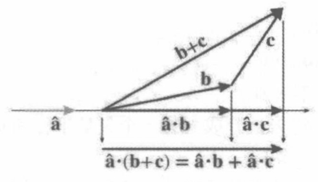
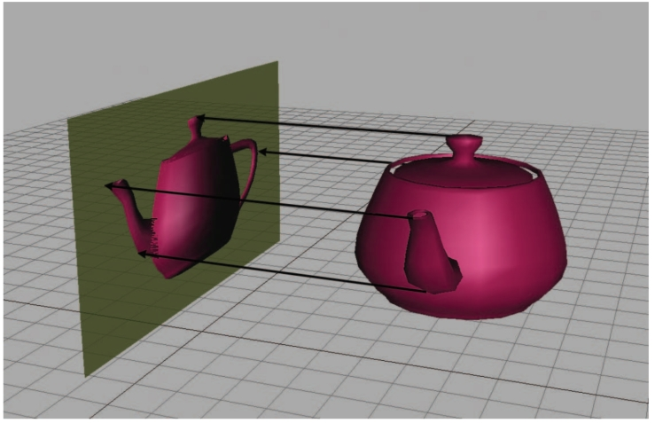

# 笛卡尔坐标系

## 一维数学

### short、int、float和double


## 二维笛卡尔空间


图1.5 二维笛卡尔坐标空间


图1.6 计算机屏幕坐标系


图1.7 二维坐标空间中可能的地图轴向

无论为x轴和y轴选择了什么方向，总是可以旋转坐标空间，使+x 指向右边，+y 指向上方。


## 三维笛卡尔空间

### 新增维度和轴

在三维中，需要3个轴来建立坐标系。前两个轴分别称为x轴和轴，就像在二维中一样(当然，说它们与二维轴相同是不准确的，稍后会有更详细的解释)。将第三个轴(可预测地)称为z轴。一般来说，会进行设置以使所有轴相互垂直即每个轴垂直于其他轴。

图1.10 三维笛卡尔坐标空间

### 左手与右手坐标空间

伸出左手，用拇指和食指做出一个L形@拇指指向右边，食指朝上。现在伸展你的第三根手指，使它直接指向前方。这样就形成了一个左手坐标系。拇指、食指和第三根手指分别指向+x、+y和+z 方向。

图1.13 左右手坐标空间

左手规则的工作方式如下：将左手摆出一个“竖起大拇指”的位置，拇指指向旋转轴的正值端。此时，围绕旋转轴的正向旋转方向就是手指卷曲的方向。右手坐标空间也有相应的规则。

图1.14 左手规则和右手规则定义哪个方向被视为正向旋转

在左手坐标系中，正向旋转从轴的正端看时是顺时针(Clockwise)旋转的；而在右手标系中，正向旋转是逆时针 (Counterclockwise)旋转的。

切换坐标系的旋向性：交换一个轴的正负端；交换两个轴。

本书使用左手坐标系约定

## 基础知识

### 求和和求积表示法

$$
\sum^{6}_{i=1}a_i = a_1 + a_2 + a_3 + a_4 + a_5 + a_6
$$

$$
\prod^{n}_{i=1}a_i = a_1 \cross a_2 \cross \cdots \cross a_{n-1} \cross a_n
$$

### 区间符号

闭区间、开区间

### 角度、度数和弧度

人类通常使用度(Degree)数来测量角度
一度表示旋转 1/360，因此360°代表旋转完整的一圈

然而，数学家更喜欢以弧度 (Radian)为单位测量角度，弧度是基于圆的属性的度量单位
当以弧度指定两条线之间的角度时，实际上是测量单位圆(以半径为1的原点为中心的圆)的截取弧的长度


图1.16 弧度测量单位圆上的弧长
$$
360°=2\pi\ rad \\
180°=\pi\ rad
$$

### 三角函数

$\cos$、$\sin$、$\sec$、$\tan$、$\csc$、$\cot$

对于单位圆来说：
$$
\sec\theta = \frac{1}{\cos\theta} \\
\tan\theta = \frac{\sin\theta}{\cos\theta} \\
\csc\theta = \frac{1}{\sin\theta} \\
\cot\theta = \frac{1}{\tan\theta} = \frac{\cos\theta}{\sin\theta}
$$

图1.18 斜边、邻边和对边示意图
$$
\cos\theta = \frac{adj}{hyp}, \ \ 
\sin\theta = \frac{opp}{hyp}, \ \ 
\tan\theta = \frac{opp}{adj}, \\ 
\sec\theta = \frac{hyp}{adj}, \ \ 
\csc\theta = \frac{hyp}{opp}, \ \ 
\cot\theta = \frac{adj}{opp}.
$$

### 三角函数的恒等式

$$
\sin(-\theta) = - \sin \theta, \ \ \cos(-\theta) = \cos\theta, \ \ \tan(-\theta) = -\tan\theta \\
\sin(\frac{\pi}{2} - \theta) = \cos\theta \\
\cos(\frac{\pi}{2} -\theta) = \sin\theta \\
\tan(\frac{\pi}{2} - \theta) = \cot\theta
$$

毕达哥拉斯恒等式
$$
\sin^2\theta + \cos^2\theta = 1, \\
1 + \tan^2\theta = \sec^2\theta \\
1 + \cot^2\theta = \csc^2\theta
$$
和或差恒等式
$$
\sin(a+b) =\sin a\cos b + \cos a \sin b \\
\sin(a-b) = \sin a\cos b - \cos a \sin b \\
\cos(a+b) = \cos a\cos b - \sin a \sin b \\
\cos(a-b) = \cos a\cos b + \sin a \sin b \\
\tan(a+b) = \frac{\tan a + \tan b}{1 - \tan a \tan b} \\
\tan(a-b) = \frac{\tan a - \tan b}{1 + \tan a \tan b}
$$
等腰三角形恒等式
$$
\sin2\theta = 2\sin\theta\cos\theta \\
\cos2\theta = \cos^2\theta - \sin^2\theta = 2\cos^2\theta - 1 = 1 - 2\sin^2\theta \\
\tan2\theta = \frac{2\tan\theta}{1 - \tan^2\theta}
$$
正弦定理
$$
\frac{\sin A}{a} = \frac{\sin B}{b} = \frac{\sin C}{c}
$$
余弦定理
$$
a^2 = b^2 + c^2 - 2bc\cos A \\
b^2 = a^2 + c^2 - 2ac\cos B \\
c^2 = a^2 + b^2 - 2ab\cos C
$$
正弦定理和余弦定理适用于任何三角形


# 矢量

向量下标表示法
$$
\bold{a} = \begin{bmatrix}
1 \\
2
\end{bmatrix}
\begin{cases}
a_1 = a_x = 1 \\
a_2 = a_y = 2
\end{cases} \\
\bold{b} = \begin{bmatrix}
3 \\
4 \\
5
\end{bmatrix}
\begin{cases}
b_1 = b_x = 3 \\
b_2 = b_y = 4 \\
b_3 = b_z = 5
\end{cases} \\
\bold{c} = \begin{bmatrix}
6 \\
7 \\
8 \\
9
\end{bmatrix}
\begin{cases}
c_1 = c_x = 6 \\
c_2 = c_y = 7 \\
c_3 = c_z = 8 \\
c_4 = c_w = 9 \\
\end{cases}
$$

## 矢量的几何定义

矢量的大小：矢量的长度，矢量可以具有任何非负长度。

矢量的方向：矢量在空间中指向的方向。


## 使用笛卡尔坐标指定矢量

### 作为位移序列的矢量

顺序不重要，任意逐步位移

### 零矢量

$$
\bold{0} = \begin{bmatrix}
0 \\
0 \\
\cdot \\
\cdot \\
\cdot \\
0
\end{bmatrix}
$$

零矢量没有大小，没有方向
零矢量+ 任意矢量 = 任意矢量

点：有位置没有尺寸和厚度
矢量：有大小和方向


## 矢量与点


图2.7 点和矢量之间的关系


## 负矢量

$$
-\begin{bmatrix}
a_1 \\
a_2 \\
\cdot \\
\cdot \\
\cdot \\
a_{n-1} \\
a_{n}
\end{bmatrix} = 
\begin{bmatrix}
-a_1 \\
-a_2 \\
\cdot \\
\cdot \\
\cdot \\
-a_{n-1} \\
-a_{n}
\end{bmatrix}
$$


图 2.8 矢量及其变负结果的示例，矢量及其负矢量是平行的，并且具有相同的大小，但是方向则是相反的


## 标量和矢量的乘法

$$
k\begin{bmatrix}
a_1 \\
a_2 \\
\cdot \\
\cdot \\
\cdot \\
a_{n-1} \\
a_{n}
\end{bmatrix}  = 
\begin{bmatrix}
a_1 \\
a_2 \\
\cdot \\
\cdot \\
\cdot \\
a_{n-1} \\
a_{n}
\end{bmatrix} k = 
\begin{bmatrix}
ka_1 \\
ka_2 \\
\cdot \\
\cdot \\
\cdot \\
ka_{n-1} \\
ka_{n}
\end{bmatrix}
$$


图2.9 将二维矢量乘以不同标量的结果图示


## 矢量的加法和减法

矢量加法
$$
\begin{bmatrix}
a_1 \\
a_2 \\
\cdot \\
\cdot \\
\cdot \\
a_{n-1} \\
a_{n}
\end{bmatrix} + 
\begin{bmatrix}
b_1 \\
b_2 \\
\cdot \\
\cdot \\
\cdot \\
b_{n-1} \\
b_{n}
\end{bmatrix} = 
\begin{bmatrix}
a_1 + b_1 \\
a_2 + b_2\\
\cdot \\
\cdot \\
\cdot \\
a_{n-1} + b_{n-1}\\
a_{n} + b_n
\end{bmatrix}
$$
矢量减法
$$
\begin{bmatrix}
a_1 \\
a_2 \\
\cdot \\
\cdot \\
\cdot \\
a_{n-1} \\
a_{n}
\end{bmatrix} - 
\begin{bmatrix}
b_1 \\
b_2 \\
\cdot \\
\cdot \\
\cdot \\
b_{n-1} \\
b_{n}
\end{bmatrix} =
\begin{bmatrix}
a_1 \\
a_2 \\
\cdot \\
\cdot \\
\cdot \\
a_{n-1} \\
a_{n}
\end{bmatrix} + 
\begin{pmatrix}-\begin{bmatrix}
b_1 \\
b_2 \\
\cdot \\
\cdot \\
\cdot \\
b_{n-1} \\
b_{n}
\end{bmatrix}\end{pmatrix} = \begin{bmatrix}
a_1 - b_1 \\
a_2 - b_2\\
\cdot \\
\cdot \\
\cdot \\
a_{n-1} - b_{n-1}\\
a_{n} - b_n
\end{bmatrix}
$$

图2.10 使用三角形法则的二维矢量加法和减法

## 矢量大小

矢量的大小也称为矢量的长度或范数。

### 正式线性代数规则

任意维数的矢量的大小
$$
\|\bold{v}\| = \sqrt{\sum^n_{i=1}v_i^2} = \sqrt{v_1^2+v_2^2+\cdots+v_{n-1}^2+v_n^2}
$$

## 单位矢量

单位矢量(Unit Vector)是大小为1的矢量
单位矢量也称为归一化矢量 (Normalized Vector)

矢量的归一化
$$
\hat{\bold{v}} = \frac{\bold{v}}{\|\bold{v}\|} \ \ \bold{v}是任意非零矢量
$$

## 距离公式

三维距离公式
$$
distance(\bold{a}, \bold{b}) = \|\bold{b}-\bold{a}\| = \sqrt{(b_x - a_x)^2 + (b_y-a_y)^2+(b_z-a_z)^2}
$$
二维距离公式
$$
distance(\bold{a}, \bold{b}) = \|\bold{b}-\bold{a}\| = \sqrt{(b_x-a_x)^2+(b_y-a_y)^2}
$$

## 矢量点积

矢量点积在加法和减法之前执行，除非使用括号来覆盖此默认运算顺序
$$
\begin{bmatrix}
a_1 \\
a_2 \\
\cdot \\
\cdot \\
\cdot \\
a_{n-1} \\
a_n
\end{bmatrix} \cdot
\begin{bmatrix}
b_1 \\
b_2 \\
\cdot \\
\cdot \\
\cdot \\
b_{n-1} \\
b_n
\end{bmatrix} = 
a_1b_1 + a_2b_2 + \cdots+a_{n-1}b_{n-1}+a_nb_n
$$

$$
\bold{a}\cdot\bold{b} = \sum^{n}_{i=1}a_ib_i
$$

假设$\hat{\bold{a}}$是一个单位矢量，$\bold{b}$ 是一个任意长度的矢量
现在取$\bold{b}$并将其投影到与$\hat{\bold{a}}$平行的线上
将点积$\hat{\bold{a}}\cdot \bold{b}$定义为$\bold{b}$投影在该线上的有符号长度

图2.17 点积作为投影

点积测量有符号长度意味着什么？
这意味着当$ \bold{b} $的投影指向$\hat{\bold{a}}$的相反方向时，该值将为负，并且当$\hat{\bold{a}}$和$ \bold{b} $垂直时，投影具有零长度(它是单个点)

图2.18 点积的标志

点积与任意矢量和标量的乘法的结合律
$$
(k\bold{a})\cdot \bold{b} = k(\bold{a}\cdot \bold{b}) = \bold{a}\cdot (k\bold{b})
$$
点积是可交换的
$$
\bold{a}\cdot \bold{b} = a_xb_x + a_yb_y = b_xa_x+b_ya_y = \bold{b}\cdot \bold{a}
$$
点积通过加法和减法进行分布
$$
\bold{a}\cdot (\bold{b} + \bold{c}) = \begin{bmatrix}
a_x \\
a_y \\
a_z
\end{bmatrix} \cdot
\begin{bmatrix}
b_x + c_x \\
b_y + c_y \\
b_z + c_z
\end{bmatrix} \\
= a_x(b_x+c_x) + a_y(b_y+c_y)+a_z(b_z+c_z)\\
= a_xb_x + a_xc_x + a_yb_y + a_yc_y + a_zb_z + a_zc_z \\
= (a_xb_x + a_yb_y + a_zb_z) + (a_xc_x + a_yc_y + a_zc_z) \\
= \bold{a}\cdot\bold{b} + \bold{a}\cdot \bold{c}
$$

图2.22 点积通过加法分布

使用点积计算两个矢量之间的角度
$$
\theta = \arccos \left(
\frac{\bold{a}\cdot \bold{b}}{\|\bold{a}\|\|\bold{b}\|}
\right)
$$
计算两个单位矢量之间的角度
$$
\theta = \arccos\left( \hat{\bold{a}}\cdot \hat{\bold{b}} \right) \ \ 假设\hat{\bold{a}}和\hat{\bold{b}}都是单位矢量
$$
点积的符号可以用作两个矢量之间角度的粗略分类

| $\bold{a}\cdot\bold{b}$ | $\theta$              | 角度为 | $\bold{a}$和$\bold{b}$是 |
| ----------------------- | --------------------- | ------ | ------------------------ |
| $> 0 $                  | $0° ≤ \theta < 90°$   | 锐角   | 主要指向同一方向         |
| $0$                     | $\theta = 90°$        | 直角   | 垂直                     |
| $< 0$                   | $90° < \theta ≤ 180°$ | 钝角   | 主要指向相反方向         |


## 矢量叉乘

$$
\begin{bmatrix}
x_1 \\
y_1 \\
z_1 \\
\end{bmatrix} \cross
\begin{bmatrix}
x_2 \\
y_2 \\
z_2 \\
\end{bmatrix} = 
\begin{bmatrix}
y_1z_2 - z_1y_2 \\
z_1x_2 - x_1z_2 \\
x_1y_2 - y_1x_2
\end{bmatrix}
$$

叉积将产生一个矢量，垂直于原始的两个矢量
叉乘的大小与矢量之间的角度的正弦值有关，也等于由两个边$\bold{a}$和$\bold{b}$形成的平行四边形的面积
$$
\|\bold{a}\cross \bold{b}\| = \|\bold{a}\|\|\bold{b}\|\sin\theta
$$
可以通过将$\bold{b}$的尾部放在 $\bold{a}$ 的头部来确定$\bold{a} \cross \bold{b}$的方向并检查是否从$\bold{a}$到$\bold{b}$顺时针或逆时针转动
	在左手坐标系中:
		如果矢量$\bold{a}$和$\bold{b}$从你的视点顺时针转动，则$\bold{a}\cross \bold{b}$指向你；如果$\bold{a}$和$\bold{b}$逆时针转动，则指向远离你的方向
	在右手坐标系中，恰好相反:
		如果$\bold{a}$和$\bold{b}$进行逆时针转动，则$\bold{a}\cross\bold{b}$指向你；如果$\bold{a}$和$\bold{b}$指向顺时针转动，则$\bold{a}\cross\bold{b}$指向远离你的方向

基本轴的叉乘
$$
\hat{\bold{x}}\cross \hat{\bold{y}} = \hat{\bold{z}} \ \ \ \ \ \ 
\hat{\bold{y}}\cross \hat{\bold{x}} = -\hat{\bold{z}} \\
\hat{\bold{y}}\cross \hat{\bold{z}} = \hat{\bold{x}} \ \ \ \ \ \ 
\hat{\bold{z}}\cross \hat{\bold{y}} = -\hat{\bold{x}} \\
\hat{\bold{z}}\cross \hat{\bold{x}} = \hat{\bold{y}} \ \ \ \ \ \ 
\hat{\bold{x}}\cross \hat{\bold{z}} = -\hat{\bold{y}} \\
$$
叉积的最重要用途之一是创建一个垂直于平面、三角形或多边形的矢量。


## 线性代数恒等式

|                            恒等式                            |                          简要说明                          |
| :----------------------------------------------------------: | :--------------------------------------------------------: |
|          $\bold{a} +\bold{b} = \bold{b} + \bold{a}$          |                     矢量加法的交换性质                     |
|        $\bold{a} - \bold{b} = \bold{a} + (-\bold{b})$        |                       矢量减法的定义                       |
| $(\bold{a}+\bold{b}) + \bold{c} = \bold{a} + (\bold{b} + \bold{c})$ |                     矢量加法的结合性质                     |
|                $s(t\bold{a}) = (st)\bold{a}$                 |                     标量乘法的结合性质                     |
|       $k(\bold{a} + \bold{b}) = k\bold{a} + k\bold{b}$       |                  标量乘法分布在矢量加法上                  |
|              $\|k\bold{a}\| = |k|\|\bold{a}\|$               |       将矢量乘以标量将会按标量绝对值的因子缩放其大小       |
|                      $\|\bold{a}\| ≥ 0$                      |                     矢量的大小是非负的                     |
| $\|\bold{a}\|^2 + \|\bold{b}\|^2 = \|\bold{a} + \bold{b}\|^2$ |                毕达哥拉斯定理适用于矢量加法                |
|   $\|\bold{a}\| + \|\bold{b}\| ≥ \|\bold{a} + \bold{b}\|$    |    矢量加法的三角法则(任何一边都不得超过另外两边的总和)    |
|      $\bold{a}\cdot \bold{b} = \bold{b}\cdot \bold{a}$       |                       点积的交换性质                       |
|        $\|\bold{a}\| = \sqrt{\bold{a}\cdot\bold{a}}$         |                   使用点积定义的矢量大小                   |
| $k(\bold{a}\cdot\bold{b}) = (k\bold{a})\cdot\bold{b} = \bold{a}\cdot (k\bold{b})$ |                  标量乘法与点积的结合性质                  |
| $\bold{a}\cdot (\bold{b} + \bold{c}) = \bold{a}\cdot \bold{b} + \bold{a}\cdot \bold{c}$ |                 点积分布在矢量加法和减法上                 |
|             $\bold{a}\cross \bold{a} = \bold{0}$             | 任何矢量与其自身的叉积是零矢量(因为任何矢量都与其自身平行) |
|     $\bold{a}\cross\bold{b} = -(\bold{b}\cross\bold{a})$     |                       叉积是反交换的                       |
|   $\bold{a}\cross\bold{b} = (-\bold{a})\cross(-\bold{b})$    |          让叉积的两个运算项都变负会产生相同的矢量          |
| $k(\bold{a}\cross\bold{b}) = (k\bold{a})\cross\bold{b} = \bold{a}\cross(k\bold{b})$ |                  标量乘法与叉积的结合性质                  |
| $\bold{a}\cross (\bold{b} + \bold{c}) = \bold{a}\cross \bold{b} + \bold{a}\cross \bold{c}$ |                 叉积分布在矢量加法和减法上                 |


# 多个坐标空间

使用多个坐标空间的原因是，某些信息仅在特定参考帧的环境中是已知的。

## 一些有用的空间坐标

### 世界空间

世界坐标系(World Coordinate System)是一个特殊的坐标系，它为所有其他要指定的坐标系建立了一个“全局”参考系
换句话说，可以用世界坐标空间来表达其他坐标空间的位置，但是不能用任何更大的外部坐标空间来表示世界坐标空间

世界坐标空间也称为全局(Global)坐标空间或通用(Universal)坐标空间


### 对象空间

对象空间(Object Space)是与特定对象关联的坐标空间。每个对象都有自己独立的对象空间。


### 相机空间

在相机空间中，相机位于原点，
	+x 指向右侧，
	+z 指向前方(进入屏幕，相机朝向的方向)，
	+y 指向“向上” (注意，这里不是相对于世界的“向上”而是相对于相机顶部的“向上”)

图3.1 使用左手惯例的相机空间

### 直立空间

在某种意义上，对象的直立空间是世界空间与其对象空间之间的“中间过渡”
因为直立空间的轴线与世界空间的轴线平行，而直立空间的原点则与对象空间的原点重合

图3.2 对象空间(Object space)、直立空间(Upright space)和世界空间(World space)


图3.3 通过平移可实现在世界空间和直立空间之间的转换；通过旋转可实现在直立空间和对象空间之间的转换


## 基矢量和坐标空间转换

将所有物体从世界空间转换为摄像机空间，先相反方向移动相机，再旋转相机

图3.9 通过平移和旋转的方式，将所有东西都从世界空间变换到相机空间

主动变换（Active Transformation）：通过移动整个世界来将相机放在原点，从而计算来自世界空间坐标的相机空间坐标。描述点的坐标**空间保持不变**，对在空间中移动的点进行成像。

被动变换（Passive Transformation）：想象移动用于描述这些点的坐标空间时，这些点是静止的，移动的空间坐标系。


图3.10 从两个视角观察相同的坐标空间变换序列在“绝对视角”列，看起来好像是对象在移动，坐标轴是静止的；在“局部视角”列，对象看起来是静止的，而坐标空间轴在转换。

设$\bold{b}$是一些任意点，其对象空间坐标$\bold{b} = (b_x, b_y)$是已知的
设$\bold{w} = (w_x, w_y)$表示同一点的世界坐标
	已知原点$\bold{o}$和左$\bold{p}$、上$\bold{q}$方向的世界空间坐标
$$
\bold{w} = \bold{o} + b_x\bold{p} + b_y\bold{q}
$$
坐标的秩：描述基所跨越的空间中的维数的术语是基的秩。
满秩：n个基矢量，他们的跨度是n维空间，则称为满秩。
如果一组基矢量是线性无关的，则不可能将任何一个基矢量表示为其它基矢量的线性组合


对象空间的基矢量：$\bold{p}$、$\bold{q}$、$\bold{r}$，物体空间坐标$\bold{b} = [b_x, b_y, b_z]$，同一矢量直立空间对应坐标$\bold{u} = [u_x, u_y, u_z]$
$$
\bold{u} = b_x\bold{p} + b_y\bold{q} + b_z\bold{r} \\
或 \\
u_x = b_xp_x + b_yq_x + b_zr_x \\
u_y = b_xp_y + b_yq_y + b_zr_y \\
u_z = b_xp_z + b_yq_z + b_zr_z
$$

$$
?_x = b_xp_x + b_yq_x + b_zr_x \\
?_y = b_xp_y + b_yq_y + b_zr_y \\
?_z = b_xp_z + b_yq_z + b_zr_z
$$

$?$直接求
$$
u_x = ?_xp_x + ?_yq_x + ?_zr_x \\
u_y = ?_xp_y + ?_yq_y + ?_zr_y \\
u_z = ?_xp_z + ?_yq_z + ?_zr_z
$$
有3个相互关联的方程式，这3个方程式缺了任何一个都不能确定任何未知量


# 矩阵简介

## 矩阵的数学定义

矢量是标量的数组，而矩阵则是矢量的数组。

### 矩阵维度和表示法

对于具有$r$行和$c$列的矩阵,为是$r \cross c$(读作“$r 乘 c$”)矩阵
$$
\begin{bmatrix}
4 & 0 & 12 \\
-5 & \sqrt{4} & 3 \\
12 & -4/3 & -1 \\
1/2 & 18 & 0
\end{bmatrix}
$$
矩阵元素的下标表示法
$$
\begin{bmatrix}
m_{11} & m_{12} & m_{13} \\
m_{21} & m_{22} & m_{23} \\
m_{31} & m_{32} & m_{33}
\end{bmatrix}
$$

### 方形矩阵

具有相同行数和列数的矩阵称为方形矩阵(Square Matrice)

$3\cross 3$矩阵的对角元素
$$
\begin{bmatrix}
m_{11} & m_{12} & m_{13} \\
m_{21} & m_{22} & m_{23} \\
m_{31} & m_{32} & m_{33} \\
\end{bmatrix}
$$
如果矩阵中的所有非对角元素都为零，则该矩阵为对角矩阵(Diagonal Matrix)
$$
\begin{bmatrix}
3 & 0 & 0 & 0 \\
0 & 1 & 0 & 0 \\
0 & 0 & -5 & 0 \\
0 & 0 & 0 & 2
\end{bmatrix}
$$
三维单位矩阵
$$
\bold{I}_3 = \begin{bmatrix}
1 & 0 & 0 \\
0 & 1 & 0 \\
0 & 0 & 1\\
\end{bmatrix}
$$

### 作为矩阵的矢量

行矢量和列矢量
$$
\begin{bmatrix}
1 & 2 & 3
\end{bmatrix} \\
\begin{bmatrix}
1 \\
2\\
3
\end{bmatrix}
$$

### 矩阵转置

$\bold{M}_{ij}^T = \bold{M}_{ji}$
$$
\begin{bmatrix}
1 & 2 & 3 \\
4 & 5 & 6 \\
7 & 8 & 9 \\
10 & 11 & 12 \\
\end{bmatrix}^T
= \begin{bmatrix}
1 & 4 & 7 & 10 \\
2 & 5 & 8 & 11 \\
3 & 6 & 9 & 12 
\end{bmatrix}
$$

$$
\begin{bmatrix}
a & b & c \\
d & e & f \\
g & h & i 
\end{bmatrix}^T = 
\begin{bmatrix}
a & d & g \\
b & e & h \\
c & f & i \\
\end{bmatrix}
$$

转置将转换行矢量和列矢量
$$
\begin{bmatrix}
x & y & z 
\end{bmatrix}^T = 
\begin{bmatrix}
x \\
y\\
z
\end{bmatrix} \ \ \ \ \
\begin{bmatrix}
x \\
y\\
z
\end{bmatrix}^T = \begin{bmatrix}
x & y & z 
\end{bmatrix}
$$

### 矩阵与标量相乘

$$
k\bold{M} = k\begin{bmatrix}
m_{11} & m_{12} & m_{13} \\
m_{21} & m_{22} & m_{23} \\
m_{31} & m_{32} & m_{33} 
\end{bmatrix} = \begin{bmatrix}
km_{11} & km_{12} & km_{13} \\
km_{21} & km_{22} & km_{23} \\
km_{31} & km_{32} & km_{33} 
\end{bmatrix}
$$

### 两个矩阵相乘

一个$r\cross n$矩阵$\bold{A}$可以乘以一个$n\cross c$矩阵$\bold{B}$，结果是一个$r\cross c$矩阵。
$$
c_{ij} = \sum^n_{k = 1}a_{ik}b_{kj}
$$

$$
\bold{A}\bold{B} = \begin{bmatrix}
a_{11} & a_{12} \\
a_{21} & a_{22}
\end{bmatrix}
\begin{bmatrix}
b_{11} & b_{12} \\
b_{21} & b_{22}
\end{bmatrix} = \begin{bmatrix}
a_{11}b_{11} + a_{12}b_{21} & a_{11}b_{12} + a_{12}b_{22} \\
a_{21}b_{11} + a_{22}b_{21} & a_{21}b_{12} + a_{22}b_{22}
\end{bmatrix}
$$

$$
\bold{A}\bold{B} = \begin{bmatrix}
a_{11} & a_{12} & a_{13} \\
a_{21} & a_{22} & a_{23} \\
a_{31} & a_{32} & a_{33}
\end{bmatrix}
\begin{bmatrix}
b_{11} & b_{12} & b_{13} \\
b_{21} & b_{22} & b_{23} \\
b_{31} & b_{32} & b_{33}
\end{bmatrix} \\
= \begin{bmatrix}
a_{11}b_{11}+a_{12}b_{21}+a_{13}b_{31} & 
a_{11}b_{12}+a_{12}b_{22}+a_{13}b_{32} & 
a_{11}b_{13}+a_{12}b_{23}+a_{13}b_{33} \\

a_{21}b_{11}+a_{22}b_{21}+a_{23}b_{31} & 
a_{21}b_{12}+a_{22}b_{22}+a_{23}b_{32} & 
a_{21}b_{13}+a_{22}b_{23}+a_{23}b_{33} \\

a_{31}b_{11}+a_{32}b_{21}+a_{33}b_{31} & 
a_{31}b_{12}+a_{32}b_{22}+a_{33}b_{32} & 
a_{31}b_{13}+a_{32}b_{23}+a_{33}b_{33} \\
\end{bmatrix}
$$

$$
\bold{M}\bold{I} = \bold{I}\bold{M} = \bold{M} \\
\bold{A}\bold{B} ≠ \bold{B}\bold{A}  \ \ \ 一般情况下 \\
(\bold{A}\bold{B})\bold{C} = \bold{A}(\bold{B}\bold{C}) \\
(k\bold{A})\bold{B} = k(\bold{A}\bold{B}) = \bold{A}(k\bold{B}) \\
(\bold{v}\bold{A})\bold{B} = \bold{v}(\bold{A}\bold{B}) \\
$$

### 矢量和矩阵相乘

$$
\ \begin{bmatrix}
x & y & z 
\end{bmatrix}
\begin{bmatrix}
m_{11} & m_{12} & m_{13} \\
m_{21} & m_{22} & m_{23} \\
m_{31} & m_{32} & m_{33}
\end{bmatrix} =  \\
\begin{bmatrix}
xm_{11} + ym_{21} + zm_{31} & 
xm_{12} + ym_{22} + zm_{32} & 
xm_{13} + ym_{23} + zm_{33}
\end{bmatrix}
$$

$$
\begin{bmatrix}
m_{11} & m_{12} & m_{13} \\
m_{21} & m_{22} & m_{23} \\
m_{31} & m_{32} & m_{33} \\
\end{bmatrix}
\begin{bmatrix}
x\\
y\\
z
\end{bmatrix} = \begin{bmatrix}
xm_{11} + ym_{12} + zm_{13}\\
xm_{21} + ym_{22} + zm_{23}\\
xm_{31} + ym_{32} + zm_{33}
\end{bmatrix}
$$


## 矩阵的几何解释

方形矩阵可以描述任何线性变换(Linear Transformation)
线性变换将保留直线和平行线，并且没有平移(即，原点不移动)就已经足够了

> 旋转 (Rotation)
> 比例缩放(Scale)
> 正交投影(Orthographic Projection)
> 反射(Reflection)
> 错切(Shearing)

$$
\bold{v}\bold{M} = \begin{bmatrix}v_x & v_y & v_z\end{bmatrix}
\begin{bmatrix}
-\bold{p}-\\
-\bold{q}-\\
-\bold{r}-
\end{bmatrix} = v_x\bold{p} + v_y\bold{q} + v_z\bold{r}
$$

$$
\begin{bmatrix}
0.707 & -0.707 & 0 \\
1.250 & 1.250 & 0 \\
0 & 0 & 1
\end{bmatrix}
$$


变换后的茶壶、单位立方体和基矢量

坐标最好被理解为基矢量的线性组合中的系数

- 方形矩阵的行可以解释为**坐标空间的基矢量**。
- 要将矢量**从原始坐标空间变换到新坐标空间**，可以**将矢量乘以矩阵**。
- 从原始坐标空间到由这些基矢量定义的坐标空间的变换是线性变换。**线性变换将保留直线**，平行线也将保持平行。但是，**角度、长度、面积和体积**等可能在变换后**发生改变**。
- 将零矢量乘以任何方形矩阵，得到的是零矢量。因此，由方形矩阵表示的线性变换将具有与原始坐标空间相同的原点，这意味着变换**不包含平移**。
- 我们可以通过可视化变换后坐标空间的**基矢量**来**可视化矩阵**。这些基矢量在二维中会形成 $L$ 形，而在三维中形成的则是三脚架。使用倾斜框或辅助对象也有助于可视化。


# 矩阵和线性变换

线性变换的一个重要特征是**不包含平移**，包含平移的变化被称为**仿射变换**，仿射变换需要用$4 \cross 4$矩阵表示

## 旋转

### 二维旋转


图5.1 在二维中围绕原点旋转
$$
\bold{R}(\theta) = \begin{bmatrix}
-\bold{p}'- \\
-\bold{q}'-
\end{bmatrix} = \begin{bmatrix}
\cos \theta & \sin \theta \\
-\sin \theta & \cos \theta
\end{bmatrix}
$$

### 围绕主轴的三维旋转

围绕**x轴**旋转的三维矩阵

$$
\bold{R}_x(\theta) = \begin{bmatrix}
-\bold{p}'- \\
-\bold{q}'- \\
-\bold{r}'- 
\end{bmatrix} = \begin{bmatrix}
1 & 0 & 0 \\
0 & \cos \theta & \sin \theta \\
0 & -\sin \theta & \cos \theta
\end{bmatrix}
$$
围绕**y轴**旋转的三维矩阵

$$
\bold{R}_y(\theta) = \begin{bmatrix}
-\bold{p}'- \\
-\bold{q}'- \\
-\bold{r}'- 
\end{bmatrix} = \begin{bmatrix}
\cos \theta & 0 & -\sin \theta \\
0 & 1 & 0 \\
\sin \theta & 0 & \cos \theta
\end{bmatrix}
$$
围绕**z轴**旋转的三维矩阵

$$
\bold{R}_z(\theta) = \begin{bmatrix}
-\bold{p}'- \\
-\bold{q}'- \\
-\bold{r}'- 
\end{bmatrix} = \begin{bmatrix}
\cos \theta & \sin \theta & 0 \\
-\sin \theta & \cos \theta & 0 \\
0 & 0 & 1
\end{bmatrix}
$$

### 围绕任意轴的三维旋转

假设绕轴$\hat{\bold{n}}$旋转，$\bold{v}$围绕$\hat{\bold{n}}$旋转角度$\theta$得到$\bold{v}'$。
$$
\bold{v}' = \bold{v}\bold{R}(\hat{\bold{n}}, \theta)
$$
将$\bold{v}$分解为垂直于$\hat{\bold{n}}$的向量$\bold{v}_{||}$，平行于$\hat{\bold{n}}$的向量$\bold{v}_{⊥}$
由于$\bold{v}_{||}$与$\hat{\bold{n}}$平行，所以不会受到围绕$\hat{\bold{n}}$旋转的影响
需要计算的是$\bold{v}'_{⊥}$，然后得到$\bold{v}' = \bold{v}_{||} + \bold{v}'_{⊥}$

下图的矢量$\bold{w}$与$\bold{v}_{||}$和$\bold{v}_{⊥}$相互垂直


图5.5 围绕任意轴旋转矢量
$$
\bold{v}'_{⊥} = \cos \theta\bold{v}_{⊥} + \sin \theta \bold{w}
$$

$$
\bold{v}_{||} = (\bold{v}\cdot \hat{\bold{n}})\hat{\bold{n}} \\
\bold{v}_{⊥} = \bold{v} - \bold{v}_{||} = \bold{v} - (\bold{v}\cdot \hat{\bold{n}})\hat{\bold{n}} \\
\bold{w} = \hat{\bold{n}} \cross \bold{v}_{⊥} = \hat{\bold{n}} \cross (\bold{v} - \bold{b}_{||})\\
 = \hat{\bold{n}} \cross \bold{v} - \hat{\bold{n}} \cross \bold{v}_{||} \\
 = \hat{\bold{n}} \cross \bold{v} - \bold{0} \\
 = \hat{\bold{n}} \cross \bold{v} \\
\bold{v}'_{⊥} = \cos \theta \bold{v}_{⊥} + \sin \theta \bold{w} \\
 = \cos \theta (\bold{v} - (\bold{v}\cdot \hat{\bold{n}})\hat{\bold{n}}) + \sin \theta(\hat{\bold{n}}\cross \bold{v}) \\ \\
\bold{v}' = \bold{v}'_{⊥} + \bold{v}_{||} \\
 = \cos \theta(\bold{v} - (\bold{v} \cdot \hat{\bold{n}})\hat{\bold{n}}) + \sin\theta(\hat{\bold{n}} \cross \bold{v}) + (\bold{v} \cdot \hat{\bold{n}})\hat{\bold{n}}
$$

$$
\bold{p} = \begin{bmatrix}1 & 0 & 0\end{bmatrix} \ \ \ \ \ \ \ \ \ \ \ \ 
\bold{p}' = \begin{bmatrix} 
n_x^2(1 - \cos \theta) + \cos \theta \\
n_xn_y(1 - \cos \theta) + n_z\sin \theta \\
n_xn_z(1 - \cos \theta) - n_y\sin \theta
\end{bmatrix}^T \\

\bold{q} = \begin{bmatrix}0 & 1 & 0\end{bmatrix} \ \ \ \ \ \ \ \ \ \ \ \ 
\bold{q}' = \begin{bmatrix} 
n_xn_y(1-\cos\theta) - n_z\sin\theta \\
n_y^2(1-\cos\theta) + \cos \theta \\
n_yn_z(1- \cos\theta)+ n_x\sin \theta
\end{bmatrix}^T \\

\bold{r} = \begin{bmatrix}0 & 0 & 1\end{bmatrix} \ \ \ \ \ \ \ \ \ \ \ \ 
\bold{r}' = \begin{bmatrix} 
n_xn_z(1 - \cos \theta) + n_y\sin \theta \\
n_yn_z(1 - \cos \theta) - n_x\sin \theta \\
n_z^2(1 - \cos \theta) + \cos \theta
\end{bmatrix}^T \\
$$

#### 围绕任意轴旋转的三维矩阵

$$
\bold{R}(\hat{\bold{n}}, \theta) = \begin{bmatrix}
-\bold{p}'- \\
-\bold{q}'- \\
-\bold{r}'-
\end{bmatrix} = \\
\begin{bmatrix}
n_x^2(1 - \cos \theta) + \cos \theta &
n_xn_y(1 - \cos \theta) + n_z\sin \theta &
n_xn_z(1 - \cos \theta) - n_y\sin \theta \\

n_xn_y(1-\cos\theta) - n_z\sin\theta &
n_y^2(1-\cos\theta) + \cos \theta &
n_yn_z(1- \cos\theta)+ n_x\sin \theta \\

n_xn_z(1 - \cos \theta) + n_y\sin \theta &
n_yn_z(1 - \cos \theta) - n_x\sin \theta &
n_z^2(1 - \cos \theta) + \cos \theta \\
\end{bmatrix}
$$


## 缩放

均匀缩放、不均匀缩放

### 沿主轴缩放


图5.6使用$k_x$和$k_y$的各种不同比例因子缩放的一个二维对象

#### 围绕主轴缩放的二维矩阵

$$
\bold{S}(k_x, k_y) = \begin{bmatrix}
-\bold{p}'- \\
-\bold{q}'-
\end{bmatrix} = \begin{bmatrix}
k_x & 0 \\
0 & k_y
\end{bmatrix}
$$

#### 围绕主轴缩放的三维矩阵

$$
\bold{S}(k_x, k_y, k_z) = \begin{bmatrix}
k_x & 0 & 0 \\
0 & k_y & 0 \\
0 & 0 & k_z 
\end{bmatrix}
$$


### 任意方向的缩放


图5.7 沿任意方向缩放矢量

将$\hat{\bold{n}}$定义为平行于缩放方向的单位矢量，$k$是$\hat{\bold{n}}$缩放的比例因子
给定任意矢量$\bold{v}$，用$\bold{v}$、$\hat{\bold{n}}$和$k$计算$\bold{v}'$
将$\bold{v}$分为平行于$\hat{\bold{n}}$的分量$\bold{v}_{||}$，和垂直于$\hat{\bold{n}}$的分量$\bold{v}_{⊥}$
由于$\bold{v}_{⊥}$垂直于$\hat{\bold{n}}$，保持不变，需要计算$\bold{v}_{||}$
$$
\bold{v} = \bold{v}_{||} + \bold{v}_{⊥} \\
\bold{v}_{||} = (\bold{v}\cdot \hat{\bold{n}})\hat{\bold{n}} \\
\bold{v}'_{⊥} = \bold{v}_{⊥} = \bold{v} - \bold{v}_{||} = \bold{v} - (\bold{v}\cdot \hat{\bold{n}})\hat{\bold{n}} \\
\bold{v}'_{||} = k\bold{v}_{||} = k(\bold{v}\cdot \hat{\bold{n}})\hat{\bold{n}} \\
\bold{v}' = \bold{v}'_{⊥} + \bold{v}'_{||} \\
 = \bold{v} - (\bold{v}\cdot \hat{\bold{n}})\hat{\bold{n}}  + k(\bold{v}\cdot \hat{\bold{n}})\hat{\bold{n}}\\
 = \bold{v} + (k - 1)(\bold{v} \cdot \hat{\bold{n}})\hat{\bold{n}}
$$

$$
\bold{p} = \begin{bmatrix} 1 & 0 \end{bmatrix} \\
\bold{p}' = \bold{p} + (k - 1)(\bold{p}\cdot \hat{\bold{n}})\hat{\bold{n}} = \begin{bmatrix}
1 \\
0\end{bmatrix} + (k - 1)\begin{pmatrix}
\begin{bmatrix}
1 \\
0
\end{bmatrix} \cdot \begin{bmatrix}
n_x \\
n_y
\end{bmatrix}
\end{pmatrix}
\begin{bmatrix}
n_x \\
n_y
\end{bmatrix}\\
 = \begin{bmatrix}
 1 \\
 0
 \end{bmatrix}
  + (k - 1)n_x\begin{bmatrix}
  n_x \\
  n_y
  \end{bmatrix} = \begin{bmatrix}
  1 \\
  0
  \end{bmatrix} + \begin{bmatrix}
  (k - 1)n_x^2 \\
  (k - 1)n_xn_y
  \end{bmatrix} \\
  = \begin{bmatrix}
  1 + (k - 1)n_x^2 \\
  (k - 1)n_xn_y
  \end{bmatrix} \\ \\
 \bold{q} = \begin{bmatrix}
 0 & 1 \\
 \end{bmatrix} \\
 \bold{q}' = \begin{bmatrix}
 (k - 1)n_xn_y \\
 1 + (k - 1)n_y^2
 \end{bmatrix}
$$

#### 在任意方向上缩放的二维矩阵

$$
\bold{S}(\hat{\bold{n}}, k) = \begin{bmatrix}
-\bold{p}'- \\
-\bold{q}'-
\end{bmatrix} = 
\begin{bmatrix}
  1 + (k - 1)n_x^2 &  (k - 1)n_xn_y \\
   (k - 1)n_xn_y &  1 + (k - 1)n_y^2
\end{bmatrix}
$$

#### 在任意方向上缩放的三维矩阵

$$
\bold{S}(\hat{\bold{n}}, k) = \begin{bmatrix}
-\bold{p}'- \\
-\bold{q}'- \\
-\bold{r}'-
\end{bmatrix} = \begin{bmatrix}
1 + (k - 1)n_x^2 & (k - 1)n_xn_y & (k - 1)n_xn_z\\
(k - 1)n_xn_y & 1 + (k - 1)n_y^2 & (k - 1)n_yn_z\\
(k - 1)n_xn_z & (k - 1)n_yn_z & 1 + (k - 1)n_z^2
\end{bmatrix}
$$


## 正交投影

所有点都被扁平化或投影到垂直轴(在二维中)或平面(在三维中)上。这种类型的投影是正交投影(Orthographic Projection)，也称为平行投影(Parallel Projection)。

### 投影到主轴或主平面上

投影到主轴上
$$
\bold{P}_x = \bold{S}(\begin{bmatrix}0 & 1\end{bmatrix}, 0) 
= \begin{bmatrix}
1 & 0 \\
0 & 0
\end{bmatrix} \\
\bold{P}_y = \bold{S}(\begin{bmatrix}1 & 0\end{bmatrix}, 0) 
= \begin{bmatrix}
0 & 0 \\
0 & 1
\end{bmatrix} \\
$$
投影到主平面上
$$
\bold{P}_{xy} = \bold{S}(\begin{bmatrix}0 & 0 & 1\end{bmatrix}, 0) = \begin{bmatrix}
1 & 0 & 0 \\
0 & 1 & 0 \\
0 & 0 & 0 \\
\end{bmatrix} \\
\bold{P}_{xz} = \bold{S}(\begin{bmatrix}0 & 1 & 0\end{bmatrix}, 0) = \begin{bmatrix}
1 & 0 & 0 \\
0 & 0 & 0 \\
0 & 0 & 1 \\
\end{bmatrix} \\
\bold{P}_{yz} = \bold{S}(\begin{bmatrix}1 & 0 & 0\end{bmatrix}, 0) = \begin{bmatrix}
0 & 0 & 0 \\
0 & 1 & 0 \\
0 & 0 & 1 \\
\end{bmatrix} \\
$$

### 投影到任意线或平面上

#### 投影到任意线上的二维矩阵

$$
\bold{P}(\hat{\bold{n}}) = \bold{S}(\hat{\bold{n}}, 0) = 
\begin{bmatrix}
  1 + (0 - 1)n_x^2 &  (0 - 1)n_xn_y \\
  (0 - 1)n_xn_y &  1 + (0 - 1)n_y^2
\end{bmatrix} = \begin{bmatrix}
  1 - n_x^2 &  -n_xn_y \\
  -n_xn_y &  1 -n_y^2
\end{bmatrix}
$$

#### 投影到任意平面上的三维矩阵

$$
\bold{P}(\hat{\bold{n}}) = \bold{S}(\hat{\bold{n}}, 0)  = \begin{bmatrix}
1 + (0 - 1)n_x^2 & (0 - 1)n_xn_y & (0 - 1)n_xn_z\\
(0 - 1)n_xn_y & 1 + (0 - 1)n_y^2 & (0 - 1)n_yn_z\\
(0 - 1)n_xn_z & (0 - 1)n_yn_z & 1 + (0 - 1)n_z^2
\end{bmatrix} \\
= \begin{bmatrix}
1 - n_x^2 & -n_xn_y & -n_xn_z\\
-n_xn_y & 1 -n_y^2 & -n_yn_z\\
-n_xn_z & -n_yn_z & 1 -n_z^2
\end{bmatrix}
$$


## 反射


#### 围绕任意轴反射的二维矩阵

$$
\bold{R}(\hat{\bold{n}}) = \bold{S}(\hat{\bold{n}}, -1) = 
\begin{bmatrix}
  1 + (-1 - 1)n_x^2 &  (-1 - 1)n_xn_y \\
  (-1 - 1)n_xn_y &  1 + (-1 - 1)n_y^2
\end{bmatrix} = \begin{bmatrix}
  1 - 2n_x^2 &  -2n_xn_y \\
  -2n_xn_y &  1 -2n_y^2
\end{bmatrix}
$$

#### 围绕任意平面反射的三维矩阵

$$
\bold{R}(\hat{\bold{n}}) = \bold{S}(\hat{\bold{n}}, -1)  = \begin{bmatrix}
1 + (-1 - 1)n_x^2 & (-1 - 1)n_xn_y & (-1 - 1)n_xn_z\\
(-1 - 1)n_xn_y & 1 + (-1 - 1)n_y^2 & (-1 - 1)n_yn_z\\
(-1 - 1)n_xn_z & (-1 - 1)n_yn_z & 1 + (-1 - 1)n_z^2
\end{bmatrix} \\
= \begin{bmatrix}
1 - 2n_x^2 & -2n_xn_y & -2n_xn_z\\
-2n_xn_y & 1 -2n_y^2 & -2n_yn_z\\
-2n_xn_z & -2n_yn_z & 1 -2n_z^2
\end{bmatrix}
$$

## 错切


图5.10 在二维中的错切
$$
\bold{H}_x(s) = \begin{bmatrix}
1 & 0 \\
s & 1
\end{bmatrix} \\
\bold{H}_y(s) = \begin{bmatrix}
1 & s \\
0 & 1
\end{bmatrix}
$$

#### 三维错切矩阵

$$
\bold{H}_{xy}(s, t) = \begin{bmatrix}
1 & 0 & 0 \\
0 & 1 & 0 \\
s & t & 1
\end{bmatrix} \\
\bold{H}_{xz}(s, t) = \begin{bmatrix}
1 & 0 & 0 \\
s & 1 & t \\
0 & 0 & 1
\end{bmatrix} \\
\bold{H}_{yz}(s, t) = \begin{bmatrix}
1 & s & t \\
0 & 1 & 0 \\
0 & 0 & 1
\end{bmatrix} \\
$$


## 组合变换

**模型变换**：从对象空间变换到世界空间，$\bold{M}_{obj\rightarrow wld}$
**视图变换**：将世界空间顶点变换到相机空间，$\bold{M}_{wld\rightarrow cam}$
$$
\bold{p}_{wld} = \bold{p}_{obj}\bold{M}_{obj\rightarrow wld} \\
\bold{p}_{cam} = \bold{p}_{wld}\bold{M}_{wld\rightarrow cam} \\
 = (\bold{p}_{obj}\bold{M}_{obj\rightarrow wld})\bold{M}_{wld\rightarrow cam} \\
 = \bold{p}_{obj}(\bold{M}_{obj\rightarrow wld}\bold{M}_{wld\rightarrow cam}) 
$$

## 变换的分类

映射(Mapping)或函数(Function)：一般的变换的同义词。

### 线性变换

当F为线性映射时满足的条件：
$$
F(\bold{a} + \bold{b}) = F(\bold{a}) + F(\bold{b}) \\
且\\
F(k\bold{a}) = kF(\bold{a})
$$
因为矩阵乘法满足两个条件，所以可以通过**矩阵乘法实现的任何变换**都是线性变换

任何线性变换都会将零矢量变换为零矢量，若$F(\bold{0}) = \bold{a}， \bold{a} ≠ 0$，则$F$不能是线性映射，
	因为$F(k\bold{0}) = \bold{a} $，所以$F(k\bold{0}) ≠ kF(\bold{0})$

**线性变换不包含平移**


### 仿射变换

仿射变换是线性变换后平移
任何线性变换都是仿射变换，但并非所有仿射变换都是线性变换

形如$\bold{v}' = \bold{v}\bold{M} + \bold{b}$的任何变换都是仿射变换


### 可逆变换

如果存在称为$F$的逆(Inverse)的相反变换（”撤销“原始变换），则变换是可逆的。
$$
F^{-1}(F(\bold{a})) = F(F^{-1}(\bold{a})) = \bold{a}
$$
除了**投影**之外的所有原始变换都是可逆的

> 在线性代数中，奇异矩阵和非奇异矩阵是两个重要的概念。
>
> 1. **奇异矩阵（Singular Matrix）：** 一个方阵如果它的行列式为零，那么它被称为奇异矩阵。行列式为零表示矩阵不具有完整的逆矩阵，因此奇异矩阵在线性代数中可能导致一些问题。奇异矩阵的特征值中至少有一个为零。
>
> 2. **非奇异矩阵（Non-singular Matrix）：** 与奇异矩阵相反，非奇异矩阵是指其行列式不为零的方阵。非奇异矩阵是可逆的，也就是说它有一个逆矩阵。对于非奇异矩阵，所有的特征值都不为零。
>
> 总的来说，奇异矩阵是不可逆的，而非奇异矩阵是可逆的。在许多数学和工程应用中，非奇异矩阵更常见且更有用。

### 保持角度的变换

只有平移、旋转、均匀缩放才是保持角度的变换

### 正交变换

平移、旋转、反射都是正交变换
其长度、角度、面积、体积均比例不变

### 刚体变换

刚体变换(Rigid Body Transformation)是指改变对象的位置和方向但不改变其形状的变换
保留所有角度、长度、面积和体积
平移和旋转都是刚体转换，但是反射则不被认为是严格的刚体变换
所有刚体变换都是正交的、保持角度的、可逆的和仿射的
任何刚体变换矩阵的行列式均为 1

### 变换的类型

|      变换      | 线性变换 | 仿射变换 | 可逆变换 | 保留角度的变换 | 正交变换 | 刚体变换 | 保留长度 | 面积/体积 | 行列式  |
| :------------: | :------: | :------: | :------: | :------------: | :------: | :------: | :------: | :-------: | :-----: |
|    线性变换    |    Y     |    Y     |          |                |          |          |          |           |         |
|    仿射变换    |          |    Y     |          |                |          |          |          |           |   ≠0    |
|    可逆变换    |          |          |    Y     |                |          |          |          |           |         |
| 保留角度的变换 |          |    Y     |    Y     |       Y        |          |          |          |           |         |
|    正交变换    |          |    Y     |    Y     |                |    Y     |          |          |           |   ±1    |
|    刚体变换    |          |    Y     |    Y     |       Y        |    Y     |    Y     |    Y     |     Y     |    1    |
|      平移      |          |    Y     |    Y     |       Y        |    Y     |    Y     |    Y     |     Y     |    1    |
|      旋转      |    Y     |    Y     |    Y     |       Y        |    Y     |    Y     |    Y     |     Y     |    1    |
|    均匀缩放    |    Y     |    Y     |    Y     |       Y        |          |          |          |           | $k^{n}$ |
|   非均匀缩放   |    Y     |    Y     |    Y     |                |          |          |          |           |         |
|    正交投影    |    Y     |    Y     |          |                |          |          |          |           |    0    |
|      反射      |    Y     |    Y     |    Y     |                |    Y     |          |    Y     |     Y     |   -1    |
|      错切      |    Y     |    Y     |    Y     |                |          |          |          |     Y     |    1    |


# 矩阵详解

## 矩阵行列式

### 关于$2 \cross 2$和$3 \cross 3$矩阵的行列式

$2 \cross 2$矩阵的行列式
$$
|\bold{M}| = \begin{vmatrix}
m_{11} & m_{12} \\
m_{21} & m_{22}
\end{vmatrix} = 
m_{11}m_{22} - m_{12}m_{21}
$$
$3\cross 3$矩阵的行列式
$$
\ \begin{vmatrix}
m_{11} & m_{12} & m_{13} \\
m_{21} & m_{22} & m_{23} \\
m_{31} & m_{32} & m_{33}
\end{vmatrix} = \\
m_{11}m_{22}m_{33} + m_{12}m_{23}m_{31} + m_{13}m_{21}m_{32} - m_{13}m_{22}m_{31} - m_{12}m_{21}m_{33} - m_{11}m_{23}m_{32} = \\ 
m_{11}(m_{22}m_{33} - m_{23}m_{32}) + m_{12}(m_{23}m_{31} - m_{21}m_{33}) +m_{13}(m_{21}m_{32} - m_{22}m_{31})
$$
$3\cross 3$矩阵行列式与三维矢量三重积
$$
\ \begin{vmatrix}
a_x & a_y & a_z \\
b_x & b_y & b_z \\
c_x & c_y & c_z
\end{vmatrix} \\
= (a_yb_z - a_zb_y)c_x + (a_zb_x - a_xb_z)c_y + (a_xb_y - a_yb_x)c_z = (\bold{a}\cross \bold{b})\cdot \bold{c}
$$


### 子矩阵行列式和余子式

子矩阵行列式：假设$\bold{M}$是具有$r$行和$c$列的矩阵，删除行$i$和列$j$，得到的子矩阵行列式表示为$M^{ij}$，被称为$\bold{M}$的子矩阵行列式
$$
\bold{M} = \begin{bmatrix}
-4 & -3 & 3 \\
0 & 2 & -2 \\
1 & 4 & -1
\end{bmatrix} \ \ \ \ \ \ \ \ \ \\
M^{12} = \begin{vmatrix}
0 & -2 \\
1 & -1
\end{vmatrix} = 2
$$
**余子式**
$$
C^{\{ij\}} = (-1)^{i+j}M^{ij}
$$

### 任意$n\cross n$矩阵的行列式

通过使用行$i$的余子式计算$n\cross n$行列式
$$
|\bold{M}| = \sum ^{n}_{j = 1}m_{ij}C^{\{ij\}} = \sum^n_{j = 1}m_{ij}(-1)^{i+j}M^{\{ij\}}
$$
应用于$3\cross 3$的行列式的递归定义
$$
\begin{vmatrix}
m_{11} & m_{12} & m_{13} \\
m_{21} & m_{22} & m_{23} \\
m_{31} & m_{32} & m_{33}
\end{vmatrix} = m_{11}\begin{vmatrix}
m_{22} & m_{23} \\
m_{32} & m_{33}
\end{vmatrix} - m_{12}\begin{vmatrix}
m_{21} & m_{23} \\
m_{31} & m_{33} \\
\end{vmatrix} + m_{13}\begin{vmatrix}
m_{21} & m_{22} \\
m_{31} & m_{32} 
\end{vmatrix}
$$
应用于$4\cross 4$的行列式的递归定义
$$
\ \begin{vmatrix}
m_{11} & m_{12} & m_{13} & m_{14} \\
m_{21} & m_{22} & m_{23} & m_{24} \\
m_{31} & m_{32} & m_{33} & m_{34} \\
m_{41} & m_{42} & m_{43} & m_{44}
\end{vmatrix} \\
= m_{11}\begin{vmatrix}
m_{22} & m_{23} & m_{24} \\
m_{32} & m_{33} & m_{34} \\
m_{42} & m_{43} & m_{44}
\end{vmatrix}
- m_{12}\begin{vmatrix}
m_{21} & m_{23} & m_{24} \\
m_{31} & m_{33} & m_{34} \\
m_{41} & m_{43} & m_{44}
\end{vmatrix} \\
\ \ \ + m_{13}\begin{vmatrix}
m_{21} & m_{22} & m_{24} \\
m_{31} & m_{32} & m_{34} \\
m_{41} & m_{42} & m_{44}
\end{vmatrix}
- m_{14}\begin{vmatrix}
m_{21} & m_{22} & m_{23} \\
m_{31} & m_{32} & m_{33} \\
m_{41} & m_{42} & m_{43}
\end{vmatrix} \\
= m_{11}[m_{22}(m_{33}m_{44}-m_{34}m_{43})+ m_{23}(m_{34}m_{42}-m_{32}m_{44})+ m_{24}(m_{32}m_{43}-m_{33}m_{42})] \\
-m_{12}[m_{21}(m_{33}m_{44}-m_{34}m_{43})+ m_{23}(m_{34}m_{41}-m_{31}m_{44})+m_{24}(m_{31}m_{43}-m_{33}m_{41})] \\
+ m_{13}[m_{21}(m_{32}m_{44}-m_{34}m_{42})+m_{22}(m_{34}m_{41}-m_{31}m_{44})+m_{24}(m_{31}m_{42}-m_{32}m_{41})] \\
- m_{14}[m_{21}(m_{32}m_{43}-m_{33}m_{42})+m_{22}(m_{33}m_{41}-m_{31}m_{43})+m_{23}(m_{31}m_{42}-m_{32}m_{41})]
$$

- 任何维度的单位矩阵的行列式为 1
- 矩阵乘积的行列式等于行列式的乘积：$|\bold{A}\bold{B}| = |\bold{A}||\bold{B}|$
- 矩阵转置的行列式等于原始行列式：$|\bold{M}^T| = |\bold{M}|$
- 如果矩阵中的任何行或列包含全0，则该矩阵的行列式为0
- 交换任意行对(Pair of Rows)都会让行列式变负
- 将行(列)的任意倍数添加到另一行(列)并不会更改行列式的值！


### 行列式的几何解释


在二维中，行列式等于具有基矢量作为两条边的平行四边形或倾斜框(Skew Box)的有符号面积
	如果倾斜框相对于其原始方向是“翻转”的，则该区域的面积为负

行列式是平行六面体(Parallelepiped)的体积，它具有3个变换的基矢量作为边。如果该对象由于变换而被反射（“里朝外翻转”），则行列式为负。


## 逆矩阵

$$
\bold{M}(\bold{M}^{-1}) = \bold{M}^{-1}\bold{M} = \bold{I}
$$

如果某个矩阵具有逆矩阵，则称其为可逆(Invertible)矩阵或非奇异(Nonsingular)矩阵


### 计算逆矩阵

#### 经典伴随矩阵

矩阵$\bold{M}$的经典伴随矩阵表示为"$adj \bold{M}$"，它是$\bold{M}$的余子式矩阵的转置
$$
原矩阵：\bold{M} = \begin{bmatrix}
-4 & -3 & 3 \\
0 & 2 & -2 \\
1 & 4 & -1
\end{bmatrix} \\
$$

$$
余子式计算：\\
C^{\{11\}} = + \begin{vmatrix}
2 & -2 \\
4 & -1
\end{vmatrix} = 6, \ \ \ \ \ 
C^{\{12\}} = - \begin{vmatrix}
0 & -2 \\
1 & -1
\end{vmatrix} = -2, \ \ \ \ \ 
C^{\{13\}} = + \begin{vmatrix}
0 & 2 \\
1 & 4
\end{vmatrix} = -2, \ \ \ \ \ \\

C^{\{21\}} = - \begin{vmatrix}
-3 & 3 \\
4 & -1
\end{vmatrix} = 9, \ \ \ \ \ 
C^{\{22\}} = + \begin{vmatrix}
-4 & 3 \\
1 & -1
\end{vmatrix} = 1, \ \ \ \ \ 
C^{\{23\}} = - \begin{vmatrix}
-4 & -3 \\
1 & 4
\end{vmatrix} = 13, \ \ \ \ \ \\

C^{\{31\}} = + \begin{vmatrix}
-3 & 3 \\
2 & -2
\end{vmatrix} = 0, \ \ \ \ \ 
C^{\{32\}} = - \begin{vmatrix}
-4 & 3 \\
0 & -2
\end{vmatrix} = -8, \ \ \ \ \ 
C^{\{33\}} = + \begin{vmatrix}
-4 & -3 \\
0 & 2
\end{vmatrix} = -8, \ \ \ \ \ \\
$$

$$
经典伴随矩阵:\\
adj\bold{M} = \begin{bmatrix}
C^{11} & C^{12} & C^{13} \\
C^{21} & C^{22} & C^{23} \\
C^{31} & C^{32} & C^{33}
\end{bmatrix}^T = \begin{bmatrix}
6 & -2 & -2 \\
9 & 1 & 13 \\
0 & -8 & -8
\end{bmatrix}^T = 
\begin{bmatrix}
6 & -2 & -2 \\
9 & 1 & 13 \\
0 & -8 & -8
\end{bmatrix}^T = 
\begin{bmatrix}
6 & 9 & 0 \\
-2 & 1 & -8 \\
-2 & 13 & -8
\end{bmatrix}
$$

$$
通过经典伴随矩阵和行列式计算逆矩阵：
\bold{M}^{-1} = \frac{adj\bold{M}}{|\bold{M}|}
$$

$$
\bold{M}^{-1} = \frac{adj\bold{M}}{|\bold{M}|} = \frac{1}{-24}\begin{bmatrix}
6 & 9 & 0 \\
-2 & 1 & -8 \\
-2 & 13 & -8
\end{bmatrix} = \begin{bmatrix}
-1/4 & -3/8 & 0 \\
1/12 & -1/24 & 1/3 \\
1/12 & -13/24 & 1/3
\end{bmatrix}
$$

> 高斯消元法也可以计算逆矩阵
>
> 高斯消元法是一种用于解线性方程组的方法，但它也可以用于计算矩阵的逆。下面是高斯消元法计算逆矩阵的详细步骤：
>
> 假设我们有一个可逆矩阵 $A$，要计算其逆矩阵 $A^{-1}$。
>
> 1. **增广矩阵构造：** 构造一个增广矩阵 $[A | I]$，其中 $I$ 是单位矩阵。
>
>    $ [A | I] = \left[ \begin{array}{c|c} A & I \end{array} \right] $
>
> 2. **行变换：** 利用高斯消元法将矩阵 $A$ 部分转换为上三角矩阵。这涉及到一系列的行变换，包括交换行、乘以常数、将一行的倍数加到另一行等。
>
>    这个过程将增广矩阵变为 $[U | B]$，其中 $U$ 是 $A$ 的行阶梯形式，$B$ 是相应的单位矩阵。
>
>    $ [U | B] = \left[ \begin{array}{c|c} U & B \end{array} \right] $
>
> 3. **反向替换：** 利用反向替换，将 \(U\) 部分进一步转换为对角矩阵，这时的矩阵为 $[I | A^{-1}]$。
>
>    $ [I | A^{-1}] = \left[ \begin{array}{c|c} I & A^{-1} \end{array} \right] $
>
> 4. **逆矩阵：** 最终得到的矩阵 $[I | A^{-1}]$ 的右侧部分就是矩阵 $A$ 的逆矩阵 $A^{-1}$。
>
> 需要注意的是，高斯消元法计算逆矩阵的前提是矩阵 $A$ 是可逆的，即其行列式不为零。

- 矩阵的逆矩阵的逆是原始矩阵，这假设 $\bold{M}$ 是非奇异的。 $(\bold{M}^{-1})^{-1} = \bold{M}$
- 单位矩阵是它自己的逆。$\bold{I}^{-1} = \bold{I}$
- 矩阵转置的逆矩阵是矩阵逆的转置：$(\bold{M}^T)^{-1} = (\bold{M}^{-1})^T$
- 矩阵乘积的逆等于矩阵的逆的乘积，注意，逆矩阵的乘法要采用相反的顺序：$(\bold{A}\bold{B})^{-1} = \bold{B}^{-1}\bold{A}^{-1}$
- 逆矩阵的行列式是原始矩阵的行列式的倒数：$|\bold{M}^{-1}| = 1/|\bold{M}|$


### 逆矩阵的几何解释

意味着一个变换“撤销”另一个变换
$(\bold{v}\bold{M})\bold{M}^{-1} = \bold{v}(\bold{M}\bold{M}^{-1}) = \bold{v}\bold{I} = \bold{v}$


## 正交矩阵

当且仅当°矩阵及其转置的乘积是单位矩阵时，方形矩阵 $\bold{M}$ 是正交的，定义如下:
$$
\bold{M}是正交矩阵 	\Longleftrightarrow \bold{M}\bold{M}^T = \bold{I}
$$

$$
\bold{M}是正交矩阵 	\Longleftrightarrow \bold{M}^T = \bold{M}^{-1}
$$

因此，要使矩阵正交，必须满足以下条件:

- 矩阵的每一行必须是单位矢量

- 矩阵的行必须相互垂直


### 矩阵的正交化

用于构造一组正交基矢量(它是正交矩阵的行)的标准算法是Gram-Schmidt正交化
其基本思想是按顺序遍历基矢量
	对于每个基矢量，将减去与基向量平行的矢量，这必然会产生垂直矢量

三维基矢量的Gram-Schmidt 正交化
$$
\bold{r}'_1 \Longleftarrow \bold{r}_1 \\
\bold{r}'_2 \Longleftarrow \bold{r}_2 - \frac{\bold{r}_2 \cdot \bold{r}'_1}{\bold{r}'_1 \cdot \bold{r}'_1}\bold{r}'_1 \\
\bold{r}'_3 \Longleftarrow \bold{r}_3 - \frac{\bold{r}_3 \cdot \bold{r}'_1}{\bold{r}'_1 \cdot \bold{r}'_1}\bold{r}'_1 - \frac{\bold{r}_3 \cdot \bold{r}'_2}{\bold{r}'_2 \cdot \bold{r}'_2}\bold{r}'_2
$$
无偏差的递增正交化算法
$$
\bold{r}'_1 \Longleftarrow \bold{r}_1  - k\frac{\bold{r}_1 \cdot \bold{r}_2}{\bold{r}_2 \cdot \bold{r}_2}\bold{r}_2 - k\frac{\bold{r}_1 \cdot \bold{r}_3}{\bold{r}_3 \cdot \bold{r}_3}\bold{r}_3\\

\bold{r}'_2 \Longleftarrow \bold{r}_2 - k\frac{\bold{r}_2 \cdot \bold{r}_1}{\bold{r}_1 \cdot \bold{r}_1}\bold{r}_1 - k\frac{\bold{r}_2 \cdot \bold{r}_3}{\bold{r}_3 \cdot \bold{r}_3}\bold{r}_3\\

\bold{r}'_3 \Longleftarrow \bold{r}_3 - k\frac{\bold{r}_3 \cdot \bold{r}_1}{\bold{r}_1 \cdot \bold{r}_1}\bold{r}_1 - k\frac{\bold{r}_3 \cdot \bold{r}_2}{\bold{r}_2 \cdot \bold{r}_2}\bold{r}_2
$$


## 关于$4\cross 4$齐次矩阵

1. 四维量有 4 个分量，前3 个分量是标准的和分量，第四个分量是 w，有时称为齐次坐标(Homogeneous Coordinate)。
2. 齐次坐标可以用于将四维点投射到三维的超平面上，产生相应的物理三维点。
3. 当 w=0 时，四维点代表“无限远的点”，它定义方向而不是位置。
4. 齐次坐标和投影是有意义的，尤其是在透视投影方面。
5. 使用四维矢量和 4x4 矩阵的原因包括方便表示和实现透视投影。

将$3\cross3$变换矩阵扩展到四维中
$$
\ \begin{bmatrix}
m_{11} & m_{12} & m_{13} \\
m_{21} & m_{22} & m_{23} \\
m_{31} & m_{32} & m_{33} \\
\end{bmatrix} \Longrightarrow
\begin{bmatrix}
m_{11} & m_{12} & m_{13} & 0 \\
m_{21} & m_{22} & m_{23} & 0 \\
m_{31} & m_{32} & m_{33} & 0 \\
0 & 0 & 0 & 1
\end{bmatrix} \\
$$
使用$4\cross4$矩阵执行三维中的平移
$$
\begin{bmatrix}
x & y & z & 1
\end{bmatrix}
\begin{bmatrix}
1 & 0 & 0 & 0 \\
0 & 1 & 0 & 0 \\
0 & 0 & 1 & 0 \\
\Delta x & \Delta y & \Delta z & 1
\end{bmatrix} = \begin{bmatrix}
x + \Delta x & y + \Delta y & z + \Delta z & 1
\end{bmatrix}
$$

$$
\bold{M} = \begin{bmatrix}
\bold{R} & \bold{0} \\
\bold{t} & 1
\end{bmatrix}
$$

### 一般仿射变换

- 围绕不穿过原点的轴旋转
- 围绕不穿过原点的平面进行缩放
- 围绕不穿过原点的平面反射
- 在不穿过原点的平面上进行正交投影

矩阵$\bold{T}$：将点$\bold{p}$平移到原点
矩阵$\bold{R}$：执行线性变换
矩阵$\bold{T}^{-1}$：与$\bold{T}$相反平移量的平移矩阵
$$
\ \bold{T} = \begin{bmatrix}
1 & 0 & 0 & 0 \\
0 & 1 & 0 & 0 \\
0 & 0 & 1 & 0 \\
-p_x & -p_y & -p_z & 1
\end{bmatrix} = \begin{bmatrix}
\bold{I} & \bold{0} \\
-\bold{p} & 1
\end{bmatrix} \\

\bold{R}_{4\cross 4} = \begin{bmatrix}
r_{11} & r_{12} & r_{13} & 0 \\
r_{21} & r_{22} & r_{23} & 0 \\
r_{31} & r_{32} & r_{33} & 0 \\
0 & 0 & 0 & 1
\end{bmatrix} = \begin{bmatrix}
\bold{R}_{3\cross 3} & \bold{0} \\
\bold{0} & 1
\end{bmatrix} \\

\bold{T}^{-1} = \begin{bmatrix}
1 & 0 & 0 & 0 \\
0 & 1 & 0 & 0 \\
0 & 0 & 1 & 0 \\
p_x & p_y & p_z & 1
\end{bmatrix} = \begin{bmatrix}
\bold{I} & 0 \\
\bold{p} & 1
\end{bmatrix}
$$

$$
\bold{T}\bold{R}_{4 \cross 4}\bold{T}^{-1} = \begin{bmatrix}
	\bold{I} & \bold{0} \\
	-\bold{p} & 1
\end{bmatrix}
\begin{bmatrix}
	\bold{R}_{3\cross 3} & \bold{0} \\
	\bold{0} & 1
\end{bmatrix}
\begin{bmatrix}
	\bold{I} & \bold{0} \\
	\bold{p} & 1
\end{bmatrix} = \begin{bmatrix}
\bold{R}_{3\cross 3} & \bold{0} \\
-\bold{p}(\bold{R}_{3\cross 3}) + \bold{p} & 1
\end{bmatrix}
$$

仿射变换中的额外平移仅改变4x4 阵的最后一行，上面的$3\cross 3$部分则不受影响


## 关于$4\cross 4$矩阵和透视投影


图6.3 正交投影使用平行投影线


图6.4 通过透视投影，投影线在投影中心相交


图6.5 由于透视缩短现象的存在，左边的茶壶投影比右边的茶壶投影大。左边的茶壶更接近投影平面


### 针孔相机


图6.6 针孔相机


图6.8 从侧面查看投影平面

$\bold{p}'$是$\bold{p}$通过针孔投影到投影平面上的
针孔到投影平面的距离是$d$
$$
\frac{-p_y'}{d} = \frac{p_y}{z} \Longrightarrow p_y' = \frac{-dp_y}{z} \\
p'_x = \frac{-dp_x}{z}
$$
投影到$z = -d$平面上
$$
\bold{p} = \begin{bmatrix}x & y & z\end{bmatrix}
\Longrightarrow 
\bold{p}' = \begin{bmatrix}x' & y' & z'\end{bmatrix}
= \begin{bmatrix}-dx/z & -dy/z & -d\end{bmatrix}
$$
在实践中，额外的减号会产生不必要的复杂性，因此将投影平面移动到$z=d$
$$
\bold{p}' = \begin{bmatrix}x' & y' & z'\end{bmatrix}
= \begin{bmatrix}dx/z & dy/z & d\end{bmatrix}
$$

### 透视投影矩阵

其基本思想是为$\bold{p}'$和$x$、$y$和$z$的公分母提出一个等式，然后设置一个$4 \cross 4$矩阵，将$w$设置为等于这个分母。
假设原始点$\bold{p} = \begin{bmatrix}x & y & z & 1\end{bmatrix}$
因为
$$
\bold{p}' = \begin{bmatrix}dx/z & dy/z & d\end{bmatrix}
= \begin{bmatrix}dx/z & dy/z & dz/z\end{bmatrix} 
= \frac{\begin{bmatrix}x & y & z\end{bmatrix} }{z/d}
$$
所以需要一个$4\cross 4$矩阵，将$\begin{bmatrix}x & y & z & 1\end{bmatrix}$变为$\begin{bmatrix}x & y & z & z/d\end{bmatrix}$
$$
\begin{bmatrix}
x & y & z & 1
\end{bmatrix}
\begin{bmatrix}
1 & 0 & 0 & 0 \\
0 & 1 & 0 & 0 \\
0 & 0 & 1 & 1/d \\
0 & 0 & 0 & 0
\end{bmatrix} = \begin{bmatrix}
x & y & z & z/d
\end{bmatrix}
$$


# 极坐标系

## 二维极坐标系

### 使用二维极坐标定位点

二维极坐标空间有一个原点，称为极点(Pole)，定义了坐标空间的“中心”
极坐标空间只有一个轴，有时也称为极轴 (Polar Axis)，它通常被描述为来自原点的射线


图7.1 二维极坐标空间

极坐标系则使用一个距离和一个角度表示一个二维点
	距离通常分配给变量$r$，它是半径(Radius)的缩写
	角度通常称为 $\theta$

如果两个坐标对具有不同的数值但是在空间中指向相同的点，这种现象称为别名(Aliasing)。

1. 径向距离$r$可以为负值
2. $\theta$可以超出闭区间$[-180°, +180°]$
3. 原点的刚好朝“西”方向的角度$\theta$的值(对于使用卡儿坐标来说，这些点的$\theta$是等于$+180°$也是$-180°$
4. 原点本身的极坐标也是不明确的。显然，$r=0$，$\theta$任何值都可以

**对于任何给定点，可以使用无限多个极坐标对来描述该点。**


|     规范坐标需要满足的条件     |                   说明                   |
| :----------------------------: | :--------------------------------------: |
|            $r ≥ 0$             |         我们不会测量“向后”的距离         |
|    $-180° < \theta ≤ 180°$     | 角度限制为$1/2$圈。使用$+180°$代表朝“西” |
| $r = 0 \Rightarrow \theta = 0$ |         在原点处，将角度设置为零         |

将极坐标系对$(r, \theta)$转化为其规范形式：

1. 如果$r = 0$，则指定$\theta = 0$
2. 如果$r < 0$，则取反$r$，并向$\theta$加上$180°$
3. 如果$\theta ≤ -180°$，则将$360°$加到$\theta$上，直到$\theta > -180°$
4. 如果$\theta > 180°$，则从$\theta$减去$360°$，直到 $\theta ≤ 180°$

```c++
//将极坐标对转换为其规范形式
// 径向距离
float r;
// 以弧度为单位的角度
float theta;
// 声明一个2*PI(360°)的常量
const float TWOPI = 2.0f * PI;

// 检查是否恰好位于原点
if (r == 0.0f) {
    // 如果恰好在原点，则强制theta为0
    theta = 0.0f;
} else {
    // 处理负距离
    if (r < 0.0f) {
        r  = -r ;
        theta += PI;
    }
    
    // Theta的值是否超出范围?
    // 请注意，该if()检测并非绝对必要
    // 但是，如果没有该步骤，需要避免执行浮点运算
    // 为什么在不执行该步骤的情况下
    // 就可能会出现浮点数精度损失?
    if (fabs(theta) > PI) {
        // 按PI值弥补
        theta += PI;
        // 包含在范围 0 ~ TWOPI
        theta -= floor(theta / TWOPI) * TWOPI;
        // 撤销弥补，将角度转换回在范围-PI ~ PI
        theta -= PI;
    }
}
```


图 7.4 极坐标和笛卡儿坐标之间的变换

将二维极坐标变化为笛卡尔坐标
$$
x = r\cos\theta \\
y = r\sin\theta
$$
将二维笛卡尔坐标系变为极坐标系
$$
r = \sqrt{x^2 + y^2} & \theta = \atan2(y, x) \\
\atan2(y, x) = \begin{cases}
0, & x= 0,y = 0 \\
+90°,& x = 0, y > 0, \\
-90°, & x = 0, y < 0, \\
\arctan(y/x), & x > 0, \\
\arctan(y/x)+180°, & x < 0, y ≥ 0,\\
\arctan(y/x)-180°, & x < 0, y < 0
\end{cases}
$$

```c++
//将二维笛卡儿坐标变换为相应的极坐标
//输入:笛卡儿坐标
float x,y;

//输出:极坐标径向距离，以弧度为单位的角度
float r, theta;

//检查是否恰好在原点
if (x == 0.0f && y == 0.0f) {
	// 如果恰好在原点，则强制极坐标的两个值均为0
    r = 0.0f;
    theta = 0.0f;
} else {
    //计算值。atan2函数是不是很棒啊?
	r = sqrt(x*x + y*y);
	theta = atan2(y,x);
}
```


## 三维极坐标空间

### 圆柱坐标

为了将笛卡儿坐标扩展为三维，从应用于平面工作中的二维系统开始，然后添加垂直于该平面的第三轴
基本上就是圆柱坐标将极坐标扩展为三维的方式

将第三轴称为$z$轴，为了找到由圆柱坐标$(r, \theta)$所描述的点，可以首先处理$r$和$\theta$
像对二维极坐标一样，然后根据$z$坐标“向上”或“向下”移动


图7.5 圆柱坐标

### 球面坐标

一组球面坐标则具有两个角度和一个距离

三维球形空间中还有两个极轴：
	第一个轴是“水平的”，对应于二维极坐标中的极轴或三维笛卡儿约定中的$+x$
	另一个轴是“垂直的”，对应于维笛卡儿约定中的$+y$


图7.6 数学专业人士使用的球面坐标


图7.7 本书中使用的航向角$h$和俯仰角$p$

水平角度$\theta$重命名为$h$，这是航向(Heading)的缩写，类似于罗盘航向
	零航向(因此可作为我们的主极轴)对应于$+z$
	正向旋转从上方观察时将是顺时针旋转的

垂直角度$\varphi$重命名为$p$，这是俯仰(Pitch)的缩写，用于测量向上或向下看的俯仰值
	

### 球面坐标的别名

|     本书中的球面坐标约定     |         规范球面坐标满足的条件         |
| :--------------------------: | :------------------------------------: |
|           $r ≥ 0$            |        我们不会测量“向后”的距离        |
|      $-180° < h ≤ 180°$      | 航向限制为1/2圈。使用$+180°$代表朝“南” |
|       $-90° ≤ p ≤ 90°$       |   俯仰限制为直上直下，不能“向后”俯仰   |
| $r = 0\Rightarrow h = p = 0$ |        在原点处，将角度设置为零        |
| $|p| = 90°\Rightarrow h = 0$ |   在直接向上或向下看时，设置航向为0    |

将球面坐标三元组$(r, h, p)$转换为其规范形式：

1. 如果$r=0$，则指定$h=p=0$。
2. 如果$r<0$，则将$r$变负，给$h$加$180°$，并使$p$变负。
3. 如果$p<-90°$，则给$p$加$360°$，直到$p>-90°$。
4. 如果$p>270°$，则从$p$减去$360°$，直到$p≤270°$。
5. 如果$p>90°$，则给$h$加$180°$，并设置$p=180° - p$。
6. 如果$h≤-180°$，则给$h$加$360°$，直到$h>-180°$。
7. 如果$h>180°$，则从$h$减去$360°$，直到$h<180°$。

```c++
//将球面坐标转换为规范格式
// 径向距离
float r;

// 以弧度为单位的角度
float heading, pitch;

//声明一些常量
const float TWOPI = 2.0f * PI;		// 360°
const float PIOVERTWO = PI/2.0f;	// 90°

// 检查是否恰好在原点
if (r == 0.0f){
	// 如果恰好在原点，则强制角度为 0
    heading = pitch = 0.0f;
} else {
    //处理负距离
    if (r < 0.0f) {
        r = -r;
        heading += PI;
        pitch = -pitch;
    }
    
    // 俯仰角是否超出范围？
    if(fabs(pitch) > PIOVERTWO) {
        // 按90°弥补
        pitch += PIOVERTWO;
        // 包含在范围 0 ~ TWOPI
        pitch -= floor(pitch / TWOPI) * TWOPI;
        // 是否超出范围？
        if (pitch > PI){
            // 翻转航向
            heading += PI;
            // 撤销弥补并设置pitch = 180 - pitch
            pitch = 3.0f * PI / 2.0f - pitch; // p = 270° - p
        } else {
            // 撤销弥补，将俯仰角切换在-90° ~ +90°范围
            pitch -= PIOVERTWO;
        }
    }
    // 是否万向节死锁？在这里使用相对小的容差值
    // 以接近但进度极限
    if (fabs(pitch) >= PIOVERTWO * 0.9999) {
        heading = 0.0f;
    } else {
		// 包含航向
        // 在可能保留精度时避免数学计算
		if (fabs(heading) > PI){
            // 按PI值弥补
            heading += PI;
            // 包含在范围 0 ~ TWOPI
            heading -= floor(heading / TWOPI) * TWOPI;
            // 撤销弥补，将角度切换回在 -PI ~ PI 范围
            heading -= PI;
        }
    }
}
```


### 球面坐标和笛卡儿坐标之间的转换 ???


图7.8 数学专业人士使用的球面坐标和笛卡儿坐标

将数学专业人士使用的球面坐标转换为三维笛卡儿坐标:  
$$

x = r\sin\varphi \cos \theta, & y = r\sin\varphi\sin\theta, & z = r\cos\varphi \\
$$
适用于本书惯例的球面坐标-笛卡儿坐标之间的变换:  这个$p$和$h$指定的是什么？
$$
x = r\cos p\sin h, & 
y=-r\sin p, &
z=r\cos p\cos h \\
$$


# 三维旋转

## “定向”含义

对象的“定向”基本上是告诉对象所面向的方向，“定向”与“方向”并不完全相同


图8.1 扭转矢量并不会导致矢量的明显变化


图8.2 扭转对象会改变其方向


## 矩阵形式
