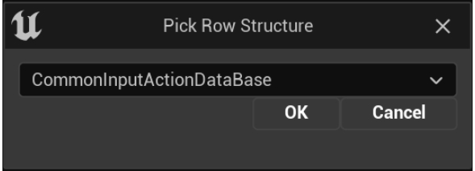

本文将介绍如何在你的项目中设置 **Common UI**。你将会学到以下内容：

- 设置你的视口来使其支持 **输入路由（Input Routing）**。
- 如何创建 **输入动作数据表（Input Action Data Tables）**，将控制器按键映射到UI中的动作。
- 如何设置 **默认导航动作（Default Navigation Actions）**，支持全局的点击和返回按钮功能。
- 如何创建 **控制器数据资产（Controller Data Assets）** 并且将其分配到特定平台上的特定控制器类型。

## 1. 视口输入路由设置

**视口（Viewport）** 是Common UI全部输入路由的基础。当Common UI捕获输入时，会将其发送至视口，然后视口会将其发送至顶部的节点。要让视口支持这些功能，请执行以下设置步骤：

1. 打开 **编辑（Edit）** > **项目设置（Project Settings）** > **引擎（Engine）** > **通用设置（General Settings）**。

2. 将你的 **游戏视口客户端类（Game Viewport Client Class）** 设置为 **CommonGameViewportClient**。

   

如果你需要自己的自定义游戏视口类，你需要将其从CommonGameViewportClient扩展来使用Common UI。

## 2. 创建输入动作数据表

Common UI使用输入动作数据表来创建能够与各种平台的输入所关联的动作。比如，查看Common UI内容文件夹中的 **GenericInputActionDataTable**，或者内容示例项目中的 **NavigationInputActionDataTable**。

> Common UI的输入动作数据表与项目设置中的输入动作或者高级输入系统无关。它们仅用于管理UI输入。

1. 在 **内容浏览器（Content Browser）** 中右键点击，然后点击 **杂项（Miscellaneous）** > **数据表资产（Data Table Asset）**。

2. 选择 **CommonInputActionDataBase** 作为你的行结构，然后点击 **OK** 来创建一个新的输入动作数据表。

   

3. 要添加一个新的输入动作行，点击顶部栏中的 **添加（Add）**。

   

4. 填充输入动作，输入名称和哪个按键会激活它的信息。

输入动作由以下几个参数组成：

| **参数（Parameter）**                                        | **描述（Description）**                                      |
| :----------------------------------------------------------- | :----------------------------------------------------------- |
| **显示名称（Display Name）**                                 | 输入动作的名称。如果有导航栏，会显示在导航栏中。             |
| **按住显示名称（Hold Display Name）**                        | 输入动作的名称，如果其需要用户按住按钮的话。                 |
| **导航栏优先级（Nav Bar Priority）**                         | 在导航栏中从左到右排列动作时作为依据的优先级顺序。           |
| **键盘输入类型信息（Keyboard Input Type Info）**             | 使用鼠标键盘时执行该动作的按键。                             |
| **默认游戏手柄输入类型信息（Default Gamepad Input Type Info）** | 使用游戏手柄时执行该动作的按键。                             |
| **游戏手柄输入覆盖（Gamepad Input Overrides）**              | 使用 *特定* 游戏手柄时执行该动作的按键。用于特定平台的按钮覆盖，比如在任天堂Switch的手柄上切换前进和后退按钮。 |
| **触控输入类型信息（Touch Input Type Info ）**               | 使用触控时执行该动作的按键。                                 |

Common UI控件将这些抽象的动作映射到实际的输入。比如，你可以将数据表和行名称参考添加到 **CommonButtonBase** 控件中的 **触发输入动作（Triggering Input Action）**。之后，按下该动作所关联的按钮会触发Common UI按钮。

> 为了避免版本控制冲突，建议将相关的动作组收归至其自己的数据表。比如，将所有的菜单导航动作放入一个表，然后将特定菜单的动作放入其自己的表。之后，创建一个合成的数据表来引用这些数据表。

## 3. 默认导航动作设置

虚幻引擎原生支持指向导航。然而，Common UI使用 **Common UI输入数据** 资产来定义所有平台通用的 **点击（Click）** 和 **返回（Back）** 输入动作。

1. 在内容浏览器中创建一个 **蓝图类（Blueprint Class）**。

2. 找到 **CommonUIInputData** 并点击 **选择（Select）** 来创建一个新的蓝图。

3. 指定适当的包含你的默认**点击（Click） **和 **返回（Back）** 动作的数据表。

   

4. 将该资产分配到 **项目设置（Project Settings）** > **游戏（Game）** > **通用输入设置（Common Input Settings）** > **输入数据（Input Data）**.

   

上述指定的资产会被装载进Common UI并用于默认导航。指定的在高光选中按钮或者其它可互动元素时使用的点击按钮用于替换鼠标点击，指定的返回按钮用于从当前菜单返回至上一个菜单。

## 4. 控制器数据绑定 (特定平台的UI元素)

**控制器数据资产（Controller Data Asset）** 将按键动作与UI元素关联。每个控制器数据资产都与一个输入类型、游戏手柄或者平台关联。Common UI使用该信息来根据当前平台和输入类型自动使用特定平台的正确UI元素。除此以外，对于支持多种输入类型或者特殊游戏手柄的平台，它还可以使用用户的输入来找到正确的游戏手柄并在运行时切换UI元素。

1. 在 **内容浏览器（Content Browser）** 中右键点击，然后创建一个新的 **蓝图类（Blueprint Class）**。

2. 找到 **CommonInputBaseControllerData** 并点击 **选择（Select）** 来创建一个新的控制器数据资产。

3. 用资产和你计划支持的一个控制器的相关信息来填充控制器数据资产。

   

| **参数（Parameter）**                      | **描述（Description）**                                      |
| :----------------------------------------- | :----------------------------------------------------------- |
| **输入类型（Input Type）**                 | Set this to Gamepad, Mouse and Keyboard, or Touch.           |
| **游戏手柄名称（Gamepad Name）**           | If the controller is a Gamepad, this will be the platform this gamepad corresponds to. The default Gamepad is called **Generic**. |
| **输入刷数据映射（Input Brush Data Map）** | 从按键到UI元素和图标的映射。                                 |
| **输入刷按键组（Input Brush Key Sets）**   | 从多个按键映射到单个UI元素。用于十字键或者其它可能映射到多个轴的输入。 |

4. 为所有计划支持的输入创建好控制器数据后，这些类都必须添加到它们关联的平台，位于 **项目设置（Project Settings）** > **游戏（Game）** > **常见输入设置（Common Input Settings）** > **平台输入（Platform Input）**。

   

> **默认游戏手柄名称（Default Gamepad Name）** 必须完全匹配控制器数据资产的 **游戏手柄名称（Gamepad Name）** 域中的内容，否则将无法识别，无法显示图标。

将每个游戏手柄的数据根据对应的平台分配到 **控制器数据（Controller Data）** 数列。你可以将多个游戏手柄关联到一个平台。举个例子，PC游戏通常支持键鼠控制器数据以及一个通常的游戏手柄。然而，你也可以为特定的游戏手柄型号添加控制器数据。

## 5. Common UI控件库和控件样式

Common UI有一个控件库，位于UMG **调色板（Palette）** 的 **Common UI插件** 部分之下。这里很多都是UI功能的一些部分，在很多游戏和应用中都很常见，包括：

- 特殊处理过的 **日期/时间** 和 **数字** 数值文本框。
- 导航和可视性辅助，比如 **轮播** 和 **有动画的切换器**。
- 平台辅助，比如 **加载防护** 和 **硬件可视性边界**。
- 提供基本功能的控件，比如按钮和文本，但是需要样式数据资产来调整样式。

这些控件不像它们的UMG对等控件，它们没有风格选项。它们需要引用 **Common样式资产**，这样可以向所有菜单和HUD应用一致的风格。对样式资产做出的任何更高都会应用到使用该资产的所有Common UI控件上。

要创建一个Common样式资产：

1. 在 **内容浏览器（Content Browser）** 中右键点击然后创建一个 **蓝图（Blueprint）**，然后选择其中一个Common样式类来作为基础。

   

2. 用样式信息填充其 **细节（Details）**，这样可以将其应用到Common UI控件。这些信息通常和标准的UMG控件的样式选项一样。

   

3. 将资产分配到适当类型的Common UI控件。比如，如果你创建了一个 **Common文本样式** 资产，那就将其分配到Common文本控件的 **样式** 域中。

   

   你还可以将这些分配到 **模板样式（Template Styles）**，位于 **项目设置（Project Settings）** > **插件（Plugins）** > **Common UI编辑器（Common UI Editor）**。

   

任何没有手动分配样式的Common UI控件都会使用适当的模板样式。这样一来为应用创建全局的默认样式就变得更加简单。

**项目设置（Project Settings）** > **插件（Plugins）** > **Common UI框架（Common UI Framework）** 菜单包含更多全局资产，包括一个用于加载界面的 **默认加载图标材质（Default Throbber Material）** 和一个 **默认图片资源对象（Default Image Resource Object）**，可以作为占位图片在UI资产没有完成加载时显示。

