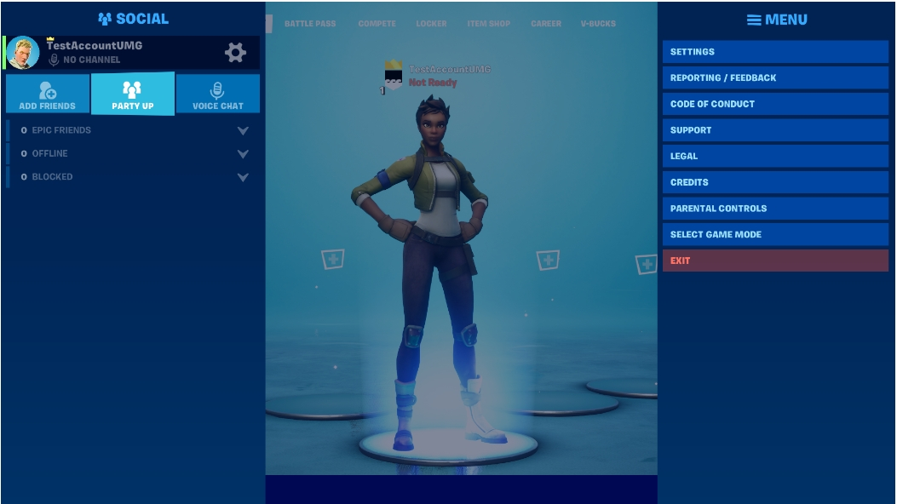
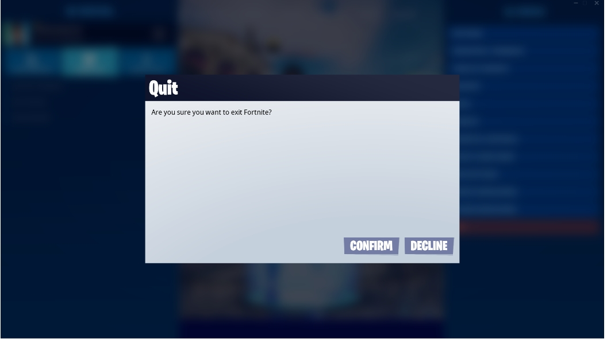
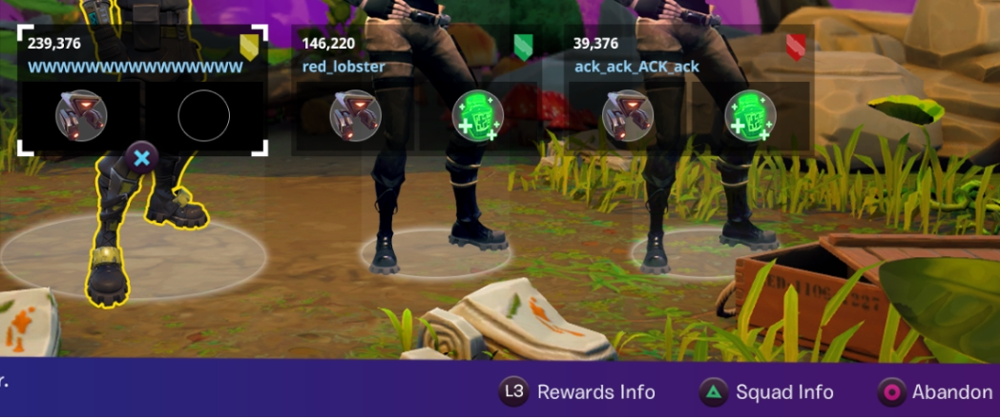
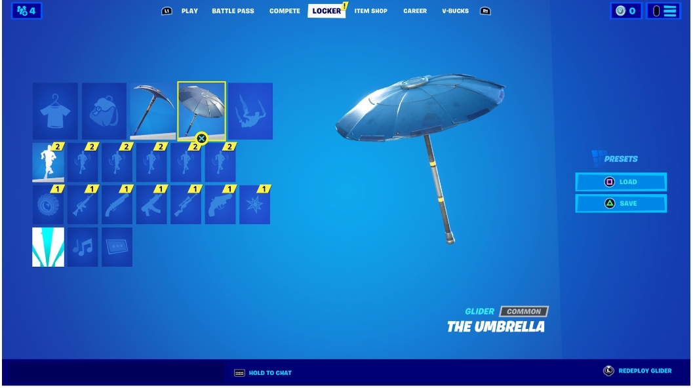
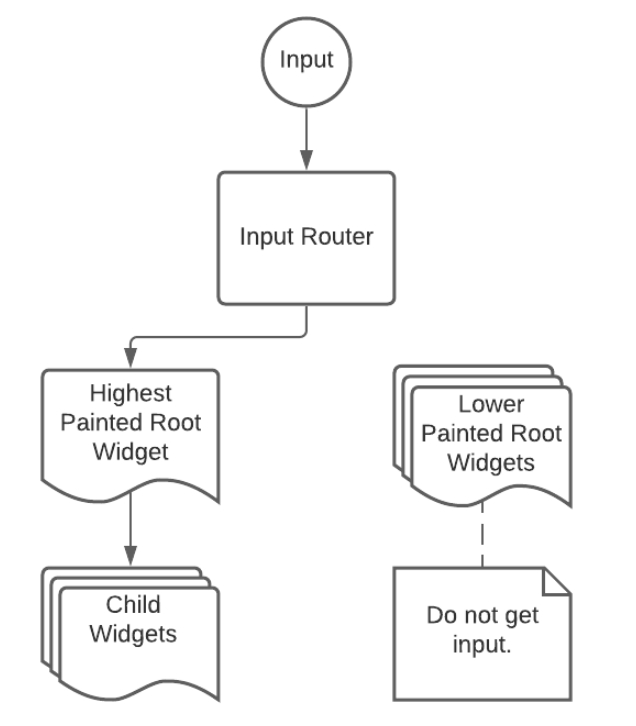

**Common UI** 可以制作用于多平台的复杂UI，比如多层的菜单、嵌套的子菜单以及弹窗。该插件原本用于开发堡垒之夜的UI，现已添加进 **插件（Plugins）** 菜单，对全部虚幻引擎用户开放。这一页详细阐述Common UI插件发挥作用的场景，以及其背后的设计理念。

## Common UI解决的问题

### 浏览多层的菜单

该图展示一个复杂菜单的例子：

这个案例展示了两个重叠在另一个背景UI上的菜单。背景UI依然存在，但是只要上层菜单存在，玩家便不能与其互动。 **如何达到这种选择性的可互动性？**

与此同时，不同平台和控制器有着不同的输入方式。在PC端，用户通过光标点击来选择UI中的选项。而在主机上，用户通过控制方向选择不同的选项，并用按钮点击。**如何构建适用于PC以及主机的多平台UI？**

### 返回至正确的选项

玩家看到如图所示的弹窗，然后关闭这个弹窗。 **如何确保手柄玩家在关闭弹窗后仍然返回至正确的选项？** 如果弹窗下的UI也被关闭，选择光标又要返回至另一层。此类问题的解决方案必须充分考虑到多种不同的情况。.

### 主机的特定UI元素

在上图中，UI展示了每个交互所需的按键。然而，不同主机有着不同的按键。**如何构建一个不受主机型号影响的UI？**

### Common UI的功能

Common UI 被设计来解决上述的难题。有了Common UI，你便可以：

- 选择性的实现控件的可互动性，使创建丰富的多层UI变得更加轻松。
- 主机和PC端的多平台支持。
- 在主机端：
  - 管理方向选择选项，包括选择轨迹和选择历史。
  - 管理不同主机上的UI元素

## 核心理念

这一部分讲解Common UI的设计和主要功能。

### 输入路由

在主机和PC上，互动性由输入来决定。为了达到可选择的互动性，Common UI使用 **输入路由（Input Routing）** ，确保指定时间内只有特定的UI控件能够收到来自用户鼠标或者手柄的输入。

输入路由也可以在不同控件中选择分配输入。如上图所示，上部的左右按键只控制顶端的不同页面，而'X'按钮控制当前选中的按钮。

> 了解更多，参考Common UI源代码中的 `CommonGameViewportClient.h` 和 `CommonUIActionRouterBase.h` 。

### 节点

Common UI将输入分配至最顶层渲染出来的界面。它将UI控件转化成不同的 **节点（Nodes）** ， 由此可以基于视觉上的和逻辑上的层次关系来管理输入路径。

节点通常成树状分布，与 **Slate** 系统中的层次结构匹配。每个树都有一个根节点，通常是一个直接放置在视窗里的控件。分支节点，通常用诸如按钮之类的UI元素来表示。

每次刷新，Common UI 都会找到最顶层的树，然后将输入发送至这个树的根节点。根部控件便会将这个输入转发至第一个可以接收此输入的下一个节点控件，它可以直接处理接收到的输入信号，或者按需将其转送至下一个节点。

> 了解更多，参考 **UIActionRouterTypes.h**。

### 可激活控件

Common UI中，只有特定的控件才会被转化成需要处理输入信号的节点，只有能够处理输入信号的控件才会接收输入。这些控件被称为 **可激活控件（Activatable Widgets）**，它们只有在可以接收输入信号的时候才会激活。

可激活控件：

- 可以开关激活，用来指示它们能否接收输入信号。
- 可以将输入信号转发至同一树上已激活的控件。
- 可以在合适的时候自动关闭，比如在处理返回动作的时候。

有了可激活控件，如果用户关闭一个正在接收输入信号的上层界面，如何返回至正确的元素便不再是问题。由于输入信号只会被分配至最顶层的树，我们可以毫无顾虑地将低层的控件保持激活状态。当上层的界面被关闭时，Common UI又会将输入信号发送至下一个最高层里原本就已经激活的控件上。

> 了解更多，参考 `CommonActivatableWidget.h`.

## 阅读更多

关于第一次使用Common UI时的设置，参阅[Common UI快速指南](Common UI快速指南.md).

## 内容示例

Common UI内容样本包含了一个基础的实用案例。若想要参考更高级的实际运用，可以下载Lyra示例项目。