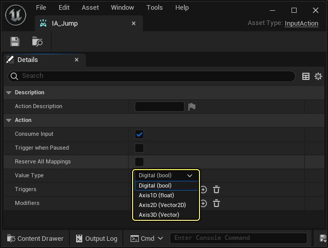
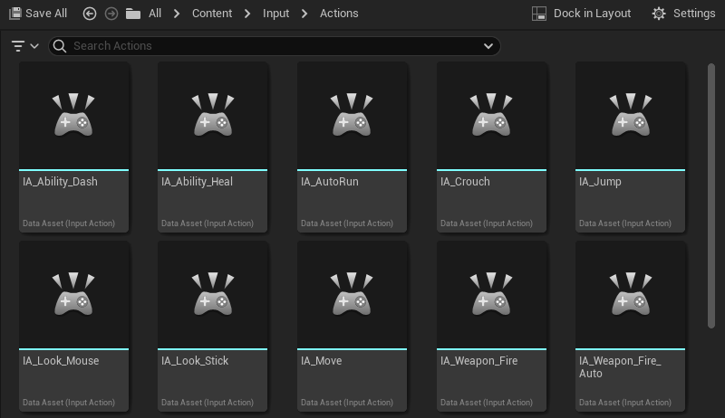
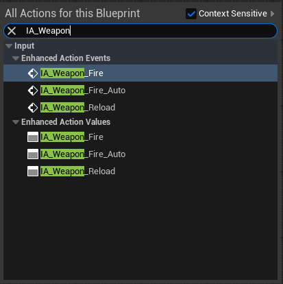
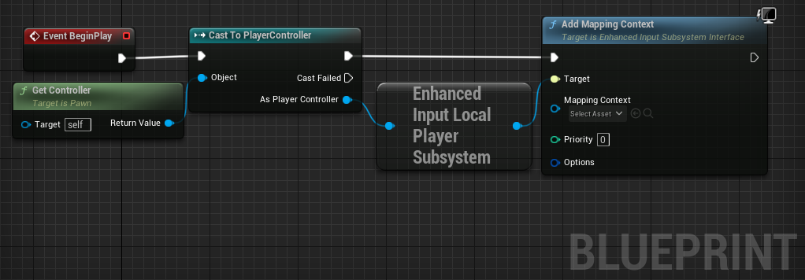
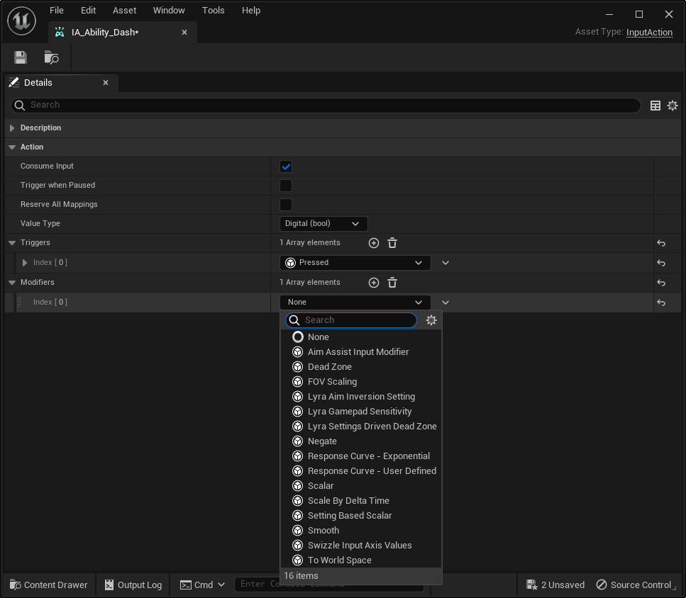
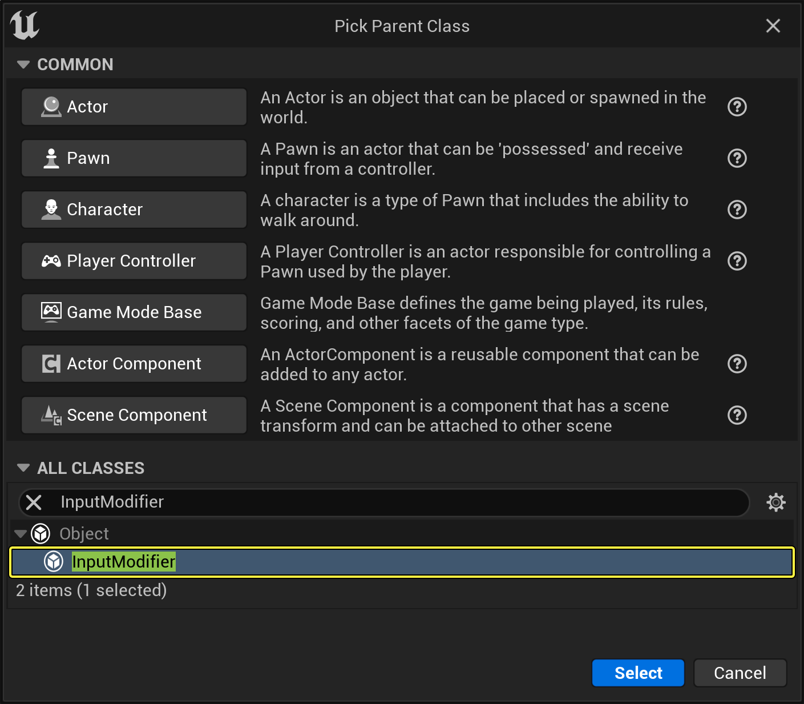
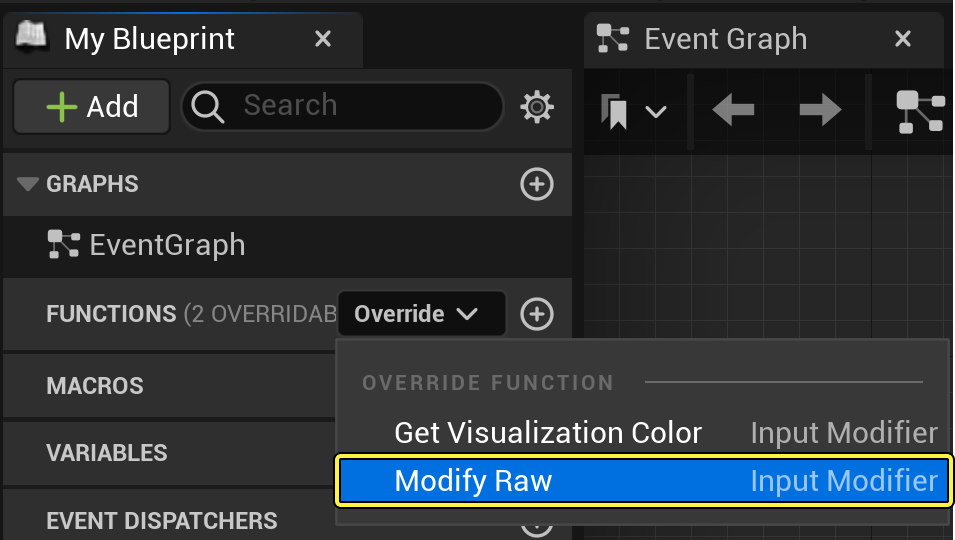
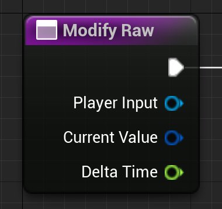

**虚幻引擎5**（UE5）项目有时会需要更多高级的输入功能，例如复杂的输入处理，或在运行时重新映射输入按键。**增强输入插件（Enhanced Input Plugin）** 为开发人员提供了这类功能，并能向上兼容 **虚幻引擎4**（UE4）的默认输入系统。 此插件实现了多种功能，例如径向死区、同时按键、上下文输入和优先级安排，并且能够在基于 **资产** 的环境中，拓展对于原始输入数据的筛选和处理功能。

## 入门指南

如需让项目使用 **增强输入（Enhanced Input）**，请启用增强输入插件。在编辑器中打开 **编辑（Edit）** 下拉菜单并选择 **插件（Plugins）**，即可启用此插件。在插件列表的 **输入（Input）** 分段中，找到并启用增强输入插件，然后重启编辑器。


> *插件会在重启编辑器后激活。*

编辑器重启之后，你就可以让项目使用增强输入插件类，而不是默认的UE5输入处理程序。转到 **编辑（Edit）** 下拉菜单，然后选择 **项目设置（Project Settings）**。在其中找到 **输入（Input）** 分段（在 **引擎（Engine）** 标题栏下），然后找到 **默认类（Default Classes）** 设置。这些设置最初包含标准的 **PlayerInput** 和 **InputComponent** 类。



要使用增强输入，需要将这些设置分别更改为 **EnhancedPlayerInput** 和 **EnhancedInputComponent**。


> 在编辑器中，按波浪键(~)打开控制台命令窗口，输入tREGhe命令:
>
> ```
>     showdebug enhancedinput
> ```
>
> 它将为您提供接下来的步骤，直到按照需要配置所有内容。

## 核心概念

增强输入系统主要有四个概念：

- **输入动作（Input Actions）** 是增强输入系统和项目代码之间的通信链接。输入动作可以是交互式角色做出的任意动作，例如跳跃或开门。它还可以指示用户的输入状态，例如按住按钮，将角色行走状态改为奔跑。输入动作独立于原始输入；输入动作并不关系触发它的原始输入，但知道其当前状态，并且可以报告输入值（最多可报告三个独立的浮点数值）。

例如，"拾取道具"操作可能仅需要一个开/关状态，用于指示用户是否要角色捡起某个东西，而"行走"操作可能需要两个轴，来描述角色的行走方向和速度。

- **输入映射向下文（Input Mapping Contexts）** 将用户输入映射到输入动作，并可以动态地为每个用户添加、移除或安排优先次序。你可以通过"增强输入本地玩家子系统"（Enhanced Input Local Player Subsystem），将一个或多个上下文添加给本地玩家，并调整它们的优先级，避免多个操作因读取同一个输入事件而冲突。

例如，试着想象这样一个按钮：当角色在场景中行走时，该按钮可以用来开门，而当角色查看背包时，该按钮可以选择道具。

每当角色靠近一扇门时，你添加"开门"上下文。如果角色打开背包，你添加"选择道具"输入映射上下文，其优先次序高于"开门"上下文。这样当角色站在一扇门附近查看背包时，仍可以选择背包中的道具。角色关闭背包时，你删除"选择道具"上下文，"开门"上下文开始生效。

这能确保根据角色所处环境来正确处理用户输入，免去了在输入处理层编写代码来区分开门和打开背包的动作。

- **修饰器（Modifiers）** 用于修改来自用户设备的原始输入值。在输入映射上下文中，每个输入动作的原始输入都可以关联任意数量的修饰器。常见修饰器包括死区、多帧输入平滑处理、将输入向量从本地空间转换到世界空间，以及插件中的一些其他修饰器。开发人员还可以创建自己的修饰器。
- **触发器（Triggers）** 使用经过修饰器修改的输入值，或者使用其他输入动作的输出值，来确定是否激活输入动作。输入映射上下文中的输入动作，其每个输入都可以有一个或多个触发器。例如，拍摄照片时，可能需要用户按住鼠标左键约0.25秒，同时，还有一个用于控制摄像机拍照方向的输入动作处于激活状态。

通过综合这些概念，开发人员可以快速设置各种难易输入系统，并调整这些系统，而不需要更改项目代码。

### 输入动作

输入动作是系统和你的项目代码之间的连接。在 **上下文浏览器（Context Browser）** 中右键点击并展开 **输入（Input）** 选项，然后选择 **输入动作（Input Actions）** ，可以创建输入动作。

要触发输入动作，必须将其包含在输入映射上下文中，并将该输入映射上下文添加到本地玩家的 **增强输入本地玩家子系统（Enhanced Input Local Player Subsystem）** 。



要使你的 **Pawn** 类响应所触发的输入动作，必须将一个事件添加到你的 **蓝图图表（Blueprint Graph）** 。每个输入动作都会用自己的资产名称生成一个事件；例如，如果你创建了一个输入动作并将该资产命名为"MyAction"，那么事件名称就将是"MyAction"。

右键点击 **蓝图图表（Blueprint Graph）** 中的任意开放空间，然后从 **上下文菜单** 中的 **增强型操作事件（Enhanced Action Events）** 类别中选择相应的事件。你可以输入资产名称以缩小上下文菜单的结果范围。


> *在蓝图图表的右键点击上下文菜单中查找MyAction事件。*

如果不同文件夹中包含具有相同名称的多个输入动作资产，你将在此列表中看到多个使用该名称的事件。将鼠标悬停在这些事件上可以查看其提示文本，其中将显示完整的资产名称，包括文件夹路径，以确保你选择所需的事件。

将事件添加到蓝图时，它会折叠。你可以展开节点以查看其他执行引脚和附加数据。


> *完全展开的事件节点；这将根据"MyAction"的状态在每个更新函数上执行相应的一个或多个引脚。*

### 输入映射上下文

输入映射上下文（Input Mapping Context）描述一个或多个输入动作的触发规则。输入映射上下文的基本结构是一个层级结构，最上层包含一组输入动作。在输入动作层下面，是可以触发各个输入动作的用户输入，例如按键、按钮和方向轴。

底层包含各个用户输入的输入触发器和输入修饰器列表，可用于确定如何筛选或处理输入的原始值，以及它必须满足哪些限制才能驱动顶层的输入动作。

输入可以有多个输入修饰器和输入触发器。这些修饰器和触发器会按照其在列表中的顺序被计算；这对于输入修饰器尤其重要，因为修饰器将使用每个步骤的输出作为下个步骤的输入。

要创建输入映射上下文，请右键点击 **上下文浏览器（Context Browser）** ，展开 **输入（Input）** 选项，然后选择 **输入映射上下文（Input Mapping Context）**。


你可以使用相关的输入动作来填充你的输入映射上下文。如果是简单项目，可以将所有的输入动作放在单个输入映射上下文中。如果是较复杂的项目，最好使用多个输入映射上下文，因为本地玩家可能同时激活多个输入映射上下文。

例如，你可以为一个可以游泳、行走和驾驶载具的角色提供多个输入映射上下文；一个用于通用动作（始终可用且始终映射到相同用户输入），另一个用于各类的行动模式。

开发人员随后可以将与载具相关的输入动作放入单独的输入映射上下文中，这些操作随后在进入载具时添加到本地玩家，并在退出载具时从本地玩家中移除。

这样做有助于确保不合适的输入动作无法运行，从而优化并预防bug。此外，使用互斥的输入映射上下文还有助于避免输入冲突，因此当某个用户输入用于不同的输入动作时，该输入绝不会意外触发错误的操作。

如需更多详细信息，请参见有关修饰器和触发器的小节。



> *此输入映射上下文将显示用于奔跑的输入动作。它可以通过多个输入来激活，包括游戏手柄的左控制杆偏转，这会将两个轴组合为单个输入。该输入的原始值将经过"死区"输入修饰器，生成的值将发送到"按住"输入触发器来驱动"RunAction"输入动作。*



下拉菜单中有大量的输入绑定可用。要更加快速地选择你的输入绑定，请点击下拉列表左侧的小按钮，然后按你要绑定的键或按钮。


> *这个简单的输入映射上下文支持用于奔跑和跳跃的输入动作。*

填充输入映射上下文之后，你就可以将其添加到与Pawn的玩家控制器关联的 **本地玩家（Local Player）**。要实现这一点，可以将Pawn的控制器类型转换为玩家控制器，获取其增强输入本地玩家子系统，然后使用整型优先级值将输入映射上下文添加到该子系统。增强输入本地玩家子系统还支持查询或移除特定的输入映射上下文，或清除所有输入映射上下文。


你添加的每个输入映射上下文都能够触发其中包含的输入动作，从而在Pawn的蓝图图表中运行相应的事件。你可以在游戏期间随时更改输入映射上下文集。

### 输入修饰器

输入修饰器是一种预处理器，能够修改UE5接收到的原始输入值，然后再将其发送给输入触发器（Input Trigger）。增强输入插件随附多种输入修饰器，可以执行各种任务，例如更改轴顺序、实现"死区"、将轴输入转换为世界空间以及其他功能。

在输入映射上下文中，每个与输入动作关联的输入，都会经历用户定义的一系列输入修饰器，然后再进入该输入的输入触发器。输入修饰器会按照其顺序依次应用，每个输入修饰器的输出值都会成为下一个修饰器的输入值。

1. 如果你需要创建输入修饰器，则可以使用 **输入修饰器（Input Modifier）** 作为父节点来创建新的 **蓝图子类（Blueprint Child Class）**，从而创建自己的输入修饰器。
   

> *创建输入修饰器子类。*

2. 接下来，找到 **我的蓝图（My Blueprint）> 函数（Functions）> 覆盖（Override）**，然后从 **下拉菜单** 选择 **修改原始（Modify Raw）** 函数。
   

输出参数是 **输入动作值（Input Action Value）**，其中包含三个 **浮点** 值，这与 **向量（Vector）** 非常像。该函数的输入参数包含 **玩家输入（Player Input）** 对象、来自输入硬件或之前输入修饰器的 **当前值（Current Value）** 以及 **增量时间（Delta Time）** 值。


你从 **修改原始（Modify Raw）** 返回的输入动作值将进入下一个输入修饰器（如有），或进入第一个输入触发器。


#### 方向输入

使用单一输入动作实现二维方向输入是输入修饰器用途的一个好例子。使用鼠标或游戏手柄的虚拟摇杆时，读取二维移动是很简单的事情，只需创建支持至少两个轴的输入动作并将相应的输入添加到输入映射上下文即可。

增强输入支持来自一维源的输入，例如键盘的方向键或常用的"WASD"键配置；可通过应用正确的输入修饰器来实现此控制方案。具体而言，使用 **负（Negate）** 可以将某些键注册为负值，而使用 **交换输入轴值（Swizzle Input Axis Values）** 可以将某些键注册为Y轴，而不是默认的X轴值：

| 字母键 | 方向键 | 需要的输入解译 | 需要的输入修饰器                                             |
| :----- | :----- | :------------- | :----------------------------------------------------------- |
| W      | 向上   | 正Y轴          | 交换输入轴值（YXZ或ZXY）（Swizzle Input Axis Values (YXZ or ZXY)） |
| A      | 向左   | 负X轴          | 负（Negate）                                                 |
| S      | 向下   | 负Y轴          | 负交换输入轴值（YXZ或ZXY）（Negate Swizzle Input Axis Values (YXZ or ZXY)） |
| D      | 向右   | 正X轴          | （无）                                                       |


> 这种解译方向键或"WASD"键的方式可以将一维输入映射到二维输入动作。

由于每个键都报告一维正值，此值将始终占据X轴并且将在任意给定的更新函数上都具有值0.0或1.0。

通过为向左和向下输入设置负值，并切换轴的顺序使输入的X轴值移至Y轴以用于向上和向下输入，你可以使用输入修饰器将一组一维输入解译为单个二维输入值。

### 输入触发器

输入触发器用于确定用户输入在经过输入修饰器的处理后，是否会激活输入映射上下文中的输入动作。大部分输入触发器都会分析输入本身，检查最小动作值并验证各种模式，例如短暂点击、长时间按住或典型的"按下"或"释放"事件。此规则的一个例外是"同时按键"输入触发器，该触发器仅通过另一个输入动作触发。默认情况下，输入上的任意用户活动都会在每个更新函数上触发。

输入触发器有三种类型：

- **显式（Explicit）** 类型将导致输入在输入触发器成功时成功。
- **隐式（Implicit）** 类型将导致输入仅在输入触发器和所有其他隐式类型输入触发器都成功时成功。
- **阻碍（Blocker）** 类型将导致输入在输入触发器成功时失败。

下面是关于每种触发器类型在针对其他触发器类型的情形下如何交互的逻辑示例：

```
    隐式 == 0，显式 == 0 - 始终触发，除非值为0。

    隐式 == 0，显式 > 0 - 至少一个显式已触发。

    隐式 > 0，显式 == 0 - 所有隐式已触发。

    隐式 > 0，显式 > 0 - 所有隐式和至少一个显式已触发。

    阻碍 - 覆盖其他所有触发器以强制触发器失败。
```

处理用户输入后，输入触发器可能返回三种状态之一：

- **无（None）** 表明未满足输入触发器的条件，因此输入触发器失败。
- **持续（Ongoing）** 表明部分满足了输入触发器的条件，并且输入触发器正在处理，但尚未成功。
- **已触发（Triggered）** 表明已满足输入触发器的所有条件，因此输入触发器成功。

你可以通过扩展输入触发器基类，即 **Input Trigger Timed Base** ，来创建自己的输入触发器。**Input Trigger Timed Base** 会检查输入是否已被按住一段时间，如是，则接受该输入并返回 **持续（Ongoing）** 状态。

插件提供的Input Trigger Timed Base永远不会返回 **已触发（Triggered）** 状态。你要在新建的输入触发器子类覆盖该函数，来确定它如何响应用户输入。函数 **Get Trigger Type** 将确定输入触发器的类型。**更新状态（Update State）** 将接受玩家的输入对象、当前输入动作值、增量时间，并返回 **无（None）** 、**持续（Ongoing）** 或 **已触发（Triggered）** 状态。
