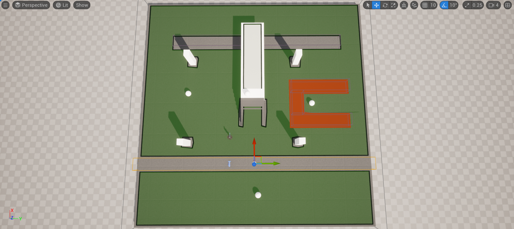
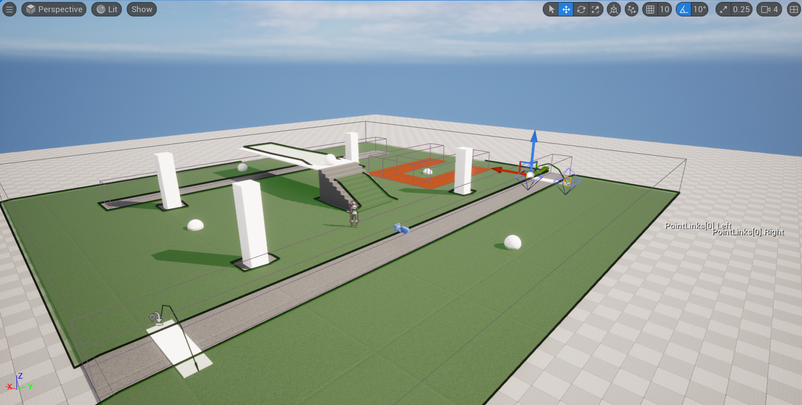
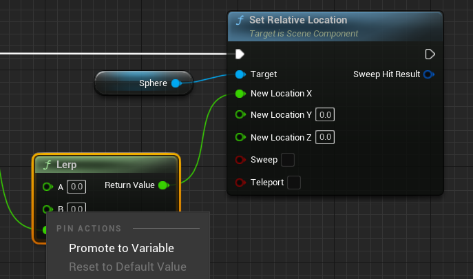

## 概述

虚幻引擎的 **寻路系统（Navigation System）** 向人工智能代理提供了寻路功能。为了能够找到开始位置和目的地之间的路径，从世界的碰撞几何结构生成了寻路网格体。

默认设置将寻路网格体细分为图块，以允许重建寻路网格体的本地化部件。生成的网格体由一些多边形组成，每个多边形都指定了成本。确定最优路径时，寻路算法将尝试确定成本最低的路径前往目的地。

寻路系统包含各种组件以及用于修改寻路网格体生成方式的设置，包括多边形的成本。这进而影响代理在你的关卡中寻路的方式。

## 目标

在快速入门指南中，你将学习如何使用 **寻路修饰体积**、**寻路代理链接** 以及在运行时影响寻路的蓝图Actor来修改寻路网格体。

## 目的

- 使用寻路修饰体积改变特定区域中的寻路网格体成本
- 使用寻路代理链接在本来不可达的两个区域之间创建连接
- 使用智能代理链接以允许代理在平台之间朝着目标跳跃
- 创建移动的蓝图Actor以学习如何在运行时动态重新生成寻路网格体

## 1 - 必要设置

遵循 **修改寻路系统准备指南**，或下载[完整示例项目](https://docs.unrealengine.com/5.3/Attachments/making-interactive-experiences/artificial-intelligence/navigation/NavSystemSample.zip)并打开 **LevelModNavigation_0** 关卡（Level），然后继续到下一分段。

## 2 - 使用寻路修饰体积

**寻路修饰体积** 使用体积形状将寻路区域类应用于寻路网格体。这可以用于更改体积空间中的多边形的属性，以修改其遍历成本。

多边形属性由寻路修饰体积的相应 **区域类** 定义。此类确定对寻路网格体的影响。你可以使用内置类修改网格体，或创建自己的自定义实现。

现在，你将首先使用内置类修改关卡中的寻路网格体。

1. 转到 **放置Actor（Place Actors）** 面板，搜索 **寻路修饰体积（Nav Modifier Volume）**。将寻路修饰体积（Nav Modifier Volume）Actor拖到关卡中。注意，默认情况下，任何寻路网格体都不在体积内生成。

2. **移动** 和 **缩放** 体积以覆盖如下所示的区域。注意，你现在会在关卡左侧移动体积，强迫代理到达底部 **球体**。此区域可以表示游戏中不允许代理跨越的任何障碍物。

3. 重复上一步，并在地图另一侧创建另一个区域。缩放体积时，请在代理两侧保留活动空间。

4. 将另一个 **寻路修饰体积（Nav Modifier Volume）** 拖到关卡中。浏览到 **细节（Details）** 面板并点击 **区域类** 旁边的 **下拉列表**。从列表中选择 **NavArea_Obstacle** 类。此内置类在体积内将指定相较于默认值（绿色的 **NavArea_Default** ）更高的成本。这样一来，代理会避开该区域，除非代理找不到成本更低的路径。

5. 复制体积两次，以围绕球体构造以下形状。这将强迫代理绕着体积走来到达球体。

   

> 如果使用另一个体积完全阻挡球体周围的区域，代理仍将到达目的地，因为这些体积表示有效路径。相反，如果将体积的区域类更改为NavArea_Null，代理将无法到达目的地，因为代理找不到通往目标的合适路径。这是因为NavArea_Null应用了无限成本，从而导致寻路网格体不在受影响的区域中生成。

6. 点击 **模拟（Simulate）**，并注意代理如何在球体之间移动。这演示了你的更改会如何影响寻路网格体的生成方式。

   

### 阶段成果

在此分段中，你学习了如何使用 **寻路修饰体积（Nav Modifier Volumes）** 更改寻路网格体的生成方式。你还学习了虚幻引擎中可用的一些内置区域类。

### 可用寻路修饰体积区域类

| 区域类            | 说明                                                         |
| :---------------- | :----------------------------------------------------------- |
| NavArea_Default   | 默认情况下，将相同的寻路成本指定给体积内的区域和寻路网格体。 |
| NavArea_LowHeight | 表示匹配遍历条件的区域，其中包含防止代理遍历的较低高度。寻路网格体不会在此体积内生成寻路数据。 |
| NavArea_Null      | 表示体积内的空白区域。寻路网格体不会在此体积内生成寻路数据。 |
| NavArea_Obstacle  | 将高寻路成本指定给体积内的区域。                             |

## 3 - 使用寻路链接代理

**寻路链接代理** 能将寻路网格体中没有直接寻路路径的两个区域连接起来。在搜索路径的同时，寻路链接代理会用作额外连接，供代理用于到达目的地。

寻路链接代理常用于在使用不同寻路网格体的区域之间搭桥，并告知代理，在没有连续寻路路径可用时，代理可从平台降落或跳向目标。

**创建桥梁以连接两个区域**

1. 选择第一个 **寻路修饰体积（Nav Modifier Volume）**，并调整其大小，使其覆盖整个地板长度，如下所示。这将阻止代理到达关卡中的底部球体。

   

2. 转到 **放置Actor（Place Actors）** 面板并将 **立方体** Actor拖到关卡中。将其缩放为X = 4、Y = 1、Z =0.2，并按如下所示进行放置。

   

3. 复制 **立方体** 并将其移至关卡另一侧，如下所示。

   

> 这些立方体Actor充当关卡中寻路链接代理的可视表示。你不需要将其与寻路链接代理一起使用。

4. 转到 **放置Actor（Place Actors）** 面板，并搜索 **寻路链接代理（Nav Link Proxy）**。将 **寻路链接代理** Actor拖到关卡中。

5. 选中 **寻路链接代理** 后，点击 **PointLinks[0].Left** 句柄并将其移动，使其放在网格体一侧。点击 **PointLinks[0].Right** 句柄并将其移动，使其放在网格体另一侧，如下所示。

> 如果寻路链接代理未与寻路网格体表面连接，绿色箭头将消失。

​	现在你已创建连接，代理将能够通过 **寻路链接代理** 寻路，尽管中间并未寻路数据。

6. 选中 **寻路链接代理** 后，转到 **细节（Details）** 面板，并展开 **指针链接（Point Links）**下标记为 **0** 的分段，以找到 **方向（Direction）** 下拉列表。可以选择让 **方向（Direction）** 为 **双向（Both Ways）**、**从左到右（Left to Right）** 或 **从右到左（Right to Left）**。对于本示例，选择 **从左到右（Left to Right）**。

   

7. 复制 **寻路链接代理**，并将其移至关卡另一侧。对于本示例，将 **方向（Direction）** 设置为 **从右到左（Right to Left）**。

   

8. 点击 **模拟（Simulate）**，并注意代理现在可以通过从左侧进入并从右侧退出来到达 **球体**。

   

### 阶段成果

你使用了 **寻路链接代理** 来连接 **寻路网格体** 中没有可行路径的两个区域。你还学习了，可以配置 **寻路链接代理** 以使用不同的方向，如 **双向（Both Ways）**、**从左到右（Left to Right）** 或 **从右到左（Right to Left）**。

### 使用寻路链接代理允许代理从平台落下

1. 将另一个 **寻路链接代理** 拖到关卡中，并将其放在升高平台的边缘，如下所示。

   

2. 选中 **PointLinks[0].Left** 并将其放在平台边缘，选中 **PointLinks[0].Right** 并将其放在底部，与地板重叠的地方。

   

3. 找到 **细节（Details）** 面板，展开 **指针链接（Point Links）** 下标记为 **0** 的分段，并选择 **从左到右（Left to Right）** 作为 **方向（Direction）**。

   

4. 点击 **模拟（Simulate）**，并注意代理现在能够从平台落下以到达目标。

   

#### 阶段成果

在此分段中，你使用了 **寻路链接代理** 允许代理从平台落下以到达目标。

### 使用寻路链接代理允许代理跳到目标

在此分段中，你将学习如何使用 **寻路链接代理** 上的 **智能链接**，允许代理在不同平台之间跳跃。

1. 选择平台网格体，在按住 **Alt** 键的同时将其拖到一侧以进行复制。

   

2. 调整新平台大小并将其移至更高的位置，如下所示。

   

3. 复制 **球体** Actor并将其放在平台之上

   

4. 在 **内容侧滑菜单（Content Drawer）** 中，右键点击并在 **创建基本资产（Create Basic Asset）** 分段中选择 **蓝图类（Blueprint Class）**。

   

5. 在 **选择父类（Pick Parent Class）** 窗口中，转到 **全部类（All Classes）** 分段，并展开箭头。搜索并选择 **寻路链接代理（Nav Link Proxy）**，然后点击 **选择（Select）**。将蓝图命名为 **BP_NavProxyLink**。

   

   

6. 双击打开 **BP_NavProxyLink** 。在 **事件图表（Event Graph）** 中右键点击，然后搜索并选择 **事件接收智能链接已到达（Event Receive Smart Link Reached）**。

   

7. 从 **Event Receive Smart Link Reached** 节点的 **代理（Agent）** 引脚拖出，然后搜索并选择 **投射到角色（Cast to Character）**。

   

8. 从 **Cast to Character** 节点的 **作为角色（As Character）** 引脚拖出，然后选择 **提升到变量（Promote to Variable）**。

   

9. 从 **As Character** 节点的 **执行** 引脚拖出，然后搜索并选择 **建议发射物速度自定义弧（Suggest Projectile Velocity Custom Arc）**。

   

10. 从 **As Character** 节点的 **蓝色** 引脚拖出，然后搜索并选择 **获取Actor位置（Get Actor Location）**。将 **Get Actor Location** 节点的 **返回数值（Return Value）** 引脚连接到 **SuggestProjectileVelocityCustomArc ** 节点的 **开始位置（Start Pos）** 引脚。

    

11. 从 **Event Receive Smart Link Reached** 节点的 **目的地（Destination）** 引脚拖出，并将其连接到 **SuggestProjectileVelocityCustomArc** 节点的 **结束位置（End Pos）** 引脚。

    

12. 将 **作为角色（As Character）** 变量拖动到 **事件图表（Event Graph）** 中，然后选择 **作为角色获取（Get As Character）**。从该节点拖出，然后搜索并选择 **启动角色（Launch Character）**。启用 **XYOverride** 和 **ZOverride** 复选框。

    

13. 从 **SuggestProjectileVelocityCustomArc** 节点拖出，然后搜索并选择 **延迟（Delay）**。将 **时长（Duration）** 设置为0.1。将 **Delay** 节点的 **已完成（Completed）** 引脚连接到 **Launch Character** 节点。

    

14. 从 **SuggestProjectileVelocityCustomArc** 节点的 **向外启动速度（Out Launch Velocity）** 引脚拖出，然后搜索并选择 **向量 \* 浮点**。

    

15. 将 **Multiplication** 节点的 **黄色** 引脚连接到 **Launch Character** 节点的 **启动速度（Launch Velocity）** 引脚。右键点击 **Multiplication** 节点的 **绿色** 引脚，然后选择 **提升到变量（Promote to Variable）**。

    

16. 选择 **New Var 0** 节点后，转到 **细节（Details）** 面板，并将变量重命名为 **JumpBoost**。将默认值设置为 **1**。启用 **实例可编辑（Instance Editable）** 复选框，如下所示。

    

17. **编译（Compile）** 并 **保存（Save）** 蓝图。

18. 选择关卡中的 **BP_NPC_ModNavMesh** 角色，并在 **细节（Details）** 面板下点击 **目标列表（Target List）**旁边的 **添加（+）** 按钮，以添加新条目。搜索并选择您上次添加到平台的 **球体（Sphere）**Actor。

    

19. 将 **BP_NavProxyLink** 蓝图Actor拖到平台上并调整连接，如下所示。

    

20. 选择 **BP_NavProxyLink** 蓝图Actor后，转到 **细节（Details）** 面板，并点击 **将端点从简单链接复制到智能链接（Copy End Points from Simple Link to Smart Link）** 按钮。启用 **智能链接有意义（Smart Link Is Relevant）** 复选框

    

21. 点击 **模拟（Simulate）**，并观看代理现在如何跳跃以到达上一个球体。

    

> "寻路链接代理"只能连接相邻的"寻路网格体"图块。可以选择RecastNavMesh-Default Actor并启用"绘制图块边界"复选框，以可视化图块。

### 阶段成果

在本分段中，你学习了如何创建自定义 **寻路代理链接** 蓝图，以及如何将其用于让代理跳跃到平台。

## 4 - 在运行时生成寻路网格体

虚幻引擎随附了三种寻路网格体生成模式：

| 生成模式   | 说明                                                         |
| :--------- | :----------------------------------------------------------- |
| 静态       | 寻路网格体离线生成，随关卡保存。寻路网格体在运行时加载，无法更改。 |
| 动态       | 寻路网格体离线生成，随关卡保存，或在运行时构建。在运行时，寻路网格体使用的寻路相关数据可以更新，并且会对受数据更改影响的图块执行生成操作。 |
| 限动态修饰 | 寻路网格体离线生成，随关卡保存。在运行时，只有寻路区域、寻路链接和动态对象之类的寻路修饰可以通过更改成本或阻挡区域来修改现有寻路网格体。在运行时不会生成新的寻路网格体表面。此方法允许寻路网格体缓存碰撞数据，并且可以将受影响图块的处理成本降低多达50%。高级用户应在仔细考虑此模式的优势和局限之后加以使用。 |

默认情况下，寻路网格体配置为 **静态**。但是，你可以将寻路网格体生成设置为某种动态模式，这样就可以在运行时更改。

### 使用运行时生成（限动态修饰）

1. 要更改 **运行时生成（Runtime Generation）** 设置，请转到菜单栏上的 **设置（Settings） > 项目设置（Project Settings）**。

   

2. 转到 **寻路网格体（Navigation Mesh）** 设置，并在 **运行时（Runtime）** 分段下点击 **运行时生成（Runtime Generation）** 下拉列表。为本示例选择 **限动态修饰（Dynamic Modifiers Only）**。

   

3. 在 **内容侧滑菜单（Content Drawer）** 中，右键点击并在 **创建基本资产（Create Basic Asset）** 分段下选择 **蓝图类（Blueprint Class）**。

   

4. 在 **常用类（Common Classes）** 分段下选择 **Actor** 类。将蓝图命名为 **BP_RotatingActor**。

   

   

5. 双击打开 **BP_RotatingActor** 蓝图。点击 **添加（+Add）** 下拉列表，然后搜索并选择 **立方体（Cube）**。将立方体缩放为X = 4、Y = 1. 5、Z = 1。

   

   

6. 点击 **添加组件（Add Component）** 下拉列表，然后搜索并选择 **旋转运动（Rotating Movement）**。

   

7. **编译（Compile）** 并 **保存（Save）** 蓝图。

8. 将 **BP_RotatingActor** 蓝图Actor拖到关卡中，并点击 **模拟（Simulate）**。注意，寻路网格体并不会使用旋转网格体更新。这是因为仅当Actor有 **NavModifier** 组件时，**限动态修饰（Dynamic Modifier Only）** 运行时生成模式才能起作用。

   

9. 转到 **BP_RotatingActor** 蓝图并点击 **添加组件（Add Component）** 下拉列表。搜索并选择 **寻路修饰（Nav Modifier）**。

   

10. **编译（Compile）** 并 **保存（Save）** 蓝图。点击 **模拟（Simulate）** 以查看有何不同。现在，你应该会看到随着网格体在关卡中旋转，寻路网格体会正确更新。

> 注意，关卡中并没有生成任何新的寻路网格体（所生成的图块显示为红色）。寻路修饰只是更改了现有寻路网格体。

### 阶段成果

在本分段中，你学习了如何使用运行时生成 **限动态修饰（Dynamic Modifiers Only）** 让寻路网格体在游戏过程中重新生成。你还使用带有NavModifier组件的简单旋转蓝图Actor测试了结果。

### 使用运行时生成（动态）

1. 在 **内容侧滑菜单（Content Drawer）** 中，右键点击并在 **创建基本资产（Create Basic Asset）** 分段中选择 **蓝图类（Blueprint Class）**。

   

2. 在 **常用类（Common Classes）** 分段下选择 **Actor** 类。将蓝图命名为 **BP_MovingActor**。

   

3. 双击打开 **BP_MovingActor** 蓝图。点击 **+添加（+Add）** 下拉列表，然后搜索并选择 **球体（Sphere）**。将球体缩放为X = 2、Y = 2、Z = 2。

   

4. 在 **事件图表（Event Graph）** 中右键点击，然后搜索并选择 **添加自定义事件（Add Custom Event）**。将事件命名为 **MoveForward**。重复上述步骤，并创建另一个事件，命名为 **MoveBackwards**。

   

5. 从 **MoveForward** 节点拖出，然后搜索并选择 **添加时间轴（Add Timeline）**。将时间轴命名为 **TM_MoveObject**。将 **MoveBackwards** 节点连接到 **TM_MoveObject** 节点的 **逆向（Reverse）** 引脚。

   

   

6. 双击打开 **TM_MoveObject** 节点。点击 **添加浮点轨道（Add Float Track）** 按钮，创建新的浮点轨道。将轨道命名为 **Alpha**。

   

7. 在图标内右键点击，并选择 **将关键帧添加到CurveFloat_1（Add key to CurveFloat_1）**。输入Time = **0** 和Value = **0**。

   

8. 重复上一步，并输入Time = **5**、Value = **1**。

9. 将 **球体（Sphere）** 组件拖动到 **事件图表（Event Graph）** 中并创建节点。从 **Sphere** 节点拖出，然后搜索并选择 **设置相对位置（Set Relative Location）**。

   

10. 将 **TM_MoveObject** 节点的 **更新（Update）** 引脚连接到 **SetRelativeLocation** 节点。右键点击 **SetRelativeLocation** 节点的 **新位置（New Location）** 引脚，然后选择 **分割结构体引脚（Split Struct Pin）**。

    

11. 从 **SetRelativeLocation** 节点的 **新位置X（New Location X）** 引脚拖出，然后搜索并选择 **插值（Lerp）**。将 **TM_MoveObject** 节点的 **Alpha** 引脚连接到 **Lerp** 节点的 **Alpha** 引脚。

    

12. 右键点击 **Lerp** 节点的 **B** 引脚，然后选择 **提升到变量（Promote to Variable）**。转到 **细节（Details）** 面板，并将变量命名为 **Distance**。选中 **实例可编辑（Instance Editable）** 复选框。

    

    

13. **编译（Compile）** 并 **保存（Save）** 蓝图。将 **距离（Distance）** 的默认值设置为 **1000**。

14. 从 **TM_MoveObject** 时间轴的 **完成（Finished）** 引脚拖出，然后搜索并选择 **延迟（Delay）**。将 **时长（Duration）** 设置为 **1**。

    

15. 从 **Delay** 节点的 **已完成（Completed）** 引脚拖出，然后搜索并选择 **分支（Branch）**。

    

16. 右键点击 **Branch** 节点的 **条件（Condition）** 引脚，然后选择 **提升到变量（Promote to Variable）**。转到 **细节（Details）** 面板，并将变量重命名为 **Forward**。

    

    

17. 将 **Forward** 变量拖动到 **事件图表（Event Graph）**，然后选择 **Set Forward**。将 **Branch** 节点的 **True** 引脚连接到 **Set Forward** 节点。从 **Set Forward** 节点拖出，然后搜索并选择 **向后移动（Move Backwards）**。

    

18. 将 **Forward** 变量拖动到 **事件图表（Event Graph）**，然后选择 **Set Forward**。将 **Branch** 节点的 **False** 引脚连接到 **Set Forward** 节点。**启用** **Set Forward** 节点的 **向前（Forward）** 复选框。从 **Set Forward** 节点拖出，然后搜索并选择 **向前移动（Move Forward）**。

    

19. 右键点击 **事件图表（Event Graph）**，然后搜索并选择 **事件开始播放（Event Begin Play）**。从 **Event Begin Play** 节点拖出，然后搜索并选择 **向前移动（Move Forward）**。

    

    

20. **编译（Compile）** 并 **保存（Save）** 蓝图。可以在下面看到已完成的蓝图。

    

21. 将 **BP_MovingActor** 蓝图Actor拖到关卡中，并点击 **模拟（Simulate）**。注意，寻路网格体并不会随Actor的运动而更新。

    

22. 点击 **设置（Settings） > 项目设置（Project Settings）**，并转到 **寻路网格体（Navigation Mesh）** 设置。

    

23. 在 **运行时（Runtime）** 分段下，点击 **运行时生成（Runtime Generation）** 下拉列表并选择 **动态（Dynamic）**。

    

    

24. 返回关卡并点击 **模拟（Simulate）**。现在你应该会看到寻路网格体正确更新。

    > 本节中使用的示例强制在运行时不断生成导航网格，这具有很高的计算成本。这些示例并不代表最佳实践，仅用于演示目的。
    
    
    
    
    
    

### 阶段成果

在本小节中，你学习了如何使用 **动态（Dynamic）** 运行时生成设置让寻路网格体在游戏过程中重新生成。你还通过创建蓝图在关卡中移动球体网格体并强制持续重新生成寻路网格体，从而测试了结果。