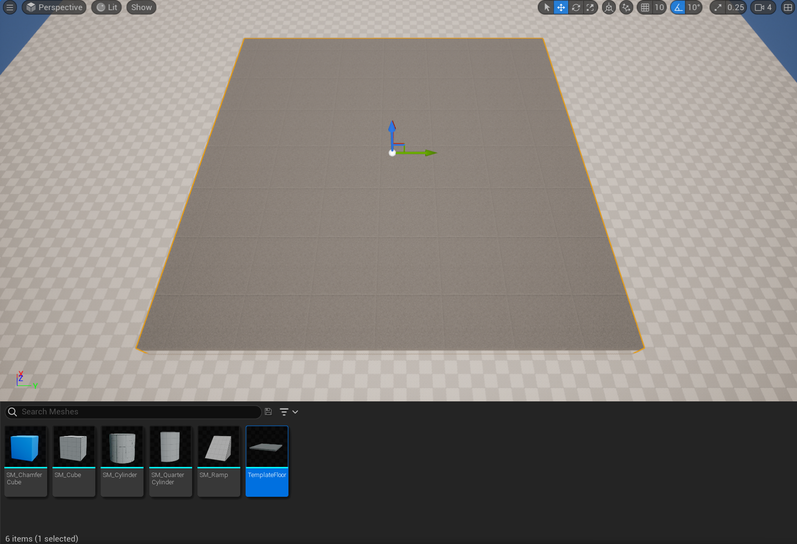
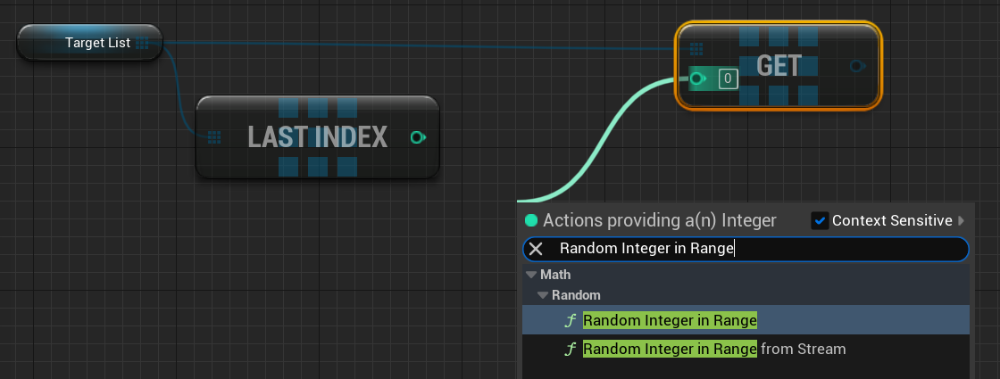
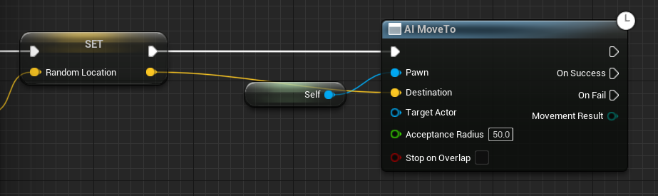

## 概述

本文档将指导你完成创建关卡和AI代理的初步步骤，以演示可以修改导航系统的不同方法。

或者，也可以下载[完整示例项目](https://docs.unrealengine.com/5.3/Attachments/making-interactive-experiences/artificial-intelligence/navigation/NavSystemSample.zip)，其中包含本指南所涵盖的所有资料。

## 目的

- 创建简单关卡，并通过在关卡中放入导航网格体边界体积Actor来添加导航。
- 将ThirdPersonCharacter蓝图修改为使用导航系统在关卡中四处游走。

## 1 - 必要设置

1. 在菜单的 **新建项目类别（New Project Categories）** 分段中，选择 **游戏（Games） > 第三人称（Third Person）** 模板。
   

2. 选择 **第三人称（Third Person）** 模板，然后点击 **下一步（Next）**。

   

### 阶段成果

你已创建新的第三人称项目，现在可以开始使用导航网格体构建基本关卡。

## 2 - 创建测试关卡

1. 点击菜单栏上的 **文件（File）>新关卡（New Level）**。

   

2. 选择 **基本（Basic）** 关卡并点击 **创建（Create）** 。

   

3. 在 **大纲视图（Outliner）** 中，选择 **Floor** 静态网格体Actor，并从 **细节（Details）** 面板，将 **缩放（Scale）** 设置为X = 10、Y = 10、Z = 1。

   

   

4. 在 **内容浏览器（Content Browser）** 中，转到 **关卡原型（LevelPrototyping） > 网格体（Meshes）**，并将 **TemplateFloor** 静态网格体拖到关卡中。

   

5. 转到 **放置Actor（Place Actors）** 面板，搜索 **导航网格体边界体积（Nav Mesh Bounds Volume）**。将其拖到关卡中，并放在地板网格体上方。

   

6. 选择 **导航网格体边界体积（Nav Mesh Bounds Volume）** 后，转到 **细节（Details）** 面板，将 **缩放（Scale）** 设置为X = 20、Y= 20、Z = 5，以覆盖整个地板区域。默认情况下，虚幻引擎将自动在导航边界内生成导航。Navmesh Actor **RecastNavMesh-Default** 应该也已添加到关卡中。按 **P** 键以在关卡中可视化导航网格体。

> 如果未生成导航，请转到"项目设置（Project Settings） > 导航系统（Navigation System）"，并启用"自动创建导航数据（Auto Create Navigation Data）"复选框。

7. 转到 **放置Actor（Place Actors）** 面板，在 **基本（Basic）** 类别下，将 **立方体（Cube）** 静态网格体 Actor拖到关卡中。

   

8. 选择 **立方体（Cube）** 之后，转到 **细节（Details）** 面板，将 **缩放（Scale）** 设置为X=1、Y=1、Z=5。

   

9. 将另外三个 **立方体** 拖到关卡中，并按上述立方体的参数进行缩放。将其放在地板四周，创建四个支柱，如下所示。

   

10. 接下来，在中间添加一段楼梯和一个平台。在 **内容浏览器（Content Browser）** 中，转到 **第三人称（ThirdPerson） > 网格体（Meshes）**，并将 **Linear_Stair_StaticMesh** 拖到关卡中。

    

11. 选择楼梯之后，转到 **细节（Details）** 面板，将 **缩放（Scale）** 设置为X=1. 5、Y=1、Z=1. 3。

12. 选择楼梯之后，按住 **Alt** 键的同时拖动网格体以进行复制。

    

13. 转到 **放置Actor（Place Actors）** 面板，在 **形状（Shapes）** 类别下，将 **立方体（Cube）** 静态网格体 Actor拖到关卡中。转到 **细节（Details）** 面板，将 **缩放（Scale）** 设置为X = 14、Y= 4、Z = 0.1。将Actor放在楼梯边缘以创建平台，如下所示。

    

14. 转到 **放置Actor（Place Actors）** 面板，在 **基本（Basic）** 类别下，将 **球体（Sphere）** 静态网格体 Actor拖到关卡中。

    

15. 选择 **球体** 之后，转到 **细节（Details）** 面板，并从 **碰撞（Collision）** 分段，将 **碰撞预设（Collision Presets）** 设置为 **无碰撞（No Collision）**。

    

16. 最后，复制球体，并将其放在关卡中的四周，如下所示。

    

### 阶段成果

在本分段中，你创建了一个简单的关卡，并添加了一个导航网格体边界体积。你还添加了五个球体，用于充当代理的目标Actor。

## 3 - 创建代理

在本分段中，你将创建一个将在一系列目标Actor之间移动的AI代理。

1. 在 **内容浏览器（Content Drawer）** 中，右键点击并选择 **新建文件夹（New Folder）**，以新建文件夹。将文件夹命名为 **NavigationSystem**。

2. 在 **内容浏览器中**，转到 **ThirdPersonBP > 蓝图（Blueprints）**，然后选择 **ThirdPersonCharacter** 蓝图。将其拖到 **NavigationSystem** 文件夹中，并选择选项 **复制到此处（Copy Here）**。

   

3. 转到 **NavigationSystem** 文件夹并将蓝图重命名为 **BP_NPC_ModNavMesh**。双击蓝图在蓝图编辑器中将其打开，并转到 **事件图表（Event Graph）**。选择所有输入节点并将其删除。

4. 右键点击 **事件图表（Event Graph）**，然后搜索并选择 **添加自定义事件（Add Custom Event）**。将事件命名为 **MoveNPC**。

   

5. 转到 **我的蓝图（My Blueprint）** 面板，然后点击 **变量（Variables）** 旁边的 **加号(+)** 按钮创建新变量。将变量命名为 **TargetList**。

   

6. 转到 **细节（Details）** 面板并点击 **变量类型（Variable Type）** 旁边的下拉列表。搜索并选择 **Actor > 对象引用（Object Reference）**。

   

7. 点击Actor选择旁边的 **蓝色球体** 图标，然后点击 **数组（Array）** 选项，如下所示。点击 **实例可编辑（Instance Editable）** 复选框将其启用。

   

8. 将 **TargetList** 变量拖动到 **事件图表（Event Graph）**，然后选择选项 **Get TargetList**。

9. 从 **TargetList** 节点拖出，然后搜索并选择 **上一个索引（Last Index）**。

10. 从 **TargetList** 节点拖出，然后搜索并选择 **Get (a copy)**。

    

11. 从 **Get** 节点的 **绿色** 引脚拖出，然后搜索并选择 **区间内的随机整数（Random Integer in Range）**。将 **Last Index** 节点的 **绿色** 引脚连接到 **Random Integer in Range** 节点，如下所示。

    

12. 从 **Get** 节点拖出，然后搜索并选择 **提升到变量（Promote to variable）**。将变量命名为 **CurrentTarget**，并将其连接到 **MoveNPC** 节点。

13. 从 **CurrentTarget** 节点拖出，然后搜索并选择 **有效（Is Valid）**。将 **IsValid** 宏节点连接到 **Set CurrentTarget** 节点。

    

14. 将 **CurrentTarget** 变量拖动到 **事件图表（Event Graph）** 中，然后选择 **获取当前目标（Get Current Target）**。从 **CurrentTarget** 节点拖出，然后搜索并选择 **获取Actor位置（Get Actor Location）**。

    

15. 从 **GetActorLocation** 节点的 **返回值（Return Value）** 拖出，然后搜索并选择 **获取半径内的随机可达点（Get Random Reachable Point In Radius）**。将 **半径（Radius）** 设置为 **100**。

    

    

16. 从 **GetRandomReachablePointInRadius** 节点的 **随机位置（Random Location）** 引脚拖出，然后选择 **提升到变量（Promote to Variable）**。将变量命名为 **RandomLocation**。将 **RandomLocation** 节点连接到 **IsValid** 节点，如下所示。

    

17. 从 **RandomLocation** 节点拖出，然后搜索并选择 **AO移动至（AI MoveTo）**。

18. 从 **AI MoveTo** 节点的 **Pawn** 引脚拖出，然后搜索并选择 **获取对自身的引用（Get a reference to self）**。将 **RandomLocation** 节点的 **黄色** 引脚连接到 **AI MoveTo** 节点的 **目的地（Destination）** 引脚。最后，将 **AI MoveTo** 节点的 **接受半径（Acceptance Radius）** 设置为50，如下所示。

    

    

19. 从 **AI Move To** 节点的 **成功时（On Success）** 引脚拖出，然后搜索并选择 **延迟（Delay）**。将节点 的 **时长（Duration）** 设置为4。从 **Delay** 节点的 **已完成（Completed）** 引脚拖出，然后搜索并选择 **MoveNPC**，如下所示。

    

20. 重复上述步骤，以将这些节点添加到 **AI Move To** 节点的 **失败时（On Fail）** 引脚。将 **Delay** 节点的 **时长（Duration）** 设置为0.1。

    

21. 右键点击 **事件图表（Event Graph）**，然后搜索并选择 **事件开始播放（Event Begin Play）**。从 **Event Begin Play** 节点拖出，然后搜索并选择 **MoveNPC**。

    

22. **编译（Compile）** 并 **保存（Save）** 蓝图。

23. 将 **BP_NPC_ModNavMesh** 蓝图拖到关卡中，并在 **细节（Details）** 面板下，找到 **目标列表（Target List）**，然后点击 **添加(+)** 按钮以添加新的目标Actor。

24. 点击下拉列表，然后搜索并选择之前创建的 **球体（Sphere）**Actor。

    

25. 重复上一步，添加剩余四个 **球体（Sphere）**Actor。

26. 点击 **模拟（Simulate）**，查看代理如何在关卡中的目标之间游走。

    

### 阶段成果

在本小节中，你创建了一个在一系列目标Actor之间游走的代理。现在，你可以继续学习[修改导航系统](https://docs.unrealengine.com/5.3/zh-CN/overview-of-how-to-modify-the-navigation-mesh-in-unreal-engine)了。