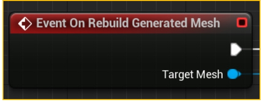
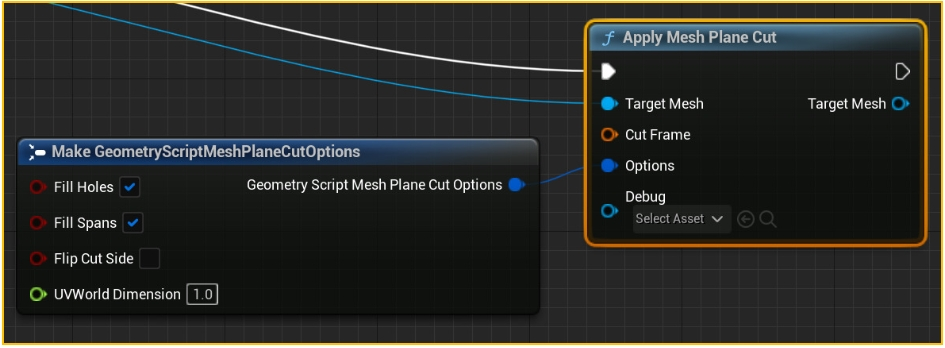

## 什么是几何体脚本？

**几何体脚本（Geometry Scripting）** 是虚幻引擎插件，包含一组函数库，可以通过蓝图（BP）和Python生成并编辑网格体几何体。要查看所有可用函数，请参阅[几何体脚本参考](几何体脚本参考.md)。

几何体脚本 `UFunctions` 和蓝图节点对 `UDynamicMesh` 对象进行操作，这些是使用 `FDynamicMesh3` C++三角形网格体数据结构创建的对象。这是 **几何体处理（Geometry Processing）** 插件和 **建模（Modeling）** 编辑器模式使用的相同数据结构。

你可以在 **编辑器工具控件（Editor Utility Widgets）** 和 **资产操作（Asset Actions）** 中使用几何体脚本创建自定义网格体分析、处理和编辑工具。你还可以在 **Actor蓝图（Actor Blueprints）** 中使用它来创建程序化对象并实现复杂的结合体查询。

几何体脚本有各种潜在用法：

- 对第三方网格体导入程序进行测试和质量分析。
- 分析网格体UV以识别存在纹理空间浪费的资产。
- 使用脚本合并网格体资产以用于制片工作流程。
- 程序化网格体Actor，例如[Lyra示例游戏](https://docs.unrealengine.com/5.3/zh-CN/lyra-geometry-tools-in-unreal-engine)中使用的关卡设计工具。

## 启用插件

使用几何体脚本需要启用关联的插件。

要启用插件或验证它是否已启用，请执行以下操作：

1. 在 **[菜单栏](https://docs.unrealengine.com/5.3/zh-CN/level-editor-in-unreal-engine#菜单栏)** 中，选择 **编辑（Edit）** > **插件（Plugins）** 。
2. 在搜索栏中输入"geometry script"。
   

3. 启用 **几何体脚本（Geometry Script）** 插件，并在弹出对话框中选择 **是（Yes）** 。

4. 重启引擎。

## 动态网格体对象

几何体脚本对多种新的对象类型操作：

- `UDynamicMesh`
- `UDynamicMeshComponent`
- `ADynamicMeshActor`

类似于静态网格体、静态网格体组件和静态网格体Actor架构，这些类并不专属于几何体脚本插件。它们位于 **几何体框架（Geometry Framework）** 引擎模块中，可以独立于几何体脚本使用。

### 动态网格体

启用几何体脚本的核心组件是 `UDynamicMesh` 对象。此 `UObject` 是**未绑定到特定组件的网格体数据结构的容器**。这与 `UProceduralMeshComponent` 等之前的虚幻引擎方法不同之处在于，网格体几何体可以在没有显式场景呈现的情况下进行创建和操控。

例如， `UDynamicMesh` 可以基于 `UStaticMesh` 初始化，进行编辑，然后存回资产。此方法与编辑器工具控件一起提供用户界面，使技术美术师能够在蓝图中自行创建拥有特定用途的自定义网格体编辑工具，或通过Python为网格体资产的查询和编辑操作编写脚本。

你还可以将各种Actor几何体类型转换为 `UDynamicMesh` 或反向转换，例如Gameplay体积。

### 动态网格体组件

除了 `UDynamicMesh` 之外， `UDynamicMeshComponent` 也已提升为"真实"（非临时、可序列化）的组件。此组件类似于 `UProceduralMeshComponent` ；但是，它受 `UDynamicMesh` 支持，你可以通过几何体脚本进行操控。

`UDynamicMeshComponent` 在过去几年一直作为网格体建模工具集的一部分进行开发，提供了网格体编辑的实时预览。类似于 `UProceduralMeshComponent` ，它支持更新网格体几何体，以更新顶点属性，创建并修改整个网格体拓扑。你可以在编辑器中以及在运行时执行这些更新。

支持光线追踪；但不支持Nanite和Lumen。

### 动态网格体Actor

`ADynamicMeshActor` 类似于 `AStaticMeshActor` 之处在于，它基本上是 `UDynamicMeshComponent` 的容器。但是，动态网格体Actor为想要基于 `UDynamicMesh` 实现程序化网格体生成的Actor蓝图提供了明确支持。

利用动态网格体Actor，几何体脚本和建模模式工具可以创建和编辑任一类型的网格体Actor以及体积。

### 生成的动态网格体Actor

`AGeneratedDynamicMeshActor` 是 `ADynamicMeshActor` 的子类，提供了实现基于蓝图的程序化网格体Actor的额外支持。具体来说，此类提供函数 **On Rebuild Generated Mesh** ，该函数可以在BP子类中实现以生成网格体，而不必在 **构造脚本（Construction Script）** 中实现。该函数可提供更好的编辑器中交互性能，并为将来更细致地管理大规模程序化几何体的生成操作留下了空间。

> *Event On Rebuild Generated Mesh* 仅存在于从GeneratedDynamicMeshActor类派生的Actor蓝图。此外， **Generated Dynamic Mesh Actor** 函数目前仅限用于编辑器。

### UStaticMesh和UDynamicMesh的主要差别

不同于 `UStaticMesh` ， `UDynamicMesh` 不是资产。`UDynamicMeshComponent` 拥有其 `UDynamicMesh` ；而不是像 `UStaticMesh` 那样在多个组件之间共享。 此差异意味着，实例化渲染不可用，等等。

动态网格体只存储在关卡中，而不是在单独的资产文件中。复制 `UDynamicMeshComponent` 会创建网格体的副本（创建新网格体而不是实例）。在关卡或项目之间传输必须通过复制和粘贴操作完成。

在许多方面， `UDynamicMeshComponent` 的行为更像Autodesk 3ds Max、Autodesk Maya或Blender等数字内容创建（DCC）工具中的网格体对象。此处理确实会带来潜在的问题，因为巨大的网格会显著增加关卡文件的大小。但是，通过[一个Actor一个文件](https://docs.unrealengine.com/5.3/zh-CN/one-file-per-actor-in-unreal-engine)，网格体数据将存储在OFPA Actor文件中而不是在关卡中（所以，数据仍有可能很大，但会在单独的文件中）。

## 函数模式

大部分几何体脚本函数遵循标准模式，类似于下面所示的 **Apply Mesh Plane Cut** 节点。

第一个参数 **目标网格体（Target Mesh）** 是该操作编辑的 `UDynamicMesh` 。一般来说，**几何体脚本操作会修改输入网格体，而不是创建新网格体，以避免创建多个临时网格体对象**。输入 `UDynamicMesh` 总是作为输出返回，也称为 **目标网格体（Target Mesh）** （ `相同名称 == 相同对象` ）。利用此设置，可以轻松将多个操作串连起来。

几何体脚本节点有许多参数和设置。我们将最常用的选项公开为参数，但你可以在特定于操作的 **选项（Options）** 结构中找到其他选项。要创建恰当选项结构，最常见的方式是拖移空的 **选项（Options）** 引脚。此外，你可以右键点击 **选项（Options）** 引脚，然后使用 **拆分结构体引脚（Split Struct Pin）** 上下文菜单项直接展开节点中的选项结构，如下所示。

> 大部分节点还有一个 **调试（Debug）** 引脚，用于为网格体生成器提供几何体调试支持。这在目前尚未加以利用，只是未来功能的占位符。

## 使用UDynamicMesh池

在网格体生成器中创建临时网格体是很常见的做法，例如使用要从主网格体中去掉的图元网格体。为此，需要临时的 `UDynamicMesh` 。虽然你可以使用 **Construct Object From Class** 函数创建一个，但你必须在使用之后对网格体进行垃圾回收。不过，如果你会频繁运行生成器，在多次运行之间复用网格体会更高效。

动态网格体Actor使用 `UDynamicMeshPool` 对这种情况提供了内置支持。要使用此设置，你可以调用 **Allocate Compute Mesh** 获取临时网格体，然后在蓝图执行路径结束前的某个地方将其释放。每个临时网格体可以使用 **Release Compute Mesh** 显式释放，或通过调用 **Release All Compute Meshes** 来释放，后者会返回当前从池中分配的所有临时网格体。

在编辑器工具控件中，没有默认动态网格体池实例用于分配其中的网格体。但是，你可以使用 **Create Dynamic Mesh Pool** 创建一个（例如，作为编辑器工具控件或工具蓝图中的变量）。

## 创建程序化网格体

如前所述，几何体脚本的一个用例是使用Actor蓝图创建程序化网格体。下面的示例使用 **生成的动态网格体Actor（Generated Dynamic Mesh Actor）** 的BP子类。**Event On Rebuild Generated Mesh** 将填充 `UDynamicMeshComponent` 的 `UDynamicMesh` 。`UDynamicMesh` 将传递到几何体脚本函数 **Append Box** ，后者基于输入变量创建网格体。

该脚本会使用一些参数创建参数化盒体图元网格体，美术师只需使用几个BP节点即可在编辑器中调整这些参数。通过添加更多节点，你可以直接在蓝图中构建越来越复杂的网格体生成器。要扩展此脚本并继续了解几何体脚本，请参阅[通过蓝图编写的几何体脚本](https://docs.unrealengine.com/5.3/zh-CN/geometry-scripting-through-blueprints-in-unreal-engine)。

## 附加说明

要检查特定函数是否存在，请参阅[几何体脚本参考](https://docs.unrealengine.com/5.3/zh-CN/geometry-scripting-reference-in-unreal-engine)文档。

一些函数（例如 **Apply PolyGroup Catmull Clark SubD** ）仅限用于编辑器。此设置意味着你只能在编辑器工具Actor/操作/控件或生成的动态网格体Actor BP子类中使用这些函数。

大部分几何体脚本函数仅适用于 `UDynmicMesh` 对象。有一些函数用于将内部网格体表示从静态网格体、骨骼网格体或体积Actor转换为 `UDynamicMesh` ，也有一些函数往相反方向转换。不存在其他几何体类型的函数，例如地形、几何体缓存或集合、Groom和布料。

目前， `UDynamicMeshComponent` 不支持以下功能：

- Nanite
- Lumen
- 网格体距离场
- 细节级别
- 实例化渲染

Actor蓝图和编辑器工具蓝图总是在游戏线程上执行，因此调用的几何体脚本函数也在游戏线程上运行。一些几何体脚本函数在任务线程上内部执行一部分工作，例如，对ParallelFor、Async或 `UE::Tasks::Launch()` 的C++调用。但是，这仅在单个函数的上下文中发生，并且该函数在所有这些并行工作都完成后才会返回。
