你可以使用 **动画蒙太奇（Animation Montage）** （简称**蒙太奇（Montage）**） 来将多个**动画序列（Animation Sequences） **合并为单个资产并通过蓝图播放。你还可以使用动画蒙太奇来在[网络游戏](https://docs.unrealengine.com/5.3/zh-CN/animation-montage-in-unreal-engine)中复制 **根位移（Root Motion）** 动画。

蒙太奇除了可以让你将多个动画序列合并为动画外，还可以切分为多个 **蒙太奇分段（Montage Sections）**，以便在运行时，按一定逻辑以任何顺序动态播放。你可以在[蒙太奇分段面板](https://docs.unrealengine.com/5.3/zh-CN/animation-montage-in-unreal-engine)中控制分段之间的过渡，也可以使用 **蓝图（Blueprints）** 在分段之间设置更复杂的过渡行为。

更多关于在蓝图中使用动画蒙太奇的信息，参考[在蓝图中编辑并使用动画蒙太奇](https://docs.unrealengine.com/5.3/zh-CN/animation-montage-editor-in-unreal-engine)。

在动画蒙太奇中，动画序列以 **插槽组（Slot Groups）** 和 **插槽（Slots）** 分类。一个插槽中可以有多个动画序列来生成动画，还可以使用不同的插槽来创建额外的轨道。

默认情况下，处于同一插槽同一插槽组的动画序列会在触发时覆盖其余任何序列的播放。

参考下文的[插槽和插槽组](https://docs.unrealengine.com/5.3/zh-CN/animation-montage-in-unreal-engine)小节来了解更多关于插槽的信息。

## 创建蒙太奇

要创建蒙太奇，在内容浏览器中右键点击并找到 **动画（Animation） > 动画蒙太奇（Animation Montage）**。然后，选择要应用动画蒙太奇的 **骨架（Skeleton）**。

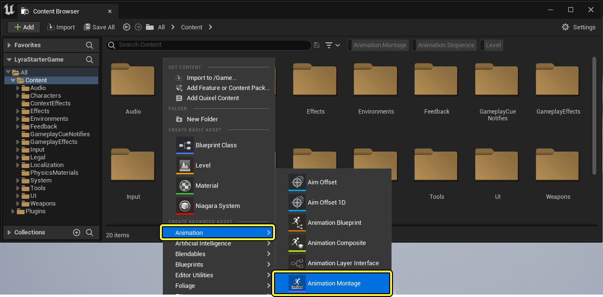

你还可以从已有的[动画序列](https://docs.unrealengine.com/5.3/zh-CN/animation-sequences-in-unreal-engine)来创建蒙太奇，在 **内容浏览器（Content Browser）** 中 **右键点击** 动画序列然后选择 **创建（Create） > 创建动画蒙太奇（Create AnimMontage）**。
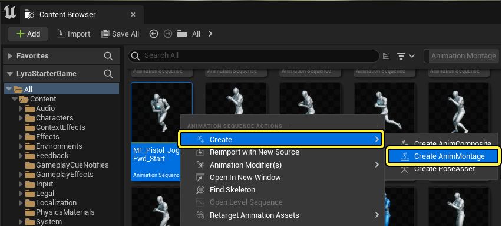

创建好动画蒙太奇并打开资产后，[动画序列编辑器](https://docs.unrealengine.com/5.3/zh-CN/animation-sequence-editor-in-unreal-engine)会打开， **时间轴（Timeline）** 中会显示动画蒙太奇工作环境。

## 时间轴

与虚幻引擎其它编辑器的时间轴类似，该时间轴分为不同的 **轨道**。这些轨道包含指挥动画播放行为的信息，并且分为播放帧。
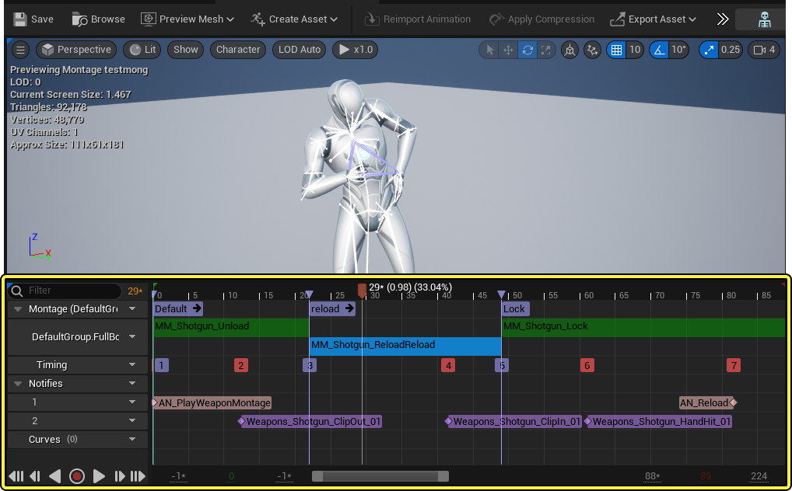

### 分段

在蒙太奇轨道中可以看到动画蒙太奇中的所有分段。
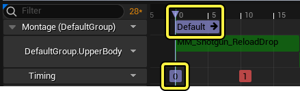

分段以其分配的名称和紫色标题栏显示，你可以添加、删除以及移动这些分段，使其按照游戏需求匹配对应的序列或者序列的分段。

要创建蒙太奇分段，在顶部轨道中 **右键点击**，选择 **创建新分段（Create New Section）**，然后为该蒙太奇分段命名。在时间轴中点击并拖动标题栏或者线条可以移动并放置蒙太奇分段。

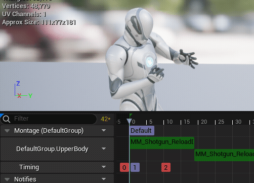

分段以其分配的名称和紫色标题栏显示，你可以添加、删除以及移动这些分段，使其按照游戏需求匹配对应的序列或者序列的分段。

要创建蒙太奇分段，在顶部轨道中 **右键点击**，选择 **创建新分段（Create New Section）**，然后为该蒙太奇分段命名。在时间轴中点击并拖动标题栏或者线条可以移动并放置蒙太奇分段。

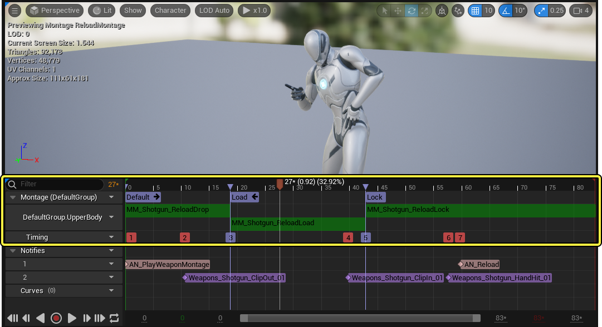

> 你可以通过打开想要的轨道的下拉菜单来切换编辑器中预览的序列轨道。在菜单中找到 **其它选项（Other Options）** 下的 **预览插槽（Preview Slot）**。

### 插槽和插槽组

在动画蒙太奇中，动画序列以插槽来划分并播放。一个插槽会占据一个网格体或者部分网格体，当来自动画蒙太奇的动画放入该插槽中，便可以在插槽的动画蓝图上播放。插槽轨道是一连串任意数量的动画序列。通过蒙太奇分段这些序列可以在游戏逻辑或者玩家输入的控制下播放。

> 请勿将动画重叠，否则同时播放同插槽序列的时候各个序列会相互干扰。

要在角色的不同部位上播放序列，可以将动画分为不同的插槽组。通过动画图表可以设置这些插槽组在角色的不同部位上播放。比如可以使用一个上半身插槽和一个下半身插槽，从而在两个部位同时播放不同的动画。

要在蒙太奇中更改或添加插槽，点击插槽轨道上的插槽下拉菜单来查看以下选项：
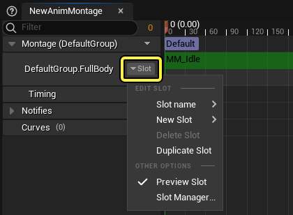

| 名称                           | 描述                                                         |
| :----------------------------- | :----------------------------------------------------------- |
| **槽位名称（Slot name）**      | 打开一个菜单用于选择当前插槽。如果使用的是最顶端的插槽轨道，那么选择其它[插槽组](https://docs.unrealengine.com/5.3/zh-CN/animation-slots-in-unreal-engine)的插槽将会更改蒙太奇的插槽组。 |
| **新建插槽（New Slot）**       | 使用已有的插槽创建一个新的插槽轨道。                         |
| **删除插槽（Delete Slot）**    | 删除插槽。                                                   |
| **复制插槽（Duplicate Slot）** | 将插槽轨道及其内容复制到一个新的插槽轨道。                   |
| **预览插槽（Preview Slot）**   | 如果有多个插槽轨道，启用该项后会让该插槽中的内容在视口中预览。 |
| **插槽管理器（Slot Manager）** | 打开[插槽管理器](https://docs.unrealengine.com/5.3/zh-CN/animation-slots-in-unreal-engine)面板。 |

> 为了在使用多个插槽时达到最佳效果，应该确保使用的动画从头至尾有着相同的长度。

更多插槽和插槽组的相关信息，参阅[插槽](https://docs.unrealengine.com/5.3/zh-CN/animation-slots-in-unreal-engine)文档。

### 计时

计时轨道显示来自蒙太奇和动画通知分段的标记，用来帮助给各元素控制时间。
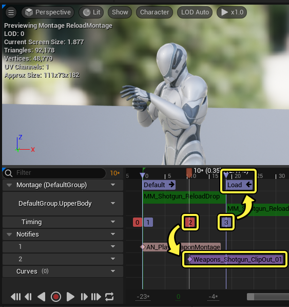

轨道中的每个节点都会赋予一个数值用来指示它在蒙太奇中的触发顺序，并且用颜色区分引用类型。分段为紫色，动画通知为红色。

点击计时轨道的下拉箭头会显示显示或者隐藏引用类型的选项。

## 细节面板

在细节面板中，可以编辑并管理动画蒙太奇中资产（动画序列、动画通知和蒙太奇分段）的属性。

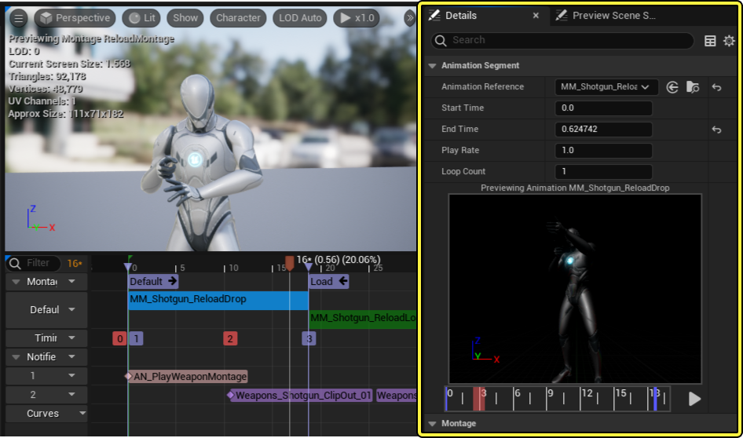

更多关于使用细节面板修改特定蒙太奇元素的信息，请参考[编辑并使用动画蒙太奇](https://docs.unrealengine.com/5.3/zh-CN/animation-montage-editor-in-unreal-engine)

## 蒙太奇分段面板

在蒙太奇分段面板中可以设置蒙太奇分段的默认播放顺序。

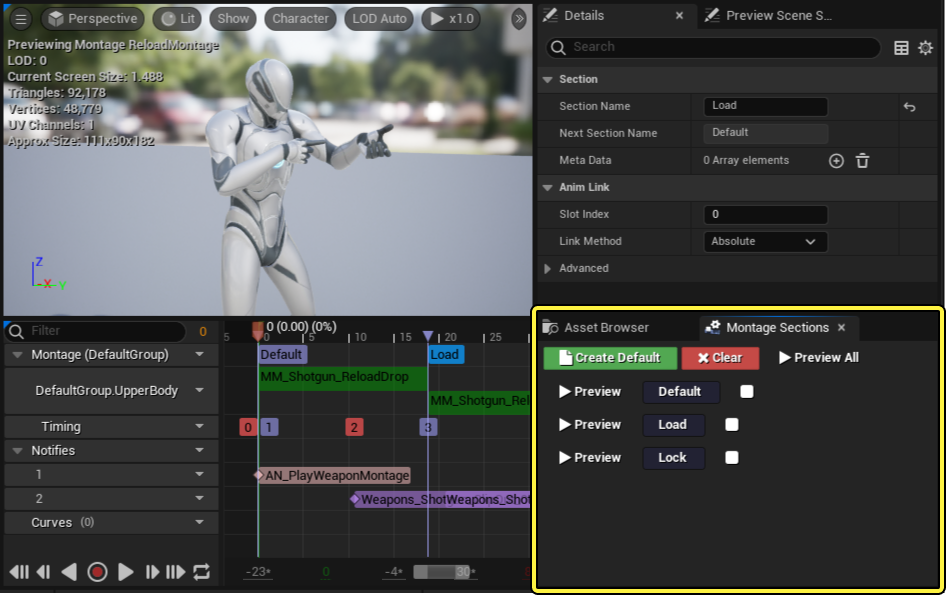

要设置播放顺序，首先选择 **清除（Clear）** 选项，将全部已有的分段行为取消链接，使所有分段没有任何链接。

然后，点击要编辑的分段右侧的白色选框，选中触发时要播放的下一个分段。若要预览分段播放顺序：开始播放动画，然后点击想要预览的分段序列旁的预览按钮。

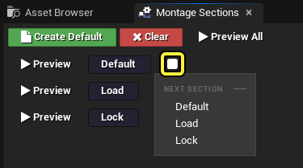

**预览全部（Preview All）** 可以按照在时间轴中的顺序预览全部分段。

## 子蒙太奇

你可以使用子蒙太奇来创建不同版本的蒙太奇，沿用父级蒙太奇的所有属性。可以编辑子蒙太奇来使其适用于不同场景，而不需要改变已有的游戏系统或行为。

要创建子级动画蒙太奇，在内容浏览器中右键点击一个动画蒙太奇并选择 **创建子蒙太奇（Create Child Montage）**。

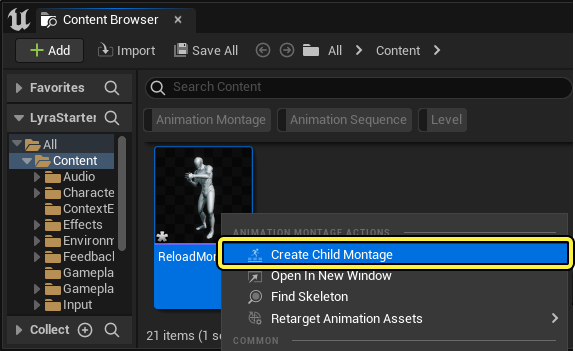

新的子蒙太奇在创建时会使用与原始资产同样的名称，并添加一个 "_Child" 后缀。
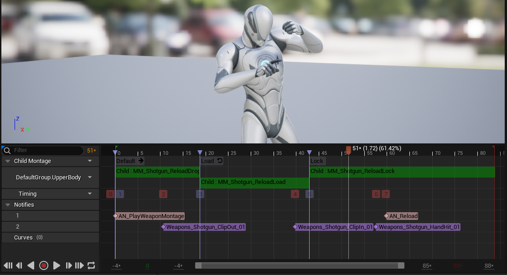

打开子蒙太奇的时候，其中所有的元素都设为只读。

你可以在插槽轨道中 **右键点击** 子蒙太奇分段并用新的动画将其覆盖。

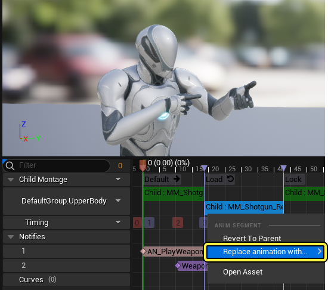

在插槽轨道中，你可以任意替换动画，即使是长度不一样也可以。虚幻引擎会自动调整动画的播放速率、起始时间和结束时间，来使其占据与原始动画同样的部分，在同样的时间开始。没有变更过的动画显示为绿色，覆盖过的动画显示为黄色。

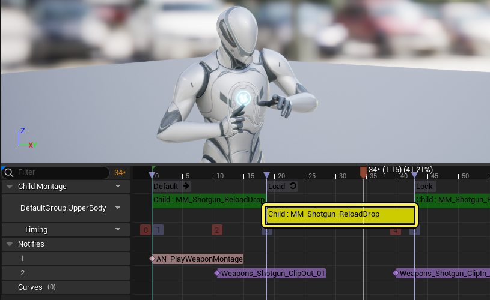

> 子蒙太奇不能作为其它子蒙太奇的父级。

## 网络游戏

对于设计为联网游玩的项目，可以使用动画蒙太奇来在网络游戏中复制根运动。复制过程默认进行，但是需要你先用[RPC (远程进程调用 Remote Procedure Call)](https://docs.unrealengine.com/5.3/zh-CN/rpcs-in-unreal-engine)手动复制播放蒙太奇（PlayMontage）节点。

> 在 **RPC** 中使用播放蒙太奇节点时，只有根位移的复制和纠正会被传输。

更多关于联网项目的信息，请参阅[联网多人游戏](https://docs.unrealengine.com/5.3/zh-CN/networking-and-multiplayer-in-unreal-engine)文档。