**场景查询系统（EQS）**可在[行为树](https://docs.unrealengine.com/5.2/zh-CN/behavior-trees-in-unreal-engine)中用于通过各种[测试](https://docs.unrealengine.com/5.2/zh-CN/eqs-node-reference-tests-in-unreal-engine)轮询场景，然后根据这些测试的结果做出如何继续的决定。EQS的一些样板用例包括：让AI角色找到避开玩家视线的掩护位置，或者找到关卡中最近的体力回复剂或弹药。

场景查询实际上由多个不同部分组成。可以从行为树调用场景查询，然后实际的场景查询将使用其[生成器](https://docs.unrealengine.com/5.2/zh-CN/eqs-node-reference-generators-in-unreal-engine)，引用其[情境](https://docs.unrealengine.com/5.2/zh-CN/eqs-node-reference-contexts-in-unreal-engine)，并使用其测试，从而为行为树提供权重最高的结果。

在本指南中我们将创建一个AI，它会在场景中随机移动，直到看见玩家为止。看见玩家时，该AI会使用EQS系统在场景中找到一个在保持距离的同时提供最佳优势的位置。如果想让AI角色进行某种远程攻击，这会十分实用，因为AI将会保持与玩家的距离，并尽量维持视线，如下例所示。

<video src="Image/创建交互体验/人工智能/场景查询系统/场景查询系统快速入门/场景查询系统快速入门.mkv"></video>

在本指南学习完毕后，您将对下列系统有基本的了解：

1. 蓝图可视化脚本
2. AI控制器
3. 黑板
4. 行为树
5. 场景查询系统（EQS）
6. EQS情境
7. AI调试工具

# 1 - 必要项目设置

在这一步，我们将为我们的项目设置一些需要用于AI的资源，并启用EQS系统。

> 在本指南中，我们要使用一个新的 **蓝图第三人称模板** 项目。

1. 在项目中，在 **设置（Project Settings） > 插件（Plugins）** 部分，启用 **场景查询编辑器（Environment Query Editor）**。
   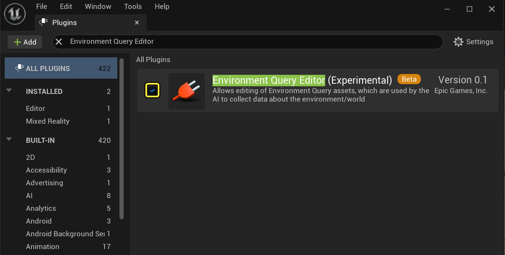

> 启用EQS系统后，你就可以创建并访问与EQS相关的资源。

2. 在 **Content > ThirdPerson > Blueprints** 文件夹中，将 **BP_ThirdPersonCharacter** 复制到一个名为 **AI** 的新建文件夹。
   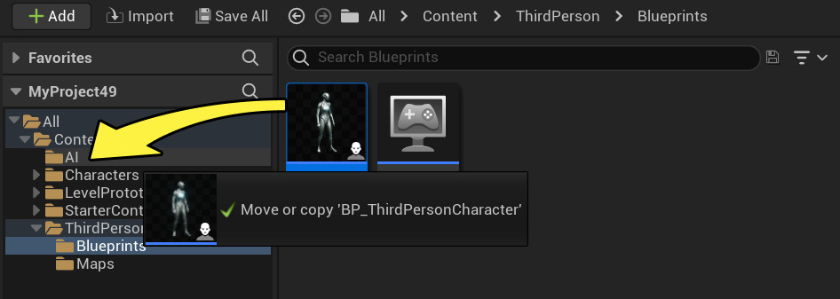

3. 在 **AI** 文件夹中，用 **新增（Add New）> 创建高级资源（Create Advanced Asset）> 人工智能（Artificial Intelligence）** 选项创建以下三个AI资源：
   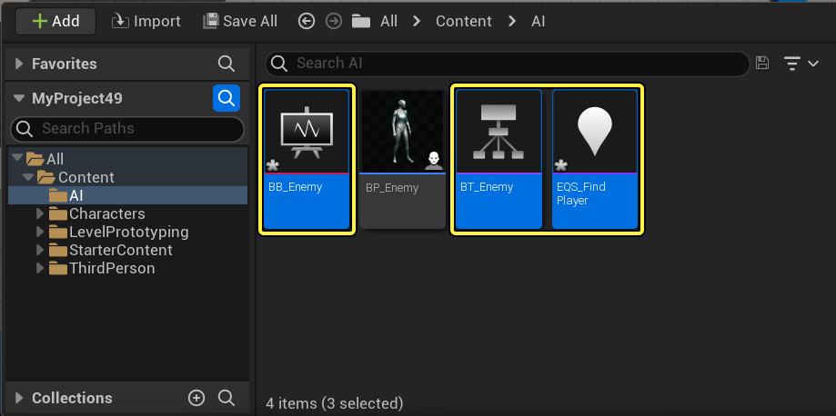

- **黑板**，命名为 **BB_Enemy**

- **行为树**，命名为 **BT_Enemy**
- **场景查询**，命名为 **EQS_FindPlayer**

4. 创建 **AIController** 类型的新 **蓝图类**，命名为 **AIC_Enemy**。
   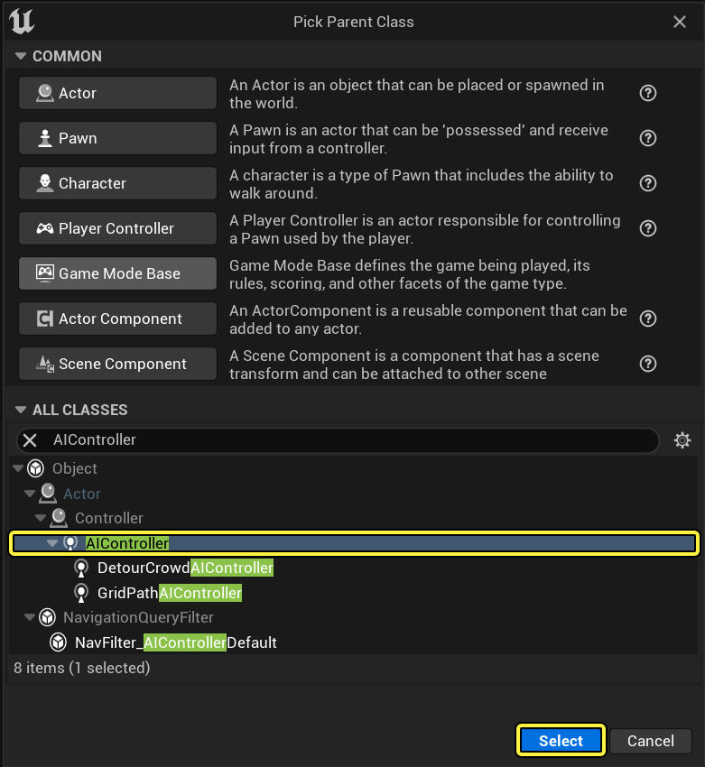

5. 创建 **EnvQueryContext_BlueprintBase** 类型的新 **蓝图类**，命名为 **EQC_PlayerContext**。
   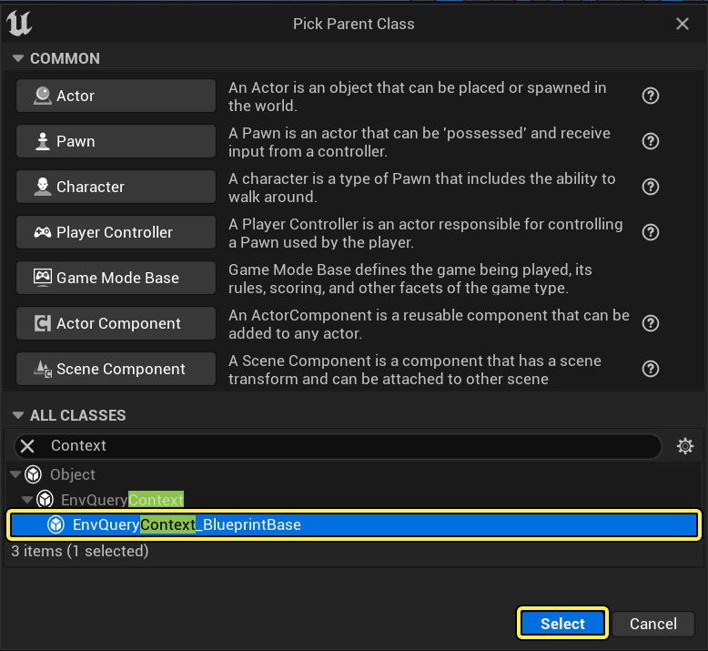

**情境** 可在EQS系统中使用，作为应用各种测试时的参考，例如"EQS，我离指定的情境有多近"就是一种可以运行的测试。稍后在本指南中执行测试时，将使用此资源提供玩家角色作为情境。

# 2 - 场景查询情境

在这一步中，我们为玩家角色的EQS系统建立一个情境，它将用在指南之后的测试中。

1. 打开 **EQC_PlayerContext** 资源，然后在 **我的蓝图（My Blueprint）** 面板中，覆盖 **Provide Single Actor** 函数。
   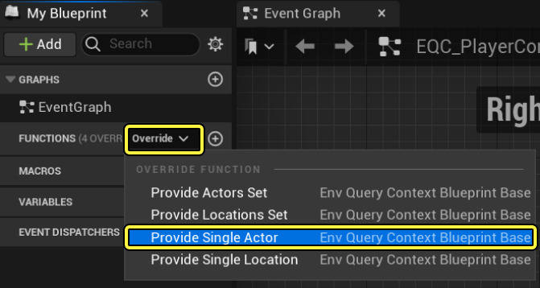

可以提供单个 **Actor** 或 **位置** 作为情境，也可以提供一组 **Actor** 或 **位置**。

2. 在 **Provide Single Actor** 函数中，使用 **Get Player Character** 调用作为 **结果Actor（Resulting Actor）**。
   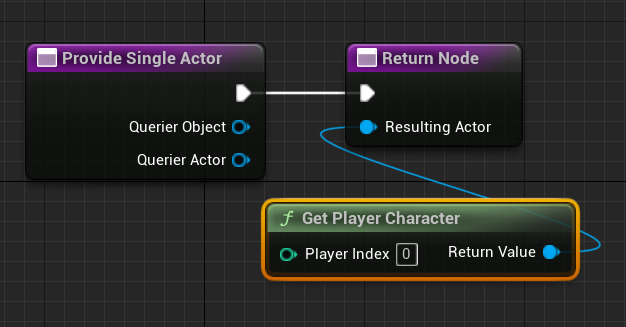

这将会在运行时作为情境检索玩家角色。

> 虽然我们在这个用例中重点讲述蓝图，但更优化的方法是通过C++创建情境。

# 3 - EQS设置

在这步中，我们跳转到EQS编辑器中，设置测试来查找具有看到玩家角色的视线的位置。

1. 在 **EQS_FindPlayer** 中，从图表中的 **Root** 节点连出引线，添加一个 **Points:Grid** 节点。
   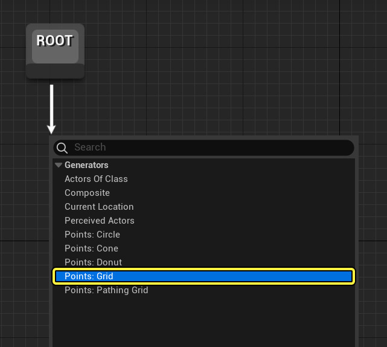

有多种不同类型的 **生成器** 可用于创建与情境相关的 **项目（Item）**。然后这些项目（Item）就会被用在测试中（例如项目X距离情境Y有多远）。测试结果中的项目（Item）会被剔除或计分，然后就可用于确定什么是"最佳"（分数最高或最低）选项。

在这个示例中，我们将在AI周围的网格上生成一系列点，最终将使它进入可以看到玩家角色的位置。

2. 在 **细节（Details）** 面板中，将 **网格半大小（GridHalfSize）** 改为 **800**，**间隔（Space Between）** 改为 **150.0**。
   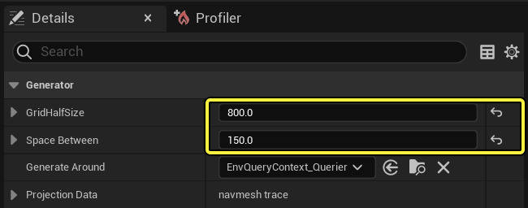

这些设置用于定义可用来测试的点数，以及这些点之间的距离。由于性能原因，需要将这些设置控制在可管理的大小，因为过大的网格可能会影响游戏的性能。

使用 **生成围绕（Generate Around）** 字段可以确定应该将网格放置在什么位置（这个示例中是放在查询器或AI角色周围）。虽然将 **生成围绕（Generate Around）** 设为使用我们创建的玩家情境也可行，但我们不希望AI在已经看到玩家的情况下移动到玩家附近的网格的某个点上。

**投射数据（Projection Data）** 提供了更多字段来确定如何生成网格。针对本示例，我们可以让这些字段保留默认设置，但有必要，也可以返回来调整这些设置。

3. 右键单击 **SimpleGrid** 节点，在 **添加测试（Add Test）** 下选择 **追踪（Trace）**。
   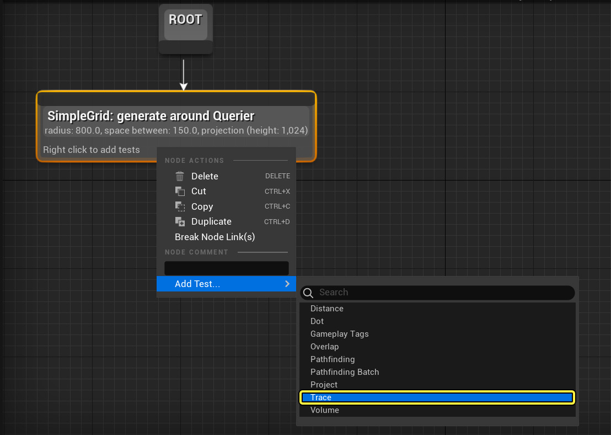

**追踪** 测试将用于确定网格上的点是否能够真正看到玩家角色。

> 对生成器添加测试的顺序并不重要。测试会自动排序，将过滤测试排在前面（从而使后续测试所处理的项目（Item）集合尽可能小），还会按开销过滤（从而使距离过滤器在视线过滤器之前执行）。

4. 右键单击并再添加一个 **距离（Distance）** 类型的测试。
   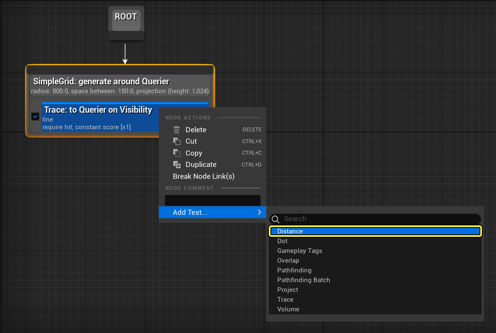

在 **追踪** 测试返回能够看到玩家角色的点之后，**距离** 测试将用于根据这些点与玩家角色的接近程度来对其计分。

5. 选择 **追踪** 测试，然后在 **细节（Details）** 面板中设置下列选项：
   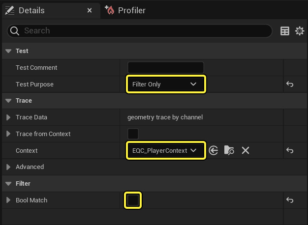

- **测试目的（Test Purpose）** = **仅过滤（Filter Only）**

- **情境（Context）** = **EQC_PlayerContext**
- **布尔匹配（Bool Match）** = **禁用（Disabled）**

在这里我们提供玩家角色作为可视性 **追踪** 测试中的参考点（情境）。禁用 **布尔匹配（Bool Match）** 选项表示我们希望过滤掉所有无法看见玩家角色的点。

6. 选择 **距离** 测试，然后在 **细节（Details）** 面板中，将 **测试目的（Test Purpose）** 改为 **仅计分（Score Only）**，**计分因子（Scoring Factor）** 改为 **-1.0**。
   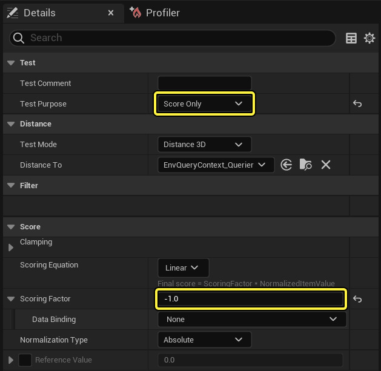

**距离** 测试目的是对返回的项目（Item）计分，-1.0的计分因子是对离玩家角色较近的点计高分。如果将这个设置保留为1.0，它将返回离玩家最远的点，这可能导致AI为了到达最远的点而直接从玩家身边跑过。

还有另一些计分选项，例如用最大值或最小值限定分数，更改在乘以 **计分因子（Scoring Factor）** 前用于使分数规格化的 **计分公式（Scoring Equation）**，定义 **规格化类型（Normalization Type）** 或指定用于规格化分数的 **参考值（Reference Value）**。在此示例中，我们可以让这些选项全都保留默认设置。

# 4 - 黑板和行为树设置

在这一步中要设置黑板键，并对行为树的分支进行布局。

1. 在 **BB_Enemy** 黑板资源中，创建以下三个键：
   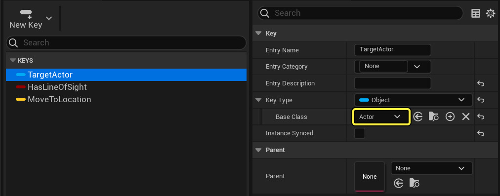

- **布尔**，名为 **HasLineOfSight**

- **矢量**，名为 **MoveToLocation**
- **对象**，其 **基类（Base Class）** 设为名为 **TargetActor** 的 **Actor**

这些键将用于在我们的行为树分支之间更新和移动。

2. 打开 **BT_Enemy** 行为树，使用 **选择器**、**序列** 和 **等待任务** 节点创建下列图表：
   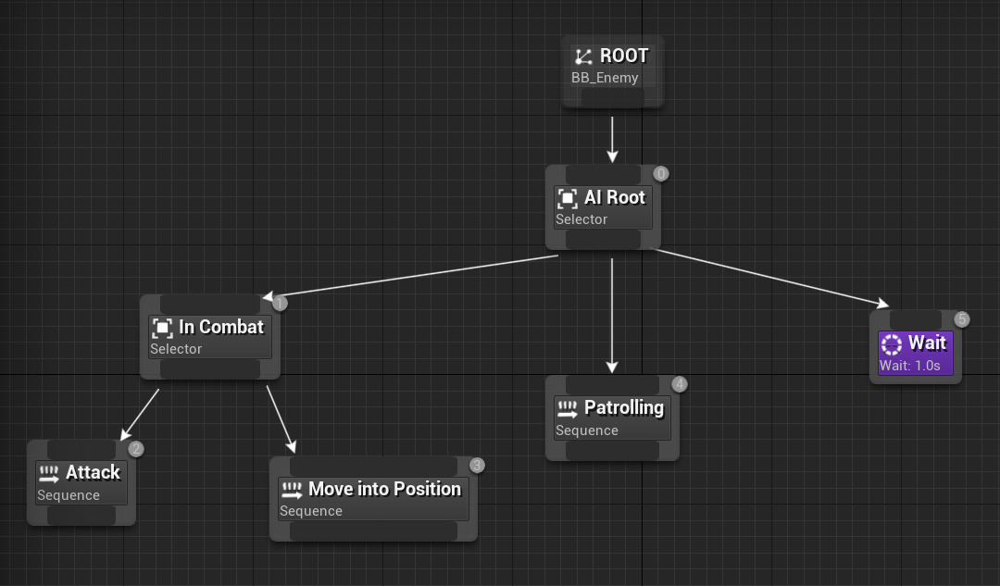

在上图中我们有三个主要分支。最左边的分支使用 **选择器** 节点（我们将它命名为 **In Combat**）在两个 **序列** 节点之间切换（一个叫 **Attack**，另一个叫 **Move into Position**）。当AI不执行"In Combat"分支时，它将执行被我们命名为 **Patrolling** 的下一个分支。如果由于某种原因，AI既不在战斗、也不在巡逻，那么我们还设置了一个进行等待的失效安全任务（已将等待时间设为1秒钟），在等待后AI就会尝试移动到其他分支。

# 5 - 行为树：巡逻设置

在这一步中，我们要设置行为树的巡逻分支。

1. 从 **Patrolling** 序列节点连出引线，添加一个 **移动到（Move To）** 任务（设为 **MoveToLocation**）和一个 **等待（Wait）** 任务（设为 **5** +/- **1** 秒）。
   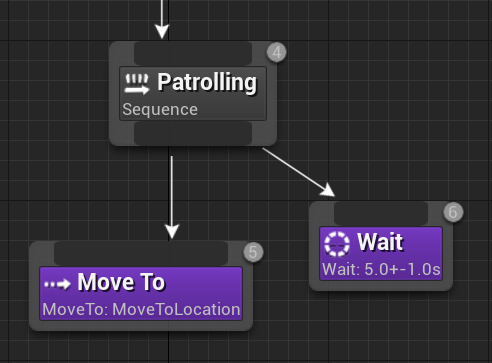

这将指示AI移动到黑板键 **MoveToLocation** 然后等待指定的时间，但我们还需要为 **MoveToLocation** 定义矢量值。

2. 从工具栏创建 **新任务**，然后在 **内容浏览器** 中将它命名为 **BTT_RandomLocation**。
   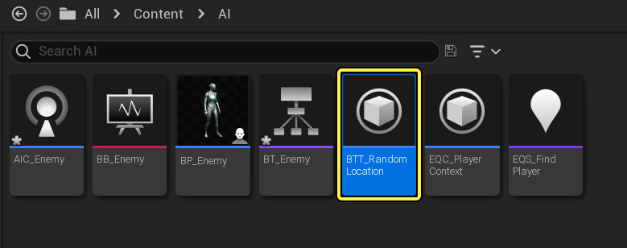

3. 在 **BTT_RandomLocation** 中，重建如下所示的蓝图图表。
   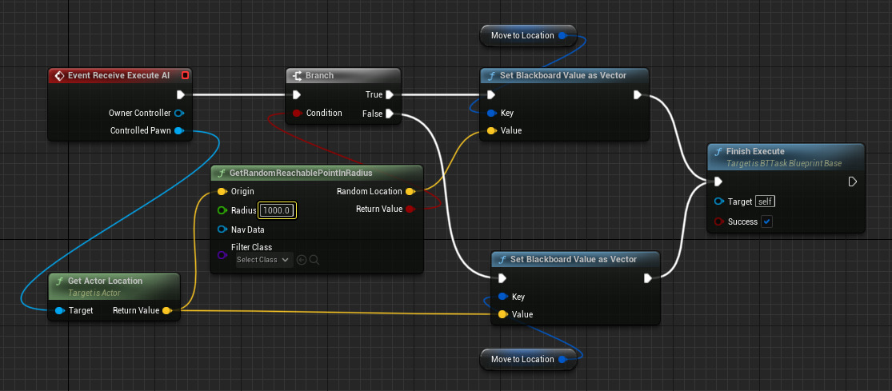

使用一个 **事件接收执行AI（Event Receive Execute AI）** 节点，从 **Controlled Pawn** 可以 **Get Actor Location**，使用它作为 **Get Random Reachable Point in Radius** 函数的 **原点**（我们设置了 **1000** 作为 **半径**）。

使用来自 **GetRandomReachablePointInRadius** 节点的 **返回值** 作为 **分支** 条件。从 **True** 引脚连出引线，使用 **Random Location** 值和 **Set Blackboard Value as Vector**，其键是名为 **MoveToLocation** 的 **黑板键选择器** 变量。

从 **False** 引脚连出引线， **Set Blackboard Value as Vector**，以 **Get Actor Location** 作为 **值**。这表示在没有找到随机点的时候，我们会先使用角色的现有位置，然后尝试寻找新的位置。将两条执行线都拉到一个 **完成执行（Finish Execute）** 节点，并启用 **成功（Success）** 来结束任务。

> 在将这个任务添加到行为树前，我们需要能够设置 **MoveToLocation** 的值，因此我们需要单击 **我的蓝图（My Blueprint）** 面板中的眼睛图标，确保将它设为 **实例可编辑（Instance Editable）**。
> 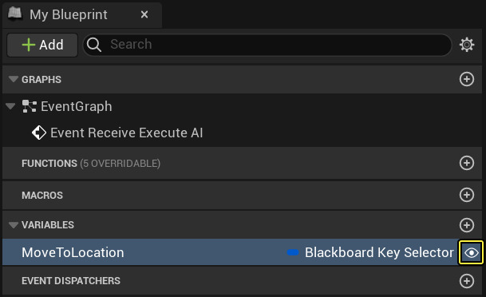

4. 在行为树中，添加 **BTT_RandomLocation** 任务（在 **细节（Details）** 面板中设置 **MoveToLocation**）作为 **Patrolling** 下面的第一个节点。
   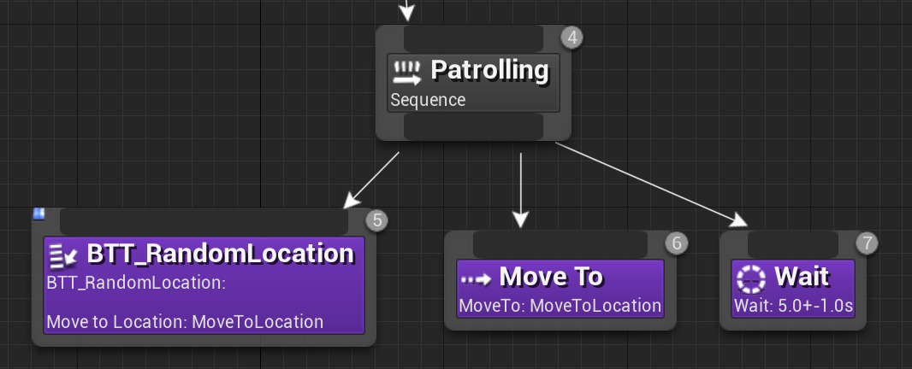

# 6 - 行为树：战斗设置

在这一步中，我们设置与In Combat分支关联的任务，包括我们的EQS_FindPlayer查询，它用于查找有看到玩家角色的视线的位置。

1. 右键单击 **In Combat** 选择器并添加 **黑板** 类型的 **装饰器**，并使用下列设置：
   

- **观察者中止（Observer aborts）** 设为 **低优先级（Lower Priority）**

- **黑板键（Blackboard Key）** 设为 **TargetActor**

这表示一旦设置了TargetActor，就执行In Combat分支并中止所有优先级较低的任务。

2. 右键单击 **Attack** 序列并添加 **黑板** 类型的 **装饰器**，并使用下列设置：
   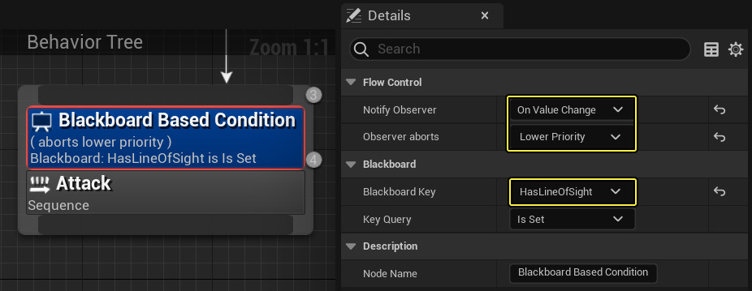

- **通知观察者（Notify Observer）** 设为 **数值改变时（On Value Change）**

- **观察者中止（Observer aborts）** 设为 **低优先级（Lower Priority）**
- **黑板键（Blackboard Key）** 设为 **HasLineOfSight**

这表示如果设置了 **HasLineOfSight**，则执行Attack分支。如果没有设置 **HasLineOfSight**，则执行另一个分支，直到 **HasLineOfSight** 再次设置。

3. 从 **Attack** 节点连出引线，添加一个 **旋转以面向BB（Rotate to face BB）** 条目（设为 **TargetActor**）。
   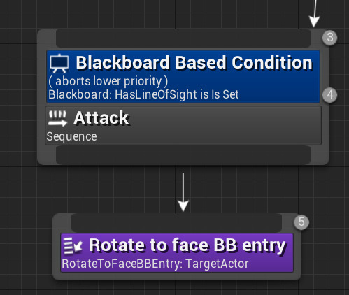

这将使AI在处于"attack"分支时转向TargetActor。在这个示例中，我们没有给AI提供攻击，如果需要，可以稍后添加。

4. 从 **Move Into Position** 节点连出引线，使用 **Run EQSQuery** 节点。
   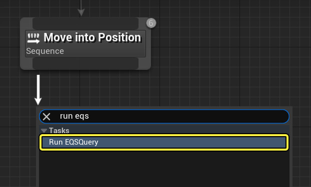

Run EQSQuery节点可用于执行将更新分配的黑板键的EQS查询。

5. 在 **Run EQSQuery** 节点的 **细节（Details）** 面板中，将 **黑板键（Blackboard Key** 设为 **MoveToLocation**，**查询模板（Query Template）** 设为 **EQS_FindPlayer**。
   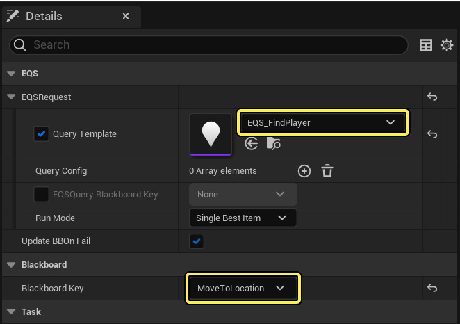

6. 添加一个 **MoveTo**（设为 **MoveToLocation）**，并添加 **旋转以面向BB（Rotate to face BB）** 条目（设为 **TargetActor**）跟随 **Run EQS Query。**
   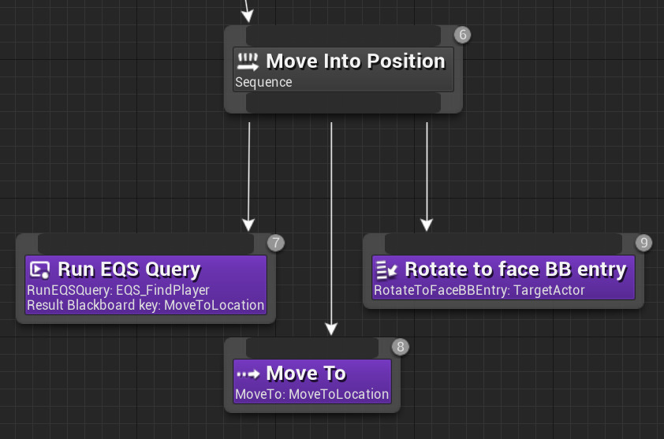

行为树将会运行EQS查询来更新黑板键 **MoveToLocation**，然后AI就会移动到该位置，并转身面对 **TargetActor**（玩家角色）。

完整的行为树应该类似于下图所示：
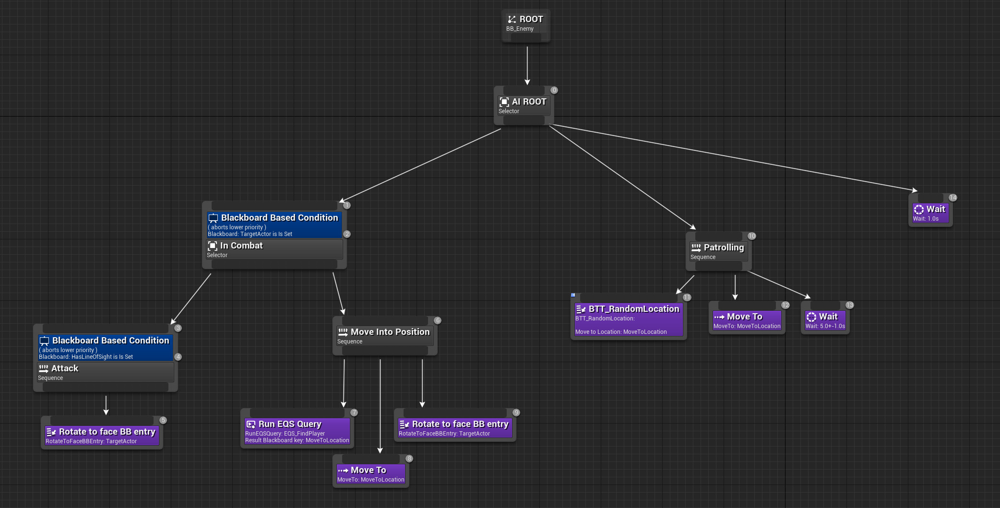

# 7 - AI控制器设置

在这一步中，我们要设置运行行为树的AI控制器，并为AI提供使用AI感知看到玩家角色的方法。

1. 在 **AIC_Enemy** 蓝图中添加一个 **占据时事件（Event On Possess）** 并连接到 **运行行为树（Run Behavior Tree）**（设为 **BT_Enemy）**。
   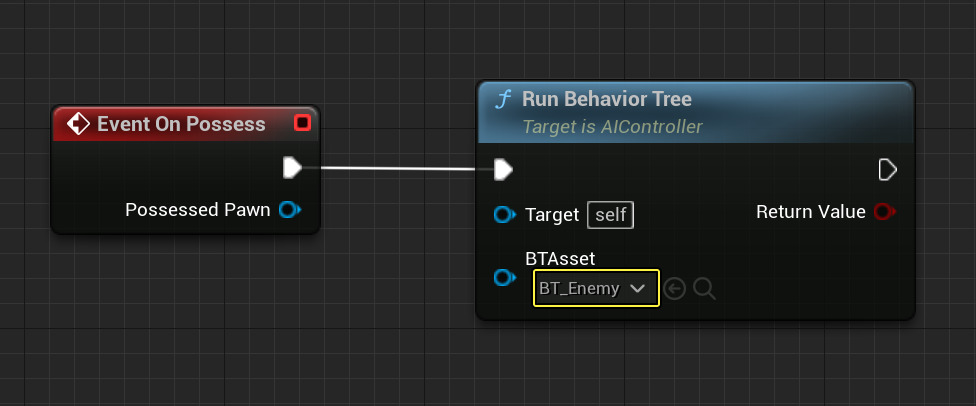

2. 添加 **AI感知（AIPerception）** 组件，并使用下列 **AI视觉配置（AI Sight config）** 设置：
   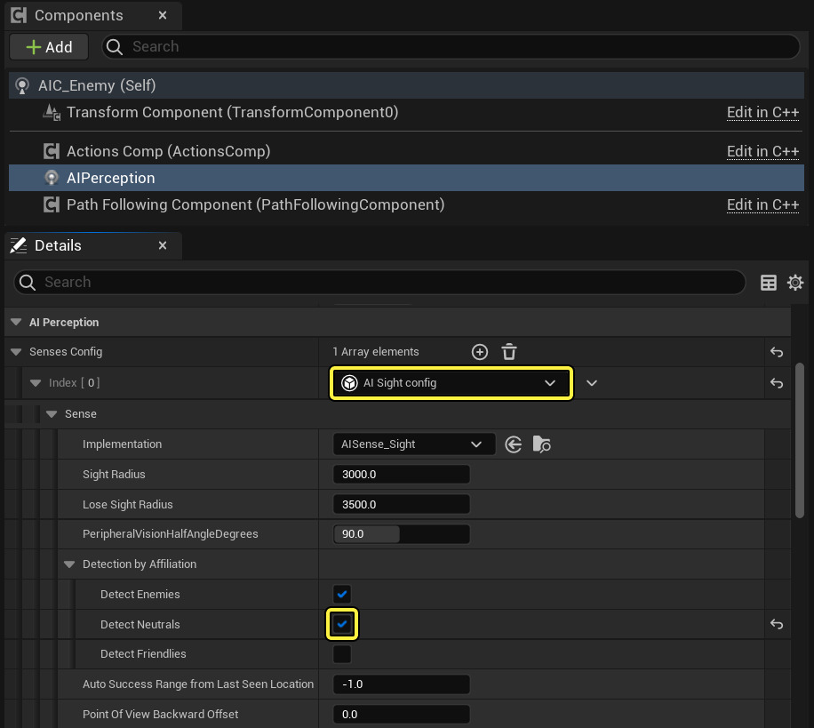

- **感官配置（Senses Config）**，添加 **AI视觉配置（AI Sight config）**

- **探测中立方（Detect Neutrals）** 设为 **启用（enabled）**

这将使AI能够感知到其他Actor，并且在感知系统感知到Actor时触发事件。当前在默认情况下，系统不会对玩家分配关联，只能通过C++代码来分配。为了规避这个问题，我们允许感知系统探测中立方，并将使用Actor标记来使其仅感知到标记为"玩家"的Actor。

3. 针对 **AI感知（AIPerception）** 组件，在 **事件（Events）** 下面添加一个 **在目标感知时更新（On Target Perception Updated）**，然后将 **Actor** 引脚提升为变量，名为 **Perceived Actor。**
   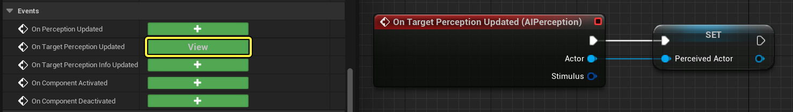

当AI感知到某些事物时，就会将该Actor存储为变量，稍后我们会使用它来更新我们的黑板。

4. 添加两个 **分支** 节点，并使用下列条件：
   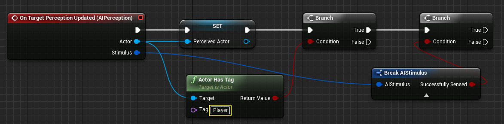

- 第1个分支 **条件（Condition）** 设为 **Actor有标记（Actor Has Tag）** 并且 **标记（Tag）** 设为 **玩家（Player）**，**目标（Target）** 设为来自 **感知更新（Perception Updated）** 的 **Actor**。
- 第2个分支 **条件（Condition）** 设为来自 **感知更新（Perception Updated）** 事件的 **刺激（Stimulus）** 引脚的 **成功感知（Successfully Sensed）**。

在上面的设置中，如果被感知到的Actor有玩家的标记，分支就会继续执行，检查该Actor是否被成功感官到。如果它没有Actor的标记（可能是另一个AI敌人），就不会继续执行。

5. 从第2个分支的 **False** 引脚连出引线，添加如下所示的三个节点：
   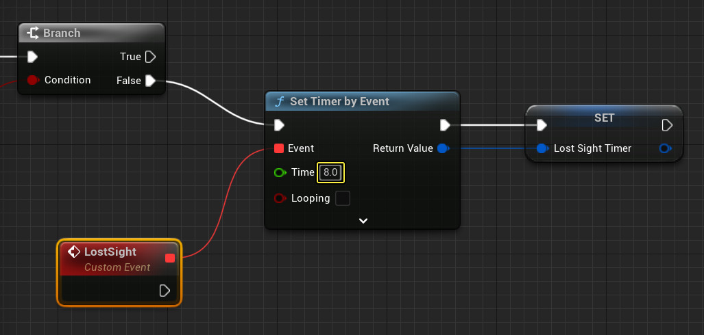

在上图中我们有一个 **Set Timer by Event** 节点（设为 **8.0**），并且将 **返回值（Return Value）** 提升为名为 **LostSightTimer** 的变量。然后分配一个我们创建的名为 **LostSight** 的自定义事件，作为 **事件委托**。

6. 在 **我的蓝图（My Blueprint）** 面板中创建两个函数，名为：**UpdateSightKey** 和 **UpdateTargetKey**。
   

我们将使用这两个函数更新我们在行为树中用于作出决定的黑板键。

7. 针对 **UpdateSightKey** 添加一个 **布尔** 输入，名为 **HasLineOfSight**。
   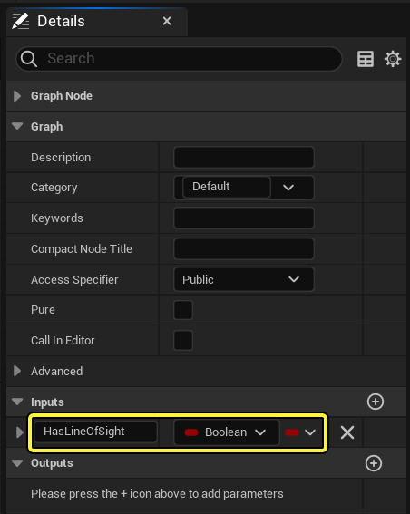

8. 在 **UpdateSightKey** 中右键单击并获取 **黑板（Blackboard）** 变量，然后 **将值设为布尔（Set Value as Bool）**，**键名（Key Name）** 使用 **HasLineOfSight**。
   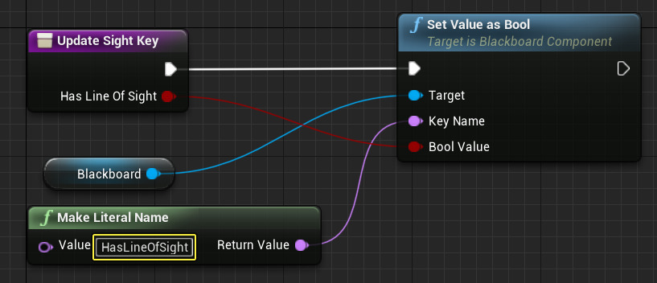

这样就可以使用这个函数将布尔值传递到我们的黑板键，更新 **HasLineOfSIght** 键。

9. 针对 **UpdateTargetKey**，添加一个 **Actor** 输入，名为 **TargetActor**。
   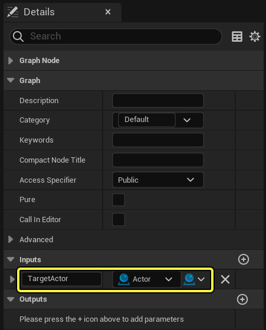

10. 在 **UpdateTargetKey** 中右键单击并获取 **黑板（Blackboard）** 变量，然后 **将值设为对象（Set Value as Object）**，**键名（Key Name）** 使用 **TargetActor**。
    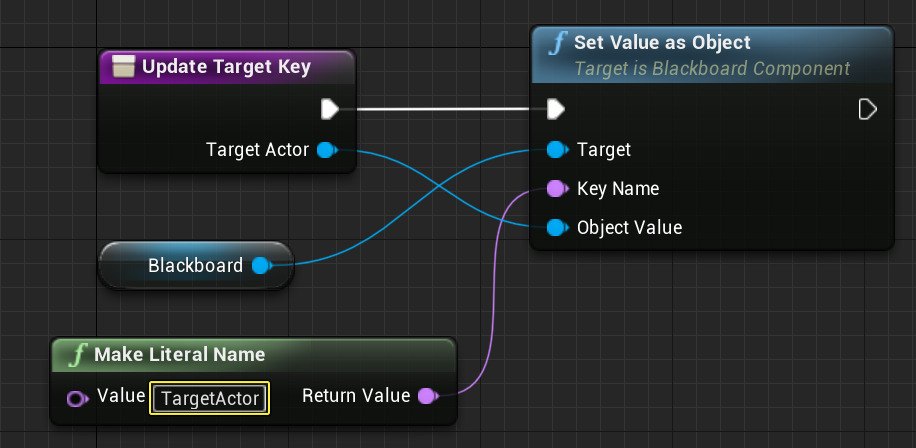

此函数与**UpdateSightKey**函数类似，用于使用我们传递的任何Actor来更新黑板键 **TargetActor**。

11. 将 **UpdateSightKey** 和 **UpdateTargetActor** 函数添加到 **False** 条件，如下所示：
    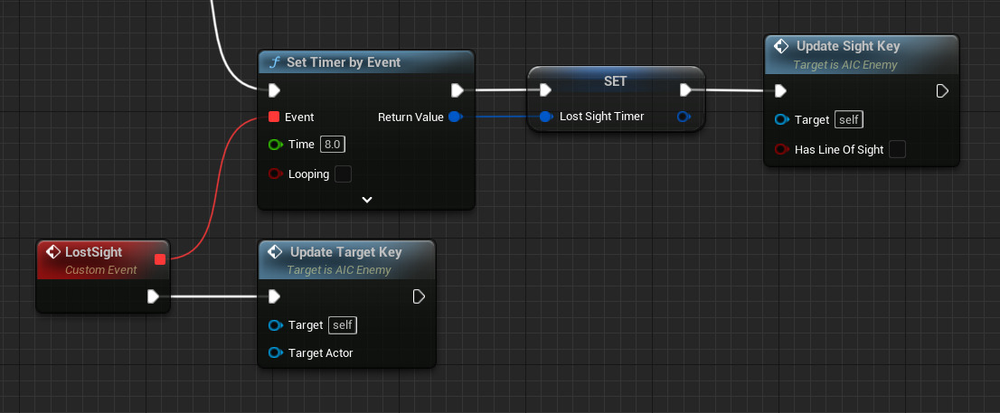

当AIPerception没有成功感知到具有玩家标记的Actor时，false条件就会启动一个定时器（在句柄中存储，供以后使用），并且会把黑板键 **HasLineOfSight** 更新为false。在指定的时间（8.0秒）过后，自定义事件 **LostSight** 就将执行，清除 **TargetActor** 黑板键（也就是说AI不再瞄准玩家，失去了玩家的踪影）。

> 你可以通过调节定时器上的 **时间（Time）** 值来调整AI"放弃"追击玩家角色前等待的时间。

12. 从第2个分支的 **True** 引脚连出引线，使用 **LostSIghtTimer** 和 **Clear and Invalidate Timer by Handle**。
    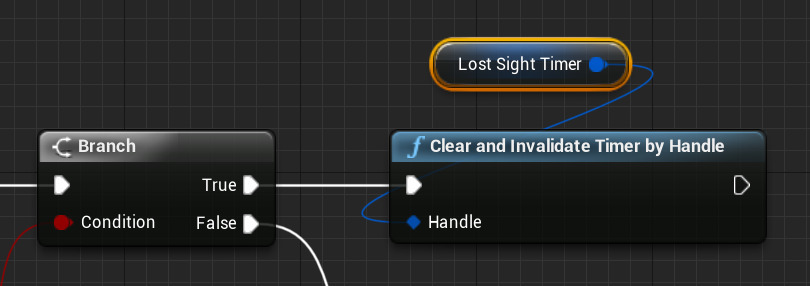

这将会停止和重置失去对玩家的视线时使用的定时器。

13. 添加 **UpdateSightKey**（设为 **启用（enabled）**）和 **UpdateTargetKey**（设为 **感知的Actor（Perceived Actor）**。
    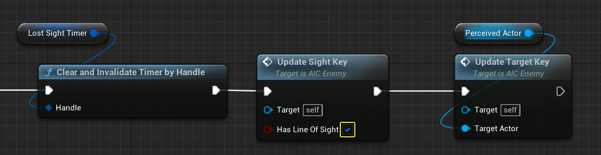

完整的图表应该类似于如下所示：
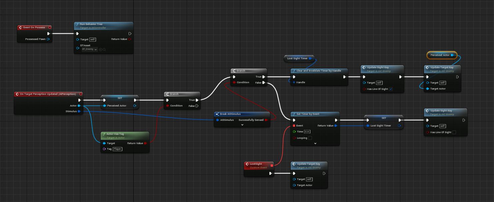

现在我们的AI控制器已经设置好，它会运行我们的行为树，根据我们通过AI感知系统感知到带有玩家标记的Actor的时间来更新我们的黑板键。

# 8 - 最终设置

在这一步，我们要设置敌人AI角色蓝图，将玩家标记添加到玩家角色蓝图，使其能够被AI感知到，并且添加一个寻路网格体包围体和一些网格体，使AI知道如何在场景中四处移动，我们也可以更方便地打断视线。

1. 打开 **BP_Enemy**，在 **细节（Details）** 面板中，启用 **使用控制器旋转Yaw（Use Controller Rotation Yaw）**，并将 **AI控制器类（AI Controller Class）** 设为 **AIC_Enemy**。
   

为了让AI执行行为树中的旋转任务，我们需要启动控制器旋转Yaw。我们还要指定自定义AI控制器类，它包含我们设置的逻辑并且会运行行为树。我们可以选择删除从玩家角色（以及摄像机组件）复制过来的所有脚本，因为AI角色不需要。

2. 在 **模式（Modes）** 面板中，向关卡添加 **寻路网格体包围体（Nav Mesh Bounds Volume）**，并调整其大小，使其包住整个关卡。
   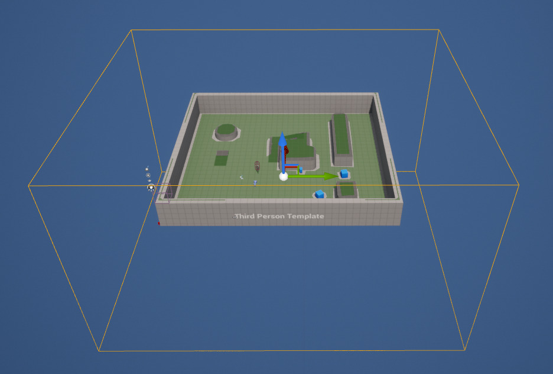

> 可以按 **P** 键切换调试网格的开关，它会将可导航的路径显示为绿色。或者在游戏运行期间，使用控制台命令 **show Navigation** **true**（显示）或 **false**（隐藏）。

3. 右键单击关卡中的 **BP_ThirdPersonCharacter**，然后选择 **编辑第三人称角色（Edit BP_hirdPersonCharacter）**。
   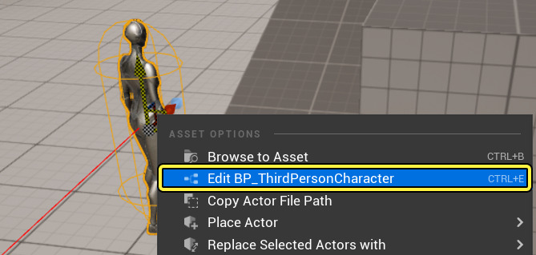

4. 在 **细节（Details）** 面板中搜索 **标记（Tag）**，然后添加一个名为 **Player** 的 **标记**。
   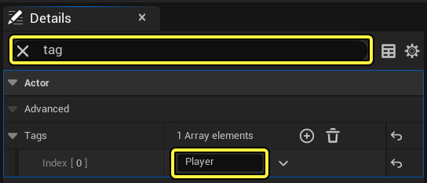

在我们的 **AIC_Enemy** 蓝图中，当AI感知系统感知到Actor时，因为这个Actor有Player标记，所以我们的分支求值结果将是True。

5. 在关卡中，放大并添加多个版本的 **立方体网格体**，提供更多会遮挡视线的位置。
   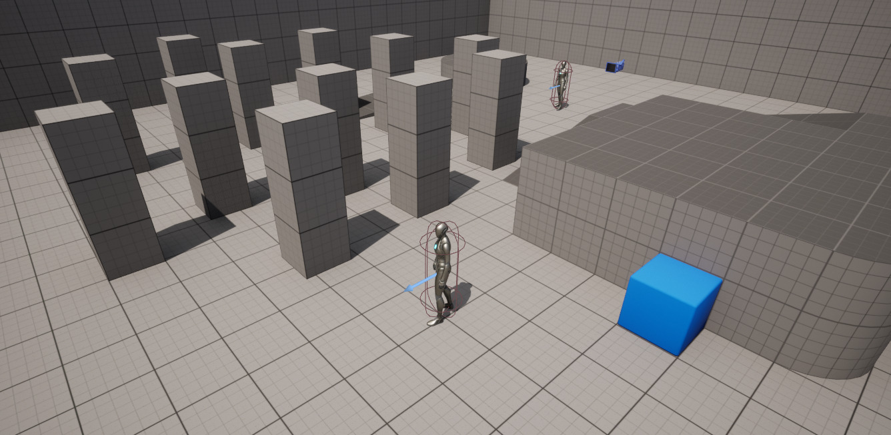

6. 单击工具栏上的 **运行（Play）** 按钮在关卡中试玩。

# 9 - 最终结果

当在编辑器中运行时，AI将会随机四处巡逻，直到看见玩家为主。在看到玩家之后，它就会转身面对玩家，并且在丢失看到玩家的视线后尝试移动到新的位置。它将使用EQS寻找一个既能提供看到玩家的视线、又能保持一定距离的位置。如果它移动到新位置却没有再次看到玩家，经过一段时间后，AI就会放弃追击，恢复巡逻，如以下视频所示。

<video src="Image/创建交互体验/人工智能/场景查询系统/场景查询系统快速入门/场景查询系统快速入门.mkv"></video>

可以使用[AI调试工具](https://docs.unrealengine.com/5.2/zh-CN/ai-debugging-in-unreal-engine)查看任何活动的EQS查询（除了行为树或感知信息之外）。要在运行时激活AI调试，请按 **'**（撇号）键，然后选择1（进行一般AI调试）、2（用于行为树）、3（用于EQS）或4（用于AI感知）。下面我们激活AI调试并调出EQS调试工具。

EQS调试工具运行时可以看到我们的网格测试中的点及其分数值。你还将看到有哪些点被选中，标有 **Winner** 字样。通过这些工具可以看到系统在对哪些点求值，以及为什么系统会根据分数值选择某个点而不是另一个点。

除了使用EQS调试工具外，还有一种特殊类型的Pawn，叫做 **EQS测试Pawn**，可用于在编辑器中调试EQS查询。你可以通过创建新蓝图类 **EQS Testing Pawn** 类来创建此Pawn。
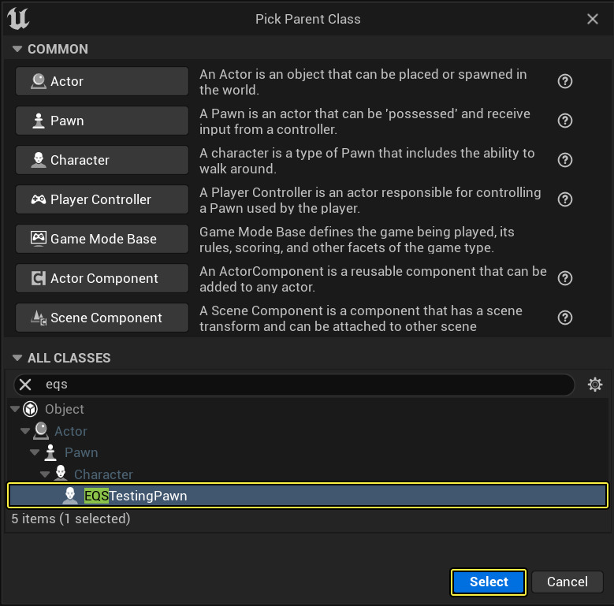

我们的当前设置使用玩家角色作为情境，用于在我们的EQS测试中求值。要在游戏未运行时测试，我们需要对 **EQC_PlayerContext** 蓝图稍加修改，覆盖 **Provide Actors Set** 函数。
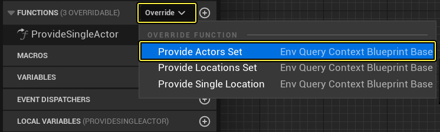

我们可以使用 **获取所有（Get All Actors of Class）**，将其设为 **ThirdPersonCharacter**，这会提供 **结果Actor集（Resulting Actors Set）**：

将EQS测试Pawn添加到关卡时，在 **细节（Details）** 面板中可以指定 **查询模板（Query Template）**（我们已将它设为我们的 **EQS_FindPlayer** 查询）。

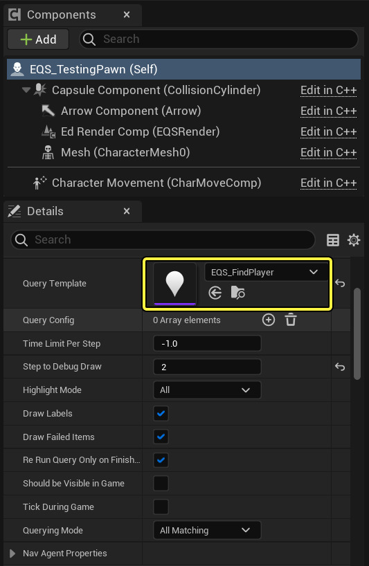

这样当你在编辑器中时，就可以看到测试的结果，如下图所示：

<video src="Image/创建交互体验/人工智能/场景查询系统/场景查询系统快速入门/场景查询系统快速入门1.mp4"></video>

> 系统还会通过VisLog记录EQS数据供你参考。请参见 **Visual Logger** 了解更多信息。