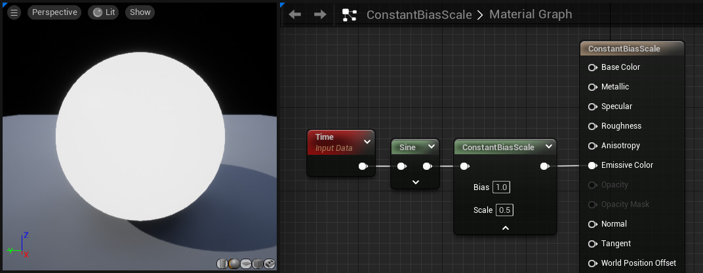

## ConstantBiasScale

**ConstantBiasScale** 表达式采用输入值，向其添加偏差值，然后将其乘以输出结果的比例因子。例如，要将输入数据从 [-1,1] 转换为 [0,1]，您将使用 1.0 的偏差和 0.5 的刻度。

| 性能      | 描述                     |
| :-------- | :----------------------- |
| **Bias**  | 指定要添加到输入中的值。 |
| **Scale** | 指定偏差结果的乘数。     |

