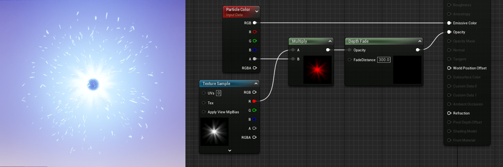

## ParticleColor

基于在 **级联（Cascade）** 中定义的任何每粒子颜色数据，**粒子颜色（ParticleColor）** 表达式绑定到给定粒子的当前颜色。这必须插入到适当的信道（自发光颜色）。

| 项目    | 说明                    |
| :------ | :---------------------- |
| 输出    |                         |
| **RGB** | 输出组合的RGB矢量数据。 |
| **R**   | 输出红色信道数据。      |
| **G**   | 输出绿色信道数据。      |
| **B**   | 输出蓝色信道数据。      |
| **A**   | 输出alpha信道数据。     |

在这个例子中，您可以看到粒子颜色（ParticleColor）表达式为粒子提供了粒子系统中定义的颜色。