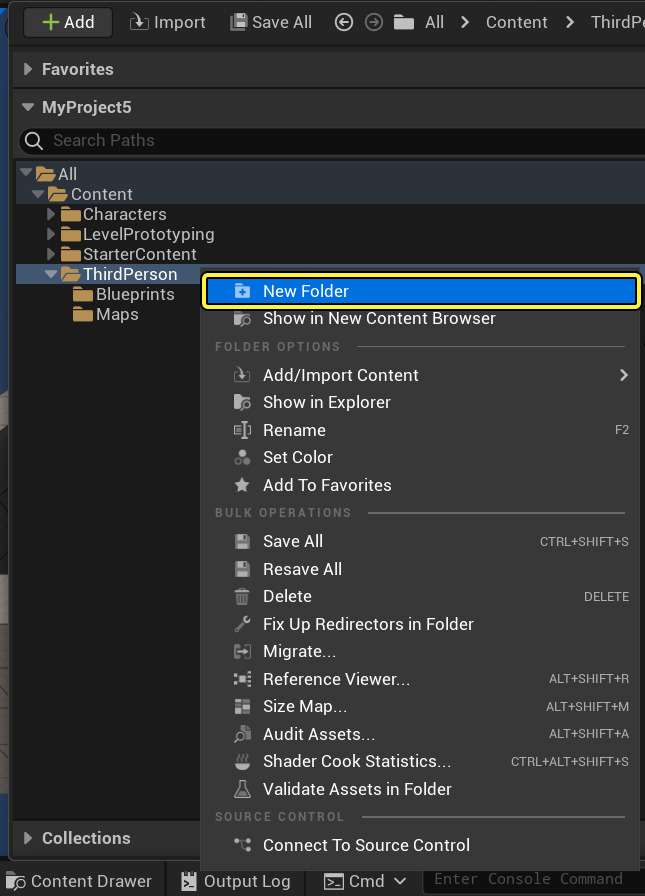
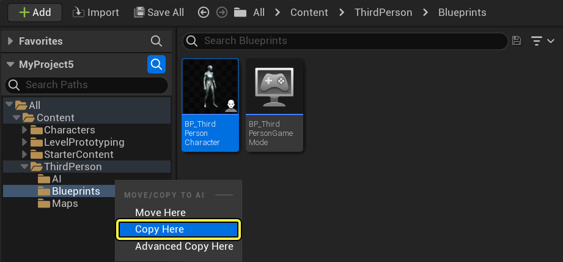
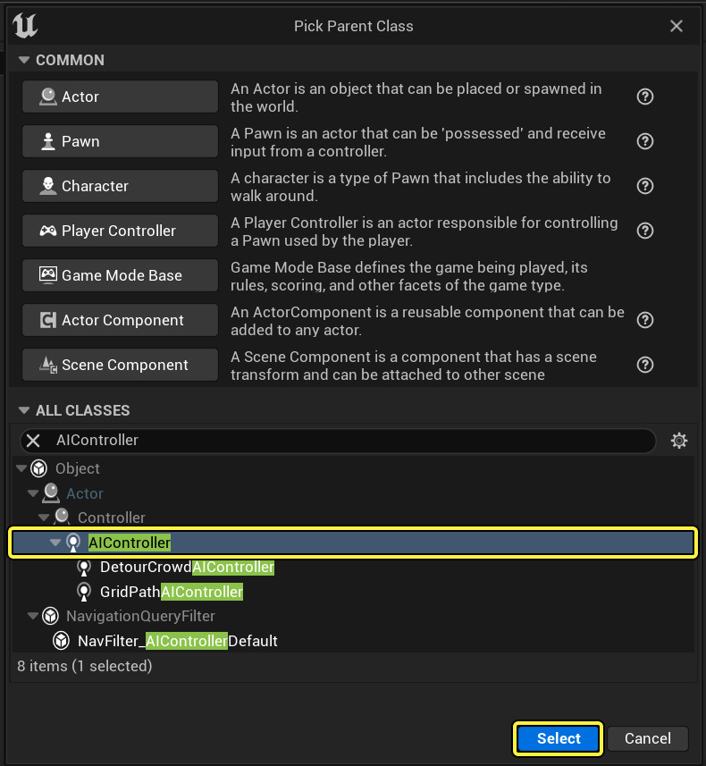
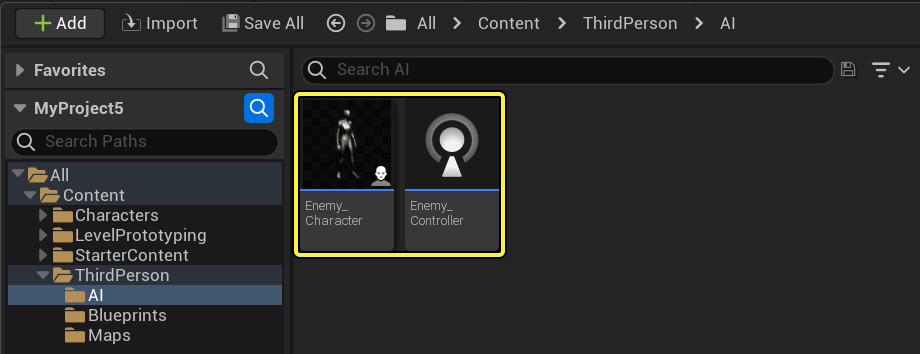
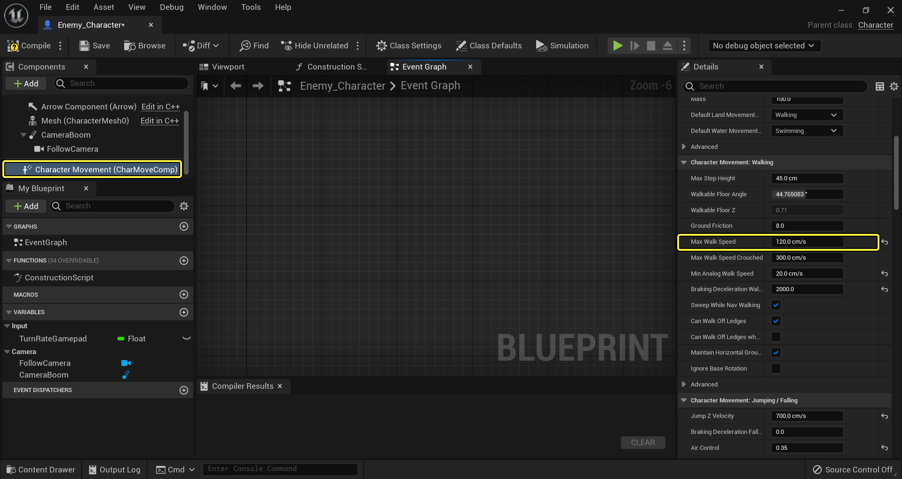
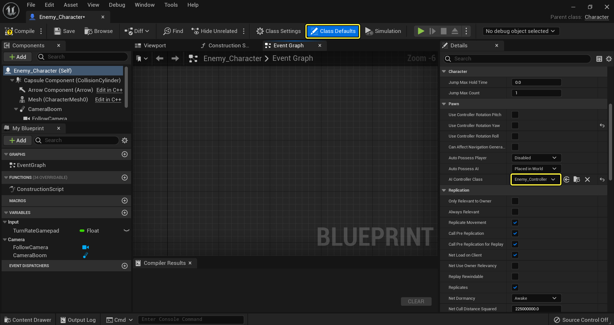
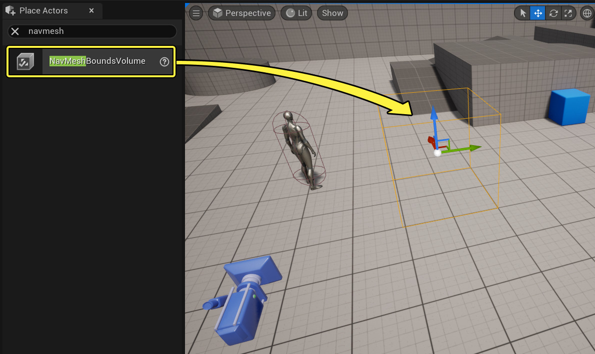
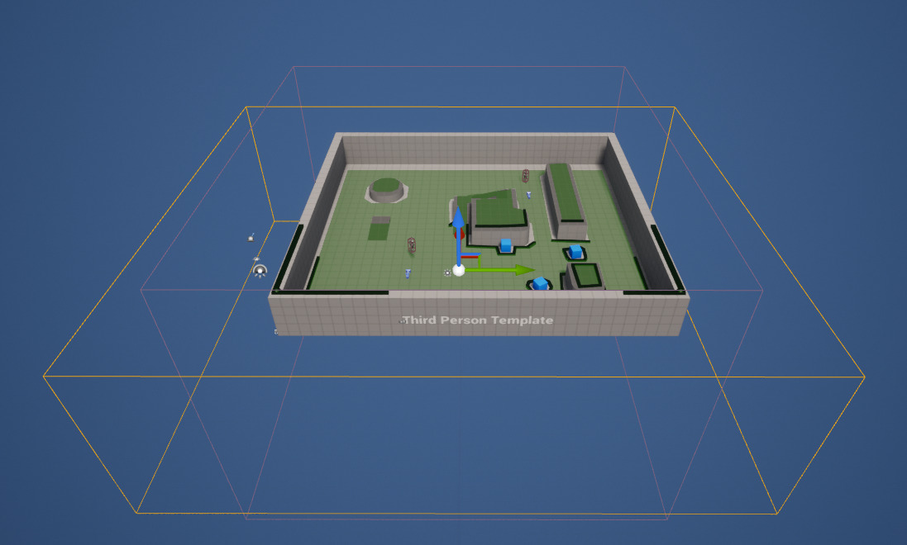

在 **行为树快速入门指南** 中，你将学会如何创建一个敌方AI，该AI看到玩家后会做出反应并展开追逐。当玩家离开视线后，AI将在几秒钟后（这可根据你的需求进行调整）放弃追逐，并在场景中随机移动，再次看到玩家时便会继续追逐。如下例视频所示。

阅读完本指南后，你将了解以下系统： 

1. 蓝图可视化脚本（Blueprint Visual Scripting）
2. AI控制器（AI Controllers）
3. 黑板（Blackboard）
4. 行为树（Behavior Trees）
5. 行为树服务节点（Behavior Tree Services）
6. 行为树装饰器节点（Behavior Tree Decorators）
7. 行为树任务节点（Behavior Tree Tasks）

## 1 - 必需的项目设置

在第一步中，我们将用需要的资产来设置项目，使AI角色在场景中活动。 

在本指南中，我们使用一个新的 **蓝图第三人称模板** 项目。

1. 展开 **源（Sources）** 面板，然后右键单击 **ThirdPersonBP** 文件夹，创建一个名为 **AI** 的 **新文件夹**。

 

2. 在 **ThirdPersonBP > Blueprints** 文件夹中，将 **ThirdPersonCharacter** 拖到 **AI** 文件夹上，然后选择 **复制到此处（Copy Here）**。
   

3. 在 **AI** 文件夹中，基于 **AIController** 类创建一个新的 **蓝图类**。
   

4. 将 **AIController** 蓝图命名为 **Enemy_Controller**，将 **BP_ThirdPersonCharacter** 蓝图命名为 **Enemy_Character**。
   

5. 打开 **Enemy_Character**，从图表中删除所有脚本。

6. 选择 **角色移动（Character Movement）** 组件，然后在 **细节（Details）** 面板中将 **最大行走速度（Max Walk Speed）** 设置为 **120.0**。
   

当AI角色（AI Character）进行巡逻且并未追逐玩家时，这会降低它们在场景中的移动速度。 

7. 从工具栏中选择 **默认类（Class Defaults）**，然后在 **细节（Details）** 面板中，将 **Enemy_Controller** 分配为 **AI控制器类（AI Controller Class）**。

我们将会把AI放入场景，如果要在该场景加载后生成AI，则需要把 **自动控制AI（Auto Possess AI）** 设置改为 **已生成（Spawned）**。

8. **将** Enemy_Character **从** 内容浏览器** 拖入关卡。 

9. 在 **放置Actor（Place Actors）** 面板中，把 **导航网格体边界体积（Nav Mesh Bounds Volume）** 拖入关卡。
   

10. 选中 **寻路网格体边界体积（Nav Mesh Bounds Volume）** 后，按下 **R** 缩放体积，封装整个关卡。
    

这将生成寻路网格体，使我们的AI角色能够在场景中移动。你可以按下 **P** 键打开或关闭视口中寻路网格体的显示（绿色区域表示可导航的位置）。

> 在游戏过程中，你可以使用 **显示导航（show Navigation）** 控制台命令来切换寻路网格体的显示和关闭。

我们的项目设置已经完成，下一步我们将设置 **黑板** 资产。

## 2 - 黑板设置

在这步中我们将创建 **黑板** 资产，它本质上是AI的大脑。我们希望AI知道的任何信息都会有一个能够引用的 **黑板键**。我们将创建用于玩家的键，用于控制AI是否能看到玩家，以及AI不追逐玩家时可以移动到的位置。

1. 在 **内容浏览器** 中，单击 **新增（New New）**，在 **AI（Artificial Intelligence）** 下，选择 **黑板（Blackboard）** 并将其命名为 **BB_Enemy**。