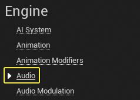

## 概述

音频**调制**系统提供对**蓝图**和**组件**系统中常见浮点音频参数的控制。与虚幻引擎相比，该系统包含一个更好、更直观、更动态的功能子集，用于混音音频源，以及动态控制和参数化音频属性。

在本指南中，您将学习如何为游戏音频构建基于音量的基本**控制总线**结构。

## 目标

使用音频**调制插件**为游戏音频构建基于音量的基本控制总线结构。

## 目标

- 创建控制总线和控制总线混合对象的集合，以将音量**混合**应用于声音资产。
- 将控制总线分配给 **MetaSound 源**和**声音类**。
- 使用 **Mix Matrix Debugger** 查看控制总线的当前值。
- 从蓝图调整控制总线。

## 1 - 所需设置

1. 创建一个新项目，然后选择“**游戏**”类别和**“第三人称**”模板。输入项目的位置和名称。单击**创建**。

   

2. 单击**“设置”>“插件**”以打开**“插件**”窗口。

   

3. 搜索并**启用** **Audio Modulation** 和 **MetaSound** 插件。重新启动虚幻引擎。

   

### 部分结果

在本节中，您创建了一个新项目并启用了 Audio Modulation 和 MetaSound 插件。现在，您可以创建控制总线了。

## 2 - 创建控制总线

1. 在**内容浏览器**中，右键单击并选择**音频>调制>控制总线**。将资产命名为`CB_Main` 。

   

2. 打开并单击**参数**下拉列表。单击**齿轮**图标并启用**显示插件内容**复选框。您可能需要选择“显示引擎内容”，因为“调制”插件是**“引擎**”插件。`CB_Main`

   

3. 搜索并选择 **Volume** 参数。

   

> 您可以通过在内容浏览器中单击鼠标右键，然后选择“**音频>调制”>“调制参数**”来创建自定义参数。然后，从列表中选择 SoundModulationParameterVolume 类。

4. 在**内容浏览器**中创建两个文件夹，其中将包含多个供设计人员和用户使用的控制总线。在下面的示例中，文件夹被命名为 和 。`Buses_Designer` `Buses_User`

   

5. 右键单击并选择**复制**`CB_Main`。将新资产命名为 `CB_Ambience`。 

   

6. 再重复此过程两次，然后创建`CB_Foley`和 `CB_Footsteps`。选择所有三个资产并将它们移动到文件夹中`Buses_Designer`。  

   

7. 重复上一步并创建`CB_Dialogue` 、`CB_Music`和`CB_SFX`  。将它们移动到`Buses_User`文件夹中。  

   

### 部分结果

在本节中，您创建了主控制总线，该总线将调制项目中所有指定音频的音量。此外，您还为用户和设计人员创建了多个控制总线。现在，您可以将主控制总线分配给项目中的主声音类。

## 3 - 将控制总线分配给声音资产

1. 单击**“设置”>“项目设置**”以打开**“项目设置**”。

   

2. 向下滚动到“**引擎**”部分，然后选择**“音频**”类别。转到**“音频**”部分，然后双击**“主默认声音类**”将其打开。

   

3. 在“**详细信息**”面板中，转到“调制”部分，然后启用“**音量**”旁边的**“调制**”复选框。

   a. 单击“**音量调制器**”旁边的“**+**”，然后将`CB_Main`添加到**“索引[0]**”。

   

   

> 将控制总线`CB_Main`添加到项目中的任何其他声音类中，以便使用相同的控制总线混合所有声音。调制和混音结构不遵守声音类参考层次结构。每个声音类必须列出所有要应用于引用所述声音类的声音资产的控制总线。

### 部分结果

在本节中，您已将控制总线`CB_Main`分配给主声音类。现在，您可以创建一个示例 MetaSound 来测试游戏过程中的混音。

## 4 - 创建示例 MetaSound

1. 在**内容浏览器**中，右键单击并选择 **Audio > MetaSound Source**。将资产命名为 。`MS_Sample`

   

2. 在**内容浏览器**中双击`MS_Sample`即可打开。

​		a. 转到左侧的**“接口**”面板，然后单击 UE 旁边的**删除**图标**。Source.OneShot** 将其删除。
​		b. 在**事件图**中单击鼠标右键，搜索然后选择 **Wave Player （Mono）。**
​		c. 将 **Input** 节点连接到 **Wave Player** 节点的 **Play** 引脚。
​		d. 将 **Wave Player** 节点的 **Out Mono** 引脚连接到 **Output** 节点。

3. 单击 **Wave Asset** 下拉列表，然后选择一个声音资源。在此示例中，选择了 **EndPlayInEditor**。

​		a. 启用“**循环**”复选框。

4. 单击工具栏上的**“源**”，然后向下滚动到**“详细信息**”面板。

​		a. 展开“**调制**”类别。
​		b. 单击 **Volume Routing** 下拉列表，然后选择 **Union**。
​		c. 启用“**音量**”旁边的**“调制**”复选框。
​		d. 单击“**音量调制器**”旁边的“**+**”，然后添加到**“索引[0]**”。`CB_SFX`

5. 拖动到您的关卡。`MS_Sample`

   

### 部分结果

在本节中，您将创建一个简单的 MetaSound，该 MetaSound 将持续播放声音资源。现在，您可以将控制总线组合应用于控制总线。

## 5 - 应用混合

在本节中，您将创建一个**控制总线组合**，并将其应用于文件夹中的所有**控制总线**。您也可以按照以下步骤为文件夹中的所有控制总线创建控制总线组合。此外，对于混合物中可以包含哪些内容没有严格的规定。`Buses_User``Buses_Designer`

可以激活多个混音并将其应用于单个或一组控制总线。但是，一次只能激活给定混合的单个实例。

1. 在**内容浏览器**中，右键单击并选择 **Audio > Modulation > Control Bus Mix**。将资产命名为 。`CM_User`
   

2. 打开CM_User并转到 Mix Stages 部分。
   a. 单击**“混音阶段**”旁边的**“+**”以添加新混音。
   b. 单击 **Bus** 下拉列表，然后选择 。`CB_Dialogue`
   

3. 重复上一步，然后向**混合阶段**添加 和 。`CB_Music` `CB_SFX`
   

4. 按**“播放**”进入运行时。
   a. 按下 **Shift-F1** 以重新控制鼠标。
   b. 转到并单击 **Activate Mix**。`CM_User`
   c. 更改 的值以实时查看应用的更改。`CB_SFX`
   
   

### 部分结果

在本节中，您创建了**控制组合**并将其应用于项目中的控制总线。您还在游戏过程中激活了混音，并使用控制总线更改了声音的音量。`CM_User` `CB_SFX`

## 6 - 调试混音

1. 在游戏过程中，按 **~** 打开**控制台**窗口。

   a.输入以下命令：以启用声音调制调试。`au.Debug.Modulation.Enable.Matrix 1`
   

   b.您可以通过输入以下命令来过滤显示的控制总线和控制组合列表：和 。`au.Debug.Modulation.Filter.Buses [substring]``au.Debug.Modulation.Filter.Mixes [substring]`
   
   

### 部分结果

在本节中，您激活了声音调制调试器，并过滤了矩阵以仅显示控制总线。`CB_SFX`

## 7 - 从蓝图调整控制总线

在本节中，您将在运行时激活蓝图中的控制组合。

1. 点击**关卡编辑器**工具条中的**蓝图**按钮，然后选择**打开关卡蓝图**。
   

2. 在 **Event Graph** 中，右键单击并搜索，然后选择 **Event Begin Play**。
   

3. 从 **Event Begin Play** 节点拖动并搜索然后选择 **Activate Control Bus Mix**。
   a. 单击**“混合**”下拉列表，然后选择 。`CM_User`
   
4. 从 **Activate Control Bus Mix** 节点拖动并搜索，然后选择 **Delay**。
   a. 将**持续时间**设置为 **3.0**。
   

5. 从**“延迟”**节点拖动并搜索，然后选择“**按滤波器设置控制总线混合**”。
   a. 单击**“混合**”下拉列表，然后选择 。`CM_User`
   b. 添加到**地址筛选器**。`CB_SFX`
   c. 输入**值** **0.25**。

   

6. 按**播放**并验证**控制总线**是否已激活，并且 3 秒后音量是否降低。`CM_User` `MS_Sample`

### 部分结果

在本节中，您激活了控制总线，并使用控制总线更改了音频音量。`CM_User` `CB_SFX`