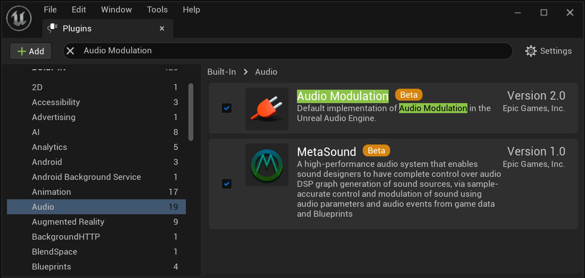
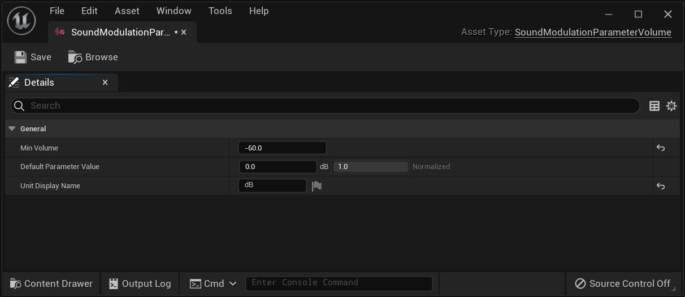
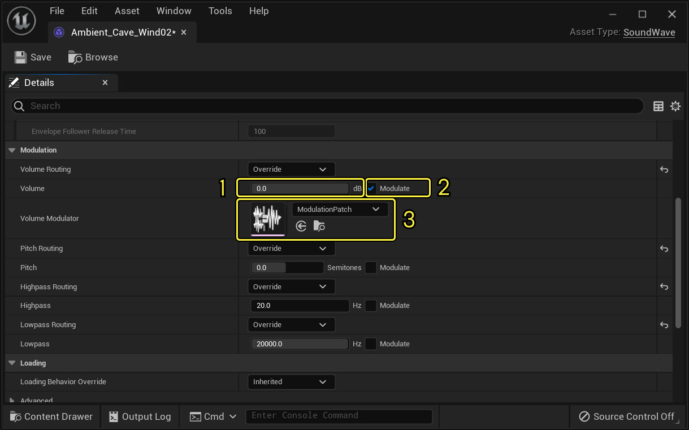
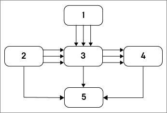
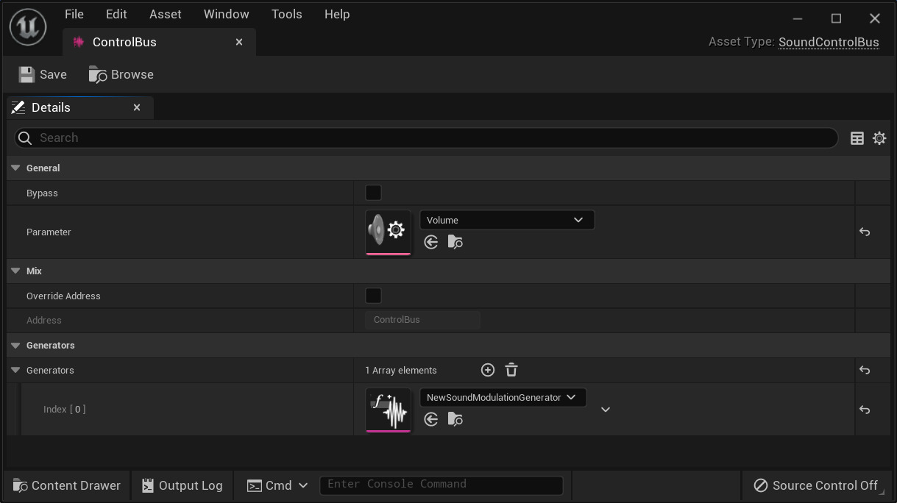
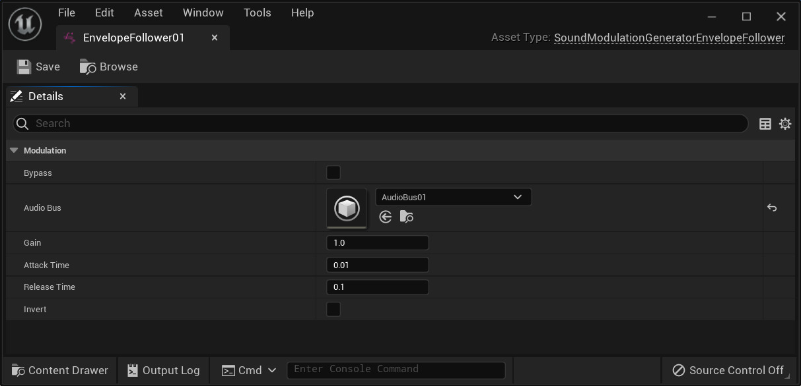
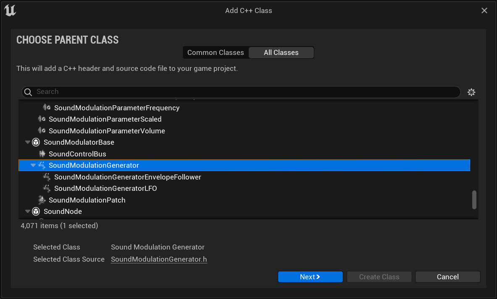
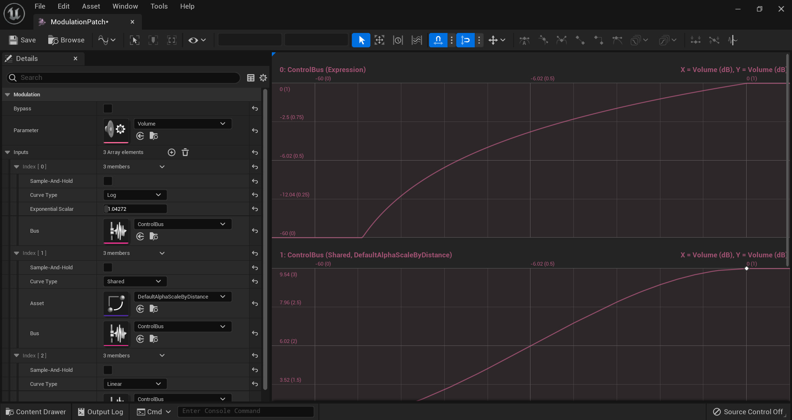
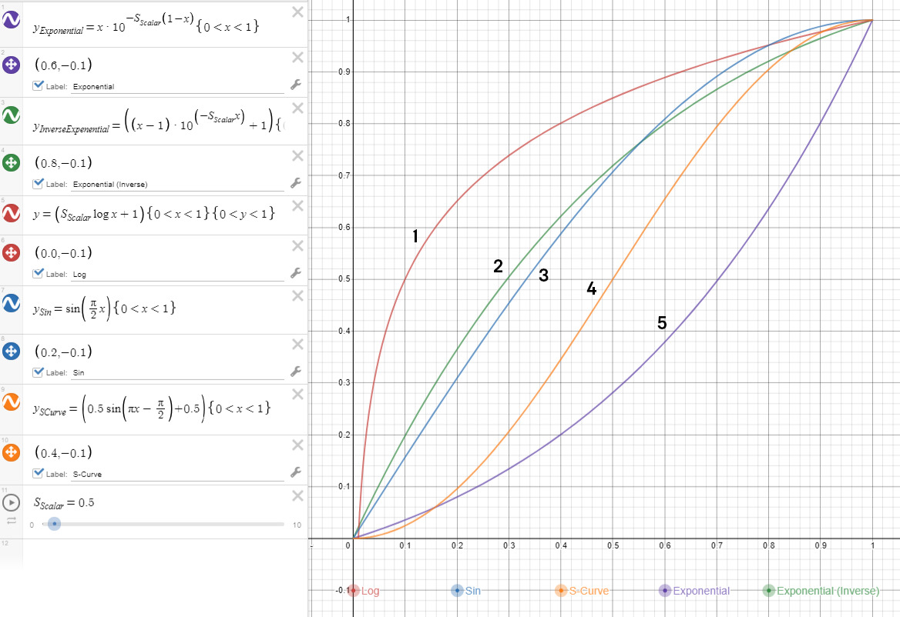
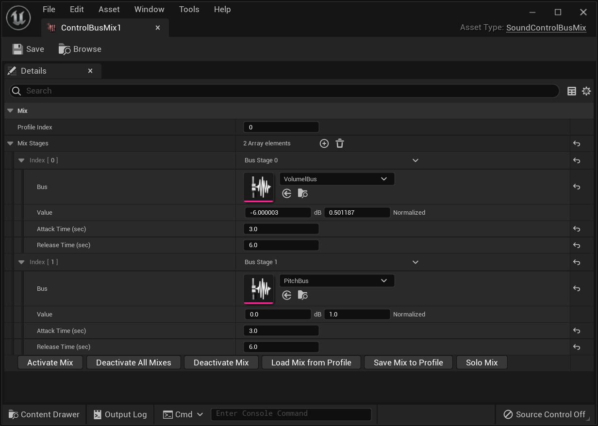

**音频调制（Audio Modulation）** 允许对蓝图和组件系统中的一些常见参数（浮点类型）进行控制。与老版本 **虚幻引擎** 相比，该系统包含更优秀、更直观且动态的功能集，用于混合音频源以及动态控制和参数化音频属性。

此系统：

- 公开了一种通用、灵活、解耦的泛型参数调制和混音系统。
- 打造了一套更强大的试听和调试游戏混音的工具。
- 提供的API可以轻松扩展，并用于通过插件进一步调制源、效果、子混合和各种其他音频类型。

音频调制是调制虚幻音频引擎中几乎所有基于浮点或基于缓冲区的参数的强大方案。在最基本的调制形式中，用户可以将调制源连接到[调制目标](https://docs.unrealengine.com/5.3/zh-CN/audio-modulation-overview-in-unreal-engine#调制目标)。如果没有引用源，则由[调制参数](https://docs.unrealengine.com/5.3/zh-CN/audio-modulation-overview-in-unreal-engine#调制参数)提供的[默认值](https://docs.unrealengine.com/5.3/zh-CN/audio-modulation-overview-in-unreal-engine#调制值)与作为默认调制目标值提供的值混合在一起（请参阅[调制源和混音级](https://docs.unrealengine.com/5.3/zh-CN/audio-modulation-overview-in-unreal-engine#调制源和混音级)）。这种场景可以被视为将传统的硬件跳线插入调制输入，输出端连接到已知量，例如接地或电压源。

## 启用音频调制

所有调制功能都封装在 **音频调制（Audio Modulation）** 插件中，并实现轻量级引擎端API。

> 要启用音频调制（Audio Modulation）插件，请前往 **编辑（Edit）>插件（Plugin）** ，点击左侧面板中的 **音频（Audio）** ，然后选中 **启用** 音频调制。

启用插件，然后重新启动编辑器或在Visual Studio中重新构建，可以完成虚幻引擎音频调制系统的本机实现。

## 调制值

所有调制值都可以在两个值空间之间变换，即 **单元** 值空间和 **规格化** 值空间。单元空间作为一种便捷方式在编辑器中显示和提供，而规格化空间提供了统一的方式来传递和混合总线值。所有调制值都映射到规格化的[0.0f, 1.0f]范围。与硬件合成器将控制电压（CV）用作将值从源传递到目标的标准类似，调制系统将使用始终包含了规格化浮点范围内值的 **控制总线** 。

以音量为例，单元空间可能在-60 dB（静音阈值（可通过[调制参数](https://docs.unrealengine.com/5.3/zh-CN/audio-modulation-overview-in-unreal-engine#调制参数)配置）和0 dB（全音量）之间的范围，其中规格化值以对数方式映射到0.0f和1.0f的规格化空间。半音是另一个示例，可以在其各自的调制参数（Modulation Parameter）设置中配置单元空间+/-12的最小值和最大值。规格化空间始终在0.0f和1.0f之间映射。对于最基本的情况，单元和值空间相同，即所有单元值对应于0.0f和1.0f之间的同一规格化值。

## 调制参数

**调制参数** 为与总线、总线混音、目标和接线关联的值如何显示、混合以及如何在单元和规格化（无单位）[0.0, 1.0]值之间转换提供上下文。其中包括 **单元显示名称（Unit Display Name）** 属性以及默认参数值，而属性将指示如何向引用它们的所有调制器显示单元。该值应设置为在引用此参数的调制器与另一个调制器混合时不会改变输入的值。（从数学上讲，选择的值应该使得在设置为输入时将混音函数有效地简化为[恒等函数](https://zh.wikipedia.org/wiki/恆等函數)）。

例如，音量默认调制参数（Volume Default Modulation Parameter）在规格化空间中的默认值为1.0f（在单元空间中为0 dB），当用乘法混合时，这导致输出没有变化（这意味着将输入与该值混合会导致输出的值相同）。

> 当用乘法混合时，音量默认参数值不会导致输出发生变化。

同样，音高规范化后的默认值为0.5f（单元空间为0.0个半音），因为添加0个半音会产生与其混合的值相同的值。

> **面向开发人员的参数说明：** 在代码中，基类 `USoundModulationParameter` 可以继承，可以提供重载函数，以便混和值（`GetMixFunction`），以及转换（单元空间和规格化空间）数值（分别为 `GetUnitConversionFunction` 和 `GetNormalizedConversionFunction` ）。 `GetMixFunction` 将返回 `FModulationMixFunction` ，它会与两个浮点缓冲区组一同传递（ `InValueBuffer` 混合到 `OutValueBuffer` 中），其中 `InValueBuffer` 包含规格化空间中的值。

## 调制目标

调制目标（`FModulationDestination` 位于引擎模块中找到）是为音频源或效果提供浮点值的端点，并且可以通过引用的调制源调制。

> **1)** 可以调制的基值； **2)** 勾选可以启用或禁用调制； **3)** 要调制的源对象。

调制目标可以在子混合效果预设（Submix Effect Preset）、源效果预设（Source Effect Preset）或声音类型（例如SoundWave、MetaSound以及通常从SoundBase类继承的内容）的属性中找到。声音类型调制的标准调制目标包括音量、音高、高通和低通。

调制目标包括三个基本属性：

- 可以调制的 **基值** （以单元为单位）。
- 指示是否启用调制的 **布尔值** 。
- **调制源对象**，可以是控制总线、调制发生器或调制接线。

## 调制源和混音级

音频调制（Audio Modulation）插件提供了多种调制源资产类型（`USoundModulatorBase` 的所有继承类型，引擎模块中的基类）。每个都可以由调制目标引用，甚至可以在特定情况下相互引用。这些类型包括[控制总线](https://docs.unrealengine.com/5.3/zh-CN/audio-modulation-overview-in-unreal-engine#控制总线_usoundcontrolbus_)、[调制发生器](https://docs.unrealengine.com/5.3/zh-CN/audio-modulation-overview-in-unreal-engine#调制发生器_usoundmodulationgenerator_)和[调制接线](https://docs.unrealengine.com/5.3/zh-CN/audio-modulation-overview-in-unreal-engine#调制接线_usoundmodulationpatch_)。请注意，[控制总线混音](https://docs.unrealengine.com/5.3/zh-CN/audio-modulation-overview-in-unreal-engine#设置控制总线混音)虽然不是调制源，但可以驱动控制总线使用的值。

在下面的流程图中，每个箭头代表混音级，其中一种类型的数组可以混合在一起，并将使用代码中指定的输入[调制参数](https://docs.unrealengine.com/5.3/zh-CN/audio-modulation-overview-in-unreal-engine#调制参数)混音函数修改结果值（请参阅 `USoundModulationParameter::GetMixFunction`）。默认混音函数是所有结果值的简单乘法。换言之，总线混音（或总线混音数组）和/或调制发生器（或发生器数组）可用于 *驱动* 总线，而总线（或总线数组）可用于驱动接线。然后，调制发生器、总线或接线可以驱动调制目标，如下所示（多个箭头表示调制器数组可以如何影响另一种类型）：

> **1)** 总线混音； **2)** 发生器； **3)** 总线； **4)** 接线； **5)** 目标

### 控制总线(USoundControlBus)

默认情况下，总线采用引用参数属性设置的值。如果设置了 **旁通（Bypass）** ，总线会被忽略并且不会混入由它驱动的输入。

> 启用 **旁通（Bypass）** 将导致总线被忽略并且不会混入由它驱动的输入。

通过总线混音（或总线混音数组）驱动总线时，客户端可以使用OSC样式的寻址来调整混音值（请参阅[按过滤器设置控制总线混音](https://docs.unrealengine.com/5.3/zh-CN/audio-modulation-overview-in-unreal-engine#按过滤器设置控制总线混音)）。

你还可以提供一组[调制发生器](https://docs.unrealengine.com/5.3/zh-CN/audio-modulation-overview-in-unreal-engine)，通过算法驱动总线。

### 调制发生器(USoundModulationGenerator)

调制发生器是调制器的子类，可以随时间按程序生成值。发生器可以被[控制总线](https://docs.unrealengine.com/5.3/zh-CN/audio-modulation-overview-in-unreal-engine)或[调制目标](https://docs.unrealengine.com/5.3/zh-CN/audio-modulation-overview-in-unreal-engine#调制目标)直接引用并驱动。**LFO** 和 **包络跟踪器（Envelope Follower）** 在音频调制（Audio Modulation）插件中实现。

### LFO(USoundModulationGeneratorLFO)

LFO调制器是音频调制（Audio Modulation）插件中可用调制发生器的最简单示例。

每个LFO形状都遵循提供的 **振幅（Amplitude）** 、 **频率（Frequency）** 和 **偏移（Offset）** 。LFO总线调制器可以是从形状（Shape）下拉列表中选择的以下任何基本形状：

- 正弦波
- 锯齿波（上）
- 锯齿波（下）
- 方形波
- 三角波
- 指数波
- 随机

周期性函数是否循环具体取决于是否启用了 **循环（Looping）** 。将调制器设置为 **旁通（Bypass）** 将计算生成的值，但不会驱动或混合到引用它的总线或目标。

### 包络跟踪器(USoundModulationGeneratorEnvelopeFollower)

**包络跟踪器（Envelope Follower）** 将根据引用的 **音频总线** 输入的振幅生成不断更新的包络值。**增益（Gain）** 属性提供了一种通过提供的标量抑制传入包络的方法。 **启动时间（Attack Time）** 和 **释放时间（Release Time）** 提供了有效平滑生成包络的能力。将调制器设置为 **旁通（Bypass）** 将计算生成的值，但不会驱动或混合到监听它的总线或目标。

## 创建自定义发生器

为 `USoundModulationGenerator` 类提供了代码生成模板，允许开发人员快速轻松地创建自己的调制发生器。代码生成创建了创建和注册发生器所需的所有样板。前往 **工具（Tools）>新C++类（New C++ Class）** ，并从 **选择父类（Choose Parent Class）** 模式对话框中选择 **显示全部类（Show All Classes）** ，你可以找到它。

> 前往 **文件（File）>新C++类（New C++ Class）**。以上操作将打开 **选择父类（Choose Parent Class）** 对话框。选中 **显示全部类（Show All Classes）** 可以启用。

开发人员只需实现 `GetValue` 和 `Update` 函数。`GetValue` 将返回 0.0f 和 1.0f 之间的缓存、规格化、无单位值。

`Update` 函数是计算下一帧缓存值的地方。该值通过 `Update` 调用每帧生成一次，并通过 `GetValue` 调用提供给正在监听的调制目标。

你也可以选择实现 `IsBypassed` 、 `GetDebugValues` 和 `GetDebugCategories` 。 `IsBypassed` 将返回发生器值是否应该包含在目标计算中。默认情况下，它会将生成的 `USoundModulationGenerator` 旁通属性提供的值转发给虚幻音频引擎。`GetDebugValues` 为每个发生器实例提供了字符串数组，以便在运行时使用非发布版本中的 `au.Debug.SoundModulators` 系列调试命令显示。`GetDebugCategories` 应该提供与这些实例值提供的值相对应的字段名称的静态数组。

## 调制接线(USoundModulationPatch)

虚幻调制接线（Modulation Patch）类似于硬件调制中的接线湾，但更强大之处在于，它提供了在功能上重新映射输入总线值的能力。

它能抽象又有趣地将 **参数（Parameter）** 总线值重路由和混音到目标，但与将级并行应用于总线数组的 **控制总线混音（Control Bus Mixes）** 不同，接线旨在组合总线值，然后将它们串行混合到一个或多个目标。

> 接线将组合总线值并将它们串行混合到一个或多个目标。

接线由一组总线 **输入插槽** 组成，每个插槽都包含总线引用和变换信息。如果没有订阅总线，接线引用参数的 **默认输入值（Default Input Value）** 将发送到接线输出。

每个输入提供 **取样并保持（Sample-And-Hold）** 属性，这会导致接线在接线初始化后立即捕获总线值，并在接线的生命周期内保留。每一个订阅的总线转换值中的的输出都使用接线[调制参数](https://docs.unrealengine.com/5.3/zh-CN/audio-modulation-overview-in-unreal-engine#调制参数)混音函数混合。每个输入都可以使用 **共享曲线资产** 、 **自定义曲线** （存储在接线资产中）或 **表达式** （下面列有示例）映射：

> 1. （红）对数；2. （绿）指数（反向）；3. （蓝）正弦；4. （橙）S曲线；5. （紫）指数

## 控制总线混音（USoundControlBusMix）

控制总线混音是一种运行时动态驱动和分组控制总线值的方法。多个混音可以驱动单个总线，单个混音可以同时驱动多个总线。

