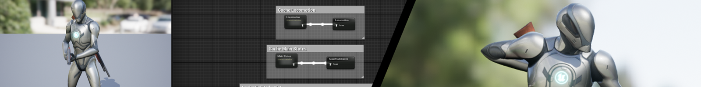

# Animation Ecosystem for Game Development 游戏开发的动画生态系统

In this course from the Epic Online Learning team, we explore the animation systems in Unreal Engine. You’ll learn how to import, retarget, and trim animations for use in the State Machine. Then, we’ll use Blendspaces to blend animations and Blendspace Analysis to fix issues like foot sliding. We’ll also explore using sockets to attach items to a Control Rig; using Animation Montage Slots to override animation; and how to edit existing animations with Control Rig and Sequencer, before finally baking out (without having to leave Unreal Engine!)

在这门来自Epic Online Learning团队的课程中，我们将探讨Unreal Engine中的动画系统。您将学习如何导入、重新定位和修剪动画，以便在状态机中使用。接下来，我们将使用Blendspaces来混合动画，并使用Blendspace Analysis来解决脚滑动等问题。我们还将探讨如何使用sockets将物品附加到控制架构，使用Animation Montage Slots来覆盖动画，以及如何使用Control Rig和Sequencer编辑现有动画，最后进行烘焙（而无需离开Unreal Engine！） 。

## Animation Ecosystem for Game Development Overview 游戏开发中的动画生态系统概述

Get the most out of your animations in Unreal Engine 5! In this course, we’ll explore the use of some new Unreal Engine 5 tools for common animation obstacles—Aliases for cleaner State Machines and Blendspace Analysis for foot sliding during movement. We’ll also cover how to retarget animations using Control Rig, trim animation loops into parts for the State Machine, and use Sockets to attach items to a Character Rig. Try using Animation Montages to override or blend parts of animations, or edit an existing animation and bake out a new, unique animation without having to use a DCC application!
充分发挥Unreal Engine 5中的动画效果！在本课程中，我们将探讨一些新的Unreal Engine 5工具，以解决常见的动画难题——使用别名来使状态机更清晰，并使用Blendspace Analysis来解决移动中的脚滑问题。我们还将涵盖如何使用Control Rig重新定位动画，将动画循环修剪成状态机的部分，并使用Sockets将物品附着到角色绑定。尝试使用Animation Montages来覆盖或混合动画的部分，或编辑现有动画并导出新的独特动画，而无需使用DCC应用程序！

### RUNNING TIME 运行时间

1 hour 54 minutes 1小时54分钟

### WHAT YOU'LL LEARN  学到什么

#### You'll learn how to: 您将学到如何：

- Create all the necessary assets needed to animate a character. 
  创建为动画角色所需的所有必要资产。
- Modify existing animations with the Animation Editor.
  使用Animation Editor修改现有动画。
- Attach a weapon to Skeletal Mesh with sockets. 
  使用sockets将武器附着到骨骼网格。
- Control character animations with Animation Montages, Animation Notifies, and Timelines.
  通过Animation Montages、Animation Notifies和Timelines控制角色动画。
- Add a crouch and uncrouch animation state for the player character with State Machines. 
  为玩家角色添加蹲伏和起立的动画状态，使用状态机。

### TECHNICAL REQUIREMENTS 技术要求

#### Course: 课程：

- Compatible with Unreal Engine 5.0. 
  兼容Unreal Engine 5.0。

#### Project Files: 项目文件：

- Compatible with Unreal Engine 5.0. 
  兼容Unreal Engine 5.0。
- If you would like to follow along with this course, the project files can be viewed on the Marketplace by clicking the link below. After downloading, you can find the project files in your Vault under "Animation Ecosystem for Game Development." 
  如果您想跟随本课程进行学习，项目文件可以通过点击下面的链接在Marketplace上查看。下载后，您可以在“Animation Ecosystem for Game Development”下的Vault中找到项目文件。

###### 项目文件

- [📦 Animation Ecosystem for Game Development](https://unrealengine.com/marketplace/product/animation-ecosystem-for-game-development)

### MEET THE AUTHOR

#### Kyle Chittenden 

Kyle has worked on multiple titles in the industry spanning from indie to AAA. He tries to bridge the line between animator and tech animator and has worked on titles such as Halo Infinite, New World, and Rockband VR. He enjoys creating prototype animation and implementing it into Unreal to show firsthand how a feature or mechanic can be potentially used within the game itself. Along with working in the industry, Kyle is also an instructor at The University of Texas at Austin, teaching students animation and its various uses within the Unreal Engine. Currently, Kyle is a Lead Animator at Certain Affinity, a video game studio based in Austin, Texas.
Kyle在游戏行业中已经参与了多个项目，从独立游戏到AAA大作都有涉及。他尝试在动画师和技术动画师之间建立联系，并曾参与开发《光环：无限》、《新世界》和《摇滚乐队VR》等游戏。他喜欢创建原型动画并将其实现到Unreal Engine中，以首次展示某项功能或机制在游戏中的潜在应用方式。除了在行业中工作外，Kyle还是德克萨斯大学奥斯汀分校的教师，教授学生动画及其在Unreal Engine中的各种用途。目前，Kyle是Certain Affinity的首席动画师，这是一家位于德克萨斯州奥斯汀的游戏工作室。