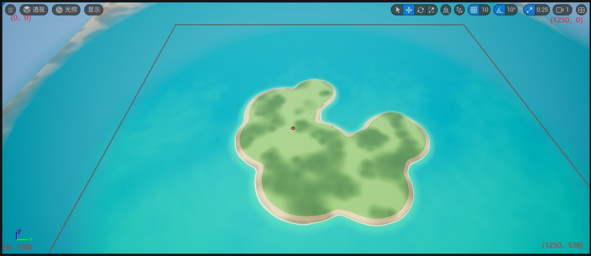

# 什么是体素化？

当我们谈论体素化时，我们实际上是在讨论将**三维空间离散化为小立方体单元**的过程。这些立方体单元通常被称为**体素**，是体素化的基本单元。体素化可以应用于许多领域，包括计算机图形学、医学影像处理、工程建模和仿真等。

在计算机图形学中，**体素化是将三维对象转换为离散的、有限大小的体素网格的过程**。这个网格可以是规则的，也可以是不规则的，具体取决于应用的需要。每个体素可以包含有关对象在该区域内的属性信息，例如颜色、密度、材质等。通过将对象分解为体素，我们可以轻松地对其进行处理、分析和修改，例如进行形状变换、碰撞检测或渲染。

在医学影像处理中，体素化常用于将医学图像（如CT扫描或MRI图像）转换为体素化的三维数据表示，以便进行疾病诊断、手术规划或治疗模拟。

在工程建模和仿真中，体素化可以用于表示复杂的物理系统，如建筑结构、机械部件或流体流动。通过将这些系统分解为体素，工程师和设计师可以更好地理解系统的行为，并进行分析和优化。

总的来说，体素化是一个强大的工具，可以帮助我们在各种领域对三维空间中的对象进行表示、分析和处理。

# VoxWrap 操作是什么？

VoxWrap 是一种基于体素化技术的操作，通常用于三维模型的包装、填充或表面重建。这个操作可以将一个物体用体素化的网格进行覆盖，从而实现对其进行包裹、填充或者表面重建的目的。

具体来说，VoxWrap 操作通常包括以下步骤：

1. **体素化**：首先，将目标物体进行体素化，将其表示为一个立方体网格，这些立方体被称为体素。

2. **包装**：将一个体素化的立方体网格或者几何体放置在目标物体周围，形成一个包裹或者填充。

3. **重建表面**：通过对覆盖了目标物体的立方体网格进行处理，例如通过插值或者拟合算法，来重建目标物体的表面。

4. **细化**：在需要更精细的表面表示时，可以对表面进行细化或者平滑处理，以获得更加精确的结果。

VoxWrap 操作通常在计算机图形学、计算机辅助设计（CAD）、医学影像处理等领域中得到应用，用于模型重建、对象填充、仿真分析等任务中。

# 什么是PN曲面细分？

在PN曲面中，P代表“点”（Points），而N代表“法线”（Normal）。PN曲面是由这些点和法线组成的曲面模型，点确定了曲面上的位置，而法线确定了曲面的方向。

在PN曲面细分中，通常会根据给定的控制点和法线，以及细分规则，将曲面划分为更小的面片。每个面片都由一个中心点和一个法线定义，中心点由控制点确定，法线由相应的法线确定。通过细分过程，可以逐渐增加曲面的细节和精度，使其更加逼真和准确。

PN曲面细分是一种利用贝塞尔三角多项式来生成平滑曲面的技术，它的具体过程可以分为以下几个步骤：

1. 对于每个输入的三角形，计算它的每条边的中点，以及它的重心，作为新的顶点。
2. 对于每个新的顶点，根据它的类型（边上的顶点或面上的顶点），使用不同的公式来调整它的位置，使其更接近原始三角形的曲率。
3. 对于每个输入的三角形，用四个新的三角形来替换它，这四个三角形的顶点分别是原始三角形的一个顶点，两个相邻的边上的新顶点，和面上的新顶点。
4. 重复上述步骤，直到达到预期的细分程度。

# Unreal 中的 对象引用 类引用 软对象引用 软类引用 有什么区别?

Unreal 中的对象引用、类引用、软对象引用和软类引用是不同的方式来引用虚幻引擎中的对象和类。它们的区别主要体现在以下几个方面：

- 对象引用是对已经创建的对象的直接引用，可以通过蓝图或C++代码来访问和操作对象的属性和方法。对象引用在蓝图中对应的是浅蓝色的“对象引用”。对象引用在C++中的写法是：`UObject* ObjPtr = nullptr;`
- 类引用是对类的直接引用，可以用于创建新的对象实例，或者获取类的元信息。类引用在蓝图中对应的是紫色的“类引用”。类引用在C++中的写法有两种：`UClass* ClassPtr_01;` 或 `TSubClassOf<T> ClassPtr_02;` 其中 T 是一个泛型，表示限定这个类引用只能存放某个类的派生类的信息。
- 软对象引用是对对象的间接引用，通过对象的路径来关联对象，而不会导致对象被自动加载到内存中。软对象引用可以用于控制对象的加载和卸载的时机，以优化内存和性能。软对象引用在蓝图中对应的是青绿色的“软对象引用”。软对象引用在C++中的写法是：`TSoftObjectPtr<T> SoftObjRef;` 其中 T 是一个泛型，表示指定对象的类型。
- 软类引用是对类的间接引用，通过类的路径来关联类，而不会导致类被自动加载到内存中。软类引用可以用于动态地创建对象实例，而不需要提前知道类的具体类型。软类引用在蓝图中对应的是浅紫色的“软类引用”。软类引用在C++中的写法是：`TSoftClassPtr<T> SoftClassRef;` 其中 T 是一个泛型，表示指定类的类型。

# 控制总线详解

在 Unreal 中，控制总线（Control Bus）是一种可以调制声音资产的音量、频率、深度等参数的对象。你可以使用控制总线来创建复杂的音频混合，实现动态的音效变化，或者从蓝图中控制音频属性。

控制总线可以分配给声音类（Sound Class）、MetaSound源（MetaSound Source）或者声音剪辑（Sound Cue）中的任何节点。你可以创建多个控制总线，并将它们组织成层级结构，以实现不同的混合效果。

控制总线可以通过控制总线混合（Control Bus Mix）来应用于游戏中的音频。控制总线混合可以定义控制总线的目标值、混合时间、曲线等属性。你可以在游戏中动态地切换不同的控制总线混合，以适应不同的场景或情境。

​              

# 调制参数详解

音频调制是一种可以控制蓝图和组件系统中的一些常见音频参数（浮点类型）的方法。它可以让你用更灵活和动态的方式混合音频源，以及调整和参数化音频属性。

音频调制的基本概念包括：

- 调制参数：定义了调制值的显示、混合和转换方式。例如，音量、音高、高通和低通等。
- 调制目标：是音频源或效果的参数，可以被调制源引用和调制。例如，声音资产、MetaSound、子混合效果和源效果等。
- 调制源：是可以生成或驱动调制值的资产类型。包括控制总线、调制发生器和调制接线等。
- 控制总线混音：是可以影响控制总线值的资产类型。可以用于创建不同的混音场景，例如静音、淡入淡出、压缩等。

# 什么是 One-Pole High Pass Filter（单极高通滤波器）

**定义**：单极高通滤波器是一种简单的滤波器，通常由一个极点（pole）构成。它允许高于特定截止频率的信号通过，同时阻止低于该频率的信号。

**原理**：单极高通滤波器的传递函数可以表示为 

$H(z)=1−H_{LPF}(z)$

，其中 

$H_{LPF}(z)$

是一个低通滤波器的传递函数。这意味着单极高通滤波器的输出是输入信号减去低通滤波器的输出。

**应用**：单极高通滤波器常用于去除直流偏移或低频噪声，以及突出高频部分。

# 什么是 One-Pole Low Pass Filter（单极低通滤波器）

**定义**：单极低通滤波器也是一种简单的滤波器，由一个极点构成。它允许低于特定截止频率的信号通过，同时阻止高于该频率的信号。

**原理**：单极低通滤波器的传递函数可以表示为 

$H(z)=H_{LPF}(z)$

，其中 

$H_{LPF}(z)$

是一个低通滤波器的传递函数。这意味着单极低通滤波器的输出与低通滤波器的输出相同。

**应用**：单极低通滤波器常用于平滑信号、去除高频噪声或提取趋势。

# Pawn 类 详解

在虚幻引擎中，**Pawn** 是可由玩家或 AI 控制的所有 **Actor** 的基类。它代表了玩家或 AI 实体在游戏场景中的具体体现。除了决定玩家或 AI 实体的外观效果，**Pawn** 还决定了它们如何与场景进行碰撞以及其他物理交互。

- **Pawn** 不仅仅是一个外观，它还包含了物理方位、旋转角度等信息。
- **Character** 是 **Pawn** 的一种特殊子类，用于实现可行走的角色。
- 在蓝图中，为 **Pawn** 及其子类添加移动的最佳方法是调用 `SetActorLocation` 函数。这样，你可以决定是瞬移还是逐渐走到某个位置。如果是逐渐走到某个位置，**Pawn** 会沿某个方向移动，并且如果撞到东西就会停下来。
- 默认的 **Pawn** 类提供了用于在场景中展示玩家或 AI 实体的最基本功能。其子类 **DefaultPawn** 还附带了一些额外的组件和功能，如 **DefaultPawnMovementComponent**、球形 **CollisionComponent** 组件以及一个 **StaticMeshComponent** 组件。
- **Spectator Pawn** 是 **DefaultPawn** 的子类，适用于实现观看功能。它的移动在 **SpectatorPawnMovementComponent** 中处理，具有无重力飞行行为。

总之，**Pawn** 是虚幻引擎中控制玩家或 AI 实体的关键基类，决定了它们在游戏世界中的物理表现和交互方式。

# Unreal屏幕坐标详解

# 从头开始构建第三人称角色

[📁 Build a Third Person Character from Scratch Overview - Build a Third Person Character from Scratch (epicgames.com)](https://dev.epicgames.com/community/learning/courses/kry/unreal-engine-build-a-third-person-character-from-scratch/LL96/unreal-engine-build-a-third-person-character-from-scratch-overview)

# 游戏开发中的动画生态系统

[📁Animation Ecosystem for Game Development Overview - Animation Ecosystem for Game Development (epicgames.com)](https://dev.epicgames.com/community/learning/courses/2Lz/unreal-engine-animation-ecosystem-for-game-development/yp13/unreal-engine-animation-ecosystem-for-game-development-overview)

# 事件和函数的区别

在Unreal Engine中，函数和事件都是用于执行特定操作或逻辑的重要元素，但它们之间存在一些关键区别。

1. **函数 (Functions)**:
   - 函数是一组指定的操作序列，可以在代码中定义和调用。
   - 函数可以有参数和返回值，可以接受输入并产生输出。
   - 函数可以在任何时候被调用，即使不涉及任何特定的事件触发。
   - 函数通常用于执行通用逻辑或算法，这些逻辑可以在多个不同的上下文中被重复使用。

2. **事件 (Events)**:
   - 事件是在特定条件下被触发或执行的操作。
   - 事件通常与游戏世界中的特定行为或状态相关联，比如玩家的输入、碰撞检测等。
   - 事件可以是预定义的，如碰撞事件、输入事件，也可以是自定义的，根据需要创建。
   - 与函数不同，事件没有明确的调用方式，而是在特定条件下自动触发。

基本上，函数是一种通用的逻辑执行机制，而事件是针对特定条件下的动作触发机制。在编写Unreal Engine的代码时，通常会同时使用函数和事件，以实现游戏逻辑的完整功能。

# Unreal Event Receive Execute 和 Event Receive Execute AI的区别

在Unreal Engine中，"Event Receive Execute" 和 "Event Receive Execute AI" 是两种不同的事件类型，它们分别用于处理不同的情况：

1. **Event Receive Execute**：
   - 这个事件通常用于处理来自其他对象的消息或事件。当一个对象发送一个消息或者触发一个事件时，其它对象可以通过实现该事件来响应这个消息或事件。
   - 在Unreal Engine中，这个事件经常用于自定义类之间的通信和交互。比如，在一个游戏中，你可能会定义一个特定类型的敌人类，当玩家与敌人交互时，敌人类可以响应玩家的动作，比如被攻击、被消灭等等。
   - 这个事件主要用于处理对象之间的交互，通常不涉及到AI。

2. **Event Receive Execute AI**：
   - 这个事件专门用于处理与人工智能（AI）相关的情况。当你需要定制AI行为时，你可以在AI控制的对象中实现这个事件来定义特定的行为。
   - 在游戏开发中，AI经常需要根据环境和玩家行为做出决策，比如在敌人AI中，你可能希望敌人在发现玩家时攻击或者逃跑。在这种情况下，你可以通过实现"Event Receive Execute AI"来定义敌人在发现玩家时的行为。
   - 这个事件主要用于处理AI对象的行为，通常涉及到AI的决策和行为控制。

总的来说，两者的区别在于"Event Receive Execute"用于处理对象之间的通信和交互，而"Event Receive Execute AI"用于处理AI对象的行为和决策。

# Unreal硬类引用和软类引用的区别

在Unreal Engine中，硬类引用（Hard Class Reference）和软类引用（Soft Class Reference）是两种不同的方式来引用蓝图类或C++类的引用。

1. **硬类引用（Hard Class Reference）**：
   - 硬类引用是一种强引用，意味着引用的类的对象在编辑器中被移动或删除时，会立即触发错误。
   - 当你使用硬类引用时，如果所引用的类被重命名、移动或删除，编译器会直接提示错误，这样有助于在编译时捕获潜在的错误。
   - 硬类引用适用于你确定所需类的位置不会改变，并且当所引用的类发生变化时，你需要及时发现问题。

2. **软类引用（Soft Class Reference）**：
   - 软类引用是一种弱引用，意味着引用的类的对象在编辑器中被移动或删除时，不会立即触发错误，而是在运行时才会检查。
   - 当你使用软类引用时，如果所引用的类被重命名、移动或删除，通常不会在编译时触发错误，而是在运行时，当尝试使用该引用时才会发现问题。
   - 软类引用适用于你需要在运行时处理可能不存在或未加载的类的情况，或者在不确定所需类的位置时。

总的来说，硬类引用提供了更严格的引用方式，能够在编译时就发现潜在的问题，而软类引用则更灵活，可以处理一些动态情况下的类引用。选择使用哪种类型的引用取决于你的需求和项目的特性。

# Set Focus to Game Viewport

在Unreal Engine中，"Set Focus to Game Viewport" 函数是用来将焦点设置到游戏视口（Game Viewport）的一种方法。游戏视口是指显示实际游戏内容的窗口或区域，通常是在游戏运行时用来显示游戏世界的区域。

这个函数的主要作用是将焦点设置到游戏视口，以确保用户的输入（例如键盘输入、鼠标输入等）被正确地发送到游戏世界中，而不是其他UI元素或编辑器界面。这在一些情况下是非常重要的，特别是当你需要玩家与游戏世界交互时，例如在运行游戏时接收玩家的输入。

通常情况下，你可以在需要时调用这个函数，比如当游戏开始时、玩家进入某个特定的游戏模式或者场景时，确保焦点正确地被设置到游戏视口，以便用户可以与游戏世界进行交互。

总的来说，"Set Focus to Game Viewport" 函数是用来确保游戏视口获得焦点，以便玩家可以与游戏世界进行交互的重要功能。

